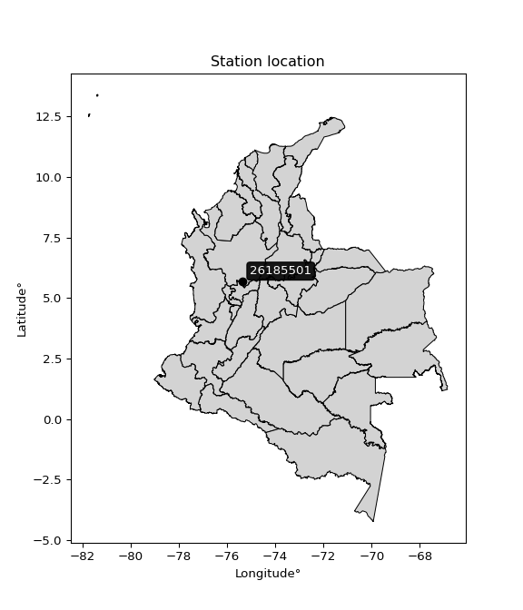

<div align="center">


</div>

# PMax24h Station (Rain): 26185501

Maximum Precipitation in 24 hours (PMax24h) is the greatest amount of rainfall for a specific duration that is meteorologically possible for a given location, acting as a "worst-case" scenario for extreme storms, crucial for designing safety-critical infrastructure like bridges, river deviations, dams, spillways, and nuclear plants to prevent catastrophic failure. The PMax24h is related with the Probable Maximum Precipitation (PMP) and it is calculated by hydrologists using meteorological data to determine the upper limit of extreme rainfall, often leading to the Probable Maximum Flood (PMF) for flood control design, and is increasingly being studied for climate change impacts. Probable Maximum Precipitation (PMP) is the theoretical upper limit of rainfall, a deterministic estimate for extreme events, while probability distributions (like GEV, Gumbel) describe the likelihood and frequency of various precipitation amounts, including rare ones, showing how often events occur, with PMP representing the extreme end of these distributions, used for critical infrastructure design to ensure safety against the worst conceivable weather, unlike standard statistical forecasts which cover typical probabilities.

The most common probability distributions in hydrology, used for analyzing floods, rainfall, and streamflow, include the Normal, Log-Normal, Gumbel, Gamma (including Log-Pearson Type III), and Generalized Extreme Value (GEV) distributions, often chosen based on the data´s skewness and whether modeling extremes or general conditions, with Gumbel and GEV popular for extreme events like floods, while the Normal distribution serves as a baseline, though often requiring transformations for skewed hydrological data. These distributions help in designing water infrastructure, managing water resources, and forecasting hydrologic events.

> Hydrological data often isn´t perfectly normal (it´s skewed), so different distributions are needed for different applications, such as: **Flood Frequency Analysis**: Using Gumbel, GEV, or Log-Pearson Type III for predicting extreme flood magnitudes and their return periods, **Rainfall Analysis**: Normal for annual totals, but Log-Normal, Weibull, or GEV for intensity or extreme daily rainfall, **Streamflow Modeling**: Gamma and Log-Normal for maximum flows, GEV for minimum flows, and Kappa for daily flows.

<div align="center">

</img>

</div>


## A. General information


### 1. General running parameters

• app_version: _v20260225_. • runtime: _2026-02-28 16:54:07.457399_. • Python version: _3.14.0_. • SciPy version: _1.16.3_. • Pandas version: _2.3.3_. • NumPy version: _2.3.5_. • Stations dataset (station_dataset_file): _dataset/pmax24h_in/automatic_colombia_2003_2025.csv_. • Stations catalog (station_catalog_file): _dataset/CNE.xls_. • Minimum year to eval til year_max (date_min): _1900_. • Maximum year to eval since year_min (date_max): _2025_. • Creates, save and include plots into reports (create_plot): _False_. • Plot only fit distributions with Δo > Δ (plot_only_fit): _True_. • Plot only simple graphs avoiding multiple CDFs and multiple Extreme values plots (plot_only_simple): _False_. • Eval low extreme values, if False, evaluates high extreme values (low_extreme): _False_. • Eval every SciPy distribution as logarithmic (pdist_logarithmic_on): _True_. • Standard deviation normalized (ddof): _1.0_. • Return periods to eval in years (Tr): _[2, 2.33, 5, 10, 15, 20, 25, 50, 75, 100, 200, 250, 500, 750, 1000]_. • Minimum data sample per station, 0 means any (minimum_sample): _5_. • Z-Score maximum threshold to adjust a value, 0 means disable (zscore_max): _3.5_. • Z-Score minimum threshold to adjust a value, 0 means disable (zscore_min): _-2.5_. • Avoid zeros, e.g. rain = 0 (avoid_zeros): _True_. • Avoid null values (avoid_nans): _True_. 

:file_folder:Table: [dataset.csv](../../dataset/pmax24h_in/automatic_colombia_2003_2025.csv)

> Delta Degrees of Freedom (DDOF): is a parameter used in the formulas for calculating variance and standard deviation. When ddof=0, the divisor is $N$ (the total number of observations) and this is used when your data set is the entire population. When ddof=1, the divisor is $N-1$ and this is used when your data set is a sample drawn from a larger population. Using $N-1$ provides an unbiased estimate of the population variance (known as Bessel´s correction).


### 2. Station info and location

|   id |   CODIGO | NOMBRE                    | CATEGORIA               | TECNOLOGIA                | ESTADO   | FECHA_INSTALACION   |   FECHA_SUSPENSION |   ALTITUD |   LATITUD |   LONGITUD | DEPARTAMENTO   | MUNICIPIO   | AREA_OPERATIVA                      | ENTIDAD                                    | AREA_HIDROGRAFICA   | ZONA_HIDROGRAFICA   | SUBZONA_HIDROGRAFICA   |   CORRIENTE | Catalogo   |   Version |
|-----:|---------:|:--------------------------|:------------------------|:--------------------------|:---------|:--------------------|-------------------:|----------:|----------:|-----------:|:---------------|:------------|:------------------------------------|:-------------------------------------------|:--------------------|:--------------------|:-----------------------|------------:|:-----------|----------:|
|    0 | 26185501 | SONSON  - AUT  [26185501] | Climatológica Principal | Automática con Telemetría | Activa   | 21/09/2013          |                nan |      1900 |   5.67772 |   -75.3478 | Antioquia      | Sonsón      | Area Operativa 01 - Antioquia-Chocó | CENTRO NACIONAL DE INVESTIGACIONES DE CAFE | Magdalena Cauca     | Cauca               | Río Arma               |         nan | CNE_OE     |  20251226 |

<div align="center">

Dynamic map: [:earth_americas:Google](http://maps.google.com/maps?q=5.677719444,-75.34780556) [:earth_americas:OSM](https://www.openstreetmap.org/#map=18/5.677719444/-75.34780556&layers=P) [:earth_americas:Bing](https://www.bing.com/maps?cp=5.677719444~-75.34780556&lvl=18) [:earth_americas:Apple](https://maps.apple.com/frame?center=5.677719444%2C-75.34780556&span=0.003%2C0.006)

</div>


<div align="center">

```geojson
{
  "type": "Feature",
  "geometry": {
    "type": "Point", 
    "coordinates": [-75.34780556, 5.677719444]
  }, 
  "properties": {
    "Name": "26185501"
  }
}
```

</div>


### 3. Discrete values table and plot

<div align="center">

|               |          0 |          1 |          2 |           3 |          4 |           5 |           6 |
|:--------------|-----------:|-----------:|-----------:|------------:|-----------:|------------:|------------:|
| Date          | 2017       | 2018       | 2019       | 2020        | 2021       | 2022        | 2023        |
| Value         |    5.9     |   40.2     |   65.1     |   38.5      |   50.2     |   55.9      |   46.8      |
| Value_initial |    5.9     |   40.2     |   65.1     |   38.5      |   50.2     |   55.9      |   46.8      |
| count         |    7       |    7       |    7       |    7        |    7       |    7        |    7        |
| mean          |   43.2286  |   43.2286  |   43.2286  |   43.2286   |   43.2286  |   43.2286   |   43.2286   |
| std           |   18.8204  |   18.8204  |   18.8204  |   18.8204   |   18.8204  |   18.8204   |   18.8204   |
| zscore        |   -1.98341 |   -0.16092 |    1.16212 |   -0.251248 |    0.37042 |    0.673283 |    0.189764 |


</div>


> The initial value (value_initial) correspond to the initial obtained or null completed value, and value (value) is adjusted only when the initial value is outside the valid range (outlier) definite through the Z-Score value. If Z-Score is active, values out of range or outliers are replaced with the station mean value. A Z-Score (or standard score) measures how many standard deviations a data point is from the mean of a dataset, indicating its relative position; positive scores mean above the mean, negative mean below, and a score of zero is exactly at the mean, allowing for comparison of values from different distributions. It´s calculated using the formula $z=(x–μ)/σ$, where $x$ is the data point, $μ$ is the mean, and $σ$ is the standard deviation, helping identify outliers and understand probability.
>
> <sub>**Note**: In this study, "completing" (filling gaps in) and "extending" (forecasting or lengthening the historical record) rainfall data series are avoided for certain critical analyses because they introduce artificial bias and uncertainty, which can distort the statistics of rare events (extremes), alter day-to-day variability, and compromise the integrity and homogeneity of the original data. Some reasons against Completing/Extending rainfall data are: **Distortion of Extremes and Variability**: The primary issue is that most gap-filling or extension methods rely on averaging or regression with nearby stations, which inherently smooths the data. Rainfall is highly variable in space and time, with a large percentage of zero values and occasional large storms. Infilling methods often underestimate the highest values and overestimate the lowest (zero) values, which severely distorts analyses focused on flood frequency, drought severity, and intensity-duration-frequency (IDF) curves, **Loss of Data Homogeneity**: Infilled or extended data are synthetic estimates, not actual measurements. Combining these estimates with observed data can violate the assumption of data homogeneity, which requires that the data properties do not change over time. Inhomogeneity can lead to incorrect conclusions about long-term trends or changes in climate patterns, **Propagation of Errors**: Errors and biases from the original data (e.g., wind-induced undercatch, instrument errors, site changes) or the data used for imputation can propagate through the analysis, leading to unreliable hydrological models and inaccurate predictions, **Compromised Statistical Integrity**: For statistical analyses, especially those involving the frequency of events, using artificial data can introduce time bias or autocorrelation that doesn´t exist in reality, making it difficult to assess the true probability of events, **Difficulty in Validation**: It is difficult to accurately validate the quality of filled or extended data, especially for past periods where ground-truth measurements are unavailable. The reliability of imputation techniques heavily depends on the density of the surrounding station network and the complexity of the local topography.</sub>


### 4. Active continuous probability distributions from SciPy (80 of 104 available)

A Probability Density Function (PDF) describes the relative likelihood of a continuous random variable falling within a specific range, where the total area under its curve equals 1, and the area over any interval gives the actual probability for that range. Unlike discrete probabilities (like rolling a die), a PDF shows density, not direct probability for a single point (which is zero), with higher points indicating higher likelihood, often visualized as a bell curve for normal distributions.

A log of a probability density function (log-PDF) is simply the logarithm of the PDF´s value, denoted as $log(f(x))$, useful for converting multiplication of probabilities into addition, improving numerical stability with tiny numbers, and connecting to information theory concepts like entropy. Instead of dealing with very small probabilities (e.g., 0.000001), log-PDFs use negative numbers (e.g., $log(0.00001) ≈ -11.51$ that are easier for computers to handle, preventing underflow errors and simplifying complex calculations. In this study, each active probability distribution from SciPy is also evaluated in the $log$ form.

[scipy.stats](https://docs.scipy.org/doc/scipy/reference/stats.html) is a Python´s powerful submodule within the SciPy library for comprehensive statistical analysis, offering over 130 probability distributions (like Normal, Poisson, etc.), functions for descriptive stats (mean, variance), hypothesis testing (t-tests, chi-square), random variable generation, and statistical tests, making it essential for data science, modeling, and research. It provides tools to explore, model, and draw conclusions from data efficiently, working seamlessly with [NumPy](https://numpy.org/).

<div align="center">

|   id | p_dist           |   n_parameter | fit_method   | label                                                                       | active   | ref                                                                                                      |
|-----:|:-----------------|--------------:|:-------------|:----------------------------------------------------------------------------|:---------|:---------------------------------------------------------------------------------------------------------|
|    0 | alpha            |             3 | MLE          | Alpha                                                                       | True     | [:mortar_board:](https://docs.scipy.org/doc/scipy/reference/generated/scipy.stats.alpha.html)            |
|    1 | anglit           |             2 | MM           | Anglit                                                                      | True     | [:mortar_board:](https://docs.scipy.org/doc/scipy/reference/generated/scipy.stats.anglit.html)           |
|    2 | arcsine          |             2 | MM           | Arcsine                                                                     | True     | [:mortar_board:](https://docs.scipy.org/doc/scipy/reference/generated/scipy.stats.arcsine.html)          |
|    3 | argus            |             3 | MLE          | Argus                                                                       | True     | [:mortar_board:](https://docs.scipy.org/doc/scipy/reference/generated/scipy.stats.argus.html)            |
|    4 | beta             |             4 | MLE          | Beta                                                                        | True     | [:mortar_board:](https://docs.scipy.org/doc/scipy/reference/generated/scipy.stats.beta.html)             |
|    5 | betaprime        |             4 | MLE          | Beta prime                                                                  | True     | [:mortar_board:](https://docs.scipy.org/doc/scipy/reference/generated/scipy.stats.betaprime.html)        |
|    6 | bradford         |             3 | MLE          | Bradford                                                                    | True     | [:mortar_board:](https://docs.scipy.org/doc/scipy/reference/generated/scipy.stats.bradford.html)         |
|    7 | burr             |             4 | MLE          | Burr (Type III)                                                             | True     | [:mortar_board:](https://docs.scipy.org/doc/scipy/reference/generated/scipy.stats.burr.html)             |
|    8 | burr12           |             4 | MLE          | Burr (Type III) 12                                                          | True     | [:mortar_board:](https://docs.scipy.org/doc/scipy/reference/generated/scipy.stats.burr12.html)           |
|    9 | cosine           |             2 | MLE          | Cosine                                                                      | True     | [:mortar_board:](https://docs.scipy.org/doc/scipy/reference/generated/scipy.stats.cosine.html)           |
|   10 | crystalball      |             4 | MLE          | Crystalball                                                                 | True     | [:mortar_board:](https://docs.scipy.org/doc/scipy/reference/generated/scipy.stats.crystalball.html)      |
|   11 | dgamma           |             3 | MLE          | Double gamma                                                                | True     | [:mortar_board:](https://docs.scipy.org/doc/scipy/reference/generated/scipy.stats.dgamma.html)           |
|   12 | dweibull         |             3 | MLE          | Double Weibull                                                              | True     | [:mortar_board:](https://docs.scipy.org/doc/scipy/reference/generated/scipy.stats.dweibull.html)         |
|   13 | erlang           |             3 | MLE          | Erlang                                                                      | True     | [:mortar_board:](https://docs.scipy.org/doc/scipy/reference/generated/scipy.stats.erlang.html)           |
|   14 | exponnorm        |             3 | MLE          | Exponentially modified Normal                                               | True     | [:mortar_board:](https://docs.scipy.org/doc/scipy/reference/generated/scipy.stats.exponnorm.html)        |
|   15 | exponpow         |             3 | MLE          | Exponential power                                                           | True     | [:mortar_board:](https://docs.scipy.org/doc/scipy/reference/generated/scipy.stats.exponpow.html)         |
|   16 | exponweib        |             4 | MLE          | Exponentiated Weibull                                                       | True     | [:mortar_board:](https://docs.scipy.org/doc/scipy/reference/generated/scipy.stats.exponweib.html)        |
|   17 | f                |             4 | MLE          | F                                                                           | True     | [:mortar_board:](https://docs.scipy.org/doc/scipy/reference/generated/scipy.stats.f.html)                |
|   18 | fatiguelife      |             3 | MLE          | Fatigue-life (Birnbaum-Saunders)                                            | True     | [:mortar_board:](https://docs.scipy.org/doc/scipy/reference/generated/scipy.stats.fatiguelife.html)      |
|   19 | foldnorm         |             3 | MM           | Fold Normal                                                                 | True     | [:mortar_board:](https://docs.scipy.org/doc/scipy/reference/generated/scipy.stats.foldnorm.html)         |
|   20 | gamma            |             3 | MLE          | Gamma                                                                       | True     | [:mortar_board:](https://docs.scipy.org/doc/scipy/reference/generated/scipy.stats.gamma.html)            |
|   21 | gausshyper       |             6 | MLE          | Gauss hypergeometric                                                        | True     | [:mortar_board:](https://docs.scipy.org/doc/scipy/reference/generated/scipy.stats.gausshyper.html)       |
|   22 | genexpon         |             5 | MLE          | Generalized exponential                                                     | True     | [:mortar_board:](https://docs.scipy.org/doc/scipy/reference/generated/scipy.stats.genexpon.html)         |
|   23 | genextreme       |             3 | MLE          | Generalized exponential                                                     | True     | [:mortar_board:](https://docs.scipy.org/doc/scipy/reference/generated/scipy.stats.genextreme.html)       |
|   24 | gengamma         |             4 | MLE          | Generalized gamma                                                           | True     | [:mortar_board:](https://docs.scipy.org/doc/scipy/reference/generated/scipy.stats.gengamma.html)         |
|   25 | genhalflogistic  |             3 | MLE          | Generalized half-logistic                                                   | True     | [:mortar_board:](https://docs.scipy.org/doc/scipy/reference/generated/scipy.stats.genhalflogistic.html)  |
|   26 | genlogistic      |             3 | MLE          | Generalized logistic                                                        | True     | [:mortar_board:](https://docs.scipy.org/doc/scipy/reference/generated/scipy.stats.genlogistic.html)      |
|   27 | gennorm          |             3 | MLE          | Generalized Normal                                                          | True     | [:mortar_board:](https://docs.scipy.org/doc/scipy/reference/generated/scipy.stats.gennorm.html)          |
|   28 | genpareto        |             3 | MLE          | Generalized Pareto                                                          | True     | [:mortar_board:](https://docs.scipy.org/doc/scipy/reference/generated/scipy.stats.genpareto.html)        |
|   29 | gompertz         |             3 | MLE          | Gompertz (or truncated Gumbel)                                              | True     | [:mortar_board:](https://docs.scipy.org/doc/scipy/reference/generated/scipy.stats.gompertz.html)         |
|   30 | gumbel_l         |             2 | MM           | Gumbel Left Skew                                                            | True     | [:mortar_board:](https://docs.scipy.org/doc/scipy/reference/generated/scipy.stats.gumbel_l.html)         |
|   31 | gumbel_r         |             2 | MM           | Gumbel Right Skew                                                           | True     | [:mortar_board:](https://docs.scipy.org/doc/scipy/reference/generated/scipy.stats.gumbel_r.html)         |
|   32 | halfgennorm      |             3 | MLE          | Upper half of a generalized normal                                          | True     | [:mortar_board:](https://docs.scipy.org/doc/scipy/reference/generated/scipy.stats.halfgennorm.html)      |
|   33 | halflogistic     |             2 | MM           | Half-logistic                                                               | True     | [:mortar_board:](https://docs.scipy.org/doc/scipy/reference/generated/scipy.stats.halflogistic.html)     |
|   34 | halfnorm         |             2 | MM           | Half Normal                                                                 | True     | [:mortar_board:](https://docs.scipy.org/doc/scipy/reference/generated/scipy.stats.halfnorm.html)         |
|   35 | hypsecant        |             2 | MM           | hyperbolic secant                                                           | True     | [:mortar_board:](https://docs.scipy.org/doc/scipy/reference/generated/scipy.stats.hypsecant.html)        |
|   36 | invgamma         |             3 | MLE          | Inverted gamma                                                              | True     | [:mortar_board:](https://docs.scipy.org/doc/scipy/reference/generated/scipy.stats.invgamma.html)         |
|   37 | invgauss         |             3 | MLE          | Inverse Gaussian                                                            | True     | [:mortar_board:](https://docs.scipy.org/doc/scipy/reference/generated/scipy.stats.invgauss.html)         |
|   38 | invweibull       |             3 | MLE          | Inverted Weibull                                                            | True     | [:mortar_board:](https://docs.scipy.org/doc/scipy/reference/generated/scipy.stats.invweibull.html)       |
|   39 | johnsonsb        |             4 | MLE          | Johnson SB                                                                  | True     | [:mortar_board:](https://docs.scipy.org/doc/scipy/reference/generated/scipy.stats.johnsonsb.html)        |
|   40 | johnsonsu        |             4 | MLE          | Johnson Su                                                                  | True     | [:mortar_board:](https://docs.scipy.org/doc/scipy/reference/generated/scipy.stats.johnsonsu.html)        |
|   41 | kappa3           |             3 | MLE          | Kappa 3                                                                     | True     | [:mortar_board:](https://docs.scipy.org/doc/scipy/reference/generated/scipy.stats.kappa3.html)           |
|   42 | kappa4           |             4 | MLE          | Kappa 4                                                                     | True     | [:mortar_board:](https://docs.scipy.org/doc/scipy/reference/generated/scipy.stats.kappa4.html)           |
|   43 | ksone            |             3 | MLE          | Kolmogorov-Smirnov one-sided test statistic distribution                    | True     | [:mortar_board:](https://docs.scipy.org/doc/scipy/reference/generated/scipy.stats.ksone.html)            |
|   44 | kstwobign        |             2 | MLE          | Limiting distribution of scaled Kolmogorov-Smirnov two-sided test statistic | True     | [:mortar_board:](https://docs.scipy.org/doc/scipy/reference/generated/scipy.stats.kstwobign.html)        |
|   45 | laplace          |             2 | MM           | Laplace                                                                     | True     | [:mortar_board:](https://docs.scipy.org/doc/scipy/reference/generated/scipy.stats.laplace.html)          |
|   46 | levy_l           |             2 | MLE          | Left-skewed Levy                                                            | True     | [:mortar_board:](https://docs.scipy.org/doc/scipy/reference/generated/scipy.stats.levy_l.html)           |
|   47 | loggamma         |             3 | MLE          | Log gamma                                                                   | True     | [:mortar_board:](https://docs.scipy.org/doc/scipy/reference/generated/scipy.stats.loggamma.html)         |
|   48 | logistic         |             2 | MM           | Logistic (or Sech-squared)                                                  | True     | [:mortar_board:](https://docs.scipy.org/doc/scipy/reference/generated/scipy.stats.logistic.html)         |
|   49 | loglaplace       |             3 | MLE          | Log-Laplace                                                                 | True     | [:mortar_board:](https://docs.scipy.org/doc/scipy/reference/generated/scipy.stats.loglaplace.html)       |
|   50 | lomax            |             3 | MLE          | Lomax (Pareto of the second kind)                                           | True     | [:mortar_board:](https://docs.scipy.org/doc/scipy/reference/generated/scipy.stats.lomax.html)            |
|   51 | maxwell          |             2 | MM           | Maxwell                                                                     | True     | [:mortar_board:](https://docs.scipy.org/doc/scipy/reference/generated/scipy.stats.maxwell.html)          |
|   52 | mielke           |             4 | MLE          | Mielke Beta-Kappa / Dagum                                                   | True     | [:mortar_board:](https://docs.scipy.org/doc/scipy/reference/generated/scipy.stats.mielke.html)           |
|   53 | moyal            |             2 | MM           | Moyal                                                                       | True     | [:mortar_board:](https://docs.scipy.org/doc/scipy/reference/generated/scipy.stats.moyal.html)            |
|   54 | nakagami         |             3 | MLE          | Nakagami                                                                    | True     | [:mortar_board:](https://docs.scipy.org/doc/scipy/reference/generated/scipy.stats.nakagami.html)         |
|   55 | ncf              |             5 | MLE          | Non-central F distribution                                                  | True     | [:mortar_board:](https://docs.scipy.org/doc/scipy/reference/generated/scipy.stats.ncf.html)              |
|   56 | nct              |             4 | MLE          | Non-central Student’s t                                                     | True     | [:mortar_board:](https://docs.scipy.org/doc/scipy/reference/generated/scipy.stats.nct.html)              |
|   57 | norm             |             2 | MM           | Normal                                                                      | True     | [:mortar_board:](https://docs.scipy.org/doc/scipy/reference/generated/scipy.stats.norm.html)             |
|   58 | pearson3         |             3 | MM           | Pearson type III                                                            | True     | [:mortar_board:](https://docs.scipy.org/doc/scipy/reference/generated/scipy.stats.pearson3.html)         |
|   59 | powerlaw         |             3 | MLE          | Power-function                                                              | True     | [:mortar_board:](https://docs.scipy.org/doc/scipy/reference/generated/scipy.stats.powerlaw.html)         |
|   60 | rayleigh         |             2 | MM           | Rayleigh                                                                    | True     | [:mortar_board:](https://docs.scipy.org/doc/scipy/reference/generated/scipy.stats.rayleigh.html)         |
|   61 | rdist            |             3 | MLE          | R-distributed (symmetric beta)                                              | True     | [:mortar_board:](https://docs.scipy.org/doc/scipy/reference/generated/scipy.stats.rdist.html)            |
|   62 | rice             |             3 | MLE          | Rice                                                                        | True     | [:mortar_board:](https://docs.scipy.org/doc/scipy/reference/generated/scipy.stats.rice.html)             |
|   63 | semicircular     |             2 | MM           | Semicircular                                                                | True     | [:mortar_board:](https://docs.scipy.org/doc/scipy/reference/generated/scipy.stats.semicircular.html)     |
|   64 | skewnorm         |             3 | MLE          | Skew normal                                                                 | True     | [:mortar_board:](https://docs.scipy.org/doc/scipy/reference/generated/scipy.stats.skewnorm.html)         |
|   65 | t                |             3 | MLE          | Student’s t                                                                 | True     | [:mortar_board:](https://docs.scipy.org/doc/scipy/reference/generated/scipy.stats.t.html)                |
|   66 | trapezoid        |             4 | MLE          | Trapezoid                                                                   | True     | [:mortar_board:](https://docs.scipy.org/doc/scipy/reference/generated/scipy.stats.trapezoid.html)        |
|   67 | triang           |             3 | MLE          | Triangular                                                                  | True     | [:mortar_board:](https://docs.scipy.org/doc/scipy/reference/generated/scipy.stats.triang.html)           |
|   68 | truncexpon       |             3 | MLE          | Truncated exponential                                                       | True     | [:mortar_board:](https://docs.scipy.org/doc/scipy/reference/generated/scipy.stats.truncexpon.html)       |
|   69 | truncnorm        |             4 | MLE          | Truncated normal                                                            | True     | [:mortar_board:](https://docs.scipy.org/doc/scipy/reference/generated/scipy.stats.truncnorm.html)        |
|   70 | truncpareto      |             4 | MLE          | Upper truncated Pareto                                                      | True     | [:mortar_board:](https://docs.scipy.org/doc/scipy/reference/generated/scipy.stats.truncpareto.html)      |
|   71 | truncweibull_min |             5 | MLE          | Doubly truncated Weibull minimum                                            | True     | [:mortar_board:](https://docs.scipy.org/doc/scipy/reference/generated/scipy.stats.truncweibull_min.html) |
|   72 | tukeylambda      |             3 | MLE          | Tukey-Lamdba                                                                | True     | [:mortar_board:](https://docs.scipy.org/doc/scipy/reference/generated/scipy.stats.tukeylambda.html)      |
|   73 | uniform          |             2 | MLE          | Uniform                                                                     | True     | [:mortar_board:](https://docs.scipy.org/doc/scipy/reference/generated/scipy.stats.uniform.html)          |
|   74 | vonmises         |             3 | MLE          | Von Mises                                                                   | True     | [:mortar_board:](https://docs.scipy.org/doc/scipy/reference/generated/scipy.stats.vonmises.html)         |
|   75 | vonmises_line    |             3 | MLE          | Von Mises line                                                              | True     | [:mortar_board:](https://docs.scipy.org/doc/scipy/reference/generated/scipy.stats.vonmises_line.html)    |
|   76 | wald             |             2 | MM           | Wald                                                                        | True     | [:mortar_board:](https://docs.scipy.org/doc/scipy/reference/generated/scipy.stats.wald.html)             |
|   77 | weibull_max      |             3 | MLE          | Weibull maximum                                                             | True     | [:mortar_board:](https://docs.scipy.org/doc/scipy/reference/generated/scipy.stats.weibull_max.html)      |
|   78 | weibull_min      |             3 | MLE          | Weibull minimum                                                             | True     | [:mortar_board:](https://docs.scipy.org/doc/scipy/reference/generated/scipy.stats.weibull_min.html)      |
|   79 | wrapcauchy       |             3 | MLE          | Wrapped  Cauchy                                                             | True     | [:mortar_board:](https://docs.scipy.org/doc/scipy/reference/generated/scipy.stats.wrapcauchy.html)       |

</div>

> **n_parameter:** # arguments & localization & scale.
>
> **Fit methods:** (MLE) maximum likelihood, (MM) L-moments.
>
>**Inactive** (With the only purpose of prevent loops, zero divisions, infinite values, over high estimated values or horizontal trending for recurrence intervals estimations, the follow distributions were disabled.)**:** lognorm, norminvgauss, powernorm, powerlognorm, cauchy, halfcauchy, foldcauchy, skewcauchy, chi2, expon, fisk, genhyperbolic, geninvgauss, gibrat, kstwo, laplace_asymmetric, levy, levy_stable, ncx2, pareto, rel_breitwigner, recipinvgauss, studentized_range, loguniform, 


## B. Probability (PDF) vs. Empirical (EDF) distributions functions

A continuous probability distribution (CPD) describes probabilities for variables that can take any value within a range (like rain any time), unlike discrete variables with specific outcomes (like temperature). It uses a Probability Density Function (PDF), a curve where the total area under it equals 1, and the probability of the variable falling within an interval (a to b) is found by calculating the area under the curve between those points. A key feature is that the probability of hitting any single exact value is zero, so probabilities are always expressed for ranges, e.g., $P(a ≤ X ≤ b)$.

<div align="center">

Distributions parameters from station values
|     |   station | p_dist              |   n |               loc |            scale | shape                  | shape1                | shape2                 | shape3             |
|----:|----------:|:--------------------|----:|------------------:|-----------------:|:-----------------------|:----------------------|:-----------------------|:-------------------|
|   0 |  26185501 | alpha               |   7 |      -0.0337573   |     15.0189      | 7.740491047146623e-10  |                       |                        |                    |
|   1 |  26185501 | anglit              |   7 |      43.2286      |     50.9729      |                        |                       |                        |                    |
|   2 |  26185501 | arcsine             |   7 |      18.587       |     49.2832      |                        |                       |                        |                    |
|   3 |  26185501 | argus               |   7 |     -11.0089      |     77.8978      | 1.9452531239288888     |                       |                        |                    |
|   4 |  26185501 | beta                |   7 |      -0.0207431   |     65.1207      | 2.212412143767603      | 0.7890436039311395    |                        |                    |
|   5 |  26185501 | betaprime           |   7 |    -268.716       |   9508.8         | 296.8197314886977      | 9056.91998929784      |                        |                    |
|   6 |  26185501 | bradford            |   7 |      -0.0264578   |     65.1265      | 7.473234526291885e-06  |                       |                        |                    |
|   7 |  26185501 | burr                |   7 |       1.36061     |     64.497       | 267.4473924883906      | 0.00578393269325285   |                        |                    |
|   8 |  26185501 | burr12              |   7 |      -0.138503    |      5.95127     | 296.4288696909206      | 0.0018687857661096583 |                        |                    |
|   9 |  26185501 | cosine              |   7 |      40.4212      |     15.4986      |                        |                       |                        |                    |
|  10 |  26185501 | crystalball         |   7 |      43.2286      |     17.4243      | 3048.422663114163      | 3219.6609071230296    |                        |                    |
|  11 |  26185501 | dgamma              |   7 |      46.8         |     13.4661      | 0.6617622596432645     |                       |                        |                    |
|  12 |  26185501 | dweibull            |   7 |      46.8         |     12.8584      | 0.9587844710486397     |                       |                        |                    |
|  13 |  26185501 | erlang              |   7 |    -175.71        |      1.63117     | 134.12335199487347     |                       |                        |                    |
|  14 |  26185501 | exponnorm           |   7 |      43.2155      |     17.4241      | 0.0007515292181708641  |                       |                        |                    |
|  15 |  26185501 | exponpow            |   7 |    -133.635       |    191.97        | 10.35068697527846      |                       |                        |                    |
|  16 |  26185501 | exponweib           |   7 |       1.74873     |     63.9352      | 0.005322866463248392   | 271.29258549040446    |                        |                    |
|  17 |  26185501 | f                   |   7 |  -10616           |  10659.2         | 1154522.3083162815     | 2061433.7970175222    |                        |                    |
|  18 |  26185501 | fatiguelife         |   7 |   -2498.69        |   2541.61        | 0.006825570798033462   |                       |                        |                    |
|  19 |  26185501 | foldnorm            |   7 |       0.288132    |     15.6929      | 2.7597302326105915     |                       |                        |                    |
|  20 |  26185501 | gamma               |   7 |    -195.066       |      1.38237     | 172.371837661099       |                       |                        |                    |
|  21 |  26185501 | gausshyper          |   7 |      -0.0231991   |     65.1232      | 1.235995010770636      | 0.5701956538559316    | 1.0817063301237164     | 0.9478712447719999 |
|  22 |  26185501 | genexpon            |   7 |      -0.019619    |      2.22157     | 1.6043658520788753e-07 | 0.05377099448830941   | 1.1850097016858738     |                    |
|  23 |  26185501 | genextreme          |   7 |      42.6486      |     24.1826      | 1.0771113062893056     |                       |                        |                    |
|  24 |  26185501 | gengamma            |   7 |       3.52086     |     62.479       | 0.00622448918739266    | 215.76060866566706    |                        |                    |
|  25 |  26185501 | genhalflogistic     |   7 |       5.70297     |     62.2378      | 1.0478261729953078     |                       |                        |                    |
|  26 |  26185501 | genlogistic         |   7 |      57.1527      |      4.71863     | 0.2986592550875229     |                       |                        |                    |
|  27 |  26185501 | gennorm             |   7 |      46.7998      |      0.00102557  | 0.19269391647191936    |                       |                        |                    |
|  28 |  26185501 | genpareto           |   7 |      -0.417831    |    103.317       | -1.5769360131209802    |                       |                        |                    |
|  29 |  26185501 | gompertz            |   7 |       0.108434    |     13.7573      | 0.02616757664356533    |                       |                        |                    |
|  30 |  26185501 | gumbel_l            |   7 |      51.0704      |     13.5856      |                        |                       |                        |                    |
|  31 |  26185501 | gumbel_r            |   7 |      35.3867      |     13.5856      |                        |                       |                        |                    |
|  32 |  26185501 | halfgennorm         |   7 |       5.9         |     59.5224      | 892.5688202468782      |                       |                        |                    |
|  33 |  26185501 | halflogistic        |   7 |      22.5768      |     14.8971      |                        |                       |                        |                    |
|  34 |  26185501 | halfnorm            |   7 |      20.1656      |     28.9051      |                        |                       |                        |                    |
|  35 |  26185501 | hypsecant           |   7 |      43.2286      |     11.0926      |                        |                       |                        |                    |
|  36 |  26185501 | invgamma            |   7 |    -187.814       |  33617.6         | 146.44813041815775     |                       |                        |                    |
|  37 |  26185501 | invgauss            |   7 |     -75.9347      |   3821.71        | 0.030979711288385545   |                       |                        |                    |
|  38 |  26185501 | invweibull          |   7 |      -3.79983e+09 |      3.79983e+09 | 200671842.73636305     |                       |                        |                    |
|  39 |  26185501 | johnsonsb           |   7 |      -0.0450849   |     65.1451      | -0.6995589253454896    | 0.11189888879382466   |                        |                    |
|  40 |  26185501 | johnsonsu           |   7 |      78.3703      |      1.21065     | 8.105216641829735      | 2.0543234287911964    |                        |                    |
|  41 |  26185501 | kappa3              |   7 |       5.9         |     58.9792      | 507.9680777956549      |                       |                        |                    |
|  42 |  26185501 | kappa4              |   7 |      -0.0196282   |     66.6076      | 1.097613907095469      | 1.014645260107409     |                        |                    |
|  43 |  26185501 | ksone               |   7 |      -0.02        |     71.04        | 1.0                    |                       |                        |                    |
|  44 |  26185501 | kstwobign           |   7 |     -38.6228      |     93.6627      |                        |                       |                        |                    |
|  45 |  26185501 | laplace             |   7 |      43.2286      |     12.3208      |                        |                       |                        |                    |
|  46 |  26185501 | levy_l              |   7 |      67.1265      |      8.98322     |                        |                       |                        |                    |
|  47 |  26185501 | loggamma            |   7 |      58.5452      |      8.47306     | 0.533358053054218      |                       |                        |                    |
|  48 |  26185501 | logistic            |   7 |      43.2286      |      9.6065      |                        |                       |                        |                    |
|  49 |  26185501 | loglaplace          |   7 |      -0.125189    |     46.9252      | 2.3528902270925305     |                       |                        |                    |
|  50 |  26185501 | lomax               |   7 |       5.9         |      1.25803e+11 | 2488220757.8754544     |                       |                        |                    |
|  51 |  26185501 | maxwell             |   7 |       1.94039     |     25.8735      |                        |                       |                        |                    |
|  52 |  26185501 | mielke              |   7 |     -22.2271      |     87.4711      | 2.944938069043743      | 3025.087624640559     |                        |                    |
|  53 |  26185501 | moyal               |   7 |      33.2643      |      7.84367     |                        |                       |                        |                    |
|  54 |  26185501 | nakagami            |   7 |      38.5         |     11.8761      | 0.17739878219697025    |                       |                        |                    |
|  55 |  26185501 | ncf                 |   7 |      -0.0319222   |      6.50937e-05 | 2.5581353554406774e-05 | 34.61954750810757     | 16.68026392628962      |                    |
|  56 |  26185501 | nct                 |   7 |   -1290.46        |     17.2903      | 173966.20265414586     | 77.13463022480272     |                        |                    |
|  57 |  26185501 | norm                |   7 |      43.2286      |     17.4243      |                        |                       |                        |                    |
|  58 |  26185501 | pearson3            |   7 |      43.2286      |     17.4243      | -1.0604030504891964    |                       |                        |                    |
|  59 |  26185501 | powerlaw            |   7 |       5.9         |     59.2         | 0.17195091102901666    |                       |                        |                    |
|  60 |  26185501 | rayleigh            |   7 |       9.89498     |     26.5964      |                        |                       |                        |                    |
|  61 |  26185501 | rdist               |   7 |       1.19723     |      4.70277     | 1.6239399949458706     |                       |                        |                    |
|  62 |  26185501 | rice                |   7 |   -5841.02        |     17.4268      | 337.6532609501397      |                       |                        |                    |
|  63 |  26185501 | semicircular        |   7 |      43.2286      |     34.8485      |                        |                       |                        |                    |
|  64 |  26185501 | skewnorm            |   7 |      65.1         |     27.9589      | -20710783.183560416    |                       |                        |                    |
|  65 |  26185501 | t                   |   7 |      46.9635      |     10.1928      | 2.231795523058226      |                       |                        |                    |
|  66 |  26185501 | trapezoid           |   7 |      -6.35742     |     73.9249      | 1.0                    | 1.0                   |                        |                    |
|  67 |  26185501 | triang              |   7 |      -6.17347     |     71.2735      | 0.9999999906116712     |                       |                        |                    |
|  68 |  26185501 | truncexpon          |   7 |      -0.0192165   |     97.4697      | 0.6680967536718776     |                       |                        |                    |
|  69 |  26185501 | truncnorm           |   7 |      43.2286      |     17.4243      | -35.964812184456434    | 440.878437861932      |                        |                    |
|  70 |  26185501 | truncpareto         |   7 |       5.8592      |      0.0408016   | 0.1678070399362018     | 1451.922526268542     |                        |                    |
|  71 |  26185501 | truncweibull_min    |   7 |       0.0024052   |    108.701       | 1.871951169331867      | 0.004372765023552765  | 0.5988679421000094     |                    |
|  72 |  26185501 | tukeylambda         |   7 |       7.42811     |      4.65296     | 3.0446981512871876     |                       |                        |                    |
|  73 |  26185501 | uniform             |   7 |       5.9         |     59.2         |                        |                       |                        |                    |
|  74 |  26185501 | vonmises            |   7 |       0.923252    |      1           | 0.5012691488733522     |                       |                        |                    |
|  75 |  26185501 | vonmises_line       |   7 |      46.9162      |     13.0559      | 1.201846616724029      |                       |                        |                    |
|  76 |  26185501 | wald                |   7 |      25.8044      |     17.4242      |                        |                       |                        |                    |
|  77 |  26185501 | weibull_max         |   7 |      65.1         |      1.43544     | 0.2734842702843048     |                       |                        |                    |
|  78 |  26185501 | weibull_min         |   7 |      -4.58378e+08 |      4.58378e+08 | 35787297.43381166      |                       |                        |                    |
|  79 |  26185501 | wrapcauchy          |   7 |       5.89901     |      9.42213     | 0.06266564818436882    |                       |                        |                    |
|  80 |  26185501 | logalpha            |   7 |     -23.859       |    944.324       | 34.45565548011592      |                       |                        |                    |
|  81 |  26185501 | loganglit           |   7 |       3.58298     |      2.21458     |                        |                       |                        |                    |
|  82 |  26185501 | logarcsine          |   7 |       2.51238     |      2.14119     |                        |                       |                        |                    |
|  83 |  26185501 | logargus            |   7 |       0.727417    |      3.48965     | 3.157585924671424      |                       |                        |                    |
|  84 |  26185501 | logbeta             |   7 |       1.56365     |      2.61227     | 0.30050936982066045    | 0.05762066350427198   |                        |                    |
|  85 |  26185501 | logbetaprime        |   7 |     -22.9106      |    723           | 1125.429468392127      | 30738.673609660196    |                        |                    |
|  86 |  26185501 | logbradford         |   7 |       1.77492     |      2.401       | 1.0314970424515673     |                       |                        |                    |
|  87 |  26185501 | logburr             |   7 |      -4.86186e+07 |      4.86186e+07 | 8208938579.840332      | 0.009731926825207807  |                        |                    |
|  88 |  26185501 | logburr12           |   7 |   -6389.97        |   6399.43        | 16550.580330506895     | 1913369.2824375401    |                        |                    |
|  89 |  26185501 | logcosine           |   7 |       3.39073     |      0.701043    |                        |                       |                        |                    |
|  90 |  26185501 | logcrystalball      |   7 |       4.17593     |      1.20126e-05 | 2.2108586627845258e-05 | 30.958494695554933    |                        |                    |
|  91 |  26185501 | logdgamma           |   7 |       3.84588     |      0.621212    | 0.5265485663359448     |                       |                        |                    |
|  92 |  26185501 | logdweibull         |   7 |       3.91602     |      0.548912    | 0.778302312681938      |                       |                        |                    |
|  93 |  26185501 | logerlang           |   7 |      -9.33561     |      0.0508083   | 254.21234593315017     |                       |                        |                    |
|  94 |  26185501 | logexponnorm        |   7 |       3.58245     |      0.757021    | 0.0006959047354529505  |                       |                        |                    |
|  95 |  26185501 | logexponpow         |   7 |       1.77495     |      1.59405     | 0.4469757453955562     |                       |                        |                    |
|  96 |  26185501 | logexponweib        |   7 |       1.77495     |      1.15445     | 1.1837894331969383     | 0.7839312571666013    |                        |                    |
|  97 |  26185501 | logf                |   7 |   -2046.13        |   2049.71        | 43911821.25044595      | 22090855.77100672     |                        |                    |
|  98 |  26185501 | logfatiguelife      |   7 |    -797.707       |    801.289       | 0.000947086276374744   |                       |                        |                    |
|  99 |  26185501 | logfoldnorm         |   7 |       2.64407     |      0.847315    | 0.933744187984241      |                       |                        |                    |
| 100 |  26185501 | loggamma            |   7 |     -11.0874      |      0.0441871   | 331.6605779762392      |                       |                        |                    |
| 101 |  26185501 | loggausshyper       |   7 |       1.72486     |      2.45106     | 1.5202357129333206     | 0.46875250050968653   | 1.0047233523987125     | 1.0529683434822743 |
| 102 |  26185501 | loggenexpon         |   7 |       1.76754     |      0.00470518  | 0.0007349417541596486  | 1.273457147204081     | 6.423317134724366e-06  |                    |
| 103 |  26185501 | loggenextreme       |   7 |       3.33598     |      0.993384    | 1.1826720277079368     |                       |                        |                    |
| 104 |  26185501 | loggengamma         |   7 |       1.77495     |      4.04115     | 0.2213495407545062     | 2.598773427859141     |                        |                    |
| 105 |  26185501 | loggenhalflogistic  |   7 |       1.63208     |      2.68012     | 1.0535674795370866     |                       |                        |                    |
| 106 |  26185501 | loggenlogistic      |   7 |       4.17597     |      3.08621e-06 | 5.191298624580737e-06  |                       |                        |                    |
| 107 |  26185501 | loggennorm          |   7 |       3.84588     |      0.022974    | 0.4034678205939447     |                       |                        |                    |
| 108 |  26185501 | loggenpareto        |   7 |      -0.00277368  |      9.41838     | -2.253901719407854     |                       |                        |                    |
| 109 |  26185501 | loggompertz         |   7 |       1.28054     |      0.38885     | 0.0012920781882633124  |                       |                        |                    |
| 110 |  26185501 | loggumbel_l         |   7 |       3.92368     |      0.590247    |                        |                       |                        |                    |
| 111 |  26185501 | loggumbel_r         |   7 |       3.24228     |      0.590247    |                        |                       |                        |                    |
| 112 |  26185501 | loghalfgennorm      |   7 |       1.77495     |      2.40105     | 334510.62048413465     |                       |                        |                    |
| 113 |  26185501 | loghalflogistic     |   7 |       2.6857      |      0.647247    |                        |                       |                        |                    |
| 114 |  26185501 | loghalfnorm         |   7 |       2.58099     |      1.25581     |                        |                       |                        |                    |
| 115 |  26185501 | loghypsecant        |   7 |       3.58298     |      0.481935    |                        |                       |                        |                    |
| 116 |  26185501 | loginvgamma         |   7 |     -16.1769      |  11984.8         | 607.6030948607618      |                       |                        |                    |
| 117 |  26185501 | loginvgauss         |   7 |      -4.91253     |    827.921       | 0.010249332710584723   |                       |                        |                    |
| 118 |  26185501 | loginvweibull       |   7 |      -1.18878e+08 |      1.18878e+08 | 123214643.3762745      |                       |                        |                    |
| 119 |  26185501 | logjohnsonsb        |   7 |       0.232036    |      3.94389     | -0.7958014579247322    | 0.11231131754619723   |                        |                    |
| 120 |  26185501 | logjohnsonsu        |   7 |       4.22381     |      0.0015545   | 5.585369596186242      | 0.90871740195326      |                        |                    |
| 121 |  26185501 | logkappa3           |   7 |       1.75722     |      2.40896     | 562.0617164004454      |                       |                        |                    |
| 122 |  26185501 | logkappa4           |   7 |       1.68821     |      2.69987     | 1.0331634889757477     | 1.0852808541686985    |                        |                    |
| 123 |  26185501 | logksone            |   7 |       1.53486     |      2.88117     | 1.0                    |                       |                        |                    |
| 124 |  26185501 | logkstwobign        |   7 |      -0.336871    |      4.48563     |                        |                       |                        |                    |
| 125 |  26185501 | loglaplace          |   7 |       3.58298     |      0.535295    |                        |                       |                        |                    |
| 126 |  26185501 | loglevy_l           |   7 |       4.2138      |      0.167328    |                        |                       |                        |                    |
| 127 |  26185501 | logloggamma         |   7 |       4.17594     |      1.81815e-07 | 3.062653804111999e-07  |                       |                        |                    |
| 128 |  26185501 | loglogistic         |   7 |       3.58298     |      0.417368    |                        |                       |                        |                    |
| 129 |  26185501 | logloglaplace       |   7 | -158385           | 158389           | 402270.2979503736      |                       |                        |                    |
| 130 |  26185501 | loglomax            |   7 |       1.77495     |      2.76398e+12 | 665256763722.6526      |                       |                        |                    |
| 131 |  26185501 | logmaxwell          |   7 |       1.78914     |      1.12412     |                        |                       |                        |                    |
| 132 |  26185501 | logmielke           |   7 |      -6.64908e+07 |      6.64908e+07 | 121154491.49730226     | 6403078581.5048       |                        |                    |
| 133 |  26185501 | logmoyal            |   7 |       3.15007     |      0.340779    |                        |                       |                        |                    |
| 134 |  26185501 | lognakagami         |   7 |       3.65066     |      0.314799    | 0.29079342639023065    |                       |                        |                    |
| 135 |  26185501 | logncf              |   7 |     -21.0053      |     24.5821      | 2580.2118834877447     | 7140.361410493882     | 5.9379577494294014e-09 |                    |
| 136 |  26185501 | lognct              |   7 |      49.3241      |      0.741728    | 48667.31259723668      | -61.6665220816848     |                        |                    |
| 137 |  26185501 | lognorm             |   7 |       3.58298     |      0.757021    |                        |                       |                        |                    |
| 138 |  26185501 | logpearson3         |   7 |       3.58298     |      0.757021    | -1.8306926254950322    |                       |                        |                    |
| 139 |  26185501 | logpowerlaw         |   7 |       1.77495     |      2.40097     | 0.18558513888321537    |                       |                        |                    |
| 140 |  26185501 | lograyleigh         |   7 |       2.13473     |      1.15554     |                        |                       |                        |                    |
| 141 |  26185501 | logrdist            |   7 |       2.6614      |      1.51452     | 0.9667483820095283     |                       |                        |                    |
| 142 |  26185501 | logrice             |   7 |    -271.291       |      0.75703     | 363.0945805184042      |                       |                        |                    |
| 143 |  26185501 | logsemicircular     |   7 |       3.58298     |      1.514       |                        |                       |                        |                    |
| 144 |  26185501 | logskewnorm         |   7 |       4.17592     |      0.961654    | -22060704.543128304    |                       |                        |                    |
| 145 |  26185501 | logt                |   7 |       3.86573     |      0.173117    | 1.139826128920848      |                       |                        |                    |
| 146 |  26185501 | logtrapezoid        |   7 |       1.4418      |      3.21177     | 1.0                    | 1.0                   |                        |                    |
| 147 |  26185501 | logtriang           |   7 |       1.49116     |      2.68477     | 0.9999979135357249     |                       |                        |                    |
| 148 |  26185501 | logtruncexpon       |   7 |       1.77303     |      3.76563     | 0.6381133913840071     |                       |                        |                    |
| 149 |  26185501 | logtruncnorm        |   7 |      -0.169447    |      1.58137     | 2.4156543359897786     | 2.7478448069379686    |                        |                    |
| 150 |  26185501 | logtruncpareto      |   7 |       1.77294     |      0.00201001  | 0.16778656449007773    | 1195.5050026952983    |                        |                    |
| 151 |  26185501 | logtruncweibull_min |   7 |       1.74841     |      3.68053     | 1.119897818072905      | 7.996276379627676e-09 | 0.65955603616939       |                    |
| 152 |  26185501 | logtukeylambda      |   7 |       2.91645     |      1.45322     | 1.1538257138147983     |                       |                        |                    |
| 153 |  26185501 | loguniform          |   7 |       1.77495     |      2.40097     |                        |                       |                        |                    |
| 154 |  26185501 | logvonmises         |   7 |      -2.55708     |      1           | 2.6414952127603555     |                       |                        |                    |
| 155 |  26185501 | logvonmises_line    |   7 |       3.771       |      0.635361    | 1.831365936144918      |                       |                        |                    |
| 156 |  26185501 | logwald             |   7 |       2.82597     |      0.757015    |                        |                       |                        |                    |
| 157 |  26185501 | logweibull_max      |   7 |       4.17592     |      0.44516     | 0.8704027133580654     |                       |                        |                    |
| 158 |  26185501 | logweibull_min      |   7 |       1.77495     |      1.23434     | 0.7247889751360863     |                       |                        |                    |
| 159 |  26185501 | logwrapcauchy       |   7 |       1.77495     |      0.382131    | 0.5721690142458272     |                       |                        |                    |

</div>

> **loc** (Location parameter): This shifts the distribution along the x-axis. For many common distributions, like the normal (Gaussian) distribution, loc represents the mean $μ$. For others, like the uniform distribution, it might represent the minimum value, or for the beta distribution, the left end of the support interval.
>
> **scale** (Scale parameter): This determines the width or spread of the distribution. For the normal distribution, scale represents the standard deviation $σ$. For a uniform distribution, it defines the length of the interval (from $loc$ to $loc + scale$).
>
> **shape** (Shape parameters): Refers to parameters that define the specific form of a probability distribution, distinct from its location (loc) and scale (scale). These parameters are required arguments for most distribution functions. For example, a normal (Gaussian) distribution is fully defined by its location (mean) and scale (standard deviation), so it has no specific shape parameters beyond loc and scale. However, other distributions have intrinsic properties that need specification, as Gamma distribution that takes a shape parameter, often named $a$ or $alpha$.


### 0. Cumulative distribution values - CDF (160 evaluated)

Cumulative Distribution Function (CDF), denoted as $F$<sub>$X$</sub>$(x)$, is a function that gives the probability that a random variable $X$ will take a value less than or equal to a specific value, $x$ (i.e., $(P(X≥x)$. It essentially "accumulates" probabilities from a given point up to the far right (positive infinity), providing a complete picture of the distribution´s probabilities for both discrete (like rain) and continuous (like temperature) variables, helping to find probabilities over ranges or above certain values. Each station is evaluated separately ordering the $x$ values ascending, calculating the CDF and PDF values for the activated distributions and their logarithmic forms.

<div align="center">

CDF ordered by x ascending and calculating $log(f(x))$ separately
|   id |   Station |   date |    x |   count |    mean |     std |    zscore |   Value_initial |   station |   m |     alpha |   alpha_pdf |     anglit |   anglit_pdf |   arcsine |   arcsine_pdf |     argus |   argus_pdf |       beta |    beta_pdf |   betaprime |   betaprime_pdf |   bradford |   bradford_pdf |      burr |    burr_pdf |     burr12 |   burr12_pdf |    cosine |   cosine_pdf |   crystalball |   crystalball_pdf |    dgamma |     dgamma_pdf |   dweibull |   dweibull_pdf |   erlang |   erlang_pdf |   exponnorm |   exponnorm_pdf |   exponpow |   exponpow_pdf |   exponweib |   exponweib_pdf |         f |      f_pdf |   fatiguelife |   fatiguelife_pdf |   foldnorm |   foldnorm_pdf |     gamma |   gamma_pdf |   gausshyper |   gausshyper_pdf |   genexpon |   genexpon_pdf |   genextreme |   genextreme_pdf |   gengamma |   gengamma_pdf |   genhalflogistic |   genhalflogistic_pdf |   genlogistic |   genlogistic_pdf |   gennorm |   gennorm_pdf |   genpareto |   genpareto_pdf |   gompertz |   gompertz_pdf |   gumbel_l |   gumbel_l_pdf |    gumbel_r |   gumbel_r_pdf |   halfgennorm |   halfgennorm_pdf |   halflogistic |   halflogistic_pdf |   halfnorm |   halfnorm_pdf |   hypsecant |   hypsecant_pdf |   invgamma |   invgamma_pdf |   invgauss |   invgauss_pdf |   invweibull |   invweibull_pdf |   johnsonsb |   johnsonsb_pdf |   johnsonsu |   johnsonsu_pdf |      kappa3 |   kappa3_pdf |      kappa4 |   kappa4_pdf |     ksone |   ksone_pdf |   kstwobign |   kstwobign_pdf |   laplace |   laplace_pdf |   levy_l |   levy_l_pdf |   loggamma |   loggamma_pdf |   logistic |   logistic_pdf |   loglaplace |   loglaplace_pdf |      lomax |   lomax_pdf |     maxwell |   maxwell_pdf |    mielke |   mielke_pdf |       moyal |   moyal_pdf |    nakagami |   nakagami_pdf |        ncf |    ncf_pdf |       nct |    nct_pdf |      norm |   norm_pdf |   pearson3 |   pearson3_pdf |   powerlaw |   powerlaw_pdf |   rayleigh |   rayleigh_pdf |   rdist |   rdist_pdf |      rice |   rice_pdf |   semicircular |   semicircular_pdf |   skewnorm |   skewnorm_pdf |         t |      t_pdf |   trapezoid |   trapezoid_pdf |    triang |   triang_pdf |   truncexpon |   truncexpon_pdf |   truncnorm |   truncnorm_pdf |   truncpareto |   truncpareto_pdf |   truncweibull_min |   truncweibull_min_pdf |   tukeylambda |   tukeylambda_pdf |   uniform |   uniform_pdf |   vonmises |   vonmises_pdf |   vonmises_line |   vonmises_line_pdf |     wald |   wald_pdf |   weibull_max |   weibull_max_pdf |   weibull_min |   weibull_min_pdf |   wrapcauchy |   wrapcauchy_pdf |   logalpha |   logalpha_pdf |   loganglit |   loganglit_pdf |   logarcsine |   logarcsine_pdf |   logargus |   logargus_pdf |   logbeta |   logbeta_pdf |   logbetaprime |   logbetaprime_pdf |   logbradford |   logbradford_pdf |   logburr |   logburr_pdf |   logburr12 |   logburr12_pdf |   logcosine |   logcosine_pdf |   logcrystalball |   logcrystalball_pdf |   logdgamma |   logdgamma_pdf |   logdweibull |   logdweibull_pdf |   logerlang |   logerlang_pdf |   logexponnorm |   logexponnorm_pdf |   logexponpow |   logexponpow_pdf |   logexponweib |   logexponweib_pdf |      logf |   logf_pdf |   logfatiguelife |   logfatiguelife_pdf |   logfoldnorm |   logfoldnorm_pdf |   loggausshyper |   loggausshyper_pdf |   loggenexpon |   loggenexpon_pdf |   loggenextreme |   loggenextreme_pdf |   loggengamma |   loggengamma_pdf |   loggenhalflogistic |   loggenhalflogistic_pdf |   loggenlogistic |   loggenlogistic_pdf |   loggennorm |   loggennorm_pdf |   loggenpareto |   loggenpareto_pdf |   loggompertz |   loggompertz_pdf |   loggumbel_l |   loggumbel_l_pdf |   loggumbel_r |   loggumbel_r_pdf |   loghalfgennorm |   loghalfgennorm_pdf |   loghalflogistic |   loghalflogistic_pdf |   loghalfnorm |   loghalfnorm_pdf |   loghypsecant |   loghypsecant_pdf |   loginvgamma |   loginvgamma_pdf |   loginvgauss |   loginvgauss_pdf |   loginvweibull |   loginvweibull_pdf |   logjohnsonsb |   logjohnsonsb_pdf |   logjohnsonsu |   logjohnsonsu_pdf |   logkappa3 |   logkappa3_pdf |   logkappa4 |   logkappa4_pdf |   logksone |   logksone_pdf |   logkstwobign |   logkstwobign_pdf |   loglevy_l |   loglevy_l_pdf |   logloggamma |   logloggamma_pdf |   loglogistic |   loglogistic_pdf |   logloglaplace |   logloglaplace_pdf |    loglomax |   loglomax_pdf |   logmaxwell |   logmaxwell_pdf |   logmielke |   logmielke_pdf |   logmoyal |   logmoyal_pdf |   lognakagami |   lognakagami_pdf |    logncf |   logncf_pdf |     lognct |   lognct_pdf |    lognorm |   lognorm_pdf |   logpearson3 |   logpearson3_pdf |   logpowerlaw |   logpowerlaw_pdf |   lograyleigh |   lograyleigh_pdf |   logrdist |   logrdist_pdf |    logrice |   logrice_pdf |   logsemicircular |   logsemicircular_pdf |   logskewnorm |   logskewnorm_pdf |     logt |   logt_pdf |   logtrapezoid |   logtrapezoid_pdf |   logtriang |   logtriang_pdf |   logtruncexpon |   logtruncexpon_pdf |   logtruncnorm |   logtruncnorm_pdf |   logtruncpareto |   logtruncpareto_pdf |   logtruncweibull_min |   logtruncweibull_min_pdf |   logtukeylambda |   logtukeylambda_pdf |   loguniform |   loguniform_pdf |   logvonmises |   logvonmises_pdf |   logvonmises_line |   logvonmises_line_pdf |   logwald |   logwald_pdf |   logweibull_max |   logweibull_max_pdf |   logweibull_min |   logweibull_min_pdf |   logwrapcauchy |   logwrapcauchy_pdf |
|-----:|----------:|-------:|-----:|--------:|--------:|--------:|----------:|----------------:|----------:|----:|----------:|------------:|-----------:|-------------:|----------:|--------------:|----------:|------------:|-----------:|------------:|------------:|----------------:|-----------:|---------------:|----------:|------------:|-----------:|-------------:|----------:|-------------:|--------------:|------------------:|----------:|---------------:|-----------:|---------------:|---------:|-------------:|------------:|----------------:|-----------:|---------------:|------------:|----------------:|----------:|-----------:|--------------:|------------------:|-----------:|---------------:|----------:|------------:|-------------:|-----------------:|-----------:|---------------:|-------------:|-----------------:|-----------:|---------------:|------------------:|----------------------:|--------------:|------------------:|----------:|--------------:|------------:|----------------:|-----------:|---------------:|-----------:|---------------:|------------:|---------------:|--------------:|------------------:|---------------:|-------------------:|-----------:|---------------:|------------:|----------------:|-----------:|---------------:|-----------:|---------------:|-------------:|-----------------:|------------:|----------------:|------------:|----------------:|------------:|-------------:|------------:|-------------:|----------:|------------:|------------:|----------------:|----------:|--------------:|---------:|-------------:|-----------:|---------------:|-----------:|---------------:|-------------:|-----------------:|-----------:|------------:|------------:|--------------:|----------:|-------------:|------------:|------------:|------------:|---------------:|-----------:|-----------:|----------:|-----------:|----------:|-----------:|-----------:|---------------:|-----------:|---------------:|-----------:|---------------:|--------:|------------:|----------:|-----------:|---------------:|-------------------:|-----------:|---------------:|----------:|-----------:|------------:|----------------:|----------:|-------------:|-------------:|-----------------:|------------:|----------------:|--------------:|------------------:|-------------------:|-----------------------:|--------------:|------------------:|----------:|--------------:|-----------:|---------------:|----------------:|--------------------:|---------:|-----------:|--------------:|------------------:|--------------:|------------------:|-------------:|-----------------:|-----------:|---------------:|------------:|----------------:|-------------:|-----------------:|-----------:|---------------:|----------:|--------------:|---------------:|-------------------:|--------------:|------------------:|----------:|--------------:|------------:|----------------:|------------:|----------------:|-----------------:|---------------------:|------------:|----------------:|--------------:|------------------:|------------:|----------------:|---------------:|-------------------:|--------------:|------------------:|---------------:|-------------------:|----------:|-----------:|-----------------:|---------------------:|--------------:|------------------:|----------------:|--------------------:|--------------:|------------------:|----------------:|--------------------:|--------------:|------------------:|---------------------:|-------------------------:|-----------------:|---------------------:|-------------:|-----------------:|---------------:|-------------------:|--------------:|------------------:|--------------:|------------------:|--------------:|------------------:|-----------------:|---------------------:|------------------:|----------------------:|--------------:|------------------:|---------------:|-------------------:|--------------:|------------------:|--------------:|------------------:|----------------:|--------------------:|---------------:|-------------------:|---------------:|-------------------:|------------:|----------------:|------------:|----------------:|-----------:|---------------:|---------------:|-------------------:|------------:|----------------:|--------------:|------------------:|--------------:|------------------:|----------------:|--------------------:|------------:|---------------:|-------------:|-----------------:|------------:|----------------:|-----------:|---------------:|--------------:|------------------:|----------:|-------------:|-----------:|-------------:|-----------:|--------------:|--------------:|------------------:|--------------:|------------------:|--------------:|------------------:|-----------:|---------------:|-----------:|--------------:|------------------:|----------------------:|--------------:|------------------:|---------:|-----------:|---------------:|-------------------:|------------:|----------------:|----------------:|--------------------:|---------------:|-------------------:|-----------------:|---------------------:|----------------------:|--------------------------:|-----------------:|---------------------:|-------------:|-----------------:|--------------:|------------------:|-------------------:|-----------------------:|----------:|--------------:|-----------------:|---------------------:|-----------------:|---------------------:|----------------:|--------------------:|
|    0 |  26185501 |   2017 |  5.9 |       7 | 43.2286 | 18.8204 | -1.98341  |             5.9 |  26185501 |   1 | 0.0113708 |  0.0138287  | 0.00281448 |   0.00207863 |  0        |     0         | 0.0301799 |  0.00368665 | 0.00349197 |  0.00131324 |   0.0186129 |       0.0027035 |  0.0909995 |      0.0153548 | 0.0164867 | nan         | 0.00805326 |   0.0897974  | 0.0194375 |   0.00400064 |     0.0160833 |        0.00230748 | 0.0110978 |    0.000897413 |  0.0240938 |     0.00171288 | 0.01959  |    0.0028534 |   0.0160826 |      0.00230741 |   0.036798 |     0.00272842 |   0.0192676 |      0.00754018 | 0.0165555 | 0.00235952 |     0.0157931 |        0.00231552 |  0.0072376 |     0.00161704 | 0.0158314 |  0.00244992 |    0.0443394 |       0.00906185 |  0.0950112 |     0.0209729  |    0.0854356 |       0.00329602 |  0.0124568 |     0.00703175 |         0.0015855 |            0.00806043 |     0.0390085 |        0.00246894 | 0.0673751 |    0.00132594 |   0.0622786 |       0.0100447 |  0.0136042 |     0.00285833 |  0.0353379 |     0.00255461 | 0.000156559 |    0.000100973 |      0        |         0.0168112 |       0        |         0          |   0        |     0          |   0.0219904 |      0.00198086 |  0.0161287 |     0.002666   |  0.0211137 |     0.00359424 |    0.0150904 |       0.00334211 |    0.169349 |     0.00522842  |   0.0422453 |      0.00255303 | 1.32661e-13 |    0.0167485 | 2.91271e-15 |    0.394417  | 0.0833333 |   0.0140766 |   0.0224339 |      0.00499826 | 0.0241647 |    0.00196129 | 0.298311 |   0.0023193  |  0.0105185 |      0.0377734 |  0.0201191 |     0.00205218 |    0.0170641 |         0.031878 | 2.0631e-09 |  0.0197787  | 0.000946587 |   0.000713827 | 0.0353928 |   0.00370565 | 1.05157e-08 | 2.25835e-08 | 0           |    0           | 0.00977854 | 0.00326266 | 0.0161384 | 0.00231462 | 0.0160833 | 0.00230748 |  0.0356899 |     0.00273914 | 0.00127976 |    2.47761e+11 |   0        |     0          |       1 |     71.9267 | 0.0160953 | 0.00230863 |       0        |          0         |  0.0342265 |     0.00303299 | 0.0234338 | 0.0011549  |   0.0274927 |      0.00448588 | 0.0286951 |   0.00475342 |     0.12091  |        0.0198128 |   0.0160834 |      0.00230748 |      0        |        5.83134    |          0.0132885 |             0.00424706 |   2.33006e-05 |          0.214927 |  0        |     0.0168919 |    1.21516 |       0.170545 |     5.03334e-10 |          0.00262706 | 0        | 0          |     0.0629465 |       0.000804176 |     0.0292586 |        0.00225058 |  1.89195e-05 |        0.0191502 | 0.00858195 |      0.0335046 |    0        |        0        |     0        |         0        | 0.00971274 |      0.0225121 | 0.0787327 |   0.11904     |      0.0116987 |          0.0399094 |   1.84634e-05 |          0.606125 | 0.0188589 |     0.0309884 |  0.00442095 |       0.0114221 |   0.0150062 |       0.0749493 |        0.0183663 |            0.0286246 |  0.00536286 |     0.00963111  |     0.0279405 |         0.0292973 |    0.010146 |       0.0368568 |      0.0084622 |          0.0304195 |   1.11501e-07 |       1.12226e+08 |    2.60294e-15 |          10.8787   | 0.0084466 |  0.0304362 |       0.00858552 |            0.0308017 |      0        |          0        |      0.00184937 |         0.0559008   |    0.00116661 |          0.15875  |        0.088    |           0.0753204 |   4.85553e-10 |       1.25789e+06 |            0.0274259 |                 0.197512 |         0        |            0.0296381 |    0.0150495 |        0.0143308 |       0.217962 |        0.144513    |    0.00331008 |         0.0118102 |     0.0259008 |         0.0433081 |   6.06726e-06 |        0.00012348 |         0        |             0.416486 |          0        |              0        |      0        |          0        |      0.0149451 |          0.0309993 |    0.00885035 |         0.0339438 |     0.0104333 |         0.0411952 |        0.015727 |           0.0676865 |       0.198925 |        0.0333664   |      0.0413983 |          0.0328814 |  0.00727917 |        0.410467 |  0.00010583 |        0.503159 |  0.0833333 |       0.347082 |      0.0203696 |           0.097728 |    0.206628 |       0.0414018 |     0.0175195 |         0.0295114 |      0.012971 |         0.0306751 |      0.00259842 |          0.00659946 | 1.28906e-12 |       0.240688 |     0        |         0        |    0.012145 |       0.0221298 | 5.4659e-14 |     4.6131e-12 |   0           |       0           | 0.0100599 |    0.0357656 | 0.00844306 |    0.0303046 | 0.00846221 |     0.0304195 |     0.0327624 |         0.0453218 |    0.00105764 |       8.83976e+11 |      0        |          0        |   0.305163 |    0.254957    | 0.00846215 |      0.030419 |          0        |              0        |     0.0125351 |         0.0367553 | 0.019176 |  0.0103989 |      0.0107595 |          0.0645926 |   0.0111731 |       0.0787428 |      0.00108346 |            0.562683 |     0          |            0       |         0        |          120.027     |            0.00854847 |                  0.359984 |        0.0524927 |             0.422879 |     0        |         0.416498 |       1.00753 |         0.0162661 |         8.2542e-11 |              0.0197529 |  0        |      0        |        0.0130975 |            0.0205847 |      6.40301e-12 |        10450.2       |     4.92866e-09 |            1.53051  |
|    1 |  26185501 |   2020 | 38.5 |       7 | 43.2286 | 18.8204 | -0.251248 |            38.5 |  26185501 |   2 | 0.696715  |  0.0074801  | 0.407765   |   0.0192816  |  0.438537 |     0.0131622 | 0.329504  |  0.0167695  | 0.243856   |  0.0150562  |   0.411852  |       0.0213772 |  0.591564  |      0.0153547 | 0.425795  |   0.0177349 | 0.645223   |   0.00508645 | 0.460593  |   0.0204592  |     0.39305   |        0.022068   | 0.179856  |    0.0173241   |  0.259139  |     0.0196744  | 0.414997 |    0.0209254 |   0.393048  |      0.0220682  |   0.317395 |     0.0183437  |   0.449523  |      0.0176629  | 0.394734  | 0.0219783  |     0.399388  |        0.0223     |  0.372684  |     0.024116   | 0.406671  |  0.0216605  |    0.417073  |       0.0134333  |  0.588092  |     0.00996985 |    0.310215  |       0.0126733  |  0.46048   |     0.0176798  |         0.365599  |            0.0155413  |     0.305356  |        0.018963   | 0.181996  |    0.0101724  |   0.435391  |       0.0134602 |  0.329772  |     0.0207687  |  0.327278  |     0.0196297  | 0.45149     |    0.0264269   |      0.548046 |         0.0168112 |       0.488768 |         0.0255454  |   0.474112 |     0.0225736  |   0.368243  |      0.0262722  |  0.420782  |     0.0210059  |  0.457541  |     0.0197736  |    0.472496  |       0.0187078  |    0.255252 |     0.0022842   |   0.309248  |      0.0181501  | 0.545999    |    0.0167485 | 0.571011    |    0.0160609 | 0.54223   |   0.0140766 |   0.493434  |      0.0168858  | 0.340638  |    0.0276474  | 0.424648 |   0.00667317 |  0.5482    |      0.490245  |  0.379369  |     0.0245093  |    0.559382  |         0.823131 | 0.475225   |  0.0103794  | 0.426888    |   0.0226892   | 0.341414  |   0.0165567  | 0.47385     | 0.028187    | 3.16046e-06 |    1.57812e+08 | 0.465721   | 0.017866   | 0.393404  | 0.0220594  | 0.39305   | 0.022068   |  0.331725  |     0.0189068  | 0.902499   |    0.00476029  |   0.439191 |     0.0226784  |       1 |      0      | 0.393061  | 0.022065   |       0.413883 |          0.0180992 |  0.341403  |     0.0181496  | 0.242865  | 0.02272    |   0.368203  |      0.0164166  | 0.392865  |   0.0175883  |     0.669891 |        0.0141804 |   0.39305   |      0.022068   |      0.956043 |        0.00237426 |          0.419422  |             0.0189739  |   1           |          0        |  0.550676 |     0.0168919 |    6.46982 |       0.246052 |     0.273948    |          0.0228369  | 0.533603 | 0.034999   |     0.108389  |       0.0024762   |     0.315106  |        0.0202388  |  0.544789    |        0.014983  | 0.551173   |      0.493706  |    0.53054  |        0.450709 |     0.520136 |         0.297916 | 0.384073   |      0.758736  | 0.210785  |   0.100449    |      0.548367  |          0.491756  |   0.833869    |          0.335652 | 0.411206  |     0.675683  |  0.434188   |       0.834118  |   0.616677  |       0.438625  |        0.398032  |            0.687431  |  0.223962   |     0.60337     |     0.283342  |         0.471999  |    0.542745 |       0.487819  |      0.535618  |          0.524888  |   0.855036    |       0.108898    |    0.73215     |           0.159675 | 0.537544  |  0.525328  |       0.536375   |            0.52346   |      0.583413 |          0.505441 |      0.47375    |         0.466432    |    0.612752   |          0.329579 |        0.510491 |           0.552536  |   0.687762    |       0.188572    |            0.634349  |                 0.539933 |         0        |            0.695185  |    0.221209  |        0.626154  |       0.601527 |        0.336577    |    0.43562    |         0.832121  |     0.467234  |         0.568352  |   0.606145    |        0.51412    |         0        |             0.416486 |          0.632416 |              0.46354  |      0.605662 |          0.442048 |      0.544554  |          0.654024  |    0.545631   |         0.49184   |     0.555863  |         0.456245  |        0.551973 |           0.339978  |       0.279128 |        0.0829095   |      0.339062  |          0.580317  |  0.777194   |        0.410467 |  0.760374   |        0.422354 |  0.734356  |       0.347082 |      0.591842  |           0.315017 |    0.414315 |       0.33285   |     0.412782  |         0.695327  |      0.54045  |         0.595072  |      0.304535   |          0.773447   | 0.363302    |       0.153251 |     0.566905 |         0.494039 |    0.370439 |       0.674985  | 0.631402   |     0.500584   |   1.79227e-09 |       2.34719e+06 | 0.538825  |    0.495941  | 0.535082   |    0.525659  | 0.535618   |     0.524888  |     0.413461  |         0.53374   |    0.955215   |       0.0945104   |      0.577058 |          0.480166 |   0.721958 |    0.273632    | 0.535608   |      0.524884 |          0.528447 |              0.420068 |     0.584921  |         0.71472   | 0.205809 |  0.753709  |      0.472984  |          0.428261  |   0.646981  |       0.599197  |      0.83236    |            0.341929 |     0.00014381 |            2.8093  |         0.981498 |            0.0407802 |            0.814674   |                  0.374184 |        0.783205  |             0.392421 |     0.781228 |         0.416498 |       1.45419 |         0.604093  |         0.408374   |              0.744923  |  0.701499 |      0.461779 |        0.315084  |            0.603     |      0.741872    |            0.135082  |     0.601897    |            0.253672 |
|    2 |  26185501 |   2018 | 40.2 |       7 | 43.2286 | 18.8204 | -0.16092  |            40.2 |  26185501 |   3 | 0.708932  |  0.00690459 | 0.440724   |   0.0194799  |  0.460779 |     0.0130163 | 0.358931  |  0.0178582  | 0.270322   |  0.0160881  |   0.44845   |       0.0216488 |  0.617667  |      0.0153547 | 0.456319  |   0.0181743 | 0.653585   |   0.00475726 | 0.495457  |   0.020537   |     0.431006  |        0.0225525  | 0.212474  |    0.0212394   |  0.295014  |     0.0226106  | 0.450776 |    0.0211383 |   0.431005  |      0.0225527  |   0.349835 |     0.0198285  |   0.479856  |      0.0180212  | 0.432523  | 0.022446   |     0.437701  |        0.0227399  |  0.414328  |     0.0248334  | 0.443763  |  0.0219446  |    0.440154  |       0.0137261  |  0.604697  |     0.00956794 |    0.33258   |       0.0136513  |  0.490784  |     0.01797    |         0.392581  |            0.0162103  |     0.339219  |        0.0208953  | 0.201514  |    0.0129922  |   0.458549  |       0.0137894 |  0.366319  |     0.022219   |  0.361904  |     0.0211013  | 0.495756    |    0.0256048   |      0.576626 |         0.0168112 |       0.530972 |         0.0241009  |   0.511758 |     0.0217094  |   0.414153  |      0.0276583  |  0.456589  |     0.0210912  |  0.491018  |     0.019588   |    0.503914  |       0.0182386  |    0.259193 |     0.00235577  |   0.341449  |      0.0197423  | 0.574472    |    0.0167485 | 0.598265    |    0.0160029 | 0.56616   |   0.0140766 |   0.52177   |      0.0164426  | 0.391036  |    0.0317378  | 0.436465 |   0.0072429  |  0.569284  |      0.485439  |  0.421831  |     0.025388   |    0.593551  |         0.759299 | 0.492577   |  0.0100362  | 0.465408    |   0.0225964   | 0.370333  |   0.0174701  | 0.520438    | 0.0265884   | 0.399114    |    0.08304     | 0.495729   | 0.0174245  | 0.431343  | 0.0225405  | 0.431006  | 0.0225525  |  0.364961  |     0.0201901  | 0.910422   |    0.00456408  |   0.477518 |     0.0223842  |       1 |      0      | 0.431011  | 0.0225493  |       0.444743 |          0.0181991 |  0.373148  |     0.019195   | 0.284476  | 0.0262404  |   0.39664   |      0.0170387  | 0.423334  |   0.0182576  |     0.693789 |        0.0139353 |   0.431006  |      0.0225525  |      0.959961 |        0.00223758 |          0.4521    |             0.0194661  |   1           |          0        |  0.579392 |     0.0168919 |    6.82813 |       0.149096 |     0.314539    |          0.0248788  | 0.58867  | 0.0299364  |     0.112787  |       0.00270332  |     0.350928  |        0.0219026  |  0.570356    |        0.0151037 | 0.572388   |      0.488055  |    0.549987 |        0.44929  |     0.533029 |         0.298928 | 0.418253   |      0.824014  | 0.215271  |   0.107362    |      0.569524  |          0.487312  |   0.848298    |          0.332237 | 0.441463  |     0.7254    |  0.471066   |       0.872028  |   0.635514  |       0.433157  |        0.428912  |            0.742612  |  0.252574   |     0.728165    |     0.304914  |         0.528346  |    0.56373  |       0.483294  |      0.558227  |          0.521366  |   0.859662    |       0.105255    |    0.738947    |           0.154981 | 0.559687  |  0.521684  |       0.558922   |            0.519875  |      0.605004 |          0.493842 |      0.494378   |         0.488874    |    0.626862   |          0.323511 |        0.535097 |           0.586898  |   0.695837    |       0.185213    |            0.658068  |                 0.558149 |         0        |            0.747594  |    0.251506  |        0.786218  |       0.616418 |        0.353041    |    0.472396   |         0.869324  |     0.492113  |         0.582962  |   0.627949    |        0.495017   |         0        |             0.416486 |          0.652024 |              0.444084 |      0.624481 |          0.429027 |      0.572601  |          0.643378  |    0.566776   |         0.486716  |     0.575451  |         0.450238  |        0.566527 |           0.33366   |       0.282855 |        0.089787    |      0.365499  |          0.644825  |  0.79493    |        0.410467 |  0.778677   |        0.424877 |  0.749353  |       0.347082 |      0.605319  |           0.308741 |    0.429488 |       0.370589  |     0.443947  |         0.747824  |      0.566032 |         0.588545  |      0.339857   |          0.863158   | 0.369889    |       0.151652 |     0.58806  |         0.484984 |    0.400783 |       0.730276  | 0.652506   |     0.476316   |   0.244435    |       3.27614     | 0.560172  |    0.491896  | 0.557727   |    0.522204  | 0.558228   |     0.521366  |     0.437123  |         0.561677  |    0.959261   |       0.0927736   |      0.597586 |          0.469883 |   0.73399  |    0.283522    | 0.558217   |      0.521363 |          0.546583 |              0.419359 |     0.616174  |         0.731739  | 0.242789 |  0.967173  |      0.49167   |          0.436639  |   0.67313   |       0.611186  |      0.84705    |            0.338028 |     0.117596   |            2.62888 |         0.983237 |            0.0397111 |            0.830766   |                  0.370657 |        0.800193  |             0.39392  |     0.799224 |         0.416498 |       1.48039 |         0.607814  |         0.440896   |              0.759419  |  0.720651 |      0.425301 |        0.342403  |            0.662612  |      0.747626    |            0.131246  |     0.613534    |            0.286114 |
|    3 |  26185501 |   2023 | 46.8 |       7 | 43.2286 | 18.8204 |  0.189764 |            46.8 |  26185501 |   4 | 0.748449  |  0.00518953 | 0.569836   |   0.019426   |  0.546297 |     0.0130554 | 0.491668  |  0.0224418  | 0.390983   |  0.0206407  |   0.590554  |       0.0209595 |  0.719008  |      0.0153547 | 0.581709  |   0.0198032 | 0.681477   |   0.00375916 | 0.629174  |   0.0196805  |     0.581202  |        0.0224199  | 0.5       | 3168.88        |  0.5       |     0.158618   | 0.589072 |    0.0203548 |   0.581202  |      0.02242    |   0.499976 |     0.0255723  |   0.603193  |      0.0193345  | 0.581871  | 0.0222788  |     0.588451  |        0.0223948  |  0.580881  |     0.0248976  | 0.587798  |  0.0212311  |    0.535344  |       0.0152395  |  0.66306   |     0.00815533 |    0.43731   |       0.0183503  |  0.612911  |     0.0190193  |         0.509314  |            0.0193114  |     0.503171  |        0.0286535  | 0.500268  |    1.45183    |   0.554606  |       0.015434  |  0.529139  |     0.0266746  |  0.518224  |     0.0258972  | 0.649425    |    0.0206347   |      0.68758  |         0.0168112 |       0.671251 |         0.0184405  |   0.64318  |     0.0180549  |   0.600758  |      0.02727    |  0.593033  |     0.0198672  |  0.615138  |     0.0177626  |    0.616524  |       0.0157475  |    0.276129 |     0.00284307  |   0.492518  |      0.0259361  | 0.685012    |    0.0167485 | 0.703247    |    0.0158209 | 0.659065  |   0.0140766 |   0.623658  |      0.0143574  | 0.625819  |    0.0303698  | 0.493816 |   0.0104608  |  0.641222  |      0.458542  |  0.591887  |     0.0251451  |    0.694035  |         0.571583 | 0.554674   |  0.00880797 | 0.60931     |   0.0206216   | 0.497885  |   0.0212415  | 0.673054    | 0.0196336   | 0.691963    |    0.0274745   | 0.603686   | 0.015179   | 0.581423  | 0.0223982  | 0.581202  | 0.0224199  |  0.513379  |     0.0245317  | 0.938393   |    0.00394517  |   0.618144 |     0.0199223  |       1 |      0      | 0.581186  | 0.0224168  |       0.565129 |          0.018172  |  0.512769  |     0.0230352  | 0.494263  | 0.0350954  |   0.517067  |      0.0194542  | 0.552409  |   0.0208561  |     0.782717 |        0.0130229 |   0.581202  |      0.0224199  |      0.973271 |        0.0018223  |          0.586252  |             0.0211174  |   1           |          0        |  0.690878 |     0.0168919 |    7.87184 |       0.127562 |     0.496623    |          0.0290643  | 0.738724 | 0.0170107  |     0.134528  |       0.00403293  |     0.514985  |        0.0273996  |  0.67273     |        0.016033  | 0.6445     |      0.458257  |    0.617601 |        0.438885 |     0.578975 |         0.306712 | 0.56247    |      1.07797   | 0.234173  |   0.146205    |      0.641829  |          0.461417  |   0.897921    |          0.320755 | 0.56673   |     0.931236  |  0.610923   |       0.950715  |   0.699554  |       0.407861  |        0.5587    |            0.975899  |  0.5        |     7.07697e+06 |     0.408706  |         0.914456  |    0.635425 |       0.457521  |      0.635811  |          0.496149  |   0.87475     |       0.0935171   |    0.761324    |           0.139733 | 0.637208  |  0.496024  |       0.636269   |            0.494555  |      0.676701 |          0.448275 |      0.576351   |         0.600116    |    0.674328   |          0.300601 |        0.635136 |           0.738601  |   0.723113    |       0.173729    |            0.748348  |                 0.632655 |         0        |            0.965422  |    0.5       |        6.70322   |       0.675765 |        0.43587     |    0.61167    |         0.945925  |     0.583768  |         0.618101  |   0.697921    |        0.425257   |         0        |             0.416486 |          0.714464 |              0.378171 |      0.686177 |          0.382574 |      0.665621  |          0.573078  |    0.638826   |         0.458765  |     0.641864  |         0.42175   |        0.615453 |           0.309636  |       0.299095 |        0.128947    |      0.485406  |          0.958599  |  0.857327   |        0.410467 |  0.844086   |        0.436546 |  0.802115  |       0.347082 |      0.650525  |           0.285846 |    0.499936 |       0.582525  |     0.57351   |         0.96607   |      0.652468 |         0.543294  |      0.500001   |          1.26988    | 0.392527    |       0.146219 |     0.658927 |         0.445593 |    0.528695 |       0.963348  | 0.71865    |     0.395252   |   0.573958    |       1.56721     | 0.633264  |    0.467115  | 0.635451   |    0.497142  | 0.635812   |     0.496149  |     0.530434  |         0.667897  |    0.97293    |       0.0871885   |      0.665939 |          0.428102 |   0.780573 |    0.334643    | 0.635801   |      0.49615  |          0.609988 |              0.414101 |     0.731447  |         0.782247  | 0.462775 |  1.86075   |      0.560286  |          0.466112  |   0.769246  |       0.653366  |      0.897412   |            0.324654 |     0.473254   |            2.06905 |         0.98901  |            0.0363316 |            0.886169   |                  0.358257 |        0.860575  |             0.401074 |     0.862538 |         0.416498 |       1.57244 |         0.597239  |         0.557397   |              0.760007  |  0.777023 |      0.322239 |        0.462683  |            0.940434  |      0.766614    |            0.118851  |     0.669772    |            0.479669 |
|    4 |  26185501 |   2021 | 50.2 |       7 | 43.2286 | 18.8204 |  0.37042  |            50.2 |  26185501 |   5 | 0.764955  |  0.00454125 | 0.635068   |   0.0188889  |  0.591301 |     0.0134678 | 0.572128  |  0.0248761  | 0.465846   |  0.0234675  |   0.659709  |       0.019623  |  0.771214  |      0.0153547 | 0.650402  |   0.0206003 | 0.693581   |   0.00337206 | 0.694306  |   0.0185609  |     0.655458  |        0.0211346  | 0.702198  |    0.0337117   |  0.621851  |     0.0297856  | 0.656227 |    0.019062  |   0.655459  |      0.0211348  |   0.591069 |     0.0278602  |   0.670017  |      0.0199694  | 0.655652  | 0.0209986  |     0.662436  |        0.0210027  |  0.663052  |     0.0232678  | 0.657803  |  0.0198495  |    0.58903   |       0.0164019  |  0.689678  |     0.00751107 |    0.504885  |       0.0214999  |  0.678434  |     0.0195191  |         0.578285  |            0.0213157  |     0.605513  |        0.0311807  | 0.741597  |    0.0248888  |   0.609035  |       0.0166394 |  0.621558  |     0.0274496  |  0.608567  |     0.0270242  | 0.714555    |    0.0176774   |      0.744738 |         0.0168112 |       0.729254 |         0.015714   |   0.701227 |     0.0160887  |   0.688048  |      0.0238321  |  0.658277  |     0.018439   |  0.673146  |     0.0163183  |    0.667534  |       0.014248   |    0.286534 |     0.00331418  |   0.58517   |      0.0284012  | 0.741956    |    0.0167485 | 0.756917    |    0.0157529 | 0.706926  |   0.0140766 |   0.670455  |      0.0131641  | 0.716054  |    0.023046   | 0.533696 |   0.0131684  |  0.672798  |      0.441492  |  0.673861  |     0.0228775  |    0.731606  |         0.501395 | 0.583637   |  0.00823513 | 0.676506    |   0.0188401   | 0.573619  |   0.0233237  | 0.734054    | 0.0163107   | 0.772083    |    0.0202107   | 0.653042   | 0.0138443  | 0.655603  | 0.0211116  | 0.655458  | 0.0211346  |  0.599294  |     0.0258543  | 0.951367   |    0.00369274  |   0.682815 |     0.0180729  |       1 |      0      | 0.655433  | 0.0211322  |       0.626501 |          0.0178989 |  0.594085  |     0.0247599  | 0.610939  | 0.032683   |   0.585326  |      0.0206985  | 0.625596  |   0.0221947  |     0.826231 |        0.0125764 |   0.655458  |      0.0211346  |      0.979184 |        0.0016602  |          0.659256  |             0.0218082  |   1           |          0        |  0.748311 |     0.0168919 |    8.27356 |       0.197076 |     0.594254    |          0.0279871  | 0.789465 | 0.0130524  |     0.150118  |       0.00522509  |     0.610758  |        0.0286742  |  0.728408    |        0.0167373 | 0.676013   |      0.440003  |    0.648125 |        0.431283 |     0.600689 |         0.312842 | 0.642259   |      1.19598   | 0.245495  |   0.179281    |      0.673617  |          0.444653  |   0.920238    |          0.315721 | 0.635951  |     1.04498   |  0.677575   |       0.944668  |   0.727656  |       0.393248  |        0.631669  |            1.10789   |  0.671943   |     1.19824     |     0.5       |      1572.12      |    0.666949 |       0.441042  |      0.670005  |          0.478384  |   0.881135    |       0.0886117   |    0.770896    |           0.133307 | 0.671386  |  0.478059  |       0.670351   |            0.476806  |      0.707334 |          0.425116 |      0.621141   |         0.682142    |    0.695018   |          0.289383 |        0.690114 |           0.832701  |   0.735116    |       0.168585    |            0.794146  |                 0.674375 |         0        |            1.0863    |    0.663387  |        1.39676   |       0.708371 |        0.497821    |    0.677969   |         0.939467  |     0.627343  |         0.623211  |   0.726616    |        0.393141   |         0        |             0.416486 |          0.739974 |              0.34951  |      0.712254 |          0.361085 |      0.704295  |          0.529056  |    0.670403   |         0.441313  |     0.670877  |         0.405338  |        0.636759 |           0.297894  |       0.309236 |        0.163028    |      0.559593  |          1.16464   |  0.886114   |        0.410467 |  0.874961   |        0.444289 |  0.826457  |       0.347082 |      0.670193  |           0.275022 |    0.546509 |       0.758276  |     0.645426  |         1.08721   |      0.689534 |         0.512922  |      0.581579   |          1.06269    | 0.402695    |       0.143756 |     0.689439 |         0.424271 |    0.600763 |       1.09466   | 0.745153   |     0.360934   |   0.67238     |       1.25369     | 0.665465  |    0.45071   | 0.669716   |    0.479404  | 0.670005   |     0.478383  |     0.579102  |         0.720289  |    0.978962   |       0.0848554   |      0.695214 |          0.406593 |   0.805322 |    0.373614    | 0.669995   |      0.478385 |          0.638898 |              0.41019  |     0.78695   |         0.799943  | 0.592338 |  1.74512   |      0.593452  |          0.47971   |   0.81575   |       0.672825  |      0.91997    |            0.318664 |     0.610445   |            1.84689 |         0.991509 |            0.0349471 |            0.911094   |                  0.352555 |        0.888865  |             0.405911 |     0.891748 |         0.416498 |       1.61378 |         0.580421  |         0.609877   |              0.734021  |  0.79829  |      0.285174 |        0.534713  |            1.12101   |      0.774765    |            0.113653  |     0.708671    |            0.63998  |
|    5 |  26185501 |   2022 | 55.9 |       7 | 43.2286 | 18.8204 |  0.673283 |            55.9 |  26185501 |   6 | 0.788305  |  0.00369465 | 0.738476   |   0.0172431  |  0.671922 |     0.0150615 | 0.724345  |  0.0282698  | 0.615966   |  0.029597   |   0.762688  |       0.016341  |  0.858736  |      0.0153547 | 0.771507  |   0.0218822 | 0.711259   |   0.00285432 | 0.792766  |   0.0158284  |     0.766457  |        0.0175758  | 0.833391  |    0.0158246   |  0.756103  |     0.0184471  | 0.756486 |    0.0159663 |   0.766458  |      0.0175759  |   0.753865 |     0.0282899  |   0.786753  |      0.0209804  | 0.76597   | 0.017478   |     0.772283  |        0.0173173  |  0.783488  |     0.018695   | 0.761816  |  0.0164767  |    0.690722  |       0.0196753  |  0.729669  |     0.00654312 |    0.6461    |       0.0284797  |  0.791963  |     0.0203059  |         0.711373  |            0.0256198  |     0.779359  |        0.0279191  | 0.825742  |    0.00919193 |   0.712029  |       0.0198494 |  0.773259  |     0.024889   |  0.759944  |     0.0252128  | 0.801775    |    0.0130383   |      0.840562 |         0.0168112 |       0.807027 |         0.0117038  |   0.78364  |     0.0128555  |   0.803371  |      0.01662    |  0.75477   |     0.0153077  |  0.758317  |     0.0135173  |    0.74148   |       0.0117125  |    0.309396 |     0.00499239  |   0.751439  |      0.0289214  | 0.837423    |    0.0167485 | 0.846485    |    0.0156859 | 0.787162  |   0.0140766 |   0.739714  |      0.0111431  | 0.821221  |    0.0145103  | 0.628962 |   0.0213061  |  0.718673  |      0.410773  |  0.789023  |     0.0173284  |    0.780459  |         0.410132 | 0.628028   |  0.00735714 | 0.773874    |   0.0152425   | 0.716991  |   0.0270264  | 0.813251    | 0.0116847   | 0.864068    |    0.0126989   | 0.725458   | 0.0115727  | 0.766476  | 0.017556   | 0.766457  | 0.0175758  |  0.747219  |     0.0253711  | 0.971375   |    0.00334058  |   0.775979 |     0.0145697  |       1 |      0      | 0.766421  | 0.0175747  |       0.726277 |          0.0170177 |  0.742114  |     0.0270338  | 0.767656  | 0.0217584  |   0.709253  |      0.0227845  | 0.758501  |   0.0244388  |     0.895861 |        0.0118621 |   0.766457  |      0.0175758  |      0.987996 |        0.00144153 |          0.786323  |             0.0227271  |   1           |          0        |  0.844595 |     0.0168919 |    9.17272 |       0.149524 |     0.738809    |          0.0221111  | 0.850282 | 0.00865452 |     0.189747  |       0.00937491  |     0.770634  |        0.0263676  |  0.827486    |        0.0180192 | 0.72164    |      0.407718  |    0.693738 |        0.416277 |     0.635006 |         0.326225 | 0.778941   |      1.32928   | 0.26959   |   0.287435    |      0.719845  |          0.414124  |   0.953792    |          0.308301 | 0.75888   |     1.24697   |  0.775801   |       0.867721  |   0.768607  |       0.367667  |        0.763256  |            1.34716   |  0.765061   |     0.648948    |     0.622568  |         0.768109  |    0.712824 |       0.411223  |      0.719715  |          0.444887  |   0.890284    |       0.081641    |    0.784732    |           0.124121 | 0.721046  |  0.444282  |       0.719896   |            0.443409  |      0.751059 |          0.387669 |      0.70497    |         0.907112    |    0.725192   |          0.27164  |        0.789687 |           1.03478   |   0.75283     |       0.160863    |            0.870714  |                 0.753345 |         0        |            1.30172   |    0.767311  |        0.684019  |       0.769898 |        0.67006     |    0.77565    |         0.863037  |     0.694066  |         0.613885  |   0.766316    |        0.345556   |         0        |             0.416486 |          0.77531  |              0.308147 |      0.749329 |          0.328456 |      0.757302  |          0.456196  |    0.716232   |         0.410134  |     0.712983  |         0.377129  |        0.667809 |           0.279465  |       0.331853 |        0.278304    |      0.705601  |          1.56425   |  0.930259   |        0.410467 |  0.923626   |        0.462501 |  0.863785  |       0.347082 |      0.698874  |           0.258321 |    0.651687 |       1.26696   |     0.773617  |         1.30315   |      0.741854 |         0.458844  |      0.681591   |          0.808683   | 0.417959    |       0.140088 |     0.733193 |         0.388944 |    0.730821 |       1.33165   | 0.781329   |     0.312684   |   0.786662    |       0.888958    | 0.712366  |    0.420547  | 0.719536   |    0.445896  | 0.719715   |     0.444887  |     0.660974  |         0.802191  |    0.987907   |       0.0815351   |      0.737092 |          0.371903 |   0.850561 |    0.482732    | 0.719705   |      0.444891 |          0.68261  |              0.402291 |     0.874113  |         0.819352  | 0.743088 |  1.04836   |      0.646166  |          0.500562  |   0.889717  |       0.702667  |      0.953757   |            0.309691 |     0.792471   |            1.54571 |         0.995161 |            0.0330048 |            0.948543   |                  0.343852 |        0.933072  |             0.417274 |     0.936542 |         0.416498 |       1.67426 |         0.541987  |         0.685489   |              0.667296  |  0.826328 |      0.23796  |        0.67484   |            1.51618   |      0.786585    |            0.106247  |     0.796684    |            1.0268   |
|    6 |  26185501 |   2019 | 65.1 |       7 | 43.2286 | 18.8204 |  1.16212  |            65.1 |  26185501 |   7 | 0.817637  |  0.00275055 | 0.87832    |   0.012827   |  0.847615 |     0.0280419 | 0.974809  |  0.0201668  | 1          | 47.246      |   0.884328  |       0.0101129 |  0.999999  |      0.0153547 | 0.981651  |   0.0228545 | 0.734577   |   0.00225379 | 0.912545  |   0.0100479  |     0.895302  |        0.010414   | 0.927295  |    0.00630957  |  0.877027  |     0.00903706 | 0.876527 |    0.0101347 |   0.895303  |      0.010414   |   0.958566 |     0.0129212  |   0.986622  |      0.0215692  | 0.89433   | 0.0104054  |     0.898503  |        0.0101382  |  0.9147    |     0.00994207 | 0.884144  |  0.0101402  |    1         |   43524          |  0.783634  |     0.00523694 |    1         |       0.573719   |  0.98394   |     0.0205469  |         1         |            0.171868   |     0.950428  |        0.00941659 | 0.880998  |    0.00400536 |   1         |    6652.03      |  0.946132  |     0.0115407  |  0.939709  |     0.012464   | 0.893829    |    0.00738457  |      0.995217 |         0.0166799 |       0.891097 |         0.00691225 |   0.879946 |     0.00824524 |   0.911937  |      0.00783803 |  0.870007  |     0.00980073 |  0.861376  |     0.00897231 |    0.831935  |       0.0080841  |    0.999571 |     1.19167e+10 |   0.960643  |      0.0131112  | 0.991483    |    0.0165308 | 0.991396    |    0.0161099 | 0.916667  |   0.0140766 |   0.827989  |      0.00811945 | 0.915272  |    0.00687682 | 0.964749 |   0.0451764  |  0.777501  |      0.360415  |  0.906932  |     0.00878641 |    0.83484   |         0.308539 | 0.689912   |  0.00613314 | 0.886374    |   0.00933876  | 0.995154  |   0.0333312  | 0.895446    | 0.00662655  | 0.945726    |    0.00580382  | 0.816138   | 0.00824191 | 0.895199  | 0.0104078  | 0.895302  | 0.010414   |  0.940443  |     0.0145027  | 1          |    0.00290458  |   0.884002 |     0.00905282 |       1 |      0      | 0.895267  | 0.010415   |       0.871499 |          0.0142222 |  1         |     0.0285378  | 0.898052  | 0.00842408 |   0.934358  |      0.0261515  | 1         |   0.0280609  |     1        |        0.0107936 |   0.895302  |      0.010414   |      1        |        0.00118367 |          1         |             0.0236031  |   1           |          0        |  1        |     0.0168919 |   10.7913  |       0.167385 |     0.887789    |          0.0108108  | 0.909905 | 0.00476718 |     0.999852  |       2.84626e+09 |     0.95119   |        0.0115078  |  1           |        0.0191502 | 0.779878   |      0.355869  |    0.755131 |        0.388344 |     0.68684  |         0.35709  | 0.971438   |      0.98752   | 0.892423  |   1.06866e+13 |      0.779173  |          0.363532  |   1           |          0.298368 | 0.974104  |     1.49262   |  0.891183   |       0.624749  |   0.821517  |       0.32593   |        0.99997   |            1.78095   |  0.840368   |     0.378765    |     0.714069  |         0.478507  |    0.771817 |       0.362104  |      0.783262  |          0.387778  |   0.902034    |       0.072783    |    0.80273     |           0.112356 | 0.784475  |  0.386855  |       0.783236   |            0.386564  |      0.805926 |          0.332298 |      1          |         4.29533e+07 |    0.764621   |          0.245873 |        1        |         293.212     |   0.776526    |       0.150238    |            1         |                 4.83137  |         0.999931 |            1.68198   |    0.84251   |        0.357854  |       1        |        7.97921e+07 |    0.890525   |         0.623135  |     0.784155  |         0.560668  |   0.814152    |        0.283603   |         0.999971 |             0.416473 |          0.818152 |              0.25541  |      0.795931 |          0.283631 |      0.819022  |          0.355616  |    0.774937   |         0.359502  |     0.767121  |         0.332921  |        0.708381 |           0.253139  |       0.999566 |        3.99804e+11 |      0.967152  |          1.39106   |  0.992768   |        0.403511 |  1          |        6.64294  |  0.916667  |       0.347082 |      0.736436  |           0.234815 |    0.96444  |       2.43118   |     0.99997   |         1.68444   |      0.805444 |         0.375457  |      0.783762   |          0.549192   | 0.438916    |       0.135049 |     0.788436 |         0.335886 |    0.962133 |       1.5252    | 0.824329   |     0.253544   |   0.891839    |       0.515508    | 0.772691  |    0.370126  | 0.783229   |    0.388667  | 0.783263   |     0.387778  |     0.791548  |         0.907063  |    1          |       0.0772958   |      0.789899 |          0.321176 |   1        |    1.22562e+07 | 0.783253   |      0.387784 |          0.742796 |              0.3869   |     1         |         0.8297    | 0.849892 |  0.449408  |      0.724682  |          0.530102  |   0.999996  |       0.744943  |      1          |            0.297411 |     1          |            1.1917  |         1        |            0.0305742 |            1          |                  0.33164  |        1         |             0.683573 |     1        |         0.416498 |       1.75143 |         0.468008  |         0.777596   |              0.537284  |  0.858455 |      0.186328 |        1         |          157.14      |      0.802038    |            0.0967912 |     0.999958    |            1.53051  |


</div>

An Empirical Distribution Function (EDF) is a step-function estimate of a true cumulative distribution function (CDF) based on observed sample data, representing the proportion of data points less than or equal to a given value. It is calculated by ordering your data and jumping up by $1/n$ (where $n$ is sample size) at each unique data point, allowing analysis without assuming an underlying population distribution, and it gets closer to the true CDF as the sample size grows. For the empirical probability calculations, the parameter $m$ correspond to the order number which means the position of the $x$ values in an ascending order list.

The Kolmogorov-Smirnov (K-S) test is a non-parametric statistical test used to determine if a sample data set comes from a specific theoretical distribution (one-sample) or if two different samples come from the same underlying distribution (two-sample), by comparing their cumulative distribution functions (CDFs). It calculates the maximum vertical difference (D statistic) between these functions, with a small p-value indicating a significant difference and rejection of the null hypothesis (that the data/samples match).


### 1. EDF California (1923)

California´s estimates the true probability distribution of water-related data (like rainfall, streamflow) using observed samples, crucial for risk assessment.

<div align="center">


$P=m/n$


</div>


**1.1. Empirical values**

<div align="center">

|                | 0                   | 1                  | 2                   | 3                  | 4                  | 5                  | 6              |
|:---------------|:--------------------|:-------------------|:--------------------|:-------------------|:-------------------|:-------------------|:---------------|
| date           | 2017                | 2020               | 2018                | 2023               | 2021               | 2022               | 2019           |
| x              | 5.9                 | 38.5               | 40.2                | 46.8               | 50.2               | 55.9               | 65.1           |
| m              | 1                   | 2                  | 3                   | 4                  | 5                  | 6                  | 7              |
| empirical_dist | edf_california      | edf_california     | edf_california      | edf_california     | edf_california     | edf_california     | edf_california |
| empirical      | 0.14285714285714285 | 0.2857142857142857 | 0.42857142857142855 | 0.5714285714285714 | 0.7142857142857143 | 0.8571428571428571 | 1.0            |
| empirical_tr   | 1.1666666666666665  | 1.4                | 1.75                | 2.333333333333333  | 3.5                | 6.999999999999997  | inf            |

</div>


**1.2. Kolmogorov-Smirnov fit test (sorted by Δ)**


<div align="center">

|                | 0                   | 1                   | 2                   | 3                   | 4                   | 5                   | 6                   | 7                   | 8                   | 9                   | 10                  | 11                  | 12                  | 13                  | 14                  | 15                  | 16                  | 17                  | 18                  | 19                  | 20                  | 21                  | 22                  | 23                  | 24                  | 25                  | 26                  | 27                  | 28                  | 29                  | 30                  | 31                  | 32                  | 33                  | 34                  | 35                  | 36                  | 37                  | 38                  | 39                  | 40                  | 41                  | 42                  | 43                  | 44                  | 45                  | 46                  | 47                  | 48                  | 49                  | 50                  | 51                  | 52                  | 53                  | 54                  | 55                  | 56                  | 57                  | 58                  | 59                  | 60                  | 61                  | 62                  | 63                  | 64                  | 65                  | 66                  | 67                  | 68                  | 69                  | 70                  | 71                  | 72                  | 73                  | 74                  | 75                  | 76                  | 77                  | 78                  | 79                  | 80                  | 81                  | 82                  | 83                  | 84                  | 85                  | 86                  | 87                  | 88                  | 89                  | 90                  | 91                  | 92                  | 93                  | 94                  | 95                  | 96                  | 97                  | 98                  | 99                  | 100                 | 101                 | 102                 | 103                 | 104                 | 105                 | 106                 | 107                 | 108                 | 109                 | 110                 | 111                 | 112                 | 113                 | 114                 | 115                 | 116                 | 117                 | 118                 | 119                 | 120                 | 121                 | 122                 | 123                 | 124                 | 125                 | 126                 | 127                 | 128                 | 129                 | 130                 | 131                 | 132                 | 133                 | 134                 | 135                 | 136                 | 137                 | 138                 | 139                 | 140                 | 141                 | 142                 | 143                 | 144                 | 145                 | 146                 | 147                 | 148                 | 149                 | 150                 | 151                 | 152                 | 153                 | 154                 | 155                 | 156                 | 157                 | 158                 | 159                 |
|:---------------|:--------------------|:--------------------|:--------------------|:--------------------|:--------------------|:--------------------|:--------------------|:--------------------|:--------------------|:--------------------|:--------------------|:--------------------|:--------------------|:--------------------|:--------------------|:--------------------|:--------------------|:--------------------|:--------------------|:--------------------|:--------------------|:--------------------|:--------------------|:--------------------|:--------------------|:--------------------|:--------------------|:--------------------|:--------------------|:--------------------|:--------------------|:--------------------|:--------------------|:--------------------|:--------------------|:--------------------|:--------------------|:--------------------|:--------------------|:--------------------|:--------------------|:--------------------|:--------------------|:--------------------|:--------------------|:--------------------|:--------------------|:--------------------|:--------------------|:--------------------|:--------------------|:--------------------|:--------------------|:--------------------|:--------------------|:--------------------|:--------------------|:--------------------|:--------------------|:--------------------|:--------------------|:--------------------|:--------------------|:--------------------|:--------------------|:--------------------|:--------------------|:--------------------|:--------------------|:--------------------|:--------------------|:--------------------|:--------------------|:--------------------|:--------------------|:--------------------|:--------------------|:--------------------|:--------------------|:--------------------|:--------------------|:--------------------|:--------------------|:--------------------|:--------------------|:--------------------|:--------------------|:--------------------|:--------------------|:--------------------|:--------------------|:--------------------|:--------------------|:--------------------|:--------------------|:--------------------|:--------------------|:--------------------|:--------------------|:--------------------|:--------------------|:--------------------|:--------------------|:--------------------|:--------------------|:--------------------|:--------------------|:--------------------|:--------------------|:--------------------|:--------------------|:--------------------|:--------------------|:--------------------|:--------------------|:--------------------|:--------------------|:--------------------|:--------------------|:--------------------|:--------------------|:--------------------|:--------------------|:--------------------|:--------------------|:--------------------|:--------------------|:--------------------|:--------------------|:--------------------|:--------------------|:--------------------|:--------------------|:--------------------|:--------------------|:--------------------|:--------------------|:--------------------|:--------------------|:--------------------|:--------------------|:--------------------|:--------------------|:--------------------|:--------------------|:--------------------|:--------------------|:--------------------|:--------------------|:--------------------|:--------------------|:--------------------|:--------------------|:--------------------|:--------------------|:--------------------|:--------------------|:--------------------|:--------------------|:--------------------|
| station        | 26185501            | 26185501            | 26185501            | 26185501            | 26185501            | 26185501            | 26185501            | 26185501            | 26185501            | 26185501            | 26185501            | 26185501            | 26185501            | 26185501            | 26185501            | 26185501            | 26185501            | 26185501            | 26185501            | 26185501            | 26185501            | 26185501            | 26185501            | 26185501            | 26185501            | 26185501            | 26185501            | 26185501            | 26185501            | 26185501            | 26185501            | 26185501            | 26185501            | 26185501            | 26185501            | 26185501            | 26185501            | 26185501            | 26185501            | 26185501            | 26185501            | 26185501            | 26185501            | 26185501            | 26185501            | 26185501            | 26185501            | 26185501            | 26185501            | 26185501            | 26185501            | 26185501            | 26185501            | 26185501            | 26185501            | 26185501            | 26185501            | 26185501            | 26185501            | 26185501            | 26185501            | 26185501            | 26185501            | 26185501            | 26185501            | 26185501            | 26185501            | 26185501            | 26185501            | 26185501            | 26185501            | 26185501            | 26185501            | 26185501            | 26185501            | 26185501            | 26185501            | 26185501            | 26185501            | 26185501            | 26185501            | 26185501            | 26185501            | 26185501            | 26185501            | 26185501            | 26185501            | 26185501            | 26185501            | 26185501            | 26185501            | 26185501            | 26185501            | 26185501            | 26185501            | 26185501            | 26185501            | 26185501            | 26185501            | 26185501            | 26185501            | 26185501            | 26185501            | 26185501            | 26185501            | 26185501            | 26185501            | 26185501            | 26185501            | 26185501            | 26185501            | 26185501            | 26185501            | 26185501            | 26185501            | 26185501            | 26185501            | 26185501            | 26185501            | 26185501            | 26185501            | 26185501            | 26185501            | 26185501            | 26185501            | 26185501            | 26185501            | 26185501            | 26185501            | 26185501            | 26185501            | 26185501            | 26185501            | 26185501            | 26185501            | 26185501            | 26185501            | 26185501            | 26185501            | 26185501            | 26185501            | 26185501            | 26185501            | 26185501            | 26185501            | 26185501            | 26185501            | 26185501            | 26185501            | 26185501            | 26185501            | 26185501            | 26185501            | 26185501            | 26185501            | 26185501            | 26185501            | 26185501            | 26185501            | 26185501            |
| empirical_dist | edf_california      | edf_california      | edf_california      | edf_california      | edf_california      | edf_california      | edf_california      | edf_california      | edf_california      | edf_california      | edf_california      | edf_california      | edf_california      | edf_california      | edf_california      | edf_california      | edf_california      | edf_california      | edf_california      | edf_california      | edf_california      | edf_california      | edf_california      | edf_california      | edf_california      | edf_california      | edf_california      | edf_california      | edf_california      | edf_california      | edf_california      | edf_california      | edf_california      | edf_california      | edf_california      | edf_california      | edf_california      | edf_california      | edf_california      | edf_california      | edf_california      | edf_california      | edf_california      | edf_california      | edf_california      | edf_california      | edf_california      | edf_california      | edf_california      | edf_california      | edf_california      | edf_california      | edf_california      | edf_california      | edf_california      | edf_california      | edf_california      | edf_california      | edf_california      | edf_california      | edf_california      | edf_california      | edf_california      | edf_california      | edf_california      | edf_california      | edf_california      | edf_california      | edf_california      | edf_california      | edf_california      | edf_california      | edf_california      | edf_california      | edf_california      | edf_california      | edf_california      | edf_california      | edf_california      | edf_california      | edf_california      | edf_california      | edf_california      | edf_california      | edf_california      | edf_california      | edf_california      | edf_california      | edf_california      | edf_california      | edf_california      | edf_california      | edf_california      | edf_california      | edf_california      | edf_california      | edf_california      | edf_california      | edf_california      | edf_california      | edf_california      | edf_california      | edf_california      | edf_california      | edf_california      | edf_california      | edf_california      | edf_california      | edf_california      | edf_california      | edf_california      | edf_california      | edf_california      | edf_california      | edf_california      | edf_california      | edf_california      | edf_california      | edf_california      | edf_california      | edf_california      | edf_california      | edf_california      | edf_california      | edf_california      | edf_california      | edf_california      | edf_california      | edf_california      | edf_california      | edf_california      | edf_california      | edf_california      | edf_california      | edf_california      | edf_california      | edf_california      | edf_california      | edf_california      | edf_california      | edf_california      | edf_california      | edf_california      | edf_california      | edf_california      | edf_california      | edf_california      | edf_california      | edf_california      | edf_california      | edf_california      | edf_california      | edf_california      | edf_california      | edf_california      | edf_california      | edf_california      | edf_california      | edf_california      | edf_california      |
| p_dist         | gumbel_l            | genlogistic         | weibull_min         | triang              | pearson3            | laplace             | skewnorm            | hypsecant           | logistic            | exponpow            | logcrystalball      | logburr             | betaprime           | f                   | nct                 | rice                | truncnorm           | crystalball         | norm                | exponnorm           | gamma               | fatiguelife         | logloggamma         | johnsonsu           | gompertz            | erlang              | logmielke           | logargus            | dweibull            | truncweibull_min    | invgamma            | foldnorm            | anglit              | burr                | mielke              | maxwell             | argus               | vonmises_line       | semicircular        | t                   | genhalflogistic     | trapezoid           | logburr12           | genpareto           | loggompertz         | rayleigh            | logjohnsonsu        | exponweib           | gumbel_r            | gausshyper          | invgauss            | gengamma            | cosine              | logdgamma           | loggennorm          | logweibull_max      | ncf                 | arcsine             | logt                | invweibull          | loggausshyper       | moyal               | halfnorm            | halflogistic        | loglevy_l           | kstwobign           | logpearson3         | genextreme          | loggumbel_l         | dgamma              | logloglaplace       | logvonmises_line    | loggenextreme       | gennorm             | levy_l              | loganglit           | wald                | beta                | lognct              | logrice             | logexponnorm        | lognorm             | logfatiguelife      | logf                | logncf              | loglogistic         | ksone               | logerlang           | logsemicircular     | loghypsecant        | wrapcauchy          | loginvgamma         | kappa3              | halfgennorm         | loggamma            | loggamma            | logbetaprime        | uniform             | logalpha            | loginvgauss         | loglaplace          | loglaplace          | logtrapezoid        | logmaxwell          | kappa4              | nakagami            | lognakagami         | logdweibull         | lograyleigh         | loginvweibull       | logfoldnorm         | logskewnorm         | genexpon            | bradford            | logkstwobign        | lomax               | logtruncnorm        | logarcsine          | loggenpareto        | logwrapcauchy       | loghalfnorm         | loggumbel_r         | loggenexpon         | logcosine           | logmoyal            | loghalflogistic     | loggenhalflogistic  | burr12              | logtriang           | truncexpon          | loggengamma         | alpha               | logwald             | logrdist            | logexponweib        | logksone            | logweibull_min      | logkappa4           | logkappa3           | loguniform          | logtukeylambda      | logjohnsonsb        | logtruncweibull_min | logtruncexpon       | johnsonsb           | logbradford         | loglomax            | logexponpow         | logbeta             | powerlaw            | weibull_max         | logpowerlaw         | truncpareto         | logtruncpareto      | tukeylambda         | rdist               | loggenlogistic      | loghalfgennorm      | logvonmises         | vonmises            |
| delta          | 0.10751924468410473 | 0.10877271716182124 | 0.11359853030348843 | 0.11416199963997925 | 0.11499165140232581 | 0.11869247216337876 | 0.12020040974253521 | 0.12086674519579355 | 0.12273805980479126 | 0.12321712174151878 | 0.12449087206579304 | 0.12549172651871038 | 0.12613766770905893 | 0.12630166742283938 | 0.12671871845523258 | 0.12676179509672986 | 0.12677379239700842 | 0.12677379454468965 | 0.12677379633419422 | 0.1267745086877654  | 0.12702572875257973 | 0.12706406610374776 | 0.12706813560643193 | 0.12911545188389817 | 0.12925294372374518 | 0.12928272247108985 | 0.13071210359727226 | 0.1331443979639993  | 0.13355773221138362 | 0.13370808447600518 | 0.1350673193404432  | 0.13561954007807708 | 0.14004266719091746 | 0.14008091910133075 | 0.14066700893733952 | 0.14191055597017546 | 0.1421579053834343  | 0.14285714235380914 | 0.14285714285714285 | 0.14409524272212304 | 0.14577030744744035 | 0.1478902802530443  | 0.14847417006137764 | 0.1496767418983283  | 0.14990615013819408 | 0.1534772125640569  | 0.15469277115707503 | 0.1638085472856433  | 0.16577574031506614 | 0.16642111084285527 | 0.17182719893880882 | 0.17476603721493572 | 0.1748782444990178  | 0.17599737238466379 | 0.17706590744006612 | 0.18230280689898837 | 0.18386248830734409 | 0.18522117745199462 | 0.18578206219783133 | 0.1867819863531217  | 0.18803532180583882 | 0.18813579515574053 | 0.18839742636566092 | 0.203053223782223   | 0.20545630129000292 | 0.20771945965800054 | 0.2084517999688288  | 0.2110427631638151  | 0.21584511211470758 | 0.21609759908870435 | 0.21623793514165301 | 0.22240385860270262 | 0.22477676402769753 | 0.22705720721683895 | 0.22818128614354383 | 0.244869039627289   | 0.24788821943129946 | 0.2484399701443044  | 0.24936778399147774 | 0.24989348629120633 | 0.2499034655456318  | 0.24990362954836787 | 0.250660631926762   | 0.2518294714655164  | 0.25311064304347164 | 0.25473545446608137 | 0.256515444015444   | 0.2570307071686061  | 0.2572040393446704  | 0.25883942684734806 | 0.259075007516812   | 0.25991622636147804 | 0.2602852068412812  | 0.2623321999911118  | 0.26248594425398586 | 0.26248594425398586 | 0.26265229943613744 | 0.26496138996139007 | 0.2654588722152913  | 0.27014870458231244 | 0.2736679879761209  | 0.2736679879761209  | 0.2753178879088094  | 0.2811910222092273  | 0.2852967982551724  | 0.2857111252536165  | 0.28571428392201514 | 0.28593120849278164 | 0.29134348554611156 | 0.2916187172471063  | 0.2976984421065073  | 0.2992062551028408  | 0.3023780116322422  | 0.3058500670596007  | 0.30612791479636703 | 0.31008787620405076 | 0.31097499698340175 | 0.3131595367166272  | 0.3158126560169786  | 0.31618300663267396 | 0.3199475643010675  | 0.3204305596177702  | 0.32703743331481283 | 0.33096300144820945 | 0.3456873047139336  | 0.3467021543964398  | 0.34863469291232607 | 0.35950882997359657 | 0.36126625688246283 | 0.3841766925719753  | 0.40204726641098476 | 0.41100048623669483 | 0.41578513222819535 | 0.4362442115220039  | 0.44643582929181    | 0.4486420969862739  | 0.4561579488422316  | 0.4746597658817656  | 0.49147959099877414 | 0.4955133735263858  | 0.4974911295235803  | 0.5252896934207728  | 0.5289601026052878  | 0.5466455232967847  | 0.5477467189962513  | 0.5481549692489313  | 0.5610836394665414  | 0.5693215165005342  | 0.5875531521431971  | 0.6167848876903681  | 0.6673958612801126  | 0.6695006798993542  | 0.670328430093873   | 0.6957839619870964  | 0.7142857142857143  | 0.8571428571427646  | 0.8571428571428571  | 0.8571428571428571  | 1.1684779192218029  | 9.791333295747291   |
| deltao         | 0.48442053926100004 | 0.48442053926100004 | 0.48442053926100004 | 0.48442053926100004 | 0.48442053926100004 | 0.48442053926100004 | 0.48442053926100004 | 0.48442053926100004 | 0.48442053926100004 | 0.48442053926100004 | 0.48442053926100004 | 0.48442053926100004 | 0.48442053926100004 | 0.48442053926100004 | 0.48442053926100004 | 0.48442053926100004 | 0.48442053926100004 | 0.48442053926100004 | 0.48442053926100004 | 0.48442053926100004 | 0.48442053926100004 | 0.48442053926100004 | 0.48442053926100004 | 0.48442053926100004 | 0.48442053926100004 | 0.48442053926100004 | 0.48442053926100004 | 0.48442053926100004 | 0.48442053926100004 | 0.48442053926100004 | 0.48442053926100004 | 0.48442053926100004 | 0.48442053926100004 | 0.48442053926100004 | 0.48442053926100004 | 0.48442053926100004 | 0.48442053926100004 | 0.48442053926100004 | 0.48442053926100004 | 0.48442053926100004 | 0.48442053926100004 | 0.48442053926100004 | 0.48442053926100004 | 0.48442053926100004 | 0.48442053926100004 | 0.48442053926100004 | 0.48442053926100004 | 0.48442053926100004 | 0.48442053926100004 | 0.48442053926100004 | 0.48442053926100004 | 0.48442053926100004 | 0.48442053926100004 | 0.48442053926100004 | 0.48442053926100004 | 0.48442053926100004 | 0.48442053926100004 | 0.48442053926100004 | 0.48442053926100004 | 0.48442053926100004 | 0.48442053926100004 | 0.48442053926100004 | 0.48442053926100004 | 0.48442053926100004 | 0.48442053926100004 | 0.48442053926100004 | 0.48442053926100004 | 0.48442053926100004 | 0.48442053926100004 | 0.48442053926100004 | 0.48442053926100004 | 0.48442053926100004 | 0.48442053926100004 | 0.48442053926100004 | 0.48442053926100004 | 0.48442053926100004 | 0.48442053926100004 | 0.48442053926100004 | 0.48442053926100004 | 0.48442053926100004 | 0.48442053926100004 | 0.48442053926100004 | 0.48442053926100004 | 0.48442053926100004 | 0.48442053926100004 | 0.48442053926100004 | 0.48442053926100004 | 0.48442053926100004 | 0.48442053926100004 | 0.48442053926100004 | 0.48442053926100004 | 0.48442053926100004 | 0.48442053926100004 | 0.48442053926100004 | 0.48442053926100004 | 0.48442053926100004 | 0.48442053926100004 | 0.48442053926100004 | 0.48442053926100004 | 0.48442053926100004 | 0.48442053926100004 | 0.48442053926100004 | 0.48442053926100004 | 0.48442053926100004 | 0.48442053926100004 | 0.48442053926100004 | 0.48442053926100004 | 0.48442053926100004 | 0.48442053926100004 | 0.48442053926100004 | 0.48442053926100004 | 0.48442053926100004 | 0.48442053926100004 | 0.48442053926100004 | 0.48442053926100004 | 0.48442053926100004 | 0.48442053926100004 | 0.48442053926100004 | 0.48442053926100004 | 0.48442053926100004 | 0.48442053926100004 | 0.48442053926100004 | 0.48442053926100004 | 0.48442053926100004 | 0.48442053926100004 | 0.48442053926100004 | 0.48442053926100004 | 0.48442053926100004 | 0.48442053926100004 | 0.48442053926100004 | 0.48442053926100004 | 0.48442053926100004 | 0.48442053926100004 | 0.48442053926100004 | 0.48442053926100004 | 0.48442053926100004 | 0.48442053926100004 | 0.48442053926100004 | 0.48442053926100004 | 0.48442053926100004 | 0.48442053926100004 | 0.48442053926100004 | 0.48442053926100004 | 0.48442053926100004 | 0.48442053926100004 | 0.48442053926100004 | 0.48442053926100004 | 0.48442053926100004 | 0.48442053926100004 | 0.48442053926100004 | 0.48442053926100004 | 0.48442053926100004 | 0.48442053926100004 | 0.48442053926100004 | 0.48442053926100004 | 0.48442053926100004 | 0.48442053926100004 | 0.48442053926100004 | 0.48442053926100004 | 0.48442053926100004 |
| eval           | Δo > Δ              | Δo > Δ              | Δo > Δ              | Δo > Δ              | Δo > Δ              | Δo > Δ              | Δo > Δ              | Δo > Δ              | Δo > Δ              | Δo > Δ              | Δo > Δ              | Δo > Δ              | Δo > Δ              | Δo > Δ              | Δo > Δ              | Δo > Δ              | Δo > Δ              | Δo > Δ              | Δo > Δ              | Δo > Δ              | Δo > Δ              | Δo > Δ              | Δo > Δ              | Δo > Δ              | Δo > Δ              | Δo > Δ              | Δo > Δ              | Δo > Δ              | Δo > Δ              | Δo > Δ              | Δo > Δ              | Δo > Δ              | Δo > Δ              | Δo > Δ              | Δo > Δ              | Δo > Δ              | Δo > Δ              | Δo > Δ              | Δo > Δ              | Δo > Δ              | Δo > Δ              | Δo > Δ              | Δo > Δ              | Δo > Δ              | Δo > Δ              | Δo > Δ              | Δo > Δ              | Δo > Δ              | Δo > Δ              | Δo > Δ              | Δo > Δ              | Δo > Δ              | Δo > Δ              | Δo > Δ              | Δo > Δ              | Δo > Δ              | Δo > Δ              | Δo > Δ              | Δo > Δ              | Δo > Δ              | Δo > Δ              | Δo > Δ              | Δo > Δ              | Δo > Δ              | Δo > Δ              | Δo > Δ              | Δo > Δ              | Δo > Δ              | Δo > Δ              | Δo > Δ              | Δo > Δ              | Δo > Δ              | Δo > Δ              | Δo > Δ              | Δo > Δ              | Δo > Δ              | Δo > Δ              | Δo > Δ              | Δo > Δ              | Δo > Δ              | Δo > Δ              | Δo > Δ              | Δo > Δ              | Δo > Δ              | Δo > Δ              | Δo > Δ              | Δo > Δ              | Δo > Δ              | Δo > Δ              | Δo > Δ              | Δo > Δ              | Δo > Δ              | Δo > Δ              | Δo > Δ              | Δo > Δ              | Δo > Δ              | Δo > Δ              | Δo > Δ              | Δo > Δ              | Δo > Δ              | Δo > Δ              | Δo > Δ              | Δo > Δ              | Δo > Δ              | Δo > Δ              | Δo > Δ              | Δo > Δ              | Δo > Δ              | Δo > Δ              | Δo > Δ              | Δo > Δ              | Δo > Δ              | Δo > Δ              | Δo > Δ              | Δo > Δ              | Δo > Δ              | Δo > Δ              | Δo > Δ              | Δo > Δ              | Δo > Δ              | Δo > Δ              | Δo > Δ              | Δo > Δ              | Δo > Δ              | Δo > Δ              | Δo > Δ              | Δo > Δ              | Δo > Δ              | Δo > Δ              | Δo > Δ              | Δo > Δ              | Δo > Δ              | Δo > Δ              | Δo > Δ              | Δo > Δ              | Δo > Δ              | Δo > Δ              | Δo > Δ              | Δo <= Δ             | Δo <= Δ             | Δo <= Δ             | Δo <= Δ             | Δo <= Δ             | Δo <= Δ             | Δo <= Δ             | Δo <= Δ             | Δo <= Δ             | Δo <= Δ             | Δo <= Δ             | Δo <= Δ             | Δo <= Δ             | Δo <= Δ             | Δo <= Δ             | Δo <= Δ             | Δo <= Δ             | Δo <= Δ             | Δo <= Δ             | Δo <= Δ             | Δo <= Δ             | Δo <= Δ             |
| fit            | 1                   | 1                   | 1                   | 1                   | 1                   | 1                   | 1                   | 1                   | 1                   | 1                   | 1                   | 1                   | 1                   | 1                   | 1                   | 1                   | 1                   | 1                   | 1                   | 1                   | 1                   | 1                   | 1                   | 1                   | 1                   | 1                   | 1                   | 1                   | 1                   | 1                   | 1                   | 1                   | 1                   | 1                   | 1                   | 1                   | 1                   | 1                   | 1                   | 1                   | 1                   | 1                   | 1                   | 1                   | 1                   | 1                   | 1                   | 1                   | 1                   | 1                   | 1                   | 1                   | 1                   | 1                   | 1                   | 1                   | 1                   | 1                   | 1                   | 1                   | 1                   | 1                   | 1                   | 1                   | 1                   | 1                   | 1                   | 1                   | 1                   | 1                   | 1                   | 1                   | 1                   | 1                   | 1                   | 1                   | 1                   | 1                   | 1                   | 1                   | 1                   | 1                   | 1                   | 1                   | 1                   | 1                   | 1                   | 1                   | 1                   | 1                   | 1                   | 1                   | 1                   | 1                   | 1                   | 1                   | 1                   | 1                   | 1                   | 1                   | 1                   | 1                   | 1                   | 1                   | 1                   | 1                   | 1                   | 1                   | 1                   | 1                   | 1                   | 1                   | 1                   | 1                   | 1                   | 1                   | 1                   | 1                   | 1                   | 1                   | 1                   | 1                   | 1                   | 1                   | 1                   | 1                   | 1                   | 1                   | 1                   | 1                   | 1                   | 1                   | 1                   | 1                   | 1                   | 1                   | 1                   | 1                   | 0                   | 0                   | 0                   | 0                   | 0                   | 0                   | 0                   | 0                   | 0                   | 0                   | 0                   | 0                   | 0                   | 0                   | 0                   | 0                   | 0                   | 0                   | 0                   | 0                   | 0                   | 0                   |
| n              | 7                   | 7                   | 7                   | 7                   | 7                   | 7                   | 7                   | 7                   | 7                   | 7                   | 7                   | 7                   | 7                   | 7                   | 7                   | 7                   | 7                   | 7                   | 7                   | 7                   | 7                   | 7                   | 7                   | 7                   | 7                   | 7                   | 7                   | 7                   | 7                   | 7                   | 7                   | 7                   | 7                   | 7                   | 7                   | 7                   | 7                   | 7                   | 7                   | 7                   | 7                   | 7                   | 7                   | 7                   | 7                   | 7                   | 7                   | 7                   | 7                   | 7                   | 7                   | 7                   | 7                   | 7                   | 7                   | 7                   | 7                   | 7                   | 7                   | 7                   | 7                   | 7                   | 7                   | 7                   | 7                   | 7                   | 7                   | 7                   | 7                   | 7                   | 7                   | 7                   | 7                   | 7                   | 7                   | 7                   | 7                   | 7                   | 7                   | 7                   | 7                   | 7                   | 7                   | 7                   | 7                   | 7                   | 7                   | 7                   | 7                   | 7                   | 7                   | 7                   | 7                   | 7                   | 7                   | 7                   | 7                   | 7                   | 7                   | 7                   | 7                   | 7                   | 7                   | 7                   | 7                   | 7                   | 7                   | 7                   | 7                   | 7                   | 7                   | 7                   | 7                   | 7                   | 7                   | 7                   | 7                   | 7                   | 7                   | 7                   | 7                   | 7                   | 7                   | 7                   | 7                   | 7                   | 7                   | 7                   | 7                   | 7                   | 7                   | 7                   | 7                   | 7                   | 7                   | 7                   | 7                   | 7                   | 7                   | 7                   | 7                   | 7                   | 7                   | 7                   | 7                   | 7                   | 7                   | 7                   | 7                   | 7                   | 7                   | 7                   | 7                   | 7                   | 7                   | 7                   | 7                   | 7                   | 7                   | 7                   |
| best_fit       | 1                   | 0                   | 0                   | 0                   | 0                   | 0                   | 0                   | 0                   | 0                   | 0                   | 0                   | 0                   | 0                   | 0                   | 0                   | 0                   | 0                   | 0                   | 0                   | 0                   | 0                   | 0                   | 0                   | 0                   | 0                   | 0                   | 0                   | 0                   | 0                   | 0                   | 0                   | 0                   | 0                   | 0                   | 0                   | 0                   | 0                   | 0                   | 0                   | 0                   | 0                   | 0                   | 0                   | 0                   | 0                   | 0                   | 0                   | 0                   | 0                   | 0                   | 0                   | 0                   | 0                   | 0                   | 0                   | 0                   | 0                   | 0                   | 0                   | 0                   | 0                   | 0                   | 0                   | 0                   | 0                   | 0                   | 0                   | 0                   | 0                   | 0                   | 0                   | 0                   | 0                   | 0                   | 0                   | 0                   | 0                   | 0                   | 0                   | 0                   | 0                   | 0                   | 0                   | 0                   | 0                   | 0                   | 0                   | 0                   | 0                   | 0                   | 0                   | 0                   | 0                   | 0                   | 0                   | 0                   | 0                   | 0                   | 0                   | 0                   | 0                   | 0                   | 0                   | 0                   | 0                   | 0                   | 0                   | 0                   | 0                   | 0                   | 0                   | 0                   | 0                   | 0                   | 0                   | 0                   | 0                   | 0                   | 0                   | 0                   | 0                   | 0                   | 0                   | 0                   | 0                   | 0                   | 0                   | 0                   | 0                   | 0                   | 0                   | 0                   | 0                   | 0                   | 0                   | 0                   | 0                   | 0                   | 0                   | 0                   | 0                   | 0                   | 0                   | 0                   | 0                   | 0                   | 0                   | 0                   | 0                   | 0                   | 0                   | 0                   | 0                   | 0                   | 0                   | 0                   | 0                   | 0                   | 0                   | 0                   |
| best_fit_sort  | 1                   | 2                   | 3                   | 4                   | 5                   | 6                   | 7                   | 8                   | 9                   | 10                  | 11                  | 12                  | 13                  | 14                  | 15                  | 16                  | 17                  | 18                  | 19                  | 20                  | 21                  | 22                  | 23                  | 24                  | 25                  | 26                  | 27                  | 28                  | 29                  | 30                  | 31                  | 32                  | 33                  | 34                  | 35                  | 36                  | 37                  | 38                  | 39                  | 40                  | 41                  | 42                  | 43                  | 44                  | 45                  | 46                  | 47                  | 48                  | 49                  | 50                  | 51                  | 52                  | 53                  | 54                  | 55                  | 56                  | 57                  | 58                  | 59                  | 60                  | 61                  | 62                  | 63                  | 64                  | 65                  | 66                  | 67                  | 68                  | 69                  | 70                  | 71                  | 72                  | 73                  | 74                  | 75                  | 76                  | 77                  | 78                  | 79                  | 80                  | 81                  | 82                  | 83                  | 84                  | 85                  | 86                  | 87                  | 88                  | 89                  | 90                  | 91                  | 92                  | 93                  | 94                  | 95                  | 96                  | 97                  | 98                  | 99                  | 100                 | 101                 | 102                 | 103                 | 104                 | 105                 | 106                 | 107                 | 108                 | 109                 | 110                 | 111                 | 112                 | 113                 | 114                 | 115                 | 116                 | 117                 | 118                 | 119                 | 120                 | 121                 | 122                 | 123                 | 124                 | 125                 | 126                 | 127                 | 128                 | 129                 | 130                 | 131                 | 132                 | 133                 | 134                 | 135                 | 136                 | 137                 | 138                 | 139                 | 140                 | 141                 | 142                 | 143                 | 144                 | 145                 | 146                 | 147                 | 148                 | 149                 | 150                 | 151                 | 152                 | 153                 | 154                 | 155                 | 156                 | 157                 | 158                 | 159                 | 160                 |

</div>


**1.3. Best fit**

<div align="center">

|   id |   station | empirical_dist   | p_dist   |    delta |   deltao | eval   |   fit |   n |   best_fit |   best_fit_sort |
|-----:|----------:|:-----------------|:---------|---------:|---------:|:-------|------:|----:|-----------:|----------------:|
|    0 |  26185501 | edf_california   | gumbel_l | 0.107519 | 0.484421 | Δo > Δ |     1 |   7 |          1 |               1 |

</div>


### 2. EDF Hazen (1930)

Hazen method for plotting positions is a formula used to estimate the empirical cumulative probability distribution of flood events or other hydrological data. This formula often results in biased estimations, particularly when extrapolating to extreme events (high return periods).

<div align="center">


$P=(m-0.5)/n$


</div>


**2.1. Empirical values**

<div align="center">

|                | 0                   | 1                   | 2                   | 3         | 4                  | 5                  | 6                  |
|:---------------|:--------------------|:--------------------|:--------------------|:----------|:-------------------|:-------------------|:-------------------|
| date           | 2017                | 2020                | 2018                | 2023      | 2021               | 2022               | 2019               |
| x              | 5.9                 | 38.5                | 40.2                | 46.8      | 50.2               | 55.9               | 65.1               |
| m              | 1                   | 2                   | 3                   | 4         | 5                  | 6                  | 7                  |
| empirical_dist | edf_hazen           | edf_hazen           | edf_hazen           | edf_hazen | edf_hazen          | edf_hazen          | edf_hazen          |
| empirical      | 0.07142857142857142 | 0.21428571428571427 | 0.35714285714285715 | 0.5       | 0.6428571428571429 | 0.7857142857142857 | 0.9285714285714286 |
| empirical_tr   | 1.0769230769230769  | 1.2727272727272727  | 1.5555555555555558  | 2.0       | 2.8000000000000003 | 4.666666666666666  | 14.000000000000007 |

</div>


**2.2. Kolmogorov-Smirnov fit test (sorted by Δ)**


<div align="center">

|                | 0                   | 1                   | 2                   | 3                   | 4                   | 5                   | 6                   | 7                   | 8                   | 9                   | 10                  | 11                  | 12                  | 13                  | 14                  | 15                  | 16                  | 17                  | 18                  | 19                  | 20                  | 21                  | 22                  | 23                  | 24                  | 25                  | 26                  | 27                  | 28                  | 29                  | 30                  | 31                  | 32                  | 33                  | 34                  | 35                  | 36                  | 37                  | 38                  | 39                  | 40                  | 41                  | 42                  | 43                  | 44                  | 45                  | 46                  | 47                  | 48                  | 49                  | 50                  | 51                  | 52                  | 53                  | 54                  | 55                  | 56                  | 57                  | 58                  | 59                  | 60                  | 61                  | 62                  | 63                  | 64                  | 65                  | 66                  | 67                  | 68                  | 69                  | 70                  | 71                  | 72                  | 73                  | 74                  | 75                  | 76                  | 77                  | 78                  | 79                  | 80                  | 81                  | 82                  | 83                  | 84                  | 85                  | 86                  | 87                  | 88                  | 89                  | 90                  | 91                  | 92                  | 93                  | 94                  | 95                  | 96                  | 97                  | 98                  | 99                  | 100                 | 101                 | 102                 | 103                 | 104                 | 105                 | 106                 | 107                 | 108                 | 109                 | 110                 | 111                 | 112                 | 113                 | 114                 | 115                 | 116                 | 117                 | 118                 | 119                 | 120                 | 121                 | 122                 | 123                 | 124                 | 125                 | 126                 | 127                 | 128                 | 129                 | 130                 | 131                 | 132                 | 133                 | 134                 | 135                 | 136                 | 137                 | 138                 | 139                 | 140                 | 141                 | 142                 | 143                 | 144                 | 145                 | 146                 | 147                 | 148                 | 149                 | 150                 | 151                 | 152                 | 153                 | 154                 | 155                 | 156                 | 157                 | 158                 | 159                 |
|:---------------|:--------------------|:--------------------|:--------------------|:--------------------|:--------------------|:--------------------|:--------------------|:--------------------|:--------------------|:--------------------|:--------------------|:--------------------|:--------------------|:--------------------|:--------------------|:--------------------|:--------------------|:--------------------|:--------------------|:--------------------|:--------------------|:--------------------|:--------------------|:--------------------|:--------------------|:--------------------|:--------------------|:--------------------|:--------------------|:--------------------|:--------------------|:--------------------|:--------------------|:--------------------|:--------------------|:--------------------|:--------------------|:--------------------|:--------------------|:--------------------|:--------------------|:--------------------|:--------------------|:--------------------|:--------------------|:--------------------|:--------------------|:--------------------|:--------------------|:--------------------|:--------------------|:--------------------|:--------------------|:--------------------|:--------------------|:--------------------|:--------------------|:--------------------|:--------------------|:--------------------|:--------------------|:--------------------|:--------------------|:--------------------|:--------------------|:--------------------|:--------------------|:--------------------|:--------------------|:--------------------|:--------------------|:--------------------|:--------------------|:--------------------|:--------------------|:--------------------|:--------------------|:--------------------|:--------------------|:--------------------|:--------------------|:--------------------|:--------------------|:--------------------|:--------------------|:--------------------|:--------------------|:--------------------|:--------------------|:--------------------|:--------------------|:--------------------|:--------------------|:--------------------|:--------------------|:--------------------|:--------------------|:--------------------|:--------------------|:--------------------|:--------------------|:--------------------|:--------------------|:--------------------|:--------------------|:--------------------|:--------------------|:--------------------|:--------------------|:--------------------|:--------------------|:--------------------|:--------------------|:--------------------|:--------------------|:--------------------|:--------------------|:--------------------|:--------------------|:--------------------|:--------------------|:--------------------|:--------------------|:--------------------|:--------------------|:--------------------|:--------------------|:--------------------|:--------------------|:--------------------|:--------------------|:--------------------|:--------------------|:--------------------|:--------------------|:--------------------|:--------------------|:--------------------|:--------------------|:--------------------|:--------------------|:--------------------|:--------------------|:--------------------|:--------------------|:--------------------|:--------------------|:--------------------|:--------------------|:--------------------|:--------------------|:--------------------|:--------------------|:--------------------|:--------------------|:--------------------|:--------------------|:--------------------|:--------------------|:--------------------|
| station        | 26185501            | 26185501            | 26185501            | 26185501            | 26185501            | 26185501            | 26185501            | 26185501            | 26185501            | 26185501            | 26185501            | 26185501            | 26185501            | 26185501            | 26185501            | 26185501            | 26185501            | 26185501            | 26185501            | 26185501            | 26185501            | 26185501            | 26185501            | 26185501            | 26185501            | 26185501            | 26185501            | 26185501            | 26185501            | 26185501            | 26185501            | 26185501            | 26185501            | 26185501            | 26185501            | 26185501            | 26185501            | 26185501            | 26185501            | 26185501            | 26185501            | 26185501            | 26185501            | 26185501            | 26185501            | 26185501            | 26185501            | 26185501            | 26185501            | 26185501            | 26185501            | 26185501            | 26185501            | 26185501            | 26185501            | 26185501            | 26185501            | 26185501            | 26185501            | 26185501            | 26185501            | 26185501            | 26185501            | 26185501            | 26185501            | 26185501            | 26185501            | 26185501            | 26185501            | 26185501            | 26185501            | 26185501            | 26185501            | 26185501            | 26185501            | 26185501            | 26185501            | 26185501            | 26185501            | 26185501            | 26185501            | 26185501            | 26185501            | 26185501            | 26185501            | 26185501            | 26185501            | 26185501            | 26185501            | 26185501            | 26185501            | 26185501            | 26185501            | 26185501            | 26185501            | 26185501            | 26185501            | 26185501            | 26185501            | 26185501            | 26185501            | 26185501            | 26185501            | 26185501            | 26185501            | 26185501            | 26185501            | 26185501            | 26185501            | 26185501            | 26185501            | 26185501            | 26185501            | 26185501            | 26185501            | 26185501            | 26185501            | 26185501            | 26185501            | 26185501            | 26185501            | 26185501            | 26185501            | 26185501            | 26185501            | 26185501            | 26185501            | 26185501            | 26185501            | 26185501            | 26185501            | 26185501            | 26185501            | 26185501            | 26185501            | 26185501            | 26185501            | 26185501            | 26185501            | 26185501            | 26185501            | 26185501            | 26185501            | 26185501            | 26185501            | 26185501            | 26185501            | 26185501            | 26185501            | 26185501            | 26185501            | 26185501            | 26185501            | 26185501            | 26185501            | 26185501            | 26185501            | 26185501            | 26185501            | 26185501            |
| empirical_dist | edf_hazen           | edf_hazen           | edf_hazen           | edf_hazen           | edf_hazen           | edf_hazen           | edf_hazen           | edf_hazen           | edf_hazen           | edf_hazen           | edf_hazen           | edf_hazen           | edf_hazen           | edf_hazen           | edf_hazen           | edf_hazen           | edf_hazen           | edf_hazen           | edf_hazen           | edf_hazen           | edf_hazen           | edf_hazen           | edf_hazen           | edf_hazen           | edf_hazen           | edf_hazen           | edf_hazen           | edf_hazen           | edf_hazen           | edf_hazen           | edf_hazen           | edf_hazen           | edf_hazen           | edf_hazen           | edf_hazen           | edf_hazen           | edf_hazen           | edf_hazen           | edf_hazen           | edf_hazen           | edf_hazen           | edf_hazen           | edf_hazen           | edf_hazen           | edf_hazen           | edf_hazen           | edf_hazen           | edf_hazen           | edf_hazen           | edf_hazen           | edf_hazen           | edf_hazen           | edf_hazen           | edf_hazen           | edf_hazen           | edf_hazen           | edf_hazen           | edf_hazen           | edf_hazen           | edf_hazen           | edf_hazen           | edf_hazen           | edf_hazen           | edf_hazen           | edf_hazen           | edf_hazen           | edf_hazen           | edf_hazen           | edf_hazen           | edf_hazen           | edf_hazen           | edf_hazen           | edf_hazen           | edf_hazen           | edf_hazen           | edf_hazen           | edf_hazen           | edf_hazen           | edf_hazen           | edf_hazen           | edf_hazen           | edf_hazen           | edf_hazen           | edf_hazen           | edf_hazen           | edf_hazen           | edf_hazen           | edf_hazen           | edf_hazen           | edf_hazen           | edf_hazen           | edf_hazen           | edf_hazen           | edf_hazen           | edf_hazen           | edf_hazen           | edf_hazen           | edf_hazen           | edf_hazen           | edf_hazen           | edf_hazen           | edf_hazen           | edf_hazen           | edf_hazen           | edf_hazen           | edf_hazen           | edf_hazen           | edf_hazen           | edf_hazen           | edf_hazen           | edf_hazen           | edf_hazen           | edf_hazen           | edf_hazen           | edf_hazen           | edf_hazen           | edf_hazen           | edf_hazen           | edf_hazen           | edf_hazen           | edf_hazen           | edf_hazen           | edf_hazen           | edf_hazen           | edf_hazen           | edf_hazen           | edf_hazen           | edf_hazen           | edf_hazen           | edf_hazen           | edf_hazen           | edf_hazen           | edf_hazen           | edf_hazen           | edf_hazen           | edf_hazen           | edf_hazen           | edf_hazen           | edf_hazen           | edf_hazen           | edf_hazen           | edf_hazen           | edf_hazen           | edf_hazen           | edf_hazen           | edf_hazen           | edf_hazen           | edf_hazen           | edf_hazen           | edf_hazen           | edf_hazen           | edf_hazen           | edf_hazen           | edf_hazen           | edf_hazen           | edf_hazen           | edf_hazen           | edf_hazen           | edf_hazen           | edf_hazen           |
| p_dist         | dweibull            | vonmises_line       | t                   | genlogistic         | johnsonsu           | weibull_min         | exponpow            | logdgamma           | loggennorm          | logweibull_max      | gumbel_l            | logt                | argus               | gompertz            | pearson3            | logjohnsonsu        | laplace             | skewnorm            | mielke              | genextreme          | dgamma              | logloglaplace       | genhalflogistic     | trapezoid           | hypsecant           | gennorm             | logmielke           | foldnorm            | logistic            | logargus            | beta                | triang              | exponnorm           | norm                | truncnorm           | crystalball         | rice                | nct                 | f                   | logcrystalball      | fatiguelife         | gamma               | anglit              | logvonmises_line    | logburr             | betaprime           | logloggamma         | logpearson3         | semicircular        | loglevy_l           | erlang              | gausshyper          | truncweibull_min    | invgamma            | burr                | maxwell             | nakagami            | lognakagami         | logdweibull         | logburr12           | genpareto           | loggompertz         | arcsine             | rayleigh            | levy_l              | exponweib           | gumbel_r            | logtruncnorm        | invgauss            | gengamma            | cosine              | ncf                 | loggumbel_l         | invweibull          | logtrapezoid        | loggausshyper       | moyal               | halfnorm            | lomax               | halflogistic        | kstwobign           | loggenextreme       | logarcsine          | logsemicircular     | loganglit           | wald                | lognct              | logrice             | logexponnorm        | lognorm             | logfatiguelife      | logf                | logncf              | loglogistic         | ksone               | logerlang           | loghypsecant        | wrapcauchy          | loginvgamma         | kappa3              | halfgennorm         | loggamma            | loggamma            | logbetaprime        | uniform             | logalpha            | loginvweibull       | loginvgauss         | loglaplace          | loglaplace          | logmaxwell          | kappa4              | lograyleigh         | logfoldnorm         | logskewnorm         | genexpon            | bradford            | logkstwobign        | loggenpareto        | logwrapcauchy       | loghalfnorm         | loggumbel_r         | loggenexpon         | logcosine           | logmoyal            | loghalflogistic     | loggenhalflogistic  | burr12              | logtriang           | logjohnsonsb        | truncexpon          | loggengamma         | johnsonsb           | alpha               | logwald             | loglomax            | logrdist            | logbeta             | logexponweib        | logksone            | logweibull_min      | logkappa4           | logkappa3           | loguniform          | logtukeylambda      | weibull_max         | logtruncweibull_min | logtruncexpon       | logbradford         | logexponpow         | powerlaw            | logpowerlaw         | truncpareto         | logtruncpareto      | loggenlogistic      | loghalfgennorm      | tukeylambda         | rdist               | logvonmises         | vonmises            |
| delta          | 0.06212916078281222 | 0.07142857092523773 | 0.07266667129355164 | 0.09107002192770106 | 0.09496191515528649 | 0.10081979159247309 | 0.10310922562607025 | 0.10456880095609239 | 0.10563733601149472 | 0.11087423547041697 | 0.11299254166468306 | 0.11435349076925994 | 0.1152183945056158  | 0.11548659041333345 | 0.11743917541214963 | 0.12477661247175878 | 0.12635245572221607 | 0.12711736474693167 | 0.12712807840885007 | 0.1396141917352437  | 0.14466902766013295 | 0.14480936371308162 | 0.1513128866958525  | 0.15391722585160086 | 0.1539570931861555  | 0.15562863578826755 | 0.15615302863219074 | 0.15839799062176377 | 0.16508353502969417 | 0.16978737856966167 | 0.17701139871573301 | 0.17857948503525142 | 0.1787627850662125  | 0.1787642228027231  | 0.17876423613805717 | 0.17876423818392131 | 0.17877484656986095 | 0.17911863280076493 | 0.18044851545989068 | 0.18374676225112077 | 0.18510183969792068 | 0.19238570216311587 | 0.1934792337904763  | 0.1940878302729598  | 0.1969202979472818  | 0.19756623913763036 | 0.19849670703500336 | 0.19917559428300405 | 0.19959761118033767 | 0.20002940083399082 | 0.20071129389966127 | 0.2027871572092452  | 0.2051366559045766  | 0.20649589076901462 | 0.21150949052990217 | 0.2126022244723754  | 0.21428255382504513 | 0.21428571249344372 | 0.21450263706421024 | 0.21990274148994907 | 0.22110531332689973 | 0.2213347215667655  | 0.22425136204105692 | 0.2249057839926283  | 0.22688291193982033 | 0.23523711871421474 | 0.23720431174363757 | 0.23954642555483036 | 0.24325577036738025 | 0.24619460864350715 | 0.2463068159275892  | 0.2514353123551527  | 0.25294786134499747 | 0.2582105577816931  | 0.25869840003558475 | 0.2594638932344102  | 0.2595643665843119  | 0.2598259977942323  | 0.2609394023107936  | 0.2744817952107944  | 0.27914803108657193 | 0.2962053354562689  | 0.305850159051545   | 0.3141611695209362  | 0.31625455154849647 | 0.31931679085987086 | 0.32079635542004914 | 0.32132205771977773 | 0.3213320369742032  | 0.32133220097693926 | 0.3220892033553334  | 0.32325804289408777 | 0.32453921447204304 | 0.32616402589465276 | 0.3279440154440154  | 0.3284592785971775  | 0.33026799827591946 | 0.3305035789453834  | 0.33134479779004944 | 0.3317137782698526  | 0.3337607714196832  | 0.33391451568255726 | 0.33391451568255726 | 0.33408087086470883 | 0.33638996138996147 | 0.3368874436438627  | 0.337686894838336   | 0.34157727601088383 | 0.3450965594046923  | 0.3450965594046923  | 0.3526195936377987  | 0.3567253696837438  | 0.36277205697468295 | 0.3691270135350787  | 0.3706348265314122  | 0.3738065830608136  | 0.3772786384881721  | 0.3775564862249384  | 0.38724122744555    | 0.38761157806124535 | 0.3913761357296389  | 0.3918591310463416  | 0.39846600474338423 | 0.40239157287678085 | 0.417115876142505   | 0.4181307258250112  | 0.42006326434089747 | 0.43093740140216796 | 0.43269482831103423 | 0.4538611219922014  | 0.4556052640005467  | 0.47347583783955616 | 0.4763181475676799  | 0.4824290576652662  | 0.48721370365676675 | 0.48965506803797    | 0.5076727829505753  | 0.5161245807146257  | 0.5178644007203814  | 0.5200706684148453  | 0.527586520270803   | 0.546088337310337   | 0.5629081624273455  | 0.5669419449549572  | 0.5689197009521517  | 0.5959672898515412  | 0.6003886740338592  | 0.6180740947253561  | 0.6195835406775027  | 0.6407500879291056  | 0.6882134591189395  | 0.7409292513279256  | 0.7417570015224444  | 0.7672125334156678  | 0.7857142857142857  | 0.7857142857142857  | 0.7857142857142857  | 0.9285714285713361  | 1.2399064906503743  | 9.862761867175863   |
| deltao         | 0.48442053926100004 | 0.48442053926100004 | 0.48442053926100004 | 0.48442053926100004 | 0.48442053926100004 | 0.48442053926100004 | 0.48442053926100004 | 0.48442053926100004 | 0.48442053926100004 | 0.48442053926100004 | 0.48442053926100004 | 0.48442053926100004 | 0.48442053926100004 | 0.48442053926100004 | 0.48442053926100004 | 0.48442053926100004 | 0.48442053926100004 | 0.48442053926100004 | 0.48442053926100004 | 0.48442053926100004 | 0.48442053926100004 | 0.48442053926100004 | 0.48442053926100004 | 0.48442053926100004 | 0.48442053926100004 | 0.48442053926100004 | 0.48442053926100004 | 0.48442053926100004 | 0.48442053926100004 | 0.48442053926100004 | 0.48442053926100004 | 0.48442053926100004 | 0.48442053926100004 | 0.48442053926100004 | 0.48442053926100004 | 0.48442053926100004 | 0.48442053926100004 | 0.48442053926100004 | 0.48442053926100004 | 0.48442053926100004 | 0.48442053926100004 | 0.48442053926100004 | 0.48442053926100004 | 0.48442053926100004 | 0.48442053926100004 | 0.48442053926100004 | 0.48442053926100004 | 0.48442053926100004 | 0.48442053926100004 | 0.48442053926100004 | 0.48442053926100004 | 0.48442053926100004 | 0.48442053926100004 | 0.48442053926100004 | 0.48442053926100004 | 0.48442053926100004 | 0.48442053926100004 | 0.48442053926100004 | 0.48442053926100004 | 0.48442053926100004 | 0.48442053926100004 | 0.48442053926100004 | 0.48442053926100004 | 0.48442053926100004 | 0.48442053926100004 | 0.48442053926100004 | 0.48442053926100004 | 0.48442053926100004 | 0.48442053926100004 | 0.48442053926100004 | 0.48442053926100004 | 0.48442053926100004 | 0.48442053926100004 | 0.48442053926100004 | 0.48442053926100004 | 0.48442053926100004 | 0.48442053926100004 | 0.48442053926100004 | 0.48442053926100004 | 0.48442053926100004 | 0.48442053926100004 | 0.48442053926100004 | 0.48442053926100004 | 0.48442053926100004 | 0.48442053926100004 | 0.48442053926100004 | 0.48442053926100004 | 0.48442053926100004 | 0.48442053926100004 | 0.48442053926100004 | 0.48442053926100004 | 0.48442053926100004 | 0.48442053926100004 | 0.48442053926100004 | 0.48442053926100004 | 0.48442053926100004 | 0.48442053926100004 | 0.48442053926100004 | 0.48442053926100004 | 0.48442053926100004 | 0.48442053926100004 | 0.48442053926100004 | 0.48442053926100004 | 0.48442053926100004 | 0.48442053926100004 | 0.48442053926100004 | 0.48442053926100004 | 0.48442053926100004 | 0.48442053926100004 | 0.48442053926100004 | 0.48442053926100004 | 0.48442053926100004 | 0.48442053926100004 | 0.48442053926100004 | 0.48442053926100004 | 0.48442053926100004 | 0.48442053926100004 | 0.48442053926100004 | 0.48442053926100004 | 0.48442053926100004 | 0.48442053926100004 | 0.48442053926100004 | 0.48442053926100004 | 0.48442053926100004 | 0.48442053926100004 | 0.48442053926100004 | 0.48442053926100004 | 0.48442053926100004 | 0.48442053926100004 | 0.48442053926100004 | 0.48442053926100004 | 0.48442053926100004 | 0.48442053926100004 | 0.48442053926100004 | 0.48442053926100004 | 0.48442053926100004 | 0.48442053926100004 | 0.48442053926100004 | 0.48442053926100004 | 0.48442053926100004 | 0.48442053926100004 | 0.48442053926100004 | 0.48442053926100004 | 0.48442053926100004 | 0.48442053926100004 | 0.48442053926100004 | 0.48442053926100004 | 0.48442053926100004 | 0.48442053926100004 | 0.48442053926100004 | 0.48442053926100004 | 0.48442053926100004 | 0.48442053926100004 | 0.48442053926100004 | 0.48442053926100004 | 0.48442053926100004 | 0.48442053926100004 | 0.48442053926100004 | 0.48442053926100004 | 0.48442053926100004 |
| eval           | Δo > Δ              | Δo > Δ              | Δo > Δ              | Δo > Δ              | Δo > Δ              | Δo > Δ              | Δo > Δ              | Δo > Δ              | Δo > Δ              | Δo > Δ              | Δo > Δ              | Δo > Δ              | Δo > Δ              | Δo > Δ              | Δo > Δ              | Δo > Δ              | Δo > Δ              | Δo > Δ              | Δo > Δ              | Δo > Δ              | Δo > Δ              | Δo > Δ              | Δo > Δ              | Δo > Δ              | Δo > Δ              | Δo > Δ              | Δo > Δ              | Δo > Δ              | Δo > Δ              | Δo > Δ              | Δo > Δ              | Δo > Δ              | Δo > Δ              | Δo > Δ              | Δo > Δ              | Δo > Δ              | Δo > Δ              | Δo > Δ              | Δo > Δ              | Δo > Δ              | Δo > Δ              | Δo > Δ              | Δo > Δ              | Δo > Δ              | Δo > Δ              | Δo > Δ              | Δo > Δ              | Δo > Δ              | Δo > Δ              | Δo > Δ              | Δo > Δ              | Δo > Δ              | Δo > Δ              | Δo > Δ              | Δo > Δ              | Δo > Δ              | Δo > Δ              | Δo > Δ              | Δo > Δ              | Δo > Δ              | Δo > Δ              | Δo > Δ              | Δo > Δ              | Δo > Δ              | Δo > Δ              | Δo > Δ              | Δo > Δ              | Δo > Δ              | Δo > Δ              | Δo > Δ              | Δo > Δ              | Δo > Δ              | Δo > Δ              | Δo > Δ              | Δo > Δ              | Δo > Δ              | Δo > Δ              | Δo > Δ              | Δo > Δ              | Δo > Δ              | Δo > Δ              | Δo > Δ              | Δo > Δ              | Δo > Δ              | Δo > Δ              | Δo > Δ              | Δo > Δ              | Δo > Δ              | Δo > Δ              | Δo > Δ              | Δo > Δ              | Δo > Δ              | Δo > Δ              | Δo > Δ              | Δo > Δ              | Δo > Δ              | Δo > Δ              | Δo > Δ              | Δo > Δ              | Δo > Δ              | Δo > Δ              | Δo > Δ              | Δo > Δ              | Δo > Δ              | Δo > Δ              | Δo > Δ              | Δo > Δ              | Δo > Δ              | Δo > Δ              | Δo > Δ              | Δo > Δ              | Δo > Δ              | Δo > Δ              | Δo > Δ              | Δo > Δ              | Δo > Δ              | Δo > Δ              | Δo > Δ              | Δo > Δ              | Δo > Δ              | Δo > Δ              | Δo > Δ              | Δo > Δ              | Δo > Δ              | Δo > Δ              | Δo > Δ              | Δo > Δ              | Δo > Δ              | Δo > Δ              | Δo > Δ              | Δo > Δ              | Δo > Δ              | Δo > Δ              | Δo > Δ              | Δo <= Δ             | Δo <= Δ             | Δo <= Δ             | Δo <= Δ             | Δo <= Δ             | Δo <= Δ             | Δo <= Δ             | Δo <= Δ             | Δo <= Δ             | Δo <= Δ             | Δo <= Δ             | Δo <= Δ             | Δo <= Δ             | Δo <= Δ             | Δo <= Δ             | Δo <= Δ             | Δo <= Δ             | Δo <= Δ             | Δo <= Δ             | Δo <= Δ             | Δo <= Δ             | Δo <= Δ             | Δo <= Δ             | Δo <= Δ             | Δo <= Δ             | Δo <= Δ             |
| fit            | 1                   | 1                   | 1                   | 1                   | 1                   | 1                   | 1                   | 1                   | 1                   | 1                   | 1                   | 1                   | 1                   | 1                   | 1                   | 1                   | 1                   | 1                   | 1                   | 1                   | 1                   | 1                   | 1                   | 1                   | 1                   | 1                   | 1                   | 1                   | 1                   | 1                   | 1                   | 1                   | 1                   | 1                   | 1                   | 1                   | 1                   | 1                   | 1                   | 1                   | 1                   | 1                   | 1                   | 1                   | 1                   | 1                   | 1                   | 1                   | 1                   | 1                   | 1                   | 1                   | 1                   | 1                   | 1                   | 1                   | 1                   | 1                   | 1                   | 1                   | 1                   | 1                   | 1                   | 1                   | 1                   | 1                   | 1                   | 1                   | 1                   | 1                   | 1                   | 1                   | 1                   | 1                   | 1                   | 1                   | 1                   | 1                   | 1                   | 1                   | 1                   | 1                   | 1                   | 1                   | 1                   | 1                   | 1                   | 1                   | 1                   | 1                   | 1                   | 1                   | 1                   | 1                   | 1                   | 1                   | 1                   | 1                   | 1                   | 1                   | 1                   | 1                   | 1                   | 1                   | 1                   | 1                   | 1                   | 1                   | 1                   | 1                   | 1                   | 1                   | 1                   | 1                   | 1                   | 1                   | 1                   | 1                   | 1                   | 1                   | 1                   | 1                   | 1                   | 1                   | 1                   | 1                   | 1                   | 1                   | 1                   | 1                   | 1                   | 1                   | 1                   | 1                   | 0                   | 0                   | 0                   | 0                   | 0                   | 0                   | 0                   | 0                   | 0                   | 0                   | 0                   | 0                   | 0                   | 0                   | 0                   | 0                   | 0                   | 0                   | 0                   | 0                   | 0                   | 0                   | 0                   | 0                   | 0                   | 0                   |
| n              | 7                   | 7                   | 7                   | 7                   | 7                   | 7                   | 7                   | 7                   | 7                   | 7                   | 7                   | 7                   | 7                   | 7                   | 7                   | 7                   | 7                   | 7                   | 7                   | 7                   | 7                   | 7                   | 7                   | 7                   | 7                   | 7                   | 7                   | 7                   | 7                   | 7                   | 7                   | 7                   | 7                   | 7                   | 7                   | 7                   | 7                   | 7                   | 7                   | 7                   | 7                   | 7                   | 7                   | 7                   | 7                   | 7                   | 7                   | 7                   | 7                   | 7                   | 7                   | 7                   | 7                   | 7                   | 7                   | 7                   | 7                   | 7                   | 7                   | 7                   | 7                   | 7                   | 7                   | 7                   | 7                   | 7                   | 7                   | 7                   | 7                   | 7                   | 7                   | 7                   | 7                   | 7                   | 7                   | 7                   | 7                   | 7                   | 7                   | 7                   | 7                   | 7                   | 7                   | 7                   | 7                   | 7                   | 7                   | 7                   | 7                   | 7                   | 7                   | 7                   | 7                   | 7                   | 7                   | 7                   | 7                   | 7                   | 7                   | 7                   | 7                   | 7                   | 7                   | 7                   | 7                   | 7                   | 7                   | 7                   | 7                   | 7                   | 7                   | 7                   | 7                   | 7                   | 7                   | 7                   | 7                   | 7                   | 7                   | 7                   | 7                   | 7                   | 7                   | 7                   | 7                   | 7                   | 7                   | 7                   | 7                   | 7                   | 7                   | 7                   | 7                   | 7                   | 7                   | 7                   | 7                   | 7                   | 7                   | 7                   | 7                   | 7                   | 7                   | 7                   | 7                   | 7                   | 7                   | 7                   | 7                   | 7                   | 7                   | 7                   | 7                   | 7                   | 7                   | 7                   | 7                   | 7                   | 7                   | 7                   |
| best_fit       | 1                   | 0                   | 0                   | 0                   | 0                   | 0                   | 0                   | 0                   | 0                   | 0                   | 0                   | 0                   | 0                   | 0                   | 0                   | 0                   | 0                   | 0                   | 0                   | 0                   | 0                   | 0                   | 0                   | 0                   | 0                   | 0                   | 0                   | 0                   | 0                   | 0                   | 0                   | 0                   | 0                   | 0                   | 0                   | 0                   | 0                   | 0                   | 0                   | 0                   | 0                   | 0                   | 0                   | 0                   | 0                   | 0                   | 0                   | 0                   | 0                   | 0                   | 0                   | 0                   | 0                   | 0                   | 0                   | 0                   | 0                   | 0                   | 0                   | 0                   | 0                   | 0                   | 0                   | 0                   | 0                   | 0                   | 0                   | 0                   | 0                   | 0                   | 0                   | 0                   | 0                   | 0                   | 0                   | 0                   | 0                   | 0                   | 0                   | 0                   | 0                   | 0                   | 0                   | 0                   | 0                   | 0                   | 0                   | 0                   | 0                   | 0                   | 0                   | 0                   | 0                   | 0                   | 0                   | 0                   | 0                   | 0                   | 0                   | 0                   | 0                   | 0                   | 0                   | 0                   | 0                   | 0                   | 0                   | 0                   | 0                   | 0                   | 0                   | 0                   | 0                   | 0                   | 0                   | 0                   | 0                   | 0                   | 0                   | 0                   | 0                   | 0                   | 0                   | 0                   | 0                   | 0                   | 0                   | 0                   | 0                   | 0                   | 0                   | 0                   | 0                   | 0                   | 0                   | 0                   | 0                   | 0                   | 0                   | 0                   | 0                   | 0                   | 0                   | 0                   | 0                   | 0                   | 0                   | 0                   | 0                   | 0                   | 0                   | 0                   | 0                   | 0                   | 0                   | 0                   | 0                   | 0                   | 0                   | 0                   |
| best_fit_sort  | 1                   | 2                   | 3                   | 4                   | 5                   | 6                   | 7                   | 8                   | 9                   | 10                  | 11                  | 12                  | 13                  | 14                  | 15                  | 16                  | 17                  | 18                  | 19                  | 20                  | 21                  | 22                  | 23                  | 24                  | 25                  | 26                  | 27                  | 28                  | 29                  | 30                  | 31                  | 32                  | 33                  | 34                  | 35                  | 36                  | 37                  | 38                  | 39                  | 40                  | 41                  | 42                  | 43                  | 44                  | 45                  | 46                  | 47                  | 48                  | 49                  | 50                  | 51                  | 52                  | 53                  | 54                  | 55                  | 56                  | 57                  | 58                  | 59                  | 60                  | 61                  | 62                  | 63                  | 64                  | 65                  | 66                  | 67                  | 68                  | 69                  | 70                  | 71                  | 72                  | 73                  | 74                  | 75                  | 76                  | 77                  | 78                  | 79                  | 80                  | 81                  | 82                  | 83                  | 84                  | 85                  | 86                  | 87                  | 88                  | 89                  | 90                  | 91                  | 92                  | 93                  | 94                  | 95                  | 96                  | 97                  | 98                  | 99                  | 100                 | 101                 | 102                 | 103                 | 104                 | 105                 | 106                 | 107                 | 108                 | 109                 | 110                 | 111                 | 112                 | 113                 | 114                 | 115                 | 116                 | 117                 | 118                 | 119                 | 120                 | 121                 | 122                 | 123                 | 124                 | 125                 | 126                 | 127                 | 128                 | 129                 | 130                 | 131                 | 132                 | 133                 | 134                 | 135                 | 136                 | 137                 | 138                 | 139                 | 140                 | 141                 | 142                 | 143                 | 144                 | 145                 | 146                 | 147                 | 148                 | 149                 | 150                 | 151                 | 152                 | 153                 | 154                 | 155                 | 156                 | 157                 | 158                 | 159                 | 160                 |

</div>


**2.3. Best fit**

<div align="center">

|   id |   station | empirical_dist   | p_dist   |     delta |   deltao | eval   |   fit |   n |   best_fit |   best_fit_sort |
|-----:|----------:|:-----------------|:---------|----------:|---------:|:-------|------:|----:|-----------:|----------------:|
|    0 |  26185501 | edf_hazen        | dweibull | 0.0621292 | 0.484421 | Δo > Δ |     1 |   7 |          1 |               1 |

</div>


### 3. EDF Weibull (1939)

Weibull plotting position formula is an empirical method used to estimate the non-exceedance probability or plotting position for a set of observed data, is often recommended or widely used in practice, particularly in flood frequency analysis.

<div align="center">


$P=m/(n+1)$


</div>


**3.1. Empirical values**

<div align="center">

|                | 0                  | 1                  | 2           | 3           | 4                  | 5           | 6           |
|:---------------|:-------------------|:-------------------|:------------|:------------|:-------------------|:------------|:------------|
| date           | 2017               | 2020               | 2018        | 2023        | 2021               | 2022        | 2019        |
| x              | 5.9                | 38.5               | 40.2        | 46.8        | 50.2               | 55.9        | 65.1        |
| m              | 1                  | 2                  | 3           | 4           | 5                  | 6           | 7           |
| empirical_dist | edf_weibull        | edf_weibull        | edf_weibull | edf_weibull | edf_weibull        | edf_weibull | edf_weibull |
| empirical      | 0.125              | 0.25               | 0.375       | 0.5         | 0.625              | 0.75        | 0.875       |
| empirical_tr   | 1.1428571428571428 | 1.3333333333333333 | 1.6         | 2.0         | 2.6666666666666665 | 4.0         | 8.0         |

</div>


**3.2. Kolmogorov-Smirnov fit test (sorted by Δ)**


<div align="center">

|                | 0                   | 1                   | 2                   | 3                   | 4                   | 5                   | 6                   | 7                   | 8                   | 9                   | 10                  | 11                  | 12                  | 13                  | 14                  | 15                  | 16                  | 17                  | 18                  | 19                  | 20                  | 21                  | 22                  | 23                  | 24                  | 25                  | 26                  | 27                  | 28                  | 29                  | 30                  | 31                  | 32                  | 33                  | 34                  | 35                  | 36                  | 37                  | 38                  | 39                  | 40                  | 41                  | 42                  | 43                  | 44                  | 45                  | 46                  | 47                  | 48                  | 49                  | 50                  | 51                  | 52                  | 53                  | 54                  | 55                  | 56                  | 57                  | 58                  | 59                  | 60                  | 61                  | 62                  | 63                  | 64                  | 65                  | 66                  | 67                  | 68                  | 69                  | 70                  | 71                  | 72                  | 73                  | 74                  | 75                  | 76                  | 77                  | 78                  | 79                  | 80                  | 81                  | 82                  | 83                  | 84                  | 85                  | 86                  | 87                  | 88                  | 89                  | 90                  | 91                  | 92                  | 93                  | 94                  | 95                  | 96                  | 97                  | 98                  | 99                  | 100                 | 101                 | 102                 | 103                 | 104                 | 105                 | 106                 | 107                 | 108                 | 109                 | 110                 | 111                 | 112                 | 113                 | 114                 | 115                 | 116                 | 117                 | 118                 | 119                 | 120                 | 121                 | 122                 | 123                 | 124                 | 125                 | 126                 | 127                 | 128                 | 129                 | 130                 | 131                 | 132                 | 133                 | 134                 | 135                 | 136                 | 137                 | 138                 | 139                 | 140                 | 141                 | 142                 | 143                 | 144                 | 145                 | 146                 | 147                 | 148                 | 149                 | 150                 | 151                 | 152                 | 153                 | 154                 | 155                 | 156                 | 157                 | 158                 | 159                 |
|:---------------|:--------------------|:--------------------|:--------------------|:--------------------|:--------------------|:--------------------|:--------------------|:--------------------|:--------------------|:--------------------|:--------------------|:--------------------|:--------------------|:--------------------|:--------------------|:--------------------|:--------------------|:--------------------|:--------------------|:--------------------|:--------------------|:--------------------|:--------------------|:--------------------|:--------------------|:--------------------|:--------------------|:--------------------|:--------------------|:--------------------|:--------------------|:--------------------|:--------------------|:--------------------|:--------------------|:--------------------|:--------------------|:--------------------|:--------------------|:--------------------|:--------------------|:--------------------|:--------------------|:--------------------|:--------------------|:--------------------|:--------------------|:--------------------|:--------------------|:--------------------|:--------------------|:--------------------|:--------------------|:--------------------|:--------------------|:--------------------|:--------------------|:--------------------|:--------------------|:--------------------|:--------------------|:--------------------|:--------------------|:--------------------|:--------------------|:--------------------|:--------------------|:--------------------|:--------------------|:--------------------|:--------------------|:--------------------|:--------------------|:--------------------|:--------------------|:--------------------|:--------------------|:--------------------|:--------------------|:--------------------|:--------------------|:--------------------|:--------------------|:--------------------|:--------------------|:--------------------|:--------------------|:--------------------|:--------------------|:--------------------|:--------------------|:--------------------|:--------------------|:--------------------|:--------------------|:--------------------|:--------------------|:--------------------|:--------------------|:--------------------|:--------------------|:--------------------|:--------------------|:--------------------|:--------------------|:--------------------|:--------------------|:--------------------|:--------------------|:--------------------|:--------------------|:--------------------|:--------------------|:--------------------|:--------------------|:--------------------|:--------------------|:--------------------|:--------------------|:--------------------|:--------------------|:--------------------|:--------------------|:--------------------|:--------------------|:--------------------|:--------------------|:--------------------|:--------------------|:--------------------|:--------------------|:--------------------|:--------------------|:--------------------|:--------------------|:--------------------|:--------------------|:--------------------|:--------------------|:--------------------|:--------------------|:--------------------|:--------------------|:--------------------|:--------------------|:--------------------|:--------------------|:--------------------|:--------------------|:--------------------|:--------------------|:--------------------|:--------------------|:--------------------|:--------------------|:--------------------|:--------------------|:--------------------|:--------------------|:--------------------|
| station        | 26185501            | 26185501            | 26185501            | 26185501            | 26185501            | 26185501            | 26185501            | 26185501            | 26185501            | 26185501            | 26185501            | 26185501            | 26185501            | 26185501            | 26185501            | 26185501            | 26185501            | 26185501            | 26185501            | 26185501            | 26185501            | 26185501            | 26185501            | 26185501            | 26185501            | 26185501            | 26185501            | 26185501            | 26185501            | 26185501            | 26185501            | 26185501            | 26185501            | 26185501            | 26185501            | 26185501            | 26185501            | 26185501            | 26185501            | 26185501            | 26185501            | 26185501            | 26185501            | 26185501            | 26185501            | 26185501            | 26185501            | 26185501            | 26185501            | 26185501            | 26185501            | 26185501            | 26185501            | 26185501            | 26185501            | 26185501            | 26185501            | 26185501            | 26185501            | 26185501            | 26185501            | 26185501            | 26185501            | 26185501            | 26185501            | 26185501            | 26185501            | 26185501            | 26185501            | 26185501            | 26185501            | 26185501            | 26185501            | 26185501            | 26185501            | 26185501            | 26185501            | 26185501            | 26185501            | 26185501            | 26185501            | 26185501            | 26185501            | 26185501            | 26185501            | 26185501            | 26185501            | 26185501            | 26185501            | 26185501            | 26185501            | 26185501            | 26185501            | 26185501            | 26185501            | 26185501            | 26185501            | 26185501            | 26185501            | 26185501            | 26185501            | 26185501            | 26185501            | 26185501            | 26185501            | 26185501            | 26185501            | 26185501            | 26185501            | 26185501            | 26185501            | 26185501            | 26185501            | 26185501            | 26185501            | 26185501            | 26185501            | 26185501            | 26185501            | 26185501            | 26185501            | 26185501            | 26185501            | 26185501            | 26185501            | 26185501            | 26185501            | 26185501            | 26185501            | 26185501            | 26185501            | 26185501            | 26185501            | 26185501            | 26185501            | 26185501            | 26185501            | 26185501            | 26185501            | 26185501            | 26185501            | 26185501            | 26185501            | 26185501            | 26185501            | 26185501            | 26185501            | 26185501            | 26185501            | 26185501            | 26185501            | 26185501            | 26185501            | 26185501            | 26185501            | 26185501            | 26185501            | 26185501            | 26185501            | 26185501            |
| empirical_dist | edf_weibull         | edf_weibull         | edf_weibull         | edf_weibull         | edf_weibull         | edf_weibull         | edf_weibull         | edf_weibull         | edf_weibull         | edf_weibull         | edf_weibull         | edf_weibull         | edf_weibull         | edf_weibull         | edf_weibull         | edf_weibull         | edf_weibull         | edf_weibull         | edf_weibull         | edf_weibull         | edf_weibull         | edf_weibull         | edf_weibull         | edf_weibull         | edf_weibull         | edf_weibull         | edf_weibull         | edf_weibull         | edf_weibull         | edf_weibull         | edf_weibull         | edf_weibull         | edf_weibull         | edf_weibull         | edf_weibull         | edf_weibull         | edf_weibull         | edf_weibull         | edf_weibull         | edf_weibull         | edf_weibull         | edf_weibull         | edf_weibull         | edf_weibull         | edf_weibull         | edf_weibull         | edf_weibull         | edf_weibull         | edf_weibull         | edf_weibull         | edf_weibull         | edf_weibull         | edf_weibull         | edf_weibull         | edf_weibull         | edf_weibull         | edf_weibull         | edf_weibull         | edf_weibull         | edf_weibull         | edf_weibull         | edf_weibull         | edf_weibull         | edf_weibull         | edf_weibull         | edf_weibull         | edf_weibull         | edf_weibull         | edf_weibull         | edf_weibull         | edf_weibull         | edf_weibull         | edf_weibull         | edf_weibull         | edf_weibull         | edf_weibull         | edf_weibull         | edf_weibull         | edf_weibull         | edf_weibull         | edf_weibull         | edf_weibull         | edf_weibull         | edf_weibull         | edf_weibull         | edf_weibull         | edf_weibull         | edf_weibull         | edf_weibull         | edf_weibull         | edf_weibull         | edf_weibull         | edf_weibull         | edf_weibull         | edf_weibull         | edf_weibull         | edf_weibull         | edf_weibull         | edf_weibull         | edf_weibull         | edf_weibull         | edf_weibull         | edf_weibull         | edf_weibull         | edf_weibull         | edf_weibull         | edf_weibull         | edf_weibull         | edf_weibull         | edf_weibull         | edf_weibull         | edf_weibull         | edf_weibull         | edf_weibull         | edf_weibull         | edf_weibull         | edf_weibull         | edf_weibull         | edf_weibull         | edf_weibull         | edf_weibull         | edf_weibull         | edf_weibull         | edf_weibull         | edf_weibull         | edf_weibull         | edf_weibull         | edf_weibull         | edf_weibull         | edf_weibull         | edf_weibull         | edf_weibull         | edf_weibull         | edf_weibull         | edf_weibull         | edf_weibull         | edf_weibull         | edf_weibull         | edf_weibull         | edf_weibull         | edf_weibull         | edf_weibull         | edf_weibull         | edf_weibull         | edf_weibull         | edf_weibull         | edf_weibull         | edf_weibull         | edf_weibull         | edf_weibull         | edf_weibull         | edf_weibull         | edf_weibull         | edf_weibull         | edf_weibull         | edf_weibull         | edf_weibull         | edf_weibull         | edf_weibull         | edf_weibull         |
| p_dist         | johnsonsu           | genlogistic         | exponpow            | pearson3            | gumbel_l            | logjohnsonsu        | weibull_min         | argus               | dweibull            | t                   | gompertz            | trapezoid           | hypsecant           | mielke              | logmielke           | logloglaplace       | logdgamma           | foldnorm            | loggennorm          | skewnorm            | vonmises_line       | logweibull_max      | genextreme          | genhalflogistic     | laplace             | logistic            | logt                | logargus            | triang              | exponnorm           | norm                | truncnorm           | crystalball         | rice                | nct                 | f                   | logcrystalball      | fatiguelife         | gamma               | anglit              | logvonmises_line    | beta                | logdweibull         | logburr             | betaprime           | dgamma              | logloggamma         | logpearson3         | semicircular        | loglevy_l           | erlang              | gausshyper          | truncweibull_min    | invgamma            | gennorm             | levy_l              | burr                | maxwell             | logburr12           | genpareto           | loggompertz         | arcsine             | rayleigh            | exponweib           | gumbel_r            | invgauss            | gengamma            | cosine              | ncf                 | loggumbel_l         | invweibull          | logtrapezoid        | loggausshyper       | moyal               | halfnorm            | lomax               | halflogistic        | kstwobign           | nakagami            | lognakagami         | logtruncnorm        | loggenextreme       | logarcsine          | logsemicircular     | loganglit           | wald                | lognct              | logrice             | logexponnorm        | lognorm             | logfatiguelife      | logf                | logncf              | loglogistic         | ksone               | logerlang           | loghypsecant        | wrapcauchy          | loginvgamma         | kappa3              | halfgennorm         | loggamma            | loggamma            | logbetaprime        | uniform             | logalpha            | loginvweibull       | loginvgauss         | loglaplace          | loglaplace          | logmaxwell          | kappa4              | lograyleigh         | logfoldnorm         | logskewnorm         | genexpon            | bradford            | logkstwobign        | loggenpareto        | logwrapcauchy       | loghalfnorm         | loggumbel_r         | loggenexpon         | logcosine           | logmoyal            | loghalflogistic     | loggenhalflogistic  | burr12              | logtriang           | logjohnsonsb        | truncexpon          | loglomax            | loggengamma         | johnsonsb           | alpha               | logwald             | logrdist            | logbeta             | logexponweib        | logksone            | logweibull_min      | logkappa4           | logkappa3           | loguniform          | logtukeylambda      | weibull_max         | logtruncweibull_min | logtruncexpon       | logbradford         | logexponpow         | powerlaw            | logpowerlaw         | truncpareto         | logtruncpareto      | loggenlogistic      | loghalfgennorm      | tukeylambda         | rdist               | logvonmises         | vonmises            |
| delta          | 0.08564293430903802 | 0.08599149034079465 | 0.08820197795529025 | 0.08931012570716812 | 0.08966210182696188 | 0.09215154384056456 | 0.09574138744634558 | 0.09980892874786618 | 0.10090620044144546 | 0.10156618528342835 | 0.11139580086660235 | 0.11820294013731514 | 0.11824280747186977 | 0.12015431778055397 | 0.12043874291790502 | 0.12240157996983238 | 0.12242594381323524 | 0.12268370490747804 | 0.12349447886863757 | 0.1249998005599241  | 0.1249999994966663  | 0.12499999999983968 | 0.12499999999999845 | 0.12499999999999878 | 0.12581940338407138 | 0.12936924931540844 | 0.13221063362640278 | 0.13407309285537594 | 0.1428651993209657  | 0.14304849935192676 | 0.14304993708843738 | 0.14304995042377144 | 0.1430499524696356  | 0.14306056085557523 | 0.1434043470864792  | 0.14473422974560496 | 0.14803247653683504 | 0.14938755398363496 | 0.15667141644883015 | 0.15776494807619057 | 0.15837354455867408 | 0.1591542558585901  | 0.16093120849278164 | 0.16120601223299608 | 0.16185195342334463 | 0.1625261705172758  | 0.16278242132071763 | 0.16346130856871832 | 0.16388332546605194 | 0.1643151151197051  | 0.16499700818537555 | 0.16707287149495947 | 0.16942237019029088 | 0.1707816050547289  | 0.1734857786454104  | 0.17464751240843945 | 0.17579520481561645 | 0.17688793875808967 | 0.18418845577566334 | 0.185391027612614   | 0.18562043585247978 | 0.1885370763267712  | 0.18919149827834258 | 0.199522832999929   | 0.20149002602935184 | 0.20754148465309452 | 0.21048032292922142 | 0.21059253021330349 | 0.215721026640867   | 0.21723357563071177 | 0.2224962720674074  | 0.22298411432129905 | 0.22374960752012452 | 0.22385008087002622 | 0.22411171207994662 | 0.2252251165965079  | 0.2387675094965087  | 0.24343374537228624 | 0.24999683953933086 | 0.24999999820772945 | 0.2574035684119732  | 0.2604910497419832  | 0.2701358733372593  | 0.2784468838066505  | 0.28054026583421077 | 0.28360250514558516 | 0.28508206970576344 | 0.28560777200549203 | 0.2856177512599175  | 0.28561791526265357 | 0.2863749176410477  | 0.2875437571798021  | 0.28882492875775734 | 0.29044974018036707 | 0.2922297297297297  | 0.2927449928828918  | 0.29455371256163376 | 0.2947892932310977  | 0.29563051207576374 | 0.2959994925555669  | 0.2980464857053975  | 0.29820022996827156 | 0.29820022996827156 | 0.29836658515042314 | 0.30067567567567577 | 0.301173157929577   | 0.30197260912405033 | 0.30586299029659814 | 0.3093822736904066  | 0.3093822736904066  | 0.316905307923513   | 0.3210110839694581  | 0.32705777126039726 | 0.333412727820793   | 0.3349205408171265  | 0.3380922973465279  | 0.3415643527738864  | 0.3418422005106527  | 0.3515269417312643  | 0.35189729234695966 | 0.3556618500153532  | 0.3561448453320559  | 0.36275171902909853 | 0.36667728716249515 | 0.3814015904282193  | 0.3824164401107255  | 0.38434897862661177 | 0.39522311568788226 | 0.39698054259674853 | 0.4181468362779157  | 0.419890978286261   | 0.4360836394665414  | 0.43776155212527046 | 0.4406038618533942  | 0.4467147719509805  | 0.45149941794248105 | 0.4719584972362896  | 0.48041029500034    | 0.4821501150060957  | 0.4843563827005596  | 0.4918722345565173  | 0.5103740515960513  | 0.5271938767130598  | 0.5312276592406715  | 0.533205415237866   | 0.5602530041372555  | 0.5646743883195735  | 0.5823598090110704  | 0.583869254963217   | 0.6050358022148199  | 0.6524991734046538  | 0.7052149656136399  | 0.7060427158081587  | 0.731498247701382   | 0.75                | 0.75                | 0.75                | 0.8749999999999075  | 1.2041922049360885  | 9.916333295747291   |
| deltao         | 0.48442053926100004 | 0.48442053926100004 | 0.48442053926100004 | 0.48442053926100004 | 0.48442053926100004 | 0.48442053926100004 | 0.48442053926100004 | 0.48442053926100004 | 0.48442053926100004 | 0.48442053926100004 | 0.48442053926100004 | 0.48442053926100004 | 0.48442053926100004 | 0.48442053926100004 | 0.48442053926100004 | 0.48442053926100004 | 0.48442053926100004 | 0.48442053926100004 | 0.48442053926100004 | 0.48442053926100004 | 0.48442053926100004 | 0.48442053926100004 | 0.48442053926100004 | 0.48442053926100004 | 0.48442053926100004 | 0.48442053926100004 | 0.48442053926100004 | 0.48442053926100004 | 0.48442053926100004 | 0.48442053926100004 | 0.48442053926100004 | 0.48442053926100004 | 0.48442053926100004 | 0.48442053926100004 | 0.48442053926100004 | 0.48442053926100004 | 0.48442053926100004 | 0.48442053926100004 | 0.48442053926100004 | 0.48442053926100004 | 0.48442053926100004 | 0.48442053926100004 | 0.48442053926100004 | 0.48442053926100004 | 0.48442053926100004 | 0.48442053926100004 | 0.48442053926100004 | 0.48442053926100004 | 0.48442053926100004 | 0.48442053926100004 | 0.48442053926100004 | 0.48442053926100004 | 0.48442053926100004 | 0.48442053926100004 | 0.48442053926100004 | 0.48442053926100004 | 0.48442053926100004 | 0.48442053926100004 | 0.48442053926100004 | 0.48442053926100004 | 0.48442053926100004 | 0.48442053926100004 | 0.48442053926100004 | 0.48442053926100004 | 0.48442053926100004 | 0.48442053926100004 | 0.48442053926100004 | 0.48442053926100004 | 0.48442053926100004 | 0.48442053926100004 | 0.48442053926100004 | 0.48442053926100004 | 0.48442053926100004 | 0.48442053926100004 | 0.48442053926100004 | 0.48442053926100004 | 0.48442053926100004 | 0.48442053926100004 | 0.48442053926100004 | 0.48442053926100004 | 0.48442053926100004 | 0.48442053926100004 | 0.48442053926100004 | 0.48442053926100004 | 0.48442053926100004 | 0.48442053926100004 | 0.48442053926100004 | 0.48442053926100004 | 0.48442053926100004 | 0.48442053926100004 | 0.48442053926100004 | 0.48442053926100004 | 0.48442053926100004 | 0.48442053926100004 | 0.48442053926100004 | 0.48442053926100004 | 0.48442053926100004 | 0.48442053926100004 | 0.48442053926100004 | 0.48442053926100004 | 0.48442053926100004 | 0.48442053926100004 | 0.48442053926100004 | 0.48442053926100004 | 0.48442053926100004 | 0.48442053926100004 | 0.48442053926100004 | 0.48442053926100004 | 0.48442053926100004 | 0.48442053926100004 | 0.48442053926100004 | 0.48442053926100004 | 0.48442053926100004 | 0.48442053926100004 | 0.48442053926100004 | 0.48442053926100004 | 0.48442053926100004 | 0.48442053926100004 | 0.48442053926100004 | 0.48442053926100004 | 0.48442053926100004 | 0.48442053926100004 | 0.48442053926100004 | 0.48442053926100004 | 0.48442053926100004 | 0.48442053926100004 | 0.48442053926100004 | 0.48442053926100004 | 0.48442053926100004 | 0.48442053926100004 | 0.48442053926100004 | 0.48442053926100004 | 0.48442053926100004 | 0.48442053926100004 | 0.48442053926100004 | 0.48442053926100004 | 0.48442053926100004 | 0.48442053926100004 | 0.48442053926100004 | 0.48442053926100004 | 0.48442053926100004 | 0.48442053926100004 | 0.48442053926100004 | 0.48442053926100004 | 0.48442053926100004 | 0.48442053926100004 | 0.48442053926100004 | 0.48442053926100004 | 0.48442053926100004 | 0.48442053926100004 | 0.48442053926100004 | 0.48442053926100004 | 0.48442053926100004 | 0.48442053926100004 | 0.48442053926100004 | 0.48442053926100004 | 0.48442053926100004 | 0.48442053926100004 | 0.48442053926100004 | 0.48442053926100004 |
| eval           | Δo > Δ              | Δo > Δ              | Δo > Δ              | Δo > Δ              | Δo > Δ              | Δo > Δ              | Δo > Δ              | Δo > Δ              | Δo > Δ              | Δo > Δ              | Δo > Δ              | Δo > Δ              | Δo > Δ              | Δo > Δ              | Δo > Δ              | Δo > Δ              | Δo > Δ              | Δo > Δ              | Δo > Δ              | Δo > Δ              | Δo > Δ              | Δo > Δ              | Δo > Δ              | Δo > Δ              | Δo > Δ              | Δo > Δ              | Δo > Δ              | Δo > Δ              | Δo > Δ              | Δo > Δ              | Δo > Δ              | Δo > Δ              | Δo > Δ              | Δo > Δ              | Δo > Δ              | Δo > Δ              | Δo > Δ              | Δo > Δ              | Δo > Δ              | Δo > Δ              | Δo > Δ              | Δo > Δ              | Δo > Δ              | Δo > Δ              | Δo > Δ              | Δo > Δ              | Δo > Δ              | Δo > Δ              | Δo > Δ              | Δo > Δ              | Δo > Δ              | Δo > Δ              | Δo > Δ              | Δo > Δ              | Δo > Δ              | Δo > Δ              | Δo > Δ              | Δo > Δ              | Δo > Δ              | Δo > Δ              | Δo > Δ              | Δo > Δ              | Δo > Δ              | Δo > Δ              | Δo > Δ              | Δo > Δ              | Δo > Δ              | Δo > Δ              | Δo > Δ              | Δo > Δ              | Δo > Δ              | Δo > Δ              | Δo > Δ              | Δo > Δ              | Δo > Δ              | Δo > Δ              | Δo > Δ              | Δo > Δ              | Δo > Δ              | Δo > Δ              | Δo > Δ              | Δo > Δ              | Δo > Δ              | Δo > Δ              | Δo > Δ              | Δo > Δ              | Δo > Δ              | Δo > Δ              | Δo > Δ              | Δo > Δ              | Δo > Δ              | Δo > Δ              | Δo > Δ              | Δo > Δ              | Δo > Δ              | Δo > Δ              | Δo > Δ              | Δo > Δ              | Δo > Δ              | Δo > Δ              | Δo > Δ              | Δo > Δ              | Δo > Δ              | Δo > Δ              | Δo > Δ              | Δo > Δ              | Δo > Δ              | Δo > Δ              | Δo > Δ              | Δo > Δ              | Δo > Δ              | Δo > Δ              | Δo > Δ              | Δo > Δ              | Δo > Δ              | Δo > Δ              | Δo > Δ              | Δo > Δ              | Δo > Δ              | Δo > Δ              | Δo > Δ              | Δo > Δ              | Δo > Δ              | Δo > Δ              | Δo > Δ              | Δo > Δ              | Δo > Δ              | Δo > Δ              | Δo > Δ              | Δo > Δ              | Δo > Δ              | Δo > Δ              | Δo > Δ              | Δo > Δ              | Δo > Δ              | Δo > Δ              | Δo > Δ              | Δo > Δ              | Δo > Δ              | Δo > Δ              | Δo <= Δ             | Δo <= Δ             | Δo <= Δ             | Δo <= Δ             | Δo <= Δ             | Δo <= Δ             | Δo <= Δ             | Δo <= Δ             | Δo <= Δ             | Δo <= Δ             | Δo <= Δ             | Δo <= Δ             | Δo <= Δ             | Δo <= Δ             | Δo <= Δ             | Δo <= Δ             | Δo <= Δ             | Δo <= Δ             | Δo <= Δ             | Δo <= Δ             |
| fit            | 1                   | 1                   | 1                   | 1                   | 1                   | 1                   | 1                   | 1                   | 1                   | 1                   | 1                   | 1                   | 1                   | 1                   | 1                   | 1                   | 1                   | 1                   | 1                   | 1                   | 1                   | 1                   | 1                   | 1                   | 1                   | 1                   | 1                   | 1                   | 1                   | 1                   | 1                   | 1                   | 1                   | 1                   | 1                   | 1                   | 1                   | 1                   | 1                   | 1                   | 1                   | 1                   | 1                   | 1                   | 1                   | 1                   | 1                   | 1                   | 1                   | 1                   | 1                   | 1                   | 1                   | 1                   | 1                   | 1                   | 1                   | 1                   | 1                   | 1                   | 1                   | 1                   | 1                   | 1                   | 1                   | 1                   | 1                   | 1                   | 1                   | 1                   | 1                   | 1                   | 1                   | 1                   | 1                   | 1                   | 1                   | 1                   | 1                   | 1                   | 1                   | 1                   | 1                   | 1                   | 1                   | 1                   | 1                   | 1                   | 1                   | 1                   | 1                   | 1                   | 1                   | 1                   | 1                   | 1                   | 1                   | 1                   | 1                   | 1                   | 1                   | 1                   | 1                   | 1                   | 1                   | 1                   | 1                   | 1                   | 1                   | 1                   | 1                   | 1                   | 1                   | 1                   | 1                   | 1                   | 1                   | 1                   | 1                   | 1                   | 1                   | 1                   | 1                   | 1                   | 1                   | 1                   | 1                   | 1                   | 1                   | 1                   | 1                   | 1                   | 1                   | 1                   | 1                   | 1                   | 1                   | 1                   | 1                   | 1                   | 0                   | 0                   | 0                   | 0                   | 0                   | 0                   | 0                   | 0                   | 0                   | 0                   | 0                   | 0                   | 0                   | 0                   | 0                   | 0                   | 0                   | 0                   | 0                   | 0                   |
| n              | 7                   | 7                   | 7                   | 7                   | 7                   | 7                   | 7                   | 7                   | 7                   | 7                   | 7                   | 7                   | 7                   | 7                   | 7                   | 7                   | 7                   | 7                   | 7                   | 7                   | 7                   | 7                   | 7                   | 7                   | 7                   | 7                   | 7                   | 7                   | 7                   | 7                   | 7                   | 7                   | 7                   | 7                   | 7                   | 7                   | 7                   | 7                   | 7                   | 7                   | 7                   | 7                   | 7                   | 7                   | 7                   | 7                   | 7                   | 7                   | 7                   | 7                   | 7                   | 7                   | 7                   | 7                   | 7                   | 7                   | 7                   | 7                   | 7                   | 7                   | 7                   | 7                   | 7                   | 7                   | 7                   | 7                   | 7                   | 7                   | 7                   | 7                   | 7                   | 7                   | 7                   | 7                   | 7                   | 7                   | 7                   | 7                   | 7                   | 7                   | 7                   | 7                   | 7                   | 7                   | 7                   | 7                   | 7                   | 7                   | 7                   | 7                   | 7                   | 7                   | 7                   | 7                   | 7                   | 7                   | 7                   | 7                   | 7                   | 7                   | 7                   | 7                   | 7                   | 7                   | 7                   | 7                   | 7                   | 7                   | 7                   | 7                   | 7                   | 7                   | 7                   | 7                   | 7                   | 7                   | 7                   | 7                   | 7                   | 7                   | 7                   | 7                   | 7                   | 7                   | 7                   | 7                   | 7                   | 7                   | 7                   | 7                   | 7                   | 7                   | 7                   | 7                   | 7                   | 7                   | 7                   | 7                   | 7                   | 7                   | 7                   | 7                   | 7                   | 7                   | 7                   | 7                   | 7                   | 7                   | 7                   | 7                   | 7                   | 7                   | 7                   | 7                   | 7                   | 7                   | 7                   | 7                   | 7                   | 7                   |
| best_fit       | 1                   | 0                   | 0                   | 0                   | 0                   | 0                   | 0                   | 0                   | 0                   | 0                   | 0                   | 0                   | 0                   | 0                   | 0                   | 0                   | 0                   | 0                   | 0                   | 0                   | 0                   | 0                   | 0                   | 0                   | 0                   | 0                   | 0                   | 0                   | 0                   | 0                   | 0                   | 0                   | 0                   | 0                   | 0                   | 0                   | 0                   | 0                   | 0                   | 0                   | 0                   | 0                   | 0                   | 0                   | 0                   | 0                   | 0                   | 0                   | 0                   | 0                   | 0                   | 0                   | 0                   | 0                   | 0                   | 0                   | 0                   | 0                   | 0                   | 0                   | 0                   | 0                   | 0                   | 0                   | 0                   | 0                   | 0                   | 0                   | 0                   | 0                   | 0                   | 0                   | 0                   | 0                   | 0                   | 0                   | 0                   | 0                   | 0                   | 0                   | 0                   | 0                   | 0                   | 0                   | 0                   | 0                   | 0                   | 0                   | 0                   | 0                   | 0                   | 0                   | 0                   | 0                   | 0                   | 0                   | 0                   | 0                   | 0                   | 0                   | 0                   | 0                   | 0                   | 0                   | 0                   | 0                   | 0                   | 0                   | 0                   | 0                   | 0                   | 0                   | 0                   | 0                   | 0                   | 0                   | 0                   | 0                   | 0                   | 0                   | 0                   | 0                   | 0                   | 0                   | 0                   | 0                   | 0                   | 0                   | 0                   | 0                   | 0                   | 0                   | 0                   | 0                   | 0                   | 0                   | 0                   | 0                   | 0                   | 0                   | 0                   | 0                   | 0                   | 0                   | 0                   | 0                   | 0                   | 0                   | 0                   | 0                   | 0                   | 0                   | 0                   | 0                   | 0                   | 0                   | 0                   | 0                   | 0                   | 0                   |
| best_fit_sort  | 1                   | 2                   | 3                   | 4                   | 5                   | 6                   | 7                   | 8                   | 9                   | 10                  | 11                  | 12                  | 13                  | 14                  | 15                  | 16                  | 17                  | 18                  | 19                  | 20                  | 21                  | 22                  | 23                  | 24                  | 25                  | 26                  | 27                  | 28                  | 29                  | 30                  | 31                  | 32                  | 33                  | 34                  | 35                  | 36                  | 37                  | 38                  | 39                  | 40                  | 41                  | 42                  | 43                  | 44                  | 45                  | 46                  | 47                  | 48                  | 49                  | 50                  | 51                  | 52                  | 53                  | 54                  | 55                  | 56                  | 57                  | 58                  | 59                  | 60                  | 61                  | 62                  | 63                  | 64                  | 65                  | 66                  | 67                  | 68                  | 69                  | 70                  | 71                  | 72                  | 73                  | 74                  | 75                  | 76                  | 77                  | 78                  | 79                  | 80                  | 81                  | 82                  | 83                  | 84                  | 85                  | 86                  | 87                  | 88                  | 89                  | 90                  | 91                  | 92                  | 93                  | 94                  | 95                  | 96                  | 97                  | 98                  | 99                  | 100                 | 101                 | 102                 | 103                 | 104                 | 105                 | 106                 | 107                 | 108                 | 109                 | 110                 | 111                 | 112                 | 113                 | 114                 | 115                 | 116                 | 117                 | 118                 | 119                 | 120                 | 121                 | 122                 | 123                 | 124                 | 125                 | 126                 | 127                 | 128                 | 129                 | 130                 | 131                 | 132                 | 133                 | 134                 | 135                 | 136                 | 137                 | 138                 | 139                 | 140                 | 141                 | 142                 | 143                 | 144                 | 145                 | 146                 | 147                 | 148                 | 149                 | 150                 | 151                 | 152                 | 153                 | 154                 | 155                 | 156                 | 157                 | 158                 | 159                 | 160                 |

</div>


**3.3. Best fit**

<div align="center">

|   id |   station | empirical_dist   | p_dist    |     delta |   deltao | eval   |   fit |   n |   best_fit |   best_fit_sort |
|-----:|----------:|:-----------------|:----------|----------:|---------:|:-------|------:|----:|-----------:|----------------:|
|    0 |  26185501 | edf_weibull      | johnsonsu | 0.0856429 | 0.484421 | Δo > Δ |     1 |   7 |          1 |               1 |

</div>


### 4. EDF Beard (1943)

The Beard formula (or Beard´s plotting position formula) in hydrology is used to estimate the empirical non-exceedance probability _(P)_ of a flood event (or other extreme hydrological data point) within a given dataset.

<div align="center">


$P=(m-0.31)/(n+0.38)$


</div>


**4.1. Empirical values**

<div align="center">

|                | 0                   | 1                   | 2                   | 3         | 4                  | 5                  | 6                  |
|:---------------|:--------------------|:--------------------|:--------------------|:----------|:-------------------|:-------------------|:-------------------|
| date           | 2017                | 2020                | 2018                | 2023      | 2021               | 2022               | 2019               |
| x              | 5.9                 | 38.5                | 40.2                | 46.8      | 50.2               | 55.9               | 65.1               |
| m              | 1                   | 2                   | 3                   | 4         | 5                  | 6                  | 7                  |
| empirical_dist | edf_beard           | edf_beard           | edf_beard           | edf_beard | edf_beard          | edf_beard          | edf_beard          |
| empirical      | 0.09349593495934959 | 0.22899728997289973 | 0.36449864498644985 | 0.5       | 0.6355013550135502 | 0.7710027100271003 | 0.9065040650406505 |
| empirical_tr   | 1.1031390134529149  | 1.29701230228471    | 1.5735607675906182  | 2.0       | 2.743494423791822  | 4.366863905325444  | 10.695652173913055 |

</div>


**4.2. Kolmogorov-Smirnov fit test (sorted by Δ)**


<div align="center">

|                | 0                   | 1                   | 2                   | 3                   | 4                   | 5                   | 6                   | 7                   | 8                   | 9                   | 10                  | 11                  | 12                  | 13                  | 14                  | 15                  | 16                  | 17                  | 18                  | 19                  | 20                  | 21                  | 22                  | 23                  | 24                  | 25                  | 26                  | 27                  | 28                  | 29                  | 30                  | 31                  | 32                  | 33                  | 34                  | 35                  | 36                  | 37                  | 38                  | 39                  | 40                  | 41                  | 42                  | 43                  | 44                  | 45                  | 46                  | 47                  | 48                  | 49                  | 50                  | 51                  | 52                  | 53                  | 54                  | 55                  | 56                  | 57                  | 58                  | 59                  | 60                  | 61                  | 62                  | 63                  | 64                  | 65                  | 66                  | 67                  | 68                  | 69                  | 70                  | 71                  | 72                  | 73                  | 74                  | 75                  | 76                  | 77                  | 78                  | 79                  | 80                  | 81                  | 82                  | 83                  | 84                  | 85                  | 86                  | 87                  | 88                  | 89                  | 90                  | 91                  | 92                  | 93                  | 94                  | 95                  | 96                  | 97                  | 98                  | 99                  | 100                 | 101                 | 102                 | 103                 | 104                 | 105                 | 106                 | 107                 | 108                 | 109                 | 110                 | 111                 | 112                 | 113                 | 114                 | 115                 | 116                 | 117                 | 118                 | 119                 | 120                 | 121                 | 122                 | 123                 | 124                 | 125                 | 126                 | 127                 | 128                 | 129                 | 130                 | 131                 | 132                 | 133                 | 134                 | 135                 | 136                 | 137                 | 138                 | 139                 | 140                 | 141                 | 142                 | 143                 | 144                 | 145                 | 146                 | 147                 | 148                 | 149                 | 150                 | 151                 | 152                 | 153                 | 154                 | 155                 | 156                 | 157                 | 158                 | 159                 |
|:---------------|:--------------------|:--------------------|:--------------------|:--------------------|:--------------------|:--------------------|:--------------------|:--------------------|:--------------------|:--------------------|:--------------------|:--------------------|:--------------------|:--------------------|:--------------------|:--------------------|:--------------------|:--------------------|:--------------------|:--------------------|:--------------------|:--------------------|:--------------------|:--------------------|:--------------------|:--------------------|:--------------------|:--------------------|:--------------------|:--------------------|:--------------------|:--------------------|:--------------------|:--------------------|:--------------------|:--------------------|:--------------------|:--------------------|:--------------------|:--------------------|:--------------------|:--------------------|:--------------------|:--------------------|:--------------------|:--------------------|:--------------------|:--------------------|:--------------------|:--------------------|:--------------------|:--------------------|:--------------------|:--------------------|:--------------------|:--------------------|:--------------------|:--------------------|:--------------------|:--------------------|:--------------------|:--------------------|:--------------------|:--------------------|:--------------------|:--------------------|:--------------------|:--------------------|:--------------------|:--------------------|:--------------------|:--------------------|:--------------------|:--------------------|:--------------------|:--------------------|:--------------------|:--------------------|:--------------------|:--------------------|:--------------------|:--------------------|:--------------------|:--------------------|:--------------------|:--------------------|:--------------------|:--------------------|:--------------------|:--------------------|:--------------------|:--------------------|:--------------------|:--------------------|:--------------------|:--------------------|:--------------------|:--------------------|:--------------------|:--------------------|:--------------------|:--------------------|:--------------------|:--------------------|:--------------------|:--------------------|:--------------------|:--------------------|:--------------------|:--------------------|:--------------------|:--------------------|:--------------------|:--------------------|:--------------------|:--------------------|:--------------------|:--------------------|:--------------------|:--------------------|:--------------------|:--------------------|:--------------------|:--------------------|:--------------------|:--------------------|:--------------------|:--------------------|:--------------------|:--------------------|:--------------------|:--------------------|:--------------------|:--------------------|:--------------------|:--------------------|:--------------------|:--------------------|:--------------------|:--------------------|:--------------------|:--------------------|:--------------------|:--------------------|:--------------------|:--------------------|:--------------------|:--------------------|:--------------------|:--------------------|:--------------------|:--------------------|:--------------------|:--------------------|:--------------------|:--------------------|:--------------------|:--------------------|:--------------------|:--------------------|
| station        | 26185501            | 26185501            | 26185501            | 26185501            | 26185501            | 26185501            | 26185501            | 26185501            | 26185501            | 26185501            | 26185501            | 26185501            | 26185501            | 26185501            | 26185501            | 26185501            | 26185501            | 26185501            | 26185501            | 26185501            | 26185501            | 26185501            | 26185501            | 26185501            | 26185501            | 26185501            | 26185501            | 26185501            | 26185501            | 26185501            | 26185501            | 26185501            | 26185501            | 26185501            | 26185501            | 26185501            | 26185501            | 26185501            | 26185501            | 26185501            | 26185501            | 26185501            | 26185501            | 26185501            | 26185501            | 26185501            | 26185501            | 26185501            | 26185501            | 26185501            | 26185501            | 26185501            | 26185501            | 26185501            | 26185501            | 26185501            | 26185501            | 26185501            | 26185501            | 26185501            | 26185501            | 26185501            | 26185501            | 26185501            | 26185501            | 26185501            | 26185501            | 26185501            | 26185501            | 26185501            | 26185501            | 26185501            | 26185501            | 26185501            | 26185501            | 26185501            | 26185501            | 26185501            | 26185501            | 26185501            | 26185501            | 26185501            | 26185501            | 26185501            | 26185501            | 26185501            | 26185501            | 26185501            | 26185501            | 26185501            | 26185501            | 26185501            | 26185501            | 26185501            | 26185501            | 26185501            | 26185501            | 26185501            | 26185501            | 26185501            | 26185501            | 26185501            | 26185501            | 26185501            | 26185501            | 26185501            | 26185501            | 26185501            | 26185501            | 26185501            | 26185501            | 26185501            | 26185501            | 26185501            | 26185501            | 26185501            | 26185501            | 26185501            | 26185501            | 26185501            | 26185501            | 26185501            | 26185501            | 26185501            | 26185501            | 26185501            | 26185501            | 26185501            | 26185501            | 26185501            | 26185501            | 26185501            | 26185501            | 26185501            | 26185501            | 26185501            | 26185501            | 26185501            | 26185501            | 26185501            | 26185501            | 26185501            | 26185501            | 26185501            | 26185501            | 26185501            | 26185501            | 26185501            | 26185501            | 26185501            | 26185501            | 26185501            | 26185501            | 26185501            | 26185501            | 26185501            | 26185501            | 26185501            | 26185501            | 26185501            |
| empirical_dist | edf_beard           | edf_beard           | edf_beard           | edf_beard           | edf_beard           | edf_beard           | edf_beard           | edf_beard           | edf_beard           | edf_beard           | edf_beard           | edf_beard           | edf_beard           | edf_beard           | edf_beard           | edf_beard           | edf_beard           | edf_beard           | edf_beard           | edf_beard           | edf_beard           | edf_beard           | edf_beard           | edf_beard           | edf_beard           | edf_beard           | edf_beard           | edf_beard           | edf_beard           | edf_beard           | edf_beard           | edf_beard           | edf_beard           | edf_beard           | edf_beard           | edf_beard           | edf_beard           | edf_beard           | edf_beard           | edf_beard           | edf_beard           | edf_beard           | edf_beard           | edf_beard           | edf_beard           | edf_beard           | edf_beard           | edf_beard           | edf_beard           | edf_beard           | edf_beard           | edf_beard           | edf_beard           | edf_beard           | edf_beard           | edf_beard           | edf_beard           | edf_beard           | edf_beard           | edf_beard           | edf_beard           | edf_beard           | edf_beard           | edf_beard           | edf_beard           | edf_beard           | edf_beard           | edf_beard           | edf_beard           | edf_beard           | edf_beard           | edf_beard           | edf_beard           | edf_beard           | edf_beard           | edf_beard           | edf_beard           | edf_beard           | edf_beard           | edf_beard           | edf_beard           | edf_beard           | edf_beard           | edf_beard           | edf_beard           | edf_beard           | edf_beard           | edf_beard           | edf_beard           | edf_beard           | edf_beard           | edf_beard           | edf_beard           | edf_beard           | edf_beard           | edf_beard           | edf_beard           | edf_beard           | edf_beard           | edf_beard           | edf_beard           | edf_beard           | edf_beard           | edf_beard           | edf_beard           | edf_beard           | edf_beard           | edf_beard           | edf_beard           | edf_beard           | edf_beard           | edf_beard           | edf_beard           | edf_beard           | edf_beard           | edf_beard           | edf_beard           | edf_beard           | edf_beard           | edf_beard           | edf_beard           | edf_beard           | edf_beard           | edf_beard           | edf_beard           | edf_beard           | edf_beard           | edf_beard           | edf_beard           | edf_beard           | edf_beard           | edf_beard           | edf_beard           | edf_beard           | edf_beard           | edf_beard           | edf_beard           | edf_beard           | edf_beard           | edf_beard           | edf_beard           | edf_beard           | edf_beard           | edf_beard           | edf_beard           | edf_beard           | edf_beard           | edf_beard           | edf_beard           | edf_beard           | edf_beard           | edf_beard           | edf_beard           | edf_beard           | edf_beard           | edf_beard           | edf_beard           | edf_beard           | edf_beard           | edf_beard           |
| p_dist         | dweibull            | genlogistic         | t                   | johnsonsu           | weibull_min         | exponpow            | vonmises_line       | gumbel_l            | argus               | gompertz            | logweibull_max      | pearson3            | logjohnsonsu        | logdgamma           | skewnorm            | mielke              | loggennorm          | logt                | logloglaplace       | laplace             | genextreme          | genhalflogistic     | trapezoid           | hypsecant           | logmielke           | foldnorm            | logistic            | dgamma              | logargus            | gennorm             | triang              | exponnorm           | norm                | truncnorm           | crystalball         | rice                | nct                 | f                   | logcrystalball      | beta                | fatiguelife         | gamma               | anglit              | logvonmises_line    | logburr             | betaprime           | logloggamma         | logpearson3         | semicircular        | loglevy_l           | erlang              | gausshyper          | truncweibull_min    | invgamma            | logdweibull         | burr                | maxwell             | levy_l              | logburr12           | genpareto           | loggompertz         | arcsine             | rayleigh            | exponweib           | gumbel_r            | invgauss            | nakagami            | lognakagami         | gengamma            | cosine              | ncf                 | loggumbel_l         | invweibull          | logtrapezoid        | loggausshyper       | moyal               | halfnorm            | lomax               | logtruncnorm        | halflogistic        | kstwobign           | loggenextreme       | logarcsine          | logsemicircular     | loganglit           | wald                | lognct              | logrice             | logexponnorm        | lognorm             | logfatiguelife      | logf                | logncf              | loglogistic         | ksone               | logerlang           | loghypsecant        | wrapcauchy          | loginvgamma         | kappa3              | halfgennorm         | loggamma            | loggamma            | logbetaprime        | uniform             | logalpha            | loginvweibull       | loginvgauss         | loglaplace          | loglaplace          | logmaxwell          | kappa4              | lograyleigh         | logfoldnorm         | logskewnorm         | genexpon            | bradford            | logkstwobign        | loggenpareto        | logwrapcauchy       | loghalfnorm         | loggumbel_r         | loggenexpon         | logcosine           | logmoyal            | loghalflogistic     | loggenhalflogistic  | burr12              | logtriang           | logjohnsonsb        | truncexpon          | loggengamma         | johnsonsb           | loglomax            | alpha               | logwald             | logrdist            | logbeta             | logexponweib        | logksone            | logweibull_min      | logkappa4           | logkappa3           | loguniform          | logtukeylambda      | weibull_max         | logtruncweibull_min | logtruncexpon       | logbradford         | logexponpow         | powerlaw            | logpowerlaw         | truncpareto         | logtruncpareto      | loggenlogistic      | loghalfgennorm      | tukeylambda         | rdist               | logvonmises         | vonmises            |
| delta          | 0.06948494862640492 | 0.0763584462405156  | 0.08002245913714434 | 0.08025033946810103 | 0.08610821590528764 | 0.0883976499388848  | 0.0934959344560159  | 0.09828096597749761 | 0.10050681881843035 | 0.100775014726148   | 0.10078850222617419 | 0.10272759972496417 | 0.11006503678457333 | 0.11192458879968509 | 0.11240578905974621 | 0.11241650272166462 | 0.11299312385508742 | 0.12170927861285263 | 0.12274200018230352 | 0.12581940338407138 | 0.13061658681002752 | 0.13660131100866704 | 0.1392056501644154  | 0.13924551749897005 | 0.1414414529450053  | 0.14368641493457832 | 0.15037195934250872 | 0.15202481550372565 | 0.15507580288247622 | 0.16298442363186025 | 0.16386790934806597 | 0.16405120937902704 | 0.16405264711553766 | 0.16405266045087172 | 0.16405266249673586 | 0.1640632708826755  | 0.16440705711357947 | 0.16573693977270523 | 0.16903518656393532 | 0.16965561087214032 | 0.17039026401073523 | 0.17767412647593042 | 0.17876765810329084 | 0.17937625458577436 | 0.18220872226009635 | 0.1828546634504449  | 0.1837851313478179  | 0.1844640185958186  | 0.18488603549315222 | 0.18531782514680536 | 0.18599971821247582 | 0.18807558152205975 | 0.19042508021739116 | 0.19178431508182917 | 0.19243527353343215 | 0.19679791484271672 | 0.19789064878518994 | 0.20481554840904215 | 0.20519116580276361 | 0.20639373763971428 | 0.20662314587958006 | 0.20953978635387147 | 0.21019420830544286 | 0.22052554302702929 | 0.22249273605645212 | 0.2285441946801948  | 0.22899412951223058 | 0.22899728818062917 | 0.2314830329563217  | 0.23159524024040376 | 0.23672373666796728 | 0.23823628565781205 | 0.24349898209450768 | 0.24398682434839933 | 0.2447523175472248  | 0.2448527908971265  | 0.2451144221070469  | 0.24622782662360818 | 0.24690221339842305 | 0.259770219523609   | 0.26443645539938654 | 0.28149375976908353 | 0.2911385833643596  | 0.2994495938337508  | 0.30154297586131107 | 0.30460521517268546 | 0.30608477973286374 | 0.30661048203259234 | 0.3066204612870178  | 0.30662062528975387 | 0.307377627668148   | 0.3085464672069024  | 0.30982763878485764 | 0.31145245020746737 | 0.31323243975683    | 0.3137477029099921  | 0.31555642258873406 | 0.315792003258198   | 0.31663322210286404 | 0.3170022025826672  | 0.3190491957324978  | 0.31920293999537186 | 0.31920293999537186 | 0.31936929517752344 | 0.32167838570277607 | 0.3221758679566773  | 0.32297531915115063 | 0.32686570032369844 | 0.3303849837175069  | 0.3303849837175069  | 0.3379080179506133  | 0.3420137939965584  | 0.34806048128749756 | 0.3544154378478933  | 0.3559232508442268  | 0.3590950073736282  | 0.3625670628009867  | 0.36284491053775303 | 0.3725296517583646  | 0.37290000237405996 | 0.3766645600424535  | 0.37714755535915623 | 0.38375442905619883 | 0.38767999718959545 | 0.4024043004553196  | 0.4034191501378258  | 0.4053516886537121  | 0.41622582571498257 | 0.41798325262384883 | 0.439149546305016   | 0.4408936883133613  | 0.45876426215237076 | 0.4616065718804945  | 0.4675877045071919  | 0.46771748197808083 | 0.47250212796958135 | 0.4929612072633899  | 0.5014130050274404  | 0.503152825033196   | 0.5053590927276599  | 0.5128749445836176  | 0.5313767616231516  | 0.5481965867401601  | 0.5522303692677718  | 0.5542081252649663  | 0.5812557141643558  | 0.5856770983466738  | 0.6033625190381707  | 0.6048719649903173  | 0.6260385122419202  | 0.6735018834317541  | 0.7262176756407402  | 0.727045425835259   | 0.7525009577284824  | 0.7710027100271003  | 0.7710027100271003  | 0.7710027100271003  | 0.9065040650405579  | 1.2251949149631887  | 9.884829230706641   |
| deltao         | 0.48442053926100004 | 0.48442053926100004 | 0.48442053926100004 | 0.48442053926100004 | 0.48442053926100004 | 0.48442053926100004 | 0.48442053926100004 | 0.48442053926100004 | 0.48442053926100004 | 0.48442053926100004 | 0.48442053926100004 | 0.48442053926100004 | 0.48442053926100004 | 0.48442053926100004 | 0.48442053926100004 | 0.48442053926100004 | 0.48442053926100004 | 0.48442053926100004 | 0.48442053926100004 | 0.48442053926100004 | 0.48442053926100004 | 0.48442053926100004 | 0.48442053926100004 | 0.48442053926100004 | 0.48442053926100004 | 0.48442053926100004 | 0.48442053926100004 | 0.48442053926100004 | 0.48442053926100004 | 0.48442053926100004 | 0.48442053926100004 | 0.48442053926100004 | 0.48442053926100004 | 0.48442053926100004 | 0.48442053926100004 | 0.48442053926100004 | 0.48442053926100004 | 0.48442053926100004 | 0.48442053926100004 | 0.48442053926100004 | 0.48442053926100004 | 0.48442053926100004 | 0.48442053926100004 | 0.48442053926100004 | 0.48442053926100004 | 0.48442053926100004 | 0.48442053926100004 | 0.48442053926100004 | 0.48442053926100004 | 0.48442053926100004 | 0.48442053926100004 | 0.48442053926100004 | 0.48442053926100004 | 0.48442053926100004 | 0.48442053926100004 | 0.48442053926100004 | 0.48442053926100004 | 0.48442053926100004 | 0.48442053926100004 | 0.48442053926100004 | 0.48442053926100004 | 0.48442053926100004 | 0.48442053926100004 | 0.48442053926100004 | 0.48442053926100004 | 0.48442053926100004 | 0.48442053926100004 | 0.48442053926100004 | 0.48442053926100004 | 0.48442053926100004 | 0.48442053926100004 | 0.48442053926100004 | 0.48442053926100004 | 0.48442053926100004 | 0.48442053926100004 | 0.48442053926100004 | 0.48442053926100004 | 0.48442053926100004 | 0.48442053926100004 | 0.48442053926100004 | 0.48442053926100004 | 0.48442053926100004 | 0.48442053926100004 | 0.48442053926100004 | 0.48442053926100004 | 0.48442053926100004 | 0.48442053926100004 | 0.48442053926100004 | 0.48442053926100004 | 0.48442053926100004 | 0.48442053926100004 | 0.48442053926100004 | 0.48442053926100004 | 0.48442053926100004 | 0.48442053926100004 | 0.48442053926100004 | 0.48442053926100004 | 0.48442053926100004 | 0.48442053926100004 | 0.48442053926100004 | 0.48442053926100004 | 0.48442053926100004 | 0.48442053926100004 | 0.48442053926100004 | 0.48442053926100004 | 0.48442053926100004 | 0.48442053926100004 | 0.48442053926100004 | 0.48442053926100004 | 0.48442053926100004 | 0.48442053926100004 | 0.48442053926100004 | 0.48442053926100004 | 0.48442053926100004 | 0.48442053926100004 | 0.48442053926100004 | 0.48442053926100004 | 0.48442053926100004 | 0.48442053926100004 | 0.48442053926100004 | 0.48442053926100004 | 0.48442053926100004 | 0.48442053926100004 | 0.48442053926100004 | 0.48442053926100004 | 0.48442053926100004 | 0.48442053926100004 | 0.48442053926100004 | 0.48442053926100004 | 0.48442053926100004 | 0.48442053926100004 | 0.48442053926100004 | 0.48442053926100004 | 0.48442053926100004 | 0.48442053926100004 | 0.48442053926100004 | 0.48442053926100004 | 0.48442053926100004 | 0.48442053926100004 | 0.48442053926100004 | 0.48442053926100004 | 0.48442053926100004 | 0.48442053926100004 | 0.48442053926100004 | 0.48442053926100004 | 0.48442053926100004 | 0.48442053926100004 | 0.48442053926100004 | 0.48442053926100004 | 0.48442053926100004 | 0.48442053926100004 | 0.48442053926100004 | 0.48442053926100004 | 0.48442053926100004 | 0.48442053926100004 | 0.48442053926100004 | 0.48442053926100004 | 0.48442053926100004 | 0.48442053926100004 | 0.48442053926100004 |
| eval           | Δo > Δ              | Δo > Δ              | Δo > Δ              | Δo > Δ              | Δo > Δ              | Δo > Δ              | Δo > Δ              | Δo > Δ              | Δo > Δ              | Δo > Δ              | Δo > Δ              | Δo > Δ              | Δo > Δ              | Δo > Δ              | Δo > Δ              | Δo > Δ              | Δo > Δ              | Δo > Δ              | Δo > Δ              | Δo > Δ              | Δo > Δ              | Δo > Δ              | Δo > Δ              | Δo > Δ              | Δo > Δ              | Δo > Δ              | Δo > Δ              | Δo > Δ              | Δo > Δ              | Δo > Δ              | Δo > Δ              | Δo > Δ              | Δo > Δ              | Δo > Δ              | Δo > Δ              | Δo > Δ              | Δo > Δ              | Δo > Δ              | Δo > Δ              | Δo > Δ              | Δo > Δ              | Δo > Δ              | Δo > Δ              | Δo > Δ              | Δo > Δ              | Δo > Δ              | Δo > Δ              | Δo > Δ              | Δo > Δ              | Δo > Δ              | Δo > Δ              | Δo > Δ              | Δo > Δ              | Δo > Δ              | Δo > Δ              | Δo > Δ              | Δo > Δ              | Δo > Δ              | Δo > Δ              | Δo > Δ              | Δo > Δ              | Δo > Δ              | Δo > Δ              | Δo > Δ              | Δo > Δ              | Δo > Δ              | Δo > Δ              | Δo > Δ              | Δo > Δ              | Δo > Δ              | Δo > Δ              | Δo > Δ              | Δo > Δ              | Δo > Δ              | Δo > Δ              | Δo > Δ              | Δo > Δ              | Δo > Δ              | Δo > Δ              | Δo > Δ              | Δo > Δ              | Δo > Δ              | Δo > Δ              | Δo > Δ              | Δo > Δ              | Δo > Δ              | Δo > Δ              | Δo > Δ              | Δo > Δ              | Δo > Δ              | Δo > Δ              | Δo > Δ              | Δo > Δ              | Δo > Δ              | Δo > Δ              | Δo > Δ              | Δo > Δ              | Δo > Δ              | Δo > Δ              | Δo > Δ              | Δo > Δ              | Δo > Δ              | Δo > Δ              | Δo > Δ              | Δo > Δ              | Δo > Δ              | Δo > Δ              | Δo > Δ              | Δo > Δ              | Δo > Δ              | Δo > Δ              | Δo > Δ              | Δo > Δ              | Δo > Δ              | Δo > Δ              | Δo > Δ              | Δo > Δ              | Δo > Δ              | Δo > Δ              | Δo > Δ              | Δo > Δ              | Δo > Δ              | Δo > Δ              | Δo > Δ              | Δo > Δ              | Δo > Δ              | Δo > Δ              | Δo > Δ              | Δo > Δ              | Δo > Δ              | Δo > Δ              | Δo > Δ              | Δo > Δ              | Δo > Δ              | Δo > Δ              | Δo > Δ              | Δo <= Δ             | Δo <= Δ             | Δo <= Δ             | Δo <= Δ             | Δo <= Δ             | Δo <= Δ             | Δo <= Δ             | Δo <= Δ             | Δo <= Δ             | Δo <= Δ             | Δo <= Δ             | Δo <= Δ             | Δo <= Δ             | Δo <= Δ             | Δo <= Δ             | Δo <= Δ             | Δo <= Δ             | Δo <= Δ             | Δo <= Δ             | Δo <= Δ             | Δo <= Δ             | Δo <= Δ             | Δo <= Δ             | Δo <= Δ             |
| fit            | 1                   | 1                   | 1                   | 1                   | 1                   | 1                   | 1                   | 1                   | 1                   | 1                   | 1                   | 1                   | 1                   | 1                   | 1                   | 1                   | 1                   | 1                   | 1                   | 1                   | 1                   | 1                   | 1                   | 1                   | 1                   | 1                   | 1                   | 1                   | 1                   | 1                   | 1                   | 1                   | 1                   | 1                   | 1                   | 1                   | 1                   | 1                   | 1                   | 1                   | 1                   | 1                   | 1                   | 1                   | 1                   | 1                   | 1                   | 1                   | 1                   | 1                   | 1                   | 1                   | 1                   | 1                   | 1                   | 1                   | 1                   | 1                   | 1                   | 1                   | 1                   | 1                   | 1                   | 1                   | 1                   | 1                   | 1                   | 1                   | 1                   | 1                   | 1                   | 1                   | 1                   | 1                   | 1                   | 1                   | 1                   | 1                   | 1                   | 1                   | 1                   | 1                   | 1                   | 1                   | 1                   | 1                   | 1                   | 1                   | 1                   | 1                   | 1                   | 1                   | 1                   | 1                   | 1                   | 1                   | 1                   | 1                   | 1                   | 1                   | 1                   | 1                   | 1                   | 1                   | 1                   | 1                   | 1                   | 1                   | 1                   | 1                   | 1                   | 1                   | 1                   | 1                   | 1                   | 1                   | 1                   | 1                   | 1                   | 1                   | 1                   | 1                   | 1                   | 1                   | 1                   | 1                   | 1                   | 1                   | 1                   | 1                   | 1                   | 1                   | 1                   | 1                   | 1                   | 1                   | 0                   | 0                   | 0                   | 0                   | 0                   | 0                   | 0                   | 0                   | 0                   | 0                   | 0                   | 0                   | 0                   | 0                   | 0                   | 0                   | 0                   | 0                   | 0                   | 0                   | 0                   | 0                   | 0                   | 0                   |
| n              | 7                   | 7                   | 7                   | 7                   | 7                   | 7                   | 7                   | 7                   | 7                   | 7                   | 7                   | 7                   | 7                   | 7                   | 7                   | 7                   | 7                   | 7                   | 7                   | 7                   | 7                   | 7                   | 7                   | 7                   | 7                   | 7                   | 7                   | 7                   | 7                   | 7                   | 7                   | 7                   | 7                   | 7                   | 7                   | 7                   | 7                   | 7                   | 7                   | 7                   | 7                   | 7                   | 7                   | 7                   | 7                   | 7                   | 7                   | 7                   | 7                   | 7                   | 7                   | 7                   | 7                   | 7                   | 7                   | 7                   | 7                   | 7                   | 7                   | 7                   | 7                   | 7                   | 7                   | 7                   | 7                   | 7                   | 7                   | 7                   | 7                   | 7                   | 7                   | 7                   | 7                   | 7                   | 7                   | 7                   | 7                   | 7                   | 7                   | 7                   | 7                   | 7                   | 7                   | 7                   | 7                   | 7                   | 7                   | 7                   | 7                   | 7                   | 7                   | 7                   | 7                   | 7                   | 7                   | 7                   | 7                   | 7                   | 7                   | 7                   | 7                   | 7                   | 7                   | 7                   | 7                   | 7                   | 7                   | 7                   | 7                   | 7                   | 7                   | 7                   | 7                   | 7                   | 7                   | 7                   | 7                   | 7                   | 7                   | 7                   | 7                   | 7                   | 7                   | 7                   | 7                   | 7                   | 7                   | 7                   | 7                   | 7                   | 7                   | 7                   | 7                   | 7                   | 7                   | 7                   | 7                   | 7                   | 7                   | 7                   | 7                   | 7                   | 7                   | 7                   | 7                   | 7                   | 7                   | 7                   | 7                   | 7                   | 7                   | 7                   | 7                   | 7                   | 7                   | 7                   | 7                   | 7                   | 7                   | 7                   |
| best_fit       | 1                   | 0                   | 0                   | 0                   | 0                   | 0                   | 0                   | 0                   | 0                   | 0                   | 0                   | 0                   | 0                   | 0                   | 0                   | 0                   | 0                   | 0                   | 0                   | 0                   | 0                   | 0                   | 0                   | 0                   | 0                   | 0                   | 0                   | 0                   | 0                   | 0                   | 0                   | 0                   | 0                   | 0                   | 0                   | 0                   | 0                   | 0                   | 0                   | 0                   | 0                   | 0                   | 0                   | 0                   | 0                   | 0                   | 0                   | 0                   | 0                   | 0                   | 0                   | 0                   | 0                   | 0                   | 0                   | 0                   | 0                   | 0                   | 0                   | 0                   | 0                   | 0                   | 0                   | 0                   | 0                   | 0                   | 0                   | 0                   | 0                   | 0                   | 0                   | 0                   | 0                   | 0                   | 0                   | 0                   | 0                   | 0                   | 0                   | 0                   | 0                   | 0                   | 0                   | 0                   | 0                   | 0                   | 0                   | 0                   | 0                   | 0                   | 0                   | 0                   | 0                   | 0                   | 0                   | 0                   | 0                   | 0                   | 0                   | 0                   | 0                   | 0                   | 0                   | 0                   | 0                   | 0                   | 0                   | 0                   | 0                   | 0                   | 0                   | 0                   | 0                   | 0                   | 0                   | 0                   | 0                   | 0                   | 0                   | 0                   | 0                   | 0                   | 0                   | 0                   | 0                   | 0                   | 0                   | 0                   | 0                   | 0                   | 0                   | 0                   | 0                   | 0                   | 0                   | 0                   | 0                   | 0                   | 0                   | 0                   | 0                   | 0                   | 0                   | 0                   | 0                   | 0                   | 0                   | 0                   | 0                   | 0                   | 0                   | 0                   | 0                   | 0                   | 0                   | 0                   | 0                   | 0                   | 0                   | 0                   |
| best_fit_sort  | 1                   | 2                   | 3                   | 4                   | 5                   | 6                   | 7                   | 8                   | 9                   | 10                  | 11                  | 12                  | 13                  | 14                  | 15                  | 16                  | 17                  | 18                  | 19                  | 20                  | 21                  | 22                  | 23                  | 24                  | 25                  | 26                  | 27                  | 28                  | 29                  | 30                  | 31                  | 32                  | 33                  | 34                  | 35                  | 36                  | 37                  | 38                  | 39                  | 40                  | 41                  | 42                  | 43                  | 44                  | 45                  | 46                  | 47                  | 48                  | 49                  | 50                  | 51                  | 52                  | 53                  | 54                  | 55                  | 56                  | 57                  | 58                  | 59                  | 60                  | 61                  | 62                  | 63                  | 64                  | 65                  | 66                  | 67                  | 68                  | 69                  | 70                  | 71                  | 72                  | 73                  | 74                  | 75                  | 76                  | 77                  | 78                  | 79                  | 80                  | 81                  | 82                  | 83                  | 84                  | 85                  | 86                  | 87                  | 88                  | 89                  | 90                  | 91                  | 92                  | 93                  | 94                  | 95                  | 96                  | 97                  | 98                  | 99                  | 100                 | 101                 | 102                 | 103                 | 104                 | 105                 | 106                 | 107                 | 108                 | 109                 | 110                 | 111                 | 112                 | 113                 | 114                 | 115                 | 116                 | 117                 | 118                 | 119                 | 120                 | 121                 | 122                 | 123                 | 124                 | 125                 | 126                 | 127                 | 128                 | 129                 | 130                 | 131                 | 132                 | 133                 | 134                 | 135                 | 136                 | 137                 | 138                 | 139                 | 140                 | 141                 | 142                 | 143                 | 144                 | 145                 | 146                 | 147                 | 148                 | 149                 | 150                 | 151                 | 152                 | 153                 | 154                 | 155                 | 156                 | 157                 | 158                 | 159                 | 160                 |

</div>


**4.3. Best fit**

<div align="center">

|   id |   station | empirical_dist   | p_dist   |     delta |   deltao | eval   |   fit |   n |   best_fit |   best_fit_sort |
|-----:|----------:|:-----------------|:---------|----------:|---------:|:-------|------:|----:|-----------:|----------------:|
|    0 |  26185501 | edf_beard        | dweibull | 0.0694849 | 0.484421 | Δo > Δ |     1 |   7 |          1 |               1 |

</div>


### 5. EDF Chegodayev (1955)

The Chegodayev formula is an empirical plotting position formula used in hydrological frequency analysis to estimate the exceedance probability or return period of a specific event from a set of observed data. It is primarily used for plotting observed data points on probability paper to fit a theoretical distribution, particularly for analyzing extreme events like maximum flood flows or rainfall intensities. The constant _b_ value in the generalized plotting position formula is 0.3.

<div align="center">


$P=(m-b)/(n+1-2b)$


</div>


**5.1. Empirical values**

<div align="center">

|                | 0                   | 1                   | 2                   | 3              | 4                  | 5                  | 6                  |
|:---------------|:--------------------|:--------------------|:--------------------|:---------------|:-------------------|:-------------------|:-------------------|
| date           | 2017                | 2020                | 2018                | 2023           | 2021               | 2022               | 2019               |
| x              | 5.9                 | 38.5                | 40.2                | 46.8           | 50.2               | 55.9               | 65.1               |
| m              | 1                   | 2                   | 3                   | 4              | 5                  | 6                  | 7                  |
| empirical_dist | edf_chegodayev      | edf_chegodayev      | edf_chegodayev      | edf_chegodayev | edf_chegodayev     | edf_chegodayev     | edf_chegodayev     |
| empirical      | 0.09459459459459459 | 0.22972972972972971 | 0.36486486486486486 | 0.5            | 0.6351351351351351 | 0.7702702702702703 | 0.9054054054054054 |
| empirical_tr   | 1.1044776119402986  | 1.2982456140350878  | 1.574468085106383   | 2.0            | 2.7407407407407405 | 4.352941176470589  | 10.571428571428568 |

</div>


**5.2. Kolmogorov-Smirnov fit test (sorted by Δ)**


<div align="center">

|                | 0                   | 1                   | 2                   | 3                   | 4                   | 5                   | 6                   | 7                   | 8                   | 9                   | 10                  | 11                  | 12                  | 13                  | 14                  | 15                  | 16                  | 17                  | 18                  | 19                  | 20                  | 21                  | 22                  | 23                  | 24                  | 25                  | 26                  | 27                  | 28                  | 29                  | 30                  | 31                  | 32                  | 33                  | 34                  | 35                  | 36                  | 37                  | 38                  | 39                  | 40                  | 41                  | 42                  | 43                  | 44                  | 45                  | 46                  | 47                  | 48                  | 49                  | 50                  | 51                  | 52                  | 53                  | 54                  | 55                  | 56                  | 57                  | 58                  | 59                  | 60                  | 61                  | 62                  | 63                  | 64                  | 65                  | 66                  | 67                  | 68                  | 69                  | 70                  | 71                  | 72                  | 73                  | 74                  | 75                  | 76                  | 77                  | 78                  | 79                  | 80                  | 81                  | 82                  | 83                  | 84                  | 85                  | 86                  | 87                  | 88                  | 89                  | 90                  | 91                  | 92                  | 93                  | 94                  | 95                  | 96                  | 97                  | 98                  | 99                  | 100                 | 101                 | 102                 | 103                 | 104                 | 105                 | 106                 | 107                 | 108                 | 109                 | 110                 | 111                 | 112                 | 113                 | 114                 | 115                 | 116                 | 117                 | 118                 | 119                 | 120                 | 121                 | 122                 | 123                 | 124                 | 125                 | 126                 | 127                 | 128                 | 129                 | 130                 | 131                 | 132                 | 133                 | 134                 | 135                 | 136                 | 137                 | 138                 | 139                 | 140                 | 141                 | 142                 | 143                 | 144                 | 145                 | 146                 | 147                 | 148                 | 149                 | 150                 | 151                 | 152                 | 153                 | 154                 | 155                 | 156                 | 157                 | 158                 | 159                 |
|:---------------|:--------------------|:--------------------|:--------------------|:--------------------|:--------------------|:--------------------|:--------------------|:--------------------|:--------------------|:--------------------|:--------------------|:--------------------|:--------------------|:--------------------|:--------------------|:--------------------|:--------------------|:--------------------|:--------------------|:--------------------|:--------------------|:--------------------|:--------------------|:--------------------|:--------------------|:--------------------|:--------------------|:--------------------|:--------------------|:--------------------|:--------------------|:--------------------|:--------------------|:--------------------|:--------------------|:--------------------|:--------------------|:--------------------|:--------------------|:--------------------|:--------------------|:--------------------|:--------------------|:--------------------|:--------------------|:--------------------|:--------------------|:--------------------|:--------------------|:--------------------|:--------------------|:--------------------|:--------------------|:--------------------|:--------------------|:--------------------|:--------------------|:--------------------|:--------------------|:--------------------|:--------------------|:--------------------|:--------------------|:--------------------|:--------------------|:--------------------|:--------------------|:--------------------|:--------------------|:--------------------|:--------------------|:--------------------|:--------------------|:--------------------|:--------------------|:--------------------|:--------------------|:--------------------|:--------------------|:--------------------|:--------------------|:--------------------|:--------------------|:--------------------|:--------------------|:--------------------|:--------------------|:--------------------|:--------------------|:--------------------|:--------------------|:--------------------|:--------------------|:--------------------|:--------------------|:--------------------|:--------------------|:--------------------|:--------------------|:--------------------|:--------------------|:--------------------|:--------------------|:--------------------|:--------------------|:--------------------|:--------------------|:--------------------|:--------------------|:--------------------|:--------------------|:--------------------|:--------------------|:--------------------|:--------------------|:--------------------|:--------------------|:--------------------|:--------------------|:--------------------|:--------------------|:--------------------|:--------------------|:--------------------|:--------------------|:--------------------|:--------------------|:--------------------|:--------------------|:--------------------|:--------------------|:--------------------|:--------------------|:--------------------|:--------------------|:--------------------|:--------------------|:--------------------|:--------------------|:--------------------|:--------------------|:--------------------|:--------------------|:--------------------|:--------------------|:--------------------|:--------------------|:--------------------|:--------------------|:--------------------|:--------------------|:--------------------|:--------------------|:--------------------|:--------------------|:--------------------|:--------------------|:--------------------|:--------------------|:--------------------|
| station        | 26185501            | 26185501            | 26185501            | 26185501            | 26185501            | 26185501            | 26185501            | 26185501            | 26185501            | 26185501            | 26185501            | 26185501            | 26185501            | 26185501            | 26185501            | 26185501            | 26185501            | 26185501            | 26185501            | 26185501            | 26185501            | 26185501            | 26185501            | 26185501            | 26185501            | 26185501            | 26185501            | 26185501            | 26185501            | 26185501            | 26185501            | 26185501            | 26185501            | 26185501            | 26185501            | 26185501            | 26185501            | 26185501            | 26185501            | 26185501            | 26185501            | 26185501            | 26185501            | 26185501            | 26185501            | 26185501            | 26185501            | 26185501            | 26185501            | 26185501            | 26185501            | 26185501            | 26185501            | 26185501            | 26185501            | 26185501            | 26185501            | 26185501            | 26185501            | 26185501            | 26185501            | 26185501            | 26185501            | 26185501            | 26185501            | 26185501            | 26185501            | 26185501            | 26185501            | 26185501            | 26185501            | 26185501            | 26185501            | 26185501            | 26185501            | 26185501            | 26185501            | 26185501            | 26185501            | 26185501            | 26185501            | 26185501            | 26185501            | 26185501            | 26185501            | 26185501            | 26185501            | 26185501            | 26185501            | 26185501            | 26185501            | 26185501            | 26185501            | 26185501            | 26185501            | 26185501            | 26185501            | 26185501            | 26185501            | 26185501            | 26185501            | 26185501            | 26185501            | 26185501            | 26185501            | 26185501            | 26185501            | 26185501            | 26185501            | 26185501            | 26185501            | 26185501            | 26185501            | 26185501            | 26185501            | 26185501            | 26185501            | 26185501            | 26185501            | 26185501            | 26185501            | 26185501            | 26185501            | 26185501            | 26185501            | 26185501            | 26185501            | 26185501            | 26185501            | 26185501            | 26185501            | 26185501            | 26185501            | 26185501            | 26185501            | 26185501            | 26185501            | 26185501            | 26185501            | 26185501            | 26185501            | 26185501            | 26185501            | 26185501            | 26185501            | 26185501            | 26185501            | 26185501            | 26185501            | 26185501            | 26185501            | 26185501            | 26185501            | 26185501            | 26185501            | 26185501            | 26185501            | 26185501            | 26185501            | 26185501            |
| empirical_dist | edf_chegodayev      | edf_chegodayev      | edf_chegodayev      | edf_chegodayev      | edf_chegodayev      | edf_chegodayev      | edf_chegodayev      | edf_chegodayev      | edf_chegodayev      | edf_chegodayev      | edf_chegodayev      | edf_chegodayev      | edf_chegodayev      | edf_chegodayev      | edf_chegodayev      | edf_chegodayev      | edf_chegodayev      | edf_chegodayev      | edf_chegodayev      | edf_chegodayev      | edf_chegodayev      | edf_chegodayev      | edf_chegodayev      | edf_chegodayev      | edf_chegodayev      | edf_chegodayev      | edf_chegodayev      | edf_chegodayev      | edf_chegodayev      | edf_chegodayev      | edf_chegodayev      | edf_chegodayev      | edf_chegodayev      | edf_chegodayev      | edf_chegodayev      | edf_chegodayev      | edf_chegodayev      | edf_chegodayev      | edf_chegodayev      | edf_chegodayev      | edf_chegodayev      | edf_chegodayev      | edf_chegodayev      | edf_chegodayev      | edf_chegodayev      | edf_chegodayev      | edf_chegodayev      | edf_chegodayev      | edf_chegodayev      | edf_chegodayev      | edf_chegodayev      | edf_chegodayev      | edf_chegodayev      | edf_chegodayev      | edf_chegodayev      | edf_chegodayev      | edf_chegodayev      | edf_chegodayev      | edf_chegodayev      | edf_chegodayev      | edf_chegodayev      | edf_chegodayev      | edf_chegodayev      | edf_chegodayev      | edf_chegodayev      | edf_chegodayev      | edf_chegodayev      | edf_chegodayev      | edf_chegodayev      | edf_chegodayev      | edf_chegodayev      | edf_chegodayev      | edf_chegodayev      | edf_chegodayev      | edf_chegodayev      | edf_chegodayev      | edf_chegodayev      | edf_chegodayev      | edf_chegodayev      | edf_chegodayev      | edf_chegodayev      | edf_chegodayev      | edf_chegodayev      | edf_chegodayev      | edf_chegodayev      | edf_chegodayev      | edf_chegodayev      | edf_chegodayev      | edf_chegodayev      | edf_chegodayev      | edf_chegodayev      | edf_chegodayev      | edf_chegodayev      | edf_chegodayev      | edf_chegodayev      | edf_chegodayev      | edf_chegodayev      | edf_chegodayev      | edf_chegodayev      | edf_chegodayev      | edf_chegodayev      | edf_chegodayev      | edf_chegodayev      | edf_chegodayev      | edf_chegodayev      | edf_chegodayev      | edf_chegodayev      | edf_chegodayev      | edf_chegodayev      | edf_chegodayev      | edf_chegodayev      | edf_chegodayev      | edf_chegodayev      | edf_chegodayev      | edf_chegodayev      | edf_chegodayev      | edf_chegodayev      | edf_chegodayev      | edf_chegodayev      | edf_chegodayev      | edf_chegodayev      | edf_chegodayev      | edf_chegodayev      | edf_chegodayev      | edf_chegodayev      | edf_chegodayev      | edf_chegodayev      | edf_chegodayev      | edf_chegodayev      | edf_chegodayev      | edf_chegodayev      | edf_chegodayev      | edf_chegodayev      | edf_chegodayev      | edf_chegodayev      | edf_chegodayev      | edf_chegodayev      | edf_chegodayev      | edf_chegodayev      | edf_chegodayev      | edf_chegodayev      | edf_chegodayev      | edf_chegodayev      | edf_chegodayev      | edf_chegodayev      | edf_chegodayev      | edf_chegodayev      | edf_chegodayev      | edf_chegodayev      | edf_chegodayev      | edf_chegodayev      | edf_chegodayev      | edf_chegodayev      | edf_chegodayev      | edf_chegodayev      | edf_chegodayev      | edf_chegodayev      | edf_chegodayev      | edf_chegodayev      | edf_chegodayev      |
| p_dist         | dweibull            | genlogistic         | johnsonsu           | t                   | weibull_min         | exponpow            | vonmises_line       | gumbel_l            | argus               | gompertz            | logweibull_max      | pearson3            | logjohnsonsu        | skewnorm            | mielke              | logdgamma           | loggennorm          | logloglaplace       | logt                | laplace             | genextreme          | genhalflogistic     | trapezoid           | hypsecant           | logmielke           | foldnorm            | logistic            | dgamma              | logargus            | triang              | exponnorm           | norm                | truncnorm           | crystalball         | rice                | gennorm             | nct                 | f                   | logcrystalball      | beta                | fatiguelife         | gamma               | anglit              | logvonmises_line    | logburr             | betaprime           | logloggamma         | logpearson3         | semicircular        | loglevy_l           | erlang              | gausshyper          | truncweibull_min    | invgamma            | logdweibull         | burr                | maxwell             | levy_l              | logburr12           | genpareto           | loggompertz         | arcsine             | rayleigh            | exponweib           | gumbel_r            | invgauss            | nakagami            | lognakagami         | gengamma            | cosine              | ncf                 | loggumbel_l         | invweibull          | logtrapezoid        | loggausshyper       | moyal               | halfnorm            | lomax               | logtruncnorm        | halflogistic        | kstwobign           | loggenextreme       | logarcsine          | logsemicircular     | loganglit           | wald                | lognct              | logrice             | logexponnorm        | lognorm             | logfatiguelife      | logf                | logncf              | loglogistic         | ksone               | logerlang           | loghypsecant        | wrapcauchy          | loginvgamma         | kappa3              | halfgennorm         | loggamma            | loggamma            | logbetaprime        | uniform             | logalpha            | loginvweibull       | loginvgauss         | loglaplace          | loglaplace          | logmaxwell          | kappa4              | lograyleigh         | logfoldnorm         | logskewnorm         | genexpon            | bradford            | logkstwobign        | loggenpareto        | logwrapcauchy       | loghalfnorm         | loggumbel_r         | loggenexpon         | logcosine           | logmoyal            | loghalflogistic     | loggenhalflogistic  | burr12              | logtriang           | logjohnsonsb        | truncexpon          | loggengamma         | johnsonsb           | loglomax            | alpha               | logwald             | logrdist            | logbeta             | logexponweib        | logksone            | logweibull_min      | logkappa4           | logkappa3           | loguniform          | logtukeylambda      | weibull_max         | logtruncweibull_min | logtruncexpon       | logbradford         | logexponpow         | powerlaw            | logpowerlaw         | truncpareto         | logtruncpareto      | loggenlogistic      | loghalfgennorm      | tukeylambda         | rdist               | logvonmises         | vonmises            |
| delta          | 0.07050079503604005 | 0.07562600648368561 | 0.07951789971127105 | 0.08038867901555935 | 0.08537577614845765 | 0.08766521018205481 | 0.09459459409126089 | 0.09754852622066762 | 0.09977437906160036 | 0.10004257496931801 | 0.10042228234775907 | 0.10199515996813419 | 0.10933259702774334 | 0.11167334930291622 | 0.11168406296483463 | 0.1122908086781001  | 0.11335934373350243 | 0.12164334054705839 | 0.12207549849126764 | 0.12581940338407138 | 0.1302503669316124  | 0.13586887125183705 | 0.13847321040758542 | 0.13851307774214006 | 0.1407090131881753  | 0.14295397517774833 | 0.14963951958567873 | 0.15239103538214066 | 0.15434336312564623 | 0.16313546959123598 | 0.16331876962219705 | 0.16332020735870767 | 0.16332022069404173 | 0.16332022273990587 | 0.1633308311258455  | 0.16335064351027526 | 0.16367461735674949 | 0.16500450001587524 | 0.16830274680710533 | 0.1692893909937252  | 0.16965782425390524 | 0.17694168671910043 | 0.17803521834646086 | 0.17864381482894437 | 0.18147628250326636 | 0.18212222369361492 | 0.18305269159098791 | 0.1837315788389886  | 0.18415359573632223 | 0.18458538538997538 | 0.18526727845564583 | 0.18734314176522976 | 0.18969264046056117 | 0.19105187532499918 | 0.191336613898187   | 0.19606547508588673 | 0.19715820902835995 | 0.20371688877379718 | 0.20445872604593363 | 0.2056612978828843  | 0.20589070612275007 | 0.20880734659704148 | 0.20946176854861287 | 0.2197931032701993  | 0.22176029629962213 | 0.2278117549233648  | 0.22972656926906057 | 0.22972972793745916 | 0.2307505931994917  | 0.23086280048357377 | 0.2359912969111373  | 0.23750384590098206 | 0.2427665423376777  | 0.24325438459156934 | 0.2440198777903948  | 0.2441203511402965  | 0.2443819823502169  | 0.2454953868667782  | 0.24726843327683806 | 0.259037779766779   | 0.2637040156425565  | 0.2807613200122535  | 0.2904061436075296  | 0.2987171540769208  | 0.30081053610448105 | 0.30387277541585545 | 0.3053523399760337  | 0.3058780422757623  | 0.3058880215301878  | 0.30588818553292385 | 0.306645187911318   | 0.30781402745007236 | 0.3090951990280276  | 0.31072001045063735 | 0.3125              | 0.3130152631531621  | 0.31482398283190405 | 0.315059563501368   | 0.315900782346034   | 0.3162697628258372  | 0.3183167559756678  | 0.31847050023854184 | 0.31847050023854184 | 0.3186368554206934  | 0.32094594594594605 | 0.3214434281998473  | 0.3222428793943206  | 0.3261332605668684  | 0.3296525439606769  | 0.3296525439606769  | 0.3371755781937833  | 0.3412813542397284  | 0.34732804153066754 | 0.3536829980910633  | 0.3551908110873968  | 0.3583625676167982  | 0.3618346230441567  | 0.362112470780923   | 0.3717972120015346  | 0.37216756261722994 | 0.3759321202856235  | 0.3764151156023262  | 0.3830219892993688  | 0.38694755743276543 | 0.4016718606984896  | 0.4026867103809958  | 0.40461924889688206 | 0.41549338595815255 | 0.4172508128670188  | 0.438417106548186   | 0.44016124855653127 | 0.45803182239554074 | 0.46087413212366446 | 0.46648904487194676 | 0.4669850422212508  | 0.47176968821275134 | 0.49222876750655986 | 0.5006805652706103  | 0.502420385276366   | 0.5046266529708299  | 0.5121425048267876  | 0.5306443218663216  | 0.5474641469833301  | 0.5514979295109418  | 0.5534756855081363  | 0.5805232744075258  | 0.5849446585898438  | 0.6026300792813407  | 0.6041395252334872  | 0.6253060724850902  | 0.6727694436749241  | 0.7254852358839102  | 0.726312986078429   | 0.7517685179716523  | 0.7702702702702703  | 0.7702702702702703  | 0.7702702702702703  | 0.9054054054053129  | 1.2244624752063586  | 9.885927890341886   |
| deltao         | 0.48442053926100004 | 0.48442053926100004 | 0.48442053926100004 | 0.48442053926100004 | 0.48442053926100004 | 0.48442053926100004 | 0.48442053926100004 | 0.48442053926100004 | 0.48442053926100004 | 0.48442053926100004 | 0.48442053926100004 | 0.48442053926100004 | 0.48442053926100004 | 0.48442053926100004 | 0.48442053926100004 | 0.48442053926100004 | 0.48442053926100004 | 0.48442053926100004 | 0.48442053926100004 | 0.48442053926100004 | 0.48442053926100004 | 0.48442053926100004 | 0.48442053926100004 | 0.48442053926100004 | 0.48442053926100004 | 0.48442053926100004 | 0.48442053926100004 | 0.48442053926100004 | 0.48442053926100004 | 0.48442053926100004 | 0.48442053926100004 | 0.48442053926100004 | 0.48442053926100004 | 0.48442053926100004 | 0.48442053926100004 | 0.48442053926100004 | 0.48442053926100004 | 0.48442053926100004 | 0.48442053926100004 | 0.48442053926100004 | 0.48442053926100004 | 0.48442053926100004 | 0.48442053926100004 | 0.48442053926100004 | 0.48442053926100004 | 0.48442053926100004 | 0.48442053926100004 | 0.48442053926100004 | 0.48442053926100004 | 0.48442053926100004 | 0.48442053926100004 | 0.48442053926100004 | 0.48442053926100004 | 0.48442053926100004 | 0.48442053926100004 | 0.48442053926100004 | 0.48442053926100004 | 0.48442053926100004 | 0.48442053926100004 | 0.48442053926100004 | 0.48442053926100004 | 0.48442053926100004 | 0.48442053926100004 | 0.48442053926100004 | 0.48442053926100004 | 0.48442053926100004 | 0.48442053926100004 | 0.48442053926100004 | 0.48442053926100004 | 0.48442053926100004 | 0.48442053926100004 | 0.48442053926100004 | 0.48442053926100004 | 0.48442053926100004 | 0.48442053926100004 | 0.48442053926100004 | 0.48442053926100004 | 0.48442053926100004 | 0.48442053926100004 | 0.48442053926100004 | 0.48442053926100004 | 0.48442053926100004 | 0.48442053926100004 | 0.48442053926100004 | 0.48442053926100004 | 0.48442053926100004 | 0.48442053926100004 | 0.48442053926100004 | 0.48442053926100004 | 0.48442053926100004 | 0.48442053926100004 | 0.48442053926100004 | 0.48442053926100004 | 0.48442053926100004 | 0.48442053926100004 | 0.48442053926100004 | 0.48442053926100004 | 0.48442053926100004 | 0.48442053926100004 | 0.48442053926100004 | 0.48442053926100004 | 0.48442053926100004 | 0.48442053926100004 | 0.48442053926100004 | 0.48442053926100004 | 0.48442053926100004 | 0.48442053926100004 | 0.48442053926100004 | 0.48442053926100004 | 0.48442053926100004 | 0.48442053926100004 | 0.48442053926100004 | 0.48442053926100004 | 0.48442053926100004 | 0.48442053926100004 | 0.48442053926100004 | 0.48442053926100004 | 0.48442053926100004 | 0.48442053926100004 | 0.48442053926100004 | 0.48442053926100004 | 0.48442053926100004 | 0.48442053926100004 | 0.48442053926100004 | 0.48442053926100004 | 0.48442053926100004 | 0.48442053926100004 | 0.48442053926100004 | 0.48442053926100004 | 0.48442053926100004 | 0.48442053926100004 | 0.48442053926100004 | 0.48442053926100004 | 0.48442053926100004 | 0.48442053926100004 | 0.48442053926100004 | 0.48442053926100004 | 0.48442053926100004 | 0.48442053926100004 | 0.48442053926100004 | 0.48442053926100004 | 0.48442053926100004 | 0.48442053926100004 | 0.48442053926100004 | 0.48442053926100004 | 0.48442053926100004 | 0.48442053926100004 | 0.48442053926100004 | 0.48442053926100004 | 0.48442053926100004 | 0.48442053926100004 | 0.48442053926100004 | 0.48442053926100004 | 0.48442053926100004 | 0.48442053926100004 | 0.48442053926100004 | 0.48442053926100004 | 0.48442053926100004 | 0.48442053926100004 | 0.48442053926100004 |
| eval           | Δo > Δ              | Δo > Δ              | Δo > Δ              | Δo > Δ              | Δo > Δ              | Δo > Δ              | Δo > Δ              | Δo > Δ              | Δo > Δ              | Δo > Δ              | Δo > Δ              | Δo > Δ              | Δo > Δ              | Δo > Δ              | Δo > Δ              | Δo > Δ              | Δo > Δ              | Δo > Δ              | Δo > Δ              | Δo > Δ              | Δo > Δ              | Δo > Δ              | Δo > Δ              | Δo > Δ              | Δo > Δ              | Δo > Δ              | Δo > Δ              | Δo > Δ              | Δo > Δ              | Δo > Δ              | Δo > Δ              | Δo > Δ              | Δo > Δ              | Δo > Δ              | Δo > Δ              | Δo > Δ              | Δo > Δ              | Δo > Δ              | Δo > Δ              | Δo > Δ              | Δo > Δ              | Δo > Δ              | Δo > Δ              | Δo > Δ              | Δo > Δ              | Δo > Δ              | Δo > Δ              | Δo > Δ              | Δo > Δ              | Δo > Δ              | Δo > Δ              | Δo > Δ              | Δo > Δ              | Δo > Δ              | Δo > Δ              | Δo > Δ              | Δo > Δ              | Δo > Δ              | Δo > Δ              | Δo > Δ              | Δo > Δ              | Δo > Δ              | Δo > Δ              | Δo > Δ              | Δo > Δ              | Δo > Δ              | Δo > Δ              | Δo > Δ              | Δo > Δ              | Δo > Δ              | Δo > Δ              | Δo > Δ              | Δo > Δ              | Δo > Δ              | Δo > Δ              | Δo > Δ              | Δo > Δ              | Δo > Δ              | Δo > Δ              | Δo > Δ              | Δo > Δ              | Δo > Δ              | Δo > Δ              | Δo > Δ              | Δo > Δ              | Δo > Δ              | Δo > Δ              | Δo > Δ              | Δo > Δ              | Δo > Δ              | Δo > Δ              | Δo > Δ              | Δo > Δ              | Δo > Δ              | Δo > Δ              | Δo > Δ              | Δo > Δ              | Δo > Δ              | Δo > Δ              | Δo > Δ              | Δo > Δ              | Δo > Δ              | Δo > Δ              | Δo > Δ              | Δo > Δ              | Δo > Δ              | Δo > Δ              | Δo > Δ              | Δo > Δ              | Δo > Δ              | Δo > Δ              | Δo > Δ              | Δo > Δ              | Δo > Δ              | Δo > Δ              | Δo > Δ              | Δo > Δ              | Δo > Δ              | Δo > Δ              | Δo > Δ              | Δo > Δ              | Δo > Δ              | Δo > Δ              | Δo > Δ              | Δo > Δ              | Δo > Δ              | Δo > Δ              | Δo > Δ              | Δo > Δ              | Δo > Δ              | Δo > Δ              | Δo > Δ              | Δo > Δ              | Δo > Δ              | Δo > Δ              | Δo > Δ              | Δo <= Δ             | Δo <= Δ             | Δo <= Δ             | Δo <= Δ             | Δo <= Δ             | Δo <= Δ             | Δo <= Δ             | Δo <= Δ             | Δo <= Δ             | Δo <= Δ             | Δo <= Δ             | Δo <= Δ             | Δo <= Δ             | Δo <= Δ             | Δo <= Δ             | Δo <= Δ             | Δo <= Δ             | Δo <= Δ             | Δo <= Δ             | Δo <= Δ             | Δo <= Δ             | Δo <= Δ             | Δo <= Δ             | Δo <= Δ             |
| fit            | 1                   | 1                   | 1                   | 1                   | 1                   | 1                   | 1                   | 1                   | 1                   | 1                   | 1                   | 1                   | 1                   | 1                   | 1                   | 1                   | 1                   | 1                   | 1                   | 1                   | 1                   | 1                   | 1                   | 1                   | 1                   | 1                   | 1                   | 1                   | 1                   | 1                   | 1                   | 1                   | 1                   | 1                   | 1                   | 1                   | 1                   | 1                   | 1                   | 1                   | 1                   | 1                   | 1                   | 1                   | 1                   | 1                   | 1                   | 1                   | 1                   | 1                   | 1                   | 1                   | 1                   | 1                   | 1                   | 1                   | 1                   | 1                   | 1                   | 1                   | 1                   | 1                   | 1                   | 1                   | 1                   | 1                   | 1                   | 1                   | 1                   | 1                   | 1                   | 1                   | 1                   | 1                   | 1                   | 1                   | 1                   | 1                   | 1                   | 1                   | 1                   | 1                   | 1                   | 1                   | 1                   | 1                   | 1                   | 1                   | 1                   | 1                   | 1                   | 1                   | 1                   | 1                   | 1                   | 1                   | 1                   | 1                   | 1                   | 1                   | 1                   | 1                   | 1                   | 1                   | 1                   | 1                   | 1                   | 1                   | 1                   | 1                   | 1                   | 1                   | 1                   | 1                   | 1                   | 1                   | 1                   | 1                   | 1                   | 1                   | 1                   | 1                   | 1                   | 1                   | 1                   | 1                   | 1                   | 1                   | 1                   | 1                   | 1                   | 1                   | 1                   | 1                   | 1                   | 1                   | 0                   | 0                   | 0                   | 0                   | 0                   | 0                   | 0                   | 0                   | 0                   | 0                   | 0                   | 0                   | 0                   | 0                   | 0                   | 0                   | 0                   | 0                   | 0                   | 0                   | 0                   | 0                   | 0                   | 0                   |
| n              | 7                   | 7                   | 7                   | 7                   | 7                   | 7                   | 7                   | 7                   | 7                   | 7                   | 7                   | 7                   | 7                   | 7                   | 7                   | 7                   | 7                   | 7                   | 7                   | 7                   | 7                   | 7                   | 7                   | 7                   | 7                   | 7                   | 7                   | 7                   | 7                   | 7                   | 7                   | 7                   | 7                   | 7                   | 7                   | 7                   | 7                   | 7                   | 7                   | 7                   | 7                   | 7                   | 7                   | 7                   | 7                   | 7                   | 7                   | 7                   | 7                   | 7                   | 7                   | 7                   | 7                   | 7                   | 7                   | 7                   | 7                   | 7                   | 7                   | 7                   | 7                   | 7                   | 7                   | 7                   | 7                   | 7                   | 7                   | 7                   | 7                   | 7                   | 7                   | 7                   | 7                   | 7                   | 7                   | 7                   | 7                   | 7                   | 7                   | 7                   | 7                   | 7                   | 7                   | 7                   | 7                   | 7                   | 7                   | 7                   | 7                   | 7                   | 7                   | 7                   | 7                   | 7                   | 7                   | 7                   | 7                   | 7                   | 7                   | 7                   | 7                   | 7                   | 7                   | 7                   | 7                   | 7                   | 7                   | 7                   | 7                   | 7                   | 7                   | 7                   | 7                   | 7                   | 7                   | 7                   | 7                   | 7                   | 7                   | 7                   | 7                   | 7                   | 7                   | 7                   | 7                   | 7                   | 7                   | 7                   | 7                   | 7                   | 7                   | 7                   | 7                   | 7                   | 7                   | 7                   | 7                   | 7                   | 7                   | 7                   | 7                   | 7                   | 7                   | 7                   | 7                   | 7                   | 7                   | 7                   | 7                   | 7                   | 7                   | 7                   | 7                   | 7                   | 7                   | 7                   | 7                   | 7                   | 7                   | 7                   |
| best_fit       | 1                   | 0                   | 0                   | 0                   | 0                   | 0                   | 0                   | 0                   | 0                   | 0                   | 0                   | 0                   | 0                   | 0                   | 0                   | 0                   | 0                   | 0                   | 0                   | 0                   | 0                   | 0                   | 0                   | 0                   | 0                   | 0                   | 0                   | 0                   | 0                   | 0                   | 0                   | 0                   | 0                   | 0                   | 0                   | 0                   | 0                   | 0                   | 0                   | 0                   | 0                   | 0                   | 0                   | 0                   | 0                   | 0                   | 0                   | 0                   | 0                   | 0                   | 0                   | 0                   | 0                   | 0                   | 0                   | 0                   | 0                   | 0                   | 0                   | 0                   | 0                   | 0                   | 0                   | 0                   | 0                   | 0                   | 0                   | 0                   | 0                   | 0                   | 0                   | 0                   | 0                   | 0                   | 0                   | 0                   | 0                   | 0                   | 0                   | 0                   | 0                   | 0                   | 0                   | 0                   | 0                   | 0                   | 0                   | 0                   | 0                   | 0                   | 0                   | 0                   | 0                   | 0                   | 0                   | 0                   | 0                   | 0                   | 0                   | 0                   | 0                   | 0                   | 0                   | 0                   | 0                   | 0                   | 0                   | 0                   | 0                   | 0                   | 0                   | 0                   | 0                   | 0                   | 0                   | 0                   | 0                   | 0                   | 0                   | 0                   | 0                   | 0                   | 0                   | 0                   | 0                   | 0                   | 0                   | 0                   | 0                   | 0                   | 0                   | 0                   | 0                   | 0                   | 0                   | 0                   | 0                   | 0                   | 0                   | 0                   | 0                   | 0                   | 0                   | 0                   | 0                   | 0                   | 0                   | 0                   | 0                   | 0                   | 0                   | 0                   | 0                   | 0                   | 0                   | 0                   | 0                   | 0                   | 0                   | 0                   |
| best_fit_sort  | 1                   | 2                   | 3                   | 4                   | 5                   | 6                   | 7                   | 8                   | 9                   | 10                  | 11                  | 12                  | 13                  | 14                  | 15                  | 16                  | 17                  | 18                  | 19                  | 20                  | 21                  | 22                  | 23                  | 24                  | 25                  | 26                  | 27                  | 28                  | 29                  | 30                  | 31                  | 32                  | 33                  | 34                  | 35                  | 36                  | 37                  | 38                  | 39                  | 40                  | 41                  | 42                  | 43                  | 44                  | 45                  | 46                  | 47                  | 48                  | 49                  | 50                  | 51                  | 52                  | 53                  | 54                  | 55                  | 56                  | 57                  | 58                  | 59                  | 60                  | 61                  | 62                  | 63                  | 64                  | 65                  | 66                  | 67                  | 68                  | 69                  | 70                  | 71                  | 72                  | 73                  | 74                  | 75                  | 76                  | 77                  | 78                  | 79                  | 80                  | 81                  | 82                  | 83                  | 84                  | 85                  | 86                  | 87                  | 88                  | 89                  | 90                  | 91                  | 92                  | 93                  | 94                  | 95                  | 96                  | 97                  | 98                  | 99                  | 100                 | 101                 | 102                 | 103                 | 104                 | 105                 | 106                 | 107                 | 108                 | 109                 | 110                 | 111                 | 112                 | 113                 | 114                 | 115                 | 116                 | 117                 | 118                 | 119                 | 120                 | 121                 | 122                 | 123                 | 124                 | 125                 | 126                 | 127                 | 128                 | 129                 | 130                 | 131                 | 132                 | 133                 | 134                 | 135                 | 136                 | 137                 | 138                 | 139                 | 140                 | 141                 | 142                 | 143                 | 144                 | 145                 | 146                 | 147                 | 148                 | 149                 | 150                 | 151                 | 152                 | 153                 | 154                 | 155                 | 156                 | 157                 | 158                 | 159                 | 160                 |

</div>


**5.3. Best fit**

<div align="center">

|   id |   station | empirical_dist   | p_dist   |     delta |   deltao | eval   |   fit |   n |   best_fit |   best_fit_sort |
|-----:|----------:|:-----------------|:---------|----------:|---------:|:-------|------:|----:|-----------:|----------------:|
|    0 |  26185501 | edf_chegodayev   | dweibull | 0.0705008 | 0.484421 | Δo > Δ |     1 |   7 |          1 |               1 |

</div>


### 6. EDF Blom (1958)

The Blom formula is a specific "plotting position" formula used in hydrology and statistical analysis to estimate the empirical cumulative probability (or non-exceedance probability) of a data series. It is particularly recommended for data that are approximately normally distributed. The constant _a_ is set to 0.375 (or 3/8).

<div align="center">


$P=(m-a)/(n+1-2a)$


</div>


**6.1. Empirical values**

<div align="center">

|                | 0                   | 1                   | 2                  | 3        | 4                  | 5                  | 6                  |
|:---------------|:--------------------|:--------------------|:-------------------|:---------|:-------------------|:-------------------|:-------------------|
| date           | 2017                | 2020                | 2018               | 2023     | 2021               | 2022               | 2019               |
| x              | 5.9                 | 38.5                | 40.2               | 46.8     | 50.2               | 55.9               | 65.1               |
| m              | 1                   | 2                   | 3                  | 4        | 5                  | 6                  | 7                  |
| empirical_dist | edf_blom            | edf_blom            | edf_blom           | edf_blom | edf_blom           | edf_blom           | edf_blom           |
| empirical      | 0.08620689655172414 | 0.22413793103448276 | 0.3620689655172414 | 0.5      | 0.6379310344827587 | 0.7758620689655172 | 0.9137931034482759 |
| empirical_tr   | 1.0943396226415094  | 1.288888888888889   | 1.5675675675675675 | 2.0      | 2.7619047619047623 | 4.461538461538462  | 11.600000000000007 |

</div>


**6.2. Kolmogorov-Smirnov fit test (sorted by Δ)**


<div align="center">

|                | 0                   | 1                   | 2                   | 3                   | 4                   | 5                   | 6                   | 7                   | 8                   | 9                   | 10                  | 11                  | 12                  | 13                  | 14                  | 15                  | 16                  | 17                  | 18                  | 19                  | 20                  | 21                  | 22                  | 23                  | 24                  | 25                  | 26                  | 27                  | 28                  | 29                  | 30                  | 31                  | 32                  | 33                  | 34                  | 35                  | 36                  | 37                  | 38                  | 39                  | 40                  | 41                  | 42                  | 43                  | 44                  | 45                  | 46                  | 47                  | 48                  | 49                  | 50                  | 51                  | 52                  | 53                  | 54                  | 55                  | 56                  | 57                  | 58                  | 59                  | 60                  | 61                  | 62                  | 63                  | 64                  | 65                  | 66                  | 67                  | 68                  | 69                  | 70                  | 71                  | 72                  | 73                  | 74                  | 75                  | 76                  | 77                  | 78                  | 79                  | 80                  | 81                  | 82                  | 83                  | 84                  | 85                  | 86                  | 87                  | 88                  | 89                  | 90                  | 91                  | 92                  | 93                  | 94                  | 95                  | 96                  | 97                  | 98                  | 99                  | 100                 | 101                 | 102                 | 103                 | 104                 | 105                 | 106                 | 107                 | 108                 | 109                 | 110                 | 111                 | 112                 | 113                 | 114                 | 115                 | 116                 | 117                 | 118                 | 119                 | 120                 | 121                 | 122                 | 123                 | 124                 | 125                 | 126                 | 127                 | 128                 | 129                 | 130                 | 131                 | 132                 | 133                 | 134                 | 135                 | 136                 | 137                 | 138                 | 139                 | 140                 | 141                 | 142                 | 143                 | 144                 | 145                 | 146                 | 147                 | 148                 | 149                 | 150                 | 151                 | 152                 | 153                 | 154                 | 155                 | 156                 | 157                 | 158                 | 159                 |
|:---------------|:--------------------|:--------------------|:--------------------|:--------------------|:--------------------|:--------------------|:--------------------|:--------------------|:--------------------|:--------------------|:--------------------|:--------------------|:--------------------|:--------------------|:--------------------|:--------------------|:--------------------|:--------------------|:--------------------|:--------------------|:--------------------|:--------------------|:--------------------|:--------------------|:--------------------|:--------------------|:--------------------|:--------------------|:--------------------|:--------------------|:--------------------|:--------------------|:--------------------|:--------------------|:--------------------|:--------------------|:--------------------|:--------------------|:--------------------|:--------------------|:--------------------|:--------------------|:--------------------|:--------------------|:--------------------|:--------------------|:--------------------|:--------------------|:--------------------|:--------------------|:--------------------|:--------------------|:--------------------|:--------------------|:--------------------|:--------------------|:--------------------|:--------------------|:--------------------|:--------------------|:--------------------|:--------------------|:--------------------|:--------------------|:--------------------|:--------------------|:--------------------|:--------------------|:--------------------|:--------------------|:--------------------|:--------------------|:--------------------|:--------------------|:--------------------|:--------------------|:--------------------|:--------------------|:--------------------|:--------------------|:--------------------|:--------------------|:--------------------|:--------------------|:--------------------|:--------------------|:--------------------|:--------------------|:--------------------|:--------------------|:--------------------|:--------------------|:--------------------|:--------------------|:--------------------|:--------------------|:--------------------|:--------------------|:--------------------|:--------------------|:--------------------|:--------------------|:--------------------|:--------------------|:--------------------|:--------------------|:--------------------|:--------------------|:--------------------|:--------------------|:--------------------|:--------------------|:--------------------|:--------------------|:--------------------|:--------------------|:--------------------|:--------------------|:--------------------|:--------------------|:--------------------|:--------------------|:--------------------|:--------------------|:--------------------|:--------------------|:--------------------|:--------------------|:--------------------|:--------------------|:--------------------|:--------------------|:--------------------|:--------------------|:--------------------|:--------------------|:--------------------|:--------------------|:--------------------|:--------------------|:--------------------|:--------------------|:--------------------|:--------------------|:--------------------|:--------------------|:--------------------|:--------------------|:--------------------|:--------------------|:--------------------|:--------------------|:--------------------|:--------------------|:--------------------|:--------------------|:--------------------|:--------------------|:--------------------|:--------------------|
| station        | 26185501            | 26185501            | 26185501            | 26185501            | 26185501            | 26185501            | 26185501            | 26185501            | 26185501            | 26185501            | 26185501            | 26185501            | 26185501            | 26185501            | 26185501            | 26185501            | 26185501            | 26185501            | 26185501            | 26185501            | 26185501            | 26185501            | 26185501            | 26185501            | 26185501            | 26185501            | 26185501            | 26185501            | 26185501            | 26185501            | 26185501            | 26185501            | 26185501            | 26185501            | 26185501            | 26185501            | 26185501            | 26185501            | 26185501            | 26185501            | 26185501            | 26185501            | 26185501            | 26185501            | 26185501            | 26185501            | 26185501            | 26185501            | 26185501            | 26185501            | 26185501            | 26185501            | 26185501            | 26185501            | 26185501            | 26185501            | 26185501            | 26185501            | 26185501            | 26185501            | 26185501            | 26185501            | 26185501            | 26185501            | 26185501            | 26185501            | 26185501            | 26185501            | 26185501            | 26185501            | 26185501            | 26185501            | 26185501            | 26185501            | 26185501            | 26185501            | 26185501            | 26185501            | 26185501            | 26185501            | 26185501            | 26185501            | 26185501            | 26185501            | 26185501            | 26185501            | 26185501            | 26185501            | 26185501            | 26185501            | 26185501            | 26185501            | 26185501            | 26185501            | 26185501            | 26185501            | 26185501            | 26185501            | 26185501            | 26185501            | 26185501            | 26185501            | 26185501            | 26185501            | 26185501            | 26185501            | 26185501            | 26185501            | 26185501            | 26185501            | 26185501            | 26185501            | 26185501            | 26185501            | 26185501            | 26185501            | 26185501            | 26185501            | 26185501            | 26185501            | 26185501            | 26185501            | 26185501            | 26185501            | 26185501            | 26185501            | 26185501            | 26185501            | 26185501            | 26185501            | 26185501            | 26185501            | 26185501            | 26185501            | 26185501            | 26185501            | 26185501            | 26185501            | 26185501            | 26185501            | 26185501            | 26185501            | 26185501            | 26185501            | 26185501            | 26185501            | 26185501            | 26185501            | 26185501            | 26185501            | 26185501            | 26185501            | 26185501            | 26185501            | 26185501            | 26185501            | 26185501            | 26185501            | 26185501            | 26185501            |
| empirical_dist | edf_blom            | edf_blom            | edf_blom            | edf_blom            | edf_blom            | edf_blom            | edf_blom            | edf_blom            | edf_blom            | edf_blom            | edf_blom            | edf_blom            | edf_blom            | edf_blom            | edf_blom            | edf_blom            | edf_blom            | edf_blom            | edf_blom            | edf_blom            | edf_blom            | edf_blom            | edf_blom            | edf_blom            | edf_blom            | edf_blom            | edf_blom            | edf_blom            | edf_blom            | edf_blom            | edf_blom            | edf_blom            | edf_blom            | edf_blom            | edf_blom            | edf_blom            | edf_blom            | edf_blom            | edf_blom            | edf_blom            | edf_blom            | edf_blom            | edf_blom            | edf_blom            | edf_blom            | edf_blom            | edf_blom            | edf_blom            | edf_blom            | edf_blom            | edf_blom            | edf_blom            | edf_blom            | edf_blom            | edf_blom            | edf_blom            | edf_blom            | edf_blom            | edf_blom            | edf_blom            | edf_blom            | edf_blom            | edf_blom            | edf_blom            | edf_blom            | edf_blom            | edf_blom            | edf_blom            | edf_blom            | edf_blom            | edf_blom            | edf_blom            | edf_blom            | edf_blom            | edf_blom            | edf_blom            | edf_blom            | edf_blom            | edf_blom            | edf_blom            | edf_blom            | edf_blom            | edf_blom            | edf_blom            | edf_blom            | edf_blom            | edf_blom            | edf_blom            | edf_blom            | edf_blom            | edf_blom            | edf_blom            | edf_blom            | edf_blom            | edf_blom            | edf_blom            | edf_blom            | edf_blom            | edf_blom            | edf_blom            | edf_blom            | edf_blom            | edf_blom            | edf_blom            | edf_blom            | edf_blom            | edf_blom            | edf_blom            | edf_blom            | edf_blom            | edf_blom            | edf_blom            | edf_blom            | edf_blom            | edf_blom            | edf_blom            | edf_blom            | edf_blom            | edf_blom            | edf_blom            | edf_blom            | edf_blom            | edf_blom            | edf_blom            | edf_blom            | edf_blom            | edf_blom            | edf_blom            | edf_blom            | edf_blom            | edf_blom            | edf_blom            | edf_blom            | edf_blom            | edf_blom            | edf_blom            | edf_blom            | edf_blom            | edf_blom            | edf_blom            | edf_blom            | edf_blom            | edf_blom            | edf_blom            | edf_blom            | edf_blom            | edf_blom            | edf_blom            | edf_blom            | edf_blom            | edf_blom            | edf_blom            | edf_blom            | edf_blom            | edf_blom            | edf_blom            | edf_blom            | edf_blom            | edf_blom            | edf_blom            |
| p_dist         | dweibull            | t                   | genlogistic         | johnsonsu           | vonmises_line       | weibull_min         | exponpow            | gumbel_l            | logweibull_max      | argus               | gompertz            | pearson3            | logdgamma           | loggennorm          | logjohnsonsu        | skewnorm            | mielke              | logt                | laplace             | logloglaplace       | genextreme          | genhalflogistic     | trapezoid           | hypsecant           | logmielke           | foldnorm            | dgamma              | logistic            | logargus            | gennorm             | triang              | exponnorm           | norm                | truncnorm           | crystalball         | rice                | nct                 | f                   | beta                | logcrystalball      | fatiguelife         | gamma               | anglit              | logvonmises_line    | logburr             | betaprime           | logloggamma         | logpearson3         | semicircular        | loglevy_l           | erlang              | gausshyper          | truncweibull_min    | invgamma            | logdweibull         | burr                | maxwell             | logburr12           | genpareto           | loggompertz         | levy_l              | arcsine             | rayleigh            | nakagami            | lognakagami         | exponweib           | gumbel_r            | invgauss            | gengamma            | cosine              | ncf                 | loggumbel_l         | logtruncnorm        | invweibull          | logtrapezoid        | loggausshyper       | moyal               | halfnorm            | lomax               | halflogistic        | kstwobign           | loggenextreme       | logarcsine          | logsemicircular     | loganglit           | wald                | lognct              | logrice             | logexponnorm        | lognorm             | logfatiguelife      | logf                | logncf              | loglogistic         | ksone               | logerlang           | loghypsecant        | wrapcauchy          | loginvgamma         | kappa3              | halfgennorm         | loggamma            | loggamma            | logbetaprime        | uniform             | logalpha            | loginvweibull       | loginvgauss         | loglaplace          | loglaplace          | logmaxwell          | kappa4              | lograyleigh         | logfoldnorm         | logskewnorm         | genexpon            | bradford            | logkstwobign        | loggenpareto        | logwrapcauchy       | loghalfnorm         | loggumbel_r         | loggenexpon         | logcosine           | logmoyal            | loghalflogistic     | loggenhalflogistic  | burr12              | logtriang           | logjohnsonsb        | truncexpon          | loggengamma         | johnsonsb           | alpha               | loglomax            | logwald             | logrdist            | logbeta             | logexponweib        | logksone            | logweibull_min      | logkappa4           | logkappa3           | loguniform          | logtukeylambda      | weibull_max         | logtruncweibull_min | logtruncexpon       | logbradford         | logexponpow         | powerlaw            | logpowerlaw         | truncpareto         | logtruncpareto      | loggenlogistic      | loghalfgennorm      | tukeylambda         | rdist               | logvonmises         | vonmises            |
| delta          | 0.06705526915719645 | 0.07759277966793587 | 0.08121780517893257 | 0.085109698406518   | 0.08620689604839045 | 0.0909675748437046  | 0.09325700887730176 | 0.10314032491591457 | 0.10321818169538266 | 0.10536617775684731 | 0.10563437366456496 | 0.10758695866338114 | 0.10949490933047662 | 0.11056344438587895 | 0.11492439572299029 | 0.11726514799816318 | 0.11727586166008158 | 0.11927959914364417 | 0.12581940338407138 | 0.13003103858992893 | 0.133046266279236   | 0.141460669947084   | 0.14406500910283238 | 0.144104876437387   | 0.14630081188342225 | 0.14854577387299528 | 0.14959513603451718 | 0.15523131828092568 | 0.15993516182089318 | 0.16055474416265178 | 0.16872726828648293 | 0.168910568317444   | 0.16891200605395462 | 0.16891201938928868 | 0.16891202143515283 | 0.16892262982109246 | 0.16926641605199644 | 0.1705962987111222  | 0.17208529034134878 | 0.17389454550235228 | 0.1752496229491522  | 0.18253348541434739 | 0.1836270170417078  | 0.18423561352419132 | 0.18706808119851331 | 0.18771402238886187 | 0.18864449028623487 | 0.18932337753423556 | 0.18974539443156918 | 0.19017718408522233 | 0.1908590771508928  | 0.1929349404604767  | 0.19528443915580812 | 0.19664367402024613 | 0.19972431194105755 | 0.20165727378113368 | 0.2027500077236069  | 0.21005052474118058 | 0.21125309657813124 | 0.21148250481799702 | 0.2121045868166676  | 0.21439914529228843 | 0.21505356724385982 | 0.22413477057381362 | 0.2241379292422122  | 0.22538490196544625 | 0.22735209499486908 | 0.23340355361861176 | 0.23634239189473866 | 0.23645459917882072 | 0.24158309560638425 | 0.243095644596229   | 0.24447253392921459 | 0.24835834103292465 | 0.2488461832868163  | 0.24961167648564175 | 0.24971214983554346 | 0.24997378104546386 | 0.25108718556202514 | 0.26462957846202595 | 0.2692958143378035  | 0.28635311870750046 | 0.29599794230277654 | 0.30430895277216774 | 0.306402334799728   | 0.3094645741111024  | 0.3109441386712807  | 0.31146984097100927 | 0.31147982022543474 | 0.3114799842281708  | 0.31223698660656496 | 0.3134058261453193  | 0.3146869977232746  | 0.3163118091458843  | 0.31809179869524695 | 0.31860706184840903 | 0.320415781527151   | 0.32065136219661494 | 0.321492581041281   | 0.32186156152108414 | 0.32390855467091473 | 0.3240622989337888  | 0.3240622989337888  | 0.3242286541159404  | 0.326537744641193   | 0.32703522689509423 | 0.32783467808956757 | 0.3317250592621154  | 0.33524434265592384 | 0.33524434265592384 | 0.34276737688903025 | 0.34687315293497534 | 0.3529198402259145  | 0.35927479678631025 | 0.36078260978264376 | 0.36395436631204514 | 0.36742642173940365 | 0.36770426947616996 | 0.37738901069678155 | 0.3777593613124769  | 0.38152391898087046 | 0.38200691429757316 | 0.38861378799461577 | 0.3925393561280124  | 0.40726365939373654 | 0.40827850907624275 | 0.410211047592129   | 0.4210851846533995  | 0.42284261156226577 | 0.44400890524343295 | 0.4457530472517782  | 0.4636236210907877  | 0.4664659308189114  | 0.47257684091649776 | 0.4748767429148173  | 0.4773614869079983  | 0.4978205662018068  | 0.5062723639658573  | 0.508012183971613   | 0.5102184516660768  | 0.5177343035220345  | 0.5362361205615686  | 0.5530559456785771  | 0.5570897282061887  | 0.5590674842033833  | 0.5861150731027728  | 0.5905364572850907  | 0.6082218779765877  | 0.6097313239287342  | 0.6308978711803371  | 0.678361242370171   | 0.7310770345791572  | 0.7319047847736759  | 0.7573603166668993  | 0.7758620689655172  | 0.7758620689655172  | 0.7758620689655172  | 0.9137931034481834  | 1.2300542739016058  | 9.877540192299016   |
| deltao         | 0.48442053926100004 | 0.48442053926100004 | 0.48442053926100004 | 0.48442053926100004 | 0.48442053926100004 | 0.48442053926100004 | 0.48442053926100004 | 0.48442053926100004 | 0.48442053926100004 | 0.48442053926100004 | 0.48442053926100004 | 0.48442053926100004 | 0.48442053926100004 | 0.48442053926100004 | 0.48442053926100004 | 0.48442053926100004 | 0.48442053926100004 | 0.48442053926100004 | 0.48442053926100004 | 0.48442053926100004 | 0.48442053926100004 | 0.48442053926100004 | 0.48442053926100004 | 0.48442053926100004 | 0.48442053926100004 | 0.48442053926100004 | 0.48442053926100004 | 0.48442053926100004 | 0.48442053926100004 | 0.48442053926100004 | 0.48442053926100004 | 0.48442053926100004 | 0.48442053926100004 | 0.48442053926100004 | 0.48442053926100004 | 0.48442053926100004 | 0.48442053926100004 | 0.48442053926100004 | 0.48442053926100004 | 0.48442053926100004 | 0.48442053926100004 | 0.48442053926100004 | 0.48442053926100004 | 0.48442053926100004 | 0.48442053926100004 | 0.48442053926100004 | 0.48442053926100004 | 0.48442053926100004 | 0.48442053926100004 | 0.48442053926100004 | 0.48442053926100004 | 0.48442053926100004 | 0.48442053926100004 | 0.48442053926100004 | 0.48442053926100004 | 0.48442053926100004 | 0.48442053926100004 | 0.48442053926100004 | 0.48442053926100004 | 0.48442053926100004 | 0.48442053926100004 | 0.48442053926100004 | 0.48442053926100004 | 0.48442053926100004 | 0.48442053926100004 | 0.48442053926100004 | 0.48442053926100004 | 0.48442053926100004 | 0.48442053926100004 | 0.48442053926100004 | 0.48442053926100004 | 0.48442053926100004 | 0.48442053926100004 | 0.48442053926100004 | 0.48442053926100004 | 0.48442053926100004 | 0.48442053926100004 | 0.48442053926100004 | 0.48442053926100004 | 0.48442053926100004 | 0.48442053926100004 | 0.48442053926100004 | 0.48442053926100004 | 0.48442053926100004 | 0.48442053926100004 | 0.48442053926100004 | 0.48442053926100004 | 0.48442053926100004 | 0.48442053926100004 | 0.48442053926100004 | 0.48442053926100004 | 0.48442053926100004 | 0.48442053926100004 | 0.48442053926100004 | 0.48442053926100004 | 0.48442053926100004 | 0.48442053926100004 | 0.48442053926100004 | 0.48442053926100004 | 0.48442053926100004 | 0.48442053926100004 | 0.48442053926100004 | 0.48442053926100004 | 0.48442053926100004 | 0.48442053926100004 | 0.48442053926100004 | 0.48442053926100004 | 0.48442053926100004 | 0.48442053926100004 | 0.48442053926100004 | 0.48442053926100004 | 0.48442053926100004 | 0.48442053926100004 | 0.48442053926100004 | 0.48442053926100004 | 0.48442053926100004 | 0.48442053926100004 | 0.48442053926100004 | 0.48442053926100004 | 0.48442053926100004 | 0.48442053926100004 | 0.48442053926100004 | 0.48442053926100004 | 0.48442053926100004 | 0.48442053926100004 | 0.48442053926100004 | 0.48442053926100004 | 0.48442053926100004 | 0.48442053926100004 | 0.48442053926100004 | 0.48442053926100004 | 0.48442053926100004 | 0.48442053926100004 | 0.48442053926100004 | 0.48442053926100004 | 0.48442053926100004 | 0.48442053926100004 | 0.48442053926100004 | 0.48442053926100004 | 0.48442053926100004 | 0.48442053926100004 | 0.48442053926100004 | 0.48442053926100004 | 0.48442053926100004 | 0.48442053926100004 | 0.48442053926100004 | 0.48442053926100004 | 0.48442053926100004 | 0.48442053926100004 | 0.48442053926100004 | 0.48442053926100004 | 0.48442053926100004 | 0.48442053926100004 | 0.48442053926100004 | 0.48442053926100004 | 0.48442053926100004 | 0.48442053926100004 | 0.48442053926100004 | 0.48442053926100004 | 0.48442053926100004 |
| eval           | Δo > Δ              | Δo > Δ              | Δo > Δ              | Δo > Δ              | Δo > Δ              | Δo > Δ              | Δo > Δ              | Δo > Δ              | Δo > Δ              | Δo > Δ              | Δo > Δ              | Δo > Δ              | Δo > Δ              | Δo > Δ              | Δo > Δ              | Δo > Δ              | Δo > Δ              | Δo > Δ              | Δo > Δ              | Δo > Δ              | Δo > Δ              | Δo > Δ              | Δo > Δ              | Δo > Δ              | Δo > Δ              | Δo > Δ              | Δo > Δ              | Δo > Δ              | Δo > Δ              | Δo > Δ              | Δo > Δ              | Δo > Δ              | Δo > Δ              | Δo > Δ              | Δo > Δ              | Δo > Δ              | Δo > Δ              | Δo > Δ              | Δo > Δ              | Δo > Δ              | Δo > Δ              | Δo > Δ              | Δo > Δ              | Δo > Δ              | Δo > Δ              | Δo > Δ              | Δo > Δ              | Δo > Δ              | Δo > Δ              | Δo > Δ              | Δo > Δ              | Δo > Δ              | Δo > Δ              | Δo > Δ              | Δo > Δ              | Δo > Δ              | Δo > Δ              | Δo > Δ              | Δo > Δ              | Δo > Δ              | Δo > Δ              | Δo > Δ              | Δo > Δ              | Δo > Δ              | Δo > Δ              | Δo > Δ              | Δo > Δ              | Δo > Δ              | Δo > Δ              | Δo > Δ              | Δo > Δ              | Δo > Δ              | Δo > Δ              | Δo > Δ              | Δo > Δ              | Δo > Δ              | Δo > Δ              | Δo > Δ              | Δo > Δ              | Δo > Δ              | Δo > Δ              | Δo > Δ              | Δo > Δ              | Δo > Δ              | Δo > Δ              | Δo > Δ              | Δo > Δ              | Δo > Δ              | Δo > Δ              | Δo > Δ              | Δo > Δ              | Δo > Δ              | Δo > Δ              | Δo > Δ              | Δo > Δ              | Δo > Δ              | Δo > Δ              | Δo > Δ              | Δo > Δ              | Δo > Δ              | Δo > Δ              | Δo > Δ              | Δo > Δ              | Δo > Δ              | Δo > Δ              | Δo > Δ              | Δo > Δ              | Δo > Δ              | Δo > Δ              | Δo > Δ              | Δo > Δ              | Δo > Δ              | Δo > Δ              | Δo > Δ              | Δo > Δ              | Δo > Δ              | Δo > Δ              | Δo > Δ              | Δo > Δ              | Δo > Δ              | Δo > Δ              | Δo > Δ              | Δo > Δ              | Δo > Δ              | Δo > Δ              | Δo > Δ              | Δo > Δ              | Δo > Δ              | Δo > Δ              | Δo > Δ              | Δo > Δ              | Δo > Δ              | Δo > Δ              | Δo > Δ              | Δo > Δ              | Δo > Δ              | Δo <= Δ             | Δo <= Δ             | Δo <= Δ             | Δo <= Δ             | Δo <= Δ             | Δo <= Δ             | Δo <= Δ             | Δo <= Δ             | Δo <= Δ             | Δo <= Δ             | Δo <= Δ             | Δo <= Δ             | Δo <= Δ             | Δo <= Δ             | Δo <= Δ             | Δo <= Δ             | Δo <= Δ             | Δo <= Δ             | Δo <= Δ             | Δo <= Δ             | Δo <= Δ             | Δo <= Δ             | Δo <= Δ             | Δo <= Δ             |
| fit            | 1                   | 1                   | 1                   | 1                   | 1                   | 1                   | 1                   | 1                   | 1                   | 1                   | 1                   | 1                   | 1                   | 1                   | 1                   | 1                   | 1                   | 1                   | 1                   | 1                   | 1                   | 1                   | 1                   | 1                   | 1                   | 1                   | 1                   | 1                   | 1                   | 1                   | 1                   | 1                   | 1                   | 1                   | 1                   | 1                   | 1                   | 1                   | 1                   | 1                   | 1                   | 1                   | 1                   | 1                   | 1                   | 1                   | 1                   | 1                   | 1                   | 1                   | 1                   | 1                   | 1                   | 1                   | 1                   | 1                   | 1                   | 1                   | 1                   | 1                   | 1                   | 1                   | 1                   | 1                   | 1                   | 1                   | 1                   | 1                   | 1                   | 1                   | 1                   | 1                   | 1                   | 1                   | 1                   | 1                   | 1                   | 1                   | 1                   | 1                   | 1                   | 1                   | 1                   | 1                   | 1                   | 1                   | 1                   | 1                   | 1                   | 1                   | 1                   | 1                   | 1                   | 1                   | 1                   | 1                   | 1                   | 1                   | 1                   | 1                   | 1                   | 1                   | 1                   | 1                   | 1                   | 1                   | 1                   | 1                   | 1                   | 1                   | 1                   | 1                   | 1                   | 1                   | 1                   | 1                   | 1                   | 1                   | 1                   | 1                   | 1                   | 1                   | 1                   | 1                   | 1                   | 1                   | 1                   | 1                   | 1                   | 1                   | 1                   | 1                   | 1                   | 1                   | 1                   | 1                   | 0                   | 0                   | 0                   | 0                   | 0                   | 0                   | 0                   | 0                   | 0                   | 0                   | 0                   | 0                   | 0                   | 0                   | 0                   | 0                   | 0                   | 0                   | 0                   | 0                   | 0                   | 0                   | 0                   | 0                   |
| n              | 7                   | 7                   | 7                   | 7                   | 7                   | 7                   | 7                   | 7                   | 7                   | 7                   | 7                   | 7                   | 7                   | 7                   | 7                   | 7                   | 7                   | 7                   | 7                   | 7                   | 7                   | 7                   | 7                   | 7                   | 7                   | 7                   | 7                   | 7                   | 7                   | 7                   | 7                   | 7                   | 7                   | 7                   | 7                   | 7                   | 7                   | 7                   | 7                   | 7                   | 7                   | 7                   | 7                   | 7                   | 7                   | 7                   | 7                   | 7                   | 7                   | 7                   | 7                   | 7                   | 7                   | 7                   | 7                   | 7                   | 7                   | 7                   | 7                   | 7                   | 7                   | 7                   | 7                   | 7                   | 7                   | 7                   | 7                   | 7                   | 7                   | 7                   | 7                   | 7                   | 7                   | 7                   | 7                   | 7                   | 7                   | 7                   | 7                   | 7                   | 7                   | 7                   | 7                   | 7                   | 7                   | 7                   | 7                   | 7                   | 7                   | 7                   | 7                   | 7                   | 7                   | 7                   | 7                   | 7                   | 7                   | 7                   | 7                   | 7                   | 7                   | 7                   | 7                   | 7                   | 7                   | 7                   | 7                   | 7                   | 7                   | 7                   | 7                   | 7                   | 7                   | 7                   | 7                   | 7                   | 7                   | 7                   | 7                   | 7                   | 7                   | 7                   | 7                   | 7                   | 7                   | 7                   | 7                   | 7                   | 7                   | 7                   | 7                   | 7                   | 7                   | 7                   | 7                   | 7                   | 7                   | 7                   | 7                   | 7                   | 7                   | 7                   | 7                   | 7                   | 7                   | 7                   | 7                   | 7                   | 7                   | 7                   | 7                   | 7                   | 7                   | 7                   | 7                   | 7                   | 7                   | 7                   | 7                   | 7                   |
| best_fit       | 1                   | 0                   | 0                   | 0                   | 0                   | 0                   | 0                   | 0                   | 0                   | 0                   | 0                   | 0                   | 0                   | 0                   | 0                   | 0                   | 0                   | 0                   | 0                   | 0                   | 0                   | 0                   | 0                   | 0                   | 0                   | 0                   | 0                   | 0                   | 0                   | 0                   | 0                   | 0                   | 0                   | 0                   | 0                   | 0                   | 0                   | 0                   | 0                   | 0                   | 0                   | 0                   | 0                   | 0                   | 0                   | 0                   | 0                   | 0                   | 0                   | 0                   | 0                   | 0                   | 0                   | 0                   | 0                   | 0                   | 0                   | 0                   | 0                   | 0                   | 0                   | 0                   | 0                   | 0                   | 0                   | 0                   | 0                   | 0                   | 0                   | 0                   | 0                   | 0                   | 0                   | 0                   | 0                   | 0                   | 0                   | 0                   | 0                   | 0                   | 0                   | 0                   | 0                   | 0                   | 0                   | 0                   | 0                   | 0                   | 0                   | 0                   | 0                   | 0                   | 0                   | 0                   | 0                   | 0                   | 0                   | 0                   | 0                   | 0                   | 0                   | 0                   | 0                   | 0                   | 0                   | 0                   | 0                   | 0                   | 0                   | 0                   | 0                   | 0                   | 0                   | 0                   | 0                   | 0                   | 0                   | 0                   | 0                   | 0                   | 0                   | 0                   | 0                   | 0                   | 0                   | 0                   | 0                   | 0                   | 0                   | 0                   | 0                   | 0                   | 0                   | 0                   | 0                   | 0                   | 0                   | 0                   | 0                   | 0                   | 0                   | 0                   | 0                   | 0                   | 0                   | 0                   | 0                   | 0                   | 0                   | 0                   | 0                   | 0                   | 0                   | 0                   | 0                   | 0                   | 0                   | 0                   | 0                   | 0                   |
| best_fit_sort  | 1                   | 2                   | 3                   | 4                   | 5                   | 6                   | 7                   | 8                   | 9                   | 10                  | 11                  | 12                  | 13                  | 14                  | 15                  | 16                  | 17                  | 18                  | 19                  | 20                  | 21                  | 22                  | 23                  | 24                  | 25                  | 26                  | 27                  | 28                  | 29                  | 30                  | 31                  | 32                  | 33                  | 34                  | 35                  | 36                  | 37                  | 38                  | 39                  | 40                  | 41                  | 42                  | 43                  | 44                  | 45                  | 46                  | 47                  | 48                  | 49                  | 50                  | 51                  | 52                  | 53                  | 54                  | 55                  | 56                  | 57                  | 58                  | 59                  | 60                  | 61                  | 62                  | 63                  | 64                  | 65                  | 66                  | 67                  | 68                  | 69                  | 70                  | 71                  | 72                  | 73                  | 74                  | 75                  | 76                  | 77                  | 78                  | 79                  | 80                  | 81                  | 82                  | 83                  | 84                  | 85                  | 86                  | 87                  | 88                  | 89                  | 90                  | 91                  | 92                  | 93                  | 94                  | 95                  | 96                  | 97                  | 98                  | 99                  | 100                 | 101                 | 102                 | 103                 | 104                 | 105                 | 106                 | 107                 | 108                 | 109                 | 110                 | 111                 | 112                 | 113                 | 114                 | 115                 | 116                 | 117                 | 118                 | 119                 | 120                 | 121                 | 122                 | 123                 | 124                 | 125                 | 126                 | 127                 | 128                 | 129                 | 130                 | 131                 | 132                 | 133                 | 134                 | 135                 | 136                 | 137                 | 138                 | 139                 | 140                 | 141                 | 142                 | 143                 | 144                 | 145                 | 146                 | 147                 | 148                 | 149                 | 150                 | 151                 | 152                 | 153                 | 154                 | 155                 | 156                 | 157                 | 158                 | 159                 | 160                 |

</div>


**6.3. Best fit**

<div align="center">

|   id |   station | empirical_dist   | p_dist   |     delta |   deltao | eval   |   fit |   n |   best_fit |   best_fit_sort |
|-----:|----------:|:-----------------|:---------|----------:|---------:|:-------|------:|----:|-----------:|----------------:|
|    0 |  26185501 | edf_blom         | dweibull | 0.0670553 | 0.484421 | Δo > Δ |     1 |   7 |          1 |               1 |

</div>


### 7. EDF Tukey (1962)

In hydrology, the Tukey formula is used as a plotting position formula to estimate the empirical probability or frequency of a flood event (or other hydrological data). The formula parameter is given as _c=0.333_ (or 1/3).

<div align="center">


$P=(m-c)/(n+1-2c)$


</div>


**7.1. Empirical values**

<div align="center">

|                | 0                   | 1                   | 2                   | 3         | 4                  | 5                  | 6                  |
|:---------------|:--------------------|:--------------------|:--------------------|:----------|:-------------------|:-------------------|:-------------------|
| date           | 2017                | 2020                | 2018                | 2023      | 2021               | 2022               | 2019               |
| x              | 5.9                 | 38.5                | 40.2                | 46.8      | 50.2               | 55.9               | 65.1               |
| m              | 1                   | 2                   | 3                   | 4         | 5                  | 6                  | 7                  |
| empirical_dist | edf_tukey           | edf_tukey           | edf_tukey           | edf_tukey | edf_tukey          | edf_tukey          | edf_tukey          |
| empirical      | 0.09090909090909091 | 0.22727272727272727 | 0.36363636363636365 | 0.5       | 0.6363636363636364 | 0.7727272727272727 | 0.9090909090909091 |
| empirical_tr   | 1.1                 | 1.2941176470588236  | 1.5714285714285714  | 2.0       | 2.75               | 4.3999999999999995 | 10.999999999999996 |

</div>


**7.2. Kolmogorov-Smirnov fit test (sorted by Δ)**


<div align="center">

|                | 0                   | 1                   | 2                   | 3                   | 4                   | 5                   | 6                   | 7                   | 8                   | 9                   | 10                  | 11                  | 12                  | 13                  | 14                  | 15                  | 16                  | 17                  | 18                  | 19                  | 20                  | 21                  | 22                  | 23                  | 24                  | 25                  | 26                  | 27                  | 28                  | 29                  | 30                  | 31                  | 32                  | 33                  | 34                  | 35                  | 36                  | 37                  | 38                  | 39                  | 40                  | 41                  | 42                  | 43                  | 44                  | 45                  | 46                  | 47                  | 48                  | 49                  | 50                  | 51                  | 52                  | 53                  | 54                  | 55                  | 56                  | 57                  | 58                  | 59                  | 60                  | 61                  | 62                  | 63                  | 64                  | 65                  | 66                  | 67                  | 68                  | 69                  | 70                  | 71                  | 72                  | 73                  | 74                  | 75                  | 76                  | 77                  | 78                  | 79                  | 80                  | 81                  | 82                  | 83                  | 84                  | 85                  | 86                  | 87                  | 88                  | 89                  | 90                  | 91                  | 92                  | 93                  | 94                  | 95                  | 96                  | 97                  | 98                  | 99                  | 100                 | 101                 | 102                 | 103                 | 104                 | 105                 | 106                 | 107                 | 108                 | 109                 | 110                 | 111                 | 112                 | 113                 | 114                 | 115                 | 116                 | 117                 | 118                 | 119                 | 120                 | 121                 | 122                 | 123                 | 124                 | 125                 | 126                 | 127                 | 128                 | 129                 | 130                 | 131                 | 132                 | 133                 | 134                 | 135                 | 136                 | 137                 | 138                 | 139                 | 140                 | 141                 | 142                 | 143                 | 144                 | 145                 | 146                 | 147                 | 148                 | 149                 | 150                 | 151                 | 152                 | 153                 | 154                 | 155                 | 156                 | 157                 | 158                 | 159                 |
|:---------------|:--------------------|:--------------------|:--------------------|:--------------------|:--------------------|:--------------------|:--------------------|:--------------------|:--------------------|:--------------------|:--------------------|:--------------------|:--------------------|:--------------------|:--------------------|:--------------------|:--------------------|:--------------------|:--------------------|:--------------------|:--------------------|:--------------------|:--------------------|:--------------------|:--------------------|:--------------------|:--------------------|:--------------------|:--------------------|:--------------------|:--------------------|:--------------------|:--------------------|:--------------------|:--------------------|:--------------------|:--------------------|:--------------------|:--------------------|:--------------------|:--------------------|:--------------------|:--------------------|:--------------------|:--------------------|:--------------------|:--------------------|:--------------------|:--------------------|:--------------------|:--------------------|:--------------------|:--------------------|:--------------------|:--------------------|:--------------------|:--------------------|:--------------------|:--------------------|:--------------------|:--------------------|:--------------------|:--------------------|:--------------------|:--------------------|:--------------------|:--------------------|:--------------------|:--------------------|:--------------------|:--------------------|:--------------------|:--------------------|:--------------------|:--------------------|:--------------------|:--------------------|:--------------------|:--------------------|:--------------------|:--------------------|:--------------------|:--------------------|:--------------------|:--------------------|:--------------------|:--------------------|:--------------------|:--------------------|:--------------------|:--------------------|:--------------------|:--------------------|:--------------------|:--------------------|:--------------------|:--------------------|:--------------------|:--------------------|:--------------------|:--------------------|:--------------------|:--------------------|:--------------------|:--------------------|:--------------------|:--------------------|:--------------------|:--------------------|:--------------------|:--------------------|:--------------------|:--------------------|:--------------------|:--------------------|:--------------------|:--------------------|:--------------------|:--------------------|:--------------------|:--------------------|:--------------------|:--------------------|:--------------------|:--------------------|:--------------------|:--------------------|:--------------------|:--------------------|:--------------------|:--------------------|:--------------------|:--------------------|:--------------------|:--------------------|:--------------------|:--------------------|:--------------------|:--------------------|:--------------------|:--------------------|:--------------------|:--------------------|:--------------------|:--------------------|:--------------------|:--------------------|:--------------------|:--------------------|:--------------------|:--------------------|:--------------------|:--------------------|:--------------------|:--------------------|:--------------------|:--------------------|:--------------------|:--------------------|:--------------------|
| station        | 26185501            | 26185501            | 26185501            | 26185501            | 26185501            | 26185501            | 26185501            | 26185501            | 26185501            | 26185501            | 26185501            | 26185501            | 26185501            | 26185501            | 26185501            | 26185501            | 26185501            | 26185501            | 26185501            | 26185501            | 26185501            | 26185501            | 26185501            | 26185501            | 26185501            | 26185501            | 26185501            | 26185501            | 26185501            | 26185501            | 26185501            | 26185501            | 26185501            | 26185501            | 26185501            | 26185501            | 26185501            | 26185501            | 26185501            | 26185501            | 26185501            | 26185501            | 26185501            | 26185501            | 26185501            | 26185501            | 26185501            | 26185501            | 26185501            | 26185501            | 26185501            | 26185501            | 26185501            | 26185501            | 26185501            | 26185501            | 26185501            | 26185501            | 26185501            | 26185501            | 26185501            | 26185501            | 26185501            | 26185501            | 26185501            | 26185501            | 26185501            | 26185501            | 26185501            | 26185501            | 26185501            | 26185501            | 26185501            | 26185501            | 26185501            | 26185501            | 26185501            | 26185501            | 26185501            | 26185501            | 26185501            | 26185501            | 26185501            | 26185501            | 26185501            | 26185501            | 26185501            | 26185501            | 26185501            | 26185501            | 26185501            | 26185501            | 26185501            | 26185501            | 26185501            | 26185501            | 26185501            | 26185501            | 26185501            | 26185501            | 26185501            | 26185501            | 26185501            | 26185501            | 26185501            | 26185501            | 26185501            | 26185501            | 26185501            | 26185501            | 26185501            | 26185501            | 26185501            | 26185501            | 26185501            | 26185501            | 26185501            | 26185501            | 26185501            | 26185501            | 26185501            | 26185501            | 26185501            | 26185501            | 26185501            | 26185501            | 26185501            | 26185501            | 26185501            | 26185501            | 26185501            | 26185501            | 26185501            | 26185501            | 26185501            | 26185501            | 26185501            | 26185501            | 26185501            | 26185501            | 26185501            | 26185501            | 26185501            | 26185501            | 26185501            | 26185501            | 26185501            | 26185501            | 26185501            | 26185501            | 26185501            | 26185501            | 26185501            | 26185501            | 26185501            | 26185501            | 26185501            | 26185501            | 26185501            | 26185501            |
| empirical_dist | edf_tukey           | edf_tukey           | edf_tukey           | edf_tukey           | edf_tukey           | edf_tukey           | edf_tukey           | edf_tukey           | edf_tukey           | edf_tukey           | edf_tukey           | edf_tukey           | edf_tukey           | edf_tukey           | edf_tukey           | edf_tukey           | edf_tukey           | edf_tukey           | edf_tukey           | edf_tukey           | edf_tukey           | edf_tukey           | edf_tukey           | edf_tukey           | edf_tukey           | edf_tukey           | edf_tukey           | edf_tukey           | edf_tukey           | edf_tukey           | edf_tukey           | edf_tukey           | edf_tukey           | edf_tukey           | edf_tukey           | edf_tukey           | edf_tukey           | edf_tukey           | edf_tukey           | edf_tukey           | edf_tukey           | edf_tukey           | edf_tukey           | edf_tukey           | edf_tukey           | edf_tukey           | edf_tukey           | edf_tukey           | edf_tukey           | edf_tukey           | edf_tukey           | edf_tukey           | edf_tukey           | edf_tukey           | edf_tukey           | edf_tukey           | edf_tukey           | edf_tukey           | edf_tukey           | edf_tukey           | edf_tukey           | edf_tukey           | edf_tukey           | edf_tukey           | edf_tukey           | edf_tukey           | edf_tukey           | edf_tukey           | edf_tukey           | edf_tukey           | edf_tukey           | edf_tukey           | edf_tukey           | edf_tukey           | edf_tukey           | edf_tukey           | edf_tukey           | edf_tukey           | edf_tukey           | edf_tukey           | edf_tukey           | edf_tukey           | edf_tukey           | edf_tukey           | edf_tukey           | edf_tukey           | edf_tukey           | edf_tukey           | edf_tukey           | edf_tukey           | edf_tukey           | edf_tukey           | edf_tukey           | edf_tukey           | edf_tukey           | edf_tukey           | edf_tukey           | edf_tukey           | edf_tukey           | edf_tukey           | edf_tukey           | edf_tukey           | edf_tukey           | edf_tukey           | edf_tukey           | edf_tukey           | edf_tukey           | edf_tukey           | edf_tukey           | edf_tukey           | edf_tukey           | edf_tukey           | edf_tukey           | edf_tukey           | edf_tukey           | edf_tukey           | edf_tukey           | edf_tukey           | edf_tukey           | edf_tukey           | edf_tukey           | edf_tukey           | edf_tukey           | edf_tukey           | edf_tukey           | edf_tukey           | edf_tukey           | edf_tukey           | edf_tukey           | edf_tukey           | edf_tukey           | edf_tukey           | edf_tukey           | edf_tukey           | edf_tukey           | edf_tukey           | edf_tukey           | edf_tukey           | edf_tukey           | edf_tukey           | edf_tukey           | edf_tukey           | edf_tukey           | edf_tukey           | edf_tukey           | edf_tukey           | edf_tukey           | edf_tukey           | edf_tukey           | edf_tukey           | edf_tukey           | edf_tukey           | edf_tukey           | edf_tukey           | edf_tukey           | edf_tukey           | edf_tukey           | edf_tukey           | edf_tukey           | edf_tukey           |
| p_dist         | dweibull            | genlogistic         | t                   | johnsonsu           | weibull_min         | exponpow            | vonmises_line       | gumbel_l            | logweibull_max      | argus               | gompertz            | pearson3            | logdgamma           | logjohnsonsu        | loggennorm          | skewnorm            | mielke              | logt                | logloglaplace       | laplace             | genextreme          | genhalflogistic     | trapezoid           | hypsecant           | logmielke           | foldnorm            | dgamma              | logistic            | logargus            | gennorm             | triang              | exponnorm           | norm                | truncnorm           | crystalball         | rice                | nct                 | f                   | beta                | logcrystalball      | fatiguelife         | gamma               | anglit              | logvonmises_line    | logburr             | betaprime           | logloggamma         | logpearson3         | semicircular        | loglevy_l           | erlang              | gausshyper          | truncweibull_min    | invgamma            | logdweibull         | burr                | maxwell             | logburr12           | levy_l              | genpareto           | loggompertz         | arcsine             | rayleigh            | exponweib           | gumbel_r            | nakagami            | lognakagami         | invgauss            | gengamma            | cosine              | ncf                 | loggumbel_l         | invweibull          | logtrapezoid        | logtruncnorm        | loggausshyper       | moyal               | halfnorm            | lomax               | halflogistic        | kstwobign           | loggenextreme       | logarcsine          | logsemicircular     | loganglit           | wald                | lognct              | logrice             | logexponnorm        | lognorm             | logfatiguelife      | logf                | logncf              | loglogistic         | ksone               | logerlang           | loghypsecant        | wrapcauchy          | loginvgamma         | kappa3              | halfgennorm         | loggamma            | loggamma            | logbetaprime        | uniform             | logalpha            | loginvweibull       | loginvgauss         | loglaplace          | loglaplace          | logmaxwell          | kappa4              | lograyleigh         | logfoldnorm         | logskewnorm         | genexpon            | bradford            | logkstwobign        | loggenpareto        | logwrapcauchy       | loghalfnorm         | loggumbel_r         | loggenexpon         | logcosine           | logmoyal            | loghalflogistic     | loggenhalflogistic  | burr12              | logtriang           | logjohnsonsb        | truncexpon          | loggengamma         | johnsonsb           | alpha               | loglomax            | logwald             | logrdist            | logbeta             | logexponweib        | logksone            | logweibull_min      | logkappa4           | logkappa3           | loguniform          | logtukeylambda      | weibull_max         | logtruncweibull_min | logtruncexpon       | logbradford         | logexponpow         | powerlaw            | logpowerlaw         | truncpareto         | logtruncpareto      | loggenlogistic      | loghalfgennorm      | tukeylambda         | rdist               | logvonmises         | vonmises            |
| delta          | 0.06862266727631872 | 0.07808300894068806 | 0.07916017778705814 | 0.0819749021682735  | 0.0878327786054601  | 0.09012221263905726 | 0.09090909040575722 | 0.10000552867767007 | 0.10165078357626034 | 0.10223138151860281 | 0.10249957742632046 | 0.10445216242513664 | 0.11106230744959888 | 0.11178959948474579 | 0.11213084250500122 | 0.11413035175991867 | 0.11414106542183708 | 0.12084699726276643 | 0.12532884423256208 | 0.12581940338407138 | 0.13147886816011367 | 0.1383258737088395  | 0.14093021286458787 | 0.1409700801991425  | 0.14316601564517775 | 0.14541097763475078 | 0.15116253415363945 | 0.15209652204268118 | 0.15680036558264868 | 0.16212214228177405 | 0.16559247204823843 | 0.1657757720791995  | 0.16577720981571012 | 0.16577722315104418 | 0.16577722519690832 | 0.16578783358284796 | 0.16613161981375194 | 0.1674615024728777  | 0.17051789222222646 | 0.17075974926410778 | 0.1721148267109077  | 0.17939868917610288 | 0.1804922208034633  | 0.18110081728594682 | 0.1839332849602688  | 0.18457922615061736 | 0.18550969404799036 | 0.18618858129599106 | 0.18661059819332468 | 0.18704238784697783 | 0.18772428091264828 | 0.1898001442222322  | 0.19214964291756362 | 0.19350887778200163 | 0.1950221175836907  | 0.19852247754288918 | 0.1996152114853624  | 0.20691572850293607 | 0.20740239245930084 | 0.20811830033988674 | 0.20834770857975252 | 0.21126434905404393 | 0.21191877100561532 | 0.22225010572720175 | 0.22421729875662458 | 0.22726956681205812 | 0.2272727254804567  | 0.23026875738036726 | 0.23320759565649415 | 0.23331980294057622 | 0.23844829936813974 | 0.2399608483579845  | 0.24522354479468014 | 0.2457113870485718  | 0.24603993204833685 | 0.24647688024739725 | 0.24657735359729896 | 0.24683898480721936 | 0.24795238932378064 | 0.2614947822237814  | 0.26616101809955894 | 0.28321832246925593 | 0.292863146064532   | 0.3011741565339232  | 0.3032675385614835  | 0.30632977787285787 | 0.30780934243303615 | 0.30833504473276474 | 0.3083450239871902  | 0.3083451879899263  | 0.30910219036832043 | 0.3102710299070748  | 0.31155220148503004 | 0.3131770129076398  | 0.3149570024570024  | 0.3154722656101645  | 0.31728098528890647 | 0.3175165659583704  | 0.31835778480303645 | 0.3187267652828396  | 0.3207737584326702  | 0.32092750269554426 | 0.32092750269554426 | 0.32109385787769584 | 0.3234029484029485  | 0.3239004306568497  | 0.32469988185132304 | 0.32859026302387084 | 0.3321095464176793  | 0.3321095464176793  | 0.3396325806507857  | 0.3437383566967308  | 0.34978504398766996 | 0.3561400005480657  | 0.35764781354439923 | 0.3608195700738006  | 0.3642916255011591  | 0.36456947323792543 | 0.374254214458537   | 0.37462456507423236 | 0.3783891227426259  | 0.37887211805932863 | 0.38547899175637124 | 0.38940455988976785 | 0.404128863155492   | 0.4051437128379982  | 0.4070762513538845  | 0.41795038841515497 | 0.41970781532402124 | 0.4408741090051884  | 0.4426182510135337  | 0.46048882485254317 | 0.4633311345806669  | 0.46944204467825323 | 0.47017454855745044 | 0.47422669066975376 | 0.4946857699635623  | 0.5031375677276126  | 0.5048773877333684  | 0.5070836554278323  | 0.51459950728379    | 0.533101324323324   | 0.5499211494403325  | 0.5539549319679442  | 0.5559326879651387  | 0.5829802768645282  | 0.5874016610468462  | 0.6050870817383431  | 0.6065965276904897  | 0.6277630749420926  | 0.6752264461319265  | 0.7279422383409127  | 0.7287699885354314  | 0.7542255204286548  | 0.7727272727272727  | 0.7727272727272727  | 0.7727272727272727  | 0.9090909090908166  | 1.2269194776633612  | 9.882242386656383   |
| deltao         | 0.48442053926100004 | 0.48442053926100004 | 0.48442053926100004 | 0.48442053926100004 | 0.48442053926100004 | 0.48442053926100004 | 0.48442053926100004 | 0.48442053926100004 | 0.48442053926100004 | 0.48442053926100004 | 0.48442053926100004 | 0.48442053926100004 | 0.48442053926100004 | 0.48442053926100004 | 0.48442053926100004 | 0.48442053926100004 | 0.48442053926100004 | 0.48442053926100004 | 0.48442053926100004 | 0.48442053926100004 | 0.48442053926100004 | 0.48442053926100004 | 0.48442053926100004 | 0.48442053926100004 | 0.48442053926100004 | 0.48442053926100004 | 0.48442053926100004 | 0.48442053926100004 | 0.48442053926100004 | 0.48442053926100004 | 0.48442053926100004 | 0.48442053926100004 | 0.48442053926100004 | 0.48442053926100004 | 0.48442053926100004 | 0.48442053926100004 | 0.48442053926100004 | 0.48442053926100004 | 0.48442053926100004 | 0.48442053926100004 | 0.48442053926100004 | 0.48442053926100004 | 0.48442053926100004 | 0.48442053926100004 | 0.48442053926100004 | 0.48442053926100004 | 0.48442053926100004 | 0.48442053926100004 | 0.48442053926100004 | 0.48442053926100004 | 0.48442053926100004 | 0.48442053926100004 | 0.48442053926100004 | 0.48442053926100004 | 0.48442053926100004 | 0.48442053926100004 | 0.48442053926100004 | 0.48442053926100004 | 0.48442053926100004 | 0.48442053926100004 | 0.48442053926100004 | 0.48442053926100004 | 0.48442053926100004 | 0.48442053926100004 | 0.48442053926100004 | 0.48442053926100004 | 0.48442053926100004 | 0.48442053926100004 | 0.48442053926100004 | 0.48442053926100004 | 0.48442053926100004 | 0.48442053926100004 | 0.48442053926100004 | 0.48442053926100004 | 0.48442053926100004 | 0.48442053926100004 | 0.48442053926100004 | 0.48442053926100004 | 0.48442053926100004 | 0.48442053926100004 | 0.48442053926100004 | 0.48442053926100004 | 0.48442053926100004 | 0.48442053926100004 | 0.48442053926100004 | 0.48442053926100004 | 0.48442053926100004 | 0.48442053926100004 | 0.48442053926100004 | 0.48442053926100004 | 0.48442053926100004 | 0.48442053926100004 | 0.48442053926100004 | 0.48442053926100004 | 0.48442053926100004 | 0.48442053926100004 | 0.48442053926100004 | 0.48442053926100004 | 0.48442053926100004 | 0.48442053926100004 | 0.48442053926100004 | 0.48442053926100004 | 0.48442053926100004 | 0.48442053926100004 | 0.48442053926100004 | 0.48442053926100004 | 0.48442053926100004 | 0.48442053926100004 | 0.48442053926100004 | 0.48442053926100004 | 0.48442053926100004 | 0.48442053926100004 | 0.48442053926100004 | 0.48442053926100004 | 0.48442053926100004 | 0.48442053926100004 | 0.48442053926100004 | 0.48442053926100004 | 0.48442053926100004 | 0.48442053926100004 | 0.48442053926100004 | 0.48442053926100004 | 0.48442053926100004 | 0.48442053926100004 | 0.48442053926100004 | 0.48442053926100004 | 0.48442053926100004 | 0.48442053926100004 | 0.48442053926100004 | 0.48442053926100004 | 0.48442053926100004 | 0.48442053926100004 | 0.48442053926100004 | 0.48442053926100004 | 0.48442053926100004 | 0.48442053926100004 | 0.48442053926100004 | 0.48442053926100004 | 0.48442053926100004 | 0.48442053926100004 | 0.48442053926100004 | 0.48442053926100004 | 0.48442053926100004 | 0.48442053926100004 | 0.48442053926100004 | 0.48442053926100004 | 0.48442053926100004 | 0.48442053926100004 | 0.48442053926100004 | 0.48442053926100004 | 0.48442053926100004 | 0.48442053926100004 | 0.48442053926100004 | 0.48442053926100004 | 0.48442053926100004 | 0.48442053926100004 | 0.48442053926100004 | 0.48442053926100004 | 0.48442053926100004 | 0.48442053926100004 |
| eval           | Δo > Δ              | Δo > Δ              | Δo > Δ              | Δo > Δ              | Δo > Δ              | Δo > Δ              | Δo > Δ              | Δo > Δ              | Δo > Δ              | Δo > Δ              | Δo > Δ              | Δo > Δ              | Δo > Δ              | Δo > Δ              | Δo > Δ              | Δo > Δ              | Δo > Δ              | Δo > Δ              | Δo > Δ              | Δo > Δ              | Δo > Δ              | Δo > Δ              | Δo > Δ              | Δo > Δ              | Δo > Δ              | Δo > Δ              | Δo > Δ              | Δo > Δ              | Δo > Δ              | Δo > Δ              | Δo > Δ              | Δo > Δ              | Δo > Δ              | Δo > Δ              | Δo > Δ              | Δo > Δ              | Δo > Δ              | Δo > Δ              | Δo > Δ              | Δo > Δ              | Δo > Δ              | Δo > Δ              | Δo > Δ              | Δo > Δ              | Δo > Δ              | Δo > Δ              | Δo > Δ              | Δo > Δ              | Δo > Δ              | Δo > Δ              | Δo > Δ              | Δo > Δ              | Δo > Δ              | Δo > Δ              | Δo > Δ              | Δo > Δ              | Δo > Δ              | Δo > Δ              | Δo > Δ              | Δo > Δ              | Δo > Δ              | Δo > Δ              | Δo > Δ              | Δo > Δ              | Δo > Δ              | Δo > Δ              | Δo > Δ              | Δo > Δ              | Δo > Δ              | Δo > Δ              | Δo > Δ              | Δo > Δ              | Δo > Δ              | Δo > Δ              | Δo > Δ              | Δo > Δ              | Δo > Δ              | Δo > Δ              | Δo > Δ              | Δo > Δ              | Δo > Δ              | Δo > Δ              | Δo > Δ              | Δo > Δ              | Δo > Δ              | Δo > Δ              | Δo > Δ              | Δo > Δ              | Δo > Δ              | Δo > Δ              | Δo > Δ              | Δo > Δ              | Δo > Δ              | Δo > Δ              | Δo > Δ              | Δo > Δ              | Δo > Δ              | Δo > Δ              | Δo > Δ              | Δo > Δ              | Δo > Δ              | Δo > Δ              | Δo > Δ              | Δo > Δ              | Δo > Δ              | Δo > Δ              | Δo > Δ              | Δo > Δ              | Δo > Δ              | Δo > Δ              | Δo > Δ              | Δo > Δ              | Δo > Δ              | Δo > Δ              | Δo > Δ              | Δo > Δ              | Δo > Δ              | Δo > Δ              | Δo > Δ              | Δo > Δ              | Δo > Δ              | Δo > Δ              | Δo > Δ              | Δo > Δ              | Δo > Δ              | Δo > Δ              | Δo > Δ              | Δo > Δ              | Δo > Δ              | Δo > Δ              | Δo > Δ              | Δo > Δ              | Δo > Δ              | Δo > Δ              | Δo > Δ              | Δo > Δ              | Δo <= Δ             | Δo <= Δ             | Δo <= Δ             | Δo <= Δ             | Δo <= Δ             | Δo <= Δ             | Δo <= Δ             | Δo <= Δ             | Δo <= Δ             | Δo <= Δ             | Δo <= Δ             | Δo <= Δ             | Δo <= Δ             | Δo <= Δ             | Δo <= Δ             | Δo <= Δ             | Δo <= Δ             | Δo <= Δ             | Δo <= Δ             | Δo <= Δ             | Δo <= Δ             | Δo <= Δ             | Δo <= Δ             | Δo <= Δ             |
| fit            | 1                   | 1                   | 1                   | 1                   | 1                   | 1                   | 1                   | 1                   | 1                   | 1                   | 1                   | 1                   | 1                   | 1                   | 1                   | 1                   | 1                   | 1                   | 1                   | 1                   | 1                   | 1                   | 1                   | 1                   | 1                   | 1                   | 1                   | 1                   | 1                   | 1                   | 1                   | 1                   | 1                   | 1                   | 1                   | 1                   | 1                   | 1                   | 1                   | 1                   | 1                   | 1                   | 1                   | 1                   | 1                   | 1                   | 1                   | 1                   | 1                   | 1                   | 1                   | 1                   | 1                   | 1                   | 1                   | 1                   | 1                   | 1                   | 1                   | 1                   | 1                   | 1                   | 1                   | 1                   | 1                   | 1                   | 1                   | 1                   | 1                   | 1                   | 1                   | 1                   | 1                   | 1                   | 1                   | 1                   | 1                   | 1                   | 1                   | 1                   | 1                   | 1                   | 1                   | 1                   | 1                   | 1                   | 1                   | 1                   | 1                   | 1                   | 1                   | 1                   | 1                   | 1                   | 1                   | 1                   | 1                   | 1                   | 1                   | 1                   | 1                   | 1                   | 1                   | 1                   | 1                   | 1                   | 1                   | 1                   | 1                   | 1                   | 1                   | 1                   | 1                   | 1                   | 1                   | 1                   | 1                   | 1                   | 1                   | 1                   | 1                   | 1                   | 1                   | 1                   | 1                   | 1                   | 1                   | 1                   | 1                   | 1                   | 1                   | 1                   | 1                   | 1                   | 1                   | 1                   | 0                   | 0                   | 0                   | 0                   | 0                   | 0                   | 0                   | 0                   | 0                   | 0                   | 0                   | 0                   | 0                   | 0                   | 0                   | 0                   | 0                   | 0                   | 0                   | 0                   | 0                   | 0                   | 0                   | 0                   |
| n              | 7                   | 7                   | 7                   | 7                   | 7                   | 7                   | 7                   | 7                   | 7                   | 7                   | 7                   | 7                   | 7                   | 7                   | 7                   | 7                   | 7                   | 7                   | 7                   | 7                   | 7                   | 7                   | 7                   | 7                   | 7                   | 7                   | 7                   | 7                   | 7                   | 7                   | 7                   | 7                   | 7                   | 7                   | 7                   | 7                   | 7                   | 7                   | 7                   | 7                   | 7                   | 7                   | 7                   | 7                   | 7                   | 7                   | 7                   | 7                   | 7                   | 7                   | 7                   | 7                   | 7                   | 7                   | 7                   | 7                   | 7                   | 7                   | 7                   | 7                   | 7                   | 7                   | 7                   | 7                   | 7                   | 7                   | 7                   | 7                   | 7                   | 7                   | 7                   | 7                   | 7                   | 7                   | 7                   | 7                   | 7                   | 7                   | 7                   | 7                   | 7                   | 7                   | 7                   | 7                   | 7                   | 7                   | 7                   | 7                   | 7                   | 7                   | 7                   | 7                   | 7                   | 7                   | 7                   | 7                   | 7                   | 7                   | 7                   | 7                   | 7                   | 7                   | 7                   | 7                   | 7                   | 7                   | 7                   | 7                   | 7                   | 7                   | 7                   | 7                   | 7                   | 7                   | 7                   | 7                   | 7                   | 7                   | 7                   | 7                   | 7                   | 7                   | 7                   | 7                   | 7                   | 7                   | 7                   | 7                   | 7                   | 7                   | 7                   | 7                   | 7                   | 7                   | 7                   | 7                   | 7                   | 7                   | 7                   | 7                   | 7                   | 7                   | 7                   | 7                   | 7                   | 7                   | 7                   | 7                   | 7                   | 7                   | 7                   | 7                   | 7                   | 7                   | 7                   | 7                   | 7                   | 7                   | 7                   | 7                   |
| best_fit       | 1                   | 0                   | 0                   | 0                   | 0                   | 0                   | 0                   | 0                   | 0                   | 0                   | 0                   | 0                   | 0                   | 0                   | 0                   | 0                   | 0                   | 0                   | 0                   | 0                   | 0                   | 0                   | 0                   | 0                   | 0                   | 0                   | 0                   | 0                   | 0                   | 0                   | 0                   | 0                   | 0                   | 0                   | 0                   | 0                   | 0                   | 0                   | 0                   | 0                   | 0                   | 0                   | 0                   | 0                   | 0                   | 0                   | 0                   | 0                   | 0                   | 0                   | 0                   | 0                   | 0                   | 0                   | 0                   | 0                   | 0                   | 0                   | 0                   | 0                   | 0                   | 0                   | 0                   | 0                   | 0                   | 0                   | 0                   | 0                   | 0                   | 0                   | 0                   | 0                   | 0                   | 0                   | 0                   | 0                   | 0                   | 0                   | 0                   | 0                   | 0                   | 0                   | 0                   | 0                   | 0                   | 0                   | 0                   | 0                   | 0                   | 0                   | 0                   | 0                   | 0                   | 0                   | 0                   | 0                   | 0                   | 0                   | 0                   | 0                   | 0                   | 0                   | 0                   | 0                   | 0                   | 0                   | 0                   | 0                   | 0                   | 0                   | 0                   | 0                   | 0                   | 0                   | 0                   | 0                   | 0                   | 0                   | 0                   | 0                   | 0                   | 0                   | 0                   | 0                   | 0                   | 0                   | 0                   | 0                   | 0                   | 0                   | 0                   | 0                   | 0                   | 0                   | 0                   | 0                   | 0                   | 0                   | 0                   | 0                   | 0                   | 0                   | 0                   | 0                   | 0                   | 0                   | 0                   | 0                   | 0                   | 0                   | 0                   | 0                   | 0                   | 0                   | 0                   | 0                   | 0                   | 0                   | 0                   | 0                   |
| best_fit_sort  | 1                   | 2                   | 3                   | 4                   | 5                   | 6                   | 7                   | 8                   | 9                   | 10                  | 11                  | 12                  | 13                  | 14                  | 15                  | 16                  | 17                  | 18                  | 19                  | 20                  | 21                  | 22                  | 23                  | 24                  | 25                  | 26                  | 27                  | 28                  | 29                  | 30                  | 31                  | 32                  | 33                  | 34                  | 35                  | 36                  | 37                  | 38                  | 39                  | 40                  | 41                  | 42                  | 43                  | 44                  | 45                  | 46                  | 47                  | 48                  | 49                  | 50                  | 51                  | 52                  | 53                  | 54                  | 55                  | 56                  | 57                  | 58                  | 59                  | 60                  | 61                  | 62                  | 63                  | 64                  | 65                  | 66                  | 67                  | 68                  | 69                  | 70                  | 71                  | 72                  | 73                  | 74                  | 75                  | 76                  | 77                  | 78                  | 79                  | 80                  | 81                  | 82                  | 83                  | 84                  | 85                  | 86                  | 87                  | 88                  | 89                  | 90                  | 91                  | 92                  | 93                  | 94                  | 95                  | 96                  | 97                  | 98                  | 99                  | 100                 | 101                 | 102                 | 103                 | 104                 | 105                 | 106                 | 107                 | 108                 | 109                 | 110                 | 111                 | 112                 | 113                 | 114                 | 115                 | 116                 | 117                 | 118                 | 119                 | 120                 | 121                 | 122                 | 123                 | 124                 | 125                 | 126                 | 127                 | 128                 | 129                 | 130                 | 131                 | 132                 | 133                 | 134                 | 135                 | 136                 | 137                 | 138                 | 139                 | 140                 | 141                 | 142                 | 143                 | 144                 | 145                 | 146                 | 147                 | 148                 | 149                 | 150                 | 151                 | 152                 | 153                 | 154                 | 155                 | 156                 | 157                 | 158                 | 159                 | 160                 |

</div>


**7.3. Best fit**

<div align="center">

|   id |   station | empirical_dist   | p_dist   |     delta |   deltao | eval   |   fit |   n |   best_fit |   best_fit_sort |
|-----:|----------:|:-----------------|:---------|----------:|---------:|:-------|------:|----:|-----------:|----------------:|
|    0 |  26185501 | edf_tukey        | dweibull | 0.0686227 | 0.484421 | Δo > Δ |     1 |   7 |          1 |               1 |

</div>


### 8. EDF Gringorten (1963)

Gringorten plotting position formula is essential for estimating the probability and return periods of extreme events like floods and heavy rainfall. The constant _a=0.44_.

<div align="center">


$P=(m-a)/(n+1-2a)$


</div>


**8.1. Empirical values**

<div align="center">

|                | 0                   | 1                   | 2                  | 3              | 4                  | 5                  | 6                  |
|:---------------|:--------------------|:--------------------|:-------------------|:---------------|:-------------------|:-------------------|:-------------------|
| date           | 2017                | 2020                | 2018               | 2023           | 2021               | 2022               | 2019               |
| x              | 5.9                 | 38.5                | 40.2               | 46.8           | 50.2               | 55.9               | 65.1               |
| m              | 1                   | 2                   | 3                  | 4              | 5                  | 6                  | 7                  |
| empirical_dist | edf_gringorten      | edf_gringorten      | edf_gringorten     | edf_gringorten | edf_gringorten     | edf_gringorten     | edf_gringorten     |
| empirical      | 0.07865168539325844 | 0.21910112359550563 | 0.3595505617977528 | 0.5            | 0.6404494382022471 | 0.7808988764044943 | 0.9213483146067415 |
| empirical_tr   | 1.0853658536585364  | 1.2805755395683454  | 1.5614035087719298 | 2.0            | 2.781249999999999  | 4.564102564102562  | 12.714285714285701 |

</div>


**8.2. Kolmogorov-Smirnov fit test (sorted by Δ)**


<div align="center">

|                | 0                   | 1                   | 2                   | 3                   | 4                   | 5                   | 6                   | 7                   | 8                   | 9                   | 10                  | 11                  | 12                  | 13                  | 14                  | 15                  | 16                  | 17                  | 18                  | 19                  | 20                  | 21                  | 22                  | 23                  | 24                  | 25                  | 26                  | 27                  | 28                  | 29                  | 30                  | 31                  | 32                  | 33                  | 34                  | 35                  | 36                  | 37                  | 38                  | 39                  | 40                  | 41                  | 42                  | 43                  | 44                  | 45                  | 46                  | 47                  | 48                  | 49                  | 50                  | 51                  | 52                  | 53                  | 54                  | 55                  | 56                  | 57                  | 58                  | 59                  | 60                  | 61                  | 62                  | 63                  | 64                  | 65                  | 66                  | 67                  | 68                  | 69                  | 70                  | 71                  | 72                  | 73                  | 74                  | 75                  | 76                  | 77                  | 78                  | 79                  | 80                  | 81                  | 82                  | 83                  | 84                  | 85                  | 86                  | 87                  | 88                  | 89                  | 90                  | 91                  | 92                  | 93                  | 94                  | 95                  | 96                  | 97                  | 98                  | 99                  | 100                 | 101                 | 102                 | 103                 | 104                 | 105                 | 106                 | 107                 | 108                 | 109                 | 110                 | 111                 | 112                 | 113                 | 114                 | 115                 | 116                 | 117                 | 118                 | 119                 | 120                 | 121                 | 122                 | 123                 | 124                 | 125                 | 126                 | 127                 | 128                 | 129                 | 130                 | 131                 | 132                 | 133                 | 134                 | 135                 | 136                 | 137                 | 138                 | 139                 | 140                 | 141                 | 142                 | 143                 | 144                 | 145                 | 146                 | 147                 | 148                 | 149                 | 150                 | 151                 | 152                 | 153                 | 154                 | 155                 | 156                 | 157                 | 158                 | 159                 |
|:---------------|:--------------------|:--------------------|:--------------------|:--------------------|:--------------------|:--------------------|:--------------------|:--------------------|:--------------------|:--------------------|:--------------------|:--------------------|:--------------------|:--------------------|:--------------------|:--------------------|:--------------------|:--------------------|:--------------------|:--------------------|:--------------------|:--------------------|:--------------------|:--------------------|:--------------------|:--------------------|:--------------------|:--------------------|:--------------------|:--------------------|:--------------------|:--------------------|:--------------------|:--------------------|:--------------------|:--------------------|:--------------------|:--------------------|:--------------------|:--------------------|:--------------------|:--------------------|:--------------------|:--------------------|:--------------------|:--------------------|:--------------------|:--------------------|:--------------------|:--------------------|:--------------------|:--------------------|:--------------------|:--------------------|:--------------------|:--------------------|:--------------------|:--------------------|:--------------------|:--------------------|:--------------------|:--------------------|:--------------------|:--------------------|:--------------------|:--------------------|:--------------------|:--------------------|:--------------------|:--------------------|:--------------------|:--------------------|:--------------------|:--------------------|:--------------------|:--------------------|:--------------------|:--------------------|:--------------------|:--------------------|:--------------------|:--------------------|:--------------------|:--------------------|:--------------------|:--------------------|:--------------------|:--------------------|:--------------------|:--------------------|:--------------------|:--------------------|:--------------------|:--------------------|:--------------------|:--------------------|:--------------------|:--------------------|:--------------------|:--------------------|:--------------------|:--------------------|:--------------------|:--------------------|:--------------------|:--------------------|:--------------------|:--------------------|:--------------------|:--------------------|:--------------------|:--------------------|:--------------------|:--------------------|:--------------------|:--------------------|:--------------------|:--------------------|:--------------------|:--------------------|:--------------------|:--------------------|:--------------------|:--------------------|:--------------------|:--------------------|:--------------------|:--------------------|:--------------------|:--------------------|:--------------------|:--------------------|:--------------------|:--------------------|:--------------------|:--------------------|:--------------------|:--------------------|:--------------------|:--------------------|:--------------------|:--------------------|:--------------------|:--------------------|:--------------------|:--------------------|:--------------------|:--------------------|:--------------------|:--------------------|:--------------------|:--------------------|:--------------------|:--------------------|:--------------------|:--------------------|:--------------------|:--------------------|:--------------------|:--------------------|
| station        | 26185501            | 26185501            | 26185501            | 26185501            | 26185501            | 26185501            | 26185501            | 26185501            | 26185501            | 26185501            | 26185501            | 26185501            | 26185501            | 26185501            | 26185501            | 26185501            | 26185501            | 26185501            | 26185501            | 26185501            | 26185501            | 26185501            | 26185501            | 26185501            | 26185501            | 26185501            | 26185501            | 26185501            | 26185501            | 26185501            | 26185501            | 26185501            | 26185501            | 26185501            | 26185501            | 26185501            | 26185501            | 26185501            | 26185501            | 26185501            | 26185501            | 26185501            | 26185501            | 26185501            | 26185501            | 26185501            | 26185501            | 26185501            | 26185501            | 26185501            | 26185501            | 26185501            | 26185501            | 26185501            | 26185501            | 26185501            | 26185501            | 26185501            | 26185501            | 26185501            | 26185501            | 26185501            | 26185501            | 26185501            | 26185501            | 26185501            | 26185501            | 26185501            | 26185501            | 26185501            | 26185501            | 26185501            | 26185501            | 26185501            | 26185501            | 26185501            | 26185501            | 26185501            | 26185501            | 26185501            | 26185501            | 26185501            | 26185501            | 26185501            | 26185501            | 26185501            | 26185501            | 26185501            | 26185501            | 26185501            | 26185501            | 26185501            | 26185501            | 26185501            | 26185501            | 26185501            | 26185501            | 26185501            | 26185501            | 26185501            | 26185501            | 26185501            | 26185501            | 26185501            | 26185501            | 26185501            | 26185501            | 26185501            | 26185501            | 26185501            | 26185501            | 26185501            | 26185501            | 26185501            | 26185501            | 26185501            | 26185501            | 26185501            | 26185501            | 26185501            | 26185501            | 26185501            | 26185501            | 26185501            | 26185501            | 26185501            | 26185501            | 26185501            | 26185501            | 26185501            | 26185501            | 26185501            | 26185501            | 26185501            | 26185501            | 26185501            | 26185501            | 26185501            | 26185501            | 26185501            | 26185501            | 26185501            | 26185501            | 26185501            | 26185501            | 26185501            | 26185501            | 26185501            | 26185501            | 26185501            | 26185501            | 26185501            | 26185501            | 26185501            | 26185501            | 26185501            | 26185501            | 26185501            | 26185501            | 26185501            |
| empirical_dist | edf_gringorten      | edf_gringorten      | edf_gringorten      | edf_gringorten      | edf_gringorten      | edf_gringorten      | edf_gringorten      | edf_gringorten      | edf_gringorten      | edf_gringorten      | edf_gringorten      | edf_gringorten      | edf_gringorten      | edf_gringorten      | edf_gringorten      | edf_gringorten      | edf_gringorten      | edf_gringorten      | edf_gringorten      | edf_gringorten      | edf_gringorten      | edf_gringorten      | edf_gringorten      | edf_gringorten      | edf_gringorten      | edf_gringorten      | edf_gringorten      | edf_gringorten      | edf_gringorten      | edf_gringorten      | edf_gringorten      | edf_gringorten      | edf_gringorten      | edf_gringorten      | edf_gringorten      | edf_gringorten      | edf_gringorten      | edf_gringorten      | edf_gringorten      | edf_gringorten      | edf_gringorten      | edf_gringorten      | edf_gringorten      | edf_gringorten      | edf_gringorten      | edf_gringorten      | edf_gringorten      | edf_gringorten      | edf_gringorten      | edf_gringorten      | edf_gringorten      | edf_gringorten      | edf_gringorten      | edf_gringorten      | edf_gringorten      | edf_gringorten      | edf_gringorten      | edf_gringorten      | edf_gringorten      | edf_gringorten      | edf_gringorten      | edf_gringorten      | edf_gringorten      | edf_gringorten      | edf_gringorten      | edf_gringorten      | edf_gringorten      | edf_gringorten      | edf_gringorten      | edf_gringorten      | edf_gringorten      | edf_gringorten      | edf_gringorten      | edf_gringorten      | edf_gringorten      | edf_gringorten      | edf_gringorten      | edf_gringorten      | edf_gringorten      | edf_gringorten      | edf_gringorten      | edf_gringorten      | edf_gringorten      | edf_gringorten      | edf_gringorten      | edf_gringorten      | edf_gringorten      | edf_gringorten      | edf_gringorten      | edf_gringorten      | edf_gringorten      | edf_gringorten      | edf_gringorten      | edf_gringorten      | edf_gringorten      | edf_gringorten      | edf_gringorten      | edf_gringorten      | edf_gringorten      | edf_gringorten      | edf_gringorten      | edf_gringorten      | edf_gringorten      | edf_gringorten      | edf_gringorten      | edf_gringorten      | edf_gringorten      | edf_gringorten      | edf_gringorten      | edf_gringorten      | edf_gringorten      | edf_gringorten      | edf_gringorten      | edf_gringorten      | edf_gringorten      | edf_gringorten      | edf_gringorten      | edf_gringorten      | edf_gringorten      | edf_gringorten      | edf_gringorten      | edf_gringorten      | edf_gringorten      | edf_gringorten      | edf_gringorten      | edf_gringorten      | edf_gringorten      | edf_gringorten      | edf_gringorten      | edf_gringorten      | edf_gringorten      | edf_gringorten      | edf_gringorten      | edf_gringorten      | edf_gringorten      | edf_gringorten      | edf_gringorten      | edf_gringorten      | edf_gringorten      | edf_gringorten      | edf_gringorten      | edf_gringorten      | edf_gringorten      | edf_gringorten      | edf_gringorten      | edf_gringorten      | edf_gringorten      | edf_gringorten      | edf_gringorten      | edf_gringorten      | edf_gringorten      | edf_gringorten      | edf_gringorten      | edf_gringorten      | edf_gringorten      | edf_gringorten      | edf_gringorten      | edf_gringorten      | edf_gringorten      | edf_gringorten      |
| p_dist         | dweibull            | t                   | vonmises_line       | genlogistic         | johnsonsu           | weibull_min         | exponpow            | logweibull_max      | logdgamma           | loggennorm          | gumbel_l            | argus               | gompertz            | pearson3            | logt                | logjohnsonsu        | skewnorm            | mielke              | laplace             | genextreme          | logloglaplace       | genhalflogistic     | dgamma              | trapezoid           | hypsecant           | logmielke           | foldnorm            | gennorm             | logistic            | logargus            | triang              | exponnorm           | norm                | truncnorm           | crystalball         | rice                | nct                 | beta                | f                   | logcrystalball      | fatiguelife         | gamma               | anglit              | logvonmises_line    | logburr             | betaprime           | logloggamma         | logpearson3         | semicircular        | loglevy_l           | erlang              | gausshyper          | truncweibull_min    | invgamma            | burr                | logdweibull         | maxwell             | logburr12           | genpareto           | loggompertz         | nakagami            | lognakagami         | arcsine             | levy_l              | rayleigh            | exponweib           | gumbel_r            | invgauss            | gengamma            | cosine              | logtruncnorm        | ncf                 | loggumbel_l         | invweibull          | logtrapezoid        | loggausshyper       | moyal               | halfnorm            | lomax               | halflogistic        | kstwobign           | loggenextreme       | logarcsine          | logsemicircular     | loganglit           | wald                | lognct              | logrice             | logexponnorm        | lognorm             | logfatiguelife      | logf                | logncf              | loglogistic         | ksone               | logerlang           | loghypsecant        | wrapcauchy          | loginvgamma         | kappa3              | halfgennorm         | loggamma            | loggamma            | logbetaprime        | uniform             | logalpha            | loginvweibull       | loginvgauss         | loglaplace          | loglaplace          | logmaxwell          | kappa4              | lograyleigh         | logfoldnorm         | logskewnorm         | genexpon            | bradford            | logkstwobign        | loggenpareto        | logwrapcauchy       | loghalfnorm         | loggumbel_r         | loggenexpon         | logcosine           | logmoyal            | loghalflogistic     | loggenhalflogistic  | burr12              | logtriang           | logjohnsonsb        | truncexpon          | loggengamma         | johnsonsb           | alpha               | logwald             | loglomax            | logrdist            | logbeta             | logexponweib        | logksone            | logweibull_min      | logkappa4           | logkappa3           | loguniform          | logtukeylambda      | weibull_max         | logtruncweibull_min | logtruncexpon       | logbradford         | logexponpow         | powerlaw            | logpowerlaw         | truncpareto         | logtruncpareto      | loggenlogistic      | loghalfgennorm      | tukeylambda         | rdist               | logvonmises         | vonmises            |
| delta          | 0.06453686543770787 | 0.07507437594844729 | 0.07865168488992474 | 0.0862546126179097  | 0.09014650584549513 | 0.09600438228268174 | 0.0982938163162789  | 0.10605882616062556 | 0.10697650561098804 | 0.10804504066639037 | 0.10817713235489171 | 0.11040298519582445 | 0.1106711811035421  | 0.11262376610235827 | 0.11676119542415558 | 0.11996120316196743 | 0.12230195543714031 | 0.12231266909905872 | 0.12581940338407138 | 0.1355646699987244  | 0.1375862497483945  | 0.14649747738606114 | 0.1470767323150286  | 0.1491018165418095  | 0.14914168387636415 | 0.1513376193223994  | 0.15358258131197242 | 0.1580363404431632  | 0.16026812571990282 | 0.16497196925987032 | 0.17376407572546007 | 0.17394737575642114 | 0.17394881349293176 | 0.17394882682826582 | 0.17394882887412996 | 0.1739594372600696  | 0.17430322349097357 | 0.1746036940608372  | 0.17563310615009933 | 0.17893135294132942 | 0.18028643038812933 | 0.18757029285332452 | 0.18866382448068494 | 0.18927242096316846 | 0.19210488863749045 | 0.192750829827839   | 0.193681297725212   | 0.1943601849732127  | 0.19478220187054632 | 0.19521399152419946 | 0.19589588458986992 | 0.19797174789945385 | 0.20032124659478526 | 0.20168048145922327 | 0.20669408122011082 | 0.20727952309952313 | 0.20778681516258404 | 0.21508733218015771 | 0.21628990401710838 | 0.21651931225697416 | 0.21909796313483648 | 0.21910112180323507 | 0.21943595273126557 | 0.2196597979751333  | 0.22009037468283696 | 0.23042170940442339 | 0.23238890243384622 | 0.2384403610575889  | 0.2413791993337158  | 0.24149140661779786 | 0.241954130209726   | 0.24661990304536138 | 0.24813245203520615 | 0.2533951484719018  | 0.25388299072579346 | 0.2546484839246189  | 0.2547489572745206  | 0.255010588484441   | 0.2561239930010023  | 0.2696663859010031  | 0.27433262177678064 | 0.29138992614647763 | 0.3010347497417537  | 0.3093457602111449  | 0.31143914223870517 | 0.31450138155007956 | 0.31598094611025784 | 0.31650664840998644 | 0.3165166276644119  | 0.31651679166714797 | 0.3172737940455421  | 0.3184426335842965  | 0.31972380516225174 | 0.32134861658486147 | 0.3231286061342241  | 0.3236438692873862  | 0.32545258896612816 | 0.3256881696355921  | 0.32652938848025814 | 0.3268983689600613  | 0.3289453621098919  | 0.32909910637276596 | 0.32909910637276596 | 0.32926546155491754 | 0.33157455208017017 | 0.3320720343340714  | 0.33287148552854473 | 0.33676186670109254 | 0.340281150094901   | 0.340281150094901   | 0.3478041843280074  | 0.3519099603739525  | 0.35795664766489166 | 0.3643116042252874  | 0.3658194172216209  | 0.3689911737510223  | 0.3724632291783808  | 0.37274107691514713 | 0.3824258181357587  | 0.38279616875145406 | 0.3865607264198476  | 0.38704372173655033 | 0.39365059543359293 | 0.39757616356698955 | 0.4123004668327137  | 0.4133153165152199  | 0.41524785503110617 | 0.42612199209237667 | 0.42787941900124293 | 0.44904571268241    | 0.4507898546907554  | 0.46866042852976486 | 0.47150273825788847 | 0.47761364835547493 | 0.48239829434697545 | 0.4824319540732829  | 0.502857373640784   | 0.5113091714048343  | 0.5130489914105901  | 0.515255259105054   | 0.5227711109610117  | 0.5412729280005457  | 0.5580927531175542  | 0.5621265356451659  | 0.5641042916423604  | 0.5911518805417498  | 0.5955732647240679  | 0.6132586854155648  | 0.6147681313677114  | 0.6359346786193143  | 0.6833980498091482  | 0.7361138420181343  | 0.7369415922126531  | 0.7623971241058765  | 0.7808988764044943  | 0.7808988764044943  | 0.7808988764044944  | 0.9213483146066491  | 1.2350910813405829  | 9.86998498114055    |
| deltao         | 0.48442053926100004 | 0.48442053926100004 | 0.48442053926100004 | 0.48442053926100004 | 0.48442053926100004 | 0.48442053926100004 | 0.48442053926100004 | 0.48442053926100004 | 0.48442053926100004 | 0.48442053926100004 | 0.48442053926100004 | 0.48442053926100004 | 0.48442053926100004 | 0.48442053926100004 | 0.48442053926100004 | 0.48442053926100004 | 0.48442053926100004 | 0.48442053926100004 | 0.48442053926100004 | 0.48442053926100004 | 0.48442053926100004 | 0.48442053926100004 | 0.48442053926100004 | 0.48442053926100004 | 0.48442053926100004 | 0.48442053926100004 | 0.48442053926100004 | 0.48442053926100004 | 0.48442053926100004 | 0.48442053926100004 | 0.48442053926100004 | 0.48442053926100004 | 0.48442053926100004 | 0.48442053926100004 | 0.48442053926100004 | 0.48442053926100004 | 0.48442053926100004 | 0.48442053926100004 | 0.48442053926100004 | 0.48442053926100004 | 0.48442053926100004 | 0.48442053926100004 | 0.48442053926100004 | 0.48442053926100004 | 0.48442053926100004 | 0.48442053926100004 | 0.48442053926100004 | 0.48442053926100004 | 0.48442053926100004 | 0.48442053926100004 | 0.48442053926100004 | 0.48442053926100004 | 0.48442053926100004 | 0.48442053926100004 | 0.48442053926100004 | 0.48442053926100004 | 0.48442053926100004 | 0.48442053926100004 | 0.48442053926100004 | 0.48442053926100004 | 0.48442053926100004 | 0.48442053926100004 | 0.48442053926100004 | 0.48442053926100004 | 0.48442053926100004 | 0.48442053926100004 | 0.48442053926100004 | 0.48442053926100004 | 0.48442053926100004 | 0.48442053926100004 | 0.48442053926100004 | 0.48442053926100004 | 0.48442053926100004 | 0.48442053926100004 | 0.48442053926100004 | 0.48442053926100004 | 0.48442053926100004 | 0.48442053926100004 | 0.48442053926100004 | 0.48442053926100004 | 0.48442053926100004 | 0.48442053926100004 | 0.48442053926100004 | 0.48442053926100004 | 0.48442053926100004 | 0.48442053926100004 | 0.48442053926100004 | 0.48442053926100004 | 0.48442053926100004 | 0.48442053926100004 | 0.48442053926100004 | 0.48442053926100004 | 0.48442053926100004 | 0.48442053926100004 | 0.48442053926100004 | 0.48442053926100004 | 0.48442053926100004 | 0.48442053926100004 | 0.48442053926100004 | 0.48442053926100004 | 0.48442053926100004 | 0.48442053926100004 | 0.48442053926100004 | 0.48442053926100004 | 0.48442053926100004 | 0.48442053926100004 | 0.48442053926100004 | 0.48442053926100004 | 0.48442053926100004 | 0.48442053926100004 | 0.48442053926100004 | 0.48442053926100004 | 0.48442053926100004 | 0.48442053926100004 | 0.48442053926100004 | 0.48442053926100004 | 0.48442053926100004 | 0.48442053926100004 | 0.48442053926100004 | 0.48442053926100004 | 0.48442053926100004 | 0.48442053926100004 | 0.48442053926100004 | 0.48442053926100004 | 0.48442053926100004 | 0.48442053926100004 | 0.48442053926100004 | 0.48442053926100004 | 0.48442053926100004 | 0.48442053926100004 | 0.48442053926100004 | 0.48442053926100004 | 0.48442053926100004 | 0.48442053926100004 | 0.48442053926100004 | 0.48442053926100004 | 0.48442053926100004 | 0.48442053926100004 | 0.48442053926100004 | 0.48442053926100004 | 0.48442053926100004 | 0.48442053926100004 | 0.48442053926100004 | 0.48442053926100004 | 0.48442053926100004 | 0.48442053926100004 | 0.48442053926100004 | 0.48442053926100004 | 0.48442053926100004 | 0.48442053926100004 | 0.48442053926100004 | 0.48442053926100004 | 0.48442053926100004 | 0.48442053926100004 | 0.48442053926100004 | 0.48442053926100004 | 0.48442053926100004 | 0.48442053926100004 | 0.48442053926100004 | 0.48442053926100004 |
| eval           | Δo > Δ              | Δo > Δ              | Δo > Δ              | Δo > Δ              | Δo > Δ              | Δo > Δ              | Δo > Δ              | Δo > Δ              | Δo > Δ              | Δo > Δ              | Δo > Δ              | Δo > Δ              | Δo > Δ              | Δo > Δ              | Δo > Δ              | Δo > Δ              | Δo > Δ              | Δo > Δ              | Δo > Δ              | Δo > Δ              | Δo > Δ              | Δo > Δ              | Δo > Δ              | Δo > Δ              | Δo > Δ              | Δo > Δ              | Δo > Δ              | Δo > Δ              | Δo > Δ              | Δo > Δ              | Δo > Δ              | Δo > Δ              | Δo > Δ              | Δo > Δ              | Δo > Δ              | Δo > Δ              | Δo > Δ              | Δo > Δ              | Δo > Δ              | Δo > Δ              | Δo > Δ              | Δo > Δ              | Δo > Δ              | Δo > Δ              | Δo > Δ              | Δo > Δ              | Δo > Δ              | Δo > Δ              | Δo > Δ              | Δo > Δ              | Δo > Δ              | Δo > Δ              | Δo > Δ              | Δo > Δ              | Δo > Δ              | Δo > Δ              | Δo > Δ              | Δo > Δ              | Δo > Δ              | Δo > Δ              | Δo > Δ              | Δo > Δ              | Δo > Δ              | Δo > Δ              | Δo > Δ              | Δo > Δ              | Δo > Δ              | Δo > Δ              | Δo > Δ              | Δo > Δ              | Δo > Δ              | Δo > Δ              | Δo > Δ              | Δo > Δ              | Δo > Δ              | Δo > Δ              | Δo > Δ              | Δo > Δ              | Δo > Δ              | Δo > Δ              | Δo > Δ              | Δo > Δ              | Δo > Δ              | Δo > Δ              | Δo > Δ              | Δo > Δ              | Δo > Δ              | Δo > Δ              | Δo > Δ              | Δo > Δ              | Δo > Δ              | Δo > Δ              | Δo > Δ              | Δo > Δ              | Δo > Δ              | Δo > Δ              | Δo > Δ              | Δo > Δ              | Δo > Δ              | Δo > Δ              | Δo > Δ              | Δo > Δ              | Δo > Δ              | Δo > Δ              | Δo > Δ              | Δo > Δ              | Δo > Δ              | Δo > Δ              | Δo > Δ              | Δo > Δ              | Δo > Δ              | Δo > Δ              | Δo > Δ              | Δo > Δ              | Δo > Δ              | Δo > Δ              | Δo > Δ              | Δo > Δ              | Δo > Δ              | Δo > Δ              | Δo > Δ              | Δo > Δ              | Δo > Δ              | Δo > Δ              | Δo > Δ              | Δo > Δ              | Δo > Δ              | Δo > Δ              | Δo > Δ              | Δo > Δ              | Δo > Δ              | Δo > Δ              | Δo > Δ              | Δo > Δ              | Δo > Δ              | Δo > Δ              | Δo <= Δ             | Δo <= Δ             | Δo <= Δ             | Δo <= Δ             | Δo <= Δ             | Δo <= Δ             | Δo <= Δ             | Δo <= Δ             | Δo <= Δ             | Δo <= Δ             | Δo <= Δ             | Δo <= Δ             | Δo <= Δ             | Δo <= Δ             | Δo <= Δ             | Δo <= Δ             | Δo <= Δ             | Δo <= Δ             | Δo <= Δ             | Δo <= Δ             | Δo <= Δ             | Δo <= Δ             | Δo <= Δ             | Δo <= Δ             |
| fit            | 1                   | 1                   | 1                   | 1                   | 1                   | 1                   | 1                   | 1                   | 1                   | 1                   | 1                   | 1                   | 1                   | 1                   | 1                   | 1                   | 1                   | 1                   | 1                   | 1                   | 1                   | 1                   | 1                   | 1                   | 1                   | 1                   | 1                   | 1                   | 1                   | 1                   | 1                   | 1                   | 1                   | 1                   | 1                   | 1                   | 1                   | 1                   | 1                   | 1                   | 1                   | 1                   | 1                   | 1                   | 1                   | 1                   | 1                   | 1                   | 1                   | 1                   | 1                   | 1                   | 1                   | 1                   | 1                   | 1                   | 1                   | 1                   | 1                   | 1                   | 1                   | 1                   | 1                   | 1                   | 1                   | 1                   | 1                   | 1                   | 1                   | 1                   | 1                   | 1                   | 1                   | 1                   | 1                   | 1                   | 1                   | 1                   | 1                   | 1                   | 1                   | 1                   | 1                   | 1                   | 1                   | 1                   | 1                   | 1                   | 1                   | 1                   | 1                   | 1                   | 1                   | 1                   | 1                   | 1                   | 1                   | 1                   | 1                   | 1                   | 1                   | 1                   | 1                   | 1                   | 1                   | 1                   | 1                   | 1                   | 1                   | 1                   | 1                   | 1                   | 1                   | 1                   | 1                   | 1                   | 1                   | 1                   | 1                   | 1                   | 1                   | 1                   | 1                   | 1                   | 1                   | 1                   | 1                   | 1                   | 1                   | 1                   | 1                   | 1                   | 1                   | 1                   | 1                   | 1                   | 0                   | 0                   | 0                   | 0                   | 0                   | 0                   | 0                   | 0                   | 0                   | 0                   | 0                   | 0                   | 0                   | 0                   | 0                   | 0                   | 0                   | 0                   | 0                   | 0                   | 0                   | 0                   | 0                   | 0                   |
| n              | 7                   | 7                   | 7                   | 7                   | 7                   | 7                   | 7                   | 7                   | 7                   | 7                   | 7                   | 7                   | 7                   | 7                   | 7                   | 7                   | 7                   | 7                   | 7                   | 7                   | 7                   | 7                   | 7                   | 7                   | 7                   | 7                   | 7                   | 7                   | 7                   | 7                   | 7                   | 7                   | 7                   | 7                   | 7                   | 7                   | 7                   | 7                   | 7                   | 7                   | 7                   | 7                   | 7                   | 7                   | 7                   | 7                   | 7                   | 7                   | 7                   | 7                   | 7                   | 7                   | 7                   | 7                   | 7                   | 7                   | 7                   | 7                   | 7                   | 7                   | 7                   | 7                   | 7                   | 7                   | 7                   | 7                   | 7                   | 7                   | 7                   | 7                   | 7                   | 7                   | 7                   | 7                   | 7                   | 7                   | 7                   | 7                   | 7                   | 7                   | 7                   | 7                   | 7                   | 7                   | 7                   | 7                   | 7                   | 7                   | 7                   | 7                   | 7                   | 7                   | 7                   | 7                   | 7                   | 7                   | 7                   | 7                   | 7                   | 7                   | 7                   | 7                   | 7                   | 7                   | 7                   | 7                   | 7                   | 7                   | 7                   | 7                   | 7                   | 7                   | 7                   | 7                   | 7                   | 7                   | 7                   | 7                   | 7                   | 7                   | 7                   | 7                   | 7                   | 7                   | 7                   | 7                   | 7                   | 7                   | 7                   | 7                   | 7                   | 7                   | 7                   | 7                   | 7                   | 7                   | 7                   | 7                   | 7                   | 7                   | 7                   | 7                   | 7                   | 7                   | 7                   | 7                   | 7                   | 7                   | 7                   | 7                   | 7                   | 7                   | 7                   | 7                   | 7                   | 7                   | 7                   | 7                   | 7                   | 7                   |
| best_fit       | 1                   | 0                   | 0                   | 0                   | 0                   | 0                   | 0                   | 0                   | 0                   | 0                   | 0                   | 0                   | 0                   | 0                   | 0                   | 0                   | 0                   | 0                   | 0                   | 0                   | 0                   | 0                   | 0                   | 0                   | 0                   | 0                   | 0                   | 0                   | 0                   | 0                   | 0                   | 0                   | 0                   | 0                   | 0                   | 0                   | 0                   | 0                   | 0                   | 0                   | 0                   | 0                   | 0                   | 0                   | 0                   | 0                   | 0                   | 0                   | 0                   | 0                   | 0                   | 0                   | 0                   | 0                   | 0                   | 0                   | 0                   | 0                   | 0                   | 0                   | 0                   | 0                   | 0                   | 0                   | 0                   | 0                   | 0                   | 0                   | 0                   | 0                   | 0                   | 0                   | 0                   | 0                   | 0                   | 0                   | 0                   | 0                   | 0                   | 0                   | 0                   | 0                   | 0                   | 0                   | 0                   | 0                   | 0                   | 0                   | 0                   | 0                   | 0                   | 0                   | 0                   | 0                   | 0                   | 0                   | 0                   | 0                   | 0                   | 0                   | 0                   | 0                   | 0                   | 0                   | 0                   | 0                   | 0                   | 0                   | 0                   | 0                   | 0                   | 0                   | 0                   | 0                   | 0                   | 0                   | 0                   | 0                   | 0                   | 0                   | 0                   | 0                   | 0                   | 0                   | 0                   | 0                   | 0                   | 0                   | 0                   | 0                   | 0                   | 0                   | 0                   | 0                   | 0                   | 0                   | 0                   | 0                   | 0                   | 0                   | 0                   | 0                   | 0                   | 0                   | 0                   | 0                   | 0                   | 0                   | 0                   | 0                   | 0                   | 0                   | 0                   | 0                   | 0                   | 0                   | 0                   | 0                   | 0                   | 0                   |
| best_fit_sort  | 1                   | 2                   | 3                   | 4                   | 5                   | 6                   | 7                   | 8                   | 9                   | 10                  | 11                  | 12                  | 13                  | 14                  | 15                  | 16                  | 17                  | 18                  | 19                  | 20                  | 21                  | 22                  | 23                  | 24                  | 25                  | 26                  | 27                  | 28                  | 29                  | 30                  | 31                  | 32                  | 33                  | 34                  | 35                  | 36                  | 37                  | 38                  | 39                  | 40                  | 41                  | 42                  | 43                  | 44                  | 45                  | 46                  | 47                  | 48                  | 49                  | 50                  | 51                  | 52                  | 53                  | 54                  | 55                  | 56                  | 57                  | 58                  | 59                  | 60                  | 61                  | 62                  | 63                  | 64                  | 65                  | 66                  | 67                  | 68                  | 69                  | 70                  | 71                  | 72                  | 73                  | 74                  | 75                  | 76                  | 77                  | 78                  | 79                  | 80                  | 81                  | 82                  | 83                  | 84                  | 85                  | 86                  | 87                  | 88                  | 89                  | 90                  | 91                  | 92                  | 93                  | 94                  | 95                  | 96                  | 97                  | 98                  | 99                  | 100                 | 101                 | 102                 | 103                 | 104                 | 105                 | 106                 | 107                 | 108                 | 109                 | 110                 | 111                 | 112                 | 113                 | 114                 | 115                 | 116                 | 117                 | 118                 | 119                 | 120                 | 121                 | 122                 | 123                 | 124                 | 125                 | 126                 | 127                 | 128                 | 129                 | 130                 | 131                 | 132                 | 133                 | 134                 | 135                 | 136                 | 137                 | 138                 | 139                 | 140                 | 141                 | 142                 | 143                 | 144                 | 145                 | 146                 | 147                 | 148                 | 149                 | 150                 | 151                 | 152                 | 153                 | 154                 | 155                 | 156                 | 157                 | 158                 | 159                 | 160                 |

</div>


**8.3. Best fit**

<div align="center">

|   id |   station | empirical_dist   | p_dist   |     delta |   deltao | eval   |   fit |   n |   best_fit |   best_fit_sort |
|-----:|----------:|:-----------------|:---------|----------:|---------:|:-------|------:|----:|-----------:|----------------:|
|    0 |  26185501 | edf_gringorten   | dweibull | 0.0645369 | 0.484421 | Δo > Δ |     1 |   7 |          1 |               1 |

</div>


### 9. EDF Filliben (1975)

The specific values of the constants (0.3175) (often denoted as $alpha$) and (0.365) are derived from a method proposed by James J. Filliben in a 1975 paper. This particular formula is the mean value of the $i$-th order statistic of the normal distribution and is considered a robust and effective plotting position formula for the normal probability plot correlation coefficient test for normality.

<div align="center">


$P=(m-0.3175)/(n+0.365)$


</div>


**9.1. Empirical values**

<div align="center">

|                | 0                   | 1                   | 2                   | 3            | 4                  | 5                  | 6                  |
|:---------------|:--------------------|:--------------------|:--------------------|:-------------|:-------------------|:-------------------|:-------------------|
| date           | 2017                | 2020                | 2018                | 2023         | 2021               | 2022               | 2019               |
| x              | 5.9                 | 38.5                | 40.2                | 46.8         | 50.2               | 55.9               | 65.1               |
| m              | 1                   | 2                   | 3                   | 4            | 5                  | 6                  | 7                  |
| empirical_dist | edf_filliben        | edf_filliben        | edf_filliben        | edf_filliben | edf_filliben       | edf_filliben       | edf_filliben       |
| empirical      | 0.09266802443991853 | 0.22844534962661237 | 0.36422267481330617 | 0.5          | 0.6357773251866938 | 0.7715546503733877 | 0.9073319755600815 |
| empirical_tr   | 1.1021324354657687  | 1.2960844698636163  | 1.5728777362520021  | 2.0          | 2.7455731593662627 | 4.377414561664191  | 10.791208791208794 |

</div>


**9.2. Kolmogorov-Smirnov fit test (sorted by Δ)**


<div align="center">

|                | 0                   | 1                   | 2                   | 3                   | 4                   | 5                   | 6                   | 7                   | 8                   | 9                   | 10                  | 11                  | 12                  | 13                  | 14                  | 15                  | 16                  | 17                  | 18                  | 19                  | 20                  | 21                  | 22                  | 23                  | 24                  | 25                  | 26                  | 27                  | 28                  | 29                  | 30                  | 31                  | 32                  | 33                  | 34                  | 35                  | 36                  | 37                  | 38                  | 39                  | 40                  | 41                  | 42                  | 43                  | 44                  | 45                  | 46                  | 47                  | 48                  | 49                  | 50                  | 51                  | 52                  | 53                  | 54                  | 55                  | 56                  | 57                  | 58                  | 59                  | 60                  | 61                  | 62                  | 63                  | 64                  | 65                  | 66                  | 67                  | 68                  | 69                  | 70                  | 71                  | 72                  | 73                  | 74                  | 75                  | 76                  | 77                  | 78                  | 79                  | 80                  | 81                  | 82                  | 83                  | 84                  | 85                  | 86                  | 87                  | 88                  | 89                  | 90                  | 91                  | 92                  | 93                  | 94                  | 95                  | 96                  | 97                  | 98                  | 99                  | 100                 | 101                 | 102                 | 103                 | 104                 | 105                 | 106                 | 107                 | 108                 | 109                 | 110                 | 111                 | 112                 | 113                 | 114                 | 115                 | 116                 | 117                 | 118                 | 119                 | 120                 | 121                 | 122                 | 123                 | 124                 | 125                 | 126                 | 127                 | 128                 | 129                 | 130                 | 131                 | 132                 | 133                 | 134                 | 135                 | 136                 | 137                 | 138                 | 139                 | 140                 | 141                 | 142                 | 143                 | 144                 | 145                 | 146                 | 147                 | 148                 | 149                 | 150                 | 151                 | 152                 | 153                 | 154                 | 155                 | 156                 | 157                 | 158                 | 159                 |
|:---------------|:--------------------|:--------------------|:--------------------|:--------------------|:--------------------|:--------------------|:--------------------|:--------------------|:--------------------|:--------------------|:--------------------|:--------------------|:--------------------|:--------------------|:--------------------|:--------------------|:--------------------|:--------------------|:--------------------|:--------------------|:--------------------|:--------------------|:--------------------|:--------------------|:--------------------|:--------------------|:--------------------|:--------------------|:--------------------|:--------------------|:--------------------|:--------------------|:--------------------|:--------------------|:--------------------|:--------------------|:--------------------|:--------------------|:--------------------|:--------------------|:--------------------|:--------------------|:--------------------|:--------------------|:--------------------|:--------------------|:--------------------|:--------------------|:--------------------|:--------------------|:--------------------|:--------------------|:--------------------|:--------------------|:--------------------|:--------------------|:--------------------|:--------------------|:--------------------|:--------------------|:--------------------|:--------------------|:--------------------|:--------------------|:--------------------|:--------------------|:--------------------|:--------------------|:--------------------|:--------------------|:--------------------|:--------------------|:--------------------|:--------------------|:--------------------|:--------------------|:--------------------|:--------------------|:--------------------|:--------------------|:--------------------|:--------------------|:--------------------|:--------------------|:--------------------|:--------------------|:--------------------|:--------------------|:--------------------|:--------------------|:--------------------|:--------------------|:--------------------|:--------------------|:--------------------|:--------------------|:--------------------|:--------------------|:--------------------|:--------------------|:--------------------|:--------------------|:--------------------|:--------------------|:--------------------|:--------------------|:--------------------|:--------------------|:--------------------|:--------------------|:--------------------|:--------------------|:--------------------|:--------------------|:--------------------|:--------------------|:--------------------|:--------------------|:--------------------|:--------------------|:--------------------|:--------------------|:--------------------|:--------------------|:--------------------|:--------------------|:--------------------|:--------------------|:--------------------|:--------------------|:--------------------|:--------------------|:--------------------|:--------------------|:--------------------|:--------------------|:--------------------|:--------------------|:--------------------|:--------------------|:--------------------|:--------------------|:--------------------|:--------------------|:--------------------|:--------------------|:--------------------|:--------------------|:--------------------|:--------------------|:--------------------|:--------------------|:--------------------|:--------------------|:--------------------|:--------------------|:--------------------|:--------------------|:--------------------|:--------------------|
| station        | 26185501            | 26185501            | 26185501            | 26185501            | 26185501            | 26185501            | 26185501            | 26185501            | 26185501            | 26185501            | 26185501            | 26185501            | 26185501            | 26185501            | 26185501            | 26185501            | 26185501            | 26185501            | 26185501            | 26185501            | 26185501            | 26185501            | 26185501            | 26185501            | 26185501            | 26185501            | 26185501            | 26185501            | 26185501            | 26185501            | 26185501            | 26185501            | 26185501            | 26185501            | 26185501            | 26185501            | 26185501            | 26185501            | 26185501            | 26185501            | 26185501            | 26185501            | 26185501            | 26185501            | 26185501            | 26185501            | 26185501            | 26185501            | 26185501            | 26185501            | 26185501            | 26185501            | 26185501            | 26185501            | 26185501            | 26185501            | 26185501            | 26185501            | 26185501            | 26185501            | 26185501            | 26185501            | 26185501            | 26185501            | 26185501            | 26185501            | 26185501            | 26185501            | 26185501            | 26185501            | 26185501            | 26185501            | 26185501            | 26185501            | 26185501            | 26185501            | 26185501            | 26185501            | 26185501            | 26185501            | 26185501            | 26185501            | 26185501            | 26185501            | 26185501            | 26185501            | 26185501            | 26185501            | 26185501            | 26185501            | 26185501            | 26185501            | 26185501            | 26185501            | 26185501            | 26185501            | 26185501            | 26185501            | 26185501            | 26185501            | 26185501            | 26185501            | 26185501            | 26185501            | 26185501            | 26185501            | 26185501            | 26185501            | 26185501            | 26185501            | 26185501            | 26185501            | 26185501            | 26185501            | 26185501            | 26185501            | 26185501            | 26185501            | 26185501            | 26185501            | 26185501            | 26185501            | 26185501            | 26185501            | 26185501            | 26185501            | 26185501            | 26185501            | 26185501            | 26185501            | 26185501            | 26185501            | 26185501            | 26185501            | 26185501            | 26185501            | 26185501            | 26185501            | 26185501            | 26185501            | 26185501            | 26185501            | 26185501            | 26185501            | 26185501            | 26185501            | 26185501            | 26185501            | 26185501            | 26185501            | 26185501            | 26185501            | 26185501            | 26185501            | 26185501            | 26185501            | 26185501            | 26185501            | 26185501            | 26185501            |
| empirical_dist | edf_filliben        | edf_filliben        | edf_filliben        | edf_filliben        | edf_filliben        | edf_filliben        | edf_filliben        | edf_filliben        | edf_filliben        | edf_filliben        | edf_filliben        | edf_filliben        | edf_filliben        | edf_filliben        | edf_filliben        | edf_filliben        | edf_filliben        | edf_filliben        | edf_filliben        | edf_filliben        | edf_filliben        | edf_filliben        | edf_filliben        | edf_filliben        | edf_filliben        | edf_filliben        | edf_filliben        | edf_filliben        | edf_filliben        | edf_filliben        | edf_filliben        | edf_filliben        | edf_filliben        | edf_filliben        | edf_filliben        | edf_filliben        | edf_filliben        | edf_filliben        | edf_filliben        | edf_filliben        | edf_filliben        | edf_filliben        | edf_filliben        | edf_filliben        | edf_filliben        | edf_filliben        | edf_filliben        | edf_filliben        | edf_filliben        | edf_filliben        | edf_filliben        | edf_filliben        | edf_filliben        | edf_filliben        | edf_filliben        | edf_filliben        | edf_filliben        | edf_filliben        | edf_filliben        | edf_filliben        | edf_filliben        | edf_filliben        | edf_filliben        | edf_filliben        | edf_filliben        | edf_filliben        | edf_filliben        | edf_filliben        | edf_filliben        | edf_filliben        | edf_filliben        | edf_filliben        | edf_filliben        | edf_filliben        | edf_filliben        | edf_filliben        | edf_filliben        | edf_filliben        | edf_filliben        | edf_filliben        | edf_filliben        | edf_filliben        | edf_filliben        | edf_filliben        | edf_filliben        | edf_filliben        | edf_filliben        | edf_filliben        | edf_filliben        | edf_filliben        | edf_filliben        | edf_filliben        | edf_filliben        | edf_filliben        | edf_filliben        | edf_filliben        | edf_filliben        | edf_filliben        | edf_filliben        | edf_filliben        | edf_filliben        | edf_filliben        | edf_filliben        | edf_filliben        | edf_filliben        | edf_filliben        | edf_filliben        | edf_filliben        | edf_filliben        | edf_filliben        | edf_filliben        | edf_filliben        | edf_filliben        | edf_filliben        | edf_filliben        | edf_filliben        | edf_filliben        | edf_filliben        | edf_filliben        | edf_filliben        | edf_filliben        | edf_filliben        | edf_filliben        | edf_filliben        | edf_filliben        | edf_filliben        | edf_filliben        | edf_filliben        | edf_filliben        | edf_filliben        | edf_filliben        | edf_filliben        | edf_filliben        | edf_filliben        | edf_filliben        | edf_filliben        | edf_filliben        | edf_filliben        | edf_filliben        | edf_filliben        | edf_filliben        | edf_filliben        | edf_filliben        | edf_filliben        | edf_filliben        | edf_filliben        | edf_filliben        | edf_filliben        | edf_filliben        | edf_filliben        | edf_filliben        | edf_filliben        | edf_filliben        | edf_filliben        | edf_filliben        | edf_filliben        | edf_filliben        | edf_filliben        | edf_filliben        | edf_filliben        |
| p_dist         | dweibull            | genlogistic         | t                   | johnsonsu           | weibull_min         | exponpow            | vonmises_line       | gumbel_l            | argus               | logweibull_max      | gompertz            | pearson3            | logjohnsonsu        | logdgamma           | loggennorm          | skewnorm            | mielke              | logt                | logloglaplace       | laplace             | genextreme          | genhalflogistic     | trapezoid           | hypsecant           | logmielke           | foldnorm            | logistic            | dgamma              | logargus            | gennorm             | triang              | exponnorm           | norm                | truncnorm           | crystalball         | rice                | nct                 | f                   | logcrystalball      | beta                | fatiguelife         | gamma               | anglit              | logvonmises_line    | logburr             | betaprime           | logloggamma         | logpearson3         | semicircular        | loglevy_l           | erlang              | gausshyper          | truncweibull_min    | invgamma            | logdweibull         | burr                | maxwell             | levy_l              | logburr12           | genpareto           | loggompertz         | arcsine             | rayleigh            | exponweib           | gumbel_r            | nakagami            | lognakagami         | invgauss            | gengamma            | cosine              | ncf                 | loggumbel_l         | invweibull          | logtrapezoid        | loggausshyper       | moyal               | halfnorm            | logtruncnorm        | lomax               | halflogistic        | kstwobign           | loggenextreme       | logarcsine          | logsemicircular     | loganglit           | wald                | lognct              | logrice             | logexponnorm        | lognorm             | logfatiguelife      | logf                | logncf              | loglogistic         | ksone               | logerlang           | loghypsecant        | wrapcauchy          | loginvgamma         | kappa3              | halfgennorm         | loggamma            | loggamma            | logbetaprime        | uniform             | logalpha            | loginvweibull       | loginvgauss         | loglaplace          | loglaplace          | logmaxwell          | kappa4              | lograyleigh         | logfoldnorm         | logskewnorm         | genexpon            | bradford            | logkstwobign        | loggenpareto        | logwrapcauchy       | loghalfnorm         | loggumbel_r         | loggenexpon         | logcosine           | logmoyal            | loghalflogistic     | loggenhalflogistic  | burr12              | logtriang           | logjohnsonsb        | truncexpon          | loggengamma         | johnsonsb           | alpha               | loglomax            | logwald             | logrdist            | logbeta             | logexponweib        | logksone            | logweibull_min      | logkappa4           | logkappa3           | loguniform          | logtukeylambda      | weibull_max         | logtruncweibull_min | logtruncexpon       | logbradford         | logexponpow         | powerlaw            | logpowerlaw         | truncpareto         | logtruncpareto      | loggenlogistic      | loghalfgennorm      | tukeylambda         | rdist               | logvonmises         | vonmises            |
| delta          | 0.06920897845326124 | 0.07691038658680296 | 0.07974648896400066 | 0.0808022798143884  | 0.086660156251575   | 0.08894959028517216 | 0.09266802393658484 | 0.09883290632378497 | 0.10105875916471771 | 0.10106447239931782 | 0.10132695507243536 | 0.10327954007125154 | 0.11061697713086069 | 0.11164861862654141 | 0.11271715368194374 | 0.11295772940603357 | 0.11296844306795198 | 0.12143330843970895 | 0.12356991070173451 | 0.12581940338407138 | 0.13089255698317115 | 0.1371532513549544  | 0.13975759051070277 | 0.1397974578452574  | 0.14199339329129265 | 0.14423835528086568 | 0.15092389968879608 | 0.15174884533058197 | 0.15562774322876358 | 0.16270845345871657 | 0.16441984969435333 | 0.1646031497253144  | 0.16460458746182502 | 0.16460460079715908 | 0.16460460284302322 | 0.16461521122896286 | 0.16495899745986684 | 0.1662888801189926  | 0.16958712691022268 | 0.16993158104528394 | 0.1709422043570226  | 0.17822606682221778 | 0.1793195984495782  | 0.17992819493206172 | 0.1827606626063837  | 0.18340660379673226 | 0.18433707169410526 | 0.18501595894210596 | 0.18543797583943958 | 0.18586976549309273 | 0.18655165855876318 | 0.1886275218683471  | 0.19097702056367852 | 0.19233625542811653 | 0.19326318405286314 | 0.19734985518900408 | 0.1984425891314773  | 0.20564345892847322 | 0.20574310614905097 | 0.20694567798600164 | 0.20717508622586742 | 0.21009172670015883 | 0.21074614865173022 | 0.22107748337331665 | 0.22304467640273948 | 0.22844218916594322 | 0.2284453478343418  | 0.22909613502648216 | 0.23203497330260905 | 0.23214718058669112 | 0.23727567701425464 | 0.2387882260040994  | 0.24405092244079504 | 0.2445387646946867  | 0.24530425789351215 | 0.24540473124341386 | 0.24566636245333426 | 0.24662624322527937 | 0.24677976696989554 | 0.2603221598698964  | 0.2649883957456739  | 0.2820457001153709  | 0.29169052371064697 | 0.30000153418003817 | 0.30209491620759843 | 0.3051571555189728  | 0.3066367200791511  | 0.3071624223788797  | 0.30717240163330517 | 0.30717256563604123 | 0.3079295680144354  | 0.30909840755318974 | 0.310379579131145   | 0.31200439055375473 | 0.3137843801031174  | 0.31429964325627946 | 0.3161083629350214  | 0.31634394360448537 | 0.3171851624491514  | 0.31755414292895456 | 0.31960113607878515 | 0.3197548803416592  | 0.3197548803416592  | 0.3199212355238108  | 0.32223032604906343 | 0.32272780830296466 | 0.323527259497438   | 0.3274176406699858  | 0.33093692406379427 | 0.33093692406379427 | 0.3384599582969007  | 0.34256573434284576 | 0.3486124216337849  | 0.35496737819418067 | 0.3564751911905142  | 0.35964694771991557 | 0.3631190031472741  | 0.3633968508840404  | 0.37308159210465197 | 0.3734519427203473  | 0.3772165003887409  | 0.3776994957054436  | 0.3843063694024862  | 0.3882319375358828  | 0.40295624080160697 | 0.40397109048411317 | 0.40590362899999943 | 0.4167777660612699  | 0.4185351929701362  | 0.4397014866513034  | 0.44144562865964865 | 0.4593162024986581  | 0.46215851222678184 | 0.4682694223243682  | 0.4684156150266229  | 0.4730540683158687  | 0.49351314760967724 | 0.5019649453737276  | 0.5037047653794834  | 0.5059110330739472  | 0.513426884929905   | 0.531928701969439   | 0.5487485270864475  | 0.5527823096140592  | 0.5547600656112537  | 0.5818076545106432  | 0.5862290386929612  | 0.6039144593844581  | 0.6054239053366046  | 0.6265904525882076  | 0.6740538237780415  | 0.7267696159870276  | 0.7275973661815464  | 0.7530528980747697  | 0.7715546503733877  | 0.7715546503733877  | 0.7715546503733877  | 0.907331975559989   | 1.2257468553094761  | 9.88400132018721    |
| deltao         | 0.48442053926100004 | 0.48442053926100004 | 0.48442053926100004 | 0.48442053926100004 | 0.48442053926100004 | 0.48442053926100004 | 0.48442053926100004 | 0.48442053926100004 | 0.48442053926100004 | 0.48442053926100004 | 0.48442053926100004 | 0.48442053926100004 | 0.48442053926100004 | 0.48442053926100004 | 0.48442053926100004 | 0.48442053926100004 | 0.48442053926100004 | 0.48442053926100004 | 0.48442053926100004 | 0.48442053926100004 | 0.48442053926100004 | 0.48442053926100004 | 0.48442053926100004 | 0.48442053926100004 | 0.48442053926100004 | 0.48442053926100004 | 0.48442053926100004 | 0.48442053926100004 | 0.48442053926100004 | 0.48442053926100004 | 0.48442053926100004 | 0.48442053926100004 | 0.48442053926100004 | 0.48442053926100004 | 0.48442053926100004 | 0.48442053926100004 | 0.48442053926100004 | 0.48442053926100004 | 0.48442053926100004 | 0.48442053926100004 | 0.48442053926100004 | 0.48442053926100004 | 0.48442053926100004 | 0.48442053926100004 | 0.48442053926100004 | 0.48442053926100004 | 0.48442053926100004 | 0.48442053926100004 | 0.48442053926100004 | 0.48442053926100004 | 0.48442053926100004 | 0.48442053926100004 | 0.48442053926100004 | 0.48442053926100004 | 0.48442053926100004 | 0.48442053926100004 | 0.48442053926100004 | 0.48442053926100004 | 0.48442053926100004 | 0.48442053926100004 | 0.48442053926100004 | 0.48442053926100004 | 0.48442053926100004 | 0.48442053926100004 | 0.48442053926100004 | 0.48442053926100004 | 0.48442053926100004 | 0.48442053926100004 | 0.48442053926100004 | 0.48442053926100004 | 0.48442053926100004 | 0.48442053926100004 | 0.48442053926100004 | 0.48442053926100004 | 0.48442053926100004 | 0.48442053926100004 | 0.48442053926100004 | 0.48442053926100004 | 0.48442053926100004 | 0.48442053926100004 | 0.48442053926100004 | 0.48442053926100004 | 0.48442053926100004 | 0.48442053926100004 | 0.48442053926100004 | 0.48442053926100004 | 0.48442053926100004 | 0.48442053926100004 | 0.48442053926100004 | 0.48442053926100004 | 0.48442053926100004 | 0.48442053926100004 | 0.48442053926100004 | 0.48442053926100004 | 0.48442053926100004 | 0.48442053926100004 | 0.48442053926100004 | 0.48442053926100004 | 0.48442053926100004 | 0.48442053926100004 | 0.48442053926100004 | 0.48442053926100004 | 0.48442053926100004 | 0.48442053926100004 | 0.48442053926100004 | 0.48442053926100004 | 0.48442053926100004 | 0.48442053926100004 | 0.48442053926100004 | 0.48442053926100004 | 0.48442053926100004 | 0.48442053926100004 | 0.48442053926100004 | 0.48442053926100004 | 0.48442053926100004 | 0.48442053926100004 | 0.48442053926100004 | 0.48442053926100004 | 0.48442053926100004 | 0.48442053926100004 | 0.48442053926100004 | 0.48442053926100004 | 0.48442053926100004 | 0.48442053926100004 | 0.48442053926100004 | 0.48442053926100004 | 0.48442053926100004 | 0.48442053926100004 | 0.48442053926100004 | 0.48442053926100004 | 0.48442053926100004 | 0.48442053926100004 | 0.48442053926100004 | 0.48442053926100004 | 0.48442053926100004 | 0.48442053926100004 | 0.48442053926100004 | 0.48442053926100004 | 0.48442053926100004 | 0.48442053926100004 | 0.48442053926100004 | 0.48442053926100004 | 0.48442053926100004 | 0.48442053926100004 | 0.48442053926100004 | 0.48442053926100004 | 0.48442053926100004 | 0.48442053926100004 | 0.48442053926100004 | 0.48442053926100004 | 0.48442053926100004 | 0.48442053926100004 | 0.48442053926100004 | 0.48442053926100004 | 0.48442053926100004 | 0.48442053926100004 | 0.48442053926100004 | 0.48442053926100004 | 0.48442053926100004 | 0.48442053926100004 |
| eval           | Δo > Δ              | Δo > Δ              | Δo > Δ              | Δo > Δ              | Δo > Δ              | Δo > Δ              | Δo > Δ              | Δo > Δ              | Δo > Δ              | Δo > Δ              | Δo > Δ              | Δo > Δ              | Δo > Δ              | Δo > Δ              | Δo > Δ              | Δo > Δ              | Δo > Δ              | Δo > Δ              | Δo > Δ              | Δo > Δ              | Δo > Δ              | Δo > Δ              | Δo > Δ              | Δo > Δ              | Δo > Δ              | Δo > Δ              | Δo > Δ              | Δo > Δ              | Δo > Δ              | Δo > Δ              | Δo > Δ              | Δo > Δ              | Δo > Δ              | Δo > Δ              | Δo > Δ              | Δo > Δ              | Δo > Δ              | Δo > Δ              | Δo > Δ              | Δo > Δ              | Δo > Δ              | Δo > Δ              | Δo > Δ              | Δo > Δ              | Δo > Δ              | Δo > Δ              | Δo > Δ              | Δo > Δ              | Δo > Δ              | Δo > Δ              | Δo > Δ              | Δo > Δ              | Δo > Δ              | Δo > Δ              | Δo > Δ              | Δo > Δ              | Δo > Δ              | Δo > Δ              | Δo > Δ              | Δo > Δ              | Δo > Δ              | Δo > Δ              | Δo > Δ              | Δo > Δ              | Δo > Δ              | Δo > Δ              | Δo > Δ              | Δo > Δ              | Δo > Δ              | Δo > Δ              | Δo > Δ              | Δo > Δ              | Δo > Δ              | Δo > Δ              | Δo > Δ              | Δo > Δ              | Δo > Δ              | Δo > Δ              | Δo > Δ              | Δo > Δ              | Δo > Δ              | Δo > Δ              | Δo > Δ              | Δo > Δ              | Δo > Δ              | Δo > Δ              | Δo > Δ              | Δo > Δ              | Δo > Δ              | Δo > Δ              | Δo > Δ              | Δo > Δ              | Δo > Δ              | Δo > Δ              | Δo > Δ              | Δo > Δ              | Δo > Δ              | Δo > Δ              | Δo > Δ              | Δo > Δ              | Δo > Δ              | Δo > Δ              | Δo > Δ              | Δo > Δ              | Δo > Δ              | Δo > Δ              | Δo > Δ              | Δo > Δ              | Δo > Δ              | Δo > Δ              | Δo > Δ              | Δo > Δ              | Δo > Δ              | Δo > Δ              | Δo > Δ              | Δo > Δ              | Δo > Δ              | Δo > Δ              | Δo > Δ              | Δo > Δ              | Δo > Δ              | Δo > Δ              | Δo > Δ              | Δo > Δ              | Δo > Δ              | Δo > Δ              | Δo > Δ              | Δo > Δ              | Δo > Δ              | Δo > Δ              | Δo > Δ              | Δo > Δ              | Δo > Δ              | Δo > Δ              | Δo > Δ              | Δo > Δ              | Δo <= Δ             | Δo <= Δ             | Δo <= Δ             | Δo <= Δ             | Δo <= Δ             | Δo <= Δ             | Δo <= Δ             | Δo <= Δ             | Δo <= Δ             | Δo <= Δ             | Δo <= Δ             | Δo <= Δ             | Δo <= Δ             | Δo <= Δ             | Δo <= Δ             | Δo <= Δ             | Δo <= Δ             | Δo <= Δ             | Δo <= Δ             | Δo <= Δ             | Δo <= Δ             | Δo <= Δ             | Δo <= Δ             | Δo <= Δ             |
| fit            | 1                   | 1                   | 1                   | 1                   | 1                   | 1                   | 1                   | 1                   | 1                   | 1                   | 1                   | 1                   | 1                   | 1                   | 1                   | 1                   | 1                   | 1                   | 1                   | 1                   | 1                   | 1                   | 1                   | 1                   | 1                   | 1                   | 1                   | 1                   | 1                   | 1                   | 1                   | 1                   | 1                   | 1                   | 1                   | 1                   | 1                   | 1                   | 1                   | 1                   | 1                   | 1                   | 1                   | 1                   | 1                   | 1                   | 1                   | 1                   | 1                   | 1                   | 1                   | 1                   | 1                   | 1                   | 1                   | 1                   | 1                   | 1                   | 1                   | 1                   | 1                   | 1                   | 1                   | 1                   | 1                   | 1                   | 1                   | 1                   | 1                   | 1                   | 1                   | 1                   | 1                   | 1                   | 1                   | 1                   | 1                   | 1                   | 1                   | 1                   | 1                   | 1                   | 1                   | 1                   | 1                   | 1                   | 1                   | 1                   | 1                   | 1                   | 1                   | 1                   | 1                   | 1                   | 1                   | 1                   | 1                   | 1                   | 1                   | 1                   | 1                   | 1                   | 1                   | 1                   | 1                   | 1                   | 1                   | 1                   | 1                   | 1                   | 1                   | 1                   | 1                   | 1                   | 1                   | 1                   | 1                   | 1                   | 1                   | 1                   | 1                   | 1                   | 1                   | 1                   | 1                   | 1                   | 1                   | 1                   | 1                   | 1                   | 1                   | 1                   | 1                   | 1                   | 1                   | 1                   | 0                   | 0                   | 0                   | 0                   | 0                   | 0                   | 0                   | 0                   | 0                   | 0                   | 0                   | 0                   | 0                   | 0                   | 0                   | 0                   | 0                   | 0                   | 0                   | 0                   | 0                   | 0                   | 0                   | 0                   |
| n              | 7                   | 7                   | 7                   | 7                   | 7                   | 7                   | 7                   | 7                   | 7                   | 7                   | 7                   | 7                   | 7                   | 7                   | 7                   | 7                   | 7                   | 7                   | 7                   | 7                   | 7                   | 7                   | 7                   | 7                   | 7                   | 7                   | 7                   | 7                   | 7                   | 7                   | 7                   | 7                   | 7                   | 7                   | 7                   | 7                   | 7                   | 7                   | 7                   | 7                   | 7                   | 7                   | 7                   | 7                   | 7                   | 7                   | 7                   | 7                   | 7                   | 7                   | 7                   | 7                   | 7                   | 7                   | 7                   | 7                   | 7                   | 7                   | 7                   | 7                   | 7                   | 7                   | 7                   | 7                   | 7                   | 7                   | 7                   | 7                   | 7                   | 7                   | 7                   | 7                   | 7                   | 7                   | 7                   | 7                   | 7                   | 7                   | 7                   | 7                   | 7                   | 7                   | 7                   | 7                   | 7                   | 7                   | 7                   | 7                   | 7                   | 7                   | 7                   | 7                   | 7                   | 7                   | 7                   | 7                   | 7                   | 7                   | 7                   | 7                   | 7                   | 7                   | 7                   | 7                   | 7                   | 7                   | 7                   | 7                   | 7                   | 7                   | 7                   | 7                   | 7                   | 7                   | 7                   | 7                   | 7                   | 7                   | 7                   | 7                   | 7                   | 7                   | 7                   | 7                   | 7                   | 7                   | 7                   | 7                   | 7                   | 7                   | 7                   | 7                   | 7                   | 7                   | 7                   | 7                   | 7                   | 7                   | 7                   | 7                   | 7                   | 7                   | 7                   | 7                   | 7                   | 7                   | 7                   | 7                   | 7                   | 7                   | 7                   | 7                   | 7                   | 7                   | 7                   | 7                   | 7                   | 7                   | 7                   | 7                   |
| best_fit       | 1                   | 0                   | 0                   | 0                   | 0                   | 0                   | 0                   | 0                   | 0                   | 0                   | 0                   | 0                   | 0                   | 0                   | 0                   | 0                   | 0                   | 0                   | 0                   | 0                   | 0                   | 0                   | 0                   | 0                   | 0                   | 0                   | 0                   | 0                   | 0                   | 0                   | 0                   | 0                   | 0                   | 0                   | 0                   | 0                   | 0                   | 0                   | 0                   | 0                   | 0                   | 0                   | 0                   | 0                   | 0                   | 0                   | 0                   | 0                   | 0                   | 0                   | 0                   | 0                   | 0                   | 0                   | 0                   | 0                   | 0                   | 0                   | 0                   | 0                   | 0                   | 0                   | 0                   | 0                   | 0                   | 0                   | 0                   | 0                   | 0                   | 0                   | 0                   | 0                   | 0                   | 0                   | 0                   | 0                   | 0                   | 0                   | 0                   | 0                   | 0                   | 0                   | 0                   | 0                   | 0                   | 0                   | 0                   | 0                   | 0                   | 0                   | 0                   | 0                   | 0                   | 0                   | 0                   | 0                   | 0                   | 0                   | 0                   | 0                   | 0                   | 0                   | 0                   | 0                   | 0                   | 0                   | 0                   | 0                   | 0                   | 0                   | 0                   | 0                   | 0                   | 0                   | 0                   | 0                   | 0                   | 0                   | 0                   | 0                   | 0                   | 0                   | 0                   | 0                   | 0                   | 0                   | 0                   | 0                   | 0                   | 0                   | 0                   | 0                   | 0                   | 0                   | 0                   | 0                   | 0                   | 0                   | 0                   | 0                   | 0                   | 0                   | 0                   | 0                   | 0                   | 0                   | 0                   | 0                   | 0                   | 0                   | 0                   | 0                   | 0                   | 0                   | 0                   | 0                   | 0                   | 0                   | 0                   | 0                   |
| best_fit_sort  | 1                   | 2                   | 3                   | 4                   | 5                   | 6                   | 7                   | 8                   | 9                   | 10                  | 11                  | 12                  | 13                  | 14                  | 15                  | 16                  | 17                  | 18                  | 19                  | 20                  | 21                  | 22                  | 23                  | 24                  | 25                  | 26                  | 27                  | 28                  | 29                  | 30                  | 31                  | 32                  | 33                  | 34                  | 35                  | 36                  | 37                  | 38                  | 39                  | 40                  | 41                  | 42                  | 43                  | 44                  | 45                  | 46                  | 47                  | 48                  | 49                  | 50                  | 51                  | 52                  | 53                  | 54                  | 55                  | 56                  | 57                  | 58                  | 59                  | 60                  | 61                  | 62                  | 63                  | 64                  | 65                  | 66                  | 67                  | 68                  | 69                  | 70                  | 71                  | 72                  | 73                  | 74                  | 75                  | 76                  | 77                  | 78                  | 79                  | 80                  | 81                  | 82                  | 83                  | 84                  | 85                  | 86                  | 87                  | 88                  | 89                  | 90                  | 91                  | 92                  | 93                  | 94                  | 95                  | 96                  | 97                  | 98                  | 99                  | 100                 | 101                 | 102                 | 103                 | 104                 | 105                 | 106                 | 107                 | 108                 | 109                 | 110                 | 111                 | 112                 | 113                 | 114                 | 115                 | 116                 | 117                 | 118                 | 119                 | 120                 | 121                 | 122                 | 123                 | 124                 | 125                 | 126                 | 127                 | 128                 | 129                 | 130                 | 131                 | 132                 | 133                 | 134                 | 135                 | 136                 | 137                 | 138                 | 139                 | 140                 | 141                 | 142                 | 143                 | 144                 | 145                 | 146                 | 147                 | 148                 | 149                 | 150                 | 151                 | 152                 | 153                 | 154                 | 155                 | 156                 | 157                 | 158                 | 159                 | 160                 |

</div>


**9.3. Best fit**

<div align="center">

|   id |   station | empirical_dist   | p_dist   |    delta |   deltao | eval   |   fit |   n |   best_fit |   best_fit_sort |
|-----:|----------:|:-----------------|:---------|---------:|---------:|:-------|------:|----:|-----------:|----------------:|
|    0 |  26185501 | edf_filliben     | dweibull | 0.069209 | 0.484421 | Δo > Δ |     1 |   7 |          1 |               1 |

</div>


### 10. EDF Jenkinson (1977)

The Jenkinson formula in hydrology is an empirical plotting position formula used to estimate the non-exceedance probability _(P)_ or return period _(T)_ of a given ordered observation within a sample. It is a widely used method in the frequency analysis of extreme events such as floods and rainfall, as it provides a distribution-free way to plot data. _a≈0.31_ and _b≈0.38_ are constants derived to approximate the median of the probability distribution for the given rank.

<div align="center">


$P=(m-a)/(n+b)$


</div>


**10.1. Empirical values**

<div align="center">

|                | 0                   | 1                   | 2                   | 3             | 4                  | 5                  | 6                  |
|:---------------|:--------------------|:--------------------|:--------------------|:--------------|:-------------------|:-------------------|:-------------------|
| date           | 2017                | 2020                | 2018                | 2023          | 2021               | 2022               | 2019               |
| x              | 5.9                 | 38.5                | 40.2                | 46.8          | 50.2               | 55.9               | 65.1               |
| m              | 1                   | 2                   | 3                   | 4             | 5                  | 6                  | 7                  |
| empirical_dist | edf_jenkinson       | edf_jenkinson       | edf_jenkinson       | edf_jenkinson | edf_jenkinson      | edf_jenkinson      | edf_jenkinson      |
| empirical      | 0.09349593495934959 | 0.22899728997289973 | 0.36449864498644985 | 0.5           | 0.6355013550135502 | 0.7710027100271003 | 0.9065040650406505 |
| empirical_tr   | 1.1031390134529149  | 1.29701230228471    | 1.5735607675906182  | 2.0           | 2.743494423791822  | 4.366863905325444  | 10.695652173913055 |

</div>


**10.2. Kolmogorov-Smirnov fit test (sorted by Δ)**


<div align="center">

|                | 0                   | 1                   | 2                   | 3                   | 4                   | 5                   | 6                   | 7                   | 8                   | 9                   | 10                  | 11                  | 12                  | 13                  | 14                  | 15                  | 16                  | 17                  | 18                  | 19                  | 20                  | 21                  | 22                  | 23                  | 24                  | 25                  | 26                  | 27                  | 28                  | 29                  | 30                  | 31                  | 32                  | 33                  | 34                  | 35                  | 36                  | 37                  | 38                  | 39                  | 40                  | 41                  | 42                  | 43                  | 44                  | 45                  | 46                  | 47                  | 48                  | 49                  | 50                  | 51                  | 52                  | 53                  | 54                  | 55                  | 56                  | 57                  | 58                  | 59                  | 60                  | 61                  | 62                  | 63                  | 64                  | 65                  | 66                  | 67                  | 68                  | 69                  | 70                  | 71                  | 72                  | 73                  | 74                  | 75                  | 76                  | 77                  | 78                  | 79                  | 80                  | 81                  | 82                  | 83                  | 84                  | 85                  | 86                  | 87                  | 88                  | 89                  | 90                  | 91                  | 92                  | 93                  | 94                  | 95                  | 96                  | 97                  | 98                  | 99                  | 100                 | 101                 | 102                 | 103                 | 104                 | 105                 | 106                 | 107                 | 108                 | 109                 | 110                 | 111                 | 112                 | 113                 | 114                 | 115                 | 116                 | 117                 | 118                 | 119                 | 120                 | 121                 | 122                 | 123                 | 124                 | 125                 | 126                 | 127                 | 128                 | 129                 | 130                 | 131                 | 132                 | 133                 | 134                 | 135                 | 136                 | 137                 | 138                 | 139                 | 140                 | 141                 | 142                 | 143                 | 144                 | 145                 | 146                 | 147                 | 148                 | 149                 | 150                 | 151                 | 152                 | 153                 | 154                 | 155                 | 156                 | 157                 | 158                 | 159                 |
|:---------------|:--------------------|:--------------------|:--------------------|:--------------------|:--------------------|:--------------------|:--------------------|:--------------------|:--------------------|:--------------------|:--------------------|:--------------------|:--------------------|:--------------------|:--------------------|:--------------------|:--------------------|:--------------------|:--------------------|:--------------------|:--------------------|:--------------------|:--------------------|:--------------------|:--------------------|:--------------------|:--------------------|:--------------------|:--------------------|:--------------------|:--------------------|:--------------------|:--------------------|:--------------------|:--------------------|:--------------------|:--------------------|:--------------------|:--------------------|:--------------------|:--------------------|:--------------------|:--------------------|:--------------------|:--------------------|:--------------------|:--------------------|:--------------------|:--------------------|:--------------------|:--------------------|:--------------------|:--------------------|:--------------------|:--------------------|:--------------------|:--------------------|:--------------------|:--------------------|:--------------------|:--------------------|:--------------------|:--------------------|:--------------------|:--------------------|:--------------------|:--------------------|:--------------------|:--------------------|:--------------------|:--------------------|:--------------------|:--------------------|:--------------------|:--------------------|:--------------------|:--------------------|:--------------------|:--------------------|:--------------------|:--------------------|:--------------------|:--------------------|:--------------------|:--------------------|:--------------------|:--------------------|:--------------------|:--------------------|:--------------------|:--------------------|:--------------------|:--------------------|:--------------------|:--------------------|:--------------------|:--------------------|:--------------------|:--------------------|:--------------------|:--------------------|:--------------------|:--------------------|:--------------------|:--------------------|:--------------------|:--------------------|:--------------------|:--------------------|:--------------------|:--------------------|:--------------------|:--------------------|:--------------------|:--------------------|:--------------------|:--------------------|:--------------------|:--------------------|:--------------------|:--------------------|:--------------------|:--------------------|:--------------------|:--------------------|:--------------------|:--------------------|:--------------------|:--------------------|:--------------------|:--------------------|:--------------------|:--------------------|:--------------------|:--------------------|:--------------------|:--------------------|:--------------------|:--------------------|:--------------------|:--------------------|:--------------------|:--------------------|:--------------------|:--------------------|:--------------------|:--------------------|:--------------------|:--------------------|:--------------------|:--------------------|:--------------------|:--------------------|:--------------------|:--------------------|:--------------------|:--------------------|:--------------------|:--------------------|:--------------------|
| station        | 26185501            | 26185501            | 26185501            | 26185501            | 26185501            | 26185501            | 26185501            | 26185501            | 26185501            | 26185501            | 26185501            | 26185501            | 26185501            | 26185501            | 26185501            | 26185501            | 26185501            | 26185501            | 26185501            | 26185501            | 26185501            | 26185501            | 26185501            | 26185501            | 26185501            | 26185501            | 26185501            | 26185501            | 26185501            | 26185501            | 26185501            | 26185501            | 26185501            | 26185501            | 26185501            | 26185501            | 26185501            | 26185501            | 26185501            | 26185501            | 26185501            | 26185501            | 26185501            | 26185501            | 26185501            | 26185501            | 26185501            | 26185501            | 26185501            | 26185501            | 26185501            | 26185501            | 26185501            | 26185501            | 26185501            | 26185501            | 26185501            | 26185501            | 26185501            | 26185501            | 26185501            | 26185501            | 26185501            | 26185501            | 26185501            | 26185501            | 26185501            | 26185501            | 26185501            | 26185501            | 26185501            | 26185501            | 26185501            | 26185501            | 26185501            | 26185501            | 26185501            | 26185501            | 26185501            | 26185501            | 26185501            | 26185501            | 26185501            | 26185501            | 26185501            | 26185501            | 26185501            | 26185501            | 26185501            | 26185501            | 26185501            | 26185501            | 26185501            | 26185501            | 26185501            | 26185501            | 26185501            | 26185501            | 26185501            | 26185501            | 26185501            | 26185501            | 26185501            | 26185501            | 26185501            | 26185501            | 26185501            | 26185501            | 26185501            | 26185501            | 26185501            | 26185501            | 26185501            | 26185501            | 26185501            | 26185501            | 26185501            | 26185501            | 26185501            | 26185501            | 26185501            | 26185501            | 26185501            | 26185501            | 26185501            | 26185501            | 26185501            | 26185501            | 26185501            | 26185501            | 26185501            | 26185501            | 26185501            | 26185501            | 26185501            | 26185501            | 26185501            | 26185501            | 26185501            | 26185501            | 26185501            | 26185501            | 26185501            | 26185501            | 26185501            | 26185501            | 26185501            | 26185501            | 26185501            | 26185501            | 26185501            | 26185501            | 26185501            | 26185501            | 26185501            | 26185501            | 26185501            | 26185501            | 26185501            | 26185501            |
| empirical_dist | edf_jenkinson       | edf_jenkinson       | edf_jenkinson       | edf_jenkinson       | edf_jenkinson       | edf_jenkinson       | edf_jenkinson       | edf_jenkinson       | edf_jenkinson       | edf_jenkinson       | edf_jenkinson       | edf_jenkinson       | edf_jenkinson       | edf_jenkinson       | edf_jenkinson       | edf_jenkinson       | edf_jenkinson       | edf_jenkinson       | edf_jenkinson       | edf_jenkinson       | edf_jenkinson       | edf_jenkinson       | edf_jenkinson       | edf_jenkinson       | edf_jenkinson       | edf_jenkinson       | edf_jenkinson       | edf_jenkinson       | edf_jenkinson       | edf_jenkinson       | edf_jenkinson       | edf_jenkinson       | edf_jenkinson       | edf_jenkinson       | edf_jenkinson       | edf_jenkinson       | edf_jenkinson       | edf_jenkinson       | edf_jenkinson       | edf_jenkinson       | edf_jenkinson       | edf_jenkinson       | edf_jenkinson       | edf_jenkinson       | edf_jenkinson       | edf_jenkinson       | edf_jenkinson       | edf_jenkinson       | edf_jenkinson       | edf_jenkinson       | edf_jenkinson       | edf_jenkinson       | edf_jenkinson       | edf_jenkinson       | edf_jenkinson       | edf_jenkinson       | edf_jenkinson       | edf_jenkinson       | edf_jenkinson       | edf_jenkinson       | edf_jenkinson       | edf_jenkinson       | edf_jenkinson       | edf_jenkinson       | edf_jenkinson       | edf_jenkinson       | edf_jenkinson       | edf_jenkinson       | edf_jenkinson       | edf_jenkinson       | edf_jenkinson       | edf_jenkinson       | edf_jenkinson       | edf_jenkinson       | edf_jenkinson       | edf_jenkinson       | edf_jenkinson       | edf_jenkinson       | edf_jenkinson       | edf_jenkinson       | edf_jenkinson       | edf_jenkinson       | edf_jenkinson       | edf_jenkinson       | edf_jenkinson       | edf_jenkinson       | edf_jenkinson       | edf_jenkinson       | edf_jenkinson       | edf_jenkinson       | edf_jenkinson       | edf_jenkinson       | edf_jenkinson       | edf_jenkinson       | edf_jenkinson       | edf_jenkinson       | edf_jenkinson       | edf_jenkinson       | edf_jenkinson       | edf_jenkinson       | edf_jenkinson       | edf_jenkinson       | edf_jenkinson       | edf_jenkinson       | edf_jenkinson       | edf_jenkinson       | edf_jenkinson       | edf_jenkinson       | edf_jenkinson       | edf_jenkinson       | edf_jenkinson       | edf_jenkinson       | edf_jenkinson       | edf_jenkinson       | edf_jenkinson       | edf_jenkinson       | edf_jenkinson       | edf_jenkinson       | edf_jenkinson       | edf_jenkinson       | edf_jenkinson       | edf_jenkinson       | edf_jenkinson       | edf_jenkinson       | edf_jenkinson       | edf_jenkinson       | edf_jenkinson       | edf_jenkinson       | edf_jenkinson       | edf_jenkinson       | edf_jenkinson       | edf_jenkinson       | edf_jenkinson       | edf_jenkinson       | edf_jenkinson       | edf_jenkinson       | edf_jenkinson       | edf_jenkinson       | edf_jenkinson       | edf_jenkinson       | edf_jenkinson       | edf_jenkinson       | edf_jenkinson       | edf_jenkinson       | edf_jenkinson       | edf_jenkinson       | edf_jenkinson       | edf_jenkinson       | edf_jenkinson       | edf_jenkinson       | edf_jenkinson       | edf_jenkinson       | edf_jenkinson       | edf_jenkinson       | edf_jenkinson       | edf_jenkinson       | edf_jenkinson       | edf_jenkinson       | edf_jenkinson       | edf_jenkinson       |
| p_dist         | dweibull            | genlogistic         | t                   | johnsonsu           | weibull_min         | exponpow            | vonmises_line       | gumbel_l            | argus               | gompertz            | logweibull_max      | pearson3            | logjohnsonsu        | logdgamma           | skewnorm            | mielke              | loggennorm          | logt                | logloglaplace       | laplace             | genextreme          | genhalflogistic     | trapezoid           | hypsecant           | logmielke           | foldnorm            | logistic            | dgamma              | logargus            | gennorm             | triang              | exponnorm           | norm                | truncnorm           | crystalball         | rice                | nct                 | f                   | logcrystalball      | beta                | fatiguelife         | gamma               | anglit              | logvonmises_line    | logburr             | betaprime           | logloggamma         | logpearson3         | semicircular        | loglevy_l           | erlang              | gausshyper          | truncweibull_min    | invgamma            | logdweibull         | burr                | maxwell             | levy_l              | logburr12           | genpareto           | loggompertz         | arcsine             | rayleigh            | exponweib           | gumbel_r            | invgauss            | nakagami            | lognakagami         | gengamma            | cosine              | ncf                 | loggumbel_l         | invweibull          | logtrapezoid        | loggausshyper       | moyal               | halfnorm            | lomax               | logtruncnorm        | halflogistic        | kstwobign           | loggenextreme       | logarcsine          | logsemicircular     | loganglit           | wald                | lognct              | logrice             | logexponnorm        | lognorm             | logfatiguelife      | logf                | logncf              | loglogistic         | ksone               | logerlang           | loghypsecant        | wrapcauchy          | loginvgamma         | kappa3              | halfgennorm         | loggamma            | loggamma            | logbetaprime        | uniform             | logalpha            | loginvweibull       | loginvgauss         | loglaplace          | loglaplace          | logmaxwell          | kappa4              | lograyleigh         | logfoldnorm         | logskewnorm         | genexpon            | bradford            | logkstwobign        | loggenpareto        | logwrapcauchy       | loghalfnorm         | loggumbel_r         | loggenexpon         | logcosine           | logmoyal            | loghalflogistic     | loggenhalflogistic  | burr12              | logtriang           | logjohnsonsb        | truncexpon          | loggengamma         | johnsonsb           | loglomax            | alpha               | logwald             | logrdist            | logbeta             | logexponweib        | logksone            | logweibull_min      | logkappa4           | logkappa3           | loguniform          | logtukeylambda      | weibull_max         | logtruncweibull_min | logtruncexpon       | logbradford         | logexponpow         | powerlaw            | logpowerlaw         | truncpareto         | logtruncpareto      | loggenlogistic      | loghalfgennorm      | tukeylambda         | rdist               | logvonmises         | vonmises            |
| delta          | 0.06948494862640492 | 0.0763584462405156  | 0.08002245913714434 | 0.08025033946810103 | 0.08610821590528764 | 0.0883976499388848  | 0.0934959344560159  | 0.09828096597749761 | 0.10050681881843035 | 0.100775014726148   | 0.10078850222617419 | 0.10272759972496417 | 0.11006503678457333 | 0.11192458879968509 | 0.11240578905974621 | 0.11241650272166462 | 0.11299312385508742 | 0.12170927861285263 | 0.12274200018230352 | 0.12581940338407138 | 0.13061658681002752 | 0.13660131100866704 | 0.1392056501644154  | 0.13924551749897005 | 0.1414414529450053  | 0.14368641493457832 | 0.15037195934250872 | 0.15202481550372565 | 0.15507580288247622 | 0.16298442363186025 | 0.16386790934806597 | 0.16405120937902704 | 0.16405264711553766 | 0.16405266045087172 | 0.16405266249673586 | 0.1640632708826755  | 0.16440705711357947 | 0.16573693977270523 | 0.16903518656393532 | 0.16965561087214032 | 0.17039026401073523 | 0.17767412647593042 | 0.17876765810329084 | 0.17937625458577436 | 0.18220872226009635 | 0.1828546634504449  | 0.1837851313478179  | 0.1844640185958186  | 0.18488603549315222 | 0.18531782514680536 | 0.18599971821247582 | 0.18807558152205975 | 0.19042508021739116 | 0.19178431508182917 | 0.19243527353343215 | 0.19679791484271672 | 0.19789064878518994 | 0.20481554840904215 | 0.20519116580276361 | 0.20639373763971428 | 0.20662314587958006 | 0.20953978635387147 | 0.21019420830544286 | 0.22052554302702929 | 0.22249273605645212 | 0.2285441946801948  | 0.22899412951223058 | 0.22899728818062917 | 0.2314830329563217  | 0.23159524024040376 | 0.23672373666796728 | 0.23823628565781205 | 0.24349898209450768 | 0.24398682434839933 | 0.2447523175472248  | 0.2448527908971265  | 0.2451144221070469  | 0.24622782662360818 | 0.24690221339842305 | 0.259770219523609   | 0.26443645539938654 | 0.28149375976908353 | 0.2911385833643596  | 0.2994495938337508  | 0.30154297586131107 | 0.30460521517268546 | 0.30608477973286374 | 0.30661048203259234 | 0.3066204612870178  | 0.30662062528975387 | 0.307377627668148   | 0.3085464672069024  | 0.30982763878485764 | 0.31145245020746737 | 0.31323243975683    | 0.3137477029099921  | 0.31555642258873406 | 0.315792003258198   | 0.31663322210286404 | 0.3170022025826672  | 0.3190491957324978  | 0.31920293999537186 | 0.31920293999537186 | 0.31936929517752344 | 0.32167838570277607 | 0.3221758679566773  | 0.32297531915115063 | 0.32686570032369844 | 0.3303849837175069  | 0.3303849837175069  | 0.3379080179506133  | 0.3420137939965584  | 0.34806048128749756 | 0.3544154378478933  | 0.3559232508442268  | 0.3590950073736282  | 0.3625670628009867  | 0.36284491053775303 | 0.3725296517583646  | 0.37290000237405996 | 0.3766645600424535  | 0.37714755535915623 | 0.38375442905619883 | 0.38767999718959545 | 0.4024043004553196  | 0.4034191501378258  | 0.4053516886537121  | 0.41622582571498257 | 0.41798325262384883 | 0.439149546305016   | 0.4408936883133613  | 0.45876426215237076 | 0.4616065718804945  | 0.4675877045071919  | 0.46771748197808083 | 0.47250212796958135 | 0.4929612072633899  | 0.5014130050274404  | 0.503152825033196   | 0.5053590927276599  | 0.5128749445836176  | 0.5313767616231516  | 0.5481965867401601  | 0.5522303692677718  | 0.5542081252649663  | 0.5812557141643558  | 0.5856770983466738  | 0.6033625190381707  | 0.6048719649903173  | 0.6260385122419202  | 0.6735018834317541  | 0.7262176756407402  | 0.727045425835259   | 0.7525009577284824  | 0.7710027100271003  | 0.7710027100271003  | 0.7710027100271003  | 0.9065040650405579  | 1.2251949149631887  | 9.884829230706641   |
| deltao         | 0.48442053926100004 | 0.48442053926100004 | 0.48442053926100004 | 0.48442053926100004 | 0.48442053926100004 | 0.48442053926100004 | 0.48442053926100004 | 0.48442053926100004 | 0.48442053926100004 | 0.48442053926100004 | 0.48442053926100004 | 0.48442053926100004 | 0.48442053926100004 | 0.48442053926100004 | 0.48442053926100004 | 0.48442053926100004 | 0.48442053926100004 | 0.48442053926100004 | 0.48442053926100004 | 0.48442053926100004 | 0.48442053926100004 | 0.48442053926100004 | 0.48442053926100004 | 0.48442053926100004 | 0.48442053926100004 | 0.48442053926100004 | 0.48442053926100004 | 0.48442053926100004 | 0.48442053926100004 | 0.48442053926100004 | 0.48442053926100004 | 0.48442053926100004 | 0.48442053926100004 | 0.48442053926100004 | 0.48442053926100004 | 0.48442053926100004 | 0.48442053926100004 | 0.48442053926100004 | 0.48442053926100004 | 0.48442053926100004 | 0.48442053926100004 | 0.48442053926100004 | 0.48442053926100004 | 0.48442053926100004 | 0.48442053926100004 | 0.48442053926100004 | 0.48442053926100004 | 0.48442053926100004 | 0.48442053926100004 | 0.48442053926100004 | 0.48442053926100004 | 0.48442053926100004 | 0.48442053926100004 | 0.48442053926100004 | 0.48442053926100004 | 0.48442053926100004 | 0.48442053926100004 | 0.48442053926100004 | 0.48442053926100004 | 0.48442053926100004 | 0.48442053926100004 | 0.48442053926100004 | 0.48442053926100004 | 0.48442053926100004 | 0.48442053926100004 | 0.48442053926100004 | 0.48442053926100004 | 0.48442053926100004 | 0.48442053926100004 | 0.48442053926100004 | 0.48442053926100004 | 0.48442053926100004 | 0.48442053926100004 | 0.48442053926100004 | 0.48442053926100004 | 0.48442053926100004 | 0.48442053926100004 | 0.48442053926100004 | 0.48442053926100004 | 0.48442053926100004 | 0.48442053926100004 | 0.48442053926100004 | 0.48442053926100004 | 0.48442053926100004 | 0.48442053926100004 | 0.48442053926100004 | 0.48442053926100004 | 0.48442053926100004 | 0.48442053926100004 | 0.48442053926100004 | 0.48442053926100004 | 0.48442053926100004 | 0.48442053926100004 | 0.48442053926100004 | 0.48442053926100004 | 0.48442053926100004 | 0.48442053926100004 | 0.48442053926100004 | 0.48442053926100004 | 0.48442053926100004 | 0.48442053926100004 | 0.48442053926100004 | 0.48442053926100004 | 0.48442053926100004 | 0.48442053926100004 | 0.48442053926100004 | 0.48442053926100004 | 0.48442053926100004 | 0.48442053926100004 | 0.48442053926100004 | 0.48442053926100004 | 0.48442053926100004 | 0.48442053926100004 | 0.48442053926100004 | 0.48442053926100004 | 0.48442053926100004 | 0.48442053926100004 | 0.48442053926100004 | 0.48442053926100004 | 0.48442053926100004 | 0.48442053926100004 | 0.48442053926100004 | 0.48442053926100004 | 0.48442053926100004 | 0.48442053926100004 | 0.48442053926100004 | 0.48442053926100004 | 0.48442053926100004 | 0.48442053926100004 | 0.48442053926100004 | 0.48442053926100004 | 0.48442053926100004 | 0.48442053926100004 | 0.48442053926100004 | 0.48442053926100004 | 0.48442053926100004 | 0.48442053926100004 | 0.48442053926100004 | 0.48442053926100004 | 0.48442053926100004 | 0.48442053926100004 | 0.48442053926100004 | 0.48442053926100004 | 0.48442053926100004 | 0.48442053926100004 | 0.48442053926100004 | 0.48442053926100004 | 0.48442053926100004 | 0.48442053926100004 | 0.48442053926100004 | 0.48442053926100004 | 0.48442053926100004 | 0.48442053926100004 | 0.48442053926100004 | 0.48442053926100004 | 0.48442053926100004 | 0.48442053926100004 | 0.48442053926100004 | 0.48442053926100004 | 0.48442053926100004 |
| eval           | Δo > Δ              | Δo > Δ              | Δo > Δ              | Δo > Δ              | Δo > Δ              | Δo > Δ              | Δo > Δ              | Δo > Δ              | Δo > Δ              | Δo > Δ              | Δo > Δ              | Δo > Δ              | Δo > Δ              | Δo > Δ              | Δo > Δ              | Δo > Δ              | Δo > Δ              | Δo > Δ              | Δo > Δ              | Δo > Δ              | Δo > Δ              | Δo > Δ              | Δo > Δ              | Δo > Δ              | Δo > Δ              | Δo > Δ              | Δo > Δ              | Δo > Δ              | Δo > Δ              | Δo > Δ              | Δo > Δ              | Δo > Δ              | Δo > Δ              | Δo > Δ              | Δo > Δ              | Δo > Δ              | Δo > Δ              | Δo > Δ              | Δo > Δ              | Δo > Δ              | Δo > Δ              | Δo > Δ              | Δo > Δ              | Δo > Δ              | Δo > Δ              | Δo > Δ              | Δo > Δ              | Δo > Δ              | Δo > Δ              | Δo > Δ              | Δo > Δ              | Δo > Δ              | Δo > Δ              | Δo > Δ              | Δo > Δ              | Δo > Δ              | Δo > Δ              | Δo > Δ              | Δo > Δ              | Δo > Δ              | Δo > Δ              | Δo > Δ              | Δo > Δ              | Δo > Δ              | Δo > Δ              | Δo > Δ              | Δo > Δ              | Δo > Δ              | Δo > Δ              | Δo > Δ              | Δo > Δ              | Δo > Δ              | Δo > Δ              | Δo > Δ              | Δo > Δ              | Δo > Δ              | Δo > Δ              | Δo > Δ              | Δo > Δ              | Δo > Δ              | Δo > Δ              | Δo > Δ              | Δo > Δ              | Δo > Δ              | Δo > Δ              | Δo > Δ              | Δo > Δ              | Δo > Δ              | Δo > Δ              | Δo > Δ              | Δo > Δ              | Δo > Δ              | Δo > Δ              | Δo > Δ              | Δo > Δ              | Δo > Δ              | Δo > Δ              | Δo > Δ              | Δo > Δ              | Δo > Δ              | Δo > Δ              | Δo > Δ              | Δo > Δ              | Δo > Δ              | Δo > Δ              | Δo > Δ              | Δo > Δ              | Δo > Δ              | Δo > Δ              | Δo > Δ              | Δo > Δ              | Δo > Δ              | Δo > Δ              | Δo > Δ              | Δo > Δ              | Δo > Δ              | Δo > Δ              | Δo > Δ              | Δo > Δ              | Δo > Δ              | Δo > Δ              | Δo > Δ              | Δo > Δ              | Δo > Δ              | Δo > Δ              | Δo > Δ              | Δo > Δ              | Δo > Δ              | Δo > Δ              | Δo > Δ              | Δo > Δ              | Δo > Δ              | Δo > Δ              | Δo > Δ              | Δo > Δ              | Δo > Δ              | Δo <= Δ             | Δo <= Δ             | Δo <= Δ             | Δo <= Δ             | Δo <= Δ             | Δo <= Δ             | Δo <= Δ             | Δo <= Δ             | Δo <= Δ             | Δo <= Δ             | Δo <= Δ             | Δo <= Δ             | Δo <= Δ             | Δo <= Δ             | Δo <= Δ             | Δo <= Δ             | Δo <= Δ             | Δo <= Δ             | Δo <= Δ             | Δo <= Δ             | Δo <= Δ             | Δo <= Δ             | Δo <= Δ             | Δo <= Δ             |
| fit            | 1                   | 1                   | 1                   | 1                   | 1                   | 1                   | 1                   | 1                   | 1                   | 1                   | 1                   | 1                   | 1                   | 1                   | 1                   | 1                   | 1                   | 1                   | 1                   | 1                   | 1                   | 1                   | 1                   | 1                   | 1                   | 1                   | 1                   | 1                   | 1                   | 1                   | 1                   | 1                   | 1                   | 1                   | 1                   | 1                   | 1                   | 1                   | 1                   | 1                   | 1                   | 1                   | 1                   | 1                   | 1                   | 1                   | 1                   | 1                   | 1                   | 1                   | 1                   | 1                   | 1                   | 1                   | 1                   | 1                   | 1                   | 1                   | 1                   | 1                   | 1                   | 1                   | 1                   | 1                   | 1                   | 1                   | 1                   | 1                   | 1                   | 1                   | 1                   | 1                   | 1                   | 1                   | 1                   | 1                   | 1                   | 1                   | 1                   | 1                   | 1                   | 1                   | 1                   | 1                   | 1                   | 1                   | 1                   | 1                   | 1                   | 1                   | 1                   | 1                   | 1                   | 1                   | 1                   | 1                   | 1                   | 1                   | 1                   | 1                   | 1                   | 1                   | 1                   | 1                   | 1                   | 1                   | 1                   | 1                   | 1                   | 1                   | 1                   | 1                   | 1                   | 1                   | 1                   | 1                   | 1                   | 1                   | 1                   | 1                   | 1                   | 1                   | 1                   | 1                   | 1                   | 1                   | 1                   | 1                   | 1                   | 1                   | 1                   | 1                   | 1                   | 1                   | 1                   | 1                   | 0                   | 0                   | 0                   | 0                   | 0                   | 0                   | 0                   | 0                   | 0                   | 0                   | 0                   | 0                   | 0                   | 0                   | 0                   | 0                   | 0                   | 0                   | 0                   | 0                   | 0                   | 0                   | 0                   | 0                   |
| n              | 7                   | 7                   | 7                   | 7                   | 7                   | 7                   | 7                   | 7                   | 7                   | 7                   | 7                   | 7                   | 7                   | 7                   | 7                   | 7                   | 7                   | 7                   | 7                   | 7                   | 7                   | 7                   | 7                   | 7                   | 7                   | 7                   | 7                   | 7                   | 7                   | 7                   | 7                   | 7                   | 7                   | 7                   | 7                   | 7                   | 7                   | 7                   | 7                   | 7                   | 7                   | 7                   | 7                   | 7                   | 7                   | 7                   | 7                   | 7                   | 7                   | 7                   | 7                   | 7                   | 7                   | 7                   | 7                   | 7                   | 7                   | 7                   | 7                   | 7                   | 7                   | 7                   | 7                   | 7                   | 7                   | 7                   | 7                   | 7                   | 7                   | 7                   | 7                   | 7                   | 7                   | 7                   | 7                   | 7                   | 7                   | 7                   | 7                   | 7                   | 7                   | 7                   | 7                   | 7                   | 7                   | 7                   | 7                   | 7                   | 7                   | 7                   | 7                   | 7                   | 7                   | 7                   | 7                   | 7                   | 7                   | 7                   | 7                   | 7                   | 7                   | 7                   | 7                   | 7                   | 7                   | 7                   | 7                   | 7                   | 7                   | 7                   | 7                   | 7                   | 7                   | 7                   | 7                   | 7                   | 7                   | 7                   | 7                   | 7                   | 7                   | 7                   | 7                   | 7                   | 7                   | 7                   | 7                   | 7                   | 7                   | 7                   | 7                   | 7                   | 7                   | 7                   | 7                   | 7                   | 7                   | 7                   | 7                   | 7                   | 7                   | 7                   | 7                   | 7                   | 7                   | 7                   | 7                   | 7                   | 7                   | 7                   | 7                   | 7                   | 7                   | 7                   | 7                   | 7                   | 7                   | 7                   | 7                   | 7                   |
| best_fit       | 1                   | 0                   | 0                   | 0                   | 0                   | 0                   | 0                   | 0                   | 0                   | 0                   | 0                   | 0                   | 0                   | 0                   | 0                   | 0                   | 0                   | 0                   | 0                   | 0                   | 0                   | 0                   | 0                   | 0                   | 0                   | 0                   | 0                   | 0                   | 0                   | 0                   | 0                   | 0                   | 0                   | 0                   | 0                   | 0                   | 0                   | 0                   | 0                   | 0                   | 0                   | 0                   | 0                   | 0                   | 0                   | 0                   | 0                   | 0                   | 0                   | 0                   | 0                   | 0                   | 0                   | 0                   | 0                   | 0                   | 0                   | 0                   | 0                   | 0                   | 0                   | 0                   | 0                   | 0                   | 0                   | 0                   | 0                   | 0                   | 0                   | 0                   | 0                   | 0                   | 0                   | 0                   | 0                   | 0                   | 0                   | 0                   | 0                   | 0                   | 0                   | 0                   | 0                   | 0                   | 0                   | 0                   | 0                   | 0                   | 0                   | 0                   | 0                   | 0                   | 0                   | 0                   | 0                   | 0                   | 0                   | 0                   | 0                   | 0                   | 0                   | 0                   | 0                   | 0                   | 0                   | 0                   | 0                   | 0                   | 0                   | 0                   | 0                   | 0                   | 0                   | 0                   | 0                   | 0                   | 0                   | 0                   | 0                   | 0                   | 0                   | 0                   | 0                   | 0                   | 0                   | 0                   | 0                   | 0                   | 0                   | 0                   | 0                   | 0                   | 0                   | 0                   | 0                   | 0                   | 0                   | 0                   | 0                   | 0                   | 0                   | 0                   | 0                   | 0                   | 0                   | 0                   | 0                   | 0                   | 0                   | 0                   | 0                   | 0                   | 0                   | 0                   | 0                   | 0                   | 0                   | 0                   | 0                   | 0                   |
| best_fit_sort  | 1                   | 2                   | 3                   | 4                   | 5                   | 6                   | 7                   | 8                   | 9                   | 10                  | 11                  | 12                  | 13                  | 14                  | 15                  | 16                  | 17                  | 18                  | 19                  | 20                  | 21                  | 22                  | 23                  | 24                  | 25                  | 26                  | 27                  | 28                  | 29                  | 30                  | 31                  | 32                  | 33                  | 34                  | 35                  | 36                  | 37                  | 38                  | 39                  | 40                  | 41                  | 42                  | 43                  | 44                  | 45                  | 46                  | 47                  | 48                  | 49                  | 50                  | 51                  | 52                  | 53                  | 54                  | 55                  | 56                  | 57                  | 58                  | 59                  | 60                  | 61                  | 62                  | 63                  | 64                  | 65                  | 66                  | 67                  | 68                  | 69                  | 70                  | 71                  | 72                  | 73                  | 74                  | 75                  | 76                  | 77                  | 78                  | 79                  | 80                  | 81                  | 82                  | 83                  | 84                  | 85                  | 86                  | 87                  | 88                  | 89                  | 90                  | 91                  | 92                  | 93                  | 94                  | 95                  | 96                  | 97                  | 98                  | 99                  | 100                 | 101                 | 102                 | 103                 | 104                 | 105                 | 106                 | 107                 | 108                 | 109                 | 110                 | 111                 | 112                 | 113                 | 114                 | 115                 | 116                 | 117                 | 118                 | 119                 | 120                 | 121                 | 122                 | 123                 | 124                 | 125                 | 126                 | 127                 | 128                 | 129                 | 130                 | 131                 | 132                 | 133                 | 134                 | 135                 | 136                 | 137                 | 138                 | 139                 | 140                 | 141                 | 142                 | 143                 | 144                 | 145                 | 146                 | 147                 | 148                 | 149                 | 150                 | 151                 | 152                 | 153                 | 154                 | 155                 | 156                 | 157                 | 158                 | 159                 | 160                 |

</div>


**10.3. Best fit**

<div align="center">

|   id |   station | empirical_dist   | p_dist   |     delta |   deltao | eval   |   fit |   n |   best_fit |   best_fit_sort |
|-----:|----------:|:-----------------|:---------|----------:|---------:|:-------|------:|----:|-----------:|----------------:|
|    0 |  26185501 | edf_jenkinson    | dweibull | 0.0694849 | 0.484421 | Δo > Δ |     1 |   7 |          1 |               1 |

</div>


### 11. EDF Cunnane (1978)

Cunnane´s work in statistical hydrology has focused on the performance and evaluation of different probability distributions (such as GEV, Gumbel, Lognormal) for flood frequency estimation. _b_ is a constant, typically set to 0.4.

<div align="center">


$P=(m-b)/(n+1-2b)$


</div>


**11.1. Empirical values**

<div align="center">

|                | 0                   | 1                   | 2                  | 3           | 4                  | 5                  | 6                  |
|:---------------|:--------------------|:--------------------|:-------------------|:------------|:-------------------|:-------------------|:-------------------|
| date           | 2017                | 2020                | 2018               | 2023        | 2021               | 2022               | 2019               |
| x              | 5.9                 | 38.5                | 40.2               | 46.8        | 50.2               | 55.9               | 65.1               |
| m              | 1                   | 2                   | 3                  | 4           | 5                  | 6                  | 7                  |
| empirical_dist | edf_cunnane         | edf_cunnane         | edf_cunnane        | edf_cunnane | edf_cunnane        | edf_cunnane        | edf_cunnane        |
| empirical      | 0.08333333333333333 | 0.22222222222222224 | 0.3611111111111111 | 0.5         | 0.6388888888888888 | 0.7777777777777777 | 0.9166666666666666 |
| empirical_tr   | 1.090909090909091   | 1.2857142857142856  | 1.565217391304348  | 2.0         | 2.7692307692307687 | 4.499999999999998  | 11.999999999999995 |

</div>


**11.2. Kolmogorov-Smirnov fit test (sorted by Δ)**


<div align="center">

|                | 0                   | 1                   | 2                   | 3                   | 4                   | 5                   | 6                   | 7                   | 8                   | 9                   | 10                  | 11                  | 12                  | 13                  | 14                  | 15                  | 16                  | 17                  | 18                  | 19                  | 20                  | 21                  | 22                  | 23                  | 24                  | 25                  | 26                  | 27                  | 28                  | 29                  | 30                  | 31                  | 32                  | 33                  | 34                  | 35                  | 36                  | 37                  | 38                  | 39                  | 40                  | 41                  | 42                  | 43                  | 44                  | 45                  | 46                  | 47                  | 48                  | 49                  | 50                  | 51                  | 52                  | 53                  | 54                  | 55                  | 56                  | 57                  | 58                  | 59                  | 60                  | 61                  | 62                  | 63                  | 64                  | 65                  | 66                  | 67                  | 68                  | 69                  | 70                  | 71                  | 72                  | 73                  | 74                  | 75                  | 76                  | 77                  | 78                  | 79                  | 80                  | 81                  | 82                  | 83                  | 84                  | 85                  | 86                  | 87                  | 88                  | 89                  | 90                  | 91                  | 92                  | 93                  | 94                  | 95                  | 96                  | 97                  | 98                  | 99                  | 100                 | 101                 | 102                 | 103                 | 104                 | 105                 | 106                 | 107                 | 108                 | 109                 | 110                 | 111                 | 112                 | 113                 | 114                 | 115                 | 116                 | 117                 | 118                 | 119                 | 120                 | 121                 | 122                 | 123                 | 124                 | 125                 | 126                 | 127                 | 128                 | 129                 | 130                 | 131                 | 132                 | 133                 | 134                 | 135                 | 136                 | 137                 | 138                 | 139                 | 140                 | 141                 | 142                 | 143                 | 144                 | 145                 | 146                 | 147                 | 148                 | 149                 | 150                 | 151                 | 152                 | 153                 | 154                 | 155                 | 156                 | 157                 | 158                 | 159                 |
|:---------------|:--------------------|:--------------------|:--------------------|:--------------------|:--------------------|:--------------------|:--------------------|:--------------------|:--------------------|:--------------------|:--------------------|:--------------------|:--------------------|:--------------------|:--------------------|:--------------------|:--------------------|:--------------------|:--------------------|:--------------------|:--------------------|:--------------------|:--------------------|:--------------------|:--------------------|:--------------------|:--------------------|:--------------------|:--------------------|:--------------------|:--------------------|:--------------------|:--------------------|:--------------------|:--------------------|:--------------------|:--------------------|:--------------------|:--------------------|:--------------------|:--------------------|:--------------------|:--------------------|:--------------------|:--------------------|:--------------------|:--------------------|:--------------------|:--------------------|:--------------------|:--------------------|:--------------------|:--------------------|:--------------------|:--------------------|:--------------------|:--------------------|:--------------------|:--------------------|:--------------------|:--------------------|:--------------------|:--------------------|:--------------------|:--------------------|:--------------------|:--------------------|:--------------------|:--------------------|:--------------------|:--------------------|:--------------------|:--------------------|:--------------------|:--------------------|:--------------------|:--------------------|:--------------------|:--------------------|:--------------------|:--------------------|:--------------------|:--------------------|:--------------------|:--------------------|:--------------------|:--------------------|:--------------------|:--------------------|:--------------------|:--------------------|:--------------------|:--------------------|:--------------------|:--------------------|:--------------------|:--------------------|:--------------------|:--------------------|:--------------------|:--------------------|:--------------------|:--------------------|:--------------------|:--------------------|:--------------------|:--------------------|:--------------------|:--------------------|:--------------------|:--------------------|:--------------------|:--------------------|:--------------------|:--------------------|:--------------------|:--------------------|:--------------------|:--------------------|:--------------------|:--------------------|:--------------------|:--------------------|:--------------------|:--------------------|:--------------------|:--------------------|:--------------------|:--------------------|:--------------------|:--------------------|:--------------------|:--------------------|:--------------------|:--------------------|:--------------------|:--------------------|:--------------------|:--------------------|:--------------------|:--------------------|:--------------------|:--------------------|:--------------------|:--------------------|:--------------------|:--------------------|:--------------------|:--------------------|:--------------------|:--------------------|:--------------------|:--------------------|:--------------------|:--------------------|:--------------------|:--------------------|:--------------------|:--------------------|:--------------------|
| station        | 26185501            | 26185501            | 26185501            | 26185501            | 26185501            | 26185501            | 26185501            | 26185501            | 26185501            | 26185501            | 26185501            | 26185501            | 26185501            | 26185501            | 26185501            | 26185501            | 26185501            | 26185501            | 26185501            | 26185501            | 26185501            | 26185501            | 26185501            | 26185501            | 26185501            | 26185501            | 26185501            | 26185501            | 26185501            | 26185501            | 26185501            | 26185501            | 26185501            | 26185501            | 26185501            | 26185501            | 26185501            | 26185501            | 26185501            | 26185501            | 26185501            | 26185501            | 26185501            | 26185501            | 26185501            | 26185501            | 26185501            | 26185501            | 26185501            | 26185501            | 26185501            | 26185501            | 26185501            | 26185501            | 26185501            | 26185501            | 26185501            | 26185501            | 26185501            | 26185501            | 26185501            | 26185501            | 26185501            | 26185501            | 26185501            | 26185501            | 26185501            | 26185501            | 26185501            | 26185501            | 26185501            | 26185501            | 26185501            | 26185501            | 26185501            | 26185501            | 26185501            | 26185501            | 26185501            | 26185501            | 26185501            | 26185501            | 26185501            | 26185501            | 26185501            | 26185501            | 26185501            | 26185501            | 26185501            | 26185501            | 26185501            | 26185501            | 26185501            | 26185501            | 26185501            | 26185501            | 26185501            | 26185501            | 26185501            | 26185501            | 26185501            | 26185501            | 26185501            | 26185501            | 26185501            | 26185501            | 26185501            | 26185501            | 26185501            | 26185501            | 26185501            | 26185501            | 26185501            | 26185501            | 26185501            | 26185501            | 26185501            | 26185501            | 26185501            | 26185501            | 26185501            | 26185501            | 26185501            | 26185501            | 26185501            | 26185501            | 26185501            | 26185501            | 26185501            | 26185501            | 26185501            | 26185501            | 26185501            | 26185501            | 26185501            | 26185501            | 26185501            | 26185501            | 26185501            | 26185501            | 26185501            | 26185501            | 26185501            | 26185501            | 26185501            | 26185501            | 26185501            | 26185501            | 26185501            | 26185501            | 26185501            | 26185501            | 26185501            | 26185501            | 26185501            | 26185501            | 26185501            | 26185501            | 26185501            | 26185501            |
| empirical_dist | edf_cunnane         | edf_cunnane         | edf_cunnane         | edf_cunnane         | edf_cunnane         | edf_cunnane         | edf_cunnane         | edf_cunnane         | edf_cunnane         | edf_cunnane         | edf_cunnane         | edf_cunnane         | edf_cunnane         | edf_cunnane         | edf_cunnane         | edf_cunnane         | edf_cunnane         | edf_cunnane         | edf_cunnane         | edf_cunnane         | edf_cunnane         | edf_cunnane         | edf_cunnane         | edf_cunnane         | edf_cunnane         | edf_cunnane         | edf_cunnane         | edf_cunnane         | edf_cunnane         | edf_cunnane         | edf_cunnane         | edf_cunnane         | edf_cunnane         | edf_cunnane         | edf_cunnane         | edf_cunnane         | edf_cunnane         | edf_cunnane         | edf_cunnane         | edf_cunnane         | edf_cunnane         | edf_cunnane         | edf_cunnane         | edf_cunnane         | edf_cunnane         | edf_cunnane         | edf_cunnane         | edf_cunnane         | edf_cunnane         | edf_cunnane         | edf_cunnane         | edf_cunnane         | edf_cunnane         | edf_cunnane         | edf_cunnane         | edf_cunnane         | edf_cunnane         | edf_cunnane         | edf_cunnane         | edf_cunnane         | edf_cunnane         | edf_cunnane         | edf_cunnane         | edf_cunnane         | edf_cunnane         | edf_cunnane         | edf_cunnane         | edf_cunnane         | edf_cunnane         | edf_cunnane         | edf_cunnane         | edf_cunnane         | edf_cunnane         | edf_cunnane         | edf_cunnane         | edf_cunnane         | edf_cunnane         | edf_cunnane         | edf_cunnane         | edf_cunnane         | edf_cunnane         | edf_cunnane         | edf_cunnane         | edf_cunnane         | edf_cunnane         | edf_cunnane         | edf_cunnane         | edf_cunnane         | edf_cunnane         | edf_cunnane         | edf_cunnane         | edf_cunnane         | edf_cunnane         | edf_cunnane         | edf_cunnane         | edf_cunnane         | edf_cunnane         | edf_cunnane         | edf_cunnane         | edf_cunnane         | edf_cunnane         | edf_cunnane         | edf_cunnane         | edf_cunnane         | edf_cunnane         | edf_cunnane         | edf_cunnane         | edf_cunnane         | edf_cunnane         | edf_cunnane         | edf_cunnane         | edf_cunnane         | edf_cunnane         | edf_cunnane         | edf_cunnane         | edf_cunnane         | edf_cunnane         | edf_cunnane         | edf_cunnane         | edf_cunnane         | edf_cunnane         | edf_cunnane         | edf_cunnane         | edf_cunnane         | edf_cunnane         | edf_cunnane         | edf_cunnane         | edf_cunnane         | edf_cunnane         | edf_cunnane         | edf_cunnane         | edf_cunnane         | edf_cunnane         | edf_cunnane         | edf_cunnane         | edf_cunnane         | edf_cunnane         | edf_cunnane         | edf_cunnane         | edf_cunnane         | edf_cunnane         | edf_cunnane         | edf_cunnane         | edf_cunnane         | edf_cunnane         | edf_cunnane         | edf_cunnane         | edf_cunnane         | edf_cunnane         | edf_cunnane         | edf_cunnane         | edf_cunnane         | edf_cunnane         | edf_cunnane         | edf_cunnane         | edf_cunnane         | edf_cunnane         | edf_cunnane         | edf_cunnane         | edf_cunnane         |
| p_dist         | dweibull            | t                   | genlogistic         | vonmises_line       | johnsonsu           | weibull_min         | exponpow            | logweibull_max      | gumbel_l            | argus               | gompertz            | logdgamma           | pearson3            | loggennorm          | logjohnsonsu        | logt                | skewnorm            | mielke              | laplace             | logloglaplace       | genextreme          | genhalflogistic     | trapezoid           | hypsecant           | logmielke           | dgamma              | foldnorm            | logistic            | gennorm             | logargus            | triang              | exponnorm           | norm                | truncnorm           | crystalball         | rice                | nct                 | f                   | beta                | logcrystalball      | fatiguelife         | gamma               | anglit              | logvonmises_line    | logburr             | betaprime           | logloggamma         | logpearson3         | semicircular        | loglevy_l           | erlang              | gausshyper          | truncweibull_min    | invgamma            | logdweibull         | burr                | maxwell             | logburr12           | genpareto           | loggompertz         | levy_l              | arcsine             | rayleigh            | nakagami            | lognakagami         | exponweib           | gumbel_r            | invgauss            | gengamma            | cosine              | ncf                 | logtruncnorm        | loggumbel_l         | invweibull          | logtrapezoid        | loggausshyper       | moyal               | halfnorm            | lomax               | halflogistic        | kstwobign           | loggenextreme       | logarcsine          | logsemicircular     | loganglit           | wald                | lognct              | logrice             | logexponnorm        | lognorm             | logfatiguelife      | logf                | logncf              | loglogistic         | ksone               | logerlang           | loghypsecant        | wrapcauchy          | loginvgamma         | kappa3              | halfgennorm         | loggamma            | loggamma            | logbetaprime        | uniform             | logalpha            | loginvweibull       | loginvgauss         | loglaplace          | loglaplace          | logmaxwell          | kappa4              | lograyleigh         | logfoldnorm         | logskewnorm         | genexpon            | bradford            | logkstwobign        | loggenpareto        | logwrapcauchy       | loghalfnorm         | loggumbel_r         | loggenexpon         | logcosine           | logmoyal            | loghalflogistic     | loggenhalflogistic  | burr12              | logtriang           | logjohnsonsb        | truncexpon          | loggengamma         | johnsonsb           | alpha               | loglomax            | logwald             | logrdist            | logbeta             | logexponweib        | logksone            | logweibull_min      | logkappa4           | logkappa3           | loguniform          | logtukeylambda      | weibull_max         | logtruncweibull_min | logtruncexpon       | logbradford         | logexponpow         | powerlaw            | logpowerlaw         | truncpareto         | logtruncpareto      | loggenlogistic      | loghalfgennorm      | tukeylambda         | rdist               | logvonmises         | vonmises            |
| delta          | 0.06609741475106617 | 0.0766349252618056  | 0.08313351399119309 | 0.08333333282999963 | 0.08702540721877852 | 0.09288328365596513 | 0.09517271768956229 | 0.10417603610151283 | 0.1050560337281751  | 0.10728188656910784 | 0.10755008247682549 | 0.10853705492434634 | 0.10950266747564166 | 0.10960558997974867 | 0.11684010453525082 | 0.11832174473751389 | 0.1191808568104237  | 0.1191915704723421  | 0.12581940338407138 | 0.13290460180831964 | 0.13400412068536616 | 0.14337637875934453 | 0.1459807179150929  | 0.14602058524964753 | 0.14821652069568278 | 0.1486372816283869  | 0.1504614826852558  | 0.1571470270931862  | 0.1595968897565215  | 0.1618508706331537  | 0.17064297709874346 | 0.17082627712970452 | 0.17082771486621515 | 0.1708277282015492  | 0.17082773024741335 | 0.170838338633353   | 0.17118212486425696 | 0.17251200752338272 | 0.17304314474747895 | 0.1758102543146128  | 0.17716533176141272 | 0.1844491942266079  | 0.18554272585396833 | 0.18615132233645185 | 0.18898379001077384 | 0.1896297312011224  | 0.1905601990984954  | 0.19123908634649608 | 0.1916611032438297  | 0.19209289289748285 | 0.1927747859631533  | 0.19485064927273724 | 0.19720014796806865 | 0.19855938283250665 | 0.20259787515944827 | 0.2035729825933942  | 0.20466571653586743 | 0.2119662335534411  | 0.21316880539039176 | 0.21339821363025754 | 0.21497815003505844 | 0.21631485410454895 | 0.21696927605612035 | 0.2222190617615531  | 0.22222222042995168 | 0.22730061077770677 | 0.2292678038071296  | 0.23531926243087228 | 0.23825810070699918 | 0.23837030799108125 | 0.24349880441864477 | 0.2435146795230843  | 0.24501135340848954 | 0.2502740498451852  | 0.25076189209907684 | 0.2515273852979023  | 0.251627858647804   | 0.2518894898577244  | 0.2530028943742857  | 0.2665452872742865  | 0.271211523150064   | 0.288268827519761   | 0.2979136511150371  | 0.3062246615844283  | 0.30831804361198856 | 0.31138028292336295 | 0.31285984748354123 | 0.3133855497832698  | 0.3133955290376953  | 0.31339569304043136 | 0.3141526954188255  | 0.31532153495757986 | 0.31660270653553513 | 0.31822751795814486 | 0.3200075075075075  | 0.3205227706606696  | 0.32233149033941155 | 0.3225670710088755  | 0.32340828985354153 | 0.3237772703333447  | 0.3258242634831753  | 0.32597800774604935 | 0.32597800774604935 | 0.3261443629282009  | 0.32845345345345356 | 0.3289509357073548  | 0.3297503869018281  | 0.3336407680743759  | 0.3371600514681844  | 0.3371600514681844  | 0.3446830857012908  | 0.3487888617472359  | 0.35483554903817505 | 0.3611905055985708  | 0.3626983185949043  | 0.3658700751243057  | 0.3693421305516642  | 0.3696199782884305  | 0.3793047195090421  | 0.37967507012473745 | 0.383439627793131   | 0.3839226231098337  | 0.3905294968068763  | 0.39445506494027294 | 0.4091793682059971  | 0.4101942178885033  | 0.41212675640438956 | 0.42300089346566005 | 0.4247583203745263  | 0.4459246140556934  | 0.4476687560640388  | 0.46553932990304825 | 0.46838163963117185 | 0.4744925497287583  | 0.477750306133208   | 0.47927719572025884 | 0.49973627501406737 | 0.5081880727781176  | 0.5099278927838735  | 0.5121341604783374  | 0.5196500123342951  | 0.5381518293738291  | 0.5549716544908376  | 0.5590054370184493  | 0.5609831930156438  | 0.5880307819150332  | 0.5924521660973513  | 0.6101375867888482  | 0.6116470327409947  | 0.6328135799925977  | 0.6802769511824316  | 0.7329927433914177  | 0.7338204935859365  | 0.7592760254791598  | 0.7777777777777777  | 0.7777777777777777  | 0.7777777777777778  | 0.9166666666665741  | 1.2319699827138662  | 9.874666629080625   |
| deltao         | 0.48442053926100004 | 0.48442053926100004 | 0.48442053926100004 | 0.48442053926100004 | 0.48442053926100004 | 0.48442053926100004 | 0.48442053926100004 | 0.48442053926100004 | 0.48442053926100004 | 0.48442053926100004 | 0.48442053926100004 | 0.48442053926100004 | 0.48442053926100004 | 0.48442053926100004 | 0.48442053926100004 | 0.48442053926100004 | 0.48442053926100004 | 0.48442053926100004 | 0.48442053926100004 | 0.48442053926100004 | 0.48442053926100004 | 0.48442053926100004 | 0.48442053926100004 | 0.48442053926100004 | 0.48442053926100004 | 0.48442053926100004 | 0.48442053926100004 | 0.48442053926100004 | 0.48442053926100004 | 0.48442053926100004 | 0.48442053926100004 | 0.48442053926100004 | 0.48442053926100004 | 0.48442053926100004 | 0.48442053926100004 | 0.48442053926100004 | 0.48442053926100004 | 0.48442053926100004 | 0.48442053926100004 | 0.48442053926100004 | 0.48442053926100004 | 0.48442053926100004 | 0.48442053926100004 | 0.48442053926100004 | 0.48442053926100004 | 0.48442053926100004 | 0.48442053926100004 | 0.48442053926100004 | 0.48442053926100004 | 0.48442053926100004 | 0.48442053926100004 | 0.48442053926100004 | 0.48442053926100004 | 0.48442053926100004 | 0.48442053926100004 | 0.48442053926100004 | 0.48442053926100004 | 0.48442053926100004 | 0.48442053926100004 | 0.48442053926100004 | 0.48442053926100004 | 0.48442053926100004 | 0.48442053926100004 | 0.48442053926100004 | 0.48442053926100004 | 0.48442053926100004 | 0.48442053926100004 | 0.48442053926100004 | 0.48442053926100004 | 0.48442053926100004 | 0.48442053926100004 | 0.48442053926100004 | 0.48442053926100004 | 0.48442053926100004 | 0.48442053926100004 | 0.48442053926100004 | 0.48442053926100004 | 0.48442053926100004 | 0.48442053926100004 | 0.48442053926100004 | 0.48442053926100004 | 0.48442053926100004 | 0.48442053926100004 | 0.48442053926100004 | 0.48442053926100004 | 0.48442053926100004 | 0.48442053926100004 | 0.48442053926100004 | 0.48442053926100004 | 0.48442053926100004 | 0.48442053926100004 | 0.48442053926100004 | 0.48442053926100004 | 0.48442053926100004 | 0.48442053926100004 | 0.48442053926100004 | 0.48442053926100004 | 0.48442053926100004 | 0.48442053926100004 | 0.48442053926100004 | 0.48442053926100004 | 0.48442053926100004 | 0.48442053926100004 | 0.48442053926100004 | 0.48442053926100004 | 0.48442053926100004 | 0.48442053926100004 | 0.48442053926100004 | 0.48442053926100004 | 0.48442053926100004 | 0.48442053926100004 | 0.48442053926100004 | 0.48442053926100004 | 0.48442053926100004 | 0.48442053926100004 | 0.48442053926100004 | 0.48442053926100004 | 0.48442053926100004 | 0.48442053926100004 | 0.48442053926100004 | 0.48442053926100004 | 0.48442053926100004 | 0.48442053926100004 | 0.48442053926100004 | 0.48442053926100004 | 0.48442053926100004 | 0.48442053926100004 | 0.48442053926100004 | 0.48442053926100004 | 0.48442053926100004 | 0.48442053926100004 | 0.48442053926100004 | 0.48442053926100004 | 0.48442053926100004 | 0.48442053926100004 | 0.48442053926100004 | 0.48442053926100004 | 0.48442053926100004 | 0.48442053926100004 | 0.48442053926100004 | 0.48442053926100004 | 0.48442053926100004 | 0.48442053926100004 | 0.48442053926100004 | 0.48442053926100004 | 0.48442053926100004 | 0.48442053926100004 | 0.48442053926100004 | 0.48442053926100004 | 0.48442053926100004 | 0.48442053926100004 | 0.48442053926100004 | 0.48442053926100004 | 0.48442053926100004 | 0.48442053926100004 | 0.48442053926100004 | 0.48442053926100004 | 0.48442053926100004 | 0.48442053926100004 | 0.48442053926100004 |
| eval           | Δo > Δ              | Δo > Δ              | Δo > Δ              | Δo > Δ              | Δo > Δ              | Δo > Δ              | Δo > Δ              | Δo > Δ              | Δo > Δ              | Δo > Δ              | Δo > Δ              | Δo > Δ              | Δo > Δ              | Δo > Δ              | Δo > Δ              | Δo > Δ              | Δo > Δ              | Δo > Δ              | Δo > Δ              | Δo > Δ              | Δo > Δ              | Δo > Δ              | Δo > Δ              | Δo > Δ              | Δo > Δ              | Δo > Δ              | Δo > Δ              | Δo > Δ              | Δo > Δ              | Δo > Δ              | Δo > Δ              | Δo > Δ              | Δo > Δ              | Δo > Δ              | Δo > Δ              | Δo > Δ              | Δo > Δ              | Δo > Δ              | Δo > Δ              | Δo > Δ              | Δo > Δ              | Δo > Δ              | Δo > Δ              | Δo > Δ              | Δo > Δ              | Δo > Δ              | Δo > Δ              | Δo > Δ              | Δo > Δ              | Δo > Δ              | Δo > Δ              | Δo > Δ              | Δo > Δ              | Δo > Δ              | Δo > Δ              | Δo > Δ              | Δo > Δ              | Δo > Δ              | Δo > Δ              | Δo > Δ              | Δo > Δ              | Δo > Δ              | Δo > Δ              | Δo > Δ              | Δo > Δ              | Δo > Δ              | Δo > Δ              | Δo > Δ              | Δo > Δ              | Δo > Δ              | Δo > Δ              | Δo > Δ              | Δo > Δ              | Δo > Δ              | Δo > Δ              | Δo > Δ              | Δo > Δ              | Δo > Δ              | Δo > Δ              | Δo > Δ              | Δo > Δ              | Δo > Δ              | Δo > Δ              | Δo > Δ              | Δo > Δ              | Δo > Δ              | Δo > Δ              | Δo > Δ              | Δo > Δ              | Δo > Δ              | Δo > Δ              | Δo > Δ              | Δo > Δ              | Δo > Δ              | Δo > Δ              | Δo > Δ              | Δo > Δ              | Δo > Δ              | Δo > Δ              | Δo > Δ              | Δo > Δ              | Δo > Δ              | Δo > Δ              | Δo > Δ              | Δo > Δ              | Δo > Δ              | Δo > Δ              | Δo > Δ              | Δo > Δ              | Δo > Δ              | Δo > Δ              | Δo > Δ              | Δo > Δ              | Δo > Δ              | Δo > Δ              | Δo > Δ              | Δo > Δ              | Δo > Δ              | Δo > Δ              | Δo > Δ              | Δo > Δ              | Δo > Δ              | Δo > Δ              | Δo > Δ              | Δo > Δ              | Δo > Δ              | Δo > Δ              | Δo > Δ              | Δo > Δ              | Δo > Δ              | Δo > Δ              | Δo > Δ              | Δo > Δ              | Δo > Δ              | Δo > Δ              | Δo > Δ              | Δo <= Δ             | Δo <= Δ             | Δo <= Δ             | Δo <= Δ             | Δo <= Δ             | Δo <= Δ             | Δo <= Δ             | Δo <= Δ             | Δo <= Δ             | Δo <= Δ             | Δo <= Δ             | Δo <= Δ             | Δo <= Δ             | Δo <= Δ             | Δo <= Δ             | Δo <= Δ             | Δo <= Δ             | Δo <= Δ             | Δo <= Δ             | Δo <= Δ             | Δo <= Δ             | Δo <= Δ             | Δo <= Δ             | Δo <= Δ             |
| fit            | 1                   | 1                   | 1                   | 1                   | 1                   | 1                   | 1                   | 1                   | 1                   | 1                   | 1                   | 1                   | 1                   | 1                   | 1                   | 1                   | 1                   | 1                   | 1                   | 1                   | 1                   | 1                   | 1                   | 1                   | 1                   | 1                   | 1                   | 1                   | 1                   | 1                   | 1                   | 1                   | 1                   | 1                   | 1                   | 1                   | 1                   | 1                   | 1                   | 1                   | 1                   | 1                   | 1                   | 1                   | 1                   | 1                   | 1                   | 1                   | 1                   | 1                   | 1                   | 1                   | 1                   | 1                   | 1                   | 1                   | 1                   | 1                   | 1                   | 1                   | 1                   | 1                   | 1                   | 1                   | 1                   | 1                   | 1                   | 1                   | 1                   | 1                   | 1                   | 1                   | 1                   | 1                   | 1                   | 1                   | 1                   | 1                   | 1                   | 1                   | 1                   | 1                   | 1                   | 1                   | 1                   | 1                   | 1                   | 1                   | 1                   | 1                   | 1                   | 1                   | 1                   | 1                   | 1                   | 1                   | 1                   | 1                   | 1                   | 1                   | 1                   | 1                   | 1                   | 1                   | 1                   | 1                   | 1                   | 1                   | 1                   | 1                   | 1                   | 1                   | 1                   | 1                   | 1                   | 1                   | 1                   | 1                   | 1                   | 1                   | 1                   | 1                   | 1                   | 1                   | 1                   | 1                   | 1                   | 1                   | 1                   | 1                   | 1                   | 1                   | 1                   | 1                   | 1                   | 1                   | 0                   | 0                   | 0                   | 0                   | 0                   | 0                   | 0                   | 0                   | 0                   | 0                   | 0                   | 0                   | 0                   | 0                   | 0                   | 0                   | 0                   | 0                   | 0                   | 0                   | 0                   | 0                   | 0                   | 0                   |
| n              | 7                   | 7                   | 7                   | 7                   | 7                   | 7                   | 7                   | 7                   | 7                   | 7                   | 7                   | 7                   | 7                   | 7                   | 7                   | 7                   | 7                   | 7                   | 7                   | 7                   | 7                   | 7                   | 7                   | 7                   | 7                   | 7                   | 7                   | 7                   | 7                   | 7                   | 7                   | 7                   | 7                   | 7                   | 7                   | 7                   | 7                   | 7                   | 7                   | 7                   | 7                   | 7                   | 7                   | 7                   | 7                   | 7                   | 7                   | 7                   | 7                   | 7                   | 7                   | 7                   | 7                   | 7                   | 7                   | 7                   | 7                   | 7                   | 7                   | 7                   | 7                   | 7                   | 7                   | 7                   | 7                   | 7                   | 7                   | 7                   | 7                   | 7                   | 7                   | 7                   | 7                   | 7                   | 7                   | 7                   | 7                   | 7                   | 7                   | 7                   | 7                   | 7                   | 7                   | 7                   | 7                   | 7                   | 7                   | 7                   | 7                   | 7                   | 7                   | 7                   | 7                   | 7                   | 7                   | 7                   | 7                   | 7                   | 7                   | 7                   | 7                   | 7                   | 7                   | 7                   | 7                   | 7                   | 7                   | 7                   | 7                   | 7                   | 7                   | 7                   | 7                   | 7                   | 7                   | 7                   | 7                   | 7                   | 7                   | 7                   | 7                   | 7                   | 7                   | 7                   | 7                   | 7                   | 7                   | 7                   | 7                   | 7                   | 7                   | 7                   | 7                   | 7                   | 7                   | 7                   | 7                   | 7                   | 7                   | 7                   | 7                   | 7                   | 7                   | 7                   | 7                   | 7                   | 7                   | 7                   | 7                   | 7                   | 7                   | 7                   | 7                   | 7                   | 7                   | 7                   | 7                   | 7                   | 7                   | 7                   |
| best_fit       | 1                   | 0                   | 0                   | 0                   | 0                   | 0                   | 0                   | 0                   | 0                   | 0                   | 0                   | 0                   | 0                   | 0                   | 0                   | 0                   | 0                   | 0                   | 0                   | 0                   | 0                   | 0                   | 0                   | 0                   | 0                   | 0                   | 0                   | 0                   | 0                   | 0                   | 0                   | 0                   | 0                   | 0                   | 0                   | 0                   | 0                   | 0                   | 0                   | 0                   | 0                   | 0                   | 0                   | 0                   | 0                   | 0                   | 0                   | 0                   | 0                   | 0                   | 0                   | 0                   | 0                   | 0                   | 0                   | 0                   | 0                   | 0                   | 0                   | 0                   | 0                   | 0                   | 0                   | 0                   | 0                   | 0                   | 0                   | 0                   | 0                   | 0                   | 0                   | 0                   | 0                   | 0                   | 0                   | 0                   | 0                   | 0                   | 0                   | 0                   | 0                   | 0                   | 0                   | 0                   | 0                   | 0                   | 0                   | 0                   | 0                   | 0                   | 0                   | 0                   | 0                   | 0                   | 0                   | 0                   | 0                   | 0                   | 0                   | 0                   | 0                   | 0                   | 0                   | 0                   | 0                   | 0                   | 0                   | 0                   | 0                   | 0                   | 0                   | 0                   | 0                   | 0                   | 0                   | 0                   | 0                   | 0                   | 0                   | 0                   | 0                   | 0                   | 0                   | 0                   | 0                   | 0                   | 0                   | 0                   | 0                   | 0                   | 0                   | 0                   | 0                   | 0                   | 0                   | 0                   | 0                   | 0                   | 0                   | 0                   | 0                   | 0                   | 0                   | 0                   | 0                   | 0                   | 0                   | 0                   | 0                   | 0                   | 0                   | 0                   | 0                   | 0                   | 0                   | 0                   | 0                   | 0                   | 0                   | 0                   |
| best_fit_sort  | 1                   | 2                   | 3                   | 4                   | 5                   | 6                   | 7                   | 8                   | 9                   | 10                  | 11                  | 12                  | 13                  | 14                  | 15                  | 16                  | 17                  | 18                  | 19                  | 20                  | 21                  | 22                  | 23                  | 24                  | 25                  | 26                  | 27                  | 28                  | 29                  | 30                  | 31                  | 32                  | 33                  | 34                  | 35                  | 36                  | 37                  | 38                  | 39                  | 40                  | 41                  | 42                  | 43                  | 44                  | 45                  | 46                  | 47                  | 48                  | 49                  | 50                  | 51                  | 52                  | 53                  | 54                  | 55                  | 56                  | 57                  | 58                  | 59                  | 60                  | 61                  | 62                  | 63                  | 64                  | 65                  | 66                  | 67                  | 68                  | 69                  | 70                  | 71                  | 72                  | 73                  | 74                  | 75                  | 76                  | 77                  | 78                  | 79                  | 80                  | 81                  | 82                  | 83                  | 84                  | 85                  | 86                  | 87                  | 88                  | 89                  | 90                  | 91                  | 92                  | 93                  | 94                  | 95                  | 96                  | 97                  | 98                  | 99                  | 100                 | 101                 | 102                 | 103                 | 104                 | 105                 | 106                 | 107                 | 108                 | 109                 | 110                 | 111                 | 112                 | 113                 | 114                 | 115                 | 116                 | 117                 | 118                 | 119                 | 120                 | 121                 | 122                 | 123                 | 124                 | 125                 | 126                 | 127                 | 128                 | 129                 | 130                 | 131                 | 132                 | 133                 | 134                 | 135                 | 136                 | 137                 | 138                 | 139                 | 140                 | 141                 | 142                 | 143                 | 144                 | 145                 | 146                 | 147                 | 148                 | 149                 | 150                 | 151                 | 152                 | 153                 | 154                 | 155                 | 156                 | 157                 | 158                 | 159                 | 160                 |

</div>


**11.3. Best fit**

<div align="center">

|   id |   station | empirical_dist   | p_dist   |     delta |   deltao | eval   |   fit |   n |   best_fit |   best_fit_sort |
|-----:|----------:|:-----------------|:---------|----------:|---------:|:-------|------:|----:|-----------:|----------------:|
|    0 |  26185501 | edf_cunnane      | dweibull | 0.0660974 | 0.484421 | Δo > Δ |     1 |   7 |          1 |               1 |

</div>


### 12. EDF Adamowski (1981)

The Adamowski formula in hydrology refers to a specific plotting position formula used for estimating the non-parametric empirical distribution of hydrological events (like flood peaks) to calculate their return periods. This formula provides an alternative to traditional parametric methods (like the Gumbel or Log Pearson Type III distributions). 

<div align="center">


$P=(m-0.25)/(n+0.5)$


</div>


**12.1. Empirical values**

<div align="center">

|                | 0                  | 1                   | 2                   | 3             | 4                  | 5                  | 6                  |
|:---------------|:-------------------|:--------------------|:--------------------|:--------------|:-------------------|:-------------------|:-------------------|
| date           | 2017               | 2020                | 2018                | 2023          | 2021               | 2022               | 2019               |
| x              | 5.9                | 38.5                | 40.2                | 46.8          | 50.2               | 55.9               | 65.1               |
| m              | 1                  | 2                   | 3                   | 4             | 5                  | 6                  | 7                  |
| empirical_dist | edf_adamowski      | edf_adamowski       | edf_adamowski       | edf_adamowski | edf_adamowski      | edf_adamowski      | edf_adamowski      |
| empirical      | 0.1                | 0.23333333333333334 | 0.36666666666666664 | 0.5           | 0.6333333333333333 | 0.7666666666666667 | 0.9                |
| empirical_tr   | 1.1111111111111112 | 1.3043478260869565  | 1.5789473684210527  | 2.0           | 2.727272727272727  | 4.2857142857142865 | 10.000000000000002 |

</div>


**12.2. Kolmogorov-Smirnov fit test (sorted by Δ)**


<div align="center">

|                | 0                   | 1                   | 2                   | 3                   | 4                   | 5                   | 6                   | 7                   | 8                   | 9                   | 10                  | 11                  | 12                  | 13                  | 14                  | 15                  | 16                  | 17                  | 18                  | 19                  | 20                  | 21                  | 22                  | 23                  | 24                  | 25                  | 26                  | 27                  | 28                  | 29                  | 30                  | 31                  | 32                  | 33                  | 34                  | 35                  | 36                  | 37                  | 38                  | 39                  | 40                  | 41                  | 42                  | 43                  | 44                  | 45                  | 46                  | 47                  | 48                  | 49                  | 50                  | 51                  | 52                  | 53                  | 54                  | 55                  | 56                  | 57                  | 58                  | 59                  | 60                  | 61                  | 62                  | 63                  | 64                  | 65                  | 66                  | 67                  | 68                  | 69                  | 70                  | 71                  | 72                  | 73                  | 74                  | 75                  | 76                  | 77                  | 78                  | 79                  | 80                  | 81                  | 82                  | 83                  | 84                  | 85                  | 86                  | 87                  | 88                  | 89                  | 90                  | 91                  | 92                  | 93                  | 94                  | 95                  | 96                  | 97                  | 98                  | 99                  | 100                 | 101                 | 102                 | 103                 | 104                 | 105                 | 106                 | 107                 | 108                 | 109                 | 110                 | 111                 | 112                 | 113                 | 114                 | 115                 | 116                 | 117                 | 118                 | 119                 | 120                 | 121                 | 122                 | 123                 | 124                 | 125                 | 126                 | 127                 | 128                 | 129                 | 130                 | 131                 | 132                 | 133                 | 134                 | 135                 | 136                 | 137                 | 138                 | 139                 | 140                 | 141                 | 142                 | 143                 | 144                 | 145                 | 146                 | 147                 | 148                 | 149                 | 150                 | 151                 | 152                 | 153                 | 154                 | 155                 | 156                 | 157                 | 158                 | 159                 |
|:---------------|:--------------------|:--------------------|:--------------------|:--------------------|:--------------------|:--------------------|:--------------------|:--------------------|:--------------------|:--------------------|:--------------------|:--------------------|:--------------------|:--------------------|:--------------------|:--------------------|:--------------------|:--------------------|:--------------------|:--------------------|:--------------------|:--------------------|:--------------------|:--------------------|:--------------------|:--------------------|:--------------------|:--------------------|:--------------------|:--------------------|:--------------------|:--------------------|:--------------------|:--------------------|:--------------------|:--------------------|:--------------------|:--------------------|:--------------------|:--------------------|:--------------------|:--------------------|:--------------------|:--------------------|:--------------------|:--------------------|:--------------------|:--------------------|:--------------------|:--------------------|:--------------------|:--------------------|:--------------------|:--------------------|:--------------------|:--------------------|:--------------------|:--------------------|:--------------------|:--------------------|:--------------------|:--------------------|:--------------------|:--------------------|:--------------------|:--------------------|:--------------------|:--------------------|:--------------------|:--------------------|:--------------------|:--------------------|:--------------------|:--------------------|:--------------------|:--------------------|:--------------------|:--------------------|:--------------------|:--------------------|:--------------------|:--------------------|:--------------------|:--------------------|:--------------------|:--------------------|:--------------------|:--------------------|:--------------------|:--------------------|:--------------------|:--------------------|:--------------------|:--------------------|:--------------------|:--------------------|:--------------------|:--------------------|:--------------------|:--------------------|:--------------------|:--------------------|:--------------------|:--------------------|:--------------------|:--------------------|:--------------------|:--------------------|:--------------------|:--------------------|:--------------------|:--------------------|:--------------------|:--------------------|:--------------------|:--------------------|:--------------------|:--------------------|:--------------------|:--------------------|:--------------------|:--------------------|:--------------------|:--------------------|:--------------------|:--------------------|:--------------------|:--------------------|:--------------------|:--------------------|:--------------------|:--------------------|:--------------------|:--------------------|:--------------------|:--------------------|:--------------------|:--------------------|:--------------------|:--------------------|:--------------------|:--------------------|:--------------------|:--------------------|:--------------------|:--------------------|:--------------------|:--------------------|:--------------------|:--------------------|:--------------------|:--------------------|:--------------------|:--------------------|:--------------------|:--------------------|:--------------------|:--------------------|:--------------------|:--------------------|
| station        | 26185501            | 26185501            | 26185501            | 26185501            | 26185501            | 26185501            | 26185501            | 26185501            | 26185501            | 26185501            | 26185501            | 26185501            | 26185501            | 26185501            | 26185501            | 26185501            | 26185501            | 26185501            | 26185501            | 26185501            | 26185501            | 26185501            | 26185501            | 26185501            | 26185501            | 26185501            | 26185501            | 26185501            | 26185501            | 26185501            | 26185501            | 26185501            | 26185501            | 26185501            | 26185501            | 26185501            | 26185501            | 26185501            | 26185501            | 26185501            | 26185501            | 26185501            | 26185501            | 26185501            | 26185501            | 26185501            | 26185501            | 26185501            | 26185501            | 26185501            | 26185501            | 26185501            | 26185501            | 26185501            | 26185501            | 26185501            | 26185501            | 26185501            | 26185501            | 26185501            | 26185501            | 26185501            | 26185501            | 26185501            | 26185501            | 26185501            | 26185501            | 26185501            | 26185501            | 26185501            | 26185501            | 26185501            | 26185501            | 26185501            | 26185501            | 26185501            | 26185501            | 26185501            | 26185501            | 26185501            | 26185501            | 26185501            | 26185501            | 26185501            | 26185501            | 26185501            | 26185501            | 26185501            | 26185501            | 26185501            | 26185501            | 26185501            | 26185501            | 26185501            | 26185501            | 26185501            | 26185501            | 26185501            | 26185501            | 26185501            | 26185501            | 26185501            | 26185501            | 26185501            | 26185501            | 26185501            | 26185501            | 26185501            | 26185501            | 26185501            | 26185501            | 26185501            | 26185501            | 26185501            | 26185501            | 26185501            | 26185501            | 26185501            | 26185501            | 26185501            | 26185501            | 26185501            | 26185501            | 26185501            | 26185501            | 26185501            | 26185501            | 26185501            | 26185501            | 26185501            | 26185501            | 26185501            | 26185501            | 26185501            | 26185501            | 26185501            | 26185501            | 26185501            | 26185501            | 26185501            | 26185501            | 26185501            | 26185501            | 26185501            | 26185501            | 26185501            | 26185501            | 26185501            | 26185501            | 26185501            | 26185501            | 26185501            | 26185501            | 26185501            | 26185501            | 26185501            | 26185501            | 26185501            | 26185501            | 26185501            |
| empirical_dist | edf_adamowski       | edf_adamowski       | edf_adamowski       | edf_adamowski       | edf_adamowski       | edf_adamowski       | edf_adamowski       | edf_adamowski       | edf_adamowski       | edf_adamowski       | edf_adamowski       | edf_adamowski       | edf_adamowski       | edf_adamowski       | edf_adamowski       | edf_adamowski       | edf_adamowski       | edf_adamowski       | edf_adamowski       | edf_adamowski       | edf_adamowski       | edf_adamowski       | edf_adamowski       | edf_adamowski       | edf_adamowski       | edf_adamowski       | edf_adamowski       | edf_adamowski       | edf_adamowski       | edf_adamowski       | edf_adamowski       | edf_adamowski       | edf_adamowski       | edf_adamowski       | edf_adamowski       | edf_adamowski       | edf_adamowski       | edf_adamowski       | edf_adamowski       | edf_adamowski       | edf_adamowski       | edf_adamowski       | edf_adamowski       | edf_adamowski       | edf_adamowski       | edf_adamowski       | edf_adamowski       | edf_adamowski       | edf_adamowski       | edf_adamowski       | edf_adamowski       | edf_adamowski       | edf_adamowski       | edf_adamowski       | edf_adamowski       | edf_adamowski       | edf_adamowski       | edf_adamowski       | edf_adamowski       | edf_adamowski       | edf_adamowski       | edf_adamowski       | edf_adamowski       | edf_adamowski       | edf_adamowski       | edf_adamowski       | edf_adamowski       | edf_adamowski       | edf_adamowski       | edf_adamowski       | edf_adamowski       | edf_adamowski       | edf_adamowski       | edf_adamowski       | edf_adamowski       | edf_adamowski       | edf_adamowski       | edf_adamowski       | edf_adamowski       | edf_adamowski       | edf_adamowski       | edf_adamowski       | edf_adamowski       | edf_adamowski       | edf_adamowski       | edf_adamowski       | edf_adamowski       | edf_adamowski       | edf_adamowski       | edf_adamowski       | edf_adamowski       | edf_adamowski       | edf_adamowski       | edf_adamowski       | edf_adamowski       | edf_adamowski       | edf_adamowski       | edf_adamowski       | edf_adamowski       | edf_adamowski       | edf_adamowski       | edf_adamowski       | edf_adamowski       | edf_adamowski       | edf_adamowski       | edf_adamowski       | edf_adamowski       | edf_adamowski       | edf_adamowski       | edf_adamowski       | edf_adamowski       | edf_adamowski       | edf_adamowski       | edf_adamowski       | edf_adamowski       | edf_adamowski       | edf_adamowski       | edf_adamowski       | edf_adamowski       | edf_adamowski       | edf_adamowski       | edf_adamowski       | edf_adamowski       | edf_adamowski       | edf_adamowski       | edf_adamowski       | edf_adamowski       | edf_adamowski       | edf_adamowski       | edf_adamowski       | edf_adamowski       | edf_adamowski       | edf_adamowski       | edf_adamowski       | edf_adamowski       | edf_adamowski       | edf_adamowski       | edf_adamowski       | edf_adamowski       | edf_adamowski       | edf_adamowski       | edf_adamowski       | edf_adamowski       | edf_adamowski       | edf_adamowski       | edf_adamowski       | edf_adamowski       | edf_adamowski       | edf_adamowski       | edf_adamowski       | edf_adamowski       | edf_adamowski       | edf_adamowski       | edf_adamowski       | edf_adamowski       | edf_adamowski       | edf_adamowski       | edf_adamowski       | edf_adamowski       | edf_adamowski       |
| p_dist         | genlogistic         | dweibull            | johnsonsu           | weibull_min         | t                   | exponpow            | gumbel_l            | argus               | gompertz            | pearson3            | vonmises_line       | logweibull_max      | logjohnsonsu        | skewnorm            | mielke              | logdgamma           | loggennorm          | logloglaplace       | logt                | laplace             | genextreme          | genhalflogistic     | trapezoid           | hypsecant           | logmielke           | foldnorm            | logistic            | logargus            | dgamma              | triang              | exponnorm           | norm                | truncnorm           | crystalball         | rice                | nct                 | f                   | logcrystalball      | gennorm             | fatiguelife         | beta                | gamma               | anglit              | logvonmises_line    | logburr             | betaprime           | logloggamma         | logpearson3         | semicircular        | loglevy_l           | erlang              | gausshyper          | logdweibull         | truncweibull_min    | invgamma            | burr                | maxwell             | levy_l              | logburr12           | genpareto           | loggompertz         | arcsine             | rayleigh            | exponweib           | gumbel_r            | invgauss            | gengamma            | cosine              | ncf                 | nakagami            | lognakagami         | loggumbel_l         | invweibull          | logtrapezoid        | loggausshyper       | moyal               | halfnorm            | lomax               | logtruncnorm        | halflogistic        | kstwobign           | loggenextreme       | logarcsine          | logsemicircular     | loganglit           | wald                | lognct              | logrice             | logexponnorm        | lognorm             | logfatiguelife      | logf                | logncf              | loglogistic         | ksone               | logerlang           | loghypsecant        | wrapcauchy          | loginvgamma         | kappa3              | halfgennorm         | loggamma            | loggamma            | logbetaprime        | uniform             | logalpha            | loginvweibull       | loginvgauss         | loglaplace          | loglaplace          | logmaxwell          | kappa4              | lograyleigh         | logfoldnorm         | logskewnorm         | genexpon            | bradford            | logkstwobign        | loggenpareto        | logwrapcauchy       | loghalfnorm         | loggumbel_r         | loggenexpon         | logcosine           | logmoyal            | loghalflogistic     | loggenhalflogistic  | burr12              | logtriang           | logjohnsonsb        | truncexpon          | loggengamma         | johnsonsb           | loglomax            | alpha               | logwald             | logrdist            | logbeta             | logexponweib        | logksone            | logweibull_min      | logkappa4           | logkappa3           | loguniform          | logtukeylambda      | weibull_max         | logtruncweibull_min | logtruncexpon       | logbradford         | logexponpow         | powerlaw            | logpowerlaw         | truncpareto         | logtruncpareto      | tukeylambda         | loghalfgennorm      | loggenlogistic      | rdist               | logvonmises         | vonmises            |
| delta          | 0.07202240288008199 | 0.07590620044144547 | 0.07591429610766742 | 0.08177217254485403 | 0.08219048081736113 | 0.08406160657845119 | 0.093944922617064   | 0.09617077545799674 | 0.09643897136571439 | 0.09839155636453056 | 0.09999999949666631 | 0.09999999999983966 | 0.10572899342413972 | 0.1080697456993126  | 0.10808045936123101 | 0.11409261047990188 | 0.11516114553530421 | 0.11623793514165304 | 0.12387730029306943 | 0.12581940338407138 | 0.12844856512981062 | 0.13226526764823343 | 0.1348696068039818  | 0.13490947413853643 | 0.13710540958457168 | 0.1393503715741447  | 0.1460359159820751  | 0.1507397595220426  | 0.15419283718394244 | 0.15953186598763236 | 0.15971516601859342 | 0.15971660375510405 | 0.1597166170904381  | 0.15971661913630225 | 0.1597272275222419  | 0.16007101375314586 | 0.16140089641227162 | 0.1646991432035017  | 0.16515244531207704 | 0.16605422065030162 | 0.16748758919192341 | 0.1733380831154968  | 0.17443161474285723 | 0.17504021122534075 | 0.17787267889966274 | 0.1785186200900113  | 0.1794490879873843  | 0.18012797523538499 | 0.1805499921327186  | 0.18098178178637175 | 0.1816636748520422  | 0.18373953816162614 | 0.18593120849278166 | 0.18608903685695755 | 0.18744827172139555 | 0.1924618714822831  | 0.19355460542475633 | 0.19831148336839174 | 0.20085512244233    | 0.20205769427928066 | 0.20228710251914644 | 0.20520374299343785 | 0.20585816494500925 | 0.21618949966659567 | 0.2181566926960185  | 0.22420815131976118 | 0.22714698959588808 | 0.22725919687997015 | 0.23238769330753367 | 0.2333301728726642  | 0.23333333154106278 | 0.23390024229737844 | 0.23916293873407407 | 0.23965078098796572 | 0.24041627418679118 | 0.2405167475366929  | 0.2407783787466133  | 0.24189178326317456 | 0.24907023507863985 | 0.2554341761631754  | 0.2601004120389529  | 0.2771577164086499  | 0.28680254000392597 | 0.29511355047331717 | 0.29720693250087743 | 0.3002691718122518  | 0.3017487363724301  | 0.3022744386721587  | 0.30228441792658417 | 0.30228458192932023 | 0.3030415843077144  | 0.30421042384646874 | 0.305491595424424   | 0.30711640684703373 | 0.3088963963963964  | 0.30941165954955846 | 0.3112203792283004  | 0.31145595989776437 | 0.3122971787424304  | 0.31266615922223356 | 0.31471315237206415 | 0.3148668966349382  | 0.3148668966349382  | 0.3150332518170898  | 0.31734234234234243 | 0.31783982459624366 | 0.318639275790717   | 0.3225296569632648  | 0.32604894035707327 | 0.32604894035707327 | 0.3335719745901797  | 0.33767775063612476 | 0.3437244379270639  | 0.35007939448745967 | 0.3515872074837932  | 0.35475896401319457 | 0.3582310194405531  | 0.3585088671773194  | 0.36819360839793097 | 0.3685639590136263  | 0.3723285166820199  | 0.3728115119987226  | 0.3794183856957652  | 0.3833439538291618  | 0.39806825709488597 | 0.39908310677739217 | 0.40101564529327843 | 0.41188978235454893 | 0.4136472092634152  | 0.43481350294458243 | 0.43655764495292765 | 0.4544282187919371  | 0.4572705285200609  | 0.4610836394665414  | 0.4633814386176472  | 0.4681660846091477  | 0.48862516390295624 | 0.4970769616670067  | 0.4988167816727624  | 0.5010230493672263  | 0.508538901223184   | 0.5270407182627179  | 0.5438605433797266  | 0.5478943259073381  | 0.5498720819045326  | 0.5769196708039223  | 0.5813410549862401  | 0.599026475677737   | 0.6005359216298836  | 0.6217024688814865  | 0.6691658400713205  | 0.7218816322803066  | 0.7227093824748254  | 0.7481649143680487  | 0.7666666666666666  | 0.7666666666666667  | 0.7666666666666667  | 0.8999999999999075  | 1.220858871602755   | 9.891333295747291   |
| deltao         | 0.48442053926100004 | 0.48442053926100004 | 0.48442053926100004 | 0.48442053926100004 | 0.48442053926100004 | 0.48442053926100004 | 0.48442053926100004 | 0.48442053926100004 | 0.48442053926100004 | 0.48442053926100004 | 0.48442053926100004 | 0.48442053926100004 | 0.48442053926100004 | 0.48442053926100004 | 0.48442053926100004 | 0.48442053926100004 | 0.48442053926100004 | 0.48442053926100004 | 0.48442053926100004 | 0.48442053926100004 | 0.48442053926100004 | 0.48442053926100004 | 0.48442053926100004 | 0.48442053926100004 | 0.48442053926100004 | 0.48442053926100004 | 0.48442053926100004 | 0.48442053926100004 | 0.48442053926100004 | 0.48442053926100004 | 0.48442053926100004 | 0.48442053926100004 | 0.48442053926100004 | 0.48442053926100004 | 0.48442053926100004 | 0.48442053926100004 | 0.48442053926100004 | 0.48442053926100004 | 0.48442053926100004 | 0.48442053926100004 | 0.48442053926100004 | 0.48442053926100004 | 0.48442053926100004 | 0.48442053926100004 | 0.48442053926100004 | 0.48442053926100004 | 0.48442053926100004 | 0.48442053926100004 | 0.48442053926100004 | 0.48442053926100004 | 0.48442053926100004 | 0.48442053926100004 | 0.48442053926100004 | 0.48442053926100004 | 0.48442053926100004 | 0.48442053926100004 | 0.48442053926100004 | 0.48442053926100004 | 0.48442053926100004 | 0.48442053926100004 | 0.48442053926100004 | 0.48442053926100004 | 0.48442053926100004 | 0.48442053926100004 | 0.48442053926100004 | 0.48442053926100004 | 0.48442053926100004 | 0.48442053926100004 | 0.48442053926100004 | 0.48442053926100004 | 0.48442053926100004 | 0.48442053926100004 | 0.48442053926100004 | 0.48442053926100004 | 0.48442053926100004 | 0.48442053926100004 | 0.48442053926100004 | 0.48442053926100004 | 0.48442053926100004 | 0.48442053926100004 | 0.48442053926100004 | 0.48442053926100004 | 0.48442053926100004 | 0.48442053926100004 | 0.48442053926100004 | 0.48442053926100004 | 0.48442053926100004 | 0.48442053926100004 | 0.48442053926100004 | 0.48442053926100004 | 0.48442053926100004 | 0.48442053926100004 | 0.48442053926100004 | 0.48442053926100004 | 0.48442053926100004 | 0.48442053926100004 | 0.48442053926100004 | 0.48442053926100004 | 0.48442053926100004 | 0.48442053926100004 | 0.48442053926100004 | 0.48442053926100004 | 0.48442053926100004 | 0.48442053926100004 | 0.48442053926100004 | 0.48442053926100004 | 0.48442053926100004 | 0.48442053926100004 | 0.48442053926100004 | 0.48442053926100004 | 0.48442053926100004 | 0.48442053926100004 | 0.48442053926100004 | 0.48442053926100004 | 0.48442053926100004 | 0.48442053926100004 | 0.48442053926100004 | 0.48442053926100004 | 0.48442053926100004 | 0.48442053926100004 | 0.48442053926100004 | 0.48442053926100004 | 0.48442053926100004 | 0.48442053926100004 | 0.48442053926100004 | 0.48442053926100004 | 0.48442053926100004 | 0.48442053926100004 | 0.48442053926100004 | 0.48442053926100004 | 0.48442053926100004 | 0.48442053926100004 | 0.48442053926100004 | 0.48442053926100004 | 0.48442053926100004 | 0.48442053926100004 | 0.48442053926100004 | 0.48442053926100004 | 0.48442053926100004 | 0.48442053926100004 | 0.48442053926100004 | 0.48442053926100004 | 0.48442053926100004 | 0.48442053926100004 | 0.48442053926100004 | 0.48442053926100004 | 0.48442053926100004 | 0.48442053926100004 | 0.48442053926100004 | 0.48442053926100004 | 0.48442053926100004 | 0.48442053926100004 | 0.48442053926100004 | 0.48442053926100004 | 0.48442053926100004 | 0.48442053926100004 | 0.48442053926100004 | 0.48442053926100004 | 0.48442053926100004 | 0.48442053926100004 |
| eval           | Δo > Δ              | Δo > Δ              | Δo > Δ              | Δo > Δ              | Δo > Δ              | Δo > Δ              | Δo > Δ              | Δo > Δ              | Δo > Δ              | Δo > Δ              | Δo > Δ              | Δo > Δ              | Δo > Δ              | Δo > Δ              | Δo > Δ              | Δo > Δ              | Δo > Δ              | Δo > Δ              | Δo > Δ              | Δo > Δ              | Δo > Δ              | Δo > Δ              | Δo > Δ              | Δo > Δ              | Δo > Δ              | Δo > Δ              | Δo > Δ              | Δo > Δ              | Δo > Δ              | Δo > Δ              | Δo > Δ              | Δo > Δ              | Δo > Δ              | Δo > Δ              | Δo > Δ              | Δo > Δ              | Δo > Δ              | Δo > Δ              | Δo > Δ              | Δo > Δ              | Δo > Δ              | Δo > Δ              | Δo > Δ              | Δo > Δ              | Δo > Δ              | Δo > Δ              | Δo > Δ              | Δo > Δ              | Δo > Δ              | Δo > Δ              | Δo > Δ              | Δo > Δ              | Δo > Δ              | Δo > Δ              | Δo > Δ              | Δo > Δ              | Δo > Δ              | Δo > Δ              | Δo > Δ              | Δo > Δ              | Δo > Δ              | Δo > Δ              | Δo > Δ              | Δo > Δ              | Δo > Δ              | Δo > Δ              | Δo > Δ              | Δo > Δ              | Δo > Δ              | Δo > Δ              | Δo > Δ              | Δo > Δ              | Δo > Δ              | Δo > Δ              | Δo > Δ              | Δo > Δ              | Δo > Δ              | Δo > Δ              | Δo > Δ              | Δo > Δ              | Δo > Δ              | Δo > Δ              | Δo > Δ              | Δo > Δ              | Δo > Δ              | Δo > Δ              | Δo > Δ              | Δo > Δ              | Δo > Δ              | Δo > Δ              | Δo > Δ              | Δo > Δ              | Δo > Δ              | Δo > Δ              | Δo > Δ              | Δo > Δ              | Δo > Δ              | Δo > Δ              | Δo > Δ              | Δo > Δ              | Δo > Δ              | Δo > Δ              | Δo > Δ              | Δo > Δ              | Δo > Δ              | Δo > Δ              | Δo > Δ              | Δo > Δ              | Δo > Δ              | Δo > Δ              | Δo > Δ              | Δo > Δ              | Δo > Δ              | Δo > Δ              | Δo > Δ              | Δo > Δ              | Δo > Δ              | Δo > Δ              | Δo > Δ              | Δo > Δ              | Δo > Δ              | Δo > Δ              | Δo > Δ              | Δo > Δ              | Δo > Δ              | Δo > Δ              | Δo > Δ              | Δo > Δ              | Δo > Δ              | Δo > Δ              | Δo > Δ              | Δo > Δ              | Δo > Δ              | Δo > Δ              | Δo > Δ              | Δo > Δ              | Δo <= Δ             | Δo <= Δ             | Δo <= Δ             | Δo <= Δ             | Δo <= Δ             | Δo <= Δ             | Δo <= Δ             | Δo <= Δ             | Δo <= Δ             | Δo <= Δ             | Δo <= Δ             | Δo <= Δ             | Δo <= Δ             | Δo <= Δ             | Δo <= Δ             | Δo <= Δ             | Δo <= Δ             | Δo <= Δ             | Δo <= Δ             | Δo <= Δ             | Δo <= Δ             | Δo <= Δ             | Δo <= Δ             | Δo <= Δ             |
| fit            | 1                   | 1                   | 1                   | 1                   | 1                   | 1                   | 1                   | 1                   | 1                   | 1                   | 1                   | 1                   | 1                   | 1                   | 1                   | 1                   | 1                   | 1                   | 1                   | 1                   | 1                   | 1                   | 1                   | 1                   | 1                   | 1                   | 1                   | 1                   | 1                   | 1                   | 1                   | 1                   | 1                   | 1                   | 1                   | 1                   | 1                   | 1                   | 1                   | 1                   | 1                   | 1                   | 1                   | 1                   | 1                   | 1                   | 1                   | 1                   | 1                   | 1                   | 1                   | 1                   | 1                   | 1                   | 1                   | 1                   | 1                   | 1                   | 1                   | 1                   | 1                   | 1                   | 1                   | 1                   | 1                   | 1                   | 1                   | 1                   | 1                   | 1                   | 1                   | 1                   | 1                   | 1                   | 1                   | 1                   | 1                   | 1                   | 1                   | 1                   | 1                   | 1                   | 1                   | 1                   | 1                   | 1                   | 1                   | 1                   | 1                   | 1                   | 1                   | 1                   | 1                   | 1                   | 1                   | 1                   | 1                   | 1                   | 1                   | 1                   | 1                   | 1                   | 1                   | 1                   | 1                   | 1                   | 1                   | 1                   | 1                   | 1                   | 1                   | 1                   | 1                   | 1                   | 1                   | 1                   | 1                   | 1                   | 1                   | 1                   | 1                   | 1                   | 1                   | 1                   | 1                   | 1                   | 1                   | 1                   | 1                   | 1                   | 1                   | 1                   | 1                   | 1                   | 1                   | 1                   | 0                   | 0                   | 0                   | 0                   | 0                   | 0                   | 0                   | 0                   | 0                   | 0                   | 0                   | 0                   | 0                   | 0                   | 0                   | 0                   | 0                   | 0                   | 0                   | 0                   | 0                   | 0                   | 0                   | 0                   |
| n              | 7                   | 7                   | 7                   | 7                   | 7                   | 7                   | 7                   | 7                   | 7                   | 7                   | 7                   | 7                   | 7                   | 7                   | 7                   | 7                   | 7                   | 7                   | 7                   | 7                   | 7                   | 7                   | 7                   | 7                   | 7                   | 7                   | 7                   | 7                   | 7                   | 7                   | 7                   | 7                   | 7                   | 7                   | 7                   | 7                   | 7                   | 7                   | 7                   | 7                   | 7                   | 7                   | 7                   | 7                   | 7                   | 7                   | 7                   | 7                   | 7                   | 7                   | 7                   | 7                   | 7                   | 7                   | 7                   | 7                   | 7                   | 7                   | 7                   | 7                   | 7                   | 7                   | 7                   | 7                   | 7                   | 7                   | 7                   | 7                   | 7                   | 7                   | 7                   | 7                   | 7                   | 7                   | 7                   | 7                   | 7                   | 7                   | 7                   | 7                   | 7                   | 7                   | 7                   | 7                   | 7                   | 7                   | 7                   | 7                   | 7                   | 7                   | 7                   | 7                   | 7                   | 7                   | 7                   | 7                   | 7                   | 7                   | 7                   | 7                   | 7                   | 7                   | 7                   | 7                   | 7                   | 7                   | 7                   | 7                   | 7                   | 7                   | 7                   | 7                   | 7                   | 7                   | 7                   | 7                   | 7                   | 7                   | 7                   | 7                   | 7                   | 7                   | 7                   | 7                   | 7                   | 7                   | 7                   | 7                   | 7                   | 7                   | 7                   | 7                   | 7                   | 7                   | 7                   | 7                   | 7                   | 7                   | 7                   | 7                   | 7                   | 7                   | 7                   | 7                   | 7                   | 7                   | 7                   | 7                   | 7                   | 7                   | 7                   | 7                   | 7                   | 7                   | 7                   | 7                   | 7                   | 7                   | 7                   | 7                   |
| best_fit       | 1                   | 0                   | 0                   | 0                   | 0                   | 0                   | 0                   | 0                   | 0                   | 0                   | 0                   | 0                   | 0                   | 0                   | 0                   | 0                   | 0                   | 0                   | 0                   | 0                   | 0                   | 0                   | 0                   | 0                   | 0                   | 0                   | 0                   | 0                   | 0                   | 0                   | 0                   | 0                   | 0                   | 0                   | 0                   | 0                   | 0                   | 0                   | 0                   | 0                   | 0                   | 0                   | 0                   | 0                   | 0                   | 0                   | 0                   | 0                   | 0                   | 0                   | 0                   | 0                   | 0                   | 0                   | 0                   | 0                   | 0                   | 0                   | 0                   | 0                   | 0                   | 0                   | 0                   | 0                   | 0                   | 0                   | 0                   | 0                   | 0                   | 0                   | 0                   | 0                   | 0                   | 0                   | 0                   | 0                   | 0                   | 0                   | 0                   | 0                   | 0                   | 0                   | 0                   | 0                   | 0                   | 0                   | 0                   | 0                   | 0                   | 0                   | 0                   | 0                   | 0                   | 0                   | 0                   | 0                   | 0                   | 0                   | 0                   | 0                   | 0                   | 0                   | 0                   | 0                   | 0                   | 0                   | 0                   | 0                   | 0                   | 0                   | 0                   | 0                   | 0                   | 0                   | 0                   | 0                   | 0                   | 0                   | 0                   | 0                   | 0                   | 0                   | 0                   | 0                   | 0                   | 0                   | 0                   | 0                   | 0                   | 0                   | 0                   | 0                   | 0                   | 0                   | 0                   | 0                   | 0                   | 0                   | 0                   | 0                   | 0                   | 0                   | 0                   | 0                   | 0                   | 0                   | 0                   | 0                   | 0                   | 0                   | 0                   | 0                   | 0                   | 0                   | 0                   | 0                   | 0                   | 0                   | 0                   | 0                   |
| best_fit_sort  | 1                   | 2                   | 3                   | 4                   | 5                   | 6                   | 7                   | 8                   | 9                   | 10                  | 11                  | 12                  | 13                  | 14                  | 15                  | 16                  | 17                  | 18                  | 19                  | 20                  | 21                  | 22                  | 23                  | 24                  | 25                  | 26                  | 27                  | 28                  | 29                  | 30                  | 31                  | 32                  | 33                  | 34                  | 35                  | 36                  | 37                  | 38                  | 39                  | 40                  | 41                  | 42                  | 43                  | 44                  | 45                  | 46                  | 47                  | 48                  | 49                  | 50                  | 51                  | 52                  | 53                  | 54                  | 55                  | 56                  | 57                  | 58                  | 59                  | 60                  | 61                  | 62                  | 63                  | 64                  | 65                  | 66                  | 67                  | 68                  | 69                  | 70                  | 71                  | 72                  | 73                  | 74                  | 75                  | 76                  | 77                  | 78                  | 79                  | 80                  | 81                  | 82                  | 83                  | 84                  | 85                  | 86                  | 87                  | 88                  | 89                  | 90                  | 91                  | 92                  | 93                  | 94                  | 95                  | 96                  | 97                  | 98                  | 99                  | 100                 | 101                 | 102                 | 103                 | 104                 | 105                 | 106                 | 107                 | 108                 | 109                 | 110                 | 111                 | 112                 | 113                 | 114                 | 115                 | 116                 | 117                 | 118                 | 119                 | 120                 | 121                 | 122                 | 123                 | 124                 | 125                 | 126                 | 127                 | 128                 | 129                 | 130                 | 131                 | 132                 | 133                 | 134                 | 135                 | 136                 | 137                 | 138                 | 139                 | 140                 | 141                 | 142                 | 143                 | 144                 | 145                 | 146                 | 147                 | 148                 | 149                 | 150                 | 151                 | 152                 | 153                 | 154                 | 155                 | 156                 | 157                 | 158                 | 159                 | 160                 |

</div>


**12.3. Best fit**

<div align="center">

|   id |   station | empirical_dist   | p_dist      |     delta |   deltao | eval   |   fit |   n |   best_fit |   best_fit_sort |
|-----:|----------:|:-----------------|:------------|----------:|---------:|:-------|------:|----:|-----------:|----------------:|
|    0 |  26185501 | edf_adamowski    | genlogistic | 0.0720224 | 0.484421 | Δo > Δ |     1 |   7 |          1 |               1 |

</div>


## C. Best fit & Estimate extreme values for specific return periods - Tr

Best fit in probability distribution analysis means finding the theoretical distribution (like Normal, Poisson, Exponential, etc.) that most accurately mirrors your real-world data´s patterns (shape, center, spread) for better predictions, using methods like visual checks (Q-Q plots), goodness-of-fit tests (Kolmogorov-Smirnov, Chi-Squared), and information criteria (AIC) to score and select the simplest, most representative model.


### 1. Best fit (ordered by delta Δ)

:file_folder:Table: [bestfit_26185501.csv](table/bestfit_26185501.csv)

<div align="center">

|   id |   station | empirical_dist   | p_dist      |     delta |   deltao | eval   |   fit |   n |   best_fit |   best_fit_sort |
|-----:|----------:|:-----------------|:------------|----------:|---------:|:-------|------:|----:|-----------:|----------------:|
|    0 |  26185501 | edf_hazen        | dweibull    | 0.0621292 | 0.484421 | Δo > Δ |     1 |   7 |          1 |               1 |
|    1 |  26185501 | edf_gringorten   | dweibull    | 0.0645369 | 0.484421 | Δo > Δ |     1 |   7 |          1 |               2 |
|    2 |  26185501 | edf_cunnane      | dweibull    | 0.0660974 | 0.484421 | Δo > Δ |     1 |   7 |          1 |               3 |
|    3 |  26185501 | edf_blom         | dweibull    | 0.0670553 | 0.484421 | Δo > Δ |     1 |   7 |          1 |               4 |
|    4 |  26185501 | edf_tukey        | dweibull    | 0.0686227 | 0.484421 | Δo > Δ |     1 |   7 |          1 |               5 |
|    5 |  26185501 | edf_filliben     | dweibull    | 0.069209  | 0.484421 | Δo > Δ |     1 |   7 |          1 |               6 |
|    6 |  26185501 | edf_beard        | dweibull    | 0.0694849 | 0.484421 | Δo > Δ |     1 |   7 |          1 |               7 |
|    7 |  26185501 | edf_jenkinson    | dweibull    | 0.0694849 | 0.484421 | Δo > Δ |     1 |   7 |          1 |               8 |
|    8 |  26185501 | edf_chegodayev   | dweibull    | 0.0705008 | 0.484421 | Δo > Δ |     1 |   7 |          1 |               9 |
|    9 |  26185501 | edf_adamowski    | genlogistic | 0.0720224 | 0.484421 | Δo > Δ |     1 |   7 |          1 |              10 |
|   10 |  26185501 | edf_weibull      | johnsonsu   | 0.0856429 | 0.484421 | Δo > Δ |     1 |   7 |          1 |              11 |
|   11 |  26185501 | edf_california   | gumbel_l    | 0.107519  | 0.484421 | Δo > Δ |     1 |   7 |          1 |              12 |

</div>


### 2. Extreme values and % difference analysis

In hydrology, a return period (or recurrence interval $Tr$) is the statistical average time between extreme events like floods or droughts of a specific magnitude, indicating how rare an event is, with a 100-year flood, for example, having a 1% chance of occurring in any given year, not that it happens exactly every century. It is a key tool for infrastructure design (like bridges or dams) and risk assessment, calculated from historical data to determine the probability of future events, although it is important to remember it is statistical average, and events can cluster or be missed.

The extreme value porcentage difference is evaluated as $pdiff = 1 - (ETrBf / ETr) * 100$, where _ETrBf_ correspond to the bestfit extreme value for a specific recurrence interval and _ETr_ correspond to the extreme value for one of the most used PDFsused in hydrology.

> risk_rate: assuming the return period as the project useful life.

:file_folder:Table: [extreme_26185501.csv](table/extreme_26185501.csv), all PDFs.  
:file_folder:Table: [extremepdiff_26185501.csv](table/extremepdiff_26185501.csv), % difference between bestfit and most used PDFs in Hydrology.

<div align="center">

Extreme values table for only best fit PDFs
|   id |      tr |   prob_l |     prob_g |      alpha |   anglit |   arcsine |   argus |    beta |   betaprime |   bradford |    burr |   burr12 |   cosine |   crystalball |   dgamma |   dweibull |   erlang |   exponnorm |   exponpow |   exponweib |       f |   fatiguelife |   foldnorm |    gamma |   gausshyper |   genexpon |   genextreme |   gengamma |   genhalflogistic |   genlogistic |   gennorm |   genpareto |   gompertz |   gumbel_l |   gumbel_r |   halfgennorm |   halflogistic |   halfnorm |   hypsecant |   invgamma |   invgauss |   invweibull |   johnsonsb |   johnsonsu |   kappa3 |   kappa4 |   ksone |   kstwobign |   laplace |   levy_l |   loggamma |   logistic |   loglaplace |    lomax |   maxwell |   mielke |    moyal |   nakagami |      ncf |     nct |    norm |   pearson3 |   powerlaw |   rayleigh |   rdist |    rice |   semicircular |   skewnorm |        t |   trapezoid |   triang |   truncexpon |   truncnorm |   truncpareto |   truncweibull_min |   tukeylambda |   uniform |   vonmises |   vonmises_line |     wald |   weibull_max |   weibull_min |   wrapcauchy |   logalpha |   loganglit |   logarcsine |   logargus |   logbeta |   logbetaprime |   logbradford |   logburr |   logburr12 |   logcosine |   logcrystalball |   logdgamma |   logdweibull |   logerlang |   logexponnorm |   logexponpow |     logexponweib |     logf |   logfatiguelife |   logfoldnorm |   loggausshyper |   loggenexpon |   loggenextreme |   loggengamma |   loggenhalflogistic |   loggenlogistic |   loggennorm |   loggenpareto |   loggompertz |   loggumbel_l |   loggumbel_r |   loghalfgennorm |   loghalflogistic |   loghalfnorm |   loghypsecant |   loginvgamma |   loginvgauss |   loginvweibull |   logjohnsonsb |   logjohnsonsu |   logkappa3 |   logkappa4 |   logksone |   logkstwobign |   loglevy_l |   logloggamma |   loglogistic |   logloglaplace |         loglomax |   logmaxwell |   logmielke |   logmoyal |   lognakagami |   logncf |   lognct |   lognorm |   logpearson3 |   logpowerlaw |   lograyleigh |   logrdist |   logrice |   logsemicircular |   logskewnorm |             logt |   logtrapezoid |   logtriang |   logtruncexpon |   logtruncnorm |   logtruncpareto |   logtruncweibull_min |   logtukeylambda |   loguniform |   logvonmises |   logvonmises_line |   logwald |   logweibull_max |   logweibull_min |   logwrapcauchy |   station |   n |   risk_rate |
|-----:|--------:|---------:|-----------:|-----------:|---------:|----------:|--------:|--------:|------------:|-----------:|--------:|---------:|---------:|--------------:|---------:|-----------:|---------:|------------:|-----------:|------------:|--------:|--------------:|-----------:|---------:|-------------:|-----------:|-------------:|-----------:|------------------:|--------------:|----------:|------------:|-----------:|-----------:|-----------:|--------------:|---------------:|-----------:|------------:|-----------:|-----------:|-------------:|------------:|------------:|---------:|---------:|--------:|------------:|----------:|---------:|-----------:|-----------:|-------------:|---------:|----------:|---------:|---------:|-----------:|---------:|--------:|--------:|-----------:|-----------:|-----------:|--------:|--------:|---------------:|-----------:|---------:|------------:|---------:|-------------:|------------:|--------------:|-------------------:|--------------:|----------:|-----------:|----------------:|---------:|--------------:|--------------:|-------------:|-----------:|------------:|-------------:|-----------:|----------:|---------------:|--------------:|----------:|------------:|------------:|-----------------:|------------:|--------------:|------------:|---------------:|--------------:|-----------------:|---------:|-----------------:|--------------:|----------------:|--------------:|----------------:|--------------:|---------------------:|-----------------:|-------------:|---------------:|--------------:|--------------:|--------------:|-----------------:|------------------:|--------------:|---------------:|--------------:|--------------:|----------------:|---------------:|---------------:|------------:|------------:|-----------:|---------------:|------------:|--------------:|--------------:|----------------:|-----------------:|-------------:|------------:|-----------:|--------------:|---------:|---------:|----------:|--------------:|--------------:|--------------:|-----------:|----------:|------------------:|--------------:|-----------------:|---------------:|------------:|----------------:|---------------:|-----------------:|----------------------:|-----------------:|-------------:|--------------:|-------------------:|----------:|-----------------:|-----------------:|----------------:|----------:|----:|------------:|
|    0 |    2    | 0.5      | 0.5        |    22.2333 |  43.2286 |   43.2286 | 47.1691 | 51.616  |     42.5741 |    32.5367 | 42.5644 |  20.6595 |  40.4212 |       43.2286 |  46.8    |    46.8    |  42.5251 |     43.2286 |    46.8009 |     41.3107 | 43.1777 |       42.9187 |    43.5963 |  42.7548 |      44.4303 |    30.4927 |      49.9716 |    40.7116 |           46.3144 |       46.6891 |   46.7998 |     43.1389 |    45.697  |    46.0911 |    40.366  |       35.642  |        38.9429 |    39.6618 |     43.2286 |    42.2625 |    40.6594 |      39.9858 |     64.9747 |     47.0871 |  35.7535 |  34.1017 | 35.5    |     38.89   |   43.2286 |  47.3803 |    34.9192 |    43.2286 |      35.9806 |  40.9451 |   41.7383 |  46.8994 |  39.4419 |    41.7213 |  40.4456 | 43.2158 | 43.2286 |    46.2514 |    6.95111 |    41.2098 | 1.19723 | 43.2288 |        43.2286 |    46.242  |  46.9635 |     45.9154 |  44.2245 |      27.2004 |     43.2286 |       6.40384 |            42.6195 |       7.42811 |   35.5    |   0.923252 |         46.9162 |  37.5804 |       64.7242 |       46.2497 |      35.4995 |    34.7425 |     35.9807 |      35.9806 |    44.0339 |   65.0856 |        34.9148 |       15.8775 |   43.3646 |     41.5362 |     29.6877 |          43.9132 |     46.8    |       50.2    |     35.2888 |        35.9806 |       8.62431 |     14.3322      |  35.889  |          35.9225 |       32.8409 |         40.6619 |       27.8779 |         37.7664 |       16.744  |              29.2663 |         inf      |      46.8    |        27.1081 |       41.4789 |       40.7456 |       31.7729 |           5.9    |           29.8676 |       30.8155 |        35.9806 |       35.1131 |       34.1199 |         33.1866 |        64.8856 |        47.5033 |     19.5964 |     20.4159 |    19.5982 |        29.2335 |     46.8051 |       43.1401 |       35.9806 |         46.7999 |    105.089       |      33.7248 |     45.3884 |    30.5225 |       44.7953 |  35.6135 |  36.0205 |   35.9806 |       44.6621 |       6.24809 |       32.9591 |    14.3163 |   35.9813 |           35.9807 |       34.0319 |     47.7379      |        40.971  |     29.6535 |         16.2157 |        47.4153 |          6.04119 |               17.706  |          18.4755 |      19.5982 |     0.077531  |            43.4234 |   28.1512 |          48.6062 |     12.4209      |         19.5985 |  26185501 |   7 |    0.75     |
|    1 |    2.33 | 0.570815 | 0.429185   |    26.4615 |  46.8504 |   48.6656 | 50.1472 | 54.3214 |     45.8642 |    37.1487 | 46.2481 |  27.2616 |  43.8836 |       46.3379 |  47.4177 |    48.6114 |  45.9087 |     46.3379 |    49.4678 |     45.1112 | 46.3051 |       46.0163 |    46.3967 |  46.0046 |      49.0746 |    36.8024 |      53.0611 |    44.5667 |           49.8477 |       49.0777 |   47.0452 |     47.8391 |    48.3457 |    48.7963 |    43.2472 |       39.8544 |        41.9052 |    43.0177 |     45.717  |    45.6921 |    44.3652 |      44.0015 |     65.0745 |     49.6919 |  39.9817 |  38.4878 | 40.5307 |     43.2659 |   45.1102 |  52.754  |    40.3271 |    45.9681 |      39.0457 |  48.6666 |   44.9688 |  50.0796 |  42.1693 |    43.2086 |  44.6896 | 46.3277 | 46.3379 |    49.0919 |    8.17088 |    44.488  | 1.95452 | 46.3386 |        47.1131 |    49.2515 |  49.0002 |     49.4946 |  47.6753 |      31.7523 |     46.3379 |       6.73803 |            46.0662 |       7.58898 |   39.6923 |   1.21197  |         49.3698 |  39.6192 |       64.9269 |       48.8002 |      40.2304 |    40.0707 |     42.1122 |      45.5677 |    47.1615 |   65.099  |        40.3067 |       18.8342 |   47.005  |     44.8574 |     34.721  |          47.3781 |     47.3769 |       52.7255 |     40.7948 |        41.1849 |      10.0562  |     18.0368      |  41.0726 |          41.1326 |       37.5582 |         46.3671 |       34.005  |         42.6151 |       22.1649 |              34.0405 |         inf      |      47.7633 |        34.9869 |       44.8123 |       45.8272 |       36.0098 |           5.9    |           33.97   |       35.6524 |        40.0887 |       40.5354 |       39.789  |         40.7215 |        65.0562 |        50.6796 |     23.2864 |     24.3267 |    24.034  |        36.0492 |     51.7325 |       46.6694 |       40.5285 |         49.7005 |    198.21        |      38.8064 |     48.8108 |    34.3623 |       46.7066 |  41.0816 |  41.223  |   41.1849 |       49.6223 |       6.6325  |       38.0042 |    20.1517 |   41.1857 |           42.5954 |       37.7434 |     49.5947      |        47.8642 |     33.7698 |         19.1882 |        49.1523 |          6.13438 |               20.887  |          22.2284 |      23.2305 |     0.0871585 |            47.6363 |   30.7587 |          51.7762 |     15.717       |         33.2978 |  26185501 |   7 |    0.729209 |
|    2 |    5    | 0.8      | 0.2        |    59.2481 |  59.6291 |   63.1641 | 58.5383 | 61.3046 |     58.3006 |    52.0747 | 57.1937 | inf      |  56.3608 |       57.8932 |  54.0098 |    58.5379 |  58.7884 |     57.8931 |    57.5622 |     56.5298 | 57.9347 |       57.5611 |    56.8038 |  58.3404 |      60.7568 |    68.3496 |      60.6373 |    56.2953 |           59.1587 |       56.6562 |   53.5173 |     59.9224 |    56.9982 |    57.5356 |    55.7644 |       53.4872 |        55.3091 |    57.209  |     55.6987 |    59.0508 |    59.188  |      61.4478 |     65.0999 |     57.6125 |  53.6656 |  52.9386 | 56.812  |     61.8538 |   54.518  |  61.6568 |    69.434  |    56.546  |      58.7603 |  87.2722 |   57.6835 |  58.861  |  54.8029 |    51.6678 |  63.2136 | 57.8943 | 57.8932 |    58.032  |   22.0708  |    57.6121 | 4.30783 | 57.8955 |        60.3692 |    58.0167 |  57.5026 |     59.763  |  57.5755 |      48.1363 |     57.8932 |      11.619   |            56.5007 |       8.19142 |   53.26   |   2.32059  |         58.9441 |  51.0327 |       65.094  |       57.0395 |      54.3603 |    69.0045 |     73.3707 |      85.5507 |    56.7896 |   65.1    |        69.0559 |       34.8465 |   57.7243 |     57.5125 |     61.0518 |          57.4079 |     59.3964 |       81.9909 |     70.5894 |        68.0407 |      25.2024  |     63.5494      |  67.8255 |          68.055  |       63.9603 |         60.914  |       75.7763 |         56.4534 |       76.5628 |              50.6358 |         inf      |      59.0287 |        58.2559 |       57.5319 |       66.9918 |       62.0299 |           5.9    |           60.8156 |       66.0476 |        61.853  |       69.9793 |       72.2092 |         99.0558 |        65.0999 |        59.1476 |     40.6997 |     42.261  |    46.5156 |        87.8019 |     61.0636 |       57.024  |       64.1725 |         67.132  |   4730.44        |      67.4238 |     58.7447 |    59.4921 |       56.767  |  70.2835 |  68.0399 |   68.0407 |       65.7077 |      12.1386  |       67.2155 |    49.4809 |   68.0424 |           75.767  |       51.0238 |     59.6609      |        74.7758 |     49.0329 |         35.0645 |        56.1741 |          7.60039 |               37.0255 |          40.1803 |      40.275  |     0.135849  |            67.9817 |   50.5035 |          60.1278 |     63.7524      |         56.0796 |  26185501 |   7 |    0.67232  |
|    3 |   10    | 0.9      | 0.1        |   119.485  |  66.862  |   66.6642 | 62.0513 | 63.5605 |     66.7341 |    58.5874 | 61.611  | inf      |  63.899  |       65.5587 |  61.471  |    67.9226 |  67.6006 |     65.5585 |    61.6625 |     61.1852 | 65.6558 |       65.2484 |    63.7076 |  66.7505 |      63.8009 |    96.9872 |      63.1114 |    61.1327 |           62.3845 |       61.2124 |   70.7633 |     63.3645 |    61.8589 |    62.4013 |    65.9594 |       59.4356 |        66.4404 |    67.7103 |     63.6693 |    68.4779 |    69.9848 |      75.6576 |     65.1    |     61.6216 |  59.6363 |  59.3121 | 63.916  |     76.0061 |   63.0582 |  63.8061 |   100.288  |    64.3362 |      85.1577 | 122.317  |   66.6314 |  62.1698 |  65.8024 |    59.1162 |  78.3106 | 65.5692 | 65.5587 |    62.664  |   37.9785  |    66.9699 | 5.21453 | 65.5621 |        67.1712 |    61.5867 |  65.3341 |     63.7739 |  61.4425 |      56.2496 |     65.5587 |      22.3538  |            60.8371 |       8.53557 |   59.18   |   3.05054  |         66.2919 |  63.1451 |       65.0996 |       61.6268 |      59.8402 |   100.155  |    100.461  |      99.6014 |    61.2366 |   65.1    |        99.1061 |       47.1046 |   62.0139 |     66.0471 |     85.8584 |          61.3552 |     80.1672 |      138.062  |    102.405  |        94.9303 |      63.3241  |    226.048       |  94.6062 |          95.0603 |       92.298  |         64.1214 |      134.614  |         61.3906 |      187.944  |              58.0656 |         inf      |      81.6099 |        63.6014 |       66.1226 |       82.7617 |       96.5976 |           5.9    |           98.6403 |      104.232  |        87.449  |      101.644  |      109.632  |        204.323  |        65.1    |        62.503  |     51.9273 |     53.0846 |    62.0478 |       172.925  |     63.5579 |       61.154  |       90.0199 |         88.1976 |  84257.3         |      99.4603 |     62.6699 |    95.9409 |       66.1725 | 100.904  |  94.8492 |   94.9303 |       73.1509 |      23.0085  |      100.935  |    60.8789 |   94.9329 |          101.817  |       57.6899 |     76.2566      |        89.0104 |     56.7217 |         47.1749 |        60.1933 |         11.9196  |               48.6504 |          51.5922 |      51.2045 |     0.185969  |            88.3972 |   85.4796 |          62.9522 |    291.801       |         60.8585 |  26185501 |   7 |    0.651322 |
|    4 |   15    | 0.933333 | 0.0666667  |   179.507  |  69.9507 |   67.3317 | 63.3094 | 64.1851 |     70.9979 |    60.7583 | 63.0442 | inf      |  67.3328 |       69.3839 |  66.1019 |    73.5006 |  72.0788 |     69.3837 |    63.4158 |     62.7011 | 69.5107 |       69.0932 |    67.1527 |  71.0155 |      64.4608 |   113.739  |      63.8396 |    62.7141 |           63.3565 |       63.5114 |   88.2392 |     64.1843 |    64.0672 |    64.6048 |    71.7114 |       61.4184 |        72.7398 |    73.1751 |     68.2181 |    73.3613 |    75.6753 |      83.6746 |     65.1    |     63.3238 |  61.6265 |  61.4345 | 66.284  |     83.5193 |   68.0538 |  64.4554 |   120.746  |    68.5807 |     105.8    | 142.817  |   71.2225 |  63.2185 |  72.186  |    63.1471 |  86.8371 | 69.3997 | 69.3839 |    64.6238 |   45.5339  |    71.7914 | 5.48269 | 69.3879 |        69.8238 |    62.7612 |  70.5691 |     65.0608 |  62.6832 |      59.1113 |     69.3839 |      30.3796  |            62.2646 |       8.66638 |   61.1533 |   3.35896  |         70.4221 |  70.9231 |       65.0999 |       63.7043 |      61.6075 |   121.068  |    114.888  |     102.533  |    62.8972 |   65.1    |       118.832  |       52.336  |   63.402  |     70.3183 |    100.285  |          62.6246 |     97.3366 |      193.696  |    123.606  |       112.094  |     109.292   |    496.906       | 111.7    |         112.318  |      111.006  |         64.6861 |      181.111  |         62.8258 |      295.059  |              60.5024 |         inf      |     104.374  |        64.4949 |       70.425  |       91.0767 |      124.022  |           5.9    |          129.693  |      132.164  |       106.557  |      122.873  |      135.956  |        307.411  |        65.1    |        63.703  |     56.3202 |     57.0791 |    68.3023 |       247.812  |     64.3313 |       62.4886 |      108.249  |        103.464  | 454176           |     121.416  |     63.9483 |   126.606  |       71.7486 | 121.058  | 111.943  |  112.094  |       75.813  |      30.8912  |      124.456  |    63.2327 |  112.097  |          114.253  |       60.0682 |     94.7888      |        94.1289 |     59.4357 |         52.3623 |        61.715  |         16.5361  |               53.4934 |          55.935  |      55.471  |     0.21997   |           102.387  |  119.845  |          63.771  |    776.252       |         62.2896 |  26185501 |   7 |    0.644736 |
|    5 |   20    | 0.95     | 0.05       |   239.476  |  71.7675 |   67.5668 | 63.9832 | 64.4665 |     73.8101 |    61.8437 | 63.7541 | inf      |  69.4445 |       71.8889 |  69.4644 |    77.4884 |  75.0407 |     71.8887 |    64.4743 |     63.4528 | 72.0359 |       71.6142 |    69.4089 |  73.8332 |      64.7138 |   125.625  |      64.1841 |    63.4994 |           63.8218 |       65.0548 |  104.857  |     64.5183 |    65.4434 |    65.9764 |    75.7387 |       62.4098 |        77.1533 |    76.8186 |     71.427  |    76.6264 |    79.5145 |      89.2879 |     65.1    |     64.3442 |  62.6217 |  62.4931 | 67.468  |     88.5804 |   71.5983 |  64.788  |   136.462  |    71.5143 |     123.414  | 157.362  |   74.2694 |  63.7336 |  76.707  |    65.8624 |  92.8199 | 71.9084 | 71.8889 |    65.7888 |   49.831   |    74.9961 | 5.60678 | 71.8933 |        71.295  |    63.3468 |  74.7217 |     65.6956 |  63.2953 |      60.5744 |     71.8889 |      36.0669  |            62.9757 |       8.7352  |   62.14   |   3.52627  |         73.2542 |  76.7193 |       65.1    |       64.9974 |      62.4843 |   137.265  |    124.324  |     103.585  |    63.8019 |   65.1    |       133.891  |       55.2176 |   64.0903 |     73.1153 |    110.337  |          63.2513 |    112.314  |      249.353  |    139.942  |       124.982  |     160.705   |    884.8         | 124.535  |         125.286  |      125.307  |         64.8756 |      220.634  |         63.49   |      395.961  |              61.7023 |         inf      |     127.493  |        64.7829 |       73.2435 |       96.669  |      147.736  |           5.9    |          157.107  |      154.831  |       122.499  |      139.298  |      156.927  |        409.197  |        65.1    |        64.3551 |     58.6541 |     59.126  |    71.6622 |       315.783  |     64.7309 |       63.1487 |      122.964  |        115.873  |      1.50077e+06 |     138.602  |     64.6009 |   154.084  |       75.7404 | 136.471  | 124.772  |  124.982  |       77.2104 |      36.4571  |      143.05   |    64.0619 |  124.986  |          121.794  |       61.2904 |    116.408       |        96.7613 |     60.8219 |         55.227  |        62.516  |         20.7889  |               56.1375 |          58.1965 |      57.7357 |     0.246998  |           113.68   |  154.165  |          64.1518 |   1609.68        |         62.9935 |  26185501 |   7 |    0.641514 |
|    6 |   25    | 0.96     | 0.04       |   299.424  |  72.9988 |   67.6759 | 64.4115 | 64.6233 |     75.8905 |    62.495  | 64.1781 | inf      |  70.9254 |       73.733  |  72.1071 |    80.5966 |  77.2359 |     73.7328 |    65.2122 |     63.9019 | 73.8951 |       73.4715 |    71.0697 |  75.92   |      64.8388 |   134.844  |      64.3838 |    63.9691 |           64.0937 |       66.2171 |  120.537  |     64.6908 |    66.4236 |    66.9525 |    78.8409 |       63.0046 |        80.5537 |    79.5294 |     73.9105 |    79.0646 |    82.3984 |      93.6116 |     65.1    |     65.0512 |  63.2187 |  63.1267 | 68.1784 |     92.3714 |   74.3476 |  64.9967 |   149.383  |    73.7585 |     139.072  | 168.644  |   76.5315 |  64.0398 |  80.2112 |    67.8911 |  97.4394 | 73.7553 | 73.733  |    66.5891 |   52.5894  |    77.3772 | 5.67706 | 73.7376 |        72.2495 |    63.6978 |  78.2483 |     66.0739 |  63.66   |      61.4628 |     73.733  |      40.2176  |            63.4016 |       8.77763 |   62.732  |   3.63036  |         75.344  |  81.3619 |       65.1    |       65.9176 |      63.0088 |   150.663  |    131.156  |     104.077  |    64.3829 |   65.1    |       146.216  |       57.0396 |   64.5038 |     75.1731 |    117.981  |          63.6249 |    125.809  |      305.254  |    153.402  |       135.407  |     216.3     |   1397.71        | 134.918  |         135.781  |      137.013  |         64.9605 |      255.505  |         63.8674 |      491.178  |              62.4133 |         inf      |     151.106  |        64.9081 |       75.3176 |      100.856  |      169.052  |           5.9    |          182.121  |      174.184  |       136.456  |      152.873  |      174.628  |        510.046  |        65.1    |        64.7769 |     60.1006 |     60.3619 |    73.7569 |       378.649  |     64.9831 |       63.5424 |      135.558  |        126.515  |      3.79272e+06 |     152.915  |     65.0097 |   179.423  |       78.8588 | 149.102  | 135.144  |  135.407  |       78.0805 |      40.5221  |      158.641  |    64.4434 |  135.411  |          126.951  |       62.0347 |    141.876       |        98.3645 |     61.6632 |         57.0414 |        63.0104 |         24.5361  |               57.8015 |          59.5771 |      59.1387 |     0.270015  |           123.418  |  188.619  |          64.3693 |   2887.78        |         63.4143 |  26185501 |   7 |    0.639603 |
|    7 |   50    | 0.98     | 0.02       |   599.07   |  76.0297 |   67.8216 | 65.3654 | 64.9026 |     81.8957 |    63.7975 | 65.0281 | inf      |  74.8031 |       79.0136 |  80.465  |    90.3228 |  83.592  |     79.0134 |    67.1513 |     64.7983 | 79.2207 |       78.7976 |    75.8256 |  81.9548 |      65.0225 |   163.482  |      64.7643 |    64.9104 |           64.6184 |       69.7018 |  187.832  |     64.9629 |    69.0869 |    69.602  |    88.3971 |       64.1943 |        91.0308 |    87.4089 |     81.6103 |    86.2134 |    90.9338 |     106.931  |     65.1    |     66.8862 |  64.4129 |  64.388  | 69.5992 |    103.504  |   82.8877 |  65.4665 |   193.92   |    80.6153 |     201.548  | 203.69   |   83.0918 |  64.646  |  91.0898 |    73.8066 | 111.76   | 79.0444 | 79.0136 |    68.6269 |   58.5376  |    84.289  | 5.80492 | 79.019  |        74.4299 |    64.3991 |  91.3476 |     66.8245 |  64.3837 |      63.2645 |     79.0136 |      50.6949  |            64.2518 |       8.86515 |   63.916  |   3.84505  |         80.7685 |  96.52   |       65.1    |       68.4155 |      64.0553 |   197.376  |    149.615  |     104.738  |    65.693  |   65.1    |       188.352  |       60.9081 |   65.3643 |     81.0561 |    140.6    |          64.3665 |    180.874  |      590.554  |    199.976  |       170.326  |     536.066   |   6081.1         | 169.694  |         170.963  |      177.006  |         65.0682 |      391.323  |         64.5606 |      904.678  |              63.8053 |         inf      |     278.404  |        65.0597 |       81.2492 |      113.161  |      256.054  |           5.9    |          287.114  |      245.291  |       190.667  |      200.124  |      238.604  |       1005.41   |        65.1    |        65.7558 |     63.1015 |     62.8215 |    78.1319 |       645.318  |     65.5543 |       64.325  |      182.601  |        166.215  |      6.7555e+07  |     203.346  |     65.9536 |   287.833  |       88.6832 | 192.394  | 169.857  |  170.326  |       79.9349 |      50.8195  |      214.207  |    64.9427 |  170.331  |          139.565  |       63.5494 |    357.926       |       101.625  |     63.3672 |         60.9023 |        64.0319 |         37.1266  |               61.3165 |          62.3713 |      62.0478 |     0.35697   |           160.404  |  364.413  |          64.7733 |  19544.3         |         64.2556 |  26185501 |   7 |    0.63583  |
|    8 |   75    | 0.986667 | 0.0133333  |   898.674  |  77.3636 |   67.8486 | 65.7372 | 64.982  |     85.1472 |    64.2317 | 65.3251 | inf      |  76.6549 |       81.8471 |  85.4349 |    96.0558 |  87.0454 |     81.8468 |    68.0969 |     65.1021 | 82.0793 |       81.66   |    78.3775 |  85.229  |      65.0619 |   180.234  |      64.8839 |    65.2343 |           64.7862 |       71.6851 |  242.786  |     65.0276 |    70.435  |    70.9418 |    93.9515 |       64.5909 |        97.1212 |    91.6982 |     86.11   |    90.1539 |    95.686  |     114.673  |     65.1    |     67.7652 |  64.811  |  64.8055 | 70.0728 |    109.628  |   87.8834 |  65.6596 |   223.319  |    84.5756 |     250.403  | 224.19   |   86.6585 |  64.8462 |  97.4514 |    77.0285 | 120.169  | 81.8827 | 81.8471 |    69.5747 |   60.6544  |    88.0493 | 5.84227 | 81.8529 |        75.3009 |    64.6328 | 100.903  |     67.073  |  64.6232 |      63.8725 |     81.8471 |      54.9875  |            64.5347 |       8.89513 |   64.3107 |   3.91799  |         83.0006 | 105.848  |       65.1    |       69.6787 |      64.4037 |   228.632  |    158.542  |     104.861  |    66.2099 |   65.1    |       215.905  |       62.268  |   65.6953 |     84.204  |    152.885  |          64.6122 |    224.956  |      886.226  |    230.852  |       192.638  |     900.124   |  14847.4         | 191.916  |         193.467  |      203.11   |         65.0866 |      493.555  |         64.7669 |     1249.96   |              64.2554 |         inf      |     422.398  |        65.0838 |       84.4244 |      119.943  |      325.938  |           5.9    |          374.088  |      295.538  |       231.835  |      231.672  |      283.176  |       1491.6    |        65.1    |        66.1653 |     64.1349 |     63.6232 |    79.6471 |       865.294  |     65.7905 |       64.5844 |      216.883  |        194.986  |      3.64144e+08 |     237.43   |     66.3755 |   379.467  |       94.5372 | 220.787  | 192.018  |  192.638  |       80.6098 |      55.0586  |      252.223  |    65.032  |  192.645  |          144.948  |       64.0622 |    849.955       |       102.728  |     63.9417 |         62.2624 |        64.3826 |         43.9277  |               62.5467 |          63.3025 |      63.049  |     0.423079  |           186.761  |  546.502  |          64.8956 |  63695.9         |         64.5368 |  26185501 |   7 |    0.634587 |
|    9 |  100    | 0.99     | 0.01       |  1198.27   |  78.1568 |   67.858  | 65.9432 | 65.0181 |     87.358  |    64.4488 | 65.4864 | inf      |  77.8156 |       83.7635 |  88.9895 |   100.14   |  89.3982 |     83.7632 |    68.7028 |     65.2594 | 84.0131 |       83.5977 |    80.1035 |  87.4579 |      65.077  |   192.119  |      64.9417 |    65.4049 |           64.8683 |       73.0773 |  290.056  |     65.054  |    71.3173 |    71.8181 |    97.8827 |       64.7892 |       101.432  |    94.6202 |     89.3019 |    92.8617 |    98.9697 |     120.152  |     65.1    |     68.3217 |  65.0107 |  65.0132 | 70.3096 |    113.825  |   91.4279 |  65.7725 |   245.802  |    87.3716 |     292.091  | 238.735  |   89.088  |  64.946  | 101.965  |    79.2215 | 126.168  | 83.8025 | 83.7635 |    70.162  |   61.739   |    90.6111 | 5.85949 | 83.7695 |        75.7887 |    64.7496 | 108.742  |     67.1969 |  64.7427 |      64.1779 |     83.7635 |      57.3128  |            64.6761 |       8.91027 |   64.508  |   3.95461  |         84.1882 | 112.648  |       65.1    |       70.5049 |      64.5778 |   252.746  |    164.101  |     104.904  |    66.4978 |   65.1    |       236.852  |       62.9618 |   65.8888 |     86.329  |    161.126  |          64.7347 |    263.131  |     1191.56   |    254.529  |       209.364  |    1292.23    |  28351.9         | 208.575  |         210.345  |      222.923  |         65.0927 |      578.144  |         64.8633 |     1552.53   |              64.4763 |         inf      |     583.368  |        65.0916 |       86.5682 |      124.598  |      386.644  |           5.9    |          451.14   |      335.542  |       266.32   |      255.977  |      318.433  |       1971.97   |        65.1    |        66.4048 |     64.6587 |     64.0158 |    80.4158 |      1057.9    |     65.929  |       64.7139 |      244.896  |        218.372  |      1.20327e+09 |     263.862  |     66.6433 |   461.671  |       98.7433 | 242.414  | 208.621  |  209.364  |       80.9664 |      57.3606  |      281.918  |    65.0625 |  209.372  |          148.052  |       64.3201 |   1946.78        |       103.283  |     64.2301 |         62.9569 |        64.5599 |         48.1031  |               63.1732 |          63.7648 |      63.5556 |     0.479707  |           206.578  |  734.362  |          64.9533 | 151192           |         64.6777 |  26185501 |   7 |    0.633968 |
|   10 |  200    | 0.995    | 0.005      |  2396.62   |  79.6553 |   67.8672 | 66.2985 | 65.066  |     92.4078 |    64.7744 | 65.7802 | inf      |  80.1756 |       88.1105 |  97.6321 |   110.033  |  94.7861 |     88.1102 |    69.9863 |     65.5181 | 88.4007 |       87.9986 |    84.0186 |  92.5569 |      65.0932 |   220.757  |      65.0252 |    65.6935 |           64.9882 |       76.3998 |  437.068  |     65.0846 |    73.236  |    73.723  |   107.334  |       65.087  |       111.795  |   101.303  |     96.9914 |    99.1344 |   106.63   |     133.325  |     65.1    |     69.4797 |  65.318  |  65.3229 | 70.6648 |    123.49   |   99.968  |  65.9864 |   305.968  |    94.0787 |     423.31   | 273.78   |   94.6462 |  65.0954 | 112.839  |    84.227  | 140.785  | 88.1576 | 88.1105 |    71.3438 |   63.3992  |    96.4727 | 5.88274 | 88.1172 |        76.6391 |    64.9248 | 132.136  |     67.3824 |  64.9216 |      64.6379 |     88.1105 |      61.0463  |            64.8881 |       8.93318 |   64.804  |   4.00969  |         86.0371 | 129.588  |       65.1    |       72.3008 |      64.8389 |   318.108  |    175.14   |     104.946  |    66.9971 |   65.1    |       292.437  |       64.0201 |   66.2753 |     91.1345 |    179.277  |          64.9181 |    386.007  |     2493.58   |    318.131  |       252.886  |    3022.95    | 140669           | 251.924  |         254.301  |      275.349  |         65.0983 |      830.433  |         64.9959 |     2523.91   |              64.7996 |         inf      |    1395.28   |        65.0982 |       91.4176 |      135.348  |      582.96   |           5.9    |          707.713  |      448.584  |       371.958  |      321.712  |      417.449  |       3858.25   |        65.1    |        66.8542 |     65.4675 |     64.5867 |    81.5826 |      1680.65   |     66.1921 |       64.9077 |      327.745  |        286.896  |      2.14323e+10 |     335.934  |     67.2254 |   740.471  |      109.07   | 299.964  | 251.79   |  252.886  |       81.5417 |      61.0653  |      363.686  |    65.0911 |  252.895  |          153.624  |       64.7089 |  43549           |       104.119  |     64.6643 |         64.0171 |        64.8284 |         55.6284  |               64.1276 |          64.449  |      64.3232 |     0.662789  |           250.885  | 1532.99   |          65.034  |      1.31966e+06 |         64.8894 |  26185501 |   7 |    0.633042 |
|   11 |  250    | 0.996    | 0.004      |  2995.79   |  80.0366 |   67.8683 | 66.3812 | 65.0744 |     93.9607 |    64.8395 | 65.8577 | inf      |  80.8225 |       89.4389 | 100.434  |   113.232  |  96.4468 |     89.4386 |    70.3554 |     65.5776 | 89.7419 |       89.3449 |    85.215  |  94.1271 |      65.0954 |   229.976  |      65.0412 |    65.7621 |           65.0116 |       77.4631 |  495.732  |     65.0892 |    73.8008 |    74.2834 |   110.372  |       65.1471 |       115.127  |   103.359  |     99.4667 |   101.088  |   109.03   |     137.56   |     65.1    |     69.8067 |  65.3846 |  65.3844 | 70.7358 |    126.482  |  102.717  |  66.042  |   327.265  |    96.232  |     477.017  | 285.062  |   96.3572 |  65.1255 | 116.339  |    85.7634 | 145.55   | 89.4887 | 89.4389 |    71.6658 |   63.7361  |    98.2771 | 5.88689 | 89.4458 |        76.8386 |    64.9598 | 141.299  |     67.4195 |  64.9573 |      64.7301 |     89.4389 |      61.8304  |            64.9305 |       8.93779 |   64.8632 |   4.02071  |         86.4139 | 135.192  |       65.1    |       72.8291 |      64.8911 |   341.518  |    178.066  |     104.951  |    67.1138 |   65.1    |       311.964  |       64.2343 |   66.385  |     92.5987 |    184.601  |          64.9547 |    437.301  |     3185.22   |    340.72   |       267.911  |    3948.77    | 238494           | 266.89   |         269.487  |      293.712  |         65.099  |      928.398  |         65.0201 |     2923.24   |              64.8625 |         inf      |    1901.38   |        65.0989 |       92.8956 |      138.685  |      665.224  |           5.9    |          817.943  |      490.497  |       414.19   |      345.206  |      454.037  |       4787.41   |        65.1    |        66.9692 |     65.6413 |     64.6968 |    81.818  |      1939.51   |     66.2608 |       64.9464 |      359.886  |        313.244  |      5.41635e+10 |     361.857  |     67.4011 |   862.102  |      112.456  | 320.233  | 266.683  |  267.911  |       81.6662 |      61.8448  |      393.344  |    65.0944 |  267.921  |          154.961  |       64.7869 | 190277           |       104.286  |     64.7514 |         64.2318 |        64.8825 |         57.349   |               64.3206 |          64.5835 |      64.4778 |     0.739005  |           262.543  | 1955.6    |          65.049  |      2.71506e+06 |         64.9319 |  26185501 |   7 |    0.632858 |
|   12 |  500    | 0.998    | 0.002      |  5991.63   |  80.9823 |   67.8697 | 66.5706 | 65.0894 |     98.5927 |    64.9698 | 66.0709 | inf      |  82.5442 |       93.3784 | 109.189  |   123.208  | 101.411  |     93.3781 |    71.392  |     65.7189 | 93.7201 |       93.3417 |    88.7631 |  98.8166 |      65.0986 |   258.614  |      65.0722 |    65.9295 |           65.0573 |       80.7544 |  719.375  |     65.0964 |    75.4205 |    75.8901 |   119.803  |       65.2718 |       125.468  |   109.489  |    107.156  |   106.986  |   116.314  |     150.704  |     65.1    |     70.7085 |  65.5403 |  65.5067 | 70.8779 |    135.446  |  111.257  |  66.1858 |   399.958  |   102.91   |     691.311  | 320.107  |  101.463  |  65.1885 | 127.213  |    90.3331 | 160.572  | 93.436  | 93.3784 |    72.5214 |   64.4147  |   103.661  | 5.89442 | 93.3859 |        77.2979 |    65.0299 | 176.247  |     67.4935 |  65.0287 |      64.9149 |     93.3784 |      63.4381  |            65.0153 |       8.94704 |   64.9816 |   4.04278  |         87.1716 | 153.012  |       65.1    |       74.3439 |      64.9956 |   422.418  |    185.534  |     104.957  |    67.3817 |   65.1    |       378.101  |       64.6654 |   66.7013 |     96.9278 |    199.551  |          65.0279 |    646.59   |     6953.12   |    418.089  |       317.923  |    8879.66    |      1.27404e+06 | 316.709  |         320.073  |      355.701  |         65.0998 |     1295.04   |         65.0648 |     4499.1    |              64.9856 |          65.0252 |    5447.37   |        65.0998 |       97.2662 |      148.711  |     1002.09   |          64.7927 |         1281.87   |      640.174  |       578.467  |      426.216  |      584.576  |       9353.12   |        65.1    |        67.2596 |     66.0423 |     64.9096 |    82.2908 |      2979.45   |     66.4384 |       65.0238 |      481.026  |        411.539  |      9.64746e+11 |     451.724  |     67.927  |  1382.7    |      123.176  | 389.069  | 316.221  |  317.923  |       81.9326 |      63.4444  |      496.999  |    65.0987 |  317.936  |          158.085  |       64.9433 |      1.96652e+08 |       104.622  |     64.9257 |         64.6641 |        64.991  |         61.0405  |               64.7089 |          64.8483 |      64.7881 |     1.02423   |           289.04   | 4241.36   |          65.077  |      2.73794e+07 |         65.0168 |  26185501 |   7 |    0.632489 |
|   13 |  750    | 0.998667 | 0.00133333 |  8987.46   |  81.4009 |   67.87   | 66.6465 | 65.0936 |    101.183  |    65.0132 | 66.1838 | inf      |  83.3785 |       95.5668 | 114.341  |   129.07   | 104.194  |     95.5665 |    71.9334 |     65.7805 | 95.9306 |       95.5646 |    90.734  | 101.443  |      65.0993 |   275.366  |      65.082  |    66.0051 |           65.0721 |       82.6745 |  883.127  |     65.0981 |    76.2865 |    76.7487 |   125.316  |       65.3178 |       131.513  |   112.914  |    111.653  |   110.332  |   120.469  |     158.388  |     65.1    |     71.1687 |  65.6107 |  65.5471 | 70.9253 |    140.482  |  116.253  |  66.2539 |   447.404  |   106.811  |     858.884  | 340.607  |  104.318  |  65.2128 | 133.574  |    92.8783 | 169.534  | 95.629  | 95.5669 |    72.9369 |   64.6424  |   106.671  | 5.89661 | 95.5746 |        77.4828 |    65.0533 | 202.253  |     67.5182 |  65.0525 |      64.9765 |     95.5669 |      63.986   |            65.0435 |       8.95013 |   65.0211 |   4.05013  |         87.425  | 163.696  |       65.1    |       75.1534 |      65.0304 |   475.999  |    188.94   |     104.959  |    67.4893 |   65.1    |       420.884  |       64.8099 |   66.8757 |     99.3239 |    207.226  |          65.0523 |    814.526  |    11125.2    |    468.788  |       349.635  |   14075.8     |      3.47698e+06 | 348.3    |         352.176  |      395.629  |         65.0999 |     1560.06   |         65.0782 |     5700.8    |              65.0254 |          65.0511 |   10760.5    |        65.0999 |       99.6858 |      154.364  |     1273.3    |          64.8965 |         1666.92   |      742.87   |       703.304  |      479.722  |      674.241  |      13835.4    |        65.1    |        67.3929 |     66.2206 |     64.9773 |    82.449  |      3792.07   |     66.5229 |       65.0496 |      569.882  |        482.776  |      5.20031e+12 |     511.393  |     68.2265 |  1822.83   |      129.594  | 433.737  | 347.606  |  349.635  |       82.03   |      63.9899  |      566.449  |    65.0994 |  349.649  |          159.36   |       64.9955 |      1.31795e+11 |       104.734  |     64.9839 |         64.809  |        65.0273 |         62.3506  |               64.8389 |          64.9346 |      64.8919 |     1.20101   |           298.8    | 6746.8    |          65.0856 |      1.10884e+08 |         65.0451 |  26185501 |   7 |    0.632366 |
|   14 | 1000    | 0.999    | 0.001      | 11983.3    |  81.6504 |   67.8701 | 66.689  | 65.0956 |    102.974  |    65.0349 | 66.2609 | inf      |  83.9048 |       97.0736 | 118.007  |   133.239  | 106.121  |     97.0732 |    72.2928 |     65.8178 | 97.4527 |       97.0962 |    92.0911 | 103.26   |      65.0996 |   287.251  |      65.0868 |    66.0517 |           65.0793 |       84.0354 | 1015.99   |     65.0988 |    76.8694 |    77.3266 |   129.226  |       65.3434 |       135.801  |   115.279  |    114.844  |   112.664  |   123.376  |     163.838  |     65.1    |     71.4698 |  65.6555 |  65.5673 | 70.949  |    143.97   |  119.798  |  66.2968 |   483.44   |   109.578  |    1001.88   | 355.152  |  106.292  |  65.2271 | 138.087  |    94.6328 | 175.977  | 97.139  | 97.0736 |    73.1999 |   64.7565  |   108.752  | 5.89762 | 97.0816 |        77.5867 |    65.065  | 223.765  |     67.5305 |  65.0644 |      65.0074 |     97.0736 |      64.2622  |            65.0576 |       8.95168 |   65.0408 |   4.05381  |         87.5518 | 171.381  |       65.1    |       75.6983 |      65.0478 |   517.077  |    190.999  |     104.959  |    67.5496 |   65.1    |       453.193  |       64.8823 |   66.9968 |    100.97   |    212.218  |          65.0645 |    960.297  |    15616.8    |    507.39   |       373.289  |   19405.5     |      7.16076e+06 | 371.865  |         376.133  |      425.698  |         65.0999 |     1774.32   |         65.0845 |     6702.33   |              65.0449 |          65.064  |   17966.2    |        65.1    |      101.348  |      158.288  |     1509.1    |          64.9485 |         2008.29   |      823.26   |       807.897  |      520.669  |      744.571  |      18264.3    |        65.1    |        67.4747 |     66.3331 |     65.0102 |    82.5282 |      4481.66   |     66.576  |       65.0625 |      642.674  |        540.679  |      1.71838e+13 |     557.179  |     68.4371 |  2217.68   |      134.217  | 467.539  | 371.005  |  373.289  |       82.0815 |      64.265   |      620.034  |    65.0997 |  373.304  |          160.08   |       65.0216 |      6.76914e+13 |       104.791  |     65.013  |         64.8816 |        65.0454 |         63.0215  |               64.9041 |          64.9772 |      64.9439 |     1.31585   |           303.845  | 9421.26   |          65.0896 |      3.05185e+08 |         65.0593 |  26185501 |   7 |    0.632305 |


</div>


<sub>**APP DISCLAIMER**: NO WARRANTY - This software is provided by [github.com/rcfdtools](https://github.com/rcfdtools) "as is", without any express or implied warranty, including warranties of merchantability, fitness for a particular purpose, or non-infringement. There is no guarantee that the software will be error-free or operate without interruption. LIMITATION OF LIABILITY - Neither the authors nor copyright holders will be liable for claims or damages arising from the software or its use. You are responsible for determining if the software is appropriate for your use and assume all associated risks, including errors, legal compliance, and data loss. NO PROFESSIONAL ADVICE - The software provides general information and does not offer professional advice. It should not replace consultation with professional advisors.</sub>