<div align="center">


</div>

# PMP Station (Rain, Pmax24h): 26185501

Probable Maximum Precipitation (PMP) is the greatest amount of rainfall for a specific duration that is meteorologically possible for a given location, acting as a "worst-case" scenario for extreme storms, crucial for designing safety-critical infrastructure like bridges, river deviations, dams, spillways, and nuclear plants to prevent catastrophic failure. PMP is calculated by hydrologists using meteorological data to determine the upper limit of extreme rainfall, often leading to the Probable Maximum Flood (PMF) for flood control design, and is increasingly being studied for climate change impacts. Probable Maximum Precipitation (PMP) is the theoretical upper limit of rainfall, a deterministic estimate for extreme events, while probability distributions (like GEV, Gumbel) describe the likelihood and frequency of various precipitation amounts, including rare ones, showing how often events occur, with PMP representing the extreme end of these distributions, used for critical infrastructure design to ensure safety against the worst conceivable weather, unlike standard statistical forecasts which cover typical probabilities.

The most common probability distributions in hydrology, used for analyzing floods, rainfall, and streamflow, include the Normal, Log-Normal, Gumbel, Gamma (including Log-Pearson Type III), and Generalized Extreme Value (GEV) distributions, often chosen based on the data´s skewness and whether modeling extremes or general conditions, with Gumbel and GEV popular for extreme events like floods, while the Normal distribution serves as a baseline, though often requiring transformations for skewed hydrological data. These distributions help in designing water infrastructure, managing water resources, and forecasting hydrologic events.

> Hydrological data often isn´t perfectly normal (it´s skewed), so different distributions are needed for different applications, such as: **Flood Frequency Analysis**: Using Gumbel, GEV, or Log-Pearson Type III for predicting extreme flood magnitudes and their return periods, **Rainfall Analysis**: Normal for annual totals, but Log-Normal, Weibull, or GEV for intensity or extreme daily rainfall, **Streamflow Modeling**: Gamma and Log-Normal for maximum flows, GEV for minimum flows, and Kappa for daily flows.

<div align="center">

</img>

</div>


## A. General information


### 1. General running parameters

• app_version: _v20260103_. • runtime: _2026-01-05 16:20:51.132608_. • Python version: _3.14.0_. • SciPy version: _1.16.3_. • Pandas version: _2.3.3_. • NumPy version: _2.3.5_. • Stations dataset (station_dataset_file): _dataset/pmax24h_in/automatic_colombia_2003_2024.csv_. • Stations catalog (station_catalog_file): _dataset/CNE.xls_. • Minimum year to eval til year_max (date_min): _1900_. • Maximum year to eval since year_min (date_max): _2024_. • Creates, save and include plots into reports (create_plot): _True_. • Plot only fit distributions with Δo > Δ (plot_only_fit): _True_. • Plot only simple graphs avoiding multiple CDFs and multiple Extreme values plots (plot_only_simple): _True_. • Eval low extreme values, if False, evaluates high extreme values (low_extreme): _False_. • Eval every SciPy distribution as logarithmic (pdist_logarithmic_on): _True_. • Standard deviation normalized (ddof): _1.0_. • Return periods to eval in years (Tr): _[2, 2.33, 5, 10, 15, 20, 25, 50, 75, 100, 200, 250, 500, 750, 1000]_. • Minimum data sample per station, 0 means any (minimum_sample): _5_. • Z-Score maximum threshold to adjust a value, 0 means disable (zscore_max): _3.5_. • Z-Score minimum threshold to adjust a value, 0 means disable (zscore_min): _-2.5_. • Avoid zeros, e.g. rain = 0 (avoid_zeros): _True_. • Avoid null values (avoid_nans): _True_. 

[:file_folder:Dataset file](../../dataset/pmax24h_in/automatic_colombia_2003_2024.csv)

> Delta Degrees of Freedom (DDOF): is a parameter used in the formulas for calculating variance and standard deviation. When ddof=0, the divisor is $N$ (the total number of observations) and this is used when your data set is the entire population. When ddof=1, the divisor is $N-1$ and this is used when your data set is a sample drawn from a larger population. Using $N-1$ provides an unbiased estimate of the population variance (known as Bessel´s correction).


### 2. Station info and location

|   id |   CODIGO | NOMBRE                    | CATEGORIA               | TECNOLOGIA                | ESTADO   | FECHA_INSTALACION   |   FECHA_SUSPENSION |   ALTITUD |   LATITUD |   LONGITUD | DEPARTAMENTO   | MUNICIPIO   | AREA_OPERATIVA                      | ENTIDAD                                    | AREA_HIDROGRAFICA   | ZONA_HIDROGRAFICA   | SUBZONA_HIDROGRAFICA   |   CORRIENTE | Catalogo   |   Version |
|-----:|---------:|:--------------------------|:------------------------|:--------------------------|:---------|:--------------------|-------------------:|----------:|----------:|-----------:|:---------------|:------------|:------------------------------------|:-------------------------------------------|:--------------------|:--------------------|:-----------------------|------------:|:-----------|----------:|
|    0 | 26185501 | SONSON  - AUT  [26185501] | Climatológica Principal | Automática con Telemetría | Activa   | 21/09/2013          |                nan |      1900 |   5.67772 |   -75.3478 | Antioquia      | Sonsón      | Area Operativa 01 - Antioquia-Chocó | CENTRO NACIONAL DE INVESTIGACIONES DE CAFE | Magdalena Cauca     | Cauca               | Río Arma               |         nan | CNE_OE     |  20251226 |

<div align="center">

Dynamic map: [:earth_americas:Google](http://maps.google.com/maps?q=5.677719444,-75.34780556) [:earth_americas:OSM](https://www.openstreetmap.org/#map=18/5.677719444/-75.34780556&layers=P) [:earth_americas:Bing](https://www.bing.com/maps?cp=5.677719444~-75.34780556&lvl=18) [:earth_americas:Apple](https://maps.apple.com/frame?center=5.677719444%2C-75.34780556&span=0.003%2C0.006)

</div>


<div align="center">

```geojson
{
  "type": "Feature",
  "geometry": {
    "type": "Point", 
    "coordinates": [-75.34780556, 5.677719444]
  }, 
  "properties": {
    "Name": "26185501"
  }
}
```

</div>


### 3. Discrete values table and plot

<div align="center">

|               |          0 |          1 |          2 |           3 |          4 |           5 |           6 |
|:--------------|-----------:|-----------:|-----------:|------------:|-----------:|------------:|------------:|
| Date          | 2017       | 2018       | 2019       | 2020        | 2021       | 2022        | 2023        |
| Value         |    5.9     |   40.2     |   65.1     |   38.5      |   50.2     |   55.9      |   46.8      |
| Value_initial |    5.9     |   40.2     |   65.1     |   38.5      |   50.2     |   55.9      |   46.8      |
| count         |    7       |    7       |    7       |    7        |    7       |    7        |    7        |
| mean          |   43.2286  |   43.2286  |   43.2286  |   43.2286   |   43.2286  |   43.2286   |   43.2286   |
| std           |   18.8204  |   18.8204  |   18.8204  |   18.8204   |   18.8204  |   18.8204   |   18.8204   |
| zscore        |   -1.98341 |   -0.16092 |    1.16212 |   -0.251248 |    0.37042 |    0.673283 |    0.189764 |


</div>


<div align="center">

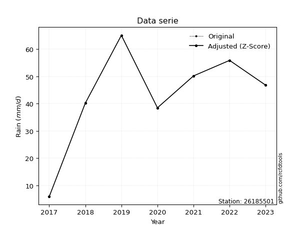</img>

</div>


> The initial value (value_initial) correspond to the initial obtained or null completed value, and value (value) is adjusted only when the initial value is outside the valid range (outlier) definite through the Z-Score value. If Z-Score is active, values out of range or outliers are replaced with the station mean value. A Z-Score (or standard score) measures how many standard deviations a data point is from the mean of a dataset, indicating its relative position; positive scores mean above the mean, negative mean below, and a score of zero is exactly at the mean, allowing for comparison of values from different distributions. It´s calculated using the formula $z=(x–μ)/σ$, where $x$ is the data point, $μ$ is the mean, and $σ$ is the standard deviation, helping identify outliers and understand probability.
>
> <sub>**Note**: In this study, "completing" (filling gaps in) and "extending" (forecasting or lengthening the historical record) rainfall data series are avoided for certain critical analyses because they introduce artificial bias and uncertainty, which can distort the statistics of rare events (extremes), alter day-to-day variability, and compromise the integrity and homogeneity of the original data. Some reasons against Completing/Extending rainfall data are: **Distortion of Extremes and Variability**: The primary issue is that most gap-filling or extension methods rely on averaging or regression with nearby stations, which inherently smooths the data. Rainfall is highly variable in space and time, with a large percentage of zero values and occasional large storms. Infilling methods often underestimate the highest values and overestimate the lowest (zero) values, which severely distorts analyses focused on flood frequency, drought severity, and intensity-duration-frequency (IDF) curves, **Loss of Data Homogeneity**: Infilled or extended data are synthetic estimates, not actual measurements. Combining these estimates with observed data can violate the assumption of data homogeneity, which requires that the data properties do not change over time. Inhomogeneity can lead to incorrect conclusions about long-term trends or changes in climate patterns, **Propagation of Errors**: Errors and biases from the original data (e.g., wind-induced undercatch, instrument errors, site changes) or the data used for imputation can propagate through the analysis, leading to unreliable hydrological models and inaccurate predictions, **Compromised Statistical Integrity**: For statistical analyses, especially those involving the frequency of events, using artificial data can introduce time bias or autocorrelation that doesn´t exist in reality, making it difficult to assess the true probability of events, **Difficulty in Validation**: It is difficult to accurately validate the quality of filled or extended data, especially for past periods where ground-truth measurements are unavailable. The reliability of imputation techniques heavily depends on the density of the surrounding station network and the complexity of the local topography.</sub>


### 4. Active continuous probability distributions from SciPy (44 of 104 available)

A Probability Density Function (PDF) describes the relative likelihood of a continuous random variable falling within a specific range, where the total area under its curve equals 1, and the area over any interval gives the actual probability for that range. Unlike discrete probabilities (like rolling a die), a PDF shows density, not direct probability for a single point (which is zero), with higher points indicating higher likelihood, often visualized as a bell curve for normal distributions.

A log of a probability density function (log-PDF) is simply the logarithm of the PDF´s value, denoted as $log(f(x))$, useful for converting multiplication of probabilities into addition, improving numerical stability with tiny numbers, and connecting to information theory concepts like entropy. Instead of dealing with very small probabilities (e.g., 0.000001), log-PDFs use negative numbers (e.g., $log(0.00001) ≈ -11.51$ that are easier for computers to handle, preventing underflow errors and simplifying complex calculations. In this study, each active probability distribution from SciPy is also evaluated in the $log$ form.

[scipy.stats](https://docs.scipy.org/doc/scipy/reference/stats.html) is a Python´s powerful submodule within the SciPy library for comprehensive statistical analysis, offering over 130 probability distributions (like Normal, Poisson), functions for descriptive stats (mean, variance), hypothesis testing (t-tests, chi-square), random variable generation, and statistical tests, making it essential for data science, modeling, and research. It provides tools to explore, model, and draw conclusions from data efficiently, working seamlessly with NumPy.

<div align="center">

|   id | p_dist             |   n_parameter | fit_method   | label                                                                       | active   | ref                                                                                                        |
|-----:|:-------------------|--------------:|:-------------|:----------------------------------------------------------------------------|:---------|:-----------------------------------------------------------------------------------------------------------|
|    0 | alpha              |             3 | MLE          | Alpha                                                                       | True     | [:mortar_board:](https://docs.scipy.org/doc/scipy/reference/generated/scipy.stats.alpha.html)              |
|    1 | betaprime          |             4 | MLE          | Beta prime                                                                  | True     | [:mortar_board:](https://docs.scipy.org/doc/scipy/reference/generated/scipy.stats.betaprime.html)          |
|    2 | chi2               |             3 | MLE          | Chi²                                                                        | True     | [:mortar_board:](https://docs.scipy.org/doc/scipy/reference/generated/scipy.stats.chi2.html)               |
|    3 | crystalball        |             4 | MLE          | Crystalball                                                                 | True     | [:mortar_board:](https://docs.scipy.org/doc/scipy/reference/generated/scipy.stats.crystalball.html)        |
|    4 | erlang             |             3 | MLE          | Erlang                                                                      | True     | [:mortar_board:](https://docs.scipy.org/doc/scipy/reference/generated/scipy.stats.erlang.html)             |
|    5 | expon              |             2 | MLE          | Exponential                                                                 | True     | [:mortar_board:](https://docs.scipy.org/doc/scipy/reference/generated/scipy.stats.expon.html)              |
|    6 | exponnorm          |             3 | MLE          | Exponentially modified Normal                                               | True     | [:mortar_board:](https://docs.scipy.org/doc/scipy/reference/generated/scipy.stats.exponnorm.html)          |
|    7 | f                  |             4 | MLE          | F                                                                           | True     | [:mortar_board:](https://docs.scipy.org/doc/scipy/reference/generated/scipy.stats.f.html)                  |
|    8 | fatiguelife        |             3 | MLE          | Fatigue-life (Birnbaum-Saunders)                                            | True     | [:mortar_board:](https://docs.scipy.org/doc/scipy/reference/generated/scipy.stats.fatiguelife.html)        |
|    9 | fisk               |             3 | MLE          | Fisk                                                                        | True     | [:mortar_board:](https://docs.scipy.org/doc/scipy/reference/generated/scipy.stats.fisk.html)               |
|   10 | gamma              |             3 | MLE          | Gamma                                                                       | True     | [:mortar_board:](https://docs.scipy.org/doc/scipy/reference/generated/scipy.stats.gamma.html)              |
|   11 | genexpon           |             5 | MLE          | Generalized exponential                                                     | True     | [:mortar_board:](https://docs.scipy.org/doc/scipy/reference/generated/scipy.stats.genexpon.html)           |
|   12 | genlogistic        |             3 | MLE          | Generalized logistic                                                        | True     | [:mortar_board:](https://docs.scipy.org/doc/scipy/reference/generated/scipy.stats.genlogistic.html)        |
|   13 | gibrat             |             2 | MM           | Gibrat                                                                      | True     | [:mortar_board:](https://docs.scipy.org/doc/scipy/reference/generated/scipy.stats.gibrat.html)             |
|   14 | gompertz           |             3 | MLE          | Gompertz (or truncated Gumbel)                                              | True     | [:mortar_board:](https://docs.scipy.org/doc/scipy/reference/generated/scipy.stats.gompertz.html)           |
|   15 | gumbel_l           |             2 | MM           | Gumbel Left Skew                                                            | True     | [:mortar_board:](https://docs.scipy.org/doc/scipy/reference/generated/scipy.stats.gumbel_l.html)           |
|   16 | gumbel_r           |             2 | MM           | Gumbel Right Skew                                                           | True     | [:mortar_board:](https://docs.scipy.org/doc/scipy/reference/generated/scipy.stats.gumbel_r.html)           |
|   17 | halflogistic       |             2 | MM           | Half-logistic                                                               | True     | [:mortar_board:](https://docs.scipy.org/doc/scipy/reference/generated/scipy.stats.halflogistic.html)       |
|   18 | halfnorm           |             2 | MM           | Half Normal                                                                 | True     | [:mortar_board:](https://docs.scipy.org/doc/scipy/reference/generated/scipy.stats.halfnorm.html)           |
|   19 | hypsecant          |             2 | MM           | hyperbolic secant                                                           | True     | [:mortar_board:](https://docs.scipy.org/doc/scipy/reference/generated/scipy.stats.hypsecant.html)          |
|   20 | invgamma           |             3 | MLE          | Inverted gamma                                                              | True     | [:mortar_board:](https://docs.scipy.org/doc/scipy/reference/generated/scipy.stats.invgamma.html)           |
|   21 | invgauss           |             3 | MLE          | Inverse Gaussian                                                            | True     | [:mortar_board:](https://docs.scipy.org/doc/scipy/reference/generated/scipy.stats.invgauss.html)           |
|   22 | invweibull         |             3 | MLE          | Inverted Weibull                                                            | True     | [:mortar_board:](https://docs.scipy.org/doc/scipy/reference/generated/scipy.stats.invweibull.html)         |
|   23 | johnsonsu          |             4 | MLE          | Johnson Su                                                                  | True     | [:mortar_board:](https://docs.scipy.org/doc/scipy/reference/generated/scipy.stats.johnsonsu.html)          |
|   24 | kstwobign          |             2 | MLE          | Limiting distribution of scaled Kolmogorov-Smirnov two-sided test statistic | True     | [:mortar_board:](https://docs.scipy.org/doc/scipy/reference/generated/scipy.stats.kstwobign.html)          |
|   25 | laplace            |             2 | MM           | Laplace                                                                     | True     | [:mortar_board:](https://docs.scipy.org/doc/scipy/reference/generated/scipy.stats.laplace.html)            |
|   26 | laplace_asymmetric |             3 | MLE          | Asymmetric Laplace                                                          | True     | [:mortar_board:](https://docs.scipy.org/doc/scipy/reference/generated/scipy.stats.laplace_asymmetric.html) |
|   27 | loggamma           |             3 | MLE          | Log gamma                                                                   | True     | [:mortar_board:](https://docs.scipy.org/doc/scipy/reference/generated/scipy.stats.loggamma.html)           |
|   28 | logistic           |             2 | MM           | Logistic (or Sech-squared)                                                  | True     | [:mortar_board:](https://docs.scipy.org/doc/scipy/reference/generated/scipy.stats.logistic.html)           |
|   29 | lognorm            |             3 | MLE          | Log Normal                                                                  | True     | [:mortar_board:](https://docs.scipy.org/doc/scipy/reference/generated/scipy.stats.lognorm.html)            |
|   30 | maxwell            |             2 | MM           | Maxwell                                                                     | True     | [:mortar_board:](https://docs.scipy.org/doc/scipy/reference/generated/scipy.stats.maxwell.html)            |
|   31 | mielke             |             4 | MLE          | Mielke Beta-Kappa / Dagum                                                   | True     | [:mortar_board:](https://docs.scipy.org/doc/scipy/reference/generated/scipy.stats.mielke.html)             |
|   32 | moyal              |             2 | MM           | Moyal                                                                       | True     | [:mortar_board:](https://docs.scipy.org/doc/scipy/reference/generated/scipy.stats.moyal.html)              |
|   33 | nakagami           |             3 | MLE          | Nakagami                                                                    | True     | [:mortar_board:](https://docs.scipy.org/doc/scipy/reference/generated/scipy.stats.nakagami.html)           |
|   34 | ncf                |             5 | MLE          | Non-central F distribution                                                  | True     | [:mortar_board:](https://docs.scipy.org/doc/scipy/reference/generated/scipy.stats.ncf.html)                |
|   35 | nct                |             4 | MLE          | Non-central Student’s t                                                     | True     | [:mortar_board:](https://docs.scipy.org/doc/scipy/reference/generated/scipy.stats.nct.html)                |
|   36 | norm               |             2 | MM           | Normal                                                                      | True     | [:mortar_board:](https://docs.scipy.org/doc/scipy/reference/generated/scipy.stats.norm.html)               |
|   37 | pearson3           |             3 | MM           | Pearson type III                                                            | True     | [:mortar_board:](https://docs.scipy.org/doc/scipy/reference/generated/scipy.stats.pearson3.html)           |
|   38 | rayleigh           |             2 | MM           | Rayleigh                                                                    | True     | [:mortar_board:](https://docs.scipy.org/doc/scipy/reference/generated/scipy.stats.rayleigh.html)           |
|   39 | rice               |             3 | MLE          | Rice                                                                        | True     | [:mortar_board:](https://docs.scipy.org/doc/scipy/reference/generated/scipy.stats.rice.html)               |
|   40 | t                  |             3 | MLE          | Student’s t                                                                 | True     | [:mortar_board:](https://docs.scipy.org/doc/scipy/reference/generated/scipy.stats.t.html)                  |
|   41 | truncnorm          |             4 | MLE          | Truncated normal                                                            | True     | [:mortar_board:](https://docs.scipy.org/doc/scipy/reference/generated/scipy.stats.truncnorm.html)          |
|   42 | wald               |             2 | MM           | Wald                                                                        | True     | [:mortar_board:](https://docs.scipy.org/doc/scipy/reference/generated/scipy.stats.wald.html)               |
|   43 | weibull_min        |             3 | MLE          | Weibull minimum                                                             | True     | [:mortar_board:](https://docs.scipy.org/doc/scipy/reference/generated/scipy.stats.weibull_min.html)        |

</div>

> **n_parameter:** # arguments & localization & scale.
>
> **Fit methods:** (MLE) maximum likelihood, (MM) L-moments.
>
>**Inactive** (With the only purpose of prevent loops, zero divisions, infinite values, over high estimated values or horizontal trending for recurrence intervals estimations, the follow distributions were disabled.)**:** foldnorm, gennorm, norminvgauss, powernorm, powerlognorm, skewnorm, genextreme, anglit, arcsine, argus, beta, bradford, burr, burr12, cauchy, cosine, halfcauchy, foldcauchy, skewcauchy, wrapcauchy, dgamma, gengamma, exponweib, exponpow, truncexpon, gausshyper, genhalflogistic, genhyperbolic, geninvgauss, halfgennorm, johnsonsb, kappa4, kappa3, ksone, kstwo, loglaplace, levy, levy_l, levy_stable, ncx2, pareto, genpareto, truncpareto, lomax, powerlaw, rdist, rel_breitwigner, recipinvgauss, semicircular, studentized_range, trapezoid, triang, truncweibull_min, tukeylambda, uniform, loguniform, vonmises, vonmises_line, weibull_max, dweibull, 


## B. Probability (PDF) vs. Empirical (EDF) distributions functions

A continuous probability distribution (CPD) describes probabilities for variables that can take any value within a range (like rain any time), unlike discrete variables with specific outcomes (like temperature). It uses a Probability Density Function (PDF), a curve where the total area under it equals 1, and the probability of the variable falling within an interval (a to b) is found by calculating the area under the curve between those points. A key feature is that the probability of hitting any single exact value is zero, so probabilities are always expressed for ranges, e.g., $P(a ≤ X ≤ b)$.

<div align="center">

Distributions parameters from station values
|    |   station | p_dist                |   n |              loc |           scale | shape                  | shape1              | shape2                 | shape3   |
|---:|----------:|:----------------------|----:|-----------------:|----------------:|:-----------------------|:--------------------|:-----------------------|:---------|
|  0 |  26185501 | alpha                 |   7 |     -0.0337573   |    15.0189      | 7.740491047146623e-10  |                     |                        |          |
|  1 |  26185501 | betaprime             |   7 |   -268.716       |  9508.8         | 296.8197314886977      | 9056.91998929784    |                        |          |
|  2 |  26185501 | chi2                  |   7 |   -173.096       |     0.77295     | 280.01721757541685     |                     |                        |          |
|  3 |  26185501 | crystalball           |   7 |     43.2286      |    17.4243      | 3048.422663114163      | 3219.6609071230296  |                        |          |
|  4 |  26185501 | erlang                |   7 |   -175.71        |     1.63117     | 134.12335199487347     |                     |                        |          |
|  5 |  26185501 | expon                 |   7 |      5.9         |    37.3286      |                        |                     |                        |          |
|  6 |  26185501 | exponnorm             |   7 |     43.2155      |    17.4241      | 0.0007515292181708641  |                     |                        |          |
|  7 |  26185501 | f                     |   7 | -10616           | 10659.2         | 1154522.3083162815     | 2061433.7970175222  |                        |          |
|  8 |  26185501 | fatiguelife           |   7 |  -2498.69        |  2541.61        | 0.006825570798033462   |                     |                        |          |
|  9 |  26185501 | fisk                  |   7 |     -1.84186e+09 |     1.84186e+09 | 198393652.07741773     |                     |                        |          |
| 10 |  26185501 | gamma                 |   7 |   -195.066       |     1.38237     | 172.371837661099       |                     |                        |          |
| 11 |  26185501 | genexpon              |   7 |     -0.019619    |     2.22157     | 1.6043658520788753e-07 | 0.05377099448830941 | 1.1850097016858738     |          |
| 12 |  26185501 | genlogistic           |   7 |     57.1527      |     4.71863     | 0.2986592550875229     |                     |                        |          |
| 13 |  26185501 | gibrat                |   7 |     29.936       |     8.06234     |                        |                     |                        |          |
| 14 |  26185501 | gompertz              |   7 |      0.108434    |    13.7573      | 0.02616757664356533    |                     |                        |          |
| 15 |  26185501 | gumbel_l              |   7 |     51.0704      |    13.5856      |                        |                     |                        |          |
| 16 |  26185501 | gumbel_r              |   7 |     35.3867      |    13.5856      |                        |                     |                        |          |
| 17 |  26185501 | halflogistic          |   7 |     22.5768      |    14.8971      |                        |                     |                        |          |
| 18 |  26185501 | halfnorm              |   7 |     20.1656      |    28.9051      |                        |                     |                        |          |
| 19 |  26185501 | hypsecant             |   7 |     43.2286      |    11.0926      |                        |                     |                        |          |
| 20 |  26185501 | invgamma              |   7 |   -187.814       | 33617.6         | 146.44813041815775     |                     |                        |          |
| 21 |  26185501 | invgauss              |   7 |    -75.9347      |  3821.71        | 0.030979711288385545   |                     |                        |          |
| 22 |  26185501 | invweibull            |   7 |     -3.79983e+09 |     3.79983e+09 | 200671842.73636305     |                     |                        |          |
| 23 |  26185501 | johnsonsu             |   7 |     78.3703      |     1.21065     | 8.105216641829735      | 2.0543234287911964  |                        |          |
| 24 |  26185501 | kstwobign             |   7 |    -38.6228      |    93.6627      |                        |                     |                        |          |
| 25 |  26185501 | laplace               |   7 |     43.2286      |    12.3208      |                        |                     |                        |          |
| 26 |  26185501 | laplace_asymmetric    |   7 |     50.2         |    11.3049      | 1.3547783327964797     |                     |                        |          |
| 27 |  26185501 | loggamma              |   7 |     58.5452      |     8.47306     | 0.533358053054218      |                     |                        |          |
| 28 |  26185501 | logistic              |   7 |     43.2286      |     9.6065      |                        |                     |                        |          |
| 29 |  26185501 | lognorm               |   7 |      5.9         |     0.176455    | 13.441981293378124     |                     |                        |          |
| 30 |  26185501 | maxwell               |   7 |      1.94039     |    25.8735      |                        |                     |                        |          |
| 31 |  26185501 | mielke                |   7 |    -22.2271      |    87.4711      | 2.944938069043743      | 3025.087624640559   |                        |          |
| 32 |  26185501 | moyal                 |   7 |     33.2643      |     7.84367     |                        |                     |                        |          |
| 33 |  26185501 | nakagami              |   7 |     38.5         |    11.8761      | 0.17739878219697025    |                     |                        |          |
| 34 |  26185501 | ncf                   |   7 |     -0.0319222   |     6.50937e-05 | 2.5581353554406774e-05 | 34.61954750810757   | 16.68026392628962      |          |
| 35 |  26185501 | nct                   |   7 |  -1290.46        |    17.2903      | 173966.20265414586     | 77.13463022480272   |                        |          |
| 36 |  26185501 | norm                  |   7 |     43.2286      |    17.4243      |                        |                     |                        |          |
| 37 |  26185501 | pearson3              |   7 |     43.2286      |    17.4243      | -1.0604030504891964    |                     |                        |          |
| 38 |  26185501 | rayleigh              |   7 |      9.89498     |    26.5964      |                        |                     |                        |          |
| 39 |  26185501 | rice                  |   7 |  -5841.02        |    17.4268      | 337.6532609501397      |                     |                        |          |
| 40 |  26185501 | t                     |   7 |     46.9635      |    10.1928      | 2.231795523058226      |                     |                        |          |
| 41 |  26185501 | truncnorm             |   7 |     43.2286      |    17.4243      | -35.964812184456434    | 440.878437861932    |                        |          |
| 42 |  26185501 | wald                  |   7 |     25.8044      |    17.4242      |                        |                     |                        |          |
| 43 |  26185501 | weibull_min           |   7 |     -4.58378e+08 |     4.58378e+08 | 35787297.43381166      |                     |                        |          |
| 44 |  26185501 | logalpha              |   7 |    -23.859       |   944.324       | 34.45565548011592      |                     |                        |          |
| 45 |  26185501 | logbetaprime          |   7 |    -22.9106      |   723           | 1125.429468392127      | 30738.673609660196  |                        |          |
| 46 |  26185501 | logchi2               |   7 |      1.77495     |     1.02396     | 1.288499514721603      |                     |                        |          |
| 47 |  26185501 | logcrystalball        |   7 |      4.17593     |     1.20126e-05 | 2.2108586627845258e-05 | 30.958494695554933  |                        |          |
| 48 |  26185501 | logerlang             |   7 |     -9.33561     |     0.0508083   | 254.21234593315017     |                     |                        |          |
| 49 |  26185501 | logexpon              |   7 |      1.77495     |     1.80803     |                        |                     |                        |          |
| 50 |  26185501 | logexponnorm          |   7 |      3.58245     |     0.757021    | 0.0006959047354529505  |                     |                        |          |
| 51 |  26185501 | logf                  |   7 |  -2046.13        |  2049.71        | 43911821.25044595      | 22090855.77100672   |                        |          |
| 52 |  26185501 | logfatiguelife        |   7 |   -797.707       |   801.289       | 0.000947086276374744   |                     |                        |          |
| 53 |  26185501 | logfisk               |   7 |     -1.70394e+08 |     1.70394e+08 | 483040854.3515551      |                     |                        |          |
| 54 |  26185501 | loggamma              |   7 |    -11.0874      |     0.0441871   | 331.6605779762392      |                     |                        |          |
| 55 |  26185501 | loggenexpon           |   7 |      1.76754     |     0.00470518  | 0.0007349417541596486  | 1.273457147204081   | 6.423317134724366e-06  |          |
| 56 |  26185501 | loggenlogistic        |   7 |      4.17597     |     3.08621e-06 | 5.191298624580737e-06  |                     |                        |          |
| 57 |  26185501 | loggibrat             |   7 |      3.00551     |     0.35026     |                        |                     |                        |          |
| 58 |  26185501 | loggompertz           |   7 |      1.28054     |     0.38885     | 0.0012920781882633124  |                     |                        |          |
| 59 |  26185501 | loggumbel_l           |   7 |      3.92368     |     0.590247    |                        |                     |                        |          |
| 60 |  26185501 | loggumbel_r           |   7 |      3.24228     |     0.590247    |                        |                     |                        |          |
| 61 |  26185501 | loghalflogistic       |   7 |      2.6857      |     0.647247    |                        |                     |                        |          |
| 62 |  26185501 | loghalfnorm           |   7 |      2.58099     |     1.25581     |                        |                     |                        |          |
| 63 |  26185501 | loghypsecant          |   7 |      3.58298     |     0.481935    |                        |                     |                        |          |
| 64 |  26185501 | loginvgamma           |   7 |    -16.1769      | 11984.8         | 607.6030948607618      |                     |                        |          |
| 65 |  26185501 | loginvgauss           |   7 |     -4.91253     |   827.921       | 0.010249332710584723   |                     |                        |          |
| 66 |  26185501 | loginvweibull         |   7 |     -1.18878e+08 |     1.18878e+08 | 123214643.3762745      |                     |                        |          |
| 67 |  26185501 | logjohnsonsu          |   7 |      4.22381     |     0.0015545   | 5.585369596186242      | 0.90871740195326    |                        |          |
| 68 |  26185501 | logkstwobign          |   7 |     -0.336871    |     4.48563     |                        |                     |                        |          |
| 69 |  26185501 | loglaplace            |   7 |      3.58298     |     0.535295    |                        |                     |                        |          |
| 70 |  26185501 | loglaplace_asymmetric |   7 |      4.17598     |     0.00792255  | 74.7571854961695       |                     |                        |          |
| 71 |  26185501 | logloggamma           |   7 |      4.17594     |     1.81815e-07 | 3.062653804111999e-07  |                     |                        |          |
| 72 |  26185501 | loglogistic           |   7 |      3.58298     |     0.417368    |                        |                     |                        |          |
| 73 |  26185501 | loglognorm            |   7 |      1.77495     |     0.0109711   | 12.872788600880536     |                     |                        |          |
| 74 |  26185501 | logmaxwell            |   7 |      1.78914     |     1.12412     |                        |                     |                        |          |
| 75 |  26185501 | logmielke             |   7 |     -6.64908e+07 |     6.64908e+07 | 121154491.49730226     | 6403078581.5048     |                        |          |
| 76 |  26185501 | logmoyal              |   7 |      3.15007     |     0.340779    |                        |                     |                        |          |
| 77 |  26185501 | lognakagami           |   7 |      3.65066     |     0.314799    | 0.29079342639023065    |                     |                        |          |
| 78 |  26185501 | logncf                |   7 |    -21.0053      |    24.5821      | 2580.2118834877447     | 7140.361410493882   | 5.9379577494294014e-09 |          |
| 79 |  26185501 | lognct                |   7 |     49.3241      |     0.741728    | 48667.31259723668      | -61.6665220816848   |                        |          |
| 80 |  26185501 | lognorm               |   7 |      3.58298     |     0.757021    |                        |                     |                        |          |
| 81 |  26185501 | logpearson3           |   7 |      3.58298     |     0.757021    | -1.8306926254950322    |                     |                        |          |
| 82 |  26185501 | lograyleigh           |   7 |      2.13473     |     1.15554     |                        |                     |                        |          |
| 83 |  26185501 | logrice               |   7 |   -271.291       |     0.75703     | 363.0945805184042      |                     |                        |          |
| 84 |  26185501 | logt                  |   7 |      3.86573     |     0.173117    | 1.139826128920848      |                     |                        |          |
| 85 |  26185501 | logtruncnorm          |   7 |     -0.169447    |     1.58137     | 2.4156543359897786     | 2.7478448069379686  |                        |          |
| 86 |  26185501 | logwald               |   7 |      2.82597     |     0.757015    |                        |                     |                        |          |
| 87 |  26185501 | logweibull_min        |   7 |      1.77495     |     1.23434     | 0.7247889751360863     |                     |                        |          |

</div>

> **loc** (Location parameter): This shifts the distribution along the x-axis. For many common distributions, like the normal (Gaussian) distribution, loc represents the mean $μ$. For others, like the uniform distribution, it might represent the minimum value, or for the beta distribution, the left end of the support interval.
>
> **scale** (Scale parameter): This determines the width or spread of the distribution. For the normal distribution, scale represents the standard deviation $σ$. For a uniform distribution, it defines the length of the interval (from $loc$ to $loc + scale$).
>
> **shape** (Shape parameters): Refers to parameters that define the specific form of a probability distribution, distinct from its location (loc) and scale (scale). These parameters are required arguments for most distribution functions. For example, a normal (Gaussian) distribution is fully defined by its location (mean) and scale (standard deviation), so it has no specific shape parameters beyond loc and scale. However, other distributions have intrinsic properties that need specification, as Gamma distribution that takes a shape parameter, often named $a$ or $alpha$.


### 0. Cumulative distribution values - CDF (88 evaluated)

Cumulative Distribution Function (CDF), denoted as $F$<sub>$X$</sub>$(x)$, is a function that gives the probability that a random variable $X$ will take a value less than or equal to a specific value, $x$ (i.e., $(P(X≥x)$. It essentially "accumulates" probabilities from a given point up to the far right (positive infinity), providing a complete picture of the distribution´s probabilities for both discrete (like rain) and continuous (like temperature) variables, helping to find probabilities over ranges or above certain values. Each station is evaluated separately ordering the $x$ values ascending, calculating the CDF and PDF values for the activated distributions and their logarithmic forms.

<div align="center">

CDF ordered by x ascending and calculating $log(f(x))$ separately
|   id |   Station |   date |    x |   count |    mean |     std |    zscore |   Value_initial |   station |   m |     alpha |   alpha_pdf |   betaprime |   betaprime_pdf |      chi2 |   chi2_pdf |   crystalball |   crystalball_pdf |   erlang |   erlang_pdf |    expon |   expon_pdf |   exponnorm |   exponnorm_pdf |         f |      f_pdf |   fatiguelife |   fatiguelife_pdf |      fisk |   fisk_pdf |     gamma |   gamma_pdf |   genexpon |   genexpon_pdf |   genlogistic |   genlogistic_pdf |   gibrat |   gibrat_pdf |   gompertz |   gompertz_pdf |   gumbel_l |   gumbel_l_pdf |    gumbel_r |   gumbel_r_pdf |   halflogistic |   halflogistic_pdf |   halfnorm |   halfnorm_pdf |   hypsecant |   hypsecant_pdf |   invgamma |   invgamma_pdf |   invgauss |   invgauss_pdf |   invweibull |   invweibull_pdf |   johnsonsu |   johnsonsu_pdf |   kstwobign |   kstwobign_pdf |   laplace |   laplace_pdf |   laplace_asymmetric |   laplace_asymmetric_pdf |   loggamma |   loggamma_pdf |   logistic |   logistic_pdf |    lognorm |   lognorm_pdf |     maxwell |   maxwell_pdf |    mielke |   mielke_pdf |       moyal |   moyal_pdf |    nakagami |   nakagami_pdf |        ncf |    ncf_pdf |       nct |    nct_pdf |      norm |   norm_pdf |   pearson3 |   pearson3_pdf |   rayleigh |   rayleigh_pdf |      rice |   rice_pdf |         t |      t_pdf |   truncnorm |   truncnorm_pdf |     wald |   wald_pdf |   weibull_min |   weibull_min_pdf |   logalpha |   logalpha_pdf |   logbetaprime |   logbetaprime_pdf |     logchi2 |   logchi2_pdf |   logcrystalball |   logcrystalball_pdf |   logerlang |   logerlang_pdf |   logexpon |   logexpon_pdf |   logexponnorm |   logexponnorm_pdf |      logf |   logf_pdf |   logfatiguelife |   logfatiguelife_pdf |    logfisk |   logfisk_pdf |   loggenexpon |   loggenexpon_pdf |   loggenlogistic |   loggenlogistic_pdf |   loggibrat |   loggibrat_pdf |   loggompertz |   loggompertz_pdf |   loggumbel_l |   loggumbel_l_pdf |   loggumbel_r |   loggumbel_r_pdf |   loghalflogistic |   loghalflogistic_pdf |   loghalfnorm |   loghalfnorm_pdf |   loghypsecant |   loghypsecant_pdf |   loginvgamma |   loginvgamma_pdf |   loginvgauss |   loginvgauss_pdf |   loginvweibull |   loginvweibull_pdf |   logjohnsonsu |   logjohnsonsu_pdf |   logkstwobign |   logkstwobign_pdf |   loglaplace |   loglaplace_pdf |   loglaplace_asymmetric |   loglaplace_asymmetric_pdf |   logloggamma |   logloggamma_pdf |   loglogistic |   loglogistic_pdf |   loglognorm |   loglognorm_pdf |   logmaxwell |   logmaxwell_pdf |   logmielke |   logmielke_pdf |   logmoyal |   logmoyal_pdf |   lognakagami |   lognakagami_pdf |    logncf |   logncf_pdf |     lognct |   lognct_pdf |   logpearson3 |   logpearson3_pdf |   lograyleigh |   lograyleigh_pdf |    logrice |   logrice_pdf |     logt |   logt_pdf |   logtruncnorm |   logtruncnorm_pdf |   logwald |   logwald_pdf |   logweibull_min |   logweibull_min_pdf |
|-----:|----------:|-------:|-----:|--------:|--------:|--------:|----------:|----------------:|----------:|----:|----------:|------------:|------------:|----------------:|----------:|-----------:|--------------:|------------------:|---------:|-------------:|---------:|------------:|------------:|----------------:|----------:|-----------:|--------------:|------------------:|----------:|-----------:|----------:|------------:|-----------:|---------------:|--------------:|------------------:|---------:|-------------:|-----------:|---------------:|-----------:|---------------:|------------:|---------------:|---------------:|-------------------:|-----------:|---------------:|------------:|----------------:|-----------:|---------------:|-----------:|---------------:|-------------:|-----------------:|------------:|----------------:|------------:|----------------:|----------:|--------------:|---------------------:|-------------------------:|-----------:|---------------:|-----------:|---------------:|-----------:|--------------:|------------:|--------------:|----------:|-------------:|------------:|------------:|------------:|---------------:|-----------:|-----------:|----------:|-----------:|----------:|-----------:|-----------:|---------------:|-----------:|---------------:|----------:|-----------:|----------:|-----------:|------------:|----------------:|---------:|-----------:|--------------:|------------------:|-----------:|---------------:|---------------:|-------------------:|------------:|--------------:|-----------------:|---------------------:|------------:|----------------:|-----------:|---------------:|---------------:|-------------------:|----------:|-----------:|-----------------:|---------------------:|-----------:|--------------:|--------------:|------------------:|-----------------:|---------------------:|------------:|----------------:|--------------:|------------------:|--------------:|------------------:|--------------:|------------------:|------------------:|----------------------:|--------------:|------------------:|---------------:|-------------------:|--------------:|------------------:|--------------:|------------------:|----------------:|--------------------:|---------------:|-------------------:|---------------:|-------------------:|-------------:|-----------------:|------------------------:|----------------------------:|--------------:|------------------:|--------------:|------------------:|-------------:|-----------------:|-------------:|-----------------:|------------:|----------------:|-----------:|---------------:|--------------:|------------------:|----------:|-------------:|-----------:|-------------:|--------------:|------------------:|--------------:|------------------:|-----------:|--------------:|---------:|-----------:|---------------:|-------------------:|----------:|--------------:|-----------------:|---------------------:|
|    0 |  26185501 |   2017 |  5.9 |       7 | 43.2286 | 18.8204 | -1.98341  |             5.9 |  26185501 |   1 | 0.0113708 |  0.0138287  |   0.0186129 |       0.0027035 | 0.0157785 | 0.00245616 |     0.0160833 |        0.00230748 | 0.01959  |    0.0028534 | 0        |  0.0267891  |   0.0160826 |      0.00230741 | 0.0165555 | 0.00235952 |     0.0157931 |        0.00231552 | 0.0138554 | 0.00147174 | 0.0158314 |  0.00244992 |  0.0950112 |     0.0209729  |     0.0390085 |        0.00246894 | 0        |   0          |  0.0136042 |     0.00285833 |  0.0353379 |     0.00255461 | 0.000156559 |    0.000100973 |       0        |         0          |   0        |     0          |   0.0219904 |      0.00198086 |  0.0161287 |     0.002666   |  0.0211137 |     0.00359424 |    0.0150904 |       0.00334211 |   0.0422453 |      0.00255303 |   0.0224339 |      0.00499826 | 0.0241647 |    0.00196129 |            0.0358865 |               0.00234314 |  0.0105185 |      0.0377734 |  0.0201191 |     0.00205218 | 0.00846221 |     0.0304195 | 0.000946587 |   0.000713827 | 0.0353928 |   0.00370565 | 1.05157e-08 | 2.25835e-08 | 0           |    0           | 0.00977854 | 0.00326266 | 0.0161384 | 0.00231462 | 0.0160833 | 0.00230748 |  0.0356899 |     0.00273914 |   0        |     0          | 0.0160953 | 0.00230863 | 0.0234338 | 0.0011549  |   0.0160834 |      0.00230748 | 0        | 0          |     0.0292586 |        0.00225058 | 0.00858195 |      0.0335046 |      0.0116987 |          0.0399094 | 9.00925e-11 | 130699        |        0.0183663 |            0.0286246 |    0.010146 |       0.0368568 |   0        |       0.553089 |      0.0084622 |          0.0304195 | 0.0084466 |  0.0304362 |       0.00858552 |            0.0308017 | 0.00360451 |     0.0101814 |    0.00116661 |          0.15875  |         0        |            0.0296381 |    0        |        0        |    0.00331008 |         0.0118102 |     0.0259008 |         0.0433081 |   6.06726e-06 |        0.00012348 |          0        |              0        |      0        |          0        |      0.0149451 |          0.0309993 |    0.00885035 |         0.0339438 |     0.0104333 |         0.0411952 |        0.015727 |           0.0676865 |      0.0413983 |          0.0328814 |      0.0203696 |           0.097728 |    0.0170641 |         0.031878 |               0.0173504 |                   0.0292949 |     0.0175195 |         0.0295114 |      0.012971 |         0.0306751 |   0.00715386 |      6.94966e+12 |     0        |         0        |    0.012145 |       0.0221298 | 5.4659e-14 |     4.6131e-12 |   0           |       0           | 0.0100599 |    0.0357656 | 0.00844306 |    0.0303046 |     0.0327624 |         0.0453218 |      0        |          0        | 0.00846215 |      0.030419 | 0.019176 |  0.0103989 |     0          |            0       |  0        |      0        |      6.40301e-12 |        10450.2       |
|    1 |  26185501 |   2020 | 38.5 |       7 | 43.2286 | 18.8204 | -0.251248 |            38.5 |  26185501 |   2 | 0.696715  |  0.0074801  |   0.411852  |       0.0213772 | 0.405731  | 0.0215163  |     0.39305   |        0.022068   | 0.414997 |    0.0209254 | 0.582439 |  0.0111861  |   0.393048  |      0.0220682  | 0.394734  | 0.0219783  |     0.399388  |        0.0223     | 0.320024  | 0.0234394  | 0.406671  |  0.0216605  |  0.588092  |     0.00996985 |     0.305356  |        0.018963   | 0.524067 |   0.0464989  |  0.329772  |     0.0207687  |  0.327278  |     0.0196297  | 0.45149     |    0.0264269   |       0.488768 |         0.0255454  |   0.474112 |     0.0225736  |   0.368243  |      0.0262722  |  0.420782  |     0.0210059  |  0.457541  |     0.0197736  |    0.472496  |       0.0187078  |   0.309248  |      0.0181501  |   0.493434  |      0.0168858  | 0.340638  |    0.0276474  |            0.301543  |               0.0196886  |  0.5482    |      0.490245  |  0.379369  |     0.0245093  | 0.535618   |     0.524888  | 0.426888    |   0.0226892   | 0.341414  |   0.0165567  | 0.47385     | 0.028187    | 3.16046e-06 |    1.57812e+08 | 0.465721   | 0.017866   | 0.393404  | 0.0220594  | 0.39305   | 0.022068   |  0.331725  |     0.0189068  |   0.439191 |     0.0226784  | 0.393061  | 0.022065   | 0.242865  | 0.02272    |   0.39305   |      0.022068   | 0.533603 | 0.034999   |     0.315106  |        0.0202388  | 0.551173   |      0.493706  |      0.548367  |          0.491756  | 0.761032    |      0.144429 |        0.398032  |            0.687431  |    0.542745 |       0.487819  |   0.645636 |       0.195995 |      0.535618  |          0.524888  | 0.537544  |  0.525328  |       0.536375   |            0.52346   | 0.424428   |     0.692521  |    0.612752   |          0.329579 |         0        |            0.695185  |    0.729334 |        0.513144 |    0.43562    |         0.832121  |     0.467234  |         0.568352  |   0.606145    |        0.51412    |          0.632416 |              0.46354  |      0.605662 |          0.442048 |      0.544554  |          0.654024  |    0.545631   |         0.49184   |     0.555863  |         0.456245  |        0.551973 |           0.339978  |      0.339062  |          0.580317  |      0.591842  |           0.315017 |    0.559382  |         0.823131 |               0.411829  |                   0.695343  |     0.412782  |         0.695327  |      0.54045  |         0.595072  |   0.655203   |      0.0152557   |     0.566905 |         0.494039 |    0.370439 |       0.674985  | 0.631402   |     0.500584   |   1.79227e-09 |       2.34719e+06 | 0.538825  |    0.495941  | 0.535082   |    0.525659  |     0.413461  |         0.53374   |      0.577058 |          0.480166 | 0.535608   |      0.524884 | 0.205809 |  0.753709  |     0.00014381 |            2.8093  |  0.701499 |      0.461779 |      0.741872    |            0.135082  |
|    2 |  26185501 |   2018 | 40.2 |       7 | 43.2286 | 18.8204 | -0.16092  |            40.2 |  26185501 |   3 | 0.708932  |  0.00690459 |   0.44845   |       0.0216488 | 0.442569  | 0.0217907  |     0.431006  |        0.0225525  | 0.450776 |    0.0211383 | 0.601029 |  0.0106881  |   0.431005  |      0.0225527  | 0.432523  | 0.022446   |     0.437701  |        0.0227399  | 0.36111   | 0.0248506  | 0.443763  |  0.0219446  |  0.604697  |     0.00956794 |     0.339219  |        0.0208953  | 0.595392 |   0.0377516  |  0.366319  |     0.022219   |  0.361904  |     0.0211013  | 0.495756    |    0.0256048   |       0.530972 |         0.0241009  |   0.511758 |     0.0217094  |   0.414153  |      0.0276583  |  0.456589  |     0.0210912  |  0.491018  |     0.019588   |    0.503914  |       0.0182386  |   0.341449  |      0.0197423  |   0.52177   |      0.0164426  | 0.391036  |    0.0317378  |            0.336942  |               0.0219999  |  0.569284  |      0.485439  |  0.421831  |     0.025388   | 0.558228   |     0.521366  | 0.465408    |   0.0225964   | 0.370333  |   0.0174701  | 0.520438    | 0.0265884   | 0.399114    |    0.08304     | 0.495729   | 0.0174245  | 0.431343  | 0.0225405  | 0.431006  | 0.0225525  |  0.364961  |     0.0201901  |   0.477518 |     0.0223842  | 0.431011  | 0.0225493  | 0.284476  | 0.0262404  |   0.431006  |      0.0225525  | 0.58867  | 0.0299364  |     0.350928  |        0.0219026  | 0.572388   |      0.488055  |      0.569524  |          0.487312  | 0.767182    |      0.140272 |        0.428912  |            0.742612  |    0.56373  |       0.483294  |   0.654005 |       0.191366 |      0.558227  |          0.521366  | 0.559687  |  0.521684  |       0.558922   |            0.519875  | 0.454592   |     0.702866  |    0.626862   |          0.323511 |         0        |            0.747594  |    0.750362 |        0.461292 |    0.472396   |         0.869324  |     0.492113  |         0.582962  |   0.627949    |        0.495017   |          0.652024 |              0.444084 |      0.624481 |          0.429027 |      0.572601  |          0.643378  |    0.566776   |         0.486716  |     0.575451  |         0.450238  |        0.566527 |           0.33366   |      0.365499  |          0.644825  |      0.605319  |           0.308741 |    0.593551  |         0.759299 |               0.442997  |                   0.747968  |     0.443947  |         0.747824  |      0.566032 |         0.588545  |   0.655855   |      0.0149016   |     0.58806  |         0.484984 |    0.400783 |       0.730276  | 0.652506   |     0.476316   |   0.244435    |       3.27614     | 0.560172  |    0.491896  | 0.557727   |    0.522204  |     0.437123  |         0.561677  |      0.597586 |          0.469883 | 0.558217   |      0.521363 | 0.242789 |  0.967173  |     0.117596   |            2.62888 |  0.720651 |      0.425301 |      0.747626    |            0.131246  |
|    3 |  26185501 |   2023 | 46.8 |       7 | 43.2286 | 18.8204 |  0.189764 |            46.8 |  26185501 |   4 | 0.748449  |  0.00518953 |   0.590554  |       0.0209595 | 0.585556  | 0.0210784  |     0.581202  |        0.0224199  | 0.589072 |    0.0203548 | 0.665686 |  0.00895597 |   0.581202  |      0.02242    | 0.581871  | 0.0222788  |     0.588451  |        0.0223948  | 0.535033  | 0.0267962  | 0.587798  |  0.0212311  |  0.66306   |     0.00815533 |     0.503171  |        0.0286535  | 0.769736 |   0.0180173  |  0.529139  |     0.0266746  |  0.518224  |     0.0258972  | 0.649425    |    0.0206347   |       0.671251 |         0.0184405  |   0.64318  |     0.0180549  |   0.600758  |      0.02727    |  0.593033  |     0.0198672  |  0.615138  |     0.0177626  |    0.616524  |       0.0157475  |   0.492518  |      0.0259361  |   0.623658  |      0.0143574  | 0.625819  |    0.0303698  |            0.51845   |               0.0338511  |  0.641222  |      0.458542  |  0.591887  |     0.0251451  | 0.635812   |     0.496149  | 0.60931     |   0.0206216   | 0.497885  |   0.0212415  | 0.673054    | 0.0196336   | 0.691963    |    0.0274745   | 0.603686   | 0.015179   | 0.581423  | 0.0223982  | 0.581202  | 0.0224199  |  0.513379  |     0.0245317  |   0.618144 |     0.0199223  | 0.581186  | 0.0224168  | 0.494263  | 0.0350954  |   0.581202  |      0.0224199  | 0.738724 | 0.0170107  |     0.514985  |        0.0273996  | 0.6445     |      0.458257  |      0.641829  |          0.461417  | 0.787457    |      0.126752 |        0.5587    |            0.975899  |    0.635425 |       0.457521  |   0.681906 |       0.175934 |      0.635811  |          0.496149  | 0.637208  |  0.496024  |       0.636269   |            0.494555  | 0.561883   |     0.697855  |    0.674328   |          0.300601 |         0        |            0.965422  |    0.809258 |        0.323685 |    0.61167    |         0.945925  |     0.583768  |         0.618101  |   0.697921    |        0.425257   |          0.714464 |              0.378171 |      0.686177 |          0.382574 |      0.665621  |          0.573078  |    0.638826   |         0.458765  |     0.641864  |         0.42175   |        0.615453 |           0.309636  |      0.485406  |          0.958599  |      0.650525  |           0.285846 |    0.694035  |         0.571583 |               0.572625  |                   0.966835  |     0.57351   |         0.96607   |      0.652468 |         0.543294  |   0.658032   |      0.0137748   |     0.658927 |         0.445593 |    0.528695 |       0.963348  | 0.71865    |     0.395252   |   0.573958    |       1.56721     | 0.633264  |    0.467115  | 0.635451   |    0.497142  |     0.530434  |         0.667897  |      0.665939 |          0.428102 | 0.635801   |      0.49615  | 0.462775 |  1.86075   |     0.473254   |            2.06905 |  0.777023 |      0.322239 |      0.766614    |            0.118851  |
|    4 |  26185501 |   2021 | 50.2 |       7 | 43.2286 | 18.8204 |  0.37042  |            50.2 |  26185501 |   5 | 0.764955  |  0.00454125 |   0.659709  |       0.019623  | 0.655081  | 0.0197226  |     0.655458  |        0.0211346  | 0.656227 |    0.019062  | 0.694791 |  0.00817628 |   0.655459  |      0.0211348  | 0.655652  | 0.0209986  |     0.662436  |        0.0210027  | 0.624006  | 0.025272   | 0.657803  |  0.0198495  |  0.689678  |     0.00751107 |     0.605513  |        0.0311807  | 0.821642 |   0.0128746  |  0.621558  |     0.0274496  |  0.608567  |     0.0270242  | 0.714555    |    0.0176774   |       0.729254 |         0.015714   |   0.701227 |     0.0160887  |   0.688048  |      0.0238321  |  0.658277  |     0.018439   |  0.673146  |     0.0163183  |    0.667534  |       0.014248   |   0.58517   |      0.0284012  |   0.670455  |      0.0131641  | 0.716054  |    0.023046   |            0.647319  |               0.0422654  |  0.672798  |      0.441492  |  0.673861  |     0.0228775  | 0.670005   |     0.478383  | 0.676506    |   0.0188401   | 0.573619  |   0.0233237  | 0.734054    | 0.0163107   | 0.772083    |    0.0202107   | 0.653042   | 0.0138443  | 0.655603  | 0.0211116  | 0.655458  | 0.0211346  |  0.599294  |     0.0258543  |   0.682815 |     0.0180729  | 0.655433  | 0.0211322  | 0.610939  | 0.032683   |   0.655458  |      0.0211346  | 0.789465 | 0.0130524  |     0.610758  |        0.0286742  | 0.676013   |      0.440003  |      0.673617  |          0.444653  | 0.796145    |      0.121042 |        0.631669  |            1.10789   |    0.666949 |       0.441042  |   0.694008 |       0.169241 |      0.670005  |          0.478384  | 0.671386  |  0.478059  |       0.670351   |            0.476806  | 0.610074   |     0.674363  |    0.695018   |          0.289383 |         0        |            1.0863    |    0.830292 |        0.277621 |    0.677969   |         0.939467  |     0.627343  |         0.623211  |   0.726616    |        0.393141   |          0.739974 |              0.34951  |      0.712254 |          0.361085 |      0.704295  |          0.529056  |    0.670403   |         0.441313  |     0.670877  |         0.405338  |        0.636759 |           0.297894  |      0.559593  |          1.16464   |      0.670193  |           0.275022 |    0.731606  |         0.501395 |               0.644609  |                   1.08837   |     0.645426  |         1.08721   |      0.689534 |         0.512922  |   0.658982   |      0.0133095   |     0.689439 |         0.424271 |    0.600763 |       1.09466   | 0.745153   |     0.360934   |   0.67238     |       1.25369     | 0.665465  |    0.45071   | 0.669716   |    0.479404  |     0.579102  |         0.720289  |      0.695214 |          0.406593 | 0.669995   |      0.478385 | 0.592338 |  1.74512   |     0.610445   |            1.84689 |  0.79829  |      0.285174 |      0.774765    |            0.113653  |
|    5 |  26185501 |   2022 | 55.9 |       7 | 43.2286 | 18.8204 |  0.673283 |            55.9 |  26185501 |   6 | 0.788305  |  0.00369465 |   0.762688  |       0.016341  | 0.758558  | 0.0164197  |     0.766457  |        0.0175758  | 0.756486 |    0.0159663 | 0.738012 |  0.00701843 |   0.766458  |      0.0175759  | 0.76597   | 0.017478   |     0.772283  |        0.0173173  | 0.754092  | 0.0199741  | 0.761816  |  0.0164767  |  0.729669  |     0.00654312 |     0.779359  |        0.0279191  | 0.8789   |   0.00775418 |  0.773259  |     0.024889   |  0.759944  |     0.0252128  | 0.801775    |    0.0130383   |       0.807027 |         0.0117038  |   0.78364  |     0.0128555  |   0.803371  |      0.01662    |  0.75477   |     0.0153077  |  0.758317  |     0.0135173  |    0.74148   |       0.0117125  |   0.751439  |      0.0289214  |   0.739714  |      0.0111431  | 0.821221  |    0.0145103  |            0.821877  |               0.0213463  |  0.718673  |      0.410773  |  0.789023  |     0.0173284  | 0.719715   |     0.444887  | 0.773874    |   0.0152425   | 0.716991  |   0.0270264  | 0.813251    | 0.0116847   | 0.864068    |    0.0126989   | 0.725458   | 0.0115727  | 0.766476  | 0.017556   | 0.766457  | 0.0175758  |  0.747219  |     0.0253711  |   0.775979 |     0.0145697  | 0.766421  | 0.0175747  | 0.767656  | 0.0217584  |   0.766457  |      0.0175758  | 0.850282 | 0.00865452 |     0.770634  |        0.0263676  | 0.72164    |      0.407718  |      0.719845  |          0.414124  | 0.808717    |      0.112865 |        0.763256  |            1.34716   |    0.712824 |       0.411223  |   0.711679 |       0.159467 |      0.719715  |          0.444887  | 0.721046  |  0.444282  |       0.719896   |            0.443409  | 0.679725   |     0.617143  |    0.725192   |          0.27164  |         0        |            1.30172   |    0.857007 |        0.221786 |    0.77565    |         0.863037  |     0.694066  |         0.613885  |   0.766316    |        0.345556   |          0.77531  |              0.308147 |      0.749329 |          0.328456 |      0.757302  |          0.456196  |    0.716232   |         0.410134  |     0.712983  |         0.377129  |        0.667809 |           0.279465  |      0.705601  |          1.56425   |      0.698874  |           0.258321 |    0.780459  |         0.410132 |               0.772964  |                   1.30509   |     0.773617  |         1.30315   |      0.741854 |         0.458844  |   0.660377   |      0.0126531   |     0.733193 |         0.388944 |    0.730821 |       1.33165   | 0.781329   |     0.312684   |   0.786662    |       0.888958    | 0.712366  |    0.420547  | 0.719536   |    0.445896  |     0.660974  |         0.802191  |      0.737092 |          0.371903 | 0.719705   |      0.444891 | 0.743088 |  1.04836   |     0.792471   |            1.54571 |  0.826328 |      0.23796  |      0.786585    |            0.106247  |
|    6 |  26185501 |   2019 | 65.1 |       7 | 43.2286 | 18.8204 |  1.16212  |            65.1 |  26185501 |   7 | 0.817637  |  0.00275055 |   0.884328  |       0.0101129 | 0.880942  | 0.0102032  |     0.895302  |        0.010414   | 0.876527 |    0.0101347 | 0.79524  |  0.00548534 |   0.895303  |      0.010414   | 0.89433   | 0.0104054  |     0.898503  |        0.0101382  | 0.892018  | 0.0103752  | 0.884144  |  0.0101402  |  0.783634  |     0.00523694 |     0.950428  |        0.00941659 | 0.9296   |   0.0038351  |  0.946132  |     0.0115407  |  0.939709  |     0.012464   | 0.893829    |    0.00738457  |       0.891097 |         0.00691225 |   0.879946 |     0.00824524 |   0.911937  |      0.00783803 |  0.870007  |     0.00980073 |  0.861376  |     0.00897231 |    0.831935  |       0.0080841  |   0.960643  |      0.0131112  |   0.827989  |      0.00811945 | 0.915272  |    0.00687682 |            0.940858  |               0.00708761 |  0.777501  |      0.360415  |  0.906932  |     0.00878641 | 0.783263   |     0.387778  | 0.886374    |   0.00933876  | 0.995154  |   0.0333312  | 0.895446    | 0.00662655  | 0.945726    |    0.00580382  | 0.816138   | 0.00824191 | 0.895199  | 0.0104078  | 0.895302  | 0.010414   |  0.940443  |     0.0145027  |   0.884002 |     0.00905282 | 0.895267  | 0.010415   | 0.898052  | 0.00842408 |   0.895302  |      0.010414   | 0.909905 | 0.00476718 |     0.95119   |        0.0115078  | 0.779878   |      0.355869  |      0.779173  |          0.363532  | 0.825097    |      0.102357 |        0.99997   |            1.78095   |    0.771817 |       0.362104  |   0.73498  |       0.146579 |      0.783262  |          0.387778  | 0.784475  |  0.386855  |       0.783236   |            0.386564  | 0.765742   |     0.508517  |    0.764621   |          0.245873 |         0.999931 |            1.68198   |    0.886175 |        0.164633 |    0.890525   |         0.623135  |     0.784155  |         0.560668  |   0.814152    |        0.283603   |          0.818152 |              0.25541  |      0.795931 |          0.283631 |      0.819022  |          0.355616  |    0.774937   |         0.359502  |     0.767121  |         0.332921  |        0.708381 |           0.253139  |      0.967152  |          1.39106   |      0.736436  |           0.234815 |    0.83484   |         0.308539 |               0.999727  |                   1.68796   |     0.99997   |         1.68444   |      0.805444 |         0.375457  |   0.66224    |      0.0118251   |     0.788436 |         0.335886 |    0.962133 |       1.5252    | 0.824329   |     0.253544   |   0.891839    |       0.515508    | 0.772691  |    0.370126  | 0.783229   |    0.388667  |     0.791548  |         0.907063  |      0.789899 |          0.321176 | 0.783253   |      0.387784 | 0.849892 |  0.449408  |     1          |            1.1917  |  0.858455 |      0.186328 |      0.802038    |            0.0967912 |


</div>

An Empirical Distribution Function (EDF) is a step-function estimate of a true cumulative distribution function (CDF) based on observed sample data, representing the proportion of data points less than or equal to a given value. It is calculated by ordering your data and jumping up by $1/n$ (where $n$ is sample size) at each unique data point, allowing analysis without assuming an underlying population distribution, and it gets closer to the true CDF as the sample size grows. For the empirical probability calculations, the parameter $m$ correspond to the order number which means the position of the $x$ values in an ascending order list.

The Kolmogorov-Smirnov (K-S) test is a non-parametric statistical test used to determine if a sample data set comes from a specific theoretical distribution (one-sample) or if two different samples come from the same underlying distribution (two-sample), by comparing their cumulative distribution functions (CDFs). It calculates the maximum vertical difference (D statistic) between these functions, with a small p-value indicating a significant difference and rejection of the null hypothesis (that the data/samples match).


### 1. EDF California (1923)

California´s estimates the true probability distribution of water-related data (like rainfall, streamflow) using observed samples, crucial for risk assessment.

<div align="center">


$P=m/n$


</div>


**1.1. Empirical values**

<div align="center">

|                | 0                   | 1                  | 2                   | 3                  | 4                  | 5                  | 6              |
|:---------------|:--------------------|:-------------------|:--------------------|:-------------------|:-------------------|:-------------------|:---------------|
| date           | 2017                | 2020               | 2018                | 2023               | 2021               | 2022               | 2019           |
| x              | 5.9                 | 38.5               | 40.2                | 46.8               | 50.2               | 55.9               | 65.1           |
| m              | 1                   | 2                  | 3                   | 4                  | 5                  | 6                  | 7              |
| empirical_dist | edf_california      | edf_california     | edf_california      | edf_california     | edf_california     | edf_california     | edf_california |
| empirical      | 0.14285714285714285 | 0.2857142857142857 | 0.42857142857142855 | 0.5714285714285714 | 0.7142857142857143 | 0.8571428571428571 | 1.0            |
| empirical_tr   | 1.1666666666666665  | 1.4                | 1.75                | 2.333333333333333  | 3.5                | 6.999999999999997  | inf            |

</div>


**1.2. Kolmogorov-Smirnov fit test (sorted by Δ)**


<div align="center">

|                | 0                   | 1                   | 2                   | 3                   | 4                   | 5                   | 6                   | 7                   | 8                   | 9                     | 10                  | 11                  | 12                  | 13                  | 14                  | 15                  | 16                  | 17                  | 18                  | 19                  | 20                  | 21                  | 22                  | 23                  | 24                  | 25                  | 26                  | 27                  | 28                  | 29                  | 30                  | 31                  | 32                  | 33                  | 34                  | 35                  | 36                  | 37                  | 38                  | 39                  | 40                  | 41                  | 42                  | 43                  | 44                  | 45                  | 46                  | 47                  | 48                  | 49                  | 50                  | 51                  | 52                  | 53                  | 54                  | 55                  | 56                  | 57                  | 58                  | 59                  | 60                  | 61                  | 62                  | 63                  | 64                  | 65                  | 66                  | 67                  | 68                  | 69                  | 70                  | 71                  | 72                  | 73                  | 74                  | 75                  | 76                  | 77                  | 78                  | 79                  | 80                  | 81                  | 82                  | 83                  | 84                  | 85                  | 86                  | 87                  |
|:---------------|:--------------------|:--------------------|:--------------------|:--------------------|:--------------------|:--------------------|:--------------------|:--------------------|:--------------------|:----------------------|:--------------------|:--------------------|:--------------------|:--------------------|:--------------------|:--------------------|:--------------------|:--------------------|:--------------------|:--------------------|:--------------------|:--------------------|:--------------------|:--------------------|:--------------------|:--------------------|:--------------------|:--------------------|:--------------------|:--------------------|:--------------------|:--------------------|:--------------------|:--------------------|:--------------------|:--------------------|:--------------------|:--------------------|:--------------------|:--------------------|:--------------------|:--------------------|:--------------------|:--------------------|:--------------------|:--------------------|:--------------------|:--------------------|:--------------------|:--------------------|:--------------------|:--------------------|:--------------------|:--------------------|:--------------------|:--------------------|:--------------------|:--------------------|:--------------------|:--------------------|:--------------------|:--------------------|:--------------------|:--------------------|:--------------------|:--------------------|:--------------------|:--------------------|:--------------------|:--------------------|:--------------------|:--------------------|:--------------------|:--------------------|:--------------------|:--------------------|:--------------------|:--------------------|:--------------------|:--------------------|:--------------------|:--------------------|:--------------------|:--------------------|:--------------------|:--------------------|:--------------------|:--------------------|
| station        | 26185501            | 26185501            | 26185501            | 26185501            | 26185501            | 26185501            | 26185501            | 26185501            | 26185501            | 26185501              | 26185501            | 26185501            | 26185501            | 26185501            | 26185501            | 26185501            | 26185501            | 26185501            | 26185501            | 26185501            | 26185501            | 26185501            | 26185501            | 26185501            | 26185501            | 26185501            | 26185501            | 26185501            | 26185501            | 26185501            | 26185501            | 26185501            | 26185501            | 26185501            | 26185501            | 26185501            | 26185501            | 26185501            | 26185501            | 26185501            | 26185501            | 26185501            | 26185501            | 26185501            | 26185501            | 26185501            | 26185501            | 26185501            | 26185501            | 26185501            | 26185501            | 26185501            | 26185501            | 26185501            | 26185501            | 26185501            | 26185501            | 26185501            | 26185501            | 26185501            | 26185501            | 26185501            | 26185501            | 26185501            | 26185501            | 26185501            | 26185501            | 26185501            | 26185501            | 26185501            | 26185501            | 26185501            | 26185501            | 26185501            | 26185501            | 26185501            | 26185501            | 26185501            | 26185501            | 26185501            | 26185501            | 26185501            | 26185501            | 26185501            | 26185501            | 26185501            | 26185501            | 26185501            |
| empirical_dist | edf_california      | edf_california      | edf_california      | edf_california      | edf_california      | edf_california      | edf_california      | edf_california      | edf_california      | edf_california        | edf_california      | edf_california      | edf_california      | edf_california      | edf_california      | edf_california      | edf_california      | edf_california      | edf_california      | edf_california      | edf_california      | edf_california      | edf_california      | edf_california      | edf_california      | edf_california      | edf_california      | edf_california      | edf_california      | edf_california      | edf_california      | edf_california      | edf_california      | edf_california      | edf_california      | edf_california      | edf_california      | edf_california      | edf_california      | edf_california      | edf_california      | edf_california      | edf_california      | edf_california      | edf_california      | edf_california      | edf_california      | edf_california      | edf_california      | edf_california      | edf_california      | edf_california      | edf_california      | edf_california      | edf_california      | edf_california      | edf_california      | edf_california      | edf_california      | edf_california      | edf_california      | edf_california      | edf_california      | edf_california      | edf_california      | edf_california      | edf_california      | edf_california      | edf_california      | edf_california      | edf_california      | edf_california      | edf_california      | edf_california      | edf_california      | edf_california      | edf_california      | edf_california      | edf_california      | edf_california      | edf_california      | edf_california      | edf_california      | edf_california      | edf_california      | edf_california      | edf_california      | edf_california      |
| p_dist         | laplace_asymmetric  | gumbel_l            | genlogistic         | weibull_min         | pearson3            | laplace             | hypsecant           | logistic            | logcrystalball      | loglaplace_asymmetric | betaprime           | f                   | nct                 | rice                | truncnorm           | crystalball         | norm                | exponnorm           | gamma               | fatiguelife         | logloggamma         | chi2                | fisk                | johnsonsu           | gompertz            | erlang              | logmielke           | invgamma            | mielke              | maxwell             | t                   | loggompertz         | rayleigh            | logjohnsonsu        | gumbel_r            | invgauss            | ncf                 | logt                | invweibull          | moyal               | halfnorm            | halflogistic        | kstwobign           | logpearson3         | loggumbel_l         | logfisk             | gibrat              | wald                | lognct              | logrice             | logexponnorm        | lognorm             | lognorm             | logfatiguelife      | logf                | logncf              | loglogistic         | logerlang           | loghypsecant        | loginvgamma         | loggamma            | loggamma            | logbetaprime        | logalpha            | loginvgauss         | loglaplace          | logmaxwell          | nakagami            | lognakagami         | lograyleigh         | loginvweibull       | expon               | genexpon            | logkstwobign        | logtruncnorm        | loghalfnorm         | loggumbel_r         | loggenexpon         | logmoyal            | loghalflogistic     | logexpon            | loglognorm          | alpha               | logwald             | loggibrat           | logweibull_min      | logchi2             | loggenlogistic      |
| delta          | 0.10697064106045107 | 0.10751924468410473 | 0.10877271716182124 | 0.11359853030348843 | 0.11499165140232581 | 0.11869247216337876 | 0.12086674519579355 | 0.12273805980479126 | 0.12449087206579304 | 0.12611467300218265   | 0.12613766770905893 | 0.12630166742283938 | 0.12671871845523258 | 0.12676179509672986 | 0.12677379239700842 | 0.12677379454468965 | 0.12677379633419422 | 0.1267745086877654  | 0.12702572875257973 | 0.12706406610374776 | 0.12706813560643193 | 0.1270785959954539  | 0.12900172577630403 | 0.12911545188389817 | 0.12925294372374518 | 0.12928272247108985 | 0.13071210359727226 | 0.1350673193404432  | 0.14066700893733952 | 0.14191055597017546 | 0.14409524272212304 | 0.14990615013819408 | 0.1534772125640569  | 0.15469277115707503 | 0.16577574031506614 | 0.17182719893880882 | 0.18386248830734409 | 0.18578206219783133 | 0.1867819863531217  | 0.18813579515574053 | 0.18839742636566092 | 0.203053223782223   | 0.20771945965800054 | 0.2084517999688288  | 0.21584511211470758 | 0.2342575136172328  | 0.23835261699395527 | 0.24788821943129946 | 0.24936778399147774 | 0.24989348629120633 | 0.2499034655456318  | 0.24990362954836787 | 0.24990362954836787 | 0.250660631926762   | 0.2518294714655164  | 0.25311064304347164 | 0.25473545446608137 | 0.2570307071686061  | 0.25883942684734806 | 0.25991622636147804 | 0.26248594425398586 | 0.26248594425398586 | 0.26265229943613744 | 0.2654588722152913  | 0.27014870458231244 | 0.2736679879761209  | 0.2811910222092273  | 0.2857111252536165  | 0.28571428392201514 | 0.29134348554611156 | 0.2916187172471063  | 0.29672514926560034 | 0.3023780116322422  | 0.30612791479636703 | 0.31097499698340175 | 0.3199475643010675  | 0.3204305596177702  | 0.32703743331481283 | 0.3456873047139336  | 0.3467021543964398  | 0.3599220858370732  | 0.36948881497623887 | 0.41100048623669483 | 0.41578513222819535 | 0.4436197705136504  | 0.4561579488422316  | 0.47531763165402185 | 0.8571428571428571  |
| deltao         | 0.48442053926100004 | 0.48442053926100004 | 0.48442053926100004 | 0.48442053926100004 | 0.48442053926100004 | 0.48442053926100004 | 0.48442053926100004 | 0.48442053926100004 | 0.48442053926100004 | 0.48442053926100004   | 0.48442053926100004 | 0.48442053926100004 | 0.48442053926100004 | 0.48442053926100004 | 0.48442053926100004 | 0.48442053926100004 | 0.48442053926100004 | 0.48442053926100004 | 0.48442053926100004 | 0.48442053926100004 | 0.48442053926100004 | 0.48442053926100004 | 0.48442053926100004 | 0.48442053926100004 | 0.48442053926100004 | 0.48442053926100004 | 0.48442053926100004 | 0.48442053926100004 | 0.48442053926100004 | 0.48442053926100004 | 0.48442053926100004 | 0.48442053926100004 | 0.48442053926100004 | 0.48442053926100004 | 0.48442053926100004 | 0.48442053926100004 | 0.48442053926100004 | 0.48442053926100004 | 0.48442053926100004 | 0.48442053926100004 | 0.48442053926100004 | 0.48442053926100004 | 0.48442053926100004 | 0.48442053926100004 | 0.48442053926100004 | 0.48442053926100004 | 0.48442053926100004 | 0.48442053926100004 | 0.48442053926100004 | 0.48442053926100004 | 0.48442053926100004 | 0.48442053926100004 | 0.48442053926100004 | 0.48442053926100004 | 0.48442053926100004 | 0.48442053926100004 | 0.48442053926100004 | 0.48442053926100004 | 0.48442053926100004 | 0.48442053926100004 | 0.48442053926100004 | 0.48442053926100004 | 0.48442053926100004 | 0.48442053926100004 | 0.48442053926100004 | 0.48442053926100004 | 0.48442053926100004 | 0.48442053926100004 | 0.48442053926100004 | 0.48442053926100004 | 0.48442053926100004 | 0.48442053926100004 | 0.48442053926100004 | 0.48442053926100004 | 0.48442053926100004 | 0.48442053926100004 | 0.48442053926100004 | 0.48442053926100004 | 0.48442053926100004 | 0.48442053926100004 | 0.48442053926100004 | 0.48442053926100004 | 0.48442053926100004 | 0.48442053926100004 | 0.48442053926100004 | 0.48442053926100004 | 0.48442053926100004 | 0.48442053926100004 |
| eval           | Δo > Δ              | Δo > Δ              | Δo > Δ              | Δo > Δ              | Δo > Δ              | Δo > Δ              | Δo > Δ              | Δo > Δ              | Δo > Δ              | Δo > Δ                | Δo > Δ              | Δo > Δ              | Δo > Δ              | Δo > Δ              | Δo > Δ              | Δo > Δ              | Δo > Δ              | Δo > Δ              | Δo > Δ              | Δo > Δ              | Δo > Δ              | Δo > Δ              | Δo > Δ              | Δo > Δ              | Δo > Δ              | Δo > Δ              | Δo > Δ              | Δo > Δ              | Δo > Δ              | Δo > Δ              | Δo > Δ              | Δo > Δ              | Δo > Δ              | Δo > Δ              | Δo > Δ              | Δo > Δ              | Δo > Δ              | Δo > Δ              | Δo > Δ              | Δo > Δ              | Δo > Δ              | Δo > Δ              | Δo > Δ              | Δo > Δ              | Δo > Δ              | Δo > Δ              | Δo > Δ              | Δo > Δ              | Δo > Δ              | Δo > Δ              | Δo > Δ              | Δo > Δ              | Δo > Δ              | Δo > Δ              | Δo > Δ              | Δo > Δ              | Δo > Δ              | Δo > Δ              | Δo > Δ              | Δo > Δ              | Δo > Δ              | Δo > Δ              | Δo > Δ              | Δo > Δ              | Δo > Δ              | Δo > Δ              | Δo > Δ              | Δo > Δ              | Δo > Δ              | Δo > Δ              | Δo > Δ              | Δo > Δ              | Δo > Δ              | Δo > Δ              | Δo > Δ              | Δo > Δ              | Δo > Δ              | Δo > Δ              | Δo > Δ              | Δo > Δ              | Δo > Δ              | Δo > Δ              | Δo > Δ              | Δo > Δ              | Δo > Δ              | Δo > Δ              | Δo > Δ              | Δo <= Δ             |
| fit            | 1                   | 1                   | 1                   | 1                   | 1                   | 1                   | 1                   | 1                   | 1                   | 1                     | 1                   | 1                   | 1                   | 1                   | 1                   | 1                   | 1                   | 1                   | 1                   | 1                   | 1                   | 1                   | 1                   | 1                   | 1                   | 1                   | 1                   | 1                   | 1                   | 1                   | 1                   | 1                   | 1                   | 1                   | 1                   | 1                   | 1                   | 1                   | 1                   | 1                   | 1                   | 1                   | 1                   | 1                   | 1                   | 1                   | 1                   | 1                   | 1                   | 1                   | 1                   | 1                   | 1                   | 1                   | 1                   | 1                   | 1                   | 1                   | 1                   | 1                   | 1                   | 1                   | 1                   | 1                   | 1                   | 1                   | 1                   | 1                   | 1                   | 1                   | 1                   | 1                   | 1                   | 1                   | 1                   | 1                   | 1                   | 1                   | 1                   | 1                   | 1                   | 1                   | 1                   | 1                   | 1                   | 1                   | 1                   | 0                   |
| n              | 7                   | 7                   | 7                   | 7                   | 7                   | 7                   | 7                   | 7                   | 7                   | 7                     | 7                   | 7                   | 7                   | 7                   | 7                   | 7                   | 7                   | 7                   | 7                   | 7                   | 7                   | 7                   | 7                   | 7                   | 7                   | 7                   | 7                   | 7                   | 7                   | 7                   | 7                   | 7                   | 7                   | 7                   | 7                   | 7                   | 7                   | 7                   | 7                   | 7                   | 7                   | 7                   | 7                   | 7                   | 7                   | 7                   | 7                   | 7                   | 7                   | 7                   | 7                   | 7                   | 7                   | 7                   | 7                   | 7                   | 7                   | 7                   | 7                   | 7                   | 7                   | 7                   | 7                   | 7                   | 7                   | 7                   | 7                   | 7                   | 7                   | 7                   | 7                   | 7                   | 7                   | 7                   | 7                   | 7                   | 7                   | 7                   | 7                   | 7                   | 7                   | 7                   | 7                   | 7                   | 7                   | 7                   | 7                   | 7                   |
| best_fit       | 1                   | 0                   | 0                   | 0                   | 0                   | 0                   | 0                   | 0                   | 0                   | 0                     | 0                   | 0                   | 0                   | 0                   | 0                   | 0                   | 0                   | 0                   | 0                   | 0                   | 0                   | 0                   | 0                   | 0                   | 0                   | 0                   | 0                   | 0                   | 0                   | 0                   | 0                   | 0                   | 0                   | 0                   | 0                   | 0                   | 0                   | 0                   | 0                   | 0                   | 0                   | 0                   | 0                   | 0                   | 0                   | 0                   | 0                   | 0                   | 0                   | 0                   | 0                   | 0                   | 0                   | 0                   | 0                   | 0                   | 0                   | 0                   | 0                   | 0                   | 0                   | 0                   | 0                   | 0                   | 0                   | 0                   | 0                   | 0                   | 0                   | 0                   | 0                   | 0                   | 0                   | 0                   | 0                   | 0                   | 0                   | 0                   | 0                   | 0                   | 0                   | 0                   | 0                   | 0                   | 0                   | 0                   | 0                   | 0                   |
| best_fit_sort  | 1                   | 2                   | 3                   | 4                   | 5                   | 6                   | 7                   | 8                   | 9                   | 10                    | 11                  | 12                  | 13                  | 14                  | 15                  | 16                  | 17                  | 18                  | 19                  | 20                  | 21                  | 22                  | 23                  | 24                  | 25                  | 26                  | 27                  | 28                  | 29                  | 30                  | 31                  | 32                  | 33                  | 34                  | 35                  | 36                  | 37                  | 38                  | 39                  | 40                  | 41                  | 42                  | 43                  | 44                  | 45                  | 46                  | 47                  | 48                  | 49                  | 50                  | 51                  | 52                  | 53                  | 54                  | 55                  | 56                  | 57                  | 58                  | 59                  | 60                  | 61                  | 62                  | 63                  | 64                  | 65                  | 66                  | 67                  | 68                  | 69                  | 70                  | 71                  | 72                  | 73                  | 74                  | 75                  | 76                  | 77                  | 78                  | 79                  | 80                  | 81                  | 82                  | 83                  | 84                  | 85                  | 86                  | 87                  | 88                  |

</div>


**1.3. Best fit**

<div align="center">

|   id |   station | empirical_dist   | p_dist             |    delta |   deltao | eval   |   fit |   n |   best_fit |   best_fit_sort |
|-----:|----------:|:-----------------|:-------------------|---------:|---------:|:-------|------:|----:|-----------:|----------------:|
|    0 |  26185501 | edf_california   | laplace_asymmetric | 0.106971 | 0.484421 | Δo > Δ |     1 |   7 |          1 |               1 |

</div>


<div align="center">

</img>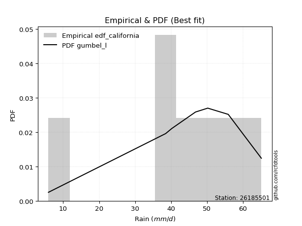</img>

</div>


### 2. EDF Hazen (1930)

Hazen method for plotting positions is a formula used to estimate the empirical cumulative probability distribution of flood events or other hydrological data. This formula often results in biased estimations, particularly when extrapolating to extreme events (high return periods).

<div align="center">


$P=(m-0.5)/n$


</div>


**2.1. Empirical values**

<div align="center">

|                | 0                   | 1                   | 2                   | 3         | 4                  | 5                  | 6                  |
|:---------------|:--------------------|:--------------------|:--------------------|:----------|:-------------------|:-------------------|:-------------------|
| date           | 2017                | 2020                | 2018                | 2023      | 2021               | 2022               | 2019               |
| x              | 5.9                 | 38.5                | 40.2                | 46.8      | 50.2               | 55.9               | 65.1               |
| m              | 1                   | 2                   | 3                   | 4         | 5                  | 6                  | 7                  |
| empirical_dist | edf_hazen           | edf_hazen           | edf_hazen           | edf_hazen | edf_hazen          | edf_hazen          | edf_hazen          |
| empirical      | 0.07142857142857142 | 0.21428571428571427 | 0.35714285714285715 | 0.5       | 0.6428571428571429 | 0.7857142857142857 | 0.9285714285714286 |
| empirical_tr   | 1.0769230769230769  | 1.2727272727272727  | 1.5555555555555558  | 2.0       | 2.8000000000000003 | 4.666666666666666  | 14.000000000000007 |

</div>


**2.2. Kolmogorov-Smirnov fit test (sorted by Δ)**


<div align="center">

|                | 0                   | 1                   | 2                   | 3                   | 4                   | 5                   | 6                   | 7                   | 8                   | 9                   | 10                  | 11                  | 12                  | 13                  | 14                  | 15                  | 16                  | 17                  | 18                  | 19                  | 20                  | 21                  | 22                  | 23                  | 24                  | 25                  | 26                  | 27                    | 28                  | 29                  | 30                  | 31                  | 32                  | 33                  | 34                  | 35                  | 36                  | 37                  | 38                  | 39                  | 40                  | 41                  | 42                  | 43                  | 44                  | 45                  | 46                  | 47                  | 48                  | 49                  | 50                  | 51                  | 52                  | 53                  | 54                  | 55                  | 56                  | 57                  | 58                  | 59                  | 60                  | 61                  | 62                  | 63                  | 64                  | 65                  | 66                  | 67                  | 68                  | 69                  | 70                  | 71                  | 72                  | 73                  | 74                  | 75                  | 76                  | 77                  | 78                  | 79                  | 80                  | 81                  | 82                  | 83                  | 84                  | 85                  | 86                  | 87                  |
|:---------------|:--------------------|:--------------------|:--------------------|:--------------------|:--------------------|:--------------------|:--------------------|:--------------------|:--------------------|:--------------------|:--------------------|:--------------------|:--------------------|:--------------------|:--------------------|:--------------------|:--------------------|:--------------------|:--------------------|:--------------------|:--------------------|:--------------------|:--------------------|:--------------------|:--------------------|:--------------------|:--------------------|:----------------------|:--------------------|:--------------------|:--------------------|:--------------------|:--------------------|:--------------------|:--------------------|:--------------------|:--------------------|:--------------------|:--------------------|:--------------------|:--------------------|:--------------------|:--------------------|:--------------------|:--------------------|:--------------------|:--------------------|:--------------------|:--------------------|:--------------------|:--------------------|:--------------------|:--------------------|:--------------------|:--------------------|:--------------------|:--------------------|:--------------------|:--------------------|:--------------------|:--------------------|:--------------------|:--------------------|:--------------------|:--------------------|:--------------------|:--------------------|:--------------------|:--------------------|:--------------------|:--------------------|:--------------------|:--------------------|:--------------------|:--------------------|:--------------------|:--------------------|:--------------------|:--------------------|:--------------------|:--------------------|:--------------------|:--------------------|:--------------------|:--------------------|:--------------------|:--------------------|:--------------------|
| station        | 26185501            | 26185501            | 26185501            | 26185501            | 26185501            | 26185501            | 26185501            | 26185501            | 26185501            | 26185501            | 26185501            | 26185501            | 26185501            | 26185501            | 26185501            | 26185501            | 26185501            | 26185501            | 26185501            | 26185501            | 26185501            | 26185501            | 26185501            | 26185501            | 26185501            | 26185501            | 26185501            | 26185501              | 26185501            | 26185501            | 26185501            | 26185501            | 26185501            | 26185501            | 26185501            | 26185501            | 26185501            | 26185501            | 26185501            | 26185501            | 26185501            | 26185501            | 26185501            | 26185501            | 26185501            | 26185501            | 26185501            | 26185501            | 26185501            | 26185501            | 26185501            | 26185501            | 26185501            | 26185501            | 26185501            | 26185501            | 26185501            | 26185501            | 26185501            | 26185501            | 26185501            | 26185501            | 26185501            | 26185501            | 26185501            | 26185501            | 26185501            | 26185501            | 26185501            | 26185501            | 26185501            | 26185501            | 26185501            | 26185501            | 26185501            | 26185501            | 26185501            | 26185501            | 26185501            | 26185501            | 26185501            | 26185501            | 26185501            | 26185501            | 26185501            | 26185501            | 26185501            | 26185501            |
| empirical_dist | edf_hazen           | edf_hazen           | edf_hazen           | edf_hazen           | edf_hazen           | edf_hazen           | edf_hazen           | edf_hazen           | edf_hazen           | edf_hazen           | edf_hazen           | edf_hazen           | edf_hazen           | edf_hazen           | edf_hazen           | edf_hazen           | edf_hazen           | edf_hazen           | edf_hazen           | edf_hazen           | edf_hazen           | edf_hazen           | edf_hazen           | edf_hazen           | edf_hazen           | edf_hazen           | edf_hazen           | edf_hazen             | edf_hazen           | edf_hazen           | edf_hazen           | edf_hazen           | edf_hazen           | edf_hazen           | edf_hazen           | edf_hazen           | edf_hazen           | edf_hazen           | edf_hazen           | edf_hazen           | edf_hazen           | edf_hazen           | edf_hazen           | edf_hazen           | edf_hazen           | edf_hazen           | edf_hazen           | edf_hazen           | edf_hazen           | edf_hazen           | edf_hazen           | edf_hazen           | edf_hazen           | edf_hazen           | edf_hazen           | edf_hazen           | edf_hazen           | edf_hazen           | edf_hazen           | edf_hazen           | edf_hazen           | edf_hazen           | edf_hazen           | edf_hazen           | edf_hazen           | edf_hazen           | edf_hazen           | edf_hazen           | edf_hazen           | edf_hazen           | edf_hazen           | edf_hazen           | edf_hazen           | edf_hazen           | edf_hazen           | edf_hazen           | edf_hazen           | edf_hazen           | edf_hazen           | edf_hazen           | edf_hazen           | edf_hazen           | edf_hazen           | edf_hazen           | edf_hazen           | edf_hazen           | edf_hazen           | edf_hazen           |
| p_dist         | t                   | laplace_asymmetric  | genlogistic         | johnsonsu           | weibull_min         | fisk                | gumbel_l            | logt                | gompertz            | pearson3            | logjohnsonsu        | laplace             | mielke              | hypsecant           | logmielke           | logistic            | exponnorm           | norm                | truncnorm           | crystalball         | rice                | nct                 | f                   | logcrystalball      | fatiguelife         | chi2                | gamma               | loglaplace_asymmetric | betaprime           | logloggamma         | logpearson3         | erlang              | invgamma            | logfisk             | maxwell             | nakagami            | lognakagami         | loggompertz         | rayleigh            | gumbel_r            | logtruncnorm        | invgauss            | ncf                 | loggumbel_l         | invweibull          | moyal               | halfnorm            | halflogistic        | kstwobign           | gibrat              | wald                | lognct              | logrice             | logexponnorm        | lognorm             | lognorm             | logfatiguelife      | logf                | logncf              | loglogistic         | logerlang           | loghypsecant        | loginvgamma         | loggamma            | loggamma            | logbetaprime        | logalpha            | loginvweibull       | loginvgauss         | loglaplace          | logmaxwell          | lograyleigh         | expon               | genexpon            | logkstwobign        | loghalfnorm         | loggumbel_r         | loggenexpon         | logmoyal            | loghalflogistic     | logexpon            | loglognorm          | alpha               | logwald             | loggibrat           | logweibull_min      | logchi2             | loggenlogistic      |
| delta          | 0.07266667129355164 | 0.08725701793517851 | 0.09107002192770106 | 0.09496191515528649 | 0.10081979159247309 | 0.10573817389388143 | 0.11299254166468306 | 0.11435349076925994 | 0.11548659041333345 | 0.11743917541214963 | 0.12477661247175878 | 0.12635245572221607 | 0.12712807840885007 | 0.1539570931861555  | 0.15615302863219074 | 0.16508353502969417 | 0.1787627850662125  | 0.1787642228027231  | 0.17876423613805717 | 0.17876423818392131 | 0.17877484656986095 | 0.17911863280076493 | 0.18044851545989068 | 0.18374676225112077 | 0.18510183969792068 | 0.1914453873180492  | 0.19238570216311587 | 0.19754324443075408   | 0.19756623913763036 | 0.19849670703500336 | 0.19917559428300405 | 0.20071129389966127 | 0.20649589076901462 | 0.2101420027130885  | 0.2126022244723754  | 0.21428255382504513 | 0.21428571249344372 | 0.2213347215667655  | 0.2249057839926283  | 0.23720431174363757 | 0.23954642555483036 | 0.24325577036738025 | 0.2514353123551527  | 0.25294786134499747 | 0.2582105577816931  | 0.2595643665843119  | 0.2598259977942323  | 0.2744817952107944  | 0.27914803108657193 | 0.30978118842252667 | 0.31931679085987086 | 0.32079635542004914 | 0.32132205771977773 | 0.3213320369742032  | 0.32133220097693926 | 0.32133220097693926 | 0.3220892033553334  | 0.32325804289408777 | 0.32453921447204304 | 0.32616402589465276 | 0.3284592785971775  | 0.33026799827591946 | 0.33134479779004944 | 0.33391451568255726 | 0.33391451568255726 | 0.33408087086470883 | 0.3368874436438627  | 0.337686894838336   | 0.34157727601088383 | 0.3450965594046923  | 0.3526195936377987  | 0.36277205697468295 | 0.36815372069417174 | 0.3738065830608136  | 0.3775564862249384  | 0.3913761357296389  | 0.3918591310463416  | 0.39846600474338423 | 0.417115876142505   | 0.4181307258250112  | 0.4313506572656446  | 0.44091738640481026 | 0.4824290576652662  | 0.48721370365676675 | 0.5150483419422218  | 0.527586520270803   | 0.5467462030825933  | 0.7857142857142857  |
| deltao         | 0.48442053926100004 | 0.48442053926100004 | 0.48442053926100004 | 0.48442053926100004 | 0.48442053926100004 | 0.48442053926100004 | 0.48442053926100004 | 0.48442053926100004 | 0.48442053926100004 | 0.48442053926100004 | 0.48442053926100004 | 0.48442053926100004 | 0.48442053926100004 | 0.48442053926100004 | 0.48442053926100004 | 0.48442053926100004 | 0.48442053926100004 | 0.48442053926100004 | 0.48442053926100004 | 0.48442053926100004 | 0.48442053926100004 | 0.48442053926100004 | 0.48442053926100004 | 0.48442053926100004 | 0.48442053926100004 | 0.48442053926100004 | 0.48442053926100004 | 0.48442053926100004   | 0.48442053926100004 | 0.48442053926100004 | 0.48442053926100004 | 0.48442053926100004 | 0.48442053926100004 | 0.48442053926100004 | 0.48442053926100004 | 0.48442053926100004 | 0.48442053926100004 | 0.48442053926100004 | 0.48442053926100004 | 0.48442053926100004 | 0.48442053926100004 | 0.48442053926100004 | 0.48442053926100004 | 0.48442053926100004 | 0.48442053926100004 | 0.48442053926100004 | 0.48442053926100004 | 0.48442053926100004 | 0.48442053926100004 | 0.48442053926100004 | 0.48442053926100004 | 0.48442053926100004 | 0.48442053926100004 | 0.48442053926100004 | 0.48442053926100004 | 0.48442053926100004 | 0.48442053926100004 | 0.48442053926100004 | 0.48442053926100004 | 0.48442053926100004 | 0.48442053926100004 | 0.48442053926100004 | 0.48442053926100004 | 0.48442053926100004 | 0.48442053926100004 | 0.48442053926100004 | 0.48442053926100004 | 0.48442053926100004 | 0.48442053926100004 | 0.48442053926100004 | 0.48442053926100004 | 0.48442053926100004 | 0.48442053926100004 | 0.48442053926100004 | 0.48442053926100004 | 0.48442053926100004 | 0.48442053926100004 | 0.48442053926100004 | 0.48442053926100004 | 0.48442053926100004 | 0.48442053926100004 | 0.48442053926100004 | 0.48442053926100004 | 0.48442053926100004 | 0.48442053926100004 | 0.48442053926100004 | 0.48442053926100004 | 0.48442053926100004 |
| eval           | Δo > Δ              | Δo > Δ              | Δo > Δ              | Δo > Δ              | Δo > Δ              | Δo > Δ              | Δo > Δ              | Δo > Δ              | Δo > Δ              | Δo > Δ              | Δo > Δ              | Δo > Δ              | Δo > Δ              | Δo > Δ              | Δo > Δ              | Δo > Δ              | Δo > Δ              | Δo > Δ              | Δo > Δ              | Δo > Δ              | Δo > Δ              | Δo > Δ              | Δo > Δ              | Δo > Δ              | Δo > Δ              | Δo > Δ              | Δo > Δ              | Δo > Δ                | Δo > Δ              | Δo > Δ              | Δo > Δ              | Δo > Δ              | Δo > Δ              | Δo > Δ              | Δo > Δ              | Δo > Δ              | Δo > Δ              | Δo > Δ              | Δo > Δ              | Δo > Δ              | Δo > Δ              | Δo > Δ              | Δo > Δ              | Δo > Δ              | Δo > Δ              | Δo > Δ              | Δo > Δ              | Δo > Δ              | Δo > Δ              | Δo > Δ              | Δo > Δ              | Δo > Δ              | Δo > Δ              | Δo > Δ              | Δo > Δ              | Δo > Δ              | Δo > Δ              | Δo > Δ              | Δo > Δ              | Δo > Δ              | Δo > Δ              | Δo > Δ              | Δo > Δ              | Δo > Δ              | Δo > Δ              | Δo > Δ              | Δo > Δ              | Δo > Δ              | Δo > Δ              | Δo > Δ              | Δo > Δ              | Δo > Δ              | Δo > Δ              | Δo > Δ              | Δo > Δ              | Δo > Δ              | Δo > Δ              | Δo > Δ              | Δo > Δ              | Δo > Δ              | Δo > Δ              | Δo > Δ              | Δo > Δ              | Δo <= Δ             | Δo <= Δ             | Δo <= Δ             | Δo <= Δ             | Δo <= Δ             |
| fit            | 1                   | 1                   | 1                   | 1                   | 1                   | 1                   | 1                   | 1                   | 1                   | 1                   | 1                   | 1                   | 1                   | 1                   | 1                   | 1                   | 1                   | 1                   | 1                   | 1                   | 1                   | 1                   | 1                   | 1                   | 1                   | 1                   | 1                   | 1                     | 1                   | 1                   | 1                   | 1                   | 1                   | 1                   | 1                   | 1                   | 1                   | 1                   | 1                   | 1                   | 1                   | 1                   | 1                   | 1                   | 1                   | 1                   | 1                   | 1                   | 1                   | 1                   | 1                   | 1                   | 1                   | 1                   | 1                   | 1                   | 1                   | 1                   | 1                   | 1                   | 1                   | 1                   | 1                   | 1                   | 1                   | 1                   | 1                   | 1                   | 1                   | 1                   | 1                   | 1                   | 1                   | 1                   | 1                   | 1                   | 1                   | 1                   | 1                   | 1                   | 1                   | 1                   | 1                   | 0                   | 0                   | 0                   | 0                   | 0                   |
| n              | 7                   | 7                   | 7                   | 7                   | 7                   | 7                   | 7                   | 7                   | 7                   | 7                   | 7                   | 7                   | 7                   | 7                   | 7                   | 7                   | 7                   | 7                   | 7                   | 7                   | 7                   | 7                   | 7                   | 7                   | 7                   | 7                   | 7                   | 7                     | 7                   | 7                   | 7                   | 7                   | 7                   | 7                   | 7                   | 7                   | 7                   | 7                   | 7                   | 7                   | 7                   | 7                   | 7                   | 7                   | 7                   | 7                   | 7                   | 7                   | 7                   | 7                   | 7                   | 7                   | 7                   | 7                   | 7                   | 7                   | 7                   | 7                   | 7                   | 7                   | 7                   | 7                   | 7                   | 7                   | 7                   | 7                   | 7                   | 7                   | 7                   | 7                   | 7                   | 7                   | 7                   | 7                   | 7                   | 7                   | 7                   | 7                   | 7                   | 7                   | 7                   | 7                   | 7                   | 7                   | 7                   | 7                   | 7                   | 7                   |
| best_fit       | 1                   | 0                   | 0                   | 0                   | 0                   | 0                   | 0                   | 0                   | 0                   | 0                   | 0                   | 0                   | 0                   | 0                   | 0                   | 0                   | 0                   | 0                   | 0                   | 0                   | 0                   | 0                   | 0                   | 0                   | 0                   | 0                   | 0                   | 0                     | 0                   | 0                   | 0                   | 0                   | 0                   | 0                   | 0                   | 0                   | 0                   | 0                   | 0                   | 0                   | 0                   | 0                   | 0                   | 0                   | 0                   | 0                   | 0                   | 0                   | 0                   | 0                   | 0                   | 0                   | 0                   | 0                   | 0                   | 0                   | 0                   | 0                   | 0                   | 0                   | 0                   | 0                   | 0                   | 0                   | 0                   | 0                   | 0                   | 0                   | 0                   | 0                   | 0                   | 0                   | 0                   | 0                   | 0                   | 0                   | 0                   | 0                   | 0                   | 0                   | 0                   | 0                   | 0                   | 0                   | 0                   | 0                   | 0                   | 0                   |
| best_fit_sort  | 1                   | 2                   | 3                   | 4                   | 5                   | 6                   | 7                   | 8                   | 9                   | 10                  | 11                  | 12                  | 13                  | 14                  | 15                  | 16                  | 17                  | 18                  | 19                  | 20                  | 21                  | 22                  | 23                  | 24                  | 25                  | 26                  | 27                  | 28                    | 29                  | 30                  | 31                  | 32                  | 33                  | 34                  | 35                  | 36                  | 37                  | 38                  | 39                  | 40                  | 41                  | 42                  | 43                  | 44                  | 45                  | 46                  | 47                  | 48                  | 49                  | 50                  | 51                  | 52                  | 53                  | 54                  | 55                  | 56                  | 57                  | 58                  | 59                  | 60                  | 61                  | 62                  | 63                  | 64                  | 65                  | 66                  | 67                  | 68                  | 69                  | 70                  | 71                  | 72                  | 73                  | 74                  | 75                  | 76                  | 77                  | 78                  | 79                  | 80                  | 81                  | 82                  | 83                  | 84                  | 85                  | 86                  | 87                  | 88                  |

</div>


**2.3. Best fit**

<div align="center">

|   id |   station | empirical_dist   | p_dist   |     delta |   deltao | eval   |   fit |   n |   best_fit |   best_fit_sort |
|-----:|----------:|:-----------------|:---------|----------:|---------:|:-------|------:|----:|-----------:|----------------:|
|    0 |  26185501 | edf_hazen        | t        | 0.0726667 | 0.484421 | Δo > Δ |     1 |   7 |          1 |               1 |

</div>


<div align="center">

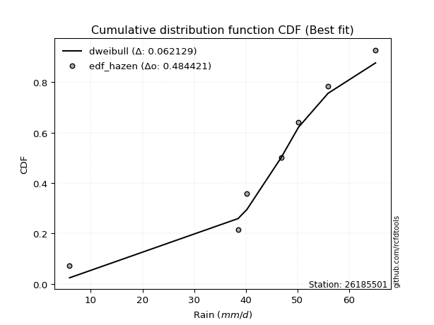</img>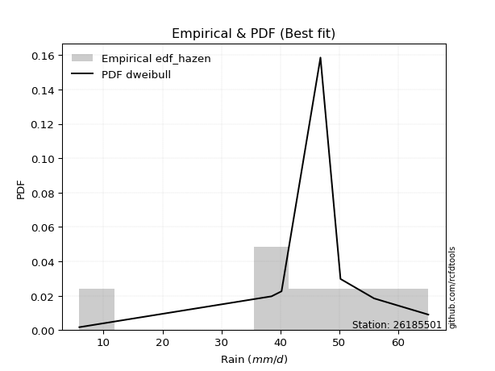</img>

</div>


### 3. EDF Weibull (1939)

Weibull plotting position formula is an empirical method used to estimate the non-exceedance probability or plotting position for a set of observed data, is often recommended or widely used in practice, particularly in flood frequency analysis.

<div align="center">


$P=m/(n+1)$


</div>


**3.1. Empirical values**

<div align="center">

|                | 0                  | 1                  | 2           | 3           | 4                  | 5           | 6           |
|:---------------|:-------------------|:-------------------|:------------|:------------|:-------------------|:------------|:------------|
| date           | 2017               | 2020               | 2018        | 2023        | 2021               | 2022        | 2019        |
| x              | 5.9                | 38.5               | 40.2        | 46.8        | 50.2               | 55.9        | 65.1        |
| m              | 1                  | 2                  | 3           | 4           | 5                  | 6           | 7           |
| empirical_dist | edf_weibull        | edf_weibull        | edf_weibull | edf_weibull | edf_weibull        | edf_weibull | edf_weibull |
| empirical      | 0.125              | 0.25               | 0.375       | 0.5         | 0.625              | 0.75        | 0.875       |
| empirical_tr   | 1.1428571428571428 | 1.3333333333333333 | 1.6         | 2.0         | 2.6666666666666665 | 4.0         | 8.0         |

</div>


**3.2. Kolmogorov-Smirnov fit test (sorted by Δ)**


<div align="center">

|                | 0                   | 1                   | 2                   | 3                   | 4                   | 5                   | 6                   | 7                   | 8                   | 9                   | 10                  | 11                  | 12                  | 13                  | 14                  | 15                  | 16                  | 17                  | 18                  | 19                  | 20                  | 21                  | 22                  | 23                  | 24                  | 25                  | 26                  | 27                    | 28                  | 29                  | 30                  | 31                  | 32                  | 33                  | 34                  | 35                  | 36                  | 37                  | 38                  | 39                  | 40                  | 41                  | 42                  | 43                  | 44                  | 45                  | 46                  | 47                  | 48                  | 49                  | 50                  | 51                  | 52                  | 53                  | 54                  | 55                  | 56                  | 57                  | 58                  | 59                  | 60                  | 61                  | 62                  | 63                  | 64                  | 65                  | 66                  | 67                  | 68                  | 69                  | 70                  | 71                  | 72                  | 73                  | 74                  | 75                  | 76                  | 77                  | 78                  | 79                  | 80                  | 81                  | 82                  | 83                  | 84                  | 85                  | 86                  | 87                  |
|:---------------|:--------------------|:--------------------|:--------------------|:--------------------|:--------------------|:--------------------|:--------------------|:--------------------|:--------------------|:--------------------|:--------------------|:--------------------|:--------------------|:--------------------|:--------------------|:--------------------|:--------------------|:--------------------|:--------------------|:--------------------|:--------------------|:--------------------|:--------------------|:--------------------|:--------------------|:--------------------|:--------------------|:----------------------|:--------------------|:--------------------|:--------------------|:--------------------|:--------------------|:--------------------|:--------------------|:--------------------|:--------------------|:--------------------|:--------------------|:--------------------|:--------------------|:--------------------|:--------------------|:--------------------|:--------------------|:--------------------|:--------------------|:--------------------|:--------------------|:--------------------|:--------------------|:--------------------|:--------------------|:--------------------|:--------------------|:--------------------|:--------------------|:--------------------|:--------------------|:--------------------|:--------------------|:--------------------|:--------------------|:--------------------|:--------------------|:--------------------|:--------------------|:--------------------|:--------------------|:--------------------|:--------------------|:--------------------|:--------------------|:--------------------|:--------------------|:--------------------|:--------------------|:--------------------|:--------------------|:--------------------|:--------------------|:--------------------|:--------------------|:--------------------|:--------------------|:--------------------|:--------------------|:--------------------|
| station        | 26185501            | 26185501            | 26185501            | 26185501            | 26185501            | 26185501            | 26185501            | 26185501            | 26185501            | 26185501            | 26185501            | 26185501            | 26185501            | 26185501            | 26185501            | 26185501            | 26185501            | 26185501            | 26185501            | 26185501            | 26185501            | 26185501            | 26185501            | 26185501            | 26185501            | 26185501            | 26185501            | 26185501              | 26185501            | 26185501            | 26185501            | 26185501            | 26185501            | 26185501            | 26185501            | 26185501            | 26185501            | 26185501            | 26185501            | 26185501            | 26185501            | 26185501            | 26185501            | 26185501            | 26185501            | 26185501            | 26185501            | 26185501            | 26185501            | 26185501            | 26185501            | 26185501            | 26185501            | 26185501            | 26185501            | 26185501            | 26185501            | 26185501            | 26185501            | 26185501            | 26185501            | 26185501            | 26185501            | 26185501            | 26185501            | 26185501            | 26185501            | 26185501            | 26185501            | 26185501            | 26185501            | 26185501            | 26185501            | 26185501            | 26185501            | 26185501            | 26185501            | 26185501            | 26185501            | 26185501            | 26185501            | 26185501            | 26185501            | 26185501            | 26185501            | 26185501            | 26185501            | 26185501            |
| empirical_dist | edf_weibull         | edf_weibull         | edf_weibull         | edf_weibull         | edf_weibull         | edf_weibull         | edf_weibull         | edf_weibull         | edf_weibull         | edf_weibull         | edf_weibull         | edf_weibull         | edf_weibull         | edf_weibull         | edf_weibull         | edf_weibull         | edf_weibull         | edf_weibull         | edf_weibull         | edf_weibull         | edf_weibull         | edf_weibull         | edf_weibull         | edf_weibull         | edf_weibull         | edf_weibull         | edf_weibull         | edf_weibull           | edf_weibull         | edf_weibull         | edf_weibull         | edf_weibull         | edf_weibull         | edf_weibull         | edf_weibull         | edf_weibull         | edf_weibull         | edf_weibull         | edf_weibull         | edf_weibull         | edf_weibull         | edf_weibull         | edf_weibull         | edf_weibull         | edf_weibull         | edf_weibull         | edf_weibull         | edf_weibull         | edf_weibull         | edf_weibull         | edf_weibull         | edf_weibull         | edf_weibull         | edf_weibull         | edf_weibull         | edf_weibull         | edf_weibull         | edf_weibull         | edf_weibull         | edf_weibull         | edf_weibull         | edf_weibull         | edf_weibull         | edf_weibull         | edf_weibull         | edf_weibull         | edf_weibull         | edf_weibull         | edf_weibull         | edf_weibull         | edf_weibull         | edf_weibull         | edf_weibull         | edf_weibull         | edf_weibull         | edf_weibull         | edf_weibull         | edf_weibull         | edf_weibull         | edf_weibull         | edf_weibull         | edf_weibull         | edf_weibull         | edf_weibull         | edf_weibull         | edf_weibull         | edf_weibull         | edf_weibull         |
| p_dist         | johnsonsu           | genlogistic         | laplace_asymmetric  | pearson3            | gumbel_l            | logjohnsonsu        | weibull_min         | t                   | fisk                | gompertz            | hypsecant           | mielke              | logmielke           | laplace             | logistic            | logt                | exponnorm           | norm                | truncnorm           | crystalball         | rice                | nct                 | f                   | logcrystalball      | fatiguelife         | chi2                | gamma               | loglaplace_asymmetric | betaprime           | logloggamma         | logpearson3         | erlang              | invgamma            | logfisk             | maxwell             | loggompertz         | rayleigh            | gumbel_r            | invgauss            | ncf                 | loggumbel_l         | invweibull          | moyal               | halfnorm            | halflogistic        | kstwobign           | nakagami            | lognakagami         | logtruncnorm        | gibrat              | wald                | lognct              | logrice             | logexponnorm        | lognorm             | lognorm             | logfatiguelife      | logf                | logncf              | loglogistic         | logerlang           | loghypsecant        | loginvgamma         | loggamma            | loggamma            | logbetaprime        | logalpha            | loginvweibull       | loginvgauss         | loglaplace          | logmaxwell          | lograyleigh         | expon               | genexpon            | logkstwobign        | loghalfnorm         | loggumbel_r         | loggenexpon         | logmoyal            | loghalflogistic     | logexpon            | loglognorm          | alpha               | logwald             | loggibrat           | logweibull_min      | logchi2             | loggenlogistic      |
| delta          | 0.08564293430903802 | 0.08599149034079465 | 0.08911349820330822 | 0.08931012570716812 | 0.08966210182696188 | 0.09215154384056456 | 0.09574138744634558 | 0.10156618528342835 | 0.11114458291916118 | 0.11139580086660235 | 0.11824280747186977 | 0.12015431778055397 | 0.12043874291790502 | 0.12581940338407138 | 0.12936924931540844 | 0.13221063362640278 | 0.14304849935192676 | 0.14304993708843738 | 0.14304995042377144 | 0.1430499524696356  | 0.14306056085557523 | 0.1434043470864792  | 0.14473422974560496 | 0.14803247653683504 | 0.14938755398363496 | 0.15573110160376347 | 0.15667141644883015 | 0.16182895871646835   | 0.16185195342334463 | 0.16278242132071763 | 0.16346130856871832 | 0.16499700818537555 | 0.1707816050547289  | 0.17442771699880277 | 0.17688793875808967 | 0.18562043585247978 | 0.18919149827834258 | 0.20149002602935184 | 0.20754148465309452 | 0.215721026640867   | 0.21723357563071177 | 0.2224962720674074  | 0.22385008087002622 | 0.22411171207994662 | 0.2387675094965087  | 0.24343374537228624 | 0.24999683953933086 | 0.24999999820772945 | 0.2574035684119732  | 0.27406690270824097 | 0.28360250514558516 | 0.28508206970576344 | 0.28560777200549203 | 0.2856177512599175  | 0.28561791526265357 | 0.28561791526265357 | 0.2863749176410477  | 0.2875437571798021  | 0.28882492875775734 | 0.29044974018036707 | 0.2927449928828918  | 0.29455371256163376 | 0.29563051207576374 | 0.29820022996827156 | 0.29820022996827156 | 0.29836658515042314 | 0.301173157929577   | 0.30197260912405033 | 0.30586299029659814 | 0.3093822736904066  | 0.316905307923513   | 0.32705777126039726 | 0.33243943497988604 | 0.3380922973465279  | 0.3418422005106527  | 0.3556618500153532  | 0.3561448453320559  | 0.36275171902909853 | 0.3814015904282193  | 0.3824164401107255  | 0.3956363715513589  | 0.40520310069052456 | 0.4467147719509805  | 0.45149941794248105 | 0.4793340562279361  | 0.4918722345565173  | 0.5110319173683076  | 0.75                |
| deltao         | 0.48442053926100004 | 0.48442053926100004 | 0.48442053926100004 | 0.48442053926100004 | 0.48442053926100004 | 0.48442053926100004 | 0.48442053926100004 | 0.48442053926100004 | 0.48442053926100004 | 0.48442053926100004 | 0.48442053926100004 | 0.48442053926100004 | 0.48442053926100004 | 0.48442053926100004 | 0.48442053926100004 | 0.48442053926100004 | 0.48442053926100004 | 0.48442053926100004 | 0.48442053926100004 | 0.48442053926100004 | 0.48442053926100004 | 0.48442053926100004 | 0.48442053926100004 | 0.48442053926100004 | 0.48442053926100004 | 0.48442053926100004 | 0.48442053926100004 | 0.48442053926100004   | 0.48442053926100004 | 0.48442053926100004 | 0.48442053926100004 | 0.48442053926100004 | 0.48442053926100004 | 0.48442053926100004 | 0.48442053926100004 | 0.48442053926100004 | 0.48442053926100004 | 0.48442053926100004 | 0.48442053926100004 | 0.48442053926100004 | 0.48442053926100004 | 0.48442053926100004 | 0.48442053926100004 | 0.48442053926100004 | 0.48442053926100004 | 0.48442053926100004 | 0.48442053926100004 | 0.48442053926100004 | 0.48442053926100004 | 0.48442053926100004 | 0.48442053926100004 | 0.48442053926100004 | 0.48442053926100004 | 0.48442053926100004 | 0.48442053926100004 | 0.48442053926100004 | 0.48442053926100004 | 0.48442053926100004 | 0.48442053926100004 | 0.48442053926100004 | 0.48442053926100004 | 0.48442053926100004 | 0.48442053926100004 | 0.48442053926100004 | 0.48442053926100004 | 0.48442053926100004 | 0.48442053926100004 | 0.48442053926100004 | 0.48442053926100004 | 0.48442053926100004 | 0.48442053926100004 | 0.48442053926100004 | 0.48442053926100004 | 0.48442053926100004 | 0.48442053926100004 | 0.48442053926100004 | 0.48442053926100004 | 0.48442053926100004 | 0.48442053926100004 | 0.48442053926100004 | 0.48442053926100004 | 0.48442053926100004 | 0.48442053926100004 | 0.48442053926100004 | 0.48442053926100004 | 0.48442053926100004 | 0.48442053926100004 | 0.48442053926100004 |
| eval           | Δo > Δ              | Δo > Δ              | Δo > Δ              | Δo > Δ              | Δo > Δ              | Δo > Δ              | Δo > Δ              | Δo > Δ              | Δo > Δ              | Δo > Δ              | Δo > Δ              | Δo > Δ              | Δo > Δ              | Δo > Δ              | Δo > Δ              | Δo > Δ              | Δo > Δ              | Δo > Δ              | Δo > Δ              | Δo > Δ              | Δo > Δ              | Δo > Δ              | Δo > Δ              | Δo > Δ              | Δo > Δ              | Δo > Δ              | Δo > Δ              | Δo > Δ                | Δo > Δ              | Δo > Δ              | Δo > Δ              | Δo > Δ              | Δo > Δ              | Δo > Δ              | Δo > Δ              | Δo > Δ              | Δo > Δ              | Δo > Δ              | Δo > Δ              | Δo > Δ              | Δo > Δ              | Δo > Δ              | Δo > Δ              | Δo > Δ              | Δo > Δ              | Δo > Δ              | Δo > Δ              | Δo > Δ              | Δo > Δ              | Δo > Δ              | Δo > Δ              | Δo > Δ              | Δo > Δ              | Δo > Δ              | Δo > Δ              | Δo > Δ              | Δo > Δ              | Δo > Δ              | Δo > Δ              | Δo > Δ              | Δo > Δ              | Δo > Δ              | Δo > Δ              | Δo > Δ              | Δo > Δ              | Δo > Δ              | Δo > Δ              | Δo > Δ              | Δo > Δ              | Δo > Δ              | Δo > Δ              | Δo > Δ              | Δo > Δ              | Δo > Δ              | Δo > Δ              | Δo > Δ              | Δo > Δ              | Δo > Δ              | Δo > Δ              | Δo > Δ              | Δo > Δ              | Δo > Δ              | Δo > Δ              | Δo > Δ              | Δo > Δ              | Δo <= Δ             | Δo <= Δ             | Δo <= Δ             |
| fit            | 1                   | 1                   | 1                   | 1                   | 1                   | 1                   | 1                   | 1                   | 1                   | 1                   | 1                   | 1                   | 1                   | 1                   | 1                   | 1                   | 1                   | 1                   | 1                   | 1                   | 1                   | 1                   | 1                   | 1                   | 1                   | 1                   | 1                   | 1                     | 1                   | 1                   | 1                   | 1                   | 1                   | 1                   | 1                   | 1                   | 1                   | 1                   | 1                   | 1                   | 1                   | 1                   | 1                   | 1                   | 1                   | 1                   | 1                   | 1                   | 1                   | 1                   | 1                   | 1                   | 1                   | 1                   | 1                   | 1                   | 1                   | 1                   | 1                   | 1                   | 1                   | 1                   | 1                   | 1                   | 1                   | 1                   | 1                   | 1                   | 1                   | 1                   | 1                   | 1                   | 1                   | 1                   | 1                   | 1                   | 1                   | 1                   | 1                   | 1                   | 1                   | 1                   | 1                   | 1                   | 1                   | 0                   | 0                   | 0                   |
| n              | 7                   | 7                   | 7                   | 7                   | 7                   | 7                   | 7                   | 7                   | 7                   | 7                   | 7                   | 7                   | 7                   | 7                   | 7                   | 7                   | 7                   | 7                   | 7                   | 7                   | 7                   | 7                   | 7                   | 7                   | 7                   | 7                   | 7                   | 7                     | 7                   | 7                   | 7                   | 7                   | 7                   | 7                   | 7                   | 7                   | 7                   | 7                   | 7                   | 7                   | 7                   | 7                   | 7                   | 7                   | 7                   | 7                   | 7                   | 7                   | 7                   | 7                   | 7                   | 7                   | 7                   | 7                   | 7                   | 7                   | 7                   | 7                   | 7                   | 7                   | 7                   | 7                   | 7                   | 7                   | 7                   | 7                   | 7                   | 7                   | 7                   | 7                   | 7                   | 7                   | 7                   | 7                   | 7                   | 7                   | 7                   | 7                   | 7                   | 7                   | 7                   | 7                   | 7                   | 7                   | 7                   | 7                   | 7                   | 7                   |
| best_fit       | 1                   | 0                   | 0                   | 0                   | 0                   | 0                   | 0                   | 0                   | 0                   | 0                   | 0                   | 0                   | 0                   | 0                   | 0                   | 0                   | 0                   | 0                   | 0                   | 0                   | 0                   | 0                   | 0                   | 0                   | 0                   | 0                   | 0                   | 0                     | 0                   | 0                   | 0                   | 0                   | 0                   | 0                   | 0                   | 0                   | 0                   | 0                   | 0                   | 0                   | 0                   | 0                   | 0                   | 0                   | 0                   | 0                   | 0                   | 0                   | 0                   | 0                   | 0                   | 0                   | 0                   | 0                   | 0                   | 0                   | 0                   | 0                   | 0                   | 0                   | 0                   | 0                   | 0                   | 0                   | 0                   | 0                   | 0                   | 0                   | 0                   | 0                   | 0                   | 0                   | 0                   | 0                   | 0                   | 0                   | 0                   | 0                   | 0                   | 0                   | 0                   | 0                   | 0                   | 0                   | 0                   | 0                   | 0                   | 0                   |
| best_fit_sort  | 1                   | 2                   | 3                   | 4                   | 5                   | 6                   | 7                   | 8                   | 9                   | 10                  | 11                  | 12                  | 13                  | 14                  | 15                  | 16                  | 17                  | 18                  | 19                  | 20                  | 21                  | 22                  | 23                  | 24                  | 25                  | 26                  | 27                  | 28                    | 29                  | 30                  | 31                  | 32                  | 33                  | 34                  | 35                  | 36                  | 37                  | 38                  | 39                  | 40                  | 41                  | 42                  | 43                  | 44                  | 45                  | 46                  | 47                  | 48                  | 49                  | 50                  | 51                  | 52                  | 53                  | 54                  | 55                  | 56                  | 57                  | 58                  | 59                  | 60                  | 61                  | 62                  | 63                  | 64                  | 65                  | 66                  | 67                  | 68                  | 69                  | 70                  | 71                  | 72                  | 73                  | 74                  | 75                  | 76                  | 77                  | 78                  | 79                  | 80                  | 81                  | 82                  | 83                  | 84                  | 85                  | 86                  | 87                  | 88                  |

</div>


**3.3. Best fit**

<div align="center">

|   id |   station | empirical_dist   | p_dist    |     delta |   deltao | eval   |   fit |   n |   best_fit |   best_fit_sort |
|-----:|----------:|:-----------------|:----------|----------:|---------:|:-------|------:|----:|-----------:|----------------:|
|    0 |  26185501 | edf_weibull      | johnsonsu | 0.0856429 | 0.484421 | Δo > Δ |     1 |   7 |          1 |               1 |

</div>


<div align="center">

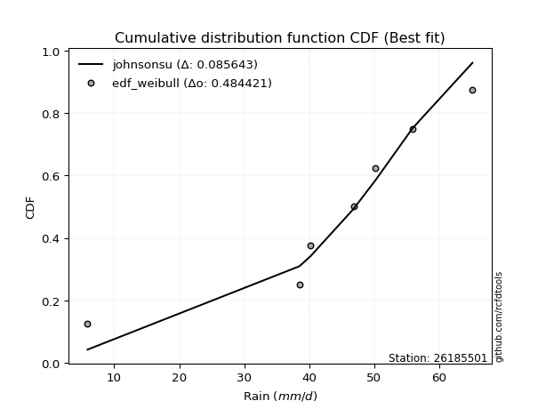</img>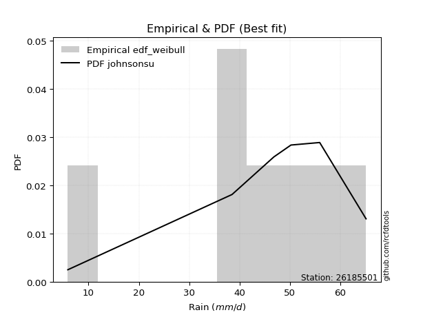</img>

</div>


### 4. EDF Beard (1943)

The Beard formula (or Beard´s plotting position formula) in hydrology is used to estimate the empirical non-exceedance probability _(P)_ of a flood event (or other extreme hydrological data point) within a given dataset.

<div align="center">


$P=(m-0.31)/(n+0.38)$


</div>


**4.1. Empirical values**

<div align="center">

|                | 0                   | 1                   | 2                   | 3         | 4                  | 5                  | 6                  |
|:---------------|:--------------------|:--------------------|:--------------------|:----------|:-------------------|:-------------------|:-------------------|
| date           | 2017                | 2020                | 2018                | 2023      | 2021               | 2022               | 2019               |
| x              | 5.9                 | 38.5                | 40.2                | 46.8      | 50.2               | 55.9               | 65.1               |
| m              | 1                   | 2                   | 3                   | 4         | 5                  | 6                  | 7                  |
| empirical_dist | edf_beard           | edf_beard           | edf_beard           | edf_beard | edf_beard          | edf_beard          | edf_beard          |
| empirical      | 0.09349593495934959 | 0.22899728997289973 | 0.36449864498644985 | 0.5       | 0.6355013550135502 | 0.7710027100271003 | 0.9065040650406505 |
| empirical_tr   | 1.1031390134529149  | 1.29701230228471    | 1.5735607675906182  | 2.0       | 2.743494423791822  | 4.366863905325444  | 10.695652173913055 |

</div>


**4.2. Kolmogorov-Smirnov fit test (sorted by Δ)**


<div align="center">

|                | 0                   | 1                   | 2                   | 3                   | 4                   | 5                   | 6                   | 7                   | 8                   | 9                   | 10                  | 11                  | 12                  | 13                  | 14                  | 15                  | 16                  | 17                  | 18                  | 19                  | 20                  | 21                  | 22                  | 23                  | 24                  | 25                  | 26                  | 27                    | 28                  | 29                  | 30                  | 31                  | 32                  | 33                  | 34                  | 35                  | 36                  | 37                  | 38                  | 39                  | 40                  | 41                  | 42                  | 43                  | 44                  | 45                  | 46                  | 47                  | 48                  | 49                  | 50                  | 51                  | 52                  | 53                  | 54                  | 55                  | 56                  | 57                  | 58                  | 59                  | 60                  | 61                  | 62                  | 63                  | 64                  | 65                  | 66                  | 67                  | 68                  | 69                  | 70                  | 71                  | 72                  | 73                  | 74                  | 75                  | 76                  | 77                  | 78                  | 79                  | 80                  | 81                  | 82                  | 83                  | 84                  | 85                  | 86                  | 87                  |
|:---------------|:--------------------|:--------------------|:--------------------|:--------------------|:--------------------|:--------------------|:--------------------|:--------------------|:--------------------|:--------------------|:--------------------|:--------------------|:--------------------|:--------------------|:--------------------|:--------------------|:--------------------|:--------------------|:--------------------|:--------------------|:--------------------|:--------------------|:--------------------|:--------------------|:--------------------|:--------------------|:--------------------|:----------------------|:--------------------|:--------------------|:--------------------|:--------------------|:--------------------|:--------------------|:--------------------|:--------------------|:--------------------|:--------------------|:--------------------|:--------------------|:--------------------|:--------------------|:--------------------|:--------------------|:--------------------|:--------------------|:--------------------|:--------------------|:--------------------|:--------------------|:--------------------|:--------------------|:--------------------|:--------------------|:--------------------|:--------------------|:--------------------|:--------------------|:--------------------|:--------------------|:--------------------|:--------------------|:--------------------|:--------------------|:--------------------|:--------------------|:--------------------|:--------------------|:--------------------|:--------------------|:--------------------|:--------------------|:--------------------|:--------------------|:--------------------|:--------------------|:--------------------|:--------------------|:--------------------|:--------------------|:--------------------|:--------------------|:--------------------|:--------------------|:--------------------|:--------------------|:--------------------|:--------------------|
| station        | 26185501            | 26185501            | 26185501            | 26185501            | 26185501            | 26185501            | 26185501            | 26185501            | 26185501            | 26185501            | 26185501            | 26185501            | 26185501            | 26185501            | 26185501            | 26185501            | 26185501            | 26185501            | 26185501            | 26185501            | 26185501            | 26185501            | 26185501            | 26185501            | 26185501            | 26185501            | 26185501            | 26185501              | 26185501            | 26185501            | 26185501            | 26185501            | 26185501            | 26185501            | 26185501            | 26185501            | 26185501            | 26185501            | 26185501            | 26185501            | 26185501            | 26185501            | 26185501            | 26185501            | 26185501            | 26185501            | 26185501            | 26185501            | 26185501            | 26185501            | 26185501            | 26185501            | 26185501            | 26185501            | 26185501            | 26185501            | 26185501            | 26185501            | 26185501            | 26185501            | 26185501            | 26185501            | 26185501            | 26185501            | 26185501            | 26185501            | 26185501            | 26185501            | 26185501            | 26185501            | 26185501            | 26185501            | 26185501            | 26185501            | 26185501            | 26185501            | 26185501            | 26185501            | 26185501            | 26185501            | 26185501            | 26185501            | 26185501            | 26185501            | 26185501            | 26185501            | 26185501            | 26185501            |
| empirical_dist | edf_beard           | edf_beard           | edf_beard           | edf_beard           | edf_beard           | edf_beard           | edf_beard           | edf_beard           | edf_beard           | edf_beard           | edf_beard           | edf_beard           | edf_beard           | edf_beard           | edf_beard           | edf_beard           | edf_beard           | edf_beard           | edf_beard           | edf_beard           | edf_beard           | edf_beard           | edf_beard           | edf_beard           | edf_beard           | edf_beard           | edf_beard           | edf_beard             | edf_beard           | edf_beard           | edf_beard           | edf_beard           | edf_beard           | edf_beard           | edf_beard           | edf_beard           | edf_beard           | edf_beard           | edf_beard           | edf_beard           | edf_beard           | edf_beard           | edf_beard           | edf_beard           | edf_beard           | edf_beard           | edf_beard           | edf_beard           | edf_beard           | edf_beard           | edf_beard           | edf_beard           | edf_beard           | edf_beard           | edf_beard           | edf_beard           | edf_beard           | edf_beard           | edf_beard           | edf_beard           | edf_beard           | edf_beard           | edf_beard           | edf_beard           | edf_beard           | edf_beard           | edf_beard           | edf_beard           | edf_beard           | edf_beard           | edf_beard           | edf_beard           | edf_beard           | edf_beard           | edf_beard           | edf_beard           | edf_beard           | edf_beard           | edf_beard           | edf_beard           | edf_beard           | edf_beard           | edf_beard           | edf_beard           | edf_beard           | edf_beard           | edf_beard           | edf_beard           |
| p_dist         | laplace_asymmetric  | genlogistic         | t                   | johnsonsu           | weibull_min         | fisk                | gumbel_l            | gompertz            | pearson3            | logjohnsonsu        | mielke              | logt                | laplace             | hypsecant           | logmielke           | logistic            | exponnorm           | norm                | truncnorm           | crystalball         | rice                | nct                 | f                   | logcrystalball      | fatiguelife         | chi2                | gamma               | loglaplace_asymmetric | betaprime           | logloggamma         | logpearson3         | erlang              | invgamma            | logfisk             | maxwell             | loggompertz         | rayleigh            | gumbel_r            | invgauss            | nakagami            | lognakagami         | ncf                 | loggumbel_l         | invweibull          | moyal               | halfnorm            | logtruncnorm        | halflogistic        | kstwobign           | gibrat              | wald                | lognct              | logrice             | logexponnorm        | lognorm             | lognorm             | logfatiguelife      | logf                | logncf              | loglogistic         | logerlang           | loghypsecant        | loginvgamma         | loggamma            | loggamma            | logbetaprime        | logalpha            | loginvweibull       | loginvgauss         | loglaplace          | logmaxwell          | lograyleigh         | expon               | genexpon            | logkstwobign        | loghalfnorm         | loggumbel_r         | loggenexpon         | logmoyal            | loghalflogistic     | logexpon            | loglognorm          | alpha               | logwald             | loggibrat           | logweibull_min      | logchi2             | loggenlogistic      |
| delta          | 0.07254544224799306 | 0.0763584462405156  | 0.08002245913714434 | 0.08025033946810103 | 0.08610821590528764 | 0.09102659820669598 | 0.09828096597749761 | 0.100775014726148   | 0.10272759972496417 | 0.11006503678457333 | 0.11241650272166462 | 0.12170927861285263 | 0.12581940338407138 | 0.13924551749897005 | 0.1414414529450053  | 0.15037195934250872 | 0.16405120937902704 | 0.16405264711553766 | 0.16405266045087172 | 0.16405266249673586 | 0.1640632708826755  | 0.16440705711357947 | 0.16573693977270523 | 0.16903518656393532 | 0.17039026401073523 | 0.17673381163086374 | 0.17767412647593042 | 0.18283166874356863   | 0.1828546634504449  | 0.1837851313478179  | 0.1844640185958186  | 0.18599971821247582 | 0.19178431508182917 | 0.19543042702590305 | 0.19789064878518994 | 0.20662314587958006 | 0.21019420830544286 | 0.22249273605645212 | 0.2285441946801948  | 0.22899412951223058 | 0.22899728818062917 | 0.23672373666796728 | 0.23823628565781205 | 0.24349898209450768 | 0.2448527908971265  | 0.2451144221070469  | 0.24690221339842305 | 0.259770219523609   | 0.26443645539938654 | 0.29506961273534127 | 0.30460521517268546 | 0.30608477973286374 | 0.30661048203259234 | 0.3066204612870178  | 0.30662062528975387 | 0.30662062528975387 | 0.307377627668148   | 0.3085464672069024  | 0.30982763878485764 | 0.31145245020746737 | 0.3137477029099921  | 0.31555642258873406 | 0.31663322210286404 | 0.31920293999537186 | 0.31920293999537186 | 0.31936929517752344 | 0.3221758679566773  | 0.32297531915115063 | 0.32686570032369844 | 0.3303849837175069  | 0.3379080179506133  | 0.34806048128749756 | 0.35344214500698634 | 0.3590950073736282  | 0.36284491053775303 | 0.3766645600424535  | 0.37714755535915623 | 0.38375442905619883 | 0.4024043004553196  | 0.4034191501378258  | 0.4166390815784592  | 0.42620581071762487 | 0.46771748197808083 | 0.47250212796958135 | 0.5003367662550364  | 0.5128749445836176  | 0.5320346273954079  | 0.7710027100271003  |
| deltao         | 0.48442053926100004 | 0.48442053926100004 | 0.48442053926100004 | 0.48442053926100004 | 0.48442053926100004 | 0.48442053926100004 | 0.48442053926100004 | 0.48442053926100004 | 0.48442053926100004 | 0.48442053926100004 | 0.48442053926100004 | 0.48442053926100004 | 0.48442053926100004 | 0.48442053926100004 | 0.48442053926100004 | 0.48442053926100004 | 0.48442053926100004 | 0.48442053926100004 | 0.48442053926100004 | 0.48442053926100004 | 0.48442053926100004 | 0.48442053926100004 | 0.48442053926100004 | 0.48442053926100004 | 0.48442053926100004 | 0.48442053926100004 | 0.48442053926100004 | 0.48442053926100004   | 0.48442053926100004 | 0.48442053926100004 | 0.48442053926100004 | 0.48442053926100004 | 0.48442053926100004 | 0.48442053926100004 | 0.48442053926100004 | 0.48442053926100004 | 0.48442053926100004 | 0.48442053926100004 | 0.48442053926100004 | 0.48442053926100004 | 0.48442053926100004 | 0.48442053926100004 | 0.48442053926100004 | 0.48442053926100004 | 0.48442053926100004 | 0.48442053926100004 | 0.48442053926100004 | 0.48442053926100004 | 0.48442053926100004 | 0.48442053926100004 | 0.48442053926100004 | 0.48442053926100004 | 0.48442053926100004 | 0.48442053926100004 | 0.48442053926100004 | 0.48442053926100004 | 0.48442053926100004 | 0.48442053926100004 | 0.48442053926100004 | 0.48442053926100004 | 0.48442053926100004 | 0.48442053926100004 | 0.48442053926100004 | 0.48442053926100004 | 0.48442053926100004 | 0.48442053926100004 | 0.48442053926100004 | 0.48442053926100004 | 0.48442053926100004 | 0.48442053926100004 | 0.48442053926100004 | 0.48442053926100004 | 0.48442053926100004 | 0.48442053926100004 | 0.48442053926100004 | 0.48442053926100004 | 0.48442053926100004 | 0.48442053926100004 | 0.48442053926100004 | 0.48442053926100004 | 0.48442053926100004 | 0.48442053926100004 | 0.48442053926100004 | 0.48442053926100004 | 0.48442053926100004 | 0.48442053926100004 | 0.48442053926100004 | 0.48442053926100004 |
| eval           | Δo > Δ              | Δo > Δ              | Δo > Δ              | Δo > Δ              | Δo > Δ              | Δo > Δ              | Δo > Δ              | Δo > Δ              | Δo > Δ              | Δo > Δ              | Δo > Δ              | Δo > Δ              | Δo > Δ              | Δo > Δ              | Δo > Δ              | Δo > Δ              | Δo > Δ              | Δo > Δ              | Δo > Δ              | Δo > Δ              | Δo > Δ              | Δo > Δ              | Δo > Δ              | Δo > Δ              | Δo > Δ              | Δo > Δ              | Δo > Δ              | Δo > Δ                | Δo > Δ              | Δo > Δ              | Δo > Δ              | Δo > Δ              | Δo > Δ              | Δo > Δ              | Δo > Δ              | Δo > Δ              | Δo > Δ              | Δo > Δ              | Δo > Δ              | Δo > Δ              | Δo > Δ              | Δo > Δ              | Δo > Δ              | Δo > Δ              | Δo > Δ              | Δo > Δ              | Δo > Δ              | Δo > Δ              | Δo > Δ              | Δo > Δ              | Δo > Δ              | Δo > Δ              | Δo > Δ              | Δo > Δ              | Δo > Δ              | Δo > Δ              | Δo > Δ              | Δo > Δ              | Δo > Δ              | Δo > Δ              | Δo > Δ              | Δo > Δ              | Δo > Δ              | Δo > Δ              | Δo > Δ              | Δo > Δ              | Δo > Δ              | Δo > Δ              | Δo > Δ              | Δo > Δ              | Δo > Δ              | Δo > Δ              | Δo > Δ              | Δo > Δ              | Δo > Δ              | Δo > Δ              | Δo > Δ              | Δo > Δ              | Δo > Δ              | Δo > Δ              | Δo > Δ              | Δo > Δ              | Δo > Δ              | Δo > Δ              | Δo <= Δ             | Δo <= Δ             | Δo <= Δ             | Δo <= Δ             |
| fit            | 1                   | 1                   | 1                   | 1                   | 1                   | 1                   | 1                   | 1                   | 1                   | 1                   | 1                   | 1                   | 1                   | 1                   | 1                   | 1                   | 1                   | 1                   | 1                   | 1                   | 1                   | 1                   | 1                   | 1                   | 1                   | 1                   | 1                   | 1                     | 1                   | 1                   | 1                   | 1                   | 1                   | 1                   | 1                   | 1                   | 1                   | 1                   | 1                   | 1                   | 1                   | 1                   | 1                   | 1                   | 1                   | 1                   | 1                   | 1                   | 1                   | 1                   | 1                   | 1                   | 1                   | 1                   | 1                   | 1                   | 1                   | 1                   | 1                   | 1                   | 1                   | 1                   | 1                   | 1                   | 1                   | 1                   | 1                   | 1                   | 1                   | 1                   | 1                   | 1                   | 1                   | 1                   | 1                   | 1                   | 1                   | 1                   | 1                   | 1                   | 1                   | 1                   | 1                   | 1                   | 0                   | 0                   | 0                   | 0                   |
| n              | 7                   | 7                   | 7                   | 7                   | 7                   | 7                   | 7                   | 7                   | 7                   | 7                   | 7                   | 7                   | 7                   | 7                   | 7                   | 7                   | 7                   | 7                   | 7                   | 7                   | 7                   | 7                   | 7                   | 7                   | 7                   | 7                   | 7                   | 7                     | 7                   | 7                   | 7                   | 7                   | 7                   | 7                   | 7                   | 7                   | 7                   | 7                   | 7                   | 7                   | 7                   | 7                   | 7                   | 7                   | 7                   | 7                   | 7                   | 7                   | 7                   | 7                   | 7                   | 7                   | 7                   | 7                   | 7                   | 7                   | 7                   | 7                   | 7                   | 7                   | 7                   | 7                   | 7                   | 7                   | 7                   | 7                   | 7                   | 7                   | 7                   | 7                   | 7                   | 7                   | 7                   | 7                   | 7                   | 7                   | 7                   | 7                   | 7                   | 7                   | 7                   | 7                   | 7                   | 7                   | 7                   | 7                   | 7                   | 7                   |
| best_fit       | 1                   | 0                   | 0                   | 0                   | 0                   | 0                   | 0                   | 0                   | 0                   | 0                   | 0                   | 0                   | 0                   | 0                   | 0                   | 0                   | 0                   | 0                   | 0                   | 0                   | 0                   | 0                   | 0                   | 0                   | 0                   | 0                   | 0                   | 0                     | 0                   | 0                   | 0                   | 0                   | 0                   | 0                   | 0                   | 0                   | 0                   | 0                   | 0                   | 0                   | 0                   | 0                   | 0                   | 0                   | 0                   | 0                   | 0                   | 0                   | 0                   | 0                   | 0                   | 0                   | 0                   | 0                   | 0                   | 0                   | 0                   | 0                   | 0                   | 0                   | 0                   | 0                   | 0                   | 0                   | 0                   | 0                   | 0                   | 0                   | 0                   | 0                   | 0                   | 0                   | 0                   | 0                   | 0                   | 0                   | 0                   | 0                   | 0                   | 0                   | 0                   | 0                   | 0                   | 0                   | 0                   | 0                   | 0                   | 0                   |
| best_fit_sort  | 1                   | 2                   | 3                   | 4                   | 5                   | 6                   | 7                   | 8                   | 9                   | 10                  | 11                  | 12                  | 13                  | 14                  | 15                  | 16                  | 17                  | 18                  | 19                  | 20                  | 21                  | 22                  | 23                  | 24                  | 25                  | 26                  | 27                  | 28                    | 29                  | 30                  | 31                  | 32                  | 33                  | 34                  | 35                  | 36                  | 37                  | 38                  | 39                  | 40                  | 41                  | 42                  | 43                  | 44                  | 45                  | 46                  | 47                  | 48                  | 49                  | 50                  | 51                  | 52                  | 53                  | 54                  | 55                  | 56                  | 57                  | 58                  | 59                  | 60                  | 61                  | 62                  | 63                  | 64                  | 65                  | 66                  | 67                  | 68                  | 69                  | 70                  | 71                  | 72                  | 73                  | 74                  | 75                  | 76                  | 77                  | 78                  | 79                  | 80                  | 81                  | 82                  | 83                  | 84                  | 85                  | 86                  | 87                  | 88                  |

</div>


**4.3. Best fit**

<div align="center">

|   id |   station | empirical_dist   | p_dist             |     delta |   deltao | eval   |   fit |   n |   best_fit |   best_fit_sort |
|-----:|----------:|:-----------------|:-------------------|----------:|---------:|:-------|------:|----:|-----------:|----------------:|
|    0 |  26185501 | edf_beard        | laplace_asymmetric | 0.0725454 | 0.484421 | Δo > Δ |     1 |   7 |          1 |               1 |

</div>


<div align="center">

</img></img>

</div>


### 5. EDF Chegodayev (1955)

The Chegodayev formula is an empirical plotting position formula used in hydrological frequency analysis to estimate the exceedance probability or return period of a specific event from a set of observed data. It is primarily used for plotting observed data points on probability paper to fit a theoretical distribution, particularly for analyzing extreme events like maximum flood flows or rainfall intensities. The constant _b_ value in the generalized plotting position formula is 0.3.

<div align="center">


$P=(m-b)/(n+1-2b)$


</div>


**5.1. Empirical values**

<div align="center">

|                | 0                   | 1                   | 2                   | 3              | 4                  | 5                  | 6                  |
|:---------------|:--------------------|:--------------------|:--------------------|:---------------|:-------------------|:-------------------|:-------------------|
| date           | 2017                | 2020                | 2018                | 2023           | 2021               | 2022               | 2019               |
| x              | 5.9                 | 38.5                | 40.2                | 46.8           | 50.2               | 55.9               | 65.1               |
| m              | 1                   | 2                   | 3                   | 4              | 5                  | 6                  | 7                  |
| empirical_dist | edf_chegodayev      | edf_chegodayev      | edf_chegodayev      | edf_chegodayev | edf_chegodayev     | edf_chegodayev     | edf_chegodayev     |
| empirical      | 0.09459459459459459 | 0.22972972972972971 | 0.36486486486486486 | 0.5            | 0.6351351351351351 | 0.7702702702702703 | 0.9054054054054054 |
| empirical_tr   | 1.1044776119402986  | 1.2982456140350878  | 1.574468085106383   | 2.0            | 2.7407407407407405 | 4.352941176470589  | 10.571428571428568 |

</div>


**5.2. Kolmogorov-Smirnov fit test (sorted by Δ)**


<div align="center">

|                | 0                   | 1                   | 2                   | 3                   | 4                   | 5                   | 6                   | 7                   | 8                   | 9                   | 10                  | 11                  | 12                  | 13                  | 14                  | 15                  | 16                  | 17                  | 18                  | 19                  | 20                  | 21                  | 22                  | 23                  | 24                  | 25                  | 26                  | 27                    | 28                  | 29                  | 30                  | 31                  | 32                  | 33                  | 34                  | 35                  | 36                  | 37                  | 38                  | 39                  | 40                  | 41                  | 42                  | 43                  | 44                  | 45                  | 46                  | 47                  | 48                  | 49                  | 50                  | 51                  | 52                  | 53                  | 54                  | 55                  | 56                  | 57                  | 58                  | 59                  | 60                  | 61                  | 62                  | 63                  | 64                  | 65                  | 66                  | 67                  | 68                  | 69                  | 70                  | 71                  | 72                  | 73                  | 74                  | 75                  | 76                  | 77                  | 78                  | 79                  | 80                  | 81                  | 82                  | 83                  | 84                  | 85                  | 86                  | 87                  |
|:---------------|:--------------------|:--------------------|:--------------------|:--------------------|:--------------------|:--------------------|:--------------------|:--------------------|:--------------------|:--------------------|:--------------------|:--------------------|:--------------------|:--------------------|:--------------------|:--------------------|:--------------------|:--------------------|:--------------------|:--------------------|:--------------------|:--------------------|:--------------------|:--------------------|:--------------------|:--------------------|:--------------------|:----------------------|:--------------------|:--------------------|:--------------------|:--------------------|:--------------------|:--------------------|:--------------------|:--------------------|:--------------------|:--------------------|:--------------------|:--------------------|:--------------------|:--------------------|:--------------------|:--------------------|:--------------------|:--------------------|:--------------------|:--------------------|:--------------------|:--------------------|:--------------------|:--------------------|:--------------------|:--------------------|:--------------------|:--------------------|:--------------------|:--------------------|:--------------------|:--------------------|:--------------------|:--------------------|:--------------------|:--------------------|:--------------------|:--------------------|:--------------------|:--------------------|:--------------------|:--------------------|:--------------------|:--------------------|:--------------------|:--------------------|:--------------------|:--------------------|:--------------------|:--------------------|:--------------------|:--------------------|:--------------------|:--------------------|:--------------------|:--------------------|:--------------------|:--------------------|:--------------------|:--------------------|
| station        | 26185501            | 26185501            | 26185501            | 26185501            | 26185501            | 26185501            | 26185501            | 26185501            | 26185501            | 26185501            | 26185501            | 26185501            | 26185501            | 26185501            | 26185501            | 26185501            | 26185501            | 26185501            | 26185501            | 26185501            | 26185501            | 26185501            | 26185501            | 26185501            | 26185501            | 26185501            | 26185501            | 26185501              | 26185501            | 26185501            | 26185501            | 26185501            | 26185501            | 26185501            | 26185501            | 26185501            | 26185501            | 26185501            | 26185501            | 26185501            | 26185501            | 26185501            | 26185501            | 26185501            | 26185501            | 26185501            | 26185501            | 26185501            | 26185501            | 26185501            | 26185501            | 26185501            | 26185501            | 26185501            | 26185501            | 26185501            | 26185501            | 26185501            | 26185501            | 26185501            | 26185501            | 26185501            | 26185501            | 26185501            | 26185501            | 26185501            | 26185501            | 26185501            | 26185501            | 26185501            | 26185501            | 26185501            | 26185501            | 26185501            | 26185501            | 26185501            | 26185501            | 26185501            | 26185501            | 26185501            | 26185501            | 26185501            | 26185501            | 26185501            | 26185501            | 26185501            | 26185501            | 26185501            |
| empirical_dist | edf_chegodayev      | edf_chegodayev      | edf_chegodayev      | edf_chegodayev      | edf_chegodayev      | edf_chegodayev      | edf_chegodayev      | edf_chegodayev      | edf_chegodayev      | edf_chegodayev      | edf_chegodayev      | edf_chegodayev      | edf_chegodayev      | edf_chegodayev      | edf_chegodayev      | edf_chegodayev      | edf_chegodayev      | edf_chegodayev      | edf_chegodayev      | edf_chegodayev      | edf_chegodayev      | edf_chegodayev      | edf_chegodayev      | edf_chegodayev      | edf_chegodayev      | edf_chegodayev      | edf_chegodayev      | edf_chegodayev        | edf_chegodayev      | edf_chegodayev      | edf_chegodayev      | edf_chegodayev      | edf_chegodayev      | edf_chegodayev      | edf_chegodayev      | edf_chegodayev      | edf_chegodayev      | edf_chegodayev      | edf_chegodayev      | edf_chegodayev      | edf_chegodayev      | edf_chegodayev      | edf_chegodayev      | edf_chegodayev      | edf_chegodayev      | edf_chegodayev      | edf_chegodayev      | edf_chegodayev      | edf_chegodayev      | edf_chegodayev      | edf_chegodayev      | edf_chegodayev      | edf_chegodayev      | edf_chegodayev      | edf_chegodayev      | edf_chegodayev      | edf_chegodayev      | edf_chegodayev      | edf_chegodayev      | edf_chegodayev      | edf_chegodayev      | edf_chegodayev      | edf_chegodayev      | edf_chegodayev      | edf_chegodayev      | edf_chegodayev      | edf_chegodayev      | edf_chegodayev      | edf_chegodayev      | edf_chegodayev      | edf_chegodayev      | edf_chegodayev      | edf_chegodayev      | edf_chegodayev      | edf_chegodayev      | edf_chegodayev      | edf_chegodayev      | edf_chegodayev      | edf_chegodayev      | edf_chegodayev      | edf_chegodayev      | edf_chegodayev      | edf_chegodayev      | edf_chegodayev      | edf_chegodayev      | edf_chegodayev      | edf_chegodayev      | edf_chegodayev      |
| p_dist         | laplace_asymmetric  | genlogistic         | johnsonsu           | t                   | weibull_min         | fisk                | gumbel_l            | gompertz            | pearson3            | logjohnsonsu        | mielke              | logt                | laplace             | hypsecant           | logmielke           | logistic            | exponnorm           | norm                | truncnorm           | crystalball         | rice                | nct                 | f                   | logcrystalball      | fatiguelife         | chi2                | gamma               | loglaplace_asymmetric | betaprime           | logloggamma         | logpearson3         | erlang              | invgamma            | logfisk             | maxwell             | loggompertz         | rayleigh            | gumbel_r            | invgauss            | nakagami            | lognakagami         | ncf                 | loggumbel_l         | invweibull          | moyal               | halfnorm            | logtruncnorm        | halflogistic        | kstwobign           | gibrat              | wald                | lognct              | logrice             | logexponnorm        | lognorm             | lognorm             | logfatiguelife      | logf                | logncf              | loglogistic         | logerlang           | loghypsecant        | loginvgamma         | loggamma            | loggamma            | logbetaprime        | logalpha            | loginvweibull       | loginvgauss         | loglaplace          | logmaxwell          | lograyleigh         | expon               | genexpon            | logkstwobign        | loghalfnorm         | loggumbel_r         | loggenexpon         | logmoyal            | loghalflogistic     | logexpon            | loglognorm          | alpha               | logwald             | loggibrat           | logweibull_min      | logchi2             | loggenlogistic      |
| delta          | 0.07181300249116307 | 0.07562600648368561 | 0.07951789971127105 | 0.08038867901555935 | 0.08537577614845765 | 0.09029415844986599 | 0.09754852622066762 | 0.10004257496931801 | 0.10199515996813419 | 0.10933259702774334 | 0.11168406296483463 | 0.12207549849126764 | 0.12581940338407138 | 0.13851307774214006 | 0.1407090131881753  | 0.14963951958567873 | 0.16331876962219705 | 0.16332020735870767 | 0.16332022069404173 | 0.16332022273990587 | 0.1633308311258455  | 0.16367461735674949 | 0.16500450001587524 | 0.16830274680710533 | 0.16965782425390524 | 0.17600137187403375 | 0.17694168671910043 | 0.18209922898673864   | 0.18212222369361492 | 0.18305269159098791 | 0.1837315788389886  | 0.18526727845564583 | 0.19105187532499918 | 0.19469798726907306 | 0.19715820902835995 | 0.20589070612275007 | 0.20946176854861287 | 0.22176029629962213 | 0.2278117549233648  | 0.22972656926906057 | 0.22972972793745916 | 0.2359912969111373  | 0.23750384590098206 | 0.2427665423376777  | 0.2441203511402965  | 0.2443819823502169  | 0.24726843327683806 | 0.259037779766779   | 0.2637040156425565  | 0.29433717297851125 | 0.30387277541585545 | 0.3053523399760337  | 0.3058780422757623  | 0.3058880215301878  | 0.30588818553292385 | 0.30588818553292385 | 0.306645187911318   | 0.30781402745007236 | 0.3090951990280276  | 0.31072001045063735 | 0.3130152631531621  | 0.31482398283190405 | 0.315900782346034   | 0.31847050023854184 | 0.31847050023854184 | 0.3186368554206934  | 0.3214434281998473  | 0.3222428793943206  | 0.3261332605668684  | 0.3296525439606769  | 0.3371755781937833  | 0.34732804153066754 | 0.3527097052501563  | 0.3583625676167982  | 0.362112470780923   | 0.3759321202856235  | 0.3764151156023262  | 0.3830219892993688  | 0.4016718606984896  | 0.4026867103809958  | 0.4159066418216292  | 0.42547337096079485 | 0.4669850422212508  | 0.47176968821275134 | 0.4996043264982064  | 0.5121425048267876  | 0.5313021876385778  | 0.7702702702702703  |
| deltao         | 0.48442053926100004 | 0.48442053926100004 | 0.48442053926100004 | 0.48442053926100004 | 0.48442053926100004 | 0.48442053926100004 | 0.48442053926100004 | 0.48442053926100004 | 0.48442053926100004 | 0.48442053926100004 | 0.48442053926100004 | 0.48442053926100004 | 0.48442053926100004 | 0.48442053926100004 | 0.48442053926100004 | 0.48442053926100004 | 0.48442053926100004 | 0.48442053926100004 | 0.48442053926100004 | 0.48442053926100004 | 0.48442053926100004 | 0.48442053926100004 | 0.48442053926100004 | 0.48442053926100004 | 0.48442053926100004 | 0.48442053926100004 | 0.48442053926100004 | 0.48442053926100004   | 0.48442053926100004 | 0.48442053926100004 | 0.48442053926100004 | 0.48442053926100004 | 0.48442053926100004 | 0.48442053926100004 | 0.48442053926100004 | 0.48442053926100004 | 0.48442053926100004 | 0.48442053926100004 | 0.48442053926100004 | 0.48442053926100004 | 0.48442053926100004 | 0.48442053926100004 | 0.48442053926100004 | 0.48442053926100004 | 0.48442053926100004 | 0.48442053926100004 | 0.48442053926100004 | 0.48442053926100004 | 0.48442053926100004 | 0.48442053926100004 | 0.48442053926100004 | 0.48442053926100004 | 0.48442053926100004 | 0.48442053926100004 | 0.48442053926100004 | 0.48442053926100004 | 0.48442053926100004 | 0.48442053926100004 | 0.48442053926100004 | 0.48442053926100004 | 0.48442053926100004 | 0.48442053926100004 | 0.48442053926100004 | 0.48442053926100004 | 0.48442053926100004 | 0.48442053926100004 | 0.48442053926100004 | 0.48442053926100004 | 0.48442053926100004 | 0.48442053926100004 | 0.48442053926100004 | 0.48442053926100004 | 0.48442053926100004 | 0.48442053926100004 | 0.48442053926100004 | 0.48442053926100004 | 0.48442053926100004 | 0.48442053926100004 | 0.48442053926100004 | 0.48442053926100004 | 0.48442053926100004 | 0.48442053926100004 | 0.48442053926100004 | 0.48442053926100004 | 0.48442053926100004 | 0.48442053926100004 | 0.48442053926100004 | 0.48442053926100004 |
| eval           | Δo > Δ              | Δo > Δ              | Δo > Δ              | Δo > Δ              | Δo > Δ              | Δo > Δ              | Δo > Δ              | Δo > Δ              | Δo > Δ              | Δo > Δ              | Δo > Δ              | Δo > Δ              | Δo > Δ              | Δo > Δ              | Δo > Δ              | Δo > Δ              | Δo > Δ              | Δo > Δ              | Δo > Δ              | Δo > Δ              | Δo > Δ              | Δo > Δ              | Δo > Δ              | Δo > Δ              | Δo > Δ              | Δo > Δ              | Δo > Δ              | Δo > Δ                | Δo > Δ              | Δo > Δ              | Δo > Δ              | Δo > Δ              | Δo > Δ              | Δo > Δ              | Δo > Δ              | Δo > Δ              | Δo > Δ              | Δo > Δ              | Δo > Δ              | Δo > Δ              | Δo > Δ              | Δo > Δ              | Δo > Δ              | Δo > Δ              | Δo > Δ              | Δo > Δ              | Δo > Δ              | Δo > Δ              | Δo > Δ              | Δo > Δ              | Δo > Δ              | Δo > Δ              | Δo > Δ              | Δo > Δ              | Δo > Δ              | Δo > Δ              | Δo > Δ              | Δo > Δ              | Δo > Δ              | Δo > Δ              | Δo > Δ              | Δo > Δ              | Δo > Δ              | Δo > Δ              | Δo > Δ              | Δo > Δ              | Δo > Δ              | Δo > Δ              | Δo > Δ              | Δo > Δ              | Δo > Δ              | Δo > Δ              | Δo > Δ              | Δo > Δ              | Δo > Δ              | Δo > Δ              | Δo > Δ              | Δo > Δ              | Δo > Δ              | Δo > Δ              | Δo > Δ              | Δo > Δ              | Δo > Δ              | Δo > Δ              | Δo <= Δ             | Δo <= Δ             | Δo <= Δ             | Δo <= Δ             |
| fit            | 1                   | 1                   | 1                   | 1                   | 1                   | 1                   | 1                   | 1                   | 1                   | 1                   | 1                   | 1                   | 1                   | 1                   | 1                   | 1                   | 1                   | 1                   | 1                   | 1                   | 1                   | 1                   | 1                   | 1                   | 1                   | 1                   | 1                   | 1                     | 1                   | 1                   | 1                   | 1                   | 1                   | 1                   | 1                   | 1                   | 1                   | 1                   | 1                   | 1                   | 1                   | 1                   | 1                   | 1                   | 1                   | 1                   | 1                   | 1                   | 1                   | 1                   | 1                   | 1                   | 1                   | 1                   | 1                   | 1                   | 1                   | 1                   | 1                   | 1                   | 1                   | 1                   | 1                   | 1                   | 1                   | 1                   | 1                   | 1                   | 1                   | 1                   | 1                   | 1                   | 1                   | 1                   | 1                   | 1                   | 1                   | 1                   | 1                   | 1                   | 1                   | 1                   | 1                   | 1                   | 0                   | 0                   | 0                   | 0                   |
| n              | 7                   | 7                   | 7                   | 7                   | 7                   | 7                   | 7                   | 7                   | 7                   | 7                   | 7                   | 7                   | 7                   | 7                   | 7                   | 7                   | 7                   | 7                   | 7                   | 7                   | 7                   | 7                   | 7                   | 7                   | 7                   | 7                   | 7                   | 7                     | 7                   | 7                   | 7                   | 7                   | 7                   | 7                   | 7                   | 7                   | 7                   | 7                   | 7                   | 7                   | 7                   | 7                   | 7                   | 7                   | 7                   | 7                   | 7                   | 7                   | 7                   | 7                   | 7                   | 7                   | 7                   | 7                   | 7                   | 7                   | 7                   | 7                   | 7                   | 7                   | 7                   | 7                   | 7                   | 7                   | 7                   | 7                   | 7                   | 7                   | 7                   | 7                   | 7                   | 7                   | 7                   | 7                   | 7                   | 7                   | 7                   | 7                   | 7                   | 7                   | 7                   | 7                   | 7                   | 7                   | 7                   | 7                   | 7                   | 7                   |
| best_fit       | 1                   | 0                   | 0                   | 0                   | 0                   | 0                   | 0                   | 0                   | 0                   | 0                   | 0                   | 0                   | 0                   | 0                   | 0                   | 0                   | 0                   | 0                   | 0                   | 0                   | 0                   | 0                   | 0                   | 0                   | 0                   | 0                   | 0                   | 0                     | 0                   | 0                   | 0                   | 0                   | 0                   | 0                   | 0                   | 0                   | 0                   | 0                   | 0                   | 0                   | 0                   | 0                   | 0                   | 0                   | 0                   | 0                   | 0                   | 0                   | 0                   | 0                   | 0                   | 0                   | 0                   | 0                   | 0                   | 0                   | 0                   | 0                   | 0                   | 0                   | 0                   | 0                   | 0                   | 0                   | 0                   | 0                   | 0                   | 0                   | 0                   | 0                   | 0                   | 0                   | 0                   | 0                   | 0                   | 0                   | 0                   | 0                   | 0                   | 0                   | 0                   | 0                   | 0                   | 0                   | 0                   | 0                   | 0                   | 0                   |
| best_fit_sort  | 1                   | 2                   | 3                   | 4                   | 5                   | 6                   | 7                   | 8                   | 9                   | 10                  | 11                  | 12                  | 13                  | 14                  | 15                  | 16                  | 17                  | 18                  | 19                  | 20                  | 21                  | 22                  | 23                  | 24                  | 25                  | 26                  | 27                  | 28                    | 29                  | 30                  | 31                  | 32                  | 33                  | 34                  | 35                  | 36                  | 37                  | 38                  | 39                  | 40                  | 41                  | 42                  | 43                  | 44                  | 45                  | 46                  | 47                  | 48                  | 49                  | 50                  | 51                  | 52                  | 53                  | 54                  | 55                  | 56                  | 57                  | 58                  | 59                  | 60                  | 61                  | 62                  | 63                  | 64                  | 65                  | 66                  | 67                  | 68                  | 69                  | 70                  | 71                  | 72                  | 73                  | 74                  | 75                  | 76                  | 77                  | 78                  | 79                  | 80                  | 81                  | 82                  | 83                  | 84                  | 85                  | 86                  | 87                  | 88                  |

</div>


**5.3. Best fit**

<div align="center">

|   id |   station | empirical_dist   | p_dist             |    delta |   deltao | eval   |   fit |   n |   best_fit |   best_fit_sort |
|-----:|----------:|:-----------------|:-------------------|---------:|---------:|:-------|------:|----:|-----------:|----------------:|
|    0 |  26185501 | edf_chegodayev   | laplace_asymmetric | 0.071813 | 0.484421 | Δo > Δ |     1 |   7 |          1 |               1 |

</div>


<div align="center">

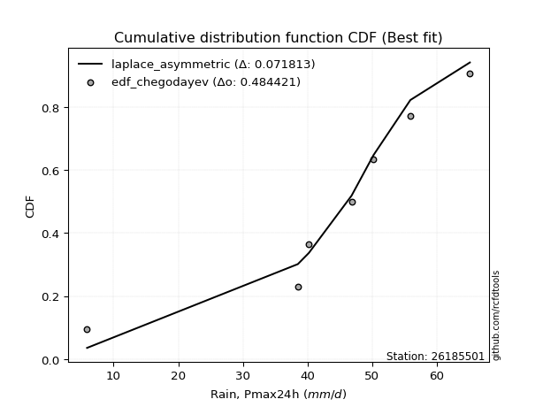</img>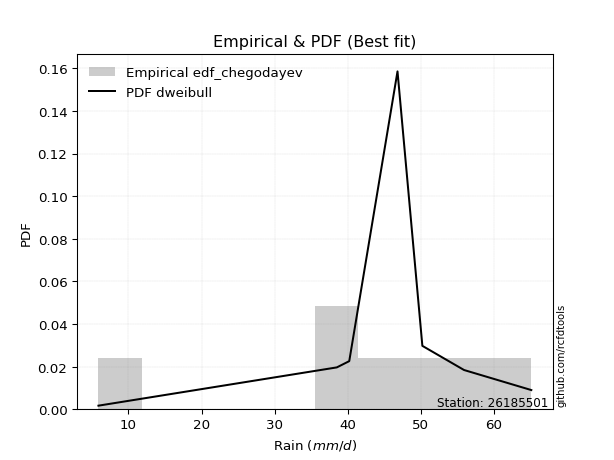</img>

</div>


### 6. EDF Blom (1958)

The Blom formula is a specific "plotting position" formula used in hydrology and statistical analysis to estimate the empirical cumulative probability (or non-exceedance probability) of a data series. It is particularly recommended for data that are approximately normally distributed. The constant _a_ is set to 0.375 (or 3/8).

<div align="center">


$P=(m-a)/(n+1-2a)$


</div>


**6.1. Empirical values**

<div align="center">

|                | 0                   | 1                   | 2                  | 3        | 4                  | 5                  | 6                  |
|:---------------|:--------------------|:--------------------|:-------------------|:---------|:-------------------|:-------------------|:-------------------|
| date           | 2017                | 2020                | 2018               | 2023     | 2021               | 2022               | 2019               |
| x              | 5.9                 | 38.5                | 40.2               | 46.8     | 50.2               | 55.9               | 65.1               |
| m              | 1                   | 2                   | 3                  | 4        | 5                  | 6                  | 7                  |
| empirical_dist | edf_blom            | edf_blom            | edf_blom           | edf_blom | edf_blom           | edf_blom           | edf_blom           |
| empirical      | 0.08620689655172414 | 0.22413793103448276 | 0.3620689655172414 | 0.5      | 0.6379310344827587 | 0.7758620689655172 | 0.9137931034482759 |
| empirical_tr   | 1.0943396226415094  | 1.288888888888889   | 1.5675675675675675 | 2.0      | 2.7619047619047623 | 4.461538461538462  | 11.600000000000007 |

</div>


**6.2. Kolmogorov-Smirnov fit test (sorted by Δ)**


<div align="center">

|                | 0                   | 1                   | 2                   | 3                   | 4                   | 5                   | 6                   | 7                   | 8                   | 9                   | 10                  | 11                  | 12                  | 13                  | 14                  | 15                  | 16                  | 17                  | 18                  | 19                  | 20                  | 21                  | 22                  | 23                  | 24                  | 25                  | 26                  | 27                    | 28                  | 29                  | 30                  | 31                  | 32                  | 33                  | 34                  | 35                  | 36                  | 37                  | 38                  | 39                  | 40                  | 41                  | 42                  | 43                  | 44                  | 45                  | 46                  | 47                  | 48                  | 49                  | 50                  | 51                  | 52                  | 53                  | 54                  | 55                  | 56                  | 57                  | 58                  | 59                  | 60                  | 61                  | 62                  | 63                  | 64                  | 65                  | 66                  | 67                  | 68                  | 69                  | 70                  | 71                  | 72                  | 73                  | 74                  | 75                  | 76                  | 77                  | 78                  | 79                  | 80                  | 81                  | 82                  | 83                  | 84                  | 85                  | 86                  | 87                  |
|:---------------|:--------------------|:--------------------|:--------------------|:--------------------|:--------------------|:--------------------|:--------------------|:--------------------|:--------------------|:--------------------|:--------------------|:--------------------|:--------------------|:--------------------|:--------------------|:--------------------|:--------------------|:--------------------|:--------------------|:--------------------|:--------------------|:--------------------|:--------------------|:--------------------|:--------------------|:--------------------|:--------------------|:----------------------|:--------------------|:--------------------|:--------------------|:--------------------|:--------------------|:--------------------|:--------------------|:--------------------|:--------------------|:--------------------|:--------------------|:--------------------|:--------------------|:--------------------|:--------------------|:--------------------|:--------------------|:--------------------|:--------------------|:--------------------|:--------------------|:--------------------|:--------------------|:--------------------|:--------------------|:--------------------|:--------------------|:--------------------|:--------------------|:--------------------|:--------------------|:--------------------|:--------------------|:--------------------|:--------------------|:--------------------|:--------------------|:--------------------|:--------------------|:--------------------|:--------------------|:--------------------|:--------------------|:--------------------|:--------------------|:--------------------|:--------------------|:--------------------|:--------------------|:--------------------|:--------------------|:--------------------|:--------------------|:--------------------|:--------------------|:--------------------|:--------------------|:--------------------|:--------------------|:--------------------|
| station        | 26185501            | 26185501            | 26185501            | 26185501            | 26185501            | 26185501            | 26185501            | 26185501            | 26185501            | 26185501            | 26185501            | 26185501            | 26185501            | 26185501            | 26185501            | 26185501            | 26185501            | 26185501            | 26185501            | 26185501            | 26185501            | 26185501            | 26185501            | 26185501            | 26185501            | 26185501            | 26185501            | 26185501              | 26185501            | 26185501            | 26185501            | 26185501            | 26185501            | 26185501            | 26185501            | 26185501            | 26185501            | 26185501            | 26185501            | 26185501            | 26185501            | 26185501            | 26185501            | 26185501            | 26185501            | 26185501            | 26185501            | 26185501            | 26185501            | 26185501            | 26185501            | 26185501            | 26185501            | 26185501            | 26185501            | 26185501            | 26185501            | 26185501            | 26185501            | 26185501            | 26185501            | 26185501            | 26185501            | 26185501            | 26185501            | 26185501            | 26185501            | 26185501            | 26185501            | 26185501            | 26185501            | 26185501            | 26185501            | 26185501            | 26185501            | 26185501            | 26185501            | 26185501            | 26185501            | 26185501            | 26185501            | 26185501            | 26185501            | 26185501            | 26185501            | 26185501            | 26185501            | 26185501            |
| empirical_dist | edf_blom            | edf_blom            | edf_blom            | edf_blom            | edf_blom            | edf_blom            | edf_blom            | edf_blom            | edf_blom            | edf_blom            | edf_blom            | edf_blom            | edf_blom            | edf_blom            | edf_blom            | edf_blom            | edf_blom            | edf_blom            | edf_blom            | edf_blom            | edf_blom            | edf_blom            | edf_blom            | edf_blom            | edf_blom            | edf_blom            | edf_blom            | edf_blom              | edf_blom            | edf_blom            | edf_blom            | edf_blom            | edf_blom            | edf_blom            | edf_blom            | edf_blom            | edf_blom            | edf_blom            | edf_blom            | edf_blom            | edf_blom            | edf_blom            | edf_blom            | edf_blom            | edf_blom            | edf_blom            | edf_blom            | edf_blom            | edf_blom            | edf_blom            | edf_blom            | edf_blom            | edf_blom            | edf_blom            | edf_blom            | edf_blom            | edf_blom            | edf_blom            | edf_blom            | edf_blom            | edf_blom            | edf_blom            | edf_blom            | edf_blom            | edf_blom            | edf_blom            | edf_blom            | edf_blom            | edf_blom            | edf_blom            | edf_blom            | edf_blom            | edf_blom            | edf_blom            | edf_blom            | edf_blom            | edf_blom            | edf_blom            | edf_blom            | edf_blom            | edf_blom            | edf_blom            | edf_blom            | edf_blom            | edf_blom            | edf_blom            | edf_blom            | edf_blom            |
| p_dist         | laplace_asymmetric  | t                   | genlogistic         | johnsonsu           | weibull_min         | fisk                | gumbel_l            | gompertz            | pearson3            | logjohnsonsu        | mielke              | logt                | laplace             | hypsecant           | logmielke           | logistic            | exponnorm           | norm                | truncnorm           | crystalball         | rice                | nct                 | f                   | logcrystalball      | fatiguelife         | chi2                | gamma               | loglaplace_asymmetric | betaprime           | logloggamma         | logpearson3         | erlang              | invgamma            | logfisk             | maxwell             | loggompertz         | rayleigh            | nakagami            | lognakagami         | gumbel_r            | invgauss            | ncf                 | loggumbel_l         | logtruncnorm        | invweibull          | moyal               | halfnorm            | halflogistic        | kstwobign           | gibrat              | wald                | lognct              | logrice             | logexponnorm        | lognorm             | lognorm             | logfatiguelife      | logf                | logncf              | loglogistic         | logerlang           | loghypsecant        | loginvgamma         | loggamma            | loggamma            | logbetaprime        | logalpha            | loginvweibull       | loginvgauss         | loglaplace          | logmaxwell          | lograyleigh         | expon               | genexpon            | logkstwobign        | loghalfnorm         | loggumbel_r         | loggenexpon         | logmoyal            | loghalflogistic     | logexpon            | loglognorm          | alpha               | logwald             | loggibrat           | logweibull_min      | logchi2             | loggenlogistic      |
| delta          | 0.07740480118641002 | 0.07759277966793587 | 0.08121780517893257 | 0.085109698406518   | 0.0909675748437046  | 0.09588595714511294 | 0.10314032491591457 | 0.10563437366456496 | 0.10758695866338114 | 0.11492439572299029 | 0.11727586166008158 | 0.11927959914364417 | 0.12581940338407138 | 0.144104876437387   | 0.14630081188342225 | 0.15523131828092568 | 0.168910568317444   | 0.16891200605395462 | 0.16891201938928868 | 0.16891202143515283 | 0.16892262982109246 | 0.16926641605199644 | 0.1705962987111222  | 0.17389454550235228 | 0.1752496229491522  | 0.1815931705692807  | 0.18253348541434739 | 0.1876910276819856    | 0.18771402238886187 | 0.18864449028623487 | 0.18932337753423556 | 0.1908590771508928  | 0.19664367402024613 | 0.20028978596432    | 0.2027500077236069  | 0.21148250481799702 | 0.21505356724385982 | 0.22413477057381362 | 0.2241379292422122  | 0.22735209499486908 | 0.23340355361861176 | 0.24158309560638425 | 0.243095644596229   | 0.24447253392921459 | 0.24835834103292465 | 0.24971214983554346 | 0.24997378104546386 | 0.26462957846202595 | 0.2692958143378035  | 0.2999289716737582  | 0.3094645741111024  | 0.3109441386712807  | 0.31146984097100927 | 0.31147982022543474 | 0.3114799842281708  | 0.3114799842281708  | 0.31223698660656496 | 0.3134058261453193  | 0.3146869977232746  | 0.3163118091458843  | 0.31860706184840903 | 0.320415781527151   | 0.321492581041281   | 0.3240622989337888  | 0.3240622989337888  | 0.3242286541159404  | 0.32703522689509423 | 0.32783467808956757 | 0.3317250592621154  | 0.33524434265592384 | 0.34276737688903025 | 0.3529198402259145  | 0.3583015039454033  | 0.36395436631204514 | 0.36770426947616996 | 0.38152391898087046 | 0.38200691429757316 | 0.38861378799461577 | 0.40726365939373654 | 0.40827850907624275 | 0.4214984405168761  | 0.4310651696560418  | 0.47257684091649776 | 0.4773614869079983  | 0.5051961251934534  | 0.5177343035220345  | 0.5368939863338248  | 0.7758620689655172  |
| deltao         | 0.48442053926100004 | 0.48442053926100004 | 0.48442053926100004 | 0.48442053926100004 | 0.48442053926100004 | 0.48442053926100004 | 0.48442053926100004 | 0.48442053926100004 | 0.48442053926100004 | 0.48442053926100004 | 0.48442053926100004 | 0.48442053926100004 | 0.48442053926100004 | 0.48442053926100004 | 0.48442053926100004 | 0.48442053926100004 | 0.48442053926100004 | 0.48442053926100004 | 0.48442053926100004 | 0.48442053926100004 | 0.48442053926100004 | 0.48442053926100004 | 0.48442053926100004 | 0.48442053926100004 | 0.48442053926100004 | 0.48442053926100004 | 0.48442053926100004 | 0.48442053926100004   | 0.48442053926100004 | 0.48442053926100004 | 0.48442053926100004 | 0.48442053926100004 | 0.48442053926100004 | 0.48442053926100004 | 0.48442053926100004 | 0.48442053926100004 | 0.48442053926100004 | 0.48442053926100004 | 0.48442053926100004 | 0.48442053926100004 | 0.48442053926100004 | 0.48442053926100004 | 0.48442053926100004 | 0.48442053926100004 | 0.48442053926100004 | 0.48442053926100004 | 0.48442053926100004 | 0.48442053926100004 | 0.48442053926100004 | 0.48442053926100004 | 0.48442053926100004 | 0.48442053926100004 | 0.48442053926100004 | 0.48442053926100004 | 0.48442053926100004 | 0.48442053926100004 | 0.48442053926100004 | 0.48442053926100004 | 0.48442053926100004 | 0.48442053926100004 | 0.48442053926100004 | 0.48442053926100004 | 0.48442053926100004 | 0.48442053926100004 | 0.48442053926100004 | 0.48442053926100004 | 0.48442053926100004 | 0.48442053926100004 | 0.48442053926100004 | 0.48442053926100004 | 0.48442053926100004 | 0.48442053926100004 | 0.48442053926100004 | 0.48442053926100004 | 0.48442053926100004 | 0.48442053926100004 | 0.48442053926100004 | 0.48442053926100004 | 0.48442053926100004 | 0.48442053926100004 | 0.48442053926100004 | 0.48442053926100004 | 0.48442053926100004 | 0.48442053926100004 | 0.48442053926100004 | 0.48442053926100004 | 0.48442053926100004 | 0.48442053926100004 |
| eval           | Δo > Δ              | Δo > Δ              | Δo > Δ              | Δo > Δ              | Δo > Δ              | Δo > Δ              | Δo > Δ              | Δo > Δ              | Δo > Δ              | Δo > Δ              | Δo > Δ              | Δo > Δ              | Δo > Δ              | Δo > Δ              | Δo > Δ              | Δo > Δ              | Δo > Δ              | Δo > Δ              | Δo > Δ              | Δo > Δ              | Δo > Δ              | Δo > Δ              | Δo > Δ              | Δo > Δ              | Δo > Δ              | Δo > Δ              | Δo > Δ              | Δo > Δ                | Δo > Δ              | Δo > Δ              | Δo > Δ              | Δo > Δ              | Δo > Δ              | Δo > Δ              | Δo > Δ              | Δo > Δ              | Δo > Δ              | Δo > Δ              | Δo > Δ              | Δo > Δ              | Δo > Δ              | Δo > Δ              | Δo > Δ              | Δo > Δ              | Δo > Δ              | Δo > Δ              | Δo > Δ              | Δo > Δ              | Δo > Δ              | Δo > Δ              | Δo > Δ              | Δo > Δ              | Δo > Δ              | Δo > Δ              | Δo > Δ              | Δo > Δ              | Δo > Δ              | Δo > Δ              | Δo > Δ              | Δo > Δ              | Δo > Δ              | Δo > Δ              | Δo > Δ              | Δo > Δ              | Δo > Δ              | Δo > Δ              | Δo > Δ              | Δo > Δ              | Δo > Δ              | Δo > Δ              | Δo > Δ              | Δo > Δ              | Δo > Δ              | Δo > Δ              | Δo > Δ              | Δo > Δ              | Δo > Δ              | Δo > Δ              | Δo > Δ              | Δo > Δ              | Δo > Δ              | Δo > Δ              | Δo > Δ              | Δo > Δ              | Δo <= Δ             | Δo <= Δ             | Δo <= Δ             | Δo <= Δ             |
| fit            | 1                   | 1                   | 1                   | 1                   | 1                   | 1                   | 1                   | 1                   | 1                   | 1                   | 1                   | 1                   | 1                   | 1                   | 1                   | 1                   | 1                   | 1                   | 1                   | 1                   | 1                   | 1                   | 1                   | 1                   | 1                   | 1                   | 1                   | 1                     | 1                   | 1                   | 1                   | 1                   | 1                   | 1                   | 1                   | 1                   | 1                   | 1                   | 1                   | 1                   | 1                   | 1                   | 1                   | 1                   | 1                   | 1                   | 1                   | 1                   | 1                   | 1                   | 1                   | 1                   | 1                   | 1                   | 1                   | 1                   | 1                   | 1                   | 1                   | 1                   | 1                   | 1                   | 1                   | 1                   | 1                   | 1                   | 1                   | 1                   | 1                   | 1                   | 1                   | 1                   | 1                   | 1                   | 1                   | 1                   | 1                   | 1                   | 1                   | 1                   | 1                   | 1                   | 1                   | 1                   | 0                   | 0                   | 0                   | 0                   |
| n              | 7                   | 7                   | 7                   | 7                   | 7                   | 7                   | 7                   | 7                   | 7                   | 7                   | 7                   | 7                   | 7                   | 7                   | 7                   | 7                   | 7                   | 7                   | 7                   | 7                   | 7                   | 7                   | 7                   | 7                   | 7                   | 7                   | 7                   | 7                     | 7                   | 7                   | 7                   | 7                   | 7                   | 7                   | 7                   | 7                   | 7                   | 7                   | 7                   | 7                   | 7                   | 7                   | 7                   | 7                   | 7                   | 7                   | 7                   | 7                   | 7                   | 7                   | 7                   | 7                   | 7                   | 7                   | 7                   | 7                   | 7                   | 7                   | 7                   | 7                   | 7                   | 7                   | 7                   | 7                   | 7                   | 7                   | 7                   | 7                   | 7                   | 7                   | 7                   | 7                   | 7                   | 7                   | 7                   | 7                   | 7                   | 7                   | 7                   | 7                   | 7                   | 7                   | 7                   | 7                   | 7                   | 7                   | 7                   | 7                   |
| best_fit       | 1                   | 0                   | 0                   | 0                   | 0                   | 0                   | 0                   | 0                   | 0                   | 0                   | 0                   | 0                   | 0                   | 0                   | 0                   | 0                   | 0                   | 0                   | 0                   | 0                   | 0                   | 0                   | 0                   | 0                   | 0                   | 0                   | 0                   | 0                     | 0                   | 0                   | 0                   | 0                   | 0                   | 0                   | 0                   | 0                   | 0                   | 0                   | 0                   | 0                   | 0                   | 0                   | 0                   | 0                   | 0                   | 0                   | 0                   | 0                   | 0                   | 0                   | 0                   | 0                   | 0                   | 0                   | 0                   | 0                   | 0                   | 0                   | 0                   | 0                   | 0                   | 0                   | 0                   | 0                   | 0                   | 0                   | 0                   | 0                   | 0                   | 0                   | 0                   | 0                   | 0                   | 0                   | 0                   | 0                   | 0                   | 0                   | 0                   | 0                   | 0                   | 0                   | 0                   | 0                   | 0                   | 0                   | 0                   | 0                   |
| best_fit_sort  | 1                   | 2                   | 3                   | 4                   | 5                   | 6                   | 7                   | 8                   | 9                   | 10                  | 11                  | 12                  | 13                  | 14                  | 15                  | 16                  | 17                  | 18                  | 19                  | 20                  | 21                  | 22                  | 23                  | 24                  | 25                  | 26                  | 27                  | 28                    | 29                  | 30                  | 31                  | 32                  | 33                  | 34                  | 35                  | 36                  | 37                  | 38                  | 39                  | 40                  | 41                  | 42                  | 43                  | 44                  | 45                  | 46                  | 47                  | 48                  | 49                  | 50                  | 51                  | 52                  | 53                  | 54                  | 55                  | 56                  | 57                  | 58                  | 59                  | 60                  | 61                  | 62                  | 63                  | 64                  | 65                  | 66                  | 67                  | 68                  | 69                  | 70                  | 71                  | 72                  | 73                  | 74                  | 75                  | 76                  | 77                  | 78                  | 79                  | 80                  | 81                  | 82                  | 83                  | 84                  | 85                  | 86                  | 87                  | 88                  |

</div>


**6.3. Best fit**

<div align="center">

|   id |   station | empirical_dist   | p_dist             |     delta |   deltao | eval   |   fit |   n |   best_fit |   best_fit_sort |
|-----:|----------:|:-----------------|:-------------------|----------:|---------:|:-------|------:|----:|-----------:|----------------:|
|    0 |  26185501 | edf_blom         | laplace_asymmetric | 0.0774048 | 0.484421 | Δo > Δ |     1 |   7 |          1 |               1 |

</div>


<div align="center">

</img>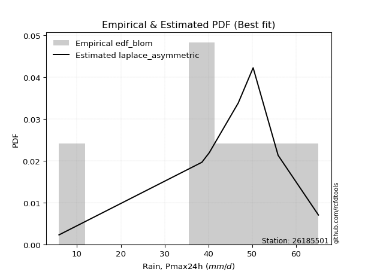</img>

</div>


### 7. EDF Tukey (1962)

In hydrology, the Tukey formula is used as a plotting position formula to estimate the empirical probability or frequency of a flood event (or other hydrological data). The formula parameter is given as _c=0.333_ (or 1/3).

<div align="center">


$P=(m-c)/(n+1-2c)$


</div>


**7.1. Empirical values**

<div align="center">

|                | 0                   | 1                   | 2                   | 3         | 4                  | 5                  | 6                  |
|:---------------|:--------------------|:--------------------|:--------------------|:----------|:-------------------|:-------------------|:-------------------|
| date           | 2017                | 2020                | 2018                | 2023      | 2021               | 2022               | 2019               |
| x              | 5.9                 | 38.5                | 40.2                | 46.8      | 50.2               | 55.9               | 65.1               |
| m              | 1                   | 2                   | 3                   | 4         | 5                  | 6                  | 7                  |
| empirical_dist | edf_tukey           | edf_tukey           | edf_tukey           | edf_tukey | edf_tukey          | edf_tukey          | edf_tukey          |
| empirical      | 0.09090909090909091 | 0.22727272727272727 | 0.36363636363636365 | 0.5       | 0.6363636363636364 | 0.7727272727272727 | 0.9090909090909091 |
| empirical_tr   | 1.1                 | 1.2941176470588236  | 1.5714285714285714  | 2.0       | 2.75               | 4.3999999999999995 | 10.999999999999996 |

</div>


**7.2. Kolmogorov-Smirnov fit test (sorted by Δ)**


<div align="center">

|                | 0                   | 1                   | 2                   | 3                   | 4                   | 5                   | 6                   | 7                   | 8                   | 9                   | 10                  | 11                  | 12                  | 13                  | 14                  | 15                  | 16                  | 17                  | 18                  | 19                  | 20                  | 21                  | 22                  | 23                  | 24                  | 25                  | 26                  | 27                    | 28                  | 29                  | 30                  | 31                  | 32                  | 33                  | 34                  | 35                  | 36                  | 37                  | 38                  | 39                  | 40                  | 41                  | 42                  | 43                  | 44                  | 45                  | 46                  | 47                  | 48                  | 49                  | 50                  | 51                  | 52                  | 53                  | 54                  | 55                  | 56                  | 57                  | 58                  | 59                  | 60                  | 61                  | 62                  | 63                  | 64                  | 65                  | 66                  | 67                  | 68                  | 69                  | 70                  | 71                  | 72                  | 73                  | 74                  | 75                  | 76                  | 77                  | 78                  | 79                  | 80                  | 81                  | 82                  | 83                  | 84                  | 85                  | 86                  | 87                  |
|:---------------|:--------------------|:--------------------|:--------------------|:--------------------|:--------------------|:--------------------|:--------------------|:--------------------|:--------------------|:--------------------|:--------------------|:--------------------|:--------------------|:--------------------|:--------------------|:--------------------|:--------------------|:--------------------|:--------------------|:--------------------|:--------------------|:--------------------|:--------------------|:--------------------|:--------------------|:--------------------|:--------------------|:----------------------|:--------------------|:--------------------|:--------------------|:--------------------|:--------------------|:--------------------|:--------------------|:--------------------|:--------------------|:--------------------|:--------------------|:--------------------|:--------------------|:--------------------|:--------------------|:--------------------|:--------------------|:--------------------|:--------------------|:--------------------|:--------------------|:--------------------|:--------------------|:--------------------|:--------------------|:--------------------|:--------------------|:--------------------|:--------------------|:--------------------|:--------------------|:--------------------|:--------------------|:--------------------|:--------------------|:--------------------|:--------------------|:--------------------|:--------------------|:--------------------|:--------------------|:--------------------|:--------------------|:--------------------|:--------------------|:--------------------|:--------------------|:--------------------|:--------------------|:--------------------|:--------------------|:--------------------|:--------------------|:--------------------|:--------------------|:--------------------|:--------------------|:--------------------|:--------------------|:--------------------|
| station        | 26185501            | 26185501            | 26185501            | 26185501            | 26185501            | 26185501            | 26185501            | 26185501            | 26185501            | 26185501            | 26185501            | 26185501            | 26185501            | 26185501            | 26185501            | 26185501            | 26185501            | 26185501            | 26185501            | 26185501            | 26185501            | 26185501            | 26185501            | 26185501            | 26185501            | 26185501            | 26185501            | 26185501              | 26185501            | 26185501            | 26185501            | 26185501            | 26185501            | 26185501            | 26185501            | 26185501            | 26185501            | 26185501            | 26185501            | 26185501            | 26185501            | 26185501            | 26185501            | 26185501            | 26185501            | 26185501            | 26185501            | 26185501            | 26185501            | 26185501            | 26185501            | 26185501            | 26185501            | 26185501            | 26185501            | 26185501            | 26185501            | 26185501            | 26185501            | 26185501            | 26185501            | 26185501            | 26185501            | 26185501            | 26185501            | 26185501            | 26185501            | 26185501            | 26185501            | 26185501            | 26185501            | 26185501            | 26185501            | 26185501            | 26185501            | 26185501            | 26185501            | 26185501            | 26185501            | 26185501            | 26185501            | 26185501            | 26185501            | 26185501            | 26185501            | 26185501            | 26185501            | 26185501            |
| empirical_dist | edf_tukey           | edf_tukey           | edf_tukey           | edf_tukey           | edf_tukey           | edf_tukey           | edf_tukey           | edf_tukey           | edf_tukey           | edf_tukey           | edf_tukey           | edf_tukey           | edf_tukey           | edf_tukey           | edf_tukey           | edf_tukey           | edf_tukey           | edf_tukey           | edf_tukey           | edf_tukey           | edf_tukey           | edf_tukey           | edf_tukey           | edf_tukey           | edf_tukey           | edf_tukey           | edf_tukey           | edf_tukey             | edf_tukey           | edf_tukey           | edf_tukey           | edf_tukey           | edf_tukey           | edf_tukey           | edf_tukey           | edf_tukey           | edf_tukey           | edf_tukey           | edf_tukey           | edf_tukey           | edf_tukey           | edf_tukey           | edf_tukey           | edf_tukey           | edf_tukey           | edf_tukey           | edf_tukey           | edf_tukey           | edf_tukey           | edf_tukey           | edf_tukey           | edf_tukey           | edf_tukey           | edf_tukey           | edf_tukey           | edf_tukey           | edf_tukey           | edf_tukey           | edf_tukey           | edf_tukey           | edf_tukey           | edf_tukey           | edf_tukey           | edf_tukey           | edf_tukey           | edf_tukey           | edf_tukey           | edf_tukey           | edf_tukey           | edf_tukey           | edf_tukey           | edf_tukey           | edf_tukey           | edf_tukey           | edf_tukey           | edf_tukey           | edf_tukey           | edf_tukey           | edf_tukey           | edf_tukey           | edf_tukey           | edf_tukey           | edf_tukey           | edf_tukey           | edf_tukey           | edf_tukey           | edf_tukey           | edf_tukey           |
| p_dist         | laplace_asymmetric  | genlogistic         | t                   | johnsonsu           | weibull_min         | fisk                | gumbel_l            | gompertz            | pearson3            | logjohnsonsu        | mielke              | logt                | laplace             | hypsecant           | logmielke           | logistic            | exponnorm           | norm                | truncnorm           | crystalball         | rice                | nct                 | f                   | logcrystalball      | fatiguelife         | chi2                | gamma               | loglaplace_asymmetric | betaprime           | logloggamma         | logpearson3         | erlang              | invgamma            | logfisk             | maxwell             | loggompertz         | rayleigh            | gumbel_r            | nakagami            | lognakagami         | invgauss            | ncf                 | loggumbel_l         | invweibull          | logtruncnorm        | moyal               | halfnorm            | halflogistic        | kstwobign           | gibrat              | wald                | lognct              | logrice             | logexponnorm        | lognorm             | lognorm             | logfatiguelife      | logf                | logncf              | loglogistic         | logerlang           | loghypsecant        | loginvgamma         | loggamma            | loggamma            | logbetaprime        | logalpha            | loginvweibull       | loginvgauss         | loglaplace          | logmaxwell          | lograyleigh         | expon               | genexpon            | logkstwobign        | loghalfnorm         | loggumbel_r         | loggenexpon         | logmoyal            | loghalflogistic     | logexpon            | loglognorm          | alpha               | logwald             | loggibrat           | logweibull_min      | logchi2             | loggenlogistic      |
| delta          | 0.07427000494816552 | 0.07808300894068806 | 0.07916017778705814 | 0.0819749021682735  | 0.0878327786054601  | 0.09275116090686844 | 0.10000552867767007 | 0.10249957742632046 | 0.10445216242513664 | 0.11178959948474579 | 0.11414106542183708 | 0.12084699726276643 | 0.12581940338407138 | 0.1409700801991425  | 0.14316601564517775 | 0.15209652204268118 | 0.1657757720791995  | 0.16577720981571012 | 0.16577722315104418 | 0.16577722519690832 | 0.16578783358284796 | 0.16613161981375194 | 0.1674615024728777  | 0.17075974926410778 | 0.1721148267109077  | 0.1784583743310362  | 0.17939868917610288 | 0.1845562314437411    | 0.18457922615061736 | 0.18550969404799036 | 0.18618858129599106 | 0.18772428091264828 | 0.19350887778200163 | 0.1971549897260755  | 0.1996152114853624  | 0.20834770857975252 | 0.21191877100561532 | 0.22421729875662458 | 0.22726956681205812 | 0.2272727254804567  | 0.23026875738036726 | 0.23844829936813974 | 0.2399608483579845  | 0.24522354479468014 | 0.24603993204833685 | 0.24657735359729896 | 0.24683898480721936 | 0.2614947822237814  | 0.26616101809955894 | 0.2967941754355137  | 0.30632977787285787 | 0.30780934243303615 | 0.30833504473276474 | 0.3083450239871902  | 0.3083451879899263  | 0.3083451879899263  | 0.30910219036832043 | 0.3102710299070748  | 0.31155220148503004 | 0.3131770129076398  | 0.3154722656101645  | 0.31728098528890647 | 0.31835778480303645 | 0.32092750269554426 | 0.32092750269554426 | 0.32109385787769584 | 0.3239004306568497  | 0.32469988185132304 | 0.32859026302387084 | 0.3321095464176793  | 0.3396325806507857  | 0.34978504398766996 | 0.35516670770715875 | 0.3608195700738006  | 0.36456947323792543 | 0.3783891227426259  | 0.37887211805932863 | 0.38547899175637124 | 0.404128863155492   | 0.4051437128379982  | 0.4183636442786316  | 0.42793037341779727 | 0.46944204467825323 | 0.47422669066975376 | 0.5020613289552088  | 0.51459950728379    | 0.5337591900955803  | 0.7727272727272727  |
| deltao         | 0.48442053926100004 | 0.48442053926100004 | 0.48442053926100004 | 0.48442053926100004 | 0.48442053926100004 | 0.48442053926100004 | 0.48442053926100004 | 0.48442053926100004 | 0.48442053926100004 | 0.48442053926100004 | 0.48442053926100004 | 0.48442053926100004 | 0.48442053926100004 | 0.48442053926100004 | 0.48442053926100004 | 0.48442053926100004 | 0.48442053926100004 | 0.48442053926100004 | 0.48442053926100004 | 0.48442053926100004 | 0.48442053926100004 | 0.48442053926100004 | 0.48442053926100004 | 0.48442053926100004 | 0.48442053926100004 | 0.48442053926100004 | 0.48442053926100004 | 0.48442053926100004   | 0.48442053926100004 | 0.48442053926100004 | 0.48442053926100004 | 0.48442053926100004 | 0.48442053926100004 | 0.48442053926100004 | 0.48442053926100004 | 0.48442053926100004 | 0.48442053926100004 | 0.48442053926100004 | 0.48442053926100004 | 0.48442053926100004 | 0.48442053926100004 | 0.48442053926100004 | 0.48442053926100004 | 0.48442053926100004 | 0.48442053926100004 | 0.48442053926100004 | 0.48442053926100004 | 0.48442053926100004 | 0.48442053926100004 | 0.48442053926100004 | 0.48442053926100004 | 0.48442053926100004 | 0.48442053926100004 | 0.48442053926100004 | 0.48442053926100004 | 0.48442053926100004 | 0.48442053926100004 | 0.48442053926100004 | 0.48442053926100004 | 0.48442053926100004 | 0.48442053926100004 | 0.48442053926100004 | 0.48442053926100004 | 0.48442053926100004 | 0.48442053926100004 | 0.48442053926100004 | 0.48442053926100004 | 0.48442053926100004 | 0.48442053926100004 | 0.48442053926100004 | 0.48442053926100004 | 0.48442053926100004 | 0.48442053926100004 | 0.48442053926100004 | 0.48442053926100004 | 0.48442053926100004 | 0.48442053926100004 | 0.48442053926100004 | 0.48442053926100004 | 0.48442053926100004 | 0.48442053926100004 | 0.48442053926100004 | 0.48442053926100004 | 0.48442053926100004 | 0.48442053926100004 | 0.48442053926100004 | 0.48442053926100004 | 0.48442053926100004 |
| eval           | Δo > Δ              | Δo > Δ              | Δo > Δ              | Δo > Δ              | Δo > Δ              | Δo > Δ              | Δo > Δ              | Δo > Δ              | Δo > Δ              | Δo > Δ              | Δo > Δ              | Δo > Δ              | Δo > Δ              | Δo > Δ              | Δo > Δ              | Δo > Δ              | Δo > Δ              | Δo > Δ              | Δo > Δ              | Δo > Δ              | Δo > Δ              | Δo > Δ              | Δo > Δ              | Δo > Δ              | Δo > Δ              | Δo > Δ              | Δo > Δ              | Δo > Δ                | Δo > Δ              | Δo > Δ              | Δo > Δ              | Δo > Δ              | Δo > Δ              | Δo > Δ              | Δo > Δ              | Δo > Δ              | Δo > Δ              | Δo > Δ              | Δo > Δ              | Δo > Δ              | Δo > Δ              | Δo > Δ              | Δo > Δ              | Δo > Δ              | Δo > Δ              | Δo > Δ              | Δo > Δ              | Δo > Δ              | Δo > Δ              | Δo > Δ              | Δo > Δ              | Δo > Δ              | Δo > Δ              | Δo > Δ              | Δo > Δ              | Δo > Δ              | Δo > Δ              | Δo > Δ              | Δo > Δ              | Δo > Δ              | Δo > Δ              | Δo > Δ              | Δo > Δ              | Δo > Δ              | Δo > Δ              | Δo > Δ              | Δo > Δ              | Δo > Δ              | Δo > Δ              | Δo > Δ              | Δo > Δ              | Δo > Δ              | Δo > Δ              | Δo > Δ              | Δo > Δ              | Δo > Δ              | Δo > Δ              | Δo > Δ              | Δo > Δ              | Δo > Δ              | Δo > Δ              | Δo > Δ              | Δo > Δ              | Δo > Δ              | Δo <= Δ             | Δo <= Δ             | Δo <= Δ             | Δo <= Δ             |
| fit            | 1                   | 1                   | 1                   | 1                   | 1                   | 1                   | 1                   | 1                   | 1                   | 1                   | 1                   | 1                   | 1                   | 1                   | 1                   | 1                   | 1                   | 1                   | 1                   | 1                   | 1                   | 1                   | 1                   | 1                   | 1                   | 1                   | 1                   | 1                     | 1                   | 1                   | 1                   | 1                   | 1                   | 1                   | 1                   | 1                   | 1                   | 1                   | 1                   | 1                   | 1                   | 1                   | 1                   | 1                   | 1                   | 1                   | 1                   | 1                   | 1                   | 1                   | 1                   | 1                   | 1                   | 1                   | 1                   | 1                   | 1                   | 1                   | 1                   | 1                   | 1                   | 1                   | 1                   | 1                   | 1                   | 1                   | 1                   | 1                   | 1                   | 1                   | 1                   | 1                   | 1                   | 1                   | 1                   | 1                   | 1                   | 1                   | 1                   | 1                   | 1                   | 1                   | 1                   | 1                   | 0                   | 0                   | 0                   | 0                   |
| n              | 7                   | 7                   | 7                   | 7                   | 7                   | 7                   | 7                   | 7                   | 7                   | 7                   | 7                   | 7                   | 7                   | 7                   | 7                   | 7                   | 7                   | 7                   | 7                   | 7                   | 7                   | 7                   | 7                   | 7                   | 7                   | 7                   | 7                   | 7                     | 7                   | 7                   | 7                   | 7                   | 7                   | 7                   | 7                   | 7                   | 7                   | 7                   | 7                   | 7                   | 7                   | 7                   | 7                   | 7                   | 7                   | 7                   | 7                   | 7                   | 7                   | 7                   | 7                   | 7                   | 7                   | 7                   | 7                   | 7                   | 7                   | 7                   | 7                   | 7                   | 7                   | 7                   | 7                   | 7                   | 7                   | 7                   | 7                   | 7                   | 7                   | 7                   | 7                   | 7                   | 7                   | 7                   | 7                   | 7                   | 7                   | 7                   | 7                   | 7                   | 7                   | 7                   | 7                   | 7                   | 7                   | 7                   | 7                   | 7                   |
| best_fit       | 1                   | 0                   | 0                   | 0                   | 0                   | 0                   | 0                   | 0                   | 0                   | 0                   | 0                   | 0                   | 0                   | 0                   | 0                   | 0                   | 0                   | 0                   | 0                   | 0                   | 0                   | 0                   | 0                   | 0                   | 0                   | 0                   | 0                   | 0                     | 0                   | 0                   | 0                   | 0                   | 0                   | 0                   | 0                   | 0                   | 0                   | 0                   | 0                   | 0                   | 0                   | 0                   | 0                   | 0                   | 0                   | 0                   | 0                   | 0                   | 0                   | 0                   | 0                   | 0                   | 0                   | 0                   | 0                   | 0                   | 0                   | 0                   | 0                   | 0                   | 0                   | 0                   | 0                   | 0                   | 0                   | 0                   | 0                   | 0                   | 0                   | 0                   | 0                   | 0                   | 0                   | 0                   | 0                   | 0                   | 0                   | 0                   | 0                   | 0                   | 0                   | 0                   | 0                   | 0                   | 0                   | 0                   | 0                   | 0                   |
| best_fit_sort  | 1                   | 2                   | 3                   | 4                   | 5                   | 6                   | 7                   | 8                   | 9                   | 10                  | 11                  | 12                  | 13                  | 14                  | 15                  | 16                  | 17                  | 18                  | 19                  | 20                  | 21                  | 22                  | 23                  | 24                  | 25                  | 26                  | 27                  | 28                    | 29                  | 30                  | 31                  | 32                  | 33                  | 34                  | 35                  | 36                  | 37                  | 38                  | 39                  | 40                  | 41                  | 42                  | 43                  | 44                  | 45                  | 46                  | 47                  | 48                  | 49                  | 50                  | 51                  | 52                  | 53                  | 54                  | 55                  | 56                  | 57                  | 58                  | 59                  | 60                  | 61                  | 62                  | 63                  | 64                  | 65                  | 66                  | 67                  | 68                  | 69                  | 70                  | 71                  | 72                  | 73                  | 74                  | 75                  | 76                  | 77                  | 78                  | 79                  | 80                  | 81                  | 82                  | 83                  | 84                  | 85                  | 86                  | 87                  | 88                  |

</div>


**7.3. Best fit**

<div align="center">

|   id |   station | empirical_dist   | p_dist             |   delta |   deltao | eval   |   fit |   n |   best_fit |   best_fit_sort |
|-----:|----------:|:-----------------|:-------------------|--------:|---------:|:-------|------:|----:|-----------:|----------------:|
|    0 |  26185501 | edf_tukey        | laplace_asymmetric | 0.07427 | 0.484421 | Δo > Δ |     1 |   7 |          1 |               1 |

</div>


<div align="center">

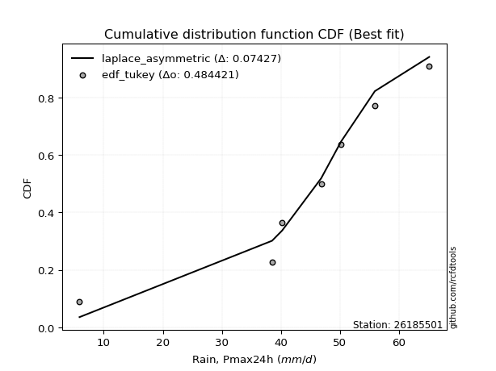</img>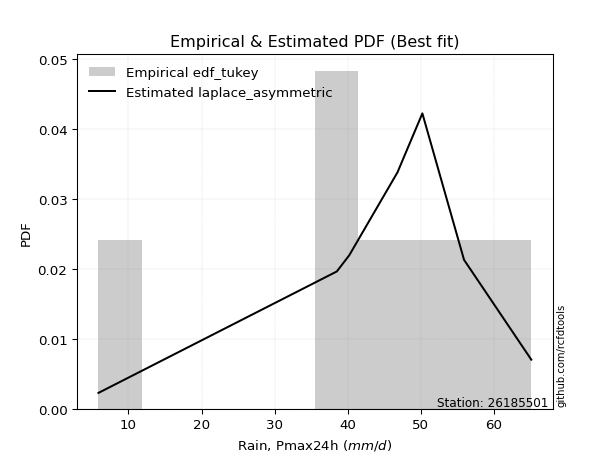</img>

</div>


### 8. EDF Gringorten (1963)

Gringorten plotting position formula is essential for estimating the probability and return periods of extreme events like floods and heavy rainfall. The constant _a=0.44_.

<div align="center">


$P=(m-a)/(n+1-2a)$


</div>


**8.1. Empirical values**

<div align="center">

|                | 0                   | 1                   | 2                  | 3              | 4                  | 5                  | 6                  |
|:---------------|:--------------------|:--------------------|:-------------------|:---------------|:-------------------|:-------------------|:-------------------|
| date           | 2017                | 2020                | 2018               | 2023           | 2021               | 2022               | 2019               |
| x              | 5.9                 | 38.5                | 40.2               | 46.8           | 50.2               | 55.9               | 65.1               |
| m              | 1                   | 2                   | 3                  | 4              | 5                  | 6                  | 7                  |
| empirical_dist | edf_gringorten      | edf_gringorten      | edf_gringorten     | edf_gringorten | edf_gringorten     | edf_gringorten     | edf_gringorten     |
| empirical      | 0.07865168539325844 | 0.21910112359550563 | 0.3595505617977528 | 0.5            | 0.6404494382022471 | 0.7808988764044943 | 0.9213483146067415 |
| empirical_tr   | 1.0853658536585364  | 1.2805755395683454  | 1.5614035087719298 | 2.0            | 2.781249999999999  | 4.564102564102562  | 12.714285714285701 |

</div>


**8.2. Kolmogorov-Smirnov fit test (sorted by Δ)**


<div align="center">

|                | 0                   | 1                   | 2                   | 3                   | 4                   | 5                   | 6                   | 7                   | 8                   | 9                   | 10                  | 11                  | 12                  | 13                  | 14                  | 15                  | 16                  | 17                  | 18                  | 19                  | 20                  | 21                  | 22                  | 23                  | 24                  | 25                  | 26                  | 27                    | 28                  | 29                  | 30                  | 31                  | 32                  | 33                  | 34                  | 35                  | 36                  | 37                  | 38                  | 39                  | 40                  | 41                  | 42                  | 43                  | 44                  | 45                  | 46                  | 47                  | 48                  | 49                  | 50                  | 51                  | 52                  | 53                  | 54                  | 55                  | 56                  | 57                  | 58                  | 59                  | 60                  | 61                  | 62                  | 63                  | 64                  | 65                  | 66                  | 67                  | 68                  | 69                  | 70                  | 71                  | 72                  | 73                  | 74                  | 75                  | 76                  | 77                  | 78                  | 79                  | 80                  | 81                  | 82                  | 83                  | 84                  | 85                  | 86                  | 87                  |
|:---------------|:--------------------|:--------------------|:--------------------|:--------------------|:--------------------|:--------------------|:--------------------|:--------------------|:--------------------|:--------------------|:--------------------|:--------------------|:--------------------|:--------------------|:--------------------|:--------------------|:--------------------|:--------------------|:--------------------|:--------------------|:--------------------|:--------------------|:--------------------|:--------------------|:--------------------|:--------------------|:--------------------|:----------------------|:--------------------|:--------------------|:--------------------|:--------------------|:--------------------|:--------------------|:--------------------|:--------------------|:--------------------|:--------------------|:--------------------|:--------------------|:--------------------|:--------------------|:--------------------|:--------------------|:--------------------|:--------------------|:--------------------|:--------------------|:--------------------|:--------------------|:--------------------|:--------------------|:--------------------|:--------------------|:--------------------|:--------------------|:--------------------|:--------------------|:--------------------|:--------------------|:--------------------|:--------------------|:--------------------|:--------------------|:--------------------|:--------------------|:--------------------|:--------------------|:--------------------|:--------------------|:--------------------|:--------------------|:--------------------|:--------------------|:--------------------|:--------------------|:--------------------|:--------------------|:--------------------|:--------------------|:--------------------|:--------------------|:--------------------|:--------------------|:--------------------|:--------------------|:--------------------|:--------------------|
| station        | 26185501            | 26185501            | 26185501            | 26185501            | 26185501            | 26185501            | 26185501            | 26185501            | 26185501            | 26185501            | 26185501            | 26185501            | 26185501            | 26185501            | 26185501            | 26185501            | 26185501            | 26185501            | 26185501            | 26185501            | 26185501            | 26185501            | 26185501            | 26185501            | 26185501            | 26185501            | 26185501            | 26185501              | 26185501            | 26185501            | 26185501            | 26185501            | 26185501            | 26185501            | 26185501            | 26185501            | 26185501            | 26185501            | 26185501            | 26185501            | 26185501            | 26185501            | 26185501            | 26185501            | 26185501            | 26185501            | 26185501            | 26185501            | 26185501            | 26185501            | 26185501            | 26185501            | 26185501            | 26185501            | 26185501            | 26185501            | 26185501            | 26185501            | 26185501            | 26185501            | 26185501            | 26185501            | 26185501            | 26185501            | 26185501            | 26185501            | 26185501            | 26185501            | 26185501            | 26185501            | 26185501            | 26185501            | 26185501            | 26185501            | 26185501            | 26185501            | 26185501            | 26185501            | 26185501            | 26185501            | 26185501            | 26185501            | 26185501            | 26185501            | 26185501            | 26185501            | 26185501            | 26185501            |
| empirical_dist | edf_gringorten      | edf_gringorten      | edf_gringorten      | edf_gringorten      | edf_gringorten      | edf_gringorten      | edf_gringorten      | edf_gringorten      | edf_gringorten      | edf_gringorten      | edf_gringorten      | edf_gringorten      | edf_gringorten      | edf_gringorten      | edf_gringorten      | edf_gringorten      | edf_gringorten      | edf_gringorten      | edf_gringorten      | edf_gringorten      | edf_gringorten      | edf_gringorten      | edf_gringorten      | edf_gringorten      | edf_gringorten      | edf_gringorten      | edf_gringorten      | edf_gringorten        | edf_gringorten      | edf_gringorten      | edf_gringorten      | edf_gringorten      | edf_gringorten      | edf_gringorten      | edf_gringorten      | edf_gringorten      | edf_gringorten      | edf_gringorten      | edf_gringorten      | edf_gringorten      | edf_gringorten      | edf_gringorten      | edf_gringorten      | edf_gringorten      | edf_gringorten      | edf_gringorten      | edf_gringorten      | edf_gringorten      | edf_gringorten      | edf_gringorten      | edf_gringorten      | edf_gringorten      | edf_gringorten      | edf_gringorten      | edf_gringorten      | edf_gringorten      | edf_gringorten      | edf_gringorten      | edf_gringorten      | edf_gringorten      | edf_gringorten      | edf_gringorten      | edf_gringorten      | edf_gringorten      | edf_gringorten      | edf_gringorten      | edf_gringorten      | edf_gringorten      | edf_gringorten      | edf_gringorten      | edf_gringorten      | edf_gringorten      | edf_gringorten      | edf_gringorten      | edf_gringorten      | edf_gringorten      | edf_gringorten      | edf_gringorten      | edf_gringorten      | edf_gringorten      | edf_gringorten      | edf_gringorten      | edf_gringorten      | edf_gringorten      | edf_gringorten      | edf_gringorten      | edf_gringorten      | edf_gringorten      |
| p_dist         | t                   | laplace_asymmetric  | genlogistic         | johnsonsu           | weibull_min         | fisk                | gumbel_l            | gompertz            | pearson3            | logt                | logjohnsonsu        | mielke              | laplace             | hypsecant           | logmielke           | logistic            | exponnorm           | norm                | truncnorm           | crystalball         | rice                | nct                 | f                   | logcrystalball      | fatiguelife         | chi2                | gamma               | loglaplace_asymmetric | betaprime           | logloggamma         | logpearson3         | erlang              | invgamma            | logfisk             | maxwell             | loggompertz         | nakagami            | lognakagami         | rayleigh            | gumbel_r            | invgauss            | logtruncnorm        | ncf                 | loggumbel_l         | invweibull          | moyal               | halfnorm            | halflogistic        | kstwobign           | gibrat              | wald                | lognct              | logrice             | logexponnorm        | lognorm             | lognorm             | logfatiguelife      | logf                | logncf              | loglogistic         | logerlang           | loghypsecant        | loginvgamma         | loggamma            | loggamma            | logbetaprime        | logalpha            | loginvweibull       | loginvgauss         | loglaplace          | logmaxwell          | lograyleigh         | expon               | genexpon            | logkstwobign        | loghalfnorm         | loggumbel_r         | loggenexpon         | logmoyal            | loghalflogistic     | logexpon            | loglognorm          | alpha               | logwald             | loggibrat           | logweibull_min      | logchi2             | loggenlogistic      |
| delta          | 0.07507437594844729 | 0.08244160862538716 | 0.0862546126179097  | 0.09014650584549513 | 0.09600438228268174 | 0.10092276458409008 | 0.10817713235489171 | 0.1106711811035421  | 0.11262376610235827 | 0.11676119542415558 | 0.11996120316196743 | 0.12231266909905872 | 0.12581940338407138 | 0.14914168387636415 | 0.1513376193223994  | 0.16026812571990282 | 0.17394737575642114 | 0.17394881349293176 | 0.17394882682826582 | 0.17394882887412996 | 0.1739594372600696  | 0.17430322349097357 | 0.17563310615009933 | 0.17893135294132942 | 0.18028643038812933 | 0.18662997800825784 | 0.18757029285332452 | 0.19272783512096273   | 0.192750829827839   | 0.193681297725212   | 0.1943601849732127  | 0.19589588458986992 | 0.20168048145922327 | 0.20532659340329715 | 0.20778681516258404 | 0.21651931225697416 | 0.21909796313483648 | 0.21910112180323507 | 0.22009037468283696 | 0.23238890243384622 | 0.2384403610575889  | 0.241954130209726   | 0.24661990304536138 | 0.24813245203520615 | 0.2533951484719018  | 0.2547489572745206  | 0.255010588484441   | 0.2696663859010031  | 0.27433262177678064 | 0.30496577911273537 | 0.31450138155007956 | 0.31598094611025784 | 0.31650664840998644 | 0.3165166276644119  | 0.31651679166714797 | 0.31651679166714797 | 0.3172737940455421  | 0.3184426335842965  | 0.31972380516225174 | 0.32134861658486147 | 0.3236438692873862  | 0.32545258896612816 | 0.32652938848025814 | 0.32909910637276596 | 0.32909910637276596 | 0.32926546155491754 | 0.3320720343340714  | 0.33287148552854473 | 0.33676186670109254 | 0.340281150094901   | 0.3478041843280074  | 0.35795664766489166 | 0.36333831138438044 | 0.3689911737510223  | 0.37274107691514713 | 0.3865607264198476  | 0.38704372173655033 | 0.39365059543359293 | 0.4123004668327137  | 0.4133153165152199  | 0.4265352479558533  | 0.43610197709501897 | 0.47761364835547493 | 0.48239829434697545 | 0.5102329326324305  | 0.5227711109610117  | 0.541930793772802   | 0.7808988764044943  |
| deltao         | 0.48442053926100004 | 0.48442053926100004 | 0.48442053926100004 | 0.48442053926100004 | 0.48442053926100004 | 0.48442053926100004 | 0.48442053926100004 | 0.48442053926100004 | 0.48442053926100004 | 0.48442053926100004 | 0.48442053926100004 | 0.48442053926100004 | 0.48442053926100004 | 0.48442053926100004 | 0.48442053926100004 | 0.48442053926100004 | 0.48442053926100004 | 0.48442053926100004 | 0.48442053926100004 | 0.48442053926100004 | 0.48442053926100004 | 0.48442053926100004 | 0.48442053926100004 | 0.48442053926100004 | 0.48442053926100004 | 0.48442053926100004 | 0.48442053926100004 | 0.48442053926100004   | 0.48442053926100004 | 0.48442053926100004 | 0.48442053926100004 | 0.48442053926100004 | 0.48442053926100004 | 0.48442053926100004 | 0.48442053926100004 | 0.48442053926100004 | 0.48442053926100004 | 0.48442053926100004 | 0.48442053926100004 | 0.48442053926100004 | 0.48442053926100004 | 0.48442053926100004 | 0.48442053926100004 | 0.48442053926100004 | 0.48442053926100004 | 0.48442053926100004 | 0.48442053926100004 | 0.48442053926100004 | 0.48442053926100004 | 0.48442053926100004 | 0.48442053926100004 | 0.48442053926100004 | 0.48442053926100004 | 0.48442053926100004 | 0.48442053926100004 | 0.48442053926100004 | 0.48442053926100004 | 0.48442053926100004 | 0.48442053926100004 | 0.48442053926100004 | 0.48442053926100004 | 0.48442053926100004 | 0.48442053926100004 | 0.48442053926100004 | 0.48442053926100004 | 0.48442053926100004 | 0.48442053926100004 | 0.48442053926100004 | 0.48442053926100004 | 0.48442053926100004 | 0.48442053926100004 | 0.48442053926100004 | 0.48442053926100004 | 0.48442053926100004 | 0.48442053926100004 | 0.48442053926100004 | 0.48442053926100004 | 0.48442053926100004 | 0.48442053926100004 | 0.48442053926100004 | 0.48442053926100004 | 0.48442053926100004 | 0.48442053926100004 | 0.48442053926100004 | 0.48442053926100004 | 0.48442053926100004 | 0.48442053926100004 | 0.48442053926100004 |
| eval           | Δo > Δ              | Δo > Δ              | Δo > Δ              | Δo > Δ              | Δo > Δ              | Δo > Δ              | Δo > Δ              | Δo > Δ              | Δo > Δ              | Δo > Δ              | Δo > Δ              | Δo > Δ              | Δo > Δ              | Δo > Δ              | Δo > Δ              | Δo > Δ              | Δo > Δ              | Δo > Δ              | Δo > Δ              | Δo > Δ              | Δo > Δ              | Δo > Δ              | Δo > Δ              | Δo > Δ              | Δo > Δ              | Δo > Δ              | Δo > Δ              | Δo > Δ                | Δo > Δ              | Δo > Δ              | Δo > Δ              | Δo > Δ              | Δo > Δ              | Δo > Δ              | Δo > Δ              | Δo > Δ              | Δo > Δ              | Δo > Δ              | Δo > Δ              | Δo > Δ              | Δo > Δ              | Δo > Δ              | Δo > Δ              | Δo > Δ              | Δo > Δ              | Δo > Δ              | Δo > Δ              | Δo > Δ              | Δo > Δ              | Δo > Δ              | Δo > Δ              | Δo > Δ              | Δo > Δ              | Δo > Δ              | Δo > Δ              | Δo > Δ              | Δo > Δ              | Δo > Δ              | Δo > Δ              | Δo > Δ              | Δo > Δ              | Δo > Δ              | Δo > Δ              | Δo > Δ              | Δo > Δ              | Δo > Δ              | Δo > Δ              | Δo > Δ              | Δo > Δ              | Δo > Δ              | Δo > Δ              | Δo > Δ              | Δo > Δ              | Δo > Δ              | Δo > Δ              | Δo > Δ              | Δo > Δ              | Δo > Δ              | Δo > Δ              | Δo > Δ              | Δo > Δ              | Δo > Δ              | Δo > Δ              | Δo > Δ              | Δo <= Δ             | Δo <= Δ             | Δo <= Δ             | Δo <= Δ             |
| fit            | 1                   | 1                   | 1                   | 1                   | 1                   | 1                   | 1                   | 1                   | 1                   | 1                   | 1                   | 1                   | 1                   | 1                   | 1                   | 1                   | 1                   | 1                   | 1                   | 1                   | 1                   | 1                   | 1                   | 1                   | 1                   | 1                   | 1                   | 1                     | 1                   | 1                   | 1                   | 1                   | 1                   | 1                   | 1                   | 1                   | 1                   | 1                   | 1                   | 1                   | 1                   | 1                   | 1                   | 1                   | 1                   | 1                   | 1                   | 1                   | 1                   | 1                   | 1                   | 1                   | 1                   | 1                   | 1                   | 1                   | 1                   | 1                   | 1                   | 1                   | 1                   | 1                   | 1                   | 1                   | 1                   | 1                   | 1                   | 1                   | 1                   | 1                   | 1                   | 1                   | 1                   | 1                   | 1                   | 1                   | 1                   | 1                   | 1                   | 1                   | 1                   | 1                   | 1                   | 1                   | 0                   | 0                   | 0                   | 0                   |
| n              | 7                   | 7                   | 7                   | 7                   | 7                   | 7                   | 7                   | 7                   | 7                   | 7                   | 7                   | 7                   | 7                   | 7                   | 7                   | 7                   | 7                   | 7                   | 7                   | 7                   | 7                   | 7                   | 7                   | 7                   | 7                   | 7                   | 7                   | 7                     | 7                   | 7                   | 7                   | 7                   | 7                   | 7                   | 7                   | 7                   | 7                   | 7                   | 7                   | 7                   | 7                   | 7                   | 7                   | 7                   | 7                   | 7                   | 7                   | 7                   | 7                   | 7                   | 7                   | 7                   | 7                   | 7                   | 7                   | 7                   | 7                   | 7                   | 7                   | 7                   | 7                   | 7                   | 7                   | 7                   | 7                   | 7                   | 7                   | 7                   | 7                   | 7                   | 7                   | 7                   | 7                   | 7                   | 7                   | 7                   | 7                   | 7                   | 7                   | 7                   | 7                   | 7                   | 7                   | 7                   | 7                   | 7                   | 7                   | 7                   |
| best_fit       | 1                   | 0                   | 0                   | 0                   | 0                   | 0                   | 0                   | 0                   | 0                   | 0                   | 0                   | 0                   | 0                   | 0                   | 0                   | 0                   | 0                   | 0                   | 0                   | 0                   | 0                   | 0                   | 0                   | 0                   | 0                   | 0                   | 0                   | 0                     | 0                   | 0                   | 0                   | 0                   | 0                   | 0                   | 0                   | 0                   | 0                   | 0                   | 0                   | 0                   | 0                   | 0                   | 0                   | 0                   | 0                   | 0                   | 0                   | 0                   | 0                   | 0                   | 0                   | 0                   | 0                   | 0                   | 0                   | 0                   | 0                   | 0                   | 0                   | 0                   | 0                   | 0                   | 0                   | 0                   | 0                   | 0                   | 0                   | 0                   | 0                   | 0                   | 0                   | 0                   | 0                   | 0                   | 0                   | 0                   | 0                   | 0                   | 0                   | 0                   | 0                   | 0                   | 0                   | 0                   | 0                   | 0                   | 0                   | 0                   |
| best_fit_sort  | 1                   | 2                   | 3                   | 4                   | 5                   | 6                   | 7                   | 8                   | 9                   | 10                  | 11                  | 12                  | 13                  | 14                  | 15                  | 16                  | 17                  | 18                  | 19                  | 20                  | 21                  | 22                  | 23                  | 24                  | 25                  | 26                  | 27                  | 28                    | 29                  | 30                  | 31                  | 32                  | 33                  | 34                  | 35                  | 36                  | 37                  | 38                  | 39                  | 40                  | 41                  | 42                  | 43                  | 44                  | 45                  | 46                  | 47                  | 48                  | 49                  | 50                  | 51                  | 52                  | 53                  | 54                  | 55                  | 56                  | 57                  | 58                  | 59                  | 60                  | 61                  | 62                  | 63                  | 64                  | 65                  | 66                  | 67                  | 68                  | 69                  | 70                  | 71                  | 72                  | 73                  | 74                  | 75                  | 76                  | 77                  | 78                  | 79                  | 80                  | 81                  | 82                  | 83                  | 84                  | 85                  | 86                  | 87                  | 88                  |

</div>


**8.3. Best fit**

<div align="center">

|   id |   station | empirical_dist   | p_dist   |     delta |   deltao | eval   |   fit |   n |   best_fit |   best_fit_sort |
|-----:|----------:|:-----------------|:---------|----------:|---------:|:-------|------:|----:|-----------:|----------------:|
|    0 |  26185501 | edf_gringorten   | t        | 0.0750744 | 0.484421 | Δo > Δ |     1 |   7 |          1 |               1 |

</div>


<div align="center">

</img>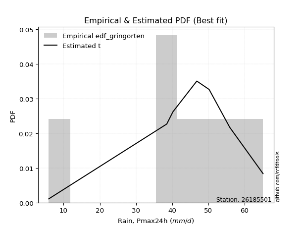</img>

</div>


### 9. EDF Filliben (1975)

The specific values of the constants (0.3175) (often denoted as $alpha$) and (0.365) are derived from a method proposed by James J. Filliben in a 1975 paper. This particular formula is the mean value of the $i$-th order statistic of the normal distribution and is considered a robust and effective plotting position formula for the normal probability plot correlation coefficient test for normality.

<div align="center">


$P=(m-0.3175)/(n+0.365)$


</div>


**9.1. Empirical values**

<div align="center">

|                | 0                   | 1                   | 2                   | 3            | 4                  | 5                  | 6                  |
|:---------------|:--------------------|:--------------------|:--------------------|:-------------|:-------------------|:-------------------|:-------------------|
| date           | 2017                | 2020                | 2018                | 2023         | 2021               | 2022               | 2019               |
| x              | 5.9                 | 38.5                | 40.2                | 46.8         | 50.2               | 55.9               | 65.1               |
| m              | 1                   | 2                   | 3                   | 4            | 5                  | 6                  | 7                  |
| empirical_dist | edf_filliben        | edf_filliben        | edf_filliben        | edf_filliben | edf_filliben       | edf_filliben       | edf_filliben       |
| empirical      | 0.09266802443991853 | 0.22844534962661237 | 0.36422267481330617 | 0.5          | 0.6357773251866938 | 0.7715546503733877 | 0.9073319755600815 |
| empirical_tr   | 1.1021324354657687  | 1.2960844698636163  | 1.5728777362520021  | 2.0          | 2.7455731593662627 | 4.377414561664191  | 10.791208791208794 |

</div>


**9.2. Kolmogorov-Smirnov fit test (sorted by Δ)**


<div align="center">

|                | 0                   | 1                   | 2                   | 3                   | 4                   | 5                   | 6                   | 7                   | 8                   | 9                   | 10                  | 11                  | 12                  | 13                  | 14                  | 15                  | 16                  | 17                  | 18                  | 19                  | 20                  | 21                  | 22                  | 23                  | 24                  | 25                  | 26                  | 27                    | 28                  | 29                  | 30                  | 31                  | 32                  | 33                  | 34                  | 35                  | 36                  | 37                  | 38                  | 39                  | 40                  | 41                  | 42                  | 43                  | 44                  | 45                  | 46                  | 47                  | 48                  | 49                  | 50                  | 51                  | 52                  | 53                  | 54                  | 55                  | 56                  | 57                  | 58                  | 59                  | 60                  | 61                  | 62                  | 63                  | 64                  | 65                  | 66                  | 67                  | 68                  | 69                  | 70                  | 71                  | 72                  | 73                  | 74                  | 75                  | 76                  | 77                  | 78                  | 79                  | 80                  | 81                  | 82                  | 83                  | 84                  | 85                  | 86                  | 87                  |
|:---------------|:--------------------|:--------------------|:--------------------|:--------------------|:--------------------|:--------------------|:--------------------|:--------------------|:--------------------|:--------------------|:--------------------|:--------------------|:--------------------|:--------------------|:--------------------|:--------------------|:--------------------|:--------------------|:--------------------|:--------------------|:--------------------|:--------------------|:--------------------|:--------------------|:--------------------|:--------------------|:--------------------|:----------------------|:--------------------|:--------------------|:--------------------|:--------------------|:--------------------|:--------------------|:--------------------|:--------------------|:--------------------|:--------------------|:--------------------|:--------------------|:--------------------|:--------------------|:--------------------|:--------------------|:--------------------|:--------------------|:--------------------|:--------------------|:--------------------|:--------------------|:--------------------|:--------------------|:--------------------|:--------------------|:--------------------|:--------------------|:--------------------|:--------------------|:--------------------|:--------------------|:--------------------|:--------------------|:--------------------|:--------------------|:--------------------|:--------------------|:--------------------|:--------------------|:--------------------|:--------------------|:--------------------|:--------------------|:--------------------|:--------------------|:--------------------|:--------------------|:--------------------|:--------------------|:--------------------|:--------------------|:--------------------|:--------------------|:--------------------|:--------------------|:--------------------|:--------------------|:--------------------|:--------------------|
| station        | 26185501            | 26185501            | 26185501            | 26185501            | 26185501            | 26185501            | 26185501            | 26185501            | 26185501            | 26185501            | 26185501            | 26185501            | 26185501            | 26185501            | 26185501            | 26185501            | 26185501            | 26185501            | 26185501            | 26185501            | 26185501            | 26185501            | 26185501            | 26185501            | 26185501            | 26185501            | 26185501            | 26185501              | 26185501            | 26185501            | 26185501            | 26185501            | 26185501            | 26185501            | 26185501            | 26185501            | 26185501            | 26185501            | 26185501            | 26185501            | 26185501            | 26185501            | 26185501            | 26185501            | 26185501            | 26185501            | 26185501            | 26185501            | 26185501            | 26185501            | 26185501            | 26185501            | 26185501            | 26185501            | 26185501            | 26185501            | 26185501            | 26185501            | 26185501            | 26185501            | 26185501            | 26185501            | 26185501            | 26185501            | 26185501            | 26185501            | 26185501            | 26185501            | 26185501            | 26185501            | 26185501            | 26185501            | 26185501            | 26185501            | 26185501            | 26185501            | 26185501            | 26185501            | 26185501            | 26185501            | 26185501            | 26185501            | 26185501            | 26185501            | 26185501            | 26185501            | 26185501            | 26185501            |
| empirical_dist | edf_filliben        | edf_filliben        | edf_filliben        | edf_filliben        | edf_filliben        | edf_filliben        | edf_filliben        | edf_filliben        | edf_filliben        | edf_filliben        | edf_filliben        | edf_filliben        | edf_filliben        | edf_filliben        | edf_filliben        | edf_filliben        | edf_filliben        | edf_filliben        | edf_filliben        | edf_filliben        | edf_filliben        | edf_filliben        | edf_filliben        | edf_filliben        | edf_filliben        | edf_filliben        | edf_filliben        | edf_filliben          | edf_filliben        | edf_filliben        | edf_filliben        | edf_filliben        | edf_filliben        | edf_filliben        | edf_filliben        | edf_filliben        | edf_filliben        | edf_filliben        | edf_filliben        | edf_filliben        | edf_filliben        | edf_filliben        | edf_filliben        | edf_filliben        | edf_filliben        | edf_filliben        | edf_filliben        | edf_filliben        | edf_filliben        | edf_filliben        | edf_filliben        | edf_filliben        | edf_filliben        | edf_filliben        | edf_filliben        | edf_filliben        | edf_filliben        | edf_filliben        | edf_filliben        | edf_filliben        | edf_filliben        | edf_filliben        | edf_filliben        | edf_filliben        | edf_filliben        | edf_filliben        | edf_filliben        | edf_filliben        | edf_filliben        | edf_filliben        | edf_filliben        | edf_filliben        | edf_filliben        | edf_filliben        | edf_filliben        | edf_filliben        | edf_filliben        | edf_filliben        | edf_filliben        | edf_filliben        | edf_filliben        | edf_filliben        | edf_filliben        | edf_filliben        | edf_filliben        | edf_filliben        | edf_filliben        | edf_filliben        |
| p_dist         | laplace_asymmetric  | genlogistic         | t                   | johnsonsu           | weibull_min         | fisk                | gumbel_l            | gompertz            | pearson3            | logjohnsonsu        | mielke              | logt                | laplace             | hypsecant           | logmielke           | logistic            | exponnorm           | norm                | truncnorm           | crystalball         | rice                | nct                 | f                   | logcrystalball      | fatiguelife         | chi2                | gamma               | loglaplace_asymmetric | betaprime           | logloggamma         | logpearson3         | erlang              | invgamma            | logfisk             | maxwell             | loggompertz         | rayleigh            | gumbel_r            | nakagami            | lognakagami         | invgauss            | ncf                 | loggumbel_l         | invweibull          | moyal               | halfnorm            | logtruncnorm        | halflogistic        | kstwobign           | gibrat              | wald                | lognct              | logrice             | logexponnorm        | lognorm             | lognorm             | logfatiguelife      | logf                | logncf              | loglogistic         | logerlang           | loghypsecant        | loginvgamma         | loggamma            | loggamma            | logbetaprime        | logalpha            | loginvweibull       | loginvgauss         | loglaplace          | logmaxwell          | lograyleigh         | expon               | genexpon            | logkstwobign        | loghalfnorm         | loggumbel_r         | loggenexpon         | logmoyal            | loghalflogistic     | logexpon            | loglognorm          | alpha               | logwald             | loggibrat           | logweibull_min      | logchi2             | loggenlogistic      |
| delta          | 0.07309738259428042 | 0.07691038658680296 | 0.07974648896400066 | 0.0808022798143884  | 0.086660156251575   | 0.09157853855298334 | 0.09883290632378497 | 0.10132695507243536 | 0.10327954007125154 | 0.11061697713086069 | 0.11296844306795198 | 0.12143330843970895 | 0.12581940338407138 | 0.1397974578452574  | 0.14199339329129265 | 0.15092389968879608 | 0.1646031497253144  | 0.16460458746182502 | 0.16460460079715908 | 0.16460460284302322 | 0.16461521122896286 | 0.16495899745986684 | 0.1662888801189926  | 0.16958712691022268 | 0.1709422043570226  | 0.1772857519771511  | 0.17822606682221778 | 0.183383609089856     | 0.18340660379673226 | 0.18433707169410526 | 0.18501595894210596 | 0.18655165855876318 | 0.19233625542811653 | 0.1959823673721904  | 0.1984425891314773  | 0.20717508622586742 | 0.21074614865173022 | 0.22304467640273948 | 0.22844218916594322 | 0.2284453478343418  | 0.22909613502648216 | 0.23727567701425464 | 0.2387882260040994  | 0.24405092244079504 | 0.24540473124341386 | 0.24566636245333426 | 0.24662624322527937 | 0.2603221598698964  | 0.2649883957456739  | 0.29562155308162863 | 0.3051571555189728  | 0.3066367200791511  | 0.3071624223788797  | 0.30717240163330517 | 0.30717256563604123 | 0.30717256563604123 | 0.3079295680144354  | 0.30909840755318974 | 0.310379579131145   | 0.31200439055375473 | 0.31429964325627946 | 0.3161083629350214  | 0.3171851624491514  | 0.3197548803416592  | 0.3197548803416592  | 0.3199212355238108  | 0.32272780830296466 | 0.323527259497438   | 0.3274176406699858  | 0.33093692406379427 | 0.3384599582969007  | 0.3486124216337849  | 0.3539940853532737  | 0.35964694771991557 | 0.3633968508840404  | 0.3772165003887409  | 0.3776994957054436  | 0.3843063694024862  | 0.40295624080160697 | 0.40397109048411317 | 0.41719102192474655 | 0.4267577510639122  | 0.4682694223243682  | 0.4730540683158687  | 0.5008887066013238  | 0.513426884929905   | 0.5325865677416952  | 0.7715546503733877  |
| deltao         | 0.48442053926100004 | 0.48442053926100004 | 0.48442053926100004 | 0.48442053926100004 | 0.48442053926100004 | 0.48442053926100004 | 0.48442053926100004 | 0.48442053926100004 | 0.48442053926100004 | 0.48442053926100004 | 0.48442053926100004 | 0.48442053926100004 | 0.48442053926100004 | 0.48442053926100004 | 0.48442053926100004 | 0.48442053926100004 | 0.48442053926100004 | 0.48442053926100004 | 0.48442053926100004 | 0.48442053926100004 | 0.48442053926100004 | 0.48442053926100004 | 0.48442053926100004 | 0.48442053926100004 | 0.48442053926100004 | 0.48442053926100004 | 0.48442053926100004 | 0.48442053926100004   | 0.48442053926100004 | 0.48442053926100004 | 0.48442053926100004 | 0.48442053926100004 | 0.48442053926100004 | 0.48442053926100004 | 0.48442053926100004 | 0.48442053926100004 | 0.48442053926100004 | 0.48442053926100004 | 0.48442053926100004 | 0.48442053926100004 | 0.48442053926100004 | 0.48442053926100004 | 0.48442053926100004 | 0.48442053926100004 | 0.48442053926100004 | 0.48442053926100004 | 0.48442053926100004 | 0.48442053926100004 | 0.48442053926100004 | 0.48442053926100004 | 0.48442053926100004 | 0.48442053926100004 | 0.48442053926100004 | 0.48442053926100004 | 0.48442053926100004 | 0.48442053926100004 | 0.48442053926100004 | 0.48442053926100004 | 0.48442053926100004 | 0.48442053926100004 | 0.48442053926100004 | 0.48442053926100004 | 0.48442053926100004 | 0.48442053926100004 | 0.48442053926100004 | 0.48442053926100004 | 0.48442053926100004 | 0.48442053926100004 | 0.48442053926100004 | 0.48442053926100004 | 0.48442053926100004 | 0.48442053926100004 | 0.48442053926100004 | 0.48442053926100004 | 0.48442053926100004 | 0.48442053926100004 | 0.48442053926100004 | 0.48442053926100004 | 0.48442053926100004 | 0.48442053926100004 | 0.48442053926100004 | 0.48442053926100004 | 0.48442053926100004 | 0.48442053926100004 | 0.48442053926100004 | 0.48442053926100004 | 0.48442053926100004 | 0.48442053926100004 |
| eval           | Δo > Δ              | Δo > Δ              | Δo > Δ              | Δo > Δ              | Δo > Δ              | Δo > Δ              | Δo > Δ              | Δo > Δ              | Δo > Δ              | Δo > Δ              | Δo > Δ              | Δo > Δ              | Δo > Δ              | Δo > Δ              | Δo > Δ              | Δo > Δ              | Δo > Δ              | Δo > Δ              | Δo > Δ              | Δo > Δ              | Δo > Δ              | Δo > Δ              | Δo > Δ              | Δo > Δ              | Δo > Δ              | Δo > Δ              | Δo > Δ              | Δo > Δ                | Δo > Δ              | Δo > Δ              | Δo > Δ              | Δo > Δ              | Δo > Δ              | Δo > Δ              | Δo > Δ              | Δo > Δ              | Δo > Δ              | Δo > Δ              | Δo > Δ              | Δo > Δ              | Δo > Δ              | Δo > Δ              | Δo > Δ              | Δo > Δ              | Δo > Δ              | Δo > Δ              | Δo > Δ              | Δo > Δ              | Δo > Δ              | Δo > Δ              | Δo > Δ              | Δo > Δ              | Δo > Δ              | Δo > Δ              | Δo > Δ              | Δo > Δ              | Δo > Δ              | Δo > Δ              | Δo > Δ              | Δo > Δ              | Δo > Δ              | Δo > Δ              | Δo > Δ              | Δo > Δ              | Δo > Δ              | Δo > Δ              | Δo > Δ              | Δo > Δ              | Δo > Δ              | Δo > Δ              | Δo > Δ              | Δo > Δ              | Δo > Δ              | Δo > Δ              | Δo > Δ              | Δo > Δ              | Δo > Δ              | Δo > Δ              | Δo > Δ              | Δo > Δ              | Δo > Δ              | Δo > Δ              | Δo > Δ              | Δo > Δ              | Δo <= Δ             | Δo <= Δ             | Δo <= Δ             | Δo <= Δ             |
| fit            | 1                   | 1                   | 1                   | 1                   | 1                   | 1                   | 1                   | 1                   | 1                   | 1                   | 1                   | 1                   | 1                   | 1                   | 1                   | 1                   | 1                   | 1                   | 1                   | 1                   | 1                   | 1                   | 1                   | 1                   | 1                   | 1                   | 1                   | 1                     | 1                   | 1                   | 1                   | 1                   | 1                   | 1                   | 1                   | 1                   | 1                   | 1                   | 1                   | 1                   | 1                   | 1                   | 1                   | 1                   | 1                   | 1                   | 1                   | 1                   | 1                   | 1                   | 1                   | 1                   | 1                   | 1                   | 1                   | 1                   | 1                   | 1                   | 1                   | 1                   | 1                   | 1                   | 1                   | 1                   | 1                   | 1                   | 1                   | 1                   | 1                   | 1                   | 1                   | 1                   | 1                   | 1                   | 1                   | 1                   | 1                   | 1                   | 1                   | 1                   | 1                   | 1                   | 1                   | 1                   | 0                   | 0                   | 0                   | 0                   |
| n              | 7                   | 7                   | 7                   | 7                   | 7                   | 7                   | 7                   | 7                   | 7                   | 7                   | 7                   | 7                   | 7                   | 7                   | 7                   | 7                   | 7                   | 7                   | 7                   | 7                   | 7                   | 7                   | 7                   | 7                   | 7                   | 7                   | 7                   | 7                     | 7                   | 7                   | 7                   | 7                   | 7                   | 7                   | 7                   | 7                   | 7                   | 7                   | 7                   | 7                   | 7                   | 7                   | 7                   | 7                   | 7                   | 7                   | 7                   | 7                   | 7                   | 7                   | 7                   | 7                   | 7                   | 7                   | 7                   | 7                   | 7                   | 7                   | 7                   | 7                   | 7                   | 7                   | 7                   | 7                   | 7                   | 7                   | 7                   | 7                   | 7                   | 7                   | 7                   | 7                   | 7                   | 7                   | 7                   | 7                   | 7                   | 7                   | 7                   | 7                   | 7                   | 7                   | 7                   | 7                   | 7                   | 7                   | 7                   | 7                   |
| best_fit       | 1                   | 0                   | 0                   | 0                   | 0                   | 0                   | 0                   | 0                   | 0                   | 0                   | 0                   | 0                   | 0                   | 0                   | 0                   | 0                   | 0                   | 0                   | 0                   | 0                   | 0                   | 0                   | 0                   | 0                   | 0                   | 0                   | 0                   | 0                     | 0                   | 0                   | 0                   | 0                   | 0                   | 0                   | 0                   | 0                   | 0                   | 0                   | 0                   | 0                   | 0                   | 0                   | 0                   | 0                   | 0                   | 0                   | 0                   | 0                   | 0                   | 0                   | 0                   | 0                   | 0                   | 0                   | 0                   | 0                   | 0                   | 0                   | 0                   | 0                   | 0                   | 0                   | 0                   | 0                   | 0                   | 0                   | 0                   | 0                   | 0                   | 0                   | 0                   | 0                   | 0                   | 0                   | 0                   | 0                   | 0                   | 0                   | 0                   | 0                   | 0                   | 0                   | 0                   | 0                   | 0                   | 0                   | 0                   | 0                   |
| best_fit_sort  | 1                   | 2                   | 3                   | 4                   | 5                   | 6                   | 7                   | 8                   | 9                   | 10                  | 11                  | 12                  | 13                  | 14                  | 15                  | 16                  | 17                  | 18                  | 19                  | 20                  | 21                  | 22                  | 23                  | 24                  | 25                  | 26                  | 27                  | 28                    | 29                  | 30                  | 31                  | 32                  | 33                  | 34                  | 35                  | 36                  | 37                  | 38                  | 39                  | 40                  | 41                  | 42                  | 43                  | 44                  | 45                  | 46                  | 47                  | 48                  | 49                  | 50                  | 51                  | 52                  | 53                  | 54                  | 55                  | 56                  | 57                  | 58                  | 59                  | 60                  | 61                  | 62                  | 63                  | 64                  | 65                  | 66                  | 67                  | 68                  | 69                  | 70                  | 71                  | 72                  | 73                  | 74                  | 75                  | 76                  | 77                  | 78                  | 79                  | 80                  | 81                  | 82                  | 83                  | 84                  | 85                  | 86                  | 87                  | 88                  |

</div>


**9.3. Best fit**

<div align="center">

|   id |   station | empirical_dist   | p_dist             |     delta |   deltao | eval   |   fit |   n |   best_fit |   best_fit_sort |
|-----:|----------:|:-----------------|:-------------------|----------:|---------:|:-------|------:|----:|-----------:|----------------:|
|    0 |  26185501 | edf_filliben     | laplace_asymmetric | 0.0730974 | 0.484421 | Δo > Δ |     1 |   7 |          1 |               1 |

</div>


<div align="center">

</img>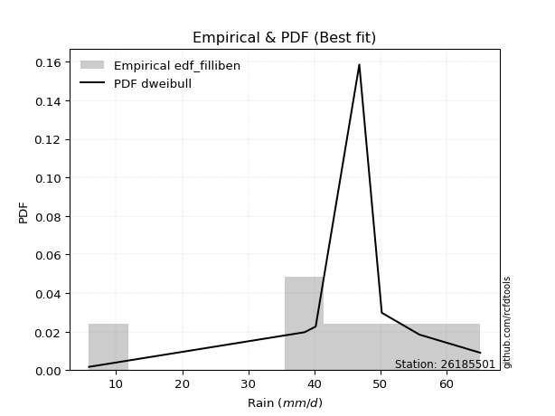</img>

</div>


### 10. EDF Jenkinson (1977)

The Jenkinson formula in hydrology is an empirical plotting position formula used to estimate the non-exceedance probability _(P)_ or return period _(T)_ of a given ordered observation within a sample. It is a widely used method in the frequency analysis of extreme events such as floods and rainfall, as it provides a distribution-free way to plot data. _a≈0.31_ and _b≈0.38_ are constants derived to approximate the median of the probability distribution for the given rank.

<div align="center">


$P=(m-a)/(n+b)$


</div>


**10.1. Empirical values**

<div align="center">

|                | 0                   | 1                   | 2                   | 3             | 4                  | 5                  | 6                  |
|:---------------|:--------------------|:--------------------|:--------------------|:--------------|:-------------------|:-------------------|:-------------------|
| date           | 2017                | 2020                | 2018                | 2023          | 2021               | 2022               | 2019               |
| x              | 5.9                 | 38.5                | 40.2                | 46.8          | 50.2               | 55.9               | 65.1               |
| m              | 1                   | 2                   | 3                   | 4             | 5                  | 6                  | 7                  |
| empirical_dist | edf_jenkinson       | edf_jenkinson       | edf_jenkinson       | edf_jenkinson | edf_jenkinson      | edf_jenkinson      | edf_jenkinson      |
| empirical      | 0.09349593495934959 | 0.22899728997289973 | 0.36449864498644985 | 0.5           | 0.6355013550135502 | 0.7710027100271003 | 0.9065040650406505 |
| empirical_tr   | 1.1031390134529149  | 1.29701230228471    | 1.5735607675906182  | 2.0           | 2.743494423791822  | 4.366863905325444  | 10.695652173913055 |

</div>


**10.2. Kolmogorov-Smirnov fit test (sorted by Δ)**


<div align="center">

|                | 0                   | 1                   | 2                   | 3                   | 4                   | 5                   | 6                   | 7                   | 8                   | 9                   | 10                  | 11                  | 12                  | 13                  | 14                  | 15                  | 16                  | 17                  | 18                  | 19                  | 20                  | 21                  | 22                  | 23                  | 24                  | 25                  | 26                  | 27                    | 28                  | 29                  | 30                  | 31                  | 32                  | 33                  | 34                  | 35                  | 36                  | 37                  | 38                  | 39                  | 40                  | 41                  | 42                  | 43                  | 44                  | 45                  | 46                  | 47                  | 48                  | 49                  | 50                  | 51                  | 52                  | 53                  | 54                  | 55                  | 56                  | 57                  | 58                  | 59                  | 60                  | 61                  | 62                  | 63                  | 64                  | 65                  | 66                  | 67                  | 68                  | 69                  | 70                  | 71                  | 72                  | 73                  | 74                  | 75                  | 76                  | 77                  | 78                  | 79                  | 80                  | 81                  | 82                  | 83                  | 84                  | 85                  | 86                  | 87                  |
|:---------------|:--------------------|:--------------------|:--------------------|:--------------------|:--------------------|:--------------------|:--------------------|:--------------------|:--------------------|:--------------------|:--------------------|:--------------------|:--------------------|:--------------------|:--------------------|:--------------------|:--------------------|:--------------------|:--------------------|:--------------------|:--------------------|:--------------------|:--------------------|:--------------------|:--------------------|:--------------------|:--------------------|:----------------------|:--------------------|:--------------------|:--------------------|:--------------------|:--------------------|:--------------------|:--------------------|:--------------------|:--------------------|:--------------------|:--------------------|:--------------------|:--------------------|:--------------------|:--------------------|:--------------------|:--------------------|:--------------------|:--------------------|:--------------------|:--------------------|:--------------------|:--------------------|:--------------------|:--------------------|:--------------------|:--------------------|:--------------------|:--------------------|:--------------------|:--------------------|:--------------------|:--------------------|:--------------------|:--------------------|:--------------------|:--------------------|:--------------------|:--------------------|:--------------------|:--------------------|:--------------------|:--------------------|:--------------------|:--------------------|:--------------------|:--------------------|:--------------------|:--------------------|:--------------------|:--------------------|:--------------------|:--------------------|:--------------------|:--------------------|:--------------------|:--------------------|:--------------------|:--------------------|:--------------------|
| station        | 26185501            | 26185501            | 26185501            | 26185501            | 26185501            | 26185501            | 26185501            | 26185501            | 26185501            | 26185501            | 26185501            | 26185501            | 26185501            | 26185501            | 26185501            | 26185501            | 26185501            | 26185501            | 26185501            | 26185501            | 26185501            | 26185501            | 26185501            | 26185501            | 26185501            | 26185501            | 26185501            | 26185501              | 26185501            | 26185501            | 26185501            | 26185501            | 26185501            | 26185501            | 26185501            | 26185501            | 26185501            | 26185501            | 26185501            | 26185501            | 26185501            | 26185501            | 26185501            | 26185501            | 26185501            | 26185501            | 26185501            | 26185501            | 26185501            | 26185501            | 26185501            | 26185501            | 26185501            | 26185501            | 26185501            | 26185501            | 26185501            | 26185501            | 26185501            | 26185501            | 26185501            | 26185501            | 26185501            | 26185501            | 26185501            | 26185501            | 26185501            | 26185501            | 26185501            | 26185501            | 26185501            | 26185501            | 26185501            | 26185501            | 26185501            | 26185501            | 26185501            | 26185501            | 26185501            | 26185501            | 26185501            | 26185501            | 26185501            | 26185501            | 26185501            | 26185501            | 26185501            | 26185501            |
| empirical_dist | edf_jenkinson       | edf_jenkinson       | edf_jenkinson       | edf_jenkinson       | edf_jenkinson       | edf_jenkinson       | edf_jenkinson       | edf_jenkinson       | edf_jenkinson       | edf_jenkinson       | edf_jenkinson       | edf_jenkinson       | edf_jenkinson       | edf_jenkinson       | edf_jenkinson       | edf_jenkinson       | edf_jenkinson       | edf_jenkinson       | edf_jenkinson       | edf_jenkinson       | edf_jenkinson       | edf_jenkinson       | edf_jenkinson       | edf_jenkinson       | edf_jenkinson       | edf_jenkinson       | edf_jenkinson       | edf_jenkinson         | edf_jenkinson       | edf_jenkinson       | edf_jenkinson       | edf_jenkinson       | edf_jenkinson       | edf_jenkinson       | edf_jenkinson       | edf_jenkinson       | edf_jenkinson       | edf_jenkinson       | edf_jenkinson       | edf_jenkinson       | edf_jenkinson       | edf_jenkinson       | edf_jenkinson       | edf_jenkinson       | edf_jenkinson       | edf_jenkinson       | edf_jenkinson       | edf_jenkinson       | edf_jenkinson       | edf_jenkinson       | edf_jenkinson       | edf_jenkinson       | edf_jenkinson       | edf_jenkinson       | edf_jenkinson       | edf_jenkinson       | edf_jenkinson       | edf_jenkinson       | edf_jenkinson       | edf_jenkinson       | edf_jenkinson       | edf_jenkinson       | edf_jenkinson       | edf_jenkinson       | edf_jenkinson       | edf_jenkinson       | edf_jenkinson       | edf_jenkinson       | edf_jenkinson       | edf_jenkinson       | edf_jenkinson       | edf_jenkinson       | edf_jenkinson       | edf_jenkinson       | edf_jenkinson       | edf_jenkinson       | edf_jenkinson       | edf_jenkinson       | edf_jenkinson       | edf_jenkinson       | edf_jenkinson       | edf_jenkinson       | edf_jenkinson       | edf_jenkinson       | edf_jenkinson       | edf_jenkinson       | edf_jenkinson       | edf_jenkinson       |
| p_dist         | laplace_asymmetric  | genlogistic         | t                   | johnsonsu           | weibull_min         | fisk                | gumbel_l            | gompertz            | pearson3            | logjohnsonsu        | mielke              | logt                | laplace             | hypsecant           | logmielke           | logistic            | exponnorm           | norm                | truncnorm           | crystalball         | rice                | nct                 | f                   | logcrystalball      | fatiguelife         | chi2                | gamma               | loglaplace_asymmetric | betaprime           | logloggamma         | logpearson3         | erlang              | invgamma            | logfisk             | maxwell             | loggompertz         | rayleigh            | gumbel_r            | invgauss            | nakagami            | lognakagami         | ncf                 | loggumbel_l         | invweibull          | moyal               | halfnorm            | logtruncnorm        | halflogistic        | kstwobign           | gibrat              | wald                | lognct              | logrice             | logexponnorm        | lognorm             | lognorm             | logfatiguelife      | logf                | logncf              | loglogistic         | logerlang           | loghypsecant        | loginvgamma         | loggamma            | loggamma            | logbetaprime        | logalpha            | loginvweibull       | loginvgauss         | loglaplace          | logmaxwell          | lograyleigh         | expon               | genexpon            | logkstwobign        | loghalfnorm         | loggumbel_r         | loggenexpon         | logmoyal            | loghalflogistic     | logexpon            | loglognorm          | alpha               | logwald             | loggibrat           | logweibull_min      | logchi2             | loggenlogistic      |
| delta          | 0.07254544224799306 | 0.0763584462405156  | 0.08002245913714434 | 0.08025033946810103 | 0.08610821590528764 | 0.09102659820669598 | 0.09828096597749761 | 0.100775014726148   | 0.10272759972496417 | 0.11006503678457333 | 0.11241650272166462 | 0.12170927861285263 | 0.12581940338407138 | 0.13924551749897005 | 0.1414414529450053  | 0.15037195934250872 | 0.16405120937902704 | 0.16405264711553766 | 0.16405266045087172 | 0.16405266249673586 | 0.1640632708826755  | 0.16440705711357947 | 0.16573693977270523 | 0.16903518656393532 | 0.17039026401073523 | 0.17673381163086374 | 0.17767412647593042 | 0.18283166874356863   | 0.1828546634504449  | 0.1837851313478179  | 0.1844640185958186  | 0.18599971821247582 | 0.19178431508182917 | 0.19543042702590305 | 0.19789064878518994 | 0.20662314587958006 | 0.21019420830544286 | 0.22249273605645212 | 0.2285441946801948  | 0.22899412951223058 | 0.22899728818062917 | 0.23672373666796728 | 0.23823628565781205 | 0.24349898209450768 | 0.2448527908971265  | 0.2451144221070469  | 0.24690221339842305 | 0.259770219523609   | 0.26443645539938654 | 0.29506961273534127 | 0.30460521517268546 | 0.30608477973286374 | 0.30661048203259234 | 0.3066204612870178  | 0.30662062528975387 | 0.30662062528975387 | 0.307377627668148   | 0.3085464672069024  | 0.30982763878485764 | 0.31145245020746737 | 0.3137477029099921  | 0.31555642258873406 | 0.31663322210286404 | 0.31920293999537186 | 0.31920293999537186 | 0.31936929517752344 | 0.3221758679566773  | 0.32297531915115063 | 0.32686570032369844 | 0.3303849837175069  | 0.3379080179506133  | 0.34806048128749756 | 0.35344214500698634 | 0.3590950073736282  | 0.36284491053775303 | 0.3766645600424535  | 0.37714755535915623 | 0.38375442905619883 | 0.4024043004553196  | 0.4034191501378258  | 0.4166390815784592  | 0.42620581071762487 | 0.46771748197808083 | 0.47250212796958135 | 0.5003367662550364  | 0.5128749445836176  | 0.5320346273954079  | 0.7710027100271003  |
| deltao         | 0.48442053926100004 | 0.48442053926100004 | 0.48442053926100004 | 0.48442053926100004 | 0.48442053926100004 | 0.48442053926100004 | 0.48442053926100004 | 0.48442053926100004 | 0.48442053926100004 | 0.48442053926100004 | 0.48442053926100004 | 0.48442053926100004 | 0.48442053926100004 | 0.48442053926100004 | 0.48442053926100004 | 0.48442053926100004 | 0.48442053926100004 | 0.48442053926100004 | 0.48442053926100004 | 0.48442053926100004 | 0.48442053926100004 | 0.48442053926100004 | 0.48442053926100004 | 0.48442053926100004 | 0.48442053926100004 | 0.48442053926100004 | 0.48442053926100004 | 0.48442053926100004   | 0.48442053926100004 | 0.48442053926100004 | 0.48442053926100004 | 0.48442053926100004 | 0.48442053926100004 | 0.48442053926100004 | 0.48442053926100004 | 0.48442053926100004 | 0.48442053926100004 | 0.48442053926100004 | 0.48442053926100004 | 0.48442053926100004 | 0.48442053926100004 | 0.48442053926100004 | 0.48442053926100004 | 0.48442053926100004 | 0.48442053926100004 | 0.48442053926100004 | 0.48442053926100004 | 0.48442053926100004 | 0.48442053926100004 | 0.48442053926100004 | 0.48442053926100004 | 0.48442053926100004 | 0.48442053926100004 | 0.48442053926100004 | 0.48442053926100004 | 0.48442053926100004 | 0.48442053926100004 | 0.48442053926100004 | 0.48442053926100004 | 0.48442053926100004 | 0.48442053926100004 | 0.48442053926100004 | 0.48442053926100004 | 0.48442053926100004 | 0.48442053926100004 | 0.48442053926100004 | 0.48442053926100004 | 0.48442053926100004 | 0.48442053926100004 | 0.48442053926100004 | 0.48442053926100004 | 0.48442053926100004 | 0.48442053926100004 | 0.48442053926100004 | 0.48442053926100004 | 0.48442053926100004 | 0.48442053926100004 | 0.48442053926100004 | 0.48442053926100004 | 0.48442053926100004 | 0.48442053926100004 | 0.48442053926100004 | 0.48442053926100004 | 0.48442053926100004 | 0.48442053926100004 | 0.48442053926100004 | 0.48442053926100004 | 0.48442053926100004 |
| eval           | Δo > Δ              | Δo > Δ              | Δo > Δ              | Δo > Δ              | Δo > Δ              | Δo > Δ              | Δo > Δ              | Δo > Δ              | Δo > Δ              | Δo > Δ              | Δo > Δ              | Δo > Δ              | Δo > Δ              | Δo > Δ              | Δo > Δ              | Δo > Δ              | Δo > Δ              | Δo > Δ              | Δo > Δ              | Δo > Δ              | Δo > Δ              | Δo > Δ              | Δo > Δ              | Δo > Δ              | Δo > Δ              | Δo > Δ              | Δo > Δ              | Δo > Δ                | Δo > Δ              | Δo > Δ              | Δo > Δ              | Δo > Δ              | Δo > Δ              | Δo > Δ              | Δo > Δ              | Δo > Δ              | Δo > Δ              | Δo > Δ              | Δo > Δ              | Δo > Δ              | Δo > Δ              | Δo > Δ              | Δo > Δ              | Δo > Δ              | Δo > Δ              | Δo > Δ              | Δo > Δ              | Δo > Δ              | Δo > Δ              | Δo > Δ              | Δo > Δ              | Δo > Δ              | Δo > Δ              | Δo > Δ              | Δo > Δ              | Δo > Δ              | Δo > Δ              | Δo > Δ              | Δo > Δ              | Δo > Δ              | Δo > Δ              | Δo > Δ              | Δo > Δ              | Δo > Δ              | Δo > Δ              | Δo > Δ              | Δo > Δ              | Δo > Δ              | Δo > Δ              | Δo > Δ              | Δo > Δ              | Δo > Δ              | Δo > Δ              | Δo > Δ              | Δo > Δ              | Δo > Δ              | Δo > Δ              | Δo > Δ              | Δo > Δ              | Δo > Δ              | Δo > Δ              | Δo > Δ              | Δo > Δ              | Δo > Δ              | Δo <= Δ             | Δo <= Δ             | Δo <= Δ             | Δo <= Δ             |
| fit            | 1                   | 1                   | 1                   | 1                   | 1                   | 1                   | 1                   | 1                   | 1                   | 1                   | 1                   | 1                   | 1                   | 1                   | 1                   | 1                   | 1                   | 1                   | 1                   | 1                   | 1                   | 1                   | 1                   | 1                   | 1                   | 1                   | 1                   | 1                     | 1                   | 1                   | 1                   | 1                   | 1                   | 1                   | 1                   | 1                   | 1                   | 1                   | 1                   | 1                   | 1                   | 1                   | 1                   | 1                   | 1                   | 1                   | 1                   | 1                   | 1                   | 1                   | 1                   | 1                   | 1                   | 1                   | 1                   | 1                   | 1                   | 1                   | 1                   | 1                   | 1                   | 1                   | 1                   | 1                   | 1                   | 1                   | 1                   | 1                   | 1                   | 1                   | 1                   | 1                   | 1                   | 1                   | 1                   | 1                   | 1                   | 1                   | 1                   | 1                   | 1                   | 1                   | 1                   | 1                   | 0                   | 0                   | 0                   | 0                   |
| n              | 7                   | 7                   | 7                   | 7                   | 7                   | 7                   | 7                   | 7                   | 7                   | 7                   | 7                   | 7                   | 7                   | 7                   | 7                   | 7                   | 7                   | 7                   | 7                   | 7                   | 7                   | 7                   | 7                   | 7                   | 7                   | 7                   | 7                   | 7                     | 7                   | 7                   | 7                   | 7                   | 7                   | 7                   | 7                   | 7                   | 7                   | 7                   | 7                   | 7                   | 7                   | 7                   | 7                   | 7                   | 7                   | 7                   | 7                   | 7                   | 7                   | 7                   | 7                   | 7                   | 7                   | 7                   | 7                   | 7                   | 7                   | 7                   | 7                   | 7                   | 7                   | 7                   | 7                   | 7                   | 7                   | 7                   | 7                   | 7                   | 7                   | 7                   | 7                   | 7                   | 7                   | 7                   | 7                   | 7                   | 7                   | 7                   | 7                   | 7                   | 7                   | 7                   | 7                   | 7                   | 7                   | 7                   | 7                   | 7                   |
| best_fit       | 1                   | 0                   | 0                   | 0                   | 0                   | 0                   | 0                   | 0                   | 0                   | 0                   | 0                   | 0                   | 0                   | 0                   | 0                   | 0                   | 0                   | 0                   | 0                   | 0                   | 0                   | 0                   | 0                   | 0                   | 0                   | 0                   | 0                   | 0                     | 0                   | 0                   | 0                   | 0                   | 0                   | 0                   | 0                   | 0                   | 0                   | 0                   | 0                   | 0                   | 0                   | 0                   | 0                   | 0                   | 0                   | 0                   | 0                   | 0                   | 0                   | 0                   | 0                   | 0                   | 0                   | 0                   | 0                   | 0                   | 0                   | 0                   | 0                   | 0                   | 0                   | 0                   | 0                   | 0                   | 0                   | 0                   | 0                   | 0                   | 0                   | 0                   | 0                   | 0                   | 0                   | 0                   | 0                   | 0                   | 0                   | 0                   | 0                   | 0                   | 0                   | 0                   | 0                   | 0                   | 0                   | 0                   | 0                   | 0                   |
| best_fit_sort  | 1                   | 2                   | 3                   | 4                   | 5                   | 6                   | 7                   | 8                   | 9                   | 10                  | 11                  | 12                  | 13                  | 14                  | 15                  | 16                  | 17                  | 18                  | 19                  | 20                  | 21                  | 22                  | 23                  | 24                  | 25                  | 26                  | 27                  | 28                    | 29                  | 30                  | 31                  | 32                  | 33                  | 34                  | 35                  | 36                  | 37                  | 38                  | 39                  | 40                  | 41                  | 42                  | 43                  | 44                  | 45                  | 46                  | 47                  | 48                  | 49                  | 50                  | 51                  | 52                  | 53                  | 54                  | 55                  | 56                  | 57                  | 58                  | 59                  | 60                  | 61                  | 62                  | 63                  | 64                  | 65                  | 66                  | 67                  | 68                  | 69                  | 70                  | 71                  | 72                  | 73                  | 74                  | 75                  | 76                  | 77                  | 78                  | 79                  | 80                  | 81                  | 82                  | 83                  | 84                  | 85                  | 86                  | 87                  | 88                  |

</div>


**10.3. Best fit**

<div align="center">

|   id |   station | empirical_dist   | p_dist             |     delta |   deltao | eval   |   fit |   n |   best_fit |   best_fit_sort |
|-----:|----------:|:-----------------|:-------------------|----------:|---------:|:-------|------:|----:|-----------:|----------------:|
|    0 |  26185501 | edf_jenkinson    | laplace_asymmetric | 0.0725454 | 0.484421 | Δo > Δ |     1 |   7 |          1 |               1 |

</div>


<div align="center">

</img></img>

</div>


### 11. EDF Cunnane (1978)

Cunnane´s work in statistical hydrology has focused on the performance and evaluation of different probability distributions (such as GEV, Gumbel, Lognormal) for flood frequency estimation. _b_ is a constant, typically set to 0.4.

<div align="center">


$P=(m-b)/(n+1-2b)$


</div>


**11.1. Empirical values**

<div align="center">

|                | 0                   | 1                   | 2                  | 3           | 4                  | 5                  | 6                  |
|:---------------|:--------------------|:--------------------|:-------------------|:------------|:-------------------|:-------------------|:-------------------|
| date           | 2017                | 2020                | 2018               | 2023        | 2021               | 2022               | 2019               |
| x              | 5.9                 | 38.5                | 40.2               | 46.8        | 50.2               | 55.9               | 65.1               |
| m              | 1                   | 2                   | 3                  | 4           | 5                  | 6                  | 7                  |
| empirical_dist | edf_cunnane         | edf_cunnane         | edf_cunnane        | edf_cunnane | edf_cunnane        | edf_cunnane        | edf_cunnane        |
| empirical      | 0.08333333333333333 | 0.22222222222222224 | 0.3611111111111111 | 0.5         | 0.6388888888888888 | 0.7777777777777777 | 0.9166666666666666 |
| empirical_tr   | 1.090909090909091   | 1.2857142857142856  | 1.565217391304348  | 2.0         | 2.7692307692307687 | 4.499999999999998  | 11.999999999999995 |

</div>


**11.2. Kolmogorov-Smirnov fit test (sorted by Δ)**


<div align="center">

|                | 0                   | 1                   | 2                   | 3                   | 4                   | 5                   | 6                   | 7                   | 8                   | 9                   | 10                  | 11                  | 12                  | 13                  | 14                  | 15                  | 16                  | 17                  | 18                  | 19                  | 20                  | 21                  | 22                  | 23                  | 24                  | 25                  | 26                  | 27                    | 28                  | 29                  | 30                  | 31                  | 32                  | 33                  | 34                  | 35                  | 36                  | 37                  | 38                  | 39                  | 40                  | 41                  | 42                  | 43                  | 44                  | 45                  | 46                  | 47                  | 48                  | 49                  | 50                  | 51                  | 52                  | 53                  | 54                  | 55                  | 56                  | 57                  | 58                  | 59                  | 60                  | 61                  | 62                  | 63                  | 64                  | 65                  | 66                  | 67                  | 68                  | 69                  | 70                  | 71                  | 72                  | 73                  | 74                  | 75                  | 76                  | 77                  | 78                  | 79                  | 80                  | 81                  | 82                  | 83                  | 84                  | 85                  | 86                  | 87                  |
|:---------------|:--------------------|:--------------------|:--------------------|:--------------------|:--------------------|:--------------------|:--------------------|:--------------------|:--------------------|:--------------------|:--------------------|:--------------------|:--------------------|:--------------------|:--------------------|:--------------------|:--------------------|:--------------------|:--------------------|:--------------------|:--------------------|:--------------------|:--------------------|:--------------------|:--------------------|:--------------------|:--------------------|:----------------------|:--------------------|:--------------------|:--------------------|:--------------------|:--------------------|:--------------------|:--------------------|:--------------------|:--------------------|:--------------------|:--------------------|:--------------------|:--------------------|:--------------------|:--------------------|:--------------------|:--------------------|:--------------------|:--------------------|:--------------------|:--------------------|:--------------------|:--------------------|:--------------------|:--------------------|:--------------------|:--------------------|:--------------------|:--------------------|:--------------------|:--------------------|:--------------------|:--------------------|:--------------------|:--------------------|:--------------------|:--------------------|:--------------------|:--------------------|:--------------------|:--------------------|:--------------------|:--------------------|:--------------------|:--------------------|:--------------------|:--------------------|:--------------------|:--------------------|:--------------------|:--------------------|:--------------------|:--------------------|:--------------------|:--------------------|:--------------------|:--------------------|:--------------------|:--------------------|:--------------------|
| station        | 26185501            | 26185501            | 26185501            | 26185501            | 26185501            | 26185501            | 26185501            | 26185501            | 26185501            | 26185501            | 26185501            | 26185501            | 26185501            | 26185501            | 26185501            | 26185501            | 26185501            | 26185501            | 26185501            | 26185501            | 26185501            | 26185501            | 26185501            | 26185501            | 26185501            | 26185501            | 26185501            | 26185501              | 26185501            | 26185501            | 26185501            | 26185501            | 26185501            | 26185501            | 26185501            | 26185501            | 26185501            | 26185501            | 26185501            | 26185501            | 26185501            | 26185501            | 26185501            | 26185501            | 26185501            | 26185501            | 26185501            | 26185501            | 26185501            | 26185501            | 26185501            | 26185501            | 26185501            | 26185501            | 26185501            | 26185501            | 26185501            | 26185501            | 26185501            | 26185501            | 26185501            | 26185501            | 26185501            | 26185501            | 26185501            | 26185501            | 26185501            | 26185501            | 26185501            | 26185501            | 26185501            | 26185501            | 26185501            | 26185501            | 26185501            | 26185501            | 26185501            | 26185501            | 26185501            | 26185501            | 26185501            | 26185501            | 26185501            | 26185501            | 26185501            | 26185501            | 26185501            | 26185501            |
| empirical_dist | edf_cunnane         | edf_cunnane         | edf_cunnane         | edf_cunnane         | edf_cunnane         | edf_cunnane         | edf_cunnane         | edf_cunnane         | edf_cunnane         | edf_cunnane         | edf_cunnane         | edf_cunnane         | edf_cunnane         | edf_cunnane         | edf_cunnane         | edf_cunnane         | edf_cunnane         | edf_cunnane         | edf_cunnane         | edf_cunnane         | edf_cunnane         | edf_cunnane         | edf_cunnane         | edf_cunnane         | edf_cunnane         | edf_cunnane         | edf_cunnane         | edf_cunnane           | edf_cunnane         | edf_cunnane         | edf_cunnane         | edf_cunnane         | edf_cunnane         | edf_cunnane         | edf_cunnane         | edf_cunnane         | edf_cunnane         | edf_cunnane         | edf_cunnane         | edf_cunnane         | edf_cunnane         | edf_cunnane         | edf_cunnane         | edf_cunnane         | edf_cunnane         | edf_cunnane         | edf_cunnane         | edf_cunnane         | edf_cunnane         | edf_cunnane         | edf_cunnane         | edf_cunnane         | edf_cunnane         | edf_cunnane         | edf_cunnane         | edf_cunnane         | edf_cunnane         | edf_cunnane         | edf_cunnane         | edf_cunnane         | edf_cunnane         | edf_cunnane         | edf_cunnane         | edf_cunnane         | edf_cunnane         | edf_cunnane         | edf_cunnane         | edf_cunnane         | edf_cunnane         | edf_cunnane         | edf_cunnane         | edf_cunnane         | edf_cunnane         | edf_cunnane         | edf_cunnane         | edf_cunnane         | edf_cunnane         | edf_cunnane         | edf_cunnane         | edf_cunnane         | edf_cunnane         | edf_cunnane         | edf_cunnane         | edf_cunnane         | edf_cunnane         | edf_cunnane         | edf_cunnane         | edf_cunnane         |
| p_dist         | t                   | laplace_asymmetric  | genlogistic         | johnsonsu           | weibull_min         | fisk                | gumbel_l            | gompertz            | pearson3            | logjohnsonsu        | logt                | mielke              | laplace             | hypsecant           | logmielke           | logistic            | exponnorm           | norm                | truncnorm           | crystalball         | rice                | nct                 | f                   | logcrystalball      | fatiguelife         | chi2                | gamma               | loglaplace_asymmetric | betaprime           | logloggamma         | logpearson3         | erlang              | invgamma            | logfisk             | maxwell             | loggompertz         | rayleigh            | nakagami            | lognakagami         | gumbel_r            | invgauss            | ncf                 | logtruncnorm        | loggumbel_l         | invweibull          | moyal               | halfnorm            | halflogistic        | kstwobign           | gibrat              | wald                | lognct              | logrice             | logexponnorm        | lognorm             | lognorm             | logfatiguelife      | logf                | logncf              | loglogistic         | logerlang           | loghypsecant        | loginvgamma         | loggamma            | loggamma            | logbetaprime        | logalpha            | loginvweibull       | loginvgauss         | loglaplace          | logmaxwell          | lograyleigh         | expon               | genexpon            | logkstwobign        | loghalfnorm         | loggumbel_r         | loggenexpon         | logmoyal            | loghalflogistic     | logexpon            | loglognorm          | alpha               | logwald             | loggibrat           | logweibull_min      | logchi2             | loggenlogistic      |
| delta          | 0.0766349252618056  | 0.07932050999867055 | 0.08313351399119309 | 0.08702540721877852 | 0.09288328365596513 | 0.09780166595737347 | 0.1050560337281751  | 0.10755008247682549 | 0.10950266747564166 | 0.11684010453525082 | 0.11832174473751389 | 0.1191915704723421  | 0.12581940338407138 | 0.14602058524964753 | 0.14821652069568278 | 0.1571470270931862  | 0.17082627712970452 | 0.17082771486621515 | 0.1708277282015492  | 0.17082773024741335 | 0.170838338633353   | 0.17118212486425696 | 0.17251200752338272 | 0.1758102543146128  | 0.17716533176141272 | 0.18350887938154123 | 0.1844491942266079  | 0.18960673649424611   | 0.1896297312011224  | 0.1905601990984954  | 0.19123908634649608 | 0.1927747859631533  | 0.19855938283250665 | 0.20220549477658054 | 0.20466571653586743 | 0.21339821363025754 | 0.21696927605612035 | 0.2222190617615531  | 0.22222222042995168 | 0.2292678038071296  | 0.23531926243087228 | 0.24349880441864477 | 0.2435146795230843  | 0.24501135340848954 | 0.2502740498451852  | 0.251627858647804   | 0.2518894898577244  | 0.2665452872742865  | 0.271211523150064   | 0.30184468048601876 | 0.31138028292336295 | 0.31285984748354123 | 0.3133855497832698  | 0.3133955290376953  | 0.31339569304043136 | 0.31339569304043136 | 0.3141526954188255  | 0.31532153495757986 | 0.31660270653553513 | 0.31822751795814486 | 0.3205227706606696  | 0.32233149033941155 | 0.32340828985354153 | 0.32597800774604935 | 0.32597800774604935 | 0.3261443629282009  | 0.3289509357073548  | 0.3297503869018281  | 0.3336407680743759  | 0.3371600514681844  | 0.3446830857012908  | 0.35483554903817505 | 0.36021721275766383 | 0.3658700751243057  | 0.3696199782884305  | 0.383439627793131   | 0.3839226231098337  | 0.3905294968068763  | 0.4091793682059971  | 0.4101942178885033  | 0.4234141493291367  | 0.43298087846830235 | 0.4744925497287583  | 0.47927719572025884 | 0.5071118340057139  | 0.5196500123342951  | 0.5388096951460853  | 0.7777777777777777  |
| deltao         | 0.48442053926100004 | 0.48442053926100004 | 0.48442053926100004 | 0.48442053926100004 | 0.48442053926100004 | 0.48442053926100004 | 0.48442053926100004 | 0.48442053926100004 | 0.48442053926100004 | 0.48442053926100004 | 0.48442053926100004 | 0.48442053926100004 | 0.48442053926100004 | 0.48442053926100004 | 0.48442053926100004 | 0.48442053926100004 | 0.48442053926100004 | 0.48442053926100004 | 0.48442053926100004 | 0.48442053926100004 | 0.48442053926100004 | 0.48442053926100004 | 0.48442053926100004 | 0.48442053926100004 | 0.48442053926100004 | 0.48442053926100004 | 0.48442053926100004 | 0.48442053926100004   | 0.48442053926100004 | 0.48442053926100004 | 0.48442053926100004 | 0.48442053926100004 | 0.48442053926100004 | 0.48442053926100004 | 0.48442053926100004 | 0.48442053926100004 | 0.48442053926100004 | 0.48442053926100004 | 0.48442053926100004 | 0.48442053926100004 | 0.48442053926100004 | 0.48442053926100004 | 0.48442053926100004 | 0.48442053926100004 | 0.48442053926100004 | 0.48442053926100004 | 0.48442053926100004 | 0.48442053926100004 | 0.48442053926100004 | 0.48442053926100004 | 0.48442053926100004 | 0.48442053926100004 | 0.48442053926100004 | 0.48442053926100004 | 0.48442053926100004 | 0.48442053926100004 | 0.48442053926100004 | 0.48442053926100004 | 0.48442053926100004 | 0.48442053926100004 | 0.48442053926100004 | 0.48442053926100004 | 0.48442053926100004 | 0.48442053926100004 | 0.48442053926100004 | 0.48442053926100004 | 0.48442053926100004 | 0.48442053926100004 | 0.48442053926100004 | 0.48442053926100004 | 0.48442053926100004 | 0.48442053926100004 | 0.48442053926100004 | 0.48442053926100004 | 0.48442053926100004 | 0.48442053926100004 | 0.48442053926100004 | 0.48442053926100004 | 0.48442053926100004 | 0.48442053926100004 | 0.48442053926100004 | 0.48442053926100004 | 0.48442053926100004 | 0.48442053926100004 | 0.48442053926100004 | 0.48442053926100004 | 0.48442053926100004 | 0.48442053926100004 |
| eval           | Δo > Δ              | Δo > Δ              | Δo > Δ              | Δo > Δ              | Δo > Δ              | Δo > Δ              | Δo > Δ              | Δo > Δ              | Δo > Δ              | Δo > Δ              | Δo > Δ              | Δo > Δ              | Δo > Δ              | Δo > Δ              | Δo > Δ              | Δo > Δ              | Δo > Δ              | Δo > Δ              | Δo > Δ              | Δo > Δ              | Δo > Δ              | Δo > Δ              | Δo > Δ              | Δo > Δ              | Δo > Δ              | Δo > Δ              | Δo > Δ              | Δo > Δ                | Δo > Δ              | Δo > Δ              | Δo > Δ              | Δo > Δ              | Δo > Δ              | Δo > Δ              | Δo > Δ              | Δo > Δ              | Δo > Δ              | Δo > Δ              | Δo > Δ              | Δo > Δ              | Δo > Δ              | Δo > Δ              | Δo > Δ              | Δo > Δ              | Δo > Δ              | Δo > Δ              | Δo > Δ              | Δo > Δ              | Δo > Δ              | Δo > Δ              | Δo > Δ              | Δo > Δ              | Δo > Δ              | Δo > Δ              | Δo > Δ              | Δo > Δ              | Δo > Δ              | Δo > Δ              | Δo > Δ              | Δo > Δ              | Δo > Δ              | Δo > Δ              | Δo > Δ              | Δo > Δ              | Δo > Δ              | Δo > Δ              | Δo > Δ              | Δo > Δ              | Δo > Δ              | Δo > Δ              | Δo > Δ              | Δo > Δ              | Δo > Δ              | Δo > Δ              | Δo > Δ              | Δo > Δ              | Δo > Δ              | Δo > Δ              | Δo > Δ              | Δo > Δ              | Δo > Δ              | Δo > Δ              | Δo > Δ              | Δo > Δ              | Δo <= Δ             | Δo <= Δ             | Δo <= Δ             | Δo <= Δ             |
| fit            | 1                   | 1                   | 1                   | 1                   | 1                   | 1                   | 1                   | 1                   | 1                   | 1                   | 1                   | 1                   | 1                   | 1                   | 1                   | 1                   | 1                   | 1                   | 1                   | 1                   | 1                   | 1                   | 1                   | 1                   | 1                   | 1                   | 1                   | 1                     | 1                   | 1                   | 1                   | 1                   | 1                   | 1                   | 1                   | 1                   | 1                   | 1                   | 1                   | 1                   | 1                   | 1                   | 1                   | 1                   | 1                   | 1                   | 1                   | 1                   | 1                   | 1                   | 1                   | 1                   | 1                   | 1                   | 1                   | 1                   | 1                   | 1                   | 1                   | 1                   | 1                   | 1                   | 1                   | 1                   | 1                   | 1                   | 1                   | 1                   | 1                   | 1                   | 1                   | 1                   | 1                   | 1                   | 1                   | 1                   | 1                   | 1                   | 1                   | 1                   | 1                   | 1                   | 1                   | 1                   | 0                   | 0                   | 0                   | 0                   |
| n              | 7                   | 7                   | 7                   | 7                   | 7                   | 7                   | 7                   | 7                   | 7                   | 7                   | 7                   | 7                   | 7                   | 7                   | 7                   | 7                   | 7                   | 7                   | 7                   | 7                   | 7                   | 7                   | 7                   | 7                   | 7                   | 7                   | 7                   | 7                     | 7                   | 7                   | 7                   | 7                   | 7                   | 7                   | 7                   | 7                   | 7                   | 7                   | 7                   | 7                   | 7                   | 7                   | 7                   | 7                   | 7                   | 7                   | 7                   | 7                   | 7                   | 7                   | 7                   | 7                   | 7                   | 7                   | 7                   | 7                   | 7                   | 7                   | 7                   | 7                   | 7                   | 7                   | 7                   | 7                   | 7                   | 7                   | 7                   | 7                   | 7                   | 7                   | 7                   | 7                   | 7                   | 7                   | 7                   | 7                   | 7                   | 7                   | 7                   | 7                   | 7                   | 7                   | 7                   | 7                   | 7                   | 7                   | 7                   | 7                   |
| best_fit       | 1                   | 0                   | 0                   | 0                   | 0                   | 0                   | 0                   | 0                   | 0                   | 0                   | 0                   | 0                   | 0                   | 0                   | 0                   | 0                   | 0                   | 0                   | 0                   | 0                   | 0                   | 0                   | 0                   | 0                   | 0                   | 0                   | 0                   | 0                     | 0                   | 0                   | 0                   | 0                   | 0                   | 0                   | 0                   | 0                   | 0                   | 0                   | 0                   | 0                   | 0                   | 0                   | 0                   | 0                   | 0                   | 0                   | 0                   | 0                   | 0                   | 0                   | 0                   | 0                   | 0                   | 0                   | 0                   | 0                   | 0                   | 0                   | 0                   | 0                   | 0                   | 0                   | 0                   | 0                   | 0                   | 0                   | 0                   | 0                   | 0                   | 0                   | 0                   | 0                   | 0                   | 0                   | 0                   | 0                   | 0                   | 0                   | 0                   | 0                   | 0                   | 0                   | 0                   | 0                   | 0                   | 0                   | 0                   | 0                   |
| best_fit_sort  | 1                   | 2                   | 3                   | 4                   | 5                   | 6                   | 7                   | 8                   | 9                   | 10                  | 11                  | 12                  | 13                  | 14                  | 15                  | 16                  | 17                  | 18                  | 19                  | 20                  | 21                  | 22                  | 23                  | 24                  | 25                  | 26                  | 27                  | 28                    | 29                  | 30                  | 31                  | 32                  | 33                  | 34                  | 35                  | 36                  | 37                  | 38                  | 39                  | 40                  | 41                  | 42                  | 43                  | 44                  | 45                  | 46                  | 47                  | 48                  | 49                  | 50                  | 51                  | 52                  | 53                  | 54                  | 55                  | 56                  | 57                  | 58                  | 59                  | 60                  | 61                  | 62                  | 63                  | 64                  | 65                  | 66                  | 67                  | 68                  | 69                  | 70                  | 71                  | 72                  | 73                  | 74                  | 75                  | 76                  | 77                  | 78                  | 79                  | 80                  | 81                  | 82                  | 83                  | 84                  | 85                  | 86                  | 87                  | 88                  |

</div>


**11.3. Best fit**

<div align="center">

|   id |   station | empirical_dist   | p_dist   |     delta |   deltao | eval   |   fit |   n |   best_fit |   best_fit_sort |
|-----:|----------:|:-----------------|:---------|----------:|---------:|:-------|------:|----:|-----------:|----------------:|
|    0 |  26185501 | edf_cunnane      | t        | 0.0766349 | 0.484421 | Δo > Δ |     1 |   7 |          1 |               1 |

</div>


<div align="center">

</img>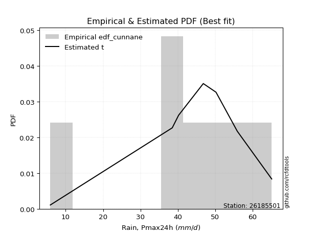</img>

</div>


### 12. EDF Adamowski (1981)

The Adamowski formula in hydrology refers to a specific plotting position formula used for estimating the non-parametric empirical distribution of hydrological events (like flood peaks) to calculate their return periods. This formula provides an alternative to traditional parametric methods (like the Gumbel or Log Pearson Type III distributions). 

<div align="center">


$P=(m-0.25)/(n+0.5)$


</div>


**12.1. Empirical values**

<div align="center">

|                | 0                  | 1                   | 2                   | 3             | 4                  | 5                  | 6                  |
|:---------------|:-------------------|:--------------------|:--------------------|:--------------|:-------------------|:-------------------|:-------------------|
| date           | 2017               | 2020                | 2018                | 2023          | 2021               | 2022               | 2019               |
| x              | 5.9                | 38.5                | 40.2                | 46.8          | 50.2               | 55.9               | 65.1               |
| m              | 1                  | 2                   | 3                   | 4             | 5                  | 6                  | 7                  |
| empirical_dist | edf_adamowski      | edf_adamowski       | edf_adamowski       | edf_adamowski | edf_adamowski      | edf_adamowski      | edf_adamowski      |
| empirical      | 0.1                | 0.23333333333333334 | 0.36666666666666664 | 0.5           | 0.6333333333333333 | 0.7666666666666667 | 0.9                |
| empirical_tr   | 1.1111111111111112 | 1.3043478260869565  | 1.5789473684210527  | 2.0           | 2.727272727272727  | 4.2857142857142865 | 10.000000000000002 |

</div>


**12.2. Kolmogorov-Smirnov fit test (sorted by Δ)**


<div align="center">

|                | 0                   | 1                   | 2                   | 3                   | 4                   | 5                   | 6                   | 7                   | 8                   | 9                   | 10                  | 11                  | 12                  | 13                  | 14                  | 15                  | 16                  | 17                  | 18                  | 19                  | 20                  | 21                  | 22                  | 23                  | 24                  | 25                  | 26                  | 27                    | 28                  | 29                  | 30                  | 31                  | 32                  | 33                  | 34                  | 35                  | 36                  | 37                  | 38                  | 39                  | 40                  | 41                  | 42                  | 43                  | 44                  | 45                  | 46                  | 47                  | 48                  | 49                  | 50                  | 51                  | 52                  | 53                  | 54                  | 55                  | 56                  | 57                  | 58                  | 59                  | 60                  | 61                  | 62                  | 63                  | 64                  | 65                  | 66                  | 67                  | 68                  | 69                  | 70                  | 71                  | 72                  | 73                  | 74                  | 75                  | 76                  | 77                  | 78                  | 79                  | 80                  | 81                  | 82                  | 83                  | 84                  | 85                  | 86                  | 87                  |
|:---------------|:--------------------|:--------------------|:--------------------|:--------------------|:--------------------|:--------------------|:--------------------|:--------------------|:--------------------|:--------------------|:--------------------|:--------------------|:--------------------|:--------------------|:--------------------|:--------------------|:--------------------|:--------------------|:--------------------|:--------------------|:--------------------|:--------------------|:--------------------|:--------------------|:--------------------|:--------------------|:--------------------|:----------------------|:--------------------|:--------------------|:--------------------|:--------------------|:--------------------|:--------------------|:--------------------|:--------------------|:--------------------|:--------------------|:--------------------|:--------------------|:--------------------|:--------------------|:--------------------|:--------------------|:--------------------|:--------------------|:--------------------|:--------------------|:--------------------|:--------------------|:--------------------|:--------------------|:--------------------|:--------------------|:--------------------|:--------------------|:--------------------|:--------------------|:--------------------|:--------------------|:--------------------|:--------------------|:--------------------|:--------------------|:--------------------|:--------------------|:--------------------|:--------------------|:--------------------|:--------------------|:--------------------|:--------------------|:--------------------|:--------------------|:--------------------|:--------------------|:--------------------|:--------------------|:--------------------|:--------------------|:--------------------|:--------------------|:--------------------|:--------------------|:--------------------|:--------------------|:--------------------|:--------------------|
| station        | 26185501            | 26185501            | 26185501            | 26185501            | 26185501            | 26185501            | 26185501            | 26185501            | 26185501            | 26185501            | 26185501            | 26185501            | 26185501            | 26185501            | 26185501            | 26185501            | 26185501            | 26185501            | 26185501            | 26185501            | 26185501            | 26185501            | 26185501            | 26185501            | 26185501            | 26185501            | 26185501            | 26185501              | 26185501            | 26185501            | 26185501            | 26185501            | 26185501            | 26185501            | 26185501            | 26185501            | 26185501            | 26185501            | 26185501            | 26185501            | 26185501            | 26185501            | 26185501            | 26185501            | 26185501            | 26185501            | 26185501            | 26185501            | 26185501            | 26185501            | 26185501            | 26185501            | 26185501            | 26185501            | 26185501            | 26185501            | 26185501            | 26185501            | 26185501            | 26185501            | 26185501            | 26185501            | 26185501            | 26185501            | 26185501            | 26185501            | 26185501            | 26185501            | 26185501            | 26185501            | 26185501            | 26185501            | 26185501            | 26185501            | 26185501            | 26185501            | 26185501            | 26185501            | 26185501            | 26185501            | 26185501            | 26185501            | 26185501            | 26185501            | 26185501            | 26185501            | 26185501            | 26185501            |
| empirical_dist | edf_adamowski       | edf_adamowski       | edf_adamowski       | edf_adamowski       | edf_adamowski       | edf_adamowski       | edf_adamowski       | edf_adamowski       | edf_adamowski       | edf_adamowski       | edf_adamowski       | edf_adamowski       | edf_adamowski       | edf_adamowski       | edf_adamowski       | edf_adamowski       | edf_adamowski       | edf_adamowski       | edf_adamowski       | edf_adamowski       | edf_adamowski       | edf_adamowski       | edf_adamowski       | edf_adamowski       | edf_adamowski       | edf_adamowski       | edf_adamowski       | edf_adamowski         | edf_adamowski       | edf_adamowski       | edf_adamowski       | edf_adamowski       | edf_adamowski       | edf_adamowski       | edf_adamowski       | edf_adamowski       | edf_adamowski       | edf_adamowski       | edf_adamowski       | edf_adamowski       | edf_adamowski       | edf_adamowski       | edf_adamowski       | edf_adamowski       | edf_adamowski       | edf_adamowski       | edf_adamowski       | edf_adamowski       | edf_adamowski       | edf_adamowski       | edf_adamowski       | edf_adamowski       | edf_adamowski       | edf_adamowski       | edf_adamowski       | edf_adamowski       | edf_adamowski       | edf_adamowski       | edf_adamowski       | edf_adamowski       | edf_adamowski       | edf_adamowski       | edf_adamowski       | edf_adamowski       | edf_adamowski       | edf_adamowski       | edf_adamowski       | edf_adamowski       | edf_adamowski       | edf_adamowski       | edf_adamowski       | edf_adamowski       | edf_adamowski       | edf_adamowski       | edf_adamowski       | edf_adamowski       | edf_adamowski       | edf_adamowski       | edf_adamowski       | edf_adamowski       | edf_adamowski       | edf_adamowski       | edf_adamowski       | edf_adamowski       | edf_adamowski       | edf_adamowski       | edf_adamowski       | edf_adamowski       |
| p_dist         | laplace_asymmetric  | genlogistic         | johnsonsu           | weibull_min         | t                   | fisk                | gumbel_l            | gompertz            | pearson3            | logjohnsonsu        | mielke              | logt                | laplace             | hypsecant           | logmielke           | logistic            | exponnorm           | norm                | truncnorm           | crystalball         | rice                | nct                 | f                   | logcrystalball      | fatiguelife         | chi2                | gamma               | loglaplace_asymmetric | betaprime           | logloggamma         | logpearson3         | erlang              | invgamma            | logfisk             | maxwell             | loggompertz         | rayleigh            | gumbel_r            | invgauss            | ncf                 | nakagami            | lognakagami         | loggumbel_l         | invweibull          | moyal               | halfnorm            | logtruncnorm        | halflogistic        | kstwobign           | gibrat              | wald                | lognct              | logrice             | logexponnorm        | lognorm             | lognorm             | logfatiguelife      | logf                | logncf              | loglogistic         | logerlang           | loghypsecant        | loginvgamma         | loggamma            | loggamma            | logbetaprime        | logalpha            | loginvweibull       | loginvgauss         | loglaplace          | logmaxwell          | lograyleigh         | expon               | genexpon            | logkstwobign        | loghalfnorm         | loggumbel_r         | loggenexpon         | logmoyal            | loghalflogistic     | logexpon            | loglognorm          | alpha               | logwald             | loggibrat           | logweibull_min      | logchi2             | loggenlogistic      |
| delta          | 0.06820939888755945 | 0.07202240288008199 | 0.07591429610766742 | 0.08177217254485403 | 0.08219048081736113 | 0.08669055484626237 | 0.093944922617064   | 0.09643897136571439 | 0.09839155636453056 | 0.10572899342413972 | 0.10808045936123101 | 0.12387730029306943 | 0.12581940338407138 | 0.13490947413853643 | 0.13710540958457168 | 0.1460359159820751  | 0.15971516601859342 | 0.15971660375510405 | 0.1597166170904381  | 0.15971661913630225 | 0.1597272275222419  | 0.16007101375314586 | 0.16140089641227162 | 0.1646991432035017  | 0.16605422065030162 | 0.17239776827043013 | 0.1733380831154968  | 0.17849562538313501   | 0.1785186200900113  | 0.1794490879873843  | 0.18012797523538499 | 0.1816636748520422  | 0.18744827172139555 | 0.19109438366546944 | 0.19355460542475633 | 0.20228710251914644 | 0.20585816494500925 | 0.2181566926960185  | 0.22420815131976118 | 0.23238769330753367 | 0.2333301728726642  | 0.23333333154106278 | 0.23390024229737844 | 0.23916293873407407 | 0.2405167475366929  | 0.2407783787466133  | 0.24907023507863985 | 0.2554341761631754  | 0.2601004120389529  | 0.29073356937490763 | 0.3002691718122518  | 0.3017487363724301  | 0.3022744386721587  | 0.30228441792658417 | 0.30228458192932023 | 0.30228458192932023 | 0.3030415843077144  | 0.30421042384646874 | 0.305491595424424   | 0.30711640684703373 | 0.30941165954955846 | 0.3112203792283004  | 0.3122971787424304  | 0.3148668966349382  | 0.3148668966349382  | 0.3150332518170898  | 0.31783982459624366 | 0.318639275790717   | 0.3225296569632648  | 0.32604894035707327 | 0.3335719745901797  | 0.3437244379270639  | 0.3491061016465527  | 0.35475896401319457 | 0.3585088671773194  | 0.3723285166820199  | 0.3728115119987226  | 0.3794183856957652  | 0.39806825709488597 | 0.39908310677739217 | 0.41230303821802555 | 0.4218697673571912  | 0.4633814386176472  | 0.4681660846091477  | 0.4960007228946028  | 0.508538901223184   | 0.5276985840349742  | 0.7666666666666667  |
| deltao         | 0.48442053926100004 | 0.48442053926100004 | 0.48442053926100004 | 0.48442053926100004 | 0.48442053926100004 | 0.48442053926100004 | 0.48442053926100004 | 0.48442053926100004 | 0.48442053926100004 | 0.48442053926100004 | 0.48442053926100004 | 0.48442053926100004 | 0.48442053926100004 | 0.48442053926100004 | 0.48442053926100004 | 0.48442053926100004 | 0.48442053926100004 | 0.48442053926100004 | 0.48442053926100004 | 0.48442053926100004 | 0.48442053926100004 | 0.48442053926100004 | 0.48442053926100004 | 0.48442053926100004 | 0.48442053926100004 | 0.48442053926100004 | 0.48442053926100004 | 0.48442053926100004   | 0.48442053926100004 | 0.48442053926100004 | 0.48442053926100004 | 0.48442053926100004 | 0.48442053926100004 | 0.48442053926100004 | 0.48442053926100004 | 0.48442053926100004 | 0.48442053926100004 | 0.48442053926100004 | 0.48442053926100004 | 0.48442053926100004 | 0.48442053926100004 | 0.48442053926100004 | 0.48442053926100004 | 0.48442053926100004 | 0.48442053926100004 | 0.48442053926100004 | 0.48442053926100004 | 0.48442053926100004 | 0.48442053926100004 | 0.48442053926100004 | 0.48442053926100004 | 0.48442053926100004 | 0.48442053926100004 | 0.48442053926100004 | 0.48442053926100004 | 0.48442053926100004 | 0.48442053926100004 | 0.48442053926100004 | 0.48442053926100004 | 0.48442053926100004 | 0.48442053926100004 | 0.48442053926100004 | 0.48442053926100004 | 0.48442053926100004 | 0.48442053926100004 | 0.48442053926100004 | 0.48442053926100004 | 0.48442053926100004 | 0.48442053926100004 | 0.48442053926100004 | 0.48442053926100004 | 0.48442053926100004 | 0.48442053926100004 | 0.48442053926100004 | 0.48442053926100004 | 0.48442053926100004 | 0.48442053926100004 | 0.48442053926100004 | 0.48442053926100004 | 0.48442053926100004 | 0.48442053926100004 | 0.48442053926100004 | 0.48442053926100004 | 0.48442053926100004 | 0.48442053926100004 | 0.48442053926100004 | 0.48442053926100004 | 0.48442053926100004 |
| eval           | Δo > Δ              | Δo > Δ              | Δo > Δ              | Δo > Δ              | Δo > Δ              | Δo > Δ              | Δo > Δ              | Δo > Δ              | Δo > Δ              | Δo > Δ              | Δo > Δ              | Δo > Δ              | Δo > Δ              | Δo > Δ              | Δo > Δ              | Δo > Δ              | Δo > Δ              | Δo > Δ              | Δo > Δ              | Δo > Δ              | Δo > Δ              | Δo > Δ              | Δo > Δ              | Δo > Δ              | Δo > Δ              | Δo > Δ              | Δo > Δ              | Δo > Δ                | Δo > Δ              | Δo > Δ              | Δo > Δ              | Δo > Δ              | Δo > Δ              | Δo > Δ              | Δo > Δ              | Δo > Δ              | Δo > Δ              | Δo > Δ              | Δo > Δ              | Δo > Δ              | Δo > Δ              | Δo > Δ              | Δo > Δ              | Δo > Δ              | Δo > Δ              | Δo > Δ              | Δo > Δ              | Δo > Δ              | Δo > Δ              | Δo > Δ              | Δo > Δ              | Δo > Δ              | Δo > Δ              | Δo > Δ              | Δo > Δ              | Δo > Δ              | Δo > Δ              | Δo > Δ              | Δo > Δ              | Δo > Δ              | Δo > Δ              | Δo > Δ              | Δo > Δ              | Δo > Δ              | Δo > Δ              | Δo > Δ              | Δo > Δ              | Δo > Δ              | Δo > Δ              | Δo > Δ              | Δo > Δ              | Δo > Δ              | Δo > Δ              | Δo > Δ              | Δo > Δ              | Δo > Δ              | Δo > Δ              | Δo > Δ              | Δo > Δ              | Δo > Δ              | Δo > Δ              | Δo > Δ              | Δo > Δ              | Δo > Δ              | Δo <= Δ             | Δo <= Δ             | Δo <= Δ             | Δo <= Δ             |
| fit            | 1                   | 1                   | 1                   | 1                   | 1                   | 1                   | 1                   | 1                   | 1                   | 1                   | 1                   | 1                   | 1                   | 1                   | 1                   | 1                   | 1                   | 1                   | 1                   | 1                   | 1                   | 1                   | 1                   | 1                   | 1                   | 1                   | 1                   | 1                     | 1                   | 1                   | 1                   | 1                   | 1                   | 1                   | 1                   | 1                   | 1                   | 1                   | 1                   | 1                   | 1                   | 1                   | 1                   | 1                   | 1                   | 1                   | 1                   | 1                   | 1                   | 1                   | 1                   | 1                   | 1                   | 1                   | 1                   | 1                   | 1                   | 1                   | 1                   | 1                   | 1                   | 1                   | 1                   | 1                   | 1                   | 1                   | 1                   | 1                   | 1                   | 1                   | 1                   | 1                   | 1                   | 1                   | 1                   | 1                   | 1                   | 1                   | 1                   | 1                   | 1                   | 1                   | 1                   | 1                   | 0                   | 0                   | 0                   | 0                   |
| n              | 7                   | 7                   | 7                   | 7                   | 7                   | 7                   | 7                   | 7                   | 7                   | 7                   | 7                   | 7                   | 7                   | 7                   | 7                   | 7                   | 7                   | 7                   | 7                   | 7                   | 7                   | 7                   | 7                   | 7                   | 7                   | 7                   | 7                   | 7                     | 7                   | 7                   | 7                   | 7                   | 7                   | 7                   | 7                   | 7                   | 7                   | 7                   | 7                   | 7                   | 7                   | 7                   | 7                   | 7                   | 7                   | 7                   | 7                   | 7                   | 7                   | 7                   | 7                   | 7                   | 7                   | 7                   | 7                   | 7                   | 7                   | 7                   | 7                   | 7                   | 7                   | 7                   | 7                   | 7                   | 7                   | 7                   | 7                   | 7                   | 7                   | 7                   | 7                   | 7                   | 7                   | 7                   | 7                   | 7                   | 7                   | 7                   | 7                   | 7                   | 7                   | 7                   | 7                   | 7                   | 7                   | 7                   | 7                   | 7                   |
| best_fit       | 1                   | 0                   | 0                   | 0                   | 0                   | 0                   | 0                   | 0                   | 0                   | 0                   | 0                   | 0                   | 0                   | 0                   | 0                   | 0                   | 0                   | 0                   | 0                   | 0                   | 0                   | 0                   | 0                   | 0                   | 0                   | 0                   | 0                   | 0                     | 0                   | 0                   | 0                   | 0                   | 0                   | 0                   | 0                   | 0                   | 0                   | 0                   | 0                   | 0                   | 0                   | 0                   | 0                   | 0                   | 0                   | 0                   | 0                   | 0                   | 0                   | 0                   | 0                   | 0                   | 0                   | 0                   | 0                   | 0                   | 0                   | 0                   | 0                   | 0                   | 0                   | 0                   | 0                   | 0                   | 0                   | 0                   | 0                   | 0                   | 0                   | 0                   | 0                   | 0                   | 0                   | 0                   | 0                   | 0                   | 0                   | 0                   | 0                   | 0                   | 0                   | 0                   | 0                   | 0                   | 0                   | 0                   | 0                   | 0                   |
| best_fit_sort  | 1                   | 2                   | 3                   | 4                   | 5                   | 6                   | 7                   | 8                   | 9                   | 10                  | 11                  | 12                  | 13                  | 14                  | 15                  | 16                  | 17                  | 18                  | 19                  | 20                  | 21                  | 22                  | 23                  | 24                  | 25                  | 26                  | 27                  | 28                    | 29                  | 30                  | 31                  | 32                  | 33                  | 34                  | 35                  | 36                  | 37                  | 38                  | 39                  | 40                  | 41                  | 42                  | 43                  | 44                  | 45                  | 46                  | 47                  | 48                  | 49                  | 50                  | 51                  | 52                  | 53                  | 54                  | 55                  | 56                  | 57                  | 58                  | 59                  | 60                  | 61                  | 62                  | 63                  | 64                  | 65                  | 66                  | 67                  | 68                  | 69                  | 70                  | 71                  | 72                  | 73                  | 74                  | 75                  | 76                  | 77                  | 78                  | 79                  | 80                  | 81                  | 82                  | 83                  | 84                  | 85                  | 86                  | 87                  | 88                  |

</div>


**12.3. Best fit**

<div align="center">

|   id |   station | empirical_dist   | p_dist             |     delta |   deltao | eval   |   fit |   n |   best_fit |   best_fit_sort |
|-----:|----------:|:-----------------|:-------------------|----------:|---------:|:-------|------:|----:|-----------:|----------------:|
|    0 |  26185501 | edf_adamowski    | laplace_asymmetric | 0.0682094 | 0.484421 | Δo > Δ |     1 |   7 |          1 |               1 |

</div>


<div align="center">

</img></img>

</div>


## C. Best fit & Estimate extreme values for specific return periods - Tr

Best fit in probability distribution analysis means finding the theoretical distribution (like Normal, Poisson, Exponential) that most accurately mirrors your real-world data´s patterns (shape, center, spread) for better predictions, using methods like visual checks (Q-Q plots), goodness-of-fit tests (Kolmogorov-Smirnov, Chi-Squared), and information criteria (AIC) to score and select the simplest, most representative model.


### 1. Best fit (ordered by delta Δ)

<div align="center">

|   id |   station | empirical_dist   | p_dist             |     delta |   deltao | eval   |   fit |   n |   best_fit |   best_fit_sort |
|-----:|----------:|:-----------------|:-------------------|----------:|---------:|:-------|------:|----:|-----------:|----------------:|
|    0 |  26185501 | edf_adamowski    | laplace_asymmetric | 0.0682094 | 0.484421 | Δo > Δ |     1 |   7 |          1 |               1 |
|    1 |  26185501 | edf_chegodayev   | laplace_asymmetric | 0.071813  | 0.484421 | Δo > Δ |     1 |   7 |          1 |               2 |
|    2 |  26185501 | edf_jenkinson    | laplace_asymmetric | 0.0725454 | 0.484421 | Δo > Δ |     1 |   7 |          1 |               3 |
|    3 |  26185501 | edf_beard        | laplace_asymmetric | 0.0725454 | 0.484421 | Δo > Δ |     1 |   7 |          1 |               4 |
|    4 |  26185501 | edf_hazen        | t                  | 0.0726667 | 0.484421 | Δo > Δ |     1 |   7 |          1 |               5 |
|    5 |  26185501 | edf_filliben     | laplace_asymmetric | 0.0730974 | 0.484421 | Δo > Δ |     1 |   7 |          1 |               6 |
|    6 |  26185501 | edf_tukey        | laplace_asymmetric | 0.07427   | 0.484421 | Δo > Δ |     1 |   7 |          1 |               7 |
|    7 |  26185501 | edf_gringorten   | t                  | 0.0750744 | 0.484421 | Δo > Δ |     1 |   7 |          1 |               8 |
|    8 |  26185501 | edf_cunnane      | t                  | 0.0766349 | 0.484421 | Δo > Δ |     1 |   7 |          1 |               9 |
|    9 |  26185501 | edf_blom         | laplace_asymmetric | 0.0774048 | 0.484421 | Δo > Δ |     1 |   7 |          1 |              10 |
|   10 |  26185501 | edf_weibull      | johnsonsu          | 0.0856429 | 0.484421 | Δo > Δ |     1 |   7 |          1 |              11 |
|   11 |  26185501 | edf_california   | laplace_asymmetric | 0.106971  | 0.484421 | Δo > Δ |     1 |   7 |          1 |              12 |

</div>

:file_folder:Tables: [bestfit_26185501.csv](table/bestfit_26185501.csv) | [extreme_26185501.csv](table/extreme_26185501.csv)


### 2. Extreme values

In hydrology, a return period (or recurrence interval $Tr$) is the statistical average time between extreme events like floods or droughts of a specific magnitude, indicating how rare an event is, with a 100-year flood, for example, having a 1% chance of occurring in any given year, not that it happens exactly every century. It is a key tool for infrastructure design (like bridges or dams) and risk assessment, calculated from historical data to determine the probability of future events, although it is important to remember it is statistical average, and events can cluster or be missed.

> risk_rate: assuming the return period as the project useful life.

|   id |      tr |   prob_l |     prob_g |      alpha |   betaprime |     chi2 |   crystalball |   erlang |    expon |   exponnorm |       f |   fatiguelife |     fisk |    gamma |   genexpon |   genlogistic |   gibrat |   gompertz |   gumbel_l |   gumbel_r |   halflogistic |   halfnorm |   hypsecant |   invgamma |   invgauss |   invweibull |   johnsonsu |   kstwobign |   laplace |   laplace_asymmetric |   loggamma |   logistic |   lognorm |   maxwell |   mielke |    moyal |   nakagami |      ncf |     nct |    norm |   pearson3 |   rayleigh |    rice |        t |   truncnorm |     wald |   weibull_min |   logalpha |   logbetaprime |          logchi2 |   logcrystalball |   logerlang |         logexpon |   logexponnorm |     logf |   logfatiguelife |   logfisk |   loggenexpon |   loggenlogistic |   loggibrat |   loggompertz |   loggumbel_l |   loggumbel_r |   loghalflogistic |   loghalfnorm |   loghypsecant |   loginvgamma |   loginvgauss |   loginvweibull |   logjohnsonsu |   logkstwobign |   loglaplace |   loglaplace_asymmetric |   logloggamma |   loglogistic |     loglognorm |   logmaxwell |   logmielke |   logmoyal |   lognakagami |   logncf |   lognct |   logpearson3 |   lograyleigh |   logrice |             logt |   logtruncnorm |   logwald |   logweibull_min |   station |   n |   risk_rate |
|-----:|--------:|---------:|-----------:|-----------:|------------:|---------:|--------------:|---------:|---------:|------------:|--------:|--------------:|---------:|---------:|-----------:|--------------:|---------:|-----------:|-----------:|-----------:|---------------:|-----------:|------------:|-----------:|-----------:|-------------:|------------:|------------:|----------:|---------------------:|-----------:|-----------:|----------:|----------:|---------:|---------:|-----------:|---------:|--------:|--------:|-----------:|-----------:|--------:|---------:|------------:|---------:|--------------:|-----------:|---------------:|-----------------:|-----------------:|------------:|-----------------:|---------------:|---------:|-----------------:|----------:|--------------:|-----------------:|------------:|--------------:|--------------:|--------------:|------------------:|--------------:|---------------:|--------------:|--------------:|----------------:|---------------:|---------------:|-------------:|------------------------:|--------------:|--------------:|---------------:|-------------:|------------:|-----------:|--------------:|---------:|---------:|--------------:|--------------:|----------:|-----------------:|---------------:|----------:|-----------------:|----------:|----:|------------:|
|    0 |    2    | 0.5      | 0.5        |    22.2333 |     42.5741 |  42.828  |       43.2286 |  42.5251 |  31.7742 |     43.2286 | 43.1777 |       42.9187 |  45.4969 |  42.7548 |    30.4927 |       46.6891 |  37.9983 |    45.697  |    46.0911 |    40.366  |        38.9429 |    39.6618 |     43.2286 |    42.2625 |    40.6594 |      39.9858 |     47.0871 |     38.89   |   43.2286 |              46.245  |    34.9192 |    43.2286 |   35.9806 |   41.7383 |  46.8994 |  39.4419 |    41.7213 |  40.4456 | 43.2158 | 43.2286 |    46.2514 |    41.2098 | 43.2288 |  46.9635 |     43.2286 |  37.5804 |       46.2497 |    34.7425 |        34.9148 |     12.2302      |          43.9132 |     35.2888 |     20.6596      |        35.9806 |  35.889  |          35.9225 |   42.8675 |       27.8779 |         inf      |     28.6677 |       41.4789 |       40.7456 |       31.7729 |           29.8676 |       30.8155 |        35.9806 |       35.1131 |       34.1199 |         33.1866 |        47.5033 |        29.2335 |      35.9806 |                 43.1878 |       43.1401 |       35.9806 |   5.96509      |      33.7248 |     45.3884 |    30.5225 |       44.7953 |  35.6135 |  36.0205 |       44.6621 |       32.9591 |   35.9813 |     47.7379      |        47.4153 |   28.1512 |     12.4209      |  26185501 |   7 |    0.75     |
|    1 |    2.33 | 0.570815 | 0.429185   |    26.4615 |     45.8642 |  46.1041 |       46.3379 |  45.9087 |  37.4751 |     46.3379 | 46.3051 |       46.0163 |  48.1445 |  46.0046 |    36.8024 |       49.0777 |  39.5734 |    48.3457 |    48.7963 |    43.2472 |        41.9052 |    43.0177 |     45.717  |    45.6921 |    44.3652 |      44.0015 |     49.6919 |     43.2659 |   45.1102 |              48.2737 |    40.3271 |    45.9681 |   41.1849 |   44.9688 |  50.0796 |  42.1693 |    43.2086 |  44.6896 | 46.3277 | 46.3379 |    49.0919 |    44.488  | 46.3386 |  49.0002 |     46.3379 |  39.6192 |       48.8002 |    40.0707 |        40.3067 |     15.263       |          47.3781 |     40.7948 |     27.2296      |        41.1849 |  41.0726 |          41.1326 |   47.4043 |       34.005  |         inf      |     30.6981 |       44.8123 |       45.8272 |       36.0098 |           33.97   |       35.6524 |        40.0887 |       40.5354 |       39.789  |         40.7215 |        50.6796 |        36.0492 |      39.0457 |                 46.7123 |       46.6694 |       40.5285 |   6.58023      |      38.8064 |     48.8108 |    34.3623 |       46.7066 |  41.0816 |  41.223  |       49.6223 |       38.0042 |   41.1857 |     49.5947      |        49.1523 |   30.7587 |     15.717       |  26185501 |   7 |    0.729209 |
|    2 |    5    | 0.8      | 0.2        |    59.2481 |     58.3006 |  58.5686 |       57.8932 |  58.7884 |  65.978  |     57.8931 | 57.9347 |       57.5611 |  58.3671 |  58.3404 |    68.3496 |       56.6562 |  48.6416 |    56.9982 |    57.5356 |    55.7644 |        55.3091 |    57.209  |     55.6987 |    59.0508 |    59.188  |      61.4478 |     57.6125 |     61.8538 |   54.518  |              54.9334 |    69.434  |    56.546  |   68.0407 |   57.6835 |  58.861  |  54.8029 |    51.6678 |  63.2136 | 57.8943 | 57.8932 |    58.032  |    57.6121 | 57.8955 |  57.5026 |     57.8932 |  51.0327 |       57.0395 |    69.0045 |        69.0559 |     51.8421      |          57.4079 |     70.5894 |    108.295       |        68.0407 |  67.8255 |          68.055  |   69.9048 |       75.7763 |         inf      |     45.5204 |       57.5319 |       66.9918 |       62.0299 |           60.8156 |       66.0476 |        61.853  |       69.9793 |       72.2092 |         99.0558 |        59.1476 |        87.8019 |      58.7603 |                 57.0499 |       57.024  |       64.1725 |   2.63636e+242 |      67.4238 |     58.7447 |    59.4921 |       56.767  |  70.2835 |  68.0399 |       65.7077 |       67.2155 |   68.0424 |     59.6609      |        56.1741 |   50.5035 |     63.7524      |  26185501 |   7 |    0.67232  |
|    3 |   10    | 0.9      | 0.1        |   119.485  |     66.7341 |  67.0911 |       65.5587 |  67.6006 |  91.8522 |     65.5585 | 65.6558 |       65.2484 |  65.8957 |  66.7505 |    96.9872 |       61.2124 |  58.9783 |    61.8589 |    62.4013 |    65.9594 |        66.4404 |    67.7103 |     63.6693 |    68.4779 |    69.9848 |      75.6576 |     61.6216 |     76.0061 |   63.0582 |              60.7173 |   100.288  |    64.3362 |   94.9303 |   66.6314 |  62.1698 |  65.8024 |    59.1162 |  78.3106 | 65.5692 | 65.5587 |    62.664  |    66.9699 | 65.5621 |  65.3341 |     65.5587 |  63.1451 |       61.6268 |   100.155  |        99.1061 |    172.665       |          61.3552 |    102.405  |    379.21        |        94.9303 |  94.6062 |          95.0603 |   93.0552 |      134.614  |         inf      |     71.3237 |       66.1226 |       82.7617 |       96.5976 |           98.6403 |      104.232  |        87.449  |      101.644  |      109.632  |        204.323  |        62.503  |       172.925  |      85.1577 |                 61.1717 |       61.154  |       90.0199 | inf            |      99.4603 |     62.6699 |    95.9409 |       66.1725 | 100.904  |  94.8492 |       73.1509 |      100.935  |   94.9329 |     76.2566      |        60.1933 |   85.4796 |    291.801       |  26185501 |   7 |    0.651322 |
|    4 |   15    | 0.933333 | 0.0666667  |   179.507  |     70.9979 |  71.4205 |       69.3839 |  72.0788 | 106.988  |     69.3837 | 69.5107 |       69.0932 |  69.9976 |  71.0155 |   113.739  |       63.5114 |  66.1081 |    64.0672 |    64.6048 |    71.7114 |        72.7398 |    73.1751 |     68.2181 |    73.3613 |    75.6753 |      83.6746 |     63.3238 |     83.5193 |   68.0538 |              64.1007 |   120.746  |    68.5807 |  112.094  |   71.2225 |  63.2185 |  72.186  |    63.1471 |  86.8371 | 69.3997 | 69.3839 |    64.6238 |    71.7914 | 69.3879 |  70.5691 |     69.3839 |  70.9231 |       63.7043 |   121.068  |       118.832  |    357.326       |          62.6246 |    123.606  |    789.329       |       112.094  | 111.7    |         112.318  |  108.75   |      181.111  |         inf      |     97.2199 |       70.425  |       91.0767 |      124.022  |          129.693  |      132.164  |       106.557  |      122.873  |      135.956  |        307.411  |        63.703  |       247.812  |     105.8    |                 62.5036 |       62.4886 |      108.249  | inf            |     121.416  |     63.9483 |   126.606  |       71.7486 | 121.058  | 111.943  |       75.813  |      124.456  |  112.097  |     94.7888      |        61.715  |  119.845  |    776.252       |  26185501 |   7 |    0.644736 |
|    5 |   20    | 0.95     | 0.05       |   239.476  |     73.8101 |  74.2835 |       71.8889 |  75.0407 | 117.726  |     71.8887 | 72.0359 |       71.6142 |  72.8327 |  73.8332 |   125.625  |       65.0548 |  71.7009 |    65.4434 |    65.9764 |    75.7387 |        77.1533 |    76.8186 |     71.427  |    76.6264 |    79.5145 |      89.2879 |     64.3442 |     88.5804 |   71.5983 |              66.5012 |   136.462  |    71.5143 |  124.982  |   74.2694 |  63.7336 |  76.707  |    65.8624 |  92.8199 | 71.9084 | 71.8889 |    65.7888 |    74.9961 | 71.8933 |  74.7217 |     71.8889 |  76.7193 |       64.9974 |   137.265  |       133.891  |    603.207       |          63.2513 |    139.942  |   1327.86        |       124.982  | 124.535  |         125.286  |  121.119  |      220.634  |         inf      |    123.959  |       73.2435 |       96.669  |      147.736  |          157.107  |      154.831  |       122.499  |      139.298  |      156.927  |        409.197  |        64.3551 |       315.783  |     123.414  |                 63.1623 |       63.1487 |      122.964  | inf            |     138.602  |     64.6009 |   154.084  |       75.7404 | 136.471  | 124.772  |       77.2104 |      143.05   |  124.986  |    116.408       |        62.516  |  154.165  |   1609.68        |  26185501 |   7 |    0.641514 |
|    6 |   25    | 0.96     | 0.04       |   299.424  |     75.8905 |  76.4051 |       73.733  |  77.2359 | 126.056  |     73.7328 | 73.8951 |       73.4715 |  75.0016 |  75.92   |   134.844  |       66.2171 |  76.3634 |    66.4236 |    66.9525 |    78.8409 |        80.5537 |    79.5294 |     73.9105 |    79.0646 |    82.3984 |      93.6116 |     65.0512 |     92.3714 |   74.3476 |              68.3632 |   149.383  |    73.7585 |  135.407  |   76.5315 |  64.0398 |  80.2112 |    67.8911 |  97.4394 | 73.7553 | 73.733  |    66.5891 |    77.3772 | 73.7376 |  78.2483 |     73.733  |  81.3619 |       65.9176 |   150.663  |       146.216  |    908.693       |          63.6249 |    153.402  |   1987.77        |       135.407  | 134.918  |         135.781  |  131.523  |      255.505  |         inf      |    151.791  |       75.3176 |      100.856  |      169.052  |          182.121  |      174.184  |       136.456  |      152.873  |      174.628  |        510.046  |        64.7769 |       378.649  |     139.072  |                 63.5552 |       63.5424 |      135.558  | inf            |     152.915  |     65.0097 |   179.423  |       78.8588 | 149.102  | 135.144  |       78.0805 |      158.641  |  135.411  |    141.876       |        63.0104 |  188.619  |   2887.78        |  26185501 |   7 |    0.639603 |
|    7 |   50    | 0.98     | 0.02       |   599.07   |     81.8957 |  82.5466 |       79.0136 |  83.592  | 151.93   |     79.0134 | 79.2207 |       78.7976 |  81.6281 |  81.9548 |   163.482  |       69.7018 |  92.7987 |    69.0869 |    69.602  |    88.3971 |        91.0308 |    87.4089 |     81.6103 |    86.2134 |    90.9338 |     106.931  |     66.8862 |    103.504  |   82.8877 |              74.1471 |   193.92   |    80.6153 |  170.326  |   83.0918 |  64.646  |  91.0898 |    73.8066 | 111.76   | 79.0444 | 79.0136 |    68.6269 |    84.289  | 79.019  |  91.3476 |     79.0136 |  96.52   |       68.4155 |   197.376  |       188.352  |   3297.91        |          64.3665 |    199.976  |   6960.46        |       170.326  | 169.694  |         170.963  |  169.181  |      391.323  |         inf      |    309.983  |       81.2492 |      113.161  |      256.054  |          287.114  |      245.291  |       190.667  |      200.124  |      238.604  |       1005.41   |        65.7558 |       645.318  |     201.548  |                 64.3361 |       64.325  |      182.601  | inf            |     203.346  |     65.9536 |   287.833  |       88.6832 | 192.394  | 169.857  |       79.9349 |      214.207  |  170.331  |    357.926       |        64.0319 |  364.413  |  19544.3         |  26185501 |   7 |    0.63583  |
|    8 |   75    | 0.986667 | 0.0133333  |   898.674  |     85.1472 |  85.8826 |       81.8471 |  87.0454 | 167.066  |     81.8468 | 82.0793 |       81.66   |  85.4553 |  85.229  |   180.234  |       71.6851 | 103.899  |    70.435  |    70.9418 |    93.9515 |        97.1212 |    91.6982 |     86.11   |    90.1539 |    95.686  |     114.673  |     67.7652 |    109.628  |   87.8834 |              77.5305 |   223.319  |    84.5756 |  192.638  |   86.6585 |  64.8462 |  97.4514 |    77.0285 | 120.169  | 81.8827 | 81.8471 |    69.5747 |    88.0493 | 81.8529 | 100.903  |     81.8471 | 105.848  |       69.6787 |   228.632  |       215.905  |   7074.84        |          64.6122 |    230.852  |  14488.2         |       192.638  | 191.916  |         193.467  |  195.662  |      493.555  |         inf      |    502.083  |       84.4244 |      119.943  |      325.938  |          374.088  |      295.538  |       231.835  |      231.672  |      283.176  |       1491.6    |        66.1653 |       865.294  |     250.403  |                 64.595  |       64.5844 |      216.883  | inf            |     237.43   |     66.3755 |   379.467  |       94.5372 | 220.787  | 192.018  |       80.6098 |      252.223  |  192.645  |    849.955       |        64.3826 |  546.502  |  63695.9         |  26185501 |   7 |    0.634587 |
|    9 |  100    | 0.99     | 0.01       |  1198.27   |     87.358  |  88.155  |       83.7635 |  89.3982 | 177.804  |     83.7632 | 84.0131 |       83.5977 |  88.1574 |  87.4579 |   192.119  |       73.0773 | 112.498  |    71.3173 |    71.8181 |    97.8827 |       101.432  |    94.6202 |     89.3019 |    92.8617 |    98.9697 |     120.152  |     68.3217 |    113.825  |   91.4279 |              79.9311 |   245.802  |    87.3716 |  209.364  |   89.088  |  64.946  | 101.965  |    79.2215 | 126.168  | 83.8025 | 83.7635 |    70.162  |    90.6111 | 83.7695 | 108.742  |     83.7635 | 112.648  |       70.5049 |   252.746  |       236.852  |  12200           |          64.7347 |    254.529  |  24373           |       209.364  | 208.575  |         210.345  |  216.818  |      578.144  |         inf      |    729.487  |       86.5682 |      124.598  |      386.644  |          451.14   |      335.542  |       266.32   |      255.977  |      318.433  |       1971.97   |        66.4048 |      1057.9    |     292.091  |                 64.7241 |       64.7139 |      244.896  | inf            |     263.862  |     66.6433 |   461.671  |       98.7433 | 242.414  | 208.621  |       80.9664 |      281.918  |  209.372  |   1946.78        |        64.5599 |  734.362  | 151192           |  26185501 |   7 |    0.633968 |
|   10 |  200    | 0.995    | 0.005      |  2396.62   |     92.4078 |  93.358  |       88.1105 |  94.7861 | 203.679  |     88.1102 | 88.4007 |       87.9986 |  94.6393 |  92.5569 |   220.757  |       76.3998 | 135.893  |    73.236  |    73.723  |   107.334  |       111.795  |   101.303  |     96.9914 |    99.1344 |   106.63   |     133.325  |     69.4797 |    123.49   |   99.968  |              85.715  |   305.968  |    94.0787 |  252.886  |   94.6462 |  65.0954 | 112.839  |    84.227  | 140.785  | 88.1576 | 88.1105 |    71.3438 |    96.4727 | 88.1172 | 132.136  |     88.1105 | 129.588  |       72.3008 |   318.108  |       292.437  |  45779.7         |          64.9181 |    318.131  |  85345.3         |       252.886  | 251.924  |         254.301  |  277.368  |      830.433  |         inf      |   2015.67   |       91.4176 |      135.348  |      582.96   |          707.713  |      448.584  |       371.958  |      321.712  |      417.449  |       3858.25   |        66.8542 |      1680.65   |     423.31   |                 64.9175 |       64.9077 |      327.745  | inf            |     335.934  |     67.2254 |   740.471  |      109.07   | 299.964  | 251.79   |       81.5417 |      363.686  |  252.895  |  43549           |        64.8284 | 1532.99   |      1.31966e+06 |  26185501 |   7 |    0.633042 |
|   11 |  250    | 0.996    | 0.004      |  2995.79   |     93.9607 |  94.9615 |       89.4389 |  96.4468 | 212.008  |     89.4386 | 89.7419 |       89.3449 |  96.7203 |  94.1271 |   229.976  |       77.4631 | 144.287  |    73.8008 |    74.2834 |   110.372  |       115.127  |   103.359  |     99.4667 |   101.088  |   109.03   |     137.56   |     69.8067 |    126.482  |  102.717  |              87.577  |   327.265  |    96.232  |  267.911  |   96.3572 |  65.1255 | 116.339  |    85.7634 | 145.55   | 89.4887 | 89.4389 |    71.6658 |    98.2771 | 89.4458 | 141.299  |     89.4389 | 135.192  |       72.8291 |   341.518  |       311.964  |  70248.1         |          64.9547 |    340.72   | 127760           |       267.911  | 266.89   |         269.487  |  300.189  |      928.398  |         inf      |   2902.65   |       92.8956 |      138.685  |      665.224  |          817.943  |      490.497  |       414.19   |      345.206  |      454.037  |       4787.41   |        66.9692 |      1939.51   |     477.017  |                 64.9562 |       64.9464 |      359.886  | inf            |     361.857  |     67.4011 |   862.102  |      112.456  | 320.233  | 266.683  |       81.6662 |      393.344  |  267.921  | 190277           |        64.8825 | 1955.6    |      2.71506e+06 |  26185501 |   7 |    0.632858 |
|   12 |  500    | 0.998    | 0.002      |  5991.63   |     98.5927 |  99.7536 |       93.3784 | 101.411  | 237.882  |     93.3781 | 93.7201 |       93.3417 | 103.174  |  98.8166 |   258.614  |       80.7544 | 173.297  |    75.4205 |    75.8901 |   119.803  |       125.468  |   109.489  |    107.156  |   106.986  |   116.314  |     150.704  |     70.7085 |    135.446  |  111.257  |              93.3609 |   399.958  |   102.91   |  317.923  |  101.463  |  65.1885 | 127.213  |    90.3331 | 160.572  | 93.436  | 93.3784 |    72.5214 |   103.661  | 93.3859 | 176.247  |     93.3784 | 153.012  |       74.3439 |   422.418  |       378.101  | 267342           |          65.0279 |    418.089  | 447369           |       317.923  | 316.709  |         320.073  |  383.612  |     1295.04   |          65.0252 |  10236.2    |       97.2662 |      148.711  |     1002.09   |         1281.87   |      640.174  |       578.467  |      426.216  |      584.576  |       9353.12   |        67.2596 |      2979.45   |     691.311  |                 65.0334 |       65.0238 |      481.026  | inf            |     451.724  |     67.927  |  1382.7    |      123.176  | 389.069  | 316.221  |       81.9326 |      496.999  |  317.936  |      1.96652e+08 |        64.991  | 4241.36   |      2.73794e+07 |  26185501 |   7 |    0.632489 |
|   13 |  750    | 0.998667 | 0.00133333 |  8987.46   |    101.183  | 102.44   |       95.5668 | 104.194  | 253.018  |     95.5665 | 95.9306 |       95.5646 | 106.944  | 101.443  |   275.366  |       82.6745 | 192.482  |    76.2865 |    76.7487 |   125.316  |       131.513  |   112.914  |    111.653  |   110.332  |   120.469  |     158.388  |     71.1687 |    140.482  |  116.253  |              96.7443 |   447.404  |   106.811  |  349.635  |  104.318  |  65.2128 | 133.574  |    92.8783 | 169.534  | 95.629  | 95.5669 |    72.9369 |   106.671  | 95.5746 | 202.253  |     95.5669 | 163.696  |       75.1534 |   475.999  |       420.884  | 586545           |          65.0523 |    468.788  | 931203           |       349.635  | 348.3    |         352.176  |  442.701  |     1560.06   |          65.0511 |  23556.8    |       99.6858 |      154.364  |     1273.3    |         1666.92   |      742.87   |       703.304  |      479.722  |      674.241  |      13835.4    |        67.3929 |      3792.07   |     858.884  |                 65.0591 |       65.0496 |      569.882  | inf            |     511.393  |     68.2265 |  1822.83   |      129.594  | 433.737  | 347.606  |       82.03   |      566.449  |  349.649  |      1.31795e+11 |        65.0273 | 6746.8    |      1.10884e+08 |  26185501 |   7 |    0.632366 |
|   14 | 1000    | 0.999    | 0.001      | 11983.3    |    102.974  | 104.299  |       97.0736 | 106.121  | 263.757  |     97.0732 | 97.4527 |       97.0962 | 109.618  | 103.26   |   287.251  |       84.0354 | 207.164  |    76.8694 |    77.3266 |   129.226  |       135.801  |   115.279  |    114.844  |   112.664  |   123.376  |     163.838  |     71.4698 |    143.97   |  119.798  |              99.1448 |   483.44   |   109.578  |  373.289  |  106.292  |  65.2271 | 138.087  |    94.6328 | 175.977  | 97.139  | 97.0736 |    73.1999 |   108.752  | 97.0816 | 223.765  |     97.0736 | 171.381  |       75.6983 |   517.077  |       453.193  |      1.02583e+06 |          65.0645 |    507.39   |      1.56652e+06 |       373.289  | 371.865  |         376.133  |  490.043  |     1774.32   |          65.064  |  44578      |      101.348  |      158.288  |     1509.1    |         2008.29   |      823.26   |       807.897  |      520.669  |      744.571  |      18264.3    |        67.4747 |      4481.66   |    1001.88   |                 65.072  |       65.0625 |      642.674  | inf            |     557.179  |     68.4371 |  2217.68   |      134.217  | 467.539  | 371.005  |       82.0815 |      620.034  |  373.304  |      6.76914e+13 |        65.0454 | 9421.26   |      3.05185e+08 |  26185501 |   7 |    0.632305 |

<div align="center">

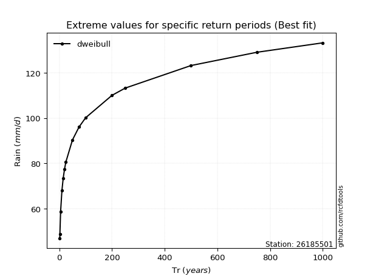</img>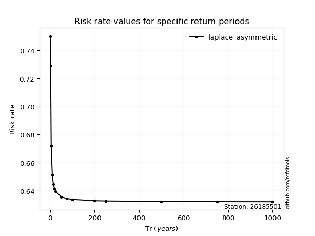</img>

</div>


<sub>**APP DISCLAIMER**: NO WARRANTY - This software is provided by [github.com/rcfdtools](https://github.com/rcfdtools) "as is", without any express or implied warranty, including warranties of merchantability, fitness for a particular purpose, or non-infringement. There is no guarantee that the software will be error-free or operate without interruption. LIMITATION OF LIABILITY - Neither the authors nor copyright holders will be liable for claims or damages arising from the software or its use. You are responsible for determining if the software is appropriate for your use and assume all associated risks, including errors, legal compliance, and data loss. NO PROFESSIONAL ADVICE - The software provides general information and does not offer professional advice. It should not replace consultation with professional advisors.</sub>