<div align="center">


</div>

# PMP Station (Rain, Pmax24h): 26187040

Probable Maximum Precipitation (PMP) is the greatest amount of rainfall for a specific duration that is meteorologically possible for a given location, acting as a "worst-case" scenario for extreme storms, crucial for designing safety-critical infrastructure like bridges, river deviations, dams, spillways, and nuclear plants to prevent catastrophic failure. PMP is calculated by hydrologists using meteorological data to determine the upper limit of extreme rainfall, often leading to the Probable Maximum Flood (PMF) for flood control design, and is increasingly being studied for climate change impacts. Probable Maximum Precipitation (PMP) is the theoretical upper limit of rainfall, a deterministic estimate for extreme events, while probability distributions (like GEV, Gumbel) describe the likelihood and frequency of various precipitation amounts, including rare ones, showing how often events occur, with PMP representing the extreme end of these distributions, used for critical infrastructure design to ensure safety against the worst conceivable weather, unlike standard statistical forecasts which cover typical probabilities.

The most common probability distributions in hydrology, used for analyzing floods, rainfall, and streamflow, include the Normal, Log-Normal, Gumbel, Gamma (including Log-Pearson Type III), and Generalized Extreme Value (GEV) distributions, often chosen based on the data´s skewness and whether modeling extremes or general conditions, with Gumbel and GEV popular for extreme events like floods, while the Normal distribution serves as a baseline, though often requiring transformations for skewed hydrological data. These distributions help in designing water infrastructure, managing water resources, and forecasting hydrologic events.

> Hydrological data often isn´t perfectly normal (it´s skewed), so different distributions are needed for different applications, such as: **Flood Frequency Analysis**: Using Gumbel, GEV, or Log-Pearson Type III for predicting extreme flood magnitudes and their return periods, **Rainfall Analysis**: Normal for annual totals, but Log-Normal, Weibull, or GEV for intensity or extreme daily rainfall, **Streamflow Modeling**: Gamma and Log-Normal for maximum flows, GEV for minimum flows, and Kappa for daily flows.

<div align="center">

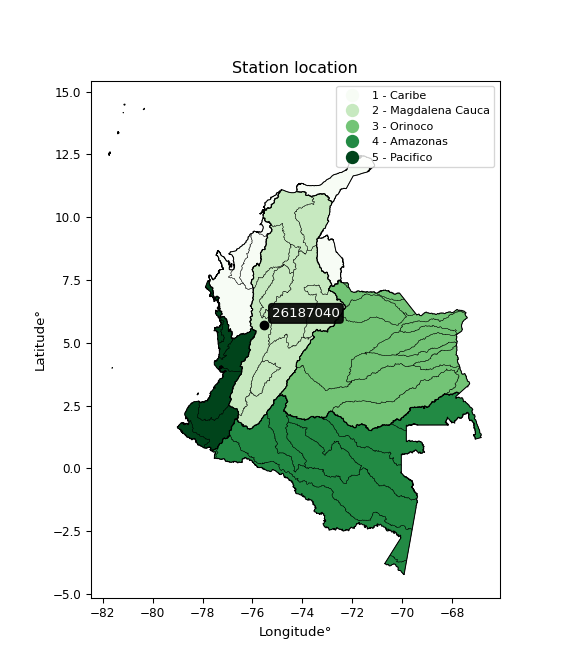</img>

</div>


## A. General information


### 1. General running parameters

• app_version: _v20260103_. • runtime: _2026-01-05 16:20:51.132608_. • Python version: _3.14.0_. • SciPy version: _1.16.3_. • Pandas version: _2.3.3_. • NumPy version: _2.3.5_. • Stations dataset (station_dataset_file): _dataset/pmax24h_in/automatic_colombia_2003_2024.csv_. • Stations catalog (station_catalog_file): _dataset/CNE.xls_. • Minimum year to eval til year_max (date_min): _1900_. • Maximum year to eval since year_min (date_max): _2024_. • Creates, save and include plots into reports (create_plot): _True_. • Plot only fit distributions with Δo > Δ (plot_only_fit): _True_. • Plot only simple graphs avoiding multiple CDFs and multiple Extreme values plots (plot_only_simple): _True_. • Eval low extreme values, if False, evaluates high extreme values (low_extreme): _False_. • Eval every SciPy distribution as logarithmic (pdist_logarithmic_on): _True_. • Standard deviation normalized (ddof): _1.0_. • Return periods to eval in years (Tr): _[2, 2.33, 5, 10, 15, 20, 25, 50, 75, 100, 200, 250, 500, 750, 1000]_. • Minimum data sample per station, 0 means any (minimum_sample): _5_. • Z-Score maximum threshold to adjust a value, 0 means disable (zscore_max): _3.5_. • Z-Score minimum threshold to adjust a value, 0 means disable (zscore_min): _-2.5_. • Avoid zeros, e.g. rain = 0 (avoid_zeros): _True_. • Avoid null values (avoid_nans): _True_. 

[:file_folder:Dataset file](../../dataset/pmax24h_in/automatic_colombia_2003_2024.csv)

> Delta Degrees of Freedom (DDOF): is a parameter used in the formulas for calculating variance and standard deviation. When ddof=0, the divisor is $N$ (the total number of observations) and this is used when your data set is the entire population. When ddof=1, the divisor is $N-1$ and this is used when your data set is a sample drawn from a larger population. Using $N-1$ provides an unbiased estimate of the population variance (known as Bessel´s correction).


### 2. Station info and location

|   id |   CODIGO | NOMBRE                | CATEGORIA    | TECNOLOGIA                | ESTADO   | FECHA_INSTALACION   |   FECHA_SUSPENSION |   ALTITUD |   LATITUD |   LONGITUD | DEPARTAMENTO   | MUNICIPIO   | AREA_OPERATIVA                      | ENTIDAD                                                     | AREA_HIDROGRAFICA   | ZONA_HIDROGRAFICA   | SUBZONA_HIDROGRAFICA   | CORRIENTE   | Catalogo   |   Version |
|-----:|---------:|:----------------------|:-------------|:--------------------------|:---------|:--------------------|-------------------:|----------:|----------:|-----------:|:---------------|:------------|:------------------------------------|:------------------------------------------------------------|:--------------------|:--------------------|:-----------------------|:------------|:-----------|----------:|
|    0 | 26187040 | QUITASUEÑO [26187040] | Limnigráfica | Automática con Telemetría | Activa   | 10/03/2014          |                nan |       560 |   5.71361 |   -75.5403 | Antioquia      | Abejorral   | Area Operativa 01 - Antioquia-Chocó | INSTITUTO DE HIDROLOGIA METEOROLOGIA Y ESTUDIOS AMBIENTALES | Magdalena Cauca     | Cauca               | Río Arma               | Arma        | CNE_IDEAM  |  20251226 |

<div align="center">

Dynamic map: [:earth_americas:Google](http://maps.google.com/maps?q=5.713611111,-75.540277778) [:earth_americas:OSM](https://www.openstreetmap.org/#map=18/5.713611111/-75.540277778&layers=P) [:earth_americas:Bing](https://www.bing.com/maps?cp=5.713611111~-75.540277778&lvl=18) [:earth_americas:Apple](https://maps.apple.com/frame?center=5.713611111%2C-75.540277778&span=0.003%2C0.006)

</div>


<div align="center">

```geojson
{
  "type": "Feature",
  "geometry": {
    "type": "Point", 
    "coordinates": [-75.540277778, 5.713611111]
  }, 
  "properties": {
    "Name": "26187040"
  }
}
```

</div>


### 3. Discrete values table and plot

<div align="center">

|               |           0 |           1 |          2 |           3 |          4 |         5 |
|:--------------|------------:|------------:|-----------:|------------:|-----------:|----------:|
| Date          | 2017        | 2018        | 2019       | 2020        | 2021       | 2022      |
| Value         |   51.2      |   43.8      |   59.3     |    6.8      |   19.4     |    1      |
| Value_initial |   51.2      |   43.8      |   59.3     |    6.8      |   19.4     |    1      |
| count         |    6        |    6        |    6       |    6        |    6       |    6      |
| mean          |   30.25     |   30.25     |   30.25    |   30.25     |   30.25    |   30.25   |
| std           |   24.4524   |   24.4524   |   24.4524  |   24.4524   |   24.4524  |   24.4524 |
| zscore        |    0.856767 |    0.554138 |    1.18802 |   -0.959007 |   -0.44372 |   -1.1962 |


</div>


<div align="center">

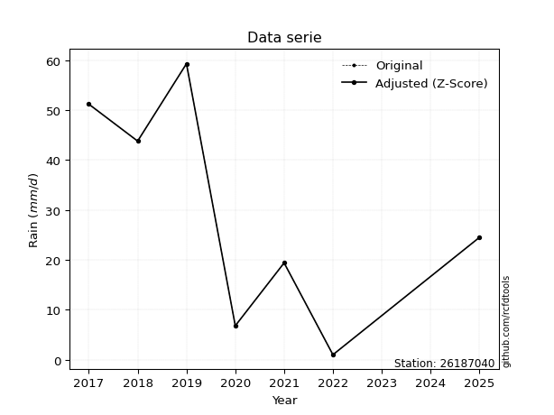</img>

</div>


> The initial value (value_initial) correspond to the initial obtained or null completed value, and value (value) is adjusted only when the initial value is outside the valid range (outlier) definite through the Z-Score value. If Z-Score is active, values out of range or outliers are replaced with the station mean value. A Z-Score (or standard score) measures how many standard deviations a data point is from the mean of a dataset, indicating its relative position; positive scores mean above the mean, negative mean below, and a score of zero is exactly at the mean, allowing for comparison of values from different distributions. It´s calculated using the formula $z=(x–μ)/σ$, where $x$ is the data point, $μ$ is the mean, and $σ$ is the standard deviation, helping identify outliers and understand probability.
>
> <sub>**Note**: In this study, "completing" (filling gaps in) and "extending" (forecasting or lengthening the historical record) rainfall data series are avoided for certain critical analyses because they introduce artificial bias and uncertainty, which can distort the statistics of rare events (extremes), alter day-to-day variability, and compromise the integrity and homogeneity of the original data. Some reasons against Completing/Extending rainfall data are: **Distortion of Extremes and Variability**: The primary issue is that most gap-filling or extension methods rely on averaging or regression with nearby stations, which inherently smooths the data. Rainfall is highly variable in space and time, with a large percentage of zero values and occasional large storms. Infilling methods often underestimate the highest values and overestimate the lowest (zero) values, which severely distorts analyses focused on flood frequency, drought severity, and intensity-duration-frequency (IDF) curves, **Loss of Data Homogeneity**: Infilled or extended data are synthetic estimates, not actual measurements. Combining these estimates with observed data can violate the assumption of data homogeneity, which requires that the data properties do not change over time. Inhomogeneity can lead to incorrect conclusions about long-term trends or changes in climate patterns, **Propagation of Errors**: Errors and biases from the original data (e.g., wind-induced undercatch, instrument errors, site changes) or the data used for imputation can propagate through the analysis, leading to unreliable hydrological models and inaccurate predictions, **Compromised Statistical Integrity**: For statistical analyses, especially those involving the frequency of events, using artificial data can introduce time bias or autocorrelation that doesn´t exist in reality, making it difficult to assess the true probability of events, **Difficulty in Validation**: It is difficult to accurately validate the quality of filled or extended data, especially for past periods where ground-truth measurements are unavailable. The reliability of imputation techniques heavily depends on the density of the surrounding station network and the complexity of the local topography.</sub>


### 4. Active continuous probability distributions from SciPy (44 of 104 available)

A Probability Density Function (PDF) describes the relative likelihood of a continuous random variable falling within a specific range, where the total area under its curve equals 1, and the area over any interval gives the actual probability for that range. Unlike discrete probabilities (like rolling a die), a PDF shows density, not direct probability for a single point (which is zero), with higher points indicating higher likelihood, often visualized as a bell curve for normal distributions.

A log of a probability density function (log-PDF) is simply the logarithm of the PDF´s value, denoted as $log(f(x))$, useful for converting multiplication of probabilities into addition, improving numerical stability with tiny numbers, and connecting to information theory concepts like entropy. Instead of dealing with very small probabilities (e.g., 0.000001), log-PDFs use negative numbers (e.g., $log(0.00001) ≈ -11.51$ that are easier for computers to handle, preventing underflow errors and simplifying complex calculations. In this study, each active probability distribution from SciPy is also evaluated in the $log$ form.

[scipy.stats](https://docs.scipy.org/doc/scipy/reference/stats.html) is a Python´s powerful submodule within the SciPy library for comprehensive statistical analysis, offering over 130 probability distributions (like Normal, Poisson), functions for descriptive stats (mean, variance), hypothesis testing (t-tests, chi-square), random variable generation, and statistical tests, making it essential for data science, modeling, and research. It provides tools to explore, model, and draw conclusions from data efficiently, working seamlessly with NumPy.

<div align="center">

|   id | p_dist             |   n_parameter | fit_method   | label                                                                       | active   | ref                                                                                                        |
|-----:|:-------------------|--------------:|:-------------|:----------------------------------------------------------------------------|:---------|:-----------------------------------------------------------------------------------------------------------|
|    0 | alpha              |             3 | MLE          | Alpha                                                                       | True     | [:mortar_board:](https://docs.scipy.org/doc/scipy/reference/generated/scipy.stats.alpha.html)              |
|    1 | betaprime          |             4 | MLE          | Beta prime                                                                  | True     | [:mortar_board:](https://docs.scipy.org/doc/scipy/reference/generated/scipy.stats.betaprime.html)          |
|    2 | chi2               |             3 | MLE          | Chi²                                                                        | True     | [:mortar_board:](https://docs.scipy.org/doc/scipy/reference/generated/scipy.stats.chi2.html)               |
|    3 | crystalball        |             4 | MLE          | Crystalball                                                                 | True     | [:mortar_board:](https://docs.scipy.org/doc/scipy/reference/generated/scipy.stats.crystalball.html)        |
|    4 | erlang             |             3 | MLE          | Erlang                                                                      | True     | [:mortar_board:](https://docs.scipy.org/doc/scipy/reference/generated/scipy.stats.erlang.html)             |
|    5 | expon              |             2 | MLE          | Exponential                                                                 | True     | [:mortar_board:](https://docs.scipy.org/doc/scipy/reference/generated/scipy.stats.expon.html)              |
|    6 | exponnorm          |             3 | MLE          | Exponentially modified Normal                                               | True     | [:mortar_board:](https://docs.scipy.org/doc/scipy/reference/generated/scipy.stats.exponnorm.html)          |
|    7 | f                  |             4 | MLE          | F                                                                           | True     | [:mortar_board:](https://docs.scipy.org/doc/scipy/reference/generated/scipy.stats.f.html)                  |
|    8 | fatiguelife        |             3 | MLE          | Fatigue-life (Birnbaum-Saunders)                                            | True     | [:mortar_board:](https://docs.scipy.org/doc/scipy/reference/generated/scipy.stats.fatiguelife.html)        |
|    9 | fisk               |             3 | MLE          | Fisk                                                                        | True     | [:mortar_board:](https://docs.scipy.org/doc/scipy/reference/generated/scipy.stats.fisk.html)               |
|   10 | gamma              |             3 | MLE          | Gamma                                                                       | True     | [:mortar_board:](https://docs.scipy.org/doc/scipy/reference/generated/scipy.stats.gamma.html)              |
|   11 | genexpon           |             5 | MLE          | Generalized exponential                                                     | True     | [:mortar_board:](https://docs.scipy.org/doc/scipy/reference/generated/scipy.stats.genexpon.html)           |
|   12 | genlogistic        |             3 | MLE          | Generalized logistic                                                        | True     | [:mortar_board:](https://docs.scipy.org/doc/scipy/reference/generated/scipy.stats.genlogistic.html)        |
|   13 | gibrat             |             2 | MM           | Gibrat                                                                      | True     | [:mortar_board:](https://docs.scipy.org/doc/scipy/reference/generated/scipy.stats.gibrat.html)             |
|   14 | gompertz           |             3 | MLE          | Gompertz (or truncated Gumbel)                                              | True     | [:mortar_board:](https://docs.scipy.org/doc/scipy/reference/generated/scipy.stats.gompertz.html)           |
|   15 | gumbel_l           |             2 | MM           | Gumbel Left Skew                                                            | True     | [:mortar_board:](https://docs.scipy.org/doc/scipy/reference/generated/scipy.stats.gumbel_l.html)           |
|   16 | gumbel_r           |             2 | MM           | Gumbel Right Skew                                                           | True     | [:mortar_board:](https://docs.scipy.org/doc/scipy/reference/generated/scipy.stats.gumbel_r.html)           |
|   17 | halflogistic       |             2 | MM           | Half-logistic                                                               | True     | [:mortar_board:](https://docs.scipy.org/doc/scipy/reference/generated/scipy.stats.halflogistic.html)       |
|   18 | halfnorm           |             2 | MM           | Half Normal                                                                 | True     | [:mortar_board:](https://docs.scipy.org/doc/scipy/reference/generated/scipy.stats.halfnorm.html)           |
|   19 | hypsecant          |             2 | MM           | hyperbolic secant                                                           | True     | [:mortar_board:](https://docs.scipy.org/doc/scipy/reference/generated/scipy.stats.hypsecant.html)          |
|   20 | invgamma           |             3 | MLE          | Inverted gamma                                                              | True     | [:mortar_board:](https://docs.scipy.org/doc/scipy/reference/generated/scipy.stats.invgamma.html)           |
|   21 | invgauss           |             3 | MLE          | Inverse Gaussian                                                            | True     | [:mortar_board:](https://docs.scipy.org/doc/scipy/reference/generated/scipy.stats.invgauss.html)           |
|   22 | invweibull         |             3 | MLE          | Inverted Weibull                                                            | True     | [:mortar_board:](https://docs.scipy.org/doc/scipy/reference/generated/scipy.stats.invweibull.html)         |
|   23 | johnsonsu          |             4 | MLE          | Johnson Su                                                                  | True     | [:mortar_board:](https://docs.scipy.org/doc/scipy/reference/generated/scipy.stats.johnsonsu.html)          |
|   24 | kstwobign          |             2 | MLE          | Limiting distribution of scaled Kolmogorov-Smirnov two-sided test statistic | True     | [:mortar_board:](https://docs.scipy.org/doc/scipy/reference/generated/scipy.stats.kstwobign.html)          |
|   25 | laplace            |             2 | MM           | Laplace                                                                     | True     | [:mortar_board:](https://docs.scipy.org/doc/scipy/reference/generated/scipy.stats.laplace.html)            |
|   26 | laplace_asymmetric |             3 | MLE          | Asymmetric Laplace                                                          | True     | [:mortar_board:](https://docs.scipy.org/doc/scipy/reference/generated/scipy.stats.laplace_asymmetric.html) |
|   27 | loggamma           |             3 | MLE          | Log gamma                                                                   | True     | [:mortar_board:](https://docs.scipy.org/doc/scipy/reference/generated/scipy.stats.loggamma.html)           |
|   28 | logistic           |             2 | MM           | Logistic (or Sech-squared)                                                  | True     | [:mortar_board:](https://docs.scipy.org/doc/scipy/reference/generated/scipy.stats.logistic.html)           |
|   29 | lognorm            |             3 | MLE          | Log Normal                                                                  | True     | [:mortar_board:](https://docs.scipy.org/doc/scipy/reference/generated/scipy.stats.lognorm.html)            |
|   30 | maxwell            |             2 | MM           | Maxwell                                                                     | True     | [:mortar_board:](https://docs.scipy.org/doc/scipy/reference/generated/scipy.stats.maxwell.html)            |
|   31 | mielke             |             4 | MLE          | Mielke Beta-Kappa / Dagum                                                   | True     | [:mortar_board:](https://docs.scipy.org/doc/scipy/reference/generated/scipy.stats.mielke.html)             |
|   32 | moyal              |             2 | MM           | Moyal                                                                       | True     | [:mortar_board:](https://docs.scipy.org/doc/scipy/reference/generated/scipy.stats.moyal.html)              |
|   33 | nakagami           |             3 | MLE          | Nakagami                                                                    | True     | [:mortar_board:](https://docs.scipy.org/doc/scipy/reference/generated/scipy.stats.nakagami.html)           |
|   34 | ncf                |             5 | MLE          | Non-central F distribution                                                  | True     | [:mortar_board:](https://docs.scipy.org/doc/scipy/reference/generated/scipy.stats.ncf.html)                |
|   35 | nct                |             4 | MLE          | Non-central Student’s t                                                     | True     | [:mortar_board:](https://docs.scipy.org/doc/scipy/reference/generated/scipy.stats.nct.html)                |
|   36 | norm               |             2 | MM           | Normal                                                                      | True     | [:mortar_board:](https://docs.scipy.org/doc/scipy/reference/generated/scipy.stats.norm.html)               |
|   37 | pearson3           |             3 | MM           | Pearson type III                                                            | True     | [:mortar_board:](https://docs.scipy.org/doc/scipy/reference/generated/scipy.stats.pearson3.html)           |
|   38 | rayleigh           |             2 | MM           | Rayleigh                                                                    | True     | [:mortar_board:](https://docs.scipy.org/doc/scipy/reference/generated/scipy.stats.rayleigh.html)           |
|   39 | rice               |             3 | MLE          | Rice                                                                        | True     | [:mortar_board:](https://docs.scipy.org/doc/scipy/reference/generated/scipy.stats.rice.html)               |
|   40 | t                  |             3 | MLE          | Student’s t                                                                 | True     | [:mortar_board:](https://docs.scipy.org/doc/scipy/reference/generated/scipy.stats.t.html)                  |
|   41 | truncnorm          |             4 | MLE          | Truncated normal                                                            | True     | [:mortar_board:](https://docs.scipy.org/doc/scipy/reference/generated/scipy.stats.truncnorm.html)          |
|   42 | wald               |             2 | MM           | Wald                                                                        | True     | [:mortar_board:](https://docs.scipy.org/doc/scipy/reference/generated/scipy.stats.wald.html)               |
|   43 | weibull_min        |             3 | MLE          | Weibull minimum                                                             | True     | [:mortar_board:](https://docs.scipy.org/doc/scipy/reference/generated/scipy.stats.weibull_min.html)        |

</div>

> **n_parameter:** # arguments & localization & scale.
>
> **Fit methods:** (MLE) maximum likelihood, (MM) L-moments.
>
>**Inactive** (With the only purpose of prevent loops, zero divisions, infinite values, over high estimated values or horizontal trending for recurrence intervals estimations, the follow distributions were disabled.)**:** foldnorm, gennorm, norminvgauss, powernorm, powerlognorm, skewnorm, genextreme, anglit, arcsine, argus, beta, bradford, burr, burr12, cauchy, cosine, halfcauchy, foldcauchy, skewcauchy, wrapcauchy, dgamma, gengamma, exponweib, exponpow, truncexpon, gausshyper, genhalflogistic, genhyperbolic, geninvgauss, halfgennorm, johnsonsb, kappa4, kappa3, ksone, kstwo, loglaplace, levy, levy_l, levy_stable, ncx2, pareto, genpareto, truncpareto, lomax, powerlaw, rdist, rel_breitwigner, recipinvgauss, semicircular, studentized_range, trapezoid, triang, truncweibull_min, tukeylambda, uniform, loguniform, vonmises, vonmises_line, weibull_max, dweibull, 


## B. Probability (PDF) vs. Empirical (EDF) distributions functions

A continuous probability distribution (CPD) describes probabilities for variables that can take any value within a range (like rain any time), unlike discrete variables with specific outcomes (like temperature). It uses a Probability Density Function (PDF), a curve where the total area under it equals 1, and the probability of the variable falling within an interval (a to b) is found by calculating the area under the curve between those points. A key feature is that the probability of hitting any single exact value is zero, so probabilities are always expressed for ranges, e.g., $P(a ≤ X ≤ b)$.

<div align="center">

Distributions parameters from station values
|    |   station | p_dist                |   n |                loc |            scale | shape                  | shape1                 | shape2             | shape3   |
|---:|----------:|:----------------------|----:|-------------------:|-----------------:|:-----------------------|:-----------------------|:-------------------|:---------|
|  0 |  26187040 | alpha                 |   6 |    -131.38         |   1123.85        | 7.107202349722439      |                        |                    |          |
|  1 |  26187040 | betaprime             |   6 |       1            |     70.626       | 0.6224763267486495     | 2.045581534425783      |                    |          |
|  2 |  26187040 | chi2                  |   6 |       1            |      3.28068     | 0.8104112522084261     |                        |                    |          |
|  3 |  26187040 | crystalball           |   6 |      30.25         |     22.3219      | 2493.6875734798277     | 2677.692230890353      |                    |          |
|  4 |  26187040 | erlang                |   6 |   -1072.16         |      0.452078    | 2438.4997523445354     |                        |                    |          |
|  5 |  26187040 | expon                 |   6 |       1            |     29.25        |                        |                        |                    |          |
|  6 |  26187040 | exponnorm             |   6 |      30.22         |     22.3218      | 0.001345078184685843   |                        |                    |          |
|  7 |  26187040 | f                     |   6 |       1            |     26.8084      | 0.9027705317229688     | 182.69204697768367     |                    |          |
|  8 |  26187040 | fatiguelife           |   6 |      -3.19247      |     20.9564      | 1.0618253333755234     |                        |                    |          |
|  9 |  26187040 | fisk                  |   6 |       1            |     15.657       | 0.9229657774480393     |                        |                    |          |
| 10 |  26187040 | gamma                 |   6 |   -1065.36         |      0.455263    | 2406.5480738320794     |                        |                    |          |
| 11 |  26187040 | genexpon              |   6 |       0.999963     |      1.67514     | 0.06427742813560869    | 2.1824375642598756e-06 | 1.0897310329427095 |          |
| 12 |  26187040 | genlogistic           |   6 |    -109.326        |     19.5549      | 712.360629568688       |                        |                    |          |
| 13 |  26187040 | gibrat                |   6 |      13.2212       |     10.3285      |                        |                        |                    |          |
| 14 |  26187040 | gompertz              |   6 |       1            |     41.1556      | 0.7437252567186903     |                        |                    |          |
| 15 |  26187040 | gumbel_l              |   6 |      40.296        |     17.4043      |                        |                        |                    |          |
| 16 |  26187040 | gumbel_r              |   6 |      20.204        |     17.4043      |                        |                        |                    |          |
| 17 |  26187040 | halflogistic          |   6 |       3.79336      |     19.0844      |                        |                        |                    |          |
| 18 |  26187040 | halfnorm              |   6 |       0.704594     |     37.0297      |                        |                        |                    |          |
| 19 |  26187040 | hypsecant             |   6 |      30.25         |     14.2105      |                        |                        |                    |          |
| 20 |  26187040 | invgamma              |   6 |    -173.364        |  16223.2         | 80.71768905702311      |                        |                    |          |
| 21 |  26187040 | invgauss              |   6 |     -16.6064       |    137.239       | 0.341422287827914      |                        |                    |          |
| 22 |  26187040 | invweibull            |   6 |       1            |      2.87427     | 0.054807576860954416   |                        |                    |          |
| 23 |  26187040 | johnsonsu             |   6 |      75.4175       |      0.150252    | 11.054274174027835     | 1.76792898847564       |                    |          |
| 24 |  26187040 | kstwobign             |   6 |     -47.0461       |     87.9973      |                        |                        |                    |          |
| 25 |  26187040 | laplace               |   6 |      30.25         |     15.7839      |                        |                        |                    |          |
| 26 |  26187040 | laplace_asymmetric    |   6 |      19.4          |     18.9264      | 0.75363446560368       |                        |                    |          |
| 27 |  26187040 | loggamma              |   6 |      59.3001       |      6.69707e-06 | 2.3040270233366714e-07 |                        |                    |          |
| 28 |  26187040 | logistic              |   6 |      30.25         |     12.3067      |                        |                        |                    |          |
| 29 |  26187040 | lognorm               |   6 |       1            |      0.0379097   | 14.676711940068804     |                        |                    |          |
| 30 |  26187040 | maxwell               |   6 |     -22.6435       |     33.1461      |                        |                        |                    |          |
| 31 |  26187040 | mielke                |   6 |       1            |     62.0289      | 0.6722147268860842     | 89.09372801497548      |                    |          |
| 32 |  26187040 | moyal                 |   6 |      17.4849       |     10.0484      |                        |                        |                    |          |
| 33 |  26187040 | nakagami              |   6 |       1            |     54.3029      | 0.16790058142693404    |                        |                    |          |
| 34 |  26187040 | ncf                   |   6 |       1            |     17.7932      | 1.3397982923859897     | 45.28938403461731      | 1.0367208135060606 |          |
| 35 |  26187040 | nct                   |   6 |    1865.74         |     22.3154      | 4623501.554661958      | -82.25229714836308     |                    |          |
| 36 |  26187040 | norm                  |   6 |      30.25         |     22.3219      |                        |                        |                    |          |
| 37 |  26187040 | pearson3              |   6 |      30.25         |     22.3219      | -0.04493922990586352   |                        |                    |          |
| 38 |  26187040 | rayleigh              |   6 |     -12.453        |     34.0721      |                        |                        |                    |          |
| 39 |  26187040 | rice                  |   6 |     -11.265        |     27.4955      | 0.9689355400950219     |                        |                    |          |
| 40 |  26187040 | t                     |   6 |      30.2492       |     22.3217      | 44697028.25046326      |                        |                    |          |
| 41 |  26187040 | truncnorm             |   6 |     -20.0662       |     16.5694      | -6.42594487101918      | 4.7899123720879775     |                    |          |
| 42 |  26187040 | wald                  |   6 |       7.92809      |     22.3219      |                        |                        |                    |          |
| 43 |  26187040 | weibull_min           |   6 |       1            |     35.895       | 0.32763024582610917    |                        |                    |          |
| 44 |  26187040 | logalpha              |   6 |     -45.8958       |   1577.92        | 32.46656125619174      |                        |                    |          |
| 45 |  26187040 | logbetaprime          |   6 |      -2.07386e-30  |      2.41433     | 0.5713389043570859     | 0.939164433072812      |                    |          |
| 46 |  26187040 | logchi2               |   6 |      -3.04232e-29  |      1.79298     | 1.7933144095179578     |                        |                    |          |
| 47 |  26187040 | logcrystalball        |   6 |       2.78003      |      1.44565     | 11.838091317345123     | 1.3637087985211211     |                    |          |
| 48 |  26187040 | logerlang             |   6 |     -16.2532       |      0.122922    | 154.71921981979267     |                        |                    |          |
| 49 |  26187040 | logexpon              |   6 |       0            |      2.78003     |                        |                        |                    |          |
| 50 |  26187040 | logexponnorm          |   6 |       2.77909      |      1.44564     | 0.0006423685589544749  |                        |                    |          |
| 51 |  26187040 | logf                  |   6 |      -3.34568e-31  |      1.33948     | 1.4452650431806329     | 1.2193487607934717     |                    |          |
| 52 |  26187040 | logfatiguelife        |   6 |    -762.049        |    764.826       | 0.0018849231830527376  |                        |                    |          |
| 53 |  26187040 | logfisk               |   6 |      -7.75549e+07  |      7.75549e+07 | 101289476.45523441     |                        |                    |          |
| 54 |  26187040 | loggamma              |   6 |     -21.6289       |      0.0915604   | 266.4778515330695      |                        |                    |          |
| 55 |  26187040 | loggenexpon           |   6 |      -2.93944e-10  |      2.831e+08   | 41330686.08047264      | 622249428.8691542      | 15931844.223862246 |          |
| 56 |  26187040 | loggenlogistic        |   6 |       4.10038      |      1.11798e-05 | 8.415064510158791e-06  |                        |                    |          |
| 57 |  26187040 | loggibrat             |   6 |       1.67721      |      0.668902    |                        |                        |                    |          |
| 58 |  26187040 | loggompertz           |   6 |      -7.28836e-08  |      1.11988     | 0.05181244774715302    |                        |                    |          |
| 59 |  26187040 | loggumbel_l           |   6 |       3.43065      |      1.12717     |                        |                        |                    |          |
| 60 |  26187040 | loggumbel_r           |   6 |       2.12941      |      1.12717     |                        |                        |                    |          |
| 61 |  26187040 | loghalflogistic       |   6 |       1.06658      |      1.23599     |                        |                        |                    |          |
| 62 |  26187040 | loghalfnorm           |   6 |       0.866522     |      2.39821     |                        |                        |                    |          |
| 63 |  26187040 | loghypsecant          |   6 |       2.78003      |      0.920329    |                        |                        |                    |          |
| 64 |  26187040 | loginvgamma           |   6 |     -24.7843       |   9118.06        | 332.232337895741       |                        |                    |          |
| 65 |  26187040 | loginvgauss           |   6 |     -11.2277       |   1117.83        | 0.012525227354340095   |                        |                    |          |
| 66 |  26187040 | loginvweibull         |   6 |      -1.98722e+08  |      1.98722e+08 | 124434672.40249464     |                        |                    |          |
| 67 |  26187040 | logjohnsonsu          |   6 |       4.08261      |      2.47288e-15 | 3.637544270813926      | 0.14516758577753475    |                    |          |
| 68 |  26187040 | logkstwobign          |   6 |      -3.60283      |      7.28208     |                        |                        |                    |          |
| 69 |  26187040 | loglaplace            |   6 |       2.78003      |      1.02223     |                        |                        |                    |          |
| 70 |  26187040 | loglaplace_asymmetric |   6 |       4.08261      |      0.0199171   | 65.27631334978759      |                        |                    |          |
| 71 |  26187040 | logloggamma           |   6 |       4.08271      |      7.4877e-06  | 5.752390880245189e-06  |                        |                    |          |
| 72 |  26187040 | loglogistic           |   6 |       2.78003      |      0.797029    |                        |                        |                    |          |
| 73 |  26187040 | loglognorm            |   6 |      -4.94066e-324 |      3.45656e-54 | 277.872151128524       |                        |                    |          |
| 74 |  26187040 | logmaxwell            |   6 |      -0.645553     |      2.14667     |                        |                        |                    |          |
| 75 |  26187040 | logmielke             |   6 |      -3.17567e-31  |      2.41218     | 0.43037876340714265    | 1.1459491613882482     |                    |          |
| 76 |  26187040 | logmoyal              |   6 |       1.95331      |      0.650771    |                        |                        |                    |          |
| 77 |  26187040 | lognakagami           |   6 |      -5.16402e-30  |      2.7113      | 0.19501477671760686    |                        |                    |          |
| 78 |  26187040 | logncf                |   6 |      -3.7327e-31   |      1.22868     | 1.4257307652622306     | 1.4080631861463295     | 0.9634849272287938 |          |
| 79 |  26187040 | lognct                |   6 |      90.2751       |      1.41876     | 52036.56682413214      | -61.66900723927279     |                    |          |
| 80 |  26187040 | lognorm               |   6 |       2.78003      |      1.44565     |                        |                        |                    |          |
| 81 |  26187040 | logpearson3           |   6 |       2.78003      |      1.44565     | -0.9581354418665357    |                        |                    |          |
| 82 |  26187040 | lograyleigh           |   6 |       0.0144812    |      2.2066      |                        |                        |                    |          |
| 83 |  26187040 | logrice               |   6 |      -1.03838      |      1.55851     | 2.2052442036095066     |                        |                    |          |
| 84 |  26187040 | logt                  |   6 |       2.78001      |      1.44565     | 233556458.72579408     |                        |                    |          |
| 85 |  26187040 | logtruncnorm          |   6 |      -0.00842697   |      3.12149     | 0.0026883619450385927  | 1.310604036989743      |                    |          |
| 86 |  26187040 | logwald               |   6 |       1.33444      |      1.44561     |                        |                        |                    |          |
| 87 |  26187040 | logweibull_min        |   6 | -204961            | 204964           | 210563.57170719228     |                        |                    |          |

</div>

> **loc** (Location parameter): This shifts the distribution along the x-axis. For many common distributions, like the normal (Gaussian) distribution, loc represents the mean $μ$. For others, like the uniform distribution, it might represent the minimum value, or for the beta distribution, the left end of the support interval.
>
> **scale** (Scale parameter): This determines the width or spread of the distribution. For the normal distribution, scale represents the standard deviation $σ$. For a uniform distribution, it defines the length of the interval (from $loc$ to $loc + scale$).
>
> **shape** (Shape parameters): Refers to parameters that define the specific form of a probability distribution, distinct from its location (loc) and scale (scale). These parameters are required arguments for most distribution functions. For example, a normal (Gaussian) distribution is fully defined by its location (mean) and scale (standard deviation), so it has no specific shape parameters beyond loc and scale. However, other distributions have intrinsic properties that need specification, as Gamma distribution that takes a shape parameter, often named $a$ or $alpha$.


### 0. Cumulative distribution values - CDF (88 evaluated)

Cumulative Distribution Function (CDF), denoted as $F$<sub>$X$</sub>$(x)$, is a function that gives the probability that a random variable $X$ will take a value less than or equal to a specific value, $x$ (i.e., $(P(X≥x)$. It essentially "accumulates" probabilities from a given point up to the far right (positive infinity), providing a complete picture of the distribution´s probabilities for both discrete (like rain) and continuous (like temperature) variables, helping to find probabilities over ranges or above certain values. Each station is evaluated separately ordering the $x$ values ascending, calculating the CDF and PDF values for the activated distributions and their logarithmic forms.

<div align="center">

CDF ordered by x ascending and calculating $log(f(x))$ separately
|   id |   Station |   date |    x |   count |   mean |     std |    zscore |   Value_initial |   station |   m |     alpha |   alpha_pdf |   betaprime |   betaprime_pdf |       chi2 |    chi2_pdf |   crystalball |   crystalball_pdf |    erlang |   erlang_pdf |    expon |   expon_pdf |   exponnorm |   exponnorm_pdf |           f |       f_pdf |   fatiguelife |   fatiguelife_pdf |        fisk |   fisk_pdf |     gamma |   gamma_pdf |    genexpon |   genexpon_pdf |   genlogistic |   genlogistic_pdf |   gibrat |   gibrat_pdf |   gompertz |   gompertz_pdf |   gumbel_l |   gumbel_l_pdf |   gumbel_r |   gumbel_r_pdf |   halflogistic |   halflogistic_pdf |   halfnorm |   halfnorm_pdf |   hypsecant |   hypsecant_pdf |   invgamma |   invgamma_pdf |   invgauss |   invgauss_pdf |   invweibull |   invweibull_pdf |   johnsonsu |   johnsonsu_pdf |   kstwobign |   kstwobign_pdf |   laplace |   laplace_pdf |   laplace_asymmetric |   laplace_asymmetric_pdf |   loggamma |   loggamma_pdf |   logistic |   logistic_pdf |   lognorm |   lognorm_pdf |   maxwell |   maxwell_pdf |      mielke |   mielke_pdf |     moyal |   moyal_pdf |    nakagami |   nakagami_pdf |         ncf |       ncf_pdf |       nct |    nct_pdf |      norm |   norm_pdf |   pearson3 |   pearson3_pdf |   rayleigh |   rayleigh_pdf |      rice |   rice_pdf |         t |      t_pdf |   truncnorm |   truncnorm_pdf |     wald |   wald_pdf |   weibull_min |   weibull_min_pdf |   logalpha |   logalpha_pdf |   logbetaprime |   logbetaprime_pdf |     logchi2 |   logchi2_pdf |   logcrystalball |   logcrystalball_pdf |   logerlang |   logerlang_pdf |   logexpon |   logexpon_pdf |   logexponnorm |   logexponnorm_pdf |        logf |    logf_pdf |   logfatiguelife |   logfatiguelife_pdf |   logfisk |   logfisk_pdf |   loggenexpon |   loggenexpon_pdf |   loggenlogistic |   loggenlogistic_pdf |   loggibrat |   loggibrat_pdf |   loggompertz |   loggompertz_pdf |   loggumbel_l |   loggumbel_l_pdf |   loggumbel_r |   loggumbel_r_pdf |   loghalflogistic |   loghalflogistic_pdf |   loghalfnorm |   loghalfnorm_pdf |   loghypsecant |   loghypsecant_pdf |   loginvgamma |   loginvgamma_pdf |   loginvgauss |   loginvgauss_pdf |   loginvweibull |   loginvweibull_pdf |   logjohnsonsu |   logjohnsonsu_pdf |   logkstwobign |   logkstwobign_pdf |   loglaplace |   loglaplace_pdf |   loglaplace_asymmetric |   loglaplace_asymmetric_pdf |   logloggamma |   logloggamma_pdf |   loglogistic |   loglogistic_pdf |   loglognorm |   loglognorm_pdf |   logmaxwell |   logmaxwell_pdf |   logmielke |   logmielke_pdf |   logmoyal |   logmoyal_pdf |   lognakagami |   lognakagami_pdf |      logncf |   logncf_pdf |    lognct |   lognct_pdf |   logpearson3 |   logpearson3_pdf |   lograyleigh |   lograyleigh_pdf |   logrice |   logrice_pdf |     logt |   logt_pdf |   logtruncnorm |   logtruncnorm_pdf |   logwald |   logwald_pdf |   logweibull_min |   logweibull_min_pdf |
|-----:|----------:|-------:|-----:|--------:|-------:|--------:|----------:|----------------:|----------:|----:|----------:|------------:|------------:|----------------:|-----------:|------------:|--------------:|------------------:|----------:|-------------:|---------:|------------:|------------:|----------------:|------------:|------------:|--------------:|------------------:|------------:|-----------:|----------:|------------:|------------:|---------------:|--------------:|------------------:|---------:|-------------:|-----------:|---------------:|-----------:|---------------:|-----------:|---------------:|---------------:|-------------------:|-----------:|---------------:|------------:|----------------:|-----------:|---------------:|-----------:|---------------:|-------------:|-----------------:|------------:|----------------:|------------:|----------------:|----------:|--------------:|---------------------:|-------------------------:|-----------:|---------------:|-----------:|---------------:|----------:|--------------:|----------:|--------------:|------------:|-------------:|----------:|------------:|------------:|---------------:|------------:|--------------:|----------:|-----------:|----------:|-----------:|-----------:|---------------:|-----------:|---------------:|----------:|-----------:|----------:|-----------:|------------:|----------------:|---------:|-----------:|--------------:|------------------:|-----------:|---------------:|---------------:|-------------------:|------------:|--------------:|-----------------:|---------------------:|------------:|----------------:|-----------:|---------------:|---------------:|-------------------:|------------:|------------:|-----------------:|---------------------:|----------:|--------------:|--------------:|------------------:|-----------------:|---------------------:|------------:|----------------:|--------------:|------------------:|--------------:|------------------:|--------------:|------------------:|------------------:|----------------------:|--------------:|------------------:|---------------:|-------------------:|--------------:|------------------:|--------------:|------------------:|----------------:|--------------------:|---------------:|-------------------:|---------------:|-------------------:|-------------:|-----------------:|------------------------:|----------------------------:|--------------:|------------------:|--------------:|------------------:|-------------:|-----------------:|-------------:|-----------------:|------------:|----------------:|-----------:|---------------:|--------------:|------------------:|------------:|-------------:|----------:|-------------:|--------------:|------------------:|--------------:|------------------:|----------:|--------------:|---------:|-----------:|---------------:|-------------------:|----------:|--------------:|-----------------:|---------------------:|
|    0 |  26187040 |   2022 |  1   |       6 |  30.25 | 24.4524 | -1.1962   |             1   |  26187040 |   1 | 0.0834222 |  0.00983996 | 1.36305e-11 |  76423          | 1.8036e-07 | 6.58272e+08 |     0.0950347 |        0.00757391 | 0.0943388 |   0.00766847 | 0        |  0.034188   |   0.0950345 |      0.00757391 | 2.09706e-08 | 2.13152e+07 |      0.046058 |        0.0291029  | 2.81594e-16 | 1.17049    | 0.0943066 |  0.00766422 | 1.43576e-06 |     0.0383712  |     0.0803216 |        0.0103396  | 0        |   0          | 1.9272e-13 |     0.0180711  |  0.0992942 |     0.00541204 |  0.0490747 |     0.00849971 |      0         |         0          |  0.0063651 |     0.0215465  |    0.080838 |      0.00562764 |  0.0894338 |     0.00873401 |  0.0621223 |     0.0138533  |  0.000357885 |      1.40197e+12 |    0.126853 |      0.00494087 |   0.0732184 |      0.0110892  | 0.0783714 |    0.00496526 |            0.0997117 |               0.00699065 |  0.0282097 |      0.0468874 |  0.0849624 |     0.0063172  | 0.0272381 |     0.0434336 |  0.083049 |    0.00949684 | 3.98935e-08 |   43.9401    | 0.023139  |  0.00683916 | 1.15773e-06 |    1.75085e+09 | 1.49581e-12 | 9025.57       | 0.0950583 | 0.00757454 | 0.0950346 | 0.00757391 |  0.0959122 |     0.00747929 |  0.0749888 |     0.0107194  | 0.0605937 | 0.00961882 | 0.0950395 | 0.00757424 |    0.898205 |     0.01073     | 0        | 0          |   1.83365e-06 |       5.41116e+09 |  0.0278167 |      0.0478673 |    6.36133e-18 |        1.75252e+12 | 8.92001e-27 |   262.898     |         0.027238 |            0.0434335 |   0.0302411 |       0.0497701 |   0        |      0.359708  |      0.0272382 |           0.043434 | 5.79212e-23 | 1.25104e+08 |        0.0268357 |            0.0431737 | 0.0191908 |     0.0245829 |   4.29138e-11 |          0.145993 |                0 |            0.0343744 |    0        |       0         |   3.37205e-09 |         0.0462662 |      0.046545 |         0.0403175 |    0.00134164 |        0.00787232 |          0        |              0        |      0        |          0        |      0.0310218 |           0.033654 |     0.0281425 |         0.0491027 |     0.0271879 |         0.0502795 |       0.0301616 |           0.0661251 |      0.0605985 |        0.00426875  |      0.0327975 |          0.0826583 |    0.0329513 |        0.0322348 |               0.0432646 |                   0.0332775 |     0.0434336 |         0.0333677 |     0.0296558 |         0.0361045 |    0.0126737 |    inf           |   0.00703996 |        0.0321272 | 5.12456e-14 |       6.945e+16 | 7.2867e-06 |    0.000117767 |   2.02416e-12 |       1.52881e+17 | 8.25554e-23 |  1.57663e+08 | 0.0272332 |    0.0433641 |     0.0464836 |         0.0437825 |      0        |          0        | 0.0224626 |     0.0486685 | 0.027239 |  0.0434348 |    1.11587e-05 |           0.316401 |  0        |     0         |        0.0293901 |            0.0297454 |
|    1 |  26187040 |   2020 |  6.8 |       6 |  30.25 | 24.4524 | -0.959007 |             6.8 |  26187040 |   2 | 0.15243   |  0.0138712  | 0.320873    |      0.0302221  | 0.857165   | 0.0309544   |     0.146735  |        0.0102927  | 0.146751  |   0.0104409  | 0.179869 |  0.0280387  |   0.146735  |      0.0102927  | 0.382867    | 0.027838    |      0.237756 |        0.0311707  | 0.285659    | 0.0324721  | 0.146688  |  0.0104345  | 0.199533    |     0.0307159  |     0.153302  |        0.0146826  | 0        |   0          | 0.106454   |     0.0185911  |  0.135787  |     0.00724649 |  0.115314  |     0.0143119  |      0.0786096 |         0.0260375  |  0.130748  |     0.0212572  |    0.12077  |      0.00829621 |  0.149717  |     0.0120434  |  0.162187  |     0.019804   |  0.382031    |      0.00347377  |    0.159154 |      0.0062472  |   0.151865  |      0.0157651  | 0.113173  |    0.00717016 |            0.149742  |               0.0104982  |  0.288761  |      0.234031  |  0.129491  |     0.00915949 | 0.275241  |     0.230911  |  0.14792  |    0.012802   | 0.20332     |    0.0235646 | 0.0887968 |  0.0158799  | 0.376991    |    0.0217908   | 0.23148     |    0.0257657  | 0.146761  | 0.0102929  | 0.146735  | 0.0102927  |  0.146891  |     0.0101411  |  0.147559  |     0.0141373  | 0.127432  | 0.0132938  | 0.146742  | 0.0102931  |    0.947538 |     0.00646719  | 0        | 0          |   0.423257    |       0.0179302   |  0.296151  |      0.238582  |    0.608402    |        0.103535    | 0.466768    |     0.162712  |         0.275241 |            0.230911  |   0.29587   |       0.23292   |   0.49819  |      0.180505  |      0.275244  |           0.230913 | 0.54853     | 0.0981897   |        0.275379  |            0.231871  | 0.19304   |     0.203448  |   0.392962    |          0.225068 |                0 |            0.145501  |    0.152396 |       0.982982  |   0.209549    |         0.20255   |      0.229777 |         0.178399  |    0.298957   |        0.320251   |          0.331037 |              0.360203 |      0.338608 |          0.30227  |      0.237548  |           0.234812 |     0.301113  |         0.239917  |     0.305315  |         0.238714  |       0.348475  |           0.230031  |      0.0724571 |        0.00924165  |      0.386268  |          0.230546  |    0.214921  |        0.210247  |               0.189002  |                   0.145373  |     0.189407  |         0.145511  |     0.252956  |         0.237092  |    0.671966  |      0.000678254 |   0.300296   |        0.259746  | 0.731234    |       0.0928335 | 0.303783   |    0.371526    |   0.679966    |       0.127476    | 0.47009     |  0.107962    | 0.274924  |    0.230809  |     0.24037   |         0.181169  |      0.310411 |          0.269435 | 0.286037  |     0.234379  | 0.275245 |  0.230912  |    0.570011    |           0.261593 |  0.273553 |     0.693256  |        0.192457  |            0.177337  |
|    2 |  26187040 |   2021 | 19.4 |       6 |  30.25 | 24.4524 | -0.44372  |            19.4 |  26187040 |   3 | 0.364519  |  0.0185728  | 0.566404    |      0.013008   | 0.987184   | 0.00228301  |     0.313459  |        0.0158809  | 0.315567  |   0.01603    | 0.466907 |  0.0182254  |   0.313459  |      0.0158809  | 0.605648    | 0.0119449   |      0.528226 |        0.0166001  | 0.53718     | 0.012471   | 0.315398  |  0.0160203  | 0.506412    |     0.0189402  |     0.373369  |        0.0187976  | 0.3037   |   0.0565831  | 0.342475   |     0.0185807  |  0.259927  |     0.0127995  |  0.350892  |     0.0211144  |      0.387525  |         0.0222649  |  0.386354  |     0.0189688  |    0.27763  |      0.0171524  |  0.3391    |     0.0172943  |  0.422782  |     0.0195299  |  0.405249    |      0.00109032  |    0.261328 |      0.0102639  |   0.3814    |      0.0190999  | 0.251439  |    0.0159301  |            0.362231  |               0.0253955  |  0.559919  |      0.262472  |  0.292839  |     0.016827   | 0.55098   |     0.273704  |  0.34263  |    0.0173249  | 0.441795    |    0.0161403 | 0.363294  |  0.023876   | 0.55414     |    0.00994743  | 0.472746    |    0.0147889  | 0.313481  | 0.01588    | 0.313459  | 0.0158809  |  0.311432  |     0.0157221  |  0.354024  |     0.0177243  | 0.329305  | 0.0178953  | 0.313471  | 0.0158813  |    0.991388 |     0.00141145  | 0.37709  | 0.0385474  |   0.552183    |       0.00640594  |  0.568509  |      0.259777  |    0.692186    |        0.0618984   | 0.611311    |     0.116111  |         0.55098  |            0.273704  |   0.562468  |       0.255878  |   0.655835 |      0.123799  |      0.550985  |           0.273705 | 0.627858    | 0.0586711   |        0.552068  |            0.274301  | 0.484706  |     0.326203  |   0.612366    |          0.187541 |                0 |            0.320305  |    0.743848 |       0.249885  |   0.493369    |         0.331058  |      0.484051 |         0.302908  |    0.621033   |        0.262465   |          0.645814 |              0.235812 |      0.618497 |          0.226855 |      0.563641  |           0.338975 |     0.572453  |         0.256743  |     0.570496  |         0.247614  |       0.578802  |           0.198176  |      0.0866522 |        0.0205106   |      0.609961  |          0.18881   |    0.582872  |        0.408057  |               0.423312  |                   0.325595  |     0.423813  |         0.325592  |     0.557844  |         0.309467  |    0.672533  |      0.000438155 |   0.581306   |        0.255551  | 0.803707    |       0.0514581 | 0.645839   |    0.253487    |   0.789485    |       0.0852891   | 0.56012     |  0.0685599   | 0.550762  |    0.273989  |     0.487865  |         0.28599   |      0.591037 |          0.247843 | 0.55844   |     0.265026  | 0.550985 |  0.273703  |    0.813367    |           0.200987 |  0.714665 |     0.228646  |        0.466109  |            0.344204  |
|    3 |  26187040 |   2018 | 43.8 |       6 |  30.25 | 24.4524 |  0.554138 |            43.8 |  26187040 |   4 | 0.75546   |  0.011501   | 0.76296     |      0.00495602 | 0.999796   | 3.35283e-05 |     0.728084  |        0.014865   | 0.72972   |   0.0146983  | 0.768517 |  0.00791396 |   0.728084  |      0.014865   | 0.793757    | 0.00498594  |      0.782704 |        0.00637875 | 0.7167      | 0.0043785  | 0.729411  |  0.0146999  | 0.806474    |     0.00742608 |     0.753497  |        0.0109037  | 0.861128 |   0.00723886 | 0.743427   |     0.0131172  |  0.705662  |     0.0206836  |  0.772787  |     0.0114447  |      0.781086  |         0.0102153  |  0.755498  |     0.0109465  |    0.765824 |      0.0150322  |  0.741925  |     0.013025   |  0.766465  |     0.00905249 |  0.422142    |      0.000466199 |    0.64502  |      0.0208165  |   0.7631    |      0.0110613  | 0.788094  |    0.0134254  |            0.758616  |               0.00961171 |  0.753898  |      0.2052    |  0.750452  |     0.0152172  | 0.755361  |     0.217283  |  0.740503 |    0.0129715  | 0.779242    |    0.0122387 | 0.787178  |  0.0103351  | 0.727029    |    0.00521522  | 0.72727     |    0.00721164 | 0.728077  | 0.0148642  | 0.728084  | 0.014865   |  0.726517  |     0.0150444  |  0.744083  |     0.0124007  | 0.739984  | 0.0134124  | 0.728097  | 0.0148647  |    0.999943 |     1.43049e-05 | 0.830767 | 0.00782264 |   0.653314    |       0.00281132  |  0.758659  |      0.199389  |    0.735188    |        0.0450852   | 0.694845    |     0.090231  |         0.755361 |            0.217283  |   0.751357  |       0.200158  |   0.743228 |      0.0923631 |      0.755365  |           0.217282 | 0.668756    | 0.043078    |        0.756577  |            0.217018  | 0.731528  |     0.256498  |   0.747382    |          0.143269 |                0 |            0.591252  |    0.873938 |       0.0984923 |   0.768328    |         0.313256  |      0.744081 |         0.309439  |    0.793502   |        0.16283    |          0.799607 |              0.145887 |      0.775519 |          0.159093 |      0.792773  |           0.209595 |     0.759701  |         0.195875  |     0.750811  |         0.189277  |       0.720097  |           0.148064  |      0.120556  |        0.09616     |      0.744484  |          0.14139   |    0.811944  |        0.183967  |               0.791938  |                   0.609128  |     0.792284  |         0.608669  |     0.77802   |         0.216686  |    0.672848  |      0.000343616 |   0.764244   |        0.188691  | 0.838634    |       0.0357247 | 0.805829   |    0.146204    |   0.849667    |       0.0635812   | 0.608549    |  0.0516483   | 0.755416  |    0.217608  |     0.732988  |         0.297001  |      0.766776 |          0.180347 | 0.75513   |     0.208782  | 0.755364 |  0.217281  |    0.956761    |           0.151513 |  0.84477  |     0.108915  |        0.765135  |            0.349554  |
|    4 |  26187040 |   2017 | 51.2 |       6 |  30.25 | 24.4524 |  0.856767 |            51.2 |  26187040 |   5 | 0.829399  |  0.00855065 | 0.795685    |      0.00394233 | 0.999939   | 9.87215e-06 |     0.826017  |        0.0115054  | 0.826398  |   0.0113448  | 0.820259 |  0.00614499 |   0.826017  |      0.0115054  | 0.826971    | 0.0040349   |      0.824508 |        0.00498932 | 0.745612    | 0.00348732 | 0.826118  |  0.0113508  | 0.854314    |     0.00559034 |     0.823764  |        0.00816587 | 0.903563 |   0.00449978 | 0.830485   |     0.0103736  |  0.846041  |     0.0165515  |  0.844949  |     0.00817939 |      0.846032  |         0.00744665 |  0.827321  |     0.0085035  |    0.856716 |      0.00974584 |  0.82665   |     0.00987902 |  0.824916  |     0.00683727 |  0.425322    |      0.000396985 |    0.800468 |      0.0204086  |   0.83477   |      0.00837121 | 0.867404  |    0.00840071 |            0.820222  |               0.00715864 |  0.784725  |      0.189634  |  0.845838  |     0.0105955  | 0.787982  |     0.200478  |  0.825487 |    0.00998912 | 0.867421    |    0.0116154 | 0.851806  |  0.00728864 | 0.76292     |    0.00451079  | 0.775584    |    0.0058938  | 0.826006  | 0.0115052  | 0.826017  | 0.0115054  |  0.825805  |     0.0116791  |  0.825366  |     0.00957527 | 0.827769  | 0.0102972  | 0.826028  | 0.011505   |    0.999992 |     2.3151e-06  | 0.878484 | 0.0052759  |   0.672464    |       0.00238597  |  0.78858   |      0.183861  |    0.742035    |        0.0426748   | 0.7086      |     0.0860268 |         0.787982 |            0.200478  |   0.781457  |       0.185371  |   0.757249 |      0.0873196 |      0.787986  |           0.200477 | 0.675305    | 0.0408573   |        0.789147  |            0.200085  | 0.769638  |     0.231554  |   0.769067    |          0.13456  |                0 |            0.664971  |    0.888166 |       0.0842482 |   0.815283    |         0.287125  |      0.790984 |         0.290269  |    0.817598   |        0.146076   |          0.821258 |              0.13169  |      0.799382 |          0.146688 |      0.823332  |           0.182257 |     0.789092  |         0.180611  |     0.779265  |         0.175215  |       0.742457  |           0.138445  |      0.142965  |        0.223143    |      0.765859  |          0.132497  |    0.838577  |        0.157913  |               0.892971  |                   0.686839  |     0.893233  |         0.686223  |     0.810002  |         0.193091  |    0.672901  |      0.000329965 |   0.792526   |        0.173624  | 0.844037    |       0.0335325 | 0.827408   |    0.130518    |   0.859316    |       0.0600802   | 0.616415    |  0.0491664   | 0.788086  |    0.20077   |     0.778408  |         0.283964  |      0.793813 |          0.166051 | 0.786503  |     0.193015  | 0.787985 |  0.200476  |    0.9797      |           0.142413 |  0.860716 |     0.0957255 |        0.817452  |            0.318947  |
|    5 |  26187040 |   2019 | 59.3 |       6 |  30.25 | 24.4524 |  1.18802  |            59.3 |  26187040 |   6 | 0.887487  |  0.00590696 | 0.824171    |      0.00313359 | 0.999984   | 2.62805e-06 |     0.903442  |        0.00766305 | 0.902766  |   0.00756915 | 0.863736 |  0.00465859 |   0.903442  |      0.00766305 | 0.85631     | 0.00324532  |      0.860137 |        0.00386481 | 0.770901    | 0.00279601 | 0.902548  |  0.00757769 | 0.893234    |     0.00409687 |     0.879741  |        0.00576371 | 0.932601 |   0.00283002 | 0.901985   |     0.00730274 |  0.949206  |     0.00869703 |  0.899618  |     0.00546798 |      0.896528  |         0.0051413  |  0.88644   |     0.00616116 |    0.918029 |      0.00570479 |  0.893625  |     0.00675216 |  0.872457  |     0.00499258 |  0.428302    |      0.000341413 |    0.940988 |      0.0128971  |   0.89226   |      0.00591586 | 0.920629  |    0.00502858 |            0.869785  |               0.00518507 |  0.811468  |      0.174485  |  0.913766  |     0.00640286 | 0.816215  |     0.183888  |  0.893701 |    0.00692669 | 0.959151    |    0.0110153 | 0.900647  |  0.00491811 | 0.796838    |    0.00388481  | 0.818468    |    0.00473881 | 0.903431  | 0.00766325 | 0.903442  | 0.00766305 |  0.904362  |     0.00776143 |  0.891113  |     0.00673005 | 0.897768  | 0.00705855 | 0.903449  | 0.00766265 |    1        |     2.50921e-07 | 0.913648 | 0.00354309 |   0.690322    |       0.00204003  |  0.814488  |      0.168912  |    0.748147    |        0.0405837   | 0.720956    |     0.0822625 |         0.816215 |            0.183888  |   0.807631  |       0.171016  |   0.769741 |      0.0828262 |      0.816219  |           0.183886 | 0.681163    | 0.0389332   |        0.817315  |            0.183398  | 0.80188   |     0.207488  |   0.788233    |          0.126462 |                0 |            0.7427    |    0.899698 |       0.0731211 |   0.855268    |         0.256498  |      0.831899 |         0.265937  |    0.837962   |        0.131424   |          0.839679 |              0.119313 |      0.820091 |          0.135376 |      0.848337  |           0.158627 |     0.814546  |         0.165981  |     0.804015  |         0.161805  |       0.76214   |           0.129629  |      0.9998    |        3.60628e+10 |      0.784717  |          0.124334  |    0.86018   |        0.136779  |               0.999765  |                   0.768981  |     0.999925  |         0.768187  |     0.836757  |         0.17138   |    0.672949  |      0.000318076 |   0.816983   |        0.159438  | 0.848822    |       0.0316455 | 0.84558    |    0.117152    |   0.867908    |       0.0569453   | 0.623475    |  0.0470002   | 0.816359  |    0.18414   |     0.818888  |         0.266418  |      0.817219 |          0.152714 | 0.813722  |     0.177563  | 0.816218 |  0.183886  |    0.999999    |           0.134045 |  0.873972 |     0.0850424 |        0.861616  |            0.28116   |


</div>

An Empirical Distribution Function (EDF) is a step-function estimate of a true cumulative distribution function (CDF) based on observed sample data, representing the proportion of data points less than or equal to a given value. It is calculated by ordering your data and jumping up by $1/n$ (where $n$ is sample size) at each unique data point, allowing analysis without assuming an underlying population distribution, and it gets closer to the true CDF as the sample size grows. For the empirical probability calculations, the parameter $m$ correspond to the order number which means the position of the $x$ values in an ascending order list.

The Kolmogorov-Smirnov (K-S) test is a non-parametric statistical test used to determine if a sample data set comes from a specific theoretical distribution (one-sample) or if two different samples come from the same underlying distribution (two-sample), by comparing their cumulative distribution functions (CDFs). It calculates the maximum vertical difference (D statistic) between these functions, with a small p-value indicating a significant difference and rejection of the null hypothesis (that the data/samples match).


### 1. EDF California (1923)

California´s estimates the true probability distribution of water-related data (like rainfall, streamflow) using observed samples, crucial for risk assessment.

<div align="center">


$P=m/n$


</div>


**1.1. Empirical values**

<div align="center">

|                | 0                   | 1                  | 2              | 3                  | 4                  | 5              |
|:---------------|:--------------------|:-------------------|:---------------|:-------------------|:-------------------|:---------------|
| date           | 2022                | 2020               | 2021           | 2018               | 2017               | 2019           |
| x              | 1.0                 | 6.8                | 19.4           | 43.8               | 51.2               | 59.3           |
| m              | 1                   | 2                  | 3              | 4                  | 5                  | 6              |
| empirical_dist | edf_california      | edf_california     | edf_california | edf_california     | edf_california     | edf_california |
| empirical      | 0.16666666666666666 | 0.3333333333333333 | 0.5            | 0.6666666666666666 | 0.8333333333333334 | 1.0            |
| empirical_tr   | 1.2                 | 1.4999999999999998 | 2.0            | 2.9999999999999996 | 6.000000000000002  | inf            |

</div>


**1.2. Kolmogorov-Smirnov fit test (sorted by Δ)**


<div align="center">

|                | 0                   | 1                  | 2                   | 3                     | 4                   | 5                   | 6                   | 7                   | 8                  | 9                   | 10                  | 11               | 12                  | 13                  | 14                  | 15                 | 16                  | 17                  | 18                  | 19                  | 20                  | 21                 | 22                  | 23                  | 24                  | 25                  | 26                  | 27                  | 28                  | 29                  | 30                  | 31                 | 32                  | 33                  | 34                  | 35                  | 36                  | 37                  | 38                  | 39                  | 40                  | 41                  | 42                  | 43                 | 44                  | 45                  | 46                 | 47                  | 48                  | 49                  | 50                  | 51                  | 52                 | 53                 | 54                  | 55                  | 56                  | 57                  | 58                 | 59                  | 60                | 61                  | 62                  | 63                  | 64                 | 65                  | 66                 | 67                  | 68                 | 69                  | 70                  | 71                  | 72                  | 73                 | 74                  | 75                 | 76                 | 77                 | 78                 | 79                 | 80                  | 81                 | 82                  | 83                 | 84                 | 85                 | 86                 | 87             |
|:---------------|:--------------------|:-------------------|:--------------------|:----------------------|:--------------------|:--------------------|:--------------------|:--------------------|:-------------------|:--------------------|:--------------------|:-----------------|:--------------------|:--------------------|:--------------------|:-------------------|:--------------------|:--------------------|:--------------------|:--------------------|:--------------------|:-------------------|:--------------------|:--------------------|:--------------------|:--------------------|:--------------------|:--------------------|:--------------------|:--------------------|:--------------------|:-------------------|:--------------------|:--------------------|:--------------------|:--------------------|:--------------------|:--------------------|:--------------------|:--------------------|:--------------------|:--------------------|:--------------------|:-------------------|:--------------------|:--------------------|:-------------------|:--------------------|:--------------------|:--------------------|:--------------------|:--------------------|:-------------------|:-------------------|:--------------------|:--------------------|:--------------------|:--------------------|:-------------------|:--------------------|:------------------|:--------------------|:--------------------|:--------------------|:-------------------|:--------------------|:-------------------|:--------------------|:-------------------|:--------------------|:--------------------|:--------------------|:--------------------|:-------------------|:--------------------|:-------------------|:-------------------|:-------------------|:-------------------|:-------------------|:--------------------|:-------------------|:--------------------|:-------------------|:-------------------|:-------------------|:-------------------|:---------------|
| station        | 26187040            | 26187040           | 26187040            | 26187040              | 26187040            | 26187040            | 26187040            | 26187040            | 26187040           | 26187040            | 26187040            | 26187040         | 26187040            | 26187040            | 26187040            | 26187040           | 26187040            | 26187040            | 26187040            | 26187040            | 26187040            | 26187040           | 26187040            | 26187040            | 26187040            | 26187040            | 26187040            | 26187040            | 26187040            | 26187040            | 26187040            | 26187040           | 26187040            | 26187040            | 26187040            | 26187040            | 26187040            | 26187040            | 26187040            | 26187040            | 26187040            | 26187040            | 26187040            | 26187040           | 26187040            | 26187040            | 26187040           | 26187040            | 26187040            | 26187040            | 26187040            | 26187040            | 26187040           | 26187040           | 26187040            | 26187040            | 26187040            | 26187040            | 26187040           | 26187040            | 26187040          | 26187040            | 26187040            | 26187040            | 26187040           | 26187040            | 26187040           | 26187040            | 26187040           | 26187040            | 26187040            | 26187040            | 26187040            | 26187040           | 26187040            | 26187040           | 26187040           | 26187040           | 26187040           | 26187040           | 26187040            | 26187040           | 26187040            | 26187040           | 26187040           | 26187040           | 26187040           | 26187040       |
| empirical_dist | edf_california      | edf_california     | edf_california      | edf_california        | edf_california      | edf_california      | edf_california      | edf_california      | edf_california     | edf_california      | edf_california      | edf_california   | edf_california      | edf_california      | edf_california      | edf_california     | edf_california      | edf_california      | edf_california      | edf_california      | edf_california      | edf_california     | edf_california      | edf_california      | edf_california      | edf_california      | edf_california      | edf_california      | edf_california      | edf_california      | edf_california      | edf_california     | edf_california      | edf_california      | edf_california      | edf_california      | edf_california      | edf_california      | edf_california      | edf_california      | edf_california      | edf_california      | edf_california      | edf_california     | edf_california      | edf_california      | edf_california     | edf_california      | edf_california      | edf_california      | edf_california      | edf_california      | edf_california     | edf_california     | edf_california      | edf_california      | edf_california      | edf_california      | edf_california     | edf_california      | edf_california    | edf_california      | edf_california      | edf_california      | edf_california     | edf_california      | edf_california     | edf_california      | edf_california     | edf_california      | edf_california      | edf_california      | edf_california      | edf_california     | edf_california      | edf_california     | edf_california     | edf_california     | edf_california     | edf_california     | edf_california      | edf_california     | edf_california      | edf_california     | edf_california     | edf_california     | edf_california     | edf_california |
| p_dist         | fatiguelife         | logweibull_min     | logloggamma         | loglaplace_asymmetric | loglaplace          | loghypsecant        | loglogistic         | loggumbel_r         | logmoyal           | genexpon            | mielke              | f                | loggompertz         | expon               | loghalflogistic     | loggumbel_l        | invgauss            | betaprime           | loghalfnorm         | genlogistic         | alpha               | logpearson3        | kstwobign           | ncf                 | logfatiguelife      | lograyleigh         | logmaxwell          | laplace_asymmetric  | invgamma            | lognct              | logexponnorm        | logt               | logcrystalball      | lognorm             | lognorm             | maxwell             | loginvgamma         | logalpha            | rayleigh            | logrice             | nct                 | erlang              | t                   | crystalball        | norm                | exponnorm           | gamma              | loggamma            | loggamma            | pearson3            | logerlang           | loginvgauss         | logfisk            | halfnorm           | nakagami            | rice                | logistic            | loggenexpon         | logwald            | logkstwobign        | gumbel_r          | hypsecant           | gompertz            | fisk                | logexpon           | loginvweibull       | johnsonsu          | gumbel_l            | loggibrat          | moyal               | laplace             | halflogistic        | logbetaprime        | logchi2            | weibull_min         | logtruncnorm       | logf               | gibrat             | wald               | loglognorm         | lognakagami         | logncf             | logmielke           | chi2               | invweibull         | logjohnsonsu       | truncnorm          | loggenlogistic |
| delta          | 0.13986271494130986 | 0.1408763012179185 | 0.14392586321755257 | 0.1443313034779422    | 0.14527713485928007 | 0.15166272659274072 | 0.16324287034819707 | 0.16532502460173504 | 0.1666593799714056 | 0.16666523090652788 | 0.16666662677313032 | 0.16666664569604 | 0.16666666329462118 | 0.16666666666666666 | 0.16666666666666666 | 0.1681006434604302 | 0.17114597053563585 | 0.17582904067191174 | 0.17990948502962845 | 0.18003133497317453 | 0.18090373165292606 | 0.1811118028865304 | 0.18146848086928596 | 0.18153182699414172 | 0.18268518595469208 | 0.18278099954094862 | 0.18301710412009686 | 0.18359148242892717 | 0.18361620363743572 | 0.18364122289623186 | 0.18378146393762662 | 0.1837824031899904 | 0.18378512690464643 | 0.18378514022748027 | 0.18378514022748027 | 0.18541360002842736 | 0.18545427322014552 | 0.18551204632968576 | 0.18577481065212656 | 0.18627843277811673 | 0.18657189869366217 | 0.18658218146501548 | 0.18659120781841843 | 0.1865982020864726 | 0.18659821133185517 | 0.18659834546166532 | 0.1866452693917894 | 0.18853172453944556 | 0.18853172453944556 | 0.18856782228712332 | 0.19236860521756283 | 0.19598521344344588 | 0.1981198775268097 | 0.2025853225555239 | 0.20316157681157976 | 0.20590138088452176 | 0.20716075326171168 | 0.21176673539064272 | 0.2146645018285166 | 0.21528313024546253 | 0.218019441757594 | 0.22237043868931589 | 0.22687949615490816 | 0.22909888408649837 | 0.2302593958253376 | 0.23786042738406954 | 0.2386720221450203 | 0.24007335597409485 | 0.2438480653120778 | 0.24453657883929886 | 0.24856092044307648 | 0.25472369321398586 | 0.27506898512655736 | 0.2790441470953863 | 0.30967785106910495 | 0.3133667466121477 | 0.3188373483266963 | 0.3333333333333333 | 0.3333333333333333 | 0.3386328288390263 | 0.34663299775094764 | 0.3765247320287175 | 0.39790086321433266 | 0.5238312909280762 | 0.5716983917914908 | 0.6903688173613278 | 0.7315384914011379 | 1.0            |
| deltao         | 0.530385761606      | 0.530385761606     | 0.530385761606      | 0.530385761606        | 0.530385761606      | 0.530385761606      | 0.530385761606      | 0.530385761606      | 0.530385761606     | 0.530385761606      | 0.530385761606      | 0.530385761606   | 0.530385761606      | 0.530385761606      | 0.530385761606      | 0.530385761606     | 0.530385761606      | 0.530385761606      | 0.530385761606      | 0.530385761606      | 0.530385761606      | 0.530385761606     | 0.530385761606      | 0.530385761606      | 0.530385761606      | 0.530385761606      | 0.530385761606      | 0.530385761606      | 0.530385761606      | 0.530385761606      | 0.530385761606      | 0.530385761606     | 0.530385761606      | 0.530385761606      | 0.530385761606      | 0.530385761606      | 0.530385761606      | 0.530385761606      | 0.530385761606      | 0.530385761606      | 0.530385761606      | 0.530385761606      | 0.530385761606      | 0.530385761606     | 0.530385761606      | 0.530385761606      | 0.530385761606     | 0.530385761606      | 0.530385761606      | 0.530385761606      | 0.530385761606      | 0.530385761606      | 0.530385761606     | 0.530385761606     | 0.530385761606      | 0.530385761606      | 0.530385761606      | 0.530385761606      | 0.530385761606     | 0.530385761606      | 0.530385761606    | 0.530385761606      | 0.530385761606      | 0.530385761606      | 0.530385761606     | 0.530385761606      | 0.530385761606     | 0.530385761606      | 0.530385761606     | 0.530385761606      | 0.530385761606      | 0.530385761606      | 0.530385761606      | 0.530385761606     | 0.530385761606      | 0.530385761606     | 0.530385761606     | 0.530385761606     | 0.530385761606     | 0.530385761606     | 0.530385761606      | 0.530385761606     | 0.530385761606      | 0.530385761606     | 0.530385761606     | 0.530385761606     | 0.530385761606     | 0.530385761606 |
| eval           | Δo > Δ              | Δo > Δ             | Δo > Δ              | Δo > Δ                | Δo > Δ              | Δo > Δ              | Δo > Δ              | Δo > Δ              | Δo > Δ             | Δo > Δ              | Δo > Δ              | Δo > Δ           | Δo > Δ              | Δo > Δ              | Δo > Δ              | Δo > Δ             | Δo > Δ              | Δo > Δ              | Δo > Δ              | Δo > Δ              | Δo > Δ              | Δo > Δ             | Δo > Δ              | Δo > Δ              | Δo > Δ              | Δo > Δ              | Δo > Δ              | Δo > Δ              | Δo > Δ              | Δo > Δ              | Δo > Δ              | Δo > Δ             | Δo > Δ              | Δo > Δ              | Δo > Δ              | Δo > Δ              | Δo > Δ              | Δo > Δ              | Δo > Δ              | Δo > Δ              | Δo > Δ              | Δo > Δ              | Δo > Δ              | Δo > Δ             | Δo > Δ              | Δo > Δ              | Δo > Δ             | Δo > Δ              | Δo > Δ              | Δo > Δ              | Δo > Δ              | Δo > Δ              | Δo > Δ             | Δo > Δ             | Δo > Δ              | Δo > Δ              | Δo > Δ              | Δo > Δ              | Δo > Δ             | Δo > Δ              | Δo > Δ            | Δo > Δ              | Δo > Δ              | Δo > Δ              | Δo > Δ             | Δo > Δ              | Δo > Δ             | Δo > Δ              | Δo > Δ             | Δo > Δ              | Δo > Δ              | Δo > Δ              | Δo > Δ              | Δo > Δ             | Δo > Δ              | Δo > Δ             | Δo > Δ             | Δo > Δ             | Δo > Δ             | Δo > Δ             | Δo > Δ              | Δo > Δ             | Δo > Δ              | Δo > Δ             | Δo <= Δ            | Δo <= Δ            | Δo <= Δ            | Δo <= Δ        |
| fit            | 1                   | 1                  | 1                   | 1                     | 1                   | 1                   | 1                   | 1                   | 1                  | 1                   | 1                   | 1                | 1                   | 1                   | 1                   | 1                  | 1                   | 1                   | 1                   | 1                   | 1                   | 1                  | 1                   | 1                   | 1                   | 1                   | 1                   | 1                   | 1                   | 1                   | 1                   | 1                  | 1                   | 1                   | 1                   | 1                   | 1                   | 1                   | 1                   | 1                   | 1                   | 1                   | 1                   | 1                  | 1                   | 1                   | 1                  | 1                   | 1                   | 1                   | 1                   | 1                   | 1                  | 1                  | 1                   | 1                   | 1                   | 1                   | 1                  | 1                   | 1                 | 1                   | 1                   | 1                   | 1                  | 1                   | 1                  | 1                   | 1                  | 1                   | 1                   | 1                   | 1                   | 1                  | 1                   | 1                  | 1                  | 1                  | 1                  | 1                  | 1                   | 1                  | 1                   | 1                  | 0                  | 0                  | 0                  | 0              |
| n              | 6                   | 6                  | 6                   | 6                     | 6                   | 6                   | 6                   | 6                   | 6                  | 6                   | 6                   | 6                | 6                   | 6                   | 6                   | 6                  | 6                   | 6                   | 6                   | 6                   | 6                   | 6                  | 6                   | 6                   | 6                   | 6                   | 6                   | 6                   | 6                   | 6                   | 6                   | 6                  | 6                   | 6                   | 6                   | 6                   | 6                   | 6                   | 6                   | 6                   | 6                   | 6                   | 6                   | 6                  | 6                   | 6                   | 6                  | 6                   | 6                   | 6                   | 6                   | 6                   | 6                  | 6                  | 6                   | 6                   | 6                   | 6                   | 6                  | 6                   | 6                 | 6                   | 6                   | 6                   | 6                  | 6                   | 6                  | 6                   | 6                  | 6                   | 6                   | 6                   | 6                   | 6                  | 6                   | 6                  | 6                  | 6                  | 6                  | 6                  | 6                   | 6                  | 6                   | 6                  | 6                  | 6                  | 6                  | 6              |
| best_fit       | 1                   | 0                  | 0                   | 0                     | 0                   | 0                   | 0                   | 0                   | 0                  | 0                   | 0                   | 0                | 0                   | 0                   | 0                   | 0                  | 0                   | 0                   | 0                   | 0                   | 0                   | 0                  | 0                   | 0                   | 0                   | 0                   | 0                   | 0                   | 0                   | 0                   | 0                   | 0                  | 0                   | 0                   | 0                   | 0                   | 0                   | 0                   | 0                   | 0                   | 0                   | 0                   | 0                   | 0                  | 0                   | 0                   | 0                  | 0                   | 0                   | 0                   | 0                   | 0                   | 0                  | 0                  | 0                   | 0                   | 0                   | 0                   | 0                  | 0                   | 0                 | 0                   | 0                   | 0                   | 0                  | 0                   | 0                  | 0                   | 0                  | 0                   | 0                   | 0                   | 0                   | 0                  | 0                   | 0                  | 0                  | 0                  | 0                  | 0                  | 0                   | 0                  | 0                   | 0                  | 0                  | 0                  | 0                  | 0              |
| best_fit_sort  | 1                   | 2                  | 3                   | 4                     | 5                   | 6                   | 7                   | 8                   | 9                  | 10                  | 11                  | 12               | 13                  | 14                  | 15                  | 16                 | 17                  | 18                  | 19                  | 20                  | 21                  | 22                 | 23                  | 24                  | 25                  | 26                  | 27                  | 28                  | 29                  | 30                  | 31                  | 32                 | 33                  | 34                  | 35                  | 36                  | 37                  | 38                  | 39                  | 40                  | 41                  | 42                  | 43                  | 44                 | 45                  | 46                  | 47                 | 48                  | 49                  | 50                  | 51                  | 52                  | 53                 | 54                 | 55                  | 56                  | 57                  | 58                  | 59                 | 60                  | 61                | 62                  | 63                  | 64                  | 65                 | 66                  | 67                 | 68                  | 69                 | 70                  | 71                  | 72                  | 73                  | 74                 | 75                  | 76                 | 77                 | 78                 | 79                 | 80                 | 81                  | 82                 | 83                  | 84                 | 85                 | 86                 | 87                 | 88             |

</div>


**1.3. Best fit**

<div align="center">

|   id |   station | empirical_dist   | p_dist      |    delta |   deltao | eval   |   fit |   n |   best_fit |   best_fit_sort |
|-----:|----------:|:-----------------|:------------|---------:|---------:|:-------|------:|----:|-----------:|----------------:|
|    0 |  26187040 | edf_california   | fatiguelife | 0.139863 | 0.530386 | Δo > Δ |     1 |   6 |          1 |               1 |

</div>


<div align="center">

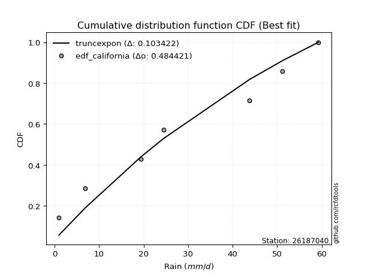</img>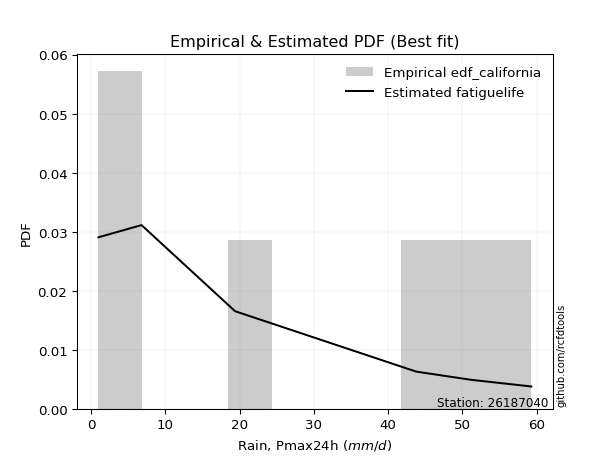</img>

</div>


### 2. EDF Hazen (1930)

Hazen method for plotting positions is a formula used to estimate the empirical cumulative probability distribution of flood events or other hydrological data. This formula often results in biased estimations, particularly when extrapolating to extreme events (high return periods).

<div align="center">


$P=(m-0.5)/n$


</div>


**2.1. Empirical values**

<div align="center">

|                | 0                   | 1                  | 2                  | 3                  | 4         | 5                  |
|:---------------|:--------------------|:-------------------|:-------------------|:-------------------|:----------|:-------------------|
| date           | 2022                | 2020               | 2021               | 2018               | 2017      | 2019               |
| x              | 1.0                 | 6.8                | 19.4               | 43.8               | 51.2      | 59.3               |
| m              | 1                   | 2                  | 3                  | 4                  | 5         | 6                  |
| empirical_dist | edf_hazen           | edf_hazen          | edf_hazen          | edf_hazen          | edf_hazen | edf_hazen          |
| empirical      | 0.08333333333333333 | 0.25               | 0.4166666666666667 | 0.5833333333333334 | 0.75      | 0.9166666666666666 |
| empirical_tr   | 1.090909090909091   | 1.3333333333333333 | 1.7142857142857144 | 2.4000000000000004 | 4.0       | 11.999999999999995 |

</div>


**2.2. Kolmogorov-Smirnov fit test (sorted by Δ)**


<div align="center">

|                | 0                   | 1                   | 2                   | 3                  | 4                   | 5                   | 6                   | 7                   | 8                 | 9                  | 10                 | 11                 | 12                 | 13                | 14                 | 15                  | 16                  | 17                  | 18                 | 19                  | 20                  | 21                  | 22                 | 23                  | 24                | 25                  | 26                  | 27                  | 28                 | 29                  | 30                  | 31                  | 32                  | 33                | 34                  | 35                 | 36                  | 37                  | 38                  | 39                  | 40                  | 41                  | 42                  | 43                  | 44                  | 45                  | 46                  | 47                  | 48                 | 49                  | 50                  | 51                  | 52                  | 53                  | 54                 | 55                  | 56                  | 57                 | 58                 | 59                 | 60                    | 61                  | 62                  | 63                  | 64                  | 65                  | 66                  | 67                  | 68                  | 69                  | 70                  | 71                | 72             | 73                 | 74                  | 75                 | 76                  | 77                 | 78                 | 79                | 80                 | 81                  | 82                  | 83                  | 84                 | 85                 | 86                 | 87                 |
|:---------------|:--------------------|:--------------------|:--------------------|:-------------------|:--------------------|:--------------------|:--------------------|:--------------------|:------------------|:-------------------|:-------------------|:-------------------|:-------------------|:------------------|:-------------------|:--------------------|:--------------------|:--------------------|:-------------------|:--------------------|:--------------------|:--------------------|:-------------------|:--------------------|:------------------|:--------------------|:--------------------|:--------------------|:-------------------|:--------------------|:--------------------|:--------------------|:--------------------|:------------------|:--------------------|:-------------------|:--------------------|:--------------------|:--------------------|:--------------------|:--------------------|:--------------------|:--------------------|:--------------------|:--------------------|:--------------------|:--------------------|:--------------------|:-------------------|:--------------------|:--------------------|:--------------------|:--------------------|:--------------------|:-------------------|:--------------------|:--------------------|:-------------------|:-------------------|:-------------------|:----------------------|:--------------------|:--------------------|:--------------------|:--------------------|:--------------------|:--------------------|:--------------------|:--------------------|:--------------------|:--------------------|:------------------|:---------------|:-------------------|:--------------------|:-------------------|:--------------------|:-------------------|:-------------------|:------------------|:-------------------|:--------------------|:--------------------|:--------------------|:-------------------|:-------------------|:-------------------|:-------------------|
| station        | 26187040            | 26187040            | 26187040            | 26187040           | 26187040            | 26187040            | 26187040            | 26187040            | 26187040          | 26187040           | 26187040           | 26187040           | 26187040           | 26187040          | 26187040           | 26187040            | 26187040            | 26187040            | 26187040           | 26187040            | 26187040            | 26187040            | 26187040           | 26187040            | 26187040          | 26187040            | 26187040            | 26187040            | 26187040           | 26187040            | 26187040            | 26187040            | 26187040            | 26187040          | 26187040            | 26187040           | 26187040            | 26187040            | 26187040            | 26187040            | 26187040            | 26187040            | 26187040            | 26187040            | 26187040            | 26187040            | 26187040            | 26187040            | 26187040           | 26187040            | 26187040            | 26187040            | 26187040            | 26187040            | 26187040           | 26187040            | 26187040            | 26187040           | 26187040           | 26187040           | 26187040              | 26187040            | 26187040            | 26187040            | 26187040            | 26187040            | 26187040            | 26187040            | 26187040            | 26187040            | 26187040            | 26187040          | 26187040       | 26187040           | 26187040            | 26187040           | 26187040            | 26187040           | 26187040           | 26187040          | 26187040           | 26187040            | 26187040            | 26187040            | 26187040           | 26187040           | 26187040           | 26187040           |
| empirical_dist | edf_hazen           | edf_hazen           | edf_hazen           | edf_hazen          | edf_hazen           | edf_hazen           | edf_hazen           | edf_hazen           | edf_hazen         | edf_hazen          | edf_hazen          | edf_hazen          | edf_hazen          | edf_hazen         | edf_hazen          | edf_hazen           | edf_hazen           | edf_hazen           | edf_hazen          | edf_hazen           | edf_hazen           | edf_hazen           | edf_hazen          | edf_hazen           | edf_hazen         | edf_hazen           | edf_hazen           | edf_hazen           | edf_hazen          | edf_hazen           | edf_hazen           | edf_hazen           | edf_hazen           | edf_hazen         | edf_hazen           | edf_hazen          | edf_hazen           | edf_hazen           | edf_hazen           | edf_hazen           | edf_hazen           | edf_hazen           | edf_hazen           | edf_hazen           | edf_hazen           | edf_hazen           | edf_hazen           | edf_hazen           | edf_hazen          | edf_hazen           | edf_hazen           | edf_hazen           | edf_hazen           | edf_hazen           | edf_hazen          | edf_hazen           | edf_hazen           | edf_hazen          | edf_hazen          | edf_hazen          | edf_hazen             | edf_hazen           | edf_hazen           | edf_hazen           | edf_hazen           | edf_hazen           | edf_hazen           | edf_hazen           | edf_hazen           | edf_hazen           | edf_hazen           | edf_hazen         | edf_hazen      | edf_hazen          | edf_hazen           | edf_hazen          | edf_hazen           | edf_hazen          | edf_hazen          | edf_hazen         | edf_hazen          | edf_hazen           | edf_hazen           | edf_hazen           | edf_hazen          | edf_hazen          | edf_hazen          | edf_hazen          |
| p_dist         | pearson3            | nakagami            | ncf                 | nct                | norm                | crystalball         | exponnorm           | t                   | fisk              | gamma              | erlang             | logfisk            | logpearson3        | johnsonsu         | rice               | gumbel_l            | maxwell             | invgamma            | gompertz           | loggumbel_l         | rayleigh            | loginvweibull       | logistic           | loginvgauss         | logerlang         | genlogistic         | loggamma            | loggamma            | logrice            | logcrystalball      | lognorm             | lognorm             | logt                | logexponnorm      | lognct              | alpha              | halfnorm            | logfatiguelife      | laplace_asymmetric  | logalpha            | loginvgamma         | betaprime           | kstwobign           | logmaxwell          | logweibull_min      | hypsecant           | invgauss            | lograyleigh         | loggompertz        | expon               | gumbel_r            | logkstwobign        | loglogistic         | loggenexpon         | mielke             | halflogistic        | fatiguelife         | loghalfnorm        | moyal              | laplace            | loglaplace_asymmetric | logloggamma         | loghypsecant        | loggumbel_r         | f                   | logchi2             | genexpon            | weibull_min         | loglaplace          | loghalflogistic     | logmoyal            | logexpon          | wald           | gibrat             | logncf              | logwald            | logf                | loggibrat          | logbetaprime       | logtruncnorm      | loglognorm         | lognakagami         | logmielke           | invweibull          | logjohnsonsu       | chi2               | truncnorm          | loggenlogistic     |
| delta          | 0.14318334260365484 | 0.14369560928251057 | 0.14393682563610255 | 0.1447438463802565 | 0.14475050944447332 | 0.14475051526830274 | 0.14475070724274453 | 0.14476395891759497 | 0.145765550753165 | 0.1460775730927134 | 0.1463862422603489 | 0.1481949292689302 | 0.1496543695909628 | 0.155338688811687 | 0.1566507307749755 | 0.15674002264076153 | 0.15717014335768476 | 0.15859174762335915 | 0.1600940664840632 | 0.16074809980555183 | 0.16074937319129157 | 0.16213528468283084 | 0.1671191599144689 | 0.16747778749452413 | 0.168023383135544 | 0.17016329918239437 | 0.17056443891108553 | 0.17056443891108553 | 0.1717970035942591 | 0.17202731433764673 | 0.17202733295032913 | 0.17202733295032913 | 0.17203067050217957 | 0.172031403739473 | 0.17208302651382668 | 0.1721268798836033 | 0.17216454984948337 | 0.17324409982456224 | 0.17528297451756292 | 0.17532578595458037 | 0.17636721280403578 | 0.17962640239943128 | 0.17976655457036117 | 0.18091086579836013 | 0.18180124758272043 | 0.18249089663216178 | 0.18313147684099296 | 0.18344265918182556 | 0.1849948875530426 | 0.18518344003783005 | 0.18945391603222372 | 0.19329431123977286 | 0.19468641368436346 | 0.19569935109920916 | 0.1959084759166091 | 0.19775227120960515 | 0.19937056535953623 | 0.2018304162946149 | 0.2038449318973823 | 0.2047610790366926 | 0.20860500484869204   | 0.20895106444045364 | 0.20943947419908782 | 0.21016868075783035 | 0.21042414861163372 | 0.21676759197888196 | 0.22314105541410278 | 0.22634451773577158 | 0.22861046819261333 | 0.22914769245979966 | 0.22917256689862114 | 0.248189708381931 | 0.25           | 0.2777946335109637 | 0.29319139869538413 | 0.2979978351618499 | 0.29852992928629596 | 0.3271813986454111 | 0.3584023184598907 | 0.396700079945481 | 0.4219661621723596 | 0.42996633108428095 | 0.48123419654766597 | 0.48836505845815753 | 0.6070354840279946 | 0.6071646242614096 | 0.8148718247344712 | 0.9166666666666666 |
| deltao         | 0.530385761606      | 0.530385761606      | 0.530385761606      | 0.530385761606     | 0.530385761606      | 0.530385761606      | 0.530385761606      | 0.530385761606      | 0.530385761606    | 0.530385761606     | 0.530385761606     | 0.530385761606     | 0.530385761606     | 0.530385761606    | 0.530385761606     | 0.530385761606      | 0.530385761606      | 0.530385761606      | 0.530385761606     | 0.530385761606      | 0.530385761606      | 0.530385761606      | 0.530385761606     | 0.530385761606      | 0.530385761606    | 0.530385761606      | 0.530385761606      | 0.530385761606      | 0.530385761606     | 0.530385761606      | 0.530385761606      | 0.530385761606      | 0.530385761606      | 0.530385761606    | 0.530385761606      | 0.530385761606     | 0.530385761606      | 0.530385761606      | 0.530385761606      | 0.530385761606      | 0.530385761606      | 0.530385761606      | 0.530385761606      | 0.530385761606      | 0.530385761606      | 0.530385761606      | 0.530385761606      | 0.530385761606      | 0.530385761606     | 0.530385761606      | 0.530385761606      | 0.530385761606      | 0.530385761606      | 0.530385761606      | 0.530385761606     | 0.530385761606      | 0.530385761606      | 0.530385761606     | 0.530385761606     | 0.530385761606     | 0.530385761606        | 0.530385761606      | 0.530385761606      | 0.530385761606      | 0.530385761606      | 0.530385761606      | 0.530385761606      | 0.530385761606      | 0.530385761606      | 0.530385761606      | 0.530385761606      | 0.530385761606    | 0.530385761606 | 0.530385761606     | 0.530385761606      | 0.530385761606     | 0.530385761606      | 0.530385761606     | 0.530385761606     | 0.530385761606    | 0.530385761606     | 0.530385761606      | 0.530385761606      | 0.530385761606      | 0.530385761606     | 0.530385761606     | 0.530385761606     | 0.530385761606     |
| eval           | Δo > Δ              | Δo > Δ              | Δo > Δ              | Δo > Δ             | Δo > Δ              | Δo > Δ              | Δo > Δ              | Δo > Δ              | Δo > Δ            | Δo > Δ             | Δo > Δ             | Δo > Δ             | Δo > Δ             | Δo > Δ            | Δo > Δ             | Δo > Δ              | Δo > Δ              | Δo > Δ              | Δo > Δ             | Δo > Δ              | Δo > Δ              | Δo > Δ              | Δo > Δ             | Δo > Δ              | Δo > Δ            | Δo > Δ              | Δo > Δ              | Δo > Δ              | Δo > Δ             | Δo > Δ              | Δo > Δ              | Δo > Δ              | Δo > Δ              | Δo > Δ            | Δo > Δ              | Δo > Δ             | Δo > Δ              | Δo > Δ              | Δo > Δ              | Δo > Δ              | Δo > Δ              | Δo > Δ              | Δo > Δ              | Δo > Δ              | Δo > Δ              | Δo > Δ              | Δo > Δ              | Δo > Δ              | Δo > Δ             | Δo > Δ              | Δo > Δ              | Δo > Δ              | Δo > Δ              | Δo > Δ              | Δo > Δ             | Δo > Δ              | Δo > Δ              | Δo > Δ             | Δo > Δ             | Δo > Δ             | Δo > Δ                | Δo > Δ              | Δo > Δ              | Δo > Δ              | Δo > Δ              | Δo > Δ              | Δo > Δ              | Δo > Δ              | Δo > Δ              | Δo > Δ              | Δo > Δ              | Δo > Δ            | Δo > Δ         | Δo > Δ             | Δo > Δ              | Δo > Δ             | Δo > Δ              | Δo > Δ             | Δo > Δ             | Δo > Δ            | Δo > Δ             | Δo > Δ              | Δo > Δ              | Δo > Δ              | Δo <= Δ            | Δo <= Δ            | Δo <= Δ            | Δo <= Δ            |
| fit            | 1                   | 1                   | 1                   | 1                  | 1                   | 1                   | 1                   | 1                   | 1                 | 1                  | 1                  | 1                  | 1                  | 1                 | 1                  | 1                   | 1                   | 1                   | 1                  | 1                   | 1                   | 1                   | 1                  | 1                   | 1                 | 1                   | 1                   | 1                   | 1                  | 1                   | 1                   | 1                   | 1                   | 1                 | 1                   | 1                  | 1                   | 1                   | 1                   | 1                   | 1                   | 1                   | 1                   | 1                   | 1                   | 1                   | 1                   | 1                   | 1                  | 1                   | 1                   | 1                   | 1                   | 1                   | 1                  | 1                   | 1                   | 1                  | 1                  | 1                  | 1                     | 1                   | 1                   | 1                   | 1                   | 1                   | 1                   | 1                   | 1                   | 1                   | 1                   | 1                 | 1              | 1                  | 1                   | 1                  | 1                   | 1                  | 1                  | 1                 | 1                  | 1                   | 1                   | 1                   | 0                  | 0                  | 0                  | 0                  |
| n              | 6                   | 6                   | 6                   | 6                  | 6                   | 6                   | 6                   | 6                   | 6                 | 6                  | 6                  | 6                  | 6                  | 6                 | 6                  | 6                   | 6                   | 6                   | 6                  | 6                   | 6                   | 6                   | 6                  | 6                   | 6                 | 6                   | 6                   | 6                   | 6                  | 6                   | 6                   | 6                   | 6                   | 6                 | 6                   | 6                  | 6                   | 6                   | 6                   | 6                   | 6                   | 6                   | 6                   | 6                   | 6                   | 6                   | 6                   | 6                   | 6                  | 6                   | 6                   | 6                   | 6                   | 6                   | 6                  | 6                   | 6                   | 6                  | 6                  | 6                  | 6                     | 6                   | 6                   | 6                   | 6                   | 6                   | 6                   | 6                   | 6                   | 6                   | 6                   | 6                 | 6              | 6                  | 6                   | 6                  | 6                   | 6                  | 6                  | 6                 | 6                  | 6                   | 6                   | 6                   | 6                  | 6                  | 6                  | 6                  |
| best_fit       | 1                   | 0                   | 0                   | 0                  | 0                   | 0                   | 0                   | 0                   | 0                 | 0                  | 0                  | 0                  | 0                  | 0                 | 0                  | 0                   | 0                   | 0                   | 0                  | 0                   | 0                   | 0                   | 0                  | 0                   | 0                 | 0                   | 0                   | 0                   | 0                  | 0                   | 0                   | 0                   | 0                   | 0                 | 0                   | 0                  | 0                   | 0                   | 0                   | 0                   | 0                   | 0                   | 0                   | 0                   | 0                   | 0                   | 0                   | 0                   | 0                  | 0                   | 0                   | 0                   | 0                   | 0                   | 0                  | 0                   | 0                   | 0                  | 0                  | 0                  | 0                     | 0                   | 0                   | 0                   | 0                   | 0                   | 0                   | 0                   | 0                   | 0                   | 0                   | 0                 | 0              | 0                  | 0                   | 0                  | 0                   | 0                  | 0                  | 0                 | 0                  | 0                   | 0                   | 0                   | 0                  | 0                  | 0                  | 0                  |
| best_fit_sort  | 1                   | 2                   | 3                   | 4                  | 5                   | 6                   | 7                   | 8                   | 9                 | 10                 | 11                 | 12                 | 13                 | 14                | 15                 | 16                  | 17                  | 18                  | 19                 | 20                  | 21                  | 22                  | 23                 | 24                  | 25                | 26                  | 27                  | 28                  | 29                 | 30                  | 31                  | 32                  | 33                  | 34                | 35                  | 36                 | 37                  | 38                  | 39                  | 40                  | 41                  | 42                  | 43                  | 44                  | 45                  | 46                  | 47                  | 48                  | 49                 | 50                  | 51                  | 52                  | 53                  | 54                  | 55                 | 56                  | 57                  | 58                 | 59                 | 60                 | 61                    | 62                  | 63                  | 64                  | 65                  | 66                  | 67                  | 68                  | 69                  | 70                  | 71                  | 72                | 73             | 74                 | 75                  | 76                 | 77                  | 78                 | 79                 | 80                | 81                 | 82                  | 83                  | 84                  | 85                 | 86                 | 87                 | 88                 |

</div>


**2.3. Best fit**

<div align="center">

|   id |   station | empirical_dist   | p_dist   |    delta |   deltao | eval   |   fit |   n |   best_fit |   best_fit_sort |
|-----:|----------:|:-----------------|:---------|---------:|---------:|:-------|------:|----:|-----------:|----------------:|
|    0 |  26187040 | edf_hazen        | pearson3 | 0.143183 | 0.530386 | Δo > Δ |     1 |   6 |          1 |               1 |

</div>


<div align="center">

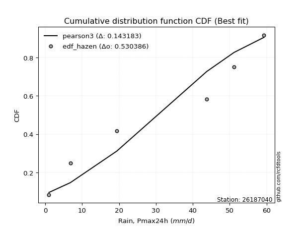</img>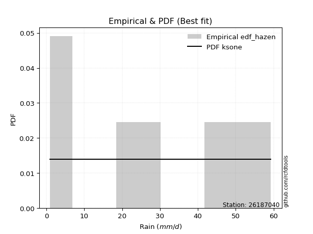</img>

</div>


### 3. EDF Weibull (1939)

Weibull plotting position formula is an empirical method used to estimate the non-exceedance probability or plotting position for a set of observed data, is often recommended or widely used in practice, particularly in flood frequency analysis.

<div align="center">


$P=m/(n+1)$


</div>


**3.1. Empirical values**

<div align="center">

|                | 0                   | 1                  | 2                   | 3                  | 4                  | 5                  |
|:---------------|:--------------------|:-------------------|:--------------------|:-------------------|:-------------------|:-------------------|
| date           | 2022                | 2020               | 2021                | 2018               | 2017               | 2019               |
| x              | 1.0                 | 6.8                | 19.4                | 43.8               | 51.2               | 59.3               |
| m              | 1                   | 2                  | 3                   | 4                  | 5                  | 6                  |
| empirical_dist | edf_weibull         | edf_weibull        | edf_weibull         | edf_weibull        | edf_weibull        | edf_weibull        |
| empirical      | 0.14285714285714285 | 0.2857142857142857 | 0.42857142857142855 | 0.5714285714285714 | 0.7142857142857143 | 0.8571428571428571 |
| empirical_tr   | 1.1666666666666665  | 1.4                | 1.75                | 2.333333333333333  | 3.5                | 6.999999999999997  |

</div>


**3.2. Kolmogorov-Smirnov fit test (sorted by Δ)**


<div align="center">

|                | 0                   | 1                   | 2                  | 3                   | 4                   | 5                   | 6                  | 7                  | 8                  | 9                   | 10                  | 11                  | 12                  | 13                  | 14                  | 15                  | 16                  | 17                 | 18                  | 19                  | 20                 | 21                  | 22                  | 23                  | 24                 | 25                  | 26                | 27                  | 28                 | 29                 | 30                  | 31                  | 32                 | 33                 | 34                 | 35                 | 36                  | 37                  | 38                  | 39                  | 40                  | 41                 | 42                 | 43                  | 44                  | 45                  | 46                  | 47                 | 48                 | 49                  | 50                  | 51                  | 52                  | 53                  | 54                 | 55                  | 56                  | 57                  | 58                  | 59                 | 60                  | 61                  | 62                    | 63                 | 64                 | 65                  | 66                 | 67                  | 68                 | 69                 | 70                 | 71                  | 72                 | 73                  | 74                 | 75                  | 76                  | 77                  | 78                | 79                 | 80                 | 81                  | 82                | 83                 | 84                 | 85                 | 86                 | 87                 |
|:---------------|:--------------------|:--------------------|:-------------------|:--------------------|:--------------------|:--------------------|:-------------------|:-------------------|:-------------------|:--------------------|:--------------------|:--------------------|:--------------------|:--------------------|:--------------------|:--------------------|:--------------------|:-------------------|:--------------------|:--------------------|:-------------------|:--------------------|:--------------------|:--------------------|:-------------------|:--------------------|:------------------|:--------------------|:-------------------|:-------------------|:--------------------|:--------------------|:-------------------|:-------------------|:-------------------|:-------------------|:--------------------|:--------------------|:--------------------|:--------------------|:--------------------|:-------------------|:-------------------|:--------------------|:--------------------|:--------------------|:--------------------|:-------------------|:-------------------|:--------------------|:--------------------|:--------------------|:--------------------|:--------------------|:-------------------|:--------------------|:--------------------|:--------------------|:--------------------|:-------------------|:--------------------|:--------------------|:----------------------|:-------------------|:-------------------|:--------------------|:-------------------|:--------------------|:-------------------|:-------------------|:-------------------|:--------------------|:-------------------|:--------------------|:-------------------|:--------------------|:--------------------|:--------------------|:------------------|:-------------------|:-------------------|:--------------------|:------------------|:-------------------|:-------------------|:-------------------|:-------------------|:-------------------|
| station        | 26187040            | 26187040            | 26187040           | 26187040            | 26187040            | 26187040            | 26187040           | 26187040           | 26187040           | 26187040            | 26187040            | 26187040            | 26187040            | 26187040            | 26187040            | 26187040            | 26187040            | 26187040           | 26187040            | 26187040            | 26187040           | 26187040            | 26187040            | 26187040            | 26187040           | 26187040            | 26187040          | 26187040            | 26187040           | 26187040           | 26187040            | 26187040            | 26187040           | 26187040           | 26187040           | 26187040           | 26187040            | 26187040            | 26187040            | 26187040            | 26187040            | 26187040           | 26187040           | 26187040            | 26187040            | 26187040            | 26187040            | 26187040           | 26187040           | 26187040            | 26187040            | 26187040            | 26187040            | 26187040            | 26187040           | 26187040            | 26187040            | 26187040            | 26187040            | 26187040           | 26187040            | 26187040            | 26187040              | 26187040           | 26187040           | 26187040            | 26187040           | 26187040            | 26187040           | 26187040           | 26187040           | 26187040            | 26187040           | 26187040            | 26187040           | 26187040            | 26187040            | 26187040            | 26187040          | 26187040           | 26187040           | 26187040            | 26187040          | 26187040           | 26187040           | 26187040           | 26187040           | 26187040           |
| empirical_dist | edf_weibull         | edf_weibull         | edf_weibull        | edf_weibull         | edf_weibull         | edf_weibull         | edf_weibull        | edf_weibull        | edf_weibull        | edf_weibull         | edf_weibull         | edf_weibull         | edf_weibull         | edf_weibull         | edf_weibull         | edf_weibull         | edf_weibull         | edf_weibull        | edf_weibull         | edf_weibull         | edf_weibull        | edf_weibull         | edf_weibull         | edf_weibull         | edf_weibull        | edf_weibull         | edf_weibull       | edf_weibull         | edf_weibull        | edf_weibull        | edf_weibull         | edf_weibull         | edf_weibull        | edf_weibull        | edf_weibull        | edf_weibull        | edf_weibull         | edf_weibull         | edf_weibull         | edf_weibull         | edf_weibull         | edf_weibull        | edf_weibull        | edf_weibull         | edf_weibull         | edf_weibull         | edf_weibull         | edf_weibull        | edf_weibull        | edf_weibull         | edf_weibull         | edf_weibull         | edf_weibull         | edf_weibull         | edf_weibull        | edf_weibull         | edf_weibull         | edf_weibull         | edf_weibull         | edf_weibull        | edf_weibull         | edf_weibull         | edf_weibull           | edf_weibull        | edf_weibull        | edf_weibull         | edf_weibull        | edf_weibull         | edf_weibull        | edf_weibull        | edf_weibull        | edf_weibull         | edf_weibull        | edf_weibull         | edf_weibull        | edf_weibull         | edf_weibull         | edf_weibull         | edf_weibull       | edf_weibull        | edf_weibull        | edf_weibull         | edf_weibull       | edf_weibull        | edf_weibull        | edf_weibull        | edf_weibull        | edf_weibull        |
| p_dist         | fisk                | loginvweibull       | pearson3           | nakagami            | ncf                 | nct                 | norm               | crystalball        | exponnorm          | t                   | gamma               | erlang              | logfisk             | logpearson3         | weibull_min         | johnsonsu           | rice                | gumbel_l           | maxwell             | invgamma            | loggumbel_l        | rayleigh            | logistic            | gompertz            | loginvgauss        | logerlang           | logkstwobign      | genlogistic         | loggamma           | loggamma           | logchi2             | logrice             | loggenexpon        | logcrystalball     | lognorm            | lognorm            | logt                | logexponnorm        | lognct              | alpha               | halfnorm            | logfatiguelife     | laplace_asymmetric | logalpha            | loginvgamma         | betaprime           | kstwobign           | logmaxwell         | logweibull_min     | hypsecant           | invgauss            | lograyleigh         | loggompertz         | expon               | gumbel_r           | loghalfnorm         | loglogistic         | mielke              | halflogistic        | fatiguelife        | moyal               | laplace             | loglaplace_asymmetric | logloggamma        | loghypsecant       | loggumbel_r         | f                  | logexpon            | loghalflogistic    | logncf             | logmoyal           | genexpon            | loglaplace         | logf                | wald               | logwald             | gibrat              | loggibrat           | logbetaprime      | logtruncnorm       | loglognorm         | lognakagami         | invweibull        | logmielke          | logjohnsonsu       | chi2               | truncnorm          | loggenlogistic     |
| delta          | 0.14527142242664193 | 0.15023052277806898 | 0.1550881045084168 | 0.15560037118727255 | 0.15584158754086452 | 0.15664860828501848 | 0.1566552713492353 | 0.1566552771730647 | 0.1566554691475065 | 0.15666872082235694 | 0.15798233499747538 | 0.15829100416511088 | 0.16009969117369216 | 0.16155913149572476 | 0.16682070821196204 | 0.16724345071644886 | 0.16855549267973746 | 0.1686447845455234 | 0.16907490526244673 | 0.17049650952812112 | 0.1726528617103138 | 0.17265413509605354 | 0.17902392181923088 | 0.17926044853586054 | 0.1793825493992861 | 0.17992814504030596 | 0.181389549335011 | 0.18206806108715634 | 0.1824692008158475 | 0.1824692008158475 | 0.18274002360435132 | 0.18370176549902106 | 0.1837945891944473 | 0.1839320762424087 | 0.1839320948550911 | 0.1839320948550911 | 0.18393543240694155 | 0.18393616564423498 | 0.18398778841858865 | 0.18403164178836529 | 0.18406931175424535 | 0.1851488617293242 | 0.1871877364223249 | 0.18723054785934234 | 0.18827197470879775 | 0.19153116430419326 | 0.19167131647512314 | 0.1928156277031221 | 0.1937060094874824 | 0.19439565853692375 | 0.19503623874575493 | 0.19534742108658754 | 0.19689964945780458 | 0.19708820194259202 | 0.2013586779369857 | 0.20409090626669824 | 0.20659117558912543 | 0.20781323782137107 | 0.20965703311436712 | 0.2112753272642982 | 0.21574969380214426 | 0.21666584094145458 | 0.22050976675345402   | 0.2208558263452156 | 0.2213442361038498 | 0.22207344266259232 | 0.2223289105163957 | 0.22726339882093344 | 0.2281781612821573 | 0.2336675891715746 | 0.2344007760920943 | 0.23504581731886476 | 0.2405152300973753 | 0.26281564357201026 | 0.2857142857142857 | 0.28609307325708805 | 0.28969939541572565 | 0.31527663674064926 | 0.322688032745605 | 0.3853323765644828 | 0.3862518764580739 | 0.39425204536999525 | 0.428841248934348 | 0.4455199108333803 | 0.5713211983137088 | 0.5714503385471239 | 0.7553480152106617 | 0.8571428571428571 |
| deltao         | 0.530385761606      | 0.530385761606      | 0.530385761606     | 0.530385761606      | 0.530385761606      | 0.530385761606      | 0.530385761606     | 0.530385761606     | 0.530385761606     | 0.530385761606      | 0.530385761606      | 0.530385761606      | 0.530385761606      | 0.530385761606      | 0.530385761606      | 0.530385761606      | 0.530385761606      | 0.530385761606     | 0.530385761606      | 0.530385761606      | 0.530385761606     | 0.530385761606      | 0.530385761606      | 0.530385761606      | 0.530385761606     | 0.530385761606      | 0.530385761606    | 0.530385761606      | 0.530385761606     | 0.530385761606     | 0.530385761606      | 0.530385761606      | 0.530385761606     | 0.530385761606     | 0.530385761606     | 0.530385761606     | 0.530385761606      | 0.530385761606      | 0.530385761606      | 0.530385761606      | 0.530385761606      | 0.530385761606     | 0.530385761606     | 0.530385761606      | 0.530385761606      | 0.530385761606      | 0.530385761606      | 0.530385761606     | 0.530385761606     | 0.530385761606      | 0.530385761606      | 0.530385761606      | 0.530385761606      | 0.530385761606      | 0.530385761606     | 0.530385761606      | 0.530385761606      | 0.530385761606      | 0.530385761606      | 0.530385761606     | 0.530385761606      | 0.530385761606      | 0.530385761606        | 0.530385761606     | 0.530385761606     | 0.530385761606      | 0.530385761606     | 0.530385761606      | 0.530385761606     | 0.530385761606     | 0.530385761606     | 0.530385761606      | 0.530385761606     | 0.530385761606      | 0.530385761606     | 0.530385761606      | 0.530385761606      | 0.530385761606      | 0.530385761606    | 0.530385761606     | 0.530385761606     | 0.530385761606      | 0.530385761606    | 0.530385761606     | 0.530385761606     | 0.530385761606     | 0.530385761606     | 0.530385761606     |
| eval           | Δo > Δ              | Δo > Δ              | Δo > Δ             | Δo > Δ              | Δo > Δ              | Δo > Δ              | Δo > Δ             | Δo > Δ             | Δo > Δ             | Δo > Δ              | Δo > Δ              | Δo > Δ              | Δo > Δ              | Δo > Δ              | Δo > Δ              | Δo > Δ              | Δo > Δ              | Δo > Δ             | Δo > Δ              | Δo > Δ              | Δo > Δ             | Δo > Δ              | Δo > Δ              | Δo > Δ              | Δo > Δ             | Δo > Δ              | Δo > Δ            | Δo > Δ              | Δo > Δ             | Δo > Δ             | Δo > Δ              | Δo > Δ              | Δo > Δ             | Δo > Δ             | Δo > Δ             | Δo > Δ             | Δo > Δ              | Δo > Δ              | Δo > Δ              | Δo > Δ              | Δo > Δ              | Δo > Δ             | Δo > Δ             | Δo > Δ              | Δo > Δ              | Δo > Δ              | Δo > Δ              | Δo > Δ             | Δo > Δ             | Δo > Δ              | Δo > Δ              | Δo > Δ              | Δo > Δ              | Δo > Δ              | Δo > Δ             | Δo > Δ              | Δo > Δ              | Δo > Δ              | Δo > Δ              | Δo > Δ             | Δo > Δ              | Δo > Δ              | Δo > Δ                | Δo > Δ             | Δo > Δ             | Δo > Δ              | Δo > Δ             | Δo > Δ              | Δo > Δ             | Δo > Δ             | Δo > Δ             | Δo > Δ              | Δo > Δ             | Δo > Δ              | Δo > Δ             | Δo > Δ              | Δo > Δ              | Δo > Δ              | Δo > Δ            | Δo > Δ             | Δo > Δ             | Δo > Δ              | Δo > Δ            | Δo > Δ             | Δo <= Δ            | Δo <= Δ            | Δo <= Δ            | Δo <= Δ            |
| fit            | 1                   | 1                   | 1                  | 1                   | 1                   | 1                   | 1                  | 1                  | 1                  | 1                   | 1                   | 1                   | 1                   | 1                   | 1                   | 1                   | 1                   | 1                  | 1                   | 1                   | 1                  | 1                   | 1                   | 1                   | 1                  | 1                   | 1                 | 1                   | 1                  | 1                  | 1                   | 1                   | 1                  | 1                  | 1                  | 1                  | 1                   | 1                   | 1                   | 1                   | 1                   | 1                  | 1                  | 1                   | 1                   | 1                   | 1                   | 1                  | 1                  | 1                   | 1                   | 1                   | 1                   | 1                   | 1                  | 1                   | 1                   | 1                   | 1                   | 1                  | 1                   | 1                   | 1                     | 1                  | 1                  | 1                   | 1                  | 1                   | 1                  | 1                  | 1                  | 1                   | 1                  | 1                   | 1                  | 1                   | 1                   | 1                   | 1                 | 1                  | 1                  | 1                   | 1                 | 1                  | 0                  | 0                  | 0                  | 0                  |
| n              | 6                   | 6                   | 6                  | 6                   | 6                   | 6                   | 6                  | 6                  | 6                  | 6                   | 6                   | 6                   | 6                   | 6                   | 6                   | 6                   | 6                   | 6                  | 6                   | 6                   | 6                  | 6                   | 6                   | 6                   | 6                  | 6                   | 6                 | 6                   | 6                  | 6                  | 6                   | 6                   | 6                  | 6                  | 6                  | 6                  | 6                   | 6                   | 6                   | 6                   | 6                   | 6                  | 6                  | 6                   | 6                   | 6                   | 6                   | 6                  | 6                  | 6                   | 6                   | 6                   | 6                   | 6                   | 6                  | 6                   | 6                   | 6                   | 6                   | 6                  | 6                   | 6                   | 6                     | 6                  | 6                  | 6                   | 6                  | 6                   | 6                  | 6                  | 6                  | 6                   | 6                  | 6                   | 6                  | 6                   | 6                   | 6                   | 6                 | 6                  | 6                  | 6                   | 6                 | 6                  | 6                  | 6                  | 6                  | 6                  |
| best_fit       | 1                   | 0                   | 0                  | 0                   | 0                   | 0                   | 0                  | 0                  | 0                  | 0                   | 0                   | 0                   | 0                   | 0                   | 0                   | 0                   | 0                   | 0                  | 0                   | 0                   | 0                  | 0                   | 0                   | 0                   | 0                  | 0                   | 0                 | 0                   | 0                  | 0                  | 0                   | 0                   | 0                  | 0                  | 0                  | 0                  | 0                   | 0                   | 0                   | 0                   | 0                   | 0                  | 0                  | 0                   | 0                   | 0                   | 0                   | 0                  | 0                  | 0                   | 0                   | 0                   | 0                   | 0                   | 0                  | 0                   | 0                   | 0                   | 0                   | 0                  | 0                   | 0                   | 0                     | 0                  | 0                  | 0                   | 0                  | 0                   | 0                  | 0                  | 0                  | 0                   | 0                  | 0                   | 0                  | 0                   | 0                   | 0                   | 0                 | 0                  | 0                  | 0                   | 0                 | 0                  | 0                  | 0                  | 0                  | 0                  |
| best_fit_sort  | 1                   | 2                   | 3                  | 4                   | 5                   | 6                   | 7                  | 8                  | 9                  | 10                  | 11                  | 12                  | 13                  | 14                  | 15                  | 16                  | 17                  | 18                 | 19                  | 20                  | 21                 | 22                  | 23                  | 24                  | 25                 | 26                  | 27                | 28                  | 29                 | 30                 | 31                  | 32                  | 33                 | 34                 | 35                 | 36                 | 37                  | 38                  | 39                  | 40                  | 41                  | 42                 | 43                 | 44                  | 45                  | 46                  | 47                  | 48                 | 49                 | 50                  | 51                  | 52                  | 53                  | 54                  | 55                 | 56                  | 57                  | 58                  | 59                  | 60                 | 61                  | 62                  | 63                    | 64                 | 65                 | 66                  | 67                 | 68                  | 69                 | 70                 | 71                 | 72                  | 73                 | 74                  | 75                 | 76                  | 77                  | 78                  | 79                | 80                 | 81                 | 82                  | 83                | 84                 | 85                 | 86                 | 87                 | 88                 |

</div>


**3.3. Best fit**

<div align="center">

|   id |   station | empirical_dist   | p_dist   |    delta |   deltao | eval   |   fit |   n |   best_fit |   best_fit_sort |
|-----:|----------:|:-----------------|:---------|---------:|---------:|:-------|------:|----:|-----------:|----------------:|
|    0 |  26187040 | edf_weibull      | fisk     | 0.145271 | 0.530386 | Δo > Δ |     1 |   6 |          1 |               1 |

</div>


<div align="center">

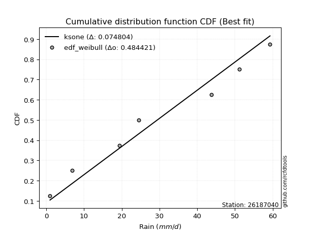</img>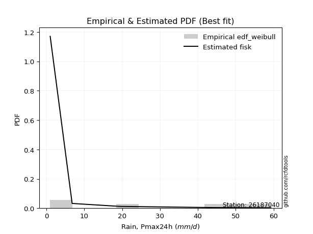</img>

</div>


### 4. EDF Beard (1943)

The Beard formula (or Beard´s plotting position formula) in hydrology is used to estimate the empirical non-exceedance probability _(P)_ of a flood event (or other extreme hydrological data point) within a given dataset.

<div align="center">


$P=(m-0.31)/(n+0.38)$


</div>


**4.1. Empirical values**

<div align="center">

|                | 0                   | 1                   | 2                  | 3                  | 4                  | 5                  |
|:---------------|:--------------------|:--------------------|:-------------------|:-------------------|:-------------------|:-------------------|
| date           | 2022                | 2020                | 2021               | 2018               | 2017               | 2019               |
| x              | 1.0                 | 6.8                 | 19.4               | 43.8               | 51.2               | 59.3               |
| m              | 1                   | 2                   | 3                  | 4                  | 5                  | 6                  |
| empirical_dist | edf_beard           | edf_beard           | edf_beard          | edf_beard          | edf_beard          | edf_beard          |
| empirical      | 0.10815047021943573 | 0.26489028213166144 | 0.4216300940438871 | 0.5783699059561128 | 0.7351097178683387 | 0.8918495297805643 |
| empirical_tr   | 1.1212653778558874  | 1.3603411513859276  | 1.7289972899728996 | 2.3717472118959106 | 3.7751479289940844 | 9.246376811594207  |

</div>


**4.2. Kolmogorov-Smirnov fit test (sorted by Δ)**


<div align="center">

|                | 0                  | 1                  | 2                   | 3                  | 4                   | 5                   | 6                  | 7                   | 8                   | 9                   | 10                  | 11                  | 12                  | 13                 | 14                  | 15                  | 16                  | 17                 | 18                 | 19                  | 20                  | 21                  | 22                  | 23                  | 24                  | 25                  | 26                  | 27                  | 28                  | 29                  | 30                  | 31                  | 32                  | 33                  | 34                  | 35                  | 36                  | 37                 | 38                  | 39                  | 40                  | 41                  | 42                  | 43                  | 44                  | 45                  | 46                 | 47                  | 48                  | 49                  | 50                 | 51                  | 52                  | 53                  | 54                | 55                  | 56                  | 57                  | 58                 | 59                 | 60                  | 61                  | 62                    | 63                 | 64                  | 65                 | 66                  | 67                  | 68                 | 69                  | 70                  | 71                  | 72                  | 73                 | 74                 | 75                 | 76                  | 77                 | 78                  | 79                  | 80                  | 81                 | 82                 | 83                  | 84                 | 85                 | 86                 | 87                 |
|:---------------|:-------------------|:-------------------|:--------------------|:-------------------|:--------------------|:--------------------|:-------------------|:--------------------|:--------------------|:--------------------|:--------------------|:--------------------|:--------------------|:-------------------|:--------------------|:--------------------|:--------------------|:-------------------|:-------------------|:--------------------|:--------------------|:--------------------|:--------------------|:--------------------|:--------------------|:--------------------|:--------------------|:--------------------|:--------------------|:--------------------|:--------------------|:--------------------|:--------------------|:--------------------|:--------------------|:--------------------|:--------------------|:-------------------|:--------------------|:--------------------|:--------------------|:--------------------|:--------------------|:--------------------|:--------------------|:--------------------|:-------------------|:--------------------|:--------------------|:--------------------|:-------------------|:--------------------|:--------------------|:--------------------|:------------------|:--------------------|:--------------------|:--------------------|:-------------------|:-------------------|:--------------------|:--------------------|:----------------------|:-------------------|:--------------------|:-------------------|:--------------------|:--------------------|:-------------------|:--------------------|:--------------------|:--------------------|:--------------------|:-------------------|:-------------------|:-------------------|:--------------------|:-------------------|:--------------------|:--------------------|:--------------------|:-------------------|:-------------------|:--------------------|:-------------------|:-------------------|:-------------------|:-------------------|
| station        | 26187040           | 26187040           | 26187040            | 26187040           | 26187040            | 26187040            | 26187040           | 26187040            | 26187040            | 26187040            | 26187040            | 26187040            | 26187040            | 26187040           | 26187040            | 26187040            | 26187040            | 26187040           | 26187040           | 26187040            | 26187040            | 26187040            | 26187040            | 26187040            | 26187040            | 26187040            | 26187040            | 26187040            | 26187040            | 26187040            | 26187040            | 26187040            | 26187040            | 26187040            | 26187040            | 26187040            | 26187040            | 26187040           | 26187040            | 26187040            | 26187040            | 26187040            | 26187040            | 26187040            | 26187040            | 26187040            | 26187040           | 26187040            | 26187040            | 26187040            | 26187040           | 26187040            | 26187040            | 26187040            | 26187040          | 26187040            | 26187040            | 26187040            | 26187040           | 26187040           | 26187040            | 26187040            | 26187040              | 26187040           | 26187040            | 26187040           | 26187040            | 26187040            | 26187040           | 26187040            | 26187040            | 26187040            | 26187040            | 26187040           | 26187040           | 26187040           | 26187040            | 26187040           | 26187040            | 26187040            | 26187040            | 26187040           | 26187040           | 26187040            | 26187040           | 26187040           | 26187040           | 26187040           |
| empirical_dist | edf_beard          | edf_beard          | edf_beard           | edf_beard          | edf_beard           | edf_beard           | edf_beard          | edf_beard           | edf_beard           | edf_beard           | edf_beard           | edf_beard           | edf_beard           | edf_beard          | edf_beard           | edf_beard           | edf_beard           | edf_beard          | edf_beard          | edf_beard           | edf_beard           | edf_beard           | edf_beard           | edf_beard           | edf_beard           | edf_beard           | edf_beard           | edf_beard           | edf_beard           | edf_beard           | edf_beard           | edf_beard           | edf_beard           | edf_beard           | edf_beard           | edf_beard           | edf_beard           | edf_beard          | edf_beard           | edf_beard           | edf_beard           | edf_beard           | edf_beard           | edf_beard           | edf_beard           | edf_beard           | edf_beard          | edf_beard           | edf_beard           | edf_beard           | edf_beard          | edf_beard           | edf_beard           | edf_beard           | edf_beard         | edf_beard           | edf_beard           | edf_beard           | edf_beard          | edf_beard          | edf_beard           | edf_beard           | edf_beard             | edf_beard          | edf_beard           | edf_beard          | edf_beard           | edf_beard           | edf_beard          | edf_beard           | edf_beard           | edf_beard           | edf_beard           | edf_beard          | edf_beard          | edf_beard          | edf_beard           | edf_beard          | edf_beard           | edf_beard           | edf_beard           | edf_beard          | edf_beard          | edf_beard           | edf_beard          | edf_beard          | edf_beard          | edf_beard          |
| p_dist         | fisk               | pearson3           | nakagami            | ncf                | nct                 | norm                | crystalball        | exponnorm           | t                   | gamma               | erlang              | logfisk             | logpearson3         | loginvweibull      | johnsonsu           | rice                | gumbel_l            | maxwell            | invgamma           | gompertz            | loggumbel_l         | rayleigh            | logistic            | loginvgauss         | logerlang           | genlogistic         | loggamma            | loggamma            | logrice             | logcrystalball      | lognorm             | lognorm             | logt                | logexponnorm        | lognct              | alpha               | halfnorm            | logfatiguelife     | laplace_asymmetric  | logalpha            | loginvgamma         | betaprime           | kstwobign           | logmaxwell          | logweibull_min      | hypsecant           | invgauss           | logkstwobign        | lograyleigh         | loggompertz         | expon              | loggenexpon         | gumbel_r            | loghalfnorm         | loglogistic       | mielke              | weibull_min         | logchi2             | halflogistic       | fatiguelife        | moyal               | laplace             | loglaplace_asymmetric | logloggamma        | loghypsecant        | loggumbel_r        | f                   | loghalflogistic     | logmoyal           | genexpon            | loglaplace          | logexpon            | wald                | logncf             | gibrat             | logf               | logwald             | loggibrat          | logbetaprime        | logtruncnorm        | loglognorm          | lognakagami        | invweibull         | logmielke           | logjohnsonsu       | chi2               | truncnorm          | loggenlogistic     |
| delta          | 0.1383300878991005 | 0.1481467699808754 | 0.14865903665973113 | 0.1489002530133231 | 0.14970727375747706 | 0.14971393682169387 | 0.1497139426455233 | 0.14971413461996508 | 0.14972738629481552 | 0.15104100046993396 | 0.15134966963756946 | 0.15315835664615074 | 0.15461779696818334 | 0.1571718573056104 | 0.16030211618890744 | 0.16161415815219604 | 0.16170345001798198 | 0.1621335707349053 | 0.1635551750005797 | 0.16505749386128377 | 0.16571152718277238 | 0.16571280056851212 | 0.17208258729168946 | 0.17244121487174469 | 0.17298681051276454 | 0.17512672655961492 | 0.17552786628830608 | 0.17552786628830608 | 0.17676043097147964 | 0.17699074171486728 | 0.17699076032754968 | 0.17699076032754968 | 0.17699409787940013 | 0.17699483111669356 | 0.17704645389104723 | 0.17709030726082386 | 0.17712797722670393 | 0.1782075272017828 | 0.18024640189478347 | 0.18028921333180092 | 0.18133064018125633 | 0.18458982977665184 | 0.18472998194758172 | 0.18587429317558068 | 0.18676467495994098 | 0.18745432400938233 | 0.1880949042182135 | 0.18833088386255242 | 0.18840608655904612 | 0.18995831493026316 | 0.1901468674150506 | 0.19073592372198872 | 0.19441734340944428 | 0.19714957173915681 | 0.199649841061584 | 0.20087190329382965 | 0.20152738084966926 | 0.20187730984722052 | 0.2027156985868257 | 0.2043339927367568 | 0.20880835927460284 | 0.20972450641391316 | 0.2135684322259126    | 0.2139144918176742 | 0.21440290157630837 | 0.2151321081350509 | 0.21538757598885427 | 0.22418426508257921 | 0.2274594415645529 | 0.22810448279132334 | 0.23357389556983388 | 0.23420473334847486 | 0.26489028213166144 | 0.2683742618092818 | 0.2827580608881842 | 0.2836396471546345 | 0.29303440778462947 | 0.3222179712681907 | 0.34351203632822924 | 0.39173665256826057 | 0.40707588004069817 | 0.4150760489526195 | 0.4635479215720552 | 0.46634391441600453 | 0.5921452018963331 | 0.5922743421297482 | 0.7900546878483689 | 0.8918495297805643 |
| deltao         | 0.530385761606     | 0.530385761606     | 0.530385761606      | 0.530385761606     | 0.530385761606      | 0.530385761606      | 0.530385761606     | 0.530385761606      | 0.530385761606      | 0.530385761606      | 0.530385761606      | 0.530385761606      | 0.530385761606      | 0.530385761606     | 0.530385761606      | 0.530385761606      | 0.530385761606      | 0.530385761606     | 0.530385761606     | 0.530385761606      | 0.530385761606      | 0.530385761606      | 0.530385761606      | 0.530385761606      | 0.530385761606      | 0.530385761606      | 0.530385761606      | 0.530385761606      | 0.530385761606      | 0.530385761606      | 0.530385761606      | 0.530385761606      | 0.530385761606      | 0.530385761606      | 0.530385761606      | 0.530385761606      | 0.530385761606      | 0.530385761606     | 0.530385761606      | 0.530385761606      | 0.530385761606      | 0.530385761606      | 0.530385761606      | 0.530385761606      | 0.530385761606      | 0.530385761606      | 0.530385761606     | 0.530385761606      | 0.530385761606      | 0.530385761606      | 0.530385761606     | 0.530385761606      | 0.530385761606      | 0.530385761606      | 0.530385761606    | 0.530385761606      | 0.530385761606      | 0.530385761606      | 0.530385761606     | 0.530385761606     | 0.530385761606      | 0.530385761606      | 0.530385761606        | 0.530385761606     | 0.530385761606      | 0.530385761606     | 0.530385761606      | 0.530385761606      | 0.530385761606     | 0.530385761606      | 0.530385761606      | 0.530385761606      | 0.530385761606      | 0.530385761606     | 0.530385761606     | 0.530385761606     | 0.530385761606      | 0.530385761606     | 0.530385761606      | 0.530385761606      | 0.530385761606      | 0.530385761606     | 0.530385761606     | 0.530385761606      | 0.530385761606     | 0.530385761606     | 0.530385761606     | 0.530385761606     |
| eval           | Δo > Δ             | Δo > Δ             | Δo > Δ              | Δo > Δ             | Δo > Δ              | Δo > Δ              | Δo > Δ             | Δo > Δ              | Δo > Δ              | Δo > Δ              | Δo > Δ              | Δo > Δ              | Δo > Δ              | Δo > Δ             | Δo > Δ              | Δo > Δ              | Δo > Δ              | Δo > Δ             | Δo > Δ             | Δo > Δ              | Δo > Δ              | Δo > Δ              | Δo > Δ              | Δo > Δ              | Δo > Δ              | Δo > Δ              | Δo > Δ              | Δo > Δ              | Δo > Δ              | Δo > Δ              | Δo > Δ              | Δo > Δ              | Δo > Δ              | Δo > Δ              | Δo > Δ              | Δo > Δ              | Δo > Δ              | Δo > Δ             | Δo > Δ              | Δo > Δ              | Δo > Δ              | Δo > Δ              | Δo > Δ              | Δo > Δ              | Δo > Δ              | Δo > Δ              | Δo > Δ             | Δo > Δ              | Δo > Δ              | Δo > Δ              | Δo > Δ             | Δo > Δ              | Δo > Δ              | Δo > Δ              | Δo > Δ            | Δo > Δ              | Δo > Δ              | Δo > Δ              | Δo > Δ             | Δo > Δ             | Δo > Δ              | Δo > Δ              | Δo > Δ                | Δo > Δ             | Δo > Δ              | Δo > Δ             | Δo > Δ              | Δo > Δ              | Δo > Δ             | Δo > Δ              | Δo > Δ              | Δo > Δ              | Δo > Δ              | Δo > Δ             | Δo > Δ             | Δo > Δ             | Δo > Δ              | Δo > Δ             | Δo > Δ              | Δo > Δ              | Δo > Δ              | Δo > Δ             | Δo > Δ             | Δo > Δ              | Δo <= Δ            | Δo <= Δ            | Δo <= Δ            | Δo <= Δ            |
| fit            | 1                  | 1                  | 1                   | 1                  | 1                   | 1                   | 1                  | 1                   | 1                   | 1                   | 1                   | 1                   | 1                   | 1                  | 1                   | 1                   | 1                   | 1                  | 1                  | 1                   | 1                   | 1                   | 1                   | 1                   | 1                   | 1                   | 1                   | 1                   | 1                   | 1                   | 1                   | 1                   | 1                   | 1                   | 1                   | 1                   | 1                   | 1                  | 1                   | 1                   | 1                   | 1                   | 1                   | 1                   | 1                   | 1                   | 1                  | 1                   | 1                   | 1                   | 1                  | 1                   | 1                   | 1                   | 1                 | 1                   | 1                   | 1                   | 1                  | 1                  | 1                   | 1                   | 1                     | 1                  | 1                   | 1                  | 1                   | 1                   | 1                  | 1                   | 1                   | 1                   | 1                   | 1                  | 1                  | 1                  | 1                   | 1                  | 1                   | 1                   | 1                   | 1                  | 1                  | 1                   | 0                  | 0                  | 0                  | 0                  |
| n              | 6                  | 6                  | 6                   | 6                  | 6                   | 6                   | 6                  | 6                   | 6                   | 6                   | 6                   | 6                   | 6                   | 6                  | 6                   | 6                   | 6                   | 6                  | 6                  | 6                   | 6                   | 6                   | 6                   | 6                   | 6                   | 6                   | 6                   | 6                   | 6                   | 6                   | 6                   | 6                   | 6                   | 6                   | 6                   | 6                   | 6                   | 6                  | 6                   | 6                   | 6                   | 6                   | 6                   | 6                   | 6                   | 6                   | 6                  | 6                   | 6                   | 6                   | 6                  | 6                   | 6                   | 6                   | 6                 | 6                   | 6                   | 6                   | 6                  | 6                  | 6                   | 6                   | 6                     | 6                  | 6                   | 6                  | 6                   | 6                   | 6                  | 6                   | 6                   | 6                   | 6                   | 6                  | 6                  | 6                  | 6                   | 6                  | 6                   | 6                   | 6                   | 6                  | 6                  | 6                   | 6                  | 6                  | 6                  | 6                  |
| best_fit       | 1                  | 0                  | 0                   | 0                  | 0                   | 0                   | 0                  | 0                   | 0                   | 0                   | 0                   | 0                   | 0                   | 0                  | 0                   | 0                   | 0                   | 0                  | 0                  | 0                   | 0                   | 0                   | 0                   | 0                   | 0                   | 0                   | 0                   | 0                   | 0                   | 0                   | 0                   | 0                   | 0                   | 0                   | 0                   | 0                   | 0                   | 0                  | 0                   | 0                   | 0                   | 0                   | 0                   | 0                   | 0                   | 0                   | 0                  | 0                   | 0                   | 0                   | 0                  | 0                   | 0                   | 0                   | 0                 | 0                   | 0                   | 0                   | 0                  | 0                  | 0                   | 0                   | 0                     | 0                  | 0                   | 0                  | 0                   | 0                   | 0                  | 0                   | 0                   | 0                   | 0                   | 0                  | 0                  | 0                  | 0                   | 0                  | 0                   | 0                   | 0                   | 0                  | 0                  | 0                   | 0                  | 0                  | 0                  | 0                  |
| best_fit_sort  | 1                  | 2                  | 3                   | 4                  | 5                   | 6                   | 7                  | 8                   | 9                   | 10                  | 11                  | 12                  | 13                  | 14                 | 15                  | 16                  | 17                  | 18                 | 19                 | 20                  | 21                  | 22                  | 23                  | 24                  | 25                  | 26                  | 27                  | 28                  | 29                  | 30                  | 31                  | 32                  | 33                  | 34                  | 35                  | 36                  | 37                  | 38                 | 39                  | 40                  | 41                  | 42                  | 43                  | 44                  | 45                  | 46                  | 47                 | 48                  | 49                  | 50                  | 51                 | 52                  | 53                  | 54                  | 55                | 56                  | 57                  | 58                  | 59                 | 60                 | 61                  | 62                  | 63                    | 64                 | 65                  | 66                 | 67                  | 68                  | 69                 | 70                  | 71                  | 72                  | 73                  | 74                 | 75                 | 76                 | 77                  | 78                 | 79                  | 80                  | 81                  | 82                 | 83                 | 84                  | 85                 | 86                 | 87                 | 88                 |

</div>


**4.3. Best fit**

<div align="center">

|   id |   station | empirical_dist   | p_dist   |   delta |   deltao | eval   |   fit |   n |   best_fit |   best_fit_sort |
|-----:|----------:|:-----------------|:---------|--------:|---------:|:-------|------:|----:|-----------:|----------------:|
|    0 |  26187040 | edf_beard        | fisk     | 0.13833 | 0.530386 | Δo > Δ |     1 |   6 |          1 |               1 |

</div>


<div align="center">

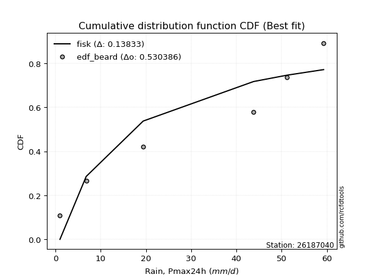</img></img>

</div>


### 5. EDF Chegodayev (1955)

The Chegodayev formula is an empirical plotting position formula used in hydrological frequency analysis to estimate the exceedance probability or return period of a specific event from a set of observed data. It is primarily used for plotting observed data points on probability paper to fit a theoretical distribution, particularly for analyzing extreme events like maximum flood flows or rainfall intensities. The constant _b_ value in the generalized plotting position formula is 0.3.

<div align="center">


$P=(m-b)/(n+1-2b)$


</div>


**5.1. Empirical values**

<div align="center">

|                | 0                   | 1                  | 2                  | 3                  | 4                 | 5                 |
|:---------------|:--------------------|:-------------------|:-------------------|:-------------------|:------------------|:------------------|
| date           | 2022                | 2020               | 2021               | 2018               | 2017              | 2019              |
| x              | 1.0                 | 6.8                | 19.4               | 43.8               | 51.2              | 59.3              |
| m              | 1                   | 2                  | 3                  | 4                  | 5                 | 6                 |
| empirical_dist | edf_chegodayev      | edf_chegodayev     | edf_chegodayev     | edf_chegodayev     | edf_chegodayev    | edf_chegodayev    |
| empirical      | 0.10937499999999999 | 0.265625           | 0.421875           | 0.578125           | 0.734375          | 0.890625          |
| empirical_tr   | 1.1228070175438596  | 1.3617021276595744 | 1.7297297297297298 | 2.3703703703703702 | 3.764705882352941 | 9.142857142857142 |

</div>


**5.2. Kolmogorov-Smirnov fit test (sorted by Δ)**


<div align="center">

|                | 0                   | 1                  | 2                   | 3                   | 4                   | 5                  | 6                  | 7                  | 8                   | 9                   | 10                  | 11                  | 12                  | 13                  | 14                 | 15                  | 16                  | 17                  | 18                  | 19                  | 20                 | 21                  | 22                  | 23                 | 24                  | 25                  | 26                 | 27                 | 28                  | 29                 | 30                 | 31                 | 32                  | 33                  | 34                  | 35                  | 36                  | 37                 | 38                 | 39                  | 40                  | 41                  | 42                  | 43                 | 44                 | 45                  | 46                  | 47                  | 48                  | 49                  | 50                  | 51                  | 52                 | 53                  | 54                  | 55                  | 56                  | 57                  | 58                  | 59                 | 60                  | 61                  | 62                    | 63                | 64                 | 65                  | 66                 | 67                  | 68                 | 69                  | 70                 | 71                  | 72             | 73                 | 74                  | 75                  | 76                 | 77                 | 78                 | 79                 | 80                 | 81                  | 82                 | 83                  | 84                 | 85                 | 86                 | 87             |
|:---------------|:--------------------|:-------------------|:--------------------|:--------------------|:--------------------|:-------------------|:-------------------|:-------------------|:--------------------|:--------------------|:--------------------|:--------------------|:--------------------|:--------------------|:-------------------|:--------------------|:--------------------|:--------------------|:--------------------|:--------------------|:-------------------|:--------------------|:--------------------|:-------------------|:--------------------|:--------------------|:-------------------|:-------------------|:--------------------|:-------------------|:-------------------|:-------------------|:--------------------|:--------------------|:--------------------|:--------------------|:--------------------|:-------------------|:-------------------|:--------------------|:--------------------|:--------------------|:--------------------|:-------------------|:-------------------|:--------------------|:--------------------|:--------------------|:--------------------|:--------------------|:--------------------|:--------------------|:-------------------|:--------------------|:--------------------|:--------------------|:--------------------|:--------------------|:--------------------|:-------------------|:--------------------|:--------------------|:----------------------|:------------------|:-------------------|:--------------------|:-------------------|:--------------------|:-------------------|:--------------------|:-------------------|:--------------------|:---------------|:-------------------|:--------------------|:--------------------|:-------------------|:-------------------|:-------------------|:-------------------|:-------------------|:--------------------|:-------------------|:--------------------|:-------------------|:-------------------|:-------------------|:---------------|
| station        | 26187040            | 26187040           | 26187040            | 26187040            | 26187040            | 26187040           | 26187040           | 26187040           | 26187040            | 26187040            | 26187040            | 26187040            | 26187040            | 26187040            | 26187040           | 26187040            | 26187040            | 26187040            | 26187040            | 26187040            | 26187040           | 26187040            | 26187040            | 26187040           | 26187040            | 26187040            | 26187040           | 26187040           | 26187040            | 26187040           | 26187040           | 26187040           | 26187040            | 26187040            | 26187040            | 26187040            | 26187040            | 26187040           | 26187040           | 26187040            | 26187040            | 26187040            | 26187040            | 26187040           | 26187040           | 26187040            | 26187040            | 26187040            | 26187040            | 26187040            | 26187040            | 26187040            | 26187040           | 26187040            | 26187040            | 26187040            | 26187040            | 26187040            | 26187040            | 26187040           | 26187040            | 26187040            | 26187040              | 26187040          | 26187040           | 26187040            | 26187040           | 26187040            | 26187040           | 26187040            | 26187040           | 26187040            | 26187040       | 26187040           | 26187040            | 26187040            | 26187040           | 26187040           | 26187040           | 26187040           | 26187040           | 26187040            | 26187040           | 26187040            | 26187040           | 26187040           | 26187040           | 26187040       |
| empirical_dist | edf_chegodayev      | edf_chegodayev     | edf_chegodayev      | edf_chegodayev      | edf_chegodayev      | edf_chegodayev     | edf_chegodayev     | edf_chegodayev     | edf_chegodayev      | edf_chegodayev      | edf_chegodayev      | edf_chegodayev      | edf_chegodayev      | edf_chegodayev      | edf_chegodayev     | edf_chegodayev      | edf_chegodayev      | edf_chegodayev      | edf_chegodayev      | edf_chegodayev      | edf_chegodayev     | edf_chegodayev      | edf_chegodayev      | edf_chegodayev     | edf_chegodayev      | edf_chegodayev      | edf_chegodayev     | edf_chegodayev     | edf_chegodayev      | edf_chegodayev     | edf_chegodayev     | edf_chegodayev     | edf_chegodayev      | edf_chegodayev      | edf_chegodayev      | edf_chegodayev      | edf_chegodayev      | edf_chegodayev     | edf_chegodayev     | edf_chegodayev      | edf_chegodayev      | edf_chegodayev      | edf_chegodayev      | edf_chegodayev     | edf_chegodayev     | edf_chegodayev      | edf_chegodayev      | edf_chegodayev      | edf_chegodayev      | edf_chegodayev      | edf_chegodayev      | edf_chegodayev      | edf_chegodayev     | edf_chegodayev      | edf_chegodayev      | edf_chegodayev      | edf_chegodayev      | edf_chegodayev      | edf_chegodayev      | edf_chegodayev     | edf_chegodayev      | edf_chegodayev      | edf_chegodayev        | edf_chegodayev    | edf_chegodayev     | edf_chegodayev      | edf_chegodayev     | edf_chegodayev      | edf_chegodayev     | edf_chegodayev      | edf_chegodayev     | edf_chegodayev      | edf_chegodayev | edf_chegodayev     | edf_chegodayev      | edf_chegodayev      | edf_chegodayev     | edf_chegodayev     | edf_chegodayev     | edf_chegodayev     | edf_chegodayev     | edf_chegodayev      | edf_chegodayev     | edf_chegodayev      | edf_chegodayev     | edf_chegodayev     | edf_chegodayev     | edf_chegodayev |
| p_dist         | fisk                | pearson3           | nakagami            | ncf                 | nct                 | norm               | crystalball        | exponnorm          | t                   | gamma               | erlang              | logfisk             | logpearson3         | loginvweibull       | johnsonsu          | rice                | gumbel_l            | maxwell             | invgamma            | gompertz            | loggumbel_l        | rayleigh            | logistic            | loginvgauss        | logerlang           | genlogistic         | loggamma           | loggamma           | logrice             | logcrystalball     | lognorm            | lognorm            | logt                | logexponnorm        | lognct              | alpha               | halfnorm            | logfatiguelife     | laplace_asymmetric | logalpha            | loginvgamma         | betaprime           | kstwobign           | logmaxwell         | logweibull_min     | hypsecant           | logkstwobign        | invgauss            | lograyleigh         | loggompertz         | expon               | loggenexpon         | gumbel_r           | loghalfnorm         | loglogistic         | weibull_min         | mielke              | logchi2             | halflogistic        | fatiguelife        | moyal               | laplace             | loglaplace_asymmetric | logloggamma       | loghypsecant       | loggumbel_r         | f                  | loghalflogistic     | logmoyal           | genexpon            | loglaplace         | logexpon            | wald           | logncf             | logf                | gibrat              | logwald            | loggibrat          | logbetaprime       | logtruncnorm       | loglognorm         | lognakagami         | invweibull         | logmielke           | logjohnsonsu       | chi2               | truncnorm          | loggenlogistic |
| delta          | 0.13857499385521332 | 0.1483916759369882 | 0.14890394261584394 | 0.14914515896943592 | 0.14995217971358987 | 0.1499588427778067 | 0.1499588486016361 | 0.1499590405760779 | 0.14997229225092834 | 0.15128590642604678 | 0.15159457559368228 | 0.15340326260226356 | 0.15486270292429616 | 0.15692695134949752 | 0.1605470221450203 | 0.16185906410830886 | 0.16194835597409485 | 0.16237847669101813 | 0.16380008095669252 | 0.16530239981739658 | 0.1659564331388852 | 0.16595770652462494 | 0.17232749324780228 | 0.1726861208278575 | 0.17323171646887736 | 0.17537163251572774 | 0.1757727722444189 | 0.1757727722444189 | 0.17700533692759246 | 0.1772356476709801 | 0.1772356662836625 | 0.1772356662836625 | 0.17723900383551294 | 0.17723973707280638 | 0.17729135984716005 | 0.17733521321693668 | 0.17737288318281674 | 0.1784524331578956 | 0.1804913078508963 | 0.18053411928791374 | 0.18157554613736915 | 0.18483473573276465 | 0.18497488790369454 | 0.1861191991316935 | 0.1870095809160538 | 0.18769922996549515 | 0.18808597790643955 | 0.18833981017432633 | 0.18865099251515893 | 0.19020322088637598 | 0.19039177337116342 | 0.19049101776587585 | 0.1946622493655571 | 0.19739447769526963 | 0.19989474701769683 | 0.20030285106910495 | 0.20111680924994246 | 0.20114259197888196 | 0.20296060454293852 | 0.2045788986928696 | 0.20905326523071566 | 0.20996941237002598 | 0.21381333818202541   | 0.214159397773787 | 0.2146478075324212 | 0.21537701409116372 | 0.2156324819449671 | 0.22393935912646634 | 0.2277043475206657 | 0.22834938874743616 | 0.2338188015259467 | 0.23395982739236199 | 0.265625       | 0.2671497320287175 | 0.28290492928629596 | 0.28300296684429704 | 0.2927895018285166 | 0.3219730653120778 | 0.3427773184598907 | 0.3914917466121477 | 0.4063411621723596 | 0.41434133108428095 | 0.4623233917914909 | 0.46560919654766597 | 0.5914104840279946 | 0.5915396242614096 | 0.7888301580678045 | 0.890625       |
| deltao         | 0.530385761606      | 0.530385761606     | 0.530385761606      | 0.530385761606      | 0.530385761606      | 0.530385761606     | 0.530385761606     | 0.530385761606     | 0.530385761606      | 0.530385761606      | 0.530385761606      | 0.530385761606      | 0.530385761606      | 0.530385761606      | 0.530385761606     | 0.530385761606      | 0.530385761606      | 0.530385761606      | 0.530385761606      | 0.530385761606      | 0.530385761606     | 0.530385761606      | 0.530385761606      | 0.530385761606     | 0.530385761606      | 0.530385761606      | 0.530385761606     | 0.530385761606     | 0.530385761606      | 0.530385761606     | 0.530385761606     | 0.530385761606     | 0.530385761606      | 0.530385761606      | 0.530385761606      | 0.530385761606      | 0.530385761606      | 0.530385761606     | 0.530385761606     | 0.530385761606      | 0.530385761606      | 0.530385761606      | 0.530385761606      | 0.530385761606     | 0.530385761606     | 0.530385761606      | 0.530385761606      | 0.530385761606      | 0.530385761606      | 0.530385761606      | 0.530385761606      | 0.530385761606      | 0.530385761606     | 0.530385761606      | 0.530385761606      | 0.530385761606      | 0.530385761606      | 0.530385761606      | 0.530385761606      | 0.530385761606     | 0.530385761606      | 0.530385761606      | 0.530385761606        | 0.530385761606    | 0.530385761606     | 0.530385761606      | 0.530385761606     | 0.530385761606      | 0.530385761606     | 0.530385761606      | 0.530385761606     | 0.530385761606      | 0.530385761606 | 0.530385761606     | 0.530385761606      | 0.530385761606      | 0.530385761606     | 0.530385761606     | 0.530385761606     | 0.530385761606     | 0.530385761606     | 0.530385761606      | 0.530385761606     | 0.530385761606      | 0.530385761606     | 0.530385761606     | 0.530385761606     | 0.530385761606 |
| eval           | Δo > Δ              | Δo > Δ             | Δo > Δ              | Δo > Δ              | Δo > Δ              | Δo > Δ             | Δo > Δ             | Δo > Δ             | Δo > Δ              | Δo > Δ              | Δo > Δ              | Δo > Δ              | Δo > Δ              | Δo > Δ              | Δo > Δ             | Δo > Δ              | Δo > Δ              | Δo > Δ              | Δo > Δ              | Δo > Δ              | Δo > Δ             | Δo > Δ              | Δo > Δ              | Δo > Δ             | Δo > Δ              | Δo > Δ              | Δo > Δ             | Δo > Δ             | Δo > Δ              | Δo > Δ             | Δo > Δ             | Δo > Δ             | Δo > Δ              | Δo > Δ              | Δo > Δ              | Δo > Δ              | Δo > Δ              | Δo > Δ             | Δo > Δ             | Δo > Δ              | Δo > Δ              | Δo > Δ              | Δo > Δ              | Δo > Δ             | Δo > Δ             | Δo > Δ              | Δo > Δ              | Δo > Δ              | Δo > Δ              | Δo > Δ              | Δo > Δ              | Δo > Δ              | Δo > Δ             | Δo > Δ              | Δo > Δ              | Δo > Δ              | Δo > Δ              | Δo > Δ              | Δo > Δ              | Δo > Δ             | Δo > Δ              | Δo > Δ              | Δo > Δ                | Δo > Δ            | Δo > Δ             | Δo > Δ              | Δo > Δ             | Δo > Δ              | Δo > Δ             | Δo > Δ              | Δo > Δ             | Δo > Δ              | Δo > Δ         | Δo > Δ             | Δo > Δ              | Δo > Δ              | Δo > Δ             | Δo > Δ             | Δo > Δ             | Δo > Δ             | Δo > Δ             | Δo > Δ              | Δo > Δ             | Δo > Δ              | Δo <= Δ            | Δo <= Δ            | Δo <= Δ            | Δo <= Δ        |
| fit            | 1                   | 1                  | 1                   | 1                   | 1                   | 1                  | 1                  | 1                  | 1                   | 1                   | 1                   | 1                   | 1                   | 1                   | 1                  | 1                   | 1                   | 1                   | 1                   | 1                   | 1                  | 1                   | 1                   | 1                  | 1                   | 1                   | 1                  | 1                  | 1                   | 1                  | 1                  | 1                  | 1                   | 1                   | 1                   | 1                   | 1                   | 1                  | 1                  | 1                   | 1                   | 1                   | 1                   | 1                  | 1                  | 1                   | 1                   | 1                   | 1                   | 1                   | 1                   | 1                   | 1                  | 1                   | 1                   | 1                   | 1                   | 1                   | 1                   | 1                  | 1                   | 1                   | 1                     | 1                 | 1                  | 1                   | 1                  | 1                   | 1                  | 1                   | 1                  | 1                   | 1              | 1                  | 1                   | 1                   | 1                  | 1                  | 1                  | 1                  | 1                  | 1                   | 1                  | 1                   | 0                  | 0                  | 0                  | 0              |
| n              | 6                   | 6                  | 6                   | 6                   | 6                   | 6                  | 6                  | 6                  | 6                   | 6                   | 6                   | 6                   | 6                   | 6                   | 6                  | 6                   | 6                   | 6                   | 6                   | 6                   | 6                  | 6                   | 6                   | 6                  | 6                   | 6                   | 6                  | 6                  | 6                   | 6                  | 6                  | 6                  | 6                   | 6                   | 6                   | 6                   | 6                   | 6                  | 6                  | 6                   | 6                   | 6                   | 6                   | 6                  | 6                  | 6                   | 6                   | 6                   | 6                   | 6                   | 6                   | 6                   | 6                  | 6                   | 6                   | 6                   | 6                   | 6                   | 6                   | 6                  | 6                   | 6                   | 6                     | 6                 | 6                  | 6                   | 6                  | 6                   | 6                  | 6                   | 6                  | 6                   | 6              | 6                  | 6                   | 6                   | 6                  | 6                  | 6                  | 6                  | 6                  | 6                   | 6                  | 6                   | 6                  | 6                  | 6                  | 6              |
| best_fit       | 1                   | 0                  | 0                   | 0                   | 0                   | 0                  | 0                  | 0                  | 0                   | 0                   | 0                   | 0                   | 0                   | 0                   | 0                  | 0                   | 0                   | 0                   | 0                   | 0                   | 0                  | 0                   | 0                   | 0                  | 0                   | 0                   | 0                  | 0                  | 0                   | 0                  | 0                  | 0                  | 0                   | 0                   | 0                   | 0                   | 0                   | 0                  | 0                  | 0                   | 0                   | 0                   | 0                   | 0                  | 0                  | 0                   | 0                   | 0                   | 0                   | 0                   | 0                   | 0                   | 0                  | 0                   | 0                   | 0                   | 0                   | 0                   | 0                   | 0                  | 0                   | 0                   | 0                     | 0                 | 0                  | 0                   | 0                  | 0                   | 0                  | 0                   | 0                  | 0                   | 0              | 0                  | 0                   | 0                   | 0                  | 0                  | 0                  | 0                  | 0                  | 0                   | 0                  | 0                   | 0                  | 0                  | 0                  | 0              |
| best_fit_sort  | 1                   | 2                  | 3                   | 4                   | 5                   | 6                  | 7                  | 8                  | 9                   | 10                  | 11                  | 12                  | 13                  | 14                  | 15                 | 16                  | 17                  | 18                  | 19                  | 20                  | 21                 | 22                  | 23                  | 24                 | 25                  | 26                  | 27                 | 28                 | 29                  | 30                 | 31                 | 32                 | 33                  | 34                  | 35                  | 36                  | 37                  | 38                 | 39                 | 40                  | 41                  | 42                  | 43                  | 44                 | 45                 | 46                  | 47                  | 48                  | 49                  | 50                  | 51                  | 52                  | 53                 | 54                  | 55                  | 56                  | 57                  | 58                  | 59                  | 60                 | 61                  | 62                  | 63                    | 64                | 65                 | 66                  | 67                 | 68                  | 69                 | 70                  | 71                 | 72                  | 73             | 74                 | 75                  | 76                  | 77                 | 78                 | 79                 | 80                 | 81                 | 82                  | 83                 | 84                  | 85                 | 86                 | 87                 | 88             |

</div>


**5.3. Best fit**

<div align="center">

|   id |   station | empirical_dist   | p_dist   |    delta |   deltao | eval   |   fit |   n |   best_fit |   best_fit_sort |
|-----:|----------:|:-----------------|:---------|---------:|---------:|:-------|------:|----:|-----------:|----------------:|
|    0 |  26187040 | edf_chegodayev   | fisk     | 0.138575 | 0.530386 | Δo > Δ |     1 |   6 |          1 |               1 |

</div>


<div align="center">

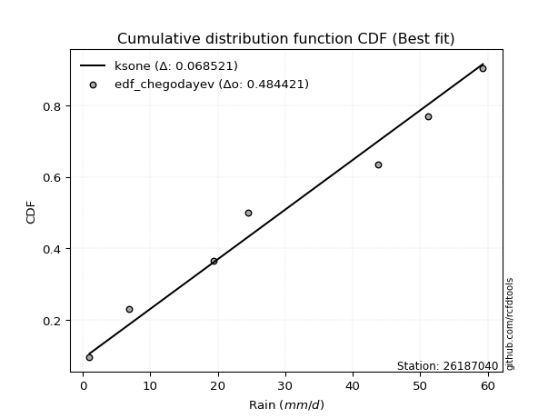</img></img>

</div>


### 6. EDF Blom (1958)

The Blom formula is a specific "plotting position" formula used in hydrology and statistical analysis to estimate the empirical cumulative probability (or non-exceedance probability) of a data series. It is particularly recommended for data that are approximately normally distributed. The constant _a_ is set to 0.375 (or 3/8).

<div align="center">


$P=(m-a)/(n+1-2a)$


</div>


**6.1. Empirical values**

<div align="center">

|                | 0                  | 1                  | 2                  | 3                 | 4                 | 5                  |
|:---------------|:-------------------|:-------------------|:-------------------|:------------------|:------------------|:-------------------|
| date           | 2022               | 2020               | 2021               | 2018              | 2017              | 2019               |
| x              | 1.0                | 6.8                | 19.4               | 43.8              | 51.2              | 59.3               |
| m              | 1                  | 2                  | 3                  | 4                 | 5                 | 6                  |
| empirical_dist | edf_blom           | edf_blom           | edf_blom           | edf_blom          | edf_blom          | edf_blom           |
| empirical      | 0.1                | 0.26               | 0.42               | 0.58              | 0.74              | 0.9                |
| empirical_tr   | 1.1111111111111112 | 1.3513513513513513 | 1.7241379310344827 | 2.380952380952381 | 3.846153846153846 | 10.000000000000002 |

</div>


**6.2. Kolmogorov-Smirnov fit test (sorted by Δ)**


<div align="center">

|                | 0                   | 1                   | 2                   | 3                   | 4                  | 5                   | 6                   | 7                   | 8                   | 9                   | 10                  | 11                 | 12                 | 13                 | 14                  | 15                 | 16                  | 17                  | 18                  | 19                  | 20                  | 21                  | 22                  | 23                  | 24                 | 25                  | 26                  | 27                  | 28                 | 29                  | 30                  | 31                  | 32                  | 33                  | 34                  | 35                  | 36                  | 37                  | 38                  | 39                  | 40                 | 41                 | 42                  | 43                  | 44                  | 45                 | 46                  | 47                  | 48                  | 49                  | 50                  | 51                  | 52                  | 53                  | 54                 | 55                 | 56                  | 57                  | 58                  | 59                 | 60                  | 61                  | 62                    | 63                  | 64                  | 65                  | 66                  | 67                  | 68                  | 69                 | 70                  | 71                | 72             | 73                 | 74                 | 75                  | 76                 | 77                 | 78                  | 79                 | 80                 | 81                  | 82                  | 83                 | 84                 | 85                 | 86                 | 87             |
|:---------------|:--------------------|:--------------------|:--------------------|:--------------------|:-------------------|:--------------------|:--------------------|:--------------------|:--------------------|:--------------------|:--------------------|:-------------------|:-------------------|:-------------------|:--------------------|:-------------------|:--------------------|:--------------------|:--------------------|:--------------------|:--------------------|:--------------------|:--------------------|:--------------------|:-------------------|:--------------------|:--------------------|:--------------------|:-------------------|:--------------------|:--------------------|:--------------------|:--------------------|:--------------------|:--------------------|:--------------------|:--------------------|:--------------------|:--------------------|:--------------------|:-------------------|:-------------------|:--------------------|:--------------------|:--------------------|:-------------------|:--------------------|:--------------------|:--------------------|:--------------------|:--------------------|:--------------------|:--------------------|:--------------------|:-------------------|:-------------------|:--------------------|:--------------------|:--------------------|:-------------------|:--------------------|:--------------------|:----------------------|:--------------------|:--------------------|:--------------------|:--------------------|:--------------------|:--------------------|:-------------------|:--------------------|:------------------|:---------------|:-------------------|:-------------------|:--------------------|:-------------------|:-------------------|:--------------------|:-------------------|:-------------------|:--------------------|:--------------------|:-------------------|:-------------------|:-------------------|:-------------------|:---------------|
| station        | 26187040            | 26187040            | 26187040            | 26187040            | 26187040           | 26187040            | 26187040            | 26187040            | 26187040            | 26187040            | 26187040            | 26187040           | 26187040           | 26187040           | 26187040            | 26187040           | 26187040            | 26187040            | 26187040            | 26187040            | 26187040            | 26187040            | 26187040            | 26187040            | 26187040           | 26187040            | 26187040            | 26187040            | 26187040           | 26187040            | 26187040            | 26187040            | 26187040            | 26187040            | 26187040            | 26187040            | 26187040            | 26187040            | 26187040            | 26187040            | 26187040           | 26187040           | 26187040            | 26187040            | 26187040            | 26187040           | 26187040            | 26187040            | 26187040            | 26187040            | 26187040            | 26187040            | 26187040            | 26187040            | 26187040           | 26187040           | 26187040            | 26187040            | 26187040            | 26187040           | 26187040            | 26187040            | 26187040              | 26187040            | 26187040            | 26187040            | 26187040            | 26187040            | 26187040            | 26187040           | 26187040            | 26187040          | 26187040       | 26187040           | 26187040           | 26187040            | 26187040           | 26187040           | 26187040            | 26187040           | 26187040           | 26187040            | 26187040            | 26187040           | 26187040           | 26187040           | 26187040           | 26187040       |
| empirical_dist | edf_blom            | edf_blom            | edf_blom            | edf_blom            | edf_blom           | edf_blom            | edf_blom            | edf_blom            | edf_blom            | edf_blom            | edf_blom            | edf_blom           | edf_blom           | edf_blom           | edf_blom            | edf_blom           | edf_blom            | edf_blom            | edf_blom            | edf_blom            | edf_blom            | edf_blom            | edf_blom            | edf_blom            | edf_blom           | edf_blom            | edf_blom            | edf_blom            | edf_blom           | edf_blom            | edf_blom            | edf_blom            | edf_blom            | edf_blom            | edf_blom            | edf_blom            | edf_blom            | edf_blom            | edf_blom            | edf_blom            | edf_blom           | edf_blom           | edf_blom            | edf_blom            | edf_blom            | edf_blom           | edf_blom            | edf_blom            | edf_blom            | edf_blom            | edf_blom            | edf_blom            | edf_blom            | edf_blom            | edf_blom           | edf_blom           | edf_blom            | edf_blom            | edf_blom            | edf_blom           | edf_blom            | edf_blom            | edf_blom              | edf_blom            | edf_blom            | edf_blom            | edf_blom            | edf_blom            | edf_blom            | edf_blom           | edf_blom            | edf_blom          | edf_blom       | edf_blom           | edf_blom           | edf_blom            | edf_blom           | edf_blom           | edf_blom            | edf_blom           | edf_blom           | edf_blom            | edf_blom            | edf_blom           | edf_blom           | edf_blom           | edf_blom           | edf_blom       |
| p_dist         | fisk                | pearson3            | nakagami            | ncf                 | nct                | norm                | crystalball         | exponnorm           | t                   | gamma               | erlang              | logfisk            | logpearson3        | johnsonsu          | loginvweibull       | rice               | gumbel_l            | maxwell             | invgamma            | gompertz            | loggumbel_l         | rayleigh            | logistic            | loginvgauss         | logerlang          | genlogistic         | loggamma            | loggamma            | logrice            | logcrystalball      | lognorm             | lognorm             | logt                | logexponnorm        | lognct              | alpha               | halfnorm            | logfatiguelife      | laplace_asymmetric  | logalpha            | loginvgamma        | betaprime          | kstwobign           | logmaxwell          | logweibull_min      | hypsecant          | invgauss            | lograyleigh         | loggompertz         | expon               | logkstwobign        | loggenexpon         | gumbel_r            | loglogistic         | loghalfnorm        | mielke             | halflogistic        | fatiguelife         | logchi2             | moyal              | laplace             | weibull_min         | loglaplace_asymmetric | logloggamma         | loghypsecant        | loggumbel_r         | f                   | loghalflogistic     | logmoyal            | genexpon           | loglaplace          | logexpon          | wald           | logncf             | gibrat             | logf                | logwald            | loggibrat          | logbetaprime        | logtruncnorm       | loglognorm         | lognakagami         | logmielke           | invweibull         | logjohnsonsu       | chi2               | truncnorm          | loggenlogistic |
| delta          | 0.13669999385521336 | 0.14651667593698825 | 0.14702894261584398 | 0.14727015896943596 | 0.1480771797135899 | 0.14808384277780673 | 0.14808384860163615 | 0.14808404057607794 | 0.14809729225092838 | 0.14941090642604682 | 0.14971957559368232 | 0.1515282626022636 | 0.1529877029242962 | 0.1586720221450203 | 0.15880195134949754 | 0.1599840641083089 | 0.16007335597409483 | 0.16050347669101817 | 0.16192508095669256 | 0.16342739981739662 | 0.16408143313888524 | 0.16408270652462498 | 0.17045249324780232 | 0.17081112082785754 | 0.1713567164688774 | 0.17349663251572778 | 0.17389777224441894 | 0.17389777224441894 | 0.1751303369275925 | 0.17536064767098014 | 0.17536066628366254 | 0.17536066628366254 | 0.17536400383551298 | 0.17536473707280642 | 0.17541635984716009 | 0.17546021321693672 | 0.17549788318281678 | 0.17657743315789565 | 0.17861630785089633 | 0.17865911928791378 | 0.1797005461373692 | 0.1829597357327647 | 0.18309988790369458 | 0.18424419913169354 | 0.18513458091605384 | 0.1858242299654952 | 0.18646481017432637 | 0.18677599251515897 | 0.18832822088637602 | 0.18851677337116346 | 0.18996097790643957 | 0.19236601776587586 | 0.19278724936555713 | 0.19801974701769687 | 0.1984970829612816 | 0.1992418092499425 | 0.20108560454293856 | 0.20270389869286964 | 0.20676759197888195 | 0.2071782652307157 | 0.20809441237002602 | 0.20967785106910497 | 0.21193833818202545   | 0.21228439777378705 | 0.21277280753242123 | 0.21350201409116376 | 0.21375748194496713 | 0.22581435912646636 | 0.22583923356528784 | 0.2264743887474362 | 0.23194380152594674 | 0.238189708381931 | 0.26           | 0.2765247320287175 | 0.2811279668442971 | 0.28852992928629595 | 0.2946645018285166 | 0.3238480653120778 | 0.34840231845989067 | 0.3933667466121477 | 0.4119661621723596 | 0.41996633108428094 | 0.47123419654766596 | 0.4716983917914909 | 0.5970354840279946 | 0.5971646242614096 | 0.7982051580678046 | 0.9            |
| deltao         | 0.530385761606      | 0.530385761606      | 0.530385761606      | 0.530385761606      | 0.530385761606     | 0.530385761606      | 0.530385761606      | 0.530385761606      | 0.530385761606      | 0.530385761606      | 0.530385761606      | 0.530385761606     | 0.530385761606     | 0.530385761606     | 0.530385761606      | 0.530385761606     | 0.530385761606      | 0.530385761606      | 0.530385761606      | 0.530385761606      | 0.530385761606      | 0.530385761606      | 0.530385761606      | 0.530385761606      | 0.530385761606     | 0.530385761606      | 0.530385761606      | 0.530385761606      | 0.530385761606     | 0.530385761606      | 0.530385761606      | 0.530385761606      | 0.530385761606      | 0.530385761606      | 0.530385761606      | 0.530385761606      | 0.530385761606      | 0.530385761606      | 0.530385761606      | 0.530385761606      | 0.530385761606     | 0.530385761606     | 0.530385761606      | 0.530385761606      | 0.530385761606      | 0.530385761606     | 0.530385761606      | 0.530385761606      | 0.530385761606      | 0.530385761606      | 0.530385761606      | 0.530385761606      | 0.530385761606      | 0.530385761606      | 0.530385761606     | 0.530385761606     | 0.530385761606      | 0.530385761606      | 0.530385761606      | 0.530385761606     | 0.530385761606      | 0.530385761606      | 0.530385761606        | 0.530385761606      | 0.530385761606      | 0.530385761606      | 0.530385761606      | 0.530385761606      | 0.530385761606      | 0.530385761606     | 0.530385761606      | 0.530385761606    | 0.530385761606 | 0.530385761606     | 0.530385761606     | 0.530385761606      | 0.530385761606     | 0.530385761606     | 0.530385761606      | 0.530385761606     | 0.530385761606     | 0.530385761606      | 0.530385761606      | 0.530385761606     | 0.530385761606     | 0.530385761606     | 0.530385761606     | 0.530385761606 |
| eval           | Δo > Δ              | Δo > Δ              | Δo > Δ              | Δo > Δ              | Δo > Δ             | Δo > Δ              | Δo > Δ              | Δo > Δ              | Δo > Δ              | Δo > Δ              | Δo > Δ              | Δo > Δ             | Δo > Δ             | Δo > Δ             | Δo > Δ              | Δo > Δ             | Δo > Δ              | Δo > Δ              | Δo > Δ              | Δo > Δ              | Δo > Δ              | Δo > Δ              | Δo > Δ              | Δo > Δ              | Δo > Δ             | Δo > Δ              | Δo > Δ              | Δo > Δ              | Δo > Δ             | Δo > Δ              | Δo > Δ              | Δo > Δ              | Δo > Δ              | Δo > Δ              | Δo > Δ              | Δo > Δ              | Δo > Δ              | Δo > Δ              | Δo > Δ              | Δo > Δ              | Δo > Δ             | Δo > Δ             | Δo > Δ              | Δo > Δ              | Δo > Δ              | Δo > Δ             | Δo > Δ              | Δo > Δ              | Δo > Δ              | Δo > Δ              | Δo > Δ              | Δo > Δ              | Δo > Δ              | Δo > Δ              | Δo > Δ             | Δo > Δ             | Δo > Δ              | Δo > Δ              | Δo > Δ              | Δo > Δ             | Δo > Δ              | Δo > Δ              | Δo > Δ                | Δo > Δ              | Δo > Δ              | Δo > Δ              | Δo > Δ              | Δo > Δ              | Δo > Δ              | Δo > Δ             | Δo > Δ              | Δo > Δ            | Δo > Δ         | Δo > Δ             | Δo > Δ             | Δo > Δ              | Δo > Δ             | Δo > Δ             | Δo > Δ              | Δo > Δ             | Δo > Δ             | Δo > Δ              | Δo > Δ              | Δo > Δ             | Δo <= Δ            | Δo <= Δ            | Δo <= Δ            | Δo <= Δ        |
| fit            | 1                   | 1                   | 1                   | 1                   | 1                  | 1                   | 1                   | 1                   | 1                   | 1                   | 1                   | 1                  | 1                  | 1                  | 1                   | 1                  | 1                   | 1                   | 1                   | 1                   | 1                   | 1                   | 1                   | 1                   | 1                  | 1                   | 1                   | 1                   | 1                  | 1                   | 1                   | 1                   | 1                   | 1                   | 1                   | 1                   | 1                   | 1                   | 1                   | 1                   | 1                  | 1                  | 1                   | 1                   | 1                   | 1                  | 1                   | 1                   | 1                   | 1                   | 1                   | 1                   | 1                   | 1                   | 1                  | 1                  | 1                   | 1                   | 1                   | 1                  | 1                   | 1                   | 1                     | 1                   | 1                   | 1                   | 1                   | 1                   | 1                   | 1                  | 1                   | 1                 | 1              | 1                  | 1                  | 1                   | 1                  | 1                  | 1                   | 1                  | 1                  | 1                   | 1                   | 1                  | 0                  | 0                  | 0                  | 0              |
| n              | 6                   | 6                   | 6                   | 6                   | 6                  | 6                   | 6                   | 6                   | 6                   | 6                   | 6                   | 6                  | 6                  | 6                  | 6                   | 6                  | 6                   | 6                   | 6                   | 6                   | 6                   | 6                   | 6                   | 6                   | 6                  | 6                   | 6                   | 6                   | 6                  | 6                   | 6                   | 6                   | 6                   | 6                   | 6                   | 6                   | 6                   | 6                   | 6                   | 6                   | 6                  | 6                  | 6                   | 6                   | 6                   | 6                  | 6                   | 6                   | 6                   | 6                   | 6                   | 6                   | 6                   | 6                   | 6                  | 6                  | 6                   | 6                   | 6                   | 6                  | 6                   | 6                   | 6                     | 6                   | 6                   | 6                   | 6                   | 6                   | 6                   | 6                  | 6                   | 6                 | 6              | 6                  | 6                  | 6                   | 6                  | 6                  | 6                   | 6                  | 6                  | 6                   | 6                   | 6                  | 6                  | 6                  | 6                  | 6              |
| best_fit       | 1                   | 0                   | 0                   | 0                   | 0                  | 0                   | 0                   | 0                   | 0                   | 0                   | 0                   | 0                  | 0                  | 0                  | 0                   | 0                  | 0                   | 0                   | 0                   | 0                   | 0                   | 0                   | 0                   | 0                   | 0                  | 0                   | 0                   | 0                   | 0                  | 0                   | 0                   | 0                   | 0                   | 0                   | 0                   | 0                   | 0                   | 0                   | 0                   | 0                   | 0                  | 0                  | 0                   | 0                   | 0                   | 0                  | 0                   | 0                   | 0                   | 0                   | 0                   | 0                   | 0                   | 0                   | 0                  | 0                  | 0                   | 0                   | 0                   | 0                  | 0                   | 0                   | 0                     | 0                   | 0                   | 0                   | 0                   | 0                   | 0                   | 0                  | 0                   | 0                 | 0              | 0                  | 0                  | 0                   | 0                  | 0                  | 0                   | 0                  | 0                  | 0                   | 0                   | 0                  | 0                  | 0                  | 0                  | 0              |
| best_fit_sort  | 1                   | 2                   | 3                   | 4                   | 5                  | 6                   | 7                   | 8                   | 9                   | 10                  | 11                  | 12                 | 13                 | 14                 | 15                  | 16                 | 17                  | 18                  | 19                  | 20                  | 21                  | 22                  | 23                  | 24                  | 25                 | 26                  | 27                  | 28                  | 29                 | 30                  | 31                  | 32                  | 33                  | 34                  | 35                  | 36                  | 37                  | 38                  | 39                  | 40                  | 41                 | 42                 | 43                  | 44                  | 45                  | 46                 | 47                  | 48                  | 49                  | 50                  | 51                  | 52                  | 53                  | 54                  | 55                 | 56                 | 57                  | 58                  | 59                  | 60                 | 61                  | 62                  | 63                    | 64                  | 65                  | 66                  | 67                  | 68                  | 69                  | 70                 | 71                  | 72                | 73             | 74                 | 75                 | 76                  | 77                 | 78                 | 79                  | 80                 | 81                 | 82                  | 83                  | 84                 | 85                 | 86                 | 87                 | 88             |

</div>


**6.3. Best fit**

<div align="center">

|   id |   station | empirical_dist   | p_dist   |   delta |   deltao | eval   |   fit |   n |   best_fit |   best_fit_sort |
|-----:|----------:|:-----------------|:---------|--------:|---------:|:-------|------:|----:|-----------:|----------------:|
|    0 |  26187040 | edf_blom         | fisk     |  0.1367 | 0.530386 | Δo > Δ |     1 |   6 |          1 |               1 |

</div>


<div align="center">

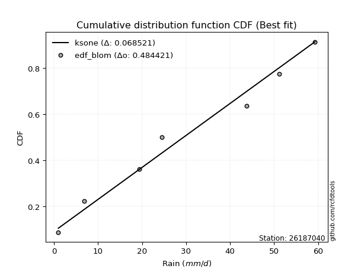</img>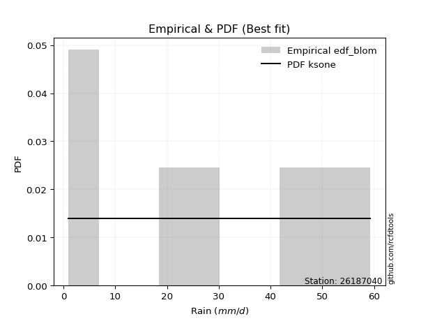</img>

</div>


### 7. EDF Tukey (1962)

In hydrology, the Tukey formula is used as a plotting position formula to estimate the empirical probability or frequency of a flood event (or other hydrological data). The formula parameter is given as _c=0.333_ (or 1/3).

<div align="center">


$P=(m-c)/(n+1-2c)$


</div>


**7.1. Empirical values**

<div align="center">

|                | 0                   | 1                  | 2                   | 3                  | 4                  | 5                  |
|:---------------|:--------------------|:-------------------|:--------------------|:-------------------|:-------------------|:-------------------|
| date           | 2022                | 2020               | 2021                | 2018               | 2017               | 2019               |
| x              | 1.0                 | 6.8                | 19.4                | 43.8               | 51.2               | 59.3               |
| m              | 1                   | 2                  | 3                   | 4                  | 5                  | 6                  |
| empirical_dist | edf_tukey           | edf_tukey          | edf_tukey           | edf_tukey          | edf_tukey          | edf_tukey          |
| empirical      | 0.10526315789473684 | 0.2631578947368421 | 0.42105263157894735 | 0.5789473684210527 | 0.7368421052631579 | 0.8947368421052632 |
| empirical_tr   | 1.1176470588235294  | 1.357142857142857  | 1.7272727272727273  | 2.375              | 3.7999999999999994 | 9.5                |

</div>


**7.2. Kolmogorov-Smirnov fit test (sorted by Δ)**


<div align="center">

|                | 0                   | 1                   | 2                  | 3                   | 4                   | 5                   | 6                   | 7                   | 8                   | 9                   | 10                  | 11                 | 12                 | 13                  | 14                  | 15                 | 16                 | 17                  | 18                  | 19                  | 20                  | 21                  | 22                  | 23                  | 24                 | 25                  | 26                  | 27                  | 28                 | 29                  | 30                  | 31                  | 32                 | 33                  | 34                 | 35                  | 36                 | 37                  | 38                  | 39                 | 40                 | 41                | 42                  | 43                  | 44                  | 45                 | 46                  | 47                  | 48                 | 49                  | 50                  | 51                 | 52                  | 53                  | 54                  | 55                 | 56                  | 57                  | 58                  | 59                 | 60                | 61                  | 62                    | 63                  | 64                  | 65                  | 66                  | 67                | 68                  | 69                 | 70                  | 71                 | 72                 | 73                  | 74                 | 75                  | 76                  | 77                  | 78                 | 79                  | 80                 | 81                  | 82                  | 83                 | 84                 | 85                 | 86                 | 87                 |
|:---------------|:--------------------|:--------------------|:-------------------|:--------------------|:--------------------|:--------------------|:--------------------|:--------------------|:--------------------|:--------------------|:--------------------|:-------------------|:-------------------|:--------------------|:--------------------|:-------------------|:-------------------|:--------------------|:--------------------|:--------------------|:--------------------|:--------------------|:--------------------|:--------------------|:-------------------|:--------------------|:--------------------|:--------------------|:-------------------|:--------------------|:--------------------|:--------------------|:-------------------|:--------------------|:-------------------|:--------------------|:-------------------|:--------------------|:--------------------|:-------------------|:-------------------|:------------------|:--------------------|:--------------------|:--------------------|:-------------------|:--------------------|:--------------------|:-------------------|:--------------------|:--------------------|:-------------------|:--------------------|:--------------------|:--------------------|:-------------------|:--------------------|:--------------------|:--------------------|:-------------------|:------------------|:--------------------|:----------------------|:--------------------|:--------------------|:--------------------|:--------------------|:------------------|:--------------------|:-------------------|:--------------------|:-------------------|:-------------------|:--------------------|:-------------------|:--------------------|:--------------------|:--------------------|:-------------------|:--------------------|:-------------------|:--------------------|:--------------------|:-------------------|:-------------------|:-------------------|:-------------------|:-------------------|
| station        | 26187040            | 26187040            | 26187040           | 26187040            | 26187040            | 26187040            | 26187040            | 26187040            | 26187040            | 26187040            | 26187040            | 26187040           | 26187040           | 26187040            | 26187040            | 26187040           | 26187040           | 26187040            | 26187040            | 26187040            | 26187040            | 26187040            | 26187040            | 26187040            | 26187040           | 26187040            | 26187040            | 26187040            | 26187040           | 26187040            | 26187040            | 26187040            | 26187040           | 26187040            | 26187040           | 26187040            | 26187040           | 26187040            | 26187040            | 26187040           | 26187040           | 26187040          | 26187040            | 26187040            | 26187040            | 26187040           | 26187040            | 26187040            | 26187040           | 26187040            | 26187040            | 26187040           | 26187040            | 26187040            | 26187040            | 26187040           | 26187040            | 26187040            | 26187040            | 26187040           | 26187040          | 26187040            | 26187040              | 26187040            | 26187040            | 26187040            | 26187040            | 26187040          | 26187040            | 26187040           | 26187040            | 26187040           | 26187040           | 26187040            | 26187040           | 26187040            | 26187040            | 26187040            | 26187040           | 26187040            | 26187040           | 26187040            | 26187040            | 26187040           | 26187040           | 26187040           | 26187040           | 26187040           |
| empirical_dist | edf_tukey           | edf_tukey           | edf_tukey          | edf_tukey           | edf_tukey           | edf_tukey           | edf_tukey           | edf_tukey           | edf_tukey           | edf_tukey           | edf_tukey           | edf_tukey          | edf_tukey          | edf_tukey           | edf_tukey           | edf_tukey          | edf_tukey          | edf_tukey           | edf_tukey           | edf_tukey           | edf_tukey           | edf_tukey           | edf_tukey           | edf_tukey           | edf_tukey          | edf_tukey           | edf_tukey           | edf_tukey           | edf_tukey          | edf_tukey           | edf_tukey           | edf_tukey           | edf_tukey          | edf_tukey           | edf_tukey          | edf_tukey           | edf_tukey          | edf_tukey           | edf_tukey           | edf_tukey          | edf_tukey          | edf_tukey         | edf_tukey           | edf_tukey           | edf_tukey           | edf_tukey          | edf_tukey           | edf_tukey           | edf_tukey          | edf_tukey           | edf_tukey           | edf_tukey          | edf_tukey           | edf_tukey           | edf_tukey           | edf_tukey          | edf_tukey           | edf_tukey           | edf_tukey           | edf_tukey          | edf_tukey         | edf_tukey           | edf_tukey             | edf_tukey           | edf_tukey           | edf_tukey           | edf_tukey           | edf_tukey         | edf_tukey           | edf_tukey          | edf_tukey           | edf_tukey          | edf_tukey          | edf_tukey           | edf_tukey          | edf_tukey           | edf_tukey           | edf_tukey           | edf_tukey          | edf_tukey           | edf_tukey          | edf_tukey           | edf_tukey           | edf_tukey          | edf_tukey          | edf_tukey          | edf_tukey          | edf_tukey          |
| p_dist         | fisk                | pearson3            | nakagami           | ncf                 | nct                 | norm                | crystalball         | exponnorm           | t                   | gamma               | erlang              | logfisk            | logpearson3        | loginvweibull       | johnsonsu           | rice               | gumbel_l           | maxwell             | invgamma            | gompertz            | loggumbel_l         | rayleigh            | logistic            | loginvgauss         | logerlang          | genlogistic         | loggamma            | loggamma            | logrice            | logcrystalball      | lognorm             | lognorm             | logt               | logexponnorm        | lognct             | alpha               | halfnorm           | logfatiguelife      | laplace_asymmetric  | logalpha           | loginvgamma        | betaprime         | kstwobign           | logmaxwell          | logweibull_min      | hypsecant          | invgauss            | lograyleigh         | logkstwobign       | loggompertz         | expon               | loggenexpon        | gumbel_r            | loghalfnorm         | loglogistic         | mielke             | halflogistic        | logchi2             | fatiguelife         | weibull_min        | moyal             | laplace             | loglaplace_asymmetric | logloggamma         | loghypsecant        | loggumbel_r         | f                   | loghalflogistic   | logmoyal            | genexpon           | loglaplace          | logexpon           | wald               | logncf              | gibrat             | logf                | logwald             | loggibrat           | logbetaprime       | logtruncnorm        | loglognorm         | lognakagami         | invweibull          | logmielke          | logjohnsonsu       | chi2               | truncnorm          | loggenlogistic     |
| delta          | 0.13775262543416067 | 0.14756930751593555 | 0.1480815741947913 | 0.14832279054838327 | 0.14912981129253722 | 0.14913647435675403 | 0.14913648018058345 | 0.14913667215502524 | 0.14914992382987569 | 0.15046353800499412 | 0.15077220717262962 | 0.1525808941812109 | 0.1540403345032435 | 0.15774931977055018 | 0.15972465372396766 | 0.1610366956872562 | 0.1611259875530422 | 0.16155610826996547 | 0.16297771253563986 | 0.16448003139634393 | 0.16513406471783254 | 0.16513533810357228 | 0.17150512482674962 | 0.17186375240680485 | 0.1724093480478247 | 0.17454926409467508 | 0.17495040382336624 | 0.17495040382336624 | 0.1761829685065398 | 0.17641327924992745 | 0.17641329786260984 | 0.17641329786260984 | 0.1764166354144603 | 0.17641736865175373 | 0.1764689914261074 | 0.17651284479588403 | 0.1765505147617641 | 0.17763006473684295 | 0.17966893942984363 | 0.1797117508668611 | 0.1807531777163165 | 0.184012367311712 | 0.18415251948264189 | 0.18529683071064085 | 0.18618721249500114 | 0.1868768615444425 | 0.18751744175327367 | 0.18782862409410628 | 0.1889083463274922 | 0.18938085246532332 | 0.18956940495011076 | 0.1913133861869285 | 0.19383988094450444 | 0.19744445138233424 | 0.19907237859664417 | 0.2002944408288898 | 0.20213823612188586 | 0.20360969724203987 | 0.20375653027181695 | 0.2044146931743681 | 0.208230896809663 | 0.20914704394897332 | 0.21299096976097276   | 0.21333702935273435 | 0.21382543911136853 | 0.21455464567011107 | 0.21481011352391444 | 0.224761727547519 | 0.22688197909961305 | 0.2275270203263835 | 0.23299643310489404 | 0.2350318136450889 | 0.2631578947368421 | 0.27126157413398067 | 0.2821805984232444 | 0.28537203454945387 | 0.29361187024956925 | 0.32279543373313047 | 0.3452444237230486 | 0.39231411503320035 | 0.4088082674355175 | 0.41680843634743886 | 0.46643523389675406 | 0.4680763018108239 | 0.5938775892911523 | 0.5940067295245675 | 0.7929420001730677 | 0.8947368421052632 |
| deltao         | 0.530385761606      | 0.530385761606      | 0.530385761606     | 0.530385761606      | 0.530385761606      | 0.530385761606      | 0.530385761606      | 0.530385761606      | 0.530385761606      | 0.530385761606      | 0.530385761606      | 0.530385761606     | 0.530385761606     | 0.530385761606      | 0.530385761606      | 0.530385761606     | 0.530385761606     | 0.530385761606      | 0.530385761606      | 0.530385761606      | 0.530385761606      | 0.530385761606      | 0.530385761606      | 0.530385761606      | 0.530385761606     | 0.530385761606      | 0.530385761606      | 0.530385761606      | 0.530385761606     | 0.530385761606      | 0.530385761606      | 0.530385761606      | 0.530385761606     | 0.530385761606      | 0.530385761606     | 0.530385761606      | 0.530385761606     | 0.530385761606      | 0.530385761606      | 0.530385761606     | 0.530385761606     | 0.530385761606    | 0.530385761606      | 0.530385761606      | 0.530385761606      | 0.530385761606     | 0.530385761606      | 0.530385761606      | 0.530385761606     | 0.530385761606      | 0.530385761606      | 0.530385761606     | 0.530385761606      | 0.530385761606      | 0.530385761606      | 0.530385761606     | 0.530385761606      | 0.530385761606      | 0.530385761606      | 0.530385761606     | 0.530385761606    | 0.530385761606      | 0.530385761606        | 0.530385761606      | 0.530385761606      | 0.530385761606      | 0.530385761606      | 0.530385761606    | 0.530385761606      | 0.530385761606     | 0.530385761606      | 0.530385761606     | 0.530385761606     | 0.530385761606      | 0.530385761606     | 0.530385761606      | 0.530385761606      | 0.530385761606      | 0.530385761606     | 0.530385761606      | 0.530385761606     | 0.530385761606      | 0.530385761606      | 0.530385761606     | 0.530385761606     | 0.530385761606     | 0.530385761606     | 0.530385761606     |
| eval           | Δo > Δ              | Δo > Δ              | Δo > Δ             | Δo > Δ              | Δo > Δ              | Δo > Δ              | Δo > Δ              | Δo > Δ              | Δo > Δ              | Δo > Δ              | Δo > Δ              | Δo > Δ             | Δo > Δ             | Δo > Δ              | Δo > Δ              | Δo > Δ             | Δo > Δ             | Δo > Δ              | Δo > Δ              | Δo > Δ              | Δo > Δ              | Δo > Δ              | Δo > Δ              | Δo > Δ              | Δo > Δ             | Δo > Δ              | Δo > Δ              | Δo > Δ              | Δo > Δ             | Δo > Δ              | Δo > Δ              | Δo > Δ              | Δo > Δ             | Δo > Δ              | Δo > Δ             | Δo > Δ              | Δo > Δ             | Δo > Δ              | Δo > Δ              | Δo > Δ             | Δo > Δ             | Δo > Δ            | Δo > Δ              | Δo > Δ              | Δo > Δ              | Δo > Δ             | Δo > Δ              | Δo > Δ              | Δo > Δ             | Δo > Δ              | Δo > Δ              | Δo > Δ             | Δo > Δ              | Δo > Δ              | Δo > Δ              | Δo > Δ             | Δo > Δ              | Δo > Δ              | Δo > Δ              | Δo > Δ             | Δo > Δ            | Δo > Δ              | Δo > Δ                | Δo > Δ              | Δo > Δ              | Δo > Δ              | Δo > Δ              | Δo > Δ            | Δo > Δ              | Δo > Δ             | Δo > Δ              | Δo > Δ             | Δo > Δ             | Δo > Δ              | Δo > Δ             | Δo > Δ              | Δo > Δ              | Δo > Δ              | Δo > Δ             | Δo > Δ              | Δo > Δ             | Δo > Δ              | Δo > Δ              | Δo > Δ             | Δo <= Δ            | Δo <= Δ            | Δo <= Δ            | Δo <= Δ            |
| fit            | 1                   | 1                   | 1                  | 1                   | 1                   | 1                   | 1                   | 1                   | 1                   | 1                   | 1                   | 1                  | 1                  | 1                   | 1                   | 1                  | 1                  | 1                   | 1                   | 1                   | 1                   | 1                   | 1                   | 1                   | 1                  | 1                   | 1                   | 1                   | 1                  | 1                   | 1                   | 1                   | 1                  | 1                   | 1                  | 1                   | 1                  | 1                   | 1                   | 1                  | 1                  | 1                 | 1                   | 1                   | 1                   | 1                  | 1                   | 1                   | 1                  | 1                   | 1                   | 1                  | 1                   | 1                   | 1                   | 1                  | 1                   | 1                   | 1                   | 1                  | 1                 | 1                   | 1                     | 1                   | 1                   | 1                   | 1                   | 1                 | 1                   | 1                  | 1                   | 1                  | 1                  | 1                   | 1                  | 1                   | 1                   | 1                   | 1                  | 1                   | 1                  | 1                   | 1                   | 1                  | 0                  | 0                  | 0                  | 0                  |
| n              | 6                   | 6                   | 6                  | 6                   | 6                   | 6                   | 6                   | 6                   | 6                   | 6                   | 6                   | 6                  | 6                  | 6                   | 6                   | 6                  | 6                  | 6                   | 6                   | 6                   | 6                   | 6                   | 6                   | 6                   | 6                  | 6                   | 6                   | 6                   | 6                  | 6                   | 6                   | 6                   | 6                  | 6                   | 6                  | 6                   | 6                  | 6                   | 6                   | 6                  | 6                  | 6                 | 6                   | 6                   | 6                   | 6                  | 6                   | 6                   | 6                  | 6                   | 6                   | 6                  | 6                   | 6                   | 6                   | 6                  | 6                   | 6                   | 6                   | 6                  | 6                 | 6                   | 6                     | 6                   | 6                   | 6                   | 6                   | 6                 | 6                   | 6                  | 6                   | 6                  | 6                  | 6                   | 6                  | 6                   | 6                   | 6                   | 6                  | 6                   | 6                  | 6                   | 6                   | 6                  | 6                  | 6                  | 6                  | 6                  |
| best_fit       | 1                   | 0                   | 0                  | 0                   | 0                   | 0                   | 0                   | 0                   | 0                   | 0                   | 0                   | 0                  | 0                  | 0                   | 0                   | 0                  | 0                  | 0                   | 0                   | 0                   | 0                   | 0                   | 0                   | 0                   | 0                  | 0                   | 0                   | 0                   | 0                  | 0                   | 0                   | 0                   | 0                  | 0                   | 0                  | 0                   | 0                  | 0                   | 0                   | 0                  | 0                  | 0                 | 0                   | 0                   | 0                   | 0                  | 0                   | 0                   | 0                  | 0                   | 0                   | 0                  | 0                   | 0                   | 0                   | 0                  | 0                   | 0                   | 0                   | 0                  | 0                 | 0                   | 0                     | 0                   | 0                   | 0                   | 0                   | 0                 | 0                   | 0                  | 0                   | 0                  | 0                  | 0                   | 0                  | 0                   | 0                   | 0                   | 0                  | 0                   | 0                  | 0                   | 0                   | 0                  | 0                  | 0                  | 0                  | 0                  |
| best_fit_sort  | 1                   | 2                   | 3                  | 4                   | 5                   | 6                   | 7                   | 8                   | 9                   | 10                  | 11                  | 12                 | 13                 | 14                  | 15                  | 16                 | 17                 | 18                  | 19                  | 20                  | 21                  | 22                  | 23                  | 24                  | 25                 | 26                  | 27                  | 28                  | 29                 | 30                  | 31                  | 32                  | 33                 | 34                  | 35                 | 36                  | 37                 | 38                  | 39                  | 40                 | 41                 | 42                | 43                  | 44                  | 45                  | 46                 | 47                  | 48                  | 49                 | 50                  | 51                  | 52                 | 53                  | 54                  | 55                  | 56                 | 57                  | 58                  | 59                  | 60                 | 61                | 62                  | 63                    | 64                  | 65                  | 66                  | 67                  | 68                | 69                  | 70                 | 71                  | 72                 | 73                 | 74                  | 75                 | 76                  | 77                  | 78                  | 79                 | 80                  | 81                 | 82                  | 83                  | 84                 | 85                 | 86                 | 87                 | 88                 |

</div>


**7.3. Best fit**

<div align="center">

|   id |   station | empirical_dist   | p_dist   |    delta |   deltao | eval   |   fit |   n |   best_fit |   best_fit_sort |
|-----:|----------:|:-----------------|:---------|---------:|---------:|:-------|------:|----:|-----------:|----------------:|
|    0 |  26187040 | edf_tukey        | fisk     | 0.137753 | 0.530386 | Δo > Δ |     1 |   6 |          1 |               1 |

</div>


<div align="center">

</img>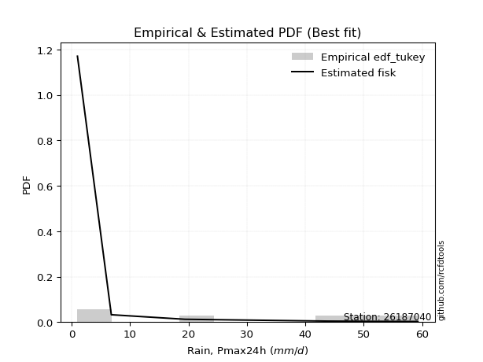</img>

</div>


### 8. EDF Gringorten (1963)

Gringorten plotting position formula is essential for estimating the probability and return periods of extreme events like floods and heavy rainfall. The constant _a=0.44_.

<div align="center">


$P=(m-a)/(n+1-2a)$


</div>


**8.1. Empirical values**

<div align="center">

|                | 0                   | 1                  | 2                   | 3                  | 4                  | 5                  |
|:---------------|:--------------------|:-------------------|:--------------------|:-------------------|:-------------------|:-------------------|
| date           | 2022                | 2020               | 2021                | 2018               | 2017               | 2019               |
| x              | 1.0                 | 6.8                | 19.4                | 43.8               | 51.2               | 59.3               |
| m              | 1                   | 2                  | 3                   | 4                  | 5                  | 6                  |
| empirical_dist | edf_gringorten      | edf_gringorten     | edf_gringorten      | edf_gringorten     | edf_gringorten     | edf_gringorten     |
| empirical      | 0.09150326797385622 | 0.2549019607843137 | 0.41830065359477125 | 0.5816993464052288 | 0.7450980392156862 | 0.9084967320261437 |
| empirical_tr   | 1.1007194244604317  | 1.3421052631578947 | 1.7191011235955058  | 2.3906250000000004 | 3.9230769230769216 | 10.928571428571415 |

</div>


**8.2. Kolmogorov-Smirnov fit test (sorted by Δ)**


<div align="center">

|                | 0                   | 1                  | 2                   | 3                   | 4                   | 5                  | 6                  | 7                  | 8                   | 9                   | 10                  | 11                  | 12                  | 13                  | 14                  | 15                 | 16                  | 17                  | 18                  | 19                  | 20                 | 21                  | 22                  | 23                 | 24                  | 25                  | 26                 | 27                 | 28                  | 29                 | 30                 | 31                 | 32                  | 33                  | 34                  | 35                  | 36                  | 37                 | 38                 | 39                  | 40                  | 41                  | 42                  | 43                 | 44                | 45                  | 46                  | 47                  | 48                  | 49                  | 50                 | 51                 | 52                 | 53                  | 54                  | 55                  | 56                  | 57                 | 58                  | 59                  | 60                    | 61                 | 62                  | 63                  | 64                  | 65                 | 66                  | 67                  | 68                 | 69                  | 70                 | 71                 | 72                 | 73                  | 74                 | 75                  | 76                  | 77                  | 78                  | 79                  | 80                 | 81                  | 82                  | 83                 | 84                 | 85                 | 86                 | 87                 |
|:---------------|:--------------------|:-------------------|:--------------------|:--------------------|:--------------------|:-------------------|:-------------------|:-------------------|:--------------------|:--------------------|:--------------------|:--------------------|:--------------------|:--------------------|:--------------------|:-------------------|:--------------------|:--------------------|:--------------------|:--------------------|:-------------------|:--------------------|:--------------------|:-------------------|:--------------------|:--------------------|:-------------------|:-------------------|:--------------------|:-------------------|:-------------------|:-------------------|:--------------------|:--------------------|:--------------------|:--------------------|:--------------------|:-------------------|:-------------------|:--------------------|:--------------------|:--------------------|:--------------------|:-------------------|:------------------|:--------------------|:--------------------|:--------------------|:--------------------|:--------------------|:-------------------|:-------------------|:-------------------|:--------------------|:--------------------|:--------------------|:--------------------|:-------------------|:--------------------|:--------------------|:----------------------|:-------------------|:--------------------|:--------------------|:--------------------|:-------------------|:--------------------|:--------------------|:-------------------|:--------------------|:-------------------|:-------------------|:-------------------|:--------------------|:-------------------|:--------------------|:--------------------|:--------------------|:--------------------|:--------------------|:-------------------|:--------------------|:--------------------|:-------------------|:-------------------|:-------------------|:-------------------|:-------------------|
| station        | 26187040            | 26187040           | 26187040            | 26187040            | 26187040            | 26187040           | 26187040           | 26187040           | 26187040            | 26187040            | 26187040            | 26187040            | 26187040            | 26187040            | 26187040            | 26187040           | 26187040            | 26187040            | 26187040            | 26187040            | 26187040           | 26187040            | 26187040            | 26187040           | 26187040            | 26187040            | 26187040           | 26187040           | 26187040            | 26187040           | 26187040           | 26187040           | 26187040            | 26187040            | 26187040            | 26187040            | 26187040            | 26187040           | 26187040           | 26187040            | 26187040            | 26187040            | 26187040            | 26187040           | 26187040          | 26187040            | 26187040            | 26187040            | 26187040            | 26187040            | 26187040           | 26187040           | 26187040           | 26187040            | 26187040            | 26187040            | 26187040            | 26187040           | 26187040            | 26187040            | 26187040              | 26187040           | 26187040            | 26187040            | 26187040            | 26187040           | 26187040            | 26187040            | 26187040           | 26187040            | 26187040           | 26187040           | 26187040           | 26187040            | 26187040           | 26187040            | 26187040            | 26187040            | 26187040            | 26187040            | 26187040           | 26187040            | 26187040            | 26187040           | 26187040           | 26187040           | 26187040           | 26187040           |
| empirical_dist | edf_gringorten      | edf_gringorten     | edf_gringorten      | edf_gringorten      | edf_gringorten      | edf_gringorten     | edf_gringorten     | edf_gringorten     | edf_gringorten      | edf_gringorten      | edf_gringorten      | edf_gringorten      | edf_gringorten      | edf_gringorten      | edf_gringorten      | edf_gringorten     | edf_gringorten      | edf_gringorten      | edf_gringorten      | edf_gringorten      | edf_gringorten     | edf_gringorten      | edf_gringorten      | edf_gringorten     | edf_gringorten      | edf_gringorten      | edf_gringorten     | edf_gringorten     | edf_gringorten      | edf_gringorten     | edf_gringorten     | edf_gringorten     | edf_gringorten      | edf_gringorten      | edf_gringorten      | edf_gringorten      | edf_gringorten      | edf_gringorten     | edf_gringorten     | edf_gringorten      | edf_gringorten      | edf_gringorten      | edf_gringorten      | edf_gringorten     | edf_gringorten    | edf_gringorten      | edf_gringorten      | edf_gringorten      | edf_gringorten      | edf_gringorten      | edf_gringorten     | edf_gringorten     | edf_gringorten     | edf_gringorten      | edf_gringorten      | edf_gringorten      | edf_gringorten      | edf_gringorten     | edf_gringorten      | edf_gringorten      | edf_gringorten        | edf_gringorten     | edf_gringorten      | edf_gringorten      | edf_gringorten      | edf_gringorten     | edf_gringorten      | edf_gringorten      | edf_gringorten     | edf_gringorten      | edf_gringorten     | edf_gringorten     | edf_gringorten     | edf_gringorten      | edf_gringorten     | edf_gringorten      | edf_gringorten      | edf_gringorten      | edf_gringorten      | edf_gringorten      | edf_gringorten     | edf_gringorten      | edf_gringorten      | edf_gringorten     | edf_gringorten     | edf_gringorten     | edf_gringorten     | edf_gringorten     |
| p_dist         | fisk                | pearson3           | nakagami            | ncf                 | nct                 | norm               | crystalball        | exponnorm          | t                   | gamma               | erlang              | logfisk             | logpearson3         | johnsonsu           | rice                | gumbel_l           | maxwell             | invgamma            | loginvweibull       | gompertz            | loggumbel_l        | rayleigh            | logistic            | loginvgauss        | logerlang           | genlogistic         | loggamma           | loggamma           | logrice             | logcrystalball     | lognorm            | lognorm            | logt                | logexponnorm        | lognct              | alpha               | halfnorm            | logfatiguelife     | laplace_asymmetric | logalpha            | loginvgamma         | betaprime           | kstwobign           | logmaxwell         | logweibull_min    | hypsecant           | invgauss            | lograyleigh         | loggompertz         | expon               | gumbel_r           | logkstwobign       | loggenexpon        | loglogistic         | mielke              | halflogistic        | loghalfnorm         | fatiguelife        | moyal               | laplace             | loglaplace_asymmetric | logloggamma        | loghypsecant        | loggumbel_r         | logchi2             | f                  | weibull_min         | genexpon            | loghalflogistic    | logmoyal            | loglaplace         | logexpon           | wald               | gibrat              | logncf             | logf                | logwald             | loggibrat           | logbetaprime        | logtruncnorm        | loglognorm         | lognakagami         | logmielke           | invweibull         | logjohnsonsu       | chi2               | truncnorm          | loggenlogistic     |
| delta          | 0.13759561611264204 | 0.1448173295317594 | 0.14532959621061514 | 0.14557081256420712 | 0.14637783330836107 | 0.1463844963725779 | 0.1463845021964073 | 0.1463846941708491 | 0.14639794584569954 | 0.14771156002081798 | 0.14802022918845348 | 0.14982891619703476 | 0.15128835651906736 | 0.15697267573979157 | 0.15828471770308006 | 0.1583740095688661 | 0.15880413028578932 | 0.16022573455146372 | 0.16050129775472627 | 0.16172805341216778 | 0.1623820867336564 | 0.16238336011939614 | 0.16875314684257348 | 0.1691117744226287 | 0.16965737006364856 | 0.17179728611049894 | 0.1721984258391901 | 0.1721984258391901 | 0.17343099052236366 | 0.1736613012657513 | 0.1736613198784337 | 0.1736613198784337 | 0.17366465743028414 | 0.17366539066757758 | 0.17371701344193125 | 0.17376086681170788 | 0.17379853677758794 | 0.1748780867526668 | 0.1769169614456675 | 0.17695977288268494 | 0.17800119973214035 | 0.18126038932753585 | 0.18140054149846574 | 0.1825448527264647 | 0.183435234510825 | 0.18412488356026635 | 0.18476546376909753 | 0.18507664610993013 | 0.18662887448114718 | 0.18681742696593462 | 0.1910879029603283 | 0.1916603243116683 | 0.1940653641711046 | 0.19632040061246803 | 0.19754246284471366 | 0.19938625813770972 | 0.20019642936651033 | 0.2010045522876408 | 0.20547891882548686 | 0.20639506596479718 | 0.2102389917767966    | 0.2105850513685582 | 0.21107346112719239 | 0.21180266768593492 | 0.21186563119456825 | 0.2120581355397383 | 0.21817458309524862 | 0.22477504234220735 | 0.2275137055316951 | 0.22753857997051657 | 0.2302444551207179 | 0.2432877475976173 | 0.2549019607843137 | 0.27942862043906824 | 0.2850214640548612 | 0.29362796850198225 | 0.29636384823374534 | 0.32554741171730656 | 0.35350035767557697 | 0.39506609301737644 | 0.4170642013880459 | 0.42506437029996724 | 0.47633223576335226 | 0.4801951238176346 | 0.6021335232436806 | 0.6022626634770959 | 0.8067018900939483 | 0.9084967320261437 |
| deltao         | 0.530385761606      | 0.530385761606     | 0.530385761606      | 0.530385761606      | 0.530385761606      | 0.530385761606     | 0.530385761606     | 0.530385761606     | 0.530385761606      | 0.530385761606      | 0.530385761606      | 0.530385761606      | 0.530385761606      | 0.530385761606      | 0.530385761606      | 0.530385761606     | 0.530385761606      | 0.530385761606      | 0.530385761606      | 0.530385761606      | 0.530385761606     | 0.530385761606      | 0.530385761606      | 0.530385761606     | 0.530385761606      | 0.530385761606      | 0.530385761606     | 0.530385761606     | 0.530385761606      | 0.530385761606     | 0.530385761606     | 0.530385761606     | 0.530385761606      | 0.530385761606      | 0.530385761606      | 0.530385761606      | 0.530385761606      | 0.530385761606     | 0.530385761606     | 0.530385761606      | 0.530385761606      | 0.530385761606      | 0.530385761606      | 0.530385761606     | 0.530385761606    | 0.530385761606      | 0.530385761606      | 0.530385761606      | 0.530385761606      | 0.530385761606      | 0.530385761606     | 0.530385761606     | 0.530385761606     | 0.530385761606      | 0.530385761606      | 0.530385761606      | 0.530385761606      | 0.530385761606     | 0.530385761606      | 0.530385761606      | 0.530385761606        | 0.530385761606     | 0.530385761606      | 0.530385761606      | 0.530385761606      | 0.530385761606     | 0.530385761606      | 0.530385761606      | 0.530385761606     | 0.530385761606      | 0.530385761606     | 0.530385761606     | 0.530385761606     | 0.530385761606      | 0.530385761606     | 0.530385761606      | 0.530385761606      | 0.530385761606      | 0.530385761606      | 0.530385761606      | 0.530385761606     | 0.530385761606      | 0.530385761606      | 0.530385761606     | 0.530385761606     | 0.530385761606     | 0.530385761606     | 0.530385761606     |
| eval           | Δo > Δ              | Δo > Δ             | Δo > Δ              | Δo > Δ              | Δo > Δ              | Δo > Δ             | Δo > Δ             | Δo > Δ             | Δo > Δ              | Δo > Δ              | Δo > Δ              | Δo > Δ              | Δo > Δ              | Δo > Δ              | Δo > Δ              | Δo > Δ             | Δo > Δ              | Δo > Δ              | Δo > Δ              | Δo > Δ              | Δo > Δ             | Δo > Δ              | Δo > Δ              | Δo > Δ             | Δo > Δ              | Δo > Δ              | Δo > Δ             | Δo > Δ             | Δo > Δ              | Δo > Δ             | Δo > Δ             | Δo > Δ             | Δo > Δ              | Δo > Δ              | Δo > Δ              | Δo > Δ              | Δo > Δ              | Δo > Δ             | Δo > Δ             | Δo > Δ              | Δo > Δ              | Δo > Δ              | Δo > Δ              | Δo > Δ             | Δo > Δ            | Δo > Δ              | Δo > Δ              | Δo > Δ              | Δo > Δ              | Δo > Δ              | Δo > Δ             | Δo > Δ             | Δo > Δ             | Δo > Δ              | Δo > Δ              | Δo > Δ              | Δo > Δ              | Δo > Δ             | Δo > Δ              | Δo > Δ              | Δo > Δ                | Δo > Δ             | Δo > Δ              | Δo > Δ              | Δo > Δ              | Δo > Δ             | Δo > Δ              | Δo > Δ              | Δo > Δ             | Δo > Δ              | Δo > Δ             | Δo > Δ             | Δo > Δ             | Δo > Δ              | Δo > Δ             | Δo > Δ              | Δo > Δ              | Δo > Δ              | Δo > Δ              | Δo > Δ              | Δo > Δ             | Δo > Δ              | Δo > Δ              | Δo > Δ             | Δo <= Δ            | Δo <= Δ            | Δo <= Δ            | Δo <= Δ            |
| fit            | 1                   | 1                  | 1                   | 1                   | 1                   | 1                  | 1                  | 1                  | 1                   | 1                   | 1                   | 1                   | 1                   | 1                   | 1                   | 1                  | 1                   | 1                   | 1                   | 1                   | 1                  | 1                   | 1                   | 1                  | 1                   | 1                   | 1                  | 1                  | 1                   | 1                  | 1                  | 1                  | 1                   | 1                   | 1                   | 1                   | 1                   | 1                  | 1                  | 1                   | 1                   | 1                   | 1                   | 1                  | 1                 | 1                   | 1                   | 1                   | 1                   | 1                   | 1                  | 1                  | 1                  | 1                   | 1                   | 1                   | 1                   | 1                  | 1                   | 1                   | 1                     | 1                  | 1                   | 1                   | 1                   | 1                  | 1                   | 1                   | 1                  | 1                   | 1                  | 1                  | 1                  | 1                   | 1                  | 1                   | 1                   | 1                   | 1                   | 1                   | 1                  | 1                   | 1                   | 1                  | 0                  | 0                  | 0                  | 0                  |
| n              | 6                   | 6                  | 6                   | 6                   | 6                   | 6                  | 6                  | 6                  | 6                   | 6                   | 6                   | 6                   | 6                   | 6                   | 6                   | 6                  | 6                   | 6                   | 6                   | 6                   | 6                  | 6                   | 6                   | 6                  | 6                   | 6                   | 6                  | 6                  | 6                   | 6                  | 6                  | 6                  | 6                   | 6                   | 6                   | 6                   | 6                   | 6                  | 6                  | 6                   | 6                   | 6                   | 6                   | 6                  | 6                 | 6                   | 6                   | 6                   | 6                   | 6                   | 6                  | 6                  | 6                  | 6                   | 6                   | 6                   | 6                   | 6                  | 6                   | 6                   | 6                     | 6                  | 6                   | 6                   | 6                   | 6                  | 6                   | 6                   | 6                  | 6                   | 6                  | 6                  | 6                  | 6                   | 6                  | 6                   | 6                   | 6                   | 6                   | 6                   | 6                  | 6                   | 6                   | 6                  | 6                  | 6                  | 6                  | 6                  |
| best_fit       | 1                   | 0                  | 0                   | 0                   | 0                   | 0                  | 0                  | 0                  | 0                   | 0                   | 0                   | 0                   | 0                   | 0                   | 0                   | 0                  | 0                   | 0                   | 0                   | 0                   | 0                  | 0                   | 0                   | 0                  | 0                   | 0                   | 0                  | 0                  | 0                   | 0                  | 0                  | 0                  | 0                   | 0                   | 0                   | 0                   | 0                   | 0                  | 0                  | 0                   | 0                   | 0                   | 0                   | 0                  | 0                 | 0                   | 0                   | 0                   | 0                   | 0                   | 0                  | 0                  | 0                  | 0                   | 0                   | 0                   | 0                   | 0                  | 0                   | 0                   | 0                     | 0                  | 0                   | 0                   | 0                   | 0                  | 0                   | 0                   | 0                  | 0                   | 0                  | 0                  | 0                  | 0                   | 0                  | 0                   | 0                   | 0                   | 0                   | 0                   | 0                  | 0                   | 0                   | 0                  | 0                  | 0                  | 0                  | 0                  |
| best_fit_sort  | 1                   | 2                  | 3                   | 4                   | 5                   | 6                  | 7                  | 8                  | 9                   | 10                  | 11                  | 12                  | 13                  | 14                  | 15                  | 16                 | 17                  | 18                  | 19                  | 20                  | 21                 | 22                  | 23                  | 24                 | 25                  | 26                  | 27                 | 28                 | 29                  | 30                 | 31                 | 32                 | 33                  | 34                  | 35                  | 36                  | 37                  | 38                 | 39                 | 40                  | 41                  | 42                  | 43                  | 44                 | 45                | 46                  | 47                  | 48                  | 49                  | 50                  | 51                 | 52                 | 53                 | 54                  | 55                  | 56                  | 57                  | 58                 | 59                  | 60                  | 61                    | 62                 | 63                  | 64                  | 65                  | 66                 | 67                  | 68                  | 69                 | 70                  | 71                 | 72                 | 73                 | 74                  | 75                 | 76                  | 77                  | 78                  | 79                  | 80                  | 81                 | 82                  | 83                  | 84                 | 85                 | 86                 | 87                 | 88                 |

</div>


**8.3. Best fit**

<div align="center">

|   id |   station | empirical_dist   | p_dist   |    delta |   deltao | eval   |   fit |   n |   best_fit |   best_fit_sort |
|-----:|----------:|:-----------------|:---------|---------:|---------:|:-------|------:|----:|-----------:|----------------:|
|    0 |  26187040 | edf_gringorten   | fisk     | 0.137596 | 0.530386 | Δo > Δ |     1 |   6 |          1 |               1 |

</div>


<div align="center">

</img>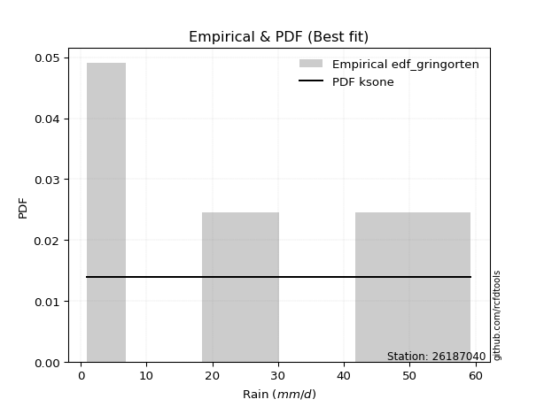</img>

</div>


### 9. EDF Filliben (1975)

The specific values of the constants (0.3175) (often denoted as $alpha$) and (0.365) are derived from a method proposed by James J. Filliben in a 1975 paper. This particular formula is the mean value of the $i$-th order statistic of the normal distribution and is considered a robust and effective plotting position formula for the normal probability plot correlation coefficient test for normality.

<div align="center">


$P=(m-0.3175)/(n+0.365)$


</div>


**9.1. Empirical values**

<div align="center">

|                | 0                   | 1                   | 2                  | 3                  | 4                  | 5                  |
|:---------------|:--------------------|:--------------------|:-------------------|:-------------------|:-------------------|:-------------------|
| date           | 2022                | 2020                | 2021               | 2018               | 2017               | 2019               |
| x              | 1.0                 | 6.8                 | 19.4               | 43.8               | 51.2               | 59.3               |
| m              | 1                   | 2                   | 3                  | 4                  | 5                  | 6                  |
| empirical_dist | edf_filliben        | edf_filliben        | edf_filliben       | edf_filliben       | edf_filliben       | edf_filliben       |
| empirical      | 0.10722702278083267 | 0.26433621366849963 | 0.4214454045561665 | 0.5785545954438335 | 0.7356637863315004 | 0.8927729772191673 |
| empirical_tr   | 1.1201055873295205  | 1.3593166043780034  | 1.7284453496266123 | 2.3727865796831313 | 3.783060921248143  | 9.326007326007321  |

</div>


**9.2. Kolmogorov-Smirnov fit test (sorted by Δ)**


<div align="center">

|                | 0                   | 1                   | 2                   | 3                   | 4                  | 5                   | 6                   | 7                   | 8                   | 9                  | 10                 | 11                  | 12                  | 13                | 14                  | 15                  | 16                  | 17                  | 18                  | 19                 | 20                  | 21                  | 22                 | 23                  | 24                 | 25                  | 26                  | 27                  | 28                  | 29                  | 30                  | 31                  | 32                  | 33                 | 34                  | 35                 | 36                  | 37                  | 38                 | 39                  | 40                  | 41                  | 42                  | 43                  | 44                  | 45                  | 46                  | 47                  | 48                  | 49                 | 50                  | 51                  | 52                  | 53                  | 54                  | 55                | 56                  | 57                 | 58                  | 59                  | 60                  | 61                 | 62                    | 63                  | 64                 | 65                  | 66                  | 67                  | 68                  | 69                  | 70                  | 71                  | 72                  | 73                  | 74                  | 75                 | 76                  | 77                 | 78                  | 79                  | 80               | 81                 | 82                  | 83                  | 84                 | 85               | 86                 | 87                 |
|:---------------|:--------------------|:--------------------|:--------------------|:--------------------|:-------------------|:--------------------|:--------------------|:--------------------|:--------------------|:-------------------|:-------------------|:--------------------|:--------------------|:------------------|:--------------------|:--------------------|:--------------------|:--------------------|:--------------------|:-------------------|:--------------------|:--------------------|:-------------------|:--------------------|:-------------------|:--------------------|:--------------------|:--------------------|:--------------------|:--------------------|:--------------------|:--------------------|:--------------------|:-------------------|:--------------------|:-------------------|:--------------------|:--------------------|:-------------------|:--------------------|:--------------------|:--------------------|:--------------------|:--------------------|:--------------------|:--------------------|:--------------------|:--------------------|:--------------------|:-------------------|:--------------------|:--------------------|:--------------------|:--------------------|:--------------------|:------------------|:--------------------|:-------------------|:--------------------|:--------------------|:--------------------|:-------------------|:----------------------|:--------------------|:-------------------|:--------------------|:--------------------|:--------------------|:--------------------|:--------------------|:--------------------|:--------------------|:--------------------|:--------------------|:--------------------|:-------------------|:--------------------|:-------------------|:--------------------|:--------------------|:-----------------|:-------------------|:--------------------|:--------------------|:-------------------|:-----------------|:-------------------|:-------------------|
| station        | 26187040            | 26187040            | 26187040            | 26187040            | 26187040           | 26187040            | 26187040            | 26187040            | 26187040            | 26187040           | 26187040           | 26187040            | 26187040            | 26187040          | 26187040            | 26187040            | 26187040            | 26187040            | 26187040            | 26187040           | 26187040            | 26187040            | 26187040           | 26187040            | 26187040           | 26187040            | 26187040            | 26187040            | 26187040            | 26187040            | 26187040            | 26187040            | 26187040            | 26187040           | 26187040            | 26187040           | 26187040            | 26187040            | 26187040           | 26187040            | 26187040            | 26187040            | 26187040            | 26187040            | 26187040            | 26187040            | 26187040            | 26187040            | 26187040            | 26187040           | 26187040            | 26187040            | 26187040            | 26187040            | 26187040            | 26187040          | 26187040            | 26187040           | 26187040            | 26187040            | 26187040            | 26187040           | 26187040              | 26187040            | 26187040           | 26187040            | 26187040            | 26187040            | 26187040            | 26187040            | 26187040            | 26187040            | 26187040            | 26187040            | 26187040            | 26187040           | 26187040            | 26187040           | 26187040            | 26187040            | 26187040         | 26187040           | 26187040            | 26187040            | 26187040           | 26187040         | 26187040           | 26187040           |
| empirical_dist | edf_filliben        | edf_filliben        | edf_filliben        | edf_filliben        | edf_filliben       | edf_filliben        | edf_filliben        | edf_filliben        | edf_filliben        | edf_filliben       | edf_filliben       | edf_filliben        | edf_filliben        | edf_filliben      | edf_filliben        | edf_filliben        | edf_filliben        | edf_filliben        | edf_filliben        | edf_filliben       | edf_filliben        | edf_filliben        | edf_filliben       | edf_filliben        | edf_filliben       | edf_filliben        | edf_filliben        | edf_filliben        | edf_filliben        | edf_filliben        | edf_filliben        | edf_filliben        | edf_filliben        | edf_filliben       | edf_filliben        | edf_filliben       | edf_filliben        | edf_filliben        | edf_filliben       | edf_filliben        | edf_filliben        | edf_filliben        | edf_filliben        | edf_filliben        | edf_filliben        | edf_filliben        | edf_filliben        | edf_filliben        | edf_filliben        | edf_filliben       | edf_filliben        | edf_filliben        | edf_filliben        | edf_filliben        | edf_filliben        | edf_filliben      | edf_filliben        | edf_filliben       | edf_filliben        | edf_filliben        | edf_filliben        | edf_filliben       | edf_filliben          | edf_filliben        | edf_filliben       | edf_filliben        | edf_filliben        | edf_filliben        | edf_filliben        | edf_filliben        | edf_filliben        | edf_filliben        | edf_filliben        | edf_filliben        | edf_filliben        | edf_filliben       | edf_filliben        | edf_filliben       | edf_filliben        | edf_filliben        | edf_filliben     | edf_filliben       | edf_filliben        | edf_filliben        | edf_filliben       | edf_filliben     | edf_filliben       | edf_filliben       |
| p_dist         | fisk                | pearson3            | nakagami            | ncf                 | nct                | norm                | crystalball         | exponnorm           | t                   | gamma              | erlang             | logfisk             | logpearson3         | loginvweibull     | johnsonsu           | rice                | gumbel_l            | maxwell             | invgamma            | gompertz           | loggumbel_l         | rayleigh            | logistic           | loginvgauss         | logerlang          | genlogistic         | loggamma            | loggamma            | logrice             | logcrystalball      | lognorm             | lognorm             | logt                | logexponnorm       | lognct              | alpha              | halfnorm            | logfatiguelife      | laplace_asymmetric | logalpha            | loginvgamma         | betaprime           | kstwobign           | logmaxwell          | logweibull_min      | hypsecant           | invgauss            | lograyleigh         | logkstwobign        | loggompertz        | expon               | loggenexpon         | gumbel_r            | loghalfnorm         | loglogistic         | mielke            | logchi2             | weibull_min        | halflogistic        | fatiguelife         | moyal               | laplace            | loglaplace_asymmetric | logloggamma         | loghypsecant       | loggumbel_r         | f                   | loghalflogistic     | logmoyal            | genexpon            | loglaplace          | logexpon            | wald                | logncf              | gibrat              | logf               | logwald             | loggibrat          | logbetaprime        | logtruncnorm        | loglognorm       | lognakagami        | invweibull          | logmielke           | logjohnsonsu       | chi2             | truncnorm          | loggenlogistic     |
| delta          | 0.13814539841137985 | 0.14796208049315474 | 0.14847434717201047 | 0.14871556352560245 | 0.1495225842697564 | 0.14952924733397321 | 0.14952925315780263 | 0.14952944513224442 | 0.14954269680709487 | 0.1508563109822133 | 0.1511649801498488 | 0.15297366715843008 | 0.15443310748046268 | 0.157356546793331 | 0.16011742670118684 | 0.16142946866447538 | 0.16151876053026137 | 0.16194888124718465 | 0.16337048551285904 | 0.1648728043735631 | 0.16552683769505172 | 0.16552811108079146 | 0.1718978978039688 | 0.17225652538402403 | 0.1728021210250439 | 0.17494203707189426 | 0.17534317680058542 | 0.17534317680058542 | 0.17657574148375899 | 0.17680605222714663 | 0.17680607083982902 | 0.17680607083982902 | 0.17680940839167947 | 0.1768101416289729 | 0.17686176440332657 | 0.1769056177731032 | 0.17694328773898327 | 0.17802283771406213 | 0.1800617124070628 | 0.18010452384408027 | 0.18114595069353567 | 0.18440514028893118 | 0.18454529245986107 | 0.18568960368786003 | 0.18657998547222032 | 0.18726963452166168 | 0.18791021473049285 | 0.18822139707132546 | 0.18851557335027302 | 0.1897736254425425 | 0.18996217792732994 | 0.19092061320970932 | 0.19423265392172362 | 0.19705167840511506 | 0.19946515157386335 | 0.200687213806109 | 0.20243137831038233 | 0.2024508282882722 | 0.20253100909910504 | 0.20414930324903613 | 0.20862366978688218 | 0.2095398169261925 | 0.21338374273819194   | 0.21372980232995353 | 0.2142182120885877 | 0.21494741864733025 | 0.21520288650113362 | 0.22436895457029982 | 0.22727475207683223 | 0.22791979330360268 | 0.23338920608211322 | 0.23438942283619546 | 0.26433621366849963 | 0.26929770924788476 | 0.28257337140046357 | 0.2841937156177963 | 0.29321909727235007 | 0.3224026607559113 | 0.34406610479139105 | 0.39192134205598117 | 0.40762994850386 | 0.4156301174157813 | 0.46447136901065816 | 0.46689798287916634 | 0.5926992703594949 | 0.59282841059291 | 0.7909781352869719 | 0.8927729772191673 |
| deltao         | 0.530385761606      | 0.530385761606      | 0.530385761606      | 0.530385761606      | 0.530385761606     | 0.530385761606      | 0.530385761606      | 0.530385761606      | 0.530385761606      | 0.530385761606     | 0.530385761606     | 0.530385761606      | 0.530385761606      | 0.530385761606    | 0.530385761606      | 0.530385761606      | 0.530385761606      | 0.530385761606      | 0.530385761606      | 0.530385761606     | 0.530385761606      | 0.530385761606      | 0.530385761606     | 0.530385761606      | 0.530385761606     | 0.530385761606      | 0.530385761606      | 0.530385761606      | 0.530385761606      | 0.530385761606      | 0.530385761606      | 0.530385761606      | 0.530385761606      | 0.530385761606     | 0.530385761606      | 0.530385761606     | 0.530385761606      | 0.530385761606      | 0.530385761606     | 0.530385761606      | 0.530385761606      | 0.530385761606      | 0.530385761606      | 0.530385761606      | 0.530385761606      | 0.530385761606      | 0.530385761606      | 0.530385761606      | 0.530385761606      | 0.530385761606     | 0.530385761606      | 0.530385761606      | 0.530385761606      | 0.530385761606      | 0.530385761606      | 0.530385761606    | 0.530385761606      | 0.530385761606     | 0.530385761606      | 0.530385761606      | 0.530385761606      | 0.530385761606     | 0.530385761606        | 0.530385761606      | 0.530385761606     | 0.530385761606      | 0.530385761606      | 0.530385761606      | 0.530385761606      | 0.530385761606      | 0.530385761606      | 0.530385761606      | 0.530385761606      | 0.530385761606      | 0.530385761606      | 0.530385761606     | 0.530385761606      | 0.530385761606     | 0.530385761606      | 0.530385761606      | 0.530385761606   | 0.530385761606     | 0.530385761606      | 0.530385761606      | 0.530385761606     | 0.530385761606   | 0.530385761606     | 0.530385761606     |
| eval           | Δo > Δ              | Δo > Δ              | Δo > Δ              | Δo > Δ              | Δo > Δ             | Δo > Δ              | Δo > Δ              | Δo > Δ              | Δo > Δ              | Δo > Δ             | Δo > Δ             | Δo > Δ              | Δo > Δ              | Δo > Δ            | Δo > Δ              | Δo > Δ              | Δo > Δ              | Δo > Δ              | Δo > Δ              | Δo > Δ             | Δo > Δ              | Δo > Δ              | Δo > Δ             | Δo > Δ              | Δo > Δ             | Δo > Δ              | Δo > Δ              | Δo > Δ              | Δo > Δ              | Δo > Δ              | Δo > Δ              | Δo > Δ              | Δo > Δ              | Δo > Δ             | Δo > Δ              | Δo > Δ             | Δo > Δ              | Δo > Δ              | Δo > Δ             | Δo > Δ              | Δo > Δ              | Δo > Δ              | Δo > Δ              | Δo > Δ              | Δo > Δ              | Δo > Δ              | Δo > Δ              | Δo > Δ              | Δo > Δ              | Δo > Δ             | Δo > Δ              | Δo > Δ              | Δo > Δ              | Δo > Δ              | Δo > Δ              | Δo > Δ            | Δo > Δ              | Δo > Δ             | Δo > Δ              | Δo > Δ              | Δo > Δ              | Δo > Δ             | Δo > Δ                | Δo > Δ              | Δo > Δ             | Δo > Δ              | Δo > Δ              | Δo > Δ              | Δo > Δ              | Δo > Δ              | Δo > Δ              | Δo > Δ              | Δo > Δ              | Δo > Δ              | Δo > Δ              | Δo > Δ             | Δo > Δ              | Δo > Δ             | Δo > Δ              | Δo > Δ              | Δo > Δ           | Δo > Δ             | Δo > Δ              | Δo > Δ              | Δo <= Δ            | Δo <= Δ          | Δo <= Δ            | Δo <= Δ            |
| fit            | 1                   | 1                   | 1                   | 1                   | 1                  | 1                   | 1                   | 1                   | 1                   | 1                  | 1                  | 1                   | 1                   | 1                 | 1                   | 1                   | 1                   | 1                   | 1                   | 1                  | 1                   | 1                   | 1                  | 1                   | 1                  | 1                   | 1                   | 1                   | 1                   | 1                   | 1                   | 1                   | 1                   | 1                  | 1                   | 1                  | 1                   | 1                   | 1                  | 1                   | 1                   | 1                   | 1                   | 1                   | 1                   | 1                   | 1                   | 1                   | 1                   | 1                  | 1                   | 1                   | 1                   | 1                   | 1                   | 1                 | 1                   | 1                  | 1                   | 1                   | 1                   | 1                  | 1                     | 1                   | 1                  | 1                   | 1                   | 1                   | 1                   | 1                   | 1                   | 1                   | 1                   | 1                   | 1                   | 1                  | 1                   | 1                  | 1                   | 1                   | 1                | 1                  | 1                   | 1                   | 0                  | 0                | 0                  | 0                  |
| n              | 6                   | 6                   | 6                   | 6                   | 6                  | 6                   | 6                   | 6                   | 6                   | 6                  | 6                  | 6                   | 6                   | 6                 | 6                   | 6                   | 6                   | 6                   | 6                   | 6                  | 6                   | 6                   | 6                  | 6                   | 6                  | 6                   | 6                   | 6                   | 6                   | 6                   | 6                   | 6                   | 6                   | 6                  | 6                   | 6                  | 6                   | 6                   | 6                  | 6                   | 6                   | 6                   | 6                   | 6                   | 6                   | 6                   | 6                   | 6                   | 6                   | 6                  | 6                   | 6                   | 6                   | 6                   | 6                   | 6                 | 6                   | 6                  | 6                   | 6                   | 6                   | 6                  | 6                     | 6                   | 6                  | 6                   | 6                   | 6                   | 6                   | 6                   | 6                   | 6                   | 6                   | 6                   | 6                   | 6                  | 6                   | 6                  | 6                   | 6                   | 6                | 6                  | 6                   | 6                   | 6                  | 6                | 6                  | 6                  |
| best_fit       | 1                   | 0                   | 0                   | 0                   | 0                  | 0                   | 0                   | 0                   | 0                   | 0                  | 0                  | 0                   | 0                   | 0                 | 0                   | 0                   | 0                   | 0                   | 0                   | 0                  | 0                   | 0                   | 0                  | 0                   | 0                  | 0                   | 0                   | 0                   | 0                   | 0                   | 0                   | 0                   | 0                   | 0                  | 0                   | 0                  | 0                   | 0                   | 0                  | 0                   | 0                   | 0                   | 0                   | 0                   | 0                   | 0                   | 0                   | 0                   | 0                   | 0                  | 0                   | 0                   | 0                   | 0                   | 0                   | 0                 | 0                   | 0                  | 0                   | 0                   | 0                   | 0                  | 0                     | 0                   | 0                  | 0                   | 0                   | 0                   | 0                   | 0                   | 0                   | 0                   | 0                   | 0                   | 0                   | 0                  | 0                   | 0                  | 0                   | 0                   | 0                | 0                  | 0                   | 0                   | 0                  | 0                | 0                  | 0                  |
| best_fit_sort  | 1                   | 2                   | 3                   | 4                   | 5                  | 6                   | 7                   | 8                   | 9                   | 10                 | 11                 | 12                  | 13                  | 14                | 15                  | 16                  | 17                  | 18                  | 19                  | 20                 | 21                  | 22                  | 23                 | 24                  | 25                 | 26                  | 27                  | 28                  | 29                  | 30                  | 31                  | 32                  | 33                  | 34                 | 35                  | 36                 | 37                  | 38                  | 39                 | 40                  | 41                  | 42                  | 43                  | 44                  | 45                  | 46                  | 47                  | 48                  | 49                  | 50                 | 51                  | 52                  | 53                  | 54                  | 55                  | 56                | 57                  | 58                 | 59                  | 60                  | 61                  | 62                 | 63                    | 64                  | 65                 | 66                  | 67                  | 68                  | 69                  | 70                  | 71                  | 72                  | 73                  | 74                  | 75                  | 76                 | 77                  | 78                 | 79                  | 80                  | 81               | 82                 | 83                  | 84                  | 85                 | 86               | 87                 | 88                 |

</div>


**9.3. Best fit**

<div align="center">

|   id |   station | empirical_dist   | p_dist   |    delta |   deltao | eval   |   fit |   n |   best_fit |   best_fit_sort |
|-----:|----------:|:-----------------|:---------|---------:|---------:|:-------|------:|----:|-----------:|----------------:|
|    0 |  26187040 | edf_filliben     | fisk     | 0.138145 | 0.530386 | Δo > Δ |     1 |   6 |          1 |               1 |

</div>


<div align="center">

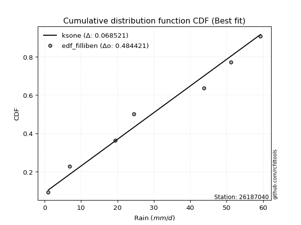</img></img>

</div>


### 10. EDF Jenkinson (1977)

The Jenkinson formula in hydrology is an empirical plotting position formula used to estimate the non-exceedance probability _(P)_ or return period _(T)_ of a given ordered observation within a sample. It is a widely used method in the frequency analysis of extreme events such as floods and rainfall, as it provides a distribution-free way to plot data. _a≈0.31_ and _b≈0.38_ are constants derived to approximate the median of the probability distribution for the given rank.

<div align="center">


$P=(m-a)/(n+b)$


</div>


**10.1. Empirical values**

<div align="center">

|                | 0                   | 1                   | 2                  | 3                  | 4                  | 5                  |
|:---------------|:--------------------|:--------------------|:-------------------|:-------------------|:-------------------|:-------------------|
| date           | 2022                | 2020                | 2021               | 2018               | 2017               | 2019               |
| x              | 1.0                 | 6.8                 | 19.4               | 43.8               | 51.2               | 59.3               |
| m              | 1                   | 2                   | 3                  | 4                  | 5                  | 6                  |
| empirical_dist | edf_jenkinson       | edf_jenkinson       | edf_jenkinson      | edf_jenkinson      | edf_jenkinson      | edf_jenkinson      |
| empirical      | 0.10815047021943573 | 0.26489028213166144 | 0.4216300940438871 | 0.5783699059561128 | 0.7351097178683387 | 0.8918495297805643 |
| empirical_tr   | 1.1212653778558874  | 1.3603411513859276  | 1.7289972899728996 | 2.3717472118959106 | 3.7751479289940844 | 9.246376811594207  |

</div>


**10.2. Kolmogorov-Smirnov fit test (sorted by Δ)**


<div align="center">

|                | 0                  | 1                  | 2                   | 3                  | 4                   | 5                   | 6                  | 7                   | 8                   | 9                   | 10                  | 11                  | 12                  | 13                 | 14                  | 15                  | 16                  | 17                 | 18                 | 19                  | 20                  | 21                  | 22                  | 23                  | 24                  | 25                  | 26                  | 27                  | 28                  | 29                  | 30                  | 31                  | 32                  | 33                  | 34                  | 35                  | 36                  | 37                 | 38                  | 39                  | 40                  | 41                  | 42                  | 43                  | 44                  | 45                  | 46                 | 47                  | 48                  | 49                  | 50                 | 51                  | 52                  | 53                  | 54                | 55                  | 56                  | 57                  | 58                 | 59                 | 60                  | 61                  | 62                    | 63                 | 64                  | 65                 | 66                  | 67                  | 68                 | 69                  | 70                  | 71                  | 72                  | 73                 | 74                 | 75                 | 76                  | 77                 | 78                  | 79                  | 80                  | 81                 | 82                 | 83                  | 84                 | 85                 | 86                 | 87                 |
|:---------------|:-------------------|:-------------------|:--------------------|:-------------------|:--------------------|:--------------------|:-------------------|:--------------------|:--------------------|:--------------------|:--------------------|:--------------------|:--------------------|:-------------------|:--------------------|:--------------------|:--------------------|:-------------------|:-------------------|:--------------------|:--------------------|:--------------------|:--------------------|:--------------------|:--------------------|:--------------------|:--------------------|:--------------------|:--------------------|:--------------------|:--------------------|:--------------------|:--------------------|:--------------------|:--------------------|:--------------------|:--------------------|:-------------------|:--------------------|:--------------------|:--------------------|:--------------------|:--------------------|:--------------------|:--------------------|:--------------------|:-------------------|:--------------------|:--------------------|:--------------------|:-------------------|:--------------------|:--------------------|:--------------------|:------------------|:--------------------|:--------------------|:--------------------|:-------------------|:-------------------|:--------------------|:--------------------|:----------------------|:-------------------|:--------------------|:-------------------|:--------------------|:--------------------|:-------------------|:--------------------|:--------------------|:--------------------|:--------------------|:-------------------|:-------------------|:-------------------|:--------------------|:-------------------|:--------------------|:--------------------|:--------------------|:-------------------|:-------------------|:--------------------|:-------------------|:-------------------|:-------------------|:-------------------|
| station        | 26187040           | 26187040           | 26187040            | 26187040           | 26187040            | 26187040            | 26187040           | 26187040            | 26187040            | 26187040            | 26187040            | 26187040            | 26187040            | 26187040           | 26187040            | 26187040            | 26187040            | 26187040           | 26187040           | 26187040            | 26187040            | 26187040            | 26187040            | 26187040            | 26187040            | 26187040            | 26187040            | 26187040            | 26187040            | 26187040            | 26187040            | 26187040            | 26187040            | 26187040            | 26187040            | 26187040            | 26187040            | 26187040           | 26187040            | 26187040            | 26187040            | 26187040            | 26187040            | 26187040            | 26187040            | 26187040            | 26187040           | 26187040            | 26187040            | 26187040            | 26187040           | 26187040            | 26187040            | 26187040            | 26187040          | 26187040            | 26187040            | 26187040            | 26187040           | 26187040           | 26187040            | 26187040            | 26187040              | 26187040           | 26187040            | 26187040           | 26187040            | 26187040            | 26187040           | 26187040            | 26187040            | 26187040            | 26187040            | 26187040           | 26187040           | 26187040           | 26187040            | 26187040           | 26187040            | 26187040            | 26187040            | 26187040           | 26187040           | 26187040            | 26187040           | 26187040           | 26187040           | 26187040           |
| empirical_dist | edf_jenkinson      | edf_jenkinson      | edf_jenkinson       | edf_jenkinson      | edf_jenkinson       | edf_jenkinson       | edf_jenkinson      | edf_jenkinson       | edf_jenkinson       | edf_jenkinson       | edf_jenkinson       | edf_jenkinson       | edf_jenkinson       | edf_jenkinson      | edf_jenkinson       | edf_jenkinson       | edf_jenkinson       | edf_jenkinson      | edf_jenkinson      | edf_jenkinson       | edf_jenkinson       | edf_jenkinson       | edf_jenkinson       | edf_jenkinson       | edf_jenkinson       | edf_jenkinson       | edf_jenkinson       | edf_jenkinson       | edf_jenkinson       | edf_jenkinson       | edf_jenkinson       | edf_jenkinson       | edf_jenkinson       | edf_jenkinson       | edf_jenkinson       | edf_jenkinson       | edf_jenkinson       | edf_jenkinson      | edf_jenkinson       | edf_jenkinson       | edf_jenkinson       | edf_jenkinson       | edf_jenkinson       | edf_jenkinson       | edf_jenkinson       | edf_jenkinson       | edf_jenkinson      | edf_jenkinson       | edf_jenkinson       | edf_jenkinson       | edf_jenkinson      | edf_jenkinson       | edf_jenkinson       | edf_jenkinson       | edf_jenkinson     | edf_jenkinson       | edf_jenkinson       | edf_jenkinson       | edf_jenkinson      | edf_jenkinson      | edf_jenkinson       | edf_jenkinson       | edf_jenkinson         | edf_jenkinson      | edf_jenkinson       | edf_jenkinson      | edf_jenkinson       | edf_jenkinson       | edf_jenkinson      | edf_jenkinson       | edf_jenkinson       | edf_jenkinson       | edf_jenkinson       | edf_jenkinson      | edf_jenkinson      | edf_jenkinson      | edf_jenkinson       | edf_jenkinson      | edf_jenkinson       | edf_jenkinson       | edf_jenkinson       | edf_jenkinson      | edf_jenkinson      | edf_jenkinson       | edf_jenkinson      | edf_jenkinson      | edf_jenkinson      | edf_jenkinson      |
| p_dist         | fisk               | pearson3           | nakagami            | ncf                | nct                 | norm                | crystalball        | exponnorm           | t                   | gamma               | erlang              | logfisk             | logpearson3         | loginvweibull      | johnsonsu           | rice                | gumbel_l            | maxwell            | invgamma           | gompertz            | loggumbel_l         | rayleigh            | logistic            | loginvgauss         | logerlang           | genlogistic         | loggamma            | loggamma            | logrice             | logcrystalball      | lognorm             | lognorm             | logt                | logexponnorm        | lognct              | alpha               | halfnorm            | logfatiguelife     | laplace_asymmetric  | logalpha            | loginvgamma         | betaprime           | kstwobign           | logmaxwell          | logweibull_min      | hypsecant           | invgauss           | logkstwobign        | lograyleigh         | loggompertz         | expon              | loggenexpon         | gumbel_r            | loghalfnorm         | loglogistic       | mielke              | weibull_min         | logchi2             | halflogistic       | fatiguelife        | moyal               | laplace             | loglaplace_asymmetric | logloggamma        | loghypsecant        | loggumbel_r        | f                   | loghalflogistic     | logmoyal           | genexpon            | loglaplace          | logexpon            | wald                | logncf             | gibrat             | logf               | logwald             | loggibrat          | logbetaprime        | logtruncnorm        | loglognorm          | lognakagami        | invweibull         | logmielke           | logjohnsonsu       | chi2               | truncnorm          | loggenlogistic     |
| delta          | 0.1383300878991005 | 0.1481467699808754 | 0.14865903665973113 | 0.1489002530133231 | 0.14970727375747706 | 0.14971393682169387 | 0.1497139426455233 | 0.14971413461996508 | 0.14972738629481552 | 0.15104100046993396 | 0.15134966963756946 | 0.15315835664615074 | 0.15461779696818334 | 0.1571718573056104 | 0.16030211618890744 | 0.16161415815219604 | 0.16170345001798198 | 0.1621335707349053 | 0.1635551750005797 | 0.16505749386128377 | 0.16571152718277238 | 0.16571280056851212 | 0.17208258729168946 | 0.17244121487174469 | 0.17298681051276454 | 0.17512672655961492 | 0.17552786628830608 | 0.17552786628830608 | 0.17676043097147964 | 0.17699074171486728 | 0.17699076032754968 | 0.17699076032754968 | 0.17699409787940013 | 0.17699483111669356 | 0.17704645389104723 | 0.17709030726082386 | 0.17712797722670393 | 0.1782075272017828 | 0.18024640189478347 | 0.18028921333180092 | 0.18133064018125633 | 0.18458982977665184 | 0.18472998194758172 | 0.18587429317558068 | 0.18676467495994098 | 0.18745432400938233 | 0.1880949042182135 | 0.18833088386255242 | 0.18840608655904612 | 0.18995831493026316 | 0.1901468674150506 | 0.19073592372198872 | 0.19441734340944428 | 0.19714957173915681 | 0.199649841061584 | 0.20087190329382965 | 0.20152738084966926 | 0.20187730984722052 | 0.2027156985868257 | 0.2043339927367568 | 0.20880835927460284 | 0.20972450641391316 | 0.2135684322259126    | 0.2139144918176742 | 0.21440290157630837 | 0.2151321081350509 | 0.21538757598885427 | 0.22418426508257921 | 0.2274594415645529 | 0.22810448279132334 | 0.23357389556983388 | 0.23420473334847486 | 0.26489028213166144 | 0.2683742618092818 | 0.2827580608881842 | 0.2836396471546345 | 0.29303440778462947 | 0.3222179712681907 | 0.34351203632822924 | 0.39173665256826057 | 0.40707588004069817 | 0.4150760489526195 | 0.4635479215720552 | 0.46634391441600453 | 0.5921452018963331 | 0.5922743421297482 | 0.7900546878483689 | 0.8918495297805643 |
| deltao         | 0.530385761606     | 0.530385761606     | 0.530385761606      | 0.530385761606     | 0.530385761606      | 0.530385761606      | 0.530385761606     | 0.530385761606      | 0.530385761606      | 0.530385761606      | 0.530385761606      | 0.530385761606      | 0.530385761606      | 0.530385761606     | 0.530385761606      | 0.530385761606      | 0.530385761606      | 0.530385761606     | 0.530385761606     | 0.530385761606      | 0.530385761606      | 0.530385761606      | 0.530385761606      | 0.530385761606      | 0.530385761606      | 0.530385761606      | 0.530385761606      | 0.530385761606      | 0.530385761606      | 0.530385761606      | 0.530385761606      | 0.530385761606      | 0.530385761606      | 0.530385761606      | 0.530385761606      | 0.530385761606      | 0.530385761606      | 0.530385761606     | 0.530385761606      | 0.530385761606      | 0.530385761606      | 0.530385761606      | 0.530385761606      | 0.530385761606      | 0.530385761606      | 0.530385761606      | 0.530385761606     | 0.530385761606      | 0.530385761606      | 0.530385761606      | 0.530385761606     | 0.530385761606      | 0.530385761606      | 0.530385761606      | 0.530385761606    | 0.530385761606      | 0.530385761606      | 0.530385761606      | 0.530385761606     | 0.530385761606     | 0.530385761606      | 0.530385761606      | 0.530385761606        | 0.530385761606     | 0.530385761606      | 0.530385761606     | 0.530385761606      | 0.530385761606      | 0.530385761606     | 0.530385761606      | 0.530385761606      | 0.530385761606      | 0.530385761606      | 0.530385761606     | 0.530385761606     | 0.530385761606     | 0.530385761606      | 0.530385761606     | 0.530385761606      | 0.530385761606      | 0.530385761606      | 0.530385761606     | 0.530385761606     | 0.530385761606      | 0.530385761606     | 0.530385761606     | 0.530385761606     | 0.530385761606     |
| eval           | Δo > Δ             | Δo > Δ             | Δo > Δ              | Δo > Δ             | Δo > Δ              | Δo > Δ              | Δo > Δ             | Δo > Δ              | Δo > Δ              | Δo > Δ              | Δo > Δ              | Δo > Δ              | Δo > Δ              | Δo > Δ             | Δo > Δ              | Δo > Δ              | Δo > Δ              | Δo > Δ             | Δo > Δ             | Δo > Δ              | Δo > Δ              | Δo > Δ              | Δo > Δ              | Δo > Δ              | Δo > Δ              | Δo > Δ              | Δo > Δ              | Δo > Δ              | Δo > Δ              | Δo > Δ              | Δo > Δ              | Δo > Δ              | Δo > Δ              | Δo > Δ              | Δo > Δ              | Δo > Δ              | Δo > Δ              | Δo > Δ             | Δo > Δ              | Δo > Δ              | Δo > Δ              | Δo > Δ              | Δo > Δ              | Δo > Δ              | Δo > Δ              | Δo > Δ              | Δo > Δ             | Δo > Δ              | Δo > Δ              | Δo > Δ              | Δo > Δ             | Δo > Δ              | Δo > Δ              | Δo > Δ              | Δo > Δ            | Δo > Δ              | Δo > Δ              | Δo > Δ              | Δo > Δ             | Δo > Δ             | Δo > Δ              | Δo > Δ              | Δo > Δ                | Δo > Δ             | Δo > Δ              | Δo > Δ             | Δo > Δ              | Δo > Δ              | Δo > Δ             | Δo > Δ              | Δo > Δ              | Δo > Δ              | Δo > Δ              | Δo > Δ             | Δo > Δ             | Δo > Δ             | Δo > Δ              | Δo > Δ             | Δo > Δ              | Δo > Δ              | Δo > Δ              | Δo > Δ             | Δo > Δ             | Δo > Δ              | Δo <= Δ            | Δo <= Δ            | Δo <= Δ            | Δo <= Δ            |
| fit            | 1                  | 1                  | 1                   | 1                  | 1                   | 1                   | 1                  | 1                   | 1                   | 1                   | 1                   | 1                   | 1                   | 1                  | 1                   | 1                   | 1                   | 1                  | 1                  | 1                   | 1                   | 1                   | 1                   | 1                   | 1                   | 1                   | 1                   | 1                   | 1                   | 1                   | 1                   | 1                   | 1                   | 1                   | 1                   | 1                   | 1                   | 1                  | 1                   | 1                   | 1                   | 1                   | 1                   | 1                   | 1                   | 1                   | 1                  | 1                   | 1                   | 1                   | 1                  | 1                   | 1                   | 1                   | 1                 | 1                   | 1                   | 1                   | 1                  | 1                  | 1                   | 1                   | 1                     | 1                  | 1                   | 1                  | 1                   | 1                   | 1                  | 1                   | 1                   | 1                   | 1                   | 1                  | 1                  | 1                  | 1                   | 1                  | 1                   | 1                   | 1                   | 1                  | 1                  | 1                   | 0                  | 0                  | 0                  | 0                  |
| n              | 6                  | 6                  | 6                   | 6                  | 6                   | 6                   | 6                  | 6                   | 6                   | 6                   | 6                   | 6                   | 6                   | 6                  | 6                   | 6                   | 6                   | 6                  | 6                  | 6                   | 6                   | 6                   | 6                   | 6                   | 6                   | 6                   | 6                   | 6                   | 6                   | 6                   | 6                   | 6                   | 6                   | 6                   | 6                   | 6                   | 6                   | 6                  | 6                   | 6                   | 6                   | 6                   | 6                   | 6                   | 6                   | 6                   | 6                  | 6                   | 6                   | 6                   | 6                  | 6                   | 6                   | 6                   | 6                 | 6                   | 6                   | 6                   | 6                  | 6                  | 6                   | 6                   | 6                     | 6                  | 6                   | 6                  | 6                   | 6                   | 6                  | 6                   | 6                   | 6                   | 6                   | 6                  | 6                  | 6                  | 6                   | 6                  | 6                   | 6                   | 6                   | 6                  | 6                  | 6                   | 6                  | 6                  | 6                  | 6                  |
| best_fit       | 1                  | 0                  | 0                   | 0                  | 0                   | 0                   | 0                  | 0                   | 0                   | 0                   | 0                   | 0                   | 0                   | 0                  | 0                   | 0                   | 0                   | 0                  | 0                  | 0                   | 0                   | 0                   | 0                   | 0                   | 0                   | 0                   | 0                   | 0                   | 0                   | 0                   | 0                   | 0                   | 0                   | 0                   | 0                   | 0                   | 0                   | 0                  | 0                   | 0                   | 0                   | 0                   | 0                   | 0                   | 0                   | 0                   | 0                  | 0                   | 0                   | 0                   | 0                  | 0                   | 0                   | 0                   | 0                 | 0                   | 0                   | 0                   | 0                  | 0                  | 0                   | 0                   | 0                     | 0                  | 0                   | 0                  | 0                   | 0                   | 0                  | 0                   | 0                   | 0                   | 0                   | 0                  | 0                  | 0                  | 0                   | 0                  | 0                   | 0                   | 0                   | 0                  | 0                  | 0                   | 0                  | 0                  | 0                  | 0                  |
| best_fit_sort  | 1                  | 2                  | 3                   | 4                  | 5                   | 6                   | 7                  | 8                   | 9                   | 10                  | 11                  | 12                  | 13                  | 14                 | 15                  | 16                  | 17                  | 18                 | 19                 | 20                  | 21                  | 22                  | 23                  | 24                  | 25                  | 26                  | 27                  | 28                  | 29                  | 30                  | 31                  | 32                  | 33                  | 34                  | 35                  | 36                  | 37                  | 38                 | 39                  | 40                  | 41                  | 42                  | 43                  | 44                  | 45                  | 46                  | 47                 | 48                  | 49                  | 50                  | 51                 | 52                  | 53                  | 54                  | 55                | 56                  | 57                  | 58                  | 59                 | 60                 | 61                  | 62                  | 63                    | 64                 | 65                  | 66                 | 67                  | 68                  | 69                 | 70                  | 71                  | 72                  | 73                  | 74                 | 75                 | 76                 | 77                  | 78                 | 79                  | 80                  | 81                  | 82                 | 83                 | 84                  | 85                 | 86                 | 87                 | 88                 |

</div>


**10.3. Best fit**

<div align="center">

|   id |   station | empirical_dist   | p_dist   |   delta |   deltao | eval   |   fit |   n |   best_fit |   best_fit_sort |
|-----:|----------:|:-----------------|:---------|--------:|---------:|:-------|------:|----:|-----------:|----------------:|
|    0 |  26187040 | edf_jenkinson    | fisk     | 0.13833 | 0.530386 | Δo > Δ |     1 |   6 |          1 |               1 |

</div>


<div align="center">

</img>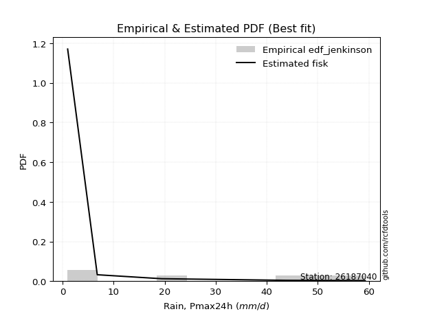</img>

</div>


### 11. EDF Cunnane (1978)

Cunnane´s work in statistical hydrology has focused on the performance and evaluation of different probability distributions (such as GEV, Gumbel, Lognormal) for flood frequency estimation. _b_ is a constant, typically set to 0.4.

<div align="center">


$P=(m-b)/(n+1-2b)$


</div>


**11.1. Empirical values**

<div align="center">

|                | 0                  | 1                   | 2                   | 3                  | 4                  | 5                  |
|:---------------|:-------------------|:--------------------|:--------------------|:-------------------|:-------------------|:-------------------|
| date           | 2022               | 2020                | 2021                | 2018               | 2017               | 2019               |
| x              | 1.0                | 6.8                 | 19.4                | 43.8               | 51.2               | 59.3               |
| m              | 1                  | 2                   | 3                   | 4                  | 5                  | 6                  |
| empirical_dist | edf_cunnane        | edf_cunnane         | edf_cunnane         | edf_cunnane        | edf_cunnane        | edf_cunnane        |
| empirical      | 0.0967741935483871 | 0.25806451612903225 | 0.41935483870967744 | 0.5806451612903226 | 0.7419354838709676 | 0.9032258064516128 |
| empirical_tr   | 1.1071428571428572 | 1.3478260869565217  | 1.7222222222222225  | 2.384615384615385  | 3.8749999999999982 | 10.333333333333318 |

</div>


**11.2. Kolmogorov-Smirnov fit test (sorted by Δ)**


<div align="center">

|                | 0                  | 1                  | 2                   | 3                  | 4                   | 5                   | 6                  | 7                   | 8                   | 9                   | 10                  | 11                  | 12                  | 13                  | 14                  | 15                  | 16                 | 17                 | 18                 | 19                  | 20                  | 21                  | 22                  | 23                  | 24                  | 25                  | 26                  | 27                  | 28                  | 29                  | 30                  | 31                  | 32                  | 33                  | 34                  | 35                  | 36                  | 37                | 38                  | 39                  | 40                  | 41                  | 42                  | 43                  | 44                  | 45                  | 46                 | 47                 | 48                  | 49                 | 50                  | 51                  | 52                 | 53                 | 54                  | 55                  | 56                 | 57                  | 58                  | 59                  | 60                 | 61                    | 62                 | 63                  | 64                 | 65                  | 66                  | 67                  | 68                 | 69                 | 70                  | 71                  | 72                  | 73                  | 74                 | 75                 | 76                  | 77                 | 78                 | 79                  | 80                  | 81                 | 82                 | 83                  | 84                 | 85                 | 86                 | 87                 |
|:---------------|:-------------------|:-------------------|:--------------------|:-------------------|:--------------------|:--------------------|:-------------------|:--------------------|:--------------------|:--------------------|:--------------------|:--------------------|:--------------------|:--------------------|:--------------------|:--------------------|:-------------------|:-------------------|:-------------------|:--------------------|:--------------------|:--------------------|:--------------------|:--------------------|:--------------------|:--------------------|:--------------------|:--------------------|:--------------------|:--------------------|:--------------------|:--------------------|:--------------------|:--------------------|:--------------------|:--------------------|:--------------------|:------------------|:--------------------|:--------------------|:--------------------|:--------------------|:--------------------|:--------------------|:--------------------|:--------------------|:-------------------|:-------------------|:--------------------|:-------------------|:--------------------|:--------------------|:-------------------|:-------------------|:--------------------|:--------------------|:-------------------|:--------------------|:--------------------|:--------------------|:-------------------|:----------------------|:-------------------|:--------------------|:-------------------|:--------------------|:--------------------|:--------------------|:-------------------|:-------------------|:--------------------|:--------------------|:--------------------|:--------------------|:-------------------|:-------------------|:--------------------|:-------------------|:-------------------|:--------------------|:--------------------|:-------------------|:-------------------|:--------------------|:-------------------|:-------------------|:-------------------|:-------------------|
| station        | 26187040           | 26187040           | 26187040            | 26187040           | 26187040            | 26187040            | 26187040           | 26187040            | 26187040            | 26187040            | 26187040            | 26187040            | 26187040            | 26187040            | 26187040            | 26187040            | 26187040           | 26187040           | 26187040           | 26187040            | 26187040            | 26187040            | 26187040            | 26187040            | 26187040            | 26187040            | 26187040            | 26187040            | 26187040            | 26187040            | 26187040            | 26187040            | 26187040            | 26187040            | 26187040            | 26187040            | 26187040            | 26187040          | 26187040            | 26187040            | 26187040            | 26187040            | 26187040            | 26187040            | 26187040            | 26187040            | 26187040           | 26187040           | 26187040            | 26187040           | 26187040            | 26187040            | 26187040           | 26187040           | 26187040            | 26187040            | 26187040           | 26187040            | 26187040            | 26187040            | 26187040           | 26187040              | 26187040           | 26187040            | 26187040           | 26187040            | 26187040            | 26187040            | 26187040           | 26187040           | 26187040            | 26187040            | 26187040            | 26187040            | 26187040           | 26187040           | 26187040            | 26187040           | 26187040           | 26187040            | 26187040            | 26187040           | 26187040           | 26187040            | 26187040           | 26187040           | 26187040           | 26187040           |
| empirical_dist | edf_cunnane        | edf_cunnane        | edf_cunnane         | edf_cunnane        | edf_cunnane         | edf_cunnane         | edf_cunnane        | edf_cunnane         | edf_cunnane         | edf_cunnane         | edf_cunnane         | edf_cunnane         | edf_cunnane         | edf_cunnane         | edf_cunnane         | edf_cunnane         | edf_cunnane        | edf_cunnane        | edf_cunnane        | edf_cunnane         | edf_cunnane         | edf_cunnane         | edf_cunnane         | edf_cunnane         | edf_cunnane         | edf_cunnane         | edf_cunnane         | edf_cunnane         | edf_cunnane         | edf_cunnane         | edf_cunnane         | edf_cunnane         | edf_cunnane         | edf_cunnane         | edf_cunnane         | edf_cunnane         | edf_cunnane         | edf_cunnane       | edf_cunnane         | edf_cunnane         | edf_cunnane         | edf_cunnane         | edf_cunnane         | edf_cunnane         | edf_cunnane         | edf_cunnane         | edf_cunnane        | edf_cunnane        | edf_cunnane         | edf_cunnane        | edf_cunnane         | edf_cunnane         | edf_cunnane        | edf_cunnane        | edf_cunnane         | edf_cunnane         | edf_cunnane        | edf_cunnane         | edf_cunnane         | edf_cunnane         | edf_cunnane        | edf_cunnane           | edf_cunnane        | edf_cunnane         | edf_cunnane        | edf_cunnane         | edf_cunnane         | edf_cunnane         | edf_cunnane        | edf_cunnane        | edf_cunnane         | edf_cunnane         | edf_cunnane         | edf_cunnane         | edf_cunnane        | edf_cunnane        | edf_cunnane         | edf_cunnane        | edf_cunnane        | edf_cunnane         | edf_cunnane         | edf_cunnane        | edf_cunnane        | edf_cunnane         | edf_cunnane        | edf_cunnane        | edf_cunnane        | edf_cunnane        |
| p_dist         | fisk               | pearson3           | nakagami            | ncf                | nct                 | norm                | crystalball        | exponnorm           | t                   | gamma               | erlang              | logfisk             | logpearson3         | johnsonsu           | rice                | gumbel_l            | loginvweibull      | maxwell            | invgamma           | gompertz            | loggumbel_l         | rayleigh            | logistic            | loginvgauss         | logerlang           | genlogistic         | loggamma            | loggamma            | logrice             | logcrystalball      | lognorm             | lognorm             | logt                | logexponnorm        | lognct              | alpha               | halfnorm            | logfatiguelife    | laplace_asymmetric  | logalpha            | loginvgamma         | betaprime           | kstwobign           | logmaxwell          | logweibull_min      | hypsecant           | invgauss           | lograyleigh        | loggompertz         | expon              | logkstwobign        | gumbel_r            | loggenexpon        | loglogistic        | mielke              | loghalfnorm         | halflogistic       | fatiguelife         | moyal               | laplace             | logchi2            | loglaplace_asymmetric | logloggamma        | loghypsecant        | loggumbel_r        | weibull_min         | f                   | genexpon            | loghalflogistic    | logmoyal           | loglaplace          | logexpon            | wald                | logncf              | gibrat             | logf               | logwald             | loggibrat          | logbetaprime       | logtruncnorm        | loglognorm          | lognakagami        | logmielke          | invweibull          | logjohnsonsu       | chi2               | truncnorm          | loggenlogistic     |
| delta          | 0.1360548325648907 | 0.1458715146466656 | 0.14638378132552132 | 0.1466249976791133 | 0.14743201842326725 | 0.14743868148748407 | 0.1474386873113135 | 0.14743887928575528 | 0.14745213096060572 | 0.14876574513572416 | 0.14907441430335966 | 0.15088310131194094 | 0.15234254163397354 | 0.15802686085469775 | 0.15933890281798624 | 0.15942819468377228 | 0.1594471126398201 | 0.1598583154006955 | 0.1612799196663699 | 0.16278223852707396 | 0.16343627184856258 | 0.16343754523430232 | 0.16980733195747966 | 0.17016595953753488 | 0.17071155517855474 | 0.17285147122540512 | 0.17325261095409628 | 0.17325261095409628 | 0.17448517563726984 | 0.17471548638065748 | 0.17471550499333988 | 0.17471550499333988 | 0.17471884254519032 | 0.17471957578248376 | 0.17477119855683743 | 0.17481505192661406 | 0.17485272189249412 | 0.175932271867573 | 0.17797114656057367 | 0.17801395799759112 | 0.17905538484704653 | 0.18231457444244203 | 0.18245472661337192 | 0.18359903784137088 | 0.18448941962573118 | 0.18517906867517253 | 0.1858196488840037 | 0.1861308312248363 | 0.18768305959605336 | 0.1878716120808408 | 0.19060613919676211 | 0.19214208807523447 | 0.1930111790561984 | 0.1973745857273742 | 0.19859664795961984 | 0.19914224425160415 | 0.2004404432526159 | 0.20205873740254698 | 0.20653310394039304 | 0.20744925107970336 | 0.2087030758498497 | 0.2112931768917028    | 0.2116392364834644 | 0.21212764624209857 | 0.2128568528008411 | 0.21290365752071772 | 0.21311232065464447 | 0.22582922745711353 | 0.2264595204167889 | 0.2264843948556104 | 0.23129864023562408 | 0.24012519225289874 | 0.25806451612903225 | 0.27975053848033027 | 0.2804828055539744 | 0.2904654131572637 | 0.29530966311883916 | 0.3244932266024004 | 0.3503378023308584 | 0.39401190790247026 | 0.41390164604332735 | 0.4219018149552487 | 0.4731696804186337 | 0.47492419824310367 | 0.5989709678989621 | 0.5991001081323774 | 0.8014309645194174 | 0.9032258064516128 |
| deltao         | 0.530385761606     | 0.530385761606     | 0.530385761606      | 0.530385761606     | 0.530385761606      | 0.530385761606      | 0.530385761606     | 0.530385761606      | 0.530385761606      | 0.530385761606      | 0.530385761606      | 0.530385761606      | 0.530385761606      | 0.530385761606      | 0.530385761606      | 0.530385761606      | 0.530385761606     | 0.530385761606     | 0.530385761606     | 0.530385761606      | 0.530385761606      | 0.530385761606      | 0.530385761606      | 0.530385761606      | 0.530385761606      | 0.530385761606      | 0.530385761606      | 0.530385761606      | 0.530385761606      | 0.530385761606      | 0.530385761606      | 0.530385761606      | 0.530385761606      | 0.530385761606      | 0.530385761606      | 0.530385761606      | 0.530385761606      | 0.530385761606    | 0.530385761606      | 0.530385761606      | 0.530385761606      | 0.530385761606      | 0.530385761606      | 0.530385761606      | 0.530385761606      | 0.530385761606      | 0.530385761606     | 0.530385761606     | 0.530385761606      | 0.530385761606     | 0.530385761606      | 0.530385761606      | 0.530385761606     | 0.530385761606     | 0.530385761606      | 0.530385761606      | 0.530385761606     | 0.530385761606      | 0.530385761606      | 0.530385761606      | 0.530385761606     | 0.530385761606        | 0.530385761606     | 0.530385761606      | 0.530385761606     | 0.530385761606      | 0.530385761606      | 0.530385761606      | 0.530385761606     | 0.530385761606     | 0.530385761606      | 0.530385761606      | 0.530385761606      | 0.530385761606      | 0.530385761606     | 0.530385761606     | 0.530385761606      | 0.530385761606     | 0.530385761606     | 0.530385761606      | 0.530385761606      | 0.530385761606     | 0.530385761606     | 0.530385761606      | 0.530385761606     | 0.530385761606     | 0.530385761606     | 0.530385761606     |
| eval           | Δo > Δ             | Δo > Δ             | Δo > Δ              | Δo > Δ             | Δo > Δ              | Δo > Δ              | Δo > Δ             | Δo > Δ              | Δo > Δ              | Δo > Δ              | Δo > Δ              | Δo > Δ              | Δo > Δ              | Δo > Δ              | Δo > Δ              | Δo > Δ              | Δo > Δ             | Δo > Δ             | Δo > Δ             | Δo > Δ              | Δo > Δ              | Δo > Δ              | Δo > Δ              | Δo > Δ              | Δo > Δ              | Δo > Δ              | Δo > Δ              | Δo > Δ              | Δo > Δ              | Δo > Δ              | Δo > Δ              | Δo > Δ              | Δo > Δ              | Δo > Δ              | Δo > Δ              | Δo > Δ              | Δo > Δ              | Δo > Δ            | Δo > Δ              | Δo > Δ              | Δo > Δ              | Δo > Δ              | Δo > Δ              | Δo > Δ              | Δo > Δ              | Δo > Δ              | Δo > Δ             | Δo > Δ             | Δo > Δ              | Δo > Δ             | Δo > Δ              | Δo > Δ              | Δo > Δ             | Δo > Δ             | Δo > Δ              | Δo > Δ              | Δo > Δ             | Δo > Δ              | Δo > Δ              | Δo > Δ              | Δo > Δ             | Δo > Δ                | Δo > Δ             | Δo > Δ              | Δo > Δ             | Δo > Δ              | Δo > Δ              | Δo > Δ              | Δo > Δ             | Δo > Δ             | Δo > Δ              | Δo > Δ              | Δo > Δ              | Δo > Δ              | Δo > Δ             | Δo > Δ             | Δo > Δ              | Δo > Δ             | Δo > Δ             | Δo > Δ              | Δo > Δ              | Δo > Δ             | Δo > Δ             | Δo > Δ              | Δo <= Δ            | Δo <= Δ            | Δo <= Δ            | Δo <= Δ            |
| fit            | 1                  | 1                  | 1                   | 1                  | 1                   | 1                   | 1                  | 1                   | 1                   | 1                   | 1                   | 1                   | 1                   | 1                   | 1                   | 1                   | 1                  | 1                  | 1                  | 1                   | 1                   | 1                   | 1                   | 1                   | 1                   | 1                   | 1                   | 1                   | 1                   | 1                   | 1                   | 1                   | 1                   | 1                   | 1                   | 1                   | 1                   | 1                 | 1                   | 1                   | 1                   | 1                   | 1                   | 1                   | 1                   | 1                   | 1                  | 1                  | 1                   | 1                  | 1                   | 1                   | 1                  | 1                  | 1                   | 1                   | 1                  | 1                   | 1                   | 1                   | 1                  | 1                     | 1                  | 1                   | 1                  | 1                   | 1                   | 1                   | 1                  | 1                  | 1                   | 1                   | 1                   | 1                   | 1                  | 1                  | 1                   | 1                  | 1                  | 1                   | 1                   | 1                  | 1                  | 1                   | 0                  | 0                  | 0                  | 0                  |
| n              | 6                  | 6                  | 6                   | 6                  | 6                   | 6                   | 6                  | 6                   | 6                   | 6                   | 6                   | 6                   | 6                   | 6                   | 6                   | 6                   | 6                  | 6                  | 6                  | 6                   | 6                   | 6                   | 6                   | 6                   | 6                   | 6                   | 6                   | 6                   | 6                   | 6                   | 6                   | 6                   | 6                   | 6                   | 6                   | 6                   | 6                   | 6                 | 6                   | 6                   | 6                   | 6                   | 6                   | 6                   | 6                   | 6                   | 6                  | 6                  | 6                   | 6                  | 6                   | 6                   | 6                  | 6                  | 6                   | 6                   | 6                  | 6                   | 6                   | 6                   | 6                  | 6                     | 6                  | 6                   | 6                  | 6                   | 6                   | 6                   | 6                  | 6                  | 6                   | 6                   | 6                   | 6                   | 6                  | 6                  | 6                   | 6                  | 6                  | 6                   | 6                   | 6                  | 6                  | 6                   | 6                  | 6                  | 6                  | 6                  |
| best_fit       | 1                  | 0                  | 0                   | 0                  | 0                   | 0                   | 0                  | 0                   | 0                   | 0                   | 0                   | 0                   | 0                   | 0                   | 0                   | 0                   | 0                  | 0                  | 0                  | 0                   | 0                   | 0                   | 0                   | 0                   | 0                   | 0                   | 0                   | 0                   | 0                   | 0                   | 0                   | 0                   | 0                   | 0                   | 0                   | 0                   | 0                   | 0                 | 0                   | 0                   | 0                   | 0                   | 0                   | 0                   | 0                   | 0                   | 0                  | 0                  | 0                   | 0                  | 0                   | 0                   | 0                  | 0                  | 0                   | 0                   | 0                  | 0                   | 0                   | 0                   | 0                  | 0                     | 0                  | 0                   | 0                  | 0                   | 0                   | 0                   | 0                  | 0                  | 0                   | 0                   | 0                   | 0                   | 0                  | 0                  | 0                   | 0                  | 0                  | 0                   | 0                   | 0                  | 0                  | 0                   | 0                  | 0                  | 0                  | 0                  |
| best_fit_sort  | 1                  | 2                  | 3                   | 4                  | 5                   | 6                   | 7                  | 8                   | 9                   | 10                  | 11                  | 12                  | 13                  | 14                  | 15                  | 16                  | 17                 | 18                 | 19                 | 20                  | 21                  | 22                  | 23                  | 24                  | 25                  | 26                  | 27                  | 28                  | 29                  | 30                  | 31                  | 32                  | 33                  | 34                  | 35                  | 36                  | 37                  | 38                | 39                  | 40                  | 41                  | 42                  | 43                  | 44                  | 45                  | 46                  | 47                 | 48                 | 49                  | 50                 | 51                  | 52                  | 53                 | 54                 | 55                  | 56                  | 57                 | 58                  | 59                  | 60                  | 61                 | 62                    | 63                 | 64                  | 65                 | 66                  | 67                  | 68                  | 69                 | 70                 | 71                  | 72                  | 73                  | 74                  | 75                 | 76                 | 77                  | 78                 | 79                 | 80                  | 81                  | 82                 | 83                 | 84                  | 85                 | 86                 | 87                 | 88                 |

</div>


**11.3. Best fit**

<div align="center">

|   id |   station | empirical_dist   | p_dist   |    delta |   deltao | eval   |   fit |   n |   best_fit |   best_fit_sort |
|-----:|----------:|:-----------------|:---------|---------:|---------:|:-------|------:|----:|-----------:|----------------:|
|    0 |  26187040 | edf_cunnane      | fisk     | 0.136055 | 0.530386 | Δo > Δ |     1 |   6 |          1 |               1 |

</div>


<div align="center">

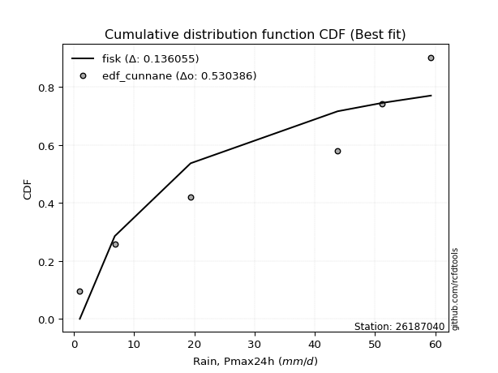</img></img>

</div>


### 12. EDF Adamowski (1981)

The Adamowski formula in hydrology refers to a specific plotting position formula used for estimating the non-parametric empirical distribution of hydrological events (like flood peaks) to calculate their return periods. This formula provides an alternative to traditional parametric methods (like the Gumbel or Log Pearson Type III distributions). 

<div align="center">


$P=(m-0.25)/(n+0.5)$


</div>


**12.1. Empirical values**

<div align="center">

|                | 0                   | 1                  | 2                  | 3                  | 4                  | 5                  |
|:---------------|:--------------------|:-------------------|:-------------------|:-------------------|:-------------------|:-------------------|
| date           | 2022                | 2020               | 2021               | 2018               | 2017               | 2019               |
| x              | 1.0                 | 6.8                | 19.4               | 43.8               | 51.2               | 59.3               |
| m              | 1                   | 2                  | 3                  | 4                  | 5                  | 6                  |
| empirical_dist | edf_adamowski       | edf_adamowski      | edf_adamowski      | edf_adamowski      | edf_adamowski      | edf_adamowski      |
| empirical      | 0.11538461538461539 | 0.2692307692307692 | 0.4230769230769231 | 0.5769230769230769 | 0.7307692307692307 | 0.8846153846153846 |
| empirical_tr   | 1.1304347826086958  | 1.3684210526315788 | 1.7333333333333334 | 2.3636363636363633 | 3.7142857142857135 | 8.666666666666664  |

</div>


**12.2. Kolmogorov-Smirnov fit test (sorted by Δ)**


<div align="center">

|                | 0                   | 1                   | 2                   | 3                   | 4                 | 5                   | 6                   | 7                   | 8                   | 9                  | 10                 | 11                  | 12                  | 13                 | 14                  | 15                | 16                  | 17                  | 18                  | 19                 | 20                  | 21                  | 22                 | 23                  | 24                 | 25                  | 26                  | 27                  | 28                 | 29                  | 30                  | 31                  | 32                  | 33                 | 34                  | 35                 | 36                  | 37                  | 38                  | 39                  | 40                  | 41                  | 42                  | 43                  | 44                  | 45                  | 46                  | 47                  | 48                  | 49                  | 50                 | 51                  | 52                  | 53                  | 54                  | 55                  | 56                  | 57                 | 58                  | 59                  | 60                  | 61                 | 62                    | 63                  | 64                  | 65                  | 66                  | 67                  | 68                  | 69                  | 70                 | 71                  | 72                 | 73                 | 74                  | 75                  | 76                 | 77                  | 78                  | 79                 | 80                 | 81                  | 82                 | 83                  | 84                 | 85                 | 86                 | 87                 |
|:---------------|:--------------------|:--------------------|:--------------------|:--------------------|:------------------|:--------------------|:--------------------|:--------------------|:--------------------|:-------------------|:-------------------|:--------------------|:--------------------|:-------------------|:--------------------|:------------------|:--------------------|:--------------------|:--------------------|:-------------------|:--------------------|:--------------------|:-------------------|:--------------------|:-------------------|:--------------------|:--------------------|:--------------------|:-------------------|:--------------------|:--------------------|:--------------------|:--------------------|:-------------------|:--------------------|:-------------------|:--------------------|:--------------------|:--------------------|:--------------------|:--------------------|:--------------------|:--------------------|:--------------------|:--------------------|:--------------------|:--------------------|:--------------------|:--------------------|:--------------------|:-------------------|:--------------------|:--------------------|:--------------------|:--------------------|:--------------------|:--------------------|:-------------------|:--------------------|:--------------------|:--------------------|:-------------------|:----------------------|:--------------------|:--------------------|:--------------------|:--------------------|:--------------------|:--------------------|:--------------------|:-------------------|:--------------------|:-------------------|:-------------------|:--------------------|:--------------------|:-------------------|:--------------------|:--------------------|:-------------------|:-------------------|:--------------------|:-------------------|:--------------------|:-------------------|:-------------------|:-------------------|:-------------------|
| station        | 26187040            | 26187040            | 26187040            | 26187040            | 26187040          | 26187040            | 26187040            | 26187040            | 26187040            | 26187040           | 26187040           | 26187040            | 26187040            | 26187040           | 26187040            | 26187040          | 26187040            | 26187040            | 26187040            | 26187040           | 26187040            | 26187040            | 26187040           | 26187040            | 26187040           | 26187040            | 26187040            | 26187040            | 26187040           | 26187040            | 26187040            | 26187040            | 26187040            | 26187040           | 26187040            | 26187040           | 26187040            | 26187040            | 26187040            | 26187040            | 26187040            | 26187040            | 26187040            | 26187040            | 26187040            | 26187040            | 26187040            | 26187040            | 26187040            | 26187040            | 26187040           | 26187040            | 26187040            | 26187040            | 26187040            | 26187040            | 26187040            | 26187040           | 26187040            | 26187040            | 26187040            | 26187040           | 26187040              | 26187040            | 26187040            | 26187040            | 26187040            | 26187040            | 26187040            | 26187040            | 26187040           | 26187040            | 26187040           | 26187040           | 26187040            | 26187040            | 26187040           | 26187040            | 26187040            | 26187040           | 26187040           | 26187040            | 26187040           | 26187040            | 26187040           | 26187040           | 26187040           | 26187040           |
| empirical_dist | edf_adamowski       | edf_adamowski       | edf_adamowski       | edf_adamowski       | edf_adamowski     | edf_adamowski       | edf_adamowski       | edf_adamowski       | edf_adamowski       | edf_adamowski      | edf_adamowski      | edf_adamowski       | edf_adamowski       | edf_adamowski      | edf_adamowski       | edf_adamowski     | edf_adamowski       | edf_adamowski       | edf_adamowski       | edf_adamowski      | edf_adamowski       | edf_adamowski       | edf_adamowski      | edf_adamowski       | edf_adamowski      | edf_adamowski       | edf_adamowski       | edf_adamowski       | edf_adamowski      | edf_adamowski       | edf_adamowski       | edf_adamowski       | edf_adamowski       | edf_adamowski      | edf_adamowski       | edf_adamowski      | edf_adamowski       | edf_adamowski       | edf_adamowski       | edf_adamowski       | edf_adamowski       | edf_adamowski       | edf_adamowski       | edf_adamowski       | edf_adamowski       | edf_adamowski       | edf_adamowski       | edf_adamowski       | edf_adamowski       | edf_adamowski       | edf_adamowski      | edf_adamowski       | edf_adamowski       | edf_adamowski       | edf_adamowski       | edf_adamowski       | edf_adamowski       | edf_adamowski      | edf_adamowski       | edf_adamowski       | edf_adamowski       | edf_adamowski      | edf_adamowski         | edf_adamowski       | edf_adamowski       | edf_adamowski       | edf_adamowski       | edf_adamowski       | edf_adamowski       | edf_adamowski       | edf_adamowski      | edf_adamowski       | edf_adamowski      | edf_adamowski      | edf_adamowski       | edf_adamowski       | edf_adamowski      | edf_adamowski       | edf_adamowski       | edf_adamowski      | edf_adamowski      | edf_adamowski       | edf_adamowski      | edf_adamowski       | edf_adamowski      | edf_adamowski      | edf_adamowski      | edf_adamowski      |
| p_dist         | fisk                | pearson3            | nakagami            | ncf                 | nct               | norm                | crystalball         | exponnorm           | t                   | gamma              | erlang             | logfisk             | loginvweibull       | logpearson3        | johnsonsu           | rice              | gumbel_l            | maxwell             | invgamma            | gompertz           | loggumbel_l         | rayleigh            | logistic           | loginvgauss         | logerlang          | genlogistic         | loggamma            | loggamma            | logrice            | logcrystalball      | lognorm             | lognorm             | logt                | logexponnorm       | lognct              | alpha              | halfnorm            | logfatiguelife      | laplace_asymmetric  | logalpha            | loginvgamma         | betaprime           | kstwobign           | logkstwobign        | logmaxwell          | logweibull_min      | hypsecant           | loggenexpon         | invgauss            | lograyleigh         | loggompertz        | expon               | weibull_min         | gumbel_r            | logchi2             | loghalfnorm         | loglogistic         | mielke             | halflogistic        | fatiguelife         | moyal               | laplace            | loglaplace_asymmetric | logloggamma         | loghypsecant        | loggumbel_r         | f                   | loghalflogistic     | logmoyal            | genexpon            | logexpon           | loglaplace          | logncf             | wald               | logf                | gibrat              | logwald            | loggibrat           | logbetaprime        | logtruncnorm       | loglognorm         | lognakagami         | invweibull         | logmielke           | logjohnsonsu       | chi2               | truncnorm          | loggenlogistic     |
| delta          | 0.13977691693213645 | 0.14959359901391134 | 0.15010586569276707 | 0.15034708204635905 | 0.151154102790513 | 0.15116076585472982 | 0.15116077167855924 | 0.15116096365300102 | 0.15117421532785147 | 0.1524878295029699 | 0.1527964986706054 | 0.15460518567918669 | 0.15572502827257445 | 0.1560646260012193 | 0.16174894522194339 | 0.163060987185232 | 0.16315027905101792 | 0.16358039976794125 | 0.16500200403361565 | 0.1665043228943197 | 0.16715835621580832 | 0.16715962960154807 | 0.1735294163247254 | 0.17388804390478063 | 0.1744336395458005 | 0.17657355559265087 | 0.17697469532134202 | 0.17697469532134202 | 0.1782072600045156 | 0.17843757074790323 | 0.17843758936058562 | 0.17843758936058562 | 0.17844092691243607 | 0.1784416601497295 | 0.17849328292408317 | 0.1785371362938598 | 0.17857480625973987 | 0.17965435623481874 | 0.18169323092781942 | 0.18173604236483687 | 0.18277746921429228 | 0.18603665880968778 | 0.18617681098061767 | 0.18688405482951648 | 0.18732112220861663 | 0.18821150399297693 | 0.18890115304241828 | 0.18928909468895277 | 0.18954173325124946 | 0.18985291559208206 | 0.1914051439632991 | 0.19159369644808655 | 0.19429323568448953 | 0.19586417244248022 | 0.19753682274811274 | 0.19859640077219276 | 0.20109667009461996 | 0.2023187323268656 | 0.20416252761986164 | 0.20578082176979273 | 0.21025518830763879 | 0.2111713354469491 | 0.21501526125894854   | 0.21536132085071014 | 0.21584973060934431 | 0.21657893716808685 | 0.21683440502189022 | 0.22273743604954327 | 0.22890627059758883 | 0.22955131182435928 | 0.2327579043154389 | 0.23502072460286982 | 0.2611401166441021 | 0.2692307692307692 | 0.27929916005552674 | 0.28420488992122017 | 0.2915875787515935 | 0.32077114223515474 | 0.33917154922912146 | 0.3902898235352246 | 0.4027353929415904 | 0.41073556185351173 | 0.4563137764068755 | 0.46200342731689675 | 0.5878047147972252 | 0.5879338550306403 | 0.7828205426831891 | 0.8846153846153846 |
| deltao         | 0.530385761606      | 0.530385761606      | 0.530385761606      | 0.530385761606      | 0.530385761606    | 0.530385761606      | 0.530385761606      | 0.530385761606      | 0.530385761606      | 0.530385761606     | 0.530385761606     | 0.530385761606      | 0.530385761606      | 0.530385761606     | 0.530385761606      | 0.530385761606    | 0.530385761606      | 0.530385761606      | 0.530385761606      | 0.530385761606     | 0.530385761606      | 0.530385761606      | 0.530385761606     | 0.530385761606      | 0.530385761606     | 0.530385761606      | 0.530385761606      | 0.530385761606      | 0.530385761606     | 0.530385761606      | 0.530385761606      | 0.530385761606      | 0.530385761606      | 0.530385761606     | 0.530385761606      | 0.530385761606     | 0.530385761606      | 0.530385761606      | 0.530385761606      | 0.530385761606      | 0.530385761606      | 0.530385761606      | 0.530385761606      | 0.530385761606      | 0.530385761606      | 0.530385761606      | 0.530385761606      | 0.530385761606      | 0.530385761606      | 0.530385761606      | 0.530385761606     | 0.530385761606      | 0.530385761606      | 0.530385761606      | 0.530385761606      | 0.530385761606      | 0.530385761606      | 0.530385761606     | 0.530385761606      | 0.530385761606      | 0.530385761606      | 0.530385761606     | 0.530385761606        | 0.530385761606      | 0.530385761606      | 0.530385761606      | 0.530385761606      | 0.530385761606      | 0.530385761606      | 0.530385761606      | 0.530385761606     | 0.530385761606      | 0.530385761606     | 0.530385761606     | 0.530385761606      | 0.530385761606      | 0.530385761606     | 0.530385761606      | 0.530385761606      | 0.530385761606     | 0.530385761606     | 0.530385761606      | 0.530385761606     | 0.530385761606      | 0.530385761606     | 0.530385761606     | 0.530385761606     | 0.530385761606     |
| eval           | Δo > Δ              | Δo > Δ              | Δo > Δ              | Δo > Δ              | Δo > Δ            | Δo > Δ              | Δo > Δ              | Δo > Δ              | Δo > Δ              | Δo > Δ             | Δo > Δ             | Δo > Δ              | Δo > Δ              | Δo > Δ             | Δo > Δ              | Δo > Δ            | Δo > Δ              | Δo > Δ              | Δo > Δ              | Δo > Δ             | Δo > Δ              | Δo > Δ              | Δo > Δ             | Δo > Δ              | Δo > Δ             | Δo > Δ              | Δo > Δ              | Δo > Δ              | Δo > Δ             | Δo > Δ              | Δo > Δ              | Δo > Δ              | Δo > Δ              | Δo > Δ             | Δo > Δ              | Δo > Δ             | Δo > Δ              | Δo > Δ              | Δo > Δ              | Δo > Δ              | Δo > Δ              | Δo > Δ              | Δo > Δ              | Δo > Δ              | Δo > Δ              | Δo > Δ              | Δo > Δ              | Δo > Δ              | Δo > Δ              | Δo > Δ              | Δo > Δ             | Δo > Δ              | Δo > Δ              | Δo > Δ              | Δo > Δ              | Δo > Δ              | Δo > Δ              | Δo > Δ             | Δo > Δ              | Δo > Δ              | Δo > Δ              | Δo > Δ             | Δo > Δ                | Δo > Δ              | Δo > Δ              | Δo > Δ              | Δo > Δ              | Δo > Δ              | Δo > Δ              | Δo > Δ              | Δo > Δ             | Δo > Δ              | Δo > Δ             | Δo > Δ             | Δo > Δ              | Δo > Δ              | Δo > Δ             | Δo > Δ              | Δo > Δ              | Δo > Δ             | Δo > Δ             | Δo > Δ              | Δo > Δ             | Δo > Δ              | Δo <= Δ            | Δo <= Δ            | Δo <= Δ            | Δo <= Δ            |
| fit            | 1                   | 1                   | 1                   | 1                   | 1                 | 1                   | 1                   | 1                   | 1                   | 1                  | 1                  | 1                   | 1                   | 1                  | 1                   | 1                 | 1                   | 1                   | 1                   | 1                  | 1                   | 1                   | 1                  | 1                   | 1                  | 1                   | 1                   | 1                   | 1                  | 1                   | 1                   | 1                   | 1                   | 1                  | 1                   | 1                  | 1                   | 1                   | 1                   | 1                   | 1                   | 1                   | 1                   | 1                   | 1                   | 1                   | 1                   | 1                   | 1                   | 1                   | 1                  | 1                   | 1                   | 1                   | 1                   | 1                   | 1                   | 1                  | 1                   | 1                   | 1                   | 1                  | 1                     | 1                   | 1                   | 1                   | 1                   | 1                   | 1                   | 1                   | 1                  | 1                   | 1                  | 1                  | 1                   | 1                   | 1                  | 1                   | 1                   | 1                  | 1                  | 1                   | 1                  | 1                   | 0                  | 0                  | 0                  | 0                  |
| n              | 6                   | 6                   | 6                   | 6                   | 6                 | 6                   | 6                   | 6                   | 6                   | 6                  | 6                  | 6                   | 6                   | 6                  | 6                   | 6                 | 6                   | 6                   | 6                   | 6                  | 6                   | 6                   | 6                  | 6                   | 6                  | 6                   | 6                   | 6                   | 6                  | 6                   | 6                   | 6                   | 6                   | 6                  | 6                   | 6                  | 6                   | 6                   | 6                   | 6                   | 6                   | 6                   | 6                   | 6                   | 6                   | 6                   | 6                   | 6                   | 6                   | 6                   | 6                  | 6                   | 6                   | 6                   | 6                   | 6                   | 6                   | 6                  | 6                   | 6                   | 6                   | 6                  | 6                     | 6                   | 6                   | 6                   | 6                   | 6                   | 6                   | 6                   | 6                  | 6                   | 6                  | 6                  | 6                   | 6                   | 6                  | 6                   | 6                   | 6                  | 6                  | 6                   | 6                  | 6                   | 6                  | 6                  | 6                  | 6                  |
| best_fit       | 1                   | 0                   | 0                   | 0                   | 0                 | 0                   | 0                   | 0                   | 0                   | 0                  | 0                  | 0                   | 0                   | 0                  | 0                   | 0                 | 0                   | 0                   | 0                   | 0                  | 0                   | 0                   | 0                  | 0                   | 0                  | 0                   | 0                   | 0                   | 0                  | 0                   | 0                   | 0                   | 0                   | 0                  | 0                   | 0                  | 0                   | 0                   | 0                   | 0                   | 0                   | 0                   | 0                   | 0                   | 0                   | 0                   | 0                   | 0                   | 0                   | 0                   | 0                  | 0                   | 0                   | 0                   | 0                   | 0                   | 0                   | 0                  | 0                   | 0                   | 0                   | 0                  | 0                     | 0                   | 0                   | 0                   | 0                   | 0                   | 0                   | 0                   | 0                  | 0                   | 0                  | 0                  | 0                   | 0                   | 0                  | 0                   | 0                   | 0                  | 0                  | 0                   | 0                  | 0                   | 0                  | 0                  | 0                  | 0                  |
| best_fit_sort  | 1                   | 2                   | 3                   | 4                   | 5                 | 6                   | 7                   | 8                   | 9                   | 10                 | 11                 | 12                  | 13                  | 14                 | 15                  | 16                | 17                  | 18                  | 19                  | 20                 | 21                  | 22                  | 23                 | 24                  | 25                 | 26                  | 27                  | 28                  | 29                 | 30                  | 31                  | 32                  | 33                  | 34                 | 35                  | 36                 | 37                  | 38                  | 39                  | 40                  | 41                  | 42                  | 43                  | 44                  | 45                  | 46                  | 47                  | 48                  | 49                  | 50                  | 51                 | 52                  | 53                  | 54                  | 55                  | 56                  | 57                  | 58                 | 59                  | 60                  | 61                  | 62                 | 63                    | 64                  | 65                  | 66                  | 67                  | 68                  | 69                  | 70                  | 71                 | 72                  | 73                 | 74                 | 75                  | 76                  | 77                 | 78                  | 79                  | 80                 | 81                 | 82                  | 83                 | 84                  | 85                 | 86                 | 87                 | 88                 |

</div>


**12.3. Best fit**

<div align="center">

|   id |   station | empirical_dist   | p_dist   |    delta |   deltao | eval   |   fit |   n |   best_fit |   best_fit_sort |
|-----:|----------:|:-----------------|:---------|---------:|---------:|:-------|------:|----:|-----------:|----------------:|
|    0 |  26187040 | edf_adamowski    | fisk     | 0.139777 | 0.530386 | Δo > Δ |     1 |   6 |          1 |               1 |

</div>


<div align="center">

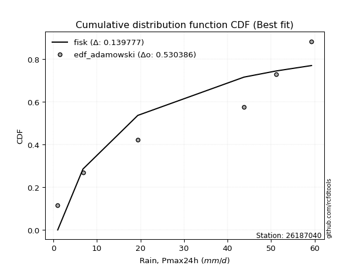</img>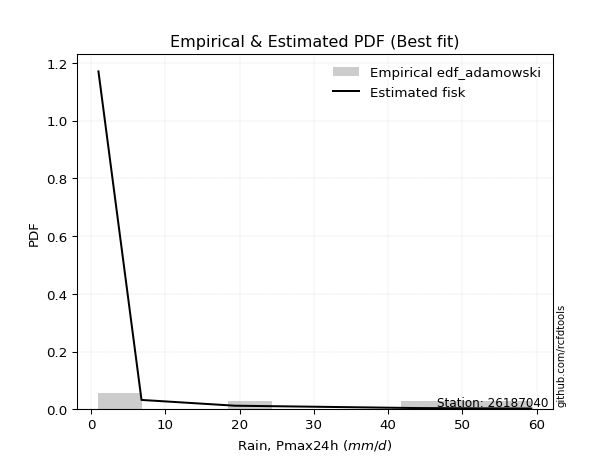</img>

</div>


## C. Best fit & Estimate extreme values for specific return periods - Tr

Best fit in probability distribution analysis means finding the theoretical distribution (like Normal, Poisson, Exponential) that most accurately mirrors your real-world data´s patterns (shape, center, spread) for better predictions, using methods like visual checks (Q-Q plots), goodness-of-fit tests (Kolmogorov-Smirnov, Chi-Squared), and information criteria (AIC) to score and select the simplest, most representative model.


### 1. Best fit (ordered by delta Δ)

<div align="center">

|   id |   station | empirical_dist   | p_dist      |    delta |   deltao | eval   |   fit |   n |   best_fit |   best_fit_sort |
|-----:|----------:|:-----------------|:------------|---------:|---------:|:-------|------:|----:|-----------:|----------------:|
|    0 |  26187040 | edf_cunnane      | fisk        | 0.136055 | 0.530386 | Δo > Δ |     1 |   6 |          1 |               1 |
|    1 |  26187040 | edf_blom         | fisk        | 0.1367   | 0.530386 | Δo > Δ |     1 |   6 |          1 |               2 |
|    2 |  26187040 | edf_gringorten   | fisk        | 0.137596 | 0.530386 | Δo > Δ |     1 |   6 |          1 |               3 |
|    3 |  26187040 | edf_tukey        | fisk        | 0.137753 | 0.530386 | Δo > Δ |     1 |   6 |          1 |               4 |
|    4 |  26187040 | edf_filliben     | fisk        | 0.138145 | 0.530386 | Δo > Δ |     1 |   6 |          1 |               5 |
|    5 |  26187040 | edf_jenkinson    | fisk        | 0.13833  | 0.530386 | Δo > Δ |     1 |   6 |          1 |               6 |
|    6 |  26187040 | edf_beard        | fisk        | 0.13833  | 0.530386 | Δo > Δ |     1 |   6 |          1 |               7 |
|    7 |  26187040 | edf_chegodayev   | fisk        | 0.138575 | 0.530386 | Δo > Δ |     1 |   6 |          1 |               8 |
|    8 |  26187040 | edf_adamowski    | fisk        | 0.139777 | 0.530386 | Δo > Δ |     1 |   6 |          1 |               9 |
|    9 |  26187040 | edf_california   | fatiguelife | 0.139863 | 0.530386 | Δo > Δ |     1 |   6 |          1 |              10 |
|   10 |  26187040 | edf_hazen        | pearson3    | 0.143183 | 0.530386 | Δo > Δ |     1 |   6 |          1 |              11 |
|   11 |  26187040 | edf_weibull      | fisk        | 0.145271 | 0.530386 | Δo > Δ |     1 |   6 |          1 |              12 |

</div>

:file_folder:Tables: [bestfit_26187040.csv](table/bestfit_26187040.csv) | [extreme_26187040.csv](table/extreme_26187040.csv)


### 2. Extreme values

In hydrology, a return period (or recurrence interval $Tr$) is the statistical average time between extreme events like floods or droughts of a specific magnitude, indicating how rare an event is, with a 100-year flood, for example, having a 1% chance of occurring in any given year, not that it happens exactly every century. It is a key tool for infrastructure design (like bridges or dams) and risk assessment, calculated from historical data to determine the probability of future events, although it is important to remember it is statistical average, and events can cluster or be missed.

> risk_rate: assuming the return period as the project useful life.

|   id |      tr |   prob_l |     prob_g |    alpha |   betaprime |     chi2 |   crystalball |   erlang |    expon |   exponnorm |        f |   fatiguelife |       fisk |    gamma |   genexpon |   genlogistic |   gibrat |   gompertz |   gumbel_l |   gumbel_r |   halflogistic |   halfnorm |   hypsecant |   invgamma |   invgauss |       invweibull |   johnsonsu |   kstwobign |   laplace |   laplace_asymmetric |   loggamma |   logistic |   lognorm |   maxwell |   mielke |    moyal |   nakagami |      ncf |     nct |    norm |   pearson3 |   rayleigh |     rice |       t |   truncnorm |     wald |   weibull_min |   logalpha |   logbetaprime |          logchi2 |   logcrystalball |   logerlang |         logexpon |   logexponnorm |             logf |   logfatiguelife |   logfisk |   loggenexpon |   loggenlogistic |        loggibrat |   loggompertz |   loggumbel_l |   loggumbel_r |   loghalflogistic |   loghalfnorm |   loghypsecant |   loginvgamma |   loginvgauss |   loginvweibull |   logjohnsonsu |   logkstwobign |   loglaplace |   loglaplace_asymmetric |   logloggamma |   loglogistic |   loglognorm |   logmaxwell |         logmielke |   logmoyal |   lognakagami |            logncf |    lognct |   logpearson3 |   lograyleigh |   logrice |      logt |   logtruncnorm |     logwald |   logweibull_min |   station |   n |   risk_rate |
|-----:|--------:|---------:|-----------:|---------:|------------:|---------:|--------------:|---------:|---------:|------------:|---------:|--------------:|-----------:|---------:|-----------:|--------------:|---------:|-----------:|-----------:|-----------:|---------------:|-----------:|------------:|-----------:|-----------:|-----------------:|------------:|------------:|----------:|---------------------:|-----------:|-----------:|----------:|----------:|---------:|---------:|-----------:|---------:|--------:|--------:|-----------:|-----------:|---------:|--------:|------------:|---------:|--------------:|-----------:|---------------:|-----------------:|-----------------:|------------:|-----------------:|---------------:|-----------------:|-----------------:|----------:|--------------:|-----------------:|-----------------:|--------------:|--------------:|--------------:|------------------:|--------------:|---------------:|--------------:|--------------:|----------------:|---------------:|---------------:|-------------:|------------------------:|--------------:|--------------:|-------------:|-------------:|------------------:|-----------:|--------------:|------------------:|----------:|--------------:|--------------:|----------:|----------:|---------------:|------------:|-----------------:|----------:|----:|------------:|
|    0 |    2    | 0.5      | 0.5        |  26.749  |     14.8818 |  1.97871 |       30.25   |  30.083  |  21.2746 |     30.25   |  12.1196 |       17.7639 |    16.657  |  30.0978 |    19.0636 |       26.2793 |  23.5497 |    28.1031 |    33.9171 |    26.5829 |        24.7597 |    25.6807 |     30.25   |    28.4558 |    23.5382 |   2306.53        |     36.3974 |     25.7781 |   30.25   |              25.5118 |    15.4778 |    30.25   |   16.1195 |   28.3409 |  23.1195 |  25.399  |    14.4961 |  21.3017 | 30.2495 | 30.25   |    30.4172 |    27.6638 |  28.807  | 30.2492 |   -20.0662  |  23.0141 |       12.7273 |    14.9625 |   3.0506       |      8.40136     |          16.1195 |     15.2437 |      6.86866     |        16.1193 |     4.41743      |          16.0636 |   20.3306 |       11.0762 |         inf      |     10.4449      |       19.7916 |       20.4407 |       12.7118 |           11.2961 |       11.9902 |        16.1195 |       14.7031 |       14.6777 |         13.2834 |        59.2944 |        11.2868 |      16.1195 |                 24.0887 |       24.0578 |       16.1195 |            1 |      14.2448 |      1.75047      |    11.7736 |       2.32551 |      9.15602      |   16.135  |       20.2363 |       13.6338 |   15.5922 |   16.1192 |        5.2374  |     10.089  |          21.3709 |  26187040 |   6 |    0.75     |
|    1 |    2.33 | 0.570815 | 0.429185   |  30.8217 |     19.742  |  2.42008 |       34.2334 |  34.0712 |  25.7416 |     34.2333 |  16.6718 |       22.1288 |    22.3255 |  34.0878 |    23.0436 |       30.4282 |  25.5675 |    32.2602 |    37.3827 |    30.2739 |        28.5547 |    29.9798 |     33.4379 |    32.5252 |    27.7669 | 110473           |     40.1438 |     29.8893 |   32.6605 |              29.3472 |    20.2247 |    33.7596 |   20.8636 |   32.4793 |  27.9372 |  28.893  |    21.1309 |  26.8598 | 34.2331 | 34.2334 |    34.3948 |    31.8634 |  32.837  | 34.2325 |   -17.1094  |  25.6261 |       22.5351 |    19.5731 |   4.89531      |     13.9345      |          20.8636 |     20.0449 |     10.5017      |        20.8633 |     8.6696       |          20.7773 |   25.2919 |       15.6389 |         inf      |     11.9031      |       24.3881 |       25.5841 |       16.1445 |           14.4433 |       15.8397 |        19.816  |       19.2767 |       19.425  |         18.6379 |        59.2984 |        15.8608 |      18.8431 |                 28.6156 |       28.5848 |       20.2332 |            1 |      18.6232 |      2.26736      |    14.7633 |       3.30212 |     22.783        |   20.8787 |       25.7016 |       17.8952 |   20.3301 |   20.8633 |        6.82095 |     11.9485 |          25.9418 |  26187040 |   6 |    0.729209 |
|    2 |    5    | 0.8      | 0.2        |  47.9896 |     52.3125 |  5.29728 |       49.0366 |  48.9769 |  48.0761 |     49.0365 |  45.0757 |       46.6443 |    71.3104 |  49.0004 |    42.9424 |       48.4498 |  37.1846 |    48.4048 |    48.5785 |    46.3094 |        45.7261 |    48.16   |     46.2252 |    48.6417 |    47.7888 |      2.20817e+12 |     51.1771 |     47.3529 |   44.7127 |              48.5231 |    55.5965 |    47.3107 |   54.4193 |   48.7679 |  45.5071 |  45.0776 |    60.1199 |  55.5934 | 49.0373 | 49.0366 |    49.0837 |    48.6765 |  48.6382 | 49.0356 |    -6.12101 |  40.2477 |      154.409  |    54.541  | 301.522        |    184.503       |          54.4193 |     56.7437 |     87.7319      |        54.4183 | 18527.2          |          54.0998 |   58.767  |       65.2091 |         inf      |     25.2582      |       48.5888 |       52.8285 |       45.6086 |           43.9183 |       51.4165 |        45.3606 |       54.4438 |       57.8566 |         81.1739 |        59.3    |        67.2906 |      41.128  |                 44.3806 |       44.356  |       48.6643 |          inf |      53.4805 |     18.074        |    42.1117 |      22.0077  | 220216            |   54.3853 |       55.3076 |       53.1644 |   54.9838 |   54.4185 |       18.1638  |     30.8005 |          48.5224 |  26187040 |   6 |    0.67232  |
|    3 |   10    | 0.9      | 0.1        |  61.5349 |     96.0599 |  8.49252 |       58.8566 |  58.9383 |  68.3506 |     58.8566 |  75.7723 |       71.6587 |   170.277  |  58.967  |    61.006  |       63.1259 |  50.4267 |    59.0299 |    54.8118 |    59.37   |        59.9863 |    61.613  |     56.4362 |    60.268  |    65.5162 |      1.95168e+18 |     56.5173 |     60.6492 |   55.6533 |              65.9305 |   110.379  |    57.2906 |  102.792  |   60.2309 |  54.0304 |  59.1689 |    95.089  |  82.3111 | 58.858  | 58.8566 |    58.7471 |    60.6645 |  59.6189 | 58.8556 |     1.16836 |  55.7647 |      458.717  |   110.258  |   1.1062e+06   |   2007.61        |         102.792  |    115.47   |    602.601       |       102.789  |     1.4348e+14   |         102.138  |  109.343  |      187.265  |         inf      |     59.546       |       71.8019 |       79.1025 |      106.267  |          110.596  |      122.883  |        87.8779 |      111.566  |      124.83   |        269.084  |        59.3    |       202.216  |      83.5331 |                 51.7246 |       51.7054 |       92.8774 |          inf |     112.36   |    634.137        |   104.892  |     111.565   |      2.75917e+15  |  102.595  |       83.2726 |      115.557  |  106.979  |  102.79   |       30.8516  |     84.1366 |          68.762  |  26187040 |   6 |    0.651322 |
|    4 |   15    | 0.933333 | 0.0666667  |  69.0894 |    129.765  | 10.5138  |       63.757  |  63.9312 |  80.2105 |     63.757  |  95.049  |       87.0957 |   274.211  |  63.9626 |    71.5726 |       71.4057 |  59.5605 |    64.1726 |    57.6347 |    66.7387 |        68.0563 |    68.6139 |     62.2635 |    66.3724 |    75.8986 |      4.41878e+21 |     58.7244 |     67.7079 |   62.0531 |              76.1131 |   156.123  |    62.7281 |  141.185  |   66.1124 |  56.9785 |  67.3468 |   114.091  |  98.1492 | 63.7587 | 63.757  |    63.5453 |    66.8413 |  65.1986 | 63.756  |     4.80589 |  65.729  |      751.928  |   157.835  |   5.48801e+09  |   8196.54        |         141.185  |    165.608  |   1860.24        |       141.182  |     8.1628e+27   |         140.28   |  153.36   |      325.876  |         inf      |    107.585       |       85.7859 |       94.9706 |      171.259  |          186.518  |      193.377  |       128.169  |      161.023  |      185.783  |        529.093  |        59.3    |       362.66   |     126.434  |                 54.229  |       54.212  |      132.083  |          inf |     164.452  |  17239.7          |   178.139  |     267.072   |      9.89484e+27  |  140.807  |       99.3929 |      172.395  |  149.304  |  141.184  |       37.691   |    160.413  |          80.5224 |  26187040 |   6 |    0.644736 |
|    5 |   20    | 0.95     | 0.05       |  74.3657 |    158.168  | 11.9973  |       66.9662 |  67.2089 |  88.6252 |     66.9662 | 109.17   |       98.32   |   381.358  |  67.2421 |    79.0696 |       77.2028 |  66.7253 |    67.4672 |    59.3918 |    71.8981 |        73.7103 |    73.2814 |     66.3745 |    70.4848 |    83.2949 |      9.86993e+23 |     60.0282 |     72.4629 |   66.5939 |              83.3378 |   196.239  |    66.4863 |  173.801  |   70.0158 |  58.4726 |  73.1385 |   126.905  | 109.484  | 66.968  | 66.9662 |    66.6789 |    70.9468 |  68.8812 | 66.9652 |     7.18801 |  73.1544 |     1022.94   |   200.185  |   3.30414e+13  |  22313.6         |         173.801  |    210.184  |   4139.06        |       173.797  |     9.69574e+44  |         172.693  |  193.759  |      472.714  |         inf      |    171.108       |       95.8608 |      106.417  |      239.205  |          269      |      261.631  |       167.267  |      205.435  |      242.278  |        849.445  |        59.3    |       537.516  |     169.66   |                 55.4913 |       55.4754 |      168.482  |          inf |     211.752  | 402119            |   259.215  |     480.373   |      2.94669e+42  |  173.242  |      110.575  |      224.904  |  185.799  |  173.799  |       41.9045  |    259.468  |          88.8376 |  26187040 |   6 |    0.641514 |
|    6 |   25    | 0.96     | 0.04       |  78.4307 |    183.163  | 13.1714  |       69.3286 |  69.6257 |  95.1521 |     69.3286 | 120.339  |      107.157  |   490.912  |  69.6603 |    84.8848 |       81.6681 |  72.6983 |    69.8526 |    60.6422 |    75.8722 |        78.0665 |    76.7542 |     69.556  |    73.5719 |    89.0534 |      6.36311e+25 |     60.9225 |     76.0246 |   70.116  |              88.9417 |   232.411  |    69.3613 |  202.534  |   72.9137 |  59.3771 |  77.6277 |   136.483  | 118.336  | 69.3305 | 69.3286 |    68.9812 |    73.9972 |  71.6048 | 69.3275 |     8.94157 |  79.1019 |     1273.51   |   238.802  |   2.30018e+17  |  48599.3         |         202.534  |    250.776  |   7696.88        |       202.529  |     1.1176e+65   |         201.256  |  231.71   |      624.385  |         inf      |    251.922       |      103.755  |      115.393  |      309.419  |          356.68   |      327.62   |       205.54   |      246.196  |      295.346  |       1223.22   |        59.3    |       721.765  |     213.13   |                 56.252  |       56.2368 |      202.964  |          inf |     255.467  |      8.42431e+06  |   346.677  |     744.635   |      3.64295e+58  |  201.798  |      119.063  |      274.026  |  218.287  |  202.532  |       44.7504  |    381.385  |          95.2727 |  26187040 |   6 |    0.639603 |
|    7 |   50    | 0.98     | 0.02       |  91.0133 |    280.908  | 16.9237  |       76.0935 |  76.5653 | 115.427  |     76.0935 | 156.044  |      135.206  |  1062.64   |  76.6041 |   102.948  |       95.4234 |  93.7531 |    76.487  |    64.0364 |    88.1144 |        91.4886 |    86.8485 |     79.4201 |    82.7027 |   107.077  |      2.38471e+31 |     63.2061 |     86.4834 |   81.0566 |             106.349  |   378.735  |    78.1454 |  313.887  |   81.318  |  61.2406 |  91.5641 |   164.421  | 146.186  | 76.0957 | 76.0935 |    75.5538 |    82.8517 |  79.4561 | 76.0924 |    13.963   |  98.5208 |     2308.67   |   398.437  |   1.60042e+37  | 549390           |         313.886  |    417.996  |  52867.3         |       313.878  |     4.20495e+203 |         312.015  |  400.215  |     1413.21   |         inf      |    985.051       |      128.674  |      143.763  |      683.723  |          850.744  |      629.927  |       389.347  |      416.754  |      527.29   |       3761.5    |        59.3    |      1715.06   |     432.879  |                 57.7803 |       57.7666 |      358.497  |          inf |     440.27   |      1.28581e+13  |   854.882  |    2671.31    |      7.68191e+157 |  312.338  |      144.199  |      486.223  |  346.539  |  313.883  |       51.3079  |   1341.33   |         115.19   |  26187040 |   6 |    0.63583  |
|    8 |   75    | 0.986667 | 0.0133333  |  98.4076 |    355.566  | 19.178   |       79.7234 |  80.3005 | 127.287  |     79.7233 | 177.528  |      151.956  |  1660.41   |  80.3415 |   113.515  |      103.418  | 107.974  |    79.9236 |    65.7528 |    95.2301 |        99.2908 |    92.3434 |     85.1845 |    87.7862 |   117.72   |      4.14116e+34 |     64.2793 |     92.2377 |   87.4564 |             116.532  |   493.36   |    83.2188 |  397.071  |   85.8873 |  61.9289 |  99.7138 |   179.639  | 162.745  | 79.7257 | 79.7234 |    79.0679 |    87.6689 |  83.6961 | 79.7222 |    16.6573  | 110.47   |     3119.17   |   526.607  |   5.38266e+57  |      2.27918e+06 |         397.07   |    551.604  | 163202           |       397.06   |   inf            |         394.819  |  548.753  |     2216.38   |         inf      |   2474.16        |      143.502  |      160.666  |     1083.98   |         1410.1    |      899.177  |       565.551  |      555.539  |      725.2    |       7226.4    |        59.3    |      2761.13   |     655.197  |                 58.2919 |       58.2786 |      497.946  |          inf |     591.885  |      7.55913e+18  |  1449.2    |    5356.15    |      2.34999e+281 |  394.813  |      157.942  |      664.24   |  444.25   |  397.066  |       53.7933  |   2908.19   |         126.796  |  26187040 |   6 |    0.634587 |
|    9 |  100    | 0.99     | 0.01       | 103.694  |    418.297  | 20.799   |       82.1784 |  82.8313 | 135.701  |     82.1784 | 193      |      163.964  |  2275.62   |  82.8739 |   121.012  |      109.077  | 118.99   |    82.1988 |    66.8755 |   100.266  |       104.813  |    96.0867 |     89.2736 |    91.3001 |   125.318  |      8.12918e+36 |     64.9511 |     96.1804 |   91.9972 |             123.756  |   590.526  |    86.8007 |  465.501  |   88.9996 |  62.319  | 105.496  |   189.997  | 174.624  | 82.1809 | 82.1784 |    81.4397 |    90.9508 |  86.5733 | 82.1773 |    18.4796  | 119.183  |     3797.71   |   637.02   |   5.18318e+78  |      6.26379e+06 |         465.5    |    666.277  | 363128           |       465.488  |   inf            |         462.972  |  685.742  |     3018.33   |         inf      |   5049.71        |      154.124  |      172.783  |     1502      |         2016.39   |     1145.86   |       737.025  |      676.12   |      902.428  |      11471.4    |        59.3    |      3826.33   |     879.2    |                 58.548  |       58.535  |      627.957  |          inf |     724.062  |      2.49628e+24  |  2107.43   |    8600.27    |    inf            |  462.606  |      167.235  |      821.544  |  525.595  |  465.496  |       55.1     |   5112.86   |         135.013  |  26187040 |   6 |    0.633968 |
|   10 |  200    | 0.995    | 0.005      | 116.636  |    611.244  | 24.7653  |       87.7473 |  88.5858 | 155.976  |     87.7473 | 230.963  |      193.253  |  4847.56   |  88.6321 |   139.076  |      122.681  | 148.96   |    87.2137 |    69.3158 |   112.374  |       118.089  |   104.648  |     99.1244 |    99.5049 |   143.774  |      2.64527e+42 |     66.3288 |    105.261  |  102.938  |             141.164  |   890.367  |    95.3931 |  667.659  |   96.1201 |  63.0696 | 119.426  |   213.635  | 203.71   | 87.7499 | 87.7473 |    86.805  |    98.4601 |  93.1245 | 87.7462 |    22.6129  | 140.884  |     5825.57   |   986.101  |   3.54209e+165 |      7.18742e+07 |         667.658  |   1026.57   |      2.4942e+06  |       667.639  |   inf            |         664.472  | 1170.38   |     6160.7    |          59.9625 |  35174.1         |      180.034  |      202.366  |     3290.13   |         4764.21   |     1994.99   |      1394.93   |     1062.18   |     1495.76   |      34842.1    |        59.3    |      8112.29   |    1785.7    |                 58.9328 |       58.9201 |     1095.48   |          inf |    1148.29   |      1.08024e+45  |  5194.79   |   25353.4     |    inf            |  662.652  |      188.039  |     1336.09   |  769.948  |  667.651  |       57.1455  |  20846.5    |         154.756  |  26187040 |   6 |    0.633042 |
|   11 |  250    | 0.996    | 0.004      | 120.881  |    688.639  | 26.0578  |       89.4492 |  90.3481 | 162.503  |     89.4491 | 243.371  |      202.773  |  6179.81   |  90.3955 |   144.891  |      127.054  | 159.714  |    88.7063 |    70.0337 |   116.266  |       122.357  |   107.282  |    102.296  |   102.079  |   149.76   |      1.56543e+44 |     66.7125 |    108.072  |  106.46   |             146.768  |  1010.2    |    98.1516 |  745.455  |   98.312  |  63.2768 | 123.911  |   220.89   | 213.221  | 89.4518 | 89.4492 |    88.4405 |   100.772  |  95.1328 | 89.448  |    23.876   | 148.063  |     6607.13   |  1128.62   |   1.47337e+210 |      1.5784e+08  |         745.453  |   1172.79   |      4.63815e+06 |       745.432  |   inf            |         742.072  | 1389.51   |     7688.57   |          60.0425 |  70579.4         |      188.464  |      211.998  |     4233.44   |         6281.17   |     2366.04   |      1712.95   |     1221.51   |     1750.09   |      49798.6    |        59.3    |     10236.3    |    2243.23   |                 59.0098 |       58.9972 |     1309.76   |          inf |    1323.43   |      6.34793e+54  |  6945.48   |   35333.9     |    inf            |  739.559  |      194.26   |     1551.85   |  865.319  |  745.446  |       57.5675  |  33186.4    |         161.097  |  26187040 |   6 |    0.632858 |
|   12 |  500    | 0.998    | 0.002      | 134.367  |    990.745  | 30.1133  |       94.4959 |  95.5847 | 182.777  |     94.4959 | 282.43   |      232.586  | 13123.1    |  95.6356 |   162.954  |      140.628  | 196.878  |    93.0248 |    72.092  |   128.347  |       135.605  |   115.135  |    112.146  |   109.902  |   168.485  |      4.95526e+49 |     67.7576 |    116.493  |  117.4    |             164.175  |  1472.22   |   106.707  | 1033.64   |  104.853  |  63.8638 | 137.841  |   242.462  | 243.248  | 94.4988 | 94.4959 |    93.2794 |   107.668  | 101.104  | 94.4947 |    27.6212  | 170.892  |     9478.82   |  1691.14   | inf            |      1.8227e+09  |        1033.64   |   1745.84   |      3.18579e+07 |      1033.61   |   inf            |        1029.77   | 2366.04   |    14971.3    |          60.2028 | 783347           |      214.902  |      242.227  |     9257.54   |        14813.2    |     3934.59   |      3241.88   |     1857.76   |     2808.46   |     150888      |        59.3    |     20550.5    |    4556.12   |                 59.1639 |       59.1515 |     2279.37   |          inf |    2021.48   |      4.64079e+100 | 17120.1    |   94857.4     |    inf            | 1024.16   |      212.143  |     2425.67   | 1223.72   | 1033.63   |       58.4247  | 145554      |         180.752  |  26187040 |   6 |    0.632489 |
|   13 |  750    | 0.998667 | 0.00133333 | 142.501  |   1221.2    | 32.5101  |       97.2995 |  98.5005 | 194.637  |     97.2995 | 305.613  |      250.17   | 20376.4    |  98.5534 |   173.521  |      148.563  | 221.455  |    95.3557 |    73.192  |   135.41   |       143.349  |   119.522  |    117.908  |   114.375  |   179.525  |      8.13975e+52 |     68.283  |    121.225  |  123.8    |             174.358  |  1817.38   |   111.705  | 1239.44   |  108.511  |  64.1833 | 145.989  |   254.476  | 261.165  | 97.3024 | 97.2995 |    95.9602 |   111.525  | 104.429  | 97.2983 |    29.7013  | 184.579  |    11495.5    |  2122.81   | inf            |      7.6385e+09  |        1239.44   |   2181.8    |      9.83458e+07 |      1239.4    |   inf            |        1235.42   | 3229.03   |    21808.6    |          60.2562 |      3.848e+06   |      230.533  |      260.113  |    14626.6    |        24461      |     5227.51   |      4708.25   |     2352.43   |     3669.77   |     288472      |        59.3    |     30399      |    6896.05   |                 59.2153 |       59.2029 |     3150.62   |          inf |    2561.9    |      3.57514e+143 | 29020      |  164451       |    inf            | 1227.15   |      221.631  |     3113.91   | 1483.73   | 1239.43   |       58.7145  | 353174      |         192.222  |  26187040 |   6 |    0.632366 |
|   14 | 1000    | 0.999    | 0.001      | 148.397  |   1414.76   | 34.2202  |       99.2298 | 100.511  | 203.052  |     99.2297 | 322.199  |      262.703  | 27838.5    | 100.565  |   181.018  |      154.192  | 240.264  |    96.9329 |    73.9323 |   140.42   |       148.843  |   122.552  |    121.996  |   117.508  |   187.396  |      1.55425e+55 |     68.6237 |    124.502  |  128.341  |             181.582  |  2102.21   |   115.249  | 1404.48   |  111.039  |  64.4039 | 151.771  |   262.756  | 274.042  | 99.2327 | 99.2298 |    97.803  |   114.19   | 106.723  | 99.2285 |    31.1332  | 194.424  |    13089.1    |  2485.29   | inf            |      2.11268e+10 |        1404.48   |   2545.74   |      2.18821e+08 |      1404.44   |   inf            |        1400.44   | 4025.75   |    28324.9    |          60.2829 |      1.30088e+07 |      241.694  |      272.889  |    20232.6    |        34913      |     6360.82   |      6135.42   |     2771.3    |     4420.65   |     456821      |        59.3    |     39871.2    |    9253.72   |                 59.241  |       59.2286 |     3963.61   |          inf |    3017.72   |      4.1383e+184  | 42199.8    |  240325       |    inf            | 1389.83   |      227.946  |     3700.55   | 1694.31   | 1404.47   |       58.8602  | 668199      |         200.348  |  26187040 |   6 |    0.632305 |

<div align="center">

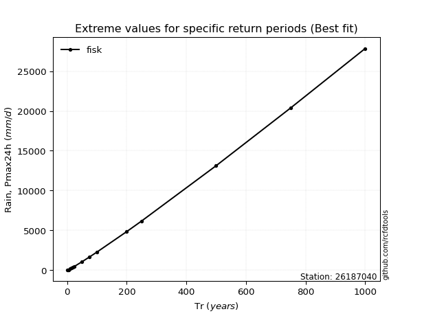</img>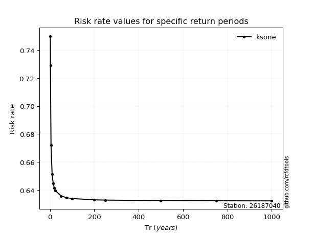</img>

</div>


<sub>**APP DISCLAIMER**: NO WARRANTY - This software is provided by [github.com/rcfdtools](https://github.com/rcfdtools) "as is", without any express or implied warranty, including warranties of merchantability, fitness for a particular purpose, or non-infringement. There is no guarantee that the software will be error-free or operate without interruption. LIMITATION OF LIABILITY - Neither the authors nor copyright holders will be liable for claims or damages arising from the software or its use. You are responsible for determining if the software is appropriate for your use and assume all associated risks, including errors, legal compliance, and data loss. NO PROFESSIONAL ADVICE - The software provides general information and does not offer professional advice. It should not replace consultation with professional advisors.</sub>