<div align="center">


</div>

# PMax24h Station (Rain): 26195502

Maximum Precipitation in 24 hours (PMax24h) is the greatest amount of rainfall for a specific duration that is meteorologically possible for a given location, acting as a "worst-case" scenario for extreme storms, crucial for designing safety-critical infrastructure like bridges, river deviations, dams, spillways, and nuclear plants to prevent catastrophic failure. The PMax24h is related with the Probable Maximum Precipitation (PMP) and it is calculated by hydrologists using meteorological data to determine the upper limit of extreme rainfall, often leading to the Probable Maximum Flood (PMF) for flood control design, and is increasingly being studied for climate change impacts. Probable Maximum Precipitation (PMP) is the theoretical upper limit of rainfall, a deterministic estimate for extreme events, while probability distributions (like GEV, Gumbel) describe the likelihood and frequency of various precipitation amounts, including rare ones, showing how often events occur, with PMP representing the extreme end of these distributions, used for critical infrastructure design to ensure safety against the worst conceivable weather, unlike standard statistical forecasts which cover typical probabilities.

The most common probability distributions in hydrology, used for analyzing floods, rainfall, and streamflow, include the Normal, Log-Normal, Gumbel, Gamma (including Log-Pearson Type III), and Generalized Extreme Value (GEV) distributions, often chosen based on the data´s skewness and whether modeling extremes or general conditions, with Gumbel and GEV popular for extreme events like floods, while the Normal distribution serves as a baseline, though often requiring transformations for skewed hydrological data. These distributions help in designing water infrastructure, managing water resources, and forecasting hydrologic events.

> Hydrological data often isn´t perfectly normal (it´s skewed), so different distributions are needed for different applications, such as: **Flood Frequency Analysis**: Using Gumbel, GEV, or Log-Pearson Type III for predicting extreme flood magnitudes and their return periods, **Rainfall Analysis**: Normal for annual totals, but Log-Normal, Weibull, or GEV for intensity or extreme daily rainfall, **Streamflow Modeling**: Gamma and Log-Normal for maximum flows, GEV for minimum flows, and Kappa for daily flows.

<div align="center">

</img>

</div>


## A. General information


### 1. General running parameters

• app_version: _v20260312_. • runtime: _2026-03-12 07:15:23.203550_. • Python version: _3.14.0_. • SciPy version: _1.16.3_. • Pandas version: _2.3.3_. • NumPy version: _2.3.5_. • Stations dataset (station_dataset_file): _dataset/pmax24h_in/automatic_colombia_2003_2025.csv_. • Stations catalog (station_catalog_file): _dataset/CNE.xls_. • Minimum year to eval til year_max (date_min): _1900_. • Maximum year to eval since year_min (date_max): _2025_. • Creates, save and include plots into reports (create_plot): _True_. • Plot only fit distributions with Δo > Δ (plot_only_fit): _True_. • Plot only simple graphs avoiding multiple CDFs and multiple Extreme values plots (plot_only_simple): _True_. • Eval low extreme values, if False, evaluates high extreme values (low_extreme): _False_. • Eval every SciPy distribution as logarithmic (pdist_logarithmic_on): _True_. • Standard deviation normalized (ddof): _1.0_. • Return periods to eval in years (Tr): _[2, 2.33, 5, 10, 15, 20, 25, 50, 75, 100, 200, 250, 500, 750, 1000]_. • Minimum data sample per station, 0 means any (minimum_sample): _5_. • Z-Score maximum threshold to adjust a value, 0 means disable (zscore_max): _3.5_. • Z-Score minimum threshold to adjust a value, 0 means disable (zscore_min): _-2.5_. • Avoid zeros, e.g. rain = 0 (avoid_zeros): _True_. • Avoid null values (avoid_nans): _True_. 

:file_folder:Table: [dataset.csv](../../dataset/pmax24h_in/automatic_colombia_2003_2025.csv)

> Delta Degrees of Freedom (DDOF): is a parameter used in the formulas for calculating variance and standard deviation. When ddof=0, the divisor is $N$ (the total number of observations) and this is used when your data set is the entire population. When ddof=1, the divisor is $N-1$ and this is used when your data set is a sample drawn from a larger population. Using $N-1$ provides an unbiased estimate of the population variance (known as Bessel´s correction).


### 2. Station info and location

|   id |   CODIGO | NOMBRE                            | CATEGORIA               | TECNOLOGIA                | ESTADO   | FECHA_INSTALACION   |   FECHA_SUSPENSION |   ALTITUD |   LATITUD |   LONGITUD | DEPARTAMENTO   | MUNICIPIO      | AREA_OPERATIVA                      | ENTIDAD                                    | AREA_HIDROGRAFICA   | ZONA_HIDROGRAFICA   | SUBZONA_HIDROGRAFICA   |   CORRIENTE | Catalogo   |   Version |
|-----:|---------:|:----------------------------------|:------------------------|:--------------------------|:---------|:--------------------|-------------------:|----------:|----------:|-----------:|:---------------|:---------------|:------------------------------------|:-------------------------------------------|:--------------------|:--------------------|:-----------------------|------------:|:-----------|----------:|
|    0 | 26195502 | CIUDAD BOLIVAR  - AUT  [26195502] | Climatológica Principal | Automática con Telemetría | Activa   | 30/09/2013          |                nan |      1516 |   5.86867 |   -75.9904 | Antioquia      | Ciudad Bolívar | Area Operativa 01 - Antioquia-Chocó | CENTRO NACIONAL DE INVESTIGACIONES DE CAFE | Magdalena Cauca     | Cauca               | Río San Juan           |         nan | CNE_OE     |  20251226 |

<div align="center">

Dynamic map: [:earth_americas:Google](http://maps.google.com/maps?q=5.868666667,-75.99044167) [:earth_americas:OSM](https://www.openstreetmap.org/#map=18/5.868666667/-75.99044167&layers=P) [:earth_americas:Bing](https://www.bing.com/maps?cp=5.868666667~-75.99044167&lvl=18) [:earth_americas:Apple](https://maps.apple.com/frame?center=5.868666667%2C-75.99044167&span=0.003%2C0.006)

</div>


<div align="center">

```geojson
{
  "type": "Feature",
  "geometry": {
    "type": "Point", 
    "coordinates": [-75.99044167, 5.868666667]
  }, 
  "properties": {
    "Name": "26195502"
  }
}
```

</div>


### 3. Discrete values table and plot

<div align="center">

|               |           0 |          1 |           2 |           3 |           4 |
|:--------------|------------:|-----------:|------------:|------------:|------------:|
| Date          | 2017        | 2018       | 2019        | 2020        | 2021        |
| Value         |   56.4      |   47.9     |   70.5      |   70.3      |   70.9      |
| Value_initial |   56.4      |   47.9     |   70.5      |   70.3      |   70.9      |
| count         |    5        |    5       |    5        |    5        |    5        |
| mean          |   63.2      |   63.2     |   63.2      |   63.2      |   63.2      |
| std           |   10.5276   |   10.5276  |   10.5276   |   10.5276   |   10.5276   |
| zscore        |   -0.645922 |   -1.45333 |    0.693417 |    0.674419 |    0.731412 |


</div>


<div align="center">

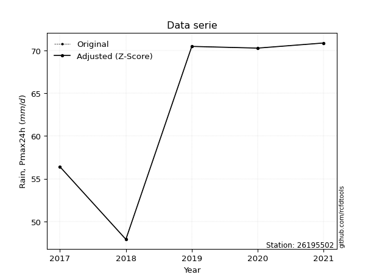</img>

</div>


> The initial value (value_initial) correspond to the initial obtained or null completed value, and value (value) is adjusted only when the initial value is outside the valid range (outlier) definite through the Z-Score value. If Z-Score is active, values out of range or outliers are replaced with the station mean value. A Z-Score (or standard score) measures how many standard deviations a data point is from the mean of a dataset, indicating its relative position; positive scores mean above the mean, negative mean below, and a score of zero is exactly at the mean, allowing for comparison of values from different distributions. It´s calculated using the formula $z=(x–μ)/σ$, where $x$ is the data point, $μ$ is the mean, and $σ$ is the standard deviation, helping identify outliers and understand probability.
>
> <sub>**Note**: In this study, "completing" (filling gaps in) and "extending" (forecasting or lengthening the historical record) rainfall data series are avoided for certain critical analyses because they introduce artificial bias and uncertainty, which can distort the statistics of rare events (extremes), alter day-to-day variability, and compromise the integrity and homogeneity of the original data. Some reasons against Completing/Extending rainfall data are: **Distortion of Extremes and Variability**: The primary issue is that most gap-filling or extension methods rely on averaging or regression with nearby stations, which inherently smooths the data. Rainfall is highly variable in space and time, with a large percentage of zero values and occasional large storms. Infilling methods often underestimate the highest values and overestimate the lowest (zero) values, which severely distorts analyses focused on flood frequency, drought severity, and intensity-duration-frequency (IDF) curves, **Loss of Data Homogeneity**: Infilled or extended data are synthetic estimates, not actual measurements. Combining these estimates with observed data can violate the assumption of data homogeneity, which requires that the data properties do not change over time. Inhomogeneity can lead to incorrect conclusions about long-term trends or changes in climate patterns, **Propagation of Errors**: Errors and biases from the original data (e.g., wind-induced undercatch, instrument errors, site changes) or the data used for imputation can propagate through the analysis, leading to unreliable hydrological models and inaccurate predictions, **Compromised Statistical Integrity**: For statistical analyses, especially those involving the frequency of events, using artificial data can introduce time bias or autocorrelation that doesn´t exist in reality, making it difficult to assess the true probability of events, **Difficulty in Validation**: It is difficult to accurately validate the quality of filled or extended data, especially for past periods where ground-truth measurements are unavailable. The reliability of imputation techniques heavily depends on the density of the surrounding station network and the complexity of the local topography.</sub>


### 4. Active continuous probability distributions from SciPy (80 of 104 available)

A Probability Density Function (PDF) describes the relative likelihood of a continuous random variable falling within a specific range, where the total area under its curve equals 1, and the area over any interval gives the actual probability for that range. Unlike discrete probabilities (like rolling a die), a PDF shows density, not direct probability for a single point (which is zero), with higher points indicating higher likelihood, often visualized as a bell curve for normal distributions.

A log of a probability density function (log-PDF) is simply the logarithm of the PDF´s value, denoted as $log(f(x))$, useful for converting multiplication of probabilities into addition, improving numerical stability with tiny numbers, and connecting to information theory concepts like entropy. Instead of dealing with very small probabilities (e.g., 0.000001), log-PDFs use negative numbers (e.g., $log(0.00001) ≈ -11.51$ that are easier for computers to handle, preventing underflow errors and simplifying complex calculations. In this study, each active probability distribution from SciPy is also evaluated in the $log$ form.

[scipy.stats](https://docs.scipy.org/doc/scipy/reference/stats.html) is a Python´s powerful submodule within the SciPy library for comprehensive statistical analysis, offering over 130 probability distributions (like Normal, Poisson, etc.), functions for descriptive stats (mean, variance), hypothesis testing (t-tests, chi-square), random variable generation, and statistical tests, making it essential for data science, modeling, and research. It provides tools to explore, model, and draw conclusions from data efficiently, working seamlessly with [NumPy](https://numpy.org/).

<div align="center">

|   id | p_dist           |   n_parameter | fit_method   | label                                                                       | active   | ref                                                                                                      |
|-----:|:-----------------|--------------:|:-------------|:----------------------------------------------------------------------------|:---------|:---------------------------------------------------------------------------------------------------------|
|    0 | alpha            |             3 | MLE          | Alpha                                                                       | True     | [:mortar_board:](https://docs.scipy.org/doc/scipy/reference/generated/scipy.stats.alpha.html)            |
|    1 | anglit           |             2 | MM           | Anglit                                                                      | True     | [:mortar_board:](https://docs.scipy.org/doc/scipy/reference/generated/scipy.stats.anglit.html)           |
|    2 | arcsine          |             2 | MM           | Arcsine                                                                     | True     | [:mortar_board:](https://docs.scipy.org/doc/scipy/reference/generated/scipy.stats.arcsine.html)          |
|    3 | argus            |             3 | MLE          | Argus                                                                       | True     | [:mortar_board:](https://docs.scipy.org/doc/scipy/reference/generated/scipy.stats.argus.html)            |
|    4 | beta             |             4 | MLE          | Beta                                                                        | True     | [:mortar_board:](https://docs.scipy.org/doc/scipy/reference/generated/scipy.stats.beta.html)             |
|    5 | betaprime        |             4 | MLE          | Beta prime                                                                  | True     | [:mortar_board:](https://docs.scipy.org/doc/scipy/reference/generated/scipy.stats.betaprime.html)        |
|    6 | bradford         |             3 | MLE          | Bradford                                                                    | True     | [:mortar_board:](https://docs.scipy.org/doc/scipy/reference/generated/scipy.stats.bradford.html)         |
|    7 | burr             |             4 | MLE          | Burr (Type III)                                                             | True     | [:mortar_board:](https://docs.scipy.org/doc/scipy/reference/generated/scipy.stats.burr.html)             |
|    8 | burr12           |             4 | MLE          | Burr (Type III) 12                                                          | True     | [:mortar_board:](https://docs.scipy.org/doc/scipy/reference/generated/scipy.stats.burr12.html)           |
|    9 | cosine           |             2 | MLE          | Cosine                                                                      | True     | [:mortar_board:](https://docs.scipy.org/doc/scipy/reference/generated/scipy.stats.cosine.html)           |
|   10 | crystalball      |             4 | MLE          | Crystalball                                                                 | True     | [:mortar_board:](https://docs.scipy.org/doc/scipy/reference/generated/scipy.stats.crystalball.html)      |
|   11 | dgamma           |             3 | MLE          | Double gamma                                                                | True     | [:mortar_board:](https://docs.scipy.org/doc/scipy/reference/generated/scipy.stats.dgamma.html)           |
|   12 | dweibull         |             3 | MLE          | Double Weibull                                                              | True     | [:mortar_board:](https://docs.scipy.org/doc/scipy/reference/generated/scipy.stats.dweibull.html)         |
|   13 | erlang           |             3 | MLE          | Erlang                                                                      | True     | [:mortar_board:](https://docs.scipy.org/doc/scipy/reference/generated/scipy.stats.erlang.html)           |
|   14 | exponnorm        |             3 | MLE          | Exponentially modified Normal                                               | True     | [:mortar_board:](https://docs.scipy.org/doc/scipy/reference/generated/scipy.stats.exponnorm.html)        |
|   15 | exponpow         |             3 | MLE          | Exponential power                                                           | True     | [:mortar_board:](https://docs.scipy.org/doc/scipy/reference/generated/scipy.stats.exponpow.html)         |
|   16 | exponweib        |             4 | MLE          | Exponentiated Weibull                                                       | True     | [:mortar_board:](https://docs.scipy.org/doc/scipy/reference/generated/scipy.stats.exponweib.html)        |
|   17 | f                |             4 | MLE          | F                                                                           | True     | [:mortar_board:](https://docs.scipy.org/doc/scipy/reference/generated/scipy.stats.f.html)                |
|   18 | fatiguelife      |             3 | MLE          | Fatigue-life (Birnbaum-Saunders)                                            | True     | [:mortar_board:](https://docs.scipy.org/doc/scipy/reference/generated/scipy.stats.fatiguelife.html)      |
|   19 | foldnorm         |             3 | MM           | Fold Normal                                                                 | True     | [:mortar_board:](https://docs.scipy.org/doc/scipy/reference/generated/scipy.stats.foldnorm.html)         |
|   20 | gamma            |             3 | MLE          | Gamma                                                                       | True     | [:mortar_board:](https://docs.scipy.org/doc/scipy/reference/generated/scipy.stats.gamma.html)            |
|   21 | gausshyper       |             6 | MLE          | Gauss hypergeometric                                                        | True     | [:mortar_board:](https://docs.scipy.org/doc/scipy/reference/generated/scipy.stats.gausshyper.html)       |
|   22 | genexpon         |             5 | MLE          | Generalized exponential                                                     | True     | [:mortar_board:](https://docs.scipy.org/doc/scipy/reference/generated/scipy.stats.genexpon.html)         |
|   23 | genextreme       |             3 | MLE          | Generalized exponential                                                     | True     | [:mortar_board:](https://docs.scipy.org/doc/scipy/reference/generated/scipy.stats.genextreme.html)       |
|   24 | gengamma         |             4 | MLE          | Generalized gamma                                                           | True     | [:mortar_board:](https://docs.scipy.org/doc/scipy/reference/generated/scipy.stats.gengamma.html)         |
|   25 | genhalflogistic  |             3 | MLE          | Generalized half-logistic                                                   | True     | [:mortar_board:](https://docs.scipy.org/doc/scipy/reference/generated/scipy.stats.genhalflogistic.html)  |
|   26 | genlogistic      |             3 | MLE          | Generalized logistic                                                        | True     | [:mortar_board:](https://docs.scipy.org/doc/scipy/reference/generated/scipy.stats.genlogistic.html)      |
|   27 | gennorm          |             3 | MLE          | Generalized Normal                                                          | True     | [:mortar_board:](https://docs.scipy.org/doc/scipy/reference/generated/scipy.stats.gennorm.html)          |
|   28 | genpareto        |             3 | MLE          | Generalized Pareto                                                          | True     | [:mortar_board:](https://docs.scipy.org/doc/scipy/reference/generated/scipy.stats.genpareto.html)        |
|   29 | gompertz         |             3 | MLE          | Gompertz (or truncated Gumbel)                                              | True     | [:mortar_board:](https://docs.scipy.org/doc/scipy/reference/generated/scipy.stats.gompertz.html)         |
|   30 | gumbel_l         |             2 | MM           | Gumbel Left Skew                                                            | True     | [:mortar_board:](https://docs.scipy.org/doc/scipy/reference/generated/scipy.stats.gumbel_l.html)         |
|   31 | gumbel_r         |             2 | MM           | Gumbel Right Skew                                                           | True     | [:mortar_board:](https://docs.scipy.org/doc/scipy/reference/generated/scipy.stats.gumbel_r.html)         |
|   32 | halfgennorm      |             3 | MLE          | Upper half of a generalized normal                                          | True     | [:mortar_board:](https://docs.scipy.org/doc/scipy/reference/generated/scipy.stats.halfgennorm.html)      |
|   33 | halflogistic     |             2 | MM           | Half-logistic                                                               | True     | [:mortar_board:](https://docs.scipy.org/doc/scipy/reference/generated/scipy.stats.halflogistic.html)     |
|   34 | halfnorm         |             2 | MM           | Half Normal                                                                 | True     | [:mortar_board:](https://docs.scipy.org/doc/scipy/reference/generated/scipy.stats.halfnorm.html)         |
|   35 | hypsecant        |             2 | MM           | hyperbolic secant                                                           | True     | [:mortar_board:](https://docs.scipy.org/doc/scipy/reference/generated/scipy.stats.hypsecant.html)        |
|   36 | invgamma         |             3 | MLE          | Inverted gamma                                                              | True     | [:mortar_board:](https://docs.scipy.org/doc/scipy/reference/generated/scipy.stats.invgamma.html)         |
|   37 | invgauss         |             3 | MLE          | Inverse Gaussian                                                            | True     | [:mortar_board:](https://docs.scipy.org/doc/scipy/reference/generated/scipy.stats.invgauss.html)         |
|   38 | invweibull       |             3 | MLE          | Inverted Weibull                                                            | True     | [:mortar_board:](https://docs.scipy.org/doc/scipy/reference/generated/scipy.stats.invweibull.html)       |
|   39 | johnsonsb        |             4 | MLE          | Johnson SB                                                                  | True     | [:mortar_board:](https://docs.scipy.org/doc/scipy/reference/generated/scipy.stats.johnsonsb.html)        |
|   40 | johnsonsu        |             4 | MLE          | Johnson Su                                                                  | True     | [:mortar_board:](https://docs.scipy.org/doc/scipy/reference/generated/scipy.stats.johnsonsu.html)        |
|   41 | kappa3           |             3 | MLE          | Kappa 3                                                                     | True     | [:mortar_board:](https://docs.scipy.org/doc/scipy/reference/generated/scipy.stats.kappa3.html)           |
|   42 | kappa4           |             4 | MLE          | Kappa 4                                                                     | True     | [:mortar_board:](https://docs.scipy.org/doc/scipy/reference/generated/scipy.stats.kappa4.html)           |
|   43 | ksone            |             3 | MLE          | Kolmogorov-Smirnov one-sided test statistic distribution                    | True     | [:mortar_board:](https://docs.scipy.org/doc/scipy/reference/generated/scipy.stats.ksone.html)            |
|   44 | kstwobign        |             2 | MLE          | Limiting distribution of scaled Kolmogorov-Smirnov two-sided test statistic | True     | [:mortar_board:](https://docs.scipy.org/doc/scipy/reference/generated/scipy.stats.kstwobign.html)        |
|   45 | laplace          |             2 | MM           | Laplace                                                                     | True     | [:mortar_board:](https://docs.scipy.org/doc/scipy/reference/generated/scipy.stats.laplace.html)          |
|   46 | levy_l           |             2 | MLE          | Left-skewed Levy                                                            | True     | [:mortar_board:](https://docs.scipy.org/doc/scipy/reference/generated/scipy.stats.levy_l.html)           |
|   47 | loggamma         |             3 | MLE          | Log gamma                                                                   | True     | [:mortar_board:](https://docs.scipy.org/doc/scipy/reference/generated/scipy.stats.loggamma.html)         |
|   48 | logistic         |             2 | MM           | Logistic (or Sech-squared)                                                  | True     | [:mortar_board:](https://docs.scipy.org/doc/scipy/reference/generated/scipy.stats.logistic.html)         |
|   49 | loglaplace       |             3 | MLE          | Log-Laplace                                                                 | True     | [:mortar_board:](https://docs.scipy.org/doc/scipy/reference/generated/scipy.stats.loglaplace.html)       |
|   50 | lomax            |             3 | MLE          | Lomax (Pareto of the second kind)                                           | True     | [:mortar_board:](https://docs.scipy.org/doc/scipy/reference/generated/scipy.stats.lomax.html)            |
|   51 | maxwell          |             2 | MM           | Maxwell                                                                     | True     | [:mortar_board:](https://docs.scipy.org/doc/scipy/reference/generated/scipy.stats.maxwell.html)          |
|   52 | mielke           |             4 | MLE          | Mielke Beta-Kappa / Dagum                                                   | True     | [:mortar_board:](https://docs.scipy.org/doc/scipy/reference/generated/scipy.stats.mielke.html)           |
|   53 | moyal            |             2 | MM           | Moyal                                                                       | True     | [:mortar_board:](https://docs.scipy.org/doc/scipy/reference/generated/scipy.stats.moyal.html)            |
|   54 | nakagami         |             3 | MLE          | Nakagami                                                                    | True     | [:mortar_board:](https://docs.scipy.org/doc/scipy/reference/generated/scipy.stats.nakagami.html)         |
|   55 | ncf              |             5 | MLE          | Non-central F distribution                                                  | True     | [:mortar_board:](https://docs.scipy.org/doc/scipy/reference/generated/scipy.stats.ncf.html)              |
|   56 | nct              |             4 | MLE          | Non-central Student’s t                                                     | True     | [:mortar_board:](https://docs.scipy.org/doc/scipy/reference/generated/scipy.stats.nct.html)              |
|   57 | norm             |             2 | MM           | Normal                                                                      | True     | [:mortar_board:](https://docs.scipy.org/doc/scipy/reference/generated/scipy.stats.norm.html)             |
|   58 | pearson3         |             3 | MM           | Pearson type III                                                            | True     | [:mortar_board:](https://docs.scipy.org/doc/scipy/reference/generated/scipy.stats.pearson3.html)         |
|   59 | powerlaw         |             3 | MLE          | Power-function                                                              | True     | [:mortar_board:](https://docs.scipy.org/doc/scipy/reference/generated/scipy.stats.powerlaw.html)         |
|   60 | rayleigh         |             2 | MM           | Rayleigh                                                                    | True     | [:mortar_board:](https://docs.scipy.org/doc/scipy/reference/generated/scipy.stats.rayleigh.html)         |
|   61 | rdist            |             3 | MLE          | R-distributed (symmetric beta)                                              | True     | [:mortar_board:](https://docs.scipy.org/doc/scipy/reference/generated/scipy.stats.rdist.html)            |
|   62 | rice             |             3 | MLE          | Rice                                                                        | True     | [:mortar_board:](https://docs.scipy.org/doc/scipy/reference/generated/scipy.stats.rice.html)             |
|   63 | semicircular     |             2 | MM           | Semicircular                                                                | True     | [:mortar_board:](https://docs.scipy.org/doc/scipy/reference/generated/scipy.stats.semicircular.html)     |
|   64 | skewnorm         |             3 | MLE          | Skew normal                                                                 | True     | [:mortar_board:](https://docs.scipy.org/doc/scipy/reference/generated/scipy.stats.skewnorm.html)         |
|   65 | t                |             3 | MLE          | Student’s t                                                                 | True     | [:mortar_board:](https://docs.scipy.org/doc/scipy/reference/generated/scipy.stats.t.html)                |
|   66 | trapezoid        |             4 | MLE          | Trapezoid                                                                   | True     | [:mortar_board:](https://docs.scipy.org/doc/scipy/reference/generated/scipy.stats.trapezoid.html)        |
|   67 | triang           |             3 | MLE          | Triangular                                                                  | True     | [:mortar_board:](https://docs.scipy.org/doc/scipy/reference/generated/scipy.stats.triang.html)           |
|   68 | truncexpon       |             3 | MLE          | Truncated exponential                                                       | True     | [:mortar_board:](https://docs.scipy.org/doc/scipy/reference/generated/scipy.stats.truncexpon.html)       |
|   69 | truncnorm        |             4 | MLE          | Truncated normal                                                            | True     | [:mortar_board:](https://docs.scipy.org/doc/scipy/reference/generated/scipy.stats.truncnorm.html)        |
|   70 | truncpareto      |             4 | MLE          | Upper truncated Pareto                                                      | True     | [:mortar_board:](https://docs.scipy.org/doc/scipy/reference/generated/scipy.stats.truncpareto.html)      |
|   71 | truncweibull_min |             5 | MLE          | Doubly truncated Weibull minimum                                            | True     | [:mortar_board:](https://docs.scipy.org/doc/scipy/reference/generated/scipy.stats.truncweibull_min.html) |
|   72 | tukeylambda      |             3 | MLE          | Tukey-Lamdba                                                                | True     | [:mortar_board:](https://docs.scipy.org/doc/scipy/reference/generated/scipy.stats.tukeylambda.html)      |
|   73 | uniform          |             2 | MLE          | Uniform                                                                     | True     | [:mortar_board:](https://docs.scipy.org/doc/scipy/reference/generated/scipy.stats.uniform.html)          |
|   74 | vonmises         |             3 | MLE          | Von Mises                                                                   | True     | [:mortar_board:](https://docs.scipy.org/doc/scipy/reference/generated/scipy.stats.vonmises.html)         |
|   75 | vonmises_line    |             3 | MLE          | Von Mises line                                                              | True     | [:mortar_board:](https://docs.scipy.org/doc/scipy/reference/generated/scipy.stats.vonmises_line.html)    |
|   76 | wald             |             2 | MM           | Wald                                                                        | True     | [:mortar_board:](https://docs.scipy.org/doc/scipy/reference/generated/scipy.stats.wald.html)             |
|   77 | weibull_max      |             3 | MLE          | Weibull maximum                                                             | True     | [:mortar_board:](https://docs.scipy.org/doc/scipy/reference/generated/scipy.stats.weibull_max.html)      |
|   78 | weibull_min      |             3 | MLE          | Weibull minimum                                                             | True     | [:mortar_board:](https://docs.scipy.org/doc/scipy/reference/generated/scipy.stats.weibull_min.html)      |
|   79 | wrapcauchy       |             3 | MLE          | Wrapped  Cauchy                                                             | True     | [:mortar_board:](https://docs.scipy.org/doc/scipy/reference/generated/scipy.stats.wrapcauchy.html)       |

</div>

> **n_parameter:** # arguments & localization & scale.
>
> **Fit methods:** (MLE) maximum likelihood, (MM) L-moments.
>
>**Inactive** (With the only purpose of prevent loops, zero divisions, infinite values, over high estimated values or horizontal trending for recurrence intervals estimations, the follow distributions were disabled.)**:** lognorm, norminvgauss, powernorm, powerlognorm, cauchy, halfcauchy, foldcauchy, skewcauchy, chi2, expon, fisk, genhyperbolic, geninvgauss, gibrat, kstwo, laplace_asymmetric, levy, levy_stable, ncx2, pareto, rel_breitwigner, recipinvgauss, studentized_range, loguniform, 


## B. Probability (PDF) vs. Empirical (EDF) distributions functions

A continuous probability distribution (CPD) describes probabilities for variables that can take any value within a range (like rain any time), unlike discrete variables with specific outcomes (like temperature). It uses a Probability Density Function (PDF), a curve where the total area under it equals 1, and the probability of the variable falling within an interval (a to b) is found by calculating the area under the curve between those points. A key feature is that the probability of hitting any single exact value is zero, so probabilities are always expressed for ranges, e.g., $P(a ≤ X ≤ b)$.

<div align="center">

Distributions parameters from station values
|     |   station | p_dist              |   n |               loc |            scale | shape                  | shape1                 | shape2                | shape3             |
|----:|----------:|:--------------------|----:|------------------:|-----------------:|:-----------------------|:-----------------------|:----------------------|:-------------------|
|   0 |  26195502 | alpha               |   5 |    -161.774       |   5190.69        | 23.13012029168872      |                        |                       |                    |
|   1 |  26195502 | anglit              |   5 |      63.2         |     27.546       |                        |                        |                       |                    |
|   2 |  26195502 | arcsine             |   5 |      49.8835      |     26.6329      |                        |                        |                       |                    |
|   3 |  26195502 | argus               |   5 |      36.9574      |     35.3163      | 2.5375973008979207     |                        |                       |                    |
|   4 |  26195502 | beta                |   5 |      47.8441      |     23.0559      | 0.2683195709885001     | 0.14155600312126576    |                       |                    |
|   5 |  26195502 | betaprime           |   5 |    -169.993       |   7482.13        | 605.9627204905055      | 19454.98269003656      |                       |                    |
|   6 |  26195502 | bradford            |   5 |      47.9         |     23.0001      | 1.0822444212878826     |                        |                       |                    |
|   7 |  26195502 | burr                |   5 |      -0.527868    |     72.5191      | 140.16375816621147     | 0.050125897587857585   |                       |                    |
|   8 |  26195502 | burr12              |   5 |     -12.7151      |     60.4897      | 2192.371546451237      | 0.0020834763243021033  |                       |                    |
|   9 |  26195502 | cosine              |   5 |      62.318       |      7.56004     |                        |                        |                       |                    |
|  10 |  26195502 | crystalball         |   5 |      63.2         |      9.41616     | 57245.523818347545     | 5582.833056705884      |                       |                    |
|  11 |  26195502 | dgamma              |   5 |      70.5         |     10.218       | 0.43978136984398675    |                        |                       |                    |
|  12 |  26195502 | dweibull            |   5 |      70.3         |      8.07673     | 0.676739482159589      |                        |                       |                    |
|  13 |  26195502 | erlang              |   5 |     -87.2159      |      0.616075    | 244.10082171465223     |                        |                       |                    |
|  14 |  26195502 | exponnorm           |   5 |      63.1938      |      9.41618     | 0.000666801630177859   |                        |                       |                    |
|  15 |  26195502 | exponpow            |   5 |      47.9         |      1.58815     | 0.129990539208516      |                        |                       |                    |
|  16 |  26195502 | exponweib           |   5 |      47.9         |      1.38542     | 1.443468422604111      | 0.16693396678627526    |                       |                    |
|  17 |  26195502 | f                   |   5 |   -9503.26        |   9566.43        | 7553670.772863412      | 2813247.518635598      |                       |                    |
|  18 |  26195502 | fatiguelife         |   5 |      47.9         |      0.000208781 | 332.80425754715685     |                        |                       |                    |
|  19 |  26195502 | foldnorm            |   5 |      27.3873      |      3.62017     | 10.144679773517456     |                        |                       |                    |
|  20 |  26195502 | gamma               |   5 |     -79.0459      |      0.648158    | 219.33462173001817     |                        |                       |                    |
|  21 |  26195502 | gausshyper          |   5 |      46.4233      |     24.4767      | 1.0974509604820248     | 0.9194901194333482     | 1.01562629550804      | 1.0159215092240002 |
|  22 |  26195502 | genexpon            |   5 |      47.9         |      2.14044     | 0.18222297166713314    | 1.0259322682544284e-05 | 1.2951698087557832    |                    |
|  23 |  26195502 | genextreme          |   5 |      66.262       |      7.21341     | 1.555298079940818      |                        |                       |                    |
|  24 |  26195502 | gengamma            |   5 |      47.9         |      1.32386     | 1.3696482407249242     | 0.3013117382108486     |                       |                    |
|  25 |  26195502 | genhalflogistic     |   5 |      42.7481      |     30.3717      | 1.0788506982132096     |                        |                       |                    |
|  26 |  26195502 | genlogistic         |   5 |      70.9002      |      9.77107e-06 | 1.2650730812547147e-06 |                        |                       |                    |
|  27 |  26195502 | gennorm             |   5 |      70.3         |      0.00322883  | 0.24084169278073309    |                        |                       |                    |
|  28 |  26195502 | genpareto           |   5 |      -0.830942    |    139.491       | -1.9446465745809633    |                        |                       |                    |
|  29 |  26195502 | gompertz            |   5 |      70.3         |      0.391895    | 0.8631147413341387     |                        |                       |                    |
|  30 |  26195502 | gumbel_l            |   5 |      67.4378      |      7.34175     |                        |                        |                       |                    |
|  31 |  26195502 | gumbel_r            |   5 |      58.9622      |      7.34175     |                        |                        |                       |                    |
|  32 |  26195502 | halfgennorm         |   5 |      47.9         |      1.2759      | 0.4099107591081423     |                        |                       |                    |
|  33 |  26195502 | halflogistic        |   5 |      52.0397      |      8.05045     |                        |                        |                       |                    |
|  34 |  26195502 | halfnorm            |   5 |      50.7367      |     15.6205      |                        |                        |                       |                    |
|  35 |  26195502 | hypsecant           |   5 |      63.2         |      5.99451     |                        |                        |                       |                    |
|  36 |  26195502 | invgamma            |   5 |     -92.302       |  38641.8         | 249.7125931846441      |                        |                       |                    |
|  37 |  26195502 | invgauss            |   5 |       6.24932     |   1644.37        | 0.03469357846536221    |                        |                       |                    |
|  38 |  26195502 | invweibull          |   5 |      47.9         |      1.8147      | 0.06800562602761166    |                        |                       |                    |
|  39 |  26195502 | johnsonsb           |   5 |     -28.937       |     99.837       | -1.5443743614340222    | 0.13329409054557573    |                       |                    |
|  40 |  26195502 | johnsonsu           |   5 |      70.9         |      1.51785e-13 | 3.085575872761158      | 0.13185681897478407    |                       |                    |
|  41 |  26195502 | kappa3              |   5 |      47.8997      |     32.4307      | 224.56658609843814     |                        |                       |                    |
|  42 |  26195502 | kappa4              |   5 |      45.1866      |     29.48        | 1.0988181188596298     | 1.1464866834907061     |                       |                    |
|  43 |  26195502 | ksone               |   5 |      46.8907      |     32.6185      | 1.0                    |                        |                       |                    |
|  44 |  26195502 | kstwobign           |   5 |      25.575       |     42.803       |                        |                        |                       |                    |
|  45 |  26195502 | laplace             |   5 |      63.2         |      6.65823     |                        |                        |                       |                    |
|  46 |  26195502 | levy_l              |   5 |      70.9897      |      0.338879    |                        |                        |                       |                    |
|  47 |  26195502 | loggamma            |   5 |      70.9003      |      2.25743e-05 | 2.9418787322131153e-06 |                        |                       |                    |
|  48 |  26195502 | logistic            |   5 |      63.2         |      5.1914      |                        |                        |                       |                    |
|  49 |  26195502 | loglaplace          |   5 |      -0.209451    |     70.5095      | 8.155254619999571      |                        |                       |                    |
|  50 |  26195502 | lomax               |   5 |      47.9         |    839.108       | 55.12610824926341      |                        |                       |                    |
|  51 |  26195502 | maxwell             |   5 |      40.8877      |     13.9822      |                        |                        |                       |                    |
|  52 |  26195502 | mielke              |   5 |      21.4552      |     49.5918      | 4.959735404483094      | 1338.8202396982851     |                       |                    |
|  53 |  26195502 | moyal               |   5 |      57.8152      |      4.23876     |                        |                        |                       |                    |
|  54 |  26195502 | nakagami            |   5 |      56.4         |     10.8715      | 0.38342417410510177    |                        |                       |                    |
|  55 |  26195502 | ncf                 |   5 |      -5.27612     |     68.4264      | 102.33652553604583     | 2416.4097774989723     | 2.828908302253061e-05 |                    |
|  56 |  26195502 | nct                 |   5 |      -1.66458     |      0.180378    | 20.11082878484254      | 346.3624639844238      |                       |                    |
|  57 |  26195502 | norm                |   5 |      63.2         |      9.41616     |                        |                        |                       |                    |
|  58 |  26195502 | pearson3            |   5 |      63.2         |      9.41615     | -0.6450215378833632    |                        |                       |                    |
|  59 |  26195502 | powerlaw            |   5 |      47.9         |     23           | 0.13604399239045165    |                        |                       |                    |
|  60 |  26195502 | rayleigh            |   5 |      45.1863      |     14.3728      |                        |                        |                       |                    |
|  61 |  26195502 | rdist               |   5 |      45.1248      |     11.2752      | 1.1175618738869209     |                        |                       |                    |
|  62 |  26195502 | rice                |   5 |      42.0301      |     10.578       | 1.6726241421439625     |                        |                       |                    |
|  63 |  26195502 | semicircular        |   5 |      63.2         |     18.8323      |                        |                        |                       |                    |
|  64 |  26195502 | skewnorm            |   5 |      70.9         |     12.1627      | -20682547.806778133    |                        |                       |                    |
|  65 |  26195502 | t                   |   5 |      63.2003      |      9.41593     | 15102886.17746884      |                        |                       |                    |
|  66 |  26195502 | trapezoid           |   5 |      36.5671      |     39.9494      | 1.0                    | 1.0                    |                       |                    |
|  67 |  26195502 | triang              |   5 |      42.0989      |     28.8109      | 0.9999999998291256     |                        |                       |                    |
|  68 |  26195502 | truncexpon          |   5 |      47.868       |     29.9979      | 0.7677859264212052     |                        |                       |                    |
|  69 |  26195502 | truncnorm           |   5 |      63.2         |      9.41616     | -297.27184441213666    | 844.5651990632784      |                       |                    |
|  70 |  26195502 | truncpareto         |   5 |      47.7489      |      0.151059    | 0.2617737165962414     | 153.25881000611201     |                       |                    |
|  71 |  26195502 | truncweibull_min    |   5 |      47.3847      |     29.4672      | 1.1496738491391791     | 9.759715031264765e-07  | 0.798018361229268     |                    |
|  72 |  26195502 | tukeylambda         |   5 |      59.4         |     14.8271      | 1.2893128241997713     |                        |                       |                    |
|  73 |  26195502 | uniform             |   5 |      47.9         |     23           |                        |                        |                       |                    |
|  74 |  26195502 | vonmises            |   5 |       1.2737      |      1           | 0.9440992164224932     |                        |                       |                    |
|  75 |  26195502 | vonmises_line       |   5 |      66.7887      |      6.01245     | 0.918236095417178      |                        |                       |                    |
|  76 |  26195502 | wald                |   5 |      53.7838      |      9.41618     |                        |                        |                       |                    |
|  77 |  26195502 | weibull_max         |   5 |      70.9         |      9.06706     | 0.9585800811086185     |                        |                       |                    |
|  78 |  26195502 | weibull_min         |   5 |      -4.49718e+06 |      4.49725e+06 | 679931.8269159627      |                        |                       |                    |
|  79 |  26195502 | wrapcauchy          |   5 |      47.8371      |      3.67057     | 0.917600489149021      |                        |                       |                    |
|  80 |  26195502 | logalpha            |   5 |      -3.25653     |    342.161       | 46.323864436749375     |                        |                       |                    |
|  81 |  26195502 | loganglit           |   5 |       4.13425     |      0.463593    |                        |                        |                       |                    |
|  82 |  26195502 | logarcsine          |   5 |       3.91011     |      0.448268    |                        |                        |                       |                    |
|  83 |  26195502 | logargus            |   5 |       3.68243     |      0.601994    | 2.5975470497166038     |                        |                       |                    |
|  84 |  26195502 | logbeta             |   5 |       3.86189     |      0.399384    | 0.3240216619585195     | 0.15938517629145993    |                       |                    |
|  85 |  26195502 | logbetaprime        |   5 |      -4.25664     |      1.64433     | 2963.3635116793757     | 581.0566534431284      |                       |                    |
|  86 |  26195502 | logbradford         |   5 |       3.86911     |      0.392157    | 1.0031498877599934     |                        |                       |                    |
|  87 |  26195502 | logburr             |   5 | -278953           | 278957           | 69800133.22719966      | 0.02944326540035251    |                       |                    |
|  88 |  26195502 | logburr12           |   5 |     -83.2092      |     88.5192      | 794.1771834704828      | 21275.156138081285     |                       |                    |
|  89 |  26195502 | logcosine           |   5 |       4.11777     |      0.128311    |                        |                        |                       |                    |
|  90 |  26195502 | logcrystalball      |   5 |       4.13425     |      0.158477    | 5.9754158524219205     | 19.96813160813572      |                       |                    |
|  91 |  26195502 | logdgamma           |   5 |       4.25561     |      0.110664    | 0.9546545960656948     |                        |                       |                    |
|  92 |  26195502 | logdweibull         |   5 |       4.25561     |      0.117255    | 0.4549687837917177     |                        |                       |                    |
|  93 |  26195502 | logerlang           |   5 |       1.45574     |      0.00979383  | 273.2314850240375      |                        |                       |                    |
|  94 |  26195502 | logexponnorm        |   5 |       4.13414     |      0.158473    | 0.0006826160487093057  |                        |                       |                    |
|  95 |  26195502 | logexponpow         |   5 |      -8.00285e+06 |      8.00285e+06 | 60240105.49709913      |                        |                       |                    |
|  96 |  26195502 | logexponweib        |   5 |       3.86912     |      0.401755    | 0.2607642193083229     | 1.7788080149410064     |                       |                    |
|  97 |  26195502 | logf                |   5 |    -122.06        |    126.195       | 3975789.4919740474     | 1857344.9215918966     |                       |                    |
|  98 |  26195502 | logfatiguelife      |   5 |     -24.4565      |     28.5901      | 0.00551783894179181    |                        |                       |                    |
|  99 |  26195502 | logfoldnorm         |   5 |       3.86607     |      0.173684    | 1.4834312108050351     |                        |                       |                    |
| 100 |  26195502 | loggamma            |   5 |       1.649       |      0.0106624   | 232.8466925258004      |                        |                       |                    |
| 101 |  26195502 | loggausshyper       |   5 |       3.82387     |      0.437401    | 1.2605543736369667     | 0.8614085467749374     | 0.9610304252807098    | 0.9128519454171795 |
| 102 |  26195502 | loggenexpon         |   5 |       3.86882     |      0.000537296 | 0.000960025335484989   | 0.2604573977755511     | 1.213782061315775e-05 |                    |
| 103 |  26195502 | loggenextreme       |   5 |       4.17307     |      0.108569    | 1.2308821088065494     |                        |                       |                    |
| 104 |  26195502 | loggengamma         |   5 |       3.86912     |      1.04114     | 0.597266317613649      | 1.147492231809931      |                       |                    |
| 105 |  26195502 | loggenhalflogistic  |   5 |       3.8349      |      0.493167    | 1.1566747997629077     |                        |                       |                    |
| 106 |  26195502 | loggenlogistic      |   5 |       4.26129     |      1.76574e-06 | 1.3934626038137894e-05 |                        |                       |                    |
| 107 |  26195502 | loggennorm          |   5 |       4.26127     |      0.000494888 | 0.28314177937745916    |                        |                       |                    |
| 108 |  26195502 | loggenpareto        |   5 |      -0.00747855  |     10.3053      | -2.4141259262100343    |                        |                       |                    |
| 109 |  26195502 | loggompertz         |   5 |       3.86912     |      0.456841    | 1.2746849132806026     |                        |                       |                    |
| 110 |  26195502 | loggumbel_l         |   5 |       4.20557     |      0.12356     |                        |                        |                       |                    |
| 111 |  26195502 | loggumbel_r         |   5 |       4.06293     |      0.12356     |                        |                        |                       |                    |
| 112 |  26195502 | loghalfgennorm      |   5 |       3.86912     |      0.374244    | 1.4364836540567723     |                        |                       |                    |
| 113 |  26195502 | loghalflogistic     |   5 |       3.94643     |      0.13548     |                        |                        |                       |                    |
| 114 |  26195502 | loghalfnorm         |   5 |       3.9245      |      0.262886    |                        |                        |                       |                    |
| 115 |  26195502 | loghypsecant        |   5 |       4.13425     |      0.100886    |                        |                        |                       |                    |
| 116 |  26195502 | loginvgamma         |   5 |       1.34567     |    795.146       | 286.39735795468346     |                        |                       |                    |
| 117 |  26195502 | loginvgauss         |   5 |       2.72019     |     96.6533      | 0.014597383553231244   |                        |                       |                    |
| 118 |  26195502 | loginvweibull       |   5 |      -7.89363e+06 |      7.89364e+06 | 51446906.277284294     |                        |                       |                    |
| 119 |  26195502 | logjohnsonsb        |   5 |       2.99792     |      1.26335     | -3.0299274264661142    | 0.1756114713300357     |                       |                    |
| 120 |  26195502 | logjohnsonsu        |   5 |       4.26127     |      1.87945e-14 | 3.6561930432125367     | 0.17381109463786734    |                       |                    |
| 121 |  26195502 | logkappa3           |   5 |       3.86912     |      0.391808    | 1780.5723888773614     |                        |                       |                    |
| 122 |  26195502 | logkappa4           |   5 |       3.79715     |      0.516975    | 1.0185122781042564     | 1.1138739225388197     |                       |                    |
| 123 |  26195502 | logksone            |   5 |       3.85977     |      0.548962    | 1.0                    |                        |                       |                    |
| 124 |  26195502 | logkstwobign        |   5 |       3.488       |      0.735491    |                        |                        |                       |                    |
| 125 |  26195502 | loglaplace          |   5 |       4.13425     |      0.112056    |                        |                        |                       |                    |
| 126 |  26195502 | loglevy_l           |   5 |       4.26255     |      0.00482844  |                        |                        |                       |                    |
| 127 |  26195502 | logloggamma         |   5 |       4.26132     |      5.97411e-07 | 4.682032540619884e-06  |                        |                       |                    |
| 128 |  26195502 | loglogistic         |   5 |       4.13425     |      0.0873699   |                        |                        |                       |                    |
| 129 |  26195502 | logloglaplace       |   5 |       0.0377755   |      4.215       | 32.93476259422491      |                        |                       |                    |
| 130 |  26195502 | loglomax            |   5 |       3.86912     |      5.26734     | 20.19306577840338      |                        |                       |                    |
| 131 |  26195502 | logmaxwell          |   5 |       3.75874     |      0.235317    |                        |                        |                       |                    |
| 132 |  26195502 | logmielke           |   5 |     -18.0525      |     22.3157      | 167.39923954095354     | 54484.38059156219      |                       |                    |
| 133 |  26195502 | logmoyal            |   5 |       4.04362     |      0.0713373   |                        |                        |                       |                    |
| 134 |  26195502 | lognakagami         |   5 |       3.86912     |      0.300128    | 0.12918543539352217    |                        |                       |                    |
| 135 |  26195502 | logncf              |   5 |      -0.848737    |      2.65478e-06 | 0.0002883092856625989  | 686.2690818753379      | 540.3368218267569     |                    |
| 136 |  26195502 | lognct              |   5 |      -3.38452     |      0.0330898   | 951.4203205951973      | 227.0541795776277      |                       |                    |
| 137 |  26195502 | lognorm             |   5 |       4.13425     |      0.158472    |                        |                        |                       |                    |
| 138 |  26195502 | logpearson3         |   5 |       4.13425     |      0.158472    | -0.7130796274045033    |                        |                       |                    |
| 139 |  26195502 | logpowerlaw         |   5 |       3.86912     |      0.392155    | 0.14153644743871113    |                        |                       |                    |
| 140 |  26195502 | lograyleigh         |   5 |       3.83108     |      0.241891    |                        |                        |                       |                    |
| 141 |  26195502 | logrdist            |   5 |       5.82978     |      8.20802e-30 | 1.305344417989835      |                        |                       |                    |
| 142 |  26195502 | logrice             |   5 |       3.76726     |      0.176325    | 1.7719117291820203     |                        |                       |                    |
| 143 |  26195502 | logsemicircular     |   5 |       4.13425     |      0.316943    |                        |                        |                       |                    |
| 144 |  26195502 | logskewnorm         |   5 |       4.26127     |      0.203105    | -11638060.704234295    |                        |                       |                    |
| 145 |  26195502 | logt                |   5 |       4.13425     |      0.158473    | 206554986.6773974      |                        |                       |                    |
| 146 |  26195502 | logtrapezoid        |   5 |       3.68602     |      0.672338    | 1.0                    | 1.0                    |                       |                    |
| 147 |  26195502 | logtriang           |   5 |       3.77444     |      0.486831    | 0.9999999371714954     |                        |                       |                    |
| 148 |  26195502 | logtruncexpon       |   5 |       3.86911     |      0.456165    | 0.8596914120173846     |                        |                       |                    |
| 149 |  26195502 | logtruncnorm        |   5 |      -0.0482463   |      1.10529     | 3.5442096631609425     | 3.8990101643261967     |                       |                    |
| 150 |  26195502 | logtruncpareto      |   5 |       3.86647     |      0.00264113  | 0.2614237687934365     | 149.47974196199934     |                       |                    |
| 151 |  26195502 | logtruncweibull_min |   5 |       3.86836     |      0.487682    | 1.0146601180376436     | 1.7288149582959812e-08 | 0.8071577395717899    |                    |
| 152 |  26195502 | logtukeylambda      |   5 |       4.06507     |      0.230588    | 1.1752428994662028     |                        |                       |                    |
| 153 |  26195502 | loguniform          |   5 |       3.86912     |      0.392155    |                        |                        |                       |                    |
| 154 |  26195502 | logvonmises         |   5 |      -2.14846     |      1           | 40.22635906845052      |                        |                       |                    |
| 155 |  26195502 | logvonmises_line    |   5 |       4.06519     |      0.0624136   | 0.0071680166804348085  |                        |                       |                    |
| 156 |  26195502 | logwald             |   5 |       3.97581     |      0.158435    |                        |                        |                       |                    |
| 157 |  26195502 | logweibull_max      |   5 |       4.26127     |      0.167148    | 0.37144086490439254    |                        |                       |                    |
| 158 |  26195502 | logweibull_min      |   5 |      -8.02384e+06 |      8.02385e+06 | 73219564.54659547      |                        |                       |                    |
| 159 |  26195502 | logwrapcauchy       |   5 |       3.86911     |      0.0624142   | 0.9390845443837241     |                        |                       |                    |

</div>

> **loc** (Location parameter): This shifts the distribution along the x-axis. For many common distributions, like the normal (Gaussian) distribution, loc represents the mean $μ$. For others, like the uniform distribution, it might represent the minimum value, or for the beta distribution, the left end of the support interval.
>
> **scale** (Scale parameter): This determines the width or spread of the distribution. For the normal distribution, scale represents the standard deviation $σ$. For a uniform distribution, it defines the length of the interval (from $loc$ to $loc + scale$).
>
> **shape** (Shape parameters): Refers to parameters that define the specific form of a probability distribution, distinct from its location (loc) and scale (scale). These parameters are required arguments for most distribution functions. For example, a normal (Gaussian) distribution is fully defined by its location (mean) and scale (standard deviation), so it has no specific shape parameters beyond loc and scale. However, other distributions have intrinsic properties that need specification, as Gamma distribution that takes a shape parameter, often named $a$ or $alpha$.


### 0. Cumulative distribution values - CDF (160 evaluated)

Cumulative Distribution Function (CDF), denoted as $F$<sub>$X$</sub>$(x)$, is a function that gives the probability that a random variable $X$ will take a value less than or equal to a specific value, $x$ (i.e., $(P(X≥x)$. It essentially "accumulates" probabilities from a given point up to the far right (positive infinity), providing a complete picture of the distribution´s probabilities for both discrete (like rain) and continuous (like temperature) variables, helping to find probabilities over ranges or above certain values. Each station is evaluated separately ordering the $x$ values ascending, calculating the CDF and PDF values for the activated distributions and their logarithmic forms.

<div align="center">

CDF ordered by x ascending and calculating $log(f(x))$ separately
|   id |   Station |   date |    x |   count |   mean |     std |    zscore |   Value_initial |   station |   m |     alpha |   alpha_pdf |    anglit |   anglit_pdf |   arcsine |   arcsine_pdf |     argus |   argus_pdf |      beta |    beta_pdf |   betaprime |   betaprime_pdf |    bradford |   bradford_pdf |      burr |   burr_pdf |     burr12 |   burr12_pdf |    cosine |   cosine_pdf |   crystalball |   crystalball_pdf |    dgamma |   dgamma_pdf |   dweibull |   dweibull_pdf |    erlang |   erlang_pdf |   exponnorm |   exponnorm_pdf |   exponpow |   exponpow_pdf |   exponweib |   exponweib_pdf |         f |     f_pdf |   fatiguelife |   fatiguelife_pdf |    foldnorm |   foldnorm_pdf |     gamma |   gamma_pdf |   gausshyper |   gausshyper_pdf |    genexpon |   genexpon_pdf |   genextreme |   genextreme_pdf |   gengamma |   gengamma_pdf |   genhalflogistic |   genhalflogistic_pdf |   genlogistic |   genlogistic_pdf |   gennorm |   gennorm_pdf |   genpareto |   genpareto_pdf |    gompertz |   gompertz_pdf |   gumbel_l |   gumbel_l_pdf |   gumbel_r |   gumbel_r_pdf |   halfgennorm |   halfgennorm_pdf |   halflogistic |   halflogistic_pdf |   halfnorm |   halfnorm_pdf |   hypsecant |   hypsecant_pdf |   invgamma |   invgamma_pdf |   invgauss |   invgauss_pdf |   invweibull |   invweibull_pdf |   johnsonsb |   johnsonsb_pdf |   johnsonsu |   johnsonsu_pdf |      kappa3 |   kappa3_pdf |     kappa4 |   kappa4_pdf |     ksone |   ksone_pdf |   kstwobign |   kstwobign_pdf |   laplace |   laplace_pdf |    levy_l |   levy_l_pdf |   loggamma |   loggamma_pdf |   logistic |   logistic_pdf |   loglaplace |   loglaplace_pdf |       lomax |   lomax_pdf |   maxwell |   maxwell_pdf |    mielke |   mielke_pdf |      moyal |   moyal_pdf |    nakagami |   nakagami_pdf |       ncf |   ncf_pdf |       nct |   nct_pdf |      norm |   norm_pdf |   pearson3 |   pearson3_pdf |   powerlaw |   powerlaw_pdf |   rayleigh |   rayleigh_pdf |    rdist |      rdist_pdf |     rice |   rice_pdf |   semicircular |   semicircular_pdf |   skewnorm |   skewnorm_pdf |         t |     t_pdf |   trapezoid |   trapezoid_pdf |    triang |   triang_pdf |   truncexpon |   truncexpon_pdf |   truncnorm |   truncnorm_pdf |   truncpareto |   truncpareto_pdf |   truncweibull_min |   truncweibull_min_pdf |   tukeylambda |   tukeylambda_pdf |   uniform |   uniform_pdf |   vonmises |   vonmises_pdf |   vonmises_line |   vonmises_line_pdf |     wald |   wald_pdf |   weibull_max |   weibull_max_pdf |   weibull_min |   weibull_min_pdf |   wrapcauchy |   wrapcauchy_pdf |   logalpha |   logalpha_pdf |   loganglit |   loganglit_pdf |   logarcsine |   logarcsine_pdf |   logargus |   logargus_pdf |   logbeta |   logbeta_pdf |   logbetaprime |   logbetaprime_pdf |   logbradford |   logbradford_pdf |   logburr |   logburr_pdf |   logburr12 |   logburr12_pdf |   logcosine |   logcosine_pdf |   logcrystalball |   logcrystalball_pdf |   logdgamma |   logdgamma_pdf |   logdweibull |   logdweibull_pdf |   logerlang |   logerlang_pdf |   logexponnorm |   logexponnorm_pdf |   logexponpow |   logexponpow_pdf |   logexponweib |   logexponweib_pdf |      logf |   logf_pdf |   logfatiguelife |   logfatiguelife_pdf |   logfoldnorm |   logfoldnorm_pdf |   loggausshyper |   loggausshyper_pdf |   loggenexpon |   loggenexpon_pdf |   loggenextreme |   loggenextreme_pdf |   loggengamma |   loggengamma_pdf |   loggenhalflogistic |   loggenhalflogistic_pdf |   loggenlogistic |   loggenlogistic_pdf |   loggennorm |   loggennorm_pdf |   loggenpareto |   loggenpareto_pdf |   loggompertz |   loggompertz_pdf |   loggumbel_l |   loggumbel_l_pdf |   loggumbel_r |   loggumbel_r_pdf |   loghalfgennorm |   loghalfgennorm_pdf |   loghalflogistic |   loghalflogistic_pdf |   loghalfnorm |   loghalfnorm_pdf |   loghypsecant |   loghypsecant_pdf |   loginvgamma |   loginvgamma_pdf |   loginvgauss |   loginvgauss_pdf |   loginvweibull |   loginvweibull_pdf |   logjohnsonsb |   logjohnsonsb_pdf |   logjohnsonsu |   logjohnsonsu_pdf |   logkappa3 |   logkappa3_pdf |   logkappa4 |   logkappa4_pdf |   logksone |   logksone_pdf |   logkstwobign |   logkstwobign_pdf |   loglevy_l |   loglevy_l_pdf |   logloggamma |   logloggamma_pdf |   loglogistic |   loglogistic_pdf |   logloglaplace |   logloglaplace_pdf |    loglomax |   loglomax_pdf |   logmaxwell |   logmaxwell_pdf |   logmielke |   logmielke_pdf |   logmoyal |   logmoyal_pdf |   lognakagami |   lognakagami_pdf |   logncf |   logncf_pdf |    lognct |   lognct_pdf |   lognorm |   lognorm_pdf |   logpearson3 |   logpearson3_pdf |   logpowerlaw |   logpowerlaw_pdf |   lograyleigh |   lograyleigh_pdf |   logrdist |   logrdist_pdf |   logrice |   logrice_pdf |   logsemicircular |   logsemicircular_pdf |   logskewnorm |   logskewnorm_pdf |      logt |   logt_pdf |   logtrapezoid |   logtrapezoid_pdf |   logtriang |   logtriang_pdf |   logtruncexpon |   logtruncexpon_pdf |   logtruncnorm |   logtruncnorm_pdf |   logtruncpareto |   logtruncpareto_pdf |   logtruncweibull_min |   logtruncweibull_min_pdf |   logtukeylambda |   logtukeylambda_pdf |   loguniform |   loguniform_pdf |   logvonmises |   logvonmises_pdf |   logvonmises_line |   logvonmises_line_pdf |   logwald |   logwald_pdf |   logweibull_max |   logweibull_max_pdf |   logweibull_min |   logweibull_min_pdf |   logwrapcauchy |   logwrapcauchy_pdf |
|-----:|----------:|-------:|-----:|--------:|-------:|--------:|----------:|----------------:|----------:|----:|----------:|------------:|----------:|-------------:|----------:|--------------:|----------:|------------:|----------:|------------:|------------:|----------------:|------------:|---------------:|----------:|-----------:|-----------:|-------------:|----------:|-------------:|--------------:|------------------:|----------:|-------------:|-----------:|---------------:|----------:|-------------:|------------:|----------------:|-----------:|---------------:|------------:|----------------:|----------:|----------:|--------------:|------------------:|------------:|---------------:|----------:|------------:|-------------:|-----------------:|------------:|---------------:|-------------:|-----------------:|-----------:|---------------:|------------------:|----------------------:|--------------:|------------------:|----------:|--------------:|------------:|----------------:|------------:|---------------:|-----------:|---------------:|-----------:|---------------:|--------------:|------------------:|---------------:|-------------------:|-----------:|---------------:|------------:|----------------:|-----------:|---------------:|-----------:|---------------:|-------------:|-----------------:|------------:|----------------:|------------:|----------------:|------------:|-------------:|-----------:|-------------:|----------:|------------:|------------:|----------------:|----------:|--------------:|----------:|-------------:|-----------:|---------------:|-----------:|---------------:|-------------:|-----------------:|------------:|------------:|----------:|--------------:|----------:|-------------:|-----------:|------------:|------------:|---------------:|----------:|----------:|----------:|----------:|----------:|-----------:|-----------:|---------------:|-----------:|---------------:|-----------:|---------------:|---------:|---------------:|---------:|-----------:|---------------:|-------------------:|-----------:|---------------:|----------:|----------:|------------:|----------------:|----------:|-------------:|-------------:|-----------------:|------------:|----------------:|--------------:|------------------:|-------------------:|-----------------------:|--------------:|------------------:|----------:|--------------:|-----------:|---------------:|----------------:|--------------------:|---------:|-----------:|--------------:|------------------:|--------------:|------------------:|-------------:|-----------------:|-----------:|---------------:|------------:|----------------:|-------------:|-----------------:|-----------:|---------------:|----------:|--------------:|---------------:|-------------------:|--------------:|------------------:|----------:|--------------:|------------:|----------------:|------------:|----------------:|-----------------:|---------------------:|------------:|----------------:|--------------:|------------------:|------------:|----------------:|---------------:|-------------------:|--------------:|------------------:|---------------:|-------------------:|----------:|-----------:|-----------------:|---------------------:|--------------:|------------------:|----------------:|--------------------:|--------------:|------------------:|----------------:|--------------------:|--------------:|------------------:|---------------------:|-------------------------:|-----------------:|---------------------:|-------------:|-----------------:|---------------:|-------------------:|--------------:|------------------:|--------------:|------------------:|--------------:|------------------:|-----------------:|---------------------:|------------------:|----------------------:|--------------:|------------------:|---------------:|-------------------:|--------------:|------------------:|--------------:|------------------:|----------------:|--------------------:|---------------:|-------------------:|---------------:|-------------------:|------------:|----------------:|------------:|----------------:|-----------:|---------------:|---------------:|-------------------:|------------:|----------------:|--------------:|------------------:|--------------:|------------------:|----------------:|--------------------:|------------:|---------------:|-------------:|-----------------:|------------:|----------------:|-----------:|---------------:|--------------:|------------------:|---------:|-------------:|----------:|-------------:|----------:|--------------:|--------------:|------------------:|--------------:|------------------:|--------------:|------------------:|-----------:|---------------:|----------:|--------------:|------------------:|----------------------:|--------------:|------------------:|----------:|-----------:|---------------:|-------------------:|------------:|----------------:|----------------:|--------------------:|---------------:|-------------------:|-----------------:|---------------------:|----------------------:|--------------------------:|-----------------:|---------------------:|-------------:|-----------------:|--------------:|------------------:|-------------------:|-----------------------:|----------:|--------------:|-----------------:|---------------------:|-----------------:|---------------------:|----------------:|--------------------:|
|    0 |  26195502 |   2018 | 47.9 |       5 |   63.2 | 10.5276 | -1.45333  |            47.9 |  26195502 |   1 | 0.0519796 |   0.0125594 | 0.0519577 |    0.0161143 |  0        |     0         | 0.0314546 |  0.00652171 | 0.0720468 | 0.34666     |   0.0548316 |       0.0120893 | 2.82976e-06 |      0.0641544 | 0.0586099 | 0.00850303 | 0.00943635 |    0.0738574 | 0.0462326 |    0.0141042 |     0.0520955 |         0.0113169 | 0.014602  |  0.0017053   |  0.0680503 |     0.00410022 | 0.0524162 |    0.0119505 |   0.0520955 |       0.0113168 |  0.0136368 |    2.49464e+11 | 0.000359201 |     1.21564e+10 | 0.0528758 | 0.0114319 |     0.0275727 |       1.18668e+08 | 3.75938e-06 |    4.86371e-06 | 0.0522974 |   0.012011  |     0.061309 |        0.0443852 | 2.21334e-07 |      0.0851335 |    0.0608259 |       0.00476063 | 1.0595e-06 |    6.15359e+07 |         0.0934009 |             0.0199745 |      0        |        0.00659026 | 0.0185644 |    0.00113231 |    0.44284  |       0.0124569 | 0           |        0       |  0.0674804 |     0.00887399 |  0.0109757 |      0.0067454 |   3.40129e-14 |        0.251941   |       0        |          0         |   0        |      0         |   0.0494925 |      0.00822307 |  0.0540707 |      0.0127861 |  0.0535876 |      0.014286  |   7.1565e-05 |      6.53773e+09 |   0.0832411 |     0.00115351  |   0.0948978 |     0.000968199 | 9.81055e-06 |    0.0301005 | 0.00510228 |    0.0579661 | 0.0309414 |   0.0306574 |   0.0515536 |       0.0186354 | 0.0502344 |    0.00754471 | 0.0964255 |   0.00207787 |  0.0492149 |       0.674529 |  0.0498698 |     0.00912718 |    0.0469247 |          0.41876 | 3.17676e-10 |   0.0656961 | 0.0311278 |     0.0126568 | 0.0442227 |   0.00829399 | 0.00127888 |  0.00169512 | 0           |      0         | 0.0488798 | 0.0123572 | 0.0453765 | 0.0142882 | 0.0520955 |  0.0113169 |  0.0656737 |      0.0102701 | 0.00776138 |    1.48603e+11 |  0.0176657 |      0.0129042 | 0.585329 |      0.0313195 | 0.03906  |  0.0136265 |      0.0473614 |          0.0197099 |  0.0586203 |      0.0109747 | 0.0520881 | 0.0113158 |   0.0804754 |       0.0142021 | 0.0405429 |    0.0139775 |   0.00198808 |        0.0621317 |   0.0520955 |       0.0113169 |   1.51641e-16 |        2.36695    |          0.0176661 |              0.0392235 |   2.13163e-14 |         0.0674366 |  0        |     0.0434783 |    7.97407 |      0.0561902 |     8.41273e-12 |           0.0086468 | 0        |  0         |     0.0870986 |         0.0088599 |     0.0502281 |        0.00739994 |    0.0626445 |       0.970557   |  0.0451011 |       0.639903 |   0.0448897 |        0.893292 |     0        |          0       |  0.0288339 |       0.352985 | 0.0960885 |   4.35738     |       0.239632 |           0.848401 |   6.36773e-06 |           3.68209 | 0.0521815 |      0.384434 |   0.0454434 |        0.404893 |   0.0430236 |        0.795201 |        0.0471645 |             0.621111 |   0.0138326 |        0.126309 |     0.0894793 |       0.181233    |   0.0486437 |         0.6678  |       0.047159 |           0.621071 |     0.0532499 |          0.400443 |    1.15462e-07 |          1.206e+08 | 0.0468511 |   0.618714 |        0.0460082 |             0.617366 |    0.00465699 |           1.52902 |       0.0683052 |             1.84481 |   0.000520226 |           1.78903 |        0.034712 |            0.241675 |   3.27385e-11 |      50525.1      |            0.0361399 |                  1.10086 |         0        |             0.357329 |    0.0342821 |         0.110878 |       0.628028 |        0.392909    |   3.95029e-08 |           2.79022 |     0.0635672 |          0.497756 |    0.00823167 |          0.319765 |      4.27528e-11 |              2.94307 |          0        |               0       |      0        |           0       |      0.0458971 |           0.453365 |     0.0482371 |          0.693974 |     0.0498933 |          0.747055 |       0.0426601 |            0.877068 |     0.00192773 |        0.00398188  |      0.0363336 |        0.0353136   | 3.62081e-07 |         2.54157 |    0.129274 |         2.0439  |  0.0170292 |        1.82162 |      0.0488882 |            1.05047 |   0.0882102 |        0.111645 |     0.0462439 |          0.362423 |     0.0458872 |          0.501106 |       0.0215744 |            0.185457 | 1.01178e-11 |       3.83364  |    0.0257057 |         0.668305 |   0.0506637 |        0.386881 | 0.00067936 |      0.0591356 |   0.000120324 |       7.00045e+10 | 0.305254 |     0.721458 | 0.0621083 |      0.73866 | 0.0471577 |      0.621063 |     0.0621306 |          0.566929 |    0.00766652 |       2.44341e+12 |     0.0122848 |          0.642025 |          0 |              0 | 0.0362261 |       0.73824 |         0.0386825 |               1.10057 |     0.0535084 |          0.609116 | 0.0471581 |   0.621062 |      0.0741596 |           0.810077 |   0.0378203 |         0.79894 |     3.65102e-06 |             3.80121 |    1.07732e-07 |            4.54706 |      1.52105e-16 |           135.608    |            0.00253529 |                   3.41843 |      0.000882668 |              3.35808 |     0        |          2.55001 |       1.04703 |          0.615419 |        1.60928e-06 |                2.53176 |  0        |      0        |         0.25343  |          0.3295      |        0.0450689 |             0.401854 |     0.000395048 |           81.1719   |
|    1 |  26195502 |   2017 | 56.4 |       5 |   63.2 | 10.5276 | -0.645922 |            56.4 |  26195502 |   2 | 0.254158  |   0.034956  | 0.263048  |    0.0319675 |  0.329406 |     0.0278015 | 0.133606  |  0.0198179  | 0.301376  | 0.0129731   |   0.24639   |       0.0334577 | 0.458717    |      0.045826  | 0.182554  | 0.0225302  | 0.456041   |    0.0359498 | 0.263166  |    0.0359768 |     0.235097  |         0.032643  | 0.0406815 |  0.00510341  |  0.117993  |     0.00829517 | 0.244275  |    0.0336227 |   0.235097  |       0.0326429 |  0.91527   |    0.00558917  | 0.649665    |     0.00868174  | 0.236728  | 0.0326788 |     0.727832  |       0.0118395   | 0.0165655   |    0.0113907   | 0.245552  |   0.033862  |     0.433287 |        0.0414605 | 0.51503     |      0.0412895 |    0.124793  |       0.011516   | 0.719832   |    0.0149031   |         0.29815   |             0.0291212 |      0        |        0.0198082  | 0.0338722 |    0.0028235  |    0.56051  |       0.0155862 | 0           |        0       |  0.199379  |     0.0242492  |  0.242285  |      0.0467835 |   0.51657     |        0.0286021  |       0.264379 |          0.0577672 |   0.283065 |      0.0478303 |   0.198101  |      0.0309546  |  0.256327  |      0.0346714 |  0.273274  |      0.035842  |   0.406442   |      0.00292765  |   0.095417  |     0.00182361  |   0.105585  |     0.0016602   | 0.255864    |    0.0301005 | 0.367927   |    0.0402875 | 0.291529  |   0.0306574 |   0.322535  |       0.0393166 | 0.180065  |    0.0270439  | 0.121133  |   0.00411927 |  0.275502  |       2.10911  |  0.21251   |     0.032236   |    0.201608  |          1.79917 | 0.426276    |   0.0373134 | 0.254384  |     0.0379572 | 0.176191  |   0.0250068  | 0.237331   |  0.0553291  | 1.76789e-12 |    190.798     | 0.250771  | 0.0350081 | 0.280967  | 0.0385801 | 0.235097  |  0.032643  |  0.218138  |      0.02717   | 0.873347   |    0.0139781   |  0.262401  |      0.040039  | 1        | 111469         | 0.248064 |  0.0349308 |      0.275226  |          0.031524  |  0.233194  |      0.0322319 | 0.235082  | 0.0326426 |   0.246464  |       0.024854  | 0.246393  |    0.0344578 |   0.461879   |        0.0468009 |   0.235097  |       0.032643  |   0.892464    |        0.0143247  |          0.420408  |              0.0470362 |   0.376105    |         0.0414786 |  0.369565 |     0.0434783 |    9.13643 |      0.148113  |     0.0997871   |           0.0187613 | 0.142008 |  0.113175  |     0.208379  |         0.0216058 |     0.169972  |        0.0233784  |    0.494147  |       0.00220366 |  0.268223  |       2.12235  |   0.287443  |        1.95245  |     0.349963 |          1.594   |  0.146736  |       1.2811   | 0.297481  |   0.8089      |       0.394846 |           1.0263   |   0.502583    |           2.59693 | 0.17385   |      1.2808   |   0.186198  |        1.52636  |   0.296015  |        2.21663  |        0.260365  |             2.04824  |   0.0617012 |        0.566659 |     0.130908  |       0.357688    |   0.274042  |         2.10994 |       0.260356 |           2.04827  |     0.181148  |          1.34746  |    0.641921    |          1.64508   | 0.259581  |   2.04511  |        0.260211  |             2.06429  |    0.29235    |           2.11747 |       0.417481  |             2.28108 |   0.35522     |           2.30543 |        0.114258 |            0.880097 |   0.301055    |          1.17137  |            0.262756  |                  1.75886 |         0        |             1.29698  |    0.0633975 |         0.282874 |       0.702436 |        0.538719    |   0.421854    |           2.30657 |     0.218364  |          1.55851  |    0.278164   |          2.88057  |      0.426118    |              2.17164 |          0.307269 |               3.34213 |      0.318725 |           2.78959 |      0.222598  |           2.03094  |     0.28174   |          2.14987  |     0.294374  |          2.17953  |       0.336953  |            2.38894  |     0.00284655 |        0.00817889  |      0.0444466 |        0.0712917   | 0.415175    |         2.54157 |    0.466786 |         2.10891 |  0.314598  |        1.82162 |      0.356457  |            2.29297 |   0.115182  |        0.24856  |     0.166362  |          1.30382  |     0.237775  |          2.07437  |       0.0853372 |            0.703573 | 0.46029     |       2.00681  |    0.283448  |         2.33239  |   0.175563  |        1.33073  | 0.279555   |      3.37014   |   0.694717    |       1.06216     | 0.429614 |     0.787881 | 0.28467   |      1.97534 | 0.260355  |      2.04827  |     0.237001  |          1.69406  |    0.883425   |       0.765436    |     0.292891  |          2.43376  |          0 |              0 | 0.274246  |       2.14087 |         0.299135  |               1.90224 |     0.259948  |          2.08282  | 0.260354  |   2.04826  |      0.26552   |           1.53282  |   0.28092   |         2.17742 |     0.521928    |             2.65705 |    0.576359    |            2.66379 |      0.905935    |             0.730909 |            0.510032   |                   2.66011 |      0.42014     |              2.453   |     0.416554 |          2.55001 |       1.25907 |          2.04429  |        0.415982    |                2.56584 |  0.227031 |      6.61261  |         0.325076 |          0.593014    |        0.185151  |             1.52248  |     0.497317    |            0.085867 |
|    2 |  26195502 |   2020 | 70.3 |       5 |   63.2 | 10.5276 |  0.674419 |            70.3 |  26195502 |   3 | 0.777426  |   0.0287271 | 0.746485  |    0.0315852 |  0.679001 |     0.0282545 | 0.860439  |  0.0891867  | 0.58912   | 0.0985904   |   0.776047  |       0.030466  | 0.981386    |      0.0312338 | 0.845699  | 0.0809272  | 0.764471   |    0.0129596 | 0.806551  |    0.0314207 |     0.774582  |         0.0318843 | 0.400517  |  0.215796    |  0.5       |  2464.57       | 0.7736    |    0.0303154 |   0.774581  |       0.0318844 |  0.95488   |    0.00151375  | 0.719859    |     0.00315135  | 0.774601  | 0.0317432 |     0.837493  |       0.00539988  | 0.956284    |    0.025579    | 0.775893  |   0.0301637 |     0.973251 |        0.0412106 | 0.851488    |      0.012644  |    0.76453   |       0.219971   | 0.833037   |    0.00465858  |         0.945079  |             0.0825147 |      0        |        0.119791   | 0.5       |    5.10885    |    0.914561 |       0.0732255 | 2.44043e-07 |        2.20241 |  0.771626  |     0.0459368  |  0.807781  |      0.0234865 |   0.749683    |        0.00989944 |       0.812423 |          0.0211149 |   0.789582 |      0.0233153 |   0.810998  |      0.0297089  |  0.774889  |      0.0286762 |  0.763298  |      0.0260105 |   0.430461   |      0.00110155  |   0.193941  |     0.0614171   |   0.203159  |     0.0621051   | 0.674261    |    0.0301005 | 0.962214   |    0.055036  | 0.717668  |   0.0306574 |   0.775062  |       0.0218704 | 0.827869  |    0.0258524  | 0.516678  |   0.317151   |  0.774629  |       1.78731  |  0.797     |     0.0311652  |    0.826376  |          1.54943 | 0.765967    |   0.0149753 | 0.780918  |     0.0276317 | 0.927483  |   0.0941773  | 0.81863    |  0.0210219  | 0.803495    |      0.027742  | 0.773461  | 0.0287579 | 0.772949  | 0.0241634 | 0.774582  |  0.0318843 |  0.762858  |      0.0394697 | 0.99641    |    0.00605159  |  0.782712  |      0.0264157 | 1        |      0         | 0.7752   |  0.0298689 |      0.734199  |          0.0313102 |  0.960655  |      0.0655213 | 0.774578  | 0.0318854 |   0.712997  |       0.0422731 | 0.958121  |    0.067949  |   0.982508   |        0.0294454 |   0.774582  |       0.0318843 |   0.997476    |        0.00427627 |          0.980357  |              0.0330447 |   0.968407    |         0.0496347 |  0.973913 |     0.0434783 |   11.4707  |      0.329884  |     0.681159    |           0.046594  | 0.854258 |  0.0155095 |     0.928624  |         0.109862  |     0.782082  |        0.0501987  |    0.653781  |       0.219216   |  0.776061  |       1.81493  |   0.744668  |        1.88117  |     0.677362 |          1.67327 |  0.864445  |       5.42126  | 0.612663  |   7.3559      |       0.622168 |           0.981178 |   0.984293    |           1.85832 | 0.880793  |      6.40194  |   0.78278   |        3.01146  |   0.805681  |        1.85524  |        0.77274   |             1.90318  |   0.484754  |        5.05614  |     0.41595   |      12.2598      |   0.77542   |         1.79675 |       0.772744 |           1.90322  |     0.798674  |          3.77326  |    0.876041    |          0.645142  | 0.77161   |   1.90482  |        0.774382  |             1.89618  |    0.771169   |           1.74521 |       0.967253  |             3.32607 |   0.774822    |           1.34502 |        0.861192 |           12.3026   |   0.503729    |          0.734089 |            0.934468  |                  6.44804 |         0        |             7.37868  |    0.365095  |         8.87432  |       0.923934 |        3.70749     |   0.813136    |           1.2075  |     0.76898   |          2.73958  |    0.806427   |          1.40415  |      0.772821    |              1.04407 |          0.811214 |               1.26192 |      0.78824  |           1.39176 |      0.809284  |           1.77932  |     0.774266  |          1.72243  |     0.772306  |          1.63489  |       0.771969  |            1.30216  |     0.0156683  |        0.817886    |      0.129467  |        4.31415     | 0.975088    |         2.54157 |    0.97243  |         2.91314 |  0.715906  |        1.82162 |      0.770259  |            1.29326 |   0.517731  |       22.3936   |     0.935167  |          7.3291   |     0.795202  |          1.86398  |       0.5       |            3.90686  | 0.758214    |       0.86399  |    0.779326  |         1.64961  |   0.924791  |        6.94048  | 0.817418   |      1.25714   |   0.850077    |       0.474378    | 0.601472 |     0.748479 | 0.752832  |      1.75369 | 0.772745  |      1.90323  |     0.759634  |          2.41262  |    0.996904   |       0.367772    |     0.78119   |          1.57696  |          0 |              0 | 0.773023  |       1.79372 |         0.732399  |               1.86289 |     0.966623  |          3.92499  | 0.772742  |   1.90323  |      0.71057   |           2.50753  |   0.96539   |         4.03648 |     0.986189    |             1.6393  |    0.989524    |            1.25108 |      0.997889    |             0.251848 |            0.984367   |                   1.71005 |      0.974496    |              2.85083 |     0.978328 |          2.55001 |       1.77214 |          1.90641  |        0.978481    |                2.53193 |  0.853388 |      0.928322 |         0.718413 |         10.3839      |        0.783165  |             3.02464  |     0.637421    |           14.2782   |
|    3 |  26195502 |   2019 | 70.5 |       5 |   63.2 | 10.5276 |  0.693417 |            70.5 |  26195502 |   4 | 0.783124  |   0.0282538 | 0.752776  |    0.031322  |  0.684684 |     0.0285807 | 0.878182  |  0.088171   | 0.61235   | 0.138733    |   0.782091  |       0.0299755 | 0.987618    |      0.0310914 | 0.861886  | 0.0808598  | 0.767045   |    0.0127871 | 0.812786  |    0.0309325 |     0.780908  |         0.0313707 | 0.5       |  5.11125e+06 |  0.539295  |     0.127594   | 0.779614  |    0.0298293 |   0.780906  |       0.0313707 |  0.955181  |    0.00149451  | 0.720486    |     0.00312156  | 0.780899  | 0.0312333 |     0.838568  |       0.00535273  | 0.961164    |    0.0232389   | 0.781877  |   0.0296738 |     0.981606 |        0.042433  | 0.853996    |      0.0124306 |    0.813118  |       0.270393   | 0.833963   |    0.00460527  |         0.961958  |             0.0864781 |      0        |        0.122933   | 0.629281  |    0.343503   |    0.930641 |       0.0891665 | 0.437134    |        2.06511 |  0.780752  |     0.0453189  |  0.812429  |      0.0229868 |   0.751651    |        0.00978316 |       0.816604 |          0.0206919 |   0.794208 |      0.0229425 |   0.816858  |      0.0288936  |  0.780578  |      0.0282143 |  0.768461  |      0.025617  |   0.43068    |      0.0010917   |   0.209215  |     0.0962129   |   0.218601  |     0.0972476   | 0.680281    |    0.0301005 | 0.973485   |    0.0578957 | 0.723799  |   0.0306574 |   0.779404  |       0.0215494 | 0.832962  |    0.0250874  | 0.59453   |   0.479503   |  0.779672  |       1.76314  |  0.803161  |     0.0304529  |    0.830723  |          1.51065 | 0.768943    |   0.0147815 | 0.786398  |     0.0271757 | 0.946472  |   0.0957135  | 0.822787   |  0.0205566  | 0.808984    |      0.0271519 | 0.779166  | 0.0282921 | 0.777742  | 0.0237647 | 0.780908  |  0.0313707 |  0.770704  |      0.0389808 | 0.997616   |    0.0060053   |  0.787952  |      0.0259839 | 1        |      0         | 0.781127 |  0.0293997 |      0.740447  |          0.0311616 |  0.973764  |      0.0655656 | 0.780904  | 0.0313717 |   0.721477  |       0.0425237 | 0.971759  |    0.0684309 |   0.988378   |        0.0292497 |   0.780908  |       0.0313707 |   0.998327    |        0.00422889 |          0.986946  |              0.0328398 |   0.978459    |         0.0509715 |  0.982609 |     0.0434783 |   11.5368  |      0.329185  |     0.690398    |           0.0457965 | 0.857321 |  0.0151225 |     0.951036  |         0.114419  |     0.79204   |        0.0493754  |    0.712403  |       0.387604   |  0.781181  |       1.78973  |   0.749994  |        1.86809  |     0.682138 |          1.68926 |  0.879771  |       5.36411  | 0.637229  |  10.3051      |       0.624952 |           0.978516 |   0.989562    |           1.85153 | 0.899056  |      6.44512  |   0.791276  |        2.96919  |   0.810918  |        1.83124  |        0.77811   |             1.87754  |   0.5       |       18.5507   |     0.5       |       6.60592e+07 |   0.780489  |         1.77228 |       0.778115 |           1.87757  |     0.809329  |          3.72707  |    0.877863    |          0.637248  | 0.776985  |   1.87928  |        0.779732  |             1.87025  |    0.776096   |           1.72379 |       0.976948  |             3.51451 |   0.778621    |           1.32916 |        0.89819  |           13.8487   |   0.505809    |          0.730409 |            0.953449  |                  6.94776 |         0        |             7.54597  |    0.393471  |        11.32     |       0.935733 |        4.70533     |   0.816545    |           1.19286 |     0.776721  |          2.70937  |    0.81038    |          1.37896  |      0.77577     |              1.03261 |          0.814769 |               1.24059 |      0.792167 |           1.37302 |      0.81428   |           1.7382   |     0.779126  |          1.69902  |     0.776919  |          1.61312  |       0.775643  |            1.28435  |     0.0187206  |        1.42716     |      0.144984  |        7.00148     | 0.982309    |         2.54157 |    0.980868 |         3.03639 |  0.721081  |        1.82162 |      0.773911  |            1.27771 |   0.595828  |       33.8684   |     0.956222  |          7.49411  |     0.800447  |          1.82822  |       0.510973  |            3.81854  | 0.760655    |       0.854836 |    0.78398   |         1.62676  |   0.944718  |        7.08913  | 0.820956   |      1.23364   |   0.851419    |       0.470311    | 0.603596 |     0.747086 | 0.757785  |      1.73364 | 0.778116  |      1.87758  |     0.766454  |          2.38902  |    0.997945   |       0.365451    |     0.78564   |          1.5553   |          0 |              0 | 0.778085  |       1.77015 |         0.73768   |               1.85553 |     0.977777  |          3.9269   | 0.778112  |   1.87758  |      0.717711  |           2.5201   |   0.976891  |         4.06045 |     0.990832    |             1.62913 |    0.993061    |            1.23862 |      0.998601    |             0.249531 |            0.989211   |                   1.70019 |      0.982678    |              2.91405 |     0.985573 |          2.55001 |       1.77752 |          1.88062  |        0.985674    |                2.53183 |  0.855997 |      0.908695 |         0.752524 |         14.0469      |        0.791697  |             2.98192  |     0.692821    |           26.3707   |
|    4 |  26195502 |   2021 | 70.9 |       5 |   63.2 | 10.5276 |  0.731412 |            70.9 |  26195502 |   5 | 0.794236  |   0.0273025 | 0.765197  |    0.0307758 |  0.696257 |     0.0292981 | 0.912789  |  0.0844308  | 0.996211  | 2.09537e+11 |   0.793883  |       0.0289827 | 0.999999    |      0.0308103 | 0.893885  | 0.0785451  | 0.772093   |    0.0124502 | 0.824961  |    0.0299355 |     0.793248  |         0.030327  | 0.63414   |  0.143516    |  0.579073  |     0.0817299  | 0.79135   |    0.0288466 |   0.793247  |       0.030327  |  0.955771  |    0.00145718  | 0.721723    |     0.00306353  | 0.793185  | 0.0301974 |     0.840691  |       0.00526029  | 0.969593    |    0.0190064   | 0.793549  |   0.0286842 |     1        |        0.582652  | 0.858884    |      0.0120144 |    1         |   68901.6        | 0.835785   |    0.00450161  |         1         |             0.965262  |      0.999973 |        0.129468   | 0.717986  |    0.151556   |    1        |  403346         | 0.95615     |        0.44646 |  0.798613  |     0.043958   |  0.821427  |      0.022009  |   0.755519    |        0.00955645 |       0.824714 |          0.0198651 |   0.803237 |      0.0222038 |   0.828096  |      0.0273031  |  0.791678  |      0.0272849 |  0.77855   |      0.0248305 |   0.431113   |      0.00107251  |   0.999599  |     1.74003e+10 |   0.998152  |     2.41527e+09 | 0.692321    |    0.0301005 | 1          |    3.70673   | 0.736062  |   0.0306574 |   0.787897  |       0.0209138 | 0.842702  |    0.0236247  | 0.948096  |   1.30719    |  0.78951   |       1.71455  |  0.815059  |     0.0290361  |    0.839057  |          1.43627 | 0.774779    |   0.0144014 | 0.797086  |     0.026263  | 0.985312  |   0.0970144  | 0.830828   |  0.0196536  | 0.819612    |      0.0259926 | 0.790296  | 0.0273559 | 0.78709   | 0.0229744 | 0.793248  |  0.030327  |  0.78609   |      0.0379386 | 1          |    0.00591496  |  0.798173  |      0.0251223 | 1        |      0         | 0.792698 |  0.0284512 |      0.75285   |          0.0308499 |  1         |      0.065601  | 0.793245  | 0.030328  |   0.738587  |       0.043025  | 0.999324  |    0.0693947 |   1          |        0.0288623 |   0.793248  |       0.030327  |   1           |        0.00413691 |          1         |              0.0324318 |   1           |         0.0673397 |  1        |     0.0434783 |   11.6627  |      0.293457  |     0.708387    |           0.0441335 | 0.863221 |  0.0143831 |     1         |         0.433888  |     0.811435  |        0.0475616  |    1         |       1.00907    |  0.791164  |       1.7391   |   0.760487  |        1.84121  |     0.691791 |          1.72371 |  0.909632  |       5.17234  | 0.997955  |   7.35264e+12 |       0.630472 |           0.973082 |   1           |           1.83816 | 0.935098  |      6.18381  |   0.807821  |        2.87775  |   0.821142  |        1.78259  |        0.788587  |             1.82574  |   0.529067  |        4.77747  |     0.611296  |       7.8704      |   0.790378  |         1.72311 |       0.788591 |           1.82577  |     0.830113  |          3.61579  |    0.881424    |          0.62176   | 0.787472  |   1.82769  |        0.790165  |             1.81793  |    0.785727   |           1.68058 |       1         |           312.054   |   0.786052    |           1.29769 |        1        |         9056.66     |   0.509921    |          0.723166 |            1         |                587.665   |         0.999854 |             7.8903   |    0.5       |        83.0386   |       1        |        2.15121e+08 |   0.823212    |           1.16384 |     0.791868  |          2.64391  |    0.818042   |          1.32969  |      0.781549    |              1.01004 |          0.821669 |               1.19892 |      0.79983  |           1.33599 |      0.823886  |           1.65796  |     0.788606  |          1.65212  |     0.785923  |          1.56964  |       0.78281   |            1.2493   |     0.999516   |        1.07925e+12 |      0.999801  |        5.68922e+09 | 0.996687    |         2.53467 |    1        |        82.7189  |  0.731387  |        1.82162 |      0.781053  |            1.24697 |   0.947806  |       91.8311   |     0.999575  |          7.83388  |     0.81059   |          1.75729  |       0.532093  |            3.64873  | 0.765441    |       0.836907 |    0.793054  |         1.58119  |   0.985657  |        7.32733  | 0.827805   |      1.18799   |   0.854057    |       0.462339    | 0.607815 |     0.744254 | 0.767479  |      1.69316 | 0.788593  |      1.82577  |     0.779831  |          2.33898  |    1          |       0.36092     |     0.794317  |          1.51223  |          0 |              0 | 0.787966  |       1.72272 |         0.748136  |               1.84026 |     1         |          3.92842  | 0.788589  |   1.82578  |      0.73204   |           2.54513  |   0.999999  |         4.1082  |     0.999992    |             1.60905 |    0.999999    |            1.21416 |      1           |             0.245029 |            0.998775   |                   1.68072 |      1           |              4.32241 |     1        |          2.55001 |       1.78801 |          1.82854  |        0.999998    |                2.53176 |  0.861031 |      0.871083 |         0.999995 |          2.08553e+09 |        0.808311  |             2.88948  |     1           |           81.172    |


</div>

An Empirical Distribution Function (EDF) is a step-function estimate of a true cumulative distribution function (CDF) based on observed sample data, representing the proportion of data points less than or equal to a given value. It is calculated by ordering your data and jumping up by $1/n$ (where $n$ is sample size) at each unique data point, allowing analysis without assuming an underlying population distribution, and it gets closer to the true CDF as the sample size grows. For the empirical probability calculations, the parameter $m$ correspond to the order number which means the position of the $x$ values in an ascending order list.

The Kolmogorov-Smirnov (K-S) test is a non-parametric statistical test used to determine if a sample data set comes from a specific theoretical distribution (one-sample) or if two different samples come from the same underlying distribution (two-sample), by comparing their cumulative distribution functions (CDFs). It calculates the maximum vertical difference (D statistic) between these functions, with a small p-value indicating a significant difference and rejection of the null hypothesis (that the data/samples match).


### 1. EDF California (1923)

California´s estimates the true probability distribution of water-related data (like rainfall, streamflow) using observed samples, crucial for risk assessment.

<div align="center">


$P=m/n$


</div>


**1.1. Empirical values**

<div align="center">

|                | 0              | 1                  | 2              | 3                 | 4              |
|:---------------|:---------------|:-------------------|:---------------|:------------------|:---------------|
| date           | 2018           | 2017               | 2020           | 2019              | 2021           |
| x              | 47.9           | 56.4               | 70.3           | 70.5              | 70.9           |
| m              | 1              | 2                  | 3              | 4                 | 5              |
| empirical_dist | edf_california | edf_california     | edf_california | edf_california    | edf_california |
| empirical      | 0.2            | 0.4                | 0.6            | 0.8               | 1.0            |
| empirical_tr   | 1.25           | 1.6666666666666667 | 2.5            | 5.000000000000001 | inf            |

</div>


**1.2. Kolmogorov-Smirnov fit test (sorted by Δ)**


<div align="center">

|                | 0                   | 1                   | 2                   | 3                   | 4                   | 5                  | 6                  | 7                  | 8                  | 9                   | 10                 | 11                 | 12                  | 13                 | 14                 | 15                  | 16                  | 17                 | 18                  | 19                  | 20                  | 21                  | 22                  | 23                  | 24                  | 25                 | 26                  | 27                  | 28                  | 29                  | 30                  | 31                  | 32                  | 33                  | 34                 | 35                  | 36                  | 37                  | 38                  | 39                  | 40                  | 41                  | 42                  | 43                  | 44                  | 45                  | 46                 | 47                  | 48                 | 49                 | 50                  | 51                 | 52                  | 53                  | 54                  | 55                  | 56                 | 57                  | 58                  | 59                  | 60                  | 61                  | 62                  | 63                  | 64                 | 65                  | 66                  | 67                  | 68                  | 69                  | 70                 | 71                 | 72                  | 73                  | 74                  | 75                 | 76                 | 77                  | 78                  | 79                 | 80                  | 81                 | 82                  | 83                 | 84                 | 85                  | 86                 | 87                  | 88                 | 89                  | 90                 | 91                  | 92                 | 93                  | 94                 | 95                 | 96                  | 97                  | 98                  | 99                  | 100                 | 101                | 102                 | 103                | 104                 | 105                 | 106                 | 107                | 108                 | 109                | 110                | 111                | 112                | 113                | 114                | 115                | 116                | 117                 | 118                | 119                 | 120                 | 121                | 122                 | 123                 | 124                | 125                | 126                | 127                 | 128                 | 129                | 130                 | 131                 | 132                | 133                | 134                | 135                | 136                 | 137                 | 138                 | 139                | 140                 | 141                | 142                | 143                | 144                 | 145                | 146                | 147                | 148                | 149                | 150                | 151                | 152                | 153                | 154                | 155                | 156                | 157                | 158                | 159                |
|:---------------|:--------------------|:--------------------|:--------------------|:--------------------|:--------------------|:-------------------|:-------------------|:-------------------|:-------------------|:--------------------|:-------------------|:-------------------|:--------------------|:-------------------|:-------------------|:--------------------|:--------------------|:-------------------|:--------------------|:--------------------|:--------------------|:--------------------|:--------------------|:--------------------|:--------------------|:-------------------|:--------------------|:--------------------|:--------------------|:--------------------|:--------------------|:--------------------|:--------------------|:--------------------|:-------------------|:--------------------|:--------------------|:--------------------|:--------------------|:--------------------|:--------------------|:--------------------|:--------------------|:--------------------|:--------------------|:--------------------|:-------------------|:--------------------|:-------------------|:-------------------|:--------------------|:-------------------|:--------------------|:--------------------|:--------------------|:--------------------|:-------------------|:--------------------|:--------------------|:--------------------|:--------------------|:--------------------|:--------------------|:--------------------|:-------------------|:--------------------|:--------------------|:--------------------|:--------------------|:--------------------|:-------------------|:-------------------|:--------------------|:--------------------|:--------------------|:-------------------|:-------------------|:--------------------|:--------------------|:-------------------|:--------------------|:-------------------|:--------------------|:-------------------|:-------------------|:--------------------|:-------------------|:--------------------|:-------------------|:--------------------|:-------------------|:--------------------|:-------------------|:--------------------|:-------------------|:-------------------|:--------------------|:--------------------|:--------------------|:--------------------|:--------------------|:-------------------|:--------------------|:-------------------|:--------------------|:--------------------|:--------------------|:-------------------|:--------------------|:-------------------|:-------------------|:-------------------|:-------------------|:-------------------|:-------------------|:-------------------|:-------------------|:--------------------|:-------------------|:--------------------|:--------------------|:-------------------|:--------------------|:--------------------|:-------------------|:-------------------|:-------------------|:--------------------|:--------------------|:-------------------|:--------------------|:--------------------|:-------------------|:-------------------|:-------------------|:-------------------|:--------------------|:--------------------|:--------------------|:-------------------|:--------------------|:-------------------|:-------------------|:-------------------|:--------------------|:-------------------|:-------------------|:-------------------|:-------------------|:-------------------|:-------------------|:-------------------|:-------------------|:-------------------|:-------------------|:-------------------|:-------------------|:-------------------|:-------------------|:-------------------|
| station        | 26195502            | 26195502            | 26195502            | 26195502            | 26195502            | 26195502           | 26195502           | 26195502           | 26195502           | 26195502            | 26195502           | 26195502           | 26195502            | 26195502           | 26195502           | 26195502            | 26195502            | 26195502           | 26195502            | 26195502            | 26195502            | 26195502            | 26195502            | 26195502            | 26195502            | 26195502           | 26195502            | 26195502            | 26195502            | 26195502            | 26195502            | 26195502            | 26195502            | 26195502            | 26195502           | 26195502            | 26195502            | 26195502            | 26195502            | 26195502            | 26195502            | 26195502            | 26195502            | 26195502            | 26195502            | 26195502            | 26195502           | 26195502            | 26195502           | 26195502           | 26195502            | 26195502           | 26195502            | 26195502            | 26195502            | 26195502            | 26195502           | 26195502            | 26195502            | 26195502            | 26195502            | 26195502            | 26195502            | 26195502            | 26195502           | 26195502            | 26195502            | 26195502            | 26195502            | 26195502            | 26195502           | 26195502           | 26195502            | 26195502            | 26195502            | 26195502           | 26195502           | 26195502            | 26195502            | 26195502           | 26195502            | 26195502           | 26195502            | 26195502           | 26195502           | 26195502            | 26195502           | 26195502            | 26195502           | 26195502            | 26195502           | 26195502            | 26195502           | 26195502            | 26195502           | 26195502           | 26195502            | 26195502            | 26195502            | 26195502            | 26195502            | 26195502           | 26195502            | 26195502           | 26195502            | 26195502            | 26195502            | 26195502           | 26195502            | 26195502           | 26195502           | 26195502           | 26195502           | 26195502           | 26195502           | 26195502           | 26195502           | 26195502            | 26195502           | 26195502            | 26195502            | 26195502           | 26195502            | 26195502            | 26195502           | 26195502           | 26195502           | 26195502            | 26195502            | 26195502           | 26195502            | 26195502            | 26195502           | 26195502           | 26195502           | 26195502           | 26195502            | 26195502            | 26195502            | 26195502           | 26195502            | 26195502           | 26195502           | 26195502           | 26195502            | 26195502           | 26195502           | 26195502           | 26195502           | 26195502           | 26195502           | 26195502           | 26195502           | 26195502           | 26195502           | 26195502           | 26195502           | 26195502           | 26195502           | 26195502           |
| empirical_dist | edf_california      | edf_california      | edf_california      | edf_california      | edf_california      | edf_california     | edf_california     | edf_california     | edf_california     | edf_california      | edf_california     | edf_california     | edf_california      | edf_california     | edf_california     | edf_california      | edf_california      | edf_california     | edf_california      | edf_california      | edf_california      | edf_california      | edf_california      | edf_california      | edf_california      | edf_california     | edf_california      | edf_california      | edf_california      | edf_california      | edf_california      | edf_california      | edf_california      | edf_california      | edf_california     | edf_california      | edf_california      | edf_california      | edf_california      | edf_california      | edf_california      | edf_california      | edf_california      | edf_california      | edf_california      | edf_california      | edf_california     | edf_california      | edf_california     | edf_california     | edf_california      | edf_california     | edf_california      | edf_california      | edf_california      | edf_california      | edf_california     | edf_california      | edf_california      | edf_california      | edf_california      | edf_california      | edf_california      | edf_california      | edf_california     | edf_california      | edf_california      | edf_california      | edf_california      | edf_california      | edf_california     | edf_california     | edf_california      | edf_california      | edf_california      | edf_california     | edf_california     | edf_california      | edf_california      | edf_california     | edf_california      | edf_california     | edf_california      | edf_california     | edf_california     | edf_california      | edf_california     | edf_california      | edf_california     | edf_california      | edf_california     | edf_california      | edf_california     | edf_california      | edf_california     | edf_california     | edf_california      | edf_california      | edf_california      | edf_california      | edf_california      | edf_california     | edf_california      | edf_california     | edf_california      | edf_california      | edf_california      | edf_california     | edf_california      | edf_california     | edf_california     | edf_california     | edf_california     | edf_california     | edf_california     | edf_california     | edf_california     | edf_california      | edf_california     | edf_california      | edf_california      | edf_california     | edf_california      | edf_california      | edf_california     | edf_california     | edf_california     | edf_california      | edf_california      | edf_california     | edf_california      | edf_california      | edf_california     | edf_california     | edf_california     | edf_california     | edf_california      | edf_california      | edf_california      | edf_california     | edf_california      | edf_california     | edf_california     | edf_california     | edf_california      | edf_california     | edf_california     | edf_california     | edf_california     | edf_california     | edf_california     | edf_california     | edf_california     | edf_california     | edf_california     | edf_california     | edf_california     | edf_california     | edf_california     | edf_california     |
| p_dist         | logweibull_max      | wrapcauchy          | logbeta             | beta                | loglogistic         | logistic           | logwrapcauchy      | halfnorm           | loghalfnorm        | gumbel_l            | rayleigh           | maxwell            | logcosine           | lograyleigh        | alpha              | betaprime           | loggumbel_r         | gamma              | cosine              | truncnorm           | norm                | crystalball         | exponnorm           | t                   | f                   | logmaxwell         | rice                | gumbel_r            | loggumbel_l         | invgamma            | erlang              | logalpha            | loghypsecant        | logerlang           | ncf                | logfatiguelife      | loggamma            | loggamma            | hypsecant           | loghalflogistic     | loginvgamma         | lognorm             | logexponnorm        | logt                | logcrystalball      | logrice             | kstwobign          | halflogistic        | logf               | nct                | loggompertz         | logburr12          | pearson3            | loggenexpon         | loginvgauss         | logfoldnorm         | logweibull_min     | loginvweibull       | logmoyal            | loghalfgennorm      | moyal               | logexponpow         | logkstwobign        | logpearson3         | invgauss           | lomax               | loglaplace          | loglaplace          | laplace             | burr12              | weibull_min        | lognct             | loglomax            | anglit              | loganglit           | halfgennorm        | burr               | semicircular        | genexpon            | logsemicircular    | logwald             | wald               | trapezoid           | ksone              | logargus           | argus               | logtrapezoid       | logksone            | genextreme         | logexponweib        | exponweib          | levy_l              | logburr            | loglevy_l           | loggenextreme      | lognakagami        | vonmises_line       | arcsine             | kappa3              | logarcsine          | genpareto           | gengamma           | logmielke           | mielke             | fatiguelife         | weibull_max         | loggenhalflogistic  | logloggamma        | genhalflogistic     | triang             | skewnorm           | kappa4             | logtriang          | dgamma             | gennorm            | logskewnorm        | loggausshyper      | tukeylambda         | logbetaprime       | logkappa4           | gausshyper          | uniform            | logtukeylambda      | logkappa3           | loguniform         | logvonmises_line   | truncweibull_min   | bradford            | truncexpon          | foldnorm           | logbradford         | logtruncweibull_min | logtruncexpon      | logdweibull        | logtruncnorm       | logncf             | nakagami            | dweibull            | loggenpareto        | logloglaplace      | logdgamma           | powerlaw           | logpowerlaw        | loggengamma        | truncpareto         | loggennorm         | logtruncpareto     | exponpow           | invweibull         | johnsonsu          | johnsonsb          | gompertz           | rdist              | logjohnsonsu       | logjohnsonsb       | genlogistic        | loggenlogistic     | logrdist           | logvonmises        | vonmises           |
| delta          | 0.11841326684400055 | 0.13735552568068676 | 0.16277141915419968 | 0.18765045986160156 | 0.19520247761029696 | 0.1969996825909669 | 0.1996049522217963 | 0.2                | 0.2001698808071063 | 0.20138720270378607 | 0.2018267402312417 | 0.2029139036919061 | 0.20568142236639464 | 0.2056829255194912 | 0.2057644503452114 | 0.20611710640266545 | 0.20642727086279022 | 0.2064512748837123 | 0.20655058764781298 | 0.20675185135068386 | 0.20675185218283976 | 0.20675185522925876 | 0.20675342726134927 | 0.20675532504950977 | 0.20681461933785394 | 0.2069455776273973 | 0.20730206777833105 | 0.20778138955093162 | 0.20813218547878365 | 0.20832199819832764 | 0.20865005253077662 | 0.20883597282886845 | 0.20928385447116482 | 0.20962243259370672 | 0.2097041066949945 | 0.20983460481233274 | 0.21048966306203254 | 0.21048966306203254 | 0.21099825436673625 | 0.21121407978700957 | 0.21139371617621738 | 0.21140730418716802 | 0.21140882436830932 | 0.21141107988049868 | 0.21141348913104174 | 0.21203351536947523 | 0.2121033065198743 | 0.21242329714299923 | 0.2125279054123944 | 0.2129103630128586 | 0.21313564896311255 | 0.2138019699482599 | 0.21390959649220354 | 0.21394833326955154 | 0.21407716731355586 | 0.21427292155521127 | 0.2148487425835906 | 0.21718973042313228 | 0.21741759981102138 | 0.21845142653727623 | 0.21862978300810065 | 0.21885233682453295 | 0.21894747421258298 | 0.22016896467497116 | 0.2214499458554987 | 0.22522125345122923 | 0.22637619311343826 | 0.22637619311343826 | 0.22786857021726414 | 0.22790749013705713 | 0.2300281090485675 | 0.2325205308881999 | 0.23455927743989458 | 0.23480331294276746 | 0.23951281962345639 | 0.2444808502378868 | 0.2456986135700847 | 0.24715042334993353 | 0.25148820948288886 | 0.2518643349047366 | 0.25338788884137964 | 0.2579923201595422 | 0.26141334805966066 | 0.2639378044641456 | 0.2644454391333607 | 0.26639371796169564 | 0.2679601311050076 | 0.26861309344331696 | 0.2752074568682423 | 0.27604129175908776 | 0.2782771012408911 | 0.27886745383815603 | 0.2807928576816201 | 0.28481784749853645 | 0.2857419451967558 | 0.294717346784897  | 0.30021291048769927 | 0.30374303469288055 | 0.30767893190970097 | 0.30820908558880755 | 0.31456141372030955 | 0.3198322677434281 | 0.32479080293017804 | 0.3274828853668573 | 0.32783155897882976 | 0.32862415275641066 | 0.33446752206303887 | 0.3351668812797397 | 0.34507924303324233 | 0.3581205408624133 | 0.3606551387037371 | 0.3622136503425427 | 0.3653898739008017 | 0.3658596514773691 | 0.3661277685889926 | 0.3666231255872253 | 0.367252653587252  | 0.36840684644239874 | 0.3695275549723729 | 0.37243018372630654 | 0.37325131264437217 | 0.3739130434782605 | 0.37449553464925744 | 0.37508827103299813 | 0.378328374603101  | 0.3784810193469864 | 0.3803572136898976 | 0.38138594402945636 | 0.38250828090045175 | 0.3834345052789584 | 0.38429256354591335 | 0.3843672674451204  | 0.3861889217906933 | 0.3887041730172386 | 0.3895242625124842 | 0.3921847772968039 | 0.39999999999823216 | 0.42092695510031797 | 0.42802821231946925 | 0.4679067763316207 | 0.47093297172460624 | 0.4733472757787154 | 0.4834248457223749 | 0.4900786756599147 | 0.49246359928892336 | 0.5000000000002951 | 0.5059353025180107 | 0.5152698386597792 | 0.5688871654288916 | 0.5813994874745523 | 0.5907852100998484 | 0.599999755957013  | 0.5999999985016983 | 0.6550164510634363 | 0.7812794170749678 | 0.8                | 0.8                | 1.0                | 1.1721403772884544 | 10.870655178876504 |
| deltao         | 0.5865427407550001  | 0.5865427407550001  | 0.5865427407550001  | 0.5865427407550001  | 0.5865427407550001  | 0.5865427407550001 | 0.5865427407550001 | 0.5865427407550001 | 0.5865427407550001 | 0.5865427407550001  | 0.5865427407550001 | 0.5865427407550001 | 0.5865427407550001  | 0.5865427407550001 | 0.5865427407550001 | 0.5865427407550001  | 0.5865427407550001  | 0.5865427407550001 | 0.5865427407550001  | 0.5865427407550001  | 0.5865427407550001  | 0.5865427407550001  | 0.5865427407550001  | 0.5865427407550001  | 0.5865427407550001  | 0.5865427407550001 | 0.5865427407550001  | 0.5865427407550001  | 0.5865427407550001  | 0.5865427407550001  | 0.5865427407550001  | 0.5865427407550001  | 0.5865427407550001  | 0.5865427407550001  | 0.5865427407550001 | 0.5865427407550001  | 0.5865427407550001  | 0.5865427407550001  | 0.5865427407550001  | 0.5865427407550001  | 0.5865427407550001  | 0.5865427407550001  | 0.5865427407550001  | 0.5865427407550001  | 0.5865427407550001  | 0.5865427407550001  | 0.5865427407550001 | 0.5865427407550001  | 0.5865427407550001 | 0.5865427407550001 | 0.5865427407550001  | 0.5865427407550001 | 0.5865427407550001  | 0.5865427407550001  | 0.5865427407550001  | 0.5865427407550001  | 0.5865427407550001 | 0.5865427407550001  | 0.5865427407550001  | 0.5865427407550001  | 0.5865427407550001  | 0.5865427407550001  | 0.5865427407550001  | 0.5865427407550001  | 0.5865427407550001 | 0.5865427407550001  | 0.5865427407550001  | 0.5865427407550001  | 0.5865427407550001  | 0.5865427407550001  | 0.5865427407550001 | 0.5865427407550001 | 0.5865427407550001  | 0.5865427407550001  | 0.5865427407550001  | 0.5865427407550001 | 0.5865427407550001 | 0.5865427407550001  | 0.5865427407550001  | 0.5865427407550001 | 0.5865427407550001  | 0.5865427407550001 | 0.5865427407550001  | 0.5865427407550001 | 0.5865427407550001 | 0.5865427407550001  | 0.5865427407550001 | 0.5865427407550001  | 0.5865427407550001 | 0.5865427407550001  | 0.5865427407550001 | 0.5865427407550001  | 0.5865427407550001 | 0.5865427407550001  | 0.5865427407550001 | 0.5865427407550001 | 0.5865427407550001  | 0.5865427407550001  | 0.5865427407550001  | 0.5865427407550001  | 0.5865427407550001  | 0.5865427407550001 | 0.5865427407550001  | 0.5865427407550001 | 0.5865427407550001  | 0.5865427407550001  | 0.5865427407550001  | 0.5865427407550001 | 0.5865427407550001  | 0.5865427407550001 | 0.5865427407550001 | 0.5865427407550001 | 0.5865427407550001 | 0.5865427407550001 | 0.5865427407550001 | 0.5865427407550001 | 0.5865427407550001 | 0.5865427407550001  | 0.5865427407550001 | 0.5865427407550001  | 0.5865427407550001  | 0.5865427407550001 | 0.5865427407550001  | 0.5865427407550001  | 0.5865427407550001 | 0.5865427407550001 | 0.5865427407550001 | 0.5865427407550001  | 0.5865427407550001  | 0.5865427407550001 | 0.5865427407550001  | 0.5865427407550001  | 0.5865427407550001 | 0.5865427407550001 | 0.5865427407550001 | 0.5865427407550001 | 0.5865427407550001  | 0.5865427407550001  | 0.5865427407550001  | 0.5865427407550001 | 0.5865427407550001  | 0.5865427407550001 | 0.5865427407550001 | 0.5865427407550001 | 0.5865427407550001  | 0.5865427407550001 | 0.5865427407550001 | 0.5865427407550001 | 0.5865427407550001 | 0.5865427407550001 | 0.5865427407550001 | 0.5865427407550001 | 0.5865427407550001 | 0.5865427407550001 | 0.5865427407550001 | 0.5865427407550001 | 0.5865427407550001 | 0.5865427407550001 | 0.5865427407550001 | 0.5865427407550001 |
| eval           | Δo > Δ              | Δo > Δ              | Δo > Δ              | Δo > Δ              | Δo > Δ              | Δo > Δ             | Δo > Δ             | Δo > Δ             | Δo > Δ             | Δo > Δ              | Δo > Δ             | Δo > Δ             | Δo > Δ              | Δo > Δ             | Δo > Δ             | Δo > Δ              | Δo > Δ              | Δo > Δ             | Δo > Δ              | Δo > Δ              | Δo > Δ              | Δo > Δ              | Δo > Δ              | Δo > Δ              | Δo > Δ              | Δo > Δ             | Δo > Δ              | Δo > Δ              | Δo > Δ              | Δo > Δ              | Δo > Δ              | Δo > Δ              | Δo > Δ              | Δo > Δ              | Δo > Δ             | Δo > Δ              | Δo > Δ              | Δo > Δ              | Δo > Δ              | Δo > Δ              | Δo > Δ              | Δo > Δ              | Δo > Δ              | Δo > Δ              | Δo > Δ              | Δo > Δ              | Δo > Δ             | Δo > Δ              | Δo > Δ             | Δo > Δ             | Δo > Δ              | Δo > Δ             | Δo > Δ              | Δo > Δ              | Δo > Δ              | Δo > Δ              | Δo > Δ             | Δo > Δ              | Δo > Δ              | Δo > Δ              | Δo > Δ              | Δo > Δ              | Δo > Δ              | Δo > Δ              | Δo > Δ             | Δo > Δ              | Δo > Δ              | Δo > Δ              | Δo > Δ              | Δo > Δ              | Δo > Δ             | Δo > Δ             | Δo > Δ              | Δo > Δ              | Δo > Δ              | Δo > Δ             | Δo > Δ             | Δo > Δ              | Δo > Δ              | Δo > Δ             | Δo > Δ              | Δo > Δ             | Δo > Δ              | Δo > Δ             | Δo > Δ             | Δo > Δ              | Δo > Δ             | Δo > Δ              | Δo > Δ             | Δo > Δ              | Δo > Δ             | Δo > Δ              | Δo > Δ             | Δo > Δ              | Δo > Δ             | Δo > Δ             | Δo > Δ              | Δo > Δ              | Δo > Δ              | Δo > Δ              | Δo > Δ              | Δo > Δ             | Δo > Δ              | Δo > Δ             | Δo > Δ              | Δo > Δ              | Δo > Δ              | Δo > Δ             | Δo > Δ              | Δo > Δ             | Δo > Δ             | Δo > Δ             | Δo > Δ             | Δo > Δ             | Δo > Δ             | Δo > Δ             | Δo > Δ             | Δo > Δ              | Δo > Δ             | Δo > Δ              | Δo > Δ              | Δo > Δ             | Δo > Δ              | Δo > Δ              | Δo > Δ             | Δo > Δ             | Δo > Δ             | Δo > Δ              | Δo > Δ              | Δo > Δ             | Δo > Δ              | Δo > Δ              | Δo > Δ             | Δo > Δ             | Δo > Δ             | Δo > Δ             | Δo > Δ              | Δo > Δ              | Δo > Δ              | Δo > Δ             | Δo > Δ              | Δo > Δ             | Δo > Δ             | Δo > Δ             | Δo > Δ              | Δo > Δ             | Δo > Δ             | Δo > Δ             | Δo > Δ             | Δo > Δ             | Δo <= Δ            | Δo <= Δ            | Δo <= Δ            | Δo <= Δ            | Δo <= Δ            | Δo <= Δ            | Δo <= Δ            | Δo <= Δ            | Δo <= Δ            | Δo <= Δ            |
| fit            | 1                   | 1                   | 1                   | 1                   | 1                   | 1                  | 1                  | 1                  | 1                  | 1                   | 1                  | 1                  | 1                   | 1                  | 1                  | 1                   | 1                   | 1                  | 1                   | 1                   | 1                   | 1                   | 1                   | 1                   | 1                   | 1                  | 1                   | 1                   | 1                   | 1                   | 1                   | 1                   | 1                   | 1                   | 1                  | 1                   | 1                   | 1                   | 1                   | 1                   | 1                   | 1                   | 1                   | 1                   | 1                   | 1                   | 1                  | 1                   | 1                  | 1                  | 1                   | 1                  | 1                   | 1                   | 1                   | 1                   | 1                  | 1                   | 1                   | 1                   | 1                   | 1                   | 1                   | 1                   | 1                  | 1                   | 1                   | 1                   | 1                   | 1                   | 1                  | 1                  | 1                   | 1                   | 1                   | 1                  | 1                  | 1                   | 1                   | 1                  | 1                   | 1                  | 1                   | 1                  | 1                  | 1                   | 1                  | 1                   | 1                  | 1                   | 1                  | 1                   | 1                  | 1                   | 1                  | 1                  | 1                   | 1                   | 1                   | 1                   | 1                   | 1                  | 1                   | 1                  | 1                   | 1                   | 1                   | 1                  | 1                   | 1                  | 1                  | 1                  | 1                  | 1                  | 1                  | 1                  | 1                  | 1                   | 1                  | 1                   | 1                   | 1                  | 1                   | 1                   | 1                  | 1                  | 1                  | 1                   | 1                   | 1                  | 1                   | 1                   | 1                  | 1                  | 1                  | 1                  | 1                   | 1                   | 1                   | 1                  | 1                   | 1                  | 1                  | 1                  | 1                   | 1                  | 1                  | 1                  | 1                  | 1                  | 0                  | 0                  | 0                  | 0                  | 0                  | 0                  | 0                  | 0                  | 0                  | 0                  |
| n              | 5                   | 5                   | 5                   | 5                   | 5                   | 5                  | 5                  | 5                  | 5                  | 5                   | 5                  | 5                  | 5                   | 5                  | 5                  | 5                   | 5                   | 5                  | 5                   | 5                   | 5                   | 5                   | 5                   | 5                   | 5                   | 5                  | 5                   | 5                   | 5                   | 5                   | 5                   | 5                   | 5                   | 5                   | 5                  | 5                   | 5                   | 5                   | 5                   | 5                   | 5                   | 5                   | 5                   | 5                   | 5                   | 5                   | 5                  | 5                   | 5                  | 5                  | 5                   | 5                  | 5                   | 5                   | 5                   | 5                   | 5                  | 5                   | 5                   | 5                   | 5                   | 5                   | 5                   | 5                   | 5                  | 5                   | 5                   | 5                   | 5                   | 5                   | 5                  | 5                  | 5                   | 5                   | 5                   | 5                  | 5                  | 5                   | 5                   | 5                  | 5                   | 5                  | 5                   | 5                  | 5                  | 5                   | 5                  | 5                   | 5                  | 5                   | 5                  | 5                   | 5                  | 5                   | 5                  | 5                  | 5                   | 5                   | 5                   | 5                   | 5                   | 5                  | 5                   | 5                  | 5                   | 5                   | 5                   | 5                  | 5                   | 5                  | 5                  | 5                  | 5                  | 5                  | 5                  | 5                  | 5                  | 5                   | 5                  | 5                   | 5                   | 5                  | 5                   | 5                   | 5                  | 5                  | 5                  | 5                   | 5                   | 5                  | 5                   | 5                   | 5                  | 5                  | 5                  | 5                  | 5                   | 5                   | 5                   | 5                  | 5                   | 5                  | 5                  | 5                  | 5                   | 5                  | 5                  | 5                  | 5                  | 5                  | 5                  | 5                  | 5                  | 5                  | 5                  | 5                  | 5                  | 5                  | 5                  | 5                  |
| best_fit       | 1                   | 0                   | 0                   | 0                   | 0                   | 0                  | 0                  | 0                  | 0                  | 0                   | 0                  | 0                  | 0                   | 0                  | 0                  | 0                   | 0                   | 0                  | 0                   | 0                   | 0                   | 0                   | 0                   | 0                   | 0                   | 0                  | 0                   | 0                   | 0                   | 0                   | 0                   | 0                   | 0                   | 0                   | 0                  | 0                   | 0                   | 0                   | 0                   | 0                   | 0                   | 0                   | 0                   | 0                   | 0                   | 0                   | 0                  | 0                   | 0                  | 0                  | 0                   | 0                  | 0                   | 0                   | 0                   | 0                   | 0                  | 0                   | 0                   | 0                   | 0                   | 0                   | 0                   | 0                   | 0                  | 0                   | 0                   | 0                   | 0                   | 0                   | 0                  | 0                  | 0                   | 0                   | 0                   | 0                  | 0                  | 0                   | 0                   | 0                  | 0                   | 0                  | 0                   | 0                  | 0                  | 0                   | 0                  | 0                   | 0                  | 0                   | 0                  | 0                   | 0                  | 0                   | 0                  | 0                  | 0                   | 0                   | 0                   | 0                   | 0                   | 0                  | 0                   | 0                  | 0                   | 0                   | 0                   | 0                  | 0                   | 0                  | 0                  | 0                  | 0                  | 0                  | 0                  | 0                  | 0                  | 0                   | 0                  | 0                   | 0                   | 0                  | 0                   | 0                   | 0                  | 0                  | 0                  | 0                   | 0                   | 0                  | 0                   | 0                   | 0                  | 0                  | 0                  | 0                  | 0                   | 0                   | 0                   | 0                  | 0                   | 0                  | 0                  | 0                  | 0                   | 0                  | 0                  | 0                  | 0                  | 0                  | 0                  | 0                  | 0                  | 0                  | 0                  | 0                  | 0                  | 0                  | 0                  | 0                  |
| best_fit_sort  | 1                   | 2                   | 3                   | 4                   | 5                   | 6                  | 7                  | 8                  | 9                  | 10                  | 11                 | 12                 | 13                  | 14                 | 15                 | 16                  | 17                  | 18                 | 19                  | 20                  | 21                  | 22                  | 23                  | 24                  | 25                  | 26                 | 27                  | 28                  | 29                  | 30                  | 31                  | 32                  | 33                  | 34                  | 35                 | 36                  | 37                  | 38                  | 39                  | 40                  | 41                  | 42                  | 43                  | 44                  | 45                  | 46                  | 47                 | 48                  | 49                 | 50                 | 51                  | 52                 | 53                  | 54                  | 55                  | 56                  | 57                 | 58                  | 59                  | 60                  | 61                  | 62                  | 63                  | 64                  | 65                 | 66                  | 67                  | 68                  | 69                  | 70                  | 71                 | 72                 | 73                  | 74                  | 75                  | 76                 | 77                 | 78                  | 79                  | 80                 | 81                  | 82                 | 83                  | 84                 | 85                 | 86                  | 87                 | 88                  | 89                 | 90                  | 91                 | 92                  | 93                 | 94                  | 95                 | 96                 | 97                  | 98                  | 99                  | 100                 | 101                 | 102                | 103                 | 104                | 105                 | 106                 | 107                 | 108                | 109                 | 110                | 111                | 112                | 113                | 114                | 115                | 116                | 117                | 118                 | 119                | 120                 | 121                 | 122                | 123                 | 124                 | 125                | 126                | 127                | 128                 | 129                 | 130                | 131                 | 132                 | 133                | 134                | 135                | 136                | 137                 | 138                 | 139                 | 140                | 141                 | 142                | 143                | 144                | 145                 | 146                | 147                | 148                | 149                | 150                | 151                | 152                | 153                | 154                | 155                | 156                | 157                | 158                | 159                | 160                |

</div>


**1.3. Best fit**

<div align="center">

|   id |   station | empirical_dist   | p_dist         |    delta |   deltao | eval   |   fit |   n |   best_fit |   best_fit_sort |
|-----:|----------:|:-----------------|:---------------|---------:|---------:|:-------|------:|----:|-----------:|----------------:|
|    0 |  26195502 | edf_california   | logweibull_max | 0.118413 | 0.586543 | Δo > Δ |     1 |   5 |          1 |               1 |

</div>


<div align="center">

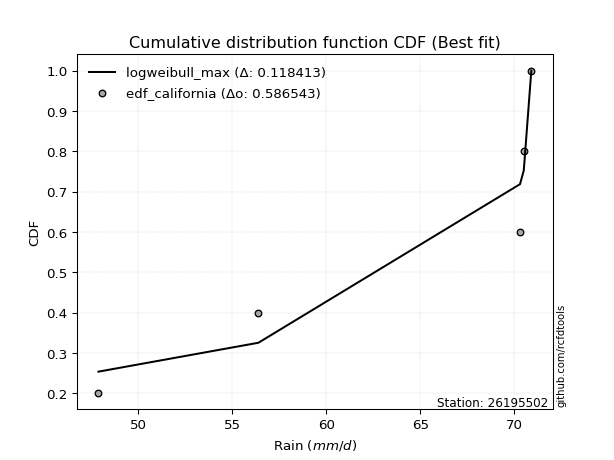</img>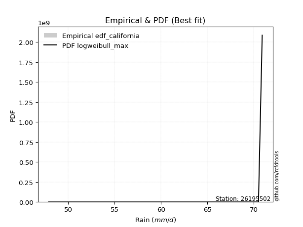</img>

</div>


### 2. EDF Hazen (1930)

Hazen method for plotting positions is a formula used to estimate the empirical cumulative probability distribution of flood events or other hydrological data. This formula often results in biased estimations, particularly when extrapolating to extreme events (high return periods).

<div align="center">


$P=(m-0.5)/n$


</div>


**2.1. Empirical values**

<div align="center">

|                | 0                  | 1                  | 2         | 3                 | 4                  |
|:---------------|:-------------------|:-------------------|:----------|:------------------|:-------------------|
| date           | 2018               | 2017               | 2020      | 2019              | 2021               |
| x              | 47.9               | 56.4               | 70.3      | 70.5              | 70.9               |
| m              | 1                  | 2                  | 3         | 4                 | 5                  |
| empirical_dist | edf_hazen          | edf_hazen          | edf_hazen | edf_hazen         | edf_hazen          |
| empirical      | 0.1                | 0.3                | 0.5       | 0.7               | 0.9                |
| empirical_tr   | 1.1111111111111112 | 1.4285714285714286 | 2.0       | 3.333333333333333 | 10.000000000000002 |

</div>


**2.2. Kolmogorov-Smirnov fit test (sorted by Δ)**


<div align="center">

|                | 0                   | 1                  | 2                  | 3                   | 4                  | 5                  | 6                  | 7                   | 8                  | 9                   | 10                  | 11                  | 12                  | 13                  | 14                  | 15                  | 16                 | 17                 | 18                  | 19                 | 20                  | 21                  | 22                  | 23                 | 24                  | 25                 | 26                  | 27                 | 28                 | 29                  | 30                 | 31                 | 32                 | 33                 | 34                 | 35                 | 36                 | 37                 | 38                 | 39                  | 40                 | 41                  | 42                  | 43                 | 44                 | 45                  | 46                 | 47                 | 48                  | 49                 | 50                  | 51                  | 52                 | 53                 | 54                 | 55                  | 56                  | 57                  | 58                 | 59                  | 60                 | 61                 | 62                 | 63                 | 64                 | 65                  | 66                 | 67                 | 68                 | 69                  | 70                  | 71                  | 72                  | 73                 | 74                 | 75                 | 76                 | 77                  | 78                 | 79                  | 80                 | 81                 | 82                 | 83                  | 84                 | 85                 | 86                 | 87                  | 88                 | 89                 | 90                  | 91                  | 92                 | 93                  | 94                  | 95                 | 96                 | 97                 | 98                  | 99                 | 100                | 101                | 102                | 103                | 104                | 105                 | 106                 | 107                | 108                | 109                 | 110                 | 111                | 112                 | 113                | 114                | 115                | 116                 | 117                 | 118                | 119                | 120                | 121                | 122                | 123                | 124                 | 125                | 126                | 127                | 128                | 129                | 130                 | 131                 | 132                | 133                | 134                 | 135                | 136                | 137                 | 138                 | 139                | 140                | 141                 | 142                | 143                 | 144                | 145                | 146                | 147                | 148                | 149                | 150                | 151                | 152                | 153                | 154                | 155                | 156                | 157                | 158                | 159                |
|:---------------|:--------------------|:-------------------|:-------------------|:--------------------|:-------------------|:-------------------|:-------------------|:--------------------|:-------------------|:--------------------|:--------------------|:--------------------|:--------------------|:--------------------|:--------------------|:--------------------|:-------------------|:-------------------|:--------------------|:-------------------|:--------------------|:--------------------|:--------------------|:-------------------|:--------------------|:-------------------|:--------------------|:-------------------|:-------------------|:--------------------|:-------------------|:-------------------|:-------------------|:-------------------|:-------------------|:-------------------|:-------------------|:-------------------|:-------------------|:--------------------|:-------------------|:--------------------|:--------------------|:-------------------|:-------------------|:--------------------|:-------------------|:-------------------|:--------------------|:-------------------|:--------------------|:--------------------|:-------------------|:-------------------|:-------------------|:--------------------|:--------------------|:--------------------|:-------------------|:--------------------|:-------------------|:-------------------|:-------------------|:-------------------|:-------------------|:--------------------|:-------------------|:-------------------|:-------------------|:--------------------|:--------------------|:--------------------|:--------------------|:-------------------|:-------------------|:-------------------|:-------------------|:--------------------|:-------------------|:--------------------|:-------------------|:-------------------|:-------------------|:--------------------|:-------------------|:-------------------|:-------------------|:--------------------|:-------------------|:-------------------|:--------------------|:--------------------|:-------------------|:--------------------|:--------------------|:-------------------|:-------------------|:-------------------|:--------------------|:-------------------|:-------------------|:-------------------|:-------------------|:-------------------|:-------------------|:--------------------|:--------------------|:-------------------|:-------------------|:--------------------|:--------------------|:-------------------|:--------------------|:-------------------|:-------------------|:-------------------|:--------------------|:--------------------|:-------------------|:-------------------|:-------------------|:-------------------|:-------------------|:-------------------|:--------------------|:-------------------|:-------------------|:-------------------|:-------------------|:-------------------|:--------------------|:--------------------|:-------------------|:-------------------|:--------------------|:-------------------|:-------------------|:--------------------|:--------------------|:-------------------|:-------------------|:--------------------|:-------------------|:--------------------|:-------------------|:-------------------|:-------------------|:-------------------|:-------------------|:-------------------|:-------------------|:-------------------|:-------------------|:-------------------|:-------------------|:-------------------|:-------------------|:-------------------|:-------------------|:-------------------|
| station        | 26195502            | 26195502           | 26195502           | 26195502            | 26195502           | 26195502           | 26195502           | 26195502            | 26195502           | 26195502            | 26195502            | 26195502            | 26195502            | 26195502            | 26195502            | 26195502            | 26195502           | 26195502           | 26195502            | 26195502           | 26195502            | 26195502            | 26195502            | 26195502           | 26195502            | 26195502           | 26195502            | 26195502           | 26195502           | 26195502            | 26195502           | 26195502           | 26195502           | 26195502           | 26195502           | 26195502           | 26195502           | 26195502           | 26195502           | 26195502            | 26195502           | 26195502            | 26195502            | 26195502           | 26195502           | 26195502            | 26195502           | 26195502           | 26195502            | 26195502           | 26195502            | 26195502            | 26195502           | 26195502           | 26195502           | 26195502            | 26195502            | 26195502            | 26195502           | 26195502            | 26195502           | 26195502           | 26195502           | 26195502           | 26195502           | 26195502            | 26195502           | 26195502           | 26195502           | 26195502            | 26195502            | 26195502            | 26195502            | 26195502           | 26195502           | 26195502           | 26195502           | 26195502            | 26195502           | 26195502            | 26195502           | 26195502           | 26195502           | 26195502            | 26195502           | 26195502           | 26195502           | 26195502            | 26195502           | 26195502           | 26195502            | 26195502            | 26195502           | 26195502            | 26195502            | 26195502           | 26195502           | 26195502           | 26195502            | 26195502           | 26195502           | 26195502           | 26195502           | 26195502           | 26195502           | 26195502            | 26195502            | 26195502           | 26195502           | 26195502            | 26195502            | 26195502           | 26195502            | 26195502           | 26195502           | 26195502           | 26195502            | 26195502            | 26195502           | 26195502           | 26195502           | 26195502           | 26195502           | 26195502           | 26195502            | 26195502           | 26195502           | 26195502           | 26195502           | 26195502           | 26195502            | 26195502            | 26195502           | 26195502           | 26195502            | 26195502           | 26195502           | 26195502            | 26195502            | 26195502           | 26195502           | 26195502            | 26195502           | 26195502            | 26195502           | 26195502           | 26195502           | 26195502           | 26195502           | 26195502           | 26195502           | 26195502           | 26195502           | 26195502           | 26195502           | 26195502           | 26195502           | 26195502           | 26195502           | 26195502           |
| empirical_dist | edf_hazen           | edf_hazen          | edf_hazen          | edf_hazen           | edf_hazen          | edf_hazen          | edf_hazen          | edf_hazen           | edf_hazen          | edf_hazen           | edf_hazen           | edf_hazen           | edf_hazen           | edf_hazen           | edf_hazen           | edf_hazen           | edf_hazen          | edf_hazen          | edf_hazen           | edf_hazen          | edf_hazen           | edf_hazen           | edf_hazen           | edf_hazen          | edf_hazen           | edf_hazen          | edf_hazen           | edf_hazen          | edf_hazen          | edf_hazen           | edf_hazen          | edf_hazen          | edf_hazen          | edf_hazen          | edf_hazen          | edf_hazen          | edf_hazen          | edf_hazen          | edf_hazen          | edf_hazen           | edf_hazen          | edf_hazen           | edf_hazen           | edf_hazen          | edf_hazen          | edf_hazen           | edf_hazen          | edf_hazen          | edf_hazen           | edf_hazen          | edf_hazen           | edf_hazen           | edf_hazen          | edf_hazen          | edf_hazen          | edf_hazen           | edf_hazen           | edf_hazen           | edf_hazen          | edf_hazen           | edf_hazen          | edf_hazen          | edf_hazen          | edf_hazen          | edf_hazen          | edf_hazen           | edf_hazen          | edf_hazen          | edf_hazen          | edf_hazen           | edf_hazen           | edf_hazen           | edf_hazen           | edf_hazen          | edf_hazen          | edf_hazen          | edf_hazen          | edf_hazen           | edf_hazen          | edf_hazen           | edf_hazen          | edf_hazen          | edf_hazen          | edf_hazen           | edf_hazen          | edf_hazen          | edf_hazen          | edf_hazen           | edf_hazen          | edf_hazen          | edf_hazen           | edf_hazen           | edf_hazen          | edf_hazen           | edf_hazen           | edf_hazen          | edf_hazen          | edf_hazen          | edf_hazen           | edf_hazen          | edf_hazen          | edf_hazen          | edf_hazen          | edf_hazen          | edf_hazen          | edf_hazen           | edf_hazen           | edf_hazen          | edf_hazen          | edf_hazen           | edf_hazen           | edf_hazen          | edf_hazen           | edf_hazen          | edf_hazen          | edf_hazen          | edf_hazen           | edf_hazen           | edf_hazen          | edf_hazen          | edf_hazen          | edf_hazen          | edf_hazen          | edf_hazen          | edf_hazen           | edf_hazen          | edf_hazen          | edf_hazen          | edf_hazen          | edf_hazen          | edf_hazen           | edf_hazen           | edf_hazen          | edf_hazen          | edf_hazen           | edf_hazen          | edf_hazen          | edf_hazen           | edf_hazen           | edf_hazen          | edf_hazen          | edf_hazen           | edf_hazen          | edf_hazen           | edf_hazen          | edf_hazen          | edf_hazen          | edf_hazen          | edf_hazen          | edf_hazen          | edf_hazen          | edf_hazen          | edf_hazen          | edf_hazen          | edf_hazen          | edf_hazen          | edf_hazen          | edf_hazen          | edf_hazen          | edf_hazen          |
| p_dist         | beta                | logbeta            | levy_l             | loglevy_l           | wrapcauchy         | logwrapcauchy      | vonmises_line      | arcsine             | kappa3             | logarcsine          | logtrapezoid        | trapezoid           | logksone            | ksone               | logweibull_max      | logsemicircular     | semicircular       | loganglit          | anglit              | halfgennorm        | lognct              | loglomax            | logpearson3         | pearson3           | invgauss            | burr12             | genextreme          | dgamma             | lomax              | gennorm             | loggumbel_l        | logbetaprime       | logkstwobign       | logfoldnorm        | logf               | gumbel_l           | loginvweibull      | loginvgauss        | logcrystalball     | logt                | logexponnorm       | lognorm             | loghalfgennorm      | nct                | logrice            | ncf                 | erlang             | loginvgamma        | logfatiguelife      | t                  | exponnorm           | crystalball         | norm               | truncnorm          | f                  | loggamma            | loggamma            | loggenexpon         | invgamma           | kstwobign           | rice               | logerlang          | gamma              | betaprime          | logalpha           | alpha               | logmaxwell         | maxwell            | lograyleigh        | weibull_min         | rayleigh            | logburr12           | logweibull_min      | loghalfnorm        | logdweibull        | halfnorm           | logncf             | loglogistic         | logistic           | logexponpow         | nakagami           | logcosine          | loggumbel_r        | cosine              | gumbel_r           | loghypsecant       | hypsecant          | loghalflogistic     | halflogistic       | loggompertz        | logmoyal            | moyal               | dweibull           | loglaplace          | loglaplace          | laplace            | burr               | exponweib          | genexpon            | logwald            | wald               | argus              | loggenextreme      | logargus           | logloglaplace      | logdgamma           | logexponweib        | logburr            | loggengamma        | lognakagami         | loggennorm          | genpareto          | gengamma            | logmielke          | mielke             | fatiguelife        | weibull_max         | loggenhalflogistic  | logloggamma        | genhalflogistic    | foldnorm           | triang             | skewnorm           | kappa4             | logtriang           | logskewnorm        | loggausshyper      | tukeylambda        | invweibull         | logkappa4          | gausshyper          | uniform             | logtukeylambda     | logkappa3          | loguniform          | logvonmises_line   | truncweibull_min   | bradford            | johnsonsu           | truncexpon         | logbradford        | logtruncweibull_min | logtruncexpon      | logtruncnorm        | johnsonsb          | gompertz           | loggenpareto       | logjohnsonsu       | powerlaw           | logpowerlaw        | truncpareto        | logtruncpareto     | exponpow           | logjohnsonsb       | rdist              | genlogistic        | loggenlogistic     | logrdist           | logvonmises        | vonmises           |
| delta          | 0.09621100177232045 | 0.1126631105041972 | 0.178867453838156  | 0.18481784749853641 | 0.1941471569197183 | 0.1973171352494959 | 0.2002129104876992 | 0.20374303469288058 | 0.207678931909701  | 0.20820908558880757 | 0.21056952675457918 | 0.21299722671704902 | 0.21590561305089384 | 0.21766773874085255 | 0.21841326684400053 | 0.23239852110129855 | 0.2341993674890458 | 0.2446678314768318 | 0.24648542346816926 | 0.2496832552851378 | 0.25283157553436153 | 0.25821371038941265 | 0.25963353468643424 | 0.2628583080515883 | 0.26329783923031924 | 0.264470778627484  | 0.26452957228434437 | 0.2658596514773691 | 0.2659668779617784 | 0.26612776858899256 | 0.2689803879574204 | 0.2695275549723729 | 0.2702587965861578 | 0.2711686667971557 | 0.2716099567773895 | 0.2716256330392314 | 0.2719691813908238 | 0.2723055060074905 | 0.2727396267402111 | 0.27274166027959357 | 0.2727440201441147 | 0.27274548662844245 | 0.27282055344467293 | 0.2729493658785934 | 0.2730229843458529 | 0.27346107771752604 | 0.2735998048295303 | 0.2742661986846806 | 0.27438152791923964 | 0.2745782428684851 | 0.27458073559629004 | 0.27458234117967384 | 0.2745823440645212 | 0.2745823463052184 | 0.2746008174626299 | 0.27462888236277216 | 0.27462888236277216 | 0.27482219674739383 | 0.2748888724533599 | 0.27506237630350394 | 0.2752004087044062 | 0.2754196248475911 | 0.2758929325382795 | 0.276046553308567  | 0.2760608892723817 | 0.27742597967733595 | 0.2793256112263539 | 0.2809175843513779 | 0.2811902827290985 | 0.28208203475007765 | 0.28271216776128727 | 0.28278014582251987 | 0.28316474222227495 | 0.2882396366383633 | 0.2887041730172386 | 0.289582012886055  | 0.2921847772968039 | 0.29520247761029694 | 0.2969996825909669 | 0.29867351305431455 | 0.3034947327428491 | 0.3056814223663946 | 0.3064272708627902 | 0.30655058764781296 | 0.3077813895509316 | 0.3092838544711648 | 0.3109982543667362 | 0.31121407978700955 | 0.3124232971429992 | 0.3131356489631125 | 0.31741759981102136 | 0.31862978300810063 | 0.320926955100318  | 0.32637619311343824 | 0.32637619311343824 | 0.3278685702172641 | 0.3456986135700847 | 0.3496645054354602 | 0.35148820948288884 | 0.3533878888413796 | 0.3542582690191888 | 0.3604385889190411 | 0.3611916852977055 | 0.3644454391333607 | 0.3679067763316207 | 0.37093297172460626 | 0.37604129175908774 | 0.3807928576816201 | 0.3900786756599147 | 0.39471734678489706 | 0.40000000000029506 | 0.4145614137203095 | 0.41983226774342813 | 0.424790802930178  | 0.4274828853668573 | 0.4278315589788298 | 0.42862415275641064 | 0.43446752206303885 | 0.4351668812797397 | 0.4450792430332423 | 0.4562843790356266 | 0.4581205408624133 | 0.4606551387037371 | 0.4622136503425427 | 0.46538987390080166 | 0.4666231255872253 | 0.467252653587252  | 0.4684068464423987 | 0.4688871654288917 | 0.4724301837263065 | 0.47325131264437215 | 0.47391304347826047 | 0.4744955346492574 | 0.4750882710329981 | 0.47832837460310096 | 0.4784810193469864 | 0.4803572136898976 | 0.48138594402945634 | 0.48139948747455225 | 0.4825082809004517 | 0.4842925635459133 | 0.4843672674451204  | 0.4861889217906933 | 0.48952426251248415 | 0.4907852100998483 | 0.499999755957013  | 0.5280282123194693 | 0.5550164510634362 | 0.5733472757787155 | 0.583424845722375  | 0.5924635992889233 | 0.6059353025180108 | 0.6152698386597792 | 0.6812794170749678 | 0.6999999985016983 | 0.7                | 0.7                | 0.9                | 1.2721403772884543 | 10.970655178876504 |
| deltao         | 0.5865427407550001  | 0.5865427407550001 | 0.5865427407550001 | 0.5865427407550001  | 0.5865427407550001 | 0.5865427407550001 | 0.5865427407550001 | 0.5865427407550001  | 0.5865427407550001 | 0.5865427407550001  | 0.5865427407550001  | 0.5865427407550001  | 0.5865427407550001  | 0.5865427407550001  | 0.5865427407550001  | 0.5865427407550001  | 0.5865427407550001 | 0.5865427407550001 | 0.5865427407550001  | 0.5865427407550001 | 0.5865427407550001  | 0.5865427407550001  | 0.5865427407550001  | 0.5865427407550001 | 0.5865427407550001  | 0.5865427407550001 | 0.5865427407550001  | 0.5865427407550001 | 0.5865427407550001 | 0.5865427407550001  | 0.5865427407550001 | 0.5865427407550001 | 0.5865427407550001 | 0.5865427407550001 | 0.5865427407550001 | 0.5865427407550001 | 0.5865427407550001 | 0.5865427407550001 | 0.5865427407550001 | 0.5865427407550001  | 0.5865427407550001 | 0.5865427407550001  | 0.5865427407550001  | 0.5865427407550001 | 0.5865427407550001 | 0.5865427407550001  | 0.5865427407550001 | 0.5865427407550001 | 0.5865427407550001  | 0.5865427407550001 | 0.5865427407550001  | 0.5865427407550001  | 0.5865427407550001 | 0.5865427407550001 | 0.5865427407550001 | 0.5865427407550001  | 0.5865427407550001  | 0.5865427407550001  | 0.5865427407550001 | 0.5865427407550001  | 0.5865427407550001 | 0.5865427407550001 | 0.5865427407550001 | 0.5865427407550001 | 0.5865427407550001 | 0.5865427407550001  | 0.5865427407550001 | 0.5865427407550001 | 0.5865427407550001 | 0.5865427407550001  | 0.5865427407550001  | 0.5865427407550001  | 0.5865427407550001  | 0.5865427407550001 | 0.5865427407550001 | 0.5865427407550001 | 0.5865427407550001 | 0.5865427407550001  | 0.5865427407550001 | 0.5865427407550001  | 0.5865427407550001 | 0.5865427407550001 | 0.5865427407550001 | 0.5865427407550001  | 0.5865427407550001 | 0.5865427407550001 | 0.5865427407550001 | 0.5865427407550001  | 0.5865427407550001 | 0.5865427407550001 | 0.5865427407550001  | 0.5865427407550001  | 0.5865427407550001 | 0.5865427407550001  | 0.5865427407550001  | 0.5865427407550001 | 0.5865427407550001 | 0.5865427407550001 | 0.5865427407550001  | 0.5865427407550001 | 0.5865427407550001 | 0.5865427407550001 | 0.5865427407550001 | 0.5865427407550001 | 0.5865427407550001 | 0.5865427407550001  | 0.5865427407550001  | 0.5865427407550001 | 0.5865427407550001 | 0.5865427407550001  | 0.5865427407550001  | 0.5865427407550001 | 0.5865427407550001  | 0.5865427407550001 | 0.5865427407550001 | 0.5865427407550001 | 0.5865427407550001  | 0.5865427407550001  | 0.5865427407550001 | 0.5865427407550001 | 0.5865427407550001 | 0.5865427407550001 | 0.5865427407550001 | 0.5865427407550001 | 0.5865427407550001  | 0.5865427407550001 | 0.5865427407550001 | 0.5865427407550001 | 0.5865427407550001 | 0.5865427407550001 | 0.5865427407550001  | 0.5865427407550001  | 0.5865427407550001 | 0.5865427407550001 | 0.5865427407550001  | 0.5865427407550001 | 0.5865427407550001 | 0.5865427407550001  | 0.5865427407550001  | 0.5865427407550001 | 0.5865427407550001 | 0.5865427407550001  | 0.5865427407550001 | 0.5865427407550001  | 0.5865427407550001 | 0.5865427407550001 | 0.5865427407550001 | 0.5865427407550001 | 0.5865427407550001 | 0.5865427407550001 | 0.5865427407550001 | 0.5865427407550001 | 0.5865427407550001 | 0.5865427407550001 | 0.5865427407550001 | 0.5865427407550001 | 0.5865427407550001 | 0.5865427407550001 | 0.5865427407550001 | 0.5865427407550001 |
| eval           | Δo > Δ              | Δo > Δ             | Δo > Δ             | Δo > Δ              | Δo > Δ             | Δo > Δ             | Δo > Δ             | Δo > Δ              | Δo > Δ             | Δo > Δ              | Δo > Δ              | Δo > Δ              | Δo > Δ              | Δo > Δ              | Δo > Δ              | Δo > Δ              | Δo > Δ             | Δo > Δ             | Δo > Δ              | Δo > Δ             | Δo > Δ              | Δo > Δ              | Δo > Δ              | Δo > Δ             | Δo > Δ              | Δo > Δ             | Δo > Δ              | Δo > Δ             | Δo > Δ             | Δo > Δ              | Δo > Δ             | Δo > Δ             | Δo > Δ             | Δo > Δ             | Δo > Δ             | Δo > Δ             | Δo > Δ             | Δo > Δ             | Δo > Δ             | Δo > Δ              | Δo > Δ             | Δo > Δ              | Δo > Δ              | Δo > Δ             | Δo > Δ             | Δo > Δ              | Δo > Δ             | Δo > Δ             | Δo > Δ              | Δo > Δ             | Δo > Δ              | Δo > Δ              | Δo > Δ             | Δo > Δ             | Δo > Δ             | Δo > Δ              | Δo > Δ              | Δo > Δ              | Δo > Δ             | Δo > Δ              | Δo > Δ             | Δo > Δ             | Δo > Δ             | Δo > Δ             | Δo > Δ             | Δo > Δ              | Δo > Δ             | Δo > Δ             | Δo > Δ             | Δo > Δ              | Δo > Δ              | Δo > Δ              | Δo > Δ              | Δo > Δ             | Δo > Δ             | Δo > Δ             | Δo > Δ             | Δo > Δ              | Δo > Δ             | Δo > Δ              | Δo > Δ             | Δo > Δ             | Δo > Δ             | Δo > Δ              | Δo > Δ             | Δo > Δ             | Δo > Δ             | Δo > Δ              | Δo > Δ             | Δo > Δ             | Δo > Δ              | Δo > Δ              | Δo > Δ             | Δo > Δ              | Δo > Δ              | Δo > Δ             | Δo > Δ             | Δo > Δ             | Δo > Δ              | Δo > Δ             | Δo > Δ             | Δo > Δ             | Δo > Δ             | Δo > Δ             | Δo > Δ             | Δo > Δ              | Δo > Δ              | Δo > Δ             | Δo > Δ             | Δo > Δ              | Δo > Δ              | Δo > Δ             | Δo > Δ              | Δo > Δ             | Δo > Δ             | Δo > Δ             | Δo > Δ              | Δo > Δ              | Δo > Δ             | Δo > Δ             | Δo > Δ             | Δo > Δ             | Δo > Δ             | Δo > Δ             | Δo > Δ              | Δo > Δ             | Δo > Δ             | Δo > Δ             | Δo > Δ             | Δo > Δ             | Δo > Δ              | Δo > Δ              | Δo > Δ             | Δo > Δ             | Δo > Δ              | Δo > Δ             | Δo > Δ             | Δo > Δ              | Δo > Δ              | Δo > Δ             | Δo > Δ             | Δo > Δ              | Δo > Δ             | Δo > Δ              | Δo > Δ             | Δo > Δ             | Δo > Δ             | Δo > Δ             | Δo > Δ             | Δo > Δ             | Δo <= Δ            | Δo <= Δ            | Δo <= Δ            | Δo <= Δ            | Δo <= Δ            | Δo <= Δ            | Δo <= Δ            | Δo <= Δ            | Δo <= Δ            | Δo <= Δ            |
| fit            | 1                   | 1                  | 1                  | 1                   | 1                  | 1                  | 1                  | 1                   | 1                  | 1                   | 1                   | 1                   | 1                   | 1                   | 1                   | 1                   | 1                  | 1                  | 1                   | 1                  | 1                   | 1                   | 1                   | 1                  | 1                   | 1                  | 1                   | 1                  | 1                  | 1                   | 1                  | 1                  | 1                  | 1                  | 1                  | 1                  | 1                  | 1                  | 1                  | 1                   | 1                  | 1                   | 1                   | 1                  | 1                  | 1                   | 1                  | 1                  | 1                   | 1                  | 1                   | 1                   | 1                  | 1                  | 1                  | 1                   | 1                   | 1                   | 1                  | 1                   | 1                  | 1                  | 1                  | 1                  | 1                  | 1                   | 1                  | 1                  | 1                  | 1                   | 1                   | 1                   | 1                   | 1                  | 1                  | 1                  | 1                  | 1                   | 1                  | 1                   | 1                  | 1                  | 1                  | 1                   | 1                  | 1                  | 1                  | 1                   | 1                  | 1                  | 1                   | 1                   | 1                  | 1                   | 1                   | 1                  | 1                  | 1                  | 1                   | 1                  | 1                  | 1                  | 1                  | 1                  | 1                  | 1                   | 1                   | 1                  | 1                  | 1                   | 1                   | 1                  | 1                   | 1                  | 1                  | 1                  | 1                   | 1                   | 1                  | 1                  | 1                  | 1                  | 1                  | 1                  | 1                   | 1                  | 1                  | 1                  | 1                  | 1                  | 1                   | 1                   | 1                  | 1                  | 1                   | 1                  | 1                  | 1                   | 1                   | 1                  | 1                  | 1                   | 1                  | 1                   | 1                  | 1                  | 1                  | 1                  | 1                  | 1                  | 0                  | 0                  | 0                  | 0                  | 0                  | 0                  | 0                  | 0                  | 0                  | 0                  |
| n              | 5                   | 5                  | 5                  | 5                   | 5                  | 5                  | 5                  | 5                   | 5                  | 5                   | 5                   | 5                   | 5                   | 5                   | 5                   | 5                   | 5                  | 5                  | 5                   | 5                  | 5                   | 5                   | 5                   | 5                  | 5                   | 5                  | 5                   | 5                  | 5                  | 5                   | 5                  | 5                  | 5                  | 5                  | 5                  | 5                  | 5                  | 5                  | 5                  | 5                   | 5                  | 5                   | 5                   | 5                  | 5                  | 5                   | 5                  | 5                  | 5                   | 5                  | 5                   | 5                   | 5                  | 5                  | 5                  | 5                   | 5                   | 5                   | 5                  | 5                   | 5                  | 5                  | 5                  | 5                  | 5                  | 5                   | 5                  | 5                  | 5                  | 5                   | 5                   | 5                   | 5                   | 5                  | 5                  | 5                  | 5                  | 5                   | 5                  | 5                   | 5                  | 5                  | 5                  | 5                   | 5                  | 5                  | 5                  | 5                   | 5                  | 5                  | 5                   | 5                   | 5                  | 5                   | 5                   | 5                  | 5                  | 5                  | 5                   | 5                  | 5                  | 5                  | 5                  | 5                  | 5                  | 5                   | 5                   | 5                  | 5                  | 5                   | 5                   | 5                  | 5                   | 5                  | 5                  | 5                  | 5                   | 5                   | 5                  | 5                  | 5                  | 5                  | 5                  | 5                  | 5                   | 5                  | 5                  | 5                  | 5                  | 5                  | 5                   | 5                   | 5                  | 5                  | 5                   | 5                  | 5                  | 5                   | 5                   | 5                  | 5                  | 5                   | 5                  | 5                   | 5                  | 5                  | 5                  | 5                  | 5                  | 5                  | 5                  | 5                  | 5                  | 5                  | 5                  | 5                  | 5                  | 5                  | 5                  | 5                  |
| best_fit       | 1                   | 0                  | 0                  | 0                   | 0                  | 0                  | 0                  | 0                   | 0                  | 0                   | 0                   | 0                   | 0                   | 0                   | 0                   | 0                   | 0                  | 0                  | 0                   | 0                  | 0                   | 0                   | 0                   | 0                  | 0                   | 0                  | 0                   | 0                  | 0                  | 0                   | 0                  | 0                  | 0                  | 0                  | 0                  | 0                  | 0                  | 0                  | 0                  | 0                   | 0                  | 0                   | 0                   | 0                  | 0                  | 0                   | 0                  | 0                  | 0                   | 0                  | 0                   | 0                   | 0                  | 0                  | 0                  | 0                   | 0                   | 0                   | 0                  | 0                   | 0                  | 0                  | 0                  | 0                  | 0                  | 0                   | 0                  | 0                  | 0                  | 0                   | 0                   | 0                   | 0                   | 0                  | 0                  | 0                  | 0                  | 0                   | 0                  | 0                   | 0                  | 0                  | 0                  | 0                   | 0                  | 0                  | 0                  | 0                   | 0                  | 0                  | 0                   | 0                   | 0                  | 0                   | 0                   | 0                  | 0                  | 0                  | 0                   | 0                  | 0                  | 0                  | 0                  | 0                  | 0                  | 0                   | 0                   | 0                  | 0                  | 0                   | 0                   | 0                  | 0                   | 0                  | 0                  | 0                  | 0                   | 0                   | 0                  | 0                  | 0                  | 0                  | 0                  | 0                  | 0                   | 0                  | 0                  | 0                  | 0                  | 0                  | 0                   | 0                   | 0                  | 0                  | 0                   | 0                  | 0                  | 0                   | 0                   | 0                  | 0                  | 0                   | 0                  | 0                   | 0                  | 0                  | 0                  | 0                  | 0                  | 0                  | 0                  | 0                  | 0                  | 0                  | 0                  | 0                  | 0                  | 0                  | 0                  | 0                  |
| best_fit_sort  | 1                   | 2                  | 3                  | 4                   | 5                  | 6                  | 7                  | 8                   | 9                  | 10                  | 11                  | 12                  | 13                  | 14                  | 15                  | 16                  | 17                 | 18                 | 19                  | 20                 | 21                  | 22                  | 23                  | 24                 | 25                  | 26                 | 27                  | 28                 | 29                 | 30                  | 31                 | 32                 | 33                 | 34                 | 35                 | 36                 | 37                 | 38                 | 39                 | 40                  | 41                 | 42                  | 43                  | 44                 | 45                 | 46                  | 47                 | 48                 | 49                  | 50                 | 51                  | 52                  | 53                 | 54                 | 55                 | 56                  | 57                  | 58                  | 59                 | 60                  | 61                 | 62                 | 63                 | 64                 | 65                 | 66                  | 67                 | 68                 | 69                 | 70                  | 71                  | 72                  | 73                  | 74                 | 75                 | 76                 | 77                 | 78                  | 79                 | 80                  | 81                 | 82                 | 83                 | 84                  | 85                 | 86                 | 87                 | 88                  | 89                 | 90                 | 91                  | 92                  | 93                 | 94                  | 95                  | 96                 | 97                 | 98                 | 99                  | 100                | 101                | 102                | 103                | 104                | 105                | 106                 | 107                 | 108                | 109                | 110                 | 111                 | 112                | 113                 | 114                | 115                | 116                | 117                 | 118                 | 119                | 120                | 121                | 122                | 123                | 124                | 125                 | 126                | 127                | 128                | 129                | 130                | 131                 | 132                 | 133                | 134                | 135                 | 136                | 137                | 138                 | 139                 | 140                | 141                | 142                 | 143                | 144                 | 145                | 146                | 147                | 148                | 149                | 150                | 151                | 152                | 153                | 154                | 155                | 156                | 157                | 158                | 159                | 160                |

</div>


**2.3. Best fit**

<div align="center">

|   id |   station | empirical_dist   | p_dist   |    delta |   deltao | eval   |   fit |   n |   best_fit |   best_fit_sort |
|-----:|----------:|:-----------------|:---------|---------:|---------:|:-------|------:|----:|-----------:|----------------:|
|    0 |  26195502 | edf_hazen        | beta     | 0.096211 | 0.586543 | Δo > Δ |     1 |   5 |          1 |               1 |

</div>


<div align="center">

</img>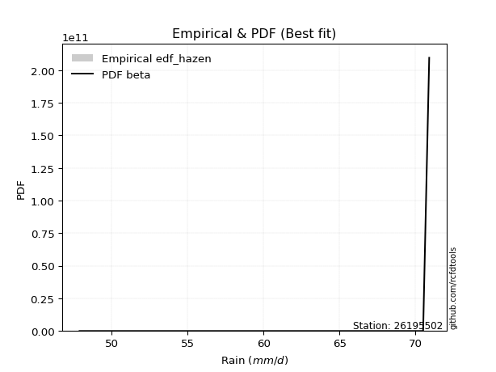</img>

</div>


### 3. EDF Weibull (1939)

Weibull plotting position formula is an empirical method used to estimate the non-exceedance probability or plotting position for a set of observed data, is often recommended or widely used in practice, particularly in flood frequency analysis.

<div align="center">


$P=m/(n+1)$


</div>


**3.1. Empirical values**

<div align="center">

|                | 0                   | 1                  | 2           | 3                  | 4                  |
|:---------------|:--------------------|:-------------------|:------------|:-------------------|:-------------------|
| date           | 2018                | 2017               | 2020        | 2019               | 2021               |
| x              | 47.9                | 56.4               | 70.3        | 70.5               | 70.9               |
| m              | 1                   | 2                  | 3           | 4                  | 5                  |
| empirical_dist | edf_weibull         | edf_weibull        | edf_weibull | edf_weibull        | edf_weibull        |
| empirical      | 0.16666666666666666 | 0.3333333333333333 | 0.5         | 0.6666666666666666 | 0.8333333333333334 |
| empirical_tr   | 1.2                 | 1.4999999999999998 | 2.0         | 2.9999999999999996 | 6.000000000000002  |

</div>


**3.2. Kolmogorov-Smirnov fit test (sorted by Δ)**


<div align="center">

|                | 0                  | 1                   | 2                   | 3                   | 4                   | 5                  | 6                   | 7                   | 8                   | 9                   | 10                  | 11                  | 12                  | 13                  | 14                  | 15                  | 16                  | 17                  | 18                  | 19                 | 20                 | 21                  | 22                 | 23                  | 24                  | 25                  | 26                  | 27                 | 28                  | 29                 | 30                  | 31                 | 32                 | 33                 | 34                 | 35                 | 36                 | 37                 | 38                 | 39                 | 40                  | 41                 | 42                  | 43                  | 44                 | 45                 | 46                  | 47                 | 48                 | 49                  | 50                 | 51                  | 52                  | 53                 | 54                 | 55                 | 56                  | 57                  | 58                  | 59                 | 60                  | 61                 | 62                 | 63                 | 64                 | 65                 | 66                  | 67                 | 68                 | 69                 | 70                  | 71                  | 72                  | 73                  | 74                 | 75                 | 76                 | 77                  | 78                 | 79                  | 80                 | 81                  | 82                 | 83                 | 84                 | 85                  | 86                 | 87                 | 88                 | 89                  | 90                 | 91                 | 92                  | 93                  | 94                  | 95                  | 96                  | 97                  | 98                 | 99                  | 100                | 101                | 102                 | 103                | 104                | 105                | 106                | 107                 | 108                | 109                 | 110                | 111                | 112                 | 113                 | 114                | 115                | 116                | 117                 | 118                 | 119                | 120                | 121                | 122                | 123                | 124                | 125                | 126                 | 127                | 128                 | 129                | 130                | 131                | 132                | 133                 | 134                 | 135                | 136                | 137                 | 138                | 139                | 140                 | 141                | 142                | 143                 | 144                | 145                 | 146                | 147                | 148                | 149                | 150                | 151                | 152                | 153                | 154                | 155                | 156                | 157                | 158                | 159                |
|:---------------|:-------------------|:--------------------|:--------------------|:--------------------|:--------------------|:-------------------|:--------------------|:--------------------|:--------------------|:--------------------|:--------------------|:--------------------|:--------------------|:--------------------|:--------------------|:--------------------|:--------------------|:--------------------|:--------------------|:-------------------|:-------------------|:--------------------|:-------------------|:--------------------|:--------------------|:--------------------|:--------------------|:-------------------|:--------------------|:-------------------|:--------------------|:-------------------|:-------------------|:-------------------|:-------------------|:-------------------|:-------------------|:-------------------|:-------------------|:-------------------|:--------------------|:-------------------|:--------------------|:--------------------|:-------------------|:-------------------|:--------------------|:-------------------|:-------------------|:--------------------|:-------------------|:--------------------|:--------------------|:-------------------|:-------------------|:-------------------|:--------------------|:--------------------|:--------------------|:-------------------|:--------------------|:-------------------|:-------------------|:-------------------|:-------------------|:-------------------|:--------------------|:-------------------|:-------------------|:-------------------|:--------------------|:--------------------|:--------------------|:--------------------|:-------------------|:-------------------|:-------------------|:--------------------|:-------------------|:--------------------|:-------------------|:--------------------|:-------------------|:-------------------|:-------------------|:--------------------|:-------------------|:-------------------|:-------------------|:--------------------|:-------------------|:-------------------|:--------------------|:--------------------|:--------------------|:--------------------|:--------------------|:--------------------|:-------------------|:--------------------|:-------------------|:-------------------|:--------------------|:-------------------|:-------------------|:-------------------|:-------------------|:--------------------|:-------------------|:--------------------|:-------------------|:-------------------|:--------------------|:--------------------|:-------------------|:-------------------|:-------------------|:--------------------|:--------------------|:-------------------|:-------------------|:-------------------|:-------------------|:-------------------|:-------------------|:-------------------|:--------------------|:-------------------|:--------------------|:-------------------|:-------------------|:-------------------|:-------------------|:--------------------|:--------------------|:-------------------|:-------------------|:--------------------|:-------------------|:-------------------|:--------------------|:-------------------|:-------------------|:--------------------|:-------------------|:--------------------|:-------------------|:-------------------|:-------------------|:-------------------|:-------------------|:-------------------|:-------------------|:-------------------|:-------------------|:-------------------|:-------------------|:-------------------|:-------------------|:-------------------|
| station        | 26195502           | 26195502            | 26195502            | 26195502            | 26195502            | 26195502           | 26195502            | 26195502            | 26195502            | 26195502            | 26195502            | 26195502            | 26195502            | 26195502            | 26195502            | 26195502            | 26195502            | 26195502            | 26195502            | 26195502           | 26195502           | 26195502            | 26195502           | 26195502            | 26195502            | 26195502            | 26195502            | 26195502           | 26195502            | 26195502           | 26195502            | 26195502           | 26195502           | 26195502           | 26195502           | 26195502           | 26195502           | 26195502           | 26195502           | 26195502           | 26195502            | 26195502           | 26195502            | 26195502            | 26195502           | 26195502           | 26195502            | 26195502           | 26195502           | 26195502            | 26195502           | 26195502            | 26195502            | 26195502           | 26195502           | 26195502           | 26195502            | 26195502            | 26195502            | 26195502           | 26195502            | 26195502           | 26195502           | 26195502           | 26195502           | 26195502           | 26195502            | 26195502           | 26195502           | 26195502           | 26195502            | 26195502            | 26195502            | 26195502            | 26195502           | 26195502           | 26195502           | 26195502            | 26195502           | 26195502            | 26195502           | 26195502            | 26195502           | 26195502           | 26195502           | 26195502            | 26195502           | 26195502           | 26195502           | 26195502            | 26195502           | 26195502           | 26195502            | 26195502            | 26195502            | 26195502            | 26195502            | 26195502            | 26195502           | 26195502            | 26195502           | 26195502           | 26195502            | 26195502           | 26195502           | 26195502           | 26195502           | 26195502            | 26195502           | 26195502            | 26195502           | 26195502           | 26195502            | 26195502            | 26195502           | 26195502           | 26195502           | 26195502            | 26195502            | 26195502           | 26195502           | 26195502           | 26195502           | 26195502           | 26195502           | 26195502           | 26195502            | 26195502           | 26195502            | 26195502           | 26195502           | 26195502           | 26195502           | 26195502            | 26195502            | 26195502           | 26195502           | 26195502            | 26195502           | 26195502           | 26195502            | 26195502           | 26195502           | 26195502            | 26195502           | 26195502            | 26195502           | 26195502           | 26195502           | 26195502           | 26195502           | 26195502           | 26195502           | 26195502           | 26195502           | 26195502           | 26195502           | 26195502           | 26195502           | 26195502           |
| empirical_dist | edf_weibull        | edf_weibull         | edf_weibull         | edf_weibull         | edf_weibull         | edf_weibull        | edf_weibull         | edf_weibull         | edf_weibull         | edf_weibull         | edf_weibull         | edf_weibull         | edf_weibull         | edf_weibull         | edf_weibull         | edf_weibull         | edf_weibull         | edf_weibull         | edf_weibull         | edf_weibull        | edf_weibull        | edf_weibull         | edf_weibull        | edf_weibull         | edf_weibull         | edf_weibull         | edf_weibull         | edf_weibull        | edf_weibull         | edf_weibull        | edf_weibull         | edf_weibull        | edf_weibull        | edf_weibull        | edf_weibull        | edf_weibull        | edf_weibull        | edf_weibull        | edf_weibull        | edf_weibull        | edf_weibull         | edf_weibull        | edf_weibull         | edf_weibull         | edf_weibull        | edf_weibull        | edf_weibull         | edf_weibull        | edf_weibull        | edf_weibull         | edf_weibull        | edf_weibull         | edf_weibull         | edf_weibull        | edf_weibull        | edf_weibull        | edf_weibull         | edf_weibull         | edf_weibull         | edf_weibull        | edf_weibull         | edf_weibull        | edf_weibull        | edf_weibull        | edf_weibull        | edf_weibull        | edf_weibull         | edf_weibull        | edf_weibull        | edf_weibull        | edf_weibull         | edf_weibull         | edf_weibull         | edf_weibull         | edf_weibull        | edf_weibull        | edf_weibull        | edf_weibull         | edf_weibull        | edf_weibull         | edf_weibull        | edf_weibull         | edf_weibull        | edf_weibull        | edf_weibull        | edf_weibull         | edf_weibull        | edf_weibull        | edf_weibull        | edf_weibull         | edf_weibull        | edf_weibull        | edf_weibull         | edf_weibull         | edf_weibull         | edf_weibull         | edf_weibull         | edf_weibull         | edf_weibull        | edf_weibull         | edf_weibull        | edf_weibull        | edf_weibull         | edf_weibull        | edf_weibull        | edf_weibull        | edf_weibull        | edf_weibull         | edf_weibull        | edf_weibull         | edf_weibull        | edf_weibull        | edf_weibull         | edf_weibull         | edf_weibull        | edf_weibull        | edf_weibull        | edf_weibull         | edf_weibull         | edf_weibull        | edf_weibull        | edf_weibull        | edf_weibull        | edf_weibull        | edf_weibull        | edf_weibull        | edf_weibull         | edf_weibull        | edf_weibull         | edf_weibull        | edf_weibull        | edf_weibull        | edf_weibull        | edf_weibull         | edf_weibull         | edf_weibull        | edf_weibull        | edf_weibull         | edf_weibull        | edf_weibull        | edf_weibull         | edf_weibull        | edf_weibull        | edf_weibull         | edf_weibull        | edf_weibull         | edf_weibull        | edf_weibull        | edf_weibull        | edf_weibull        | edf_weibull        | edf_weibull        | edf_weibull        | edf_weibull        | edf_weibull        | edf_weibull        | edf_weibull        | edf_weibull        | edf_weibull        | edf_weibull        |
| p_dist         | beta               | logbeta             | wrapcauchy          | logwrapcauchy       | kappa3              | logarcsine         | arcsine             | logbetaprime        | logtrapezoid        | levy_l              | trapezoid           | logksone            | ksone               | loglevy_l           | logweibull_max      | logdweibull         | logncf              | logsemicircular     | vonmises_line       | semicircular       | loganglit          | anglit              | halfgennorm        | lognct              | dweibull            | loglomax            | logpearson3         | pearson3           | invgauss            | burr12             | genextreme          | lomax              | loggumbel_l        | logkstwobign       | logfoldnorm        | logf               | gumbel_l           | loginvweibull      | loginvgauss        | logcrystalball     | logt                | logexponnorm       | lognorm             | loghalfgennorm      | nct                | logrice            | ncf                 | erlang             | loginvgamma        | logfatiguelife      | t                  | exponnorm           | crystalball         | norm               | truncnorm          | f                  | loggamma            | loggamma            | loggenexpon         | invgamma           | kstwobign           | rice               | logerlang          | gamma              | betaprime          | logalpha           | alpha               | logmaxwell         | maxwell            | lograyleigh        | weibull_min         | rayleigh            | logburr12           | logweibull_min      | loghalfnorm        | halfnorm           | dgamma             | loglogistic         | logistic           | logexponpow         | gennorm            | logloglaplace       | logdgamma          | logcosine          | loggumbel_r        | cosine              | gumbel_r           | loghypsecant       | hypsecant          | loghalflogistic     | halflogistic       | loggompertz        | exponweib           | logmoyal            | moyal               | loggengamma         | loglaplace          | loglaplace          | laplace            | nakagami            | loggennorm         | burr               | genexpon            | logwald            | wald               | argus              | loggenextreme      | lognakagami         | logargus           | logexponweib        | logburr            | gengamma           | fatiguelife         | invweibull          | genpareto          | logmielke          | mielke             | weibull_max         | loggenhalflogistic  | logloggamma        | genhalflogistic    | johnsonsu          | foldnorm           | johnsonsb          | triang             | skewnorm           | loggenpareto        | kappa4             | logtriang           | logskewnorm        | loggausshyper      | tukeylambda        | logkappa4          | gausshyper          | uniform             | logtukeylambda     | logkappa3          | loguniform          | logvonmises_line   | truncweibull_min   | bradford            | truncexpon         | logbradford        | logtruncweibull_min | logtruncexpon      | logtruncnorm        | gompertz           | logjohnsonsu       | powerlaw           | logpowerlaw        | truncpareto        | logtruncpareto     | exponpow           | logjohnsonsb       | rdist              | genlogistic        | loggenlogistic     | logrdist           | logvonmises        | vonmises           |
| delta          | 0.1628776684389871 | 0.16462118287027538 | 0.16666649257818467 | 0.16666666448278789 | 0.17426077441531906 | 0.1773616894501493 | 0.17900109373801232 | 0.20286088830570626 | 0.21056952675457918 | 0.21220078717148932 | 0.21299722671704902 | 0.21590561305089384 | 0.21766773874085255 | 0.21815118083186974 | 0.21841326684400053 | 0.22203750635057196 | 0.22551811063013727 | 0.23239852110129855 | 0.23354624382103253 | 0.2341993674890458 | 0.2446678314768318 | 0.24648542346816926 | 0.2496832552851378 | 0.25283157553436153 | 0.25426028843365134 | 0.25821371038941265 | 0.25963353468643424 | 0.2628583080515883 | 0.26329783923031924 | 0.264470778627484  | 0.26452957228434437 | 0.2659668779617784 | 0.2689803879574204 | 0.2702587965861578 | 0.2711686667971557 | 0.2716099567773895 | 0.2716256330392314 | 0.2719691813908238 | 0.2723055060074905 | 0.2727396267402111 | 0.27274166027959357 | 0.2727440201441147 | 0.27274548662844245 | 0.27282055344467293 | 0.2729493658785934 | 0.2730229843458529 | 0.27346107771752604 | 0.2735998048295303 | 0.2742661986846806 | 0.27438152791923964 | 0.2745782428684851 | 0.27458073559629004 | 0.27458234117967384 | 0.2745823440645212 | 0.2745823463052184 | 0.2746008174626299 | 0.27462888236277216 | 0.27462888236277216 | 0.27482219674739383 | 0.2748888724533599 | 0.27506237630350394 | 0.2752004087044062 | 0.2754196248475911 | 0.2758929325382795 | 0.276046553308567  | 0.2760608892723817 | 0.27742597967733595 | 0.2793256112263539 | 0.2809175843513779 | 0.2811902827290985 | 0.28208203475007765 | 0.28271216776128727 | 0.28278014582251987 | 0.28316474222227495 | 0.2882396366383633 | 0.289582012886055  | 0.2926518482754016 | 0.29520247761029694 | 0.2969996825909669 | 0.29867351305431455 | 0.2994611019223259 | 0.30124010966495407 | 0.3042663050579396 | 0.3056814223663946 | 0.3064272708627902 | 0.30655058764781296 | 0.3077813895509316 | 0.3092838544711648 | 0.3109982543667362 | 0.31121407978700955 | 0.3124232971429992 | 0.3131356489631125 | 0.31633117210212686 | 0.31741759981102136 | 0.31862978300810063 | 0.32341200899324807 | 0.32637619311343824 | 0.32637619311343824 | 0.3278685702172641 | 0.33333333333156545 | 0.3333333333336284 | 0.3456986135700847 | 0.35148820948288884 | 0.3533878888413796 | 0.3542582690191888 | 0.3604385889190411 | 0.3611916852977055 | 0.36138401345156373 | 0.3644454391333607 | 0.37604129175908774 | 0.3807928576816201 | 0.3864989344100948 | 0.39449822564549647 | 0.40222049876222504 | 0.4145614137203095 | 0.424790802930178  | 0.4274828853668573 | 0.42862415275641064 | 0.43446752206303885 | 0.4351668812797397 | 0.4450792430332423 | 0.4480661541412189 | 0.4562843790356266 | 0.457451876766515  | 0.4581205408624133 | 0.4606551387037371 | 0.46136154565280263 | 0.4622136503425427 | 0.46538987390080166 | 0.4666231255872253 | 0.467252653587252  | 0.4684068464423987 | 0.4724301837263065 | 0.47325131264437215 | 0.47391304347826047 | 0.4744955346492574 | 0.4750882710329981 | 0.47832837460310096 | 0.4784810193469864 | 0.4803572136898976 | 0.48138594402945634 | 0.4825082809004517 | 0.4842925635459133 | 0.4843672674451204  | 0.4861889217906933 | 0.48952426251248415 | 0.499999755957013  | 0.5216831177301029 | 0.540013942445382  | 0.5500915123890415 | 0.5591302659555901 | 0.5726019691846773 | 0.5819365053264458 | 0.6479460837416344 | 0.666666665168365  | 0.6666666666666666 | 0.6666666666666666 | 0.8333333333333334 | 1.2721403772884543 | 10.970655178876504 |
| deltao         | 0.5865427407550001 | 0.5865427407550001  | 0.5865427407550001  | 0.5865427407550001  | 0.5865427407550001  | 0.5865427407550001 | 0.5865427407550001  | 0.5865427407550001  | 0.5865427407550001  | 0.5865427407550001  | 0.5865427407550001  | 0.5865427407550001  | 0.5865427407550001  | 0.5865427407550001  | 0.5865427407550001  | 0.5865427407550001  | 0.5865427407550001  | 0.5865427407550001  | 0.5865427407550001  | 0.5865427407550001 | 0.5865427407550001 | 0.5865427407550001  | 0.5865427407550001 | 0.5865427407550001  | 0.5865427407550001  | 0.5865427407550001  | 0.5865427407550001  | 0.5865427407550001 | 0.5865427407550001  | 0.5865427407550001 | 0.5865427407550001  | 0.5865427407550001 | 0.5865427407550001 | 0.5865427407550001 | 0.5865427407550001 | 0.5865427407550001 | 0.5865427407550001 | 0.5865427407550001 | 0.5865427407550001 | 0.5865427407550001 | 0.5865427407550001  | 0.5865427407550001 | 0.5865427407550001  | 0.5865427407550001  | 0.5865427407550001 | 0.5865427407550001 | 0.5865427407550001  | 0.5865427407550001 | 0.5865427407550001 | 0.5865427407550001  | 0.5865427407550001 | 0.5865427407550001  | 0.5865427407550001  | 0.5865427407550001 | 0.5865427407550001 | 0.5865427407550001 | 0.5865427407550001  | 0.5865427407550001  | 0.5865427407550001  | 0.5865427407550001 | 0.5865427407550001  | 0.5865427407550001 | 0.5865427407550001 | 0.5865427407550001 | 0.5865427407550001 | 0.5865427407550001 | 0.5865427407550001  | 0.5865427407550001 | 0.5865427407550001 | 0.5865427407550001 | 0.5865427407550001  | 0.5865427407550001  | 0.5865427407550001  | 0.5865427407550001  | 0.5865427407550001 | 0.5865427407550001 | 0.5865427407550001 | 0.5865427407550001  | 0.5865427407550001 | 0.5865427407550001  | 0.5865427407550001 | 0.5865427407550001  | 0.5865427407550001 | 0.5865427407550001 | 0.5865427407550001 | 0.5865427407550001  | 0.5865427407550001 | 0.5865427407550001 | 0.5865427407550001 | 0.5865427407550001  | 0.5865427407550001 | 0.5865427407550001 | 0.5865427407550001  | 0.5865427407550001  | 0.5865427407550001  | 0.5865427407550001  | 0.5865427407550001  | 0.5865427407550001  | 0.5865427407550001 | 0.5865427407550001  | 0.5865427407550001 | 0.5865427407550001 | 0.5865427407550001  | 0.5865427407550001 | 0.5865427407550001 | 0.5865427407550001 | 0.5865427407550001 | 0.5865427407550001  | 0.5865427407550001 | 0.5865427407550001  | 0.5865427407550001 | 0.5865427407550001 | 0.5865427407550001  | 0.5865427407550001  | 0.5865427407550001 | 0.5865427407550001 | 0.5865427407550001 | 0.5865427407550001  | 0.5865427407550001  | 0.5865427407550001 | 0.5865427407550001 | 0.5865427407550001 | 0.5865427407550001 | 0.5865427407550001 | 0.5865427407550001 | 0.5865427407550001 | 0.5865427407550001  | 0.5865427407550001 | 0.5865427407550001  | 0.5865427407550001 | 0.5865427407550001 | 0.5865427407550001 | 0.5865427407550001 | 0.5865427407550001  | 0.5865427407550001  | 0.5865427407550001 | 0.5865427407550001 | 0.5865427407550001  | 0.5865427407550001 | 0.5865427407550001 | 0.5865427407550001  | 0.5865427407550001 | 0.5865427407550001 | 0.5865427407550001  | 0.5865427407550001 | 0.5865427407550001  | 0.5865427407550001 | 0.5865427407550001 | 0.5865427407550001 | 0.5865427407550001 | 0.5865427407550001 | 0.5865427407550001 | 0.5865427407550001 | 0.5865427407550001 | 0.5865427407550001 | 0.5865427407550001 | 0.5865427407550001 | 0.5865427407550001 | 0.5865427407550001 | 0.5865427407550001 |
| eval           | Δo > Δ             | Δo > Δ              | Δo > Δ              | Δo > Δ              | Δo > Δ              | Δo > Δ             | Δo > Δ              | Δo > Δ              | Δo > Δ              | Δo > Δ              | Δo > Δ              | Δo > Δ              | Δo > Δ              | Δo > Δ              | Δo > Δ              | Δo > Δ              | Δo > Δ              | Δo > Δ              | Δo > Δ              | Δo > Δ             | Δo > Δ             | Δo > Δ              | Δo > Δ             | Δo > Δ              | Δo > Δ              | Δo > Δ              | Δo > Δ              | Δo > Δ             | Δo > Δ              | Δo > Δ             | Δo > Δ              | Δo > Δ             | Δo > Δ             | Δo > Δ             | Δo > Δ             | Δo > Δ             | Δo > Δ             | Δo > Δ             | Δo > Δ             | Δo > Δ             | Δo > Δ              | Δo > Δ             | Δo > Δ              | Δo > Δ              | Δo > Δ             | Δo > Δ             | Δo > Δ              | Δo > Δ             | Δo > Δ             | Δo > Δ              | Δo > Δ             | Δo > Δ              | Δo > Δ              | Δo > Δ             | Δo > Δ             | Δo > Δ             | Δo > Δ              | Δo > Δ              | Δo > Δ              | Δo > Δ             | Δo > Δ              | Δo > Δ             | Δo > Δ             | Δo > Δ             | Δo > Δ             | Δo > Δ             | Δo > Δ              | Δo > Δ             | Δo > Δ             | Δo > Δ             | Δo > Δ              | Δo > Δ              | Δo > Δ              | Δo > Δ              | Δo > Δ             | Δo > Δ             | Δo > Δ             | Δo > Δ              | Δo > Δ             | Δo > Δ              | Δo > Δ             | Δo > Δ              | Δo > Δ             | Δo > Δ             | Δo > Δ             | Δo > Δ              | Δo > Δ             | Δo > Δ             | Δo > Δ             | Δo > Δ              | Δo > Δ             | Δo > Δ             | Δo > Δ              | Δo > Δ              | Δo > Δ              | Δo > Δ              | Δo > Δ              | Δo > Δ              | Δo > Δ             | Δo > Δ              | Δo > Δ             | Δo > Δ             | Δo > Δ              | Δo > Δ             | Δo > Δ             | Δo > Δ             | Δo > Δ             | Δo > Δ              | Δo > Δ             | Δo > Δ              | Δo > Δ             | Δo > Δ             | Δo > Δ              | Δo > Δ              | Δo > Δ             | Δo > Δ             | Δo > Δ             | Δo > Δ              | Δo > Δ              | Δo > Δ             | Δo > Δ             | Δo > Δ             | Δo > Δ             | Δo > Δ             | Δo > Δ             | Δo > Δ             | Δo > Δ              | Δo > Δ             | Δo > Δ              | Δo > Δ             | Δo > Δ             | Δo > Δ             | Δo > Δ             | Δo > Δ              | Δo > Δ              | Δo > Δ             | Δo > Δ             | Δo > Δ              | Δo > Δ             | Δo > Δ             | Δo > Δ              | Δo > Δ             | Δo > Δ             | Δo > Δ              | Δo > Δ             | Δo > Δ              | Δo > Δ             | Δo > Δ             | Δo > Δ             | Δo > Δ             | Δo > Δ             | Δo > Δ             | Δo > Δ             | Δo <= Δ            | Δo <= Δ            | Δo <= Δ            | Δo <= Δ            | Δo <= Δ            | Δo <= Δ            | Δo <= Δ            |
| fit            | 1                  | 1                   | 1                   | 1                   | 1                   | 1                  | 1                   | 1                   | 1                   | 1                   | 1                   | 1                   | 1                   | 1                   | 1                   | 1                   | 1                   | 1                   | 1                   | 1                  | 1                  | 1                   | 1                  | 1                   | 1                   | 1                   | 1                   | 1                  | 1                   | 1                  | 1                   | 1                  | 1                  | 1                  | 1                  | 1                  | 1                  | 1                  | 1                  | 1                  | 1                   | 1                  | 1                   | 1                   | 1                  | 1                  | 1                   | 1                  | 1                  | 1                   | 1                  | 1                   | 1                   | 1                  | 1                  | 1                  | 1                   | 1                   | 1                   | 1                  | 1                   | 1                  | 1                  | 1                  | 1                  | 1                  | 1                   | 1                  | 1                  | 1                  | 1                   | 1                   | 1                   | 1                   | 1                  | 1                  | 1                  | 1                   | 1                  | 1                   | 1                  | 1                   | 1                  | 1                  | 1                  | 1                   | 1                  | 1                  | 1                  | 1                   | 1                  | 1                  | 1                   | 1                   | 1                   | 1                   | 1                   | 1                   | 1                  | 1                   | 1                  | 1                  | 1                   | 1                  | 1                  | 1                  | 1                  | 1                   | 1                  | 1                   | 1                  | 1                  | 1                   | 1                   | 1                  | 1                  | 1                  | 1                   | 1                   | 1                  | 1                  | 1                  | 1                  | 1                  | 1                  | 1                  | 1                   | 1                  | 1                   | 1                  | 1                  | 1                  | 1                  | 1                   | 1                   | 1                  | 1                  | 1                   | 1                  | 1                  | 1                   | 1                  | 1                  | 1                   | 1                  | 1                   | 1                  | 1                  | 1                  | 1                  | 1                  | 1                  | 1                  | 0                  | 0                  | 0                  | 0                  | 0                  | 0                  | 0                  |
| n              | 5                  | 5                   | 5                   | 5                   | 5                   | 5                  | 5                   | 5                   | 5                   | 5                   | 5                   | 5                   | 5                   | 5                   | 5                   | 5                   | 5                   | 5                   | 5                   | 5                  | 5                  | 5                   | 5                  | 5                   | 5                   | 5                   | 5                   | 5                  | 5                   | 5                  | 5                   | 5                  | 5                  | 5                  | 5                  | 5                  | 5                  | 5                  | 5                  | 5                  | 5                   | 5                  | 5                   | 5                   | 5                  | 5                  | 5                   | 5                  | 5                  | 5                   | 5                  | 5                   | 5                   | 5                  | 5                  | 5                  | 5                   | 5                   | 5                   | 5                  | 5                   | 5                  | 5                  | 5                  | 5                  | 5                  | 5                   | 5                  | 5                  | 5                  | 5                   | 5                   | 5                   | 5                   | 5                  | 5                  | 5                  | 5                   | 5                  | 5                   | 5                  | 5                   | 5                  | 5                  | 5                  | 5                   | 5                  | 5                  | 5                  | 5                   | 5                  | 5                  | 5                   | 5                   | 5                   | 5                   | 5                   | 5                   | 5                  | 5                   | 5                  | 5                  | 5                   | 5                  | 5                  | 5                  | 5                  | 5                   | 5                  | 5                   | 5                  | 5                  | 5                   | 5                   | 5                  | 5                  | 5                  | 5                   | 5                   | 5                  | 5                  | 5                  | 5                  | 5                  | 5                  | 5                  | 5                   | 5                  | 5                   | 5                  | 5                  | 5                  | 5                  | 5                   | 5                   | 5                  | 5                  | 5                   | 5                  | 5                  | 5                   | 5                  | 5                  | 5                   | 5                  | 5                   | 5                  | 5                  | 5                  | 5                  | 5                  | 5                  | 5                  | 5                  | 5                  | 5                  | 5                  | 5                  | 5                  | 5                  |
| best_fit       | 1                  | 0                   | 0                   | 0                   | 0                   | 0                  | 0                   | 0                   | 0                   | 0                   | 0                   | 0                   | 0                   | 0                   | 0                   | 0                   | 0                   | 0                   | 0                   | 0                  | 0                  | 0                   | 0                  | 0                   | 0                   | 0                   | 0                   | 0                  | 0                   | 0                  | 0                   | 0                  | 0                  | 0                  | 0                  | 0                  | 0                  | 0                  | 0                  | 0                  | 0                   | 0                  | 0                   | 0                   | 0                  | 0                  | 0                   | 0                  | 0                  | 0                   | 0                  | 0                   | 0                   | 0                  | 0                  | 0                  | 0                   | 0                   | 0                   | 0                  | 0                   | 0                  | 0                  | 0                  | 0                  | 0                  | 0                   | 0                  | 0                  | 0                  | 0                   | 0                   | 0                   | 0                   | 0                  | 0                  | 0                  | 0                   | 0                  | 0                   | 0                  | 0                   | 0                  | 0                  | 0                  | 0                   | 0                  | 0                  | 0                  | 0                   | 0                  | 0                  | 0                   | 0                   | 0                   | 0                   | 0                   | 0                   | 0                  | 0                   | 0                  | 0                  | 0                   | 0                  | 0                  | 0                  | 0                  | 0                   | 0                  | 0                   | 0                  | 0                  | 0                   | 0                   | 0                  | 0                  | 0                  | 0                   | 0                   | 0                  | 0                  | 0                  | 0                  | 0                  | 0                  | 0                  | 0                   | 0                  | 0                   | 0                  | 0                  | 0                  | 0                  | 0                   | 0                   | 0                  | 0                  | 0                   | 0                  | 0                  | 0                   | 0                  | 0                  | 0                   | 0                  | 0                   | 0                  | 0                  | 0                  | 0                  | 0                  | 0                  | 0                  | 0                  | 0                  | 0                  | 0                  | 0                  | 0                  | 0                  |
| best_fit_sort  | 1                  | 2                   | 3                   | 4                   | 5                   | 6                  | 7                   | 8                   | 9                   | 10                  | 11                  | 12                  | 13                  | 14                  | 15                  | 16                  | 17                  | 18                  | 19                  | 20                 | 21                 | 22                  | 23                 | 24                  | 25                  | 26                  | 27                  | 28                 | 29                  | 30                 | 31                  | 32                 | 33                 | 34                 | 35                 | 36                 | 37                 | 38                 | 39                 | 40                 | 41                  | 42                 | 43                  | 44                  | 45                 | 46                 | 47                  | 48                 | 49                 | 50                  | 51                 | 52                  | 53                  | 54                 | 55                 | 56                 | 57                  | 58                  | 59                  | 60                 | 61                  | 62                 | 63                 | 64                 | 65                 | 66                 | 67                  | 68                 | 69                 | 70                 | 71                  | 72                  | 73                  | 74                  | 75                 | 76                 | 77                 | 78                  | 79                 | 80                  | 81                 | 82                  | 83                 | 84                 | 85                 | 86                  | 87                 | 88                 | 89                 | 90                  | 91                 | 92                 | 93                  | 94                  | 95                  | 96                  | 97                  | 98                  | 99                 | 100                 | 101                | 102                | 103                 | 104                | 105                | 106                | 107                | 108                 | 109                | 110                 | 111                | 112                | 113                 | 114                 | 115                | 116                | 117                | 118                 | 119                 | 120                | 121                | 122                | 123                | 124                | 125                | 126                | 127                 | 128                | 129                 | 130                | 131                | 132                | 133                | 134                 | 135                 | 136                | 137                | 138                 | 139                | 140                | 141                 | 142                | 143                | 144                 | 145                | 146                 | 147                | 148                | 149                | 150                | 151                | 152                | 153                | 154                | 155                | 156                | 157                | 158                | 159                | 160                |

</div>


**3.3. Best fit**

<div align="center">

|   id |   station | empirical_dist   | p_dist   |    delta |   deltao | eval   |   fit |   n |   best_fit |   best_fit_sort |
|-----:|----------:|:-----------------|:---------|---------:|---------:|:-------|------:|----:|-----------:|----------------:|
|    0 |  26195502 | edf_weibull      | beta     | 0.162878 | 0.586543 | Δo > Δ |     1 |   5 |          1 |               1 |

</div>


<div align="center">

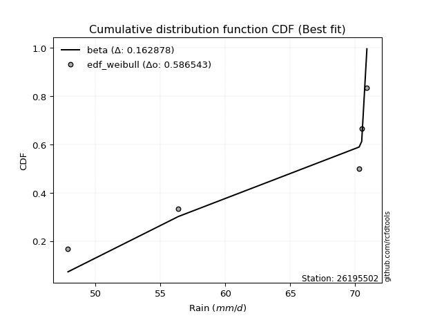</img>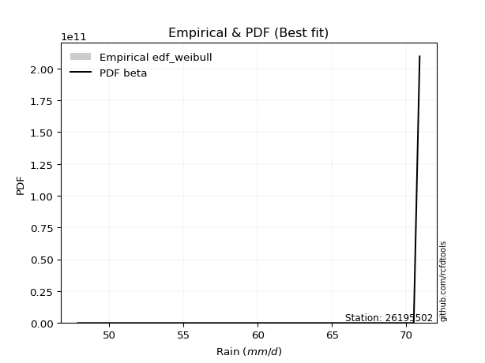</img>

</div>


### 4. EDF Beard (1943)

The Beard formula (or Beard´s plotting position formula) in hydrology is used to estimate the empirical non-exceedance probability _(P)_ of a flood event (or other extreme hydrological data point) within a given dataset.

<div align="center">


$P=(m-0.31)/(n+0.38)$


</div>


**4.1. Empirical values**

<div align="center">

|                | 0                   | 1                  | 2         | 3                  | 4                  |
|:---------------|:--------------------|:-------------------|:----------|:-------------------|:-------------------|
| date           | 2018                | 2017               | 2020      | 2019               | 2021               |
| x              | 47.9                | 56.4               | 70.3      | 70.5               | 70.9               |
| m              | 1                   | 2                  | 3         | 4                  | 5                  |
| empirical_dist | edf_beard           | edf_beard          | edf_beard | edf_beard          | edf_beard          |
| empirical      | 0.12825278810408922 | 0.3141263940520446 | 0.5       | 0.6858736059479554 | 0.8717472118959109 |
| empirical_tr   | 1.1471215351812367  | 1.4579945799457996 | 2.0       | 3.183431952662722  | 7.797101449275368  |

</div>


**4.2. Kolmogorov-Smirnov fit test (sorted by Δ)**


<div align="center">

|                | 0                  | 1                  | 2                   | 3                   | 4                   | 5                   | 6                   | 7                   | 8                   | 9                   | 10                  | 11                  | 12                  | 13                  | 14                  | 15                  | 16                 | 17                  | 18                 | 19                  | 20                 | 21                  | 22                  | 23                  | 24                  | 25                 | 26                  | 27                  | 28                 | 29                  | 30                 | 31                 | 32                 | 33                 | 34                 | 35                 | 36                 | 37                 | 38                 | 39                  | 40                 | 41                  | 42                  | 43                 | 44                 | 45                 | 46                  | 47                 | 48                 | 49                  | 50                 | 51                  | 52                  | 53                 | 54                 | 55                 | 56                  | 57                  | 58                  | 59                 | 60                  | 61                 | 62                 | 63                 | 64                 | 65                 | 66                  | 67                 | 68                 | 69                 | 70                 | 71                  | 72                  | 73                  | 74                  | 75                 | 76                 | 77                  | 78                  | 79                 | 80                  | 81                 | 82                 | 83                  | 84                 | 85                 | 86                 | 87                  | 88                 | 89                 | 90                  | 91                  | 92                  | 93                  | 94                  | 95                 | 96                  | 97                  | 98                 | 99                 | 100                 | 101                | 102                | 103                | 104                | 105                 | 106                | 107                | 108                 | 109                 | 110                | 111                | 112                 | 113                | 114                | 115                | 116                 | 117                 | 118                | 119                 | 120                | 121                | 122                | 123                | 124                | 125                 | 126                | 127                | 128                | 129                | 130                | 131                 | 132                 | 133                | 134                | 135                | 136                 | 137                | 138                | 139                 | 140                | 141                | 142                 | 143                | 144                 | 145                | 146                | 147                | 148                | 149                | 150                | 151                | 152                | 153                | 154                | 155                | 156                | 157                | 158                | 159                |
|:---------------|:-------------------|:-------------------|:--------------------|:--------------------|:--------------------|:--------------------|:--------------------|:--------------------|:--------------------|:--------------------|:--------------------|:--------------------|:--------------------|:--------------------|:--------------------|:--------------------|:-------------------|:--------------------|:-------------------|:--------------------|:-------------------|:--------------------|:--------------------|:--------------------|:--------------------|:-------------------|:--------------------|:--------------------|:-------------------|:--------------------|:-------------------|:-------------------|:-------------------|:-------------------|:-------------------|:-------------------|:-------------------|:-------------------|:-------------------|:--------------------|:-------------------|:--------------------|:--------------------|:-------------------|:-------------------|:-------------------|:--------------------|:-------------------|:-------------------|:--------------------|:-------------------|:--------------------|:--------------------|:-------------------|:-------------------|:-------------------|:--------------------|:--------------------|:--------------------|:-------------------|:--------------------|:-------------------|:-------------------|:-------------------|:-------------------|:-------------------|:--------------------|:-------------------|:-------------------|:-------------------|:-------------------|:--------------------|:--------------------|:--------------------|:--------------------|:-------------------|:-------------------|:--------------------|:--------------------|:-------------------|:--------------------|:-------------------|:-------------------|:--------------------|:-------------------|:-------------------|:-------------------|:--------------------|:-------------------|:-------------------|:--------------------|:--------------------|:--------------------|:--------------------|:--------------------|:-------------------|:--------------------|:--------------------|:-------------------|:-------------------|:--------------------|:-------------------|:-------------------|:-------------------|:-------------------|:--------------------|:-------------------|:-------------------|:--------------------|:--------------------|:-------------------|:-------------------|:--------------------|:-------------------|:-------------------|:-------------------|:--------------------|:--------------------|:-------------------|:--------------------|:-------------------|:-------------------|:-------------------|:-------------------|:-------------------|:--------------------|:-------------------|:-------------------|:-------------------|:-------------------|:-------------------|:--------------------|:--------------------|:-------------------|:-------------------|:-------------------|:--------------------|:-------------------|:-------------------|:--------------------|:-------------------|:-------------------|:--------------------|:-------------------|:--------------------|:-------------------|:-------------------|:-------------------|:-------------------|:-------------------|:-------------------|:-------------------|:-------------------|:-------------------|:-------------------|:-------------------|:-------------------|:-------------------|:-------------------|:-------------------|
| station        | 26195502           | 26195502           | 26195502            | 26195502            | 26195502            | 26195502            | 26195502            | 26195502            | 26195502            | 26195502            | 26195502            | 26195502            | 26195502            | 26195502            | 26195502            | 26195502            | 26195502           | 26195502            | 26195502           | 26195502            | 26195502           | 26195502            | 26195502            | 26195502            | 26195502            | 26195502           | 26195502            | 26195502            | 26195502           | 26195502            | 26195502           | 26195502           | 26195502           | 26195502           | 26195502           | 26195502           | 26195502           | 26195502           | 26195502           | 26195502            | 26195502           | 26195502            | 26195502            | 26195502           | 26195502           | 26195502           | 26195502            | 26195502           | 26195502           | 26195502            | 26195502           | 26195502            | 26195502            | 26195502           | 26195502           | 26195502           | 26195502            | 26195502            | 26195502            | 26195502           | 26195502            | 26195502           | 26195502           | 26195502           | 26195502           | 26195502           | 26195502            | 26195502           | 26195502           | 26195502           | 26195502           | 26195502            | 26195502            | 26195502            | 26195502            | 26195502           | 26195502           | 26195502            | 26195502            | 26195502           | 26195502            | 26195502           | 26195502           | 26195502            | 26195502           | 26195502           | 26195502           | 26195502            | 26195502           | 26195502           | 26195502            | 26195502            | 26195502            | 26195502            | 26195502            | 26195502           | 26195502            | 26195502            | 26195502           | 26195502           | 26195502            | 26195502           | 26195502           | 26195502           | 26195502           | 26195502            | 26195502           | 26195502           | 26195502            | 26195502            | 26195502           | 26195502           | 26195502            | 26195502           | 26195502           | 26195502           | 26195502            | 26195502            | 26195502           | 26195502            | 26195502           | 26195502           | 26195502           | 26195502           | 26195502           | 26195502            | 26195502           | 26195502           | 26195502           | 26195502           | 26195502           | 26195502            | 26195502            | 26195502           | 26195502           | 26195502           | 26195502            | 26195502           | 26195502           | 26195502            | 26195502           | 26195502           | 26195502            | 26195502           | 26195502            | 26195502           | 26195502           | 26195502           | 26195502           | 26195502           | 26195502           | 26195502           | 26195502           | 26195502           | 26195502           | 26195502           | 26195502           | 26195502           | 26195502           | 26195502           |
| empirical_dist | edf_beard          | edf_beard          | edf_beard           | edf_beard           | edf_beard           | edf_beard           | edf_beard           | edf_beard           | edf_beard           | edf_beard           | edf_beard           | edf_beard           | edf_beard           | edf_beard           | edf_beard           | edf_beard           | edf_beard          | edf_beard           | edf_beard          | edf_beard           | edf_beard          | edf_beard           | edf_beard           | edf_beard           | edf_beard           | edf_beard          | edf_beard           | edf_beard           | edf_beard          | edf_beard           | edf_beard          | edf_beard          | edf_beard          | edf_beard          | edf_beard          | edf_beard          | edf_beard          | edf_beard          | edf_beard          | edf_beard           | edf_beard          | edf_beard           | edf_beard           | edf_beard          | edf_beard          | edf_beard          | edf_beard           | edf_beard          | edf_beard          | edf_beard           | edf_beard          | edf_beard           | edf_beard           | edf_beard          | edf_beard          | edf_beard          | edf_beard           | edf_beard           | edf_beard           | edf_beard          | edf_beard           | edf_beard          | edf_beard          | edf_beard          | edf_beard          | edf_beard          | edf_beard           | edf_beard          | edf_beard          | edf_beard          | edf_beard          | edf_beard           | edf_beard           | edf_beard           | edf_beard           | edf_beard          | edf_beard          | edf_beard           | edf_beard           | edf_beard          | edf_beard           | edf_beard          | edf_beard          | edf_beard           | edf_beard          | edf_beard          | edf_beard          | edf_beard           | edf_beard          | edf_beard          | edf_beard           | edf_beard           | edf_beard           | edf_beard           | edf_beard           | edf_beard          | edf_beard           | edf_beard           | edf_beard          | edf_beard          | edf_beard           | edf_beard          | edf_beard          | edf_beard          | edf_beard          | edf_beard           | edf_beard          | edf_beard          | edf_beard           | edf_beard           | edf_beard          | edf_beard          | edf_beard           | edf_beard          | edf_beard          | edf_beard          | edf_beard           | edf_beard           | edf_beard          | edf_beard           | edf_beard          | edf_beard          | edf_beard          | edf_beard          | edf_beard          | edf_beard           | edf_beard          | edf_beard          | edf_beard          | edf_beard          | edf_beard          | edf_beard           | edf_beard           | edf_beard          | edf_beard          | edf_beard          | edf_beard           | edf_beard          | edf_beard          | edf_beard           | edf_beard          | edf_beard          | edf_beard           | edf_beard          | edf_beard           | edf_beard          | edf_beard          | edf_beard          | edf_beard          | edf_beard          | edf_beard          | edf_beard          | edf_beard          | edf_beard          | edf_beard          | edf_beard          | edf_beard          | edf_beard          | edf_beard          | edf_beard          |
| p_dist         | beta               | logbeta            | arcsine             | kappa3              | logarcsine          | wrapcauchy          | logwrapcauchy       | levy_l              | loglevy_l           | logtrapezoid        | trapezoid           | vonmises_line       | logksone            | ksone               | logweibull_max      | logsemicircular     | semicircular       | logbetaprime        | loganglit          | anglit              | halfgennorm        | lognct              | loglomax            | logpearson3         | logdweibull         | pearson3           | invgauss            | logncf              | burr12             | genextreme          | lomax              | loggumbel_l        | logkstwobign       | logfoldnorm        | logf               | gumbel_l           | loginvweibull      | loginvgauss        | logcrystalball     | logt                | logexponnorm       | lognorm             | loghalfgennorm      | nct                | logrice            | dgamma             | ncf                 | erlang             | loginvgamma        | logfatiguelife      | t                  | exponnorm           | crystalball         | norm               | truncnorm          | f                  | loggamma            | loggamma            | loggenexpon         | invgamma           | kstwobign           | rice               | logerlang          | gamma              | betaprime          | logalpha           | alpha               | logmaxwell         | gennorm            | maxwell            | lograyleigh        | weibull_min         | rayleigh            | logburr12           | logweibull_min      | loghalfnorm        | halfnorm           | dweibull            | loglogistic         | logistic           | logexponpow         | logcosine          | loggumbel_r        | cosine              | gumbel_r           | loghypsecant       | hypsecant          | loghalflogistic     | halflogistic       | loggompertz        | nakagami            | logmoyal            | moyal               | loglaplace          | loglaplace          | laplace            | exponweib           | logloglaplace       | logdgamma          | burr               | genexpon            | logwald            | wald               | argus              | loggenextreme      | loggengamma         | logargus           | loggennorm         | logexponweib        | lognakagami         | logburr            | gengamma           | fatiguelife         | genpareto          | logmielke          | mielke             | weibull_max         | loggenhalflogistic  | logloggamma        | invweibull          | genhalflogistic    | foldnorm           | triang             | skewnorm           | kappa4             | logtriang           | logskewnorm        | loggausshyper      | johnsonsu          | tukeylambda        | logkappa4          | gausshyper          | uniform             | logtukeylambda     | logkappa3          | johnsonsb          | loguniform          | logvonmises_line   | truncweibull_min   | bradford            | truncexpon         | logbradford        | logtruncweibull_min | logtruncexpon      | logtruncnorm        | loggenpareto       | gompertz           | logjohnsonsu       | powerlaw           | logpowerlaw        | truncpareto        | logtruncpareto     | exponpow           | logjohnsonsb       | rdist              | genlogistic        | loggenlogistic     | logrdist           | logvonmises        | vonmises           |
| delta          | 0.1244637898764096 | 0.1262073043076979 | 0.17900109373801232 | 0.17942614380561184 | 0.17995629748471842 | 0.18002076286767366 | 0.18319074119745127 | 0.19299384789020063 | 0.19894424155058105 | 0.21056952675457918 | 0.21299722671704902 | 0.21433930453974384 | 0.21590561305089384 | 0.21766773874085255 | 0.21841326684400053 | 0.23239852110129855 | 0.2341993674890458 | 0.24127476686828375 | 0.2446678314768318 | 0.24648542346816926 | 0.2496832552851378 | 0.25283157553436153 | 0.25821371038941265 | 0.25963353468643424 | 0.26045138491314945 | 0.2628583080515883 | 0.26329783923031924 | 0.26393198919271477 | 0.264470778627484  | 0.26452957228434437 | 0.2659668779617784 | 0.2689803879574204 | 0.2702587965861578 | 0.2711686667971557 | 0.2716099567773895 | 0.2716256330392314 | 0.2719691813908238 | 0.2723055060074905 | 0.2727396267402111 | 0.27274166027959357 | 0.2727440201441147 | 0.27274548662844245 | 0.27282055344467293 | 0.2729493658785934 | 0.2730229843458529 | 0.2734449089941129 | 0.27346107771752604 | 0.2735998048295303 | 0.2742661986846806 | 0.27438152791923964 | 0.2745782428684851 | 0.27458073559629004 | 0.27458234117967384 | 0.2745823440645212 | 0.2745823463052184 | 0.2746008174626299 | 0.27462888236277216 | 0.27462888236277216 | 0.27482219674739383 | 0.2748888724533599 | 0.27506237630350394 | 0.2752004087044062 | 0.2754196248475911 | 0.2758929325382795 | 0.276046553308567  | 0.2760608892723817 | 0.27742597967733595 | 0.2793256112263539 | 0.2802541626410372 | 0.2809175843513779 | 0.2811902827290985 | 0.28208203475007765 | 0.28271216776128727 | 0.28278014582251987 | 0.28316474222227495 | 0.2882396366383633 | 0.289582012886055  | 0.29267416699622884 | 0.29520247761029694 | 0.2969996825909669 | 0.29867351305431455 | 0.3056814223663946 | 0.3064272708627902 | 0.30655058764781296 | 0.3077813895509316 | 0.3092838544711648 | 0.3109982543667362 | 0.31121407978700955 | 0.3124232971429992 | 0.3131356489631125 | 0.31412639405027676 | 0.31741759981102136 | 0.31862978300810063 | 0.32637619311343824 | 0.32637619311343824 | 0.3278685702172641 | 0.33553811138341555 | 0.33965398822753157 | 0.3426801836205171 | 0.3456986135700847 | 0.35148820948288884 | 0.3533878888413796 | 0.3542582690191888 | 0.3604385889190411 | 0.3611916852977055 | 0.36182588755582556 | 0.3644454391333607 | 0.3717472118962059 | 0.37604129175908774 | 0.38059095273285243 | 0.3807928576816201 | 0.4057058736913835 | 0.41370516492678516 | 0.4145614137203095 | 0.424790802930178  | 0.4274828853668573 | 0.42862415275641064 | 0.43446752206303885 | 0.4351668812797397 | 0.44063437732480254 | 0.4450792430332423 | 0.4562843790356266 | 0.4581205408624133 | 0.4606551387037371 | 0.4622136503425427 | 0.46538987390080166 | 0.4666231255872253 | 0.467252653587252  | 0.4672730934225077 | 0.4684068464423987 | 0.4724301837263065 | 0.47325131264437215 | 0.47391304347826047 | 0.4744955346492574 | 0.4750882710329981 | 0.4766588160478038 | 0.47832837460310096 | 0.4784810193469864 | 0.4803572136898976 | 0.48138594402945634 | 0.4825082809004517 | 0.4842925635459133 | 0.4843672674451204  | 0.4861889217906933 | 0.48952426251248415 | 0.49977542421538   | 0.499999755957013  | 0.5408900570113917 | 0.5592208817266708 | 0.5692984516703303 | 0.5783372052368787 | 0.5918089084659661 | 0.6011434446077346 | 0.6671530230229232 | 0.6858736044496536 | 0.6858736059479554 | 0.6858736059479554 | 0.8717472118959109 | 1.2721403772884543 | 10.970655178876504 |
| deltao         | 0.5865427407550001 | 0.5865427407550001 | 0.5865427407550001  | 0.5865427407550001  | 0.5865427407550001  | 0.5865427407550001  | 0.5865427407550001  | 0.5865427407550001  | 0.5865427407550001  | 0.5865427407550001  | 0.5865427407550001  | 0.5865427407550001  | 0.5865427407550001  | 0.5865427407550001  | 0.5865427407550001  | 0.5865427407550001  | 0.5865427407550001 | 0.5865427407550001  | 0.5865427407550001 | 0.5865427407550001  | 0.5865427407550001 | 0.5865427407550001  | 0.5865427407550001  | 0.5865427407550001  | 0.5865427407550001  | 0.5865427407550001 | 0.5865427407550001  | 0.5865427407550001  | 0.5865427407550001 | 0.5865427407550001  | 0.5865427407550001 | 0.5865427407550001 | 0.5865427407550001 | 0.5865427407550001 | 0.5865427407550001 | 0.5865427407550001 | 0.5865427407550001 | 0.5865427407550001 | 0.5865427407550001 | 0.5865427407550001  | 0.5865427407550001 | 0.5865427407550001  | 0.5865427407550001  | 0.5865427407550001 | 0.5865427407550001 | 0.5865427407550001 | 0.5865427407550001  | 0.5865427407550001 | 0.5865427407550001 | 0.5865427407550001  | 0.5865427407550001 | 0.5865427407550001  | 0.5865427407550001  | 0.5865427407550001 | 0.5865427407550001 | 0.5865427407550001 | 0.5865427407550001  | 0.5865427407550001  | 0.5865427407550001  | 0.5865427407550001 | 0.5865427407550001  | 0.5865427407550001 | 0.5865427407550001 | 0.5865427407550001 | 0.5865427407550001 | 0.5865427407550001 | 0.5865427407550001  | 0.5865427407550001 | 0.5865427407550001 | 0.5865427407550001 | 0.5865427407550001 | 0.5865427407550001  | 0.5865427407550001  | 0.5865427407550001  | 0.5865427407550001  | 0.5865427407550001 | 0.5865427407550001 | 0.5865427407550001  | 0.5865427407550001  | 0.5865427407550001 | 0.5865427407550001  | 0.5865427407550001 | 0.5865427407550001 | 0.5865427407550001  | 0.5865427407550001 | 0.5865427407550001 | 0.5865427407550001 | 0.5865427407550001  | 0.5865427407550001 | 0.5865427407550001 | 0.5865427407550001  | 0.5865427407550001  | 0.5865427407550001  | 0.5865427407550001  | 0.5865427407550001  | 0.5865427407550001 | 0.5865427407550001  | 0.5865427407550001  | 0.5865427407550001 | 0.5865427407550001 | 0.5865427407550001  | 0.5865427407550001 | 0.5865427407550001 | 0.5865427407550001 | 0.5865427407550001 | 0.5865427407550001  | 0.5865427407550001 | 0.5865427407550001 | 0.5865427407550001  | 0.5865427407550001  | 0.5865427407550001 | 0.5865427407550001 | 0.5865427407550001  | 0.5865427407550001 | 0.5865427407550001 | 0.5865427407550001 | 0.5865427407550001  | 0.5865427407550001  | 0.5865427407550001 | 0.5865427407550001  | 0.5865427407550001 | 0.5865427407550001 | 0.5865427407550001 | 0.5865427407550001 | 0.5865427407550001 | 0.5865427407550001  | 0.5865427407550001 | 0.5865427407550001 | 0.5865427407550001 | 0.5865427407550001 | 0.5865427407550001 | 0.5865427407550001  | 0.5865427407550001  | 0.5865427407550001 | 0.5865427407550001 | 0.5865427407550001 | 0.5865427407550001  | 0.5865427407550001 | 0.5865427407550001 | 0.5865427407550001  | 0.5865427407550001 | 0.5865427407550001 | 0.5865427407550001  | 0.5865427407550001 | 0.5865427407550001  | 0.5865427407550001 | 0.5865427407550001 | 0.5865427407550001 | 0.5865427407550001 | 0.5865427407550001 | 0.5865427407550001 | 0.5865427407550001 | 0.5865427407550001 | 0.5865427407550001 | 0.5865427407550001 | 0.5865427407550001 | 0.5865427407550001 | 0.5865427407550001 | 0.5865427407550001 | 0.5865427407550001 |
| eval           | Δo > Δ             | Δo > Δ             | Δo > Δ              | Δo > Δ              | Δo > Δ              | Δo > Δ              | Δo > Δ              | Δo > Δ              | Δo > Δ              | Δo > Δ              | Δo > Δ              | Δo > Δ              | Δo > Δ              | Δo > Δ              | Δo > Δ              | Δo > Δ              | Δo > Δ             | Δo > Δ              | Δo > Δ             | Δo > Δ              | Δo > Δ             | Δo > Δ              | Δo > Δ              | Δo > Δ              | Δo > Δ              | Δo > Δ             | Δo > Δ              | Δo > Δ              | Δo > Δ             | Δo > Δ              | Δo > Δ             | Δo > Δ             | Δo > Δ             | Δo > Δ             | Δo > Δ             | Δo > Δ             | Δo > Δ             | Δo > Δ             | Δo > Δ             | Δo > Δ              | Δo > Δ             | Δo > Δ              | Δo > Δ              | Δo > Δ             | Δo > Δ             | Δo > Δ             | Δo > Δ              | Δo > Δ             | Δo > Δ             | Δo > Δ              | Δo > Δ             | Δo > Δ              | Δo > Δ              | Δo > Δ             | Δo > Δ             | Δo > Δ             | Δo > Δ              | Δo > Δ              | Δo > Δ              | Δo > Δ             | Δo > Δ              | Δo > Δ             | Δo > Δ             | Δo > Δ             | Δo > Δ             | Δo > Δ             | Δo > Δ              | Δo > Δ             | Δo > Δ             | Δo > Δ             | Δo > Δ             | Δo > Δ              | Δo > Δ              | Δo > Δ              | Δo > Δ              | Δo > Δ             | Δo > Δ             | Δo > Δ              | Δo > Δ              | Δo > Δ             | Δo > Δ              | Δo > Δ             | Δo > Δ             | Δo > Δ              | Δo > Δ             | Δo > Δ             | Δo > Δ             | Δo > Δ              | Δo > Δ             | Δo > Δ             | Δo > Δ              | Δo > Δ              | Δo > Δ              | Δo > Δ              | Δo > Δ              | Δo > Δ             | Δo > Δ              | Δo > Δ              | Δo > Δ             | Δo > Δ             | Δo > Δ              | Δo > Δ             | Δo > Δ             | Δo > Δ             | Δo > Δ             | Δo > Δ              | Δo > Δ             | Δo > Δ             | Δo > Δ              | Δo > Δ              | Δo > Δ             | Δo > Δ             | Δo > Δ              | Δo > Δ             | Δo > Δ             | Δo > Δ             | Δo > Δ              | Δo > Δ              | Δo > Δ             | Δo > Δ              | Δo > Δ             | Δo > Δ             | Δo > Δ             | Δo > Δ             | Δo > Δ             | Δo > Δ              | Δo > Δ             | Δo > Δ             | Δo > Δ             | Δo > Δ             | Δo > Δ             | Δo > Δ              | Δo > Δ              | Δo > Δ             | Δo > Δ             | Δo > Δ             | Δo > Δ              | Δo > Δ             | Δo > Δ             | Δo > Δ              | Δo > Δ             | Δo > Δ             | Δo > Δ              | Δo > Δ             | Δo > Δ              | Δo > Δ             | Δo > Δ             | Δo > Δ             | Δo > Δ             | Δo > Δ             | Δo > Δ             | Δo <= Δ            | Δo <= Δ            | Δo <= Δ            | Δo <= Δ            | Δo <= Δ            | Δo <= Δ            | Δo <= Δ            | Δo <= Δ            | Δo <= Δ            |
| fit            | 1                  | 1                  | 1                   | 1                   | 1                   | 1                   | 1                   | 1                   | 1                   | 1                   | 1                   | 1                   | 1                   | 1                   | 1                   | 1                   | 1                  | 1                   | 1                  | 1                   | 1                  | 1                   | 1                   | 1                   | 1                   | 1                  | 1                   | 1                   | 1                  | 1                   | 1                  | 1                  | 1                  | 1                  | 1                  | 1                  | 1                  | 1                  | 1                  | 1                   | 1                  | 1                   | 1                   | 1                  | 1                  | 1                  | 1                   | 1                  | 1                  | 1                   | 1                  | 1                   | 1                   | 1                  | 1                  | 1                  | 1                   | 1                   | 1                   | 1                  | 1                   | 1                  | 1                  | 1                  | 1                  | 1                  | 1                   | 1                  | 1                  | 1                  | 1                  | 1                   | 1                   | 1                   | 1                   | 1                  | 1                  | 1                   | 1                   | 1                  | 1                   | 1                  | 1                  | 1                   | 1                  | 1                  | 1                  | 1                   | 1                  | 1                  | 1                   | 1                   | 1                   | 1                   | 1                   | 1                  | 1                   | 1                   | 1                  | 1                  | 1                   | 1                  | 1                  | 1                  | 1                  | 1                   | 1                  | 1                  | 1                   | 1                   | 1                  | 1                  | 1                   | 1                  | 1                  | 1                  | 1                   | 1                   | 1                  | 1                   | 1                  | 1                  | 1                  | 1                  | 1                  | 1                   | 1                  | 1                  | 1                  | 1                  | 1                  | 1                   | 1                   | 1                  | 1                  | 1                  | 1                   | 1                  | 1                  | 1                   | 1                  | 1                  | 1                   | 1                  | 1                   | 1                  | 1                  | 1                  | 1                  | 1                  | 1                  | 0                  | 0                  | 0                  | 0                  | 0                  | 0                  | 0                  | 0                  | 0                  |
| n              | 5                  | 5                  | 5                   | 5                   | 5                   | 5                   | 5                   | 5                   | 5                   | 5                   | 5                   | 5                   | 5                   | 5                   | 5                   | 5                   | 5                  | 5                   | 5                  | 5                   | 5                  | 5                   | 5                   | 5                   | 5                   | 5                  | 5                   | 5                   | 5                  | 5                   | 5                  | 5                  | 5                  | 5                  | 5                  | 5                  | 5                  | 5                  | 5                  | 5                   | 5                  | 5                   | 5                   | 5                  | 5                  | 5                  | 5                   | 5                  | 5                  | 5                   | 5                  | 5                   | 5                   | 5                  | 5                  | 5                  | 5                   | 5                   | 5                   | 5                  | 5                   | 5                  | 5                  | 5                  | 5                  | 5                  | 5                   | 5                  | 5                  | 5                  | 5                  | 5                   | 5                   | 5                   | 5                   | 5                  | 5                  | 5                   | 5                   | 5                  | 5                   | 5                  | 5                  | 5                   | 5                  | 5                  | 5                  | 5                   | 5                  | 5                  | 5                   | 5                   | 5                   | 5                   | 5                   | 5                  | 5                   | 5                   | 5                  | 5                  | 5                   | 5                  | 5                  | 5                  | 5                  | 5                   | 5                  | 5                  | 5                   | 5                   | 5                  | 5                  | 5                   | 5                  | 5                  | 5                  | 5                   | 5                   | 5                  | 5                   | 5                  | 5                  | 5                  | 5                  | 5                  | 5                   | 5                  | 5                  | 5                  | 5                  | 5                  | 5                   | 5                   | 5                  | 5                  | 5                  | 5                   | 5                  | 5                  | 5                   | 5                  | 5                  | 5                   | 5                  | 5                   | 5                  | 5                  | 5                  | 5                  | 5                  | 5                  | 5                  | 5                  | 5                  | 5                  | 5                  | 5                  | 5                  | 5                  | 5                  |
| best_fit       | 1                  | 0                  | 0                   | 0                   | 0                   | 0                   | 0                   | 0                   | 0                   | 0                   | 0                   | 0                   | 0                   | 0                   | 0                   | 0                   | 0                  | 0                   | 0                  | 0                   | 0                  | 0                   | 0                   | 0                   | 0                   | 0                  | 0                   | 0                   | 0                  | 0                   | 0                  | 0                  | 0                  | 0                  | 0                  | 0                  | 0                  | 0                  | 0                  | 0                   | 0                  | 0                   | 0                   | 0                  | 0                  | 0                  | 0                   | 0                  | 0                  | 0                   | 0                  | 0                   | 0                   | 0                  | 0                  | 0                  | 0                   | 0                   | 0                   | 0                  | 0                   | 0                  | 0                  | 0                  | 0                  | 0                  | 0                   | 0                  | 0                  | 0                  | 0                  | 0                   | 0                   | 0                   | 0                   | 0                  | 0                  | 0                   | 0                   | 0                  | 0                   | 0                  | 0                  | 0                   | 0                  | 0                  | 0                  | 0                   | 0                  | 0                  | 0                   | 0                   | 0                   | 0                   | 0                   | 0                  | 0                   | 0                   | 0                  | 0                  | 0                   | 0                  | 0                  | 0                  | 0                  | 0                   | 0                  | 0                  | 0                   | 0                   | 0                  | 0                  | 0                   | 0                  | 0                  | 0                  | 0                   | 0                   | 0                  | 0                   | 0                  | 0                  | 0                  | 0                  | 0                  | 0                   | 0                  | 0                  | 0                  | 0                  | 0                  | 0                   | 0                   | 0                  | 0                  | 0                  | 0                   | 0                  | 0                  | 0                   | 0                  | 0                  | 0                   | 0                  | 0                   | 0                  | 0                  | 0                  | 0                  | 0                  | 0                  | 0                  | 0                  | 0                  | 0                  | 0                  | 0                  | 0                  | 0                  | 0                  |
| best_fit_sort  | 1                  | 2                  | 3                   | 4                   | 5                   | 6                   | 7                   | 8                   | 9                   | 10                  | 11                  | 12                  | 13                  | 14                  | 15                  | 16                  | 17                 | 18                  | 19                 | 20                  | 21                 | 22                  | 23                  | 24                  | 25                  | 26                 | 27                  | 28                  | 29                 | 30                  | 31                 | 32                 | 33                 | 34                 | 35                 | 36                 | 37                 | 38                 | 39                 | 40                  | 41                 | 42                  | 43                  | 44                 | 45                 | 46                 | 47                  | 48                 | 49                 | 50                  | 51                 | 52                  | 53                  | 54                 | 55                 | 56                 | 57                  | 58                  | 59                  | 60                 | 61                  | 62                 | 63                 | 64                 | 65                 | 66                 | 67                  | 68                 | 69                 | 70                 | 71                 | 72                  | 73                  | 74                  | 75                  | 76                 | 77                 | 78                  | 79                  | 80                 | 81                  | 82                 | 83                 | 84                  | 85                 | 86                 | 87                 | 88                  | 89                 | 90                 | 91                  | 92                  | 93                  | 94                  | 95                  | 96                 | 97                  | 98                  | 99                 | 100                | 101                 | 102                | 103                | 104                | 105                | 106                 | 107                | 108                | 109                 | 110                 | 111                | 112                | 113                 | 114                | 115                | 116                | 117                 | 118                 | 119                | 120                 | 121                | 122                | 123                | 124                | 125                | 126                 | 127                | 128                | 129                | 130                | 131                | 132                 | 133                 | 134                | 135                | 136                | 137                 | 138                | 139                | 140                 | 141                | 142                | 143                 | 144                | 145                 | 146                | 147                | 148                | 149                | 150                | 151                | 152                | 153                | 154                | 155                | 156                | 157                | 158                | 159                | 160                |

</div>


**4.3. Best fit**

<div align="center">

|   id |   station | empirical_dist   | p_dist   |    delta |   deltao | eval   |   fit |   n |   best_fit |   best_fit_sort |
|-----:|----------:|:-----------------|:---------|---------:|---------:|:-------|------:|----:|-----------:|----------------:|
|    0 |  26195502 | edf_beard        | beta     | 0.124464 | 0.586543 | Δo > Δ |     1 |   5 |          1 |               1 |

</div>


<div align="center">

</img></img>

</div>


### 5. EDF Chegodayev (1955)

The Chegodayev formula is an empirical plotting position formula used in hydrological frequency analysis to estimate the exceedance probability or return period of a specific event from a set of observed data. It is primarily used for plotting observed data points on probability paper to fit a theoretical distribution, particularly for analyzing extreme events like maximum flood flows or rainfall intensities. The constant _b_ value in the generalized plotting position formula is 0.3.

<div align="center">


$P=(m-b)/(n+1-2b)$


</div>


**5.1. Empirical values**

<div align="center">

|                | 0                   | 1                   | 2              | 3                  | 4                  |
|:---------------|:--------------------|:--------------------|:---------------|:-------------------|:-------------------|
| date           | 2018                | 2017                | 2020           | 2019               | 2021               |
| x              | 47.9                | 56.4                | 70.3           | 70.5               | 70.9               |
| m              | 1                   | 2                   | 3              | 4                  | 5                  |
| empirical_dist | edf_chegodayev      | edf_chegodayev      | edf_chegodayev | edf_chegodayev     | edf_chegodayev     |
| empirical      | 0.12962962962962962 | 0.31481481481481477 | 0.5            | 0.6851851851851851 | 0.8703703703703703 |
| empirical_tr   | 1.148936170212766   | 1.4594594594594594  | 2.0            | 3.1764705882352935 | 7.714285714285713  |

</div>


**5.2. Kolmogorov-Smirnov fit test (sorted by Δ)**


<div align="center">

|                | 0                   | 1                  | 2                   | 3                  | 4                   | 5                  | 6                   | 7                   | 8                  | 9                   | 10                  | 11                 | 12                  | 13                  | 14                  | 15                  | 16                 | 17                  | 18                 | 19                  | 20                 | 21                  | 22                  | 23                  | 24                  | 25                  | 26                 | 27                  | 28                 | 29                  | 30                 | 31                 | 32                 | 33                 | 34                 | 35                 | 36                 | 37                 | 38                 | 39                  | 40                 | 41                  | 42                  | 43                 | 44                 | 45                  | 46                 | 47                  | 48                 | 49                  | 50                 | 51                  | 52                  | 53                 | 54                 | 55                 | 56                  | 57                  | 58                  | 59                 | 60                  | 61                 | 62                 | 63                 | 64                 | 65                 | 66                  | 67                 | 68                 | 69                  | 70                 | 71                  | 72                  | 73                  | 74                  | 75                 | 76                 | 77                 | 78                  | 79                 | 80                  | 81                 | 82                 | 83                  | 84                 | 85                 | 86                 | 87                  | 88                 | 89                 | 90                 | 91                  | 92                  | 93                  | 94                  | 95                 | 96                 | 97                  | 98                 | 99                 | 100                 | 101                | 102                | 103                | 104                 | 105                | 106                | 107                | 108                 | 109                | 110                | 111                 | 112                | 113                | 114                | 115                | 116                 | 117                 | 118                | 119                | 120                | 121                | 122                | 123                | 124                | 125                 | 126                | 127                | 128                | 129                | 130                | 131                 | 132                 | 133                | 134                | 135                | 136                 | 137                | 138                | 139                 | 140                | 141                | 142                 | 143                | 144                 | 145                | 146                | 147                | 148                | 149                | 150                | 151                | 152                | 153                | 154                | 155                | 156                | 157                | 158                | 159                |
|:---------------|:--------------------|:-------------------|:--------------------|:-------------------|:--------------------|:-------------------|:--------------------|:--------------------|:-------------------|:--------------------|:--------------------|:-------------------|:--------------------|:--------------------|:--------------------|:--------------------|:-------------------|:--------------------|:-------------------|:--------------------|:-------------------|:--------------------|:--------------------|:--------------------|:--------------------|:--------------------|:-------------------|:--------------------|:-------------------|:--------------------|:-------------------|:-------------------|:-------------------|:-------------------|:-------------------|:-------------------|:-------------------|:-------------------|:-------------------|:--------------------|:-------------------|:--------------------|:--------------------|:-------------------|:-------------------|:--------------------|:-------------------|:--------------------|:-------------------|:--------------------|:-------------------|:--------------------|:--------------------|:-------------------|:-------------------|:-------------------|:--------------------|:--------------------|:--------------------|:-------------------|:--------------------|:-------------------|:-------------------|:-------------------|:-------------------|:-------------------|:--------------------|:-------------------|:-------------------|:--------------------|:-------------------|:--------------------|:--------------------|:--------------------|:--------------------|:-------------------|:-------------------|:-------------------|:--------------------|:-------------------|:--------------------|:-------------------|:-------------------|:--------------------|:-------------------|:-------------------|:-------------------|:--------------------|:-------------------|:-------------------|:-------------------|:--------------------|:--------------------|:--------------------|:--------------------|:-------------------|:-------------------|:--------------------|:-------------------|:-------------------|:--------------------|:-------------------|:-------------------|:-------------------|:--------------------|:-------------------|:-------------------|:-------------------|:--------------------|:-------------------|:-------------------|:--------------------|:-------------------|:-------------------|:-------------------|:-------------------|:--------------------|:--------------------|:-------------------|:-------------------|:-------------------|:-------------------|:-------------------|:-------------------|:-------------------|:--------------------|:-------------------|:-------------------|:-------------------|:-------------------|:-------------------|:--------------------|:--------------------|:-------------------|:-------------------|:-------------------|:--------------------|:-------------------|:-------------------|:--------------------|:-------------------|:-------------------|:--------------------|:-------------------|:--------------------|:-------------------|:-------------------|:-------------------|:-------------------|:-------------------|:-------------------|:-------------------|:-------------------|:-------------------|:-------------------|:-------------------|:-------------------|:-------------------|:-------------------|:-------------------|
| station        | 26195502            | 26195502           | 26195502            | 26195502           | 26195502            | 26195502           | 26195502            | 26195502            | 26195502           | 26195502            | 26195502            | 26195502           | 26195502            | 26195502            | 26195502            | 26195502            | 26195502           | 26195502            | 26195502           | 26195502            | 26195502           | 26195502            | 26195502            | 26195502            | 26195502            | 26195502            | 26195502           | 26195502            | 26195502           | 26195502            | 26195502           | 26195502           | 26195502           | 26195502           | 26195502           | 26195502           | 26195502           | 26195502           | 26195502           | 26195502            | 26195502           | 26195502            | 26195502            | 26195502           | 26195502           | 26195502            | 26195502           | 26195502            | 26195502           | 26195502            | 26195502           | 26195502            | 26195502            | 26195502           | 26195502           | 26195502           | 26195502            | 26195502            | 26195502            | 26195502           | 26195502            | 26195502           | 26195502           | 26195502           | 26195502           | 26195502           | 26195502            | 26195502           | 26195502           | 26195502            | 26195502           | 26195502            | 26195502            | 26195502            | 26195502            | 26195502           | 26195502           | 26195502           | 26195502            | 26195502           | 26195502            | 26195502           | 26195502           | 26195502            | 26195502           | 26195502           | 26195502           | 26195502            | 26195502           | 26195502           | 26195502           | 26195502            | 26195502            | 26195502            | 26195502            | 26195502           | 26195502           | 26195502            | 26195502           | 26195502           | 26195502            | 26195502           | 26195502           | 26195502           | 26195502            | 26195502           | 26195502           | 26195502           | 26195502            | 26195502           | 26195502           | 26195502            | 26195502           | 26195502           | 26195502           | 26195502           | 26195502            | 26195502            | 26195502           | 26195502           | 26195502           | 26195502           | 26195502           | 26195502           | 26195502           | 26195502            | 26195502           | 26195502           | 26195502           | 26195502           | 26195502           | 26195502            | 26195502            | 26195502           | 26195502           | 26195502           | 26195502            | 26195502           | 26195502           | 26195502            | 26195502           | 26195502           | 26195502            | 26195502           | 26195502            | 26195502           | 26195502           | 26195502           | 26195502           | 26195502           | 26195502           | 26195502           | 26195502           | 26195502           | 26195502           | 26195502           | 26195502           | 26195502           | 26195502           | 26195502           |
| empirical_dist | edf_chegodayev      | edf_chegodayev     | edf_chegodayev      | edf_chegodayev     | edf_chegodayev      | edf_chegodayev     | edf_chegodayev      | edf_chegodayev      | edf_chegodayev     | edf_chegodayev      | edf_chegodayev      | edf_chegodayev     | edf_chegodayev      | edf_chegodayev      | edf_chegodayev      | edf_chegodayev      | edf_chegodayev     | edf_chegodayev      | edf_chegodayev     | edf_chegodayev      | edf_chegodayev     | edf_chegodayev      | edf_chegodayev      | edf_chegodayev      | edf_chegodayev      | edf_chegodayev      | edf_chegodayev     | edf_chegodayev      | edf_chegodayev     | edf_chegodayev      | edf_chegodayev     | edf_chegodayev     | edf_chegodayev     | edf_chegodayev     | edf_chegodayev     | edf_chegodayev     | edf_chegodayev     | edf_chegodayev     | edf_chegodayev     | edf_chegodayev      | edf_chegodayev     | edf_chegodayev      | edf_chegodayev      | edf_chegodayev     | edf_chegodayev     | edf_chegodayev      | edf_chegodayev     | edf_chegodayev      | edf_chegodayev     | edf_chegodayev      | edf_chegodayev     | edf_chegodayev      | edf_chegodayev      | edf_chegodayev     | edf_chegodayev     | edf_chegodayev     | edf_chegodayev      | edf_chegodayev      | edf_chegodayev      | edf_chegodayev     | edf_chegodayev      | edf_chegodayev     | edf_chegodayev     | edf_chegodayev     | edf_chegodayev     | edf_chegodayev     | edf_chegodayev      | edf_chegodayev     | edf_chegodayev     | edf_chegodayev      | edf_chegodayev     | edf_chegodayev      | edf_chegodayev      | edf_chegodayev      | edf_chegodayev      | edf_chegodayev     | edf_chegodayev     | edf_chegodayev     | edf_chegodayev      | edf_chegodayev     | edf_chegodayev      | edf_chegodayev     | edf_chegodayev     | edf_chegodayev      | edf_chegodayev     | edf_chegodayev     | edf_chegodayev     | edf_chegodayev      | edf_chegodayev     | edf_chegodayev     | edf_chegodayev     | edf_chegodayev      | edf_chegodayev      | edf_chegodayev      | edf_chegodayev      | edf_chegodayev     | edf_chegodayev     | edf_chegodayev      | edf_chegodayev     | edf_chegodayev     | edf_chegodayev      | edf_chegodayev     | edf_chegodayev     | edf_chegodayev     | edf_chegodayev      | edf_chegodayev     | edf_chegodayev     | edf_chegodayev     | edf_chegodayev      | edf_chegodayev     | edf_chegodayev     | edf_chegodayev      | edf_chegodayev     | edf_chegodayev     | edf_chegodayev     | edf_chegodayev     | edf_chegodayev      | edf_chegodayev      | edf_chegodayev     | edf_chegodayev     | edf_chegodayev     | edf_chegodayev     | edf_chegodayev     | edf_chegodayev     | edf_chegodayev     | edf_chegodayev      | edf_chegodayev     | edf_chegodayev     | edf_chegodayev     | edf_chegodayev     | edf_chegodayev     | edf_chegodayev      | edf_chegodayev      | edf_chegodayev     | edf_chegodayev     | edf_chegodayev     | edf_chegodayev      | edf_chegodayev     | edf_chegodayev     | edf_chegodayev      | edf_chegodayev     | edf_chegodayev     | edf_chegodayev      | edf_chegodayev     | edf_chegodayev      | edf_chegodayev     | edf_chegodayev     | edf_chegodayev     | edf_chegodayev     | edf_chegodayev     | edf_chegodayev     | edf_chegodayev     | edf_chegodayev     | edf_chegodayev     | edf_chegodayev     | edf_chegodayev     | edf_chegodayev     | edf_chegodayev     | edf_chegodayev     | edf_chegodayev     |
| p_dist         | beta                | logbeta            | kappa3              | logarcsine         | arcsine             | wrapcauchy         | logwrapcauchy       | levy_l              | loglevy_l          | logtrapezoid        | trapezoid           | vonmises_line      | logksone            | ksone               | logweibull_max      | logsemicircular     | semicircular       | logbetaprime        | loganglit          | anglit              | halfgennorm        | lognct              | loglomax            | logdweibull         | logpearson3         | logncf              | pearson3           | invgauss            | burr12             | genextreme          | lomax              | loggumbel_l        | logkstwobign       | logfoldnorm        | logf               | gumbel_l           | loginvweibull      | loginvgauss        | logcrystalball     | logt                | logexponnorm       | lognorm             | loghalfgennorm      | nct                | logrice            | ncf                 | erlang             | dgamma              | loginvgamma        | logfatiguelife      | t                  | exponnorm           | crystalball         | norm               | truncnorm          | f                  | loggamma            | loggamma            | loggenexpon         | invgamma           | kstwobign           | rice               | logerlang          | gamma              | betaprime          | logalpha           | alpha               | logmaxwell         | maxwell            | gennorm             | lograyleigh        | weibull_min         | rayleigh            | logburr12           | logweibull_min      | loghalfnorm        | halfnorm           | dweibull           | loglogistic         | logistic           | logexponpow         | logcosine          | loggumbel_r        | cosine              | gumbel_r           | loghypsecant       | hypsecant          | loghalflogistic     | halflogistic       | loggompertz        | nakagami           | logmoyal            | moyal               | loglaplace          | loglaplace          | laplace            | exponweib          | logloglaplace       | logdgamma          | burr               | genexpon            | logwald            | wald               | argus              | loggengamma         | loggenextreme      | logargus           | loggennorm         | logexponweib        | lognakagami        | logburr            | gengamma            | fatiguelife        | genpareto          | logmielke          | mielke             | weibull_max         | loggenhalflogistic  | logloggamma        | invweibull         | genhalflogistic    | foldnorm           | triang             | skewnorm           | kappa4             | logtriang           | johnsonsu          | logskewnorm        | loggausshyper      | tukeylambda        | logkappa4          | gausshyper          | uniform             | logtukeylambda     | logkappa3          | johnsonsb          | loguniform          | logvonmises_line   | truncweibull_min   | bradford            | truncexpon         | logbradford        | logtruncweibull_min | logtruncexpon      | logtruncnorm        | loggenpareto       | gompertz           | logjohnsonsu       | powerlaw           | logpowerlaw        | truncpareto        | logtruncpareto     | exponpow           | logjohnsonsb       | rdist              | genlogistic        | loggenlogistic     | logrdist           | logvonmises        | vonmises           |
| delta          | 0.12584063140195012 | 0.1275841458332384 | 0.17804930228007132 | 0.1785794559591779 | 0.17900109373801232 | 0.1793323421049035 | 0.18250232043468112 | 0.19368226865297078 | 0.1996326623133512 | 0.21056952675457918 | 0.21299722671704902 | 0.215027725302514  | 0.21590561305089384 | 0.21766773874085255 | 0.21841326684400053 | 0.23239852110129855 | 0.2341993674890458 | 0.23989792534274323 | 0.2446678314768318 | 0.24648542346816926 | 0.2496832552851378 | 0.25283157553436153 | 0.25821371038941265 | 0.25907454338760894 | 0.25963353468643424 | 0.26255514766717425 | 0.2628583080515883 | 0.26329783923031924 | 0.264470778627484  | 0.26452957228434437 | 0.2659668779617784 | 0.2689803879574204 | 0.2702587965861578 | 0.2711686667971557 | 0.2716099567773895 | 0.2716256330392314 | 0.2719691813908238 | 0.2723055060074905 | 0.2727396267402111 | 0.27274166027959357 | 0.2727440201441147 | 0.27274548662844245 | 0.27282055344467293 | 0.2729493658785934 | 0.2730229843458529 | 0.27346107771752604 | 0.2735998048295303 | 0.27413332975688304 | 0.2742661986846806 | 0.27438152791923964 | 0.2745782428684851 | 0.27458073559629004 | 0.27458234117967384 | 0.2745823440645212 | 0.2745823463052184 | 0.2746008174626299 | 0.27462888236277216 | 0.27462888236277216 | 0.27482219674739383 | 0.2748888724533599 | 0.27506237630350394 | 0.2752004087044062 | 0.2754196248475911 | 0.2758929325382795 | 0.276046553308567  | 0.2760608892723817 | 0.27742597967733595 | 0.2793256112263539 | 0.2809175843513779 | 0.28094258340380734 | 0.2811902827290985 | 0.28208203475007765 | 0.28271216776128727 | 0.28278014582251987 | 0.28316474222227495 | 0.2882396366383633 | 0.289582012886055  | 0.2912973254706883 | 0.29520247761029694 | 0.2969996825909669 | 0.29867351305431455 | 0.3056814223663946 | 0.3064272708627902 | 0.30655058764781296 | 0.3077813895509316 | 0.3092838544711648 | 0.3109982543667362 | 0.31121407978700955 | 0.3124232971429992 | 0.3131356489631125 | 0.3148148148130469 | 0.31741759981102136 | 0.31862978300810063 | 0.32637619311343824 | 0.32637619311343824 | 0.3278685702172641 | 0.3348496906206454 | 0.33827714670199105 | 0.3413033420949766 | 0.3456986135700847 | 0.35148820948288884 | 0.3533878888413796 | 0.3542582690191888 | 0.3604385889190411 | 0.36044904603028505 | 0.3611916852977055 | 0.3644454391333607 | 0.3703703703706654 | 0.37604129175908774 | 0.3799025319700823 | 0.3807928576816201 | 0.40501745292861335 | 0.413016744164015  | 0.4145614137203095 | 0.424790802930178  | 0.4274828853668573 | 0.42862415275641064 | 0.43446752206303885 | 0.4351668812797397 | 0.439257535799262  | 0.4450792430332423 | 0.4562843790356266 | 0.4581205408624133 | 0.4606551387037371 | 0.4622136503425427 | 0.46538987390080166 | 0.4665846726597374 | 0.4666231255872253 | 0.467252653587252  | 0.4684068464423987 | 0.4724301837263065 | 0.47325131264437215 | 0.47391304347826047 | 0.4744955346492574 | 0.4750882710329981 | 0.4759703952850335 | 0.47832837460310096 | 0.4784810193469864 | 0.4803572136898976 | 0.48138594402945634 | 0.4825082809004517 | 0.4842925635459133 | 0.4843672674451204  | 0.4861889217906933 | 0.48952426251248415 | 0.4983985826898396 | 0.499999755957013  | 0.5402016362486214 | 0.5585324609639006 | 0.5686100309075601 | 0.5776487844741086 | 0.5911204877031959 | 0.6004550238449644 | 0.6664646022601529 | 0.6851851836868835 | 0.6851851851851851 | 0.6851851851851851 | 0.8703703703703703 | 1.2721403772884543 | 10.970655178876504 |
| deltao         | 0.5865427407550001  | 0.5865427407550001 | 0.5865427407550001  | 0.5865427407550001 | 0.5865427407550001  | 0.5865427407550001 | 0.5865427407550001  | 0.5865427407550001  | 0.5865427407550001 | 0.5865427407550001  | 0.5865427407550001  | 0.5865427407550001 | 0.5865427407550001  | 0.5865427407550001  | 0.5865427407550001  | 0.5865427407550001  | 0.5865427407550001 | 0.5865427407550001  | 0.5865427407550001 | 0.5865427407550001  | 0.5865427407550001 | 0.5865427407550001  | 0.5865427407550001  | 0.5865427407550001  | 0.5865427407550001  | 0.5865427407550001  | 0.5865427407550001 | 0.5865427407550001  | 0.5865427407550001 | 0.5865427407550001  | 0.5865427407550001 | 0.5865427407550001 | 0.5865427407550001 | 0.5865427407550001 | 0.5865427407550001 | 0.5865427407550001 | 0.5865427407550001 | 0.5865427407550001 | 0.5865427407550001 | 0.5865427407550001  | 0.5865427407550001 | 0.5865427407550001  | 0.5865427407550001  | 0.5865427407550001 | 0.5865427407550001 | 0.5865427407550001  | 0.5865427407550001 | 0.5865427407550001  | 0.5865427407550001 | 0.5865427407550001  | 0.5865427407550001 | 0.5865427407550001  | 0.5865427407550001  | 0.5865427407550001 | 0.5865427407550001 | 0.5865427407550001 | 0.5865427407550001  | 0.5865427407550001  | 0.5865427407550001  | 0.5865427407550001 | 0.5865427407550001  | 0.5865427407550001 | 0.5865427407550001 | 0.5865427407550001 | 0.5865427407550001 | 0.5865427407550001 | 0.5865427407550001  | 0.5865427407550001 | 0.5865427407550001 | 0.5865427407550001  | 0.5865427407550001 | 0.5865427407550001  | 0.5865427407550001  | 0.5865427407550001  | 0.5865427407550001  | 0.5865427407550001 | 0.5865427407550001 | 0.5865427407550001 | 0.5865427407550001  | 0.5865427407550001 | 0.5865427407550001  | 0.5865427407550001 | 0.5865427407550001 | 0.5865427407550001  | 0.5865427407550001 | 0.5865427407550001 | 0.5865427407550001 | 0.5865427407550001  | 0.5865427407550001 | 0.5865427407550001 | 0.5865427407550001 | 0.5865427407550001  | 0.5865427407550001  | 0.5865427407550001  | 0.5865427407550001  | 0.5865427407550001 | 0.5865427407550001 | 0.5865427407550001  | 0.5865427407550001 | 0.5865427407550001 | 0.5865427407550001  | 0.5865427407550001 | 0.5865427407550001 | 0.5865427407550001 | 0.5865427407550001  | 0.5865427407550001 | 0.5865427407550001 | 0.5865427407550001 | 0.5865427407550001  | 0.5865427407550001 | 0.5865427407550001 | 0.5865427407550001  | 0.5865427407550001 | 0.5865427407550001 | 0.5865427407550001 | 0.5865427407550001 | 0.5865427407550001  | 0.5865427407550001  | 0.5865427407550001 | 0.5865427407550001 | 0.5865427407550001 | 0.5865427407550001 | 0.5865427407550001 | 0.5865427407550001 | 0.5865427407550001 | 0.5865427407550001  | 0.5865427407550001 | 0.5865427407550001 | 0.5865427407550001 | 0.5865427407550001 | 0.5865427407550001 | 0.5865427407550001  | 0.5865427407550001  | 0.5865427407550001 | 0.5865427407550001 | 0.5865427407550001 | 0.5865427407550001  | 0.5865427407550001 | 0.5865427407550001 | 0.5865427407550001  | 0.5865427407550001 | 0.5865427407550001 | 0.5865427407550001  | 0.5865427407550001 | 0.5865427407550001  | 0.5865427407550001 | 0.5865427407550001 | 0.5865427407550001 | 0.5865427407550001 | 0.5865427407550001 | 0.5865427407550001 | 0.5865427407550001 | 0.5865427407550001 | 0.5865427407550001 | 0.5865427407550001 | 0.5865427407550001 | 0.5865427407550001 | 0.5865427407550001 | 0.5865427407550001 | 0.5865427407550001 |
| eval           | Δo > Δ              | Δo > Δ             | Δo > Δ              | Δo > Δ             | Δo > Δ              | Δo > Δ             | Δo > Δ              | Δo > Δ              | Δo > Δ             | Δo > Δ              | Δo > Δ              | Δo > Δ             | Δo > Δ              | Δo > Δ              | Δo > Δ              | Δo > Δ              | Δo > Δ             | Δo > Δ              | Δo > Δ             | Δo > Δ              | Δo > Δ             | Δo > Δ              | Δo > Δ              | Δo > Δ              | Δo > Δ              | Δo > Δ              | Δo > Δ             | Δo > Δ              | Δo > Δ             | Δo > Δ              | Δo > Δ             | Δo > Δ             | Δo > Δ             | Δo > Δ             | Δo > Δ             | Δo > Δ             | Δo > Δ             | Δo > Δ             | Δo > Δ             | Δo > Δ              | Δo > Δ             | Δo > Δ              | Δo > Δ              | Δo > Δ             | Δo > Δ             | Δo > Δ              | Δo > Δ             | Δo > Δ              | Δo > Δ             | Δo > Δ              | Δo > Δ             | Δo > Δ              | Δo > Δ              | Δo > Δ             | Δo > Δ             | Δo > Δ             | Δo > Δ              | Δo > Δ              | Δo > Δ              | Δo > Δ             | Δo > Δ              | Δo > Δ             | Δo > Δ             | Δo > Δ             | Δo > Δ             | Δo > Δ             | Δo > Δ              | Δo > Δ             | Δo > Δ             | Δo > Δ              | Δo > Δ             | Δo > Δ              | Δo > Δ              | Δo > Δ              | Δo > Δ              | Δo > Δ             | Δo > Δ             | Δo > Δ             | Δo > Δ              | Δo > Δ             | Δo > Δ              | Δo > Δ             | Δo > Δ             | Δo > Δ              | Δo > Δ             | Δo > Δ             | Δo > Δ             | Δo > Δ              | Δo > Δ             | Δo > Δ             | Δo > Δ             | Δo > Δ              | Δo > Δ              | Δo > Δ              | Δo > Δ              | Δo > Δ             | Δo > Δ             | Δo > Δ              | Δo > Δ             | Δo > Δ             | Δo > Δ              | Δo > Δ             | Δo > Δ             | Δo > Δ             | Δo > Δ              | Δo > Δ             | Δo > Δ             | Δo > Δ             | Δo > Δ              | Δo > Δ             | Δo > Δ             | Δo > Δ              | Δo > Δ             | Δo > Δ             | Δo > Δ             | Δo > Δ             | Δo > Δ              | Δo > Δ              | Δo > Δ             | Δo > Δ             | Δo > Δ             | Δo > Δ             | Δo > Δ             | Δo > Δ             | Δo > Δ             | Δo > Δ              | Δo > Δ             | Δo > Δ             | Δo > Δ             | Δo > Δ             | Δo > Δ             | Δo > Δ              | Δo > Δ              | Δo > Δ             | Δo > Δ             | Δo > Δ             | Δo > Δ              | Δo > Δ             | Δo > Δ             | Δo > Δ              | Δo > Δ             | Δo > Δ             | Δo > Δ              | Δo > Δ             | Δo > Δ              | Δo > Δ             | Δo > Δ             | Δo > Δ             | Δo > Δ             | Δo > Δ             | Δo > Δ             | Δo <= Δ            | Δo <= Δ            | Δo <= Δ            | Δo <= Δ            | Δo <= Δ            | Δo <= Δ            | Δo <= Δ            | Δo <= Δ            | Δo <= Δ            |
| fit            | 1                   | 1                  | 1                   | 1                  | 1                   | 1                  | 1                   | 1                   | 1                  | 1                   | 1                   | 1                  | 1                   | 1                   | 1                   | 1                   | 1                  | 1                   | 1                  | 1                   | 1                  | 1                   | 1                   | 1                   | 1                   | 1                   | 1                  | 1                   | 1                  | 1                   | 1                  | 1                  | 1                  | 1                  | 1                  | 1                  | 1                  | 1                  | 1                  | 1                   | 1                  | 1                   | 1                   | 1                  | 1                  | 1                   | 1                  | 1                   | 1                  | 1                   | 1                  | 1                   | 1                   | 1                  | 1                  | 1                  | 1                   | 1                   | 1                   | 1                  | 1                   | 1                  | 1                  | 1                  | 1                  | 1                  | 1                   | 1                  | 1                  | 1                   | 1                  | 1                   | 1                   | 1                   | 1                   | 1                  | 1                  | 1                  | 1                   | 1                  | 1                   | 1                  | 1                  | 1                   | 1                  | 1                  | 1                  | 1                   | 1                  | 1                  | 1                  | 1                   | 1                   | 1                   | 1                   | 1                  | 1                  | 1                   | 1                  | 1                  | 1                   | 1                  | 1                  | 1                  | 1                   | 1                  | 1                  | 1                  | 1                   | 1                  | 1                  | 1                   | 1                  | 1                  | 1                  | 1                  | 1                   | 1                   | 1                  | 1                  | 1                  | 1                  | 1                  | 1                  | 1                  | 1                   | 1                  | 1                  | 1                  | 1                  | 1                  | 1                   | 1                   | 1                  | 1                  | 1                  | 1                   | 1                  | 1                  | 1                   | 1                  | 1                  | 1                   | 1                  | 1                   | 1                  | 1                  | 1                  | 1                  | 1                  | 1                  | 0                  | 0                  | 0                  | 0                  | 0                  | 0                  | 0                  | 0                  | 0                  |
| n              | 5                   | 5                  | 5                   | 5                  | 5                   | 5                  | 5                   | 5                   | 5                  | 5                   | 5                   | 5                  | 5                   | 5                   | 5                   | 5                   | 5                  | 5                   | 5                  | 5                   | 5                  | 5                   | 5                   | 5                   | 5                   | 5                   | 5                  | 5                   | 5                  | 5                   | 5                  | 5                  | 5                  | 5                  | 5                  | 5                  | 5                  | 5                  | 5                  | 5                   | 5                  | 5                   | 5                   | 5                  | 5                  | 5                   | 5                  | 5                   | 5                  | 5                   | 5                  | 5                   | 5                   | 5                  | 5                  | 5                  | 5                   | 5                   | 5                   | 5                  | 5                   | 5                  | 5                  | 5                  | 5                  | 5                  | 5                   | 5                  | 5                  | 5                   | 5                  | 5                   | 5                   | 5                   | 5                   | 5                  | 5                  | 5                  | 5                   | 5                  | 5                   | 5                  | 5                  | 5                   | 5                  | 5                  | 5                  | 5                   | 5                  | 5                  | 5                  | 5                   | 5                   | 5                   | 5                   | 5                  | 5                  | 5                   | 5                  | 5                  | 5                   | 5                  | 5                  | 5                  | 5                   | 5                  | 5                  | 5                  | 5                   | 5                  | 5                  | 5                   | 5                  | 5                  | 5                  | 5                  | 5                   | 5                   | 5                  | 5                  | 5                  | 5                  | 5                  | 5                  | 5                  | 5                   | 5                  | 5                  | 5                  | 5                  | 5                  | 5                   | 5                   | 5                  | 5                  | 5                  | 5                   | 5                  | 5                  | 5                   | 5                  | 5                  | 5                   | 5                  | 5                   | 5                  | 5                  | 5                  | 5                  | 5                  | 5                  | 5                  | 5                  | 5                  | 5                  | 5                  | 5                  | 5                  | 5                  | 5                  |
| best_fit       | 1                   | 0                  | 0                   | 0                  | 0                   | 0                  | 0                   | 0                   | 0                  | 0                   | 0                   | 0                  | 0                   | 0                   | 0                   | 0                   | 0                  | 0                   | 0                  | 0                   | 0                  | 0                   | 0                   | 0                   | 0                   | 0                   | 0                  | 0                   | 0                  | 0                   | 0                  | 0                  | 0                  | 0                  | 0                  | 0                  | 0                  | 0                  | 0                  | 0                   | 0                  | 0                   | 0                   | 0                  | 0                  | 0                   | 0                  | 0                   | 0                  | 0                   | 0                  | 0                   | 0                   | 0                  | 0                  | 0                  | 0                   | 0                   | 0                   | 0                  | 0                   | 0                  | 0                  | 0                  | 0                  | 0                  | 0                   | 0                  | 0                  | 0                   | 0                  | 0                   | 0                   | 0                   | 0                   | 0                  | 0                  | 0                  | 0                   | 0                  | 0                   | 0                  | 0                  | 0                   | 0                  | 0                  | 0                  | 0                   | 0                  | 0                  | 0                  | 0                   | 0                   | 0                   | 0                   | 0                  | 0                  | 0                   | 0                  | 0                  | 0                   | 0                  | 0                  | 0                  | 0                   | 0                  | 0                  | 0                  | 0                   | 0                  | 0                  | 0                   | 0                  | 0                  | 0                  | 0                  | 0                   | 0                   | 0                  | 0                  | 0                  | 0                  | 0                  | 0                  | 0                  | 0                   | 0                  | 0                  | 0                  | 0                  | 0                  | 0                   | 0                   | 0                  | 0                  | 0                  | 0                   | 0                  | 0                  | 0                   | 0                  | 0                  | 0                   | 0                  | 0                   | 0                  | 0                  | 0                  | 0                  | 0                  | 0                  | 0                  | 0                  | 0                  | 0                  | 0                  | 0                  | 0                  | 0                  | 0                  |
| best_fit_sort  | 1                   | 2                  | 3                   | 4                  | 5                   | 6                  | 7                   | 8                   | 9                  | 10                  | 11                  | 12                 | 13                  | 14                  | 15                  | 16                  | 17                 | 18                  | 19                 | 20                  | 21                 | 22                  | 23                  | 24                  | 25                  | 26                  | 27                 | 28                  | 29                 | 30                  | 31                 | 32                 | 33                 | 34                 | 35                 | 36                 | 37                 | 38                 | 39                 | 40                  | 41                 | 42                  | 43                  | 44                 | 45                 | 46                  | 47                 | 48                  | 49                 | 50                  | 51                 | 52                  | 53                  | 54                 | 55                 | 56                 | 57                  | 58                  | 59                  | 60                 | 61                  | 62                 | 63                 | 64                 | 65                 | 66                 | 67                  | 68                 | 69                 | 70                  | 71                 | 72                  | 73                  | 74                  | 75                  | 76                 | 77                 | 78                 | 79                  | 80                 | 81                  | 82                 | 83                 | 84                  | 85                 | 86                 | 87                 | 88                  | 89                 | 90                 | 91                 | 92                  | 93                  | 94                  | 95                  | 96                 | 97                 | 98                  | 99                 | 100                | 101                 | 102                | 103                | 104                | 105                 | 106                | 107                | 108                | 109                 | 110                | 111                | 112                 | 113                | 114                | 115                | 116                | 117                 | 118                 | 119                | 120                | 121                | 122                | 123                | 124                | 125                | 126                 | 127                | 128                | 129                | 130                | 131                | 132                 | 133                 | 134                | 135                | 136                | 137                 | 138                | 139                | 140                 | 141                | 142                | 143                 | 144                | 145                 | 146                | 147                | 148                | 149                | 150                | 151                | 152                | 153                | 154                | 155                | 156                | 157                | 158                | 159                | 160                |

</div>


**5.3. Best fit**

<div align="center">

|   id |   station | empirical_dist   | p_dist   |    delta |   deltao | eval   |   fit |   n |   best_fit |   best_fit_sort |
|-----:|----------:|:-----------------|:---------|---------:|---------:|:-------|------:|----:|-----------:|----------------:|
|    0 |  26195502 | edf_chegodayev   | beta     | 0.125841 | 0.586543 | Δo > Δ |     1 |   5 |          1 |               1 |

</div>


<div align="center">

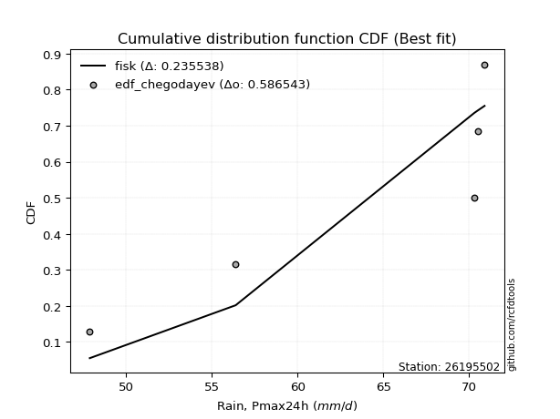</img>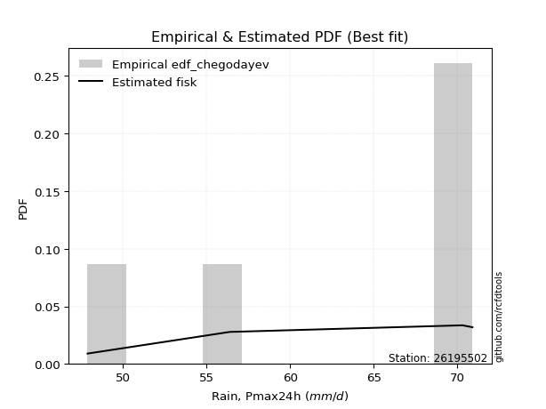</img>

</div>


### 6. EDF Blom (1958)

The Blom formula is a specific "plotting position" formula used in hydrology and statistical analysis to estimate the empirical cumulative probability (or non-exceedance probability) of a data series. It is particularly recommended for data that are approximately normally distributed. The constant _a_ is set to 0.375 (or 3/8).

<div align="center">


$P=(m-a)/(n+1-2a)$


</div>


**6.1. Empirical values**

<div align="center">

|                | 0                   | 1                   | 2        | 3                  | 4                  |
|:---------------|:--------------------|:--------------------|:---------|:-------------------|:-------------------|
| date           | 2018                | 2017                | 2020     | 2019               | 2021               |
| x              | 47.9                | 56.4                | 70.3     | 70.5               | 70.9               |
| m              | 1                   | 2                   | 3        | 4                  | 5                  |
| empirical_dist | edf_blom            | edf_blom            | edf_blom | edf_blom           | edf_blom           |
| empirical      | 0.11904761904761904 | 0.30952380952380953 | 0.5      | 0.6904761904761905 | 0.8809523809523809 |
| empirical_tr   | 1.135135135135135   | 1.4482758620689655  | 2.0      | 3.230769230769231  | 8.399999999999999  |

</div>


**6.2. Kolmogorov-Smirnov fit test (sorted by Δ)**


<div align="center">

|                | 0                   | 1                   | 2                   | 3                   | 4                   | 5                   | 6                  | 7                   | 8                   | 9                   | 10                  | 11                  | 12                  | 13                  | 14                  | 15                  | 16                 | 17                 | 18                  | 19                 | 20                 | 21                  | 22                  | 23                  | 24                 | 25                  | 26                 | 27                  | 28                 | 29                 | 30                 | 31                 | 32                 | 33                 | 34                 | 35                 | 36                 | 37                 | 38                 | 39                  | 40                 | 41                  | 42                  | 43                 | 44                 | 45                  | 46                  | 47                 | 48                 | 49                  | 50                 | 51                  | 52                  | 53                 | 54                 | 55                 | 56                  | 57                  | 58                  | 59                 | 60                  | 61                 | 62                 | 63                 | 64                 | 65                 | 66                 | 67                  | 68                 | 69                 | 70                 | 71                  | 72                  | 73                  | 74                  | 75                 | 76                 | 77                  | 78                 | 79                  | 80                 | 81                 | 82                 | 83                  | 84                 | 85                 | 86                  | 87                 | 88                  | 89                 | 90                 | 91                  | 92                  | 93                  | 94                  | 95                 | 96                  | 97                 | 98                  | 99                  | 100                | 101                | 102                | 103                | 104                | 105                | 106                 | 107                 | 108                | 109                | 110                | 111                | 112                | 113                 | 114                | 115                | 116                 | 117                 | 118                | 119                | 120                | 121                | 122                | 123                | 124                | 125                 | 126                | 127                | 128                | 129                 | 130                | 131                 | 132                 | 133                | 134                | 135                 | 136                | 137                | 138                 | 139                 | 140                | 141                | 142                 | 143                | 144                 | 145                | 146                | 147                | 148                | 149                | 150                | 151                | 152                | 153                | 154                | 155                | 156                | 157                | 158                | 159                |
|:---------------|:--------------------|:--------------------|:--------------------|:--------------------|:--------------------|:--------------------|:-------------------|:--------------------|:--------------------|:--------------------|:--------------------|:--------------------|:--------------------|:--------------------|:--------------------|:--------------------|:-------------------|:-------------------|:--------------------|:-------------------|:-------------------|:--------------------|:--------------------|:--------------------|:-------------------|:--------------------|:-------------------|:--------------------|:-------------------|:-------------------|:-------------------|:-------------------|:-------------------|:-------------------|:-------------------|:-------------------|:-------------------|:-------------------|:-------------------|:--------------------|:-------------------|:--------------------|:--------------------|:-------------------|:-------------------|:--------------------|:--------------------|:-------------------|:-------------------|:--------------------|:-------------------|:--------------------|:--------------------|:-------------------|:-------------------|:-------------------|:--------------------|:--------------------|:--------------------|:-------------------|:--------------------|:-------------------|:-------------------|:-------------------|:-------------------|:-------------------|:-------------------|:--------------------|:-------------------|:-------------------|:-------------------|:--------------------|:--------------------|:--------------------|:--------------------|:-------------------|:-------------------|:--------------------|:-------------------|:--------------------|:-------------------|:-------------------|:-------------------|:--------------------|:-------------------|:-------------------|:--------------------|:-------------------|:--------------------|:-------------------|:-------------------|:--------------------|:--------------------|:--------------------|:--------------------|:-------------------|:--------------------|:-------------------|:--------------------|:--------------------|:-------------------|:-------------------|:-------------------|:-------------------|:-------------------|:-------------------|:--------------------|:--------------------|:-------------------|:-------------------|:-------------------|:-------------------|:-------------------|:--------------------|:-------------------|:-------------------|:--------------------|:--------------------|:-------------------|:-------------------|:-------------------|:-------------------|:-------------------|:-------------------|:-------------------|:--------------------|:-------------------|:-------------------|:-------------------|:--------------------|:-------------------|:--------------------|:--------------------|:-------------------|:-------------------|:--------------------|:-------------------|:-------------------|:--------------------|:--------------------|:-------------------|:-------------------|:--------------------|:-------------------|:--------------------|:-------------------|:-------------------|:-------------------|:-------------------|:-------------------|:-------------------|:-------------------|:-------------------|:-------------------|:-------------------|:-------------------|:-------------------|:-------------------|:-------------------|:-------------------|
| station        | 26195502            | 26195502            | 26195502            | 26195502            | 26195502            | 26195502            | 26195502           | 26195502            | 26195502            | 26195502            | 26195502            | 26195502            | 26195502            | 26195502            | 26195502            | 26195502            | 26195502           | 26195502           | 26195502            | 26195502           | 26195502           | 26195502            | 26195502            | 26195502            | 26195502           | 26195502            | 26195502           | 26195502            | 26195502           | 26195502           | 26195502           | 26195502           | 26195502           | 26195502           | 26195502           | 26195502           | 26195502           | 26195502           | 26195502           | 26195502            | 26195502           | 26195502            | 26195502            | 26195502           | 26195502           | 26195502            | 26195502            | 26195502           | 26195502           | 26195502            | 26195502           | 26195502            | 26195502            | 26195502           | 26195502           | 26195502           | 26195502            | 26195502            | 26195502            | 26195502           | 26195502            | 26195502           | 26195502           | 26195502           | 26195502           | 26195502           | 26195502           | 26195502            | 26195502           | 26195502           | 26195502           | 26195502            | 26195502            | 26195502            | 26195502            | 26195502           | 26195502           | 26195502            | 26195502           | 26195502            | 26195502           | 26195502           | 26195502           | 26195502            | 26195502           | 26195502           | 26195502            | 26195502           | 26195502            | 26195502           | 26195502           | 26195502            | 26195502            | 26195502            | 26195502            | 26195502           | 26195502            | 26195502           | 26195502            | 26195502            | 26195502           | 26195502           | 26195502           | 26195502           | 26195502           | 26195502           | 26195502            | 26195502            | 26195502           | 26195502           | 26195502           | 26195502           | 26195502           | 26195502            | 26195502           | 26195502           | 26195502            | 26195502            | 26195502           | 26195502           | 26195502           | 26195502           | 26195502           | 26195502           | 26195502           | 26195502            | 26195502           | 26195502           | 26195502           | 26195502            | 26195502           | 26195502            | 26195502            | 26195502           | 26195502           | 26195502            | 26195502           | 26195502           | 26195502            | 26195502            | 26195502           | 26195502           | 26195502            | 26195502           | 26195502            | 26195502           | 26195502           | 26195502           | 26195502           | 26195502           | 26195502           | 26195502           | 26195502           | 26195502           | 26195502           | 26195502           | 26195502           | 26195502           | 26195502           | 26195502           |
| empirical_dist | edf_blom            | edf_blom            | edf_blom            | edf_blom            | edf_blom            | edf_blom            | edf_blom           | edf_blom            | edf_blom            | edf_blom            | edf_blom            | edf_blom            | edf_blom            | edf_blom            | edf_blom            | edf_blom            | edf_blom           | edf_blom           | edf_blom            | edf_blom           | edf_blom           | edf_blom            | edf_blom            | edf_blom            | edf_blom           | edf_blom            | edf_blom           | edf_blom            | edf_blom           | edf_blom           | edf_blom           | edf_blom           | edf_blom           | edf_blom           | edf_blom           | edf_blom           | edf_blom           | edf_blom           | edf_blom           | edf_blom            | edf_blom           | edf_blom            | edf_blom            | edf_blom           | edf_blom           | edf_blom            | edf_blom            | edf_blom           | edf_blom           | edf_blom            | edf_blom           | edf_blom            | edf_blom            | edf_blom           | edf_blom           | edf_blom           | edf_blom            | edf_blom            | edf_blom            | edf_blom           | edf_blom            | edf_blom           | edf_blom           | edf_blom           | edf_blom           | edf_blom           | edf_blom           | edf_blom            | edf_blom           | edf_blom           | edf_blom           | edf_blom            | edf_blom            | edf_blom            | edf_blom            | edf_blom           | edf_blom           | edf_blom            | edf_blom           | edf_blom            | edf_blom           | edf_blom           | edf_blom           | edf_blom            | edf_blom           | edf_blom           | edf_blom            | edf_blom           | edf_blom            | edf_blom           | edf_blom           | edf_blom            | edf_blom            | edf_blom            | edf_blom            | edf_blom           | edf_blom            | edf_blom           | edf_blom            | edf_blom            | edf_blom           | edf_blom           | edf_blom           | edf_blom           | edf_blom           | edf_blom           | edf_blom            | edf_blom            | edf_blom           | edf_blom           | edf_blom           | edf_blom           | edf_blom           | edf_blom            | edf_blom           | edf_blom           | edf_blom            | edf_blom            | edf_blom           | edf_blom           | edf_blom           | edf_blom           | edf_blom           | edf_blom           | edf_blom           | edf_blom            | edf_blom           | edf_blom           | edf_blom           | edf_blom            | edf_blom           | edf_blom            | edf_blom            | edf_blom           | edf_blom           | edf_blom            | edf_blom           | edf_blom           | edf_blom            | edf_blom            | edf_blom           | edf_blom           | edf_blom            | edf_blom           | edf_blom            | edf_blom           | edf_blom           | edf_blom           | edf_blom           | edf_blom           | edf_blom           | edf_blom           | edf_blom           | edf_blom           | edf_blom           | edf_blom           | edf_blom           | edf_blom           | edf_blom           | edf_blom           |
| p_dist         | beta                | logbeta             | wrapcauchy          | arcsine             | logwrapcauchy       | levy_l              | kappa3             | logarcsine          | loglevy_l           | vonmises_line       | logtrapezoid        | trapezoid           | logksone            | ksone               | logweibull_max      | logsemicircular     | semicircular       | loganglit          | anglit              | halfgennorm        | logbetaprime       | lognct              | loglomax            | logpearson3         | pearson3           | invgauss            | burr12             | genextreme          | lomax              | dgamma             | loggumbel_l        | logdweibull        | logkstwobign       | logfoldnorm        | logf               | gumbel_l           | loginvweibull      | loginvgauss        | logcrystalball     | logt                | logexponnorm       | lognorm             | loghalfgennorm      | nct                | logrice            | logncf              | ncf                 | erlang             | loginvgamma        | logfatiguelife      | t                  | exponnorm           | crystalball         | norm               | truncnorm          | f                  | loggamma            | loggamma            | loggenexpon         | invgamma           | kstwobign           | rice               | logerlang          | gennorm            | gamma              | betaprime          | logalpha           | alpha               | logmaxwell         | maxwell            | lograyleigh        | weibull_min         | rayleigh            | logburr12           | logweibull_min      | loghalfnorm        | halfnorm           | loglogistic         | logistic           | logexponpow         | dweibull           | logcosine          | loggumbel_r        | cosine              | gumbel_r           | loghypsecant       | nakagami            | hypsecant          | loghalflogistic     | halflogistic       | loggompertz        | logmoyal            | moyal               | loglaplace          | loglaplace          | laplace            | exponweib           | burr               | logloglaplace       | genexpon            | logdgamma          | logwald            | wald               | argus              | loggenextreme      | logargus           | loggengamma         | logexponweib        | logburr            | loggennorm         | lognakagami        | gengamma           | genpareto          | fatiguelife         | logmielke          | mielke             | weibull_max         | loggenhalflogistic  | logloggamma        | genhalflogistic    | invweibull         | foldnorm           | triang             | skewnorm           | kappa4             | logtriang           | logskewnorm        | loggausshyper      | tukeylambda        | johnsonsu           | logkappa4          | gausshyper          | uniform             | logtukeylambda     | logkappa3          | loguniform          | logvonmises_line   | truncweibull_min   | johnsonsb           | bradford            | truncexpon         | logbradford        | logtruncweibull_min | logtruncexpon      | logtruncnorm        | gompertz           | loggenpareto       | logjohnsonsu       | powerlaw           | logpowerlaw        | truncpareto        | logtruncpareto     | exponpow           | logjohnsonsb       | rdist              | genlogistic        | loggenlogistic     | logrdist           | logvonmises        | vonmises           |
| delta          | 0.11525862081993954 | 0.11700213525122782 | 0.18462334739590874 | 0.18469541564526148 | 0.18779332572568636 | 0.18839126336196554 | 0.1886313128620819 | 0.18916146654118848 | 0.19434165702234596 | 0.20973672001150875 | 0.21056952675457918 | 0.21299722671704902 | 0.21590561305089384 | 0.21766773874085255 | 0.21841326684400053 | 0.23239852110129855 | 0.2341993674890458 | 0.2446678314768318 | 0.24648542346816926 | 0.2496832552851378 | 0.2504799359247538 | 0.25283157553436153 | 0.25821371038941265 | 0.25963353468643424 | 0.2628583080515883 | 0.26329783923031924 | 0.264470778627484  | 0.26452957228434437 | 0.2659668779617784 | 0.2688423244658778 | 0.2689803879574204 | 0.2696565539696195 | 0.2702587965861578 | 0.2711686667971557 | 0.2716099567773895 | 0.2716256330392314 | 0.2719691813908238 | 0.2723055060074905 | 0.2727396267402111 | 0.27274166027959357 | 0.2727440201441147 | 0.27274548662844245 | 0.27282055344467293 | 0.2729493658785934 | 0.2730229843458529 | 0.27313715824918483 | 0.27346107771752604 | 0.2735998048295303 | 0.2742661986846806 | 0.27438152791923964 | 0.2745782428684851 | 0.27458073559629004 | 0.27458234117967384 | 0.2745823440645212 | 0.2745823463052184 | 0.2746008174626299 | 0.27462888236277216 | 0.27462888236277216 | 0.27482219674739383 | 0.2748888724533599 | 0.27506237630350394 | 0.2752004087044062 | 0.2754196248475911 | 0.2756515781128021 | 0.2758929325382795 | 0.276046553308567  | 0.2760608892723817 | 0.27742597967733595 | 0.2793256112263539 | 0.2809175843513779 | 0.2811902827290985 | 0.28208203475007765 | 0.28271216776128727 | 0.28278014582251987 | 0.28316474222227495 | 0.2882396366383633 | 0.289582012886055  | 0.29520247761029694 | 0.2969996825909669 | 0.29867351305431455 | 0.3018793360526989 | 0.3056814223663946 | 0.3064272708627902 | 0.30655058764781296 | 0.3077813895509316 | 0.3092838544711648 | 0.30952380952204167 | 0.3109982543667362 | 0.31121407978700955 | 0.3124232971429992 | 0.3131356489631125 | 0.31741759981102136 | 0.31862978300810063 | 0.32637619311343824 | 0.32637619311343824 | 0.3278685702172641 | 0.34014069591165064 | 0.3456986135700847 | 0.34885915728400163 | 0.35148820948288884 | 0.3518853526769872 | 0.3533878888413796 | 0.3542582690191888 | 0.3604385889190411 | 0.3611916852977055 | 0.3644454391333607 | 0.37103105661229563 | 0.37604129175908774 | 0.3807928576816201 | 0.380952380952676  | 0.3851935372610875 | 0.4103084582196186 | 0.4145614137203095 | 0.41830774945502025 | 0.424790802930178  | 0.4274828853668573 | 0.42862415275641064 | 0.43446752206303885 | 0.4351668812797397 | 0.4450792430332423 | 0.4498395463812726 | 0.4562843790356266 | 0.4581205408624133 | 0.4606551387037371 | 0.4622136503425427 | 0.46538987390080166 | 0.4666231255872253 | 0.467252653587252  | 0.4684068464423987 | 0.47187567795074276 | 0.4724301837263065 | 0.47325131264437215 | 0.47391304347826047 | 0.4744955346492574 | 0.4750882710329981 | 0.47832837460310096 | 0.4784810193469864 | 0.4803572136898976 | 0.48126140057603883 | 0.48138594402945634 | 0.4825082809004517 | 0.4842925635459133 | 0.4843672674451204  | 0.4861889217906933 | 0.48952426251248415 | 0.499999755957013  | 0.5089805932718502 | 0.5454926415396267 | 0.5638234662549059 | 0.5739010361985654 | 0.5829397897651138 | 0.5964114929942012 | 0.6057460291359696 | 0.6717556075511583 | 0.6904761889778888 | 0.6904761904761905 | 0.6904761904761905 | 0.8809523809523809 | 1.2721403772884543 | 10.970655178876504 |
| deltao         | 0.5865427407550001  | 0.5865427407550001  | 0.5865427407550001  | 0.5865427407550001  | 0.5865427407550001  | 0.5865427407550001  | 0.5865427407550001 | 0.5865427407550001  | 0.5865427407550001  | 0.5865427407550001  | 0.5865427407550001  | 0.5865427407550001  | 0.5865427407550001  | 0.5865427407550001  | 0.5865427407550001  | 0.5865427407550001  | 0.5865427407550001 | 0.5865427407550001 | 0.5865427407550001  | 0.5865427407550001 | 0.5865427407550001 | 0.5865427407550001  | 0.5865427407550001  | 0.5865427407550001  | 0.5865427407550001 | 0.5865427407550001  | 0.5865427407550001 | 0.5865427407550001  | 0.5865427407550001 | 0.5865427407550001 | 0.5865427407550001 | 0.5865427407550001 | 0.5865427407550001 | 0.5865427407550001 | 0.5865427407550001 | 0.5865427407550001 | 0.5865427407550001 | 0.5865427407550001 | 0.5865427407550001 | 0.5865427407550001  | 0.5865427407550001 | 0.5865427407550001  | 0.5865427407550001  | 0.5865427407550001 | 0.5865427407550001 | 0.5865427407550001  | 0.5865427407550001  | 0.5865427407550001 | 0.5865427407550001 | 0.5865427407550001  | 0.5865427407550001 | 0.5865427407550001  | 0.5865427407550001  | 0.5865427407550001 | 0.5865427407550001 | 0.5865427407550001 | 0.5865427407550001  | 0.5865427407550001  | 0.5865427407550001  | 0.5865427407550001 | 0.5865427407550001  | 0.5865427407550001 | 0.5865427407550001 | 0.5865427407550001 | 0.5865427407550001 | 0.5865427407550001 | 0.5865427407550001 | 0.5865427407550001  | 0.5865427407550001 | 0.5865427407550001 | 0.5865427407550001 | 0.5865427407550001  | 0.5865427407550001  | 0.5865427407550001  | 0.5865427407550001  | 0.5865427407550001 | 0.5865427407550001 | 0.5865427407550001  | 0.5865427407550001 | 0.5865427407550001  | 0.5865427407550001 | 0.5865427407550001 | 0.5865427407550001 | 0.5865427407550001  | 0.5865427407550001 | 0.5865427407550001 | 0.5865427407550001  | 0.5865427407550001 | 0.5865427407550001  | 0.5865427407550001 | 0.5865427407550001 | 0.5865427407550001  | 0.5865427407550001  | 0.5865427407550001  | 0.5865427407550001  | 0.5865427407550001 | 0.5865427407550001  | 0.5865427407550001 | 0.5865427407550001  | 0.5865427407550001  | 0.5865427407550001 | 0.5865427407550001 | 0.5865427407550001 | 0.5865427407550001 | 0.5865427407550001 | 0.5865427407550001 | 0.5865427407550001  | 0.5865427407550001  | 0.5865427407550001 | 0.5865427407550001 | 0.5865427407550001 | 0.5865427407550001 | 0.5865427407550001 | 0.5865427407550001  | 0.5865427407550001 | 0.5865427407550001 | 0.5865427407550001  | 0.5865427407550001  | 0.5865427407550001 | 0.5865427407550001 | 0.5865427407550001 | 0.5865427407550001 | 0.5865427407550001 | 0.5865427407550001 | 0.5865427407550001 | 0.5865427407550001  | 0.5865427407550001 | 0.5865427407550001 | 0.5865427407550001 | 0.5865427407550001  | 0.5865427407550001 | 0.5865427407550001  | 0.5865427407550001  | 0.5865427407550001 | 0.5865427407550001 | 0.5865427407550001  | 0.5865427407550001 | 0.5865427407550001 | 0.5865427407550001  | 0.5865427407550001  | 0.5865427407550001 | 0.5865427407550001 | 0.5865427407550001  | 0.5865427407550001 | 0.5865427407550001  | 0.5865427407550001 | 0.5865427407550001 | 0.5865427407550001 | 0.5865427407550001 | 0.5865427407550001 | 0.5865427407550001 | 0.5865427407550001 | 0.5865427407550001 | 0.5865427407550001 | 0.5865427407550001 | 0.5865427407550001 | 0.5865427407550001 | 0.5865427407550001 | 0.5865427407550001 | 0.5865427407550001 |
| eval           | Δo > Δ              | Δo > Δ              | Δo > Δ              | Δo > Δ              | Δo > Δ              | Δo > Δ              | Δo > Δ             | Δo > Δ              | Δo > Δ              | Δo > Δ              | Δo > Δ              | Δo > Δ              | Δo > Δ              | Δo > Δ              | Δo > Δ              | Δo > Δ              | Δo > Δ             | Δo > Δ             | Δo > Δ              | Δo > Δ             | Δo > Δ             | Δo > Δ              | Δo > Δ              | Δo > Δ              | Δo > Δ             | Δo > Δ              | Δo > Δ             | Δo > Δ              | Δo > Δ             | Δo > Δ             | Δo > Δ             | Δo > Δ             | Δo > Δ             | Δo > Δ             | Δo > Δ             | Δo > Δ             | Δo > Δ             | Δo > Δ             | Δo > Δ             | Δo > Δ              | Δo > Δ             | Δo > Δ              | Δo > Δ              | Δo > Δ             | Δo > Δ             | Δo > Δ              | Δo > Δ              | Δo > Δ             | Δo > Δ             | Δo > Δ              | Δo > Δ             | Δo > Δ              | Δo > Δ              | Δo > Δ             | Δo > Δ             | Δo > Δ             | Δo > Δ              | Δo > Δ              | Δo > Δ              | Δo > Δ             | Δo > Δ              | Δo > Δ             | Δo > Δ             | Δo > Δ             | Δo > Δ             | Δo > Δ             | Δo > Δ             | Δo > Δ              | Δo > Δ             | Δo > Δ             | Δo > Δ             | Δo > Δ              | Δo > Δ              | Δo > Δ              | Δo > Δ              | Δo > Δ             | Δo > Δ             | Δo > Δ              | Δo > Δ             | Δo > Δ              | Δo > Δ             | Δo > Δ             | Δo > Δ             | Δo > Δ              | Δo > Δ             | Δo > Δ             | Δo > Δ              | Δo > Δ             | Δo > Δ              | Δo > Δ             | Δo > Δ             | Δo > Δ              | Δo > Δ              | Δo > Δ              | Δo > Δ              | Δo > Δ             | Δo > Δ              | Δo > Δ             | Δo > Δ              | Δo > Δ              | Δo > Δ             | Δo > Δ             | Δo > Δ             | Δo > Δ             | Δo > Δ             | Δo > Δ             | Δo > Δ              | Δo > Δ              | Δo > Δ             | Δo > Δ             | Δo > Δ             | Δo > Δ             | Δo > Δ             | Δo > Δ              | Δo > Δ             | Δo > Δ             | Δo > Δ              | Δo > Δ              | Δo > Δ             | Δo > Δ             | Δo > Δ             | Δo > Δ             | Δo > Δ             | Δo > Δ             | Δo > Δ             | Δo > Δ              | Δo > Δ             | Δo > Δ             | Δo > Δ             | Δo > Δ              | Δo > Δ             | Δo > Δ              | Δo > Δ              | Δo > Δ             | Δo > Δ             | Δo > Δ              | Δo > Δ             | Δo > Δ             | Δo > Δ              | Δo > Δ              | Δo > Δ             | Δo > Δ             | Δo > Δ              | Δo > Δ             | Δo > Δ              | Δo > Δ             | Δo > Δ             | Δo > Δ             | Δo > Δ             | Δo > Δ             | Δo > Δ             | Δo <= Δ            | Δo <= Δ            | Δo <= Δ            | Δo <= Δ            | Δo <= Δ            | Δo <= Δ            | Δo <= Δ            | Δo <= Δ            | Δo <= Δ            |
| fit            | 1                   | 1                   | 1                   | 1                   | 1                   | 1                   | 1                  | 1                   | 1                   | 1                   | 1                   | 1                   | 1                   | 1                   | 1                   | 1                   | 1                  | 1                  | 1                   | 1                  | 1                  | 1                   | 1                   | 1                   | 1                  | 1                   | 1                  | 1                   | 1                  | 1                  | 1                  | 1                  | 1                  | 1                  | 1                  | 1                  | 1                  | 1                  | 1                  | 1                   | 1                  | 1                   | 1                   | 1                  | 1                  | 1                   | 1                   | 1                  | 1                  | 1                   | 1                  | 1                   | 1                   | 1                  | 1                  | 1                  | 1                   | 1                   | 1                   | 1                  | 1                   | 1                  | 1                  | 1                  | 1                  | 1                  | 1                  | 1                   | 1                  | 1                  | 1                  | 1                   | 1                   | 1                   | 1                   | 1                  | 1                  | 1                   | 1                  | 1                   | 1                  | 1                  | 1                  | 1                   | 1                  | 1                  | 1                   | 1                  | 1                   | 1                  | 1                  | 1                   | 1                   | 1                   | 1                   | 1                  | 1                   | 1                  | 1                   | 1                   | 1                  | 1                  | 1                  | 1                  | 1                  | 1                  | 1                   | 1                   | 1                  | 1                  | 1                  | 1                  | 1                  | 1                   | 1                  | 1                  | 1                   | 1                   | 1                  | 1                  | 1                  | 1                  | 1                  | 1                  | 1                  | 1                   | 1                  | 1                  | 1                  | 1                   | 1                  | 1                   | 1                   | 1                  | 1                  | 1                   | 1                  | 1                  | 1                   | 1                   | 1                  | 1                  | 1                   | 1                  | 1                   | 1                  | 1                  | 1                  | 1                  | 1                  | 1                  | 0                  | 0                  | 0                  | 0                  | 0                  | 0                  | 0                  | 0                  | 0                  |
| n              | 5                   | 5                   | 5                   | 5                   | 5                   | 5                   | 5                  | 5                   | 5                   | 5                   | 5                   | 5                   | 5                   | 5                   | 5                   | 5                   | 5                  | 5                  | 5                   | 5                  | 5                  | 5                   | 5                   | 5                   | 5                  | 5                   | 5                  | 5                   | 5                  | 5                  | 5                  | 5                  | 5                  | 5                  | 5                  | 5                  | 5                  | 5                  | 5                  | 5                   | 5                  | 5                   | 5                   | 5                  | 5                  | 5                   | 5                   | 5                  | 5                  | 5                   | 5                  | 5                   | 5                   | 5                  | 5                  | 5                  | 5                   | 5                   | 5                   | 5                  | 5                   | 5                  | 5                  | 5                  | 5                  | 5                  | 5                  | 5                   | 5                  | 5                  | 5                  | 5                   | 5                   | 5                   | 5                   | 5                  | 5                  | 5                   | 5                  | 5                   | 5                  | 5                  | 5                  | 5                   | 5                  | 5                  | 5                   | 5                  | 5                   | 5                  | 5                  | 5                   | 5                   | 5                   | 5                   | 5                  | 5                   | 5                  | 5                   | 5                   | 5                  | 5                  | 5                  | 5                  | 5                  | 5                  | 5                   | 5                   | 5                  | 5                  | 5                  | 5                  | 5                  | 5                   | 5                  | 5                  | 5                   | 5                   | 5                  | 5                  | 5                  | 5                  | 5                  | 5                  | 5                  | 5                   | 5                  | 5                  | 5                  | 5                   | 5                  | 5                   | 5                   | 5                  | 5                  | 5                   | 5                  | 5                  | 5                   | 5                   | 5                  | 5                  | 5                   | 5                  | 5                   | 5                  | 5                  | 5                  | 5                  | 5                  | 5                  | 5                  | 5                  | 5                  | 5                  | 5                  | 5                  | 5                  | 5                  | 5                  |
| best_fit       | 1                   | 0                   | 0                   | 0                   | 0                   | 0                   | 0                  | 0                   | 0                   | 0                   | 0                   | 0                   | 0                   | 0                   | 0                   | 0                   | 0                  | 0                  | 0                   | 0                  | 0                  | 0                   | 0                   | 0                   | 0                  | 0                   | 0                  | 0                   | 0                  | 0                  | 0                  | 0                  | 0                  | 0                  | 0                  | 0                  | 0                  | 0                  | 0                  | 0                   | 0                  | 0                   | 0                   | 0                  | 0                  | 0                   | 0                   | 0                  | 0                  | 0                   | 0                  | 0                   | 0                   | 0                  | 0                  | 0                  | 0                   | 0                   | 0                   | 0                  | 0                   | 0                  | 0                  | 0                  | 0                  | 0                  | 0                  | 0                   | 0                  | 0                  | 0                  | 0                   | 0                   | 0                   | 0                   | 0                  | 0                  | 0                   | 0                  | 0                   | 0                  | 0                  | 0                  | 0                   | 0                  | 0                  | 0                   | 0                  | 0                   | 0                  | 0                  | 0                   | 0                   | 0                   | 0                   | 0                  | 0                   | 0                  | 0                   | 0                   | 0                  | 0                  | 0                  | 0                  | 0                  | 0                  | 0                   | 0                   | 0                  | 0                  | 0                  | 0                  | 0                  | 0                   | 0                  | 0                  | 0                   | 0                   | 0                  | 0                  | 0                  | 0                  | 0                  | 0                  | 0                  | 0                   | 0                  | 0                  | 0                  | 0                   | 0                  | 0                   | 0                   | 0                  | 0                  | 0                   | 0                  | 0                  | 0                   | 0                   | 0                  | 0                  | 0                   | 0                  | 0                   | 0                  | 0                  | 0                  | 0                  | 0                  | 0                  | 0                  | 0                  | 0                  | 0                  | 0                  | 0                  | 0                  | 0                  | 0                  |
| best_fit_sort  | 1                   | 2                   | 3                   | 4                   | 5                   | 6                   | 7                  | 8                   | 9                   | 10                  | 11                  | 12                  | 13                  | 14                  | 15                  | 16                  | 17                 | 18                 | 19                  | 20                 | 21                 | 22                  | 23                  | 24                  | 25                 | 26                  | 27                 | 28                  | 29                 | 30                 | 31                 | 32                 | 33                 | 34                 | 35                 | 36                 | 37                 | 38                 | 39                 | 40                  | 41                 | 42                  | 43                  | 44                 | 45                 | 46                  | 47                  | 48                 | 49                 | 50                  | 51                 | 52                  | 53                  | 54                 | 55                 | 56                 | 57                  | 58                  | 59                  | 60                 | 61                  | 62                 | 63                 | 64                 | 65                 | 66                 | 67                 | 68                  | 69                 | 70                 | 71                 | 72                  | 73                  | 74                  | 75                  | 76                 | 77                 | 78                  | 79                 | 80                  | 81                 | 82                 | 83                 | 84                  | 85                 | 86                 | 87                  | 88                 | 89                  | 90                 | 91                 | 92                  | 93                  | 94                  | 95                  | 96                 | 97                  | 98                 | 99                  | 100                 | 101                | 102                | 103                | 104                | 105                | 106                | 107                 | 108                 | 109                | 110                | 111                | 112                | 113                | 114                 | 115                | 116                | 117                 | 118                 | 119                | 120                | 121                | 122                | 123                | 124                | 125                | 126                 | 127                | 128                | 129                | 130                 | 131                | 132                 | 133                 | 134                | 135                | 136                 | 137                | 138                | 139                 | 140                 | 141                | 142                | 143                 | 144                | 145                 | 146                | 147                | 148                | 149                | 150                | 151                | 152                | 153                | 154                | 155                | 156                | 157                | 158                | 159                | 160                |

</div>


**6.3. Best fit**

<div align="center">

|   id |   station | empirical_dist   | p_dist   |    delta |   deltao | eval   |   fit |   n |   best_fit |   best_fit_sort |
|-----:|----------:|:-----------------|:---------|---------:|---------:|:-------|------:|----:|-----------:|----------------:|
|    0 |  26195502 | edf_blom         | beta     | 0.115259 | 0.586543 | Δo > Δ |     1 |   5 |          1 |               1 |

</div>


<div align="center">

</img></img>

</div>


### 7. EDF Tukey (1962)

In hydrology, the Tukey formula is used as a plotting position formula to estimate the empirical probability or frequency of a flood event (or other hydrological data). The formula parameter is given as _c=0.333_ (or 1/3).

<div align="center">


$P=(m-c)/(n+1-2c)$


</div>


**7.1. Empirical values**

<div align="center">

|                | 0                  | 1                  | 2         | 3         | 4         |
|:---------------|:-------------------|:-------------------|:----------|:----------|:----------|
| date           | 2018               | 2017               | 2020      | 2019      | 2021      |
| x              | 47.9               | 56.4               | 70.3      | 70.5      | 70.9      |
| m              | 1                  | 2                  | 3         | 4         | 5         |
| empirical_dist | edf_tukey          | edf_tukey          | edf_tukey | edf_tukey | edf_tukey |
| empirical      | 0.125              | 0.3125             | 0.5       | 0.6875    | 0.875     |
| empirical_tr   | 1.1428571428571428 | 1.4545454545454546 | 2.0       | 3.2       | 8.0       |

</div>


**7.2. Kolmogorov-Smirnov fit test (sorted by Δ)**


<div align="center">

|                | 0                   | 1                   | 2                   | 3                   | 4                   | 5                   | 6                  | 7                  | 8                   | 9                   | 10                  | 11                  | 12                  | 13                  | 14                  | 15                  | 16                 | 17                  | 18                 | 19                  | 20                 | 21                  | 22                  | 23                  | 24                 | 25                  | 26                 | 27                 | 28                  | 29                 | 30                 | 31                 | 32                 | 33                 | 34                 | 35                 | 36                  | 37                 | 38                 | 39                 | 40                  | 41                 | 42                  | 43                  | 44                 | 45                 | 46                  | 47                 | 48                 | 49                  | 50                 | 51                  | 52                  | 53                 | 54                 | 55                 | 56                  | 57                  | 58                  | 59                 | 60                  | 61                 | 62                 | 63                 | 64                 | 65                 | 66                  | 67                 | 68                 | 69                 | 70                 | 71                  | 72                  | 73                  | 74                  | 75                 | 76                 | 77                  | 78                  | 79                 | 80                  | 81                 | 82                 | 83                  | 84                 | 85                 | 86                 | 87                  | 88                 | 89                  | 90                 | 91                  | 92                  | 93                  | 94                  | 95                 | 96                  | 97                 | 98                 | 99                  | 100                 | 101                | 102                | 103                | 104                | 105                | 106                | 107                 | 108                 | 109                | 110                 | 111                | 112                | 113                | 114                | 115                | 116                 | 117                 | 118                | 119                | 120                | 121                | 122                | 123                | 124                | 125                 | 126                | 127                | 128                | 129                | 130                | 131                 | 132                 | 133                | 134                | 135                 | 136                 | 137                | 138                | 139                 | 140                | 141                | 142                 | 143                | 144                 | 145                | 146                | 147                | 148                | 149                | 150                | 151                | 152                | 153                | 154                | 155                | 156                | 157                | 158                | 159                |
|:---------------|:--------------------|:--------------------|:--------------------|:--------------------|:--------------------|:--------------------|:-------------------|:-------------------|:--------------------|:--------------------|:--------------------|:--------------------|:--------------------|:--------------------|:--------------------|:--------------------|:-------------------|:--------------------|:-------------------|:--------------------|:-------------------|:--------------------|:--------------------|:--------------------|:-------------------|:--------------------|:-------------------|:-------------------|:--------------------|:-------------------|:-------------------|:-------------------|:-------------------|:-------------------|:-------------------|:-------------------|:--------------------|:-------------------|:-------------------|:-------------------|:--------------------|:-------------------|:--------------------|:--------------------|:-------------------|:-------------------|:--------------------|:-------------------|:-------------------|:--------------------|:-------------------|:--------------------|:--------------------|:-------------------|:-------------------|:-------------------|:--------------------|:--------------------|:--------------------|:-------------------|:--------------------|:-------------------|:-------------------|:-------------------|:-------------------|:-------------------|:--------------------|:-------------------|:-------------------|:-------------------|:-------------------|:--------------------|:--------------------|:--------------------|:--------------------|:-------------------|:-------------------|:--------------------|:--------------------|:-------------------|:--------------------|:-------------------|:-------------------|:--------------------|:-------------------|:-------------------|:-------------------|:--------------------|:-------------------|:--------------------|:-------------------|:--------------------|:--------------------|:--------------------|:--------------------|:-------------------|:--------------------|:-------------------|:-------------------|:--------------------|:--------------------|:-------------------|:-------------------|:-------------------|:-------------------|:-------------------|:-------------------|:--------------------|:--------------------|:-------------------|:--------------------|:-------------------|:-------------------|:-------------------|:-------------------|:-------------------|:--------------------|:--------------------|:-------------------|:-------------------|:-------------------|:-------------------|:-------------------|:-------------------|:-------------------|:--------------------|:-------------------|:-------------------|:-------------------|:-------------------|:-------------------|:--------------------|:--------------------|:-------------------|:-------------------|:--------------------|:--------------------|:-------------------|:-------------------|:--------------------|:-------------------|:-------------------|:--------------------|:-------------------|:--------------------|:-------------------|:-------------------|:-------------------|:-------------------|:-------------------|:-------------------|:-------------------|:-------------------|:-------------------|:-------------------|:-------------------|:-------------------|:-------------------|:-------------------|:-------------------|
| station        | 26195502            | 26195502            | 26195502            | 26195502            | 26195502            | 26195502            | 26195502           | 26195502           | 26195502            | 26195502            | 26195502            | 26195502            | 26195502            | 26195502            | 26195502            | 26195502            | 26195502           | 26195502            | 26195502           | 26195502            | 26195502           | 26195502            | 26195502            | 26195502            | 26195502           | 26195502            | 26195502           | 26195502           | 26195502            | 26195502           | 26195502           | 26195502           | 26195502           | 26195502           | 26195502           | 26195502           | 26195502            | 26195502           | 26195502           | 26195502           | 26195502            | 26195502           | 26195502            | 26195502            | 26195502           | 26195502           | 26195502            | 26195502           | 26195502           | 26195502            | 26195502           | 26195502            | 26195502            | 26195502           | 26195502           | 26195502           | 26195502            | 26195502            | 26195502            | 26195502           | 26195502            | 26195502           | 26195502           | 26195502           | 26195502           | 26195502           | 26195502            | 26195502           | 26195502           | 26195502           | 26195502           | 26195502            | 26195502            | 26195502            | 26195502            | 26195502           | 26195502           | 26195502            | 26195502            | 26195502           | 26195502            | 26195502           | 26195502           | 26195502            | 26195502           | 26195502           | 26195502           | 26195502            | 26195502           | 26195502            | 26195502           | 26195502            | 26195502            | 26195502            | 26195502            | 26195502           | 26195502            | 26195502           | 26195502           | 26195502            | 26195502            | 26195502           | 26195502           | 26195502           | 26195502           | 26195502           | 26195502           | 26195502            | 26195502            | 26195502           | 26195502            | 26195502           | 26195502           | 26195502           | 26195502           | 26195502           | 26195502            | 26195502            | 26195502           | 26195502           | 26195502           | 26195502           | 26195502           | 26195502           | 26195502           | 26195502            | 26195502           | 26195502           | 26195502           | 26195502           | 26195502           | 26195502            | 26195502            | 26195502           | 26195502           | 26195502            | 26195502            | 26195502           | 26195502           | 26195502            | 26195502           | 26195502           | 26195502            | 26195502           | 26195502            | 26195502           | 26195502           | 26195502           | 26195502           | 26195502           | 26195502           | 26195502           | 26195502           | 26195502           | 26195502           | 26195502           | 26195502           | 26195502           | 26195502           | 26195502           |
| empirical_dist | edf_tukey           | edf_tukey           | edf_tukey           | edf_tukey           | edf_tukey           | edf_tukey           | edf_tukey          | edf_tukey          | edf_tukey           | edf_tukey           | edf_tukey           | edf_tukey           | edf_tukey           | edf_tukey           | edf_tukey           | edf_tukey           | edf_tukey          | edf_tukey           | edf_tukey          | edf_tukey           | edf_tukey          | edf_tukey           | edf_tukey           | edf_tukey           | edf_tukey          | edf_tukey           | edf_tukey          | edf_tukey          | edf_tukey           | edf_tukey          | edf_tukey          | edf_tukey          | edf_tukey          | edf_tukey          | edf_tukey          | edf_tukey          | edf_tukey           | edf_tukey          | edf_tukey          | edf_tukey          | edf_tukey           | edf_tukey          | edf_tukey           | edf_tukey           | edf_tukey          | edf_tukey          | edf_tukey           | edf_tukey          | edf_tukey          | edf_tukey           | edf_tukey          | edf_tukey           | edf_tukey           | edf_tukey          | edf_tukey          | edf_tukey          | edf_tukey           | edf_tukey           | edf_tukey           | edf_tukey          | edf_tukey           | edf_tukey          | edf_tukey          | edf_tukey          | edf_tukey          | edf_tukey          | edf_tukey           | edf_tukey          | edf_tukey          | edf_tukey          | edf_tukey          | edf_tukey           | edf_tukey           | edf_tukey           | edf_tukey           | edf_tukey          | edf_tukey          | edf_tukey           | edf_tukey           | edf_tukey          | edf_tukey           | edf_tukey          | edf_tukey          | edf_tukey           | edf_tukey          | edf_tukey          | edf_tukey          | edf_tukey           | edf_tukey          | edf_tukey           | edf_tukey          | edf_tukey           | edf_tukey           | edf_tukey           | edf_tukey           | edf_tukey          | edf_tukey           | edf_tukey          | edf_tukey          | edf_tukey           | edf_tukey           | edf_tukey          | edf_tukey          | edf_tukey          | edf_tukey          | edf_tukey          | edf_tukey          | edf_tukey           | edf_tukey           | edf_tukey          | edf_tukey           | edf_tukey          | edf_tukey          | edf_tukey          | edf_tukey          | edf_tukey          | edf_tukey           | edf_tukey           | edf_tukey          | edf_tukey          | edf_tukey          | edf_tukey          | edf_tukey          | edf_tukey          | edf_tukey          | edf_tukey           | edf_tukey          | edf_tukey          | edf_tukey          | edf_tukey          | edf_tukey          | edf_tukey           | edf_tukey           | edf_tukey          | edf_tukey          | edf_tukey           | edf_tukey           | edf_tukey          | edf_tukey          | edf_tukey           | edf_tukey          | edf_tukey          | edf_tukey           | edf_tukey          | edf_tukey           | edf_tukey          | edf_tukey          | edf_tukey          | edf_tukey          | edf_tukey          | edf_tukey          | edf_tukey          | edf_tukey          | edf_tukey          | edf_tukey          | edf_tukey          | edf_tukey          | edf_tukey          | edf_tukey          | edf_tukey          |
| p_dist         | beta                | logbeta             | arcsine             | wrapcauchy          | kappa3              | logarcsine          | logwrapcauchy      | levy_l             | loglevy_l           | logtrapezoid        | vonmises_line       | trapezoid           | logksone            | ksone               | logweibull_max      | logsemicircular     | semicircular       | logbetaprime        | loganglit          | anglit              | halfgennorm        | lognct              | loglomax            | logpearson3         | pearson3           | invgauss            | logdweibull        | burr12             | genextreme          | lomax              | logncf             | loggumbel_l        | logkstwobign       | logfoldnorm        | logf               | gumbel_l           | dgamma              | loginvweibull      | loginvgauss        | logcrystalball     | logt                | logexponnorm       | lognorm             | loghalfgennorm      | nct                | logrice            | ncf                 | erlang             | loginvgamma        | logfatiguelife      | t                  | exponnorm           | crystalball         | norm               | truncnorm          | f                  | loggamma            | loggamma            | loggenexpon         | invgamma           | kstwobign           | rice               | logerlang          | gamma              | betaprime          | logalpha           | alpha               | gennorm            | logmaxwell         | maxwell            | lograyleigh        | weibull_min         | rayleigh            | logburr12           | logweibull_min      | loghalfnorm        | halfnorm           | loglogistic         | dweibull            | logistic           | logexponpow         | logcosine          | loggumbel_r        | cosine              | gumbel_r           | loghypsecant       | hypsecant          | loghalflogistic     | halflogistic       | nakagami            | loggompertz        | logmoyal            | moyal               | loglaplace          | loglaplace          | laplace            | exponweib           | logloglaplace      | burr               | logdgamma           | genexpon            | logwald            | wald               | argus              | loggenextreme      | logargus           | loggengamma        | loggennorm          | logexponweib        | logburr            | lognakagami         | gengamma           | genpareto          | fatiguelife        | logmielke          | mielke             | weibull_max         | loggenhalflogistic  | logloggamma        | invweibull         | genhalflogistic    | foldnorm           | triang             | skewnorm           | kappa4             | logtriang           | logskewnorm        | loggausshyper      | tukeylambda        | johnsonsu          | logkappa4          | gausshyper          | uniform             | logtukeylambda     | logkappa3          | johnsonsb           | loguniform          | logvonmises_line   | truncweibull_min   | bradford            | truncexpon         | logbradford        | logtruncweibull_min | logtruncexpon      | logtruncnorm        | gompertz           | loggenpareto       | logjohnsonsu       | powerlaw           | logpowerlaw        | truncpareto        | logtruncpareto     | exponpow           | logjohnsonsb       | rdist              | genlogistic        | loggenlogistic     | logrdist           | logvonmises        | vonmises           |
| delta          | 0.12121100177232047 | 0.12295451620360875 | 0.17900109373801232 | 0.18164715691971828 | 0.18267893190970097 | 0.18320908558880755 | 0.1848171352494959 | 0.191367453838156  | 0.19731784749853643 | 0.21056952675457918 | 0.21271291048769922 | 0.21299722671704902 | 0.21590561305089384 | 0.21766773874085255 | 0.21841326684400053 | 0.23239852110129855 | 0.2341993674890458 | 0.24452755497237288 | 0.2446678314768318 | 0.24648542346816926 | 0.2496832552851378 | 0.25283157553436153 | 0.25821371038941265 | 0.25963353468643424 | 0.2628583080515883 | 0.26329783923031924 | 0.2637041730172386 | 0.264470778627484  | 0.26452957228434437 | 0.2659668779617784 | 0.2671847772968039 | 0.2689803879574204 | 0.2702587965861578 | 0.2711686667971557 | 0.2716099567773895 | 0.2716256330392314 | 0.27181851494206827 | 0.2719691813908238 | 0.2723055060074905 | 0.2727396267402111 | 0.27274166027959357 | 0.2727440201441147 | 0.27274548662844245 | 0.27282055344467293 | 0.2729493658785934 | 0.2730229843458529 | 0.27346107771752604 | 0.2735998048295303 | 0.2742661986846806 | 0.27438152791923964 | 0.2745782428684851 | 0.27458073559629004 | 0.27458234117967384 | 0.2745823440645212 | 0.2745823463052184 | 0.2746008174626299 | 0.27462888236277216 | 0.27462888236277216 | 0.27482219674739383 | 0.2748888724533599 | 0.27506237630350394 | 0.2752004087044062 | 0.2754196248475911 | 0.2758929325382795 | 0.276046553308567  | 0.2760608892723817 | 0.27742597967733595 | 0.2786277685889926 | 0.2793256112263539 | 0.2809175843513779 | 0.2811902827290985 | 0.28208203475007765 | 0.28271216776128727 | 0.28278014582251987 | 0.28316474222227495 | 0.2882396366383633 | 0.289582012886055  | 0.29520247761029694 | 0.29592695510031797 | 0.2969996825909669 | 0.29867351305431455 | 0.3056814223663946 | 0.3064272708627902 | 0.30655058764781296 | 0.3077813895509316 | 0.3092838544711648 | 0.3109982543667362 | 0.31121407978700955 | 0.3124232971429992 | 0.31249999999823214 | 0.3131356489631125 | 0.31741759981102136 | 0.31862978300810063 | 0.32637619311343824 | 0.32637619311343824 | 0.3278685702172641 | 0.33716450543546017 | 0.3429067763316207 | 0.3456986135700847 | 0.34593297172460624 | 0.35148820948288884 | 0.3533878888413796 | 0.3542582690191888 | 0.3604385889190411 | 0.3611916852977055 | 0.3644454391333607 | 0.3650786756599147 | 0.37500000000029504 | 0.37604129175908774 | 0.3807928576816201 | 0.38221734678489705 | 0.4073322677434281 | 0.4145614137203095 | 0.4153315589788298 | 0.424790802930178  | 0.4274828853668573 | 0.42862415275641064 | 0.43446752206303885 | 0.4351668812797397 | 0.4438871654288917 | 0.4450792430332423 | 0.4562843790356266 | 0.4581205408624133 | 0.4606551387037371 | 0.4622136503425427 | 0.46538987390080166 | 0.4666231255872253 | 0.467252653587252  | 0.4684068464423987 | 0.4688994874745523 | 0.4724301837263065 | 0.47325131264437215 | 0.47391304347826047 | 0.4744955346492574 | 0.4750882710329981 | 0.47828521009984837 | 0.47832837460310096 | 0.4784810193469864 | 0.4803572136898976 | 0.48138594402945634 | 0.4825082809004517 | 0.4842925635459133 | 0.4843672674451204  | 0.4861889217906933 | 0.48952426251248415 | 0.499999755957013  | 0.5030282123194693 | 0.5425164510634363 | 0.5608472757787154 | 0.5709248457223749 | 0.5799635992889234 | 0.5934353025180107 | 0.6027698386597792 | 0.6687794170749678 | 0.6874999985016983 | 0.6875             | 0.6875             | 0.875              | 1.2721403772884543 | 10.970655178876504 |
| deltao         | 0.5865427407550001  | 0.5865427407550001  | 0.5865427407550001  | 0.5865427407550001  | 0.5865427407550001  | 0.5865427407550001  | 0.5865427407550001 | 0.5865427407550001 | 0.5865427407550001  | 0.5865427407550001  | 0.5865427407550001  | 0.5865427407550001  | 0.5865427407550001  | 0.5865427407550001  | 0.5865427407550001  | 0.5865427407550001  | 0.5865427407550001 | 0.5865427407550001  | 0.5865427407550001 | 0.5865427407550001  | 0.5865427407550001 | 0.5865427407550001  | 0.5865427407550001  | 0.5865427407550001  | 0.5865427407550001 | 0.5865427407550001  | 0.5865427407550001 | 0.5865427407550001 | 0.5865427407550001  | 0.5865427407550001 | 0.5865427407550001 | 0.5865427407550001 | 0.5865427407550001 | 0.5865427407550001 | 0.5865427407550001 | 0.5865427407550001 | 0.5865427407550001  | 0.5865427407550001 | 0.5865427407550001 | 0.5865427407550001 | 0.5865427407550001  | 0.5865427407550001 | 0.5865427407550001  | 0.5865427407550001  | 0.5865427407550001 | 0.5865427407550001 | 0.5865427407550001  | 0.5865427407550001 | 0.5865427407550001 | 0.5865427407550001  | 0.5865427407550001 | 0.5865427407550001  | 0.5865427407550001  | 0.5865427407550001 | 0.5865427407550001 | 0.5865427407550001 | 0.5865427407550001  | 0.5865427407550001  | 0.5865427407550001  | 0.5865427407550001 | 0.5865427407550001  | 0.5865427407550001 | 0.5865427407550001 | 0.5865427407550001 | 0.5865427407550001 | 0.5865427407550001 | 0.5865427407550001  | 0.5865427407550001 | 0.5865427407550001 | 0.5865427407550001 | 0.5865427407550001 | 0.5865427407550001  | 0.5865427407550001  | 0.5865427407550001  | 0.5865427407550001  | 0.5865427407550001 | 0.5865427407550001 | 0.5865427407550001  | 0.5865427407550001  | 0.5865427407550001 | 0.5865427407550001  | 0.5865427407550001 | 0.5865427407550001 | 0.5865427407550001  | 0.5865427407550001 | 0.5865427407550001 | 0.5865427407550001 | 0.5865427407550001  | 0.5865427407550001 | 0.5865427407550001  | 0.5865427407550001 | 0.5865427407550001  | 0.5865427407550001  | 0.5865427407550001  | 0.5865427407550001  | 0.5865427407550001 | 0.5865427407550001  | 0.5865427407550001 | 0.5865427407550001 | 0.5865427407550001  | 0.5865427407550001  | 0.5865427407550001 | 0.5865427407550001 | 0.5865427407550001 | 0.5865427407550001 | 0.5865427407550001 | 0.5865427407550001 | 0.5865427407550001  | 0.5865427407550001  | 0.5865427407550001 | 0.5865427407550001  | 0.5865427407550001 | 0.5865427407550001 | 0.5865427407550001 | 0.5865427407550001 | 0.5865427407550001 | 0.5865427407550001  | 0.5865427407550001  | 0.5865427407550001 | 0.5865427407550001 | 0.5865427407550001 | 0.5865427407550001 | 0.5865427407550001 | 0.5865427407550001 | 0.5865427407550001 | 0.5865427407550001  | 0.5865427407550001 | 0.5865427407550001 | 0.5865427407550001 | 0.5865427407550001 | 0.5865427407550001 | 0.5865427407550001  | 0.5865427407550001  | 0.5865427407550001 | 0.5865427407550001 | 0.5865427407550001  | 0.5865427407550001  | 0.5865427407550001 | 0.5865427407550001 | 0.5865427407550001  | 0.5865427407550001 | 0.5865427407550001 | 0.5865427407550001  | 0.5865427407550001 | 0.5865427407550001  | 0.5865427407550001 | 0.5865427407550001 | 0.5865427407550001 | 0.5865427407550001 | 0.5865427407550001 | 0.5865427407550001 | 0.5865427407550001 | 0.5865427407550001 | 0.5865427407550001 | 0.5865427407550001 | 0.5865427407550001 | 0.5865427407550001 | 0.5865427407550001 | 0.5865427407550001 | 0.5865427407550001 |
| eval           | Δo > Δ              | Δo > Δ              | Δo > Δ              | Δo > Δ              | Δo > Δ              | Δo > Δ              | Δo > Δ             | Δo > Δ             | Δo > Δ              | Δo > Δ              | Δo > Δ              | Δo > Δ              | Δo > Δ              | Δo > Δ              | Δo > Δ              | Δo > Δ              | Δo > Δ             | Δo > Δ              | Δo > Δ             | Δo > Δ              | Δo > Δ             | Δo > Δ              | Δo > Δ              | Δo > Δ              | Δo > Δ             | Δo > Δ              | Δo > Δ             | Δo > Δ             | Δo > Δ              | Δo > Δ             | Δo > Δ             | Δo > Δ             | Δo > Δ             | Δo > Δ             | Δo > Δ             | Δo > Δ             | Δo > Δ              | Δo > Δ             | Δo > Δ             | Δo > Δ             | Δo > Δ              | Δo > Δ             | Δo > Δ              | Δo > Δ              | Δo > Δ             | Δo > Δ             | Δo > Δ              | Δo > Δ             | Δo > Δ             | Δo > Δ              | Δo > Δ             | Δo > Δ              | Δo > Δ              | Δo > Δ             | Δo > Δ             | Δo > Δ             | Δo > Δ              | Δo > Δ              | Δo > Δ              | Δo > Δ             | Δo > Δ              | Δo > Δ             | Δo > Δ             | Δo > Δ             | Δo > Δ             | Δo > Δ             | Δo > Δ              | Δo > Δ             | Δo > Δ             | Δo > Δ             | Δo > Δ             | Δo > Δ              | Δo > Δ              | Δo > Δ              | Δo > Δ              | Δo > Δ             | Δo > Δ             | Δo > Δ              | Δo > Δ              | Δo > Δ             | Δo > Δ              | Δo > Δ             | Δo > Δ             | Δo > Δ              | Δo > Δ             | Δo > Δ             | Δo > Δ             | Δo > Δ              | Δo > Δ             | Δo > Δ              | Δo > Δ             | Δo > Δ              | Δo > Δ              | Δo > Δ              | Δo > Δ              | Δo > Δ             | Δo > Δ              | Δo > Δ             | Δo > Δ             | Δo > Δ              | Δo > Δ              | Δo > Δ             | Δo > Δ             | Δo > Δ             | Δo > Δ             | Δo > Δ             | Δo > Δ             | Δo > Δ              | Δo > Δ              | Δo > Δ             | Δo > Δ              | Δo > Δ             | Δo > Δ             | Δo > Δ             | Δo > Δ             | Δo > Δ             | Δo > Δ              | Δo > Δ              | Δo > Δ             | Δo > Δ             | Δo > Δ             | Δo > Δ             | Δo > Δ             | Δo > Δ             | Δo > Δ             | Δo > Δ              | Δo > Δ             | Δo > Δ             | Δo > Δ             | Δo > Δ             | Δo > Δ             | Δo > Δ              | Δo > Δ              | Δo > Δ             | Δo > Δ             | Δo > Δ              | Δo > Δ              | Δo > Δ             | Δo > Δ             | Δo > Δ              | Δo > Δ             | Δo > Δ             | Δo > Δ              | Δo > Δ             | Δo > Δ              | Δo > Δ             | Δo > Δ             | Δo > Δ             | Δo > Δ             | Δo > Δ             | Δo > Δ             | Δo <= Δ            | Δo <= Δ            | Δo <= Δ            | Δo <= Δ            | Δo <= Δ            | Δo <= Δ            | Δo <= Δ            | Δo <= Δ            | Δo <= Δ            |
| fit            | 1                   | 1                   | 1                   | 1                   | 1                   | 1                   | 1                  | 1                  | 1                   | 1                   | 1                   | 1                   | 1                   | 1                   | 1                   | 1                   | 1                  | 1                   | 1                  | 1                   | 1                  | 1                   | 1                   | 1                   | 1                  | 1                   | 1                  | 1                  | 1                   | 1                  | 1                  | 1                  | 1                  | 1                  | 1                  | 1                  | 1                   | 1                  | 1                  | 1                  | 1                   | 1                  | 1                   | 1                   | 1                  | 1                  | 1                   | 1                  | 1                  | 1                   | 1                  | 1                   | 1                   | 1                  | 1                  | 1                  | 1                   | 1                   | 1                   | 1                  | 1                   | 1                  | 1                  | 1                  | 1                  | 1                  | 1                   | 1                  | 1                  | 1                  | 1                  | 1                   | 1                   | 1                   | 1                   | 1                  | 1                  | 1                   | 1                   | 1                  | 1                   | 1                  | 1                  | 1                   | 1                  | 1                  | 1                  | 1                   | 1                  | 1                   | 1                  | 1                   | 1                   | 1                   | 1                   | 1                  | 1                   | 1                  | 1                  | 1                   | 1                   | 1                  | 1                  | 1                  | 1                  | 1                  | 1                  | 1                   | 1                   | 1                  | 1                   | 1                  | 1                  | 1                  | 1                  | 1                  | 1                   | 1                   | 1                  | 1                  | 1                  | 1                  | 1                  | 1                  | 1                  | 1                   | 1                  | 1                  | 1                  | 1                  | 1                  | 1                   | 1                   | 1                  | 1                  | 1                   | 1                   | 1                  | 1                  | 1                   | 1                  | 1                  | 1                   | 1                  | 1                   | 1                  | 1                  | 1                  | 1                  | 1                  | 1                  | 0                  | 0                  | 0                  | 0                  | 0                  | 0                  | 0                  | 0                  | 0                  |
| n              | 5                   | 5                   | 5                   | 5                   | 5                   | 5                   | 5                  | 5                  | 5                   | 5                   | 5                   | 5                   | 5                   | 5                   | 5                   | 5                   | 5                  | 5                   | 5                  | 5                   | 5                  | 5                   | 5                   | 5                   | 5                  | 5                   | 5                  | 5                  | 5                   | 5                  | 5                  | 5                  | 5                  | 5                  | 5                  | 5                  | 5                   | 5                  | 5                  | 5                  | 5                   | 5                  | 5                   | 5                   | 5                  | 5                  | 5                   | 5                  | 5                  | 5                   | 5                  | 5                   | 5                   | 5                  | 5                  | 5                  | 5                   | 5                   | 5                   | 5                  | 5                   | 5                  | 5                  | 5                  | 5                  | 5                  | 5                   | 5                  | 5                  | 5                  | 5                  | 5                   | 5                   | 5                   | 5                   | 5                  | 5                  | 5                   | 5                   | 5                  | 5                   | 5                  | 5                  | 5                   | 5                  | 5                  | 5                  | 5                   | 5                  | 5                   | 5                  | 5                   | 5                   | 5                   | 5                   | 5                  | 5                   | 5                  | 5                  | 5                   | 5                   | 5                  | 5                  | 5                  | 5                  | 5                  | 5                  | 5                   | 5                   | 5                  | 5                   | 5                  | 5                  | 5                  | 5                  | 5                  | 5                   | 5                   | 5                  | 5                  | 5                  | 5                  | 5                  | 5                  | 5                  | 5                   | 5                  | 5                  | 5                  | 5                  | 5                  | 5                   | 5                   | 5                  | 5                  | 5                   | 5                   | 5                  | 5                  | 5                   | 5                  | 5                  | 5                   | 5                  | 5                   | 5                  | 5                  | 5                  | 5                  | 5                  | 5                  | 5                  | 5                  | 5                  | 5                  | 5                  | 5                  | 5                  | 5                  | 5                  |
| best_fit       | 1                   | 0                   | 0                   | 0                   | 0                   | 0                   | 0                  | 0                  | 0                   | 0                   | 0                   | 0                   | 0                   | 0                   | 0                   | 0                   | 0                  | 0                   | 0                  | 0                   | 0                  | 0                   | 0                   | 0                   | 0                  | 0                   | 0                  | 0                  | 0                   | 0                  | 0                  | 0                  | 0                  | 0                  | 0                  | 0                  | 0                   | 0                  | 0                  | 0                  | 0                   | 0                  | 0                   | 0                   | 0                  | 0                  | 0                   | 0                  | 0                  | 0                   | 0                  | 0                   | 0                   | 0                  | 0                  | 0                  | 0                   | 0                   | 0                   | 0                  | 0                   | 0                  | 0                  | 0                  | 0                  | 0                  | 0                   | 0                  | 0                  | 0                  | 0                  | 0                   | 0                   | 0                   | 0                   | 0                  | 0                  | 0                   | 0                   | 0                  | 0                   | 0                  | 0                  | 0                   | 0                  | 0                  | 0                  | 0                   | 0                  | 0                   | 0                  | 0                   | 0                   | 0                   | 0                   | 0                  | 0                   | 0                  | 0                  | 0                   | 0                   | 0                  | 0                  | 0                  | 0                  | 0                  | 0                  | 0                   | 0                   | 0                  | 0                   | 0                  | 0                  | 0                  | 0                  | 0                  | 0                   | 0                   | 0                  | 0                  | 0                  | 0                  | 0                  | 0                  | 0                  | 0                   | 0                  | 0                  | 0                  | 0                  | 0                  | 0                   | 0                   | 0                  | 0                  | 0                   | 0                   | 0                  | 0                  | 0                   | 0                  | 0                  | 0                   | 0                  | 0                   | 0                  | 0                  | 0                  | 0                  | 0                  | 0                  | 0                  | 0                  | 0                  | 0                  | 0                  | 0                  | 0                  | 0                  | 0                  |
| best_fit_sort  | 1                   | 2                   | 3                   | 4                   | 5                   | 6                   | 7                  | 8                  | 9                   | 10                  | 11                  | 12                  | 13                  | 14                  | 15                  | 16                  | 17                 | 18                  | 19                 | 20                  | 21                 | 22                  | 23                  | 24                  | 25                 | 26                  | 27                 | 28                 | 29                  | 30                 | 31                 | 32                 | 33                 | 34                 | 35                 | 36                 | 37                  | 38                 | 39                 | 40                 | 41                  | 42                 | 43                  | 44                  | 45                 | 46                 | 47                  | 48                 | 49                 | 50                  | 51                 | 52                  | 53                  | 54                 | 55                 | 56                 | 57                  | 58                  | 59                  | 60                 | 61                  | 62                 | 63                 | 64                 | 65                 | 66                 | 67                  | 68                 | 69                 | 70                 | 71                 | 72                  | 73                  | 74                  | 75                  | 76                 | 77                 | 78                  | 79                  | 80                 | 81                  | 82                 | 83                 | 84                  | 85                 | 86                 | 87                 | 88                  | 89                 | 90                  | 91                 | 92                  | 93                  | 94                  | 95                  | 96                 | 97                  | 98                 | 99                 | 100                 | 101                 | 102                | 103                | 104                | 105                | 106                | 107                | 108                 | 109                 | 110                | 111                 | 112                | 113                | 114                | 115                | 116                | 117                 | 118                 | 119                | 120                | 121                | 122                | 123                | 124                | 125                | 126                 | 127                | 128                | 129                | 130                | 131                | 132                 | 133                 | 134                | 135                | 136                 | 137                 | 138                | 139                | 140                 | 141                | 142                | 143                 | 144                | 145                 | 146                | 147                | 148                | 149                | 150                | 151                | 152                | 153                | 154                | 155                | 156                | 157                | 158                | 159                | 160                |

</div>


**7.3. Best fit**

<div align="center">

|   id |   station | empirical_dist   | p_dist   |    delta |   deltao | eval   |   fit |   n |   best_fit |   best_fit_sort |
|-----:|----------:|:-----------------|:---------|---------:|---------:|:-------|------:|----:|-----------:|----------------:|
|    0 |  26195502 | edf_tukey        | beta     | 0.121211 | 0.586543 | Δo > Δ |     1 |   5 |          1 |               1 |

</div>


<div align="center">

</img>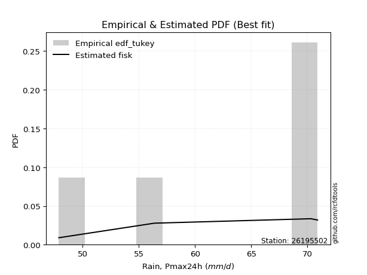</img>

</div>


### 8. EDF Gringorten (1963)

Gringorten plotting position formula is essential for estimating the probability and return periods of extreme events like floods and heavy rainfall. The constant _a=0.44_.

<div align="center">


$P=(m-a)/(n+1-2a)$


</div>


**8.1. Empirical values**

<div align="center">

|                | 0                   | 1                  | 2              | 3                 | 4                  |
|:---------------|:--------------------|:-------------------|:---------------|:------------------|:-------------------|
| date           | 2018                | 2017               | 2020           | 2019              | 2021               |
| x              | 47.9                | 56.4               | 70.3           | 70.5              | 70.9               |
| m              | 1                   | 2                  | 3              | 4                 | 5                  |
| empirical_dist | edf_gringorten      | edf_gringorten     | edf_gringorten | edf_gringorten    | edf_gringorten     |
| empirical      | 0.10937500000000001 | 0.3046875          | 0.5            | 0.6953125         | 0.8906249999999999 |
| empirical_tr   | 1.1228070175438596  | 1.4382022471910112 | 2.0            | 3.282051282051282 | 9.142857142857133  |

</div>


**8.2. Kolmogorov-Smirnov fit test (sorted by Δ)**


<div align="center">

|                | 0                   | 1                  | 2                  | 3                   | 4                   | 5                  | 6                   | 7                   | 8                   | 9                   | 10                  | 11                  | 12                  | 13                  | 14                  | 15                  | 16                 | 17                 | 18                  | 19                 | 20                  | 21                  | 22                  | 23                 | 24                 | 25                  | 26                  | 27                 | 28                  | 29                 | 30                 | 31                 | 32                 | 33                 | 34                 | 35                 | 36                 | 37                 | 38                 | 39                  | 40                 | 41                  | 42                  | 43                 | 44                 | 45                  | 46                 | 47                 | 48                  | 49                 | 50                  | 51                  | 52                 | 53                 | 54                 | 55                  | 56                  | 57                  | 58                 | 59                  | 60                 | 61                 | 62                 | 63                 | 64                 | 65                  | 66                 | 67                 | 68                 | 69                 | 70                  | 71                  | 72                  | 73                 | 74                  | 75                 | 76                 | 77                  | 78                 | 79                  | 80                  | 81                 | 82                 | 83                  | 84                 | 85                 | 86                 | 87                  | 88                  | 89                 | 90                 | 91                  | 92                  | 93                  | 94                  | 95                 | 96                  | 97                 | 98                  | 99                 | 100                | 101                | 102                | 103                | 104                 | 105                | 106                 | 107                | 108                | 109                 | 110                 | 111                | 112                | 113                | 114                | 115                | 116                 | 117                 | 118                | 119                | 120                | 121                | 122                 | 123                | 124                | 125                 | 126                | 127                | 128                | 129                | 130                 | 131                 | 132                | 133                | 134                | 135                 | 136                | 137                | 138                 | 139                | 140                | 141                 | 142                 | 143                | 144                 | 145                | 146                | 147                | 148                | 149                | 150                | 151                | 152                | 153                | 154                | 155                | 156                | 157                | 158                | 159                |
|:---------------|:--------------------|:-------------------|:-------------------|:--------------------|:--------------------|:-------------------|:--------------------|:--------------------|:--------------------|:--------------------|:--------------------|:--------------------|:--------------------|:--------------------|:--------------------|:--------------------|:-------------------|:-------------------|:--------------------|:-------------------|:--------------------|:--------------------|:--------------------|:-------------------|:-------------------|:--------------------|:--------------------|:-------------------|:--------------------|:-------------------|:-------------------|:-------------------|:-------------------|:-------------------|:-------------------|:-------------------|:-------------------|:-------------------|:-------------------|:--------------------|:-------------------|:--------------------|:--------------------|:-------------------|:-------------------|:--------------------|:-------------------|:-------------------|:--------------------|:-------------------|:--------------------|:--------------------|:-------------------|:-------------------|:-------------------|:--------------------|:--------------------|:--------------------|:-------------------|:--------------------|:-------------------|:-------------------|:-------------------|:-------------------|:-------------------|:--------------------|:-------------------|:-------------------|:-------------------|:-------------------|:--------------------|:--------------------|:--------------------|:-------------------|:--------------------|:-------------------|:-------------------|:--------------------|:-------------------|:--------------------|:--------------------|:-------------------|:-------------------|:--------------------|:-------------------|:-------------------|:-------------------|:--------------------|:--------------------|:-------------------|:-------------------|:--------------------|:--------------------|:--------------------|:--------------------|:-------------------|:--------------------|:-------------------|:--------------------|:-------------------|:-------------------|:-------------------|:-------------------|:-------------------|:--------------------|:-------------------|:--------------------|:-------------------|:-------------------|:--------------------|:--------------------|:-------------------|:-------------------|:-------------------|:-------------------|:-------------------|:--------------------|:--------------------|:-------------------|:-------------------|:-------------------|:-------------------|:--------------------|:-------------------|:-------------------|:--------------------|:-------------------|:-------------------|:-------------------|:-------------------|:--------------------|:--------------------|:-------------------|:-------------------|:-------------------|:--------------------|:-------------------|:-------------------|:--------------------|:-------------------|:-------------------|:--------------------|:--------------------|:-------------------|:--------------------|:-------------------|:-------------------|:-------------------|:-------------------|:-------------------|:-------------------|:-------------------|:-------------------|:-------------------|:-------------------|:-------------------|:-------------------|:-------------------|:-------------------|:-------------------|
| station        | 26195502            | 26195502           | 26195502           | 26195502            | 26195502            | 26195502           | 26195502            | 26195502            | 26195502            | 26195502            | 26195502            | 26195502            | 26195502            | 26195502            | 26195502            | 26195502            | 26195502           | 26195502           | 26195502            | 26195502           | 26195502            | 26195502            | 26195502            | 26195502           | 26195502           | 26195502            | 26195502            | 26195502           | 26195502            | 26195502           | 26195502           | 26195502           | 26195502           | 26195502           | 26195502           | 26195502           | 26195502           | 26195502           | 26195502           | 26195502            | 26195502           | 26195502            | 26195502            | 26195502           | 26195502           | 26195502            | 26195502           | 26195502           | 26195502            | 26195502           | 26195502            | 26195502            | 26195502           | 26195502           | 26195502           | 26195502            | 26195502            | 26195502            | 26195502           | 26195502            | 26195502           | 26195502           | 26195502           | 26195502           | 26195502           | 26195502            | 26195502           | 26195502           | 26195502           | 26195502           | 26195502            | 26195502            | 26195502            | 26195502           | 26195502            | 26195502           | 26195502           | 26195502            | 26195502           | 26195502            | 26195502            | 26195502           | 26195502           | 26195502            | 26195502           | 26195502           | 26195502           | 26195502            | 26195502            | 26195502           | 26195502           | 26195502            | 26195502            | 26195502            | 26195502            | 26195502           | 26195502            | 26195502           | 26195502            | 26195502           | 26195502           | 26195502           | 26195502           | 26195502           | 26195502            | 26195502           | 26195502            | 26195502           | 26195502           | 26195502            | 26195502            | 26195502           | 26195502           | 26195502           | 26195502           | 26195502           | 26195502            | 26195502            | 26195502           | 26195502           | 26195502           | 26195502           | 26195502            | 26195502           | 26195502           | 26195502            | 26195502           | 26195502           | 26195502           | 26195502           | 26195502            | 26195502            | 26195502           | 26195502           | 26195502           | 26195502            | 26195502           | 26195502           | 26195502            | 26195502           | 26195502           | 26195502            | 26195502            | 26195502           | 26195502            | 26195502           | 26195502           | 26195502           | 26195502           | 26195502           | 26195502           | 26195502           | 26195502           | 26195502           | 26195502           | 26195502           | 26195502           | 26195502           | 26195502           | 26195502           |
| empirical_dist | edf_gringorten      | edf_gringorten     | edf_gringorten     | edf_gringorten      | edf_gringorten      | edf_gringorten     | edf_gringorten      | edf_gringorten      | edf_gringorten      | edf_gringorten      | edf_gringorten      | edf_gringorten      | edf_gringorten      | edf_gringorten      | edf_gringorten      | edf_gringorten      | edf_gringorten     | edf_gringorten     | edf_gringorten      | edf_gringorten     | edf_gringorten      | edf_gringorten      | edf_gringorten      | edf_gringorten     | edf_gringorten     | edf_gringorten      | edf_gringorten      | edf_gringorten     | edf_gringorten      | edf_gringorten     | edf_gringorten     | edf_gringorten     | edf_gringorten     | edf_gringorten     | edf_gringorten     | edf_gringorten     | edf_gringorten     | edf_gringorten     | edf_gringorten     | edf_gringorten      | edf_gringorten     | edf_gringorten      | edf_gringorten      | edf_gringorten     | edf_gringorten     | edf_gringorten      | edf_gringorten     | edf_gringorten     | edf_gringorten      | edf_gringorten     | edf_gringorten      | edf_gringorten      | edf_gringorten     | edf_gringorten     | edf_gringorten     | edf_gringorten      | edf_gringorten      | edf_gringorten      | edf_gringorten     | edf_gringorten      | edf_gringorten     | edf_gringorten     | edf_gringorten     | edf_gringorten     | edf_gringorten     | edf_gringorten      | edf_gringorten     | edf_gringorten     | edf_gringorten     | edf_gringorten     | edf_gringorten      | edf_gringorten      | edf_gringorten      | edf_gringorten     | edf_gringorten      | edf_gringorten     | edf_gringorten     | edf_gringorten      | edf_gringorten     | edf_gringorten      | edf_gringorten      | edf_gringorten     | edf_gringorten     | edf_gringorten      | edf_gringorten     | edf_gringorten     | edf_gringorten     | edf_gringorten      | edf_gringorten      | edf_gringorten     | edf_gringorten     | edf_gringorten      | edf_gringorten      | edf_gringorten      | edf_gringorten      | edf_gringorten     | edf_gringorten      | edf_gringorten     | edf_gringorten      | edf_gringorten     | edf_gringorten     | edf_gringorten     | edf_gringorten     | edf_gringorten     | edf_gringorten      | edf_gringorten     | edf_gringorten      | edf_gringorten     | edf_gringorten     | edf_gringorten      | edf_gringorten      | edf_gringorten     | edf_gringorten     | edf_gringorten     | edf_gringorten     | edf_gringorten     | edf_gringorten      | edf_gringorten      | edf_gringorten     | edf_gringorten     | edf_gringorten     | edf_gringorten     | edf_gringorten      | edf_gringorten     | edf_gringorten     | edf_gringorten      | edf_gringorten     | edf_gringorten     | edf_gringorten     | edf_gringorten     | edf_gringorten      | edf_gringorten      | edf_gringorten     | edf_gringorten     | edf_gringorten     | edf_gringorten      | edf_gringorten     | edf_gringorten     | edf_gringorten      | edf_gringorten     | edf_gringorten     | edf_gringorten      | edf_gringorten      | edf_gringorten     | edf_gringorten      | edf_gringorten     | edf_gringorten     | edf_gringorten     | edf_gringorten     | edf_gringorten     | edf_gringorten     | edf_gringorten     | edf_gringorten     | edf_gringorten     | edf_gringorten     | edf_gringorten     | edf_gringorten     | edf_gringorten     | edf_gringorten     | edf_gringorten     |
| p_dist         | beta                | logbeta            | levy_l             | wrapcauchy          | loglevy_l           | logwrapcauchy      | arcsine             | kappa3              | logarcsine          | vonmises_line       | logtrapezoid        | trapezoid           | logksone            | ksone               | logweibull_max      | logsemicircular     | semicircular       | loganglit          | anglit              | halfgennorm        | lognct              | loglomax            | logpearson3         | logbetaprime       | pearson3           | invgauss            | dgamma              | burr12             | genextreme          | lomax              | loggumbel_l        | logkstwobign       | gennorm            | logfoldnorm        | logf               | gumbel_l           | loginvweibull      | loginvgauss        | logcrystalball     | logt                | logexponnorm       | lognorm             | loghalfgennorm      | nct                | logrice            | ncf                 | erlang             | loginvgamma        | logfatiguelife      | t                  | exponnorm           | crystalball         | norm               | truncnorm          | f                  | loggamma            | loggamma            | loggenexpon         | invgamma           | kstwobign           | rice               | logerlang          | gamma              | betaprime          | logalpha           | alpha               | logmaxwell         | logdweibull        | maxwell            | lograyleigh        | weibull_min         | rayleigh            | logburr12           | logncf             | logweibull_min      | loghalfnorm        | halfnorm           | loglogistic         | logistic           | logexponpow         | nakagami            | logcosine          | loggumbel_r        | cosine              | gumbel_r           | loghypsecant       | hypsecant          | loghalflogistic     | dweibull            | halflogistic       | loggompertz        | logmoyal            | moyal               | loglaplace          | loglaplace          | laplace            | exponweib           | burr               | genexpon            | logwald            | wald               | logloglaplace      | argus              | loggenextreme      | logdgamma           | logargus           | logexponweib        | loggengamma        | logburr            | lognakagami         | loggennorm          | genpareto          | gengamma           | fatiguelife        | logmielke          | mielke             | weibull_max         | loggenhalflogistic  | logloggamma        | genhalflogistic    | foldnorm           | triang             | invweibull          | skewnorm           | kappa4             | logtriang           | logskewnorm        | loggausshyper      | tukeylambda        | logkappa4          | gausshyper          | uniform             | logtukeylambda     | logkappa3          | johnsonsu          | loguniform          | logvonmises_line   | truncweibull_min   | bradford            | truncexpon         | logbradford        | logtruncweibull_min | johnsonsb           | logtruncexpon      | logtruncnorm        | gompertz           | loggenpareto       | logjohnsonsu       | powerlaw           | logpowerlaw        | truncpareto        | logtruncpareto     | exponpow           | logjohnsonsb       | rdist              | genlogistic        | loggenlogistic     | logrdist           | logvonmises        | vonmises           |
| delta          | 0.10558600177232058 | 0.1126631105041972 | 0.183554953838156  | 0.18945965691971828 | 0.18950534749853643 | 0.1926296352494959 | 0.19436803469288044 | 0.19830393190970086 | 0.19883408558880744 | 0.20490041048769922 | 0.21056952675457918 | 0.21299722671704902 | 0.21590561305089384 | 0.21766773874085255 | 0.21841326684400053 | 0.23239852110129855 | 0.2341993674890458 | 0.2446678314768318 | 0.24648542346816926 | 0.2496832552851378 | 0.25283157553436153 | 0.25821371038941265 | 0.25963353468643424 | 0.2601525549723728 | 0.2628583080515883 | 0.26329783923031924 | 0.26400601494206827 | 0.264470778627484  | 0.26452957228434437 | 0.2659668779617784 | 0.2689803879574204 | 0.2702587965861578 | 0.2708152685889926 | 0.2711686667971557 | 0.2716099567773895 | 0.2716256330392314 | 0.2719691813908238 | 0.2723055060074905 | 0.2727396267402111 | 0.27274166027959357 | 0.2727440201441147 | 0.27274548662844245 | 0.27282055344467293 | 0.2729493658785934 | 0.2730229843458529 | 0.27346107771752604 | 0.2735998048295303 | 0.2742661986846806 | 0.27438152791923964 | 0.2745782428684851 | 0.27458073559629004 | 0.27458234117967384 | 0.2745823440645212 | 0.2745823463052184 | 0.2746008174626299 | 0.27462888236277216 | 0.27462888236277216 | 0.27482219674739383 | 0.2748888724533599 | 0.27506237630350394 | 0.2752004087044062 | 0.2754196248475911 | 0.2758929325382795 | 0.276046553308567  | 0.2760608892723817 | 0.27742597967733595 | 0.2793256112263539 | 0.2793291730172385 | 0.2809175843513779 | 0.2811902827290985 | 0.28208203475007765 | 0.28271216776128727 | 0.28278014582251987 | 0.2828097772968038 | 0.28316474222227495 | 0.2882396366383633 | 0.289582012886055  | 0.29520247761029694 | 0.2969996825909669 | 0.29867351305431455 | 0.30468749999823214 | 0.3056814223663946 | 0.3064272708627902 | 0.30655058764781296 | 0.3077813895509316 | 0.3092838544711648 | 0.3109982543667362 | 0.31121407978700955 | 0.31155195510031786 | 0.3124232971429992 | 0.3131356489631125 | 0.31741759981102136 | 0.31862978300810063 | 0.32637619311343824 | 0.32637619311343824 | 0.3278685702172641 | 0.34497700543546017 | 0.3456986135700847 | 0.35148820948288884 | 0.3533878888413796 | 0.3542582690191888 | 0.3585317763316206 | 0.3604385889190411 | 0.3611916852977055 | 0.36155797172460613 | 0.3644454391333607 | 0.37604129175908774 | 0.3807036756599146 | 0.3807928576816201 | 0.39002984678489705 | 0.39062500000029493 | 0.4145614137203095 | 0.4151447677434281 | 0.4231440589788298 | 0.424790802930178  | 0.4274828853668573 | 0.42862415275641064 | 0.43446752206303885 | 0.4351668812797397 | 0.4450792430332423 | 0.4562843790356266 | 0.4581205408624133 | 0.45951216542889156 | 0.4606551387037371 | 0.4622136503425427 | 0.46538987390080166 | 0.4666231255872253 | 0.467252653587252  | 0.4684068464423987 | 0.4724301837263065 | 0.47325131264437215 | 0.47391304347826047 | 0.4744955346492574 | 0.4750882710329981 | 0.4767119874745523 | 0.47832837460310096 | 0.4784810193469864 | 0.4803572136898976 | 0.48138594402945634 | 0.4825082809004517 | 0.4842925635459133 | 0.4843672674451204  | 0.48609771009984837 | 0.4861889217906933 | 0.48952426251248415 | 0.499999755957013  | 0.5186532123194693 | 0.5503289510634363 | 0.5686597757787154 | 0.5787373457223749 | 0.5877760992889234 | 0.6012478025180107 | 0.6105823386597792 | 0.6765919170749678 | 0.6953124985016983 | 0.6953125          | 0.6953125          | 0.8906249999999999 | 1.2721403772884543 | 10.970655178876504 |
| deltao         | 0.5865427407550001  | 0.5865427407550001 | 0.5865427407550001 | 0.5865427407550001  | 0.5865427407550001  | 0.5865427407550001 | 0.5865427407550001  | 0.5865427407550001  | 0.5865427407550001  | 0.5865427407550001  | 0.5865427407550001  | 0.5865427407550001  | 0.5865427407550001  | 0.5865427407550001  | 0.5865427407550001  | 0.5865427407550001  | 0.5865427407550001 | 0.5865427407550001 | 0.5865427407550001  | 0.5865427407550001 | 0.5865427407550001  | 0.5865427407550001  | 0.5865427407550001  | 0.5865427407550001 | 0.5865427407550001 | 0.5865427407550001  | 0.5865427407550001  | 0.5865427407550001 | 0.5865427407550001  | 0.5865427407550001 | 0.5865427407550001 | 0.5865427407550001 | 0.5865427407550001 | 0.5865427407550001 | 0.5865427407550001 | 0.5865427407550001 | 0.5865427407550001 | 0.5865427407550001 | 0.5865427407550001 | 0.5865427407550001  | 0.5865427407550001 | 0.5865427407550001  | 0.5865427407550001  | 0.5865427407550001 | 0.5865427407550001 | 0.5865427407550001  | 0.5865427407550001 | 0.5865427407550001 | 0.5865427407550001  | 0.5865427407550001 | 0.5865427407550001  | 0.5865427407550001  | 0.5865427407550001 | 0.5865427407550001 | 0.5865427407550001 | 0.5865427407550001  | 0.5865427407550001  | 0.5865427407550001  | 0.5865427407550001 | 0.5865427407550001  | 0.5865427407550001 | 0.5865427407550001 | 0.5865427407550001 | 0.5865427407550001 | 0.5865427407550001 | 0.5865427407550001  | 0.5865427407550001 | 0.5865427407550001 | 0.5865427407550001 | 0.5865427407550001 | 0.5865427407550001  | 0.5865427407550001  | 0.5865427407550001  | 0.5865427407550001 | 0.5865427407550001  | 0.5865427407550001 | 0.5865427407550001 | 0.5865427407550001  | 0.5865427407550001 | 0.5865427407550001  | 0.5865427407550001  | 0.5865427407550001 | 0.5865427407550001 | 0.5865427407550001  | 0.5865427407550001 | 0.5865427407550001 | 0.5865427407550001 | 0.5865427407550001  | 0.5865427407550001  | 0.5865427407550001 | 0.5865427407550001 | 0.5865427407550001  | 0.5865427407550001  | 0.5865427407550001  | 0.5865427407550001  | 0.5865427407550001 | 0.5865427407550001  | 0.5865427407550001 | 0.5865427407550001  | 0.5865427407550001 | 0.5865427407550001 | 0.5865427407550001 | 0.5865427407550001 | 0.5865427407550001 | 0.5865427407550001  | 0.5865427407550001 | 0.5865427407550001  | 0.5865427407550001 | 0.5865427407550001 | 0.5865427407550001  | 0.5865427407550001  | 0.5865427407550001 | 0.5865427407550001 | 0.5865427407550001 | 0.5865427407550001 | 0.5865427407550001 | 0.5865427407550001  | 0.5865427407550001  | 0.5865427407550001 | 0.5865427407550001 | 0.5865427407550001 | 0.5865427407550001 | 0.5865427407550001  | 0.5865427407550001 | 0.5865427407550001 | 0.5865427407550001  | 0.5865427407550001 | 0.5865427407550001 | 0.5865427407550001 | 0.5865427407550001 | 0.5865427407550001  | 0.5865427407550001  | 0.5865427407550001 | 0.5865427407550001 | 0.5865427407550001 | 0.5865427407550001  | 0.5865427407550001 | 0.5865427407550001 | 0.5865427407550001  | 0.5865427407550001 | 0.5865427407550001 | 0.5865427407550001  | 0.5865427407550001  | 0.5865427407550001 | 0.5865427407550001  | 0.5865427407550001 | 0.5865427407550001 | 0.5865427407550001 | 0.5865427407550001 | 0.5865427407550001 | 0.5865427407550001 | 0.5865427407550001 | 0.5865427407550001 | 0.5865427407550001 | 0.5865427407550001 | 0.5865427407550001 | 0.5865427407550001 | 0.5865427407550001 | 0.5865427407550001 | 0.5865427407550001 |
| eval           | Δo > Δ              | Δo > Δ             | Δo > Δ             | Δo > Δ              | Δo > Δ              | Δo > Δ             | Δo > Δ              | Δo > Δ              | Δo > Δ              | Δo > Δ              | Δo > Δ              | Δo > Δ              | Δo > Δ              | Δo > Δ              | Δo > Δ              | Δo > Δ              | Δo > Δ             | Δo > Δ             | Δo > Δ              | Δo > Δ             | Δo > Δ              | Δo > Δ              | Δo > Δ              | Δo > Δ             | Δo > Δ             | Δo > Δ              | Δo > Δ              | Δo > Δ             | Δo > Δ              | Δo > Δ             | Δo > Δ             | Δo > Δ             | Δo > Δ             | Δo > Δ             | Δo > Δ             | Δo > Δ             | Δo > Δ             | Δo > Δ             | Δo > Δ             | Δo > Δ              | Δo > Δ             | Δo > Δ              | Δo > Δ              | Δo > Δ             | Δo > Δ             | Δo > Δ              | Δo > Δ             | Δo > Δ             | Δo > Δ              | Δo > Δ             | Δo > Δ              | Δo > Δ              | Δo > Δ             | Δo > Δ             | Δo > Δ             | Δo > Δ              | Δo > Δ              | Δo > Δ              | Δo > Δ             | Δo > Δ              | Δo > Δ             | Δo > Δ             | Δo > Δ             | Δo > Δ             | Δo > Δ             | Δo > Δ              | Δo > Δ             | Δo > Δ             | Δo > Δ             | Δo > Δ             | Δo > Δ              | Δo > Δ              | Δo > Δ              | Δo > Δ             | Δo > Δ              | Δo > Δ             | Δo > Δ             | Δo > Δ              | Δo > Δ             | Δo > Δ              | Δo > Δ              | Δo > Δ             | Δo > Δ             | Δo > Δ              | Δo > Δ             | Δo > Δ             | Δo > Δ             | Δo > Δ              | Δo > Δ              | Δo > Δ             | Δo > Δ             | Δo > Δ              | Δo > Δ              | Δo > Δ              | Δo > Δ              | Δo > Δ             | Δo > Δ              | Δo > Δ             | Δo > Δ              | Δo > Δ             | Δo > Δ             | Δo > Δ             | Δo > Δ             | Δo > Δ             | Δo > Δ              | Δo > Δ             | Δo > Δ              | Δo > Δ             | Δo > Δ             | Δo > Δ              | Δo > Δ              | Δo > Δ             | Δo > Δ             | Δo > Δ             | Δo > Δ             | Δo > Δ             | Δo > Δ              | Δo > Δ              | Δo > Δ             | Δo > Δ             | Δo > Δ             | Δo > Δ             | Δo > Δ              | Δo > Δ             | Δo > Δ             | Δo > Δ              | Δo > Δ             | Δo > Δ             | Δo > Δ             | Δo > Δ             | Δo > Δ              | Δo > Δ              | Δo > Δ             | Δo > Δ             | Δo > Δ             | Δo > Δ              | Δo > Δ             | Δo > Δ             | Δo > Δ              | Δo > Δ             | Δo > Δ             | Δo > Δ              | Δo > Δ              | Δo > Δ             | Δo > Δ              | Δo > Δ             | Δo > Δ             | Δo > Δ             | Δo > Δ             | Δo > Δ             | Δo <= Δ            | Δo <= Δ            | Δo <= Δ            | Δo <= Δ            | Δo <= Δ            | Δo <= Δ            | Δo <= Δ            | Δo <= Δ            | Δo <= Δ            | Δo <= Δ            |
| fit            | 1                   | 1                  | 1                  | 1                   | 1                   | 1                  | 1                   | 1                   | 1                   | 1                   | 1                   | 1                   | 1                   | 1                   | 1                   | 1                   | 1                  | 1                  | 1                   | 1                  | 1                   | 1                   | 1                   | 1                  | 1                  | 1                   | 1                   | 1                  | 1                   | 1                  | 1                  | 1                  | 1                  | 1                  | 1                  | 1                  | 1                  | 1                  | 1                  | 1                   | 1                  | 1                   | 1                   | 1                  | 1                  | 1                   | 1                  | 1                  | 1                   | 1                  | 1                   | 1                   | 1                  | 1                  | 1                  | 1                   | 1                   | 1                   | 1                  | 1                   | 1                  | 1                  | 1                  | 1                  | 1                  | 1                   | 1                  | 1                  | 1                  | 1                  | 1                   | 1                   | 1                   | 1                  | 1                   | 1                  | 1                  | 1                   | 1                  | 1                   | 1                   | 1                  | 1                  | 1                   | 1                  | 1                  | 1                  | 1                   | 1                   | 1                  | 1                  | 1                   | 1                   | 1                   | 1                   | 1                  | 1                   | 1                  | 1                   | 1                  | 1                  | 1                  | 1                  | 1                  | 1                   | 1                  | 1                   | 1                  | 1                  | 1                   | 1                   | 1                  | 1                  | 1                  | 1                  | 1                  | 1                   | 1                   | 1                  | 1                  | 1                  | 1                  | 1                   | 1                  | 1                  | 1                   | 1                  | 1                  | 1                  | 1                  | 1                   | 1                   | 1                  | 1                  | 1                  | 1                   | 1                  | 1                  | 1                   | 1                  | 1                  | 1                   | 1                   | 1                  | 1                   | 1                  | 1                  | 1                  | 1                  | 1                  | 0                  | 0                  | 0                  | 0                  | 0                  | 0                  | 0                  | 0                  | 0                  | 0                  |
| n              | 5                   | 5                  | 5                  | 5                   | 5                   | 5                  | 5                   | 5                   | 5                   | 5                   | 5                   | 5                   | 5                   | 5                   | 5                   | 5                   | 5                  | 5                  | 5                   | 5                  | 5                   | 5                   | 5                   | 5                  | 5                  | 5                   | 5                   | 5                  | 5                   | 5                  | 5                  | 5                  | 5                  | 5                  | 5                  | 5                  | 5                  | 5                  | 5                  | 5                   | 5                  | 5                   | 5                   | 5                  | 5                  | 5                   | 5                  | 5                  | 5                   | 5                  | 5                   | 5                   | 5                  | 5                  | 5                  | 5                   | 5                   | 5                   | 5                  | 5                   | 5                  | 5                  | 5                  | 5                  | 5                  | 5                   | 5                  | 5                  | 5                  | 5                  | 5                   | 5                   | 5                   | 5                  | 5                   | 5                  | 5                  | 5                   | 5                  | 5                   | 5                   | 5                  | 5                  | 5                   | 5                  | 5                  | 5                  | 5                   | 5                   | 5                  | 5                  | 5                   | 5                   | 5                   | 5                   | 5                  | 5                   | 5                  | 5                   | 5                  | 5                  | 5                  | 5                  | 5                  | 5                   | 5                  | 5                   | 5                  | 5                  | 5                   | 5                   | 5                  | 5                  | 5                  | 5                  | 5                  | 5                   | 5                   | 5                  | 5                  | 5                  | 5                  | 5                   | 5                  | 5                  | 5                   | 5                  | 5                  | 5                  | 5                  | 5                   | 5                   | 5                  | 5                  | 5                  | 5                   | 5                  | 5                  | 5                   | 5                  | 5                  | 5                   | 5                   | 5                  | 5                   | 5                  | 5                  | 5                  | 5                  | 5                  | 5                  | 5                  | 5                  | 5                  | 5                  | 5                  | 5                  | 5                  | 5                  | 5                  |
| best_fit       | 1                   | 0                  | 0                  | 0                   | 0                   | 0                  | 0                   | 0                   | 0                   | 0                   | 0                   | 0                   | 0                   | 0                   | 0                   | 0                   | 0                  | 0                  | 0                   | 0                  | 0                   | 0                   | 0                   | 0                  | 0                  | 0                   | 0                   | 0                  | 0                   | 0                  | 0                  | 0                  | 0                  | 0                  | 0                  | 0                  | 0                  | 0                  | 0                  | 0                   | 0                  | 0                   | 0                   | 0                  | 0                  | 0                   | 0                  | 0                  | 0                   | 0                  | 0                   | 0                   | 0                  | 0                  | 0                  | 0                   | 0                   | 0                   | 0                  | 0                   | 0                  | 0                  | 0                  | 0                  | 0                  | 0                   | 0                  | 0                  | 0                  | 0                  | 0                   | 0                   | 0                   | 0                  | 0                   | 0                  | 0                  | 0                   | 0                  | 0                   | 0                   | 0                  | 0                  | 0                   | 0                  | 0                  | 0                  | 0                   | 0                   | 0                  | 0                  | 0                   | 0                   | 0                   | 0                   | 0                  | 0                   | 0                  | 0                   | 0                  | 0                  | 0                  | 0                  | 0                  | 0                   | 0                  | 0                   | 0                  | 0                  | 0                   | 0                   | 0                  | 0                  | 0                  | 0                  | 0                  | 0                   | 0                   | 0                  | 0                  | 0                  | 0                  | 0                   | 0                  | 0                  | 0                   | 0                  | 0                  | 0                  | 0                  | 0                   | 0                   | 0                  | 0                  | 0                  | 0                   | 0                  | 0                  | 0                   | 0                  | 0                  | 0                   | 0                   | 0                  | 0                   | 0                  | 0                  | 0                  | 0                  | 0                  | 0                  | 0                  | 0                  | 0                  | 0                  | 0                  | 0                  | 0                  | 0                  | 0                  |
| best_fit_sort  | 1                   | 2                  | 3                  | 4                   | 5                   | 6                  | 7                   | 8                   | 9                   | 10                  | 11                  | 12                  | 13                  | 14                  | 15                  | 16                  | 17                 | 18                 | 19                  | 20                 | 21                  | 22                  | 23                  | 24                 | 25                 | 26                  | 27                  | 28                 | 29                  | 30                 | 31                 | 32                 | 33                 | 34                 | 35                 | 36                 | 37                 | 38                 | 39                 | 40                  | 41                 | 42                  | 43                  | 44                 | 45                 | 46                  | 47                 | 48                 | 49                  | 50                 | 51                  | 52                  | 53                 | 54                 | 55                 | 56                  | 57                  | 58                  | 59                 | 60                  | 61                 | 62                 | 63                 | 64                 | 65                 | 66                  | 67                 | 68                 | 69                 | 70                 | 71                  | 72                  | 73                  | 74                 | 75                  | 76                 | 77                 | 78                  | 79                 | 80                  | 81                  | 82                 | 83                 | 84                  | 85                 | 86                 | 87                 | 88                  | 89                  | 90                 | 91                 | 92                  | 93                  | 94                  | 95                  | 96                 | 97                  | 98                 | 99                  | 100                | 101                | 102                | 103                | 104                | 105                 | 106                | 107                 | 108                | 109                | 110                 | 111                 | 112                | 113                | 114                | 115                | 116                | 117                 | 118                 | 119                | 120                | 121                | 122                | 123                 | 124                | 125                | 126                 | 127                | 128                | 129                | 130                | 131                 | 132                 | 133                | 134                | 135                | 136                 | 137                | 138                | 139                 | 140                | 141                | 142                 | 143                 | 144                | 145                 | 146                | 147                | 148                | 149                | 150                | 151                | 152                | 153                | 154                | 155                | 156                | 157                | 158                | 159                | 160                |

</div>


**8.3. Best fit**

<div align="center">

|   id |   station | empirical_dist   | p_dist   |    delta |   deltao | eval   |   fit |   n |   best_fit |   best_fit_sort |
|-----:|----------:|:-----------------|:---------|---------:|---------:|:-------|------:|----:|-----------:|----------------:|
|    0 |  26195502 | edf_gringorten   | beta     | 0.105586 | 0.586543 | Δo > Δ |     1 |   5 |          1 |               1 |

</div>


<div align="center">

</img>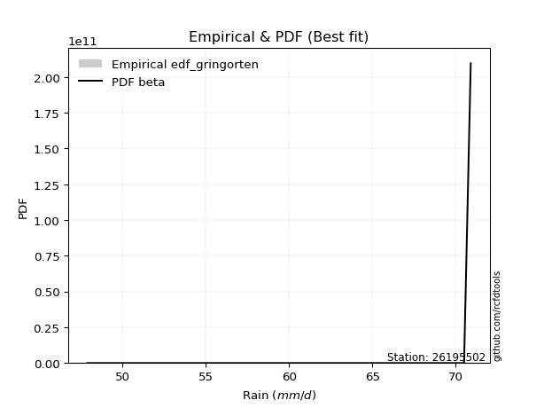</img>

</div>


### 9. EDF Filliben (1975)

The specific values of the constants (0.3175) (often denoted as $alpha$) and (0.365) are derived from a method proposed by James J. Filliben in a 1975 paper. This particular formula is the mean value of the $i$-th order statistic of the normal distribution and is considered a robust and effective plotting position formula for the normal probability plot correlation coefficient test for normality.

<div align="center">


$P=(m-0.3175)/(n+0.365)$


</div>


**9.1. Empirical values**

<div align="center">

|                | 0                   | 1                  | 2            | 3                  | 4                  |
|:---------------|:--------------------|:-------------------|:-------------|:-------------------|:-------------------|
| date           | 2018                | 2017               | 2020         | 2019               | 2021               |
| x              | 47.9                | 56.4               | 70.3         | 70.5               | 70.9               |
| m              | 1                   | 2                  | 3            | 4                  | 5                  |
| empirical_dist | edf_filliben        | edf_filliben       | edf_filliben | edf_filliben       | edf_filliben       |
| empirical      | 0.12721342031686858 | 0.3136067101584343 | 0.5          | 0.6863932898415657 | 0.8727865796831314 |
| empirical_tr   | 1.1457554725040042  | 1.456890699253225  | 2.0          | 3.188707280832095  | 7.860805860805863  |

</div>


**9.2. Kolmogorov-Smirnov fit test (sorted by Δ)**


<div align="center">

|                | 0                   | 1                  | 2                   | 3                   | 4                  | 5                  | 6                  | 7                  | 8                  | 9                   | 10                  | 11                 | 12                  | 13                  | 14                  | 15                  | 16                 | 17                  | 18                 | 19                  | 20                 | 21                  | 22                  | 23                  | 24                  | 25                 | 26                  | 27                 | 28                  | 29                  | 30                 | 31                 | 32                 | 33                 | 34                 | 35                 | 36                 | 37                 | 38                 | 39                  | 40                 | 41                  | 42                  | 43                  | 44                 | 45                 | 46                  | 47                 | 48                 | 49                  | 50                 | 51                  | 52                  | 53                 | 54                 | 55                 | 56                  | 57                  | 58                  | 59                 | 60                  | 61                 | 62                 | 63                 | 64                 | 65                 | 66                  | 67                 | 68                  | 69                 | 70                 | 71                  | 72                  | 73                  | 74                  | 75                 | 76                 | 77                 | 78                  | 79                 | 80                  | 81                 | 82                 | 83                  | 84                 | 85                 | 86                 | 87                  | 88                 | 89                 | 90                 | 91                  | 92                  | 93                  | 94                  | 95                 | 96                 | 97                  | 98                 | 99                 | 100                 | 101                | 102                | 103                | 104                | 105                 | 106                | 107                | 108                 | 109                | 110                | 111                 | 112                | 113                | 114                | 115                | 116                 | 117                 | 118                | 119                | 120                | 121                | 122                | 123                | 124                | 125                 | 126                | 127                | 128                 | 129                | 130                | 131                 | 132                 | 133                | 134                | 135                 | 136                 | 137                | 138                | 139                 | 140                | 141                | 142                 | 143                | 144                 | 145                | 146                | 147                | 148                | 149                | 150                | 151                | 152                | 153                | 154                | 155                | 156                | 157                | 158                | 159                |
|:---------------|:--------------------|:-------------------|:--------------------|:--------------------|:-------------------|:-------------------|:-------------------|:-------------------|:-------------------|:--------------------|:--------------------|:-------------------|:--------------------|:--------------------|:--------------------|:--------------------|:-------------------|:--------------------|:-------------------|:--------------------|:-------------------|:--------------------|:--------------------|:--------------------|:--------------------|:-------------------|:--------------------|:-------------------|:--------------------|:--------------------|:-------------------|:-------------------|:-------------------|:-------------------|:-------------------|:-------------------|:-------------------|:-------------------|:-------------------|:--------------------|:-------------------|:--------------------|:--------------------|:--------------------|:-------------------|:-------------------|:--------------------|:-------------------|:-------------------|:--------------------|:-------------------|:--------------------|:--------------------|:-------------------|:-------------------|:-------------------|:--------------------|:--------------------|:--------------------|:-------------------|:--------------------|:-------------------|:-------------------|:-------------------|:-------------------|:-------------------|:--------------------|:-------------------|:--------------------|:-------------------|:-------------------|:--------------------|:--------------------|:--------------------|:--------------------|:-------------------|:-------------------|:-------------------|:--------------------|:-------------------|:--------------------|:-------------------|:-------------------|:--------------------|:-------------------|:-------------------|:-------------------|:--------------------|:-------------------|:-------------------|:-------------------|:--------------------|:--------------------|:--------------------|:--------------------|:-------------------|:-------------------|:--------------------|:-------------------|:-------------------|:--------------------|:-------------------|:-------------------|:-------------------|:-------------------|:--------------------|:-------------------|:-------------------|:--------------------|:-------------------|:-------------------|:--------------------|:-------------------|:-------------------|:-------------------|:-------------------|:--------------------|:--------------------|:-------------------|:-------------------|:-------------------|:-------------------|:-------------------|:-------------------|:-------------------|:--------------------|:-------------------|:-------------------|:--------------------|:-------------------|:-------------------|:--------------------|:--------------------|:-------------------|:-------------------|:--------------------|:--------------------|:-------------------|:-------------------|:--------------------|:-------------------|:-------------------|:--------------------|:-------------------|:--------------------|:-------------------|:-------------------|:-------------------|:-------------------|:-------------------|:-------------------|:-------------------|:-------------------|:-------------------|:-------------------|:-------------------|:-------------------|:-------------------|:-------------------|:-------------------|
| station        | 26195502            | 26195502           | 26195502            | 26195502            | 26195502           | 26195502           | 26195502           | 26195502           | 26195502           | 26195502            | 26195502            | 26195502           | 26195502            | 26195502            | 26195502            | 26195502            | 26195502           | 26195502            | 26195502           | 26195502            | 26195502           | 26195502            | 26195502            | 26195502            | 26195502            | 26195502           | 26195502            | 26195502           | 26195502            | 26195502            | 26195502           | 26195502           | 26195502           | 26195502           | 26195502           | 26195502           | 26195502           | 26195502           | 26195502           | 26195502            | 26195502           | 26195502            | 26195502            | 26195502            | 26195502           | 26195502           | 26195502            | 26195502           | 26195502           | 26195502            | 26195502           | 26195502            | 26195502            | 26195502           | 26195502           | 26195502           | 26195502            | 26195502            | 26195502            | 26195502           | 26195502            | 26195502           | 26195502           | 26195502           | 26195502           | 26195502           | 26195502            | 26195502           | 26195502            | 26195502           | 26195502           | 26195502            | 26195502            | 26195502            | 26195502            | 26195502           | 26195502           | 26195502           | 26195502            | 26195502           | 26195502            | 26195502           | 26195502           | 26195502            | 26195502           | 26195502           | 26195502           | 26195502            | 26195502           | 26195502           | 26195502           | 26195502            | 26195502            | 26195502            | 26195502            | 26195502           | 26195502           | 26195502            | 26195502           | 26195502           | 26195502            | 26195502           | 26195502           | 26195502           | 26195502           | 26195502            | 26195502           | 26195502           | 26195502            | 26195502           | 26195502           | 26195502            | 26195502           | 26195502           | 26195502           | 26195502           | 26195502            | 26195502            | 26195502           | 26195502           | 26195502           | 26195502           | 26195502           | 26195502           | 26195502           | 26195502            | 26195502           | 26195502           | 26195502            | 26195502           | 26195502           | 26195502            | 26195502            | 26195502           | 26195502           | 26195502            | 26195502            | 26195502           | 26195502           | 26195502            | 26195502           | 26195502           | 26195502            | 26195502           | 26195502            | 26195502           | 26195502           | 26195502           | 26195502           | 26195502           | 26195502           | 26195502           | 26195502           | 26195502           | 26195502           | 26195502           | 26195502           | 26195502           | 26195502           | 26195502           |
| empirical_dist | edf_filliben        | edf_filliben       | edf_filliben        | edf_filliben        | edf_filliben       | edf_filliben       | edf_filliben       | edf_filliben       | edf_filliben       | edf_filliben        | edf_filliben        | edf_filliben       | edf_filliben        | edf_filliben        | edf_filliben        | edf_filliben        | edf_filliben       | edf_filliben        | edf_filliben       | edf_filliben        | edf_filliben       | edf_filliben        | edf_filliben        | edf_filliben        | edf_filliben        | edf_filliben       | edf_filliben        | edf_filliben       | edf_filliben        | edf_filliben        | edf_filliben       | edf_filliben       | edf_filliben       | edf_filliben       | edf_filliben       | edf_filliben       | edf_filliben       | edf_filliben       | edf_filliben       | edf_filliben        | edf_filliben       | edf_filliben        | edf_filliben        | edf_filliben        | edf_filliben       | edf_filliben       | edf_filliben        | edf_filliben       | edf_filliben       | edf_filliben        | edf_filliben       | edf_filliben        | edf_filliben        | edf_filliben       | edf_filliben       | edf_filliben       | edf_filliben        | edf_filliben        | edf_filliben        | edf_filliben       | edf_filliben        | edf_filliben       | edf_filliben       | edf_filliben       | edf_filliben       | edf_filliben       | edf_filliben        | edf_filliben       | edf_filliben        | edf_filliben       | edf_filliben       | edf_filliben        | edf_filliben        | edf_filliben        | edf_filliben        | edf_filliben       | edf_filliben       | edf_filliben       | edf_filliben        | edf_filliben       | edf_filliben        | edf_filliben       | edf_filliben       | edf_filliben        | edf_filliben       | edf_filliben       | edf_filliben       | edf_filliben        | edf_filliben       | edf_filliben       | edf_filliben       | edf_filliben        | edf_filliben        | edf_filliben        | edf_filliben        | edf_filliben       | edf_filliben       | edf_filliben        | edf_filliben       | edf_filliben       | edf_filliben        | edf_filliben       | edf_filliben       | edf_filliben       | edf_filliben       | edf_filliben        | edf_filliben       | edf_filliben       | edf_filliben        | edf_filliben       | edf_filliben       | edf_filliben        | edf_filliben       | edf_filliben       | edf_filliben       | edf_filliben       | edf_filliben        | edf_filliben        | edf_filliben       | edf_filliben       | edf_filliben       | edf_filliben       | edf_filliben       | edf_filliben       | edf_filliben       | edf_filliben        | edf_filliben       | edf_filliben       | edf_filliben        | edf_filliben       | edf_filliben       | edf_filliben        | edf_filliben        | edf_filliben       | edf_filliben       | edf_filliben        | edf_filliben        | edf_filliben       | edf_filliben       | edf_filliben        | edf_filliben       | edf_filliben       | edf_filliben        | edf_filliben       | edf_filliben        | edf_filliben       | edf_filliben       | edf_filliben       | edf_filliben       | edf_filliben       | edf_filliben       | edf_filliben       | edf_filliben       | edf_filliben       | edf_filliben       | edf_filliben       | edf_filliben       | edf_filliben       | edf_filliben       | edf_filliben       |
| p_dist         | beta                | logbeta            | arcsine             | kappa3              | wrapcauchy         | logarcsine         | logwrapcauchy      | levy_l             | loglevy_l          | logtrapezoid        | trapezoid           | vonmises_line      | logksone            | ksone               | logweibull_max      | logsemicircular     | semicircular       | logbetaprime        | loganglit          | anglit              | halfgennorm        | lognct              | loglomax            | logpearson3         | logdweibull         | pearson3           | invgauss            | burr12             | genextreme          | logncf              | lomax              | loggumbel_l        | logkstwobign       | logfoldnorm        | logf               | gumbel_l           | loginvweibull      | loginvgauss        | logcrystalball     | logt                | logexponnorm       | lognorm             | loghalfgennorm      | dgamma              | nct                | logrice            | ncf                 | erlang             | loginvgamma        | logfatiguelife      | t                  | exponnorm           | crystalball         | norm               | truncnorm          | f                  | loggamma            | loggamma            | loggenexpon         | invgamma           | kstwobign           | rice               | logerlang          | gamma              | betaprime          | logalpha           | alpha               | logmaxwell         | gennorm             | maxwell            | lograyleigh        | weibull_min         | rayleigh            | logburr12           | logweibull_min      | loghalfnorm        | halfnorm           | dweibull           | loglogistic         | logistic           | logexponpow         | logcosine          | loggumbel_r        | cosine              | gumbel_r           | loghypsecant       | hypsecant          | loghalflogistic     | halflogistic       | loggompertz        | nakagami           | logmoyal            | moyal               | loglaplace          | loglaplace          | laplace            | exponweib          | logloglaplace       | logdgamma          | burr               | genexpon            | logwald            | wald               | argus              | loggenextreme      | loggengamma         | logargus           | loggennorm         | logexponweib        | logburr            | lognakagami        | gengamma            | fatiguelife        | genpareto          | logmielke          | mielke             | weibull_max         | loggenhalflogistic  | logloggamma        | invweibull         | genhalflogistic    | foldnorm           | triang             | skewnorm           | kappa4             | logtriang           | logskewnorm        | loggausshyper      | johnsonsu           | tukeylambda        | logkappa4          | gausshyper          | uniform             | logtukeylambda     | logkappa3          | johnsonsb           | loguniform          | logvonmises_line   | truncweibull_min   | bradford            | truncexpon         | logbradford        | logtruncweibull_min | logtruncexpon      | logtruncnorm        | gompertz           | loggenpareto       | logjohnsonsu       | powerlaw           | logpowerlaw        | truncpareto        | logtruncpareto     | exponpow           | logjohnsonsb       | rdist              | genlogistic        | loggenlogistic     | logrdist           | logvonmises        | vonmises           |
| delta          | 0.12342442208918902 | 0.1251679365204773 | 0.17900109373801232 | 0.18046551159283242 | 0.180540446761284  | 0.180995665271939  | 0.1837104250910616 | 0.1924741639965903 | 0.1984245576569707 | 0.21056952675457918 | 0.21299722671704902 | 0.2138196206461335 | 0.21590561305089384 | 0.21766773874085255 | 0.21841326684400053 | 0.23239852110129855 | 0.2341993674890458 | 0.24231413465550433 | 0.2446678314768318 | 0.24648542346816926 | 0.2496832552851378 | 0.25283157553436153 | 0.25821371038941265 | 0.25963353468643424 | 0.26149075270037003 | 0.2628583080515883 | 0.26329783923031924 | 0.264470778627484  | 0.26452957228434437 | 0.26497135697993535 | 0.2659668779617784 | 0.2689803879574204 | 0.2702587965861578 | 0.2711686667971557 | 0.2716099567773895 | 0.2716256330392314 | 0.2719691813908238 | 0.2723055060074905 | 0.2727396267402111 | 0.27274166027959357 | 0.2727440201441147 | 0.27274548662844245 | 0.27282055344467293 | 0.27292522510050254 | 0.2729493658785934 | 0.2730229843458529 | 0.27346107771752604 | 0.2735998048295303 | 0.2742661986846806 | 0.27438152791923964 | 0.2745782428684851 | 0.27458073559629004 | 0.27458234117967384 | 0.2745823440645212 | 0.2745823463052184 | 0.2746008174626299 | 0.27462888236277216 | 0.27462888236277216 | 0.27482219674739383 | 0.2748888724533599 | 0.27506237630350394 | 0.2752004087044062 | 0.2754196248475911 | 0.2758929325382795 | 0.276046553308567  | 0.2760608892723817 | 0.27742597967733595 | 0.2793256112263539 | 0.27973447874742685 | 0.2809175843513779 | 0.2811902827290985 | 0.28208203475007765 | 0.28271216776128727 | 0.28278014582251987 | 0.28316474222227495 | 0.2882396366383633 | 0.289582012886055  | 0.2937135347834494 | 0.29520247761029694 | 0.2969996825909669 | 0.29867351305431455 | 0.3056814223663946 | 0.3064272708627902 | 0.30655058764781296 | 0.3077813895509316 | 0.3092838544711648 | 0.3109982543667362 | 0.31121407978700955 | 0.3124232971429992 | 0.3131356489631125 | 0.3136067101566664 | 0.31741759981102136 | 0.31862978300810063 | 0.32637619311343824 | 0.32637619311343824 | 0.3278685702172641 | 0.3360577952770259 | 0.34069335601475215 | 0.3437195514077377 | 0.3456986135700847 | 0.35148820948288884 | 0.3533878888413796 | 0.3542582690191888 | 0.3604385889190411 | 0.3611916852977055 | 0.36286525534304614 | 0.3644454391333607 | 0.3727865796834265 | 0.37604129175908774 | 0.3807928576816201 | 0.3811106366264628 | 0.40622555758499385 | 0.4142248488203955 | 0.4145614137203095 | 0.424790802930178  | 0.4274828853668573 | 0.42862415275641064 | 0.43446752206303885 | 0.4351668812797397 | 0.4416737451120231 | 0.4450792430332423 | 0.4562843790356266 | 0.4581205408624133 | 0.4606551387037371 | 0.4622136503425427 | 0.46538987390080166 | 0.4666231255872253 | 0.467252653587252  | 0.46779277731611796 | 0.4684068464423987 | 0.4724301837263065 | 0.47325131264437215 | 0.47391304347826047 | 0.4744955346492574 | 0.4750882710329981 | 0.47717849994141404 | 0.47832837460310096 | 0.4784810193469864 | 0.4803572136898976 | 0.48138594402945634 | 0.4825082809004517 | 0.4842925635459133 | 0.4843672674451204  | 0.4861889217906933 | 0.48952426251248415 | 0.499999755957013  | 0.5008147920026007 | 0.5414097409050019 | 0.5597405656202812 | 0.5698181355639407 | 0.578856889130489  | 0.5923285923595765 | 0.601663128501345  | 0.6676727069165335 | 0.686393288343264  | 0.6863932898415657 | 0.6863932898415657 | 0.8727865796831314 | 1.2721403772884543 | 10.970655178876504 |
| deltao         | 0.5865427407550001  | 0.5865427407550001 | 0.5865427407550001  | 0.5865427407550001  | 0.5865427407550001 | 0.5865427407550001 | 0.5865427407550001 | 0.5865427407550001 | 0.5865427407550001 | 0.5865427407550001  | 0.5865427407550001  | 0.5865427407550001 | 0.5865427407550001  | 0.5865427407550001  | 0.5865427407550001  | 0.5865427407550001  | 0.5865427407550001 | 0.5865427407550001  | 0.5865427407550001 | 0.5865427407550001  | 0.5865427407550001 | 0.5865427407550001  | 0.5865427407550001  | 0.5865427407550001  | 0.5865427407550001  | 0.5865427407550001 | 0.5865427407550001  | 0.5865427407550001 | 0.5865427407550001  | 0.5865427407550001  | 0.5865427407550001 | 0.5865427407550001 | 0.5865427407550001 | 0.5865427407550001 | 0.5865427407550001 | 0.5865427407550001 | 0.5865427407550001 | 0.5865427407550001 | 0.5865427407550001 | 0.5865427407550001  | 0.5865427407550001 | 0.5865427407550001  | 0.5865427407550001  | 0.5865427407550001  | 0.5865427407550001 | 0.5865427407550001 | 0.5865427407550001  | 0.5865427407550001 | 0.5865427407550001 | 0.5865427407550001  | 0.5865427407550001 | 0.5865427407550001  | 0.5865427407550001  | 0.5865427407550001 | 0.5865427407550001 | 0.5865427407550001 | 0.5865427407550001  | 0.5865427407550001  | 0.5865427407550001  | 0.5865427407550001 | 0.5865427407550001  | 0.5865427407550001 | 0.5865427407550001 | 0.5865427407550001 | 0.5865427407550001 | 0.5865427407550001 | 0.5865427407550001  | 0.5865427407550001 | 0.5865427407550001  | 0.5865427407550001 | 0.5865427407550001 | 0.5865427407550001  | 0.5865427407550001  | 0.5865427407550001  | 0.5865427407550001  | 0.5865427407550001 | 0.5865427407550001 | 0.5865427407550001 | 0.5865427407550001  | 0.5865427407550001 | 0.5865427407550001  | 0.5865427407550001 | 0.5865427407550001 | 0.5865427407550001  | 0.5865427407550001 | 0.5865427407550001 | 0.5865427407550001 | 0.5865427407550001  | 0.5865427407550001 | 0.5865427407550001 | 0.5865427407550001 | 0.5865427407550001  | 0.5865427407550001  | 0.5865427407550001  | 0.5865427407550001  | 0.5865427407550001 | 0.5865427407550001 | 0.5865427407550001  | 0.5865427407550001 | 0.5865427407550001 | 0.5865427407550001  | 0.5865427407550001 | 0.5865427407550001 | 0.5865427407550001 | 0.5865427407550001 | 0.5865427407550001  | 0.5865427407550001 | 0.5865427407550001 | 0.5865427407550001  | 0.5865427407550001 | 0.5865427407550001 | 0.5865427407550001  | 0.5865427407550001 | 0.5865427407550001 | 0.5865427407550001 | 0.5865427407550001 | 0.5865427407550001  | 0.5865427407550001  | 0.5865427407550001 | 0.5865427407550001 | 0.5865427407550001 | 0.5865427407550001 | 0.5865427407550001 | 0.5865427407550001 | 0.5865427407550001 | 0.5865427407550001  | 0.5865427407550001 | 0.5865427407550001 | 0.5865427407550001  | 0.5865427407550001 | 0.5865427407550001 | 0.5865427407550001  | 0.5865427407550001  | 0.5865427407550001 | 0.5865427407550001 | 0.5865427407550001  | 0.5865427407550001  | 0.5865427407550001 | 0.5865427407550001 | 0.5865427407550001  | 0.5865427407550001 | 0.5865427407550001 | 0.5865427407550001  | 0.5865427407550001 | 0.5865427407550001  | 0.5865427407550001 | 0.5865427407550001 | 0.5865427407550001 | 0.5865427407550001 | 0.5865427407550001 | 0.5865427407550001 | 0.5865427407550001 | 0.5865427407550001 | 0.5865427407550001 | 0.5865427407550001 | 0.5865427407550001 | 0.5865427407550001 | 0.5865427407550001 | 0.5865427407550001 | 0.5865427407550001 |
| eval           | Δo > Δ              | Δo > Δ             | Δo > Δ              | Δo > Δ              | Δo > Δ             | Δo > Δ             | Δo > Δ             | Δo > Δ             | Δo > Δ             | Δo > Δ              | Δo > Δ              | Δo > Δ             | Δo > Δ              | Δo > Δ              | Δo > Δ              | Δo > Δ              | Δo > Δ             | Δo > Δ              | Δo > Δ             | Δo > Δ              | Δo > Δ             | Δo > Δ              | Δo > Δ              | Δo > Δ              | Δo > Δ              | Δo > Δ             | Δo > Δ              | Δo > Δ             | Δo > Δ              | Δo > Δ              | Δo > Δ             | Δo > Δ             | Δo > Δ             | Δo > Δ             | Δo > Δ             | Δo > Δ             | Δo > Δ             | Δo > Δ             | Δo > Δ             | Δo > Δ              | Δo > Δ             | Δo > Δ              | Δo > Δ              | Δo > Δ              | Δo > Δ             | Δo > Δ             | Δo > Δ              | Δo > Δ             | Δo > Δ             | Δo > Δ              | Δo > Δ             | Δo > Δ              | Δo > Δ              | Δo > Δ             | Δo > Δ             | Δo > Δ             | Δo > Δ              | Δo > Δ              | Δo > Δ              | Δo > Δ             | Δo > Δ              | Δo > Δ             | Δo > Δ             | Δo > Δ             | Δo > Δ             | Δo > Δ             | Δo > Δ              | Δo > Δ             | Δo > Δ              | Δo > Δ             | Δo > Δ             | Δo > Δ              | Δo > Δ              | Δo > Δ              | Δo > Δ              | Δo > Δ             | Δo > Δ             | Δo > Δ             | Δo > Δ              | Δo > Δ             | Δo > Δ              | Δo > Δ             | Δo > Δ             | Δo > Δ              | Δo > Δ             | Δo > Δ             | Δo > Δ             | Δo > Δ              | Δo > Δ             | Δo > Δ             | Δo > Δ             | Δo > Δ              | Δo > Δ              | Δo > Δ              | Δo > Δ              | Δo > Δ             | Δo > Δ             | Δo > Δ              | Δo > Δ             | Δo > Δ             | Δo > Δ              | Δo > Δ             | Δo > Δ             | Δo > Δ             | Δo > Δ             | Δo > Δ              | Δo > Δ             | Δo > Δ             | Δo > Δ              | Δo > Δ             | Δo > Δ             | Δo > Δ              | Δo > Δ             | Δo > Δ             | Δo > Δ             | Δo > Δ             | Δo > Δ              | Δo > Δ              | Δo > Δ             | Δo > Δ             | Δo > Δ             | Δo > Δ             | Δo > Δ             | Δo > Δ             | Δo > Δ             | Δo > Δ              | Δo > Δ             | Δo > Δ             | Δo > Δ              | Δo > Δ             | Δo > Δ             | Δo > Δ              | Δo > Δ              | Δo > Δ             | Δo > Δ             | Δo > Δ              | Δo > Δ              | Δo > Δ             | Δo > Δ             | Δo > Δ              | Δo > Δ             | Δo > Δ             | Δo > Δ              | Δo > Δ             | Δo > Δ              | Δo > Δ             | Δo > Δ             | Δo > Δ             | Δo > Δ             | Δo > Δ             | Δo > Δ             | Δo <= Δ            | Δo <= Δ            | Δo <= Δ            | Δo <= Δ            | Δo <= Δ            | Δo <= Δ            | Δo <= Δ            | Δo <= Δ            | Δo <= Δ            |
| fit            | 1                   | 1                  | 1                   | 1                   | 1                  | 1                  | 1                  | 1                  | 1                  | 1                   | 1                   | 1                  | 1                   | 1                   | 1                   | 1                   | 1                  | 1                   | 1                  | 1                   | 1                  | 1                   | 1                   | 1                   | 1                   | 1                  | 1                   | 1                  | 1                   | 1                   | 1                  | 1                  | 1                  | 1                  | 1                  | 1                  | 1                  | 1                  | 1                  | 1                   | 1                  | 1                   | 1                   | 1                   | 1                  | 1                  | 1                   | 1                  | 1                  | 1                   | 1                  | 1                   | 1                   | 1                  | 1                  | 1                  | 1                   | 1                   | 1                   | 1                  | 1                   | 1                  | 1                  | 1                  | 1                  | 1                  | 1                   | 1                  | 1                   | 1                  | 1                  | 1                   | 1                   | 1                   | 1                   | 1                  | 1                  | 1                  | 1                   | 1                  | 1                   | 1                  | 1                  | 1                   | 1                  | 1                  | 1                  | 1                   | 1                  | 1                  | 1                  | 1                   | 1                   | 1                   | 1                   | 1                  | 1                  | 1                   | 1                  | 1                  | 1                   | 1                  | 1                  | 1                  | 1                  | 1                   | 1                  | 1                  | 1                   | 1                  | 1                  | 1                   | 1                  | 1                  | 1                  | 1                  | 1                   | 1                   | 1                  | 1                  | 1                  | 1                  | 1                  | 1                  | 1                  | 1                   | 1                  | 1                  | 1                   | 1                  | 1                  | 1                   | 1                   | 1                  | 1                  | 1                   | 1                   | 1                  | 1                  | 1                   | 1                  | 1                  | 1                   | 1                  | 1                   | 1                  | 1                  | 1                  | 1                  | 1                  | 1                  | 0                  | 0                  | 0                  | 0                  | 0                  | 0                  | 0                  | 0                  | 0                  |
| n              | 5                   | 5                  | 5                   | 5                   | 5                  | 5                  | 5                  | 5                  | 5                  | 5                   | 5                   | 5                  | 5                   | 5                   | 5                   | 5                   | 5                  | 5                   | 5                  | 5                   | 5                  | 5                   | 5                   | 5                   | 5                   | 5                  | 5                   | 5                  | 5                   | 5                   | 5                  | 5                  | 5                  | 5                  | 5                  | 5                  | 5                  | 5                  | 5                  | 5                   | 5                  | 5                   | 5                   | 5                   | 5                  | 5                  | 5                   | 5                  | 5                  | 5                   | 5                  | 5                   | 5                   | 5                  | 5                  | 5                  | 5                   | 5                   | 5                   | 5                  | 5                   | 5                  | 5                  | 5                  | 5                  | 5                  | 5                   | 5                  | 5                   | 5                  | 5                  | 5                   | 5                   | 5                   | 5                   | 5                  | 5                  | 5                  | 5                   | 5                  | 5                   | 5                  | 5                  | 5                   | 5                  | 5                  | 5                  | 5                   | 5                  | 5                  | 5                  | 5                   | 5                   | 5                   | 5                   | 5                  | 5                  | 5                   | 5                  | 5                  | 5                   | 5                  | 5                  | 5                  | 5                  | 5                   | 5                  | 5                  | 5                   | 5                  | 5                  | 5                   | 5                  | 5                  | 5                  | 5                  | 5                   | 5                   | 5                  | 5                  | 5                  | 5                  | 5                  | 5                  | 5                  | 5                   | 5                  | 5                  | 5                   | 5                  | 5                  | 5                   | 5                   | 5                  | 5                  | 5                   | 5                   | 5                  | 5                  | 5                   | 5                  | 5                  | 5                   | 5                  | 5                   | 5                  | 5                  | 5                  | 5                  | 5                  | 5                  | 5                  | 5                  | 5                  | 5                  | 5                  | 5                  | 5                  | 5                  | 5                  |
| best_fit       | 1                   | 0                  | 0                   | 0                   | 0                  | 0                  | 0                  | 0                  | 0                  | 0                   | 0                   | 0                  | 0                   | 0                   | 0                   | 0                   | 0                  | 0                   | 0                  | 0                   | 0                  | 0                   | 0                   | 0                   | 0                   | 0                  | 0                   | 0                  | 0                   | 0                   | 0                  | 0                  | 0                  | 0                  | 0                  | 0                  | 0                  | 0                  | 0                  | 0                   | 0                  | 0                   | 0                   | 0                   | 0                  | 0                  | 0                   | 0                  | 0                  | 0                   | 0                  | 0                   | 0                   | 0                  | 0                  | 0                  | 0                   | 0                   | 0                   | 0                  | 0                   | 0                  | 0                  | 0                  | 0                  | 0                  | 0                   | 0                  | 0                   | 0                  | 0                  | 0                   | 0                   | 0                   | 0                   | 0                  | 0                  | 0                  | 0                   | 0                  | 0                   | 0                  | 0                  | 0                   | 0                  | 0                  | 0                  | 0                   | 0                  | 0                  | 0                  | 0                   | 0                   | 0                   | 0                   | 0                  | 0                  | 0                   | 0                  | 0                  | 0                   | 0                  | 0                  | 0                  | 0                  | 0                   | 0                  | 0                  | 0                   | 0                  | 0                  | 0                   | 0                  | 0                  | 0                  | 0                  | 0                   | 0                   | 0                  | 0                  | 0                  | 0                  | 0                  | 0                  | 0                  | 0                   | 0                  | 0                  | 0                   | 0                  | 0                  | 0                   | 0                   | 0                  | 0                  | 0                   | 0                   | 0                  | 0                  | 0                   | 0                  | 0                  | 0                   | 0                  | 0                   | 0                  | 0                  | 0                  | 0                  | 0                  | 0                  | 0                  | 0                  | 0                  | 0                  | 0                  | 0                  | 0                  | 0                  | 0                  |
| best_fit_sort  | 1                   | 2                  | 3                   | 4                   | 5                  | 6                  | 7                  | 8                  | 9                  | 10                  | 11                  | 12                 | 13                  | 14                  | 15                  | 16                  | 17                 | 18                  | 19                 | 20                  | 21                 | 22                  | 23                  | 24                  | 25                  | 26                 | 27                  | 28                 | 29                  | 30                  | 31                 | 32                 | 33                 | 34                 | 35                 | 36                 | 37                 | 38                 | 39                 | 40                  | 41                 | 42                  | 43                  | 44                  | 45                 | 46                 | 47                  | 48                 | 49                 | 50                  | 51                 | 52                  | 53                  | 54                 | 55                 | 56                 | 57                  | 58                  | 59                  | 60                 | 61                  | 62                 | 63                 | 64                 | 65                 | 66                 | 67                  | 68                 | 69                  | 70                 | 71                 | 72                  | 73                  | 74                  | 75                  | 76                 | 77                 | 78                 | 79                  | 80                 | 81                  | 82                 | 83                 | 84                  | 85                 | 86                 | 87                 | 88                  | 89                 | 90                 | 91                 | 92                  | 93                  | 94                  | 95                  | 96                 | 97                 | 98                  | 99                 | 100                | 101                 | 102                | 103                | 104                | 105                | 106                 | 107                | 108                | 109                 | 110                | 111                | 112                 | 113                | 114                | 115                | 116                | 117                 | 118                 | 119                | 120                | 121                | 122                | 123                | 124                | 125                | 126                 | 127                | 128                | 129                 | 130                | 131                | 132                 | 133                 | 134                | 135                | 136                 | 137                 | 138                | 139                | 140                 | 141                | 142                | 143                 | 144                | 145                 | 146                | 147                | 148                | 149                | 150                | 151                | 152                | 153                | 154                | 155                | 156                | 157                | 158                | 159                | 160                |

</div>


**9.3. Best fit**

<div align="center">

|   id |   station | empirical_dist   | p_dist   |    delta |   deltao | eval   |   fit |   n |   best_fit |   best_fit_sort |
|-----:|----------:|:-----------------|:---------|---------:|---------:|:-------|------:|----:|-----------:|----------------:|
|    0 |  26195502 | edf_filliben     | beta     | 0.123424 | 0.586543 | Δo > Δ |     1 |   5 |          1 |               1 |

</div>


<div align="center">

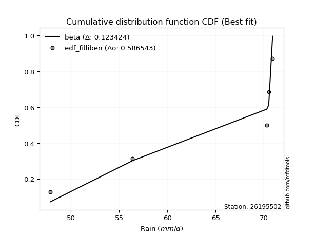</img></img>

</div>


### 10. EDF Jenkinson (1977)

The Jenkinson formula in hydrology is an empirical plotting position formula used to estimate the non-exceedance probability _(P)_ or return period _(T)_ of a given ordered observation within a sample. It is a widely used method in the frequency analysis of extreme events such as floods and rainfall, as it provides a distribution-free way to plot data. _a≈0.31_ and _b≈0.38_ are constants derived to approximate the median of the probability distribution for the given rank.

<div align="center">


$P=(m-a)/(n+b)$


</div>


**10.1. Empirical values**

<div align="center">

|                | 0                   | 1                  | 2             | 3                  | 4                  |
|:---------------|:--------------------|:-------------------|:--------------|:-------------------|:-------------------|
| date           | 2018                | 2017               | 2020          | 2019               | 2021               |
| x              | 47.9                | 56.4               | 70.3          | 70.5               | 70.9               |
| m              | 1                   | 2                  | 3             | 4                  | 5                  |
| empirical_dist | edf_jenkinson       | edf_jenkinson      | edf_jenkinson | edf_jenkinson      | edf_jenkinson      |
| empirical      | 0.12825278810408922 | 0.3141263940520446 | 0.5           | 0.6858736059479554 | 0.8717472118959109 |
| empirical_tr   | 1.1471215351812367  | 1.4579945799457996 | 2.0           | 3.183431952662722  | 7.797101449275368  |

</div>


**10.2. Kolmogorov-Smirnov fit test (sorted by Δ)**


<div align="center">

|                | 0                  | 1                  | 2                   | 3                   | 4                   | 5                   | 6                   | 7                   | 8                   | 9                   | 10                  | 11                  | 12                  | 13                  | 14                  | 15                  | 16                 | 17                  | 18                 | 19                  | 20                 | 21                  | 22                  | 23                  | 24                  | 25                 | 26                  | 27                  | 28                 | 29                  | 30                 | 31                 | 32                 | 33                 | 34                 | 35                 | 36                 | 37                 | 38                 | 39                  | 40                 | 41                  | 42                  | 43                 | 44                 | 45                 | 46                  | 47                 | 48                 | 49                  | 50                 | 51                  | 52                  | 53                 | 54                 | 55                 | 56                  | 57                  | 58                  | 59                 | 60                  | 61                 | 62                 | 63                 | 64                 | 65                 | 66                  | 67                 | 68                 | 69                 | 70                 | 71                  | 72                  | 73                  | 74                  | 75                 | 76                 | 77                  | 78                  | 79                 | 80                  | 81                 | 82                 | 83                  | 84                 | 85                 | 86                 | 87                  | 88                 | 89                 | 90                  | 91                  | 92                  | 93                  | 94                  | 95                 | 96                  | 97                  | 98                 | 99                 | 100                 | 101                | 102                | 103                | 104                | 105                 | 106                | 107                | 108                 | 109                 | 110                | 111                | 112                 | 113                | 114                | 115                | 116                 | 117                 | 118                | 119                 | 120                | 121                | 122                | 123                | 124                | 125                 | 126                | 127                | 128                | 129                | 130                | 131                 | 132                 | 133                | 134                | 135                | 136                 | 137                | 138                | 139                 | 140                | 141                | 142                 | 143                | 144                 | 145                | 146                | 147                | 148                | 149                | 150                | 151                | 152                | 153                | 154                | 155                | 156                | 157                | 158                | 159                |
|:---------------|:-------------------|:-------------------|:--------------------|:--------------------|:--------------------|:--------------------|:--------------------|:--------------------|:--------------------|:--------------------|:--------------------|:--------------------|:--------------------|:--------------------|:--------------------|:--------------------|:-------------------|:--------------------|:-------------------|:--------------------|:-------------------|:--------------------|:--------------------|:--------------------|:--------------------|:-------------------|:--------------------|:--------------------|:-------------------|:--------------------|:-------------------|:-------------------|:-------------------|:-------------------|:-------------------|:-------------------|:-------------------|:-------------------|:-------------------|:--------------------|:-------------------|:--------------------|:--------------------|:-------------------|:-------------------|:-------------------|:--------------------|:-------------------|:-------------------|:--------------------|:-------------------|:--------------------|:--------------------|:-------------------|:-------------------|:-------------------|:--------------------|:--------------------|:--------------------|:-------------------|:--------------------|:-------------------|:-------------------|:-------------------|:-------------------|:-------------------|:--------------------|:-------------------|:-------------------|:-------------------|:-------------------|:--------------------|:--------------------|:--------------------|:--------------------|:-------------------|:-------------------|:--------------------|:--------------------|:-------------------|:--------------------|:-------------------|:-------------------|:--------------------|:-------------------|:-------------------|:-------------------|:--------------------|:-------------------|:-------------------|:--------------------|:--------------------|:--------------------|:--------------------|:--------------------|:-------------------|:--------------------|:--------------------|:-------------------|:-------------------|:--------------------|:-------------------|:-------------------|:-------------------|:-------------------|:--------------------|:-------------------|:-------------------|:--------------------|:--------------------|:-------------------|:-------------------|:--------------------|:-------------------|:-------------------|:-------------------|:--------------------|:--------------------|:-------------------|:--------------------|:-------------------|:-------------------|:-------------------|:-------------------|:-------------------|:--------------------|:-------------------|:-------------------|:-------------------|:-------------------|:-------------------|:--------------------|:--------------------|:-------------------|:-------------------|:-------------------|:--------------------|:-------------------|:-------------------|:--------------------|:-------------------|:-------------------|:--------------------|:-------------------|:--------------------|:-------------------|:-------------------|:-------------------|:-------------------|:-------------------|:-------------------|:-------------------|:-------------------|:-------------------|:-------------------|:-------------------|:-------------------|:-------------------|:-------------------|:-------------------|
| station        | 26195502           | 26195502           | 26195502            | 26195502            | 26195502            | 26195502            | 26195502            | 26195502            | 26195502            | 26195502            | 26195502            | 26195502            | 26195502            | 26195502            | 26195502            | 26195502            | 26195502           | 26195502            | 26195502           | 26195502            | 26195502           | 26195502            | 26195502            | 26195502            | 26195502            | 26195502           | 26195502            | 26195502            | 26195502           | 26195502            | 26195502           | 26195502           | 26195502           | 26195502           | 26195502           | 26195502           | 26195502           | 26195502           | 26195502           | 26195502            | 26195502           | 26195502            | 26195502            | 26195502           | 26195502           | 26195502           | 26195502            | 26195502           | 26195502           | 26195502            | 26195502           | 26195502            | 26195502            | 26195502           | 26195502           | 26195502           | 26195502            | 26195502            | 26195502            | 26195502           | 26195502            | 26195502           | 26195502           | 26195502           | 26195502           | 26195502           | 26195502            | 26195502           | 26195502           | 26195502           | 26195502           | 26195502            | 26195502            | 26195502            | 26195502            | 26195502           | 26195502           | 26195502            | 26195502            | 26195502           | 26195502            | 26195502           | 26195502           | 26195502            | 26195502           | 26195502           | 26195502           | 26195502            | 26195502           | 26195502           | 26195502            | 26195502            | 26195502            | 26195502            | 26195502            | 26195502           | 26195502            | 26195502            | 26195502           | 26195502           | 26195502            | 26195502           | 26195502           | 26195502           | 26195502           | 26195502            | 26195502           | 26195502           | 26195502            | 26195502            | 26195502           | 26195502           | 26195502            | 26195502           | 26195502           | 26195502           | 26195502            | 26195502            | 26195502           | 26195502            | 26195502           | 26195502           | 26195502           | 26195502           | 26195502           | 26195502            | 26195502           | 26195502           | 26195502           | 26195502           | 26195502           | 26195502            | 26195502            | 26195502           | 26195502           | 26195502           | 26195502            | 26195502           | 26195502           | 26195502            | 26195502           | 26195502           | 26195502            | 26195502           | 26195502            | 26195502           | 26195502           | 26195502           | 26195502           | 26195502           | 26195502           | 26195502           | 26195502           | 26195502           | 26195502           | 26195502           | 26195502           | 26195502           | 26195502           | 26195502           |
| empirical_dist | edf_jenkinson      | edf_jenkinson      | edf_jenkinson       | edf_jenkinson       | edf_jenkinson       | edf_jenkinson       | edf_jenkinson       | edf_jenkinson       | edf_jenkinson       | edf_jenkinson       | edf_jenkinson       | edf_jenkinson       | edf_jenkinson       | edf_jenkinson       | edf_jenkinson       | edf_jenkinson       | edf_jenkinson      | edf_jenkinson       | edf_jenkinson      | edf_jenkinson       | edf_jenkinson      | edf_jenkinson       | edf_jenkinson       | edf_jenkinson       | edf_jenkinson       | edf_jenkinson      | edf_jenkinson       | edf_jenkinson       | edf_jenkinson      | edf_jenkinson       | edf_jenkinson      | edf_jenkinson      | edf_jenkinson      | edf_jenkinson      | edf_jenkinson      | edf_jenkinson      | edf_jenkinson      | edf_jenkinson      | edf_jenkinson      | edf_jenkinson       | edf_jenkinson      | edf_jenkinson       | edf_jenkinson       | edf_jenkinson      | edf_jenkinson      | edf_jenkinson      | edf_jenkinson       | edf_jenkinson      | edf_jenkinson      | edf_jenkinson       | edf_jenkinson      | edf_jenkinson       | edf_jenkinson       | edf_jenkinson      | edf_jenkinson      | edf_jenkinson      | edf_jenkinson       | edf_jenkinson       | edf_jenkinson       | edf_jenkinson      | edf_jenkinson       | edf_jenkinson      | edf_jenkinson      | edf_jenkinson      | edf_jenkinson      | edf_jenkinson      | edf_jenkinson       | edf_jenkinson      | edf_jenkinson      | edf_jenkinson      | edf_jenkinson      | edf_jenkinson       | edf_jenkinson       | edf_jenkinson       | edf_jenkinson       | edf_jenkinson      | edf_jenkinson      | edf_jenkinson       | edf_jenkinson       | edf_jenkinson      | edf_jenkinson       | edf_jenkinson      | edf_jenkinson      | edf_jenkinson       | edf_jenkinson      | edf_jenkinson      | edf_jenkinson      | edf_jenkinson       | edf_jenkinson      | edf_jenkinson      | edf_jenkinson       | edf_jenkinson       | edf_jenkinson       | edf_jenkinson       | edf_jenkinson       | edf_jenkinson      | edf_jenkinson       | edf_jenkinson       | edf_jenkinson      | edf_jenkinson      | edf_jenkinson       | edf_jenkinson      | edf_jenkinson      | edf_jenkinson      | edf_jenkinson      | edf_jenkinson       | edf_jenkinson      | edf_jenkinson      | edf_jenkinson       | edf_jenkinson       | edf_jenkinson      | edf_jenkinson      | edf_jenkinson       | edf_jenkinson      | edf_jenkinson      | edf_jenkinson      | edf_jenkinson       | edf_jenkinson       | edf_jenkinson      | edf_jenkinson       | edf_jenkinson      | edf_jenkinson      | edf_jenkinson      | edf_jenkinson      | edf_jenkinson      | edf_jenkinson       | edf_jenkinson      | edf_jenkinson      | edf_jenkinson      | edf_jenkinson      | edf_jenkinson      | edf_jenkinson       | edf_jenkinson       | edf_jenkinson      | edf_jenkinson      | edf_jenkinson      | edf_jenkinson       | edf_jenkinson      | edf_jenkinson      | edf_jenkinson       | edf_jenkinson      | edf_jenkinson      | edf_jenkinson       | edf_jenkinson      | edf_jenkinson       | edf_jenkinson      | edf_jenkinson      | edf_jenkinson      | edf_jenkinson      | edf_jenkinson      | edf_jenkinson      | edf_jenkinson      | edf_jenkinson      | edf_jenkinson      | edf_jenkinson      | edf_jenkinson      | edf_jenkinson      | edf_jenkinson      | edf_jenkinson      | edf_jenkinson      |
| p_dist         | beta               | logbeta            | arcsine             | kappa3              | logarcsine          | wrapcauchy          | logwrapcauchy       | levy_l              | loglevy_l           | logtrapezoid        | trapezoid           | vonmises_line       | logksone            | ksone               | logweibull_max      | logsemicircular     | semicircular       | logbetaprime        | loganglit          | anglit              | halfgennorm        | lognct              | loglomax            | logpearson3         | logdweibull         | pearson3           | invgauss            | logncf              | burr12             | genextreme          | lomax              | loggumbel_l        | logkstwobign       | logfoldnorm        | logf               | gumbel_l           | loginvweibull      | loginvgauss        | logcrystalball     | logt                | logexponnorm       | lognorm             | loghalfgennorm      | nct                | logrice            | dgamma             | ncf                 | erlang             | loginvgamma        | logfatiguelife      | t                  | exponnorm           | crystalball         | norm               | truncnorm          | f                  | loggamma            | loggamma            | loggenexpon         | invgamma           | kstwobign           | rice               | logerlang          | gamma              | betaprime          | logalpha           | alpha               | logmaxwell         | gennorm            | maxwell            | lograyleigh        | weibull_min         | rayleigh            | logburr12           | logweibull_min      | loghalfnorm        | halfnorm           | dweibull            | loglogistic         | logistic           | logexponpow         | logcosine          | loggumbel_r        | cosine              | gumbel_r           | loghypsecant       | hypsecant          | loghalflogistic     | halflogistic       | loggompertz        | nakagami            | logmoyal            | moyal               | loglaplace          | loglaplace          | laplace            | exponweib           | logloglaplace       | logdgamma          | burr               | genexpon            | logwald            | wald               | argus              | loggenextreme      | loggengamma         | logargus           | loggennorm         | logexponweib        | lognakagami         | logburr            | gengamma           | fatiguelife         | genpareto          | logmielke          | mielke             | weibull_max         | loggenhalflogistic  | logloggamma        | invweibull          | genhalflogistic    | foldnorm           | triang             | skewnorm           | kappa4             | logtriang           | logskewnorm        | loggausshyper      | johnsonsu          | tukeylambda        | logkappa4          | gausshyper          | uniform             | logtukeylambda     | logkappa3          | johnsonsb          | loguniform          | logvonmises_line   | truncweibull_min   | bradford            | truncexpon         | logbradford        | logtruncweibull_min | logtruncexpon      | logtruncnorm        | loggenpareto       | gompertz           | logjohnsonsu       | powerlaw           | logpowerlaw        | truncpareto        | logtruncpareto     | exponpow           | logjohnsonsb       | rdist              | genlogistic        | loggenlogistic     | logrdist           | logvonmises        | vonmises           |
| delta          | 0.1244637898764096 | 0.1262073043076979 | 0.17900109373801232 | 0.17942614380561184 | 0.17995629748471842 | 0.18002076286767366 | 0.18319074119745127 | 0.19299384789020063 | 0.19894424155058105 | 0.21056952675457918 | 0.21299722671704902 | 0.21433930453974384 | 0.21590561305089384 | 0.21766773874085255 | 0.21841326684400053 | 0.23239852110129855 | 0.2341993674890458 | 0.24127476686828375 | 0.2446678314768318 | 0.24648542346816926 | 0.2496832552851378 | 0.25283157553436153 | 0.25821371038941265 | 0.25963353468643424 | 0.26045138491314945 | 0.2628583080515883 | 0.26329783923031924 | 0.26393198919271477 | 0.264470778627484  | 0.26452957228434437 | 0.2659668779617784 | 0.2689803879574204 | 0.2702587965861578 | 0.2711686667971557 | 0.2716099567773895 | 0.2716256330392314 | 0.2719691813908238 | 0.2723055060074905 | 0.2727396267402111 | 0.27274166027959357 | 0.2727440201441147 | 0.27274548662844245 | 0.27282055344467293 | 0.2729493658785934 | 0.2730229843458529 | 0.2734449089941129 | 0.27346107771752604 | 0.2735998048295303 | 0.2742661986846806 | 0.27438152791923964 | 0.2745782428684851 | 0.27458073559629004 | 0.27458234117967384 | 0.2745823440645212 | 0.2745823463052184 | 0.2746008174626299 | 0.27462888236277216 | 0.27462888236277216 | 0.27482219674739383 | 0.2748888724533599 | 0.27506237630350394 | 0.2752004087044062 | 0.2754196248475911 | 0.2758929325382795 | 0.276046553308567  | 0.2760608892723817 | 0.27742597967733595 | 0.2793256112263539 | 0.2802541626410372 | 0.2809175843513779 | 0.2811902827290985 | 0.28208203475007765 | 0.28271216776128727 | 0.28278014582251987 | 0.28316474222227495 | 0.2882396366383633 | 0.289582012886055  | 0.29267416699622884 | 0.29520247761029694 | 0.2969996825909669 | 0.29867351305431455 | 0.3056814223663946 | 0.3064272708627902 | 0.30655058764781296 | 0.3077813895509316 | 0.3092838544711648 | 0.3109982543667362 | 0.31121407978700955 | 0.3124232971429992 | 0.3131356489631125 | 0.31412639405027676 | 0.31741759981102136 | 0.31862978300810063 | 0.32637619311343824 | 0.32637619311343824 | 0.3278685702172641 | 0.33553811138341555 | 0.33965398822753157 | 0.3426801836205171 | 0.3456986135700847 | 0.35148820948288884 | 0.3533878888413796 | 0.3542582690191888 | 0.3604385889190411 | 0.3611916852977055 | 0.36182588755582556 | 0.3644454391333607 | 0.3717472118962059 | 0.37604129175908774 | 0.38059095273285243 | 0.3807928576816201 | 0.4057058736913835 | 0.41370516492678516 | 0.4145614137203095 | 0.424790802930178  | 0.4274828853668573 | 0.42862415275641064 | 0.43446752206303885 | 0.4351668812797397 | 0.44063437732480254 | 0.4450792430332423 | 0.4562843790356266 | 0.4581205408624133 | 0.4606551387037371 | 0.4622136503425427 | 0.46538987390080166 | 0.4666231255872253 | 0.467252653587252  | 0.4672730934225077 | 0.4684068464423987 | 0.4724301837263065 | 0.47325131264437215 | 0.47391304347826047 | 0.4744955346492574 | 0.4750882710329981 | 0.4766588160478038 | 0.47832837460310096 | 0.4784810193469864 | 0.4803572136898976 | 0.48138594402945634 | 0.4825082809004517 | 0.4842925635459133 | 0.4843672674451204  | 0.4861889217906933 | 0.48952426251248415 | 0.49977542421538   | 0.499999755957013  | 0.5408900570113917 | 0.5592208817266708 | 0.5692984516703303 | 0.5783372052368787 | 0.5918089084659661 | 0.6011434446077346 | 0.6671530230229232 | 0.6858736044496536 | 0.6858736059479554 | 0.6858736059479554 | 0.8717472118959109 | 1.2721403772884543 | 10.970655178876504 |
| deltao         | 0.5865427407550001 | 0.5865427407550001 | 0.5865427407550001  | 0.5865427407550001  | 0.5865427407550001  | 0.5865427407550001  | 0.5865427407550001  | 0.5865427407550001  | 0.5865427407550001  | 0.5865427407550001  | 0.5865427407550001  | 0.5865427407550001  | 0.5865427407550001  | 0.5865427407550001  | 0.5865427407550001  | 0.5865427407550001  | 0.5865427407550001 | 0.5865427407550001  | 0.5865427407550001 | 0.5865427407550001  | 0.5865427407550001 | 0.5865427407550001  | 0.5865427407550001  | 0.5865427407550001  | 0.5865427407550001  | 0.5865427407550001 | 0.5865427407550001  | 0.5865427407550001  | 0.5865427407550001 | 0.5865427407550001  | 0.5865427407550001 | 0.5865427407550001 | 0.5865427407550001 | 0.5865427407550001 | 0.5865427407550001 | 0.5865427407550001 | 0.5865427407550001 | 0.5865427407550001 | 0.5865427407550001 | 0.5865427407550001  | 0.5865427407550001 | 0.5865427407550001  | 0.5865427407550001  | 0.5865427407550001 | 0.5865427407550001 | 0.5865427407550001 | 0.5865427407550001  | 0.5865427407550001 | 0.5865427407550001 | 0.5865427407550001  | 0.5865427407550001 | 0.5865427407550001  | 0.5865427407550001  | 0.5865427407550001 | 0.5865427407550001 | 0.5865427407550001 | 0.5865427407550001  | 0.5865427407550001  | 0.5865427407550001  | 0.5865427407550001 | 0.5865427407550001  | 0.5865427407550001 | 0.5865427407550001 | 0.5865427407550001 | 0.5865427407550001 | 0.5865427407550001 | 0.5865427407550001  | 0.5865427407550001 | 0.5865427407550001 | 0.5865427407550001 | 0.5865427407550001 | 0.5865427407550001  | 0.5865427407550001  | 0.5865427407550001  | 0.5865427407550001  | 0.5865427407550001 | 0.5865427407550001 | 0.5865427407550001  | 0.5865427407550001  | 0.5865427407550001 | 0.5865427407550001  | 0.5865427407550001 | 0.5865427407550001 | 0.5865427407550001  | 0.5865427407550001 | 0.5865427407550001 | 0.5865427407550001 | 0.5865427407550001  | 0.5865427407550001 | 0.5865427407550001 | 0.5865427407550001  | 0.5865427407550001  | 0.5865427407550001  | 0.5865427407550001  | 0.5865427407550001  | 0.5865427407550001 | 0.5865427407550001  | 0.5865427407550001  | 0.5865427407550001 | 0.5865427407550001 | 0.5865427407550001  | 0.5865427407550001 | 0.5865427407550001 | 0.5865427407550001 | 0.5865427407550001 | 0.5865427407550001  | 0.5865427407550001 | 0.5865427407550001 | 0.5865427407550001  | 0.5865427407550001  | 0.5865427407550001 | 0.5865427407550001 | 0.5865427407550001  | 0.5865427407550001 | 0.5865427407550001 | 0.5865427407550001 | 0.5865427407550001  | 0.5865427407550001  | 0.5865427407550001 | 0.5865427407550001  | 0.5865427407550001 | 0.5865427407550001 | 0.5865427407550001 | 0.5865427407550001 | 0.5865427407550001 | 0.5865427407550001  | 0.5865427407550001 | 0.5865427407550001 | 0.5865427407550001 | 0.5865427407550001 | 0.5865427407550001 | 0.5865427407550001  | 0.5865427407550001  | 0.5865427407550001 | 0.5865427407550001 | 0.5865427407550001 | 0.5865427407550001  | 0.5865427407550001 | 0.5865427407550001 | 0.5865427407550001  | 0.5865427407550001 | 0.5865427407550001 | 0.5865427407550001  | 0.5865427407550001 | 0.5865427407550001  | 0.5865427407550001 | 0.5865427407550001 | 0.5865427407550001 | 0.5865427407550001 | 0.5865427407550001 | 0.5865427407550001 | 0.5865427407550001 | 0.5865427407550001 | 0.5865427407550001 | 0.5865427407550001 | 0.5865427407550001 | 0.5865427407550001 | 0.5865427407550001 | 0.5865427407550001 | 0.5865427407550001 |
| eval           | Δo > Δ             | Δo > Δ             | Δo > Δ              | Δo > Δ              | Δo > Δ              | Δo > Δ              | Δo > Δ              | Δo > Δ              | Δo > Δ              | Δo > Δ              | Δo > Δ              | Δo > Δ              | Δo > Δ              | Δo > Δ              | Δo > Δ              | Δo > Δ              | Δo > Δ             | Δo > Δ              | Δo > Δ             | Δo > Δ              | Δo > Δ             | Δo > Δ              | Δo > Δ              | Δo > Δ              | Δo > Δ              | Δo > Δ             | Δo > Δ              | Δo > Δ              | Δo > Δ             | Δo > Δ              | Δo > Δ             | Δo > Δ             | Δo > Δ             | Δo > Δ             | Δo > Δ             | Δo > Δ             | Δo > Δ             | Δo > Δ             | Δo > Δ             | Δo > Δ              | Δo > Δ             | Δo > Δ              | Δo > Δ              | Δo > Δ             | Δo > Δ             | Δo > Δ             | Δo > Δ              | Δo > Δ             | Δo > Δ             | Δo > Δ              | Δo > Δ             | Δo > Δ              | Δo > Δ              | Δo > Δ             | Δo > Δ             | Δo > Δ             | Δo > Δ              | Δo > Δ              | Δo > Δ              | Δo > Δ             | Δo > Δ              | Δo > Δ             | Δo > Δ             | Δo > Δ             | Δo > Δ             | Δo > Δ             | Δo > Δ              | Δo > Δ             | Δo > Δ             | Δo > Δ             | Δo > Δ             | Δo > Δ              | Δo > Δ              | Δo > Δ              | Δo > Δ              | Δo > Δ             | Δo > Δ             | Δo > Δ              | Δo > Δ              | Δo > Δ             | Δo > Δ              | Δo > Δ             | Δo > Δ             | Δo > Δ              | Δo > Δ             | Δo > Δ             | Δo > Δ             | Δo > Δ              | Δo > Δ             | Δo > Δ             | Δo > Δ              | Δo > Δ              | Δo > Δ              | Δo > Δ              | Δo > Δ              | Δo > Δ             | Δo > Δ              | Δo > Δ              | Δo > Δ             | Δo > Δ             | Δo > Δ              | Δo > Δ             | Δo > Δ             | Δo > Δ             | Δo > Δ             | Δo > Δ              | Δo > Δ             | Δo > Δ             | Δo > Δ              | Δo > Δ              | Δo > Δ             | Δo > Δ             | Δo > Δ              | Δo > Δ             | Δo > Δ             | Δo > Δ             | Δo > Δ              | Δo > Δ              | Δo > Δ             | Δo > Δ              | Δo > Δ             | Δo > Δ             | Δo > Δ             | Δo > Δ             | Δo > Δ             | Δo > Δ              | Δo > Δ             | Δo > Δ             | Δo > Δ             | Δo > Δ             | Δo > Δ             | Δo > Δ              | Δo > Δ              | Δo > Δ             | Δo > Δ             | Δo > Δ             | Δo > Δ              | Δo > Δ             | Δo > Δ             | Δo > Δ              | Δo > Δ             | Δo > Δ             | Δo > Δ              | Δo > Δ             | Δo > Δ              | Δo > Δ             | Δo > Δ             | Δo > Δ             | Δo > Δ             | Δo > Δ             | Δo > Δ             | Δo <= Δ            | Δo <= Δ            | Δo <= Δ            | Δo <= Δ            | Δo <= Δ            | Δo <= Δ            | Δo <= Δ            | Δo <= Δ            | Δo <= Δ            |
| fit            | 1                  | 1                  | 1                   | 1                   | 1                   | 1                   | 1                   | 1                   | 1                   | 1                   | 1                   | 1                   | 1                   | 1                   | 1                   | 1                   | 1                  | 1                   | 1                  | 1                   | 1                  | 1                   | 1                   | 1                   | 1                   | 1                  | 1                   | 1                   | 1                  | 1                   | 1                  | 1                  | 1                  | 1                  | 1                  | 1                  | 1                  | 1                  | 1                  | 1                   | 1                  | 1                   | 1                   | 1                  | 1                  | 1                  | 1                   | 1                  | 1                  | 1                   | 1                  | 1                   | 1                   | 1                  | 1                  | 1                  | 1                   | 1                   | 1                   | 1                  | 1                   | 1                  | 1                  | 1                  | 1                  | 1                  | 1                   | 1                  | 1                  | 1                  | 1                  | 1                   | 1                   | 1                   | 1                   | 1                  | 1                  | 1                   | 1                   | 1                  | 1                   | 1                  | 1                  | 1                   | 1                  | 1                  | 1                  | 1                   | 1                  | 1                  | 1                   | 1                   | 1                   | 1                   | 1                   | 1                  | 1                   | 1                   | 1                  | 1                  | 1                   | 1                  | 1                  | 1                  | 1                  | 1                   | 1                  | 1                  | 1                   | 1                   | 1                  | 1                  | 1                   | 1                  | 1                  | 1                  | 1                   | 1                   | 1                  | 1                   | 1                  | 1                  | 1                  | 1                  | 1                  | 1                   | 1                  | 1                  | 1                  | 1                  | 1                  | 1                   | 1                   | 1                  | 1                  | 1                  | 1                   | 1                  | 1                  | 1                   | 1                  | 1                  | 1                   | 1                  | 1                   | 1                  | 1                  | 1                  | 1                  | 1                  | 1                  | 0                  | 0                  | 0                  | 0                  | 0                  | 0                  | 0                  | 0                  | 0                  |
| n              | 5                  | 5                  | 5                   | 5                   | 5                   | 5                   | 5                   | 5                   | 5                   | 5                   | 5                   | 5                   | 5                   | 5                   | 5                   | 5                   | 5                  | 5                   | 5                  | 5                   | 5                  | 5                   | 5                   | 5                   | 5                   | 5                  | 5                   | 5                   | 5                  | 5                   | 5                  | 5                  | 5                  | 5                  | 5                  | 5                  | 5                  | 5                  | 5                  | 5                   | 5                  | 5                   | 5                   | 5                  | 5                  | 5                  | 5                   | 5                  | 5                  | 5                   | 5                  | 5                   | 5                   | 5                  | 5                  | 5                  | 5                   | 5                   | 5                   | 5                  | 5                   | 5                  | 5                  | 5                  | 5                  | 5                  | 5                   | 5                  | 5                  | 5                  | 5                  | 5                   | 5                   | 5                   | 5                   | 5                  | 5                  | 5                   | 5                   | 5                  | 5                   | 5                  | 5                  | 5                   | 5                  | 5                  | 5                  | 5                   | 5                  | 5                  | 5                   | 5                   | 5                   | 5                   | 5                   | 5                  | 5                   | 5                   | 5                  | 5                  | 5                   | 5                  | 5                  | 5                  | 5                  | 5                   | 5                  | 5                  | 5                   | 5                   | 5                  | 5                  | 5                   | 5                  | 5                  | 5                  | 5                   | 5                   | 5                  | 5                   | 5                  | 5                  | 5                  | 5                  | 5                  | 5                   | 5                  | 5                  | 5                  | 5                  | 5                  | 5                   | 5                   | 5                  | 5                  | 5                  | 5                   | 5                  | 5                  | 5                   | 5                  | 5                  | 5                   | 5                  | 5                   | 5                  | 5                  | 5                  | 5                  | 5                  | 5                  | 5                  | 5                  | 5                  | 5                  | 5                  | 5                  | 5                  | 5                  | 5                  |
| best_fit       | 1                  | 0                  | 0                   | 0                   | 0                   | 0                   | 0                   | 0                   | 0                   | 0                   | 0                   | 0                   | 0                   | 0                   | 0                   | 0                   | 0                  | 0                   | 0                  | 0                   | 0                  | 0                   | 0                   | 0                   | 0                   | 0                  | 0                   | 0                   | 0                  | 0                   | 0                  | 0                  | 0                  | 0                  | 0                  | 0                  | 0                  | 0                  | 0                  | 0                   | 0                  | 0                   | 0                   | 0                  | 0                  | 0                  | 0                   | 0                  | 0                  | 0                   | 0                  | 0                   | 0                   | 0                  | 0                  | 0                  | 0                   | 0                   | 0                   | 0                  | 0                   | 0                  | 0                  | 0                  | 0                  | 0                  | 0                   | 0                  | 0                  | 0                  | 0                  | 0                   | 0                   | 0                   | 0                   | 0                  | 0                  | 0                   | 0                   | 0                  | 0                   | 0                  | 0                  | 0                   | 0                  | 0                  | 0                  | 0                   | 0                  | 0                  | 0                   | 0                   | 0                   | 0                   | 0                   | 0                  | 0                   | 0                   | 0                  | 0                  | 0                   | 0                  | 0                  | 0                  | 0                  | 0                   | 0                  | 0                  | 0                   | 0                   | 0                  | 0                  | 0                   | 0                  | 0                  | 0                  | 0                   | 0                   | 0                  | 0                   | 0                  | 0                  | 0                  | 0                  | 0                  | 0                   | 0                  | 0                  | 0                  | 0                  | 0                  | 0                   | 0                   | 0                  | 0                  | 0                  | 0                   | 0                  | 0                  | 0                   | 0                  | 0                  | 0                   | 0                  | 0                   | 0                  | 0                  | 0                  | 0                  | 0                  | 0                  | 0                  | 0                  | 0                  | 0                  | 0                  | 0                  | 0                  | 0                  | 0                  |
| best_fit_sort  | 1                  | 2                  | 3                   | 4                   | 5                   | 6                   | 7                   | 8                   | 9                   | 10                  | 11                  | 12                  | 13                  | 14                  | 15                  | 16                  | 17                 | 18                  | 19                 | 20                  | 21                 | 22                  | 23                  | 24                  | 25                  | 26                 | 27                  | 28                  | 29                 | 30                  | 31                 | 32                 | 33                 | 34                 | 35                 | 36                 | 37                 | 38                 | 39                 | 40                  | 41                 | 42                  | 43                  | 44                 | 45                 | 46                 | 47                  | 48                 | 49                 | 50                  | 51                 | 52                  | 53                  | 54                 | 55                 | 56                 | 57                  | 58                  | 59                  | 60                 | 61                  | 62                 | 63                 | 64                 | 65                 | 66                 | 67                  | 68                 | 69                 | 70                 | 71                 | 72                  | 73                  | 74                  | 75                  | 76                 | 77                 | 78                  | 79                  | 80                 | 81                  | 82                 | 83                 | 84                  | 85                 | 86                 | 87                 | 88                  | 89                 | 90                 | 91                  | 92                  | 93                  | 94                  | 95                  | 96                 | 97                  | 98                  | 99                 | 100                | 101                 | 102                | 103                | 104                | 105                | 106                 | 107                | 108                | 109                 | 110                 | 111                | 112                | 113                 | 114                | 115                | 116                | 117                 | 118                 | 119                | 120                 | 121                | 122                | 123                | 124                | 125                | 126                 | 127                | 128                | 129                | 130                | 131                | 132                 | 133                 | 134                | 135                | 136                | 137                 | 138                | 139                | 140                 | 141                | 142                | 143                 | 144                | 145                 | 146                | 147                | 148                | 149                | 150                | 151                | 152                | 153                | 154                | 155                | 156                | 157                | 158                | 159                | 160                |

</div>


**10.3. Best fit**

<div align="center">

|   id |   station | empirical_dist   | p_dist   |    delta |   deltao | eval   |   fit |   n |   best_fit |   best_fit_sort |
|-----:|----------:|:-----------------|:---------|---------:|---------:|:-------|------:|----:|-----------:|----------------:|
|    0 |  26195502 | edf_jenkinson    | beta     | 0.124464 | 0.586543 | Δo > Δ |     1 |   5 |          1 |               1 |

</div>


<div align="center">

</img>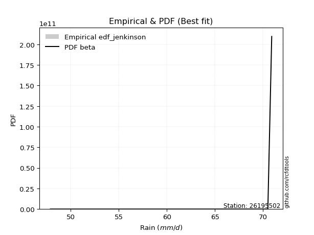</img>

</div>


### 11. EDF Cunnane (1978)

Cunnane´s work in statistical hydrology has focused on the performance and evaluation of different probability distributions (such as GEV, Gumbel, Lognormal) for flood frequency estimation. _b_ is a constant, typically set to 0.4.

<div align="center">


$P=(m-b)/(n+1-2b)$


</div>


**11.1. Empirical values**

<div align="center">

|                | 0                   | 1                  | 2           | 3                  | 4                  |
|:---------------|:--------------------|:-------------------|:------------|:-------------------|:-------------------|
| date           | 2018                | 2017               | 2020        | 2019               | 2021               |
| x              | 47.9                | 56.4               | 70.3        | 70.5               | 70.9               |
| m              | 1                   | 2                  | 3           | 4                  | 5                  |
| empirical_dist | edf_cunnane         | edf_cunnane        | edf_cunnane | edf_cunnane        | edf_cunnane        |
| empirical      | 0.11538461538461538 | 0.3076923076923077 | 0.5         | 0.6923076923076923 | 0.8846153846153845 |
| empirical_tr   | 1.1304347826086958  | 1.4444444444444444 | 2.0         | 3.25               | 8.666666666666655  |

</div>


**11.2. Kolmogorov-Smirnov fit test (sorted by Δ)**


<div align="center">

|                | 0                  | 1                   | 2                   | 3                   | 4                   | 5                   | 6                   | 7                   | 8                   | 9                   | 10                  | 11                  | 12                  | 13                  | 14                  | 15                  | 16                 | 17                 | 18                  | 19                 | 20                  | 21                  | 22                  | 23                  | 24                 | 25                  | 26                 | 27                  | 28                 | 29                 | 30                 | 31                 | 32                 | 33                 | 34                 | 35                 | 36                 | 37                 | 38                  | 39                 | 40                  | 41                  | 42                 | 43                 | 44                  | 45                  | 46                 | 47                 | 48                 | 49                  | 50                 | 51                  | 52                  | 53                 | 54                 | 55                 | 56                  | 57                  | 58                  | 59                 | 60                  | 61                 | 62                 | 63                 | 64                 | 65                 | 66                  | 67                  | 68                 | 69                 | 70                 | 71                  | 72                  | 73                  | 74                  | 75                 | 76                 | 77                  | 78                 | 79                  | 80                  | 81                 | 82                 | 83                  | 84                  | 85                 | 86                 | 87                 | 88                  | 89                 | 90                 | 91                  | 92                  | 93                  | 94                  | 95                 | 96                  | 97                 | 98                  | 99                  | 100                | 101                | 102                | 103                | 104                | 105                | 106                 | 107                 | 108                | 109                | 110                 | 111                | 112                | 113                | 114                | 115                | 116                 | 117                 | 118                | 119                | 120                 | 121                | 122                | 123                | 124                | 125                 | 126                | 127                | 128                | 129                | 130                 | 131                | 132                 | 133                | 134                | 135                 | 136                | 137                | 138                 | 139                | 140                 | 141                | 142                 | 143                | 144                 | 145                | 146                | 147                | 148                | 149                | 150                | 151                | 152                | 153                | 154                | 155                | 156                | 157                | 158                | 159                |
|:---------------|:-------------------|:--------------------|:--------------------|:--------------------|:--------------------|:--------------------|:--------------------|:--------------------|:--------------------|:--------------------|:--------------------|:--------------------|:--------------------|:--------------------|:--------------------|:--------------------|:-------------------|:-------------------|:--------------------|:-------------------|:--------------------|:--------------------|:--------------------|:--------------------|:-------------------|:--------------------|:-------------------|:--------------------|:-------------------|:-------------------|:-------------------|:-------------------|:-------------------|:-------------------|:-------------------|:-------------------|:-------------------|:-------------------|:--------------------|:-------------------|:--------------------|:--------------------|:-------------------|:-------------------|:--------------------|:--------------------|:-------------------|:-------------------|:-------------------|:--------------------|:-------------------|:--------------------|:--------------------|:-------------------|:-------------------|:-------------------|:--------------------|:--------------------|:--------------------|:-------------------|:--------------------|:-------------------|:-------------------|:-------------------|:-------------------|:-------------------|:--------------------|:--------------------|:-------------------|:-------------------|:-------------------|:--------------------|:--------------------|:--------------------|:--------------------|:-------------------|:-------------------|:--------------------|:-------------------|:--------------------|:--------------------|:-------------------|:-------------------|:--------------------|:--------------------|:-------------------|:-------------------|:-------------------|:--------------------|:-------------------|:-------------------|:--------------------|:--------------------|:--------------------|:--------------------|:-------------------|:--------------------|:-------------------|:--------------------|:--------------------|:-------------------|:-------------------|:-------------------|:-------------------|:-------------------|:-------------------|:--------------------|:--------------------|:-------------------|:-------------------|:--------------------|:-------------------|:-------------------|:-------------------|:-------------------|:-------------------|:--------------------|:--------------------|:-------------------|:-------------------|:--------------------|:-------------------|:-------------------|:-------------------|:-------------------|:--------------------|:-------------------|:-------------------|:-------------------|:-------------------|:--------------------|:-------------------|:--------------------|:-------------------|:-------------------|:--------------------|:-------------------|:-------------------|:--------------------|:-------------------|:--------------------|:-------------------|:--------------------|:-------------------|:--------------------|:-------------------|:-------------------|:-------------------|:-------------------|:-------------------|:-------------------|:-------------------|:-------------------|:-------------------|:-------------------|:-------------------|:-------------------|:-------------------|:-------------------|:-------------------|
| station        | 26195502           | 26195502            | 26195502            | 26195502            | 26195502            | 26195502            | 26195502            | 26195502            | 26195502            | 26195502            | 26195502            | 26195502            | 26195502            | 26195502            | 26195502            | 26195502            | 26195502           | 26195502           | 26195502            | 26195502           | 26195502            | 26195502            | 26195502            | 26195502            | 26195502           | 26195502            | 26195502           | 26195502            | 26195502           | 26195502           | 26195502           | 26195502           | 26195502           | 26195502           | 26195502           | 26195502           | 26195502           | 26195502           | 26195502            | 26195502           | 26195502            | 26195502            | 26195502           | 26195502           | 26195502            | 26195502            | 26195502           | 26195502           | 26195502           | 26195502            | 26195502           | 26195502            | 26195502            | 26195502           | 26195502           | 26195502           | 26195502            | 26195502            | 26195502            | 26195502           | 26195502            | 26195502           | 26195502           | 26195502           | 26195502           | 26195502           | 26195502            | 26195502            | 26195502           | 26195502           | 26195502           | 26195502            | 26195502            | 26195502            | 26195502            | 26195502           | 26195502           | 26195502            | 26195502           | 26195502            | 26195502            | 26195502           | 26195502           | 26195502            | 26195502            | 26195502           | 26195502           | 26195502           | 26195502            | 26195502           | 26195502           | 26195502            | 26195502            | 26195502            | 26195502            | 26195502           | 26195502            | 26195502           | 26195502            | 26195502            | 26195502           | 26195502           | 26195502           | 26195502           | 26195502           | 26195502           | 26195502            | 26195502            | 26195502           | 26195502           | 26195502            | 26195502           | 26195502           | 26195502           | 26195502           | 26195502           | 26195502            | 26195502            | 26195502           | 26195502           | 26195502            | 26195502           | 26195502           | 26195502           | 26195502           | 26195502            | 26195502           | 26195502           | 26195502           | 26195502           | 26195502            | 26195502           | 26195502            | 26195502           | 26195502           | 26195502            | 26195502           | 26195502           | 26195502            | 26195502           | 26195502            | 26195502           | 26195502            | 26195502           | 26195502            | 26195502           | 26195502           | 26195502           | 26195502           | 26195502           | 26195502           | 26195502           | 26195502           | 26195502           | 26195502           | 26195502           | 26195502           | 26195502           | 26195502           | 26195502           |
| empirical_dist | edf_cunnane        | edf_cunnane         | edf_cunnane         | edf_cunnane         | edf_cunnane         | edf_cunnane         | edf_cunnane         | edf_cunnane         | edf_cunnane         | edf_cunnane         | edf_cunnane         | edf_cunnane         | edf_cunnane         | edf_cunnane         | edf_cunnane         | edf_cunnane         | edf_cunnane        | edf_cunnane        | edf_cunnane         | edf_cunnane        | edf_cunnane         | edf_cunnane         | edf_cunnane         | edf_cunnane         | edf_cunnane        | edf_cunnane         | edf_cunnane        | edf_cunnane         | edf_cunnane        | edf_cunnane        | edf_cunnane        | edf_cunnane        | edf_cunnane        | edf_cunnane        | edf_cunnane        | edf_cunnane        | edf_cunnane        | edf_cunnane        | edf_cunnane         | edf_cunnane        | edf_cunnane         | edf_cunnane         | edf_cunnane        | edf_cunnane        | edf_cunnane         | edf_cunnane         | edf_cunnane        | edf_cunnane        | edf_cunnane        | edf_cunnane         | edf_cunnane        | edf_cunnane         | edf_cunnane         | edf_cunnane        | edf_cunnane        | edf_cunnane        | edf_cunnane         | edf_cunnane         | edf_cunnane         | edf_cunnane        | edf_cunnane         | edf_cunnane        | edf_cunnane        | edf_cunnane        | edf_cunnane        | edf_cunnane        | edf_cunnane         | edf_cunnane         | edf_cunnane        | edf_cunnane        | edf_cunnane        | edf_cunnane         | edf_cunnane         | edf_cunnane         | edf_cunnane         | edf_cunnane        | edf_cunnane        | edf_cunnane         | edf_cunnane        | edf_cunnane         | edf_cunnane         | edf_cunnane        | edf_cunnane        | edf_cunnane         | edf_cunnane         | edf_cunnane        | edf_cunnane        | edf_cunnane        | edf_cunnane         | edf_cunnane        | edf_cunnane        | edf_cunnane         | edf_cunnane         | edf_cunnane         | edf_cunnane         | edf_cunnane        | edf_cunnane         | edf_cunnane        | edf_cunnane         | edf_cunnane         | edf_cunnane        | edf_cunnane        | edf_cunnane        | edf_cunnane        | edf_cunnane        | edf_cunnane        | edf_cunnane         | edf_cunnane         | edf_cunnane        | edf_cunnane        | edf_cunnane         | edf_cunnane        | edf_cunnane        | edf_cunnane        | edf_cunnane        | edf_cunnane        | edf_cunnane         | edf_cunnane         | edf_cunnane        | edf_cunnane        | edf_cunnane         | edf_cunnane        | edf_cunnane        | edf_cunnane        | edf_cunnane        | edf_cunnane         | edf_cunnane        | edf_cunnane        | edf_cunnane        | edf_cunnane        | edf_cunnane         | edf_cunnane        | edf_cunnane         | edf_cunnane        | edf_cunnane        | edf_cunnane         | edf_cunnane        | edf_cunnane        | edf_cunnane         | edf_cunnane        | edf_cunnane         | edf_cunnane        | edf_cunnane         | edf_cunnane        | edf_cunnane         | edf_cunnane        | edf_cunnane        | edf_cunnane        | edf_cunnane        | edf_cunnane        | edf_cunnane        | edf_cunnane        | edf_cunnane        | edf_cunnane        | edf_cunnane        | edf_cunnane        | edf_cunnane        | edf_cunnane        | edf_cunnane        | edf_cunnane        |
| p_dist         | beta               | logbeta             | wrapcauchy          | levy_l              | arcsine             | logwrapcauchy       | kappa3              | loglevy_l           | logarcsine          | vonmises_line       | logtrapezoid        | trapezoid           | logksone            | ksone               | logweibull_max      | logsemicircular     | semicircular       | loganglit          | anglit              | halfgennorm        | lognct              | logbetaprime        | loglomax            | logpearson3         | pearson3           | invgauss            | burr12             | genextreme          | lomax              | dgamma             | loggumbel_l        | logkstwobign       | logfoldnorm        | logf               | gumbel_l           | loginvweibull      | loginvgauss        | logcrystalball     | logt                | logexponnorm       | lognorm             | loghalfgennorm      | nct                | logrice            | logdweibull         | ncf                 | erlang             | gennorm            | loginvgamma        | logfatiguelife      | t                  | exponnorm           | crystalball         | norm               | truncnorm          | f                  | loggamma            | loggamma            | loggenexpon         | invgamma           | kstwobign           | rice               | logerlang          | gamma              | betaprime          | logalpha           | logncf              | alpha               | logmaxwell         | maxwell            | lograyleigh        | weibull_min         | rayleigh            | logburr12           | logweibull_min      | loghalfnorm        | halfnorm           | loglogistic         | logistic           | logexponpow         | dweibull            | logcosine          | loggumbel_r        | cosine              | nakagami            | gumbel_r           | loghypsecant       | hypsecant          | loghalflogistic     | halflogistic       | loggompertz        | logmoyal            | moyal               | loglaplace          | loglaplace          | laplace            | exponweib           | burr               | genexpon            | logloglaplace       | logwald            | wald               | logdgamma          | argus              | loggenextreme      | logargus           | loggengamma         | logexponweib        | logburr            | loggennorm         | lognakagami         | gengamma           | genpareto          | fatiguelife        | logmielke          | mielke             | weibull_max         | loggenhalflogistic  | logloggamma        | genhalflogistic    | invweibull          | foldnorm           | triang             | skewnorm           | kappa4             | logtriang           | logskewnorm        | loggausshyper      | tukeylambda        | logkappa4          | gausshyper          | johnsonsu          | uniform             | logtukeylambda     | logkappa3          | loguniform          | logvonmises_line   | truncweibull_min   | bradford            | truncexpon         | johnsonsb           | logbradford        | logtruncweibull_min | logtruncexpon      | logtruncnorm        | gompertz           | loggenpareto       | logjohnsonsu       | powerlaw           | logpowerlaw        | truncpareto        | logtruncpareto     | exponpow           | logjohnsonsb       | rdist              | genlogistic        | loggenlogistic     | logrdist           | logvonmises        | vonmises           |
| delta          | 0.111595617156936  | 0.11333913158822428 | 0.18645484922741057 | 0.18655976153046372 | 0.18835841930826502 | 0.18962482755718818 | 0.19229431652508544 | 0.19251015519084413 | 0.19282447020419202 | 0.20790521818000693 | 0.21056952675457918 | 0.21299722671704902 | 0.21590561305089384 | 0.21766773874085255 | 0.21841326684400053 | 0.23239852110129855 | 0.2341993674890458 | 0.2446678314768318 | 0.24648542346816926 | 0.2496832552851378 | 0.25283157553436153 | 0.25414293958775735 | 0.25821371038941265 | 0.25963353468643424 | 0.2628583080515883 | 0.26329783923031924 | 0.264470778627484  | 0.26452957228434437 | 0.2659668779617784 | 0.267010822634376  | 0.2689803879574204 | 0.2702587965861578 | 0.2711686667971557 | 0.2716099567773895 | 0.2716256330392314 | 0.2719691813908238 | 0.2723055060074905 | 0.2727396267402111 | 0.27274166027959357 | 0.2727440201441147 | 0.27274548662844245 | 0.27282055344467293 | 0.2729493658785934 | 0.2730229843458529 | 0.27331955763262306 | 0.27346107771752604 | 0.2735998048295303 | 0.2738200762813003 | 0.2742661986846806 | 0.27438152791923964 | 0.2745782428684851 | 0.27458073559629004 | 0.27458234117967384 | 0.2745823440645212 | 0.2745823463052184 | 0.2746008174626299 | 0.27462888236277216 | 0.27462888236277216 | 0.27482219674739383 | 0.2748888724533599 | 0.27506237630350394 | 0.2752004087044062 | 0.2754196248475911 | 0.2758929325382795 | 0.276046553308567  | 0.2760608892723817 | 0.27680016191218837 | 0.27742597967733595 | 0.2793256112263539 | 0.2809175843513779 | 0.2811902827290985 | 0.28208203475007765 | 0.28271216776128727 | 0.28278014582251987 | 0.28316474222227495 | 0.2882396366383633 | 0.289582012886055  | 0.29520247761029694 | 0.2969996825909669 | 0.29867351305431455 | 0.30554233971570244 | 0.3056814223663946 | 0.3064272708627902 | 0.30655058764781296 | 0.30769230769053985 | 0.3077813895509316 | 0.3092838544711648 | 0.3109982543667362 | 0.31121407978700955 | 0.3124232971429992 | 0.3131356489631125 | 0.31741759981102136 | 0.31862978300810063 | 0.32637619311343824 | 0.32637619311343824 | 0.3278685702172641 | 0.34197219774315246 | 0.3456986135700847 | 0.35148820948288884 | 0.35252216094700517 | 0.3533878888413796 | 0.3542582690191888 | 0.3555483563399907 | 0.3604385889190411 | 0.3611916852977055 | 0.3644454391333607 | 0.37469406027529917 | 0.37604129175908774 | 0.3807928576816201 | 0.3846153846156795 | 0.38702503909258934 | 0.4121399600511204 | 0.4145614137203095 | 0.4201392512865221 | 0.424790802930178  | 0.4274828853668573 | 0.42862415275641064 | 0.43446752206303885 | 0.4351668812797397 | 0.4450792430332423 | 0.45350255004427614 | 0.4562843790356266 | 0.4581205408624133 | 0.4606551387037371 | 0.4622136503425427 | 0.46538987390080166 | 0.4666231255872253 | 0.467252653587252  | 0.4684068464423987 | 0.4724301837263065 | 0.47325131264437215 | 0.4737071797822446 | 0.47391304347826047 | 0.4744955346492574 | 0.4750882710329981 | 0.47832837460310096 | 0.4784810193469864 | 0.4803572136898976 | 0.48138594402945634 | 0.4825082809004517 | 0.48309290240754066 | 0.4842925635459133 | 0.4843672674451204  | 0.4861889217906933 | 0.48952426251248415 | 0.499999755957013  | 0.5126435969348538 | 0.5473241433711286 | 0.5656549680864077 | 0.5757325380300672 | 0.5847712915966157 | 0.598242994825703  | 0.6075775309674715 | 0.6735871093826601 | 0.6923076908093906 | 0.6923076923076923 | 0.6923076923076923 | 0.8846153846153845 | 1.2721403772884543 | 10.970655178876504 |
| deltao         | 0.5865427407550001 | 0.5865427407550001  | 0.5865427407550001  | 0.5865427407550001  | 0.5865427407550001  | 0.5865427407550001  | 0.5865427407550001  | 0.5865427407550001  | 0.5865427407550001  | 0.5865427407550001  | 0.5865427407550001  | 0.5865427407550001  | 0.5865427407550001  | 0.5865427407550001  | 0.5865427407550001  | 0.5865427407550001  | 0.5865427407550001 | 0.5865427407550001 | 0.5865427407550001  | 0.5865427407550001 | 0.5865427407550001  | 0.5865427407550001  | 0.5865427407550001  | 0.5865427407550001  | 0.5865427407550001 | 0.5865427407550001  | 0.5865427407550001 | 0.5865427407550001  | 0.5865427407550001 | 0.5865427407550001 | 0.5865427407550001 | 0.5865427407550001 | 0.5865427407550001 | 0.5865427407550001 | 0.5865427407550001 | 0.5865427407550001 | 0.5865427407550001 | 0.5865427407550001 | 0.5865427407550001  | 0.5865427407550001 | 0.5865427407550001  | 0.5865427407550001  | 0.5865427407550001 | 0.5865427407550001 | 0.5865427407550001  | 0.5865427407550001  | 0.5865427407550001 | 0.5865427407550001 | 0.5865427407550001 | 0.5865427407550001  | 0.5865427407550001 | 0.5865427407550001  | 0.5865427407550001  | 0.5865427407550001 | 0.5865427407550001 | 0.5865427407550001 | 0.5865427407550001  | 0.5865427407550001  | 0.5865427407550001  | 0.5865427407550001 | 0.5865427407550001  | 0.5865427407550001 | 0.5865427407550001 | 0.5865427407550001 | 0.5865427407550001 | 0.5865427407550001 | 0.5865427407550001  | 0.5865427407550001  | 0.5865427407550001 | 0.5865427407550001 | 0.5865427407550001 | 0.5865427407550001  | 0.5865427407550001  | 0.5865427407550001  | 0.5865427407550001  | 0.5865427407550001 | 0.5865427407550001 | 0.5865427407550001  | 0.5865427407550001 | 0.5865427407550001  | 0.5865427407550001  | 0.5865427407550001 | 0.5865427407550001 | 0.5865427407550001  | 0.5865427407550001  | 0.5865427407550001 | 0.5865427407550001 | 0.5865427407550001 | 0.5865427407550001  | 0.5865427407550001 | 0.5865427407550001 | 0.5865427407550001  | 0.5865427407550001  | 0.5865427407550001  | 0.5865427407550001  | 0.5865427407550001 | 0.5865427407550001  | 0.5865427407550001 | 0.5865427407550001  | 0.5865427407550001  | 0.5865427407550001 | 0.5865427407550001 | 0.5865427407550001 | 0.5865427407550001 | 0.5865427407550001 | 0.5865427407550001 | 0.5865427407550001  | 0.5865427407550001  | 0.5865427407550001 | 0.5865427407550001 | 0.5865427407550001  | 0.5865427407550001 | 0.5865427407550001 | 0.5865427407550001 | 0.5865427407550001 | 0.5865427407550001 | 0.5865427407550001  | 0.5865427407550001  | 0.5865427407550001 | 0.5865427407550001 | 0.5865427407550001  | 0.5865427407550001 | 0.5865427407550001 | 0.5865427407550001 | 0.5865427407550001 | 0.5865427407550001  | 0.5865427407550001 | 0.5865427407550001 | 0.5865427407550001 | 0.5865427407550001 | 0.5865427407550001  | 0.5865427407550001 | 0.5865427407550001  | 0.5865427407550001 | 0.5865427407550001 | 0.5865427407550001  | 0.5865427407550001 | 0.5865427407550001 | 0.5865427407550001  | 0.5865427407550001 | 0.5865427407550001  | 0.5865427407550001 | 0.5865427407550001  | 0.5865427407550001 | 0.5865427407550001  | 0.5865427407550001 | 0.5865427407550001 | 0.5865427407550001 | 0.5865427407550001 | 0.5865427407550001 | 0.5865427407550001 | 0.5865427407550001 | 0.5865427407550001 | 0.5865427407550001 | 0.5865427407550001 | 0.5865427407550001 | 0.5865427407550001 | 0.5865427407550001 | 0.5865427407550001 | 0.5865427407550001 |
| eval           | Δo > Δ             | Δo > Δ              | Δo > Δ              | Δo > Δ              | Δo > Δ              | Δo > Δ              | Δo > Δ              | Δo > Δ              | Δo > Δ              | Δo > Δ              | Δo > Δ              | Δo > Δ              | Δo > Δ              | Δo > Δ              | Δo > Δ              | Δo > Δ              | Δo > Δ             | Δo > Δ             | Δo > Δ              | Δo > Δ             | Δo > Δ              | Δo > Δ              | Δo > Δ              | Δo > Δ              | Δo > Δ             | Δo > Δ              | Δo > Δ             | Δo > Δ              | Δo > Δ             | Δo > Δ             | Δo > Δ             | Δo > Δ             | Δo > Δ             | Δo > Δ             | Δo > Δ             | Δo > Δ             | Δo > Δ             | Δo > Δ             | Δo > Δ              | Δo > Δ             | Δo > Δ              | Δo > Δ              | Δo > Δ             | Δo > Δ             | Δo > Δ              | Δo > Δ              | Δo > Δ             | Δo > Δ             | Δo > Δ             | Δo > Δ              | Δo > Δ             | Δo > Δ              | Δo > Δ              | Δo > Δ             | Δo > Δ             | Δo > Δ             | Δo > Δ              | Δo > Δ              | Δo > Δ              | Δo > Δ             | Δo > Δ              | Δo > Δ             | Δo > Δ             | Δo > Δ             | Δo > Δ             | Δo > Δ             | Δo > Δ              | Δo > Δ              | Δo > Δ             | Δo > Δ             | Δo > Δ             | Δo > Δ              | Δo > Δ              | Δo > Δ              | Δo > Δ              | Δo > Δ             | Δo > Δ             | Δo > Δ              | Δo > Δ             | Δo > Δ              | Δo > Δ              | Δo > Δ             | Δo > Δ             | Δo > Δ              | Δo > Δ              | Δo > Δ             | Δo > Δ             | Δo > Δ             | Δo > Δ              | Δo > Δ             | Δo > Δ             | Δo > Δ              | Δo > Δ              | Δo > Δ              | Δo > Δ              | Δo > Δ             | Δo > Δ              | Δo > Δ             | Δo > Δ              | Δo > Δ              | Δo > Δ             | Δo > Δ             | Δo > Δ             | Δo > Δ             | Δo > Δ             | Δo > Δ             | Δo > Δ              | Δo > Δ              | Δo > Δ             | Δo > Δ             | Δo > Δ              | Δo > Δ             | Δo > Δ             | Δo > Δ             | Δo > Δ             | Δo > Δ             | Δo > Δ              | Δo > Δ              | Δo > Δ             | Δo > Δ             | Δo > Δ              | Δo > Δ             | Δo > Δ             | Δo > Δ             | Δo > Δ             | Δo > Δ              | Δo > Δ             | Δo > Δ             | Δo > Δ             | Δo > Δ             | Δo > Δ              | Δo > Δ             | Δo > Δ              | Δo > Δ             | Δo > Δ             | Δo > Δ              | Δo > Δ             | Δo > Δ             | Δo > Δ              | Δo > Δ             | Δo > Δ              | Δo > Δ             | Δo > Δ              | Δo > Δ             | Δo > Δ              | Δo > Δ             | Δo > Δ             | Δo > Δ             | Δo > Δ             | Δo > Δ             | Δo > Δ             | Δo <= Δ            | Δo <= Δ            | Δo <= Δ            | Δo <= Δ            | Δo <= Δ            | Δo <= Δ            | Δo <= Δ            | Δo <= Δ            | Δo <= Δ            |
| fit            | 1                  | 1                   | 1                   | 1                   | 1                   | 1                   | 1                   | 1                   | 1                   | 1                   | 1                   | 1                   | 1                   | 1                   | 1                   | 1                   | 1                  | 1                  | 1                   | 1                  | 1                   | 1                   | 1                   | 1                   | 1                  | 1                   | 1                  | 1                   | 1                  | 1                  | 1                  | 1                  | 1                  | 1                  | 1                  | 1                  | 1                  | 1                  | 1                   | 1                  | 1                   | 1                   | 1                  | 1                  | 1                   | 1                   | 1                  | 1                  | 1                  | 1                   | 1                  | 1                   | 1                   | 1                  | 1                  | 1                  | 1                   | 1                   | 1                   | 1                  | 1                   | 1                  | 1                  | 1                  | 1                  | 1                  | 1                   | 1                   | 1                  | 1                  | 1                  | 1                   | 1                   | 1                   | 1                   | 1                  | 1                  | 1                   | 1                  | 1                   | 1                   | 1                  | 1                  | 1                   | 1                   | 1                  | 1                  | 1                  | 1                   | 1                  | 1                  | 1                   | 1                   | 1                   | 1                   | 1                  | 1                   | 1                  | 1                   | 1                   | 1                  | 1                  | 1                  | 1                  | 1                  | 1                  | 1                   | 1                   | 1                  | 1                  | 1                   | 1                  | 1                  | 1                  | 1                  | 1                  | 1                   | 1                   | 1                  | 1                  | 1                   | 1                  | 1                  | 1                  | 1                  | 1                   | 1                  | 1                  | 1                  | 1                  | 1                   | 1                  | 1                   | 1                  | 1                  | 1                   | 1                  | 1                  | 1                   | 1                  | 1                   | 1                  | 1                   | 1                  | 1                   | 1                  | 1                  | 1                  | 1                  | 1                  | 1                  | 0                  | 0                  | 0                  | 0                  | 0                  | 0                  | 0                  | 0                  | 0                  |
| n              | 5                  | 5                   | 5                   | 5                   | 5                   | 5                   | 5                   | 5                   | 5                   | 5                   | 5                   | 5                   | 5                   | 5                   | 5                   | 5                   | 5                  | 5                  | 5                   | 5                  | 5                   | 5                   | 5                   | 5                   | 5                  | 5                   | 5                  | 5                   | 5                  | 5                  | 5                  | 5                  | 5                  | 5                  | 5                  | 5                  | 5                  | 5                  | 5                   | 5                  | 5                   | 5                   | 5                  | 5                  | 5                   | 5                   | 5                  | 5                  | 5                  | 5                   | 5                  | 5                   | 5                   | 5                  | 5                  | 5                  | 5                   | 5                   | 5                   | 5                  | 5                   | 5                  | 5                  | 5                  | 5                  | 5                  | 5                   | 5                   | 5                  | 5                  | 5                  | 5                   | 5                   | 5                   | 5                   | 5                  | 5                  | 5                   | 5                  | 5                   | 5                   | 5                  | 5                  | 5                   | 5                   | 5                  | 5                  | 5                  | 5                   | 5                  | 5                  | 5                   | 5                   | 5                   | 5                   | 5                  | 5                   | 5                  | 5                   | 5                   | 5                  | 5                  | 5                  | 5                  | 5                  | 5                  | 5                   | 5                   | 5                  | 5                  | 5                   | 5                  | 5                  | 5                  | 5                  | 5                  | 5                   | 5                   | 5                  | 5                  | 5                   | 5                  | 5                  | 5                  | 5                  | 5                   | 5                  | 5                  | 5                  | 5                  | 5                   | 5                  | 5                   | 5                  | 5                  | 5                   | 5                  | 5                  | 5                   | 5                  | 5                   | 5                  | 5                   | 5                  | 5                   | 5                  | 5                  | 5                  | 5                  | 5                  | 5                  | 5                  | 5                  | 5                  | 5                  | 5                  | 5                  | 5                  | 5                  | 5                  |
| best_fit       | 1                  | 0                   | 0                   | 0                   | 0                   | 0                   | 0                   | 0                   | 0                   | 0                   | 0                   | 0                   | 0                   | 0                   | 0                   | 0                   | 0                  | 0                  | 0                   | 0                  | 0                   | 0                   | 0                   | 0                   | 0                  | 0                   | 0                  | 0                   | 0                  | 0                  | 0                  | 0                  | 0                  | 0                  | 0                  | 0                  | 0                  | 0                  | 0                   | 0                  | 0                   | 0                   | 0                  | 0                  | 0                   | 0                   | 0                  | 0                  | 0                  | 0                   | 0                  | 0                   | 0                   | 0                  | 0                  | 0                  | 0                   | 0                   | 0                   | 0                  | 0                   | 0                  | 0                  | 0                  | 0                  | 0                  | 0                   | 0                   | 0                  | 0                  | 0                  | 0                   | 0                   | 0                   | 0                   | 0                  | 0                  | 0                   | 0                  | 0                   | 0                   | 0                  | 0                  | 0                   | 0                   | 0                  | 0                  | 0                  | 0                   | 0                  | 0                  | 0                   | 0                   | 0                   | 0                   | 0                  | 0                   | 0                  | 0                   | 0                   | 0                  | 0                  | 0                  | 0                  | 0                  | 0                  | 0                   | 0                   | 0                  | 0                  | 0                   | 0                  | 0                  | 0                  | 0                  | 0                  | 0                   | 0                   | 0                  | 0                  | 0                   | 0                  | 0                  | 0                  | 0                  | 0                   | 0                  | 0                  | 0                  | 0                  | 0                   | 0                  | 0                   | 0                  | 0                  | 0                   | 0                  | 0                  | 0                   | 0                  | 0                   | 0                  | 0                   | 0                  | 0                   | 0                  | 0                  | 0                  | 0                  | 0                  | 0                  | 0                  | 0                  | 0                  | 0                  | 0                  | 0                  | 0                  | 0                  | 0                  |
| best_fit_sort  | 1                  | 2                   | 3                   | 4                   | 5                   | 6                   | 7                   | 8                   | 9                   | 10                  | 11                  | 12                  | 13                  | 14                  | 15                  | 16                  | 17                 | 18                 | 19                  | 20                 | 21                  | 22                  | 23                  | 24                  | 25                 | 26                  | 27                 | 28                  | 29                 | 30                 | 31                 | 32                 | 33                 | 34                 | 35                 | 36                 | 37                 | 38                 | 39                  | 40                 | 41                  | 42                  | 43                 | 44                 | 45                  | 46                  | 47                 | 48                 | 49                 | 50                  | 51                 | 52                  | 53                  | 54                 | 55                 | 56                 | 57                  | 58                  | 59                  | 60                 | 61                  | 62                 | 63                 | 64                 | 65                 | 66                 | 67                  | 68                  | 69                 | 70                 | 71                 | 72                  | 73                  | 74                  | 75                  | 76                 | 77                 | 78                  | 79                 | 80                  | 81                  | 82                 | 83                 | 84                  | 85                  | 86                 | 87                 | 88                 | 89                  | 90                 | 91                 | 92                  | 93                  | 94                  | 95                  | 96                 | 97                  | 98                 | 99                  | 100                 | 101                | 102                | 103                | 104                | 105                | 106                | 107                 | 108                 | 109                | 110                | 111                 | 112                | 113                | 114                | 115                | 116                | 117                 | 118                 | 119                | 120                | 121                 | 122                | 123                | 124                | 125                | 126                 | 127                | 128                | 129                | 130                | 131                 | 132                | 133                 | 134                | 135                | 136                 | 137                | 138                | 139                 | 140                | 141                 | 142                | 143                 | 144                | 145                 | 146                | 147                | 148                | 149                | 150                | 151                | 152                | 153                | 154                | 155                | 156                | 157                | 158                | 159                | 160                |

</div>


**11.3. Best fit**

<div align="center">

|   id |   station | empirical_dist   | p_dist   |    delta |   deltao | eval   |   fit |   n |   best_fit |   best_fit_sort |
|-----:|----------:|:-----------------|:---------|---------:|---------:|:-------|------:|----:|-----------:|----------------:|
|    0 |  26195502 | edf_cunnane      | beta     | 0.111596 | 0.586543 | Δo > Δ |     1 |   5 |          1 |               1 |

</div>


<div align="center">

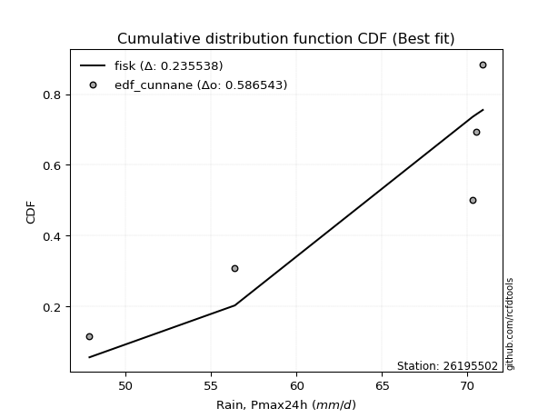</img></img>

</div>


### 12. EDF Adamowski (1981)

The Adamowski formula in hydrology refers to a specific plotting position formula used for estimating the non-parametric empirical distribution of hydrological events (like flood peaks) to calculate their return periods. This formula provides an alternative to traditional parametric methods (like the Gumbel or Log Pearson Type III distributions). 

<div align="center">


$P=(m-0.25)/(n+0.5)$


</div>


**12.1. Empirical values**

<div align="center">

|                | 0                   | 1                  | 2             | 3                  | 4                  |
|:---------------|:--------------------|:-------------------|:--------------|:-------------------|:-------------------|
| date           | 2018                | 2017               | 2020          | 2019               | 2021               |
| x              | 47.9                | 56.4               | 70.3          | 70.5               | 70.9               |
| m              | 1                   | 2                  | 3             | 4                  | 5                  |
| empirical_dist | edf_adamowski       | edf_adamowski      | edf_adamowski | edf_adamowski      | edf_adamowski      |
| empirical      | 0.13636363636363635 | 0.3181818181818182 | 0.5           | 0.6818181818181818 | 0.8636363636363636 |
| empirical_tr   | 1.1578947368421053  | 1.4666666666666666 | 2.0           | 3.1428571428571423 | 7.333333333333334  |

</div>


**12.2. Kolmogorov-Smirnov fit test (sorted by Δ)**


<div align="center">

|                | 0                   | 1                  | 2                   | 3                  | 4                  | 5                   | 6                  | 7                  | 8                  | 9                   | 10                  | 11                  | 12                  | 13                 | 14                  | 15                  | 16                  | 17                 | 18                 | 19                  | 20                 | 21                  | 22                  | 23                  | 24                  | 25                  | 26                 | 27                  | 28                 | 29                  | 30                 | 31                 | 32                 | 33                 | 34                 | 35                 | 36                 | 37                 | 38                 | 39                  | 40                 | 41                  | 42                  | 43                 | 44                 | 45                  | 46                 | 47                 | 48                  | 49                 | 50                  | 51                  | 52                 | 53                 | 54                 | 55                  | 56                  | 57                  | 58                 | 59                  | 60                 | 61                 | 62                 | 63                 | 64                 | 65                  | 66                  | 67                 | 68                 | 69                 | 70                  | 71                  | 72                  | 73                  | 74                  | 75                 | 76                 | 77                 | 78                  | 79                 | 80                  | 81                 | 82                 | 83                  | 84                 | 85                 | 86                 | 87                  | 88                 | 89                 | 90                  | 91                 | 92                  | 93                  | 94                  | 95                 | 96                 | 97                  | 98                 | 99                 | 100                 | 101                | 102                 | 103                | 104                | 105                | 106                | 107                | 108                 | 109                | 110                | 111                 | 112                | 113                | 114                | 115                | 116                 | 117                | 118                 | 119                | 120                | 121                | 122                | 123                | 124                | 125                 | 126                 | 127                | 128                | 129                | 130                | 131                 | 132                 | 133                 | 134                | 135                | 136                 | 137                | 138                | 139                 | 140                | 141                | 142                 | 143                | 144                 | 145                | 146                | 147                | 148                | 149                | 150                | 151                | 152                | 153                | 154                | 155                | 156                | 157                | 158                | 159                |
|:---------------|:--------------------|:-------------------|:--------------------|:-------------------|:-------------------|:--------------------|:-------------------|:-------------------|:-------------------|:--------------------|:--------------------|:--------------------|:--------------------|:-------------------|:--------------------|:--------------------|:--------------------|:-------------------|:-------------------|:--------------------|:-------------------|:--------------------|:--------------------|:--------------------|:--------------------|:--------------------|:-------------------|:--------------------|:-------------------|:--------------------|:-------------------|:-------------------|:-------------------|:-------------------|:-------------------|:-------------------|:-------------------|:-------------------|:-------------------|:--------------------|:-------------------|:--------------------|:--------------------|:-------------------|:-------------------|:--------------------|:-------------------|:-------------------|:--------------------|:-------------------|:--------------------|:--------------------|:-------------------|:-------------------|:-------------------|:--------------------|:--------------------|:--------------------|:-------------------|:--------------------|:-------------------|:-------------------|:-------------------|:-------------------|:-------------------|:--------------------|:--------------------|:-------------------|:-------------------|:-------------------|:--------------------|:--------------------|:--------------------|:--------------------|:--------------------|:-------------------|:-------------------|:-------------------|:--------------------|:-------------------|:--------------------|:-------------------|:-------------------|:--------------------|:-------------------|:-------------------|:-------------------|:--------------------|:-------------------|:-------------------|:--------------------|:-------------------|:--------------------|:--------------------|:--------------------|:-------------------|:-------------------|:--------------------|:-------------------|:-------------------|:--------------------|:-------------------|:--------------------|:-------------------|:-------------------|:-------------------|:-------------------|:-------------------|:--------------------|:-------------------|:-------------------|:--------------------|:-------------------|:-------------------|:-------------------|:-------------------|:--------------------|:-------------------|:--------------------|:-------------------|:-------------------|:-------------------|:-------------------|:-------------------|:-------------------|:--------------------|:--------------------|:-------------------|:-------------------|:-------------------|:-------------------|:--------------------|:--------------------|:--------------------|:-------------------|:-------------------|:--------------------|:-------------------|:-------------------|:--------------------|:-------------------|:-------------------|:--------------------|:-------------------|:--------------------|:-------------------|:-------------------|:-------------------|:-------------------|:-------------------|:-------------------|:-------------------|:-------------------|:-------------------|:-------------------|:-------------------|:-------------------|:-------------------|:-------------------|:-------------------|
| station        | 26195502            | 26195502           | 26195502            | 26195502           | 26195502           | 26195502            | 26195502           | 26195502           | 26195502           | 26195502            | 26195502            | 26195502            | 26195502            | 26195502           | 26195502            | 26195502            | 26195502            | 26195502           | 26195502           | 26195502            | 26195502           | 26195502            | 26195502            | 26195502            | 26195502            | 26195502            | 26195502           | 26195502            | 26195502           | 26195502            | 26195502           | 26195502           | 26195502           | 26195502           | 26195502           | 26195502           | 26195502           | 26195502           | 26195502           | 26195502            | 26195502           | 26195502            | 26195502            | 26195502           | 26195502           | 26195502            | 26195502           | 26195502           | 26195502            | 26195502           | 26195502            | 26195502            | 26195502           | 26195502           | 26195502           | 26195502            | 26195502            | 26195502            | 26195502           | 26195502            | 26195502           | 26195502           | 26195502           | 26195502           | 26195502           | 26195502            | 26195502            | 26195502           | 26195502           | 26195502           | 26195502            | 26195502            | 26195502            | 26195502            | 26195502            | 26195502           | 26195502           | 26195502           | 26195502            | 26195502           | 26195502            | 26195502           | 26195502           | 26195502            | 26195502           | 26195502           | 26195502           | 26195502            | 26195502           | 26195502           | 26195502            | 26195502           | 26195502            | 26195502            | 26195502            | 26195502           | 26195502           | 26195502            | 26195502           | 26195502           | 26195502            | 26195502           | 26195502            | 26195502           | 26195502           | 26195502           | 26195502           | 26195502           | 26195502            | 26195502           | 26195502           | 26195502            | 26195502           | 26195502           | 26195502           | 26195502           | 26195502            | 26195502           | 26195502            | 26195502           | 26195502           | 26195502           | 26195502           | 26195502           | 26195502           | 26195502            | 26195502            | 26195502           | 26195502           | 26195502           | 26195502           | 26195502            | 26195502            | 26195502            | 26195502           | 26195502           | 26195502            | 26195502           | 26195502           | 26195502            | 26195502           | 26195502           | 26195502            | 26195502           | 26195502            | 26195502           | 26195502           | 26195502           | 26195502           | 26195502           | 26195502           | 26195502           | 26195502           | 26195502           | 26195502           | 26195502           | 26195502           | 26195502           | 26195502           | 26195502           |
| empirical_dist | edf_adamowski       | edf_adamowski      | edf_adamowski       | edf_adamowski      | edf_adamowski      | edf_adamowski       | edf_adamowski      | edf_adamowski      | edf_adamowski      | edf_adamowski       | edf_adamowski       | edf_adamowski       | edf_adamowski       | edf_adamowski      | edf_adamowski       | edf_adamowski       | edf_adamowski       | edf_adamowski      | edf_adamowski      | edf_adamowski       | edf_adamowski      | edf_adamowski       | edf_adamowski       | edf_adamowski       | edf_adamowski       | edf_adamowski       | edf_adamowski      | edf_adamowski       | edf_adamowski      | edf_adamowski       | edf_adamowski      | edf_adamowski      | edf_adamowski      | edf_adamowski      | edf_adamowski      | edf_adamowski      | edf_adamowski      | edf_adamowski      | edf_adamowski      | edf_adamowski       | edf_adamowski      | edf_adamowski       | edf_adamowski       | edf_adamowski      | edf_adamowski      | edf_adamowski       | edf_adamowski      | edf_adamowski      | edf_adamowski       | edf_adamowski      | edf_adamowski       | edf_adamowski       | edf_adamowski      | edf_adamowski      | edf_adamowski      | edf_adamowski       | edf_adamowski       | edf_adamowski       | edf_adamowski      | edf_adamowski       | edf_adamowski      | edf_adamowski      | edf_adamowski      | edf_adamowski      | edf_adamowski      | edf_adamowski       | edf_adamowski       | edf_adamowski      | edf_adamowski      | edf_adamowski      | edf_adamowski       | edf_adamowski       | edf_adamowski       | edf_adamowski       | edf_adamowski       | edf_adamowski      | edf_adamowski      | edf_adamowski      | edf_adamowski       | edf_adamowski      | edf_adamowski       | edf_adamowski      | edf_adamowski      | edf_adamowski       | edf_adamowski      | edf_adamowski      | edf_adamowski      | edf_adamowski       | edf_adamowski      | edf_adamowski      | edf_adamowski       | edf_adamowski      | edf_adamowski       | edf_adamowski       | edf_adamowski       | edf_adamowski      | edf_adamowski      | edf_adamowski       | edf_adamowski      | edf_adamowski      | edf_adamowski       | edf_adamowski      | edf_adamowski       | edf_adamowski      | edf_adamowski      | edf_adamowski      | edf_adamowski      | edf_adamowski      | edf_adamowski       | edf_adamowski      | edf_adamowski      | edf_adamowski       | edf_adamowski      | edf_adamowski      | edf_adamowski      | edf_adamowski      | edf_adamowski       | edf_adamowski      | edf_adamowski       | edf_adamowski      | edf_adamowski      | edf_adamowski      | edf_adamowski      | edf_adamowski      | edf_adamowski      | edf_adamowski       | edf_adamowski       | edf_adamowski      | edf_adamowski      | edf_adamowski      | edf_adamowski      | edf_adamowski       | edf_adamowski       | edf_adamowski       | edf_adamowski      | edf_adamowski      | edf_adamowski       | edf_adamowski      | edf_adamowski      | edf_adamowski       | edf_adamowski      | edf_adamowski      | edf_adamowski       | edf_adamowski      | edf_adamowski       | edf_adamowski      | edf_adamowski      | edf_adamowski      | edf_adamowski      | edf_adamowski      | edf_adamowski      | edf_adamowski      | edf_adamowski      | edf_adamowski      | edf_adamowski      | edf_adamowski      | edf_adamowski      | edf_adamowski      | edf_adamowski      | edf_adamowski      |
| p_dist         | beta                | logbeta            | kappa3              | wrapcauchy         | logarcsine         | arcsine             | logwrapcauchy      | levy_l             | loglevy_l          | logtrapezoid        | trapezoid           | logksone            | ksone               | vonmises_line      | logweibull_max      | logsemicircular     | logbetaprime        | semicircular       | loganglit          | anglit              | halfgennorm        | logdweibull         | lognct              | logncf              | loglomax            | logpearson3         | pearson3           | invgauss            | burr12             | genextreme          | lomax              | loggumbel_l        | logkstwobign       | logfoldnorm        | logf               | gumbel_l           | loginvweibull      | loginvgauss        | logcrystalball     | logt                | logexponnorm       | lognorm             | loghalfgennorm      | nct                | logrice            | ncf                 | erlang             | loginvgamma        | logfatiguelife      | t                  | exponnorm           | crystalball         | norm               | truncnorm          | f                  | loggamma            | loggamma            | loggenexpon         | invgamma           | kstwobign           | rice               | logerlang          | gamma              | betaprime          | logalpha           | alpha               | dgamma              | logmaxwell         | maxwell            | lograyleigh        | weibull_min         | rayleigh            | logburr12           | logweibull_min      | gennorm             | dweibull           | loghalfnorm        | halfnorm           | loglogistic         | logistic           | logexponpow         | logcosine          | loggumbel_r        | cosine              | gumbel_r           | loghypsecant       | hypsecant          | loghalflogistic     | halflogistic       | loggompertz        | logmoyal            | nakagami           | moyal               | loglaplace          | loglaplace          | laplace            | exponweib          | logloglaplace       | logdgamma          | burr               | genexpon            | logwald            | loggengamma         | wald               | argus              | loggenextreme      | loggennorm         | logargus           | logexponweib        | lognakagami        | logburr            | gengamma            | fatiguelife        | genpareto          | logmielke          | mielke             | weibull_max         | invweibull         | loggenhalflogistic  | logloggamma        | genhalflogistic    | foldnorm           | triang             | skewnorm           | kappa4             | johnsonsu           | logtriang           | logskewnorm        | loggausshyper      | tukeylambda        | logkappa4          | johnsonsb           | gausshyper          | uniform             | logtukeylambda     | logkappa3          | loguniform          | logvonmises_line   | truncweibull_min   | bradford            | truncexpon         | logbradford        | logtruncweibull_min | logtruncexpon      | logtruncnorm        | loggenpareto       | gompertz           | logjohnsonsu       | powerlaw           | logpowerlaw        | truncpareto        | logtruncpareto     | exponpow           | logjohnsonsb       | rdist              | genlogistic        | loggenlogistic     | logrdist           | logvonmises        | vonmises           |
| delta          | 0.13257463813595682 | 0.1343181525672451 | 0.17426077441531906 | 0.1759653387379001 | 0.1773616894501493 | 0.17900109373801232 | 0.1791353170676777 | 0.1970492720199742 | 0.2029996656803546 | 0.21056952675457918 | 0.21299722671704902 | 0.21590561305089384 | 0.21766773874085255 | 0.2183947286695174 | 0.21841326684400053 | 0.23239852110129855 | 0.23316391860873653 | 0.2341993674890458 | 0.2446678314768318 | 0.24648542346816926 | 0.2496832552851378 | 0.25234053665360223 | 0.25283157553436153 | 0.25582114093316755 | 0.25821371038941265 | 0.25963353468643424 | 0.2628583080515883 | 0.26329783923031924 | 0.264470778627484  | 0.26452957228434437 | 0.2659668779617784 | 0.2689803879574204 | 0.2702587965861578 | 0.2711686667971557 | 0.2716099567773895 | 0.2716256330392314 | 0.2719691813908238 | 0.2723055060074905 | 0.2727396267402111 | 0.27274166027959357 | 0.2727440201441147 | 0.27274548662844245 | 0.27282055344467293 | 0.2729493658785934 | 0.2730229843458529 | 0.27346107771752604 | 0.2735998048295303 | 0.2742661986846806 | 0.27438152791923964 | 0.2745782428684851 | 0.27458073559629004 | 0.27458234117967384 | 0.2745823440645212 | 0.2745823463052184 | 0.2746008174626299 | 0.27462888236277216 | 0.27462888236277216 | 0.27482219674739383 | 0.2748888724533599 | 0.27506237630350394 | 0.2752004087044062 | 0.2754196248475911 | 0.2758929325382795 | 0.276046553308567  | 0.2760608892723817 | 0.27742597967733595 | 0.27750033312388644 | 0.2793256112263539 | 0.2809175843513779 | 0.2811902827290985 | 0.28208203475007765 | 0.28271216776128727 | 0.28278014582251987 | 0.28316474222227495 | 0.28430958677081075 | 0.2845633187366816 | 0.2882396366383633 | 0.289582012886055  | 0.29520247761029694 | 0.2969996825909669 | 0.29867351305431455 | 0.3056814223663946 | 0.3064272708627902 | 0.30655058764781296 | 0.3077813895509316 | 0.3092838544711648 | 0.3109982543667362 | 0.31121407978700955 | 0.3124232971429992 | 0.3131356489631125 | 0.31741759981102136 | 0.3181818181800503 | 0.31862978300810063 | 0.32637619311343824 | 0.32637619311343824 | 0.3278685702172641 | 0.331482687253642  | 0.33154313996798435 | 0.3345693353609699 | 0.3456986135700847 | 0.35148820948288884 | 0.3533878888413796 | 0.35371503929627834 | 0.3542582690191888 | 0.3604385889190411 | 0.3611916852977055 | 0.3636363636366587 | 0.3644454391333607 | 0.37604129175908774 | 0.3765355286030789 | 0.3807928576816201 | 0.40165044956160995 | 0.4096497407970116 | 0.4145614137203095 | 0.424790802930178  | 0.4274828853668573 | 0.42862415275641064 | 0.4325235290652553 | 0.43446752206303885 | 0.4351668812797397 | 0.4450792430332423 | 0.4562843790356266 | 0.4581205408624133 | 0.4606551387037371 | 0.4622136503425427 | 0.46321766929273406 | 0.46538987390080166 | 0.4666231255872253 | 0.467252653587252  | 0.4684068464423987 | 0.4724301837263065 | 0.47260339191803014 | 0.47325131264437215 | 0.47391304347826047 | 0.4744955346492574 | 0.4750882710329981 | 0.47832837460310096 | 0.4784810193469864 | 0.4803572136898976 | 0.48138594402945634 | 0.4825082809004517 | 0.4842925635459133 | 0.4843672674451204  | 0.4861889217906933 | 0.48952426251248415 | 0.4916645759558329 | 0.499999755957013  | 0.536834632881618  | 0.5551654575968972 | 0.5652430275405567 | 0.5742817811071053 | 0.5877534843361925 | 0.597088020477961  | 0.6630975988931496 | 0.6818181803198802 | 0.6818181818181818 | 0.6818181818181818 | 0.8636363636363636 | 1.2721403772884543 | 10.970655178876504 |
| deltao         | 0.5865427407550001  | 0.5865427407550001 | 0.5865427407550001  | 0.5865427407550001 | 0.5865427407550001 | 0.5865427407550001  | 0.5865427407550001 | 0.5865427407550001 | 0.5865427407550001 | 0.5865427407550001  | 0.5865427407550001  | 0.5865427407550001  | 0.5865427407550001  | 0.5865427407550001 | 0.5865427407550001  | 0.5865427407550001  | 0.5865427407550001  | 0.5865427407550001 | 0.5865427407550001 | 0.5865427407550001  | 0.5865427407550001 | 0.5865427407550001  | 0.5865427407550001  | 0.5865427407550001  | 0.5865427407550001  | 0.5865427407550001  | 0.5865427407550001 | 0.5865427407550001  | 0.5865427407550001 | 0.5865427407550001  | 0.5865427407550001 | 0.5865427407550001 | 0.5865427407550001 | 0.5865427407550001 | 0.5865427407550001 | 0.5865427407550001 | 0.5865427407550001 | 0.5865427407550001 | 0.5865427407550001 | 0.5865427407550001  | 0.5865427407550001 | 0.5865427407550001  | 0.5865427407550001  | 0.5865427407550001 | 0.5865427407550001 | 0.5865427407550001  | 0.5865427407550001 | 0.5865427407550001 | 0.5865427407550001  | 0.5865427407550001 | 0.5865427407550001  | 0.5865427407550001  | 0.5865427407550001 | 0.5865427407550001 | 0.5865427407550001 | 0.5865427407550001  | 0.5865427407550001  | 0.5865427407550001  | 0.5865427407550001 | 0.5865427407550001  | 0.5865427407550001 | 0.5865427407550001 | 0.5865427407550001 | 0.5865427407550001 | 0.5865427407550001 | 0.5865427407550001  | 0.5865427407550001  | 0.5865427407550001 | 0.5865427407550001 | 0.5865427407550001 | 0.5865427407550001  | 0.5865427407550001  | 0.5865427407550001  | 0.5865427407550001  | 0.5865427407550001  | 0.5865427407550001 | 0.5865427407550001 | 0.5865427407550001 | 0.5865427407550001  | 0.5865427407550001 | 0.5865427407550001  | 0.5865427407550001 | 0.5865427407550001 | 0.5865427407550001  | 0.5865427407550001 | 0.5865427407550001 | 0.5865427407550001 | 0.5865427407550001  | 0.5865427407550001 | 0.5865427407550001 | 0.5865427407550001  | 0.5865427407550001 | 0.5865427407550001  | 0.5865427407550001  | 0.5865427407550001  | 0.5865427407550001 | 0.5865427407550001 | 0.5865427407550001  | 0.5865427407550001 | 0.5865427407550001 | 0.5865427407550001  | 0.5865427407550001 | 0.5865427407550001  | 0.5865427407550001 | 0.5865427407550001 | 0.5865427407550001 | 0.5865427407550001 | 0.5865427407550001 | 0.5865427407550001  | 0.5865427407550001 | 0.5865427407550001 | 0.5865427407550001  | 0.5865427407550001 | 0.5865427407550001 | 0.5865427407550001 | 0.5865427407550001 | 0.5865427407550001  | 0.5865427407550001 | 0.5865427407550001  | 0.5865427407550001 | 0.5865427407550001 | 0.5865427407550001 | 0.5865427407550001 | 0.5865427407550001 | 0.5865427407550001 | 0.5865427407550001  | 0.5865427407550001  | 0.5865427407550001 | 0.5865427407550001 | 0.5865427407550001 | 0.5865427407550001 | 0.5865427407550001  | 0.5865427407550001  | 0.5865427407550001  | 0.5865427407550001 | 0.5865427407550001 | 0.5865427407550001  | 0.5865427407550001 | 0.5865427407550001 | 0.5865427407550001  | 0.5865427407550001 | 0.5865427407550001 | 0.5865427407550001  | 0.5865427407550001 | 0.5865427407550001  | 0.5865427407550001 | 0.5865427407550001 | 0.5865427407550001 | 0.5865427407550001 | 0.5865427407550001 | 0.5865427407550001 | 0.5865427407550001 | 0.5865427407550001 | 0.5865427407550001 | 0.5865427407550001 | 0.5865427407550001 | 0.5865427407550001 | 0.5865427407550001 | 0.5865427407550001 | 0.5865427407550001 |
| eval           | Δo > Δ              | Δo > Δ             | Δo > Δ              | Δo > Δ             | Δo > Δ             | Δo > Δ              | Δo > Δ             | Δo > Δ             | Δo > Δ             | Δo > Δ              | Δo > Δ              | Δo > Δ              | Δo > Δ              | Δo > Δ             | Δo > Δ              | Δo > Δ              | Δo > Δ              | Δo > Δ             | Δo > Δ             | Δo > Δ              | Δo > Δ             | Δo > Δ              | Δo > Δ              | Δo > Δ              | Δo > Δ              | Δo > Δ              | Δo > Δ             | Δo > Δ              | Δo > Δ             | Δo > Δ              | Δo > Δ             | Δo > Δ             | Δo > Δ             | Δo > Δ             | Δo > Δ             | Δo > Δ             | Δo > Δ             | Δo > Δ             | Δo > Δ             | Δo > Δ              | Δo > Δ             | Δo > Δ              | Δo > Δ              | Δo > Δ             | Δo > Δ             | Δo > Δ              | Δo > Δ             | Δo > Δ             | Δo > Δ              | Δo > Δ             | Δo > Δ              | Δo > Δ              | Δo > Δ             | Δo > Δ             | Δo > Δ             | Δo > Δ              | Δo > Δ              | Δo > Δ              | Δo > Δ             | Δo > Δ              | Δo > Δ             | Δo > Δ             | Δo > Δ             | Δo > Δ             | Δo > Δ             | Δo > Δ              | Δo > Δ              | Δo > Δ             | Δo > Δ             | Δo > Δ             | Δo > Δ              | Δo > Δ              | Δo > Δ              | Δo > Δ              | Δo > Δ              | Δo > Δ             | Δo > Δ             | Δo > Δ             | Δo > Δ              | Δo > Δ             | Δo > Δ              | Δo > Δ             | Δo > Δ             | Δo > Δ              | Δo > Δ             | Δo > Δ             | Δo > Δ             | Δo > Δ              | Δo > Δ             | Δo > Δ             | Δo > Δ              | Δo > Δ             | Δo > Δ              | Δo > Δ              | Δo > Δ              | Δo > Δ             | Δo > Δ             | Δo > Δ              | Δo > Δ             | Δo > Δ             | Δo > Δ              | Δo > Δ             | Δo > Δ              | Δo > Δ             | Δo > Δ             | Δo > Δ             | Δo > Δ             | Δo > Δ             | Δo > Δ              | Δo > Δ             | Δo > Δ             | Δo > Δ              | Δo > Δ             | Δo > Δ             | Δo > Δ             | Δo > Δ             | Δo > Δ              | Δo > Δ             | Δo > Δ              | Δo > Δ             | Δo > Δ             | Δo > Δ             | Δo > Δ             | Δo > Δ             | Δo > Δ             | Δo > Δ              | Δo > Δ              | Δo > Δ             | Δo > Δ             | Δo > Δ             | Δo > Δ             | Δo > Δ              | Δo > Δ              | Δo > Δ              | Δo > Δ             | Δo > Δ             | Δo > Δ              | Δo > Δ             | Δo > Δ             | Δo > Δ              | Δo > Δ             | Δo > Δ             | Δo > Δ              | Δo > Δ             | Δo > Δ              | Δo > Δ             | Δo > Δ             | Δo > Δ             | Δo > Δ             | Δo > Δ             | Δo > Δ             | Δo <= Δ            | Δo <= Δ            | Δo <= Δ            | Δo <= Δ            | Δo <= Δ            | Δo <= Δ            | Δo <= Δ            | Δo <= Δ            | Δo <= Δ            |
| fit            | 1                   | 1                  | 1                   | 1                  | 1                  | 1                   | 1                  | 1                  | 1                  | 1                   | 1                   | 1                   | 1                   | 1                  | 1                   | 1                   | 1                   | 1                  | 1                  | 1                   | 1                  | 1                   | 1                   | 1                   | 1                   | 1                   | 1                  | 1                   | 1                  | 1                   | 1                  | 1                  | 1                  | 1                  | 1                  | 1                  | 1                  | 1                  | 1                  | 1                   | 1                  | 1                   | 1                   | 1                  | 1                  | 1                   | 1                  | 1                  | 1                   | 1                  | 1                   | 1                   | 1                  | 1                  | 1                  | 1                   | 1                   | 1                   | 1                  | 1                   | 1                  | 1                  | 1                  | 1                  | 1                  | 1                   | 1                   | 1                  | 1                  | 1                  | 1                   | 1                   | 1                   | 1                   | 1                   | 1                  | 1                  | 1                  | 1                   | 1                  | 1                   | 1                  | 1                  | 1                   | 1                  | 1                  | 1                  | 1                   | 1                  | 1                  | 1                   | 1                  | 1                   | 1                   | 1                   | 1                  | 1                  | 1                   | 1                  | 1                  | 1                   | 1                  | 1                   | 1                  | 1                  | 1                  | 1                  | 1                  | 1                   | 1                  | 1                  | 1                   | 1                  | 1                  | 1                  | 1                  | 1                   | 1                  | 1                   | 1                  | 1                  | 1                  | 1                  | 1                  | 1                  | 1                   | 1                   | 1                  | 1                  | 1                  | 1                  | 1                   | 1                   | 1                   | 1                  | 1                  | 1                   | 1                  | 1                  | 1                   | 1                  | 1                  | 1                   | 1                  | 1                   | 1                  | 1                  | 1                  | 1                  | 1                  | 1                  | 0                  | 0                  | 0                  | 0                  | 0                  | 0                  | 0                  | 0                  | 0                  |
| n              | 5                   | 5                  | 5                   | 5                  | 5                  | 5                   | 5                  | 5                  | 5                  | 5                   | 5                   | 5                   | 5                   | 5                  | 5                   | 5                   | 5                   | 5                  | 5                  | 5                   | 5                  | 5                   | 5                   | 5                   | 5                   | 5                   | 5                  | 5                   | 5                  | 5                   | 5                  | 5                  | 5                  | 5                  | 5                  | 5                  | 5                  | 5                  | 5                  | 5                   | 5                  | 5                   | 5                   | 5                  | 5                  | 5                   | 5                  | 5                  | 5                   | 5                  | 5                   | 5                   | 5                  | 5                  | 5                  | 5                   | 5                   | 5                   | 5                  | 5                   | 5                  | 5                  | 5                  | 5                  | 5                  | 5                   | 5                   | 5                  | 5                  | 5                  | 5                   | 5                   | 5                   | 5                   | 5                   | 5                  | 5                  | 5                  | 5                   | 5                  | 5                   | 5                  | 5                  | 5                   | 5                  | 5                  | 5                  | 5                   | 5                  | 5                  | 5                   | 5                  | 5                   | 5                   | 5                   | 5                  | 5                  | 5                   | 5                  | 5                  | 5                   | 5                  | 5                   | 5                  | 5                  | 5                  | 5                  | 5                  | 5                   | 5                  | 5                  | 5                   | 5                  | 5                  | 5                  | 5                  | 5                   | 5                  | 5                   | 5                  | 5                  | 5                  | 5                  | 5                  | 5                  | 5                   | 5                   | 5                  | 5                  | 5                  | 5                  | 5                   | 5                   | 5                   | 5                  | 5                  | 5                   | 5                  | 5                  | 5                   | 5                  | 5                  | 5                   | 5                  | 5                   | 5                  | 5                  | 5                  | 5                  | 5                  | 5                  | 5                  | 5                  | 5                  | 5                  | 5                  | 5                  | 5                  | 5                  | 5                  |
| best_fit       | 1                   | 0                  | 0                   | 0                  | 0                  | 0                   | 0                  | 0                  | 0                  | 0                   | 0                   | 0                   | 0                   | 0                  | 0                   | 0                   | 0                   | 0                  | 0                  | 0                   | 0                  | 0                   | 0                   | 0                   | 0                   | 0                   | 0                  | 0                   | 0                  | 0                   | 0                  | 0                  | 0                  | 0                  | 0                  | 0                  | 0                  | 0                  | 0                  | 0                   | 0                  | 0                   | 0                   | 0                  | 0                  | 0                   | 0                  | 0                  | 0                   | 0                  | 0                   | 0                   | 0                  | 0                  | 0                  | 0                   | 0                   | 0                   | 0                  | 0                   | 0                  | 0                  | 0                  | 0                  | 0                  | 0                   | 0                   | 0                  | 0                  | 0                  | 0                   | 0                   | 0                   | 0                   | 0                   | 0                  | 0                  | 0                  | 0                   | 0                  | 0                   | 0                  | 0                  | 0                   | 0                  | 0                  | 0                  | 0                   | 0                  | 0                  | 0                   | 0                  | 0                   | 0                   | 0                   | 0                  | 0                  | 0                   | 0                  | 0                  | 0                   | 0                  | 0                   | 0                  | 0                  | 0                  | 0                  | 0                  | 0                   | 0                  | 0                  | 0                   | 0                  | 0                  | 0                  | 0                  | 0                   | 0                  | 0                   | 0                  | 0                  | 0                  | 0                  | 0                  | 0                  | 0                   | 0                   | 0                  | 0                  | 0                  | 0                  | 0                   | 0                   | 0                   | 0                  | 0                  | 0                   | 0                  | 0                  | 0                   | 0                  | 0                  | 0                   | 0                  | 0                   | 0                  | 0                  | 0                  | 0                  | 0                  | 0                  | 0                  | 0                  | 0                  | 0                  | 0                  | 0                  | 0                  | 0                  | 0                  |
| best_fit_sort  | 1                   | 2                  | 3                   | 4                  | 5                  | 6                   | 7                  | 8                  | 9                  | 10                  | 11                  | 12                  | 13                  | 14                 | 15                  | 16                  | 17                  | 18                 | 19                 | 20                  | 21                 | 22                  | 23                  | 24                  | 25                  | 26                  | 27                 | 28                  | 29                 | 30                  | 31                 | 32                 | 33                 | 34                 | 35                 | 36                 | 37                 | 38                 | 39                 | 40                  | 41                 | 42                  | 43                  | 44                 | 45                 | 46                  | 47                 | 48                 | 49                  | 50                 | 51                  | 52                  | 53                 | 54                 | 55                 | 56                  | 57                  | 58                  | 59                 | 60                  | 61                 | 62                 | 63                 | 64                 | 65                 | 66                  | 67                  | 68                 | 69                 | 70                 | 71                  | 72                  | 73                  | 74                  | 75                  | 76                 | 77                 | 78                 | 79                  | 80                 | 81                  | 82                 | 83                 | 84                  | 85                 | 86                 | 87                 | 88                  | 89                 | 90                 | 91                  | 92                 | 93                  | 94                  | 95                  | 96                 | 97                 | 98                  | 99                 | 100                | 101                 | 102                | 103                 | 104                | 105                | 106                | 107                | 108                | 109                 | 110                | 111                | 112                 | 113                | 114                | 115                | 116                | 117                 | 118                | 119                 | 120                | 121                | 122                | 123                | 124                | 125                | 126                 | 127                 | 128                | 129                | 130                | 131                | 132                 | 133                 | 134                 | 135                | 136                | 137                 | 138                | 139                | 140                 | 141                | 142                | 143                 | 144                | 145                 | 146                | 147                | 148                | 149                | 150                | 151                | 152                | 153                | 154                | 155                | 156                | 157                | 158                | 159                | 160                |

</div>


**12.3. Best fit**

<div align="center">

|   id |   station | empirical_dist   | p_dist   |    delta |   deltao | eval   |   fit |   n |   best_fit |   best_fit_sort |
|-----:|----------:|:-----------------|:---------|---------:|---------:|:-------|------:|----:|-----------:|----------------:|
|    0 |  26195502 | edf_adamowski    | beta     | 0.132575 | 0.586543 | Δo > Δ |     1 |   5 |          1 |               1 |

</div>


<div align="center">

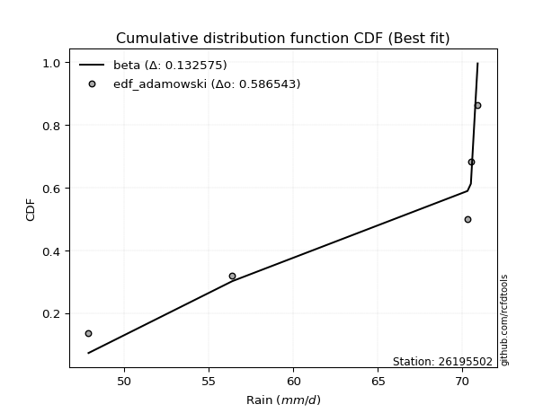</img>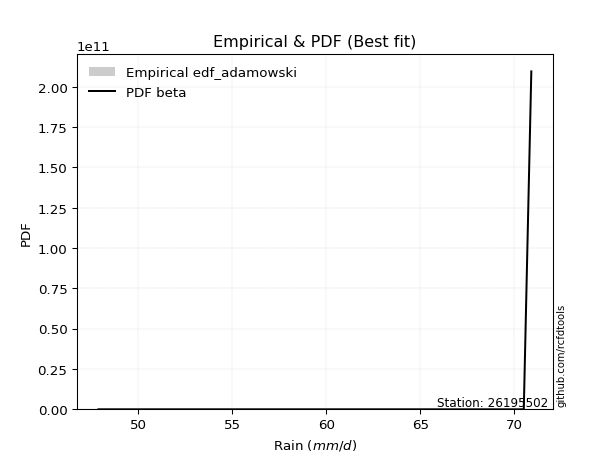</img>

</div>


## C. Best fit & Estimate extreme values for specific return periods - Tr

Best fit in probability distribution analysis means finding the theoretical distribution (like Normal, Poisson, Exponential, etc.) that most accurately mirrors your real-world data´s patterns (shape, center, spread) for better predictions, using methods like visual checks (Q-Q plots), goodness-of-fit tests (Kolmogorov-Smirnov, Chi-Squared), and information criteria (AIC) to score and select the simplest, most representative model.


### 1. Best fit (ordered by delta Δ)

:file_folder:Table: [bestfit_26195502.csv](table/bestfit_26195502.csv)

<div align="center">

|   id |   station | empirical_dist   | p_dist         |    delta |   deltao | eval   |   fit |   n |   best_fit |   best_fit_sort |
|-----:|----------:|:-----------------|:---------------|---------:|---------:|:-------|------:|----:|-----------:|----------------:|
|    0 |  26195502 | edf_hazen        | beta           | 0.096211 | 0.586543 | Δo > Δ |     1 |   5 |          1 |               1 |
|    1 |  26195502 | edf_gringorten   | beta           | 0.105586 | 0.586543 | Δo > Δ |     1 |   5 |          1 |               2 |
|    2 |  26195502 | edf_cunnane      | beta           | 0.111596 | 0.586543 | Δo > Δ |     1 |   5 |          1 |               3 |
|    3 |  26195502 | edf_blom         | beta           | 0.115259 | 0.586543 | Δo > Δ |     1 |   5 |          1 |               4 |
|    4 |  26195502 | edf_california   | logweibull_max | 0.118413 | 0.586543 | Δo > Δ |     1 |   5 |          1 |               5 |
|    5 |  26195502 | edf_tukey        | beta           | 0.121211 | 0.586543 | Δo > Δ |     1 |   5 |          1 |               6 |
|    6 |  26195502 | edf_filliben     | beta           | 0.123424 | 0.586543 | Δo > Δ |     1 |   5 |          1 |               7 |
|    7 |  26195502 | edf_jenkinson    | beta           | 0.124464 | 0.586543 | Δo > Δ |     1 |   5 |          1 |               8 |
|    8 |  26195502 | edf_beard        | beta           | 0.124464 | 0.586543 | Δo > Δ |     1 |   5 |          1 |               9 |
|    9 |  26195502 | edf_chegodayev   | beta           | 0.125841 | 0.586543 | Δo > Δ |     1 |   5 |          1 |              10 |
|   10 |  26195502 | edf_adamowski    | beta           | 0.132575 | 0.586543 | Δo > Δ |     1 |   5 |          1 |              11 |
|   11 |  26195502 | edf_weibull      | beta           | 0.162878 | 0.586543 | Δo > Δ |     1 |   5 |          1 |              12 |

</div>


### 2. Extreme values and % difference analysis

In hydrology, a return period (or recurrence interval $Tr$) is the statistical average time between extreme events like floods or droughts of a specific magnitude, indicating how rare an event is, with a 100-year flood, for example, having a 1% chance of occurring in any given year, not that it happens exactly every century. It is a key tool for infrastructure design (like bridges or dams) and risk assessment, calculated from historical data to determine the probability of future events, although it is important to remember it is statistical average, and events can cluster or be missed.

The extreme value porcentage difference is evaluated as $pdiff = 1 - (ETrBf / ETr) * 100$, where _ETrBf_ correspond to the bestfit extreme value for a specific recurrence interval and _ETr_ correspond to the extreme value for one of the most used PDFsused in hydrology.

> risk_rate: assuming the return period as the project useful life.

:file_folder:Table: [extreme_26195502.csv](table/extreme_26195502.csv), all PDFs.  
:file_folder:Table: [extremepdiff_26195502.csv](table/extremepdiff_26195502.csv), % difference between bestfit and most used PDFs in Hydrology.

<div align="center">

Extreme values table for only best fit PDFs
|   id |      tr |   prob_l |     prob_g |   alpha |   anglit |   arcsine |   argus |    beta |   betaprime |   bradford |    burr |   burr12 |   cosine |   crystalball |   dgamma |   dweibull |   erlang |   exponnorm |   exponpow |   exponweib |       f |   fatiguelife |   foldnorm |   gamma |   gausshyper |   genexpon |   genextreme |   gengamma |   genhalflogistic |   genlogistic |   gennorm |   genpareto |   gompertz |   gumbel_l |   gumbel_r |   halfgennorm |   halflogistic |   halfnorm |   hypsecant |   invgamma |   invgauss |     invweibull |   johnsonsb |   johnsonsu |   kappa3 |   kappa4 |   ksone |   kstwobign |   laplace |   levy_l |   loggamma |   logistic |   loglaplace |    lomax |   maxwell |   mielke |    moyal |   nakagami |     ncf |      nct |    norm |   pearson3 |   powerlaw |   rayleigh |   rdist |    rice |   semicircular |   skewnorm |       t |   trapezoid |   triang |   truncexpon |   truncnorm |   truncpareto |   truncweibull_min |   tukeylambda |   uniform |   vonmises |   vonmises_line |     wald |   weibull_max |   weibull_min |   wrapcauchy |   logalpha |   loganglit |   logarcsine |   logargus |   logbeta |   logbetaprime |   logbradford |   logburr |   logburr12 |   logcosine |   logcrystalball |   logdgamma |   logdweibull |   logerlang |   logexponnorm |   logexponpow |   logexponweib |     logf |   logfatiguelife |   logfoldnorm |   loggausshyper |   loggenexpon |   loggenextreme |   loggengamma |   loggenhalflogistic |   loggenlogistic |   loggennorm |   loggenpareto |   loggompertz |   loggumbel_l |   loggumbel_r |   loghalfgennorm |   loghalflogistic |   loghalfnorm |   loghypsecant |   loginvgamma |   loginvgauss |   loginvweibull |   logjohnsonsb |   logjohnsonsu |   logkappa3 |   logkappa4 |   logksone |   logkstwobign |   loglevy_l |   logloggamma |   loglogistic |   logloglaplace |   loglomax |   logmaxwell |   logmielke |   logmoyal |   lognakagami |   logncf |   lognct |   lognorm |   logpearson3 |   logpowerlaw |   lograyleigh |   logrdist |   logrice |   logsemicircular |   logskewnorm |     logt |   logtrapezoid |   logtriang |   logtruncexpon |   logtruncnorm |   logtruncpareto |   logtruncweibull_min |   logtukeylambda |   loguniform |   logvonmises |   logvonmises_line |   logwald |   logweibull_max |   logweibull_min |   logwrapcauchy |   station |   n |   risk_rate |
|-----:|--------:|---------:|-----------:|--------:|---------:|----------:|--------:|--------:|------------:|-----------:|--------:|---------:|---------:|--------------:|---------:|-----------:|---------:|------------:|-----------:|------------:|--------:|--------------:|-----------:|--------:|-------------:|-----------:|-------------:|-----------:|------------------:|--------------:|----------:|------------:|-----------:|-----------:|-----------:|--------------:|---------------:|-----------:|------------:|-----------:|-----------:|---------------:|------------:|------------:|---------:|---------:|--------:|------------:|----------:|---------:|-----------:|-----------:|-------------:|---------:|----------:|---------:|---------:|-----------:|--------:|---------:|--------:|-----------:|-----------:|-----------:|--------:|--------:|---------------:|-----------:|--------:|------------:|---------:|-------------:|------------:|--------------:|-------------------:|--------------:|----------:|-----------:|----------------:|---------:|--------------:|--------------:|-------------:|-----------:|------------:|-------------:|-----------:|----------:|---------------:|--------------:|----------:|------------:|------------:|-----------------:|------------:|--------------:|------------:|---------------:|--------------:|---------------:|---------:|-----------------:|--------------:|----------------:|--------------:|----------------:|--------------:|---------------------:|-----------------:|-------------:|---------------:|--------------:|--------------:|--------------:|-----------------:|------------------:|--------------:|---------------:|--------------:|--------------:|----------------:|---------------:|---------------:|------------:|------------:|-----------:|---------------:|------------:|--------------:|--------------:|----------------:|-----------:|-------------:|------------:|-----------:|--------------:|---------:|---------:|----------:|--------------:|--------------:|--------------:|-----------:|----------:|------------------:|--------------:|---------:|---------------:|------------:|----------------:|---------------:|-----------------:|----------------------:|-----------------:|-------------:|--------------:|-------------------:|----------:|-----------------:|-----------------:|----------------:|----------:|----:|------------:|
|    0 |    2    | 0.5      | 0.5        | 62.6392 |  63.2    |   63.2    | 65.8512 | 68.6147 |     62.9279 |    57.3147 | 65.1783 |  57.6869 |  62.318  |       63.2    |  70.5    |    70.3    |  62.9633 |     63.2    |    47.9114 |     49.0127 | 63.1711 |       47.9002 |    64.1127 | 62.9017 |      58.0279 |    56.0415 |      68.2772 |    49.4787 |           62.2947 |           inf |   70.3    |     52.2659 |    70.531  |    64.7469 |    61.6531 |       55.8378 |        60.884  |    61.2725 |     63.2    |    62.6498 |    62.3282 |  445.469       |     70.8991 |     70.8989 |  64.5107 |  59.6791 | 63.2    |     60.9976 |   63.2    |  70.2448 |    62.0624 |    63.2    |      62.4426 |  58.5174 |   62.3947 |  64.5788 |  61.1537 |    62.785  | 62.7238 |  61.8668 | 63.2    |    64.2058 |    48.0409 |    62.109  | 45.1248 | 62.8188 |        63.2    |    62.6964 | 63.2003 |     64.8156 |  62.4712 |      57.2258 |     63.2    |       48.6107 |            58.1175 |       59.4    |   59.4    |    1.2737  |         66.7887 |  60.1477 |       64.7139 |       65.0905 |      59.3686 |    62.1619 |     62.4426 |      62.4426 |    65.2934 |   68.1084 |        62.3813 |       56.344  |   65.0959 |     64.4469 |     61.422  |          62.4425 |     70.5    |       70.5    |     62.0824 |        62.4426 |       64.9401 |        52.516  |  62.4692 |          62.4071 |       61.8285 |         58.4606 |       60.1717 |         67.0268 |       69.9454 |              62.9047 |         inf      |      70.9    |        31.8289 |       58.4102 |       64.0896 |       60.8379 |          58.4512 |           60.0557 |       60.4496 |        62.4426 |       61.8849 |       61.6123 |         60.438  |           70.9 |        70.8991 |     47.9    |     57.2926 |    62.4426 |        60.1397 |     70.2414 |       64.9022 |       62.4426 |         70.3    |    57.5734 |      61.602  |     64.779  |    60.3287 |       50.1065 |  61.6509 |  62.2567 |   62.4426 |       63.6203 |       48.0405 |       61.3066 |    340.284 |   62.0827 |           62.4426 |       61.8232 |  62.4427 |        64.1637 |     61.4781 |         55.9406 |        54.8768 |          48.4957 |               56.1885 |          58.2688 |      58.2762 |      0.116664 |            58.2762 |   59.3167 |          66.6169 |          64.4637 |         58.276  |  26195502 |   5 |    0.75     |
|    1 |    2.33 | 0.570815 | 0.429185   | 64.384  |  65.1573 |   66.1382 | 66.8655 | 70.0886 |     64.6472 |    58.9496 | 66.4288 |  60.0805 |  64.0069 |       64.8803 |  70.5917 |    70.8027 |  64.6861 |     64.8804 |    47.9368 |     50.836  | 64.8577 |       48.6368 |    64.7588 | 64.62   |      59.7966 |    57.8353 |      69.0141 |    50.6263 |           63.9562 |           inf |   70.3707 |     57.0538 |    70.5677 |    66.2088 |    63.2101 |       58.5037 |        62.4849 |    63.086  |     64.5448 |    64.4139 |    64.2152 | 9037.88        |     70.8998 |     70.8997 |  66.8633 |  61.4258 | 65.5099 |     62.9974 |   64.2169 |  70.4475 |    63.8964 |    64.6805 |      63.5204 |  60.8748 |   64.1404 |  65.7461 |  62.6276 |    64.1546 | 64.4757 |  63.7235 | 64.8803 |    65.8199 |    48.2731 |    63.8806 | 47.4345 | 64.5612 |        65.2992 |    64.0056 | 64.8806 |     66.7498 |  63.8662 |      58.8229 |     64.8803 |       48.9427 |            59.6953 |       61.1172 |   61.0288 |    1.48913 |         68.1035 |  61.2495 |       65.9417 |       66.4076 |      69.522  |    63.963  |     64.5337 |      65.6082 |    66.393  |   69.7749 |        66.7895 |       57.9382 |   66.2769 |     65.8746 |     63.2081 |          64.2336 |     71.5657 |       70.633  |     63.9074 |        64.2337 |       66.2636 |        54.2319 |  64.2629 |          64.1898 |       63.7568 |         60.2609 |       62.2642 |         67.8975 |       77.649  |              64.4704 |         inf      |      71.1105 |        40.7452 |       60.4392 |       65.686  |       62.4532 |          60.7229 |           61.6956 |       62.323  |        63.8719 |       63.7397 |       63.5185 |         62.437  |           70.9 |        70.8997 |     47.9    |     59.2232 |    64.9179 |        62.2422 |     70.4446 |       66.0084 |       64.018  |         71.6908 |    60.0061 |      63.4387 |     65.9286 |    61.8439 |       51.6498 |  67.5122 |  64.2441 |   64.2337 |       65.3602 |       48.2589 |       63.162  |    340.284 |   63.9281 |           64.6881 |       63.1896 |  64.2337 |        66.2867 |     62.9444 |         57.4692 |        56.2831 |          48.7756 |               57.7341 |          59.9778 |      59.9172 |      0.120003 |            59.9057 |   60.4266 |          68.4474 |          65.8858 |         69.6892 |  26195502 |   5 |    0.729209 |
|    2 |    5    | 0.8      | 0.2        | 71.1131 |  72.0629 |   73.9732 | 69.6269 | 70.8962 |     71.113  |    64.8624 | 69.73   | inf      |  70.0932 |       71.1248 |  73.4411 |    77.398  |  71.2038 |     71.1249 |    49.0521 |    122.037  | 71.1279 |       64.28   |    67.1596 | 71.1271 |      65.7675 |    66.8039 |      70.45   |    64.4336 |           68.2696 |           inf |   71.7282 |     67.7634 |    70.7125 |    70.9316 |    69.9744 |       76.2912 |        69.7284 |    70.7551 |     69.9389 |    71.2091 |    71.7955 |    6.88103e+09 |     70.9    |     70.9    |  74.4773 |  66.8865 | 72.9856 |     71.4918 |   69.3009 |  70.7833 |    71.3421 |    70.3968 |      69.1947 |  72.7594 |   71.0115 |  68.8653 |  69.4548 |    70.1749 | 71.2603 |  71.476  | 71.1248 |    71.2717 |    52.3605 |    70.9729 | 53.8726 | 71.1595 |        72.4629 |    67.8186 | 71.1249 |     72.2989 |  67.8681 |      64.6657 |     71.1248 |       52.1249 |            65.246  |       66.581  |   66.3    |    2.33349 |         73.2574 |  67.4174 |       69.0037 |       70.6624 |      70.6709 |    71.266  |     72.4871 |      74.8567 |    69.476  |   70.8904 |        86.6025 |       64.0514 |   69.3843 |     70.7091 |     70.0865 |          71.3519 |     77.5853 |       77.6623 |     71.3029 |        71.3517 |       70.3247 |        63.8906 |  71.3965 |          71.2901 |       71.5171 |         66.2091 |       71.6847 |         69.9198 |      133.777  |              68.559  |         inf      |      74.4686 |        64.9482 |       69.5563 |       71.12   |       69.9835 |          72.2571 |           69.6939 |       70.909  |        69.9417 |       71.3995 |       71.5535 |         71.9177 |           70.9 |        70.9    |     65.6201 |     65.6384 |    73.6214 |        72.0237 |     70.7825 |       68.9135 |       70.4828 |         79.177  |    74.1522 |      71.2157 |     68.9558 |    69.3742 |       64.17   |  95.6948 |  72.338  |   71.3517 |       71.5253 |       51.944  |       71.1695 |    340.284 |   71.4059 |           72.9767 |       67.344  |  71.3518 |        72.7755 |     67.3481 |         63.5198 |        62.2488 |          51.5256 |               63.7691 |          65.7864 |      65.5517 |      0.133288 |            65.5238 |   67.0347 |          70.6914 |          70.698  |         70.6983 |  26195502 |   5 |    0.67232  |
|    3 |   10    | 0.9      | 0.1        | 75.8024 |  75.9716 |   75.8647 | 70.7501 | 70.9    |     75.469  |    67.7705 | 70.9783 | inf      |  73.7703 |       75.2673 |  77.8211 |    86.6167 |  75.6284 |     75.2674 |    54.1409 |    527.205  | 75.2901 |       85.8792 |    68.7522 | 75.55   |      68.4245 |    74.9453 |      70.7599 |    94.1927 |           69.7253 |           inf |   74.7418 |     70.0852 |    70.8093 |    73.561  |    75.4839 |       98.8065 |        75.7438 |    76.43   |     74.2463 |    75.9345 |    77.3459 |    4.26579e+14 |     70.9    |     70.9    |  77.7995 |  69.0756 | 76.2474 |     77.9593 |   73.916  |  70.8644 |    76.8881 |    74.6067 |      74.7834 |  83.6913 |   75.847  |  70.0047 |  75.399  |    74.7385 | 76.0045 |  77.4858 | 75.2673 |    74.4319 |    58.5019 |    76.0299 | 55.6515 | 75.6082 |        76.1387 |    69.3716 | 75.2673 |     74.4664 |  69.4313 |      67.6212 |     75.2673 |       56.9469 |            67.9545 |       68.8485 |   68.6    |    2.97578 |         77.166  |  73.963  |       70.0332 |       73.0312 |      70.7975 |    76.6996 |     77.4158 |      77.2782 |    70.7691 |   70.8999 |       103.448  |       67.27   |   70.5103 |     73.5547 |     74.5999 |          76.504  |     83.6187 |       98.4295 |     76.7981 |        76.5037 |       72.4068 |        73.2077 |  76.5645 |          76.4446 |       77.1933 |         68.7434 |       79.4465 |         70.5092 |      221.134  |              69.904  |         inf      |      81.5218 |        69.7432 |       76.7482 |       74.3379 |       76.7829 |          83.2268 |           77.1187 |       78.0153 |        75.2002 |       77.2432 |       77.8484 |         80.6939 |           70.9 |        70.9    |     68.2534 |     68.4156 |    77.776  |        80.4895 |     70.8643 |       69.957  |       75.6577 |         86.8223 |    90.4979 |      77.2536 |     70.0459 |    76.6733 |       79.7572 | 121.851  |  78.3934 |   76.5036 |       75.2966 |       57.708  |       77.4918 |    340.284 |   76.9234 |           77.6338 |       69.1134 |  76.5038 |        75.4793 |     69.1507 |         66.8874 |        65.9514 |          55.9575 |               67.0712 |          68.396  |      68.1734 |      0.142928 |            68.1555 |   74.8395 |          70.8723 |          73.528  |         70.8097 |  26195502 |   5 |    0.651322 |
|    4 |   15    | 0.933333 | 0.0666667  | 78.2138 |  77.6407 |   76.2255 | 71.1487 | 70.9    |     77.6628 |    68.7883 | 71.4318 | inf      |  75.4452 |       77.3345 |  80.7684 |    93.0418 |  77.8666 |     77.3345 |    60.6156 |   1183.32   | 77.3678 |      100.005  |    69.5469 | 77.789  |      69.2946 |    79.7077 |      70.8275 |   122.157  |           70.1556 |           inf |   77.5157 |     70.5296 |    70.8565 |    74.7518 |    78.5922 |      114.81   |        79.148  |    79.3833 |     76.7045 |    78.3605 |    80.28   |    2.15675e+17 |     70.9    |     70.9    |  78.9069 |  69.7516 | 77.3347 |     81.3928 |   76.6157 |  70.8889 |    79.8568 |    76.9004 |      78.2595 |  90.1502 |   78.328  |  70.362  |  78.8488 |    77.1271 | 78.4461 |  80.7893 | 77.3345 |    75.8789 |    61.751  |    78.6355 | 56.0359 | 77.8428 |        77.5722 |    69.8826 | 77.3344 |     75.1618 |  69.9328 |      68.6748 |     77.3345 |       59.963  |            68.9073 |       69.571  |   69.3667 |    3.31655 |         79.2207 |  78.1663 |       70.3427 |       74.1041 |      70.833  |    79.6071 |     79.6213 |      77.7488 |    71.2336 |   70.9    |       113.23   |       68.4312 |   70.8798 |     74.8813 |     76.751  |          79.2126 |     87.3856 |      121.81   |     79.735  |        79.2121 |       73.3022 |        78.7219 |  79.283  |          79.1596 |       80.193  |         69.5415 |       83.807  |         70.6677 |      296.603  |              70.2876 |         inf      |      88.1434 |        70.4631 |       80.6066 |       75.8428 |       80.9066 |          89.9409 |           81.6657 |       81.9907 |        78.3765 |       80.4206 |       81.3272 |         86.1099 |           70.9 |        70.9    |     69.1545 |     69.3077 |    79.2123 |        85.3811 |     70.889  |       70.2824 |       78.6354 |         91.7154 |   102.009  |      80.5477 |     70.3862 |    81.2566 |       90.0313 | 137.902  |  81.6438 |   79.212  |       77.0689 |       60.945  |       80.9655 |    340.284 |   79.8515 |           79.5295 |       69.7056 |  79.2122 |        76.3679 |     69.7392 |         68.1436 |        67.4283 |          58.9078 |               68.2924 |          69.2589 |      69.0704 |      0.14801  |            69.0579 |   80.3241 |          70.8911 |          74.8466 |         70.8409 |  26195502 |   5 |    0.644736 |
|    5 |   20    | 0.95     | 0.05       | 79.8196 |  78.6226 |   76.3525 | 71.3614 | 70.9    |     79.1067 |    69.3066 | 71.6928 | inf      |  76.4753 |       78.6882 |  82.9731 |    97.9995 |  79.3434 |     78.6883 |    67.3802 |   2000.69   | 78.7288 |      110.464  |    70.0674 | 79.2668 |      69.7214 |    83.0867 |      70.8543 |   147.746  |           70.3593 |           inf |   80.018  |     70.6883 |    70.8869 |    75.4931 |    80.7687 |      127.448  |        81.533  |    81.3522 |     78.4386 |    79.9745 |    82.2626 |    1.68629e+19 |     70.9    |     70.9    |  79.4606 |  70.0734 | 77.8783 |     83.7057 |   78.5311 |  70.9015 |    81.8783 |    78.4858 |      80.8234 |  94.7616 |   79.9746 |  70.5368 |  81.2919 |    78.7221 | 80.0721 |  83.0743 | 78.6882 |    76.7812 |    63.6755 |    80.3674 | 56.182  | 79.3105 |        78.3672 |    70.1373 | 78.6881 |     75.5049 |  70.1802 |      69.2158 |     78.6882 |       61.9413 |            69.3941 |       69.9224 |   69.75   |    3.5332  |         80.5148 |  81.2986 |       70.4909 |       74.7718 |      70.85   |    81.5867 |     80.9479 |      77.9153 |    71.4827 |   70.9    |       120.206  |       69.0297 |   71.0763 |     75.7193 |     78.1046 |          81.038  |     90.1673 |      146.773  |     81.7332 |        81.0375 |       73.8442 |        82.6471 |  81.1158 |          80.9915 |       82.2205 |         69.9232 |       86.8485 |         70.7386 |      365.056  |              70.4647 |         inf      |      94.3473 |        70.6815 |       83.2162 |       76.7948 |       83.925  |          94.8554 |           85.0103 |       84.7531 |        80.6977 |       82.6041 |       83.7399 |         90.1169 |           70.9 |        70.9    |     69.6095 |     69.7404 |    79.9403 |        88.8427 |     70.9017 |       70.4413 |       80.7617 |         95.3927 |   111.218  |      82.811  |     70.5524 |    84.6674 |       97.7485 | 149.717  |  83.8608 |   81.0374 |       78.1873 |       62.9321 |       83.3601 |    340.284 |   81.8345 |           80.6008 |       70.0027 |  81.0376 |        76.8101 |     70.0314 |         68.8007 |        68.2251 |          60.9221 |               68.9288 |          69.6853 |      69.5234 |      0.151442 |            69.5137 |   84.671  |          70.896  |          75.6793 |         70.856  |  26195502 |   5 |    0.641514 |
|    6 |   25    | 0.96     | 0.04       | 81.0156 |  79.288  |   76.4115 | 71.4964 | 70.9    |     80.1733 |    69.6206 | 71.8726 | inf      |  77.1976 |       79.6847 |  84.7348 |   102.056  |  80.436  |     79.6848 |    74.091  |   2927.52   | 79.7308 |      118.774  |    70.4505 | 80.3605 |      69.9733 |    85.7077 |      70.8679 |   171.278  |           70.4773 |           inf |   82.2965 |     70.7628 |    70.9089 |    76.0205 |    82.4451 |      137.992  |        83.3706 |    82.8172 |     79.7807 |    81.1756 |    83.7536 |    4.84329e+20 |     70.9    |     70.9    |  79.7929 |  70.2596 | 78.2045 |     85.4381 |   80.0169 |  70.9093 |    83.4071 |    79.6985 |      82.8699 |  98.3552 |   81.197  |  70.6405 |  83.1856 |    79.9096 | 81.2829 |  84.8217 | 79.6847 |    77.4229 |    64.9377 |    81.6541 | 56.2537 | 80.3929 |        78.883  |    70.29   | 79.6846 |     75.7093 |  70.3276 |      69.5452 |     79.6847 |       63.3242 |            69.6897 |       70.1291 |   69.98   |    3.68214 |         81.3978 |  83.8075 |       70.5776 |       75.247  |      70.8601 |    83.0838 |     81.8595 |      77.9926 |    71.6412 |   70.9    |       125.653  |       69.3946 |   71.2045 |     76.3213 |     79.0681 |          82.4087 |     92.3888 |      173.157  |     83.2435 |        82.4081 |       74.2226 |        85.6973 |  82.4923 |          82.368  |       83.7457 |         70.1444 |       89.1848 |         70.7781 |      428.651  |              70.5655 |         inf      |     100.23   |        70.7724 |       85.1752 |       77.4795 |       86.3266 |          98.7593 |           87.6803 |       86.8687 |        82.5411 |       84.2661 |       85.588  |         93.3301 |           70.9 |        70.9    |     69.8839 |     69.9939 |    80.3804 |        91.5272 |     70.9097 |       70.5355 |       82.4271 |         98.3697 |   119.03   |      84.5323 |     70.6509 |    87.4092 |      103.963  | 159.152  |  85.5393 |   82.4079 |       78.9887 |       64.265  |       85.185  |    340.284 |   83.3281 |           81.3035 |       70.1815 |  82.4082 |        77.0748 |     70.2061 |         69.2048 |        68.7241 |          62.3691 |               69.3194 |          69.9384 |      69.7965 |      0.154022 |            69.7888 |   88.3219 |          70.8978 |          76.2774 |         70.8649 |  26195502 |   5 |    0.639603 |
|    7 |   50    | 0.98     | 0.02       | 84.5067 |  80.9259 |   76.4902 | 71.7964 | 70.9    |     83.2449 |    70.2556 | 72.3545 | inf      |  79.0891 |       82.5384 |  90.4289 |   115.742  |  83.5911 |     82.5385 |   104.622  |   8398.79   | 82.6008 |      145.436  |    71.5477 | 83.5201 |      70.462  |    93.8491 |      70.8893 |   267.875  |           70.7021 |           inf |   91.5006 |     70.8644 |    70.9704 |    77.4523 |    87.6093 |      174.933  |        89.0325 |    87.0753 |     83.9417 |    84.6771 |    88.1739 |    1.5038e+25  |     70.9    |     70.9    |  80.4588 |  70.6104 | 78.8569 |     90.5254 |   84.632  |  70.9271 |    87.9845 |    83.404  |      89.5631 | 109.611  |   84.7423 |  70.8456 |  89.0644 |    83.3631 | 84.8155 |  90.1556 | 82.5384 |    79.1571 |    67.726  |    85.3893 | 56.3576 | 83.5006 |        80.0613 |    70.5951 | 82.5383 |     76.1149 |  70.6202 |      70.2149 |     82.5384 |       66.6406 |            70.2892 |       70.5302 |   70.44   |    4.02562 |         83.414  |  91.9991 |       70.7452 |       76.537  |      70.8802 |    87.5667 |     84.1474 |      78.096  |    71.9947 |   70.9    |       142.869  |       70.138  |   71.5219 |     77.9802 |     81.6476 |          86.4632 |     99.6587 |      325.985  |     87.7607 |        86.4625 |       75.2198 |        95.2044 |  86.5658 |          86.4452 |       88.2718 |         70.5606 |       96.3526 |         70.8487 |      703.787  |              70.7515 |         inf      |     126.759  |        70.876  |       90.9442 |       79.3692 |       94.1651 |         111.435  |           96.4457 |       93.3224 |        88.5286 |       89.2984 |       91.2434 |        103.966  |           70.9 |        70.9    |     70.436  |     70.4798 |    81.2678 |        99.8883 |     70.9276 |       70.7213 |       87.7311 |        108.367  |   147.69   |      89.7295 |     70.8454 |    96.4997 |      124.489  | 190.13   |  90.575  |   86.4623 |       81.1777 |       67.2964 |       90.7118 |    340.284 |   87.7683 |           82.9319 |       70.5399 |  86.4626 |        77.6028 |     70.554  |         70.0362 |        69.7738 |          65.9745 |               70.1212 |          70.435  |      70.3461 |      0.161675 |            70.3422 |  101.374  |          70.8997 |          77.9252 |         70.8825 |  26195502 |   5 |    0.63583  |
|    8 |   75    | 0.986667 | 0.0133333  | 86.4217 |  81.6467 |   76.5048 | 71.913  | 70.9    |     84.9035 |    70.4694 | 72.6047 | inf      |  79.9924 |       84.0696 |  93.88   |   124.449  |  85.3    |     84.0697 |   130.356  |  14435.8    | 84.1411 |      161.493  |    72.1364 | 85.2323 |      70.6178 |    98.6115 |      70.8943 |   343.207  |           70.7727 |           inf |   98.5735 |     70.8838 |    71.0023 |    78.1764 |    90.6109 |      199.523  |        92.3237 |    89.3932 |     86.3733 |    86.5946 |    90.6397 |    6.13961e+27 |     70.9    |     70.9    |  80.6861 |  70.718  | 79.0743 |     93.3244 |   87.3317 |  70.9343 |    90.5684 |    85.5441 |      93.7262 | 116.261  |   86.6698 |  70.914  |  92.5023 |    85.2433 | 86.7512 |  93.2353 | 84.0696 |    80.0263 |    68.739  |    87.4213 | 56.3795 | 85.1724 |        80.5321 |    70.6967 | 84.0694 |     76.2492 |  70.717  |      70.4416 |     84.0696 |       67.9412 |            70.4915 |       70.6587 |   70.5933 |    4.1521  |         84.1505 |  97.0398 |       70.799  |       77.1893 |      70.8868 |    90.0977 |     85.1745 |      78.1152 |    72.1327 |   70.9    |       153.199  |       70.3899 |   71.6749 |     78.8329 |     82.909  |          88.7204 |    104.182  |      514.422  |     90.3077 |        88.7196 |       75.7073 |       100.795  |  88.8346 |          88.7184 |       90.8004 |         70.6877 |      100.505  |         70.869  |      938.498  |              70.8074 |         inf      |     150.745  |        70.891  |       94.1257 |       80.3423 |       99.0443 |         119.262  |          101.938  |       97.0348 |        92.2267 |       92.1763 |       94.5167 |        110.697  |           70.9 |        70.9    |     70.621  |     70.6322 |    81.5657 |       104.81   |     70.9349 |       70.7825 |       90.9485 |        114.79   |   168.138  |      92.6879 |     70.9098 |   102.248  |      137.337  | 209.539  |  93.4241 |   88.7194 |       82.2861 |       68.4284 |       93.8678 |    340.284 |   90.2535 |           83.5915 |       70.6598 |  88.7197 |        77.7784 |     70.6695 |         70.3205 |        70.1403 |          67.4424 |               70.3947 |          70.5959 |      70.5303 |      0.16595  |            70.5277 |  110.347  |          70.8999 |          78.7719 |         70.8883 |  26195502 |   5 |    0.634587 |
|    9 |  100    | 0.99     | 0.01       | 87.7338 |  82.0754 |   76.5099 | 71.9776 | 70.9    |     86.0296 |    70.5767 | 72.7741 | inf      |  80.5586 |       85.1053 |  96.3706 |   130.919  |  86.4622 |     85.1053 |   152.598  |  20625.1    | 85.1831 |      173.047  |    72.5345 | 86.3971 |      70.6935 |   101.991  |      70.8964 |   406.209  |           70.8068 |           inf |  104.444  |     70.8907 |    71.0235 |    78.6499 |    92.7354 |      218.326  |        94.6532 |    90.9723 |     88.0982 |    87.9071 |    92.3453 |    4.32585e+29 |     70.9    |     70.9    |  80.8057 |  70.7691 | 79.1831 |     95.2421 |   89.2471 |  70.9386 |    92.3691 |    87.0551 |      96.7969 | 121.009  |   87.9827 |  70.9492 |  94.9413 |    86.5238 | 88.0765 |  95.4114 | 85.1053 |    80.5905 |    69.2621 |    88.8058 | 56.3877 | 86.3048 |        80.7957 |    70.7476 | 85.105  |     76.3162 |  70.7653 |      70.5555 |     85.1053 |       68.6339 |            70.5931 |       70.7216 |   70.67   |    4.21697 |         84.5273 | 100.715  |       70.8253 |       77.6159 |      70.8901 |    91.862  |     85.7911 |      78.1219 |    72.2092 |   70.9    |       160.666  |       70.5167 |   71.7754 |     79.3957 |     83.7095 |          90.2804 |    107.518  |      739.774  |     92.0815 |        90.2795 |       76.0202 |       104.779  |  90.403  |          90.2909 |       92.5516 |         70.7479 |      103.44   |         70.8783 |     1149.94   |              70.8337 |         inf      |     173.483  |        70.8955 |       96.3077 |       80.9852 |      102.65   |         125.011  |          106.014  |       99.6481 |        94.9432 |       94.1979 |       96.8325 |        115.723  |           70.9 |        70.9    |     70.7137 |     70.7055 |    81.7151 |       108.321  |     70.9392 |       70.813  |       93.291  |        119.627  |   184.635  |      94.7587 |     70.9424 |   106.532  |      146.83   | 223.937  |  95.4123 |   90.2793 |       83.0092 |       69.0195 |       96.0805 |    340.284 |   91.9764 |           83.9632 |       70.7198 |  90.2796 |        77.8661 |     70.7272 |         70.464  |        70.3268 |          68.237  |               70.5327 |          70.6749 |      70.6225 |      0.168911 |            70.6206 |  117.386  |          70.9    |          79.3307 |         70.8913 |  26195502 |   5 |    0.633968 |
|   10 |  200    | 0.995    | 0.005      | 90.7622 |  82.8852 |   76.5148 | 72.089  | 70.9    |     88.5965 |    70.7381 | 73.1659 | inf      |  81.7098 |       87.4544 | 102.487  |   147.443  |  89.1176 |     87.4545 |   221.126  |  45063.3    | 87.5472 |      201.328  |    73.4377 | 89.0593 |      70.8027 |   110.132  |      70.8988 |   594.509  |           70.856  |           inf |  121.837  |     70.8976 |    71.0703 |    79.6793 |    97.8427 |      268.329  |       100.254  |    94.5838 |     92.2537 |    90.932  |    96.3297 |    1.19862e+34 |     70.9    |     70.9    |  81.0134 |  70.8409 | 79.3462 |     99.6592 |   93.8623 |  70.9467 |    96.6195 |    90.6797 |     104.615  | 132.552  |   90.9863 |  71.008  | 100.818  |    89.4516 | 91.1312 | 100.647  | 87.4544 |    81.8013 |    70.068  |    91.9734 | 56.3965 | 88.8775 |        81.2552 |    70.8238 | 87.4541 |     76.4165 |  70.8376 |      70.7273 |     87.4544 |       69.7301 |            70.7462 |       70.8135 |   70.785  |    4.31567 |         85.0999 | 109.869  |       70.8638 |       78.5433 |      70.895  |    96.0276 |     86.9684 |      78.1284 |    72.3412 |   70.9    |       179.179  |       70.7077 |   72.0009 |     80.6332 |     85.3611 |          93.9213 |    116.009  |     2038.71   |     96.2644 |        93.9203 |       76.6841 |       114.454  |  94.0651 |          93.9656 |       96.6501 |         70.8319 |      110.497  |         70.8908 |     1869.77   |              70.8704 |          70.8563 |     259.645  |        70.8992 |      101.338  |       82.4004 |      111.863  |         139.571  |          116.492  |      105.893  |       101.821  |       99.0218 |      102.412  |        128.758  |           70.9 |        70.9    |     70.8529 |     70.8101 |    81.9397 |       116.863  |     70.9474 |       70.8585 |       99.1589 |        132.335  |   232.629  |      99.672  |     70.9953 |   117.606  |      171.01   | 260.934  | 100.114  |   93.92   |       84.5691 |       69.9391 |      101.342  |    340.284 |   96.0134 |           84.6151 |       70.8098 |  93.9204 |        77.9976 |     70.8137 |         70.6811 |        70.6108 |          69.5129 |               70.7413 |          70.7909 |      70.7611 |      0.175845 |            70.7602 |  136.934  |          70.9    |          80.559  |         70.8956 |  26195502 |   5 |    0.633042 |
|   11 |  250    | 0.996    | 0.004      | 91.7024 |  83.0913 |   76.5154 | 72.1149 | 70.9    |     89.3844 |    70.7704 | 73.2889 | inf      |  82.0254 |       88.1723 | 104.485  |   153.03   |  89.9343 |     88.1724 |   247.992  |  56795.3    | 88.2697 |      210.545  |    73.7137 | 89.8784 |      70.8237 |   112.753  |      70.8991 |   667.152  |           70.8654 |           inf |  128.507  |     70.8984 |    71.0842 |    79.9822 |    99.4847 |      285.858  |       102.054  |    95.6949 |     93.5914 |    91.8697 |    97.5798 |    3.21305e+35 |     70.9    |     70.9    |  81.0658 |  70.8542 | 79.3788 |    101.026  |   95.348  |  70.9488 |    97.966  |    91.8433 |     107.264  | 136.299  |   91.911  |  71.0223 | 102.709  |    90.3519 | 92.0782 | 102.335  | 88.1723 |    82.1527 |    70.2323 |    92.9485 | 56.3976 | 89.6648 |        81.363  |    70.839  | 88.172  |     76.4365 |  70.8521 |      70.7617 |     88.1723 |       69.958  |            70.7769 |       70.8314 |   70.808  |    4.33555 |         85.2151 | 112.898  |       70.8714 |       78.8162 |      70.896  |    97.3478 |     87.2705 |      78.1292 |    72.3719 |   70.9    |       185.309  |       70.7461 |   72.0703 |     81.001  |     85.8195 |          95.063  |    118.886  |     2947.84   |     97.5884 |        95.0619 |       76.8752 |       117.596  |  95.2138 |          95.1191 |       97.9384 |         70.8474 |      112.768  |         70.893  |     2184.3    |              70.8771 |          70.8653 |     301.846  |        70.8995 |      102.895  |       82.8215 |      114.997  |         144.482  |          120.075  |      107.891  |       104.139  |      100.565  |      104.212  |        133.253  |           70.9 |        70.9    |     70.8808 |     70.8298 |    81.9847 |       119.64   |     70.9495 |       70.8676 |      101.12   |        136.769  |   251.021  |     101.235  |     71.0077 |   121.411  |      179.194  | 273.581  | 101.606  |   95.0616 |       85.0235 |       70.1279 |      103.018  |    340.284 |   97.2836 |           84.7687 |       70.8279 |  95.062  |        78.0238 |     70.8309 |         70.7248 |        70.6682 |          69.7811 |               70.7832 |          70.8135 |      70.7889 |      0.178026 |            70.7881 |  144.093  |          70.9    |          80.924  |         70.8965 |  26195502 |   5 |    0.632858 |
|   12 |  500    | 0.998    | 0.002      | 94.5322 |  83.6023 |   76.5162 | 72.1741 | 70.9    |     91.7306 |    70.8352 | 73.6661 | inf      |  82.8652 |       90.3012 | 110.766  |   171.167  |  92.3711 |     90.3013 |   347.488  | 110611      | 90.4129 |      239.458  |    74.5322 | 92.323  |      70.8641 |   120.894  |      70.8997 |   934.586  |           70.8837 |           inf |  152.951  |     70.8996 |    71.1246 |    80.8504 |   104.581  |      344.838  |       107.642  |    99.0075 |     97.7465 |    94.6884 |   101.378  |    8.70692e+39 |     70.9    |     70.9    |  81.2056 |  70.8793 | 79.444  |    105.123  |   99.9631 |  70.9542 |   102.096  |    95.4521 |     115.927  | 148.035  |   94.6701 |  71.0594 | 108.586  |    93.0349 | 94.9241 | 107.602  | 90.3012 |    83.145  |    70.564  |    95.8578 | 56.3993 | 92.0022 |        81.6112 |    70.8695 | 90.3009 |     76.4765 |  70.8809 |      70.8308 |     90.3012 |       70.4228 |            70.8384 |       70.8665 |   70.854  |    4.37539 |         85.4461 | 122.528  |       70.8861 |       79.5984 |      70.898  |   101.399  |     88.0243 |      78.1302 |    72.4424 |   70.9    |       204.926  |       70.823  |   72.2805 |     82.0648 |     87.0515 |          98.5309 |    128.289  |    10604.3    |    101.646  |        98.5297 |       77.4129 |       127.458  |  98.7041 |          98.627  |      101.861  |         70.8765 |      119.836  |         70.897  |     3529.71   |              70.8897 |          70.8833 |     516.901  |        70.8999 |      107.563  |       84.0406 |      125.296  |         160.47   |          131.915  |      114.077  |       111.682  |      105.347  |      109.836  |        148.228  |           70.9 |        70.9    |     70.9371 |     70.8676 |    82.0748 |       128.365  |     70.955  |       70.8857 |      107.452  |        151.729  |   319.682  |     106.047  |     71.0389 |   134.032  |      205.894  | 315.344  | 106.191  |   98.5294 |       86.3095 |       70.5106 |      108.188  |    340.284 |  101.154  |           85.1236 |       70.8639 |  98.5298 |        78.0764 |     70.8655 |         70.8124 |        70.7837 |          70.3311 |               70.8673 |          70.858  |      70.8444 |      0.184673 |            70.8441 |  169.438  |          70.9    |          81.9796 |         70.8983 |  26195502 |   5 |    0.632489 |
|   13 |  750    | 0.998667 | 0.00133333 | 96.1317 |  83.8285 |   76.5163 | 72.1979 | 70.9    |     93.0403 |    70.8568 | 73.8848 | inf      |  83.2721 |       91.4839 | 114.484  |   182.302  |  93.7342 |     91.484  |   417.483  | 158240      | 91.6037 |      256.541  |    74.9869 | 93.691  |      70.8769 |   125.657  |      70.8998 |  1122.94   |           70.8894 |           inf |  170.105  |     70.8998 |    71.1464 |    81.3145 |   107.56   |      382.561  |       110.909  |   100.858  |    100.177  |    96.2789 |   103.547  |    3.39906e+42 |     70.9    |     70.9    |  81.2777 |  70.887  | 79.4658 |    107.424  |  102.663  |  70.9568 |   104.483  |    97.5605 |     121.316  | 154.968  |   96.2132 |  71.078  | 112.023  |    94.533  | 96.5294 | 110.708  | 91.4839 |    83.6648 |    70.6755 |    97.4847 | 56.3997 | 93.3023 |        81.7111 |    70.8797 | 91.4835 |     76.4898 |  70.8905 |      70.8538 |     91.4839 |       70.5805 |            70.8589 |       70.878  |   70.8693 |    4.38868 |         85.5231 | 128.301  |       70.8909 |       80.0164 |      70.8987 |   103.741  |     88.3601 |      78.1304 |    72.4706 |   70.9    |       216.831  |       70.8486 |   72.4011 |     82.6391 |     87.6549 |         100.512  |    134.135  |    24685.4    |    103.989  |       100.51   |       77.6942 |       133.308  | 100.699  |         100.633  |      104.107  |         70.8853 |      123.986  |         70.8982 |     4664.09   |              70.8936 |          70.8893 |     746.165  |        70.9    |      110.185  |       84.6995 |      131.739  |         170.362  |          139.371  |      117.686  |       116.345  |      108.141  |      113.154  |        157.751  |           70.9 |        70.9    |     70.9567 |     70.8794 |    82.1048 |       133.543  |     70.9576 |       70.8918 |      111.333  |        161.392  |   369.689  |     108.837  |     71.0541 |   142.014  |      222.433  | 341.618  | 108.845  |  100.51   |       86.9844 |       70.6396 |      111.191  |    340.284 |  103.373  |           85.2669 |       70.8759 | 100.511  |        78.0939 |     70.877  |         70.8417 |        70.8224 |          70.5186 |               70.8954 |          70.8724 |      70.8629 |      0.188485 |            70.8627 |  186.725  |          70.9    |          82.5494 |         70.8988 |  26195502 |   5 |    0.632366 |
|   14 | 1000    | 0.999    | 0.001      | 97.2446 |  83.9634 |   76.5164 | 72.2112 | 70.9    |     93.9445 |    70.8676 | 74.0395 | inf      |  83.5289 |       92.2981 | 117.139  |   190.427  |  94.6766 |     92.2982 |   472.645  | 201502      | 92.4237 |      268.727  |    75.2999 | 94.637  |      70.8831 |   129.036  |      70.8999 |  1272.1    |           70.8923 |           inf |  183.671  |     70.8999 |    71.1612 |    81.6268 |   109.674  |      410.789  |       113.226  |   102.136  |    101.902  |    97.3843 |   105.065  |    2.34211e+44 |     70.9    |     70.9    |  81.3263 |  70.8907 | 79.4766 |    109.018  |  104.578  |  70.9584 |   106.165  |    99.0557 |     125.29   | 159.919  |   97.2798 |  71.0904 | 114.462  |    95.5671 | 97.6449 | 112.926  | 92.2981 |    84.01   |    70.7315 |    98.609  | 56.3998 | 94.198  |        81.7673 |    70.8848 | 92.2977 |     76.4965 |  70.8953 |      70.8654 |     92.2981 |       70.6599 |            70.8692 |       70.8836 |   70.877  |    4.39534 |         85.5617 | 132.455  |       70.8933 |       80.2978 |      70.899  |   105.393  |     88.5609 |      78.1305 |    72.4864 |   70.9    |       225.48   |       70.8615 |   72.4861 |     83.0279 |     88.0376 |         101.899  |    138.445  |    46966.6    |    105.639  |       101.897  |       77.881  |       137.498  | 102.095  |         102.039  |      105.683  |         70.8895 |      126.939  |         70.8987 |     5678.75   |              70.8954 |          70.8923 |     992.684  |        70.9    |      112.002  |       85.1458 |      136.508  |         177.633  |          144.913  |      120.245  |       119.772  |      110.126  |      115.523  |        164.874  |           70.9 |        70.9    |     70.9674 |     70.885  |    82.1198 |       137.252  |     70.9592 |       70.8948 |      114.17   |        168.698  |   410.576  |     110.808  |     71.0642 |   147.964  |      234.592  | 361.138  | 110.718  |  101.897  |       87.4328 |       70.7044 |      113.315  |    340.284 |  104.93   |           85.3474 |       70.882  | 101.897  |        78.1027 |     70.8828 |         70.8563 |        70.8418 |          70.6131 |               70.9095 |          70.8795 |      70.8722 |      0.191161 |            70.8721 |  200.24   |          70.9    |          82.9351 |         70.8991 |  26195502 |   5 |    0.632305 |


</div>


<div align="center">

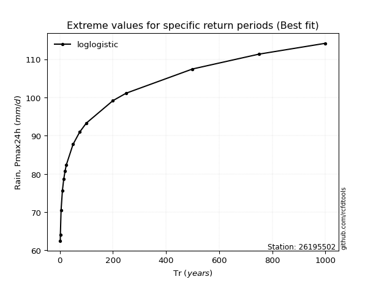</img>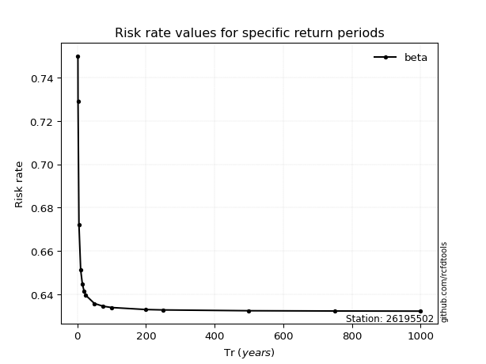</img>

</div>


<sub>**APP DISCLAIMER**: NO WARRANTY - This software is provided by [github.com/rcfdtools](https://github.com/rcfdtools) "as is", without any express or implied warranty, including warranties of merchantability, fitness for a particular purpose, or non-infringement. There is no guarantee that the software will be error-free or operate without interruption. LIMITATION OF LIABILITY - Neither the authors nor copyright holders will be liable for claims or damages arising from the software or its use. You are responsible for determining if the software is appropriate for your use and assume all associated risks, including errors, legal compliance, and data loss. NO PROFESSIONAL ADVICE - The software provides general information and does not offer professional advice. It should not replace consultation with professional advisors.</sub>