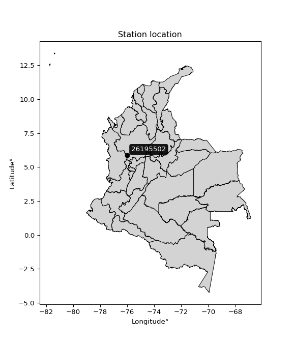

<div align="center">


</div>

# PMP Station (rain, Pmax24h): 26195502

Probable Maximum Precipitation (PMP) is the greatest amount of rainfall for a specific duration that is meteorologically possible for a given location, acting as a "worst-case" scenario for extreme storms, crucial for designing safety-critical infrastructure like bridges, river deviations, dams, spillways, and nuclear plants to prevent catastrophic failure. PMP is calculated by hydrologists using meteorological data to determine the upper limit of extreme rainfall, often leading to the Probable Maximum Flood (PMF) for flood control design, and is increasingly being studied for climate change impacts.

<div align="center">

</img>

</div>


## A. General information


### 1. General running parameters

• app_version: _v20251228_. • runtime: _2025-12-28 08:43:48.795225_. • Python version: _3.14.0_. • SciPy version: _1.16.3_. • Pandas version: _2.3.3_. • NumPy version: _2.3.5_. • Stations dataset (station_dataset_file): _dataset/pmax24h_in/automatic_colombia_2003_2024.csv_. • Stations catalog (station_catalog_file): _dataset/CNE_IDEAM.xls_. • Minimum year to eval til year_max (date_min): _1900_. • Maximum year to eval since year_min (date_max): _2024_. • Creates, save and include plots into reports (create_plot): _False_. • Plot only fit distributions with Δo > Δ (plot_only_fit): _True_. • Eval low extreme values, if False, evaluates high extreme values (low_extreme): _False_. • Eval every SciPy distribution as logarithmic (pdist_logarithmic_on): _True_. • Standard deviation normalized (ddof): _1.0_. • Return periods to eval in years (Tr): _[2, 2.33, 5, 10, 15, 20, 25, 50, 75, 100, 200, 250, 500, 750, 1000]_. • Minimum data sample per station, 0 means any (minimum_sample): _5_. • Z-Score maximum threshold to adjust a value, 0 means disable (zscore_max): _3.5_. • Z-Score minimum threshold to adjust a value, 0 means disable (zscore_min): _-2.5_. • Avoid zeros, e.g. rain = 0 (avoid_zeros): _True_. • Avoid null values (avoid_nans): _True_. [:file_folder:Dataset file.](../../dataset/pmax24h_in/automatic_colombia_2003_2024.csv)

> Delta Degrees of Freedom (DDOF): is a parameter used in the formulas for calculating variance and standard deviation. When ddof=0, the divisor is $N$ (the total number of observations) and this is used when your data set is the entire population. When ddof=1, the divisor is $N-1$ and this is used when your data set is a sample drawn from a larger population. Using $N-1$ provides an unbiased estimate of the population variance (known as Bessel´s correction).


### 2. Station info and location

|   id |   CODIGO | NOMBRE                            | CATEGORIA               | TECNOLOGIA                | ESTADO   | FECHA_INSTALACION   |   FECHA_SUSPENSION |   ALTITUD |   LATITUD |   LONGITUD | DEPARTAMENTO   | MUNICIPIO      | AREA_OPERATIVA                      | ENTIDAD                                    | AREA_HIDROGRAFICA   | ZONA_HIDROGRAFICA   | SUBZONA_HIDROGRAFICA   |   CORRIENTE | Catalogo   |
|-----:|---------:|:----------------------------------|:------------------------|:--------------------------|:---------|:--------------------|-------------------:|----------:|----------:|-----------:|:---------------|:---------------|:------------------------------------|:-------------------------------------------|:--------------------|:--------------------|:-----------------------|------------:|:-----------|
|    0 | 26195502 | CIUDAD BOLIVAR  - AUT  [26195502] | Climatológica Principal | Automática con Telemetría | Activa   | 30/09/2013          |                nan |      1516 |   5.86867 |   -75.9904 | Antioquia      | Ciudad Bolívar | Area Operativa 01 - Antioquia-Chocó | CENTRO NACIONAL DE INVESTIGACIONES DE CAFE | Magdalena Cauca     | Cauca               | Río San Juan           |         nan | CNE_OE     |

<div align="center">

Map location in: [:earth_americas:Google](http://maps.google.com/maps?q=5.868666667,-75.99044167) [:earth_americas:OSM](https://www.openstreetmap.org/#map=18/5.868666667/-75.99044167&layers=P) [:earth_americas:Bing](https://www.bing.com/maps?cp=5.868666667~-75.99044167&lvl=18) [:earth_americas:Apple](https://maps.apple.com/frame?center=5.868666667%2C-75.99044167&span=0.003%2C0.006)

</div>


<div align="center">

```geojson
{
  "type": "Feature",
  "geometry": {
    "type": "Point", 
    "coordinates": [-75.99044167, 5.868666667]
  }, 
  "properties": {
    "Name": "26195502"
  }
}
```

</div>


### 3. Discrete values table and plot

|               |           0 |          1 |           2 |           3 |           4 |
|:--------------|------------:|-----------:|------------:|------------:|------------:|
| Date          | 2017        | 2018       | 2019        | 2020        | 2021        |
| Value         |   56.4      |   47.9     |   70.5      |   70.3      |   70.9      |
| Value_initial |   56.4      |   47.9     |   70.5      |   70.3      |   70.9      |
| count         |    5        |    5       |    5        |    5        |    5        |
| mean          |   63.2      |   63.2     |   63.2      |   63.2      |   63.2      |
| std           |   10.5276   |   10.5276  |   10.5276   |   10.5276   |   10.5276   |
| zscore        |   -0.645922 |   -1.45333 |    0.693417 |    0.674419 |    0.731412 |

> The initial value (value_initial) correspond to the initial obtained or null completed value, and value (value) is adjusted only when the initial value is outside the valid range definite through the Z-Score value. If Z-Score is active, values out of range or outliers are replaced with the station mean value


### 4. Active continuous probability distributions from SciPy (44 of 104 available)

[scipy.stats](https://docs.scipy.org/doc/scipy/reference/stats.html) is a Python´s powerful submodule within the SciPy library for comprehensive statistical analysis, offering over 130 probability distributions (like Normal, Poisson), functions for descriptive stats (mean, variance), hypothesis testing (t-tests, chi-square), random variable generation, and statistical tests, making it essential for data science, modeling, and research. It provides tools to explore, model, and draw conclusions from data efficiently, working seamlessly with NumPy.

<div align="center">

|   id | p_dist             |   n_parameter | fit_method   | label                                                                       | active   | ref                                                                                                        |
|-----:|:-------------------|--------------:|:-------------|:----------------------------------------------------------------------------|:---------|:-----------------------------------------------------------------------------------------------------------|
|    0 | alpha              |             3 | MLE          | Alpha                                                                       | True     | [:mortar_board:](https://docs.scipy.org/doc/scipy/reference/generated/scipy.stats.alpha.html)              |
|    1 | betaprime          |             4 | MLE          | Beta prime                                                                  | True     | [:mortar_board:](https://docs.scipy.org/doc/scipy/reference/generated/scipy.stats.betaprime.html)          |
|    2 | chi2               |             3 | MLE          | Chi²                                                                        | True     | [:mortar_board:](https://docs.scipy.org/doc/scipy/reference/generated/scipy.stats.chi2.html)               |
|    3 | crystalball        |             4 | MLE          | Crystalball                                                                 | True     | [:mortar_board:](https://docs.scipy.org/doc/scipy/reference/generated/scipy.stats.crystalball.html)        |
|    4 | erlang             |             3 | MLE          | Erlang                                                                      | True     | [:mortar_board:](https://docs.scipy.org/doc/scipy/reference/generated/scipy.stats.erlang.html)             |
|    5 | expon              |             2 | MLE          | Exponential                                                                 | True     | [:mortar_board:](https://docs.scipy.org/doc/scipy/reference/generated/scipy.stats.expon.html)              |
|    6 | exponnorm          |             3 | MLE          | Exponentially modified Normal                                               | True     | [:mortar_board:](https://docs.scipy.org/doc/scipy/reference/generated/scipy.stats.exponnorm.html)          |
|    7 | f                  |             4 | MLE          | F                                                                           | True     | [:mortar_board:](https://docs.scipy.org/doc/scipy/reference/generated/scipy.stats.f.html)                  |
|    8 | fatiguelife        |             3 | MLE          | Fatigue-life (Birnbaum-Saunders)                                            | True     | [:mortar_board:](https://docs.scipy.org/doc/scipy/reference/generated/scipy.stats.fatiguelife.html)        |
|    9 | fisk               |             3 | MLE          | Fisk                                                                        | True     | [:mortar_board:](https://docs.scipy.org/doc/scipy/reference/generated/scipy.stats.fisk.html)               |
|   10 | gamma              |             3 | MLE          | Gamma                                                                       | True     | [:mortar_board:](https://docs.scipy.org/doc/scipy/reference/generated/scipy.stats.gamma.html)              |
|   11 | genexpon           |             5 | MLE          | Generalized exponential                                                     | True     | [:mortar_board:](https://docs.scipy.org/doc/scipy/reference/generated/scipy.stats.genexpon.html)           |
|   12 | genlogistic        |             3 | MLE          | Generalized logistic                                                        | True     | [:mortar_board:](https://docs.scipy.org/doc/scipy/reference/generated/scipy.stats.genlogistic.html)        |
|   13 | gibrat             |             2 | MM           | Gibrat                                                                      | True     | [:mortar_board:](https://docs.scipy.org/doc/scipy/reference/generated/scipy.stats.gibrat.html)             |
|   14 | gompertz           |             3 | MLE          | Gompertz (or truncated Gumbel)                                              | True     | [:mortar_board:](https://docs.scipy.org/doc/scipy/reference/generated/scipy.stats.gompertz.html)           |
|   15 | gumbel_l           |             2 | MM           | Gumbel Left Skew                                                            | True     | [:mortar_board:](https://docs.scipy.org/doc/scipy/reference/generated/scipy.stats.gumbel_l.html)           |
|   16 | gumbel_r           |             2 | MM           | Gumbel Right Skew                                                           | True     | [:mortar_board:](https://docs.scipy.org/doc/scipy/reference/generated/scipy.stats.gumbel_r.html)           |
|   17 | halflogistic       |             2 | MM           | Half-logistic                                                               | True     | [:mortar_board:](https://docs.scipy.org/doc/scipy/reference/generated/scipy.stats.halflogistic.html)       |
|   18 | halfnorm           |             2 | MM           | Half Normal                                                                 | True     | [:mortar_board:](https://docs.scipy.org/doc/scipy/reference/generated/scipy.stats.halfnorm.html)           |
|   19 | hypsecant          |             2 | MM           | hyperbolic secant                                                           | True     | [:mortar_board:](https://docs.scipy.org/doc/scipy/reference/generated/scipy.stats.hypsecant.html)          |
|   20 | invgamma           |             3 | MLE          | Inverted gamma                                                              | True     | [:mortar_board:](https://docs.scipy.org/doc/scipy/reference/generated/scipy.stats.invgamma.html)           |
|   21 | invgauss           |             3 | MLE          | Inverse Gaussian                                                            | True     | [:mortar_board:](https://docs.scipy.org/doc/scipy/reference/generated/scipy.stats.invgauss.html)           |
|   22 | invweibull         |             3 | MLE          | Inverted Weibull                                                            | True     | [:mortar_board:](https://docs.scipy.org/doc/scipy/reference/generated/scipy.stats.invweibull.html)         |
|   23 | johnsonsu          |             4 | MLE          | Johnson Su                                                                  | True     | [:mortar_board:](https://docs.scipy.org/doc/scipy/reference/generated/scipy.stats.johnsonsu.html)          |
|   24 | kstwobign          |             2 | MLE          | Limiting distribution of scaled Kolmogorov-Smirnov two-sided test statistic | True     | [:mortar_board:](https://docs.scipy.org/doc/scipy/reference/generated/scipy.stats.kstwobign.html)          |
|   25 | laplace            |             2 | MM           | Laplace                                                                     | True     | [:mortar_board:](https://docs.scipy.org/doc/scipy/reference/generated/scipy.stats.laplace.html)            |
|   26 | laplace_asymmetric |             3 | MLE          | Asymmetric Laplace                                                          | True     | [:mortar_board:](https://docs.scipy.org/doc/scipy/reference/generated/scipy.stats.laplace_asymmetric.html) |
|   27 | loggamma           |             3 | MLE          | Log gamma                                                                   | True     | [:mortar_board:](https://docs.scipy.org/doc/scipy/reference/generated/scipy.stats.loggamma.html)           |
|   28 | logistic           |             2 | MM           | Logistic (or Sech-squared)                                                  | True     | [:mortar_board:](https://docs.scipy.org/doc/scipy/reference/generated/scipy.stats.logistic.html)           |
|   29 | lognorm            |             3 | MLE          | Log Normal                                                                  | True     | [:mortar_board:](https://docs.scipy.org/doc/scipy/reference/generated/scipy.stats.lognorm.html)            |
|   30 | maxwell            |             2 | MM           | Maxwell                                                                     | True     | [:mortar_board:](https://docs.scipy.org/doc/scipy/reference/generated/scipy.stats.maxwell.html)            |
|   31 | mielke             |             4 | MLE          | Mielke Beta-Kappa / Dagum                                                   | True     | [:mortar_board:](https://docs.scipy.org/doc/scipy/reference/generated/scipy.stats.mielke.html)             |
|   32 | moyal              |             2 | MM           | Moyal                                                                       | True     | [:mortar_board:](https://docs.scipy.org/doc/scipy/reference/generated/scipy.stats.moyal.html)              |
|   33 | nakagami           |             3 | MLE          | Nakagami                                                                    | True     | [:mortar_board:](https://docs.scipy.org/doc/scipy/reference/generated/scipy.stats.nakagami.html)           |
|   34 | ncf                |             5 | MLE          | Non-central F distribution                                                  | True     | [:mortar_board:](https://docs.scipy.org/doc/scipy/reference/generated/scipy.stats.ncf.html)                |
|   35 | nct                |             4 | MLE          | Non-central Student’s t                                                     | True     | [:mortar_board:](https://docs.scipy.org/doc/scipy/reference/generated/scipy.stats.nct.html)                |
|   36 | norm               |             2 | MM           | Normal                                                                      | True     | [:mortar_board:](https://docs.scipy.org/doc/scipy/reference/generated/scipy.stats.norm.html)               |
|   37 | pearson3           |             3 | MM           | Pearson type III                                                            | True     | [:mortar_board:](https://docs.scipy.org/doc/scipy/reference/generated/scipy.stats.pearson3.html)           |
|   38 | rayleigh           |             2 | MM           | Rayleigh                                                                    | True     | [:mortar_board:](https://docs.scipy.org/doc/scipy/reference/generated/scipy.stats.rayleigh.html)           |
|   39 | rice               |             3 | MLE          | Rice                                                                        | True     | [:mortar_board:](https://docs.scipy.org/doc/scipy/reference/generated/scipy.stats.rice.html)               |
|   40 | t                  |             3 | MLE          | Student’s t                                                                 | True     | [:mortar_board:](https://docs.scipy.org/doc/scipy/reference/generated/scipy.stats.t.html)                  |
|   41 | truncnorm          |             4 | MLE          | Truncated normal                                                            | True     | [:mortar_board:](https://docs.scipy.org/doc/scipy/reference/generated/scipy.stats.truncnorm.html)          |
|   42 | wald               |             2 | MM           | Wald                                                                        | True     | [:mortar_board:](https://docs.scipy.org/doc/scipy/reference/generated/scipy.stats.wald.html)               |
|   43 | weibull_min        |             3 | MLE          | Weibull minimum                                                             | True     | [:mortar_board:](https://docs.scipy.org/doc/scipy/reference/generated/scipy.stats.weibull_min.html)        |

</div>

> **n_parameter:** # arguments & localization & scale.
>
> **Fit methods:** (MLE) maximum likelihood, (MM) L-moments.
>
>**Inactive:** foldnorm, gennorm, norminvgauss, powernorm, powerlognorm, skewnorm, genextreme, anglit, arcsine, argus, beta, bradford, burr, burr12, cauchy, cosine, halfcauchy, foldcauchy, skewcauchy, wrapcauchy, dgamma, gengamma, exponweib, exponpow, truncexpon, gausshyper, genhalflogistic, genhyperbolic, geninvgauss, halfgennorm, johnsonsb, kappa4, kappa3, ksone, kstwo, loglaplace, levy, levy_l, levy_stable, ncx2, pareto, genpareto, truncpareto, lomax, powerlaw, rdist, rel_breitwigner, recipinvgauss, semicircular, studentized_range, trapezoid, triang, truncweibull_min, tukeylambda, uniform, loguniform, vonmises, vonmises_line, weibull_max, dweibull, 


## B. Probability distributions vs. Empirical distributions

A continuous probability distribution (CPD) describes probabilities for variables that can take any value within a range (like rain any time), unlike discrete variables with specific outcomes (like temperature). It uses a Probability Density Function (PDF), a curve where the total area under it equals 1, and the probability of the variable falling within an interval (a to b) is found by calculating the area under the curve between those points. A key feature is that the probability of hitting any single exact value is zero, so probabilities are always expressed for ranges, e.g., $P(a ≤ X ≤ b)$.

<div align="center">

Distributions parameters from station values
|    |   station | p_dist                |   n |               loc |            scale | shape                  | shape1                 | shape2                | shape3   |
|---:|----------:|:----------------------|----:|------------------:|-----------------:|:-----------------------|:-----------------------|:----------------------|:---------|
|  0 |  26195502 | alpha                 |   5 |    -161.774       |   5190.69        | 23.13012029168872      |                        |                       |          |
|  1 |  26195502 | betaprime             |   5 |    -169.993       |   7482.13        | 605.9627204905055      | 19454.98269003656      |                       |          |
|  2 |  26195502 | chi2                  |   5 |      47.9         |      1.02447     | 1.0097544771762423     |                        |                       |          |
|  3 |  26195502 | crystalball           |   5 |      63.2         |      9.41616     | 57245.523818347545     | 5582.833056705884      |                       |          |
|  4 |  26195502 | erlang                |   5 |     -87.2159      |      0.616075    | 244.10082171465223     |                        |                       |          |
|  5 |  26195502 | expon                 |   5 |      47.9         |     15.3         |                        |                        |                       |          |
|  6 |  26195502 | exponnorm             |   5 |      63.1938      |      9.41618     | 0.000666801630177859   |                        |                       |          |
|  7 |  26195502 | f                     |   5 |   -9503.26        |   9566.43        | 7553670.772863412      | 2813247.518635598      |                       |          |
|  8 |  26195502 | fatiguelife           |   5 |      47.9         |      0.000208781 | 332.80425754715685     |                        |                       |          |
|  9 |  26195502 | fisk                  |   5 | -135790           | 135854           | 23424.322637824553     |                        |                       |          |
| 10 |  26195502 | gamma                 |   5 |     -79.0459      |      0.648158    | 219.33462173001817     |                        |                       |          |
| 11 |  26195502 | genexpon              |   5 |      47.9         |      2.14044     | 0.18222297166713314    | 1.0259322682544284e-05 | 1.2951698087557832    |          |
| 12 |  26195502 | genlogistic           |   5 |      70.9002      |      9.77107e-06 | 1.2650730812547147e-06 |                        |                       |          |
| 13 |  26195502 | gibrat                |   5 |      56.0167      |      4.35689     |                        |                        |                       |          |
| 14 |  26195502 | gompertz              |   5 |      70.3         |      0.391895    | 0.8631147413341387     |                        |                       |          |
| 15 |  26195502 | gumbel_l              |   5 |      67.4378      |      7.34175     |                        |                        |                       |          |
| 16 |  26195502 | gumbel_r              |   5 |      58.9622      |      7.34175     |                        |                        |                       |          |
| 17 |  26195502 | halflogistic          |   5 |      52.0397      |      8.05045     |                        |                        |                       |          |
| 18 |  26195502 | halfnorm              |   5 |      50.7367      |     15.6205      |                        |                        |                       |          |
| 19 |  26195502 | hypsecant             |   5 |      63.2         |      5.99451     |                        |                        |                       |          |
| 20 |  26195502 | invgamma              |   5 |     -92.302       |  38641.8         | 249.7125931846441      |                        |                       |          |
| 21 |  26195502 | invgauss              |   5 |       6.24932     |   1644.37        | 0.03469357846536221    |                        |                       |          |
| 22 |  26195502 | invweibull            |   5 |      47.9         |      1.8147      | 0.06800562602761166    |                        |                       |          |
| 23 |  26195502 | johnsonsu             |   5 |      70.9         |      1.51785e-13 | 3.085575872761158      | 0.13185681897478407    |                       |          |
| 24 |  26195502 | kstwobign             |   5 |      25.575       |     42.803       |                        |                        |                       |          |
| 25 |  26195502 | laplace               |   5 |      63.2         |      6.65823     |                        |                        |                       |          |
| 26 |  26195502 | laplace_asymmetric    |   5 |      70.9         |      0.0590411   | 130.41408371619684     |                        |                       |          |
| 27 |  26195502 | loggamma              |   5 |      70.9003      |      2.25743e-05 | 2.9418787322131153e-06 |                        |                       |          |
| 28 |  26195502 | logistic              |   5 |      63.2         |      5.1914      |                        |                        |                       |          |
| 29 |  26195502 | lognorm               |   5 |      47.9         |      0.0147713   | 14.186512910011363     |                        |                       |          |
| 30 |  26195502 | maxwell               |   5 |      40.8877      |     13.9822      |                        |                        |                       |          |
| 31 |  26195502 | mielke                |   5 |      21.4552      |     49.5918      | 4.959735404483094      | 1338.8202396982851     |                       |          |
| 32 |  26195502 | moyal                 |   5 |      57.8152      |      4.23876     |                        |                        |                       |          |
| 33 |  26195502 | nakagami              |   5 |      56.4         |     10.8715      | 0.38342417410510177    |                        |                       |          |
| 34 |  26195502 | ncf                   |   5 |      -5.27612     |     68.4264      | 102.33652553604583     | 2416.4097774989723     | 2.828908302253061e-05 |          |
| 35 |  26195502 | nct                   |   5 |      -1.66458     |      0.180378    | 20.11082878484254      | 346.3624639844238      |                       |          |
| 36 |  26195502 | norm                  |   5 |      63.2         |      9.41616     |                        |                        |                       |          |
| 37 |  26195502 | pearson3              |   5 |      63.2         |      9.41615     | -0.6450215378833632    |                        |                       |          |
| 38 |  26195502 | rayleigh              |   5 |      45.1863      |     14.3728      |                        |                        |                       |          |
| 39 |  26195502 | rice                  |   5 |      42.0301      |     10.578       | 1.6726241421439625     |                        |                       |          |
| 40 |  26195502 | t                     |   5 |      63.2003      |      9.41593     | 15102886.17746884      |                        |                       |          |
| 41 |  26195502 | truncnorm             |   5 |      63.2         |      9.41616     | -297.27184441213666    | 844.5651990632784      |                       |          |
| 42 |  26195502 | wald                  |   5 |      53.7838      |      9.41618     |                        |                        |                       |          |
| 43 |  26195502 | weibull_min           |   5 |      -4.49718e+06 |      4.49725e+06 | 679931.8269159627      |                        |                       |          |
| 44 |  26195502 | logalpha              |   5 |      -3.25653     |    342.161       | 46.323864436749375     |                        |                       |          |
| 45 |  26195502 | logbetaprime          |   5 |      -4.25664     |      1.64433     | 2963.3635116793757     | 581.0566534431284      |                       |          |
| 46 |  26195502 | logchi2               |   5 |       3.86912     |      0.961315    | 0.9837082993513644     |                        |                       |          |
| 47 |  26195502 | logcrystalball        |   5 |       4.13425     |      0.158477    | 5.9754158524219205     | 19.96813160813572      |                       |          |
| 48 |  26195502 | logerlang             |   5 |       1.45574     |      0.00979383  | 273.2314850240375      |                        |                       |          |
| 49 |  26195502 | logexpon              |   5 |       3.86912     |      0.265132    |                        |                        |                       |          |
| 50 |  26195502 | logexponnorm          |   5 |       4.13414     |      0.158473    | 0.0006826160487093057  |                        |                       |          |
| 51 |  26195502 | logf                  |   5 |    -122.06        |    126.195       | 3975789.4919740474     | 1857344.9215918966     |                       |          |
| 52 |  26195502 | logfatiguelife        |   5 |     -24.4565      |     28.5901      | 0.00551783894179181    |                        |                       |          |
| 53 |  26195502 | logfisk               |   5 |      -2.33619e+07 |      2.33619e+07 | 245873234.78252357     |                        |                       |          |
| 54 |  26195502 | loggamma              |   5 |       1.649       |      0.0106624   | 232.8466925258004      |                        |                       |          |
| 55 |  26195502 | loggenexpon           |   5 |       3.86882     |      0.000537296 | 0.000960025335484989   | 0.2604573977755511     | 1.213782061315775e-05 |          |
| 56 |  26195502 | loggenlogistic        |   5 |       4.26129     |      1.76574e-06 | 1.3934626038137894e-05 |                        |                       |          |
| 57 |  26195502 | loggibrat             |   5 |       4.01338     |      0.0733103   |                        |                        |                       |          |
| 58 |  26195502 | loggompertz           |   5 |       3.86912     |      0.456841    | 1.2746849132806026     |                        |                       |          |
| 59 |  26195502 | loggumbel_l           |   5 |       4.20557     |      0.12356     |                        |                        |                       |          |
| 60 |  26195502 | loggumbel_r           |   5 |       4.06293     |      0.12356     |                        |                        |                       |          |
| 61 |  26195502 | loghalflogistic       |   5 |       3.94643     |      0.13548     |                        |                        |                       |          |
| 62 |  26195502 | loghalfnorm           |   5 |       3.9245      |      0.262886    |                        |                        |                       |          |
| 63 |  26195502 | loghypsecant          |   5 |       4.13425     |      0.100886    |                        |                        |                       |          |
| 64 |  26195502 | loginvgamma           |   5 |       1.34567     |    795.146       | 286.39735795468346     |                        |                       |          |
| 65 |  26195502 | loginvgauss           |   5 |       2.72019     |     96.6533      | 0.014597383553231244   |                        |                       |          |
| 66 |  26195502 | loginvweibull         |   5 |      -7.89363e+06 |      7.89364e+06 | 51446906.277284294     |                        |                       |          |
| 67 |  26195502 | logjohnsonsu          |   5 |       4.26127     |      1.87945e-14 | 3.6561930432125367     | 0.17381109463786734    |                       |          |
| 68 |  26195502 | logkstwobign          |   5 |       3.488       |      0.735491    |                        |                        |                       |          |
| 69 |  26195502 | loglaplace            |   5 |       4.13425     |      0.112056    |                        |                        |                       |          |
| 70 |  26195502 | loglaplace_asymmetric |   5 |       4.26127     |      0.00158739  | 79.87670905852553      |                        |                       |          |
| 71 |  26195502 | logloggamma           |   5 |       4.26132     |      5.97411e-07 | 4.682032540619884e-06  |                        |                       |          |
| 72 |  26195502 | loglogistic           |   5 |       4.13425     |      0.0873699   |                        |                        |                       |          |
| 73 |  26195502 | loglognorm            |   5 |       3.86912     |      0.000334988 | 13.678636598153417     |                        |                       |          |
| 74 |  26195502 | logmaxwell            |   5 |       3.75874     |      0.235317    |                        |                        |                       |          |
| 75 |  26195502 | logmielke             |   5 |     -18.0525      |     22.3157      | 167.39923954095354     | 54484.38059156219      |                       |          |
| 76 |  26195502 | logmoyal              |   5 |       4.04362     |      0.0713373   |                        |                        |                       |          |
| 77 |  26195502 | lognakagami           |   5 |       3.86912     |      0.300128    | 0.12918543539352217    |                        |                       |          |
| 78 |  26195502 | logncf                |   5 |      -0.848737    |      2.65478e-06 | 0.0002883092856625989  | 686.2690818753379      | 540.3368218267569     |          |
| 79 |  26195502 | lognct                |   5 |      -3.38452     |      0.0330898   | 951.4203205951973      | 227.0541795776277      |                       |          |
| 80 |  26195502 | lognorm               |   5 |       4.13425     |      0.158472    |                        |                        |                       |          |
| 81 |  26195502 | logpearson3           |   5 |       4.13425     |      0.158472    | -0.7130796274045033    |                        |                       |          |
| 82 |  26195502 | lograyleigh           |   5 |       3.83108     |      0.241891    |                        |                        |                       |          |
| 83 |  26195502 | logrice               |   5 |       3.76726     |      0.176325    | 1.7719117291820203     |                        |                       |          |
| 84 |  26195502 | logt                  |   5 |       4.13425     |      0.158473    | 206554986.6773974      |                        |                       |          |
| 85 |  26195502 | logtruncnorm          |   5 |      -0.0482463   |      1.10529     | 3.5442096631609425     | 3.8990101643261967     |                       |          |
| 86 |  26195502 | logwald               |   5 |       3.97581     |      0.158435    |                        |                        |                       |          |
| 87 |  26195502 | logweibull_min        |   5 |      -8.02384e+06 |      8.02385e+06 | 73219564.54659547      |                        |                       |          |

</div>

> **loc** (Location parameter): This shifts the distribution along the x-axis. For many common distributions, like the normal (Gaussian) distribution, loc represents the mean $μ$. For others, like the uniform distribution, it might represent the minimum value, or for the beta distribution, the left end of the support interval.
>
> **scale** (Scale parameter): This determines the width or spread of the distribution. For the normal distribution, scale represents the standard deviation $σ$. For a uniform distribution, it defines the length of the interval (from $loc$ to $loc + scale$).
>
> **shape** (Shape parameters): Refers to parameters that define the specific form of a probability distribution, distinct from its location (loc) and scale (scale). These parameters are required arguments for most distribution functions. For example, a normal (Gaussian) distribution is fully defined by its location (mean) and scale (standard deviation), so it has no specific shape parameters beyond loc and scale. However, other distributions have intrinsic properties that need specification, as Gamma distribution that takes a shape parameter, often named $a$ or $alpha$.


### 0. Cumulative distribution values - CDF (88 evaluated)

Cumulative Distribution Function (CDF), denoted as $F$<sub>$X$</sub>$(x)$, is a function that gives the probability that a random variable $X$ will take a value less than or equal to a specific value, $x$ (i.e., $(P(X≥x)$. It essentially "accumulates" probabilities from a given point up to the far right (positive infinity), providing a complete picture of the distribution´s probabilities for both discrete (like rain) and continuous (like temperature) variables, helping to find probabilities over ranges or above certain values.

<div align="center">

CDF ordered by x ascending and calculating $log(f(x))$ separately
|   id |   Station |   date |    x |   count |   mean |     std |    zscore |   Value_initial |   station |   m |     alpha |   alpha_pdf |   betaprime |   betaprime_pdf |        chi2 |    chi2_pdf |   crystalball |   crystalball_pdf |    erlang |   erlang_pdf |    expon |   expon_pdf |   exponnorm |   exponnorm_pdf |         f |     f_pdf |   fatiguelife |   fatiguelife_pdf |      fisk |   fisk_pdf |     gamma |   gamma_pdf |    genexpon |   genexpon_pdf |   genlogistic |   genlogistic_pdf |     gibrat |   gibrat_pdf |    gompertz |   gompertz_pdf |   gumbel_l |   gumbel_l_pdf |   gumbel_r |   gumbel_r_pdf |   halflogistic |   halflogistic_pdf |   halfnorm |   halfnorm_pdf |   hypsecant |   hypsecant_pdf |   invgamma |   invgamma_pdf |   invgauss |   invgauss_pdf |   invweibull |   invweibull_pdf |   johnsonsu |   johnsonsu_pdf |   kstwobign |   kstwobign_pdf |   laplace |   laplace_pdf |   laplace_asymmetric |   laplace_asymmetric_pdf |   loggamma |   loggamma_pdf |   logistic |   logistic_pdf |   lognorm |   lognorm_pdf |   maxwell |   maxwell_pdf |    mielke |   mielke_pdf |      moyal |   moyal_pdf |    nakagami |   nakagami_pdf |       ncf |   ncf_pdf |       nct |   nct_pdf |      norm |   norm_pdf |   pearson3 |   pearson3_pdf |   rayleigh |   rayleigh_pdf |     rice |   rice_pdf |         t |     t_pdf |   truncnorm |   truncnorm_pdf |     wald |   wald_pdf |   weibull_min |   weibull_min_pdf |   logalpha |   logalpha_pdf |   logbetaprime |   logbetaprime_pdf |     logchi2 |   logchi2_pdf |   logcrystalball |   logcrystalball_pdf |   logerlang |   logerlang_pdf |   logexpon |   logexpon_pdf |   logexponnorm |   logexponnorm_pdf |      logf |   logf_pdf |   logfatiguelife |   logfatiguelife_pdf |   logfisk |   logfisk_pdf |   loggenexpon |   loggenexpon_pdf |   loggenlogistic |   loggenlogistic_pdf |   loggibrat |   loggibrat_pdf |   loggompertz |   loggompertz_pdf |   loggumbel_l |   loggumbel_l_pdf |   loggumbel_r |   loggumbel_r_pdf |   loghalflogistic |   loghalflogistic_pdf |   loghalfnorm |   loghalfnorm_pdf |   loghypsecant |   loghypsecant_pdf |   loginvgamma |   loginvgamma_pdf |   loginvgauss |   loginvgauss_pdf |   loginvweibull |   loginvweibull_pdf |   logjohnsonsu |   logjohnsonsu_pdf |   logkstwobign |   logkstwobign_pdf |   loglaplace |   loglaplace_pdf |   loglaplace_asymmetric |   loglaplace_asymmetric_pdf |   logloggamma |   logloggamma_pdf |   loglogistic |   loglogistic_pdf |   loglognorm |   loglognorm_pdf |   logmaxwell |   logmaxwell_pdf |   logmielke |   logmielke_pdf |   logmoyal |   logmoyal_pdf |   lognakagami |   lognakagami_pdf |   logncf |   logncf_pdf |    lognct |   lognct_pdf |   logpearson3 |   logpearson3_pdf |   lograyleigh |   lograyleigh_pdf |   logrice |   logrice_pdf |      logt |   logt_pdf |   logtruncnorm |   logtruncnorm_pdf |   logwald |   logwald_pdf |   logweibull_min |   logweibull_min_pdf |
|-----:|----------:|-------:|-----:|--------:|-------:|--------:|----------:|----------------:|----------:|----:|----------:|------------:|------------:|----------------:|------------:|------------:|--------------:|------------------:|----------:|-------------:|---------:|------------:|------------:|----------------:|----------:|----------:|--------------:|------------------:|----------:|-----------:|----------:|------------:|------------:|---------------:|--------------:|------------------:|-----------:|-------------:|------------:|---------------:|-----------:|---------------:|-----------:|---------------:|---------------:|-------------------:|-----------:|---------------:|------------:|----------------:|-----------:|---------------:|-----------:|---------------:|-------------:|-----------------:|------------:|----------------:|------------:|----------------:|----------:|--------------:|---------------------:|-------------------------:|-----------:|---------------:|-----------:|---------------:|----------:|--------------:|----------:|--------------:|----------:|-------------:|-----------:|------------:|------------:|---------------:|----------:|----------:|----------:|----------:|----------:|-----------:|-----------:|---------------:|-----------:|---------------:|---------:|-----------:|----------:|----------:|------------:|----------------:|---------:|-----------:|--------------:|------------------:|-----------:|---------------:|---------------:|-------------------:|------------:|--------------:|-----------------:|---------------------:|------------:|----------------:|-----------:|---------------:|---------------:|-------------------:|----------:|-----------:|-----------------:|---------------------:|----------:|--------------:|--------------:|------------------:|-----------------:|---------------------:|------------:|----------------:|--------------:|------------------:|--------------:|------------------:|--------------:|------------------:|------------------:|----------------------:|--------------:|------------------:|---------------:|-------------------:|--------------:|------------------:|--------------:|------------------:|----------------:|--------------------:|---------------:|-------------------:|---------------:|-------------------:|-------------:|-----------------:|------------------------:|----------------------------:|--------------:|------------------:|--------------:|------------------:|-------------:|-----------------:|-------------:|-----------------:|------------:|----------------:|-----------:|---------------:|--------------:|------------------:|---------:|-------------:|----------:|-------------:|--------------:|------------------:|--------------:|------------------:|----------:|--------------:|----------:|-----------:|---------------:|-------------------:|----------:|--------------:|-----------------:|---------------------:|
|    0 |  26195502 |   2018 | 47.9 |       5 |   63.2 | 10.5276 | -1.45333  |            47.9 |  26195502 |   1 | 0.0519796 |   0.0125594 |   0.0548316 |       0.0120893 | 5.64781e-08 | 4.01306e+06 |     0.0520955 |         0.0113169 | 0.0524162 |    0.0119505 | 0        |   0.0653595 |   0.0520955 |       0.0113168 | 0.0528758 | 0.0114319 |     0.0275727 |       1.18668e+08 | 0.0552263 | 0.00899746 | 0.0522974 |   0.012011  | 2.21334e-07 |      0.0851335 |      0        |        0.00659026 | 0          |    0         | 0           |        0       |  0.0674804 |     0.00887399 |  0.0109757 |      0.0067454 |       0        |          0         |   0        |      0         |   0.0494925 |      0.00822307 |  0.0540707 |      0.0127861 |  0.0535876 |      0.014286  |   7.1565e-05 |      6.53773e+09 |   0.0948978 |     0.000968199 |   0.0515536 |       0.0186354 | 0.0502344 |    0.00754471 |            0.0504307 |               0.00654962 |  0.0492149 |       0.674529 |  0.0498698 |     0.00912718 | 0.0471577 |      0.621063 | 0.0311278 |     0.0126568 | 0.0442227 |   0.00829399 | 0.00127888 |  0.00169512 | 0           |      0         | 0.0488798 | 0.0123572 | 0.0453765 | 0.0142882 | 0.0520955 |  0.0113169 |  0.0656737 |      0.0102701 |  0.0176657 |      0.0129042 | 0.03906  |  0.0136265 | 0.0520881 | 0.0113158 |   0.0520955 |       0.0113169 | 0        |  0         |     0.0502281 |        0.00739994 |  0.0451011 |       0.639903 |       0.239632 |           0.848401 | 2.30001e-08 |   2.54739e+07 |        0.0471645 |             0.621111 |   0.0486437 |         0.6678  |   0        |       3.7717   |       0.047159 |           0.621071 | 0.0468511 |   0.618714 |        0.0460082 |             0.617366 | 0.0472659 |      0.473939 |   0.000520226 |           1.78903 |         0        |             0.357329 |   0         |        0        |   3.95029e-08 |           2.79022 |     0.0635672 |          0.497756 |    0.00823167 |          0.319765 |          0        |               0       |      0        |           0       |      0.0458971 |           0.453365 |     0.0482371 |          0.693974 |     0.0498933 |          0.747055 |       0.0426601 |            0.877068 |      0.0363336 |        0.0353136   |      0.0488882 |            1.05047 |    0.0469247 |          0.41876 |               0.0453665 |                    0.357794 |     0.0462439 |          0.362423 |     0.0458872 |          0.501106 |    0.0227825 |      8.89872e+12 |    0.0257057 |         0.668305 |   0.0506637 |        0.386881 | 0.00067936 |      0.0591356 |   0.000120324 |       7.00045e+10 | 0.305254 |     0.721458 | 0.0621083 |      0.73866 |     0.0621306 |          0.566929 |     0.0122848 |          0.642025 | 0.0362261 |       0.73824 | 0.0471581 |   0.621062 |    1.07732e-07 |            4.54706 |  0        |      0        |        0.0450689 |             0.401854 |
|    1 |  26195502 |   2017 | 56.4 |       5 |   63.2 | 10.5276 | -0.645922 |            56.4 |  26195502 |   2 | 0.254158  |   0.034956  |   0.24639   |       0.0334577 | 0.995959    | 0.00216983  |     0.235097  |         0.032643  | 0.244275  |    0.0336227 | 0.426247 |   0.0375002 |   0.235097  |       0.0326429 | 0.236728  | 0.0326788 |     0.727832  |       0.0118395   | 0.202009  | 0.0277963  | 0.245552  |   0.033862  | 0.51503     |      0.0412895 |      0        |        0.0198082  | 0.00753459 |    0.0542492 | 0           |        0       |  0.199379  |     0.0242492  |  0.242285  |      0.0467835 |       0.264379 |          0.0577672 |   0.283065 |      0.0478303 |   0.198101  |      0.0309546  |  0.256327  |      0.0346714 |  0.273274  |      0.035842  |   0.406442   |      0.00292765  |   0.105585  |     0.0016602   |   0.322535  |       0.0393166 | 0.180065  |    0.0270439  |            0.152098  |               0.0197536  |  0.275502  |       2.10911  |  0.21251   |     0.032236   | 0.260355  |      2.04827  | 0.254384  |     0.0379572 | 0.176191  |   0.0250068  | 0.237331   |  0.0553291  | 1.76789e-12 |    190.798     | 0.250771  | 0.0350081 | 0.280967  | 0.0385801 | 0.235097  |  0.032643  |  0.218138  |      0.02717   |  0.262401  |      0.040039  | 0.248064 |  0.0349308 | 0.235082  | 0.0326426 |   0.235097  |       0.032643  | 0.142008 |  0.113175  |     0.169972  |        0.0233784  |  0.268223  |       2.12235  |       0.394846 |           1.0263   | 0.326499    |   0.928363    |        0.260365  |             2.04824  |   0.274042  |         2.10994 |   0.459965 |       2.03685  |       0.260356 |           2.04827  | 0.259581  |   2.04511  |        0.260211  |             2.06429  | 0.216815  |      1.78713  |   0.35522     |           2.30543 |         0        |             1.29698  |   0.0892094 |        8.45182  |   0.421854    |           2.30657 |     0.218364  |          1.55851  |    0.278164   |          2.88057  |          0.307269 |               3.34213 |      0.318725 |           2.78959 |      0.222598  |           2.03094  |     0.28174   |          2.14987  |     0.294374  |          2.17953  |       0.336953  |            2.38894  |      0.0444466 |        0.0712917   |      0.356457  |            2.29297 |    0.201608  |          1.79917 |               0.164532  |                    1.29762  |     0.166362  |          1.30382  |     0.237775  |          2.07437  |    0.674545  |      0.161167    |    0.283448  |         2.33239  |   0.175563  |        1.33073  | 0.279555   |      3.37014   |   0.694717    |       1.06216     | 0.429614 |     0.787881 | 0.28467   |      1.97534 |     0.237001  |          1.69406  |     0.292891  |          2.43376  | 0.274246  |       2.14087 | 0.260354  |   2.04826  |    0.576359    |            2.66379 |  0.227031 |      6.61261  |        0.185151  |             1.52248  |
|    2 |  26195502 |   2020 | 70.3 |       5 |   63.2 | 10.5276 |  0.674419 |            70.3 |  26195502 |   3 | 0.777426  |   0.0287271 |   0.776047  |       0.030466  | 0.999997    | 1.51984e-06 |     0.774582  |         0.0318843 | 0.7736    |    0.0303154 | 0.768703 |   0.0151175 |   0.774581  |       0.0318844 | 0.774601  | 0.0317432 |     0.837493  |       0.00539988  | 0.735538  | 0.0335385  | 0.775893  |   0.0301637 | 0.851488    |      0.012644  |      0        |        0.119791   | 0.882452   |    0.0138025 | 2.44043e-07 |        2.20241 |  0.771626  |     0.0459368  |  0.807781  |      0.0234865 |       0.812423 |          0.0211149 |   0.789582 |      0.0233153 |   0.810998  |      0.0297089  |  0.774889  |      0.0286762 |  0.763298  |      0.0260105 |   0.430461   |      0.00110155  |   0.203159  |     0.0621051   |   0.775062  |       0.0218704 | 0.827869  |    0.0258524  |            0.92498   |               0.120131   |  0.774629  |       1.78731  |  0.797     |     0.0311652  | 0.772745  |      1.90323  | 0.780918  |     0.0276317 | 0.927483  |   0.0941773  | 0.81863    |  0.0210219  | 0.803495    |      0.027742  | 0.773461  | 0.0287579 | 0.772949  | 0.0241634 | 0.774582  |  0.0318843 |  0.762858  |      0.0394697 |  0.782712  |      0.0264157 | 0.7752   |  0.0298689 | 0.774578  | 0.0318854 |   0.774582  |       0.0318843 | 0.854258 |  0.0155095 |     0.782082  |        0.0501987  |  0.776061  |       1.81493  |       0.622168 |           0.981178 | 0.47916     |   0.536448    |        0.77274   |             1.90318  |   0.77542   |         1.79675 |   0.764734 |       0.887355 |       0.772744 |           1.90322  | 0.77161   |   1.90482  |        0.774382  |             1.89618  | 0.737741  |      2.03628  |   0.774822    |           1.34502 |         0        |             7.37868  |   0.881674  |        0.827379 |   0.813136    |           1.2075  |     0.76898   |          2.73958  |    0.806427   |          1.40415  |          0.811214 |               1.26192 |      0.78824  |           1.39176 |      0.809284  |           1.77932  |     0.774266  |          1.72243  |     0.772306  |          1.63489  |       0.771969  |            1.30216  |      0.129467  |        4.31415     |      0.770259  |            1.29326 |    0.826376  |          1.54943 |               0.935023  |                    7.37428  |     0.935167  |          7.3291   |     0.795202  |          1.86398  |    0.696696  |      0.0665809   |    0.779326  |         1.64961  |   0.924791  |        6.94048  | 0.817418   |      1.25714   |   0.850077    |       0.474378    | 0.601472 |     0.748479 | 0.752832  |      1.75369 |     0.759634  |          2.41262  |     0.78119   |          1.57696  | 0.773023  |       1.79372 | 0.772742  |   1.90323  |    0.989524    |            1.25108 |  0.853388 |      0.928322 |        0.783165  |             3.02464  |
|    3 |  26195502 |   2019 | 70.5 |       5 |   63.2 | 10.5276 |  0.693417 |            70.5 |  26195502 |   4 | 0.783124  |   0.0282538 |   0.782091  |       0.0299755 | 0.999997    | 1.37245e-06 |     0.780908  |         0.0313707 | 0.779614  |    0.0298293 | 0.771707 |   0.0149211 |   0.780906  |       0.0313707 | 0.780899  | 0.0312333 |     0.838568  |       0.00535273  | 0.742191  | 0.0329904  | 0.781877  |   0.0296738 | 0.853996    |      0.0124306 |      0        |        0.122933   | 0.88517    |    0.0133877 | 0.437134    |        2.06511 |  0.780752  |     0.0453189  |  0.812429  |      0.0229868 |       0.816604 |          0.0206919 |   0.794208 |      0.0229425 |   0.816858  |      0.0288936  |  0.780578  |      0.0282143 |  0.768461  |      0.025617  |   0.43068    |      0.0010917   |   0.218601  |     0.0972476   |   0.779404  |       0.0215494 | 0.832962  |    0.0250874  |            0.949321  |               0.123292   |  0.779672  |       1.76314  |  0.803161  |     0.0304529  | 0.778116  |      1.87758  | 0.786398  |     0.0271757 | 0.946472  |   0.0957135  | 0.822787   |  0.0205566  | 0.808984    |      0.0271519 | 0.779166  | 0.0282921 | 0.777742  | 0.0237647 | 0.780908  |  0.0313707 |  0.770704  |      0.0389808 |  0.787952  |      0.0259839 | 0.781127 |  0.0293997 | 0.780904  | 0.0313717 |   0.780908  |       0.0313707 | 0.857321 |  0.0151225 |     0.79204   |        0.0493754  |  0.781181  |       1.78973  |       0.624952 |           0.978516 | 0.48068     |   0.533651    |        0.77811   |             1.87754  |   0.780489  |         1.77228 |   0.767241 |       0.877897 |       0.778115 |           1.87757  | 0.776985  |   1.87928  |        0.779732  |             1.87025  | 0.743484  |      2.00719  |   0.778621    |           1.32916 |         0        |             7.54597  |   0.883994  |        0.806283 |   0.816545    |           1.19286 |     0.776721  |          2.70937  |    0.81038    |          1.37896  |          0.814769 |               1.24059 |      0.792167 |           1.37302 |      0.81428   |           1.7382   |     0.779126  |          1.69902  |     0.776919  |          1.61312  |       0.775643  |            1.28435  |      0.144984  |        7.00148     |      0.773911  |            1.27771 |    0.830723  |          1.51065 |               0.956209  |                    7.54137  |     0.956222  |          7.49411  |     0.800447  |          1.82822  |    0.696884  |      0.0660732   |    0.78398   |         1.62676  |   0.944718  |        7.08913  | 0.820956   |      1.23364   |   0.851419    |       0.470311    | 0.603596 |     0.747086 | 0.757785  |      1.73364 |     0.766454  |          2.38902  |     0.78564   |          1.5553   | 0.778085  |       1.77015 | 0.778112  |   1.87758  |    0.993061    |            1.23862 |  0.855997 |      0.908695 |        0.791697  |             2.98192  |
|    4 |  26195502 |   2021 | 70.9 |       5 |   63.2 | 10.5276 |  0.731412 |            70.9 |  26195502 |   5 | 0.794236  |   0.0273025 |   0.793883  |       0.0289827 | 0.999998    | 1.11928e-06 |     0.793248  |         0.030327  | 0.79135   |    0.0288466 | 0.777598 |   0.0145361 |   0.793247  |       0.030327  | 0.793185  | 0.0301974 |     0.840691  |       0.00526029  | 0.755165  | 0.0318778  | 0.793549  |   0.0286842 | 0.858884    |      0.0120144 |      0.999973 |        0.129468   | 0.890367   |    0.0126038 | 0.95615     |        0.44646 |  0.798613  |     0.043958   |  0.821427  |      0.022009  |       0.824714 |          0.0198651 |   0.803237 |      0.0222038 |   0.828096  |      0.0273031  |  0.791678  |      0.0272849 |  0.77855   |      0.0248305 |   0.431113   |      0.00107251  |   0.998152  |     2.41527e+09 |   0.787897  |       0.0209138 | 0.842702  |    0.0236247  |            0.999941  |               0.129866   |  0.78951   |       1.71455  |  0.815059  |     0.0290361  | 0.788593  |      1.82577  | 0.797086  |     0.026263  | 0.985312  |   0.0970144  | 0.830828   |  0.0196536  | 0.819612    |      0.0259926 | 0.790296  | 0.0273559 | 0.78709   | 0.0229744 | 0.793248  |  0.030327  |  0.78609   |      0.0379386 |  0.798173  |      0.0251223 | 0.792698 |  0.0284512 | 0.793245  | 0.030328  |   0.793248  |       0.030327  | 0.863221 |  0.0143831 |     0.811435  |        0.0475616  |  0.791164  |       1.7391   |       0.630472 |           0.973082 | 0.483684    |   0.528168    |        0.788587  |             1.82574  |   0.790378  |         1.72311 |   0.772155 |       0.859362 |       0.788591 |           1.82577  | 0.787472  |   1.82769  |        0.790165  |             1.81793  | 0.754675  |      1.94852  |   0.786052    |           1.29769 |         0.999854 |             7.8903   |   0.888441  |        0.766232 |   0.823212    |           1.16384 |     0.791868  |          2.64391  |    0.818042   |          1.32969  |          0.821669 |               1.19892 |      0.79983  |           1.33599 |      0.823886  |           1.65796  |     0.788606  |          1.65212  |     0.785923  |          1.56964  |       0.78281   |            1.2493   |      0.999801  |        5.68922e+09 |      0.781053  |            1.24697 |    0.839057  |          1.43627 |               0.999842  |                    7.88549  |     0.999575  |          7.83388  |     0.81059   |          1.75729  |    0.697255  |      0.0650842   |    0.793054  |         1.58119  |   0.985657  |        7.32733  | 0.827805   |      1.18799   |   0.854057    |       0.462339    | 0.607815 |     0.744254 | 0.767479  |      1.69316 |     0.779831  |          2.33898  |     0.794317  |          1.51223  | 0.787966  |       1.72272 | 0.788589  |   1.82578  |    0.999999    |            1.21416 |  0.861031 |      0.871083 |        0.808311  |             2.88948  |


</div>

An Empirical Distribution Function (EDF) is a step-function estimate of a true cumulative distribution function (CDF) based on observed sample data, representing the proportion of data points less than or equal to a given value. It is calculated by ordering your data and jumping up by $1/n$ (where $n$ is sample size) at each unique data point, allowing analysis without assuming an underlying population distribution, and it gets closer to the true CDF as the sample size grows.


### 1. Empirical - EDF California (1923)

California´s estimates the true probability distribution of water-related data (like rainfall, streamflow) using observed samples, crucial for risk assessment.

<div align="center">


$P=m/n$


</div>


**1.1. Empirical values**

<div align="center">

|                | 0              | 1                  | 2              | 3                 | 4              |
|:---------------|:---------------|:-------------------|:---------------|:------------------|:---------------|
| date           | 2018           | 2017               | 2020           | 2019              | 2021           |
| x              | 47.9           | 56.4               | 70.3           | 70.5              | 70.9           |
| m              | 1              | 2                  | 3              | 4                 | 5              |
| empirical_dist | edf_california | edf_california     | edf_california | edf_california    | edf_california |
| empirical      | 0.2            | 0.4                | 0.6            | 0.8               | 1.0            |
| empirical_tr   | 1.25           | 1.6666666666666667 | 2.5            | 5.000000000000001 | inf            |

</div>


**1.2. Kolmogorov-Smirnov fit test (sorted by Δ)**


<div align="center">

|                | 0                   | 1                  | 2                  | 3                  | 4                   | 5                  | 6                  | 7                  | 8                  | 9                   | 10                  | 11                 | 12                  | 13                  | 14                  | 15                  | 16                  | 17                  | 18                 | 19                  | 20                  | 21                  | 22                  | 23                  | 24                  | 25                  | 26                  | 27                 | 28                  | 29                  | 30                  | 31                  | 32                  | 33                  | 34                  | 35                  | 36                  | 37                  | 38                  | 39                  | 40                 | 41                  | 42                 | 43                 | 44                  | 45                  | 46                  | 47                  | 48                 | 49                  | 50                  | 51                  | 52                  | 53                  | 54                 | 55                  | 56                  | 57                 | 58                  | 59                 | 60                 | 61                  | 62                 | 63                  | 64                  | 65                 | 66                 | 67                 | 68                 | 69                  | 70                 | 71                 | 72                  | 73                    | 74                 | 75                 | 76                 | 77                 | 78                 | 79                  | 80                 | 81                 | 82                 | 83                 | 84                 | 85                 | 86                 | 87                 |
|:---------------|:--------------------|:-------------------|:-------------------|:-------------------|:--------------------|:-------------------|:-------------------|:-------------------|:-------------------|:--------------------|:--------------------|:-------------------|:--------------------|:--------------------|:--------------------|:--------------------|:--------------------|:--------------------|:-------------------|:--------------------|:--------------------|:--------------------|:--------------------|:--------------------|:--------------------|:--------------------|:--------------------|:-------------------|:--------------------|:--------------------|:--------------------|:--------------------|:--------------------|:--------------------|:--------------------|:--------------------|:--------------------|:--------------------|:--------------------|:--------------------|:-------------------|:--------------------|:-------------------|:-------------------|:--------------------|:--------------------|:--------------------|:--------------------|:-------------------|:--------------------|:--------------------|:--------------------|:--------------------|:--------------------|:-------------------|:--------------------|:--------------------|:-------------------|:--------------------|:-------------------|:-------------------|:--------------------|:-------------------|:--------------------|:--------------------|:-------------------|:-------------------|:-------------------|:-------------------|:--------------------|:-------------------|:-------------------|:--------------------|:----------------------|:-------------------|:-------------------|:-------------------|:-------------------|:-------------------|:--------------------|:-------------------|:-------------------|:-------------------|:-------------------|:-------------------|:-------------------|:-------------------|:-------------------|
| station        | 26195502            | 26195502           | 26195502           | 26195502           | 26195502            | 26195502           | 26195502           | 26195502           | 26195502           | 26195502            | 26195502            | 26195502           | 26195502            | 26195502            | 26195502            | 26195502            | 26195502            | 26195502            | 26195502           | 26195502            | 26195502            | 26195502            | 26195502            | 26195502            | 26195502            | 26195502            | 26195502            | 26195502           | 26195502            | 26195502            | 26195502            | 26195502            | 26195502            | 26195502            | 26195502            | 26195502            | 26195502            | 26195502            | 26195502            | 26195502            | 26195502           | 26195502            | 26195502           | 26195502           | 26195502            | 26195502            | 26195502            | 26195502            | 26195502           | 26195502            | 26195502            | 26195502            | 26195502            | 26195502            | 26195502           | 26195502            | 26195502            | 26195502           | 26195502            | 26195502           | 26195502           | 26195502            | 26195502           | 26195502            | 26195502            | 26195502           | 26195502           | 26195502           | 26195502           | 26195502            | 26195502           | 26195502           | 26195502            | 26195502              | 26195502           | 26195502           | 26195502           | 26195502           | 26195502           | 26195502            | 26195502           | 26195502           | 26195502           | 26195502           | 26195502           | 26195502           | 26195502           | 26195502           |
| empirical_dist | edf_california      | edf_california     | edf_california     | edf_california     | edf_california      | edf_california     | edf_california     | edf_california     | edf_california     | edf_california      | edf_california      | edf_california     | edf_california      | edf_california      | edf_california      | edf_california      | edf_california      | edf_california      | edf_california     | edf_california      | edf_california      | edf_california      | edf_california      | edf_california      | edf_california      | edf_california      | edf_california      | edf_california     | edf_california      | edf_california      | edf_california      | edf_california      | edf_california      | edf_california      | edf_california      | edf_california      | edf_california      | edf_california      | edf_california      | edf_california      | edf_california     | edf_california      | edf_california     | edf_california     | edf_california      | edf_california      | edf_california      | edf_california      | edf_california     | edf_california      | edf_california      | edf_california      | edf_california      | edf_california      | edf_california     | edf_california      | edf_california      | edf_california     | edf_california      | edf_california     | edf_california     | edf_california      | edf_california     | edf_california      | edf_california      | edf_california     | edf_california     | edf_california     | edf_california     | edf_california      | edf_california     | edf_california     | edf_california      | edf_california        | edf_california     | edf_california     | edf_california     | edf_california     | edf_california     | edf_california      | edf_california     | edf_california     | edf_california     | edf_california     | edf_california     | edf_california     | edf_california     | edf_california     |
| p_dist         | loglogistic         | logistic           | halfnorm           | loghalfnorm        | gumbel_l            | rayleigh           | maxwell            | lograyleigh        | alpha              | betaprime           | loggumbel_r         | gamma              | truncnorm           | norm                | crystalball         | exponnorm           | t                   | f                   | logmaxwell         | rice                | gumbel_r            | loggumbel_l         | invgamma            | erlang              | logalpha            | loghypsecant        | logerlang           | ncf                | logfatiguelife      | loggamma            | loggamma            | hypsecant           | loghalflogistic     | loginvgamma         | lognorm             | lognorm             | logexponnorm        | logt                | logcrystalball      | logrice             | kstwobign          | halflogistic        | logf               | nct                | loggompertz         | pearson3            | loggenexpon         | loginvgauss         | logweibull_min     | loginvweibull       | logmoyal            | moyal               | logkstwobign        | logpearson3         | invgauss           | expon               | loglaplace          | logexpon           | laplace             | weibull_min        | lognct             | fisk                | logfisk            | genexpon            | logwald             | wald               | lognakagami        | loglognorm         | loggibrat          | logmielke           | laplace_asymmetric | mielke             | fatiguelife         | loglaplace_asymmetric | logloggamma        | logbetaprime       | logtruncnorm       | logncf             | gibrat             | nakagami            | logchi2            | invweibull         | johnsonsu          | chi2               | gompertz           | logjohnsonsu       | loggenlogistic     | genlogistic        |
| delta          | 0.19520247761029696 | 0.1969996825909669 | 0.2                | 0.2001698808071063 | 0.20138720270378607 | 0.2018267402312417 | 0.2029139036919061 | 0.2056829255194912 | 0.2057644503452114 | 0.20611710640266545 | 0.20642727086279022 | 0.2064512748837123 | 0.20675185135068386 | 0.20675185218283976 | 0.20675185522925876 | 0.20675342726134927 | 0.20675532504950977 | 0.20681461933785394 | 0.2069455776273973 | 0.20730206777833105 | 0.20778138955093162 | 0.20813218547878365 | 0.20832199819832764 | 0.20865005253077662 | 0.20883597282886845 | 0.20928385447116482 | 0.20962243259370672 | 0.2097041066949945 | 0.20983460481233274 | 0.21048966306203254 | 0.21048966306203254 | 0.21099825436673625 | 0.21121407978700957 | 0.21139371617621738 | 0.21140730418716802 | 0.21140730418716802 | 0.21140882436830932 | 0.21141107988049868 | 0.21141348913104174 | 0.21203351536947523 | 0.2121033065198743 | 0.21242329714299923 | 0.2125279054123944 | 0.2129103630128586 | 0.21313564896311255 | 0.21390959649220354 | 0.21394833326955154 | 0.21407716731355586 | 0.2148487425835906 | 0.21718973042313228 | 0.21741759981102138 | 0.21862978300810065 | 0.21894747421258298 | 0.22016896467497116 | 0.2214499458554987 | 0.22240216679804425 | 0.22637619311343826 | 0.2278447412818453 | 0.22786857021726414 | 0.2300281090485675 | 0.2325205308881999 | 0.24483491408247782 | 0.2453249681727041 | 0.25148820948288886 | 0.25338788884137964 | 0.2579923201595422 | 0.294717346784897  | 0.3027449081775959 | 0.3107906472738882 | 0.32479080293017804 | 0.3249801047444483 | 0.3274828853668573 | 0.32783155897882976 | 0.335023004880203     | 0.3351668812797397 | 0.3695275549723729 | 0.3895242625124842 | 0.3921847772968039 | 0.3924654131463825 | 0.39999999999823216 | 0.5163164554669786 | 0.5688871654288916 | 0.5813994874745523 | 0.5959594012209949 | 0.599999755957013  | 0.6550164510634363 | 0.8                | 0.8                |
| deltao         | 0.5865427407550001  | 0.5865427407550001 | 0.5865427407550001 | 0.5865427407550001 | 0.5865427407550001  | 0.5865427407550001 | 0.5865427407550001 | 0.5865427407550001 | 0.5865427407550001 | 0.5865427407550001  | 0.5865427407550001  | 0.5865427407550001 | 0.5865427407550001  | 0.5865427407550001  | 0.5865427407550001  | 0.5865427407550001  | 0.5865427407550001  | 0.5865427407550001  | 0.5865427407550001 | 0.5865427407550001  | 0.5865427407550001  | 0.5865427407550001  | 0.5865427407550001  | 0.5865427407550001  | 0.5865427407550001  | 0.5865427407550001  | 0.5865427407550001  | 0.5865427407550001 | 0.5865427407550001  | 0.5865427407550001  | 0.5865427407550001  | 0.5865427407550001  | 0.5865427407550001  | 0.5865427407550001  | 0.5865427407550001  | 0.5865427407550001  | 0.5865427407550001  | 0.5865427407550001  | 0.5865427407550001  | 0.5865427407550001  | 0.5865427407550001 | 0.5865427407550001  | 0.5865427407550001 | 0.5865427407550001 | 0.5865427407550001  | 0.5865427407550001  | 0.5865427407550001  | 0.5865427407550001  | 0.5865427407550001 | 0.5865427407550001  | 0.5865427407550001  | 0.5865427407550001  | 0.5865427407550001  | 0.5865427407550001  | 0.5865427407550001 | 0.5865427407550001  | 0.5865427407550001  | 0.5865427407550001 | 0.5865427407550001  | 0.5865427407550001 | 0.5865427407550001 | 0.5865427407550001  | 0.5865427407550001 | 0.5865427407550001  | 0.5865427407550001  | 0.5865427407550001 | 0.5865427407550001 | 0.5865427407550001 | 0.5865427407550001 | 0.5865427407550001  | 0.5865427407550001 | 0.5865427407550001 | 0.5865427407550001  | 0.5865427407550001    | 0.5865427407550001 | 0.5865427407550001 | 0.5865427407550001 | 0.5865427407550001 | 0.5865427407550001 | 0.5865427407550001  | 0.5865427407550001 | 0.5865427407550001 | 0.5865427407550001 | 0.5865427407550001 | 0.5865427407550001 | 0.5865427407550001 | 0.5865427407550001 | 0.5865427407550001 |
| eval           | Δo > Δ              | Δo > Δ             | Δo > Δ             | Δo > Δ             | Δo > Δ              | Δo > Δ             | Δo > Δ             | Δo > Δ             | Δo > Δ             | Δo > Δ              | Δo > Δ              | Δo > Δ             | Δo > Δ              | Δo > Δ              | Δo > Δ              | Δo > Δ              | Δo > Δ              | Δo > Δ              | Δo > Δ             | Δo > Δ              | Δo > Δ              | Δo > Δ              | Δo > Δ              | Δo > Δ              | Δo > Δ              | Δo > Δ              | Δo > Δ              | Δo > Δ             | Δo > Δ              | Δo > Δ              | Δo > Δ              | Δo > Δ              | Δo > Δ              | Δo > Δ              | Δo > Δ              | Δo > Δ              | Δo > Δ              | Δo > Δ              | Δo > Δ              | Δo > Δ              | Δo > Δ             | Δo > Δ              | Δo > Δ             | Δo > Δ             | Δo > Δ              | Δo > Δ              | Δo > Δ              | Δo > Δ              | Δo > Δ             | Δo > Δ              | Δo > Δ              | Δo > Δ              | Δo > Δ              | Δo > Δ              | Δo > Δ             | Δo > Δ              | Δo > Δ              | Δo > Δ             | Δo > Δ              | Δo > Δ             | Δo > Δ             | Δo > Δ              | Δo > Δ             | Δo > Δ              | Δo > Δ              | Δo > Δ             | Δo > Δ             | Δo > Δ             | Δo > Δ             | Δo > Δ              | Δo > Δ             | Δo > Δ             | Δo > Δ              | Δo > Δ                | Δo > Δ             | Δo > Δ             | Δo > Δ             | Δo > Δ             | Δo > Δ             | Δo > Δ              | Δo > Δ             | Δo > Δ             | Δo > Δ             | Δo <= Δ            | Δo <= Δ            | Δo <= Δ            | Δo <= Δ            | Δo <= Δ            |
| fit            | 1                   | 1                  | 1                  | 1                  | 1                   | 1                  | 1                  | 1                  | 1                  | 1                   | 1                   | 1                  | 1                   | 1                   | 1                   | 1                   | 1                   | 1                   | 1                  | 1                   | 1                   | 1                   | 1                   | 1                   | 1                   | 1                   | 1                   | 1                  | 1                   | 1                   | 1                   | 1                   | 1                   | 1                   | 1                   | 1                   | 1                   | 1                   | 1                   | 1                   | 1                  | 1                   | 1                  | 1                  | 1                   | 1                   | 1                   | 1                   | 1                  | 1                   | 1                   | 1                   | 1                   | 1                   | 1                  | 1                   | 1                   | 1                  | 1                   | 1                  | 1                  | 1                   | 1                  | 1                   | 1                   | 1                  | 1                  | 1                  | 1                  | 1                   | 1                  | 1                  | 1                   | 1                     | 1                  | 1                  | 1                  | 1                  | 1                  | 1                   | 1                  | 1                  | 1                  | 0                  | 0                  | 0                  | 0                  | 0                  |
| n              | 5                   | 5                  | 5                  | 5                  | 5                   | 5                  | 5                  | 5                  | 5                  | 5                   | 5                   | 5                  | 5                   | 5                   | 5                   | 5                   | 5                   | 5                   | 5                  | 5                   | 5                   | 5                   | 5                   | 5                   | 5                   | 5                   | 5                   | 5                  | 5                   | 5                   | 5                   | 5                   | 5                   | 5                   | 5                   | 5                   | 5                   | 5                   | 5                   | 5                   | 5                  | 5                   | 5                  | 5                  | 5                   | 5                   | 5                   | 5                   | 5                  | 5                   | 5                   | 5                   | 5                   | 5                   | 5                  | 5                   | 5                   | 5                  | 5                   | 5                  | 5                  | 5                   | 5                  | 5                   | 5                   | 5                  | 5                  | 5                  | 5                  | 5                   | 5                  | 5                  | 5                   | 5                     | 5                  | 5                  | 5                  | 5                  | 5                  | 5                   | 5                  | 5                  | 5                  | 5                  | 5                  | 5                  | 5                  | 5                  |
| best_fit       | 1                   | 0                  | 0                  | 0                  | 0                   | 0                  | 0                  | 0                  | 0                  | 0                   | 0                   | 0                  | 0                   | 0                   | 0                   | 0                   | 0                   | 0                   | 0                  | 0                   | 0                   | 0                   | 0                   | 0                   | 0                   | 0                   | 0                   | 0                  | 0                   | 0                   | 0                   | 0                   | 0                   | 0                   | 0                   | 0                   | 0                   | 0                   | 0                   | 0                   | 0                  | 0                   | 0                  | 0                  | 0                   | 0                   | 0                   | 0                   | 0                  | 0                   | 0                   | 0                   | 0                   | 0                   | 0                  | 0                   | 0                   | 0                  | 0                   | 0                  | 0                  | 0                   | 0                  | 0                   | 0                   | 0                  | 0                  | 0                  | 0                  | 0                   | 0                  | 0                  | 0                   | 0                     | 0                  | 0                  | 0                  | 0                  | 0                  | 0                   | 0                  | 0                  | 0                  | 0                  | 0                  | 0                  | 0                  | 0                  |
| best_fit_sort  | 1                   | 2                  | 3                  | 4                  | 5                   | 6                  | 7                  | 8                  | 9                  | 10                  | 11                  | 12                 | 13                  | 14                  | 15                  | 16                  | 17                  | 18                  | 19                 | 20                  | 21                  | 22                  | 23                  | 24                  | 25                  | 26                  | 27                  | 28                 | 29                  | 30                  | 31                  | 32                  | 33                  | 34                  | 35                  | 36                  | 37                  | 38                  | 39                  | 40                  | 41                 | 42                  | 43                 | 44                 | 45                  | 46                  | 47                  | 48                  | 49                 | 50                  | 51                  | 52                  | 53                  | 54                  | 55                 | 56                  | 57                  | 58                 | 59                  | 60                 | 61                 | 62                  | 63                 | 64                  | 65                  | 66                 | 67                 | 68                 | 69                 | 70                  | 71                 | 72                 | 73                  | 74                    | 75                 | 76                 | 77                 | 78                 | 79                 | 80                  | 81                 | 82                 | 83                 | 84                 | 85                 | 86                 | 87                 | 88                 |

</div>


**1.3. Best fit**

<div align="center">

|   id |   station | empirical_dist   | p_dist      |    delta |   deltao | eval   |   fit |   n |   best_fit |   best_fit_sort |
|-----:|----------:|:-----------------|:------------|---------:|---------:|:-------|------:|----:|-----------:|----------------:|
|    0 |  26195502 | edf_california   | loglogistic | 0.195202 | 0.586543 | Δo > Δ |     1 |   5 |          1 |               1 |

</div>


### 2. Empirical - EDF Hazen (1930)

Hazen method for plotting positions is a formula used to estimate the empirical cumulative probability distribution of flood events or other hydrological data. This formula often results in biased estimations, particularly when extrapolating to extreme events (high return periods).

<div align="center">


$P=(m-0.5)/n$


</div>


**2.1. Empirical values**

<div align="center">

|                | 0                  | 1                  | 2         | 3                 | 4                  |
|:---------------|:-------------------|:-------------------|:----------|:------------------|:-------------------|
| date           | 2018               | 2017               | 2020      | 2019              | 2021               |
| x              | 47.9               | 56.4               | 70.3      | 70.5              | 70.9               |
| m              | 1                  | 2                  | 3         | 4                 | 5                  |
| empirical_dist | edf_hazen          | edf_hazen          | edf_hazen | edf_hazen         | edf_hazen          |
| empirical      | 0.1                | 0.3                | 0.5       | 0.7               | 0.9                |
| empirical_tr   | 1.1111111111111112 | 1.4285714285714286 | 2.0       | 3.333333333333333 | 10.000000000000002 |

</div>


**2.2. Kolmogorov-Smirnov fit test (sorted by Δ)**


<div align="center">

|                | 0                   | 1                  | 2                   | 3                   | 4                  | 5                   | 6                   | 7                   | 8                  | 9                  | 10                 | 11                 | 12                 | 13                 | 14                 | 15                 | 16                  | 17                 | 18                  | 19                  | 20                 | 21                 | 22                  | 23                 | 24                 | 25                  | 26                 | 27                  | 28                  | 29                 | 30                 | 31                 | 32                  | 33                  | 34                  | 35                 | 36                  | 37                 | 38                 | 39                 | 40                 | 41                 | 42                  | 43                 | 44                 | 45                 | 46                  | 47                  | 48                  | 49                 | 50                 | 51                 | 52                  | 53                 | 54                 | 55                 | 56                 | 57                 | 58                 | 59                  | 60                 | 61                 | 62                  | 63                  | 64                  | 65                 | 66                  | 67                 | 68                 | 69                 | 70                 | 71                 | 72                  | 73                  | 74                 | 75                  | 76                 | 77                 | 78                    | 79                 | 80                 | 81                  | 82                  | 83                 | 84                 | 85                 | 86                 | 87                 |
|:---------------|:--------------------|:-------------------|:--------------------|:--------------------|:-------------------|:--------------------|:--------------------|:--------------------|:-------------------|:-------------------|:-------------------|:-------------------|:-------------------|:-------------------|:-------------------|:-------------------|:--------------------|:-------------------|:--------------------|:--------------------|:-------------------|:-------------------|:--------------------|:-------------------|:-------------------|:--------------------|:-------------------|:--------------------|:--------------------|:-------------------|:-------------------|:-------------------|:--------------------|:--------------------|:--------------------|:-------------------|:--------------------|:-------------------|:-------------------|:-------------------|:-------------------|:-------------------|:--------------------|:-------------------|:-------------------|:-------------------|:--------------------|:--------------------|:--------------------|:-------------------|:-------------------|:-------------------|:--------------------|:-------------------|:-------------------|:-------------------|:-------------------|:-------------------|:-------------------|:--------------------|:-------------------|:-------------------|:--------------------|:--------------------|:--------------------|:-------------------|:--------------------|:-------------------|:-------------------|:-------------------|:-------------------|:-------------------|:--------------------|:--------------------|:-------------------|:--------------------|:-------------------|:-------------------|:----------------------|:-------------------|:-------------------|:--------------------|:--------------------|:-------------------|:-------------------|:-------------------|:-------------------|:-------------------|
| station        | 26195502            | 26195502           | 26195502            | 26195502            | 26195502           | 26195502            | 26195502            | 26195502            | 26195502           | 26195502           | 26195502           | 26195502           | 26195502           | 26195502           | 26195502           | 26195502           | 26195502            | 26195502           | 26195502            | 26195502            | 26195502           | 26195502           | 26195502            | 26195502           | 26195502           | 26195502            | 26195502           | 26195502            | 26195502            | 26195502           | 26195502           | 26195502           | 26195502            | 26195502            | 26195502            | 26195502           | 26195502            | 26195502           | 26195502           | 26195502           | 26195502           | 26195502           | 26195502            | 26195502           | 26195502           | 26195502           | 26195502            | 26195502            | 26195502            | 26195502           | 26195502           | 26195502           | 26195502            | 26195502           | 26195502           | 26195502           | 26195502           | 26195502           | 26195502           | 26195502            | 26195502           | 26195502           | 26195502            | 26195502            | 26195502            | 26195502           | 26195502            | 26195502           | 26195502           | 26195502           | 26195502           | 26195502           | 26195502            | 26195502            | 26195502           | 26195502            | 26195502           | 26195502           | 26195502              | 26195502           | 26195502           | 26195502            | 26195502            | 26195502           | 26195502           | 26195502           | 26195502           | 26195502           |
| empirical_dist | edf_hazen           | edf_hazen          | edf_hazen           | edf_hazen           | edf_hazen          | edf_hazen           | edf_hazen           | edf_hazen           | edf_hazen          | edf_hazen          | edf_hazen          | edf_hazen          | edf_hazen          | edf_hazen          | edf_hazen          | edf_hazen          | edf_hazen           | edf_hazen          | edf_hazen           | edf_hazen           | edf_hazen          | edf_hazen          | edf_hazen           | edf_hazen          | edf_hazen          | edf_hazen           | edf_hazen          | edf_hazen           | edf_hazen           | edf_hazen          | edf_hazen          | edf_hazen          | edf_hazen           | edf_hazen           | edf_hazen           | edf_hazen          | edf_hazen           | edf_hazen          | edf_hazen          | edf_hazen          | edf_hazen          | edf_hazen          | edf_hazen           | edf_hazen          | edf_hazen          | edf_hazen          | edf_hazen           | edf_hazen           | edf_hazen           | edf_hazen          | edf_hazen          | edf_hazen          | edf_hazen           | edf_hazen          | edf_hazen          | edf_hazen          | edf_hazen          | edf_hazen          | edf_hazen          | edf_hazen           | edf_hazen          | edf_hazen          | edf_hazen           | edf_hazen           | edf_hazen           | edf_hazen          | edf_hazen           | edf_hazen          | edf_hazen          | edf_hazen          | edf_hazen          | edf_hazen          | edf_hazen           | edf_hazen           | edf_hazen          | edf_hazen           | edf_hazen          | edf_hazen          | edf_hazen             | edf_hazen          | edf_hazen          | edf_hazen           | edf_hazen           | edf_hazen          | edf_hazen          | edf_hazen          | edf_hazen          | edf_hazen          |
| p_dist         | fisk                | logfisk            | lognct              | logpearson3         | pearson3           | invgauss            | logexpon            | expon               | loggumbel_l        | logbetaprime       | logkstwobign       | logf               | gumbel_l           | loginvweibull      | loginvgauss        | logcrystalball     | logt                | logexponnorm       | lognorm             | lognorm             | nct                | logrice            | ncf                 | erlang             | loginvgamma        | logfatiguelife      | t                  | exponnorm           | crystalball         | norm               | truncnorm          | f                  | loggamma            | loggamma            | loggenexpon         | invgamma           | kstwobign           | rice               | logerlang          | gamma              | betaprime          | logalpha           | alpha               | logmaxwell         | maxwell            | lograyleigh        | weibull_min         | rayleigh            | logweibull_min      | loghalfnorm        | halfnorm           | logncf             | loglogistic         | logistic           | nakagami           | loggumbel_r        | gumbel_r           | loghypsecant       | hypsecant          | loghalflogistic     | halflogistic       | loggompertz        | logmoyal            | moyal               | loglaplace          | laplace            | genexpon            | logwald            | wald               | loglognorm         | loggibrat          | gibrat             | lognakagami         | logchi2             | logmielke          | laplace_asymmetric  | mielke             | fatiguelife        | loglaplace_asymmetric | logloggamma        | invweibull         | johnsonsu           | logtruncnorm        | gompertz           | logjohnsonsu       | chi2               | loggenlogistic     | genlogistic        |
| delta          | 0.23553779287482535 | 0.2377408109490593 | 0.25283157553436153 | 0.25963353468643424 | 0.2628583080515883 | 0.26329783923031924 | 0.26473354089178647 | 0.26870290923539175 | 0.2689803879574204 | 0.2695275549723729 | 0.2702587965861578 | 0.2716099567773895 | 0.2716256330392314 | 0.2719691813908238 | 0.2723055060074905 | 0.2727396267402111 | 0.27274166027959357 | 0.2727440201441147 | 0.27274548662844245 | 0.27274548662844245 | 0.2729493658785934 | 0.2730229843458529 | 0.27346107771752604 | 0.2735998048295303 | 0.2742661986846806 | 0.27438152791923964 | 0.2745782428684851 | 0.27458073559629004 | 0.27458234117967384 | 0.2745823440645212 | 0.2745823463052184 | 0.2746008174626299 | 0.27462888236277216 | 0.27462888236277216 | 0.27482219674739383 | 0.2748888724533599 | 0.27506237630350394 | 0.2752004087044062 | 0.2754196248475911 | 0.2758929325382795 | 0.276046553308567  | 0.2760608892723817 | 0.27742597967733595 | 0.2793256112263539 | 0.2809175843513779 | 0.2811902827290985 | 0.28208203475007765 | 0.28271216776128727 | 0.28316474222227495 | 0.2882396366383633 | 0.289582012886055  | 0.2921847772968039 | 0.29520247761029694 | 0.2969996825909669 | 0.3034947327428491 | 0.3064272708627902 | 0.3077813895509316 | 0.3092838544711648 | 0.3109982543667362 | 0.31121407978700955 | 0.3124232971429992 | 0.3131356489631125 | 0.31741759981102136 | 0.31862978300810063 | 0.32637619311343824 | 0.3278685702172641 | 0.35148820948288884 | 0.3533878888413796 | 0.3542582690191888 | 0.3745454679818146 | 0.3816738324783392 | 0.3824515394714384 | 0.39471734678489706 | 0.41631645546697854 | 0.424790802930178  | 0.42498010474444825 | 0.4274828853668573 | 0.4278315589788298 | 0.43502300488020296   | 0.4351668812797397 | 0.4688871654288917 | 0.48139948747455225 | 0.48952426251248415 | 0.499999755957013  | 0.5550164510634362 | 0.6959594012209949 | 0.7                | 0.7                |
| deltao         | 0.5865427407550001  | 0.5865427407550001 | 0.5865427407550001  | 0.5865427407550001  | 0.5865427407550001 | 0.5865427407550001  | 0.5865427407550001  | 0.5865427407550001  | 0.5865427407550001 | 0.5865427407550001 | 0.5865427407550001 | 0.5865427407550001 | 0.5865427407550001 | 0.5865427407550001 | 0.5865427407550001 | 0.5865427407550001 | 0.5865427407550001  | 0.5865427407550001 | 0.5865427407550001  | 0.5865427407550001  | 0.5865427407550001 | 0.5865427407550001 | 0.5865427407550001  | 0.5865427407550001 | 0.5865427407550001 | 0.5865427407550001  | 0.5865427407550001 | 0.5865427407550001  | 0.5865427407550001  | 0.5865427407550001 | 0.5865427407550001 | 0.5865427407550001 | 0.5865427407550001  | 0.5865427407550001  | 0.5865427407550001  | 0.5865427407550001 | 0.5865427407550001  | 0.5865427407550001 | 0.5865427407550001 | 0.5865427407550001 | 0.5865427407550001 | 0.5865427407550001 | 0.5865427407550001  | 0.5865427407550001 | 0.5865427407550001 | 0.5865427407550001 | 0.5865427407550001  | 0.5865427407550001  | 0.5865427407550001  | 0.5865427407550001 | 0.5865427407550001 | 0.5865427407550001 | 0.5865427407550001  | 0.5865427407550001 | 0.5865427407550001 | 0.5865427407550001 | 0.5865427407550001 | 0.5865427407550001 | 0.5865427407550001 | 0.5865427407550001  | 0.5865427407550001 | 0.5865427407550001 | 0.5865427407550001  | 0.5865427407550001  | 0.5865427407550001  | 0.5865427407550001 | 0.5865427407550001  | 0.5865427407550001 | 0.5865427407550001 | 0.5865427407550001 | 0.5865427407550001 | 0.5865427407550001 | 0.5865427407550001  | 0.5865427407550001  | 0.5865427407550001 | 0.5865427407550001  | 0.5865427407550001 | 0.5865427407550001 | 0.5865427407550001    | 0.5865427407550001 | 0.5865427407550001 | 0.5865427407550001  | 0.5865427407550001  | 0.5865427407550001 | 0.5865427407550001 | 0.5865427407550001 | 0.5865427407550001 | 0.5865427407550001 |
| eval           | Δo > Δ              | Δo > Δ             | Δo > Δ              | Δo > Δ              | Δo > Δ             | Δo > Δ              | Δo > Δ              | Δo > Δ              | Δo > Δ             | Δo > Δ             | Δo > Δ             | Δo > Δ             | Δo > Δ             | Δo > Δ             | Δo > Δ             | Δo > Δ             | Δo > Δ              | Δo > Δ             | Δo > Δ              | Δo > Δ              | Δo > Δ             | Δo > Δ             | Δo > Δ              | Δo > Δ             | Δo > Δ             | Δo > Δ              | Δo > Δ             | Δo > Δ              | Δo > Δ              | Δo > Δ             | Δo > Δ             | Δo > Δ             | Δo > Δ              | Δo > Δ              | Δo > Δ              | Δo > Δ             | Δo > Δ              | Δo > Δ             | Δo > Δ             | Δo > Δ             | Δo > Δ             | Δo > Δ             | Δo > Δ              | Δo > Δ             | Δo > Δ             | Δo > Δ             | Δo > Δ              | Δo > Δ              | Δo > Δ              | Δo > Δ             | Δo > Δ             | Δo > Δ             | Δo > Δ              | Δo > Δ             | Δo > Δ             | Δo > Δ             | Δo > Δ             | Δo > Δ             | Δo > Δ             | Δo > Δ              | Δo > Δ             | Δo > Δ             | Δo > Δ              | Δo > Δ              | Δo > Δ              | Δo > Δ             | Δo > Δ              | Δo > Δ             | Δo > Δ             | Δo > Δ             | Δo > Δ             | Δo > Δ             | Δo > Δ              | Δo > Δ              | Δo > Δ             | Δo > Δ              | Δo > Δ             | Δo > Δ             | Δo > Δ                | Δo > Δ             | Δo > Δ             | Δo > Δ              | Δo > Δ              | Δo > Δ             | Δo > Δ             | Δo <= Δ            | Δo <= Δ            | Δo <= Δ            |
| fit            | 1                   | 1                  | 1                   | 1                   | 1                  | 1                   | 1                   | 1                   | 1                  | 1                  | 1                  | 1                  | 1                  | 1                  | 1                  | 1                  | 1                   | 1                  | 1                   | 1                   | 1                  | 1                  | 1                   | 1                  | 1                  | 1                   | 1                  | 1                   | 1                   | 1                  | 1                  | 1                  | 1                   | 1                   | 1                   | 1                  | 1                   | 1                  | 1                  | 1                  | 1                  | 1                  | 1                   | 1                  | 1                  | 1                  | 1                   | 1                   | 1                   | 1                  | 1                  | 1                  | 1                   | 1                  | 1                  | 1                  | 1                  | 1                  | 1                  | 1                   | 1                  | 1                  | 1                   | 1                   | 1                   | 1                  | 1                   | 1                  | 1                  | 1                  | 1                  | 1                  | 1                   | 1                   | 1                  | 1                   | 1                  | 1                  | 1                     | 1                  | 1                  | 1                   | 1                   | 1                  | 1                  | 0                  | 0                  | 0                  |
| n              | 5                   | 5                  | 5                   | 5                   | 5                  | 5                   | 5                   | 5                   | 5                  | 5                  | 5                  | 5                  | 5                  | 5                  | 5                  | 5                  | 5                   | 5                  | 5                   | 5                   | 5                  | 5                  | 5                   | 5                  | 5                  | 5                   | 5                  | 5                   | 5                   | 5                  | 5                  | 5                  | 5                   | 5                   | 5                   | 5                  | 5                   | 5                  | 5                  | 5                  | 5                  | 5                  | 5                   | 5                  | 5                  | 5                  | 5                   | 5                   | 5                   | 5                  | 5                  | 5                  | 5                   | 5                  | 5                  | 5                  | 5                  | 5                  | 5                  | 5                   | 5                  | 5                  | 5                   | 5                   | 5                   | 5                  | 5                   | 5                  | 5                  | 5                  | 5                  | 5                  | 5                   | 5                   | 5                  | 5                   | 5                  | 5                  | 5                     | 5                  | 5                  | 5                   | 5                   | 5                  | 5                  | 5                  | 5                  | 5                  |
| best_fit       | 1                   | 0                  | 0                   | 0                   | 0                  | 0                   | 0                   | 0                   | 0                  | 0                  | 0                  | 0                  | 0                  | 0                  | 0                  | 0                  | 0                   | 0                  | 0                   | 0                   | 0                  | 0                  | 0                   | 0                  | 0                  | 0                   | 0                  | 0                   | 0                   | 0                  | 0                  | 0                  | 0                   | 0                   | 0                   | 0                  | 0                   | 0                  | 0                  | 0                  | 0                  | 0                  | 0                   | 0                  | 0                  | 0                  | 0                   | 0                   | 0                   | 0                  | 0                  | 0                  | 0                   | 0                  | 0                  | 0                  | 0                  | 0                  | 0                  | 0                   | 0                  | 0                  | 0                   | 0                   | 0                   | 0                  | 0                   | 0                  | 0                  | 0                  | 0                  | 0                  | 0                   | 0                   | 0                  | 0                   | 0                  | 0                  | 0                     | 0                  | 0                  | 0                   | 0                   | 0                  | 0                  | 0                  | 0                  | 0                  |
| best_fit_sort  | 1                   | 2                  | 3                   | 4                   | 5                  | 6                   | 7                   | 8                   | 9                  | 10                 | 11                 | 12                 | 13                 | 14                 | 15                 | 16                 | 17                  | 18                 | 19                  | 20                  | 21                 | 22                 | 23                  | 24                 | 25                 | 26                  | 27                 | 28                  | 29                  | 30                 | 31                 | 32                 | 33                  | 34                  | 35                  | 36                 | 37                  | 38                 | 39                 | 40                 | 41                 | 42                 | 43                  | 44                 | 45                 | 46                 | 47                  | 48                  | 49                  | 50                 | 51                 | 52                 | 53                  | 54                 | 55                 | 56                 | 57                 | 58                 | 59                 | 60                  | 61                 | 62                 | 63                  | 64                  | 65                  | 66                 | 67                  | 68                 | 69                 | 70                 | 71                 | 72                 | 73                  | 74                  | 75                 | 76                  | 77                 | 78                 | 79                    | 80                 | 81                 | 82                  | 83                  | 84                 | 85                 | 86                 | 87                 | 88                 |

</div>


**2.3. Best fit**

<div align="center">

|   id |   station | empirical_dist   | p_dist   |    delta |   deltao | eval   |   fit |   n |   best_fit |   best_fit_sort |
|-----:|----------:|:-----------------|:---------|---------:|---------:|:-------|------:|----:|-----------:|----------------:|
|    0 |  26195502 | edf_hazen        | fisk     | 0.235538 | 0.586543 | Δo > Δ |     1 |   5 |          1 |               1 |

</div>


### 3. Empirical - EDF Weibull (1939)

Weibull plotting position formula is an empirical method used to estimate the non-exceedance probability or plotting position for a set of observed data, is often recommended or widely used in practice, particularly in flood frequency analysis.

<div align="center">


$P=m/(n+1)$


</div>


**3.1. Empirical values**

<div align="center">

|                | 0                   | 1                  | 2           | 3                  | 4                  |
|:---------------|:--------------------|:-------------------|:------------|:-------------------|:-------------------|
| date           | 2018                | 2017               | 2020        | 2019               | 2021               |
| x              | 47.9                | 56.4               | 70.3        | 70.5               | 70.9               |
| m              | 1                   | 2                  | 3           | 4                  | 5                  |
| empirical_dist | edf_weibull         | edf_weibull        | edf_weibull | edf_weibull        | edf_weibull        |
| empirical      | 0.16666666666666666 | 0.3333333333333333 | 0.5         | 0.6666666666666666 | 0.8333333333333334 |
| empirical_tr   | 1.2                 | 1.4999999999999998 | 2.0         | 2.9999999999999996 | 6.000000000000002  |

</div>


**3.2. Kolmogorov-Smirnov fit test (sorted by Δ)**


<div align="center">

|                | 0                   | 1                   | 2                   | 3                  | 4                   | 5                   | 6                  | 7                   | 8                   | 9                   | 10                 | 11                 | 12                 | 13                 | 14                 | 15                 | 16                 | 17                  | 18                 | 19                  | 20                  | 21                 | 22                 | 23                  | 24                 | 25                 | 26                  | 27                 | 28                  | 29                  | 30                 | 31                 | 32                 | 33                  | 34                  | 35                  | 36                 | 37                  | 38                 | 39                 | 40                 | 41                 | 42                 | 43                  | 44                 | 45                 | 46                 | 47                  | 48                  | 49                  | 50                 | 51                 | 52                  | 53                 | 54                 | 55                 | 56                 | 57                 | 58                  | 59                 | 60                 | 61                  | 62                  | 63                  | 64                 | 65                  | 66                  | 67                 | 68                  | 69                 | 70                 | 71                  | 72                 | 73                 | 74                  | 75                  | 76                 | 77                  | 78                 | 79                    | 80                 | 81                 | 82                  | 83                 | 84                 | 85                 | 86                 | 87                 |
|:---------------|:--------------------|:--------------------|:--------------------|:-------------------|:--------------------|:--------------------|:-------------------|:--------------------|:--------------------|:--------------------|:-------------------|:-------------------|:-------------------|:-------------------|:-------------------|:-------------------|:-------------------|:--------------------|:-------------------|:--------------------|:--------------------|:-------------------|:-------------------|:--------------------|:-------------------|:-------------------|:--------------------|:-------------------|:--------------------|:--------------------|:-------------------|:-------------------|:-------------------|:--------------------|:--------------------|:--------------------|:-------------------|:--------------------|:-------------------|:-------------------|:-------------------|:-------------------|:-------------------|:--------------------|:-------------------|:-------------------|:-------------------|:--------------------|:--------------------|:--------------------|:-------------------|:-------------------|:--------------------|:-------------------|:-------------------|:-------------------|:-------------------|:-------------------|:--------------------|:-------------------|:-------------------|:--------------------|:--------------------|:--------------------|:-------------------|:--------------------|:--------------------|:-------------------|:--------------------|:-------------------|:-------------------|:--------------------|:-------------------|:-------------------|:--------------------|:--------------------|:-------------------|:--------------------|:-------------------|:----------------------|:-------------------|:-------------------|:--------------------|:-------------------|:-------------------|:-------------------|:-------------------|:-------------------|
| station        | 26195502            | 26195502            | 26195502            | 26195502           | 26195502            | 26195502            | 26195502           | 26195502            | 26195502            | 26195502            | 26195502           | 26195502           | 26195502           | 26195502           | 26195502           | 26195502           | 26195502           | 26195502            | 26195502           | 26195502            | 26195502            | 26195502           | 26195502           | 26195502            | 26195502           | 26195502           | 26195502            | 26195502           | 26195502            | 26195502            | 26195502           | 26195502           | 26195502           | 26195502            | 26195502            | 26195502            | 26195502           | 26195502            | 26195502           | 26195502           | 26195502           | 26195502           | 26195502           | 26195502            | 26195502           | 26195502           | 26195502           | 26195502            | 26195502            | 26195502            | 26195502           | 26195502           | 26195502            | 26195502           | 26195502           | 26195502           | 26195502           | 26195502           | 26195502            | 26195502           | 26195502           | 26195502            | 26195502            | 26195502            | 26195502           | 26195502            | 26195502            | 26195502           | 26195502            | 26195502           | 26195502           | 26195502            | 26195502           | 26195502           | 26195502            | 26195502            | 26195502           | 26195502            | 26195502           | 26195502              | 26195502           | 26195502           | 26195502            | 26195502           | 26195502           | 26195502           | 26195502           | 26195502           |
| empirical_dist | edf_weibull         | edf_weibull         | edf_weibull         | edf_weibull        | edf_weibull         | edf_weibull         | edf_weibull        | edf_weibull         | edf_weibull         | edf_weibull         | edf_weibull        | edf_weibull        | edf_weibull        | edf_weibull        | edf_weibull        | edf_weibull        | edf_weibull        | edf_weibull         | edf_weibull        | edf_weibull         | edf_weibull         | edf_weibull        | edf_weibull        | edf_weibull         | edf_weibull        | edf_weibull        | edf_weibull         | edf_weibull        | edf_weibull         | edf_weibull         | edf_weibull        | edf_weibull        | edf_weibull        | edf_weibull         | edf_weibull         | edf_weibull         | edf_weibull        | edf_weibull         | edf_weibull        | edf_weibull        | edf_weibull        | edf_weibull        | edf_weibull        | edf_weibull         | edf_weibull        | edf_weibull        | edf_weibull        | edf_weibull         | edf_weibull         | edf_weibull         | edf_weibull        | edf_weibull        | edf_weibull         | edf_weibull        | edf_weibull        | edf_weibull        | edf_weibull        | edf_weibull        | edf_weibull         | edf_weibull        | edf_weibull        | edf_weibull         | edf_weibull         | edf_weibull         | edf_weibull        | edf_weibull         | edf_weibull         | edf_weibull        | edf_weibull         | edf_weibull        | edf_weibull        | edf_weibull         | edf_weibull        | edf_weibull        | edf_weibull         | edf_weibull         | edf_weibull        | edf_weibull         | edf_weibull        | edf_weibull           | edf_weibull        | edf_weibull        | edf_weibull         | edf_weibull        | edf_weibull        | edf_weibull        | edf_weibull        | edf_weibull        |
| p_dist         | logbetaprime        | logncf              | fisk                | logfisk            | lognct              | logpearson3         | pearson3           | invgauss            | logexpon            | expon               | loggumbel_l        | logkstwobign       | logf               | gumbel_l           | loginvweibull      | loginvgauss        | logcrystalball     | logt                | logexponnorm       | lognorm             | lognorm             | nct                | logrice            | ncf                 | erlang             | loginvgamma        | logfatiguelife      | t                  | exponnorm           | crystalball         | norm               | truncnorm          | f                  | loggamma            | loggamma            | loggenexpon         | invgamma           | kstwobign           | rice               | logerlang          | gamma              | betaprime          | logalpha           | alpha               | logmaxwell         | maxwell            | lograyleigh        | weibull_min         | rayleigh            | logweibull_min      | loghalfnorm        | halfnorm           | loglogistic         | logistic           | loggumbel_r        | gumbel_r           | loghypsecant       | hypsecant          | loghalflogistic     | halflogistic       | loggompertz        | logmoyal            | moyal               | loglaplace          | laplace            | nakagami            | loglognorm          | logchi2            | genexpon            | logwald            | wald               | lognakagami         | loggibrat          | gibrat             | fatiguelife         | invweibull          | logmielke          | laplace_asymmetric  | mielke             | loglaplace_asymmetric | logloggamma        | johnsonsu          | logtruncnorm        | gompertz           | logjohnsonsu       | chi2               | loggenlogistic     | genlogistic        |
| delta          | 0.20286088830570626 | 0.22551811063013727 | 0.23553779287482535 | 0.2377408109490593 | 0.25283157553436153 | 0.25963353468643424 | 0.2628583080515883 | 0.26329783923031924 | 0.26473354089178647 | 0.26870290923539175 | 0.2689803879574204 | 0.2702587965861578 | 0.2716099567773895 | 0.2716256330392314 | 0.2719691813908238 | 0.2723055060074905 | 0.2727396267402111 | 0.27274166027959357 | 0.2727440201441147 | 0.27274548662844245 | 0.27274548662844245 | 0.2729493658785934 | 0.2730229843458529 | 0.27346107771752604 | 0.2735998048295303 | 0.2742661986846806 | 0.27438152791923964 | 0.2745782428684851 | 0.27458073559629004 | 0.27458234117967384 | 0.2745823440645212 | 0.2745823463052184 | 0.2746008174626299 | 0.27462888236277216 | 0.27462888236277216 | 0.27482219674739383 | 0.2748888724533599 | 0.27506237630350394 | 0.2752004087044062 | 0.2754196248475911 | 0.2758929325382795 | 0.276046553308567  | 0.2760608892723817 | 0.27742597967733595 | 0.2793256112263539 | 0.2809175843513779 | 0.2811902827290985 | 0.28208203475007765 | 0.28271216776128727 | 0.28316474222227495 | 0.2882396366383633 | 0.289582012886055  | 0.29520247761029694 | 0.2969996825909669 | 0.3064272708627902 | 0.3077813895509316 | 0.3092838544711648 | 0.3109982543667362 | 0.31121407978700955 | 0.3124232971429992 | 0.3131356489631125 | 0.31741759981102136 | 0.31862978300810063 | 0.32637619311343824 | 0.3278685702172641 | 0.33333333333156545 | 0.34121213464848127 | 0.3496497888003119 | 0.35148820948288884 | 0.3533878888413796 | 0.3542582690191888 | 0.36138401345156373 | 0.3816738324783392 | 0.3824515394714384 | 0.39449822564549647 | 0.40222049876222504 | 0.424790802930178  | 0.42498010474444825 | 0.4274828853668573 | 0.43502300488020296   | 0.4351668812797397 | 0.4480661541412189 | 0.48952426251248415 | 0.499999755957013  | 0.5216831177301029 | 0.6626260678876617 | 0.6666666666666666 | 0.6666666666666666 |
| deltao         | 0.5865427407550001  | 0.5865427407550001  | 0.5865427407550001  | 0.5865427407550001 | 0.5865427407550001  | 0.5865427407550001  | 0.5865427407550001 | 0.5865427407550001  | 0.5865427407550001  | 0.5865427407550001  | 0.5865427407550001 | 0.5865427407550001 | 0.5865427407550001 | 0.5865427407550001 | 0.5865427407550001 | 0.5865427407550001 | 0.5865427407550001 | 0.5865427407550001  | 0.5865427407550001 | 0.5865427407550001  | 0.5865427407550001  | 0.5865427407550001 | 0.5865427407550001 | 0.5865427407550001  | 0.5865427407550001 | 0.5865427407550001 | 0.5865427407550001  | 0.5865427407550001 | 0.5865427407550001  | 0.5865427407550001  | 0.5865427407550001 | 0.5865427407550001 | 0.5865427407550001 | 0.5865427407550001  | 0.5865427407550001  | 0.5865427407550001  | 0.5865427407550001 | 0.5865427407550001  | 0.5865427407550001 | 0.5865427407550001 | 0.5865427407550001 | 0.5865427407550001 | 0.5865427407550001 | 0.5865427407550001  | 0.5865427407550001 | 0.5865427407550001 | 0.5865427407550001 | 0.5865427407550001  | 0.5865427407550001  | 0.5865427407550001  | 0.5865427407550001 | 0.5865427407550001 | 0.5865427407550001  | 0.5865427407550001 | 0.5865427407550001 | 0.5865427407550001 | 0.5865427407550001 | 0.5865427407550001 | 0.5865427407550001  | 0.5865427407550001 | 0.5865427407550001 | 0.5865427407550001  | 0.5865427407550001  | 0.5865427407550001  | 0.5865427407550001 | 0.5865427407550001  | 0.5865427407550001  | 0.5865427407550001 | 0.5865427407550001  | 0.5865427407550001 | 0.5865427407550001 | 0.5865427407550001  | 0.5865427407550001 | 0.5865427407550001 | 0.5865427407550001  | 0.5865427407550001  | 0.5865427407550001 | 0.5865427407550001  | 0.5865427407550001 | 0.5865427407550001    | 0.5865427407550001 | 0.5865427407550001 | 0.5865427407550001  | 0.5865427407550001 | 0.5865427407550001 | 0.5865427407550001 | 0.5865427407550001 | 0.5865427407550001 |
| eval           | Δo > Δ              | Δo > Δ              | Δo > Δ              | Δo > Δ             | Δo > Δ              | Δo > Δ              | Δo > Δ             | Δo > Δ              | Δo > Δ              | Δo > Δ              | Δo > Δ             | Δo > Δ             | Δo > Δ             | Δo > Δ             | Δo > Δ             | Δo > Δ             | Δo > Δ             | Δo > Δ              | Δo > Δ             | Δo > Δ              | Δo > Δ              | Δo > Δ             | Δo > Δ             | Δo > Δ              | Δo > Δ             | Δo > Δ             | Δo > Δ              | Δo > Δ             | Δo > Δ              | Δo > Δ              | Δo > Δ             | Δo > Δ             | Δo > Δ             | Δo > Δ              | Δo > Δ              | Δo > Δ              | Δo > Δ             | Δo > Δ              | Δo > Δ             | Δo > Δ             | Δo > Δ             | Δo > Δ             | Δo > Δ             | Δo > Δ              | Δo > Δ             | Δo > Δ             | Δo > Δ             | Δo > Δ              | Δo > Δ              | Δo > Δ              | Δo > Δ             | Δo > Δ             | Δo > Δ              | Δo > Δ             | Δo > Δ             | Δo > Δ             | Δo > Δ             | Δo > Δ             | Δo > Δ              | Δo > Δ             | Δo > Δ             | Δo > Δ              | Δo > Δ              | Δo > Δ              | Δo > Δ             | Δo > Δ              | Δo > Δ              | Δo > Δ             | Δo > Δ              | Δo > Δ             | Δo > Δ             | Δo > Δ              | Δo > Δ             | Δo > Δ             | Δo > Δ              | Δo > Δ              | Δo > Δ             | Δo > Δ              | Δo > Δ             | Δo > Δ                | Δo > Δ             | Δo > Δ             | Δo > Δ              | Δo > Δ             | Δo > Δ             | Δo <= Δ            | Δo <= Δ            | Δo <= Δ            |
| fit            | 1                   | 1                   | 1                   | 1                  | 1                   | 1                   | 1                  | 1                   | 1                   | 1                   | 1                  | 1                  | 1                  | 1                  | 1                  | 1                  | 1                  | 1                   | 1                  | 1                   | 1                   | 1                  | 1                  | 1                   | 1                  | 1                  | 1                   | 1                  | 1                   | 1                   | 1                  | 1                  | 1                  | 1                   | 1                   | 1                   | 1                  | 1                   | 1                  | 1                  | 1                  | 1                  | 1                  | 1                   | 1                  | 1                  | 1                  | 1                   | 1                   | 1                   | 1                  | 1                  | 1                   | 1                  | 1                  | 1                  | 1                  | 1                  | 1                   | 1                  | 1                  | 1                   | 1                   | 1                   | 1                  | 1                   | 1                   | 1                  | 1                   | 1                  | 1                  | 1                   | 1                  | 1                  | 1                   | 1                   | 1                  | 1                   | 1                  | 1                     | 1                  | 1                  | 1                   | 1                  | 1                  | 0                  | 0                  | 0                  |
| n              | 5                   | 5                   | 5                   | 5                  | 5                   | 5                   | 5                  | 5                   | 5                   | 5                   | 5                  | 5                  | 5                  | 5                  | 5                  | 5                  | 5                  | 5                   | 5                  | 5                   | 5                   | 5                  | 5                  | 5                   | 5                  | 5                  | 5                   | 5                  | 5                   | 5                   | 5                  | 5                  | 5                  | 5                   | 5                   | 5                   | 5                  | 5                   | 5                  | 5                  | 5                  | 5                  | 5                  | 5                   | 5                  | 5                  | 5                  | 5                   | 5                   | 5                   | 5                  | 5                  | 5                   | 5                  | 5                  | 5                  | 5                  | 5                  | 5                   | 5                  | 5                  | 5                   | 5                   | 5                   | 5                  | 5                   | 5                   | 5                  | 5                   | 5                  | 5                  | 5                   | 5                  | 5                  | 5                   | 5                   | 5                  | 5                   | 5                  | 5                     | 5                  | 5                  | 5                   | 5                  | 5                  | 5                  | 5                  | 5                  |
| best_fit       | 1                   | 0                   | 0                   | 0                  | 0                   | 0                   | 0                  | 0                   | 0                   | 0                   | 0                  | 0                  | 0                  | 0                  | 0                  | 0                  | 0                  | 0                   | 0                  | 0                   | 0                   | 0                  | 0                  | 0                   | 0                  | 0                  | 0                   | 0                  | 0                   | 0                   | 0                  | 0                  | 0                  | 0                   | 0                   | 0                   | 0                  | 0                   | 0                  | 0                  | 0                  | 0                  | 0                  | 0                   | 0                  | 0                  | 0                  | 0                   | 0                   | 0                   | 0                  | 0                  | 0                   | 0                  | 0                  | 0                  | 0                  | 0                  | 0                   | 0                  | 0                  | 0                   | 0                   | 0                   | 0                  | 0                   | 0                   | 0                  | 0                   | 0                  | 0                  | 0                   | 0                  | 0                  | 0                   | 0                   | 0                  | 0                   | 0                  | 0                     | 0                  | 0                  | 0                   | 0                  | 0                  | 0                  | 0                  | 0                  |
| best_fit_sort  | 1                   | 2                   | 3                   | 4                  | 5                   | 6                   | 7                  | 8                   | 9                   | 10                  | 11                 | 12                 | 13                 | 14                 | 15                 | 16                 | 17                 | 18                  | 19                 | 20                  | 21                  | 22                 | 23                 | 24                  | 25                 | 26                 | 27                  | 28                 | 29                  | 30                  | 31                 | 32                 | 33                 | 34                  | 35                  | 36                  | 37                 | 38                  | 39                 | 40                 | 41                 | 42                 | 43                 | 44                  | 45                 | 46                 | 47                 | 48                  | 49                  | 50                  | 51                 | 52                 | 53                  | 54                 | 55                 | 56                 | 57                 | 58                 | 59                  | 60                 | 61                 | 62                  | 63                  | 64                  | 65                 | 66                  | 67                  | 68                 | 69                  | 70                 | 71                 | 72                  | 73                 | 74                 | 75                  | 76                  | 77                 | 78                  | 79                 | 80                    | 81                 | 82                 | 83                  | 84                 | 85                 | 86                 | 87                 | 88                 |

</div>


**3.3. Best fit**

<div align="center">

|   id |   station | empirical_dist   | p_dist       |    delta |   deltao | eval   |   fit |   n |   best_fit |   best_fit_sort |
|-----:|----------:|:-----------------|:-------------|---------:|---------:|:-------|------:|----:|-----------:|----------------:|
|    0 |  26195502 | edf_weibull      | logbetaprime | 0.202861 | 0.586543 | Δo > Δ |     1 |   5 |          1 |               1 |

</div>


### 4. Empirical - EDF Beard (1943)

The Beard formula (or Beard´s plotting position formula) in hydrology is used to estimate the empirical non-exceedance probability _(P)_ of a flood event (or other extreme hydrological data point) within a given dataset.

<div align="center">


$P=(m-0.31)/(n+0.38)$


</div>


**4.1. Empirical values**

<div align="center">

|                | 0                   | 1                  | 2         | 3                  | 4                  |
|:---------------|:--------------------|:-------------------|:----------|:-------------------|:-------------------|
| date           | 2018                | 2017               | 2020      | 2019               | 2021               |
| x              | 47.9                | 56.4               | 70.3      | 70.5               | 70.9               |
| m              | 1                   | 2                  | 3         | 4                  | 5                  |
| empirical_dist | edf_beard           | edf_beard          | edf_beard | edf_beard          | edf_beard          |
| empirical      | 0.12825278810408922 | 0.3141263940520446 | 0.5       | 0.6858736059479554 | 0.8717472118959109 |
| empirical_tr   | 1.1471215351812367  | 1.4579945799457996 | 2.0       | 3.183431952662722  | 7.797101449275368  |

</div>


**4.2. Kolmogorov-Smirnov fit test (sorted by Δ)**


<div align="center">

|                | 0                   | 1                  | 2                   | 3                   | 4                   | 5                  | 6                   | 7                   | 8                   | 9                   | 10                 | 11                 | 12                 | 13                 | 14                 | 15                 | 16                 | 17                  | 18                 | 19                  | 20                  | 21                 | 22                 | 23                  | 24                 | 25                 | 26                  | 27                 | 28                  | 29                  | 30                 | 31                 | 32                 | 33                  | 34                  | 35                  | 36                 | 37                  | 38                 | 39                 | 40                 | 41                 | 42                 | 43                  | 44                 | 45                 | 46                 | 47                  | 48                  | 49                  | 50                 | 51                 | 52                  | 53                 | 54                 | 55                 | 56                 | 57                 | 58                  | 59                 | 60                 | 61                  | 62                  | 63                  | 64                  | 65                 | 66                  | 67                 | 68                 | 69                  | 70                  | 71                 | 72                 | 73                 | 74                  | 75                 | 76                  | 77                 | 78                    | 79                 | 80                  | 81                 | 82                  | 83                 | 84                 | 85                 | 86                 | 87                 |
|:---------------|:--------------------|:-------------------|:--------------------|:--------------------|:--------------------|:-------------------|:--------------------|:--------------------|:--------------------|:--------------------|:-------------------|:-------------------|:-------------------|:-------------------|:-------------------|:-------------------|:-------------------|:--------------------|:-------------------|:--------------------|:--------------------|:-------------------|:-------------------|:--------------------|:-------------------|:-------------------|:--------------------|:-------------------|:--------------------|:--------------------|:-------------------|:-------------------|:-------------------|:--------------------|:--------------------|:--------------------|:-------------------|:--------------------|:-------------------|:-------------------|:-------------------|:-------------------|:-------------------|:--------------------|:-------------------|:-------------------|:-------------------|:--------------------|:--------------------|:--------------------|:-------------------|:-------------------|:--------------------|:-------------------|:-------------------|:-------------------|:-------------------|:-------------------|:--------------------|:-------------------|:-------------------|:--------------------|:--------------------|:--------------------|:--------------------|:-------------------|:--------------------|:-------------------|:-------------------|:--------------------|:--------------------|:-------------------|:-------------------|:-------------------|:--------------------|:-------------------|:--------------------|:-------------------|:----------------------|:-------------------|:--------------------|:-------------------|:--------------------|:-------------------|:-------------------|:-------------------|:-------------------|:-------------------|
| station        | 26195502            | 26195502           | 26195502            | 26195502            | 26195502            | 26195502           | 26195502            | 26195502            | 26195502            | 26195502            | 26195502           | 26195502           | 26195502           | 26195502           | 26195502           | 26195502           | 26195502           | 26195502            | 26195502           | 26195502            | 26195502            | 26195502           | 26195502           | 26195502            | 26195502           | 26195502           | 26195502            | 26195502           | 26195502            | 26195502            | 26195502           | 26195502           | 26195502           | 26195502            | 26195502            | 26195502            | 26195502           | 26195502            | 26195502           | 26195502           | 26195502           | 26195502           | 26195502           | 26195502            | 26195502           | 26195502           | 26195502           | 26195502            | 26195502            | 26195502            | 26195502           | 26195502           | 26195502            | 26195502           | 26195502           | 26195502           | 26195502           | 26195502           | 26195502            | 26195502           | 26195502           | 26195502            | 26195502            | 26195502            | 26195502            | 26195502           | 26195502            | 26195502           | 26195502           | 26195502            | 26195502            | 26195502           | 26195502           | 26195502           | 26195502            | 26195502           | 26195502            | 26195502           | 26195502              | 26195502           | 26195502            | 26195502           | 26195502            | 26195502           | 26195502           | 26195502           | 26195502           | 26195502           |
| empirical_dist | edf_beard           | edf_beard          | edf_beard           | edf_beard           | edf_beard           | edf_beard          | edf_beard           | edf_beard           | edf_beard           | edf_beard           | edf_beard          | edf_beard          | edf_beard          | edf_beard          | edf_beard          | edf_beard          | edf_beard          | edf_beard           | edf_beard          | edf_beard           | edf_beard           | edf_beard          | edf_beard          | edf_beard           | edf_beard          | edf_beard          | edf_beard           | edf_beard          | edf_beard           | edf_beard           | edf_beard          | edf_beard          | edf_beard          | edf_beard           | edf_beard           | edf_beard           | edf_beard          | edf_beard           | edf_beard          | edf_beard          | edf_beard          | edf_beard          | edf_beard          | edf_beard           | edf_beard          | edf_beard          | edf_beard          | edf_beard           | edf_beard           | edf_beard           | edf_beard          | edf_beard          | edf_beard           | edf_beard          | edf_beard          | edf_beard          | edf_beard          | edf_beard          | edf_beard           | edf_beard          | edf_beard          | edf_beard           | edf_beard           | edf_beard           | edf_beard           | edf_beard          | edf_beard           | edf_beard          | edf_beard          | edf_beard           | edf_beard           | edf_beard          | edf_beard          | edf_beard          | edf_beard           | edf_beard          | edf_beard           | edf_beard          | edf_beard             | edf_beard          | edf_beard           | edf_beard          | edf_beard           | edf_beard          | edf_beard          | edf_beard          | edf_beard          | edf_beard          |
| p_dist         | fisk                | logfisk            | logbetaprime        | lognct              | logpearson3         | pearson3           | invgauss            | logncf              | logexpon            | expon               | loggumbel_l        | logkstwobign       | logf               | gumbel_l           | loginvweibull      | loginvgauss        | logcrystalball     | logt                | logexponnorm       | lognorm             | lognorm             | nct                | logrice            | ncf                 | erlang             | loginvgamma        | logfatiguelife      | t                  | exponnorm           | crystalball         | norm               | truncnorm          | f                  | loggamma            | loggamma            | loggenexpon         | invgamma           | kstwobign           | rice               | logerlang          | gamma              | betaprime          | logalpha           | alpha               | logmaxwell         | maxwell            | lograyleigh        | weibull_min         | rayleigh            | logweibull_min      | loghalfnorm        | halfnorm           | loglogistic         | logistic           | loggumbel_r        | gumbel_r           | loghypsecant       | hypsecant          | loghalflogistic     | halflogistic       | loggompertz        | nakagami            | logmoyal            | moyal               | loglaplace          | laplace            | genexpon            | logwald            | wald               | loglognorm          | lognakagami         | loggibrat          | gibrat             | logchi2            | fatiguelife         | logmielke          | laplace_asymmetric  | mielke             | loglaplace_asymmetric | logloggamma        | invweibull          | johnsonsu          | logtruncnorm        | gompertz           | logjohnsonsu       | chi2               | loggenlogistic     | genlogistic        |
| delta          | 0.23553779287482535 | 0.2377408109490593 | 0.24127476686828375 | 0.25283157553436153 | 0.25963353468643424 | 0.2628583080515883 | 0.26329783923031924 | 0.26393198919271477 | 0.26473354089178647 | 0.26870290923539175 | 0.2689803879574204 | 0.2702587965861578 | 0.2716099567773895 | 0.2716256330392314 | 0.2719691813908238 | 0.2723055060074905 | 0.2727396267402111 | 0.27274166027959357 | 0.2727440201441147 | 0.27274548662844245 | 0.27274548662844245 | 0.2729493658785934 | 0.2730229843458529 | 0.27346107771752604 | 0.2735998048295303 | 0.2742661986846806 | 0.27438152791923964 | 0.2745782428684851 | 0.27458073559629004 | 0.27458234117967384 | 0.2745823440645212 | 0.2745823463052184 | 0.2746008174626299 | 0.27462888236277216 | 0.27462888236277216 | 0.27482219674739383 | 0.2748888724533599 | 0.27506237630350394 | 0.2752004087044062 | 0.2754196248475911 | 0.2758929325382795 | 0.276046553308567  | 0.2760608892723817 | 0.27742597967733595 | 0.2793256112263539 | 0.2809175843513779 | 0.2811902827290985 | 0.28208203475007765 | 0.28271216776128727 | 0.28316474222227495 | 0.2882396366383633 | 0.289582012886055  | 0.29520247761029694 | 0.2969996825909669 | 0.3064272708627902 | 0.3077813895509316 | 0.3092838544711648 | 0.3109982543667362 | 0.31121407978700955 | 0.3124232971429992 | 0.3131356489631125 | 0.31412639405027676 | 0.31741759981102136 | 0.31862978300810063 | 0.32637619311343824 | 0.3278685702172641 | 0.35148820948288884 | 0.3533878888413796 | 0.3542582690191888 | 0.36041907392976996 | 0.38059095273285243 | 0.3816738324783392 | 0.3824515394714384 | 0.3880636673628894 | 0.41370516492678516 | 0.424790802930178  | 0.42498010474444825 | 0.4274828853668573 | 0.43502300488020296   | 0.4351668812797397 | 0.44063437732480254 | 0.4672730934225077 | 0.48952426251248415 | 0.499999755957013  | 0.5408900570113917 | 0.6818330071689502 | 0.6858736059479554 | 0.6858736059479554 |
| deltao         | 0.5865427407550001  | 0.5865427407550001 | 0.5865427407550001  | 0.5865427407550001  | 0.5865427407550001  | 0.5865427407550001 | 0.5865427407550001  | 0.5865427407550001  | 0.5865427407550001  | 0.5865427407550001  | 0.5865427407550001 | 0.5865427407550001 | 0.5865427407550001 | 0.5865427407550001 | 0.5865427407550001 | 0.5865427407550001 | 0.5865427407550001 | 0.5865427407550001  | 0.5865427407550001 | 0.5865427407550001  | 0.5865427407550001  | 0.5865427407550001 | 0.5865427407550001 | 0.5865427407550001  | 0.5865427407550001 | 0.5865427407550001 | 0.5865427407550001  | 0.5865427407550001 | 0.5865427407550001  | 0.5865427407550001  | 0.5865427407550001 | 0.5865427407550001 | 0.5865427407550001 | 0.5865427407550001  | 0.5865427407550001  | 0.5865427407550001  | 0.5865427407550001 | 0.5865427407550001  | 0.5865427407550001 | 0.5865427407550001 | 0.5865427407550001 | 0.5865427407550001 | 0.5865427407550001 | 0.5865427407550001  | 0.5865427407550001 | 0.5865427407550001 | 0.5865427407550001 | 0.5865427407550001  | 0.5865427407550001  | 0.5865427407550001  | 0.5865427407550001 | 0.5865427407550001 | 0.5865427407550001  | 0.5865427407550001 | 0.5865427407550001 | 0.5865427407550001 | 0.5865427407550001 | 0.5865427407550001 | 0.5865427407550001  | 0.5865427407550001 | 0.5865427407550001 | 0.5865427407550001  | 0.5865427407550001  | 0.5865427407550001  | 0.5865427407550001  | 0.5865427407550001 | 0.5865427407550001  | 0.5865427407550001 | 0.5865427407550001 | 0.5865427407550001  | 0.5865427407550001  | 0.5865427407550001 | 0.5865427407550001 | 0.5865427407550001 | 0.5865427407550001  | 0.5865427407550001 | 0.5865427407550001  | 0.5865427407550001 | 0.5865427407550001    | 0.5865427407550001 | 0.5865427407550001  | 0.5865427407550001 | 0.5865427407550001  | 0.5865427407550001 | 0.5865427407550001 | 0.5865427407550001 | 0.5865427407550001 | 0.5865427407550001 |
| eval           | Δo > Δ              | Δo > Δ             | Δo > Δ              | Δo > Δ              | Δo > Δ              | Δo > Δ             | Δo > Δ              | Δo > Δ              | Δo > Δ              | Δo > Δ              | Δo > Δ             | Δo > Δ             | Δo > Δ             | Δo > Δ             | Δo > Δ             | Δo > Δ             | Δo > Δ             | Δo > Δ              | Δo > Δ             | Δo > Δ              | Δo > Δ              | Δo > Δ             | Δo > Δ             | Δo > Δ              | Δo > Δ             | Δo > Δ             | Δo > Δ              | Δo > Δ             | Δo > Δ              | Δo > Δ              | Δo > Δ             | Δo > Δ             | Δo > Δ             | Δo > Δ              | Δo > Δ              | Δo > Δ              | Δo > Δ             | Δo > Δ              | Δo > Δ             | Δo > Δ             | Δo > Δ             | Δo > Δ             | Δo > Δ             | Δo > Δ              | Δo > Δ             | Δo > Δ             | Δo > Δ             | Δo > Δ              | Δo > Δ              | Δo > Δ              | Δo > Δ             | Δo > Δ             | Δo > Δ              | Δo > Δ             | Δo > Δ             | Δo > Δ             | Δo > Δ             | Δo > Δ             | Δo > Δ              | Δo > Δ             | Δo > Δ             | Δo > Δ              | Δo > Δ              | Δo > Δ              | Δo > Δ              | Δo > Δ             | Δo > Δ              | Δo > Δ             | Δo > Δ             | Δo > Δ              | Δo > Δ              | Δo > Δ             | Δo > Δ             | Δo > Δ             | Δo > Δ              | Δo > Δ             | Δo > Δ              | Δo > Δ             | Δo > Δ                | Δo > Δ             | Δo > Δ              | Δo > Δ             | Δo > Δ              | Δo > Δ             | Δo > Δ             | Δo <= Δ            | Δo <= Δ            | Δo <= Δ            |
| fit            | 1                   | 1                  | 1                   | 1                   | 1                   | 1                  | 1                   | 1                   | 1                   | 1                   | 1                  | 1                  | 1                  | 1                  | 1                  | 1                  | 1                  | 1                   | 1                  | 1                   | 1                   | 1                  | 1                  | 1                   | 1                  | 1                  | 1                   | 1                  | 1                   | 1                   | 1                  | 1                  | 1                  | 1                   | 1                   | 1                   | 1                  | 1                   | 1                  | 1                  | 1                  | 1                  | 1                  | 1                   | 1                  | 1                  | 1                  | 1                   | 1                   | 1                   | 1                  | 1                  | 1                   | 1                  | 1                  | 1                  | 1                  | 1                  | 1                   | 1                  | 1                  | 1                   | 1                   | 1                   | 1                   | 1                  | 1                   | 1                  | 1                  | 1                   | 1                   | 1                  | 1                  | 1                  | 1                   | 1                  | 1                   | 1                  | 1                     | 1                  | 1                   | 1                  | 1                   | 1                  | 1                  | 0                  | 0                  | 0                  |
| n              | 5                   | 5                  | 5                   | 5                   | 5                   | 5                  | 5                   | 5                   | 5                   | 5                   | 5                  | 5                  | 5                  | 5                  | 5                  | 5                  | 5                  | 5                   | 5                  | 5                   | 5                   | 5                  | 5                  | 5                   | 5                  | 5                  | 5                   | 5                  | 5                   | 5                   | 5                  | 5                  | 5                  | 5                   | 5                   | 5                   | 5                  | 5                   | 5                  | 5                  | 5                  | 5                  | 5                  | 5                   | 5                  | 5                  | 5                  | 5                   | 5                   | 5                   | 5                  | 5                  | 5                   | 5                  | 5                  | 5                  | 5                  | 5                  | 5                   | 5                  | 5                  | 5                   | 5                   | 5                   | 5                   | 5                  | 5                   | 5                  | 5                  | 5                   | 5                   | 5                  | 5                  | 5                  | 5                   | 5                  | 5                   | 5                  | 5                     | 5                  | 5                   | 5                  | 5                   | 5                  | 5                  | 5                  | 5                  | 5                  |
| best_fit       | 1                   | 0                  | 0                   | 0                   | 0                   | 0                  | 0                   | 0                   | 0                   | 0                   | 0                  | 0                  | 0                  | 0                  | 0                  | 0                  | 0                  | 0                   | 0                  | 0                   | 0                   | 0                  | 0                  | 0                   | 0                  | 0                  | 0                   | 0                  | 0                   | 0                   | 0                  | 0                  | 0                  | 0                   | 0                   | 0                   | 0                  | 0                   | 0                  | 0                  | 0                  | 0                  | 0                  | 0                   | 0                  | 0                  | 0                  | 0                   | 0                   | 0                   | 0                  | 0                  | 0                   | 0                  | 0                  | 0                  | 0                  | 0                  | 0                   | 0                  | 0                  | 0                   | 0                   | 0                   | 0                   | 0                  | 0                   | 0                  | 0                  | 0                   | 0                   | 0                  | 0                  | 0                  | 0                   | 0                  | 0                   | 0                  | 0                     | 0                  | 0                   | 0                  | 0                   | 0                  | 0                  | 0                  | 0                  | 0                  |
| best_fit_sort  | 1                   | 2                  | 3                   | 4                   | 5                   | 6                  | 7                   | 8                   | 9                   | 10                  | 11                 | 12                 | 13                 | 14                 | 15                 | 16                 | 17                 | 18                  | 19                 | 20                  | 21                  | 22                 | 23                 | 24                  | 25                 | 26                 | 27                  | 28                 | 29                  | 30                  | 31                 | 32                 | 33                 | 34                  | 35                  | 36                  | 37                 | 38                  | 39                 | 40                 | 41                 | 42                 | 43                 | 44                  | 45                 | 46                 | 47                 | 48                  | 49                  | 50                  | 51                 | 52                 | 53                  | 54                 | 55                 | 56                 | 57                 | 58                 | 59                  | 60                 | 61                 | 62                  | 63                  | 64                  | 65                  | 66                 | 67                  | 68                 | 69                 | 70                  | 71                  | 72                 | 73                 | 74                 | 75                  | 76                 | 77                  | 78                 | 79                    | 80                 | 81                  | 82                 | 83                  | 84                 | 85                 | 86                 | 87                 | 88                 |

</div>


**4.3. Best fit**

<div align="center">

|   id |   station | empirical_dist   | p_dist   |    delta |   deltao | eval   |   fit |   n |   best_fit |   best_fit_sort |
|-----:|----------:|:-----------------|:---------|---------:|---------:|:-------|------:|----:|-----------:|----------------:|
|    0 |  26195502 | edf_beard        | fisk     | 0.235538 | 0.586543 | Δo > Δ |     1 |   5 |          1 |               1 |

</div>


### 5. Empirical - EDF Chegodayev (1955)

The Chegodayev formula is an empirical plotting position formula used in hydrological frequency analysis to estimate the exceedance probability or return period of a specific event from a set of observed data. It is primarily used for plotting observed data points on probability paper to fit a theoretical distribution, particularly for analyzing extreme events like maximum flood flows or rainfall intensities. The constant _b_ value in the generalized plotting position formula is 0.3.

<div align="center">


$P=(m-b)/(n+1-2b)$


</div>


**5.1. Empirical values**

<div align="center">

|                | 0                   | 1                   | 2              | 3                  | 4                  |
|:---------------|:--------------------|:--------------------|:---------------|:-------------------|:-------------------|
| date           | 2018                | 2017                | 2020           | 2019               | 2021               |
| x              | 47.9                | 56.4                | 70.3           | 70.5               | 70.9               |
| m              | 1                   | 2                   | 3              | 4                  | 5                  |
| empirical_dist | edf_chegodayev      | edf_chegodayev      | edf_chegodayev | edf_chegodayev     | edf_chegodayev     |
| empirical      | 0.12962962962962962 | 0.31481481481481477 | 0.5            | 0.6851851851851851 | 0.8703703703703703 |
| empirical_tr   | 1.148936170212766   | 1.4594594594594594  | 2.0            | 3.1764705882352935 | 7.714285714285713  |

</div>


**5.2. Kolmogorov-Smirnov fit test (sorted by Δ)**


<div align="center">

|                | 0                   | 1                  | 2                   | 3                   | 4                   | 5                   | 6                  | 7                   | 8                   | 9                   | 10                 | 11                 | 12                 | 13                 | 14                 | 15                 | 16                 | 17                  | 18                 | 19                  | 20                  | 21                 | 22                 | 23                  | 24                 | 25                 | 26                  | 27                 | 28                  | 29                  | 30                 | 31                 | 32                 | 33                  | 34                  | 35                  | 36                 | 37                  | 38                 | 39                 | 40                 | 41                 | 42                 | 43                  | 44                 | 45                 | 46                 | 47                  | 48                  | 49                  | 50                 | 51                 | 52                  | 53                 | 54                 | 55                 | 56                 | 57                 | 58                  | 59                 | 60                 | 61                 | 62                  | 63                  | 64                  | 65                 | 66                  | 67                 | 68                 | 69                 | 70                 | 71                 | 72                 | 73                  | 74                 | 75                 | 76                  | 77                 | 78                    | 79                 | 80                 | 81                 | 82                  | 83                 | 84                 | 85                 | 86                 | 87                 |
|:---------------|:--------------------|:-------------------|:--------------------|:--------------------|:--------------------|:--------------------|:-------------------|:--------------------|:--------------------|:--------------------|:-------------------|:-------------------|:-------------------|:-------------------|:-------------------|:-------------------|:-------------------|:--------------------|:-------------------|:--------------------|:--------------------|:-------------------|:-------------------|:--------------------|:-------------------|:-------------------|:--------------------|:-------------------|:--------------------|:--------------------|:-------------------|:-------------------|:-------------------|:--------------------|:--------------------|:--------------------|:-------------------|:--------------------|:-------------------|:-------------------|:-------------------|:-------------------|:-------------------|:--------------------|:-------------------|:-------------------|:-------------------|:--------------------|:--------------------|:--------------------|:-------------------|:-------------------|:--------------------|:-------------------|:-------------------|:-------------------|:-------------------|:-------------------|:--------------------|:-------------------|:-------------------|:-------------------|:--------------------|:--------------------|:--------------------|:-------------------|:--------------------|:-------------------|:-------------------|:-------------------|:-------------------|:-------------------|:-------------------|:--------------------|:-------------------|:-------------------|:--------------------|:-------------------|:----------------------|:-------------------|:-------------------|:-------------------|:--------------------|:-------------------|:-------------------|:-------------------|:-------------------|:-------------------|
| station        | 26195502            | 26195502           | 26195502            | 26195502            | 26195502            | 26195502            | 26195502           | 26195502            | 26195502            | 26195502            | 26195502           | 26195502           | 26195502           | 26195502           | 26195502           | 26195502           | 26195502           | 26195502            | 26195502           | 26195502            | 26195502            | 26195502           | 26195502           | 26195502            | 26195502           | 26195502           | 26195502            | 26195502           | 26195502            | 26195502            | 26195502           | 26195502           | 26195502           | 26195502            | 26195502            | 26195502            | 26195502           | 26195502            | 26195502           | 26195502           | 26195502           | 26195502           | 26195502           | 26195502            | 26195502           | 26195502           | 26195502           | 26195502            | 26195502            | 26195502            | 26195502           | 26195502           | 26195502            | 26195502           | 26195502           | 26195502           | 26195502           | 26195502           | 26195502            | 26195502           | 26195502           | 26195502           | 26195502            | 26195502            | 26195502            | 26195502           | 26195502            | 26195502           | 26195502           | 26195502           | 26195502           | 26195502           | 26195502           | 26195502            | 26195502           | 26195502           | 26195502            | 26195502           | 26195502              | 26195502           | 26195502           | 26195502           | 26195502            | 26195502           | 26195502           | 26195502           | 26195502           | 26195502           |
| empirical_dist | edf_chegodayev      | edf_chegodayev     | edf_chegodayev      | edf_chegodayev      | edf_chegodayev      | edf_chegodayev      | edf_chegodayev     | edf_chegodayev      | edf_chegodayev      | edf_chegodayev      | edf_chegodayev     | edf_chegodayev     | edf_chegodayev     | edf_chegodayev     | edf_chegodayev     | edf_chegodayev     | edf_chegodayev     | edf_chegodayev      | edf_chegodayev     | edf_chegodayev      | edf_chegodayev      | edf_chegodayev     | edf_chegodayev     | edf_chegodayev      | edf_chegodayev     | edf_chegodayev     | edf_chegodayev      | edf_chegodayev     | edf_chegodayev      | edf_chegodayev      | edf_chegodayev     | edf_chegodayev     | edf_chegodayev     | edf_chegodayev      | edf_chegodayev      | edf_chegodayev      | edf_chegodayev     | edf_chegodayev      | edf_chegodayev     | edf_chegodayev     | edf_chegodayev     | edf_chegodayev     | edf_chegodayev     | edf_chegodayev      | edf_chegodayev     | edf_chegodayev     | edf_chegodayev     | edf_chegodayev      | edf_chegodayev      | edf_chegodayev      | edf_chegodayev     | edf_chegodayev     | edf_chegodayev      | edf_chegodayev     | edf_chegodayev     | edf_chegodayev     | edf_chegodayev     | edf_chegodayev     | edf_chegodayev      | edf_chegodayev     | edf_chegodayev     | edf_chegodayev     | edf_chegodayev      | edf_chegodayev      | edf_chegodayev      | edf_chegodayev     | edf_chegodayev      | edf_chegodayev     | edf_chegodayev     | edf_chegodayev     | edf_chegodayev     | edf_chegodayev     | edf_chegodayev     | edf_chegodayev      | edf_chegodayev     | edf_chegodayev     | edf_chegodayev      | edf_chegodayev     | edf_chegodayev        | edf_chegodayev     | edf_chegodayev     | edf_chegodayev     | edf_chegodayev      | edf_chegodayev     | edf_chegodayev     | edf_chegodayev     | edf_chegodayev     | edf_chegodayev     |
| p_dist         | fisk                | logfisk            | logbetaprime        | lognct              | logpearson3         | logncf              | pearson3           | invgauss            | logexpon            | expon               | loggumbel_l        | logkstwobign       | logf               | gumbel_l           | loginvweibull      | loginvgauss        | logcrystalball     | logt                | logexponnorm       | lognorm             | lognorm             | nct                | logrice            | ncf                 | erlang             | loginvgamma        | logfatiguelife      | t                  | exponnorm           | crystalball         | norm               | truncnorm          | f                  | loggamma            | loggamma            | loggenexpon         | invgamma           | kstwobign           | rice               | logerlang          | gamma              | betaprime          | logalpha           | alpha               | logmaxwell         | maxwell            | lograyleigh        | weibull_min         | rayleigh            | logweibull_min      | loghalfnorm        | halfnorm           | loglogistic         | logistic           | loggumbel_r        | gumbel_r           | loghypsecant       | hypsecant          | loghalflogistic     | halflogistic       | loggompertz        | nakagami           | logmoyal            | moyal               | loglaplace          | laplace            | genexpon            | logwald            | wald               | loglognorm         | lognakagami        | loggibrat          | gibrat             | logchi2             | fatiguelife        | logmielke          | laplace_asymmetric  | mielke             | loglaplace_asymmetric | logloggamma        | invweibull         | johnsonsu          | logtruncnorm        | gompertz           | logjohnsonsu       | chi2               | loggenlogistic     | genlogistic        |
| delta          | 0.23553779287482535 | 0.2377408109490593 | 0.23989792534274323 | 0.25283157553436153 | 0.25963353468643424 | 0.26255514766717425 | 0.2628583080515883 | 0.26329783923031924 | 0.26473354089178647 | 0.26870290923539175 | 0.2689803879574204 | 0.2702587965861578 | 0.2716099567773895 | 0.2716256330392314 | 0.2719691813908238 | 0.2723055060074905 | 0.2727396267402111 | 0.27274166027959357 | 0.2727440201441147 | 0.27274548662844245 | 0.27274548662844245 | 0.2729493658785934 | 0.2730229843458529 | 0.27346107771752604 | 0.2735998048295303 | 0.2742661986846806 | 0.27438152791923964 | 0.2745782428684851 | 0.27458073559629004 | 0.27458234117967384 | 0.2745823440645212 | 0.2745823463052184 | 0.2746008174626299 | 0.27462888236277216 | 0.27462888236277216 | 0.27482219674739383 | 0.2748888724533599 | 0.27506237630350394 | 0.2752004087044062 | 0.2754196248475911 | 0.2758929325382795 | 0.276046553308567  | 0.2760608892723817 | 0.27742597967733595 | 0.2793256112263539 | 0.2809175843513779 | 0.2811902827290985 | 0.28208203475007765 | 0.28271216776128727 | 0.28316474222227495 | 0.2882396366383633 | 0.289582012886055  | 0.29520247761029694 | 0.2969996825909669 | 0.3064272708627902 | 0.3077813895509316 | 0.3092838544711648 | 0.3109982543667362 | 0.31121407978700955 | 0.3124232971429992 | 0.3131356489631125 | 0.3148148148130469 | 0.31741759981102136 | 0.31862978300810063 | 0.32637619311343824 | 0.3278685702172641 | 0.35148820948288884 | 0.3533878888413796 | 0.3542582690191888 | 0.3597306531669998 | 0.3799025319700823 | 0.3816738324783392 | 0.3824515394714384 | 0.38668682583734887 | 0.413016744164015  | 0.424790802930178  | 0.42498010474444825 | 0.4274828853668573 | 0.43502300488020296   | 0.4351668812797397 | 0.439257535799262  | 0.4665846726597374 | 0.48952426251248415 | 0.499999755957013  | 0.5402016362486214 | 0.6811445864061801 | 0.6851851851851851 | 0.6851851851851851 |
| deltao         | 0.5865427407550001  | 0.5865427407550001 | 0.5865427407550001  | 0.5865427407550001  | 0.5865427407550001  | 0.5865427407550001  | 0.5865427407550001 | 0.5865427407550001  | 0.5865427407550001  | 0.5865427407550001  | 0.5865427407550001 | 0.5865427407550001 | 0.5865427407550001 | 0.5865427407550001 | 0.5865427407550001 | 0.5865427407550001 | 0.5865427407550001 | 0.5865427407550001  | 0.5865427407550001 | 0.5865427407550001  | 0.5865427407550001  | 0.5865427407550001 | 0.5865427407550001 | 0.5865427407550001  | 0.5865427407550001 | 0.5865427407550001 | 0.5865427407550001  | 0.5865427407550001 | 0.5865427407550001  | 0.5865427407550001  | 0.5865427407550001 | 0.5865427407550001 | 0.5865427407550001 | 0.5865427407550001  | 0.5865427407550001  | 0.5865427407550001  | 0.5865427407550001 | 0.5865427407550001  | 0.5865427407550001 | 0.5865427407550001 | 0.5865427407550001 | 0.5865427407550001 | 0.5865427407550001 | 0.5865427407550001  | 0.5865427407550001 | 0.5865427407550001 | 0.5865427407550001 | 0.5865427407550001  | 0.5865427407550001  | 0.5865427407550001  | 0.5865427407550001 | 0.5865427407550001 | 0.5865427407550001  | 0.5865427407550001 | 0.5865427407550001 | 0.5865427407550001 | 0.5865427407550001 | 0.5865427407550001 | 0.5865427407550001  | 0.5865427407550001 | 0.5865427407550001 | 0.5865427407550001 | 0.5865427407550001  | 0.5865427407550001  | 0.5865427407550001  | 0.5865427407550001 | 0.5865427407550001  | 0.5865427407550001 | 0.5865427407550001 | 0.5865427407550001 | 0.5865427407550001 | 0.5865427407550001 | 0.5865427407550001 | 0.5865427407550001  | 0.5865427407550001 | 0.5865427407550001 | 0.5865427407550001  | 0.5865427407550001 | 0.5865427407550001    | 0.5865427407550001 | 0.5865427407550001 | 0.5865427407550001 | 0.5865427407550001  | 0.5865427407550001 | 0.5865427407550001 | 0.5865427407550001 | 0.5865427407550001 | 0.5865427407550001 |
| eval           | Δo > Δ              | Δo > Δ             | Δo > Δ              | Δo > Δ              | Δo > Δ              | Δo > Δ              | Δo > Δ             | Δo > Δ              | Δo > Δ              | Δo > Δ              | Δo > Δ             | Δo > Δ             | Δo > Δ             | Δo > Δ             | Δo > Δ             | Δo > Δ             | Δo > Δ             | Δo > Δ              | Δo > Δ             | Δo > Δ              | Δo > Δ              | Δo > Δ             | Δo > Δ             | Δo > Δ              | Δo > Δ             | Δo > Δ             | Δo > Δ              | Δo > Δ             | Δo > Δ              | Δo > Δ              | Δo > Δ             | Δo > Δ             | Δo > Δ             | Δo > Δ              | Δo > Δ              | Δo > Δ              | Δo > Δ             | Δo > Δ              | Δo > Δ             | Δo > Δ             | Δo > Δ             | Δo > Δ             | Δo > Δ             | Δo > Δ              | Δo > Δ             | Δo > Δ             | Δo > Δ             | Δo > Δ              | Δo > Δ              | Δo > Δ              | Δo > Δ             | Δo > Δ             | Δo > Δ              | Δo > Δ             | Δo > Δ             | Δo > Δ             | Δo > Δ             | Δo > Δ             | Δo > Δ              | Δo > Δ             | Δo > Δ             | Δo > Δ             | Δo > Δ              | Δo > Δ              | Δo > Δ              | Δo > Δ             | Δo > Δ              | Δo > Δ             | Δo > Δ             | Δo > Δ             | Δo > Δ             | Δo > Δ             | Δo > Δ             | Δo > Δ              | Δo > Δ             | Δo > Δ             | Δo > Δ              | Δo > Δ             | Δo > Δ                | Δo > Δ             | Δo > Δ             | Δo > Δ             | Δo > Δ              | Δo > Δ             | Δo > Δ             | Δo <= Δ            | Δo <= Δ            | Δo <= Δ            |
| fit            | 1                   | 1                  | 1                   | 1                   | 1                   | 1                   | 1                  | 1                   | 1                   | 1                   | 1                  | 1                  | 1                  | 1                  | 1                  | 1                  | 1                  | 1                   | 1                  | 1                   | 1                   | 1                  | 1                  | 1                   | 1                  | 1                  | 1                   | 1                  | 1                   | 1                   | 1                  | 1                  | 1                  | 1                   | 1                   | 1                   | 1                  | 1                   | 1                  | 1                  | 1                  | 1                  | 1                  | 1                   | 1                  | 1                  | 1                  | 1                   | 1                   | 1                   | 1                  | 1                  | 1                   | 1                  | 1                  | 1                  | 1                  | 1                  | 1                   | 1                  | 1                  | 1                  | 1                   | 1                   | 1                   | 1                  | 1                   | 1                  | 1                  | 1                  | 1                  | 1                  | 1                  | 1                   | 1                  | 1                  | 1                   | 1                  | 1                     | 1                  | 1                  | 1                  | 1                   | 1                  | 1                  | 0                  | 0                  | 0                  |
| n              | 5                   | 5                  | 5                   | 5                   | 5                   | 5                   | 5                  | 5                   | 5                   | 5                   | 5                  | 5                  | 5                  | 5                  | 5                  | 5                  | 5                  | 5                   | 5                  | 5                   | 5                   | 5                  | 5                  | 5                   | 5                  | 5                  | 5                   | 5                  | 5                   | 5                   | 5                  | 5                  | 5                  | 5                   | 5                   | 5                   | 5                  | 5                   | 5                  | 5                  | 5                  | 5                  | 5                  | 5                   | 5                  | 5                  | 5                  | 5                   | 5                   | 5                   | 5                  | 5                  | 5                   | 5                  | 5                  | 5                  | 5                  | 5                  | 5                   | 5                  | 5                  | 5                  | 5                   | 5                   | 5                   | 5                  | 5                   | 5                  | 5                  | 5                  | 5                  | 5                  | 5                  | 5                   | 5                  | 5                  | 5                   | 5                  | 5                     | 5                  | 5                  | 5                  | 5                   | 5                  | 5                  | 5                  | 5                  | 5                  |
| best_fit       | 1                   | 0                  | 0                   | 0                   | 0                   | 0                   | 0                  | 0                   | 0                   | 0                   | 0                  | 0                  | 0                  | 0                  | 0                  | 0                  | 0                  | 0                   | 0                  | 0                   | 0                   | 0                  | 0                  | 0                   | 0                  | 0                  | 0                   | 0                  | 0                   | 0                   | 0                  | 0                  | 0                  | 0                   | 0                   | 0                   | 0                  | 0                   | 0                  | 0                  | 0                  | 0                  | 0                  | 0                   | 0                  | 0                  | 0                  | 0                   | 0                   | 0                   | 0                  | 0                  | 0                   | 0                  | 0                  | 0                  | 0                  | 0                  | 0                   | 0                  | 0                  | 0                  | 0                   | 0                   | 0                   | 0                  | 0                   | 0                  | 0                  | 0                  | 0                  | 0                  | 0                  | 0                   | 0                  | 0                  | 0                   | 0                  | 0                     | 0                  | 0                  | 0                  | 0                   | 0                  | 0                  | 0                  | 0                  | 0                  |
| best_fit_sort  | 1                   | 2                  | 3                   | 4                   | 5                   | 6                   | 7                  | 8                   | 9                   | 10                  | 11                 | 12                 | 13                 | 14                 | 15                 | 16                 | 17                 | 18                  | 19                 | 20                  | 21                  | 22                 | 23                 | 24                  | 25                 | 26                 | 27                  | 28                 | 29                  | 30                  | 31                 | 32                 | 33                 | 34                  | 35                  | 36                  | 37                 | 38                  | 39                 | 40                 | 41                 | 42                 | 43                 | 44                  | 45                 | 46                 | 47                 | 48                  | 49                  | 50                  | 51                 | 52                 | 53                  | 54                 | 55                 | 56                 | 57                 | 58                 | 59                  | 60                 | 61                 | 62                 | 63                  | 64                  | 65                  | 66                 | 67                  | 68                 | 69                 | 70                 | 71                 | 72                 | 73                 | 74                  | 75                 | 76                 | 77                  | 78                 | 79                    | 80                 | 81                 | 82                 | 83                  | 84                 | 85                 | 86                 | 87                 | 88                 |

</div>


**5.3. Best fit**

<div align="center">

|   id |   station | empirical_dist   | p_dist   |    delta |   deltao | eval   |   fit |   n |   best_fit |   best_fit_sort |
|-----:|----------:|:-----------------|:---------|---------:|---------:|:-------|------:|----:|-----------:|----------------:|
|    0 |  26195502 | edf_chegodayev   | fisk     | 0.235538 | 0.586543 | Δo > Δ |     1 |   5 |          1 |               1 |

</div>


### 6. Empirical - EDF Blom (1958)

The Blom formula is a specific "plotting position" formula used in hydrology and statistical analysis to estimate the empirical cumulative probability (or non-exceedance probability) of a data series. It is particularly recommended for data that are approximately normally distributed. The constant _a_ is set to 0.375 (or 3/8).

<div align="center">


$P=(m-a)/(n+1-2a)$


</div>


**6.1. Empirical values**

<div align="center">

|                | 0                   | 1                   | 2        | 3                  | 4                  |
|:---------------|:--------------------|:--------------------|:---------|:-------------------|:-------------------|
| date           | 2018                | 2017                | 2020     | 2019               | 2021               |
| x              | 47.9                | 56.4                | 70.3     | 70.5               | 70.9               |
| m              | 1                   | 2                   | 3        | 4                  | 5                  |
| empirical_dist | edf_blom            | edf_blom            | edf_blom | edf_blom           | edf_blom           |
| empirical      | 0.11904761904761904 | 0.30952380952380953 | 0.5      | 0.6904761904761905 | 0.8809523809523809 |
| empirical_tr   | 1.135135135135135   | 1.4482758620689655  | 2.0      | 3.230769230769231  | 8.399999999999999  |

</div>


**6.2. Kolmogorov-Smirnov fit test (sorted by Δ)**


<div align="center">

|                | 0                   | 1                  | 2                  | 3                   | 4                   | 5                  | 6                   | 7                   | 8                   | 9                  | 10                 | 11                 | 12                 | 13                 | 14                 | 15                 | 16                  | 17                 | 18                  | 19                  | 20                 | 21                 | 22                  | 23                  | 24                 | 25                 | 26                  | 27                 | 28                  | 29                  | 30                 | 31                 | 32                 | 33                  | 34                  | 35                  | 36                 | 37                  | 38                 | 39                 | 40                 | 41                 | 42                 | 43                  | 44                 | 45                 | 46                 | 47                  | 48                  | 49                  | 50                 | 51                 | 52                  | 53                 | 54                 | 55                 | 56                 | 57                  | 58                 | 59                  | 60                 | 61                 | 62                  | 63                  | 64                  | 65                 | 66                  | 67                 | 68                 | 69                  | 70                 | 71                 | 72                 | 73                  | 74                  | 75                 | 76                  | 77                 | 78                    | 79                 | 80                 | 81                  | 82                  | 83                 | 84                 | 85                 | 86                 | 87                 |
|:---------------|:--------------------|:-------------------|:-------------------|:--------------------|:--------------------|:-------------------|:--------------------|:--------------------|:--------------------|:-------------------|:-------------------|:-------------------|:-------------------|:-------------------|:-------------------|:-------------------|:--------------------|:-------------------|:--------------------|:--------------------|:-------------------|:-------------------|:--------------------|:--------------------|:-------------------|:-------------------|:--------------------|:-------------------|:--------------------|:--------------------|:-------------------|:-------------------|:-------------------|:--------------------|:--------------------|:--------------------|:-------------------|:--------------------|:-------------------|:-------------------|:-------------------|:-------------------|:-------------------|:--------------------|:-------------------|:-------------------|:-------------------|:--------------------|:--------------------|:--------------------|:-------------------|:-------------------|:--------------------|:-------------------|:-------------------|:-------------------|:-------------------|:--------------------|:-------------------|:--------------------|:-------------------|:-------------------|:--------------------|:--------------------|:--------------------|:-------------------|:--------------------|:-------------------|:-------------------|:--------------------|:-------------------|:-------------------|:-------------------|:--------------------|:--------------------|:-------------------|:--------------------|:-------------------|:----------------------|:-------------------|:-------------------|:--------------------|:--------------------|:-------------------|:-------------------|:-------------------|:-------------------|:-------------------|
| station        | 26195502            | 26195502           | 26195502           | 26195502            | 26195502            | 26195502           | 26195502            | 26195502            | 26195502            | 26195502           | 26195502           | 26195502           | 26195502           | 26195502           | 26195502           | 26195502           | 26195502            | 26195502           | 26195502            | 26195502            | 26195502           | 26195502           | 26195502            | 26195502            | 26195502           | 26195502           | 26195502            | 26195502           | 26195502            | 26195502            | 26195502           | 26195502           | 26195502           | 26195502            | 26195502            | 26195502            | 26195502           | 26195502            | 26195502           | 26195502           | 26195502           | 26195502           | 26195502           | 26195502            | 26195502           | 26195502           | 26195502           | 26195502            | 26195502            | 26195502            | 26195502           | 26195502           | 26195502            | 26195502           | 26195502           | 26195502           | 26195502           | 26195502            | 26195502           | 26195502            | 26195502           | 26195502           | 26195502            | 26195502            | 26195502            | 26195502           | 26195502            | 26195502           | 26195502           | 26195502            | 26195502           | 26195502           | 26195502           | 26195502            | 26195502            | 26195502           | 26195502            | 26195502           | 26195502              | 26195502           | 26195502           | 26195502            | 26195502            | 26195502           | 26195502           | 26195502           | 26195502           | 26195502           |
| empirical_dist | edf_blom            | edf_blom           | edf_blom           | edf_blom            | edf_blom            | edf_blom           | edf_blom            | edf_blom            | edf_blom            | edf_blom           | edf_blom           | edf_blom           | edf_blom           | edf_blom           | edf_blom           | edf_blom           | edf_blom            | edf_blom           | edf_blom            | edf_blom            | edf_blom           | edf_blom           | edf_blom            | edf_blom            | edf_blom           | edf_blom           | edf_blom            | edf_blom           | edf_blom            | edf_blom            | edf_blom           | edf_blom           | edf_blom           | edf_blom            | edf_blom            | edf_blom            | edf_blom           | edf_blom            | edf_blom           | edf_blom           | edf_blom           | edf_blom           | edf_blom           | edf_blom            | edf_blom           | edf_blom           | edf_blom           | edf_blom            | edf_blom            | edf_blom            | edf_blom           | edf_blom           | edf_blom            | edf_blom           | edf_blom           | edf_blom           | edf_blom           | edf_blom            | edf_blom           | edf_blom            | edf_blom           | edf_blom           | edf_blom            | edf_blom            | edf_blom            | edf_blom           | edf_blom            | edf_blom           | edf_blom           | edf_blom            | edf_blom           | edf_blom           | edf_blom           | edf_blom            | edf_blom            | edf_blom           | edf_blom            | edf_blom           | edf_blom              | edf_blom           | edf_blom           | edf_blom            | edf_blom            | edf_blom           | edf_blom           | edf_blom           | edf_blom           | edf_blom           |
| p_dist         | fisk                | logfisk            | logbetaprime       | lognct              | logpearson3         | pearson3           | invgauss            | logexpon            | expon               | loggumbel_l        | logkstwobign       | logf               | gumbel_l           | loginvweibull      | loginvgauss        | logcrystalball     | logt                | logexponnorm       | lognorm             | lognorm             | nct                | logrice            | logncf              | ncf                 | erlang             | loginvgamma        | logfatiguelife      | t                  | exponnorm           | crystalball         | norm               | truncnorm          | f                  | loggamma            | loggamma            | loggenexpon         | invgamma           | kstwobign           | rice               | logerlang          | gamma              | betaprime          | logalpha           | alpha               | logmaxwell         | maxwell            | lograyleigh        | weibull_min         | rayleigh            | logweibull_min      | loghalfnorm        | halfnorm           | loglogistic         | logistic           | loggumbel_r        | gumbel_r           | loghypsecant       | nakagami            | hypsecant          | loghalflogistic     | halflogistic       | loggompertz        | logmoyal            | moyal               | loglaplace          | laplace            | genexpon            | logwald            | wald               | loglognorm          | loggibrat          | gibrat             | lognakagami        | logchi2             | fatiguelife         | logmielke          | laplace_asymmetric  | mielke             | loglaplace_asymmetric | logloggamma        | invweibull         | johnsonsu           | logtruncnorm        | gompertz           | logjohnsonsu       | chi2               | loggenlogistic     | genlogistic        |
| delta          | 0.23553779287482535 | 0.2377408109490593 | 0.2504799359247538 | 0.25283157553436153 | 0.25963353468643424 | 0.2628583080515883 | 0.26329783923031924 | 0.26473354089178647 | 0.26870290923539175 | 0.2689803879574204 | 0.2702587965861578 | 0.2716099567773895 | 0.2716256330392314 | 0.2719691813908238 | 0.2723055060074905 | 0.2727396267402111 | 0.27274166027959357 | 0.2727440201441147 | 0.27274548662844245 | 0.27274548662844245 | 0.2729493658785934 | 0.2730229843458529 | 0.27313715824918483 | 0.27346107771752604 | 0.2735998048295303 | 0.2742661986846806 | 0.27438152791923964 | 0.2745782428684851 | 0.27458073559629004 | 0.27458234117967384 | 0.2745823440645212 | 0.2745823463052184 | 0.2746008174626299 | 0.27462888236277216 | 0.27462888236277216 | 0.27482219674739383 | 0.2748888724533599 | 0.27506237630350394 | 0.2752004087044062 | 0.2754196248475911 | 0.2758929325382795 | 0.276046553308567  | 0.2760608892723817 | 0.27742597967733595 | 0.2793256112263539 | 0.2809175843513779 | 0.2811902827290985 | 0.28208203475007765 | 0.28271216776128727 | 0.28316474222227495 | 0.2882396366383633 | 0.289582012886055  | 0.29520247761029694 | 0.2969996825909669 | 0.3064272708627902 | 0.3077813895509316 | 0.3092838544711648 | 0.30952380952204167 | 0.3109982543667362 | 0.31121407978700955 | 0.3124232971429992 | 0.3131356489631125 | 0.31741759981102136 | 0.31862978300810063 | 0.32637619311343824 | 0.3278685702172641 | 0.35148820948288884 | 0.3533878888413796 | 0.3542582690191888 | 0.36502165845800505 | 0.3816738324783392 | 0.3824515394714384 | 0.3851935372610875 | 0.39726883641935945 | 0.41830774945502025 | 0.424790802930178  | 0.42498010474444825 | 0.4274828853668573 | 0.43502300488020296   | 0.4351668812797397 | 0.4498395463812726 | 0.47187567795074276 | 0.48952426251248415 | 0.499999755957013  | 0.5454926415396267 | 0.6864355916971854 | 0.6904761904761905 | 0.6904761904761905 |
| deltao         | 0.5865427407550001  | 0.5865427407550001 | 0.5865427407550001 | 0.5865427407550001  | 0.5865427407550001  | 0.5865427407550001 | 0.5865427407550001  | 0.5865427407550001  | 0.5865427407550001  | 0.5865427407550001 | 0.5865427407550001 | 0.5865427407550001 | 0.5865427407550001 | 0.5865427407550001 | 0.5865427407550001 | 0.5865427407550001 | 0.5865427407550001  | 0.5865427407550001 | 0.5865427407550001  | 0.5865427407550001  | 0.5865427407550001 | 0.5865427407550001 | 0.5865427407550001  | 0.5865427407550001  | 0.5865427407550001 | 0.5865427407550001 | 0.5865427407550001  | 0.5865427407550001 | 0.5865427407550001  | 0.5865427407550001  | 0.5865427407550001 | 0.5865427407550001 | 0.5865427407550001 | 0.5865427407550001  | 0.5865427407550001  | 0.5865427407550001  | 0.5865427407550001 | 0.5865427407550001  | 0.5865427407550001 | 0.5865427407550001 | 0.5865427407550001 | 0.5865427407550001 | 0.5865427407550001 | 0.5865427407550001  | 0.5865427407550001 | 0.5865427407550001 | 0.5865427407550001 | 0.5865427407550001  | 0.5865427407550001  | 0.5865427407550001  | 0.5865427407550001 | 0.5865427407550001 | 0.5865427407550001  | 0.5865427407550001 | 0.5865427407550001 | 0.5865427407550001 | 0.5865427407550001 | 0.5865427407550001  | 0.5865427407550001 | 0.5865427407550001  | 0.5865427407550001 | 0.5865427407550001 | 0.5865427407550001  | 0.5865427407550001  | 0.5865427407550001  | 0.5865427407550001 | 0.5865427407550001  | 0.5865427407550001 | 0.5865427407550001 | 0.5865427407550001  | 0.5865427407550001 | 0.5865427407550001 | 0.5865427407550001 | 0.5865427407550001  | 0.5865427407550001  | 0.5865427407550001 | 0.5865427407550001  | 0.5865427407550001 | 0.5865427407550001    | 0.5865427407550001 | 0.5865427407550001 | 0.5865427407550001  | 0.5865427407550001  | 0.5865427407550001 | 0.5865427407550001 | 0.5865427407550001 | 0.5865427407550001 | 0.5865427407550001 |
| eval           | Δo > Δ              | Δo > Δ             | Δo > Δ             | Δo > Δ              | Δo > Δ              | Δo > Δ             | Δo > Δ              | Δo > Δ              | Δo > Δ              | Δo > Δ             | Δo > Δ             | Δo > Δ             | Δo > Δ             | Δo > Δ             | Δo > Δ             | Δo > Δ             | Δo > Δ              | Δo > Δ             | Δo > Δ              | Δo > Δ              | Δo > Δ             | Δo > Δ             | Δo > Δ              | Δo > Δ              | Δo > Δ             | Δo > Δ             | Δo > Δ              | Δo > Δ             | Δo > Δ              | Δo > Δ              | Δo > Δ             | Δo > Δ             | Δo > Δ             | Δo > Δ              | Δo > Δ              | Δo > Δ              | Δo > Δ             | Δo > Δ              | Δo > Δ             | Δo > Δ             | Δo > Δ             | Δo > Δ             | Δo > Δ             | Δo > Δ              | Δo > Δ             | Δo > Δ             | Δo > Δ             | Δo > Δ              | Δo > Δ              | Δo > Δ              | Δo > Δ             | Δo > Δ             | Δo > Δ              | Δo > Δ             | Δo > Δ             | Δo > Δ             | Δo > Δ             | Δo > Δ              | Δo > Δ             | Δo > Δ              | Δo > Δ             | Δo > Δ             | Δo > Δ              | Δo > Δ              | Δo > Δ              | Δo > Δ             | Δo > Δ              | Δo > Δ             | Δo > Δ             | Δo > Δ              | Δo > Δ             | Δo > Δ             | Δo > Δ             | Δo > Δ              | Δo > Δ              | Δo > Δ             | Δo > Δ              | Δo > Δ             | Δo > Δ                | Δo > Δ             | Δo > Δ             | Δo > Δ              | Δo > Δ              | Δo > Δ             | Δo > Δ             | Δo <= Δ            | Δo <= Δ            | Δo <= Δ            |
| fit            | 1                   | 1                  | 1                  | 1                   | 1                   | 1                  | 1                   | 1                   | 1                   | 1                  | 1                  | 1                  | 1                  | 1                  | 1                  | 1                  | 1                   | 1                  | 1                   | 1                   | 1                  | 1                  | 1                   | 1                   | 1                  | 1                  | 1                   | 1                  | 1                   | 1                   | 1                  | 1                  | 1                  | 1                   | 1                   | 1                   | 1                  | 1                   | 1                  | 1                  | 1                  | 1                  | 1                  | 1                   | 1                  | 1                  | 1                  | 1                   | 1                   | 1                   | 1                  | 1                  | 1                   | 1                  | 1                  | 1                  | 1                  | 1                   | 1                  | 1                   | 1                  | 1                  | 1                   | 1                   | 1                   | 1                  | 1                   | 1                  | 1                  | 1                   | 1                  | 1                  | 1                  | 1                   | 1                   | 1                  | 1                   | 1                  | 1                     | 1                  | 1                  | 1                   | 1                   | 1                  | 1                  | 0                  | 0                  | 0                  |
| n              | 5                   | 5                  | 5                  | 5                   | 5                   | 5                  | 5                   | 5                   | 5                   | 5                  | 5                  | 5                  | 5                  | 5                  | 5                  | 5                  | 5                   | 5                  | 5                   | 5                   | 5                  | 5                  | 5                   | 5                   | 5                  | 5                  | 5                   | 5                  | 5                   | 5                   | 5                  | 5                  | 5                  | 5                   | 5                   | 5                   | 5                  | 5                   | 5                  | 5                  | 5                  | 5                  | 5                  | 5                   | 5                  | 5                  | 5                  | 5                   | 5                   | 5                   | 5                  | 5                  | 5                   | 5                  | 5                  | 5                  | 5                  | 5                   | 5                  | 5                   | 5                  | 5                  | 5                   | 5                   | 5                   | 5                  | 5                   | 5                  | 5                  | 5                   | 5                  | 5                  | 5                  | 5                   | 5                   | 5                  | 5                   | 5                  | 5                     | 5                  | 5                  | 5                   | 5                   | 5                  | 5                  | 5                  | 5                  | 5                  |
| best_fit       | 1                   | 0                  | 0                  | 0                   | 0                   | 0                  | 0                   | 0                   | 0                   | 0                  | 0                  | 0                  | 0                  | 0                  | 0                  | 0                  | 0                   | 0                  | 0                   | 0                   | 0                  | 0                  | 0                   | 0                   | 0                  | 0                  | 0                   | 0                  | 0                   | 0                   | 0                  | 0                  | 0                  | 0                   | 0                   | 0                   | 0                  | 0                   | 0                  | 0                  | 0                  | 0                  | 0                  | 0                   | 0                  | 0                  | 0                  | 0                   | 0                   | 0                   | 0                  | 0                  | 0                   | 0                  | 0                  | 0                  | 0                  | 0                   | 0                  | 0                   | 0                  | 0                  | 0                   | 0                   | 0                   | 0                  | 0                   | 0                  | 0                  | 0                   | 0                  | 0                  | 0                  | 0                   | 0                   | 0                  | 0                   | 0                  | 0                     | 0                  | 0                  | 0                   | 0                   | 0                  | 0                  | 0                  | 0                  | 0                  |
| best_fit_sort  | 1                   | 2                  | 3                  | 4                   | 5                   | 6                  | 7                   | 8                   | 9                   | 10                 | 11                 | 12                 | 13                 | 14                 | 15                 | 16                 | 17                  | 18                 | 19                  | 20                  | 21                 | 22                 | 23                  | 24                  | 25                 | 26                 | 27                  | 28                 | 29                  | 30                  | 31                 | 32                 | 33                 | 34                  | 35                  | 36                  | 37                 | 38                  | 39                 | 40                 | 41                 | 42                 | 43                 | 44                  | 45                 | 46                 | 47                 | 48                  | 49                  | 50                  | 51                 | 52                 | 53                  | 54                 | 55                 | 56                 | 57                 | 58                  | 59                 | 60                  | 61                 | 62                 | 63                  | 64                  | 65                  | 66                 | 67                  | 68                 | 69                 | 70                  | 71                 | 72                 | 73                 | 74                  | 75                  | 76                 | 77                  | 78                 | 79                    | 80                 | 81                 | 82                  | 83                  | 84                 | 85                 | 86                 | 87                 | 88                 |

</div>


**6.3. Best fit**

<div align="center">

|   id |   station | empirical_dist   | p_dist   |    delta |   deltao | eval   |   fit |   n |   best_fit |   best_fit_sort |
|-----:|----------:|:-----------------|:---------|---------:|---------:|:-------|------:|----:|-----------:|----------------:|
|    0 |  26195502 | edf_blom         | fisk     | 0.235538 | 0.586543 | Δo > Δ |     1 |   5 |          1 |               1 |

</div>


### 7. Empirical - EDF Tukey (1962)

In hydrology, the Tukey formula is used as a plotting position formula to estimate the empirical probability or frequency of a flood event (or other hydrological data). The formula parameter is given as _c=0.333_ (or 1/3).

<div align="center">


$P=(m-c)/(n+1-2c)$


</div>


**7.1. Empirical values**

<div align="center">

|                | 0                  | 1                  | 2         | 3         | 4         |
|:---------------|:-------------------|:-------------------|:----------|:----------|:----------|
| date           | 2018               | 2017               | 2020      | 2019      | 2021      |
| x              | 47.9               | 56.4               | 70.3      | 70.5      | 70.9      |
| m              | 1                  | 2                  | 3         | 4         | 5         |
| empirical_dist | edf_tukey          | edf_tukey          | edf_tukey | edf_tukey | edf_tukey |
| empirical      | 0.125              | 0.3125             | 0.5       | 0.6875    | 0.875     |
| empirical_tr   | 1.1428571428571428 | 1.4545454545454546 | 2.0       | 3.2       | 8.0       |

</div>


**7.2. Kolmogorov-Smirnov fit test (sorted by Δ)**


<div align="center">

|                | 0                   | 1                  | 2                   | 3                   | 4                   | 5                  | 6                   | 7                   | 8                  | 9                   | 10                 | 11                 | 12                 | 13                 | 14                 | 15                 | 16                 | 17                  | 18                 | 19                  | 20                  | 21                 | 22                 | 23                  | 24                 | 25                 | 26                  | 27                 | 28                  | 29                  | 30                 | 31                 | 32                 | 33                  | 34                  | 35                  | 36                 | 37                  | 38                 | 39                 | 40                 | 41                 | 42                 | 43                  | 44                 | 45                 | 46                 | 47                  | 48                  | 49                  | 50                 | 51                 | 52                  | 53                 | 54                 | 55                 | 56                 | 57                 | 58                  | 59                 | 60                  | 61                 | 62                  | 63                  | 64                  | 65                 | 66                  | 67                 | 68                 | 69                 | 70                 | 71                  | 72                 | 73                 | 74                 | 75                 | 76                  | 77                 | 78                    | 79                 | 80                 | 81                 | 82                  | 83                 | 84                 | 85                 | 86                 | 87                 |
|:---------------|:--------------------|:-------------------|:--------------------|:--------------------|:--------------------|:-------------------|:--------------------|:--------------------|:-------------------|:--------------------|:-------------------|:-------------------|:-------------------|:-------------------|:-------------------|:-------------------|:-------------------|:--------------------|:-------------------|:--------------------|:--------------------|:-------------------|:-------------------|:--------------------|:-------------------|:-------------------|:--------------------|:-------------------|:--------------------|:--------------------|:-------------------|:-------------------|:-------------------|:--------------------|:--------------------|:--------------------|:-------------------|:--------------------|:-------------------|:-------------------|:-------------------|:-------------------|:-------------------|:--------------------|:-------------------|:-------------------|:-------------------|:--------------------|:--------------------|:--------------------|:-------------------|:-------------------|:--------------------|:-------------------|:-------------------|:-------------------|:-------------------|:-------------------|:--------------------|:-------------------|:--------------------|:-------------------|:--------------------|:--------------------|:--------------------|:-------------------|:--------------------|:-------------------|:-------------------|:-------------------|:-------------------|:--------------------|:-------------------|:-------------------|:-------------------|:-------------------|:--------------------|:-------------------|:----------------------|:-------------------|:-------------------|:-------------------|:--------------------|:-------------------|:-------------------|:-------------------|:-------------------|:-------------------|
| station        | 26195502            | 26195502           | 26195502            | 26195502            | 26195502            | 26195502           | 26195502            | 26195502            | 26195502           | 26195502            | 26195502           | 26195502           | 26195502           | 26195502           | 26195502           | 26195502           | 26195502           | 26195502            | 26195502           | 26195502            | 26195502            | 26195502           | 26195502           | 26195502            | 26195502           | 26195502           | 26195502            | 26195502           | 26195502            | 26195502            | 26195502           | 26195502           | 26195502           | 26195502            | 26195502            | 26195502            | 26195502           | 26195502            | 26195502           | 26195502           | 26195502           | 26195502           | 26195502           | 26195502            | 26195502           | 26195502           | 26195502           | 26195502            | 26195502            | 26195502            | 26195502           | 26195502           | 26195502            | 26195502           | 26195502           | 26195502           | 26195502           | 26195502           | 26195502            | 26195502           | 26195502            | 26195502           | 26195502            | 26195502            | 26195502            | 26195502           | 26195502            | 26195502           | 26195502           | 26195502           | 26195502           | 26195502            | 26195502           | 26195502           | 26195502           | 26195502           | 26195502            | 26195502           | 26195502              | 26195502           | 26195502           | 26195502           | 26195502            | 26195502           | 26195502           | 26195502           | 26195502           | 26195502           |
| empirical_dist | edf_tukey           | edf_tukey          | edf_tukey           | edf_tukey           | edf_tukey           | edf_tukey          | edf_tukey           | edf_tukey           | edf_tukey          | edf_tukey           | edf_tukey          | edf_tukey          | edf_tukey          | edf_tukey          | edf_tukey          | edf_tukey          | edf_tukey          | edf_tukey           | edf_tukey          | edf_tukey           | edf_tukey           | edf_tukey          | edf_tukey          | edf_tukey           | edf_tukey          | edf_tukey          | edf_tukey           | edf_tukey          | edf_tukey           | edf_tukey           | edf_tukey          | edf_tukey          | edf_tukey          | edf_tukey           | edf_tukey           | edf_tukey           | edf_tukey          | edf_tukey           | edf_tukey          | edf_tukey          | edf_tukey          | edf_tukey          | edf_tukey          | edf_tukey           | edf_tukey          | edf_tukey          | edf_tukey          | edf_tukey           | edf_tukey           | edf_tukey           | edf_tukey          | edf_tukey          | edf_tukey           | edf_tukey          | edf_tukey          | edf_tukey          | edf_tukey          | edf_tukey          | edf_tukey           | edf_tukey          | edf_tukey           | edf_tukey          | edf_tukey           | edf_tukey           | edf_tukey           | edf_tukey          | edf_tukey           | edf_tukey          | edf_tukey          | edf_tukey          | edf_tukey          | edf_tukey           | edf_tukey          | edf_tukey          | edf_tukey          | edf_tukey          | edf_tukey           | edf_tukey          | edf_tukey             | edf_tukey          | edf_tukey          | edf_tukey          | edf_tukey           | edf_tukey          | edf_tukey          | edf_tukey          | edf_tukey          | edf_tukey          |
| p_dist         | fisk                | logfisk            | logbetaprime        | lognct              | logpearson3         | pearson3           | invgauss            | logexpon            | logncf             | expon               | loggumbel_l        | logkstwobign       | logf               | gumbel_l           | loginvweibull      | loginvgauss        | logcrystalball     | logt                | logexponnorm       | lognorm             | lognorm             | nct                | logrice            | ncf                 | erlang             | loginvgamma        | logfatiguelife      | t                  | exponnorm           | crystalball         | norm               | truncnorm          | f                  | loggamma            | loggamma            | loggenexpon         | invgamma           | kstwobign           | rice               | logerlang          | gamma              | betaprime          | logalpha           | alpha               | logmaxwell         | maxwell            | lograyleigh        | weibull_min         | rayleigh            | logweibull_min      | loghalfnorm        | halfnorm           | loglogistic         | logistic           | loggumbel_r        | gumbel_r           | loghypsecant       | hypsecant          | loghalflogistic     | halflogistic       | nakagami            | loggompertz        | logmoyal            | moyal               | loglaplace          | laplace            | genexpon            | logwald            | wald               | loglognorm         | loggibrat          | lognakagami         | gibrat             | logchi2            | fatiguelife        | logmielke          | laplace_asymmetric  | mielke             | loglaplace_asymmetric | logloggamma        | invweibull         | johnsonsu          | logtruncnorm        | gompertz           | logjohnsonsu       | chi2               | loggenlogistic     | genlogistic        |
| delta          | 0.23553779287482535 | 0.2377408109490593 | 0.24452755497237288 | 0.25283157553436153 | 0.25963353468643424 | 0.2628583080515883 | 0.26329783923031924 | 0.26473354089178647 | 0.2671847772968039 | 0.26870290923539175 | 0.2689803879574204 | 0.2702587965861578 | 0.2716099567773895 | 0.2716256330392314 | 0.2719691813908238 | 0.2723055060074905 | 0.2727396267402111 | 0.27274166027959357 | 0.2727440201441147 | 0.27274548662844245 | 0.27274548662844245 | 0.2729493658785934 | 0.2730229843458529 | 0.27346107771752604 | 0.2735998048295303 | 0.2742661986846806 | 0.27438152791923964 | 0.2745782428684851 | 0.27458073559629004 | 0.27458234117967384 | 0.2745823440645212 | 0.2745823463052184 | 0.2746008174626299 | 0.27462888236277216 | 0.27462888236277216 | 0.27482219674739383 | 0.2748888724533599 | 0.27506237630350394 | 0.2752004087044062 | 0.2754196248475911 | 0.2758929325382795 | 0.276046553308567  | 0.2760608892723817 | 0.27742597967733595 | 0.2793256112263539 | 0.2809175843513779 | 0.2811902827290985 | 0.28208203475007765 | 0.28271216776128727 | 0.28316474222227495 | 0.2882396366383633 | 0.289582012886055  | 0.29520247761029694 | 0.2969996825909669 | 0.3064272708627902 | 0.3077813895509316 | 0.3092838544711648 | 0.3109982543667362 | 0.31121407978700955 | 0.3124232971429992 | 0.31249999999823214 | 0.3131356489631125 | 0.31741759981102136 | 0.31862978300810063 | 0.32637619311343824 | 0.3278685702172641 | 0.35148820948288884 | 0.3533878888413796 | 0.3542582690191888 | 0.3620454679818146 | 0.3816738324783392 | 0.38221734678489705 | 0.3824515394714384 | 0.3913164554669785 | 0.4153315589788298 | 0.424790802930178  | 0.42498010474444825 | 0.4274828853668573 | 0.43502300488020296   | 0.4351668812797397 | 0.4438871654288917 | 0.4688994874745523 | 0.48952426251248415 | 0.499999755957013  | 0.5425164510634363 | 0.6834594012209949 | 0.6875             | 0.6875             |
| deltao         | 0.5865427407550001  | 0.5865427407550001 | 0.5865427407550001  | 0.5865427407550001  | 0.5865427407550001  | 0.5865427407550001 | 0.5865427407550001  | 0.5865427407550001  | 0.5865427407550001 | 0.5865427407550001  | 0.5865427407550001 | 0.5865427407550001 | 0.5865427407550001 | 0.5865427407550001 | 0.5865427407550001 | 0.5865427407550001 | 0.5865427407550001 | 0.5865427407550001  | 0.5865427407550001 | 0.5865427407550001  | 0.5865427407550001  | 0.5865427407550001 | 0.5865427407550001 | 0.5865427407550001  | 0.5865427407550001 | 0.5865427407550001 | 0.5865427407550001  | 0.5865427407550001 | 0.5865427407550001  | 0.5865427407550001  | 0.5865427407550001 | 0.5865427407550001 | 0.5865427407550001 | 0.5865427407550001  | 0.5865427407550001  | 0.5865427407550001  | 0.5865427407550001 | 0.5865427407550001  | 0.5865427407550001 | 0.5865427407550001 | 0.5865427407550001 | 0.5865427407550001 | 0.5865427407550001 | 0.5865427407550001  | 0.5865427407550001 | 0.5865427407550001 | 0.5865427407550001 | 0.5865427407550001  | 0.5865427407550001  | 0.5865427407550001  | 0.5865427407550001 | 0.5865427407550001 | 0.5865427407550001  | 0.5865427407550001 | 0.5865427407550001 | 0.5865427407550001 | 0.5865427407550001 | 0.5865427407550001 | 0.5865427407550001  | 0.5865427407550001 | 0.5865427407550001  | 0.5865427407550001 | 0.5865427407550001  | 0.5865427407550001  | 0.5865427407550001  | 0.5865427407550001 | 0.5865427407550001  | 0.5865427407550001 | 0.5865427407550001 | 0.5865427407550001 | 0.5865427407550001 | 0.5865427407550001  | 0.5865427407550001 | 0.5865427407550001 | 0.5865427407550001 | 0.5865427407550001 | 0.5865427407550001  | 0.5865427407550001 | 0.5865427407550001    | 0.5865427407550001 | 0.5865427407550001 | 0.5865427407550001 | 0.5865427407550001  | 0.5865427407550001 | 0.5865427407550001 | 0.5865427407550001 | 0.5865427407550001 | 0.5865427407550001 |
| eval           | Δo > Δ              | Δo > Δ             | Δo > Δ              | Δo > Δ              | Δo > Δ              | Δo > Δ             | Δo > Δ              | Δo > Δ              | Δo > Δ             | Δo > Δ              | Δo > Δ             | Δo > Δ             | Δo > Δ             | Δo > Δ             | Δo > Δ             | Δo > Δ             | Δo > Δ             | Δo > Δ              | Δo > Δ             | Δo > Δ              | Δo > Δ              | Δo > Δ             | Δo > Δ             | Δo > Δ              | Δo > Δ             | Δo > Δ             | Δo > Δ              | Δo > Δ             | Δo > Δ              | Δo > Δ              | Δo > Δ             | Δo > Δ             | Δo > Δ             | Δo > Δ              | Δo > Δ              | Δo > Δ              | Δo > Δ             | Δo > Δ              | Δo > Δ             | Δo > Δ             | Δo > Δ             | Δo > Δ             | Δo > Δ             | Δo > Δ              | Δo > Δ             | Δo > Δ             | Δo > Δ             | Δo > Δ              | Δo > Δ              | Δo > Δ              | Δo > Δ             | Δo > Δ             | Δo > Δ              | Δo > Δ             | Δo > Δ             | Δo > Δ             | Δo > Δ             | Δo > Δ             | Δo > Δ              | Δo > Δ             | Δo > Δ              | Δo > Δ             | Δo > Δ              | Δo > Δ              | Δo > Δ              | Δo > Δ             | Δo > Δ              | Δo > Δ             | Δo > Δ             | Δo > Δ             | Δo > Δ             | Δo > Δ              | Δo > Δ             | Δo > Δ             | Δo > Δ             | Δo > Δ             | Δo > Δ              | Δo > Δ             | Δo > Δ                | Δo > Δ             | Δo > Δ             | Δo > Δ             | Δo > Δ              | Δo > Δ             | Δo > Δ             | Δo <= Δ            | Δo <= Δ            | Δo <= Δ            |
| fit            | 1                   | 1                  | 1                   | 1                   | 1                   | 1                  | 1                   | 1                   | 1                  | 1                   | 1                  | 1                  | 1                  | 1                  | 1                  | 1                  | 1                  | 1                   | 1                  | 1                   | 1                   | 1                  | 1                  | 1                   | 1                  | 1                  | 1                   | 1                  | 1                   | 1                   | 1                  | 1                  | 1                  | 1                   | 1                   | 1                   | 1                  | 1                   | 1                  | 1                  | 1                  | 1                  | 1                  | 1                   | 1                  | 1                  | 1                  | 1                   | 1                   | 1                   | 1                  | 1                  | 1                   | 1                  | 1                  | 1                  | 1                  | 1                  | 1                   | 1                  | 1                   | 1                  | 1                   | 1                   | 1                   | 1                  | 1                   | 1                  | 1                  | 1                  | 1                  | 1                   | 1                  | 1                  | 1                  | 1                  | 1                   | 1                  | 1                     | 1                  | 1                  | 1                  | 1                   | 1                  | 1                  | 0                  | 0                  | 0                  |
| n              | 5                   | 5                  | 5                   | 5                   | 5                   | 5                  | 5                   | 5                   | 5                  | 5                   | 5                  | 5                  | 5                  | 5                  | 5                  | 5                  | 5                  | 5                   | 5                  | 5                   | 5                   | 5                  | 5                  | 5                   | 5                  | 5                  | 5                   | 5                  | 5                   | 5                   | 5                  | 5                  | 5                  | 5                   | 5                   | 5                   | 5                  | 5                   | 5                  | 5                  | 5                  | 5                  | 5                  | 5                   | 5                  | 5                  | 5                  | 5                   | 5                   | 5                   | 5                  | 5                  | 5                   | 5                  | 5                  | 5                  | 5                  | 5                  | 5                   | 5                  | 5                   | 5                  | 5                   | 5                   | 5                   | 5                  | 5                   | 5                  | 5                  | 5                  | 5                  | 5                   | 5                  | 5                  | 5                  | 5                  | 5                   | 5                  | 5                     | 5                  | 5                  | 5                  | 5                   | 5                  | 5                  | 5                  | 5                  | 5                  |
| best_fit       | 1                   | 0                  | 0                   | 0                   | 0                   | 0                  | 0                   | 0                   | 0                  | 0                   | 0                  | 0                  | 0                  | 0                  | 0                  | 0                  | 0                  | 0                   | 0                  | 0                   | 0                   | 0                  | 0                  | 0                   | 0                  | 0                  | 0                   | 0                  | 0                   | 0                   | 0                  | 0                  | 0                  | 0                   | 0                   | 0                   | 0                  | 0                   | 0                  | 0                  | 0                  | 0                  | 0                  | 0                   | 0                  | 0                  | 0                  | 0                   | 0                   | 0                   | 0                  | 0                  | 0                   | 0                  | 0                  | 0                  | 0                  | 0                  | 0                   | 0                  | 0                   | 0                  | 0                   | 0                   | 0                   | 0                  | 0                   | 0                  | 0                  | 0                  | 0                  | 0                   | 0                  | 0                  | 0                  | 0                  | 0                   | 0                  | 0                     | 0                  | 0                  | 0                  | 0                   | 0                  | 0                  | 0                  | 0                  | 0                  |
| best_fit_sort  | 1                   | 2                  | 3                   | 4                   | 5                   | 6                  | 7                   | 8                   | 9                  | 10                  | 11                 | 12                 | 13                 | 14                 | 15                 | 16                 | 17                 | 18                  | 19                 | 20                  | 21                  | 22                 | 23                 | 24                  | 25                 | 26                 | 27                  | 28                 | 29                  | 30                  | 31                 | 32                 | 33                 | 34                  | 35                  | 36                  | 37                 | 38                  | 39                 | 40                 | 41                 | 42                 | 43                 | 44                  | 45                 | 46                 | 47                 | 48                  | 49                  | 50                  | 51                 | 52                 | 53                  | 54                 | 55                 | 56                 | 57                 | 58                 | 59                  | 60                 | 61                  | 62                 | 63                  | 64                  | 65                  | 66                 | 67                  | 68                 | 69                 | 70                 | 71                 | 72                  | 73                 | 74                 | 75                 | 76                 | 77                  | 78                 | 79                    | 80                 | 81                 | 82                 | 83                  | 84                 | 85                 | 86                 | 87                 | 88                 |

</div>


**7.3. Best fit**

<div align="center">

|   id |   station | empirical_dist   | p_dist   |    delta |   deltao | eval   |   fit |   n |   best_fit |   best_fit_sort |
|-----:|----------:|:-----------------|:---------|---------:|---------:|:-------|------:|----:|-----------:|----------------:|
|    0 |  26195502 | edf_tukey        | fisk     | 0.235538 | 0.586543 | Δo > Δ |     1 |   5 |          1 |               1 |

</div>


### 8. Empirical - EDF Gringorten (1963)

Gringorten plotting position formula is essential for estimating the probability and return periods of extreme events like floods and heavy rainfall. The constant _a=0.44_.

<div align="center">


$P=(m-a)/(n+1-2a)$


</div>


**8.1. Empirical values**

<div align="center">

|                | 0                   | 1                  | 2              | 3                 | 4                  |
|:---------------|:--------------------|:-------------------|:---------------|:------------------|:-------------------|
| date           | 2018                | 2017               | 2020           | 2019              | 2021               |
| x              | 47.9                | 56.4               | 70.3           | 70.5              | 70.9               |
| m              | 1                   | 2                  | 3              | 4                 | 5                  |
| empirical_dist | edf_gringorten      | edf_gringorten     | edf_gringorten | edf_gringorten    | edf_gringorten     |
| empirical      | 0.10937500000000001 | 0.3046875          | 0.5            | 0.6953125         | 0.8906249999999999 |
| empirical_tr   | 1.1228070175438596  | 1.4382022471910112 | 2.0            | 3.282051282051282 | 9.142857142857133  |

</div>


**8.2. Kolmogorov-Smirnov fit test (sorted by Δ)**


<div align="center">

|                | 0                   | 1                  | 2                   | 3                   | 4                  | 5                  | 6                   | 7                   | 8                   | 9                  | 10                 | 11                 | 12                 | 13                 | 14                 | 15                 | 16                  | 17                 | 18                  | 19                  | 20                 | 21                 | 22                  | 23                 | 24                 | 25                  | 26                 | 27                  | 28                  | 29                 | 30                 | 31                 | 32                  | 33                  | 34                  | 35                 | 36                  | 37                 | 38                 | 39                 | 40                 | 41                 | 42                  | 43                 | 44                 | 45                 | 46                  | 47                  | 48                 | 49                  | 50                 | 51                 | 52                  | 53                 | 54                  | 55                 | 56                 | 57                 | 58                 | 59                  | 60                 | 61                 | 62                  | 63                  | 64                  | 65                 | 66                  | 67                 | 68                 | 69                 | 70                 | 71                 | 72                  | 73                 | 74                 | 75                 | 76                  | 77                 | 78                    | 79                 | 80                  | 81                 | 82                  | 83                 | 84                 | 85                 | 86                 | 87                 |
|:---------------|:--------------------|:-------------------|:--------------------|:--------------------|:-------------------|:-------------------|:--------------------|:--------------------|:--------------------|:-------------------|:-------------------|:-------------------|:-------------------|:-------------------|:-------------------|:-------------------|:--------------------|:-------------------|:--------------------|:--------------------|:-------------------|:-------------------|:--------------------|:-------------------|:-------------------|:--------------------|:-------------------|:--------------------|:--------------------|:-------------------|:-------------------|:-------------------|:--------------------|:--------------------|:--------------------|:-------------------|:--------------------|:-------------------|:-------------------|:-------------------|:-------------------|:-------------------|:--------------------|:-------------------|:-------------------|:-------------------|:--------------------|:--------------------|:-------------------|:--------------------|:-------------------|:-------------------|:--------------------|:-------------------|:--------------------|:-------------------|:-------------------|:-------------------|:-------------------|:--------------------|:-------------------|:-------------------|:--------------------|:--------------------|:--------------------|:-------------------|:--------------------|:-------------------|:-------------------|:-------------------|:-------------------|:-------------------|:--------------------|:-------------------|:-------------------|:-------------------|:--------------------|:-------------------|:----------------------|:-------------------|:--------------------|:-------------------|:--------------------|:-------------------|:-------------------|:-------------------|:-------------------|:-------------------|
| station        | 26195502            | 26195502           | 26195502            | 26195502            | 26195502           | 26195502           | 26195502            | 26195502            | 26195502            | 26195502           | 26195502           | 26195502           | 26195502           | 26195502           | 26195502           | 26195502           | 26195502            | 26195502           | 26195502            | 26195502            | 26195502           | 26195502           | 26195502            | 26195502           | 26195502           | 26195502            | 26195502           | 26195502            | 26195502            | 26195502           | 26195502           | 26195502           | 26195502            | 26195502            | 26195502            | 26195502           | 26195502            | 26195502           | 26195502           | 26195502           | 26195502           | 26195502           | 26195502            | 26195502           | 26195502           | 26195502           | 26195502            | 26195502            | 26195502           | 26195502            | 26195502           | 26195502           | 26195502            | 26195502           | 26195502            | 26195502           | 26195502           | 26195502           | 26195502           | 26195502            | 26195502           | 26195502           | 26195502            | 26195502            | 26195502            | 26195502           | 26195502            | 26195502           | 26195502           | 26195502           | 26195502           | 26195502           | 26195502            | 26195502           | 26195502           | 26195502           | 26195502            | 26195502           | 26195502              | 26195502           | 26195502            | 26195502           | 26195502            | 26195502           | 26195502           | 26195502           | 26195502           | 26195502           |
| empirical_dist | edf_gringorten      | edf_gringorten     | edf_gringorten      | edf_gringorten      | edf_gringorten     | edf_gringorten     | edf_gringorten      | edf_gringorten      | edf_gringorten      | edf_gringorten     | edf_gringorten     | edf_gringorten     | edf_gringorten     | edf_gringorten     | edf_gringorten     | edf_gringorten     | edf_gringorten      | edf_gringorten     | edf_gringorten      | edf_gringorten      | edf_gringorten     | edf_gringorten     | edf_gringorten      | edf_gringorten     | edf_gringorten     | edf_gringorten      | edf_gringorten     | edf_gringorten      | edf_gringorten      | edf_gringorten     | edf_gringorten     | edf_gringorten     | edf_gringorten      | edf_gringorten      | edf_gringorten      | edf_gringorten     | edf_gringorten      | edf_gringorten     | edf_gringorten     | edf_gringorten     | edf_gringorten     | edf_gringorten     | edf_gringorten      | edf_gringorten     | edf_gringorten     | edf_gringorten     | edf_gringorten      | edf_gringorten      | edf_gringorten     | edf_gringorten      | edf_gringorten     | edf_gringorten     | edf_gringorten      | edf_gringorten     | edf_gringorten      | edf_gringorten     | edf_gringorten     | edf_gringorten     | edf_gringorten     | edf_gringorten      | edf_gringorten     | edf_gringorten     | edf_gringorten      | edf_gringorten      | edf_gringorten      | edf_gringorten     | edf_gringorten      | edf_gringorten     | edf_gringorten     | edf_gringorten     | edf_gringorten     | edf_gringorten     | edf_gringorten      | edf_gringorten     | edf_gringorten     | edf_gringorten     | edf_gringorten      | edf_gringorten     | edf_gringorten        | edf_gringorten     | edf_gringorten      | edf_gringorten     | edf_gringorten      | edf_gringorten     | edf_gringorten     | edf_gringorten     | edf_gringorten     | edf_gringorten     |
| p_dist         | fisk                | logfisk            | lognct              | logpearson3         | logbetaprime       | pearson3           | invgauss            | logexpon            | expon               | loggumbel_l        | logkstwobign       | logf               | gumbel_l           | loginvweibull      | loginvgauss        | logcrystalball     | logt                | logexponnorm       | lognorm             | lognorm             | nct                | logrice            | ncf                 | erlang             | loginvgamma        | logfatiguelife      | t                  | exponnorm           | crystalball         | norm               | truncnorm          | f                  | loggamma            | loggamma            | loggenexpon         | invgamma           | kstwobign           | rice               | logerlang          | gamma              | betaprime          | logalpha           | alpha               | logmaxwell         | maxwell            | lograyleigh        | weibull_min         | rayleigh            | logncf             | logweibull_min      | loghalfnorm        | halfnorm           | loglogistic         | logistic           | nakagami            | loggumbel_r        | gumbel_r           | loghypsecant       | hypsecant          | loghalflogistic     | halflogistic       | loggompertz        | logmoyal            | moyal               | loglaplace          | laplace            | genexpon            | logwald            | wald               | loglognorm         | loggibrat          | gibrat             | lognakagami         | logchi2            | fatiguelife        | logmielke          | laplace_asymmetric  | mielke             | loglaplace_asymmetric | logloggamma        | invweibull          | johnsonsu          | logtruncnorm        | gompertz           | logjohnsonsu       | chi2               | loggenlogistic     | genlogistic        |
| delta          | 0.23553779287482535 | 0.2377408109490593 | 0.25283157553436153 | 0.25963353468643424 | 0.2601525549723728 | 0.2628583080515883 | 0.26329783923031924 | 0.26473354089178647 | 0.26870290923539175 | 0.2689803879574204 | 0.2702587965861578 | 0.2716099567773895 | 0.2716256330392314 | 0.2719691813908238 | 0.2723055060074905 | 0.2727396267402111 | 0.27274166027959357 | 0.2727440201441147 | 0.27274548662844245 | 0.27274548662844245 | 0.2729493658785934 | 0.2730229843458529 | 0.27346107771752604 | 0.2735998048295303 | 0.2742661986846806 | 0.27438152791923964 | 0.2745782428684851 | 0.27458073559629004 | 0.27458234117967384 | 0.2745823440645212 | 0.2745823463052184 | 0.2746008174626299 | 0.27462888236277216 | 0.27462888236277216 | 0.27482219674739383 | 0.2748888724533599 | 0.27506237630350394 | 0.2752004087044062 | 0.2754196248475911 | 0.2758929325382795 | 0.276046553308567  | 0.2760608892723817 | 0.27742597967733595 | 0.2793256112263539 | 0.2809175843513779 | 0.2811902827290985 | 0.28208203475007765 | 0.28271216776128727 | 0.2828097772968038 | 0.28316474222227495 | 0.2882396366383633 | 0.289582012886055  | 0.29520247761029694 | 0.2969996825909669 | 0.30468749999823214 | 0.3064272708627902 | 0.3077813895509316 | 0.3092838544711648 | 0.3109982543667362 | 0.31121407978700955 | 0.3124232971429992 | 0.3131356489631125 | 0.31741759981102136 | 0.31862978300810063 | 0.32637619311343824 | 0.3278685702172641 | 0.35148820948288884 | 0.3533878888413796 | 0.3542582690191888 | 0.3698579679818146 | 0.3816738324783392 | 0.3824515394714384 | 0.39002984678489705 | 0.4069414554669784 | 0.4231440589788298 | 0.424790802930178  | 0.42498010474444825 | 0.4274828853668573 | 0.43502300488020296   | 0.4351668812797397 | 0.45951216542889156 | 0.4767119874745523 | 0.48952426251248415 | 0.499999755957013  | 0.5503289510634363 | 0.6912719012209949 | 0.6953125          | 0.6953125          |
| deltao         | 0.5865427407550001  | 0.5865427407550001 | 0.5865427407550001  | 0.5865427407550001  | 0.5865427407550001 | 0.5865427407550001 | 0.5865427407550001  | 0.5865427407550001  | 0.5865427407550001  | 0.5865427407550001 | 0.5865427407550001 | 0.5865427407550001 | 0.5865427407550001 | 0.5865427407550001 | 0.5865427407550001 | 0.5865427407550001 | 0.5865427407550001  | 0.5865427407550001 | 0.5865427407550001  | 0.5865427407550001  | 0.5865427407550001 | 0.5865427407550001 | 0.5865427407550001  | 0.5865427407550001 | 0.5865427407550001 | 0.5865427407550001  | 0.5865427407550001 | 0.5865427407550001  | 0.5865427407550001  | 0.5865427407550001 | 0.5865427407550001 | 0.5865427407550001 | 0.5865427407550001  | 0.5865427407550001  | 0.5865427407550001  | 0.5865427407550001 | 0.5865427407550001  | 0.5865427407550001 | 0.5865427407550001 | 0.5865427407550001 | 0.5865427407550001 | 0.5865427407550001 | 0.5865427407550001  | 0.5865427407550001 | 0.5865427407550001 | 0.5865427407550001 | 0.5865427407550001  | 0.5865427407550001  | 0.5865427407550001 | 0.5865427407550001  | 0.5865427407550001 | 0.5865427407550001 | 0.5865427407550001  | 0.5865427407550001 | 0.5865427407550001  | 0.5865427407550001 | 0.5865427407550001 | 0.5865427407550001 | 0.5865427407550001 | 0.5865427407550001  | 0.5865427407550001 | 0.5865427407550001 | 0.5865427407550001  | 0.5865427407550001  | 0.5865427407550001  | 0.5865427407550001 | 0.5865427407550001  | 0.5865427407550001 | 0.5865427407550001 | 0.5865427407550001 | 0.5865427407550001 | 0.5865427407550001 | 0.5865427407550001  | 0.5865427407550001 | 0.5865427407550001 | 0.5865427407550001 | 0.5865427407550001  | 0.5865427407550001 | 0.5865427407550001    | 0.5865427407550001 | 0.5865427407550001  | 0.5865427407550001 | 0.5865427407550001  | 0.5865427407550001 | 0.5865427407550001 | 0.5865427407550001 | 0.5865427407550001 | 0.5865427407550001 |
| eval           | Δo > Δ              | Δo > Δ             | Δo > Δ              | Δo > Δ              | Δo > Δ             | Δo > Δ             | Δo > Δ              | Δo > Δ              | Δo > Δ              | Δo > Δ             | Δo > Δ             | Δo > Δ             | Δo > Δ             | Δo > Δ             | Δo > Δ             | Δo > Δ             | Δo > Δ              | Δo > Δ             | Δo > Δ              | Δo > Δ              | Δo > Δ             | Δo > Δ             | Δo > Δ              | Δo > Δ             | Δo > Δ             | Δo > Δ              | Δo > Δ             | Δo > Δ              | Δo > Δ              | Δo > Δ             | Δo > Δ             | Δo > Δ             | Δo > Δ              | Δo > Δ              | Δo > Δ              | Δo > Δ             | Δo > Δ              | Δo > Δ             | Δo > Δ             | Δo > Δ             | Δo > Δ             | Δo > Δ             | Δo > Δ              | Δo > Δ             | Δo > Δ             | Δo > Δ             | Δo > Δ              | Δo > Δ              | Δo > Δ             | Δo > Δ              | Δo > Δ             | Δo > Δ             | Δo > Δ              | Δo > Δ             | Δo > Δ              | Δo > Δ             | Δo > Δ             | Δo > Δ             | Δo > Δ             | Δo > Δ              | Δo > Δ             | Δo > Δ             | Δo > Δ              | Δo > Δ              | Δo > Δ              | Δo > Δ             | Δo > Δ              | Δo > Δ             | Δo > Δ             | Δo > Δ             | Δo > Δ             | Δo > Δ             | Δo > Δ              | Δo > Δ             | Δo > Δ             | Δo > Δ             | Δo > Δ              | Δo > Δ             | Δo > Δ                | Δo > Δ             | Δo > Δ              | Δo > Δ             | Δo > Δ              | Δo > Δ             | Δo > Δ             | Δo <= Δ            | Δo <= Δ            | Δo <= Δ            |
| fit            | 1                   | 1                  | 1                   | 1                   | 1                  | 1                  | 1                   | 1                   | 1                   | 1                  | 1                  | 1                  | 1                  | 1                  | 1                  | 1                  | 1                   | 1                  | 1                   | 1                   | 1                  | 1                  | 1                   | 1                  | 1                  | 1                   | 1                  | 1                   | 1                   | 1                  | 1                  | 1                  | 1                   | 1                   | 1                   | 1                  | 1                   | 1                  | 1                  | 1                  | 1                  | 1                  | 1                   | 1                  | 1                  | 1                  | 1                   | 1                   | 1                  | 1                   | 1                  | 1                  | 1                   | 1                  | 1                   | 1                  | 1                  | 1                  | 1                  | 1                   | 1                  | 1                  | 1                   | 1                   | 1                   | 1                  | 1                   | 1                  | 1                  | 1                  | 1                  | 1                  | 1                   | 1                  | 1                  | 1                  | 1                   | 1                  | 1                     | 1                  | 1                   | 1                  | 1                   | 1                  | 1                  | 0                  | 0                  | 0                  |
| n              | 5                   | 5                  | 5                   | 5                   | 5                  | 5                  | 5                   | 5                   | 5                   | 5                  | 5                  | 5                  | 5                  | 5                  | 5                  | 5                  | 5                   | 5                  | 5                   | 5                   | 5                  | 5                  | 5                   | 5                  | 5                  | 5                   | 5                  | 5                   | 5                   | 5                  | 5                  | 5                  | 5                   | 5                   | 5                   | 5                  | 5                   | 5                  | 5                  | 5                  | 5                  | 5                  | 5                   | 5                  | 5                  | 5                  | 5                   | 5                   | 5                  | 5                   | 5                  | 5                  | 5                   | 5                  | 5                   | 5                  | 5                  | 5                  | 5                  | 5                   | 5                  | 5                  | 5                   | 5                   | 5                   | 5                  | 5                   | 5                  | 5                  | 5                  | 5                  | 5                  | 5                   | 5                  | 5                  | 5                  | 5                   | 5                  | 5                     | 5                  | 5                   | 5                  | 5                   | 5                  | 5                  | 5                  | 5                  | 5                  |
| best_fit       | 1                   | 0                  | 0                   | 0                   | 0                  | 0                  | 0                   | 0                   | 0                   | 0                  | 0                  | 0                  | 0                  | 0                  | 0                  | 0                  | 0                   | 0                  | 0                   | 0                   | 0                  | 0                  | 0                   | 0                  | 0                  | 0                   | 0                  | 0                   | 0                   | 0                  | 0                  | 0                  | 0                   | 0                   | 0                   | 0                  | 0                   | 0                  | 0                  | 0                  | 0                  | 0                  | 0                   | 0                  | 0                  | 0                  | 0                   | 0                   | 0                  | 0                   | 0                  | 0                  | 0                   | 0                  | 0                   | 0                  | 0                  | 0                  | 0                  | 0                   | 0                  | 0                  | 0                   | 0                   | 0                   | 0                  | 0                   | 0                  | 0                  | 0                  | 0                  | 0                  | 0                   | 0                  | 0                  | 0                  | 0                   | 0                  | 0                     | 0                  | 0                   | 0                  | 0                   | 0                  | 0                  | 0                  | 0                  | 0                  |
| best_fit_sort  | 1                   | 2                  | 3                   | 4                   | 5                  | 6                  | 7                   | 8                   | 9                   | 10                 | 11                 | 12                 | 13                 | 14                 | 15                 | 16                 | 17                  | 18                 | 19                  | 20                  | 21                 | 22                 | 23                  | 24                 | 25                 | 26                  | 27                 | 28                  | 29                  | 30                 | 31                 | 32                 | 33                  | 34                  | 35                  | 36                 | 37                  | 38                 | 39                 | 40                 | 41                 | 42                 | 43                  | 44                 | 45                 | 46                 | 47                  | 48                  | 49                 | 50                  | 51                 | 52                 | 53                  | 54                 | 55                  | 56                 | 57                 | 58                 | 59                 | 60                  | 61                 | 62                 | 63                  | 64                  | 65                  | 66                 | 67                  | 68                 | 69                 | 70                 | 71                 | 72                 | 73                  | 74                 | 75                 | 76                 | 77                  | 78                 | 79                    | 80                 | 81                  | 82                 | 83                  | 84                 | 85                 | 86                 | 87                 | 88                 |

</div>


**8.3. Best fit**

<div align="center">

|   id |   station | empirical_dist   | p_dist   |    delta |   deltao | eval   |   fit |   n |   best_fit |   best_fit_sort |
|-----:|----------:|:-----------------|:---------|---------:|---------:|:-------|------:|----:|-----------:|----------------:|
|    0 |  26195502 | edf_gringorten   | fisk     | 0.235538 | 0.586543 | Δo > Δ |     1 |   5 |          1 |               1 |

</div>


### 9. Empirical - EDF Filliben (1975)

The specific values of the constants (0.3175) (often denoted as $alpha$) and (0.365) are derived from a method proposed by James J. Filliben in a 1975 paper. This particular formula is the mean value of the $i$-th order statistic of the normal distribution and is considered a robust and effective plotting position formula for the normal probability plot correlation coefficient test for normality.

<div align="center">


$P=(m-0.3175)/(n+0.365)$


</div>


**9.1. Empirical values**

<div align="center">

|                | 0                   | 1                  | 2            | 3                  | 4                  |
|:---------------|:--------------------|:-------------------|:-------------|:-------------------|:-------------------|
| date           | 2018                | 2017               | 2020         | 2019               | 2021               |
| x              | 47.9                | 56.4               | 70.3         | 70.5               | 70.9               |
| m              | 1                   | 2                  | 3            | 4                  | 5                  |
| empirical_dist | edf_filliben        | edf_filliben       | edf_filliben | edf_filliben       | edf_filliben       |
| empirical      | 0.12721342031686858 | 0.3136067101584343 | 0.5          | 0.6863932898415657 | 0.8727865796831314 |
| empirical_tr   | 1.1457554725040042  | 1.456890699253225  | 2.0          | 3.188707280832095  | 7.860805860805863  |

</div>


**9.2. Kolmogorov-Smirnov fit test (sorted by Δ)**


<div align="center">

|                | 0                   | 1                  | 2                   | 3                   | 4                   | 5                  | 6                   | 7                   | 8                   | 9                   | 10                 | 11                 | 12                 | 13                 | 14                 | 15                 | 16                 | 17                  | 18                 | 19                  | 20                  | 21                 | 22                 | 23                  | 24                 | 25                 | 26                  | 27                 | 28                  | 29                  | 30                 | 31                 | 32                 | 33                  | 34                  | 35                  | 36                 | 37                  | 38                 | 39                 | 40                 | 41                 | 42                 | 43                  | 44                 | 45                 | 46                 | 47                  | 48                  | 49                  | 50                 | 51                 | 52                  | 53                 | 54                 | 55                 | 56                 | 57                 | 58                  | 59                 | 60                 | 61                 | 62                  | 63                  | 64                  | 65                 | 66                  | 67                 | 68                 | 69                 | 70                 | 71                 | 72                 | 73                  | 74                 | 75                 | 76                  | 77                 | 78                    | 79                 | 80                 | 81                  | 82                  | 83                 | 84                 | 85                 | 86                 | 87                 |
|:---------------|:--------------------|:-------------------|:--------------------|:--------------------|:--------------------|:-------------------|:--------------------|:--------------------|:--------------------|:--------------------|:-------------------|:-------------------|:-------------------|:-------------------|:-------------------|:-------------------|:-------------------|:--------------------|:-------------------|:--------------------|:--------------------|:-------------------|:-------------------|:--------------------|:-------------------|:-------------------|:--------------------|:-------------------|:--------------------|:--------------------|:-------------------|:-------------------|:-------------------|:--------------------|:--------------------|:--------------------|:-------------------|:--------------------|:-------------------|:-------------------|:-------------------|:-------------------|:-------------------|:--------------------|:-------------------|:-------------------|:-------------------|:--------------------|:--------------------|:--------------------|:-------------------|:-------------------|:--------------------|:-------------------|:-------------------|:-------------------|:-------------------|:-------------------|:--------------------|:-------------------|:-------------------|:-------------------|:--------------------|:--------------------|:--------------------|:-------------------|:--------------------|:-------------------|:-------------------|:-------------------|:-------------------|:-------------------|:-------------------|:--------------------|:-------------------|:-------------------|:--------------------|:-------------------|:----------------------|:-------------------|:-------------------|:--------------------|:--------------------|:-------------------|:-------------------|:-------------------|:-------------------|:-------------------|
| station        | 26195502            | 26195502           | 26195502            | 26195502            | 26195502            | 26195502           | 26195502            | 26195502            | 26195502            | 26195502            | 26195502           | 26195502           | 26195502           | 26195502           | 26195502           | 26195502           | 26195502           | 26195502            | 26195502           | 26195502            | 26195502            | 26195502           | 26195502           | 26195502            | 26195502           | 26195502           | 26195502            | 26195502           | 26195502            | 26195502            | 26195502           | 26195502           | 26195502           | 26195502            | 26195502            | 26195502            | 26195502           | 26195502            | 26195502           | 26195502           | 26195502           | 26195502           | 26195502           | 26195502            | 26195502           | 26195502           | 26195502           | 26195502            | 26195502            | 26195502            | 26195502           | 26195502           | 26195502            | 26195502           | 26195502           | 26195502           | 26195502           | 26195502           | 26195502            | 26195502           | 26195502           | 26195502           | 26195502            | 26195502            | 26195502            | 26195502           | 26195502            | 26195502           | 26195502           | 26195502           | 26195502           | 26195502           | 26195502           | 26195502            | 26195502           | 26195502           | 26195502            | 26195502           | 26195502              | 26195502           | 26195502           | 26195502            | 26195502            | 26195502           | 26195502           | 26195502           | 26195502           | 26195502           |
| empirical_dist | edf_filliben        | edf_filliben       | edf_filliben        | edf_filliben        | edf_filliben        | edf_filliben       | edf_filliben        | edf_filliben        | edf_filliben        | edf_filliben        | edf_filliben       | edf_filliben       | edf_filliben       | edf_filliben       | edf_filliben       | edf_filliben       | edf_filliben       | edf_filliben        | edf_filliben       | edf_filliben        | edf_filliben        | edf_filliben       | edf_filliben       | edf_filliben        | edf_filliben       | edf_filliben       | edf_filliben        | edf_filliben       | edf_filliben        | edf_filliben        | edf_filliben       | edf_filliben       | edf_filliben       | edf_filliben        | edf_filliben        | edf_filliben        | edf_filliben       | edf_filliben        | edf_filliben       | edf_filliben       | edf_filliben       | edf_filliben       | edf_filliben       | edf_filliben        | edf_filliben       | edf_filliben       | edf_filliben       | edf_filliben        | edf_filliben        | edf_filliben        | edf_filliben       | edf_filliben       | edf_filliben        | edf_filliben       | edf_filliben       | edf_filliben       | edf_filliben       | edf_filliben       | edf_filliben        | edf_filliben       | edf_filliben       | edf_filliben       | edf_filliben        | edf_filliben        | edf_filliben        | edf_filliben       | edf_filliben        | edf_filliben       | edf_filliben       | edf_filliben       | edf_filliben       | edf_filliben       | edf_filliben       | edf_filliben        | edf_filliben       | edf_filliben       | edf_filliben        | edf_filliben       | edf_filliben          | edf_filliben       | edf_filliben       | edf_filliben        | edf_filliben        | edf_filliben       | edf_filliben       | edf_filliben       | edf_filliben       | edf_filliben       |
| p_dist         | fisk                | logfisk            | logbetaprime        | lognct              | logpearson3         | pearson3           | invgauss            | logexpon            | logncf              | expon               | loggumbel_l        | logkstwobign       | logf               | gumbel_l           | loginvweibull      | loginvgauss        | logcrystalball     | logt                | logexponnorm       | lognorm             | lognorm             | nct                | logrice            | ncf                 | erlang             | loginvgamma        | logfatiguelife      | t                  | exponnorm           | crystalball         | norm               | truncnorm          | f                  | loggamma            | loggamma            | loggenexpon         | invgamma           | kstwobign           | rice               | logerlang          | gamma              | betaprime          | logalpha           | alpha               | logmaxwell         | maxwell            | lograyleigh        | weibull_min         | rayleigh            | logweibull_min      | loghalfnorm        | halfnorm           | loglogistic         | logistic           | loggumbel_r        | gumbel_r           | loghypsecant       | hypsecant          | loghalflogistic     | halflogistic       | loggompertz        | nakagami           | logmoyal            | moyal               | loglaplace          | laplace            | genexpon            | logwald            | wald               | loglognorm         | lognakagami        | loggibrat          | gibrat             | logchi2             | fatiguelife        | logmielke          | laplace_asymmetric  | mielke             | loglaplace_asymmetric | logloggamma        | invweibull         | johnsonsu           | logtruncnorm        | gompertz           | logjohnsonsu       | chi2               | loggenlogistic     | genlogistic        |
| delta          | 0.23553779287482535 | 0.2377408109490593 | 0.24231413465550433 | 0.25283157553436153 | 0.25963353468643424 | 0.2628583080515883 | 0.26329783923031924 | 0.26473354089178647 | 0.26497135697993535 | 0.26870290923539175 | 0.2689803879574204 | 0.2702587965861578 | 0.2716099567773895 | 0.2716256330392314 | 0.2719691813908238 | 0.2723055060074905 | 0.2727396267402111 | 0.27274166027959357 | 0.2727440201441147 | 0.27274548662844245 | 0.27274548662844245 | 0.2729493658785934 | 0.2730229843458529 | 0.27346107771752604 | 0.2735998048295303 | 0.2742661986846806 | 0.27438152791923964 | 0.2745782428684851 | 0.27458073559629004 | 0.27458234117967384 | 0.2745823440645212 | 0.2745823463052184 | 0.2746008174626299 | 0.27462888236277216 | 0.27462888236277216 | 0.27482219674739383 | 0.2748888724533599 | 0.27506237630350394 | 0.2752004087044062 | 0.2754196248475911 | 0.2758929325382795 | 0.276046553308567  | 0.2760608892723817 | 0.27742597967733595 | 0.2793256112263539 | 0.2809175843513779 | 0.2811902827290985 | 0.28208203475007765 | 0.28271216776128727 | 0.28316474222227495 | 0.2882396366383633 | 0.289582012886055  | 0.29520247761029694 | 0.2969996825909669 | 0.3064272708627902 | 0.3077813895509316 | 0.3092838544711648 | 0.3109982543667362 | 0.31121407978700955 | 0.3124232971429992 | 0.3131356489631125 | 0.3136067101566664 | 0.31741759981102136 | 0.31862978300810063 | 0.32637619311343824 | 0.3278685702172641 | 0.35148820948288884 | 0.3533878888413796 | 0.3542582690191888 | 0.3609387578233803 | 0.3811106366264628 | 0.3816738324783392 | 0.3824515394714384 | 0.38910303515010997 | 0.4142248488203955 | 0.424790802930178  | 0.42498010474444825 | 0.4274828853668573 | 0.43502300488020296   | 0.4351668812797397 | 0.4416737451120231 | 0.46779277731611796 | 0.48952426251248415 | 0.499999755957013  | 0.5414097409050019 | 0.6823526910625606 | 0.6863932898415657 | 0.6863932898415657 |
| deltao         | 0.5865427407550001  | 0.5865427407550001 | 0.5865427407550001  | 0.5865427407550001  | 0.5865427407550001  | 0.5865427407550001 | 0.5865427407550001  | 0.5865427407550001  | 0.5865427407550001  | 0.5865427407550001  | 0.5865427407550001 | 0.5865427407550001 | 0.5865427407550001 | 0.5865427407550001 | 0.5865427407550001 | 0.5865427407550001 | 0.5865427407550001 | 0.5865427407550001  | 0.5865427407550001 | 0.5865427407550001  | 0.5865427407550001  | 0.5865427407550001 | 0.5865427407550001 | 0.5865427407550001  | 0.5865427407550001 | 0.5865427407550001 | 0.5865427407550001  | 0.5865427407550001 | 0.5865427407550001  | 0.5865427407550001  | 0.5865427407550001 | 0.5865427407550001 | 0.5865427407550001 | 0.5865427407550001  | 0.5865427407550001  | 0.5865427407550001  | 0.5865427407550001 | 0.5865427407550001  | 0.5865427407550001 | 0.5865427407550001 | 0.5865427407550001 | 0.5865427407550001 | 0.5865427407550001 | 0.5865427407550001  | 0.5865427407550001 | 0.5865427407550001 | 0.5865427407550001 | 0.5865427407550001  | 0.5865427407550001  | 0.5865427407550001  | 0.5865427407550001 | 0.5865427407550001 | 0.5865427407550001  | 0.5865427407550001 | 0.5865427407550001 | 0.5865427407550001 | 0.5865427407550001 | 0.5865427407550001 | 0.5865427407550001  | 0.5865427407550001 | 0.5865427407550001 | 0.5865427407550001 | 0.5865427407550001  | 0.5865427407550001  | 0.5865427407550001  | 0.5865427407550001 | 0.5865427407550001  | 0.5865427407550001 | 0.5865427407550001 | 0.5865427407550001 | 0.5865427407550001 | 0.5865427407550001 | 0.5865427407550001 | 0.5865427407550001  | 0.5865427407550001 | 0.5865427407550001 | 0.5865427407550001  | 0.5865427407550001 | 0.5865427407550001    | 0.5865427407550001 | 0.5865427407550001 | 0.5865427407550001  | 0.5865427407550001  | 0.5865427407550001 | 0.5865427407550001 | 0.5865427407550001 | 0.5865427407550001 | 0.5865427407550001 |
| eval           | Δo > Δ              | Δo > Δ             | Δo > Δ              | Δo > Δ              | Δo > Δ              | Δo > Δ             | Δo > Δ              | Δo > Δ              | Δo > Δ              | Δo > Δ              | Δo > Δ             | Δo > Δ             | Δo > Δ             | Δo > Δ             | Δo > Δ             | Δo > Δ             | Δo > Δ             | Δo > Δ              | Δo > Δ             | Δo > Δ              | Δo > Δ              | Δo > Δ             | Δo > Δ             | Δo > Δ              | Δo > Δ             | Δo > Δ             | Δo > Δ              | Δo > Δ             | Δo > Δ              | Δo > Δ              | Δo > Δ             | Δo > Δ             | Δo > Δ             | Δo > Δ              | Δo > Δ              | Δo > Δ              | Δo > Δ             | Δo > Δ              | Δo > Δ             | Δo > Δ             | Δo > Δ             | Δo > Δ             | Δo > Δ             | Δo > Δ              | Δo > Δ             | Δo > Δ             | Δo > Δ             | Δo > Δ              | Δo > Δ              | Δo > Δ              | Δo > Δ             | Δo > Δ             | Δo > Δ              | Δo > Δ             | Δo > Δ             | Δo > Δ             | Δo > Δ             | Δo > Δ             | Δo > Δ              | Δo > Δ             | Δo > Δ             | Δo > Δ             | Δo > Δ              | Δo > Δ              | Δo > Δ              | Δo > Δ             | Δo > Δ              | Δo > Δ             | Δo > Δ             | Δo > Δ             | Δo > Δ             | Δo > Δ             | Δo > Δ             | Δo > Δ              | Δo > Δ             | Δo > Δ             | Δo > Δ              | Δo > Δ             | Δo > Δ                | Δo > Δ             | Δo > Δ             | Δo > Δ              | Δo > Δ              | Δo > Δ             | Δo > Δ             | Δo <= Δ            | Δo <= Δ            | Δo <= Δ            |
| fit            | 1                   | 1                  | 1                   | 1                   | 1                   | 1                  | 1                   | 1                   | 1                   | 1                   | 1                  | 1                  | 1                  | 1                  | 1                  | 1                  | 1                  | 1                   | 1                  | 1                   | 1                   | 1                  | 1                  | 1                   | 1                  | 1                  | 1                   | 1                  | 1                   | 1                   | 1                  | 1                  | 1                  | 1                   | 1                   | 1                   | 1                  | 1                   | 1                  | 1                  | 1                  | 1                  | 1                  | 1                   | 1                  | 1                  | 1                  | 1                   | 1                   | 1                   | 1                  | 1                  | 1                   | 1                  | 1                  | 1                  | 1                  | 1                  | 1                   | 1                  | 1                  | 1                  | 1                   | 1                   | 1                   | 1                  | 1                   | 1                  | 1                  | 1                  | 1                  | 1                  | 1                  | 1                   | 1                  | 1                  | 1                   | 1                  | 1                     | 1                  | 1                  | 1                   | 1                   | 1                  | 1                  | 0                  | 0                  | 0                  |
| n              | 5                   | 5                  | 5                   | 5                   | 5                   | 5                  | 5                   | 5                   | 5                   | 5                   | 5                  | 5                  | 5                  | 5                  | 5                  | 5                  | 5                  | 5                   | 5                  | 5                   | 5                   | 5                  | 5                  | 5                   | 5                  | 5                  | 5                   | 5                  | 5                   | 5                   | 5                  | 5                  | 5                  | 5                   | 5                   | 5                   | 5                  | 5                   | 5                  | 5                  | 5                  | 5                  | 5                  | 5                   | 5                  | 5                  | 5                  | 5                   | 5                   | 5                   | 5                  | 5                  | 5                   | 5                  | 5                  | 5                  | 5                  | 5                  | 5                   | 5                  | 5                  | 5                  | 5                   | 5                   | 5                   | 5                  | 5                   | 5                  | 5                  | 5                  | 5                  | 5                  | 5                  | 5                   | 5                  | 5                  | 5                   | 5                  | 5                     | 5                  | 5                  | 5                   | 5                   | 5                  | 5                  | 5                  | 5                  | 5                  |
| best_fit       | 1                   | 0                  | 0                   | 0                   | 0                   | 0                  | 0                   | 0                   | 0                   | 0                   | 0                  | 0                  | 0                  | 0                  | 0                  | 0                  | 0                  | 0                   | 0                  | 0                   | 0                   | 0                  | 0                  | 0                   | 0                  | 0                  | 0                   | 0                  | 0                   | 0                   | 0                  | 0                  | 0                  | 0                   | 0                   | 0                   | 0                  | 0                   | 0                  | 0                  | 0                  | 0                  | 0                  | 0                   | 0                  | 0                  | 0                  | 0                   | 0                   | 0                   | 0                  | 0                  | 0                   | 0                  | 0                  | 0                  | 0                  | 0                  | 0                   | 0                  | 0                  | 0                  | 0                   | 0                   | 0                   | 0                  | 0                   | 0                  | 0                  | 0                  | 0                  | 0                  | 0                  | 0                   | 0                  | 0                  | 0                   | 0                  | 0                     | 0                  | 0                  | 0                   | 0                   | 0                  | 0                  | 0                  | 0                  | 0                  |
| best_fit_sort  | 1                   | 2                  | 3                   | 4                   | 5                   | 6                  | 7                   | 8                   | 9                   | 10                  | 11                 | 12                 | 13                 | 14                 | 15                 | 16                 | 17                 | 18                  | 19                 | 20                  | 21                  | 22                 | 23                 | 24                  | 25                 | 26                 | 27                  | 28                 | 29                  | 30                  | 31                 | 32                 | 33                 | 34                  | 35                  | 36                  | 37                 | 38                  | 39                 | 40                 | 41                 | 42                 | 43                 | 44                  | 45                 | 46                 | 47                 | 48                  | 49                  | 50                  | 51                 | 52                 | 53                  | 54                 | 55                 | 56                 | 57                 | 58                 | 59                  | 60                 | 61                 | 62                 | 63                  | 64                  | 65                  | 66                 | 67                  | 68                 | 69                 | 70                 | 71                 | 72                 | 73                 | 74                  | 75                 | 76                 | 77                  | 78                 | 79                    | 80                 | 81                 | 82                  | 83                  | 84                 | 85                 | 86                 | 87                 | 88                 |

</div>


**9.3. Best fit**

<div align="center">

|   id |   station | empirical_dist   | p_dist   |    delta |   deltao | eval   |   fit |   n |   best_fit |   best_fit_sort |
|-----:|----------:|:-----------------|:---------|---------:|---------:|:-------|------:|----:|-----------:|----------------:|
|    0 |  26195502 | edf_filliben     | fisk     | 0.235538 | 0.586543 | Δo > Δ |     1 |   5 |          1 |               1 |

</div>


### 10. Empirical - EDF Jenkinson (1977)

The Jenkinson formula in hydrology is an empirical plotting position formula used to estimate the non-exceedance probability _(P)_ or return period _(T)_ of a given ordered observation within a sample. It is a widely used method in the frequency analysis of extreme events such as floods and rainfall, as it provides a distribution-free way to plot data. _a≈0.31_ and _b≈0.38_ are constants derived to approximate the median of the probability distribution for the given rank.

<div align="center">


$P=(m-a)/(n+b)$


</div>


**10.1. Empirical values**

<div align="center">

|                | 0                   | 1                  | 2             | 3                  | 4                  |
|:---------------|:--------------------|:-------------------|:--------------|:-------------------|:-------------------|
| date           | 2018                | 2017               | 2020          | 2019               | 2021               |
| x              | 47.9                | 56.4               | 70.3          | 70.5               | 70.9               |
| m              | 1                   | 2                  | 3             | 4                  | 5                  |
| empirical_dist | edf_jenkinson       | edf_jenkinson      | edf_jenkinson | edf_jenkinson      | edf_jenkinson      |
| empirical      | 0.12825278810408922 | 0.3141263940520446 | 0.5           | 0.6858736059479554 | 0.8717472118959109 |
| empirical_tr   | 1.1471215351812367  | 1.4579945799457996 | 2.0           | 3.183431952662722  | 7.797101449275368  |

</div>


**10.2. Kolmogorov-Smirnov fit test (sorted by Δ)**


<div align="center">

|                | 0                   | 1                  | 2                   | 3                   | 4                   | 5                  | 6                   | 7                   | 8                   | 9                   | 10                 | 11                 | 12                 | 13                 | 14                 | 15                 | 16                 | 17                  | 18                 | 19                  | 20                  | 21                 | 22                 | 23                  | 24                 | 25                 | 26                  | 27                 | 28                  | 29                  | 30                 | 31                 | 32                 | 33                  | 34                  | 35                  | 36                 | 37                  | 38                 | 39                 | 40                 | 41                 | 42                 | 43                  | 44                 | 45                 | 46                 | 47                  | 48                  | 49                  | 50                 | 51                 | 52                  | 53                 | 54                 | 55                 | 56                 | 57                 | 58                  | 59                 | 60                 | 61                  | 62                  | 63                  | 64                  | 65                 | 66                  | 67                 | 68                 | 69                  | 70                  | 71                 | 72                 | 73                 | 74                  | 75                 | 76                  | 77                 | 78                    | 79                 | 80                  | 81                 | 82                  | 83                 | 84                 | 85                 | 86                 | 87                 |
|:---------------|:--------------------|:-------------------|:--------------------|:--------------------|:--------------------|:-------------------|:--------------------|:--------------------|:--------------------|:--------------------|:-------------------|:-------------------|:-------------------|:-------------------|:-------------------|:-------------------|:-------------------|:--------------------|:-------------------|:--------------------|:--------------------|:-------------------|:-------------------|:--------------------|:-------------------|:-------------------|:--------------------|:-------------------|:--------------------|:--------------------|:-------------------|:-------------------|:-------------------|:--------------------|:--------------------|:--------------------|:-------------------|:--------------------|:-------------------|:-------------------|:-------------------|:-------------------|:-------------------|:--------------------|:-------------------|:-------------------|:-------------------|:--------------------|:--------------------|:--------------------|:-------------------|:-------------------|:--------------------|:-------------------|:-------------------|:-------------------|:-------------------|:-------------------|:--------------------|:-------------------|:-------------------|:--------------------|:--------------------|:--------------------|:--------------------|:-------------------|:--------------------|:-------------------|:-------------------|:--------------------|:--------------------|:-------------------|:-------------------|:-------------------|:--------------------|:-------------------|:--------------------|:-------------------|:----------------------|:-------------------|:--------------------|:-------------------|:--------------------|:-------------------|:-------------------|:-------------------|:-------------------|:-------------------|
| station        | 26195502            | 26195502           | 26195502            | 26195502            | 26195502            | 26195502           | 26195502            | 26195502            | 26195502            | 26195502            | 26195502           | 26195502           | 26195502           | 26195502           | 26195502           | 26195502           | 26195502           | 26195502            | 26195502           | 26195502            | 26195502            | 26195502           | 26195502           | 26195502            | 26195502           | 26195502           | 26195502            | 26195502           | 26195502            | 26195502            | 26195502           | 26195502           | 26195502           | 26195502            | 26195502            | 26195502            | 26195502           | 26195502            | 26195502           | 26195502           | 26195502           | 26195502           | 26195502           | 26195502            | 26195502           | 26195502           | 26195502           | 26195502            | 26195502            | 26195502            | 26195502           | 26195502           | 26195502            | 26195502           | 26195502           | 26195502           | 26195502           | 26195502           | 26195502            | 26195502           | 26195502           | 26195502            | 26195502            | 26195502            | 26195502            | 26195502           | 26195502            | 26195502           | 26195502           | 26195502            | 26195502            | 26195502           | 26195502           | 26195502           | 26195502            | 26195502           | 26195502            | 26195502           | 26195502              | 26195502           | 26195502            | 26195502           | 26195502            | 26195502           | 26195502           | 26195502           | 26195502           | 26195502           |
| empirical_dist | edf_jenkinson       | edf_jenkinson      | edf_jenkinson       | edf_jenkinson       | edf_jenkinson       | edf_jenkinson      | edf_jenkinson       | edf_jenkinson       | edf_jenkinson       | edf_jenkinson       | edf_jenkinson      | edf_jenkinson      | edf_jenkinson      | edf_jenkinson      | edf_jenkinson      | edf_jenkinson      | edf_jenkinson      | edf_jenkinson       | edf_jenkinson      | edf_jenkinson       | edf_jenkinson       | edf_jenkinson      | edf_jenkinson      | edf_jenkinson       | edf_jenkinson      | edf_jenkinson      | edf_jenkinson       | edf_jenkinson      | edf_jenkinson       | edf_jenkinson       | edf_jenkinson      | edf_jenkinson      | edf_jenkinson      | edf_jenkinson       | edf_jenkinson       | edf_jenkinson       | edf_jenkinson      | edf_jenkinson       | edf_jenkinson      | edf_jenkinson      | edf_jenkinson      | edf_jenkinson      | edf_jenkinson      | edf_jenkinson       | edf_jenkinson      | edf_jenkinson      | edf_jenkinson      | edf_jenkinson       | edf_jenkinson       | edf_jenkinson       | edf_jenkinson      | edf_jenkinson      | edf_jenkinson       | edf_jenkinson      | edf_jenkinson      | edf_jenkinson      | edf_jenkinson      | edf_jenkinson      | edf_jenkinson       | edf_jenkinson      | edf_jenkinson      | edf_jenkinson       | edf_jenkinson       | edf_jenkinson       | edf_jenkinson       | edf_jenkinson      | edf_jenkinson       | edf_jenkinson      | edf_jenkinson      | edf_jenkinson       | edf_jenkinson       | edf_jenkinson      | edf_jenkinson      | edf_jenkinson      | edf_jenkinson       | edf_jenkinson      | edf_jenkinson       | edf_jenkinson      | edf_jenkinson         | edf_jenkinson      | edf_jenkinson       | edf_jenkinson      | edf_jenkinson       | edf_jenkinson      | edf_jenkinson      | edf_jenkinson      | edf_jenkinson      | edf_jenkinson      |
| p_dist         | fisk                | logfisk            | logbetaprime        | lognct              | logpearson3         | pearson3           | invgauss            | logncf              | logexpon            | expon               | loggumbel_l        | logkstwobign       | logf               | gumbel_l           | loginvweibull      | loginvgauss        | logcrystalball     | logt                | logexponnorm       | lognorm             | lognorm             | nct                | logrice            | ncf                 | erlang             | loginvgamma        | logfatiguelife      | t                  | exponnorm           | crystalball         | norm               | truncnorm          | f                  | loggamma            | loggamma            | loggenexpon         | invgamma           | kstwobign           | rice               | logerlang          | gamma              | betaprime          | logalpha           | alpha               | logmaxwell         | maxwell            | lograyleigh        | weibull_min         | rayleigh            | logweibull_min      | loghalfnorm        | halfnorm           | loglogistic         | logistic           | loggumbel_r        | gumbel_r           | loghypsecant       | hypsecant          | loghalflogistic     | halflogistic       | loggompertz        | nakagami            | logmoyal            | moyal               | loglaplace          | laplace            | genexpon            | logwald            | wald               | loglognorm          | lognakagami         | loggibrat          | gibrat             | logchi2            | fatiguelife         | logmielke          | laplace_asymmetric  | mielke             | loglaplace_asymmetric | logloggamma        | invweibull          | johnsonsu          | logtruncnorm        | gompertz           | logjohnsonsu       | chi2               | loggenlogistic     | genlogistic        |
| delta          | 0.23553779287482535 | 0.2377408109490593 | 0.24127476686828375 | 0.25283157553436153 | 0.25963353468643424 | 0.2628583080515883 | 0.26329783923031924 | 0.26393198919271477 | 0.26473354089178647 | 0.26870290923539175 | 0.2689803879574204 | 0.2702587965861578 | 0.2716099567773895 | 0.2716256330392314 | 0.2719691813908238 | 0.2723055060074905 | 0.2727396267402111 | 0.27274166027959357 | 0.2727440201441147 | 0.27274548662844245 | 0.27274548662844245 | 0.2729493658785934 | 0.2730229843458529 | 0.27346107771752604 | 0.2735998048295303 | 0.2742661986846806 | 0.27438152791923964 | 0.2745782428684851 | 0.27458073559629004 | 0.27458234117967384 | 0.2745823440645212 | 0.2745823463052184 | 0.2746008174626299 | 0.27462888236277216 | 0.27462888236277216 | 0.27482219674739383 | 0.2748888724533599 | 0.27506237630350394 | 0.2752004087044062 | 0.2754196248475911 | 0.2758929325382795 | 0.276046553308567  | 0.2760608892723817 | 0.27742597967733595 | 0.2793256112263539 | 0.2809175843513779 | 0.2811902827290985 | 0.28208203475007765 | 0.28271216776128727 | 0.28316474222227495 | 0.2882396366383633 | 0.289582012886055  | 0.29520247761029694 | 0.2969996825909669 | 0.3064272708627902 | 0.3077813895509316 | 0.3092838544711648 | 0.3109982543667362 | 0.31121407978700955 | 0.3124232971429992 | 0.3131356489631125 | 0.31412639405027676 | 0.31741759981102136 | 0.31862978300810063 | 0.32637619311343824 | 0.3278685702172641 | 0.35148820948288884 | 0.3533878888413796 | 0.3542582690191888 | 0.36041907392976996 | 0.38059095273285243 | 0.3816738324783392 | 0.3824515394714384 | 0.3880636673628894 | 0.41370516492678516 | 0.424790802930178  | 0.42498010474444825 | 0.4274828853668573 | 0.43502300488020296   | 0.4351668812797397 | 0.44063437732480254 | 0.4672730934225077 | 0.48952426251248415 | 0.499999755957013  | 0.5408900570113917 | 0.6818330071689502 | 0.6858736059479554 | 0.6858736059479554 |
| deltao         | 0.5865427407550001  | 0.5865427407550001 | 0.5865427407550001  | 0.5865427407550001  | 0.5865427407550001  | 0.5865427407550001 | 0.5865427407550001  | 0.5865427407550001  | 0.5865427407550001  | 0.5865427407550001  | 0.5865427407550001 | 0.5865427407550001 | 0.5865427407550001 | 0.5865427407550001 | 0.5865427407550001 | 0.5865427407550001 | 0.5865427407550001 | 0.5865427407550001  | 0.5865427407550001 | 0.5865427407550001  | 0.5865427407550001  | 0.5865427407550001 | 0.5865427407550001 | 0.5865427407550001  | 0.5865427407550001 | 0.5865427407550001 | 0.5865427407550001  | 0.5865427407550001 | 0.5865427407550001  | 0.5865427407550001  | 0.5865427407550001 | 0.5865427407550001 | 0.5865427407550001 | 0.5865427407550001  | 0.5865427407550001  | 0.5865427407550001  | 0.5865427407550001 | 0.5865427407550001  | 0.5865427407550001 | 0.5865427407550001 | 0.5865427407550001 | 0.5865427407550001 | 0.5865427407550001 | 0.5865427407550001  | 0.5865427407550001 | 0.5865427407550001 | 0.5865427407550001 | 0.5865427407550001  | 0.5865427407550001  | 0.5865427407550001  | 0.5865427407550001 | 0.5865427407550001 | 0.5865427407550001  | 0.5865427407550001 | 0.5865427407550001 | 0.5865427407550001 | 0.5865427407550001 | 0.5865427407550001 | 0.5865427407550001  | 0.5865427407550001 | 0.5865427407550001 | 0.5865427407550001  | 0.5865427407550001  | 0.5865427407550001  | 0.5865427407550001  | 0.5865427407550001 | 0.5865427407550001  | 0.5865427407550001 | 0.5865427407550001 | 0.5865427407550001  | 0.5865427407550001  | 0.5865427407550001 | 0.5865427407550001 | 0.5865427407550001 | 0.5865427407550001  | 0.5865427407550001 | 0.5865427407550001  | 0.5865427407550001 | 0.5865427407550001    | 0.5865427407550001 | 0.5865427407550001  | 0.5865427407550001 | 0.5865427407550001  | 0.5865427407550001 | 0.5865427407550001 | 0.5865427407550001 | 0.5865427407550001 | 0.5865427407550001 |
| eval           | Δo > Δ              | Δo > Δ             | Δo > Δ              | Δo > Δ              | Δo > Δ              | Δo > Δ             | Δo > Δ              | Δo > Δ              | Δo > Δ              | Δo > Δ              | Δo > Δ             | Δo > Δ             | Δo > Δ             | Δo > Δ             | Δo > Δ             | Δo > Δ             | Δo > Δ             | Δo > Δ              | Δo > Δ             | Δo > Δ              | Δo > Δ              | Δo > Δ             | Δo > Δ             | Δo > Δ              | Δo > Δ             | Δo > Δ             | Δo > Δ              | Δo > Δ             | Δo > Δ              | Δo > Δ              | Δo > Δ             | Δo > Δ             | Δo > Δ             | Δo > Δ              | Δo > Δ              | Δo > Δ              | Δo > Δ             | Δo > Δ              | Δo > Δ             | Δo > Δ             | Δo > Δ             | Δo > Δ             | Δo > Δ             | Δo > Δ              | Δo > Δ             | Δo > Δ             | Δo > Δ             | Δo > Δ              | Δo > Δ              | Δo > Δ              | Δo > Δ             | Δo > Δ             | Δo > Δ              | Δo > Δ             | Δo > Δ             | Δo > Δ             | Δo > Δ             | Δo > Δ             | Δo > Δ              | Δo > Δ             | Δo > Δ             | Δo > Δ              | Δo > Δ              | Δo > Δ              | Δo > Δ              | Δo > Δ             | Δo > Δ              | Δo > Δ             | Δo > Δ             | Δo > Δ              | Δo > Δ              | Δo > Δ             | Δo > Δ             | Δo > Δ             | Δo > Δ              | Δo > Δ             | Δo > Δ              | Δo > Δ             | Δo > Δ                | Δo > Δ             | Δo > Δ              | Δo > Δ             | Δo > Δ              | Δo > Δ             | Δo > Δ             | Δo <= Δ            | Δo <= Δ            | Δo <= Δ            |
| fit            | 1                   | 1                  | 1                   | 1                   | 1                   | 1                  | 1                   | 1                   | 1                   | 1                   | 1                  | 1                  | 1                  | 1                  | 1                  | 1                  | 1                  | 1                   | 1                  | 1                   | 1                   | 1                  | 1                  | 1                   | 1                  | 1                  | 1                   | 1                  | 1                   | 1                   | 1                  | 1                  | 1                  | 1                   | 1                   | 1                   | 1                  | 1                   | 1                  | 1                  | 1                  | 1                  | 1                  | 1                   | 1                  | 1                  | 1                  | 1                   | 1                   | 1                   | 1                  | 1                  | 1                   | 1                  | 1                  | 1                  | 1                  | 1                  | 1                   | 1                  | 1                  | 1                   | 1                   | 1                   | 1                   | 1                  | 1                   | 1                  | 1                  | 1                   | 1                   | 1                  | 1                  | 1                  | 1                   | 1                  | 1                   | 1                  | 1                     | 1                  | 1                   | 1                  | 1                   | 1                  | 1                  | 0                  | 0                  | 0                  |
| n              | 5                   | 5                  | 5                   | 5                   | 5                   | 5                  | 5                   | 5                   | 5                   | 5                   | 5                  | 5                  | 5                  | 5                  | 5                  | 5                  | 5                  | 5                   | 5                  | 5                   | 5                   | 5                  | 5                  | 5                   | 5                  | 5                  | 5                   | 5                  | 5                   | 5                   | 5                  | 5                  | 5                  | 5                   | 5                   | 5                   | 5                  | 5                   | 5                  | 5                  | 5                  | 5                  | 5                  | 5                   | 5                  | 5                  | 5                  | 5                   | 5                   | 5                   | 5                  | 5                  | 5                   | 5                  | 5                  | 5                  | 5                  | 5                  | 5                   | 5                  | 5                  | 5                   | 5                   | 5                   | 5                   | 5                  | 5                   | 5                  | 5                  | 5                   | 5                   | 5                  | 5                  | 5                  | 5                   | 5                  | 5                   | 5                  | 5                     | 5                  | 5                   | 5                  | 5                   | 5                  | 5                  | 5                  | 5                  | 5                  |
| best_fit       | 1                   | 0                  | 0                   | 0                   | 0                   | 0                  | 0                   | 0                   | 0                   | 0                   | 0                  | 0                  | 0                  | 0                  | 0                  | 0                  | 0                  | 0                   | 0                  | 0                   | 0                   | 0                  | 0                  | 0                   | 0                  | 0                  | 0                   | 0                  | 0                   | 0                   | 0                  | 0                  | 0                  | 0                   | 0                   | 0                   | 0                  | 0                   | 0                  | 0                  | 0                  | 0                  | 0                  | 0                   | 0                  | 0                  | 0                  | 0                   | 0                   | 0                   | 0                  | 0                  | 0                   | 0                  | 0                  | 0                  | 0                  | 0                  | 0                   | 0                  | 0                  | 0                   | 0                   | 0                   | 0                   | 0                  | 0                   | 0                  | 0                  | 0                   | 0                   | 0                  | 0                  | 0                  | 0                   | 0                  | 0                   | 0                  | 0                     | 0                  | 0                   | 0                  | 0                   | 0                  | 0                  | 0                  | 0                  | 0                  |
| best_fit_sort  | 1                   | 2                  | 3                   | 4                   | 5                   | 6                  | 7                   | 8                   | 9                   | 10                  | 11                 | 12                 | 13                 | 14                 | 15                 | 16                 | 17                 | 18                  | 19                 | 20                  | 21                  | 22                 | 23                 | 24                  | 25                 | 26                 | 27                  | 28                 | 29                  | 30                  | 31                 | 32                 | 33                 | 34                  | 35                  | 36                  | 37                 | 38                  | 39                 | 40                 | 41                 | 42                 | 43                 | 44                  | 45                 | 46                 | 47                 | 48                  | 49                  | 50                  | 51                 | 52                 | 53                  | 54                 | 55                 | 56                 | 57                 | 58                 | 59                  | 60                 | 61                 | 62                  | 63                  | 64                  | 65                  | 66                 | 67                  | 68                 | 69                 | 70                  | 71                  | 72                 | 73                 | 74                 | 75                  | 76                 | 77                  | 78                 | 79                    | 80                 | 81                  | 82                 | 83                  | 84                 | 85                 | 86                 | 87                 | 88                 |

</div>


**10.3. Best fit**

<div align="center">

|   id |   station | empirical_dist   | p_dist   |    delta |   deltao | eval   |   fit |   n |   best_fit |   best_fit_sort |
|-----:|----------:|:-----------------|:---------|---------:|---------:|:-------|------:|----:|-----------:|----------------:|
|    0 |  26195502 | edf_jenkinson    | fisk     | 0.235538 | 0.586543 | Δo > Δ |     1 |   5 |          1 |               1 |

</div>


### 11. Empirical - EDF Cunnane (1978)

Cunnane´s work in statistical hydrology has focused on the performance and evaluation of different probability distributions (such as GEV, Gumbel, Lognormal) for flood frequency estimation. _b_ is a constant, typically set to 0.4.

<div align="center">


$P=(m-b)/(n+1-2b)$


</div>


**11.1. Empirical values**

<div align="center">

|                | 0                   | 1                  | 2           | 3                  | 4                  |
|:---------------|:--------------------|:-------------------|:------------|:-------------------|:-------------------|
| date           | 2018                | 2017               | 2020        | 2019               | 2021               |
| x              | 47.9                | 56.4               | 70.3        | 70.5               | 70.9               |
| m              | 1                   | 2                  | 3           | 4                  | 5                  |
| empirical_dist | edf_cunnane         | edf_cunnane        | edf_cunnane | edf_cunnane        | edf_cunnane        |
| empirical      | 0.11538461538461538 | 0.3076923076923077 | 0.5         | 0.6923076923076923 | 0.8846153846153845 |
| empirical_tr   | 1.1304347826086958  | 1.4444444444444444 | 2.0         | 3.25               | 8.666666666666655  |

</div>


**11.2. Kolmogorov-Smirnov fit test (sorted by Δ)**


<div align="center">

|                | 0                   | 1                  | 2                   | 3                   | 4                   | 5                  | 6                   | 7                   | 8                   | 9                  | 10                 | 11                 | 12                 | 13                 | 14                 | 15                 | 16                  | 17                 | 18                  | 19                  | 20                 | 21                 | 22                  | 23                 | 24                 | 25                  | 26                 | 27                  | 28                  | 29                 | 30                 | 31                 | 32                  | 33                  | 34                  | 35                 | 36                  | 37                 | 38                 | 39                 | 40                 | 41                 | 42                  | 43                  | 44                 | 45                 | 46                 | 47                  | 48                  | 49                  | 50                 | 51                 | 52                  | 53                 | 54                 | 55                  | 56                 | 57                 | 58                 | 59                  | 60                 | 61                 | 62                  | 63                  | 64                  | 65                 | 66                  | 67                 | 68                 | 69                 | 70                 | 71                 | 72                  | 73                 | 74                 | 75                 | 76                  | 77                 | 78                    | 79                 | 80                  | 81                 | 82                  | 83                 | 84                 | 85                 | 86                 | 87                 |
|:---------------|:--------------------|:-------------------|:--------------------|:--------------------|:--------------------|:-------------------|:--------------------|:--------------------|:--------------------|:-------------------|:-------------------|:-------------------|:-------------------|:-------------------|:-------------------|:-------------------|:--------------------|:-------------------|:--------------------|:--------------------|:-------------------|:-------------------|:--------------------|:-------------------|:-------------------|:--------------------|:-------------------|:--------------------|:--------------------|:-------------------|:-------------------|:-------------------|:--------------------|:--------------------|:--------------------|:-------------------|:--------------------|:-------------------|:-------------------|:-------------------|:-------------------|:-------------------|:--------------------|:--------------------|:-------------------|:-------------------|:-------------------|:--------------------|:--------------------|:--------------------|:-------------------|:-------------------|:--------------------|:-------------------|:-------------------|:--------------------|:-------------------|:-------------------|:-------------------|:--------------------|:-------------------|:-------------------|:--------------------|:--------------------|:--------------------|:-------------------|:--------------------|:-------------------|:-------------------|:-------------------|:-------------------|:-------------------|:--------------------|:-------------------|:-------------------|:-------------------|:--------------------|:-------------------|:----------------------|:-------------------|:--------------------|:-------------------|:--------------------|:-------------------|:-------------------|:-------------------|:-------------------|:-------------------|
| station        | 26195502            | 26195502           | 26195502            | 26195502            | 26195502            | 26195502           | 26195502            | 26195502            | 26195502            | 26195502           | 26195502           | 26195502           | 26195502           | 26195502           | 26195502           | 26195502           | 26195502            | 26195502           | 26195502            | 26195502            | 26195502           | 26195502           | 26195502            | 26195502           | 26195502           | 26195502            | 26195502           | 26195502            | 26195502            | 26195502           | 26195502           | 26195502           | 26195502            | 26195502            | 26195502            | 26195502           | 26195502            | 26195502           | 26195502           | 26195502           | 26195502           | 26195502           | 26195502            | 26195502            | 26195502           | 26195502           | 26195502           | 26195502            | 26195502            | 26195502            | 26195502           | 26195502           | 26195502            | 26195502           | 26195502           | 26195502            | 26195502           | 26195502           | 26195502           | 26195502            | 26195502           | 26195502           | 26195502            | 26195502            | 26195502            | 26195502           | 26195502            | 26195502           | 26195502           | 26195502           | 26195502           | 26195502           | 26195502            | 26195502           | 26195502           | 26195502           | 26195502            | 26195502           | 26195502              | 26195502           | 26195502            | 26195502           | 26195502            | 26195502           | 26195502           | 26195502           | 26195502           | 26195502           |
| empirical_dist | edf_cunnane         | edf_cunnane        | edf_cunnane         | edf_cunnane         | edf_cunnane         | edf_cunnane        | edf_cunnane         | edf_cunnane         | edf_cunnane         | edf_cunnane        | edf_cunnane        | edf_cunnane        | edf_cunnane        | edf_cunnane        | edf_cunnane        | edf_cunnane        | edf_cunnane         | edf_cunnane        | edf_cunnane         | edf_cunnane         | edf_cunnane        | edf_cunnane        | edf_cunnane         | edf_cunnane        | edf_cunnane        | edf_cunnane         | edf_cunnane        | edf_cunnane         | edf_cunnane         | edf_cunnane        | edf_cunnane        | edf_cunnane        | edf_cunnane         | edf_cunnane         | edf_cunnane         | edf_cunnane        | edf_cunnane         | edf_cunnane        | edf_cunnane        | edf_cunnane        | edf_cunnane        | edf_cunnane        | edf_cunnane         | edf_cunnane         | edf_cunnane        | edf_cunnane        | edf_cunnane        | edf_cunnane         | edf_cunnane         | edf_cunnane         | edf_cunnane        | edf_cunnane        | edf_cunnane         | edf_cunnane        | edf_cunnane        | edf_cunnane         | edf_cunnane        | edf_cunnane        | edf_cunnane        | edf_cunnane         | edf_cunnane        | edf_cunnane        | edf_cunnane         | edf_cunnane         | edf_cunnane         | edf_cunnane        | edf_cunnane         | edf_cunnane        | edf_cunnane        | edf_cunnane        | edf_cunnane        | edf_cunnane        | edf_cunnane         | edf_cunnane        | edf_cunnane        | edf_cunnane        | edf_cunnane         | edf_cunnane        | edf_cunnane           | edf_cunnane        | edf_cunnane         | edf_cunnane        | edf_cunnane         | edf_cunnane        | edf_cunnane        | edf_cunnane        | edf_cunnane        | edf_cunnane        |
| p_dist         | fisk                | logfisk            | lognct              | logbetaprime        | logpearson3         | pearson3           | invgauss            | logexpon            | expon               | loggumbel_l        | logkstwobign       | logf               | gumbel_l           | loginvweibull      | loginvgauss        | logcrystalball     | logt                | logexponnorm       | lognorm             | lognorm             | nct                | logrice            | ncf                 | erlang             | loginvgamma        | logfatiguelife      | t                  | exponnorm           | crystalball         | norm               | truncnorm          | f                  | loggamma            | loggamma            | loggenexpon         | invgamma           | kstwobign           | rice               | logerlang          | gamma              | betaprime          | logalpha           | logncf              | alpha               | logmaxwell         | maxwell            | lograyleigh        | weibull_min         | rayleigh            | logweibull_min      | loghalfnorm        | halfnorm           | loglogistic         | logistic           | loggumbel_r        | nakagami            | gumbel_r           | loghypsecant       | hypsecant          | loghalflogistic     | halflogistic       | loggompertz        | logmoyal            | moyal               | loglaplace          | laplace            | genexpon            | logwald            | wald               | loglognorm         | loggibrat          | gibrat             | lognakagami         | logchi2            | fatiguelife        | logmielke          | laplace_asymmetric  | mielke             | loglaplace_asymmetric | logloggamma        | invweibull          | johnsonsu          | logtruncnorm        | gompertz           | logjohnsonsu       | chi2               | loggenlogistic     | genlogistic        |
| delta          | 0.23553779287482535 | 0.2377408109490593 | 0.25283157553436153 | 0.25414293958775735 | 0.25963353468643424 | 0.2628583080515883 | 0.26329783923031924 | 0.26473354089178647 | 0.26870290923539175 | 0.2689803879574204 | 0.2702587965861578 | 0.2716099567773895 | 0.2716256330392314 | 0.2719691813908238 | 0.2723055060074905 | 0.2727396267402111 | 0.27274166027959357 | 0.2727440201441147 | 0.27274548662844245 | 0.27274548662844245 | 0.2729493658785934 | 0.2730229843458529 | 0.27346107771752604 | 0.2735998048295303 | 0.2742661986846806 | 0.27438152791923964 | 0.2745782428684851 | 0.27458073559629004 | 0.27458234117967384 | 0.2745823440645212 | 0.2745823463052184 | 0.2746008174626299 | 0.27462888236277216 | 0.27462888236277216 | 0.27482219674739383 | 0.2748888724533599 | 0.27506237630350394 | 0.2752004087044062 | 0.2754196248475911 | 0.2758929325382795 | 0.276046553308567  | 0.2760608892723817 | 0.27680016191218837 | 0.27742597967733595 | 0.2793256112263539 | 0.2809175843513779 | 0.2811902827290985 | 0.28208203475007765 | 0.28271216776128727 | 0.28316474222227495 | 0.2882396366383633 | 0.289582012886055  | 0.29520247761029694 | 0.2969996825909669 | 0.3064272708627902 | 0.30769230769053985 | 0.3077813895509316 | 0.3092838544711648 | 0.3109982543667362 | 0.31121407978700955 | 0.3124232971429992 | 0.3131356489631125 | 0.31741759981102136 | 0.31862978300810063 | 0.32637619311343824 | 0.3278685702172641 | 0.35148820948288884 | 0.3533878888413796 | 0.3542582690191888 | 0.3668531602895069 | 0.3816738324783392 | 0.3824515394714384 | 0.38702503909258934 | 0.400931840082363  | 0.4201392512865221 | 0.424790802930178  | 0.42498010474444825 | 0.4274828853668573 | 0.43502300488020296   | 0.4351668812797397 | 0.45350255004427614 | 0.4737071797822446 | 0.48952426251248415 | 0.499999755957013  | 0.5473241433711286 | 0.6882670935286872 | 0.6923076923076923 | 0.6923076923076923 |
| deltao         | 0.5865427407550001  | 0.5865427407550001 | 0.5865427407550001  | 0.5865427407550001  | 0.5865427407550001  | 0.5865427407550001 | 0.5865427407550001  | 0.5865427407550001  | 0.5865427407550001  | 0.5865427407550001 | 0.5865427407550001 | 0.5865427407550001 | 0.5865427407550001 | 0.5865427407550001 | 0.5865427407550001 | 0.5865427407550001 | 0.5865427407550001  | 0.5865427407550001 | 0.5865427407550001  | 0.5865427407550001  | 0.5865427407550001 | 0.5865427407550001 | 0.5865427407550001  | 0.5865427407550001 | 0.5865427407550001 | 0.5865427407550001  | 0.5865427407550001 | 0.5865427407550001  | 0.5865427407550001  | 0.5865427407550001 | 0.5865427407550001 | 0.5865427407550001 | 0.5865427407550001  | 0.5865427407550001  | 0.5865427407550001  | 0.5865427407550001 | 0.5865427407550001  | 0.5865427407550001 | 0.5865427407550001 | 0.5865427407550001 | 0.5865427407550001 | 0.5865427407550001 | 0.5865427407550001  | 0.5865427407550001  | 0.5865427407550001 | 0.5865427407550001 | 0.5865427407550001 | 0.5865427407550001  | 0.5865427407550001  | 0.5865427407550001  | 0.5865427407550001 | 0.5865427407550001 | 0.5865427407550001  | 0.5865427407550001 | 0.5865427407550001 | 0.5865427407550001  | 0.5865427407550001 | 0.5865427407550001 | 0.5865427407550001 | 0.5865427407550001  | 0.5865427407550001 | 0.5865427407550001 | 0.5865427407550001  | 0.5865427407550001  | 0.5865427407550001  | 0.5865427407550001 | 0.5865427407550001  | 0.5865427407550001 | 0.5865427407550001 | 0.5865427407550001 | 0.5865427407550001 | 0.5865427407550001 | 0.5865427407550001  | 0.5865427407550001 | 0.5865427407550001 | 0.5865427407550001 | 0.5865427407550001  | 0.5865427407550001 | 0.5865427407550001    | 0.5865427407550001 | 0.5865427407550001  | 0.5865427407550001 | 0.5865427407550001  | 0.5865427407550001 | 0.5865427407550001 | 0.5865427407550001 | 0.5865427407550001 | 0.5865427407550001 |
| eval           | Δo > Δ              | Δo > Δ             | Δo > Δ              | Δo > Δ              | Δo > Δ              | Δo > Δ             | Δo > Δ              | Δo > Δ              | Δo > Δ              | Δo > Δ             | Δo > Δ             | Δo > Δ             | Δo > Δ             | Δo > Δ             | Δo > Δ             | Δo > Δ             | Δo > Δ              | Δo > Δ             | Δo > Δ              | Δo > Δ              | Δo > Δ             | Δo > Δ             | Δo > Δ              | Δo > Δ             | Δo > Δ             | Δo > Δ              | Δo > Δ             | Δo > Δ              | Δo > Δ              | Δo > Δ             | Δo > Δ             | Δo > Δ             | Δo > Δ              | Δo > Δ              | Δo > Δ              | Δo > Δ             | Δo > Δ              | Δo > Δ             | Δo > Δ             | Δo > Δ             | Δo > Δ             | Δo > Δ             | Δo > Δ              | Δo > Δ              | Δo > Δ             | Δo > Δ             | Δo > Δ             | Δo > Δ              | Δo > Δ              | Δo > Δ              | Δo > Δ             | Δo > Δ             | Δo > Δ              | Δo > Δ             | Δo > Δ             | Δo > Δ              | Δo > Δ             | Δo > Δ             | Δo > Δ             | Δo > Δ              | Δo > Δ             | Δo > Δ             | Δo > Δ              | Δo > Δ              | Δo > Δ              | Δo > Δ             | Δo > Δ              | Δo > Δ             | Δo > Δ             | Δo > Δ             | Δo > Δ             | Δo > Δ             | Δo > Δ              | Δo > Δ             | Δo > Δ             | Δo > Δ             | Δo > Δ              | Δo > Δ             | Δo > Δ                | Δo > Δ             | Δo > Δ              | Δo > Δ             | Δo > Δ              | Δo > Δ             | Δo > Δ             | Δo <= Δ            | Δo <= Δ            | Δo <= Δ            |
| fit            | 1                   | 1                  | 1                   | 1                   | 1                   | 1                  | 1                   | 1                   | 1                   | 1                  | 1                  | 1                  | 1                  | 1                  | 1                  | 1                  | 1                   | 1                  | 1                   | 1                   | 1                  | 1                  | 1                   | 1                  | 1                  | 1                   | 1                  | 1                   | 1                   | 1                  | 1                  | 1                  | 1                   | 1                   | 1                   | 1                  | 1                   | 1                  | 1                  | 1                  | 1                  | 1                  | 1                   | 1                   | 1                  | 1                  | 1                  | 1                   | 1                   | 1                   | 1                  | 1                  | 1                   | 1                  | 1                  | 1                   | 1                  | 1                  | 1                  | 1                   | 1                  | 1                  | 1                   | 1                   | 1                   | 1                  | 1                   | 1                  | 1                  | 1                  | 1                  | 1                  | 1                   | 1                  | 1                  | 1                  | 1                   | 1                  | 1                     | 1                  | 1                   | 1                  | 1                   | 1                  | 1                  | 0                  | 0                  | 0                  |
| n              | 5                   | 5                  | 5                   | 5                   | 5                   | 5                  | 5                   | 5                   | 5                   | 5                  | 5                  | 5                  | 5                  | 5                  | 5                  | 5                  | 5                   | 5                  | 5                   | 5                   | 5                  | 5                  | 5                   | 5                  | 5                  | 5                   | 5                  | 5                   | 5                   | 5                  | 5                  | 5                  | 5                   | 5                   | 5                   | 5                  | 5                   | 5                  | 5                  | 5                  | 5                  | 5                  | 5                   | 5                   | 5                  | 5                  | 5                  | 5                   | 5                   | 5                   | 5                  | 5                  | 5                   | 5                  | 5                  | 5                   | 5                  | 5                  | 5                  | 5                   | 5                  | 5                  | 5                   | 5                   | 5                   | 5                  | 5                   | 5                  | 5                  | 5                  | 5                  | 5                  | 5                   | 5                  | 5                  | 5                  | 5                   | 5                  | 5                     | 5                  | 5                   | 5                  | 5                   | 5                  | 5                  | 5                  | 5                  | 5                  |
| best_fit       | 1                   | 0                  | 0                   | 0                   | 0                   | 0                  | 0                   | 0                   | 0                   | 0                  | 0                  | 0                  | 0                  | 0                  | 0                  | 0                  | 0                   | 0                  | 0                   | 0                   | 0                  | 0                  | 0                   | 0                  | 0                  | 0                   | 0                  | 0                   | 0                   | 0                  | 0                  | 0                  | 0                   | 0                   | 0                   | 0                  | 0                   | 0                  | 0                  | 0                  | 0                  | 0                  | 0                   | 0                   | 0                  | 0                  | 0                  | 0                   | 0                   | 0                   | 0                  | 0                  | 0                   | 0                  | 0                  | 0                   | 0                  | 0                  | 0                  | 0                   | 0                  | 0                  | 0                   | 0                   | 0                   | 0                  | 0                   | 0                  | 0                  | 0                  | 0                  | 0                  | 0                   | 0                  | 0                  | 0                  | 0                   | 0                  | 0                     | 0                  | 0                   | 0                  | 0                   | 0                  | 0                  | 0                  | 0                  | 0                  |
| best_fit_sort  | 1                   | 2                  | 3                   | 4                   | 5                   | 6                  | 7                   | 8                   | 9                   | 10                 | 11                 | 12                 | 13                 | 14                 | 15                 | 16                 | 17                  | 18                 | 19                  | 20                  | 21                 | 22                 | 23                  | 24                 | 25                 | 26                  | 27                 | 28                  | 29                  | 30                 | 31                 | 32                 | 33                  | 34                  | 35                  | 36                 | 37                  | 38                 | 39                 | 40                 | 41                 | 42                 | 43                  | 44                  | 45                 | 46                 | 47                 | 48                  | 49                  | 50                  | 51                 | 52                 | 53                  | 54                 | 55                 | 56                  | 57                 | 58                 | 59                 | 60                  | 61                 | 62                 | 63                  | 64                  | 65                  | 66                 | 67                  | 68                 | 69                 | 70                 | 71                 | 72                 | 73                  | 74                 | 75                 | 76                 | 77                  | 78                 | 79                    | 80                 | 81                  | 82                 | 83                  | 84                 | 85                 | 86                 | 87                 | 88                 |

</div>


**11.3. Best fit**

<div align="center">

|   id |   station | empirical_dist   | p_dist   |    delta |   deltao | eval   |   fit |   n |   best_fit |   best_fit_sort |
|-----:|----------:|:-----------------|:---------|---------:|---------:|:-------|------:|----:|-----------:|----------------:|
|    0 |  26195502 | edf_cunnane      | fisk     | 0.235538 | 0.586543 | Δo > Δ |     1 |   5 |          1 |               1 |

</div>


### 12. Empirical - EDF Adamowski (1981)

The Adamowski formula in hydrology refers to a specific plotting position formula used for estimating the non-parametric empirical distribution of hydrological events (like flood peaks) to calculate their return periods. This formula provides an alternative to traditional parametric methods (like the Gumbel or Log Pearson Type III distributions). 

<div align="center">


$P=(m-0.25)/(n+0.5)$


</div>


**12.1. Empirical values**

<div align="center">

|                | 0                   | 1                  | 2             | 3                  | 4                  |
|:---------------|:--------------------|:-------------------|:--------------|:-------------------|:-------------------|
| date           | 2018                | 2017               | 2020          | 2019               | 2021               |
| x              | 47.9                | 56.4               | 70.3          | 70.5               | 70.9               |
| m              | 1                   | 2                  | 3             | 4                  | 5                  |
| empirical_dist | edf_adamowski       | edf_adamowski      | edf_adamowski | edf_adamowski      | edf_adamowski      |
| empirical      | 0.13636363636363635 | 0.3181818181818182 | 0.5           | 0.6818181818181818 | 0.8636363636363636 |
| empirical_tr   | 1.1578947368421053  | 1.4666666666666666 | 2.0           | 3.1428571428571423 | 7.333333333333334  |

</div>


**12.2. Kolmogorov-Smirnov fit test (sorted by Δ)**


<div align="center">

|                | 0                   | 1                   | 2                  | 3                   | 4                   | 5                   | 6                  | 7                   | 8                   | 9                   | 10                 | 11                 | 12                 | 13                 | 14                 | 15                 | 16                 | 17                  | 18                 | 19                  | 20                  | 21                 | 22                 | 23                  | 24                 | 25                 | 26                  | 27                 | 28                  | 29                  | 30                 | 31                 | 32                 | 33                  | 34                  | 35                  | 36                 | 37                  | 38                 | 39                 | 40                 | 41                 | 42                 | 43                  | 44                 | 45                 | 46                 | 47                  | 48                  | 49                  | 50                 | 51                 | 52                  | 53                 | 54                 | 55                 | 56                 | 57                 | 58                  | 59                 | 60                 | 61                  | 62                 | 63                  | 64                  | 65                 | 66                  | 67                 | 68                 | 69                 | 70                 | 71                  | 72                 | 73                 | 74                 | 75                 | 76                  | 77                 | 78                 | 79                    | 80                 | 81                  | 82                  | 83                 | 84                 | 85                 | 86                 | 87                 |
|:---------------|:--------------------|:--------------------|:-------------------|:--------------------|:--------------------|:--------------------|:-------------------|:--------------------|:--------------------|:--------------------|:-------------------|:-------------------|:-------------------|:-------------------|:-------------------|:-------------------|:-------------------|:--------------------|:-------------------|:--------------------|:--------------------|:-------------------|:-------------------|:--------------------|:-------------------|:-------------------|:--------------------|:-------------------|:--------------------|:--------------------|:-------------------|:-------------------|:-------------------|:--------------------|:--------------------|:--------------------|:-------------------|:--------------------|:-------------------|:-------------------|:-------------------|:-------------------|:-------------------|:--------------------|:-------------------|:-------------------|:-------------------|:--------------------|:--------------------|:--------------------|:-------------------|:-------------------|:--------------------|:-------------------|:-------------------|:-------------------|:-------------------|:-------------------|:--------------------|:-------------------|:-------------------|:--------------------|:-------------------|:--------------------|:--------------------|:-------------------|:--------------------|:-------------------|:-------------------|:-------------------|:-------------------|:--------------------|:-------------------|:-------------------|:-------------------|:-------------------|:--------------------|:-------------------|:-------------------|:----------------------|:-------------------|:--------------------|:--------------------|:-------------------|:-------------------|:-------------------|:-------------------|:-------------------|
| station        | 26195502            | 26195502            | 26195502           | 26195502            | 26195502            | 26195502            | 26195502           | 26195502            | 26195502            | 26195502            | 26195502           | 26195502           | 26195502           | 26195502           | 26195502           | 26195502           | 26195502           | 26195502            | 26195502           | 26195502            | 26195502            | 26195502           | 26195502           | 26195502            | 26195502           | 26195502           | 26195502            | 26195502           | 26195502            | 26195502            | 26195502           | 26195502           | 26195502           | 26195502            | 26195502            | 26195502            | 26195502           | 26195502            | 26195502           | 26195502           | 26195502           | 26195502           | 26195502           | 26195502            | 26195502           | 26195502           | 26195502           | 26195502            | 26195502            | 26195502            | 26195502           | 26195502           | 26195502            | 26195502           | 26195502           | 26195502           | 26195502           | 26195502           | 26195502            | 26195502           | 26195502           | 26195502            | 26195502           | 26195502            | 26195502            | 26195502           | 26195502            | 26195502           | 26195502           | 26195502           | 26195502           | 26195502            | 26195502           | 26195502           | 26195502           | 26195502           | 26195502            | 26195502           | 26195502           | 26195502              | 26195502           | 26195502            | 26195502            | 26195502           | 26195502           | 26195502           | 26195502           | 26195502           |
| empirical_dist | edf_adamowski       | edf_adamowski       | edf_adamowski      | edf_adamowski       | edf_adamowski       | edf_adamowski       | edf_adamowski      | edf_adamowski       | edf_adamowski       | edf_adamowski       | edf_adamowski      | edf_adamowski      | edf_adamowski      | edf_adamowski      | edf_adamowski      | edf_adamowski      | edf_adamowski      | edf_adamowski       | edf_adamowski      | edf_adamowski       | edf_adamowski       | edf_adamowski      | edf_adamowski      | edf_adamowski       | edf_adamowski      | edf_adamowski      | edf_adamowski       | edf_adamowski      | edf_adamowski       | edf_adamowski       | edf_adamowski      | edf_adamowski      | edf_adamowski      | edf_adamowski       | edf_adamowski       | edf_adamowski       | edf_adamowski      | edf_adamowski       | edf_adamowski      | edf_adamowski      | edf_adamowski      | edf_adamowski      | edf_adamowski      | edf_adamowski       | edf_adamowski      | edf_adamowski      | edf_adamowski      | edf_adamowski       | edf_adamowski       | edf_adamowski       | edf_adamowski      | edf_adamowski      | edf_adamowski       | edf_adamowski      | edf_adamowski      | edf_adamowski      | edf_adamowski      | edf_adamowski      | edf_adamowski       | edf_adamowski      | edf_adamowski      | edf_adamowski       | edf_adamowski      | edf_adamowski       | edf_adamowski       | edf_adamowski      | edf_adamowski       | edf_adamowski      | edf_adamowski      | edf_adamowski      | edf_adamowski      | edf_adamowski       | edf_adamowski      | edf_adamowski      | edf_adamowski      | edf_adamowski      | edf_adamowski       | edf_adamowski      | edf_adamowski      | edf_adamowski         | edf_adamowski      | edf_adamowski       | edf_adamowski       | edf_adamowski      | edf_adamowski      | edf_adamowski      | edf_adamowski      | edf_adamowski      |
| p_dist         | logbetaprime        | fisk                | logfisk            | lognct              | logncf              | logpearson3         | pearson3           | invgauss            | logexpon            | expon               | loggumbel_l        | logkstwobign       | logf               | gumbel_l           | loginvweibull      | loginvgauss        | logcrystalball     | logt                | logexponnorm       | lognorm             | lognorm             | nct                | logrice            | ncf                 | erlang             | loginvgamma        | logfatiguelife      | t                  | exponnorm           | crystalball         | norm               | truncnorm          | f                  | loggamma            | loggamma            | loggenexpon         | invgamma           | kstwobign           | rice               | logerlang          | gamma              | betaprime          | logalpha           | alpha               | logmaxwell         | maxwell            | lograyleigh        | weibull_min         | rayleigh            | logweibull_min      | loghalfnorm        | halfnorm           | loglogistic         | logistic           | loggumbel_r        | gumbel_r           | loghypsecant       | hypsecant          | loghalflogistic     | halflogistic       | loggompertz        | logmoyal            | nakagami           | moyal               | loglaplace          | laplace            | genexpon            | logwald            | wald               | loglognorm         | lognakagami        | logchi2             | loggibrat          | gibrat             | fatiguelife        | logmielke          | laplace_asymmetric  | mielke             | invweibull         | loglaplace_asymmetric | logloggamma        | johnsonsu           | logtruncnorm        | gompertz           | logjohnsonsu       | chi2               | loggenlogistic     | genlogistic        |
| delta          | 0.23316391860873653 | 0.23553779287482535 | 0.2377408109490593 | 0.25283157553436153 | 0.25582114093316755 | 0.25963353468643424 | 0.2628583080515883 | 0.26329783923031924 | 0.26473354089178647 | 0.26870290923539175 | 0.2689803879574204 | 0.2702587965861578 | 0.2716099567773895 | 0.2716256330392314 | 0.2719691813908238 | 0.2723055060074905 | 0.2727396267402111 | 0.27274166027959357 | 0.2727440201441147 | 0.27274548662844245 | 0.27274548662844245 | 0.2729493658785934 | 0.2730229843458529 | 0.27346107771752604 | 0.2735998048295303 | 0.2742661986846806 | 0.27438152791923964 | 0.2745782428684851 | 0.27458073559629004 | 0.27458234117967384 | 0.2745823440645212 | 0.2745823463052184 | 0.2746008174626299 | 0.27462888236277216 | 0.27462888236277216 | 0.27482219674739383 | 0.2748888724533599 | 0.27506237630350394 | 0.2752004087044062 | 0.2754196248475911 | 0.2758929325382795 | 0.276046553308567  | 0.2760608892723817 | 0.27742597967733595 | 0.2793256112263539 | 0.2809175843513779 | 0.2811902827290985 | 0.28208203475007765 | 0.28271216776128727 | 0.28316474222227495 | 0.2882396366383633 | 0.289582012886055  | 0.29520247761029694 | 0.2969996825909669 | 0.3064272708627902 | 0.3077813895509316 | 0.3092838544711648 | 0.3109982543667362 | 0.31121407978700955 | 0.3124232971429992 | 0.3131356489631125 | 0.31741759981102136 | 0.3181818181800503 | 0.31862978300810063 | 0.32637619311343824 | 0.3278685702172641 | 0.35148820948288884 | 0.3533878888413796 | 0.3542582690191888 | 0.3563636497999964 | 0.3765355286030789 | 0.37995281910334217 | 0.3816738324783392 | 0.3824515394714384 | 0.4096497407970116 | 0.424790802930178  | 0.42498010474444825 | 0.4274828853668573 | 0.4325235290652553 | 0.43502300488020296   | 0.4351668812797397 | 0.46321766929273406 | 0.48952426251248415 | 0.499999755957013  | 0.536834632881618  | 0.6777775830391768 | 0.6818181818181818 | 0.6818181818181818 |
| deltao         | 0.5865427407550001  | 0.5865427407550001  | 0.5865427407550001 | 0.5865427407550001  | 0.5865427407550001  | 0.5865427407550001  | 0.5865427407550001 | 0.5865427407550001  | 0.5865427407550001  | 0.5865427407550001  | 0.5865427407550001 | 0.5865427407550001 | 0.5865427407550001 | 0.5865427407550001 | 0.5865427407550001 | 0.5865427407550001 | 0.5865427407550001 | 0.5865427407550001  | 0.5865427407550001 | 0.5865427407550001  | 0.5865427407550001  | 0.5865427407550001 | 0.5865427407550001 | 0.5865427407550001  | 0.5865427407550001 | 0.5865427407550001 | 0.5865427407550001  | 0.5865427407550001 | 0.5865427407550001  | 0.5865427407550001  | 0.5865427407550001 | 0.5865427407550001 | 0.5865427407550001 | 0.5865427407550001  | 0.5865427407550001  | 0.5865427407550001  | 0.5865427407550001 | 0.5865427407550001  | 0.5865427407550001 | 0.5865427407550001 | 0.5865427407550001 | 0.5865427407550001 | 0.5865427407550001 | 0.5865427407550001  | 0.5865427407550001 | 0.5865427407550001 | 0.5865427407550001 | 0.5865427407550001  | 0.5865427407550001  | 0.5865427407550001  | 0.5865427407550001 | 0.5865427407550001 | 0.5865427407550001  | 0.5865427407550001 | 0.5865427407550001 | 0.5865427407550001 | 0.5865427407550001 | 0.5865427407550001 | 0.5865427407550001  | 0.5865427407550001 | 0.5865427407550001 | 0.5865427407550001  | 0.5865427407550001 | 0.5865427407550001  | 0.5865427407550001  | 0.5865427407550001 | 0.5865427407550001  | 0.5865427407550001 | 0.5865427407550001 | 0.5865427407550001 | 0.5865427407550001 | 0.5865427407550001  | 0.5865427407550001 | 0.5865427407550001 | 0.5865427407550001 | 0.5865427407550001 | 0.5865427407550001  | 0.5865427407550001 | 0.5865427407550001 | 0.5865427407550001    | 0.5865427407550001 | 0.5865427407550001  | 0.5865427407550001  | 0.5865427407550001 | 0.5865427407550001 | 0.5865427407550001 | 0.5865427407550001 | 0.5865427407550001 |
| eval           | Δo > Δ              | Δo > Δ              | Δo > Δ             | Δo > Δ              | Δo > Δ              | Δo > Δ              | Δo > Δ             | Δo > Δ              | Δo > Δ              | Δo > Δ              | Δo > Δ             | Δo > Δ             | Δo > Δ             | Δo > Δ             | Δo > Δ             | Δo > Δ             | Δo > Δ             | Δo > Δ              | Δo > Δ             | Δo > Δ              | Δo > Δ              | Δo > Δ             | Δo > Δ             | Δo > Δ              | Δo > Δ             | Δo > Δ             | Δo > Δ              | Δo > Δ             | Δo > Δ              | Δo > Δ              | Δo > Δ             | Δo > Δ             | Δo > Δ             | Δo > Δ              | Δo > Δ              | Δo > Δ              | Δo > Δ             | Δo > Δ              | Δo > Δ             | Δo > Δ             | Δo > Δ             | Δo > Δ             | Δo > Δ             | Δo > Δ              | Δo > Δ             | Δo > Δ             | Δo > Δ             | Δo > Δ              | Δo > Δ              | Δo > Δ              | Δo > Δ             | Δo > Δ             | Δo > Δ              | Δo > Δ             | Δo > Δ             | Δo > Δ             | Δo > Δ             | Δo > Δ             | Δo > Δ              | Δo > Δ             | Δo > Δ             | Δo > Δ              | Δo > Δ             | Δo > Δ              | Δo > Δ              | Δo > Δ             | Δo > Δ              | Δo > Δ             | Δo > Δ             | Δo > Δ             | Δo > Δ             | Δo > Δ              | Δo > Δ             | Δo > Δ             | Δo > Δ             | Δo > Δ             | Δo > Δ              | Δo > Δ             | Δo > Δ             | Δo > Δ                | Δo > Δ             | Δo > Δ              | Δo > Δ              | Δo > Δ             | Δo > Δ             | Δo <= Δ            | Δo <= Δ            | Δo <= Δ            |
| fit            | 1                   | 1                   | 1                  | 1                   | 1                   | 1                   | 1                  | 1                   | 1                   | 1                   | 1                  | 1                  | 1                  | 1                  | 1                  | 1                  | 1                  | 1                   | 1                  | 1                   | 1                   | 1                  | 1                  | 1                   | 1                  | 1                  | 1                   | 1                  | 1                   | 1                   | 1                  | 1                  | 1                  | 1                   | 1                   | 1                   | 1                  | 1                   | 1                  | 1                  | 1                  | 1                  | 1                  | 1                   | 1                  | 1                  | 1                  | 1                   | 1                   | 1                   | 1                  | 1                  | 1                   | 1                  | 1                  | 1                  | 1                  | 1                  | 1                   | 1                  | 1                  | 1                   | 1                  | 1                   | 1                   | 1                  | 1                   | 1                  | 1                  | 1                  | 1                  | 1                   | 1                  | 1                  | 1                  | 1                  | 1                   | 1                  | 1                  | 1                     | 1                  | 1                   | 1                   | 1                  | 1                  | 0                  | 0                  | 0                  |
| n              | 5                   | 5                   | 5                  | 5                   | 5                   | 5                   | 5                  | 5                   | 5                   | 5                   | 5                  | 5                  | 5                  | 5                  | 5                  | 5                  | 5                  | 5                   | 5                  | 5                   | 5                   | 5                  | 5                  | 5                   | 5                  | 5                  | 5                   | 5                  | 5                   | 5                   | 5                  | 5                  | 5                  | 5                   | 5                   | 5                   | 5                  | 5                   | 5                  | 5                  | 5                  | 5                  | 5                  | 5                   | 5                  | 5                  | 5                  | 5                   | 5                   | 5                   | 5                  | 5                  | 5                   | 5                  | 5                  | 5                  | 5                  | 5                  | 5                   | 5                  | 5                  | 5                   | 5                  | 5                   | 5                   | 5                  | 5                   | 5                  | 5                  | 5                  | 5                  | 5                   | 5                  | 5                  | 5                  | 5                  | 5                   | 5                  | 5                  | 5                     | 5                  | 5                   | 5                   | 5                  | 5                  | 5                  | 5                  | 5                  |
| best_fit       | 1                   | 0                   | 0                  | 0                   | 0                   | 0                   | 0                  | 0                   | 0                   | 0                   | 0                  | 0                  | 0                  | 0                  | 0                  | 0                  | 0                  | 0                   | 0                  | 0                   | 0                   | 0                  | 0                  | 0                   | 0                  | 0                  | 0                   | 0                  | 0                   | 0                   | 0                  | 0                  | 0                  | 0                   | 0                   | 0                   | 0                  | 0                   | 0                  | 0                  | 0                  | 0                  | 0                  | 0                   | 0                  | 0                  | 0                  | 0                   | 0                   | 0                   | 0                  | 0                  | 0                   | 0                  | 0                  | 0                  | 0                  | 0                  | 0                   | 0                  | 0                  | 0                   | 0                  | 0                   | 0                   | 0                  | 0                   | 0                  | 0                  | 0                  | 0                  | 0                   | 0                  | 0                  | 0                  | 0                  | 0                   | 0                  | 0                  | 0                     | 0                  | 0                   | 0                   | 0                  | 0                  | 0                  | 0                  | 0                  |
| best_fit_sort  | 1                   | 2                   | 3                  | 4                   | 5                   | 6                   | 7                  | 8                   | 9                   | 10                  | 11                 | 12                 | 13                 | 14                 | 15                 | 16                 | 17                 | 18                  | 19                 | 20                  | 21                  | 22                 | 23                 | 24                  | 25                 | 26                 | 27                  | 28                 | 29                  | 30                  | 31                 | 32                 | 33                 | 34                  | 35                  | 36                  | 37                 | 38                  | 39                 | 40                 | 41                 | 42                 | 43                 | 44                  | 45                 | 46                 | 47                 | 48                  | 49                  | 50                  | 51                 | 52                 | 53                  | 54                 | 55                 | 56                 | 57                 | 58                 | 59                  | 60                 | 61                 | 62                  | 63                 | 64                  | 65                  | 66                 | 67                  | 68                 | 69                 | 70                 | 71                 | 72                  | 73                 | 74                 | 75                 | 76                 | 77                  | 78                 | 79                 | 80                    | 81                 | 82                  | 83                  | 84                 | 85                 | 86                 | 87                 | 88                 |

</div>


**12.3. Best fit**

<div align="center">

|   id |   station | empirical_dist   | p_dist       |    delta |   deltao | eval   |   fit |   n |   best_fit |   best_fit_sort |
|-----:|----------:|:-----------------|:-------------|---------:|---------:|:-------|------:|----:|-----------:|----------------:|
|    0 |  26195502 | edf_adamowski    | logbetaprime | 0.233164 | 0.586543 | Δo > Δ |     1 |   5 |          1 |               1 |

</div>


## C. Best fit & Estimate extreme values for specific return periods - Tr


### 1. Best fit (ordered by delta Δ)

<div align="center">

|   id |   station | empirical_dist   | p_dist       |    delta |   deltao | eval   |   fit |   n |   best_fit |   best_fit_sort |
|-----:|----------:|:-----------------|:-------------|---------:|---------:|:-------|------:|----:|-----------:|----------------:|
|    0 |  26195502 | edf_california   | loglogistic  | 0.195202 | 0.586543 | Δo > Δ |     1 |   5 |          1 |               1 |
|    1 |  26195502 | edf_weibull      | logbetaprime | 0.202861 | 0.586543 | Δo > Δ |     1 |   5 |          1 |               2 |
|    2 |  26195502 | edf_adamowski    | logbetaprime | 0.233164 | 0.586543 | Δo > Δ |     1 |   5 |          1 |               3 |
|    3 |  26195502 | edf_cunnane      | fisk         | 0.235538 | 0.586543 | Δo > Δ |     1 |   5 |          1 |               4 |
|    4 |  26195502 | edf_gringorten   | fisk         | 0.235538 | 0.586543 | Δo > Δ |     1 |   5 |          1 |               5 |
|    5 |  26195502 | edf_tukey        | fisk         | 0.235538 | 0.586543 | Δo > Δ |     1 |   5 |          1 |               6 |
|    6 |  26195502 | edf_jenkinson    | fisk         | 0.235538 | 0.586543 | Δo > Δ |     1 |   5 |          1 |               7 |
|    7 |  26195502 | edf_filliben     | fisk         | 0.235538 | 0.586543 | Δo > Δ |     1 |   5 |          1 |               8 |
|    8 |  26195502 | edf_chegodayev   | fisk         | 0.235538 | 0.586543 | Δo > Δ |     1 |   5 |          1 |               9 |
|    9 |  26195502 | edf_blom         | fisk         | 0.235538 | 0.586543 | Δo > Δ |     1 |   5 |          1 |              10 |
|   10 |  26195502 | edf_beard        | fisk         | 0.235538 | 0.586543 | Δo > Δ |     1 |   5 |          1 |              11 |
|   11 |  26195502 | edf_hazen        | fisk         | 0.235538 | 0.586543 | Δo > Δ |     1 |   5 |          1 |              12 |

</div>

:file_folder:Tables: [bestfit_26195502.csv](table/bestfit_26195502.csv) | [extreme_26195502.csv](table/extreme_26195502.csv)


### 2. Extreme values

In hydrology, a return period (or recurrence interval $Tr$) is the statistical average time between extreme events like floods or droughts of a specific magnitude, indicating how rare an event is, with a 100-year flood, for example, having a 1% chance of occurring in any given year, not that it happens exactly every century. It is a key tool for infrastructure design (like bridges or dams) and risk assessment, calculated from historical data to determine the probability of future events, although it is important to remember it is statistical average, and events can cluster or be missed.

> risk_rate: assuming the return period as the project useful life.

|   id |      tr |   prob_l |     prob_g |   alpha |   betaprime |    chi2 |   crystalball |   erlang |    expon |   exponnorm |       f |   fatiguelife |     fisk |   gamma |   genexpon |   genlogistic |   gibrat |   gompertz |   gumbel_l |   gumbel_r |   halflogistic |   halfnorm |   hypsecant |   invgamma |   invgauss |     invweibull |   johnsonsu |   kstwobign |   laplace |   laplace_asymmetric |   loggamma |   logistic |   lognorm |   maxwell |   mielke |    moyal |   nakagami |     ncf |      nct |    norm |   pearson3 |   rayleigh |    rice |       t |   truncnorm |     wald |   weibull_min |   logalpha |   logbetaprime |          logchi2 |   logcrystalball |   logerlang |   logexpon |   logexponnorm |     logf |   logfatiguelife |   logfisk |   loggenexpon |   loggenlogistic |   loggibrat |   loggompertz |   loggumbel_l |   loggumbel_r |   loghalflogistic |   loghalfnorm |   loghypsecant |   loginvgamma |   loginvgauss |   loginvweibull |   logjohnsonsu |   logkstwobign |   loglaplace |   loglaplace_asymmetric |   logloggamma |   loglogistic |    loglognorm |   logmaxwell |   logmielke |   logmoyal |   lognakagami |   logncf |   lognct |   logpearson3 |   lograyleigh |   logrice |     logt |   logtruncnorm |   logwald |   logweibull_min |   station |   n |   risk_rate |
|-----:|--------:|---------:|-----------:|--------:|------------:|--------:|--------------:|---------:|---------:|------------:|--------:|--------------:|---------:|--------:|-----------:|--------------:|---------:|-----------:|-----------:|-----------:|---------------:|-----------:|------------:|-----------:|-----------:|---------------:|------------:|------------:|----------:|---------------------:|-----------:|-----------:|----------:|----------:|---------:|---------:|-----------:|--------:|---------:|--------:|-----------:|-----------:|--------:|--------:|------------:|---------:|--------------:|-----------:|---------------:|-----------------:|-----------------:|------------:|-----------:|---------------:|---------:|-----------------:|----------:|--------------:|-----------------:|------------:|--------------:|--------------:|--------------:|------------------:|--------------:|---------------:|--------------:|--------------:|----------------:|---------------:|---------------:|-------------:|------------------------:|--------------:|--------------:|--------------:|-------------:|------------:|-----------:|--------------:|---------:|---------:|--------------:|--------------:|----------:|---------:|---------------:|----------:|-----------------:|----------:|----:|------------:|
|    0 |    2    | 0.5      | 0.5        | 62.6392 |     62.9279 | 48.3747 |       63.2    |  62.9633 |  58.5052 |     63.2    | 63.1711 |       47.9002 |  64.3673 | 62.9017 |    56.0415 |           inf |  60.3736 |    70.531  |    64.7469 |    61.6531 |        60.884  |    61.2725 |     63.2    |    62.6498 |    62.3282 |  445.469       |     70.8989 |     60.9976 |   63.2    |              65.5634 |    62.0624 |    63.2    |   62.4426 |   62.3947 |  64.5788 |  61.1537 |    62.785  | 62.7238 |  61.8668 | 63.2    |    64.2058 |    62.109  | 62.8188 | 63.2003 |     63.2    |  60.1477 |       65.0905 |    62.1619 |        62.3813 |     73.1891      |          62.4425 |     62.0824 |    57.5636 |        62.4426 |  62.4692 |          62.4071 |   63.7201 |       60.1717 |         inf      |     59.5426 |       58.4102 |       64.0896 |       60.8379 |           60.0557 |       60.4496 |        62.4426 |       61.8849 |       61.6123 |         60.438  |        70.8991 |        60.1397 |      62.4426 |                 64.936  |       64.9022 |       62.4426 |  47.916       |      61.602  |     64.779  |    60.3287 |       50.1065 |  61.6509 |  62.2567 |       63.6203 |       61.3066 |   62.0827 |  62.4427 |        54.8768 |   59.3167 |          64.4637 |  26195502 |   5 |    0.75     |
|    1 |    2.33 | 0.570815 | 0.429185   | 64.384  |     64.6472 | 48.5507 |       64.8803 |  64.6861 |  60.8418 |     64.8804 | 64.8577 |       48.6368 |  66.0213 | 64.62   |    57.8353 |           inf |  61.2248 |    70.5677 |    66.2088 |    63.2101 |        62.4849 |    63.086  |     64.5448 |    64.4139 |    64.2152 | 9037.88        |     70.8997 |     62.9974 |   64.2169 |              66.5833 |    63.8964 |    64.6805 |   64.2337 |   64.1404 |  65.7461 |  62.6276 |    64.1546 | 64.4757 |  63.7235 | 64.8803 |    65.8199 |    63.8806 | 64.5612 | 64.8806 |     64.8803 |  61.2495 |       66.4076 |    63.963  |        66.7895 |     85.9527      |          64.2336 |     63.9074 |    59.9423 |        64.2337 |  64.2629 |          64.1898 |   65.4703 |       62.2642 |         inf      |     60.4015 |       60.4392 |       65.686  |       62.4532 |           61.6956 |       62.323  |        63.8719 |       63.7397 |       63.5185 |         62.437  |        70.8997 |        62.2422 |      63.5204 |                 66.0358 |       66.0084 |       64.018  |  48.0846      |      63.4387 |     65.9286 |    61.8439 |       51.6498 |  67.5122 |  64.2441 |       65.3602 |       63.162  |   63.9281 |  64.2337 |        56.2831 |   60.4266 |          65.8858 |  26195502 |   5 |    0.729209 |
|    2 |    5    | 0.8      | 0.2        | 71.1131 |     71.113  | 49.5997 |       71.1248 |  71.2038 |  72.5244 |     71.1249 | 71.1279 |       64.28   |  72.4077 | 71.1271 |    66.8039 |           inf |  66.1252 |    70.7125 |    70.9316 |    69.9744 |        69.7284 |    70.7551 |     69.9389 |    71.2091 |    71.7955 |    6.88103e+09 |     70.9    |     71.4918 |   69.3009 |              69.1823 |    71.3421 |    70.3968 |   71.3517 |   71.0115 |  68.8653 |  69.4548 |    70.1749 | 71.2603 |  71.476  | 71.1248 |    71.2717 |    70.9729 | 71.1595 | 71.1249 |     71.1248 |  67.4174 |       70.6624 |    71.266  |        86.6025 |    226.119       |          71.3519 |     71.3029 |    73.3931 |        71.3517 |  71.3965 |          71.2901 |   72.6912 |       71.6847 |         inf      |     65.5931 |       69.5563 |       71.12   |       69.9835 |           69.6939 |       70.909  |        69.9417 |       71.3995 |       71.5535 |         71.9177 |        70.9    |        72.0237 |      69.1947 |                 68.9235 |       68.9135 |       70.4828 |   1.65415e+16 |      71.2157 |     68.9558 |    69.3742 |       64.17   |  95.6948 |  72.338  |       71.5253 |       71.1695 |   71.4059 |  71.3518 |        62.2488 |   67.0347 |          70.698  |  26195502 |   5 |    0.67232  |
|    3 |   10    | 0.9      | 0.1        | 75.8024 |     75.469  | 50.6931 |       75.2673 |  75.6284 |  83.1296 |     75.2674 | 75.2901 |       85.8792 |  77.1112 | 75.55   |    74.9453 |           inf |  71.7112 |    70.8093 |    73.561  |    75.4839 |        75.7438 |    76.43   |     74.2463 |    75.9345 |    77.3459 |    4.26579e+14 |     70.9    |     77.9593 |   73.916  |              70.0892 |    76.8881 |    74.6067 |   76.5036 |   75.847  |  70.0047 |  75.399  |    74.7385 | 76.0045 |  77.4858 | 75.2673 |    74.4319 |    76.0299 | 75.6082 | 75.2673 |     75.2673 |  73.963  |       73.0312 |    76.6996 |       103.448  |    624.098       |          76.504  |     76.7981 |    88.1999 |        76.5037 |  76.5645 |          76.4446 |   78.5136 |       79.4465 |         inf      |     72.0573 |       76.7482 |       74.3379 |       76.7829 |           77.1187 |       78.0153 |        75.2002 |       77.2432 |       77.8484 |         80.6939 |        70.9    |        80.4895 |      74.7834 |                 69.9605 |       69.957  |       75.6577 | inf           |      77.2536 |     70.0459 |    76.6733 |       79.7572 | 121.851  |  78.3934 |       75.2966 |       77.4918 |   76.9234 |  76.5038 |        65.9514 |   74.8395 |          73.528  |  26195502 |   5 |    0.651322 |
|    4 |   15    | 0.933333 | 0.0666667  | 78.2138 |     77.6628 | 51.3689 |       77.3345 |  77.8666 |  89.3332 |     77.3345 | 77.3678 |      100.005  |  79.674  | 77.789  |    79.7077 |           inf |  75.5642 |    70.8565 |    74.7518 |    78.5922 |        79.148  |    79.3833 |     76.7045 |    78.3605 |    80.28   |    2.15675e+17 |     70.9    |     81.3928 |   76.6157 |              70.3692 |    79.8568 |    76.9004 |   79.212  |   78.328  |  70.362  |  78.8488 |    77.1271 | 78.4461 |  80.7893 | 77.3345 |    75.8789 |    78.6355 | 77.8428 | 77.3344 |     77.3345 |  78.1663 |       74.1041 |    79.6071 |       113.23   |   1170.73        |          79.2126 |     79.735  |    98.2099 |        79.2121 |  79.283  |          79.1596 |   81.8799 |       83.807  |         inf      |     76.8836 |       80.6066 |       75.8428 |       80.9066 |           81.6657 |       81.9907 |        78.3765 |       80.4206 |       81.3272 |         86.1099 |        70.9    |        85.3811 |      78.2595 |                 70.2839 |       70.2824 |       78.6354 | inf           |      80.5477 |     70.3862 |    81.2566 |       90.0313 | 137.902  |  81.6438 |       77.0689 |       80.9655 |   79.8515 |  79.2122 |        67.4283 |   80.3241 |          74.8466 |  26195502 |   5 |    0.644736 |
|    5 |   20    | 0.95     | 0.05       | 79.8196 |     79.1067 | 51.8601 |       78.6882 |  79.3434 |  93.7347 |     78.6883 | 78.7288 |      110.464  |  81.4453 | 79.2668 |    83.0867 |           inf |  78.5865 |    70.8869 |    75.4931 |    80.7687 |        81.533  |    81.3522 |     78.4386 |    79.9745 |    82.2626 |    1.68629e+19 |     70.9    |     83.7057 |   78.5311 |              70.5055 |    81.8783 |    78.4858 |   81.0374 |   79.9746 |  70.5368 |  81.2919 |    78.7221 | 80.0721 |  83.0743 | 78.6882 |    76.7812 |    80.3674 | 79.3105 | 78.6881 |     78.6882 |  81.2986 |       74.7718 |    81.5867 |       120.206  |   1850.31        |          81.038  |     81.7332 |   105.994  |        81.0375 |  81.1158 |          80.9915 |   84.2905 |       86.8485 |         inf      |     80.8946 |       83.2162 |       76.7948 |       83.925  |           85.0103 |       84.7531 |        80.6977 |       82.6041 |       83.7399 |         90.1169 |        70.9    |        88.8427 |      80.8234 |                 70.4418 |       70.4413 |       80.7617 | inf           |      82.811  |     70.5524 |    84.6674 |       97.7485 | 149.717  |  83.8608 |       78.1873 |       83.3601 |   81.8345 |  81.0376 |        68.2251 |   84.671  |          75.6793 |  26195502 |   5 |    0.641514 |
|    6 |   25    | 0.96     | 0.04       | 81.0156 |     80.1733 | 52.2466 |       79.6847 |  80.436  |  97.1488 |     79.6848 | 79.7308 |      118.774  |  82.8004 | 80.3605 |    85.7077 |           inf |  81.1061 |    70.9089 |    76.0205 |    82.4451 |        83.3706 |    82.8172 |     79.7807 |    81.1756 |    83.7536 |    4.84329e+20 |     70.9    |     85.4381 |   80.0169 |              70.5861 |    83.4071 |    79.6985 |   82.4079 |   81.197  |  70.6405 |  83.1856 |    79.9096 | 81.2829 |  84.8217 | 79.6847 |    77.4229 |    81.6541 | 80.3929 | 79.6846 |     79.6847 |  83.8075 |       75.247  |    83.0838 |       125.653  |   2653.27        |          82.4087 |     83.2435 |   112.454  |        82.4081 |  82.4923 |          82.368  |   86.1825 |       89.1848 |         inf      |     84.3979 |       85.1752 |       77.4795 |       86.3266 |           87.6803 |       86.8687 |        82.5411 |       84.2661 |       85.588  |         93.3301 |        70.9    |        91.5272 |      82.8699 |                 70.5354 |       70.5355 |       82.4271 | inf           |      84.5323 |     70.6509 |    87.4092 |      103.963  | 159.152  |  85.5393 |       78.9887 |       85.185  |   83.3281 |  82.4082 |        68.7241 |   88.3219 |          76.2774 |  26195502 |   5 |    0.639603 |
|    7 |   50    | 0.98     | 0.02       | 84.5067 |     83.2449 | 53.4723 |       82.5384 |  83.5911 | 107.754  |     82.5385 | 82.6008 |      145.436  |  86.9406 | 83.5201 |    93.8491 |           inf |  89.9877 |    70.9704 |    77.4523 |    87.6093 |        89.0325 |    87.0753 |     83.9417 |    84.6771 |    88.1739 |    1.5038e+25  |     70.9    |     90.5254 |   84.632  |              70.7449 |    87.9845 |    83.404  |   86.4623 |   84.7423 |  70.8456 |  89.0644 |    83.3631 | 84.8155 |  90.1556 | 82.5384 |    79.1571 |    85.3893 | 83.5006 | 82.5383 |     82.5384 |  91.9991 |       76.537  |    87.5667 |       142.869  |   8328.93        |          86.4632 |     87.7607 |   135.141  |        86.4625 |  86.5658 |          86.4452 |   92.23   |       96.3526 |         inf      |     98.0019 |       90.9442 |       79.3692 |       94.1651 |           96.4457 |       93.3224 |        88.5286 |       89.2984 |       91.2434 |        103.966  |        70.9    |        99.8883 |      89.5631 |                 70.72   |       70.7213 |       87.7311 | inf           |      89.7295 |     70.8454 |    96.4997 |      124.489  | 190.13   |  90.575  |       81.1777 |       90.7118 |   87.7683 |  86.4626 |        69.7738 |  101.374  |          77.9252 |  26195502 |   5 |    0.63583  |
|    8 |   75    | 0.986667 | 0.0133333  | 86.4217 |     84.9035 | 54.2034 |       84.0696 |  85.3    | 113.958  |     84.0697 | 84.1411 |      161.493  |  89.332  | 85.2323 |    98.6115 |           inf |  95.9864 |    71.0023 |    78.1764 |    90.6109 |        92.3237 |    89.3932 |     86.3733 |    86.5946 |    90.6397 |    6.13961e+27 |     70.9    |     93.3244 |   87.3317 |              70.7971 |    90.5684 |    85.5441 |   88.7194 |   86.6698 |  70.914  |  92.5023 |    85.2433 | 86.7512 |  93.2353 | 84.0696 |    80.0263 |    87.4213 | 85.1724 | 84.0694 |     84.0696 |  97.0398 |       77.1893 |    90.0977 |       153.199  |  16488.4         |          88.7204 |     90.3077 |   150.479  |        88.7196 |  88.8346 |          88.7184 |   95.9144 |      100.505  |         inf      |    108.41   |       94.1257 |       80.3423 |       99.0443 |          101.938  |       97.0348 |        92.2267 |       92.1763 |       94.5167 |        110.697  |        70.9    |       104.81   |      93.7262 |                 70.7808 |       70.7825 |       90.9485 | inf           |      92.6879 |     70.9098 |   102.248  |      137.337  | 209.539  |  93.4241 |       82.2861 |       93.8678 |   90.2535 |  88.7197 |        70.1403 |  110.347  |          78.7719 |  26195502 |   5 |    0.634587 |
|    9 |  100    | 0.99     | 0.01       | 87.7338 |     86.0296 | 54.7273 |       85.1053 |  86.4622 | 118.359  |     85.1053 | 85.1831 |      173.047  |  91.0203 | 86.3971 |   101.991  |           inf | 100.633  |    71.0235 |    78.6499 |    92.7354 |        94.6532 |    90.9723 |     88.0982 |    87.9071 |    92.3453 |    4.32585e+29 |     70.9    |     95.2421 |   89.2471 |              70.8231 |    92.3691 |    87.0551 |   90.2793 |   87.9827 |  70.9492 |  94.9413 |    86.5238 | 88.0765 |  95.4114 | 85.1053 |    80.5905 |    88.8058 | 86.3048 | 85.105  |     85.1053 | 100.715  |       77.6159 |    91.862  |       160.666  |  26901.7         |          90.2804 |     92.0815 |   162.405  |        90.2795 |  90.403  |          90.2909 |   98.6039 |      103.44   |         inf      |    117.227  |       96.3077 |       80.9852 |      102.65   |          106.014  |       99.6481 |        94.9432 |       94.1979 |       96.8325 |        115.723  |        70.9    |       108.321  |      96.7969 |                 70.8111 |       70.813  |       93.291  | inf           |      94.7587 |     70.9424 |   106.532  |      146.83   | 223.937  |  95.4123 |       83.0092 |       96.0805 |   91.9764 |  90.2796 |        70.3268 |  117.386  |          79.3307 |  26195502 |   5 |    0.633968 |
|   10 |  200    | 0.995    | 0.005      | 90.7622 |     88.5965 | 56.004  |       87.4544 |  89.1176 | 128.964  |     87.4545 | 87.5472 |      201.328  |  95.0704 | 89.0593 |   110.132  |           inf | 113.276  |    71.0703 |    79.6793 |    97.8427 |       100.254  |    94.5838 |     92.2537 |    90.932  |    96.3297 |    1.19862e+34 |     70.9    |     99.6592 |   93.8623 |              70.8619 |    96.6195 |    90.6797 |   93.92   |   90.9863 |  71.008  | 100.818  |    89.4516 | 91.1312 | 100.647  | 87.4544 |    81.8013 |    91.9734 | 88.8775 | 87.4541 |     87.4544 | 109.869  |       78.5433 |    96.0276 |       179.179  |  88749.6         |          93.9213 |     96.2644 |   195.17   |        93.9203 |  94.0651 |          93.9656 |  105.367  |      110.497  |          70.8563 |    145.015  |      101.338  |       82.4004 |      111.863  |          116.492  |      105.893  |       101.821  |       99.0218 |      102.412  |        128.758  |        70.9    |       116.863  |     104.615  |                 70.8564 |       70.8585 |       99.1589 | inf           |      99.672  |     70.9953 |   117.606  |      171.01   | 260.934  | 100.114  |       84.5691 |      101.342  |   96.0134 |  93.9204 |        70.6108 |  136.934  |          80.559  |  26195502 |   5 |    0.633042 |
|   11 |  250    | 0.996    | 0.004      | 91.7024 |     89.3844 | 56.4188 |       88.1723 |  89.9343 | 132.378  |     88.1724 | 88.2697 |      210.545  |  96.3707 | 89.8784 |   112.753  |           inf | 117.812  |    71.0842 |    79.9822 |    99.4847 |       102.054  |    95.6949 |     93.5914 |    91.8697 |    97.5798 |    3.21305e+35 |     70.9    |    101.026  |   95.348  |              70.8696 |    97.966  |    91.8433 |   95.0616 |   91.911  |  71.0223 | 102.709  |    90.3519 | 92.0782 | 102.335  | 88.1723 |    82.1527 |    92.9485 | 89.6648 | 88.172  |     88.1723 | 112.898  |       78.8162 |    97.3478 |       185.309  | 130809           |          95.063  |     97.5884 |   207.065  |        95.0619 |  95.2138 |          95.1191 |  107.635  |      112.768  |          70.8653 |    156.517  |      102.895  |       82.8215 |      114.997  |          120.075  |      107.891  |       104.139  |      100.565  |      104.212  |        133.253  |        70.9    |       119.64   |     107.264  |                 70.8654 |       70.8676 |      101.12   | inf           |     101.235  |     71.0077 |   121.411  |      179.194  | 273.581  | 101.606  |       85.0235 |      103.018  |   97.2836 |  95.062  |        70.6682 |  144.093  |          80.924  |  26195502 |   5 |    0.632858 |
|   12 |  500    | 0.998    | 0.002      | 94.5322 |     91.7306 | 57.717  |       90.3012 |  92.3711 | 142.984  |     90.3013 | 90.4129 |      239.458  | 100.403  | 92.323  |   120.894  |           inf | 133.489  |    71.1246 |    80.8504 |   104.581  |       107.642  |    99.0075 |     97.7465 |    94.6884 |   101.378  |    8.70692e+39 |     70.9    |    105.123  |   99.9631 |              70.885  |   102.096  |    95.4521 |   98.5294 |   94.6701 |  71.0594 | 108.586  |    93.0349 | 94.9241 | 107.602  | 90.3012 |    83.145  |    95.8578 | 92.0022 | 90.3009 |     90.3012 | 122.528  |       79.5984 |   101.399  |       204.926  | 440620           |          98.5309 |    101.646  |   248.84   |        98.5297 |  98.7041 |          98.627  |  114.985  |      119.836  |          70.8833 |    203.762  |      107.563  |       84.0406 |      125.296  |          131.915  |      114.077  |       111.682  |      105.347  |      109.836  |        148.228  |        70.9    |       128.365  |     115.927  |                 70.8834 |       70.8857 |      107.452  | inf           |     106.047  |     71.0389 |   134.032  |      205.894  | 315.344  | 106.191  |       86.3095 |      108.188  |  101.154  |  98.5298 |        70.7837 |  169.438  |          81.9796 |  26195502 |   5 |    0.632489 |
|   13 |  750    | 0.998667 | 0.00133333 | 96.1317 |     93.0403 | 58.4823 |       91.4839 |  93.7342 | 149.187  |     91.484  | 91.6037 |      256.541  | 102.76   | 93.691  |   125.657  |           inf | 143.857  |    71.1464 |    81.3145 |   107.56   |       110.909  |   100.858  |    100.177  |    96.2789 |   103.547  |    3.39906e+42 |     70.9    |    107.424  |  102.663  |              70.8902 |   104.483  |    97.5605 |  100.51   |   96.2132 |  71.078  | 112.023  |    94.533  | 96.5294 | 110.708  | 91.4839 |    83.6648 |    97.4847 | 93.3023 | 91.4835 |     91.4839 | 128.301  |       80.0164 |   103.741  |       216.831  | 901759           |         100.512  |    103.989  |   277.081  |       100.51   | 100.699  |         100.633  |  119.508  |      123.986  |          70.8893 |    242.597  |      110.185  |       84.6995 |      131.739  |          139.371  |      117.686  |       116.345  |      108.141  |      113.154  |        157.751  |        70.9    |       133.543  |     121.316  |                 70.8894 |       70.8918 |      111.333  | inf           |     108.837  |     71.0541 |   142.014  |      222.433  | 341.618  | 108.845  |       86.9844 |      111.191  |  103.373  | 100.511  |        70.8224 |  186.725  |          82.5494 |  26195502 |   5 |    0.632366 |
|   14 | 1000    | 0.999    | 0.001      | 97.2446 |     93.9445 | 59.0276 |       92.2981 |  94.6766 | 153.589  |     92.2982 | 92.4237 |      268.727  | 104.43   | 94.637  |   129.036  |           inf | 151.791  |    71.1612 |    81.6268 |   109.674  |       113.226  |   102.136  |    101.902  |    97.3843 |   105.065  |    2.34211e+44 |     70.9    |    109.018  |  104.578  |              70.8927 |   106.165  |    99.0557 |  101.897  |   97.2798 |  71.0904 | 114.462  |    95.5671 | 97.6449 | 112.926  | 92.2981 |    84.01   |    98.609  | 94.198  | 92.2977 |     92.2981 | 132.455  |       80.2978 |   105.393  |       225.48   |      1.50225e+06 |         101.899  |    105.639  |   299.042  |       101.897  | 102.095  |         102.039  |  122.824  |      126.939  |          70.8923 |    277.245  |      112.002  |       85.1458 |      136.508  |          144.913  |      120.245  |       119.772  |      110.126  |      115.523  |        164.874  |        70.9    |       137.252  |     125.29   |                 70.8924 |       70.8948 |      114.17   | inf           |     110.808  |     71.0642 |   147.964  |      234.592  | 361.138  | 110.718  |       87.4328 |      113.315  |  104.93   | 101.897  |        70.8418 |  200.24   |          82.9351 |  26195502 |   5 |    0.632305 |

<sub>**APP DISCLAIMER**: NO WARRANTY - This software is provided by [github.com/rcfdtools](https://github.com/rcfdtools) "as is", without any express or implied warranty, including warranties of merchantability, fitness for a particular purpose, or non-infringement. There is no guarantee that the software will be error-free or operate without interruption. LIMITATION OF LIABILITY - Neither the authors nor copyright holders will be liable for claims or damages arising from the software or its use. You are responsible for determining if the software is appropriate for your use and assume all associated risks, including errors, legal compliance, and data loss. NO PROFESSIONAL ADVICE - The software provides general information and does not offer professional advice. It should not replace consultation with professional advisors.</sub>