<div align="center">


</div>

# PMP Station (Rain, Pmax24h): 26205501

Probable Maximum Precipitation (PMP) is the greatest amount of rainfall for a specific duration that is meteorologically possible for a given location, acting as a "worst-case" scenario for extreme storms, crucial for designing safety-critical infrastructure like bridges, river deviations, dams, spillways, and nuclear plants to prevent catastrophic failure. PMP is calculated by hydrologists using meteorological data to determine the upper limit of extreme rainfall, often leading to the Probable Maximum Flood (PMF) for flood control design, and is increasingly being studied for climate change impacts. Probable Maximum Precipitation (PMP) is the theoretical upper limit of rainfall, a deterministic estimate for extreme events, while probability distributions (like GEV, Gumbel) describe the likelihood and frequency of various precipitation amounts, including rare ones, showing how often events occur, with PMP representing the extreme end of these distributions, used for critical infrastructure design to ensure safety against the worst conceivable weather, unlike standard statistical forecasts which cover typical probabilities.

The most common probability distributions in hydrology, used for analyzing floods, rainfall, and streamflow, include the Normal, Log-Normal, Gumbel, Gamma (including Log-Pearson Type III), and Generalized Extreme Value (GEV) distributions, often chosen based on the data´s skewness and whether modeling extremes or general conditions, with Gumbel and GEV popular for extreme events like floods, while the Normal distribution serves as a baseline, though often requiring transformations for skewed hydrological data. These distributions help in designing water infrastructure, managing water resources, and forecasting hydrologic events.

> Hydrological data often isn´t perfectly normal (it´s skewed), so different distributions are needed for different applications, such as: **Flood Frequency Analysis**: Using Gumbel, GEV, or Log-Pearson Type III for predicting extreme flood magnitudes and their return periods, **Rainfall Analysis**: Normal for annual totals, but Log-Normal, Weibull, or GEV for intensity or extreme daily rainfall, **Streamflow Modeling**: Gamma and Log-Normal for maximum flows, GEV for minimum flows, and Kappa for daily flows.

<div align="center">

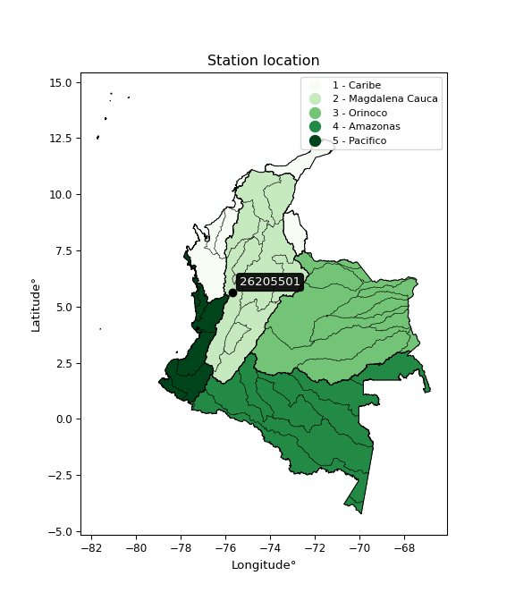</img>

</div>


## A. General information


### 1. General running parameters

• app_version: _v20260103_. • runtime: _2026-01-05 16:20:51.132608_. • Python version: _3.14.0_. • SciPy version: _1.16.3_. • Pandas version: _2.3.3_. • NumPy version: _2.3.5_. • Stations dataset (station_dataset_file): _dataset/pmax24h_in/automatic_colombia_2003_2024.csv_. • Stations catalog (station_catalog_file): _dataset/CNE.xls_. • Minimum year to eval til year_max (date_min): _1900_. • Maximum year to eval since year_min (date_max): _2024_. • Creates, save and include plots into reports (create_plot): _True_. • Plot only fit distributions with Δo > Δ (plot_only_fit): _True_. • Plot only simple graphs avoiding multiple CDFs and multiple Extreme values plots (plot_only_simple): _True_. • Eval low extreme values, if False, evaluates high extreme values (low_extreme): _False_. • Eval every SciPy distribution as logarithmic (pdist_logarithmic_on): _True_. • Standard deviation normalized (ddof): _1.0_. • Return periods to eval in years (Tr): _[2, 2.33, 5, 10, 15, 20, 25, 50, 75, 100, 200, 250, 500, 750, 1000]_. • Minimum data sample per station, 0 means any (minimum_sample): _5_. • Z-Score maximum threshold to adjust a value, 0 means disable (zscore_max): _3.5_. • Z-Score minimum threshold to adjust a value, 0 means disable (zscore_min): _-2.5_. • Avoid zeros, e.g. rain = 0 (avoid_zeros): _True_. • Avoid null values (avoid_nans): _True_. 

[:file_folder:Dataset file](../../dataset/pmax24h_in/automatic_colombia_2003_2024.csv)

> Delta Degrees of Freedom (DDOF): is a parameter used in the formulas for calculating variance and standard deviation. When ddof=0, the divisor is $N$ (the total number of observations) and this is used when your data set is the entire population. When ddof=1, the divisor is $N-1$ and this is used when your data set is a sample drawn from a larger population. Using $N-1$ provides an unbiased estimate of the population variance (known as Bessel´s correction).


### 2. Station info and location

|   id |   CODIGO | NOMBRE                        | CATEGORIA               | TECNOLOGIA                | ESTADO   | FECHA_INSTALACION   |   FECHA_SUSPENSION |   ALTITUD |   LATITUD |   LONGITUD | DEPARTAMENTO   | MUNICIPIO   | AREA_OPERATIVA                      | ENTIDAD                                    | AREA_HIDROGRAFICA   | ZONA_HIDROGRAFICA   | SUBZONA_HIDROGRAFICA               |   CORRIENTE | Catalogo   |   Version |
|-----:|---------:|:------------------------------|:------------------------|:--------------------------|:---------|:--------------------|-------------------:|----------:|----------:|-----------:|:---------------|:------------|:------------------------------------|:-------------------------------------------|:--------------------|:--------------------|:-----------------------------------|------------:|:-----------|----------:|
|    0 | 26205501 | EL ROSARIO  - AUT  [26205501] | Climatológica Principal | Automática con Telemetría | Activa   | 14/09/2013          |                nan |      1635 |   5.62583 |   -75.7053 | Antioquia      | Támesis     | Area Operativa 01 - Antioquia-Chocó | CENTRO NACIONAL DE INVESTIGACIONES DE CAFE | Magdalena Cauca     | Cauca               | Río Frío y Otros Directos al Cauca |         nan | CNE_OE     |  20251226 |

<div align="center">

Dynamic map: [:earth_americas:Google](http://maps.google.com/maps?q=5.625830556,-75.70527778) [:earth_americas:OSM](https://www.openstreetmap.org/#map=18/5.625830556/-75.70527778&layers=P) [:earth_americas:Bing](https://www.bing.com/maps?cp=5.625830556~-75.70527778&lvl=18) [:earth_americas:Apple](https://maps.apple.com/frame?center=5.625830556%2C-75.70527778&span=0.003%2C0.006)

</div>


<div align="center">

```geojson
{
  "type": "Feature",
  "geometry": {
    "type": "Point", 
    "coordinates": [-75.70527778, 5.625830556]
  }, 
  "properties": {
    "Name": "26205501"
  }
}
```

</div>


### 3. Discrete values table and plot

<div align="center">

|               |           0 |          1 |           2 |           3 |           4 |           5 |          6 |
|:--------------|------------:|-----------:|------------:|------------:|------------:|------------:|-----------:|
| Date          | 2017        | 2018       | 2019        | 2020        | 2021        | 2022        | 2023       |
| Value         |   66.7      |   90.4     |   52.6      |   63.5      |   52.6      |   51.9      |   55.7     |
| Value_initial |   66.7      |   90.4     |   52.6      |   63.5      |   52.6      |   51.9      |   55.7     |
| count         |    7        |    7       |    7        |    7        |    7        |    7        |    7       |
| mean          |   61.9143   |   61.9143  |   61.9143   |   61.9143   |   61.9143   |   61.9143   |   61.9143  |
| std           |   13.84     |   13.84    |   13.84     |   13.84     |   13.84     |   13.84     |   13.84    |
| zscore        |    0.345789 |    2.05822 |   -0.672999 |    0.114575 |   -0.672999 |   -0.723577 |   -0.44901 |


</div>


<div align="center">

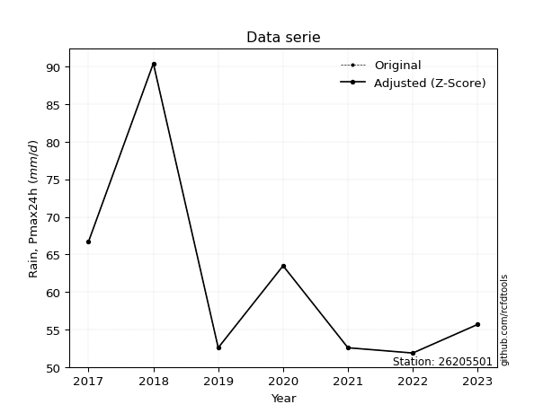</img>

</div>


> The initial value (value_initial) correspond to the initial obtained or null completed value, and value (value) is adjusted only when the initial value is outside the valid range (outlier) definite through the Z-Score value. If Z-Score is active, values out of range or outliers are replaced with the station mean value. A Z-Score (or standard score) measures how many standard deviations a data point is from the mean of a dataset, indicating its relative position; positive scores mean above the mean, negative mean below, and a score of zero is exactly at the mean, allowing for comparison of values from different distributions. It´s calculated using the formula $z=(x–μ)/σ$, where $x$ is the data point, $μ$ is the mean, and $σ$ is the standard deviation, helping identify outliers and understand probability.
>
> <sub>**Note**: In this study, "completing" (filling gaps in) and "extending" (forecasting or lengthening the historical record) rainfall data series are avoided for certain critical analyses because they introduce artificial bias and uncertainty, which can distort the statistics of rare events (extremes), alter day-to-day variability, and compromise the integrity and homogeneity of the original data. Some reasons against Completing/Extending rainfall data are: **Distortion of Extremes and Variability**: The primary issue is that most gap-filling or extension methods rely on averaging or regression with nearby stations, which inherently smooths the data. Rainfall is highly variable in space and time, with a large percentage of zero values and occasional large storms. Infilling methods often underestimate the highest values and overestimate the lowest (zero) values, which severely distorts analyses focused on flood frequency, drought severity, and intensity-duration-frequency (IDF) curves, **Loss of Data Homogeneity**: Infilled or extended data are synthetic estimates, not actual measurements. Combining these estimates with observed data can violate the assumption of data homogeneity, which requires that the data properties do not change over time. Inhomogeneity can lead to incorrect conclusions about long-term trends or changes in climate patterns, **Propagation of Errors**: Errors and biases from the original data (e.g., wind-induced undercatch, instrument errors, site changes) or the data used for imputation can propagate through the analysis, leading to unreliable hydrological models and inaccurate predictions, **Compromised Statistical Integrity**: For statistical analyses, especially those involving the frequency of events, using artificial data can introduce time bias or autocorrelation that doesn´t exist in reality, making it difficult to assess the true probability of events, **Difficulty in Validation**: It is difficult to accurately validate the quality of filled or extended data, especially for past periods where ground-truth measurements are unavailable. The reliability of imputation techniques heavily depends on the density of the surrounding station network and the complexity of the local topography.</sub>


### 4. Active continuous probability distributions from SciPy (44 of 104 available)

A Probability Density Function (PDF) describes the relative likelihood of a continuous random variable falling within a specific range, where the total area under its curve equals 1, and the area over any interval gives the actual probability for that range. Unlike discrete probabilities (like rolling a die), a PDF shows density, not direct probability for a single point (which is zero), with higher points indicating higher likelihood, often visualized as a bell curve for normal distributions.

A log of a probability density function (log-PDF) is simply the logarithm of the PDF´s value, denoted as $log(f(x))$, useful for converting multiplication of probabilities into addition, improving numerical stability with tiny numbers, and connecting to information theory concepts like entropy. Instead of dealing with very small probabilities (e.g., 0.000001), log-PDFs use negative numbers (e.g., $log(0.00001) ≈ -11.51$ that are easier for computers to handle, preventing underflow errors and simplifying complex calculations. In this study, each active probability distribution from SciPy is also evaluated in the $log$ form.

[scipy.stats](https://docs.scipy.org/doc/scipy/reference/stats.html) is a Python´s powerful submodule within the SciPy library for comprehensive statistical analysis, offering over 130 probability distributions (like Normal, Poisson), functions for descriptive stats (mean, variance), hypothesis testing (t-tests, chi-square), random variable generation, and statistical tests, making it essential for data science, modeling, and research. It provides tools to explore, model, and draw conclusions from data efficiently, working seamlessly with NumPy.

<div align="center">

|   id | p_dist             |   n_parameter | fit_method   | label                                                                       | active   | ref                                                                                                        |
|-----:|:-------------------|--------------:|:-------------|:----------------------------------------------------------------------------|:---------|:-----------------------------------------------------------------------------------------------------------|
|    0 | alpha              |             3 | MLE          | Alpha                                                                       | True     | [:mortar_board:](https://docs.scipy.org/doc/scipy/reference/generated/scipy.stats.alpha.html)              |
|    1 | betaprime          |             4 | MLE          | Beta prime                                                                  | True     | [:mortar_board:](https://docs.scipy.org/doc/scipy/reference/generated/scipy.stats.betaprime.html)          |
|    2 | chi2               |             3 | MLE          | Chi²                                                                        | True     | [:mortar_board:](https://docs.scipy.org/doc/scipy/reference/generated/scipy.stats.chi2.html)               |
|    3 | crystalball        |             4 | MLE          | Crystalball                                                                 | True     | [:mortar_board:](https://docs.scipy.org/doc/scipy/reference/generated/scipy.stats.crystalball.html)        |
|    4 | erlang             |             3 | MLE          | Erlang                                                                      | True     | [:mortar_board:](https://docs.scipy.org/doc/scipy/reference/generated/scipy.stats.erlang.html)             |
|    5 | expon              |             2 | MLE          | Exponential                                                                 | True     | [:mortar_board:](https://docs.scipy.org/doc/scipy/reference/generated/scipy.stats.expon.html)              |
|    6 | exponnorm          |             3 | MLE          | Exponentially modified Normal                                               | True     | [:mortar_board:](https://docs.scipy.org/doc/scipy/reference/generated/scipy.stats.exponnorm.html)          |
|    7 | f                  |             4 | MLE          | F                                                                           | True     | [:mortar_board:](https://docs.scipy.org/doc/scipy/reference/generated/scipy.stats.f.html)                  |
|    8 | fatiguelife        |             3 | MLE          | Fatigue-life (Birnbaum-Saunders)                                            | True     | [:mortar_board:](https://docs.scipy.org/doc/scipy/reference/generated/scipy.stats.fatiguelife.html)        |
|    9 | fisk               |             3 | MLE          | Fisk                                                                        | True     | [:mortar_board:](https://docs.scipy.org/doc/scipy/reference/generated/scipy.stats.fisk.html)               |
|   10 | gamma              |             3 | MLE          | Gamma                                                                       | True     | [:mortar_board:](https://docs.scipy.org/doc/scipy/reference/generated/scipy.stats.gamma.html)              |
|   11 | genexpon           |             5 | MLE          | Generalized exponential                                                     | True     | [:mortar_board:](https://docs.scipy.org/doc/scipy/reference/generated/scipy.stats.genexpon.html)           |
|   12 | genlogistic        |             3 | MLE          | Generalized logistic                                                        | True     | [:mortar_board:](https://docs.scipy.org/doc/scipy/reference/generated/scipy.stats.genlogistic.html)        |
|   13 | gibrat             |             2 | MM           | Gibrat                                                                      | True     | [:mortar_board:](https://docs.scipy.org/doc/scipy/reference/generated/scipy.stats.gibrat.html)             |
|   14 | gompertz           |             3 | MLE          | Gompertz (or truncated Gumbel)                                              | True     | [:mortar_board:](https://docs.scipy.org/doc/scipy/reference/generated/scipy.stats.gompertz.html)           |
|   15 | gumbel_l           |             2 | MM           | Gumbel Left Skew                                                            | True     | [:mortar_board:](https://docs.scipy.org/doc/scipy/reference/generated/scipy.stats.gumbel_l.html)           |
|   16 | gumbel_r           |             2 | MM           | Gumbel Right Skew                                                           | True     | [:mortar_board:](https://docs.scipy.org/doc/scipy/reference/generated/scipy.stats.gumbel_r.html)           |
|   17 | halflogistic       |             2 | MM           | Half-logistic                                                               | True     | [:mortar_board:](https://docs.scipy.org/doc/scipy/reference/generated/scipy.stats.halflogistic.html)       |
|   18 | halfnorm           |             2 | MM           | Half Normal                                                                 | True     | [:mortar_board:](https://docs.scipy.org/doc/scipy/reference/generated/scipy.stats.halfnorm.html)           |
|   19 | hypsecant          |             2 | MM           | hyperbolic secant                                                           | True     | [:mortar_board:](https://docs.scipy.org/doc/scipy/reference/generated/scipy.stats.hypsecant.html)          |
|   20 | invgamma           |             3 | MLE          | Inverted gamma                                                              | True     | [:mortar_board:](https://docs.scipy.org/doc/scipy/reference/generated/scipy.stats.invgamma.html)           |
|   21 | invgauss           |             3 | MLE          | Inverse Gaussian                                                            | True     | [:mortar_board:](https://docs.scipy.org/doc/scipy/reference/generated/scipy.stats.invgauss.html)           |
|   22 | invweibull         |             3 | MLE          | Inverted Weibull                                                            | True     | [:mortar_board:](https://docs.scipy.org/doc/scipy/reference/generated/scipy.stats.invweibull.html)         |
|   23 | johnsonsu          |             4 | MLE          | Johnson Su                                                                  | True     | [:mortar_board:](https://docs.scipy.org/doc/scipy/reference/generated/scipy.stats.johnsonsu.html)          |
|   24 | kstwobign          |             2 | MLE          | Limiting distribution of scaled Kolmogorov-Smirnov two-sided test statistic | True     | [:mortar_board:](https://docs.scipy.org/doc/scipy/reference/generated/scipy.stats.kstwobign.html)          |
|   25 | laplace            |             2 | MM           | Laplace                                                                     | True     | [:mortar_board:](https://docs.scipy.org/doc/scipy/reference/generated/scipy.stats.laplace.html)            |
|   26 | laplace_asymmetric |             3 | MLE          | Asymmetric Laplace                                                          | True     | [:mortar_board:](https://docs.scipy.org/doc/scipy/reference/generated/scipy.stats.laplace_asymmetric.html) |
|   27 | loggamma           |             3 | MLE          | Log gamma                                                                   | True     | [:mortar_board:](https://docs.scipy.org/doc/scipy/reference/generated/scipy.stats.loggamma.html)           |
|   28 | logistic           |             2 | MM           | Logistic (or Sech-squared)                                                  | True     | [:mortar_board:](https://docs.scipy.org/doc/scipy/reference/generated/scipy.stats.logistic.html)           |
|   29 | lognorm            |             3 | MLE          | Log Normal                                                                  | True     | [:mortar_board:](https://docs.scipy.org/doc/scipy/reference/generated/scipy.stats.lognorm.html)            |
|   30 | maxwell            |             2 | MM           | Maxwell                                                                     | True     | [:mortar_board:](https://docs.scipy.org/doc/scipy/reference/generated/scipy.stats.maxwell.html)            |
|   31 | mielke             |             4 | MLE          | Mielke Beta-Kappa / Dagum                                                   | True     | [:mortar_board:](https://docs.scipy.org/doc/scipy/reference/generated/scipy.stats.mielke.html)             |
|   32 | moyal              |             2 | MM           | Moyal                                                                       | True     | [:mortar_board:](https://docs.scipy.org/doc/scipy/reference/generated/scipy.stats.moyal.html)              |
|   33 | nakagami           |             3 | MLE          | Nakagami                                                                    | True     | [:mortar_board:](https://docs.scipy.org/doc/scipy/reference/generated/scipy.stats.nakagami.html)           |
|   34 | ncf                |             5 | MLE          | Non-central F distribution                                                  | True     | [:mortar_board:](https://docs.scipy.org/doc/scipy/reference/generated/scipy.stats.ncf.html)                |
|   35 | nct                |             4 | MLE          | Non-central Student’s t                                                     | True     | [:mortar_board:](https://docs.scipy.org/doc/scipy/reference/generated/scipy.stats.nct.html)                |
|   36 | norm               |             2 | MM           | Normal                                                                      | True     | [:mortar_board:](https://docs.scipy.org/doc/scipy/reference/generated/scipy.stats.norm.html)               |
|   37 | pearson3           |             3 | MM           | Pearson type III                                                            | True     | [:mortar_board:](https://docs.scipy.org/doc/scipy/reference/generated/scipy.stats.pearson3.html)           |
|   38 | rayleigh           |             2 | MM           | Rayleigh                                                                    | True     | [:mortar_board:](https://docs.scipy.org/doc/scipy/reference/generated/scipy.stats.rayleigh.html)           |
|   39 | rice               |             3 | MLE          | Rice                                                                        | True     | [:mortar_board:](https://docs.scipy.org/doc/scipy/reference/generated/scipy.stats.rice.html)               |
|   40 | t                  |             3 | MLE          | Student’s t                                                                 | True     | [:mortar_board:](https://docs.scipy.org/doc/scipy/reference/generated/scipy.stats.t.html)                  |
|   41 | truncnorm          |             4 | MLE          | Truncated normal                                                            | True     | [:mortar_board:](https://docs.scipy.org/doc/scipy/reference/generated/scipy.stats.truncnorm.html)          |
|   42 | wald               |             2 | MM           | Wald                                                                        | True     | [:mortar_board:](https://docs.scipy.org/doc/scipy/reference/generated/scipy.stats.wald.html)               |
|   43 | weibull_min        |             3 | MLE          | Weibull minimum                                                             | True     | [:mortar_board:](https://docs.scipy.org/doc/scipy/reference/generated/scipy.stats.weibull_min.html)        |

</div>

> **n_parameter:** # arguments & localization & scale.
>
> **Fit methods:** (MLE) maximum likelihood, (MM) L-moments.
>
>**Inactive** (With the only purpose of prevent loops, zero divisions, infinite values, over high estimated values or horizontal trending for recurrence intervals estimations, the follow distributions were disabled.)**:** foldnorm, gennorm, norminvgauss, powernorm, powerlognorm, skewnorm, genextreme, anglit, arcsine, argus, beta, bradford, burr, burr12, cauchy, cosine, halfcauchy, foldcauchy, skewcauchy, wrapcauchy, dgamma, gengamma, exponweib, exponpow, truncexpon, gausshyper, genhalflogistic, genhyperbolic, geninvgauss, halfgennorm, johnsonsb, kappa4, kappa3, ksone, kstwo, loglaplace, levy, levy_l, levy_stable, ncx2, pareto, genpareto, truncpareto, lomax, powerlaw, rdist, rel_breitwigner, recipinvgauss, semicircular, studentized_range, trapezoid, triang, truncweibull_min, tukeylambda, uniform, loguniform, vonmises, vonmises_line, weibull_max, dweibull, 


## B. Probability (PDF) vs. Empirical (EDF) distributions functions

A continuous probability distribution (CPD) describes probabilities for variables that can take any value within a range (like rain any time), unlike discrete variables with specific outcomes (like temperature). It uses a Probability Density Function (PDF), a curve where the total area under it equals 1, and the probability of the variable falling within an interval (a to b) is found by calculating the area under the curve between those points. A key feature is that the probability of hitting any single exact value is zero, so probabilities are always expressed for ranges, e.g., $P(a ≤ X ≤ b)$.

<div align="center">

Distributions parameters from station values
|    |   station | p_dist                |   n |           loc |          scale | shape                  | shape1                | shape2             | shape3   |
|---:|----------:|:----------------------|----:|--------------:|---------------:|:-----------------------|:----------------------|:-------------------|:---------|
|  0 |  26205501 | alpha                 |   7 |     50.4672   |    2.68083     | 6.35427583395078e-06   |                       |                    |          |
|  1 |  26205501 | betaprime             |   7 |     -0.15946  |   26.1507      | 98.06403430075284      | 42.2534155129604      |                    |          |
|  2 |  26205501 | chi2                  |   7 |     51.9      |    7.938       | 1.154169004915082      |                       |                    |          |
|  3 |  26205501 | crystalball           |   7 |     61.9143   |   12.8133      | 45589.266528965665     | 175.1723795628953     |                    |          |
|  4 |  26205501 | erlang                |   7 |     51.9      |   10.102       | 0.27311522340770955    |                       |                    |          |
|  5 |  26205501 | expon                 |   7 |     51.9      |   10.0143      |                        |                       |                    |          |
|  6 |  26205501 | exponnorm             |   7 |     51.8829   |    0.00542427  | 1853.8392052886047     |                       |                    |          |
|  7 |  26205501 | f                     |   7 |     51.5837   |    1.26181     | 6198.176488709461      | 1.1563483169231086    |                    |          |
|  8 |  26205501 | fatiguelife           |   7 |     51.9      |    1.18055e-05 | 817.7986667292871      |                       |                    |          |
|  9 |  26205501 | fisk                  |   7 |     -0.126591 |   59.1235      | 9.866039383877517      |                       |                    |          |
| 10 |  26205501 | gamma                 |   7 |     51.9      |   10.6399      | 0.4638485930862244     |                       |                    |          |
| 11 |  26205501 | genexpon              |   7 |     51.9      |   14.4812      | 1.4460548663005426     | 5.99002650020843e-10  | 1.7516178906653819 |          |
| 12 |  26205501 | genlogistic           |   7 |     -2.87192  |    7.74542     | 2155.9727756389743     |                       |                    |          |
| 13 |  26205501 | gibrat                |   7 |     52.1394   |    5.9288      |                        |                       |                    |          |
| 14 |  26205501 | gompertz              |   7 |     51.9      |    3.10487e+11 | 28662022179.342007     |                       |                    |          |
| 15 |  26205501 | gumbel_l              |   7 |     67.681    |    9.99051     |                        |                       |                    |          |
| 16 |  26205501 | gumbel_r              |   7 |     56.1476   |    9.99051     |                        |                       |                    |          |
| 17 |  26205501 | halflogistic          |   7 |     46.7275   |   10.9549      |                        |                       |                    |          |
| 18 |  26205501 | halfnorm              |   7 |     44.9545   |   21.256       |                        |                       |                    |          |
| 19 |  26205501 | hypsecant             |   7 |     61.9143   |    8.15721     |                        |                       |                    |          |
| 20 |  26205501 | invgamma              |   7 |     51.5837   |    0.729382    | 0.5781439979180886     |                       |                    |          |
| 21 |  26205501 | invgauss              |   7 |     51.5513   |    1.55019     | 6.684968052965981      |                       |                    |          |
| 22 |  26205501 | invweibull            |   7 |     51.7862   |    1.12036     | 0.5400623129126765     |                       |                    |          |
| 23 |  26205501 | johnsonsu             |   7 |     51.9      |    6.0239e-09  | -3.877389949450916     | 0.2280278734077239    |                    |          |
| 24 |  26205501 | kstwobign             |   7 |     27.7601   |   39.6745      |                        |                       |                    |          |
| 25 |  26205501 | laplace               |   7 |     61.9143   |    9.06039     |                        |                       |                    |          |
| 26 |  26205501 | laplace_asymmetric    |   7 |     51.9      |    0.000909975 | 9.087009438380828e-05  |                       |                    |          |
| 27 |  26205501 | loggamma              |   7 |  -4688.35     |  617.469       | 2193.497055779745      |                       |                    |          |
| 28 |  26205501 | logistic              |   7 |     61.9143   |    7.06435     |                        |                       |                    |          |
| 29 |  26205501 | lognorm               |   7 |     51.9      |    0.0365685   | 12.031665142964457     |                       |                    |          |
| 30 |  26205501 | maxwell               |   7 |     31.5521   |   19.0267      |                        |                       |                    |          |
| 31 |  26205501 | mielke                |   7 |     -3.4471   |   36.8514      | 595.4069500943522      | 8.767126658031316     |                    |          |
| 32 |  26205501 | moyal                 |   7 |     54.5868   |    5.76802     |                        |                       |                    |          |
| 33 |  26205501 | nakagami              |   7 |     51.9      |   15.7432      | 0.3230506469727603     |                       |                    |          |
| 34 |  26205501 | ncf                   |   7 |     -3.96165  |   34.3363      | 446.96983810925303     | 76.75070743981391     | 386.99281399496    |          |
| 35 |  26205501 | nct                   |   7 |     -0.156203 |    1.01317     | 17.33406322472736      | 58.33393518808731     |                    |          |
| 36 |  26205501 | norm                  |   7 |     61.9143   |   12.8133      |                        |                       |                    |          |
| 37 |  26205501 | pearson3              |   7 |     61.9143   |   12.8133      | 1.3831379202512077     |                       |                    |          |
| 38 |  26205501 | rayleigh              |   7 |     37.4017   |   19.5583      |                        |                       |                    |          |
| 39 |  26205501 | rice                  |   7 |     42.8799   |   16.2248      | 0.0003246997614127912  |                       |                    |          |
| 40 |  26205501 | t                     |   7 |     60.0463   |   12.6596      | 8.522704664769432      |                       |                    |          |
| 41 |  26205501 | truncnorm             |   7 | -34501.5      |  665.773       | 51.89964234623748      | 51.95747012583247     |                    |          |
| 42 |  26205501 | wald                  |   7 |     49.101    |   12.8133      |                        |                       |                    |          |
| 43 |  26205501 | weibull_min           |   7 |     51.9      |   14.8214      | 0.624069937678138      |                       |                    |          |
| 44 |  26205501 | logalpha              |   7 |      1.41923  |   42.8797      | 16.044528500509642     |                       |                    |          |
| 45 |  26205501 | logbetaprime          |   7 |      3.3179   |    2.99623     | 24.47554407649938      | 92.34108174540978     |                    |          |
| 46 |  26205501 | logchi2               |   7 |      3.94932  |    0.987128    | 0.9841293967593834     |                       |                    |          |
| 47 |  26205501 | logcrystalball        |   7 |      4.10717  |    0.186126    | 11.273599889920074     | 33.02735449297557     |                    |          |
| 48 |  26205501 | logerlang             |   7 |      3.94932  |    0.180662    | 0.18346653693591936    |                       |                    |          |
| 49 |  26205501 | logexpon              |   7 |      3.94932  |    0.157856    |                        |                       |                    |          |
| 50 |  26205501 | logexponnorm          |   7 |      3.94917  |    5.10681e-05 | 3071.0211289140498     |                       |                    |          |
| 51 |  26205501 | logf                  |   7 |      3.94236  |    0.026636    | 222.3686073377459      | 1.2960994560993875    |                    |          |
| 52 |  26205501 | logfatiguelife        |   7 |      3.94932  |    2.23848e-08 | 2474.227941453125      |                       |                    |          |
| 53 |  26205501 | logfisk               |   7 |      3.94932  |    0.131138    | 0.7029103213076066     |                       |                    |          |
| 54 |  26205501 | loggamma              |   7 |      3.94932  |    0.172295    | 0.5715208586033467     |                       |                    |          |
| 55 |  26205501 | loggenexpon           |   7 |      3.94932  |    0.253852    | 1.6081221055463706     | 1.711821330080959e-06 | 1.3623219981151429 |          |
| 56 |  26205501 | loggenlogistic        |   7 |      3.16065  |    0.120275    | 1346.0663795063115     |                       |                    |          |
| 57 |  26205501 | loggibrat             |   7 |      3.96521  |    0.0861053   |                        |                       |                    |          |
| 58 |  26205501 | loggompertz           |   7 |      3.94932  |    0.421765    | 1.5484930104527603     |                       |                    |          |
| 59 |  26205501 | loggumbel_l           |   7 |      4.19094  |    0.145122    |                        |                       |                    |          |
| 60 |  26205501 | loggumbel_r           |   7 |      4.02341  |    0.145122    |                        |                       |                    |          |
| 61 |  26205501 | loghalflogistic       |   7 |      3.88657  |    0.159131    |                        |                       |                    |          |
| 62 |  26205501 | loghalfnorm           |   7 |      3.86082  |    0.308764    |                        |                       |                    |          |
| 63 |  26205501 | loghypsecant          |   7 |      4.10717  |    0.118492    |                        |                       |                    |          |
| 64 |  26205501 | loginvgamma           |   7 |     -1.35249  | 4989.03        | 915.425402866932       |                       |                    |          |
| 65 |  26205501 | loginvgauss           |   7 |      3.94227  |    0.0317408   | 5.195333226389247      |                       |                    |          |
| 66 |  26205501 | loginvweibull         |   7 |      3.94617  |    0.0235376   | 0.6039768447469482     |                       |                    |          |
| 67 |  26205501 | logjohnsonsu          |   7 |      3.94932  |    7.61712e-13 | -1.328747167320827     | 0.10565769225256295   |                    |          |
| 68 |  26205501 | logkstwobign          |   7 |      3.59142  |    0.596377    |                        |                       |                    |          |
| 69 |  26205501 | loglaplace            |   7 |      4.10717  |    0.131611    |                        |                       |                    |          |
| 70 |  26205501 | loglaplace_asymmetric |   7 |      3.94932  |    3.23537e-05 | 0.00020497598540562443 |                       |                    |          |
| 71 |  26205501 | logloggamma           |   7 |    -57.505    |    8.16741     | 1888.843619797386      |                       |                    |          |
| 72 |  26205501 | loglogistic           |   7 |      4.10717  |    0.102617    |                        |                       |                    |          |
| 73 |  26205501 | loglognorm            |   7 |      3.94932  |    0.00076841  | 11.5802723432409       |                       |                    |          |
| 74 |  26205501 | logmaxwell            |   7 |      3.66613  |    0.276382    |                        |                       |                    |          |
| 75 |  26205501 | logmielke             |   7 |      3.84646  |    0.00380501  | 4295.994138121117      | 2.0859585769470232    |                    |          |
| 76 |  26205501 | logmoyal              |   7 |      4.00074  |    0.0837863   |                        |                       |                    |          |
| 77 |  26205501 | lognakagami           |   7 |      3.94932  |    0.472219    | 0.07018893781561912    |                       |                    |          |
| 78 |  26205501 | logncf                |   7 |     -1.84027  |    5.95886     | 571.8476378909995      | 628.8399885705912     | 0.0448588959147818 |          |
| 79 |  26205501 | lognct                |   7 |     -3.91817  |    0.0117884   | 553.5168093937491      | 680.2546993977921     |                    |          |
| 80 |  26205501 | lognorm               |   7 |      4.10717  |    0.186126    |                        |                       |                    |          |
| 81 |  26205501 | logpearson3           |   7 |      4.10717  |    0.186126    | 1.171267132260129      |                       |                    |          |
| 82 |  26205501 | lograyleigh           |   7 |      3.7511   |    0.284103    |                        |                       |                    |          |
| 83 |  26205501 | logrice               |   7 |      3.823    |    0.240204    | 0.00031961697666024866 |                       |                    |          |
| 84 |  26205501 | logt                  |   7 |      4.05533  |    0.130997    | 3.1914997060834103     |                       |                    |          |
| 85 |  26205501 | logtruncnorm          |   7 |     -1.34002  |    1.31208     | 4.031254640748495      | 4.454192466809088     |                    |          |
| 86 |  26205501 | logwald               |   7 |      3.92105  |    0.186126    |                        |                       |                    |          |
| 87 |  26205501 | logweibull_min        |   7 |      3.94932  |    0.180117    | 0.6177344113899963     |                       |                    |          |

</div>

> **loc** (Location parameter): This shifts the distribution along the x-axis. For many common distributions, like the normal (Gaussian) distribution, loc represents the mean $μ$. For others, like the uniform distribution, it might represent the minimum value, or for the beta distribution, the left end of the support interval.
>
> **scale** (Scale parameter): This determines the width or spread of the distribution. For the normal distribution, scale represents the standard deviation $σ$. For a uniform distribution, it defines the length of the interval (from $loc$ to $loc + scale$).
>
> **shape** (Shape parameters): Refers to parameters that define the specific form of a probability distribution, distinct from its location (loc) and scale (scale). These parameters are required arguments for most distribution functions. For example, a normal (Gaussian) distribution is fully defined by its location (mean) and scale (standard deviation), so it has no specific shape parameters beyond loc and scale. However, other distributions have intrinsic properties that need specification, as Gamma distribution that takes a shape parameter, often named $a$ or $alpha$.


### 0. Cumulative distribution values - CDF (88 evaluated)

Cumulative Distribution Function (CDF), denoted as $F$<sub>$X$</sub>$(x)$, is a function that gives the probability that a random variable $X$ will take a value less than or equal to a specific value, $x$ (i.e., $(P(X≥x)$. It essentially "accumulates" probabilities from a given point up to the far right (positive infinity), providing a complete picture of the distribution´s probabilities for both discrete (like rain) and continuous (like temperature) variables, helping to find probabilities over ranges or above certain values. Each station is evaluated separately ordering the $x$ values ascending, calculating the CDF and PDF values for the activated distributions and their logarithmic forms.

<div align="center">

CDF ordered by x ascending and calculating $log(f(x))$ separately
|   id |   Station |   date |    x |   count |    mean |   std |    zscore |   Value_initial |   station |   m |     alpha |   alpha_pdf |   betaprime |   betaprime_pdf |        chi2 |        chi2_pdf |   crystalball |   crystalball_pdf |      erlang |   erlang_pdf |     expon |   expon_pdf |   exponnorm |   exponnorm_pdf |        f |      f_pdf |   fatiguelife |   fatiguelife_pdf |     fisk |   fisk_pdf |       gamma |   gamma_pdf |    genexpon |   genexpon_pdf |   genlogistic |   genlogistic_pdf |     gibrat |   gibrat_pdf |    gompertz |   gompertz_pdf |   gumbel_l |   gumbel_l_pdf |   gumbel_r |   gumbel_r_pdf |   halflogistic |   halflogistic_pdf |   halfnorm |   halfnorm_pdf |   hypsecant |   hypsecant_pdf |   invgamma |   invgamma_pdf |   invgauss |   invgauss_pdf |   invweibull |   invweibull_pdf |   johnsonsu |   johnsonsu_pdf |   kstwobign |   kstwobign_pdf |   laplace |   laplace_pdf |   laplace_asymmetric |   laplace_asymmetric_pdf |    loggamma |   loggamma_pdf |   logistic |   logistic_pdf |   lognorm |   lognorm_pdf |   maxwell |   maxwell_pdf |   mielke |   mielke_pdf |    moyal |   moyal_pdf |    nakagami |   nakagami_pdf |      ncf |   ncf_pdf |      nct |    nct_pdf |     norm |   norm_pdf |   pearson3 |   pearson3_pdf |   rayleigh |   rayleigh_pdf |     rice |   rice_pdf |        t |      t_pdf |   truncnorm |   truncnorm_pdf |      wald |   wald_pdf |   weibull_min |   weibull_min_pdf |   logalpha |   logalpha_pdf |   logbetaprime |   logbetaprime_pdf |     logchi2 |   logchi2_pdf |   logcrystalball |   logcrystalball_pdf |   logerlang |   logerlang_pdf |   logexpon |   logexpon_pdf |   logexponnorm |   logexponnorm_pdf |      logf |   logf_pdf |   logfatiguelife |   logfatiguelife_pdf |    logfisk |   logfisk_pdf |   loggenexpon |   loggenexpon_pdf |   loggenlogistic |   loggenlogistic_pdf |   loggibrat |   loggibrat_pdf |   loggompertz |   loggompertz_pdf |   loggumbel_l |   loggumbel_l_pdf |   loggumbel_r |   loggumbel_r_pdf |   loghalflogistic |   loghalflogistic_pdf |   loghalfnorm |   loghalfnorm_pdf |   loghypsecant |   loghypsecant_pdf |   loginvgamma |   loginvgamma_pdf |   loginvgauss |   loginvgauss_pdf |   loginvweibull |   loginvweibull_pdf |   logjohnsonsu |   logjohnsonsu_pdf |   logkstwobign |   logkstwobign_pdf |   loglaplace |   loglaplace_pdf |   loglaplace_asymmetric |   loglaplace_asymmetric_pdf |   logloggamma |   logloggamma_pdf |   loglogistic |   loglogistic_pdf |   loglognorm |   loglognorm_pdf |   logmaxwell |   logmaxwell_pdf |   logmielke |   logmielke_pdf |   logmoyal |   logmoyal_pdf |   lognakagami |   lognakagami_pdf |   logncf |   logncf_pdf |   lognct |   lognct_pdf |   logpearson3 |   logpearson3_pdf |   lograyleigh |   lograyleigh_pdf |   logrice |   logrice_pdf |     logt |   logt_pdf |   logtruncnorm |   logtruncnorm_pdf |   logwald |   logwald_pdf |   logweibull_min |   logweibull_min_pdf |
|-----:|----------:|-------:|-----:|--------:|--------:|------:|----------:|----------------:|----------:|----:|----------:|------------:|------------:|----------------:|------------:|----------------:|--------------:|------------------:|------------:|-------------:|----------:|------------:|------------:|----------------:|---------:|-----------:|--------------:|------------------:|---------:|-----------:|------------:|------------:|------------:|---------------:|--------------:|------------------:|-----------:|-------------:|------------:|---------------:|-----------:|---------------:|-----------:|---------------:|---------------:|-------------------:|-----------:|---------------:|------------:|----------------:|-----------:|---------------:|-----------:|---------------:|-------------:|-----------------:|------------:|----------------:|------------:|----------------:|----------:|--------------:|---------------------:|-------------------------:|------------:|---------------:|-----------:|---------------:|----------:|--------------:|----------:|--------------:|---------:|-------------:|---------:|------------:|------------:|---------------:|---------:|----------:|---------:|-----------:|---------:|-----------:|-----------:|---------------:|-----------:|---------------:|---------:|-----------:|---------:|-----------:|------------:|----------------:|----------:|-----------:|--------------:|------------------:|-----------:|---------------:|---------------:|-------------------:|------------:|--------------:|-----------------:|---------------------:|------------:|----------------:|-----------:|---------------:|---------------:|-------------------:|----------:|-----------:|-----------------:|---------------------:|-----------:|--------------:|--------------:|------------------:|-----------------:|---------------------:|------------:|----------------:|--------------:|------------------:|--------------:|------------------:|--------------:|------------------:|------------------:|----------------------:|--------------:|------------------:|---------------:|-------------------:|--------------:|------------------:|--------------:|------------------:|----------------:|--------------------:|---------------:|-------------------:|---------------:|-------------------:|-------------:|-----------------:|------------------------:|----------------------------:|--------------:|------------------:|--------------:|------------------:|-------------:|-----------------:|-------------:|-----------------:|------------:|----------------:|-----------:|---------------:|--------------:|------------------:|---------:|-------------:|---------:|-------------:|--------------:|------------------:|--------------:|------------------:|----------:|--------------:|---------:|-----------:|---------------:|-------------------:|----------:|--------------:|-----------------:|---------------------:|
|    0 |  26205501 |   2022 | 51.9 |       7 | 61.9143 | 13.84 | -0.723577 |            51.9 |  26205501 |   1 | 0.0613461 |  0.180996   |    0.193594 |      0.0291507  | 1.55703e-09 | 126458          |      0.217239 |         0.0229408 | 8.06046e-05 |  3.09824e+09 | 0         |  0.0998573  |  0.00170132 |      0.0991973  | 0.039906 | 0.331355   |      0.16778  |       6.347e+09   | 0.220697 | 0.0326152  | 1.03204e-07 | 6.73725e+06 | 3.51721e-11 |     0.0998574  |      0.160491 |         0.0378929 | 0          |   0          | 2.20587e-12 |     0.0923131  |   0.186214 |    0.0167847   |   0.21657  |     0.0331633  |       0.23179  |         0.0431894  |   0.256148 |      0.0355856 |    0.181438 |      0.0210576  |  0.0398789 |     0.331329   |  0.0405697 |     0.302672   |    0.0321289 |       0.523999   | 7.90023e-05 | 10951.8         |    0.147097 |      0.0345193  |  0.165559 |    0.0182728  |          8.60042e-09 |               0.09986    | 5.15822e-09 |    6.63837e+06 |   0.195041 |     0.0222243  |  0.198188 |      1.49593  |  0.233464 |    0.0270731  | 0.150553 |   0.0445311  | 0.206855 |  0.0393596  | 9.44633e-11 |   8589.61      | 0.196679 | 0.0298249 | 0.187838 | 0.0328871  | 0.217239 | 0.0229408  |   0.226159 |     0.0396702  |   0.240242 |     0.0287961  | 0.143188 | 0.0293587  | 0.268419 | 0.0244162  | 3.21606e-09 |      0.0820516  | 0.0809938 | 0.0753423  |   2.75223e-10 |    24172.9        |   0.183164 |       1.77697  |       0.173742 |           1.70285  | 2.25306e-08 |   2.49646e+07 |         0.198189 |              1.49593 |  0.00226251 |     9.34711e+11 |  0         |       6.33491  |    0.000977103 |            6.3615  | 0.0409149 |  15.8016   |        0.0487911 |          6.28844e+13 | 6.7407e-11 | 106693        |   5.96778e-10 |          6.33488  |         0.148101 |              2.35004 |    0        |         0       |   2.25386e-10 |          3.67146  |      0.172378 |         1.07899   |      0.188969 |          2.16959  |          0.19464  |              3.02302  |      0.225608 |          2.48012  |       0.164256 |           1.32551  |      0.198011 |          1.60272  |     0.0408983 |         15.2604   |       0.0344284 |           22.2337   |       0.100772 |        2.18274e+10 |       0.135877 |           2.2214   |     0.150686 |         1.14493  |              5.9838e-08 |                    6.33548  |      0.202539 |          1.49138  |      0.176782 |          1.41819  |   0.00747909 |      4.01706e+12 |     0.210806 |          1.79302 |         nan |             nan |   0.174111 |       2.56969  |    0.00669116 |       2.11509e+12 | 0.362394 |     0.791816 | 0.255162 |     1.37403  |      0.198642 |          2.37952  |      0.216029 |          1.92524  |  0.129135 |       1.90654 | 0.237169 |   1.90659  |    2.24783e-06 |            3.82361 | 0.0263014 |      3.39224  |       9.4642e-10 |          1.31648e+06 |
|    1 |  26205501 |   2019 | 52.6 |       7 | 61.9143 | 13.84 | -0.672999 |            52.6 |  26205501 |   2 | 0.208779  |  0.213417   |    0.214488 |      0.0305276  | 0.182291    |      0.146125   |      0.233637 |         0.0239059 | 0.527012    |  0.194695    | 0.0675131 |  0.0931157  |  0.0688312  |      0.0926008  | 0.271885 | 0.25704    |      0.617053 |       0.0811704   | 0.244207 | 0.0345362  | 0.313036    | 0.198277    | 0.0675131   |     0.0931157  |      0.187967 |         0.0405482 | 0.00531031 |   0.033118   | 0.0625756   |     0.0865366  |   0.198295 |    0.0177356   |   0.240191 |     0.0342915  |       0.26179  |         0.0425135  |   0.28092  |      0.0351856 |    0.196718 |      0.0226097  |  0.271879  |     0.257062   |  0.25906   |     0.254569   |    0.304702  |       0.240297   | 0.696842    |     0.113797    |    0.172032 |      0.0366682  |  0.178857 |    0.0197405  |          0.0675148   |               0.093118   | 0.253617    |   10.2941      |   0.21107  |     0.0235717  |  0.218836 |      1.58598  |  0.252685 |    0.0278314  | 0.182987 |   0.0480098  | 0.234855 |  0.0405731  | 0.103853    |      0.0958102 | 0.21805  | 0.0312116 | 0.211447 | 0.034535   | 0.233637 | 0.0239059  |   0.254044 |     0.0399569  |   0.260608 |     0.0293772  | 0.164272 | 0.0308586  | 0.285829 | 0.0253219  | 0.0558972   |      0.0776942  | 0.136941  | 0.0829145  |   0.138261    |        0.11432    |   0.207793 |       1.89839  |       0.197298 |           1.81225  | 0.0965186   |   3.5289      |         0.218836 |              1.58598 |  0.664837   |     8.55007     |  0.0813691 |       5.81944  |    0.0827751   |            5.84848 | 0.263392  |  13.5775   |        0.622736  |          4.43329     | 0.167496   |      7.31598  |   0.0813687   |          5.81942  |         0.181107 |              2.57122 |    0        |         0       |   0.048749    |          3.6052   |      0.187384 |         1.16188   |      0.218878 |          2.29137  |          0.234788 |              2.96885  |      0.258619 |          2.44716  |       0.182906 |           1.46006  |      0.220141 |          1.7002   |     0.25612   |         13.3999   |       0.290214  |           13.1042   |       0.891958 |        1.46392     |       0.166958 |           2.41274  |     0.166833 |         1.26762  |              0.0813762  |                    5.81992  |      0.223109 |          1.57889  |      0.19659  |          1.53915  |   0.597484   |      2.49426     |     0.235348 |          1.86919 |         nan |             nan |   0.209594 |       2.71914  |    0.522071   |       5.47        | 0.373041 |     0.797604 | 0.273885 |     1.42041  |      0.231057 |          2.45486  |      0.242245 |          1.98663  |  0.155621 |       2.04462 | 0.263864 |   2.07831  |    0.0501875   |            3.66922 | 0.0862715 |      5.27011  |       0.181962   |          7.57568     |
|    2 |  26205501 |   2021 | 52.6 |       7 | 61.9143 | 13.84 | -0.672999 |            52.6 |  26205501 |   3 | 0.208779  |  0.213417   |    0.214488 |      0.0305276  | 0.182291    |      0.146125   |      0.233637 |         0.0239059 | 0.527012    |  0.194695    | 0.0675131 |  0.0931157  |  0.0688312  |      0.0926008  | 0.271885 | 0.25704    |      0.617053 |       0.0811704   | 0.244207 | 0.0345362  | 0.313036    | 0.198277    | 0.0675131   |     0.0931157  |      0.187967 |         0.0405482 | 0.00531031 |   0.033118   | 0.0625756   |     0.0865366  |   0.198295 |    0.0177356   |   0.240191 |     0.0342915  |       0.26179  |         0.0425135  |   0.28092  |      0.0351856 |    0.196718 |      0.0226097  |  0.271879  |     0.257062   |  0.25906   |     0.254569   |    0.304702  |       0.240297   | 0.696842    |     0.113797    |    0.172032 |      0.0366682  |  0.178857 |    0.0197405  |          0.0675148   |               0.093118   | 0.253617    |   10.2941      |   0.21107  |     0.0235717  |  0.218836 |      1.58598  |  0.252685 |    0.0278314  | 0.182987 |   0.0480098  | 0.234855 |  0.0405731  | 0.103853    |      0.0958102 | 0.21805  | 0.0312116 | 0.211447 | 0.034535   | 0.233637 | 0.0239059  |   0.254044 |     0.0399569  |   0.260608 |     0.0293772  | 0.164272 | 0.0308586  | 0.285829 | 0.0253219  | 0.0558972   |      0.0776942  | 0.136941  | 0.0829145  |   0.138261    |        0.11432    |   0.207793 |       1.89839  |       0.197298 |           1.81225  | 0.0965186   |   3.5289      |         0.218836 |              1.58598 |  0.664837   |     8.55007     |  0.0813691 |       5.81944  |    0.0827751   |            5.84848 | 0.263392  |  13.5775   |        0.622736  |          4.43329     | 0.167496   |      7.31598  |   0.0813687   |          5.81942  |         0.181107 |              2.57122 |    0        |         0       |   0.048749    |          3.6052   |      0.187384 |         1.16188   |      0.218878 |          2.29137  |          0.234788 |              2.96885  |      0.258619 |          2.44716  |       0.182906 |           1.46006  |      0.220141 |          1.7002   |     0.25612   |         13.3999   |       0.290214  |           13.1042   |       0.891958 |        1.46392     |       0.166958 |           2.41274  |     0.166833 |         1.26762  |              0.0813762  |                    5.81992  |      0.223109 |          1.57889  |      0.19659  |          1.53915  |   0.597484   |      2.49426     |     0.235348 |          1.86919 |         nan |             nan |   0.209594 |       2.71914  |    0.522071   |       5.47        | 0.373041 |     0.797604 | 0.273885 |     1.42041  |      0.231057 |          2.45486  |      0.242245 |          1.98663  |  0.155621 |       2.04462 | 0.263864 |   2.07831  |    0.0501875   |            3.66922 | 0.0862715 |      5.27011  |       0.181962   |          7.57568     |
|    3 |  26205501 |   2023 | 55.7 |       7 | 61.9143 | 13.84 | -0.44901  |            55.7 |  26205501 |   4 | 0.608436  |  0.0685081  |    0.31673  |      0.0349425  | 0.451625    |      0.0587779  |      0.313843 |         0.0276804 | 0.787022    |  0.0418842   | 0.315768  |  0.0683256  |  0.315863   |      0.0680346  | 0.612814 | 0.0485379  |      0.75608  |       0.028628    | 0.362138 | 0.0408228  | 0.628884    | 0.0598183   | 0.315768    |     0.0683256  |      0.326179 |         0.0471667 | 0.305068   |   0.0983847  | 0.295868    |     0.0650006  |   0.260237 |    0.0223195   |   0.351403 |     0.0367854  |       0.388063 |         0.0387682  |   0.386813 |      0.0330343 |    0.278045 |      0.0299135  |  0.612818  |     0.048537   |  0.621332  |     0.0549608  |    0.601169  |       0.0422135  | 0.816229    |     0.0159514   |    0.295814 |      0.0420879  |  0.251825 |    0.0277941  |          0.315775    |               0.0683267  | 0.585482    |    3.62086     |   0.293247 |     0.0293379  |  0.319725 |      1.92064  |  0.343049 |    0.0301881  | 0.344955 |   0.0539969  | 0.363872 |  0.0415853  | 0.308445    |      0.0517024 | 0.322343 | 0.0355519 | 0.326826 | 0.0391396  | 0.313843 | 0.0276804  |   0.376796 |     0.0386422  |   0.354453 |     0.0308802  | 0.268143 | 0.0356417  | 0.369838 | 0.0286667  | 0.269855    |      0.0610142  | 0.378021  | 0.067042   |   0.347973    |        0.0457955  |   0.328917 |       2.29281  |       0.312021 |           2.15763  | 0.216687    |   1.47309     |         0.319725 |              1.92065 |  0.862344   |     1.60192     |  0.360861  |       4.04889  |    0.363349    |            4.05946 | 0.615347  |   2.79798  |        0.763647  |          1.5664      | 0.393017   |      2.37304  |   0.36086     |          4.04888  |         0.345876 |              3.05185 |    0.325468 |         6.57548 |   0.24605     |          3.27297  |      0.264996 |         1.55932   |      0.359192 |          2.53425  |          0.396238 |              2.64874  |      0.393787 |          2.26262  |       0.284429 |           2.09349  |      0.328028 |          2.04427  |     0.622735  |          3.09885  |       0.605666  |            2.48504  |       0.921128 |        0.21992     |       0.319917 |           2.82037  |     0.257777 |         1.95862  |              0.360887   |                    4.04909  |      0.323308 |          1.90423  |      0.299494 |          2.04448  |   0.651892   |      0.45176     |     0.349449 |          2.08503 |         nan |             nan |   0.372658 |       2.85283  |    0.659269   |       1.3078      | 0.419278 |     0.815373 | 0.360053 |     1.57673  |      0.375008 |          2.50803  |      0.360993 |          2.12866  |  0.285543 |       2.4391  | 0.401901 |   2.68907  |    0.242756    |            3.07297 | 0.392032  |      4.49936  |       0.429367   |          2.79864     |
|    4 |  26205501 |   2020 | 63.5 |       7 | 61.9143 | 13.84 |  0.114575 |            63.5 |  26205501 |   5 | 0.837027  |  0.0123294  |    0.592377 |      0.0328616  | 0.733351    |      0.0224319  |      0.549245 |         0.0308975 | 0.939206    |  0.00859839  | 0.685995  |  0.0313557  |  0.685029   |      0.0313226  | 0.781757 | 0.0101844  |      0.887263 |       0.00999842  | 0.67353  | 0.0340961  | 0.872897    | 0.0157978   | 0.685995    |     0.0313557  |      0.664107 |         0.0350919 | 0.742262   |   0.0284229  | 0.657277    |     0.0316378  |   0.482133 |    0.0341099   |   0.619368 |     0.0296994  |       0.644318 |         0.0266937  |   0.617056 |      0.0256543 |    0.561491 |      0.038296   |  0.781756  |     0.010184   |  0.817384  |     0.0120077  |    0.754644  |       0.00979443 | 0.876071    |     0.0040223   |    0.608411 |      0.0347396  |  0.580278 |    0.0463249  |          0.686004    |               0.0313556  | 0.850148    |    1.07958     |   0.555882 |     0.0349469  |  0.593158 |      2.08469  |  0.579686 |    0.0288741  | 0.696881 |   0.0328705  | 0.64423  |  0.0287093  | 0.611279    |      0.0297845 | 0.600352 | 0.0328209 | 0.621912 | 0.0332409  | 0.549245 | 0.0308975  |   0.637367 |     0.0273686  |   0.589467 |     0.0280092  | 0.554069 | 0.0349301  | 0.604255 | 0.0293629  | 0.626421    |      0.0332126  | 0.713216  | 0.0259586  |   0.576067    |        0.0195727  |   0.636112 |       2.1575   |       0.600727 |           2.05217  | 0.35536     |   0.809095    |         0.593159 |              2.08469 |  0.960255   |     0.329306    |  0.721374  |       1.76507  |    0.723959    |            1.76011 | 0.786267  |   0.630873 |        0.887488  |          0.574698    | 0.575101   |      0.851487 |   0.721373    |          1.76507  |         0.699656 |              2.0774  |    0.779128 |         1.59699 |   0.613136    |          2.29145  |      0.532152 |         2.44885   |      0.660342 |          1.88834  |          0.680999 |              1.6849   |      0.652758 |          1.66135  |       0.615235 |           2.51223  |      0.611946 |          2.09937  |     0.818268  |          0.741104 |       0.762873  |            0.608725 |       0.936187 |        0.0654678   |       0.658018 |           2.11942  |     0.641721 |         2.72225  |              0.721406   |                    1.76503  |      0.594173 |          2.06707  |      0.605269 |          2.32826  |   0.684748   |      0.152124    |     0.620277 |          1.9068  |         nan |             nan |   0.683413 |       1.78683  |    0.7633     |       0.524861    | 0.526622 |     0.812746 | 0.573986 |     1.60786  |      0.662799 |          1.78456  |      0.628732 |          1.83961  |  0.606435 |       2.23757 | 0.742518 |   2.03873  |    0.572958    |            2.03319 | 0.747633  |      1.52575  |       0.657842   |          1.12374     |
|    5 |  26205501 |   2017 | 66.7 |       7 | 61.9143 | 13.84 |  0.345789 |            66.7 |  26205501 |   6 | 0.868828  |  0.00800749 |    0.690428 |      0.0282246  | 0.795102    |      0.0165418  |      0.64561  |         0.0290373 | 0.960842    |  0.00524734  | 0.771881  |  0.0227793  |  0.770878   |      0.0227852  | 0.808906 | 0.00708812 |      0.914519 |       0.00722804  | 0.770001 | 0.0261463  | 0.91385     | 0.0102625   | 0.771881    |     0.0227793  |      0.762772 |         0.0266664 | 0.815541   |   0.0182989  | 0.744934    |     0.0235459  |   0.596055 |    0.0366515   |   0.706268 |     0.0245845  |       0.721887 |         0.0218568  |   0.693707 |      0.022243  |    0.676873 |      0.0331511  |  0.808904  |     0.00708792 |  0.849364  |     0.00833296 |    0.781075  |       0.00698864 | 0.887076    |     0.00295203  |    0.709621 |      0.028467   |  0.705168 |    0.0325408  |          0.77189     |               0.0227791  | 0.894255    |    0.739162    |   0.663168 |     0.0316202  |  0.691401 |      1.89171  |  0.667711 |    0.0259797  | 0.786596 |   0.0235568  | 0.726393 |  0.0227652  | 0.697857    |      0.0244751 | 0.697895 | 0.0279635 | 0.718805 | 0.027224   | 0.64561  | 0.0290373  |   0.7169   |     0.0224061  |   0.674375 |     0.0249403  | 0.659622 | 0.0307997  | 0.693713 | 0.0262917  | 0.720478    |      0.0258777  | 0.783307  | 0.0183846  |   0.631788    |        0.0155123  |   0.734206 |       1.8188   |       0.695139 |           1.7765   | 0.392484    |   0.706431    |         0.691402 |              1.8917  |  0.973249   |     0.209925    |  0.79594   |       1.2927   |    0.798244    |            1.28645 | 0.812504  |   0.452282 |        0.911984  |          0.430695    | 0.612067   |      0.665241 |   0.795939    |          1.29271  |         0.788726 |              1.55623 |    0.842307 |         1.02559 |   0.715934    |          1.89059  |      0.655588 |         2.52969   |      0.743979 |          1.51615  |          0.755418 |              1.34902  |      0.728312 |          1.41239  |       0.7276   |           2.0284   |      0.709596 |          1.85478  |     0.849125  |          0.532044 |       0.788447  |            0.445561 |       0.939018 |        0.0508088   |       0.751637 |           1.69063  |     0.753405 |         1.87367  |              0.795969   |                    1.29263  |      0.691686 |          1.87989  |      0.7123   |          1.99703  |   0.691411   |      0.121188    |     0.70835  |          1.66637 |         nan |             nan |   0.76104  |       1.38259  |    0.786674   |       0.43209     | 0.566221 |     0.79687  | 0.650675 |     1.50271  |      0.742262 |          1.45106  |      0.713327 |          1.59507  |  0.708577 |       1.90518 | 0.827464 |   1.42837  |    0.665456    |            1.73688 | 0.810733  |      1.07367  |       0.70688    |          0.885679    |
|    6 |  26205501 |   2018 | 90.4 |       7 | 61.9143 | 13.84 |  2.05822  |            90.4 |  26205501 |   7 | 0.946476  |  0.00133835 |    0.981447 |      0.00256207 | 0.965275    |      0.00248122 |      0.986897 |         0.0026305 | 0.997815    |  0.000250755 | 0.978603  |  0.00213664 |  0.978298   |      0.00215814 | 0.888031 | 0.00164801 |      0.986385 |       0.000999093 | 0.985271 | 0.00158163 | 0.993718    | 0.000662625 | 0.978603    |     0.00213664 |      0.987381 |         0.0016189 | 0.968881   |   0.00183313 | 0.971392    |     0.00264093 |   0.99994  |    5.85062e-05 |   0.968085 |     0.00314304 |       0.96355  |         0.00326666 |   0.967484 |      0.0038182 |    0.980629 |      0.00237324 |  0.888027  |     0.00164799 |  0.939718  |     0.00176428 |    0.862591  |       0.00178329 | 0.923516    |     0.000851015 |    0.986327 |      0.00217641 |  0.978445 |    0.00237908 |          0.978605    |               0.00213648 | 0.985987    |    0.090083    |   0.982576 |     0.00242352 |  0.983551 |      0.220211 |  0.977362 |    0.00335781 | 0.981436 |   0.00171778 | 0.964228 |  0.00309882 | 0.973461    |      0.003363  | 0.982033 | 0.0024638 | 0.980986 | 0.00230642 | 0.986897 | 0.00263049 |   0.964443 |     0.00331985 |   0.97456  |     0.00352471 | 0.986283 | 0.00247621 | 0.979243 | 0.00262868 | 0.999999    |      0.00407328 | 0.961126  | 0.00249954 |   0.837056    |        0.00479216 |   0.984031 |       0.180046 |       0.969353 |           0.275144 | 0.552831    |   0.404644    |         0.983552 |              0.22021 |  0.996969   |     0.0204022   |  0.970264  |       0.188374 |    0.970967    |            0.18512 | 0.885206  |   0.129932 |        0.977908  |          0.0955009   | 0.733803   |      0.247427 |   0.970264    |          0.188376 |         0.98123  |              0.15458 |    0.966688 |         0.13764 |   0.985352    |          0.200465 |      0.999827 |         0.0103323 |      0.964259 |          0.241825 |          0.959595 |              0.248783 |      0.962829 |          0.294671 |       0.977697 |           0.188071 |      0.983863 |          0.203384 |     0.933065  |          0.14323  |       0.862633  |            0.137952 |       0.948497 |        0.0201056   |       0.981545 |           0.189461 |     0.975526 |         0.185958 |              0.970274   |                    0.188331 |      0.98361  |          0.220999 |      0.979557 |          0.195147 |   0.715119   |      0.0528202   |     0.973201 |          0.26742 |         nan |             nan |   0.960479 |       0.235651 |    0.875087   |       0.202172    | 0.778683 |     0.573243 | 0.943449 |     0.434365 |      0.96257  |          0.257719 |      0.970215 |          0.277923 |  0.982078 |       0.21161 | 0.981071 |   0.111051 |    0.999998    |            0.63559 | 0.958128  |      0.186934 |       0.865191   |          0.30072     |


</div>

An Empirical Distribution Function (EDF) is a step-function estimate of a true cumulative distribution function (CDF) based on observed sample data, representing the proportion of data points less than or equal to a given value. It is calculated by ordering your data and jumping up by $1/n$ (where $n$ is sample size) at each unique data point, allowing analysis without assuming an underlying population distribution, and it gets closer to the true CDF as the sample size grows. For the empirical probability calculations, the parameter $m$ correspond to the order number which means the position of the $x$ values in an ascending order list.

The Kolmogorov-Smirnov (K-S) test is a non-parametric statistical test used to determine if a sample data set comes from a specific theoretical distribution (one-sample) or if two different samples come from the same underlying distribution (two-sample), by comparing their cumulative distribution functions (CDFs). It calculates the maximum vertical difference (D statistic) between these functions, with a small p-value indicating a significant difference and rejection of the null hypothesis (that the data/samples match).


### 1. EDF California (1923)

California´s estimates the true probability distribution of water-related data (like rainfall, streamflow) using observed samples, crucial for risk assessment.

<div align="center">


$P=m/n$


</div>


**1.1. Empirical values**

<div align="center">

|                | 0                   | 1                  | 2                   | 3                  | 4                  | 5                  | 6              |
|:---------------|:--------------------|:-------------------|:--------------------|:-------------------|:-------------------|:-------------------|:---------------|
| date           | 2022                | 2019               | 2021                | 2023               | 2020               | 2017               | 2018           |
| x              | 51.9                | 52.6               | 52.6                | 55.7               | 63.5               | 66.7               | 90.4           |
| m              | 1                   | 2                  | 3                   | 4                  | 5                  | 6                  | 7              |
| empirical_dist | edf_california      | edf_california     | edf_california      | edf_california     | edf_california     | edf_california     | edf_california |
| empirical      | 0.14285714285714285 | 0.2857142857142857 | 0.42857142857142855 | 0.5714285714285714 | 0.7142857142857143 | 0.8571428571428571 | 1.0            |
| empirical_tr   | 1.1666666666666665  | 1.4                | 1.75                | 2.333333333333333  | 3.5                | 6.999999999999997  | inf            |

</div>


**1.2. Kolmogorov-Smirnov fit test (sorted by Δ)**


<div align="center">

|                | 0                   | 1                   | 2                   | 3                   | 4                   | 5                   | 6                   | 7                   | 8                   | 9                   | 10                  | 11                  | 12                  | 13                  | 14                  | 15                  | 16                  | 17                  | 18                  | 19                  | 20                  | 21                  | 22                  | 23                  | 24                  | 25                  | 26                  | 27                  | 28                  | 29                  | 30                  | 31                  | 32                  | 33                  | 34                  | 35                  | 36                  | 37                  | 38                  | 39                  | 40                  | 41                  | 42                  | 43                  | 44                  | 45                  | 46                  | 47                  | 48                  | 49                  | 50                  | 51                  | 52                  | 53                  | 54                  | 55                  | 56                  | 57                  | 58                  | 59                  | 60                  | 61                  | 62                  | 63                  | 64                  | 65                  | 66                  | 67                  | 68                  | 69                  | 70                    | 71                  | 72                  | 73                  | 74                  | 75                  | 76                  | 77                  | 78                  | 79                  | 80                  | 81                  | 82                  | 83                  | 84                  | 85                  | 86                  | 87                  |
|:---------------|:--------------------|:--------------------|:--------------------|:--------------------|:--------------------|:--------------------|:--------------------|:--------------------|:--------------------|:--------------------|:--------------------|:--------------------|:--------------------|:--------------------|:--------------------|:--------------------|:--------------------|:--------------------|:--------------------|:--------------------|:--------------------|:--------------------|:--------------------|:--------------------|:--------------------|:--------------------|:--------------------|:--------------------|:--------------------|:--------------------|:--------------------|:--------------------|:--------------------|:--------------------|:--------------------|:--------------------|:--------------------|:--------------------|:--------------------|:--------------------|:--------------------|:--------------------|:--------------------|:--------------------|:--------------------|:--------------------|:--------------------|:--------------------|:--------------------|:--------------------|:--------------------|:--------------------|:--------------------|:--------------------|:--------------------|:--------------------|:--------------------|:--------------------|:--------------------|:--------------------|:--------------------|:--------------------|:--------------------|:--------------------|:--------------------|:--------------------|:--------------------|:--------------------|:--------------------|:--------------------|:----------------------|:--------------------|:--------------------|:--------------------|:--------------------|:--------------------|:--------------------|:--------------------|:--------------------|:--------------------|:--------------------|:--------------------|:--------------------|:--------------------|:--------------------|:--------------------|:--------------------|:--------------------|
| station        | 26205501            | 26205501            | 26205501            | 26205501            | 26205501            | 26205501            | 26205501            | 26205501            | 26205501            | 26205501            | 26205501            | 26205501            | 26205501            | 26205501            | 26205501            | 26205501            | 26205501            | 26205501            | 26205501            | 26205501            | 26205501            | 26205501            | 26205501            | 26205501            | 26205501            | 26205501            | 26205501            | 26205501            | 26205501            | 26205501            | 26205501            | 26205501            | 26205501            | 26205501            | 26205501            | 26205501            | 26205501            | 26205501            | 26205501            | 26205501            | 26205501            | 26205501            | 26205501            | 26205501            | 26205501            | 26205501            | 26205501            | 26205501            | 26205501            | 26205501            | 26205501            | 26205501            | 26205501            | 26205501            | 26205501            | 26205501            | 26205501            | 26205501            | 26205501            | 26205501            | 26205501            | 26205501            | 26205501            | 26205501            | 26205501            | 26205501            | 26205501            | 26205501            | 26205501            | 26205501            | 26205501              | 26205501            | 26205501            | 26205501            | 26205501            | 26205501            | 26205501            | 26205501            | 26205501            | 26205501            | 26205501            | 26205501            | 26205501            | 26205501            | 26205501            | 26205501            | 26205501            | 26205501            |
| empirical_dist | edf_california      | edf_california      | edf_california      | edf_california      | edf_california      | edf_california      | edf_california      | edf_california      | edf_california      | edf_california      | edf_california      | edf_california      | edf_california      | edf_california      | edf_california      | edf_california      | edf_california      | edf_california      | edf_california      | edf_california      | edf_california      | edf_california      | edf_california      | edf_california      | edf_california      | edf_california      | edf_california      | edf_california      | edf_california      | edf_california      | edf_california      | edf_california      | edf_california      | edf_california      | edf_california      | edf_california      | edf_california      | edf_california      | edf_california      | edf_california      | edf_california      | edf_california      | edf_california      | edf_california      | edf_california      | edf_california      | edf_california      | edf_california      | edf_california      | edf_california      | edf_california      | edf_california      | edf_california      | edf_california      | edf_california      | edf_california      | edf_california      | edf_california      | edf_california      | edf_california      | edf_california      | edf_california      | edf_california      | edf_california      | edf_california      | edf_california      | edf_california      | edf_california      | edf_california      | edf_california      | edf_california        | edf_california      | edf_california      | edf_california      | edf_california      | edf_california      | edf_california      | edf_california      | edf_california      | edf_california      | edf_california      | edf_california      | edf_california      | edf_california      | edf_california      | edf_california      | edf_california      | edf_california      |
| p_dist         | invweibull          | loginvweibull       | f                   | invgamma            | gamma               | logf                | invgauss            | logt                | loginvgauss         | loggamma            | loggamma            | loghalfnorm         | halflogistic        | halfnorm            | loghalflogistic     | pearson3            | logpearson3         | t                   | moyal               | fisk                | lograyleigh         | lognct              | loggumbel_r         | rayleigh            | logmoyal            | alpha               | gumbel_r            | logmaxwell          | maxwell             | lognakagami         | erlang              | logalpha            | loginvgamma         | nct                 | genlogistic         | mielke              | chi2                | logweibull_min      | loggenlogistic      | logloggamma         | ncf                 | logcrystalball      | lognorm             | lognorm             | betaprime           | norm                | crystalball         | logbetaprime        | logkstwobign        | logfisk             | loglogistic         | kstwobign           | logistic            | logrice             | loghypsecant        | weibull_min         | logncf              | wald                | hypsecant           | rice                | loggumbel_l         | gumbel_l            | loglognorm          | loglaplace          | laplace             | nakagami            | fatiguelife         | logfatiguelife      | logwald             | logexponnorm        | loglaplace_asymmetric | logexpon            | loggenexpon         | exponnorm           | laplace_asymmetric  | genexpon            | expon               | gompertz            | truncnorm           | logtruncnorm        | logerlang           | loggompertz         | johnsonsu           | gibrat              | loggibrat           | logchi2             | logjohnsonsu        | logmielke           |
| delta          | 0.13740889898751985 | 0.13835754111071463 | 0.15668627688814019 | 0.15669205508877576 | 0.15861127698121547 | 0.16517978867221328 | 0.16951161378701673 | 0.1695277403361829  | 0.17245129238470652 | 0.17495406741084668 | 0.17495406741084668 | 0.17764109400610872 | 0.18336551485174613 | 0.18461532013668508 | 0.1937832020044768  | 0.19463277736028772 | 0.1975148324022207  | 0.2015907316411102  | 0.2075569788160948  | 0.20929089697629477 | 0.21043543504565865 | 0.21137548074095708 | 0.2122367824570201  | 0.21697586152623183 | 0.2189772899646148  | 0.21979215129868482 | 0.22002581735449706 | 0.2219792951471123  | 0.22837941618392876 | 0.2363570871708096  | 0.24129785658416691 | 0.24251140355166412 | 0.2434007286971036  | 0.2446022436746162  | 0.24524986440852803 | 0.24558443050664655 | 0.24628077048326186 | 0.24660938417031655 | 0.24746492393645966 | 0.24812013460889593 | 0.24908509017194563 | 0.25170307183423996 | 0.251703542695477   | 0.251703542695477   | 0.2546986884549853  | 0.2575855400010503  | 0.2575855498845928  | 0.25940721211032103 | 0.26161305900569176 | 0.26619688704702815 | 0.2719341812146638  | 0.27561504982295804 | 0.27818195704914883 | 0.28588602754331643 | 0.2869997066051497  | 0.2903099853520834  | 0.2909215133272045  | 0.2916300922574947  | 0.2933837072088147  | 0.3032852071195286  | 0.3064329542265869  | 0.3111920369557823  | 0.311770112176885   | 0.31365166360899727 | 0.3196036993669045  | 0.3247184343223918  | 0.33133891850916763 | 0.33702163503327387 | 0.34229994438458583 | 0.34579635482955545 | 0.34719527306751113   | 0.3472023708402801  | 0.34720268658826814 | 0.3597402131166714  | 0.3610566341494273  | 0.3610583161541915  | 0.36105835949909537 | 0.3659958082780208  | 0.3726742725129816  | 0.37838390575689285 | 0.3791224584853431  | 0.37982242500936764 | 0.4111278610437099  | 0.42326112153878814 | 0.42857142857142855 | 0.46465911571415947 | 0.606243607856774   | nan                 |
| deltao         | 0.48442053926100004 | 0.48442053926100004 | 0.48442053926100004 | 0.48442053926100004 | 0.48442053926100004 | 0.48442053926100004 | 0.48442053926100004 | 0.48442053926100004 | 0.48442053926100004 | 0.48442053926100004 | 0.48442053926100004 | 0.48442053926100004 | 0.48442053926100004 | 0.48442053926100004 | 0.48442053926100004 | 0.48442053926100004 | 0.48442053926100004 | 0.48442053926100004 | 0.48442053926100004 | 0.48442053926100004 | 0.48442053926100004 | 0.48442053926100004 | 0.48442053926100004 | 0.48442053926100004 | 0.48442053926100004 | 0.48442053926100004 | 0.48442053926100004 | 0.48442053926100004 | 0.48442053926100004 | 0.48442053926100004 | 0.48442053926100004 | 0.48442053926100004 | 0.48442053926100004 | 0.48442053926100004 | 0.48442053926100004 | 0.48442053926100004 | 0.48442053926100004 | 0.48442053926100004 | 0.48442053926100004 | 0.48442053926100004 | 0.48442053926100004 | 0.48442053926100004 | 0.48442053926100004 | 0.48442053926100004 | 0.48442053926100004 | 0.48442053926100004 | 0.48442053926100004 | 0.48442053926100004 | 0.48442053926100004 | 0.48442053926100004 | 0.48442053926100004 | 0.48442053926100004 | 0.48442053926100004 | 0.48442053926100004 | 0.48442053926100004 | 0.48442053926100004 | 0.48442053926100004 | 0.48442053926100004 | 0.48442053926100004 | 0.48442053926100004 | 0.48442053926100004 | 0.48442053926100004 | 0.48442053926100004 | 0.48442053926100004 | 0.48442053926100004 | 0.48442053926100004 | 0.48442053926100004 | 0.48442053926100004 | 0.48442053926100004 | 0.48442053926100004 | 0.48442053926100004   | 0.48442053926100004 | 0.48442053926100004 | 0.48442053926100004 | 0.48442053926100004 | 0.48442053926100004 | 0.48442053926100004 | 0.48442053926100004 | 0.48442053926100004 | 0.48442053926100004 | 0.48442053926100004 | 0.48442053926100004 | 0.48442053926100004 | 0.48442053926100004 | 0.48442053926100004 | 0.48442053926100004 | 0.48442053926100004 | 0.48442053926100004 |
| eval           | Δo > Δ              | Δo > Δ              | Δo > Δ              | Δo > Δ              | Δo > Δ              | Δo > Δ              | Δo > Δ              | Δo > Δ              | Δo > Δ              | Δo > Δ              | Δo > Δ              | Δo > Δ              | Δo > Δ              | Δo > Δ              | Δo > Δ              | Δo > Δ              | Δo > Δ              | Δo > Δ              | Δo > Δ              | Δo > Δ              | Δo > Δ              | Δo > Δ              | Δo > Δ              | Δo > Δ              | Δo > Δ              | Δo > Δ              | Δo > Δ              | Δo > Δ              | Δo > Δ              | Δo > Δ              | Δo > Δ              | Δo > Δ              | Δo > Δ              | Δo > Δ              | Δo > Δ              | Δo > Δ              | Δo > Δ              | Δo > Δ              | Δo > Δ              | Δo > Δ              | Δo > Δ              | Δo > Δ              | Δo > Δ              | Δo > Δ              | Δo > Δ              | Δo > Δ              | Δo > Δ              | Δo > Δ              | Δo > Δ              | Δo > Δ              | Δo > Δ              | Δo > Δ              | Δo > Δ              | Δo > Δ              | Δo > Δ              | Δo > Δ              | Δo > Δ              | Δo > Δ              | Δo > Δ              | Δo > Δ              | Δo > Δ              | Δo > Δ              | Δo > Δ              | Δo > Δ              | Δo > Δ              | Δo > Δ              | Δo > Δ              | Δo > Δ              | Δo > Δ              | Δo > Δ              | Δo > Δ                | Δo > Δ              | Δo > Δ              | Δo > Δ              | Δo > Δ              | Δo > Δ              | Δo > Δ              | Δo > Δ              | Δo > Δ              | Δo > Δ              | Δo > Δ              | Δo > Δ              | Δo > Δ              | Δo > Δ              | Δo > Δ              | Δo > Δ              | Δo <= Δ             | Δo <= Δ             |
| fit            | 1                   | 1                   | 1                   | 1                   | 1                   | 1                   | 1                   | 1                   | 1                   | 1                   | 1                   | 1                   | 1                   | 1                   | 1                   | 1                   | 1                   | 1                   | 1                   | 1                   | 1                   | 1                   | 1                   | 1                   | 1                   | 1                   | 1                   | 1                   | 1                   | 1                   | 1                   | 1                   | 1                   | 1                   | 1                   | 1                   | 1                   | 1                   | 1                   | 1                   | 1                   | 1                   | 1                   | 1                   | 1                   | 1                   | 1                   | 1                   | 1                   | 1                   | 1                   | 1                   | 1                   | 1                   | 1                   | 1                   | 1                   | 1                   | 1                   | 1                   | 1                   | 1                   | 1                   | 1                   | 1                   | 1                   | 1                   | 1                   | 1                   | 1                   | 1                     | 1                   | 1                   | 1                   | 1                   | 1                   | 1                   | 1                   | 1                   | 1                   | 1                   | 1                   | 1                   | 1                   | 1                   | 1                   | 0                   | 0                   |
| n              | 7                   | 7                   | 7                   | 7                   | 7                   | 7                   | 7                   | 7                   | 7                   | 7                   | 7                   | 7                   | 7                   | 7                   | 7                   | 7                   | 7                   | 7                   | 7                   | 7                   | 7                   | 7                   | 7                   | 7                   | 7                   | 7                   | 7                   | 7                   | 7                   | 7                   | 7                   | 7                   | 7                   | 7                   | 7                   | 7                   | 7                   | 7                   | 7                   | 7                   | 7                   | 7                   | 7                   | 7                   | 7                   | 7                   | 7                   | 7                   | 7                   | 7                   | 7                   | 7                   | 7                   | 7                   | 7                   | 7                   | 7                   | 7                   | 7                   | 7                   | 7                   | 7                   | 7                   | 7                   | 7                   | 7                   | 7                   | 7                   | 7                   | 7                   | 7                     | 7                   | 7                   | 7                   | 7                   | 7                   | 7                   | 7                   | 7                   | 7                   | 7                   | 7                   | 7                   | 7                   | 7                   | 7                   | 7                   | 7                   |
| best_fit       | 1                   | 0                   | 0                   | 0                   | 0                   | 0                   | 0                   | 0                   | 0                   | 0                   | 0                   | 0                   | 0                   | 0                   | 0                   | 0                   | 0                   | 0                   | 0                   | 0                   | 0                   | 0                   | 0                   | 0                   | 0                   | 0                   | 0                   | 0                   | 0                   | 0                   | 0                   | 0                   | 0                   | 0                   | 0                   | 0                   | 0                   | 0                   | 0                   | 0                   | 0                   | 0                   | 0                   | 0                   | 0                   | 0                   | 0                   | 0                   | 0                   | 0                   | 0                   | 0                   | 0                   | 0                   | 0                   | 0                   | 0                   | 0                   | 0                   | 0                   | 0                   | 0                   | 0                   | 0                   | 0                   | 0                   | 0                   | 0                   | 0                   | 0                   | 0                     | 0                   | 0                   | 0                   | 0                   | 0                   | 0                   | 0                   | 0                   | 0                   | 0                   | 0                   | 0                   | 0                   | 0                   | 0                   | 0                   | 0                   |
| best_fit_sort  | 1                   | 2                   | 3                   | 4                   | 5                   | 6                   | 7                   | 8                   | 9                   | 10                  | 11                  | 12                  | 13                  | 14                  | 15                  | 16                  | 17                  | 18                  | 19                  | 20                  | 21                  | 22                  | 23                  | 24                  | 25                  | 26                  | 27                  | 28                  | 29                  | 30                  | 31                  | 32                  | 33                  | 34                  | 35                  | 36                  | 37                  | 38                  | 39                  | 40                  | 41                  | 42                  | 43                  | 44                  | 45                  | 46                  | 47                  | 48                  | 49                  | 50                  | 51                  | 52                  | 53                  | 54                  | 55                  | 56                  | 57                  | 58                  | 59                  | 60                  | 61                  | 62                  | 63                  | 64                  | 65                  | 66                  | 67                  | 68                  | 69                  | 70                  | 71                    | 72                  | 73                  | 74                  | 75                  | 76                  | 77                  | 78                  | 79                  | 80                  | 81                  | 82                  | 83                  | 84                  | 85                  | 86                  | 87                  | 88                  |

</div>


**1.3. Best fit**

<div align="center">

|   id |   station | empirical_dist   | p_dist     |    delta |   deltao | eval   |   fit |   n |   best_fit |   best_fit_sort |
|-----:|----------:|:-----------------|:-----------|---------:|---------:|:-------|------:|----:|-----------:|----------------:|
|    0 |  26205501 | edf_california   | invweibull | 0.137409 | 0.484421 | Δo > Δ |     1 |   7 |          1 |               1 |

</div>


<div align="center">

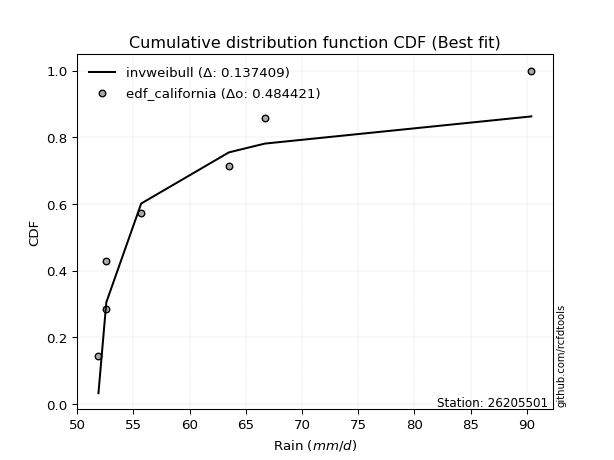</img>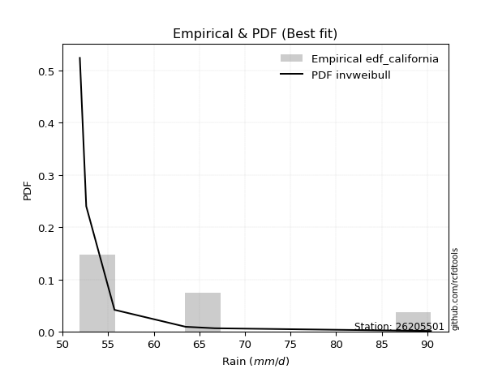</img>

</div>


### 2. EDF Hazen (1930)

Hazen method for plotting positions is a formula used to estimate the empirical cumulative probability distribution of flood events or other hydrological data. This formula often results in biased estimations, particularly when extrapolating to extreme events (high return periods).

<div align="center">


$P=(m-0.5)/n$


</div>


**2.1. Empirical values**

<div align="center">

|                | 0                   | 1                   | 2                   | 3         | 4                  | 5                  | 6                  |
|:---------------|:--------------------|:--------------------|:--------------------|:----------|:-------------------|:-------------------|:-------------------|
| date           | 2022                | 2019                | 2021                | 2023      | 2020               | 2017               | 2018               |
| x              | 51.9                | 52.6                | 52.6                | 55.7      | 63.5               | 66.7               | 90.4               |
| m              | 1                   | 2                   | 3                   | 4         | 5                  | 6                  | 7                  |
| empirical_dist | edf_hazen           | edf_hazen           | edf_hazen           | edf_hazen | edf_hazen          | edf_hazen          | edf_hazen          |
| empirical      | 0.07142857142857142 | 0.21428571428571427 | 0.35714285714285715 | 0.5       | 0.6428571428571429 | 0.7857142857142857 | 0.9285714285714286 |
| empirical_tr   | 1.0769230769230769  | 1.2727272727272727  | 1.5555555555555558  | 2.0       | 2.8000000000000003 | 4.666666666666666  | 14.000000000000007 |

</div>


**2.2. Kolmogorov-Smirnov fit test (sorted by Δ)**


<div align="center">

|                | 0                   | 1                   | 2                   | 3                   | 4                   | 5                   | 6                   | 7                   | 8                   | 9                   | 10                  | 11                  | 12                  | 13                  | 14                  | 15                  | 16                  | 17                  | 18                  | 19                  | 20                  | 21                  | 22                  | 23                  | 24                  | 25                  | 26                  | 27                  | 28                  | 29                  | 30                  | 31                  | 32                  | 33                  | 34                  | 35                  | 36                  | 37                  | 38                  | 39                  | 40                  | 41                  | 42                  | 43                  | 44                  | 45                  | 46                  | 47                  | 48                  | 49                  | 50                  | 51                  | 52                  | 53                  | 54                  | 55                  | 56                  | 57                  | 58                  | 59                  | 60                  | 61                  | 62                  | 63                  | 64                    | 65                  | 66                  | 67                  | 68                  | 69                  | 70                  | 71                  | 72                  | 73                  | 74                  | 75                  | 76                  | 77                  | 78                  | 79                  | 80                  | 81                  | 82                  | 83                  | 84                  | 85                  | 86                  | 87                  |
|:---------------|:--------------------|:--------------------|:--------------------|:--------------------|:--------------------|:--------------------|:--------------------|:--------------------|:--------------------|:--------------------|:--------------------|:--------------------|:--------------------|:--------------------|:--------------------|:--------------------|:--------------------|:--------------------|:--------------------|:--------------------|:--------------------|:--------------------|:--------------------|:--------------------|:--------------------|:--------------------|:--------------------|:--------------------|:--------------------|:--------------------|:--------------------|:--------------------|:--------------------|:--------------------|:--------------------|:--------------------|:--------------------|:--------------------|:--------------------|:--------------------|:--------------------|:--------------------|:--------------------|:--------------------|:--------------------|:--------------------|:--------------------|:--------------------|:--------------------|:--------------------|:--------------------|:--------------------|:--------------------|:--------------------|:--------------------|:--------------------|:--------------------|:--------------------|:--------------------|:--------------------|:--------------------|:--------------------|:--------------------|:--------------------|:----------------------|:--------------------|:--------------------|:--------------------|:--------------------|:--------------------|:--------------------|:--------------------|:--------------------|:--------------------|:--------------------|:--------------------|:--------------------|:--------------------|:--------------------|:--------------------|:--------------------|:--------------------|:--------------------|:--------------------|:--------------------|:--------------------|:--------------------|:--------------------|
| station        | 26205501            | 26205501            | 26205501            | 26205501            | 26205501            | 26205501            | 26205501            | 26205501            | 26205501            | 26205501            | 26205501            | 26205501            | 26205501            | 26205501            | 26205501            | 26205501            | 26205501            | 26205501            | 26205501            | 26205501            | 26205501            | 26205501            | 26205501            | 26205501            | 26205501            | 26205501            | 26205501            | 26205501            | 26205501            | 26205501            | 26205501            | 26205501            | 26205501            | 26205501            | 26205501            | 26205501            | 26205501            | 26205501            | 26205501            | 26205501            | 26205501            | 26205501            | 26205501            | 26205501            | 26205501            | 26205501            | 26205501            | 26205501            | 26205501            | 26205501            | 26205501            | 26205501            | 26205501            | 26205501            | 26205501            | 26205501            | 26205501            | 26205501            | 26205501            | 26205501            | 26205501            | 26205501            | 26205501            | 26205501            | 26205501              | 26205501            | 26205501            | 26205501            | 26205501            | 26205501            | 26205501            | 26205501            | 26205501            | 26205501            | 26205501            | 26205501            | 26205501            | 26205501            | 26205501            | 26205501            | 26205501            | 26205501            | 26205501            | 26205501            | 26205501            | 26205501            | 26205501            | 26205501            |
| empirical_dist | edf_hazen           | edf_hazen           | edf_hazen           | edf_hazen           | edf_hazen           | edf_hazen           | edf_hazen           | edf_hazen           | edf_hazen           | edf_hazen           | edf_hazen           | edf_hazen           | edf_hazen           | edf_hazen           | edf_hazen           | edf_hazen           | edf_hazen           | edf_hazen           | edf_hazen           | edf_hazen           | edf_hazen           | edf_hazen           | edf_hazen           | edf_hazen           | edf_hazen           | edf_hazen           | edf_hazen           | edf_hazen           | edf_hazen           | edf_hazen           | edf_hazen           | edf_hazen           | edf_hazen           | edf_hazen           | edf_hazen           | edf_hazen           | edf_hazen           | edf_hazen           | edf_hazen           | edf_hazen           | edf_hazen           | edf_hazen           | edf_hazen           | edf_hazen           | edf_hazen           | edf_hazen           | edf_hazen           | edf_hazen           | edf_hazen           | edf_hazen           | edf_hazen           | edf_hazen           | edf_hazen           | edf_hazen           | edf_hazen           | edf_hazen           | edf_hazen           | edf_hazen           | edf_hazen           | edf_hazen           | edf_hazen           | edf_hazen           | edf_hazen           | edf_hazen           | edf_hazen             | edf_hazen           | edf_hazen           | edf_hazen           | edf_hazen           | edf_hazen           | edf_hazen           | edf_hazen           | edf_hazen           | edf_hazen           | edf_hazen           | edf_hazen           | edf_hazen           | edf_hazen           | edf_hazen           | edf_hazen           | edf_hazen           | edf_hazen           | edf_hazen           | edf_hazen           | edf_hazen           | edf_hazen           | edf_hazen           | edf_hazen           |
| p_dist         | invweibull          | loginvweibull       | loghalflogistic     | logpearson3         | moyal               | invgamma            | f                   | loggumbel_r         | logf                | lograyleigh         | logmoyal            | gumbel_r            | fisk                | logmaxwell          | loghalfnorm         | pearson3            | halflogistic        | maxwell             | logt                | rayleigh            | logalpha            | loginvgamma         | nct                 | genlogistic         | mielke              | invgauss            | chi2                | logweibull_min      | loginvgauss         | loggenlogistic      | logloggamma         | ncf                 | logcrystalball      | lognorm             | lognorm             | betaprime           | lognct              | halfnorm            | norm                | crystalball         | logbetaprime        | logkstwobign        | alpha               | logfisk             | t                   | loglogistic         | kstwobign           | logistic            | loggamma            | loggamma            | logrice             | loghypsecant        | weibull_min         | wald                | hypsecant           | gamma               | rice                | loggumbel_l         | gumbel_l            | loglaplace          | laplace             | nakagami            | logwald             | logexponnorm        | loglaplace_asymmetric | logexpon            | loggenexpon         | exponnorm           | laplace_asymmetric  | genexpon            | expon               | logncf              | gompertz            | truncnorm           | logtruncnorm        | lognakagami         | loggompertz         | erlang              | gibrat              | loggibrat           | loglognorm          | logchi2             | fatiguelife         | logfatiguelife      | logerlang           | johnsonsu           | logjohnsonsu        | logmielke           |
| delta          | 0.11178668972515016 | 0.12001541697473683 | 0.12321189627155968 | 0.12721335835945122 | 0.1361284073875234  | 0.1388985439389332  | 0.13889977939185394 | 0.1408082110284487  | 0.1434099532899823  | 0.14460042239672038 | 0.1475487185360434  | 0.14859724592592566 | 0.14926866268473754 | 0.1505507237185409  | 0.154179791025603   | 0.15473006140684875 | 0.1603610239494693  | 0.16203564926036046 | 0.16574008052023392 | 0.16881383881311024 | 0.17108283212309272 | 0.1719721572685322  | 0.1731736722460448  | 0.17382129297995663 | 0.17415585907807515 | 0.1745273368851331  | 0.17485219905469046 | 0.17518081274174516 | 0.1754106536101807  | 0.17603635250788827 | 0.17669156318032453 | 0.17765651874337424 | 0.18027450040566856 | 0.18027497126690561 | 0.18027497126690561 | 0.18327011702641388 | 0.18373383706283067 | 0.1847194419090298  | 0.18615696857247888 | 0.18615697845602142 | 0.18797864068174963 | 0.1901844875771204  | 0.19417030980182892 | 0.19476831561845676 | 0.19698995308738124 | 0.2005056097860924  | 0.20418647839438664 | 0.20675338562057743 | 0.20729095025272548 | 0.20729095025272548 | 0.21445745611474504 | 0.21557113517657828 | 0.21888141392351199 | 0.2202015208289233  | 0.22195513578024328 | 0.23003984840978686 | 0.2318566356909572  | 0.2350043827980155  | 0.2397634655272109  | 0.24222309218042587 | 0.24817512793833313 | 0.2532898628938204  | 0.27087137295601443 | 0.27436778340098406 | 0.27576670163893974   | 0.2757737994117087  | 0.27577411515969674 | 0.28831164168810003 | 0.2896280627208559  | 0.2896297447256201  | 0.289629788070524   | 0.2909649348821043  | 0.2945672368494494  | 0.3012457010844102  | 0.30695533432832145 | 0.307785658599381   | 0.30839385358079624 | 0.3127264280127383  | 0.35183255011021675 | 0.35714285714285715 | 0.3831986836054564  | 0.39323054428558807 | 0.40276748993773903 | 0.40845020646184527 | 0.4505510299139145  | 0.4825564324722813  | 0.6776721792853454  | nan                 |
| deltao         | 0.48442053926100004 | 0.48442053926100004 | 0.48442053926100004 | 0.48442053926100004 | 0.48442053926100004 | 0.48442053926100004 | 0.48442053926100004 | 0.48442053926100004 | 0.48442053926100004 | 0.48442053926100004 | 0.48442053926100004 | 0.48442053926100004 | 0.48442053926100004 | 0.48442053926100004 | 0.48442053926100004 | 0.48442053926100004 | 0.48442053926100004 | 0.48442053926100004 | 0.48442053926100004 | 0.48442053926100004 | 0.48442053926100004 | 0.48442053926100004 | 0.48442053926100004 | 0.48442053926100004 | 0.48442053926100004 | 0.48442053926100004 | 0.48442053926100004 | 0.48442053926100004 | 0.48442053926100004 | 0.48442053926100004 | 0.48442053926100004 | 0.48442053926100004 | 0.48442053926100004 | 0.48442053926100004 | 0.48442053926100004 | 0.48442053926100004 | 0.48442053926100004 | 0.48442053926100004 | 0.48442053926100004 | 0.48442053926100004 | 0.48442053926100004 | 0.48442053926100004 | 0.48442053926100004 | 0.48442053926100004 | 0.48442053926100004 | 0.48442053926100004 | 0.48442053926100004 | 0.48442053926100004 | 0.48442053926100004 | 0.48442053926100004 | 0.48442053926100004 | 0.48442053926100004 | 0.48442053926100004 | 0.48442053926100004 | 0.48442053926100004 | 0.48442053926100004 | 0.48442053926100004 | 0.48442053926100004 | 0.48442053926100004 | 0.48442053926100004 | 0.48442053926100004 | 0.48442053926100004 | 0.48442053926100004 | 0.48442053926100004 | 0.48442053926100004   | 0.48442053926100004 | 0.48442053926100004 | 0.48442053926100004 | 0.48442053926100004 | 0.48442053926100004 | 0.48442053926100004 | 0.48442053926100004 | 0.48442053926100004 | 0.48442053926100004 | 0.48442053926100004 | 0.48442053926100004 | 0.48442053926100004 | 0.48442053926100004 | 0.48442053926100004 | 0.48442053926100004 | 0.48442053926100004 | 0.48442053926100004 | 0.48442053926100004 | 0.48442053926100004 | 0.48442053926100004 | 0.48442053926100004 | 0.48442053926100004 | 0.48442053926100004 |
| eval           | Δo > Δ              | Δo > Δ              | Δo > Δ              | Δo > Δ              | Δo > Δ              | Δo > Δ              | Δo > Δ              | Δo > Δ              | Δo > Δ              | Δo > Δ              | Δo > Δ              | Δo > Δ              | Δo > Δ              | Δo > Δ              | Δo > Δ              | Δo > Δ              | Δo > Δ              | Δo > Δ              | Δo > Δ              | Δo > Δ              | Δo > Δ              | Δo > Δ              | Δo > Δ              | Δo > Δ              | Δo > Δ              | Δo > Δ              | Δo > Δ              | Δo > Δ              | Δo > Δ              | Δo > Δ              | Δo > Δ              | Δo > Δ              | Δo > Δ              | Δo > Δ              | Δo > Δ              | Δo > Δ              | Δo > Δ              | Δo > Δ              | Δo > Δ              | Δo > Δ              | Δo > Δ              | Δo > Δ              | Δo > Δ              | Δo > Δ              | Δo > Δ              | Δo > Δ              | Δo > Δ              | Δo > Δ              | Δo > Δ              | Δo > Δ              | Δo > Δ              | Δo > Δ              | Δo > Δ              | Δo > Δ              | Δo > Δ              | Δo > Δ              | Δo > Δ              | Δo > Δ              | Δo > Δ              | Δo > Δ              | Δo > Δ              | Δo > Δ              | Δo > Δ              | Δo > Δ              | Δo > Δ                | Δo > Δ              | Δo > Δ              | Δo > Δ              | Δo > Δ              | Δo > Δ              | Δo > Δ              | Δo > Δ              | Δo > Δ              | Δo > Δ              | Δo > Δ              | Δo > Δ              | Δo > Δ              | Δo > Δ              | Δo > Δ              | Δo > Δ              | Δo > Δ              | Δo > Δ              | Δo > Δ              | Δo > Δ              | Δo > Δ              | Δo > Δ              | Δo <= Δ             | Δo <= Δ             |
| fit            | 1                   | 1                   | 1                   | 1                   | 1                   | 1                   | 1                   | 1                   | 1                   | 1                   | 1                   | 1                   | 1                   | 1                   | 1                   | 1                   | 1                   | 1                   | 1                   | 1                   | 1                   | 1                   | 1                   | 1                   | 1                   | 1                   | 1                   | 1                   | 1                   | 1                   | 1                   | 1                   | 1                   | 1                   | 1                   | 1                   | 1                   | 1                   | 1                   | 1                   | 1                   | 1                   | 1                   | 1                   | 1                   | 1                   | 1                   | 1                   | 1                   | 1                   | 1                   | 1                   | 1                   | 1                   | 1                   | 1                   | 1                   | 1                   | 1                   | 1                   | 1                   | 1                   | 1                   | 1                   | 1                     | 1                   | 1                   | 1                   | 1                   | 1                   | 1                   | 1                   | 1                   | 1                   | 1                   | 1                   | 1                   | 1                   | 1                   | 1                   | 1                   | 1                   | 1                   | 1                   | 1                   | 1                   | 0                   | 0                   |
| n              | 7                   | 7                   | 7                   | 7                   | 7                   | 7                   | 7                   | 7                   | 7                   | 7                   | 7                   | 7                   | 7                   | 7                   | 7                   | 7                   | 7                   | 7                   | 7                   | 7                   | 7                   | 7                   | 7                   | 7                   | 7                   | 7                   | 7                   | 7                   | 7                   | 7                   | 7                   | 7                   | 7                   | 7                   | 7                   | 7                   | 7                   | 7                   | 7                   | 7                   | 7                   | 7                   | 7                   | 7                   | 7                   | 7                   | 7                   | 7                   | 7                   | 7                   | 7                   | 7                   | 7                   | 7                   | 7                   | 7                   | 7                   | 7                   | 7                   | 7                   | 7                   | 7                   | 7                   | 7                   | 7                     | 7                   | 7                   | 7                   | 7                   | 7                   | 7                   | 7                   | 7                   | 7                   | 7                   | 7                   | 7                   | 7                   | 7                   | 7                   | 7                   | 7                   | 7                   | 7                   | 7                   | 7                   | 7                   | 7                   |
| best_fit       | 1                   | 0                   | 0                   | 0                   | 0                   | 0                   | 0                   | 0                   | 0                   | 0                   | 0                   | 0                   | 0                   | 0                   | 0                   | 0                   | 0                   | 0                   | 0                   | 0                   | 0                   | 0                   | 0                   | 0                   | 0                   | 0                   | 0                   | 0                   | 0                   | 0                   | 0                   | 0                   | 0                   | 0                   | 0                   | 0                   | 0                   | 0                   | 0                   | 0                   | 0                   | 0                   | 0                   | 0                   | 0                   | 0                   | 0                   | 0                   | 0                   | 0                   | 0                   | 0                   | 0                   | 0                   | 0                   | 0                   | 0                   | 0                   | 0                   | 0                   | 0                   | 0                   | 0                   | 0                   | 0                     | 0                   | 0                   | 0                   | 0                   | 0                   | 0                   | 0                   | 0                   | 0                   | 0                   | 0                   | 0                   | 0                   | 0                   | 0                   | 0                   | 0                   | 0                   | 0                   | 0                   | 0                   | 0                   | 0                   |
| best_fit_sort  | 1                   | 2                   | 3                   | 4                   | 5                   | 6                   | 7                   | 8                   | 9                   | 10                  | 11                  | 12                  | 13                  | 14                  | 15                  | 16                  | 17                  | 18                  | 19                  | 20                  | 21                  | 22                  | 23                  | 24                  | 25                  | 26                  | 27                  | 28                  | 29                  | 30                  | 31                  | 32                  | 33                  | 34                  | 35                  | 36                  | 37                  | 38                  | 39                  | 40                  | 41                  | 42                  | 43                  | 44                  | 45                  | 46                  | 47                  | 48                  | 49                  | 50                  | 51                  | 52                  | 53                  | 54                  | 55                  | 56                  | 57                  | 58                  | 59                  | 60                  | 61                  | 62                  | 63                  | 64                  | 65                    | 66                  | 67                  | 68                  | 69                  | 70                  | 71                  | 72                  | 73                  | 74                  | 75                  | 76                  | 77                  | 78                  | 79                  | 80                  | 81                  | 82                  | 83                  | 84                  | 85                  | 86                  | 87                  | 88                  |

</div>


**2.3. Best fit**

<div align="center">

|   id |   station | empirical_dist   | p_dist     |    delta |   deltao | eval   |   fit |   n |   best_fit |   best_fit_sort |
|-----:|----------:|:-----------------|:-----------|---------:|---------:|:-------|------:|----:|-----------:|----------------:|
|    0 |  26205501 | edf_hazen        | invweibull | 0.111787 | 0.484421 | Δo > Δ |     1 |   7 |          1 |               1 |

</div>


<div align="center">

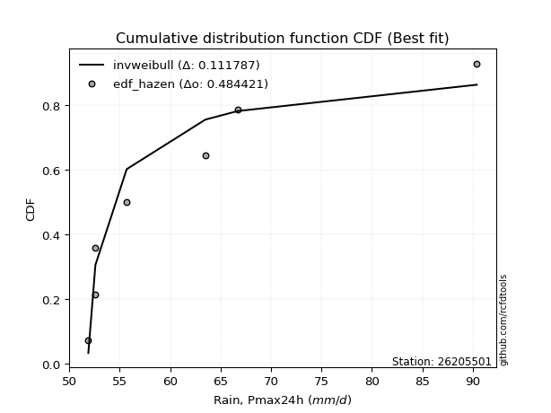</img>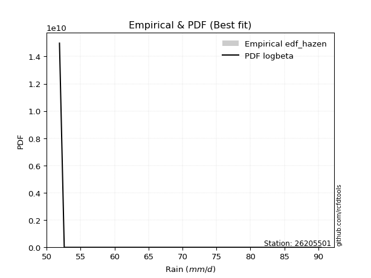</img>

</div>


### 3. EDF Weibull (1939)

Weibull plotting position formula is an empirical method used to estimate the non-exceedance probability or plotting position for a set of observed data, is often recommended or widely used in practice, particularly in flood frequency analysis.

<div align="center">


$P=m/(n+1)$


</div>


**3.1. Empirical values**

<div align="center">

|                | 0                  | 1                  | 2           | 3           | 4                  | 5           | 6           |
|:---------------|:-------------------|:-------------------|:------------|:------------|:-------------------|:------------|:------------|
| date           | 2022               | 2019               | 2021        | 2023        | 2020               | 2017        | 2018        |
| x              | 51.9               | 52.6               | 52.6        | 55.7        | 63.5               | 66.7        | 90.4        |
| m              | 1                  | 2                  | 3           | 4           | 5                  | 6           | 7           |
| empirical_dist | edf_weibull        | edf_weibull        | edf_weibull | edf_weibull | edf_weibull        | edf_weibull | edf_weibull |
| empirical      | 0.125              | 0.25               | 0.375       | 0.5         | 0.625              | 0.75        | 0.875       |
| empirical_tr   | 1.1428571428571428 | 1.3333333333333333 | 1.6         | 2.0         | 2.6666666666666665 | 4.0         | 8.0         |

</div>


**3.2. Kolmogorov-Smirnov fit test (sorted by Δ)**


<div align="center">

|                | 0                   | 1                   | 2                   | 3                   | 4                   | 5                   | 6                   | 7                   | 8                   | 9                   | 10                  | 11                  | 12                  | 13                  | 14                  | 15                  | 16                  | 17                  | 18                  | 19                  | 20                  | 21                  | 22                  | 23                  | 24                  | 25                  | 26                  | 27                  | 28                  | 29                  | 30                  | 31                  | 32                  | 33                  | 34                  | 35                  | 36                  | 37                  | 38                  | 39                  | 40                  | 41                  | 42                  | 43                  | 44                  | 45                  | 46                  | 47                  | 48                  | 49                  | 50                  | 51                  | 52                  | 53                  | 54                  | 55                  | 56                  | 57                  | 58                  | 59                  | 60                  | 61                  | 62                  | 63                  | 64                  | 65                  | 66                    | 67                  | 68                  | 69                  | 70                  | 71                  | 72                  | 73                  | 74                  | 75                  | 76                  | 77                  | 78                  | 79                  | 80                  | 81                  | 82                  | 83                  | 84                  | 85                  | 86                  | 87                  |
|:---------------|:--------------------|:--------------------|:--------------------|:--------------------|:--------------------|:--------------------|:--------------------|:--------------------|:--------------------|:--------------------|:--------------------|:--------------------|:--------------------|:--------------------|:--------------------|:--------------------|:--------------------|:--------------------|:--------------------|:--------------------|:--------------------|:--------------------|:--------------------|:--------------------|:--------------------|:--------------------|:--------------------|:--------------------|:--------------------|:--------------------|:--------------------|:--------------------|:--------------------|:--------------------|:--------------------|:--------------------|:--------------------|:--------------------|:--------------------|:--------------------|:--------------------|:--------------------|:--------------------|:--------------------|:--------------------|:--------------------|:--------------------|:--------------------|:--------------------|:--------------------|:--------------------|:--------------------|:--------------------|:--------------------|:--------------------|:--------------------|:--------------------|:--------------------|:--------------------|:--------------------|:--------------------|:--------------------|:--------------------|:--------------------|:--------------------|:--------------------|:----------------------|:--------------------|:--------------------|:--------------------|:--------------------|:--------------------|:--------------------|:--------------------|:--------------------|:--------------------|:--------------------|:--------------------|:--------------------|:--------------------|:--------------------|:--------------------|:--------------------|:--------------------|:--------------------|:--------------------|:--------------------|:--------------------|
| station        | 26205501            | 26205501            | 26205501            | 26205501            | 26205501            | 26205501            | 26205501            | 26205501            | 26205501            | 26205501            | 26205501            | 26205501            | 26205501            | 26205501            | 26205501            | 26205501            | 26205501            | 26205501            | 26205501            | 26205501            | 26205501            | 26205501            | 26205501            | 26205501            | 26205501            | 26205501            | 26205501            | 26205501            | 26205501            | 26205501            | 26205501            | 26205501            | 26205501            | 26205501            | 26205501            | 26205501            | 26205501            | 26205501            | 26205501            | 26205501            | 26205501            | 26205501            | 26205501            | 26205501            | 26205501            | 26205501            | 26205501            | 26205501            | 26205501            | 26205501            | 26205501            | 26205501            | 26205501            | 26205501            | 26205501            | 26205501            | 26205501            | 26205501            | 26205501            | 26205501            | 26205501            | 26205501            | 26205501            | 26205501            | 26205501            | 26205501            | 26205501              | 26205501            | 26205501            | 26205501            | 26205501            | 26205501            | 26205501            | 26205501            | 26205501            | 26205501            | 26205501            | 26205501            | 26205501            | 26205501            | 26205501            | 26205501            | 26205501            | 26205501            | 26205501            | 26205501            | 26205501            | 26205501            |
| empirical_dist | edf_weibull         | edf_weibull         | edf_weibull         | edf_weibull         | edf_weibull         | edf_weibull         | edf_weibull         | edf_weibull         | edf_weibull         | edf_weibull         | edf_weibull         | edf_weibull         | edf_weibull         | edf_weibull         | edf_weibull         | edf_weibull         | edf_weibull         | edf_weibull         | edf_weibull         | edf_weibull         | edf_weibull         | edf_weibull         | edf_weibull         | edf_weibull         | edf_weibull         | edf_weibull         | edf_weibull         | edf_weibull         | edf_weibull         | edf_weibull         | edf_weibull         | edf_weibull         | edf_weibull         | edf_weibull         | edf_weibull         | edf_weibull         | edf_weibull         | edf_weibull         | edf_weibull         | edf_weibull         | edf_weibull         | edf_weibull         | edf_weibull         | edf_weibull         | edf_weibull         | edf_weibull         | edf_weibull         | edf_weibull         | edf_weibull         | edf_weibull         | edf_weibull         | edf_weibull         | edf_weibull         | edf_weibull         | edf_weibull         | edf_weibull         | edf_weibull         | edf_weibull         | edf_weibull         | edf_weibull         | edf_weibull         | edf_weibull         | edf_weibull         | edf_weibull         | edf_weibull         | edf_weibull         | edf_weibull           | edf_weibull         | edf_weibull         | edf_weibull         | edf_weibull         | edf_weibull         | edf_weibull         | edf_weibull         | edf_weibull         | edf_weibull         | edf_weibull         | edf_weibull         | edf_weibull         | edf_weibull         | edf_weibull         | edf_weibull         | edf_weibull         | edf_weibull         | edf_weibull         | edf_weibull         | edf_weibull         | edf_weibull         |
| p_dist         | halflogistic        | loghalfnorm         | logt                | pearson3            | invweibull          | halfnorm            | fisk                | loginvweibull       | lograyleigh         | lognct              | moyal               | loghalflogistic     | t                   | logpearson3         | rayleigh            | gumbel_r            | logmaxwell          | loggumbel_r         | invgamma            | f                   | maxwell             | logf                | logmoyal            | logalpha            | loginvgamma         | nct                 | logloggamma         | ncf                 | logcrystalball      | lognorm             | lognorm             | betaprime           | norm                | crystalball         | genlogistic         | logbetaprime        | mielke              | invgauss            | chi2                | logweibull_min      | loginvgauss         | loggenlogistic      | loglogistic         | kstwobign           | logistic            | logfisk             | logkstwobign        | alpha               | loghypsecant        | logrice             | hypsecant           | loggamma            | loggamma            | rice                | loggumbel_l         | weibull_min         | logncf              | wald                | gumbel_l            | loglaplace          | gamma               | laplace             | nakagami            | lognakagami         | logwald             | logexponnorm        | loglaplace_asymmetric | logexpon            | loggenexpon         | exponnorm           | laplace_asymmetric  | genexpon            | expon               | gompertz            | erlang              | truncnorm           | logtruncnorm        | loggompertz         | loglognorm          | logchi2             | fatiguelife         | gibrat              | logfatiguelife      | loggibrat           | logerlang           | johnsonsu           | logjohnsonsu        | logmielke           |
| delta          | 0.11321021378826535 | 0.11638078499087917 | 0.11751777895567883 | 0.12320420593171633 | 0.12964383258229306 | 0.13114801333760123 | 0.13786232554772337 | 0.13787255983187974 | 0.13900686361708725 | 0.13994690931238568 | 0.1401453829638618  | 0.14021177343304825 | 0.14341852451595266 | 0.14394340383079215 | 0.14554729009766043 | 0.14859724592592566 | 0.1505507237185409  | 0.15612170059652494 | 0.1567556867960761  | 0.15675692224899684 | 0.15695084475535737 | 0.1612670961471252  | 0.16540586139318625 | 0.17108283212309272 | 0.1719721572685322  | 0.1731736722460448  | 0.17669156318032453 | 0.17765651874337424 | 0.18027450040566856 | 0.18027497126690561 | 0.18027497126690561 | 0.18327011702641388 | 0.18615696857247888 | 0.18615697845602142 | 0.18703269696445998 | 0.18797864068174963 | 0.192013001935218   | 0.19238447974227602 | 0.1927093419118333  | 0.193037955598888   | 0.19326779646732362 | 0.19389349536503112 | 0.2005056097860924  | 0.20418647839438664 | 0.20675338562057743 | 0.20750388744042284 | 0.20804163043426324 | 0.21202745265897183 | 0.21557113517657828 | 0.2193793283792342  | 0.22195513578024328 | 0.22514809310986839 | 0.22514809310986839 | 0.2318566356909572  | 0.2350043827980155  | 0.23673855678065484 | 0.23739350631067568 | 0.23805866368606615 | 0.2397634655272109  | 0.24222309218042587 | 0.24789699126692977 | 0.24817512793833313 | 0.2711470057509632  | 0.2720713728850953  | 0.2887285158131573  | 0.2922249262581269  | 0.2936238444960826    | 0.29363094226885156 | 0.29363125801683965 | 0.3061687845452429  | 0.30748520557799874 | 0.30748688758276294 | 0.3074869309276668  | 0.3124243797065923  | 0.31420616520005507 | 0.319102843941553   | 0.32481247718546424 | 0.3262509964379391  | 0.3474843978911707  | 0.35751625857130237 | 0.36705320422345333 | 0.3696896929673596  | 0.37273592074755957 | 0.375               | 0.4148367441996288  | 0.4468421467579956  | 0.6419578935710597  | nan                 |
| deltao         | 0.48442053926100004 | 0.48442053926100004 | 0.48442053926100004 | 0.48442053926100004 | 0.48442053926100004 | 0.48442053926100004 | 0.48442053926100004 | 0.48442053926100004 | 0.48442053926100004 | 0.48442053926100004 | 0.48442053926100004 | 0.48442053926100004 | 0.48442053926100004 | 0.48442053926100004 | 0.48442053926100004 | 0.48442053926100004 | 0.48442053926100004 | 0.48442053926100004 | 0.48442053926100004 | 0.48442053926100004 | 0.48442053926100004 | 0.48442053926100004 | 0.48442053926100004 | 0.48442053926100004 | 0.48442053926100004 | 0.48442053926100004 | 0.48442053926100004 | 0.48442053926100004 | 0.48442053926100004 | 0.48442053926100004 | 0.48442053926100004 | 0.48442053926100004 | 0.48442053926100004 | 0.48442053926100004 | 0.48442053926100004 | 0.48442053926100004 | 0.48442053926100004 | 0.48442053926100004 | 0.48442053926100004 | 0.48442053926100004 | 0.48442053926100004 | 0.48442053926100004 | 0.48442053926100004 | 0.48442053926100004 | 0.48442053926100004 | 0.48442053926100004 | 0.48442053926100004 | 0.48442053926100004 | 0.48442053926100004 | 0.48442053926100004 | 0.48442053926100004 | 0.48442053926100004 | 0.48442053926100004 | 0.48442053926100004 | 0.48442053926100004 | 0.48442053926100004 | 0.48442053926100004 | 0.48442053926100004 | 0.48442053926100004 | 0.48442053926100004 | 0.48442053926100004 | 0.48442053926100004 | 0.48442053926100004 | 0.48442053926100004 | 0.48442053926100004 | 0.48442053926100004 | 0.48442053926100004   | 0.48442053926100004 | 0.48442053926100004 | 0.48442053926100004 | 0.48442053926100004 | 0.48442053926100004 | 0.48442053926100004 | 0.48442053926100004 | 0.48442053926100004 | 0.48442053926100004 | 0.48442053926100004 | 0.48442053926100004 | 0.48442053926100004 | 0.48442053926100004 | 0.48442053926100004 | 0.48442053926100004 | 0.48442053926100004 | 0.48442053926100004 | 0.48442053926100004 | 0.48442053926100004 | 0.48442053926100004 | 0.48442053926100004 |
| eval           | Δo > Δ              | Δo > Δ              | Δo > Δ              | Δo > Δ              | Δo > Δ              | Δo > Δ              | Δo > Δ              | Δo > Δ              | Δo > Δ              | Δo > Δ              | Δo > Δ              | Δo > Δ              | Δo > Δ              | Δo > Δ              | Δo > Δ              | Δo > Δ              | Δo > Δ              | Δo > Δ              | Δo > Δ              | Δo > Δ              | Δo > Δ              | Δo > Δ              | Δo > Δ              | Δo > Δ              | Δo > Δ              | Δo > Δ              | Δo > Δ              | Δo > Δ              | Δo > Δ              | Δo > Δ              | Δo > Δ              | Δo > Δ              | Δo > Δ              | Δo > Δ              | Δo > Δ              | Δo > Δ              | Δo > Δ              | Δo > Δ              | Δo > Δ              | Δo > Δ              | Δo > Δ              | Δo > Δ              | Δo > Δ              | Δo > Δ              | Δo > Δ              | Δo > Δ              | Δo > Δ              | Δo > Δ              | Δo > Δ              | Δo > Δ              | Δo > Δ              | Δo > Δ              | Δo > Δ              | Δo > Δ              | Δo > Δ              | Δo > Δ              | Δo > Δ              | Δo > Δ              | Δo > Δ              | Δo > Δ              | Δo > Δ              | Δo > Δ              | Δo > Δ              | Δo > Δ              | Δo > Δ              | Δo > Δ              | Δo > Δ                | Δo > Δ              | Δo > Δ              | Δo > Δ              | Δo > Δ              | Δo > Δ              | Δo > Δ              | Δo > Δ              | Δo > Δ              | Δo > Δ              | Δo > Δ              | Δo > Δ              | Δo > Δ              | Δo > Δ              | Δo > Δ              | Δo > Δ              | Δo > Δ              | Δo > Δ              | Δo > Δ              | Δo > Δ              | Δo <= Δ             | Δo <= Δ             |
| fit            | 1                   | 1                   | 1                   | 1                   | 1                   | 1                   | 1                   | 1                   | 1                   | 1                   | 1                   | 1                   | 1                   | 1                   | 1                   | 1                   | 1                   | 1                   | 1                   | 1                   | 1                   | 1                   | 1                   | 1                   | 1                   | 1                   | 1                   | 1                   | 1                   | 1                   | 1                   | 1                   | 1                   | 1                   | 1                   | 1                   | 1                   | 1                   | 1                   | 1                   | 1                   | 1                   | 1                   | 1                   | 1                   | 1                   | 1                   | 1                   | 1                   | 1                   | 1                   | 1                   | 1                   | 1                   | 1                   | 1                   | 1                   | 1                   | 1                   | 1                   | 1                   | 1                   | 1                   | 1                   | 1                   | 1                   | 1                     | 1                   | 1                   | 1                   | 1                   | 1                   | 1                   | 1                   | 1                   | 1                   | 1                   | 1                   | 1                   | 1                   | 1                   | 1                   | 1                   | 1                   | 1                   | 1                   | 0                   | 0                   |
| n              | 7                   | 7                   | 7                   | 7                   | 7                   | 7                   | 7                   | 7                   | 7                   | 7                   | 7                   | 7                   | 7                   | 7                   | 7                   | 7                   | 7                   | 7                   | 7                   | 7                   | 7                   | 7                   | 7                   | 7                   | 7                   | 7                   | 7                   | 7                   | 7                   | 7                   | 7                   | 7                   | 7                   | 7                   | 7                   | 7                   | 7                   | 7                   | 7                   | 7                   | 7                   | 7                   | 7                   | 7                   | 7                   | 7                   | 7                   | 7                   | 7                   | 7                   | 7                   | 7                   | 7                   | 7                   | 7                   | 7                   | 7                   | 7                   | 7                   | 7                   | 7                   | 7                   | 7                   | 7                   | 7                   | 7                   | 7                     | 7                   | 7                   | 7                   | 7                   | 7                   | 7                   | 7                   | 7                   | 7                   | 7                   | 7                   | 7                   | 7                   | 7                   | 7                   | 7                   | 7                   | 7                   | 7                   | 7                   | 7                   |
| best_fit       | 1                   | 0                   | 0                   | 0                   | 0                   | 0                   | 0                   | 0                   | 0                   | 0                   | 0                   | 0                   | 0                   | 0                   | 0                   | 0                   | 0                   | 0                   | 0                   | 0                   | 0                   | 0                   | 0                   | 0                   | 0                   | 0                   | 0                   | 0                   | 0                   | 0                   | 0                   | 0                   | 0                   | 0                   | 0                   | 0                   | 0                   | 0                   | 0                   | 0                   | 0                   | 0                   | 0                   | 0                   | 0                   | 0                   | 0                   | 0                   | 0                   | 0                   | 0                   | 0                   | 0                   | 0                   | 0                   | 0                   | 0                   | 0                   | 0                   | 0                   | 0                   | 0                   | 0                   | 0                   | 0                   | 0                   | 0                     | 0                   | 0                   | 0                   | 0                   | 0                   | 0                   | 0                   | 0                   | 0                   | 0                   | 0                   | 0                   | 0                   | 0                   | 0                   | 0                   | 0                   | 0                   | 0                   | 0                   | 0                   |
| best_fit_sort  | 1                   | 2                   | 3                   | 4                   | 5                   | 6                   | 7                   | 8                   | 9                   | 10                  | 11                  | 12                  | 13                  | 14                  | 15                  | 16                  | 17                  | 18                  | 19                  | 20                  | 21                  | 22                  | 23                  | 24                  | 25                  | 26                  | 27                  | 28                  | 29                  | 30                  | 31                  | 32                  | 33                  | 34                  | 35                  | 36                  | 37                  | 38                  | 39                  | 40                  | 41                  | 42                  | 43                  | 44                  | 45                  | 46                  | 47                  | 48                  | 49                  | 50                  | 51                  | 52                  | 53                  | 54                  | 55                  | 56                  | 57                  | 58                  | 59                  | 60                  | 61                  | 62                  | 63                  | 64                  | 65                  | 66                  | 67                    | 68                  | 69                  | 70                  | 71                  | 72                  | 73                  | 74                  | 75                  | 76                  | 77                  | 78                  | 79                  | 80                  | 81                  | 82                  | 83                  | 84                  | 85                  | 86                  | 87                  | 88                  |

</div>


**3.3. Best fit**

<div align="center">

|   id |   station | empirical_dist   | p_dist       |   delta |   deltao | eval   |   fit |   n |   best_fit |   best_fit_sort |
|-----:|----------:|:-----------------|:-------------|--------:|---------:|:-------|------:|----:|-----------:|----------------:|
|    0 |  26205501 | edf_weibull      | halflogistic | 0.11321 | 0.484421 | Δo > Δ |     1 |   7 |          1 |               1 |

</div>


<div align="center">

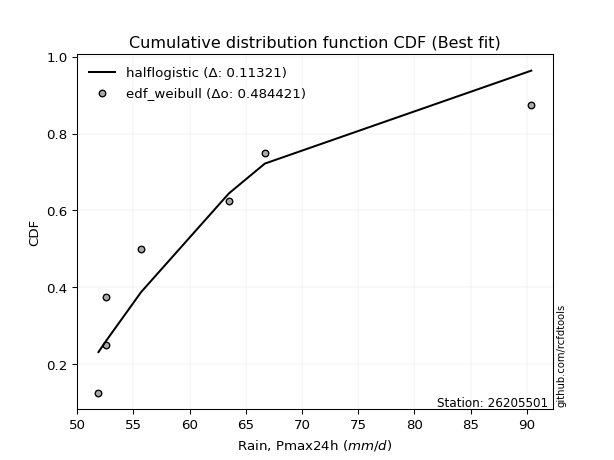</img>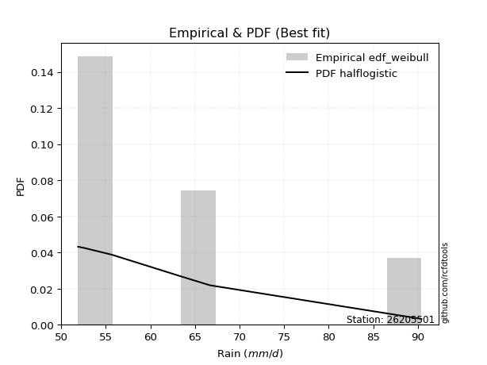</img>

</div>


### 4. EDF Beard (1943)

The Beard formula (or Beard´s plotting position formula) in hydrology is used to estimate the empirical non-exceedance probability _(P)_ of a flood event (or other extreme hydrological data point) within a given dataset.

<div align="center">


$P=(m-0.31)/(n+0.38)$


</div>


**4.1. Empirical values**

<div align="center">

|                | 0                   | 1                   | 2                   | 3         | 4                  | 5                  | 6                  |
|:---------------|:--------------------|:--------------------|:--------------------|:----------|:-------------------|:-------------------|:-------------------|
| date           | 2022                | 2019                | 2021                | 2023      | 2020               | 2017               | 2018               |
| x              | 51.9                | 52.6                | 52.6                | 55.7      | 63.5               | 66.7               | 90.4               |
| m              | 1                   | 2                   | 3                   | 4         | 5                  | 6                  | 7                  |
| empirical_dist | edf_beard           | edf_beard           | edf_beard           | edf_beard | edf_beard          | edf_beard          | edf_beard          |
| empirical      | 0.09349593495934959 | 0.22899728997289973 | 0.36449864498644985 | 0.5       | 0.6355013550135502 | 0.7710027100271003 | 0.9065040650406505 |
| empirical_tr   | 1.1031390134529149  | 1.29701230228471    | 1.5735607675906182  | 2.0       | 2.743494423791822  | 4.366863905325444  | 10.695652173913055 |

</div>


**4.2. Kolmogorov-Smirnov fit test (sorted by Δ)**


<div align="center">

|                | 0                   | 1                   | 2                   | 3                   | 4                   | 5                   | 6                   | 7                   | 8                   | 9                   | 10                  | 11                  | 12                  | 13                  | 14                  | 15                  | 16                  | 17                  | 18                  | 19                  | 20                  | 21                  | 22                  | 23                  | 24                  | 25                  | 26                  | 27                  | 28                  | 29                  | 30                  | 31                  | 32                  | 33                  | 34                  | 35                  | 36                  | 37                  | 38                  | 39                  | 40                  | 41                  | 42                  | 43                  | 44                  | 45                  | 46                  | 47                  | 48                  | 49                  | 50                  | 51                  | 52                  | 53                  | 54                  | 55                  | 56                  | 57                  | 58                  | 59                  | 60                  | 61                  | 62                  | 63                  | 64                  | 65                    | 66                  | 67                  | 68                  | 69                  | 70                  | 71                  | 72                  | 73                  | 74                  | 75                  | 76                  | 77                  | 78                  | 79                  | 80                  | 81                  | 82                  | 83                  | 84                  | 85                  | 86                  | 87                  |
|:---------------|:--------------------|:--------------------|:--------------------|:--------------------|:--------------------|:--------------------|:--------------------|:--------------------|:--------------------|:--------------------|:--------------------|:--------------------|:--------------------|:--------------------|:--------------------|:--------------------|:--------------------|:--------------------|:--------------------|:--------------------|:--------------------|:--------------------|:--------------------|:--------------------|:--------------------|:--------------------|:--------------------|:--------------------|:--------------------|:--------------------|:--------------------|:--------------------|:--------------------|:--------------------|:--------------------|:--------------------|:--------------------|:--------------------|:--------------------|:--------------------|:--------------------|:--------------------|:--------------------|:--------------------|:--------------------|:--------------------|:--------------------|:--------------------|:--------------------|:--------------------|:--------------------|:--------------------|:--------------------|:--------------------|:--------------------|:--------------------|:--------------------|:--------------------|:--------------------|:--------------------|:--------------------|:--------------------|:--------------------|:--------------------|:--------------------|:----------------------|:--------------------|:--------------------|:--------------------|:--------------------|:--------------------|:--------------------|:--------------------|:--------------------|:--------------------|:--------------------|:--------------------|:--------------------|:--------------------|:--------------------|:--------------------|:--------------------|:--------------------|:--------------------|:--------------------|:--------------------|:--------------------|:--------------------|
| station        | 26205501            | 26205501            | 26205501            | 26205501            | 26205501            | 26205501            | 26205501            | 26205501            | 26205501            | 26205501            | 26205501            | 26205501            | 26205501            | 26205501            | 26205501            | 26205501            | 26205501            | 26205501            | 26205501            | 26205501            | 26205501            | 26205501            | 26205501            | 26205501            | 26205501            | 26205501            | 26205501            | 26205501            | 26205501            | 26205501            | 26205501            | 26205501            | 26205501            | 26205501            | 26205501            | 26205501            | 26205501            | 26205501            | 26205501            | 26205501            | 26205501            | 26205501            | 26205501            | 26205501            | 26205501            | 26205501            | 26205501            | 26205501            | 26205501            | 26205501            | 26205501            | 26205501            | 26205501            | 26205501            | 26205501            | 26205501            | 26205501            | 26205501            | 26205501            | 26205501            | 26205501            | 26205501            | 26205501            | 26205501            | 26205501            | 26205501              | 26205501            | 26205501            | 26205501            | 26205501            | 26205501            | 26205501            | 26205501            | 26205501            | 26205501            | 26205501            | 26205501            | 26205501            | 26205501            | 26205501            | 26205501            | 26205501            | 26205501            | 26205501            | 26205501            | 26205501            | 26205501            | 26205501            |
| empirical_dist | edf_beard           | edf_beard           | edf_beard           | edf_beard           | edf_beard           | edf_beard           | edf_beard           | edf_beard           | edf_beard           | edf_beard           | edf_beard           | edf_beard           | edf_beard           | edf_beard           | edf_beard           | edf_beard           | edf_beard           | edf_beard           | edf_beard           | edf_beard           | edf_beard           | edf_beard           | edf_beard           | edf_beard           | edf_beard           | edf_beard           | edf_beard           | edf_beard           | edf_beard           | edf_beard           | edf_beard           | edf_beard           | edf_beard           | edf_beard           | edf_beard           | edf_beard           | edf_beard           | edf_beard           | edf_beard           | edf_beard           | edf_beard           | edf_beard           | edf_beard           | edf_beard           | edf_beard           | edf_beard           | edf_beard           | edf_beard           | edf_beard           | edf_beard           | edf_beard           | edf_beard           | edf_beard           | edf_beard           | edf_beard           | edf_beard           | edf_beard           | edf_beard           | edf_beard           | edf_beard           | edf_beard           | edf_beard           | edf_beard           | edf_beard           | edf_beard           | edf_beard             | edf_beard           | edf_beard           | edf_beard           | edf_beard           | edf_beard           | edf_beard           | edf_beard           | edf_beard           | edf_beard           | edf_beard           | edf_beard           | edf_beard           | edf_beard           | edf_beard           | edf_beard           | edf_beard           | edf_beard           | edf_beard           | edf_beard           | edf_beard           | edf_beard           | edf_beard           |
| p_dist         | invweibull          | loginvweibull       | loghalflogistic     | loghalfnorm         | pearson3            | logpearson3         | moyal               | fisk                | halflogistic        | lograyleigh         | logt                | loggumbel_r         | invgamma            | f                   | rayleigh            | gumbel_r            | logmaxwell          | logf                | logmoyal            | maxwell             | lognct              | halfnorm            | logalpha            | loginvgamma         | nct                 | t                   | genlogistic         | logloggamma         | ncf                 | logcrystalball      | lognorm             | lognorm             | mielke              | invgauss            | chi2                | logweibull_min      | loginvgauss         | betaprime           | loggenlogistic      | norm                | crystalball         | logbetaprime        | logfisk             | logkstwobign        | loglogistic         | alpha               | kstwobign           | logistic            | logrice             | loggamma            | loggamma            | loghypsecant        | hypsecant           | weibull_min         | wald                | rice                | loggumbel_l         | gamma               | gumbel_l            | loglaplace          | laplace             | nakagami            | logncf              | logwald             | logexponnorm        | loglaplace_asymmetric | logexpon            | loggenexpon         | lognakagami         | exponnorm           | laplace_asymmetric  | genexpon            | expon               | gompertz            | erlang              | truncnorm           | logtruncnorm        | loggompertz         | gibrat              | loggibrat           | loglognorm          | logchi2             | fatiguelife         | logfatiguelife      | logerlang           | johnsonsu           | logjohnsonsu        | logmielke           |
| delta          | 0.11914247756874285 | 0.12737120481832953 | 0.1297104184194981  | 0.13211242749482482 | 0.1326626978760706  | 0.133442048817242   | 0.1361284073875234  | 0.13786232554772337 | 0.13829366041869112 | 0.13900686361708725 | 0.14367271698945577 | 0.1456203455829748  | 0.1462543317825259  | 0.14625556723544664 | 0.1467464752823321  | 0.14859724592592566 | 0.1505507237185409  | 0.150765741133575   | 0.1549045063796361  | 0.15695084475535737 | 0.1616664735320525  | 0.16265207837825163 | 0.17108283212309272 | 0.1719721572685322  | 0.1731736722460448  | 0.17492258955660306 | 0.17653134195090983 | 0.17669156318032453 | 0.17765651874337424 | 0.18027450040566856 | 0.18027497126690561 | 0.18027497126690561 | 0.18151164692166785 | 0.1818831247287258  | 0.18220798689828316 | 0.18253660058533785 | 0.1827664414537734  | 0.18327011702641388 | 0.18339214035148096 | 0.18615696857247888 | 0.18615697845602142 | 0.18797864068174963 | 0.19700253242687268 | 0.1975402754207131  | 0.2005056097860924  | 0.20152609764542162 | 0.20418647839438664 | 0.20675338562057743 | 0.21445745611474504 | 0.21464673809631818 | 0.21464673809631818 | 0.21557113517657828 | 0.22195513578024328 | 0.22623720176710468 | 0.227557308672516   | 0.2318566356909572  | 0.2350043827980155  | 0.23739563625337956 | 0.2397634655272109  | 0.24222309218042587 | 0.24817512793833313 | 0.2606456507374131  | 0.2688975713513261  | 0.27822716079960713 | 0.28172357124457675 | 0.28312248948253244   | 0.2831295872553014  | 0.28312990300328944 | 0.2930740829121956  | 0.2956674295316927  | 0.2969838505644486  | 0.2969855325692128  | 0.2969855759141167  | 0.3019230246930421  | 0.30370481018650486 | 0.3086014889280029  | 0.31431112217191415 | 0.31574964142438894 | 0.35918833795380944 | 0.36449864498644985 | 0.368487107918271   | 0.37851896859840267 | 0.38805591425055364 | 0.39373863077465987 | 0.4358394542267291  | 0.4678448567850959  | 0.66296060359816    | nan                 |
| deltao         | 0.48442053926100004 | 0.48442053926100004 | 0.48442053926100004 | 0.48442053926100004 | 0.48442053926100004 | 0.48442053926100004 | 0.48442053926100004 | 0.48442053926100004 | 0.48442053926100004 | 0.48442053926100004 | 0.48442053926100004 | 0.48442053926100004 | 0.48442053926100004 | 0.48442053926100004 | 0.48442053926100004 | 0.48442053926100004 | 0.48442053926100004 | 0.48442053926100004 | 0.48442053926100004 | 0.48442053926100004 | 0.48442053926100004 | 0.48442053926100004 | 0.48442053926100004 | 0.48442053926100004 | 0.48442053926100004 | 0.48442053926100004 | 0.48442053926100004 | 0.48442053926100004 | 0.48442053926100004 | 0.48442053926100004 | 0.48442053926100004 | 0.48442053926100004 | 0.48442053926100004 | 0.48442053926100004 | 0.48442053926100004 | 0.48442053926100004 | 0.48442053926100004 | 0.48442053926100004 | 0.48442053926100004 | 0.48442053926100004 | 0.48442053926100004 | 0.48442053926100004 | 0.48442053926100004 | 0.48442053926100004 | 0.48442053926100004 | 0.48442053926100004 | 0.48442053926100004 | 0.48442053926100004 | 0.48442053926100004 | 0.48442053926100004 | 0.48442053926100004 | 0.48442053926100004 | 0.48442053926100004 | 0.48442053926100004 | 0.48442053926100004 | 0.48442053926100004 | 0.48442053926100004 | 0.48442053926100004 | 0.48442053926100004 | 0.48442053926100004 | 0.48442053926100004 | 0.48442053926100004 | 0.48442053926100004 | 0.48442053926100004 | 0.48442053926100004 | 0.48442053926100004   | 0.48442053926100004 | 0.48442053926100004 | 0.48442053926100004 | 0.48442053926100004 | 0.48442053926100004 | 0.48442053926100004 | 0.48442053926100004 | 0.48442053926100004 | 0.48442053926100004 | 0.48442053926100004 | 0.48442053926100004 | 0.48442053926100004 | 0.48442053926100004 | 0.48442053926100004 | 0.48442053926100004 | 0.48442053926100004 | 0.48442053926100004 | 0.48442053926100004 | 0.48442053926100004 | 0.48442053926100004 | 0.48442053926100004 | 0.48442053926100004 |
| eval           | Δo > Δ              | Δo > Δ              | Δo > Δ              | Δo > Δ              | Δo > Δ              | Δo > Δ              | Δo > Δ              | Δo > Δ              | Δo > Δ              | Δo > Δ              | Δo > Δ              | Δo > Δ              | Δo > Δ              | Δo > Δ              | Δo > Δ              | Δo > Δ              | Δo > Δ              | Δo > Δ              | Δo > Δ              | Δo > Δ              | Δo > Δ              | Δo > Δ              | Δo > Δ              | Δo > Δ              | Δo > Δ              | Δo > Δ              | Δo > Δ              | Δo > Δ              | Δo > Δ              | Δo > Δ              | Δo > Δ              | Δo > Δ              | Δo > Δ              | Δo > Δ              | Δo > Δ              | Δo > Δ              | Δo > Δ              | Δo > Δ              | Δo > Δ              | Δo > Δ              | Δo > Δ              | Δo > Δ              | Δo > Δ              | Δo > Δ              | Δo > Δ              | Δo > Δ              | Δo > Δ              | Δo > Δ              | Δo > Δ              | Δo > Δ              | Δo > Δ              | Δo > Δ              | Δo > Δ              | Δo > Δ              | Δo > Δ              | Δo > Δ              | Δo > Δ              | Δo > Δ              | Δo > Δ              | Δo > Δ              | Δo > Δ              | Δo > Δ              | Δo > Δ              | Δo > Δ              | Δo > Δ              | Δo > Δ                | Δo > Δ              | Δo > Δ              | Δo > Δ              | Δo > Δ              | Δo > Δ              | Δo > Δ              | Δo > Δ              | Δo > Δ              | Δo > Δ              | Δo > Δ              | Δo > Δ              | Δo > Δ              | Δo > Δ              | Δo > Δ              | Δo > Δ              | Δo > Δ              | Δo > Δ              | Δo > Δ              | Δo > Δ              | Δo > Δ              | Δo <= Δ             | Δo <= Δ             |
| fit            | 1                   | 1                   | 1                   | 1                   | 1                   | 1                   | 1                   | 1                   | 1                   | 1                   | 1                   | 1                   | 1                   | 1                   | 1                   | 1                   | 1                   | 1                   | 1                   | 1                   | 1                   | 1                   | 1                   | 1                   | 1                   | 1                   | 1                   | 1                   | 1                   | 1                   | 1                   | 1                   | 1                   | 1                   | 1                   | 1                   | 1                   | 1                   | 1                   | 1                   | 1                   | 1                   | 1                   | 1                   | 1                   | 1                   | 1                   | 1                   | 1                   | 1                   | 1                   | 1                   | 1                   | 1                   | 1                   | 1                   | 1                   | 1                   | 1                   | 1                   | 1                   | 1                   | 1                   | 1                   | 1                   | 1                     | 1                   | 1                   | 1                   | 1                   | 1                   | 1                   | 1                   | 1                   | 1                   | 1                   | 1                   | 1                   | 1                   | 1                   | 1                   | 1                   | 1                   | 1                   | 1                   | 1                   | 0                   | 0                   |
| n              | 7                   | 7                   | 7                   | 7                   | 7                   | 7                   | 7                   | 7                   | 7                   | 7                   | 7                   | 7                   | 7                   | 7                   | 7                   | 7                   | 7                   | 7                   | 7                   | 7                   | 7                   | 7                   | 7                   | 7                   | 7                   | 7                   | 7                   | 7                   | 7                   | 7                   | 7                   | 7                   | 7                   | 7                   | 7                   | 7                   | 7                   | 7                   | 7                   | 7                   | 7                   | 7                   | 7                   | 7                   | 7                   | 7                   | 7                   | 7                   | 7                   | 7                   | 7                   | 7                   | 7                   | 7                   | 7                   | 7                   | 7                   | 7                   | 7                   | 7                   | 7                   | 7                   | 7                   | 7                   | 7                   | 7                     | 7                   | 7                   | 7                   | 7                   | 7                   | 7                   | 7                   | 7                   | 7                   | 7                   | 7                   | 7                   | 7                   | 7                   | 7                   | 7                   | 7                   | 7                   | 7                   | 7                   | 7                   | 7                   |
| best_fit       | 1                   | 0                   | 0                   | 0                   | 0                   | 0                   | 0                   | 0                   | 0                   | 0                   | 0                   | 0                   | 0                   | 0                   | 0                   | 0                   | 0                   | 0                   | 0                   | 0                   | 0                   | 0                   | 0                   | 0                   | 0                   | 0                   | 0                   | 0                   | 0                   | 0                   | 0                   | 0                   | 0                   | 0                   | 0                   | 0                   | 0                   | 0                   | 0                   | 0                   | 0                   | 0                   | 0                   | 0                   | 0                   | 0                   | 0                   | 0                   | 0                   | 0                   | 0                   | 0                   | 0                   | 0                   | 0                   | 0                   | 0                   | 0                   | 0                   | 0                   | 0                   | 0                   | 0                   | 0                   | 0                   | 0                     | 0                   | 0                   | 0                   | 0                   | 0                   | 0                   | 0                   | 0                   | 0                   | 0                   | 0                   | 0                   | 0                   | 0                   | 0                   | 0                   | 0                   | 0                   | 0                   | 0                   | 0                   | 0                   |
| best_fit_sort  | 1                   | 2                   | 3                   | 4                   | 5                   | 6                   | 7                   | 8                   | 9                   | 10                  | 11                  | 12                  | 13                  | 14                  | 15                  | 16                  | 17                  | 18                  | 19                  | 20                  | 21                  | 22                  | 23                  | 24                  | 25                  | 26                  | 27                  | 28                  | 29                  | 30                  | 31                  | 32                  | 33                  | 34                  | 35                  | 36                  | 37                  | 38                  | 39                  | 40                  | 41                  | 42                  | 43                  | 44                  | 45                  | 46                  | 47                  | 48                  | 49                  | 50                  | 51                  | 52                  | 53                  | 54                  | 55                  | 56                  | 57                  | 58                  | 59                  | 60                  | 61                  | 62                  | 63                  | 64                  | 65                  | 66                    | 67                  | 68                  | 69                  | 70                  | 71                  | 72                  | 73                  | 74                  | 75                  | 76                  | 77                  | 78                  | 79                  | 80                  | 81                  | 82                  | 83                  | 84                  | 85                  | 86                  | 87                  | 88                  |

</div>


**4.3. Best fit**

<div align="center">

|   id |   station | empirical_dist   | p_dist     |    delta |   deltao | eval   |   fit |   n |   best_fit |   best_fit_sort |
|-----:|----------:|:-----------------|:-----------|---------:|---------:|:-------|------:|----:|-----------:|----------------:|
|    0 |  26205501 | edf_beard        | invweibull | 0.119142 | 0.484421 | Δo > Δ |     1 |   7 |          1 |               1 |

</div>


<div align="center">

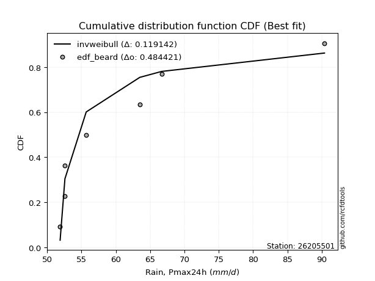</img>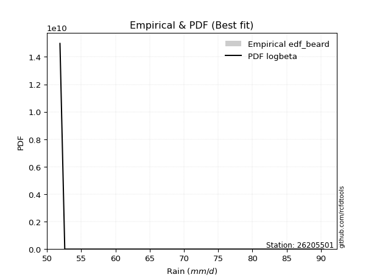</img>

</div>


### 5. EDF Chegodayev (1955)

The Chegodayev formula is an empirical plotting position formula used in hydrological frequency analysis to estimate the exceedance probability or return period of a specific event from a set of observed data. It is primarily used for plotting observed data points on probability paper to fit a theoretical distribution, particularly for analyzing extreme events like maximum flood flows or rainfall intensities. The constant _b_ value in the generalized plotting position formula is 0.3.

<div align="center">


$P=(m-b)/(n+1-2b)$


</div>


**5.1. Empirical values**

<div align="center">

|                | 0                   | 1                   | 2                   | 3              | 4                  | 5                  | 6                  |
|:---------------|:--------------------|:--------------------|:--------------------|:---------------|:-------------------|:-------------------|:-------------------|
| date           | 2022                | 2019                | 2021                | 2023           | 2020               | 2017               | 2018               |
| x              | 51.9                | 52.6                | 52.6                | 55.7           | 63.5               | 66.7               | 90.4               |
| m              | 1                   | 2                   | 3                   | 4              | 5                  | 6                  | 7                  |
| empirical_dist | edf_chegodayev      | edf_chegodayev      | edf_chegodayev      | edf_chegodayev | edf_chegodayev     | edf_chegodayev     | edf_chegodayev     |
| empirical      | 0.09459459459459459 | 0.22972972972972971 | 0.36486486486486486 | 0.5            | 0.6351351351351351 | 0.7702702702702703 | 0.9054054054054054 |
| empirical_tr   | 1.1044776119402986  | 1.2982456140350878  | 1.574468085106383   | 2.0            | 2.7407407407407405 | 4.352941176470589  | 10.571428571428568 |

</div>


**5.2. Kolmogorov-Smirnov fit test (sorted by Δ)**


<div align="center">

|                | 0                   | 1                   | 2                   | 3                   | 4                   | 5                   | 6                   | 7                   | 8                   | 9                   | 10                  | 11                  | 12                  | 13                  | 14                  | 15                  | 16                  | 17                  | 18                  | 19                  | 20                  | 21                  | 22                  | 23                  | 24                  | 25                  | 26                  | 27                  | 28                  | 29                  | 30                  | 31                  | 32                  | 33                  | 34                  | 35                  | 36                  | 37                  | 38                  | 39                  | 40                  | 41                  | 42                  | 43                  | 44                  | 45                  | 46                  | 47                  | 48                  | 49                  | 50                  | 51                  | 52                  | 53                  | 54                  | 55                  | 56                  | 57                  | 58                  | 59                  | 60                  | 61                  | 62                  | 63                  | 64                  | 65                    | 66                  | 67                  | 68                  | 69                  | 70                  | 71                  | 72                  | 73                  | 74                  | 75                  | 76                  | 77                  | 78                  | 79                  | 80                  | 81                  | 82                  | 83                  | 84                  | 85                  | 86                  | 87                  |
|:---------------|:--------------------|:--------------------|:--------------------|:--------------------|:--------------------|:--------------------|:--------------------|:--------------------|:--------------------|:--------------------|:--------------------|:--------------------|:--------------------|:--------------------|:--------------------|:--------------------|:--------------------|:--------------------|:--------------------|:--------------------|:--------------------|:--------------------|:--------------------|:--------------------|:--------------------|:--------------------|:--------------------|:--------------------|:--------------------|:--------------------|:--------------------|:--------------------|:--------------------|:--------------------|:--------------------|:--------------------|:--------------------|:--------------------|:--------------------|:--------------------|:--------------------|:--------------------|:--------------------|:--------------------|:--------------------|:--------------------|:--------------------|:--------------------|:--------------------|:--------------------|:--------------------|:--------------------|:--------------------|:--------------------|:--------------------|:--------------------|:--------------------|:--------------------|:--------------------|:--------------------|:--------------------|:--------------------|:--------------------|:--------------------|:--------------------|:----------------------|:--------------------|:--------------------|:--------------------|:--------------------|:--------------------|:--------------------|:--------------------|:--------------------|:--------------------|:--------------------|:--------------------|:--------------------|:--------------------|:--------------------|:--------------------|:--------------------|:--------------------|:--------------------|:--------------------|:--------------------|:--------------------|:--------------------|
| station        | 26205501            | 26205501            | 26205501            | 26205501            | 26205501            | 26205501            | 26205501            | 26205501            | 26205501            | 26205501            | 26205501            | 26205501            | 26205501            | 26205501            | 26205501            | 26205501            | 26205501            | 26205501            | 26205501            | 26205501            | 26205501            | 26205501            | 26205501            | 26205501            | 26205501            | 26205501            | 26205501            | 26205501            | 26205501            | 26205501            | 26205501            | 26205501            | 26205501            | 26205501            | 26205501            | 26205501            | 26205501            | 26205501            | 26205501            | 26205501            | 26205501            | 26205501            | 26205501            | 26205501            | 26205501            | 26205501            | 26205501            | 26205501            | 26205501            | 26205501            | 26205501            | 26205501            | 26205501            | 26205501            | 26205501            | 26205501            | 26205501            | 26205501            | 26205501            | 26205501            | 26205501            | 26205501            | 26205501            | 26205501            | 26205501            | 26205501              | 26205501            | 26205501            | 26205501            | 26205501            | 26205501            | 26205501            | 26205501            | 26205501            | 26205501            | 26205501            | 26205501            | 26205501            | 26205501            | 26205501            | 26205501            | 26205501            | 26205501            | 26205501            | 26205501            | 26205501            | 26205501            | 26205501            |
| empirical_dist | edf_chegodayev      | edf_chegodayev      | edf_chegodayev      | edf_chegodayev      | edf_chegodayev      | edf_chegodayev      | edf_chegodayev      | edf_chegodayev      | edf_chegodayev      | edf_chegodayev      | edf_chegodayev      | edf_chegodayev      | edf_chegodayev      | edf_chegodayev      | edf_chegodayev      | edf_chegodayev      | edf_chegodayev      | edf_chegodayev      | edf_chegodayev      | edf_chegodayev      | edf_chegodayev      | edf_chegodayev      | edf_chegodayev      | edf_chegodayev      | edf_chegodayev      | edf_chegodayev      | edf_chegodayev      | edf_chegodayev      | edf_chegodayev      | edf_chegodayev      | edf_chegodayev      | edf_chegodayev      | edf_chegodayev      | edf_chegodayev      | edf_chegodayev      | edf_chegodayev      | edf_chegodayev      | edf_chegodayev      | edf_chegodayev      | edf_chegodayev      | edf_chegodayev      | edf_chegodayev      | edf_chegodayev      | edf_chegodayev      | edf_chegodayev      | edf_chegodayev      | edf_chegodayev      | edf_chegodayev      | edf_chegodayev      | edf_chegodayev      | edf_chegodayev      | edf_chegodayev      | edf_chegodayev      | edf_chegodayev      | edf_chegodayev      | edf_chegodayev      | edf_chegodayev      | edf_chegodayev      | edf_chegodayev      | edf_chegodayev      | edf_chegodayev      | edf_chegodayev      | edf_chegodayev      | edf_chegodayev      | edf_chegodayev      | edf_chegodayev        | edf_chegodayev      | edf_chegodayev      | edf_chegodayev      | edf_chegodayev      | edf_chegodayev      | edf_chegodayev      | edf_chegodayev      | edf_chegodayev      | edf_chegodayev      | edf_chegodayev      | edf_chegodayev      | edf_chegodayev      | edf_chegodayev      | edf_chegodayev      | edf_chegodayev      | edf_chegodayev      | edf_chegodayev      | edf_chegodayev      | edf_chegodayev      | edf_chegodayev      | edf_chegodayev      | edf_chegodayev      |
| p_dist         | invweibull          | loginvweibull       | loghalflogistic     | loghalfnorm         | pearson3            | logpearson3         | moyal               | halflogistic        | fisk                | lograyleigh         | logt                | rayleigh            | loggumbel_r         | invgamma            | f                   | gumbel_r            | logmaxwell          | logf                | logmoyal            | maxwell             | lognct              | halfnorm            | logalpha            | loginvgamma         | nct                 | t                   | logloggamma         | genlogistic         | ncf                 | logcrystalball      | lognorm             | lognorm             | mielke              | invgauss            | chi2                | logweibull_min      | loginvgauss         | betaprime           | loggenlogistic      | norm                | crystalball         | logbetaprime        | logfisk             | logkstwobign        | loglogistic         | alpha               | kstwobign           | logistic            | logrice             | loggamma            | loggamma            | loghypsecant        | hypsecant           | weibull_min         | wald                | rice                | loggumbel_l         | gamma               | gumbel_l            | loglaplace          | laplace             | nakagami            | logncf              | logwald             | logexponnorm        | loglaplace_asymmetric | logexpon            | loggenexpon         | lognakagami         | exponnorm           | laplace_asymmetric  | genexpon            | expon               | gompertz            | erlang              | truncnorm           | logtruncnorm        | loggompertz         | gibrat              | loggibrat           | loglognorm          | logchi2             | fatiguelife         | logfatiguelife      | logerlang           | johnsonsu           | logjohnsonsu        | logmielke           |
| delta          | 0.11950869744715797 | 0.12773742469674465 | 0.1300766382979131  | 0.13101376785957985 | 0.13156403824082558 | 0.133808268695657   | 0.1361284073875234  | 0.13719500078344615 | 0.13786232554772337 | 0.13900686361708725 | 0.14257405735421075 | 0.14564781564708706 | 0.1459865654613898  | 0.146620551660941   | 0.14662178711386176 | 0.14859724592592566 | 0.1505507237185409  | 0.1511319610119901  | 0.1552707262580511  | 0.15695084475535737 | 0.16056781389680752 | 0.16155341874300666 | 0.17108283212309272 | 0.1719721572685322  | 0.1731736722460448  | 0.1738239299213581  | 0.17669156318032453 | 0.17689756182932484 | 0.17765651874337424 | 0.18027450040566856 | 0.18027497126690561 | 0.18027497126690561 | 0.18187786680008286 | 0.18224934460714093 | 0.18257420677669817 | 0.18290282046375286 | 0.18313266133218853 | 0.18327011702641388 | 0.18375836022989597 | 0.18615696857247888 | 0.18615697845602142 | 0.18797864068174963 | 0.1973687523052877  | 0.1979064952991281  | 0.2005056097860924  | 0.20189231752383674 | 0.20418647839438664 | 0.20675338562057743 | 0.21445745611474504 | 0.2150129579747333  | 0.2150129579747333  | 0.21557113517657828 | 0.22195513578024328 | 0.2266034216455197  | 0.227923528550931   | 0.2318566356909572  | 0.2350043827980155  | 0.23776185613179468 | 0.2397634655272109  | 0.24222309218042587 | 0.24817512793833313 | 0.2610118706158281  | 0.2677989117160811  | 0.27859338067802214 | 0.28208979112299176 | 0.28348870936094744   | 0.2834958071337164  | 0.28349612288170445 | 0.2923416431553656  | 0.29603364941010774 | 0.2973500704428636  | 0.2973517524476278  | 0.2973517957925317  | 0.3022892445714571  | 0.30407103006492    | 0.3089677088064179  | 0.31467734205032916 | 0.31611586130280395 | 0.35955455783222445 | 0.36486486486486486 | 0.367754668161441   | 0.37778652884157266 | 0.3873234744937236  | 0.39300619101782985 | 0.4351070144698991  | 0.4671124170282659  | 0.66222816384133    | nan                 |
| deltao         | 0.48442053926100004 | 0.48442053926100004 | 0.48442053926100004 | 0.48442053926100004 | 0.48442053926100004 | 0.48442053926100004 | 0.48442053926100004 | 0.48442053926100004 | 0.48442053926100004 | 0.48442053926100004 | 0.48442053926100004 | 0.48442053926100004 | 0.48442053926100004 | 0.48442053926100004 | 0.48442053926100004 | 0.48442053926100004 | 0.48442053926100004 | 0.48442053926100004 | 0.48442053926100004 | 0.48442053926100004 | 0.48442053926100004 | 0.48442053926100004 | 0.48442053926100004 | 0.48442053926100004 | 0.48442053926100004 | 0.48442053926100004 | 0.48442053926100004 | 0.48442053926100004 | 0.48442053926100004 | 0.48442053926100004 | 0.48442053926100004 | 0.48442053926100004 | 0.48442053926100004 | 0.48442053926100004 | 0.48442053926100004 | 0.48442053926100004 | 0.48442053926100004 | 0.48442053926100004 | 0.48442053926100004 | 0.48442053926100004 | 0.48442053926100004 | 0.48442053926100004 | 0.48442053926100004 | 0.48442053926100004 | 0.48442053926100004 | 0.48442053926100004 | 0.48442053926100004 | 0.48442053926100004 | 0.48442053926100004 | 0.48442053926100004 | 0.48442053926100004 | 0.48442053926100004 | 0.48442053926100004 | 0.48442053926100004 | 0.48442053926100004 | 0.48442053926100004 | 0.48442053926100004 | 0.48442053926100004 | 0.48442053926100004 | 0.48442053926100004 | 0.48442053926100004 | 0.48442053926100004 | 0.48442053926100004 | 0.48442053926100004 | 0.48442053926100004 | 0.48442053926100004   | 0.48442053926100004 | 0.48442053926100004 | 0.48442053926100004 | 0.48442053926100004 | 0.48442053926100004 | 0.48442053926100004 | 0.48442053926100004 | 0.48442053926100004 | 0.48442053926100004 | 0.48442053926100004 | 0.48442053926100004 | 0.48442053926100004 | 0.48442053926100004 | 0.48442053926100004 | 0.48442053926100004 | 0.48442053926100004 | 0.48442053926100004 | 0.48442053926100004 | 0.48442053926100004 | 0.48442053926100004 | 0.48442053926100004 | 0.48442053926100004 |
| eval           | Δo > Δ              | Δo > Δ              | Δo > Δ              | Δo > Δ              | Δo > Δ              | Δo > Δ              | Δo > Δ              | Δo > Δ              | Δo > Δ              | Δo > Δ              | Δo > Δ              | Δo > Δ              | Δo > Δ              | Δo > Δ              | Δo > Δ              | Δo > Δ              | Δo > Δ              | Δo > Δ              | Δo > Δ              | Δo > Δ              | Δo > Δ              | Δo > Δ              | Δo > Δ              | Δo > Δ              | Δo > Δ              | Δo > Δ              | Δo > Δ              | Δo > Δ              | Δo > Δ              | Δo > Δ              | Δo > Δ              | Δo > Δ              | Δo > Δ              | Δo > Δ              | Δo > Δ              | Δo > Δ              | Δo > Δ              | Δo > Δ              | Δo > Δ              | Δo > Δ              | Δo > Δ              | Δo > Δ              | Δo > Δ              | Δo > Δ              | Δo > Δ              | Δo > Δ              | Δo > Δ              | Δo > Δ              | Δo > Δ              | Δo > Δ              | Δo > Δ              | Δo > Δ              | Δo > Δ              | Δo > Δ              | Δo > Δ              | Δo > Δ              | Δo > Δ              | Δo > Δ              | Δo > Δ              | Δo > Δ              | Δo > Δ              | Δo > Δ              | Δo > Δ              | Δo > Δ              | Δo > Δ              | Δo > Δ                | Δo > Δ              | Δo > Δ              | Δo > Δ              | Δo > Δ              | Δo > Δ              | Δo > Δ              | Δo > Δ              | Δo > Δ              | Δo > Δ              | Δo > Δ              | Δo > Δ              | Δo > Δ              | Δo > Δ              | Δo > Δ              | Δo > Δ              | Δo > Δ              | Δo > Δ              | Δo > Δ              | Δo > Δ              | Δo > Δ              | Δo <= Δ             | Δo <= Δ             |
| fit            | 1                   | 1                   | 1                   | 1                   | 1                   | 1                   | 1                   | 1                   | 1                   | 1                   | 1                   | 1                   | 1                   | 1                   | 1                   | 1                   | 1                   | 1                   | 1                   | 1                   | 1                   | 1                   | 1                   | 1                   | 1                   | 1                   | 1                   | 1                   | 1                   | 1                   | 1                   | 1                   | 1                   | 1                   | 1                   | 1                   | 1                   | 1                   | 1                   | 1                   | 1                   | 1                   | 1                   | 1                   | 1                   | 1                   | 1                   | 1                   | 1                   | 1                   | 1                   | 1                   | 1                   | 1                   | 1                   | 1                   | 1                   | 1                   | 1                   | 1                   | 1                   | 1                   | 1                   | 1                   | 1                   | 1                     | 1                   | 1                   | 1                   | 1                   | 1                   | 1                   | 1                   | 1                   | 1                   | 1                   | 1                   | 1                   | 1                   | 1                   | 1                   | 1                   | 1                   | 1                   | 1                   | 1                   | 0                   | 0                   |
| n              | 7                   | 7                   | 7                   | 7                   | 7                   | 7                   | 7                   | 7                   | 7                   | 7                   | 7                   | 7                   | 7                   | 7                   | 7                   | 7                   | 7                   | 7                   | 7                   | 7                   | 7                   | 7                   | 7                   | 7                   | 7                   | 7                   | 7                   | 7                   | 7                   | 7                   | 7                   | 7                   | 7                   | 7                   | 7                   | 7                   | 7                   | 7                   | 7                   | 7                   | 7                   | 7                   | 7                   | 7                   | 7                   | 7                   | 7                   | 7                   | 7                   | 7                   | 7                   | 7                   | 7                   | 7                   | 7                   | 7                   | 7                   | 7                   | 7                   | 7                   | 7                   | 7                   | 7                   | 7                   | 7                   | 7                     | 7                   | 7                   | 7                   | 7                   | 7                   | 7                   | 7                   | 7                   | 7                   | 7                   | 7                   | 7                   | 7                   | 7                   | 7                   | 7                   | 7                   | 7                   | 7                   | 7                   | 7                   | 7                   |
| best_fit       | 1                   | 0                   | 0                   | 0                   | 0                   | 0                   | 0                   | 0                   | 0                   | 0                   | 0                   | 0                   | 0                   | 0                   | 0                   | 0                   | 0                   | 0                   | 0                   | 0                   | 0                   | 0                   | 0                   | 0                   | 0                   | 0                   | 0                   | 0                   | 0                   | 0                   | 0                   | 0                   | 0                   | 0                   | 0                   | 0                   | 0                   | 0                   | 0                   | 0                   | 0                   | 0                   | 0                   | 0                   | 0                   | 0                   | 0                   | 0                   | 0                   | 0                   | 0                   | 0                   | 0                   | 0                   | 0                   | 0                   | 0                   | 0                   | 0                   | 0                   | 0                   | 0                   | 0                   | 0                   | 0                   | 0                     | 0                   | 0                   | 0                   | 0                   | 0                   | 0                   | 0                   | 0                   | 0                   | 0                   | 0                   | 0                   | 0                   | 0                   | 0                   | 0                   | 0                   | 0                   | 0                   | 0                   | 0                   | 0                   |
| best_fit_sort  | 1                   | 2                   | 3                   | 4                   | 5                   | 6                   | 7                   | 8                   | 9                   | 10                  | 11                  | 12                  | 13                  | 14                  | 15                  | 16                  | 17                  | 18                  | 19                  | 20                  | 21                  | 22                  | 23                  | 24                  | 25                  | 26                  | 27                  | 28                  | 29                  | 30                  | 31                  | 32                  | 33                  | 34                  | 35                  | 36                  | 37                  | 38                  | 39                  | 40                  | 41                  | 42                  | 43                  | 44                  | 45                  | 46                  | 47                  | 48                  | 49                  | 50                  | 51                  | 52                  | 53                  | 54                  | 55                  | 56                  | 57                  | 58                  | 59                  | 60                  | 61                  | 62                  | 63                  | 64                  | 65                  | 66                    | 67                  | 68                  | 69                  | 70                  | 71                  | 72                  | 73                  | 74                  | 75                  | 76                  | 77                  | 78                  | 79                  | 80                  | 81                  | 82                  | 83                  | 84                  | 85                  | 86                  | 87                  | 88                  |

</div>


**5.3. Best fit**

<div align="center">

|   id |   station | empirical_dist   | p_dist     |    delta |   deltao | eval   |   fit |   n |   best_fit |   best_fit_sort |
|-----:|----------:|:-----------------|:-----------|---------:|---------:|:-------|------:|----:|-----------:|----------------:|
|    0 |  26205501 | edf_chegodayev   | invweibull | 0.119509 | 0.484421 | Δo > Δ |     1 |   7 |          1 |               1 |

</div>


<div align="center">

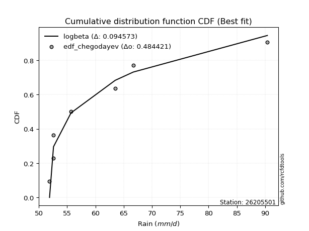</img>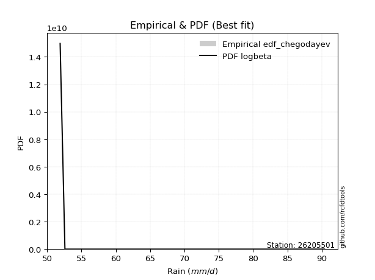</img>

</div>


### 6. EDF Blom (1958)

The Blom formula is a specific "plotting position" formula used in hydrology and statistical analysis to estimate the empirical cumulative probability (or non-exceedance probability) of a data series. It is particularly recommended for data that are approximately normally distributed. The constant _a_ is set to 0.375 (or 3/8).

<div align="center">


$P=(m-a)/(n+1-2a)$


</div>


**6.1. Empirical values**

<div align="center">

|                | 0                   | 1                   | 2                  | 3        | 4                  | 5                  | 6                  |
|:---------------|:--------------------|:--------------------|:-------------------|:---------|:-------------------|:-------------------|:-------------------|
| date           | 2022                | 2019                | 2021               | 2023     | 2020               | 2017               | 2018               |
| x              | 51.9                | 52.6                | 52.6               | 55.7     | 63.5               | 66.7               | 90.4               |
| m              | 1                   | 2                   | 3                  | 4        | 5                  | 6                  | 7                  |
| empirical_dist | edf_blom            | edf_blom            | edf_blom           | edf_blom | edf_blom           | edf_blom           | edf_blom           |
| empirical      | 0.08620689655172414 | 0.22413793103448276 | 0.3620689655172414 | 0.5      | 0.6379310344827587 | 0.7758620689655172 | 0.9137931034482759 |
| empirical_tr   | 1.0943396226415094  | 1.288888888888889   | 1.5675675675675675 | 2.0      | 2.7619047619047623 | 4.461538461538462  | 11.600000000000007 |

</div>


**6.2. Kolmogorov-Smirnov fit test (sorted by Δ)**


<div align="center">

|                | 0                   | 1                   | 2                   | 3                   | 4                   | 5                   | 6                   | 7                   | 8                   | 9                   | 10                  | 11                  | 12                  | 13                  | 14                  | 15                  | 16                  | 17                  | 18                  | 19                  | 20                  | 21                  | 22                  | 23                  | 24                  | 25                  | 26                  | 27                  | 28                  | 29                  | 30                  | 31                  | 32                  | 33                  | 34                  | 35                  | 36                  | 37                  | 38                  | 39                  | 40                  | 41                  | 42                  | 43                  | 44                  | 45                  | 46                  | 47                  | 48                  | 49                  | 50                  | 51                  | 52                  | 53                  | 54                  | 55                  | 56                  | 57                  | 58                  | 59                  | 60                  | 61                  | 62                  | 63                  | 64                  | 65                    | 66                  | 67                  | 68                  | 69                  | 70                  | 71                  | 72                  | 73                  | 74                  | 75                  | 76                  | 77                  | 78                  | 79                  | 80                  | 81                  | 82                  | 83                  | 84                  | 85                  | 86                  | 87                  |
|:---------------|:--------------------|:--------------------|:--------------------|:--------------------|:--------------------|:--------------------|:--------------------|:--------------------|:--------------------|:--------------------|:--------------------|:--------------------|:--------------------|:--------------------|:--------------------|:--------------------|:--------------------|:--------------------|:--------------------|:--------------------|:--------------------|:--------------------|:--------------------|:--------------------|:--------------------|:--------------------|:--------------------|:--------------------|:--------------------|:--------------------|:--------------------|:--------------------|:--------------------|:--------------------|:--------------------|:--------------------|:--------------------|:--------------------|:--------------------|:--------------------|:--------------------|:--------------------|:--------------------|:--------------------|:--------------------|:--------------------|:--------------------|:--------------------|:--------------------|:--------------------|:--------------------|:--------------------|:--------------------|:--------------------|:--------------------|:--------------------|:--------------------|:--------------------|:--------------------|:--------------------|:--------------------|:--------------------|:--------------------|:--------------------|:--------------------|:----------------------|:--------------------|:--------------------|:--------------------|:--------------------|:--------------------|:--------------------|:--------------------|:--------------------|:--------------------|:--------------------|:--------------------|:--------------------|:--------------------|:--------------------|:--------------------|:--------------------|:--------------------|:--------------------|:--------------------|:--------------------|:--------------------|:--------------------|
| station        | 26205501            | 26205501            | 26205501            | 26205501            | 26205501            | 26205501            | 26205501            | 26205501            | 26205501            | 26205501            | 26205501            | 26205501            | 26205501            | 26205501            | 26205501            | 26205501            | 26205501            | 26205501            | 26205501            | 26205501            | 26205501            | 26205501            | 26205501            | 26205501            | 26205501            | 26205501            | 26205501            | 26205501            | 26205501            | 26205501            | 26205501            | 26205501            | 26205501            | 26205501            | 26205501            | 26205501            | 26205501            | 26205501            | 26205501            | 26205501            | 26205501            | 26205501            | 26205501            | 26205501            | 26205501            | 26205501            | 26205501            | 26205501            | 26205501            | 26205501            | 26205501            | 26205501            | 26205501            | 26205501            | 26205501            | 26205501            | 26205501            | 26205501            | 26205501            | 26205501            | 26205501            | 26205501            | 26205501            | 26205501            | 26205501            | 26205501              | 26205501            | 26205501            | 26205501            | 26205501            | 26205501            | 26205501            | 26205501            | 26205501            | 26205501            | 26205501            | 26205501            | 26205501            | 26205501            | 26205501            | 26205501            | 26205501            | 26205501            | 26205501            | 26205501            | 26205501            | 26205501            | 26205501            |
| empirical_dist | edf_blom            | edf_blom            | edf_blom            | edf_blom            | edf_blom            | edf_blom            | edf_blom            | edf_blom            | edf_blom            | edf_blom            | edf_blom            | edf_blom            | edf_blom            | edf_blom            | edf_blom            | edf_blom            | edf_blom            | edf_blom            | edf_blom            | edf_blom            | edf_blom            | edf_blom            | edf_blom            | edf_blom            | edf_blom            | edf_blom            | edf_blom            | edf_blom            | edf_blom            | edf_blom            | edf_blom            | edf_blom            | edf_blom            | edf_blom            | edf_blom            | edf_blom            | edf_blom            | edf_blom            | edf_blom            | edf_blom            | edf_blom            | edf_blom            | edf_blom            | edf_blom            | edf_blom            | edf_blom            | edf_blom            | edf_blom            | edf_blom            | edf_blom            | edf_blom            | edf_blom            | edf_blom            | edf_blom            | edf_blom            | edf_blom            | edf_blom            | edf_blom            | edf_blom            | edf_blom            | edf_blom            | edf_blom            | edf_blom            | edf_blom            | edf_blom            | edf_blom              | edf_blom            | edf_blom            | edf_blom            | edf_blom            | edf_blom            | edf_blom            | edf_blom            | edf_blom            | edf_blom            | edf_blom            | edf_blom            | edf_blom            | edf_blom            | edf_blom            | edf_blom            | edf_blom            | edf_blom            | edf_blom            | edf_blom            | edf_blom            | edf_blom            | edf_blom            |
| p_dist         | invweibull          | loginvweibull       | loghalflogistic     | logpearson3         | moyal               | fisk                | lograyleigh         | loghalfnorm         | pearson3            | loggumbel_r         | invgamma            | f                   | halflogistic        | logf                | gumbel_r            | logmaxwell          | logt                | logmoyal            | rayleigh            | maxwell             | lognct              | halfnorm            | logalpha            | loginvgamma         | nct                 | genlogistic         | logloggamma         | ncf                 | mielke              | invgauss            | chi2                | logweibull_min      | logcrystalball      | lognorm             | lognorm             | loginvgauss         | loggenlogistic      | t                   | betaprime           | norm                | crystalball         | logbetaprime        | logfisk             | logkstwobign        | alpha               | loglogistic         | kstwobign           | logistic            | loggamma            | loggamma            | logrice             | loghypsecant        | hypsecant           | weibull_min         | wald                | rice                | gamma               | loggumbel_l         | gumbel_l            | loglaplace          | laplace             | nakagami            | logwald             | logncf              | logexponnorm        | loglaplace_asymmetric | logexpon            | loggenexpon         | exponnorm           | laplace_asymmetric  | genexpon            | expon               | lognakagami         | gompertz            | erlang              | truncnorm           | logtruncnorm        | loggompertz         | gibrat              | loggibrat           | loglognorm          | logchi2             | fatiguelife         | logfatiguelife      | logerlang           | johnsonsu           | logjohnsonsu        | logmielke           |
| delta          | 0.11671279809953439 | 0.12494152534912106 | 0.12728073895028963 | 0.13101236934803354 | 0.1361284073875234  | 0.13786232554772337 | 0.13900686361708725 | 0.13940146590245028 | 0.13995173628369603 | 0.14319066611376632 | 0.14382465231331742 | 0.14382588776623817 | 0.14558269882631658 | 0.14833606166436653 | 0.14859724592592566 | 0.1505507237185409  | 0.1509617553970812  | 0.15247482691042763 | 0.15403551368995752 | 0.15695084475535737 | 0.16895551193967795 | 0.1699411167858771  | 0.17108283212309272 | 0.1719721572685322  | 0.1731736722460448  | 0.17410166248170136 | 0.17669156318032453 | 0.17765651874337424 | 0.17908196745245938 | 0.17945344525951734 | 0.1797783074290747  | 0.1801069211161294  | 0.18027450040566856 | 0.18027497126690561 | 0.18027497126690561 | 0.18033676198456494 | 0.1809624608822725  | 0.18221162796422852 | 0.18327011702641388 | 0.18615696857247888 | 0.18615697845602142 | 0.18797864068174963 | 0.19457285295766422 | 0.19511059595150462 | 0.19909641817621315 | 0.2005056097860924  | 0.20418647839438664 | 0.20675338562057743 | 0.2122170586271097  | 0.2122170586271097  | 0.21445745611474504 | 0.21557113517657828 | 0.22195513578024328 | 0.22380752229789622 | 0.22512762920330753 | 0.2318566356909572  | 0.2349659567841711  | 0.2350043827980155  | 0.2397634655272109  | 0.24222309218042587 | 0.24817512793833313 | 0.2582159712682046  | 0.27579748133039866 | 0.27618660975895154 | 0.2792938917753683  | 0.28069281001332397   | 0.28069990778609294 | 0.280700223534081   | 0.29323775006248426 | 0.2945541710952401  | 0.2945558531000043  | 0.2945558964449082  | 0.29793344185061255 | 0.29949334522383364 | 0.30287421126396985 | 0.3061718094587944  | 0.3118814427027057  | 0.31331996195518047 | 0.356758658484601   | 0.3620689655172414  | 0.37334646685668793 | 0.3833783275368196  | 0.39291527318897057 | 0.3985979897130768  | 0.44069881316514603 | 0.47270421572351284 | 0.6678199625365769  | nan                 |
| deltao         | 0.48442053926100004 | 0.48442053926100004 | 0.48442053926100004 | 0.48442053926100004 | 0.48442053926100004 | 0.48442053926100004 | 0.48442053926100004 | 0.48442053926100004 | 0.48442053926100004 | 0.48442053926100004 | 0.48442053926100004 | 0.48442053926100004 | 0.48442053926100004 | 0.48442053926100004 | 0.48442053926100004 | 0.48442053926100004 | 0.48442053926100004 | 0.48442053926100004 | 0.48442053926100004 | 0.48442053926100004 | 0.48442053926100004 | 0.48442053926100004 | 0.48442053926100004 | 0.48442053926100004 | 0.48442053926100004 | 0.48442053926100004 | 0.48442053926100004 | 0.48442053926100004 | 0.48442053926100004 | 0.48442053926100004 | 0.48442053926100004 | 0.48442053926100004 | 0.48442053926100004 | 0.48442053926100004 | 0.48442053926100004 | 0.48442053926100004 | 0.48442053926100004 | 0.48442053926100004 | 0.48442053926100004 | 0.48442053926100004 | 0.48442053926100004 | 0.48442053926100004 | 0.48442053926100004 | 0.48442053926100004 | 0.48442053926100004 | 0.48442053926100004 | 0.48442053926100004 | 0.48442053926100004 | 0.48442053926100004 | 0.48442053926100004 | 0.48442053926100004 | 0.48442053926100004 | 0.48442053926100004 | 0.48442053926100004 | 0.48442053926100004 | 0.48442053926100004 | 0.48442053926100004 | 0.48442053926100004 | 0.48442053926100004 | 0.48442053926100004 | 0.48442053926100004 | 0.48442053926100004 | 0.48442053926100004 | 0.48442053926100004 | 0.48442053926100004 | 0.48442053926100004   | 0.48442053926100004 | 0.48442053926100004 | 0.48442053926100004 | 0.48442053926100004 | 0.48442053926100004 | 0.48442053926100004 | 0.48442053926100004 | 0.48442053926100004 | 0.48442053926100004 | 0.48442053926100004 | 0.48442053926100004 | 0.48442053926100004 | 0.48442053926100004 | 0.48442053926100004 | 0.48442053926100004 | 0.48442053926100004 | 0.48442053926100004 | 0.48442053926100004 | 0.48442053926100004 | 0.48442053926100004 | 0.48442053926100004 | 0.48442053926100004 |
| eval           | Δo > Δ              | Δo > Δ              | Δo > Δ              | Δo > Δ              | Δo > Δ              | Δo > Δ              | Δo > Δ              | Δo > Δ              | Δo > Δ              | Δo > Δ              | Δo > Δ              | Δo > Δ              | Δo > Δ              | Δo > Δ              | Δo > Δ              | Δo > Δ              | Δo > Δ              | Δo > Δ              | Δo > Δ              | Δo > Δ              | Δo > Δ              | Δo > Δ              | Δo > Δ              | Δo > Δ              | Δo > Δ              | Δo > Δ              | Δo > Δ              | Δo > Δ              | Δo > Δ              | Δo > Δ              | Δo > Δ              | Δo > Δ              | Δo > Δ              | Δo > Δ              | Δo > Δ              | Δo > Δ              | Δo > Δ              | Δo > Δ              | Δo > Δ              | Δo > Δ              | Δo > Δ              | Δo > Δ              | Δo > Δ              | Δo > Δ              | Δo > Δ              | Δo > Δ              | Δo > Δ              | Δo > Δ              | Δo > Δ              | Δo > Δ              | Δo > Δ              | Δo > Δ              | Δo > Δ              | Δo > Δ              | Δo > Δ              | Δo > Δ              | Δo > Δ              | Δo > Δ              | Δo > Δ              | Δo > Δ              | Δo > Δ              | Δo > Δ              | Δo > Δ              | Δo > Δ              | Δo > Δ              | Δo > Δ                | Δo > Δ              | Δo > Δ              | Δo > Δ              | Δo > Δ              | Δo > Δ              | Δo > Δ              | Δo > Δ              | Δo > Δ              | Δo > Δ              | Δo > Δ              | Δo > Δ              | Δo > Δ              | Δo > Δ              | Δo > Δ              | Δo > Δ              | Δo > Δ              | Δo > Δ              | Δo > Δ              | Δo > Δ              | Δo > Δ              | Δo <= Δ             | Δo <= Δ             |
| fit            | 1                   | 1                   | 1                   | 1                   | 1                   | 1                   | 1                   | 1                   | 1                   | 1                   | 1                   | 1                   | 1                   | 1                   | 1                   | 1                   | 1                   | 1                   | 1                   | 1                   | 1                   | 1                   | 1                   | 1                   | 1                   | 1                   | 1                   | 1                   | 1                   | 1                   | 1                   | 1                   | 1                   | 1                   | 1                   | 1                   | 1                   | 1                   | 1                   | 1                   | 1                   | 1                   | 1                   | 1                   | 1                   | 1                   | 1                   | 1                   | 1                   | 1                   | 1                   | 1                   | 1                   | 1                   | 1                   | 1                   | 1                   | 1                   | 1                   | 1                   | 1                   | 1                   | 1                   | 1                   | 1                   | 1                     | 1                   | 1                   | 1                   | 1                   | 1                   | 1                   | 1                   | 1                   | 1                   | 1                   | 1                   | 1                   | 1                   | 1                   | 1                   | 1                   | 1                   | 1                   | 1                   | 1                   | 0                   | 0                   |
| n              | 7                   | 7                   | 7                   | 7                   | 7                   | 7                   | 7                   | 7                   | 7                   | 7                   | 7                   | 7                   | 7                   | 7                   | 7                   | 7                   | 7                   | 7                   | 7                   | 7                   | 7                   | 7                   | 7                   | 7                   | 7                   | 7                   | 7                   | 7                   | 7                   | 7                   | 7                   | 7                   | 7                   | 7                   | 7                   | 7                   | 7                   | 7                   | 7                   | 7                   | 7                   | 7                   | 7                   | 7                   | 7                   | 7                   | 7                   | 7                   | 7                   | 7                   | 7                   | 7                   | 7                   | 7                   | 7                   | 7                   | 7                   | 7                   | 7                   | 7                   | 7                   | 7                   | 7                   | 7                   | 7                   | 7                     | 7                   | 7                   | 7                   | 7                   | 7                   | 7                   | 7                   | 7                   | 7                   | 7                   | 7                   | 7                   | 7                   | 7                   | 7                   | 7                   | 7                   | 7                   | 7                   | 7                   | 7                   | 7                   |
| best_fit       | 1                   | 0                   | 0                   | 0                   | 0                   | 0                   | 0                   | 0                   | 0                   | 0                   | 0                   | 0                   | 0                   | 0                   | 0                   | 0                   | 0                   | 0                   | 0                   | 0                   | 0                   | 0                   | 0                   | 0                   | 0                   | 0                   | 0                   | 0                   | 0                   | 0                   | 0                   | 0                   | 0                   | 0                   | 0                   | 0                   | 0                   | 0                   | 0                   | 0                   | 0                   | 0                   | 0                   | 0                   | 0                   | 0                   | 0                   | 0                   | 0                   | 0                   | 0                   | 0                   | 0                   | 0                   | 0                   | 0                   | 0                   | 0                   | 0                   | 0                   | 0                   | 0                   | 0                   | 0                   | 0                   | 0                     | 0                   | 0                   | 0                   | 0                   | 0                   | 0                   | 0                   | 0                   | 0                   | 0                   | 0                   | 0                   | 0                   | 0                   | 0                   | 0                   | 0                   | 0                   | 0                   | 0                   | 0                   | 0                   |
| best_fit_sort  | 1                   | 2                   | 3                   | 4                   | 5                   | 6                   | 7                   | 8                   | 9                   | 10                  | 11                  | 12                  | 13                  | 14                  | 15                  | 16                  | 17                  | 18                  | 19                  | 20                  | 21                  | 22                  | 23                  | 24                  | 25                  | 26                  | 27                  | 28                  | 29                  | 30                  | 31                  | 32                  | 33                  | 34                  | 35                  | 36                  | 37                  | 38                  | 39                  | 40                  | 41                  | 42                  | 43                  | 44                  | 45                  | 46                  | 47                  | 48                  | 49                  | 50                  | 51                  | 52                  | 53                  | 54                  | 55                  | 56                  | 57                  | 58                  | 59                  | 60                  | 61                  | 62                  | 63                  | 64                  | 65                  | 66                    | 67                  | 68                  | 69                  | 70                  | 71                  | 72                  | 73                  | 74                  | 75                  | 76                  | 77                  | 78                  | 79                  | 80                  | 81                  | 82                  | 83                  | 84                  | 85                  | 86                  | 87                  | 88                  |

</div>


**6.3. Best fit**

<div align="center">

|   id |   station | empirical_dist   | p_dist     |    delta |   deltao | eval   |   fit |   n |   best_fit |   best_fit_sort |
|-----:|----------:|:-----------------|:-----------|---------:|---------:|:-------|------:|----:|-----------:|----------------:|
|    0 |  26205501 | edf_blom         | invweibull | 0.116713 | 0.484421 | Δo > Δ |     1 |   7 |          1 |               1 |

</div>


<div align="center">

</img></img>

</div>


### 7. EDF Tukey (1962)

In hydrology, the Tukey formula is used as a plotting position formula to estimate the empirical probability or frequency of a flood event (or other hydrological data). The formula parameter is given as _c=0.333_ (or 1/3).

<div align="center">


$P=(m-c)/(n+1-2c)$


</div>


**7.1. Empirical values**

<div align="center">

|                | 0                   | 1                   | 2                   | 3         | 4                  | 5                  | 6                  |
|:---------------|:--------------------|:--------------------|:--------------------|:----------|:-------------------|:-------------------|:-------------------|
| date           | 2022                | 2019                | 2021                | 2023      | 2020               | 2017               | 2018               |
| x              | 51.9                | 52.6                | 52.6                | 55.7      | 63.5               | 66.7               | 90.4               |
| m              | 1                   | 2                   | 3                   | 4         | 5                  | 6                  | 7                  |
| empirical_dist | edf_tukey           | edf_tukey           | edf_tukey           | edf_tukey | edf_tukey          | edf_tukey          | edf_tukey          |
| empirical      | 0.09090909090909091 | 0.22727272727272727 | 0.36363636363636365 | 0.5       | 0.6363636363636364 | 0.7727272727272727 | 0.9090909090909091 |
| empirical_tr   | 1.1                 | 1.2941176470588236  | 1.5714285714285714  | 2.0       | 2.75               | 4.3999999999999995 | 10.999999999999996 |

</div>


**7.2. Kolmogorov-Smirnov fit test (sorted by Δ)**


<div align="center">

|                | 0                   | 1                   | 2                   | 3                   | 4                   | 5                   | 6                   | 7                   | 8                   | 9                   | 10                  | 11                  | 12                  | 13                  | 14                  | 15                  | 16                  | 17                  | 18                  | 19                  | 20                  | 21                  | 22                  | 23                  | 24                  | 25                  | 26                  | 27                  | 28                  | 29                  | 30                  | 31                  | 32                  | 33                  | 34                  | 35                  | 36                  | 37                  | 38                  | 39                  | 40                  | 41                  | 42                  | 43                  | 44                  | 45                  | 46                  | 47                  | 48                  | 49                  | 50                  | 51                  | 52                  | 53                  | 54                  | 55                  | 56                  | 57                  | 58                  | 59                  | 60                  | 61                  | 62                  | 63                  | 64                  | 65                    | 66                  | 67                  | 68                  | 69                  | 70                  | 71                  | 72                  | 73                  | 74                  | 75                  | 76                  | 77                  | 78                  | 79                  | 80                  | 81                  | 82                  | 83                  | 84                  | 85                  | 86                  | 87                  |
|:---------------|:--------------------|:--------------------|:--------------------|:--------------------|:--------------------|:--------------------|:--------------------|:--------------------|:--------------------|:--------------------|:--------------------|:--------------------|:--------------------|:--------------------|:--------------------|:--------------------|:--------------------|:--------------------|:--------------------|:--------------------|:--------------------|:--------------------|:--------------------|:--------------------|:--------------------|:--------------------|:--------------------|:--------------------|:--------------------|:--------------------|:--------------------|:--------------------|:--------------------|:--------------------|:--------------------|:--------------------|:--------------------|:--------------------|:--------------------|:--------------------|:--------------------|:--------------------|:--------------------|:--------------------|:--------------------|:--------------------|:--------------------|:--------------------|:--------------------|:--------------------|:--------------------|:--------------------|:--------------------|:--------------------|:--------------------|:--------------------|:--------------------|:--------------------|:--------------------|:--------------------|:--------------------|:--------------------|:--------------------|:--------------------|:--------------------|:----------------------|:--------------------|:--------------------|:--------------------|:--------------------|:--------------------|:--------------------|:--------------------|:--------------------|:--------------------|:--------------------|:--------------------|:--------------------|:--------------------|:--------------------|:--------------------|:--------------------|:--------------------|:--------------------|:--------------------|:--------------------|:--------------------|:--------------------|
| station        | 26205501            | 26205501            | 26205501            | 26205501            | 26205501            | 26205501            | 26205501            | 26205501            | 26205501            | 26205501            | 26205501            | 26205501            | 26205501            | 26205501            | 26205501            | 26205501            | 26205501            | 26205501            | 26205501            | 26205501            | 26205501            | 26205501            | 26205501            | 26205501            | 26205501            | 26205501            | 26205501            | 26205501            | 26205501            | 26205501            | 26205501            | 26205501            | 26205501            | 26205501            | 26205501            | 26205501            | 26205501            | 26205501            | 26205501            | 26205501            | 26205501            | 26205501            | 26205501            | 26205501            | 26205501            | 26205501            | 26205501            | 26205501            | 26205501            | 26205501            | 26205501            | 26205501            | 26205501            | 26205501            | 26205501            | 26205501            | 26205501            | 26205501            | 26205501            | 26205501            | 26205501            | 26205501            | 26205501            | 26205501            | 26205501            | 26205501              | 26205501            | 26205501            | 26205501            | 26205501            | 26205501            | 26205501            | 26205501            | 26205501            | 26205501            | 26205501            | 26205501            | 26205501            | 26205501            | 26205501            | 26205501            | 26205501            | 26205501            | 26205501            | 26205501            | 26205501            | 26205501            | 26205501            |
| empirical_dist | edf_tukey           | edf_tukey           | edf_tukey           | edf_tukey           | edf_tukey           | edf_tukey           | edf_tukey           | edf_tukey           | edf_tukey           | edf_tukey           | edf_tukey           | edf_tukey           | edf_tukey           | edf_tukey           | edf_tukey           | edf_tukey           | edf_tukey           | edf_tukey           | edf_tukey           | edf_tukey           | edf_tukey           | edf_tukey           | edf_tukey           | edf_tukey           | edf_tukey           | edf_tukey           | edf_tukey           | edf_tukey           | edf_tukey           | edf_tukey           | edf_tukey           | edf_tukey           | edf_tukey           | edf_tukey           | edf_tukey           | edf_tukey           | edf_tukey           | edf_tukey           | edf_tukey           | edf_tukey           | edf_tukey           | edf_tukey           | edf_tukey           | edf_tukey           | edf_tukey           | edf_tukey           | edf_tukey           | edf_tukey           | edf_tukey           | edf_tukey           | edf_tukey           | edf_tukey           | edf_tukey           | edf_tukey           | edf_tukey           | edf_tukey           | edf_tukey           | edf_tukey           | edf_tukey           | edf_tukey           | edf_tukey           | edf_tukey           | edf_tukey           | edf_tukey           | edf_tukey           | edf_tukey             | edf_tukey           | edf_tukey           | edf_tukey           | edf_tukey           | edf_tukey           | edf_tukey           | edf_tukey           | edf_tukey           | edf_tukey           | edf_tukey           | edf_tukey           | edf_tukey           | edf_tukey           | edf_tukey           | edf_tukey           | edf_tukey           | edf_tukey           | edf_tukey           | edf_tukey           | edf_tukey           | edf_tukey           | edf_tukey           |
| p_dist         | invweibull          | loginvweibull       | loghalflogistic     | logpearson3         | loghalfnorm         | pearson3            | moyal               | fisk                | lograyleigh         | halflogistic        | loggumbel_r         | invgamma            | f                   | logt                | gumbel_r            | rayleigh            | logf                | logmaxwell          | logmoyal            | maxwell             | lognct              | halfnorm            | logalpha            | loginvgamma         | nct                 | genlogistic         | logloggamma         | t                   | ncf                 | logcrystalball      | lognorm             | lognorm             | mielke              | invgauss            | chi2                | logweibull_min      | loginvgauss         | loggenlogistic      | betaprime           | norm                | crystalball         | logbetaprime        | logfisk             | logkstwobign        | loglogistic         | alpha               | kstwobign           | logistic            | loggamma            | loggamma            | logrice             | loghypsecant        | hypsecant           | weibull_min         | wald                | rice                | loggumbel_l         | gamma               | gumbel_l            | loglaplace          | laplace             | nakagami            | logncf              | logwald             | logexponnorm        | loglaplace_asymmetric | logexpon            | loggenexpon         | lognakagami         | exponnorm           | laplace_asymmetric  | genexpon            | expon               | gompertz            | erlang              | truncnorm           | logtruncnorm        | loggompertz         | gibrat              | loggibrat           | loglognorm          | logchi2             | fatiguelife         | logfatiguelife      | logerlang           | johnsonsu           | logjohnsonsu        | logmielke           |
| delta          | 0.11828019621865671 | 0.12650892346824338 | 0.1288481370694119  | 0.1325797674671558  | 0.13469927154508352 | 0.13524954192632926 | 0.1361284073875234  | 0.13786232554772337 | 0.13900686361708725 | 0.1408805044689498  | 0.1447580642328886  | 0.14539205043243975 | 0.1453932858853605  | 0.14625956103971444 | 0.14859724592592566 | 0.14933331933259075 | 0.14990345978348885 | 0.1505507237185409  | 0.1540422250295499  | 0.15695084475535737 | 0.16425331758231118 | 0.16523892242851032 | 0.17108283212309272 | 0.1719721572685322  | 0.1731736722460448  | 0.17566906060082363 | 0.17669156318032453 | 0.17750943360686175 | 0.17765651874337424 | 0.18027450040566856 | 0.18027497126690561 | 0.18027497126690561 | 0.18064936557158165 | 0.18102084337863966 | 0.18134570554819696 | 0.18167431923525165 | 0.18190416010368726 | 0.18252985900139476 | 0.18327011702641388 | 0.18615696857247888 | 0.18615697845602142 | 0.18797864068174963 | 0.19614025107678648 | 0.1966779940706269  | 0.2005056097860924  | 0.20066381629533547 | 0.20418647839438664 | 0.20675338562057743 | 0.21378445674623203 | 0.21378445674623203 | 0.21445745611474504 | 0.21557113517657828 | 0.22195513578024328 | 0.22537492041701848 | 0.2266950273224298  | 0.2318566356909572  | 0.2350043827980155  | 0.2365333549032934  | 0.2397634655272109  | 0.24222309218042587 | 0.24817512793833313 | 0.2597833693873268  | 0.27148441540158474 | 0.27736487944952093 | 0.28086128989449055 | 0.28226020813244623   | 0.2822673059052152  | 0.2822676216532033  | 0.294798645612368   | 0.2948051481816065  | 0.2961215692143624  | 0.2961232512191266  | 0.29612329456403047 | 0.30106074334295596 | 0.3028425288364187  | 0.3077392075779167  | 0.3134488408218279  | 0.31488736007430274 | 0.35832605660372324 | 0.36363636363636365 | 0.3702116706184434  | 0.3802435312985751  | 0.38978047695072604 | 0.3954631934748323  | 0.4375640169269015  | 0.4695694194852683  | 0.6646851662983324  | nan                 |
| deltao         | 0.48442053926100004 | 0.48442053926100004 | 0.48442053926100004 | 0.48442053926100004 | 0.48442053926100004 | 0.48442053926100004 | 0.48442053926100004 | 0.48442053926100004 | 0.48442053926100004 | 0.48442053926100004 | 0.48442053926100004 | 0.48442053926100004 | 0.48442053926100004 | 0.48442053926100004 | 0.48442053926100004 | 0.48442053926100004 | 0.48442053926100004 | 0.48442053926100004 | 0.48442053926100004 | 0.48442053926100004 | 0.48442053926100004 | 0.48442053926100004 | 0.48442053926100004 | 0.48442053926100004 | 0.48442053926100004 | 0.48442053926100004 | 0.48442053926100004 | 0.48442053926100004 | 0.48442053926100004 | 0.48442053926100004 | 0.48442053926100004 | 0.48442053926100004 | 0.48442053926100004 | 0.48442053926100004 | 0.48442053926100004 | 0.48442053926100004 | 0.48442053926100004 | 0.48442053926100004 | 0.48442053926100004 | 0.48442053926100004 | 0.48442053926100004 | 0.48442053926100004 | 0.48442053926100004 | 0.48442053926100004 | 0.48442053926100004 | 0.48442053926100004 | 0.48442053926100004 | 0.48442053926100004 | 0.48442053926100004 | 0.48442053926100004 | 0.48442053926100004 | 0.48442053926100004 | 0.48442053926100004 | 0.48442053926100004 | 0.48442053926100004 | 0.48442053926100004 | 0.48442053926100004 | 0.48442053926100004 | 0.48442053926100004 | 0.48442053926100004 | 0.48442053926100004 | 0.48442053926100004 | 0.48442053926100004 | 0.48442053926100004 | 0.48442053926100004 | 0.48442053926100004   | 0.48442053926100004 | 0.48442053926100004 | 0.48442053926100004 | 0.48442053926100004 | 0.48442053926100004 | 0.48442053926100004 | 0.48442053926100004 | 0.48442053926100004 | 0.48442053926100004 | 0.48442053926100004 | 0.48442053926100004 | 0.48442053926100004 | 0.48442053926100004 | 0.48442053926100004 | 0.48442053926100004 | 0.48442053926100004 | 0.48442053926100004 | 0.48442053926100004 | 0.48442053926100004 | 0.48442053926100004 | 0.48442053926100004 | 0.48442053926100004 |
| eval           | Δo > Δ              | Δo > Δ              | Δo > Δ              | Δo > Δ              | Δo > Δ              | Δo > Δ              | Δo > Δ              | Δo > Δ              | Δo > Δ              | Δo > Δ              | Δo > Δ              | Δo > Δ              | Δo > Δ              | Δo > Δ              | Δo > Δ              | Δo > Δ              | Δo > Δ              | Δo > Δ              | Δo > Δ              | Δo > Δ              | Δo > Δ              | Δo > Δ              | Δo > Δ              | Δo > Δ              | Δo > Δ              | Δo > Δ              | Δo > Δ              | Δo > Δ              | Δo > Δ              | Δo > Δ              | Δo > Δ              | Δo > Δ              | Δo > Δ              | Δo > Δ              | Δo > Δ              | Δo > Δ              | Δo > Δ              | Δo > Δ              | Δo > Δ              | Δo > Δ              | Δo > Δ              | Δo > Δ              | Δo > Δ              | Δo > Δ              | Δo > Δ              | Δo > Δ              | Δo > Δ              | Δo > Δ              | Δo > Δ              | Δo > Δ              | Δo > Δ              | Δo > Δ              | Δo > Δ              | Δo > Δ              | Δo > Δ              | Δo > Δ              | Δo > Δ              | Δo > Δ              | Δo > Δ              | Δo > Δ              | Δo > Δ              | Δo > Δ              | Δo > Δ              | Δo > Δ              | Δo > Δ              | Δo > Δ                | Δo > Δ              | Δo > Δ              | Δo > Δ              | Δo > Δ              | Δo > Δ              | Δo > Δ              | Δo > Δ              | Δo > Δ              | Δo > Δ              | Δo > Δ              | Δo > Δ              | Δo > Δ              | Δo > Δ              | Δo > Δ              | Δo > Δ              | Δo > Δ              | Δo > Δ              | Δo > Δ              | Δo > Δ              | Δo > Δ              | Δo <= Δ             | Δo <= Δ             |
| fit            | 1                   | 1                   | 1                   | 1                   | 1                   | 1                   | 1                   | 1                   | 1                   | 1                   | 1                   | 1                   | 1                   | 1                   | 1                   | 1                   | 1                   | 1                   | 1                   | 1                   | 1                   | 1                   | 1                   | 1                   | 1                   | 1                   | 1                   | 1                   | 1                   | 1                   | 1                   | 1                   | 1                   | 1                   | 1                   | 1                   | 1                   | 1                   | 1                   | 1                   | 1                   | 1                   | 1                   | 1                   | 1                   | 1                   | 1                   | 1                   | 1                   | 1                   | 1                   | 1                   | 1                   | 1                   | 1                   | 1                   | 1                   | 1                   | 1                   | 1                   | 1                   | 1                   | 1                   | 1                   | 1                   | 1                     | 1                   | 1                   | 1                   | 1                   | 1                   | 1                   | 1                   | 1                   | 1                   | 1                   | 1                   | 1                   | 1                   | 1                   | 1                   | 1                   | 1                   | 1                   | 1                   | 1                   | 0                   | 0                   |
| n              | 7                   | 7                   | 7                   | 7                   | 7                   | 7                   | 7                   | 7                   | 7                   | 7                   | 7                   | 7                   | 7                   | 7                   | 7                   | 7                   | 7                   | 7                   | 7                   | 7                   | 7                   | 7                   | 7                   | 7                   | 7                   | 7                   | 7                   | 7                   | 7                   | 7                   | 7                   | 7                   | 7                   | 7                   | 7                   | 7                   | 7                   | 7                   | 7                   | 7                   | 7                   | 7                   | 7                   | 7                   | 7                   | 7                   | 7                   | 7                   | 7                   | 7                   | 7                   | 7                   | 7                   | 7                   | 7                   | 7                   | 7                   | 7                   | 7                   | 7                   | 7                   | 7                   | 7                   | 7                   | 7                   | 7                     | 7                   | 7                   | 7                   | 7                   | 7                   | 7                   | 7                   | 7                   | 7                   | 7                   | 7                   | 7                   | 7                   | 7                   | 7                   | 7                   | 7                   | 7                   | 7                   | 7                   | 7                   | 7                   |
| best_fit       | 1                   | 0                   | 0                   | 0                   | 0                   | 0                   | 0                   | 0                   | 0                   | 0                   | 0                   | 0                   | 0                   | 0                   | 0                   | 0                   | 0                   | 0                   | 0                   | 0                   | 0                   | 0                   | 0                   | 0                   | 0                   | 0                   | 0                   | 0                   | 0                   | 0                   | 0                   | 0                   | 0                   | 0                   | 0                   | 0                   | 0                   | 0                   | 0                   | 0                   | 0                   | 0                   | 0                   | 0                   | 0                   | 0                   | 0                   | 0                   | 0                   | 0                   | 0                   | 0                   | 0                   | 0                   | 0                   | 0                   | 0                   | 0                   | 0                   | 0                   | 0                   | 0                   | 0                   | 0                   | 0                   | 0                     | 0                   | 0                   | 0                   | 0                   | 0                   | 0                   | 0                   | 0                   | 0                   | 0                   | 0                   | 0                   | 0                   | 0                   | 0                   | 0                   | 0                   | 0                   | 0                   | 0                   | 0                   | 0                   |
| best_fit_sort  | 1                   | 2                   | 3                   | 4                   | 5                   | 6                   | 7                   | 8                   | 9                   | 10                  | 11                  | 12                  | 13                  | 14                  | 15                  | 16                  | 17                  | 18                  | 19                  | 20                  | 21                  | 22                  | 23                  | 24                  | 25                  | 26                  | 27                  | 28                  | 29                  | 30                  | 31                  | 32                  | 33                  | 34                  | 35                  | 36                  | 37                  | 38                  | 39                  | 40                  | 41                  | 42                  | 43                  | 44                  | 45                  | 46                  | 47                  | 48                  | 49                  | 50                  | 51                  | 52                  | 53                  | 54                  | 55                  | 56                  | 57                  | 58                  | 59                  | 60                  | 61                  | 62                  | 63                  | 64                  | 65                  | 66                    | 67                  | 68                  | 69                  | 70                  | 71                  | 72                  | 73                  | 74                  | 75                  | 76                  | 77                  | 78                  | 79                  | 80                  | 81                  | 82                  | 83                  | 84                  | 85                  | 86                  | 87                  | 88                  |

</div>


**7.3. Best fit**

<div align="center">

|   id |   station | empirical_dist   | p_dist     |   delta |   deltao | eval   |   fit |   n |   best_fit |   best_fit_sort |
|-----:|----------:|:-----------------|:-----------|--------:|---------:|:-------|------:|----:|-----------:|----------------:|
|    0 |  26205501 | edf_tukey        | invweibull | 0.11828 | 0.484421 | Δo > Δ |     1 |   7 |          1 |               1 |

</div>


<div align="center">

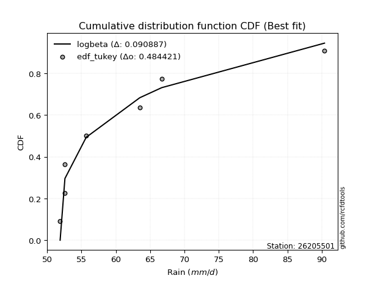</img></img>

</div>


### 8. EDF Gringorten (1963)

Gringorten plotting position formula is essential for estimating the probability and return periods of extreme events like floods and heavy rainfall. The constant _a=0.44_.

<div align="center">


$P=(m-a)/(n+1-2a)$


</div>


**8.1. Empirical values**

<div align="center">

|                | 0                   | 1                   | 2                  | 3              | 4                  | 5                  | 6                  |
|:---------------|:--------------------|:--------------------|:-------------------|:---------------|:-------------------|:-------------------|:-------------------|
| date           | 2022                | 2019                | 2021               | 2023           | 2020               | 2017               | 2018               |
| x              | 51.9                | 52.6                | 52.6               | 55.7           | 63.5               | 66.7               | 90.4               |
| m              | 1                   | 2                   | 3                  | 4              | 5                  | 6                  | 7                  |
| empirical_dist | edf_gringorten      | edf_gringorten      | edf_gringorten     | edf_gringorten | edf_gringorten     | edf_gringorten     | edf_gringorten     |
| empirical      | 0.07865168539325844 | 0.21910112359550563 | 0.3595505617977528 | 0.5            | 0.6404494382022471 | 0.7808988764044943 | 0.9213483146067415 |
| empirical_tr   | 1.0853658536585364  | 1.2805755395683454  | 1.5614035087719298 | 2.0            | 2.781249999999999  | 4.564102564102562  | 12.714285714285701 |

</div>


**8.2. Kolmogorov-Smirnov fit test (sorted by Δ)**


<div align="center">

|                | 0                   | 1                   | 2                   | 3                   | 4                   | 5                   | 6                   | 7                   | 8                   | 9                   | 10                  | 11                  | 12                  | 13                  | 14                  | 15                  | 16                  | 17                  | 18                  | 19                  | 20                  | 21                  | 22                  | 23                  | 24                  | 25                  | 26                  | 27                  | 28                  | 29                  | 30                  | 31                  | 32                  | 33                  | 34                  | 35                  | 36                  | 37                  | 38                  | 39                  | 40                  | 41                  | 42                  | 43                  | 44                  | 45                  | 46                  | 47                  | 48                  | 49                  | 50                  | 51                  | 52                  | 53                  | 54                  | 55                  | 56                  | 57                  | 58                  | 59                  | 60                  | 61                  | 62                  | 63                  | 64                    | 65                  | 66                  | 67                  | 68                  | 69                  | 70                  | 71                  | 72                  | 73                  | 74                  | 75                  | 76                  | 77                  | 78                  | 79                  | 80                  | 81                  | 82                  | 83                  | 84                  | 85                  | 86                  | 87                  |
|:---------------|:--------------------|:--------------------|:--------------------|:--------------------|:--------------------|:--------------------|:--------------------|:--------------------|:--------------------|:--------------------|:--------------------|:--------------------|:--------------------|:--------------------|:--------------------|:--------------------|:--------------------|:--------------------|:--------------------|:--------------------|:--------------------|:--------------------|:--------------------|:--------------------|:--------------------|:--------------------|:--------------------|:--------------------|:--------------------|:--------------------|:--------------------|:--------------------|:--------------------|:--------------------|:--------------------|:--------------------|:--------------------|:--------------------|:--------------------|:--------------------|:--------------------|:--------------------|:--------------------|:--------------------|:--------------------|:--------------------|:--------------------|:--------------------|:--------------------|:--------------------|:--------------------|:--------------------|:--------------------|:--------------------|:--------------------|:--------------------|:--------------------|:--------------------|:--------------------|:--------------------|:--------------------|:--------------------|:--------------------|:--------------------|:----------------------|:--------------------|:--------------------|:--------------------|:--------------------|:--------------------|:--------------------|:--------------------|:--------------------|:--------------------|:--------------------|:--------------------|:--------------------|:--------------------|:--------------------|:--------------------|:--------------------|:--------------------|:--------------------|:--------------------|:--------------------|:--------------------|:--------------------|:--------------------|
| station        | 26205501            | 26205501            | 26205501            | 26205501            | 26205501            | 26205501            | 26205501            | 26205501            | 26205501            | 26205501            | 26205501            | 26205501            | 26205501            | 26205501            | 26205501            | 26205501            | 26205501            | 26205501            | 26205501            | 26205501            | 26205501            | 26205501            | 26205501            | 26205501            | 26205501            | 26205501            | 26205501            | 26205501            | 26205501            | 26205501            | 26205501            | 26205501            | 26205501            | 26205501            | 26205501            | 26205501            | 26205501            | 26205501            | 26205501            | 26205501            | 26205501            | 26205501            | 26205501            | 26205501            | 26205501            | 26205501            | 26205501            | 26205501            | 26205501            | 26205501            | 26205501            | 26205501            | 26205501            | 26205501            | 26205501            | 26205501            | 26205501            | 26205501            | 26205501            | 26205501            | 26205501            | 26205501            | 26205501            | 26205501            | 26205501              | 26205501            | 26205501            | 26205501            | 26205501            | 26205501            | 26205501            | 26205501            | 26205501            | 26205501            | 26205501            | 26205501            | 26205501            | 26205501            | 26205501            | 26205501            | 26205501            | 26205501            | 26205501            | 26205501            | 26205501            | 26205501            | 26205501            | 26205501            |
| empirical_dist | edf_gringorten      | edf_gringorten      | edf_gringorten      | edf_gringorten      | edf_gringorten      | edf_gringorten      | edf_gringorten      | edf_gringorten      | edf_gringorten      | edf_gringorten      | edf_gringorten      | edf_gringorten      | edf_gringorten      | edf_gringorten      | edf_gringorten      | edf_gringorten      | edf_gringorten      | edf_gringorten      | edf_gringorten      | edf_gringorten      | edf_gringorten      | edf_gringorten      | edf_gringorten      | edf_gringorten      | edf_gringorten      | edf_gringorten      | edf_gringorten      | edf_gringorten      | edf_gringorten      | edf_gringorten      | edf_gringorten      | edf_gringorten      | edf_gringorten      | edf_gringorten      | edf_gringorten      | edf_gringorten      | edf_gringorten      | edf_gringorten      | edf_gringorten      | edf_gringorten      | edf_gringorten      | edf_gringorten      | edf_gringorten      | edf_gringorten      | edf_gringorten      | edf_gringorten      | edf_gringorten      | edf_gringorten      | edf_gringorten      | edf_gringorten      | edf_gringorten      | edf_gringorten      | edf_gringorten      | edf_gringorten      | edf_gringorten      | edf_gringorten      | edf_gringorten      | edf_gringorten      | edf_gringorten      | edf_gringorten      | edf_gringorten      | edf_gringorten      | edf_gringorten      | edf_gringorten      | edf_gringorten        | edf_gringorten      | edf_gringorten      | edf_gringorten      | edf_gringorten      | edf_gringorten      | edf_gringorten      | edf_gringorten      | edf_gringorten      | edf_gringorten      | edf_gringorten      | edf_gringorten      | edf_gringorten      | edf_gringorten      | edf_gringorten      | edf_gringorten      | edf_gringorten      | edf_gringorten      | edf_gringorten      | edf_gringorten      | edf_gringorten      | edf_gringorten      | edf_gringorten      | edf_gringorten      |
| p_dist         | invweibull          | loginvweibull       | loghalflogistic     | logpearson3         | moyal               | lograyleigh         | loggumbel_r         | invgamma            | f                   | fisk                | logf                | loghalfnorm         | pearson3            | gumbel_r            | logmoyal            | logmaxwell          | halflogistic        | maxwell             | logt                | rayleigh            | logalpha            | loginvgamma         | nct                 | genlogistic         | lognct              | mielke              | logloggamma         | invgauss            | chi2                | halfnorm            | logweibull_min      | ncf                 | loginvgauss         | loggenlogistic      | logcrystalball      | lognorm             | lognorm             | betaprime           | norm                | crystalball         | logbetaprime        | t                   | logfisk             | logkstwobign        | alpha               | loglogistic         | kstwobign           | logistic            | loggamma            | loggamma            | logrice             | loghypsecant        | weibull_min         | hypsecant           | wald                | rice                | gamma               | loggumbel_l         | gumbel_l            | loglaplace          | laplace             | nakagami            | logwald             | logexponnorm        | loglaplace_asymmetric | logexpon            | loggenexpon         | logncf              | exponnorm           | laplace_asymmetric  | genexpon            | expon               | gompertz            | lognakagami         | truncnorm           | erlang              | logtruncnorm        | loggompertz         | gibrat              | loggibrat           | loglognorm          | logchi2             | fatiguelife         | logfatiguelife      | logerlang           | johnsonsu           | logjohnsonsu        | logmielke           |
| delta          | 0.11419439438004597 | 0.12242312162963265 | 0.12476233523080105 | 0.12849396562854495 | 0.1361284073875234  | 0.13900686361708725 | 0.1408082110284487  | 0.141306248593829   | 0.14130748404674975 | 0.14204554872005054 | 0.1458176579448781  | 0.14695667706091597 | 0.14750694744216175 | 0.14859724592592566 | 0.14995642319093905 | 0.1505507237185409  | 0.15313790998478227 | 0.15695084475535737 | 0.15851696655554692 | 0.16159072484842324 | 0.17108283212309272 | 0.1719721572685322  | 0.1731736722460448  | 0.17382129297995663 | 0.17651072309814364 | 0.1765635637329708  | 0.17669156318032453 | 0.17693504154002893 | 0.1772599037095861  | 0.17749632794434278 | 0.1775885173966408  | 0.17765651874337424 | 0.17781835826507653 | 0.17844405716278391 | 0.18027450040566856 | 0.18027497126690561 | 0.18027497126690561 | 0.18327011702641388 | 0.18615696857247888 | 0.18615697845602142 | 0.18797864068174963 | 0.1897668391226942  | 0.19205444923817563 | 0.19259219223201604 | 0.19657801445672474 | 0.2005056097860924  | 0.20418647839438664 | 0.20675338562057743 | 0.2096986549076213  | 0.2096986549076213  | 0.21445745611474504 | 0.21557113517657828 | 0.22128911857840763 | 0.22195513578024328 | 0.22260922548381895 | 0.2318566356909572  | 0.23244755306468268 | 0.2350043827980155  | 0.2397634655272109  | 0.24222309218042587 | 0.24817512793833313 | 0.255697567548716   | 0.2732790776109101  | 0.2767754880558797  | 0.2781744062938354    | 0.27818150406660436 | 0.27818181981459245 | 0.28374182091741723 | 0.2907193463429957  | 0.29203576737575154 | 0.29203744938051573 | 0.2920374927254196  | 0.2969749415043451  | 0.3029702492895897  | 0.3036534057393058  | 0.307911018702947   | 0.30936303898321704 | 0.3108015582356919  | 0.3542402547651124  | 0.3595505617977528  | 0.3783832742956651  | 0.38841513497579666 | 0.39795208062794774 | 0.40363479715205397 | 0.4457356206041232  | 0.47774102316249    | 0.6728567699755541  | nan                 |
| deltao         | 0.48442053926100004 | 0.48442053926100004 | 0.48442053926100004 | 0.48442053926100004 | 0.48442053926100004 | 0.48442053926100004 | 0.48442053926100004 | 0.48442053926100004 | 0.48442053926100004 | 0.48442053926100004 | 0.48442053926100004 | 0.48442053926100004 | 0.48442053926100004 | 0.48442053926100004 | 0.48442053926100004 | 0.48442053926100004 | 0.48442053926100004 | 0.48442053926100004 | 0.48442053926100004 | 0.48442053926100004 | 0.48442053926100004 | 0.48442053926100004 | 0.48442053926100004 | 0.48442053926100004 | 0.48442053926100004 | 0.48442053926100004 | 0.48442053926100004 | 0.48442053926100004 | 0.48442053926100004 | 0.48442053926100004 | 0.48442053926100004 | 0.48442053926100004 | 0.48442053926100004 | 0.48442053926100004 | 0.48442053926100004 | 0.48442053926100004 | 0.48442053926100004 | 0.48442053926100004 | 0.48442053926100004 | 0.48442053926100004 | 0.48442053926100004 | 0.48442053926100004 | 0.48442053926100004 | 0.48442053926100004 | 0.48442053926100004 | 0.48442053926100004 | 0.48442053926100004 | 0.48442053926100004 | 0.48442053926100004 | 0.48442053926100004 | 0.48442053926100004 | 0.48442053926100004 | 0.48442053926100004 | 0.48442053926100004 | 0.48442053926100004 | 0.48442053926100004 | 0.48442053926100004 | 0.48442053926100004 | 0.48442053926100004 | 0.48442053926100004 | 0.48442053926100004 | 0.48442053926100004 | 0.48442053926100004 | 0.48442053926100004 | 0.48442053926100004   | 0.48442053926100004 | 0.48442053926100004 | 0.48442053926100004 | 0.48442053926100004 | 0.48442053926100004 | 0.48442053926100004 | 0.48442053926100004 | 0.48442053926100004 | 0.48442053926100004 | 0.48442053926100004 | 0.48442053926100004 | 0.48442053926100004 | 0.48442053926100004 | 0.48442053926100004 | 0.48442053926100004 | 0.48442053926100004 | 0.48442053926100004 | 0.48442053926100004 | 0.48442053926100004 | 0.48442053926100004 | 0.48442053926100004 | 0.48442053926100004 | 0.48442053926100004 |
| eval           | Δo > Δ              | Δo > Δ              | Δo > Δ              | Δo > Δ              | Δo > Δ              | Δo > Δ              | Δo > Δ              | Δo > Δ              | Δo > Δ              | Δo > Δ              | Δo > Δ              | Δo > Δ              | Δo > Δ              | Δo > Δ              | Δo > Δ              | Δo > Δ              | Δo > Δ              | Δo > Δ              | Δo > Δ              | Δo > Δ              | Δo > Δ              | Δo > Δ              | Δo > Δ              | Δo > Δ              | Δo > Δ              | Δo > Δ              | Δo > Δ              | Δo > Δ              | Δo > Δ              | Δo > Δ              | Δo > Δ              | Δo > Δ              | Δo > Δ              | Δo > Δ              | Δo > Δ              | Δo > Δ              | Δo > Δ              | Δo > Δ              | Δo > Δ              | Δo > Δ              | Δo > Δ              | Δo > Δ              | Δo > Δ              | Δo > Δ              | Δo > Δ              | Δo > Δ              | Δo > Δ              | Δo > Δ              | Δo > Δ              | Δo > Δ              | Δo > Δ              | Δo > Δ              | Δo > Δ              | Δo > Δ              | Δo > Δ              | Δo > Δ              | Δo > Δ              | Δo > Δ              | Δo > Δ              | Δo > Δ              | Δo > Δ              | Δo > Δ              | Δo > Δ              | Δo > Δ              | Δo > Δ                | Δo > Δ              | Δo > Δ              | Δo > Δ              | Δo > Δ              | Δo > Δ              | Δo > Δ              | Δo > Δ              | Δo > Δ              | Δo > Δ              | Δo > Δ              | Δo > Δ              | Δo > Δ              | Δo > Δ              | Δo > Δ              | Δo > Δ              | Δo > Δ              | Δo > Δ              | Δo > Δ              | Δo > Δ              | Δo > Δ              | Δo > Δ              | Δo <= Δ             | Δo <= Δ             |
| fit            | 1                   | 1                   | 1                   | 1                   | 1                   | 1                   | 1                   | 1                   | 1                   | 1                   | 1                   | 1                   | 1                   | 1                   | 1                   | 1                   | 1                   | 1                   | 1                   | 1                   | 1                   | 1                   | 1                   | 1                   | 1                   | 1                   | 1                   | 1                   | 1                   | 1                   | 1                   | 1                   | 1                   | 1                   | 1                   | 1                   | 1                   | 1                   | 1                   | 1                   | 1                   | 1                   | 1                   | 1                   | 1                   | 1                   | 1                   | 1                   | 1                   | 1                   | 1                   | 1                   | 1                   | 1                   | 1                   | 1                   | 1                   | 1                   | 1                   | 1                   | 1                   | 1                   | 1                   | 1                   | 1                     | 1                   | 1                   | 1                   | 1                   | 1                   | 1                   | 1                   | 1                   | 1                   | 1                   | 1                   | 1                   | 1                   | 1                   | 1                   | 1                   | 1                   | 1                   | 1                   | 1                   | 1                   | 0                   | 0                   |
| n              | 7                   | 7                   | 7                   | 7                   | 7                   | 7                   | 7                   | 7                   | 7                   | 7                   | 7                   | 7                   | 7                   | 7                   | 7                   | 7                   | 7                   | 7                   | 7                   | 7                   | 7                   | 7                   | 7                   | 7                   | 7                   | 7                   | 7                   | 7                   | 7                   | 7                   | 7                   | 7                   | 7                   | 7                   | 7                   | 7                   | 7                   | 7                   | 7                   | 7                   | 7                   | 7                   | 7                   | 7                   | 7                   | 7                   | 7                   | 7                   | 7                   | 7                   | 7                   | 7                   | 7                   | 7                   | 7                   | 7                   | 7                   | 7                   | 7                   | 7                   | 7                   | 7                   | 7                   | 7                   | 7                     | 7                   | 7                   | 7                   | 7                   | 7                   | 7                   | 7                   | 7                   | 7                   | 7                   | 7                   | 7                   | 7                   | 7                   | 7                   | 7                   | 7                   | 7                   | 7                   | 7                   | 7                   | 7                   | 7                   |
| best_fit       | 1                   | 0                   | 0                   | 0                   | 0                   | 0                   | 0                   | 0                   | 0                   | 0                   | 0                   | 0                   | 0                   | 0                   | 0                   | 0                   | 0                   | 0                   | 0                   | 0                   | 0                   | 0                   | 0                   | 0                   | 0                   | 0                   | 0                   | 0                   | 0                   | 0                   | 0                   | 0                   | 0                   | 0                   | 0                   | 0                   | 0                   | 0                   | 0                   | 0                   | 0                   | 0                   | 0                   | 0                   | 0                   | 0                   | 0                   | 0                   | 0                   | 0                   | 0                   | 0                   | 0                   | 0                   | 0                   | 0                   | 0                   | 0                   | 0                   | 0                   | 0                   | 0                   | 0                   | 0                   | 0                     | 0                   | 0                   | 0                   | 0                   | 0                   | 0                   | 0                   | 0                   | 0                   | 0                   | 0                   | 0                   | 0                   | 0                   | 0                   | 0                   | 0                   | 0                   | 0                   | 0                   | 0                   | 0                   | 0                   |
| best_fit_sort  | 1                   | 2                   | 3                   | 4                   | 5                   | 6                   | 7                   | 8                   | 9                   | 10                  | 11                  | 12                  | 13                  | 14                  | 15                  | 16                  | 17                  | 18                  | 19                  | 20                  | 21                  | 22                  | 23                  | 24                  | 25                  | 26                  | 27                  | 28                  | 29                  | 30                  | 31                  | 32                  | 33                  | 34                  | 35                  | 36                  | 37                  | 38                  | 39                  | 40                  | 41                  | 42                  | 43                  | 44                  | 45                  | 46                  | 47                  | 48                  | 49                  | 50                  | 51                  | 52                  | 53                  | 54                  | 55                  | 56                  | 57                  | 58                  | 59                  | 60                  | 61                  | 62                  | 63                  | 64                  | 65                    | 66                  | 67                  | 68                  | 69                  | 70                  | 71                  | 72                  | 73                  | 74                  | 75                  | 76                  | 77                  | 78                  | 79                  | 80                  | 81                  | 82                  | 83                  | 84                  | 85                  | 86                  | 87                  | 88                  |

</div>


**8.3. Best fit**

<div align="center">

|   id |   station | empirical_dist   | p_dist     |    delta |   deltao | eval   |   fit |   n |   best_fit |   best_fit_sort |
|-----:|----------:|:-----------------|:-----------|---------:|---------:|:-------|------:|----:|-----------:|----------------:|
|    0 |  26205501 | edf_gringorten   | invweibull | 0.114194 | 0.484421 | Δo > Δ |     1 |   7 |          1 |               1 |

</div>


<div align="center">

</img>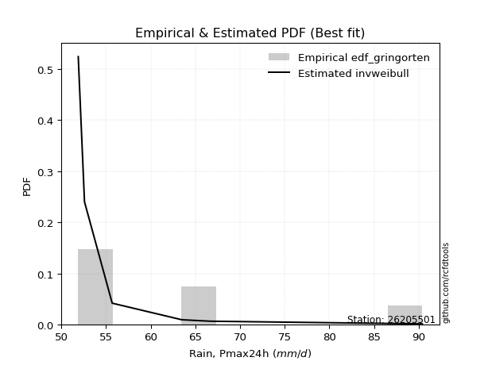</img>

</div>


### 9. EDF Filliben (1975)

The specific values of the constants (0.3175) (often denoted as $alpha$) and (0.365) are derived from a method proposed by James J. Filliben in a 1975 paper. This particular formula is the mean value of the $i$-th order statistic of the normal distribution and is considered a robust and effective plotting position formula for the normal probability plot correlation coefficient test for normality.

<div align="center">


$P=(m-0.3175)/(n+0.365)$


</div>


**9.1. Empirical values**

<div align="center">

|                | 0                   | 1                   | 2                   | 3            | 4                  | 5                  | 6                  |
|:---------------|:--------------------|:--------------------|:--------------------|:-------------|:-------------------|:-------------------|:-------------------|
| date           | 2022                | 2019                | 2021                | 2023         | 2020               | 2017               | 2018               |
| x              | 51.9                | 52.6                | 52.6                | 55.7         | 63.5               | 66.7               | 90.4               |
| m              | 1                   | 2                   | 3                   | 4            | 5                  | 6                  | 7                  |
| empirical_dist | edf_filliben        | edf_filliben        | edf_filliben        | edf_filliben | edf_filliben       | edf_filliben       | edf_filliben       |
| empirical      | 0.09266802443991853 | 0.22844534962661237 | 0.36422267481330617 | 0.5          | 0.6357773251866938 | 0.7715546503733877 | 0.9073319755600815 |
| empirical_tr   | 1.1021324354657687  | 1.2960844698636163  | 1.5728777362520021  | 2.0          | 2.7455731593662627 | 4.377414561664191  | 10.791208791208794 |

</div>


**9.2. Kolmogorov-Smirnov fit test (sorted by Δ)**


<div align="center">

|                | 0                   | 1                   | 2                   | 3                   | 4                   | 5                   | 6                   | 7                   | 8                   | 9                   | 10                  | 11                  | 12                  | 13                  | 14                  | 15                  | 16                  | 17                  | 18                  | 19                  | 20                  | 21                  | 22                  | 23                  | 24                  | 25                  | 26                  | 27                  | 28                  | 29                  | 30                  | 31                  | 32                  | 33                  | 34                  | 35                  | 36                  | 37                  | 38                  | 39                  | 40                  | 41                  | 42                  | 43                  | 44                  | 45                  | 46                  | 47                  | 48                  | 49                  | 50                  | 51                  | 52                  | 53                  | 54                  | 55                  | 56                  | 57                  | 58                  | 59                  | 60                  | 61                  | 62                  | 63                  | 64                  | 65                    | 66                  | 67                  | 68                  | 69                  | 70                  | 71                  | 72                  | 73                  | 74                  | 75                  | 76                  | 77                  | 78                  | 79                  | 80                  | 81                  | 82                  | 83                  | 84                  | 85                  | 86                  | 87                  |
|:---------------|:--------------------|:--------------------|:--------------------|:--------------------|:--------------------|:--------------------|:--------------------|:--------------------|:--------------------|:--------------------|:--------------------|:--------------------|:--------------------|:--------------------|:--------------------|:--------------------|:--------------------|:--------------------|:--------------------|:--------------------|:--------------------|:--------------------|:--------------------|:--------------------|:--------------------|:--------------------|:--------------------|:--------------------|:--------------------|:--------------------|:--------------------|:--------------------|:--------------------|:--------------------|:--------------------|:--------------------|:--------------------|:--------------------|:--------------------|:--------------------|:--------------------|:--------------------|:--------------------|:--------------------|:--------------------|:--------------------|:--------------------|:--------------------|:--------------------|:--------------------|:--------------------|:--------------------|:--------------------|:--------------------|:--------------------|:--------------------|:--------------------|:--------------------|:--------------------|:--------------------|:--------------------|:--------------------|:--------------------|:--------------------|:--------------------|:----------------------|:--------------------|:--------------------|:--------------------|:--------------------|:--------------------|:--------------------|:--------------------|:--------------------|:--------------------|:--------------------|:--------------------|:--------------------|:--------------------|:--------------------|:--------------------|:--------------------|:--------------------|:--------------------|:--------------------|:--------------------|:--------------------|:--------------------|
| station        | 26205501            | 26205501            | 26205501            | 26205501            | 26205501            | 26205501            | 26205501            | 26205501            | 26205501            | 26205501            | 26205501            | 26205501            | 26205501            | 26205501            | 26205501            | 26205501            | 26205501            | 26205501            | 26205501            | 26205501            | 26205501            | 26205501            | 26205501            | 26205501            | 26205501            | 26205501            | 26205501            | 26205501            | 26205501            | 26205501            | 26205501            | 26205501            | 26205501            | 26205501            | 26205501            | 26205501            | 26205501            | 26205501            | 26205501            | 26205501            | 26205501            | 26205501            | 26205501            | 26205501            | 26205501            | 26205501            | 26205501            | 26205501            | 26205501            | 26205501            | 26205501            | 26205501            | 26205501            | 26205501            | 26205501            | 26205501            | 26205501            | 26205501            | 26205501            | 26205501            | 26205501            | 26205501            | 26205501            | 26205501            | 26205501            | 26205501              | 26205501            | 26205501            | 26205501            | 26205501            | 26205501            | 26205501            | 26205501            | 26205501            | 26205501            | 26205501            | 26205501            | 26205501            | 26205501            | 26205501            | 26205501            | 26205501            | 26205501            | 26205501            | 26205501            | 26205501            | 26205501            | 26205501            |
| empirical_dist | edf_filliben        | edf_filliben        | edf_filliben        | edf_filliben        | edf_filliben        | edf_filliben        | edf_filliben        | edf_filliben        | edf_filliben        | edf_filliben        | edf_filliben        | edf_filliben        | edf_filliben        | edf_filliben        | edf_filliben        | edf_filliben        | edf_filliben        | edf_filliben        | edf_filliben        | edf_filliben        | edf_filliben        | edf_filliben        | edf_filliben        | edf_filliben        | edf_filliben        | edf_filliben        | edf_filliben        | edf_filliben        | edf_filliben        | edf_filliben        | edf_filliben        | edf_filliben        | edf_filliben        | edf_filliben        | edf_filliben        | edf_filliben        | edf_filliben        | edf_filliben        | edf_filliben        | edf_filliben        | edf_filliben        | edf_filliben        | edf_filliben        | edf_filliben        | edf_filliben        | edf_filliben        | edf_filliben        | edf_filliben        | edf_filliben        | edf_filliben        | edf_filliben        | edf_filliben        | edf_filliben        | edf_filliben        | edf_filliben        | edf_filliben        | edf_filliben        | edf_filliben        | edf_filliben        | edf_filliben        | edf_filliben        | edf_filliben        | edf_filliben        | edf_filliben        | edf_filliben        | edf_filliben          | edf_filliben        | edf_filliben        | edf_filliben        | edf_filliben        | edf_filliben        | edf_filliben        | edf_filliben        | edf_filliben        | edf_filliben        | edf_filliben        | edf_filliben        | edf_filliben        | edf_filliben        | edf_filliben        | edf_filliben        | edf_filliben        | edf_filliben        | edf_filliben        | edf_filliben        | edf_filliben        | edf_filliben        | edf_filliben        |
| p_dist         | invweibull          | loginvweibull       | loghalflogistic     | loghalfnorm         | logpearson3         | pearson3            | moyal               | fisk                | lograyleigh         | halflogistic        | logt                | loggumbel_r         | invgamma            | f                   | rayleigh            | gumbel_r            | logf                | logmaxwell          | logmoyal            | maxwell             | lognct              | halfnorm            | logalpha            | loginvgamma         | nct                 | t                   | genlogistic         | logloggamma         | ncf                 | logcrystalball      | lognorm             | lognorm             | mielke              | invgauss            | chi2                | logweibull_min      | loginvgauss         | loggenlogistic      | betaprime           | norm                | crystalball         | logbetaprime        | logfisk             | logkstwobign        | loglogistic         | alpha               | kstwobign           | logistic            | loggamma            | loggamma            | logrice             | loghypsecant        | hypsecant           | weibull_min         | wald                | rice                | loggumbel_l         | gamma               | gumbel_l            | loglaplace          | laplace             | nakagami            | logncf              | logwald             | logexponnorm        | loglaplace_asymmetric | logexpon            | loggenexpon         | lognakagami         | exponnorm           | laplace_asymmetric  | genexpon            | expon               | gompertz            | erlang              | truncnorm           | logtruncnorm        | loggompertz         | gibrat              | loggibrat           | loglognorm          | logchi2             | fatiguelife         | logfatiguelife      | logerlang           | johnsonsu           | logjohnsonsu        | logmielke           |
| delta          | 0.11886650739559923 | 0.1270952346451859  | 0.12943444824635442 | 0.1329403380142559  | 0.13316607864409832 | 0.13349060839550164 | 0.1361284073875234  | 0.13786232554772337 | 0.13900686361708725 | 0.1391215709381222  | 0.14450062750888681 | 0.1453443754098311  | 0.14597836160938227 | 0.145979597062303   | 0.14757438580176313 | 0.14859724592592566 | 0.15048977096043137 | 0.1505507237185409  | 0.15462853620649242 | 0.15695084475535737 | 0.16249438405148356 | 0.1634799888976827  | 0.17108283212309272 | 0.1719721572685322  | 0.1731736722460448  | 0.17575050007603413 | 0.17625537177776615 | 0.17669156318032453 | 0.17765651874337424 | 0.18027450040566856 | 0.18027497126690561 | 0.18027497126690561 | 0.18123567674852417 | 0.18160715455558218 | 0.18193201672513948 | 0.18226063041219417 | 0.18249047128062978 | 0.18311617017833728 | 0.18327011702641388 | 0.18615696857247888 | 0.18615697845602142 | 0.18797864068174963 | 0.196726562253729   | 0.1972643052475694  | 0.2005056097860924  | 0.201250127472278   | 0.20418647839438664 | 0.20675338562057743 | 0.21437076792317455 | 0.21437076792317455 | 0.21445745611474504 | 0.21557113517657828 | 0.22195513578024328 | 0.225961231593961   | 0.22728133849937232 | 0.2318566356909572  | 0.2350043827980155  | 0.23711966608023594 | 0.2397634655272109  | 0.24222309218042587 | 0.24817512793833313 | 0.26036968056426935 | 0.2697254818707572  | 0.27795119062646345 | 0.2814476010714331  | 0.28284651930938876   | 0.2828536170821577  | 0.2828539328301458  | 0.29362602325848297 | 0.29539145935854905 | 0.2967078803913049  | 0.2967095623960691  | 0.296709605740973   | 0.3016470545198985  | 0.30342884001336123 | 0.3083255187548592  | 0.3140351519987704  | 0.31547367125124526 | 0.35891236778066576 | 0.36422267481330617 | 0.36903904826455836 | 0.37907090894469003 | 0.388607854596841   | 0.39429057112094723 | 0.43639139457301646 | 0.46839679713138327 | 0.6635125439444474  | nan                 |
| deltao         | 0.48442053926100004 | 0.48442053926100004 | 0.48442053926100004 | 0.48442053926100004 | 0.48442053926100004 | 0.48442053926100004 | 0.48442053926100004 | 0.48442053926100004 | 0.48442053926100004 | 0.48442053926100004 | 0.48442053926100004 | 0.48442053926100004 | 0.48442053926100004 | 0.48442053926100004 | 0.48442053926100004 | 0.48442053926100004 | 0.48442053926100004 | 0.48442053926100004 | 0.48442053926100004 | 0.48442053926100004 | 0.48442053926100004 | 0.48442053926100004 | 0.48442053926100004 | 0.48442053926100004 | 0.48442053926100004 | 0.48442053926100004 | 0.48442053926100004 | 0.48442053926100004 | 0.48442053926100004 | 0.48442053926100004 | 0.48442053926100004 | 0.48442053926100004 | 0.48442053926100004 | 0.48442053926100004 | 0.48442053926100004 | 0.48442053926100004 | 0.48442053926100004 | 0.48442053926100004 | 0.48442053926100004 | 0.48442053926100004 | 0.48442053926100004 | 0.48442053926100004 | 0.48442053926100004 | 0.48442053926100004 | 0.48442053926100004 | 0.48442053926100004 | 0.48442053926100004 | 0.48442053926100004 | 0.48442053926100004 | 0.48442053926100004 | 0.48442053926100004 | 0.48442053926100004 | 0.48442053926100004 | 0.48442053926100004 | 0.48442053926100004 | 0.48442053926100004 | 0.48442053926100004 | 0.48442053926100004 | 0.48442053926100004 | 0.48442053926100004 | 0.48442053926100004 | 0.48442053926100004 | 0.48442053926100004 | 0.48442053926100004 | 0.48442053926100004 | 0.48442053926100004   | 0.48442053926100004 | 0.48442053926100004 | 0.48442053926100004 | 0.48442053926100004 | 0.48442053926100004 | 0.48442053926100004 | 0.48442053926100004 | 0.48442053926100004 | 0.48442053926100004 | 0.48442053926100004 | 0.48442053926100004 | 0.48442053926100004 | 0.48442053926100004 | 0.48442053926100004 | 0.48442053926100004 | 0.48442053926100004 | 0.48442053926100004 | 0.48442053926100004 | 0.48442053926100004 | 0.48442053926100004 | 0.48442053926100004 | 0.48442053926100004 |
| eval           | Δo > Δ              | Δo > Δ              | Δo > Δ              | Δo > Δ              | Δo > Δ              | Δo > Δ              | Δo > Δ              | Δo > Δ              | Δo > Δ              | Δo > Δ              | Δo > Δ              | Δo > Δ              | Δo > Δ              | Δo > Δ              | Δo > Δ              | Δo > Δ              | Δo > Δ              | Δo > Δ              | Δo > Δ              | Δo > Δ              | Δo > Δ              | Δo > Δ              | Δo > Δ              | Δo > Δ              | Δo > Δ              | Δo > Δ              | Δo > Δ              | Δo > Δ              | Δo > Δ              | Δo > Δ              | Δo > Δ              | Δo > Δ              | Δo > Δ              | Δo > Δ              | Δo > Δ              | Δo > Δ              | Δo > Δ              | Δo > Δ              | Δo > Δ              | Δo > Δ              | Δo > Δ              | Δo > Δ              | Δo > Δ              | Δo > Δ              | Δo > Δ              | Δo > Δ              | Δo > Δ              | Δo > Δ              | Δo > Δ              | Δo > Δ              | Δo > Δ              | Δo > Δ              | Δo > Δ              | Δo > Δ              | Δo > Δ              | Δo > Δ              | Δo > Δ              | Δo > Δ              | Δo > Δ              | Δo > Δ              | Δo > Δ              | Δo > Δ              | Δo > Δ              | Δo > Δ              | Δo > Δ              | Δo > Δ                | Δo > Δ              | Δo > Δ              | Δo > Δ              | Δo > Δ              | Δo > Δ              | Δo > Δ              | Δo > Δ              | Δo > Δ              | Δo > Δ              | Δo > Δ              | Δo > Δ              | Δo > Δ              | Δo > Δ              | Δo > Δ              | Δo > Δ              | Δo > Δ              | Δo > Δ              | Δo > Δ              | Δo > Δ              | Δo > Δ              | Δo <= Δ             | Δo <= Δ             |
| fit            | 1                   | 1                   | 1                   | 1                   | 1                   | 1                   | 1                   | 1                   | 1                   | 1                   | 1                   | 1                   | 1                   | 1                   | 1                   | 1                   | 1                   | 1                   | 1                   | 1                   | 1                   | 1                   | 1                   | 1                   | 1                   | 1                   | 1                   | 1                   | 1                   | 1                   | 1                   | 1                   | 1                   | 1                   | 1                   | 1                   | 1                   | 1                   | 1                   | 1                   | 1                   | 1                   | 1                   | 1                   | 1                   | 1                   | 1                   | 1                   | 1                   | 1                   | 1                   | 1                   | 1                   | 1                   | 1                   | 1                   | 1                   | 1                   | 1                   | 1                   | 1                   | 1                   | 1                   | 1                   | 1                   | 1                     | 1                   | 1                   | 1                   | 1                   | 1                   | 1                   | 1                   | 1                   | 1                   | 1                   | 1                   | 1                   | 1                   | 1                   | 1                   | 1                   | 1                   | 1                   | 1                   | 1                   | 0                   | 0                   |
| n              | 7                   | 7                   | 7                   | 7                   | 7                   | 7                   | 7                   | 7                   | 7                   | 7                   | 7                   | 7                   | 7                   | 7                   | 7                   | 7                   | 7                   | 7                   | 7                   | 7                   | 7                   | 7                   | 7                   | 7                   | 7                   | 7                   | 7                   | 7                   | 7                   | 7                   | 7                   | 7                   | 7                   | 7                   | 7                   | 7                   | 7                   | 7                   | 7                   | 7                   | 7                   | 7                   | 7                   | 7                   | 7                   | 7                   | 7                   | 7                   | 7                   | 7                   | 7                   | 7                   | 7                   | 7                   | 7                   | 7                   | 7                   | 7                   | 7                   | 7                   | 7                   | 7                   | 7                   | 7                   | 7                   | 7                     | 7                   | 7                   | 7                   | 7                   | 7                   | 7                   | 7                   | 7                   | 7                   | 7                   | 7                   | 7                   | 7                   | 7                   | 7                   | 7                   | 7                   | 7                   | 7                   | 7                   | 7                   | 7                   |
| best_fit       | 1                   | 0                   | 0                   | 0                   | 0                   | 0                   | 0                   | 0                   | 0                   | 0                   | 0                   | 0                   | 0                   | 0                   | 0                   | 0                   | 0                   | 0                   | 0                   | 0                   | 0                   | 0                   | 0                   | 0                   | 0                   | 0                   | 0                   | 0                   | 0                   | 0                   | 0                   | 0                   | 0                   | 0                   | 0                   | 0                   | 0                   | 0                   | 0                   | 0                   | 0                   | 0                   | 0                   | 0                   | 0                   | 0                   | 0                   | 0                   | 0                   | 0                   | 0                   | 0                   | 0                   | 0                   | 0                   | 0                   | 0                   | 0                   | 0                   | 0                   | 0                   | 0                   | 0                   | 0                   | 0                   | 0                     | 0                   | 0                   | 0                   | 0                   | 0                   | 0                   | 0                   | 0                   | 0                   | 0                   | 0                   | 0                   | 0                   | 0                   | 0                   | 0                   | 0                   | 0                   | 0                   | 0                   | 0                   | 0                   |
| best_fit_sort  | 1                   | 2                   | 3                   | 4                   | 5                   | 6                   | 7                   | 8                   | 9                   | 10                  | 11                  | 12                  | 13                  | 14                  | 15                  | 16                  | 17                  | 18                  | 19                  | 20                  | 21                  | 22                  | 23                  | 24                  | 25                  | 26                  | 27                  | 28                  | 29                  | 30                  | 31                  | 32                  | 33                  | 34                  | 35                  | 36                  | 37                  | 38                  | 39                  | 40                  | 41                  | 42                  | 43                  | 44                  | 45                  | 46                  | 47                  | 48                  | 49                  | 50                  | 51                  | 52                  | 53                  | 54                  | 55                  | 56                  | 57                  | 58                  | 59                  | 60                  | 61                  | 62                  | 63                  | 64                  | 65                  | 66                    | 67                  | 68                  | 69                  | 70                  | 71                  | 72                  | 73                  | 74                  | 75                  | 76                  | 77                  | 78                  | 79                  | 80                  | 81                  | 82                  | 83                  | 84                  | 85                  | 86                  | 87                  | 88                  |

</div>


**9.3. Best fit**

<div align="center">

|   id |   station | empirical_dist   | p_dist     |    delta |   deltao | eval   |   fit |   n |   best_fit |   best_fit_sort |
|-----:|----------:|:-----------------|:-----------|---------:|---------:|:-------|------:|----:|-----------:|----------------:|
|    0 |  26205501 | edf_filliben     | invweibull | 0.118867 | 0.484421 | Δo > Δ |     1 |   7 |          1 |               1 |

</div>


<div align="center">

</img>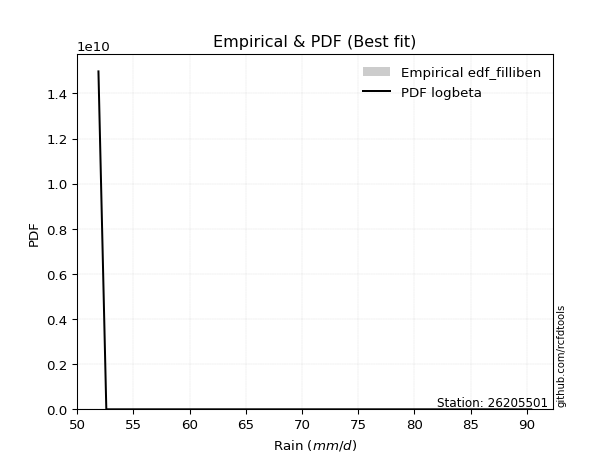</img>

</div>


### 10. EDF Jenkinson (1977)

The Jenkinson formula in hydrology is an empirical plotting position formula used to estimate the non-exceedance probability _(P)_ or return period _(T)_ of a given ordered observation within a sample. It is a widely used method in the frequency analysis of extreme events such as floods and rainfall, as it provides a distribution-free way to plot data. _a≈0.31_ and _b≈0.38_ are constants derived to approximate the median of the probability distribution for the given rank.

<div align="center">


$P=(m-a)/(n+b)$


</div>


**10.1. Empirical values**

<div align="center">

|                | 0                   | 1                   | 2                   | 3             | 4                  | 5                  | 6                  |
|:---------------|:--------------------|:--------------------|:--------------------|:--------------|:-------------------|:-------------------|:-------------------|
| date           | 2022                | 2019                | 2021                | 2023          | 2020               | 2017               | 2018               |
| x              | 51.9                | 52.6                | 52.6                | 55.7          | 63.5               | 66.7               | 90.4               |
| m              | 1                   | 2                   | 3                   | 4             | 5                  | 6                  | 7                  |
| empirical_dist | edf_jenkinson       | edf_jenkinson       | edf_jenkinson       | edf_jenkinson | edf_jenkinson      | edf_jenkinson      | edf_jenkinson      |
| empirical      | 0.09349593495934959 | 0.22899728997289973 | 0.36449864498644985 | 0.5           | 0.6355013550135502 | 0.7710027100271003 | 0.9065040650406505 |
| empirical_tr   | 1.1031390134529149  | 1.29701230228471    | 1.5735607675906182  | 2.0           | 2.743494423791822  | 4.366863905325444  | 10.695652173913055 |

</div>


**10.2. Kolmogorov-Smirnov fit test (sorted by Δ)**


<div align="center">

|                | 0                   | 1                   | 2                   | 3                   | 4                   | 5                   | 6                   | 7                   | 8                   | 9                   | 10                  | 11                  | 12                  | 13                  | 14                  | 15                  | 16                  | 17                  | 18                  | 19                  | 20                  | 21                  | 22                  | 23                  | 24                  | 25                  | 26                  | 27                  | 28                  | 29                  | 30                  | 31                  | 32                  | 33                  | 34                  | 35                  | 36                  | 37                  | 38                  | 39                  | 40                  | 41                  | 42                  | 43                  | 44                  | 45                  | 46                  | 47                  | 48                  | 49                  | 50                  | 51                  | 52                  | 53                  | 54                  | 55                  | 56                  | 57                  | 58                  | 59                  | 60                  | 61                  | 62                  | 63                  | 64                  | 65                    | 66                  | 67                  | 68                  | 69                  | 70                  | 71                  | 72                  | 73                  | 74                  | 75                  | 76                  | 77                  | 78                  | 79                  | 80                  | 81                  | 82                  | 83                  | 84                  | 85                  | 86                  | 87                  |
|:---------------|:--------------------|:--------------------|:--------------------|:--------------------|:--------------------|:--------------------|:--------------------|:--------------------|:--------------------|:--------------------|:--------------------|:--------------------|:--------------------|:--------------------|:--------------------|:--------------------|:--------------------|:--------------------|:--------------------|:--------------------|:--------------------|:--------------------|:--------------------|:--------------------|:--------------------|:--------------------|:--------------------|:--------------------|:--------------------|:--------------------|:--------------------|:--------------------|:--------------------|:--------------------|:--------------------|:--------------------|:--------------------|:--------------------|:--------------------|:--------------------|:--------------------|:--------------------|:--------------------|:--------------------|:--------------------|:--------------------|:--------------------|:--------------------|:--------------------|:--------------------|:--------------------|:--------------------|:--------------------|:--------------------|:--------------------|:--------------------|:--------------------|:--------------------|:--------------------|:--------------------|:--------------------|:--------------------|:--------------------|:--------------------|:--------------------|:----------------------|:--------------------|:--------------------|:--------------------|:--------------------|:--------------------|:--------------------|:--------------------|:--------------------|:--------------------|:--------------------|:--------------------|:--------------------|:--------------------|:--------------------|:--------------------|:--------------------|:--------------------|:--------------------|:--------------------|:--------------------|:--------------------|:--------------------|
| station        | 26205501            | 26205501            | 26205501            | 26205501            | 26205501            | 26205501            | 26205501            | 26205501            | 26205501            | 26205501            | 26205501            | 26205501            | 26205501            | 26205501            | 26205501            | 26205501            | 26205501            | 26205501            | 26205501            | 26205501            | 26205501            | 26205501            | 26205501            | 26205501            | 26205501            | 26205501            | 26205501            | 26205501            | 26205501            | 26205501            | 26205501            | 26205501            | 26205501            | 26205501            | 26205501            | 26205501            | 26205501            | 26205501            | 26205501            | 26205501            | 26205501            | 26205501            | 26205501            | 26205501            | 26205501            | 26205501            | 26205501            | 26205501            | 26205501            | 26205501            | 26205501            | 26205501            | 26205501            | 26205501            | 26205501            | 26205501            | 26205501            | 26205501            | 26205501            | 26205501            | 26205501            | 26205501            | 26205501            | 26205501            | 26205501            | 26205501              | 26205501            | 26205501            | 26205501            | 26205501            | 26205501            | 26205501            | 26205501            | 26205501            | 26205501            | 26205501            | 26205501            | 26205501            | 26205501            | 26205501            | 26205501            | 26205501            | 26205501            | 26205501            | 26205501            | 26205501            | 26205501            | 26205501            |
| empirical_dist | edf_jenkinson       | edf_jenkinson       | edf_jenkinson       | edf_jenkinson       | edf_jenkinson       | edf_jenkinson       | edf_jenkinson       | edf_jenkinson       | edf_jenkinson       | edf_jenkinson       | edf_jenkinson       | edf_jenkinson       | edf_jenkinson       | edf_jenkinson       | edf_jenkinson       | edf_jenkinson       | edf_jenkinson       | edf_jenkinson       | edf_jenkinson       | edf_jenkinson       | edf_jenkinson       | edf_jenkinson       | edf_jenkinson       | edf_jenkinson       | edf_jenkinson       | edf_jenkinson       | edf_jenkinson       | edf_jenkinson       | edf_jenkinson       | edf_jenkinson       | edf_jenkinson       | edf_jenkinson       | edf_jenkinson       | edf_jenkinson       | edf_jenkinson       | edf_jenkinson       | edf_jenkinson       | edf_jenkinson       | edf_jenkinson       | edf_jenkinson       | edf_jenkinson       | edf_jenkinson       | edf_jenkinson       | edf_jenkinson       | edf_jenkinson       | edf_jenkinson       | edf_jenkinson       | edf_jenkinson       | edf_jenkinson       | edf_jenkinson       | edf_jenkinson       | edf_jenkinson       | edf_jenkinson       | edf_jenkinson       | edf_jenkinson       | edf_jenkinson       | edf_jenkinson       | edf_jenkinson       | edf_jenkinson       | edf_jenkinson       | edf_jenkinson       | edf_jenkinson       | edf_jenkinson       | edf_jenkinson       | edf_jenkinson       | edf_jenkinson         | edf_jenkinson       | edf_jenkinson       | edf_jenkinson       | edf_jenkinson       | edf_jenkinson       | edf_jenkinson       | edf_jenkinson       | edf_jenkinson       | edf_jenkinson       | edf_jenkinson       | edf_jenkinson       | edf_jenkinson       | edf_jenkinson       | edf_jenkinson       | edf_jenkinson       | edf_jenkinson       | edf_jenkinson       | edf_jenkinson       | edf_jenkinson       | edf_jenkinson       | edf_jenkinson       | edf_jenkinson       |
| p_dist         | invweibull          | loginvweibull       | loghalflogistic     | loghalfnorm         | pearson3            | logpearson3         | moyal               | fisk                | halflogistic        | lograyleigh         | logt                | loggumbel_r         | invgamma            | f                   | rayleigh            | gumbel_r            | logmaxwell          | logf                | logmoyal            | maxwell             | lognct              | halfnorm            | logalpha            | loginvgamma         | nct                 | t                   | genlogistic         | logloggamma         | ncf                 | logcrystalball      | lognorm             | lognorm             | mielke              | invgauss            | chi2                | logweibull_min      | loginvgauss         | betaprime           | loggenlogistic      | norm                | crystalball         | logbetaprime        | logfisk             | logkstwobign        | loglogistic         | alpha               | kstwobign           | logistic            | logrice             | loggamma            | loggamma            | loghypsecant        | hypsecant           | weibull_min         | wald                | rice                | loggumbel_l         | gamma               | gumbel_l            | loglaplace          | laplace             | nakagami            | logncf              | logwald             | logexponnorm        | loglaplace_asymmetric | logexpon            | loggenexpon         | lognakagami         | exponnorm           | laplace_asymmetric  | genexpon            | expon               | gompertz            | erlang              | truncnorm           | logtruncnorm        | loggompertz         | gibrat              | loggibrat           | loglognorm          | logchi2             | fatiguelife         | logfatiguelife      | logerlang           | johnsonsu           | logjohnsonsu        | logmielke           |
| delta          | 0.11914247756874285 | 0.12737120481832953 | 0.1297104184194981  | 0.13211242749482482 | 0.1326626978760706  | 0.133442048817242   | 0.1361284073875234  | 0.13786232554772337 | 0.13829366041869112 | 0.13900686361708725 | 0.14367271698945577 | 0.1456203455829748  | 0.1462543317825259  | 0.14625556723544664 | 0.1467464752823321  | 0.14859724592592566 | 0.1505507237185409  | 0.150765741133575   | 0.1549045063796361  | 0.15695084475535737 | 0.1616664735320525  | 0.16265207837825163 | 0.17108283212309272 | 0.1719721572685322  | 0.1731736722460448  | 0.17492258955660306 | 0.17653134195090983 | 0.17669156318032453 | 0.17765651874337424 | 0.18027450040566856 | 0.18027497126690561 | 0.18027497126690561 | 0.18151164692166785 | 0.1818831247287258  | 0.18220798689828316 | 0.18253660058533785 | 0.1827664414537734  | 0.18327011702641388 | 0.18339214035148096 | 0.18615696857247888 | 0.18615697845602142 | 0.18797864068174963 | 0.19700253242687268 | 0.1975402754207131  | 0.2005056097860924  | 0.20152609764542162 | 0.20418647839438664 | 0.20675338562057743 | 0.21445745611474504 | 0.21464673809631818 | 0.21464673809631818 | 0.21557113517657828 | 0.22195513578024328 | 0.22623720176710468 | 0.227557308672516   | 0.2318566356909572  | 0.2350043827980155  | 0.23739563625337956 | 0.2397634655272109  | 0.24222309218042587 | 0.24817512793833313 | 0.2606456507374131  | 0.2688975713513261  | 0.27822716079960713 | 0.28172357124457675 | 0.28312248948253244   | 0.2831295872553014  | 0.28312990300328944 | 0.2930740829121956  | 0.2956674295316927  | 0.2969838505644486  | 0.2969855325692128  | 0.2969855759141167  | 0.3019230246930421  | 0.30370481018650486 | 0.3086014889280029  | 0.31431112217191415 | 0.31574964142438894 | 0.35918833795380944 | 0.36449864498644985 | 0.368487107918271   | 0.37851896859840267 | 0.38805591425055364 | 0.39373863077465987 | 0.4358394542267291  | 0.4678448567850959  | 0.66296060359816    | nan                 |
| deltao         | 0.48442053926100004 | 0.48442053926100004 | 0.48442053926100004 | 0.48442053926100004 | 0.48442053926100004 | 0.48442053926100004 | 0.48442053926100004 | 0.48442053926100004 | 0.48442053926100004 | 0.48442053926100004 | 0.48442053926100004 | 0.48442053926100004 | 0.48442053926100004 | 0.48442053926100004 | 0.48442053926100004 | 0.48442053926100004 | 0.48442053926100004 | 0.48442053926100004 | 0.48442053926100004 | 0.48442053926100004 | 0.48442053926100004 | 0.48442053926100004 | 0.48442053926100004 | 0.48442053926100004 | 0.48442053926100004 | 0.48442053926100004 | 0.48442053926100004 | 0.48442053926100004 | 0.48442053926100004 | 0.48442053926100004 | 0.48442053926100004 | 0.48442053926100004 | 0.48442053926100004 | 0.48442053926100004 | 0.48442053926100004 | 0.48442053926100004 | 0.48442053926100004 | 0.48442053926100004 | 0.48442053926100004 | 0.48442053926100004 | 0.48442053926100004 | 0.48442053926100004 | 0.48442053926100004 | 0.48442053926100004 | 0.48442053926100004 | 0.48442053926100004 | 0.48442053926100004 | 0.48442053926100004 | 0.48442053926100004 | 0.48442053926100004 | 0.48442053926100004 | 0.48442053926100004 | 0.48442053926100004 | 0.48442053926100004 | 0.48442053926100004 | 0.48442053926100004 | 0.48442053926100004 | 0.48442053926100004 | 0.48442053926100004 | 0.48442053926100004 | 0.48442053926100004 | 0.48442053926100004 | 0.48442053926100004 | 0.48442053926100004 | 0.48442053926100004 | 0.48442053926100004   | 0.48442053926100004 | 0.48442053926100004 | 0.48442053926100004 | 0.48442053926100004 | 0.48442053926100004 | 0.48442053926100004 | 0.48442053926100004 | 0.48442053926100004 | 0.48442053926100004 | 0.48442053926100004 | 0.48442053926100004 | 0.48442053926100004 | 0.48442053926100004 | 0.48442053926100004 | 0.48442053926100004 | 0.48442053926100004 | 0.48442053926100004 | 0.48442053926100004 | 0.48442053926100004 | 0.48442053926100004 | 0.48442053926100004 | 0.48442053926100004 |
| eval           | Δo > Δ              | Δo > Δ              | Δo > Δ              | Δo > Δ              | Δo > Δ              | Δo > Δ              | Δo > Δ              | Δo > Δ              | Δo > Δ              | Δo > Δ              | Δo > Δ              | Δo > Δ              | Δo > Δ              | Δo > Δ              | Δo > Δ              | Δo > Δ              | Δo > Δ              | Δo > Δ              | Δo > Δ              | Δo > Δ              | Δo > Δ              | Δo > Δ              | Δo > Δ              | Δo > Δ              | Δo > Δ              | Δo > Δ              | Δo > Δ              | Δo > Δ              | Δo > Δ              | Δo > Δ              | Δo > Δ              | Δo > Δ              | Δo > Δ              | Δo > Δ              | Δo > Δ              | Δo > Δ              | Δo > Δ              | Δo > Δ              | Δo > Δ              | Δo > Δ              | Δo > Δ              | Δo > Δ              | Δo > Δ              | Δo > Δ              | Δo > Δ              | Δo > Δ              | Δo > Δ              | Δo > Δ              | Δo > Δ              | Δo > Δ              | Δo > Δ              | Δo > Δ              | Δo > Δ              | Δo > Δ              | Δo > Δ              | Δo > Δ              | Δo > Δ              | Δo > Δ              | Δo > Δ              | Δo > Δ              | Δo > Δ              | Δo > Δ              | Δo > Δ              | Δo > Δ              | Δo > Δ              | Δo > Δ                | Δo > Δ              | Δo > Δ              | Δo > Δ              | Δo > Δ              | Δo > Δ              | Δo > Δ              | Δo > Δ              | Δo > Δ              | Δo > Δ              | Δo > Δ              | Δo > Δ              | Δo > Δ              | Δo > Δ              | Δo > Δ              | Δo > Δ              | Δo > Δ              | Δo > Δ              | Δo > Δ              | Δo > Δ              | Δo > Δ              | Δo <= Δ             | Δo <= Δ             |
| fit            | 1                   | 1                   | 1                   | 1                   | 1                   | 1                   | 1                   | 1                   | 1                   | 1                   | 1                   | 1                   | 1                   | 1                   | 1                   | 1                   | 1                   | 1                   | 1                   | 1                   | 1                   | 1                   | 1                   | 1                   | 1                   | 1                   | 1                   | 1                   | 1                   | 1                   | 1                   | 1                   | 1                   | 1                   | 1                   | 1                   | 1                   | 1                   | 1                   | 1                   | 1                   | 1                   | 1                   | 1                   | 1                   | 1                   | 1                   | 1                   | 1                   | 1                   | 1                   | 1                   | 1                   | 1                   | 1                   | 1                   | 1                   | 1                   | 1                   | 1                   | 1                   | 1                   | 1                   | 1                   | 1                   | 1                     | 1                   | 1                   | 1                   | 1                   | 1                   | 1                   | 1                   | 1                   | 1                   | 1                   | 1                   | 1                   | 1                   | 1                   | 1                   | 1                   | 1                   | 1                   | 1                   | 1                   | 0                   | 0                   |
| n              | 7                   | 7                   | 7                   | 7                   | 7                   | 7                   | 7                   | 7                   | 7                   | 7                   | 7                   | 7                   | 7                   | 7                   | 7                   | 7                   | 7                   | 7                   | 7                   | 7                   | 7                   | 7                   | 7                   | 7                   | 7                   | 7                   | 7                   | 7                   | 7                   | 7                   | 7                   | 7                   | 7                   | 7                   | 7                   | 7                   | 7                   | 7                   | 7                   | 7                   | 7                   | 7                   | 7                   | 7                   | 7                   | 7                   | 7                   | 7                   | 7                   | 7                   | 7                   | 7                   | 7                   | 7                   | 7                   | 7                   | 7                   | 7                   | 7                   | 7                   | 7                   | 7                   | 7                   | 7                   | 7                   | 7                     | 7                   | 7                   | 7                   | 7                   | 7                   | 7                   | 7                   | 7                   | 7                   | 7                   | 7                   | 7                   | 7                   | 7                   | 7                   | 7                   | 7                   | 7                   | 7                   | 7                   | 7                   | 7                   |
| best_fit       | 1                   | 0                   | 0                   | 0                   | 0                   | 0                   | 0                   | 0                   | 0                   | 0                   | 0                   | 0                   | 0                   | 0                   | 0                   | 0                   | 0                   | 0                   | 0                   | 0                   | 0                   | 0                   | 0                   | 0                   | 0                   | 0                   | 0                   | 0                   | 0                   | 0                   | 0                   | 0                   | 0                   | 0                   | 0                   | 0                   | 0                   | 0                   | 0                   | 0                   | 0                   | 0                   | 0                   | 0                   | 0                   | 0                   | 0                   | 0                   | 0                   | 0                   | 0                   | 0                   | 0                   | 0                   | 0                   | 0                   | 0                   | 0                   | 0                   | 0                   | 0                   | 0                   | 0                   | 0                   | 0                   | 0                     | 0                   | 0                   | 0                   | 0                   | 0                   | 0                   | 0                   | 0                   | 0                   | 0                   | 0                   | 0                   | 0                   | 0                   | 0                   | 0                   | 0                   | 0                   | 0                   | 0                   | 0                   | 0                   |
| best_fit_sort  | 1                   | 2                   | 3                   | 4                   | 5                   | 6                   | 7                   | 8                   | 9                   | 10                  | 11                  | 12                  | 13                  | 14                  | 15                  | 16                  | 17                  | 18                  | 19                  | 20                  | 21                  | 22                  | 23                  | 24                  | 25                  | 26                  | 27                  | 28                  | 29                  | 30                  | 31                  | 32                  | 33                  | 34                  | 35                  | 36                  | 37                  | 38                  | 39                  | 40                  | 41                  | 42                  | 43                  | 44                  | 45                  | 46                  | 47                  | 48                  | 49                  | 50                  | 51                  | 52                  | 53                  | 54                  | 55                  | 56                  | 57                  | 58                  | 59                  | 60                  | 61                  | 62                  | 63                  | 64                  | 65                  | 66                    | 67                  | 68                  | 69                  | 70                  | 71                  | 72                  | 73                  | 74                  | 75                  | 76                  | 77                  | 78                  | 79                  | 80                  | 81                  | 82                  | 83                  | 84                  | 85                  | 86                  | 87                  | 88                  |

</div>


**10.3. Best fit**

<div align="center">

|   id |   station | empirical_dist   | p_dist     |    delta |   deltao | eval   |   fit |   n |   best_fit |   best_fit_sort |
|-----:|----------:|:-----------------|:-----------|---------:|---------:|:-------|------:|----:|-----------:|----------------:|
|    0 |  26205501 | edf_jenkinson    | invweibull | 0.119142 | 0.484421 | Δo > Δ |     1 |   7 |          1 |               1 |

</div>


<div align="center">

</img>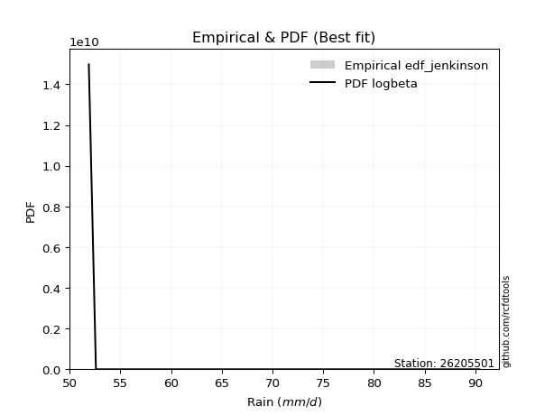</img>

</div>


### 11. EDF Cunnane (1978)

Cunnane´s work in statistical hydrology has focused on the performance and evaluation of different probability distributions (such as GEV, Gumbel, Lognormal) for flood frequency estimation. _b_ is a constant, typically set to 0.4.

<div align="center">


$P=(m-b)/(n+1-2b)$


</div>


**11.1. Empirical values**

<div align="center">

|                | 0                   | 1                   | 2                  | 3           | 4                  | 5                  | 6                  |
|:---------------|:--------------------|:--------------------|:-------------------|:------------|:-------------------|:-------------------|:-------------------|
| date           | 2022                | 2019                | 2021               | 2023        | 2020               | 2017               | 2018               |
| x              | 51.9                | 52.6                | 52.6               | 55.7        | 63.5               | 66.7               | 90.4               |
| m              | 1                   | 2                   | 3                  | 4           | 5                  | 6                  | 7                  |
| empirical_dist | edf_cunnane         | edf_cunnane         | edf_cunnane        | edf_cunnane | edf_cunnane        | edf_cunnane        | edf_cunnane        |
| empirical      | 0.08333333333333333 | 0.22222222222222224 | 0.3611111111111111 | 0.5         | 0.6388888888888888 | 0.7777777777777777 | 0.9166666666666666 |
| empirical_tr   | 1.090909090909091   | 1.2857142857142856  | 1.565217391304348  | 2.0         | 2.7692307692307687 | 4.499999999999998  | 11.999999999999995 |

</div>


**11.2. Kolmogorov-Smirnov fit test (sorted by Δ)**


<div align="center">

|                | 0                   | 1                   | 2                   | 3                   | 4                   | 5                   | 6                   | 7                   | 8                   | 9                   | 10                  | 11                  | 12                  | 13                  | 14                  | 15                  | 16                  | 17                  | 18                  | 19                  | 20                  | 21                  | 22                  | 23                  | 24                  | 25                  | 26                  | 27                  | 28                  | 29                  | 30                  | 31                  | 32                  | 33                  | 34                  | 35                  | 36                  | 37                  | 38                  | 39                  | 40                  | 41                  | 42                  | 43                  | 44                  | 45                  | 46                  | 47                  | 48                  | 49                  | 50                  | 51                  | 52                  | 53                  | 54                  | 55                  | 56                  | 57                  | 58                  | 59                  | 60                  | 61                  | 62                  | 63                  | 64                  | 65                    | 66                  | 67                  | 68                  | 69                  | 70                  | 71                  | 72                  | 73                  | 74                  | 75                  | 76                  | 77                  | 78                  | 79                  | 80                  | 81                  | 82                  | 83                  | 84                  | 85                  | 86                  | 87                  |
|:---------------|:--------------------|:--------------------|:--------------------|:--------------------|:--------------------|:--------------------|:--------------------|:--------------------|:--------------------|:--------------------|:--------------------|:--------------------|:--------------------|:--------------------|:--------------------|:--------------------|:--------------------|:--------------------|:--------------------|:--------------------|:--------------------|:--------------------|:--------------------|:--------------------|:--------------------|:--------------------|:--------------------|:--------------------|:--------------------|:--------------------|:--------------------|:--------------------|:--------------------|:--------------------|:--------------------|:--------------------|:--------------------|:--------------------|:--------------------|:--------------------|:--------------------|:--------------------|:--------------------|:--------------------|:--------------------|:--------------------|:--------------------|:--------------------|:--------------------|:--------------------|:--------------------|:--------------------|:--------------------|:--------------------|:--------------------|:--------------------|:--------------------|:--------------------|:--------------------|:--------------------|:--------------------|:--------------------|:--------------------|:--------------------|:--------------------|:----------------------|:--------------------|:--------------------|:--------------------|:--------------------|:--------------------|:--------------------|:--------------------|:--------------------|:--------------------|:--------------------|:--------------------|:--------------------|:--------------------|:--------------------|:--------------------|:--------------------|:--------------------|:--------------------|:--------------------|:--------------------|:--------------------|:--------------------|
| station        | 26205501            | 26205501            | 26205501            | 26205501            | 26205501            | 26205501            | 26205501            | 26205501            | 26205501            | 26205501            | 26205501            | 26205501            | 26205501            | 26205501            | 26205501            | 26205501            | 26205501            | 26205501            | 26205501            | 26205501            | 26205501            | 26205501            | 26205501            | 26205501            | 26205501            | 26205501            | 26205501            | 26205501            | 26205501            | 26205501            | 26205501            | 26205501            | 26205501            | 26205501            | 26205501            | 26205501            | 26205501            | 26205501            | 26205501            | 26205501            | 26205501            | 26205501            | 26205501            | 26205501            | 26205501            | 26205501            | 26205501            | 26205501            | 26205501            | 26205501            | 26205501            | 26205501            | 26205501            | 26205501            | 26205501            | 26205501            | 26205501            | 26205501            | 26205501            | 26205501            | 26205501            | 26205501            | 26205501            | 26205501            | 26205501            | 26205501              | 26205501            | 26205501            | 26205501            | 26205501            | 26205501            | 26205501            | 26205501            | 26205501            | 26205501            | 26205501            | 26205501            | 26205501            | 26205501            | 26205501            | 26205501            | 26205501            | 26205501            | 26205501            | 26205501            | 26205501            | 26205501            | 26205501            |
| empirical_dist | edf_cunnane         | edf_cunnane         | edf_cunnane         | edf_cunnane         | edf_cunnane         | edf_cunnane         | edf_cunnane         | edf_cunnane         | edf_cunnane         | edf_cunnane         | edf_cunnane         | edf_cunnane         | edf_cunnane         | edf_cunnane         | edf_cunnane         | edf_cunnane         | edf_cunnane         | edf_cunnane         | edf_cunnane         | edf_cunnane         | edf_cunnane         | edf_cunnane         | edf_cunnane         | edf_cunnane         | edf_cunnane         | edf_cunnane         | edf_cunnane         | edf_cunnane         | edf_cunnane         | edf_cunnane         | edf_cunnane         | edf_cunnane         | edf_cunnane         | edf_cunnane         | edf_cunnane         | edf_cunnane         | edf_cunnane         | edf_cunnane         | edf_cunnane         | edf_cunnane         | edf_cunnane         | edf_cunnane         | edf_cunnane         | edf_cunnane         | edf_cunnane         | edf_cunnane         | edf_cunnane         | edf_cunnane         | edf_cunnane         | edf_cunnane         | edf_cunnane         | edf_cunnane         | edf_cunnane         | edf_cunnane         | edf_cunnane         | edf_cunnane         | edf_cunnane         | edf_cunnane         | edf_cunnane         | edf_cunnane         | edf_cunnane         | edf_cunnane         | edf_cunnane         | edf_cunnane         | edf_cunnane         | edf_cunnane           | edf_cunnane         | edf_cunnane         | edf_cunnane         | edf_cunnane         | edf_cunnane         | edf_cunnane         | edf_cunnane         | edf_cunnane         | edf_cunnane         | edf_cunnane         | edf_cunnane         | edf_cunnane         | edf_cunnane         | edf_cunnane         | edf_cunnane         | edf_cunnane         | edf_cunnane         | edf_cunnane         | edf_cunnane         | edf_cunnane         | edf_cunnane         | edf_cunnane         |
| p_dist         | invweibull          | loginvweibull       | loghalflogistic     | logpearson3         | moyal               | fisk                | lograyleigh         | loggumbel_r         | loghalfnorm         | pearson3            | invgamma            | f                   | logf                | halflogistic        | gumbel_r            | logmaxwell          | logmoyal            | logt                | rayleigh            | maxwell             | logalpha            | lognct              | loginvgamma         | halfnorm            | nct                 | genlogistic         | logloggamma         | ncf                 | mielke              | invgauss            | chi2                | logweibull_min      | loginvgauss         | loggenlogistic      | logcrystalball      | lognorm             | lognorm             | betaprime           | t                   | norm                | crystalball         | logbetaprime        | logfisk             | logkstwobign        | alpha               | loglogistic         | kstwobign           | logistic            | loggamma            | loggamma            | logrice             | loghypsecant        | hypsecant           | weibull_min         | wald                | rice                | gamma               | loggumbel_l         | gumbel_l            | loglaplace          | laplace             | nakagami            | logwald             | logexponnorm        | logncf              | loglaplace_asymmetric | logexpon            | loggenexpon         | exponnorm           | laplace_asymmetric  | genexpon            | expon               | gompertz            | lognakagami         | erlang              | truncnorm           | logtruncnorm        | loggompertz         | gibrat              | loggibrat           | loglognorm          | logchi2             | fatiguelife         | logfatiguelife      | logerlang           | johnsonsu           | logjohnsonsu        | logmielke           |
| delta          | 0.11575494369340422 | 0.1239836709429909  | 0.12632288454415935 | 0.13005451494190326 | 0.1361284073875234  | 0.13786232554772337 | 0.13900686361708725 | 0.14223281170763605 | 0.1422750291208411  | 0.14282529950208683 | 0.14286679790718726 | 0.142868033360108   | 0.14737820725823636 | 0.1484562620447074  | 0.14859724592592566 | 0.1505507237185409  | 0.15151697250429735 | 0.153835318615472   | 0.15690907690834832 | 0.15695084475535737 | 0.17108283212309272 | 0.17182907515806878 | 0.1719721572685322  | 0.17281468000426792 | 0.1731736722460448  | 0.17382129297995663 | 0.17669156318032453 | 0.17765651874337424 | 0.1781241130463291  | 0.17849559085338718 | 0.17882045302294441 | 0.1791490667099991  | 0.17937890757843478 | 0.18000460647614222 | 0.18027450040566856 | 0.18027497126690561 | 0.18027497126690561 | 0.18327011702641388 | 0.18508519118261935 | 0.18615696857247888 | 0.18615697845602142 | 0.18797864068174963 | 0.19361499855153394 | 0.19415274154537435 | 0.198138563770083   | 0.2005056097860924  | 0.20418647839438664 | 0.20675338562057743 | 0.21125920422097955 | 0.21125920422097955 | 0.21445745611474504 | 0.21557113517657828 | 0.22195513578024328 | 0.22284966789176594 | 0.22416977479717726 | 0.2318566356909572  | 0.23400810237804093 | 0.2350043827980155  | 0.2397634655272109  | 0.24222309218042587 | 0.24817512793833313 | 0.25725811686207434 | 0.2748396269242684  | 0.278336037369238   | 0.27906017297734237 | 0.2797349556071937    | 0.27974205337996266 | 0.2797423691279507  | 0.292279895656354   | 0.29359631668910985 | 0.29359799869387404 | 0.29359804203877793 | 0.29853549081770336 | 0.2998491506628731  | 0.3047899200762304  | 0.30521395505266413 | 0.3109235882965754  | 0.3123621075490502  | 0.3558008040784707  | 0.3611111111111111  | 0.3752621756689485  | 0.38529403634908005 | 0.3948309820012311  | 0.40051369852533736 | 0.4426145219774066  | 0.4746199245357734  | 0.6697356713488375  | nan                 |
| deltao         | 0.48442053926100004 | 0.48442053926100004 | 0.48442053926100004 | 0.48442053926100004 | 0.48442053926100004 | 0.48442053926100004 | 0.48442053926100004 | 0.48442053926100004 | 0.48442053926100004 | 0.48442053926100004 | 0.48442053926100004 | 0.48442053926100004 | 0.48442053926100004 | 0.48442053926100004 | 0.48442053926100004 | 0.48442053926100004 | 0.48442053926100004 | 0.48442053926100004 | 0.48442053926100004 | 0.48442053926100004 | 0.48442053926100004 | 0.48442053926100004 | 0.48442053926100004 | 0.48442053926100004 | 0.48442053926100004 | 0.48442053926100004 | 0.48442053926100004 | 0.48442053926100004 | 0.48442053926100004 | 0.48442053926100004 | 0.48442053926100004 | 0.48442053926100004 | 0.48442053926100004 | 0.48442053926100004 | 0.48442053926100004 | 0.48442053926100004 | 0.48442053926100004 | 0.48442053926100004 | 0.48442053926100004 | 0.48442053926100004 | 0.48442053926100004 | 0.48442053926100004 | 0.48442053926100004 | 0.48442053926100004 | 0.48442053926100004 | 0.48442053926100004 | 0.48442053926100004 | 0.48442053926100004 | 0.48442053926100004 | 0.48442053926100004 | 0.48442053926100004 | 0.48442053926100004 | 0.48442053926100004 | 0.48442053926100004 | 0.48442053926100004 | 0.48442053926100004 | 0.48442053926100004 | 0.48442053926100004 | 0.48442053926100004 | 0.48442053926100004 | 0.48442053926100004 | 0.48442053926100004 | 0.48442053926100004 | 0.48442053926100004 | 0.48442053926100004 | 0.48442053926100004   | 0.48442053926100004 | 0.48442053926100004 | 0.48442053926100004 | 0.48442053926100004 | 0.48442053926100004 | 0.48442053926100004 | 0.48442053926100004 | 0.48442053926100004 | 0.48442053926100004 | 0.48442053926100004 | 0.48442053926100004 | 0.48442053926100004 | 0.48442053926100004 | 0.48442053926100004 | 0.48442053926100004 | 0.48442053926100004 | 0.48442053926100004 | 0.48442053926100004 | 0.48442053926100004 | 0.48442053926100004 | 0.48442053926100004 | 0.48442053926100004 |
| eval           | Δo > Δ              | Δo > Δ              | Δo > Δ              | Δo > Δ              | Δo > Δ              | Δo > Δ              | Δo > Δ              | Δo > Δ              | Δo > Δ              | Δo > Δ              | Δo > Δ              | Δo > Δ              | Δo > Δ              | Δo > Δ              | Δo > Δ              | Δo > Δ              | Δo > Δ              | Δo > Δ              | Δo > Δ              | Δo > Δ              | Δo > Δ              | Δo > Δ              | Δo > Δ              | Δo > Δ              | Δo > Δ              | Δo > Δ              | Δo > Δ              | Δo > Δ              | Δo > Δ              | Δo > Δ              | Δo > Δ              | Δo > Δ              | Δo > Δ              | Δo > Δ              | Δo > Δ              | Δo > Δ              | Δo > Δ              | Δo > Δ              | Δo > Δ              | Δo > Δ              | Δo > Δ              | Δo > Δ              | Δo > Δ              | Δo > Δ              | Δo > Δ              | Δo > Δ              | Δo > Δ              | Δo > Δ              | Δo > Δ              | Δo > Δ              | Δo > Δ              | Δo > Δ              | Δo > Δ              | Δo > Δ              | Δo > Δ              | Δo > Δ              | Δo > Δ              | Δo > Δ              | Δo > Δ              | Δo > Δ              | Δo > Δ              | Δo > Δ              | Δo > Δ              | Δo > Δ              | Δo > Δ              | Δo > Δ                | Δo > Δ              | Δo > Δ              | Δo > Δ              | Δo > Δ              | Δo > Δ              | Δo > Δ              | Δo > Δ              | Δo > Δ              | Δo > Δ              | Δo > Δ              | Δo > Δ              | Δo > Δ              | Δo > Δ              | Δo > Δ              | Δo > Δ              | Δo > Δ              | Δo > Δ              | Δo > Δ              | Δo > Δ              | Δo > Δ              | Δo <= Δ             | Δo <= Δ             |
| fit            | 1                   | 1                   | 1                   | 1                   | 1                   | 1                   | 1                   | 1                   | 1                   | 1                   | 1                   | 1                   | 1                   | 1                   | 1                   | 1                   | 1                   | 1                   | 1                   | 1                   | 1                   | 1                   | 1                   | 1                   | 1                   | 1                   | 1                   | 1                   | 1                   | 1                   | 1                   | 1                   | 1                   | 1                   | 1                   | 1                   | 1                   | 1                   | 1                   | 1                   | 1                   | 1                   | 1                   | 1                   | 1                   | 1                   | 1                   | 1                   | 1                   | 1                   | 1                   | 1                   | 1                   | 1                   | 1                   | 1                   | 1                   | 1                   | 1                   | 1                   | 1                   | 1                   | 1                   | 1                   | 1                   | 1                     | 1                   | 1                   | 1                   | 1                   | 1                   | 1                   | 1                   | 1                   | 1                   | 1                   | 1                   | 1                   | 1                   | 1                   | 1                   | 1                   | 1                   | 1                   | 1                   | 1                   | 0                   | 0                   |
| n              | 7                   | 7                   | 7                   | 7                   | 7                   | 7                   | 7                   | 7                   | 7                   | 7                   | 7                   | 7                   | 7                   | 7                   | 7                   | 7                   | 7                   | 7                   | 7                   | 7                   | 7                   | 7                   | 7                   | 7                   | 7                   | 7                   | 7                   | 7                   | 7                   | 7                   | 7                   | 7                   | 7                   | 7                   | 7                   | 7                   | 7                   | 7                   | 7                   | 7                   | 7                   | 7                   | 7                   | 7                   | 7                   | 7                   | 7                   | 7                   | 7                   | 7                   | 7                   | 7                   | 7                   | 7                   | 7                   | 7                   | 7                   | 7                   | 7                   | 7                   | 7                   | 7                   | 7                   | 7                   | 7                   | 7                     | 7                   | 7                   | 7                   | 7                   | 7                   | 7                   | 7                   | 7                   | 7                   | 7                   | 7                   | 7                   | 7                   | 7                   | 7                   | 7                   | 7                   | 7                   | 7                   | 7                   | 7                   | 7                   |
| best_fit       | 1                   | 0                   | 0                   | 0                   | 0                   | 0                   | 0                   | 0                   | 0                   | 0                   | 0                   | 0                   | 0                   | 0                   | 0                   | 0                   | 0                   | 0                   | 0                   | 0                   | 0                   | 0                   | 0                   | 0                   | 0                   | 0                   | 0                   | 0                   | 0                   | 0                   | 0                   | 0                   | 0                   | 0                   | 0                   | 0                   | 0                   | 0                   | 0                   | 0                   | 0                   | 0                   | 0                   | 0                   | 0                   | 0                   | 0                   | 0                   | 0                   | 0                   | 0                   | 0                   | 0                   | 0                   | 0                   | 0                   | 0                   | 0                   | 0                   | 0                   | 0                   | 0                   | 0                   | 0                   | 0                   | 0                     | 0                   | 0                   | 0                   | 0                   | 0                   | 0                   | 0                   | 0                   | 0                   | 0                   | 0                   | 0                   | 0                   | 0                   | 0                   | 0                   | 0                   | 0                   | 0                   | 0                   | 0                   | 0                   |
| best_fit_sort  | 1                   | 2                   | 3                   | 4                   | 5                   | 6                   | 7                   | 8                   | 9                   | 10                  | 11                  | 12                  | 13                  | 14                  | 15                  | 16                  | 17                  | 18                  | 19                  | 20                  | 21                  | 22                  | 23                  | 24                  | 25                  | 26                  | 27                  | 28                  | 29                  | 30                  | 31                  | 32                  | 33                  | 34                  | 35                  | 36                  | 37                  | 38                  | 39                  | 40                  | 41                  | 42                  | 43                  | 44                  | 45                  | 46                  | 47                  | 48                  | 49                  | 50                  | 51                  | 52                  | 53                  | 54                  | 55                  | 56                  | 57                  | 58                  | 59                  | 60                  | 61                  | 62                  | 63                  | 64                  | 65                  | 66                    | 67                  | 68                  | 69                  | 70                  | 71                  | 72                  | 73                  | 74                  | 75                  | 76                  | 77                  | 78                  | 79                  | 80                  | 81                  | 82                  | 83                  | 84                  | 85                  | 86                  | 87                  | 88                  |

</div>


**11.3. Best fit**

<div align="center">

|   id |   station | empirical_dist   | p_dist     |    delta |   deltao | eval   |   fit |   n |   best_fit |   best_fit_sort |
|-----:|----------:|:-----------------|:-----------|---------:|---------:|:-------|------:|----:|-----------:|----------------:|
|    0 |  26205501 | edf_cunnane      | invweibull | 0.115755 | 0.484421 | Δo > Δ |     1 |   7 |          1 |               1 |

</div>


<div align="center">

</img></img>

</div>


### 12. EDF Adamowski (1981)

The Adamowski formula in hydrology refers to a specific plotting position formula used for estimating the non-parametric empirical distribution of hydrological events (like flood peaks) to calculate their return periods. This formula provides an alternative to traditional parametric methods (like the Gumbel or Log Pearson Type III distributions). 

<div align="center">


$P=(m-0.25)/(n+0.5)$


</div>


**12.1. Empirical values**

<div align="center">

|                | 0                  | 1                   | 2                   | 3             | 4                  | 5                  | 6                  |
|:---------------|:-------------------|:--------------------|:--------------------|:--------------|:-------------------|:-------------------|:-------------------|
| date           | 2022               | 2019                | 2021                | 2023          | 2020               | 2017               | 2018               |
| x              | 51.9               | 52.6                | 52.6                | 55.7          | 63.5               | 66.7               | 90.4               |
| m              | 1                  | 2                   | 3                   | 4             | 5                  | 6                  | 7                  |
| empirical_dist | edf_adamowski      | edf_adamowski       | edf_adamowski       | edf_adamowski | edf_adamowski      | edf_adamowski      | edf_adamowski      |
| empirical      | 0.1                | 0.23333333333333334 | 0.36666666666666664 | 0.5           | 0.6333333333333333 | 0.7666666666666667 | 0.9                |
| empirical_tr   | 1.1111111111111112 | 1.3043478260869565  | 1.5789473684210527  | 2.0           | 2.727272727272727  | 4.2857142857142865 | 10.000000000000002 |

</div>


**12.2. Kolmogorov-Smirnov fit test (sorted by Δ)**


<div align="center">

|                | 0                   | 1                   | 2                   | 3                   | 4                   | 5                   | 6                   | 7                   | 8                   | 9                   | 10                  | 11                  | 12                  | 13                  | 14                  | 15                  | 16                  | 17                  | 18                  | 19                  | 20                  | 21                  | 22                  | 23                  | 24                  | 25                  | 26                  | 27                  | 28                  | 29                  | 30                  | 31                  | 32                  | 33                  | 34                  | 35                  | 36                  | 37                  | 38                  | 39                  | 40                  | 41                  | 42                  | 43                  | 44                  | 45                  | 46                  | 47                  | 48                  | 49                  | 50                  | 51                  | 52                  | 53                  | 54                  | 55                  | 56                  | 57                  | 58                  | 59                  | 60                  | 61                  | 62                  | 63                  | 64                  | 65                    | 66                  | 67                  | 68                  | 69                  | 70                  | 71                  | 72                  | 73                  | 74                  | 75                  | 76                  | 77                  | 78                  | 79                  | 80                  | 81                  | 82                  | 83                  | 84                  | 85                  | 86                  | 87                  |
|:---------------|:--------------------|:--------------------|:--------------------|:--------------------|:--------------------|:--------------------|:--------------------|:--------------------|:--------------------|:--------------------|:--------------------|:--------------------|:--------------------|:--------------------|:--------------------|:--------------------|:--------------------|:--------------------|:--------------------|:--------------------|:--------------------|:--------------------|:--------------------|:--------------------|:--------------------|:--------------------|:--------------------|:--------------------|:--------------------|:--------------------|:--------------------|:--------------------|:--------------------|:--------------------|:--------------------|:--------------------|:--------------------|:--------------------|:--------------------|:--------------------|:--------------------|:--------------------|:--------------------|:--------------------|:--------------------|:--------------------|:--------------------|:--------------------|:--------------------|:--------------------|:--------------------|:--------------------|:--------------------|:--------------------|:--------------------|:--------------------|:--------------------|:--------------------|:--------------------|:--------------------|:--------------------|:--------------------|:--------------------|:--------------------|:--------------------|:----------------------|:--------------------|:--------------------|:--------------------|:--------------------|:--------------------|:--------------------|:--------------------|:--------------------|:--------------------|:--------------------|:--------------------|:--------------------|:--------------------|:--------------------|:--------------------|:--------------------|:--------------------|:--------------------|:--------------------|:--------------------|:--------------------|:--------------------|
| station        | 26205501            | 26205501            | 26205501            | 26205501            | 26205501            | 26205501            | 26205501            | 26205501            | 26205501            | 26205501            | 26205501            | 26205501            | 26205501            | 26205501            | 26205501            | 26205501            | 26205501            | 26205501            | 26205501            | 26205501            | 26205501            | 26205501            | 26205501            | 26205501            | 26205501            | 26205501            | 26205501            | 26205501            | 26205501            | 26205501            | 26205501            | 26205501            | 26205501            | 26205501            | 26205501            | 26205501            | 26205501            | 26205501            | 26205501            | 26205501            | 26205501            | 26205501            | 26205501            | 26205501            | 26205501            | 26205501            | 26205501            | 26205501            | 26205501            | 26205501            | 26205501            | 26205501            | 26205501            | 26205501            | 26205501            | 26205501            | 26205501            | 26205501            | 26205501            | 26205501            | 26205501            | 26205501            | 26205501            | 26205501            | 26205501            | 26205501              | 26205501            | 26205501            | 26205501            | 26205501            | 26205501            | 26205501            | 26205501            | 26205501            | 26205501            | 26205501            | 26205501            | 26205501            | 26205501            | 26205501            | 26205501            | 26205501            | 26205501            | 26205501            | 26205501            | 26205501            | 26205501            | 26205501            |
| empirical_dist | edf_adamowski       | edf_adamowski       | edf_adamowski       | edf_adamowski       | edf_adamowski       | edf_adamowski       | edf_adamowski       | edf_adamowski       | edf_adamowski       | edf_adamowski       | edf_adamowski       | edf_adamowski       | edf_adamowski       | edf_adamowski       | edf_adamowski       | edf_adamowski       | edf_adamowski       | edf_adamowski       | edf_adamowski       | edf_adamowski       | edf_adamowski       | edf_adamowski       | edf_adamowski       | edf_adamowski       | edf_adamowski       | edf_adamowski       | edf_adamowski       | edf_adamowski       | edf_adamowski       | edf_adamowski       | edf_adamowski       | edf_adamowski       | edf_adamowski       | edf_adamowski       | edf_adamowski       | edf_adamowski       | edf_adamowski       | edf_adamowski       | edf_adamowski       | edf_adamowski       | edf_adamowski       | edf_adamowski       | edf_adamowski       | edf_adamowski       | edf_adamowski       | edf_adamowski       | edf_adamowski       | edf_adamowski       | edf_adamowski       | edf_adamowski       | edf_adamowski       | edf_adamowski       | edf_adamowski       | edf_adamowski       | edf_adamowski       | edf_adamowski       | edf_adamowski       | edf_adamowski       | edf_adamowski       | edf_adamowski       | edf_adamowski       | edf_adamowski       | edf_adamowski       | edf_adamowski       | edf_adamowski       | edf_adamowski         | edf_adamowski       | edf_adamowski       | edf_adamowski       | edf_adamowski       | edf_adamowski       | edf_adamowski       | edf_adamowski       | edf_adamowski       | edf_adamowski       | edf_adamowski       | edf_adamowski       | edf_adamowski       | edf_adamowski       | edf_adamowski       | edf_adamowski       | edf_adamowski       | edf_adamowski       | edf_adamowski       | edf_adamowski       | edf_adamowski       | edf_adamowski       | edf_adamowski       |
| p_dist         | invweibull          | loghalfnorm         | pearson3            | loginvweibull       | halflogistic        | loghalflogistic     | logpearson3         | moyal               | logt                | fisk                | lograyleigh         | rayleigh            | loggumbel_r         | invgamma            | f                   | gumbel_r            | logmaxwell          | logf                | lognct              | halfnorm            | maxwell             | logmoyal            | t                   | logalpha            | loginvgamma         | nct                 | logloggamma         | ncf                 | genlogistic         | logcrystalball      | lognorm             | lognorm             | betaprime           | mielke              | invgauss            | chi2                | logweibull_min      | loginvgauss         | loggenlogistic      | norm                | crystalball         | logbetaprime        | logfisk             | logkstwobign        | loglogistic         | alpha               | kstwobign           | logistic            | logrice             | loghypsecant        | loggamma            | loggamma            | hypsecant           | weibull_min         | wald                | rice                | loggumbel_l         | gamma               | gumbel_l            | loglaplace          | laplace             | logncf              | nakagami            | logwald             | logexponnorm        | loglaplace_asymmetric | logexpon            | loggenexpon         | lognakagami         | exponnorm           | laplace_asymmetric  | genexpon            | expon               | gompertz            | erlang              | truncnorm           | logtruncnorm        | loggompertz         | gibrat              | loglognorm          | loggibrat           | logchi2             | fatiguelife         | logfatiguelife      | logerlang           | johnsonsu           | logjohnsonsu        | logmielke           |
| delta          | 0.12131049924895976 | 0.12560836245417442 | 0.12615863283542017 | 0.12953922649854643 | 0.13178959537804072 | 0.1318784400997149  | 0.1356100704974588  | 0.1361284073875234  | 0.13716865194880534 | 0.13786232554772337 | 0.13900686361708725 | 0.14554729009766043 | 0.14778836726319158 | 0.1484223534627428  | 0.14842358891566354 | 0.14859724592592566 | 0.1505507237185409  | 0.1529337628137919  | 0.1551624084914021  | 0.15614801333760123 | 0.15695084475535737 | 0.1570725280598529  | 0.16841852451595266 | 0.17108283212309272 | 0.1719721572685322  | 0.1731736722460448  | 0.17669156318032453 | 0.17765651874337424 | 0.17869936363112662 | 0.18027450040566856 | 0.18027497126690561 | 0.18027497126690561 | 0.18327011702641388 | 0.18367966860188464 | 0.1840511464089427  | 0.18437600857849995 | 0.18470462226555465 | 0.1849344631339903  | 0.18556016203169776 | 0.18615696857247888 | 0.18615697845602142 | 0.18797864068174963 | 0.19917055410708948 | 0.19970829710092988 | 0.2005056097860924  | 0.20369411932563852 | 0.20418647839438664 | 0.20675338562057743 | 0.21445745611474504 | 0.21557113517657828 | 0.21681475977653508 | 0.21681475977653508 | 0.22195513578024328 | 0.22840522344732148 | 0.2297253303527328  | 0.2318566356909572  | 0.2350043827980155  | 0.23956365793359646 | 0.2397634655272109  | 0.24222309218042587 | 0.24817512793833313 | 0.2623935063106757  | 0.2628136724176299  | 0.2803951824798239  | 0.28389159292479355 | 0.2852905111627492    | 0.2852976089355182  | 0.28529792468350623 | 0.28873803955176197 | 0.2978354512119095  | 0.2991518722446654  | 0.2991535542494296  | 0.29915359759433346 | 0.3040910463732589  | 0.30587283186672176 | 0.31076951060821967 | 0.31647914385213094 | 0.31791766310460573 | 0.36135635963402624 | 0.36415106455783736 | 0.36666666666666664 | 0.3741829252379691  | 0.38371987089012    | 0.38940258741422623 | 0.43150341086629546 | 0.46350881342466227 | 0.6586245602377263  | nan                 |
| deltao         | 0.48442053926100004 | 0.48442053926100004 | 0.48442053926100004 | 0.48442053926100004 | 0.48442053926100004 | 0.48442053926100004 | 0.48442053926100004 | 0.48442053926100004 | 0.48442053926100004 | 0.48442053926100004 | 0.48442053926100004 | 0.48442053926100004 | 0.48442053926100004 | 0.48442053926100004 | 0.48442053926100004 | 0.48442053926100004 | 0.48442053926100004 | 0.48442053926100004 | 0.48442053926100004 | 0.48442053926100004 | 0.48442053926100004 | 0.48442053926100004 | 0.48442053926100004 | 0.48442053926100004 | 0.48442053926100004 | 0.48442053926100004 | 0.48442053926100004 | 0.48442053926100004 | 0.48442053926100004 | 0.48442053926100004 | 0.48442053926100004 | 0.48442053926100004 | 0.48442053926100004 | 0.48442053926100004 | 0.48442053926100004 | 0.48442053926100004 | 0.48442053926100004 | 0.48442053926100004 | 0.48442053926100004 | 0.48442053926100004 | 0.48442053926100004 | 0.48442053926100004 | 0.48442053926100004 | 0.48442053926100004 | 0.48442053926100004 | 0.48442053926100004 | 0.48442053926100004 | 0.48442053926100004 | 0.48442053926100004 | 0.48442053926100004 | 0.48442053926100004 | 0.48442053926100004 | 0.48442053926100004 | 0.48442053926100004 | 0.48442053926100004 | 0.48442053926100004 | 0.48442053926100004 | 0.48442053926100004 | 0.48442053926100004 | 0.48442053926100004 | 0.48442053926100004 | 0.48442053926100004 | 0.48442053926100004 | 0.48442053926100004 | 0.48442053926100004 | 0.48442053926100004   | 0.48442053926100004 | 0.48442053926100004 | 0.48442053926100004 | 0.48442053926100004 | 0.48442053926100004 | 0.48442053926100004 | 0.48442053926100004 | 0.48442053926100004 | 0.48442053926100004 | 0.48442053926100004 | 0.48442053926100004 | 0.48442053926100004 | 0.48442053926100004 | 0.48442053926100004 | 0.48442053926100004 | 0.48442053926100004 | 0.48442053926100004 | 0.48442053926100004 | 0.48442053926100004 | 0.48442053926100004 | 0.48442053926100004 | 0.48442053926100004 |
| eval           | Δo > Δ              | Δo > Δ              | Δo > Δ              | Δo > Δ              | Δo > Δ              | Δo > Δ              | Δo > Δ              | Δo > Δ              | Δo > Δ              | Δo > Δ              | Δo > Δ              | Δo > Δ              | Δo > Δ              | Δo > Δ              | Δo > Δ              | Δo > Δ              | Δo > Δ              | Δo > Δ              | Δo > Δ              | Δo > Δ              | Δo > Δ              | Δo > Δ              | Δo > Δ              | Δo > Δ              | Δo > Δ              | Δo > Δ              | Δo > Δ              | Δo > Δ              | Δo > Δ              | Δo > Δ              | Δo > Δ              | Δo > Δ              | Δo > Δ              | Δo > Δ              | Δo > Δ              | Δo > Δ              | Δo > Δ              | Δo > Δ              | Δo > Δ              | Δo > Δ              | Δo > Δ              | Δo > Δ              | Δo > Δ              | Δo > Δ              | Δo > Δ              | Δo > Δ              | Δo > Δ              | Δo > Δ              | Δo > Δ              | Δo > Δ              | Δo > Δ              | Δo > Δ              | Δo > Δ              | Δo > Δ              | Δo > Δ              | Δo > Δ              | Δo > Δ              | Δo > Δ              | Δo > Δ              | Δo > Δ              | Δo > Δ              | Δo > Δ              | Δo > Δ              | Δo > Δ              | Δo > Δ              | Δo > Δ                | Δo > Δ              | Δo > Δ              | Δo > Δ              | Δo > Δ              | Δo > Δ              | Δo > Δ              | Δo > Δ              | Δo > Δ              | Δo > Δ              | Δo > Δ              | Δo > Δ              | Δo > Δ              | Δo > Δ              | Δo > Δ              | Δo > Δ              | Δo > Δ              | Δo > Δ              | Δo > Δ              | Δo > Δ              | Δo > Δ              | Δo <= Δ             | Δo <= Δ             |
| fit            | 1                   | 1                   | 1                   | 1                   | 1                   | 1                   | 1                   | 1                   | 1                   | 1                   | 1                   | 1                   | 1                   | 1                   | 1                   | 1                   | 1                   | 1                   | 1                   | 1                   | 1                   | 1                   | 1                   | 1                   | 1                   | 1                   | 1                   | 1                   | 1                   | 1                   | 1                   | 1                   | 1                   | 1                   | 1                   | 1                   | 1                   | 1                   | 1                   | 1                   | 1                   | 1                   | 1                   | 1                   | 1                   | 1                   | 1                   | 1                   | 1                   | 1                   | 1                   | 1                   | 1                   | 1                   | 1                   | 1                   | 1                   | 1                   | 1                   | 1                   | 1                   | 1                   | 1                   | 1                   | 1                   | 1                     | 1                   | 1                   | 1                   | 1                   | 1                   | 1                   | 1                   | 1                   | 1                   | 1                   | 1                   | 1                   | 1                   | 1                   | 1                   | 1                   | 1                   | 1                   | 1                   | 1                   | 0                   | 0                   |
| n              | 7                   | 7                   | 7                   | 7                   | 7                   | 7                   | 7                   | 7                   | 7                   | 7                   | 7                   | 7                   | 7                   | 7                   | 7                   | 7                   | 7                   | 7                   | 7                   | 7                   | 7                   | 7                   | 7                   | 7                   | 7                   | 7                   | 7                   | 7                   | 7                   | 7                   | 7                   | 7                   | 7                   | 7                   | 7                   | 7                   | 7                   | 7                   | 7                   | 7                   | 7                   | 7                   | 7                   | 7                   | 7                   | 7                   | 7                   | 7                   | 7                   | 7                   | 7                   | 7                   | 7                   | 7                   | 7                   | 7                   | 7                   | 7                   | 7                   | 7                   | 7                   | 7                   | 7                   | 7                   | 7                   | 7                     | 7                   | 7                   | 7                   | 7                   | 7                   | 7                   | 7                   | 7                   | 7                   | 7                   | 7                   | 7                   | 7                   | 7                   | 7                   | 7                   | 7                   | 7                   | 7                   | 7                   | 7                   | 7                   |
| best_fit       | 1                   | 0                   | 0                   | 0                   | 0                   | 0                   | 0                   | 0                   | 0                   | 0                   | 0                   | 0                   | 0                   | 0                   | 0                   | 0                   | 0                   | 0                   | 0                   | 0                   | 0                   | 0                   | 0                   | 0                   | 0                   | 0                   | 0                   | 0                   | 0                   | 0                   | 0                   | 0                   | 0                   | 0                   | 0                   | 0                   | 0                   | 0                   | 0                   | 0                   | 0                   | 0                   | 0                   | 0                   | 0                   | 0                   | 0                   | 0                   | 0                   | 0                   | 0                   | 0                   | 0                   | 0                   | 0                   | 0                   | 0                   | 0                   | 0                   | 0                   | 0                   | 0                   | 0                   | 0                   | 0                   | 0                     | 0                   | 0                   | 0                   | 0                   | 0                   | 0                   | 0                   | 0                   | 0                   | 0                   | 0                   | 0                   | 0                   | 0                   | 0                   | 0                   | 0                   | 0                   | 0                   | 0                   | 0                   | 0                   |
| best_fit_sort  | 1                   | 2                   | 3                   | 4                   | 5                   | 6                   | 7                   | 8                   | 9                   | 10                  | 11                  | 12                  | 13                  | 14                  | 15                  | 16                  | 17                  | 18                  | 19                  | 20                  | 21                  | 22                  | 23                  | 24                  | 25                  | 26                  | 27                  | 28                  | 29                  | 30                  | 31                  | 32                  | 33                  | 34                  | 35                  | 36                  | 37                  | 38                  | 39                  | 40                  | 41                  | 42                  | 43                  | 44                  | 45                  | 46                  | 47                  | 48                  | 49                  | 50                  | 51                  | 52                  | 53                  | 54                  | 55                  | 56                  | 57                  | 58                  | 59                  | 60                  | 61                  | 62                  | 63                  | 64                  | 65                  | 66                    | 67                  | 68                  | 69                  | 70                  | 71                  | 72                  | 73                  | 74                  | 75                  | 76                  | 77                  | 78                  | 79                  | 80                  | 81                  | 82                  | 83                  | 84                  | 85                  | 86                  | 87                  | 88                  |

</div>


**12.3. Best fit**

<div align="center">

|   id |   station | empirical_dist   | p_dist     |   delta |   deltao | eval   |   fit |   n |   best_fit |   best_fit_sort |
|-----:|----------:|:-----------------|:-----------|--------:|---------:|:-------|------:|----:|-----------:|----------------:|
|    0 |  26205501 | edf_adamowski    | invweibull | 0.12131 | 0.484421 | Δo > Δ |     1 |   7 |          1 |               1 |

</div>


<div align="center">

</img>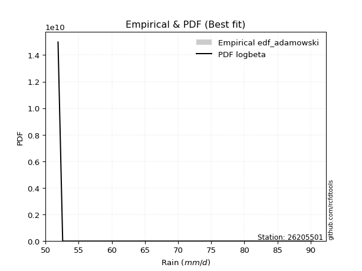</img>

</div>


## C. Best fit & Estimate extreme values for specific return periods - Tr

Best fit in probability distribution analysis means finding the theoretical distribution (like Normal, Poisson, Exponential) that most accurately mirrors your real-world data´s patterns (shape, center, spread) for better predictions, using methods like visual checks (Q-Q plots), goodness-of-fit tests (Kolmogorov-Smirnov, Chi-Squared), and information criteria (AIC) to score and select the simplest, most representative model.


### 1. Best fit (ordered by delta Δ)

<div align="center">

|   id |   station | empirical_dist   | p_dist       |    delta |   deltao | eval   |   fit |   n |   best_fit |   best_fit_sort |
|-----:|----------:|:-----------------|:-------------|---------:|---------:|:-------|------:|----:|-----------:|----------------:|
|    0 |  26205501 | edf_hazen        | invweibull   | 0.111787 | 0.484421 | Δo > Δ |     1 |   7 |          1 |               1 |
|    1 |  26205501 | edf_weibull      | halflogistic | 0.11321  | 0.484421 | Δo > Δ |     1 |   7 |          1 |               2 |
|    2 |  26205501 | edf_gringorten   | invweibull   | 0.114194 | 0.484421 | Δo > Δ |     1 |   7 |          1 |               3 |
|    3 |  26205501 | edf_cunnane      | invweibull   | 0.115755 | 0.484421 | Δo > Δ |     1 |   7 |          1 |               4 |
|    4 |  26205501 | edf_blom         | invweibull   | 0.116713 | 0.484421 | Δo > Δ |     1 |   7 |          1 |               5 |
|    5 |  26205501 | edf_tukey        | invweibull   | 0.11828  | 0.484421 | Δo > Δ |     1 |   7 |          1 |               6 |
|    6 |  26205501 | edf_filliben     | invweibull   | 0.118867 | 0.484421 | Δo > Δ |     1 |   7 |          1 |               7 |
|    7 |  26205501 | edf_jenkinson    | invweibull   | 0.119142 | 0.484421 | Δo > Δ |     1 |   7 |          1 |               8 |
|    8 |  26205501 | edf_beard        | invweibull   | 0.119142 | 0.484421 | Δo > Δ |     1 |   7 |          1 |               9 |
|    9 |  26205501 | edf_chegodayev   | invweibull   | 0.119509 | 0.484421 | Δo > Δ |     1 |   7 |          1 |              10 |
|   10 |  26205501 | edf_adamowski    | invweibull   | 0.12131  | 0.484421 | Δo > Δ |     1 |   7 |          1 |              11 |
|   11 |  26205501 | edf_california   | invweibull   | 0.137409 | 0.484421 | Δo > Δ |     1 |   7 |          1 |              12 |

</div>

:file_folder:Tables: [bestfit_26205501.csv](table/bestfit_26205501.csv) | [extreme_26205501.csv](table/extreme_26205501.csv)


### 2. Extreme values

In hydrology, a return period (or recurrence interval $Tr$) is the statistical average time between extreme events like floods or droughts of a specific magnitude, indicating how rare an event is, with a 100-year flood, for example, having a 1% chance of occurring in any given year, not that it happens exactly every century. It is a key tool for infrastructure design (like bridges or dams) and risk assessment, calculated from historical data to determine the probability of future events, although it is important to remember it is statistical average, and events can cluster or be missed.

> risk_rate: assuming the return period as the project useful life.

|   id |      tr |   prob_l |     prob_g |     alpha |   betaprime |     chi2 |   crystalball |   erlang |    expon |   exponnorm |           f |   fatiguelife |     fisk |    gamma |   genexpon |   genlogistic |   gibrat |   gompertz |   gumbel_l |   gumbel_r |   halflogistic |   halfnorm |   hypsecant |    invgamma |   invgauss |   invweibull |   johnsonsu |   kstwobign |   laplace |   laplace_asymmetric |   loggamma |   logistic |   lognorm |   maxwell |   mielke |    moyal |   nakagami |      ncf |      nct |     norm |   pearson3 |   rayleigh |     rice |        t |   truncnorm |     wald |   weibull_min |   logalpha |   logbetaprime |          logchi2 |   logcrystalball |   logerlang |   logexpon |   logexponnorm |              logf |   logfatiguelife |           logfisk |   loggenexpon |   loggenlogistic |   loggibrat |   loggompertz |   loggumbel_l |   loggumbel_r |   loghalflogistic |   loghalfnorm |   loghypsecant |   loginvgamma |   loginvgauss |   loginvweibull |   logjohnsonsu |   logkstwobign |   loglaplace |   loglaplace_asymmetric |   logloggamma |   loglogistic |    loglognorm |   logmaxwell |   logmielke |   logmoyal |   lognakagami |   logncf |   lognct |   logpearson3 |   lograyleigh |   logrice |     logt |   logtruncnorm |   logwald |   logweibull_min |   station |   n |   risk_rate |
|-----:|--------:|---------:|-----------:|----------:|------------:|---------:|--------------:|---------:|---------:|------------:|------------:|--------------:|---------:|---------:|-----------:|--------------:|---------:|-----------:|-----------:|-----------:|---------------:|-----------:|------------:|------------:|-----------:|-------------:|------------:|------------:|----------:|---------------------:|-----------:|-----------:|----------:|----------:|---------:|---------:|-----------:|---------:|---------:|---------:|-----------:|-----------:|---------:|---------:|------------:|---------:|--------------:|-----------:|---------------:|-----------------:|-----------------:|------------:|-----------:|---------------:|------------------:|-----------------:|------------------:|--------------:|-----------------:|------------:|--------------:|--------------:|--------------:|------------------:|--------------:|---------------:|--------------:|--------------:|----------------:|---------------:|---------------:|-------------:|------------------------:|--------------:|--------------:|--------------:|-------------:|------------:|-----------:|--------------:|---------:|---------:|--------------:|--------------:|----------:|---------:|---------------:|----------:|-----------------:|----------:|----:|------------:|
|    0 |    2    | 0.5      | 0.5        |   54.4418 |     60.8064 |  56.5852 |       61.9143 |  52.4717 |  58.8414 |     58.853  |     54.0474 |       51.9    |  58.9969 |  53.9943 |    58.8414 |       59.4195 |  58.0681 |    59.4087 |    64.0193 |    59.8093 |        58.7627 |    59.2914 |     61.9143 |     54.0473 |    54.0845 |      53.9946 |     51.973  |     60.5937 |   61.9143 |              58.8412 |    54.5604 |    61.9143 |   60.7747 |   60.8184 |  58.6847 |  59.1297 |    60.1359 |  60.5892 |  60.1048 |  61.9143 |    59.0589 |    60.4297 |  61.9832 |  60.0463 |     60.1669 |  57.7607 |       60.1382 |    59.8459 |        60.5894 |     80.2372      |          60.7747 |     52.0403 |    57.9011 |        57.8511 |     54.0671       |          51.9    |     59.1725       |       57.9011 |          58.6318 |     57.4731 |       60.6634 |       62.6618 |       58.9445 |           58.0552 |       58.5028 |        60.7747 |       60.3079 |       54.0884 |   54.0198       |  51.9          |        59.44   |      60.7747 |                 57.9005 |       60.7214 |       60.7747 |  51.9399      |      59.8149 |     55.8318 |    58.3655 |       52.4137 |  61.4621 |  60.6894 |       58.655  |       59.4782 |   60.6926 |  57.7041 |        61.3786 |   57.2164 |          57.3304 |  26205501 |   7 |    0.75     |
|    1 |    2.33 | 0.570815 | 0.429185   |   55.1965 |     62.8516 |  58.1396 |       64.2008 |  52.856  |  60.3708 |     60.3887 |     54.9469 |       52.1515 |  60.7308 |  54.83   |    60.3708 |       61.0623 |  59.2264 |    61.063  |    66.0086 |    61.928  |        60.9411 |    61.7592 |     63.7442 |     54.9468 |    54.9011 |      55.0568 |     52.0598 |     62.4473 |   63.298  |              60.3705 |    55.4801 |    63.9289 |   62.8272 |   63.194  |  60.2131 |  61.1353 |    62.1947 |  62.6152 |  62.0186 |  64.2008 |    61.2213 |    62.8404 |  63.983  |  62.3748 |     61.9264 |  59.26   |       63.2345 |    61.6721 |        62.5955 |     94.6446      |          62.8272 |     52.1931 |    59.3139 |        59.2535 |     54.9326       |          52.127  |     63.1855       |       59.3139 |          60.147  |     58.4481 |       62.3734 |       64.4989 |       60.7869 |           59.9217 |       60.638  |        62.4119 |       62.2869 |       54.8916 |   55.0101       |  51.9          |        61.1194 |      62.0087 |                 59.3132 |       62.791  |       62.5795 |  52.2159      |      61.915  |     56.8928 |    60.091  |       53.2301 |  67.0862 |  63.375  |       60.5692 |       61.5979 |   62.5164 |  59.184  |        63.4332 |   58.4761 |          59.542  |  26205501 |   7 |    0.729209 |
|    2 |    5    | 0.8      | 0.2        |   61.0488 |     71.1671 |  67.0002 |       72.6982 |  56.0244 |  68.0174 |     68.0669 |     65.5191 |       57.4926 |  67.9165 |  59.9725 |    68.0174 |       68.1992 |  65.8949 |    69.3346 |    72.4353 |    71.1328 |        70.798  |    72.1951 |     71.0844 |     65.5193 |    62.175  |      69.7975 |     54.8277 |     70.3209 |   70.2162 |              68.0169 |    61.0444 |    71.7076 |   71.0811 |   72.544  |  67.2875 |  70.4257 |    71.5605 |  70.8808 |  70.0836 |  72.6982 |    70.9801 |    72.4916 |  71.9892 |  71.2608 |     70.2132 |  67.6532 |       83.6733 |    69.3887 |        71.3421 |    255.61        |          71.0811 |     54.1049 |    66.9119 |        66.7915 |     65.0223       |          57.1903 |    133.188        |       66.912  |          67.1965 |     64.3918 |       70.0972 |       70.8102 |       69.483  |           69.1459 |       70.5635 |        69.4342 |       70.3862 |       62.0822 |   68.594        |  51.9165       |        68.7986 |      68.5641 |                 66.9104 |       71.091  |       70.0656 |   2.61889e+07 |      70.9221 |     63.3903 |    68.773  |       68.9109 |  93.9389 |  74.6973 |       69.7015 |       70.868  |   70.3835 |  65.5162 |        72.9211 |   66.0583 |          76.5906 |  26205501 |   7 |    0.67232  |
|    3 |   10    | 0.9      | 0.1        |   71.8008 |     77.3775 |  75.9363 |       78.3352 |  60.1203 |  74.9587 |     75.037  |     98.883  |       64.8674 |  73.7455 |  65.4575 |    74.9587 |       74.0118 |  73.4962 |    76.8432 |    76.0134 |    78.6299 |        78.9837 |    79.9174 |     76.9458 |     98.8863 |    75.4751 |     124.064  |     72.0558 |     76.3157 |   76.4964 |              74.9581 |    67.2362 |    77.4363 |   77.1464 |   79.1241 |  73.6163 |  78.5145 |    78.8088 |  77.0826 |  76.4159 |  78.3352 |    79.0472 |    79.373  |  77.6978 |  77.6327 |     76.6861 |  76.5603 |      108.303  |    75.4728 |        78.5174 |    725.123       |          77.1464 |     57.3611 |    74.6488 |        74.4616 |    103.553        |          64.9997 |   1029.36         |       74.6489 |          73.5441 |     71.9076 |       76.2164 |       74.5878 |       77.4773 |           77.8765 |       78.94   |        75.605  |       76.4855 |       76.3486 |  137.441        |  52.9708       |        75.2861 |      75.1131 |                 74.6464 |       77.1671 |       76.1455 | inf           |      78.0355 |     72.2725 |    77.3475 |      103.929  | 118.65   |  83.5609 |       78.0004 |       78.3182 |   76.5905 |  71.2674 |        79.6792 |   75.1828 |         103.981  |  26205501 |   7 |    0.651322 |
|    4 |   15    | 0.933333 | 0.0666667  |   82.5145 |     80.7085 |  81.3901 |       81.1482 |  62.8524 |  79.0192 |     79.1143 |    147.427  |       69.6906 |  77.1289 |  68.8765 |    79.0192 |       77.2912 |  78.7393 |    81.2355 |    77.6338 |    82.8597 |        83.616  |    83.9361 |     80.2909 |    147.437  |    87.055  |     210.084  |    104.686  |     79.4981 |   80.1701 |              79.0185 |    71.3235 |    80.5575 |   80.364  |   82.5002 |  77.4317 |  83.2088 |    82.6206 |  80.419  |  79.9255 |  81.1482 |    83.5734 |    82.9186 |  80.6391 |  81.0514 |     79.8542 |  82.2801 |      125.043  |    78.8555 |        82.6031 |   1383.53        |          80.3639 |     59.8242 |    79.5829 |        79.3503 |    191.708        |          70.6752 |  14051.2          |       79.583  |          77.3863 |     77.597  |       79.5032 |       76.3643 |       82.387  |           83.2971 |       83.6853 |        79.3694 |       79.7731 |       90.5698 |  370.785        |  61.095        |        78.9752 |      79.2302 |                 79.5798 |       80.3824 |       79.6774 | inf           |      81.9579 |     79.6872 |    82.8058 |      134.49   | 133.737  |  88.4538 |       83.0037 |       82.4575 |   79.9994 |  75.0227 |        82.6369 |   81.6963 |         128.106  |  26205501 |   7 |    0.644736 |
|    5 |   20    | 0.95     | 0.05       |   93.2188 |     82.9797 |  85.3328 |       82.9903 |  64.9006 |  81.9001 |     82.0071 |    209.518  |       73.2616 |  79.5576 |  71.3705 |    81.9001 |       79.5873 |  82.852  |    84.3519 |    78.6424 |    85.8214 |        86.8616 |    86.6154 |     82.6507 |    209.539  |    97.1179 |     325.856  |    151.059  |     81.642  |   82.7766 |              81.8993 |    74.4335 |    82.7148 |   82.5435 |   84.7409 |  80.2145 |  86.5334 |    85.1693 |  82.6979 |  82.3647 |  82.9903 |    86.7227 |    85.2753 |  82.5941 |  83.4016 |     81.7902 |  86.5425 |      137.887  |    81.2113 |        85.4868 |   2213.79        |          82.5434 |     61.7971 |    83.2803 |        83.0124 |    401.795        |          75.1942 | 296009            |       83.2804 |          80.1953 |     82.3731 |       81.7267 |       77.4914 |       86.0087 |           87.3182 |       87.0065 |        82.1372 |       82.0206 |      104.627  | 1291.52         |  98.0298       |        81.5617 |      82.2876 |                 83.2767 |       82.5572 |       82.2138 | inf           |      84.6693 |     86.4267 |    86.9029 |      161.1    | 144.812  |  91.8443 |       86.6458 |       85.3292 |   82.3487 |  77.9615 |        84.3093 |   86.9144 |         150.397  |  26205501 |   7 |    0.641514 |
|    6 |   25    | 0.96     | 0.04       |  103.919  |     84.6988 |  88.4257 |       84.3464 |  66.5414 |  84.1347 |     84.251  |    284.124  |       76.0989 |  81.4669 |  73.3373 |    84.1347 |       81.3559 |  86.2806 |    86.7691 |    79.3602 |    88.1026 |        89.3622 |    88.6089 |     84.4769 |    284.159  |   105.992  |     470.079  |    209.624  |     83.2478 |   84.7984 |              84.1339 |    76.9683 |    84.3652 |   84.1855 |   86.4043 |  82.4228 |  89.1103 |    87.0678 |  84.425  |  84.2365 |  84.3464 |    89.1359 |    87.0263 |  84.0466 |  85.1965 |     83.1099 |  89.9565 |      148.378  |    83.0217 |        87.7236 |   3205.48        |          84.1855 |     63.4511 |    86.2661 |        85.9689 |    938.61         |          78.9898 |      8.9567e+06   |       86.2662 |          82.4283 |     86.5787 |       83.3959 |       78.3036 |       88.9065 |           90.5482 |       89.5628 |        84.3453 |       83.7251 |      118.551  | 5663.55         | 293.207        |        83.5544 |      84.7401 |                 86.2621 |       84.1941 |       84.2085 | inf           |      86.7401 |     92.7763 |    90.2175 |      184.773  | 153.638  |  94.4397 |       89.5308 |       87.5273 |   84.1387 |  80.4373 |        85.3869 |   91.3333 |         171.487  |  26205501 |   7 |    0.639603 |
|    7 |   50    | 0.98     | 0.02       |  157.405  |     89.8551 |  98.1899 |       88.2296 |  71.8719 |  91.0761 |     91.2211 |    823.834  |       85.2022 |  87.5886 |  79.5922 |    91.0761 |       86.8041 |  98.3666 |    94.2778 |    81.3086 |    95.13   |        97.0668 |    94.4033 |     90.1392 |    823.997  |   139.362  |    1590.39   |    647.703  |     87.9633 |   91.0785 |              91.0751 |    85.5538 |    89.4075 |   89.0707 |   91.2286 |  89.5978 |  97.1101 |    92.5911 |  89.6161 |  89.9833 |  88.2296 |    96.4983 |    92.109  |  88.2631 |  90.6934 |     86.2434 | 101.103  |      183.77   |    88.5958 |        94.7177 |  10377.4         |          89.0707 |     69.2612 |    96.2408 |        95.8413 | 247617            |          92.5101 |      1.48705e+16  |       96.241  |          89.7055 |    103.191  |       88.3099 |       80.5514 |       98.4614 |          101.271  |       97.4276 |        91.576  |       88.8527 |      187.288  |    1.77472e+08  |   9.04492e+14  |        89.6918 |      92.8341 |                 96.2354 |       89.0556 |       90.6078 | inf           |      93.0367 |    122.045  |   101.335  |      277.129  | 182.527  | 102.372  |       98.8698 |       94.2342 |   89.5584 |  89.5613 |        87.7374 |  107.387  |         267.252  |  26205501 |   7 |    0.63583  |
|    8 |   75    | 0.986667 | 0.0133333  |  210.883  |     92.7718 | 103.99   |       90.3133 |  75.1212 |  95.1366 |     95.2984 |   1609.18   |       90.6847 |  91.3314 |  83.3333 |    95.1365 |       89.9708 | 106.53   |    98.67   |    82.2938 |    99.2145 |       101.545  |    97.5575 |     93.4481 |   1609.56   |   162.715  |    3332.01   |   1267.56   |     90.5577 |   94.7522 |              95.1354 |    91.1025 |    92.3197 |   91.8078 |   93.8515 |  94.0402 | 101.788  |    95.5981 |  92.5597 |  93.3239 |  90.3133 |   100.729  |    94.8742 |  90.557  |  93.8987 |     87.485  | 107.963  |      206.345  |    91.8472 |        98.869  |  20924.9         |          91.8078 |     73.1311 |   102.602  |       102.134  |      3.97133e+08  |         101.745  |      5.05991e+27  |      102.602  |          94.227  |    116.179  |       91.0184 |       81.7125 |      104.48   |          108.078  |      101.995  |        96.0851 |       91.7631 |      255.955  |    3.75061e+14  |   2.64412e+63  |        93.2588 |      97.9227 |                102.596  |       91.7739 |       94.5231 | inf           |      96.6498 |    150.176  |   108.46   |      346.08   | 200.562  | 106.955  |      104.627  |       98.0964 |   92.6521 |  96.2291 |        88.5867 |  118.638  |         354.913  |  26205501 |   7 |    0.634587 |
|    9 |  100    | 0.99     | 0.01       |  264.36   |     94.8071 | 108.138  |       91.7225 |  77.4739 |  98.0175 |     98.1912 |   2613.68   |       94.6295 |  94.0696 |  86.0174 |    98.0175 |       92.212  | 112.853  |   101.786  |    82.9383 |   102.105  |       104.715  |    99.7062 |     95.7953 |   2614.38   |   180.853  |    5657.08   |   2021.08   |     92.3352 |   97.3587 |              98.0163 |    95.2902 |    94.3758 |   93.7066 |   95.638  |  97.3118 | 105.107  |    97.646  |  94.6168 |  95.6939 |  91.7225 |   103.702  |    96.7581 |  92.1198 |  96.1849 |     88.154  | 112.964  |      223.164  |    94.1592 |       101.852  |  34592.9         |          93.7066 |     76.0919 |   107.369  |       106.847  |      2.81754e+12  |         108.956  |      1.08534e+41  |      107.369  |          97.5642 |    127.354  |       92.8751 |       82.481  |      108.961  |          113.171  |      105.229  |        99.4177 |       93.798  |      325.301  |    3.00818e+22  |   2.91816e+176 |        95.7842 |     101.701  |                107.362  |       93.6574 |       97.3888 | inf           |      99.1908 |    178.613  |   113.817  |      402.599  | 213.914  | 110.194  |      108.857  |      100.818  |   94.8207 | 101.751  |        89.0252 |  127.577  |         438.556  |  26205501 |   7 |    0.633968 |
|   10 |  200    | 0.995    | 0.005      |  478.261  |     99.6202 | 118.223  |       94.9192 |  83.2752 | 104.959  |    105.161  |   8549.4    |      104.286  | 100.977  |  92.5691 |   104.959  |       97.6002 | 130.057  |   109.295  |    84.339  |   109.055  |       112.336  |   104.621  |    101.45   |   8552.25   |   229.358  |   20376.3    |   5932.75   |     96.4294 |  103.639  |             104.957  |   106.295  |    99.3081 |   98.1605 |   99.7254 | 105.633  | 113.104  |   102.326  |  99.4912 | 101.428  |  94.9192 |   110.785  |   101.069  |  95.6956 | 101.778  |     89.2279 | 125.421  |      266.307  |    99.7718 |       109.193  | 117849           |          98.1605 |     83.9885 |   119.784  |       119.117  |      1.02945e+33  |         128.835  |      7.63776e+107 |      119.784  |         106.079  |    163.502  |       97.1516 |       84.1765 |      120.536  |          126.419  |      113.016  |       107.929  |       98.6225 |      612.454  |    2.57345e+67  | inf            |       101.864  |     111.415  |                119.775  |       98.068  |      104.622  | inf           |     105.258  |    303.433  |   127.836  |      568.246  | 248.13   | 117.984  |      119.58   |      107.332  |   99.9757 | 118.709  |        89.7012 |  152.883  |         755.416  |  26205501 |   7 |    0.633042 |
|   11 |  250    | 0.996    | 0.004      |  585.21   |    101.148  | 121.493  |       95.8961 |  85.1769 | 107.193  |    107.405  |  12552.1    |      107.433  | 103.3    |  94.7001 |   107.193  |       99.3325 | 136.23   |   111.712  |    84.7512 |   111.29   |       114.786  |   106.133  |    103.27   |  12556.6    |   246.277  |   30803.2    |   8267.61   |     97.6965 |  105.661  |             107.192  |   110.131  |   100.892  |   99.5634 |  100.984  | 108.452  | 115.678  |   103.765  | 101.041  | 103.286  |  95.8961 |   113.044  |   102.395  |  96.7964 | 103.614  |     89.4539 | 129.542  |      280.959  |   101.597  |       111.61   | 175522           |          99.5633 |     86.7699 |   124.078  |       123.36   |      7.59274e+45  |         136.068  |      5.74074e+147 |      124.079  |         108.971  |    178.837  |       98.4746 |       84.682  |      124.512  |          130.999  |      115.525  |       110.82   |      100.157  |      762.088  |    7.12221e+96  | inf            |       103.823  |     114.736  |                124.068  |       99.4552 |      107.057  | inf           |     107.2    |    374.895  |   132.707  |      631.463  | 259.8    | 120.494  |      123.203  |      109.421  |  101.618  | 125.605  |        89.8391 |  162.314  |         908.88   |  26205501 |   7 |    0.632858 |
|   12 |  500    | 0.998    | 0.002      | 1119.96   |    105.841  | 131.714  |       98.7931 |  91.1713 | 114.135  |    114.375  |  41508.4    |      117.305  | 110.851  | 101.376  |   114.135  |      104.709  | 157.563  |   119.221  |    85.9326 |   118.225  |       122.391  |   110.64   |    108.924  |  41525.7    |   302.339  |  111243      |  22195.7    |    101.494  |  111.941  |             114.133  |   123.033  |   105.802  |  103.843  |  104.738  | 117.672  | 123.674  |   108.052  | 105.812  | 109.115  |  98.7931 |   120.007  |   106.354  | 100.081  | 109.462  |     89.9183 | 142.646  |      328.75   |   107.339  |       119.305  | 610865           |         103.843  |     96.2048 |   138.425  |       137.526  |      2.72445e+130 |         161.498  |    inf            |      138.425  |         118.459  |    243.788  |      102.437  |       86.1478 |      137.709  |          146.299  |      123.343  |       120.307  |      104.883  |     1564.12   |    9.32892e+301 | inf            |       109.921  |     125.695  |                138.413  |      103.68   |      114.972  | inf           |     113.209  |    852.325  |   149.052  |      863.301  | 298.243  | 128.32   |      135.031  |      115.898  |  106.681  | 153.555  |        90.1178 |  196.347  |        1662.82   |  26205501 |   7 |    0.632489 |
|   13 |  750    | 0.998667 | 0.00133333 | 1654.7    |    108.559  | 137.73   |      100.402  |  94.7305 | 118.195  |    118.453  |  83643.2    |      123.137  | 115.514  | 105.315  |   118.195  |      107.852  | 171.671  |   123.613  |    86.5641 |   122.279  |       126.836  |   113.159  |    112.232  |  83681.2    |   337.317  |  235772      |  38463.3    |    103.627  |  115.615  |             118.194  |   131.324  |   108.671  |  106.299  |  106.838  | 123.41   | 128.352  |   110.444  | 108.58   | 112.571  | 100.402  |   124.046  |   108.568  | 101.917  | 113.002  |     90.0769 | 150.503  |      358.257  |   110.759  |       123.951  |      1.27449e+06 |         106.299  |    102.317  |   147.575  |       146.555  |      2.31056e+242 |         178.704  |    inf            |      147.575  |         124.385  |    299.225  |      104.66   |       86.9417 |      146.062  |          156.058  |      127.939  |       126.228  |      107.626  |     2442.04   |  inf            | inf            |       113.503  |     132.585  |                147.561  |      106.101  |      119.865  | inf           |     116.715  |   1589.33   |   159.531  |     1026.84   | 322.368  | 132.928  |      142.377  |      119.686  |  109.622  | 176.328  |        90.2115 |  220.085  |        2415.77   |  26205501 |   7 |    0.632366 |
|   14 | 1000    | 0.999    | 0.001      | 2189.45   |    110.478  | 142.013  |      101.51   |  97.2762 | 121.076  |    121.345  | 137537      |      127.298  | 118.94   | 108.124  |   121.076  |      110.082  | 182.467  |   126.73   |    86.9891 |   125.155  |       129.989  |   114.898  |    114.579  | 137603      |   362.996  |  401724      |  56176.7    |    105.105  |  118.221  |             121.074  |   137.566  |   110.706  |  108.023  |  108.289  | 127.644  | 131.67   |   112.095  | 110.537  | 115.049  | 101.51   |   126.898  |   110.098  | 103.186  | 115.577  |     90.157  | 156.155  |      379.868  |   113.217  |       127.318  |      2.15253e+06 |         108.023  |    106.937  |   154.431  |       153.319  |    inf            |         192.086  |    inf            |      154.431  |         128.766  |    350.021  |      106.199  |       87.48   |      152.292  |          163.373  |      131.212  |       130.605  |      109.565  |     3383.01   |  inf            | inf            |       116.053  |     137.701  |                154.416  |      107.799  |      123.461  | inf           |     119.202  |   2677.39   |   167.411  |     1156.93   | 340.264  | 136.214  |      147.792  |      122.375  |  111.701  | 196.617  |        90.2586 |  238.915  |        3176.55   |  26205501 |   7 |    0.632305 |

<div align="center">

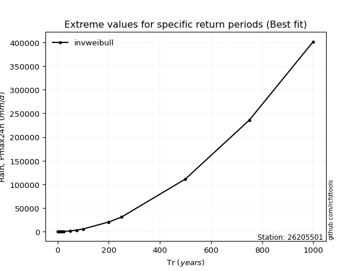</img>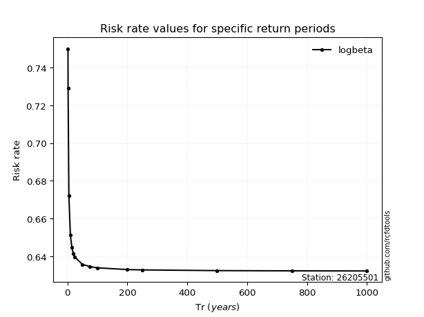</img>

</div>


<sub>**APP DISCLAIMER**: NO WARRANTY - This software is provided by [github.com/rcfdtools](https://github.com/rcfdtools) "as is", without any express or implied warranty, including warranties of merchantability, fitness for a particular purpose, or non-infringement. There is no guarantee that the software will be error-free or operate without interruption. LIMITATION OF LIABILITY - Neither the authors nor copyright holders will be liable for claims or damages arising from the software or its use. You are responsible for determining if the software is appropriate for your use and assume all associated risks, including errors, legal compliance, and data loss. NO PROFESSIONAL ADVICE - The software provides general information and does not offer professional advice. It should not replace consultation with professional advisors.</sub>