<div align="center">


</div>

# Station (rain, Pmax24h): 26207080

Probable Maximum Precipitation (PMP) is the greatest amount of rainfall for a specific duration that is meteorologically possible for a given location, acting as a "worst-case" scenario for extreme storms, crucial for designing safety-critical infrastructure like bridges, river deviations, dams, spillways, and nuclear plants to prevent catastrophic failure. PMP is calculated by hydrologists using meteorological data to determine the upper limit of extreme rainfall, often leading to the Probable Maximum Flood (PMF) for flood control design, and is increasingly being studied for climate change impacts.

<div align="center">

</img>

</div>


## A. General information


### 1. General running parameters

• app_version: _v20251225_. • runtime: _2025-12-26 14:29:50.888910_. • Python version: _3.14.0_. • SciPy version: _1.16.3_. • Pandas version: _2.3.3_. • NumPy version: _2.3.5_. • Stations dataset (station_dataset_file): _dataset/pmax24h_in/automatic_colombia.csv_. • Stations catalog (station_catalog_file): _dataset/CNE_IDEAM.xls_. • Plot only fit distributions with Δo > Δ (plot_only_fit): _True_. • Eval low extreme values, if False, evaluates high extreme values (low_extreme): _False_. • Eval every SciPy distribution as logarithmic (pdist_logarithmic_on): _True_. • Standard deviation normalized (ddof): _1.0_. • Return periods to eval in years (Tr): _[2, 2.33, 5, 10, 15, 20, 25, 50, 75, 100, 200, 250, 500, 750, 1000]_. • Minimum data sample per station, 0 means any (minimum_sample): _5_. • Z-Score threshold to adjust a value, 0 means disable (zscore): _3.5_. • Avoid zeros, e.g. rain = 0 (avoid_zeros): _True_. • Avoid null values (avoid_nans): _True_. [:file_folder:Dataset file.](../../dataset/pmax24h_in/automatic_colombia.csv)


### 2. Station info and location

|   id |   CODIGO | NOMBRE               | CATEGORIA    | TECNOLOGIA                | ESTADO   | FECHA_INSTALACION   |   FECHA_SUSPENSION |   ALTITUD |   LATITUD |   LONGITUD | DEPARTAMENTO   | MUNICIPIO   | AREA_OPERATIVA                      | ENTIDAD                                                     | AREA_HIDROGRAFICA   | ZONA_HIDROGRAFICA   | SUBZONA_HIDROGRAFICA                                   | CORRIENTE   | OBSERVACION                                                                                                                                                    | SUBRED                                        | Catalogo   |
|-----:|---------:|:---------------------|:-------------|:--------------------------|:---------|:--------------------|-------------------:|----------:|----------:|-----------:|:---------------|:------------|:------------------------------------|:------------------------------------------------------------|:--------------------|:--------------------|:-------------------------------------------------------|:------------|:---------------------------------------------------------------------------------------------------------------------------------------------------------------|:----------------------------------------------|:-----------|
|    0 | 26207080 | BOLOMBOLO [26207080] | Limnigráfica | Automática con Telemetría | Activa   | 15/10/1971          |                nan |      1750 |      5.97 |     -75.84 | Antioquia      | Venecia     | Area Operativa 01 - Antioquia-Chocó | INSTITUTO DE HIDROLOGIA METEOROLOGIA Y ESTUDIOS AMBIENTALES | Magdalena Cauca     | Cauca               | Directos Río Cauca  entre Río San Juan y  Pto Valdivia | Cauca       | ESTACIÓN ACTIVADA NUEVAMENTE EN SU COMPONENTE CONVENCIONAL POR SOLICITUD DEL AO. (11012023) ESTACIÓN YA CUENTA CON OBSERVADOR Y PERTENECE A LA RED DE ALERTAS. | Zona cafetera,RED ALERTAS - AREA OPERATIVA 01 | CNE_IDEAM  |

<div align="center">

Map location in: [:earth_americas:Google](http://maps.google.com/maps?q=5.97,-75.84) [:earth_americas:OSM](https://www.openstreetmap.org/#map=18/5.97/-75.84&layers=P) [:earth_americas:Bing](https://www.bing.com/maps?cp=5.97~-75.84&lvl=18) [:earth_americas:Apple](https://maps.apple.com/frame?center=5.97%2C-75.84&span=0.003%2C0.006)

</div>


<div align="center">

```geojson
{
  "type": "Feature",
  "geometry": {
    "type": "Point", 
    "coordinates": [-75.84, 5.97]
  }, 
  "properties": {
    "Name": "26207080"
  }
}
```

</div>


### 3. Discrete values table and plot

|               |           0 |           1 |          2 |           3 |           4 |          5 |           6 |           7 |           8 |
|:--------------|------------:|------------:|-----------:|------------:|------------:|-----------:|------------:|------------:|------------:|
| Date          | 2017        | 2018        | 2019       | 2020        | 2021        | 2022       | 2023        | 2024        | 2025        |
| Value         |   59.1      |   62.4      |  717.9     |  291.1      |  290.9      |   20.7     |   45        |  391        |  504        |
| Value_initial |   59.1      |   62.4      |  717.9     |  291.1      |  290.9      |   20.7     |   45        |  391        |  504        |
| count         |    9        |    9        |    9       |    9        |    9        |    9       |    9        |    9        |    9        |
| mean          |  264.678    |  264.678    |  264.678   |  264.678    |  264.678    |  264.678   |  264.678    |  264.678    |  264.678    |
| std           |  242.639    |  242.639    |  242.639   |  242.639    |  242.639    |  242.639   |  242.639    |  242.639    |  242.639    |
| zscore        |   -0.847257 |   -0.833656 |    1.86788 |    0.108895 |    0.108071 |   -1.00552 |   -0.905368 |    0.520617 |    0.986329 |

<div align="center">

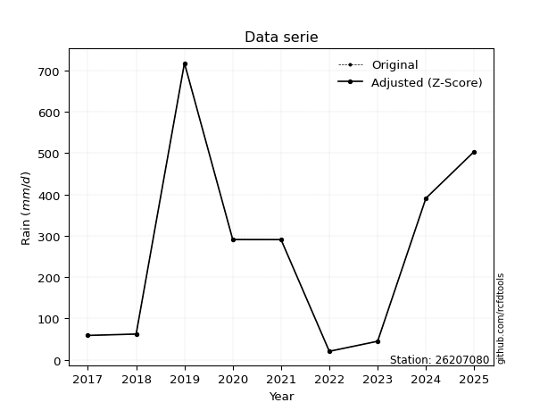</img>

</div>

> If Z-Score is active, values out of range or outliers are replaced with the station mean value.


### 4. Active continuous probability distributions from SciPy (45 of 104 available)

[scipy.stats](https://docs.scipy.org/doc/scipy/reference/stats.html) is a Python´s powerful submodule within the SciPy library for comprehensive statistical analysis, offering over 130 probability distributions (like Normal, Poisson), functions for descriptive stats (mean, variance), hypothesis testing (t-tests, chi-square), random variable generation, and statistical tests, making it essential for data science, modeling, and research. It provides tools to explore, model, and draw conclusions from data efficiently, working seamlessly with NumPy.

<div align="center">

|   id | p_dist             |   n_parameter | fit_method   | label                                                                       | active   | ref                                                                                                        |
|-----:|:-------------------|--------------:|:-------------|:----------------------------------------------------------------------------|:---------|:-----------------------------------------------------------------------------------------------------------|
|    0 | alpha              |             3 | MLE          | Alpha                                                                       | True     | [:mortar_board:](https://docs.scipy.org/doc/scipy/reference/generated/scipy.stats.alpha.html)              |
|    1 | betaprime          |             4 | MLE          | Beta prime                                                                  | True     | [:mortar_board:](https://docs.scipy.org/doc/scipy/reference/generated/scipy.stats.betaprime.html)          |
|    2 | chi2               |             3 | MLE          | Chi²                                                                        | True     | [:mortar_board:](https://docs.scipy.org/doc/scipy/reference/generated/scipy.stats.chi2.html)               |
|    3 | crystalball        |             4 | MLE          | Crystalball                                                                 | True     | [:mortar_board:](https://docs.scipy.org/doc/scipy/reference/generated/scipy.stats.crystalball.html)        |
|    4 | erlang             |             3 | MLE          | Erlang                                                                      | True     | [:mortar_board:](https://docs.scipy.org/doc/scipy/reference/generated/scipy.stats.erlang.html)             |
|    5 | expon              |             2 | MLE          | Exponential                                                                 | True     | [:mortar_board:](https://docs.scipy.org/doc/scipy/reference/generated/scipy.stats.expon.html)              |
|    6 | exponnorm          |             3 | MLE          | Exponentially modified Normal                                               | True     | [:mortar_board:](https://docs.scipy.org/doc/scipy/reference/generated/scipy.stats.exponnorm.html)          |
|    7 | f                  |             4 | MLE          | F                                                                           | True     | [:mortar_board:](https://docs.scipy.org/doc/scipy/reference/generated/scipy.stats.f.html)                  |
|    8 | fatiguelife        |             3 | MLE          | Fatigue-life (Birnbaum-Saunders)                                            | True     | [:mortar_board:](https://docs.scipy.org/doc/scipy/reference/generated/scipy.stats.fatiguelife.html)        |
|    9 | fisk               |             3 | MLE          | Fisk                                                                        | True     | [:mortar_board:](https://docs.scipy.org/doc/scipy/reference/generated/scipy.stats.fisk.html)               |
|   10 | gamma              |             3 | MLE          | Gamma                                                                       | True     | [:mortar_board:](https://docs.scipy.org/doc/scipy/reference/generated/scipy.stats.gamma.html)              |
|   11 | genexpon           |             5 | MLE          | Generalized exponential                                                     | True     | [:mortar_board:](https://docs.scipy.org/doc/scipy/reference/generated/scipy.stats.genexpon.html)           |
|   12 | genlogistic        |             3 | MLE          | Generalized logistic                                                        | True     | [:mortar_board:](https://docs.scipy.org/doc/scipy/reference/generated/scipy.stats.genlogistic.html)        |
|   13 | gibrat             |             2 | MM           | Gibrat                                                                      | True     | [:mortar_board:](https://docs.scipy.org/doc/scipy/reference/generated/scipy.stats.gibrat.html)             |
|   14 | gompertz           |             3 | MLE          | Gompertz (or truncated Gumbel)                                              | True     | [:mortar_board:](https://docs.scipy.org/doc/scipy/reference/generated/scipy.stats.gompertz.html)           |
|   15 | gumbel_l           |             2 | MM           | Gumbel Left Skew                                                            | True     | [:mortar_board:](https://docs.scipy.org/doc/scipy/reference/generated/scipy.stats.gumbel_l.html)           |
|   16 | gumbel_r           |             2 | MM           | Gumbel Right Skew                                                           | True     | [:mortar_board:](https://docs.scipy.org/doc/scipy/reference/generated/scipy.stats.gumbel_r.html)           |
|   17 | halflogistic       |             2 | MM           | Half-logistic                                                               | True     | [:mortar_board:](https://docs.scipy.org/doc/scipy/reference/generated/scipy.stats.halflogistic.html)       |
|   18 | halfnorm           |             2 | MM           | Half Normal                                                                 | True     | [:mortar_board:](https://docs.scipy.org/doc/scipy/reference/generated/scipy.stats.halfnorm.html)           |
|   19 | hypsecant          |             2 | MM           | hyperbolic secant                                                           | True     | [:mortar_board:](https://docs.scipy.org/doc/scipy/reference/generated/scipy.stats.hypsecant.html)          |
|   20 | invgamma           |             3 | MLE          | Inverted gamma                                                              | True     | [:mortar_board:](https://docs.scipy.org/doc/scipy/reference/generated/scipy.stats.invgamma.html)           |
|   21 | invgauss           |             3 | MLE          | Inverse Gaussian                                                            | True     | [:mortar_board:](https://docs.scipy.org/doc/scipy/reference/generated/scipy.stats.invgauss.html)           |
|   22 | invweibull         |             3 | MLE          | Inverted Weibull                                                            | True     | [:mortar_board:](https://docs.scipy.org/doc/scipy/reference/generated/scipy.stats.invweibull.html)         |
|   23 | johnsonsu          |             4 | MLE          | Johnson Su                                                                  | True     | [:mortar_board:](https://docs.scipy.org/doc/scipy/reference/generated/scipy.stats.johnsonsu.html)          |
|   24 | kstwobign          |             2 | MLE          | Limiting distribution of scaled Kolmogorov-Smirnov two-sided test statistic | True     | [:mortar_board:](https://docs.scipy.org/doc/scipy/reference/generated/scipy.stats.kstwobign.html)          |
|   25 | laplace            |             2 | MM           | Laplace                                                                     | True     | [:mortar_board:](https://docs.scipy.org/doc/scipy/reference/generated/scipy.stats.laplace.html)            |
|   26 | laplace_asymmetric |             3 | MLE          | Asymmetric Laplace                                                          | True     | [:mortar_board:](https://docs.scipy.org/doc/scipy/reference/generated/scipy.stats.laplace_asymmetric.html) |
|   27 | loggamma           |             3 | MLE          | Log gamma                                                                   | True     | [:mortar_board:](https://docs.scipy.org/doc/scipy/reference/generated/scipy.stats.loggamma.html)           |
|   28 | logistic           |             2 | MM           | Logistic (or Sech-squared)                                                  | True     | [:mortar_board:](https://docs.scipy.org/doc/scipy/reference/generated/scipy.stats.logistic.html)           |
|   29 | lognorm            |             3 | MLE          | Log Normal                                                                  | True     | [:mortar_board:](https://docs.scipy.org/doc/scipy/reference/generated/scipy.stats.lognorm.html)            |
|   30 | maxwell            |             2 | MM           | Maxwell                                                                     | True     | [:mortar_board:](https://docs.scipy.org/doc/scipy/reference/generated/scipy.stats.maxwell.html)            |
|   31 | mielke             |             4 | MLE          | Mielke Beta-Kappa / Dagum                                                   | True     | [:mortar_board:](https://docs.scipy.org/doc/scipy/reference/generated/scipy.stats.mielke.html)             |
|   32 | moyal              |             2 | MM           | Moyal                                                                       | True     | [:mortar_board:](https://docs.scipy.org/doc/scipy/reference/generated/scipy.stats.moyal.html)              |
|   33 | nakagami           |             3 | MLE          | Nakagami                                                                    | True     | [:mortar_board:](https://docs.scipy.org/doc/scipy/reference/generated/scipy.stats.nakagami.html)           |
|   34 | ncf                |             5 | MLE          | Non-central F distribution                                                  | True     | [:mortar_board:](https://docs.scipy.org/doc/scipy/reference/generated/scipy.stats.ncf.html)                |
|   35 | nct                |             4 | MLE          | Non-central Student’s t                                                     | True     | [:mortar_board:](https://docs.scipy.org/doc/scipy/reference/generated/scipy.stats.nct.html)                |
|   36 | norm               |             2 | MM           | Normal                                                                      | True     | [:mortar_board:](https://docs.scipy.org/doc/scipy/reference/generated/scipy.stats.norm.html)               |
|   37 | pareto             |             3 | MLE          | Pareto                                                                      | True     | [:mortar_board:](https://docs.scipy.org/doc/scipy/reference/generated/scipy.stats.pareto.html)             |
|   38 | pearson3           |             3 | MM           | Pearson type III                                                            | True     | [:mortar_board:](https://docs.scipy.org/doc/scipy/reference/generated/scipy.stats.pearson3.html)           |
|   39 | rayleigh           |             2 | MM           | Rayleigh                                                                    | True     | [:mortar_board:](https://docs.scipy.org/doc/scipy/reference/generated/scipy.stats.rayleigh.html)           |
|   40 | rice               |             3 | MLE          | Rice                                                                        | True     | [:mortar_board:](https://docs.scipy.org/doc/scipy/reference/generated/scipy.stats.rice.html)               |
|   41 | t                  |             3 | MLE          | Student’s t                                                                 | True     | [:mortar_board:](https://docs.scipy.org/doc/scipy/reference/generated/scipy.stats.t.html)                  |
|   42 | truncnorm          |             4 | MLE          | Truncated normal                                                            | True     | [:mortar_board:](https://docs.scipy.org/doc/scipy/reference/generated/scipy.stats.truncnorm.html)          |
|   43 | wald               |             2 | MM           | Wald                                                                        | True     | [:mortar_board:](https://docs.scipy.org/doc/scipy/reference/generated/scipy.stats.wald.html)               |
|   44 | weibull_min        |             3 | MLE          | Weibull minimum                                                             | True     | [:mortar_board:](https://docs.scipy.org/doc/scipy/reference/generated/scipy.stats.weibull_min.html)        |

</div>

> **n_parameter:** # arguments & localization & scale.
>
> **Fit methods:** (MLE) maximum likelihood, (MM) L-moments.
>
>**Inactive:** foldnorm, gennorm, norminvgauss, powernorm, powerlognorm, skewnorm, genextreme, anglit, arcsine, argus, beta, bradford, burr, burr12, cauchy, cosine, halfcauchy, foldcauchy, skewcauchy, wrapcauchy, dgamma, gengamma, exponweib, exponpow, truncexpon, gausshyper, genhalflogistic, genhyperbolic, geninvgauss, halfgennorm, johnsonsb, kappa4, kappa3, ksone, kstwo, loglaplace, levy, levy_l, levy_stable, ncx2, genpareto, truncpareto, lomax, powerlaw, rdist, rel_breitwigner, recipinvgauss, semicircular, studentized_range, trapezoid, triang, truncweibull_min, tukeylambda, uniform, loguniform, vonmises, vonmises_line, weibull_max, dweibull, 


## B. Probability distributions vs. Empirical distributions

A continuous probability distribution (CPD) describes probabilities for variables that can take any value within a range (like rain any time), unlike discrete variables with specific outcomes (like temperature). It uses a Probability Density Function (PDF), a curve where the total area under it equals 1, and the probability of the variable falling within an interval (a to b) is found by calculating the area under the curve between those points. A key feature is that the probability of hitting any single exact value is zero, so probabilities are always expressed for ranges, e.g., $P(a ≤ X ≤ b)$.

<div align="center">

Distributions parameters
|    |   station | p_dist                |   n |              loc |          scale | shape                  | shape1             | shape2                 | shape3   |
|---:|----------:|:----------------------|----:|-----------------:|---------------:|:-----------------------|:-------------------|:-----------------------|:---------|
|  0 |  26207080 | alpha                 |   9 |     -0.135688    |   51.7139      | 1.5041909852708974e-11 |                    |                        |          |
|  1 |  26207080 | betaprime             |   9 |     -5.13736     | 1393.75        | 1.1576012670197207     | 6.863331406946649  |                        |          |
|  2 |  26207080 | chi2                  |   9 |     20.7         |  160.487       | 1.0835596810379728     |                    |                        |          |
|  3 |  26207080 | crystalball           |   9 |     -0.220151    |  349.929       | 4.523539958890647      | 2.2804580795425755 |                        |          |
|  4 |  26207080 | erlang                |   9 |     20.7         |  322.803       | 0.5220214804073048     |                    |                        |          |
|  5 |  26207080 | expon                 |   9 |     20.7         |  243.978       |                        |                    |                        |          |
|  6 |  26207080 | exponnorm             |   9 |     20.2407      |    0.134063    | 1817.8760515670106     |                    |                        |          |
|  7 |  26207080 | f                     |   9 |     -0.860679    |  249.133       | 2.0335517130285385     | 110.7304728258755  |                        |          |
|  8 |  26207080 | fatiguelife           |   9 |     20.7         |    0.0831556   | 52.69079446518123      |                    |                        |          |
|  9 |  26207080 | fisk                  |   9 |     20.7         |   90.5492      | 0.9601461674297453     |                    |                        |          |
| 10 |  26207080 | gamma                 |   9 |     20.7         |  377.469       | 0.19268422756954173    |                    |                        |          |
| 11 |  26207080 | genexpon              |   9 |     20.6988      |   69.0593      | 0.26409989923905586    | 5.4250472168114925 | 0.0010545673381714788  |          |
| 12 |  26207080 | genlogistic           |   9 |  -1052.82        |  174.048       | 1052.806858158492      |                    |                        |          |
| 13 |  26207080 | gibrat                |   9 |     90.1608      |  105.85        |                        |                    |                        |          |
| 14 |  26207080 | gompertz              |   9 |     20.7         | 2082.88        | 7.620694568350322      |                    |                        |          |
| 15 |  26207080 | gumbel_l              |   9 |    367.633       |  178.365       |                        |                    |                        |          |
| 16 |  26207080 | gumbel_r              |   9 |    161.722       |  178.365       |                        |                    |                        |          |
| 17 |  26207080 | halflogistic          |   9 |     -6.45895     |  195.584       |                        |                    |                        |          |
| 18 |  26207080 | halfnorm              |   9 |    -38.1141      |  379.493       |                        |                    |                        |          |
| 19 |  26207080 | hypsecant             |   9 |    264.678       |  145.635       |                        |                    |                        |          |
| 20 |  26207080 | invgamma              |   9 |    -12.9897      |  115.172       | 1.1059107501294552     |                    |                        |          |
| 21 |  26207080 | invgauss              |   9 |     -2.69161     |  121.106       | 2.2077220435058997     |                    |                        |          |
| 22 |  26207080 | invweibull            |   9 |     20.7         |    8.31758     | 0.05033342378116605    |                    |                        |          |
| 23 |  26207080 | johnsonsu             |   9 |     16.4235      |    0.123376    | -4.697935908538025     | 0.6278055121123824 |                        |          |
| 24 |  26207080 | kstwobign             |   9 |   -443.05        |  810.843       |                        |                    |                        |          |
| 25 |  26207080 | laplace               |   9 |    264.678       |  161.76        |                        |                    |                        |          |
| 26 |  26207080 | laplace_asymmetric    |   9 |    290.9         |  189.397       | 1.0716193406144257     |                    |                        |          |
| 27 |  26207080 | loggamma              |   9 | -69709.4         | 9442.2         | 1654.1986685906295     |                    |                        |          |
| 28 |  26207080 | logistic              |   9 |    264.678       |  126.123       |                        |                    |                        |          |
| 29 |  26207080 | lognorm               |   9 |     20.7         |    2.21052     | 12.098934783729108     |                    |                        |          |
| 30 |  26207080 | maxwell               |   9 |   -277.393       |  339.693       |                        |                    |                        |          |
| 31 |  26207080 | mielke                |   9 |     -0.224779    |   60.392       | 2.3151360511447443     | 1.1079262011003062 |                        |          |
| 32 |  26207080 | moyal                 |   9 |    133.857       |  102.979       |                        |                    |                        |          |
| 33 |  26207080 | nakagami              |   9 |     20.7         |  487.899       | 0.20257196401501176    |                    |                        |          |
| 34 |  26207080 | ncf                   |   9 |     -1.13143     |  242.36        | 2.2242190179631725     | 13.811015370380133 | 2.0901495967770036e-05 |          |
| 35 |  26207080 | nct                   |   9 |    -32.0572      |    3.39279     | 0.98516218344776       | 31.52724456422972  |                        |          |
| 36 |  26207080 | norm                  |   9 |    264.678       |  228.763       |                        |                    |                        |          |
| 37 |  26207080 | pareto                |   9 |     20.6803      |    0.01969     | 0.12529003250725607    |                    |                        |          |
| 38 |  26207080 | pearson3              |   9 |    264.678       |  228.762       | 0.6196799696445308     |                    |                        |          |
| 39 |  26207080 | rayleigh              |   9 |   -172.958       |  349.183       |                        |                    |                        |          |
| 40 |  26207080 | rice                  |   9 |   -114.534       |  313.156       | 0.000421313306408532   |                    |                        |          |
| 41 |  26207080 | t                     |   9 |    264.677       |  228.762       | 285526.51736651675     |                    |                        |          |
| 42 |  26207080 | truncnorm             |   9 |    264.678       |  228.763       | -2484.5845947507887    | 7237.101606621242  |                        |          |
| 43 |  26207080 | wald                  |   9 |     35.9152      |  228.763       |                        |                    |                        |          |
| 44 |  26207080 | weibull_min           |   9 |     20.7         |  181.639       | 0.7842857244134573     |                    |                        |          |
| 45 |  26207080 | logalpha              |   9 |    -17.392       |  416.958       | 18.678688257574102     |                    |                        |          |
| 46 |  26207080 | logbetaprime          |   9 |    -16.9223      |  196.515       | 367.39207823711376     | 3291.5753065916524 |                        |          |
| 47 |  26207080 | logchi2               |   9 |      3.03013     |    1.1582      | 1.322660527278459      |                    |                        |          |
| 48 |  26207080 | logcrystalball        |   9 |      5.01821     |    1.18905     | 837.5923555315367      | 26.208514559396797 |                        |          |
| 49 |  26207080 | logerlang             |   9 |    -15.2716      |    0.0715603   | 283.4709625742605      |                    |                        |          |
| 50 |  26207080 | logexpon              |   9 |      3.03013     |    1.98807     |                        |                    |                        |          |
| 51 |  26207080 | logexponnorm          |   9 |      5.01722     |    1.18906     | 0.0008335569872419115  |                    |                        |          |
| 52 |  26207080 | logf                  |   9 |   -447.398       |  452.418       | 341242.68953955325     | 1880596.4667728478 |                        |          |
| 53 |  26207080 | logfatiguelife        |   9 |   -196.258       |  201.27        | 0.005911549598205931   |                    |                        |          |
| 54 |  26207080 | logfisk               |   9 |     -5.83867e+07 |    5.83867e+07 | 79175334.07312584      |                    |                        |          |
| 55 |  26207080 | loggamma              |   9 |    -15.5155      |    0.0706262   | 290.63678082533465     |                    |                        |          |
| 56 |  26207080 | loggenexpon           |   9 |      3.02813     |    0.116803    | 0.02386995949603264    | 12.178990670195013 | 0.00024793919730722327 |          |
| 57 |  26207080 | loggenlogistic        |   9 |      6.57638     |    5.01272e-06 | 3.1976209717445975e-06 |                    |                        |          |
| 58 |  26207080 | loggibrat             |   9 |      4.11113     |    0.550171    |                        |                    |                        |          |
| 59 |  26207080 | loggompertz           |   9 |      3.03013     |    1.36262     | 0.19933756071587233    |                    |                        |          |
| 60 |  26207080 | loggumbel_l           |   9 |      5.55334     |    0.9271      |                        |                    |                        |          |
| 61 |  26207080 | loggumbel_r           |   9 |      4.48307     |    0.9271      |                        |                    |                        |          |
| 62 |  26207080 | loghalflogistic       |   9 |      3.60894     |    1.01657     |                        |                    |                        |          |
| 63 |  26207080 | loghalfnorm           |   9 |      3.44442     |    1.97245     |                        |                    |                        |          |
| 64 |  26207080 | loghypsecant          |   9 |      5.01821     |    0.756974    |                        |                    |                        |          |
| 65 |  26207080 | loginvgamma           |   9 |    -11.0276      | 2769.77        | 173.72657484194235     |                    |                        |          |
| 66 |  26207080 | loginvgauss           |   9 |     -3.51857     |  408.406       | 0.02088407189985237    |                    |                        |          |
| 67 |  26207080 | loginvweibull         |   9 |     -3.75961e+08 |    3.75961e+08 | 334352608.6640401      |                    |                        |          |
| 68 |  26207080 | logjohnsonsu          |   9 |      7.18683     |    0.0339311   | 7.560163676991972      | 1.6173236035764145 |                        |          |
| 69 |  26207080 | logkstwobign          |   9 |      0.514062    |    5.13533     |                        |                    |                        |          |
| 70 |  26207080 | loglaplace            |   9 |      5.01821     |    0.840787    |                        |                    |                        |          |
| 71 |  26207080 | loglaplace_asymmetric |   9 |      6.57633     |    0.0258164   | 60.18244404054411      |                    |                        |          |
| 72 |  26207080 | logloggamma           |   9 |      6.57637     |    1.55849e-06 | 9.968505400570115e-07  |                    |                        |          |
| 73 |  26207080 | loglogistic           |   9 |      5.01821     |    0.655559    |                        |                    |                        |          |
| 74 |  26207080 | loglognorm            |   9 |      3.03013     |    0.0356403   | 11.331758607485137     |                    |                        |          |
| 75 |  26207080 | logmaxwell            |   9 |      2.20065     |    1.76564     |                        |                    |                        |          |
| 76 |  26207080 | logmielke             |   9 |      3.03013     |    3.63679     | 0.7672320340786392     | 280.65217911035637 |                        |          |
| 77 |  26207080 | logmoyal              |   9 |      4.33823     |    0.535261    |                        |                    |                        |          |
| 78 |  26207080 | lognakagami           |   9 |      3.80666     |    2.03286     | 0.25814970954808675    |                    |                        |          |
| 79 |  26207080 | logncf                |   9 |     -8.29013     |    0.51663     | 36.09419818120148      | 473.4549009071043  | 890.1535361816195      |          |
| 80 |  26207080 | lognct                |   9 |    -53.031       |    1.15899     | 23268.910675489496     | 50.08423849823694  |                        |          |
| 81 |  26207080 | lognorm               |   9 |      5.01821     |    1.18905     |                        |                    |                        |          |
| 82 |  26207080 | logpareto             |   9 |      3.02989     |    0.00024355  | 0.12516573873273215    |                    |                        |          |
| 83 |  26207080 | logpearson3           |   9 |      5.01821     |    1.18905     | -0.277939560800214     |                    |                        |          |
| 84 |  26207080 | lograyleigh           |   9 |      2.74348     |    1.81497     |                        |                    |                        |          |
| 85 |  26207080 | logrice               |   9 |      2.48219     |    1.37669     | 1.4626603068563067     |                    |                        |          |
| 86 |  26207080 | logt                  |   9 |      5.01821     |    1.18905     | 97171643997.1672       |                    |                        |          |
| 87 |  26207080 | logtruncnorm          |   9 |      0.220672    |    4.26477     | 0.6568019272809986     | 1.4902698739089884 |                        |          |
| 88 |  26207080 | logwald               |   9 |      3.82918     |    1.18904     |                        |                    |                        |          |
| 89 |  26207080 | logweibull_min        |   9 |     -3.48253e+07 |    3.48253e+07 | 35965811.97301237      |                    |                        |          |

</div>

> **loc** (Location parameter): This shifts the distribution along the x-axis. For many common distributions, like the normal (Gaussian) distribution, loc represents the mean $μ$. For others, like the uniform distribution, it might represent the minimum value, or for the beta distribution, the left end of the support interval.
>
> **scale** (Scale parameter): This determines the width or spread of the distribution. For the normal distribution, scale represents the standard deviation $σ$. For a uniform distribution, it defines the length of the interval (from $loc$ to $loc + scale$).
>
> **shape** (Shape parameters): Refers to parameters that define the specific form of a probability distribution, distinct from its location (loc) and scale (scale). These parameters are required arguments for most distribution functions. For example, a normal (Gaussian) distribution is fully defined by its location (mean) and scale (standard deviation), so it has no specific shape parameters beyond loc and scale. However, other distributions have intrinsic properties that need specification, as Gamma distribution that takes a shape parameter, often named $a$ or $alpha$.


### 0. Cumulative distribution values - CDF (90 evaluated)

> Ordered by x ascending and calculating $log(f(x))$ separately. 

|   id |   Station |   date |     x |   count |    mean |     std |    zscore |   Value_initial |   station |   m |     alpha |   alpha_pdf |   betaprime |   betaprime_pdf |        chi2 |         chi2_pdf |   crystalball |   crystalball_pdf |     erlang |       erlang_pdf |     expon |   expon_pdf |   exponnorm |   exponnorm_pdf |         f |       f_pdf |   fatiguelife |   fatiguelife_pdf |        fisk |    fisk_pdf |       gamma |   gamma_pdf |    genexpon |   genexpon_pdf |   genlogistic |   genlogistic_pdf |   gibrat |   gibrat_pdf |    gompertz |   gompertz_pdf |   gumbel_l |   gumbel_l_pdf |   gumbel_r |   gumbel_r_pdf |   halflogistic |   halflogistic_pdf |   halfnorm |   halfnorm_pdf |   hypsecant |   hypsecant_pdf |   invgamma |   invgamma_pdf |   invgauss |   invgauss_pdf |   invweibull |   invweibull_pdf |   johnsonsu |   johnsonsu_pdf |   kstwobign |   kstwobign_pdf |   laplace |   laplace_pdf |   laplace_asymmetric |   laplace_asymmetric_pdf |   loggamma |   loggamma_pdf |   logistic |   logistic_pdf |   lognorm |   lognorm_pdf |   maxwell |   maxwell_pdf |    mielke |   mielke_pdf |    moyal |   moyal_pdf |    nakagami |   nakagami_pdf |       ncf |     ncf_pdf |       nct |     nct_pdf |     norm |    norm_pdf |   pareto |   pareto_pdf |   pearson3 |   pearson3_pdf |   rayleigh |   rayleigh_pdf |      rice |    rice_pdf |        t |       t_pdf |   truncnorm |   truncnorm_pdf |        wald |    wald_pdf |   weibull_min |   weibull_min_pdf |   logalpha |   logalpha_pdf |   logbetaprime |   logbetaprime_pdf |     logchi2 |   logchi2_pdf |   logcrystalball |   logcrystalball_pdf |   logerlang |   logerlang_pdf |   logexpon |   logexpon_pdf |   logexponnorm |   logexponnorm_pdf |      logf |   logf_pdf |   logfatiguelife |   logfatiguelife_pdf |   logfisk |   logfisk_pdf |   loggenexpon |   loggenexpon_pdf |   loggenlogistic |   loggenlogistic_pdf |   loggibrat |   loggibrat_pdf |   loggompertz |   loggompertz_pdf |   loggumbel_l |   loggumbel_l_pdf |   loggumbel_r |   loggumbel_r_pdf |   loghalflogistic |   loghalflogistic_pdf |   loghalfnorm |   loghalfnorm_pdf |   loghypsecant |   loghypsecant_pdf |   loginvgamma |   loginvgamma_pdf |   loginvgauss |   loginvgauss_pdf |   loginvweibull |   loginvweibull_pdf |   logjohnsonsu |   logjohnsonsu_pdf |   logkstwobign |   logkstwobign_pdf |   loglaplace |   loglaplace_pdf |   loglaplace_asymmetric |   loglaplace_asymmetric_pdf |   logloggamma |   logloggamma_pdf |   loglogistic |   loglogistic_pdf |   loglognorm |   loglognorm_pdf |   logmaxwell |   logmaxwell_pdf |   logmielke |   logmielke_pdf |    logmoyal |   logmoyal_pdf |   lognakagami |   lognakagami_pdf |    logncf |   logncf_pdf |    lognct |   lognct_pdf |   logpareto |   logpareto_pdf |   logpearson3 |   logpearson3_pdf |   lograyleigh |   lograyleigh_pdf |   logrice |   logrice_pdf |      logt |   logt_pdf |   logtruncnorm |   logtruncnorm_pdf |   logwald |   logwald_pdf |   logweibull_min |   logweibull_min_pdf |
|-----:|----------:|-------:|------:|--------:|--------:|--------:|----------:|----------------:|----------:|----:|----------:|------------:|------------:|----------------:|------------:|-----------------:|--------------:|------------------:|-----------:|-----------------:|----------:|------------:|------------:|----------------:|----------:|------------:|--------------:|------------------:|------------:|------------:|------------:|------------:|------------:|---------------:|--------------:|------------------:|---------:|-------------:|------------:|---------------:|-----------:|---------------:|-----------:|---------------:|---------------:|-------------------:|-----------:|---------------:|------------:|----------------:|-----------:|---------------:|-----------:|---------------:|-------------:|-----------------:|------------:|----------------:|------------:|----------------:|----------:|--------------:|---------------------:|-------------------------:|-----------:|---------------:|-----------:|---------------:|----------:|--------------:|----------:|--------------:|----------:|-------------:|---------:|------------:|------------:|---------------:|----------:|------------:|----------:|------------:|---------:|------------:|---------:|-------------:|-----------:|---------------:|-----------:|---------------:|----------:|------------:|---------:|------------:|------------:|----------------:|------------:|------------:|--------------:|------------------:|-----------:|---------------:|---------------:|-------------------:|------------:|--------------:|-----------------:|---------------------:|------------:|----------------:|-----------:|---------------:|---------------:|-------------------:|----------:|-----------:|-----------------:|---------------------:|----------:|--------------:|--------------:|------------------:|-----------------:|---------------------:|------------:|----------------:|--------------:|------------------:|--------------:|------------------:|--------------:|------------------:|------------------:|----------------------:|--------------:|------------------:|---------------:|-------------------:|--------------:|------------------:|--------------:|------------------:|----------------:|--------------------:|---------------:|-------------------:|---------------:|-------------------:|-------------:|-----------------:|------------------------:|----------------------------:|--------------:|------------------:|--------------:|------------------:|-------------:|-----------------:|-------------:|-----------------:|------------:|----------------:|------------:|---------------:|--------------:|------------------:|----------:|-------------:|----------:|-------------:|------------:|----------------:|--------------:|------------------:|--------------:|------------------:|----------:|--------------:|----------:|-----------:|---------------:|-------------------:|----------:|--------------:|-----------------:|---------------------:|
|    0 |  26207080 |   2022 |  20.7 |       9 | 264.678 | 242.639 | -1.00552  |            20.7 |  26207080 |   1 | 0.0130652 | 0.00436764  |   0.0799296 |     0.00334265  | 7.32949e-10 | 111773           |      0.523837 |       0.00113803  | 1.5826e-09 | 232541           | 0         | 0.00409873  |  0.00188283 |     0.00409425  | 0.0802102 | 0.00361719  |     0.0581362 |    7520.64        | 8.49781e-14 | 0.0369822   | 0.000569431 | 3.08835e+10 | 4.55771e-06 |    0.00382423  |      0.110372 |       0.00139614  | 0        |  0           | 3.85963e-13 |    0.00365874  |   0.133226 |    0.000694804 |   0.110272 |    0.00136309  |      0.0693191 |        0.00254416  |   0.123163 |    0.0020774   |    0.117847 |     0.000790835 |  0.0403192 |    0.00398972  |  0.0354408 |    0.0044954   |   0.00263888 |      2.21979e+11 |    0.020842 |     0.00735768  |    0.100878 |     0.00142328  |  0.110646 |   0.000684014 |             0.141189 |              0.000695646 |  0.0463182 |      0.0862291 |   0.12626  |    0.000874688 | 0.0472641 |      0.082922 |  0.143389 |   0.00123074  | 0.0489688 |  0.00413891  | 0.083231 | 0.00149687  | 8.98809e-08 |    1.02498e+07 | 0.0698244 | 0.00336634  | 0.0436277 | 0.00394695  | 0.143096 | 0.000987488 | 0        |  6.36312     |   0.134155 |    0.00123719  |   0.14255  |    0.00136188  | 0.0890285 | 0.00125623  | 0.143097 | 0.000987488 |    0.143096 |     0.000987488 | 0           | 0           |   7.86405e-14 |      17.3604      |  0.0410862 |      0.0880459 |      0.0459774 |          0.0856684 | 4.47193e-11 | 66595.2       |        0.0472641 |             0.082922 |   0.0461633 |       0.0860222 |   0        |      0.503     |      0.0472643 |           0.082922 | 0.0471403 |  0.0829273 |        0.0470628 |            0.0834079 | 0.0587877 |     0.0750325 |   0.000409634 |          0.20472  |         0        |            0.0664218 | 0           |       0         |   7.41604e-09 |          0.14629  |     0.0636524 |         0.0664245 |     0.0082865 |         0.0428414 |         0         |             0         |      0        |          0        |      0.0459747 |          0.0605239 |     0.0427563 |         0.0889593 |      0.03864  |         0.0895486 |       0.0328359 |           0.0997604 |      0.0905736 |           0.063481 |      0.0299906 |           0.110596 |    0.0469964 |        0.0558957 |                0.102008 |                   0.0656549 |      0.103492 |         0.0661961 |      0.045973 |          0.066904 |   0.00236142 |      1.46466e+12 |    0.0258202 |        0.0893145 | 1.09064e-06 |       13.5862   | 0.000689538 |     0.00798146 |   0           |        0          | 0.0435012 |    0.0877309 | 0.0472023 |    0.0830622 |    0        |     513.921     |     0.0544533 |         0.0808046 |     0.0123949 |         0.0859414 | 0.0272373 |     0.0995761 | 0.0472639 |  0.0829219 |     0.00335508 |           0.40142  | 0         |     0         |        0.0685449 |            0.0683061 |
|    1 |  26207080 |   2023 |  45   |       9 | 264.678 | 242.639 | -0.905368 |            45   |  26207080 |   2 | 0.251901  | 0.0105064   |   0.160328  |     0.00323849  | 0.270857    |      0.00574804  |      0.551412 |       0.00113058  | 0.284775   |      0.00582096  | 0.0947999 | 0.00371017  |  0.096603   |     0.00370685  | 0.164413  | 0.00331221  |     0.626774  |       0.00253618  | 0.220459    | 0.00679044  | 0.634078    | 0.00476306  | 0.0890688   |    0.00351018  |      0.147052 |       0.00161816  | 0        |  0           | 0.0855459   |    0.00338501  |   0.151127 |    0.00077977  |   0.146023 |    0.00157512  |      0.130799  |        0.00251271  |   0.17336  |    0.00205267  |    0.138625 |     0.000922064 |  0.161682  |    0.00532598  |  0.169951  |    0.005657    |   0.387722   |      0.000760912 |    0.199249 |     0.00613661  |    0.138249 |     0.00164596  |  0.128581 |   0.000794888 |             0.159147 |              0.000784124 |  0.158432  |      0.209041  |   0.149088 |    0.00100585  | 0.154122  |      0.19965  |  0.174751 |   0.00134853  | 0.163671  |  0.0048548   | 0.123693 | 0.00182349  | 0.233939    |    0.00389875  | 0.150306  | 0.00322552  | 0.165627  | 0.00543791  | 0.168455 | 0.00109972  | 0.590136 |  0.00211153  |   0.165976 |    0.00137971  |   0.177009 |    0.00147117  | 0.121697  | 0.00142881  | 0.168456 | 0.00109972  |    0.168455 |     0.00109972  | 1.39279e-06 | 1.99911e-06 |   0.186545    |       0.00542061  |  0.161007  |      0.226682  |      0.15745   |          0.20797   | 0.473324    |     0.327807  |        0.154122  |             0.19965  |   0.158063  |       0.208706  |   0.323345 |      0.340357  |      0.154122  |           0.199649 | 0.154057  |  0.199762  |        0.154775  |            0.201287  | 0.151842  |     0.174641  |   0.202394    |          0.300325 |         0        |            0.109003  | 0           |       0         |   0.141958    |          0.221931 |     0.140992  |         0.140815  |     0.125652  |         0.281126  |         0.0969437 |             0.487227  |      0.145711 |          0.39775  |      0.126764  |          0.16307   |     0.161818  |         0.223082  |      0.162351 |         0.233342  |       0.180416  |           0.274767  |      0.157981  |           0.115448 |      0.194444  |           0.295395 |    0.11835   |        0.140761  |                0.168148 |                   0.108225  |      0.170065 |         0.108778  |      0.136095 |          0.179348 |   0.607159   |      0.0436917   |    0.157087  |        0.247214  | 0.305861    |        0.3022   | 0.100374    |     0.31753    |   9.15136e-09 |        5.3197e+06 | 0.159773  |    0.217341  | 0.154296  |    0.200086  |    0.635702 |       0.0587013 |     0.153802  |         0.182519  |     0.157661  |         0.271867  | 0.158559  |     0.235446  | 0.154121  |  0.19965   |     0.295534   |           0.350193 | 0         |     0         |        0.14644   |            0.139578  |
|    2 |  26207080 |   2017 |  59.1 |       9 | 264.678 | 242.639 | -0.847257 |            59.1 |  26207080 |   3 | 0.382652  | 0.00803302  |   0.205148  |     0.00311497  | 0.341874    |      0.00446048  |      0.567307 |       0.0011238   | 0.356367   |      0.00447753  | 0.14563   | 0.00350183  |  0.147386   |     0.00349847  | 0.209884  | 0.00313847  |     0.657979  |       0.00195439  | 0.30499     | 0.00530008  | 0.688486    | 0.00317124  | 0.137345    |    0.00333873  |      0.170687 |       0.00173233  | 0        |  0           | 0.132204    |    0.00323412  |   0.162491 |    0.000832616 |   0.169018 |    0.00168458  |      0.166046  |        0.00248596  |   0.202179 |    0.00203463  |    0.15221  |     0.00100577  |  0.234634  |    0.00496648  |  0.245768  |    0.005064    |   0.396177   |      0.000480813 |    0.276752 |     0.0049239   |    0.162248 |     0.0017556   |  0.140292 |   0.000867285 |             0.170596 |              0.000840535 |  0.221738  |      0.254789  |   0.163834 |    0.00108618  | 0.214856  |      0.245638 |  0.194212 |   0.0014111   | 0.230121  |  0.00453456  | 0.15055  | 0.00198164  | 0.281553    |    0.00296746  | 0.194857  | 0.00309083  | 0.240443  | 0.00510721  | 0.184419 | 0.00116456  | 0.612959 |  0.00126218  |   0.185973 |    0.00145576  |   0.198147 |    0.00152611  | 0.142484  | 0.00151829  | 0.184419 | 0.00116456  |    0.184419 |     0.00116456  | 0.00437945  | 0.00100579  |   0.255915    |       0.00449231  |  0.229457  |      0.274266  |      0.220449  |          0.253624  | 0.55334     |     0.263187  |        0.214856  |             0.245638 |   0.221275  |       0.254436  |   0.410037 |      0.296751  |      0.214856  |           0.245637 | 0.214817  |  0.245705  |        0.215976  |            0.247368  | 0.205771  |     0.221618  |   0.286076    |          0.311803 |         0        |            0.129703  | 0           |       0         |   0.206377    |          0.250725 |     0.184473  |         0.17938   |     0.213124  |         0.355371  |         0.227273  |             0.466444  |      0.252423 |          0.384098 |      0.179256  |          0.224486  |     0.22906   |         0.269092  |      0.232455 |         0.279405  |       0.260837  |           0.311734  |      0.19302   |           0.142592 |      0.279205  |           0.322606 |    0.163666  |        0.194658  |                0.200392 |                   0.128978  |      0.202456 |         0.129496  |      0.192736 |          0.237338 |   0.617328   |      0.0320961   |    0.23065   |        0.290454  | 0.385274    |        0.281761 | 0.202765    |     0.421821   |   0.27586     |        0.520611   | 0.225353  |    0.26281   | 0.215152  |    0.246072  |    0.649162 |       0.0418481 |     0.209416  |         0.2257    |     0.237247  |         0.309294  | 0.228223  |     0.274411  | 0.214856  |  0.245638  |     0.388403   |           0.331194 | 0.0732344 |     0.789819  |        0.189268  |            0.175676  |
|    3 |  26207080 |   2018 |  62.4 |       9 | 264.678 | 242.639 | -0.833656 |            62.4 |  26207080 |   4 | 0.408265  | 0.00749542  |   0.215375  |     0.00308324  | 0.356242    |      0.00425119  |      0.571013 |       0.00112195  | 0.370778   |      0.00426074  | 0.157109  | 0.00345479  |  0.158854   |     0.00345142  | 0.220175  | 0.0030987   |     0.664272  |       0.00186179  | 0.322023    | 0.00502693  | 0.698562    | 0.00294122  | 0.148298    |    0.00329971  |      0.176445 |       0.00175719  | 0        |  0           | 0.14282     |    0.00319962  |   0.16526  |    0.00084536  |   0.174616 |    0.00170848  |      0.174238  |        0.00247884  |   0.208886 |    0.00203003  |    0.155563 |     0.00102615  |  0.250828  |    0.00484711  |  0.262223  |    0.00490866  |   0.397699   |      0.000442623 |    0.292617 |     0.00469375  |    0.168081 |     0.00177899  |  0.143183 |   0.00088516  |             0.173393 |              0.000854313 |  0.235814  |      0.263259  |   0.16745  |    0.00110535  | 0.228442  |      0.254398 |  0.198891 |   0.00142507  | 0.244924  |  0.00443619  | 0.157144 | 0.00201474  | 0.291105    |    0.00282481  | 0.205002  | 0.0030573   | 0.257099  | 0.00498602  | 0.188287 | 0.00117963  | 0.616934 |  0.0011504   |   0.190805 |    0.00147273  |   0.203203 |    0.00153805  | 0.147527  | 0.00153805  | 0.188287 | 0.00117963  |    0.188287 |     0.00117963  | 0.00852453  | 0.00151234  |   0.270462    |       0.00432684  |  0.244588  |      0.282632  |      0.234461  |          0.262086  | 0.567353    |     0.252727  |        0.228442  |             0.254398 |   0.235331  |       0.262905  |   0.425943 |      0.288751  |      0.228442  |           0.254397 | 0.228406  |  0.254448  |        0.229655  |            0.256109  | 0.218074  |     0.23123   |   0.303045    |          0.312754 |         0        |            0.134277  | 0.000687685 |       0.106362  |   0.220155    |          0.256395 |     0.194449  |         0.18788   |     0.232728  |         0.36597   |         0.252458  |             0.460501  |      0.273198 |          0.380563 |      0.191827  |          0.23835   |     0.243903  |         0.277222  |      0.247852 |         0.287234  |       0.277907  |           0.316468  |      0.200932  |           0.148702 |      0.29681   |           0.325291 |    0.174592  |        0.207653  |                0.207524 |                   0.133568  |      0.209616 |         0.134076  |      0.205961 |          0.249468 |   0.619028   |      0.0304748   |    0.246624  |        0.297453  | 0.400493    |        0.278469 | 0.226018    |     0.433602   |   0.302877    |        0.475822   | 0.239856  |    0.270959  | 0.228761  |    0.25482   |    0.651372 |       0.0395373 |     0.221913  |         0.234302  |     0.254203  |         0.31472   | 0.243318  |     0.281147  | 0.228442  |  0.254398  |     0.406295   |           0.327372 | 0.118932  |     0.878673  |        0.199027  |            0.183579  |
|    4 |  26207080 |   2021 | 290.9 |       9 | 264.678 | 242.639 |  0.108071 |           290.9 |  26207080 |   5 | 0.858967  | 0.000479512 |   0.680293  |     0.00121357  | 0.786226    |      0.000886071 |      0.797279 |       0.000806558 | 0.794081   |      0.000859331 | 0.669609  | 0.00135419  |  0.670632   |     0.00135148  | 0.685616  | 0.00124505  |     0.860264  |       0.000445147 | 0.740717    | 0.000682462 | 0.920785    | 0.000355182 | 0.6594      |    0.00141271  |      0.62687  |       0.00168168  | 0.738909 |  0.00161934  | 0.652009    |    0.00144957  |   0.478152 |    0.00190283  |   0.615883 |    0.00167363  |      0.641185  |        0.00150545  |   0.614048 |    0.00144383  |    0.557006 |     0.00215072  |  0.731408  |    0.000811764 |  0.745087  |    0.000870997 |   0.432018   |      6.75436e-05 |    0.71768  |     0.000773027 |    0.614367 |     0.00168387  |  0.574825 |   0.00262844  |             0.53453  |              0.00263366  |  0.713431  |      0.276768  |   0.551791 |    0.00196092  | 0.70907   |      0.288312 |  0.576303 |   0.00162209  | 0.713847  |  0.000845707 | 0.640858 | 0.0016209   | 0.614413    |    0.000874772 | 0.666145  | 0.00121911  | 0.736618  | 0.000774685 | 0.545629 | 0.0017325   | 0.696879 |  0.000140545 |   0.585703 |    0.00166     |   0.586185 |    0.00157429  | 0.567462  | 0.00178822  | 0.54563  | 0.0017325   |    0.545629 |     0.0017325   | 0.71016     | 0.00147323  |   0.744731    |       0.00101172  |  0.726147  |      0.260981  |      0.711071  |          0.277082  | 0.81209     |     0.0967311 |        0.70907   |             0.288312 |   0.712667  |       0.276888  |   0.735351 |      0.133118  |      0.709068  |           0.288312 | 0.708574  |  0.287869  |        0.710397  |            0.286569  | 0.692236  |     0.2889    |   0.73104     |          0.211971 |         0        |            0.35849   | 0.851617    |       0.148207  |   0.694913    |          0.310433 |     0.679458  |         0.393371  |     0.757999  |         0.226535  |         0.767902  |             0.201818  |      0.741456 |          0.213667 |      0.746291  |          0.300785  |     0.719564  |         0.261766  |      0.722714 |         0.253038  |       0.722031  |           0.209131  |      0.616458  |           0.407816 |      0.734892  |           0.205983 |    0.770513  |        0.272943  |                0.558948 |                   0.359755  |      0.561114 |         0.358902  |      0.730823 |          0.300081 |   0.648029   |      0.0123932   |    0.723875  |        0.252723  | 0.782756    |        0.227238 | 0.773793    |     0.205551   |   0.714184    |        0.165919   | 0.712937  |    0.265581  | 0.709226  |    0.287718  |    0.687471 |       0.0148001 |     0.698026  |         0.309153  |     0.728182  |         0.241732  | 0.715836  |     0.264916  | 0.70907   |  0.288312  |     0.826908   |           0.220252 | 0.820573  |     0.157569  |        0.66314   |            0.378537  |
|    5 |  26207080 |   2020 | 291.1 |       9 | 264.678 | 242.639 |  0.108895 |           291.1 |  26207080 |   6 | 0.859063  | 0.000478864 |   0.680536  |     0.00121255  | 0.786403    |      0.000885219 |      0.79744  |       0.000806175 | 0.794253   |      0.000858496 | 0.66988   | 0.00135308  |  0.670902   |     0.00135037  | 0.685865  | 0.00124406  |     0.860353  |       0.00044479  | 0.740853    | 0.000681724 | 0.920856    | 0.000354782 | 0.659682    |    0.00141162  |      0.627207 |       0.00168065  | 0.739232 |  0.0016167   | 0.652299    |    0.0014485   |   0.478532 |    0.00190357  |   0.616218 |    0.00167266  |      0.641486  |        0.00150446  |   0.614337 |    0.00144317  |    0.557436 |     0.00215019  |  0.73157   |    0.000810843 |  0.745261  |    0.000870082 |   0.432031   |      6.74932e-05 |    0.717835 |     0.000772261 |    0.614704 |     0.00168296  |  0.57535  |   0.00262519  |             0.535057 |              0.00263068  |  0.713621  |      0.276674  |   0.552183 |    0.0019606   | 0.709268  |      0.28822  |  0.576628 |   0.00162163  | 0.714016  |  0.00084478  | 0.641182 | 0.00161966  | 0.614588    |    0.000874307 | 0.666389  | 0.00121811  | 0.736773  | 0.000773786 | 0.545976 | 0.00173232  | 0.696907 |  0.000140428 |   0.586035 |    0.0016594   |   0.5865   |    0.00157377  | 0.567819  | 0.00178763  | 0.545977 | 0.00173232  |    0.545976 |     0.00173232  | 0.710454    | 0.00147138  |   0.744933    |       0.00101075  |  0.726326  |      0.26088   |      0.711261  |          0.27699   | 0.812157    |     0.0966939 |        0.709268  |             0.28822  |   0.712857  |       0.276795  |   0.735443 |      0.133072  |      0.709266  |           0.28822  | 0.708772  |  0.287777  |        0.710594  |            0.286476  | 0.692435  |     0.288796  |   0.731186    |          0.211897 |         0        |            0.358647  | 0.851719    |       0.148074  |   0.695126    |          0.310373 |     0.679728  |         0.393331  |     0.758155  |         0.226414  |         0.768041  |             0.201714  |      0.741603 |          0.213583 |      0.746497  |          0.300594  |     0.719744  |         0.26167   |      0.722888 |         0.252942  |       0.722175  |           0.209045  |      0.616738  |           0.407912 |      0.735034  |           0.205903 |    0.770701  |        0.27272   |                0.559196 |                   0.359914  |      0.561361 |         0.35906   |      0.731029 |          0.299936 |   0.648038   |      0.0123899   |    0.724049  |        0.25263   | 0.782912    |        0.227224 | 0.773934    |     0.205429   |   0.714298    |        0.165863   | 0.713119  |    0.265489  | 0.709424  |    0.287626  |    0.687481 |       0.0147958 |     0.698238  |         0.309073  |     0.728348  |         0.241641  | 0.716019  |     0.264828  | 0.709268  |  0.28822   |     0.827059   |           0.220206 | 0.820681  |     0.157454  |        0.6634    |            0.378513  |
|    6 |  26207080 |   2024 | 391   |       9 | 264.678 | 242.639 |  0.520617 |           391   |  26207080 |   7 | 0.894814  | 0.00026736  |   0.779577  |     0.00080081  | 0.857174    |      0.000561451 |      0.868216 |       0.000610256 | 0.862735   |      0.000542085 | 0.780798  | 0.000898451 |  0.781575   |     0.000896249 | 0.788282  | 0.000833864 |     0.897277  |       0.000306113 | 0.794504    | 0.000423334 | 0.948329    | 0.000211245 | 0.776471    |    0.000953844 |      0.768908 |       0.00116078  | 0.851885 |  0.000768507 | 0.772983    |    0.000992203 |   0.680173 |    0.00204409  |   0.758411 |    0.00117581  |      0.768267  |        0.00104755  |   0.741842 |    0.0011094   |    0.746837 |     0.00156078  |  0.794567  |    0.000489563 |  0.814006  |    0.000543061 |   0.437762   |      4.91545e-05 |    0.779696 |     0.000496658 |    0.759426 |     0.00121433  |  0.771009 |   0.00141563  |             0.735808 |              0.00149481  |  0.78895   |      0.232867  |   0.731368 |    0.00155775  | 0.787964  |      0.243754 |  0.724334 |   0.00131231  | 0.780123  |  0.00051723  | 0.774166 | 0.00106674  | 0.691915    |    0.000686725 | 0.766535  | 0.000815896 | 0.796635  | 0.000463635 | 0.709594 | 0.00149731  | 0.708614 |  9.85845e-05 |   0.734224 |    0.00128809  |   0.728621 |    0.00125521  | 0.728288  | 0.00140067  | 0.709594 | 0.00149731  |    0.709594 |     0.00149731  | 0.820858    | 0.000817423 |   0.82593     |       0.000644555 |  0.796744  |      0.215983  |      0.786743  |          0.233569  | 0.838471    |     0.0821336 |        0.787964  |             0.243754 |   0.78824   |       0.233108  |   0.77193  |      0.114719  |      0.787962  |           0.243754 | 0.787359  |  0.243469  |        0.788753  |            0.241917  | 0.770585  |     0.239728  |   0.788997    |          0.180024 |         0        |            0.432917  | 0.888159    |       0.102437  |   0.78199     |          0.275597 |     0.790958  |         0.352925  |     0.817585  |         0.17761   |         0.821251  |             0.16012   |      0.799374 |          0.178356 |      0.823315  |          0.221607  |     0.790647  |         0.218378  |      0.791268 |         0.210278  |       0.778513  |           0.173344  |      0.741378  |           0.429317 |      0.790799  |           0.172486 |    0.838563  |        0.192008  |                0.676137 |                   0.435181  |      0.677954 |         0.433636  |      0.809985 |          0.234776 |   0.651497   |      0.0111059   |    0.79251   |        0.211103  | 0.849119    |        0.221696 | 0.827396    |     0.158694   |   0.759848    |        0.143443   | 0.785292  |    0.22302   | 0.787947  |    0.243196  |    0.691592 |       0.0131353 |     0.783559  |         0.266795  |     0.793797  |         0.201891  | 0.788271  |     0.2241    | 0.787964  |  0.243754  |     0.88919    |           0.201083 | 0.860708  |     0.116389  |        0.771618  |            0.348304  |
|    7 |  26207080 |   2025 | 504   |       9 | 264.678 | 242.639 |  0.986329 |           504   |  26207080 |   8 | 0.918297  | 0.000161498 |   0.852275  |     0.00050986  | 0.907562    |      0.000349476 |      0.925197 |       0.000403716 | 0.911306   |      0.000336321 | 0.862057  | 0.00056539  |  0.862616   |     0.000563717 | 0.86413   | 0.000531494 |     0.925998  |       0.00020977  | 0.833133    | 0.000276188 | 0.966902    | 0.000126298 | 0.863034    |    0.000602909 |      0.871711 |       0.0006876   | 0.91363  |  0.000380539 | 0.863339    |    0.000630592 |   0.883283 |    0.00140559  |   0.863503 |    0.000710486 |      0.862995  |        0.000652506 |   0.846858 |    0.000757896 |    0.878416 |     0.000814702 |  0.838611  |    0.000309958 |  0.863332  |    0.00034978  |   0.442603   |      3.75712e-05 |    0.825541 |     0.000331261 |    0.869384 |     0.000751954 |  0.886124 |   0.000703986 |             0.860605 |              0.000788707 |  0.842916  |      0.192167  |   0.869611 |    0.000899021 | 0.844442  |      0.200877 |  0.848336 |   0.000881896 | 0.826854  |  0.000330181 | 0.86834  | 0.000633419 | 0.760771    |    0.000539923 | 0.841156  | 0.000527833 | 0.83831   | 0.000293258 | 0.852256 | 0.00100895  | 0.718176 |  7.30567e-05 |   0.853511 |    0.000831542 |   0.847297 |    0.000847817 | 0.857815  | 0.000896796 | 0.852257 | 0.00100894  |    0.852256 |     0.00100895  | 0.890417    | 0.000456003 |   0.884028    |       0.00040545  |  0.846592  |      0.176956  |      0.840919  |          0.193114  | 0.857946    |     0.0715709 |        0.844442  |             0.200877 |   0.842277  |       0.192483  |   0.799271 |      0.100967  |      0.84444   |           0.200878 | 0.843787  |  0.200778  |        0.844786  |            0.199257  | 0.825761  |     0.195108  |   0.831289    |          0.15336  |         0        |            0.509021  | 0.910671    |       0.0764832 |   0.846796    |          0.233336 |     0.872323  |         0.283455  |     0.857995  |         0.141741  |         0.857947  |             0.129812  |      0.84101  |          0.150022 |      0.872062  |          0.164499  |     0.841221  |         0.180188  |      0.839972 |         0.173668  |       0.818919  |           0.14549   |      0.847412  |           0.395301 |      0.831166  |           0.145922 |    0.880636  |        0.141967  |                0.796154 |                   0.512427  |      0.797483 |         0.510089  |      0.862613 |          0.18078  |   0.654198   |      0.0101934   |    0.841514  |        0.175137  | 0.904854    |        0.217461 | 0.863431    |     0.126319   |   0.794064    |        0.126423   | 0.837061  |    0.184867  | 0.844297  |    0.20044   |    0.694774 |       0.0119661 |     0.845619  |         0.221168  |     0.840743  |         0.168201  | 0.840427  |     0.1867    | 0.844442  |  0.200877  |     0.938216   |           0.185251 | 0.886882  |     0.0910555 |        0.853307  |            0.290786  |
|    8 |  26207080 |   2019 | 717.9 |       9 | 264.678 | 242.639 |  1.86788  |           717.9 |  26207080 |   9 | 0.942585  | 7.98232e-05 |   0.926929  |     0.000229286 | 0.958001    |      0.000151732 |      0.979924 |       0.00013881  | 0.959764   |      0.000145516 | 0.942596  | 0.000235285 |  0.942883   |     0.000234363 | 0.940819  | 0.000228367 |     0.958858  |       0.000109891 | 0.876515    | 0.000149058 | 0.98484     | 5.33113e-05 | 0.948015    |    0.000242053 |      0.960622 |       0.000221728 | 0.96247  |  0.000130329 | 0.95167     |    0.000247127 |   0.999196 |    3.21163e-05 |   0.956727 |    0.000237282 |      0.951914  |        0.000239948 |   0.953647 |    0.000289026 |    0.971683 |     0.000194183 |  0.886234  |    0.00015957  |  0.917039  |    0.000178277 |   0.449246   |      2.59522e-05 |    0.878    |     0.000181126 |    0.966855 |     0.000234108 |  0.96965  |   0.000187621 |             0.958444 |              0.000235129 |  0.90109   |      0.137689  |   0.973234 |    0.000206542 | 0.904968  |      0.14218  |  0.964648 |   0.000275689 | 0.877769  |  0.000171158 | 0.95321  | 0.000226919 | 0.854495    |    0.000350223 | 0.919411  | 0.000244101 | 0.883481  | 0.000152034 | 0.976215 | 0.000245017 | 0.730822 |  4.83712e-05 |   0.962259 |    0.00026208  |   0.961399 |    0.000282034 | 0.970784  | 0.000248001 | 0.976215 | 0.000245016 |    0.976215 |     0.000245017 | 0.95244     | 0.000175404 |   0.943398    |       0.000182848 |  0.900171  |      0.127217  |      0.899465  |          0.138809  | 0.881017    |     0.0592865 |        0.904968  |             0.14218  |   0.900574  |       0.138056  |   0.831991 |      0.0845086 |      0.904967  |           0.142181 | 0.904325  |  0.142337  |        0.904836  |            0.141139  | 0.884483  |     0.138552  |   0.879352    |          0.119048 |         0.999966 |            0.637866  | 0.933167    |       0.0525544 |   0.917187    |          0.163515 |     0.950929  |         0.159556  |     0.900708  |         0.101597  |         0.897557  |             0.0956113 |      0.887674 |          0.114674 |      0.919164  |          0.105644  |     0.896031  |         0.130799  |      0.892972 |         0.127134  |       0.864289  |           0.112104  |      0.961125  |           0.22271  |      0.876839  |           0.113169 |    0.921631  |        0.0932096 |                0.999723 |                   0.64345   |      0.999974 |         0.639608  |      0.91504  |          0.118588 |   0.657611   |      0.00914249  |    0.895082  |        0.128729  | 0.98083     |        0.212027 | 0.901628    |     0.0914248  |   0.835001    |        0.105524   | 0.893423  |    0.134788  | 0.90471   |    0.141978  |    0.698762 |       0.0106317 |     0.911898  |         0.153791  |     0.892455  |         0.125133  | 0.897435  |     0.136381  | 0.904969  |  0.14218   |     1          |           0.164275 | 0.914356  |     0.0658858 |        0.937079  |            0.179731  |

An Empirical Distribution Function (EDF) is a step-function estimate of a true cumulative distribution function (CDF) based on observed sample data, representing the proportion of data points less than or equal to a given value. It is calculated by ordering your data and jumping up by $1/n$ (where $n$ is sample size) at each unique data point, allowing analysis without assuming an underlying population distribution, and it gets closer to the true CDF as the sample size grows.


### 1. Empirical - EDF California (1923)

California´s estimates the true probability distribution of water-related data (like rainfall, streamflow) using observed samples, crucial for risk assessment.

<div align="center">


$P=m/n$


</div>


**1.1. Empirical values**

<div align="center">

|                | 0                  | 1                  | 2                  | 3                  | 4                  | 5                  | 6                  | 7                  | 8              |
|:---------------|:-------------------|:-------------------|:-------------------|:-------------------|:-------------------|:-------------------|:-------------------|:-------------------|:---------------|
| date           | 2022               | 2023               | 2017               | 2018               | 2021               | 2020               | 2024               | 2025               | 2019           |
| x              | 20.7               | 45.0               | 59.1               | 62.4               | 290.9              | 291.1              | 391.0              | 504.0              | 717.9          |
| m              | 1                  | 2                  | 3                  | 4                  | 5                  | 6                  | 7                  | 8                  | 9              |
| empirical_dist | edf_california     | edf_california     | edf_california     | edf_california     | edf_california     | edf_california     | edf_california     | edf_california     | edf_california |
| empirical      | 0.1111111111111111 | 0.2222222222222222 | 0.3333333333333333 | 0.4444444444444444 | 0.5555555555555556 | 0.6666666666666666 | 0.7777777777777778 | 0.8888888888888888 | 1.0            |
| empirical_tr   | 1.125              | 1.2857142857142856 | 1.4999999999999998 | 1.7999999999999998 | 2.25               | 2.9999999999999996 | 4.5                | 8.999999999999996  | inf            |

</div>


**1.2. Kolmogorov-Smirnov fit test (sorted by Δ)**


<div align="center">

|                | 0                   | 1                   | 2                   | 3                   | 4                   | 5                   | 6                   | 7                   | 8                   | 9                   | 10                  | 11                  | 12                  | 13                  | 14                  | 15                  | 16                  | 17                  | 18                  | 19                  | 20                  | 21                  | 22                  | 23                  | 24                  | 25                  | 26                  | 27                  | 28                  | 29                  | 30                  | 31                  | 32                  | 33                  | 34                  | 35                  | 36                  | 37                  | 38                  | 39                  | 40                  | 41                  | 42                  | 43                  | 44                  | 45                    | 46                  | 47                  | 48                  | 49                  | 50                  | 51                  | 52                  | 53                  | 54                  | 55                  | 56                  | 57                  | 58                  | 59                  | 60                  | 61                  | 62                  | 63                  | 64                  | 65                  | 66                  | 67                  | 68                  | 69                  | 70                  | 71                  | 72                  | 73                  | 74                  | 75                  | 76                  | 77                  | 78                  | 79                  | 80                  | 81                  | 82                  | 83                  | 84                  | 85                  | 86                  | 87                  | 88                  | 89                  |
|:---------------|:--------------------|:--------------------|:--------------------|:--------------------|:--------------------|:--------------------|:--------------------|:--------------------|:--------------------|:--------------------|:--------------------|:--------------------|:--------------------|:--------------------|:--------------------|:--------------------|:--------------------|:--------------------|:--------------------|:--------------------|:--------------------|:--------------------|:--------------------|:--------------------|:--------------------|:--------------------|:--------------------|:--------------------|:--------------------|:--------------------|:--------------------|:--------------------|:--------------------|:--------------------|:--------------------|:--------------------|:--------------------|:--------------------|:--------------------|:--------------------|:--------------------|:--------------------|:--------------------|:--------------------|:--------------------|:----------------------|:--------------------|:--------------------|:--------------------|:--------------------|:--------------------|:--------------------|:--------------------|:--------------------|:--------------------|:--------------------|:--------------------|:--------------------|:--------------------|:--------------------|:--------------------|:--------------------|:--------------------|:--------------------|:--------------------|:--------------------|:--------------------|:--------------------|:--------------------|:--------------------|:--------------------|:--------------------|:--------------------|:--------------------|:--------------------|:--------------------|:--------------------|:--------------------|:--------------------|:--------------------|:--------------------|:--------------------|:--------------------|:--------------------|:--------------------|:--------------------|:--------------------|:--------------------|:--------------------|:--------------------|
| station        | 26207080            | 26207080            | 26207080            | 26207080            | 26207080            | 26207080            | 26207080            | 26207080            | 26207080            | 26207080            | 26207080            | 26207080            | 26207080            | 26207080            | 26207080            | 26207080            | 26207080            | 26207080            | 26207080            | 26207080            | 26207080            | 26207080            | 26207080            | 26207080            | 26207080            | 26207080            | 26207080            | 26207080            | 26207080            | 26207080            | 26207080            | 26207080            | 26207080            | 26207080            | 26207080            | 26207080            | 26207080            | 26207080            | 26207080            | 26207080            | 26207080            | 26207080            | 26207080            | 26207080            | 26207080            | 26207080              | 26207080            | 26207080            | 26207080            | 26207080            | 26207080            | 26207080            | 26207080            | 26207080            | 26207080            | 26207080            | 26207080            | 26207080            | 26207080            | 26207080            | 26207080            | 26207080            | 26207080            | 26207080            | 26207080            | 26207080            | 26207080            | 26207080            | 26207080            | 26207080            | 26207080            | 26207080            | 26207080            | 26207080            | 26207080            | 26207080            | 26207080            | 26207080            | 26207080            | 26207080            | 26207080            | 26207080            | 26207080            | 26207080            | 26207080            | 26207080            | 26207080            | 26207080            | 26207080            | 26207080            |
| empirical_dist | edf_california      | edf_california      | edf_california      | edf_california      | edf_california      | edf_california      | edf_california      | edf_california      | edf_california      | edf_california      | edf_california      | edf_california      | edf_california      | edf_california      | edf_california      | edf_california      | edf_california      | edf_california      | edf_california      | edf_california      | edf_california      | edf_california      | edf_california      | edf_california      | edf_california      | edf_california      | edf_california      | edf_california      | edf_california      | edf_california      | edf_california      | edf_california      | edf_california      | edf_california      | edf_california      | edf_california      | edf_california      | edf_california      | edf_california      | edf_california      | edf_california      | edf_california      | edf_california      | edf_california      | edf_california      | edf_california        | edf_california      | edf_california      | edf_california      | edf_california      | edf_california      | edf_california      | edf_california      | edf_california      | edf_california      | edf_california      | edf_california      | edf_california      | edf_california      | edf_california      | edf_california      | edf_california      | edf_california      | edf_california      | edf_california      | edf_california      | edf_california      | edf_california      | edf_california      | edf_california      | edf_california      | edf_california      | edf_california      | edf_california      | edf_california      | edf_california      | edf_california      | edf_california      | edf_california      | edf_california      | edf_california      | edf_california      | edf_california      | edf_california      | edf_california      | edf_california      | edf_california      | edf_california      | edf_california      | edf_california      |
| p_dist         | nakagami            | johnsonsu           | loginvweibull       | loggenexpon         | logkstwobign        | logexpon            | fisk                | loghalfnorm         | nct                 | weibull_min         | invgauss            | lograyleigh         | invgamma            | loginvgauss         | logmaxwell          | mielke              | logalpha            | loginvgamma         | logrice             | logncf              | loggamma            | loggamma            | logerlang           | logbetaprime        | loggumbel_r         | loghalflogistic     | logfatiguelife      | lognct              | logcrystalball      | lognorm             | lognorm             | logt                | logexponnorm        | logf                | logmoyal            | lognakagami         | logpearson3         | f                   | loggompertz         | logfisk             | logmielke           | betaprime           | chi2                | logloggamma         | halfnorm            | loglaplace_asymmetric | loglogistic         | erlang              | ncf                 | rayleigh            | logjohnsonsu        | logweibull_min      | maxwell             | loggumbel_l         | loghypsecant        | pearson3            | t                   | truncnorm           | norm                | logchi2             | genlogistic         | gumbel_r            | loglaplace          | halflogistic        | laplace_asymmetric  | logtruncnorm        | kstwobign           | logistic            | gumbel_l            | exponnorm           | moyal               | expon               | hypsecant           | genexpon            | rice                | laplace             | gompertz            | alpha               | logwald             | pareto              | loglognorm          | fatiguelife         | gamma               | crystalball         | logpareto           | wald                | loggibrat           | gibrat              | invweibull          | loggenlogistic      |
| delta          | 0.15333900184197508 | 0.16212482271222872 | 0.16653734900981282 | 0.17548470990171205 | 0.17933652084291696 | 0.17979549838025455 | 0.1851614032370721  | 0.18590074456881178 | 0.1873451970833725  | 0.1891751765613392  | 0.1895310176706051  | 0.1902415150708195  | 0.19361607830667643 | 0.19659264901059686 | 0.197820208592946   | 0.19952048117345644 | 0.19985642296278316 | 0.20054097979206056 | 0.2011263161457675  | 0.20458875146358485 | 0.20863082889702703 | 0.20863082889702703 | 0.20911315577112644 | 0.20998330563649747 | 0.21171628509509913 | 0.212346783244448   | 0.21478978864448534 | 0.21568388432834104 | 0.21600259097184804 | 0.21600262217969374 | 0.21600262217969374 | 0.21600283373300938 | 0.21600291609337965 | 0.21603866579185324 | 0.21842612142706253 | 0.22222221307086454 | 0.22253112799744643 | 0.22426930938115447 | 0.22428977690771995 | 0.22637080524491288 | 0.22720024360489322 | 0.22906924966530004 | 0.23067036955915676 | 0.23482842425857597 | 0.2355586893615035  | 0.23692051946465684   | 0.23848336012088436 | 0.23852565246035384 | 0.2394428099133144  | 0.2412415889276101  | 0.243512025380287   | 0.24541793266509815 | 0.24555301670925625 | 0.24999530488862348 | 0.252617087997782   | 0.25363972543292546 | 0.25615707145967137 | 0.2561573492190188  | 0.2561573581872403  | 0.2565345142904534  | 0.2679991969457012  | 0.26982804417555073 | 0.2698527684893892  | 0.2702061233081673  | 0.27105191783194543 | 0.27135200546752103 | 0.27636382738298876 | 0.27699447991693377 | 0.27918485571661833 | 0.2855909183526306  | 0.28730014677104854 | 0.2873358017330416  | 0.2888818859144031  | 0.2961465613694068  | 0.29691747741030805 | 0.3012614408206056  | 0.3016248934770063  | 0.30341141285462636 | 0.32551275142736624 | 0.36791417875539734 | 0.384936891941454   | 0.4045517208460562  | 0.4118560046015195  | 0.4127262836529572  | 0.41348026230004387 | 0.4359199125673535  | 0.4437567590382379  | 0.4444444444444444  | 0.5507543843364171  | 0.8888888888888888  |
| deltao         | 0.41761268023100007 | 0.41761268023100007 | 0.41761268023100007 | 0.41761268023100007 | 0.41761268023100007 | 0.41761268023100007 | 0.41761268023100007 | 0.41761268023100007 | 0.41761268023100007 | 0.41761268023100007 | 0.41761268023100007 | 0.41761268023100007 | 0.41761268023100007 | 0.41761268023100007 | 0.41761268023100007 | 0.41761268023100007 | 0.41761268023100007 | 0.41761268023100007 | 0.41761268023100007 | 0.41761268023100007 | 0.41761268023100007 | 0.41761268023100007 | 0.41761268023100007 | 0.41761268023100007 | 0.41761268023100007 | 0.41761268023100007 | 0.41761268023100007 | 0.41761268023100007 | 0.41761268023100007 | 0.41761268023100007 | 0.41761268023100007 | 0.41761268023100007 | 0.41761268023100007 | 0.41761268023100007 | 0.41761268023100007 | 0.41761268023100007 | 0.41761268023100007 | 0.41761268023100007 | 0.41761268023100007 | 0.41761268023100007 | 0.41761268023100007 | 0.41761268023100007 | 0.41761268023100007 | 0.41761268023100007 | 0.41761268023100007 | 0.41761268023100007   | 0.41761268023100007 | 0.41761268023100007 | 0.41761268023100007 | 0.41761268023100007 | 0.41761268023100007 | 0.41761268023100007 | 0.41761268023100007 | 0.41761268023100007 | 0.41761268023100007 | 0.41761268023100007 | 0.41761268023100007 | 0.41761268023100007 | 0.41761268023100007 | 0.41761268023100007 | 0.41761268023100007 | 0.41761268023100007 | 0.41761268023100007 | 0.41761268023100007 | 0.41761268023100007 | 0.41761268023100007 | 0.41761268023100007 | 0.41761268023100007 | 0.41761268023100007 | 0.41761268023100007 | 0.41761268023100007 | 0.41761268023100007 | 0.41761268023100007 | 0.41761268023100007 | 0.41761268023100007 | 0.41761268023100007 | 0.41761268023100007 | 0.41761268023100007 | 0.41761268023100007 | 0.41761268023100007 | 0.41761268023100007 | 0.41761268023100007 | 0.41761268023100007 | 0.41761268023100007 | 0.41761268023100007 | 0.41761268023100007 | 0.41761268023100007 | 0.41761268023100007 | 0.41761268023100007 | 0.41761268023100007 |
| eval           | Δo > Δ              | Δo > Δ              | Δo > Δ              | Δo > Δ              | Δo > Δ              | Δo > Δ              | Δo > Δ              | Δo > Δ              | Δo > Δ              | Δo > Δ              | Δo > Δ              | Δo > Δ              | Δo > Δ              | Δo > Δ              | Δo > Δ              | Δo > Δ              | Δo > Δ              | Δo > Δ              | Δo > Δ              | Δo > Δ              | Δo > Δ              | Δo > Δ              | Δo > Δ              | Δo > Δ              | Δo > Δ              | Δo > Δ              | Δo > Δ              | Δo > Δ              | Δo > Δ              | Δo > Δ              | Δo > Δ              | Δo > Δ              | Δo > Δ              | Δo > Δ              | Δo > Δ              | Δo > Δ              | Δo > Δ              | Δo > Δ              | Δo > Δ              | Δo > Δ              | Δo > Δ              | Δo > Δ              | Δo > Δ              | Δo > Δ              | Δo > Δ              | Δo > Δ                | Δo > Δ              | Δo > Δ              | Δo > Δ              | Δo > Δ              | Δo > Δ              | Δo > Δ              | Δo > Δ              | Δo > Δ              | Δo > Δ              | Δo > Δ              | Δo > Δ              | Δo > Δ              | Δo > Δ              | Δo > Δ              | Δo > Δ              | Δo > Δ              | Δo > Δ              | Δo > Δ              | Δo > Δ              | Δo > Δ              | Δo > Δ              | Δo > Δ              | Δo > Δ              | Δo > Δ              | Δo > Δ              | Δo > Δ              | Δo > Δ              | Δo > Δ              | Δo > Δ              | Δo > Δ              | Δo > Δ              | Δo > Δ              | Δo > Δ              | Δo > Δ              | Δo > Δ              | Δo > Δ              | Δo > Δ              | Δo > Δ              | Δo > Δ              | Δo <= Δ             | Δo <= Δ             | Δo <= Δ             | Δo <= Δ             | Δo <= Δ             |
| fit            | 1                   | 1                   | 1                   | 1                   | 1                   | 1                   | 1                   | 1                   | 1                   | 1                   | 1                   | 1                   | 1                   | 1                   | 1                   | 1                   | 1                   | 1                   | 1                   | 1                   | 1                   | 1                   | 1                   | 1                   | 1                   | 1                   | 1                   | 1                   | 1                   | 1                   | 1                   | 1                   | 1                   | 1                   | 1                   | 1                   | 1                   | 1                   | 1                   | 1                   | 1                   | 1                   | 1                   | 1                   | 1                   | 1                     | 1                   | 1                   | 1                   | 1                   | 1                   | 1                   | 1                   | 1                   | 1                   | 1                   | 1                   | 1                   | 1                   | 1                   | 1                   | 1                   | 1                   | 1                   | 1                   | 1                   | 1                   | 1                   | 1                   | 1                   | 1                   | 1                   | 1                   | 1                   | 1                   | 1                   | 1                   | 1                   | 1                   | 1                   | 1                   | 1                   | 1                   | 1                   | 1                   | 0                   | 0                   | 0                   | 0                   | 0                   |
| n              | 9                   | 9                   | 9                   | 9                   | 9                   | 9                   | 9                   | 9                   | 9                   | 9                   | 9                   | 9                   | 9                   | 9                   | 9                   | 9                   | 9                   | 9                   | 9                   | 9                   | 9                   | 9                   | 9                   | 9                   | 9                   | 9                   | 9                   | 9                   | 9                   | 9                   | 9                   | 9                   | 9                   | 9                   | 9                   | 9                   | 9                   | 9                   | 9                   | 9                   | 9                   | 9                   | 9                   | 9                   | 9                   | 9                     | 9                   | 9                   | 9                   | 9                   | 9                   | 9                   | 9                   | 9                   | 9                   | 9                   | 9                   | 9                   | 9                   | 9                   | 9                   | 9                   | 9                   | 9                   | 9                   | 9                   | 9                   | 9                   | 9                   | 9                   | 9                   | 9                   | 9                   | 9                   | 9                   | 9                   | 9                   | 9                   | 9                   | 9                   | 9                   | 9                   | 9                   | 9                   | 9                   | 9                   | 9                   | 9                   | 9                   | 9                   |
| best_fit       | 1                   | 0                   | 0                   | 0                   | 0                   | 0                   | 0                   | 0                   | 0                   | 0                   | 0                   | 0                   | 0                   | 0                   | 0                   | 0                   | 0                   | 0                   | 0                   | 0                   | 0                   | 0                   | 0                   | 0                   | 0                   | 0                   | 0                   | 0                   | 0                   | 0                   | 0                   | 0                   | 0                   | 0                   | 0                   | 0                   | 0                   | 0                   | 0                   | 0                   | 0                   | 0                   | 0                   | 0                   | 0                   | 0                     | 0                   | 0                   | 0                   | 0                   | 0                   | 0                   | 0                   | 0                   | 0                   | 0                   | 0                   | 0                   | 0                   | 0                   | 0                   | 0                   | 0                   | 0                   | 0                   | 0                   | 0                   | 0                   | 0                   | 0                   | 0                   | 0                   | 0                   | 0                   | 0                   | 0                   | 0                   | 0                   | 0                   | 0                   | 0                   | 0                   | 0                   | 0                   | 0                   | 0                   | 0                   | 0                   | 0                   | 0                   |
| best_fit_sort  | 1                   | 2                   | 3                   | 4                   | 5                   | 6                   | 7                   | 8                   | 9                   | 10                  | 11                  | 12                  | 13                  | 14                  | 15                  | 16                  | 17                  | 18                  | 19                  | 20                  | 21                  | 22                  | 23                  | 24                  | 25                  | 26                  | 27                  | 28                  | 29                  | 30                  | 31                  | 32                  | 33                  | 34                  | 35                  | 36                  | 37                  | 38                  | 39                  | 40                  | 41                  | 42                  | 43                  | 44                  | 45                  | 46                    | 47                  | 48                  | 49                  | 50                  | 51                  | 52                  | 53                  | 54                  | 55                  | 56                  | 57                  | 58                  | 59                  | 60                  | 61                  | 62                  | 63                  | 64                  | 65                  | 66                  | 67                  | 68                  | 69                  | 70                  | 71                  | 72                  | 73                  | 74                  | 75                  | 76                  | 77                  | 78                  | 79                  | 80                  | 81                  | 82                  | 83                  | 84                  | 85                  | 86                  | 87                  | 88                  | 89                  | 90                  |

</div>


<div align="center">

</img>

</div>


**1.3. Best fit**

<div align="center">

|   id |   station | empirical_dist   | p_dist   |    delta |   deltao | eval   |   fit |   n |   best_fit |   best_fit_sort |
|-----:|----------:|:-----------------|:---------|---------:|---------:|:-------|------:|----:|-----------:|----------------:|
|    0 |  26207080 | edf_california   | nakagami | 0.153339 | 0.417613 | Δo > Δ |     1 |   9 |          1 |               1 |

</div>


<div align="center">

</img>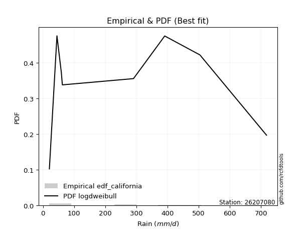</img>

</div>


### 2. Empirical - EDF Hazen (1930)

Hazen method for plotting positions is a formula used to estimate the empirical cumulative probability distribution of flood events or other hydrological data. This formula often results in biased estimations, particularly when extrapolating to extreme events (high return periods).

<div align="center">


$P=(m-0.5)/n$


</div>


**2.1. Empirical values**

<div align="center">

|                | 0                   | 1                   | 2                  | 3                  | 4         | 5                  | 6                  | 7                  | 8                  |
|:---------------|:--------------------|:--------------------|:-------------------|:-------------------|:----------|:-------------------|:-------------------|:-------------------|:-------------------|
| date           | 2022                | 2023                | 2017               | 2018               | 2021      | 2020               | 2024               | 2025               | 2019               |
| x              | 20.7                | 45.0                | 59.1               | 62.4               | 290.9     | 291.1              | 391.0              | 504.0              | 717.9              |
| m              | 1                   | 2                   | 3                  | 4                  | 5         | 6                  | 7                  | 8                  | 9                  |
| empirical_dist | edf_hazen           | edf_hazen           | edf_hazen          | edf_hazen          | edf_hazen | edf_hazen          | edf_hazen          | edf_hazen          | edf_hazen          |
| empirical      | 0.05555555555555555 | 0.16666666666666666 | 0.2777777777777778 | 0.3888888888888889 | 0.5       | 0.6111111111111112 | 0.7222222222222222 | 0.8333333333333334 | 0.9444444444444444 |
| empirical_tr   | 1.0588235294117647  | 1.2                 | 1.3846153846153846 | 1.6363636363636362 | 2.0       | 2.5714285714285716 | 3.5999999999999996 | 6.000000000000002  | 17.999999999999993 |

</div>


**2.2. Kolmogorov-Smirnov fit test (sorted by Δ)**


<div align="center">

|                | 0                   | 1                   | 2                   | 3                   | 4                     | 5                   | 6                   | 7                   | 8                   | 9                   | 10                  | 11                  | 12                  | 13                  | 14                  | 15                  | 16                  | 17                  | 18                  | 19                  | 20                  | 21                  | 22                  | 23                  | 24                  | 25                  | 26                  | 27                  | 28                  | 29                  | 30                  | 31                  | 32                  | 33                  | 34                  | 35                  | 36                  | 37                  | 38                  | 39                  | 40                  | 41                  | 42                  | 43                  | 44                  | 45                  | 46                  | 47                  | 48                  | 49                  | 50                  | 51                  | 52                  | 53                  | 54                  | 55                  | 56                  | 57                  | 58                  | 59                  | 60                  | 61                  | 62                  | 63                  | 64                  | 65                  | 66                  | 67                  | 68                  | 69                  | 70                  | 71                  | 72                  | 73                  | 74                  | 75                  | 76                  | 77                  | 78                  | 79                  | 80                  | 81                  | 82                  | 83                  | 84                  | 85                  | 86                  | 87                  | 88                  | 89                  |
|:---------------|:--------------------|:--------------------|:--------------------|:--------------------|:----------------------|:--------------------|:--------------------|:--------------------|:--------------------|:--------------------|:--------------------|:--------------------|:--------------------|:--------------------|:--------------------|:--------------------|:--------------------|:--------------------|:--------------------|:--------------------|:--------------------|:--------------------|:--------------------|:--------------------|:--------------------|:--------------------|:--------------------|:--------------------|:--------------------|:--------------------|:--------------------|:--------------------|:--------------------|:--------------------|:--------------------|:--------------------|:--------------------|:--------------------|:--------------------|:--------------------|:--------------------|:--------------------|:--------------------|:--------------------|:--------------------|:--------------------|:--------------------|:--------------------|:--------------------|:--------------------|:--------------------|:--------------------|:--------------------|:--------------------|:--------------------|:--------------------|:--------------------|:--------------------|:--------------------|:--------------------|:--------------------|:--------------------|:--------------------|:--------------------|:--------------------|:--------------------|:--------------------|:--------------------|:--------------------|:--------------------|:--------------------|:--------------------|:--------------------|:--------------------|:--------------------|:--------------------|:--------------------|:--------------------|:--------------------|:--------------------|:--------------------|:--------------------|:--------------------|:--------------------|:--------------------|:--------------------|:--------------------|:--------------------|:--------------------|:--------------------|
| station        | 26207080            | 26207080            | 26207080            | 26207080            | 26207080              | 26207080            | 26207080            | 26207080            | 26207080            | 26207080            | 26207080            | 26207080            | 26207080            | 26207080            | 26207080            | 26207080            | 26207080            | 26207080            | 26207080            | 26207080            | 26207080            | 26207080            | 26207080            | 26207080            | 26207080            | 26207080            | 26207080            | 26207080            | 26207080            | 26207080            | 26207080            | 26207080            | 26207080            | 26207080            | 26207080            | 26207080            | 26207080            | 26207080            | 26207080            | 26207080            | 26207080            | 26207080            | 26207080            | 26207080            | 26207080            | 26207080            | 26207080            | 26207080            | 26207080            | 26207080            | 26207080            | 26207080            | 26207080            | 26207080            | 26207080            | 26207080            | 26207080            | 26207080            | 26207080            | 26207080            | 26207080            | 26207080            | 26207080            | 26207080            | 26207080            | 26207080            | 26207080            | 26207080            | 26207080            | 26207080            | 26207080            | 26207080            | 26207080            | 26207080            | 26207080            | 26207080            | 26207080            | 26207080            | 26207080            | 26207080            | 26207080            | 26207080            | 26207080            | 26207080            | 26207080            | 26207080            | 26207080            | 26207080            | 26207080            | 26207080            |
| empirical_dist | edf_hazen           | edf_hazen           | edf_hazen           | edf_hazen           | edf_hazen             | edf_hazen           | edf_hazen           | edf_hazen           | edf_hazen           | edf_hazen           | edf_hazen           | edf_hazen           | edf_hazen           | edf_hazen           | edf_hazen           | edf_hazen           | edf_hazen           | edf_hazen           | edf_hazen           | edf_hazen           | edf_hazen           | edf_hazen           | edf_hazen           | edf_hazen           | edf_hazen           | edf_hazen           | edf_hazen           | edf_hazen           | edf_hazen           | edf_hazen           | edf_hazen           | edf_hazen           | edf_hazen           | edf_hazen           | edf_hazen           | edf_hazen           | edf_hazen           | edf_hazen           | edf_hazen           | edf_hazen           | edf_hazen           | edf_hazen           | edf_hazen           | edf_hazen           | edf_hazen           | edf_hazen           | edf_hazen           | edf_hazen           | edf_hazen           | edf_hazen           | edf_hazen           | edf_hazen           | edf_hazen           | edf_hazen           | edf_hazen           | edf_hazen           | edf_hazen           | edf_hazen           | edf_hazen           | edf_hazen           | edf_hazen           | edf_hazen           | edf_hazen           | edf_hazen           | edf_hazen           | edf_hazen           | edf_hazen           | edf_hazen           | edf_hazen           | edf_hazen           | edf_hazen           | edf_hazen           | edf_hazen           | edf_hazen           | edf_hazen           | edf_hazen           | edf_hazen           | edf_hazen           | edf_hazen           | edf_hazen           | edf_hazen           | edf_hazen           | edf_hazen           | edf_hazen           | edf_hazen           | edf_hazen           | edf_hazen           | edf_hazen           | edf_hazen           | edf_hazen           |
| p_dist         | nakagami            | logloggamma         | halfnorm            | betaprime           | loglaplace_asymmetric | ncf                 | f                   | rayleigh            | logjohnsonsu        | logweibull_min      | maxwell             | logfisk             | loggumbel_l         | loggompertz         | logpearson3         | pearson3            | t                   | truncnorm           | norm                | logf                | logexponnorm        | lognorm             | lognorm             | logcrystalball      | logt                | lognct              | logfatiguelife      | logbetaprime        | genlogistic         | logerlang           | logncf              | loggamma            | loggamma            | mielke              | lognakagami         | gumbel_r            | halflogistic        | laplace_asymmetric  | logrice             | johnsonsu           | loginvgamma         | kstwobign           | logistic            | loginvweibull       | loginvgauss         | gumbel_l            | logmaxwell          | logalpha            | lograyleigh         | exponnorm           | loglogistic         | loggenexpon         | invgamma            | moyal               | expon               | hypsecant           | logkstwobign        | logexpon            | nct                 | genexpon            | fisk                | rice                | loghalfnorm         | weibull_min         | invgauss            | laplace             | gompertz            | loghypsecant        | loggumbel_r         | loghalflogistic     | loglaplace          | logmoyal            | logmielke           | chi2                | erlang              | logchi2             | logwald             | logtruncnorm        | alpha               | wald                | loggibrat           | gibrat              | pareto              | loglognorm          | fatiguelife         | gamma               | crystalball         | logpareto           | invweibull          | loggenlogistic      |
| delta          | 0.11441325874004993 | 0.17927286870302045 | 0.18000313380594798 | 0.1802929406373014  | 0.1813649639091013    | 0.18388725435775888 | 0.18561564414143739 | 0.18568603337205458 | 0.18795646982473146 | 0.18986237710954262 | 0.18999746115370073 | 0.19223649620117056 | 0.19443974933306796 | 0.19491253423821364 | 0.1980258812926705  | 0.1980841698773699  | 0.20060151590411585 | 0.20060179366346326 | 0.20060180263168476 | 0.20857413483316978 | 0.20906758796102132 | 0.20906958640397888 | 0.20906958640397888 | 0.20906962596810696 | 0.20906965480284434 | 0.209226094869152   | 0.21039726975827389 | 0.21107094960604167 | 0.21244364139014565 | 0.21266706434391958 | 0.21293658395823212 | 0.2134310224620225  | 0.2134310224620225  | 0.21384676889242993 | 0.21418380939820247 | 0.2142724886199952  | 0.2146505677526118  | 0.2154963622763899  | 0.2158364930386898  | 0.2176803782677843  | 0.21956446125761597 | 0.22080827182743323 | 0.22143892436137824 | 0.22203108220740375 | 0.22271363402846045 | 0.22362930016106283 | 0.2238749988581359  | 0.22614661216029852 | 0.22818201928881376 | 0.2300353627970751  | 0.2308230665364589  | 0.23104026545726764 | 0.23140765252513606 | 0.23174459121549298 | 0.23178024617748605 | 0.23332633035884762 | 0.23489207639847254 | 0.23535105393581013 | 0.2366178664171491  | 0.2405910058138513  | 0.24071695879262767 | 0.24136192185475255 | 0.24145630012436736 | 0.24473073211689478 | 0.24508657322616068 | 0.24570588526505008 | 0.24606933792145075 | 0.24629065543619433 | 0.2579994554178888  | 0.2679023388000036  | 0.27051331723963334 | 0.2737929080828627  | 0.2827557991604488  | 0.28622592511471234 | 0.2940812080159094  | 0.31209006984600896 | 0.32057279239917924 | 0.3269075610230766  | 0.35896696841018194 | 0.380364357011798   | 0.3882012034826824  | 0.3888888888888889  | 0.4234697343109529  | 0.44049244749700955 | 0.46010727640161175 | 0.4674115601570751  | 0.46828183920851274 | 0.46903581785559945 | 0.49519882878086147 | 0.8333333333333334  |
| deltao         | 0.41761268023100007 | 0.41761268023100007 | 0.41761268023100007 | 0.41761268023100007 | 0.41761268023100007   | 0.41761268023100007 | 0.41761268023100007 | 0.41761268023100007 | 0.41761268023100007 | 0.41761268023100007 | 0.41761268023100007 | 0.41761268023100007 | 0.41761268023100007 | 0.41761268023100007 | 0.41761268023100007 | 0.41761268023100007 | 0.41761268023100007 | 0.41761268023100007 | 0.41761268023100007 | 0.41761268023100007 | 0.41761268023100007 | 0.41761268023100007 | 0.41761268023100007 | 0.41761268023100007 | 0.41761268023100007 | 0.41761268023100007 | 0.41761268023100007 | 0.41761268023100007 | 0.41761268023100007 | 0.41761268023100007 | 0.41761268023100007 | 0.41761268023100007 | 0.41761268023100007 | 0.41761268023100007 | 0.41761268023100007 | 0.41761268023100007 | 0.41761268023100007 | 0.41761268023100007 | 0.41761268023100007 | 0.41761268023100007 | 0.41761268023100007 | 0.41761268023100007 | 0.41761268023100007 | 0.41761268023100007 | 0.41761268023100007 | 0.41761268023100007 | 0.41761268023100007 | 0.41761268023100007 | 0.41761268023100007 | 0.41761268023100007 | 0.41761268023100007 | 0.41761268023100007 | 0.41761268023100007 | 0.41761268023100007 | 0.41761268023100007 | 0.41761268023100007 | 0.41761268023100007 | 0.41761268023100007 | 0.41761268023100007 | 0.41761268023100007 | 0.41761268023100007 | 0.41761268023100007 | 0.41761268023100007 | 0.41761268023100007 | 0.41761268023100007 | 0.41761268023100007 | 0.41761268023100007 | 0.41761268023100007 | 0.41761268023100007 | 0.41761268023100007 | 0.41761268023100007 | 0.41761268023100007 | 0.41761268023100007 | 0.41761268023100007 | 0.41761268023100007 | 0.41761268023100007 | 0.41761268023100007 | 0.41761268023100007 | 0.41761268023100007 | 0.41761268023100007 | 0.41761268023100007 | 0.41761268023100007 | 0.41761268023100007 | 0.41761268023100007 | 0.41761268023100007 | 0.41761268023100007 | 0.41761268023100007 | 0.41761268023100007 | 0.41761268023100007 | 0.41761268023100007 |
| eval           | Δo > Δ              | Δo > Δ              | Δo > Δ              | Δo > Δ              | Δo > Δ                | Δo > Δ              | Δo > Δ              | Δo > Δ              | Δo > Δ              | Δo > Δ              | Δo > Δ              | Δo > Δ              | Δo > Δ              | Δo > Δ              | Δo > Δ              | Δo > Δ              | Δo > Δ              | Δo > Δ              | Δo > Δ              | Δo > Δ              | Δo > Δ              | Δo > Δ              | Δo > Δ              | Δo > Δ              | Δo > Δ              | Δo > Δ              | Δo > Δ              | Δo > Δ              | Δo > Δ              | Δo > Δ              | Δo > Δ              | Δo > Δ              | Δo > Δ              | Δo > Δ              | Δo > Δ              | Δo > Δ              | Δo > Δ              | Δo > Δ              | Δo > Δ              | Δo > Δ              | Δo > Δ              | Δo > Δ              | Δo > Δ              | Δo > Δ              | Δo > Δ              | Δo > Δ              | Δo > Δ              | Δo > Δ              | Δo > Δ              | Δo > Δ              | Δo > Δ              | Δo > Δ              | Δo > Δ              | Δo > Δ              | Δo > Δ              | Δo > Δ              | Δo > Δ              | Δo > Δ              | Δo > Δ              | Δo > Δ              | Δo > Δ              | Δo > Δ              | Δo > Δ              | Δo > Δ              | Δo > Δ              | Δo > Δ              | Δo > Δ              | Δo > Δ              | Δo > Δ              | Δo > Δ              | Δo > Δ              | Δo > Δ              | Δo > Δ              | Δo > Δ              | Δo > Δ              | Δo > Δ              | Δo > Δ              | Δo > Δ              | Δo > Δ              | Δo > Δ              | Δo > Δ              | Δo > Δ              | Δo <= Δ             | Δo <= Δ             | Δo <= Δ             | Δo <= Δ             | Δo <= Δ             | Δo <= Δ             | Δo <= Δ             | Δo <= Δ             |
| fit            | 1                   | 1                   | 1                   | 1                   | 1                     | 1                   | 1                   | 1                   | 1                   | 1                   | 1                   | 1                   | 1                   | 1                   | 1                   | 1                   | 1                   | 1                   | 1                   | 1                   | 1                   | 1                   | 1                   | 1                   | 1                   | 1                   | 1                   | 1                   | 1                   | 1                   | 1                   | 1                   | 1                   | 1                   | 1                   | 1                   | 1                   | 1                   | 1                   | 1                   | 1                   | 1                   | 1                   | 1                   | 1                   | 1                   | 1                   | 1                   | 1                   | 1                   | 1                   | 1                   | 1                   | 1                   | 1                   | 1                   | 1                   | 1                   | 1                   | 1                   | 1                   | 1                   | 1                   | 1                   | 1                   | 1                   | 1                   | 1                   | 1                   | 1                   | 1                   | 1                   | 1                   | 1                   | 1                   | 1                   | 1                   | 1                   | 1                   | 1                   | 1                   | 1                   | 0                   | 0                   | 0                   | 0                   | 0                   | 0                   | 0                   | 0                   |
| n              | 9                   | 9                   | 9                   | 9                   | 9                     | 9                   | 9                   | 9                   | 9                   | 9                   | 9                   | 9                   | 9                   | 9                   | 9                   | 9                   | 9                   | 9                   | 9                   | 9                   | 9                   | 9                   | 9                   | 9                   | 9                   | 9                   | 9                   | 9                   | 9                   | 9                   | 9                   | 9                   | 9                   | 9                   | 9                   | 9                   | 9                   | 9                   | 9                   | 9                   | 9                   | 9                   | 9                   | 9                   | 9                   | 9                   | 9                   | 9                   | 9                   | 9                   | 9                   | 9                   | 9                   | 9                   | 9                   | 9                   | 9                   | 9                   | 9                   | 9                   | 9                   | 9                   | 9                   | 9                   | 9                   | 9                   | 9                   | 9                   | 9                   | 9                   | 9                   | 9                   | 9                   | 9                   | 9                   | 9                   | 9                   | 9                   | 9                   | 9                   | 9                   | 9                   | 9                   | 9                   | 9                   | 9                   | 9                   | 9                   | 9                   | 9                   |
| best_fit       | 1                   | 0                   | 0                   | 0                   | 0                     | 0                   | 0                   | 0                   | 0                   | 0                   | 0                   | 0                   | 0                   | 0                   | 0                   | 0                   | 0                   | 0                   | 0                   | 0                   | 0                   | 0                   | 0                   | 0                   | 0                   | 0                   | 0                   | 0                   | 0                   | 0                   | 0                   | 0                   | 0                   | 0                   | 0                   | 0                   | 0                   | 0                   | 0                   | 0                   | 0                   | 0                   | 0                   | 0                   | 0                   | 0                   | 0                   | 0                   | 0                   | 0                   | 0                   | 0                   | 0                   | 0                   | 0                   | 0                   | 0                   | 0                   | 0                   | 0                   | 0                   | 0                   | 0                   | 0                   | 0                   | 0                   | 0                   | 0                   | 0                   | 0                   | 0                   | 0                   | 0                   | 0                   | 0                   | 0                   | 0                   | 0                   | 0                   | 0                   | 0                   | 0                   | 0                   | 0                   | 0                   | 0                   | 0                   | 0                   | 0                   | 0                   |
| best_fit_sort  | 1                   | 2                   | 3                   | 4                   | 5                     | 6                   | 7                   | 8                   | 9                   | 10                  | 11                  | 12                  | 13                  | 14                  | 15                  | 16                  | 17                  | 18                  | 19                  | 20                  | 21                  | 22                  | 23                  | 24                  | 25                  | 26                  | 27                  | 28                  | 29                  | 30                  | 31                  | 32                  | 33                  | 34                  | 35                  | 36                  | 37                  | 38                  | 39                  | 40                  | 41                  | 42                  | 43                  | 44                  | 45                  | 46                  | 47                  | 48                  | 49                  | 50                  | 51                  | 52                  | 53                  | 54                  | 55                  | 56                  | 57                  | 58                  | 59                  | 60                  | 61                  | 62                  | 63                  | 64                  | 65                  | 66                  | 67                  | 68                  | 69                  | 70                  | 71                  | 72                  | 73                  | 74                  | 75                  | 76                  | 77                  | 78                  | 79                  | 80                  | 81                  | 82                  | 83                  | 84                  | 85                  | 86                  | 87                  | 88                  | 89                  | 90                  |

</div>


<div align="center">

</img>

</div>


**2.3. Best fit**

<div align="center">

|   id |   station | empirical_dist   | p_dist   |    delta |   deltao | eval   |   fit |   n |   best_fit |   best_fit_sort |
|-----:|----------:|:-----------------|:---------|---------:|---------:|:-------|------:|----:|-----------:|----------------:|
|    0 |  26207080 | edf_hazen        | nakagami | 0.114413 | 0.417613 | Δo > Δ |     1 |   9 |          1 |               1 |

</div>


<div align="center">

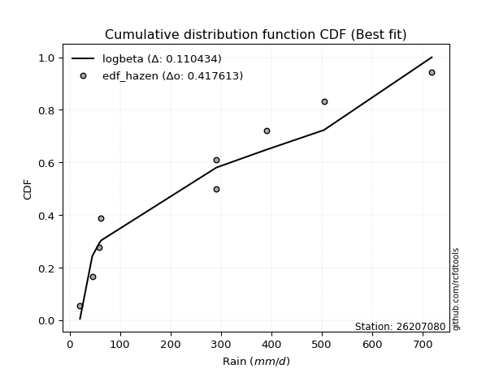</img></img>

</div>


### 3. Empirical - EDF Weibull (1939)

Weibull plotting position formula is an empirical method used to estimate the non-exceedance probability or plotting position for a set of observed data, is often recommended or widely used in practice, particularly in flood frequency analysis.

<div align="center">


$P=m/(n+1)$


</div>


**3.1. Empirical values**

<div align="center">

|                | 0                  | 1           | 2                  | 3                  | 4           | 5           | 6                 | 7                 | 8                  |
|:---------------|:-------------------|:------------|:-------------------|:-------------------|:------------|:------------|:------------------|:------------------|:-------------------|
| date           | 2022               | 2023        | 2017               | 2018               | 2021        | 2020        | 2024              | 2025              | 2019               |
| x              | 20.7               | 45.0        | 59.1               | 62.4               | 290.9       | 291.1       | 391.0             | 504.0             | 717.9              |
| m              | 1                  | 2           | 3                  | 4                  | 5           | 6           | 7                 | 8                 | 9                  |
| empirical_dist | edf_weibull        | edf_weibull | edf_weibull        | edf_weibull        | edf_weibull | edf_weibull | edf_weibull       | edf_weibull       | edf_weibull        |
| empirical      | 0.1                | 0.2         | 0.3                | 0.4                | 0.5         | 0.6         | 0.7               | 0.8               | 0.9                |
| empirical_tr   | 1.1111111111111112 | 1.25        | 1.4285714285714286 | 1.6666666666666667 | 2.0         | 2.5         | 3.333333333333333 | 5.000000000000001 | 10.000000000000002 |

</div>


**3.2. Kolmogorov-Smirnov fit test (sorted by Δ)**


<div align="center">

|                | 0                   | 1                   | 2                   | 3                   | 4                   | 5                   | 6                     | 7                   | 8                   | 9                   | 10                  | 11                  | 12                  | 13                  | 14                  | 15                  | 16                  | 17                  | 18                  | 19                  | 20                  | 21                  | 22                  | 23                  | 24                  | 25                  | 26                  | 27                  | 28                  | 29                  | 30                  | 31                  | 32                  | 33                  | 34                  | 35                  | 36                  | 37                  | 38                  | 39                  | 40                  | 41                  | 42                  | 43                  | 44                  | 45                  | 46                  | 47                  | 48                  | 49                  | 50                  | 51                  | 52                  | 53                  | 54                  | 55                  | 56                  | 57                  | 58                  | 59                  | 60                  | 61                  | 62                  | 63                  | 64                  | 65                  | 66                  | 67                  | 68                  | 69                  | 70                  | 71                  | 72                  | 73                  | 74                  | 75                  | 76                  | 77                  | 78                  | 79                  | 80                  | 81                  | 82                  | 83                  | 84                  | 85                  | 86                  | 87                  | 88                  | 89                  |
|:---------------|:--------------------|:--------------------|:--------------------|:--------------------|:--------------------|:--------------------|:----------------------|:--------------------|:--------------------|:--------------------|:--------------------|:--------------------|:--------------------|:--------------------|:--------------------|:--------------------|:--------------------|:--------------------|:--------------------|:--------------------|:--------------------|:--------------------|:--------------------|:--------------------|:--------------------|:--------------------|:--------------------|:--------------------|:--------------------|:--------------------|:--------------------|:--------------------|:--------------------|:--------------------|:--------------------|:--------------------|:--------------------|:--------------------|:--------------------|:--------------------|:--------------------|:--------------------|:--------------------|:--------------------|:--------------------|:--------------------|:--------------------|:--------------------|:--------------------|:--------------------|:--------------------|:--------------------|:--------------------|:--------------------|:--------------------|:--------------------|:--------------------|:--------------------|:--------------------|:--------------------|:--------------------|:--------------------|:--------------------|:--------------------|:--------------------|:--------------------|:--------------------|:--------------------|:--------------------|:--------------------|:--------------------|:--------------------|:--------------------|:--------------------|:--------------------|:--------------------|:--------------------|:--------------------|:--------------------|:--------------------|:--------------------|:--------------------|:--------------------|:--------------------|:--------------------|:--------------------|:--------------------|:--------------------|:--------------------|:--------------------|
| station        | 26207080            | 26207080            | 26207080            | 26207080            | 26207080            | 26207080            | 26207080              | 26207080            | 26207080            | 26207080            | 26207080            | 26207080            | 26207080            | 26207080            | 26207080            | 26207080            | 26207080            | 26207080            | 26207080            | 26207080            | 26207080            | 26207080            | 26207080            | 26207080            | 26207080            | 26207080            | 26207080            | 26207080            | 26207080            | 26207080            | 26207080            | 26207080            | 26207080            | 26207080            | 26207080            | 26207080            | 26207080            | 26207080            | 26207080            | 26207080            | 26207080            | 26207080            | 26207080            | 26207080            | 26207080            | 26207080            | 26207080            | 26207080            | 26207080            | 26207080            | 26207080            | 26207080            | 26207080            | 26207080            | 26207080            | 26207080            | 26207080            | 26207080            | 26207080            | 26207080            | 26207080            | 26207080            | 26207080            | 26207080            | 26207080            | 26207080            | 26207080            | 26207080            | 26207080            | 26207080            | 26207080            | 26207080            | 26207080            | 26207080            | 26207080            | 26207080            | 26207080            | 26207080            | 26207080            | 26207080            | 26207080            | 26207080            | 26207080            | 26207080            | 26207080            | 26207080            | 26207080            | 26207080            | 26207080            | 26207080            |
| empirical_dist | edf_weibull         | edf_weibull         | edf_weibull         | edf_weibull         | edf_weibull         | edf_weibull         | edf_weibull           | edf_weibull         | edf_weibull         | edf_weibull         | edf_weibull         | edf_weibull         | edf_weibull         | edf_weibull         | edf_weibull         | edf_weibull         | edf_weibull         | edf_weibull         | edf_weibull         | edf_weibull         | edf_weibull         | edf_weibull         | edf_weibull         | edf_weibull         | edf_weibull         | edf_weibull         | edf_weibull         | edf_weibull         | edf_weibull         | edf_weibull         | edf_weibull         | edf_weibull         | edf_weibull         | edf_weibull         | edf_weibull         | edf_weibull         | edf_weibull         | edf_weibull         | edf_weibull         | edf_weibull         | edf_weibull         | edf_weibull         | edf_weibull         | edf_weibull         | edf_weibull         | edf_weibull         | edf_weibull         | edf_weibull         | edf_weibull         | edf_weibull         | edf_weibull         | edf_weibull         | edf_weibull         | edf_weibull         | edf_weibull         | edf_weibull         | edf_weibull         | edf_weibull         | edf_weibull         | edf_weibull         | edf_weibull         | edf_weibull         | edf_weibull         | edf_weibull         | edf_weibull         | edf_weibull         | edf_weibull         | edf_weibull         | edf_weibull         | edf_weibull         | edf_weibull         | edf_weibull         | edf_weibull         | edf_weibull         | edf_weibull         | edf_weibull         | edf_weibull         | edf_weibull         | edf_weibull         | edf_weibull         | edf_weibull         | edf_weibull         | edf_weibull         | edf_weibull         | edf_weibull         | edf_weibull         | edf_weibull         | edf_weibull         | edf_weibull         | edf_weibull         |
| p_dist         | nakagami            | betaprime           | f                   | logloggamma         | halfnorm            | logfisk             | loglaplace_asymmetric | loggompertz         | ncf                 | rayleigh            | logpearson3         | logjohnsonsu        | logweibull_min      | maxwell             | loggumbel_l         | logf                | logexponnorm        | lognorm             | lognorm             | logcrystalball      | logt                | pearson3            | lognct              | logfatiguelife      | logbetaprime        | t                   | truncnorm           | norm                | logerlang           | logncf              | loggamma            | loggamma            | mielke              | lognakagami         | logrice             | johnsonsu           | loginvgamma         | loginvweibull       | loginvgauss         | genlogistic         | logmaxwell          | gumbel_r            | halflogistic        | logalpha            | laplace_asymmetric  | lograyleigh         | loglogistic         | loggenexpon         | invgamma            | kstwobign           | logistic            | gumbel_l            | logkstwobign        | logexpon            | nct                 | fisk                | exponnorm           | loghalfnorm         | moyal               | expon               | hypsecant           | weibull_min         | invgauss            | loghypsecant        | genexpon            | rice                | laplace             | gompertz            | loggumbel_r         | loghalflogistic     | loglaplace          | logmoyal            | logmielke           | chi2                | erlang              | logchi2             | logwald             | logtruncnorm        | alpha               | pareto              | wald                | loggibrat           | gibrat              | loglognorm          | crystalball         | fatiguelife         | gamma               | logpareto           | invweibull          | loggenlogistic      |
| delta          | 0.11441325874004993 | 0.18462480522085564 | 0.18561564414143739 | 0.19038397981413158 | 0.1911142449170591  | 0.19223649620117056 | 0.19247607502021244   | 0.19491253423821364 | 0.19499836546887    | 0.1967971444831657  | 0.1980258812926705  | 0.1990675809358426  | 0.20097348822065375 | 0.20110857226481185 | 0.20555086044417908 | 0.20857413483316978 | 0.20906758796102132 | 0.20906958640397888 | 0.20906958640397888 | 0.20906962596810696 | 0.20906965480284434 | 0.20919528098848103 | 0.209226094869152   | 0.21039726975827389 | 0.21107094960604167 | 0.21171262701522697 | 0.21171290477457438 | 0.21171291374279588 | 0.21266706434391958 | 0.21293658395823212 | 0.2134310224620225  | 0.2134310224620225  | 0.21384676889242993 | 0.21418380939820247 | 0.2158364930386898  | 0.2176803782677843  | 0.21956446125761597 | 0.22203108220740375 | 0.22271363402846045 | 0.22355475250125678 | 0.2238749988581359  | 0.22538359973110633 | 0.22576167886372292 | 0.22614661216029852 | 0.22660747338750103 | 0.22818201928881376 | 0.2308230665364589  | 0.23104026545726764 | 0.23140765252513606 | 0.23191938293854436 | 0.23255003547248937 | 0.23474041127217396 | 0.23489207639847254 | 0.23535105393581013 | 0.2366178664171491  | 0.24071695879262767 | 0.24114647390818622 | 0.24145630012436736 | 0.2428557023266041  | 0.24289135728859718 | 0.24443744146995874 | 0.24473073211689478 | 0.24508657322616068 | 0.24629065543619433 | 0.2517021169249624  | 0.25247303296586365 | 0.2568169963761612  | 0.2571804490325619  | 0.2579994554178888  | 0.2679023388000036  | 0.27051331723963334 | 0.2737929080828627  | 0.2827557991604488  | 0.28622592511471234 | 0.2940812080159094  | 0.31209006984600896 | 0.32057279239917924 | 0.3269075610230766  | 0.35896696841018194 | 0.39013640097761954 | 0.3914754681229091  | 0.3993123145937935  | 0.4                 | 0.4071591141636762  | 0.42383739476406834 | 0.42677394306827837 | 0.4340782268237417  | 0.43570248452226606 | 0.45075438433641707 | 0.8                 |
| deltao         | 0.41761268023100007 | 0.41761268023100007 | 0.41761268023100007 | 0.41761268023100007 | 0.41761268023100007 | 0.41761268023100007 | 0.41761268023100007   | 0.41761268023100007 | 0.41761268023100007 | 0.41761268023100007 | 0.41761268023100007 | 0.41761268023100007 | 0.41761268023100007 | 0.41761268023100007 | 0.41761268023100007 | 0.41761268023100007 | 0.41761268023100007 | 0.41761268023100007 | 0.41761268023100007 | 0.41761268023100007 | 0.41761268023100007 | 0.41761268023100007 | 0.41761268023100007 | 0.41761268023100007 | 0.41761268023100007 | 0.41761268023100007 | 0.41761268023100007 | 0.41761268023100007 | 0.41761268023100007 | 0.41761268023100007 | 0.41761268023100007 | 0.41761268023100007 | 0.41761268023100007 | 0.41761268023100007 | 0.41761268023100007 | 0.41761268023100007 | 0.41761268023100007 | 0.41761268023100007 | 0.41761268023100007 | 0.41761268023100007 | 0.41761268023100007 | 0.41761268023100007 | 0.41761268023100007 | 0.41761268023100007 | 0.41761268023100007 | 0.41761268023100007 | 0.41761268023100007 | 0.41761268023100007 | 0.41761268023100007 | 0.41761268023100007 | 0.41761268023100007 | 0.41761268023100007 | 0.41761268023100007 | 0.41761268023100007 | 0.41761268023100007 | 0.41761268023100007 | 0.41761268023100007 | 0.41761268023100007 | 0.41761268023100007 | 0.41761268023100007 | 0.41761268023100007 | 0.41761268023100007 | 0.41761268023100007 | 0.41761268023100007 | 0.41761268023100007 | 0.41761268023100007 | 0.41761268023100007 | 0.41761268023100007 | 0.41761268023100007 | 0.41761268023100007 | 0.41761268023100007 | 0.41761268023100007 | 0.41761268023100007 | 0.41761268023100007 | 0.41761268023100007 | 0.41761268023100007 | 0.41761268023100007 | 0.41761268023100007 | 0.41761268023100007 | 0.41761268023100007 | 0.41761268023100007 | 0.41761268023100007 | 0.41761268023100007 | 0.41761268023100007 | 0.41761268023100007 | 0.41761268023100007 | 0.41761268023100007 | 0.41761268023100007 | 0.41761268023100007 | 0.41761268023100007 |
| eval           | Δo > Δ              | Δo > Δ              | Δo > Δ              | Δo > Δ              | Δo > Δ              | Δo > Δ              | Δo > Δ                | Δo > Δ              | Δo > Δ              | Δo > Δ              | Δo > Δ              | Δo > Δ              | Δo > Δ              | Δo > Δ              | Δo > Δ              | Δo > Δ              | Δo > Δ              | Δo > Δ              | Δo > Δ              | Δo > Δ              | Δo > Δ              | Δo > Δ              | Δo > Δ              | Δo > Δ              | Δo > Δ              | Δo > Δ              | Δo > Δ              | Δo > Δ              | Δo > Δ              | Δo > Δ              | Δo > Δ              | Δo > Δ              | Δo > Δ              | Δo > Δ              | Δo > Δ              | Δo > Δ              | Δo > Δ              | Δo > Δ              | Δo > Δ              | Δo > Δ              | Δo > Δ              | Δo > Δ              | Δo > Δ              | Δo > Δ              | Δo > Δ              | Δo > Δ              | Δo > Δ              | Δo > Δ              | Δo > Δ              | Δo > Δ              | Δo > Δ              | Δo > Δ              | Δo > Δ              | Δo > Δ              | Δo > Δ              | Δo > Δ              | Δo > Δ              | Δo > Δ              | Δo > Δ              | Δo > Δ              | Δo > Δ              | Δo > Δ              | Δo > Δ              | Δo > Δ              | Δo > Δ              | Δo > Δ              | Δo > Δ              | Δo > Δ              | Δo > Δ              | Δo > Δ              | Δo > Δ              | Δo > Δ              | Δo > Δ              | Δo > Δ              | Δo > Δ              | Δo > Δ              | Δo > Δ              | Δo > Δ              | Δo > Δ              | Δo > Δ              | Δo > Δ              | Δo > Δ              | Δo > Δ              | Δo > Δ              | Δo <= Δ             | Δo <= Δ             | Δo <= Δ             | Δo <= Δ             | Δo <= Δ             | Δo <= Δ             |
| fit            | 1                   | 1                   | 1                   | 1                   | 1                   | 1                   | 1                     | 1                   | 1                   | 1                   | 1                   | 1                   | 1                   | 1                   | 1                   | 1                   | 1                   | 1                   | 1                   | 1                   | 1                   | 1                   | 1                   | 1                   | 1                   | 1                   | 1                   | 1                   | 1                   | 1                   | 1                   | 1                   | 1                   | 1                   | 1                   | 1                   | 1                   | 1                   | 1                   | 1                   | 1                   | 1                   | 1                   | 1                   | 1                   | 1                   | 1                   | 1                   | 1                   | 1                   | 1                   | 1                   | 1                   | 1                   | 1                   | 1                   | 1                   | 1                   | 1                   | 1                   | 1                   | 1                   | 1                   | 1                   | 1                   | 1                   | 1                   | 1                   | 1                   | 1                   | 1                   | 1                   | 1                   | 1                   | 1                   | 1                   | 1                   | 1                   | 1                   | 1                   | 1                   | 1                   | 1                   | 1                   | 0                   | 0                   | 0                   | 0                   | 0                   | 0                   |
| n              | 9                   | 9                   | 9                   | 9                   | 9                   | 9                   | 9                     | 9                   | 9                   | 9                   | 9                   | 9                   | 9                   | 9                   | 9                   | 9                   | 9                   | 9                   | 9                   | 9                   | 9                   | 9                   | 9                   | 9                   | 9                   | 9                   | 9                   | 9                   | 9                   | 9                   | 9                   | 9                   | 9                   | 9                   | 9                   | 9                   | 9                   | 9                   | 9                   | 9                   | 9                   | 9                   | 9                   | 9                   | 9                   | 9                   | 9                   | 9                   | 9                   | 9                   | 9                   | 9                   | 9                   | 9                   | 9                   | 9                   | 9                   | 9                   | 9                   | 9                   | 9                   | 9                   | 9                   | 9                   | 9                   | 9                   | 9                   | 9                   | 9                   | 9                   | 9                   | 9                   | 9                   | 9                   | 9                   | 9                   | 9                   | 9                   | 9                   | 9                   | 9                   | 9                   | 9                   | 9                   | 9                   | 9                   | 9                   | 9                   | 9                   | 9                   |
| best_fit       | 1                   | 0                   | 0                   | 0                   | 0                   | 0                   | 0                     | 0                   | 0                   | 0                   | 0                   | 0                   | 0                   | 0                   | 0                   | 0                   | 0                   | 0                   | 0                   | 0                   | 0                   | 0                   | 0                   | 0                   | 0                   | 0                   | 0                   | 0                   | 0                   | 0                   | 0                   | 0                   | 0                   | 0                   | 0                   | 0                   | 0                   | 0                   | 0                   | 0                   | 0                   | 0                   | 0                   | 0                   | 0                   | 0                   | 0                   | 0                   | 0                   | 0                   | 0                   | 0                   | 0                   | 0                   | 0                   | 0                   | 0                   | 0                   | 0                   | 0                   | 0                   | 0                   | 0                   | 0                   | 0                   | 0                   | 0                   | 0                   | 0                   | 0                   | 0                   | 0                   | 0                   | 0                   | 0                   | 0                   | 0                   | 0                   | 0                   | 0                   | 0                   | 0                   | 0                   | 0                   | 0                   | 0                   | 0                   | 0                   | 0                   | 0                   |
| best_fit_sort  | 1                   | 2                   | 3                   | 4                   | 5                   | 6                   | 7                     | 8                   | 9                   | 10                  | 11                  | 12                  | 13                  | 14                  | 15                  | 16                  | 17                  | 18                  | 19                  | 20                  | 21                  | 22                  | 23                  | 24                  | 25                  | 26                  | 27                  | 28                  | 29                  | 30                  | 31                  | 32                  | 33                  | 34                  | 35                  | 36                  | 37                  | 38                  | 39                  | 40                  | 41                  | 42                  | 43                  | 44                  | 45                  | 46                  | 47                  | 48                  | 49                  | 50                  | 51                  | 52                  | 53                  | 54                  | 55                  | 56                  | 57                  | 58                  | 59                  | 60                  | 61                  | 62                  | 63                  | 64                  | 65                  | 66                  | 67                  | 68                  | 69                  | 70                  | 71                  | 72                  | 73                  | 74                  | 75                  | 76                  | 77                  | 78                  | 79                  | 80                  | 81                  | 82                  | 83                  | 84                  | 85                  | 86                  | 87                  | 88                  | 89                  | 90                  |

</div>


<div align="center">

</img>

</div>


**3.3. Best fit**

<div align="center">

|   id |   station | empirical_dist   | p_dist   |    delta |   deltao | eval   |   fit |   n |   best_fit |   best_fit_sort |
|-----:|----------:|:-----------------|:---------|---------:|---------:|:-------|------:|----:|-----------:|----------------:|
|    0 |  26207080 | edf_weibull      | nakagami | 0.114413 | 0.417613 | Δo > Δ |     1 |   9 |          1 |               1 |

</div>


<div align="center">

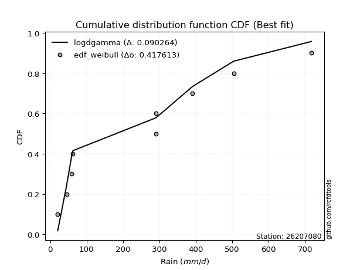</img>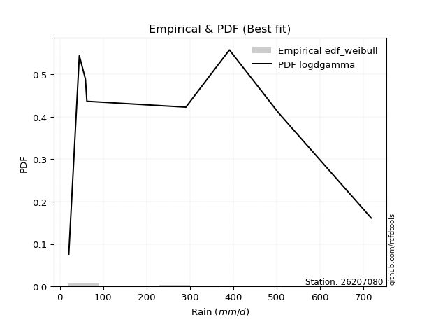</img>

</div>


### 4. Empirical - EDF Beard (1943)

The Beard formula (or Beard´s plotting position formula) in hydrology is used to estimate the empirical non-exceedance probability _(P)_ of a flood event (or other extreme hydrological data point) within a given dataset.

<div align="center">


$P=(m-0.31)/(n+0.38)$


</div>


**4.1. Empirical values**

<div align="center">

|                | 0                   | 1                   | 2                  | 3                   | 4         | 5                  | 6                  | 7                  | 8                  |
|:---------------|:--------------------|:--------------------|:-------------------|:--------------------|:----------|:-------------------|:-------------------|:-------------------|:-------------------|
| date           | 2022                | 2023                | 2017               | 2018                | 2021      | 2020               | 2024               | 2025               | 2019               |
| x              | 20.7                | 45.0                | 59.1               | 62.4                | 290.9     | 291.1              | 391.0              | 504.0              | 717.9              |
| m              | 1                   | 2                   | 3                  | 4                   | 5         | 6                  | 7                  | 8                  | 9                  |
| empirical_dist | edf_beard           | edf_beard           | edf_beard          | edf_beard           | edf_beard | edf_beard          | edf_beard          | edf_beard          | edf_beard          |
| empirical      | 0.07356076759061833 | 0.18017057569296374 | 0.2867803837953091 | 0.39339019189765456 | 0.5       | 0.6066098081023454 | 0.7132196162046908 | 0.8198294243070362 | 0.9264392324093815 |
| empirical_tr   | 1.0794016110471807  | 1.2197659297789336  | 1.4020926756352765 | 1.6485061511423549  | 2.0       | 2.542005420054201  | 3.486988847583642  | 5.550295857988164  | 13.5942028985507   |

</div>


**4.2. Kolmogorov-Smirnov fit test (sorted by Δ)**


<div align="center">

|                | 0                   | 1                   | 2                   | 3                   | 4                   | 5                     | 6                   | 7                   | 8                   | 9                   | 10                  | 11                  | 12                  | 13                  | 14                  | 15                  | 16                  | 17                  | 18                  | 19                  | 20                  | 21                  | 22                  | 23                  | 24                  | 25                  | 26                  | 27                  | 28                  | 29                  | 30                  | 31                  | 32                  | 33                  | 34                  | 35                  | 36                  | 37                  | 38                  | 39                  | 40                  | 41                  | 42                  | 43                  | 44                  | 45                  | 46                  | 47                  | 48                  | 49                  | 50                  | 51                  | 52                  | 53                  | 54                  | 55                  | 56                  | 57                  | 58                  | 59                  | 60                  | 61                  | 62                  | 63                  | 64                  | 65                  | 66                  | 67                  | 68                  | 69                  | 70                  | 71                  | 72                  | 73                  | 74                  | 75                  | 76                  | 77                  | 78                  | 79                  | 80                  | 81                  | 82                  | 83                  | 84                  | 85                  | 86                  | 87                  | 88                  | 89                  |
|:---------------|:--------------------|:--------------------|:--------------------|:--------------------|:--------------------|:----------------------|:--------------------|:--------------------|:--------------------|:--------------------|:--------------------|:--------------------|:--------------------|:--------------------|:--------------------|:--------------------|:--------------------|:--------------------|:--------------------|:--------------------|:--------------------|:--------------------|:--------------------|:--------------------|:--------------------|:--------------------|:--------------------|:--------------------|:--------------------|:--------------------|:--------------------|:--------------------|:--------------------|:--------------------|:--------------------|:--------------------|:--------------------|:--------------------|:--------------------|:--------------------|:--------------------|:--------------------|:--------------------|:--------------------|:--------------------|:--------------------|:--------------------|:--------------------|:--------------------|:--------------------|:--------------------|:--------------------|:--------------------|:--------------------|:--------------------|:--------------------|:--------------------|:--------------------|:--------------------|:--------------------|:--------------------|:--------------------|:--------------------|:--------------------|:--------------------|:--------------------|:--------------------|:--------------------|:--------------------|:--------------------|:--------------------|:--------------------|:--------------------|:--------------------|:--------------------|:--------------------|:--------------------|:--------------------|:--------------------|:--------------------|:--------------------|:--------------------|:--------------------|:--------------------|:--------------------|:--------------------|:--------------------|:--------------------|:--------------------|:--------------------|
| station        | 26207080            | 26207080            | 26207080            | 26207080            | 26207080            | 26207080              | 26207080            | 26207080            | 26207080            | 26207080            | 26207080            | 26207080            | 26207080            | 26207080            | 26207080            | 26207080            | 26207080            | 26207080            | 26207080            | 26207080            | 26207080            | 26207080            | 26207080            | 26207080            | 26207080            | 26207080            | 26207080            | 26207080            | 26207080            | 26207080            | 26207080            | 26207080            | 26207080            | 26207080            | 26207080            | 26207080            | 26207080            | 26207080            | 26207080            | 26207080            | 26207080            | 26207080            | 26207080            | 26207080            | 26207080            | 26207080            | 26207080            | 26207080            | 26207080            | 26207080            | 26207080            | 26207080            | 26207080            | 26207080            | 26207080            | 26207080            | 26207080            | 26207080            | 26207080            | 26207080            | 26207080            | 26207080            | 26207080            | 26207080            | 26207080            | 26207080            | 26207080            | 26207080            | 26207080            | 26207080            | 26207080            | 26207080            | 26207080            | 26207080            | 26207080            | 26207080            | 26207080            | 26207080            | 26207080            | 26207080            | 26207080            | 26207080            | 26207080            | 26207080            | 26207080            | 26207080            | 26207080            | 26207080            | 26207080            | 26207080            |
| empirical_dist | edf_beard           | edf_beard           | edf_beard           | edf_beard           | edf_beard           | edf_beard             | edf_beard           | edf_beard           | edf_beard           | edf_beard           | edf_beard           | edf_beard           | edf_beard           | edf_beard           | edf_beard           | edf_beard           | edf_beard           | edf_beard           | edf_beard           | edf_beard           | edf_beard           | edf_beard           | edf_beard           | edf_beard           | edf_beard           | edf_beard           | edf_beard           | edf_beard           | edf_beard           | edf_beard           | edf_beard           | edf_beard           | edf_beard           | edf_beard           | edf_beard           | edf_beard           | edf_beard           | edf_beard           | edf_beard           | edf_beard           | edf_beard           | edf_beard           | edf_beard           | edf_beard           | edf_beard           | edf_beard           | edf_beard           | edf_beard           | edf_beard           | edf_beard           | edf_beard           | edf_beard           | edf_beard           | edf_beard           | edf_beard           | edf_beard           | edf_beard           | edf_beard           | edf_beard           | edf_beard           | edf_beard           | edf_beard           | edf_beard           | edf_beard           | edf_beard           | edf_beard           | edf_beard           | edf_beard           | edf_beard           | edf_beard           | edf_beard           | edf_beard           | edf_beard           | edf_beard           | edf_beard           | edf_beard           | edf_beard           | edf_beard           | edf_beard           | edf_beard           | edf_beard           | edf_beard           | edf_beard           | edf_beard           | edf_beard           | edf_beard           | edf_beard           | edf_beard           | edf_beard           | edf_beard           |
| p_dist         | nakagami            | betaprime           | logloggamma         | halfnorm            | f                   | loglaplace_asymmetric | ncf                 | rayleigh            | logfisk             | logjohnsonsu        | logweibull_min      | maxwell             | loggompertz         | logpearson3         | loggumbel_l         | pearson3            | t                   | truncnorm           | norm                | logf                | logexponnorm        | lognorm             | lognorm             | logcrystalball      | logt                | lognct              | logfatiguelife      | logbetaprime        | logerlang           | logncf              | loggamma            | loggamma            | mielke              | lognakagami         | logrice             | genlogistic         | johnsonsu           | gumbel_r            | halflogistic        | loginvgamma         | laplace_asymmetric  | loginvweibull       | loginvgauss         | logmaxwell          | kstwobign           | logistic            | logalpha            | gumbel_l            | lograyleigh         | loglogistic         | loggenexpon         | invgamma            | exponnorm           | logkstwobign        | logexpon            | moyal               | expon               | nct                 | hypsecant           | fisk                | loghalfnorm         | weibull_min         | invgauss            | genexpon            | rice                | loghypsecant        | laplace             | gompertz            | loggumbel_r         | loghalflogistic     | loglaplace          | logmoyal            | logmielke           | chi2                | erlang              | logchi2             | logwald             | logtruncnorm        | alpha               | wald                | loggibrat           | gibrat              | pareto              | loglognorm          | fatiguelife         | crystalball         | gamma               | logpareto           | invweibull          | loggenlogistic      |
| delta          | 0.11441325874004993 | 0.1802929406373014  | 0.18377417171178612 | 0.18450443681471365 | 0.18561564414143739 | 0.18586626691786698   | 0.18838855736652454 | 0.19018733638082025 | 0.19223649620117056 | 0.19245777283349713 | 0.1943636801183083  | 0.1944987641624664  | 0.19491253423821364 | 0.1980258812926705  | 0.19894105234183362 | 0.20258547288613557 | 0.2051028189128815  | 0.20510309667222892 | 0.20510310564045042 | 0.20857413483316978 | 0.20906758796102132 | 0.20906958640397888 | 0.20906958640397888 | 0.20906962596810696 | 0.20906965480284434 | 0.209226094869152   | 0.21039726975827389 | 0.21107094960604167 | 0.21266706434391958 | 0.21293658395823212 | 0.2134310224620225  | 0.2134310224620225  | 0.21384676889242993 | 0.21418380939820247 | 0.2158364930386898  | 0.21694494439891132 | 0.2176803782677843  | 0.21877379162876087 | 0.21915187076137746 | 0.21956446125761597 | 0.21999766528515557 | 0.22203108220740375 | 0.22271363402846045 | 0.2238749988581359  | 0.2253095748361989  | 0.2259402273701439  | 0.22614661216029852 | 0.2281306031698285  | 0.22818201928881376 | 0.2308230665364589  | 0.23104026545726764 | 0.23140765252513606 | 0.23453666580584076 | 0.23489207639847254 | 0.23535105393581013 | 0.23624589422425865 | 0.23628154918625172 | 0.2366178664171491  | 0.23782763336761328 | 0.24071695879262767 | 0.24145630012436736 | 0.24473073211689478 | 0.24508657322616068 | 0.24509230882261696 | 0.24586322486351822 | 0.24629065543619433 | 0.2502071882738157  | 0.2505706409302164  | 0.2579994554178888  | 0.2679023388000036  | 0.27051331723963334 | 0.2737929080828627  | 0.2827557991604488  | 0.28622592511471234 | 0.2940812080159094  | 0.31209006984600896 | 0.32057279239917924 | 0.3269075610230766  | 0.35896696841018194 | 0.38486566002056366 | 0.39270250649144806 | 0.39339019189765456 | 0.4099658252846558  | 0.42698853847071244 | 0.44660336737531464 | 0.45027662717344996 | 0.45390765113077797 | 0.45553190882930233 | 0.4771936167457986  | 0.8198294243070362  |
| deltao         | 0.41761268023100007 | 0.41761268023100007 | 0.41761268023100007 | 0.41761268023100007 | 0.41761268023100007 | 0.41761268023100007   | 0.41761268023100007 | 0.41761268023100007 | 0.41761268023100007 | 0.41761268023100007 | 0.41761268023100007 | 0.41761268023100007 | 0.41761268023100007 | 0.41761268023100007 | 0.41761268023100007 | 0.41761268023100007 | 0.41761268023100007 | 0.41761268023100007 | 0.41761268023100007 | 0.41761268023100007 | 0.41761268023100007 | 0.41761268023100007 | 0.41761268023100007 | 0.41761268023100007 | 0.41761268023100007 | 0.41761268023100007 | 0.41761268023100007 | 0.41761268023100007 | 0.41761268023100007 | 0.41761268023100007 | 0.41761268023100007 | 0.41761268023100007 | 0.41761268023100007 | 0.41761268023100007 | 0.41761268023100007 | 0.41761268023100007 | 0.41761268023100007 | 0.41761268023100007 | 0.41761268023100007 | 0.41761268023100007 | 0.41761268023100007 | 0.41761268023100007 | 0.41761268023100007 | 0.41761268023100007 | 0.41761268023100007 | 0.41761268023100007 | 0.41761268023100007 | 0.41761268023100007 | 0.41761268023100007 | 0.41761268023100007 | 0.41761268023100007 | 0.41761268023100007 | 0.41761268023100007 | 0.41761268023100007 | 0.41761268023100007 | 0.41761268023100007 | 0.41761268023100007 | 0.41761268023100007 | 0.41761268023100007 | 0.41761268023100007 | 0.41761268023100007 | 0.41761268023100007 | 0.41761268023100007 | 0.41761268023100007 | 0.41761268023100007 | 0.41761268023100007 | 0.41761268023100007 | 0.41761268023100007 | 0.41761268023100007 | 0.41761268023100007 | 0.41761268023100007 | 0.41761268023100007 | 0.41761268023100007 | 0.41761268023100007 | 0.41761268023100007 | 0.41761268023100007 | 0.41761268023100007 | 0.41761268023100007 | 0.41761268023100007 | 0.41761268023100007 | 0.41761268023100007 | 0.41761268023100007 | 0.41761268023100007 | 0.41761268023100007 | 0.41761268023100007 | 0.41761268023100007 | 0.41761268023100007 | 0.41761268023100007 | 0.41761268023100007 | 0.41761268023100007 |
| eval           | Δo > Δ              | Δo > Δ              | Δo > Δ              | Δo > Δ              | Δo > Δ              | Δo > Δ                | Δo > Δ              | Δo > Δ              | Δo > Δ              | Δo > Δ              | Δo > Δ              | Δo > Δ              | Δo > Δ              | Δo > Δ              | Δo > Δ              | Δo > Δ              | Δo > Δ              | Δo > Δ              | Δo > Δ              | Δo > Δ              | Δo > Δ              | Δo > Δ              | Δo > Δ              | Δo > Δ              | Δo > Δ              | Δo > Δ              | Δo > Δ              | Δo > Δ              | Δo > Δ              | Δo > Δ              | Δo > Δ              | Δo > Δ              | Δo > Δ              | Δo > Δ              | Δo > Δ              | Δo > Δ              | Δo > Δ              | Δo > Δ              | Δo > Δ              | Δo > Δ              | Δo > Δ              | Δo > Δ              | Δo > Δ              | Δo > Δ              | Δo > Δ              | Δo > Δ              | Δo > Δ              | Δo > Δ              | Δo > Δ              | Δo > Δ              | Δo > Δ              | Δo > Δ              | Δo > Δ              | Δo > Δ              | Δo > Δ              | Δo > Δ              | Δo > Δ              | Δo > Δ              | Δo > Δ              | Δo > Δ              | Δo > Δ              | Δo > Δ              | Δo > Δ              | Δo > Δ              | Δo > Δ              | Δo > Δ              | Δo > Δ              | Δo > Δ              | Δo > Δ              | Δo > Δ              | Δo > Δ              | Δo > Δ              | Δo > Δ              | Δo > Δ              | Δo > Δ              | Δo > Δ              | Δo > Δ              | Δo > Δ              | Δo > Δ              | Δo > Δ              | Δo > Δ              | Δo > Δ              | Δo > Δ              | Δo <= Δ             | Δo <= Δ             | Δo <= Δ             | Δo <= Δ             | Δo <= Δ             | Δo <= Δ             | Δo <= Δ             |
| fit            | 1                   | 1                   | 1                   | 1                   | 1                   | 1                     | 1                   | 1                   | 1                   | 1                   | 1                   | 1                   | 1                   | 1                   | 1                   | 1                   | 1                   | 1                   | 1                   | 1                   | 1                   | 1                   | 1                   | 1                   | 1                   | 1                   | 1                   | 1                   | 1                   | 1                   | 1                   | 1                   | 1                   | 1                   | 1                   | 1                   | 1                   | 1                   | 1                   | 1                   | 1                   | 1                   | 1                   | 1                   | 1                   | 1                   | 1                   | 1                   | 1                   | 1                   | 1                   | 1                   | 1                   | 1                   | 1                   | 1                   | 1                   | 1                   | 1                   | 1                   | 1                   | 1                   | 1                   | 1                   | 1                   | 1                   | 1                   | 1                   | 1                   | 1                   | 1                   | 1                   | 1                   | 1                   | 1                   | 1                   | 1                   | 1                   | 1                   | 1                   | 1                   | 1                   | 1                   | 0                   | 0                   | 0                   | 0                   | 0                   | 0                   | 0                   |
| n              | 9                   | 9                   | 9                   | 9                   | 9                   | 9                     | 9                   | 9                   | 9                   | 9                   | 9                   | 9                   | 9                   | 9                   | 9                   | 9                   | 9                   | 9                   | 9                   | 9                   | 9                   | 9                   | 9                   | 9                   | 9                   | 9                   | 9                   | 9                   | 9                   | 9                   | 9                   | 9                   | 9                   | 9                   | 9                   | 9                   | 9                   | 9                   | 9                   | 9                   | 9                   | 9                   | 9                   | 9                   | 9                   | 9                   | 9                   | 9                   | 9                   | 9                   | 9                   | 9                   | 9                   | 9                   | 9                   | 9                   | 9                   | 9                   | 9                   | 9                   | 9                   | 9                   | 9                   | 9                   | 9                   | 9                   | 9                   | 9                   | 9                   | 9                   | 9                   | 9                   | 9                   | 9                   | 9                   | 9                   | 9                   | 9                   | 9                   | 9                   | 9                   | 9                   | 9                   | 9                   | 9                   | 9                   | 9                   | 9                   | 9                   | 9                   |
| best_fit       | 1                   | 0                   | 0                   | 0                   | 0                   | 0                     | 0                   | 0                   | 0                   | 0                   | 0                   | 0                   | 0                   | 0                   | 0                   | 0                   | 0                   | 0                   | 0                   | 0                   | 0                   | 0                   | 0                   | 0                   | 0                   | 0                   | 0                   | 0                   | 0                   | 0                   | 0                   | 0                   | 0                   | 0                   | 0                   | 0                   | 0                   | 0                   | 0                   | 0                   | 0                   | 0                   | 0                   | 0                   | 0                   | 0                   | 0                   | 0                   | 0                   | 0                   | 0                   | 0                   | 0                   | 0                   | 0                   | 0                   | 0                   | 0                   | 0                   | 0                   | 0                   | 0                   | 0                   | 0                   | 0                   | 0                   | 0                   | 0                   | 0                   | 0                   | 0                   | 0                   | 0                   | 0                   | 0                   | 0                   | 0                   | 0                   | 0                   | 0                   | 0                   | 0                   | 0                   | 0                   | 0                   | 0                   | 0                   | 0                   | 0                   | 0                   |
| best_fit_sort  | 1                   | 2                   | 3                   | 4                   | 5                   | 6                     | 7                   | 8                   | 9                   | 10                  | 11                  | 12                  | 13                  | 14                  | 15                  | 16                  | 17                  | 18                  | 19                  | 20                  | 21                  | 22                  | 23                  | 24                  | 25                  | 26                  | 27                  | 28                  | 29                  | 30                  | 31                  | 32                  | 33                  | 34                  | 35                  | 36                  | 37                  | 38                  | 39                  | 40                  | 41                  | 42                  | 43                  | 44                  | 45                  | 46                  | 47                  | 48                  | 49                  | 50                  | 51                  | 52                  | 53                  | 54                  | 55                  | 56                  | 57                  | 58                  | 59                  | 60                  | 61                  | 62                  | 63                  | 64                  | 65                  | 66                  | 67                  | 68                  | 69                  | 70                  | 71                  | 72                  | 73                  | 74                  | 75                  | 76                  | 77                  | 78                  | 79                  | 80                  | 81                  | 82                  | 83                  | 84                  | 85                  | 86                  | 87                  | 88                  | 89                  | 90                  |

</div>


<div align="center">

</img>

</div>


**4.3. Best fit**

<div align="center">

|   id |   station | empirical_dist   | p_dist   |    delta |   deltao | eval   |   fit |   n |   best_fit |   best_fit_sort |
|-----:|----------:|:-----------------|:---------|---------:|---------:|:-------|------:|----:|-----------:|----------------:|
|    0 |  26207080 | edf_beard        | nakagami | 0.114413 | 0.417613 | Δo > Δ |     1 |   9 |          1 |               1 |

</div>


<div align="center">

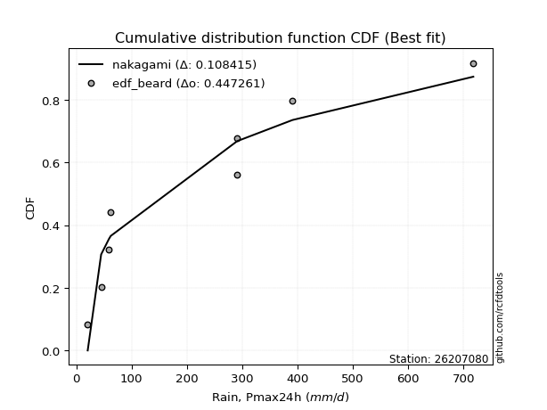</img></img>

</div>


### 5. Empirical - EDF Chegodayev (1955)

The Chegodayev formula is an empirical plotting position formula used in hydrological frequency analysis to estimate the exceedance probability or return period of a specific event from a set of observed data. It is primarily used for plotting observed data points on probability paper to fit a theoretical distribution, particularly for analyzing extreme events like maximum flood flows or rainfall intensities. The constant _b_ value in the generalized plotting position formula is 0.3.

<div align="center">


$P=(m-b)/(n+1-2b)$


</div>


**5.1. Empirical values**

<div align="center">

|                | 0                   | 1                   | 2                  | 3                   | 4              | 5                  | 6                  | 7                  | 8                  |
|:---------------|:--------------------|:--------------------|:-------------------|:--------------------|:---------------|:-------------------|:-------------------|:-------------------|:-------------------|
| date           | 2022                | 2023                | 2017               | 2018                | 2021           | 2020               | 2024               | 2025               | 2019               |
| x              | 20.7                | 45.0                | 59.1               | 62.4                | 290.9          | 291.1              | 391.0              | 504.0              | 717.9              |
| m              | 1                   | 2                   | 3                  | 4                   | 5              | 6                  | 7                  | 8                  | 9                  |
| empirical_dist | edf_chegodayev      | edf_chegodayev      | edf_chegodayev     | edf_chegodayev      | edf_chegodayev | edf_chegodayev     | edf_chegodayev     | edf_chegodayev     | edf_chegodayev     |
| empirical      | 0.07446808510638298 | 0.18085106382978722 | 0.2872340425531915 | 0.39361702127659576 | 0.5            | 0.6063829787234043 | 0.7127659574468085 | 0.8191489361702128 | 0.9255319148936169 |
| empirical_tr   | 1.0804597701149425  | 1.2207792207792207  | 1.4029850746268657 | 1.6491228070175437  | 2.0            | 2.540540540540541  | 3.481481481481481  | 5.529411764705883  | 13.428571428571399 |

</div>


**5.2. Kolmogorov-Smirnov fit test (sorted by Δ)**


<div align="center">

|                | 0                   | 1                   | 2                   | 3                   | 4                   | 5                     | 6                   | 7                   | 8                   | 9                   | 10                  | 11                  | 12                  | 13                  | 14                  | 15                  | 16                  | 17                  | 18                  | 19                  | 20                  | 21                  | 22                  | 23                  | 24                  | 25                  | 26                  | 27                  | 28                  | 29                  | 30                  | 31                  | 32                  | 33                  | 34                  | 35                  | 36                  | 37                  | 38                  | 39                  | 40                  | 41                  | 42                  | 43                  | 44                  | 45                  | 46                  | 47                  | 48                  | 49                  | 50                  | 51                  | 52                  | 53                  | 54                  | 55                  | 56                  | 57                  | 58                  | 59                  | 60                  | 61                  | 62                  | 63                  | 64                  | 65                  | 66                  | 67                  | 68                  | 69                  | 70                  | 71                  | 72                  | 73                  | 74                  | 75                  | 76                  | 77                  | 78                  | 79                  | 80                  | 81                  | 82                  | 83                  | 84                  | 85                  | 86                  | 87                  | 88                  | 89                  |
|:---------------|:--------------------|:--------------------|:--------------------|:--------------------|:--------------------|:----------------------|:--------------------|:--------------------|:--------------------|:--------------------|:--------------------|:--------------------|:--------------------|:--------------------|:--------------------|:--------------------|:--------------------|:--------------------|:--------------------|:--------------------|:--------------------|:--------------------|:--------------------|:--------------------|:--------------------|:--------------------|:--------------------|:--------------------|:--------------------|:--------------------|:--------------------|:--------------------|:--------------------|:--------------------|:--------------------|:--------------------|:--------------------|:--------------------|:--------------------|:--------------------|:--------------------|:--------------------|:--------------------|:--------------------|:--------------------|:--------------------|:--------------------|:--------------------|:--------------------|:--------------------|:--------------------|:--------------------|:--------------------|:--------------------|:--------------------|:--------------------|:--------------------|:--------------------|:--------------------|:--------------------|:--------------------|:--------------------|:--------------------|:--------------------|:--------------------|:--------------------|:--------------------|:--------------------|:--------------------|:--------------------|:--------------------|:--------------------|:--------------------|:--------------------|:--------------------|:--------------------|:--------------------|:--------------------|:--------------------|:--------------------|:--------------------|:--------------------|:--------------------|:--------------------|:--------------------|:--------------------|:--------------------|:--------------------|:--------------------|:--------------------|
| station        | 26207080            | 26207080            | 26207080            | 26207080            | 26207080            | 26207080              | 26207080            | 26207080            | 26207080            | 26207080            | 26207080            | 26207080            | 26207080            | 26207080            | 26207080            | 26207080            | 26207080            | 26207080            | 26207080            | 26207080            | 26207080            | 26207080            | 26207080            | 26207080            | 26207080            | 26207080            | 26207080            | 26207080            | 26207080            | 26207080            | 26207080            | 26207080            | 26207080            | 26207080            | 26207080            | 26207080            | 26207080            | 26207080            | 26207080            | 26207080            | 26207080            | 26207080            | 26207080            | 26207080            | 26207080            | 26207080            | 26207080            | 26207080            | 26207080            | 26207080            | 26207080            | 26207080            | 26207080            | 26207080            | 26207080            | 26207080            | 26207080            | 26207080            | 26207080            | 26207080            | 26207080            | 26207080            | 26207080            | 26207080            | 26207080            | 26207080            | 26207080            | 26207080            | 26207080            | 26207080            | 26207080            | 26207080            | 26207080            | 26207080            | 26207080            | 26207080            | 26207080            | 26207080            | 26207080            | 26207080            | 26207080            | 26207080            | 26207080            | 26207080            | 26207080            | 26207080            | 26207080            | 26207080            | 26207080            | 26207080            |
| empirical_dist | edf_chegodayev      | edf_chegodayev      | edf_chegodayev      | edf_chegodayev      | edf_chegodayev      | edf_chegodayev        | edf_chegodayev      | edf_chegodayev      | edf_chegodayev      | edf_chegodayev      | edf_chegodayev      | edf_chegodayev      | edf_chegodayev      | edf_chegodayev      | edf_chegodayev      | edf_chegodayev      | edf_chegodayev      | edf_chegodayev      | edf_chegodayev      | edf_chegodayev      | edf_chegodayev      | edf_chegodayev      | edf_chegodayev      | edf_chegodayev      | edf_chegodayev      | edf_chegodayev      | edf_chegodayev      | edf_chegodayev      | edf_chegodayev      | edf_chegodayev      | edf_chegodayev      | edf_chegodayev      | edf_chegodayev      | edf_chegodayev      | edf_chegodayev      | edf_chegodayev      | edf_chegodayev      | edf_chegodayev      | edf_chegodayev      | edf_chegodayev      | edf_chegodayev      | edf_chegodayev      | edf_chegodayev      | edf_chegodayev      | edf_chegodayev      | edf_chegodayev      | edf_chegodayev      | edf_chegodayev      | edf_chegodayev      | edf_chegodayev      | edf_chegodayev      | edf_chegodayev      | edf_chegodayev      | edf_chegodayev      | edf_chegodayev      | edf_chegodayev      | edf_chegodayev      | edf_chegodayev      | edf_chegodayev      | edf_chegodayev      | edf_chegodayev      | edf_chegodayev      | edf_chegodayev      | edf_chegodayev      | edf_chegodayev      | edf_chegodayev      | edf_chegodayev      | edf_chegodayev      | edf_chegodayev      | edf_chegodayev      | edf_chegodayev      | edf_chegodayev      | edf_chegodayev      | edf_chegodayev      | edf_chegodayev      | edf_chegodayev      | edf_chegodayev      | edf_chegodayev      | edf_chegodayev      | edf_chegodayev      | edf_chegodayev      | edf_chegodayev      | edf_chegodayev      | edf_chegodayev      | edf_chegodayev      | edf_chegodayev      | edf_chegodayev      | edf_chegodayev      | edf_chegodayev      | edf_chegodayev      |
| p_dist         | nakagami            | betaprime           | logloggamma         | halfnorm            | f                   | loglaplace_asymmetric | ncf                 | rayleigh            | logfisk             | logjohnsonsu        | logweibull_min      | maxwell             | loggompertz         | logpearson3         | loggumbel_l         | pearson3            | t                   | truncnorm           | norm                | logf                | logexponnorm        | lognorm             | lognorm             | logcrystalball      | logt                | lognct              | logfatiguelife      | logbetaprime        | logerlang           | logncf              | loggamma            | loggamma            | mielke              | lognakagami         | logrice             | genlogistic         | johnsonsu           | gumbel_r            | halflogistic        | loginvgamma         | laplace_asymmetric  | loginvweibull       | loginvgauss         | logmaxwell          | kstwobign           | logalpha            | logistic            | lograyleigh         | gumbel_l            | loglogistic         | loggenexpon         | invgamma            | exponnorm           | logkstwobign        | logexpon            | moyal               | expon               | nct                 | hypsecant           | fisk                | loghalfnorm         | weibull_min         | invgauss            | genexpon            | rice                | loghypsecant        | laplace             | gompertz            | loggumbel_r         | loghalflogistic     | loglaplace          | logmoyal            | logmielke           | chi2                | erlang              | logchi2             | logwald             | logtruncnorm        | alpha               | wald                | loggibrat           | gibrat              | pareto              | loglognorm          | fatiguelife         | crystalball         | gamma               | logpareto           | invweibull          | loggenlogistic      |
| delta          | 0.11441325874004993 | 0.1802929406373014  | 0.1840010010907273  | 0.18473126619365485 | 0.18561564414143739 | 0.18609309629680817   | 0.18861538674546574 | 0.19041416575976144 | 0.19223649620117056 | 0.19268460221243833 | 0.1945905094972495  | 0.1947255935414076  | 0.19491253423821364 | 0.1980258812926705  | 0.19916788172077482 | 0.20281230226507677 | 0.2053296482918227  | 0.20532992605117012 | 0.20532993501939162 | 0.20857413483316978 | 0.20906758796102132 | 0.20906958640397888 | 0.20906958640397888 | 0.20906962596810696 | 0.20906965480284434 | 0.209226094869152   | 0.21039726975827389 | 0.21107094960604167 | 0.21266706434391958 | 0.21293658395823212 | 0.2134310224620225  | 0.2134310224620225  | 0.21384676889242993 | 0.21418380939820247 | 0.2158364930386898  | 0.21717177377785252 | 0.2176803782677843  | 0.21900062100770207 | 0.21937870014031866 | 0.21956446125761597 | 0.22022449466409677 | 0.22203108220740375 | 0.22271363402846045 | 0.2238749988581359  | 0.2255364042151401  | 0.22614661216029852 | 0.2261670567490851  | 0.22818201928881376 | 0.2283574325487697  | 0.2308230665364589  | 0.23104026545726764 | 0.23140765252513606 | 0.23476349518478196 | 0.23489207639847254 | 0.23535105393581013 | 0.23647272360319985 | 0.2365083785651929  | 0.2366178664171491  | 0.23805446274655448 | 0.24071695879262767 | 0.24145630012436736 | 0.24473073211689478 | 0.24508657322616068 | 0.24531913820155815 | 0.24609005424245942 | 0.24629065543619433 | 0.25043401765275697 | 0.2507974703091576  | 0.2579994554178888  | 0.2679023388000036  | 0.27051331723963334 | 0.2737929080828627  | 0.2827557991604488  | 0.28622592511471234 | 0.2940812080159094  | 0.31209006984600896 | 0.32057279239917924 | 0.3269075610230766  | 0.35896696841018194 | 0.38509248939950486 | 0.39292933587038925 | 0.39361702127659576 | 0.40928533714783233 | 0.42630805033388897 | 0.44592287923849117 | 0.44936930965768535 | 0.4532271629939545  | 0.45485142069247886 | 0.4762862992300339  | 0.8191489361702128  |
| deltao         | 0.41761268023100007 | 0.41761268023100007 | 0.41761268023100007 | 0.41761268023100007 | 0.41761268023100007 | 0.41761268023100007   | 0.41761268023100007 | 0.41761268023100007 | 0.41761268023100007 | 0.41761268023100007 | 0.41761268023100007 | 0.41761268023100007 | 0.41761268023100007 | 0.41761268023100007 | 0.41761268023100007 | 0.41761268023100007 | 0.41761268023100007 | 0.41761268023100007 | 0.41761268023100007 | 0.41761268023100007 | 0.41761268023100007 | 0.41761268023100007 | 0.41761268023100007 | 0.41761268023100007 | 0.41761268023100007 | 0.41761268023100007 | 0.41761268023100007 | 0.41761268023100007 | 0.41761268023100007 | 0.41761268023100007 | 0.41761268023100007 | 0.41761268023100007 | 0.41761268023100007 | 0.41761268023100007 | 0.41761268023100007 | 0.41761268023100007 | 0.41761268023100007 | 0.41761268023100007 | 0.41761268023100007 | 0.41761268023100007 | 0.41761268023100007 | 0.41761268023100007 | 0.41761268023100007 | 0.41761268023100007 | 0.41761268023100007 | 0.41761268023100007 | 0.41761268023100007 | 0.41761268023100007 | 0.41761268023100007 | 0.41761268023100007 | 0.41761268023100007 | 0.41761268023100007 | 0.41761268023100007 | 0.41761268023100007 | 0.41761268023100007 | 0.41761268023100007 | 0.41761268023100007 | 0.41761268023100007 | 0.41761268023100007 | 0.41761268023100007 | 0.41761268023100007 | 0.41761268023100007 | 0.41761268023100007 | 0.41761268023100007 | 0.41761268023100007 | 0.41761268023100007 | 0.41761268023100007 | 0.41761268023100007 | 0.41761268023100007 | 0.41761268023100007 | 0.41761268023100007 | 0.41761268023100007 | 0.41761268023100007 | 0.41761268023100007 | 0.41761268023100007 | 0.41761268023100007 | 0.41761268023100007 | 0.41761268023100007 | 0.41761268023100007 | 0.41761268023100007 | 0.41761268023100007 | 0.41761268023100007 | 0.41761268023100007 | 0.41761268023100007 | 0.41761268023100007 | 0.41761268023100007 | 0.41761268023100007 | 0.41761268023100007 | 0.41761268023100007 | 0.41761268023100007 |
| eval           | Δo > Δ              | Δo > Δ              | Δo > Δ              | Δo > Δ              | Δo > Δ              | Δo > Δ                | Δo > Δ              | Δo > Δ              | Δo > Δ              | Δo > Δ              | Δo > Δ              | Δo > Δ              | Δo > Δ              | Δo > Δ              | Δo > Δ              | Δo > Δ              | Δo > Δ              | Δo > Δ              | Δo > Δ              | Δo > Δ              | Δo > Δ              | Δo > Δ              | Δo > Δ              | Δo > Δ              | Δo > Δ              | Δo > Δ              | Δo > Δ              | Δo > Δ              | Δo > Δ              | Δo > Δ              | Δo > Δ              | Δo > Δ              | Δo > Δ              | Δo > Δ              | Δo > Δ              | Δo > Δ              | Δo > Δ              | Δo > Δ              | Δo > Δ              | Δo > Δ              | Δo > Δ              | Δo > Δ              | Δo > Δ              | Δo > Δ              | Δo > Δ              | Δo > Δ              | Δo > Δ              | Δo > Δ              | Δo > Δ              | Δo > Δ              | Δo > Δ              | Δo > Δ              | Δo > Δ              | Δo > Δ              | Δo > Δ              | Δo > Δ              | Δo > Δ              | Δo > Δ              | Δo > Δ              | Δo > Δ              | Δo > Δ              | Δo > Δ              | Δo > Δ              | Δo > Δ              | Δo > Δ              | Δo > Δ              | Δo > Δ              | Δo > Δ              | Δo > Δ              | Δo > Δ              | Δo > Δ              | Δo > Δ              | Δo > Δ              | Δo > Δ              | Δo > Δ              | Δo > Δ              | Δo > Δ              | Δo > Δ              | Δo > Δ              | Δo > Δ              | Δo > Δ              | Δo > Δ              | Δo > Δ              | Δo <= Δ             | Δo <= Δ             | Δo <= Δ             | Δo <= Δ             | Δo <= Δ             | Δo <= Δ             | Δo <= Δ             |
| fit            | 1                   | 1                   | 1                   | 1                   | 1                   | 1                     | 1                   | 1                   | 1                   | 1                   | 1                   | 1                   | 1                   | 1                   | 1                   | 1                   | 1                   | 1                   | 1                   | 1                   | 1                   | 1                   | 1                   | 1                   | 1                   | 1                   | 1                   | 1                   | 1                   | 1                   | 1                   | 1                   | 1                   | 1                   | 1                   | 1                   | 1                   | 1                   | 1                   | 1                   | 1                   | 1                   | 1                   | 1                   | 1                   | 1                   | 1                   | 1                   | 1                   | 1                   | 1                   | 1                   | 1                   | 1                   | 1                   | 1                   | 1                   | 1                   | 1                   | 1                   | 1                   | 1                   | 1                   | 1                   | 1                   | 1                   | 1                   | 1                   | 1                   | 1                   | 1                   | 1                   | 1                   | 1                   | 1                   | 1                   | 1                   | 1                   | 1                   | 1                   | 1                   | 1                   | 1                   | 0                   | 0                   | 0                   | 0                   | 0                   | 0                   | 0                   |
| n              | 9                   | 9                   | 9                   | 9                   | 9                   | 9                     | 9                   | 9                   | 9                   | 9                   | 9                   | 9                   | 9                   | 9                   | 9                   | 9                   | 9                   | 9                   | 9                   | 9                   | 9                   | 9                   | 9                   | 9                   | 9                   | 9                   | 9                   | 9                   | 9                   | 9                   | 9                   | 9                   | 9                   | 9                   | 9                   | 9                   | 9                   | 9                   | 9                   | 9                   | 9                   | 9                   | 9                   | 9                   | 9                   | 9                   | 9                   | 9                   | 9                   | 9                   | 9                   | 9                   | 9                   | 9                   | 9                   | 9                   | 9                   | 9                   | 9                   | 9                   | 9                   | 9                   | 9                   | 9                   | 9                   | 9                   | 9                   | 9                   | 9                   | 9                   | 9                   | 9                   | 9                   | 9                   | 9                   | 9                   | 9                   | 9                   | 9                   | 9                   | 9                   | 9                   | 9                   | 9                   | 9                   | 9                   | 9                   | 9                   | 9                   | 9                   |
| best_fit       | 1                   | 0                   | 0                   | 0                   | 0                   | 0                     | 0                   | 0                   | 0                   | 0                   | 0                   | 0                   | 0                   | 0                   | 0                   | 0                   | 0                   | 0                   | 0                   | 0                   | 0                   | 0                   | 0                   | 0                   | 0                   | 0                   | 0                   | 0                   | 0                   | 0                   | 0                   | 0                   | 0                   | 0                   | 0                   | 0                   | 0                   | 0                   | 0                   | 0                   | 0                   | 0                   | 0                   | 0                   | 0                   | 0                   | 0                   | 0                   | 0                   | 0                   | 0                   | 0                   | 0                   | 0                   | 0                   | 0                   | 0                   | 0                   | 0                   | 0                   | 0                   | 0                   | 0                   | 0                   | 0                   | 0                   | 0                   | 0                   | 0                   | 0                   | 0                   | 0                   | 0                   | 0                   | 0                   | 0                   | 0                   | 0                   | 0                   | 0                   | 0                   | 0                   | 0                   | 0                   | 0                   | 0                   | 0                   | 0                   | 0                   | 0                   |
| best_fit_sort  | 1                   | 2                   | 3                   | 4                   | 5                   | 6                     | 7                   | 8                   | 9                   | 10                  | 11                  | 12                  | 13                  | 14                  | 15                  | 16                  | 17                  | 18                  | 19                  | 20                  | 21                  | 22                  | 23                  | 24                  | 25                  | 26                  | 27                  | 28                  | 29                  | 30                  | 31                  | 32                  | 33                  | 34                  | 35                  | 36                  | 37                  | 38                  | 39                  | 40                  | 41                  | 42                  | 43                  | 44                  | 45                  | 46                  | 47                  | 48                  | 49                  | 50                  | 51                  | 52                  | 53                  | 54                  | 55                  | 56                  | 57                  | 58                  | 59                  | 60                  | 61                  | 62                  | 63                  | 64                  | 65                  | 66                  | 67                  | 68                  | 69                  | 70                  | 71                  | 72                  | 73                  | 74                  | 75                  | 76                  | 77                  | 78                  | 79                  | 80                  | 81                  | 82                  | 83                  | 84                  | 85                  | 86                  | 87                  | 88                  | 89                  | 90                  |

</div>


<div align="center">

</img>

</div>


**5.3. Best fit**

<div align="center">

|   id |   station | empirical_dist   | p_dist   |    delta |   deltao | eval   |   fit |   n |   best_fit |   best_fit_sort |
|-----:|----------:|:-----------------|:---------|---------:|---------:|:-------|------:|----:|-----------:|----------------:|
|    0 |  26207080 | edf_chegodayev   | nakagami | 0.114413 | 0.417613 | Δo > Δ |     1 |   9 |          1 |               1 |

</div>


<div align="center">

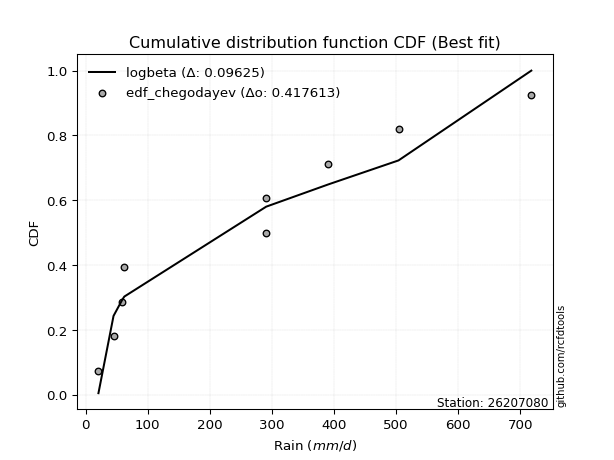</img>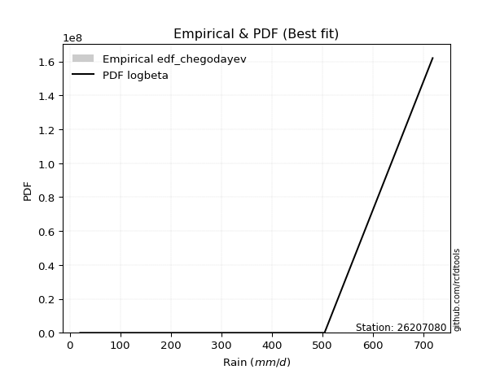</img>

</div>


### 6. Empirical - EDF Blom (1958)

The Blom formula is a specific "plotting position" formula used in hydrology and statistical analysis to estimate the empirical cumulative probability (or non-exceedance probability) of a data series. It is particularly recommended for data that are approximately normally distributed. The constant _a_ is set to 0.375 (or 3/8).

<div align="center">


$P=(m-a)/(n+1-2a)$


</div>


**6.1. Empirical values**

<div align="center">

|                | 0                   | 1                   | 2                   | 3                  | 4        | 5                  | 6                  | 7                  | 8                  |
|:---------------|:--------------------|:--------------------|:--------------------|:-------------------|:---------|:-------------------|:-------------------|:-------------------|:-------------------|
| date           | 2022                | 2023                | 2017                | 2018               | 2021     | 2020               | 2024               | 2025               | 2019               |
| x              | 20.7                | 45.0                | 59.1                | 62.4               | 290.9    | 291.1              | 391.0              | 504.0              | 717.9              |
| m              | 1                   | 2                   | 3                   | 4                  | 5        | 6                  | 7                  | 8                  | 9                  |
| empirical_dist | edf_blom            | edf_blom            | edf_blom            | edf_blom           | edf_blom | edf_blom           | edf_blom           | edf_blom           | edf_blom           |
| empirical      | 0.06756756756756757 | 0.17567567567567569 | 0.28378378378378377 | 0.3918918918918919 | 0.5      | 0.6081081081081081 | 0.7162162162162162 | 0.8243243243243243 | 0.9324324324324325 |
| empirical_tr   | 1.072463768115942   | 1.2131147540983607  | 1.3962264150943395  | 1.6444444444444444 | 2.0      | 2.5517241379310347 | 3.523809523809524  | 5.6923076923076925 | 14.800000000000006 |

</div>


**6.2. Kolmogorov-Smirnov fit test (sorted by Δ)**


<div align="center">

|                | 0                   | 1                   | 2                   | 3                   | 4                     | 5                   | 6                   | 7                   | 8                   | 9                   | 10                  | 11                  | 12                  | 13                  | 14                  | 15                  | 16                  | 17                  | 18                  | 19                  | 20                  | 21                  | 22                  | 23                  | 24                  | 25                  | 26                  | 27                  | 28                  | 29                  | 30                  | 31                  | 32                  | 33                  | 34                  | 35                  | 36                  | 37                  | 38                  | 39                  | 40                  | 41                  | 42                  | 43                  | 44                  | 45                  | 46                  | 47                  | 48                  | 49                  | 50                  | 51                  | 52                  | 53                  | 54                  | 55                  | 56                  | 57                  | 58                  | 59                  | 60                  | 61                  | 62                  | 63                  | 64                  | 65                  | 66                  | 67                  | 68                  | 69                  | 70                  | 71                  | 72                  | 73                  | 74                  | 75                  | 76                  | 77                  | 78                  | 79                  | 80                  | 81                  | 82                  | 83                  | 84                  | 85                  | 86                  | 87                  | 88                  | 89                  |
|:---------------|:--------------------|:--------------------|:--------------------|:--------------------|:----------------------|:--------------------|:--------------------|:--------------------|:--------------------|:--------------------|:--------------------|:--------------------|:--------------------|:--------------------|:--------------------|:--------------------|:--------------------|:--------------------|:--------------------|:--------------------|:--------------------|:--------------------|:--------------------|:--------------------|:--------------------|:--------------------|:--------------------|:--------------------|:--------------------|:--------------------|:--------------------|:--------------------|:--------------------|:--------------------|:--------------------|:--------------------|:--------------------|:--------------------|:--------------------|:--------------------|:--------------------|:--------------------|:--------------------|:--------------------|:--------------------|:--------------------|:--------------------|:--------------------|:--------------------|:--------------------|:--------------------|:--------------------|:--------------------|:--------------------|:--------------------|:--------------------|:--------------------|:--------------------|:--------------------|:--------------------|:--------------------|:--------------------|:--------------------|:--------------------|:--------------------|:--------------------|:--------------------|:--------------------|:--------------------|:--------------------|:--------------------|:--------------------|:--------------------|:--------------------|:--------------------|:--------------------|:--------------------|:--------------------|:--------------------|:--------------------|:--------------------|:--------------------|:--------------------|:--------------------|:--------------------|:--------------------|:--------------------|:--------------------|:--------------------|:--------------------|
| station        | 26207080            | 26207080            | 26207080            | 26207080            | 26207080              | 26207080            | 26207080            | 26207080            | 26207080            | 26207080            | 26207080            | 26207080            | 26207080            | 26207080            | 26207080            | 26207080            | 26207080            | 26207080            | 26207080            | 26207080            | 26207080            | 26207080            | 26207080            | 26207080            | 26207080            | 26207080            | 26207080            | 26207080            | 26207080            | 26207080            | 26207080            | 26207080            | 26207080            | 26207080            | 26207080            | 26207080            | 26207080            | 26207080            | 26207080            | 26207080            | 26207080            | 26207080            | 26207080            | 26207080            | 26207080            | 26207080            | 26207080            | 26207080            | 26207080            | 26207080            | 26207080            | 26207080            | 26207080            | 26207080            | 26207080            | 26207080            | 26207080            | 26207080            | 26207080            | 26207080            | 26207080            | 26207080            | 26207080            | 26207080            | 26207080            | 26207080            | 26207080            | 26207080            | 26207080            | 26207080            | 26207080            | 26207080            | 26207080            | 26207080            | 26207080            | 26207080            | 26207080            | 26207080            | 26207080            | 26207080            | 26207080            | 26207080            | 26207080            | 26207080            | 26207080            | 26207080            | 26207080            | 26207080            | 26207080            | 26207080            |
| empirical_dist | edf_blom            | edf_blom            | edf_blom            | edf_blom            | edf_blom              | edf_blom            | edf_blom            | edf_blom            | edf_blom            | edf_blom            | edf_blom            | edf_blom            | edf_blom            | edf_blom            | edf_blom            | edf_blom            | edf_blom            | edf_blom            | edf_blom            | edf_blom            | edf_blom            | edf_blom            | edf_blom            | edf_blom            | edf_blom            | edf_blom            | edf_blom            | edf_blom            | edf_blom            | edf_blom            | edf_blom            | edf_blom            | edf_blom            | edf_blom            | edf_blom            | edf_blom            | edf_blom            | edf_blom            | edf_blom            | edf_blom            | edf_blom            | edf_blom            | edf_blom            | edf_blom            | edf_blom            | edf_blom            | edf_blom            | edf_blom            | edf_blom            | edf_blom            | edf_blom            | edf_blom            | edf_blom            | edf_blom            | edf_blom            | edf_blom            | edf_blom            | edf_blom            | edf_blom            | edf_blom            | edf_blom            | edf_blom            | edf_blom            | edf_blom            | edf_blom            | edf_blom            | edf_blom            | edf_blom            | edf_blom            | edf_blom            | edf_blom            | edf_blom            | edf_blom            | edf_blom            | edf_blom            | edf_blom            | edf_blom            | edf_blom            | edf_blom            | edf_blom            | edf_blom            | edf_blom            | edf_blom            | edf_blom            | edf_blom            | edf_blom            | edf_blom            | edf_blom            | edf_blom            | edf_blom            |
| p_dist         | nakagami            | betaprime           | logloggamma         | halfnorm            | loglaplace_asymmetric | f                   | ncf                 | rayleigh            | logjohnsonsu        | logfisk             | logweibull_min      | maxwell             | loggompertz         | loggumbel_l         | logpearson3         | pearson3            | t                   | truncnorm           | norm                | logf                | logexponnorm        | lognorm             | lognorm             | logcrystalball      | logt                | lognct              | logfatiguelife      | logbetaprime        | logerlang           | logncf              | loggamma            | loggamma            | mielke              | lognakagami         | genlogistic         | logrice             | gumbel_r            | halflogistic        | johnsonsu           | laplace_asymmetric  | loginvgamma         | loginvweibull       | loginvgauss         | kstwobign           | logmaxwell          | logistic            | logalpha            | gumbel_l            | lograyleigh         | loglogistic         | loggenexpon         | invgamma            | exponnorm           | moyal               | expon               | logkstwobign        | logexpon            | hypsecant           | nct                 | fisk                | loghalfnorm         | genexpon            | rice                | weibull_min         | invgauss            | loghypsecant        | laplace             | gompertz            | loggumbel_r         | loghalflogistic     | loglaplace          | logmoyal            | logmielke           | chi2                | erlang              | logchi2             | logwald             | logtruncnorm        | alpha               | wald                | loggibrat           | gibrat              | pareto              | loglognorm          | fatiguelife         | crystalball         | gamma               | logpareto           | invweibull          | loggenlogistic      |
| delta          | 0.11441325874004993 | 0.1802929406373014  | 0.18227587170602344 | 0.18300613680895098 | 0.1843679669121043    | 0.18561564414143739 | 0.18689025736076187 | 0.18868903637505757 | 0.19095947282773446 | 0.19223649620117056 | 0.19286538011254561 | 0.19300046415670372 | 0.19491253423821364 | 0.19744275233607095 | 0.1980258812926705  | 0.2010871728803729  | 0.20360451890711884 | 0.20360479666646625 | 0.20360480563468775 | 0.20857413483316978 | 0.20906758796102132 | 0.20906958640397888 | 0.20906958640397888 | 0.20906962596810696 | 0.20906965480284434 | 0.209226094869152   | 0.21039726975827389 | 0.21107094960604167 | 0.21266706434391958 | 0.21293658395823212 | 0.2134310224620225  | 0.2134310224620225  | 0.21384676889242993 | 0.21418380939820247 | 0.21544664439314865 | 0.2158364930386898  | 0.2172754916229982  | 0.21765357075561478 | 0.2176803782677843  | 0.2184993652793929  | 0.21956446125761597 | 0.22203108220740375 | 0.22271363402846045 | 0.22381127483043622 | 0.2238749988581359  | 0.22444192736438123 | 0.22614661216029852 | 0.22663230316406582 | 0.22818201928881376 | 0.2308230665364589  | 0.23104026545726764 | 0.23140765252513606 | 0.23303836580007808 | 0.23474759421849598 | 0.23478324918048904 | 0.23489207639847254 | 0.23535105393581013 | 0.2363293333618506  | 0.2366178664171491  | 0.24071695879262767 | 0.24145630012436736 | 0.24359400881685428 | 0.24436492485775554 | 0.24473073211689478 | 0.24508657322616068 | 0.24629065543619433 | 0.24870888826805307 | 0.24907234092445374 | 0.2579994554178888  | 0.2679023388000036  | 0.27051331723963334 | 0.2737929080828627  | 0.2827557991604488  | 0.28622592511471234 | 0.2940812080159094  | 0.31209006984600896 | 0.32057279239917924 | 0.3269075610230766  | 0.35896696841018194 | 0.383367360014801   | 0.3912042064856854  | 0.3918918918918919  | 0.4144607253019439  | 0.4314834384880005  | 0.4510982673926027  | 0.4562698271965008  | 0.45840255114806605 | 0.4600268088465904  | 0.4831868167688495  | 0.8243243243243243  |
| deltao         | 0.41761268023100007 | 0.41761268023100007 | 0.41761268023100007 | 0.41761268023100007 | 0.41761268023100007   | 0.41761268023100007 | 0.41761268023100007 | 0.41761268023100007 | 0.41761268023100007 | 0.41761268023100007 | 0.41761268023100007 | 0.41761268023100007 | 0.41761268023100007 | 0.41761268023100007 | 0.41761268023100007 | 0.41761268023100007 | 0.41761268023100007 | 0.41761268023100007 | 0.41761268023100007 | 0.41761268023100007 | 0.41761268023100007 | 0.41761268023100007 | 0.41761268023100007 | 0.41761268023100007 | 0.41761268023100007 | 0.41761268023100007 | 0.41761268023100007 | 0.41761268023100007 | 0.41761268023100007 | 0.41761268023100007 | 0.41761268023100007 | 0.41761268023100007 | 0.41761268023100007 | 0.41761268023100007 | 0.41761268023100007 | 0.41761268023100007 | 0.41761268023100007 | 0.41761268023100007 | 0.41761268023100007 | 0.41761268023100007 | 0.41761268023100007 | 0.41761268023100007 | 0.41761268023100007 | 0.41761268023100007 | 0.41761268023100007 | 0.41761268023100007 | 0.41761268023100007 | 0.41761268023100007 | 0.41761268023100007 | 0.41761268023100007 | 0.41761268023100007 | 0.41761268023100007 | 0.41761268023100007 | 0.41761268023100007 | 0.41761268023100007 | 0.41761268023100007 | 0.41761268023100007 | 0.41761268023100007 | 0.41761268023100007 | 0.41761268023100007 | 0.41761268023100007 | 0.41761268023100007 | 0.41761268023100007 | 0.41761268023100007 | 0.41761268023100007 | 0.41761268023100007 | 0.41761268023100007 | 0.41761268023100007 | 0.41761268023100007 | 0.41761268023100007 | 0.41761268023100007 | 0.41761268023100007 | 0.41761268023100007 | 0.41761268023100007 | 0.41761268023100007 | 0.41761268023100007 | 0.41761268023100007 | 0.41761268023100007 | 0.41761268023100007 | 0.41761268023100007 | 0.41761268023100007 | 0.41761268023100007 | 0.41761268023100007 | 0.41761268023100007 | 0.41761268023100007 | 0.41761268023100007 | 0.41761268023100007 | 0.41761268023100007 | 0.41761268023100007 | 0.41761268023100007 |
| eval           | Δo > Δ              | Δo > Δ              | Δo > Δ              | Δo > Δ              | Δo > Δ                | Δo > Δ              | Δo > Δ              | Δo > Δ              | Δo > Δ              | Δo > Δ              | Δo > Δ              | Δo > Δ              | Δo > Δ              | Δo > Δ              | Δo > Δ              | Δo > Δ              | Δo > Δ              | Δo > Δ              | Δo > Δ              | Δo > Δ              | Δo > Δ              | Δo > Δ              | Δo > Δ              | Δo > Δ              | Δo > Δ              | Δo > Δ              | Δo > Δ              | Δo > Δ              | Δo > Δ              | Δo > Δ              | Δo > Δ              | Δo > Δ              | Δo > Δ              | Δo > Δ              | Δo > Δ              | Δo > Δ              | Δo > Δ              | Δo > Δ              | Δo > Δ              | Δo > Δ              | Δo > Δ              | Δo > Δ              | Δo > Δ              | Δo > Δ              | Δo > Δ              | Δo > Δ              | Δo > Δ              | Δo > Δ              | Δo > Δ              | Δo > Δ              | Δo > Δ              | Δo > Δ              | Δo > Δ              | Δo > Δ              | Δo > Δ              | Δo > Δ              | Δo > Δ              | Δo > Δ              | Δo > Δ              | Δo > Δ              | Δo > Δ              | Δo > Δ              | Δo > Δ              | Δo > Δ              | Δo > Δ              | Δo > Δ              | Δo > Δ              | Δo > Δ              | Δo > Δ              | Δo > Δ              | Δo > Δ              | Δo > Δ              | Δo > Δ              | Δo > Δ              | Δo > Δ              | Δo > Δ              | Δo > Δ              | Δo > Δ              | Δo > Δ              | Δo > Δ              | Δo > Δ              | Δo > Δ              | Δo > Δ              | Δo <= Δ             | Δo <= Δ             | Δo <= Δ             | Δo <= Δ             | Δo <= Δ             | Δo <= Δ             | Δo <= Δ             |
| fit            | 1                   | 1                   | 1                   | 1                   | 1                     | 1                   | 1                   | 1                   | 1                   | 1                   | 1                   | 1                   | 1                   | 1                   | 1                   | 1                   | 1                   | 1                   | 1                   | 1                   | 1                   | 1                   | 1                   | 1                   | 1                   | 1                   | 1                   | 1                   | 1                   | 1                   | 1                   | 1                   | 1                   | 1                   | 1                   | 1                   | 1                   | 1                   | 1                   | 1                   | 1                   | 1                   | 1                   | 1                   | 1                   | 1                   | 1                   | 1                   | 1                   | 1                   | 1                   | 1                   | 1                   | 1                   | 1                   | 1                   | 1                   | 1                   | 1                   | 1                   | 1                   | 1                   | 1                   | 1                   | 1                   | 1                   | 1                   | 1                   | 1                   | 1                   | 1                   | 1                   | 1                   | 1                   | 1                   | 1                   | 1                   | 1                   | 1                   | 1                   | 1                   | 1                   | 1                   | 0                   | 0                   | 0                   | 0                   | 0                   | 0                   | 0                   |
| n              | 9                   | 9                   | 9                   | 9                   | 9                     | 9                   | 9                   | 9                   | 9                   | 9                   | 9                   | 9                   | 9                   | 9                   | 9                   | 9                   | 9                   | 9                   | 9                   | 9                   | 9                   | 9                   | 9                   | 9                   | 9                   | 9                   | 9                   | 9                   | 9                   | 9                   | 9                   | 9                   | 9                   | 9                   | 9                   | 9                   | 9                   | 9                   | 9                   | 9                   | 9                   | 9                   | 9                   | 9                   | 9                   | 9                   | 9                   | 9                   | 9                   | 9                   | 9                   | 9                   | 9                   | 9                   | 9                   | 9                   | 9                   | 9                   | 9                   | 9                   | 9                   | 9                   | 9                   | 9                   | 9                   | 9                   | 9                   | 9                   | 9                   | 9                   | 9                   | 9                   | 9                   | 9                   | 9                   | 9                   | 9                   | 9                   | 9                   | 9                   | 9                   | 9                   | 9                   | 9                   | 9                   | 9                   | 9                   | 9                   | 9                   | 9                   |
| best_fit       | 1                   | 0                   | 0                   | 0                   | 0                     | 0                   | 0                   | 0                   | 0                   | 0                   | 0                   | 0                   | 0                   | 0                   | 0                   | 0                   | 0                   | 0                   | 0                   | 0                   | 0                   | 0                   | 0                   | 0                   | 0                   | 0                   | 0                   | 0                   | 0                   | 0                   | 0                   | 0                   | 0                   | 0                   | 0                   | 0                   | 0                   | 0                   | 0                   | 0                   | 0                   | 0                   | 0                   | 0                   | 0                   | 0                   | 0                   | 0                   | 0                   | 0                   | 0                   | 0                   | 0                   | 0                   | 0                   | 0                   | 0                   | 0                   | 0                   | 0                   | 0                   | 0                   | 0                   | 0                   | 0                   | 0                   | 0                   | 0                   | 0                   | 0                   | 0                   | 0                   | 0                   | 0                   | 0                   | 0                   | 0                   | 0                   | 0                   | 0                   | 0                   | 0                   | 0                   | 0                   | 0                   | 0                   | 0                   | 0                   | 0                   | 0                   |
| best_fit_sort  | 1                   | 2                   | 3                   | 4                   | 5                     | 6                   | 7                   | 8                   | 9                   | 10                  | 11                  | 12                  | 13                  | 14                  | 15                  | 16                  | 17                  | 18                  | 19                  | 20                  | 21                  | 22                  | 23                  | 24                  | 25                  | 26                  | 27                  | 28                  | 29                  | 30                  | 31                  | 32                  | 33                  | 34                  | 35                  | 36                  | 37                  | 38                  | 39                  | 40                  | 41                  | 42                  | 43                  | 44                  | 45                  | 46                  | 47                  | 48                  | 49                  | 50                  | 51                  | 52                  | 53                  | 54                  | 55                  | 56                  | 57                  | 58                  | 59                  | 60                  | 61                  | 62                  | 63                  | 64                  | 65                  | 66                  | 67                  | 68                  | 69                  | 70                  | 71                  | 72                  | 73                  | 74                  | 75                  | 76                  | 77                  | 78                  | 79                  | 80                  | 81                  | 82                  | 83                  | 84                  | 85                  | 86                  | 87                  | 88                  | 89                  | 90                  |

</div>


<div align="center">

</img>

</div>


**6.3. Best fit**

<div align="center">

|   id |   station | empirical_dist   | p_dist   |    delta |   deltao | eval   |   fit |   n |   best_fit |   best_fit_sort |
|-----:|----------:|:-----------------|:---------|---------:|---------:|:-------|------:|----:|-----------:|----------------:|
|    0 |  26207080 | edf_blom         | nakagami | 0.114413 | 0.417613 | Δo > Δ |     1 |   9 |          1 |               1 |

</div>


<div align="center">

</img></img>

</div>


### 7. Empirical - EDF Tukey (1962)

In hydrology, the Tukey formula is used as a plotting position formula to estimate the empirical probability or frequency of a flood event (or other hydrological data). The formula parameter is given as _c=0.333_ (or 1/3).

<div align="center">


$P=(m-c)/(n+1-2c)$


</div>


**7.1. Empirical values**

<div align="center">

|                | 0                   | 1                   | 2                  | 3                   | 4         | 5                  | 6                  | 7                  | 8                  |
|:---------------|:--------------------|:--------------------|:-------------------|:--------------------|:----------|:-------------------|:-------------------|:-------------------|:-------------------|
| date           | 2022                | 2023                | 2017               | 2018                | 2021      | 2020               | 2024               | 2025               | 2019               |
| x              | 20.7                | 45.0                | 59.1               | 62.4                | 290.9     | 291.1              | 391.0              | 504.0              | 717.9              |
| m              | 1                   | 2                   | 3                  | 4                   | 5         | 6                  | 7                  | 8                  | 9                  |
| empirical_dist | edf_tukey           | edf_tukey           | edf_tukey          | edf_tukey           | edf_tukey | edf_tukey          | edf_tukey          | edf_tukey          | edf_tukey          |
| empirical      | 0.07142857142857142 | 0.17857142857142858 | 0.2857142857142857 | 0.39285714285714285 | 0.5       | 0.6071428571428571 | 0.7142857142857143 | 0.8214285714285714 | 0.9285714285714286 |
| empirical_tr   | 1.0769230769230769  | 1.2173913043478262  | 1.4                | 1.6470588235294117  | 2.0       | 2.545454545454545  | 3.5                | 5.599999999999999  | 14.000000000000007 |

</div>


**7.2. Kolmogorov-Smirnov fit test (sorted by Δ)**


<div align="center">

|                | 0                   | 1                   | 2                   | 3                   | 4                     | 5                   | 6                   | 7                   | 8                   | 9                   | 10                  | 11                  | 12                  | 13                  | 14                  | 15                  | 16                  | 17                  | 18                  | 19                  | 20                  | 21                  | 22                  | 23                  | 24                  | 25                  | 26                  | 27                  | 28                  | 29                  | 30                  | 31                  | 32                  | 33                  | 34                  | 35                  | 36                  | 37                  | 38                  | 39                  | 40                  | 41                  | 42                  | 43                  | 44                  | 45                  | 46                  | 47                  | 48                  | 49                  | 50                  | 51                  | 52                  | 53                  | 54                  | 55                  | 56                  | 57                  | 58                  | 59                  | 60                  | 61                  | 62                  | 63                  | 64                  | 65                  | 66                  | 67                  | 68                  | 69                  | 70                  | 71                  | 72                  | 73                  | 74                  | 75                  | 76                  | 77                  | 78                  | 79                  | 80                  | 81                  | 82                  | 83                  | 84                  | 85                  | 86                  | 87                  | 88                  | 89                  |
|:---------------|:--------------------|:--------------------|:--------------------|:--------------------|:----------------------|:--------------------|:--------------------|:--------------------|:--------------------|:--------------------|:--------------------|:--------------------|:--------------------|:--------------------|:--------------------|:--------------------|:--------------------|:--------------------|:--------------------|:--------------------|:--------------------|:--------------------|:--------------------|:--------------------|:--------------------|:--------------------|:--------------------|:--------------------|:--------------------|:--------------------|:--------------------|:--------------------|:--------------------|:--------------------|:--------------------|:--------------------|:--------------------|:--------------------|:--------------------|:--------------------|:--------------------|:--------------------|:--------------------|:--------------------|:--------------------|:--------------------|:--------------------|:--------------------|:--------------------|:--------------------|:--------------------|:--------------------|:--------------------|:--------------------|:--------------------|:--------------------|:--------------------|:--------------------|:--------------------|:--------------------|:--------------------|:--------------------|:--------------------|:--------------------|:--------------------|:--------------------|:--------------------|:--------------------|:--------------------|:--------------------|:--------------------|:--------------------|:--------------------|:--------------------|:--------------------|:--------------------|:--------------------|:--------------------|:--------------------|:--------------------|:--------------------|:--------------------|:--------------------|:--------------------|:--------------------|:--------------------|:--------------------|:--------------------|:--------------------|:--------------------|
| station        | 26207080            | 26207080            | 26207080            | 26207080            | 26207080              | 26207080            | 26207080            | 26207080            | 26207080            | 26207080            | 26207080            | 26207080            | 26207080            | 26207080            | 26207080            | 26207080            | 26207080            | 26207080            | 26207080            | 26207080            | 26207080            | 26207080            | 26207080            | 26207080            | 26207080            | 26207080            | 26207080            | 26207080            | 26207080            | 26207080            | 26207080            | 26207080            | 26207080            | 26207080            | 26207080            | 26207080            | 26207080            | 26207080            | 26207080            | 26207080            | 26207080            | 26207080            | 26207080            | 26207080            | 26207080            | 26207080            | 26207080            | 26207080            | 26207080            | 26207080            | 26207080            | 26207080            | 26207080            | 26207080            | 26207080            | 26207080            | 26207080            | 26207080            | 26207080            | 26207080            | 26207080            | 26207080            | 26207080            | 26207080            | 26207080            | 26207080            | 26207080            | 26207080            | 26207080            | 26207080            | 26207080            | 26207080            | 26207080            | 26207080            | 26207080            | 26207080            | 26207080            | 26207080            | 26207080            | 26207080            | 26207080            | 26207080            | 26207080            | 26207080            | 26207080            | 26207080            | 26207080            | 26207080            | 26207080            | 26207080            |
| empirical_dist | edf_tukey           | edf_tukey           | edf_tukey           | edf_tukey           | edf_tukey             | edf_tukey           | edf_tukey           | edf_tukey           | edf_tukey           | edf_tukey           | edf_tukey           | edf_tukey           | edf_tukey           | edf_tukey           | edf_tukey           | edf_tukey           | edf_tukey           | edf_tukey           | edf_tukey           | edf_tukey           | edf_tukey           | edf_tukey           | edf_tukey           | edf_tukey           | edf_tukey           | edf_tukey           | edf_tukey           | edf_tukey           | edf_tukey           | edf_tukey           | edf_tukey           | edf_tukey           | edf_tukey           | edf_tukey           | edf_tukey           | edf_tukey           | edf_tukey           | edf_tukey           | edf_tukey           | edf_tukey           | edf_tukey           | edf_tukey           | edf_tukey           | edf_tukey           | edf_tukey           | edf_tukey           | edf_tukey           | edf_tukey           | edf_tukey           | edf_tukey           | edf_tukey           | edf_tukey           | edf_tukey           | edf_tukey           | edf_tukey           | edf_tukey           | edf_tukey           | edf_tukey           | edf_tukey           | edf_tukey           | edf_tukey           | edf_tukey           | edf_tukey           | edf_tukey           | edf_tukey           | edf_tukey           | edf_tukey           | edf_tukey           | edf_tukey           | edf_tukey           | edf_tukey           | edf_tukey           | edf_tukey           | edf_tukey           | edf_tukey           | edf_tukey           | edf_tukey           | edf_tukey           | edf_tukey           | edf_tukey           | edf_tukey           | edf_tukey           | edf_tukey           | edf_tukey           | edf_tukey           | edf_tukey           | edf_tukey           | edf_tukey           | edf_tukey           | edf_tukey           |
| p_dist         | nakagami            | betaprime           | logloggamma         | halfnorm            | loglaplace_asymmetric | f                   | ncf                 | rayleigh            | logjohnsonsu        | logfisk             | logweibull_min      | maxwell             | loggompertz         | logpearson3         | loggumbel_l         | pearson3            | t                   | truncnorm           | norm                | logf                | logexponnorm        | lognorm             | lognorm             | logcrystalball      | logt                | lognct              | logfatiguelife      | logbetaprime        | logerlang           | logncf              | loggamma            | loggamma            | mielke              | lognakagami         | logrice             | genlogistic         | johnsonsu           | gumbel_r            | halflogistic        | laplace_asymmetric  | loginvgamma         | loginvweibull       | loginvgauss         | logmaxwell          | kstwobign           | logistic            | logalpha            | gumbel_l            | lograyleigh         | loglogistic         | loggenexpon         | invgamma            | exponnorm           | logkstwobign        | logexpon            | moyal               | expon               | nct                 | hypsecant           | fisk                | loghalfnorm         | genexpon            | weibull_min         | invgauss            | rice                | loghypsecant        | laplace             | gompertz            | loggumbel_r         | loghalflogistic     | loglaplace          | logmoyal            | logmielke           | chi2                | erlang              | logchi2             | logwald             | logtruncnorm        | alpha               | wald                | loggibrat           | gibrat              | pareto              | loglognorm          | fatiguelife         | crystalball         | gamma               | logpareto           | invweibull          | loggenlogistic      |
| delta          | 0.11441325874004993 | 0.1802929406373014  | 0.1832411226712744  | 0.18397138777420194 | 0.18533321787735527   | 0.18561564414143739 | 0.18785550832601283 | 0.18965428734030854 | 0.19192472379298542 | 0.19223649620117056 | 0.19383063107779658 | 0.19396571512195468 | 0.19491253423821364 | 0.1980258812926705  | 0.1984080033013219  | 0.20205242384562386 | 0.2045697698723698  | 0.2045700476317172  | 0.2045700565999387  | 0.20857413483316978 | 0.20906758796102132 | 0.20906958640397888 | 0.20906958640397888 | 0.20906962596810696 | 0.20906965480284434 | 0.209226094869152   | 0.21039726975827389 | 0.21107094960604167 | 0.21266706434391958 | 0.21293658395823212 | 0.2134310224620225  | 0.2134310224620225  | 0.21384676889242993 | 0.21418380939820247 | 0.2158364930386898  | 0.2164118953583996  | 0.2176803782677843  | 0.21824074258824916 | 0.21861882172086575 | 0.21946461624464386 | 0.21956446125761597 | 0.22203108220740375 | 0.22271363402846045 | 0.2238749988581359  | 0.2247765257956872  | 0.2254071783296322  | 0.22614661216029852 | 0.2275975541293168  | 0.22818201928881376 | 0.2308230665364589  | 0.23104026545726764 | 0.23140765252513606 | 0.23400361676532905 | 0.23489207639847254 | 0.23535105393581013 | 0.23571284518374694 | 0.23574850014574    | 0.2366178664171491  | 0.23729458432710157 | 0.24071695879262767 | 0.24145630012436736 | 0.24455925978210524 | 0.24473073211689478 | 0.24508657322616068 | 0.2453301758230065  | 0.24629065543619433 | 0.24967413923330403 | 0.2500375918897047  | 0.2579994554178888  | 0.2679023388000036  | 0.27051331723963334 | 0.2737929080828627  | 0.2827557991604488  | 0.28622592511471234 | 0.2940812080159094  | 0.31209006984600896 | 0.32057279239917924 | 0.3269075610230766  | 0.35896696841018194 | 0.38433261098005195 | 0.39216945745093634 | 0.39285714285714285 | 0.41156497240619094 | 0.4285876855922476  | 0.4482025144968498  | 0.4524088233354969  | 0.4555067982523131  | 0.4571310559508375  | 0.47932581290784565 | 0.8214285714285714  |
| deltao         | 0.41761268023100007 | 0.41761268023100007 | 0.41761268023100007 | 0.41761268023100007 | 0.41761268023100007   | 0.41761268023100007 | 0.41761268023100007 | 0.41761268023100007 | 0.41761268023100007 | 0.41761268023100007 | 0.41761268023100007 | 0.41761268023100007 | 0.41761268023100007 | 0.41761268023100007 | 0.41761268023100007 | 0.41761268023100007 | 0.41761268023100007 | 0.41761268023100007 | 0.41761268023100007 | 0.41761268023100007 | 0.41761268023100007 | 0.41761268023100007 | 0.41761268023100007 | 0.41761268023100007 | 0.41761268023100007 | 0.41761268023100007 | 0.41761268023100007 | 0.41761268023100007 | 0.41761268023100007 | 0.41761268023100007 | 0.41761268023100007 | 0.41761268023100007 | 0.41761268023100007 | 0.41761268023100007 | 0.41761268023100007 | 0.41761268023100007 | 0.41761268023100007 | 0.41761268023100007 | 0.41761268023100007 | 0.41761268023100007 | 0.41761268023100007 | 0.41761268023100007 | 0.41761268023100007 | 0.41761268023100007 | 0.41761268023100007 | 0.41761268023100007 | 0.41761268023100007 | 0.41761268023100007 | 0.41761268023100007 | 0.41761268023100007 | 0.41761268023100007 | 0.41761268023100007 | 0.41761268023100007 | 0.41761268023100007 | 0.41761268023100007 | 0.41761268023100007 | 0.41761268023100007 | 0.41761268023100007 | 0.41761268023100007 | 0.41761268023100007 | 0.41761268023100007 | 0.41761268023100007 | 0.41761268023100007 | 0.41761268023100007 | 0.41761268023100007 | 0.41761268023100007 | 0.41761268023100007 | 0.41761268023100007 | 0.41761268023100007 | 0.41761268023100007 | 0.41761268023100007 | 0.41761268023100007 | 0.41761268023100007 | 0.41761268023100007 | 0.41761268023100007 | 0.41761268023100007 | 0.41761268023100007 | 0.41761268023100007 | 0.41761268023100007 | 0.41761268023100007 | 0.41761268023100007 | 0.41761268023100007 | 0.41761268023100007 | 0.41761268023100007 | 0.41761268023100007 | 0.41761268023100007 | 0.41761268023100007 | 0.41761268023100007 | 0.41761268023100007 | 0.41761268023100007 |
| eval           | Δo > Δ              | Δo > Δ              | Δo > Δ              | Δo > Δ              | Δo > Δ                | Δo > Δ              | Δo > Δ              | Δo > Δ              | Δo > Δ              | Δo > Δ              | Δo > Δ              | Δo > Δ              | Δo > Δ              | Δo > Δ              | Δo > Δ              | Δo > Δ              | Δo > Δ              | Δo > Δ              | Δo > Δ              | Δo > Δ              | Δo > Δ              | Δo > Δ              | Δo > Δ              | Δo > Δ              | Δo > Δ              | Δo > Δ              | Δo > Δ              | Δo > Δ              | Δo > Δ              | Δo > Δ              | Δo > Δ              | Δo > Δ              | Δo > Δ              | Δo > Δ              | Δo > Δ              | Δo > Δ              | Δo > Δ              | Δo > Δ              | Δo > Δ              | Δo > Δ              | Δo > Δ              | Δo > Δ              | Δo > Δ              | Δo > Δ              | Δo > Δ              | Δo > Δ              | Δo > Δ              | Δo > Δ              | Δo > Δ              | Δo > Δ              | Δo > Δ              | Δo > Δ              | Δo > Δ              | Δo > Δ              | Δo > Δ              | Δo > Δ              | Δo > Δ              | Δo > Δ              | Δo > Δ              | Δo > Δ              | Δo > Δ              | Δo > Δ              | Δo > Δ              | Δo > Δ              | Δo > Δ              | Δo > Δ              | Δo > Δ              | Δo > Δ              | Δo > Δ              | Δo > Δ              | Δo > Δ              | Δo > Δ              | Δo > Δ              | Δo > Δ              | Δo > Δ              | Δo > Δ              | Δo > Δ              | Δo > Δ              | Δo > Δ              | Δo > Δ              | Δo > Δ              | Δo > Δ              | Δo > Δ              | Δo <= Δ             | Δo <= Δ             | Δo <= Δ             | Δo <= Δ             | Δo <= Δ             | Δo <= Δ             | Δo <= Δ             |
| fit            | 1                   | 1                   | 1                   | 1                   | 1                     | 1                   | 1                   | 1                   | 1                   | 1                   | 1                   | 1                   | 1                   | 1                   | 1                   | 1                   | 1                   | 1                   | 1                   | 1                   | 1                   | 1                   | 1                   | 1                   | 1                   | 1                   | 1                   | 1                   | 1                   | 1                   | 1                   | 1                   | 1                   | 1                   | 1                   | 1                   | 1                   | 1                   | 1                   | 1                   | 1                   | 1                   | 1                   | 1                   | 1                   | 1                   | 1                   | 1                   | 1                   | 1                   | 1                   | 1                   | 1                   | 1                   | 1                   | 1                   | 1                   | 1                   | 1                   | 1                   | 1                   | 1                   | 1                   | 1                   | 1                   | 1                   | 1                   | 1                   | 1                   | 1                   | 1                   | 1                   | 1                   | 1                   | 1                   | 1                   | 1                   | 1                   | 1                   | 1                   | 1                   | 1                   | 1                   | 0                   | 0                   | 0                   | 0                   | 0                   | 0                   | 0                   |
| n              | 9                   | 9                   | 9                   | 9                   | 9                     | 9                   | 9                   | 9                   | 9                   | 9                   | 9                   | 9                   | 9                   | 9                   | 9                   | 9                   | 9                   | 9                   | 9                   | 9                   | 9                   | 9                   | 9                   | 9                   | 9                   | 9                   | 9                   | 9                   | 9                   | 9                   | 9                   | 9                   | 9                   | 9                   | 9                   | 9                   | 9                   | 9                   | 9                   | 9                   | 9                   | 9                   | 9                   | 9                   | 9                   | 9                   | 9                   | 9                   | 9                   | 9                   | 9                   | 9                   | 9                   | 9                   | 9                   | 9                   | 9                   | 9                   | 9                   | 9                   | 9                   | 9                   | 9                   | 9                   | 9                   | 9                   | 9                   | 9                   | 9                   | 9                   | 9                   | 9                   | 9                   | 9                   | 9                   | 9                   | 9                   | 9                   | 9                   | 9                   | 9                   | 9                   | 9                   | 9                   | 9                   | 9                   | 9                   | 9                   | 9                   | 9                   |
| best_fit       | 1                   | 0                   | 0                   | 0                   | 0                     | 0                   | 0                   | 0                   | 0                   | 0                   | 0                   | 0                   | 0                   | 0                   | 0                   | 0                   | 0                   | 0                   | 0                   | 0                   | 0                   | 0                   | 0                   | 0                   | 0                   | 0                   | 0                   | 0                   | 0                   | 0                   | 0                   | 0                   | 0                   | 0                   | 0                   | 0                   | 0                   | 0                   | 0                   | 0                   | 0                   | 0                   | 0                   | 0                   | 0                   | 0                   | 0                   | 0                   | 0                   | 0                   | 0                   | 0                   | 0                   | 0                   | 0                   | 0                   | 0                   | 0                   | 0                   | 0                   | 0                   | 0                   | 0                   | 0                   | 0                   | 0                   | 0                   | 0                   | 0                   | 0                   | 0                   | 0                   | 0                   | 0                   | 0                   | 0                   | 0                   | 0                   | 0                   | 0                   | 0                   | 0                   | 0                   | 0                   | 0                   | 0                   | 0                   | 0                   | 0                   | 0                   |
| best_fit_sort  | 1                   | 2                   | 3                   | 4                   | 5                     | 6                   | 7                   | 8                   | 9                   | 10                  | 11                  | 12                  | 13                  | 14                  | 15                  | 16                  | 17                  | 18                  | 19                  | 20                  | 21                  | 22                  | 23                  | 24                  | 25                  | 26                  | 27                  | 28                  | 29                  | 30                  | 31                  | 32                  | 33                  | 34                  | 35                  | 36                  | 37                  | 38                  | 39                  | 40                  | 41                  | 42                  | 43                  | 44                  | 45                  | 46                  | 47                  | 48                  | 49                  | 50                  | 51                  | 52                  | 53                  | 54                  | 55                  | 56                  | 57                  | 58                  | 59                  | 60                  | 61                  | 62                  | 63                  | 64                  | 65                  | 66                  | 67                  | 68                  | 69                  | 70                  | 71                  | 72                  | 73                  | 74                  | 75                  | 76                  | 77                  | 78                  | 79                  | 80                  | 81                  | 82                  | 83                  | 84                  | 85                  | 86                  | 87                  | 88                  | 89                  | 90                  |

</div>


<div align="center">

</img>

</div>


**7.3. Best fit**

<div align="center">

|   id |   station | empirical_dist   | p_dist   |    delta |   deltao | eval   |   fit |   n |   best_fit |   best_fit_sort |
|-----:|----------:|:-----------------|:---------|---------:|---------:|:-------|------:|----:|-----------:|----------------:|
|    0 |  26207080 | edf_tukey        | nakagami | 0.114413 | 0.417613 | Δo > Δ |     1 |   9 |          1 |               1 |

</div>


<div align="center">

</img>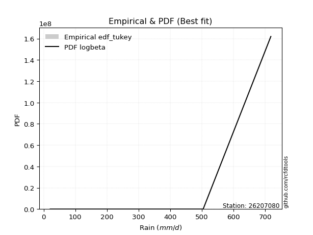</img>

</div>


### 8. Empirical - EDF Gringorten (1963)

Gringorten plotting position formula is essential for estimating the probability and return periods of extreme events like floods and heavy rainfall. The constant _a=0.44_.

<div align="center">


$P=(m-a)/(n+1-2a)$


</div>


**8.1. Empirical values**

<div align="center">

|                | 0                    | 1                  | 2                   | 3                  | 4              | 5                  | 6                  | 7                  | 8                  |
|:---------------|:---------------------|:-------------------|:--------------------|:-------------------|:---------------|:-------------------|:-------------------|:-------------------|:-------------------|
| date           | 2022                 | 2023               | 2017                | 2018               | 2021           | 2020               | 2024               | 2025               | 2019               |
| x              | 20.7                 | 45.0               | 59.1                | 62.4               | 290.9          | 291.1              | 391.0              | 504.0              | 717.9              |
| m              | 1                    | 2                  | 3                   | 4                  | 5              | 6                  | 7                  | 8                  | 9                  |
| empirical_dist | edf_gringorten       | edf_gringorten     | edf_gringorten      | edf_gringorten     | edf_gringorten | edf_gringorten     | edf_gringorten     | edf_gringorten     | edf_gringorten     |
| empirical      | 0.061403508771929835 | 0.1710526315789474 | 0.28070175438596495 | 0.3903508771929825 | 0.5            | 0.6096491228070176 | 0.7192982456140351 | 0.8289473684210527 | 0.9385964912280703 |
| empirical_tr   | 1.0654205607476634   | 1.2063492063492063 | 1.3902439024390243  | 1.6402877697841727 | 2.0            | 2.561797752808989  | 3.5625             | 5.846153846153847  | 16.285714285714324 |

</div>


**8.2. Kolmogorov-Smirnov fit test (sorted by Δ)**


<div align="center">

|                | 0                   | 1                   | 2                   | 3                   | 4                     | 5                   | 6                   | 7                   | 8                   | 9                   | 10                  | 11                  | 12                  | 13                  | 14                  | 15                  | 16                  | 17                  | 18                  | 19                  | 20                  | 21                  | 22                  | 23                  | 24                  | 25                  | 26                  | 27                  | 28                  | 29                  | 30                  | 31                  | 32                  | 33                  | 34                  | 35                  | 36                  | 37                  | 38                  | 39                  | 40                  | 41                  | 42                  | 43                  | 44                  | 45                  | 46                  | 47                  | 48                  | 49                  | 50                  | 51                  | 52                  | 53                  | 54                  | 55                  | 56                  | 57                  | 58                  | 59                  | 60                  | 61                  | 62                  | 63                  | 64                  | 65                  | 66                  | 67                  | 68                  | 69                  | 70                  | 71                  | 72                  | 73                  | 74                  | 75                  | 76                  | 77                  | 78                  | 79                  | 80                  | 81                  | 82                  | 83                  | 84                  | 85                  | 86                  | 87                  | 88                  | 89                  |
|:---------------|:--------------------|:--------------------|:--------------------|:--------------------|:----------------------|:--------------------|:--------------------|:--------------------|:--------------------|:--------------------|:--------------------|:--------------------|:--------------------|:--------------------|:--------------------|:--------------------|:--------------------|:--------------------|:--------------------|:--------------------|:--------------------|:--------------------|:--------------------|:--------------------|:--------------------|:--------------------|:--------------------|:--------------------|:--------------------|:--------------------|:--------------------|:--------------------|:--------------------|:--------------------|:--------------------|:--------------------|:--------------------|:--------------------|:--------------------|:--------------------|:--------------------|:--------------------|:--------------------|:--------------------|:--------------------|:--------------------|:--------------------|:--------------------|:--------------------|:--------------------|:--------------------|:--------------------|:--------------------|:--------------------|:--------------------|:--------------------|:--------------------|:--------------------|:--------------------|:--------------------|:--------------------|:--------------------|:--------------------|:--------------------|:--------------------|:--------------------|:--------------------|:--------------------|:--------------------|:--------------------|:--------------------|:--------------------|:--------------------|:--------------------|:--------------------|:--------------------|:--------------------|:--------------------|:--------------------|:--------------------|:--------------------|:--------------------|:--------------------|:--------------------|:--------------------|:--------------------|:--------------------|:--------------------|:--------------------|:--------------------|
| station        | 26207080            | 26207080            | 26207080            | 26207080            | 26207080              | 26207080            | 26207080            | 26207080            | 26207080            | 26207080            | 26207080            | 26207080            | 26207080            | 26207080            | 26207080            | 26207080            | 26207080            | 26207080            | 26207080            | 26207080            | 26207080            | 26207080            | 26207080            | 26207080            | 26207080            | 26207080            | 26207080            | 26207080            | 26207080            | 26207080            | 26207080            | 26207080            | 26207080            | 26207080            | 26207080            | 26207080            | 26207080            | 26207080            | 26207080            | 26207080            | 26207080            | 26207080            | 26207080            | 26207080            | 26207080            | 26207080            | 26207080            | 26207080            | 26207080            | 26207080            | 26207080            | 26207080            | 26207080            | 26207080            | 26207080            | 26207080            | 26207080            | 26207080            | 26207080            | 26207080            | 26207080            | 26207080            | 26207080            | 26207080            | 26207080            | 26207080            | 26207080            | 26207080            | 26207080            | 26207080            | 26207080            | 26207080            | 26207080            | 26207080            | 26207080            | 26207080            | 26207080            | 26207080            | 26207080            | 26207080            | 26207080            | 26207080            | 26207080            | 26207080            | 26207080            | 26207080            | 26207080            | 26207080            | 26207080            | 26207080            |
| empirical_dist | edf_gringorten      | edf_gringorten      | edf_gringorten      | edf_gringorten      | edf_gringorten        | edf_gringorten      | edf_gringorten      | edf_gringorten      | edf_gringorten      | edf_gringorten      | edf_gringorten      | edf_gringorten      | edf_gringorten      | edf_gringorten      | edf_gringorten      | edf_gringorten      | edf_gringorten      | edf_gringorten      | edf_gringorten      | edf_gringorten      | edf_gringorten      | edf_gringorten      | edf_gringorten      | edf_gringorten      | edf_gringorten      | edf_gringorten      | edf_gringorten      | edf_gringorten      | edf_gringorten      | edf_gringorten      | edf_gringorten      | edf_gringorten      | edf_gringorten      | edf_gringorten      | edf_gringorten      | edf_gringorten      | edf_gringorten      | edf_gringorten      | edf_gringorten      | edf_gringorten      | edf_gringorten      | edf_gringorten      | edf_gringorten      | edf_gringorten      | edf_gringorten      | edf_gringorten      | edf_gringorten      | edf_gringorten      | edf_gringorten      | edf_gringorten      | edf_gringorten      | edf_gringorten      | edf_gringorten      | edf_gringorten      | edf_gringorten      | edf_gringorten      | edf_gringorten      | edf_gringorten      | edf_gringorten      | edf_gringorten      | edf_gringorten      | edf_gringorten      | edf_gringorten      | edf_gringorten      | edf_gringorten      | edf_gringorten      | edf_gringorten      | edf_gringorten      | edf_gringorten      | edf_gringorten      | edf_gringorten      | edf_gringorten      | edf_gringorten      | edf_gringorten      | edf_gringorten      | edf_gringorten      | edf_gringorten      | edf_gringorten      | edf_gringorten      | edf_gringorten      | edf_gringorten      | edf_gringorten      | edf_gringorten      | edf_gringorten      | edf_gringorten      | edf_gringorten      | edf_gringorten      | edf_gringorten      | edf_gringorten      | edf_gringorten      |
| p_dist         | nakagami            | betaprime           | logloggamma         | halfnorm            | loglaplace_asymmetric | ncf                 | f                   | rayleigh            | logjohnsonsu        | logweibull_min      | maxwell             | logfisk             | loggompertz         | loggumbel_l         | logpearson3         | pearson3            | t                   | truncnorm           | norm                | logf                | logexponnorm        | lognorm             | lognorm             | logcrystalball      | logt                | lognct              | logfatiguelife      | logbetaprime        | logerlang           | logncf              | loggamma            | loggamma            | mielke              | genlogistic         | lognakagami         | gumbel_r            | logrice             | halflogistic        | laplace_asymmetric  | johnsonsu           | loginvgamma         | loginvweibull       | kstwobign           | loginvgauss         | logistic            | logmaxwell          | gumbel_l            | logalpha            | lograyleigh         | loglogistic         | loggenexpon         | invgamma            | exponnorm           | moyal               | expon               | hypsecant           | logkstwobign        | logexpon            | nct                 | fisk                | loghalfnorm         | genexpon            | rice                | weibull_min         | invgauss            | loghypsecant        | laplace             | gompertz            | loggumbel_r         | loghalflogistic     | loglaplace          | logmoyal            | logmielke           | chi2                | erlang              | logchi2             | logwald             | logtruncnorm        | alpha               | wald                | loggibrat           | gibrat              | pareto              | loglognorm          | fatiguelife         | crystalball         | gamma               | logpareto           | invweibull          | loggenlogistic      |
| delta          | 0.11441325874004993 | 0.1802929406373014  | 0.18073485700711406 | 0.1814651221100416  | 0.18282695221319492   | 0.1853492426618525  | 0.18561564414143739 | 0.1871480216761482  | 0.18941845812882507 | 0.19132436541363623 | 0.19145944945779433 | 0.19223649620117056 | 0.19491253423821364 | 0.19590173763716157 | 0.1980258812926705  | 0.1995461581814635  | 0.20206350420820945 | 0.20206378196755687 | 0.20206379093577836 | 0.20857413483316978 | 0.20906758796102132 | 0.20906958640397888 | 0.20906958640397888 | 0.20906962596810696 | 0.20906965480284434 | 0.209226094869152   | 0.21039726975827389 | 0.21107094960604167 | 0.21266706434391958 | 0.21293658395823212 | 0.2134310224620225  | 0.2134310224620225  | 0.21384676889242993 | 0.21390562969423926 | 0.21418380939820247 | 0.2157344769240888  | 0.2158364930386898  | 0.2161125560567054  | 0.21695835058048352 | 0.2176803782677843  | 0.21956446125761597 | 0.22203108220740375 | 0.22227026013152684 | 0.22271363402846045 | 0.22290091266547185 | 0.2238749988581359  | 0.22509128846515644 | 0.22614661216029852 | 0.22818201928881376 | 0.2308230665364589  | 0.23104026545726764 | 0.23140765252513606 | 0.2314973511011687  | 0.2332065795195866  | 0.23324223448157966 | 0.23478831866294123 | 0.23489207639847254 | 0.23535105393581013 | 0.2366178664171491  | 0.24071695879262767 | 0.24145630012436736 | 0.2420529941179449  | 0.24282391015884616 | 0.24473073211689478 | 0.24508657322616068 | 0.24629065543619433 | 0.2471678735691437  | 0.24753132622554436 | 0.2579994554178888  | 0.2679023388000036  | 0.27051331723963334 | 0.2737929080828627  | 0.2827557991604488  | 0.28622592511471234 | 0.2940812080159094  | 0.31209006984600896 | 0.32057279239917924 | 0.3269075610230766  | 0.35896696841018194 | 0.3818263453158916  | 0.389663191786776   | 0.3903508771929825  | 0.41908376939867215 | 0.4361064825847288  | 0.455721311489331   | 0.46243388599213847 | 0.4630255952447943  | 0.4646498529433187  | 0.48935087556448736 | 0.8289473684210527  |
| deltao         | 0.41761268023100007 | 0.41761268023100007 | 0.41761268023100007 | 0.41761268023100007 | 0.41761268023100007   | 0.41761268023100007 | 0.41761268023100007 | 0.41761268023100007 | 0.41761268023100007 | 0.41761268023100007 | 0.41761268023100007 | 0.41761268023100007 | 0.41761268023100007 | 0.41761268023100007 | 0.41761268023100007 | 0.41761268023100007 | 0.41761268023100007 | 0.41761268023100007 | 0.41761268023100007 | 0.41761268023100007 | 0.41761268023100007 | 0.41761268023100007 | 0.41761268023100007 | 0.41761268023100007 | 0.41761268023100007 | 0.41761268023100007 | 0.41761268023100007 | 0.41761268023100007 | 0.41761268023100007 | 0.41761268023100007 | 0.41761268023100007 | 0.41761268023100007 | 0.41761268023100007 | 0.41761268023100007 | 0.41761268023100007 | 0.41761268023100007 | 0.41761268023100007 | 0.41761268023100007 | 0.41761268023100007 | 0.41761268023100007 | 0.41761268023100007 | 0.41761268023100007 | 0.41761268023100007 | 0.41761268023100007 | 0.41761268023100007 | 0.41761268023100007 | 0.41761268023100007 | 0.41761268023100007 | 0.41761268023100007 | 0.41761268023100007 | 0.41761268023100007 | 0.41761268023100007 | 0.41761268023100007 | 0.41761268023100007 | 0.41761268023100007 | 0.41761268023100007 | 0.41761268023100007 | 0.41761268023100007 | 0.41761268023100007 | 0.41761268023100007 | 0.41761268023100007 | 0.41761268023100007 | 0.41761268023100007 | 0.41761268023100007 | 0.41761268023100007 | 0.41761268023100007 | 0.41761268023100007 | 0.41761268023100007 | 0.41761268023100007 | 0.41761268023100007 | 0.41761268023100007 | 0.41761268023100007 | 0.41761268023100007 | 0.41761268023100007 | 0.41761268023100007 | 0.41761268023100007 | 0.41761268023100007 | 0.41761268023100007 | 0.41761268023100007 | 0.41761268023100007 | 0.41761268023100007 | 0.41761268023100007 | 0.41761268023100007 | 0.41761268023100007 | 0.41761268023100007 | 0.41761268023100007 | 0.41761268023100007 | 0.41761268023100007 | 0.41761268023100007 | 0.41761268023100007 |
| eval           | Δo > Δ              | Δo > Δ              | Δo > Δ              | Δo > Δ              | Δo > Δ                | Δo > Δ              | Δo > Δ              | Δo > Δ              | Δo > Δ              | Δo > Δ              | Δo > Δ              | Δo > Δ              | Δo > Δ              | Δo > Δ              | Δo > Δ              | Δo > Δ              | Δo > Δ              | Δo > Δ              | Δo > Δ              | Δo > Δ              | Δo > Δ              | Δo > Δ              | Δo > Δ              | Δo > Δ              | Δo > Δ              | Δo > Δ              | Δo > Δ              | Δo > Δ              | Δo > Δ              | Δo > Δ              | Δo > Δ              | Δo > Δ              | Δo > Δ              | Δo > Δ              | Δo > Δ              | Δo > Δ              | Δo > Δ              | Δo > Δ              | Δo > Δ              | Δo > Δ              | Δo > Δ              | Δo > Δ              | Δo > Δ              | Δo > Δ              | Δo > Δ              | Δo > Δ              | Δo > Δ              | Δo > Δ              | Δo > Δ              | Δo > Δ              | Δo > Δ              | Δo > Δ              | Δo > Δ              | Δo > Δ              | Δo > Δ              | Δo > Δ              | Δo > Δ              | Δo > Δ              | Δo > Δ              | Δo > Δ              | Δo > Δ              | Δo > Δ              | Δo > Δ              | Δo > Δ              | Δo > Δ              | Δo > Δ              | Δo > Δ              | Δo > Δ              | Δo > Δ              | Δo > Δ              | Δo > Δ              | Δo > Δ              | Δo > Δ              | Δo > Δ              | Δo > Δ              | Δo > Δ              | Δo > Δ              | Δo > Δ              | Δo > Δ              | Δo > Δ              | Δo > Δ              | Δo > Δ              | Δo <= Δ             | Δo <= Δ             | Δo <= Δ             | Δo <= Δ             | Δo <= Δ             | Δo <= Δ             | Δo <= Δ             | Δo <= Δ             |
| fit            | 1                   | 1                   | 1                   | 1                   | 1                     | 1                   | 1                   | 1                   | 1                   | 1                   | 1                   | 1                   | 1                   | 1                   | 1                   | 1                   | 1                   | 1                   | 1                   | 1                   | 1                   | 1                   | 1                   | 1                   | 1                   | 1                   | 1                   | 1                   | 1                   | 1                   | 1                   | 1                   | 1                   | 1                   | 1                   | 1                   | 1                   | 1                   | 1                   | 1                   | 1                   | 1                   | 1                   | 1                   | 1                   | 1                   | 1                   | 1                   | 1                   | 1                   | 1                   | 1                   | 1                   | 1                   | 1                   | 1                   | 1                   | 1                   | 1                   | 1                   | 1                   | 1                   | 1                   | 1                   | 1                   | 1                   | 1                   | 1                   | 1                   | 1                   | 1                   | 1                   | 1                   | 1                   | 1                   | 1                   | 1                   | 1                   | 1                   | 1                   | 1                   | 1                   | 0                   | 0                   | 0                   | 0                   | 0                   | 0                   | 0                   | 0                   |
| n              | 9                   | 9                   | 9                   | 9                   | 9                     | 9                   | 9                   | 9                   | 9                   | 9                   | 9                   | 9                   | 9                   | 9                   | 9                   | 9                   | 9                   | 9                   | 9                   | 9                   | 9                   | 9                   | 9                   | 9                   | 9                   | 9                   | 9                   | 9                   | 9                   | 9                   | 9                   | 9                   | 9                   | 9                   | 9                   | 9                   | 9                   | 9                   | 9                   | 9                   | 9                   | 9                   | 9                   | 9                   | 9                   | 9                   | 9                   | 9                   | 9                   | 9                   | 9                   | 9                   | 9                   | 9                   | 9                   | 9                   | 9                   | 9                   | 9                   | 9                   | 9                   | 9                   | 9                   | 9                   | 9                   | 9                   | 9                   | 9                   | 9                   | 9                   | 9                   | 9                   | 9                   | 9                   | 9                   | 9                   | 9                   | 9                   | 9                   | 9                   | 9                   | 9                   | 9                   | 9                   | 9                   | 9                   | 9                   | 9                   | 9                   | 9                   |
| best_fit       | 1                   | 0                   | 0                   | 0                   | 0                     | 0                   | 0                   | 0                   | 0                   | 0                   | 0                   | 0                   | 0                   | 0                   | 0                   | 0                   | 0                   | 0                   | 0                   | 0                   | 0                   | 0                   | 0                   | 0                   | 0                   | 0                   | 0                   | 0                   | 0                   | 0                   | 0                   | 0                   | 0                   | 0                   | 0                   | 0                   | 0                   | 0                   | 0                   | 0                   | 0                   | 0                   | 0                   | 0                   | 0                   | 0                   | 0                   | 0                   | 0                   | 0                   | 0                   | 0                   | 0                   | 0                   | 0                   | 0                   | 0                   | 0                   | 0                   | 0                   | 0                   | 0                   | 0                   | 0                   | 0                   | 0                   | 0                   | 0                   | 0                   | 0                   | 0                   | 0                   | 0                   | 0                   | 0                   | 0                   | 0                   | 0                   | 0                   | 0                   | 0                   | 0                   | 0                   | 0                   | 0                   | 0                   | 0                   | 0                   | 0                   | 0                   |
| best_fit_sort  | 1                   | 2                   | 3                   | 4                   | 5                     | 6                   | 7                   | 8                   | 9                   | 10                  | 11                  | 12                  | 13                  | 14                  | 15                  | 16                  | 17                  | 18                  | 19                  | 20                  | 21                  | 22                  | 23                  | 24                  | 25                  | 26                  | 27                  | 28                  | 29                  | 30                  | 31                  | 32                  | 33                  | 34                  | 35                  | 36                  | 37                  | 38                  | 39                  | 40                  | 41                  | 42                  | 43                  | 44                  | 45                  | 46                  | 47                  | 48                  | 49                  | 50                  | 51                  | 52                  | 53                  | 54                  | 55                  | 56                  | 57                  | 58                  | 59                  | 60                  | 61                  | 62                  | 63                  | 64                  | 65                  | 66                  | 67                  | 68                  | 69                  | 70                  | 71                  | 72                  | 73                  | 74                  | 75                  | 76                  | 77                  | 78                  | 79                  | 80                  | 81                  | 82                  | 83                  | 84                  | 85                  | 86                  | 87                  | 88                  | 89                  | 90                  |

</div>


<div align="center">

</img>

</div>


**8.3. Best fit**

<div align="center">

|   id |   station | empirical_dist   | p_dist   |    delta |   deltao | eval   |   fit |   n |   best_fit |   best_fit_sort |
|-----:|----------:|:-----------------|:---------|---------:|---------:|:-------|------:|----:|-----------:|----------------:|
|    0 |  26207080 | edf_gringorten   | nakagami | 0.114413 | 0.417613 | Δo > Δ |     1 |   9 |          1 |               1 |

</div>


<div align="center">

</img></img>

</div>


### 9. Empirical - EDF Filliben (1975)

The specific values of the constants (0.3175) (often denoted as $alpha$) and (0.365) are derived from a method proposed by James J. Filliben in a 1975 paper. This particular formula is the mean value of the $i$-th order statistic of the normal distribution and is considered a robust and effective plotting position formula for the normal probability plot correlation coefficient test for normality.

<div align="center">


$P=(m-0.3175)/(n+0.365)$


</div>


**9.1. Empirical values**

<div align="center">

|                | 0                   | 1                  | 2                   | 3                   | 4            | 5                  | 6                  | 7                  | 8                  |
|:---------------|:--------------------|:-------------------|:--------------------|:--------------------|:-------------|:-------------------|:-------------------|:-------------------|:-------------------|
| date           | 2022                | 2023               | 2017                | 2018                | 2021         | 2020               | 2024               | 2025               | 2019               |
| x              | 20.7                | 45.0               | 59.1                | 62.4                | 290.9        | 291.1              | 391.0              | 504.0              | 717.9              |
| m              | 1                   | 2                  | 3                   | 4                   | 5            | 6                  | 7                  | 8                  | 9                  |
| empirical_dist | edf_filliben        | edf_filliben       | edf_filliben        | edf_filliben        | edf_filliben | edf_filliben       | edf_filliben       | edf_filliben       | edf_filliben       |
| empirical      | 0.07287773625200214 | 0.1796583021890016 | 0.28643886812600106 | 0.39321943406300053 | 0.5          | 0.6067805659369995 | 0.7135611318739989 | 0.8203416978109984 | 0.9271222637479978 |
| empirical_tr   | 1.0786063921681543  | 1.219004230393752  | 1.401421623643846   | 1.6480422349318082  | 2.0          | 2.5431093007467753 | 3.491146318732526  | 5.566121842496286  | 13.721611721611705 |

</div>


**9.2. Kolmogorov-Smirnov fit test (sorted by Δ)**


<div align="center">

|                | 0                   | 1                   | 2                   | 3                   | 4                   | 5                     | 6                   | 7                   | 8                   | 9                   | 10                  | 11                  | 12                  | 13                  | 14                  | 15                  | 16                  | 17                  | 18                  | 19                  | 20                  | 21                  | 22                  | 23                  | 24                  | 25                  | 26                  | 27                  | 28                  | 29                  | 30                  | 31                  | 32                  | 33                  | 34                  | 35                  | 36                  | 37                  | 38                  | 39                  | 40                  | 41                  | 42                  | 43                  | 44                  | 45                  | 46                  | 47                  | 48                  | 49                  | 50                  | 51                  | 52                  | 53                  | 54                  | 55                  | 56                  | 57                  | 58                  | 59                  | 60                  | 61                  | 62                  | 63                  | 64                  | 65                  | 66                  | 67                  | 68                  | 69                  | 70                  | 71                  | 72                  | 73                  | 74                  | 75                  | 76                  | 77                  | 78                  | 79                  | 80                  | 81                  | 82                  | 83                  | 84                  | 85                  | 86                  | 87                  | 88                  | 89                  |
|:---------------|:--------------------|:--------------------|:--------------------|:--------------------|:--------------------|:----------------------|:--------------------|:--------------------|:--------------------|:--------------------|:--------------------|:--------------------|:--------------------|:--------------------|:--------------------|:--------------------|:--------------------|:--------------------|:--------------------|:--------------------|:--------------------|:--------------------|:--------------------|:--------------------|:--------------------|:--------------------|:--------------------|:--------------------|:--------------------|:--------------------|:--------------------|:--------------------|:--------------------|:--------------------|:--------------------|:--------------------|:--------------------|:--------------------|:--------------------|:--------------------|:--------------------|:--------------------|:--------------------|:--------------------|:--------------------|:--------------------|:--------------------|:--------------------|:--------------------|:--------------------|:--------------------|:--------------------|:--------------------|:--------------------|:--------------------|:--------------------|:--------------------|:--------------------|:--------------------|:--------------------|:--------------------|:--------------------|:--------------------|:--------------------|:--------------------|:--------------------|:--------------------|:--------------------|:--------------------|:--------------------|:--------------------|:--------------------|:--------------------|:--------------------|:--------------------|:--------------------|:--------------------|:--------------------|:--------------------|:--------------------|:--------------------|:--------------------|:--------------------|:--------------------|:--------------------|:--------------------|:--------------------|:--------------------|:--------------------|:--------------------|
| station        | 26207080            | 26207080            | 26207080            | 26207080            | 26207080            | 26207080              | 26207080            | 26207080            | 26207080            | 26207080            | 26207080            | 26207080            | 26207080            | 26207080            | 26207080            | 26207080            | 26207080            | 26207080            | 26207080            | 26207080            | 26207080            | 26207080            | 26207080            | 26207080            | 26207080            | 26207080            | 26207080            | 26207080            | 26207080            | 26207080            | 26207080            | 26207080            | 26207080            | 26207080            | 26207080            | 26207080            | 26207080            | 26207080            | 26207080            | 26207080            | 26207080            | 26207080            | 26207080            | 26207080            | 26207080            | 26207080            | 26207080            | 26207080            | 26207080            | 26207080            | 26207080            | 26207080            | 26207080            | 26207080            | 26207080            | 26207080            | 26207080            | 26207080            | 26207080            | 26207080            | 26207080            | 26207080            | 26207080            | 26207080            | 26207080            | 26207080            | 26207080            | 26207080            | 26207080            | 26207080            | 26207080            | 26207080            | 26207080            | 26207080            | 26207080            | 26207080            | 26207080            | 26207080            | 26207080            | 26207080            | 26207080            | 26207080            | 26207080            | 26207080            | 26207080            | 26207080            | 26207080            | 26207080            | 26207080            | 26207080            |
| empirical_dist | edf_filliben        | edf_filliben        | edf_filliben        | edf_filliben        | edf_filliben        | edf_filliben          | edf_filliben        | edf_filliben        | edf_filliben        | edf_filliben        | edf_filliben        | edf_filliben        | edf_filliben        | edf_filliben        | edf_filliben        | edf_filliben        | edf_filliben        | edf_filliben        | edf_filliben        | edf_filliben        | edf_filliben        | edf_filliben        | edf_filliben        | edf_filliben        | edf_filliben        | edf_filliben        | edf_filliben        | edf_filliben        | edf_filliben        | edf_filliben        | edf_filliben        | edf_filliben        | edf_filliben        | edf_filliben        | edf_filliben        | edf_filliben        | edf_filliben        | edf_filliben        | edf_filliben        | edf_filliben        | edf_filliben        | edf_filliben        | edf_filliben        | edf_filliben        | edf_filliben        | edf_filliben        | edf_filliben        | edf_filliben        | edf_filliben        | edf_filliben        | edf_filliben        | edf_filliben        | edf_filliben        | edf_filliben        | edf_filliben        | edf_filliben        | edf_filliben        | edf_filliben        | edf_filliben        | edf_filliben        | edf_filliben        | edf_filliben        | edf_filliben        | edf_filliben        | edf_filliben        | edf_filliben        | edf_filliben        | edf_filliben        | edf_filliben        | edf_filliben        | edf_filliben        | edf_filliben        | edf_filliben        | edf_filliben        | edf_filliben        | edf_filliben        | edf_filliben        | edf_filliben        | edf_filliben        | edf_filliben        | edf_filliben        | edf_filliben        | edf_filliben        | edf_filliben        | edf_filliben        | edf_filliben        | edf_filliben        | edf_filliben        | edf_filliben        | edf_filliben        |
| p_dist         | nakagami            | betaprime           | logloggamma         | halfnorm            | f                   | loglaplace_asymmetric | ncf                 | rayleigh            | logfisk             | logjohnsonsu        | logweibull_min      | maxwell             | loggompertz         | logpearson3         | loggumbel_l         | pearson3            | t                   | truncnorm           | norm                | logf                | logexponnorm        | lognorm             | lognorm             | logcrystalball      | logt                | lognct              | logfatiguelife      | logbetaprime        | logerlang           | logncf              | loggamma            | loggamma            | mielke              | lognakagami         | logrice             | genlogistic         | johnsonsu           | gumbel_r            | halflogistic        | loginvgamma         | laplace_asymmetric  | loginvweibull       | loginvgauss         | logmaxwell          | kstwobign           | logistic            | logalpha            | gumbel_l            | lograyleigh         | loglogistic         | loggenexpon         | invgamma            | exponnorm           | logkstwobign        | logexpon            | moyal               | expon               | nct                 | hypsecant           | fisk                | loghalfnorm         | weibull_min         | genexpon            | invgauss            | rice                | loghypsecant        | laplace             | gompertz            | loggumbel_r         | loghalflogistic     | loglaplace          | logmoyal            | logmielke           | chi2                | erlang              | logchi2             | logwald             | logtruncnorm        | alpha               | wald                | loggibrat           | gibrat              | pareto              | loglognorm          | fatiguelife         | crystalball         | gamma               | logpareto           | invweibull          | loggenlogistic      |
| delta          | 0.11441325874004993 | 0.1802929406373014  | 0.18360341387713208 | 0.18433367898005962 | 0.18561564414143739 | 0.18569550908321295   | 0.1882177995318705  | 0.19001657854616621 | 0.19223649620117056 | 0.1922870149988431  | 0.19419292228365426 | 0.19432800632781236 | 0.19491253423821364 | 0.1980258812926705  | 0.1987702945071796  | 0.20241471505148154 | 0.20493206107822748 | 0.2049323388375749  | 0.2049323478057964  | 0.20857413483316978 | 0.20906758796102132 | 0.20906958640397888 | 0.20906958640397888 | 0.20906962596810696 | 0.20906965480284434 | 0.209226094869152   | 0.21039726975827389 | 0.21107094960604167 | 0.21266706434391958 | 0.21293658395823212 | 0.2134310224620225  | 0.2134310224620225  | 0.21384676889242993 | 0.21418380939820247 | 0.2158364930386898  | 0.2167741865642573  | 0.2176803782677843  | 0.21860303379410684 | 0.21898111292672343 | 0.21956446125761597 | 0.21982690745050154 | 0.22203108220740375 | 0.22271363402846045 | 0.2238749988581359  | 0.22513881700154487 | 0.22576946953548988 | 0.22614661216029852 | 0.22795984533517447 | 0.22818201928881376 | 0.2308230665364589  | 0.23104026545726764 | 0.23140765252513606 | 0.23436590797118673 | 0.23489207639847254 | 0.23535105393581013 | 0.23607513638960462 | 0.23611079135159768 | 0.2366178664171491  | 0.23765687553295925 | 0.24071695879262767 | 0.24145630012436736 | 0.24473073211689478 | 0.24492155098796292 | 0.24508657322616068 | 0.2456924670288642  | 0.24629065543619433 | 0.2500364304391617  | 0.2503998830955624  | 0.2579994554178888  | 0.2679023388000036  | 0.27051331723963334 | 0.2737929080828627  | 0.2827557991604488  | 0.28622592511471234 | 0.2940812080159094  | 0.31209006984600896 | 0.32057279239917924 | 0.3269075610230766  | 0.35896696841018194 | 0.3846949021859096  | 0.392531748656794   | 0.39321943406300053 | 0.41047809878861796 | 0.4275008119746746  | 0.4471156408792768  | 0.4509596585120662  | 0.4544199246347401  | 0.4560441823332645  | 0.4778766480844148  | 0.8203416978109984  |
| deltao         | 0.41761268023100007 | 0.41761268023100007 | 0.41761268023100007 | 0.41761268023100007 | 0.41761268023100007 | 0.41761268023100007   | 0.41761268023100007 | 0.41761268023100007 | 0.41761268023100007 | 0.41761268023100007 | 0.41761268023100007 | 0.41761268023100007 | 0.41761268023100007 | 0.41761268023100007 | 0.41761268023100007 | 0.41761268023100007 | 0.41761268023100007 | 0.41761268023100007 | 0.41761268023100007 | 0.41761268023100007 | 0.41761268023100007 | 0.41761268023100007 | 0.41761268023100007 | 0.41761268023100007 | 0.41761268023100007 | 0.41761268023100007 | 0.41761268023100007 | 0.41761268023100007 | 0.41761268023100007 | 0.41761268023100007 | 0.41761268023100007 | 0.41761268023100007 | 0.41761268023100007 | 0.41761268023100007 | 0.41761268023100007 | 0.41761268023100007 | 0.41761268023100007 | 0.41761268023100007 | 0.41761268023100007 | 0.41761268023100007 | 0.41761268023100007 | 0.41761268023100007 | 0.41761268023100007 | 0.41761268023100007 | 0.41761268023100007 | 0.41761268023100007 | 0.41761268023100007 | 0.41761268023100007 | 0.41761268023100007 | 0.41761268023100007 | 0.41761268023100007 | 0.41761268023100007 | 0.41761268023100007 | 0.41761268023100007 | 0.41761268023100007 | 0.41761268023100007 | 0.41761268023100007 | 0.41761268023100007 | 0.41761268023100007 | 0.41761268023100007 | 0.41761268023100007 | 0.41761268023100007 | 0.41761268023100007 | 0.41761268023100007 | 0.41761268023100007 | 0.41761268023100007 | 0.41761268023100007 | 0.41761268023100007 | 0.41761268023100007 | 0.41761268023100007 | 0.41761268023100007 | 0.41761268023100007 | 0.41761268023100007 | 0.41761268023100007 | 0.41761268023100007 | 0.41761268023100007 | 0.41761268023100007 | 0.41761268023100007 | 0.41761268023100007 | 0.41761268023100007 | 0.41761268023100007 | 0.41761268023100007 | 0.41761268023100007 | 0.41761268023100007 | 0.41761268023100007 | 0.41761268023100007 | 0.41761268023100007 | 0.41761268023100007 | 0.41761268023100007 | 0.41761268023100007 |
| eval           | Δo > Δ              | Δo > Δ              | Δo > Δ              | Δo > Δ              | Δo > Δ              | Δo > Δ                | Δo > Δ              | Δo > Δ              | Δo > Δ              | Δo > Δ              | Δo > Δ              | Δo > Δ              | Δo > Δ              | Δo > Δ              | Δo > Δ              | Δo > Δ              | Δo > Δ              | Δo > Δ              | Δo > Δ              | Δo > Δ              | Δo > Δ              | Δo > Δ              | Δo > Δ              | Δo > Δ              | Δo > Δ              | Δo > Δ              | Δo > Δ              | Δo > Δ              | Δo > Δ              | Δo > Δ              | Δo > Δ              | Δo > Δ              | Δo > Δ              | Δo > Δ              | Δo > Δ              | Δo > Δ              | Δo > Δ              | Δo > Δ              | Δo > Δ              | Δo > Δ              | Δo > Δ              | Δo > Δ              | Δo > Δ              | Δo > Δ              | Δo > Δ              | Δo > Δ              | Δo > Δ              | Δo > Δ              | Δo > Δ              | Δo > Δ              | Δo > Δ              | Δo > Δ              | Δo > Δ              | Δo > Δ              | Δo > Δ              | Δo > Δ              | Δo > Δ              | Δo > Δ              | Δo > Δ              | Δo > Δ              | Δo > Δ              | Δo > Δ              | Δo > Δ              | Δo > Δ              | Δo > Δ              | Δo > Δ              | Δo > Δ              | Δo > Δ              | Δo > Δ              | Δo > Δ              | Δo > Δ              | Δo > Δ              | Δo > Δ              | Δo > Δ              | Δo > Δ              | Δo > Δ              | Δo > Δ              | Δo > Δ              | Δo > Δ              | Δo > Δ              | Δo > Δ              | Δo > Δ              | Δo > Δ              | Δo <= Δ             | Δo <= Δ             | Δo <= Δ             | Δo <= Δ             | Δo <= Δ             | Δo <= Δ             | Δo <= Δ             |
| fit            | 1                   | 1                   | 1                   | 1                   | 1                   | 1                     | 1                   | 1                   | 1                   | 1                   | 1                   | 1                   | 1                   | 1                   | 1                   | 1                   | 1                   | 1                   | 1                   | 1                   | 1                   | 1                   | 1                   | 1                   | 1                   | 1                   | 1                   | 1                   | 1                   | 1                   | 1                   | 1                   | 1                   | 1                   | 1                   | 1                   | 1                   | 1                   | 1                   | 1                   | 1                   | 1                   | 1                   | 1                   | 1                   | 1                   | 1                   | 1                   | 1                   | 1                   | 1                   | 1                   | 1                   | 1                   | 1                   | 1                   | 1                   | 1                   | 1                   | 1                   | 1                   | 1                   | 1                   | 1                   | 1                   | 1                   | 1                   | 1                   | 1                   | 1                   | 1                   | 1                   | 1                   | 1                   | 1                   | 1                   | 1                   | 1                   | 1                   | 1                   | 1                   | 1                   | 1                   | 0                   | 0                   | 0                   | 0                   | 0                   | 0                   | 0                   |
| n              | 9                   | 9                   | 9                   | 9                   | 9                   | 9                     | 9                   | 9                   | 9                   | 9                   | 9                   | 9                   | 9                   | 9                   | 9                   | 9                   | 9                   | 9                   | 9                   | 9                   | 9                   | 9                   | 9                   | 9                   | 9                   | 9                   | 9                   | 9                   | 9                   | 9                   | 9                   | 9                   | 9                   | 9                   | 9                   | 9                   | 9                   | 9                   | 9                   | 9                   | 9                   | 9                   | 9                   | 9                   | 9                   | 9                   | 9                   | 9                   | 9                   | 9                   | 9                   | 9                   | 9                   | 9                   | 9                   | 9                   | 9                   | 9                   | 9                   | 9                   | 9                   | 9                   | 9                   | 9                   | 9                   | 9                   | 9                   | 9                   | 9                   | 9                   | 9                   | 9                   | 9                   | 9                   | 9                   | 9                   | 9                   | 9                   | 9                   | 9                   | 9                   | 9                   | 9                   | 9                   | 9                   | 9                   | 9                   | 9                   | 9                   | 9                   |
| best_fit       | 1                   | 0                   | 0                   | 0                   | 0                   | 0                     | 0                   | 0                   | 0                   | 0                   | 0                   | 0                   | 0                   | 0                   | 0                   | 0                   | 0                   | 0                   | 0                   | 0                   | 0                   | 0                   | 0                   | 0                   | 0                   | 0                   | 0                   | 0                   | 0                   | 0                   | 0                   | 0                   | 0                   | 0                   | 0                   | 0                   | 0                   | 0                   | 0                   | 0                   | 0                   | 0                   | 0                   | 0                   | 0                   | 0                   | 0                   | 0                   | 0                   | 0                   | 0                   | 0                   | 0                   | 0                   | 0                   | 0                   | 0                   | 0                   | 0                   | 0                   | 0                   | 0                   | 0                   | 0                   | 0                   | 0                   | 0                   | 0                   | 0                   | 0                   | 0                   | 0                   | 0                   | 0                   | 0                   | 0                   | 0                   | 0                   | 0                   | 0                   | 0                   | 0                   | 0                   | 0                   | 0                   | 0                   | 0                   | 0                   | 0                   | 0                   |
| best_fit_sort  | 1                   | 2                   | 3                   | 4                   | 5                   | 6                     | 7                   | 8                   | 9                   | 10                  | 11                  | 12                  | 13                  | 14                  | 15                  | 16                  | 17                  | 18                  | 19                  | 20                  | 21                  | 22                  | 23                  | 24                  | 25                  | 26                  | 27                  | 28                  | 29                  | 30                  | 31                  | 32                  | 33                  | 34                  | 35                  | 36                  | 37                  | 38                  | 39                  | 40                  | 41                  | 42                  | 43                  | 44                  | 45                  | 46                  | 47                  | 48                  | 49                  | 50                  | 51                  | 52                  | 53                  | 54                  | 55                  | 56                  | 57                  | 58                  | 59                  | 60                  | 61                  | 62                  | 63                  | 64                  | 65                  | 66                  | 67                  | 68                  | 69                  | 70                  | 71                  | 72                  | 73                  | 74                  | 75                  | 76                  | 77                  | 78                  | 79                  | 80                  | 81                  | 82                  | 83                  | 84                  | 85                  | 86                  | 87                  | 88                  | 89                  | 90                  |

</div>


<div align="center">

</img>

</div>


**9.3. Best fit**

<div align="center">

|   id |   station | empirical_dist   | p_dist   |    delta |   deltao | eval   |   fit |   n |   best_fit |   best_fit_sort |
|-----:|----------:|:-----------------|:---------|---------:|---------:|:-------|------:|----:|-----------:|----------------:|
|    0 |  26207080 | edf_filliben     | nakagami | 0.114413 | 0.417613 | Δo > Δ |     1 |   9 |          1 |               1 |

</div>


<div align="center">

</img>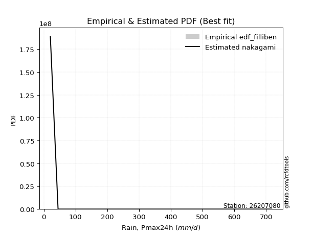</img>

</div>


### 10. Empirical - EDF Jenkinson (1977)

The Jenkinson formula in hydrology is an empirical plotting position formula used to estimate the non-exceedance probability _(P)_ or return period _(T)_ of a given ordered observation within a sample. It is a widely used method in the frequency analysis of extreme events such as floods and rainfall, as it provides a distribution-free way to plot data. _a≈0.31_ and _b≈0.38_ are constants derived to approximate the median of the probability distribution for the given rank.

<div align="center">


$P=(m-a)/(n+b)$


</div>


**10.1. Empirical values**

<div align="center">

|                | 0                   | 1                   | 2                  | 3                   | 4             | 5                  | 6                  | 7                  | 8                  |
|:---------------|:--------------------|:--------------------|:-------------------|:--------------------|:--------------|:-------------------|:-------------------|:-------------------|:-------------------|
| date           | 2022                | 2023                | 2017               | 2018                | 2021          | 2020               | 2024               | 2025               | 2019               |
| x              | 20.7                | 45.0                | 59.1               | 62.4                | 290.9         | 291.1              | 391.0              | 504.0              | 717.9              |
| m              | 1                   | 2                   | 3                  | 4                   | 5             | 6                  | 7                  | 8                  | 9                  |
| empirical_dist | edf_jenkinson       | edf_jenkinson       | edf_jenkinson      | edf_jenkinson       | edf_jenkinson | edf_jenkinson      | edf_jenkinson      | edf_jenkinson      | edf_jenkinson      |
| empirical      | 0.07356076759061833 | 0.18017057569296374 | 0.2867803837953091 | 0.39339019189765456 | 0.5           | 0.6066098081023454 | 0.7132196162046908 | 0.8198294243070362 | 0.9264392324093815 |
| empirical_tr   | 1.0794016110471807  | 1.2197659297789336  | 1.4020926756352765 | 1.6485061511423549  | 2.0           | 2.542005420054201  | 3.486988847583642  | 5.550295857988164  | 13.5942028985507   |

</div>


**10.2. Kolmogorov-Smirnov fit test (sorted by Δ)**


<div align="center">

|                | 0                   | 1                   | 2                   | 3                   | 4                   | 5                     | 6                   | 7                   | 8                   | 9                   | 10                  | 11                  | 12                  | 13                  | 14                  | 15                  | 16                  | 17                  | 18                  | 19                  | 20                  | 21                  | 22                  | 23                  | 24                  | 25                  | 26                  | 27                  | 28                  | 29                  | 30                  | 31                  | 32                  | 33                  | 34                  | 35                  | 36                  | 37                  | 38                  | 39                  | 40                  | 41                  | 42                  | 43                  | 44                  | 45                  | 46                  | 47                  | 48                  | 49                  | 50                  | 51                  | 52                  | 53                  | 54                  | 55                  | 56                  | 57                  | 58                  | 59                  | 60                  | 61                  | 62                  | 63                  | 64                  | 65                  | 66                  | 67                  | 68                  | 69                  | 70                  | 71                  | 72                  | 73                  | 74                  | 75                  | 76                  | 77                  | 78                  | 79                  | 80                  | 81                  | 82                  | 83                  | 84                  | 85                  | 86                  | 87                  | 88                  | 89                  |
|:---------------|:--------------------|:--------------------|:--------------------|:--------------------|:--------------------|:----------------------|:--------------------|:--------------------|:--------------------|:--------------------|:--------------------|:--------------------|:--------------------|:--------------------|:--------------------|:--------------------|:--------------------|:--------------------|:--------------------|:--------------------|:--------------------|:--------------------|:--------------------|:--------------------|:--------------------|:--------------------|:--------------------|:--------------------|:--------------------|:--------------------|:--------------------|:--------------------|:--------------------|:--------------------|:--------------------|:--------------------|:--------------------|:--------------------|:--------------------|:--------------------|:--------------------|:--------------------|:--------------------|:--------------------|:--------------------|:--------------------|:--------------------|:--------------------|:--------------------|:--------------------|:--------------------|:--------------------|:--------------------|:--------------------|:--------------------|:--------------------|:--------------------|:--------------------|:--------------------|:--------------------|:--------------------|:--------------------|:--------------------|:--------------------|:--------------------|:--------------------|:--------------------|:--------------------|:--------------------|:--------------------|:--------------------|:--------------------|:--------------------|:--------------------|:--------------------|:--------------------|:--------------------|:--------------------|:--------------------|:--------------------|:--------------------|:--------------------|:--------------------|:--------------------|:--------------------|:--------------------|:--------------------|:--------------------|:--------------------|:--------------------|
| station        | 26207080            | 26207080            | 26207080            | 26207080            | 26207080            | 26207080              | 26207080            | 26207080            | 26207080            | 26207080            | 26207080            | 26207080            | 26207080            | 26207080            | 26207080            | 26207080            | 26207080            | 26207080            | 26207080            | 26207080            | 26207080            | 26207080            | 26207080            | 26207080            | 26207080            | 26207080            | 26207080            | 26207080            | 26207080            | 26207080            | 26207080            | 26207080            | 26207080            | 26207080            | 26207080            | 26207080            | 26207080            | 26207080            | 26207080            | 26207080            | 26207080            | 26207080            | 26207080            | 26207080            | 26207080            | 26207080            | 26207080            | 26207080            | 26207080            | 26207080            | 26207080            | 26207080            | 26207080            | 26207080            | 26207080            | 26207080            | 26207080            | 26207080            | 26207080            | 26207080            | 26207080            | 26207080            | 26207080            | 26207080            | 26207080            | 26207080            | 26207080            | 26207080            | 26207080            | 26207080            | 26207080            | 26207080            | 26207080            | 26207080            | 26207080            | 26207080            | 26207080            | 26207080            | 26207080            | 26207080            | 26207080            | 26207080            | 26207080            | 26207080            | 26207080            | 26207080            | 26207080            | 26207080            | 26207080            | 26207080            |
| empirical_dist | edf_jenkinson       | edf_jenkinson       | edf_jenkinson       | edf_jenkinson       | edf_jenkinson       | edf_jenkinson         | edf_jenkinson       | edf_jenkinson       | edf_jenkinson       | edf_jenkinson       | edf_jenkinson       | edf_jenkinson       | edf_jenkinson       | edf_jenkinson       | edf_jenkinson       | edf_jenkinson       | edf_jenkinson       | edf_jenkinson       | edf_jenkinson       | edf_jenkinson       | edf_jenkinson       | edf_jenkinson       | edf_jenkinson       | edf_jenkinson       | edf_jenkinson       | edf_jenkinson       | edf_jenkinson       | edf_jenkinson       | edf_jenkinson       | edf_jenkinson       | edf_jenkinson       | edf_jenkinson       | edf_jenkinson       | edf_jenkinson       | edf_jenkinson       | edf_jenkinson       | edf_jenkinson       | edf_jenkinson       | edf_jenkinson       | edf_jenkinson       | edf_jenkinson       | edf_jenkinson       | edf_jenkinson       | edf_jenkinson       | edf_jenkinson       | edf_jenkinson       | edf_jenkinson       | edf_jenkinson       | edf_jenkinson       | edf_jenkinson       | edf_jenkinson       | edf_jenkinson       | edf_jenkinson       | edf_jenkinson       | edf_jenkinson       | edf_jenkinson       | edf_jenkinson       | edf_jenkinson       | edf_jenkinson       | edf_jenkinson       | edf_jenkinson       | edf_jenkinson       | edf_jenkinson       | edf_jenkinson       | edf_jenkinson       | edf_jenkinson       | edf_jenkinson       | edf_jenkinson       | edf_jenkinson       | edf_jenkinson       | edf_jenkinson       | edf_jenkinson       | edf_jenkinson       | edf_jenkinson       | edf_jenkinson       | edf_jenkinson       | edf_jenkinson       | edf_jenkinson       | edf_jenkinson       | edf_jenkinson       | edf_jenkinson       | edf_jenkinson       | edf_jenkinson       | edf_jenkinson       | edf_jenkinson       | edf_jenkinson       | edf_jenkinson       | edf_jenkinson       | edf_jenkinson       | edf_jenkinson       |
| p_dist         | nakagami            | betaprime           | logloggamma         | halfnorm            | f                   | loglaplace_asymmetric | ncf                 | rayleigh            | logfisk             | logjohnsonsu        | logweibull_min      | maxwell             | loggompertz         | logpearson3         | loggumbel_l         | pearson3            | t                   | truncnorm           | norm                | logf                | logexponnorm        | lognorm             | lognorm             | logcrystalball      | logt                | lognct              | logfatiguelife      | logbetaprime        | logerlang           | logncf              | loggamma            | loggamma            | mielke              | lognakagami         | logrice             | genlogistic         | johnsonsu           | gumbel_r            | halflogistic        | loginvgamma         | laplace_asymmetric  | loginvweibull       | loginvgauss         | logmaxwell          | kstwobign           | logistic            | logalpha            | gumbel_l            | lograyleigh         | loglogistic         | loggenexpon         | invgamma            | exponnorm           | logkstwobign        | logexpon            | moyal               | expon               | nct                 | hypsecant           | fisk                | loghalfnorm         | weibull_min         | invgauss            | genexpon            | rice                | loghypsecant        | laplace             | gompertz            | loggumbel_r         | loghalflogistic     | loglaplace          | logmoyal            | logmielke           | chi2                | erlang              | logchi2             | logwald             | logtruncnorm        | alpha               | wald                | loggibrat           | gibrat              | pareto              | loglognorm          | fatiguelife         | crystalball         | gamma               | logpareto           | invweibull          | loggenlogistic      |
| delta          | 0.11441325874004993 | 0.1802929406373014  | 0.18377417171178612 | 0.18450443681471365 | 0.18561564414143739 | 0.18586626691786698   | 0.18838855736652454 | 0.19018733638082025 | 0.19223649620117056 | 0.19245777283349713 | 0.1943636801183083  | 0.1944987641624664  | 0.19491253423821364 | 0.1980258812926705  | 0.19894105234183362 | 0.20258547288613557 | 0.2051028189128815  | 0.20510309667222892 | 0.20510310564045042 | 0.20857413483316978 | 0.20906758796102132 | 0.20906958640397888 | 0.20906958640397888 | 0.20906962596810696 | 0.20906965480284434 | 0.209226094869152   | 0.21039726975827389 | 0.21107094960604167 | 0.21266706434391958 | 0.21293658395823212 | 0.2134310224620225  | 0.2134310224620225  | 0.21384676889242993 | 0.21418380939820247 | 0.2158364930386898  | 0.21694494439891132 | 0.2176803782677843  | 0.21877379162876087 | 0.21915187076137746 | 0.21956446125761597 | 0.21999766528515557 | 0.22203108220740375 | 0.22271363402846045 | 0.2238749988581359  | 0.2253095748361989  | 0.2259402273701439  | 0.22614661216029852 | 0.2281306031698285  | 0.22818201928881376 | 0.2308230665364589  | 0.23104026545726764 | 0.23140765252513606 | 0.23453666580584076 | 0.23489207639847254 | 0.23535105393581013 | 0.23624589422425865 | 0.23628154918625172 | 0.2366178664171491  | 0.23782763336761328 | 0.24071695879262767 | 0.24145630012436736 | 0.24473073211689478 | 0.24508657322616068 | 0.24509230882261696 | 0.24586322486351822 | 0.24629065543619433 | 0.2502071882738157  | 0.2505706409302164  | 0.2579994554178888  | 0.2679023388000036  | 0.27051331723963334 | 0.2737929080828627  | 0.2827557991604488  | 0.28622592511471234 | 0.2940812080159094  | 0.31209006984600896 | 0.32057279239917924 | 0.3269075610230766  | 0.35896696841018194 | 0.38486566002056366 | 0.39270250649144806 | 0.39339019189765456 | 0.4099658252846558  | 0.42698853847071244 | 0.44660336737531464 | 0.45027662717344996 | 0.45390765113077797 | 0.45553190882930233 | 0.4771936167457986  | 0.8198294243070362  |
| deltao         | 0.41761268023100007 | 0.41761268023100007 | 0.41761268023100007 | 0.41761268023100007 | 0.41761268023100007 | 0.41761268023100007   | 0.41761268023100007 | 0.41761268023100007 | 0.41761268023100007 | 0.41761268023100007 | 0.41761268023100007 | 0.41761268023100007 | 0.41761268023100007 | 0.41761268023100007 | 0.41761268023100007 | 0.41761268023100007 | 0.41761268023100007 | 0.41761268023100007 | 0.41761268023100007 | 0.41761268023100007 | 0.41761268023100007 | 0.41761268023100007 | 0.41761268023100007 | 0.41761268023100007 | 0.41761268023100007 | 0.41761268023100007 | 0.41761268023100007 | 0.41761268023100007 | 0.41761268023100007 | 0.41761268023100007 | 0.41761268023100007 | 0.41761268023100007 | 0.41761268023100007 | 0.41761268023100007 | 0.41761268023100007 | 0.41761268023100007 | 0.41761268023100007 | 0.41761268023100007 | 0.41761268023100007 | 0.41761268023100007 | 0.41761268023100007 | 0.41761268023100007 | 0.41761268023100007 | 0.41761268023100007 | 0.41761268023100007 | 0.41761268023100007 | 0.41761268023100007 | 0.41761268023100007 | 0.41761268023100007 | 0.41761268023100007 | 0.41761268023100007 | 0.41761268023100007 | 0.41761268023100007 | 0.41761268023100007 | 0.41761268023100007 | 0.41761268023100007 | 0.41761268023100007 | 0.41761268023100007 | 0.41761268023100007 | 0.41761268023100007 | 0.41761268023100007 | 0.41761268023100007 | 0.41761268023100007 | 0.41761268023100007 | 0.41761268023100007 | 0.41761268023100007 | 0.41761268023100007 | 0.41761268023100007 | 0.41761268023100007 | 0.41761268023100007 | 0.41761268023100007 | 0.41761268023100007 | 0.41761268023100007 | 0.41761268023100007 | 0.41761268023100007 | 0.41761268023100007 | 0.41761268023100007 | 0.41761268023100007 | 0.41761268023100007 | 0.41761268023100007 | 0.41761268023100007 | 0.41761268023100007 | 0.41761268023100007 | 0.41761268023100007 | 0.41761268023100007 | 0.41761268023100007 | 0.41761268023100007 | 0.41761268023100007 | 0.41761268023100007 | 0.41761268023100007 |
| eval           | Δo > Δ              | Δo > Δ              | Δo > Δ              | Δo > Δ              | Δo > Δ              | Δo > Δ                | Δo > Δ              | Δo > Δ              | Δo > Δ              | Δo > Δ              | Δo > Δ              | Δo > Δ              | Δo > Δ              | Δo > Δ              | Δo > Δ              | Δo > Δ              | Δo > Δ              | Δo > Δ              | Δo > Δ              | Δo > Δ              | Δo > Δ              | Δo > Δ              | Δo > Δ              | Δo > Δ              | Δo > Δ              | Δo > Δ              | Δo > Δ              | Δo > Δ              | Δo > Δ              | Δo > Δ              | Δo > Δ              | Δo > Δ              | Δo > Δ              | Δo > Δ              | Δo > Δ              | Δo > Δ              | Δo > Δ              | Δo > Δ              | Δo > Δ              | Δo > Δ              | Δo > Δ              | Δo > Δ              | Δo > Δ              | Δo > Δ              | Δo > Δ              | Δo > Δ              | Δo > Δ              | Δo > Δ              | Δo > Δ              | Δo > Δ              | Δo > Δ              | Δo > Δ              | Δo > Δ              | Δo > Δ              | Δo > Δ              | Δo > Δ              | Δo > Δ              | Δo > Δ              | Δo > Δ              | Δo > Δ              | Δo > Δ              | Δo > Δ              | Δo > Δ              | Δo > Δ              | Δo > Δ              | Δo > Δ              | Δo > Δ              | Δo > Δ              | Δo > Δ              | Δo > Δ              | Δo > Δ              | Δo > Δ              | Δo > Δ              | Δo > Δ              | Δo > Δ              | Δo > Δ              | Δo > Δ              | Δo > Δ              | Δo > Δ              | Δo > Δ              | Δo > Δ              | Δo > Δ              | Δo > Δ              | Δo <= Δ             | Δo <= Δ             | Δo <= Δ             | Δo <= Δ             | Δo <= Δ             | Δo <= Δ             | Δo <= Δ             |
| fit            | 1                   | 1                   | 1                   | 1                   | 1                   | 1                     | 1                   | 1                   | 1                   | 1                   | 1                   | 1                   | 1                   | 1                   | 1                   | 1                   | 1                   | 1                   | 1                   | 1                   | 1                   | 1                   | 1                   | 1                   | 1                   | 1                   | 1                   | 1                   | 1                   | 1                   | 1                   | 1                   | 1                   | 1                   | 1                   | 1                   | 1                   | 1                   | 1                   | 1                   | 1                   | 1                   | 1                   | 1                   | 1                   | 1                   | 1                   | 1                   | 1                   | 1                   | 1                   | 1                   | 1                   | 1                   | 1                   | 1                   | 1                   | 1                   | 1                   | 1                   | 1                   | 1                   | 1                   | 1                   | 1                   | 1                   | 1                   | 1                   | 1                   | 1                   | 1                   | 1                   | 1                   | 1                   | 1                   | 1                   | 1                   | 1                   | 1                   | 1                   | 1                   | 1                   | 1                   | 0                   | 0                   | 0                   | 0                   | 0                   | 0                   | 0                   |
| n              | 9                   | 9                   | 9                   | 9                   | 9                   | 9                     | 9                   | 9                   | 9                   | 9                   | 9                   | 9                   | 9                   | 9                   | 9                   | 9                   | 9                   | 9                   | 9                   | 9                   | 9                   | 9                   | 9                   | 9                   | 9                   | 9                   | 9                   | 9                   | 9                   | 9                   | 9                   | 9                   | 9                   | 9                   | 9                   | 9                   | 9                   | 9                   | 9                   | 9                   | 9                   | 9                   | 9                   | 9                   | 9                   | 9                   | 9                   | 9                   | 9                   | 9                   | 9                   | 9                   | 9                   | 9                   | 9                   | 9                   | 9                   | 9                   | 9                   | 9                   | 9                   | 9                   | 9                   | 9                   | 9                   | 9                   | 9                   | 9                   | 9                   | 9                   | 9                   | 9                   | 9                   | 9                   | 9                   | 9                   | 9                   | 9                   | 9                   | 9                   | 9                   | 9                   | 9                   | 9                   | 9                   | 9                   | 9                   | 9                   | 9                   | 9                   |
| best_fit       | 1                   | 0                   | 0                   | 0                   | 0                   | 0                     | 0                   | 0                   | 0                   | 0                   | 0                   | 0                   | 0                   | 0                   | 0                   | 0                   | 0                   | 0                   | 0                   | 0                   | 0                   | 0                   | 0                   | 0                   | 0                   | 0                   | 0                   | 0                   | 0                   | 0                   | 0                   | 0                   | 0                   | 0                   | 0                   | 0                   | 0                   | 0                   | 0                   | 0                   | 0                   | 0                   | 0                   | 0                   | 0                   | 0                   | 0                   | 0                   | 0                   | 0                   | 0                   | 0                   | 0                   | 0                   | 0                   | 0                   | 0                   | 0                   | 0                   | 0                   | 0                   | 0                   | 0                   | 0                   | 0                   | 0                   | 0                   | 0                   | 0                   | 0                   | 0                   | 0                   | 0                   | 0                   | 0                   | 0                   | 0                   | 0                   | 0                   | 0                   | 0                   | 0                   | 0                   | 0                   | 0                   | 0                   | 0                   | 0                   | 0                   | 0                   |
| best_fit_sort  | 1                   | 2                   | 3                   | 4                   | 5                   | 6                     | 7                   | 8                   | 9                   | 10                  | 11                  | 12                  | 13                  | 14                  | 15                  | 16                  | 17                  | 18                  | 19                  | 20                  | 21                  | 22                  | 23                  | 24                  | 25                  | 26                  | 27                  | 28                  | 29                  | 30                  | 31                  | 32                  | 33                  | 34                  | 35                  | 36                  | 37                  | 38                  | 39                  | 40                  | 41                  | 42                  | 43                  | 44                  | 45                  | 46                  | 47                  | 48                  | 49                  | 50                  | 51                  | 52                  | 53                  | 54                  | 55                  | 56                  | 57                  | 58                  | 59                  | 60                  | 61                  | 62                  | 63                  | 64                  | 65                  | 66                  | 67                  | 68                  | 69                  | 70                  | 71                  | 72                  | 73                  | 74                  | 75                  | 76                  | 77                  | 78                  | 79                  | 80                  | 81                  | 82                  | 83                  | 84                  | 85                  | 86                  | 87                  | 88                  | 89                  | 90                  |

</div>


<div align="center">

</img>

</div>


**10.3. Best fit**

<div align="center">

|   id |   station | empirical_dist   | p_dist   |    delta |   deltao | eval   |   fit |   n |   best_fit |   best_fit_sort |
|-----:|----------:|:-----------------|:---------|---------:|---------:|:-------|------:|----:|-----------:|----------------:|
|    0 |  26207080 | edf_jenkinson    | nakagami | 0.114413 | 0.417613 | Δo > Δ |     1 |   9 |          1 |               1 |

</div>


<div align="center">

</img>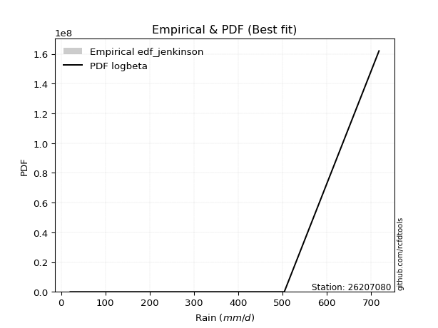</img>

</div>


### 11. Empirical - EDF Cunnane (1978)

Cunnane´s work in statistical hydrology has focused on the performance and evaluation of different probability distributions (such as GEV, Gumbel, Lognormal) for flood frequency estimation. _b_ is a constant, typically set to 0.4.

<div align="center">


$P=(m-b)/(n+1-2b)$


</div>


**11.1. Empirical values**

<div align="center">

|                | 0                   | 1                  | 2                   | 3                  | 4           | 5                  | 6                 | 7                  | 8                  |
|:---------------|:--------------------|:-------------------|:--------------------|:-------------------|:------------|:-------------------|:------------------|:-------------------|:-------------------|
| date           | 2022                | 2023               | 2017                | 2018               | 2021        | 2020               | 2024              | 2025               | 2019               |
| x              | 20.7                | 45.0               | 59.1                | 62.4               | 290.9       | 291.1              | 391.0             | 504.0              | 717.9              |
| m              | 1                   | 2                  | 3                   | 4                  | 5           | 6                  | 7                 | 8                  | 9                  |
| empirical_dist | edf_cunnane         | edf_cunnane        | edf_cunnane         | edf_cunnane        | edf_cunnane | edf_cunnane        | edf_cunnane       | edf_cunnane        | edf_cunnane        |
| empirical      | 0.06521739130434782 | 0.1739130434782609 | 0.28260869565217395 | 0.391304347826087  | 0.5         | 0.6086956521739131 | 0.717391304347826 | 0.8260869565217391 | 0.9347826086956522 |
| empirical_tr   | 1.069767441860465   | 1.2105263157894737 | 1.393939393939394   | 1.6428571428571428 | 2.0         | 2.555555555555556  | 3.538461538461538 | 5.75               | 15.333333333333343 |

</div>


**11.2. Kolmogorov-Smirnov fit test (sorted by Δ)**


<div align="center">

|                | 0                   | 1                   | 2                   | 3                   | 4                     | 5                   | 6                   | 7                   | 8                   | 9                   | 10                  | 11                  | 12                  | 13                  | 14                  | 15                  | 16                  | 17                  | 18                  | 19                  | 20                  | 21                  | 22                  | 23                  | 24                  | 25                  | 26                  | 27                  | 28                  | 29                  | 30                  | 31                  | 32                  | 33                  | 34                  | 35                  | 36                  | 37                  | 38                  | 39                  | 40                  | 41                  | 42                  | 43                  | 44                  | 45                  | 46                  | 47                  | 48                  | 49                  | 50                  | 51                  | 52                  | 53                  | 54                  | 55                  | 56                  | 57                  | 58                  | 59                  | 60                  | 61                  | 62                  | 63                  | 64                  | 65                  | 66                  | 67                  | 68                  | 69                  | 70                  | 71                  | 72                  | 73                  | 74                  | 75                  | 76                  | 77                  | 78                  | 79                  | 80                  | 81                  | 82                  | 83                  | 84                  | 85                  | 86                  | 87                  | 88                  | 89                  |
|:---------------|:--------------------|:--------------------|:--------------------|:--------------------|:----------------------|:--------------------|:--------------------|:--------------------|:--------------------|:--------------------|:--------------------|:--------------------|:--------------------|:--------------------|:--------------------|:--------------------|:--------------------|:--------------------|:--------------------|:--------------------|:--------------------|:--------------------|:--------------------|:--------------------|:--------------------|:--------------------|:--------------------|:--------------------|:--------------------|:--------------------|:--------------------|:--------------------|:--------------------|:--------------------|:--------------------|:--------------------|:--------------------|:--------------------|:--------------------|:--------------------|:--------------------|:--------------------|:--------------------|:--------------------|:--------------------|:--------------------|:--------------------|:--------------------|:--------------------|:--------------------|:--------------------|:--------------------|:--------------------|:--------------------|:--------------------|:--------------------|:--------------------|:--------------------|:--------------------|:--------------------|:--------------------|:--------------------|:--------------------|:--------------------|:--------------------|:--------------------|:--------------------|:--------------------|:--------------------|:--------------------|:--------------------|:--------------------|:--------------------|:--------------------|:--------------------|:--------------------|:--------------------|:--------------------|:--------------------|:--------------------|:--------------------|:--------------------|:--------------------|:--------------------|:--------------------|:--------------------|:--------------------|:--------------------|:--------------------|:--------------------|
| station        | 26207080            | 26207080            | 26207080            | 26207080            | 26207080              | 26207080            | 26207080            | 26207080            | 26207080            | 26207080            | 26207080            | 26207080            | 26207080            | 26207080            | 26207080            | 26207080            | 26207080            | 26207080            | 26207080            | 26207080            | 26207080            | 26207080            | 26207080            | 26207080            | 26207080            | 26207080            | 26207080            | 26207080            | 26207080            | 26207080            | 26207080            | 26207080            | 26207080            | 26207080            | 26207080            | 26207080            | 26207080            | 26207080            | 26207080            | 26207080            | 26207080            | 26207080            | 26207080            | 26207080            | 26207080            | 26207080            | 26207080            | 26207080            | 26207080            | 26207080            | 26207080            | 26207080            | 26207080            | 26207080            | 26207080            | 26207080            | 26207080            | 26207080            | 26207080            | 26207080            | 26207080            | 26207080            | 26207080            | 26207080            | 26207080            | 26207080            | 26207080            | 26207080            | 26207080            | 26207080            | 26207080            | 26207080            | 26207080            | 26207080            | 26207080            | 26207080            | 26207080            | 26207080            | 26207080            | 26207080            | 26207080            | 26207080            | 26207080            | 26207080            | 26207080            | 26207080            | 26207080            | 26207080            | 26207080            | 26207080            |
| empirical_dist | edf_cunnane         | edf_cunnane         | edf_cunnane         | edf_cunnane         | edf_cunnane           | edf_cunnane         | edf_cunnane         | edf_cunnane         | edf_cunnane         | edf_cunnane         | edf_cunnane         | edf_cunnane         | edf_cunnane         | edf_cunnane         | edf_cunnane         | edf_cunnane         | edf_cunnane         | edf_cunnane         | edf_cunnane         | edf_cunnane         | edf_cunnane         | edf_cunnane         | edf_cunnane         | edf_cunnane         | edf_cunnane         | edf_cunnane         | edf_cunnane         | edf_cunnane         | edf_cunnane         | edf_cunnane         | edf_cunnane         | edf_cunnane         | edf_cunnane         | edf_cunnane         | edf_cunnane         | edf_cunnane         | edf_cunnane         | edf_cunnane         | edf_cunnane         | edf_cunnane         | edf_cunnane         | edf_cunnane         | edf_cunnane         | edf_cunnane         | edf_cunnane         | edf_cunnane         | edf_cunnane         | edf_cunnane         | edf_cunnane         | edf_cunnane         | edf_cunnane         | edf_cunnane         | edf_cunnane         | edf_cunnane         | edf_cunnane         | edf_cunnane         | edf_cunnane         | edf_cunnane         | edf_cunnane         | edf_cunnane         | edf_cunnane         | edf_cunnane         | edf_cunnane         | edf_cunnane         | edf_cunnane         | edf_cunnane         | edf_cunnane         | edf_cunnane         | edf_cunnane         | edf_cunnane         | edf_cunnane         | edf_cunnane         | edf_cunnane         | edf_cunnane         | edf_cunnane         | edf_cunnane         | edf_cunnane         | edf_cunnane         | edf_cunnane         | edf_cunnane         | edf_cunnane         | edf_cunnane         | edf_cunnane         | edf_cunnane         | edf_cunnane         | edf_cunnane         | edf_cunnane         | edf_cunnane         | edf_cunnane         | edf_cunnane         |
| p_dist         | nakagami            | betaprime           | logloggamma         | halfnorm            | loglaplace_asymmetric | f                   | ncf                 | rayleigh            | logjohnsonsu        | logfisk             | logweibull_min      | maxwell             | loggompertz         | loggumbel_l         | logpearson3         | pearson3            | t                   | truncnorm           | norm                | logf                | logexponnorm        | lognorm             | lognorm             | logcrystalball      | logt                | lognct              | logfatiguelife      | logbetaprime        | logerlang           | logncf              | loggamma            | loggamma            | mielke              | lognakagami         | genlogistic         | logrice             | gumbel_r            | halflogistic        | johnsonsu           | laplace_asymmetric  | loginvgamma         | loginvweibull       | loginvgauss         | kstwobign           | logistic            | logmaxwell          | gumbel_l            | logalpha            | lograyleigh         | loglogistic         | loggenexpon         | invgamma            | exponnorm           | moyal               | expon               | logkstwobign        | logexpon            | hypsecant           | nct                 | fisk                | loghalfnorm         | genexpon            | rice                | weibull_min         | invgauss            | loghypsecant        | laplace             | gompertz            | loggumbel_r         | loghalflogistic     | loglaplace          | logmoyal            | logmielke           | chi2                | erlang              | logchi2             | logwald             | logtruncnorm        | alpha               | wald                | loggibrat           | gibrat              | pareto              | loglognorm          | fatiguelife         | crystalball         | gamma               | logpareto           | invweibull          | loggenlogistic      |
| delta          | 0.11441325874004993 | 0.1802929406373014  | 0.18168832764021853 | 0.18241859274314606 | 0.1837804228462994    | 0.18561564414143739 | 0.18630271329495696 | 0.18810149230925266 | 0.19037192876192954 | 0.19223649620117056 | 0.1922778360467407  | 0.1924129200908988  | 0.19491253423821364 | 0.19685520827026604 | 0.1980258812926705  | 0.20049962881456798 | 0.20301697484131392 | 0.20301725260066134 | 0.20301726156888283 | 0.20857413483316978 | 0.20906758796102132 | 0.20906958640397888 | 0.20906958640397888 | 0.20906962596810696 | 0.20906965480284434 | 0.209226094869152   | 0.21039726975827389 | 0.21107094960604167 | 0.21266706434391958 | 0.21293658395823212 | 0.2134310224620225  | 0.2134310224620225  | 0.21384676889242993 | 0.21418380939820247 | 0.21485910032734373 | 0.2158364930386898  | 0.21668794755719328 | 0.21706602668980987 | 0.2176803782677843  | 0.217911821213588   | 0.21956446125761597 | 0.22203108220740375 | 0.22271363402846045 | 0.2232237307646313  | 0.22385438329857632 | 0.2238749988581359  | 0.2260447590982609  | 0.22614661216029852 | 0.22818201928881376 | 0.2308230665364589  | 0.23104026545726764 | 0.23140765252513606 | 0.23245082173427317 | 0.23416005015269106 | 0.23419570511468413 | 0.23489207639847254 | 0.23535105393581013 | 0.2357417892960457  | 0.2366178664171491  | 0.24071695879262767 | 0.24145630012436736 | 0.24300646475104937 | 0.24377738079195063 | 0.24473073211689478 | 0.24508657322616068 | 0.24629065543619433 | 0.24812134420224816 | 0.24848479685864883 | 0.2579994554178888  | 0.2679023388000036  | 0.27051331723963334 | 0.2737929080828627  | 0.2827557991604488  | 0.28622592511471234 | 0.2940812080159094  | 0.31209006984600896 | 0.32057279239917924 | 0.3269075610230766  | 0.35896696841018194 | 0.38277981594899607 | 0.39061666241988047 | 0.391304347826087   | 0.4162233574993587  | 0.4332460706854153  | 0.4528608995900175  | 0.4586200034597205  | 0.46016518334548084 | 0.4617894410440052  | 0.48553699303206926 | 0.8260869565217391  |
| deltao         | 0.41761268023100007 | 0.41761268023100007 | 0.41761268023100007 | 0.41761268023100007 | 0.41761268023100007   | 0.41761268023100007 | 0.41761268023100007 | 0.41761268023100007 | 0.41761268023100007 | 0.41761268023100007 | 0.41761268023100007 | 0.41761268023100007 | 0.41761268023100007 | 0.41761268023100007 | 0.41761268023100007 | 0.41761268023100007 | 0.41761268023100007 | 0.41761268023100007 | 0.41761268023100007 | 0.41761268023100007 | 0.41761268023100007 | 0.41761268023100007 | 0.41761268023100007 | 0.41761268023100007 | 0.41761268023100007 | 0.41761268023100007 | 0.41761268023100007 | 0.41761268023100007 | 0.41761268023100007 | 0.41761268023100007 | 0.41761268023100007 | 0.41761268023100007 | 0.41761268023100007 | 0.41761268023100007 | 0.41761268023100007 | 0.41761268023100007 | 0.41761268023100007 | 0.41761268023100007 | 0.41761268023100007 | 0.41761268023100007 | 0.41761268023100007 | 0.41761268023100007 | 0.41761268023100007 | 0.41761268023100007 | 0.41761268023100007 | 0.41761268023100007 | 0.41761268023100007 | 0.41761268023100007 | 0.41761268023100007 | 0.41761268023100007 | 0.41761268023100007 | 0.41761268023100007 | 0.41761268023100007 | 0.41761268023100007 | 0.41761268023100007 | 0.41761268023100007 | 0.41761268023100007 | 0.41761268023100007 | 0.41761268023100007 | 0.41761268023100007 | 0.41761268023100007 | 0.41761268023100007 | 0.41761268023100007 | 0.41761268023100007 | 0.41761268023100007 | 0.41761268023100007 | 0.41761268023100007 | 0.41761268023100007 | 0.41761268023100007 | 0.41761268023100007 | 0.41761268023100007 | 0.41761268023100007 | 0.41761268023100007 | 0.41761268023100007 | 0.41761268023100007 | 0.41761268023100007 | 0.41761268023100007 | 0.41761268023100007 | 0.41761268023100007 | 0.41761268023100007 | 0.41761268023100007 | 0.41761268023100007 | 0.41761268023100007 | 0.41761268023100007 | 0.41761268023100007 | 0.41761268023100007 | 0.41761268023100007 | 0.41761268023100007 | 0.41761268023100007 | 0.41761268023100007 |
| eval           | Δo > Δ              | Δo > Δ              | Δo > Δ              | Δo > Δ              | Δo > Δ                | Δo > Δ              | Δo > Δ              | Δo > Δ              | Δo > Δ              | Δo > Δ              | Δo > Δ              | Δo > Δ              | Δo > Δ              | Δo > Δ              | Δo > Δ              | Δo > Δ              | Δo > Δ              | Δo > Δ              | Δo > Δ              | Δo > Δ              | Δo > Δ              | Δo > Δ              | Δo > Δ              | Δo > Δ              | Δo > Δ              | Δo > Δ              | Δo > Δ              | Δo > Δ              | Δo > Δ              | Δo > Δ              | Δo > Δ              | Δo > Δ              | Δo > Δ              | Δo > Δ              | Δo > Δ              | Δo > Δ              | Δo > Δ              | Δo > Δ              | Δo > Δ              | Δo > Δ              | Δo > Δ              | Δo > Δ              | Δo > Δ              | Δo > Δ              | Δo > Δ              | Δo > Δ              | Δo > Δ              | Δo > Δ              | Δo > Δ              | Δo > Δ              | Δo > Δ              | Δo > Δ              | Δo > Δ              | Δo > Δ              | Δo > Δ              | Δo > Δ              | Δo > Δ              | Δo > Δ              | Δo > Δ              | Δo > Δ              | Δo > Δ              | Δo > Δ              | Δo > Δ              | Δo > Δ              | Δo > Δ              | Δo > Δ              | Δo > Δ              | Δo > Δ              | Δo > Δ              | Δo > Δ              | Δo > Δ              | Δo > Δ              | Δo > Δ              | Δo > Δ              | Δo > Δ              | Δo > Δ              | Δo > Δ              | Δo > Δ              | Δo > Δ              | Δo > Δ              | Δo > Δ              | Δo > Δ              | Δo > Δ              | Δo <= Δ             | Δo <= Δ             | Δo <= Δ             | Δo <= Δ             | Δo <= Δ             | Δo <= Δ             | Δo <= Δ             |
| fit            | 1                   | 1                   | 1                   | 1                   | 1                     | 1                   | 1                   | 1                   | 1                   | 1                   | 1                   | 1                   | 1                   | 1                   | 1                   | 1                   | 1                   | 1                   | 1                   | 1                   | 1                   | 1                   | 1                   | 1                   | 1                   | 1                   | 1                   | 1                   | 1                   | 1                   | 1                   | 1                   | 1                   | 1                   | 1                   | 1                   | 1                   | 1                   | 1                   | 1                   | 1                   | 1                   | 1                   | 1                   | 1                   | 1                   | 1                   | 1                   | 1                   | 1                   | 1                   | 1                   | 1                   | 1                   | 1                   | 1                   | 1                   | 1                   | 1                   | 1                   | 1                   | 1                   | 1                   | 1                   | 1                   | 1                   | 1                   | 1                   | 1                   | 1                   | 1                   | 1                   | 1                   | 1                   | 1                   | 1                   | 1                   | 1                   | 1                   | 1                   | 1                   | 1                   | 1                   | 0                   | 0                   | 0                   | 0                   | 0                   | 0                   | 0                   |
| n              | 9                   | 9                   | 9                   | 9                   | 9                     | 9                   | 9                   | 9                   | 9                   | 9                   | 9                   | 9                   | 9                   | 9                   | 9                   | 9                   | 9                   | 9                   | 9                   | 9                   | 9                   | 9                   | 9                   | 9                   | 9                   | 9                   | 9                   | 9                   | 9                   | 9                   | 9                   | 9                   | 9                   | 9                   | 9                   | 9                   | 9                   | 9                   | 9                   | 9                   | 9                   | 9                   | 9                   | 9                   | 9                   | 9                   | 9                   | 9                   | 9                   | 9                   | 9                   | 9                   | 9                   | 9                   | 9                   | 9                   | 9                   | 9                   | 9                   | 9                   | 9                   | 9                   | 9                   | 9                   | 9                   | 9                   | 9                   | 9                   | 9                   | 9                   | 9                   | 9                   | 9                   | 9                   | 9                   | 9                   | 9                   | 9                   | 9                   | 9                   | 9                   | 9                   | 9                   | 9                   | 9                   | 9                   | 9                   | 9                   | 9                   | 9                   |
| best_fit       | 1                   | 0                   | 0                   | 0                   | 0                     | 0                   | 0                   | 0                   | 0                   | 0                   | 0                   | 0                   | 0                   | 0                   | 0                   | 0                   | 0                   | 0                   | 0                   | 0                   | 0                   | 0                   | 0                   | 0                   | 0                   | 0                   | 0                   | 0                   | 0                   | 0                   | 0                   | 0                   | 0                   | 0                   | 0                   | 0                   | 0                   | 0                   | 0                   | 0                   | 0                   | 0                   | 0                   | 0                   | 0                   | 0                   | 0                   | 0                   | 0                   | 0                   | 0                   | 0                   | 0                   | 0                   | 0                   | 0                   | 0                   | 0                   | 0                   | 0                   | 0                   | 0                   | 0                   | 0                   | 0                   | 0                   | 0                   | 0                   | 0                   | 0                   | 0                   | 0                   | 0                   | 0                   | 0                   | 0                   | 0                   | 0                   | 0                   | 0                   | 0                   | 0                   | 0                   | 0                   | 0                   | 0                   | 0                   | 0                   | 0                   | 0                   |
| best_fit_sort  | 1                   | 2                   | 3                   | 4                   | 5                     | 6                   | 7                   | 8                   | 9                   | 10                  | 11                  | 12                  | 13                  | 14                  | 15                  | 16                  | 17                  | 18                  | 19                  | 20                  | 21                  | 22                  | 23                  | 24                  | 25                  | 26                  | 27                  | 28                  | 29                  | 30                  | 31                  | 32                  | 33                  | 34                  | 35                  | 36                  | 37                  | 38                  | 39                  | 40                  | 41                  | 42                  | 43                  | 44                  | 45                  | 46                  | 47                  | 48                  | 49                  | 50                  | 51                  | 52                  | 53                  | 54                  | 55                  | 56                  | 57                  | 58                  | 59                  | 60                  | 61                  | 62                  | 63                  | 64                  | 65                  | 66                  | 67                  | 68                  | 69                  | 70                  | 71                  | 72                  | 73                  | 74                  | 75                  | 76                  | 77                  | 78                  | 79                  | 80                  | 81                  | 82                  | 83                  | 84                  | 85                  | 86                  | 87                  | 88                  | 89                  | 90                  |

</div>


<div align="center">

</img>

</div>


**11.3. Best fit**

<div align="center">

|   id |   station | empirical_dist   | p_dist   |    delta |   deltao | eval   |   fit |   n |   best_fit |   best_fit_sort |
|-----:|----------:|:-----------------|:---------|---------:|---------:|:-------|------:|----:|-----------:|----------------:|
|    0 |  26207080 | edf_cunnane      | nakagami | 0.114413 | 0.417613 | Δo > Δ |     1 |   9 |          1 |               1 |

</div>


<div align="center">

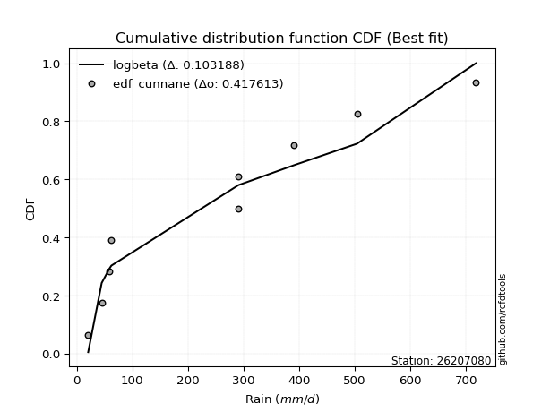</img>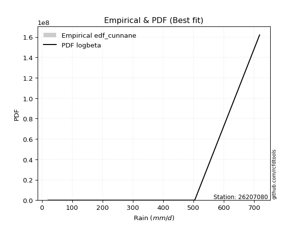</img>

</div>


### 12. Empirical - EDF Adamowski (1981)

The Adamowski formula in hydrology refers to a specific plotting position formula used for estimating the non-parametric empirical distribution of hydrological events (like flood peaks) to calculate their return periods. This formula provides an alternative to traditional parametric methods (like the Gumbel or Log Pearson Type III distributions). 

<div align="center">


$P=(m-0.25)/(n+0.5)$


</div>


**12.1. Empirical values**

<div align="center">

|                | 0                   | 1                   | 2                  | 3                   | 4             | 5                  | 6                  | 7                  | 8                  |
|:---------------|:--------------------|:--------------------|:-------------------|:--------------------|:--------------|:-------------------|:-------------------|:-------------------|:-------------------|
| date           | 2022                | 2023                | 2017               | 2018                | 2021          | 2020               | 2024               | 2025               | 2019               |
| x              | 20.7                | 45.0                | 59.1               | 62.4                | 290.9         | 291.1              | 391.0              | 504.0              | 717.9              |
| m              | 1                   | 2                   | 3                  | 4                   | 5             | 6                  | 7                  | 8                  | 9                  |
| empirical_dist | edf_adamowski       | edf_adamowski       | edf_adamowski      | edf_adamowski       | edf_adamowski | edf_adamowski      | edf_adamowski      | edf_adamowski      | edf_adamowski      |
| empirical      | 0.07894736842105263 | 0.18421052631578946 | 0.2894736842105263 | 0.39473684210526316 | 0.5           | 0.6052631578947368 | 0.7105263157894737 | 0.8157894736842105 | 0.9210526315789473 |
| empirical_tr   | 1.0857142857142856  | 1.2258064516129032  | 1.4074074074074074 | 1.6521739130434783  | 2.0           | 2.533333333333333  | 3.4545454545454546 | 5.428571428571428  | 12.666666666666663 |

</div>


**12.2. Kolmogorov-Smirnov fit test (sorted by Δ)**


<div align="center">

|                | 0                   | 1                   | 2                   | 3                   | 4                   | 5                     | 6                   | 7                   | 8                   | 9                   | 10                  | 11                  | 12                  | 13                  | 14                  | 15                  | 16                  | 17                  | 18                  | 19                  | 20                  | 21                  | 22                  | 23                  | 24                  | 25                  | 26                  | 27                  | 28                  | 29                  | 30                  | 31                  | 32                  | 33                  | 34                  | 35                  | 36                  | 37                  | 38                  | 39                  | 40                  | 41                  | 42                  | 43                  | 44                  | 45                  | 46                  | 47                  | 48                  | 49                  | 50                  | 51                  | 52                  | 53                  | 54                  | 55                  | 56                  | 57                  | 58                  | 59                  | 60                  | 61                  | 62                  | 63                  | 64                  | 65                  | 66                  | 67                  | 68                  | 69                  | 70                  | 71                  | 72                  | 73                  | 74                  | 75                  | 76                  | 77                  | 78                  | 79                  | 80                  | 81                  | 82                  | 83                  | 84                  | 85                  | 86                  | 87                  | 88                  | 89                  |
|:---------------|:--------------------|:--------------------|:--------------------|:--------------------|:--------------------|:----------------------|:--------------------|:--------------------|:--------------------|:--------------------|:--------------------|:--------------------|:--------------------|:--------------------|:--------------------|:--------------------|:--------------------|:--------------------|:--------------------|:--------------------|:--------------------|:--------------------|:--------------------|:--------------------|:--------------------|:--------------------|:--------------------|:--------------------|:--------------------|:--------------------|:--------------------|:--------------------|:--------------------|:--------------------|:--------------------|:--------------------|:--------------------|:--------------------|:--------------------|:--------------------|:--------------------|:--------------------|:--------------------|:--------------------|:--------------------|:--------------------|:--------------------|:--------------------|:--------------------|:--------------------|:--------------------|:--------------------|:--------------------|:--------------------|:--------------------|:--------------------|:--------------------|:--------------------|:--------------------|:--------------------|:--------------------|:--------------------|:--------------------|:--------------------|:--------------------|:--------------------|:--------------------|:--------------------|:--------------------|:--------------------|:--------------------|:--------------------|:--------------------|:--------------------|:--------------------|:--------------------|:--------------------|:--------------------|:--------------------|:--------------------|:--------------------|:--------------------|:--------------------|:--------------------|:--------------------|:--------------------|:--------------------|:--------------------|:--------------------|:--------------------|
| station        | 26207080            | 26207080            | 26207080            | 26207080            | 26207080            | 26207080              | 26207080            | 26207080            | 26207080            | 26207080            | 26207080            | 26207080            | 26207080            | 26207080            | 26207080            | 26207080            | 26207080            | 26207080            | 26207080            | 26207080            | 26207080            | 26207080            | 26207080            | 26207080            | 26207080            | 26207080            | 26207080            | 26207080            | 26207080            | 26207080            | 26207080            | 26207080            | 26207080            | 26207080            | 26207080            | 26207080            | 26207080            | 26207080            | 26207080            | 26207080            | 26207080            | 26207080            | 26207080            | 26207080            | 26207080            | 26207080            | 26207080            | 26207080            | 26207080            | 26207080            | 26207080            | 26207080            | 26207080            | 26207080            | 26207080            | 26207080            | 26207080            | 26207080            | 26207080            | 26207080            | 26207080            | 26207080            | 26207080            | 26207080            | 26207080            | 26207080            | 26207080            | 26207080            | 26207080            | 26207080            | 26207080            | 26207080            | 26207080            | 26207080            | 26207080            | 26207080            | 26207080            | 26207080            | 26207080            | 26207080            | 26207080            | 26207080            | 26207080            | 26207080            | 26207080            | 26207080            | 26207080            | 26207080            | 26207080            | 26207080            |
| empirical_dist | edf_adamowski       | edf_adamowski       | edf_adamowski       | edf_adamowski       | edf_adamowski       | edf_adamowski         | edf_adamowski       | edf_adamowski       | edf_adamowski       | edf_adamowski       | edf_adamowski       | edf_adamowski       | edf_adamowski       | edf_adamowski       | edf_adamowski       | edf_adamowski       | edf_adamowski       | edf_adamowski       | edf_adamowski       | edf_adamowski       | edf_adamowski       | edf_adamowski       | edf_adamowski       | edf_adamowski       | edf_adamowski       | edf_adamowski       | edf_adamowski       | edf_adamowski       | edf_adamowski       | edf_adamowski       | edf_adamowski       | edf_adamowski       | edf_adamowski       | edf_adamowski       | edf_adamowski       | edf_adamowski       | edf_adamowski       | edf_adamowski       | edf_adamowski       | edf_adamowski       | edf_adamowski       | edf_adamowski       | edf_adamowski       | edf_adamowski       | edf_adamowski       | edf_adamowski       | edf_adamowski       | edf_adamowski       | edf_adamowski       | edf_adamowski       | edf_adamowski       | edf_adamowski       | edf_adamowski       | edf_adamowski       | edf_adamowski       | edf_adamowski       | edf_adamowski       | edf_adamowski       | edf_adamowski       | edf_adamowski       | edf_adamowski       | edf_adamowski       | edf_adamowski       | edf_adamowski       | edf_adamowski       | edf_adamowski       | edf_adamowski       | edf_adamowski       | edf_adamowski       | edf_adamowski       | edf_adamowski       | edf_adamowski       | edf_adamowski       | edf_adamowski       | edf_adamowski       | edf_adamowski       | edf_adamowski       | edf_adamowski       | edf_adamowski       | edf_adamowski       | edf_adamowski       | edf_adamowski       | edf_adamowski       | edf_adamowski       | edf_adamowski       | edf_adamowski       | edf_adamowski       | edf_adamowski       | edf_adamowski       | edf_adamowski       |
| p_dist         | nakagami            | betaprime           | logloggamma         | f                   | halfnorm            | loglaplace_asymmetric | ncf                 | rayleigh            | logfisk             | logjohnsonsu        | loggompertz         | logweibull_min      | maxwell             | logpearson3         | loggumbel_l         | pearson3            | t                   | truncnorm           | norm                | logf                | logexponnorm        | lognorm             | lognorm             | logcrystalball      | logt                | lognct              | logfatiguelife      | logbetaprime        | logerlang           | logncf              | loggamma            | loggamma            | mielke              | lognakagami         | logrice             | johnsonsu           | genlogistic         | loginvgamma         | gumbel_r            | halflogistic        | laplace_asymmetric  | loginvweibull       | loginvgauss         | logmaxwell          | logalpha            | kstwobign           | logistic            | lograyleigh         | gumbel_l            | loglogistic         | loggenexpon         | invgamma            | logkstwobign        | logexpon            | exponnorm           | nct                 | moyal               | expon               | hypsecant           | fisk                | loghalfnorm         | weibull_min         | invgauss            | loghypsecant        | genexpon            | rice                | laplace             | gompertz            | loggumbel_r         | loghalflogistic     | loglaplace          | logmoyal            | logmielke           | chi2                | erlang              | logchi2             | logwald             | logtruncnorm        | alpha               | wald                | loggibrat           | gibrat              | pareto              | loglognorm          | fatiguelife         | crystalball         | gamma               | logpareto           | invweibull          | loggenlogistic      |
| delta          | 0.11441325874004993 | 0.1802929406373014  | 0.18512082191939472 | 0.18561564414143739 | 0.18585108702232225 | 0.18721291712547558   | 0.18973520757413315 | 0.19153398658842885 | 0.19223649620117056 | 0.19380442304110573 | 0.19491253423821364 | 0.1957103303259169  | 0.195845414370075   | 0.1980258812926705  | 0.20028770254944223 | 0.20393212309374417 | 0.20644946912049011 | 0.20644974687983753 | 0.20644975584805902 | 0.20857413483316978 | 0.20906758796102132 | 0.20906958640397888 | 0.20906958640397888 | 0.20906962596810696 | 0.20906965480284434 | 0.209226094869152   | 0.21039726975827389 | 0.21107094960604167 | 0.21266706434391958 | 0.21293658395823212 | 0.2134310224620225  | 0.2134310224620225  | 0.21384676889242993 | 0.21418380939820247 | 0.2158364930386898  | 0.2176803782677843  | 0.21829159460651992 | 0.21956446125761597 | 0.22012044183636947 | 0.22049852096898606 | 0.22134431549276418 | 0.22203108220740375 | 0.22271363402846045 | 0.2238749988581359  | 0.22614661216029852 | 0.2266562250438075  | 0.2272868775777525  | 0.22818201928881376 | 0.2294772533774371  | 0.2308230665364589  | 0.23104026545726764 | 0.23140765252513606 | 0.23489207639847254 | 0.23535105393581013 | 0.23588331601344936 | 0.2366178664171491  | 0.23759254443186725 | 0.23762819939386032 | 0.23917428357522189 | 0.24071695879262767 | 0.24145630012436736 | 0.24473073211689478 | 0.24508657322616068 | 0.24629065543619433 | 0.24643895903022556 | 0.24720987507112682 | 0.2515538384814243  | 0.251917291137825   | 0.2579994554178888  | 0.2679023388000036  | 0.27051331723963334 | 0.2737929080828627  | 0.2827557991604488  | 0.28622592511471234 | 0.2940812080159094  | 0.31209006984600896 | 0.32057279239917924 | 0.3269075610230766  | 0.35896696841018194 | 0.38621231022817226 | 0.39404915669905666 | 0.39473684210526316 | 0.40592587466183006 | 0.4229485878478867  | 0.4425634167524889  | 0.44489002634301567 | 0.4498677005079522  | 0.4514919582064766  | 0.4718070159153644  | 0.8157894736842105  |
| deltao         | 0.41761268023100007 | 0.41761268023100007 | 0.41761268023100007 | 0.41761268023100007 | 0.41761268023100007 | 0.41761268023100007   | 0.41761268023100007 | 0.41761268023100007 | 0.41761268023100007 | 0.41761268023100007 | 0.41761268023100007 | 0.41761268023100007 | 0.41761268023100007 | 0.41761268023100007 | 0.41761268023100007 | 0.41761268023100007 | 0.41761268023100007 | 0.41761268023100007 | 0.41761268023100007 | 0.41761268023100007 | 0.41761268023100007 | 0.41761268023100007 | 0.41761268023100007 | 0.41761268023100007 | 0.41761268023100007 | 0.41761268023100007 | 0.41761268023100007 | 0.41761268023100007 | 0.41761268023100007 | 0.41761268023100007 | 0.41761268023100007 | 0.41761268023100007 | 0.41761268023100007 | 0.41761268023100007 | 0.41761268023100007 | 0.41761268023100007 | 0.41761268023100007 | 0.41761268023100007 | 0.41761268023100007 | 0.41761268023100007 | 0.41761268023100007 | 0.41761268023100007 | 0.41761268023100007 | 0.41761268023100007 | 0.41761268023100007 | 0.41761268023100007 | 0.41761268023100007 | 0.41761268023100007 | 0.41761268023100007 | 0.41761268023100007 | 0.41761268023100007 | 0.41761268023100007 | 0.41761268023100007 | 0.41761268023100007 | 0.41761268023100007 | 0.41761268023100007 | 0.41761268023100007 | 0.41761268023100007 | 0.41761268023100007 | 0.41761268023100007 | 0.41761268023100007 | 0.41761268023100007 | 0.41761268023100007 | 0.41761268023100007 | 0.41761268023100007 | 0.41761268023100007 | 0.41761268023100007 | 0.41761268023100007 | 0.41761268023100007 | 0.41761268023100007 | 0.41761268023100007 | 0.41761268023100007 | 0.41761268023100007 | 0.41761268023100007 | 0.41761268023100007 | 0.41761268023100007 | 0.41761268023100007 | 0.41761268023100007 | 0.41761268023100007 | 0.41761268023100007 | 0.41761268023100007 | 0.41761268023100007 | 0.41761268023100007 | 0.41761268023100007 | 0.41761268023100007 | 0.41761268023100007 | 0.41761268023100007 | 0.41761268023100007 | 0.41761268023100007 | 0.41761268023100007 |
| eval           | Δo > Δ              | Δo > Δ              | Δo > Δ              | Δo > Δ              | Δo > Δ              | Δo > Δ                | Δo > Δ              | Δo > Δ              | Δo > Δ              | Δo > Δ              | Δo > Δ              | Δo > Δ              | Δo > Δ              | Δo > Δ              | Δo > Δ              | Δo > Δ              | Δo > Δ              | Δo > Δ              | Δo > Δ              | Δo > Δ              | Δo > Δ              | Δo > Δ              | Δo > Δ              | Δo > Δ              | Δo > Δ              | Δo > Δ              | Δo > Δ              | Δo > Δ              | Δo > Δ              | Δo > Δ              | Δo > Δ              | Δo > Δ              | Δo > Δ              | Δo > Δ              | Δo > Δ              | Δo > Δ              | Δo > Δ              | Δo > Δ              | Δo > Δ              | Δo > Δ              | Δo > Δ              | Δo > Δ              | Δo > Δ              | Δo > Δ              | Δo > Δ              | Δo > Δ              | Δo > Δ              | Δo > Δ              | Δo > Δ              | Δo > Δ              | Δo > Δ              | Δo > Δ              | Δo > Δ              | Δo > Δ              | Δo > Δ              | Δo > Δ              | Δo > Δ              | Δo > Δ              | Δo > Δ              | Δo > Δ              | Δo > Δ              | Δo > Δ              | Δo > Δ              | Δo > Δ              | Δo > Δ              | Δo > Δ              | Δo > Δ              | Δo > Δ              | Δo > Δ              | Δo > Δ              | Δo > Δ              | Δo > Δ              | Δo > Δ              | Δo > Δ              | Δo > Δ              | Δo > Δ              | Δo > Δ              | Δo > Δ              | Δo > Δ              | Δo > Δ              | Δo > Δ              | Δo > Δ              | Δo > Δ              | Δo <= Δ             | Δo <= Δ             | Δo <= Δ             | Δo <= Δ             | Δo <= Δ             | Δo <= Δ             | Δo <= Δ             |
| fit            | 1                   | 1                   | 1                   | 1                   | 1                   | 1                     | 1                   | 1                   | 1                   | 1                   | 1                   | 1                   | 1                   | 1                   | 1                   | 1                   | 1                   | 1                   | 1                   | 1                   | 1                   | 1                   | 1                   | 1                   | 1                   | 1                   | 1                   | 1                   | 1                   | 1                   | 1                   | 1                   | 1                   | 1                   | 1                   | 1                   | 1                   | 1                   | 1                   | 1                   | 1                   | 1                   | 1                   | 1                   | 1                   | 1                   | 1                   | 1                   | 1                   | 1                   | 1                   | 1                   | 1                   | 1                   | 1                   | 1                   | 1                   | 1                   | 1                   | 1                   | 1                   | 1                   | 1                   | 1                   | 1                   | 1                   | 1                   | 1                   | 1                   | 1                   | 1                   | 1                   | 1                   | 1                   | 1                   | 1                   | 1                   | 1                   | 1                   | 1                   | 1                   | 1                   | 1                   | 0                   | 0                   | 0                   | 0                   | 0                   | 0                   | 0                   |
| n              | 9                   | 9                   | 9                   | 9                   | 9                   | 9                     | 9                   | 9                   | 9                   | 9                   | 9                   | 9                   | 9                   | 9                   | 9                   | 9                   | 9                   | 9                   | 9                   | 9                   | 9                   | 9                   | 9                   | 9                   | 9                   | 9                   | 9                   | 9                   | 9                   | 9                   | 9                   | 9                   | 9                   | 9                   | 9                   | 9                   | 9                   | 9                   | 9                   | 9                   | 9                   | 9                   | 9                   | 9                   | 9                   | 9                   | 9                   | 9                   | 9                   | 9                   | 9                   | 9                   | 9                   | 9                   | 9                   | 9                   | 9                   | 9                   | 9                   | 9                   | 9                   | 9                   | 9                   | 9                   | 9                   | 9                   | 9                   | 9                   | 9                   | 9                   | 9                   | 9                   | 9                   | 9                   | 9                   | 9                   | 9                   | 9                   | 9                   | 9                   | 9                   | 9                   | 9                   | 9                   | 9                   | 9                   | 9                   | 9                   | 9                   | 9                   |
| best_fit       | 1                   | 0                   | 0                   | 0                   | 0                   | 0                     | 0                   | 0                   | 0                   | 0                   | 0                   | 0                   | 0                   | 0                   | 0                   | 0                   | 0                   | 0                   | 0                   | 0                   | 0                   | 0                   | 0                   | 0                   | 0                   | 0                   | 0                   | 0                   | 0                   | 0                   | 0                   | 0                   | 0                   | 0                   | 0                   | 0                   | 0                   | 0                   | 0                   | 0                   | 0                   | 0                   | 0                   | 0                   | 0                   | 0                   | 0                   | 0                   | 0                   | 0                   | 0                   | 0                   | 0                   | 0                   | 0                   | 0                   | 0                   | 0                   | 0                   | 0                   | 0                   | 0                   | 0                   | 0                   | 0                   | 0                   | 0                   | 0                   | 0                   | 0                   | 0                   | 0                   | 0                   | 0                   | 0                   | 0                   | 0                   | 0                   | 0                   | 0                   | 0                   | 0                   | 0                   | 0                   | 0                   | 0                   | 0                   | 0                   | 0                   | 0                   |
| best_fit_sort  | 1                   | 2                   | 3                   | 4                   | 5                   | 6                     | 7                   | 8                   | 9                   | 10                  | 11                  | 12                  | 13                  | 14                  | 15                  | 16                  | 17                  | 18                  | 19                  | 20                  | 21                  | 22                  | 23                  | 24                  | 25                  | 26                  | 27                  | 28                  | 29                  | 30                  | 31                  | 32                  | 33                  | 34                  | 35                  | 36                  | 37                  | 38                  | 39                  | 40                  | 41                  | 42                  | 43                  | 44                  | 45                  | 46                  | 47                  | 48                  | 49                  | 50                  | 51                  | 52                  | 53                  | 54                  | 55                  | 56                  | 57                  | 58                  | 59                  | 60                  | 61                  | 62                  | 63                  | 64                  | 65                  | 66                  | 67                  | 68                  | 69                  | 70                  | 71                  | 72                  | 73                  | 74                  | 75                  | 76                  | 77                  | 78                  | 79                  | 80                  | 81                  | 82                  | 83                  | 84                  | 85                  | 86                  | 87                  | 88                  | 89                  | 90                  |

</div>


<div align="center">

</img>

</div>


**12.3. Best fit**

<div align="center">

|   id |   station | empirical_dist   | p_dist   |    delta |   deltao | eval   |   fit |   n |   best_fit |   best_fit_sort |
|-----:|----------:|:-----------------|:---------|---------:|---------:|:-------|------:|----:|-----------:|----------------:|
|    0 |  26207080 | edf_adamowski    | nakagami | 0.114413 | 0.417613 | Δo > Δ |     1 |   9 |          1 |               1 |

</div>


<div align="center">

</img></img>

</div>


## C. Best fit & Estimate extreme values for specific return periods - Tr


### 1. Best fit (ordered by delta Δ)

<div align="center">

|   id |   station | empirical_dist   | p_dist   |    delta |   deltao | eval   |   fit |   n |   best_fit |   best_fit_sort |
|-----:|----------:|:-----------------|:---------|---------:|---------:|:-------|------:|----:|-----------:|----------------:|
|    0 |  26207080 | edf_adamowski    | nakagami | 0.114413 | 0.417613 | Δo > Δ |     1 |   9 |          1 |               1 |
|    1 |  26207080 | edf_cunnane      | nakagami | 0.114413 | 0.417613 | Δo > Δ |     1 |   9 |          1 |               2 |
|    2 |  26207080 | edf_jenkinson    | nakagami | 0.114413 | 0.417613 | Δo > Δ |     1 |   9 |          1 |               3 |
|    3 |  26207080 | edf_filliben     | nakagami | 0.114413 | 0.417613 | Δo > Δ |     1 |   9 |          1 |               4 |
|    4 |  26207080 | edf_gringorten   | nakagami | 0.114413 | 0.417613 | Δo > Δ |     1 |   9 |          1 |               5 |
|    5 |  26207080 | edf_tukey        | nakagami | 0.114413 | 0.417613 | Δo > Δ |     1 |   9 |          1 |               6 |
|    6 |  26207080 | edf_blom         | nakagami | 0.114413 | 0.417613 | Δo > Δ |     1 |   9 |          1 |               7 |
|    7 |  26207080 | edf_chegodayev   | nakagami | 0.114413 | 0.417613 | Δo > Δ |     1 |   9 |          1 |               8 |
|    8 |  26207080 | edf_beard        | nakagami | 0.114413 | 0.417613 | Δo > Δ |     1 |   9 |          1 |               9 |
|    9 |  26207080 | edf_weibull      | nakagami | 0.114413 | 0.417613 | Δo > Δ |     1 |   9 |          1 |              10 |
|   10 |  26207080 | edf_hazen        | nakagami | 0.114413 | 0.417613 | Δo > Δ |     1 |   9 |          1 |              11 |
|   11 |  26207080 | edf_california   | nakagami | 0.153339 | 0.417613 | Δo > Δ |     1 |   9 |          1 |              12 |

</div>

:file_folder:Tables: [bestfit_26207080.csv](table/bestfit_26207080.csv) | [extreme_26207080.csv](table/extreme_26207080.csv)


### 2. Extreme values

In hydrology, a return period (or recurrence interval $Tr$) is the statistical average time between extreme events like floods or droughts of a specific magnitude, indicating how rare an event is, with a 100-year flood, for example, having a 1% chance of occurring in any given year, not that it happens exactly every century. It is a key tool for infrastructure design (like bridges or dams) and risk assessment, calculated from historical data to determine the probability of future events, although it is important to remember it is statistical average, and events can cluster or be missed.

> risk_rate: assuming the return period as the project useful life.

|   id |      tr |   prob_l |     prob_g |      alpha |   betaprime |     chi2 |   crystalball |   erlang |    expon |   exponnorm |        f |   fatiguelife |       fisk |     gamma |   genexpon |   genlogistic |   gibrat |   gompertz |   gumbel_l |   gumbel_r |   halflogistic |   halfnorm |   hypsecant |   invgamma |   invgauss |       invweibull |   johnsonsu |   kstwobign |   laplace |   laplace_asymmetric |   loggamma |   logistic |   lognorm |   maxwell |    mielke |    moyal |   nakagami |      ncf |       nct |    norm |         pareto |   pearson3 |   rayleigh |     rice |       t |   truncnorm |     wald |   weibull_min |   logalpha |   logbetaprime |          logchi2 |   logcrystalball |   logerlang |         logexpon |   logexponnorm |     logf |   logfatiguelife |   logfisk |   loggenexpon |   loggenlogistic |        loggibrat |   loggompertz |   loggumbel_l |   loggumbel_r |   loghalflogistic |   loghalfnorm |   loghypsecant |   loginvgamma |   loginvgauss |   loginvweibull |   logjohnsonsu |   logkstwobign |   loglaplace |   loglaplace_asymmetric |   logloggamma |   loglogistic |    loglognorm |   logmaxwell |   logmielke |   logmoyal |   lognakagami |    logncf |   lognct |     logpareto |   logpearson3 |   lograyleigh |   logrice |     logt |   logtruncnorm |    logwald |   logweibull_min |   station |   n |   risk_rate |
|-----:|--------:|---------:|-----------:|-----------:|------------:|---------:|--------------:|---------:|---------:|------------:|---------:|--------------:|-----------:|----------:|-----------:|--------------:|---------:|-----------:|-----------:|-----------:|---------------:|-----------:|------------:|-----------:|-----------:|-----------------:|------------:|------------:|----------:|---------------------:|-----------:|-----------:|----------:|----------:|----------:|---------:|-----------:|---------:|----------:|--------:|---------------:|-----------:|-----------:|---------:|--------:|------------:|---------:|--------------:|-----------:|---------------:|-----------------:|-----------------:|------------:|-----------------:|---------------:|---------:|-----------------:|----------:|--------------:|-----------------:|-----------------:|--------------:|--------------:|--------------:|------------------:|--------------:|---------------:|--------------:|--------------:|----------------:|---------------:|---------------:|-------------:|------------------------:|--------------:|--------------:|--------------:|-------------:|------------:|-----------:|--------------:|----------:|---------:|--------------:|--------------:|--------------:|----------:|---------:|---------------:|-----------:|-----------------:|----------:|----:|------------:|
|    0 |    2    | 0.5      | 0.5        |    76.5355 |     175.681 |  105.37  |     -0.221299 |  100.272 |  189.813 |     189.168 |  174.05  |       20.7831 |    111.249 |   27.5164 |    197.075 |       222.153 |  196.011 |    202.023 |    302.26  |    227.096 |        208.412 |    217.85  |     264.678 |    131.693 |    128.335 |  12109.9         |     126.09  |     227.982 |   264.678 |              277.346 |    146.575 |    264.678 |   151.14  |   245.113 |   139.968 |  214.963 |    180.516 |  182.696 |   127.557 | 264.678 |   25.6567      |    241.19  |    238.173 |  254.179 | 264.677 |     264.678 |  190.522 |       134.529 |    138.462 |        147.565 |     48.9599      |          151.14  |     146.902 |     82.1183      |        151.141 |  151.224 |          150.218 |   160.007 |       118.283 |          inf     |    105.774       |       159.607 |       183.745 |       124.321 |           112.816 |       118.489 |        151.14  |       140.66  |       137.363 |         124.422 |        214.575 |        117.205 |      151.14  |                 244.649 |       242.91  |       151.14  |  21.4511      |      136.525 |     90.3477 |    116.723 |       108.2   |   143.999 |  150.936 |  22.0163      |       159.688 |       131.689 |   141.885 |  151.14  |        83.8671 |    102.799 |          187.981 |  26207080 |   9 |    0.75     |
|    1 |    2.33 | 0.570815 | 0.429185   |    91.0945 |     214.498 |  134.955 |     62.2239   |  128.953 |  227.073 |     226.387 |  212.449 |       28.2172 |    142.564 |   34.4637 |    234.709 |       259.076 |  216.69  |    239.937 |    337.776 |    264.923 |        247.304 |    261.909 |     297.348 |    163.488 |    159.341 | 817093           |     162.143 |     265.865 |   289.382 |              305.244 |    181.818 |    300.646 |   186.866 |   287.525 |   174.72  |  250.771 |    244.22  |  223.077 |   158.266 | 305.501 |   37.5183      |    282.001 |    281.213 |  292.778 | 305.5   |     305.501 |  217.29  |       167.429 |    171.729 |        183.14  |     63.2651      |          186.866 |     182.251 |    111.25        |        186.867 |  187.026 |          185.773 |   197.457 |       151.494 |          inf     |    117.776       |       197.938 |       220.998 |       151.332 |           138.09  |       148.981 |        179.113 |       174.996 |       171.154 |         157.929 |        259.468 |        148.985 |      171.848 |                 300.552 |       298.801 |       182.21  |  27.0959      |      170.197 |    119.264  |    140.6   |       142     |   179.344 |  186.647 |  25.5226      |       196.933 |       164.704 |   177.078 |  186.866 |       106.361  |    118.144 |          227.955 |  26207080 |   9 |    0.729209 |
|    2 |    5    | 0.8      | 0.2        |   203.987  |     417.926 |  307.053 |    294.287    |  297.905 |  413.367 |     412.477 |  405.463 |      184.395  |    404.35  |  114.629  |    416.971 |       419.463 |  335.746 |    419.791 |    452.514 |    429.26  |        423.283 |    448.226 |     428.397 |    402.383 |    366.55  |      7.27791e+13 |     435.485 |     426.781 |   412.897 |              440.197 |    410.325 |    439.522 |   411.141 |   454.455 |   432.997 |  416.637 |    582.629 |  435.715 |   398.379 | 457.209 | 7486.24        |    447.159 |    453.519 |  447.307 | 457.209 |     457.209 |  367.138 |       353.917 |    396.973 |        414.303 |    257.801       |          411.141 |     411.598 |    507.66        |        411.145 |  412.225 |          409.919 |   444.753 |       416.122 |          inf     |    218.678       |       417.908 |       401.23  |       355.549 |           344.667 |       392.377 |        353.958 |       408.377 |       407.83  |         445.037 |        448.753 |        412.807 |      326.559 |                 507.788 |       506.49  |       375.029 |   8.0838e+215 |      405.299 |    313.914  |    332.97  |       528.526 |   418.296 |  411.219 |   8.60686e+41 |       416.375 |       403.33  |   412.389 |  411.141 |       258.005  |    257.434 |          424.974 |  26207080 |   9 |    0.67232  |
|    3 |   10    | 0.9      | 0.1        |   411.398  |     620.039 |  483.264 |    448.232    |  472.51  |  582.48  |     581.404 |  582.553 |      400.036  |    913.462 |  240.571  |    574.784 |       550.083 |  471.456 |    570.612 |    516.396 |    563.11  |        569.426 |    586.097 |     533.043 |    815.409 |    633.505 |      2.17249e+20 |     860.937 |     549.298 |   525.02  |              562.703 |    712.264 |    541.799 |   693.698 |   571.933 |   874.883 |  561.049 |    869.23  |  647.705 |   844.588 | 557.849 |    1.88683e+06 |    568.807 |    576.377 |  557.489 | 557.848 |     557.849 |  526.161 |       546.777 |    716.936 |        720.679 |   1019.28        |          693.698 |     714.927 |   2013.92        |        693.706 |  696.756 |          694.151 |   808.782 |       864.965 |          inf     |    442.736       |       650.218 |       559.237 |       712.931 |           736.696 |       803.373 |        609.784 |       740.364 |       759.855 |        1034.81  |        580.513 |        896.879 |      584.876 |                 609.758 |       608.896 |       638.177 | inf           |      746.386 |    492.883  |    705.333 |      1516.76  |   754.712 |  694.884 | inf           |       666.668 |       763.827 |   731.659 |  693.698 |       412.787  |    588.348 |          601.135 |  26207080 |   9 |    0.651322 |
|    4 |   15    | 0.933333 | 0.0666667  |   618.069  |     747.318 |  591.434 |    525.053    |  580.072 |  681.404 |     680.22  |  687.067 |      541.069  |   1435.15  |  330.188  |    664.109 |       623.776 |  565.063 |    654.026 |    545.326 |    638.627 |        652.13  |    657.844 |     592.764 |   1207.44  |    823.04  |      9.77395e+23 |    1214.47  |     614.34  |   590.608 |              634.364 |    941.172 |    597.525 |   900.613 |   632.209 |  1292.36  |  644.859 |   1023     |  781.347 |  1292.8   | 608.07  |    4.79951e+07 |    633.219 |    639.679 |  614.26  | 608.07  |     608.07  |  628.279 |       667.642 |    973.883 |        953.451 |   2335.56        |          900.612 |     945.034 |   4509.46        |        900.623 |  905.538 |          903.296 |  1120.3   |      1263.8   |          inf     |    720.186       |       797.887 |       649.983 |      1055.64  |          1132.34  |      1166.47  |        831.739 |      1006.64  |      1051.61  |        1665.77  |        644.49  |       1354.04  |      822.468 |                 645.204 |       644.52  |       852.577 | inf           |     1021.01  |    574.878  |   1090.4   |      2652.38  |  1022.18  |  903.002 | inf           |       836.783 |      1061.43  |   976.437 |  900.612 |       490.946  |   1000.34  |          703.363 |  26207080 |   9 |    0.644736 |
|    5 |   20    | 0.95     | 0.05       |   824.559  |     842.053 |  669.827 |    575.362    |  658.142 |  751.592 |     750.331 |  761.651 |      645.486  |   1964.79  |  399.066  |    726.254 |       675.372 |  638.49  |    711.246 |    563.334 |    691.503 |        710.074 |    705.679 |     634.894 |   1586.72  |    971.338 |      3.53091e+26 |    1522.78  |     658.155 |   637.143 |              685.209 |   1131.02  |    636.04  |  1068.51  |   672.212 |  1695.4   |  704.215 |   1126.35  |  880.854 |  1742.93  | 640.959 |    4.76862e+08 |    676.759 |    681.753 |  651.994 | 640.959 |     640.959 |  704.377 |       756.519 |   1195.31  |       1146.77  |   4240.27        |         1068.51  |    1135.96  |   7989.36        |       1068.52  | 1075.17  |         1073.53  |  1403.26  |      1627.07  |          inf     |   1054.86        |       907.356 |       713.76  |      1389.55  |          1530.29  |      1495.71  |       1035.36  |      1235.74  |      1307.93  |        2324.77  |        685.147 |       1787.09  |     1047.53  |                 663.193 |       662.604 |      1041.54  | inf           |     1256.98  |    621.25   |   1484.47  |      3857.14  |  1250.93  | 1072.08  | inf           |       968.435 |      1320.89  |  1180.42  | 1068.51  |       537.467  |   1485.68  |          775.595 |  26207080 |   9 |    0.641514 |
|    6 |   25    | 0.96     | 0.04       |  1030.98   |     918.207 |  731.415 |    612.396    |  719.53  |  806.034 |     804.713 |  819.754 |      728.45   |   2500.32  |  455.008  |    773.79  |       715.115 |  699.703 |    754.572 |    576.148 |    732.23  |        754.718 |    741.27  |     667.5   |   1956.86  |   1093.77  |      3.29667e+28 |    1799.37  |     690.973 |   673.238 |              724.647 |   1295.67  |    665.505 |  1211.8   |   701.91  |  2088.21  |  750.222 |   1203.5   |  960.856 |  2194.64  | 665.169 |    2.8306e+09  |    709.504 |    713.014 |  680.029 | 665.169 |     665.169 |  765.329 |       827.107 |   1392.97  |       1314.59  |   6760.19        |         1211.8   |    1301.57  |  12450.2         |       1211.82  | 1220.06  |         1219.13  |  1667.08  |      1963.6   |          inf     |   1450.01        |       994.783 |       762.919 |      1717.17  |          1929.96  |      1799.65  |       1226.57  |      1439.95  |      1539.97  |        3005.3   |        714.311 |       2199.96  |     1263.71  |                 674.071 |       673.541 |      1213.92  | inf           |     1466.79  |    650.979  |   1885.5   |      5099.35  |  1453.89  | 1216.5   | inf           |      1076.94  |      1553.94  |  1357.78  | 1211.8   |       568.231  |   2039.46  |          831.471 |  26207080 |   9 |    0.639603 |
|    7 |   50    | 0.98     | 0.02       |  2062.74   |    1170.67  |  926.244 |    718.446    |  913.967 |  975.147 |     973.64  | 1001.66  |      994.635  |   5235.5   |  640.045  |    917.958 |       837.543 |  915.481 |    883.678 |    610.933 |    857.693 |        892.272 |    844.719 |     768.59  |   3722.03  |   1511.52  |      3.8663e+34  |    2905.68  |     787.345 |   785.362 |              847.153 |   1917.84  |    755.527 |  1737.53  |   788.041 |  3957.87  |  893.046 |   1428.31  | 1226.11  |  4469.36  | 734.499 |    7.1539e+11  |    806.553 |    803.759 |  761.411 | 734.499 |     734.499 |  964.34  |      1054.76  |   2182.46  |       1949.91  |  29288.9         |         1737.53  |    1927.73  |  49390.7         |       1737.55  | 1752.58  |         1755.58  |  2821.95  |      3392.82  |          inf     |   4450.9         |      1279.36  |       914.116 |      3296.3   |          3945.03  |      3081.08  |       2074.39  |      2252.69  |      2490.46  |        6628.08  |        793.673 |       4050.3   |     2263.33  |                 696.015 |       695.607 |      1938.21  | inf           |     2295.07  |    715.095  |   3961.24  |     11494.1   |  2254.43  | 1747.25  | inf           |      1450.44  |      2490.45  |  2030     | 1737.53  |       637.202  |   5737.82  |         1004.29  |  26207080 |   9 |    0.63583  |
|    8 |   75    | 0.986667 | 0.0133333  |  3094.35   |    1330.32  | 1042.2   |    775.35     | 1029.83  | 1074.07  |    1072.46  | 1109.09  |     1154.94   |   8032.03  |  754.591  |   1000.01  |       908.703 | 1061.22  |    955.65  |    628.523 |    930.617 |        972.232 |    901.033 |     827.667 |   5400.59  |   1779.34  |      1.30304e+38 |    3759.92  |     840.368 |   850.949 |              918.814 |   2371.34  |    807.521 |  2108.17  |   834.868 |  5732.82  |  976.567 |   1550.72  | 1393.85  |  6761.79  | 771.698 |    1.81975e+13 |    860.651 |    853.128 |  805.686 | 771.7   |     771.698 | 1086.8   |      1193.32  |   2796.02  |       2413.98  |  69733.1         |         2108.17  |    2384.41  | 110593           |       2108.2   | 2128.72  |         2135.57  |  3824.52  |      4571.31  |          inf     |   9493.39        |      1454.29  |      1001.63  |      4815.51  |          5977.83  |      4128.75  |       2819.98  |      2881.27  |      3249.51  |       10496.5   |        833.459 |       5666.67  |     3182.76  |                 703.385 |       703.019 |      2539.63  | inf           |     2927.54  |    737.998  |   6114.6   |     17891.5   |  2867.14  | 2122.12  | inf           |      1695.15  |      3219     |  2520.74  | 2108.17  |       662.679  |  10843.9   |         1104.92  |  26207080 |   9 |    0.634587 |
|    9 |  100    | 0.99     | 0.01       |  4125.93   |    1449.34  | 1125.2   |    813.837    | 1112.8   | 1144.26  |    1142.57  | 1185.77  |     1270.29   |  10868.8   |  838.117  |   1057.27  |       959.066 | 1174.11  |   1005.25  |    640.029 |    982.23  |       1028.83  |    939.396 |     869.572 |   7025.31  |   1978.63  |      4.0898e+40  |    4476.69  |     876.697 |   897.485 |              969.659 |   2739.42  |    844.23  |  2402.71  |   866.764 |  7449.33  | 1035.82  |   1634.06  | 1518.89  |  9065.91  | 796.859 |    1.80804e+14 |    898.05  |    886.761 |  835.85  | 796.86  |     796.859 | 1176.09  |      1293.84  |   3315.31  |       2791.13  | 129506           |         2402.71  |    2755.19  | 195936           |       2402.75  | 2427.99  |         2438.45  |  4740.14  |      5602.03  |          inf     |  17071.2         |      1581.94  |      1063.36  |      6297.25  |          8022.19  |      5039.81  |       3506.25  |      3411.38  |      3902.84  |       14532.9   |        859.193 |       7132.67  |     4053.69  |                 707.081 |       706.736 |      3073.51  | inf           |     3455.44  |    749.885  |   8320.08  |     24182.2   |  3380.3   | 2420.36  | inf           |      1880.81  |      3833.93  |  2919.02  | 2402.71  |       675.932  |  17247.8   |         1176.13  |  26207080 |   9 |    0.633968 |
|   10 |  200    | 0.995    | 0.005      |  8252.16   |    1757.18  | 1327.24  |    901.137    | 1314.91  | 1313.37  |    1311.49  | 1372.14  |     1552.64   |  22467.7   | 1045.67   |   1192.19  |      1080.15  | 1481.26  |   1120.11  |    665.038 |   1106.31  |       1164.88  |   1027.14  |     970.528 |  13207.4   |   2486.69  |      4.1127e+46  |    6652.99  |     960.372 |  1009.61  |             1092.16  |   3808.47  |    932.287 |  3232.47  |   939.738 | 13972.9   | 1178.59  |   1824.33  | 1842.24  | 18355.1   | 853.931 |    4.56955e+16 |    985.323 |    963.719 |  904.868 | 853.933 |     853.931 | 1398.49  |      1543.06  |   4921.42  |       3888.65  | 581408           |         3232.47  |    3832.63  | 777292           |       3232.52  | 3272.48  |         3295.39  |  7932.22  |      8925.83  |          inf     |  84254.7         |      1900.83  |      1210.97  |     12001.9   |         16271.2   |      7951.88  |       5925.63  |      5041.16  |      5972.48  |       31774     |        913.961 |      12117.2   |     7260.27  |                 712.637 |       712.325 |      4857.49  | inf           |     5049.31  |    769.3    |  17474.2   |     48130.7   |  4941.5   | 3261.96  | inf           |      2370.19  |      5719.59  |  4074.22  | 3232.46  |       696.49   |  54798.7   |         1347.16  |  26207080 |   9 |    0.633042 |
|   11 |  250    | 0.996    | 0.004      | 10315.3    |    1863.01  | 1392.81  |    927.816    | 1380.53  | 1367.81  |    1365.88  | 1432.62  |     1644.66   |  28370.2   | 1114.1    |   1234.75  |      1119.07  | 1591.47  |   1155.78  |    672.396 |   1146.2   |       1208.63  |   1054.13  |    1003.03  |  16175.3   |   2657.77  |      3.49799e+48 |    7509.92  |     986.267 |  1045.7   |             1131.6   |   4214.45  |    960.558 |  3539.2   |   962.201 | 17102.1   | 1224.54  |   1882.75  | 1953.37  | 23029.4   | 871.372 |    2.71243e+17 |   1012.67  |    987.408 |  926.113 | 871.375 |     871.372 | 1472.07  |      1625.28  |   5566.55  |       4306.16  | 945333           |         3539.2   |    4241.99  |      1.21129e+06 |       3539.25  | 3585.13  |         3613.39  |  9357.97  |     10303.5   |          inf     | 149404           |      2006.73  |      1258.18  |     14767.1   |         20424.7   |      9149.55  |       7016.09  |      5692.06  |      6820.65  |       40859     |        929.693 |      14276.7   |     8758.57  |                 713.75  |       713.444 |      5626.37  | inf           |     5674.65  |    773.833  |  22189.2   |     59465.8   |  5559.21  | 3573.53  | inf           |      2540.62  |      6469.04  |  4512.03  | 3539.19  |       700.703  |  80326.3   |         1402.06  |  26207080 |   9 |    0.632858 |
|   12 |  500    | 0.998    | 0.002      | 20630.7    |    2214.36  | 1597.87  |   1006.93     | 1585.86  | 1536.93  |    1534.8   | 1622.03  |     1933.32   |  58496.8   | 1330.74   |   1364.47  |      1239.89  | 1972.34  |   1262.84  |    693.489 |   1270.01  |       1344.39  |   1134.61  |    1103.97  |  30332     |   3209.47  |      3.41339e+54 |   10758.5   |    1063.87  |  1157.83  |             1254.11  |   5700.62  |   1048.23  |  4630.82  |  1029.23  | 32014     | 1367.3   |   2056.59  | 2322.25  | 46574.9   | 923.093 |    6.85526e+19 |   1095.67  |   1058.09  |  989.502 | 923.097 |     923.093 | 1706.02  |      1886.42  |   8077.23  |       5837.33  |      4.30828e+06 |         4630.82  |    5741.19  |      4.80527e+06 |       4630.9   | 4699.55  |         4749.69  | 15624.8   |     15817.7   |          715.689 |      1.08169e+06 |      2345.13  |      1403.98  |     28105.1   |         41363.5   |     13901.6   |      11856.9   |      8207.98  |     10191     |       89180.2   |        973.602 |      23338.7   |    15686.8   |                 715.978 |       715.685 |      8874.47  | inf           |     8039.94  |    785.189  |  46601.8   |    111617     |  7922.24  | 4684.13  | inf           |      3111.03  |      9341     |  6109.57  | 4630.81  |       709.231  | 270996     |         1572.16  |  26207080 |   9 |    0.632489 |
|   13 |  750    | 0.998667 | 0.00133333 | 30946.2    |    2436.83  | 1718.66  |   1050.88     | 1706.85  | 1635.85  |    1633.62  | 1733.91  |     2103.88   |  89285.6   | 1459.94   |   1438.69  |      1310.52  | 2224.22  |   1323     |    704.763 |   1342.4   |       1423.76  |   1179.57  |    1163.02  |  43795.1   |   3544.88  |      1.08283e+58 |   13137.5   |    1107.47  |  1223.41  |             1325.77  |   6749.38  |   1099.46  |  5376.71  |  1066.72  | 46181.9   | 1450.81  |   2153.46  | 2555.73  | 70306.7   | 951.825 |    1.74378e+21 |   1143     |   1097.61  | 1024.95  | 951.829 |     951.825 | 1846.29  |      2043     |   9979.1   |       6920.13  |      1.05062e+07 |         5376.71  |    6799.7   |      1.07597e+07 |       5376.8   | 5462.37  |         5529.69  | 21080.7   |     20106.5   |          716.439 |      4.00571e+06 |      2549.43  |      1488.7   |     40942.4   |         62484.8   |     17561.2   |      16116.4   |     10098     |     12802.3   |      140746     |        996.252 |      30760     |    22059.2   |                 716.721 |       716.433 |     11581.7   | inf           |     9769.74  |    790.71   |  71930.4   |    158578     |  9676.24  | 5444.33  | inf           |      3474.01  |     11471.4   |  7231.83  | 5376.69  |       712.105  | 561827     |         1671.38  |  26207080 |   9 |    0.632366 |
|   14 | 1000    | 0.999    | 0.001      | 41261.6    |    2602.79  | 1804.69  |   1081.14     | 1793.05  | 1706.04  |    1703.73  | 1813.78  |     2225.54   | 120512     | 1552.55   |   1490.64  |      1360.61  | 2416.97  |   1364.66  |    712.35  |   1393.74  |       1480.06  |   1210.62  |    1204.92  |  56826.8   |   3787.9   |      3.29779e+60 |   15075.2   |    1137.67  |  1269.95  |             1376.62  |   7585     |   1135.78  |  5958.97  |  1092.64  | 59887.6   | 1510.06  |   2220.26  | 2729.87  | 94160.2   | 971.607 |    1.73256e+22 |   1176.1   |   1124.93  | 1049.44  | 971.612 |     971.607 | 1947.2   |      2155.71  |  11565.8   |       7784.02  |      1.98078e+07 |         5958.97  |    7643.36  |      1.90628e+07 |       5959.08  | 6058.52  |         6140.37  | 26069.1   |     23734.2   |          716.814 |      1.0909e+07  |      2697.09  |      1548.59  |     53465.2   |         83725.4   |     20636.8   |      20037.5   |     11665.8   |     15011.5   |      194538     |       1011.14  |      37244.2   |    28095.5   |                 717.093 |       716.807 |     13988.5   | inf           |    11178.3   |    794.345  |  97872.9   |    202050     | 11119.9   | 6038.44  | inf           |      3744.91  |     13221.2   |  8122.98  | 5958.96  |       713.548  | 949228     |         1741.66  |  26207080 |   9 |    0.632305 |

<div align="center">

</img>

</div>


<div align="center">

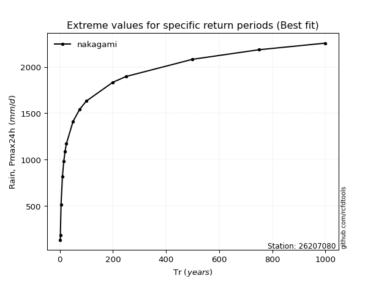</img>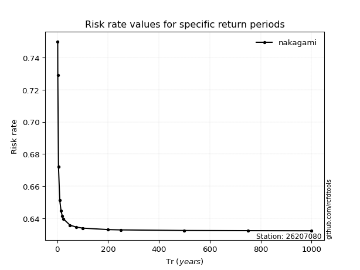</img>

</div>


<sub>**APP DISCLAIMER**: NO WARRANTY - This software is provided by [github.com/rcfdtools](https://github.com/rcfdtools) "as is", without any express or implied warranty, including warranties of merchantability, fitness for a particular purpose, or non-infringement. There is no guarantee that the software will be error-free or operate without interruption. LIMITATION OF LIABILITY - Neither the authors nor copyright holders will be liable for claims or damages arising from the software or its use. You are responsible for determining if the software is appropriate for your use and assume all associated risks, including errors, legal compliance, and data loss. NO PROFESSIONAL ADVICE - The software provides general information and does not offer professional advice. It should not replace consultation with professional advisors.</sub>