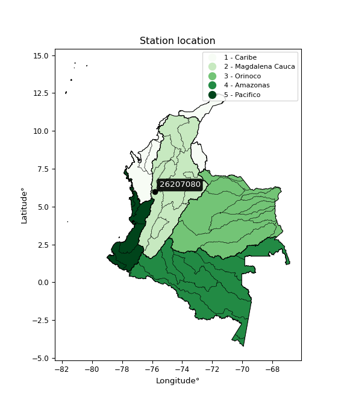

<div align="center">


</div>

# PMP Station (Rain, Pmax24h): 26207080

Probable Maximum Precipitation (PMP) is the greatest amount of rainfall for a specific duration that is meteorologically possible for a given location, acting as a "worst-case" scenario for extreme storms, crucial for designing safety-critical infrastructure like bridges, river deviations, dams, spillways, and nuclear plants to prevent catastrophic failure. PMP is calculated by hydrologists using meteorological data to determine the upper limit of extreme rainfall, often leading to the Probable Maximum Flood (PMF) for flood control design, and is increasingly being studied for climate change impacts. Probable Maximum Precipitation (PMP) is the theoretical upper limit of rainfall, a deterministic estimate for extreme events, while probability distributions (like GEV, Gumbel) describe the likelihood and frequency of various precipitation amounts, including rare ones, showing how often events occur, with PMP representing the extreme end of these distributions, used for critical infrastructure design to ensure safety against the worst conceivable weather, unlike standard statistical forecasts which cover typical probabilities.

The most common probability distributions in hydrology, used for analyzing floods, rainfall, and streamflow, include the Normal, Log-Normal, Gumbel, Gamma (including Log-Pearson Type III), and Generalized Extreme Value (GEV) distributions, often chosen based on the data´s skewness and whether modeling extremes or general conditions, with Gumbel and GEV popular for extreme events like floods, while the Normal distribution serves as a baseline, though often requiring transformations for skewed hydrological data. These distributions help in designing water infrastructure, managing water resources, and forecasting hydrologic events.

> Hydrological data often isn´t perfectly normal (it´s skewed), so different distributions are needed for different applications, such as: **Flood Frequency Analysis**: Using Gumbel, GEV, or Log-Pearson Type III for predicting extreme flood magnitudes and their return periods, **Rainfall Analysis**: Normal for annual totals, but Log-Normal, Weibull, or GEV for intensity or extreme daily rainfall, **Streamflow Modeling**: Gamma and Log-Normal for maximum flows, GEV for minimum flows, and Kappa for daily flows.

<div align="center">

</img>

</div>


## A. General information


### 1. General running parameters

• app_version: _v20260108_. • runtime: _2026-01-09 11:32:22.148588_. • Python version: _3.14.0_. • SciPy version: _1.16.3_. • Pandas version: _2.3.3_. • NumPy version: _2.3.5_. • Stations dataset (station_dataset_file): _dataset/pmax24h_in/automatic_colombia_2003_2024.csv_. • Stations catalog (station_catalog_file): _dataset/CNE.xls_. • Minimum year to eval til year_max (date_min): _1900_. • Maximum year to eval since year_min (date_max): _2024_. • Creates, save and include plots into reports (create_plot): _False_. • Plot only fit distributions with Δo > Δ (plot_only_fit): _True_. • Plot only simple graphs avoiding multiple CDFs and multiple Extreme values plots (plot_only_simple): _True_. • Eval low extreme values, if False, evaluates high extreme values (low_extreme): _False_. • Eval every SciPy distribution as logarithmic (pdist_logarithmic_on): _True_. • Standard deviation normalized (ddof): _1.0_. • Return periods to eval in years (Tr): _[2, 2.33, 5, 10, 15, 20, 25, 50, 75, 100, 200, 250, 500, 750, 1000]_. • Minimum data sample per station, 0 means any (minimum_sample): _5_. • Z-Score maximum threshold to adjust a value, 0 means disable (zscore_max): _3.5_. • Z-Score minimum threshold to adjust a value, 0 means disable (zscore_min): _-2.5_. • Avoid zeros, e.g. rain = 0 (avoid_zeros): _True_. • Avoid null values (avoid_nans): _True_. 

:file_folder:Table: [dataset.csv](../../dataset/pmax24h_in/automatic_colombia_2003_2024.csv)

> Delta Degrees of Freedom (DDOF): is a parameter used in the formulas for calculating variance and standard deviation. When ddof=0, the divisor is $N$ (the total number of observations) and this is used when your data set is the entire population. When ddof=1, the divisor is $N-1$ and this is used when your data set is a sample drawn from a larger population. Using $N-1$ provides an unbiased estimate of the population variance (known as Bessel´s correction).


### 2. Station info and location

|   id |   CODIGO | NOMBRE               | CATEGORIA    | TECNOLOGIA                | ESTADO   | FECHA_INSTALACION   |   FECHA_SUSPENSION |   ALTITUD |   LATITUD |   LONGITUD | DEPARTAMENTO   | MUNICIPIO   | AREA_OPERATIVA                      | ENTIDAD                                                     | AREA_HIDROGRAFICA   | ZONA_HIDROGRAFICA   | SUBZONA_HIDROGRAFICA                                   | CORRIENTE   | Catalogo   |   Version |
|-----:|---------:|:---------------------|:-------------|:--------------------------|:---------|:--------------------|-------------------:|----------:|----------:|-----------:|:---------------|:------------|:------------------------------------|:------------------------------------------------------------|:--------------------|:--------------------|:-------------------------------------------------------|:------------|:-----------|----------:|
|    0 | 26207080 | BOLOMBOLO [26207080] | Limnigráfica | Automática con Telemetría | Activa   | 15/10/1971          |                nan |      1750 |      5.97 |     -75.84 | Antioquia      | Venecia     | Area Operativa 01 - Antioquia-Chocó | INSTITUTO DE HIDROLOGIA METEOROLOGIA Y ESTUDIOS AMBIENTALES | Magdalena Cauca     | Cauca               | Directos Río Cauca  entre Río San Juan y  Pto Valdivia | Cauca       | CNE_IDEAM  |  20251226 |

<div align="center">

Dynamic map: [:earth_americas:Google](http://maps.google.com/maps?q=5.97,-75.84) [:earth_americas:OSM](https://www.openstreetmap.org/#map=18/5.97/-75.84&layers=P) [:earth_americas:Bing](https://www.bing.com/maps?cp=5.97~-75.84&lvl=18) [:earth_americas:Apple](https://maps.apple.com/frame?center=5.97%2C-75.84&span=0.003%2C0.006)

</div>


<div align="center">

```geojson
{
  "type": "Feature",
  "geometry": {
    "type": "Point", 
    "coordinates": [-75.84, 5.97]
  }, 
  "properties": {
    "Name": "26207080"
  }
}
```

</div>


### 3. Discrete values table and plot

<div align="center">

|               |         0 |           1 |          2 |           3 |           4 |           5 |           6 |           7 |
|:--------------|----------:|------------:|-----------:|------------:|------------:|------------:|------------:|------------:|
| Date          | 2017      | 2018        | 2019       | 2020        | 2021        | 2022        | 2023        | 2024        |
| Value         |   59.1    |   62.4      |  717.9     |  291.1      |  290.9      |   20.7      |   45        |  391        |
| Value_initial |   59.1    |   62.4      |  717.9     |  291.1      |  290.9      |   20.7      |   45        |  391        |
| count         |    8      |    8        |    8       |    8        |    8        |    8        |    8        |    8        |
| mean          |  234.762  |  234.762    |  234.762   |  234.762    |  234.762    |  234.762    |  234.762    |  234.762    |
| std           |  240.997  |  240.997    |  240.997   |  240.997    |  240.997    |  240.997    |  240.997    |  240.997    |
| zscore        |   -0.7289 |   -0.715207 |    2.00475 |    0.233769 |    0.232939 |   -0.888238 |   -0.787407 |    0.648297 |


</div>


> The initial value (value_initial) correspond to the initial obtained or null completed value, and value (value) is adjusted only when the initial value is outside the valid range (outlier) definite through the Z-Score value. If Z-Score is active, values out of range or outliers are replaced with the station mean value. A Z-Score (or standard score) measures how many standard deviations a data point is from the mean of a dataset, indicating its relative position; positive scores mean above the mean, negative mean below, and a score of zero is exactly at the mean, allowing for comparison of values from different distributions. It´s calculated using the formula $z=(x–μ)/σ$, where $x$ is the data point, $μ$ is the mean, and $σ$ is the standard deviation, helping identify outliers and understand probability.
>
> <sub>**Note**: In this study, "completing" (filling gaps in) and "extending" (forecasting or lengthening the historical record) rainfall data series are avoided for certain critical analyses because they introduce artificial bias and uncertainty, which can distort the statistics of rare events (extremes), alter day-to-day variability, and compromise the integrity and homogeneity of the original data. Some reasons against Completing/Extending rainfall data are: **Distortion of Extremes and Variability**: The primary issue is that most gap-filling or extension methods rely on averaging or regression with nearby stations, which inherently smooths the data. Rainfall is highly variable in space and time, with a large percentage of zero values and occasional large storms. Infilling methods often underestimate the highest values and overestimate the lowest (zero) values, which severely distorts analyses focused on flood frequency, drought severity, and intensity-duration-frequency (IDF) curves, **Loss of Data Homogeneity**: Infilled or extended data are synthetic estimates, not actual measurements. Combining these estimates with observed data can violate the assumption of data homogeneity, which requires that the data properties do not change over time. Inhomogeneity can lead to incorrect conclusions about long-term trends or changes in climate patterns, **Propagation of Errors**: Errors and biases from the original data (e.g., wind-induced undercatch, instrument errors, site changes) or the data used for imputation can propagate through the analysis, leading to unreliable hydrological models and inaccurate predictions, **Compromised Statistical Integrity**: For statistical analyses, especially those involving the frequency of events, using artificial data can introduce time bias or autocorrelation that doesn´t exist in reality, making it difficult to assess the true probability of events, **Difficulty in Validation**: It is difficult to accurately validate the quality of filled or extended data, especially for past periods where ground-truth measurements are unavailable. The reliability of imputation techniques heavily depends on the density of the surrounding station network and the complexity of the local topography.</sub>


### 4. Active continuous probability distributions from SciPy (45 of 104 available)

A Probability Density Function (PDF) describes the relative likelihood of a continuous random variable falling within a specific range, where the total area under its curve equals 1, and the area over any interval gives the actual probability for that range. Unlike discrete probabilities (like rolling a die), a PDF shows density, not direct probability for a single point (which is zero), with higher points indicating higher likelihood, often visualized as a bell curve for normal distributions.

A log of a probability density function (log-PDF) is simply the logarithm of the PDF´s value, denoted as $log(f(x))$, useful for converting multiplication of probabilities into addition, improving numerical stability with tiny numbers, and connecting to information theory concepts like entropy. Instead of dealing with very small probabilities (e.g., 0.000001), log-PDFs use negative numbers (e.g., $log(0.00001) ≈ -11.51$ that are easier for computers to handle, preventing underflow errors and simplifying complex calculations. In this study, each active probability distribution from SciPy is also evaluated in the $log$ form.

[scipy.stats](https://docs.scipy.org/doc/scipy/reference/stats.html) is a Python´s powerful submodule within the SciPy library for comprehensive statistical analysis, offering over 130 probability distributions (like Normal, Poisson), functions for descriptive stats (mean, variance), hypothesis testing (t-tests, chi-square), random variable generation, and statistical tests, making it essential for data science, modeling, and research. It provides tools to explore, model, and draw conclusions from data efficiently, working seamlessly with NumPy.

<div align="center">

|   id | p_dist             |   n_parameter | fit_method   | label                                                                       | active   | ref                                                                                                        |
|-----:|:-------------------|--------------:|:-------------|:----------------------------------------------------------------------------|:---------|:-----------------------------------------------------------------------------------------------------------|
|    0 | alpha              |             3 | MLE          | Alpha                                                                       | True     | [:mortar_board:](https://docs.scipy.org/doc/scipy/reference/generated/scipy.stats.alpha.html)              |
|    1 | betaprime          |             4 | MLE          | Beta prime                                                                  | True     | [:mortar_board:](https://docs.scipy.org/doc/scipy/reference/generated/scipy.stats.betaprime.html)          |
|    2 | chi2               |             3 | MLE          | Chi²                                                                        | True     | [:mortar_board:](https://docs.scipy.org/doc/scipy/reference/generated/scipy.stats.chi2.html)               |
|    3 | crystalball        |             4 | MLE          | Crystalball                                                                 | True     | [:mortar_board:](https://docs.scipy.org/doc/scipy/reference/generated/scipy.stats.crystalball.html)        |
|    4 | dweibull           |             3 | MLE          | Double Weibull                                                              | True     | [:mortar_board:](https://docs.scipy.org/doc/scipy/reference/generated/scipy.stats.dweibull.html)           |
|    5 | erlang             |             3 | MLE          | Erlang                                                                      | True     | [:mortar_board:](https://docs.scipy.org/doc/scipy/reference/generated/scipy.stats.erlang.html)             |
|    6 | expon              |             2 | MLE          | Exponential                                                                 | True     | [:mortar_board:](https://docs.scipy.org/doc/scipy/reference/generated/scipy.stats.expon.html)              |
|    7 | exponnorm          |             3 | MLE          | Exponentially modified Normal                                               | True     | [:mortar_board:](https://docs.scipy.org/doc/scipy/reference/generated/scipy.stats.exponnorm.html)          |
|    8 | f                  |             4 | MLE          | F                                                                           | True     | [:mortar_board:](https://docs.scipy.org/doc/scipy/reference/generated/scipy.stats.f.html)                  |
|    9 | fatiguelife        |             3 | MLE          | Fatigue-life (Birnbaum-Saunders)                                            | True     | [:mortar_board:](https://docs.scipy.org/doc/scipy/reference/generated/scipy.stats.fatiguelife.html)        |
|   10 | fisk               |             3 | MLE          | Fisk                                                                        | True     | [:mortar_board:](https://docs.scipy.org/doc/scipy/reference/generated/scipy.stats.fisk.html)               |
|   11 | gamma              |             3 | MLE          | Gamma                                                                       | True     | [:mortar_board:](https://docs.scipy.org/doc/scipy/reference/generated/scipy.stats.gamma.html)              |
|   12 | genexpon           |             5 | MLE          | Generalized exponential                                                     | True     | [:mortar_board:](https://docs.scipy.org/doc/scipy/reference/generated/scipy.stats.genexpon.html)           |
|   13 | genlogistic        |             3 | MLE          | Generalized logistic                                                        | True     | [:mortar_board:](https://docs.scipy.org/doc/scipy/reference/generated/scipy.stats.genlogistic.html)        |
|   14 | gibrat             |             2 | MM           | Gibrat                                                                      | True     | [:mortar_board:](https://docs.scipy.org/doc/scipy/reference/generated/scipy.stats.gibrat.html)             |
|   15 | gompertz           |             3 | MLE          | Gompertz (or truncated Gumbel)                                              | True     | [:mortar_board:](https://docs.scipy.org/doc/scipy/reference/generated/scipy.stats.gompertz.html)           |
|   16 | gumbel_l           |             2 | MM           | Gumbel Left Skew                                                            | True     | [:mortar_board:](https://docs.scipy.org/doc/scipy/reference/generated/scipy.stats.gumbel_l.html)           |
|   17 | gumbel_r           |             2 | MM           | Gumbel Right Skew                                                           | True     | [:mortar_board:](https://docs.scipy.org/doc/scipy/reference/generated/scipy.stats.gumbel_r.html)           |
|   18 | halflogistic       |             2 | MM           | Half-logistic                                                               | True     | [:mortar_board:](https://docs.scipy.org/doc/scipy/reference/generated/scipy.stats.halflogistic.html)       |
|   19 | halfnorm           |             2 | MM           | Half Normal                                                                 | True     | [:mortar_board:](https://docs.scipy.org/doc/scipy/reference/generated/scipy.stats.halfnorm.html)           |
|   20 | hypsecant          |             2 | MM           | hyperbolic secant                                                           | True     | [:mortar_board:](https://docs.scipy.org/doc/scipy/reference/generated/scipy.stats.hypsecant.html)          |
|   21 | invgamma           |             3 | MLE          | Inverted gamma                                                              | True     | [:mortar_board:](https://docs.scipy.org/doc/scipy/reference/generated/scipy.stats.invgamma.html)           |
|   22 | invgauss           |             3 | MLE          | Inverse Gaussian                                                            | True     | [:mortar_board:](https://docs.scipy.org/doc/scipy/reference/generated/scipy.stats.invgauss.html)           |
|   23 | invweibull         |             3 | MLE          | Inverted Weibull                                                            | True     | [:mortar_board:](https://docs.scipy.org/doc/scipy/reference/generated/scipy.stats.invweibull.html)         |
|   24 | kappa4             |             4 | MLE          | Kappa 4                                                                     | True     | [:mortar_board:](https://docs.scipy.org/doc/scipy/reference/generated/scipy.stats.kappa4.html)             |
|   25 | kstwobign          |             2 | MLE          | Limiting distribution of scaled Kolmogorov-Smirnov two-sided test statistic | True     | [:mortar_board:](https://docs.scipy.org/doc/scipy/reference/generated/scipy.stats.kstwobign.html)          |
|   26 | laplace            |             2 | MM           | Laplace                                                                     | True     | [:mortar_board:](https://docs.scipy.org/doc/scipy/reference/generated/scipy.stats.laplace.html)            |
|   27 | laplace_asymmetric |             3 | MLE          | Asymmetric Laplace                                                          | True     | [:mortar_board:](https://docs.scipy.org/doc/scipy/reference/generated/scipy.stats.laplace_asymmetric.html) |
|   28 | loggamma           |             3 | MLE          | Log gamma                                                                   | True     | [:mortar_board:](https://docs.scipy.org/doc/scipy/reference/generated/scipy.stats.loggamma.html)           |
|   29 | logistic           |             2 | MM           | Logistic (or Sech-squared)                                                  | True     | [:mortar_board:](https://docs.scipy.org/doc/scipy/reference/generated/scipy.stats.logistic.html)           |
|   30 | lognorm            |             3 | MLE          | Log Normal                                                                  | True     | [:mortar_board:](https://docs.scipy.org/doc/scipy/reference/generated/scipy.stats.lognorm.html)            |
|   31 | maxwell            |             2 | MM           | Maxwell                                                                     | True     | [:mortar_board:](https://docs.scipy.org/doc/scipy/reference/generated/scipy.stats.maxwell.html)            |
|   32 | mielke             |             4 | MLE          | Mielke Beta-Kappa / Dagum                                                   | True     | [:mortar_board:](https://docs.scipy.org/doc/scipy/reference/generated/scipy.stats.mielke.html)             |
|   33 | moyal              |             2 | MM           | Moyal                                                                       | True     | [:mortar_board:](https://docs.scipy.org/doc/scipy/reference/generated/scipy.stats.moyal.html)              |
|   34 | nakagami           |             3 | MLE          | Nakagami                                                                    | True     | [:mortar_board:](https://docs.scipy.org/doc/scipy/reference/generated/scipy.stats.nakagami.html)           |
|   35 | ncf                |             5 | MLE          | Non-central F distribution                                                  | True     | [:mortar_board:](https://docs.scipy.org/doc/scipy/reference/generated/scipy.stats.ncf.html)                |
|   36 | nct                |             4 | MLE          | Non-central Student’s t                                                     | True     | [:mortar_board:](https://docs.scipy.org/doc/scipy/reference/generated/scipy.stats.nct.html)                |
|   37 | norm               |             2 | MM           | Normal                                                                      | True     | [:mortar_board:](https://docs.scipy.org/doc/scipy/reference/generated/scipy.stats.norm.html)               |
|   38 | pearson3           |             3 | MM           | Pearson type III                                                            | True     | [:mortar_board:](https://docs.scipy.org/doc/scipy/reference/generated/scipy.stats.pearson3.html)           |
|   39 | rayleigh           |             2 | MM           | Rayleigh                                                                    | True     | [:mortar_board:](https://docs.scipy.org/doc/scipy/reference/generated/scipy.stats.rayleigh.html)           |
|   40 | rice               |             3 | MLE          | Rice                                                                        | True     | [:mortar_board:](https://docs.scipy.org/doc/scipy/reference/generated/scipy.stats.rice.html)               |
|   41 | t                  |             3 | MLE          | Student’s t                                                                 | True     | [:mortar_board:](https://docs.scipy.org/doc/scipy/reference/generated/scipy.stats.t.html)                  |
|   42 | truncnorm          |             4 | MLE          | Truncated normal                                                            | True     | [:mortar_board:](https://docs.scipy.org/doc/scipy/reference/generated/scipy.stats.truncnorm.html)          |
|   43 | wald               |             2 | MM           | Wald                                                                        | True     | [:mortar_board:](https://docs.scipy.org/doc/scipy/reference/generated/scipy.stats.wald.html)               |
|   44 | weibull_min        |             3 | MLE          | Weibull minimum                                                             | True     | [:mortar_board:](https://docs.scipy.org/doc/scipy/reference/generated/scipy.stats.weibull_min.html)        |

</div>

> **n_parameter:** # arguments & localization & scale.
>
> **Fit methods:** (MLE) maximum likelihood, (MM) L-moments.
>
>**Inactive** (With the only purpose of prevent loops, zero divisions, infinite values, over high estimated values or horizontal trending for recurrence intervals estimations, the follow distributions were disabled.)**:** foldnorm, gennorm, norminvgauss, powernorm, powerlognorm, skewnorm, genextreme, anglit, arcsine, argus, beta, bradford, burr, burr12, cauchy, cosine, halfcauchy, foldcauchy, skewcauchy, wrapcauchy, dgamma, gengamma, exponweib, exponpow, truncexpon, gausshyper, genhalflogistic, genhyperbolic, geninvgauss, halfgennorm, johnsonsb, johnsonsu, kappa3, ksone, kstwo, loglaplace, levy, levy_l, levy_stable, ncx2, pareto, genpareto, truncpareto, lomax, powerlaw, rdist, rel_breitwigner, recipinvgauss, semicircular, studentized_range, trapezoid, triang, truncweibull_min, tukeylambda, uniform, loguniform, vonmises, vonmises_line, weibull_max, 


## B. Probability (PDF) vs. Empirical (EDF) distributions functions

A continuous probability distribution (CPD) describes probabilities for variables that can take any value within a range (like rain any time), unlike discrete variables with specific outcomes (like temperature). It uses a Probability Density Function (PDF), a curve where the total area under it equals 1, and the probability of the variable falling within an interval (a to b) is found by calculating the area under the curve between those points. A key feature is that the probability of hitting any single exact value is zero, so probabilities are always expressed for ranges, e.g., $P(a ≤ X ≤ b)$.

<div align="center">

Distributions parameters from station values
|    |   station | p_dist                |   n |              loc |          scale | shape                  | shape1                | shape2             | shape3   |
|---:|----------:|:----------------------|----:|-----------------:|---------------:|:-----------------------|:----------------------|:-------------------|:---------|
|  0 |  26207080 | alpha                 |   8 |     -0.122536    |   48.7457      | 1.1367311511624121e-11 |                       |                    |          |
|  1 |  26207080 | betaprime             |   8 |      2.40284     |   13.588       | 5.70839132770389       | 1.0174572873913847    |                    |          |
|  2 |  26207080 | chi2                  |   8 |     20.7         |  165.492       | 1.021472096088151      |                       |                    |          |
|  3 |  26207080 | crystalball           |   8 |     -0.208806    |  325.687       | 4.487076607400521      | 2.423571212700586     |                    |          |
|  4 |  26207080 | dweibull              |   8 |    206.289       |  212.745       | 1.6562312721455312     |                       |                    |          |
|  5 |  26207080 | erlang                |   8 |     20.7         |  155.565       | 0.6540692203914567     |                       |                    |          |
|  6 |  26207080 | expon                 |   8 |     20.7         |  214.063       |                        |                       |                    |          |
|  7 |  26207080 | exponnorm             |   8 |     20.5011      |    0.0568674   | 3758.442729426658      |                       |                    |          |
|  8 |  26207080 | f                     |   8 |     20.7         |   56.4904      | 0.8746636623524706     | 1.4289702985023165    |                    |          |
|  9 |  26207080 | fatiguelife           |   8 |     14.3212      |   80.5959      | 1.7864279835933825     |                       |                    |          |
| 10 |  26207080 | fisk                  |   8 |     20.7         |   72.9161      | 0.4819827301044093     |                       |                    |          |
| 11 |  26207080 | gamma                 |   8 |     20.7         |  145.273       | 0.6697452361467939     |                       |                    |          |
| 12 |  26207080 | genexpon              |   8 |     20.7         |  474.315       | 2.215779766230074      | 1.802888774959393e-12 | 1.7295095639096547 |          |
| 13 |  26207080 | genlogistic           |   8 |  -1042.38        |  156.453       | 1847.1803925186045     |                       |                    |          |
| 14 |  26207080 | gibrat                |   8 |     62.7865      |  104.309       |                        |                       |                    |          |
| 15 |  26207080 | gompertz              |   8 |     20.7         |    2.73669e+09 | 12761126.64340825      |                       |                    |          |
| 16 |  26207080 | gumbel_l              |   8 |    336.219       |  175.768       |                        |                       |                    |          |
| 17 |  26207080 | gumbel_r              |   8 |    133.306       |  175.768       |                        |                       |                    |          |
| 18 |  26207080 | halflogistic          |   8 |    -32.4266      |  192.736       |                        |                       |                    |          |
| 19 |  26207080 | halfnorm              |   8 |    -63.6209      |  373.968       |                        |                       |                    |          |
| 20 |  26207080 | hypsecant             |   8 |    234.763       |  143.514       |                        |                       |                    |          |
| 21 |  26207080 | invgamma              |   8 |     -1.39416     |   70.5234      | 0.9679339930897175     |                       |                    |          |
| 22 |  26207080 | invgauss              |   8 |      4.04752     |   83.2887      | 2.770064313274199      |                       |                    |          |
| 23 |  26207080 | invweibull            |   8 |      3.99227     |   65.705       | 0.8784399383507864     |                       |                    |          |
| 24 |  26207080 | kappa4                |   8 |    -48.2588      |  770.737       | 1.0981681711471492     | 0.9809215382103498    |                    |          |
| 25 |  26207080 | kstwobign             |   8 |   -419.744       |  753.701       |                        |                       |                    |          |
| 26 |  26207080 | laplace               |   8 |    234.763       |  159.404       |                        |                       |                    |          |
| 27 |  26207080 | laplace_asymmetric    |   8 |     20.7         |    0.000193232 | 9.02690295545606e-07   |                       |                    |          |
| 28 |  26207080 | loggamma              |   8 | -62180.1         | 8623.26        | 1391.822996389319      |                       |                    |          |
| 29 |  26207080 | logistic              |   8 |    234.763       |  124.287       |                        |                       |                    |          |
| 30 |  26207080 | lognorm               |   8 |     20.7         |    1.12727     | 12.67283418399987      |                       |                    |          |
| 31 |  26207080 | maxwell               |   8 |   -299.416       |  334.747       |                        |                       |                    |          |
| 32 |  26207080 | mielke                |   8 |     -0.234821    |    0.664716    | 81.51719492091198      | 0.9475650304103276    |                    |          |
| 33 |  26207080 | moyal                 |   8 |    105.846       |  101.48        |                        |                       |                    |          |
| 34 |  26207080 | nakagami              |   8 |     20.7         |  459.447       | 0.16336151763012913    |                       |                    |          |
| 35 |  26207080 | ncf                   |   8 |     -0.0174411   |   46.2539      | 21.331372877219152     | 1.9979001796250406    | 13.692686127983073 |          |
| 36 |  26207080 | nct                   |   8 |    -14.9243      |    3.01024     | 0.8809799046239646     | 24.76312465149207     |                    |          |
| 37 |  26207080 | norm                  |   8 |    234.763       |  225.432       |                        |                       |                    |          |
| 38 |  26207080 | pearson3              |   8 |    234.763       |  225.432       | 0.9793822168018005     |                       |                    |          |
| 39 |  26207080 | rayleigh              |   8 |   -196.502       |  344.099       |                        |                       |                    |          |
| 40 |  26207080 | rice                  |   8 |   -120.973       |  297.798       | 4.4169260603955885e-05 |                       |                    |          |
| 41 |  26207080 | t                     |   8 |     55.6784      |   19.7296      | 0.445546458964054      |                       |                    |          |
| 42 |  26207080 | truncnorm             |   8 | -97248.7         | 4699.05        | 20.699788344265905     | 745.3543897834707     |                    |          |
| 43 |  26207080 | wald                  |   8 |      9.33068     |  225.432       |                        |                       |                    |          |
| 44 |  26207080 | weibull_min           |   8 |     20.7         | 1117.17        | 0.1764493609196779     |                       |                    |          |
| 45 |  26207080 | logalpha              |   8 |    -15.1594      |  333.244       | 16.69905803676062      |                       |                    |          |
| 46 |  26207080 | logbetaprime          |   8 |     -2.46087     |  117.023       | 38.92016811728287      | 623.2583892815703     |                    |          |
| 47 |  26207080 | logchi2               |   8 |      3.03013     |    1.00233     | 1.2057142928401605     |                       |                    |          |
| 48 |  26207080 | logcrystalball        |   8 |      4.86766     |    1.17754     | 7.462415573240751      | 1834.3410534363038    |                    |          |
| 49 |  26207080 | logdweibull           |   8 |      4.86696     |    1.24334     | 2.896518273946832      |                       |                    |          |
| 50 |  26207080 | logerlang             |   8 |    -36.8714      |    0.0333412   | 1251.866376188319      |                       |                    |          |
| 51 |  26207080 | logexpon              |   8 |      3.03013     |    1.83753     |                        |                       |                    |          |
| 52 |  26207080 | logexponnorm          |   8 |      4.86622     |    1.17754     | 0.0012245577675777885  |                       |                    |          |
| 53 |  26207080 | logf                  |   8 |    -31.5288      |   36.3813      | 3182.8985186207137     | 4770.57504355273      |                    |          |
| 54 |  26207080 | logfatiguelife        |   8 |    -95.2821      |  100.146       | 0.011733410062567722   |                       |                    |          |
| 55 |  26207080 | logfisk               |   8 |     -5.69e+07    |    5.69e+07    | 77586123.3004149       |                       |                    |          |
| 56 |  26207080 | loggamma              |   8 |    -35.8988      |    0.0340877   | 1195.8905132011118     |                       |                    |          |
| 57 |  26207080 | loggenexpon           |   8 |      3.02957     |   81.969       | 22.255816941383223     | 47.91256215773873     | 46.11408393109684  |          |
| 58 |  26207080 | loggenlogistic        |   8 |     -1.18837     |    1.06174     | 172.96190968071517     |                       |                    |          |
| 59 |  26207080 | loggibrat             |   8 |      3.96934     |    0.54486     |                        |                       |                    |          |
| 60 |  26207080 | loggompertz           |   8 |      3.03013     |    1.6076      | 0.33083368538594427    |                       |                    |          |
| 61 |  26207080 | loggumbel_l           |   8 |      5.39761     |    0.918123    |                        |                       |                    |          |
| 62 |  26207080 | loggumbel_r           |   8 |      4.3377      |    0.918123    |                        |                       |                    |          |
| 63 |  26207080 | loghalflogistic       |   8 |      3.47205     |    1.00673     |                        |                       |                    |          |
| 64 |  26207080 | loghalfnorm           |   8 |      3.30908     |    1.95339     |                        |                       |                    |          |
| 65 |  26207080 | loghypsecant          |   8 |      4.86766     |    0.749644    |                        |                       |                    |          |
| 66 |  26207080 | loginvgamma           |   8 |    -10.4981      | 2564.31        | 167.85622098585873     |                       |                    |          |
| 67 |  26207080 | loginvgauss           |   8 |     -2.41341     |  257.877       | 0.02823074261080106    |                       |                    |          |
| 68 |  26207080 | loginvweibull         |   8 |     -6.47312e+07 |    6.47312e+07 | 58815804.508077204     |                       |                    |          |
| 69 |  26207080 | logkappa4             |   8 |      2.79202     |    3.97192     | 1.0608786749265728     | 1.0495755206159942    |                    |          |
| 70 |  26207080 | logkstwobign          |   8 |      0.58851     |    4.88304     |                        |                       |                    |          |
| 71 |  26207080 | loglaplace            |   8 |      4.86766     |    0.832646    |                        |                       |                    |          |
| 72 |  26207080 | loglaplace_asymmetric |   8 |      4.07923     |    0.871298    | 0.6451305268637315     |                       |                    |          |
| 73 |  26207080 | logloggamma           |   8 |     -7.51772     |    4.57598     | 15.475574371657242     |                       |                    |          |
| 74 |  26207080 | loglogistic           |   8 |      4.86766     |    0.649211    |                        |                       |                    |          |
| 75 |  26207080 | loglognorm            |   8 |      3.03013     |    0.0203197   | 11.90035430837318      |                       |                    |          |
| 76 |  26207080 | logmaxwell            |   8 |      2.07739     |    1.74854     |                        |                       |                    |          |
| 77 |  26207080 | logmielke             |   8 |     -2.8074      |    9.44679     | 4.553830533460486      | 302.59395132337966    |                    |          |
| 78 |  26207080 | logmoyal              |   8 |      4.19427     |    0.530079    |                        |                       |                    |          |
| 79 |  26207080 | lognakagami           |   8 |      3.80666     |    1.56468     | 0.3374147906989098     |                       |                    |          |
| 80 |  26207080 | logncf                |   8 |     -2.81891     |    0.0140462   | 0.39204013233173707    | 356.48152590621453    | 212.99721980025853 |          |
| 81 |  26207080 | lognct                |   8 |    -44.7428      |    1.1585      | 27508.387746320805     | 42.82137996237168     |                    |          |
| 82 |  26207080 | lognorm               |   8 |      4.86766     |    1.17754     |                        |                       |                    |          |
| 83 |  26207080 | logpearson3           |   8 |      4.86766     |    1.17754     | -0.07005876114152024   |                       |                    |          |
| 84 |  26207080 | lograyleigh           |   8 |      2.61496     |    1.79739     |                        |                       |                    |          |
| 85 |  26207080 | logrice               |   8 |      2.50653     |    1.41707     | 1.211084096403305      |                       |                    |          |
| 86 |  26207080 | logt                  |   8 |      4.86766     |    1.17754     | 13823014965.976501     |                       |                    |          |
| 87 |  26207080 | logtruncnorm          |   8 |      0.00721698  |    3.06682     | 1.2388749291953984     | 2.1420069193543787    |                    |          |
| 88 |  26207080 | logwald               |   8 |      3.6901      |    1.17756     |                        |                       |                    |          |
| 89 |  26207080 | logweibull_min        |   8 |      2.35664     |    2.83928     | 2.30490624259543       |                       |                    |          |

</div>

> **loc** (Location parameter): This shifts the distribution along the x-axis. For many common distributions, like the normal (Gaussian) distribution, loc represents the mean $μ$. For others, like the uniform distribution, it might represent the minimum value, or for the beta distribution, the left end of the support interval.
>
> **scale** (Scale parameter): This determines the width or spread of the distribution. For the normal distribution, scale represents the standard deviation $σ$. For a uniform distribution, it defines the length of the interval (from $loc$ to $loc + scale$).
>
> **shape** (Shape parameters): Refers to parameters that define the specific form of a probability distribution, distinct from its location (loc) and scale (scale). These parameters are required arguments for most distribution functions. For example, a normal (Gaussian) distribution is fully defined by its location (mean) and scale (standard deviation), so it has no specific shape parameters beyond loc and scale. However, other distributions have intrinsic properties that need specification, as Gamma distribution that takes a shape parameter, often named $a$ or $alpha$.


### 0. Cumulative distribution values - CDF (90 evaluated)

Cumulative Distribution Function (CDF), denoted as $F$<sub>$X$</sub>$(x)$, is a function that gives the probability that a random variable $X$ will take a value less than or equal to a specific value, $x$ (i.e., $(P(X≥x)$. It essentially "accumulates" probabilities from a given point up to the far right (positive infinity), providing a complete picture of the distribution´s probabilities for both discrete (like rain) and continuous (like temperature) variables, helping to find probabilities over ranges or above certain values. Each station is evaluated separately ordering the $x$ values ascending, calculating the CDF and PDF values for the activated distributions and their logarithmic forms.

<div align="center">

CDF ordered by x ascending and calculating $log(f(x))$ separately
|   id |   Station |   date |     x |   count |    mean |     std |    zscore |   Value_initial |   station |   m |     alpha |   alpha_pdf |   betaprime |   betaprime_pdf |        chi2 |         chi2_pdf |   crystalball |   crystalball_pdf |   dweibull |   dweibull_pdf |      erlang |     erlang_pdf |    expon |   expon_pdf |   exponnorm |   exponnorm_pdf |           f |         f_pdf |   fatiguelife |   fatiguelife_pdf |        fisk |       fisk_pdf |       gamma |      gamma_pdf |    genexpon |   genexpon_pdf |   genlogistic |   genlogistic_pdf |   gibrat |   gibrat_pdf |    gompertz |   gompertz_pdf |   gumbel_l |   gumbel_l_pdf |   gumbel_r |   gumbel_r_pdf |   halflogistic |   halflogistic_pdf |   halfnorm |   halfnorm_pdf |   hypsecant |   hypsecant_pdf |   invgamma |   invgamma_pdf |   invgauss |   invgauss_pdf |   invweibull |   invweibull_pdf |      kappa4 |   kappa4_pdf |   kstwobign |   kstwobign_pdf |   laplace |   laplace_pdf |   laplace_asymmetric |   laplace_asymmetric_pdf |   loggamma |   loggamma_pdf |   logistic |   logistic_pdf |   lognorm |   lognorm_pdf |   maxwell |   maxwell_pdf |    mielke |   mielke_pdf |    moyal |   moyal_pdf |    nakagami |   nakagami_pdf |       ncf |     ncf_pdf |       nct |     nct_pdf |     norm |    norm_pdf |   pearson3 |   pearson3_pdf |   rayleigh |   rayleigh_pdf |     rice |   rice_pdf |        t |       t_pdf |   truncnorm |   truncnorm_pdf |        wald |    wald_pdf |   weibull_min |   weibull_min_pdf |   logalpha |   logalpha_pdf |   logbetaprime |   logbetaprime_pdf |     logchi2 |    logchi2_pdf |   logcrystalball |   logcrystalball_pdf |   logdweibull |   logdweibull_pdf |   logerlang |   logerlang_pdf |   logexpon |   logexpon_pdf |   logexponnorm |   logexponnorm_pdf |      logf |   logf_pdf |   logfatiguelife |   logfatiguelife_pdf |   logfisk |   logfisk_pdf |   loggenexpon |   loggenexpon_pdf |   loggenlogistic |   loggenlogistic_pdf |   loggibrat |   loggibrat_pdf |   loggompertz |   loggompertz_pdf |   loggumbel_l |   loggumbel_l_pdf |   loggumbel_r |   loggumbel_r_pdf |   loghalflogistic |   loghalflogistic_pdf |   loghalfnorm |   loghalfnorm_pdf |   loghypsecant |   loghypsecant_pdf |   loginvgamma |   loginvgamma_pdf |   loginvgauss |   loginvgauss_pdf |   loginvweibull |   loginvweibull_pdf |   logkappa4 |   logkappa4_pdf |   logkstwobign |   logkstwobign_pdf |   loglaplace |   loglaplace_pdf |   loglaplace_asymmetric |   loglaplace_asymmetric_pdf |   logloggamma |   logloggamma_pdf |   loglogistic |   loglogistic_pdf |   loglognorm |   loglognorm_pdf |   logmaxwell |   logmaxwell_pdf |   logmielke |   logmielke_pdf |   logmoyal |   logmoyal_pdf |   lognakagami |   lognakagami_pdf |    logncf |   logncf_pdf |    lognct |   lognct_pdf |   logpearson3 |   logpearson3_pdf |   lograyleigh |   lograyleigh_pdf |   logrice |   logrice_pdf |      logt |   logt_pdf |   logtruncnorm |   logtruncnorm_pdf |    logwald |   logwald_pdf |   logweibull_min |   logweibull_min_pdf |
|-----:|----------:|-------:|------:|--------:|--------:|--------:|----------:|----------------:|----------:|----:|----------:|------------:|------------:|----------------:|------------:|-----------------:|--------------:|------------------:|-----------:|---------------:|------------:|---------------:|---------:|------------:|------------:|----------------:|------------:|--------------:|--------------:|------------------:|------------:|---------------:|------------:|---------------:|------------:|---------------:|--------------:|------------------:|---------:|-------------:|------------:|---------------:|-----------:|---------------:|-----------:|---------------:|---------------:|-------------------:|-----------:|---------------:|------------:|----------------:|-----------:|---------------:|-----------:|---------------:|-------------:|-----------------:|------------:|-------------:|------------:|----------------:|----------:|--------------:|---------------------:|-------------------------:|-----------:|---------------:|-----------:|---------------:|----------:|--------------:|----------:|--------------:|----------:|-------------:|---------:|------------:|------------:|---------------:|----------:|------------:|----------:|------------:|---------:|------------:|-----------:|---------------:|-----------:|---------------:|---------:|-----------:|---------:|------------:|------------:|----------------:|------------:|------------:|--------------:|------------------:|-----------:|---------------:|---------------:|-------------------:|------------:|---------------:|-----------------:|---------------------:|--------------:|------------------:|------------:|----------------:|-----------:|---------------:|---------------:|-------------------:|----------:|-----------:|-----------------:|---------------------:|----------:|--------------:|--------------:|------------------:|-----------------:|---------------------:|------------:|----------------:|--------------:|------------------:|--------------:|------------------:|--------------:|------------------:|------------------:|----------------------:|--------------:|------------------:|---------------:|-------------------:|--------------:|------------------:|--------------:|------------------:|----------------:|--------------------:|------------:|----------------:|---------------:|-------------------:|-------------:|-----------------:|------------------------:|----------------------------:|--------------:|------------------:|--------------:|------------------:|-------------:|-----------------:|-------------:|-----------------:|------------:|----------------:|-----------:|---------------:|--------------:|------------------:|----------:|-------------:|----------:|-------------:|--------------:|------------------:|--------------:|------------------:|----------:|--------------:|----------:|-----------:|---------------:|-------------------:|-----------:|--------------:|-----------------:|---------------------:|
|    0 |  26207080 |   2022 |  20.7 |       8 | 234.762 | 240.997 | -0.888238 |            20.7 |  26207080 |   1 | 0.0192319 | 0.0057913   |   0.0432602 |     0.00573415  | 2.42916e-09 | 349214           |      0.525595 |       0.0012224   |   0.225209 |    0.00160298  | 1.44812e-11 | 2666.05        | 0        | 0.00467153  | 0.000930369 |     0.00467329  | 0.000280024 | 113.701       |     0.0334541 |       0.0125314   | 3.08631e-06 | 5530.33        | 8.29152e-12 | 1563.09        | 1.41569e-14 |    0.00467154  |      0.126597 |       0.00167141  | 0        |  0           | 3.34429e-11 |    0.00466297  |   0.15305  |    0.000800428 |   0.149911 |     0.00161854 |       0.136956 |        0.00254556  |   0.178391 |    0.00208001  |    0.140904 |     0.000950059 |   0.038523 |    0.00560994  |  0.0359681 |    0.00622342  |    0.0358076 |      0.00626847  | 2.96233e-15 |   0.0345574  |    0.11573  |     0.00163574  |  0.130545 |   0.000818955 |          1.09146e-12 |              0.00467154  |  0.0579698 |       0.101434 |   0.151572 |     0.00103469 | 0.0593232 |      0.100267 |  0.178072 |   0.00137983  | 0.0402589 |  0.00574581  | 0.128201 | 0.00188024  | 2.05487e-06 |    1.88975e+08 | 0.0403082 | 0.00549525  | 0.0417918 | 0.00543711  | 0.171166 | 0.00112745  |   0.162151 |    0.00166044  |   0.180629 |    0.00150306  | 0.106994 | 0.00142658 | 0.248337 | 0.00292547  |    0        |     0.00441533  | 2.25046e-05 | 2.04901e-05 |   0.000817314 |       4.05762e+10 |  0.0524491 |       0.107907 |      0.0537717 |           0.110716 | 4.08573e-10 | 554643         |        0.0593232 |             0.100267 |     0.0225991 |          0.110356 |    0.058045 |        0.10139  |   0        |      0.54421   |      0.0593232 |           0.100267 | 0.0567466 |   0.101565 |        0.0576137 |             0.100035 | 0.0744267 |     0.0939315 |   0.000151859 |         0.271658  |        0.0398055 |            0.119741  |   0         |       0         |   5.26325e-10 |          0.205794 |     0.0730721 |         0.0766071 |     0.0156946 |         0.0710168 |          0        |             0         |      0        |          0        |      0.0547352 |          0.0726556 |     0.0512436 |          0.104915 |     0.0485502 |          0.111723 |       0.0426828 |            0.122318 |  0.00394689 |        0.353728 |      0.0360684 |          0.131012  |    0.0550233 |        0.0660824 |               0.0454581 |                   0.0808718 |     0.0661178 |         0.0959117 |     0.0557035 |         0.0810223 |   0.00410701 |      2.29533e+12 |    0.0393885 |         0.116787 |    0.111686 |       0.0871256 | 0.00271408 |      0.0251899 |   0           |         0         | 0.0518739 |     0.107088 | 0.0592801 |     0.100432 |     0.0612283 |         0.0992008 |     0.0263248 |          0.125129 | 0.0324833 |      0.1229   | 0.0593235 |   0.100268 |    0           |           0        | 0          |     0         |        0.0356345 |             0.119753 |
|    1 |  26207080 |   2023 |  45   |       8 | 234.762 | 240.997 | -0.787407 |            45   |  26207080 |   2 | 0.280011  | 0.0106579   |   0.210691  |     0.00678661  | 0.289941    |      0.0058035   |      0.555201 |       0.00121318  |   0.26572  |    0.00172493  | 0.310221    |    0.00758927  | 0.107312 | 0.00417022  | 0.108299    |     0.00417204  | 0.423786    |   0.00632913  |     0.287079  |       0.00695517  | 0.370606    |    0.00462658  | 0.312958    |    0.00779362  | 0.107312    |    0.00417022  |      0.170405 |       0.00192646  | 0        |  0           | 0.107126    |    0.00416344  |   0.173654 |    0.000896742 |   0.191535 |     0.00180093 |       0.198203 |        0.00249231  |   0.228532 |    0.00204544  |    0.165826 |     0.0011039   |   0.208656 |    0.00693419  |  0.216233  |    0.00698261  |    0.220243  |      0.00713829  | 0.0466767   |   0.00174855 |    0.158454 |     0.00187163  |  0.152043 |   0.000953817 |          0.107312    |              0.00417022  |  0.184803  |       0.230298 |   0.178461 |     0.00117963 | 0.183786  |      0.225758 |  0.212925 |   0.00148622  | 0.209508  |  0.00679759  | 0.177151 | 0.00213414  | 0.3065      |    0.00411939  | 0.205474  | 0.00677865  | 0.211413  | 0.00707897  | 0.199957 | 0.00124173  |   0.204217 |    0.00179545  |   0.218303 |    0.00159438  | 0.14385  | 0.0016023  | 0.375855 | 0.00917162  |    0.101749 |     0.00396706  | 0.0304428   | 0.00299592  |   0.398856    |       0.00222148  |  0.191753  |       0.252818 |      0.195122  |           0.254399 | 0.549593    |      0.332859  |        0.183786  |             0.225758 |     0.266167  |          0.458433 |    0.184745 |        0.229993 |   0.344656 |      0.356645  |      0.183786  |           0.225758 | 0.184568  |   0.232576 |        0.182844  |             0.227921 | 0.188198  |     0.208323  |   0.257151    |         0.355467  |        0.210362  |            0.307481  |   0         |       0         |   0.185715    |          0.271638 |     0.162039  |         0.161348  |     0.168102  |         0.326489  |          0.164677 |             0.483191  |      0.201067 |          0.395422 |      0.151664  |          0.194746  |     0.187596  |          0.249248 |     0.195629  |          0.266112 |       0.210659  |            0.298121 |  0.231768   |        0.279291 |      0.222132  |          0.323088  |    0.139821  |        0.167923  |               0.180958  |                   0.321932  |     0.181399  |         0.207591  |     0.163244  |         0.210402  |   0.620253   |      0.0411946   |    0.193445  |         0.273685 |    0.197239 |       0.135801  | 0.149473   |      0.383887  |   2.50403e-11 |     38050.7       | 0.190278  |     0.251499 | 0.183993  |     0.226199 |     0.183166  |         0.220662  |     0.197317  |          0.296091 | 0.189883  |      0.272177 | 0.183787  |   0.225758 |    2.51769e-05 |           0.659238 | 0.00385747 |     0.180167  |        0.191437  |             0.273114 |
|    2 |  26207080 |   2017 |  59.1 |       8 | 234.762 | 240.997 | -0.7289   |            59.1 |  26207080 |   3 | 0.410455  | 0.00790294  |   0.299486  |     0.00578508  | 0.361165    |      0.0044459   |      0.572251 |       0.00120478  |   0.290418 |    0.00177541  | 0.404381    |    0.00591687  | 0.164217 | 0.00390439  | 0.165226    |     0.00390569  | 0.496905    |   0.00428963  |     0.369286  |       0.00492213  | 0.423341    |    0.00306415  | 0.409715    |    0.00608075  | 0.164218    |    0.00390439  |      0.198466 |       0.00205049  | 0        |  0           | 0.163943    |    0.00389851  |   0.186715 |    0.000956285 |   0.217559 |     0.00188794 |       0.233076 |        0.00245329  |   0.257208 |    0.00202172  |    0.182066 |     0.00120058  |   0.299031 |    0.00586223  |  0.305879  |    0.005749    |    0.311275  |      0.00579087  | 0.0707918   |   0.00167783 |    0.185648 |     0.00198228  |  0.166104 |   0.00104203  |          0.164218    |              0.00390439  |  0.253848  |       0.275308 |   0.195704 |     0.00126646 | 0.25157   |      0.270761 |  0.234272 |   0.00154074  | 0.297862  |  0.00572071  | 0.208028 | 0.00224057  | 0.355891    |    0.0030251   | 0.294336  | 0.00579705  | 0.304042  | 0.00601819  | 0.217923 | 0.0013063   |   0.229976 |    0.00185626  |   0.241101 |    0.00163825  | 0.167081 | 0.00169125 | 0.544504 | 0.0126053   |    0.155983 |     0.00372808  | 0.0832473   | 0.00431274  |   0.424039    |       0.00146015  |  0.2668    |       0.295918 |      0.270418  |           0.296143 | 0.629419    |      0.257823  |        0.25157   |             0.270761 |     0.382986  |          0.375455 |    0.253697 |        0.274942 |   0.435    |      0.307479  |      0.25157   |           0.270762 | 0.254272  |   0.277778 |        0.251282  |             0.273313 | 0.251599  |     0.256753  |   0.35286     |         0.3444    |        0.299036  |            0.338817  |   0.0546866 |       1.00771   |   0.262533    |          0.291468 |     0.211709  |         0.204248  |     0.265764  |         0.383583  |          0.292743 |             0.454097  |      0.306614 |          0.377917 |      0.213954  |          0.264397  |     0.261857  |          0.293869 |     0.274065  |          0.306961 |       0.296462  |            0.32751  |  0.307393   |        0.275877 |      0.313634  |          0.343961  |    0.193972  |        0.232958  |               0.293882  |                   0.522827  |     0.244029  |         0.251721  |     0.228916  |         0.271889  |   0.629839   |      0.030247    |    0.273409  |         0.310566 |    0.237061 |       0.156758  | 0.265016   |      0.450732  |   0.238178    |         0.585186  | 0.264994  |     0.294869 | 0.251898  |     0.271193 |     0.249506  |         0.265442  |     0.282397  |          0.325251 | 0.268943  |      0.305857 | 0.25157   |   0.270761 |    0.169956    |           0.588176 | 0.198337   |     0.905065  |        0.270988  |             0.308306 |
|    3 |  26207080 |   2018 |  62.4 |       8 | 234.762 | 240.997 | -0.715207 |            62.4 |  26207080 |   4 | 0.435597  | 0.00734191  |   0.318181  |     0.00554585  | 0.375469    |      0.00422778  |      0.576223 |       0.0012025   |   0.296293 |    0.00178457  | 0.423425    |    0.0056298   | 0.177003 | 0.00384466  | 0.178016    |     0.00384585  | 0.510537    |   0.00397923  |     0.384986  |       0.00459975  | 0.43307     |    0.00283781  | 0.429285    |    0.00578452  | 0.177003    |    0.00384466  |      0.205276 |       0.00207662  | 0        |  0           | 0.176709    |    0.00383898  |   0.189895 |    0.0009706   |   0.223819 |     0.00190614 |       0.241156 |        0.00244335  |   0.26387  |    0.0020158   |    0.186067 |     0.00122392  |   0.317956 |    0.00560864  |  0.324411  |    0.00548437  |    0.329904  |      0.00550228  | 0.0763077   |   0.00166536 |    0.192227 |     0.00200524  |  0.169579 |   0.00106383  |          0.177003    |              0.00384466  |  0.269028  |       0.283387 |   0.199918 |     0.00128694 | 0.266506  |      0.27896  |  0.239376 |   0.00155267  | 0.316326  |  0.00547135  | 0.215457 | 0.00226105  | 0.365597    |    0.00286117  | 0.313072  | 0.00555898  | 0.323467  | 0.00575533  | 0.222258 | 0.00132115  |   0.236122 |    0.00186863  |   0.246523 |    0.00164755  | 0.172695 | 0.00171064 | 0.583893 | 0.0111786   |    0.168196 |     0.00367426  | 0.0977618   | 0.00447624  |   0.428677    |       0.00135332  |  0.283072  |       0.302966 |      0.286696  |           0.302918 | 0.643102    |      0.245947  |        0.266506  |             0.27896  |     0.402563  |          0.344622 |    0.268857 |        0.283014 |   0.451462 |      0.29852   |      0.266506  |           0.27896  | 0.269585  |   0.285829 |        0.266357  |             0.281525 | 0.265805  |     0.266101  |   0.371472    |         0.340622  |        0.317535  |            0.341948  |   0.115211  |       1.18345   |   0.278466    |          0.294974 |     0.223059  |         0.21358   |     0.286791  |         0.390146  |          0.317217 |             0.446683  |      0.327033 |          0.373651 |      0.22873   |          0.279529  |     0.278029  |          0.301317 |     0.290917  |          0.313202 |       0.314343  |            0.330536 |  0.322368   |        0.275365 |      0.332359  |          0.34514   |    0.207051  |        0.248667  |               0.321725  |                   0.502211  |     0.257937  |         0.260208  |     0.244023  |         0.284154  |   0.63144    |      0.0287169   |    0.290435  |         0.316049 |    0.245699 |       0.161198  | 0.289632   |      0.454928  |   0.268959    |         0.549129  | 0.281212  |     0.302011 | 0.266857  |     0.279379 |     0.264155  |         0.273731  |     0.300173  |          0.328964 | 0.285705  |      0.311025 | 0.266506  |   0.278959 |    0.201539    |           0.574412 | 0.246785   |     0.875035  |        0.287887  |             0.313614 |
|    4 |  26207080 |   2021 | 290.9 |       8 | 234.762 | 240.997 |  0.232939 |           290.9 |  26207080 |   5 | 0.866978  | 0.000452825 |   0.77593   |     0.000675952 | 0.793598    |      0.000849626 |      0.814294 |       0.000821528 |   0.597602 |    0.00171057  | 0.907586    |    0.000678959 | 0.716983 | 0.00132212  | 0.717796    |     0.00132036  | 0.796921    |   0.000441901 |     0.768768  |       0.000737305 | 0.65279     |    0.000404307 | 0.916715    |    0.000647359 | 0.716983    |    0.00132212  |      0.692352 |       0.00162684  | 0.783036 |  0.00128766  | 0.716328    |    0.00132276  |   0.538247 |    0.00202999  |   0.665009 |     0.00154347 |       0.685162 |        0.00137637  |   0.656869 |    0.0013613   |    0.621452 |     0.00205847  |   0.772186 |    0.000665729 |  0.785534  |    0.000742989 |    0.76037   |      0.000637774 | 0.416989    |   0.00139834 |    0.663685 |     0.00165844  |  0.64842  |   0.00220559  |          0.716983    |              0.00132212  |  0.754721  |       0.263377 |   0.611038 |     0.00191227 | 0.752981  |      0.268146 |  0.625    |   0.00156556  | 0.763549  |  0.000669386 | 0.687824 | 0.00145711  | 0.668081    |    0.000769473 | 0.772078  | 0.000678933 | 0.774986  | 0.000636453 | 0.598328 | 0.00171565  |   0.656184 |    0.00150245  |   0.633287 |    0.00150955  | 0.615738 | 0.00178463 | 0.891915 | 0.000204352 |    0.697197 |     0.00134067  | 0.751388    | 0.00123668  |   0.540883    |       0.000233394 |  0.758859  |       0.239325 |      0.760103  |           0.23846  | 0.865666    |      0.0806664 |        0.752981  |             0.268146 |     0.623968  |          0.385035 |    0.75427  |        0.263528 |   0.76266  |      0.129163  |      0.752982  |           0.268146 | 0.755415  |   0.261205 |        0.753557  |             0.266229 | 0.747072  |     0.25765   |   0.767458    |         0.168342  |        0.763529  |            0.193872  |   0.872856  |       0.122273  |   0.748789    |          0.267572 |     0.740696  |         0.381209  |     0.791717  |         0.201396  |          0.798012 |             0.180375  |      0.773779 |          0.196402 |      0.790473  |          0.259751  |     0.759368  |          0.244719 |     0.761499  |          0.229106 |       0.751458  |            0.195099 |  0.742373   |        0.274322 |      0.771623  |          0.19392   |    0.809924  |        0.22828   |               0.783036  |                   0.160646  |     0.745848  |         0.288704  |     0.775644  |         0.268049  |   0.658754   |      0.0116665   |    0.762177  |         0.232938 |    0.611738 |       0.328494  | 0.804226   |      0.180914  |   0.781804    |         0.195693  | 0.758603  |     0.241658 | 0.753255  |     0.267677 |     0.751032  |         0.273656  |     0.7648    |          0.222634 | 0.758605  |      0.240825 | 0.75298   |   0.268145 |    0.822648    |           0.25775  | 0.843573   |     0.134941  |        0.760796  |             0.237811 |
|    5 |  26207080 |   2020 | 291.1 |       8 | 234.762 | 240.997 |  0.233769 |           291.1 |  26207080 |   6 | 0.867069  | 0.000452212 |   0.776065  |     0.000675149 | 0.793768    |      0.000848805 |      0.814458 |       0.000821077 |   0.597944 |    0.00171177  | 0.907722    |    0.000677913 | 0.717247 | 0.00132089  | 0.71806     |     0.00131912  | 0.79701     |   0.000441437 |     0.768915  |       0.000736656 | 0.652871    |    0.000403964 | 0.916844    |    0.000646311 | 0.717247    |    0.00132089  |      0.692677 |       0.00162553  | 0.783294 |  0.00128565  | 0.716592    |    0.00132152  |   0.538653 |    0.00203051  |   0.665318 |     0.00154243 |       0.685438 |        0.00137539  |   0.657142 |    0.00136061  |    0.621864 |     0.0020574   |   0.772319 |    0.000664943 |  0.785683  |    0.000742171 |    0.760497  |      0.000637046 | 0.417268    |   0.00139824 |    0.664017 |     0.00165735  |  0.648861 |   0.00220282  |          0.717247    |              0.00132089  |  0.754902  |       0.263269 |   0.61142  |     0.00191159 | 0.753165  |      0.268038 |  0.625313 |   0.00156497  | 0.763683  |  0.00066861  | 0.688115 | 0.0014559   | 0.668235    |    0.000769025 | 0.772213  | 0.000678129 | 0.775113  | 0.000635693 | 0.598671 | 0.00171527  |   0.656484 |    0.00150157  |   0.633589 |    0.00150892  | 0.616094 | 0.00178384 | 0.891956 | 0.000204102 |    0.697465 |     0.00133949  | 0.751635    | 0.00123517  |   0.540929    |       0.000233228 |  0.759024  |       0.23922  |      0.760267  |           0.238357 | 0.865721    |      0.0806304 |        0.753165  |             0.268038 |     0.624232  |          0.385386 |    0.754451 |        0.263421 |   0.762749 |      0.129114  |      0.753166  |           0.268038 | 0.755594  |   0.261097 |        0.75374   |             0.266121 | 0.747249  |     0.257531  |   0.767574    |         0.16827   |        0.763663  |            0.193781  |   0.87294   |       0.122167  |   0.748973    |          0.26749  |     0.740958  |         0.381109  |     0.791855  |         0.201281  |          0.798136 |             0.180277  |      0.773914 |          0.196318 |      0.790651  |          0.259562  |     0.759536  |          0.244612 |     0.761656  |          0.229004 |       0.751592  |            0.195012 |  0.742561   |        0.274328 |      0.771756  |          0.193834  |    0.81008   |        0.228092  |               0.783146  |                   0.160564  |     0.746046  |         0.288601  |     0.775828  |         0.267893  |   0.658762   |      0.0116634   |    0.762338  |         0.232839 |    0.611964 |       0.328588  | 0.80435    |      0.180804  |   0.781939    |         0.195601  | 0.758769  |     0.241553 | 0.753439  |     0.267569 |     0.75122   |         0.27355   |     0.764953  |          0.222539 | 0.75877   |      0.240727 | 0.753165  |   0.268038 |    0.822825    |           0.257644 | 0.843666   |     0.134845  |        0.760959  |             0.237713 |
|    6 |  26207080 |   2024 | 391   |       8 | 234.762 | 240.997 |  0.648297 |           391   |  26207080 |   7 | 0.900816  | 0.000252277 |   0.82805   |     0.000400852 | 0.861599    |      0.000538169 |      0.88516  |       0.000595389 |   0.773382 |    0.001608    | 0.955212    |    0.000319922 | 0.822692 | 0.000828299 | 0.823329    |     0.000826596 | 0.832042    |   0.000279471 |     0.829256  |       0.000494852 | 0.686375    |    0.000280188 | 0.961331    |    0.000292883 | 0.822692    |    0.000828298 |      0.823731 |       0.00102089  | 0.874166 |  0.00063011  | 0.822129    |    0.000829406 |   0.744798 |    0.00198289  |   0.793879 |     0.00104255 |       0.799946 |        0.000934144 |   0.775888 |    0.00101905  |    0.793258 |     0.0013414   |   0.823618 |    0.000396574 |  0.843792  |    0.000455284 |    0.810084  |      0.000387273 | 0.554595    |   0.00135304 |    0.802499 |     0.00112422  |  0.812369 |   0.00117707  |          0.822692    |              0.000828298 |  0.825479  |       0.214445 |   0.778521 |     0.00138732 | 0.825117  |      0.218818 |  0.764681 |   0.00120861  | 0.81549   |  0.000402377 | 0.806168 | 0.000936014 | 0.735559    |    0.000592235 | 0.82448   | 0.000403509 | 0.824056  | 0.000377913 | 0.755864 | 0.00139185  |   0.784427 |    0.00106387  |   0.767192 |    0.00115515  | 0.771865 | 0.00131703 | 0.90769  | 0.000122542 |    0.80565  |     0.000861371 | 0.845022    | 0.000697077 |   0.560872    |       0.000172202 |  0.822917  |       0.193881 |      0.823991  |           0.193568 | 0.887388    |      0.0667316 |        0.825117  |             0.218818 |     0.752833  |          0.457819 |    0.825087 |        0.214685 |   0.797942 |      0.109962  |      0.825117  |           0.218817 | 0.825534  |   0.212384 |        0.82511   |             0.216896 | 0.815522  |     0.205141  |   0.81285     |         0.139271  |        0.815257  |            0.156742  |   0.90321   |       0.0857047 |   0.822233    |          0.227585 |     0.844746  |         0.31498   |     0.844309  |         0.155631  |          0.845453 |             0.141652  |      0.826658 |          0.16166  |      0.855953  |          0.185662  |     0.824834  |          0.197924 |     0.822784  |          0.185566 |       0.803795  |            0.159515 |  0.823948   |        0.277741 |      0.823692  |          0.158801  |    0.866746  |        0.160037  |               0.825702  |                   0.129055  |     0.824021  |         0.238211  |     0.845009  |         0.201736  |   0.662018   |      0.0104539   |    0.824705  |         0.189951 |    0.715083 |       0.371049  | 0.851236   |      0.138686  |   0.834027    |         0.158307  | 0.823314  |     0.19591  | 0.825253  |     0.218371 |     0.824781  |         0.224001  |     0.824617  |          0.182067 | 0.823482  |      0.197671 | 0.825116  |   0.218818 |    0.892365    |           0.21469  | 0.87807    |     0.100412  |        0.824778  |             0.194742 |
|    7 |  26207080 |   2019 | 717.9 |       8 | 234.762 | 240.997 |  2.00475  |           717.9 |  26207080 |   8 | 0.945874  | 7.5266e-05  |   0.9027    |     0.000129891 | 0.958571    |      0.000147072 |      0.98627  |       0.000107752 |   0.993059 |    9.61061e-05 | 0.99541     |    3.14315e-05 | 0.961496 | 0.000179873 | 0.961725    |     0.000179081 | 0.88786     |   0.000105759 |     0.928466  |       0.000178846 | 0.748043    |    0.000130295 | 0.996564    |    2.50419e-05 | 0.961496    |    0.000179873 |      0.976287 |       0.000149755 | 0.966929 |  0.000112578 | 0.961266    |    0.000180618 |   0.999845 |    7.74009e-06 |   0.964699 |     0.00019725 |       0.960047 |        0.000203152 |   0.963365 |    0.000240304 |    0.978038 |     0.000152907 |   0.897966 |    0.000130578 |  0.929507  |    0.000147805 |    0.884265  |      0.000133829 | 0.976795    |   0.00121033 |    0.979006 |     0.000168179 |  0.975864 |   0.000151415 |          0.961496    |              0.000179873 |  0.925121  |       0.116697 |   0.979911 |     0.00015839 | 0.926617  |      0.118228 |  0.973686 |   0.000217347 | 0.891567  |  0.000134931 | 0.960908 | 0.000192457 | 0.873812    |    0.00029525  | 0.899836  | 0.000131614 | 0.895112  | 0.000125693 | 0.98395  | 0.000178034 |   0.965392 |    0.000212075 |   0.970719 |    0.000226125 | 0.98108  | 0.00017897 | 0.931823 | 4.58592e-05 |    0.954469 |     0.000202471 | 0.958469    | 0.000152941 |   0.60155     |       9.27911e-05 |  0.914259  |       0.110476 |      0.915313  |           0.110553 | 0.921117    |      0.0457381 |        0.926617  |             0.118228 |     0.959543  |          0.17237  |    0.924892 |        0.116959 |   0.854834 |      0.0790009 |      0.926618  |           0.118228 | 0.924284  |   0.115944 |        0.925766  |             0.117522 | 0.910097  |     0.111566  |   0.882159    |         0.0915104 |        0.891121  |            0.0967183 |   0.941258  |       0.0449407 |   0.930929    |          0.129045 |     0.97296   |         0.106332  |     0.916391  |         0.0871476 |          0.912418 |             0.0831875 |      0.905595 |          0.100846 |      0.935065  |          0.0860216 |     0.917599  |          0.111173 |     0.910775  |          0.10776  |       0.881837  |            0.100756 |  1          |        1.42757  |      0.901169  |          0.0992393 |    0.935767  |        0.0771427 |               0.888851  |                   0.0822972 |     0.933634  |         0.124273  |     0.932888  |         0.0964373 |   0.667773   |      0.00860457  |    0.914957  |         0.110302 |    0.968153 |       0.41514   | 0.915799   |      0.0791276 |   0.910466    |         0.0966411 | 0.915526  |     0.111246 | 0.926551  |     0.118031 |     0.928494  |         0.120011  |     0.911849  |          0.10809  | 0.917372  |      0.114079 | 0.926617  |   0.118228 |    0.999995    |           0.143228 | 0.9246     |     0.0574606 |        0.917286  |             0.112607 |


</div>

An Empirical Distribution Function (EDF) is a step-function estimate of a true cumulative distribution function (CDF) based on observed sample data, representing the proportion of data points less than or equal to a given value. It is calculated by ordering your data and jumping up by $1/n$ (where $n$ is sample size) at each unique data point, allowing analysis without assuming an underlying population distribution, and it gets closer to the true CDF as the sample size grows. For the empirical probability calculations, the parameter $m$ correspond to the order number which means the position of the $x$ values in an ascending order list.

The Kolmogorov-Smirnov (K-S) test is a non-parametric statistical test used to determine if a sample data set comes from a specific theoretical distribution (one-sample) or if two different samples come from the same underlying distribution (two-sample), by comparing their cumulative distribution functions (CDFs). It calculates the maximum vertical difference (D statistic) between these functions, with a small p-value indicating a significant difference and rejection of the null hypothesis (that the data/samples match).


### 1. EDF California (1923)

California´s estimates the true probability distribution of water-related data (like rainfall, streamflow) using observed samples, crucial for risk assessment.

<div align="center">


$P=m/n$


</div>


**1.1. Empirical values**

<div align="center">

|                | 0                  | 1                  | 2              | 3              | 4                  | 5              | 6              | 7              |
|:---------------|:-------------------|:-------------------|:---------------|:---------------|:-------------------|:---------------|:---------------|:---------------|
| date           | 2022               | 2023               | 2017           | 2018           | 2021               | 2020           | 2024           | 2019           |
| x              | 20.7               | 45.0               | 59.1           | 62.4           | 290.9              | 291.1          | 391.0          | 717.9          |
| m              | 1                  | 2                  | 3              | 4              | 5                  | 6              | 7              | 8              |
| empirical_dist | edf_california     | edf_california     | edf_california | edf_california | edf_california     | edf_california | edf_california | edf_california |
| empirical      | 0.125              | 0.25               | 0.375          | 0.5            | 0.625              | 0.75           | 0.875          | 1.0            |
| empirical_tr   | 1.1428571428571428 | 1.3333333333333333 | 1.6            | 2.0            | 2.6666666666666665 | 4.0            | 8.0            | inf            |

</div>


**1.2. Kolmogorov-Smirnov fit test (sorted by Δ)**


<div align="center">

|                | 0                   | 1                   | 2                   | 3                  | 4                   | 5                   | 6                   | 7                   | 8                   | 9                  | 10                 | 11                  | 12                  | 13                    | 14                 | 15                  | 16                 | 17                  | 18                 | 19                  | 20                  | 21                 | 22                  | 23                  | 24                  | 25                  | 26                  | 27                 | 28                 | 29                  | 30                  | 31                  | 32                  | 33                  | 34                 | 35                  | 36                  | 37                  | 38                 | 39                 | 40                  | 41                  | 42                  | 43                  | 44                  | 45                 | 46                  | 47                 | 48                 | 49                  | 50                  | 51                 | 52                 | 53                 | 54                 | 55                  | 56                  | 57                  | 58                  | 59                 | 60                  | 61                 | 62                 | 63                 | 64                  | 65                  | 66                 | 67                 | 68                  | 69                  | 70                 | 71                 | 72                  | 73                  | 74                 | 75                 | 76                 | 77                 | 78                  | 79                 | 80                  | 81                  | 82                 | 83                  | 84                  | 85                 | 86                 | 87                 | 88                  | 89                 |
|:---------------|:--------------------|:--------------------|:--------------------|:-------------------|:--------------------|:--------------------|:--------------------|:--------------------|:--------------------|:-------------------|:-------------------|:--------------------|:--------------------|:----------------------|:-------------------|:--------------------|:-------------------|:--------------------|:-------------------|:--------------------|:--------------------|:-------------------|:--------------------|:--------------------|:--------------------|:--------------------|:--------------------|:-------------------|:-------------------|:--------------------|:--------------------|:--------------------|:--------------------|:--------------------|:-------------------|:--------------------|:--------------------|:--------------------|:-------------------|:-------------------|:--------------------|:--------------------|:--------------------|:--------------------|:--------------------|:-------------------|:--------------------|:-------------------|:-------------------|:--------------------|:--------------------|:-------------------|:-------------------|:-------------------|:-------------------|:--------------------|:--------------------|:--------------------|:--------------------|:-------------------|:--------------------|:-------------------|:-------------------|:-------------------|:--------------------|:--------------------|:-------------------|:-------------------|:--------------------|:--------------------|:-------------------|:-------------------|:--------------------|:--------------------|:-------------------|:-------------------|:-------------------|:-------------------|:--------------------|:-------------------|:--------------------|:--------------------|:-------------------|:--------------------|:--------------------|:-------------------|:-------------------|:-------------------|:--------------------|:-------------------|
| station        | 26207080            | 26207080            | 26207080            | 26207080           | 26207080            | 26207080            | 26207080            | 26207080            | 26207080            | 26207080           | 26207080           | 26207080            | 26207080            | 26207080              | 26207080           | 26207080            | 26207080           | 26207080            | 26207080           | 26207080            | 26207080            | 26207080           | 26207080            | 26207080            | 26207080            | 26207080            | 26207080            | 26207080           | 26207080           | 26207080            | 26207080            | 26207080            | 26207080            | 26207080            | 26207080           | 26207080            | 26207080            | 26207080            | 26207080           | 26207080           | 26207080            | 26207080            | 26207080            | 26207080            | 26207080            | 26207080           | 26207080            | 26207080           | 26207080           | 26207080            | 26207080            | 26207080           | 26207080           | 26207080           | 26207080           | 26207080            | 26207080            | 26207080            | 26207080            | 26207080           | 26207080            | 26207080           | 26207080           | 26207080           | 26207080            | 26207080            | 26207080           | 26207080           | 26207080            | 26207080            | 26207080           | 26207080           | 26207080            | 26207080            | 26207080           | 26207080           | 26207080           | 26207080           | 26207080            | 26207080           | 26207080            | 26207080            | 26207080           | 26207080            | 26207080            | 26207080           | 26207080           | 26207080           | 26207080            | 26207080           |
| empirical_dist | edf_california      | edf_california      | edf_california      | edf_california     | edf_california      | edf_california      | edf_california      | edf_california      | edf_california      | edf_california     | edf_california     | edf_california      | edf_california      | edf_california        | edf_california     | edf_california      | edf_california     | edf_california      | edf_california     | edf_california      | edf_california      | edf_california     | edf_california      | edf_california      | edf_california      | edf_california      | edf_california      | edf_california     | edf_california     | edf_california      | edf_california      | edf_california      | edf_california      | edf_california      | edf_california     | edf_california      | edf_california      | edf_california      | edf_california     | edf_california     | edf_california      | edf_california      | edf_california      | edf_california      | edf_california      | edf_california     | edf_california      | edf_california     | edf_california     | edf_california      | edf_california      | edf_california     | edf_california     | edf_california     | edf_california     | edf_california      | edf_california      | edf_california      | edf_california      | edf_california     | edf_california      | edf_california     | edf_california     | edf_california     | edf_california      | edf_california      | edf_california     | edf_california     | edf_california      | edf_california      | edf_california     | edf_california     | edf_california      | edf_california      | edf_california     | edf_california     | edf_california     | edf_california     | edf_california      | edf_california     | edf_california      | edf_california      | edf_california     | edf_california      | edf_california      | edf_california     | edf_california     | edf_california     | edf_california      | edf_california     |
| p_dist         | logdweibull         | nakagami            | loggenexpon         | fatiguelife        | logexpon            | logkstwobign        | chi2                | invweibull          | loghalfnorm         | f                  | invgauss           | nct                 | logkappa4           | loglaplace_asymmetric | betaprime          | invgamma            | loggenlogistic     | loghalflogistic     | mielke             | loginvweibull       | ncf                 | lograyleigh        | dweibull            | loginvgauss         | logmaxwell          | logmoyal            | logweibull_min      | loggumbel_r        | logbetaprime       | logrice             | logalpha            | logncf              | loggompertz         | loginvgamma         | logf               | loggamma            | loggamma            | logerlang           | lognct             | logt               | logexponnorm        | logcrystalball      | lognorm             | lognorm             | logfatiguelife      | logfisk            | logpearson3         | halfnorm           | alpha              | logloggamma         | lognakagami         | fisk               | logwald            | rayleigh           | logmielke          | loglogistic         | halflogistic        | maxwell             | pearson3            | t                  | loghypsecant        | gumbel_r           | loggumbel_l        | norm               | erlang              | moyal               | gamma              | loglaplace         | genlogistic         | logtruncnorm        | logchi2            | logistic           | kstwobign           | gumbel_l            | hypsecant          | exponnorm          | genexpon           | laplace_asymmetric | expon               | gompertz           | rice                | laplace             | truncnorm          | loglognorm          | loggibrat           | weibull_min        | crystalball        | wald               | kappa4              | gibrat             |
| delta          | 0.12576763272318425 | 0.13944148891107833 | 0.14245826454474841 | 0.1437680252475504 | 0.14516623855768218 | 0.16764076831649116 | 0.16859798232513235 | 0.17009561147793012 | 0.17296729245014547 | 0.1737855774264933 | 0.1755892253673439 | 0.17653289269125105 | 0.17763176439023304 | 0.17827463372981756   | 0.1818192024193238 | 0.18204388226341667 | 0.1824651722821728 | 0.18278338116681486 | 0.1836735048861156 | 0.18565660059514882 | 0.18692789091273493 | 0.1998270974856775 | 0.20370744654219197 | 0.20908330837989442 | 0.20956467773902426 | 0.21036766740021073 | 0.21211326702668903 | 0.2132088352846745 | 0.2133043588288427 | 0.21429537052353603 | 0.21692773963922674 | 0.21878763707242155 | 0.22153425881412564 | 0.22197141532212367 | 0.2304145470398764 | 0.23097215147152617 | 0.23097215147152617 | 0.23114319140489709 | 0.2331428912875294 | 0.2334936717915712 | 0.23349370498985983 | 0.23349378992896574 | 0.23349379044922125 | 0.23349379044922125 | 0.23364330806399103 | 0.2341952251396507 | 0.23584501191923052 | 0.2361297454024161 | 0.2419783113832964 | 0.24206281542144237 | 0.24999999997495975 | 0.2519568860391974 | 0.253214883238295  | 0.2534773246968429 | 0.2543012822226587 | 0.25597693946076283 | 0.25884412119169675 | 0.26062421493375676 | 0.26387751530248327 | 0.2669146981634669 | 0.27127015005736943 | 0.2761805643799214 | 0.276940803924986  | 0.2777415899325711 | 0.28258628249260287 | 0.28454340898509833 | 0.2917148918896051 | 0.2929485341227781 | 0.29472418452214433 | 0.29846063163761194 | 0.2995929435743868 | 0.3000824132162979 | 0.30777256641240613 | 0.31010544614615165 | 0.3139334674699973 | 0.3219840640220405 | 0.3229967506452794 | 0.3229967578798303 | 0.32299683853143457 | 0.3232906799040254 | 0.32730525349061834 | 0.33042129604768666 | 0.3318038393097813 | 0.37025310018972024 | 0.38478928185328143 | 0.3984499581739327 | 0.4005954749205525 | 0.4022382120764275 | 0.42369226989782005 | 0.5                |
| deltao         | 0.4472608134160001  | 0.4472608134160001  | 0.4472608134160001  | 0.4472608134160001 | 0.4472608134160001  | 0.4472608134160001  | 0.4472608134160001  | 0.4472608134160001  | 0.4472608134160001  | 0.4472608134160001 | 0.4472608134160001 | 0.4472608134160001  | 0.4472608134160001  | 0.4472608134160001    | 0.4472608134160001 | 0.4472608134160001  | 0.4472608134160001 | 0.4472608134160001  | 0.4472608134160001 | 0.4472608134160001  | 0.4472608134160001  | 0.4472608134160001 | 0.4472608134160001  | 0.4472608134160001  | 0.4472608134160001  | 0.4472608134160001  | 0.4472608134160001  | 0.4472608134160001 | 0.4472608134160001 | 0.4472608134160001  | 0.4472608134160001  | 0.4472608134160001  | 0.4472608134160001  | 0.4472608134160001  | 0.4472608134160001 | 0.4472608134160001  | 0.4472608134160001  | 0.4472608134160001  | 0.4472608134160001 | 0.4472608134160001 | 0.4472608134160001  | 0.4472608134160001  | 0.4472608134160001  | 0.4472608134160001  | 0.4472608134160001  | 0.4472608134160001 | 0.4472608134160001  | 0.4472608134160001 | 0.4472608134160001 | 0.4472608134160001  | 0.4472608134160001  | 0.4472608134160001 | 0.4472608134160001 | 0.4472608134160001 | 0.4472608134160001 | 0.4472608134160001  | 0.4472608134160001  | 0.4472608134160001  | 0.4472608134160001  | 0.4472608134160001 | 0.4472608134160001  | 0.4472608134160001 | 0.4472608134160001 | 0.4472608134160001 | 0.4472608134160001  | 0.4472608134160001  | 0.4472608134160001 | 0.4472608134160001 | 0.4472608134160001  | 0.4472608134160001  | 0.4472608134160001 | 0.4472608134160001 | 0.4472608134160001  | 0.4472608134160001  | 0.4472608134160001 | 0.4472608134160001 | 0.4472608134160001 | 0.4472608134160001 | 0.4472608134160001  | 0.4472608134160001 | 0.4472608134160001  | 0.4472608134160001  | 0.4472608134160001 | 0.4472608134160001  | 0.4472608134160001  | 0.4472608134160001 | 0.4472608134160001 | 0.4472608134160001 | 0.4472608134160001  | 0.4472608134160001 |
| eval           | Δo > Δ              | Δo > Δ              | Δo > Δ              | Δo > Δ             | Δo > Δ              | Δo > Δ              | Δo > Δ              | Δo > Δ              | Δo > Δ              | Δo > Δ             | Δo > Δ             | Δo > Δ              | Δo > Δ              | Δo > Δ                | Δo > Δ             | Δo > Δ              | Δo > Δ             | Δo > Δ              | Δo > Δ             | Δo > Δ              | Δo > Δ              | Δo > Δ             | Δo > Δ              | Δo > Δ              | Δo > Δ              | Δo > Δ              | Δo > Δ              | Δo > Δ             | Δo > Δ             | Δo > Δ              | Δo > Δ              | Δo > Δ              | Δo > Δ              | Δo > Δ              | Δo > Δ             | Δo > Δ              | Δo > Δ              | Δo > Δ              | Δo > Δ             | Δo > Δ             | Δo > Δ              | Δo > Δ              | Δo > Δ              | Δo > Δ              | Δo > Δ              | Δo > Δ             | Δo > Δ              | Δo > Δ             | Δo > Δ             | Δo > Δ              | Δo > Δ              | Δo > Δ             | Δo > Δ             | Δo > Δ             | Δo > Δ             | Δo > Δ              | Δo > Δ              | Δo > Δ              | Δo > Δ              | Δo > Δ             | Δo > Δ              | Δo > Δ             | Δo > Δ             | Δo > Δ             | Δo > Δ              | Δo > Δ              | Δo > Δ             | Δo > Δ             | Δo > Δ              | Δo > Δ              | Δo > Δ             | Δo > Δ             | Δo > Δ              | Δo > Δ              | Δo > Δ             | Δo > Δ             | Δo > Δ             | Δo > Δ             | Δo > Δ              | Δo > Δ             | Δo > Δ              | Δo > Δ              | Δo > Δ             | Δo > Δ              | Δo > Δ              | Δo > Δ             | Δo > Δ             | Δo > Δ             | Δo > Δ              | Δo <= Δ            |
| fit            | 1                   | 1                   | 1                   | 1                  | 1                   | 1                   | 1                   | 1                   | 1                   | 1                  | 1                  | 1                   | 1                   | 1                     | 1                  | 1                   | 1                  | 1                   | 1                  | 1                   | 1                   | 1                  | 1                   | 1                   | 1                   | 1                   | 1                   | 1                  | 1                  | 1                   | 1                   | 1                   | 1                   | 1                   | 1                  | 1                   | 1                   | 1                   | 1                  | 1                  | 1                   | 1                   | 1                   | 1                   | 1                   | 1                  | 1                   | 1                  | 1                  | 1                   | 1                   | 1                  | 1                  | 1                  | 1                  | 1                   | 1                   | 1                   | 1                   | 1                  | 1                   | 1                  | 1                  | 1                  | 1                   | 1                   | 1                  | 1                  | 1                   | 1                   | 1                  | 1                  | 1                   | 1                   | 1                  | 1                  | 1                  | 1                  | 1                   | 1                  | 1                   | 1                   | 1                  | 1                   | 1                   | 1                  | 1                  | 1                  | 1                   | 0                  |
| n              | 8                   | 8                   | 8                   | 8                  | 8                   | 8                   | 8                   | 8                   | 8                   | 8                  | 8                  | 8                   | 8                   | 8                     | 8                  | 8                   | 8                  | 8                   | 8                  | 8                   | 8                   | 8                  | 8                   | 8                   | 8                   | 8                   | 8                   | 8                  | 8                  | 8                   | 8                   | 8                   | 8                   | 8                   | 8                  | 8                   | 8                   | 8                   | 8                  | 8                  | 8                   | 8                   | 8                   | 8                   | 8                   | 8                  | 8                   | 8                  | 8                  | 8                   | 8                   | 8                  | 8                  | 8                  | 8                  | 8                   | 8                   | 8                   | 8                   | 8                  | 8                   | 8                  | 8                  | 8                  | 8                   | 8                   | 8                  | 8                  | 8                   | 8                   | 8                  | 8                  | 8                   | 8                   | 8                  | 8                  | 8                  | 8                  | 8                   | 8                  | 8                   | 8                   | 8                  | 8                   | 8                   | 8                  | 8                  | 8                  | 8                   | 8                  |
| best_fit       | 1                   | 0                   | 0                   | 0                  | 0                   | 0                   | 0                   | 0                   | 0                   | 0                  | 0                  | 0                   | 0                   | 0                     | 0                  | 0                   | 0                  | 0                   | 0                  | 0                   | 0                   | 0                  | 0                   | 0                   | 0                   | 0                   | 0                   | 0                  | 0                  | 0                   | 0                   | 0                   | 0                   | 0                   | 0                  | 0                   | 0                   | 0                   | 0                  | 0                  | 0                   | 0                   | 0                   | 0                   | 0                   | 0                  | 0                   | 0                  | 0                  | 0                   | 0                   | 0                  | 0                  | 0                  | 0                  | 0                   | 0                   | 0                   | 0                   | 0                  | 0                   | 0                  | 0                  | 0                  | 0                   | 0                   | 0                  | 0                  | 0                   | 0                   | 0                  | 0                  | 0                   | 0                   | 0                  | 0                  | 0                  | 0                  | 0                   | 0                  | 0                   | 0                   | 0                  | 0                   | 0                   | 0                  | 0                  | 0                  | 0                   | 0                  |
| best_fit_sort  | 1                   | 2                   | 3                   | 4                  | 5                   | 6                   | 7                   | 8                   | 9                   | 10                 | 11                 | 12                  | 13                  | 14                    | 15                 | 16                  | 17                 | 18                  | 19                 | 20                  | 21                  | 22                 | 23                  | 24                  | 25                  | 26                  | 27                  | 28                 | 29                 | 30                  | 31                  | 32                  | 33                  | 34                  | 35                 | 36                  | 37                  | 38                  | 39                 | 40                 | 41                  | 42                  | 43                  | 44                  | 45                  | 46                 | 47                  | 48                 | 49                 | 50                  | 51                  | 52                 | 53                 | 54                 | 55                 | 56                  | 57                  | 58                  | 59                  | 60                 | 61                  | 62                 | 63                 | 64                 | 65                  | 66                  | 67                 | 68                 | 69                  | 70                  | 71                 | 72                 | 73                  | 74                  | 75                 | 76                 | 77                 | 78                 | 79                  | 80                 | 81                  | 82                  | 83                 | 84                  | 85                  | 86                 | 87                 | 88                 | 89                  | 90                 |

</div>


**1.3. Best fit**

<div align="center">

|   id |   station | empirical_dist   | p_dist      |    delta |   deltao | eval   |   fit |   n |   best_fit |   best_fit_sort |
|-----:|----------:|:-----------------|:------------|---------:|---------:|:-------|------:|----:|-----------:|----------------:|
|    0 |  26207080 | edf_california   | logdweibull | 0.125768 | 0.447261 | Δo > Δ |     1 |   8 |          1 |               1 |

</div>


### 2. EDF Hazen (1930)

Hazen method for plotting positions is a formula used to estimate the empirical cumulative probability distribution of flood events or other hydrological data. This formula often results in biased estimations, particularly when extrapolating to extreme events (high return periods).

<div align="center">


$P=(m-0.5)/n$


</div>


**2.1. Empirical values**

<div align="center">

|                | 0                  | 1                  | 2                  | 3                  | 4                  | 5         | 6                 | 7         |
|:---------------|:-------------------|:-------------------|:-------------------|:-------------------|:-------------------|:----------|:------------------|:----------|
| date           | 2022               | 2023               | 2017               | 2018               | 2021               | 2020      | 2024              | 2019      |
| x              | 20.7               | 45.0               | 59.1               | 62.4               | 290.9              | 291.1     | 391.0             | 717.9     |
| m              | 1                  | 2                  | 3                  | 4                  | 5                  | 6         | 7                 | 8         |
| empirical_dist | edf_hazen          | edf_hazen          | edf_hazen          | edf_hazen          | edf_hazen          | edf_hazen | edf_hazen         | edf_hazen |
| empirical      | 0.0625             | 0.1875             | 0.3125             | 0.4375             | 0.5625             | 0.6875    | 0.8125            | 0.9375    |
| empirical_tr   | 1.0666666666666667 | 1.2307692307692308 | 1.4545454545454546 | 1.7777777777777777 | 2.2857142857142856 | 3.2       | 5.333333333333333 | 16.0      |

</div>


**2.2. Kolmogorov-Smirnov fit test (sorted by Δ)**


<div align="center">

|                | 0                   | 1                  | 2                   | 3                  | 4                   | 5                  | 6                   | 7                   | 8                   | 9                  | 10                  | 11                  | 12                  | 13                  | 14                  | 15                 | 16                 | 17                  | 18                  | 19                 | 20                  | 21                  | 22                  | 23                 | 24                 | 25                 | 26                  | 27                  | 28                  | 29                  | 30                  | 31                 | 32                  | 33                  | 34                 | 35                 | 36                  | 37                  | 38                 | 39                 | 40                  | 41                 | 42                  | 43                  | 44                  | 45                  | 46                  | 47                  | 48                  | 49                 | 50                  | 51                 | 52                  | 53                    | 54                  | 55                  | 56                  | 57                  | 58                  | 59                 | 60                  | 61                 | 62                 | 63                  | 64                  | 65                  | 66                  | 67                 | 68                 | 69                 | 70                 | 71                 | 72                  | 73                 | 74                  | 75                  | 76                 | 77                  | 78                 | 79                  | 80                 | 81                 | 82                 | 83                  | 84                 | 85                  | 86                 | 87                  | 88                 | 89                 |
|:---------------|:--------------------|:-------------------|:--------------------|:-------------------|:--------------------|:-------------------|:--------------------|:--------------------|:--------------------|:-------------------|:--------------------|:--------------------|:--------------------|:--------------------|:--------------------|:-------------------|:-------------------|:--------------------|:--------------------|:-------------------|:--------------------|:--------------------|:--------------------|:-------------------|:-------------------|:-------------------|:--------------------|:--------------------|:--------------------|:--------------------|:--------------------|:-------------------|:--------------------|:--------------------|:-------------------|:-------------------|:--------------------|:--------------------|:-------------------|:-------------------|:--------------------|:-------------------|:--------------------|:--------------------|:--------------------|:--------------------|:--------------------|:--------------------|:--------------------|:-------------------|:--------------------|:-------------------|:--------------------|:----------------------|:--------------------|:--------------------|:--------------------|:--------------------|:--------------------|:-------------------|:--------------------|:-------------------|:-------------------|:--------------------|:--------------------|:--------------------|:--------------------|:-------------------|:-------------------|:-------------------|:-------------------|:-------------------|:--------------------|:-------------------|:--------------------|:--------------------|:-------------------|:--------------------|:-------------------|:--------------------|:-------------------|:-------------------|:-------------------|:--------------------|:-------------------|:--------------------|:-------------------|:--------------------|:-------------------|:-------------------|
| station        | 26207080            | 26207080           | 26207080            | 26207080           | 26207080            | 26207080           | 26207080            | 26207080            | 26207080            | 26207080           | 26207080            | 26207080            | 26207080            | 26207080            | 26207080            | 26207080           | 26207080           | 26207080            | 26207080            | 26207080           | 26207080            | 26207080            | 26207080            | 26207080           | 26207080           | 26207080           | 26207080            | 26207080            | 26207080            | 26207080            | 26207080            | 26207080           | 26207080            | 26207080            | 26207080           | 26207080           | 26207080            | 26207080            | 26207080           | 26207080           | 26207080            | 26207080           | 26207080            | 26207080            | 26207080            | 26207080            | 26207080            | 26207080            | 26207080            | 26207080           | 26207080            | 26207080           | 26207080            | 26207080              | 26207080            | 26207080            | 26207080            | 26207080            | 26207080            | 26207080           | 26207080            | 26207080           | 26207080           | 26207080            | 26207080            | 26207080            | 26207080            | 26207080           | 26207080           | 26207080           | 26207080           | 26207080           | 26207080            | 26207080           | 26207080            | 26207080            | 26207080           | 26207080            | 26207080           | 26207080            | 26207080           | 26207080           | 26207080           | 26207080            | 26207080           | 26207080            | 26207080           | 26207080            | 26207080           | 26207080           |
| empirical_dist | edf_hazen           | edf_hazen          | edf_hazen           | edf_hazen          | edf_hazen           | edf_hazen          | edf_hazen           | edf_hazen           | edf_hazen           | edf_hazen          | edf_hazen           | edf_hazen           | edf_hazen           | edf_hazen           | edf_hazen           | edf_hazen          | edf_hazen          | edf_hazen           | edf_hazen           | edf_hazen          | edf_hazen           | edf_hazen           | edf_hazen           | edf_hazen          | edf_hazen          | edf_hazen          | edf_hazen           | edf_hazen           | edf_hazen           | edf_hazen           | edf_hazen           | edf_hazen          | edf_hazen           | edf_hazen           | edf_hazen          | edf_hazen          | edf_hazen           | edf_hazen           | edf_hazen          | edf_hazen          | edf_hazen           | edf_hazen          | edf_hazen           | edf_hazen           | edf_hazen           | edf_hazen           | edf_hazen           | edf_hazen           | edf_hazen           | edf_hazen          | edf_hazen           | edf_hazen          | edf_hazen           | edf_hazen             | edf_hazen           | edf_hazen           | edf_hazen           | edf_hazen           | edf_hazen           | edf_hazen          | edf_hazen           | edf_hazen          | edf_hazen          | edf_hazen           | edf_hazen           | edf_hazen           | edf_hazen           | edf_hazen          | edf_hazen          | edf_hazen          | edf_hazen          | edf_hazen          | edf_hazen           | edf_hazen          | edf_hazen           | edf_hazen           | edf_hazen          | edf_hazen           | edf_hazen          | edf_hazen           | edf_hazen          | edf_hazen          | edf_hazen          | edf_hazen           | edf_hazen          | edf_hazen           | edf_hazen          | edf_hazen           | edf_hazen          | edf_hazen          |
| p_dist         | logdweibull         | nakagami           | dweibull            | halfnorm           | logkappa4           | logloggamma        | logfisk             | loggompertz         | logpearson3         | loginvweibull      | fisk                | logt                | logcrystalball      | lognorm             | lognorm             | logexponnorm       | lognct             | rayleigh            | logfatiguelife      | logerlang          | logmielke           | loggamma            | loggamma            | logf               | logncf             | logrice            | halflogistic        | logalpha            | loginvgamma         | logbetaprime        | invweibull          | maxwell            | logweibull_min      | loginvgauss         | logmaxwell         | logexpon           | loggenlogistic      | mielke              | pearson3           | lograyleigh        | loggenexpon         | fatiguelife        | logkstwobign        | ncf                 | invgamma            | loghalfnorm         | nct                 | loglogistic         | betaprime           | gumbel_r           | loggumbel_l         | norm               | lognakagami         | loglaplace_asymmetric | moyal               | invgauss            | loghypsecant        | loggumbel_r         | chi2                | genlogistic        | loghalflogistic     | f                  | logistic           | logmoyal            | kstwobign           | loglaplace          | gumbel_l            | hypsecant          | exponnorm          | logtruncnorm       | genexpon           | laplace_asymmetric | expon               | gompertz           | rice                | laplace             | truncnorm          | logwald             | alpha              | loggibrat           | t                  | weibull_min        | wald               | erlang              | gamma              | kappa4              | logchi2            | loglognorm          | gibrat             | crystalball        |
| delta          | 0.07866705037142668 | 0.1189999672773282 | 0.16270940660250416 | 0.1736297454024161 | 0.17987270357693264 | 0.1833475316021398 | 0.18457223904211273 | 0.18628908630247754 | 0.18853168078628801 | 0.1889580132483174 | 0.18945688603919741 | 0.19048026705084475 | 0.19048116591638442 | 0.19048116837186446 | 0.19048116837186446 | 0.1904816194340584 | 0.1907552959664207 | 0.19097732469684292 | 0.19105669371378364 | 0.1917698750698209 | 0.19180128222265871 | 0.19222107493571083 | 0.19222107493571083 | 0.192914564119268  | 0.1961027785033953 | 0.196104748812571  | 0.19634412119169678 | 0.19635937694567374 | 0.19686777443722459 | 0.19760289831167066 | 0.19786973384781126 | 0.1981242149337568 | 0.19829572550554786 | 0.19899904220257636 | 0.1996774779020818 | 0.200160389139019  | 0.20102931285153303 | 0.20104939075404904 | 0.2013775153024833 | 0.2022995891451429 | 0.20495826454474841 | 0.2062680252475504 | 0.20912281796097454 | 0.20957764441637394 | 0.20968568809682464 | 0.21127919952440588 | 0.21248562013324168 | 0.21314394402291326 | 0.21343018836208394 | 0.2136805643799214 | 0.21444080392498602 | 0.2152415899325711 | 0.21930430734788142 | 0.22053587733322844   | 0.22204340898509833 | 0.22303424844991948 | 0.22797265685297585 | 0.22921684827156297 | 0.23109798232513235 | 0.2322241845221443 | 0.23551199186380678 | 0.2362855774264933 | 0.2375824132162979 | 0.24172609569886794 | 0.24527256641240613 | 0.24742362107437332 | 0.24760544614615168 | 0.2514334674699973 | 0.2594840640220405 | 0.2601479811409594 | 0.2604967506452794 | 0.2604967578798303 | 0.26049683853143457 | 0.2607906799040254 | 0.26480525349061834 | 0.26792129604768666 | 0.2693038393097813 | 0.28107323783235494 | 0.3044783113832964 | 0.32228928185328143 | 0.3294146981634669 | 0.3359499581739327 | 0.3397382120764275 | 0.34508628249260287 | 0.3542148918896051 | 0.36119226989782005 | 0.3620929435743868 | 0.43275310018972024 | 0.4375             | 0.4630954749205525 |
| deltao         | 0.4472608134160001  | 0.4472608134160001 | 0.4472608134160001  | 0.4472608134160001 | 0.4472608134160001  | 0.4472608134160001 | 0.4472608134160001  | 0.4472608134160001  | 0.4472608134160001  | 0.4472608134160001 | 0.4472608134160001  | 0.4472608134160001  | 0.4472608134160001  | 0.4472608134160001  | 0.4472608134160001  | 0.4472608134160001 | 0.4472608134160001 | 0.4472608134160001  | 0.4472608134160001  | 0.4472608134160001 | 0.4472608134160001  | 0.4472608134160001  | 0.4472608134160001  | 0.4472608134160001 | 0.4472608134160001 | 0.4472608134160001 | 0.4472608134160001  | 0.4472608134160001  | 0.4472608134160001  | 0.4472608134160001  | 0.4472608134160001  | 0.4472608134160001 | 0.4472608134160001  | 0.4472608134160001  | 0.4472608134160001 | 0.4472608134160001 | 0.4472608134160001  | 0.4472608134160001  | 0.4472608134160001 | 0.4472608134160001 | 0.4472608134160001  | 0.4472608134160001 | 0.4472608134160001  | 0.4472608134160001  | 0.4472608134160001  | 0.4472608134160001  | 0.4472608134160001  | 0.4472608134160001  | 0.4472608134160001  | 0.4472608134160001 | 0.4472608134160001  | 0.4472608134160001 | 0.4472608134160001  | 0.4472608134160001    | 0.4472608134160001  | 0.4472608134160001  | 0.4472608134160001  | 0.4472608134160001  | 0.4472608134160001  | 0.4472608134160001 | 0.4472608134160001  | 0.4472608134160001 | 0.4472608134160001 | 0.4472608134160001  | 0.4472608134160001  | 0.4472608134160001  | 0.4472608134160001  | 0.4472608134160001 | 0.4472608134160001 | 0.4472608134160001 | 0.4472608134160001 | 0.4472608134160001 | 0.4472608134160001  | 0.4472608134160001 | 0.4472608134160001  | 0.4472608134160001  | 0.4472608134160001 | 0.4472608134160001  | 0.4472608134160001 | 0.4472608134160001  | 0.4472608134160001 | 0.4472608134160001 | 0.4472608134160001 | 0.4472608134160001  | 0.4472608134160001 | 0.4472608134160001  | 0.4472608134160001 | 0.4472608134160001  | 0.4472608134160001 | 0.4472608134160001 |
| eval           | Δo > Δ              | Δo > Δ             | Δo > Δ              | Δo > Δ             | Δo > Δ              | Δo > Δ             | Δo > Δ              | Δo > Δ              | Δo > Δ              | Δo > Δ             | Δo > Δ              | Δo > Δ              | Δo > Δ              | Δo > Δ              | Δo > Δ              | Δo > Δ             | Δo > Δ             | Δo > Δ              | Δo > Δ              | Δo > Δ             | Δo > Δ              | Δo > Δ              | Δo > Δ              | Δo > Δ             | Δo > Δ             | Δo > Δ             | Δo > Δ              | Δo > Δ              | Δo > Δ              | Δo > Δ              | Δo > Δ              | Δo > Δ             | Δo > Δ              | Δo > Δ              | Δo > Δ             | Δo > Δ             | Δo > Δ              | Δo > Δ              | Δo > Δ             | Δo > Δ             | Δo > Δ              | Δo > Δ             | Δo > Δ              | Δo > Δ              | Δo > Δ              | Δo > Δ              | Δo > Δ              | Δo > Δ              | Δo > Δ              | Δo > Δ             | Δo > Δ              | Δo > Δ             | Δo > Δ              | Δo > Δ                | Δo > Δ              | Δo > Δ              | Δo > Δ              | Δo > Δ              | Δo > Δ              | Δo > Δ             | Δo > Δ              | Δo > Δ             | Δo > Δ             | Δo > Δ              | Δo > Δ              | Δo > Δ              | Δo > Δ              | Δo > Δ             | Δo > Δ             | Δo > Δ             | Δo > Δ             | Δo > Δ             | Δo > Δ              | Δo > Δ             | Δo > Δ              | Δo > Δ              | Δo > Δ             | Δo > Δ              | Δo > Δ             | Δo > Δ              | Δo > Δ             | Δo > Δ             | Δo > Δ             | Δo > Δ              | Δo > Δ             | Δo > Δ              | Δo > Δ             | Δo > Δ              | Δo > Δ             | Δo <= Δ            |
| fit            | 1                   | 1                  | 1                   | 1                  | 1                   | 1                  | 1                   | 1                   | 1                   | 1                  | 1                   | 1                   | 1                   | 1                   | 1                   | 1                  | 1                  | 1                   | 1                   | 1                  | 1                   | 1                   | 1                   | 1                  | 1                  | 1                  | 1                   | 1                   | 1                   | 1                   | 1                   | 1                  | 1                   | 1                   | 1                  | 1                  | 1                   | 1                   | 1                  | 1                  | 1                   | 1                  | 1                   | 1                   | 1                   | 1                   | 1                   | 1                   | 1                   | 1                  | 1                   | 1                  | 1                   | 1                     | 1                   | 1                   | 1                   | 1                   | 1                   | 1                  | 1                   | 1                  | 1                  | 1                   | 1                   | 1                   | 1                   | 1                  | 1                  | 1                  | 1                  | 1                  | 1                   | 1                  | 1                   | 1                   | 1                  | 1                   | 1                  | 1                   | 1                  | 1                  | 1                  | 1                   | 1                  | 1                   | 1                  | 1                   | 1                  | 0                  |
| n              | 8                   | 8                  | 8                   | 8                  | 8                   | 8                  | 8                   | 8                   | 8                   | 8                  | 8                   | 8                   | 8                   | 8                   | 8                   | 8                  | 8                  | 8                   | 8                   | 8                  | 8                   | 8                   | 8                   | 8                  | 8                  | 8                  | 8                   | 8                   | 8                   | 8                   | 8                   | 8                  | 8                   | 8                   | 8                  | 8                  | 8                   | 8                   | 8                  | 8                  | 8                   | 8                  | 8                   | 8                   | 8                   | 8                   | 8                   | 8                   | 8                   | 8                  | 8                   | 8                  | 8                   | 8                     | 8                   | 8                   | 8                   | 8                   | 8                   | 8                  | 8                   | 8                  | 8                  | 8                   | 8                   | 8                   | 8                   | 8                  | 8                  | 8                  | 8                  | 8                  | 8                   | 8                  | 8                   | 8                   | 8                  | 8                   | 8                  | 8                   | 8                  | 8                  | 8                  | 8                   | 8                  | 8                   | 8                  | 8                   | 8                  | 8                  |
| best_fit       | 1                   | 0                  | 0                   | 0                  | 0                   | 0                  | 0                   | 0                   | 0                   | 0                  | 0                   | 0                   | 0                   | 0                   | 0                   | 0                  | 0                  | 0                   | 0                   | 0                  | 0                   | 0                   | 0                   | 0                  | 0                  | 0                  | 0                   | 0                   | 0                   | 0                   | 0                   | 0                  | 0                   | 0                   | 0                  | 0                  | 0                   | 0                   | 0                  | 0                  | 0                   | 0                  | 0                   | 0                   | 0                   | 0                   | 0                   | 0                   | 0                   | 0                  | 0                   | 0                  | 0                   | 0                     | 0                   | 0                   | 0                   | 0                   | 0                   | 0                  | 0                   | 0                  | 0                  | 0                   | 0                   | 0                   | 0                   | 0                  | 0                  | 0                  | 0                  | 0                  | 0                   | 0                  | 0                   | 0                   | 0                  | 0                   | 0                  | 0                   | 0                  | 0                  | 0                  | 0                   | 0                  | 0                   | 0                  | 0                   | 0                  | 0                  |
| best_fit_sort  | 1                   | 2                  | 3                   | 4                  | 5                   | 6                  | 7                   | 8                   | 9                   | 10                 | 11                  | 12                  | 13                  | 14                  | 15                  | 16                 | 17                 | 18                  | 19                  | 20                 | 21                  | 22                  | 23                  | 24                 | 25                 | 26                 | 27                  | 28                  | 29                  | 30                  | 31                  | 32                 | 33                  | 34                  | 35                 | 36                 | 37                  | 38                  | 39                 | 40                 | 41                  | 42                 | 43                  | 44                  | 45                  | 46                  | 47                  | 48                  | 49                  | 50                 | 51                  | 52                 | 53                  | 54                    | 55                  | 56                  | 57                  | 58                  | 59                  | 60                 | 61                  | 62                 | 63                 | 64                  | 65                  | 66                  | 67                  | 68                 | 69                 | 70                 | 71                 | 72                 | 73                  | 74                 | 75                  | 76                  | 77                 | 78                  | 79                 | 80                  | 81                 | 82                 | 83                 | 84                  | 85                 | 86                  | 87                 | 88                  | 89                 | 90                 |

</div>


**2.3. Best fit**

<div align="center">

|   id |   station | empirical_dist   | p_dist      |     delta |   deltao | eval   |   fit |   n |   best_fit |   best_fit_sort |
|-----:|----------:|:-----------------|:------------|----------:|---------:|:-------|------:|----:|-----------:|----------------:|
|    0 |  26207080 | edf_hazen        | logdweibull | 0.0786671 | 0.447261 | Δo > Δ |     1 |   8 |          1 |               1 |

</div>


### 3. EDF Weibull (1939)

Weibull plotting position formula is an empirical method used to estimate the non-exceedance probability or plotting position for a set of observed data, is often recommended or widely used in practice, particularly in flood frequency analysis.

<div align="center">


$P=m/(n+1)$


</div>


**3.1. Empirical values**

<div align="center">

|                | 0                  | 1                  | 2                  | 3                  | 4                  | 5                  | 6                  | 7                  |
|:---------------|:-------------------|:-------------------|:-------------------|:-------------------|:-------------------|:-------------------|:-------------------|:-------------------|
| date           | 2022               | 2023               | 2017               | 2018               | 2021               | 2020               | 2024               | 2019               |
| x              | 20.7               | 45.0               | 59.1               | 62.4               | 290.9              | 291.1              | 391.0              | 717.9              |
| m              | 1                  | 2                  | 3                  | 4                  | 5                  | 6                  | 7                  | 8                  |
| empirical_dist | edf_weibull        | edf_weibull        | edf_weibull        | edf_weibull        | edf_weibull        | edf_weibull        | edf_weibull        | edf_weibull        |
| empirical      | 0.1111111111111111 | 0.2222222222222222 | 0.3333333333333333 | 0.4444444444444444 | 0.5555555555555556 | 0.6666666666666666 | 0.7777777777777778 | 0.8888888888888888 |
| empirical_tr   | 1.125              | 1.2857142857142856 | 1.4999999999999998 | 1.7999999999999998 | 2.25               | 2.9999999999999996 | 4.5                | 8.999999999999996  |

</div>


**3.2. Kolmogorov-Smirnov fit test (sorted by Δ)**


<div align="center">

|                | 0                   | 1                  | 2                  | 3                  | 4                   | 5                   | 6                  | 7                   | 8                   | 9                   | 10                  | 11                  | 12                  | 13                  | 14                  | 15                 | 16                  | 17                  | 18                  | 19                  | 20                  | 21                  | 22                  | 23                  | 24                  | 25                  | 26                 | 27                  | 28                 | 29                  | 30                  | 31                 | 32                  | 33                  | 34                 | 35                  | 36                  | 37                  | 38                  | 39                  | 40                  | 41                 | 42                  | 43                  | 44                  | 45                 | 46                 | 47                  | 48                  | 49                 | 50                  | 51                 | 52                  | 53                    | 54                  | 55                 | 56                  | 57                 | 58                  | 59                  | 60                 | 61                 | 62                 | 63                  | 64                  | 65                  | 66                 | 67                 | 68                 | 69                 | 70                 | 71                 | 72                 | 73                 | 74                  | 75                 | 76                 | 77                  | 78                  | 79                 | 80                 | 81                  | 82                  | 83                  | 84                 | 85                 | 86                  | 87                  | 88                  | 89                 |
|:---------------|:--------------------|:-------------------|:-------------------|:-------------------|:--------------------|:--------------------|:-------------------|:--------------------|:--------------------|:--------------------|:--------------------|:--------------------|:--------------------|:--------------------|:--------------------|:-------------------|:--------------------|:--------------------|:--------------------|:--------------------|:--------------------|:--------------------|:--------------------|:--------------------|:--------------------|:--------------------|:-------------------|:--------------------|:-------------------|:--------------------|:--------------------|:-------------------|:--------------------|:--------------------|:-------------------|:--------------------|:--------------------|:--------------------|:--------------------|:--------------------|:--------------------|:-------------------|:--------------------|:--------------------|:--------------------|:-------------------|:-------------------|:--------------------|:--------------------|:-------------------|:--------------------|:-------------------|:--------------------|:----------------------|:--------------------|:-------------------|:--------------------|:-------------------|:--------------------|:--------------------|:-------------------|:-------------------|:-------------------|:--------------------|:--------------------|:--------------------|:-------------------|:-------------------|:-------------------|:-------------------|:-------------------|:-------------------|:-------------------|:-------------------|:--------------------|:-------------------|:-------------------|:--------------------|:--------------------|:-------------------|:-------------------|:--------------------|:--------------------|:--------------------|:-------------------|:-------------------|:--------------------|:--------------------|:--------------------|:-------------------|
| station        | 26207080            | 26207080           | 26207080           | 26207080           | 26207080            | 26207080            | 26207080           | 26207080            | 26207080            | 26207080            | 26207080            | 26207080            | 26207080            | 26207080            | 26207080            | 26207080           | 26207080            | 26207080            | 26207080            | 26207080            | 26207080            | 26207080            | 26207080            | 26207080            | 26207080            | 26207080            | 26207080           | 26207080            | 26207080           | 26207080            | 26207080            | 26207080           | 26207080            | 26207080            | 26207080           | 26207080            | 26207080            | 26207080            | 26207080            | 26207080            | 26207080            | 26207080           | 26207080            | 26207080            | 26207080            | 26207080           | 26207080           | 26207080            | 26207080            | 26207080           | 26207080            | 26207080           | 26207080            | 26207080              | 26207080            | 26207080           | 26207080            | 26207080           | 26207080            | 26207080            | 26207080           | 26207080           | 26207080           | 26207080            | 26207080            | 26207080            | 26207080           | 26207080           | 26207080           | 26207080           | 26207080           | 26207080           | 26207080           | 26207080           | 26207080            | 26207080           | 26207080           | 26207080            | 26207080            | 26207080           | 26207080           | 26207080            | 26207080            | 26207080            | 26207080           | 26207080           | 26207080            | 26207080            | 26207080            | 26207080           |
| empirical_dist | edf_weibull         | edf_weibull        | edf_weibull        | edf_weibull        | edf_weibull         | edf_weibull         | edf_weibull        | edf_weibull         | edf_weibull         | edf_weibull         | edf_weibull         | edf_weibull         | edf_weibull         | edf_weibull         | edf_weibull         | edf_weibull        | edf_weibull         | edf_weibull         | edf_weibull         | edf_weibull         | edf_weibull         | edf_weibull         | edf_weibull         | edf_weibull         | edf_weibull         | edf_weibull         | edf_weibull        | edf_weibull         | edf_weibull        | edf_weibull         | edf_weibull         | edf_weibull        | edf_weibull         | edf_weibull         | edf_weibull        | edf_weibull         | edf_weibull         | edf_weibull         | edf_weibull         | edf_weibull         | edf_weibull         | edf_weibull        | edf_weibull         | edf_weibull         | edf_weibull         | edf_weibull        | edf_weibull        | edf_weibull         | edf_weibull         | edf_weibull        | edf_weibull         | edf_weibull        | edf_weibull         | edf_weibull           | edf_weibull         | edf_weibull        | edf_weibull         | edf_weibull        | edf_weibull         | edf_weibull         | edf_weibull        | edf_weibull        | edf_weibull        | edf_weibull         | edf_weibull         | edf_weibull         | edf_weibull        | edf_weibull        | edf_weibull        | edf_weibull        | edf_weibull        | edf_weibull        | edf_weibull        | edf_weibull        | edf_weibull         | edf_weibull        | edf_weibull        | edf_weibull         | edf_weibull         | edf_weibull        | edf_weibull        | edf_weibull         | edf_weibull         | edf_weibull         | edf_weibull        | edf_weibull        | edf_weibull         | edf_weibull         | edf_weibull         | edf_weibull        |
| p_dist         | logdweibull         | nakagami           | dweibull           | fisk               | halfnorm            | logkappa4           | logloggamma        | logfisk             | loggompertz         | logpearson3         | loginvweibull       | logt                | logcrystalball      | lognorm             | lognorm             | logexponnorm       | lognct              | rayleigh            | logfatiguelife      | logerlang           | logmielke           | loggamma            | loggamma            | logf                | logncf              | logrice             | halflogistic       | logalpha            | loginvgamma        | logbetaprime        | invweibull          | maxwell            | logweibull_min      | loginvgauss         | logmaxwell         | logexpon            | loggenlogistic      | mielke              | pearson3            | lograyleigh         | loggenexpon         | fatiguelife        | logkstwobign        | ncf                 | invgamma            | loghalfnorm        | nct                | loglogistic         | betaprime           | gumbel_r           | loggumbel_l         | norm               | lognakagami         | loglaplace_asymmetric | moyal               | invgauss           | loghypsecant        | loggumbel_r        | chi2                | genlogistic         | f                  | loghalflogistic    | logistic           | logmoyal            | kstwobign           | loglaplace          | gumbel_l           | hypsecant          | exponnorm          | logtruncnorm       | genexpon           | laplace_asymmetric | expon              | gompertz           | rice                | laplace            | truncnorm          | weibull_min         | logwald             | alpha              | logchi2            | loggibrat           | t                   | wald                | erlang             | gamma              | kappa4              | loglognorm          | crystalball         | gibrat             |
| delta          | 0.08851199207102745 | 0.1125254781411148 | 0.1481518909866364 | 0.1483836124779367 | 0.18057418984686052 | 0.18681714802137706 | 0.1902919760465842 | 0.19151668348655715 | 0.19323353074692196 | 0.19547612523073243 | 0.19590245769276182 | 0.19742471149528917 | 0.19742561036082884 | 0.19742561281630888 | 0.19742561281630888 | 0.1974260638785028 | 0.19769974041086513 | 0.19792176914128734 | 0.19800113815822806 | 0.19871431951426533 | 0.19874572666710313 | 0.19916551938015525 | 0.19916551938015525 | 0.19985900856371241 | 0.20304722294783972 | 0.20304919325701543 | 0.2032885656361412 | 0.20330382139011816 | 0.203812218881669  | 0.20454734275611508 | 0.20481417829225568 | 0.2050686593782012 | 0.20524016994999228 | 0.20594348664702078 | 0.2066219223465262 | 0.20710483358346343 | 0.20797375729597745 | 0.20799383519849346 | 0.20832195974692772 | 0.20924403358958732 | 0.21190270898919283 | 0.2132124696919948 | 0.21606726240541896 | 0.21652208886081836 | 0.21663013254126906 | 0.2182236439688503 | 0.2194300645776861 | 0.22008838846735768 | 0.22037463280652836 | 0.2206250088243658 | 0.22138524836943044 | 0.2221860343770155 | 0.22624875179232584 | 0.22748032177767286   | 0.22898785342954275 | 0.2299786928943639 | 0.23491710129742027 | 0.2361612927160074 | 0.23804242676957676 | 0.23916862896658872 | 0.2413658988838122 | 0.2424564363082512 | 0.2445268576607423 | 0.24867054014331236 | 0.25221701085685055 | 0.25436806551881774 | 0.2545498905905961 | 0.2583779119144417 | 0.2664285084664849 | 0.2670924255854038 | 0.2674411950897238 | 0.2674412023242747 | 0.267441282975879  | 0.2677351243484698 | 0.27174969793506276 | 0.2748657404921311 | 0.2762482837542257 | 0.28733884706282153 | 0.28801768227679936 | 0.3114227558277408 | 0.3273707213521646 | 0.32923372629772585 | 0.33635914260791133 | 0.34668265652087193 | 0.3520307269370473 | 0.3611593363340495 | 0.36813671434226447 | 0.39803087796749803 | 0.41448436380944137 | 0.4444444444444444 |
| deltao         | 0.4472608134160001  | 0.4472608134160001 | 0.4472608134160001 | 0.4472608134160001 | 0.4472608134160001  | 0.4472608134160001  | 0.4472608134160001 | 0.4472608134160001  | 0.4472608134160001  | 0.4472608134160001  | 0.4472608134160001  | 0.4472608134160001  | 0.4472608134160001  | 0.4472608134160001  | 0.4472608134160001  | 0.4472608134160001 | 0.4472608134160001  | 0.4472608134160001  | 0.4472608134160001  | 0.4472608134160001  | 0.4472608134160001  | 0.4472608134160001  | 0.4472608134160001  | 0.4472608134160001  | 0.4472608134160001  | 0.4472608134160001  | 0.4472608134160001 | 0.4472608134160001  | 0.4472608134160001 | 0.4472608134160001  | 0.4472608134160001  | 0.4472608134160001 | 0.4472608134160001  | 0.4472608134160001  | 0.4472608134160001 | 0.4472608134160001  | 0.4472608134160001  | 0.4472608134160001  | 0.4472608134160001  | 0.4472608134160001  | 0.4472608134160001  | 0.4472608134160001 | 0.4472608134160001  | 0.4472608134160001  | 0.4472608134160001  | 0.4472608134160001 | 0.4472608134160001 | 0.4472608134160001  | 0.4472608134160001  | 0.4472608134160001 | 0.4472608134160001  | 0.4472608134160001 | 0.4472608134160001  | 0.4472608134160001    | 0.4472608134160001  | 0.4472608134160001 | 0.4472608134160001  | 0.4472608134160001 | 0.4472608134160001  | 0.4472608134160001  | 0.4472608134160001 | 0.4472608134160001 | 0.4472608134160001 | 0.4472608134160001  | 0.4472608134160001  | 0.4472608134160001  | 0.4472608134160001 | 0.4472608134160001 | 0.4472608134160001 | 0.4472608134160001 | 0.4472608134160001 | 0.4472608134160001 | 0.4472608134160001 | 0.4472608134160001 | 0.4472608134160001  | 0.4472608134160001 | 0.4472608134160001 | 0.4472608134160001  | 0.4472608134160001  | 0.4472608134160001 | 0.4472608134160001 | 0.4472608134160001  | 0.4472608134160001  | 0.4472608134160001  | 0.4472608134160001 | 0.4472608134160001 | 0.4472608134160001  | 0.4472608134160001  | 0.4472608134160001  | 0.4472608134160001 |
| eval           | Δo > Δ              | Δo > Δ             | Δo > Δ             | Δo > Δ             | Δo > Δ              | Δo > Δ              | Δo > Δ             | Δo > Δ              | Δo > Δ              | Δo > Δ              | Δo > Δ              | Δo > Δ              | Δo > Δ              | Δo > Δ              | Δo > Δ              | Δo > Δ             | Δo > Δ              | Δo > Δ              | Δo > Δ              | Δo > Δ              | Δo > Δ              | Δo > Δ              | Δo > Δ              | Δo > Δ              | Δo > Δ              | Δo > Δ              | Δo > Δ             | Δo > Δ              | Δo > Δ             | Δo > Δ              | Δo > Δ              | Δo > Δ             | Δo > Δ              | Δo > Δ              | Δo > Δ             | Δo > Δ              | Δo > Δ              | Δo > Δ              | Δo > Δ              | Δo > Δ              | Δo > Δ              | Δo > Δ             | Δo > Δ              | Δo > Δ              | Δo > Δ              | Δo > Δ             | Δo > Δ             | Δo > Δ              | Δo > Δ              | Δo > Δ             | Δo > Δ              | Δo > Δ             | Δo > Δ              | Δo > Δ                | Δo > Δ              | Δo > Δ             | Δo > Δ              | Δo > Δ             | Δo > Δ              | Δo > Δ              | Δo > Δ             | Δo > Δ             | Δo > Δ             | Δo > Δ              | Δo > Δ              | Δo > Δ              | Δo > Δ             | Δo > Δ             | Δo > Δ             | Δo > Δ             | Δo > Δ             | Δo > Δ             | Δo > Δ             | Δo > Δ             | Δo > Δ              | Δo > Δ             | Δo > Δ             | Δo > Δ              | Δo > Δ              | Δo > Δ             | Δo > Δ             | Δo > Δ              | Δo > Δ              | Δo > Δ              | Δo > Δ             | Δo > Δ             | Δo > Δ              | Δo > Δ              | Δo > Δ              | Δo > Δ             |
| fit            | 1                   | 1                  | 1                  | 1                  | 1                   | 1                   | 1                  | 1                   | 1                   | 1                   | 1                   | 1                   | 1                   | 1                   | 1                   | 1                  | 1                   | 1                   | 1                   | 1                   | 1                   | 1                   | 1                   | 1                   | 1                   | 1                   | 1                  | 1                   | 1                  | 1                   | 1                   | 1                  | 1                   | 1                   | 1                  | 1                   | 1                   | 1                   | 1                   | 1                   | 1                   | 1                  | 1                   | 1                   | 1                   | 1                  | 1                  | 1                   | 1                   | 1                  | 1                   | 1                  | 1                   | 1                     | 1                   | 1                  | 1                   | 1                  | 1                   | 1                   | 1                  | 1                  | 1                  | 1                   | 1                   | 1                   | 1                  | 1                  | 1                  | 1                  | 1                  | 1                  | 1                  | 1                  | 1                   | 1                  | 1                  | 1                   | 1                   | 1                  | 1                  | 1                   | 1                   | 1                   | 1                  | 1                  | 1                   | 1                   | 1                   | 1                  |
| n              | 8                   | 8                  | 8                  | 8                  | 8                   | 8                   | 8                  | 8                   | 8                   | 8                   | 8                   | 8                   | 8                   | 8                   | 8                   | 8                  | 8                   | 8                   | 8                   | 8                   | 8                   | 8                   | 8                   | 8                   | 8                   | 8                   | 8                  | 8                   | 8                  | 8                   | 8                   | 8                  | 8                   | 8                   | 8                  | 8                   | 8                   | 8                   | 8                   | 8                   | 8                   | 8                  | 8                   | 8                   | 8                   | 8                  | 8                  | 8                   | 8                   | 8                  | 8                   | 8                  | 8                   | 8                     | 8                   | 8                  | 8                   | 8                  | 8                   | 8                   | 8                  | 8                  | 8                  | 8                   | 8                   | 8                   | 8                  | 8                  | 8                  | 8                  | 8                  | 8                  | 8                  | 8                  | 8                   | 8                  | 8                  | 8                   | 8                   | 8                  | 8                  | 8                   | 8                   | 8                   | 8                  | 8                  | 8                   | 8                   | 8                   | 8                  |
| best_fit       | 1                   | 0                  | 0                  | 0                  | 0                   | 0                   | 0                  | 0                   | 0                   | 0                   | 0                   | 0                   | 0                   | 0                   | 0                   | 0                  | 0                   | 0                   | 0                   | 0                   | 0                   | 0                   | 0                   | 0                   | 0                   | 0                   | 0                  | 0                   | 0                  | 0                   | 0                   | 0                  | 0                   | 0                   | 0                  | 0                   | 0                   | 0                   | 0                   | 0                   | 0                   | 0                  | 0                   | 0                   | 0                   | 0                  | 0                  | 0                   | 0                   | 0                  | 0                   | 0                  | 0                   | 0                     | 0                   | 0                  | 0                   | 0                  | 0                   | 0                   | 0                  | 0                  | 0                  | 0                   | 0                   | 0                   | 0                  | 0                  | 0                  | 0                  | 0                  | 0                  | 0                  | 0                  | 0                   | 0                  | 0                  | 0                   | 0                   | 0                  | 0                  | 0                   | 0                   | 0                   | 0                  | 0                  | 0                   | 0                   | 0                   | 0                  |
| best_fit_sort  | 1                   | 2                  | 3                  | 4                  | 5                   | 6                   | 7                  | 8                   | 9                   | 10                  | 11                  | 12                  | 13                  | 14                  | 15                  | 16                 | 17                  | 18                  | 19                  | 20                  | 21                  | 22                  | 23                  | 24                  | 25                  | 26                  | 27                 | 28                  | 29                 | 30                  | 31                  | 32                 | 33                  | 34                  | 35                 | 36                  | 37                  | 38                  | 39                  | 40                  | 41                  | 42                 | 43                  | 44                  | 45                  | 46                 | 47                 | 48                  | 49                  | 50                 | 51                  | 52                 | 53                  | 54                    | 55                  | 56                 | 57                  | 58                 | 59                  | 60                  | 61                 | 62                 | 63                 | 64                  | 65                  | 66                  | 67                 | 68                 | 69                 | 70                 | 71                 | 72                 | 73                 | 74                 | 75                  | 76                 | 77                 | 78                  | 79                  | 80                 | 81                 | 82                  | 83                  | 84                  | 85                 | 86                 | 87                  | 88                  | 89                  | 90                 |

</div>


**3.3. Best fit**

<div align="center">

|   id |   station | empirical_dist   | p_dist      |    delta |   deltao | eval   |   fit |   n |   best_fit |   best_fit_sort |
|-----:|----------:|:-----------------|:------------|---------:|---------:|:-------|------:|----:|-----------:|----------------:|
|    0 |  26207080 | edf_weibull      | logdweibull | 0.088512 | 0.447261 | Δo > Δ |     1 |   8 |          1 |               1 |

</div>


### 4. EDF Beard (1943)

The Beard formula (or Beard´s plotting position formula) in hydrology is used to estimate the empirical non-exceedance probability _(P)_ of a flood event (or other extreme hydrological data point) within a given dataset.

<div align="center">


$P=(m-0.31)/(n+0.38)$


</div>


**4.1. Empirical values**

<div align="center">

|                | 0                   | 1                   | 2                  | 3                   | 4                  | 5                  | 6                  | 7                  |
|:---------------|:--------------------|:--------------------|:-------------------|:--------------------|:-------------------|:-------------------|:-------------------|:-------------------|
| date           | 2022                | 2023                | 2017               | 2018                | 2021               | 2020               | 2024               | 2019               |
| x              | 20.7                | 45.0                | 59.1               | 62.4                | 290.9              | 291.1              | 391.0              | 717.9              |
| m              | 1                   | 2                   | 3                  | 4                   | 5                  | 6                  | 7                  | 8                  |
| empirical_dist | edf_beard           | edf_beard           | edf_beard          | edf_beard           | edf_beard          | edf_beard          | edf_beard          | edf_beard          |
| empirical      | 0.08233890214797135 | 0.20167064439140808 | 0.3210023866348448 | 0.44033412887828155 | 0.5596658711217184 | 0.6789976133651551 | 0.7983293556085919 | 0.9176610978520287 |
| empirical_tr   | 1.0897269180754225  | 1.2526158445440956  | 1.4727592267135323 | 1.7867803837953091  | 2.2710027100271004 | 3.115241635687732  | 4.958579881656804  | 12.144927536231886 |

</div>


**4.2. Kolmogorov-Smirnov fit test (sorted by Δ)**


<div align="center">

|                | 0                  | 1                   | 2                   | 3                   | 4                   | 5                   | 6                  | 7                   | 8                   | 9                   | 10                 | 11                  | 12                  | 13                  | 14                  | 15                 | 16                  | 17                  | 18                  | 19                 | 20                  | 21                  | 22                  | 23                 | 24                 | 25                 | 26                  | 27                  | 28                 | 29                  | 30                  | 31                  | 32                  | 33                  | 34                 | 35                  | 36                  | 37                  | 38                  | 39                 | 40                  | 41                 | 42                  | 43                  | 44                  | 45                  | 46                 | 47                  | 48                  | 49                  | 50                  | 51                  | 52                  | 53                    | 54                  | 55                 | 56                  | 57                  | 58                  | 59                  | 60                 | 61                  | 62                  | 63                  | 64                  | 65                  | 66                  | 67                 | 68                  | 69                 | 70                  | 71                  | 72                 | 73                  | 74                  | 75                  | 76                 | 77                  | 78                 | 79                  | 80                 | 81                 | 82                  | 83                 | 84                  | 85                 | 86                 | 87                  | 88                  | 89                 |
|:---------------|:-------------------|:--------------------|:--------------------|:--------------------|:--------------------|:--------------------|:-------------------|:--------------------|:--------------------|:--------------------|:-------------------|:--------------------|:--------------------|:--------------------|:--------------------|:-------------------|:--------------------|:--------------------|:--------------------|:-------------------|:--------------------|:--------------------|:--------------------|:-------------------|:-------------------|:-------------------|:--------------------|:--------------------|:-------------------|:--------------------|:--------------------|:--------------------|:--------------------|:--------------------|:-------------------|:--------------------|:--------------------|:--------------------|:--------------------|:-------------------|:--------------------|:-------------------|:--------------------|:--------------------|:--------------------|:--------------------|:-------------------|:--------------------|:--------------------|:--------------------|:--------------------|:--------------------|:--------------------|:----------------------|:--------------------|:-------------------|:--------------------|:--------------------|:--------------------|:--------------------|:-------------------|:--------------------|:--------------------|:--------------------|:--------------------|:--------------------|:--------------------|:-------------------|:--------------------|:-------------------|:--------------------|:--------------------|:-------------------|:--------------------|:--------------------|:--------------------|:-------------------|:--------------------|:-------------------|:--------------------|:-------------------|:-------------------|:--------------------|:-------------------|:--------------------|:-------------------|:-------------------|:--------------------|:--------------------|:-------------------|
| station        | 26207080           | 26207080            | 26207080            | 26207080            | 26207080            | 26207080            | 26207080           | 26207080            | 26207080            | 26207080            | 26207080           | 26207080            | 26207080            | 26207080            | 26207080            | 26207080           | 26207080            | 26207080            | 26207080            | 26207080           | 26207080            | 26207080            | 26207080            | 26207080           | 26207080           | 26207080           | 26207080            | 26207080            | 26207080           | 26207080            | 26207080            | 26207080            | 26207080            | 26207080            | 26207080           | 26207080            | 26207080            | 26207080            | 26207080            | 26207080           | 26207080            | 26207080           | 26207080            | 26207080            | 26207080            | 26207080            | 26207080           | 26207080            | 26207080            | 26207080            | 26207080            | 26207080            | 26207080            | 26207080              | 26207080            | 26207080           | 26207080            | 26207080            | 26207080            | 26207080            | 26207080           | 26207080            | 26207080            | 26207080            | 26207080            | 26207080            | 26207080            | 26207080           | 26207080            | 26207080           | 26207080            | 26207080            | 26207080           | 26207080            | 26207080            | 26207080            | 26207080           | 26207080            | 26207080           | 26207080            | 26207080           | 26207080           | 26207080            | 26207080           | 26207080            | 26207080           | 26207080           | 26207080            | 26207080            | 26207080           |
| empirical_dist | edf_beard          | edf_beard           | edf_beard           | edf_beard           | edf_beard           | edf_beard           | edf_beard          | edf_beard           | edf_beard           | edf_beard           | edf_beard          | edf_beard           | edf_beard           | edf_beard           | edf_beard           | edf_beard          | edf_beard           | edf_beard           | edf_beard           | edf_beard          | edf_beard           | edf_beard           | edf_beard           | edf_beard          | edf_beard          | edf_beard          | edf_beard           | edf_beard           | edf_beard          | edf_beard           | edf_beard           | edf_beard           | edf_beard           | edf_beard           | edf_beard          | edf_beard           | edf_beard           | edf_beard           | edf_beard           | edf_beard          | edf_beard           | edf_beard          | edf_beard           | edf_beard           | edf_beard           | edf_beard           | edf_beard          | edf_beard           | edf_beard           | edf_beard           | edf_beard           | edf_beard           | edf_beard           | edf_beard             | edf_beard           | edf_beard          | edf_beard           | edf_beard           | edf_beard           | edf_beard           | edf_beard          | edf_beard           | edf_beard           | edf_beard           | edf_beard           | edf_beard           | edf_beard           | edf_beard          | edf_beard           | edf_beard          | edf_beard           | edf_beard           | edf_beard          | edf_beard           | edf_beard           | edf_beard           | edf_beard          | edf_beard           | edf_beard          | edf_beard           | edf_beard          | edf_beard          | edf_beard           | edf_beard          | edf_beard           | edf_beard          | edf_beard          | edf_beard           | edf_beard           | edf_beard          |
| p_dist         | logdweibull        | nakagami            | dweibull            | fisk                | halfnorm            | logkappa4           | logloggamma        | logfisk             | loggompertz         | logpearson3         | loginvweibull      | logt                | logcrystalball      | lognorm             | lognorm             | logexponnorm       | lognct              | rayleigh            | logfatiguelife      | logerlang          | logmielke           | loggamma            | loggamma            | logf               | logncf             | logrice            | halflogistic        | logalpha            | loginvgamma        | logbetaprime        | invweibull          | maxwell             | logweibull_min      | loginvgauss         | logmaxwell         | logexpon            | loggenlogistic      | mielke              | pearson3            | lograyleigh        | loggenexpon         | fatiguelife        | logkstwobign        | ncf                 | invgamma            | loghalfnorm         | nct                | loglogistic         | betaprime           | gumbel_r            | loggumbel_l         | norm                | lognakagami         | loglaplace_asymmetric | moyal               | invgauss           | loghypsecant        | loggumbel_r         | chi2                | genlogistic         | f                  | loghalflogistic     | logistic            | logmoyal            | kstwobign           | loglaplace          | gumbel_l            | hypsecant          | exponnorm           | logtruncnorm       | genexpon            | laplace_asymmetric  | expon              | gompertz            | rice                | laplace             | truncnorm          | logwald             | alpha              | weibull_min         | loggibrat          | t                  | wald                | erlang             | logchi2             | gamma              | kappa4             | loglognorm          | gibrat              | crystalball        |
| delta          | 0.0644964059800186 | 0.10841516257495198 | 0.14404157542047352 | 0.16961798389122607 | 0.17646387428069765 | 0.18270683245521424 | 0.1861816604804214 | 0.18740636792039433 | 0.18912321518075914 | 0.19136580966456962 | 0.191792142126599  | 0.19331439592912636 | 0.19331529479466603 | 0.19331529725014607 | 0.19331529725014607 | 0.19331574831234   | 0.19358942484470232 | 0.19381145357512447 | 0.19389082259206525 | 0.1946040039481025 | 0.19463541110094026 | 0.19505520381399244 | 0.19505520381399244 | 0.1957486929975496 | 0.1989369073816769 | 0.1989388776908526 | 0.19917825006997833 | 0.19919350582395534 | 0.1997019033155062 | 0.20043702718995227 | 0.20070386272609286 | 0.20095834381203834 | 0.20112985438382947 | 0.20183317108085796 | 0.2025116067803634 | 0.20299451801730062 | 0.20386344172981463 | 0.20388351963233065 | 0.20421164418076485 | 0.2051337180234245 | 0.20779239342303002 | 0.209102154125832  | 0.21195694683925614 | 0.21241177329465555 | 0.21251981697510625 | 0.21411332840268749 | 0.2153197490115233 | 0.21597807290119486 | 0.21626431724036554 | 0.21651469325820294 | 0.21727493280326757 | 0.21807571881085264 | 0.22213843622616303 | 0.22337000621151004   | 0.22487753786337988 | 0.2258683773282011 | 0.23080678573125746 | 0.23205097714984457 | 0.23393211120341395 | 0.23505831340042585 | 0.2372555833176494 | 0.23834612074208839 | 0.24041654209457944 | 0.24456022457714954 | 0.24810669529068768 | 0.25025774995265493 | 0.25043957502443326 | 0.2542675963482789 | 0.26231819290032204 | 0.262982110019241  | 0.26333087952356093 | 0.26333088675811184 | 0.2633309674097161 | 0.26362480878230693 | 0.26763938236889984 | 0.27075542492596816 | 0.2721379681880628 | 0.28390736671063654 | 0.307312440261578  | 0.31611105602596135 | 0.325123410731563  | 0.3322488270417485 | 0.34257234095470906 | 0.3479204113708845 | 0.34792229918297873 | 0.3570490207678867 | 0.3640263987761016 | 0.41858245579831216 | 0.44033412887828155 | 0.4432565727725811 |
| deltao         | 0.4472608134160001 | 0.4472608134160001  | 0.4472608134160001  | 0.4472608134160001  | 0.4472608134160001  | 0.4472608134160001  | 0.4472608134160001 | 0.4472608134160001  | 0.4472608134160001  | 0.4472608134160001  | 0.4472608134160001 | 0.4472608134160001  | 0.4472608134160001  | 0.4472608134160001  | 0.4472608134160001  | 0.4472608134160001 | 0.4472608134160001  | 0.4472608134160001  | 0.4472608134160001  | 0.4472608134160001 | 0.4472608134160001  | 0.4472608134160001  | 0.4472608134160001  | 0.4472608134160001 | 0.4472608134160001 | 0.4472608134160001 | 0.4472608134160001  | 0.4472608134160001  | 0.4472608134160001 | 0.4472608134160001  | 0.4472608134160001  | 0.4472608134160001  | 0.4472608134160001  | 0.4472608134160001  | 0.4472608134160001 | 0.4472608134160001  | 0.4472608134160001  | 0.4472608134160001  | 0.4472608134160001  | 0.4472608134160001 | 0.4472608134160001  | 0.4472608134160001 | 0.4472608134160001  | 0.4472608134160001  | 0.4472608134160001  | 0.4472608134160001  | 0.4472608134160001 | 0.4472608134160001  | 0.4472608134160001  | 0.4472608134160001  | 0.4472608134160001  | 0.4472608134160001  | 0.4472608134160001  | 0.4472608134160001    | 0.4472608134160001  | 0.4472608134160001 | 0.4472608134160001  | 0.4472608134160001  | 0.4472608134160001  | 0.4472608134160001  | 0.4472608134160001 | 0.4472608134160001  | 0.4472608134160001  | 0.4472608134160001  | 0.4472608134160001  | 0.4472608134160001  | 0.4472608134160001  | 0.4472608134160001 | 0.4472608134160001  | 0.4472608134160001 | 0.4472608134160001  | 0.4472608134160001  | 0.4472608134160001 | 0.4472608134160001  | 0.4472608134160001  | 0.4472608134160001  | 0.4472608134160001 | 0.4472608134160001  | 0.4472608134160001 | 0.4472608134160001  | 0.4472608134160001 | 0.4472608134160001 | 0.4472608134160001  | 0.4472608134160001 | 0.4472608134160001  | 0.4472608134160001 | 0.4472608134160001 | 0.4472608134160001  | 0.4472608134160001  | 0.4472608134160001 |
| eval           | Δo > Δ             | Δo > Δ              | Δo > Δ              | Δo > Δ              | Δo > Δ              | Δo > Δ              | Δo > Δ             | Δo > Δ              | Δo > Δ              | Δo > Δ              | Δo > Δ             | Δo > Δ              | Δo > Δ              | Δo > Δ              | Δo > Δ              | Δo > Δ             | Δo > Δ              | Δo > Δ              | Δo > Δ              | Δo > Δ             | Δo > Δ              | Δo > Δ              | Δo > Δ              | Δo > Δ             | Δo > Δ             | Δo > Δ             | Δo > Δ              | Δo > Δ              | Δo > Δ             | Δo > Δ              | Δo > Δ              | Δo > Δ              | Δo > Δ              | Δo > Δ              | Δo > Δ             | Δo > Δ              | Δo > Δ              | Δo > Δ              | Δo > Δ              | Δo > Δ             | Δo > Δ              | Δo > Δ             | Δo > Δ              | Δo > Δ              | Δo > Δ              | Δo > Δ              | Δo > Δ             | Δo > Δ              | Δo > Δ              | Δo > Δ              | Δo > Δ              | Δo > Δ              | Δo > Δ              | Δo > Δ                | Δo > Δ              | Δo > Δ             | Δo > Δ              | Δo > Δ              | Δo > Δ              | Δo > Δ              | Δo > Δ             | Δo > Δ              | Δo > Δ              | Δo > Δ              | Δo > Δ              | Δo > Δ              | Δo > Δ              | Δo > Δ             | Δo > Δ              | Δo > Δ             | Δo > Δ              | Δo > Δ              | Δo > Δ             | Δo > Δ              | Δo > Δ              | Δo > Δ              | Δo > Δ             | Δo > Δ              | Δo > Δ             | Δo > Δ              | Δo > Δ             | Δo > Δ             | Δo > Δ              | Δo > Δ             | Δo > Δ              | Δo > Δ             | Δo > Δ             | Δo > Δ              | Δo > Δ              | Δo > Δ             |
| fit            | 1                  | 1                   | 1                   | 1                   | 1                   | 1                   | 1                  | 1                   | 1                   | 1                   | 1                  | 1                   | 1                   | 1                   | 1                   | 1                  | 1                   | 1                   | 1                   | 1                  | 1                   | 1                   | 1                   | 1                  | 1                  | 1                  | 1                   | 1                   | 1                  | 1                   | 1                   | 1                   | 1                   | 1                   | 1                  | 1                   | 1                   | 1                   | 1                   | 1                  | 1                   | 1                  | 1                   | 1                   | 1                   | 1                   | 1                  | 1                   | 1                   | 1                   | 1                   | 1                   | 1                   | 1                     | 1                   | 1                  | 1                   | 1                   | 1                   | 1                   | 1                  | 1                   | 1                   | 1                   | 1                   | 1                   | 1                   | 1                  | 1                   | 1                  | 1                   | 1                   | 1                  | 1                   | 1                   | 1                   | 1                  | 1                   | 1                  | 1                   | 1                  | 1                  | 1                   | 1                  | 1                   | 1                  | 1                  | 1                   | 1                   | 1                  |
| n              | 8                  | 8                   | 8                   | 8                   | 8                   | 8                   | 8                  | 8                   | 8                   | 8                   | 8                  | 8                   | 8                   | 8                   | 8                   | 8                  | 8                   | 8                   | 8                   | 8                  | 8                   | 8                   | 8                   | 8                  | 8                  | 8                  | 8                   | 8                   | 8                  | 8                   | 8                   | 8                   | 8                   | 8                   | 8                  | 8                   | 8                   | 8                   | 8                   | 8                  | 8                   | 8                  | 8                   | 8                   | 8                   | 8                   | 8                  | 8                   | 8                   | 8                   | 8                   | 8                   | 8                   | 8                     | 8                   | 8                  | 8                   | 8                   | 8                   | 8                   | 8                  | 8                   | 8                   | 8                   | 8                   | 8                   | 8                   | 8                  | 8                   | 8                  | 8                   | 8                   | 8                  | 8                   | 8                   | 8                   | 8                  | 8                   | 8                  | 8                   | 8                  | 8                  | 8                   | 8                  | 8                   | 8                  | 8                  | 8                   | 8                   | 8                  |
| best_fit       | 1                  | 0                   | 0                   | 0                   | 0                   | 0                   | 0                  | 0                   | 0                   | 0                   | 0                  | 0                   | 0                   | 0                   | 0                   | 0                  | 0                   | 0                   | 0                   | 0                  | 0                   | 0                   | 0                   | 0                  | 0                  | 0                  | 0                   | 0                   | 0                  | 0                   | 0                   | 0                   | 0                   | 0                   | 0                  | 0                   | 0                   | 0                   | 0                   | 0                  | 0                   | 0                  | 0                   | 0                   | 0                   | 0                   | 0                  | 0                   | 0                   | 0                   | 0                   | 0                   | 0                   | 0                     | 0                   | 0                  | 0                   | 0                   | 0                   | 0                   | 0                  | 0                   | 0                   | 0                   | 0                   | 0                   | 0                   | 0                  | 0                   | 0                  | 0                   | 0                   | 0                  | 0                   | 0                   | 0                   | 0                  | 0                   | 0                  | 0                   | 0                  | 0                  | 0                   | 0                  | 0                   | 0                  | 0                  | 0                   | 0                   | 0                  |
| best_fit_sort  | 1                  | 2                   | 3                   | 4                   | 5                   | 6                   | 7                  | 8                   | 9                   | 10                  | 11                 | 12                  | 13                  | 14                  | 15                  | 16                 | 17                  | 18                  | 19                  | 20                 | 21                  | 22                  | 23                  | 24                 | 25                 | 26                 | 27                  | 28                  | 29                 | 30                  | 31                  | 32                  | 33                  | 34                  | 35                 | 36                  | 37                  | 38                  | 39                  | 40                 | 41                  | 42                 | 43                  | 44                  | 45                  | 46                  | 47                 | 48                  | 49                  | 50                  | 51                  | 52                  | 53                  | 54                    | 55                  | 56                 | 57                  | 58                  | 59                  | 60                  | 61                 | 62                  | 63                  | 64                  | 65                  | 66                  | 67                  | 68                 | 69                  | 70                 | 71                  | 72                  | 73                 | 74                  | 75                  | 76                  | 77                 | 78                  | 79                 | 80                  | 81                 | 82                 | 83                  | 84                 | 85                  | 86                 | 87                 | 88                  | 89                  | 90                 |

</div>


**4.3. Best fit**

<div align="center">

|   id |   station | empirical_dist   | p_dist      |     delta |   deltao | eval   |   fit |   n |   best_fit |   best_fit_sort |
|-----:|----------:|:-----------------|:------------|----------:|---------:|:-------|------:|----:|-----------:|----------------:|
|    0 |  26207080 | edf_beard        | logdweibull | 0.0644964 | 0.447261 | Δo > Δ |     1 |   8 |          1 |               1 |

</div>


### 5. EDF Chegodayev (1955)

The Chegodayev formula is an empirical plotting position formula used in hydrological frequency analysis to estimate the exceedance probability or return period of a specific event from a set of observed data. It is primarily used for plotting observed data points on probability paper to fit a theoretical distribution, particularly for analyzing extreme events like maximum flood flows or rainfall intensities. The constant _b_ value in the generalized plotting position formula is 0.3.

<div align="center">


$P=(m-b)/(n+1-2b)$


</div>


**5.1. Empirical values**

<div align="center">

|                | 0                   | 1                   | 2                   | 3                   | 4                  | 5                  | 6                  | 7                  |
|:---------------|:--------------------|:--------------------|:--------------------|:--------------------|:-------------------|:-------------------|:-------------------|:-------------------|
| date           | 2022                | 2023                | 2017                | 2018                | 2021               | 2020               | 2024               | 2019               |
| x              | 20.7                | 45.0                | 59.1                | 62.4                | 290.9              | 291.1              | 391.0              | 717.9              |
| m              | 1                   | 2                   | 3                   | 4                   | 5                  | 6                  | 7                  | 8                  |
| empirical_dist | edf_chegodayev      | edf_chegodayev      | edf_chegodayev      | edf_chegodayev      | edf_chegodayev     | edf_chegodayev     | edf_chegodayev     | edf_chegodayev     |
| empirical      | 0.08333333333333333 | 0.20238095238095236 | 0.32142857142857145 | 0.44047619047619047 | 0.5595238095238095 | 0.6785714285714286 | 0.7976190476190476 | 0.9166666666666666 |
| empirical_tr   | 1.090909090909091   | 1.253731343283582   | 1.4736842105263157  | 1.7872340425531914  | 2.27027027027027   | 3.1111111111111116 | 4.941176470588234  | 11.999999999999995 |

</div>


**5.2. Kolmogorov-Smirnov fit test (sorted by Δ)**


<div align="center">

|                | 0                   | 1                   | 2                   | 3                   | 4                   | 5                  | 6                   | 7                  | 8                  | 9                   | 10                  | 11                  | 12                 | 13                  | 14                  | 15                  | 16                  | 17                 | 18                 | 19                  | 20                  | 21                 | 22                 | 23                  | 24                  | 25                  | 26                  | 27                 | 28                  | 29                  | 30                  | 31                  | 32                  | 33                  | 34                  | 35                  | 36                 | 37                 | 38                  | 39                  | 40                  | 41                  | 42                 | 43                 | 44                 | 45                  | 46                  | 47                  | 48                 | 49                  | 50                  | 51                  | 52                 | 53                    | 54                 | 55                  | 56                  | 57                  | 58                 | 59                  | 60                  | 61                  | 62                  | 63                 | 64                 | 65                 | 66                 | 67                  | 68                  | 69                  | 70                  | 71                  | 72                  | 73                  | 74                 | 75                  | 76                  | 77                 | 78                  | 79                 | 80                 | 81                 | 82                 | 83                 | 84                  | 85                  | 86                 | 87                 | 88                  | 89                  |
|:---------------|:--------------------|:--------------------|:--------------------|:--------------------|:--------------------|:-------------------|:--------------------|:-------------------|:-------------------|:--------------------|:--------------------|:--------------------|:-------------------|:--------------------|:--------------------|:--------------------|:--------------------|:-------------------|:-------------------|:--------------------|:--------------------|:-------------------|:-------------------|:--------------------|:--------------------|:--------------------|:--------------------|:-------------------|:--------------------|:--------------------|:--------------------|:--------------------|:--------------------|:--------------------|:--------------------|:--------------------|:-------------------|:-------------------|:--------------------|:--------------------|:--------------------|:--------------------|:-------------------|:-------------------|:-------------------|:--------------------|:--------------------|:--------------------|:-------------------|:--------------------|:--------------------|:--------------------|:-------------------|:----------------------|:-------------------|:--------------------|:--------------------|:--------------------|:-------------------|:--------------------|:--------------------|:--------------------|:--------------------|:-------------------|:-------------------|:-------------------|:-------------------|:--------------------|:--------------------|:--------------------|:--------------------|:--------------------|:--------------------|:--------------------|:-------------------|:--------------------|:--------------------|:-------------------|:--------------------|:-------------------|:-------------------|:-------------------|:-------------------|:-------------------|:--------------------|:--------------------|:-------------------|:-------------------|:--------------------|:--------------------|
| station        | 26207080            | 26207080            | 26207080            | 26207080            | 26207080            | 26207080           | 26207080            | 26207080           | 26207080           | 26207080            | 26207080            | 26207080            | 26207080           | 26207080            | 26207080            | 26207080            | 26207080            | 26207080           | 26207080           | 26207080            | 26207080            | 26207080           | 26207080           | 26207080            | 26207080            | 26207080            | 26207080            | 26207080           | 26207080            | 26207080            | 26207080            | 26207080            | 26207080            | 26207080            | 26207080            | 26207080            | 26207080           | 26207080           | 26207080            | 26207080            | 26207080            | 26207080            | 26207080           | 26207080           | 26207080           | 26207080            | 26207080            | 26207080            | 26207080           | 26207080            | 26207080            | 26207080            | 26207080           | 26207080              | 26207080           | 26207080            | 26207080            | 26207080            | 26207080           | 26207080            | 26207080            | 26207080            | 26207080            | 26207080           | 26207080           | 26207080           | 26207080           | 26207080            | 26207080            | 26207080            | 26207080            | 26207080            | 26207080            | 26207080            | 26207080           | 26207080            | 26207080            | 26207080           | 26207080            | 26207080           | 26207080           | 26207080           | 26207080           | 26207080           | 26207080            | 26207080            | 26207080           | 26207080           | 26207080            | 26207080            |
| empirical_dist | edf_chegodayev      | edf_chegodayev      | edf_chegodayev      | edf_chegodayev      | edf_chegodayev      | edf_chegodayev     | edf_chegodayev      | edf_chegodayev     | edf_chegodayev     | edf_chegodayev      | edf_chegodayev      | edf_chegodayev      | edf_chegodayev     | edf_chegodayev      | edf_chegodayev      | edf_chegodayev      | edf_chegodayev      | edf_chegodayev     | edf_chegodayev     | edf_chegodayev      | edf_chegodayev      | edf_chegodayev     | edf_chegodayev     | edf_chegodayev      | edf_chegodayev      | edf_chegodayev      | edf_chegodayev      | edf_chegodayev     | edf_chegodayev      | edf_chegodayev      | edf_chegodayev      | edf_chegodayev      | edf_chegodayev      | edf_chegodayev      | edf_chegodayev      | edf_chegodayev      | edf_chegodayev     | edf_chegodayev     | edf_chegodayev      | edf_chegodayev      | edf_chegodayev      | edf_chegodayev      | edf_chegodayev     | edf_chegodayev     | edf_chegodayev     | edf_chegodayev      | edf_chegodayev      | edf_chegodayev      | edf_chegodayev     | edf_chegodayev      | edf_chegodayev      | edf_chegodayev      | edf_chegodayev     | edf_chegodayev        | edf_chegodayev     | edf_chegodayev      | edf_chegodayev      | edf_chegodayev      | edf_chegodayev     | edf_chegodayev      | edf_chegodayev      | edf_chegodayev      | edf_chegodayev      | edf_chegodayev     | edf_chegodayev     | edf_chegodayev     | edf_chegodayev     | edf_chegodayev      | edf_chegodayev      | edf_chegodayev      | edf_chegodayev      | edf_chegodayev      | edf_chegodayev      | edf_chegodayev      | edf_chegodayev     | edf_chegodayev      | edf_chegodayev      | edf_chegodayev     | edf_chegodayev      | edf_chegodayev     | edf_chegodayev     | edf_chegodayev     | edf_chegodayev     | edf_chegodayev     | edf_chegodayev      | edf_chegodayev      | edf_chegodayev     | edf_chegodayev     | edf_chegodayev      | edf_chegodayev      |
| p_dist         | logdweibull         | nakagami            | dweibull            | fisk                | halfnorm            | logkappa4          | logloggamma         | logfisk            | loggompertz        | logpearson3         | loginvweibull       | logt                | logcrystalball     | lognorm             | lognorm             | logexponnorm        | lognct              | rayleigh           | logfatiguelife     | logerlang           | logmielke           | loggamma           | loggamma           | logf                | logncf              | logrice             | halflogistic        | logalpha           | loginvgamma         | logbetaprime        | invweibull          | maxwell             | logweibull_min      | loginvgauss         | logmaxwell          | logexpon            | loggenlogistic     | mielke             | pearson3            | lograyleigh         | loggenexpon         | fatiguelife         | logkstwobign       | ncf                | invgamma           | loghalfnorm         | nct                 | loglogistic         | betaprime          | gumbel_r            | loggumbel_l         | norm                | lognakagami        | loglaplace_asymmetric | moyal              | invgauss            | loghypsecant        | loggumbel_r         | chi2               | genlogistic         | f                   | loghalflogistic     | logistic            | logmoyal           | kstwobign          | loglaplace         | gumbel_l           | hypsecant           | exponnorm           | logtruncnorm        | genexpon            | laplace_asymmetric  | expon               | gompertz            | rice               | laplace             | truncnorm           | logwald            | alpha               | weibull_min        | loggibrat          | t                  | wald               | logchi2            | erlang              | gamma               | kappa4             | loglognorm         | gibrat              | crystalball         |
| delta          | 0.06444380822933682 | 0.10855722417286084 | 0.14418363701838244 | 0.16862355270586404 | 0.17660593587860657 | 0.1828488940531231 | 0.18632372207833026 | 0.1875484295183032 | 0.189265276778668  | 0.19150787126247848 | 0.19193420372450787 | 0.19345645752703522 | 0.1934573563925749 | 0.19345735884805493 | 0.19345735884805493 | 0.19345780991024886 | 0.19373148644261118 | 0.1939535151730334 | 0.1940328841899741 | 0.19474606554601137 | 0.19477747269884918 | 0.1951972654119013 | 0.1951972654119013 | 0.19589075459545846 | 0.19907896897958577 | 0.19908093928876147 | 0.19932031166788725 | 0.1993355674218642 | 0.19984396491341505 | 0.20057908878786113 | 0.20084592432400172 | 0.20110040540994725 | 0.20127191598173833 | 0.20197523267876683 | 0.20265366837827226 | 0.20313657961520948 | 0.2040055033277235 | 0.2040255812302395 | 0.20435370577867376 | 0.20527577962133337 | 0.20793445502093888 | 0.20924421572374086 | 0.212099008437165  | 0.2125538348925644 | 0.2126618785730151 | 0.21425539000059635 | 0.21546181060943215 | 0.21612013449910372 | 0.2164063788382744 | 0.21665675485611186 | 0.21741699440117648 | 0.21821778040876155 | 0.2222804978240719 | 0.2235120678094189    | 0.2250195994612888 | 0.22601043892610995 | 0.23094884732916632 | 0.23219303874775343 | 0.2340741728013228 | 0.23520037499833477 | 0.23739764491555826 | 0.23848818233999725 | 0.24055860369248835 | 0.2447022861750584 | 0.2482487568885966 | 0.2503998115505638 | 0.2505816366223421 | 0.25440965794618775 | 0.26246025449823096 | 0.26312417161714985 | 0.26347294112146985 | 0.26347294835602075 | 0.26347302900762504 | 0.26376687038021585 | 0.2677814439668088 | 0.27089748652387713 | 0.27228002978597177 | 0.2840494283085454 | 0.30745450185948686 | 0.3151166248405993 | 0.3252654723294719 | 0.3323908886396574 | 0.342714402552618  | 0.3472119911934345 | 0.34806247296879333 | 0.35719108236579555 | 0.3641684603740105 | 0.4178721478087679 | 0.44047619047619047 | 0.44226214158721916 |
| deltao         | 0.4472608134160001  | 0.4472608134160001  | 0.4472608134160001  | 0.4472608134160001  | 0.4472608134160001  | 0.4472608134160001 | 0.4472608134160001  | 0.4472608134160001 | 0.4472608134160001 | 0.4472608134160001  | 0.4472608134160001  | 0.4472608134160001  | 0.4472608134160001 | 0.4472608134160001  | 0.4472608134160001  | 0.4472608134160001  | 0.4472608134160001  | 0.4472608134160001 | 0.4472608134160001 | 0.4472608134160001  | 0.4472608134160001  | 0.4472608134160001 | 0.4472608134160001 | 0.4472608134160001  | 0.4472608134160001  | 0.4472608134160001  | 0.4472608134160001  | 0.4472608134160001 | 0.4472608134160001  | 0.4472608134160001  | 0.4472608134160001  | 0.4472608134160001  | 0.4472608134160001  | 0.4472608134160001  | 0.4472608134160001  | 0.4472608134160001  | 0.4472608134160001 | 0.4472608134160001 | 0.4472608134160001  | 0.4472608134160001  | 0.4472608134160001  | 0.4472608134160001  | 0.4472608134160001 | 0.4472608134160001 | 0.4472608134160001 | 0.4472608134160001  | 0.4472608134160001  | 0.4472608134160001  | 0.4472608134160001 | 0.4472608134160001  | 0.4472608134160001  | 0.4472608134160001  | 0.4472608134160001 | 0.4472608134160001    | 0.4472608134160001 | 0.4472608134160001  | 0.4472608134160001  | 0.4472608134160001  | 0.4472608134160001 | 0.4472608134160001  | 0.4472608134160001  | 0.4472608134160001  | 0.4472608134160001  | 0.4472608134160001 | 0.4472608134160001 | 0.4472608134160001 | 0.4472608134160001 | 0.4472608134160001  | 0.4472608134160001  | 0.4472608134160001  | 0.4472608134160001  | 0.4472608134160001  | 0.4472608134160001  | 0.4472608134160001  | 0.4472608134160001 | 0.4472608134160001  | 0.4472608134160001  | 0.4472608134160001 | 0.4472608134160001  | 0.4472608134160001 | 0.4472608134160001 | 0.4472608134160001 | 0.4472608134160001 | 0.4472608134160001 | 0.4472608134160001  | 0.4472608134160001  | 0.4472608134160001 | 0.4472608134160001 | 0.4472608134160001  | 0.4472608134160001  |
| eval           | Δo > Δ              | Δo > Δ              | Δo > Δ              | Δo > Δ              | Δo > Δ              | Δo > Δ             | Δo > Δ              | Δo > Δ             | Δo > Δ             | Δo > Δ              | Δo > Δ              | Δo > Δ              | Δo > Δ             | Δo > Δ              | Δo > Δ              | Δo > Δ              | Δo > Δ              | Δo > Δ             | Δo > Δ             | Δo > Δ              | Δo > Δ              | Δo > Δ             | Δo > Δ             | Δo > Δ              | Δo > Δ              | Δo > Δ              | Δo > Δ              | Δo > Δ             | Δo > Δ              | Δo > Δ              | Δo > Δ              | Δo > Δ              | Δo > Δ              | Δo > Δ              | Δo > Δ              | Δo > Δ              | Δo > Δ             | Δo > Δ             | Δo > Δ              | Δo > Δ              | Δo > Δ              | Δo > Δ              | Δo > Δ             | Δo > Δ             | Δo > Δ             | Δo > Δ              | Δo > Δ              | Δo > Δ              | Δo > Δ             | Δo > Δ              | Δo > Δ              | Δo > Δ              | Δo > Δ             | Δo > Δ                | Δo > Δ             | Δo > Δ              | Δo > Δ              | Δo > Δ              | Δo > Δ             | Δo > Δ              | Δo > Δ              | Δo > Δ              | Δo > Δ              | Δo > Δ             | Δo > Δ             | Δo > Δ             | Δo > Δ             | Δo > Δ              | Δo > Δ              | Δo > Δ              | Δo > Δ              | Δo > Δ              | Δo > Δ              | Δo > Δ              | Δo > Δ             | Δo > Δ              | Δo > Δ              | Δo > Δ             | Δo > Δ              | Δo > Δ             | Δo > Δ             | Δo > Δ             | Δo > Δ             | Δo > Δ             | Δo > Δ              | Δo > Δ              | Δo > Δ             | Δo > Δ             | Δo > Δ              | Δo > Δ              |
| fit            | 1                   | 1                   | 1                   | 1                   | 1                   | 1                  | 1                   | 1                  | 1                  | 1                   | 1                   | 1                   | 1                  | 1                   | 1                   | 1                   | 1                   | 1                  | 1                  | 1                   | 1                   | 1                  | 1                  | 1                   | 1                   | 1                   | 1                   | 1                  | 1                   | 1                   | 1                   | 1                   | 1                   | 1                   | 1                   | 1                   | 1                  | 1                  | 1                   | 1                   | 1                   | 1                   | 1                  | 1                  | 1                  | 1                   | 1                   | 1                   | 1                  | 1                   | 1                   | 1                   | 1                  | 1                     | 1                  | 1                   | 1                   | 1                   | 1                  | 1                   | 1                   | 1                   | 1                   | 1                  | 1                  | 1                  | 1                  | 1                   | 1                   | 1                   | 1                   | 1                   | 1                   | 1                   | 1                  | 1                   | 1                   | 1                  | 1                   | 1                  | 1                  | 1                  | 1                  | 1                  | 1                   | 1                   | 1                  | 1                  | 1                   | 1                   |
| n              | 8                   | 8                   | 8                   | 8                   | 8                   | 8                  | 8                   | 8                  | 8                  | 8                   | 8                   | 8                   | 8                  | 8                   | 8                   | 8                   | 8                   | 8                  | 8                  | 8                   | 8                   | 8                  | 8                  | 8                   | 8                   | 8                   | 8                   | 8                  | 8                   | 8                   | 8                   | 8                   | 8                   | 8                   | 8                   | 8                   | 8                  | 8                  | 8                   | 8                   | 8                   | 8                   | 8                  | 8                  | 8                  | 8                   | 8                   | 8                   | 8                  | 8                   | 8                   | 8                   | 8                  | 8                     | 8                  | 8                   | 8                   | 8                   | 8                  | 8                   | 8                   | 8                   | 8                   | 8                  | 8                  | 8                  | 8                  | 8                   | 8                   | 8                   | 8                   | 8                   | 8                   | 8                   | 8                  | 8                   | 8                   | 8                  | 8                   | 8                  | 8                  | 8                  | 8                  | 8                  | 8                   | 8                   | 8                  | 8                  | 8                   | 8                   |
| best_fit       | 1                   | 0                   | 0                   | 0                   | 0                   | 0                  | 0                   | 0                  | 0                  | 0                   | 0                   | 0                   | 0                  | 0                   | 0                   | 0                   | 0                   | 0                  | 0                  | 0                   | 0                   | 0                  | 0                  | 0                   | 0                   | 0                   | 0                   | 0                  | 0                   | 0                   | 0                   | 0                   | 0                   | 0                   | 0                   | 0                   | 0                  | 0                  | 0                   | 0                   | 0                   | 0                   | 0                  | 0                  | 0                  | 0                   | 0                   | 0                   | 0                  | 0                   | 0                   | 0                   | 0                  | 0                     | 0                  | 0                   | 0                   | 0                   | 0                  | 0                   | 0                   | 0                   | 0                   | 0                  | 0                  | 0                  | 0                  | 0                   | 0                   | 0                   | 0                   | 0                   | 0                   | 0                   | 0                  | 0                   | 0                   | 0                  | 0                   | 0                  | 0                  | 0                  | 0                  | 0                  | 0                   | 0                   | 0                  | 0                  | 0                   | 0                   |
| best_fit_sort  | 1                   | 2                   | 3                   | 4                   | 5                   | 6                  | 7                   | 8                  | 9                  | 10                  | 11                  | 12                  | 13                 | 14                  | 15                  | 16                  | 17                  | 18                 | 19                 | 20                  | 21                  | 22                 | 23                 | 24                  | 25                  | 26                  | 27                  | 28                 | 29                  | 30                  | 31                  | 32                  | 33                  | 34                  | 35                  | 36                  | 37                 | 38                 | 39                  | 40                  | 41                  | 42                  | 43                 | 44                 | 45                 | 46                  | 47                  | 48                  | 49                 | 50                  | 51                  | 52                  | 53                 | 54                    | 55                 | 56                  | 57                  | 58                  | 59                 | 60                  | 61                  | 62                  | 63                  | 64                 | 65                 | 66                 | 67                 | 68                  | 69                  | 70                  | 71                  | 72                  | 73                  | 74                  | 75                 | 76                  | 77                  | 78                 | 79                  | 80                 | 81                 | 82                 | 83                 | 84                 | 85                  | 86                  | 87                 | 88                 | 89                  | 90                  |

</div>


**5.3. Best fit**

<div align="center">

|   id |   station | empirical_dist   | p_dist      |     delta |   deltao | eval   |   fit |   n |   best_fit |   best_fit_sort |
|-----:|----------:|:-----------------|:------------|----------:|---------:|:-------|------:|----:|-----------:|----------------:|
|    0 |  26207080 | edf_chegodayev   | logdweibull | 0.0644438 | 0.447261 | Δo > Δ |     1 |   8 |          1 |               1 |

</div>


### 6. EDF Blom (1958)

The Blom formula is a specific "plotting position" formula used in hydrology and statistical analysis to estimate the empirical cumulative probability (or non-exceedance probability) of a data series. It is particularly recommended for data that are approximately normally distributed. The constant _a_ is set to 0.375 (or 3/8).

<div align="center">


$P=(m-a)/(n+1-2a)$


</div>


**6.1. Empirical values**

<div align="center">

|                | 0                   | 1                   | 2                  | 3                  | 4                  | 5                  | 6                 | 7                  |
|:---------------|:--------------------|:--------------------|:-------------------|:-------------------|:-------------------|:-------------------|:------------------|:-------------------|
| date           | 2022                | 2023                | 2017               | 2018               | 2021               | 2020               | 2024              | 2019               |
| x              | 20.7                | 45.0                | 59.1               | 62.4               | 290.9              | 291.1              | 391.0             | 717.9              |
| m              | 1                   | 2                   | 3                  | 4                  | 5                  | 6                  | 7                 | 8                  |
| empirical_dist | edf_blom            | edf_blom            | edf_blom           | edf_blom           | edf_blom           | edf_blom           | edf_blom          | edf_blom           |
| empirical      | 0.07575757575757576 | 0.19696969696969696 | 0.3181818181818182 | 0.4393939393939394 | 0.5606060606060606 | 0.6818181818181818 | 0.803030303030303 | 0.9242424242424242 |
| empirical_tr   | 1.0819672131147542  | 1.2452830188679247  | 1.4666666666666666 | 1.783783783783784  | 2.275862068965517  | 3.1428571428571423 | 5.076923076923076 | 13.199999999999992 |

</div>


**6.2. Kolmogorov-Smirnov fit test (sorted by Δ)**


<div align="center">

|                | 0                   | 1                   | 2                  | 3                  | 4                  | 5                   | 6                   | 7                   | 8                   | 9                   | 10                  | 11                 | 12                  | 13                 | 14                 | 15                  | 16                  | 17                 | 18                 | 19                  | 20                 | 21                  | 22                  | 23                  | 24                  | 25                  | 26                  | 27                  | 28                  | 29                 | 30                 | 31                  | 32                 | 33                 | 34                  | 35                  | 36                  | 37                 | 38                 | 39                  | 40                  | 41                  | 42                 | 43                 | 44                 | 45                  | 46                  | 47                 | 48                 | 49                  | 50                 | 51                  | 52                  | 53                    | 54                  | 55                  | 56                 | 57                  | 58                 | 59                 | 60                  | 61                  | 62                  | 63                  | 64                  | 65                  | 66                  | 67                  | 68                 | 69                  | 70                 | 71                 | 72                  | 73                  | 74                 | 75                 | 76                  | 77                 | 78                  | 79                 | 80                 | 81                  | 82                 | 83                 | 84                  | 85                  | 86                  | 87                 | 88                 | 89                  |
|:---------------|:--------------------|:--------------------|:-------------------|:-------------------|:-------------------|:--------------------|:--------------------|:--------------------|:--------------------|:--------------------|:--------------------|:-------------------|:--------------------|:-------------------|:-------------------|:--------------------|:--------------------|:-------------------|:-------------------|:--------------------|:-------------------|:--------------------|:--------------------|:--------------------|:--------------------|:--------------------|:--------------------|:--------------------|:--------------------|:-------------------|:-------------------|:--------------------|:-------------------|:-------------------|:--------------------|:--------------------|:--------------------|:-------------------|:-------------------|:--------------------|:--------------------|:--------------------|:-------------------|:-------------------|:-------------------|:--------------------|:--------------------|:-------------------|:-------------------|:--------------------|:-------------------|:--------------------|:--------------------|:----------------------|:--------------------|:--------------------|:-------------------|:--------------------|:-------------------|:-------------------|:--------------------|:--------------------|:--------------------|:--------------------|:--------------------|:--------------------|:--------------------|:--------------------|:-------------------|:--------------------|:-------------------|:-------------------|:--------------------|:--------------------|:-------------------|:-------------------|:--------------------|:-------------------|:--------------------|:-------------------|:-------------------|:--------------------|:-------------------|:-------------------|:--------------------|:--------------------|:--------------------|:-------------------|:-------------------|:--------------------|
| station        | 26207080            | 26207080            | 26207080           | 26207080           | 26207080           | 26207080            | 26207080            | 26207080            | 26207080            | 26207080            | 26207080            | 26207080           | 26207080            | 26207080           | 26207080           | 26207080            | 26207080            | 26207080           | 26207080           | 26207080            | 26207080           | 26207080            | 26207080            | 26207080            | 26207080            | 26207080            | 26207080            | 26207080            | 26207080            | 26207080           | 26207080           | 26207080            | 26207080           | 26207080           | 26207080            | 26207080            | 26207080            | 26207080           | 26207080           | 26207080            | 26207080            | 26207080            | 26207080           | 26207080           | 26207080           | 26207080            | 26207080            | 26207080           | 26207080           | 26207080            | 26207080           | 26207080            | 26207080            | 26207080              | 26207080            | 26207080            | 26207080           | 26207080            | 26207080           | 26207080           | 26207080            | 26207080            | 26207080            | 26207080            | 26207080            | 26207080            | 26207080            | 26207080            | 26207080           | 26207080            | 26207080           | 26207080           | 26207080            | 26207080            | 26207080           | 26207080           | 26207080            | 26207080           | 26207080            | 26207080           | 26207080           | 26207080            | 26207080           | 26207080           | 26207080            | 26207080            | 26207080            | 26207080           | 26207080           | 26207080            |
| empirical_dist | edf_blom            | edf_blom            | edf_blom           | edf_blom           | edf_blom           | edf_blom            | edf_blom            | edf_blom            | edf_blom            | edf_blom            | edf_blom            | edf_blom           | edf_blom            | edf_blom           | edf_blom           | edf_blom            | edf_blom            | edf_blom           | edf_blom           | edf_blom            | edf_blom           | edf_blom            | edf_blom            | edf_blom            | edf_blom            | edf_blom            | edf_blom            | edf_blom            | edf_blom            | edf_blom           | edf_blom           | edf_blom            | edf_blom           | edf_blom           | edf_blom            | edf_blom            | edf_blom            | edf_blom           | edf_blom           | edf_blom            | edf_blom            | edf_blom            | edf_blom           | edf_blom           | edf_blom           | edf_blom            | edf_blom            | edf_blom           | edf_blom           | edf_blom            | edf_blom           | edf_blom            | edf_blom            | edf_blom              | edf_blom            | edf_blom            | edf_blom           | edf_blom            | edf_blom           | edf_blom           | edf_blom            | edf_blom            | edf_blom            | edf_blom            | edf_blom            | edf_blom            | edf_blom            | edf_blom            | edf_blom           | edf_blom            | edf_blom           | edf_blom           | edf_blom            | edf_blom            | edf_blom           | edf_blom           | edf_blom            | edf_blom           | edf_blom            | edf_blom           | edf_blom           | edf_blom            | edf_blom           | edf_blom           | edf_blom            | edf_blom            | edf_blom            | edf_blom           | edf_blom           | edf_blom            |
| p_dist         | logdweibull         | nakagami            | dweibull           | halfnorm           | fisk               | logkappa4           | logloggamma         | logfisk             | loggompertz         | logpearson3         | loginvweibull       | logt               | logcrystalball      | lognorm            | lognorm            | logexponnorm        | lognct              | rayleigh           | logfatiguelife     | logerlang           | logmielke          | loggamma            | loggamma            | logf                | logncf              | logrice             | halflogistic        | logalpha            | loginvgamma         | logbetaprime       | invweibull         | maxwell             | logweibull_min     | loginvgauss        | logmaxwell          | logexpon            | loggenlogistic      | mielke             | pearson3           | lograyleigh         | loggenexpon         | fatiguelife         | logkstwobign       | ncf                | invgamma           | loghalfnorm         | nct                 | loglogistic        | betaprime          | gumbel_r            | loggumbel_l        | norm                | lognakagami         | loglaplace_asymmetric | moyal               | invgauss            | loghypsecant       | loggumbel_r         | chi2               | genlogistic        | f                   | loghalflogistic     | logistic            | logmoyal            | kstwobign           | loglaplace          | gumbel_l            | hypsecant           | exponnorm          | logtruncnorm        | genexpon           | laplace_asymmetric | expon               | gompertz            | rice               | laplace            | truncnorm           | logwald            | alpha               | weibull_min        | loggibrat          | t                   | wald               | erlang             | logchi2             | gamma               | kappa4              | loglognorm         | gibrat             | crystalball         |
| delta          | 0.06919735340172972 | 0.10953027030763124 | 0.1494518308449284 | 0.1755236847963555 | 0.1761993102816216 | 0.18176664297087208 | 0.18524147099607924 | 0.18646617843605218 | 0.18818302569641698 | 0.19042562018022746 | 0.19085195264225685 | 0.1923742064447842 | 0.19237510531032387 | 0.1923751077658039 | 0.1923751077658039 | 0.19237555882799784 | 0.19264923536036016 | 0.1928712640907823 | 0.1929506331077231 | 0.19366381446376035 | 0.1936952216165981 | 0.19411501432965028 | 0.19411501432965028 | 0.19480850351320744 | 0.19799671789733475 | 0.19799868820651045 | 0.19823806058563617 | 0.19825331633961318 | 0.19876171383116403 | 0.1994968377056101 | 0.1997636732417507 | 0.20001815432769618 | 0.2001896648994873 | 0.2008929815965158 | 0.20157141729602124 | 0.20205432853295846 | 0.20292325224547247 | 0.2029433301479885 | 0.2032714546964227 | 0.20419352853908235 | 0.20685220393868786 | 0.20816196464148984 | 0.211016757354914  | 0.2114715838103134 | 0.2115796274907641 | 0.21317313891834533 | 0.21437955952718113 | 0.2150378834168527 | 0.2153241277560234 | 0.21557450377386078 | 0.2163347433189254 | 0.21713552932651048 | 0.22119824674182087 | 0.22242981672716788   | 0.22393734837903773 | 0.22492818784385893 | 0.2298665962469153 | 0.23111078766550242 | 0.2329919217190718 | 0.2341181239160837 | 0.23631539383330724 | 0.23740593125774623 | 0.23947635261023728 | 0.24362003509280739 | 0.24716650580634553 | 0.24931756046831277 | 0.24949938554009107 | 0.25332740686393673 | 0.2613780034159799 | 0.26204192053489883 | 0.2623906900392188 | 0.2623906972737697 | 0.26239077792537396 | 0.26268461929796477 | 0.2666991928845577 | 0.269815235441626  | 0.27119777870372064 | 0.2829671772262944 | 0.30637225077723584 | 0.3226923824163569 | 0.3241832212472208 | 0.33130863755740636 | 0.3416321514703669 | 0.3469802218865423 | 0.35262324660468986 | 0.35610883128354454 | 0.36308620929175944 | 0.4232834032200233 | 0.4393939393939394 | 0.44983789916297673 |
| deltao         | 0.4472608134160001  | 0.4472608134160001  | 0.4472608134160001 | 0.4472608134160001 | 0.4472608134160001 | 0.4472608134160001  | 0.4472608134160001  | 0.4472608134160001  | 0.4472608134160001  | 0.4472608134160001  | 0.4472608134160001  | 0.4472608134160001 | 0.4472608134160001  | 0.4472608134160001 | 0.4472608134160001 | 0.4472608134160001  | 0.4472608134160001  | 0.4472608134160001 | 0.4472608134160001 | 0.4472608134160001  | 0.4472608134160001 | 0.4472608134160001  | 0.4472608134160001  | 0.4472608134160001  | 0.4472608134160001  | 0.4472608134160001  | 0.4472608134160001  | 0.4472608134160001  | 0.4472608134160001  | 0.4472608134160001 | 0.4472608134160001 | 0.4472608134160001  | 0.4472608134160001 | 0.4472608134160001 | 0.4472608134160001  | 0.4472608134160001  | 0.4472608134160001  | 0.4472608134160001 | 0.4472608134160001 | 0.4472608134160001  | 0.4472608134160001  | 0.4472608134160001  | 0.4472608134160001 | 0.4472608134160001 | 0.4472608134160001 | 0.4472608134160001  | 0.4472608134160001  | 0.4472608134160001 | 0.4472608134160001 | 0.4472608134160001  | 0.4472608134160001 | 0.4472608134160001  | 0.4472608134160001  | 0.4472608134160001    | 0.4472608134160001  | 0.4472608134160001  | 0.4472608134160001 | 0.4472608134160001  | 0.4472608134160001 | 0.4472608134160001 | 0.4472608134160001  | 0.4472608134160001  | 0.4472608134160001  | 0.4472608134160001  | 0.4472608134160001  | 0.4472608134160001  | 0.4472608134160001  | 0.4472608134160001  | 0.4472608134160001 | 0.4472608134160001  | 0.4472608134160001 | 0.4472608134160001 | 0.4472608134160001  | 0.4472608134160001  | 0.4472608134160001 | 0.4472608134160001 | 0.4472608134160001  | 0.4472608134160001 | 0.4472608134160001  | 0.4472608134160001 | 0.4472608134160001 | 0.4472608134160001  | 0.4472608134160001 | 0.4472608134160001 | 0.4472608134160001  | 0.4472608134160001  | 0.4472608134160001  | 0.4472608134160001 | 0.4472608134160001 | 0.4472608134160001  |
| eval           | Δo > Δ              | Δo > Δ              | Δo > Δ             | Δo > Δ             | Δo > Δ             | Δo > Δ              | Δo > Δ              | Δo > Δ              | Δo > Δ              | Δo > Δ              | Δo > Δ              | Δo > Δ             | Δo > Δ              | Δo > Δ             | Δo > Δ             | Δo > Δ              | Δo > Δ              | Δo > Δ             | Δo > Δ             | Δo > Δ              | Δo > Δ             | Δo > Δ              | Δo > Δ              | Δo > Δ              | Δo > Δ              | Δo > Δ              | Δo > Δ              | Δo > Δ              | Δo > Δ              | Δo > Δ             | Δo > Δ             | Δo > Δ              | Δo > Δ             | Δo > Δ             | Δo > Δ              | Δo > Δ              | Δo > Δ              | Δo > Δ             | Δo > Δ             | Δo > Δ              | Δo > Δ              | Δo > Δ              | Δo > Δ             | Δo > Δ             | Δo > Δ             | Δo > Δ              | Δo > Δ              | Δo > Δ             | Δo > Δ             | Δo > Δ              | Δo > Δ             | Δo > Δ              | Δo > Δ              | Δo > Δ                | Δo > Δ              | Δo > Δ              | Δo > Δ             | Δo > Δ              | Δo > Δ             | Δo > Δ             | Δo > Δ              | Δo > Δ              | Δo > Δ              | Δo > Δ              | Δo > Δ              | Δo > Δ              | Δo > Δ              | Δo > Δ              | Δo > Δ             | Δo > Δ              | Δo > Δ             | Δo > Δ             | Δo > Δ              | Δo > Δ              | Δo > Δ             | Δo > Δ             | Δo > Δ              | Δo > Δ             | Δo > Δ              | Δo > Δ             | Δo > Δ             | Δo > Δ              | Δo > Δ             | Δo > Δ             | Δo > Δ              | Δo > Δ              | Δo > Δ              | Δo > Δ             | Δo > Δ             | Δo <= Δ             |
| fit            | 1                   | 1                   | 1                  | 1                  | 1                  | 1                   | 1                   | 1                   | 1                   | 1                   | 1                   | 1                  | 1                   | 1                  | 1                  | 1                   | 1                   | 1                  | 1                  | 1                   | 1                  | 1                   | 1                   | 1                   | 1                   | 1                   | 1                   | 1                   | 1                   | 1                  | 1                  | 1                   | 1                  | 1                  | 1                   | 1                   | 1                   | 1                  | 1                  | 1                   | 1                   | 1                   | 1                  | 1                  | 1                  | 1                   | 1                   | 1                  | 1                  | 1                   | 1                  | 1                   | 1                   | 1                     | 1                   | 1                   | 1                  | 1                   | 1                  | 1                  | 1                   | 1                   | 1                   | 1                   | 1                   | 1                   | 1                   | 1                   | 1                  | 1                   | 1                  | 1                  | 1                   | 1                   | 1                  | 1                  | 1                   | 1                  | 1                   | 1                  | 1                  | 1                   | 1                  | 1                  | 1                   | 1                   | 1                   | 1                  | 1                  | 0                   |
| n              | 8                   | 8                   | 8                  | 8                  | 8                  | 8                   | 8                   | 8                   | 8                   | 8                   | 8                   | 8                  | 8                   | 8                  | 8                  | 8                   | 8                   | 8                  | 8                  | 8                   | 8                  | 8                   | 8                   | 8                   | 8                   | 8                   | 8                   | 8                   | 8                   | 8                  | 8                  | 8                   | 8                  | 8                  | 8                   | 8                   | 8                   | 8                  | 8                  | 8                   | 8                   | 8                   | 8                  | 8                  | 8                  | 8                   | 8                   | 8                  | 8                  | 8                   | 8                  | 8                   | 8                   | 8                     | 8                   | 8                   | 8                  | 8                   | 8                  | 8                  | 8                   | 8                   | 8                   | 8                   | 8                   | 8                   | 8                   | 8                   | 8                  | 8                   | 8                  | 8                  | 8                   | 8                   | 8                  | 8                  | 8                   | 8                  | 8                   | 8                  | 8                  | 8                   | 8                  | 8                  | 8                   | 8                   | 8                   | 8                  | 8                  | 8                   |
| best_fit       | 1                   | 0                   | 0                  | 0                  | 0                  | 0                   | 0                   | 0                   | 0                   | 0                   | 0                   | 0                  | 0                   | 0                  | 0                  | 0                   | 0                   | 0                  | 0                  | 0                   | 0                  | 0                   | 0                   | 0                   | 0                   | 0                   | 0                   | 0                   | 0                   | 0                  | 0                  | 0                   | 0                  | 0                  | 0                   | 0                   | 0                   | 0                  | 0                  | 0                   | 0                   | 0                   | 0                  | 0                  | 0                  | 0                   | 0                   | 0                  | 0                  | 0                   | 0                  | 0                   | 0                   | 0                     | 0                   | 0                   | 0                  | 0                   | 0                  | 0                  | 0                   | 0                   | 0                   | 0                   | 0                   | 0                   | 0                   | 0                   | 0                  | 0                   | 0                  | 0                  | 0                   | 0                   | 0                  | 0                  | 0                   | 0                  | 0                   | 0                  | 0                  | 0                   | 0                  | 0                  | 0                   | 0                   | 0                   | 0                  | 0                  | 0                   |
| best_fit_sort  | 1                   | 2                   | 3                  | 4                  | 5                  | 6                   | 7                   | 8                   | 9                   | 10                  | 11                  | 12                 | 13                  | 14                 | 15                 | 16                  | 17                  | 18                 | 19                 | 20                  | 21                 | 22                  | 23                  | 24                  | 25                  | 26                  | 27                  | 28                  | 29                  | 30                 | 31                 | 32                  | 33                 | 34                 | 35                  | 36                  | 37                  | 38                 | 39                 | 40                  | 41                  | 42                  | 43                 | 44                 | 45                 | 46                  | 47                  | 48                 | 49                 | 50                  | 51                 | 52                  | 53                  | 54                    | 55                  | 56                  | 57                 | 58                  | 59                 | 60                 | 61                  | 62                  | 63                  | 64                  | 65                  | 66                  | 67                  | 68                  | 69                 | 70                  | 71                 | 72                 | 73                  | 74                  | 75                 | 76                 | 77                  | 78                 | 79                  | 80                 | 81                 | 82                  | 83                 | 84                 | 85                  | 86                  | 87                  | 88                 | 89                 | 90                  |

</div>


**6.3. Best fit**

<div align="center">

|   id |   station | empirical_dist   | p_dist      |     delta |   deltao | eval   |   fit |   n |   best_fit |   best_fit_sort |
|-----:|----------:|:-----------------|:------------|----------:|---------:|:-------|------:|----:|-----------:|----------------:|
|    0 |  26207080 | edf_blom         | logdweibull | 0.0691974 | 0.447261 | Δo > Δ |     1 |   8 |          1 |               1 |

</div>


### 7. EDF Tukey (1962)

In hydrology, the Tukey formula is used as a plotting position formula to estimate the empirical probability or frequency of a flood event (or other hydrological data). The formula parameter is given as _c=0.333_ (or 1/3).

<div align="center">


$P=(m-c)/(n+1-2c)$


</div>


**7.1. Empirical values**

<div align="center">

|                | 0                  | 1         | 2                  | 3                  | 4                 | 5                  | 6                 | 7                  |
|:---------------|:-------------------|:----------|:-------------------|:-------------------|:------------------|:-------------------|:------------------|:-------------------|
| date           | 2022               | 2023      | 2017               | 2018               | 2021              | 2020               | 2024              | 2019               |
| x              | 20.7               | 45.0      | 59.1               | 62.4               | 290.9             | 291.1              | 391.0             | 717.9              |
| m              | 1                  | 2         | 3                  | 4                  | 5                 | 6                  | 7                 | 8                  |
| empirical_dist | edf_tukey          | edf_tukey | edf_tukey          | edf_tukey          | edf_tukey         | edf_tukey          | edf_tukey         | edf_tukey          |
| empirical      | 0.08               | 0.2       | 0.32               | 0.44               | 0.56              | 0.68               | 0.8               | 0.92               |
| empirical_tr   | 1.0869565217391304 | 1.25      | 1.4705882352941178 | 1.7857142857142856 | 2.272727272727273 | 3.1250000000000004 | 5.000000000000001 | 12.500000000000007 |

</div>


**7.2. Kolmogorov-Smirnov fit test (sorted by Δ)**


<div align="center">

|                | 0                   | 1                   | 2                   | 3                   | 4                  | 5                   | 6                   | 7                   | 8                   | 9                   | 10                  | 11                 | 12                  | 13                 | 14                 | 15                  | 16                  | 17                  | 18                 | 19                  | 20                  | 21                  | 22                  | 23                  | 24                  | 25                  | 26                  | 27                  | 28                  | 29                 | 30                 | 31                 | 32                 | 33                 | 34                  | 35                  | 36                  | 37                 | 38                 | 39                  | 40                  | 41                  | 42                  | 43                 | 44                 | 45                  | 46                  | 47                 | 48                  | 49                 | 50                  | 51                 | 52                  | 53                    | 54                  | 55                  | 56                 | 57                  | 58                 | 59                 | 60                  | 61                  | 62                 | 63                  | 64                  | 65                  | 66                 | 67                  | 68                 | 69                  | 70                 | 71                 | 72                 | 73                 | 74                 | 75                 | 76                  | 77                 | 78                  | 79                  | 80                  | 81                  | 82                 | 83                 | 84                 | 85                  | 86                  | 87                  | 88                 | 89                  |
|:---------------|:--------------------|:--------------------|:--------------------|:--------------------|:-------------------|:--------------------|:--------------------|:--------------------|:--------------------|:--------------------|:--------------------|:-------------------|:--------------------|:-------------------|:-------------------|:--------------------|:--------------------|:--------------------|:-------------------|:--------------------|:--------------------|:--------------------|:--------------------|:--------------------|:--------------------|:--------------------|:--------------------|:--------------------|:--------------------|:-------------------|:-------------------|:-------------------|:-------------------|:-------------------|:--------------------|:--------------------|:--------------------|:-------------------|:-------------------|:--------------------|:--------------------|:--------------------|:--------------------|:-------------------|:-------------------|:--------------------|:--------------------|:-------------------|:--------------------|:-------------------|:--------------------|:-------------------|:--------------------|:----------------------|:--------------------|:--------------------|:-------------------|:--------------------|:-------------------|:-------------------|:--------------------|:--------------------|:-------------------|:--------------------|:--------------------|:--------------------|:-------------------|:--------------------|:-------------------|:--------------------|:-------------------|:-------------------|:-------------------|:-------------------|:-------------------|:-------------------|:--------------------|:-------------------|:--------------------|:--------------------|:--------------------|:--------------------|:-------------------|:-------------------|:-------------------|:--------------------|:--------------------|:--------------------|:-------------------|:--------------------|
| station        | 26207080            | 26207080            | 26207080            | 26207080            | 26207080           | 26207080            | 26207080            | 26207080            | 26207080            | 26207080            | 26207080            | 26207080           | 26207080            | 26207080           | 26207080           | 26207080            | 26207080            | 26207080            | 26207080           | 26207080            | 26207080            | 26207080            | 26207080            | 26207080            | 26207080            | 26207080            | 26207080            | 26207080            | 26207080            | 26207080           | 26207080           | 26207080           | 26207080           | 26207080           | 26207080            | 26207080            | 26207080            | 26207080           | 26207080           | 26207080            | 26207080            | 26207080            | 26207080            | 26207080           | 26207080           | 26207080            | 26207080            | 26207080           | 26207080            | 26207080           | 26207080            | 26207080           | 26207080            | 26207080              | 26207080            | 26207080            | 26207080           | 26207080            | 26207080           | 26207080           | 26207080            | 26207080            | 26207080           | 26207080            | 26207080            | 26207080            | 26207080           | 26207080            | 26207080           | 26207080            | 26207080           | 26207080           | 26207080           | 26207080           | 26207080           | 26207080           | 26207080            | 26207080           | 26207080            | 26207080            | 26207080            | 26207080            | 26207080           | 26207080           | 26207080           | 26207080            | 26207080            | 26207080            | 26207080           | 26207080            |
| empirical_dist | edf_tukey           | edf_tukey           | edf_tukey           | edf_tukey           | edf_tukey          | edf_tukey           | edf_tukey           | edf_tukey           | edf_tukey           | edf_tukey           | edf_tukey           | edf_tukey          | edf_tukey           | edf_tukey          | edf_tukey          | edf_tukey           | edf_tukey           | edf_tukey           | edf_tukey          | edf_tukey           | edf_tukey           | edf_tukey           | edf_tukey           | edf_tukey           | edf_tukey           | edf_tukey           | edf_tukey           | edf_tukey           | edf_tukey           | edf_tukey          | edf_tukey          | edf_tukey          | edf_tukey          | edf_tukey          | edf_tukey           | edf_tukey           | edf_tukey           | edf_tukey          | edf_tukey          | edf_tukey           | edf_tukey           | edf_tukey           | edf_tukey           | edf_tukey          | edf_tukey          | edf_tukey           | edf_tukey           | edf_tukey          | edf_tukey           | edf_tukey          | edf_tukey           | edf_tukey          | edf_tukey           | edf_tukey             | edf_tukey           | edf_tukey           | edf_tukey          | edf_tukey           | edf_tukey          | edf_tukey          | edf_tukey           | edf_tukey           | edf_tukey          | edf_tukey           | edf_tukey           | edf_tukey           | edf_tukey          | edf_tukey           | edf_tukey          | edf_tukey           | edf_tukey          | edf_tukey          | edf_tukey          | edf_tukey          | edf_tukey          | edf_tukey          | edf_tukey           | edf_tukey          | edf_tukey           | edf_tukey           | edf_tukey           | edf_tukey           | edf_tukey          | edf_tukey          | edf_tukey          | edf_tukey           | edf_tukey           | edf_tukey           | edf_tukey          | edf_tukey           |
| p_dist         | logdweibull         | nakagami            | dweibull            | fisk                | halfnorm           | logkappa4           | logloggamma         | logfisk             | loggompertz         | logpearson3         | loginvweibull       | logt               | logcrystalball      | lognorm            | lognorm            | logexponnorm        | lognct              | rayleigh            | logfatiguelife     | logerlang           | logmielke           | loggamma            | loggamma            | logf                | logncf              | logrice             | halflogistic        | logalpha            | loginvgamma         | logbetaprime       | invweibull         | maxwell            | logweibull_min     | loginvgauss        | logmaxwell          | logexpon            | loggenlogistic      | mielke             | pearson3           | lograyleigh         | loggenexpon         | fatiguelife         | logkstwobign        | ncf                | invgamma           | loghalfnorm         | nct                 | loglogistic        | betaprime           | gumbel_r           | loggumbel_l         | norm               | lognakagami         | loglaplace_asymmetric | moyal               | invgauss            | loghypsecant       | loggumbel_r         | chi2               | genlogistic        | f                   | loghalflogistic     | logistic           | logmoyal            | kstwobign           | loglaplace          | gumbel_l           | hypsecant           | exponnorm          | logtruncnorm        | genexpon           | laplace_asymmetric | expon              | gompertz           | rice               | laplace            | truncnorm           | logwald            | alpha               | weibull_min         | loggibrat           | t                   | wald               | erlang             | logchi2            | gamma               | kappa4              | loglognorm          | gibrat             | crystalball         |
| delta          | 0.06616705037142667 | 0.10808103369667033 | 0.14520940660250414 | 0.17195688603919745 | 0.1761297454024161 | 0.18237270357693258 | 0.18584753160213974 | 0.18707223904211268 | 0.18878908630247748 | 0.19103168078628796 | 0.19145801324831735 | 0.1929802670508447 | 0.19298116591638437 | 0.1929811683718644 | 0.1929811683718644 | 0.19298161943405834 | 0.19325529596642066 | 0.19347732469684292 | 0.1935566937137836 | 0.19426987506982085 | 0.19430128222265872 | 0.19472107493571078 | 0.19472107493571078 | 0.19541456411926794 | 0.19860277850339525 | 0.19860474881257095 | 0.19884412119169678 | 0.19885937694567368 | 0.19936777443722453 | 0.2001028983116706 | 0.2003697338478112 | 0.2006242149337568 | 0.2007957255055478 | 0.2014990422025763 | 0.20217747790208174 | 0.20266038913901896 | 0.20352931285153297 | 0.203549390754049  | 0.2038775153024833 | 0.20479958914514285 | 0.20745826454474836 | 0.20876802524755034 | 0.21162281796097449 | 0.2120776444163739 | 0.2121856880968246 | 0.21377919952440583 | 0.21498562013324163 | 0.2156439440229132 | 0.21593018836208389 | 0.2161805643799214 | 0.21694080392498602 | 0.2177415899325711 | 0.22180430734788137 | 0.22303587733322838   | 0.22454340898509834 | 0.22553424844991943 | 0.2304726568529758 | 0.23171684827156291 | 0.2335979823251323 | 0.2347241845221443 | 0.23692145443936774 | 0.23801199186380673 | 0.2400824132162979 | 0.24422609569886788 | 0.24777256641240614 | 0.24992362107437327 | 0.2501054461461517 | 0.25393346746999734 | 0.2619840640220405 | 0.26264798114095933 | 0.2629967506452794 | 0.2629967578798303 | 0.2629968385314346 | 0.2632906799040254 | 0.2673052534906183 | 0.2704212960476866 | 0.27180383930978125 | 0.2835732378323549 | 0.30697831138329634 | 0.31844995817393273 | 0.32478928185328143 | 0.33191469816346686 | 0.3422382120764275 | 0.3475862824926028 | 0.3495929435743868 | 0.35671489188960503 | 0.36369226989782005 | 0.42025310018972023 | 0.44               | 0.44559547492055246 |
| deltao         | 0.4472608134160001  | 0.4472608134160001  | 0.4472608134160001  | 0.4472608134160001  | 0.4472608134160001 | 0.4472608134160001  | 0.4472608134160001  | 0.4472608134160001  | 0.4472608134160001  | 0.4472608134160001  | 0.4472608134160001  | 0.4472608134160001 | 0.4472608134160001  | 0.4472608134160001 | 0.4472608134160001 | 0.4472608134160001  | 0.4472608134160001  | 0.4472608134160001  | 0.4472608134160001 | 0.4472608134160001  | 0.4472608134160001  | 0.4472608134160001  | 0.4472608134160001  | 0.4472608134160001  | 0.4472608134160001  | 0.4472608134160001  | 0.4472608134160001  | 0.4472608134160001  | 0.4472608134160001  | 0.4472608134160001 | 0.4472608134160001 | 0.4472608134160001 | 0.4472608134160001 | 0.4472608134160001 | 0.4472608134160001  | 0.4472608134160001  | 0.4472608134160001  | 0.4472608134160001 | 0.4472608134160001 | 0.4472608134160001  | 0.4472608134160001  | 0.4472608134160001  | 0.4472608134160001  | 0.4472608134160001 | 0.4472608134160001 | 0.4472608134160001  | 0.4472608134160001  | 0.4472608134160001 | 0.4472608134160001  | 0.4472608134160001 | 0.4472608134160001  | 0.4472608134160001 | 0.4472608134160001  | 0.4472608134160001    | 0.4472608134160001  | 0.4472608134160001  | 0.4472608134160001 | 0.4472608134160001  | 0.4472608134160001 | 0.4472608134160001 | 0.4472608134160001  | 0.4472608134160001  | 0.4472608134160001 | 0.4472608134160001  | 0.4472608134160001  | 0.4472608134160001  | 0.4472608134160001 | 0.4472608134160001  | 0.4472608134160001 | 0.4472608134160001  | 0.4472608134160001 | 0.4472608134160001 | 0.4472608134160001 | 0.4472608134160001 | 0.4472608134160001 | 0.4472608134160001 | 0.4472608134160001  | 0.4472608134160001 | 0.4472608134160001  | 0.4472608134160001  | 0.4472608134160001  | 0.4472608134160001  | 0.4472608134160001 | 0.4472608134160001 | 0.4472608134160001 | 0.4472608134160001  | 0.4472608134160001  | 0.4472608134160001  | 0.4472608134160001 | 0.4472608134160001  |
| eval           | Δo > Δ              | Δo > Δ              | Δo > Δ              | Δo > Δ              | Δo > Δ             | Δo > Δ              | Δo > Δ              | Δo > Δ              | Δo > Δ              | Δo > Δ              | Δo > Δ              | Δo > Δ             | Δo > Δ              | Δo > Δ             | Δo > Δ             | Δo > Δ              | Δo > Δ              | Δo > Δ              | Δo > Δ             | Δo > Δ              | Δo > Δ              | Δo > Δ              | Δo > Δ              | Δo > Δ              | Δo > Δ              | Δo > Δ              | Δo > Δ              | Δo > Δ              | Δo > Δ              | Δo > Δ             | Δo > Δ             | Δo > Δ             | Δo > Δ             | Δo > Δ             | Δo > Δ              | Δo > Δ              | Δo > Δ              | Δo > Δ             | Δo > Δ             | Δo > Δ              | Δo > Δ              | Δo > Δ              | Δo > Δ              | Δo > Δ             | Δo > Δ             | Δo > Δ              | Δo > Δ              | Δo > Δ             | Δo > Δ              | Δo > Δ             | Δo > Δ              | Δo > Δ             | Δo > Δ              | Δo > Δ                | Δo > Δ              | Δo > Δ              | Δo > Δ             | Δo > Δ              | Δo > Δ             | Δo > Δ             | Δo > Δ              | Δo > Δ              | Δo > Δ             | Δo > Δ              | Δo > Δ              | Δo > Δ              | Δo > Δ             | Δo > Δ              | Δo > Δ             | Δo > Δ              | Δo > Δ             | Δo > Δ             | Δo > Δ             | Δo > Δ             | Δo > Δ             | Δo > Δ             | Δo > Δ              | Δo > Δ             | Δo > Δ              | Δo > Δ              | Δo > Δ              | Δo > Δ              | Δo > Δ             | Δo > Δ             | Δo > Δ             | Δo > Δ              | Δo > Δ              | Δo > Δ              | Δo > Δ             | Δo > Δ              |
| fit            | 1                   | 1                   | 1                   | 1                   | 1                  | 1                   | 1                   | 1                   | 1                   | 1                   | 1                   | 1                  | 1                   | 1                  | 1                  | 1                   | 1                   | 1                   | 1                  | 1                   | 1                   | 1                   | 1                   | 1                   | 1                   | 1                   | 1                   | 1                   | 1                   | 1                  | 1                  | 1                  | 1                  | 1                  | 1                   | 1                   | 1                   | 1                  | 1                  | 1                   | 1                   | 1                   | 1                   | 1                  | 1                  | 1                   | 1                   | 1                  | 1                   | 1                  | 1                   | 1                  | 1                   | 1                     | 1                   | 1                   | 1                  | 1                   | 1                  | 1                  | 1                   | 1                   | 1                  | 1                   | 1                   | 1                   | 1                  | 1                   | 1                  | 1                   | 1                  | 1                  | 1                  | 1                  | 1                  | 1                  | 1                   | 1                  | 1                   | 1                   | 1                   | 1                   | 1                  | 1                  | 1                  | 1                   | 1                   | 1                   | 1                  | 1                   |
| n              | 8                   | 8                   | 8                   | 8                   | 8                  | 8                   | 8                   | 8                   | 8                   | 8                   | 8                   | 8                  | 8                   | 8                  | 8                  | 8                   | 8                   | 8                   | 8                  | 8                   | 8                   | 8                   | 8                   | 8                   | 8                   | 8                   | 8                   | 8                   | 8                   | 8                  | 8                  | 8                  | 8                  | 8                  | 8                   | 8                   | 8                   | 8                  | 8                  | 8                   | 8                   | 8                   | 8                   | 8                  | 8                  | 8                   | 8                   | 8                  | 8                   | 8                  | 8                   | 8                  | 8                   | 8                     | 8                   | 8                   | 8                  | 8                   | 8                  | 8                  | 8                   | 8                   | 8                  | 8                   | 8                   | 8                   | 8                  | 8                   | 8                  | 8                   | 8                  | 8                  | 8                  | 8                  | 8                  | 8                  | 8                   | 8                  | 8                   | 8                   | 8                   | 8                   | 8                  | 8                  | 8                  | 8                   | 8                   | 8                   | 8                  | 8                   |
| best_fit       | 1                   | 0                   | 0                   | 0                   | 0                  | 0                   | 0                   | 0                   | 0                   | 0                   | 0                   | 0                  | 0                   | 0                  | 0                  | 0                   | 0                   | 0                   | 0                  | 0                   | 0                   | 0                   | 0                   | 0                   | 0                   | 0                   | 0                   | 0                   | 0                   | 0                  | 0                  | 0                  | 0                  | 0                  | 0                   | 0                   | 0                   | 0                  | 0                  | 0                   | 0                   | 0                   | 0                   | 0                  | 0                  | 0                   | 0                   | 0                  | 0                   | 0                  | 0                   | 0                  | 0                   | 0                     | 0                   | 0                   | 0                  | 0                   | 0                  | 0                  | 0                   | 0                   | 0                  | 0                   | 0                   | 0                   | 0                  | 0                   | 0                  | 0                   | 0                  | 0                  | 0                  | 0                  | 0                  | 0                  | 0                   | 0                  | 0                   | 0                   | 0                   | 0                   | 0                  | 0                  | 0                  | 0                   | 0                   | 0                   | 0                  | 0                   |
| best_fit_sort  | 1                   | 2                   | 3                   | 4                   | 5                  | 6                   | 7                   | 8                   | 9                   | 10                  | 11                  | 12                 | 13                  | 14                 | 15                 | 16                  | 17                  | 18                  | 19                 | 20                  | 21                  | 22                  | 23                  | 24                  | 25                  | 26                  | 27                  | 28                  | 29                  | 30                 | 31                 | 32                 | 33                 | 34                 | 35                  | 36                  | 37                  | 38                 | 39                 | 40                  | 41                  | 42                  | 43                  | 44                 | 45                 | 46                  | 47                  | 48                 | 49                  | 50                 | 51                  | 52                 | 53                  | 54                    | 55                  | 56                  | 57                 | 58                  | 59                 | 60                 | 61                  | 62                  | 63                 | 64                  | 65                  | 66                  | 67                 | 68                  | 69                 | 70                  | 71                 | 72                 | 73                 | 74                 | 75                 | 76                 | 77                  | 78                 | 79                  | 80                  | 81                  | 82                  | 83                 | 84                 | 85                 | 86                  | 87                  | 88                  | 89                 | 90                  |

</div>


**7.3. Best fit**

<div align="center">

|   id |   station | empirical_dist   | p_dist      |     delta |   deltao | eval   |   fit |   n |   best_fit |   best_fit_sort |
|-----:|----------:|:-----------------|:------------|----------:|---------:|:-------|------:|----:|-----------:|----------------:|
|    0 |  26207080 | edf_tukey        | logdweibull | 0.0661671 | 0.447261 | Δo > Δ |     1 |   8 |          1 |               1 |

</div>


### 8. EDF Gringorten (1963)

Gringorten plotting position formula is essential for estimating the probability and return periods of extreme events like floods and heavy rainfall. The constant _a=0.44_.

<div align="center">


$P=(m-a)/(n+1-2a)$


</div>


**8.1. Empirical values**

<div align="center">

|                | 0                   | 1                   | 2                  | 3                  | 4                  | 5                  | 6                  | 7                  |
|:---------------|:--------------------|:--------------------|:-------------------|:-------------------|:-------------------|:-------------------|:-------------------|:-------------------|
| date           | 2022                | 2023                | 2017               | 2018               | 2021               | 2020               | 2024               | 2019               |
| x              | 20.7                | 45.0                | 59.1               | 62.4               | 290.9              | 291.1              | 391.0              | 717.9              |
| m              | 1                   | 2                   | 3                  | 4                  | 5                  | 6                  | 7                  | 8                  |
| empirical_dist | edf_gringorten      | edf_gringorten      | edf_gringorten     | edf_gringorten     | edf_gringorten     | edf_gringorten     | edf_gringorten     | edf_gringorten     |
| empirical      | 0.06896551724137932 | 0.19211822660098524 | 0.3152709359605912 | 0.4384236453201971 | 0.5615763546798029 | 0.6847290640394089 | 0.8078817733990148 | 0.9310344827586208 |
| empirical_tr   | 1.0740740740740742  | 1.2378048780487805  | 1.460431654676259  | 1.780701754385965  | 2.2808988764044944 | 3.1718750000000004 | 5.205128205128205  | 14.500000000000018 |

</div>


**8.2. Kolmogorov-Smirnov fit test (sorted by Δ)**


<div align="center">

|                | 0                   | 1                   | 2                   | 3                   | 4                  | 5                  | 6                   | 7                  | 8                  | 9                   | 10                  | 11                  | 12                  | 13                  | 14                  | 15                  | 16                  | 17                  | 18                 | 19                  | 20                  | 21                 | 22                 | 23                  | 24                  | 25                  | 26                 | 27                 | 28                  | 29                  | 30                  | 31                 | 32                  | 33                  | 34                  | 35                  | 36                 | 37                 | 38                  | 39                  | 40                  | 41                  | 42                 | 43                 | 44                 | 45                  | 46                  | 47                  | 48                 | 49                 | 50                  | 51                 | 52                  | 53                    | 54                  | 55                  | 56                  | 57                  | 58                 | 59                  | 60                  | 61                  | 62                 | 63                 | 64                  | 65                 | 66                 | 67                  | 68                 | 69                  | 70                 | 71                 | 72                 | 73                 | 74                 | 75                 | 76                  | 77                 | 78                  | 79                  | 80                  | 81                 | 82                  | 83                  | 84                  | 85                 | 86                  | 87                  | 88                 | 89                  |
|:---------------|:--------------------|:--------------------|:--------------------|:--------------------|:-------------------|:-------------------|:--------------------|:-------------------|:-------------------|:--------------------|:--------------------|:--------------------|:--------------------|:--------------------|:--------------------|:--------------------|:--------------------|:--------------------|:-------------------|:--------------------|:--------------------|:-------------------|:-------------------|:--------------------|:--------------------|:--------------------|:-------------------|:-------------------|:--------------------|:--------------------|:--------------------|:-------------------|:--------------------|:--------------------|:--------------------|:--------------------|:-------------------|:-------------------|:--------------------|:--------------------|:--------------------|:--------------------|:-------------------|:-------------------|:-------------------|:--------------------|:--------------------|:--------------------|:-------------------|:-------------------|:--------------------|:-------------------|:--------------------|:----------------------|:--------------------|:--------------------|:--------------------|:--------------------|:-------------------|:--------------------|:--------------------|:--------------------|:-------------------|:-------------------|:--------------------|:-------------------|:-------------------|:--------------------|:-------------------|:--------------------|:-------------------|:-------------------|:-------------------|:-------------------|:-------------------|:-------------------|:--------------------|:-------------------|:--------------------|:--------------------|:--------------------|:-------------------|:--------------------|:--------------------|:--------------------|:-------------------|:--------------------|:--------------------|:-------------------|:--------------------|
| station        | 26207080            | 26207080            | 26207080            | 26207080            | 26207080           | 26207080           | 26207080            | 26207080           | 26207080           | 26207080            | 26207080            | 26207080            | 26207080            | 26207080            | 26207080            | 26207080            | 26207080            | 26207080            | 26207080           | 26207080            | 26207080            | 26207080           | 26207080           | 26207080            | 26207080            | 26207080            | 26207080           | 26207080           | 26207080            | 26207080            | 26207080            | 26207080           | 26207080            | 26207080            | 26207080            | 26207080            | 26207080           | 26207080           | 26207080            | 26207080            | 26207080            | 26207080            | 26207080           | 26207080           | 26207080           | 26207080            | 26207080            | 26207080            | 26207080           | 26207080           | 26207080            | 26207080           | 26207080            | 26207080              | 26207080            | 26207080            | 26207080            | 26207080            | 26207080           | 26207080            | 26207080            | 26207080            | 26207080           | 26207080           | 26207080            | 26207080           | 26207080           | 26207080            | 26207080           | 26207080            | 26207080           | 26207080           | 26207080           | 26207080           | 26207080           | 26207080           | 26207080            | 26207080           | 26207080            | 26207080            | 26207080            | 26207080           | 26207080            | 26207080            | 26207080            | 26207080           | 26207080            | 26207080            | 26207080           | 26207080            |
| empirical_dist | edf_gringorten      | edf_gringorten      | edf_gringorten      | edf_gringorten      | edf_gringorten     | edf_gringorten     | edf_gringorten      | edf_gringorten     | edf_gringorten     | edf_gringorten      | edf_gringorten      | edf_gringorten      | edf_gringorten      | edf_gringorten      | edf_gringorten      | edf_gringorten      | edf_gringorten      | edf_gringorten      | edf_gringorten     | edf_gringorten      | edf_gringorten      | edf_gringorten     | edf_gringorten     | edf_gringorten      | edf_gringorten      | edf_gringorten      | edf_gringorten     | edf_gringorten     | edf_gringorten      | edf_gringorten      | edf_gringorten      | edf_gringorten     | edf_gringorten      | edf_gringorten      | edf_gringorten      | edf_gringorten      | edf_gringorten     | edf_gringorten     | edf_gringorten      | edf_gringorten      | edf_gringorten      | edf_gringorten      | edf_gringorten     | edf_gringorten     | edf_gringorten     | edf_gringorten      | edf_gringorten      | edf_gringorten      | edf_gringorten     | edf_gringorten     | edf_gringorten      | edf_gringorten     | edf_gringorten      | edf_gringorten        | edf_gringorten      | edf_gringorten      | edf_gringorten      | edf_gringorten      | edf_gringorten     | edf_gringorten      | edf_gringorten      | edf_gringorten      | edf_gringorten     | edf_gringorten     | edf_gringorten      | edf_gringorten     | edf_gringorten     | edf_gringorten      | edf_gringorten     | edf_gringorten      | edf_gringorten     | edf_gringorten     | edf_gringorten     | edf_gringorten     | edf_gringorten     | edf_gringorten     | edf_gringorten      | edf_gringorten     | edf_gringorten      | edf_gringorten      | edf_gringorten      | edf_gringorten     | edf_gringorten      | edf_gringorten      | edf_gringorten      | edf_gringorten     | edf_gringorten      | edf_gringorten      | edf_gringorten     | edf_gringorten      |
| p_dist         | logdweibull         | nakagami            | dweibull            | halfnorm            | logkappa4          | fisk               | logloggamma         | logfisk            | loggompertz        | logpearson3         | loginvweibull       | logt                | logcrystalball      | lognorm             | lognorm             | logexponnorm        | lognct              | rayleigh            | logfatiguelife     | logerlang           | logmielke           | loggamma           | loggamma           | logf                | logncf              | logrice             | halflogistic       | logalpha           | loginvgamma         | logbetaprime        | invweibull          | maxwell            | logweibull_min      | loginvgauss         | logmaxwell          | logexpon            | loggenlogistic     | mielke             | pearson3            | lograyleigh         | loggenexpon         | fatiguelife         | logkstwobign       | ncf                | invgamma           | loghalfnorm         | nct                 | loglogistic         | betaprime          | gumbel_r           | loggumbel_l         | norm               | lognakagami         | loglaplace_asymmetric | moyal               | invgauss            | loghypsecant        | loggumbel_r         | chi2               | genlogistic         | f                   | loghalflogistic     | logistic           | logmoyal           | kstwobign           | loglaplace         | gumbel_l           | hypsecant           | exponnorm          | logtruncnorm        | genexpon           | laplace_asymmetric | expon              | gompertz           | rice               | laplace            | truncnorm           | logwald            | alpha               | loggibrat           | weibull_min         | t                  | wald                | erlang              | gamma               | logchi2            | kappa4              | loglognorm          | gibrat             | crystalball         |
| delta          | 0.07404882377044145 | 0.11438174067634296 | 0.15624388936112482 | 0.17455339072261322 | 0.1807963488971297 | 0.1829913687978182 | 0.18427117692233685 | 0.1854958843623098 | 0.1872127316226746 | 0.18945532610648508 | 0.18988165856851447 | 0.19140391237104182 | 0.19140481123658148 | 0.19140481369206153 | 0.19140481369206153 | 0.19140526475425546 | 0.19167894128661778 | 0.19190097001704004 | 0.1919803390339807 | 0.19269352039001797 | 0.19272492754285583 | 0.1931447202559079 | 0.1931447202559079 | 0.19383820943946506 | 0.19702642382359237 | 0.19702839413276807 | 0.1972677665118939 | 0.1972830222658708 | 0.19779141975742165 | 0.19852654363186772 | 0.19879337916800832 | 0.1990478602539539 | 0.19921937082574492 | 0.19992268752277342 | 0.20060112322227885 | 0.20108403445921608 | 0.2019529581717301 | 0.2019730360742461 | 0.20230116062268041 | 0.20322323446533996 | 0.20588190986494548 | 0.20719167056774745 | 0.2100464632811716 | 0.210501289736571  | 0.2106093334170217 | 0.21220284484460294 | 0.21340926545343875 | 0.21406758934311032 | 0.214353833682281  | 0.2146042097001185 | 0.21536444924518314 | 0.2161652352527682 | 0.22022795266807849 | 0.2214595226534255    | 0.22296705430529545 | 0.22395789377011655 | 0.22889630217317292 | 0.23014049359176003 | 0.2320216276453294 | 0.23314782984234142 | 0.23534509975956486 | 0.23643563718400384 | 0.238506058536495  | 0.242649741019065  | 0.24619621173260325 | 0.2483472663945704 | 0.2485290914663488 | 0.25235711279019446 | 0.2604077093422376 | 0.26107162646115645 | 0.2614203959654765 | 0.2614204032000274 | 0.2614204838516317 | 0.2617143252242225 | 0.2657288988108154 | 0.2688449413678837 | 0.27022748462997837 | 0.281996883152552  | 0.30540195670349346 | 0.32321292717347855 | 0.32948444093255347 | 0.330338343483664  | 0.34066185739662463 | 0.34600992781279993 | 0.35513853720980215 | 0.3574747169734016 | 0.36211591521801717 | 0.42813487358873503 | 0.4384236453201971 | 0.45662995767917314 |
| deltao         | 0.4472608134160001  | 0.4472608134160001  | 0.4472608134160001  | 0.4472608134160001  | 0.4472608134160001 | 0.4472608134160001 | 0.4472608134160001  | 0.4472608134160001 | 0.4472608134160001 | 0.4472608134160001  | 0.4472608134160001  | 0.4472608134160001  | 0.4472608134160001  | 0.4472608134160001  | 0.4472608134160001  | 0.4472608134160001  | 0.4472608134160001  | 0.4472608134160001  | 0.4472608134160001 | 0.4472608134160001  | 0.4472608134160001  | 0.4472608134160001 | 0.4472608134160001 | 0.4472608134160001  | 0.4472608134160001  | 0.4472608134160001  | 0.4472608134160001 | 0.4472608134160001 | 0.4472608134160001  | 0.4472608134160001  | 0.4472608134160001  | 0.4472608134160001 | 0.4472608134160001  | 0.4472608134160001  | 0.4472608134160001  | 0.4472608134160001  | 0.4472608134160001 | 0.4472608134160001 | 0.4472608134160001  | 0.4472608134160001  | 0.4472608134160001  | 0.4472608134160001  | 0.4472608134160001 | 0.4472608134160001 | 0.4472608134160001 | 0.4472608134160001  | 0.4472608134160001  | 0.4472608134160001  | 0.4472608134160001 | 0.4472608134160001 | 0.4472608134160001  | 0.4472608134160001 | 0.4472608134160001  | 0.4472608134160001    | 0.4472608134160001  | 0.4472608134160001  | 0.4472608134160001  | 0.4472608134160001  | 0.4472608134160001 | 0.4472608134160001  | 0.4472608134160001  | 0.4472608134160001  | 0.4472608134160001 | 0.4472608134160001 | 0.4472608134160001  | 0.4472608134160001 | 0.4472608134160001 | 0.4472608134160001  | 0.4472608134160001 | 0.4472608134160001  | 0.4472608134160001 | 0.4472608134160001 | 0.4472608134160001 | 0.4472608134160001 | 0.4472608134160001 | 0.4472608134160001 | 0.4472608134160001  | 0.4472608134160001 | 0.4472608134160001  | 0.4472608134160001  | 0.4472608134160001  | 0.4472608134160001 | 0.4472608134160001  | 0.4472608134160001  | 0.4472608134160001  | 0.4472608134160001 | 0.4472608134160001  | 0.4472608134160001  | 0.4472608134160001 | 0.4472608134160001  |
| eval           | Δo > Δ              | Δo > Δ              | Δo > Δ              | Δo > Δ              | Δo > Δ             | Δo > Δ             | Δo > Δ              | Δo > Δ             | Δo > Δ             | Δo > Δ              | Δo > Δ              | Δo > Δ              | Δo > Δ              | Δo > Δ              | Δo > Δ              | Δo > Δ              | Δo > Δ              | Δo > Δ              | Δo > Δ             | Δo > Δ              | Δo > Δ              | Δo > Δ             | Δo > Δ             | Δo > Δ              | Δo > Δ              | Δo > Δ              | Δo > Δ             | Δo > Δ             | Δo > Δ              | Δo > Δ              | Δo > Δ              | Δo > Δ             | Δo > Δ              | Δo > Δ              | Δo > Δ              | Δo > Δ              | Δo > Δ             | Δo > Δ             | Δo > Δ              | Δo > Δ              | Δo > Δ              | Δo > Δ              | Δo > Δ             | Δo > Δ             | Δo > Δ             | Δo > Δ              | Δo > Δ              | Δo > Δ              | Δo > Δ             | Δo > Δ             | Δo > Δ              | Δo > Δ             | Δo > Δ              | Δo > Δ                | Δo > Δ              | Δo > Δ              | Δo > Δ              | Δo > Δ              | Δo > Δ             | Δo > Δ              | Δo > Δ              | Δo > Δ              | Δo > Δ             | Δo > Δ             | Δo > Δ              | Δo > Δ             | Δo > Δ             | Δo > Δ              | Δo > Δ             | Δo > Δ              | Δo > Δ             | Δo > Δ             | Δo > Δ             | Δo > Δ             | Δo > Δ             | Δo > Δ             | Δo > Δ              | Δo > Δ             | Δo > Δ              | Δo > Δ              | Δo > Δ              | Δo > Δ             | Δo > Δ              | Δo > Δ              | Δo > Δ              | Δo > Δ             | Δo > Δ              | Δo > Δ              | Δo > Δ             | Δo <= Δ             |
| fit            | 1                   | 1                   | 1                   | 1                   | 1                  | 1                  | 1                   | 1                  | 1                  | 1                   | 1                   | 1                   | 1                   | 1                   | 1                   | 1                   | 1                   | 1                   | 1                  | 1                   | 1                   | 1                  | 1                  | 1                   | 1                   | 1                   | 1                  | 1                  | 1                   | 1                   | 1                   | 1                  | 1                   | 1                   | 1                   | 1                   | 1                  | 1                  | 1                   | 1                   | 1                   | 1                   | 1                  | 1                  | 1                  | 1                   | 1                   | 1                   | 1                  | 1                  | 1                   | 1                  | 1                   | 1                     | 1                   | 1                   | 1                   | 1                   | 1                  | 1                   | 1                   | 1                   | 1                  | 1                  | 1                   | 1                  | 1                  | 1                   | 1                  | 1                   | 1                  | 1                  | 1                  | 1                  | 1                  | 1                  | 1                   | 1                  | 1                   | 1                   | 1                   | 1                  | 1                   | 1                   | 1                   | 1                  | 1                   | 1                   | 1                  | 0                   |
| n              | 8                   | 8                   | 8                   | 8                   | 8                  | 8                  | 8                   | 8                  | 8                  | 8                   | 8                   | 8                   | 8                   | 8                   | 8                   | 8                   | 8                   | 8                   | 8                  | 8                   | 8                   | 8                  | 8                  | 8                   | 8                   | 8                   | 8                  | 8                  | 8                   | 8                   | 8                   | 8                  | 8                   | 8                   | 8                   | 8                   | 8                  | 8                  | 8                   | 8                   | 8                   | 8                   | 8                  | 8                  | 8                  | 8                   | 8                   | 8                   | 8                  | 8                  | 8                   | 8                  | 8                   | 8                     | 8                   | 8                   | 8                   | 8                   | 8                  | 8                   | 8                   | 8                   | 8                  | 8                  | 8                   | 8                  | 8                  | 8                   | 8                  | 8                   | 8                  | 8                  | 8                  | 8                  | 8                  | 8                  | 8                   | 8                  | 8                   | 8                   | 8                   | 8                  | 8                   | 8                   | 8                   | 8                  | 8                   | 8                   | 8                  | 8                   |
| best_fit       | 1                   | 0                   | 0                   | 0                   | 0                  | 0                  | 0                   | 0                  | 0                  | 0                   | 0                   | 0                   | 0                   | 0                   | 0                   | 0                   | 0                   | 0                   | 0                  | 0                   | 0                   | 0                  | 0                  | 0                   | 0                   | 0                   | 0                  | 0                  | 0                   | 0                   | 0                   | 0                  | 0                   | 0                   | 0                   | 0                   | 0                  | 0                  | 0                   | 0                   | 0                   | 0                   | 0                  | 0                  | 0                  | 0                   | 0                   | 0                   | 0                  | 0                  | 0                   | 0                  | 0                   | 0                     | 0                   | 0                   | 0                   | 0                   | 0                  | 0                   | 0                   | 0                   | 0                  | 0                  | 0                   | 0                  | 0                  | 0                   | 0                  | 0                   | 0                  | 0                  | 0                  | 0                  | 0                  | 0                  | 0                   | 0                  | 0                   | 0                   | 0                   | 0                  | 0                   | 0                   | 0                   | 0                  | 0                   | 0                   | 0                  | 0                   |
| best_fit_sort  | 1                   | 2                   | 3                   | 4                   | 5                  | 6                  | 7                   | 8                  | 9                  | 10                  | 11                  | 12                  | 13                  | 14                  | 15                  | 16                  | 17                  | 18                  | 19                 | 20                  | 21                  | 22                 | 23                 | 24                  | 25                  | 26                  | 27                 | 28                 | 29                  | 30                  | 31                  | 32                 | 33                  | 34                  | 35                  | 36                  | 37                 | 38                 | 39                  | 40                  | 41                  | 42                  | 43                 | 44                 | 45                 | 46                  | 47                  | 48                  | 49                 | 50                 | 51                  | 52                 | 53                  | 54                    | 55                  | 56                  | 57                  | 58                  | 59                 | 60                  | 61                  | 62                  | 63                 | 64                 | 65                  | 66                 | 67                 | 68                  | 69                 | 70                  | 71                 | 72                 | 73                 | 74                 | 75                 | 76                 | 77                  | 78                 | 79                  | 80                  | 81                  | 82                 | 83                  | 84                  | 85                  | 86                 | 87                  | 88                  | 89                 | 90                  |

</div>


**8.3. Best fit**

<div align="center">

|   id |   station | empirical_dist   | p_dist      |     delta |   deltao | eval   |   fit |   n |   best_fit |   best_fit_sort |
|-----:|----------:|:-----------------|:------------|----------:|---------:|:-------|------:|----:|-----------:|----------------:|
|    0 |  26207080 | edf_gringorten   | logdweibull | 0.0740488 | 0.447261 | Δo > Δ |     1 |   8 |          1 |               1 |

</div>


### 9. EDF Filliben (1975)

The specific values of the constants (0.3175) (often denoted as $alpha$) and (0.365) are derived from a method proposed by James J. Filliben in a 1975 paper. This particular formula is the mean value of the $i$-th order statistic of the normal distribution and is considered a robust and effective plotting position formula for the normal probability plot correlation coefficient test for normality.

<div align="center">


$P=(m-0.3175)/(n+0.365)$


</div>


**9.1. Empirical values**

<div align="center">

|                | 0                  | 1                   | 2                  | 3                   | 4                  | 5                  | 6                  | 7                  |
|:---------------|:-------------------|:--------------------|:-------------------|:--------------------|:-------------------|:-------------------|:-------------------|:-------------------|
| date           | 2022               | 2023                | 2017               | 2018                | 2021               | 2020               | 2024               | 2019               |
| x              | 20.7               | 45.0                | 59.1               | 62.4                | 290.9              | 291.1              | 391.0              | 717.9              |
| m              | 1                  | 2                   | 3                  | 4                   | 5                  | 6                  | 7                  | 8                  |
| empirical_dist | edf_filliben       | edf_filliben        | edf_filliben       | edf_filliben        | edf_filliben       | edf_filliben       | edf_filliben       | edf_filliben       |
| empirical      | 0.0815899581589958 | 0.20113568439928273 | 0.3206814106395696 | 0.44022713687985654 | 0.5597728631201434 | 0.6793185893604303 | 0.7988643156007172 | 0.9184100418410042 |
| empirical_tr   | 1.0888382687927107 | 1.2517770295548074  | 1.4720633523977125 | 1.7864388681260008  | 2.271554650373387  | 3.118359739049394  | 4.971768202080237  | 12.256410256410254 |

</div>


**9.2. Kolmogorov-Smirnov fit test (sorted by Δ)**


<div align="center">

|                | 0                   | 1                   | 2                  | 3                   | 4                   | 5                   | 6                   | 7                   | 8                   | 9                  | 10                 | 11                  | 12                  | 13                  | 14                  | 15                 | 16                 | 17                  | 18                  | 19                 | 20                  | 21                  | 22                  | 23                 | 24                 | 25                 | 26                  | 27                  | 28                  | 29                  | 30                  | 31                  | 32                  | 33                  | 34                  | 35                 | 36                  | 37                  | 38                  | 39                 | 40                 | 41                  | 42                  | 43                  | 44                  | 45                  | 46                  | 47                  | 48                  | 49                  | 50                  | 51                  | 52                  | 53                    | 54                  | 55                  | 56                  | 57                  | 58                  | 59                  | 60                 | 61                  | 62                  | 63                  | 64                  | 65                 | 66                  | 67                 | 68                  | 69                 | 70                 | 71                 | 72                 | 73                 | 74                 | 75                  | 76                 | 77                  | 78                 | 79                  | 80                  | 81                 | 82                  | 83                  | 84                  | 85                 | 86                 | 87                 | 88                  | 89                  |
|:---------------|:--------------------|:--------------------|:-------------------|:--------------------|:--------------------|:--------------------|:--------------------|:--------------------|:--------------------|:-------------------|:-------------------|:--------------------|:--------------------|:--------------------|:--------------------|:-------------------|:-------------------|:--------------------|:--------------------|:-------------------|:--------------------|:--------------------|:--------------------|:-------------------|:-------------------|:-------------------|:--------------------|:--------------------|:--------------------|:--------------------|:--------------------|:--------------------|:--------------------|:--------------------|:--------------------|:-------------------|:--------------------|:--------------------|:--------------------|:-------------------|:-------------------|:--------------------|:--------------------|:--------------------|:--------------------|:--------------------|:--------------------|:--------------------|:--------------------|:--------------------|:--------------------|:--------------------|:--------------------|:----------------------|:--------------------|:--------------------|:--------------------|:--------------------|:--------------------|:--------------------|:-------------------|:--------------------|:--------------------|:--------------------|:--------------------|:-------------------|:--------------------|:-------------------|:--------------------|:-------------------|:-------------------|:-------------------|:-------------------|:-------------------|:-------------------|:--------------------|:-------------------|:--------------------|:-------------------|:--------------------|:--------------------|:-------------------|:--------------------|:--------------------|:--------------------|:-------------------|:-------------------|:-------------------|:--------------------|:--------------------|
| station        | 26207080            | 26207080            | 26207080           | 26207080            | 26207080            | 26207080            | 26207080            | 26207080            | 26207080            | 26207080           | 26207080           | 26207080            | 26207080            | 26207080            | 26207080            | 26207080           | 26207080           | 26207080            | 26207080            | 26207080           | 26207080            | 26207080            | 26207080            | 26207080           | 26207080           | 26207080           | 26207080            | 26207080            | 26207080            | 26207080            | 26207080            | 26207080            | 26207080            | 26207080            | 26207080            | 26207080           | 26207080            | 26207080            | 26207080            | 26207080           | 26207080           | 26207080            | 26207080            | 26207080            | 26207080            | 26207080            | 26207080            | 26207080            | 26207080            | 26207080            | 26207080            | 26207080            | 26207080            | 26207080              | 26207080            | 26207080            | 26207080            | 26207080            | 26207080            | 26207080            | 26207080           | 26207080            | 26207080            | 26207080            | 26207080            | 26207080           | 26207080            | 26207080           | 26207080            | 26207080           | 26207080           | 26207080           | 26207080           | 26207080           | 26207080           | 26207080            | 26207080           | 26207080            | 26207080           | 26207080            | 26207080            | 26207080           | 26207080            | 26207080            | 26207080            | 26207080           | 26207080           | 26207080           | 26207080            | 26207080            |
| empirical_dist | edf_filliben        | edf_filliben        | edf_filliben       | edf_filliben        | edf_filliben        | edf_filliben        | edf_filliben        | edf_filliben        | edf_filliben        | edf_filliben       | edf_filliben       | edf_filliben        | edf_filliben        | edf_filliben        | edf_filliben        | edf_filliben       | edf_filliben       | edf_filliben        | edf_filliben        | edf_filliben       | edf_filliben        | edf_filliben        | edf_filliben        | edf_filliben       | edf_filliben       | edf_filliben       | edf_filliben        | edf_filliben        | edf_filliben        | edf_filliben        | edf_filliben        | edf_filliben        | edf_filliben        | edf_filliben        | edf_filliben        | edf_filliben       | edf_filliben        | edf_filliben        | edf_filliben        | edf_filliben       | edf_filliben       | edf_filliben        | edf_filliben        | edf_filliben        | edf_filliben        | edf_filliben        | edf_filliben        | edf_filliben        | edf_filliben        | edf_filliben        | edf_filliben        | edf_filliben        | edf_filliben        | edf_filliben          | edf_filliben        | edf_filliben        | edf_filliben        | edf_filliben        | edf_filliben        | edf_filliben        | edf_filliben       | edf_filliben        | edf_filliben        | edf_filliben        | edf_filliben        | edf_filliben       | edf_filliben        | edf_filliben       | edf_filliben        | edf_filliben       | edf_filliben       | edf_filliben       | edf_filliben       | edf_filliben       | edf_filliben       | edf_filliben        | edf_filliben       | edf_filliben        | edf_filliben       | edf_filliben        | edf_filliben        | edf_filliben       | edf_filliben        | edf_filliben        | edf_filliben        | edf_filliben       | edf_filliben       | edf_filliben       | edf_filliben        | edf_filliben        |
| p_dist         | logdweibull         | nakagami            | dweibull           | fisk                | halfnorm            | logkappa4           | logloggamma         | logfisk             | loggompertz         | logpearson3        | loginvweibull      | logt                | logcrystalball      | lognorm             | lognorm             | logexponnorm       | lognct             | rayleigh            | logfatiguelife      | logerlang          | logmielke           | loggamma            | loggamma            | logf               | logncf             | logrice            | halflogistic        | logalpha            | loginvgamma         | logbetaprime        | invweibull          | maxwell             | logweibull_min      | loginvgauss         | logmaxwell          | logexpon           | loggenlogistic      | mielke              | pearson3            | lograyleigh        | loggenexpon        | fatiguelife         | logkstwobign        | ncf                 | invgamma            | loghalfnorm         | nct                 | loglogistic         | betaprime           | gumbel_r            | loggumbel_l         | norm                | lognakagami         | loglaplace_asymmetric | moyal               | invgauss            | loghypsecant        | loggumbel_r         | chi2                | genlogistic         | f                  | loghalflogistic     | logistic            | logmoyal            | kstwobign           | loglaplace         | gumbel_l            | hypsecant          | exponnorm           | logtruncnorm       | genexpon           | laplace_asymmetric | expon              | gompertz           | rice               | laplace             | truncnorm          | logwald             | alpha              | weibull_min         | loggibrat           | t                  | wald                | erlang              | logchi2             | gamma              | kappa4             | loglognorm         | gibrat              | crystalball         |
| delta          | 0.06503136597214396 | 0.10830817057652697 | 0.1439345834220485 | 0.17036692788020158 | 0.17635688228227264 | 0.18259984045678923 | 0.18607466848199639 | 0.18729937592196932 | 0.18901622318233413 | 0.1912588176661446 | 0.191685150128174  | 0.19320740393070135 | 0.19320830279624102 | 0.19320830525172106 | 0.19320830525172106 | 0.193208756313915  | 0.1934824328462773 | 0.19370446157669946 | 0.19378383059364024 | 0.1944970119496775 | 0.19452841910251525 | 0.19494821181556743 | 0.19494821181556743 | 0.1956417009991246 | 0.1988299153832519 | 0.1988318856924276 | 0.19907125807155332 | 0.19908651382553033 | 0.19959491131708118 | 0.20033003519152726 | 0.20059687072766785 | 0.20085135181361333 | 0.20102286238540445 | 0.20172617908243295 | 0.20240461478193839 | 0.2028875260188756 | 0.20375644973138962 | 0.20377652763390564 | 0.20410465218233984 | 0.2050267260249995 | 0.207685401424605  | 0.20899516212740699 | 0.21184995484083113 | 0.21230478129623054 | 0.21241282497668124 | 0.21400633640426248 | 0.21521275701309828 | 0.21587108090276985 | 0.21615732524194053 | 0.21640770125977793 | 0.21716794080484256 | 0.21796872681242763 | 0.22203144422773802 | 0.22326301421308503   | 0.22477054586495487 | 0.22576138532977608 | 0.23069979373283245 | 0.23194398515141956 | 0.23382511920498894 | 0.23495132140200084 | 0.2371485913192244 | 0.23823912874366338 | 0.24030955009615443 | 0.24445323257872453 | 0.24799970329226267 | 0.2501507579542299 | 0.25033258302600825 | 0.2541606043498539 | 0.26221120090189703 | 0.262875118020816  | 0.2632238875251359 | 0.2632238947596868 | 0.2632239754112911 | 0.2635178167838819 | 0.2675323903704748 | 0.27064843292754315 | 0.2720309761896378 | 0.28380037471221153 | 0.307205448263153  | 0.31686000001493686 | 0.32501641873313797 | 0.3321418350433235 | 0.34246534895628405 | 0.34781341937245946 | 0.34845725917510406 | 0.3569420287694617 | 0.3639194067776766 | 0.4191174157904375 | 0.44022713687985654 | 0.44400551676155664 |
| deltao         | 0.4472608134160001  | 0.4472608134160001  | 0.4472608134160001 | 0.4472608134160001  | 0.4472608134160001  | 0.4472608134160001  | 0.4472608134160001  | 0.4472608134160001  | 0.4472608134160001  | 0.4472608134160001 | 0.4472608134160001 | 0.4472608134160001  | 0.4472608134160001  | 0.4472608134160001  | 0.4472608134160001  | 0.4472608134160001 | 0.4472608134160001 | 0.4472608134160001  | 0.4472608134160001  | 0.4472608134160001 | 0.4472608134160001  | 0.4472608134160001  | 0.4472608134160001  | 0.4472608134160001 | 0.4472608134160001 | 0.4472608134160001 | 0.4472608134160001  | 0.4472608134160001  | 0.4472608134160001  | 0.4472608134160001  | 0.4472608134160001  | 0.4472608134160001  | 0.4472608134160001  | 0.4472608134160001  | 0.4472608134160001  | 0.4472608134160001 | 0.4472608134160001  | 0.4472608134160001  | 0.4472608134160001  | 0.4472608134160001 | 0.4472608134160001 | 0.4472608134160001  | 0.4472608134160001  | 0.4472608134160001  | 0.4472608134160001  | 0.4472608134160001  | 0.4472608134160001  | 0.4472608134160001  | 0.4472608134160001  | 0.4472608134160001  | 0.4472608134160001  | 0.4472608134160001  | 0.4472608134160001  | 0.4472608134160001    | 0.4472608134160001  | 0.4472608134160001  | 0.4472608134160001  | 0.4472608134160001  | 0.4472608134160001  | 0.4472608134160001  | 0.4472608134160001 | 0.4472608134160001  | 0.4472608134160001  | 0.4472608134160001  | 0.4472608134160001  | 0.4472608134160001 | 0.4472608134160001  | 0.4472608134160001 | 0.4472608134160001  | 0.4472608134160001 | 0.4472608134160001 | 0.4472608134160001 | 0.4472608134160001 | 0.4472608134160001 | 0.4472608134160001 | 0.4472608134160001  | 0.4472608134160001 | 0.4472608134160001  | 0.4472608134160001 | 0.4472608134160001  | 0.4472608134160001  | 0.4472608134160001 | 0.4472608134160001  | 0.4472608134160001  | 0.4472608134160001  | 0.4472608134160001 | 0.4472608134160001 | 0.4472608134160001 | 0.4472608134160001  | 0.4472608134160001  |
| eval           | Δo > Δ              | Δo > Δ              | Δo > Δ             | Δo > Δ              | Δo > Δ              | Δo > Δ              | Δo > Δ              | Δo > Δ              | Δo > Δ              | Δo > Δ             | Δo > Δ             | Δo > Δ              | Δo > Δ              | Δo > Δ              | Δo > Δ              | Δo > Δ             | Δo > Δ             | Δo > Δ              | Δo > Δ              | Δo > Δ             | Δo > Δ              | Δo > Δ              | Δo > Δ              | Δo > Δ             | Δo > Δ             | Δo > Δ             | Δo > Δ              | Δo > Δ              | Δo > Δ              | Δo > Δ              | Δo > Δ              | Δo > Δ              | Δo > Δ              | Δo > Δ              | Δo > Δ              | Δo > Δ             | Δo > Δ              | Δo > Δ              | Δo > Δ              | Δo > Δ             | Δo > Δ             | Δo > Δ              | Δo > Δ              | Δo > Δ              | Δo > Δ              | Δo > Δ              | Δo > Δ              | Δo > Δ              | Δo > Δ              | Δo > Δ              | Δo > Δ              | Δo > Δ              | Δo > Δ              | Δo > Δ                | Δo > Δ              | Δo > Δ              | Δo > Δ              | Δo > Δ              | Δo > Δ              | Δo > Δ              | Δo > Δ             | Δo > Δ              | Δo > Δ              | Δo > Δ              | Δo > Δ              | Δo > Δ             | Δo > Δ              | Δo > Δ             | Δo > Δ              | Δo > Δ             | Δo > Δ             | Δo > Δ             | Δo > Δ             | Δo > Δ             | Δo > Δ             | Δo > Δ              | Δo > Δ             | Δo > Δ              | Δo > Δ             | Δo > Δ              | Δo > Δ              | Δo > Δ             | Δo > Δ              | Δo > Δ              | Δo > Δ              | Δo > Δ             | Δo > Δ             | Δo > Δ             | Δo > Δ              | Δo > Δ              |
| fit            | 1                   | 1                   | 1                  | 1                   | 1                   | 1                   | 1                   | 1                   | 1                   | 1                  | 1                  | 1                   | 1                   | 1                   | 1                   | 1                  | 1                  | 1                   | 1                   | 1                  | 1                   | 1                   | 1                   | 1                  | 1                  | 1                  | 1                   | 1                   | 1                   | 1                   | 1                   | 1                   | 1                   | 1                   | 1                   | 1                  | 1                   | 1                   | 1                   | 1                  | 1                  | 1                   | 1                   | 1                   | 1                   | 1                   | 1                   | 1                   | 1                   | 1                   | 1                   | 1                   | 1                   | 1                     | 1                   | 1                   | 1                   | 1                   | 1                   | 1                   | 1                  | 1                   | 1                   | 1                   | 1                   | 1                  | 1                   | 1                  | 1                   | 1                  | 1                  | 1                  | 1                  | 1                  | 1                  | 1                   | 1                  | 1                   | 1                  | 1                   | 1                   | 1                  | 1                   | 1                   | 1                   | 1                  | 1                  | 1                  | 1                   | 1                   |
| n              | 8                   | 8                   | 8                  | 8                   | 8                   | 8                   | 8                   | 8                   | 8                   | 8                  | 8                  | 8                   | 8                   | 8                   | 8                   | 8                  | 8                  | 8                   | 8                   | 8                  | 8                   | 8                   | 8                   | 8                  | 8                  | 8                  | 8                   | 8                   | 8                   | 8                   | 8                   | 8                   | 8                   | 8                   | 8                   | 8                  | 8                   | 8                   | 8                   | 8                  | 8                  | 8                   | 8                   | 8                   | 8                   | 8                   | 8                   | 8                   | 8                   | 8                   | 8                   | 8                   | 8                   | 8                     | 8                   | 8                   | 8                   | 8                   | 8                   | 8                   | 8                  | 8                   | 8                   | 8                   | 8                   | 8                  | 8                   | 8                  | 8                   | 8                  | 8                  | 8                  | 8                  | 8                  | 8                  | 8                   | 8                  | 8                   | 8                  | 8                   | 8                   | 8                  | 8                   | 8                   | 8                   | 8                  | 8                  | 8                  | 8                   | 8                   |
| best_fit       | 1                   | 0                   | 0                  | 0                   | 0                   | 0                   | 0                   | 0                   | 0                   | 0                  | 0                  | 0                   | 0                   | 0                   | 0                   | 0                  | 0                  | 0                   | 0                   | 0                  | 0                   | 0                   | 0                   | 0                  | 0                  | 0                  | 0                   | 0                   | 0                   | 0                   | 0                   | 0                   | 0                   | 0                   | 0                   | 0                  | 0                   | 0                   | 0                   | 0                  | 0                  | 0                   | 0                   | 0                   | 0                   | 0                   | 0                   | 0                   | 0                   | 0                   | 0                   | 0                   | 0                   | 0                     | 0                   | 0                   | 0                   | 0                   | 0                   | 0                   | 0                  | 0                   | 0                   | 0                   | 0                   | 0                  | 0                   | 0                  | 0                   | 0                  | 0                  | 0                  | 0                  | 0                  | 0                  | 0                   | 0                  | 0                   | 0                  | 0                   | 0                   | 0                  | 0                   | 0                   | 0                   | 0                  | 0                  | 0                  | 0                   | 0                   |
| best_fit_sort  | 1                   | 2                   | 3                  | 4                   | 5                   | 6                   | 7                   | 8                   | 9                   | 10                 | 11                 | 12                  | 13                  | 14                  | 15                  | 16                 | 17                 | 18                  | 19                  | 20                 | 21                  | 22                  | 23                  | 24                 | 25                 | 26                 | 27                  | 28                  | 29                  | 30                  | 31                  | 32                  | 33                  | 34                  | 35                  | 36                 | 37                  | 38                  | 39                  | 40                 | 41                 | 42                  | 43                  | 44                  | 45                  | 46                  | 47                  | 48                  | 49                  | 50                  | 51                  | 52                  | 53                  | 54                    | 55                  | 56                  | 57                  | 58                  | 59                  | 60                  | 61                 | 62                  | 63                  | 64                  | 65                  | 66                 | 67                  | 68                 | 69                  | 70                 | 71                 | 72                 | 73                 | 74                 | 75                 | 76                  | 77                 | 78                  | 79                 | 80                  | 81                  | 82                 | 83                  | 84                  | 85                  | 86                 | 87                 | 88                 | 89                  | 90                  |

</div>


**9.3. Best fit**

<div align="center">

|   id |   station | empirical_dist   | p_dist      |     delta |   deltao | eval   |   fit |   n |   best_fit |   best_fit_sort |
|-----:|----------:|:-----------------|:------------|----------:|---------:|:-------|------:|----:|-----------:|----------------:|
|    0 |  26207080 | edf_filliben     | logdweibull | 0.0650314 | 0.447261 | Δo > Δ |     1 |   8 |          1 |               1 |

</div>


### 10. EDF Jenkinson (1977)

The Jenkinson formula in hydrology is an empirical plotting position formula used to estimate the non-exceedance probability _(P)_ or return period _(T)_ of a given ordered observation within a sample. It is a widely used method in the frequency analysis of extreme events such as floods and rainfall, as it provides a distribution-free way to plot data. _a≈0.31_ and _b≈0.38_ are constants derived to approximate the median of the probability distribution for the given rank.

<div align="center">


$P=(m-a)/(n+b)$


</div>


**10.1. Empirical values**

<div align="center">

|                | 0                   | 1                   | 2                  | 3                   | 4                  | 5                  | 6                  | 7                  |
|:---------------|:--------------------|:--------------------|:-------------------|:--------------------|:-------------------|:-------------------|:-------------------|:-------------------|
| date           | 2022                | 2023                | 2017               | 2018                | 2021               | 2020               | 2024               | 2019               |
| x              | 20.7                | 45.0                | 59.1               | 62.4                | 290.9              | 291.1              | 391.0              | 717.9              |
| m              | 1                   | 2                   | 3                  | 4                   | 5                  | 6                  | 7                  | 8                  |
| empirical_dist | edf_jenkinson       | edf_jenkinson       | edf_jenkinson      | edf_jenkinson       | edf_jenkinson      | edf_jenkinson      | edf_jenkinson      | edf_jenkinson      |
| empirical      | 0.08233890214797135 | 0.20167064439140808 | 0.3210023866348448 | 0.44033412887828155 | 0.5596658711217184 | 0.6789976133651551 | 0.7983293556085919 | 0.9176610978520287 |
| empirical_tr   | 1.0897269180754225  | 1.2526158445440956  | 1.4727592267135323 | 1.7867803837953091  | 2.2710027100271004 | 3.115241635687732  | 4.958579881656804  | 12.144927536231886 |

</div>


**10.2. Kolmogorov-Smirnov fit test (sorted by Δ)**


<div align="center">

|                | 0                  | 1                   | 2                   | 3                   | 4                   | 5                   | 6                  | 7                   | 8                   | 9                   | 10                 | 11                  | 12                  | 13                  | 14                  | 15                 | 16                  | 17                  | 18                  | 19                 | 20                  | 21                  | 22                  | 23                 | 24                 | 25                 | 26                  | 27                  | 28                 | 29                  | 30                  | 31                  | 32                  | 33                  | 34                 | 35                  | 36                  | 37                  | 38                  | 39                 | 40                  | 41                 | 42                  | 43                  | 44                  | 45                  | 46                 | 47                  | 48                  | 49                  | 50                  | 51                  | 52                  | 53                    | 54                  | 55                 | 56                  | 57                  | 58                  | 59                  | 60                 | 61                  | 62                  | 63                  | 64                  | 65                  | 66                  | 67                 | 68                  | 69                 | 70                  | 71                  | 72                 | 73                  | 74                  | 75                  | 76                 | 77                  | 78                 | 79                  | 80                 | 81                 | 82                  | 83                 | 84                  | 85                 | 86                 | 87                  | 88                  | 89                 |
|:---------------|:-------------------|:--------------------|:--------------------|:--------------------|:--------------------|:--------------------|:-------------------|:--------------------|:--------------------|:--------------------|:-------------------|:--------------------|:--------------------|:--------------------|:--------------------|:-------------------|:--------------------|:--------------------|:--------------------|:-------------------|:--------------------|:--------------------|:--------------------|:-------------------|:-------------------|:-------------------|:--------------------|:--------------------|:-------------------|:--------------------|:--------------------|:--------------------|:--------------------|:--------------------|:-------------------|:--------------------|:--------------------|:--------------------|:--------------------|:-------------------|:--------------------|:-------------------|:--------------------|:--------------------|:--------------------|:--------------------|:-------------------|:--------------------|:--------------------|:--------------------|:--------------------|:--------------------|:--------------------|:----------------------|:--------------------|:-------------------|:--------------------|:--------------------|:--------------------|:--------------------|:-------------------|:--------------------|:--------------------|:--------------------|:--------------------|:--------------------|:--------------------|:-------------------|:--------------------|:-------------------|:--------------------|:--------------------|:-------------------|:--------------------|:--------------------|:--------------------|:-------------------|:--------------------|:-------------------|:--------------------|:-------------------|:-------------------|:--------------------|:-------------------|:--------------------|:-------------------|:-------------------|:--------------------|:--------------------|:-------------------|
| station        | 26207080           | 26207080            | 26207080            | 26207080            | 26207080            | 26207080            | 26207080           | 26207080            | 26207080            | 26207080            | 26207080           | 26207080            | 26207080            | 26207080            | 26207080            | 26207080           | 26207080            | 26207080            | 26207080            | 26207080           | 26207080            | 26207080            | 26207080            | 26207080           | 26207080           | 26207080           | 26207080            | 26207080            | 26207080           | 26207080            | 26207080            | 26207080            | 26207080            | 26207080            | 26207080           | 26207080            | 26207080            | 26207080            | 26207080            | 26207080           | 26207080            | 26207080           | 26207080            | 26207080            | 26207080            | 26207080            | 26207080           | 26207080            | 26207080            | 26207080            | 26207080            | 26207080            | 26207080            | 26207080              | 26207080            | 26207080           | 26207080            | 26207080            | 26207080            | 26207080            | 26207080           | 26207080            | 26207080            | 26207080            | 26207080            | 26207080            | 26207080            | 26207080           | 26207080            | 26207080           | 26207080            | 26207080            | 26207080           | 26207080            | 26207080            | 26207080            | 26207080           | 26207080            | 26207080           | 26207080            | 26207080           | 26207080           | 26207080            | 26207080           | 26207080            | 26207080           | 26207080           | 26207080            | 26207080            | 26207080           |
| empirical_dist | edf_jenkinson      | edf_jenkinson       | edf_jenkinson       | edf_jenkinson       | edf_jenkinson       | edf_jenkinson       | edf_jenkinson      | edf_jenkinson       | edf_jenkinson       | edf_jenkinson       | edf_jenkinson      | edf_jenkinson       | edf_jenkinson       | edf_jenkinson       | edf_jenkinson       | edf_jenkinson      | edf_jenkinson       | edf_jenkinson       | edf_jenkinson       | edf_jenkinson      | edf_jenkinson       | edf_jenkinson       | edf_jenkinson       | edf_jenkinson      | edf_jenkinson      | edf_jenkinson      | edf_jenkinson       | edf_jenkinson       | edf_jenkinson      | edf_jenkinson       | edf_jenkinson       | edf_jenkinson       | edf_jenkinson       | edf_jenkinson       | edf_jenkinson      | edf_jenkinson       | edf_jenkinson       | edf_jenkinson       | edf_jenkinson       | edf_jenkinson      | edf_jenkinson       | edf_jenkinson      | edf_jenkinson       | edf_jenkinson       | edf_jenkinson       | edf_jenkinson       | edf_jenkinson      | edf_jenkinson       | edf_jenkinson       | edf_jenkinson       | edf_jenkinson       | edf_jenkinson       | edf_jenkinson       | edf_jenkinson         | edf_jenkinson       | edf_jenkinson      | edf_jenkinson       | edf_jenkinson       | edf_jenkinson       | edf_jenkinson       | edf_jenkinson      | edf_jenkinson       | edf_jenkinson       | edf_jenkinson       | edf_jenkinson       | edf_jenkinson       | edf_jenkinson       | edf_jenkinson      | edf_jenkinson       | edf_jenkinson      | edf_jenkinson       | edf_jenkinson       | edf_jenkinson      | edf_jenkinson       | edf_jenkinson       | edf_jenkinson       | edf_jenkinson      | edf_jenkinson       | edf_jenkinson      | edf_jenkinson       | edf_jenkinson      | edf_jenkinson      | edf_jenkinson       | edf_jenkinson      | edf_jenkinson       | edf_jenkinson      | edf_jenkinson      | edf_jenkinson       | edf_jenkinson       | edf_jenkinson      |
| p_dist         | logdweibull        | nakagami            | dweibull            | fisk                | halfnorm            | logkappa4           | logloggamma        | logfisk             | loggompertz         | logpearson3         | loginvweibull      | logt                | logcrystalball      | lognorm             | lognorm             | logexponnorm       | lognct              | rayleigh            | logfatiguelife      | logerlang          | logmielke           | loggamma            | loggamma            | logf               | logncf             | logrice            | halflogistic        | logalpha            | loginvgamma        | logbetaprime        | invweibull          | maxwell             | logweibull_min      | loginvgauss         | logmaxwell         | logexpon            | loggenlogistic      | mielke              | pearson3            | lograyleigh        | loggenexpon         | fatiguelife        | logkstwobign        | ncf                 | invgamma            | loghalfnorm         | nct                | loglogistic         | betaprime           | gumbel_r            | loggumbel_l         | norm                | lognakagami         | loglaplace_asymmetric | moyal               | invgauss           | loghypsecant        | loggumbel_r         | chi2                | genlogistic         | f                  | loghalflogistic     | logistic            | logmoyal            | kstwobign           | loglaplace          | gumbel_l            | hypsecant          | exponnorm           | logtruncnorm       | genexpon            | laplace_asymmetric  | expon              | gompertz            | rice                | laplace             | truncnorm          | logwald             | alpha              | weibull_min         | loggibrat          | t                  | wald                | erlang             | logchi2             | gamma              | kappa4             | loglognorm          | gibrat              | crystalball        |
| delta          | 0.0644964059800186 | 0.10841516257495198 | 0.14404157542047352 | 0.16961798389122607 | 0.17646387428069765 | 0.18270683245521424 | 0.1861816604804214 | 0.18740636792039433 | 0.18912321518075914 | 0.19136580966456962 | 0.191792142126599  | 0.19331439592912636 | 0.19331529479466603 | 0.19331529725014607 | 0.19331529725014607 | 0.19331574831234   | 0.19358942484470232 | 0.19381145357512447 | 0.19389082259206525 | 0.1946040039481025 | 0.19463541110094026 | 0.19505520381399244 | 0.19505520381399244 | 0.1957486929975496 | 0.1989369073816769 | 0.1989388776908526 | 0.19917825006997833 | 0.19919350582395534 | 0.1997019033155062 | 0.20043702718995227 | 0.20070386272609286 | 0.20095834381203834 | 0.20112985438382947 | 0.20183317108085796 | 0.2025116067803634 | 0.20299451801730062 | 0.20386344172981463 | 0.20388351963233065 | 0.20421164418076485 | 0.2051337180234245 | 0.20779239342303002 | 0.209102154125832  | 0.21195694683925614 | 0.21241177329465555 | 0.21251981697510625 | 0.21411332840268749 | 0.2153197490115233 | 0.21597807290119486 | 0.21626431724036554 | 0.21651469325820294 | 0.21727493280326757 | 0.21807571881085264 | 0.22213843622616303 | 0.22337000621151004   | 0.22487753786337988 | 0.2258683773282011 | 0.23080678573125746 | 0.23205097714984457 | 0.23393211120341395 | 0.23505831340042585 | 0.2372555833176494 | 0.23834612074208839 | 0.24041654209457944 | 0.24456022457714954 | 0.24810669529068768 | 0.25025774995265493 | 0.25043957502443326 | 0.2542675963482789 | 0.26231819290032204 | 0.262982110019241  | 0.26333087952356093 | 0.26333088675811184 | 0.2633309674097161 | 0.26362480878230693 | 0.26763938236889984 | 0.27075542492596816 | 0.2721379681880628 | 0.28390736671063654 | 0.307312440261578  | 0.31611105602596135 | 0.325123410731563  | 0.3322488270417485 | 0.34257234095470906 | 0.3479204113708845 | 0.34792229918297873 | 0.3570490207678867 | 0.3640263987761016 | 0.41858245579831216 | 0.44033412887828155 | 0.4432565727725811 |
| deltao         | 0.4472608134160001 | 0.4472608134160001  | 0.4472608134160001  | 0.4472608134160001  | 0.4472608134160001  | 0.4472608134160001  | 0.4472608134160001 | 0.4472608134160001  | 0.4472608134160001  | 0.4472608134160001  | 0.4472608134160001 | 0.4472608134160001  | 0.4472608134160001  | 0.4472608134160001  | 0.4472608134160001  | 0.4472608134160001 | 0.4472608134160001  | 0.4472608134160001  | 0.4472608134160001  | 0.4472608134160001 | 0.4472608134160001  | 0.4472608134160001  | 0.4472608134160001  | 0.4472608134160001 | 0.4472608134160001 | 0.4472608134160001 | 0.4472608134160001  | 0.4472608134160001  | 0.4472608134160001 | 0.4472608134160001  | 0.4472608134160001  | 0.4472608134160001  | 0.4472608134160001  | 0.4472608134160001  | 0.4472608134160001 | 0.4472608134160001  | 0.4472608134160001  | 0.4472608134160001  | 0.4472608134160001  | 0.4472608134160001 | 0.4472608134160001  | 0.4472608134160001 | 0.4472608134160001  | 0.4472608134160001  | 0.4472608134160001  | 0.4472608134160001  | 0.4472608134160001 | 0.4472608134160001  | 0.4472608134160001  | 0.4472608134160001  | 0.4472608134160001  | 0.4472608134160001  | 0.4472608134160001  | 0.4472608134160001    | 0.4472608134160001  | 0.4472608134160001 | 0.4472608134160001  | 0.4472608134160001  | 0.4472608134160001  | 0.4472608134160001  | 0.4472608134160001 | 0.4472608134160001  | 0.4472608134160001  | 0.4472608134160001  | 0.4472608134160001  | 0.4472608134160001  | 0.4472608134160001  | 0.4472608134160001 | 0.4472608134160001  | 0.4472608134160001 | 0.4472608134160001  | 0.4472608134160001  | 0.4472608134160001 | 0.4472608134160001  | 0.4472608134160001  | 0.4472608134160001  | 0.4472608134160001 | 0.4472608134160001  | 0.4472608134160001 | 0.4472608134160001  | 0.4472608134160001 | 0.4472608134160001 | 0.4472608134160001  | 0.4472608134160001 | 0.4472608134160001  | 0.4472608134160001 | 0.4472608134160001 | 0.4472608134160001  | 0.4472608134160001  | 0.4472608134160001 |
| eval           | Δo > Δ             | Δo > Δ              | Δo > Δ              | Δo > Δ              | Δo > Δ              | Δo > Δ              | Δo > Δ             | Δo > Δ              | Δo > Δ              | Δo > Δ              | Δo > Δ             | Δo > Δ              | Δo > Δ              | Δo > Δ              | Δo > Δ              | Δo > Δ             | Δo > Δ              | Δo > Δ              | Δo > Δ              | Δo > Δ             | Δo > Δ              | Δo > Δ              | Δo > Δ              | Δo > Δ             | Δo > Δ             | Δo > Δ             | Δo > Δ              | Δo > Δ              | Δo > Δ             | Δo > Δ              | Δo > Δ              | Δo > Δ              | Δo > Δ              | Δo > Δ              | Δo > Δ             | Δo > Δ              | Δo > Δ              | Δo > Δ              | Δo > Δ              | Δo > Δ             | Δo > Δ              | Δo > Δ             | Δo > Δ              | Δo > Δ              | Δo > Δ              | Δo > Δ              | Δo > Δ             | Δo > Δ              | Δo > Δ              | Δo > Δ              | Δo > Δ              | Δo > Δ              | Δo > Δ              | Δo > Δ                | Δo > Δ              | Δo > Δ             | Δo > Δ              | Δo > Δ              | Δo > Δ              | Δo > Δ              | Δo > Δ             | Δo > Δ              | Δo > Δ              | Δo > Δ              | Δo > Δ              | Δo > Δ              | Δo > Δ              | Δo > Δ             | Δo > Δ              | Δo > Δ             | Δo > Δ              | Δo > Δ              | Δo > Δ             | Δo > Δ              | Δo > Δ              | Δo > Δ              | Δo > Δ             | Δo > Δ              | Δo > Δ             | Δo > Δ              | Δo > Δ             | Δo > Δ             | Δo > Δ              | Δo > Δ             | Δo > Δ              | Δo > Δ             | Δo > Δ             | Δo > Δ              | Δo > Δ              | Δo > Δ             |
| fit            | 1                  | 1                   | 1                   | 1                   | 1                   | 1                   | 1                  | 1                   | 1                   | 1                   | 1                  | 1                   | 1                   | 1                   | 1                   | 1                  | 1                   | 1                   | 1                   | 1                  | 1                   | 1                   | 1                   | 1                  | 1                  | 1                  | 1                   | 1                   | 1                  | 1                   | 1                   | 1                   | 1                   | 1                   | 1                  | 1                   | 1                   | 1                   | 1                   | 1                  | 1                   | 1                  | 1                   | 1                   | 1                   | 1                   | 1                  | 1                   | 1                   | 1                   | 1                   | 1                   | 1                   | 1                     | 1                   | 1                  | 1                   | 1                   | 1                   | 1                   | 1                  | 1                   | 1                   | 1                   | 1                   | 1                   | 1                   | 1                  | 1                   | 1                  | 1                   | 1                   | 1                  | 1                   | 1                   | 1                   | 1                  | 1                   | 1                  | 1                   | 1                  | 1                  | 1                   | 1                  | 1                   | 1                  | 1                  | 1                   | 1                   | 1                  |
| n              | 8                  | 8                   | 8                   | 8                   | 8                   | 8                   | 8                  | 8                   | 8                   | 8                   | 8                  | 8                   | 8                   | 8                   | 8                   | 8                  | 8                   | 8                   | 8                   | 8                  | 8                   | 8                   | 8                   | 8                  | 8                  | 8                  | 8                   | 8                   | 8                  | 8                   | 8                   | 8                   | 8                   | 8                   | 8                  | 8                   | 8                   | 8                   | 8                   | 8                  | 8                   | 8                  | 8                   | 8                   | 8                   | 8                   | 8                  | 8                   | 8                   | 8                   | 8                   | 8                   | 8                   | 8                     | 8                   | 8                  | 8                   | 8                   | 8                   | 8                   | 8                  | 8                   | 8                   | 8                   | 8                   | 8                   | 8                   | 8                  | 8                   | 8                  | 8                   | 8                   | 8                  | 8                   | 8                   | 8                   | 8                  | 8                   | 8                  | 8                   | 8                  | 8                  | 8                   | 8                  | 8                   | 8                  | 8                  | 8                   | 8                   | 8                  |
| best_fit       | 1                  | 0                   | 0                   | 0                   | 0                   | 0                   | 0                  | 0                   | 0                   | 0                   | 0                  | 0                   | 0                   | 0                   | 0                   | 0                  | 0                   | 0                   | 0                   | 0                  | 0                   | 0                   | 0                   | 0                  | 0                  | 0                  | 0                   | 0                   | 0                  | 0                   | 0                   | 0                   | 0                   | 0                   | 0                  | 0                   | 0                   | 0                   | 0                   | 0                  | 0                   | 0                  | 0                   | 0                   | 0                   | 0                   | 0                  | 0                   | 0                   | 0                   | 0                   | 0                   | 0                   | 0                     | 0                   | 0                  | 0                   | 0                   | 0                   | 0                   | 0                  | 0                   | 0                   | 0                   | 0                   | 0                   | 0                   | 0                  | 0                   | 0                  | 0                   | 0                   | 0                  | 0                   | 0                   | 0                   | 0                  | 0                   | 0                  | 0                   | 0                  | 0                  | 0                   | 0                  | 0                   | 0                  | 0                  | 0                   | 0                   | 0                  |
| best_fit_sort  | 1                  | 2                   | 3                   | 4                   | 5                   | 6                   | 7                  | 8                   | 9                   | 10                  | 11                 | 12                  | 13                  | 14                  | 15                  | 16                 | 17                  | 18                  | 19                  | 20                 | 21                  | 22                  | 23                  | 24                 | 25                 | 26                 | 27                  | 28                  | 29                 | 30                  | 31                  | 32                  | 33                  | 34                  | 35                 | 36                  | 37                  | 38                  | 39                  | 40                 | 41                  | 42                 | 43                  | 44                  | 45                  | 46                  | 47                 | 48                  | 49                  | 50                  | 51                  | 52                  | 53                  | 54                    | 55                  | 56                 | 57                  | 58                  | 59                  | 60                  | 61                 | 62                  | 63                  | 64                  | 65                  | 66                  | 67                  | 68                 | 69                  | 70                 | 71                  | 72                  | 73                 | 74                  | 75                  | 76                  | 77                 | 78                  | 79                 | 80                  | 81                 | 82                 | 83                  | 84                 | 85                  | 86                 | 87                 | 88                  | 89                  | 90                 |

</div>


**10.3. Best fit**

<div align="center">

|   id |   station | empirical_dist   | p_dist      |     delta |   deltao | eval   |   fit |   n |   best_fit |   best_fit_sort |
|-----:|----------:|:-----------------|:------------|----------:|---------:|:-------|------:|----:|-----------:|----------------:|
|    0 |  26207080 | edf_jenkinson    | logdweibull | 0.0644964 | 0.447261 | Δo > Δ |     1 |   8 |          1 |               1 |

</div>


### 11. EDF Cunnane (1978)

Cunnane´s work in statistical hydrology has focused on the performance and evaluation of different probability distributions (such as GEV, Gumbel, Lognormal) for flood frequency estimation. _b_ is a constant, typically set to 0.4.

<div align="center">


$P=(m-b)/(n+1-2b)$


</div>


**11.1. Empirical values**

<div align="center">

|                | 0                   | 1                   | 2                  | 3                  | 4                  | 5                  | 6                  | 7                  |
|:---------------|:--------------------|:--------------------|:-------------------|:-------------------|:-------------------|:-------------------|:-------------------|:-------------------|
| date           | 2022                | 2023                | 2017               | 2018               | 2021               | 2020               | 2024               | 2019               |
| x              | 20.7                | 45.0                | 59.1               | 62.4               | 290.9              | 291.1              | 391.0              | 717.9              |
| m              | 1                   | 2                   | 3                  | 4                  | 5                  | 6                  | 7                  | 8                  |
| empirical_dist | edf_cunnane         | edf_cunnane         | edf_cunnane        | edf_cunnane        | edf_cunnane        | edf_cunnane        | edf_cunnane        | edf_cunnane        |
| empirical      | 0.07317073170731708 | 0.19512195121951223 | 0.3170731707317074 | 0.4390243902439025 | 0.5609756097560976 | 0.6829268292682927 | 0.8048780487804879 | 0.926829268292683  |
| empirical_tr   | 1.0789473684210527  | 1.2424242424242424  | 1.4642857142857144 | 1.782608695652174  | 2.277777777777778  | 3.153846153846154  | 5.125000000000001  | 13.666666666666675 |

</div>


**11.2. Kolmogorov-Smirnov fit test (sorted by Δ)**


<div align="center">

|                | 0                   | 1                   | 2                   | 3                  | 4                  | 5                   | 6                   | 7                   | 8                   | 9                  | 10                 | 11                  | 12                 | 13                  | 14                  | 15                  | 16                 | 17                  | 18                  | 19                 | 20                 | 21                  | 22                  | 23                  | 24                 | 25                 | 26                  | 27                  | 28                  | 29                  | 30                  | 31                  | 32                  | 33                  | 34                  | 35                 | 36                 | 37                  | 38                 | 39                  | 40                 | 41                  | 42                  | 43                  | 44                  | 45                  | 46                  | 47                  | 48                  | 49                  | 50                 | 51                  | 52                 | 53                    | 54                  | 55                  | 56                  | 57                  | 58                  | 59                 | 60                  | 61                  | 62                  | 63                  | 64                  | 65                 | 66                  | 67                 | 68                 | 69                  | 70                 | 71                 | 72                  | 73                 | 74                  | 75                  | 76                 | 77                 | 78                 | 79                 | 80                  | 81                 | 82                 | 83                  | 84                  | 85                 | 86                  | 87                 | 88                 | 89                 |
|:---------------|:--------------------|:--------------------|:--------------------|:-------------------|:-------------------|:--------------------|:--------------------|:--------------------|:--------------------|:-------------------|:-------------------|:--------------------|:-------------------|:--------------------|:--------------------|:--------------------|:-------------------|:--------------------|:--------------------|:-------------------|:-------------------|:--------------------|:--------------------|:--------------------|:-------------------|:-------------------|:--------------------|:--------------------|:--------------------|:--------------------|:--------------------|:--------------------|:--------------------|:--------------------|:--------------------|:-------------------|:-------------------|:--------------------|:-------------------|:--------------------|:-------------------|:--------------------|:--------------------|:--------------------|:--------------------|:--------------------|:--------------------|:--------------------|:--------------------|:--------------------|:-------------------|:--------------------|:-------------------|:----------------------|:--------------------|:--------------------|:--------------------|:--------------------|:--------------------|:-------------------|:--------------------|:--------------------|:--------------------|:--------------------|:--------------------|:-------------------|:--------------------|:-------------------|:-------------------|:--------------------|:-------------------|:-------------------|:--------------------|:-------------------|:--------------------|:--------------------|:-------------------|:-------------------|:-------------------|:-------------------|:--------------------|:-------------------|:-------------------|:--------------------|:--------------------|:-------------------|:--------------------|:-------------------|:-------------------|:-------------------|
| station        | 26207080            | 26207080            | 26207080            | 26207080           | 26207080           | 26207080            | 26207080            | 26207080            | 26207080            | 26207080           | 26207080           | 26207080            | 26207080           | 26207080            | 26207080            | 26207080            | 26207080           | 26207080            | 26207080            | 26207080           | 26207080           | 26207080            | 26207080            | 26207080            | 26207080           | 26207080           | 26207080            | 26207080            | 26207080            | 26207080            | 26207080            | 26207080            | 26207080            | 26207080            | 26207080            | 26207080           | 26207080           | 26207080            | 26207080           | 26207080            | 26207080           | 26207080            | 26207080            | 26207080            | 26207080            | 26207080            | 26207080            | 26207080            | 26207080            | 26207080            | 26207080           | 26207080            | 26207080           | 26207080              | 26207080            | 26207080            | 26207080            | 26207080            | 26207080            | 26207080           | 26207080            | 26207080            | 26207080            | 26207080            | 26207080            | 26207080           | 26207080            | 26207080           | 26207080           | 26207080            | 26207080           | 26207080           | 26207080            | 26207080           | 26207080            | 26207080            | 26207080           | 26207080           | 26207080           | 26207080           | 26207080            | 26207080           | 26207080           | 26207080            | 26207080            | 26207080           | 26207080            | 26207080           | 26207080           | 26207080           |
| empirical_dist | edf_cunnane         | edf_cunnane         | edf_cunnane         | edf_cunnane        | edf_cunnane        | edf_cunnane         | edf_cunnane         | edf_cunnane         | edf_cunnane         | edf_cunnane        | edf_cunnane        | edf_cunnane         | edf_cunnane        | edf_cunnane         | edf_cunnane         | edf_cunnane         | edf_cunnane        | edf_cunnane         | edf_cunnane         | edf_cunnane        | edf_cunnane        | edf_cunnane         | edf_cunnane         | edf_cunnane         | edf_cunnane        | edf_cunnane        | edf_cunnane         | edf_cunnane         | edf_cunnane         | edf_cunnane         | edf_cunnane         | edf_cunnane         | edf_cunnane         | edf_cunnane         | edf_cunnane         | edf_cunnane        | edf_cunnane        | edf_cunnane         | edf_cunnane        | edf_cunnane         | edf_cunnane        | edf_cunnane         | edf_cunnane         | edf_cunnane         | edf_cunnane         | edf_cunnane         | edf_cunnane         | edf_cunnane         | edf_cunnane         | edf_cunnane         | edf_cunnane        | edf_cunnane         | edf_cunnane        | edf_cunnane           | edf_cunnane         | edf_cunnane         | edf_cunnane         | edf_cunnane         | edf_cunnane         | edf_cunnane        | edf_cunnane         | edf_cunnane         | edf_cunnane         | edf_cunnane         | edf_cunnane         | edf_cunnane        | edf_cunnane         | edf_cunnane        | edf_cunnane        | edf_cunnane         | edf_cunnane        | edf_cunnane        | edf_cunnane         | edf_cunnane        | edf_cunnane         | edf_cunnane         | edf_cunnane        | edf_cunnane        | edf_cunnane        | edf_cunnane        | edf_cunnane         | edf_cunnane        | edf_cunnane        | edf_cunnane         | edf_cunnane         | edf_cunnane        | edf_cunnane         | edf_cunnane        | edf_cunnane        | edf_cunnane        |
| p_dist         | logdweibull         | nakagami            | dweibull            | halfnorm           | fisk               | logkappa4           | logloggamma         | logfisk             | loggompertz         | logpearson3        | loginvweibull      | logt                | logcrystalball     | lognorm             | lognorm             | logexponnorm        | lognct             | rayleigh            | logfatiguelife      | logerlang          | logmielke          | loggamma            | loggamma            | logf                | logncf             | logrice            | halflogistic        | logalpha            | loginvgamma         | logbetaprime        | invweibull          | maxwell             | logweibull_min      | loginvgauss         | logmaxwell          | logexpon           | loggenlogistic     | mielke              | pearson3           | lograyleigh         | loggenexpon        | fatiguelife         | logkstwobign        | ncf                 | invgamma            | loghalfnorm         | nct                 | loglogistic         | betaprime           | gumbel_r            | loggumbel_l        | norm                | lognakagami        | loglaplace_asymmetric | moyal               | invgauss            | loghypsecant        | loggumbel_r         | chi2                | genlogistic        | f                   | loghalflogistic     | logistic            | logmoyal            | kstwobign           | loglaplace         | gumbel_l            | hypsecant          | exponnorm          | logtruncnorm        | genexpon           | laplace_asymmetric | expon               | gompertz           | rice                | laplace             | truncnorm          | logwald            | alpha              | loggibrat          | weibull_min         | t                  | wald               | erlang              | logchi2             | gamma              | kappa4              | loglognorm         | gibrat             | crystalball        |
| delta          | 0.07104509915191445 | 0.11137801605781597 | 0.15203867489518708 | 0.1751541356463186 | 0.1787861543318804 | 0.18139709382083502 | 0.18487192184604218 | 0.18609662928601511 | 0.18781347654637992 | 0.1900560710301904 | 0.1904824034922198 | 0.19200465729474714 | 0.1920055561602868 | 0.19200555861576685 | 0.19200555861576685 | 0.19200600967796078 | 0.1922796862103231 | 0.19250171494074542 | 0.19258108395768603 | 0.1932942653137233 | 0.1933256724665612 | 0.19374546517961322 | 0.19374546517961322 | 0.19443895436317038 | 0.1976271687472977 | 0.1976291390564734 | 0.19786851143559928 | 0.19788376718957612 | 0.19839216468112697 | 0.19912728855557305 | 0.19939412409171364 | 0.19964860517765928 | 0.19982011574945024 | 0.20052343244647874 | 0.20120186814598418 | 0.2016847793829214 | 0.2025537030954354 | 0.20257378099795142 | 0.2029019055463858 | 0.20382397938904528 | 0.2064826547886508 | 0.20779241549145278 | 0.21064720820487692 | 0.21110203466027633 | 0.21121007834072703 | 0.21280358976830827 | 0.21401001037714407 | 0.21466833426681564 | 0.21495457860598632 | 0.21520495462382389 | 0.2159651941688885 | 0.21676598017647358 | 0.2208286975917838 | 0.22206026757713082   | 0.22356779922900083 | 0.22455863869382187 | 0.22949704709687824 | 0.23074123851546535 | 0.23262237256903473 | 0.2337485747660468 | 0.23594584468327018 | 0.23703638210770916 | 0.23910680346020038 | 0.24325048594277032 | 0.24679695665630863 | 0.2489480113182757 | 0.24912983639005418 | 0.2529578577138998 | 0.261008454265943  | 0.26167237138486177 | 0.2620211408891819 | 0.2620211481237328 | 0.26202122877533707 | 0.2623150701479279 | 0.26632964373452084 | 0.26944568629158916 | 0.2708282295536838 | 0.2825976280762573 | 0.3060027016271988 | 0.3238136720971839 | 0.32527922646661567 | 0.3309390884073693 | 0.34126260232033   | 0.34661067273650525 | 0.35447099235487456 | 0.3557392821335075 | 0.36271666014172255 | 0.425131148970208  | 0.4390243902439025 | 0.4524247432132354 |
| deltao         | 0.4472608134160001  | 0.4472608134160001  | 0.4472608134160001  | 0.4472608134160001 | 0.4472608134160001 | 0.4472608134160001  | 0.4472608134160001  | 0.4472608134160001  | 0.4472608134160001  | 0.4472608134160001 | 0.4472608134160001 | 0.4472608134160001  | 0.4472608134160001 | 0.4472608134160001  | 0.4472608134160001  | 0.4472608134160001  | 0.4472608134160001 | 0.4472608134160001  | 0.4472608134160001  | 0.4472608134160001 | 0.4472608134160001 | 0.4472608134160001  | 0.4472608134160001  | 0.4472608134160001  | 0.4472608134160001 | 0.4472608134160001 | 0.4472608134160001  | 0.4472608134160001  | 0.4472608134160001  | 0.4472608134160001  | 0.4472608134160001  | 0.4472608134160001  | 0.4472608134160001  | 0.4472608134160001  | 0.4472608134160001  | 0.4472608134160001 | 0.4472608134160001 | 0.4472608134160001  | 0.4472608134160001 | 0.4472608134160001  | 0.4472608134160001 | 0.4472608134160001  | 0.4472608134160001  | 0.4472608134160001  | 0.4472608134160001  | 0.4472608134160001  | 0.4472608134160001  | 0.4472608134160001  | 0.4472608134160001  | 0.4472608134160001  | 0.4472608134160001 | 0.4472608134160001  | 0.4472608134160001 | 0.4472608134160001    | 0.4472608134160001  | 0.4472608134160001  | 0.4472608134160001  | 0.4472608134160001  | 0.4472608134160001  | 0.4472608134160001 | 0.4472608134160001  | 0.4472608134160001  | 0.4472608134160001  | 0.4472608134160001  | 0.4472608134160001  | 0.4472608134160001 | 0.4472608134160001  | 0.4472608134160001 | 0.4472608134160001 | 0.4472608134160001  | 0.4472608134160001 | 0.4472608134160001 | 0.4472608134160001  | 0.4472608134160001 | 0.4472608134160001  | 0.4472608134160001  | 0.4472608134160001 | 0.4472608134160001 | 0.4472608134160001 | 0.4472608134160001 | 0.4472608134160001  | 0.4472608134160001 | 0.4472608134160001 | 0.4472608134160001  | 0.4472608134160001  | 0.4472608134160001 | 0.4472608134160001  | 0.4472608134160001 | 0.4472608134160001 | 0.4472608134160001 |
| eval           | Δo > Δ              | Δo > Δ              | Δo > Δ              | Δo > Δ             | Δo > Δ             | Δo > Δ              | Δo > Δ              | Δo > Δ              | Δo > Δ              | Δo > Δ             | Δo > Δ             | Δo > Δ              | Δo > Δ             | Δo > Δ              | Δo > Δ              | Δo > Δ              | Δo > Δ             | Δo > Δ              | Δo > Δ              | Δo > Δ             | Δo > Δ             | Δo > Δ              | Δo > Δ              | Δo > Δ              | Δo > Δ             | Δo > Δ             | Δo > Δ              | Δo > Δ              | Δo > Δ              | Δo > Δ              | Δo > Δ              | Δo > Δ              | Δo > Δ              | Δo > Δ              | Δo > Δ              | Δo > Δ             | Δo > Δ             | Δo > Δ              | Δo > Δ             | Δo > Δ              | Δo > Δ             | Δo > Δ              | Δo > Δ              | Δo > Δ              | Δo > Δ              | Δo > Δ              | Δo > Δ              | Δo > Δ              | Δo > Δ              | Δo > Δ              | Δo > Δ             | Δo > Δ              | Δo > Δ             | Δo > Δ                | Δo > Δ              | Δo > Δ              | Δo > Δ              | Δo > Δ              | Δo > Δ              | Δo > Δ             | Δo > Δ              | Δo > Δ              | Δo > Δ              | Δo > Δ              | Δo > Δ              | Δo > Δ             | Δo > Δ              | Δo > Δ             | Δo > Δ             | Δo > Δ              | Δo > Δ             | Δo > Δ             | Δo > Δ              | Δo > Δ             | Δo > Δ              | Δo > Δ              | Δo > Δ             | Δo > Δ             | Δo > Δ             | Δo > Δ             | Δo > Δ              | Δo > Δ             | Δo > Δ             | Δo > Δ              | Δo > Δ              | Δo > Δ             | Δo > Δ              | Δo > Δ             | Δo > Δ             | Δo <= Δ            |
| fit            | 1                   | 1                   | 1                   | 1                  | 1                  | 1                   | 1                   | 1                   | 1                   | 1                  | 1                  | 1                   | 1                  | 1                   | 1                   | 1                   | 1                  | 1                   | 1                   | 1                  | 1                  | 1                   | 1                   | 1                   | 1                  | 1                  | 1                   | 1                   | 1                   | 1                   | 1                   | 1                   | 1                   | 1                   | 1                   | 1                  | 1                  | 1                   | 1                  | 1                   | 1                  | 1                   | 1                   | 1                   | 1                   | 1                   | 1                   | 1                   | 1                   | 1                   | 1                  | 1                   | 1                  | 1                     | 1                   | 1                   | 1                   | 1                   | 1                   | 1                  | 1                   | 1                   | 1                   | 1                   | 1                   | 1                  | 1                   | 1                  | 1                  | 1                   | 1                  | 1                  | 1                   | 1                  | 1                   | 1                   | 1                  | 1                  | 1                  | 1                  | 1                   | 1                  | 1                  | 1                   | 1                   | 1                  | 1                   | 1                  | 1                  | 0                  |
| n              | 8                   | 8                   | 8                   | 8                  | 8                  | 8                   | 8                   | 8                   | 8                   | 8                  | 8                  | 8                   | 8                  | 8                   | 8                   | 8                   | 8                  | 8                   | 8                   | 8                  | 8                  | 8                   | 8                   | 8                   | 8                  | 8                  | 8                   | 8                   | 8                   | 8                   | 8                   | 8                   | 8                   | 8                   | 8                   | 8                  | 8                  | 8                   | 8                  | 8                   | 8                  | 8                   | 8                   | 8                   | 8                   | 8                   | 8                   | 8                   | 8                   | 8                   | 8                  | 8                   | 8                  | 8                     | 8                   | 8                   | 8                   | 8                   | 8                   | 8                  | 8                   | 8                   | 8                   | 8                   | 8                   | 8                  | 8                   | 8                  | 8                  | 8                   | 8                  | 8                  | 8                   | 8                  | 8                   | 8                   | 8                  | 8                  | 8                  | 8                  | 8                   | 8                  | 8                  | 8                   | 8                   | 8                  | 8                   | 8                  | 8                  | 8                  |
| best_fit       | 1                   | 0                   | 0                   | 0                  | 0                  | 0                   | 0                   | 0                   | 0                   | 0                  | 0                  | 0                   | 0                  | 0                   | 0                   | 0                   | 0                  | 0                   | 0                   | 0                  | 0                  | 0                   | 0                   | 0                   | 0                  | 0                  | 0                   | 0                   | 0                   | 0                   | 0                   | 0                   | 0                   | 0                   | 0                   | 0                  | 0                  | 0                   | 0                  | 0                   | 0                  | 0                   | 0                   | 0                   | 0                   | 0                   | 0                   | 0                   | 0                   | 0                   | 0                  | 0                   | 0                  | 0                     | 0                   | 0                   | 0                   | 0                   | 0                   | 0                  | 0                   | 0                   | 0                   | 0                   | 0                   | 0                  | 0                   | 0                  | 0                  | 0                   | 0                  | 0                  | 0                   | 0                  | 0                   | 0                   | 0                  | 0                  | 0                  | 0                  | 0                   | 0                  | 0                  | 0                   | 0                   | 0                  | 0                   | 0                  | 0                  | 0                  |
| best_fit_sort  | 1                   | 2                   | 3                   | 4                  | 5                  | 6                   | 7                   | 8                   | 9                   | 10                 | 11                 | 12                  | 13                 | 14                  | 15                  | 16                  | 17                 | 18                  | 19                  | 20                 | 21                 | 22                  | 23                  | 24                  | 25                 | 26                 | 27                  | 28                  | 29                  | 30                  | 31                  | 32                  | 33                  | 34                  | 35                  | 36                 | 37                 | 38                  | 39                 | 40                  | 41                 | 42                  | 43                  | 44                  | 45                  | 46                  | 47                  | 48                  | 49                  | 50                  | 51                 | 52                  | 53                 | 54                    | 55                  | 56                  | 57                  | 58                  | 59                  | 60                 | 61                  | 62                  | 63                  | 64                  | 65                  | 66                 | 67                  | 68                 | 69                 | 70                  | 71                 | 72                 | 73                  | 74                 | 75                  | 76                  | 77                 | 78                 | 79                 | 80                 | 81                  | 82                 | 83                 | 84                  | 85                  | 86                 | 87                  | 88                 | 89                 | 90                 |

</div>


**11.3. Best fit**

<div align="center">

|   id |   station | empirical_dist   | p_dist      |     delta |   deltao | eval   |   fit |   n |   best_fit |   best_fit_sort |
|-----:|----------:|:-----------------|:------------|----------:|---------:|:-------|------:|----:|-----------:|----------------:|
|    0 |  26207080 | edf_cunnane      | logdweibull | 0.0710451 | 0.447261 | Δo > Δ |     1 |   8 |          1 |               1 |

</div>


### 12. EDF Adamowski (1981)

The Adamowski formula in hydrology refers to a specific plotting position formula used for estimating the non-parametric empirical distribution of hydrological events (like flood peaks) to calculate their return periods. This formula provides an alternative to traditional parametric methods (like the Gumbel or Log Pearson Type III distributions). 

<div align="center">


$P=(m-0.25)/(n+0.5)$


</div>


**12.1. Empirical values**

<div align="center">

|                | 0                   | 1                   | 2                  | 3                  | 4                  | 5                  | 6                  | 7                  |
|:---------------|:--------------------|:--------------------|:-------------------|:-------------------|:-------------------|:-------------------|:-------------------|:-------------------|
| date           | 2022                | 2023                | 2017               | 2018               | 2021               | 2020               | 2024               | 2019               |
| x              | 20.7                | 45.0                | 59.1               | 62.4               | 290.9              | 291.1              | 391.0              | 717.9              |
| m              | 1                   | 2                   | 3                  | 4                  | 5                  | 6                  | 7                  | 8                  |
| empirical_dist | edf_adamowski       | edf_adamowski       | edf_adamowski      | edf_adamowski      | edf_adamowski      | edf_adamowski      | edf_adamowski      | edf_adamowski      |
| empirical      | 0.08823529411764706 | 0.20588235294117646 | 0.3235294117647059 | 0.4411764705882353 | 0.5588235294117647 | 0.6764705882352942 | 0.7941176470588235 | 0.9117647058823529 |
| empirical_tr   | 1.096774193548387   | 1.259259259259259   | 1.4782608695652173 | 1.7894736842105263 | 2.2666666666666666 | 3.0909090909090913 | 4.857142857142856  | 11.33333333333333  |

</div>


**12.2. Kolmogorov-Smirnov fit test (sorted by Δ)**


<div align="center">

|                | 0                  | 1                   | 2                   | 3                   | 4                   | 5                   | 6                   | 7                  | 8                   | 9                  | 10                  | 11                  | 12                 | 13                  | 14                  | 15                  | 16                 | 17                 | 18                  | 19                 | 20                 | 21                  | 22                  | 23                  | 24                  | 25                 | 26                  | 27                  | 28                  | 29                  | 30                  | 31                  | 32                  | 33                  | 34                  | 35                 | 36                 | 37                  | 38                  | 39                  | 40                 | 41                  | 42                  | 43                  | 44                  | 45                  | 46                  | 47                  | 48                  | 49                  | 50                 | 51                  | 52                 | 53                    | 54                  | 55                  | 56                  | 57                  | 58                  | 59                  | 60                  | 61                  | 62                  | 63                  | 64                  | 65                 | 66                  | 67                  | 68                 | 69                  | 70                  | 71                  | 72                  | 73                  | 74                 | 75                  | 76                 | 77                 | 78                 | 79                 | 80                 | 81                 | 82                 | 83                  | 84                  | 85                  | 86                  | 87                 | 88                 | 89                 |
|:---------------|:-------------------|:--------------------|:--------------------|:--------------------|:--------------------|:--------------------|:--------------------|:-------------------|:--------------------|:-------------------|:--------------------|:--------------------|:-------------------|:--------------------|:--------------------|:--------------------|:-------------------|:-------------------|:--------------------|:-------------------|:-------------------|:--------------------|:--------------------|:--------------------|:--------------------|:-------------------|:--------------------|:--------------------|:--------------------|:--------------------|:--------------------|:--------------------|:--------------------|:--------------------|:--------------------|:-------------------|:-------------------|:--------------------|:--------------------|:--------------------|:-------------------|:--------------------|:--------------------|:--------------------|:--------------------|:--------------------|:--------------------|:--------------------|:--------------------|:--------------------|:-------------------|:--------------------|:-------------------|:----------------------|:--------------------|:--------------------|:--------------------|:--------------------|:--------------------|:--------------------|:--------------------|:--------------------|:--------------------|:--------------------|:--------------------|:-------------------|:--------------------|:--------------------|:-------------------|:--------------------|:--------------------|:--------------------|:--------------------|:--------------------|:-------------------|:--------------------|:-------------------|:-------------------|:-------------------|:-------------------|:-------------------|:-------------------|:-------------------|:--------------------|:--------------------|:--------------------|:--------------------|:-------------------|:-------------------|:-------------------|
| station        | 26207080           | 26207080            | 26207080            | 26207080            | 26207080            | 26207080            | 26207080            | 26207080           | 26207080            | 26207080           | 26207080            | 26207080            | 26207080           | 26207080            | 26207080            | 26207080            | 26207080           | 26207080           | 26207080            | 26207080           | 26207080           | 26207080            | 26207080            | 26207080            | 26207080            | 26207080           | 26207080            | 26207080            | 26207080            | 26207080            | 26207080            | 26207080            | 26207080            | 26207080            | 26207080            | 26207080           | 26207080           | 26207080            | 26207080            | 26207080            | 26207080           | 26207080            | 26207080            | 26207080            | 26207080            | 26207080            | 26207080            | 26207080            | 26207080            | 26207080            | 26207080           | 26207080            | 26207080           | 26207080              | 26207080            | 26207080            | 26207080            | 26207080            | 26207080            | 26207080            | 26207080            | 26207080            | 26207080            | 26207080            | 26207080            | 26207080           | 26207080            | 26207080            | 26207080           | 26207080            | 26207080            | 26207080            | 26207080            | 26207080            | 26207080           | 26207080            | 26207080           | 26207080           | 26207080           | 26207080           | 26207080           | 26207080           | 26207080           | 26207080            | 26207080            | 26207080            | 26207080            | 26207080           | 26207080           | 26207080           |
| empirical_dist | edf_adamowski      | edf_adamowski       | edf_adamowski       | edf_adamowski       | edf_adamowski       | edf_adamowski       | edf_adamowski       | edf_adamowski      | edf_adamowski       | edf_adamowski      | edf_adamowski       | edf_adamowski       | edf_adamowski      | edf_adamowski       | edf_adamowski       | edf_adamowski       | edf_adamowski      | edf_adamowski      | edf_adamowski       | edf_adamowski      | edf_adamowski      | edf_adamowski       | edf_adamowski       | edf_adamowski       | edf_adamowski       | edf_adamowski      | edf_adamowski       | edf_adamowski       | edf_adamowski       | edf_adamowski       | edf_adamowski       | edf_adamowski       | edf_adamowski       | edf_adamowski       | edf_adamowski       | edf_adamowski      | edf_adamowski      | edf_adamowski       | edf_adamowski       | edf_adamowski       | edf_adamowski      | edf_adamowski       | edf_adamowski       | edf_adamowski       | edf_adamowski       | edf_adamowski       | edf_adamowski       | edf_adamowski       | edf_adamowski       | edf_adamowski       | edf_adamowski      | edf_adamowski       | edf_adamowski      | edf_adamowski         | edf_adamowski       | edf_adamowski       | edf_adamowski       | edf_adamowski       | edf_adamowski       | edf_adamowski       | edf_adamowski       | edf_adamowski       | edf_adamowski       | edf_adamowski       | edf_adamowski       | edf_adamowski      | edf_adamowski       | edf_adamowski       | edf_adamowski      | edf_adamowski       | edf_adamowski       | edf_adamowski       | edf_adamowski       | edf_adamowski       | edf_adamowski      | edf_adamowski       | edf_adamowski      | edf_adamowski      | edf_adamowski      | edf_adamowski      | edf_adamowski      | edf_adamowski      | edf_adamowski      | edf_adamowski       | edf_adamowski       | edf_adamowski       | edf_adamowski       | edf_adamowski      | edf_adamowski      | edf_adamowski      |
| p_dist         | logdweibull        | nakagami            | dweibull            | fisk                | halfnorm            | logkappa4           | logloggamma         | logfisk            | loggompertz         | logpearson3        | loginvweibull       | logt                | logcrystalball     | lognorm             | lognorm             | logexponnorm        | lognct             | rayleigh           | logfatiguelife      | logerlang          | logmielke          | loggamma            | loggamma            | logf                | logncf              | logrice            | halflogistic        | logalpha            | loginvgamma         | logbetaprime        | invweibull          | maxwell             | logweibull_min      | loginvgauss         | logmaxwell          | logexpon           | loggenlogistic     | mielke              | pearson3            | lograyleigh         | loggenexpon        | fatiguelife         | logkstwobign        | ncf                 | invgamma            | loghalfnorm         | nct                 | loglogistic         | betaprime           | gumbel_r            | loggumbel_l        | norm                | lognakagami        | loglaplace_asymmetric | moyal               | invgauss            | loghypsecant        | loggumbel_r         | chi2                | genlogistic         | f                   | loghalflogistic     | logistic            | logmoyal            | kstwobign           | loglaplace         | gumbel_l            | hypsecant           | exponnorm          | logtruncnorm        | genexpon            | laplace_asymmetric  | expon               | gompertz            | rice               | laplace             | truncnorm          | logwald            | alpha              | weibull_min        | loggibrat          | t                  | wald               | logchi2             | erlang              | gamma               | kappa4              | loglognorm         | crystalball        | gibrat             |
| delta          | 0.0656361750775634 | 0.10925750428490566 | 0.14488391713042725 | 0.16472348175898244 | 0.17730621599065138 | 0.18354917416516792 | 0.18702400219037507 | 0.188248709630348  | 0.18996555689071282 | 0.1922081513745233 | 0.19263448383655268 | 0.19415673763908003 | 0.1941576365046197 | 0.19415763896009974 | 0.19415763896009974 | 0.19415809002229367 | 0.194431766554656  | 0.1946537952850782 | 0.19473316430201892 | 0.1954463456580562 | 0.195477752810894  | 0.19589754552394611 | 0.19589754552394611 | 0.19659103470750328 | 0.19977924909163058 | 0.1997812194008063 | 0.20002059177993206 | 0.20003584753390902 | 0.20054424502545987 | 0.20127936889990594 | 0.20154620443604654 | 0.20180068552199207 | 0.20197219609378314 | 0.20267551279081164 | 0.20335394849031707 | 0.2038368597272543 | 0.2047057834397683 | 0.20472586134228432 | 0.20505398589071858 | 0.20597605973337818 | 0.2086347351329837 | 0.20994449583578567 | 0.21279928854920982 | 0.21325411500460922 | 0.21336215868505992 | 0.21495567011264116 | 0.21616209072147696 | 0.21682041461114854 | 0.21710665895031922 | 0.21735703496815667 | 0.2181172745132213 | 0.21891806052080637 | 0.2229807779361167 | 0.22421234792146372   | 0.22571987957333361 | 0.22671071903815476 | 0.23164912744121113 | 0.23289331885979825 | 0.23477445291336763 | 0.23590065511037958 | 0.23809792502760307 | 0.23918846245204206 | 0.24125888380453317 | 0.24540256628710322 | 0.24894903700064142 | 0.2511000916626086 | 0.25128191673438693 | 0.25510993805823257 | 0.2631605346102758 | 0.26382445172919466 | 0.26417322123351467 | 0.26417322846806557 | 0.26417330911966985 | 0.26446715049226066 | 0.2684817240788536 | 0.27159776663592194 | 0.2729803098980166 | 0.2847497084205902 | 0.3081547819715317 | 0.3102146640562856 | 0.3259657524415167 | 0.3330911687517022 | 0.3434146826646628 | 0.34371059063321036 | 0.34876275308083815 | 0.35789136247784037 | 0.36486874048605533 | 0.4143707472485438 | 0.4373601808029054 | 0.4411764705882353 |
| deltao         | 0.4472608134160001 | 0.4472608134160001  | 0.4472608134160001  | 0.4472608134160001  | 0.4472608134160001  | 0.4472608134160001  | 0.4472608134160001  | 0.4472608134160001 | 0.4472608134160001  | 0.4472608134160001 | 0.4472608134160001  | 0.4472608134160001  | 0.4472608134160001 | 0.4472608134160001  | 0.4472608134160001  | 0.4472608134160001  | 0.4472608134160001 | 0.4472608134160001 | 0.4472608134160001  | 0.4472608134160001 | 0.4472608134160001 | 0.4472608134160001  | 0.4472608134160001  | 0.4472608134160001  | 0.4472608134160001  | 0.4472608134160001 | 0.4472608134160001  | 0.4472608134160001  | 0.4472608134160001  | 0.4472608134160001  | 0.4472608134160001  | 0.4472608134160001  | 0.4472608134160001  | 0.4472608134160001  | 0.4472608134160001  | 0.4472608134160001 | 0.4472608134160001 | 0.4472608134160001  | 0.4472608134160001  | 0.4472608134160001  | 0.4472608134160001 | 0.4472608134160001  | 0.4472608134160001  | 0.4472608134160001  | 0.4472608134160001  | 0.4472608134160001  | 0.4472608134160001  | 0.4472608134160001  | 0.4472608134160001  | 0.4472608134160001  | 0.4472608134160001 | 0.4472608134160001  | 0.4472608134160001 | 0.4472608134160001    | 0.4472608134160001  | 0.4472608134160001  | 0.4472608134160001  | 0.4472608134160001  | 0.4472608134160001  | 0.4472608134160001  | 0.4472608134160001  | 0.4472608134160001  | 0.4472608134160001  | 0.4472608134160001  | 0.4472608134160001  | 0.4472608134160001 | 0.4472608134160001  | 0.4472608134160001  | 0.4472608134160001 | 0.4472608134160001  | 0.4472608134160001  | 0.4472608134160001  | 0.4472608134160001  | 0.4472608134160001  | 0.4472608134160001 | 0.4472608134160001  | 0.4472608134160001 | 0.4472608134160001 | 0.4472608134160001 | 0.4472608134160001 | 0.4472608134160001 | 0.4472608134160001 | 0.4472608134160001 | 0.4472608134160001  | 0.4472608134160001  | 0.4472608134160001  | 0.4472608134160001  | 0.4472608134160001 | 0.4472608134160001 | 0.4472608134160001 |
| eval           | Δo > Δ             | Δo > Δ              | Δo > Δ              | Δo > Δ              | Δo > Δ              | Δo > Δ              | Δo > Δ              | Δo > Δ             | Δo > Δ              | Δo > Δ             | Δo > Δ              | Δo > Δ              | Δo > Δ             | Δo > Δ              | Δo > Δ              | Δo > Δ              | Δo > Δ             | Δo > Δ             | Δo > Δ              | Δo > Δ             | Δo > Δ             | Δo > Δ              | Δo > Δ              | Δo > Δ              | Δo > Δ              | Δo > Δ             | Δo > Δ              | Δo > Δ              | Δo > Δ              | Δo > Δ              | Δo > Δ              | Δo > Δ              | Δo > Δ              | Δo > Δ              | Δo > Δ              | Δo > Δ             | Δo > Δ             | Δo > Δ              | Δo > Δ              | Δo > Δ              | Δo > Δ             | Δo > Δ              | Δo > Δ              | Δo > Δ              | Δo > Δ              | Δo > Δ              | Δo > Δ              | Δo > Δ              | Δo > Δ              | Δo > Δ              | Δo > Δ             | Δo > Δ              | Δo > Δ             | Δo > Δ                | Δo > Δ              | Δo > Δ              | Δo > Δ              | Δo > Δ              | Δo > Δ              | Δo > Δ              | Δo > Δ              | Δo > Δ              | Δo > Δ              | Δo > Δ              | Δo > Δ              | Δo > Δ             | Δo > Δ              | Δo > Δ              | Δo > Δ             | Δo > Δ              | Δo > Δ              | Δo > Δ              | Δo > Δ              | Δo > Δ              | Δo > Δ             | Δo > Δ              | Δo > Δ             | Δo > Δ             | Δo > Δ             | Δo > Δ             | Δo > Δ             | Δo > Δ             | Δo > Δ             | Δo > Δ              | Δo > Δ              | Δo > Δ              | Δo > Δ              | Δo > Δ             | Δo > Δ             | Δo > Δ             |
| fit            | 1                  | 1                   | 1                   | 1                   | 1                   | 1                   | 1                   | 1                  | 1                   | 1                  | 1                   | 1                   | 1                  | 1                   | 1                   | 1                   | 1                  | 1                  | 1                   | 1                  | 1                  | 1                   | 1                   | 1                   | 1                   | 1                  | 1                   | 1                   | 1                   | 1                   | 1                   | 1                   | 1                   | 1                   | 1                   | 1                  | 1                  | 1                   | 1                   | 1                   | 1                  | 1                   | 1                   | 1                   | 1                   | 1                   | 1                   | 1                   | 1                   | 1                   | 1                  | 1                   | 1                  | 1                     | 1                   | 1                   | 1                   | 1                   | 1                   | 1                   | 1                   | 1                   | 1                   | 1                   | 1                   | 1                  | 1                   | 1                   | 1                  | 1                   | 1                   | 1                   | 1                   | 1                   | 1                  | 1                   | 1                  | 1                  | 1                  | 1                  | 1                  | 1                  | 1                  | 1                   | 1                   | 1                   | 1                   | 1                  | 1                  | 1                  |
| n              | 8                  | 8                   | 8                   | 8                   | 8                   | 8                   | 8                   | 8                  | 8                   | 8                  | 8                   | 8                   | 8                  | 8                   | 8                   | 8                   | 8                  | 8                  | 8                   | 8                  | 8                  | 8                   | 8                   | 8                   | 8                   | 8                  | 8                   | 8                   | 8                   | 8                   | 8                   | 8                   | 8                   | 8                   | 8                   | 8                  | 8                  | 8                   | 8                   | 8                   | 8                  | 8                   | 8                   | 8                   | 8                   | 8                   | 8                   | 8                   | 8                   | 8                   | 8                  | 8                   | 8                  | 8                     | 8                   | 8                   | 8                   | 8                   | 8                   | 8                   | 8                   | 8                   | 8                   | 8                   | 8                   | 8                  | 8                   | 8                   | 8                  | 8                   | 8                   | 8                   | 8                   | 8                   | 8                  | 8                   | 8                  | 8                  | 8                  | 8                  | 8                  | 8                  | 8                  | 8                   | 8                   | 8                   | 8                   | 8                  | 8                  | 8                  |
| best_fit       | 1                  | 0                   | 0                   | 0                   | 0                   | 0                   | 0                   | 0                  | 0                   | 0                  | 0                   | 0                   | 0                  | 0                   | 0                   | 0                   | 0                  | 0                  | 0                   | 0                  | 0                  | 0                   | 0                   | 0                   | 0                   | 0                  | 0                   | 0                   | 0                   | 0                   | 0                   | 0                   | 0                   | 0                   | 0                   | 0                  | 0                  | 0                   | 0                   | 0                   | 0                  | 0                   | 0                   | 0                   | 0                   | 0                   | 0                   | 0                   | 0                   | 0                   | 0                  | 0                   | 0                  | 0                     | 0                   | 0                   | 0                   | 0                   | 0                   | 0                   | 0                   | 0                   | 0                   | 0                   | 0                   | 0                  | 0                   | 0                   | 0                  | 0                   | 0                   | 0                   | 0                   | 0                   | 0                  | 0                   | 0                  | 0                  | 0                  | 0                  | 0                  | 0                  | 0                  | 0                   | 0                   | 0                   | 0                   | 0                  | 0                  | 0                  |
| best_fit_sort  | 1                  | 2                   | 3                   | 4                   | 5                   | 6                   | 7                   | 8                  | 9                   | 10                 | 11                  | 12                  | 13                 | 14                  | 15                  | 16                  | 17                 | 18                 | 19                  | 20                 | 21                 | 22                  | 23                  | 24                  | 25                  | 26                 | 27                  | 28                  | 29                  | 30                  | 31                  | 32                  | 33                  | 34                  | 35                  | 36                 | 37                 | 38                  | 39                  | 40                  | 41                 | 42                  | 43                  | 44                  | 45                  | 46                  | 47                  | 48                  | 49                  | 50                  | 51                 | 52                  | 53                 | 54                    | 55                  | 56                  | 57                  | 58                  | 59                  | 60                  | 61                  | 62                  | 63                  | 64                  | 65                  | 66                 | 67                  | 68                  | 69                 | 70                  | 71                  | 72                  | 73                  | 74                  | 75                 | 76                  | 77                 | 78                 | 79                 | 80                 | 81                 | 82                 | 83                 | 84                  | 85                  | 86                  | 87                  | 88                 | 89                 | 90                 |

</div>


**12.3. Best fit**

<div align="center">

|   id |   station | empirical_dist   | p_dist      |     delta |   deltao | eval   |   fit |   n |   best_fit |   best_fit_sort |
|-----:|----------:|:-----------------|:------------|----------:|---------:|:-------|------:|----:|-----------:|----------------:|
|    0 |  26207080 | edf_adamowski    | logdweibull | 0.0656362 | 0.447261 | Δo > Δ |     1 |   8 |          1 |               1 |

</div>


## C. Best fit & Estimate extreme values for specific return periods - Tr

Best fit in probability distribution analysis means finding the theoretical distribution (like Normal, Poisson, Exponential) that most accurately mirrors your real-world data´s patterns (shape, center, spread) for better predictions, using methods like visual checks (Q-Q plots), goodness-of-fit tests (Kolmogorov-Smirnov, Chi-Squared), and information criteria (AIC) to score and select the simplest, most representative model.


### 1. Best fit (ordered by delta Δ)

:file_folder:Table: [bestfit_26207080.csv](table/bestfit_26207080.csv)

<div align="center">

|   id |   station | empirical_dist   | p_dist      |     delta |   deltao | eval   |   fit |   n |   best_fit |   best_fit_sort |
|-----:|----------:|:-----------------|:------------|----------:|---------:|:-------|------:|----:|-----------:|----------------:|
|    0 |  26207080 | edf_chegodayev   | logdweibull | 0.0644438 | 0.447261 | Δo > Δ |     1 |   8 |          1 |               1 |
|    1 |  26207080 | edf_jenkinson    | logdweibull | 0.0644964 | 0.447261 | Δo > Δ |     1 |   8 |          1 |               2 |
|    2 |  26207080 | edf_beard        | logdweibull | 0.0644964 | 0.447261 | Δo > Δ |     1 |   8 |          1 |               3 |
|    3 |  26207080 | edf_filliben     | logdweibull | 0.0650314 | 0.447261 | Δo > Δ |     1 |   8 |          1 |               4 |
|    4 |  26207080 | edf_adamowski    | logdweibull | 0.0656362 | 0.447261 | Δo > Δ |     1 |   8 |          1 |               5 |
|    5 |  26207080 | edf_tukey        | logdweibull | 0.0661671 | 0.447261 | Δo > Δ |     1 |   8 |          1 |               6 |
|    6 |  26207080 | edf_blom         | logdweibull | 0.0691974 | 0.447261 | Δo > Δ |     1 |   8 |          1 |               7 |
|    7 |  26207080 | edf_cunnane      | logdweibull | 0.0710451 | 0.447261 | Δo > Δ |     1 |   8 |          1 |               8 |
|    8 |  26207080 | edf_gringorten   | logdweibull | 0.0740488 | 0.447261 | Δo > Δ |     1 |   8 |          1 |               9 |
|    9 |  26207080 | edf_hazen        | logdweibull | 0.0786671 | 0.447261 | Δo > Δ |     1 |   8 |          1 |              10 |
|   10 |  26207080 | edf_weibull      | logdweibull | 0.088512  | 0.447261 | Δo > Δ |     1 |   8 |          1 |              11 |
|   11 |  26207080 | edf_california   | logdweibull | 0.125768  | 0.447261 | Δo > Δ |     1 |   8 |          1 |              12 |

</div>


### 2. Extreme values and % difference analysis

In hydrology, a return period (or recurrence interval $Tr$) is the statistical average time between extreme events like floods or droughts of a specific magnitude, indicating how rare an event is, with a 100-year flood, for example, having a 1% chance of occurring in any given year, not that it happens exactly every century. It is a key tool for infrastructure design (like bridges or dams) and risk assessment, calculated from historical data to determine the probability of future events, although it is important to remember it is statistical average, and events can cluster or be missed.

The extreme value porcentage difference is evaluated as $pdiff = 1 - (ETrBf / ETr) * 100$, where _ETrBf_ correspond to the bestfit extreme value for a specific recurrence interval and _ETr_ correspond to the extreme value for one of the most used PDFsused in hydrology.

> risk_rate: assuming the return period as the project useful life.

:file_folder:Table: [extreme_26207080.csv](table/extreme_26207080.csv), all PDFs.  
:file_folder:Table: [extremepdiff_26207080.csv](table/extremepdiff_26207080.csv), % difference between bestfit and most used PDFs in Hydrology.

<div align="center">

Extreme values table for only best fit PDFs
|   id |      tr |   prob_l |     prob_g |      alpha |   betaprime |     chi2 |   crystalball |   dweibull |   erlang |    expon |   exponnorm |           f |   fatiguelife |             fisk |    gamma |   genexpon |   genlogistic |   gibrat |   gompertz |   gumbel_l |   gumbel_r |   halflogistic |   halfnorm |   hypsecant |   invgamma |   invgauss |   invweibull |   kappa4 |   kstwobign |   laplace |   laplace_asymmetric |   loggamma |   logistic |   lognorm |   maxwell |     mielke |    moyal |   nakagami |       ncf |        nct |    norm |   pearson3 |   rayleigh |    rice |                t |   truncnorm |     wald |      weibull_min |   logalpha |   logbetaprime |          logchi2 |   logcrystalball |   logdweibull |   logerlang |         logexpon |   logexponnorm |     logf |   logfatiguelife |   logfisk |   loggenexpon |   loggenlogistic |        loggibrat |   loggompertz |   loggumbel_l |   loggumbel_r |   loghalflogistic |   loghalfnorm |   loghypsecant |   loginvgamma |   loginvgauss |   loginvweibull |   logkappa4 |   logkstwobign |   loglaplace |   loglaplace_asymmetric |   logloggamma |   loglogistic |     loglognorm |   logmaxwell |   logmielke |   logmoyal |   lognakagami |    logncf |   lognct |   logpearson3 |   lograyleigh |   logrice |     logt |   logtruncnorm |     logwald |   logweibull_min |   station |   n |   risk_rate |
|-----:|--------:|---------:|-----------:|-----------:|------------:|---------:|--------------:|-----------:|---------:|---------:|------------:|------------:|--------------:|-----------------:|---------:|-----------:|--------------:|---------:|-----------:|-----------:|-----------:|---------------:|-----------:|------------:|-----------:|-----------:|-------------:|---------:|------------:|----------:|---------------------:|-----------:|-----------:|----------:|----------:|-----------:|---------:|-----------:|----------:|-----------:|--------:|-----------:|-----------:|--------:|-----------------:|------------:|---------:|-----------------:|-----------:|---------------:|-----------------:|-----------------:|--------------:|------------:|-----------------:|---------------:|---------:|-----------------:|----------:|--------------:|-----------------:|-----------------:|--------------:|--------------:|--------------:|------------------:|--------------:|---------------:|--------------:|--------------:|----------------:|------------:|---------------:|-------------:|------------------------:|--------------:|--------------:|---------------:|-------------:|------------:|-----------:|--------------:|----------:|---------:|--------------:|--------------:|----------:|---------:|---------------:|------------:|-----------------:|----------:|----:|------------:|
|    0 |    2    | 0.5      | 0.5        |    72.1479 |     105.148 |   99.049 |     -0.209955 |    206.289 |  77.475  |  169.077 |     168.649 |     59.8276 |       94.9172 |     93.6161      |  75.8158 |    169.077 |       191.682 |  167.095 |    169.349 |    271.797 |    197.728 |        179.316 |    188.617 |     234.762 |    105.114 |    104.377 |      103.716 |  350.895 |     203.999 |   234.763 |              169.077 |    128.381 |    234.763 |   130.016 |   215.482 |    107.033 |  185.771 |    129.783 |   106.595 |    102.456 | 234.763 |    198.534 |    208.644 | 229.657 |     55.6784      |     177.561 |  161.687 |    160.666       |    121.077 |        120.081 |     39.1807      |          130.016 |       129.926 |     128.54  |     73.9811      |        130.016 |  127.739 |          129.537 |   131.458 |       92.9153 |          106.684 |     91.3042      |       127.288 |       157.766 |       107.148 |           97.3243 |       102.168 |        130.016 |       122.62  |       117.397 |         109.694 |     119.516 |        102.471 |      130.016 |                 94.1996 |       136.708 |       130.016 |  21.1249       |      117.56  |     201.455 |    100.661 |       104.747 |   121.774 |  129.818 |       131.816 |       113.435 |   120.218 |  130.016 |        112.979 |     88.7605 |          118.926 |  26207080 |   8 |    0.75     |
|    1 |    2.33 | 0.570815 | 0.429185   |    85.8712 |     130.644 |  127.817 |     57.9093   |    274.698 |  94.5259 |  201.769 |     201.291 |     80.4769 |      125.03   |    152.461       |  92.0673 |    201.769 |       224.868 |  187.473 |    202.101 |    306.797 |    235.004 |        217.642 |    232.034 |     266.957 |    130.882 |    130.01  |      130.947 |  403.009 |     239.211 |   259.107 |              201.769 |    158.49  |    270.207 |   160.419 |   257.277 |    134.048 |  221.058 |    185.137 |   132.504 |    127.343 | 274.991 |    238.035 |    251.057 | 266.363 |     61.2585      |     212.088 |  188.065 |    453.333       |    150.202 |        149.136 |     48.0641      |          160.419 |       248.85  |     158.709 |     97.9482      |        160.419 |  157.699 |          159.793 |   162.038 |      118.795  |          133.68  |    101.559       |       159.165 |       189.413 |       130.18  |          118.895  |       128.176 |        153.827 |       151.723 |       145.954 |         138.532 |     155.071 |        128.73  |      147.647 |                115.778  |       168.296 |       156.46  |  24.5334       |      146.242 |     255.959 |    121.034 |       128.319 |   150.974 |  160.183 |       162.561 |       141.567 |   149.655 |  160.42  |        133.932 |    101.873  |          147.972 |  26207080 |   8 |    0.729209 |
|    2 |    5    | 0.8      | 0.2        |   192.284  |     330.729 |  298.575 |    273.896    |    408.095 | 188.255  |  365.22  |     364.491 |    297.996  |      337.607  |   1314.76        | 180.835  |    365.22  |       369.03  |  304.796 |    365.853 |    419.864 |    396.948 |        391.058 |    415.639 |     396.098 |    338.562 |    311.473 |      366.367 |  577.087 |     388.788 |   380.823 |              365.22  |    348.982 |    407.061 |   350.269 |   421.777 |    355.561 |  384.509 |    516.079 |   337.736 |    335.427 | 424.491 |    406.079 |    420.854 | 413.313 |    113.97        |     384.534 |  335.731 |  16594.2         |    349.172 |        347.325 |    151.737       |          350.269 |       434.127 |     349.606 |    398.424       |        350.268 |  348.537 |          349.958 |   363.35  |      357.496  |          355.927 |    187.444       |       355.639 |       341.906 |       303.334 |          294.138  |       334.438 |        301.99  |       346.878 |       347.693 |         381.883 |     358.628 |        339.267 |      278.831 |                324.711  |       354.785 |       319.788 |   5.60149e+198 |      345.339 |     486.7   |    284.251 |       320.249 |   348.914 |  349.994 |       351.601 |       343.678 |   348.891 |  350.27  |        267.026 |    220.318  |          346.207 |  26207080 |   8 |    0.67232  |
|    3 |   10    | 0.9      | 0.1        |   387.79   |     697.666 |  476.038 |    417.175    |    489.849 | 280.183  |  513.597 |     512.639 |    849.691  |      586.594  |   6981.36        | 267.465  |    513.597 |       486.442 |  438.53  |    514.502 |    482.815 |    528.85  |        535.073 |    551.502 |     499.221 |    733.795 |    561.116 |      855.452 |  655.775 |     502.671 |   491.314 |              513.597 |    592.401 |    507.849 |   588.005 |   537.544 |    785.825 |  526.818 |    815.81  |   719.149 |    758.815 | 523.665 |    536.877 |    541.923 | 518.091 |    335.823       |     540.813 |  492.439 | 126181           |    636.012 |        630.755 |    478.17        |          588.005 |       562.458 |     593.548 |   1423.95        |        588.004 |  595.075 |          590.651 |   658.58  |      885.813  |          789.854 |    376.925       |       581.125 |       475.021 |       604.148 |          624.087  |       680.021 |        517.522 |       620.238 |       652.625 |         872.198 |     512.775 |        709.533 |      496.583 |                828.059  |       569.198 |       541.38  | inf            |      632.217 |     616.073 |    597.771 |       647.327 |   630.236 |  588.076 |       582.674 |       646.846 |   623.254 |  588.008 |        405.32  |    499.519  |          622.534 |  26207080 |   8 |    0.651322 |
|    4 |   15    | 0.933333 | 0.0666667  |   582.599  |    1060.82  |  585.592 |    488.675    |    531.048 | 335.682  |  600.392 |     599.3   |   1529.45   |      746.193  |  17429.5         | 319.664  |    600.392 |       552.684 |  530.774 |    601.456 |    511.324 |    603.267 |        616.573 |    622.205 |     558.072 |   1135.45  |    744.764 |     1382.73  |  682.49  |     563.129 |   555.947 |              600.392 |    772.712 |    562.763 |   761.467 |   596.942 |   1228.9   |  609.409 |    979.039 |  1100.26  |   1212.09  | 573.155 |    608.148 |    604.303 | 572.078 |    752.057       |     632.116 |  593.07  | 316348           |    869.084 |        858.898 |    960.814       |          761.467 |       633.026 |     774.237 |   2999.64        |        761.465 |  779.234 |          767.721 |   910.612 |     1475.49   |         1238.29  |    610.259       |       731.564 |       551.298 |       891.173 |          955.266  |       983.811 |        703.776 |       837.465 |       908.785 |        1389.9   |     576.063 |       1049.74  |      696.007 |               1431.81   |       716.166 |       721.235 | inf            |      862.21  |     663.591 |    920.223 |       936.797 |   856.026 |  762.006 |       748.245 |       896.008 |   835.584 |  761.471 |        479.264 |    844.968  |          838.022 |  26207080 |   8 |    0.644736 |
|    5 |   20    | 0.95     | 0.05       |   777.236  |    1421.73  |  665.179 |    535.498    |    558.301 | 375.617  |  661.974 |     660.787 |   2307.87   |      863.753  |  32825.3         | 357.191  |    661.974 |       599.064 |  603.132 |    663.151 |    529.07  |    655.373 |        673.674 |    669.343 |     599.589 |   1541.55  |    890.996 |     1936.15  |  695.973 |     603.856 |   601.805 |              661.974 |    920.136 |    600.718 |   901.931 |   636.363 |   1680.57  |  667.9   |   1089.17  |  1481.39  |   1686.39  | 605.565 |    657.031 |    645.766 | 607.961 |   1383.98        |     696.845 |  668.06  | 560590           |   1071.53  |       1055.6   |   1589.87        |          901.931 |       682.104 |     921.963 |   5089.17        |        901.929 |  930.626 |          911.873 |  1139.2   |     2106.5    |         1696.44  |    890.558       |       846.062 |       604.843 |      1169.94  |         1287.23   |      1258.48  |        874.213 |      1023.38  |      1135.93  |        1926.08  |     610.021 |       1366.71  |      884.389 |               2111.67   |       830.607 |       879.384 | inf            |     1059.35  |     688.575 |   1249.06  |      1199.32  |  1050.45  |  902.962 |       880.779 |      1112.68  |  1013.5   |  901.937 |        525.029 |   1250.14   |         1019.34  |  26207080 |   8 |    0.641514 |
|    6 |   25    | 0.96     | 0.04       |   971.805  |    1781.05  |  727.794 |    569.967    |    578.52  | 406.857  |  709.741 |     708.48  |   3168.88   |      956.938  |  53284.8         | 386.533  |    709.74  |       634.789 |  663.454 |    711.006 |    541.698 |    695.508 |        717.668 |    704.416 |     631.72  |   1951.02  |   1013.04  |     2509.7   |  704.114 |     634.362 |   637.375 |              709.74  |   1046.67  |    629.754 |  1021.64  |   665.629 |   2138.7   |  713.237 |   1171.51  |  1862.57  |   2177.06  | 629.423 |    694.147 |    676.571 | 634.621 |   2247.53        |     747.023 |  728.125 | 842302           |   1253.33  |       1231.17  |   2359.25        |         1021.64  |       719.812 |    1048.75  |   7668.69        |       1021.63  | 1061.09  |         1035.21  |  1352.09  |     2769.16   |         2161.93  |   1220.41        |       939.141 |       646.084 |      1442.82  |         1619.77   |      1511.5   |       1033.97  |      1188.47  |      1343     |        2476.36  |     631.092 |       1665.36  |     1064.96  |               2854.37   |       925.386 |      1023.4   | inf            |     1234.33  |     704.307 |   1582.82  |      1441.61  |  1223.88  | 1023.16  |       992.766 |      1306.93  |  1168.8   | 1021.64  |        556.1   |   1710.89   |         1178.04  |  26207080 |   8 |    0.639603 |
|    7 |   50    | 0.98     | 0.02       |  1944.34   |    3562.26  |  926.26  |    668.67     |    637.213 | 505.09   |  858.117 |     856.628 |   8427.7    |     1255.15   | 234217           | 478.73   |    858.117 |       744.84  |  876.09  |    859.655 |    575.977 |    819.144 |        853.219 |    806.359 |     731.338 |   4031.97  |   1436.1   |     5584.7   |  720.553 |     723.942 |   747.865 |              858.117 |   1515.88  |    718.465 |  1459.76  |   750.505 |   4493.86  |  853.982 |   1411.73  |  3769.29  |   4800.1   | 697.743 |    805.802 |    765.995 | 712.012 |  10441.9         |     902.728 |  924.238 |      2.54372e+06 |   1988     |       1931.55  |   8187.49        |         1459.76  |       835.889 |    1518.85  |  27407.6         |       1459.76  | 1548.55  |         1489.93  |  2282.14  |     6406.48   |         4562.62  |   3705.79        |      1251.02  |       772.773 |      2752.23  |         3288.12   |      2574.34  |       1739.78  |      1841.31  |      2203     |        5370.6   |     674.537 |       2975.5   |     1896.65  |               7279.03   |      1254.77  |      1626.64  | inf            |     1922.98  |     740.253 |   3301.53  |      2462.1   |  1915.26  | 1463.55  |      1396.27  |      2085.04  |  1761.41  | 1459.77  |        628.341 |   4765.61   |         1786.33  |  26207080 |   8 |    0.63583  |
|    8 |   75    | 0.986667 | 0.0133333  |  2916.75   |    5327.46  | 1044.6   |    721.632    |    669.214 | 563.229  |  944.912 |     943.29  |  14896.6    |     1434.41   | 550875           | 533.259  |    944.912 |       808.806 | 1019.7   |    946.609 |    593.311 |    891.006 |        932.015 |    861.853 |     789.554 |   6149.2   |   1711.26  |     8892.31  |  726.1   |     773.228 |   812.498 |              944.912 |   1850.78  |    769.702 |  1767.84  |   796.651 |   6918.79  |  936.287 |   1542.59  |  5676.97  |   7614.45  | 734.401 |    869.035 |    814.645 | 754.116 |  25859.5         |     993.696 | 1044.92  |      4.44835e+06 |   2566.69  |       2474.42  |  17129.4         |         1767.84  |       903.546 |    1854.34  |  57735.6         |       1767.83  | 1899.5   |         1812.38  |  3087.75  |    10406.9    |         7042.8   |   7846.55        |      1448.72  |       846.009 |      4005.95  |         4962.42   |      3439.96  |       2358.08  |      2342.82  |      2900.72  |        8422.49  |     689.256 |       4094.83  |     2658.32  |              12586.3    |      1473.13  |      2125.81  | inf            |     2447.14  |     755.985 |   5074.89  |      3295.03  |  2451.12  | 1773.61  |      1674.96  |      2688.3   |  2197.21  | 1767.85  |        656.001 |   8951.33   |         2235.52  |  26207080 |   8 |    0.634587 |
|    9 |  100    | 0.99     | 0.01       |  3889.12   |    7082.37  | 1129.38  |    757.452    |    691.063 | 604.726  | 1006.49  |    1004.78  |  22302.3    |     1563.3    |      1.00763e+06 | 572.166  |   1006.49  |       854.078 | 1130.96  |   1008.3   |    604.649 |    941.867 |        987.785 |    899.657 |     830.85  |   8290.38  |   1917.47  |    12360     |  728.894 |     806.997 |   858.356 |             1006.49  |   2119.03  |    805.877 |  2012.28  |   828.083 |   9390.02  |  994.679 |   1631.65  |  7585.3   |  10560.8   | 759.195 |    913.134 |    847.789 | 782.8   |  49271.1         |    1058.19  | 1132.9   |      6.4116e+06  |   3060.86  |       2932.78  |  29029.3         |         2012.28  |       951.604 |    2123.04  |  97954           |       2012.27  | 2182.18  |         2069.61  |  3822.47  |    14657.6    |         9575.89  |  14030.1         |      1595.55  |       897.626 |      5224.99  |         6640.57   |      4190.96  |       2925.77  |      2764.04  |      3507.54  |       11581.1   |     696.607 |       5096.25  |     3377.83  |              18562.6    |      1640.12  |      2567.95  | inf            |     2883.78  |     765.858 |   6884.79  |      4018.37  |  2903.72  | 2019.82  |      1893.58  |      3196.43  |  2552.48  | 2012.3   |        670.612 |  14174      |         2602.51  |  26207080 |   8 |    0.633968 |
|   10 |  200    | 0.995    | 0.005      |  7778.51   |   14039.3   | 1335.96  |    838.705    |    741.24  | 705.409  | 1154.87  |    1152.92  |  58907.8    |     1878.58   |      4.28945e+06 | 666.528  |   1154.87  |       962.917 | 1433.63  |   1156.95  |    629.293 |   1064.14  |       1121.86  |    986.12  |     930.336 |  17004.9   |   2447.36  |    27281.9   |  733.123 |     884.775 |   968.847 |             1154.87  |   2883.55  |    892.652 |  2699.44  |   899.994 |  19567.1   | 1135.36  |   1834.89  | 15222.8   |  23213.1   | 815.436 |   1017.18  |    923.626 | 848.433 | 233263           |    1213.4   | 1352.07  |      1.41926e+07 |   4610.17  |       4343.77  | 104583           |         2699.44  |      1067.96  |    2888.74  | 350084           |       2699.43  | 2994.39  |         2798.37  |  6378.49  |    33310.1    |        20043     |  68186.4         |      1970.84  |      1020.94  |      9896.26  |        13376.9    |      6583.47  |       4919.55  |      4051.75  |      5460.51  |       24903.3   |     707.531 |       8435.17  |     6015.74  |              47337.1    |      2085.49  |      4040.53  | inf            |     4198.51  |     787.15  |  14356.2   |      6324.99  |  4298.55  | 2712.73  |      2498.12  |      4750.11  |  3589.3   | 2699.46  |        693.586 |  44533      |         3676.3   |  26207080 |   8 |    0.633042 |
|   11 |  250    | 0.996    | 0.004      |  9723.19   |   17492.6   | 1403.07  |    863.536    |    756.743 | 738.004  | 1202.64  |    1200.62  |  80517.6    |     1981.27   |      6.82922e+06 | 697.066  |   1202.64  |       997.907 | 1542.24  |   1204.81  |    636.544 |   1103.45  |       1164.97  |   1012.72  |     962.361 |  21423.6   |   2626.86  |    35190.7   |  733.977 |     908.845 |  1004.42  |             1202.64  |   3169.11  |    920.511 |  2952.99  |   922.131 |  24776.1   | 1180.65  |   1897.26  | 19043.2   |  29908.7   | 832.623 |   1050.1   |    946.97  | 868.636 | 384870           |    1263.32  | 1424.58  |      1.79308e+07 |   5240.04  |       4907.78  | 158437           |         2952.99  |      1105.66  |    3174.7   | 527530           |       2952.98  | 3299.98  |         3069.15  |  7518.12  |    43343.4    |        25414.9   | 120245           |      2097.94  |      1060.35  |     12152     |        16754.7    |      7564.77  |       5815.35  |      4563.62  |      6272.05  |       31853.3   |     709.684 |       9858.71  |     7244.04  |              63986.2    |      2242.32  |      4673.44  | inf            |     4713.16  |     793.555 |  18187.8   |      7271.55  |  4856.86  | 2968.67  |      2717.95  |      5366.13  |  3984.32  | 2953.02  |        698.342 |  65037.8    |         4086.17  |  26207080 |   8 |    0.632858 |
|   12 |  500    | 0.998    | 0.002      | 19446.6    |   34613.4   | 1613.05  |    937.171    |    803.182 | 839.722  | 1351.01  |    1348.77  | 212497      |     2303.34   |      2.88897e+07 | 792.343  |   1351.01  |      1106.51  | 1917.56  |   1353.46  |    657.331 |   1225.46  |       1298.75  |   1092.03  |    1061.84  |  43881.4   |   3208.4   |    77550.4   |  735.699 |     980.979 |  1114.91  |             1351.01  |   4196.59  |   1006.91  |  3853.77  |   988.186 |  51545.2   | 1321.34  |   2082.72  | 38155.3   |  65707.5   | 883.592 |   1150.83  |   1016.62  | 928.916 |      1.8235e+06  |    1418.21  | 1655.12  |      3.50488e+07 |   7724.64  |       7088.9   | 579870           |         3853.77  |      1223.78  |    4203.49  |      1.88537e+06 |       3853.75  | 4407.97  |         4038.19  | 12517.5   |    97995.4    |        53109.2   | 854092           |      2511.56  |      1181.97  |     22984.2   |        33700      |     11447.4   |       9777.87  |      6532.66  |      9546.94  |       68381.7   |     713.919 |      15732     |    12901.3   |             163174      |      2773.46  |      7338.96  | inf            |     6655.18  |     812.786 |  37924.6   |     11017.3   |  7020.31  | 3878.9   |      3487.09  |      7720.94  |  5433.44  | 3853.81  |        708.02  | 216857      |         5591.89  |  26207080 |   8 |    0.632489 |
|   13 |  750    | 0.998667 | 0.00133333 | 29169.9    |   51581.2   | 1736.83  |    978.076    |    829.275 | 899.512  | 1437.81  |    1435.43  | 374842      |     2493.57   |      6.70954e+07 | 848.331  |   1437.81  |      1170     | 2165.77  |   1440.41  |    668.44  |   1296.79  |       1376.97  |   1136.33  |    1120.03  |  66731.6   |   3563.54  |   123084     |  736.28  |    1021.5   |  1179.54  |             1437.81  |   4907.61  |   1057.39  |  4468.03  |  1025.13  |  79100.5   | 1403.63  |   2185.98  | 57277.9   | 104120     | 911.905 |   1208.82  |   1055.57  | 962.624 |      4.53027e+06 |    1508.71  | 1793.35  |      5.0146e+07  |   9636.31  |       8727.7   |      1.24407e+06 |         4468.03  |      1293.68  |    4915.29  |      3.97164e+06 |       4468.01  | 5181.52  |         4704.59  | 16860.5   |   157750      |        81712.4   |      3.12315e+06 |      2766.34  |      1252.59  |     33360.7   |        50705.1    |     14428.2   |      13251.1   |      8004.15  |     12129.4   |      106881     |     715.296 |      20455.1   |    18082.3   |             282147      |      3116.28  |      9553.08  | inf            |     8071.81  |     823.808 |  58291.5   |     13892.9   |  8650.34  | 4500.37  |      4002.44  |      9462.98  |  6457.48  | 4468.07  |        711.296 | 446434      |         6657.19  |  26207080 |   8 |    0.632366 |
|   14 | 1000    | 0.999    | 0.001      | 38893.3    |   68450.3   | 1825.02  |   1006.24     |    847.361 | 942.046  | 1499.39  |    1496.91  | 560699      |     2629.24   |      1.21958e+08 | 888.155  |   1499.39  |      1215.03  | 2355.72  |   1502.11  |    675.917 |   1347.38  |       1432.45  |   1166.93  |    1161.32  |  89840.3   |   3821.45  |   170807     |  736.572 |    1049.58  |  1225.4   |             1499.39  |   5467.15  |   1093.18  |  4946.96  |  1050.67  | 107179     | 1462.02  |   2257.15  | 76407.3   | 144334     | 931.399 |   1249.58  |   1082.49  | 985.918 |      8.64049e+06 |    1572.87  | 1892.78  |      6.38169e+07 |  11247.6   |      10086.9   |      2.1419e+06  |         4946.96  |      1343.67  |    5475.39  |      6.73826e+06 |       4946.94  | 5793.73  |         5226.97  | 20826     |   221064      |       110922     |      8.4236e+06  |      2952.7   |      1302.47  |     43452.2   |        67749.1    |     16928.7   |      16440.3   |      9220.89  |     14339.2   |      146719     |     715.974 |      24535.4   |    22976.5   |             416116      |      3374.51  |     11517.3   | inf            |     9223.53  |     831.601 |  79078.8   |     16304.6   | 10005.1   | 4985.3   |      4399.8   |     10891.5   |  7273.6   | 4947.01  |        712.944 | 750459      |         7506.59  |  26207080 |   8 |    0.632305 |


</div>


<sub>**APP DISCLAIMER**: NO WARRANTY - This software is provided by [github.com/rcfdtools](https://github.com/rcfdtools) "as is", without any express or implied warranty, including warranties of merchantability, fitness for a particular purpose, or non-infringement. There is no guarantee that the software will be error-free or operate without interruption. LIMITATION OF LIABILITY - Neither the authors nor copyright holders will be liable for claims or damages arising from the software or its use. You are responsible for determining if the software is appropriate for your use and assume all associated risks, including errors, legal compliance, and data loss. NO PROFESSIONAL ADVICE - The software provides general information and does not offer professional advice. It should not replace consultation with professional advisors.</sub>