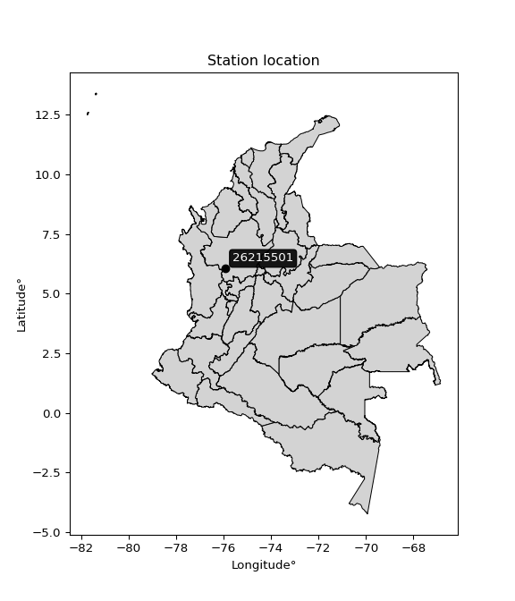

<div align="center">


</div>

# PMax24h Station (Rain, Pmax24h): 26215501

Maximum Precipitation in 24 hours (PMax24h) is the greatest amount of rainfall for a specific duration that is meteorologically possible for a given location, acting as a "worst-case" scenario for extreme storms, crucial for designing safety-critical infrastructure like bridges, river deviations, dams, spillways, and nuclear plants to prevent catastrophic failure. The PMax24h is related with the Probable Maximum Precipitation (PMP) and it is calculated by hydrologists using meteorological data to determine the upper limit of extreme rainfall, often leading to the Probable Maximum Flood (PMF) for flood control design, and is increasingly being studied for climate change impacts. Probable Maximum Precipitation (PMP) is the theoretical upper limit of rainfall, a deterministic estimate for extreme events, while probability distributions (like GEV, Gumbel) describe the likelihood and frequency of various precipitation amounts, including rare ones, showing how often events occur, with PMP representing the extreme end of these distributions, used for critical infrastructure design to ensure safety against the worst conceivable weather, unlike standard statistical forecasts which cover typical probabilities.

The most common probability distributions in hydrology, used for analyzing floods, rainfall, and streamflow, include the Normal, Log-Normal, Gumbel, Gamma (including Log-Pearson Type III), and Generalized Extreme Value (GEV) distributions, often chosen based on the data´s skewness and whether modeling extremes or general conditions, with Gumbel and GEV popular for extreme events like floods, while the Normal distribution serves as a baseline, though often requiring transformations for skewed hydrological data. These distributions help in designing water infrastructure, managing water resources, and forecasting hydrologic events.

> Hydrological data often isn´t perfectly normal (it´s skewed), so different distributions are needed for different applications, such as: **Flood Frequency Analysis**: Using Gumbel, GEV, or Log-Pearson Type III for predicting extreme flood magnitudes and their return periods, **Rainfall Analysis**: Normal for annual totals, but Log-Normal, Weibull, or GEV for intensity or extreme daily rainfall, **Streamflow Modeling**: Gamma and Log-Normal for maximum flows, GEV for minimum flows, and Kappa for daily flows.

<div align="center">

</img>

</div>


## A. General information


### 1. General running parameters

• app_version: _v20260225_. • runtime: _2026-02-27 14:50:08.749431_. • Python version: _3.14.0_. • SciPy version: _1.16.3_. • Pandas version: _2.3.3_. • NumPy version: _2.3.5_. • Stations dataset (station_dataset_file): _dataset/pmax24h_in/automatic_colombia_2003_2025.csv_. • Stations catalog (station_catalog_file): _dataset/CNE.xls_. • Minimum year to eval til year_max (date_min): _1900_. • Maximum year to eval since year_min (date_max): _2025_. • Creates, save and include plots into reports (create_plot): _False_. • Plot only fit distributions with Δo > Δ (plot_only_fit): _True_. • Plot only simple graphs avoiding multiple CDFs and multiple Extreme values plots (plot_only_simple): _False_. • Eval low extreme values, if False, evaluates high extreme values (low_extreme): _False_. • Eval every SciPy distribution as logarithmic (pdist_logarithmic_on): _True_. • Standard deviation normalized (ddof): _1.0_. • Return periods to eval in years (Tr): _[2, 2.33, 5, 10, 15, 20, 25, 50, 75, 100, 200, 250, 500, 750, 1000]_. • Minimum data sample per station, 0 means any (minimum_sample): _5_. • Z-Score maximum threshold to adjust a value, 0 means disable (zscore_max): _3.5_. • Z-Score minimum threshold to adjust a value, 0 means disable (zscore_min): _-2.5_. • Avoid zeros, e.g. rain = 0 (avoid_zeros): _True_. • Avoid null values (avoid_nans): _True_. 

:file_folder:Table: [dataset.csv](../../dataset/pmax24h_in/automatic_colombia_2003_2025.csv)

> Delta Degrees of Freedom (DDOF): is a parameter used in the formulas for calculating variance and standard deviation. When ddof=0, the divisor is $N$ (the total number of observations) and this is used when your data set is the entire population. When ddof=1, the divisor is $N-1$ and this is used when your data set is a sample drawn from a larger population. Using $N-1$ provides an unbiased estimate of the population variance (known as Bessel´s correction).


### 2. Station info and location

|   id |   CODIGO | NOMBRE                       | CATEGORIA               | TECNOLOGIA                | ESTADO   | FECHA_INSTALACION   |   FECHA_SUSPENSION |   ALTITUD |   LATITUD |   LONGITUD | DEPARTAMENTO   | MUNICIPIO   | AREA_OPERATIVA                      | ENTIDAD                                    | AREA_HIDROGRAFICA   | ZONA_HIDROGRAFICA   | SUBZONA_HIDROGRAFICA                               |   CORRIENTE | Catalogo   |   Version |
|-----:|---------:|:-----------------------------|:------------------------|:--------------------------|:---------|:--------------------|-------------------:|----------:|----------:|-----------:|:---------------|:------------|:------------------------------------|:-------------------------------------------|:--------------------|:--------------------|:---------------------------------------------------|------------:|:-----------|----------:|
|    0 | 26215501 | CONCORDIA  - AUT  [26215501] | Climatológica Principal | Automática con Telemetría | Activa   | 14/09/2013          |                nan |      2035 |   6.04244 |   -75.9215 | Antioquia      | Concordia   | Area Operativa 01 - Antioquia-Chocó | CENTRO NACIONAL DE INVESTIGACIONES DE CAFE | Magdalena Cauca     | Cauca               | Directos Río Cauca entre Río San Juan y Pto Valdia |         nan | CNE_OE     |  20251226 |

<div align="center">

Dynamic map: [:earth_americas:Google](http://maps.google.com/maps?q=6.042441667,-75.92149722) [:earth_americas:OSM](https://www.openstreetmap.org/#map=18/6.042441667/-75.92149722&layers=P) [:earth_americas:Bing](https://www.bing.com/maps?cp=6.042441667~-75.92149722&lvl=18) [:earth_americas:Apple](https://maps.apple.com/frame?center=6.042441667%2C-75.92149722&span=0.003%2C0.006)

</div>


<div align="center">

```geojson
{
  "type": "Feature",
  "geometry": {
    "type": "Point", 
    "coordinates": [-75.92149722, 6.042441667]
  }, 
  "properties": {
    "Name": "26215501"
  }
}
```

</div>


### 3. Discrete values table and plot

<div align="center">

|               |           0 |           1 |          2 |          3 |            4 |          5 |
|:--------------|------------:|------------:|-----------:|-----------:|-------------:|-----------:|
| Date          | 2017        | 2019        | 2020       | 2021       | 2022         | 2023       |
| Value         |   61        |   59.2      |   70.6     |   69.2     |   63.1       |   57.9     |
| Value_initial |   61        |   59.2      |   70.6     |   69.2     |   63.1       |   57.9     |
| count         |    6        |    6        |    6       |    6       |    6         |    6       |
| mean          |   63.5      |   63.5      |   63.5     |   63.5     |   63.5       |   63.5     |
| std           |    5.2756   |    5.2756   |    5.2756  |    5.2756  |    5.2756    |    5.2756  |
| zscore        |   -0.473879 |   -0.815073 |    1.34582 |    1.08044 |   -0.0758207 |   -1.06149 |


</div>


> The initial value (value_initial) correspond to the initial obtained or null completed value, and value (value) is adjusted only when the initial value is outside the valid range (outlier) definite through the Z-Score value. If Z-Score is active, values out of range or outliers are replaced with the station mean value. A Z-Score (or standard score) measures how many standard deviations a data point is from the mean of a dataset, indicating its relative position; positive scores mean above the mean, negative mean below, and a score of zero is exactly at the mean, allowing for comparison of values from different distributions. It´s calculated using the formula $z=(x–μ)/σ$, where $x$ is the data point, $μ$ is the mean, and $σ$ is the standard deviation, helping identify outliers and understand probability.
>
> <sub>**Note**: In this study, "completing" (filling gaps in) and "extending" (forecasting or lengthening the historical record) rainfall data series are avoided for certain critical analyses because they introduce artificial bias and uncertainty, which can distort the statistics of rare events (extremes), alter day-to-day variability, and compromise the integrity and homogeneity of the original data. Some reasons against Completing/Extending rainfall data are: **Distortion of Extremes and Variability**: The primary issue is that most gap-filling or extension methods rely on averaging or regression with nearby stations, which inherently smooths the data. Rainfall is highly variable in space and time, with a large percentage of zero values and occasional large storms. Infilling methods often underestimate the highest values and overestimate the lowest (zero) values, which severely distorts analyses focused on flood frequency, drought severity, and intensity-duration-frequency (IDF) curves, **Loss of Data Homogeneity**: Infilled or extended data are synthetic estimates, not actual measurements. Combining these estimates with observed data can violate the assumption of data homogeneity, which requires that the data properties do not change over time. Inhomogeneity can lead to incorrect conclusions about long-term trends or changes in climate patterns, **Propagation of Errors**: Errors and biases from the original data (e.g., wind-induced undercatch, instrument errors, site changes) or the data used for imputation can propagate through the analysis, leading to unreliable hydrological models and inaccurate predictions, **Compromised Statistical Integrity**: For statistical analyses, especially those involving the frequency of events, using artificial data can introduce time bias or autocorrelation that doesn´t exist in reality, making it difficult to assess the true probability of events, **Difficulty in Validation**: It is difficult to accurately validate the quality of filled or extended data, especially for past periods where ground-truth measurements are unavailable. The reliability of imputation techniques heavily depends on the density of the surrounding station network and the complexity of the local topography.</sub>


### 4. Active continuous probability distributions from SciPy (80 of 104 available)

A Probability Density Function (PDF) describes the relative likelihood of a continuous random variable falling within a specific range, where the total area under its curve equals 1, and the area over any interval gives the actual probability for that range. Unlike discrete probabilities (like rolling a die), a PDF shows density, not direct probability for a single point (which is zero), with higher points indicating higher likelihood, often visualized as a bell curve for normal distributions.

A log of a probability density function (log-PDF) is simply the logarithm of the PDF´s value, denoted as $log(f(x))$, useful for converting multiplication of probabilities into addition, improving numerical stability with tiny numbers, and connecting to information theory concepts like entropy. Instead of dealing with very small probabilities (e.g., 0.000001), log-PDFs use negative numbers (e.g., $log(0.00001) ≈ -11.51$ that are easier for computers to handle, preventing underflow errors and simplifying complex calculations. In this study, each active probability distribution from SciPy is also evaluated in the $log$ form.

[scipy.stats](https://docs.scipy.org/doc/scipy/reference/stats.html) is a Python´s powerful submodule within the SciPy library for comprehensive statistical analysis, offering over 130 probability distributions (like Normal, Poisson, etc.), functions for descriptive stats (mean, variance), hypothesis testing (t-tests, chi-square), random variable generation, and statistical tests, making it essential for data science, modeling, and research. It provides tools to explore, model, and draw conclusions from data efficiently, working seamlessly with [NumPy](https://numpy.org/).

<div align="center">

|   id | p_dist           |   n_parameter | fit_method   | label                                                                       | active   | ref                                                                                                      |
|-----:|:-----------------|--------------:|:-------------|:----------------------------------------------------------------------------|:---------|:---------------------------------------------------------------------------------------------------------|
|    0 | alpha            |             3 | MLE          | Alpha                                                                       | True     | [:mortar_board:](https://docs.scipy.org/doc/scipy/reference/generated/scipy.stats.alpha.html)            |
|    1 | anglit           |             2 | MM           | Anglit                                                                      | True     | [:mortar_board:](https://docs.scipy.org/doc/scipy/reference/generated/scipy.stats.anglit.html)           |
|    2 | arcsine          |             2 | MM           | Arcsine                                                                     | True     | [:mortar_board:](https://docs.scipy.org/doc/scipy/reference/generated/scipy.stats.arcsine.html)          |
|    3 | argus            |             3 | MLE          | Argus                                                                       | True     | [:mortar_board:](https://docs.scipy.org/doc/scipy/reference/generated/scipy.stats.argus.html)            |
|    4 | beta             |             4 | MLE          | Beta                                                                        | True     | [:mortar_board:](https://docs.scipy.org/doc/scipy/reference/generated/scipy.stats.beta.html)             |
|    5 | betaprime        |             4 | MLE          | Beta prime                                                                  | True     | [:mortar_board:](https://docs.scipy.org/doc/scipy/reference/generated/scipy.stats.betaprime.html)        |
|    6 | bradford         |             3 | MLE          | Bradford                                                                    | True     | [:mortar_board:](https://docs.scipy.org/doc/scipy/reference/generated/scipy.stats.bradford.html)         |
|    7 | burr             |             4 | MLE          | Burr (Type III)                                                             | True     | [:mortar_board:](https://docs.scipy.org/doc/scipy/reference/generated/scipy.stats.burr.html)             |
|    8 | burr12           |             4 | MLE          | Burr (Type III) 12                                                          | True     | [:mortar_board:](https://docs.scipy.org/doc/scipy/reference/generated/scipy.stats.burr12.html)           |
|    9 | cosine           |             2 | MLE          | Cosine                                                                      | True     | [:mortar_board:](https://docs.scipy.org/doc/scipy/reference/generated/scipy.stats.cosine.html)           |
|   10 | crystalball      |             4 | MLE          | Crystalball                                                                 | True     | [:mortar_board:](https://docs.scipy.org/doc/scipy/reference/generated/scipy.stats.crystalball.html)      |
|   11 | dgamma           |             3 | MLE          | Double gamma                                                                | True     | [:mortar_board:](https://docs.scipy.org/doc/scipy/reference/generated/scipy.stats.dgamma.html)           |
|   12 | dweibull         |             3 | MLE          | Double Weibull                                                              | True     | [:mortar_board:](https://docs.scipy.org/doc/scipy/reference/generated/scipy.stats.dweibull.html)         |
|   13 | erlang           |             3 | MLE          | Erlang                                                                      | True     | [:mortar_board:](https://docs.scipy.org/doc/scipy/reference/generated/scipy.stats.erlang.html)           |
|   14 | exponnorm        |             3 | MLE          | Exponentially modified Normal                                               | True     | [:mortar_board:](https://docs.scipy.org/doc/scipy/reference/generated/scipy.stats.exponnorm.html)        |
|   15 | exponpow         |             3 | MLE          | Exponential power                                                           | True     | [:mortar_board:](https://docs.scipy.org/doc/scipy/reference/generated/scipy.stats.exponpow.html)         |
|   16 | exponweib        |             4 | MLE          | Exponentiated Weibull                                                       | True     | [:mortar_board:](https://docs.scipy.org/doc/scipy/reference/generated/scipy.stats.exponweib.html)        |
|   17 | f                |             4 | MLE          | F                                                                           | True     | [:mortar_board:](https://docs.scipy.org/doc/scipy/reference/generated/scipy.stats.f.html)                |
|   18 | fatiguelife      |             3 | MLE          | Fatigue-life (Birnbaum-Saunders)                                            | True     | [:mortar_board:](https://docs.scipy.org/doc/scipy/reference/generated/scipy.stats.fatiguelife.html)      |
|   19 | foldnorm         |             3 | MM           | Fold Normal                                                                 | True     | [:mortar_board:](https://docs.scipy.org/doc/scipy/reference/generated/scipy.stats.foldnorm.html)         |
|   20 | gamma            |             3 | MLE          | Gamma                                                                       | True     | [:mortar_board:](https://docs.scipy.org/doc/scipy/reference/generated/scipy.stats.gamma.html)            |
|   21 | gausshyper       |             6 | MLE          | Gauss hypergeometric                                                        | True     | [:mortar_board:](https://docs.scipy.org/doc/scipy/reference/generated/scipy.stats.gausshyper.html)       |
|   22 | genexpon         |             5 | MLE          | Generalized exponential                                                     | True     | [:mortar_board:](https://docs.scipy.org/doc/scipy/reference/generated/scipy.stats.genexpon.html)         |
|   23 | genextreme       |             3 | MLE          | Generalized exponential                                                     | True     | [:mortar_board:](https://docs.scipy.org/doc/scipy/reference/generated/scipy.stats.genextreme.html)       |
|   24 | gengamma         |             4 | MLE          | Generalized gamma                                                           | True     | [:mortar_board:](https://docs.scipy.org/doc/scipy/reference/generated/scipy.stats.gengamma.html)         |
|   25 | genhalflogistic  |             3 | MLE          | Generalized half-logistic                                                   | True     | [:mortar_board:](https://docs.scipy.org/doc/scipy/reference/generated/scipy.stats.genhalflogistic.html)  |
|   26 | genlogistic      |             3 | MLE          | Generalized logistic                                                        | True     | [:mortar_board:](https://docs.scipy.org/doc/scipy/reference/generated/scipy.stats.genlogistic.html)      |
|   27 | gennorm          |             3 | MLE          | Generalized Normal                                                          | True     | [:mortar_board:](https://docs.scipy.org/doc/scipy/reference/generated/scipy.stats.gennorm.html)          |
|   28 | genpareto        |             3 | MLE          | Generalized Pareto                                                          | True     | [:mortar_board:](https://docs.scipy.org/doc/scipy/reference/generated/scipy.stats.genpareto.html)        |
|   29 | gompertz         |             3 | MLE          | Gompertz (or truncated Gumbel)                                              | True     | [:mortar_board:](https://docs.scipy.org/doc/scipy/reference/generated/scipy.stats.gompertz.html)         |
|   30 | gumbel_l         |             2 | MM           | Gumbel Left Skew                                                            | True     | [:mortar_board:](https://docs.scipy.org/doc/scipy/reference/generated/scipy.stats.gumbel_l.html)         |
|   31 | gumbel_r         |             2 | MM           | Gumbel Right Skew                                                           | True     | [:mortar_board:](https://docs.scipy.org/doc/scipy/reference/generated/scipy.stats.gumbel_r.html)         |
|   32 | halfgennorm      |             3 | MLE          | Upper half of a generalized normal                                          | True     | [:mortar_board:](https://docs.scipy.org/doc/scipy/reference/generated/scipy.stats.halfgennorm.html)      |
|   33 | halflogistic     |             2 | MM           | Half-logistic                                                               | True     | [:mortar_board:](https://docs.scipy.org/doc/scipy/reference/generated/scipy.stats.halflogistic.html)     |
|   34 | halfnorm         |             2 | MM           | Half Normal                                                                 | True     | [:mortar_board:](https://docs.scipy.org/doc/scipy/reference/generated/scipy.stats.halfnorm.html)         |
|   35 | hypsecant        |             2 | MM           | hyperbolic secant                                                           | True     | [:mortar_board:](https://docs.scipy.org/doc/scipy/reference/generated/scipy.stats.hypsecant.html)        |
|   36 | invgamma         |             3 | MLE          | Inverted gamma                                                              | True     | [:mortar_board:](https://docs.scipy.org/doc/scipy/reference/generated/scipy.stats.invgamma.html)         |
|   37 | invgauss         |             3 | MLE          | Inverse Gaussian                                                            | True     | [:mortar_board:](https://docs.scipy.org/doc/scipy/reference/generated/scipy.stats.invgauss.html)         |
|   38 | invweibull       |             3 | MLE          | Inverted Weibull                                                            | True     | [:mortar_board:](https://docs.scipy.org/doc/scipy/reference/generated/scipy.stats.invweibull.html)       |
|   39 | johnsonsb        |             4 | MLE          | Johnson SB                                                                  | True     | [:mortar_board:](https://docs.scipy.org/doc/scipy/reference/generated/scipy.stats.johnsonsb.html)        |
|   40 | johnsonsu        |             4 | MLE          | Johnson Su                                                                  | True     | [:mortar_board:](https://docs.scipy.org/doc/scipy/reference/generated/scipy.stats.johnsonsu.html)        |
|   41 | kappa3           |             3 | MLE          | Kappa 3                                                                     | True     | [:mortar_board:](https://docs.scipy.org/doc/scipy/reference/generated/scipy.stats.kappa3.html)           |
|   42 | kappa4           |             4 | MLE          | Kappa 4                                                                     | True     | [:mortar_board:](https://docs.scipy.org/doc/scipy/reference/generated/scipy.stats.kappa4.html)           |
|   43 | ksone            |             3 | MLE          | Kolmogorov-Smirnov one-sided test statistic distribution                    | True     | [:mortar_board:](https://docs.scipy.org/doc/scipy/reference/generated/scipy.stats.ksone.html)            |
|   44 | kstwobign        |             2 | MLE          | Limiting distribution of scaled Kolmogorov-Smirnov two-sided test statistic | True     | [:mortar_board:](https://docs.scipy.org/doc/scipy/reference/generated/scipy.stats.kstwobign.html)        |
|   45 | laplace          |             2 | MM           | Laplace                                                                     | True     | [:mortar_board:](https://docs.scipy.org/doc/scipy/reference/generated/scipy.stats.laplace.html)          |
|   46 | levy_l           |             2 | MLE          | Left-skewed Levy                                                            | True     | [:mortar_board:](https://docs.scipy.org/doc/scipy/reference/generated/scipy.stats.levy_l.html)           |
|   47 | loggamma         |             3 | MLE          | Log gamma                                                                   | True     | [:mortar_board:](https://docs.scipy.org/doc/scipy/reference/generated/scipy.stats.loggamma.html)         |
|   48 | logistic         |             2 | MM           | Logistic (or Sech-squared)                                                  | True     | [:mortar_board:](https://docs.scipy.org/doc/scipy/reference/generated/scipy.stats.logistic.html)         |
|   49 | loglaplace       |             3 | MLE          | Log-Laplace                                                                 | True     | [:mortar_board:](https://docs.scipy.org/doc/scipy/reference/generated/scipy.stats.loglaplace.html)       |
|   50 | lomax            |             3 | MLE          | Lomax (Pareto of the second kind)                                           | True     | [:mortar_board:](https://docs.scipy.org/doc/scipy/reference/generated/scipy.stats.lomax.html)            |
|   51 | maxwell          |             2 | MM           | Maxwell                                                                     | True     | [:mortar_board:](https://docs.scipy.org/doc/scipy/reference/generated/scipy.stats.maxwell.html)          |
|   52 | mielke           |             4 | MLE          | Mielke Beta-Kappa / Dagum                                                   | True     | [:mortar_board:](https://docs.scipy.org/doc/scipy/reference/generated/scipy.stats.mielke.html)           |
|   53 | moyal            |             2 | MM           | Moyal                                                                       | True     | [:mortar_board:](https://docs.scipy.org/doc/scipy/reference/generated/scipy.stats.moyal.html)            |
|   54 | nakagami         |             3 | MLE          | Nakagami                                                                    | True     | [:mortar_board:](https://docs.scipy.org/doc/scipy/reference/generated/scipy.stats.nakagami.html)         |
|   55 | ncf              |             5 | MLE          | Non-central F distribution                                                  | True     | [:mortar_board:](https://docs.scipy.org/doc/scipy/reference/generated/scipy.stats.ncf.html)              |
|   56 | nct              |             4 | MLE          | Non-central Student’s t                                                     | True     | [:mortar_board:](https://docs.scipy.org/doc/scipy/reference/generated/scipy.stats.nct.html)              |
|   57 | norm             |             2 | MM           | Normal                                                                      | True     | [:mortar_board:](https://docs.scipy.org/doc/scipy/reference/generated/scipy.stats.norm.html)             |
|   58 | pearson3         |             3 | MM           | Pearson type III                                                            | True     | [:mortar_board:](https://docs.scipy.org/doc/scipy/reference/generated/scipy.stats.pearson3.html)         |
|   59 | powerlaw         |             3 | MLE          | Power-function                                                              | True     | [:mortar_board:](https://docs.scipy.org/doc/scipy/reference/generated/scipy.stats.powerlaw.html)         |
|   60 | rayleigh         |             2 | MM           | Rayleigh                                                                    | True     | [:mortar_board:](https://docs.scipy.org/doc/scipy/reference/generated/scipy.stats.rayleigh.html)         |
|   61 | rdist            |             3 | MLE          | R-distributed (symmetric beta)                                              | True     | [:mortar_board:](https://docs.scipy.org/doc/scipy/reference/generated/scipy.stats.rdist.html)            |
|   62 | rice             |             3 | MLE          | Rice                                                                        | True     | [:mortar_board:](https://docs.scipy.org/doc/scipy/reference/generated/scipy.stats.rice.html)             |
|   63 | semicircular     |             2 | MM           | Semicircular                                                                | True     | [:mortar_board:](https://docs.scipy.org/doc/scipy/reference/generated/scipy.stats.semicircular.html)     |
|   64 | skewnorm         |             3 | MLE          | Skew normal                                                                 | True     | [:mortar_board:](https://docs.scipy.org/doc/scipy/reference/generated/scipy.stats.skewnorm.html)         |
|   65 | t                |             3 | MLE          | Student’s t                                                                 | True     | [:mortar_board:](https://docs.scipy.org/doc/scipy/reference/generated/scipy.stats.t.html)                |
|   66 | trapezoid        |             4 | MLE          | Trapezoid                                                                   | True     | [:mortar_board:](https://docs.scipy.org/doc/scipy/reference/generated/scipy.stats.trapezoid.html)        |
|   67 | triang           |             3 | MLE          | Triangular                                                                  | True     | [:mortar_board:](https://docs.scipy.org/doc/scipy/reference/generated/scipy.stats.triang.html)           |
|   68 | truncexpon       |             3 | MLE          | Truncated exponential                                                       | True     | [:mortar_board:](https://docs.scipy.org/doc/scipy/reference/generated/scipy.stats.truncexpon.html)       |
|   69 | truncnorm        |             4 | MLE          | Truncated normal                                                            | True     | [:mortar_board:](https://docs.scipy.org/doc/scipy/reference/generated/scipy.stats.truncnorm.html)        |
|   70 | truncpareto      |             4 | MLE          | Upper truncated Pareto                                                      | True     | [:mortar_board:](https://docs.scipy.org/doc/scipy/reference/generated/scipy.stats.truncpareto.html)      |
|   71 | truncweibull_min |             5 | MLE          | Doubly truncated Weibull minimum                                            | True     | [:mortar_board:](https://docs.scipy.org/doc/scipy/reference/generated/scipy.stats.truncweibull_min.html) |
|   72 | tukeylambda      |             3 | MLE          | Tukey-Lamdba                                                                | True     | [:mortar_board:](https://docs.scipy.org/doc/scipy/reference/generated/scipy.stats.tukeylambda.html)      |
|   73 | uniform          |             2 | MLE          | Uniform                                                                     | True     | [:mortar_board:](https://docs.scipy.org/doc/scipy/reference/generated/scipy.stats.uniform.html)          |
|   74 | vonmises         |             3 | MLE          | Von Mises                                                                   | True     | [:mortar_board:](https://docs.scipy.org/doc/scipy/reference/generated/scipy.stats.vonmises.html)         |
|   75 | vonmises_line    |             3 | MLE          | Von Mises line                                                              | True     | [:mortar_board:](https://docs.scipy.org/doc/scipy/reference/generated/scipy.stats.vonmises_line.html)    |
|   76 | wald             |             2 | MM           | Wald                                                                        | True     | [:mortar_board:](https://docs.scipy.org/doc/scipy/reference/generated/scipy.stats.wald.html)             |
|   77 | weibull_max      |             3 | MLE          | Weibull maximum                                                             | True     | [:mortar_board:](https://docs.scipy.org/doc/scipy/reference/generated/scipy.stats.weibull_max.html)      |
|   78 | weibull_min      |             3 | MLE          | Weibull minimum                                                             | True     | [:mortar_board:](https://docs.scipy.org/doc/scipy/reference/generated/scipy.stats.weibull_min.html)      |
|   79 | wrapcauchy       |             3 | MLE          | Wrapped  Cauchy                                                             | True     | [:mortar_board:](https://docs.scipy.org/doc/scipy/reference/generated/scipy.stats.wrapcauchy.html)       |

</div>

> **n_parameter:** # arguments & localization & scale.
>
> **Fit methods:** (MLE) maximum likelihood, (MM) L-moments.
>
>**Inactive** (With the only purpose of prevent loops, zero divisions, infinite values, over high estimated values or horizontal trending for recurrence intervals estimations, the follow distributions were disabled.)**:** lognorm, norminvgauss, powernorm, powerlognorm, cauchy, halfcauchy, foldcauchy, skewcauchy, chi2, expon, fisk, genhyperbolic, geninvgauss, gibrat, kstwo, laplace_asymmetric, levy, levy_stable, ncx2, pareto, rel_breitwigner, recipinvgauss, studentized_range, loguniform, 


## B. Probability (PDF) vs. Empirical (EDF) distributions functions

A continuous probability distribution (CPD) describes probabilities for variables that can take any value within a range (like rain any time), unlike discrete variables with specific outcomes (like temperature). It uses a Probability Density Function (PDF), a curve where the total area under it equals 1, and the probability of the variable falling within an interval (a to b) is found by calculating the area under the curve between those points. A key feature is that the probability of hitting any single exact value is zero, so probabilities are always expressed for ranges, e.g., $P(a ≤ X ≤ b)$.

<div align="center">

Distributions parameters from station values
|     |   station | p_dist              |   n |             loc |           scale | shape                  | shape1                | shape2                | shape3             |
|----:|----------:|:--------------------|----:|----------------:|----------------:|:-----------------------|:----------------------|:----------------------|:-------------------|
|   0 |  26215501 | alpha               |   6 |    47.1117      |    54.4562      | 3.6101499349239607     |                       |                       |                    |
|   1 |  26215501 | anglit              |   6 |    63.5         |    14.0886      |                        |                       |                       |                    |
|   2 |  26215501 | arcsine             |   6 |    56.6892      |    13.6216      |                        |                       |                       |                    |
|   3 |  26215501 | argus               |   6 |    53.6507      |    17.9482      | 1.717539238715716e-05  |                       |                       |                    |
|   4 |  26215501 | beta                |   6 |    55.2961      |    15.3039      | 0.2674997807269684     | 0.40352191054991104   |                       |                    |
|   5 |  26215501 | betaprime           |   6 |    -5.29051     |   157.937       | 295.93762464752325     | 680.3913342825836     |                       |                    |
|   6 |  26215501 | bradford            |   6 |    57.9         |    12.7         | 1.0795578879161543     |                       |                       |                    |
|   7 |  26215501 | burr                |   6 |    -1.57671     |    41.6143      | 17.270635721437465     | 1181.9294633482289    |                       |                    |
|   8 |  26215501 | burr12              |   6 |   -25.1831      |    83.0169      | 4962.060519609706      | 0.003121097150317741  |                       |                    |
|   9 |  26215501 | cosine              |   6 |    63.7612      |     3.83026     |                        |                       |                       |                    |
|  10 |  26215501 | crystalball         |   6 |    63.5         |     4.81595     | 85058.58849701991      | 4316.27179175656      |                       |                    |
|  11 |  26215501 | dgamma              |   6 |    62.2123      |     2.28365     | 1.809950788187701      |                       |                       |                    |
|  12 |  26215501 | dweibull            |   6 |    62.3753      |     4.56988     | 1.489935915453181      |                       |                       |                    |
|  13 |  26215501 | erlang              |   6 |    57.9         |     4.1178      | 0.6673791340915247     |                       |                       |                    |
|  14 |  26215501 | exponnorm           |   6 |    57.8946      |     0.00171025  | 3248.537231372109      |                       |                       |                    |
|  15 |  26215501 | exponpow            |   6 |    57.9         |     6.50669     | 0.7550638976914102     |                       |                       |                    |
|  16 |  26215501 | exponweib           |   6 |    57.9         |     1.41609     | 1.238066468214017      | 0.39255538667675527   |                       |                    |
|  17 |  26215501 | f                   |   6 |    47.6405      |    15.1399      | 1615.787206519727      | 23.344146146097067    |                       |                    |
|  18 |  26215501 | fatiguelife         |   6 |    57.9         |     2.03449e-05 | 478.701821270103       |                       |                       |                    |
|  19 |  26215501 | foldnorm            |   6 |    55.2701      |     5.3328      | 1.4822271581499606     |                       |                       |                    |
|  20 |  26215501 | gamma               |   6 |    57.9         |     5.52814     | 0.6250077801827252     |                       |                       |                    |
|  21 |  26215501 | gausshyper          |   6 |    57.9         |    12.9595      | 0.7518536534196167     | 0.6739661605979832    | 1.3452968230785636    | 0.9248050455222108 |
|  22 |  26215501 | genexpon            |   6 |    57.8996      |     0.0847598   | 0.012621617752748004   | 2.4074686562346166    | 1.807550078656696e-05 |                    |
|  23 |  26215501 | genextreme          |   6 |    60.591       |     3.14426     | -0.34054972218521884   |                       |                       |                    |
|  24 |  26215501 | gengamma            |   6 |    57.9         |     1.42862     | 1.2823617541362502     | 0.38933985282428796   |                       |                    |
|  25 |  26215501 | genhalflogistic     |   6 |    56.3248      |    14.9665      | 1.0484274208174484     |                       |                       |                    |
|  26 |  26215501 | genlogistic         |   6 |    34.7462      |     3.75252     | 1157.0874138637446     |                       |                       |                    |
|  27 |  26215501 | gennorm             |   6 |    64.25        |     6.35001     | 12664593.724967226     |                       |                       |                    |
|  28 |  26215501 | genpareto           |   6 |    -1.62929     |   221.678       | -3.0690871467936       |                       |                       |                    |
|  29 |  26215501 | gompertz            |   6 |    57.9         |    11.032       | 1.1992234509329447     |                       |                       |                    |
|  30 |  26215501 | gumbel_l            |   6 |    65.6674      |     3.75498     |                        |                       |                       |                    |
|  31 |  26215501 | gumbel_r            |   6 |    61.3326      |     3.75498     |                        |                       |                       |                    |
|  32 |  26215501 | halfgennorm         |   6 |    57.9         |     1.30788     | 0.5318483138328389     |                       |                       |                    |
|  33 |  26215501 | halflogistic        |   6 |    57.792       |     4.11746     |                        |                       |                       |                    |
|  34 |  26215501 | halfnorm            |   6 |    57.1256      |     7.98916     |                        |                       |                       |                    |
|  35 |  26215501 | hypsecant           |   6 |    63.5         |     3.06593     |                        |                       |                       |                    |
|  36 |  26215501 | invgamma            |   6 |    40.2919      |   547.098       | 24.67630079141764      |                       |                       |                    |
|  37 |  26215501 | invgauss            |   6 |    56.4096      |     8.58262     | 0.8261326156018982     |                       |                       |                    |
|  38 |  26215501 | invweibull          |   6 |    51.3584      |     9.23261     | 2.9363191446575145     |                       |                       |                    |
|  39 |  26215501 | johnsonsb           |   6 |    57.9         |    12.7         | 0.9815102085322309     | 0.1041594387126192    |                       |                    |
|  40 |  26215501 | johnsonsu           |   6 |  1032.27        |     0.196224    | 1928.3812923364426     | 209.66079357690856    |                       |                    |
|  41 |  26215501 | kappa3              |   6 |    57.9         |    36.2642      | 233.0285463843351      |                       |                       |                    |
|  42 |  26215501 | kappa4              |   6 |    56.3312      |    14.3521      | 1.1227666231938889     | 1.0050207197892067    |                       |                    |
|  43 |  26215501 | ksone               |   6 |    55.1585      |    16.6829      | 1.0                    |                       |                       |                    |
|  44 |  26215501 | kstwobign           |   6 |    48.2786      |    17.4114      |                        |                       |                       |                    |
|  45 |  26215501 | laplace             |   6 |    63.5         |     3.40539     |                        |                       |                       |                    |
|  46 |  26215501 | levy_l              |   6 |    71.1237      |     2.13363     |                        |                       |                       |                    |
|  47 |  26215501 | loggamma            |   6 | -1102.85        |   165.369       | 1156.8051569807826     |                       |                       |                    |
|  48 |  26215501 | logistic            |   6 |    63.5         |     2.65517     |                        |                       |                       |                    |
|  49 |  26215501 | loglaplace          |   6 |    -0.199438    |    61.1995      | 15.502724382049859     |                       |                       |                    |
|  50 |  26215501 | lomax               |   6 |    57.9         |    45.489       | 8.803743128082054      |                       |                       |                    |
|  51 |  26215501 | maxwell             |   6 |    52.0882      |     7.15127     |                        |                       |                       |                    |
|  52 |  26215501 | mielke              |   6 |    -8.48745     |    52.4923      | 4236.069214426324      | 19.129540354731308    |                       |                    |
|  53 |  26215501 | moyal               |   6 |    60.7459      |     2.16794     |                        |                       |                       |                    |
|  54 |  26215501 | nakagami            |   6 |    57.9         |     9.1599      | 0.19120453791727404    |                       |                       |                    |
|  55 |  26215501 | ncf                 |   6 |    -0.0315506   |     1.87084e-05 | 1.4447208119166566e-06 | 10.274639911853718    | 3.8755548891589275    |                    |
|  56 |  26215501 | nct                 |   6 |    -2.24064     |     0.608046    | 99.24883622387544      | 107.29389633157082    |                       |                    |
|  57 |  26215501 | norm                |   6 |    63.5         |     4.81595     |                        |                       |                       |                    |
|  58 |  26215501 | pearson3            |   6 |    63.5         |     4.81594     | 0.40628224309128136    |                       |                       |                    |
|  59 |  26215501 | powerlaw            |   6 |    57.9         |    12.7         | 0.15068297159953728    |                       |                       |                    |
|  60 |  26215501 | rayleigh            |   6 |    54.2868      |     7.35106     |                        |                       |                       |                    |
|  61 |  26215501 | rdist               |   6 |    56.5166      |     6.58336     | 1.1344995904206532     |                       |                       |                    |
|  62 |  26215501 | rice                |   6 |    55.3291      |     6.64725     | 0.1894294579422519     |                       |                       |                    |
|  63 |  26215501 | semicircular        |   6 |    63.5         |     9.63189     |                        |                       |                       |                    |
|  64 |  26215501 | skewnorm            |   6 |    57.9         |     7.3853      | 28270579.3884444       |                       |                       |                    |
|  65 |  26215501 | t                   |   6 |    63.5019      |     4.81554     | 267134.27309785306     |                       |                       |                    |
|  66 |  26215501 | trapezoid           |   6 |    56.63        |    15.24        | 1.0                    | 1.0                   |                       |                    |
|  67 |  26215501 | triang              |   6 |    52.3184      |    18.2816      | 0.9999999999932885     |                       |                       |                    |
|  68 |  26215501 | truncexpon          |   6 |    57.9         |    12.7371      | 0.9970893539944964     |                       |                       |                    |
|  69 |  26215501 | truncnorm           |   6 |    67.5766      |     1.41026     | 1.1511081022094893     | 1813.0218977071206    |                       |                    |
|  70 |  26215501 | truncpareto         |   6 |    57.8856      |     0.0142793   | 0.005038348145080931   | 890.4076693540709     |                       |                    |
|  71 |  26215501 | truncweibull_min    |   6 |    57.9         |    16.8575      | 0.719642851949444      | 3.423521413787524e-16 | 0.7535077561981032    |                    |
|  72 |  26215501 | tukeylambda         |   6 |    64.2361      |     7.45178     | 1.1709539184395332     |                       |                       |                    |
|  73 |  26215501 | uniform             |   6 |    57.9         |    12.7         |                        |                       |                       |                    |
|  74 |  26215501 | vonmises            |   6 |     1.01932     |     1           | 0.766171029190846      |                       |                       |                    |
|  75 |  26215501 | vonmises_line       |   6 |    61.7427      |     2.81938     | 0.7792926468568586     |                       |                       |                    |
|  76 |  26215501 | wald                |   6 |    58.684       |     4.81601     |                        |                       |                       |                    |
|  77 |  26215501 | weibull_max         |   6 |    70.6         |     1.44137     | 0.5356254075432687     |                       |                       |                    |
|  78 |  26215501 | weibull_min         |   6 |    57.9         |     3.79073     | 0.7016084983588455     |                       |                       |                    |
|  79 |  26215501 | wrapcauchy          |   6 |    57.9         |     2.02127     | 0.5238274097442628     |                       |                       |                    |
|  80 |  26215501 | logalpha            |   6 |    -5.88534     |  1223.43        | 121.9468826756997      |                       |                       |                    |
|  81 |  26215501 | loganglit           |   6 |     4.14821     |     0.21914     |                        |                       |                       |                    |
|  82 |  26215501 | logarcsine          |   6 |     4.04225     |     0.211929    |                        |                       |                       |                    |
|  83 |  26215501 | logargus            |   6 |     3.99464     |     0.278186    | 4.5505967163196006e-05 |                       |                       |                    |
|  84 |  26215501 | logbeta             |   6 |     4.05872     |     0.238916    | 0.3068725994866455     | 0.42652309662409027   |                       |                    |
|  85 |  26215501 | logbetaprime        |   6 |     3.51746     |    12.4581      | 75.88437998826831      | 1502.425970604427     |                       |                    |
|  86 |  26215501 | logbradford         |   6 |     4.05872     |     0.198314    | 1.1460351368022255     |                       |                       |                    |
|  87 |  26215501 | logburr             |   6 |    -3.3465      |     7.08459     | 126.25710436823016     | 664.8309326499375     |                       |                    |
|  88 |  26215501 | logburr12           |   6 |    -0.329052    |     4.81724     | 63.93514996085602      | 63.385705093469596    |                       |                    |
|  89 |  26215501 | logcosine           |   6 |     4.15184     |     0.0596029   |                        |                       |                       |                    |
|  90 |  26215501 | logcrystalball      |   6 |     4.14821     |     0.0749095   | 13.130374914074082     | 1051.9940383941594    |                       |                    |
|  91 |  26215501 | logdgamma           |   6 |     4.13019     |     0.0338225   | 1.9131658255043944     |                       |                       |                    |
|  92 |  26215501 | logdweibull         |   6 |     4.13278     |     0.0718659   | 1.559008404036021      |                       |                       |                    |
|  93 |  26215501 | logerlang           |   6 |     4.05872     |     0.100912    | 0.2526748276885684     |                       |                       |                    |
|  94 |  26215501 | logexponnorm        |   6 |     4.05863     |     2.55847e-05 | 3477.321847158222      |                       |                       |                    |
|  95 |  26215501 | logexponpow         |   6 |     4.05872     |     0.198744    | 0.8073732065024182     |                       |                       |                    |
|  96 |  26215501 | logexponweib        |   6 |     4.05872     |     1.28875     | 0.36268400315745003    | 0.8326954496320185    |                       |                    |
|  97 |  26215501 | logf                |   6 |     3.99256     |     0.122064    | 569.5948223512819      | 8.518202992581463     |                       |                    |
|  98 |  26215501 | logfatiguelife      |   6 |     4.05872     |     2.4353e-07  | 625.6106775124799      |                       |                       |                    |
|  99 |  26215501 | logfoldnorm         |   6 |     4.03903     |     0.0935779   | 1.000115781752731      |                       |                       |                    |
| 100 |  26215501 | loggamma            |   6 |     4.05872     |     0.106674    | 0.21629332681712504    |                       |                       |                    |
| 101 |  26215501 | loggausshyper       |   6 |     4.05872     |     0.233542    | 0.8863798965356444     | 1.0272681955969407    | 1.09594389390156      | 1.0911578176439445 |
| 102 |  26215501 | loggenexpon         |   6 |     4.05872     |     0.195381    | 1.8678750638525767     | 1.1577890668910444    | 0.8536423814884291    |                    |
| 103 |  26215501 | loggenextreme       |   6 |     4.10568     |     0.0528939   | -0.22744048452683466   |                       |                       |                    |
| 104 |  26215501 | loggengamma         |   6 |     4.05872     |     1.46271     | 0.3253009462365626     | 0.9170509740032048    |                       |                    |
| 105 |  26215501 | loggenhalflogistic  |   6 |     4.05659     |     0.21687     | 1.081996877284409      |                       |                       |                    |
| 106 |  26215501 | loggenlogistic      |   6 |     3.6845      |     0.0593518   | 1357.7974035814586     |                       |                       |                    |
| 107 |  26215501 | loggennorm          |   6 |     4.15787     |     0.0991565   | 13036348.702193163     |                       |                       |                    |
| 108 |  26215501 | loggenpareto        |   6 |    -0.0138568   |    16.6033      | -3.8875543558700985    |                       |                       |                    |
| 109 |  26215501 | loggompertz         |   6 |     4.05872     |     0.23863     | 1.8853991232073515     |                       |                       |                    |
| 110 |  26215501 | loggumbel_l         |   6 |     4.18192     |     0.0584066   |                        |                       |                       |                    |
| 111 |  26215501 | loggumbel_r         |   6 |     4.1145      |     0.0584066   |                        |                       |                       |                    |
| 112 |  26215501 | loghalfgennorm      |   6 |     4.05872     |     0.137938    | 1.5076225034253747     |                       |                       |                    |
| 113 |  26215501 | loghalflogistic     |   6 |     4.05944     |     0.0640372   |                        |                       |                       |                    |
| 114 |  26215501 | loghalfnorm         |   6 |     4.04906     |     0.124267    |                        |                       |                       |                    |
| 115 |  26215501 | loghypsecant        |   6 |     4.14821     |     0.0476888   |                        |                       |                       |                    |
| 116 |  26215501 | loginvgamma         |   6 |     3.99168     |     0.522444    | 4.257006781622301      |                       |                       |                    |
| 117 |  26215501 | loginvgauss         |   6 |     4.03032     |     0.174013    | 0.6775130697940994     |                       |                       |                    |
| 118 |  26215501 | loginvweibull       |   6 |     3.87308     |     0.232603    | 4.397530770047645      |                       |                       |                    |
| 119 |  26215501 | logjohnsonsb        |   6 |     4.05872     |     0.198313    | 1.2602010941341488     | 0.1094902741774982    |                       |                    |
| 120 |  26215501 | logjohnsonsu        |   6 |     2.32734e+06 | 37974.2         | 141597170.36621422     | 29445515.178815566    |                       |                    |
| 121 |  26215501 | logkappa3           |   6 |     4.05872     |     0.198116    | 1810.052835504063      |                       |                       |                    |
| 122 |  26215501 | logkappa4           |   6 |     4.05046     |     0.230998    | 1.0065292727969841     | 1.118270843078356     |                       |                    |
| 123 |  26215501 | logksone            |   6 |     4.01846     |     0.259494    | 1.0                    |                       |                       |                    |
| 124 |  26215501 | logkstwobign        |   6 |     3.9082      |     0.274433    |                        |                       |                       |                    |
| 125 |  26215501 | loglaplace          |   6 |     4.14821     |     0.0529689   |                        |                       |                       |                    |
| 126 |  26215501 | loglevy_l           |   6 |     4.2648      |     0.0316438   |                        |                       |                       |                    |
| 127 |  26215501 | logloggamma         |   6 |    -9.28696     |     2.04343     | 717.0152717823435      |                       |                       |                    |
| 128 |  26215501 | loglogistic         |   6 |     4.14821     |     0.0412997   |                        |                       |                       |                    |
| 129 |  26215501 | logloglaplace       |   6 |     0.158081    |     3.95279     | 61.77550587560982      |                       |                       |                    |
| 130 |  26215501 | loglomax            |   6 |     4.05872     |     0.0891846   | 1.4869126846945768     |                       |                       |                    |
| 131 |  26215501 | logmaxwell          |   6 |     3.97071     |     0.111234    |                        |                       |                       |                    |
| 132 |  26215501 | logmielke           |   6 |    -5.9187e+06  |     5.91871e+06 | 979076798.9519169      | 102137727.73924606    |                       |                    |
| 133 |  26215501 | logmoyal            |   6 |     4.10537     |     0.0337211   |                        |                       |                       |                    |
| 134 |  26215501 | lognakagami         |   6 |     4.05872     |     0.149212    | 0.14034654024708815    |                       |                       |                    |
| 135 |  26215501 | logncf              |   6 |    -4.07157     |     8.22206     | 1715.5691142683168     | 2584.00970730262      | 0.0017021113356865958 |                    |
| 136 |  26215501 | lognct              |   6 |    -4.22195     |     0.0304966   | 1007.6164283489984     | 274.10720806493214    |                       |                    |
| 137 |  26215501 | lognorm             |   6 |     4.14821     |     0.0749094   |                        |                       |                       |                    |
| 138 |  26215501 | logpearson3         |   6 |     4.14821     |     0.0749093   | 0.36283228977006343    |                       |                       |                    |
| 139 |  26215501 | logpowerlaw         |   6 |     4.05872     |     0.198313    | 0.15997209584904604    |                       |                       |                    |
| 140 |  26215501 | lograyleigh         |   6 |     4.0049      |     0.114342    |                        |                       |                       |                    |
| 141 |  26215501 | logrdist            |   6 |     6.08203     |     7.24145e-29 | 1.3053443919055678     |                       |                       |                    |
| 142 |  26215501 | logrice             |   6 |     4.01959     |     0.102224    | 0.34671102109649765    |                       |                       |                    |
| 143 |  26215501 | logsemicircular     |   6 |     4.14821     |     0.149819    |                        |                       |                       |                    |
| 144 |  26215501 | logskewnorm         |   6 |     4.05872     |     0.116686    | 10565446.542818323     |                       |                       |                    |
| 145 |  26215501 | logt                |   6 |     4.14821     |     0.0749078   | 116599488.35597143     |                       |                       |                    |
| 146 |  26215501 | logtrapezoid        |   6 |     4.03889     |     0.237975    | 1.0                    | 1.0                   |                       |                    |
| 147 |  26215501 | logtriang           |   6 |     4.01264     |     0.244389    | 0.9999971800073281     |                       |                       |                    |
| 148 |  26215501 | logtruncexpon       |   6 |     4.05872     |     0.234061    | 0.847269898395417      |                       |                       |                    |
| 149 |  26215501 | logtruncnorm        |   6 |    -1.34545     |     1.30102     | 4.153782248522788      | 4.306210675020592     |                       |                    |
| 150 |  26215501 | logtruncpareto      |   6 |     4.05848     |     0.000232573 | 0.0001458546515955935  | 853.6887363077051     |                       |                    |
| 151 |  26215501 | logtruncweibull_min |   6 |     4.05872     |     0.336334    | 0.5227800700127949     | 1.463476339997611e-15 | 0.6290489124038812    |                    |
| 152 |  26215501 | logtukeylambda      |   6 |     4.15787     |     0.113824    | 1.1479252240459372     |                       |                       |                    |
| 153 |  26215501 | loguniform          |   6 |     4.05872     |     0.198313    |                        |                       |                       |                    |
| 154 |  26215501 | logvonmises         |   6 |    -2.135       |     1           | 178.58687773218261     |                       |                       |                    |
| 155 |  26215501 | logvonmises_line    |   6 |     4.14567     |     0.0354481   | 0.07390890921598911    |                       |                       |                    |
| 156 |  26215501 | logwald             |   6 |     4.07332     |     0.0748936   |                        |                       |                       |                    |
| 157 |  26215501 | logweibull_max      |   6 |     4.25703     |     1.14874     | 0.4328679685839313     |                       |                       |                    |
| 158 |  26215501 | logweibull_min      |   6 |     4.05872     |     0.102428    | 0.7673342398818219     |                       |                       |                    |
| 159 |  26215501 | logwrapcauchy       |   6 |     4.05872     |     0.0315626   | 0.49545968622566083    |                       |                       |                    |

</div>

> **loc** (Location parameter): This shifts the distribution along the x-axis. For many common distributions, like the normal (Gaussian) distribution, loc represents the mean $μ$. For others, like the uniform distribution, it might represent the minimum value, or for the beta distribution, the left end of the support interval.
>
> **scale** (Scale parameter): This determines the width or spread of the distribution. For the normal distribution, scale represents the standard deviation $σ$. For a uniform distribution, it defines the length of the interval (from $loc$ to $loc + scale$).
>
> **shape** (Shape parameters): Refers to parameters that define the specific form of a probability distribution, distinct from its location (loc) and scale (scale). These parameters are required arguments for most distribution functions. For example, a normal (Gaussian) distribution is fully defined by its location (mean) and scale (standard deviation), so it has no specific shape parameters beyond loc and scale. However, other distributions have intrinsic properties that need specification, as Gamma distribution that takes a shape parameter, often named $a$ or $alpha$.


### 0. Cumulative distribution values - CDF (160 evaluated)

Cumulative Distribution Function (CDF), denoted as $F$<sub>$X$</sub>$(x)$, is a function that gives the probability that a random variable $X$ will take a value less than or equal to a specific value, $x$ (i.e., $(P(X≥x)$. It essentially "accumulates" probabilities from a given point up to the far right (positive infinity), providing a complete picture of the distribution´s probabilities for both discrete (like rain) and continuous (like temperature) variables, helping to find probabilities over ranges or above certain values. Each station is evaluated separately ordering the $x$ values ascending, calculating the CDF and PDF values for the activated distributions and their logarithmic forms.

<div align="center">

CDF ordered by x ascending and calculating $log(f(x))$ separately
|   id |   Station |   date |    x |   count |   mean |    std |     zscore |   Value_initial |   station |   m |     alpha |   alpha_pdf |   anglit |   anglit_pdf |   arcsine |   arcsine_pdf |     argus |   argus_pdf |     beta |    beta_pdf |   betaprime |   betaprime_pdf |    bradford |   bradford_pdf |      burr |   burr_pdf |    burr12 |   burr12_pdf |    cosine |   cosine_pdf |   crystalball |   crystalball_pdf |   dgamma |   dgamma_pdf |   dweibull |   dweibull_pdf |      erlang |     erlang_pdf |   exponnorm |   exponnorm_pdf |    exponpow |   exponpow_pdf |   exponweib |   exponweib_pdf |         f |     f_pdf |   fatiguelife |   fatiguelife_pdf |   foldnorm |   foldnorm_pdf |       gamma |      gamma_pdf |   gausshyper |   gausshyper_pdf |    genexpon |   genexpon_pdf |   genextreme |   genextreme_pdf |    gengamma |   gengamma_pdf |   genhalflogistic |   genhalflogistic_pdf |   genlogistic |   genlogistic_pdf |     gennorm |   gennorm_pdf |   genpareto |   genpareto_pdf |    gompertz |   gompertz_pdf |   gumbel_l |   gumbel_l_pdf |   gumbel_r |   gumbel_r_pdf |   halfgennorm |   halfgennorm_pdf |   halflogistic |   halflogistic_pdf |   halfnorm |   halfnorm_pdf |   hypsecant |   hypsecant_pdf |   invgamma |   invgamma_pdf |   invgauss |   invgauss_pdf |   invweibull |   invweibull_pdf |   johnsonsb |   johnsonsb_pdf |   johnsonsu |   johnsonsu_pdf |      kappa3 |   kappa3_pdf |      kappa4 |   kappa4_pdf |    ksone |   ksone_pdf |   kstwobign |   kstwobign_pdf |   laplace |   laplace_pdf |   levy_l |   levy_l_pdf |    loggamma |   loggamma_pdf |   logistic |   logistic_pdf |   loglaplace |   loglaplace_pdf |       lomax |   lomax_pdf |   maxwell |   maxwell_pdf |   mielke |   mielke_pdf |     moyal |   moyal_pdf |    nakagami |   nakagami_pdf |      ncf |    ncf_pdf |      nct |   nct_pdf |     norm |   norm_pdf |   pearson3 |   pearson3_pdf |   powerlaw |   powerlaw_pdf |   rayleigh |   rayleigh_pdf |    rdist |      rdist_pdf |      rice |   rice_pdf |   semicircular |   semicircular_pdf |   skewnorm |   skewnorm_pdf |        t |     t_pdf |   trapezoid |   trapezoid_pdf |    triang |   triang_pdf |   truncexpon |   truncexpon_pdf |   truncnorm |   truncnorm_pdf |   truncpareto |   truncpareto_pdf |   truncweibull_min |   truncweibull_min_pdf |   tukeylambda |   tukeylambda_pdf |   uniform |   uniform_pdf |   vonmises |   vonmises_pdf |   vonmises_line |   vonmises_line_pdf |       wald |   wald_pdf |   weibull_max |   weibull_max_pdf |   weibull_min |   weibull_min_pdf |   wrapcauchy |   wrapcauchy_pdf |   logalpha |   logalpha_pdf |   loganglit |   loganglit_pdf |   logarcsine |   logarcsine_pdf |   logargus |   logargus_pdf |     logbeta |   logbeta_pdf |   logbetaprime |   logbetaprime_pdf |   logbradford |   logbradford_pdf |   logburr |   logburr_pdf |   logburr12 |   logburr12_pdf |   logcosine |   logcosine_pdf |   logcrystalball |   logcrystalball_pdf |   logdgamma |   logdgamma_pdf |   logdweibull |   logdweibull_pdf |   logerlang |   logerlang_pdf |   logexponnorm |   logexponnorm_pdf |   logexponpow |   logexponpow_pdf |   logexponweib |   logexponweib_pdf |      logf |   logf_pdf |   logfatiguelife |   logfatiguelife_pdf |   logfoldnorm |   logfoldnorm_pdf |   loggausshyper |   loggausshyper_pdf |   loggenexpon |   loggenexpon_pdf |   loggenextreme |   loggenextreme_pdf |   loggengamma |   loggengamma_pdf |   loggenhalflogistic |   loggenhalflogistic_pdf |   loggenlogistic |   loggenlogistic_pdf |   loggennorm |   loggennorm_pdf |   loggenpareto |   loggenpareto_pdf |   loggompertz |   loggompertz_pdf |   loggumbel_l |   loggumbel_l_pdf |   loggumbel_r |   loggumbel_r_pdf |   loghalfgennorm |   loghalfgennorm_pdf |   loghalflogistic |   loghalflogistic_pdf |   loghalfnorm |   loghalfnorm_pdf |   loghypsecant |   loghypsecant_pdf |   loginvgamma |   loginvgamma_pdf |   loginvgauss |   loginvgauss_pdf |   loginvweibull |   loginvweibull_pdf |   logjohnsonsb |   logjohnsonsb_pdf |   logjohnsonsu |   logjohnsonsu_pdf |   logkappa3 |   logkappa3_pdf |   logkappa4 |   logkappa4_pdf |   logksone |   logksone_pdf |   logkstwobign |   logkstwobign_pdf |   loglevy_l |   loglevy_l_pdf |   logloggamma |   logloggamma_pdf |   loglogistic |   loglogistic_pdf |   logloglaplace |   logloglaplace_pdf |    loglomax |   loglomax_pdf |   logmaxwell |   logmaxwell_pdf |   logmielke |   logmielke_pdf |   logmoyal |   logmoyal_pdf |   lognakagami |   lognakagami_pdf |   logncf |   logncf_pdf |   lognct |   lognct_pdf |   lognorm |   lognorm_pdf |   logpearson3 |   logpearson3_pdf |   logpowerlaw |   logpowerlaw_pdf |   lograyleigh |   lograyleigh_pdf |   logrdist |   logrdist_pdf |   logrice |   logrice_pdf |   logsemicircular |   logsemicircular_pdf |   logskewnorm |   logskewnorm_pdf |     logt |   logt_pdf |   logtrapezoid |   logtrapezoid_pdf |   logtriang |   logtriang_pdf |   logtruncexpon |   logtruncexpon_pdf |   logtruncnorm |   logtruncnorm_pdf |   logtruncpareto |   logtruncpareto_pdf |   logtruncweibull_min |   logtruncweibull_min_pdf |   logtukeylambda |   logtukeylambda_pdf |   loguniform |   loguniform_pdf |   logvonmises |   logvonmises_pdf |   logvonmises_line |   logvonmises_line_pdf |    logwald |   logwald_pdf |   logweibull_max |   logweibull_max_pdf |   logweibull_min |   logweibull_min_pdf |   logwrapcauchy |   logwrapcauchy_pdf |
|-----:|----------:|-------:|-----:|--------:|-------:|-------:|-----------:|----------------:|----------:|----:|----------:|------------:|---------:|-------------:|----------:|--------------:|----------:|------------:|---------:|------------:|------------:|----------------:|------------:|---------------:|----------:|-----------:|----------:|-------------:|----------:|-------------:|--------------:|------------------:|---------:|-------------:|-----------:|---------------:|------------:|---------------:|------------:|----------------:|------------:|---------------:|------------:|----------------:|----------:|----------:|--------------:|------------------:|-----------:|---------------:|------------:|---------------:|-------------:|-----------------:|------------:|---------------:|-------------:|-----------------:|------------:|---------------:|------------------:|----------------------:|--------------:|------------------:|------------:|--------------:|------------:|----------------:|------------:|---------------:|-----------:|---------------:|-----------:|---------------:|--------------:|------------------:|---------------:|-------------------:|-----------:|---------------:|------------:|----------------:|-----------:|---------------:|-----------:|---------------:|-------------:|-----------------:|------------:|----------------:|------------:|----------------:|------------:|-------------:|------------:|-------------:|---------:|------------:|------------:|----------------:|----------:|--------------:|---------:|-------------:|------------:|---------------:|-----------:|---------------:|-------------:|-----------------:|------------:|------------:|----------:|--------------:|---------:|-------------:|----------:|------------:|------------:|---------------:|---------:|-----------:|---------:|----------:|---------:|-----------:|-----------:|---------------:|-----------:|---------------:|-----------:|---------------:|---------:|---------------:|----------:|-----------:|---------------:|-------------------:|-----------:|---------------:|---------:|----------:|------------:|----------------:|----------:|-------------:|-------------:|-----------------:|------------:|----------------:|--------------:|------------------:|-------------------:|-----------------------:|--------------:|------------------:|----------:|--------------:|-----------:|---------------:|----------------:|--------------------:|-----------:|-----------:|--------------:|------------------:|--------------:|------------------:|-------------:|-----------------:|-----------:|---------------:|------------:|----------------:|-------------:|-----------------:|-----------:|---------------:|------------:|--------------:|---------------:|-------------------:|--------------:|------------------:|----------:|--------------:|------------:|----------------:|------------:|----------------:|-----------------:|---------------------:|------------:|----------------:|--------------:|------------------:|------------:|----------------:|---------------:|-------------------:|--------------:|------------------:|---------------:|-------------------:|----------:|-----------:|-----------------:|---------------------:|--------------:|------------------:|----------------:|--------------------:|--------------:|------------------:|----------------:|--------------------:|--------------:|------------------:|---------------------:|-------------------------:|-----------------:|---------------------:|-------------:|-----------------:|---------------:|-------------------:|--------------:|------------------:|--------------:|------------------:|--------------:|------------------:|-----------------:|---------------------:|------------------:|----------------------:|--------------:|------------------:|---------------:|-------------------:|--------------:|------------------:|--------------:|------------------:|----------------:|--------------------:|---------------:|-------------------:|---------------:|-------------------:|------------:|----------------:|------------:|----------------:|-----------:|---------------:|---------------:|-------------------:|------------:|----------------:|--------------:|------------------:|--------------:|------------------:|----------------:|--------------------:|------------:|---------------:|-------------:|-----------------:|------------:|----------------:|-----------:|---------------:|--------------:|------------------:|---------:|-------------:|---------:|-------------:|----------:|--------------:|--------------:|------------------:|--------------:|------------------:|--------------:|------------------:|-----------:|---------------:|----------:|--------------:|------------------:|----------------------:|--------------:|------------------:|---------:|-----------:|---------------:|-------------------:|------------:|----------------:|----------------:|--------------------:|---------------:|-------------------:|-----------------:|---------------------:|----------------------:|--------------------------:|-----------------:|---------------------:|-------------:|-----------------:|--------------:|------------------:|-------------------:|-----------------------:|-----------:|--------------:|-----------------:|---------------------:|-----------------:|---------------------:|----------------:|--------------------:|
|    0 |  26215501 |   2023 | 57.9 |       6 |   63.5 | 5.2756 | -1.06149   |            57.9 |  26215501 |   1 | 0.0752924 |   0.066431  | 0.143078 |    0.0497074 |  0.192732 |     0.0821139 | 0.0828895 |   0.0384478 | 0.432145 | 0.0484917   |    0.118336 |       0.044498  | 2.17145e-07 |      0.116101  | 0.0842532 |  0.0604617 | 0.0123262 |    0.180646  | 0.0974327 |    0.0432373 |      0.122455 |         0.0421329 | 0.189755 |    0.0593587 |   0.189672 |      0.0612089 | 1.55529e-10 | 14608.1        | 0.000972642 |       0.179676  | 5.04554e-12 |   536.169      |  1.1228e-07 |     7.67994e+06 | 0.0667603 | 0.0485799 |     0.0315217 |       2.56432e+09 |   0.137199 |      0.0565017 | 5.50085e-10 | 48386.6        |  3.84459e-12 |      407.134     | 5.93665e-05 |      0.148904  |    0.0639062 |        0.0788939 | 6.25618e-08 |     4.396e+06  |         0.0557037 |             0.037435  |     0.0892097 |         0.0573944 | 5.56895e-07 |     0.07874   |    0.432419 |     0.0145618   | 2.66878e-10 |      0.108704  |   0.118708 |      0.0296582 |  0.0825274 |      0.0548272 |   6.98796e-13 |         0.425743  |      0.0131159 |          0.121413  |  0.0772216 |      0.0994028 |    0.101606 |       0.0325805 |   0.10453  |      0.0552329 |  0.0497535 |      0.106597  |    0.0639062 |        0.0788945 |   0.0980054 |     4.31896e+06 |    0.11136  |       0.0408183 | 7.46568e-10 |    0.0269378 | 6.16499e-15 |    3.87133   | 0.164327 |   0.0599415 |   0.0798127 |       0.0587332 | 0.0965591 |     0.0283548 | 0.312082 |    0.011179  | 0.000985679 |    2.40037e+11 |   0.108216 |      0.0363462 |    0.0923017 |          1.74256 | 9.76359e-14 |   0.193536  |  0.117539 |     0.0529651 |      nan |          nan | 0.0538825 |   0.055326  | 1.31903e-06 |    7.09893e+07 | 0.629282 | 0.00555004 | 0.112489 | 0.0467673 | 0.122455 |  0.0421329 |   0.115013 |      0.0482834 | 0.00503212 |    1.06715e+11 |   0.113785 |      0.0592556 | 0.5734   |      0.0537569 | 0.0708304 |  0.0531023 |       0.151932 |          0.053776  |   0        |      0.108037  | 0.122355 | 0.0421121 |  0.00694444 |       0.0109361 | 0.0932146 |    0.0334009 |  1.78997e-06 |        0.124413  | 0           |        0        |   0.000947041 |        10.4223    |        2.14785e-12 |           1564.89      |    0.00283222 |         0.0982174 |  0        |     0.0787402 |    9.5973  |      0.285006  |        0.166468 |           0.0572686 | 0          |  0         |     0.0404534 |       0.0054726   |   4.64856e-11 |      4590.11      |     0        |        0.251981  |   0.139033 |        2.74085 |    0.135531 |         3.12394 |     0.179864 |          5.60994 |  0.0785282 |        2.41736 | 2.50086e-05 |   8.64067e+09 |       0.112094 |            2.85949 |   5.68669e-06 |           7.56769 | 0.0835547 |       3.52959 |    0.149256 |         2.00124 |   0.0921949 |         2.69281 |         0.116104 |              2.60882 |    0.17577  |         3.66117 |      0.175318 |           3.86771 | 0.000310088 |     8.82157e+10 |    0.000958545 |           11.2246  |   2.59633e-12 |        2360.12    |    2.63691e-05 |        8.96623e+09 | 0.0617248 |    4.60098 |        0.0444313 |          3.71337e+11 |      0.10178  |           5.17013 |     2.51699e-13 |           251.221   |   1.13843e-07 |           9.56016 |       0.0674561 |             4.30877 |   3.23062e-05 |       1.08509e+10 |           0.00491941 |                  2.33014 |        0.0838635 |              3.49899 |  7.33421e-07 |          5.04253 |       0.545987 |        0.588899    |   3.93117e-11 |           7.90094 |      0.114234 |           1.83962 |     0.0743661 |           3.30886 |      1.38361e-07 |              8.03556 |          0        |               0       |     0.0619443 |           6.40137 |      0.0967204 |            1.99709 |      0.061714 |           4.60124 |      0.050511 |           5.95062 |       0.0674538 |             4.30851 |       0.381988 |   325807           |       0.128781 |            2.65871 | 8.94734e-08 |         5.02668 |   0.0301986 |         4.44825 |   0.155123 |        3.85366 |      0.0756679 |            3.62041 |    0.304831 |        0.702487 |      0.123143 |           2.6305  |      0.10276  |           2.23247 |        0.220096 |             3.48573 | 6.51022e-07 |      16.6723   |     0.109551 |          3.28364 |   0.0921571 |         3.35699 |  0.0457952 |        3.21531 |   8.24053e-05 |       2.60427e+10 | 0.4006   |      1.07839 | 0.331888 |      1.95342 |  0.116104 |       2.60882 |      0.108938 |           2.9359  |    0.00506506 |        9.1228e+11 |      0.104834 |           3.6845  |          0 |              0 | 0.0666696 |       3.29156 |          0.143733 |               3.40785 |      0        |           6.83787 | 0.1161   |    2.6088  |     0.00694444 |           0.700353 |   0.0355446 |         1.54289 |       1.079e-06 |             7.47683 |    4.14919e-07 |            6.82853 |      1.06794e-09 |           637.35     |           5.84907e-08 |               1.33612e+07 |      3.67106e-06 |              7.59309 |     0        |          5.04254 |       1.11616 |           2.60811 |           0.10225  |                4.23499 | 0          |      0        |         0.62657  |          0.639369    |       1.6211e-11 |          14005.3     |     1.33931e-05 |            14.946   |
|    1 |  26215501 |   2019 | 59.2 |       6 |   63.5 | 5.2756 | -0.815073  |            59.2 |  26215501 |   2 | 0.185499  |   0.0996469 | 0.213392 |    0.058161  |  0.282501 |     0.0602661 | 0.139909  |   0.0491473 | 0.487808 | 0.0384427   |    0.185699 |       0.0590602 | 0.14316     |      0.104548  | 0.182037  |  0.0880586 | 0.223372  |    0.142537  | 0.162671  |    0.0569635 |      0.185964 |         0.0556053 | 0.279523 |    0.0784354 |   0.279583 |      0.0762611 | 0.454206    |     0.192101   | 0.2094      |       0.142302  | 0.291797    |     0.163993   |  0.553055   |     0.12266     | 0.14682   | 0.0735306 |     0.701267  |       0.0704814   |   0.214805 |      0.0630439 | 0.413335    |     0.171524   |  0.19599     |        0.108074  | 0.180257    |      0.128524  |    0.198842  |        0.120266  | 0.498015    |     0.121033   |         0.106852  |             0.0413561 |     0.180925  |         0.0823697 | 0.5         |     0.0787401 |    0.452042 |     0.0156615   | 0.139273    |      0.105266  |   0.163596 |      0.039792  |  0.171253  |      0.0804786 |   0.297557    |         0.157126  |      0.169334  |          0.117952  |  0.20487   |      0.0965604 |    0.153546 |       0.0481617 |   0.189812 |      0.0751002 |  0.225511  |      0.142423  |    0.198842  |        0.120266  |   0.774982  |     0.0267713   |    0.173759 |       0.0552903 | 0.0350192   |    0.0269378 | 0.130674    |    0.0895519 | 0.242251 |   0.0599415 |   0.173733  |       0.0838509 | 0.141444  |     0.0415353 | 0.327714 |    0.0129418 | 0.751878    |    6.16354     |   0.165276 |      0.051959  |    0.140366  |          2.64997 | 0.219693    |   0.146821  |  0.196083 |     0.0672963 |      nan |          nan | 0.153181  |   0.0947691 | 0.375008    |    0.109956    | 0.636424 | 0.00543893 | 0.183849 | 0.0628168 | 0.185964 |  0.0556053 |   0.188203 |      0.0640136 | 0.709324   |    0.0822178   |   0.20017  |      0.0727213 | 0.645116 |      0.0570287 | 0.153414  |  0.0728486 |       0.225537 |          0.0591429 |   0.139726 |      0.106376  | 0.185838 | 0.0555865 |  0.0284378  |       0.0221306 | 0.141692  |    0.0411803 |  0.153759    |        0.112342  | 0           |        0        |   0.669658    |         0.111383  |        0.262338    |              0.13404   |    0.112896   |         0.080431  |  0.102362 |     0.0787402 |    9.87116 |      0.131803  |        0.254838 |           0.0790614 | 0.00584417 |  0.0572302 |     0.0484446 |       0.00689068  |   0.376222    |         0.158887  |     0.260182 |        0.131025  |   0.208807 |        3.53798 |    0.21188  |         3.72949 |     0.280994 |          3.88858 |  0.14078   |        3.17996 | 0.32748     |   4.72461     |       0.187533 |            3.92629 |   0.158101    |           6.70707 | 0.182337  |       5.2683  |    0.199968 |         2.58317 |   0.162891  |         3.66314 |         0.18452  |              3.55761 |    0.272427 |         5.02559 |      0.274064 |           4.95397 | 0.721541    |     6.87659     |    0.221619    |            8.74918 |   0.169552    |           6.10174 |    0.291524    |        3.89809     | 0.19709   |    7.10776 |        0.685328  |          3.85925     |      0.216461 |           5.15465 |     0.179402    |             6.75487 |   0.196241    |           8.12442 |       0.193879  |             6.7298  |   0.319038    |       4.21734     |           0.0597211  |                  2.61464 |        0.181683  |              5.21744 |  0.5         |          5.04253 |       0.559646 |        0.643199    |   0.167943    |           7.2151  |      0.162563 |           2.5437  |     0.169163  |           5.14641 |      0.17398     |              7.53972 |          0.1662   |               7.59229 |     0.202354  |           6.21312 |      0.152297  |            3.07309 |      0.197091 |           7.10838 |      0.221918 |           8.34941 |       0.19387   |             6.72958 |       0.849307 |        1.29866     |       0.197307 |            3.51277 | 0.111613    |         5.02668 |   0.128999  |         4.46196 |   0.24069  |        3.85366 |      0.176858  |            5.35377 |    0.321737 |        0.825803 |      0.191555 |           3.53442 |      0.163927 |           3.31855 |        0.312536 |             4.92171 | 0.281485    |       9.59136  |     0.194333 |          4.31043 |   0.184953  |         4.93895 |  0.15072   |        6.05433 |   0.474784    |       5.98563     | 0.424687 |      1.09046 | 0.376203 |      2.03386 |  0.184519 |       3.55761 |      0.186484 |           4.03189 |    0.704498   |        5.07563    |      0.198278 |           4.66148 |          0 |              0 | 0.155938  |       4.66672 |          0.223997 |               3.79656 |      0.150918 |           6.71518 | 0.184515 |    3.55763 |     0.0312009  |           1.48451  |   0.0780579 |         2.28642 |       0.158386  |             6.80015 |    0.146366    |            6.36028 |      0.677077    |             6.6022   |           0.394571    |               8.21318     |      0.119876    |              5.13182 |     0.111965 |          5.04254 |       1.18457 |           3.55747 |           0.197989 |                4.40065 | 0.00442151 |      3.09089  |         0.641419 |          0.700117    |       0.266104   |              7.84672 |     0.263388    |             7.76722 |
|    2 |  26215501 |   2017 | 61   |       6 |   63.5 | 5.2756 | -0.473879  |            61   |  26215501 |   3 | 0.378012  |   0.107335  | 0.326253 |    0.0665563 |  0.380363 |     0.0502434 | 0.240646  |   0.0624416 | 0.550636 | 0.0322632   |    0.308103 |       0.0758416 | 0.319462    |      0.0918877 | 0.35724   |  0.101445  | 0.439921  |    0.100646  | 0.280218  |    0.0727669 |      0.301842 |         0.0723957 | 0.432642 |    0.0825389 |   0.423057 |      0.0765867 | 0.694943    |     0.0929286  | 0.42819     |       0.102921  | 0.537257    |     0.114012   |  0.692695   |     0.0509925   | 0.298858  | 0.0915672 |     0.792586  |       0.0376291   |   0.336436 |      0.0716891 | 0.634932    |     0.08941    |  0.360295    |        0.0792281 | 0.387856    |      0.102647  |    0.414583  |        0.11117   | 0.639469    |     0.0531332  |         0.186992  |             0.0479406 |     0.346956  |         0.0978288 | 0.5         |     0.0787401 |    0.481882 |     0.0175853   | 0.322328    |      0.0975665 |   0.250627 |      0.0575789 |  0.335341  |      0.0975761 |   0.507454    |         0.0874771 |      0.370983  |          0.104721  |  0.372296  |      0.088791  |    0.265192 |       0.0768319 |   0.340994 |      0.089929  |  0.451531  |      0.105797  |    0.414583  |        0.111169  |   0.806144  |     0.0122114   |    0.29074  |       0.0739785 | 0.0835073   |    0.0269378 | 0.283461    |    0.0815005 | 0.350146 |   0.0599415 |   0.340192  |       0.0968593 | 0.239961  |     0.0704652 | 0.353824 |    0.0162815 | 0.865533    |    2.38359     |   0.280585 |      0.0760242 |    0.247083  |          4.66468 | 0.440326    |   0.101406  |  0.329899 |     0.0797071 |      nan |          nan | 0.345636  |   0.111245  | 0.521334    |    0.0631382   | 0.646078 | 0.00528819 | 0.313631 | 0.0798659 | 0.301842 |  0.0723957 |   0.319115 |      0.0798265 | 0.808566   |    0.0393023   |   0.340974 |      0.0818713 | 0.756558 |      0.0690358 | 0.300542  |  0.0881789 |       0.336637 |          0.0638298 |   0.325334 |      0.0989264 | 0.301689 | 0.0723852 |  0.0822229  |       0.0376306 | 0.225511  |    0.0519518 |  0.342335    |        0.0975363 | 0           |        0        |   0.795678    |         0.0468036 |        0.458932    |              0.0915645 |    0.25404    |         0.0770227 |  0.244094 |     0.0787402 |   10.0188  |      0.0662937 |        0.421762 |           0.103477  | 0.347949   |  0.187701  |     0.0632211 |       0.00973951  |   0.580366    |         0.0824726 |     0.400178 |        0.0462427 |   0.328977 |        4.42847 |    0.332899 |         4.30091 |     0.385383 |          3.20978 |  0.250099  |        4.09385 | 0.433843    |   2.84675     |       0.323457 |            5.05258 |   0.344999    |           5.81502 | 0.359005  |       6.22176 |    0.290783 |         3.49955 |   0.289641  |         4.73429 |         0.309091 |              4.70357 |    0.435746 |         5.18131 |      0.427407 |           4.77217 | 0.849433    |     2.69963     |    0.444124    |            6.24817 |   0.332584    |           4.92677 |    0.374912    |        2.09662     | 0.411963  |    6.75956 |        0.770267  |          2.15192     |      0.369564 |           5.04315 |     0.358512    |             5.35613 |   0.412166    |           6.32963 |       0.403519  |             6.7723  |   0.409062    |       2.25795     |           0.144913   |                  3.09535 |        0.357049  |              6.19323 |  0.5         |          5.04253 |       0.580264 |        0.738724    |   0.369087    |           6.20255 |      0.256416 |           3.7719  |     0.34507   |           6.28623 |      0.383165    |              6.37947 |          0.381337 |               6.67255 |     0.381112  |           5.67355 |      0.272928  |            5.04718 |      0.411974 |           6.75953 |      0.448695 |           6.53113 |       0.403509  |             6.77237 |       0.874388 |        0.588355    |       0.31833  |            4.51397 | 0.262174    |         5.02668 |   0.263578  |         4.52962 |   0.356116 |        3.85366 |      0.353509  |            6.14607 |    0.34974  |        1.0603   |      0.314525 |           4.6232  |      0.288219 |           4.96732 |        0.5      |             7.81416 | 0.495746    |       5.30477  |     0.337857 |          5.14892 |   0.352821  |         6.01049 |  0.3567    |        7.13055 |   0.602353    |       3.19331     | 0.457514 |      1.10023 | 0.438234 |      2.09958 |  0.309091 |       4.70358 |      0.325163 |           5.11573 |    0.807624   |        2.47711    |      0.349138 |           5.27545 |          0 |              0 | 0.313128  |       5.65433 |          0.343003 |               4.1152  |      0.345112 |           6.1878  | 0.309089 |    4.70366 |     0.0915068  |           2.54229  |   0.161563  |         3.28942 |       0.349573  |             5.98333 |    0.327995    |            5.77643 |      0.802685    |             2.82718  |           0.578121    |               4.76978     |      0.270168    |              4.93989 |     0.263001 |          5.04254 |       1.30916 |           4.70489 |           0.333915 |                4.67168 | 0.366259   |     11.708    |         0.663886 |          0.805451    |       0.448868   |              4.8308  |     0.404058    |             2.86852 |
|    3 |  26215501 |   2022 | 63.1 |       6 |   63.5 | 5.2756 | -0.0758207 |            63.1 |  26215501 |   4 | 0.580971  |   0.0832469 | 0.471623 |    0.0708652 |  0.481295 |     0.046817  | 0.385464  |   0.0748161 | 0.61509  | 0.0297121   |    0.478202 |       0.0835743 | 0.499957    |      0.0805129 | 0.558672  |  0.0868315 | 0.614233  |    0.0676731 | 0.445191  |    0.0824866 |      0.466903 |         0.0825525 | 0.541829 |    0.0739225 |   0.531155 |      0.0620117 | 0.835366    |     0.0469837  | 0.608172    |       0.070526  | 0.734547    |     0.0757054  |  0.771616   |     0.0279946   | 0.489934  | 0.0866942 |     0.85454   |       0.0231948   |   0.492835 |      0.0757648 | 0.776613    |     0.0503697  |  0.509374    |        0.0644798 | 0.575256    |      0.0766207 |    0.610384  |        0.0753559 | 0.723269    |     0.0303306  |         0.297657  |             0.0579535 |     0.546073  |         0.088018  | 0.5         |     0.0787401 |    0.521924 |     0.0207695   | 0.514283    |      0.0845932 |   0.396329 |      0.0811425 |  0.535491  |      0.089069  |   0.650496    |         0.0529987 |      0.568006  |          0.0822557 |  0.545429  |      0.0755099 |    0.458589 |       0.102944  |   0.529002 |      0.0857496 |  0.630491  |      0.0673994 |    0.610382  |        0.0753552 |   0.827252  |     0.00867164  |    0.461195 |       0.0858942 | 0.140077    |    0.0269378 | 0.449551    |    0.0771093 | 0.476023 |   0.0599415 |   0.536578  |       0.0870715 | 0.444588  |     0.130554  | 0.393915 |    0.0224472 | 0.922382    |    1.17275     |   0.462409 |      0.0936237 |    0.468118  |          8.8376  | 0.61438     |   0.0669751 |  0.500961 |     0.0808406 |      nan |          nan | 0.56121   |   0.0903153 | 0.631388    |    0.0440865   | 0.657003 | 0.00511688 | 0.489971 | 0.0851269 | 0.466903 |  0.0825525 |   0.493755 |      0.0836778 | 0.874108   |    0.0253295   |   0.512605 |      0.0794903 | 1        | 232144         | 0.488914  |  0.0882954 |       0.47357  |          0.066038  |   0.51863  |      0.0843178 | 0.466743 | 0.0825566 |  0.180235   |       0.055714  | 0.347805  |    0.0645185 |  0.531167    |        0.0827109 | 0           |        0        |   0.870705    |         0.0278817 |        0.625465    |              0.0693179 |    0.414116   |         0.0756995 |  0.409449 |     0.0787402 |   10.2915  |      0.241814  |        0.640099 |           0.0972856 | 0.632794   |  0.0939885 |     0.0889984 |       0.015376    |   0.713006    |         0.0483372 |     0.470996 |        0.0264877 |   0.488141 |        4.84943 |    0.484077 |         4.56098 |     0.489515 |          3.00556 |  0.403098  |        4.89878 | 0.518446    |   2.25735     |       0.503521 |            5.39767 |   0.528361    |           5.05523 | 0.560729  |       5.46492 |    0.427315 |         4.54209 |   0.462036  |         5.3215  |         0.48142  |              5.31988 |    0.540735 |         4.60262 |      0.52956  |           3.74228 | 0.913871    |     1.32835     |    0.620027    |            4.27098 |   0.484595    |           4.09112 |    0.433264    |        1.44298     | 0.608042  |    4.78937 |        0.828918  |          1.40317     |      0.534829 |           4.66931 |     0.52274     |             4.41322 |   0.596271    |           4.6091  |       0.603211  |             4.93613 |   0.471766    |       1.54676     |           0.261454   |                  3.83334 |        0.558579  |              5.4796  |  0.5         |          5.04253 |       0.607763 |        0.898372    |   0.558728    |           4.99928 |      0.410743 |           5.33594 |     0.550994  |           5.62282 |      0.574358    |              4.92008 |          0.582275 |               5.16072 |     0.558581  |           4.77425 |      0.476726  |            6.6569  |      0.608044 |           4.789   |      0.629927 |           4.29776 |       0.603206  |             4.93631 |       0.890835 |        0.420395    |       0.482373 |            5.04183 | 0.432312    |         5.02668 |   0.4187    |         4.64354 |   0.486551 |        3.85366 |      0.55253   |            5.42362 |    0.392285 |        1.49489  |      0.483621 |           5.21965 |      0.478887 |           6.04252 |        0.70473  |             4.57539 | 0.633549    |       3.11026  |     0.515115 |          5.16374 |   0.551662  |         5.49051 |  0.576859  |        5.64963 |   0.69066     |       2.16371     | 0.494813 |      1.10217 | 0.509674 |      2.11047 |  0.48142  |       5.31989 |      0.505521 |           5.35051 |    0.874896   |        1.62737    |      0.526503 |           5.06367 |          0 |              0 | 0.506379  |       5.57343 |          0.485171 |               4.24811 |      0.538908 |           5.21144 | 0.481421 |    5.32    |     0.197784   |           3.73761  |   0.29208   |         4.42282 |       0.538128  |             5.17774 |    0.5132      |            5.1776  |      0.8765      |             1.71741  |           0.712598    |               3.3563      |      0.435963    |              4.87211 |     0.433675 |          5.04254 |       1.48155 |           5.32187 |           0.495434 |                4.82748 | 0.648841   |      5.71559  |         0.69385  |          0.977444    |       0.582928   |              3.25415 |     0.477333    |             1.7683  |
|    4 |  26215501 |   2021 | 69.2 |       6 |   63.5 | 5.2756 |  1.08044   |            69.2 |  26215501 |   5 | 0.873981  |   0.0231276 | 0.861856 |    0.0489831 |  0.815639 |     0.0853871 | 0.875413  |   0.0723238 | 0.825245 | 0.052966    |    0.880604 |       0.0388157 | 0.91951     |      0.0592188 | 0.884456  |  0.0264977 | 0.86293   |    0.0224914 | 0.883343  |    0.0477956 |      0.881708 |         0.0411189 | 0.922235 |    0.0271937 |   0.918799 |      0.0322227 | 0.968977    |     0.00825041 | 0.869304    |       0.0235242 | 0.971527    |     0.013158   |  0.872438   |     0.00988118  | 0.849776  | 0.0327632 |     0.940247  |       0.00817963  |   0.870715 |      0.03953   | 0.939248    |     0.0124896  |  0.860882    |        0.0606849 | 0.873711    |      0.0274396 |    0.865452  |        0.0205825 | 0.836078    |     0.011474   |         0.803141  |             0.120917  |     0.887729  |         0.0281712 | 0.5         |     0.0787401 |    0.723313 |     0.0643949   | 0.882434    |      0.0355934 |   0.922846 |      0.0526407 |  0.884223  |      0.0289748 |   0.843208    |         0.0182744 |      0.882137  |          0.0269382 |  0.869301  |      0.0318739 |    0.901602 |       0.0315853 |   0.883704 |      0.0308015 |  0.866623  |      0.0205696 |    0.865449  |        0.0205826 |   0.884742  |     0.0162562   |    0.889967 |       0.0409439 | 0.304398    |    0.0269378 | 0.899367    |    0.0714104 | 0.841667 |   0.0599415 |   0.888607  |       0.0307339 | 0.906235  |     0.0275343 | 0.707724 |    0.125433  | 0.977873    |    0.278866    |   0.895365 |      0.0352845 |    0.906465  |          1.76585 | 0.858195    |   0.0219833 |  0.874251 |     0.0364816 |      nan |          nan | 0.88684   |   0.0259227 | 0.82081     |    0.0217029   | 0.686761 | 0.00464687 | 0.881963 | 0.0364713 | 0.881708 |  0.0411189 |   0.878325 |      0.0363371 | 0.982554   |    0.0131021   |   0.87227  |      0.0352503 | 1        |      0         | 0.882209  |  0.036332  |       0.853421 |          0.0532789 |   0.874    |      0.0335126 | 0.881649 | 0.0411367 |  0.6803     |       0.108242  | 0.852703  |    0.101022  |  0.932071    |        0.0512357 | 1.95168e-11 |        1.16818  |   0.98311     |         0.0127996 |        0.946007    |              0.040455  |    0.881298   |         0.0801988 |  0.889764 |     0.0787402 |   11.2494  |      0.217793  |        0.967665 |           0.0245759 | 0.903716   |  0.0186283 |     0.373618  |       0.14073     |   0.883731    |         0.0155343 |     0.72717  |        0.122041  |   0.860433 |        2.65206 |    0.862265 |         3.14523 |     0.816232 |          5.50387 |  0.881722  |        4.61199 | 0.715084    |   2.31497     |       0.884578 |            2.3928  |   0.92739     |           3.72742 | 0.883955  |       1.81515 |    0.86899  |         3.66932 |   0.884961  |         3.04805 |         0.88205  |              2.63813 |    0.919352 |         1.85856 |      0.916119 |           2.23994 | 0.976275    |     0.308724    |    0.865327    |            1.51376 |   0.776719    |           2.31496 |    0.531661    |        0.816665    | 0.866811  |    1.44761 |        0.914289  |          0.600591    |      0.866747 |           2.32186 |     0.854695    |             2.94793 |   0.868268    |           1.68177 |       0.86962   |             1.46791 |   0.576625    |       0.864057    |           0.787332   |                  8.76974 |        0.884234  |              1.8329  |  0.5         |          5.04253 |       0.748263 |        3.23299     |   0.876867    |           2.05363 |      0.923284 |           3.37254 |     0.884465  |           1.85917 |      0.872135    |              1.84336 |          0.88238  |               1.72872 |     0.869567  |           2.04595 |      0.901865  |            2.02537 |      0.86679  |           1.44753 |      0.865607 |           1.3949  |       0.869625  |             1.46795 |       0.933137 |        0.788063    |       0.869319 |            2.68581 | 0.896174    |         5.02668 |   0.875844  |         5.54557 |   0.842167 |        3.85366 |      0.886737  |            1.97686 |    0.713955 |        8.66506  |      0.880298 |           2.65469 |      0.895659 |           2.26282 |        0.928174 |             1.08781 | 0.80467     |       1.08588  |     0.874555 |          2.34116 |   0.883354  |         1.87849 |  0.887057  |        1.66344 |   0.832368    |       1.09825     | 0.595082 |      1.0597  | 0.694351 |      1.82243 |  0.882051 |       2.63813 |      0.878825 |           2.36172 |    0.983112   |        0.882137   |      0.872564 |           2.26231 |          0 |              0 | 0.881618  |       2.32791 |          0.853866 |               3.42261 |      0.87346  |           2.12815 | 0.882056 |    2.6381  |     0.693058   |           6.99653  |   0.842797  |         7.51294 |       0.932991  |             3.49074 |    0.925795    |            3.82865 |      0.984253    |             0.829545 |           0.941701    |               1.88805     |      0.891315    |              5.15798 |     0.899002 |          5.04254 |       1.88213 |           2.63529 |           0.916269 |                4.21235 | 0.903895   |      1.19531  |         0.840893 |          3.14925     |       0.783465   |              1.42592 |     0.754299    |             8.50249 |
|    5 |  26215501 |   2020 | 70.6 |       6 |   63.5 | 5.2756 |  1.34582   |            70.6 |  26215501 |   6 | 0.90191   |   0.0171004 | 0.922859 |    0.0378768 |  1        |     0         | 0.964404  |   0.0519238 | 1        | 3.89488e+07 |    0.926249 |       0.0267728 | 0.999997    |      0.0558299 | 0.916179  |  0.0191912 | 0.890879  |    0.0176436 | 0.939669  |    0.0326999 |      0.929795 |         0.0279425 | 0.952747 |    0.0170788 |   0.954652 |      0.0197178 | 0.978588    |     0.0056487  | 0.898416    |       0.0182843 | 0.985638    |     0.00741803 |  0.885118   |     0.00830146  | 0.889537  | 0.0243888 |     0.950577  |       0.00663993  |   0.918094 |      0.0283816 | 0.954369    |     0.00927987 |  0.961754    |        0.100409  | 0.907384    |      0.0209067 |    0.890693  |        0.0157341 | 0.850886    |     0.00975245 |         1         |             0.729222  |     0.921266  |         0.0201325 | 0.999999    |     0.0787401 |    0.999994 |     2.57269e+08 | 0.925181    |      0.0257167 |   0.975756 |      0.0240158 |  0.918741  |      0.0207362 |   0.866355    |         0.0149353 |      0.91466   |          0.0198419 |  0.908318  |      0.024085  |    0.937375 |       0.0202946 |   0.920336 |      0.0219213 |  0.892178  |      0.0161449 |    0.890689  |        0.0157342 |   0.999999  |     2.81606e+08 |    0.937159 |       0.0269264 | 0.342111    |    0.0269378 | 0.999164    |    0.0722077 | 0.925585 |   0.0599415 |   0.925277  |       0.022004  | 0.937842  |     0.0182528 | 0.956448 |    0.200527  | 0.982761    |    0.212625    |   0.935477 |      0.0227331 |    0.935915  |          1.20986 | 0.885561    |   0.0173142 |  0.917931 |     0.026219  |      nan |          nan | 0.917935  |   0.0188601 | 0.849044    |    0.0187041   | 0.693195 | 0.00454472 | 0.924931 | 0.0253173 | 0.929795 |  0.0279425 |   0.921418 |      0.0255935 | 1          |    0.0118648   |   0.914765 |      0.0257311 | 1        |      0         | 0.925165  |  0.0254138 |       0.922377 |          0.0446634 |   0.914501 |      0.0246285 | 0.929758 | 0.0279561 |  0.840278   |       0.120297  | 0.999998  |    0.1094    |  0.999999    |        0.0459026 | 0.871654    |        0.227631 |   0.999999    |         0.0113835 |        0.999917    |              0.0366601 |    1          |         0.133686  |  1        |     0.0787402 |   11.6347  |      0.273905  |        1        |           0.0223683 | 0.926153   |  0.0137187 |     1         |       1.18628e+06 |   0.903249    |         0.0124838 |     1        |        0.251981  |   0.906741 |        1.98294 |    0.918875 |         2.4918  |     1        |          0       |  0.963361  |        3.37847 | 0.764851    |   2.70623     |       0.925364 |            1.70123 |   0.999997    |           3.52638 | 0.915382  |       1.34379 |    0.931102 |         2.51603 |   0.937057  |         2.15524 |         0.926843 |              1.8541  |    0.949602 |         1.20268 |      0.952222 |           1.4076  | 0.98167     |     0.233784    |    0.892476    |            1.2086  |   0.81977     |           1.98757 |    0.547319    |        0.748863    | 0.892427  |    1.1253  |        0.925409  |          0.512658    |      0.907717 |           1.77841 |     0.911477    |             2.72416 |   0.898227    |           1.32249 |       0.895497  |             1.13201 |   0.593168    |       0.790009    |           1          |                149.25    |        0.915949  |              1.35486 |  0.999999    |          5.04253 |       1        |        4.26951e+10 |   0.913096    |           1.57629 |      0.973164 |           1.66238 |     0.916558  |           1.36731 |      0.904741    |              1.42652 |          0.912591 |               1.30532 |     0.905786  |           1.58266 |      0.93523   |            1.34884 |      0.892405 |           1.12527 |      0.89059  |           1.11171 |       0.895502  |             1.13203 |       1        |        1.72989e+09 |       0.915675 |            1.95677 | 0.996853    |         5.00994 |   1         |       210.758   |   0.919353 |        3.85366 |      0.921004  |            1.4633  |    0.956364 |       13.5266   |      0.925516 |           1.87813 |      0.933072 |           1.51208 |        0.946928 |             0.79985 | 0.824557    |       0.907378 |     0.915169 |          1.73048 |   0.915807  |         1.38358 |  0.915951  |        1.24163 |   0.853049    |       0.970047    | 0.616134 |      1.04194 | 0.729775 |      1.71277 |  0.926844 |       1.8541  |      0.91939  |           1.70884 |    1          |        0.806666   |      0.912056 |           1.69596 |          0 |              0 | 0.921603  |       1.68472 |          0.917693 |               2.92067 |      0.910783 |           1.61326 | 0.926848 |    1.85404 |     0.840278   |           7.70388  |   0.999992  |         8.18364 |       1         |             3.20445 |    1           |            3.58349 |      1           |             0.745849 |           0.97781     |               1.7223      |      1           |              8.7151  |     1        |          5.04254 |       1.92686 |           1.85163 |           1        |                4.16424 | 0.924732   |      0.901647 |         1        |          1.40112e+08 |       0.809909   |              1.22115 |     1           |            14.946   |


</div>

An Empirical Distribution Function (EDF) is a step-function estimate of a true cumulative distribution function (CDF) based on observed sample data, representing the proportion of data points less than or equal to a given value. It is calculated by ordering your data and jumping up by $1/n$ (where $n$ is sample size) at each unique data point, allowing analysis without assuming an underlying population distribution, and it gets closer to the true CDF as the sample size grows. For the empirical probability calculations, the parameter $m$ correspond to the order number which means the position of the $x$ values in an ascending order list.

The Kolmogorov-Smirnov (K-S) test is a non-parametric statistical test used to determine if a sample data set comes from a specific theoretical distribution (one-sample) or if two different samples come from the same underlying distribution (two-sample), by comparing their cumulative distribution functions (CDFs). It calculates the maximum vertical difference (D statistic) between these functions, with a small p-value indicating a significant difference and rejection of the null hypothesis (that the data/samples match).


### 1. EDF California (1923)

California´s estimates the true probability distribution of water-related data (like rainfall, streamflow) using observed samples, crucial for risk assessment.

<div align="center">


$P=m/n$


</div>


**1.1. Empirical values**

<div align="center">

|                | 0                   | 1                  | 2              | 3                  | 4                  | 5              |
|:---------------|:--------------------|:-------------------|:---------------|:-------------------|:-------------------|:---------------|
| date           | 2023                | 2019               | 2017           | 2022               | 2021               | 2020           |
| x              | 57.9                | 59.2               | 61.0           | 63.1               | 69.2               | 70.6           |
| m              | 1                   | 2                  | 3              | 4                  | 5                  | 6              |
| empirical_dist | edf_california      | edf_california     | edf_california | edf_california     | edf_california     | edf_california |
| empirical      | 0.16666666666666666 | 0.3333333333333333 | 0.5            | 0.6666666666666666 | 0.8333333333333334 | 1.0            |
| empirical_tr   | 1.2                 | 1.4999999999999998 | 2.0            | 2.9999999999999996 | 6.000000000000002  | inf            |

</div>


**1.2. Kolmogorov-Smirnov fit test (sorted by Δ)**


<div align="center">

|                | 0                   | 1                   | 2                   | 3                  | 4                  | 5                   | 6                   | 7                  | 8                   | 9                   | 10                 | 11                  | 12                  | 13                 | 14                 | 15                  | 16                 | 17                 | 18                 | 19                  | 20                  | 21                  | 22                  | 23                  | 24                  | 25                  | 26                  | 27                  | 28                  | 29                  | 30                 | 31                  | 32                  | 33                 | 34                  | 35                  | 36                  | 37                 | 38                 | 39                  | 40                  | 41                  | 42                | 43                 | 44                  | 45                 | 46                  | 47                  | 48                  | 49                  | 50                | 51                  | 52                  | 53                  | 54                 | 55                 | 56                 | 57                  | 58                  | 59                  | 60                  | 61                 | 62                  | 63                  | 64                 | 65                  | 66                  | 67                  | 68                 | 69                  | 70                  | 71                  | 72                  | 73                  | 74                  | 75                 | 76                 | 77                  | 78                 | 79                  | 80                 | 81                  | 82                  | 83                  | 84                  | 85                  | 86                  | 87                  | 88                  | 89                  | 90                  | 91                 | 92                 | 93                  | 94                  | 95                 | 96                  | 97                  | 98                  | 99                  | 100                 | 101                | 102                | 103                 | 104                 | 105                 | 106                | 107               | 108                | 109                 | 110                | 111                | 112                | 113                | 114                 | 115                 | 116                 | 117                | 118                | 119                | 120                 | 121                | 122                | 123                | 124                 | 125                | 126                | 127                 | 128                 | 129                 | 130                 | 131                | 132                 | 133                | 134                | 135                 | 136                | 137                | 138                 | 139                | 140                | 141                | 142                 | 143                 | 144                 | 145                 | 146                 | 147                 | 148                | 149                 | 150                | 151                 | 152                | 153                | 154                | 155                | 156            | 157                | 158                | 159            |
|:---------------|:--------------------|:--------------------|:--------------------|:-------------------|:-------------------|:--------------------|:--------------------|:-------------------|:--------------------|:--------------------|:-------------------|:--------------------|:--------------------|:-------------------|:-------------------|:--------------------|:-------------------|:-------------------|:-------------------|:--------------------|:--------------------|:--------------------|:--------------------|:--------------------|:--------------------|:--------------------|:--------------------|:--------------------|:--------------------|:--------------------|:-------------------|:--------------------|:--------------------|:-------------------|:--------------------|:--------------------|:--------------------|:-------------------|:-------------------|:--------------------|:--------------------|:--------------------|:------------------|:-------------------|:--------------------|:-------------------|:--------------------|:--------------------|:--------------------|:--------------------|:------------------|:--------------------|:--------------------|:--------------------|:-------------------|:-------------------|:-------------------|:--------------------|:--------------------|:--------------------|:--------------------|:-------------------|:--------------------|:--------------------|:-------------------|:--------------------|:--------------------|:--------------------|:-------------------|:--------------------|:--------------------|:--------------------|:--------------------|:--------------------|:--------------------|:-------------------|:-------------------|:--------------------|:-------------------|:--------------------|:-------------------|:--------------------|:--------------------|:--------------------|:--------------------|:--------------------|:--------------------|:--------------------|:--------------------|:--------------------|:--------------------|:-------------------|:-------------------|:--------------------|:--------------------|:-------------------|:--------------------|:--------------------|:--------------------|:--------------------|:--------------------|:-------------------|:-------------------|:--------------------|:--------------------|:--------------------|:-------------------|:------------------|:-------------------|:--------------------|:-------------------|:-------------------|:-------------------|:-------------------|:--------------------|:--------------------|:--------------------|:-------------------|:-------------------|:-------------------|:--------------------|:-------------------|:-------------------|:-------------------|:--------------------|:-------------------|:-------------------|:--------------------|:--------------------|:--------------------|:--------------------|:-------------------|:--------------------|:-------------------|:-------------------|:--------------------|:-------------------|:-------------------|:--------------------|:-------------------|:-------------------|:-------------------|:--------------------|:--------------------|:--------------------|:--------------------|:--------------------|:--------------------|:-------------------|:--------------------|:-------------------|:--------------------|:-------------------|:-------------------|:-------------------|:-------------------|:---------------|:-------------------|:-------------------|:---------------|
| station        | 26215501            | 26215501            | 26215501            | 26215501           | 26215501           | 26215501            | 26215501            | 26215501           | 26215501            | 26215501            | 26215501           | 26215501            | 26215501            | 26215501           | 26215501           | 26215501            | 26215501           | 26215501           | 26215501           | 26215501            | 26215501            | 26215501            | 26215501            | 26215501            | 26215501            | 26215501            | 26215501            | 26215501            | 26215501            | 26215501            | 26215501           | 26215501            | 26215501            | 26215501           | 26215501            | 26215501            | 26215501            | 26215501           | 26215501           | 26215501            | 26215501            | 26215501            | 26215501          | 26215501           | 26215501            | 26215501           | 26215501            | 26215501            | 26215501            | 26215501            | 26215501          | 26215501            | 26215501            | 26215501            | 26215501           | 26215501           | 26215501           | 26215501            | 26215501            | 26215501            | 26215501            | 26215501           | 26215501            | 26215501            | 26215501           | 26215501            | 26215501            | 26215501            | 26215501           | 26215501            | 26215501            | 26215501            | 26215501            | 26215501            | 26215501            | 26215501           | 26215501           | 26215501            | 26215501           | 26215501            | 26215501           | 26215501            | 26215501            | 26215501            | 26215501            | 26215501            | 26215501            | 26215501            | 26215501            | 26215501            | 26215501            | 26215501           | 26215501           | 26215501            | 26215501            | 26215501           | 26215501            | 26215501            | 26215501            | 26215501            | 26215501            | 26215501           | 26215501           | 26215501            | 26215501            | 26215501            | 26215501           | 26215501          | 26215501           | 26215501            | 26215501           | 26215501           | 26215501           | 26215501           | 26215501            | 26215501            | 26215501            | 26215501           | 26215501           | 26215501           | 26215501            | 26215501           | 26215501           | 26215501           | 26215501            | 26215501           | 26215501           | 26215501            | 26215501            | 26215501            | 26215501            | 26215501           | 26215501            | 26215501           | 26215501           | 26215501            | 26215501           | 26215501           | 26215501            | 26215501           | 26215501           | 26215501           | 26215501            | 26215501            | 26215501            | 26215501            | 26215501            | 26215501            | 26215501           | 26215501            | 26215501           | 26215501            | 26215501           | 26215501           | 26215501           | 26215501           | 26215501       | 26215501           | 26215501           | 26215501       |
| empirical_dist | edf_california      | edf_california      | edf_california      | edf_california     | edf_california     | edf_california      | edf_california      | edf_california     | edf_california      | edf_california      | edf_california     | edf_california      | edf_california      | edf_california     | edf_california     | edf_california      | edf_california     | edf_california     | edf_california     | edf_california      | edf_california      | edf_california      | edf_california      | edf_california      | edf_california      | edf_california      | edf_california      | edf_california      | edf_california      | edf_california      | edf_california     | edf_california      | edf_california      | edf_california     | edf_california      | edf_california      | edf_california      | edf_california     | edf_california     | edf_california      | edf_california      | edf_california      | edf_california    | edf_california     | edf_california      | edf_california     | edf_california      | edf_california      | edf_california      | edf_california      | edf_california    | edf_california      | edf_california      | edf_california      | edf_california     | edf_california     | edf_california     | edf_california      | edf_california      | edf_california      | edf_california      | edf_california     | edf_california      | edf_california      | edf_california     | edf_california      | edf_california      | edf_california      | edf_california     | edf_california      | edf_california      | edf_california      | edf_california      | edf_california      | edf_california      | edf_california     | edf_california     | edf_california      | edf_california     | edf_california      | edf_california     | edf_california      | edf_california      | edf_california      | edf_california      | edf_california      | edf_california      | edf_california      | edf_california      | edf_california      | edf_california      | edf_california     | edf_california     | edf_california      | edf_california      | edf_california     | edf_california      | edf_california      | edf_california      | edf_california      | edf_california      | edf_california     | edf_california     | edf_california      | edf_california      | edf_california      | edf_california     | edf_california    | edf_california     | edf_california      | edf_california     | edf_california     | edf_california     | edf_california     | edf_california      | edf_california      | edf_california      | edf_california     | edf_california     | edf_california     | edf_california      | edf_california     | edf_california     | edf_california     | edf_california      | edf_california     | edf_california     | edf_california      | edf_california      | edf_california      | edf_california      | edf_california     | edf_california      | edf_california     | edf_california     | edf_california      | edf_california     | edf_california     | edf_california      | edf_california     | edf_california     | edf_california     | edf_california      | edf_california      | edf_california      | edf_california      | edf_california      | edf_california      | edf_california     | edf_california      | edf_california     | edf_california      | edf_california     | edf_california     | edf_california     | edf_california     | edf_california | edf_california     | edf_california     | edf_california |
| p_dist         | logloglaplace       | loginvgauss         | invgauss            | dgamma             | logdgamma          | halfnorm            | loghalfnorm         | logfoldnorm        | vonmises_line       | invweibull          | genextreme         | dweibull            | loginvgamma         | logf               | logdweibull        | loggenextreme       | loginvweibull      | alpha              | logmielke          | lograyleigh         | logburr             | burr                | loggenlogistic      | genlogistic         | burr12              | logkstwobign        | invgamma            | rayleigh            | kstwobign           | logmaxwell          | halflogistic       | loggumbel_r         | gumbel_r            | exponnorm          | logexponnorm        | lognakagami         | genexpon            | nakagami           | loghalfgennorm     | loggenexpon         | gengamma            | logtruncweibull_min | gamma             | weibull_min        | loggompertz         | exponpow           | gausshyper          | truncweibull_min    | halfgennorm         | loggausshyper       | lomax             | loghalflogistic     | maxwell             | logvonmises_line    | foldnorm           | logpearson3        | logtruncexpon      | logbradford         | loglomax            | logbetaprime        | logarcsine          | logalpha           | truncexpon          | logksone            | moyal              | pearson3            | logsemicircular     | logexponpow         | logskewnorm        | loganglit           | logmoyal            | logjohnsonsu        | arcsine             | logloggamma         | nct                 | logrice            | logtruncnorm       | logwrapcauchy       | logweibull_min     | bradford            | ksone              | lognorm             | logcrystalball      | logt                | betaprime           | semicircular        | skewnorm            | gompertz            | erlang              | anglit              | wrapcauchy          | rice               | crystalball        | norm                | t                   | f                  | johnsonsu           | logcosine           | loglogistic         | kappa4              | logistic            | exponweib          | cosine             | loghypsecant        | logtukeylambda      | hypsecant           | logbeta            | loguniform        | logkappa3          | logburr12           | logkappa4          | tukeylambda        | loglaplace         | loglaplace         | loggumbel_l         | uniform             | laplace             | logargus           | beta               | genpareto          | lognct              | gumbel_l           | levy_l             | loglevy_l          | argus               | triang             | wald               | logwald             | gennorm             | loggennorm          | truncpareto         | logtruncpareto     | logfatiguelife      | fatiguelife        | genhalflogistic    | logpowerlaw         | logtriang          | powerlaw           | loggenpareto        | logncf             | logerlang          | loggenhalflogistic | rdist               | loggengamma         | loggamma            | loggamma            | johnsonsb           | logexponweib        | logweibull_max     | ncf                 | logtrapezoid       | trapezoid           | logjohnsonsb       | weibull_max        | kappa3             | truncnorm          | logrdist       | logvonmises        | vonmises           | mielke         |
| delta          | 0.09484040855792641 | 0.11615567055427331 | 0.11691320843085592 | 0.1248378625628418 | 0.1259320344530227 | 0.12846321220026397 | 0.13097917878403975 | 0.1318380492213158 | 0.13433167648740074 | 0.13449109144757862 | 0.1344917367612535 | 0.13551203913338516 | 0.13624203962974354 | 0.1362436146423512 | 0.1371065637639971 | 0.13945456273720608 | 0.1394629569589474 | 0.1478342385508758 | 0.1483799539634923 | 0.15086248602140306 | 0.15099654056011813 | 0.15129598328346114 | 0.15165033418195395 | 0.15304372204710248 | 0.15434048887020774 | 0.15647536302322418 | 0.15900612547517168 | 0.15902630738850226 | 0.15980842892750058 | 0.16214274554330205 | 0.1639993577545606 | 0.16417064851680843 | 0.16465913936668353 | 0.1656940242904215 | 0.16570812142996674 | 0.16658426137976476 | 0.16660730013146863 | 0.1666653476351994 | 0.1666665283060984 | 0.16666655282405815 | 0.16666660410488413 | 0.16666660817594775 | 0.166666666116582 | 0.1666666666201811 | 0.16666666662735494 | 0.1666666666616211 | 0.16666666666282207 | 0.16666666666451882 | 0.16666666666596786 | 0.16666666666641497 | 0.166666666666569 | 0.16713310585070584 | 0.17010078525697042 | 0.17123268816093323 | 0.1738318368672755 | 0.1748373456248159 | 0.1749468582754689 | 0.17523241917050186 | 0.17544325828031904 | 0.17654277124112527 | 0.17715140791035255 | 0.1785258185440628 | 0.17957449935610575 | 0.18011590584163117 | 0.1801523649586735 | 0.18088527949274147 | 0.18149523368267118 | 0.18207180289089875 | 0.1824151090521774 | 0.18258984549763835 | 0.18261286047931044 | 0.18429357112574224 | 0.18537190797622144 | 0.18547503411180744 | 0.18636896141526088 | 0.1868720250738875 | 0.1869677550834224 | 0.18933359255335114 | 0.1900913558307109 | 0.19017319856935294 | 0.1906432769037149 | 0.19090869215188955 | 0.19090875247538708 | 0.19091124763309525 | 0.19189662015809317 | 0.19309706146643385 | 0.19360725016418168 | 0.19406016020421352 | 0.19494344941390285 | 0.19504323425712672 | 0.19567081184941004 | 0.1994584014013442 | 0.1997637212774413 | 0.19976372301513712 | 0.19992408345934998 | 0.2011423449021169 | 0.20925955973987853 | 0.21035883092613578 | 0.21178062591265234 | 0.21711555728868343 | 0.21941451752948665 | 0.2197212428525594 | 0.2214757492408328 | 0.22707212464203358 | 0.23070378391763546 | 0.23480798053157942 | 0.2351485418315027 | 0.236998871805642 | 0.2378260260236244 | 0.23935119737484623 | 0.2479668240864425 | 0.2525503769620224 | 0.2529168591105576 | 0.2529168591105576 | 0.25592355919310694 | 0.25721784776902845 | 0.26003877737481734 | 0.2635687724837016 | 0.2654784505160004 | 0.2657521989563323 | 0.27022525794031504 | 0.2703380415514678 | 0.2727518185901515 | 0.2743814894179827 | 0.28120243258978583 | 0.3188614587547641 | 0.3274891638789581 | 0.32891182659281265 | 0.33333333333333337 | 0.33333333333333337 | 0.33632472339535585 | 0.3437434758147428 | 0.35199452418264293 | 0.3679331966939989 | 0.3690098406335234 | 0.37116491305285043 | 0.3745864459941167 | 0.3759910647273194 | 0.37932080413486247 | 0.3838657104856342 | 0.3882081324140619 | 0.4052123124204928 | 0.40673298594526086 | 0.40683225997844086 | 0.41854447695869773 | 0.41854447695869773 | 0.44164840034140934 | 0.45268108885042846 | 0.4599030583535647 | 0.46261505210254183 | 0.4688822656701877 | 0.48643187564152857 | 0.5159739475454073 | 0.5776682523039242 | 0.6578893342444445 | 0.8333333333138165 | 1.0            | 1.0487916774626038 | 10.634682513177928 | nan            |
| deltao         | 0.530385761606      | 0.530385761606      | 0.530385761606      | 0.530385761606     | 0.530385761606     | 0.530385761606      | 0.530385761606      | 0.530385761606     | 0.530385761606      | 0.530385761606      | 0.530385761606     | 0.530385761606      | 0.530385761606      | 0.530385761606     | 0.530385761606     | 0.530385761606      | 0.530385761606     | 0.530385761606     | 0.530385761606     | 0.530385761606      | 0.530385761606      | 0.530385761606      | 0.530385761606      | 0.530385761606      | 0.530385761606      | 0.530385761606      | 0.530385761606      | 0.530385761606      | 0.530385761606      | 0.530385761606      | 0.530385761606     | 0.530385761606      | 0.530385761606      | 0.530385761606     | 0.530385761606      | 0.530385761606      | 0.530385761606      | 0.530385761606     | 0.530385761606     | 0.530385761606      | 0.530385761606      | 0.530385761606      | 0.530385761606    | 0.530385761606     | 0.530385761606      | 0.530385761606     | 0.530385761606      | 0.530385761606      | 0.530385761606      | 0.530385761606      | 0.530385761606    | 0.530385761606      | 0.530385761606      | 0.530385761606      | 0.530385761606     | 0.530385761606     | 0.530385761606     | 0.530385761606      | 0.530385761606      | 0.530385761606      | 0.530385761606      | 0.530385761606     | 0.530385761606      | 0.530385761606      | 0.530385761606     | 0.530385761606      | 0.530385761606      | 0.530385761606      | 0.530385761606     | 0.530385761606      | 0.530385761606      | 0.530385761606      | 0.530385761606      | 0.530385761606      | 0.530385761606      | 0.530385761606     | 0.530385761606     | 0.530385761606      | 0.530385761606     | 0.530385761606      | 0.530385761606     | 0.530385761606      | 0.530385761606      | 0.530385761606      | 0.530385761606      | 0.530385761606      | 0.530385761606      | 0.530385761606      | 0.530385761606      | 0.530385761606      | 0.530385761606      | 0.530385761606     | 0.530385761606     | 0.530385761606      | 0.530385761606      | 0.530385761606     | 0.530385761606      | 0.530385761606      | 0.530385761606      | 0.530385761606      | 0.530385761606      | 0.530385761606     | 0.530385761606     | 0.530385761606      | 0.530385761606      | 0.530385761606      | 0.530385761606     | 0.530385761606    | 0.530385761606     | 0.530385761606      | 0.530385761606     | 0.530385761606     | 0.530385761606     | 0.530385761606     | 0.530385761606      | 0.530385761606      | 0.530385761606      | 0.530385761606     | 0.530385761606     | 0.530385761606     | 0.530385761606      | 0.530385761606     | 0.530385761606     | 0.530385761606     | 0.530385761606      | 0.530385761606     | 0.530385761606     | 0.530385761606      | 0.530385761606      | 0.530385761606      | 0.530385761606      | 0.530385761606     | 0.530385761606      | 0.530385761606     | 0.530385761606     | 0.530385761606      | 0.530385761606     | 0.530385761606     | 0.530385761606      | 0.530385761606     | 0.530385761606     | 0.530385761606     | 0.530385761606      | 0.530385761606      | 0.530385761606      | 0.530385761606      | 0.530385761606      | 0.530385761606      | 0.530385761606     | 0.530385761606      | 0.530385761606     | 0.530385761606      | 0.530385761606     | 0.530385761606     | 0.530385761606     | 0.530385761606     | 0.530385761606 | 0.530385761606     | 0.530385761606     | 0.530385761606 |
| eval           | Δo > Δ              | Δo > Δ              | Δo > Δ              | Δo > Δ             | Δo > Δ             | Δo > Δ              | Δo > Δ              | Δo > Δ             | Δo > Δ              | Δo > Δ              | Δo > Δ             | Δo > Δ              | Δo > Δ              | Δo > Δ             | Δo > Δ             | Δo > Δ              | Δo > Δ             | Δo > Δ             | Δo > Δ             | Δo > Δ              | Δo > Δ              | Δo > Δ              | Δo > Δ              | Δo > Δ              | Δo > Δ              | Δo > Δ              | Δo > Δ              | Δo > Δ              | Δo > Δ              | Δo > Δ              | Δo > Δ             | Δo > Δ              | Δo > Δ              | Δo > Δ             | Δo > Δ              | Δo > Δ              | Δo > Δ              | Δo > Δ             | Δo > Δ             | Δo > Δ              | Δo > Δ              | Δo > Δ              | Δo > Δ            | Δo > Δ             | Δo > Δ              | Δo > Δ             | Δo > Δ              | Δo > Δ              | Δo > Δ              | Δo > Δ              | Δo > Δ            | Δo > Δ              | Δo > Δ              | Δo > Δ              | Δo > Δ             | Δo > Δ             | Δo > Δ             | Δo > Δ              | Δo > Δ              | Δo > Δ              | Δo > Δ              | Δo > Δ             | Δo > Δ              | Δo > Δ              | Δo > Δ             | Δo > Δ              | Δo > Δ              | Δo > Δ              | Δo > Δ             | Δo > Δ              | Δo > Δ              | Δo > Δ              | Δo > Δ              | Δo > Δ              | Δo > Δ              | Δo > Δ             | Δo > Δ             | Δo > Δ              | Δo > Δ             | Δo > Δ              | Δo > Δ             | Δo > Δ              | Δo > Δ              | Δo > Δ              | Δo > Δ              | Δo > Δ              | Δo > Δ              | Δo > Δ              | Δo > Δ              | Δo > Δ              | Δo > Δ              | Δo > Δ             | Δo > Δ             | Δo > Δ              | Δo > Δ              | Δo > Δ             | Δo > Δ              | Δo > Δ              | Δo > Δ              | Δo > Δ              | Δo > Δ              | Δo > Δ             | Δo > Δ             | Δo > Δ              | Δo > Δ              | Δo > Δ              | Δo > Δ             | Δo > Δ            | Δo > Δ             | Δo > Δ              | Δo > Δ             | Δo > Δ             | Δo > Δ             | Δo > Δ             | Δo > Δ              | Δo > Δ              | Δo > Δ              | Δo > Δ             | Δo > Δ             | Δo > Δ             | Δo > Δ              | Δo > Δ             | Δo > Δ             | Δo > Δ             | Δo > Δ              | Δo > Δ             | Δo > Δ             | Δo > Δ              | Δo > Δ              | Δo > Δ              | Δo > Δ              | Δo > Δ             | Δo > Δ              | Δo > Δ             | Δo > Δ             | Δo > Δ              | Δo > Δ             | Δo > Δ             | Δo > Δ              | Δo > Δ             | Δo > Δ             | Δo > Δ             | Δo > Δ              | Δo > Δ              | Δo > Δ              | Δo > Δ              | Δo > Δ              | Δo > Δ              | Δo > Δ             | Δo > Δ              | Δo > Δ             | Δo > Δ              | Δo > Δ             | Δo <= Δ            | Δo <= Δ            | Δo <= Δ            | Δo <= Δ        | Δo <= Δ            | Δo <= Δ            | Δo <= Δ        |
| fit            | 1                   | 1                   | 1                   | 1                  | 1                  | 1                   | 1                   | 1                  | 1                   | 1                   | 1                  | 1                   | 1                   | 1                  | 1                  | 1                   | 1                  | 1                  | 1                  | 1                   | 1                   | 1                   | 1                   | 1                   | 1                   | 1                   | 1                   | 1                   | 1                   | 1                   | 1                  | 1                   | 1                   | 1                  | 1                   | 1                   | 1                   | 1                  | 1                  | 1                   | 1                   | 1                   | 1                 | 1                  | 1                   | 1                  | 1                   | 1                   | 1                   | 1                   | 1                 | 1                   | 1                   | 1                   | 1                  | 1                  | 1                  | 1                   | 1                   | 1                   | 1                   | 1                  | 1                   | 1                   | 1                  | 1                   | 1                   | 1                   | 1                  | 1                   | 1                   | 1                   | 1                   | 1                   | 1                   | 1                  | 1                  | 1                   | 1                  | 1                   | 1                  | 1                   | 1                   | 1                   | 1                   | 1                   | 1                   | 1                   | 1                   | 1                   | 1                   | 1                  | 1                  | 1                   | 1                   | 1                  | 1                   | 1                   | 1                   | 1                   | 1                   | 1                  | 1                  | 1                   | 1                   | 1                   | 1                  | 1                 | 1                  | 1                   | 1                  | 1                  | 1                  | 1                  | 1                   | 1                   | 1                   | 1                  | 1                  | 1                  | 1                   | 1                  | 1                  | 1                  | 1                   | 1                  | 1                  | 1                   | 1                   | 1                   | 1                   | 1                  | 1                   | 1                  | 1                  | 1                   | 1                  | 1                  | 1                   | 1                  | 1                  | 1                  | 1                   | 1                   | 1                   | 1                   | 1                   | 1                   | 1                  | 1                   | 1                  | 1                   | 1                  | 0                  | 0                  | 0                  | 0              | 0                  | 0                  | 0              |
| n              | 6                   | 6                   | 6                   | 6                  | 6                  | 6                   | 6                   | 6                  | 6                   | 6                   | 6                  | 6                   | 6                   | 6                  | 6                  | 6                   | 6                  | 6                  | 6                  | 6                   | 6                   | 6                   | 6                   | 6                   | 6                   | 6                   | 6                   | 6                   | 6                   | 6                   | 6                  | 6                   | 6                   | 6                  | 6                   | 6                   | 6                   | 6                  | 6                  | 6                   | 6                   | 6                   | 6                 | 6                  | 6                   | 6                  | 6                   | 6                   | 6                   | 6                   | 6                 | 6                   | 6                   | 6                   | 6                  | 6                  | 6                  | 6                   | 6                   | 6                   | 6                   | 6                  | 6                   | 6                   | 6                  | 6                   | 6                   | 6                   | 6                  | 6                   | 6                   | 6                   | 6                   | 6                   | 6                   | 6                  | 6                  | 6                   | 6                  | 6                   | 6                  | 6                   | 6                   | 6                   | 6                   | 6                   | 6                   | 6                   | 6                   | 6                   | 6                   | 6                  | 6                  | 6                   | 6                   | 6                  | 6                   | 6                   | 6                   | 6                   | 6                   | 6                  | 6                  | 6                   | 6                   | 6                   | 6                  | 6                 | 6                  | 6                   | 6                  | 6                  | 6                  | 6                  | 6                   | 6                   | 6                   | 6                  | 6                  | 6                  | 6                   | 6                  | 6                  | 6                  | 6                   | 6                  | 6                  | 6                   | 6                   | 6                   | 6                   | 6                  | 6                   | 6                  | 6                  | 6                   | 6                  | 6                  | 6                   | 6                  | 6                  | 6                  | 6                   | 6                   | 6                   | 6                   | 6                   | 6                   | 6                  | 6                   | 6                  | 6                   | 6                  | 6                  | 6                  | 6                  | 6              | 6                  | 6                  | 6              |
| best_fit       | 1                   | 0                   | 0                   | 0                  | 0                  | 0                   | 0                   | 0                  | 0                   | 0                   | 0                  | 0                   | 0                   | 0                  | 0                  | 0                   | 0                  | 0                  | 0                  | 0                   | 0                   | 0                   | 0                   | 0                   | 0                   | 0                   | 0                   | 0                   | 0                   | 0                   | 0                  | 0                   | 0                   | 0                  | 0                   | 0                   | 0                   | 0                  | 0                  | 0                   | 0                   | 0                   | 0                 | 0                  | 0                   | 0                  | 0                   | 0                   | 0                   | 0                   | 0                 | 0                   | 0                   | 0                   | 0                  | 0                  | 0                  | 0                   | 0                   | 0                   | 0                   | 0                  | 0                   | 0                   | 0                  | 0                   | 0                   | 0                   | 0                  | 0                   | 0                   | 0                   | 0                   | 0                   | 0                   | 0                  | 0                  | 0                   | 0                  | 0                   | 0                  | 0                   | 0                   | 0                   | 0                   | 0                   | 0                   | 0                   | 0                   | 0                   | 0                   | 0                  | 0                  | 0                   | 0                   | 0                  | 0                   | 0                   | 0                   | 0                   | 0                   | 0                  | 0                  | 0                   | 0                   | 0                   | 0                  | 0                 | 0                  | 0                   | 0                  | 0                  | 0                  | 0                  | 0                   | 0                   | 0                   | 0                  | 0                  | 0                  | 0                   | 0                  | 0                  | 0                  | 0                   | 0                  | 0                  | 0                   | 0                   | 0                   | 0                   | 0                  | 0                   | 0                  | 0                  | 0                   | 0                  | 0                  | 0                   | 0                  | 0                  | 0                  | 0                   | 0                   | 0                   | 0                   | 0                   | 0                   | 0                  | 0                   | 0                  | 0                   | 0                  | 0                  | 0                  | 0                  | 0              | 0                  | 0                  | 0              |
| best_fit_sort  | 1                   | 2                   | 3                   | 4                  | 5                  | 6                   | 7                   | 8                  | 9                   | 10                  | 11                 | 12                  | 13                  | 14                 | 15                 | 16                  | 17                 | 18                 | 19                 | 20                  | 21                  | 22                  | 23                  | 24                  | 25                  | 26                  | 27                  | 28                  | 29                  | 30                  | 31                 | 32                  | 33                  | 34                 | 35                  | 36                  | 37                  | 38                 | 39                 | 40                  | 41                  | 42                  | 43                | 44                 | 45                  | 46                 | 47                  | 48                  | 49                  | 50                  | 51                | 52                  | 53                  | 54                  | 55                 | 56                 | 57                 | 58                  | 59                  | 60                  | 61                  | 62                 | 63                  | 64                  | 65                 | 66                  | 67                  | 68                  | 69                 | 70                  | 71                  | 72                  | 73                  | 74                  | 75                  | 76                 | 77                 | 78                  | 79                 | 80                  | 81                 | 82                  | 83                  | 84                  | 85                  | 86                  | 87                  | 88                  | 89                  | 90                  | 91                  | 92                 | 93                 | 94                  | 95                  | 96                 | 97                  | 98                  | 99                  | 100                 | 101                 | 102                | 103                | 104                 | 105                 | 106                 | 107                | 108               | 109                | 110                 | 111                | 112                | 113                | 114                | 115                 | 116                 | 117                 | 118                | 119                | 120                | 121                 | 122                | 123                | 124                | 125                 | 126                | 127                | 128                 | 129                 | 130                 | 131                 | 132                | 133                 | 134                | 135                | 136                 | 137                | 138                | 139                 | 140                | 141                | 142                | 143                 | 144                 | 145                 | 146                 | 147                 | 148                 | 149                | 150                 | 151                | 152                 | 153                | 154                | 155                | 156                | 157            | 158                | 159                | 160            |

</div>


**1.3. Best fit**

<div align="center">

|   id |   station | empirical_dist   | p_dist        |     delta |   deltao | eval   |   fit |   n |   best_fit |   best_fit_sort |
|-----:|----------:|:-----------------|:--------------|----------:|---------:|:-------|------:|----:|-----------:|----------------:|
|    0 |  26215501 | edf_california   | logloglaplace | 0.0948404 | 0.530386 | Δo > Δ |     1 |   6 |          1 |               1 |

</div>


### 2. EDF Hazen (1930)

Hazen method for plotting positions is a formula used to estimate the empirical cumulative probability distribution of flood events or other hydrological data. This formula often results in biased estimations, particularly when extrapolating to extreme events (high return periods).

<div align="center">


$P=(m-0.5)/n$


</div>


**2.1. Empirical values**

<div align="center">

|                | 0                   | 1                  | 2                  | 3                  | 4         | 5                  |
|:---------------|:--------------------|:-------------------|:-------------------|:-------------------|:----------|:-------------------|
| date           | 2023                | 2019               | 2017               | 2022               | 2021      | 2020               |
| x              | 57.9                | 59.2               | 61.0               | 63.1               | 69.2      | 70.6               |
| m              | 1                   | 2                  | 3                  | 4                  | 5         | 6                  |
| empirical_dist | edf_hazen           | edf_hazen          | edf_hazen          | edf_hazen          | edf_hazen | edf_hazen          |
| empirical      | 0.08333333333333333 | 0.25               | 0.4166666666666667 | 0.5833333333333334 | 0.75      | 0.9166666666666666 |
| empirical_tr   | 1.090909090909091   | 1.3333333333333333 | 1.7142857142857144 | 2.4000000000000004 | 4.0       | 11.999999999999995 |

</div>


**2.2. Kolmogorov-Smirnov fit test (sorted by Δ)**


<div align="center">

|                | 0                   | 1                   | 2                   | 3                   | 4                   | 5                   | 6                   | 7                   | 8                   | 9                   | 10                  | 11                  | 12                  | 13                  | 14                  | 15                  | 16                  | 17                  | 18                  | 19                  | 20                  | 21                  | 22                  | 23                 | 24                  | 25                 | 26                  | 27                 | 28                  | 29                  | 30                  | 31                  | 32                  | 33                  | 34                  | 35                  | 36                  | 37                  | 38                  | 39                  | 40                  | 41                  | 42                  | 43                  | 44                  | 45                  | 46                  | 47                 | 48                  | 49                 | 50                  | 51                  | 52                  | 53                 | 54                  | 55                  | 56                  | 57                 | 58                  | 59                  | 60                  | 61                 | 62                | 63                 | 64                  | 65                  | 66                  | 67                 | 68                  | 69                  | 70                 | 71                  | 72                  | 73                 | 74                  | 75                 | 76                  | 77                  | 78                  | 79                  | 80                  | 81                 | 82                 | 83                 | 84                  | 85                  | 86                  | 87                 | 88                  | 89                  | 90                  | 91                  | 92                 | 93                  | 94                  | 95                  | 96                  | 97                  | 98                  | 99                 | 100                | 101                | 102                 | 103                 | 104               | 105                 | 106                 | 107                 | 108                 | 109                 | 110                 | 111                 | 112                 | 113                | 114                 | 115                | 116               | 117                 | 118                 | 119                 | 120                 | 121                 | 122                 | 123                 | 124            | 125            | 126                 | 127                | 128                 | 129                | 130                | 131                 | 132                | 133                 | 134                 | 135                | 136                 | 137                | 138                 | 139                | 140                 | 141                | 142                 | 143                | 144                | 145                | 146                | 147                | 148               | 149               | 150                | 151               | 152                | 153                | 154                | 155                | 156                | 157                | 158                | 159            |
|:---------------|:--------------------|:--------------------|:--------------------|:--------------------|:--------------------|:--------------------|:--------------------|:--------------------|:--------------------|:--------------------|:--------------------|:--------------------|:--------------------|:--------------------|:--------------------|:--------------------|:--------------------|:--------------------|:--------------------|:--------------------|:--------------------|:--------------------|:--------------------|:-------------------|:--------------------|:-------------------|:--------------------|:-------------------|:--------------------|:--------------------|:--------------------|:--------------------|:--------------------|:--------------------|:--------------------|:--------------------|:--------------------|:--------------------|:--------------------|:--------------------|:--------------------|:--------------------|:--------------------|:--------------------|:--------------------|:--------------------|:--------------------|:-------------------|:--------------------|:-------------------|:--------------------|:--------------------|:--------------------|:-------------------|:--------------------|:--------------------|:--------------------|:-------------------|:--------------------|:--------------------|:--------------------|:-------------------|:------------------|:-------------------|:--------------------|:--------------------|:--------------------|:-------------------|:--------------------|:--------------------|:-------------------|:--------------------|:--------------------|:-------------------|:--------------------|:-------------------|:--------------------|:--------------------|:--------------------|:--------------------|:--------------------|:-------------------|:-------------------|:-------------------|:--------------------|:--------------------|:--------------------|:-------------------|:--------------------|:--------------------|:--------------------|:--------------------|:-------------------|:--------------------|:--------------------|:--------------------|:--------------------|:--------------------|:--------------------|:-------------------|:-------------------|:-------------------|:--------------------|:--------------------|:------------------|:--------------------|:--------------------|:--------------------|:--------------------|:--------------------|:--------------------|:--------------------|:--------------------|:-------------------|:--------------------|:-------------------|:------------------|:--------------------|:--------------------|:--------------------|:--------------------|:--------------------|:--------------------|:--------------------|:---------------|:---------------|:--------------------|:-------------------|:--------------------|:-------------------|:-------------------|:--------------------|:-------------------|:--------------------|:--------------------|:-------------------|:--------------------|:-------------------|:--------------------|:-------------------|:--------------------|:-------------------|:--------------------|:-------------------|:-------------------|:-------------------|:-------------------|:-------------------|:------------------|:------------------|:-------------------|:------------------|:-------------------|:-------------------|:-------------------|:-------------------|:-------------------|:-------------------|:-------------------|:---------------|
| station        | 26215501            | 26215501            | 26215501            | 26215501            | 26215501            | 26215501            | 26215501            | 26215501            | 26215501            | 26215501            | 26215501            | 26215501            | 26215501            | 26215501            | 26215501            | 26215501            | 26215501            | 26215501            | 26215501            | 26215501            | 26215501            | 26215501            | 26215501            | 26215501           | 26215501            | 26215501           | 26215501            | 26215501           | 26215501            | 26215501            | 26215501            | 26215501            | 26215501            | 26215501            | 26215501            | 26215501            | 26215501            | 26215501            | 26215501            | 26215501            | 26215501            | 26215501            | 26215501            | 26215501            | 26215501            | 26215501            | 26215501            | 26215501           | 26215501            | 26215501           | 26215501            | 26215501            | 26215501            | 26215501           | 26215501            | 26215501            | 26215501            | 26215501           | 26215501            | 26215501            | 26215501            | 26215501           | 26215501          | 26215501           | 26215501            | 26215501            | 26215501            | 26215501           | 26215501            | 26215501            | 26215501           | 26215501            | 26215501            | 26215501           | 26215501            | 26215501           | 26215501            | 26215501            | 26215501            | 26215501            | 26215501            | 26215501           | 26215501           | 26215501           | 26215501            | 26215501            | 26215501            | 26215501           | 26215501            | 26215501            | 26215501            | 26215501            | 26215501           | 26215501            | 26215501            | 26215501            | 26215501            | 26215501            | 26215501            | 26215501           | 26215501           | 26215501           | 26215501            | 26215501            | 26215501          | 26215501            | 26215501            | 26215501            | 26215501            | 26215501            | 26215501            | 26215501            | 26215501            | 26215501           | 26215501            | 26215501           | 26215501          | 26215501            | 26215501            | 26215501            | 26215501            | 26215501            | 26215501            | 26215501            | 26215501       | 26215501       | 26215501            | 26215501           | 26215501            | 26215501           | 26215501           | 26215501            | 26215501           | 26215501            | 26215501            | 26215501           | 26215501            | 26215501           | 26215501            | 26215501           | 26215501            | 26215501           | 26215501            | 26215501           | 26215501           | 26215501           | 26215501           | 26215501           | 26215501          | 26215501          | 26215501           | 26215501          | 26215501           | 26215501           | 26215501           | 26215501           | 26215501           | 26215501           | 26215501           | 26215501       |
| empirical_dist | edf_hazen           | edf_hazen           | edf_hazen           | edf_hazen           | edf_hazen           | edf_hazen           | edf_hazen           | edf_hazen           | edf_hazen           | edf_hazen           | edf_hazen           | edf_hazen           | edf_hazen           | edf_hazen           | edf_hazen           | edf_hazen           | edf_hazen           | edf_hazen           | edf_hazen           | edf_hazen           | edf_hazen           | edf_hazen           | edf_hazen           | edf_hazen          | edf_hazen           | edf_hazen          | edf_hazen           | edf_hazen          | edf_hazen           | edf_hazen           | edf_hazen           | edf_hazen           | edf_hazen           | edf_hazen           | edf_hazen           | edf_hazen           | edf_hazen           | edf_hazen           | edf_hazen           | edf_hazen           | edf_hazen           | edf_hazen           | edf_hazen           | edf_hazen           | edf_hazen           | edf_hazen           | edf_hazen           | edf_hazen          | edf_hazen           | edf_hazen          | edf_hazen           | edf_hazen           | edf_hazen           | edf_hazen          | edf_hazen           | edf_hazen           | edf_hazen           | edf_hazen          | edf_hazen           | edf_hazen           | edf_hazen           | edf_hazen          | edf_hazen         | edf_hazen          | edf_hazen           | edf_hazen           | edf_hazen           | edf_hazen          | edf_hazen           | edf_hazen           | edf_hazen          | edf_hazen           | edf_hazen           | edf_hazen          | edf_hazen           | edf_hazen          | edf_hazen           | edf_hazen           | edf_hazen           | edf_hazen           | edf_hazen           | edf_hazen          | edf_hazen          | edf_hazen          | edf_hazen           | edf_hazen           | edf_hazen           | edf_hazen          | edf_hazen           | edf_hazen           | edf_hazen           | edf_hazen           | edf_hazen          | edf_hazen           | edf_hazen           | edf_hazen           | edf_hazen           | edf_hazen           | edf_hazen           | edf_hazen          | edf_hazen          | edf_hazen          | edf_hazen           | edf_hazen           | edf_hazen         | edf_hazen           | edf_hazen           | edf_hazen           | edf_hazen           | edf_hazen           | edf_hazen           | edf_hazen           | edf_hazen           | edf_hazen          | edf_hazen           | edf_hazen          | edf_hazen         | edf_hazen           | edf_hazen           | edf_hazen           | edf_hazen           | edf_hazen           | edf_hazen           | edf_hazen           | edf_hazen      | edf_hazen      | edf_hazen           | edf_hazen          | edf_hazen           | edf_hazen          | edf_hazen          | edf_hazen           | edf_hazen          | edf_hazen           | edf_hazen           | edf_hazen          | edf_hazen           | edf_hazen          | edf_hazen           | edf_hazen          | edf_hazen           | edf_hazen          | edf_hazen           | edf_hazen          | edf_hazen          | edf_hazen          | edf_hazen          | edf_hazen          | edf_hazen         | edf_hazen         | edf_hazen          | edf_hazen         | edf_hazen          | edf_hazen          | edf_hazen          | edf_hazen          | edf_hazen          | edf_hazen          | edf_hazen          | edf_hazen      |
| p_dist         | loglomax            | halfgennorm         | logarcsine          | logksone            | logexponpow         | logsemicircular     | loggausshyper       | logwrapcauchy       | logweibull_min      | ksone               | lomax               | arcsine             | semicircular        | logalpha            | gausshyper          | anglit              | loganglit           | wrapcauchy          | burr12              | logexponnorm        | invweibull          | genextreme          | loginvgauss         | invgauss           | logfoldnorm         | loginvgamma        | logf                | f                  | loggenexpon         | halfnorm            | exponnorm           | logjohnsonsu        | loghalfnorm         | loggenextreme       | loginvweibull       | foldnorm            | loghalfgennorm      | rayleigh            | lograyleigh         | logskewnorm         | genexpon            | alpha               | skewnorm            | maxwell             | logmaxwell          | nakagami            | loggompertz         | pearson3           | logpearson3         | logloggamma        | betaprime           | logrice             | t                   | norm               | crystalball         | nct                 | logcrystalball      | lognorm            | logt                | halflogistic        | rice                | loghalflogistic    | gompertz          | logmielke          | invgamma            | logburr             | gumbel_r            | loggenlogistic     | burr                | loggumbel_r         | logbetaprime       | logcosine           | logkstwobign        | moyal              | logmoyal            | genlogistic        | cosine              | kstwobign           | johnsonsu           | logistic            | loglogistic         | logtukeylambda     | kappa4             | hypsecant          | logbeta             | loghypsecant        | loguniform          | logkappa3          | logburr12           | weibull_min         | logkappa4           | logdweibull         | logvonmises_line   | dweibull            | tukeylambda         | logdgamma           | bradford            | loglaplace          | loglaplace          | dgamma             | loggumbel_l        | uniform            | logtruncnorm        | laplace             | logbradford       | logloglaplace       | logargus            | truncexpon          | logtruncexpon       | gumbel_l            | logtruncweibull_min | truncweibull_min    | argus               | vonmises_line      | gamma               | loglevy_l          | exponpow          | lognakagami         | levy_l              | triang              | wald                | logwald             | gengamma            | lognct              | loggennorm     | gennorm        | erlang              | genhalflogistic    | logtriang           | exponweib          | logncf             | loggenhalflogistic  | loggengamma        | beta                | genpareto           | logexponweib       | logtrapezoid        | trapezoid          | truncpareto         | logtruncpareto     | logfatiguelife      | fatiguelife        | logpowerlaw         | powerlaw           | loggenpareto       | logerlang          | rdist              | weibull_max        | loggamma          | loggamma          | johnsonsb          | logweibull_max    | ncf                | kappa3             | logjohnsonsb       | truncnorm          | logrdist           | logvonmises        | vonmises           | mielke         |
| delta          | 0.09210992494698567 | 0.09320842393331241 | 0.09653054218956005 | 0.09678257250829791 | 0.09873846955756549 | 0.10386552258154869 | 0.10469532848777718 | 0.10600025922001788 | 0.10675802249737754 | 0.10730994357038165 | 0.10819543692633726 | 0.10939903294605023 | 0.10976372813310059 | 0.11043276298764071 | 0.11088193515670419 | 0.11185626828516637 | 0.11226469672212769 | 0.11233747851607678 | 0.11293029062053117 | 0.11532681222333463 | 0.11544877046837454 | 0.11545201641672442 | 0.11560696842831386 | 0.1166227928657868 | 0.11674655697993153 | 0.1167902236596603 | 0.11681093967996548 | 0.1178090115687836 | 0.11826836253961748 | 0.11930110742187505 | 0.11930426492417823 | 0.11931854916177076 | 0.11956683201654372 | 0.11961992454034509 | 0.11962523339131992 | 0.12071528086366956 | 0.12213506336471058 | 0.12227012399067783 | 0.12256397296466903 | 0.12346014594436316 | 0.12371135953453283 | 0.12398051521529851 | 0.12399968763893443 | 0.12425123219539658 | 0.12455533428466037 | 0.12500768585803462 | 0.12686656369558513 | 0.1283247952095512 | 0.12882483426556746 | 0.1302983230713025 | 0.13060423374936825 | 0.13161764520092845 | 0.13164866307610068 | 0.1317079733775074 | 0.13170797418251834 | 0.13196281531675624 | 0.13205021917347082 | 0.1320506902802948 | 0.13205616406637988 | 0.13213722190362465 | 0.13220906329191362 | 0.1323803889447761 | 0.132434164616958 | 0.1333544613076878 | 0.13370421132665689 | 0.13395453591934914 | 0.13422339958577756 | 0.1342337926952878 | 0.13445609110972434 | 0.13446491063642563 | 0.1345776889449194 | 0.13496089697797142 | 0.13673706669047447 | 0.1368404993021053 | 0.13705657756066025 | 0.1377288637494105 | 0.13814241590749954 | 0.13860723679638365 | 0.13996742606680257 | 0.14536516964911483 | 0.14565919457057086 | 0.1473704505843022 | 0.1493666003228039 | 0.1516020353262223 | 0.15181520849816932 | 0.15186522096195443 | 0.15366553847230868 | 0.1544926926902911 | 0.15601786404151297 | 0.16369955759664495 | 0.16463349075310924 | 0.16611889442387973 | 0.1662693090386559 | 0.16879876830468077 | 0.16921704362868917 | 0.16935152065476755 | 0.16950978422101337 | 0.16958352577722433 | 0.16958352577722433 | 0.1722345012614812 | 0.1732844484885604 | 0.1738845144356952 | 0.17579531183935548 | 0.17670544404148403 | 0.177389681763214 | 0.17817374189125978 | 0.18023543915036833 | 0.18207063803998513 | 0.18299091581658045 | 0.18700470821813453 | 0.19170137014431587 | 0.19600685367713877 | 0.19786909925645257 | 0.2176650098207341 | 0.21826523148123372 | 0.2214975349015595 | 0.221527149807901 | 0.22478441394252885 | 0.22874891919319768 | 0.23552812542143087 | 0.24415583054562476 | 0.24557849325947936 | 0.24801498848905312 | 0.24855499500093176 | 0.25           | 0.25           | 0.27827678274723616 | 0.2856765073001901 | 0.29125311266078346 | 0.3030545761858927 | 0.3172671164773386 | 0.32187897908715957 | 0.3234989266451075 | 0.34881178384933376 | 0.34908553228966566 | 0.3693477555170951 | 0.38554893233685444 | 0.4030985423081953 | 0.41965805672868917 | 0.4270768091480761 | 0.43532785751597625 | 0.4512665300273322 | 0.45449824638618375 | 0.4593243980606527 | 0.4626541374681958 | 0.4715414657473952 | 0.4900663192785942 | 0.4943349189705909 | 0.501877810292031 | 0.501877810292031 | 0.5249817336747427 | 0.543236391686898 | 0.5459483854358751 | 0.5745560009111113 | 0.5993072808787405 | 0.7499999999804832 | 0.9166666666666666 | 1.1321250107959373 | 10.718015846511262 | nan            |
| deltao         | 0.530385761606      | 0.530385761606      | 0.530385761606      | 0.530385761606      | 0.530385761606      | 0.530385761606      | 0.530385761606      | 0.530385761606      | 0.530385761606      | 0.530385761606      | 0.530385761606      | 0.530385761606      | 0.530385761606      | 0.530385761606      | 0.530385761606      | 0.530385761606      | 0.530385761606      | 0.530385761606      | 0.530385761606      | 0.530385761606      | 0.530385761606      | 0.530385761606      | 0.530385761606      | 0.530385761606     | 0.530385761606      | 0.530385761606     | 0.530385761606      | 0.530385761606     | 0.530385761606      | 0.530385761606      | 0.530385761606      | 0.530385761606      | 0.530385761606      | 0.530385761606      | 0.530385761606      | 0.530385761606      | 0.530385761606      | 0.530385761606      | 0.530385761606      | 0.530385761606      | 0.530385761606      | 0.530385761606      | 0.530385761606      | 0.530385761606      | 0.530385761606      | 0.530385761606      | 0.530385761606      | 0.530385761606     | 0.530385761606      | 0.530385761606     | 0.530385761606      | 0.530385761606      | 0.530385761606      | 0.530385761606     | 0.530385761606      | 0.530385761606      | 0.530385761606      | 0.530385761606     | 0.530385761606      | 0.530385761606      | 0.530385761606      | 0.530385761606     | 0.530385761606    | 0.530385761606     | 0.530385761606      | 0.530385761606      | 0.530385761606      | 0.530385761606     | 0.530385761606      | 0.530385761606      | 0.530385761606     | 0.530385761606      | 0.530385761606      | 0.530385761606     | 0.530385761606      | 0.530385761606     | 0.530385761606      | 0.530385761606      | 0.530385761606      | 0.530385761606      | 0.530385761606      | 0.530385761606     | 0.530385761606     | 0.530385761606     | 0.530385761606      | 0.530385761606      | 0.530385761606      | 0.530385761606     | 0.530385761606      | 0.530385761606      | 0.530385761606      | 0.530385761606      | 0.530385761606     | 0.530385761606      | 0.530385761606      | 0.530385761606      | 0.530385761606      | 0.530385761606      | 0.530385761606      | 0.530385761606     | 0.530385761606     | 0.530385761606     | 0.530385761606      | 0.530385761606      | 0.530385761606    | 0.530385761606      | 0.530385761606      | 0.530385761606      | 0.530385761606      | 0.530385761606      | 0.530385761606      | 0.530385761606      | 0.530385761606      | 0.530385761606     | 0.530385761606      | 0.530385761606     | 0.530385761606    | 0.530385761606      | 0.530385761606      | 0.530385761606      | 0.530385761606      | 0.530385761606      | 0.530385761606      | 0.530385761606      | 0.530385761606 | 0.530385761606 | 0.530385761606      | 0.530385761606     | 0.530385761606      | 0.530385761606     | 0.530385761606     | 0.530385761606      | 0.530385761606     | 0.530385761606      | 0.530385761606      | 0.530385761606     | 0.530385761606      | 0.530385761606     | 0.530385761606      | 0.530385761606     | 0.530385761606      | 0.530385761606     | 0.530385761606      | 0.530385761606     | 0.530385761606     | 0.530385761606     | 0.530385761606     | 0.530385761606     | 0.530385761606    | 0.530385761606    | 0.530385761606     | 0.530385761606    | 0.530385761606     | 0.530385761606     | 0.530385761606     | 0.530385761606     | 0.530385761606     | 0.530385761606     | 0.530385761606     | 0.530385761606 |
| eval           | Δo > Δ              | Δo > Δ              | Δo > Δ              | Δo > Δ              | Δo > Δ              | Δo > Δ              | Δo > Δ              | Δo > Δ              | Δo > Δ              | Δo > Δ              | Δo > Δ              | Δo > Δ              | Δo > Δ              | Δo > Δ              | Δo > Δ              | Δo > Δ              | Δo > Δ              | Δo > Δ              | Δo > Δ              | Δo > Δ              | Δo > Δ              | Δo > Δ              | Δo > Δ              | Δo > Δ             | Δo > Δ              | Δo > Δ             | Δo > Δ              | Δo > Δ             | Δo > Δ              | Δo > Δ              | Δo > Δ              | Δo > Δ              | Δo > Δ              | Δo > Δ              | Δo > Δ              | Δo > Δ              | Δo > Δ              | Δo > Δ              | Δo > Δ              | Δo > Δ              | Δo > Δ              | Δo > Δ              | Δo > Δ              | Δo > Δ              | Δo > Δ              | Δo > Δ              | Δo > Δ              | Δo > Δ             | Δo > Δ              | Δo > Δ             | Δo > Δ              | Δo > Δ              | Δo > Δ              | Δo > Δ             | Δo > Δ              | Δo > Δ              | Δo > Δ              | Δo > Δ             | Δo > Δ              | Δo > Δ              | Δo > Δ              | Δo > Δ             | Δo > Δ            | Δo > Δ             | Δo > Δ              | Δo > Δ              | Δo > Δ              | Δo > Δ             | Δo > Δ              | Δo > Δ              | Δo > Δ             | Δo > Δ              | Δo > Δ              | Δo > Δ             | Δo > Δ              | Δo > Δ             | Δo > Δ              | Δo > Δ              | Δo > Δ              | Δo > Δ              | Δo > Δ              | Δo > Δ             | Δo > Δ             | Δo > Δ             | Δo > Δ              | Δo > Δ              | Δo > Δ              | Δo > Δ             | Δo > Δ              | Δo > Δ              | Δo > Δ              | Δo > Δ              | Δo > Δ             | Δo > Δ              | Δo > Δ              | Δo > Δ              | Δo > Δ              | Δo > Δ              | Δo > Δ              | Δo > Δ             | Δo > Δ             | Δo > Δ             | Δo > Δ              | Δo > Δ              | Δo > Δ            | Δo > Δ              | Δo > Δ              | Δo > Δ              | Δo > Δ              | Δo > Δ              | Δo > Δ              | Δo > Δ              | Δo > Δ              | Δo > Δ             | Δo > Δ              | Δo > Δ             | Δo > Δ            | Δo > Δ              | Δo > Δ              | Δo > Δ              | Δo > Δ              | Δo > Δ              | Δo > Δ              | Δo > Δ              | Δo > Δ         | Δo > Δ         | Δo > Δ              | Δo > Δ             | Δo > Δ              | Δo > Δ             | Δo > Δ             | Δo > Δ              | Δo > Δ             | Δo > Δ              | Δo > Δ              | Δo > Δ             | Δo > Δ              | Δo > Δ             | Δo > Δ              | Δo > Δ             | Δo > Δ              | Δo > Δ             | Δo > Δ              | Δo > Δ             | Δo > Δ             | Δo > Δ             | Δo > Δ             | Δo > Δ             | Δo > Δ            | Δo > Δ            | Δo > Δ             | Δo <= Δ           | Δo <= Δ            | Δo <= Δ            | Δo <= Δ            | Δo <= Δ            | Δo <= Δ            | Δo <= Δ            | Δo <= Δ            | Δo <= Δ        |
| fit            | 1                   | 1                   | 1                   | 1                   | 1                   | 1                   | 1                   | 1                   | 1                   | 1                   | 1                   | 1                   | 1                   | 1                   | 1                   | 1                   | 1                   | 1                   | 1                   | 1                   | 1                   | 1                   | 1                   | 1                  | 1                   | 1                  | 1                   | 1                  | 1                   | 1                   | 1                   | 1                   | 1                   | 1                   | 1                   | 1                   | 1                   | 1                   | 1                   | 1                   | 1                   | 1                   | 1                   | 1                   | 1                   | 1                   | 1                   | 1                  | 1                   | 1                  | 1                   | 1                   | 1                   | 1                  | 1                   | 1                   | 1                   | 1                  | 1                   | 1                   | 1                   | 1                  | 1                 | 1                  | 1                   | 1                   | 1                   | 1                  | 1                   | 1                   | 1                  | 1                   | 1                   | 1                  | 1                   | 1                  | 1                   | 1                   | 1                   | 1                   | 1                   | 1                  | 1                  | 1                  | 1                   | 1                   | 1                   | 1                  | 1                   | 1                   | 1                   | 1                   | 1                  | 1                   | 1                   | 1                   | 1                   | 1                   | 1                   | 1                  | 1                  | 1                  | 1                   | 1                   | 1                 | 1                   | 1                   | 1                   | 1                   | 1                   | 1                   | 1                   | 1                   | 1                  | 1                   | 1                  | 1                 | 1                   | 1                   | 1                   | 1                   | 1                   | 1                   | 1                   | 1              | 1              | 1                   | 1                  | 1                   | 1                  | 1                  | 1                   | 1                  | 1                   | 1                   | 1                  | 1                   | 1                  | 1                   | 1                  | 1                   | 1                  | 1                   | 1                  | 1                  | 1                  | 1                  | 1                  | 1                 | 1                 | 1                  | 0                 | 0                  | 0                  | 0                  | 0                  | 0                  | 0                  | 0                  | 0              |
| n              | 6                   | 6                   | 6                   | 6                   | 6                   | 6                   | 6                   | 6                   | 6                   | 6                   | 6                   | 6                   | 6                   | 6                   | 6                   | 6                   | 6                   | 6                   | 6                   | 6                   | 6                   | 6                   | 6                   | 6                  | 6                   | 6                  | 6                   | 6                  | 6                   | 6                   | 6                   | 6                   | 6                   | 6                   | 6                   | 6                   | 6                   | 6                   | 6                   | 6                   | 6                   | 6                   | 6                   | 6                   | 6                   | 6                   | 6                   | 6                  | 6                   | 6                  | 6                   | 6                   | 6                   | 6                  | 6                   | 6                   | 6                   | 6                  | 6                   | 6                   | 6                   | 6                  | 6                 | 6                  | 6                   | 6                   | 6                   | 6                  | 6                   | 6                   | 6                  | 6                   | 6                   | 6                  | 6                   | 6                  | 6                   | 6                   | 6                   | 6                   | 6                   | 6                  | 6                  | 6                  | 6                   | 6                   | 6                   | 6                  | 6                   | 6                   | 6                   | 6                   | 6                  | 6                   | 6                   | 6                   | 6                   | 6                   | 6                   | 6                  | 6                  | 6                  | 6                   | 6                   | 6                 | 6                   | 6                   | 6                   | 6                   | 6                   | 6                   | 6                   | 6                   | 6                  | 6                   | 6                  | 6                 | 6                   | 6                   | 6                   | 6                   | 6                   | 6                   | 6                   | 6              | 6              | 6                   | 6                  | 6                   | 6                  | 6                  | 6                   | 6                  | 6                   | 6                   | 6                  | 6                   | 6                  | 6                   | 6                  | 6                   | 6                  | 6                   | 6                  | 6                  | 6                  | 6                  | 6                  | 6                 | 6                 | 6                  | 6                 | 6                  | 6                  | 6                  | 6                  | 6                  | 6                  | 6                  | 6              |
| best_fit       | 1                   | 0                   | 0                   | 0                   | 0                   | 0                   | 0                   | 0                   | 0                   | 0                   | 0                   | 0                   | 0                   | 0                   | 0                   | 0                   | 0                   | 0                   | 0                   | 0                   | 0                   | 0                   | 0                   | 0                  | 0                   | 0                  | 0                   | 0                  | 0                   | 0                   | 0                   | 0                   | 0                   | 0                   | 0                   | 0                   | 0                   | 0                   | 0                   | 0                   | 0                   | 0                   | 0                   | 0                   | 0                   | 0                   | 0                   | 0                  | 0                   | 0                  | 0                   | 0                   | 0                   | 0                  | 0                   | 0                   | 0                   | 0                  | 0                   | 0                   | 0                   | 0                  | 0                 | 0                  | 0                   | 0                   | 0                   | 0                  | 0                   | 0                   | 0                  | 0                   | 0                   | 0                  | 0                   | 0                  | 0                   | 0                   | 0                   | 0                   | 0                   | 0                  | 0                  | 0                  | 0                   | 0                   | 0                   | 0                  | 0                   | 0                   | 0                   | 0                   | 0                  | 0                   | 0                   | 0                   | 0                   | 0                   | 0                   | 0                  | 0                  | 0                  | 0                   | 0                   | 0                 | 0                   | 0                   | 0                   | 0                   | 0                   | 0                   | 0                   | 0                   | 0                  | 0                   | 0                  | 0                 | 0                   | 0                   | 0                   | 0                   | 0                   | 0                   | 0                   | 0              | 0              | 0                   | 0                  | 0                   | 0                  | 0                  | 0                   | 0                  | 0                   | 0                   | 0                  | 0                   | 0                  | 0                   | 0                  | 0                   | 0                  | 0                   | 0                  | 0                  | 0                  | 0                  | 0                  | 0                 | 0                 | 0                  | 0                 | 0                  | 0                  | 0                  | 0                  | 0                  | 0                  | 0                  | 0              |
| best_fit_sort  | 1                   | 2                   | 3                   | 4                   | 5                   | 6                   | 7                   | 8                   | 9                   | 10                  | 11                  | 12                  | 13                  | 14                  | 15                  | 16                  | 17                  | 18                  | 19                  | 20                  | 21                  | 22                  | 23                  | 24                 | 25                  | 26                 | 27                  | 28                 | 29                  | 30                  | 31                  | 32                  | 33                  | 34                  | 35                  | 36                  | 37                  | 38                  | 39                  | 40                  | 41                  | 42                  | 43                  | 44                  | 45                  | 46                  | 47                  | 48                 | 49                  | 50                 | 51                  | 52                  | 53                  | 54                 | 55                  | 56                  | 57                  | 58                 | 59                  | 60                  | 61                  | 62                 | 63                | 64                 | 65                  | 66                  | 67                  | 68                 | 69                  | 70                  | 71                 | 72                  | 73                  | 74                 | 75                  | 76                 | 77                  | 78                  | 79                  | 80                  | 81                  | 82                 | 83                 | 84                 | 85                  | 86                  | 87                  | 88                 | 89                  | 90                  | 91                  | 92                  | 93                 | 94                  | 95                  | 96                  | 97                  | 98                  | 99                  | 100                | 101                | 102                | 103                 | 104                 | 105               | 106                 | 107                 | 108                 | 109                 | 110                 | 111                 | 112                 | 113                 | 114                | 115                 | 116                | 117               | 118                 | 119                 | 120                 | 121                 | 122                 | 123                 | 124                 | 125            | 126            | 127                 | 128                | 129                 | 130                | 131                | 132                 | 133                | 134                 | 135                 | 136                | 137                 | 138                | 139                 | 140                | 141                 | 142                | 143                 | 144                | 145                | 146                | 147                | 148                | 149               | 150               | 151                | 152               | 153                | 154                | 155                | 156                | 157                | 158                | 159                | 160            |

</div>


**2.3. Best fit**

<div align="center">

|   id |   station | empirical_dist   | p_dist   |     delta |   deltao | eval   |   fit |   n |   best_fit |   best_fit_sort |
|-----:|----------:|:-----------------|:---------|----------:|---------:|:-------|------:|----:|-----------:|----------------:|
|    0 |  26215501 | edf_hazen        | loglomax | 0.0921099 | 0.530386 | Δo > Δ |     1 |   6 |          1 |               1 |

</div>


### 3. EDF Weibull (1939)

Weibull plotting position formula is an empirical method used to estimate the non-exceedance probability or plotting position for a set of observed data, is often recommended or widely used in practice, particularly in flood frequency analysis.

<div align="center">


$P=m/(n+1)$


</div>


**3.1. Empirical values**

<div align="center">

|                | 0                   | 1                  | 2                   | 3                  | 4                  | 5                  |
|:---------------|:--------------------|:-------------------|:--------------------|:-------------------|:-------------------|:-------------------|
| date           | 2023                | 2019               | 2017                | 2022               | 2021               | 2020               |
| x              | 57.9                | 59.2               | 61.0                | 63.1               | 69.2               | 70.6               |
| m              | 1                   | 2                  | 3                   | 4                  | 5                  | 6                  |
| empirical_dist | edf_weibull         | edf_weibull        | edf_weibull         | edf_weibull        | edf_weibull        | edf_weibull        |
| empirical      | 0.14285714285714285 | 0.2857142857142857 | 0.42857142857142855 | 0.5714285714285714 | 0.7142857142857143 | 0.8571428571428571 |
| empirical_tr   | 1.1666666666666665  | 1.4                | 1.75                | 2.333333333333333  | 3.5                | 6.999999999999997  |

</div>


**3.2. Kolmogorov-Smirnov fit test (sorted by Δ)**


<div align="center">

|                | 0                   | 1                   | 2                   | 3                  | 4                   | 5                  | 6                  | 7                   | 8                   | 9                   | 10                 | 11                  | 12                  | 13                 | 14                 | 15                 | 16                  | 17                 | 18                 | 19                  | 20                 | 21                  | 22                  | 23                  | 24                  | 25                  | 26                 | 27                  | 28                | 29                  | 30                  | 31                  | 32                  | 33                  | 34                  | 35                  | 36                 | 37                  | 38                  | 39                  | 40                  | 41                  | 42                  | 43                  | 44                 | 45                  | 46                  | 47                  | 48                  | 49                 | 50                  | 51                 | 52                 | 53                  | 54                  | 55                  | 56                 | 57                  | 58                  | 59                  | 60                 | 61                  | 62                  | 63                  | 64                 | 65                 | 66                  | 67                 | 68                  | 69                 | 70                  | 71                  | 72                 | 73                  | 74                  | 75                 | 76                  | 77                  | 78                | 79                  | 80                 | 81                  | 82                  | 83                  | 84                  | 85                  | 86                  | 87                  | 88                  | 89                  | 90                 | 91                  | 92                | 93                 | 94                | 95                  | 96                 | 97                  | 98                  | 99                 | 100                 | 101                 | 102                 | 103                | 104                 | 105                 | 106                 | 107                | 108                | 109                | 110                 | 111                 | 112                | 113                 | 114                | 115                | 116                 | 117                 | 118                | 119                 | 120                 | 121                 | 122                | 123                | 124                 | 125                 | 126                | 127               | 128                 | 129                | 130                | 131                 | 132                | 133                | 134                 | 135                | 136                 | 137                 | 138                 | 139                | 140                 | 141                 | 142                | 143                 | 144                 | 145                 | 146                | 147                 | 148                 | 149                | 150                | 151                | 152                 | 153                | 154                | 155                | 156                | 157               | 158               | 159            |
|:---------------|:--------------------|:--------------------|:--------------------|:-------------------|:--------------------|:-------------------|:-------------------|:--------------------|:--------------------|:--------------------|:-------------------|:--------------------|:--------------------|:-------------------|:-------------------|:-------------------|:--------------------|:-------------------|:-------------------|:--------------------|:-------------------|:--------------------|:--------------------|:--------------------|:--------------------|:--------------------|:-------------------|:--------------------|:------------------|:--------------------|:--------------------|:--------------------|:--------------------|:--------------------|:--------------------|:--------------------|:-------------------|:--------------------|:--------------------|:--------------------|:--------------------|:--------------------|:--------------------|:--------------------|:-------------------|:--------------------|:--------------------|:--------------------|:--------------------|:-------------------|:--------------------|:-------------------|:-------------------|:--------------------|:--------------------|:--------------------|:-------------------|:--------------------|:--------------------|:--------------------|:-------------------|:--------------------|:--------------------|:--------------------|:-------------------|:-------------------|:--------------------|:-------------------|:--------------------|:-------------------|:--------------------|:--------------------|:-------------------|:--------------------|:--------------------|:-------------------|:--------------------|:--------------------|:------------------|:--------------------|:-------------------|:--------------------|:--------------------|:--------------------|:--------------------|:--------------------|:--------------------|:--------------------|:--------------------|:--------------------|:-------------------|:--------------------|:------------------|:-------------------|:------------------|:--------------------|:-------------------|:--------------------|:--------------------|:-------------------|:--------------------|:--------------------|:--------------------|:-------------------|:--------------------|:--------------------|:--------------------|:-------------------|:-------------------|:-------------------|:--------------------|:--------------------|:-------------------|:--------------------|:-------------------|:-------------------|:--------------------|:--------------------|:-------------------|:--------------------|:--------------------|:--------------------|:-------------------|:-------------------|:--------------------|:--------------------|:-------------------|:------------------|:--------------------|:-------------------|:-------------------|:--------------------|:-------------------|:-------------------|:--------------------|:-------------------|:--------------------|:--------------------|:--------------------|:-------------------|:--------------------|:--------------------|:-------------------|:--------------------|:--------------------|:--------------------|:-------------------|:--------------------|:--------------------|:-------------------|:-------------------|:-------------------|:--------------------|:-------------------|:-------------------|:-------------------|:-------------------|:------------------|:------------------|:---------------|
| station        | 26215501            | 26215501            | 26215501            | 26215501           | 26215501            | 26215501           | 26215501           | 26215501            | 26215501            | 26215501            | 26215501           | 26215501            | 26215501            | 26215501           | 26215501           | 26215501           | 26215501            | 26215501           | 26215501           | 26215501            | 26215501           | 26215501            | 26215501            | 26215501            | 26215501            | 26215501            | 26215501           | 26215501            | 26215501          | 26215501            | 26215501            | 26215501            | 26215501            | 26215501            | 26215501            | 26215501            | 26215501           | 26215501            | 26215501            | 26215501            | 26215501            | 26215501            | 26215501            | 26215501            | 26215501           | 26215501            | 26215501            | 26215501            | 26215501            | 26215501           | 26215501            | 26215501           | 26215501           | 26215501            | 26215501            | 26215501            | 26215501           | 26215501            | 26215501            | 26215501            | 26215501           | 26215501            | 26215501            | 26215501            | 26215501           | 26215501           | 26215501            | 26215501           | 26215501            | 26215501           | 26215501            | 26215501            | 26215501           | 26215501            | 26215501            | 26215501           | 26215501            | 26215501            | 26215501          | 26215501            | 26215501           | 26215501            | 26215501            | 26215501            | 26215501            | 26215501            | 26215501            | 26215501            | 26215501            | 26215501            | 26215501           | 26215501            | 26215501          | 26215501           | 26215501          | 26215501            | 26215501           | 26215501            | 26215501            | 26215501           | 26215501            | 26215501            | 26215501            | 26215501           | 26215501            | 26215501            | 26215501            | 26215501           | 26215501           | 26215501           | 26215501            | 26215501            | 26215501           | 26215501            | 26215501           | 26215501           | 26215501            | 26215501            | 26215501           | 26215501            | 26215501            | 26215501            | 26215501           | 26215501           | 26215501            | 26215501            | 26215501           | 26215501          | 26215501            | 26215501           | 26215501           | 26215501            | 26215501           | 26215501           | 26215501            | 26215501           | 26215501            | 26215501            | 26215501            | 26215501           | 26215501            | 26215501            | 26215501           | 26215501            | 26215501            | 26215501            | 26215501           | 26215501            | 26215501            | 26215501           | 26215501           | 26215501           | 26215501            | 26215501           | 26215501           | 26215501           | 26215501           | 26215501          | 26215501          | 26215501       |
| empirical_dist | edf_weibull         | edf_weibull         | edf_weibull         | edf_weibull        | edf_weibull         | edf_weibull        | edf_weibull        | edf_weibull         | edf_weibull         | edf_weibull         | edf_weibull        | edf_weibull         | edf_weibull         | edf_weibull        | edf_weibull        | edf_weibull        | edf_weibull         | edf_weibull        | edf_weibull        | edf_weibull         | edf_weibull        | edf_weibull         | edf_weibull         | edf_weibull         | edf_weibull         | edf_weibull         | edf_weibull        | edf_weibull         | edf_weibull       | edf_weibull         | edf_weibull         | edf_weibull         | edf_weibull         | edf_weibull         | edf_weibull         | edf_weibull         | edf_weibull        | edf_weibull         | edf_weibull         | edf_weibull         | edf_weibull         | edf_weibull         | edf_weibull         | edf_weibull         | edf_weibull        | edf_weibull         | edf_weibull         | edf_weibull         | edf_weibull         | edf_weibull        | edf_weibull         | edf_weibull        | edf_weibull        | edf_weibull         | edf_weibull         | edf_weibull         | edf_weibull        | edf_weibull         | edf_weibull         | edf_weibull         | edf_weibull        | edf_weibull         | edf_weibull         | edf_weibull         | edf_weibull        | edf_weibull        | edf_weibull         | edf_weibull        | edf_weibull         | edf_weibull        | edf_weibull         | edf_weibull         | edf_weibull        | edf_weibull         | edf_weibull         | edf_weibull        | edf_weibull         | edf_weibull         | edf_weibull       | edf_weibull         | edf_weibull        | edf_weibull         | edf_weibull         | edf_weibull         | edf_weibull         | edf_weibull         | edf_weibull         | edf_weibull         | edf_weibull         | edf_weibull         | edf_weibull        | edf_weibull         | edf_weibull       | edf_weibull        | edf_weibull       | edf_weibull         | edf_weibull        | edf_weibull         | edf_weibull         | edf_weibull        | edf_weibull         | edf_weibull         | edf_weibull         | edf_weibull        | edf_weibull         | edf_weibull         | edf_weibull         | edf_weibull        | edf_weibull        | edf_weibull        | edf_weibull         | edf_weibull         | edf_weibull        | edf_weibull         | edf_weibull        | edf_weibull        | edf_weibull         | edf_weibull         | edf_weibull        | edf_weibull         | edf_weibull         | edf_weibull         | edf_weibull        | edf_weibull        | edf_weibull         | edf_weibull         | edf_weibull        | edf_weibull       | edf_weibull         | edf_weibull        | edf_weibull        | edf_weibull         | edf_weibull        | edf_weibull        | edf_weibull         | edf_weibull        | edf_weibull         | edf_weibull         | edf_weibull         | edf_weibull        | edf_weibull         | edf_weibull         | edf_weibull        | edf_weibull         | edf_weibull         | edf_weibull         | edf_weibull        | edf_weibull         | edf_weibull         | edf_weibull        | edf_weibull        | edf_weibull        | edf_weibull         | edf_weibull        | edf_weibull        | edf_weibull        | edf_weibull        | edf_weibull       | edf_weibull       | edf_weibull    |
| p_dist         | ksone               | logksone            | f                   | semicircular       | logsemicircular     | logbeta            | nakagami           | loglomax            | logwrapcauchy       | logweibull_min      | logexponpow        | halfgennorm         | loggausshyper       | arcsine            | logarcsine         | wrapcauchy         | lomax               | logalpha           | gausshyper         | anglit              | loganglit          | burr12              | logexponnorm        | invweibull          | genextreme          | loginvgauss         | invgauss           | logfoldnorm         | loginvgamma       | logf                | loggenexpon         | logburr12           | halfnorm            | exponnorm           | logjohnsonsu        | loghalfnorm         | loggenextreme      | loginvweibull       | foldnorm            | loghalfgennorm      | rayleigh            | lograyleigh         | logskewnorm         | genexpon            | alpha              | skewnorm            | maxwell             | logmaxwell          | loggompertz         | pearson3           | logpearson3         | logkappa4          | logloggamma        | betaprime           | logrice             | t                   | norm               | crystalball         | nct                 | logcrystalball      | lognorm            | logt                | halflogistic        | rice                | loghalflogistic    | gompertz           | cosine              | logmielke          | invgamma            | weibull_min        | logburr             | gumbel_r            | loggenlogistic     | burr                | loggumbel_r         | logbetaprime       | logcosine           | logkstwobign        | moyal             | logmoyal            | genlogistic        | kstwobign           | tukeylambda         | johnsonsu           | logtukeylambda      | levy_l              | logargus            | loglevy_l           | logistic            | loglogistic         | logkappa3          | uniform             | loguniform        | kappa4             | hypsecant         | loghypsecant        | argus              | lognct              | lognakagami         | laplace            | loglaplace          | loglaplace          | logdweibull         | logvonmises_line   | dweibull            | logdgamma           | bradford            | dgamma             | gumbel_l           | loggumbel_l        | logtruncnorm        | gengamma            | logbradford        | logloglaplace       | gennorm            | loggennorm         | truncexpon          | logtruncexpon       | triang             | gamma               | logtruncweibull_min | truncweibull_min    | vonmises_line      | exponpow           | logncf              | loggengamma         | erlang             | exponweib         | genhalflogistic     | logtriang          | wald               | logwald             | beta               | genpareto          | logexponweib        | loggenhalflogistic | logtrapezoid        | truncpareto         | trapezoid           | logtruncpareto     | logfatiguelife      | loggenpareto        | fatiguelife        | logpowerlaw         | powerlaw            | rdist               | logerlang          | loggamma            | loggamma            | weibull_max        | logweibull_max     | ncf                | johnsonsb           | kappa3             | logjohnsonsb       | truncnorm          | logrdist           | logvonmises       | vonmises          | mielke         |
| delta          | 0.12738098159222366 | 0.12788109370533862 | 0.13889455144183827 | 0.1391354598100859 | 0.13957980829583438 | 0.1428321342436285 | 0.1428558238256756 | 0.14285649183512322 | 0.14285700366941867 | 0.14285714284093187 | 0.1428571428545465 | 0.14285714285644405 | 0.14285714285689116 | 0.1428571428571429 | 0.1428571428571429 | 0.1428571428571429 | 0.14390972264062296 | 0.1461470487019264 | 0.1465962208709899 | 0.14757055399945207 | 0.1479789824364134 | 0.14864457633481687 | 0.15104109793762033 | 0.15116305618266024 | 0.15116630213101012 | 0.15132125414259956 | 0.1523370785800725 | 0.15246084269421722 | 0.152504509373946 | 0.15252522539425117 | 0.15398264825390318 | 0.15470399292557213 | 0.15501539313616075 | 0.15501855063846393 | 0.15503283487605646 | 0.15528111773082942 | 0.1553342102546308 | 0.15533951910560562 | 0.15642956657795526 | 0.15784934907899628 | 0.15798440970496352 | 0.15827825867895473 | 0.15917443165864886 | 0.15942564524881853 | 0.1596948009295842 | 0.15971397335322013 | 0.15996551790968228 | 0.16026961999894607 | 0.16258084940987083 | 0.1640390809238369 | 0.16453911997985315 | 0.1649933706784732 | 0.1660126087855882 | 0.16631851946365395 | 0.16733193091521414 | 0.16736294879038638 | 0.1674222590917931 | 0.16742225989680404 | 0.16767710103104194 | 0.16776450488775652 | 0.1677649759945805 | 0.16777044978066558 | 0.16785150761791034 | 0.16792334900619932 | 0.1680946746590618 | 0.1681484503312437 | 0.16905713794557464 | 0.1690687470219735 | 0.16941849704094258 | 0.1694451465574508 | 0.16966882163363484 | 0.16993768530006326 | 0.1699480784095735 | 0.17017037682401004 | 0.17017919635071133 | 0.1702919746592051 | 0.17067518269225712 | 0.17245135240476017 | 0.172554785016391 | 0.17277086327494595 | 0.1734431494636962 | 0.17432152251066935 | 0.17453186101950785 | 0.17568171178108827 | 0.17702938502252252 | 0.17751372335205629 | 0.17847230666693265 | 0.17914339417988745 | 0.18107945536340053 | 0.18137348028485656 | 0.1818882033523037 | 0.18447694038245196 | 0.184715833150634 | 0.1850808860370896 | 0.187316321040508 | 0.18757950667624013 | 0.1879257173917111 | 0.18903118547712222 | 0.18907012822824315 | 0.1919494439554308 | 0.19217889028194324 | 0.19217889028194324 | 0.20183318013816542 | 0.2019835947529416 | 0.20451305401896647 | 0.20506580636905325 | 0.20522406993529907 | 0.2079487869757669 | 0.2085602971040209 | 0.2089987342028461 | 0.21150959755364118 | 0.21230070277476742 | 0.2131039674774997 | 0.21388802760554548 | 0.2142857142857143 | 0.2142857142857143 | 0.21778492375427083 | 0.21870520153086614 | 0.2236233635166689 | 0.22496211217764217 | 0.22741565585860157 | 0.23172113939142447 | 0.2533792955350198 | 0.2572414355221867 | 0.25774330695352904 | 0.26397511712129795 | 0.2663720208424743 | 0.267340290471607 | 0.27377174539542815 | 0.2793483507560215 | 0.2798701162599105 | 0.28129277897376503 | 0.2892879743255242 | 0.2895617227658561 | 0.30982394599328555 | 0.3099742171823976 | 0.37364417043209247 | 0.38394377101440347 | 0.39119378040343333 | 0.3913625234337904 | 0.39961357180169055 | 0.40313032794438625 | 0.4155522443130465 | 0.41878396067189805 | 0.42361011234636703 | 0.43054250975478464 | 0.4358271800331095 | 0.46616352457774535 | 0.46616352457774535 | 0.4824301570658289 | 0.4837125821630885 | 0.4864245759120656 | 0.48926744796045696 | 0.5150321913873017 | 0.5635929951644548 | 0.7142857142661975 | 0.8571428571428571 | 1.167839296510223 | 10.77753965603507 | nan            |
| deltao         | 0.530385761606      | 0.530385761606      | 0.530385761606      | 0.530385761606     | 0.530385761606      | 0.530385761606     | 0.530385761606     | 0.530385761606      | 0.530385761606      | 0.530385761606      | 0.530385761606     | 0.530385761606      | 0.530385761606      | 0.530385761606     | 0.530385761606     | 0.530385761606     | 0.530385761606      | 0.530385761606     | 0.530385761606     | 0.530385761606      | 0.530385761606     | 0.530385761606      | 0.530385761606      | 0.530385761606      | 0.530385761606      | 0.530385761606      | 0.530385761606     | 0.530385761606      | 0.530385761606    | 0.530385761606      | 0.530385761606      | 0.530385761606      | 0.530385761606      | 0.530385761606      | 0.530385761606      | 0.530385761606      | 0.530385761606     | 0.530385761606      | 0.530385761606      | 0.530385761606      | 0.530385761606      | 0.530385761606      | 0.530385761606      | 0.530385761606      | 0.530385761606     | 0.530385761606      | 0.530385761606      | 0.530385761606      | 0.530385761606      | 0.530385761606     | 0.530385761606      | 0.530385761606     | 0.530385761606     | 0.530385761606      | 0.530385761606      | 0.530385761606      | 0.530385761606     | 0.530385761606      | 0.530385761606      | 0.530385761606      | 0.530385761606     | 0.530385761606      | 0.530385761606      | 0.530385761606      | 0.530385761606     | 0.530385761606     | 0.530385761606      | 0.530385761606     | 0.530385761606      | 0.530385761606     | 0.530385761606      | 0.530385761606      | 0.530385761606     | 0.530385761606      | 0.530385761606      | 0.530385761606     | 0.530385761606      | 0.530385761606      | 0.530385761606    | 0.530385761606      | 0.530385761606     | 0.530385761606      | 0.530385761606      | 0.530385761606      | 0.530385761606      | 0.530385761606      | 0.530385761606      | 0.530385761606      | 0.530385761606      | 0.530385761606      | 0.530385761606     | 0.530385761606      | 0.530385761606    | 0.530385761606     | 0.530385761606    | 0.530385761606      | 0.530385761606     | 0.530385761606      | 0.530385761606      | 0.530385761606     | 0.530385761606      | 0.530385761606      | 0.530385761606      | 0.530385761606     | 0.530385761606      | 0.530385761606      | 0.530385761606      | 0.530385761606     | 0.530385761606     | 0.530385761606     | 0.530385761606      | 0.530385761606      | 0.530385761606     | 0.530385761606      | 0.530385761606     | 0.530385761606     | 0.530385761606      | 0.530385761606      | 0.530385761606     | 0.530385761606      | 0.530385761606      | 0.530385761606      | 0.530385761606     | 0.530385761606     | 0.530385761606      | 0.530385761606      | 0.530385761606     | 0.530385761606    | 0.530385761606      | 0.530385761606     | 0.530385761606     | 0.530385761606      | 0.530385761606     | 0.530385761606     | 0.530385761606      | 0.530385761606     | 0.530385761606      | 0.530385761606      | 0.530385761606      | 0.530385761606     | 0.530385761606      | 0.530385761606      | 0.530385761606     | 0.530385761606      | 0.530385761606      | 0.530385761606      | 0.530385761606     | 0.530385761606      | 0.530385761606      | 0.530385761606     | 0.530385761606     | 0.530385761606     | 0.530385761606      | 0.530385761606     | 0.530385761606     | 0.530385761606     | 0.530385761606     | 0.530385761606    | 0.530385761606    | 0.530385761606 |
| eval           | Δo > Δ              | Δo > Δ              | Δo > Δ              | Δo > Δ             | Δo > Δ              | Δo > Δ             | Δo > Δ             | Δo > Δ              | Δo > Δ              | Δo > Δ              | Δo > Δ             | Δo > Δ              | Δo > Δ              | Δo > Δ             | Δo > Δ             | Δo > Δ             | Δo > Δ              | Δo > Δ             | Δo > Δ             | Δo > Δ              | Δo > Δ             | Δo > Δ              | Δo > Δ              | Δo > Δ              | Δo > Δ              | Δo > Δ              | Δo > Δ             | Δo > Δ              | Δo > Δ            | Δo > Δ              | Δo > Δ              | Δo > Δ              | Δo > Δ              | Δo > Δ              | Δo > Δ              | Δo > Δ              | Δo > Δ             | Δo > Δ              | Δo > Δ              | Δo > Δ              | Δo > Δ              | Δo > Δ              | Δo > Δ              | Δo > Δ              | Δo > Δ             | Δo > Δ              | Δo > Δ              | Δo > Δ              | Δo > Δ              | Δo > Δ             | Δo > Δ              | Δo > Δ             | Δo > Δ             | Δo > Δ              | Δo > Δ              | Δo > Δ              | Δo > Δ             | Δo > Δ              | Δo > Δ              | Δo > Δ              | Δo > Δ             | Δo > Δ              | Δo > Δ              | Δo > Δ              | Δo > Δ             | Δo > Δ             | Δo > Δ              | Δo > Δ             | Δo > Δ              | Δo > Δ             | Δo > Δ              | Δo > Δ              | Δo > Δ             | Δo > Δ              | Δo > Δ              | Δo > Δ             | Δo > Δ              | Δo > Δ              | Δo > Δ            | Δo > Δ              | Δo > Δ             | Δo > Δ              | Δo > Δ              | Δo > Δ              | Δo > Δ              | Δo > Δ              | Δo > Δ              | Δo > Δ              | Δo > Δ              | Δo > Δ              | Δo > Δ             | Δo > Δ              | Δo > Δ            | Δo > Δ             | Δo > Δ            | Δo > Δ              | Δo > Δ             | Δo > Δ              | Δo > Δ              | Δo > Δ             | Δo > Δ              | Δo > Δ              | Δo > Δ              | Δo > Δ             | Δo > Δ              | Δo > Δ              | Δo > Δ              | Δo > Δ             | Δo > Δ             | Δo > Δ             | Δo > Δ              | Δo > Δ              | Δo > Δ             | Δo > Δ              | Δo > Δ             | Δo > Δ             | Δo > Δ              | Δo > Δ              | Δo > Δ             | Δo > Δ              | Δo > Δ              | Δo > Δ              | Δo > Δ             | Δo > Δ             | Δo > Δ              | Δo > Δ              | Δo > Δ             | Δo > Δ            | Δo > Δ              | Δo > Δ             | Δo > Δ             | Δo > Δ              | Δo > Δ             | Δo > Δ             | Δo > Δ              | Δo > Δ             | Δo > Δ              | Δo > Δ              | Δo > Δ              | Δo > Δ             | Δo > Δ              | Δo > Δ              | Δo > Δ             | Δo > Δ              | Δo > Δ              | Δo > Δ              | Δo > Δ             | Δo > Δ              | Δo > Δ              | Δo > Δ             | Δo > Δ             | Δo > Δ             | Δo > Δ              | Δo > Δ             | Δo <= Δ            | Δo <= Δ            | Δo <= Δ            | Δo <= Δ           | Δo <= Δ           | Δo <= Δ        |
| fit            | 1                   | 1                   | 1                   | 1                  | 1                   | 1                  | 1                  | 1                   | 1                   | 1                   | 1                  | 1                   | 1                   | 1                  | 1                  | 1                  | 1                   | 1                  | 1                  | 1                   | 1                  | 1                   | 1                   | 1                   | 1                   | 1                   | 1                  | 1                   | 1                 | 1                   | 1                   | 1                   | 1                   | 1                   | 1                   | 1                   | 1                  | 1                   | 1                   | 1                   | 1                   | 1                   | 1                   | 1                   | 1                  | 1                   | 1                   | 1                   | 1                   | 1                  | 1                   | 1                  | 1                  | 1                   | 1                   | 1                   | 1                  | 1                   | 1                   | 1                   | 1                  | 1                   | 1                   | 1                   | 1                  | 1                  | 1                   | 1                  | 1                   | 1                  | 1                   | 1                   | 1                  | 1                   | 1                   | 1                  | 1                   | 1                   | 1                 | 1                   | 1                  | 1                   | 1                   | 1                   | 1                   | 1                   | 1                   | 1                   | 1                   | 1                   | 1                  | 1                   | 1                 | 1                  | 1                 | 1                   | 1                  | 1                   | 1                   | 1                  | 1                   | 1                   | 1                   | 1                  | 1                   | 1                   | 1                   | 1                  | 1                  | 1                  | 1                   | 1                   | 1                  | 1                   | 1                  | 1                  | 1                   | 1                   | 1                  | 1                   | 1                   | 1                   | 1                  | 1                  | 1                   | 1                   | 1                  | 1                 | 1                   | 1                  | 1                  | 1                   | 1                  | 1                  | 1                   | 1                  | 1                   | 1                   | 1                   | 1                  | 1                   | 1                   | 1                  | 1                   | 1                   | 1                   | 1                  | 1                   | 1                   | 1                  | 1                  | 1                  | 1                   | 1                  | 0                  | 0                  | 0                  | 0                 | 0                 | 0              |
| n              | 6                   | 6                   | 6                   | 6                  | 6                   | 6                  | 6                  | 6                   | 6                   | 6                   | 6                  | 6                   | 6                   | 6                  | 6                  | 6                  | 6                   | 6                  | 6                  | 6                   | 6                  | 6                   | 6                   | 6                   | 6                   | 6                   | 6                  | 6                   | 6                 | 6                   | 6                   | 6                   | 6                   | 6                   | 6                   | 6                   | 6                  | 6                   | 6                   | 6                   | 6                   | 6                   | 6                   | 6                   | 6                  | 6                   | 6                   | 6                   | 6                   | 6                  | 6                   | 6                  | 6                  | 6                   | 6                   | 6                   | 6                  | 6                   | 6                   | 6                   | 6                  | 6                   | 6                   | 6                   | 6                  | 6                  | 6                   | 6                  | 6                   | 6                  | 6                   | 6                   | 6                  | 6                   | 6                   | 6                  | 6                   | 6                   | 6                 | 6                   | 6                  | 6                   | 6                   | 6                   | 6                   | 6                   | 6                   | 6                   | 6                   | 6                   | 6                  | 6                   | 6                 | 6                  | 6                 | 6                   | 6                  | 6                   | 6                   | 6                  | 6                   | 6                   | 6                   | 6                  | 6                   | 6                   | 6                   | 6                  | 6                  | 6                  | 6                   | 6                   | 6                  | 6                   | 6                  | 6                  | 6                   | 6                   | 6                  | 6                   | 6                   | 6                   | 6                  | 6                  | 6                   | 6                   | 6                  | 6                 | 6                   | 6                  | 6                  | 6                   | 6                  | 6                  | 6                   | 6                  | 6                   | 6                   | 6                   | 6                  | 6                   | 6                   | 6                  | 6                   | 6                   | 6                   | 6                  | 6                   | 6                   | 6                  | 6                  | 6                  | 6                   | 6                  | 6                  | 6                  | 6                  | 6                 | 6                 | 6              |
| best_fit       | 1                   | 0                   | 0                   | 0                  | 0                   | 0                  | 0                  | 0                   | 0                   | 0                   | 0                  | 0                   | 0                   | 0                  | 0                  | 0                  | 0                   | 0                  | 0                  | 0                   | 0                  | 0                   | 0                   | 0                   | 0                   | 0                   | 0                  | 0                   | 0                 | 0                   | 0                   | 0                   | 0                   | 0                   | 0                   | 0                   | 0                  | 0                   | 0                   | 0                   | 0                   | 0                   | 0                   | 0                   | 0                  | 0                   | 0                   | 0                   | 0                   | 0                  | 0                   | 0                  | 0                  | 0                   | 0                   | 0                   | 0                  | 0                   | 0                   | 0                   | 0                  | 0                   | 0                   | 0                   | 0                  | 0                  | 0                   | 0                  | 0                   | 0                  | 0                   | 0                   | 0                  | 0                   | 0                   | 0                  | 0                   | 0                   | 0                 | 0                   | 0                  | 0                   | 0                   | 0                   | 0                   | 0                   | 0                   | 0                   | 0                   | 0                   | 0                  | 0                   | 0                 | 0                  | 0                 | 0                   | 0                  | 0                   | 0                   | 0                  | 0                   | 0                   | 0                   | 0                  | 0                   | 0                   | 0                   | 0                  | 0                  | 0                  | 0                   | 0                   | 0                  | 0                   | 0                  | 0                  | 0                   | 0                   | 0                  | 0                   | 0                   | 0                   | 0                  | 0                  | 0                   | 0                   | 0                  | 0                 | 0                   | 0                  | 0                  | 0                   | 0                  | 0                  | 0                   | 0                  | 0                   | 0                   | 0                   | 0                  | 0                   | 0                   | 0                  | 0                   | 0                   | 0                   | 0                  | 0                   | 0                   | 0                  | 0                  | 0                  | 0                   | 0                  | 0                  | 0                  | 0                  | 0                 | 0                 | 0              |
| best_fit_sort  | 1                   | 2                   | 3                   | 4                  | 5                   | 6                  | 7                  | 8                   | 9                   | 10                  | 11                 | 12                  | 13                  | 14                 | 15                 | 16                 | 17                  | 18                 | 19                 | 20                  | 21                 | 22                  | 23                  | 24                  | 25                  | 26                  | 27                 | 28                  | 29                | 30                  | 31                  | 32                  | 33                  | 34                  | 35                  | 36                  | 37                 | 38                  | 39                  | 40                  | 41                  | 42                  | 43                  | 44                  | 45                 | 46                  | 47                  | 48                  | 49                  | 50                 | 51                  | 52                 | 53                 | 54                  | 55                  | 56                  | 57                 | 58                  | 59                  | 60                  | 61                 | 62                  | 63                  | 64                  | 65                 | 66                 | 67                  | 68                 | 69                  | 70                 | 71                  | 72                  | 73                 | 74                  | 75                  | 76                 | 77                  | 78                  | 79                | 80                  | 81                 | 82                  | 83                  | 84                  | 85                  | 86                  | 87                  | 88                  | 89                  | 90                  | 91                 | 92                  | 93                | 94                 | 95                | 96                  | 97                 | 98                  | 99                  | 100                | 101                 | 102                 | 103                 | 104                | 105                 | 106                 | 107                 | 108                | 109                | 110                | 111                 | 112                 | 113                | 114                 | 115                | 116                | 117                 | 118                 | 119                | 120                 | 121                 | 122                 | 123                | 124                | 125                 | 126                 | 127                | 128               | 129                 | 130                | 131                | 132                 | 133                | 134                | 135                 | 136                | 137                 | 138                 | 139                 | 140                | 141                 | 142                 | 143                | 144                 | 145                 | 146                 | 147                | 148                 | 149                 | 150                | 151                | 152                | 153                 | 154                | 155                | 156                | 157                | 158               | 159               | 160            |

</div>


**3.3. Best fit**

<div align="center">

|   id |   station | empirical_dist   | p_dist   |    delta |   deltao | eval   |   fit |   n |   best_fit |   best_fit_sort |
|-----:|----------:|:-----------------|:---------|---------:|---------:|:-------|------:|----:|-----------:|----------------:|
|    0 |  26215501 | edf_weibull      | ksone    | 0.127381 | 0.530386 | Δo > Δ |     1 |   6 |          1 |               1 |

</div>


### 4. EDF Beard (1943)

The Beard formula (or Beard´s plotting position formula) in hydrology is used to estimate the empirical non-exceedance probability _(P)_ of a flood event (or other extreme hydrological data point) within a given dataset.

<div align="center">


$P=(m-0.31)/(n+0.38)$


</div>


**4.1. Empirical values**

<div align="center">

|                | 0                   | 1                   | 2                  | 3                  | 4                  | 5                  |
|:---------------|:--------------------|:--------------------|:-------------------|:-------------------|:-------------------|:-------------------|
| date           | 2023                | 2019                | 2017               | 2022               | 2021               | 2020               |
| x              | 57.9                | 59.2                | 61.0               | 63.1               | 69.2               | 70.6               |
| m              | 1                   | 2                   | 3                  | 4                  | 5                  | 6                  |
| empirical_dist | edf_beard           | edf_beard           | edf_beard          | edf_beard          | edf_beard          | edf_beard          |
| empirical      | 0.10815047021943573 | 0.26489028213166144 | 0.4216300940438871 | 0.5783699059561128 | 0.7351097178683387 | 0.8918495297805643 |
| empirical_tr   | 1.1212653778558874  | 1.3603411513859276  | 1.7289972899728996 | 2.3717472118959106 | 3.7751479289940844 | 9.246376811594207  |

</div>


**4.2. Kolmogorov-Smirnov fit test (sorted by Δ)**


<div align="center">

|                | 0                   | 1                   | 2                  | 3                   | 4                   | 5                   | 6                   | 7                   | 8                   | 9                   | 10                  | 11                  | 12                  | 13                  | 14                  | 15                  | 16                  | 17                  | 18                 | 19                | 20                | 21                 | 22                  | 23                  | 24                  | 25                 | 26                  | 27                  | 28                  | 29                 | 30                 | 31                  | 32                  | 33                  | 34                  | 35                  | 36                  | 37                  | 38                 | 39                  | 40                  | 41                 | 42                  | 43                  | 44                  | 45                 | 46                 | 47                  | 48                  | 49                  | 50                  | 51                  | 52                  | 53                | 54                  | 55                  | 56                  | 57                  | 58                  | 59                 | 60                  | 61                  | 62                  | 63                  | 64                  | 65                  | 66                 | 67                  | 68                  | 69                  | 70                  | 71                  | 72                  | 73                  | 74                 | 75                 | 76                  | 77                  | 78                  | 79                  | 80                 | 81                  | 82                 | 83                  | 84                  | 85                  | 86                  | 87                  | 88                  | 89                  | 90                  | 91                  | 92                  | 93                  | 94                  | 95                  | 96                  | 97                 | 98                  | 99                 | 100                 | 101                | 102                 | 103                 | 104                 | 105                | 106                 | 107                 | 108                | 109                 | 110                 | 111                 | 112                 | 113                 | 114                | 115                | 116                 | 117                 | 118                 | 119                 | 120                | 121                 | 122                 | 123                 | 124                | 125                 | 126                | 127                 | 128                | 129                | 130                 | 131                 | 132                | 133                | 134                | 135                 | 136                | 137                 | 138                 | 139                 | 140                | 141                 | 142                 | 143                | 144                | 145                 | 146                 | 147                | 148                | 149                 | 150                | 151                | 152                | 153                | 154                | 155                | 156                | 157                | 158                | 159            |
|:---------------|:--------------------|:--------------------|:-------------------|:--------------------|:--------------------|:--------------------|:--------------------|:--------------------|:--------------------|:--------------------|:--------------------|:--------------------|:--------------------|:--------------------|:--------------------|:--------------------|:--------------------|:--------------------|:-------------------|:------------------|:------------------|:-------------------|:--------------------|:--------------------|:--------------------|:-------------------|:--------------------|:--------------------|:--------------------|:-------------------|:-------------------|:--------------------|:--------------------|:--------------------|:--------------------|:--------------------|:--------------------|:--------------------|:-------------------|:--------------------|:--------------------|:-------------------|:--------------------|:--------------------|:--------------------|:-------------------|:-------------------|:--------------------|:--------------------|:--------------------|:--------------------|:--------------------|:--------------------|:------------------|:--------------------|:--------------------|:--------------------|:--------------------|:--------------------|:-------------------|:--------------------|:--------------------|:--------------------|:--------------------|:--------------------|:--------------------|:-------------------|:--------------------|:--------------------|:--------------------|:--------------------|:--------------------|:--------------------|:--------------------|:-------------------|:-------------------|:--------------------|:--------------------|:--------------------|:--------------------|:-------------------|:--------------------|:-------------------|:--------------------|:--------------------|:--------------------|:--------------------|:--------------------|:--------------------|:--------------------|:--------------------|:--------------------|:--------------------|:--------------------|:--------------------|:--------------------|:--------------------|:-------------------|:--------------------|:-------------------|:--------------------|:-------------------|:--------------------|:--------------------|:--------------------|:-------------------|:--------------------|:--------------------|:-------------------|:--------------------|:--------------------|:--------------------|:--------------------|:--------------------|:-------------------|:-------------------|:--------------------|:--------------------|:--------------------|:--------------------|:-------------------|:--------------------|:--------------------|:--------------------|:-------------------|:--------------------|:-------------------|:--------------------|:-------------------|:-------------------|:--------------------|:--------------------|:-------------------|:-------------------|:-------------------|:--------------------|:-------------------|:--------------------|:--------------------|:--------------------|:-------------------|:--------------------|:--------------------|:-------------------|:-------------------|:--------------------|:--------------------|:-------------------|:-------------------|:--------------------|:-------------------|:-------------------|:-------------------|:-------------------|:-------------------|:-------------------|:-------------------|:-------------------|:-------------------|:---------------|
| station        | 26215501            | 26215501            | 26215501           | 26215501            | 26215501            | 26215501            | 26215501            | 26215501            | 26215501            | 26215501            | 26215501            | 26215501            | 26215501            | 26215501            | 26215501            | 26215501            | 26215501            | 26215501            | 26215501           | 26215501          | 26215501          | 26215501           | 26215501            | 26215501            | 26215501            | 26215501           | 26215501            | 26215501            | 26215501            | 26215501           | 26215501           | 26215501            | 26215501            | 26215501            | 26215501            | 26215501            | 26215501            | 26215501            | 26215501           | 26215501            | 26215501            | 26215501           | 26215501            | 26215501            | 26215501            | 26215501           | 26215501           | 26215501            | 26215501            | 26215501            | 26215501            | 26215501            | 26215501            | 26215501          | 26215501            | 26215501            | 26215501            | 26215501            | 26215501            | 26215501           | 26215501            | 26215501            | 26215501            | 26215501            | 26215501            | 26215501            | 26215501           | 26215501            | 26215501            | 26215501            | 26215501            | 26215501            | 26215501            | 26215501            | 26215501           | 26215501           | 26215501            | 26215501            | 26215501            | 26215501            | 26215501           | 26215501            | 26215501           | 26215501            | 26215501            | 26215501            | 26215501            | 26215501            | 26215501            | 26215501            | 26215501            | 26215501            | 26215501            | 26215501            | 26215501            | 26215501            | 26215501            | 26215501           | 26215501            | 26215501           | 26215501            | 26215501           | 26215501            | 26215501            | 26215501            | 26215501           | 26215501            | 26215501            | 26215501           | 26215501            | 26215501            | 26215501            | 26215501            | 26215501            | 26215501           | 26215501           | 26215501            | 26215501            | 26215501            | 26215501            | 26215501           | 26215501            | 26215501            | 26215501            | 26215501           | 26215501            | 26215501           | 26215501            | 26215501           | 26215501           | 26215501            | 26215501            | 26215501           | 26215501           | 26215501           | 26215501            | 26215501           | 26215501            | 26215501            | 26215501            | 26215501           | 26215501            | 26215501            | 26215501           | 26215501           | 26215501            | 26215501            | 26215501           | 26215501           | 26215501            | 26215501           | 26215501           | 26215501           | 26215501           | 26215501           | 26215501           | 26215501           | 26215501           | 26215501           | 26215501       |
| empirical_dist | edf_beard           | edf_beard           | edf_beard          | edf_beard           | edf_beard           | edf_beard           | edf_beard           | edf_beard           | edf_beard           | edf_beard           | edf_beard           | edf_beard           | edf_beard           | edf_beard           | edf_beard           | edf_beard           | edf_beard           | edf_beard           | edf_beard          | edf_beard         | edf_beard         | edf_beard          | edf_beard           | edf_beard           | edf_beard           | edf_beard          | edf_beard           | edf_beard           | edf_beard           | edf_beard          | edf_beard          | edf_beard           | edf_beard           | edf_beard           | edf_beard           | edf_beard           | edf_beard           | edf_beard           | edf_beard          | edf_beard           | edf_beard           | edf_beard          | edf_beard           | edf_beard           | edf_beard           | edf_beard          | edf_beard          | edf_beard           | edf_beard           | edf_beard           | edf_beard           | edf_beard           | edf_beard           | edf_beard         | edf_beard           | edf_beard           | edf_beard           | edf_beard           | edf_beard           | edf_beard          | edf_beard           | edf_beard           | edf_beard           | edf_beard           | edf_beard           | edf_beard           | edf_beard          | edf_beard           | edf_beard           | edf_beard           | edf_beard           | edf_beard           | edf_beard           | edf_beard           | edf_beard          | edf_beard          | edf_beard           | edf_beard           | edf_beard           | edf_beard           | edf_beard          | edf_beard           | edf_beard          | edf_beard           | edf_beard           | edf_beard           | edf_beard           | edf_beard           | edf_beard           | edf_beard           | edf_beard           | edf_beard           | edf_beard           | edf_beard           | edf_beard           | edf_beard           | edf_beard           | edf_beard          | edf_beard           | edf_beard          | edf_beard           | edf_beard          | edf_beard           | edf_beard           | edf_beard           | edf_beard          | edf_beard           | edf_beard           | edf_beard          | edf_beard           | edf_beard           | edf_beard           | edf_beard           | edf_beard           | edf_beard          | edf_beard          | edf_beard           | edf_beard           | edf_beard           | edf_beard           | edf_beard          | edf_beard           | edf_beard           | edf_beard           | edf_beard          | edf_beard           | edf_beard          | edf_beard           | edf_beard          | edf_beard          | edf_beard           | edf_beard           | edf_beard          | edf_beard          | edf_beard          | edf_beard           | edf_beard          | edf_beard           | edf_beard           | edf_beard           | edf_beard          | edf_beard           | edf_beard           | edf_beard          | edf_beard          | edf_beard           | edf_beard           | edf_beard          | edf_beard          | edf_beard           | edf_beard          | edf_beard          | edf_beard          | edf_beard          | edf_beard          | edf_beard          | edf_beard          | edf_beard          | edf_beard          | edf_beard      |
| p_dist         | ksone               | logksone            | loglomax           | logwrapcauchy       | logweibull_min      | logexponpow         | halfgennorm         | arcsine             | logarcsine          | wrapcauchy          | nakagami            | semicircular        | logsemicircular     | loggausshyper       | f                   | lomax               | logalpha            | gausshyper          | anglit             | logbeta           | loganglit         | burr12             | logexponnorm        | invweibull          | genextreme          | loginvgauss        | invgauss            | logfoldnorm         | loginvgamma         | logf               | loggenexpon        | halfnorm            | exponnorm           | logjohnsonsu        | loghalfnorm         | loggenextreme       | loginvweibull       | foldnorm            | loghalfgennorm     | rayleigh            | lograyleigh         | logskewnorm        | genexpon            | alpha               | skewnorm            | maxwell            | logmaxwell         | loggompertz         | pearson3            | logpearson3         | logloggamma         | betaprime           | logrice             | t                 | norm                | crystalball         | nct                 | logcrystalball      | lognorm             | logt               | halflogistic        | rice                | loghalflogistic     | gompertz            | cosine              | logmielke           | invgamma           | logburr             | gumbel_r            | loggenlogistic      | burr                | loggumbel_r         | logbetaprime        | logcosine           | logburr12          | logkstwobign       | moyal               | logmoyal            | genlogistic         | kstwobign           | johnsonsu          | logtukeylambda      | weibull_min        | logkappa4           | logistic            | loglogistic         | logkappa3           | loguniform          | kappa4              | hypsecant           | loghypsecant        | tukeylambda         | loglaplace          | loglaplace          | logargus            | uniform             | logdweibull         | logvonmises_line   | laplace             | dweibull           | logdgamma           | bradford           | dgamma              | gumbel_l            | loggumbel_l         | logtruncnorm       | logbradford         | argus               | logloglaplace      | loglevy_l           | truncexpon          | logtruncexpon       | levy_l              | logtruncweibull_min | lognakagami        | truncweibull_min   | gamma               | lognct              | triang              | vonmises_line       | gengamma           | loggennorm          | gennorm             | exponpow            | wald               | logwald             | erlang             | genhalflogistic     | logtriang          | exponweib          | logncf              | loggengamma         | loggenhalflogistic | beta               | genpareto          | logexponweib        | logtrapezoid       | trapezoid           | truncpareto         | logtruncpareto      | logfatiguelife     | fatiguelife         | loggenpareto        | logpowerlaw        | powerlaw           | logerlang           | rdist               | loggamma           | loggamma           | weibull_max         | johnsonsb          | logweibull_max     | ncf                | kappa3             | logjohnsonsb       | truncnorm          | logrdist           | logvonmises        | vonmises           | mielke         |
| delta          | 0.10655697800959929 | 0.10705709012271425 | 0.1081498191974161 | 0.10815033103171146 | 0.10815047020322476 | 0.10815047021683939 | 0.10815047021873693 | 0.10815047021943569 | 0.10815047021943569 | 0.10815047021943573 | 0.11011740372637319 | 0.11831145622746153 | 0.11875580471321001 | 0.11958561061943851 | 0.12277243894600404 | 0.12308571905799859 | 0.12532304511930203 | 0.12577221728836552 | 0.1267465504168277 | 0.126998071612067 | 0.127154978853789 | 0.1278205727521925 | 0.13021709435499595 | 0.13033905260003587 | 0.13034229854838575 | 0.1304972505599752 | 0.13151307499744813 | 0.13163683911159285 | 0.13168050579132162 | 0.1317012218116268 | 0.1331586446712788 | 0.13419138955353638 | 0.13419454705583955 | 0.13420883129343208 | 0.13445711414820505 | 0.13451020667200642 | 0.13451551552298124 | 0.13560556299533089 | 0.1370253454963719 | 0.13716040612233915 | 0.13745425509633036 | 0.1383504280760245 | 0.13860164166619415 | 0.13887079734695984 | 0.13888996977059576 | 0.1391415143270579 | 0.1394456164163217 | 0.14175684582724646 | 0.14321507734121253 | 0.14371511639722878 | 0.14518860520296384 | 0.14549451588102957 | 0.14650792733258977 | 0.146538945207762 | 0.14659825550916872 | 0.14659825631417966 | 0.14685309744841757 | 0.14694050130513214 | 0.14694097241195614 | 0.1469464461980412 | 0.14702750403528597 | 0.14709934542357495 | 0.14727067107643743 | 0.14732444674861933 | 0.14823313436295027 | 0.14824474343934912 | 0.1485944934583182 | 0.14884481805101046 | 0.14911368171743888 | 0.14912407482694912 | 0.14934637324138567 | 0.14935519276808695 | 0.14946797107658072 | 0.14985117910963275 | 0.1510544366642924 | 0.1516273488221358 | 0.15173078143376661 | 0.15194685969232158 | 0.15261914588107184 | 0.15349751892804497 | 0.1548577081984639 | 0.15620538143989815 | 0.1587361302194245 | 0.15967006337588868 | 0.16025545178077616 | 0.16054947670223219 | 0.16106419976967934 | 0.16389182956800963 | 0.16425688245446524 | 0.16649231745788362 | 0.16675550309361575 | 0.16759052649196643 | 0.17454695315444477 | 0.17454695315444477 | 0.17527201177314777 | 0.17753560585491054 | 0.18100917655554105 | 0.1811595911703172 | 0.18166887141870447 | 0.1836890504363421 | 0.18424180278642888 | 0.1844000663526747 | 0.18712478339314254 | 0.18773629352139654 | 0.18817473062022172 | 0.1906855939710168 | 0.19227996389487534 | 0.19290567187923202 | 0.1930640240229211 | 0.19668039801545706 | 0.19696092017164646 | 0.19788119794824177 | 0.20393178230709524 | 0.2065916522759772  | 0.2098941318108674 | 0.2108971358088001 | 0.21330180410401328 | 0.22373785811482932 | 0.23056469804421031 | 0.23255529195239544 | 0.2331247063573917 | 0.23510971786833867 | 0.23510971786833867 | 0.23641743193956233 | 0.2590461126772862 | 0.26046877539114077 | 0.2733133553700157 | 0.28071307992296957 | 0.2862896852835629 | 0.2881642940542313 | 0.29244997959123614 | 0.29868178975900517 | 0.316915551709939  | 0.3239946469632313 | 0.3242683954035632 | 0.34453061863099277 | 0.3805855049596339 | 0.39813511493097475 | 0.40476777459702773 | 0.41218652701641467 | 0.4204375753843148 | 0.43637624789567075 | 0.43783700058209335 | 0.4396079642545223 | 0.4444341159289913 | 0.45665118361573376 | 0.46524918239249174 | 0.4869875281603696 | 0.4869875281603696 | 0.48937149159337034 | 0.5100914515430812 | 0.5184192548007956 | 0.5211312485497728 | 0.5497388640250089 | 0.5844169987470791 | 0.7351097178488218 | 0.8918495297805643 | 1.1470152929275987 | 10.742832983397363 | nan            |
| deltao         | 0.530385761606      | 0.530385761606      | 0.530385761606     | 0.530385761606      | 0.530385761606      | 0.530385761606      | 0.530385761606      | 0.530385761606      | 0.530385761606      | 0.530385761606      | 0.530385761606      | 0.530385761606      | 0.530385761606      | 0.530385761606      | 0.530385761606      | 0.530385761606      | 0.530385761606      | 0.530385761606      | 0.530385761606     | 0.530385761606    | 0.530385761606    | 0.530385761606     | 0.530385761606      | 0.530385761606      | 0.530385761606      | 0.530385761606     | 0.530385761606      | 0.530385761606      | 0.530385761606      | 0.530385761606     | 0.530385761606     | 0.530385761606      | 0.530385761606      | 0.530385761606      | 0.530385761606      | 0.530385761606      | 0.530385761606      | 0.530385761606      | 0.530385761606     | 0.530385761606      | 0.530385761606      | 0.530385761606     | 0.530385761606      | 0.530385761606      | 0.530385761606      | 0.530385761606     | 0.530385761606     | 0.530385761606      | 0.530385761606      | 0.530385761606      | 0.530385761606      | 0.530385761606      | 0.530385761606      | 0.530385761606    | 0.530385761606      | 0.530385761606      | 0.530385761606      | 0.530385761606      | 0.530385761606      | 0.530385761606     | 0.530385761606      | 0.530385761606      | 0.530385761606      | 0.530385761606      | 0.530385761606      | 0.530385761606      | 0.530385761606     | 0.530385761606      | 0.530385761606      | 0.530385761606      | 0.530385761606      | 0.530385761606      | 0.530385761606      | 0.530385761606      | 0.530385761606     | 0.530385761606     | 0.530385761606      | 0.530385761606      | 0.530385761606      | 0.530385761606      | 0.530385761606     | 0.530385761606      | 0.530385761606     | 0.530385761606      | 0.530385761606      | 0.530385761606      | 0.530385761606      | 0.530385761606      | 0.530385761606      | 0.530385761606      | 0.530385761606      | 0.530385761606      | 0.530385761606      | 0.530385761606      | 0.530385761606      | 0.530385761606      | 0.530385761606      | 0.530385761606     | 0.530385761606      | 0.530385761606     | 0.530385761606      | 0.530385761606     | 0.530385761606      | 0.530385761606      | 0.530385761606      | 0.530385761606     | 0.530385761606      | 0.530385761606      | 0.530385761606     | 0.530385761606      | 0.530385761606      | 0.530385761606      | 0.530385761606      | 0.530385761606      | 0.530385761606     | 0.530385761606     | 0.530385761606      | 0.530385761606      | 0.530385761606      | 0.530385761606      | 0.530385761606     | 0.530385761606      | 0.530385761606      | 0.530385761606      | 0.530385761606     | 0.530385761606      | 0.530385761606     | 0.530385761606      | 0.530385761606     | 0.530385761606     | 0.530385761606      | 0.530385761606      | 0.530385761606     | 0.530385761606     | 0.530385761606     | 0.530385761606      | 0.530385761606     | 0.530385761606      | 0.530385761606      | 0.530385761606      | 0.530385761606     | 0.530385761606      | 0.530385761606      | 0.530385761606     | 0.530385761606     | 0.530385761606      | 0.530385761606      | 0.530385761606     | 0.530385761606     | 0.530385761606      | 0.530385761606     | 0.530385761606     | 0.530385761606     | 0.530385761606     | 0.530385761606     | 0.530385761606     | 0.530385761606     | 0.530385761606     | 0.530385761606     | 0.530385761606 |
| eval           | Δo > Δ              | Δo > Δ              | Δo > Δ             | Δo > Δ              | Δo > Δ              | Δo > Δ              | Δo > Δ              | Δo > Δ              | Δo > Δ              | Δo > Δ              | Δo > Δ              | Δo > Δ              | Δo > Δ              | Δo > Δ              | Δo > Δ              | Δo > Δ              | Δo > Δ              | Δo > Δ              | Δo > Δ             | Δo > Δ            | Δo > Δ            | Δo > Δ             | Δo > Δ              | Δo > Δ              | Δo > Δ              | Δo > Δ             | Δo > Δ              | Δo > Δ              | Δo > Δ              | Δo > Δ             | Δo > Δ             | Δo > Δ              | Δo > Δ              | Δo > Δ              | Δo > Δ              | Δo > Δ              | Δo > Δ              | Δo > Δ              | Δo > Δ             | Δo > Δ              | Δo > Δ              | Δo > Δ             | Δo > Δ              | Δo > Δ              | Δo > Δ              | Δo > Δ             | Δo > Δ             | Δo > Δ              | Δo > Δ              | Δo > Δ              | Δo > Δ              | Δo > Δ              | Δo > Δ              | Δo > Δ            | Δo > Δ              | Δo > Δ              | Δo > Δ              | Δo > Δ              | Δo > Δ              | Δo > Δ             | Δo > Δ              | Δo > Δ              | Δo > Δ              | Δo > Δ              | Δo > Δ              | Δo > Δ              | Δo > Δ             | Δo > Δ              | Δo > Δ              | Δo > Δ              | Δo > Δ              | Δo > Δ              | Δo > Δ              | Δo > Δ              | Δo > Δ             | Δo > Δ             | Δo > Δ              | Δo > Δ              | Δo > Δ              | Δo > Δ              | Δo > Δ             | Δo > Δ              | Δo > Δ             | Δo > Δ              | Δo > Δ              | Δo > Δ              | Δo > Δ              | Δo > Δ              | Δo > Δ              | Δo > Δ              | Δo > Δ              | Δo > Δ              | Δo > Δ              | Δo > Δ              | Δo > Δ              | Δo > Δ              | Δo > Δ              | Δo > Δ             | Δo > Δ              | Δo > Δ             | Δo > Δ              | Δo > Δ             | Δo > Δ              | Δo > Δ              | Δo > Δ              | Δo > Δ             | Δo > Δ              | Δo > Δ              | Δo > Δ             | Δo > Δ              | Δo > Δ              | Δo > Δ              | Δo > Δ              | Δo > Δ              | Δo > Δ             | Δo > Δ             | Δo > Δ              | Δo > Δ              | Δo > Δ              | Δo > Δ              | Δo > Δ             | Δo > Δ              | Δo > Δ              | Δo > Δ              | Δo > Δ             | Δo > Δ              | Δo > Δ             | Δo > Δ              | Δo > Δ             | Δo > Δ             | Δo > Δ              | Δo > Δ              | Δo > Δ             | Δo > Δ             | Δo > Δ             | Δo > Δ              | Δo > Δ             | Δo > Δ              | Δo > Δ              | Δo > Δ              | Δo > Δ             | Δo > Δ              | Δo > Δ              | Δo > Δ             | Δo > Δ             | Δo > Δ              | Δo > Δ              | Δo > Δ             | Δo > Δ             | Δo > Δ              | Δo > Δ             | Δo > Δ             | Δo > Δ             | Δo <= Δ            | Δo <= Δ            | Δo <= Δ            | Δo <= Δ            | Δo <= Δ            | Δo <= Δ            | Δo <= Δ        |
| fit            | 1                   | 1                   | 1                  | 1                   | 1                   | 1                   | 1                   | 1                   | 1                   | 1                   | 1                   | 1                   | 1                   | 1                   | 1                   | 1                   | 1                   | 1                   | 1                  | 1                 | 1                 | 1                  | 1                   | 1                   | 1                   | 1                  | 1                   | 1                   | 1                   | 1                  | 1                  | 1                   | 1                   | 1                   | 1                   | 1                   | 1                   | 1                   | 1                  | 1                   | 1                   | 1                  | 1                   | 1                   | 1                   | 1                  | 1                  | 1                   | 1                   | 1                   | 1                   | 1                   | 1                   | 1                 | 1                   | 1                   | 1                   | 1                   | 1                   | 1                  | 1                   | 1                   | 1                   | 1                   | 1                   | 1                   | 1                  | 1                   | 1                   | 1                   | 1                   | 1                   | 1                   | 1                   | 1                  | 1                  | 1                   | 1                   | 1                   | 1                   | 1                  | 1                   | 1                  | 1                   | 1                   | 1                   | 1                   | 1                   | 1                   | 1                   | 1                   | 1                   | 1                   | 1                   | 1                   | 1                   | 1                   | 1                  | 1                   | 1                  | 1                   | 1                  | 1                   | 1                   | 1                   | 1                  | 1                   | 1                   | 1                  | 1                   | 1                   | 1                   | 1                   | 1                   | 1                  | 1                  | 1                   | 1                   | 1                   | 1                   | 1                  | 1                   | 1                   | 1                   | 1                  | 1                   | 1                  | 1                   | 1                  | 1                  | 1                   | 1                   | 1                  | 1                  | 1                  | 1                   | 1                  | 1                   | 1                   | 1                   | 1                  | 1                   | 1                   | 1                  | 1                  | 1                   | 1                   | 1                  | 1                  | 1                   | 1                  | 1                  | 1                  | 0                  | 0                  | 0                  | 0                  | 0                  | 0                  | 0              |
| n              | 6                   | 6                   | 6                  | 6                   | 6                   | 6                   | 6                   | 6                   | 6                   | 6                   | 6                   | 6                   | 6                   | 6                   | 6                   | 6                   | 6                   | 6                   | 6                  | 6                 | 6                 | 6                  | 6                   | 6                   | 6                   | 6                  | 6                   | 6                   | 6                   | 6                  | 6                  | 6                   | 6                   | 6                   | 6                   | 6                   | 6                   | 6                   | 6                  | 6                   | 6                   | 6                  | 6                   | 6                   | 6                   | 6                  | 6                  | 6                   | 6                   | 6                   | 6                   | 6                   | 6                   | 6                 | 6                   | 6                   | 6                   | 6                   | 6                   | 6                  | 6                   | 6                   | 6                   | 6                   | 6                   | 6                   | 6                  | 6                   | 6                   | 6                   | 6                   | 6                   | 6                   | 6                   | 6                  | 6                  | 6                   | 6                   | 6                   | 6                   | 6                  | 6                   | 6                  | 6                   | 6                   | 6                   | 6                   | 6                   | 6                   | 6                   | 6                   | 6                   | 6                   | 6                   | 6                   | 6                   | 6                   | 6                  | 6                   | 6                  | 6                   | 6                  | 6                   | 6                   | 6                   | 6                  | 6                   | 6                   | 6                  | 6                   | 6                   | 6                   | 6                   | 6                   | 6                  | 6                  | 6                   | 6                   | 6                   | 6                   | 6                  | 6                   | 6                   | 6                   | 6                  | 6                   | 6                  | 6                   | 6                  | 6                  | 6                   | 6                   | 6                  | 6                  | 6                  | 6                   | 6                  | 6                   | 6                   | 6                   | 6                  | 6                   | 6                   | 6                  | 6                  | 6                   | 6                   | 6                  | 6                  | 6                   | 6                  | 6                  | 6                  | 6                  | 6                  | 6                  | 6                  | 6                  | 6                  | 6              |
| best_fit       | 1                   | 0                   | 0                  | 0                   | 0                   | 0                   | 0                   | 0                   | 0                   | 0                   | 0                   | 0                   | 0                   | 0                   | 0                   | 0                   | 0                   | 0                   | 0                  | 0                 | 0                 | 0                  | 0                   | 0                   | 0                   | 0                  | 0                   | 0                   | 0                   | 0                  | 0                  | 0                   | 0                   | 0                   | 0                   | 0                   | 0                   | 0                   | 0                  | 0                   | 0                   | 0                  | 0                   | 0                   | 0                   | 0                  | 0                  | 0                   | 0                   | 0                   | 0                   | 0                   | 0                   | 0                 | 0                   | 0                   | 0                   | 0                   | 0                   | 0                  | 0                   | 0                   | 0                   | 0                   | 0                   | 0                   | 0                  | 0                   | 0                   | 0                   | 0                   | 0                   | 0                   | 0                   | 0                  | 0                  | 0                   | 0                   | 0                   | 0                   | 0                  | 0                   | 0                  | 0                   | 0                   | 0                   | 0                   | 0                   | 0                   | 0                   | 0                   | 0                   | 0                   | 0                   | 0                   | 0                   | 0                   | 0                  | 0                   | 0                  | 0                   | 0                  | 0                   | 0                   | 0                   | 0                  | 0                   | 0                   | 0                  | 0                   | 0                   | 0                   | 0                   | 0                   | 0                  | 0                  | 0                   | 0                   | 0                   | 0                   | 0                  | 0                   | 0                   | 0                   | 0                  | 0                   | 0                  | 0                   | 0                  | 0                  | 0                   | 0                   | 0                  | 0                  | 0                  | 0                   | 0                  | 0                   | 0                   | 0                   | 0                  | 0                   | 0                   | 0                  | 0                  | 0                   | 0                   | 0                  | 0                  | 0                   | 0                  | 0                  | 0                  | 0                  | 0                  | 0                  | 0                  | 0                  | 0                  | 0              |
| best_fit_sort  | 1                   | 2                   | 3                  | 4                   | 5                   | 6                   | 7                   | 8                   | 9                   | 10                  | 11                  | 12                  | 13                  | 14                  | 15                  | 16                  | 17                  | 18                  | 19                 | 20                | 21                | 22                 | 23                  | 24                  | 25                  | 26                 | 27                  | 28                  | 29                  | 30                 | 31                 | 32                  | 33                  | 34                  | 35                  | 36                  | 37                  | 38                  | 39                 | 40                  | 41                  | 42                 | 43                  | 44                  | 45                  | 46                 | 47                 | 48                  | 49                  | 50                  | 51                  | 52                  | 53                  | 54                | 55                  | 56                  | 57                  | 58                  | 59                  | 60                 | 61                  | 62                  | 63                  | 64                  | 65                  | 66                  | 67                 | 68                  | 69                  | 70                  | 71                  | 72                  | 73                  | 74                  | 75                 | 76                 | 77                  | 78                  | 79                  | 80                  | 81                 | 82                  | 83                 | 84                  | 85                  | 86                  | 87                  | 88                  | 89                  | 90                  | 91                  | 92                  | 93                  | 94                  | 95                  | 96                  | 97                  | 98                 | 99                  | 100                | 101                 | 102                | 103                 | 104                 | 105                 | 106                | 107                 | 108                 | 109                | 110                 | 111                 | 112                 | 113                 | 114                 | 115                | 116                | 117                 | 118                 | 119                 | 120                 | 121                | 122                 | 123                 | 124                 | 125                | 126                 | 127                | 128                 | 129                | 130                | 131                 | 132                 | 133                | 134                | 135                | 136                 | 137                | 138                 | 139                 | 140                 | 141                | 142                 | 143                 | 144                | 145                | 146                 | 147                 | 148                | 149                | 150                 | 151                | 152                | 153                | 154                | 155                | 156                | 157                | 158                | 159                | 160            |

</div>


**4.3. Best fit**

<div align="center">

|   id |   station | empirical_dist   | p_dist   |    delta |   deltao | eval   |   fit |   n |   best_fit |   best_fit_sort |
|-----:|----------:|:-----------------|:---------|---------:|---------:|:-------|------:|----:|-----------:|----------------:|
|    0 |  26215501 | edf_beard        | ksone    | 0.106557 | 0.530386 | Δo > Δ |     1 |   6 |          1 |               1 |

</div>


### 5. EDF Chegodayev (1955)

The Chegodayev formula is an empirical plotting position formula used in hydrological frequency analysis to estimate the exceedance probability or return period of a specific event from a set of observed data. It is primarily used for plotting observed data points on probability paper to fit a theoretical distribution, particularly for analyzing extreme events like maximum flood flows or rainfall intensities. The constant _b_ value in the generalized plotting position formula is 0.3.

<div align="center">


$P=(m-b)/(n+1-2b)$


</div>


**5.1. Empirical values**

<div align="center">

|                | 0                   | 1                  | 2                  | 3                  | 4                 | 5                 |
|:---------------|:--------------------|:-------------------|:-------------------|:-------------------|:------------------|:------------------|
| date           | 2023                | 2019               | 2017               | 2022               | 2021              | 2020              |
| x              | 57.9                | 59.2               | 61.0               | 63.1               | 69.2              | 70.6              |
| m              | 1                   | 2                  | 3                  | 4                  | 5                 | 6                 |
| empirical_dist | edf_chegodayev      | edf_chegodayev     | edf_chegodayev     | edf_chegodayev     | edf_chegodayev    | edf_chegodayev    |
| empirical      | 0.10937499999999999 | 0.265625           | 0.421875           | 0.578125           | 0.734375          | 0.890625          |
| empirical_tr   | 1.1228070175438596  | 1.3617021276595744 | 1.7297297297297298 | 2.3703703703703702 | 3.764705882352941 | 9.142857142857142 |

</div>


**5.2. Kolmogorov-Smirnov fit test (sorted by Δ)**


<div align="center">

|                | 0                   | 1                   | 2                   | 3                   | 4                   | 5                   | 6                   | 7              | 8              | 9              | 10                  | 11                 | 12                  | 13                  | 14                  | 15                  | 16                 | 17                 | 18                 | 19                  | 20                 | 21                  | 22                  | 23                  | 24                  | 25                  | 26                 | 27                  | 28                 | 29                  | 30                  | 31                  | 32                  | 33                  | 34                  | 35                 | 36                  | 37                  | 38                  | 39                  | 40                  | 41                  | 42                  | 43                  | 44                  | 45                  | 46                  | 47                  | 48                 | 49                  | 50                 | 51                  | 52                  | 53                  | 54                 | 55                  | 56                  | 57                  | 58                 | 59                  | 60                  | 61                  | 62                 | 63                | 64                  | 65                 | 66                  | 67                  | 68                  | 69                 | 70                  | 71                  | 72                 | 73                  | 74                 | 75                  | 76                 | 77                  | 78                 | 79                  | 80                  | 81                  | 82                  | 83                  | 84                  | 85                  | 86                | 87                 | 88                 | 89                 | 90                  | 91                 | 92                  | 93                  | 94                  | 95                  | 96                  | 97                 | 98                  | 99                  | 100                 | 101                 | 102                | 103                | 104                | 105                 | 106                | 107               | 108                 | 109                | 110                 | 111                 | 112               | 113                 | 114                 | 115                 | 116                | 117                 | 118                | 119                 | 120                | 121            | 122            | 123               | 124                | 125                 | 126                 | 127                 | 128                | 129                | 130                | 131                 | 132                | 133                 | 134                 | 135                 | 136                | 137                 | 138                 | 139                | 140                 | 141                | 142                | 143                 | 144                | 145                | 146                | 147                 | 148                 | 149                | 150                | 151                | 152                | 153                | 154                | 155                | 156            | 157                | 158                | 159            |
|:---------------|:--------------------|:--------------------|:--------------------|:--------------------|:--------------------|:--------------------|:--------------------|:---------------|:---------------|:---------------|:--------------------|:-------------------|:--------------------|:--------------------|:--------------------|:--------------------|:-------------------|:-------------------|:-------------------|:--------------------|:-------------------|:--------------------|:--------------------|:--------------------|:--------------------|:--------------------|:-------------------|:--------------------|:-------------------|:--------------------|:--------------------|:--------------------|:--------------------|:--------------------|:--------------------|:-------------------|:--------------------|:--------------------|:--------------------|:--------------------|:--------------------|:--------------------|:--------------------|:--------------------|:--------------------|:--------------------|:--------------------|:--------------------|:-------------------|:--------------------|:-------------------|:--------------------|:--------------------|:--------------------|:-------------------|:--------------------|:--------------------|:--------------------|:-------------------|:--------------------|:--------------------|:--------------------|:-------------------|:------------------|:--------------------|:-------------------|:--------------------|:--------------------|:--------------------|:-------------------|:--------------------|:--------------------|:-------------------|:--------------------|:-------------------|:--------------------|:-------------------|:--------------------|:-------------------|:--------------------|:--------------------|:--------------------|:--------------------|:--------------------|:--------------------|:--------------------|:------------------|:-------------------|:-------------------|:-------------------|:--------------------|:-------------------|:--------------------|:--------------------|:--------------------|:--------------------|:--------------------|:-------------------|:--------------------|:--------------------|:--------------------|:--------------------|:-------------------|:-------------------|:-------------------|:--------------------|:-------------------|:------------------|:--------------------|:-------------------|:--------------------|:--------------------|:------------------|:--------------------|:--------------------|:--------------------|:-------------------|:--------------------|:-------------------|:--------------------|:-------------------|:---------------|:---------------|:------------------|:-------------------|:--------------------|:--------------------|:--------------------|:-------------------|:-------------------|:-------------------|:--------------------|:-------------------|:--------------------|:--------------------|:--------------------|:-------------------|:--------------------|:--------------------|:-------------------|:--------------------|:-------------------|:-------------------|:--------------------|:-------------------|:-------------------|:-------------------|:--------------------|:--------------------|:-------------------|:-------------------|:-------------------|:-------------------|:-------------------|:-------------------|:-------------------|:---------------|:-------------------|:-------------------|:---------------|
| station        | 26215501            | 26215501            | 26215501            | 26215501            | 26215501            | 26215501            | 26215501            | 26215501       | 26215501       | 26215501       | 26215501            | 26215501           | 26215501            | 26215501            | 26215501            | 26215501            | 26215501           | 26215501           | 26215501           | 26215501            | 26215501           | 26215501            | 26215501            | 26215501            | 26215501            | 26215501            | 26215501           | 26215501            | 26215501           | 26215501            | 26215501            | 26215501            | 26215501            | 26215501            | 26215501            | 26215501           | 26215501            | 26215501            | 26215501            | 26215501            | 26215501            | 26215501            | 26215501            | 26215501            | 26215501            | 26215501            | 26215501            | 26215501            | 26215501           | 26215501            | 26215501           | 26215501            | 26215501            | 26215501            | 26215501           | 26215501            | 26215501            | 26215501            | 26215501           | 26215501            | 26215501            | 26215501            | 26215501           | 26215501          | 26215501            | 26215501           | 26215501            | 26215501            | 26215501            | 26215501           | 26215501            | 26215501            | 26215501           | 26215501            | 26215501           | 26215501            | 26215501           | 26215501            | 26215501           | 26215501            | 26215501            | 26215501            | 26215501            | 26215501            | 26215501            | 26215501            | 26215501          | 26215501           | 26215501           | 26215501           | 26215501            | 26215501           | 26215501            | 26215501            | 26215501            | 26215501            | 26215501            | 26215501           | 26215501            | 26215501            | 26215501            | 26215501            | 26215501           | 26215501           | 26215501           | 26215501            | 26215501           | 26215501          | 26215501            | 26215501           | 26215501            | 26215501            | 26215501          | 26215501            | 26215501            | 26215501            | 26215501           | 26215501            | 26215501           | 26215501            | 26215501           | 26215501       | 26215501       | 26215501          | 26215501           | 26215501            | 26215501            | 26215501            | 26215501           | 26215501           | 26215501           | 26215501            | 26215501           | 26215501            | 26215501            | 26215501            | 26215501           | 26215501            | 26215501            | 26215501           | 26215501            | 26215501           | 26215501           | 26215501            | 26215501           | 26215501           | 26215501           | 26215501            | 26215501            | 26215501           | 26215501           | 26215501           | 26215501           | 26215501           | 26215501           | 26215501           | 26215501       | 26215501           | 26215501           | 26215501       |
| empirical_dist | edf_chegodayev      | edf_chegodayev      | edf_chegodayev      | edf_chegodayev      | edf_chegodayev      | edf_chegodayev      | edf_chegodayev      | edf_chegodayev | edf_chegodayev | edf_chegodayev | edf_chegodayev      | edf_chegodayev     | edf_chegodayev      | edf_chegodayev      | edf_chegodayev      | edf_chegodayev      | edf_chegodayev     | edf_chegodayev     | edf_chegodayev     | edf_chegodayev      | edf_chegodayev     | edf_chegodayev      | edf_chegodayev      | edf_chegodayev      | edf_chegodayev      | edf_chegodayev      | edf_chegodayev     | edf_chegodayev      | edf_chegodayev     | edf_chegodayev      | edf_chegodayev      | edf_chegodayev      | edf_chegodayev      | edf_chegodayev      | edf_chegodayev      | edf_chegodayev     | edf_chegodayev      | edf_chegodayev      | edf_chegodayev      | edf_chegodayev      | edf_chegodayev      | edf_chegodayev      | edf_chegodayev      | edf_chegodayev      | edf_chegodayev      | edf_chegodayev      | edf_chegodayev      | edf_chegodayev      | edf_chegodayev     | edf_chegodayev      | edf_chegodayev     | edf_chegodayev      | edf_chegodayev      | edf_chegodayev      | edf_chegodayev     | edf_chegodayev      | edf_chegodayev      | edf_chegodayev      | edf_chegodayev     | edf_chegodayev      | edf_chegodayev      | edf_chegodayev      | edf_chegodayev     | edf_chegodayev    | edf_chegodayev      | edf_chegodayev     | edf_chegodayev      | edf_chegodayev      | edf_chegodayev      | edf_chegodayev     | edf_chegodayev      | edf_chegodayev      | edf_chegodayev     | edf_chegodayev      | edf_chegodayev     | edf_chegodayev      | edf_chegodayev     | edf_chegodayev      | edf_chegodayev     | edf_chegodayev      | edf_chegodayev      | edf_chegodayev      | edf_chegodayev      | edf_chegodayev      | edf_chegodayev      | edf_chegodayev      | edf_chegodayev    | edf_chegodayev     | edf_chegodayev     | edf_chegodayev     | edf_chegodayev      | edf_chegodayev     | edf_chegodayev      | edf_chegodayev      | edf_chegodayev      | edf_chegodayev      | edf_chegodayev      | edf_chegodayev     | edf_chegodayev      | edf_chegodayev      | edf_chegodayev      | edf_chegodayev      | edf_chegodayev     | edf_chegodayev     | edf_chegodayev     | edf_chegodayev      | edf_chegodayev     | edf_chegodayev    | edf_chegodayev      | edf_chegodayev     | edf_chegodayev      | edf_chegodayev      | edf_chegodayev    | edf_chegodayev      | edf_chegodayev      | edf_chegodayev      | edf_chegodayev     | edf_chegodayev      | edf_chegodayev     | edf_chegodayev      | edf_chegodayev     | edf_chegodayev | edf_chegodayev | edf_chegodayev    | edf_chegodayev     | edf_chegodayev      | edf_chegodayev      | edf_chegodayev      | edf_chegodayev     | edf_chegodayev     | edf_chegodayev     | edf_chegodayev      | edf_chegodayev     | edf_chegodayev      | edf_chegodayev      | edf_chegodayev      | edf_chegodayev     | edf_chegodayev      | edf_chegodayev      | edf_chegodayev     | edf_chegodayev      | edf_chegodayev     | edf_chegodayev     | edf_chegodayev      | edf_chegodayev     | edf_chegodayev     | edf_chegodayev     | edf_chegodayev      | edf_chegodayev      | edf_chegodayev     | edf_chegodayev     | edf_chegodayev     | edf_chegodayev     | edf_chegodayev     | edf_chegodayev     | edf_chegodayev     | edf_chegodayev | edf_chegodayev     | edf_chegodayev     | edf_chegodayev |
| p_dist         | ksone               | logksone            | loglomax            | logwrapcauchy       | logweibull_min      | logexponpow         | halfgennorm         | wrapcauchy     | arcsine        | logarcsine     | nakagami            | semicircular       | logsemicircular     | loggausshyper       | f                   | lomax               | logbeta            | logalpha           | gausshyper         | anglit              | loganglit          | burr12              | logexponnorm        | invweibull          | genextreme          | loginvgauss         | invgauss           | logfoldnorm         | loginvgamma        | logf                | loggenexpon         | halfnorm            | exponnorm           | logjohnsonsu        | loghalfnorm         | loggenextreme      | loginvweibull       | foldnorm            | loghalfgennorm      | rayleigh            | lograyleigh         | logskewnorm         | genexpon            | alpha               | skewnorm            | maxwell             | logmaxwell          | loggompertz         | pearson3           | logpearson3         | logloggamma        | betaprime           | logrice             | t                   | norm               | crystalball         | nct                 | logcrystalball      | lognorm            | logt                | halflogistic        | rice                | loghalflogistic    | gompertz          | cosine              | logmielke          | invgamma            | logburr             | gumbel_r            | loggenlogistic     | burr                | loggumbel_r         | logbetaprime       | logcosine           | logburr12          | logkstwobign        | moyal              | logmoyal            | genlogistic        | kstwobign           | johnsonsu           | logtukeylambda      | weibull_min         | logkappa4           | logistic            | loglogistic         | logkappa3         | loguniform         | kappa4             | hypsecant          | loghypsecant        | tukeylambda        | loglaplace          | loglaplace          | logargus            | uniform             | logdweibull         | logvonmises_line   | laplace             | dweibull            | logdgamma           | bradford            | dgamma             | gumbel_l           | loggumbel_l        | logtruncnorm        | argus              | logbradford       | logloglaplace       | loglevy_l          | truncexpon          | logtruncexpon       | levy_l            | logtruncweibull_min | lognakagami         | truncweibull_min    | gamma              | lognct              | triang             | gengamma            | vonmises_line      | loggennorm     | gennorm        | exponpow          | wald               | logwald             | erlang              | genhalflogistic     | logtriang          | exponweib          | logncf             | loggengamma         | loggenhalflogistic | beta                | genpareto           | logexponweib        | logtrapezoid       | trapezoid           | truncpareto         | logtruncpareto     | logfatiguelife      | fatiguelife        | loggenpareto       | logpowerlaw         | powerlaw           | logerlang          | rdist              | loggamma            | loggamma            | weibull_max        | johnsonsb          | logweibull_max     | ncf                | kappa3             | logjohnsonsb       | truncnorm          | logrdist       | logvonmises        | vonmises           | mielke         |
| delta          | 0.10729169587793796 | 0.10779180799105292 | 0.10937434897798036 | 0.10937486081227576 | 0.10937499998378901 | 0.10937499999740365 | 0.10937499999930118 | 0.109375       | 0.109375       | 0.109375       | 0.10938268585803462 | 0.1190461740958002 | 0.11949052258154869 | 0.12032032848777718 | 0.12301734490211691 | 0.12382043692633726 | 0.1257735418315027 | 0.1260577629876407 | 0.1265069351567042 | 0.12748126828516637 | 0.1278896967221277 | 0.12855529062053117 | 0.13095181222333463 | 0.13107377046837454 | 0.13107701641672442 | 0.13123196842831386 | 0.1322477928657868 | 0.13237155697993153 | 0.1324152236596603 | 0.13243593967996548 | 0.13389336253961748 | 0.13492610742187505 | 0.13492926492417823 | 0.13494354916177076 | 0.13519183201654372 | 0.1352449245403451 | 0.13525023339131992 | 0.13634028086366956 | 0.13776006336471058 | 0.13789512399067783 | 0.13818897296466903 | 0.13908514594436316 | 0.13933635953453283 | 0.13960551521529851 | 0.13962468763893443 | 0.13987623219539658 | 0.14018033428466037 | 0.14249156369558513 | 0.1439497952095512 | 0.14444983426556746 | 0.1459233230713025 | 0.14622923374936825 | 0.14724264520092845 | 0.14727366307610068 | 0.1473329733775074 | 0.14733297418251834 | 0.14758781531675624 | 0.14767521917347082 | 0.1476756902802948 | 0.14768116406637988 | 0.14776222190362465 | 0.14783406329191362 | 0.1480053889447761 | 0.148059164616958 | 0.14896785223128894 | 0.1489794613076878 | 0.14932921132665689 | 0.14957953591934914 | 0.14984839958577756 | 0.1498587926952878 | 0.15008109110972434 | 0.15008991063642563 | 0.1502026889449194 | 0.15058589697797142 | 0.1508095307081796 | 0.15236206669047447 | 0.1524654993021053 | 0.15268157756066025 | 0.1533538637494105 | 0.15423223679638365 | 0.15559242606680257 | 0.15694009930823682 | 0.15849122426331164 | 0.15942515741977586 | 0.16099016964911483 | 0.16128419457057086 | 0.161798917638018 | 0.1646265474363483 | 0.1649916003228039 | 0.1672270353262223 | 0.16749022096195443 | 0.1678354324480793 | 0.17479185911055764 | 0.17479185911055764 | 0.17502710581703496 | 0.17778051181102342 | 0.18174389442387973 | 0.1818943090386559 | 0.18191377737481734 | 0.18442376830468077 | 0.18497652065476755 | 0.18513478422101337 | 0.1878595012614812 | 0.1884710113897352 | 0.1889094484885604 | 0.19142031183935548 | 0.1926607659231192 | 0.193014681763214 | 0.19379874189125978 | 0.1954558682348928 | 0.19769563803998513 | 0.19861591581658045 | 0.202707252526531 | 0.20732637014431587 | 0.20915941394252885 | 0.21163185367713877 | 0.2130568981479004 | 0.22251332833426507 | 0.2303197920880975 | 0.23238998848905312 | 0.2332900098207341 | 0.234375       | 0.234375       | 0.237152149807901 | 0.2597808305456248 | 0.26120349325947934 | 0.27306844941390285 | 0.28046817396685675 | 0.2860447793274501 | 0.2874295761858927 | 0.2912254498106719 | 0.29745725997844086 | 0.3166706457538262 | 0.32277011718266707 | 0.32304386562299897 | 0.34330608885042846 | 0.3803405990035211 | 0.39789020897486194 | 0.40403305672868917 | 0.4114518091480761 | 0.41970285751597625 | 0.4356415300273322 | 0.4366124708015291 | 0.43887324638618375 | 0.4436993980606527 | 0.4559164657473952 | 0.4640246526119275 | 0.48625281029203105 | 0.48625281029203105 | 0.4891265856372575 | 0.5093567336747427 | 0.5171947250202313 | 0.5199067187692085 | 0.5485143342444445 | 0.5836822808787405 | 0.7343749999804832 | 0.890625       | 1.1477500107959373 | 10.744057513177928 | nan            |
| deltao         | 0.530385761606      | 0.530385761606      | 0.530385761606      | 0.530385761606      | 0.530385761606      | 0.530385761606      | 0.530385761606      | 0.530385761606 | 0.530385761606 | 0.530385761606 | 0.530385761606      | 0.530385761606     | 0.530385761606      | 0.530385761606      | 0.530385761606      | 0.530385761606      | 0.530385761606     | 0.530385761606     | 0.530385761606     | 0.530385761606      | 0.530385761606     | 0.530385761606      | 0.530385761606      | 0.530385761606      | 0.530385761606      | 0.530385761606      | 0.530385761606     | 0.530385761606      | 0.530385761606     | 0.530385761606      | 0.530385761606      | 0.530385761606      | 0.530385761606      | 0.530385761606      | 0.530385761606      | 0.530385761606     | 0.530385761606      | 0.530385761606      | 0.530385761606      | 0.530385761606      | 0.530385761606      | 0.530385761606      | 0.530385761606      | 0.530385761606      | 0.530385761606      | 0.530385761606      | 0.530385761606      | 0.530385761606      | 0.530385761606     | 0.530385761606      | 0.530385761606     | 0.530385761606      | 0.530385761606      | 0.530385761606      | 0.530385761606     | 0.530385761606      | 0.530385761606      | 0.530385761606      | 0.530385761606     | 0.530385761606      | 0.530385761606      | 0.530385761606      | 0.530385761606     | 0.530385761606    | 0.530385761606      | 0.530385761606     | 0.530385761606      | 0.530385761606      | 0.530385761606      | 0.530385761606     | 0.530385761606      | 0.530385761606      | 0.530385761606     | 0.530385761606      | 0.530385761606     | 0.530385761606      | 0.530385761606     | 0.530385761606      | 0.530385761606     | 0.530385761606      | 0.530385761606      | 0.530385761606      | 0.530385761606      | 0.530385761606      | 0.530385761606      | 0.530385761606      | 0.530385761606    | 0.530385761606     | 0.530385761606     | 0.530385761606     | 0.530385761606      | 0.530385761606     | 0.530385761606      | 0.530385761606      | 0.530385761606      | 0.530385761606      | 0.530385761606      | 0.530385761606     | 0.530385761606      | 0.530385761606      | 0.530385761606      | 0.530385761606      | 0.530385761606     | 0.530385761606     | 0.530385761606     | 0.530385761606      | 0.530385761606     | 0.530385761606    | 0.530385761606      | 0.530385761606     | 0.530385761606      | 0.530385761606      | 0.530385761606    | 0.530385761606      | 0.530385761606      | 0.530385761606      | 0.530385761606     | 0.530385761606      | 0.530385761606     | 0.530385761606      | 0.530385761606     | 0.530385761606 | 0.530385761606 | 0.530385761606    | 0.530385761606     | 0.530385761606      | 0.530385761606      | 0.530385761606      | 0.530385761606     | 0.530385761606     | 0.530385761606     | 0.530385761606      | 0.530385761606     | 0.530385761606      | 0.530385761606      | 0.530385761606      | 0.530385761606     | 0.530385761606      | 0.530385761606      | 0.530385761606     | 0.530385761606      | 0.530385761606     | 0.530385761606     | 0.530385761606      | 0.530385761606     | 0.530385761606     | 0.530385761606     | 0.530385761606      | 0.530385761606      | 0.530385761606     | 0.530385761606     | 0.530385761606     | 0.530385761606     | 0.530385761606     | 0.530385761606     | 0.530385761606     | 0.530385761606 | 0.530385761606     | 0.530385761606     | 0.530385761606 |
| eval           | Δo > Δ              | Δo > Δ              | Δo > Δ              | Δo > Δ              | Δo > Δ              | Δo > Δ              | Δo > Δ              | Δo > Δ         | Δo > Δ         | Δo > Δ         | Δo > Δ              | Δo > Δ             | Δo > Δ              | Δo > Δ              | Δo > Δ              | Δo > Δ              | Δo > Δ             | Δo > Δ             | Δo > Δ             | Δo > Δ              | Δo > Δ             | Δo > Δ              | Δo > Δ              | Δo > Δ              | Δo > Δ              | Δo > Δ              | Δo > Δ             | Δo > Δ              | Δo > Δ             | Δo > Δ              | Δo > Δ              | Δo > Δ              | Δo > Δ              | Δo > Δ              | Δo > Δ              | Δo > Δ             | Δo > Δ              | Δo > Δ              | Δo > Δ              | Δo > Δ              | Δo > Δ              | Δo > Δ              | Δo > Δ              | Δo > Δ              | Δo > Δ              | Δo > Δ              | Δo > Δ              | Δo > Δ              | Δo > Δ             | Δo > Δ              | Δo > Δ             | Δo > Δ              | Δo > Δ              | Δo > Δ              | Δo > Δ             | Δo > Δ              | Δo > Δ              | Δo > Δ              | Δo > Δ             | Δo > Δ              | Δo > Δ              | Δo > Δ              | Δo > Δ             | Δo > Δ            | Δo > Δ              | Δo > Δ             | Δo > Δ              | Δo > Δ              | Δo > Δ              | Δo > Δ             | Δo > Δ              | Δo > Δ              | Δo > Δ             | Δo > Δ              | Δo > Δ             | Δo > Δ              | Δo > Δ             | Δo > Δ              | Δo > Δ             | Δo > Δ              | Δo > Δ              | Δo > Δ              | Δo > Δ              | Δo > Δ              | Δo > Δ              | Δo > Δ              | Δo > Δ            | Δo > Δ             | Δo > Δ             | Δo > Δ             | Δo > Δ              | Δo > Δ             | Δo > Δ              | Δo > Δ              | Δo > Δ              | Δo > Δ              | Δo > Δ              | Δo > Δ             | Δo > Δ              | Δo > Δ              | Δo > Δ              | Δo > Δ              | Δo > Δ             | Δo > Δ             | Δo > Δ             | Δo > Δ              | Δo > Δ             | Δo > Δ            | Δo > Δ              | Δo > Δ             | Δo > Δ              | Δo > Δ              | Δo > Δ            | Δo > Δ              | Δo > Δ              | Δo > Δ              | Δo > Δ             | Δo > Δ              | Δo > Δ             | Δo > Δ              | Δo > Δ             | Δo > Δ         | Δo > Δ         | Δo > Δ            | Δo > Δ             | Δo > Δ              | Δo > Δ              | Δo > Δ              | Δo > Δ             | Δo > Δ             | Δo > Δ             | Δo > Δ              | Δo > Δ             | Δo > Δ              | Δo > Δ              | Δo > Δ              | Δo > Δ             | Δo > Δ              | Δo > Δ              | Δo > Δ             | Δo > Δ              | Δo > Δ             | Δo > Δ             | Δo > Δ              | Δo > Δ             | Δo > Δ             | Δo > Δ             | Δo > Δ              | Δo > Δ              | Δo > Δ             | Δo > Δ             | Δo > Δ             | Δo > Δ             | Δo <= Δ            | Δo <= Δ            | Δo <= Δ            | Δo <= Δ        | Δo <= Δ            | Δo <= Δ            | Δo <= Δ        |
| fit            | 1                   | 1                   | 1                   | 1                   | 1                   | 1                   | 1                   | 1              | 1              | 1              | 1                   | 1                  | 1                   | 1                   | 1                   | 1                   | 1                  | 1                  | 1                  | 1                   | 1                  | 1                   | 1                   | 1                   | 1                   | 1                   | 1                  | 1                   | 1                  | 1                   | 1                   | 1                   | 1                   | 1                   | 1                   | 1                  | 1                   | 1                   | 1                   | 1                   | 1                   | 1                   | 1                   | 1                   | 1                   | 1                   | 1                   | 1                   | 1                  | 1                   | 1                  | 1                   | 1                   | 1                   | 1                  | 1                   | 1                   | 1                   | 1                  | 1                   | 1                   | 1                   | 1                  | 1                 | 1                   | 1                  | 1                   | 1                   | 1                   | 1                  | 1                   | 1                   | 1                  | 1                   | 1                  | 1                   | 1                  | 1                   | 1                  | 1                   | 1                   | 1                   | 1                   | 1                   | 1                   | 1                   | 1                 | 1                  | 1                  | 1                  | 1                   | 1                  | 1                   | 1                   | 1                   | 1                   | 1                   | 1                  | 1                   | 1                   | 1                   | 1                   | 1                  | 1                  | 1                  | 1                   | 1                  | 1                 | 1                   | 1                  | 1                   | 1                   | 1                 | 1                   | 1                   | 1                   | 1                  | 1                   | 1                  | 1                   | 1                  | 1              | 1              | 1                 | 1                  | 1                   | 1                   | 1                   | 1                  | 1                  | 1                  | 1                   | 1                  | 1                   | 1                   | 1                   | 1                  | 1                   | 1                   | 1                  | 1                   | 1                  | 1                  | 1                   | 1                  | 1                  | 1                  | 1                   | 1                   | 1                  | 1                  | 1                  | 1                  | 0                  | 0                  | 0                  | 0              | 0                  | 0                  | 0              |
| n              | 6                   | 6                   | 6                   | 6                   | 6                   | 6                   | 6                   | 6              | 6              | 6              | 6                   | 6                  | 6                   | 6                   | 6                   | 6                   | 6                  | 6                  | 6                  | 6                   | 6                  | 6                   | 6                   | 6                   | 6                   | 6                   | 6                  | 6                   | 6                  | 6                   | 6                   | 6                   | 6                   | 6                   | 6                   | 6                  | 6                   | 6                   | 6                   | 6                   | 6                   | 6                   | 6                   | 6                   | 6                   | 6                   | 6                   | 6                   | 6                  | 6                   | 6                  | 6                   | 6                   | 6                   | 6                  | 6                   | 6                   | 6                   | 6                  | 6                   | 6                   | 6                   | 6                  | 6                 | 6                   | 6                  | 6                   | 6                   | 6                   | 6                  | 6                   | 6                   | 6                  | 6                   | 6                  | 6                   | 6                  | 6                   | 6                  | 6                   | 6                   | 6                   | 6                   | 6                   | 6                   | 6                   | 6                 | 6                  | 6                  | 6                  | 6                   | 6                  | 6                   | 6                   | 6                   | 6                   | 6                   | 6                  | 6                   | 6                   | 6                   | 6                   | 6                  | 6                  | 6                  | 6                   | 6                  | 6                 | 6                   | 6                  | 6                   | 6                   | 6                 | 6                   | 6                   | 6                   | 6                  | 6                   | 6                  | 6                   | 6                  | 6              | 6              | 6                 | 6                  | 6                   | 6                   | 6                   | 6                  | 6                  | 6                  | 6                   | 6                  | 6                   | 6                   | 6                   | 6                  | 6                   | 6                   | 6                  | 6                   | 6                  | 6                  | 6                   | 6                  | 6                  | 6                  | 6                   | 6                   | 6                  | 6                  | 6                  | 6                  | 6                  | 6                  | 6                  | 6              | 6                  | 6                  | 6              |
| best_fit       | 1                   | 0                   | 0                   | 0                   | 0                   | 0                   | 0                   | 0              | 0              | 0              | 0                   | 0                  | 0                   | 0                   | 0                   | 0                   | 0                  | 0                  | 0                  | 0                   | 0                  | 0                   | 0                   | 0                   | 0                   | 0                   | 0                  | 0                   | 0                  | 0                   | 0                   | 0                   | 0                   | 0                   | 0                   | 0                  | 0                   | 0                   | 0                   | 0                   | 0                   | 0                   | 0                   | 0                   | 0                   | 0                   | 0                   | 0                   | 0                  | 0                   | 0                  | 0                   | 0                   | 0                   | 0                  | 0                   | 0                   | 0                   | 0                  | 0                   | 0                   | 0                   | 0                  | 0                 | 0                   | 0                  | 0                   | 0                   | 0                   | 0                  | 0                   | 0                   | 0                  | 0                   | 0                  | 0                   | 0                  | 0                   | 0                  | 0                   | 0                   | 0                   | 0                   | 0                   | 0                   | 0                   | 0                 | 0                  | 0                  | 0                  | 0                   | 0                  | 0                   | 0                   | 0                   | 0                   | 0                   | 0                  | 0                   | 0                   | 0                   | 0                   | 0                  | 0                  | 0                  | 0                   | 0                  | 0                 | 0                   | 0                  | 0                   | 0                   | 0                 | 0                   | 0                   | 0                   | 0                  | 0                   | 0                  | 0                   | 0                  | 0              | 0              | 0                 | 0                  | 0                   | 0                   | 0                   | 0                  | 0                  | 0                  | 0                   | 0                  | 0                   | 0                   | 0                   | 0                  | 0                   | 0                   | 0                  | 0                   | 0                  | 0                  | 0                   | 0                  | 0                  | 0                  | 0                   | 0                   | 0                  | 0                  | 0                  | 0                  | 0                  | 0                  | 0                  | 0              | 0                  | 0                  | 0              |
| best_fit_sort  | 1                   | 2                   | 3                   | 4                   | 5                   | 6                   | 7                   | 8              | 9              | 10             | 11                  | 12                 | 13                  | 14                  | 15                  | 16                  | 17                 | 18                 | 19                 | 20                  | 21                 | 22                  | 23                  | 24                  | 25                  | 26                  | 27                 | 28                  | 29                 | 30                  | 31                  | 32                  | 33                  | 34                  | 35                  | 36                 | 37                  | 38                  | 39                  | 40                  | 41                  | 42                  | 43                  | 44                  | 45                  | 46                  | 47                  | 48                  | 49                 | 50                  | 51                 | 52                  | 53                  | 54                  | 55                 | 56                  | 57                  | 58                  | 59                 | 60                  | 61                  | 62                  | 63                 | 64                | 65                  | 66                 | 67                  | 68                  | 69                  | 70                 | 71                  | 72                  | 73                 | 74                  | 75                 | 76                  | 77                 | 78                  | 79                 | 80                  | 81                  | 82                  | 83                  | 84                  | 85                  | 86                  | 87                | 88                 | 89                 | 90                 | 91                  | 92                 | 93                  | 94                  | 95                  | 96                  | 97                  | 98                 | 99                  | 100                 | 101                 | 102                 | 103                | 104                | 105                | 106                 | 107                | 108               | 109                 | 110                | 111                 | 112                 | 113               | 114                 | 115                 | 116                 | 117                | 118                 | 119                | 120                 | 121                | 122            | 123            | 124               | 125                | 126                 | 127                 | 128                 | 129                | 130                | 131                | 132                 | 133                | 134                 | 135                 | 136                 | 137                | 138                 | 139                 | 140                | 141                 | 142                | 143                | 144                 | 145                | 146                | 147                | 148                 | 149                 | 150                | 151                | 152                | 153                | 154                | 155                | 156                | 157            | 158                | 159                | 160            |

</div>


**5.3. Best fit**

<div align="center">

|   id |   station | empirical_dist   | p_dist   |    delta |   deltao | eval   |   fit |   n |   best_fit |   best_fit_sort |
|-----:|----------:|:-----------------|:---------|---------:|---------:|:-------|------:|----:|-----------:|----------------:|
|    0 |  26215501 | edf_chegodayev   | ksone    | 0.107292 | 0.530386 | Δo > Δ |     1 |   6 |          1 |               1 |

</div>


### 6. EDF Blom (1958)

The Blom formula is a specific "plotting position" formula used in hydrology and statistical analysis to estimate the empirical cumulative probability (or non-exceedance probability) of a data series. It is particularly recommended for data that are approximately normally distributed. The constant _a_ is set to 0.375 (or 3/8).

<div align="center">


$P=(m-a)/(n+1-2a)$


</div>


**6.1. Empirical values**

<div align="center">

|                | 0                  | 1                  | 2                  | 3                 | 4                 | 5                  |
|:---------------|:-------------------|:-------------------|:-------------------|:------------------|:------------------|:-------------------|
| date           | 2023               | 2019               | 2017               | 2022              | 2021              | 2020               |
| x              | 57.9               | 59.2               | 61.0               | 63.1              | 69.2              | 70.6               |
| m              | 1                  | 2                  | 3                  | 4                 | 5                 | 6                  |
| empirical_dist | edf_blom           | edf_blom           | edf_blom           | edf_blom          | edf_blom          | edf_blom           |
| empirical      | 0.1                | 0.26               | 0.42               | 0.58              | 0.74              | 0.9                |
| empirical_tr   | 1.1111111111111112 | 1.3513513513513513 | 1.7241379310344827 | 2.380952380952381 | 3.846153846153846 | 10.000000000000002 |

</div>


**6.2. Kolmogorov-Smirnov fit test (sorted by Δ)**


<div align="center">

|                | 0                   | 1                   | 2                   | 3                   | 4                   | 5                   | 6                   | 7                   | 8                   | 9                   | 10                  | 11                 | 12                  | 13                  | 14                  | 15                  | 16                 | 17                 | 18                  | 19                 | 20                  | 21                  | 22                  | 23                  | 24                  | 25                  | 26                  | 27                 | 28                  | 29                 | 30                  | 31                  | 32                  | 33                  | 34                 | 35                  | 36                  | 37                 | 38                  | 39                  | 40                  | 41                  | 42                  | 43                  | 44                  | 45                  | 46                 | 47                  | 48                 | 49                  | 50                  | 51                  | 52                  | 53                 | 54                 | 55                  | 56                  | 57                  | 58                  | 59                 | 60                  | 61                  | 62                  | 63                  | 64                  | 65                 | 66                 | 67                  | 68                  | 69                 | 70                  | 71                  | 72                 | 73                  | 74                  | 75                 | 76                  | 77                  | 78                  | 79                  | 80                  | 81                  | 82                  | 83                  | 84                 | 85                 | 86                  | 87                  | 88                  | 89                 | 90                  | 91                 | 92                  | 93                  | 94                 | 95                  | 96                 | 97                  | 98                  | 99                  | 100                 | 101                 | 102                 | 103                | 104                 | 105                | 106                 | 107                | 108                 | 109                 | 110                 | 111                 | 112                | 113                 | 114                 | 115                 | 116                 | 117                 | 118               | 119                 | 120                 | 121                 | 122            | 123            | 124                | 125                 | 126                 | 127                | 128                 | 129                | 130                | 131                | 132                 | 133                 | 134                 | 135                | 136                 | 137                | 138                 | 139                | 140                 | 141                | 142                 | 143                | 144                | 145                | 146                | 147                | 148                 | 149                 | 150                | 151                | 152                | 153                | 154                | 155                | 156            | 157                | 158                | 159            |
|:---------------|:--------------------|:--------------------|:--------------------|:--------------------|:--------------------|:--------------------|:--------------------|:--------------------|:--------------------|:--------------------|:--------------------|:-------------------|:--------------------|:--------------------|:--------------------|:--------------------|:-------------------|:-------------------|:--------------------|:-------------------|:--------------------|:--------------------|:--------------------|:--------------------|:--------------------|:--------------------|:--------------------|:-------------------|:--------------------|:-------------------|:--------------------|:--------------------|:--------------------|:--------------------|:-------------------|:--------------------|:--------------------|:-------------------|:--------------------|:--------------------|:--------------------|:--------------------|:--------------------|:--------------------|:--------------------|:--------------------|:-------------------|:--------------------|:-------------------|:--------------------|:--------------------|:--------------------|:--------------------|:-------------------|:-------------------|:--------------------|:--------------------|:--------------------|:--------------------|:-------------------|:--------------------|:--------------------|:--------------------|:--------------------|:--------------------|:-------------------|:-------------------|:--------------------|:--------------------|:-------------------|:--------------------|:--------------------|:-------------------|:--------------------|:--------------------|:-------------------|:--------------------|:--------------------|:--------------------|:--------------------|:--------------------|:--------------------|:--------------------|:--------------------|:-------------------|:-------------------|:--------------------|:--------------------|:--------------------|:-------------------|:--------------------|:-------------------|:--------------------|:--------------------|:-------------------|:--------------------|:-------------------|:--------------------|:--------------------|:--------------------|:--------------------|:--------------------|:--------------------|:-------------------|:--------------------|:-------------------|:--------------------|:-------------------|:--------------------|:--------------------|:--------------------|:--------------------|:-------------------|:--------------------|:--------------------|:--------------------|:--------------------|:--------------------|:------------------|:--------------------|:--------------------|:--------------------|:---------------|:---------------|:-------------------|:--------------------|:--------------------|:-------------------|:--------------------|:-------------------|:-------------------|:-------------------|:--------------------|:--------------------|:--------------------|:-------------------|:--------------------|:-------------------|:--------------------|:-------------------|:--------------------|:-------------------|:--------------------|:-------------------|:-------------------|:-------------------|:-------------------|:-------------------|:--------------------|:--------------------|:-------------------|:-------------------|:-------------------|:-------------------|:-------------------|:-------------------|:---------------|:-------------------|:-------------------|:---------------|
| station        | 26215501            | 26215501            | 26215501            | 26215501            | 26215501            | 26215501            | 26215501            | 26215501            | 26215501            | 26215501            | 26215501            | 26215501           | 26215501            | 26215501            | 26215501            | 26215501            | 26215501           | 26215501           | 26215501            | 26215501           | 26215501            | 26215501            | 26215501            | 26215501            | 26215501            | 26215501            | 26215501            | 26215501           | 26215501            | 26215501           | 26215501            | 26215501            | 26215501            | 26215501            | 26215501           | 26215501            | 26215501            | 26215501           | 26215501            | 26215501            | 26215501            | 26215501            | 26215501            | 26215501            | 26215501            | 26215501            | 26215501           | 26215501            | 26215501           | 26215501            | 26215501            | 26215501            | 26215501            | 26215501           | 26215501           | 26215501            | 26215501            | 26215501            | 26215501            | 26215501           | 26215501            | 26215501            | 26215501            | 26215501            | 26215501            | 26215501           | 26215501           | 26215501            | 26215501            | 26215501           | 26215501            | 26215501            | 26215501           | 26215501            | 26215501            | 26215501           | 26215501            | 26215501            | 26215501            | 26215501            | 26215501            | 26215501            | 26215501            | 26215501            | 26215501           | 26215501           | 26215501            | 26215501            | 26215501            | 26215501           | 26215501            | 26215501           | 26215501            | 26215501            | 26215501           | 26215501            | 26215501           | 26215501            | 26215501            | 26215501            | 26215501            | 26215501            | 26215501            | 26215501           | 26215501            | 26215501           | 26215501            | 26215501           | 26215501            | 26215501            | 26215501            | 26215501            | 26215501           | 26215501            | 26215501            | 26215501            | 26215501            | 26215501            | 26215501          | 26215501            | 26215501            | 26215501            | 26215501       | 26215501       | 26215501           | 26215501            | 26215501            | 26215501           | 26215501            | 26215501           | 26215501           | 26215501           | 26215501            | 26215501            | 26215501            | 26215501           | 26215501            | 26215501           | 26215501            | 26215501           | 26215501            | 26215501           | 26215501            | 26215501           | 26215501           | 26215501           | 26215501           | 26215501           | 26215501            | 26215501            | 26215501           | 26215501           | 26215501           | 26215501           | 26215501           | 26215501           | 26215501       | 26215501           | 26215501           | 26215501       |
| empirical_dist | edf_blom            | edf_blom            | edf_blom            | edf_blom            | edf_blom            | edf_blom            | edf_blom            | edf_blom            | edf_blom            | edf_blom            | edf_blom            | edf_blom           | edf_blom            | edf_blom            | edf_blom            | edf_blom            | edf_blom           | edf_blom           | edf_blom            | edf_blom           | edf_blom            | edf_blom            | edf_blom            | edf_blom            | edf_blom            | edf_blom            | edf_blom            | edf_blom           | edf_blom            | edf_blom           | edf_blom            | edf_blom            | edf_blom            | edf_blom            | edf_blom           | edf_blom            | edf_blom            | edf_blom           | edf_blom            | edf_blom            | edf_blom            | edf_blom            | edf_blom            | edf_blom            | edf_blom            | edf_blom            | edf_blom           | edf_blom            | edf_blom           | edf_blom            | edf_blom            | edf_blom            | edf_blom            | edf_blom           | edf_blom           | edf_blom            | edf_blom            | edf_blom            | edf_blom            | edf_blom           | edf_blom            | edf_blom            | edf_blom            | edf_blom            | edf_blom            | edf_blom           | edf_blom           | edf_blom            | edf_blom            | edf_blom           | edf_blom            | edf_blom            | edf_blom           | edf_blom            | edf_blom            | edf_blom           | edf_blom            | edf_blom            | edf_blom            | edf_blom            | edf_blom            | edf_blom            | edf_blom            | edf_blom            | edf_blom           | edf_blom           | edf_blom            | edf_blom            | edf_blom            | edf_blom           | edf_blom            | edf_blom           | edf_blom            | edf_blom            | edf_blom           | edf_blom            | edf_blom           | edf_blom            | edf_blom            | edf_blom            | edf_blom            | edf_blom            | edf_blom            | edf_blom           | edf_blom            | edf_blom           | edf_blom            | edf_blom           | edf_blom            | edf_blom            | edf_blom            | edf_blom            | edf_blom           | edf_blom            | edf_blom            | edf_blom            | edf_blom            | edf_blom            | edf_blom          | edf_blom            | edf_blom            | edf_blom            | edf_blom       | edf_blom       | edf_blom           | edf_blom            | edf_blom            | edf_blom           | edf_blom            | edf_blom           | edf_blom           | edf_blom           | edf_blom            | edf_blom            | edf_blom            | edf_blom           | edf_blom            | edf_blom           | edf_blom            | edf_blom           | edf_blom            | edf_blom           | edf_blom            | edf_blom           | edf_blom           | edf_blom           | edf_blom           | edf_blom           | edf_blom            | edf_blom            | edf_blom           | edf_blom           | edf_blom           | edf_blom           | edf_blom           | edf_blom           | edf_blom       | edf_blom           | edf_blom           | edf_blom       |
| p_dist         | loglomax            | logweibull_min      | logexponpow         | arcsine             | logarcsine          | logksone            | logwrapcauchy       | halfgennorm         | ksone               | wrapcauchy          | semicircular        | logsemicircular    | loggausshyper       | nakagami            | lomax               | logalpha            | gausshyper         | f                  | anglit              | loganglit          | burr12              | logexponnorm        | invweibull          | genextreme          | loginvgauss         | invgauss            | logfoldnorm         | loginvgamma        | logf                | loggenexpon        | halfnorm            | exponnorm           | logjohnsonsu        | loghalfnorm         | loggenextreme      | loginvweibull       | foldnorm            | loghalfgennorm     | rayleigh            | lograyleigh         | logskewnorm         | genexpon            | alpha               | skewnorm            | maxwell             | logmaxwell          | logbeta            | loggompertz         | pearson3           | logpearson3         | logloggamma         | betaprime           | logrice             | t                  | norm               | crystalball         | nct                 | logcrystalball      | lognorm             | logt               | halflogistic        | rice                | loghalflogistic     | gompertz            | cosine              | logmielke          | invgamma           | logburr             | gumbel_r            | loggenlogistic     | burr                | loggumbel_r         | logbetaprime       | logcosine           | logkstwobign        | moyal              | logmoyal            | genlogistic         | kstwobign           | johnsonsu           | logtukeylambda      | logburr12           | logistic            | loglogistic         | logkappa3          | loguniform         | kappa4              | weibull_min         | logkappa4           | hypsecant          | loghypsecant        | tukeylambda        | loglaplace          | loglaplace          | uniform            | logdweibull         | logvonmises_line   | logargus            | dweibull            | logdgamma           | bradford            | laplace             | dgamma              | loggumbel_l        | gumbel_l            | logtruncnorm       | logbradford         | logloglaplace      | truncexpon          | logtruncexpon       | argus               | logtruncweibull_min | loglevy_l          | truncweibull_min    | levy_l              | lognakagami         | gamma               | vonmises_line       | exponpow          | lognct              | triang              | gengamma            | gennorm        | loggennorm     | wald               | logwald             | erlang              | genhalflogistic    | logtriang           | exponweib          | logncf             | loggengamma        | loggenhalflogistic  | beta                | genpareto           | logexponweib       | logtrapezoid        | trapezoid          | truncpareto         | logtruncpareto     | logfatiguelife      | fatiguelife        | logpowerlaw         | loggenpareto       | powerlaw           | logerlang          | rdist              | weibull_max        | loggamma            | loggamma            | johnsonsb          | logweibull_max     | ncf                | kappa3             | logjohnsonsb       | truncnorm          | logrdist       | logvonmises        | vonmises           | mielke         |
| delta          | 0.09999934897798038 | 0.09999999998378903 | 0.09999999999740367 | 0.09999999999999998 | 0.09999999999999998 | 0.10216680799105293 | 0.10266692588668447 | 0.10320842393331242 | 0.10397661023704824 | 0.10900414518274337 | 0.11342117409580021 | 0.1138655225815487 | 0.11469532848777719 | 0.11500768585803461 | 0.11819543692633727 | 0.12043276298764072 | 0.1208819351567042 | 0.1211423449021169 | 0.12185626828516638 | 0.1222646967221277 | 0.12293029062053118 | 0.12532681222333464 | 0.12544877046837455 | 0.12545201641672443 | 0.12560696842831387 | 0.12662279286578682 | 0.12674655697993154 | 0.1267902236596603 | 0.12681093967996548 | 0.1282683625396175 | 0.12930110742187506 | 0.12930426492417824 | 0.12931854916177077 | 0.12956683201654373 | 0.1296199245403451 | 0.12962523339131993 | 0.13071528086366957 | 0.1321350633647106 | 0.13227012399067783 | 0.13256397296466904 | 0.13346014594436317 | 0.13371135953453284 | 0.13398051521529852 | 0.13399968763893444 | 0.13425123219539659 | 0.13455533428466038 | 0.1351485418315027 | 0.13686656369558514 | 0.1383247952095512 | 0.13882483426556746 | 0.14029832307130252 | 0.14060423374936826 | 0.14161764520092845 | 0.1416486630761007 | 0.1417079733775074 | 0.14170797418251835 | 0.14196281531675625 | 0.14205021917347083 | 0.14205069028029482 | 0.1420561640663799 | 0.14213722190362466 | 0.14220906329191363 | 0.14238038894477612 | 0.14243416461695801 | 0.14334285223128895 | 0.1433544613076878 | 0.1437042113266569 | 0.14395453591934915 | 0.14422339958577757 | 0.1442337926952878 | 0.14445609110972435 | 0.14446491063642564 | 0.1445776889449194 | 0.14496089697797143 | 0.14673706669047448 | 0.1468404993021053 | 0.14705657756066026 | 0.14772886374941052 | 0.14860723679638366 | 0.14996742606680258 | 0.15131509930823683 | 0.15268453070817956 | 0.15536516964911484 | 0.15565919457057087 | 0.1578260260236244 | 0.1590015474363483 | 0.15936660032280392 | 0.16036622426331165 | 0.16130015741977582 | 0.1616020353262223 | 0.16186522096195444 | 0.1659604324480793 | 0.17291685911055762 | 0.17291685911055762 | 0.1759055118110234 | 0.17611889442387973 | 0.1762693090386559 | 0.17690210581703492 | 0.17879876830468078 | 0.17935152065476756 | 0.17950978422101338 | 0.18003877737481733 | 0.18223450126148122 | 0.1832844484885604 | 0.18367137488480112 | 0.1857953118393555 | 0.18738968176321402 | 0.1881737418912598 | 0.19207063803998514 | 0.19299091581658046 | 0.19453576592311916 | 0.20170137014431588 | 0.2048308682348928 | 0.20600685367713878 | 0.21208225252653098 | 0.21478441394252884 | 0.21493189814790042 | 0.22766500982073412 | 0.231527149807901 | 0.23188832833426506 | 0.23219479208809746 | 0.23801498848905311 | 0.24           | 0.24           | 0.2541558305456248 | 0.25557849325947934 | 0.27494344941390286 | 0.2823431739668567 | 0.28791977932745005 | 0.2930545761858927 | 0.3006004498106719 | 0.3068322599784409 | 0.31854564575382616 | 0.33214511718266704 | 0.33241886562299894 | 0.3526810888504285 | 0.38221559900352103 | 0.3997652089748619 | 0.40965805672868916 | 0.4170768091480761 | 0.42532785751597624 | 0.4412665300273322 | 0.44449824638618374 | 0.4459874708015291 | 0.4493243980606527 | 0.4615414657473952 | 0.4733996526119275 | 0.4910015856372575 | 0.49187781029203104 | 0.49187781029203104 | 0.5149817336747426 | 0.5265697250202314 | 0.5292817187692085 | 0.5578893342444446 | 0.5893072808787405 | 0.7399999999804832 | 0.9            | 1.1421250107959373 | 10.734682513177928 | nan            |
| deltao         | 0.530385761606      | 0.530385761606      | 0.530385761606      | 0.530385761606      | 0.530385761606      | 0.530385761606      | 0.530385761606      | 0.530385761606      | 0.530385761606      | 0.530385761606      | 0.530385761606      | 0.530385761606     | 0.530385761606      | 0.530385761606      | 0.530385761606      | 0.530385761606      | 0.530385761606     | 0.530385761606     | 0.530385761606      | 0.530385761606     | 0.530385761606      | 0.530385761606      | 0.530385761606      | 0.530385761606      | 0.530385761606      | 0.530385761606      | 0.530385761606      | 0.530385761606     | 0.530385761606      | 0.530385761606     | 0.530385761606      | 0.530385761606      | 0.530385761606      | 0.530385761606      | 0.530385761606     | 0.530385761606      | 0.530385761606      | 0.530385761606     | 0.530385761606      | 0.530385761606      | 0.530385761606      | 0.530385761606      | 0.530385761606      | 0.530385761606      | 0.530385761606      | 0.530385761606      | 0.530385761606     | 0.530385761606      | 0.530385761606     | 0.530385761606      | 0.530385761606      | 0.530385761606      | 0.530385761606      | 0.530385761606     | 0.530385761606     | 0.530385761606      | 0.530385761606      | 0.530385761606      | 0.530385761606      | 0.530385761606     | 0.530385761606      | 0.530385761606      | 0.530385761606      | 0.530385761606      | 0.530385761606      | 0.530385761606     | 0.530385761606     | 0.530385761606      | 0.530385761606      | 0.530385761606     | 0.530385761606      | 0.530385761606      | 0.530385761606     | 0.530385761606      | 0.530385761606      | 0.530385761606     | 0.530385761606      | 0.530385761606      | 0.530385761606      | 0.530385761606      | 0.530385761606      | 0.530385761606      | 0.530385761606      | 0.530385761606      | 0.530385761606     | 0.530385761606     | 0.530385761606      | 0.530385761606      | 0.530385761606      | 0.530385761606     | 0.530385761606      | 0.530385761606     | 0.530385761606      | 0.530385761606      | 0.530385761606     | 0.530385761606      | 0.530385761606     | 0.530385761606      | 0.530385761606      | 0.530385761606      | 0.530385761606      | 0.530385761606      | 0.530385761606      | 0.530385761606     | 0.530385761606      | 0.530385761606     | 0.530385761606      | 0.530385761606     | 0.530385761606      | 0.530385761606      | 0.530385761606      | 0.530385761606      | 0.530385761606     | 0.530385761606      | 0.530385761606      | 0.530385761606      | 0.530385761606      | 0.530385761606      | 0.530385761606    | 0.530385761606      | 0.530385761606      | 0.530385761606      | 0.530385761606 | 0.530385761606 | 0.530385761606     | 0.530385761606      | 0.530385761606      | 0.530385761606     | 0.530385761606      | 0.530385761606     | 0.530385761606     | 0.530385761606     | 0.530385761606      | 0.530385761606      | 0.530385761606      | 0.530385761606     | 0.530385761606      | 0.530385761606     | 0.530385761606      | 0.530385761606     | 0.530385761606      | 0.530385761606     | 0.530385761606      | 0.530385761606     | 0.530385761606     | 0.530385761606     | 0.530385761606     | 0.530385761606     | 0.530385761606      | 0.530385761606      | 0.530385761606     | 0.530385761606     | 0.530385761606     | 0.530385761606     | 0.530385761606     | 0.530385761606     | 0.530385761606 | 0.530385761606     | 0.530385761606     | 0.530385761606 |
| eval           | Δo > Δ              | Δo > Δ              | Δo > Δ              | Δo > Δ              | Δo > Δ              | Δo > Δ              | Δo > Δ              | Δo > Δ              | Δo > Δ              | Δo > Δ              | Δo > Δ              | Δo > Δ             | Δo > Δ              | Δo > Δ              | Δo > Δ              | Δo > Δ              | Δo > Δ             | Δo > Δ             | Δo > Δ              | Δo > Δ             | Δo > Δ              | Δo > Δ              | Δo > Δ              | Δo > Δ              | Δo > Δ              | Δo > Δ              | Δo > Δ              | Δo > Δ             | Δo > Δ              | Δo > Δ             | Δo > Δ              | Δo > Δ              | Δo > Δ              | Δo > Δ              | Δo > Δ             | Δo > Δ              | Δo > Δ              | Δo > Δ             | Δo > Δ              | Δo > Δ              | Δo > Δ              | Δo > Δ              | Δo > Δ              | Δo > Δ              | Δo > Δ              | Δo > Δ              | Δo > Δ             | Δo > Δ              | Δo > Δ             | Δo > Δ              | Δo > Δ              | Δo > Δ              | Δo > Δ              | Δo > Δ             | Δo > Δ             | Δo > Δ              | Δo > Δ              | Δo > Δ              | Δo > Δ              | Δo > Δ             | Δo > Δ              | Δo > Δ              | Δo > Δ              | Δo > Δ              | Δo > Δ              | Δo > Δ             | Δo > Δ             | Δo > Δ              | Δo > Δ              | Δo > Δ             | Δo > Δ              | Δo > Δ              | Δo > Δ             | Δo > Δ              | Δo > Δ              | Δo > Δ             | Δo > Δ              | Δo > Δ              | Δo > Δ              | Δo > Δ              | Δo > Δ              | Δo > Δ              | Δo > Δ              | Δo > Δ              | Δo > Δ             | Δo > Δ             | Δo > Δ              | Δo > Δ              | Δo > Δ              | Δo > Δ             | Δo > Δ              | Δo > Δ             | Δo > Δ              | Δo > Δ              | Δo > Δ             | Δo > Δ              | Δo > Δ             | Δo > Δ              | Δo > Δ              | Δo > Δ              | Δo > Δ              | Δo > Δ              | Δo > Δ              | Δo > Δ             | Δo > Δ              | Δo > Δ             | Δo > Δ              | Δo > Δ             | Δo > Δ              | Δo > Δ              | Δo > Δ              | Δo > Δ              | Δo > Δ             | Δo > Δ              | Δo > Δ              | Δo > Δ              | Δo > Δ              | Δo > Δ              | Δo > Δ            | Δo > Δ              | Δo > Δ              | Δo > Δ              | Δo > Δ         | Δo > Δ         | Δo > Δ             | Δo > Δ              | Δo > Δ              | Δo > Δ             | Δo > Δ              | Δo > Δ             | Δo > Δ             | Δo > Δ             | Δo > Δ              | Δo > Δ              | Δo > Δ              | Δo > Δ             | Δo > Δ              | Δo > Δ             | Δo > Δ              | Δo > Δ             | Δo > Δ              | Δo > Δ             | Δo > Δ              | Δo > Δ             | Δo > Δ             | Δo > Δ             | Δo > Δ             | Δo > Δ             | Δo > Δ              | Δo > Δ              | Δo > Δ             | Δo > Δ             | Δo > Δ             | Δo <= Δ            | Δo <= Δ            | Δo <= Δ            | Δo <= Δ        | Δo <= Δ            | Δo <= Δ            | Δo <= Δ        |
| fit            | 1                   | 1                   | 1                   | 1                   | 1                   | 1                   | 1                   | 1                   | 1                   | 1                   | 1                   | 1                  | 1                   | 1                   | 1                   | 1                   | 1                  | 1                  | 1                   | 1                  | 1                   | 1                   | 1                   | 1                   | 1                   | 1                   | 1                   | 1                  | 1                   | 1                  | 1                   | 1                   | 1                   | 1                   | 1                  | 1                   | 1                   | 1                  | 1                   | 1                   | 1                   | 1                   | 1                   | 1                   | 1                   | 1                   | 1                  | 1                   | 1                  | 1                   | 1                   | 1                   | 1                   | 1                  | 1                  | 1                   | 1                   | 1                   | 1                   | 1                  | 1                   | 1                   | 1                   | 1                   | 1                   | 1                  | 1                  | 1                   | 1                   | 1                  | 1                   | 1                   | 1                  | 1                   | 1                   | 1                  | 1                   | 1                   | 1                   | 1                   | 1                   | 1                   | 1                   | 1                   | 1                  | 1                  | 1                   | 1                   | 1                   | 1                  | 1                   | 1                  | 1                   | 1                   | 1                  | 1                   | 1                  | 1                   | 1                   | 1                   | 1                   | 1                   | 1                   | 1                  | 1                   | 1                  | 1                   | 1                  | 1                   | 1                   | 1                   | 1                   | 1                  | 1                   | 1                   | 1                   | 1                   | 1                   | 1                 | 1                   | 1                   | 1                   | 1              | 1              | 1                  | 1                   | 1                   | 1                  | 1                   | 1                  | 1                  | 1                  | 1                   | 1                   | 1                   | 1                  | 1                   | 1                  | 1                   | 1                  | 1                   | 1                  | 1                   | 1                  | 1                  | 1                  | 1                  | 1                  | 1                   | 1                   | 1                  | 1                  | 1                  | 0                  | 0                  | 0                  | 0              | 0                  | 0                  | 0              |
| n              | 6                   | 6                   | 6                   | 6                   | 6                   | 6                   | 6                   | 6                   | 6                   | 6                   | 6                   | 6                  | 6                   | 6                   | 6                   | 6                   | 6                  | 6                  | 6                   | 6                  | 6                   | 6                   | 6                   | 6                   | 6                   | 6                   | 6                   | 6                  | 6                   | 6                  | 6                   | 6                   | 6                   | 6                   | 6                  | 6                   | 6                   | 6                  | 6                   | 6                   | 6                   | 6                   | 6                   | 6                   | 6                   | 6                   | 6                  | 6                   | 6                  | 6                   | 6                   | 6                   | 6                   | 6                  | 6                  | 6                   | 6                   | 6                   | 6                   | 6                  | 6                   | 6                   | 6                   | 6                   | 6                   | 6                  | 6                  | 6                   | 6                   | 6                  | 6                   | 6                   | 6                  | 6                   | 6                   | 6                  | 6                   | 6                   | 6                   | 6                   | 6                   | 6                   | 6                   | 6                   | 6                  | 6                  | 6                   | 6                   | 6                   | 6                  | 6                   | 6                  | 6                   | 6                   | 6                  | 6                   | 6                  | 6                   | 6                   | 6                   | 6                   | 6                   | 6                   | 6                  | 6                   | 6                  | 6                   | 6                  | 6                   | 6                   | 6                   | 6                   | 6                  | 6                   | 6                   | 6                   | 6                   | 6                   | 6                 | 6                   | 6                   | 6                   | 6              | 6              | 6                  | 6                   | 6                   | 6                  | 6                   | 6                  | 6                  | 6                  | 6                   | 6                   | 6                   | 6                  | 6                   | 6                  | 6                   | 6                  | 6                   | 6                  | 6                   | 6                  | 6                  | 6                  | 6                  | 6                  | 6                   | 6                   | 6                  | 6                  | 6                  | 6                  | 6                  | 6                  | 6              | 6                  | 6                  | 6              |
| best_fit       | 1                   | 0                   | 0                   | 0                   | 0                   | 0                   | 0                   | 0                   | 0                   | 0                   | 0                   | 0                  | 0                   | 0                   | 0                   | 0                   | 0                  | 0                  | 0                   | 0                  | 0                   | 0                   | 0                   | 0                   | 0                   | 0                   | 0                   | 0                  | 0                   | 0                  | 0                   | 0                   | 0                   | 0                   | 0                  | 0                   | 0                   | 0                  | 0                   | 0                   | 0                   | 0                   | 0                   | 0                   | 0                   | 0                   | 0                  | 0                   | 0                  | 0                   | 0                   | 0                   | 0                   | 0                  | 0                  | 0                   | 0                   | 0                   | 0                   | 0                  | 0                   | 0                   | 0                   | 0                   | 0                   | 0                  | 0                  | 0                   | 0                   | 0                  | 0                   | 0                   | 0                  | 0                   | 0                   | 0                  | 0                   | 0                   | 0                   | 0                   | 0                   | 0                   | 0                   | 0                   | 0                  | 0                  | 0                   | 0                   | 0                   | 0                  | 0                   | 0                  | 0                   | 0                   | 0                  | 0                   | 0                  | 0                   | 0                   | 0                   | 0                   | 0                   | 0                   | 0                  | 0                   | 0                  | 0                   | 0                  | 0                   | 0                   | 0                   | 0                   | 0                  | 0                   | 0                   | 0                   | 0                   | 0                   | 0                 | 0                   | 0                   | 0                   | 0              | 0              | 0                  | 0                   | 0                   | 0                  | 0                   | 0                  | 0                  | 0                  | 0                   | 0                   | 0                   | 0                  | 0                   | 0                  | 0                   | 0                  | 0                   | 0                  | 0                   | 0                  | 0                  | 0                  | 0                  | 0                  | 0                   | 0                   | 0                  | 0                  | 0                  | 0                  | 0                  | 0                  | 0              | 0                  | 0                  | 0              |
| best_fit_sort  | 1                   | 2                   | 3                   | 4                   | 5                   | 6                   | 7                   | 8                   | 9                   | 10                  | 11                  | 12                 | 13                  | 14                  | 15                  | 16                  | 17                 | 18                 | 19                  | 20                 | 21                  | 22                  | 23                  | 24                  | 25                  | 26                  | 27                  | 28                 | 29                  | 30                 | 31                  | 32                  | 33                  | 34                  | 35                 | 36                  | 37                  | 38                 | 39                  | 40                  | 41                  | 42                  | 43                  | 44                  | 45                  | 46                  | 47                 | 48                  | 49                 | 50                  | 51                  | 52                  | 53                  | 54                 | 55                 | 56                  | 57                  | 58                  | 59                  | 60                 | 61                  | 62                  | 63                  | 64                  | 65                  | 66                 | 67                 | 68                  | 69                  | 70                 | 71                  | 72                  | 73                 | 74                  | 75                  | 76                 | 77                  | 78                  | 79                  | 80                  | 81                  | 82                  | 83                  | 84                  | 85                 | 86                 | 87                  | 88                  | 89                  | 90                 | 91                  | 92                 | 93                  | 94                  | 95                 | 96                  | 97                 | 98                  | 99                  | 100                 | 101                 | 102                 | 103                 | 104                | 105                 | 106                | 107                 | 108                | 109                 | 110                 | 111                 | 112                 | 113                | 114                 | 115                 | 116                 | 117                 | 118                 | 119               | 120                 | 121                 | 122                 | 123            | 124            | 125                | 126                 | 127                 | 128                | 129                 | 130                | 131                | 132                | 133                 | 134                 | 135                 | 136                | 137                 | 138                | 139                 | 140                | 141                 | 142                | 143                 | 144                | 145                | 146                | 147                | 148                | 149                 | 150                 | 151                | 152                | 153                | 154                | 155                | 156                | 157            | 158                | 159                | 160            |

</div>


**6.3. Best fit**

<div align="center">

|   id |   station | empirical_dist   | p_dist   |     delta |   deltao | eval   |   fit |   n |   best_fit |   best_fit_sort |
|-----:|----------:|:-----------------|:---------|----------:|---------:|:-------|------:|----:|-----------:|----------------:|
|    0 |  26215501 | edf_blom         | loglomax | 0.0999993 | 0.530386 | Δo > Δ |     1 |   6 |          1 |               1 |

</div>


### 7. EDF Tukey (1962)

In hydrology, the Tukey formula is used as a plotting position formula to estimate the empirical probability or frequency of a flood event (or other hydrological data). The formula parameter is given as _c=0.333_ (or 1/3).

<div align="center">


$P=(m-c)/(n+1-2c)$


</div>


**7.1. Empirical values**

<div align="center">

|                | 0                   | 1                  | 2                   | 3                  | 4                  | 5                  |
|:---------------|:--------------------|:-------------------|:--------------------|:-------------------|:-------------------|:-------------------|
| date           | 2023                | 2019               | 2017                | 2022               | 2021               | 2020               |
| x              | 57.9                | 59.2               | 61.0                | 63.1               | 69.2               | 70.6               |
| m              | 1                   | 2                  | 3                   | 4                  | 5                  | 6                  |
| empirical_dist | edf_tukey           | edf_tukey          | edf_tukey           | edf_tukey          | edf_tukey          | edf_tukey          |
| empirical      | 0.10526315789473684 | 0.2631578947368421 | 0.42105263157894735 | 0.5789473684210527 | 0.7368421052631579 | 0.8947368421052632 |
| empirical_tr   | 1.1176470588235294  | 1.357142857142857  | 1.7272727272727273  | 2.375              | 3.7999999999999994 | 9.5                |

</div>


**7.2. Kolmogorov-Smirnov fit test (sorted by Δ)**


<div align="center">

|                | 0                   | 1                   | 2                  | 3                   | 4                  | 5                   | 6                   | 7                   | 8                   | 9                   | 10                  | 11                  | 12                  | 13                  | 14                  | 15                  | 16                  | 17                  | 18                  | 19                  | 20                  | 21                  | 22                  | 23                  | 24                | 25                  | 26                  | 27                  | 28                  | 29                  | 30                  | 31                 | 32                  | 33                 | 34                  | 35                  | 36                  | 37                 | 38                  | 39                  | 40                  | 41                 | 42                  | 43                  | 44                  | 45                  | 46                  | 47                  | 48                  | 49                 | 50                  | 51                 | 52                 | 53                  | 54                  | 55                  | 56                 | 57                  | 58                  | 59                  | 60                 | 61                  | 62                  | 63                  | 64                 | 65                  | 66                  | 67                  | 68                 | 69                  | 70                 | 71                  | 72                  | 73                  | 74                  | 75                  | 76                 | 77                  | 78                  | 79                 | 80                  | 81                  | 82                  | 83                | 84                 | 85                  | 86                  | 87                  | 88                  | 89                  | 90                  | 91                  | 92                  | 93                  | 94                 | 95                  | 96                  | 97                  | 98                 | 99                  | 100                | 101                 | 102                 | 103                 | 104                 | 105                 | 106                 | 107                 | 108                 | 109                 | 110                | 111                 | 112                 | 113                 | 114                 | 115                 | 116                 | 117                 | 118                 | 119                 | 120                 | 121                 | 122                | 123                | 124                | 125                | 126                | 127                | 128                 | 129                | 130                 | 131               | 132                 | 133                 | 134                 | 135                | 136                 | 137                | 138                | 139               | 140                 | 141                | 142                 | 143                 | 144                 | 145                | 146                 | 147                 | 148                 | 149                | 150                | 151                | 152                | 153                | 154                | 155               | 156                | 157                | 158                | 159            |
|:---------------|:--------------------|:--------------------|:-------------------|:--------------------|:-------------------|:--------------------|:--------------------|:--------------------|:--------------------|:--------------------|:--------------------|:--------------------|:--------------------|:--------------------|:--------------------|:--------------------|:--------------------|:--------------------|:--------------------|:--------------------|:--------------------|:--------------------|:--------------------|:--------------------|:------------------|:--------------------|:--------------------|:--------------------|:--------------------|:--------------------|:--------------------|:-------------------|:--------------------|:-------------------|:--------------------|:--------------------|:--------------------|:-------------------|:--------------------|:--------------------|:--------------------|:-------------------|:--------------------|:--------------------|:--------------------|:--------------------|:--------------------|:--------------------|:--------------------|:-------------------|:--------------------|:-------------------|:-------------------|:--------------------|:--------------------|:--------------------|:-------------------|:--------------------|:--------------------|:--------------------|:-------------------|:--------------------|:--------------------|:--------------------|:-------------------|:--------------------|:--------------------|:--------------------|:-------------------|:--------------------|:-------------------|:--------------------|:--------------------|:--------------------|:--------------------|:--------------------|:-------------------|:--------------------|:--------------------|:-------------------|:--------------------|:--------------------|:--------------------|:------------------|:-------------------|:--------------------|:--------------------|:--------------------|:--------------------|:--------------------|:--------------------|:--------------------|:--------------------|:--------------------|:-------------------|:--------------------|:--------------------|:--------------------|:-------------------|:--------------------|:-------------------|:--------------------|:--------------------|:--------------------|:--------------------|:--------------------|:--------------------|:--------------------|:--------------------|:--------------------|:-------------------|:--------------------|:--------------------|:--------------------|:--------------------|:--------------------|:--------------------|:--------------------|:--------------------|:--------------------|:--------------------|:--------------------|:-------------------|:-------------------|:-------------------|:-------------------|:-------------------|:-------------------|:--------------------|:-------------------|:--------------------|:------------------|:--------------------|:--------------------|:--------------------|:-------------------|:--------------------|:-------------------|:-------------------|:------------------|:--------------------|:-------------------|:--------------------|:--------------------|:--------------------|:-------------------|:--------------------|:--------------------|:--------------------|:-------------------|:-------------------|:-------------------|:-------------------|:-------------------|:-------------------|:------------------|:-------------------|:-------------------|:-------------------|:---------------|
| station        | 26215501            | 26215501            | 26215501           | 26215501            | 26215501           | 26215501            | 26215501            | 26215501            | 26215501            | 26215501            | 26215501            | 26215501            | 26215501            | 26215501            | 26215501            | 26215501            | 26215501            | 26215501            | 26215501            | 26215501            | 26215501            | 26215501            | 26215501            | 26215501            | 26215501          | 26215501            | 26215501            | 26215501            | 26215501            | 26215501            | 26215501            | 26215501           | 26215501            | 26215501           | 26215501            | 26215501            | 26215501            | 26215501           | 26215501            | 26215501            | 26215501            | 26215501           | 26215501            | 26215501            | 26215501            | 26215501            | 26215501            | 26215501            | 26215501            | 26215501           | 26215501            | 26215501           | 26215501           | 26215501            | 26215501            | 26215501            | 26215501           | 26215501            | 26215501            | 26215501            | 26215501           | 26215501            | 26215501            | 26215501            | 26215501           | 26215501            | 26215501            | 26215501            | 26215501           | 26215501            | 26215501           | 26215501            | 26215501            | 26215501            | 26215501            | 26215501            | 26215501           | 26215501            | 26215501            | 26215501           | 26215501            | 26215501            | 26215501            | 26215501          | 26215501           | 26215501            | 26215501            | 26215501            | 26215501            | 26215501            | 26215501            | 26215501            | 26215501            | 26215501            | 26215501           | 26215501            | 26215501            | 26215501            | 26215501           | 26215501            | 26215501           | 26215501            | 26215501            | 26215501            | 26215501            | 26215501            | 26215501            | 26215501            | 26215501            | 26215501            | 26215501           | 26215501            | 26215501            | 26215501            | 26215501            | 26215501            | 26215501            | 26215501            | 26215501            | 26215501            | 26215501            | 26215501            | 26215501           | 26215501           | 26215501           | 26215501           | 26215501           | 26215501           | 26215501            | 26215501           | 26215501            | 26215501          | 26215501            | 26215501            | 26215501            | 26215501           | 26215501            | 26215501           | 26215501           | 26215501          | 26215501            | 26215501           | 26215501            | 26215501            | 26215501            | 26215501           | 26215501            | 26215501            | 26215501            | 26215501           | 26215501           | 26215501           | 26215501           | 26215501           | 26215501           | 26215501          | 26215501           | 26215501           | 26215501           | 26215501       |
| empirical_dist | edf_tukey           | edf_tukey           | edf_tukey          | edf_tukey           | edf_tukey          | edf_tukey           | edf_tukey           | edf_tukey           | edf_tukey           | edf_tukey           | edf_tukey           | edf_tukey           | edf_tukey           | edf_tukey           | edf_tukey           | edf_tukey           | edf_tukey           | edf_tukey           | edf_tukey           | edf_tukey           | edf_tukey           | edf_tukey           | edf_tukey           | edf_tukey           | edf_tukey         | edf_tukey           | edf_tukey           | edf_tukey           | edf_tukey           | edf_tukey           | edf_tukey           | edf_tukey          | edf_tukey           | edf_tukey          | edf_tukey           | edf_tukey           | edf_tukey           | edf_tukey          | edf_tukey           | edf_tukey           | edf_tukey           | edf_tukey          | edf_tukey           | edf_tukey           | edf_tukey           | edf_tukey           | edf_tukey           | edf_tukey           | edf_tukey           | edf_tukey          | edf_tukey           | edf_tukey          | edf_tukey          | edf_tukey           | edf_tukey           | edf_tukey           | edf_tukey          | edf_tukey           | edf_tukey           | edf_tukey           | edf_tukey          | edf_tukey           | edf_tukey           | edf_tukey           | edf_tukey          | edf_tukey           | edf_tukey           | edf_tukey           | edf_tukey          | edf_tukey           | edf_tukey          | edf_tukey           | edf_tukey           | edf_tukey           | edf_tukey           | edf_tukey           | edf_tukey          | edf_tukey           | edf_tukey           | edf_tukey          | edf_tukey           | edf_tukey           | edf_tukey           | edf_tukey         | edf_tukey          | edf_tukey           | edf_tukey           | edf_tukey           | edf_tukey           | edf_tukey           | edf_tukey           | edf_tukey           | edf_tukey           | edf_tukey           | edf_tukey          | edf_tukey           | edf_tukey           | edf_tukey           | edf_tukey          | edf_tukey           | edf_tukey          | edf_tukey           | edf_tukey           | edf_tukey           | edf_tukey           | edf_tukey           | edf_tukey           | edf_tukey           | edf_tukey           | edf_tukey           | edf_tukey          | edf_tukey           | edf_tukey           | edf_tukey           | edf_tukey           | edf_tukey           | edf_tukey           | edf_tukey           | edf_tukey           | edf_tukey           | edf_tukey           | edf_tukey           | edf_tukey          | edf_tukey          | edf_tukey          | edf_tukey          | edf_tukey          | edf_tukey          | edf_tukey           | edf_tukey          | edf_tukey           | edf_tukey         | edf_tukey           | edf_tukey           | edf_tukey           | edf_tukey          | edf_tukey           | edf_tukey          | edf_tukey          | edf_tukey         | edf_tukey           | edf_tukey          | edf_tukey           | edf_tukey           | edf_tukey           | edf_tukey          | edf_tukey           | edf_tukey           | edf_tukey           | edf_tukey          | edf_tukey          | edf_tukey          | edf_tukey          | edf_tukey          | edf_tukey          | edf_tukey         | edf_tukey          | edf_tukey          | edf_tukey          | edf_tukey      |
| p_dist         | ksone               | loglomax            | logwrapcauchy      | logweibull_min      | logexponpow        | logarcsine          | arcsine             | logksone            | halfgennorm         | wrapcauchy          | nakagami            | semicircular        | logsemicircular     | loggausshyper       | lomax               | f                   | logalpha            | gausshyper          | anglit              | loganglit           | burr12              | logexponnorm        | invweibull          | genextreme          | loginvgauss       | invgauss            | logbeta             | logfoldnorm         | loginvgamma         | logf                | loggenexpon         | halfnorm           | exponnorm           | logjohnsonsu       | loghalfnorm         | loggenextreme       | loginvweibull       | foldnorm           | loghalfgennorm      | rayleigh            | lograyleigh         | logskewnorm        | genexpon            | alpha               | skewnorm            | maxwell             | logmaxwell          | loggompertz         | pearson3            | logpearson3        | logloggamma         | betaprime          | logrice            | t                   | norm                | crystalball         | nct                | logcrystalball      | lognorm             | logt                | halflogistic       | rice                | loghalflogistic     | gompertz            | cosine             | logmielke           | invgamma            | logburr             | gumbel_r           | loggenlogistic      | burr               | loggumbel_r         | logbetaprime        | logcosine           | logkstwobign        | moyal               | logmoyal           | genlogistic         | logburr12           | kstwobign          | johnsonsu           | logtukeylambda      | logistic            | loglogistic       | weibull_min        | logkappa3           | logkappa4           | loguniform          | kappa4              | hypsecant           | loghypsecant        | tukeylambda         | loglaplace          | loglaplace          | logargus           | uniform             | logdweibull         | logvonmises_line    | laplace            | dweibull            | logdgamma          | bradford            | dgamma              | gumbel_l            | loggumbel_l         | logtruncnorm        | logbradford         | logloglaplace       | argus               | truncexpon          | logtruncexpon      | loglevy_l           | logtruncweibull_min | levy_l              | truncweibull_min    | lognakagami         | gamma               | lognct              | vonmises_line       | triang              | exponpow            | gengamma            | gennorm            | loggennorm         | wald               | logwald            | erlang             | genhalflogistic    | logtriang           | exponweib          | logncf              | loggengamma       | loggenhalflogistic  | beta                | genpareto           | logexponweib       | logtrapezoid        | trapezoid          | truncpareto        | logtruncpareto    | logfatiguelife      | fatiguelife        | loggenpareto        | logpowerlaw         | powerlaw            | logerlang          | rdist               | loggamma            | loggamma            | weibull_max        | johnsonsb          | logweibull_max     | ncf                | kappa3             | logjohnsonsb       | truncnorm         | logrdist           | logvonmises        | vonmises           | mielke         |
| delta          | 0.10482459061478011 | 0.10526250687271721 | 0.1052630187070126 | 0.10526315787852586 | 0.1052631578921405 | 0.10526315789473684 | 0.10526315789473684 | 0.10532470272789507 | 0.10636631867015456 | 0.10795151360379607 | 0.11184979112119253 | 0.11657906883264235 | 0.11702341731839083 | 0.11785322322461933 | 0.12135333166317941 | 0.12219497648106425 | 0.12359065772448286 | 0.12403982989354634 | 0.12501416302200852 | 0.12542259145896983 | 0.12608818535737332 | 0.12848470696017678 | 0.12860666520521669 | 0.12860991115356657 | 0.128764863165156 | 0.12978068760262895 | 0.12988538393676585 | 0.12990445171677367 | 0.12994811839650244 | 0.12996883441680762 | 0.13142625727645962 | 0.1324590021587172 | 0.13246215966102037 | 0.1324764438986129 | 0.13272472675338587 | 0.13277781927718724 | 0.13278312812816206 | 0.1338731756005117 | 0.13529295810155273 | 0.13542801872751997 | 0.13572186770151118 | 0.1366180406812053 | 0.13686925427137497 | 0.13713840995214066 | 0.13715758237577658 | 0.13740912693223872 | 0.13771322902150251 | 0.14002445843242728 | 0.14148268994639335 | 0.1419827290024096 | 0.14345621780814466 | 0.1437621284862104 | 0.1447755399377706 | 0.14480655781294283 | 0.14486586811434954 | 0.14486586891936049 | 0.1451207100535984 | 0.14520811391031296 | 0.14520858501713696 | 0.14521405880322202 | 0.1452951166404668 | 0.14536695802875577 | 0.14553828368161825 | 0.14559205935380015 | 0.1465007469681311 | 0.14651235604452995 | 0.14686210606349903 | 0.14711243065619128 | 0.1473812943226197 | 0.14739168743212994 | 0.1476139858465665 | 0.14762280537326777 | 0.14773558368176154 | 0.14811879171481357 | 0.14989496142731662 | 0.14999839403894744 | 0.1502144722975024 | 0.15088675848625266 | 0.15163189912923225 | 0.1517651315332258 | 0.15312532080364472 | 0.15447299404507897 | 0.15852306438595698 | 0.158817089307413 | 0.1593135926843643 | 0.15933181237486016 | 0.16024752584082852 | 0.16215944217319045 | 0.16252449505964606 | 0.16475993006306444 | 0.16502311569879657 | 0.16701306402702665 | 0.17396949068950499 | 0.17396949068950499 | 0.1758494742380876 | 0.17695814338997076 | 0.17927678916072187 | 0.17942720377549803 | 0.1810914089537647 | 0.18195666304152291 | 0.1825094153916097 | 0.18266767895785552 | 0.18539239599832336 | 0.18600390612657736 | 0.18644234322540254 | 0.18895320657619763 | 0.19054757650005616 | 0.19133163662810193 | 0.19348313434417186 | 0.19522853277682728 | 0.1961488105534226 | 0.19956771034015597 | 0.20485926488115802 | 0.20681909463179415 | 0.20916474841398092 | 0.21162651920568676 | 0.21387926656895306 | 0.22662517043952823 | 0.23082290455757626 | 0.23114216050915015 | 0.23468504454474315 | 0.23485709375221103 | 0.2368421052631579 | 0.2368421052631579 | 0.2573137252824669 | 0.2587363879963214 | 0.2738908178349555 | 0.2812905423879094 | 0.28686714774850275 | 0.2898966814490506 | 0.29533729191593505 | 0.301569102083704 | 0.31749301417487885 | 0.32688195928793023 | 0.32715570772826214 | 0.3474179309556916 | 0.38116296742457373 | 0.3987125773959146 | 0.4065001619918471 | 0.413918914411234 | 0.42216996277913416 | 0.4381086352904901 | 0.44072431290679226 | 0.44134035164934166 | 0.44616650332381064 | 0.4583835710105531 | 0.46813649471719065 | 0.48871991555518896 | 0.48871991555518896 | 0.4899489540583102 | 0.5118238389379006 | 0.5213065671254945 | 0.5240185608744716 | 0.5526261763497078 | 0.5861493861418985 | 0.736842105243641 | 0.8947368421052632 | 1.1452829055327793 | 10.739945671072665 | nan            |
| deltao         | 0.530385761606      | 0.530385761606      | 0.530385761606     | 0.530385761606      | 0.530385761606     | 0.530385761606      | 0.530385761606      | 0.530385761606      | 0.530385761606      | 0.530385761606      | 0.530385761606      | 0.530385761606      | 0.530385761606      | 0.530385761606      | 0.530385761606      | 0.530385761606      | 0.530385761606      | 0.530385761606      | 0.530385761606      | 0.530385761606      | 0.530385761606      | 0.530385761606      | 0.530385761606      | 0.530385761606      | 0.530385761606    | 0.530385761606      | 0.530385761606      | 0.530385761606      | 0.530385761606      | 0.530385761606      | 0.530385761606      | 0.530385761606     | 0.530385761606      | 0.530385761606     | 0.530385761606      | 0.530385761606      | 0.530385761606      | 0.530385761606     | 0.530385761606      | 0.530385761606      | 0.530385761606      | 0.530385761606     | 0.530385761606      | 0.530385761606      | 0.530385761606      | 0.530385761606      | 0.530385761606      | 0.530385761606      | 0.530385761606      | 0.530385761606     | 0.530385761606      | 0.530385761606     | 0.530385761606     | 0.530385761606      | 0.530385761606      | 0.530385761606      | 0.530385761606     | 0.530385761606      | 0.530385761606      | 0.530385761606      | 0.530385761606     | 0.530385761606      | 0.530385761606      | 0.530385761606      | 0.530385761606     | 0.530385761606      | 0.530385761606      | 0.530385761606      | 0.530385761606     | 0.530385761606      | 0.530385761606     | 0.530385761606      | 0.530385761606      | 0.530385761606      | 0.530385761606      | 0.530385761606      | 0.530385761606     | 0.530385761606      | 0.530385761606      | 0.530385761606     | 0.530385761606      | 0.530385761606      | 0.530385761606      | 0.530385761606    | 0.530385761606     | 0.530385761606      | 0.530385761606      | 0.530385761606      | 0.530385761606      | 0.530385761606      | 0.530385761606      | 0.530385761606      | 0.530385761606      | 0.530385761606      | 0.530385761606     | 0.530385761606      | 0.530385761606      | 0.530385761606      | 0.530385761606     | 0.530385761606      | 0.530385761606     | 0.530385761606      | 0.530385761606      | 0.530385761606      | 0.530385761606      | 0.530385761606      | 0.530385761606      | 0.530385761606      | 0.530385761606      | 0.530385761606      | 0.530385761606     | 0.530385761606      | 0.530385761606      | 0.530385761606      | 0.530385761606      | 0.530385761606      | 0.530385761606      | 0.530385761606      | 0.530385761606      | 0.530385761606      | 0.530385761606      | 0.530385761606      | 0.530385761606     | 0.530385761606     | 0.530385761606     | 0.530385761606     | 0.530385761606     | 0.530385761606     | 0.530385761606      | 0.530385761606     | 0.530385761606      | 0.530385761606    | 0.530385761606      | 0.530385761606      | 0.530385761606      | 0.530385761606     | 0.530385761606      | 0.530385761606     | 0.530385761606     | 0.530385761606    | 0.530385761606      | 0.530385761606     | 0.530385761606      | 0.530385761606      | 0.530385761606      | 0.530385761606     | 0.530385761606      | 0.530385761606      | 0.530385761606      | 0.530385761606     | 0.530385761606     | 0.530385761606     | 0.530385761606     | 0.530385761606     | 0.530385761606     | 0.530385761606    | 0.530385761606     | 0.530385761606     | 0.530385761606     | 0.530385761606 |
| eval           | Δo > Δ              | Δo > Δ              | Δo > Δ             | Δo > Δ              | Δo > Δ             | Δo > Δ              | Δo > Δ              | Δo > Δ              | Δo > Δ              | Δo > Δ              | Δo > Δ              | Δo > Δ              | Δo > Δ              | Δo > Δ              | Δo > Δ              | Δo > Δ              | Δo > Δ              | Δo > Δ              | Δo > Δ              | Δo > Δ              | Δo > Δ              | Δo > Δ              | Δo > Δ              | Δo > Δ              | Δo > Δ            | Δo > Δ              | Δo > Δ              | Δo > Δ              | Δo > Δ              | Δo > Δ              | Δo > Δ              | Δo > Δ             | Δo > Δ              | Δo > Δ             | Δo > Δ              | Δo > Δ              | Δo > Δ              | Δo > Δ             | Δo > Δ              | Δo > Δ              | Δo > Δ              | Δo > Δ             | Δo > Δ              | Δo > Δ              | Δo > Δ              | Δo > Δ              | Δo > Δ              | Δo > Δ              | Δo > Δ              | Δo > Δ             | Δo > Δ              | Δo > Δ             | Δo > Δ             | Δo > Δ              | Δo > Δ              | Δo > Δ              | Δo > Δ             | Δo > Δ              | Δo > Δ              | Δo > Δ              | Δo > Δ             | Δo > Δ              | Δo > Δ              | Δo > Δ              | Δo > Δ             | Δo > Δ              | Δo > Δ              | Δo > Δ              | Δo > Δ             | Δo > Δ              | Δo > Δ             | Δo > Δ              | Δo > Δ              | Δo > Δ              | Δo > Δ              | Δo > Δ              | Δo > Δ             | Δo > Δ              | Δo > Δ              | Δo > Δ             | Δo > Δ              | Δo > Δ              | Δo > Δ              | Δo > Δ            | Δo > Δ             | Δo > Δ              | Δo > Δ              | Δo > Δ              | Δo > Δ              | Δo > Δ              | Δo > Δ              | Δo > Δ              | Δo > Δ              | Δo > Δ              | Δo > Δ             | Δo > Δ              | Δo > Δ              | Δo > Δ              | Δo > Δ             | Δo > Δ              | Δo > Δ             | Δo > Δ              | Δo > Δ              | Δo > Δ              | Δo > Δ              | Δo > Δ              | Δo > Δ              | Δo > Δ              | Δo > Δ              | Δo > Δ              | Δo > Δ             | Δo > Δ              | Δo > Δ              | Δo > Δ              | Δo > Δ              | Δo > Δ              | Δo > Δ              | Δo > Δ              | Δo > Δ              | Δo > Δ              | Δo > Δ              | Δo > Δ              | Δo > Δ             | Δo > Δ             | Δo > Δ             | Δo > Δ             | Δo > Δ             | Δo > Δ             | Δo > Δ              | Δo > Δ             | Δo > Δ              | Δo > Δ            | Δo > Δ              | Δo > Δ              | Δo > Δ              | Δo > Δ             | Δo > Δ              | Δo > Δ             | Δo > Δ             | Δo > Δ            | Δo > Δ              | Δo > Δ             | Δo > Δ              | Δo > Δ              | Δo > Δ              | Δo > Δ             | Δo > Δ              | Δo > Δ              | Δo > Δ              | Δo > Δ             | Δo > Δ             | Δo > Δ             | Δo > Δ             | Δo <= Δ            | Δo <= Δ            | Δo <= Δ           | Δo <= Δ            | Δo <= Δ            | Δo <= Δ            | Δo <= Δ        |
| fit            | 1                   | 1                   | 1                  | 1                   | 1                  | 1                   | 1                   | 1                   | 1                   | 1                   | 1                   | 1                   | 1                   | 1                   | 1                   | 1                   | 1                   | 1                   | 1                   | 1                   | 1                   | 1                   | 1                   | 1                   | 1                 | 1                   | 1                   | 1                   | 1                   | 1                   | 1                   | 1                  | 1                   | 1                  | 1                   | 1                   | 1                   | 1                  | 1                   | 1                   | 1                   | 1                  | 1                   | 1                   | 1                   | 1                   | 1                   | 1                   | 1                   | 1                  | 1                   | 1                  | 1                  | 1                   | 1                   | 1                   | 1                  | 1                   | 1                   | 1                   | 1                  | 1                   | 1                   | 1                   | 1                  | 1                   | 1                   | 1                   | 1                  | 1                   | 1                  | 1                   | 1                   | 1                   | 1                   | 1                   | 1                  | 1                   | 1                   | 1                  | 1                   | 1                   | 1                   | 1                 | 1                  | 1                   | 1                   | 1                   | 1                   | 1                   | 1                   | 1                   | 1                   | 1                   | 1                  | 1                   | 1                   | 1                   | 1                  | 1                   | 1                  | 1                   | 1                   | 1                   | 1                   | 1                   | 1                   | 1                   | 1                   | 1                   | 1                  | 1                   | 1                   | 1                   | 1                   | 1                   | 1                   | 1                   | 1                   | 1                   | 1                   | 1                   | 1                  | 1                  | 1                  | 1                  | 1                  | 1                  | 1                   | 1                  | 1                   | 1                 | 1                   | 1                   | 1                   | 1                  | 1                   | 1                  | 1                  | 1                 | 1                   | 1                  | 1                   | 1                   | 1                   | 1                  | 1                   | 1                   | 1                   | 1                  | 1                  | 1                  | 1                  | 0                  | 0                  | 0                 | 0                  | 0                  | 0                  | 0              |
| n              | 6                   | 6                   | 6                  | 6                   | 6                  | 6                   | 6                   | 6                   | 6                   | 6                   | 6                   | 6                   | 6                   | 6                   | 6                   | 6                   | 6                   | 6                   | 6                   | 6                   | 6                   | 6                   | 6                   | 6                   | 6                 | 6                   | 6                   | 6                   | 6                   | 6                   | 6                   | 6                  | 6                   | 6                  | 6                   | 6                   | 6                   | 6                  | 6                   | 6                   | 6                   | 6                  | 6                   | 6                   | 6                   | 6                   | 6                   | 6                   | 6                   | 6                  | 6                   | 6                  | 6                  | 6                   | 6                   | 6                   | 6                  | 6                   | 6                   | 6                   | 6                  | 6                   | 6                   | 6                   | 6                  | 6                   | 6                   | 6                   | 6                  | 6                   | 6                  | 6                   | 6                   | 6                   | 6                   | 6                   | 6                  | 6                   | 6                   | 6                  | 6                   | 6                   | 6                   | 6                 | 6                  | 6                   | 6                   | 6                   | 6                   | 6                   | 6                   | 6                   | 6                   | 6                   | 6                  | 6                   | 6                   | 6                   | 6                  | 6                   | 6                  | 6                   | 6                   | 6                   | 6                   | 6                   | 6                   | 6                   | 6                   | 6                   | 6                  | 6                   | 6                   | 6                   | 6                   | 6                   | 6                   | 6                   | 6                   | 6                   | 6                   | 6                   | 6                  | 6                  | 6                  | 6                  | 6                  | 6                  | 6                   | 6                  | 6                   | 6                 | 6                   | 6                   | 6                   | 6                  | 6                   | 6                  | 6                  | 6                 | 6                   | 6                  | 6                   | 6                   | 6                   | 6                  | 6                   | 6                   | 6                   | 6                  | 6                  | 6                  | 6                  | 6                  | 6                  | 6                 | 6                  | 6                  | 6                  | 6              |
| best_fit       | 1                   | 0                   | 0                  | 0                   | 0                  | 0                   | 0                   | 0                   | 0                   | 0                   | 0                   | 0                   | 0                   | 0                   | 0                   | 0                   | 0                   | 0                   | 0                   | 0                   | 0                   | 0                   | 0                   | 0                   | 0                 | 0                   | 0                   | 0                   | 0                   | 0                   | 0                   | 0                  | 0                   | 0                  | 0                   | 0                   | 0                   | 0                  | 0                   | 0                   | 0                   | 0                  | 0                   | 0                   | 0                   | 0                   | 0                   | 0                   | 0                   | 0                  | 0                   | 0                  | 0                  | 0                   | 0                   | 0                   | 0                  | 0                   | 0                   | 0                   | 0                  | 0                   | 0                   | 0                   | 0                  | 0                   | 0                   | 0                   | 0                  | 0                   | 0                  | 0                   | 0                   | 0                   | 0                   | 0                   | 0                  | 0                   | 0                   | 0                  | 0                   | 0                   | 0                   | 0                 | 0                  | 0                   | 0                   | 0                   | 0                   | 0                   | 0                   | 0                   | 0                   | 0                   | 0                  | 0                   | 0                   | 0                   | 0                  | 0                   | 0                  | 0                   | 0                   | 0                   | 0                   | 0                   | 0                   | 0                   | 0                   | 0                   | 0                  | 0                   | 0                   | 0                   | 0                   | 0                   | 0                   | 0                   | 0                   | 0                   | 0                   | 0                   | 0                  | 0                  | 0                  | 0                  | 0                  | 0                  | 0                   | 0                  | 0                   | 0                 | 0                   | 0                   | 0                   | 0                  | 0                   | 0                  | 0                  | 0                 | 0                   | 0                  | 0                   | 0                   | 0                   | 0                  | 0                   | 0                   | 0                   | 0                  | 0                  | 0                  | 0                  | 0                  | 0                  | 0                 | 0                  | 0                  | 0                  | 0              |
| best_fit_sort  | 1                   | 2                   | 3                  | 4                   | 5                  | 6                   | 7                   | 8                   | 9                   | 10                  | 11                  | 12                  | 13                  | 14                  | 15                  | 16                  | 17                  | 18                  | 19                  | 20                  | 21                  | 22                  | 23                  | 24                  | 25                | 26                  | 27                  | 28                  | 29                  | 30                  | 31                  | 32                 | 33                  | 34                 | 35                  | 36                  | 37                  | 38                 | 39                  | 40                  | 41                  | 42                 | 43                  | 44                  | 45                  | 46                  | 47                  | 48                  | 49                  | 50                 | 51                  | 52                 | 53                 | 54                  | 55                  | 56                  | 57                 | 58                  | 59                  | 60                  | 61                 | 62                  | 63                  | 64                  | 65                 | 66                  | 67                  | 68                  | 69                 | 70                  | 71                 | 72                  | 73                  | 74                  | 75                  | 76                  | 77                 | 78                  | 79                  | 80                 | 81                  | 82                  | 83                  | 84                | 85                 | 86                  | 87                  | 88                  | 89                  | 90                  | 91                  | 92                  | 93                  | 94                  | 95                 | 96                  | 97                  | 98                  | 99                 | 100                 | 101                | 102                 | 103                 | 104                 | 105                 | 106                 | 107                 | 108                 | 109                 | 110                 | 111                | 112                 | 113                 | 114                 | 115                 | 116                 | 117                 | 118                 | 119                 | 120                 | 121                 | 122                 | 123                | 124                | 125                | 126                | 127                | 128                | 129                 | 130                | 131                 | 132               | 133                 | 134                 | 135                 | 136                | 137                 | 138                | 139                | 140               | 141                 | 142                | 143                 | 144                 | 145                 | 146                | 147                 | 148                 | 149                 | 150                | 151                | 152                | 153                | 154                | 155                | 156               | 157                | 158                | 159                | 160            |

</div>


**7.3. Best fit**

<div align="center">

|   id |   station | empirical_dist   | p_dist   |    delta |   deltao | eval   |   fit |   n |   best_fit |   best_fit_sort |
|-----:|----------:|:-----------------|:---------|---------:|---------:|:-------|------:|----:|-----------:|----------------:|
|    0 |  26215501 | edf_tukey        | ksone    | 0.104825 | 0.530386 | Δo > Δ |     1 |   6 |          1 |               1 |

</div>


### 8. EDF Gringorten (1963)

Gringorten plotting position formula is essential for estimating the probability and return periods of extreme events like floods and heavy rainfall. The constant _a=0.44_.

<div align="center">


$P=(m-a)/(n+1-2a)$


</div>


**8.1. Empirical values**

<div align="center">

|                | 0                   | 1                  | 2                   | 3                  | 4                  | 5                  |
|:---------------|:--------------------|:-------------------|:--------------------|:-------------------|:-------------------|:-------------------|
| date           | 2023                | 2019               | 2017                | 2022               | 2021               | 2020               |
| x              | 57.9                | 59.2               | 61.0                | 63.1               | 69.2               | 70.6               |
| m              | 1                   | 2                  | 3                   | 4                  | 5                  | 6                  |
| empirical_dist | edf_gringorten      | edf_gringorten     | edf_gringorten      | edf_gringorten     | edf_gringorten     | edf_gringorten     |
| empirical      | 0.09150326797385622 | 0.2549019607843137 | 0.41830065359477125 | 0.5816993464052288 | 0.7450980392156862 | 0.9084967320261437 |
| empirical_tr   | 1.1007194244604317  | 1.3421052631578947 | 1.7191011235955058  | 2.3906250000000004 | 3.9230769230769216 | 10.928571428571415 |

</div>


**8.2. Kolmogorov-Smirnov fit test (sorted by Δ)**


<div align="center">

|                | 0                   | 1                   | 2                   | 3                   | 4                   | 5                   | 6                   | 7                   | 8                   | 9                   | 10                 | 11                | 12                  | 13                  | 14                  | 15                  | 16                  | 17                  | 18                  | 19                  | 20                  | 21                  | 22                  | 23                  | 24                  | 25                  | 26                  | 27                  | 28                 | 29                 | 30                  | 31                  | 32                  | 33                  | 34                  | 35                  | 36                  | 37                 | 38                  | 39                  | 40                  | 41                  | 42                  | 43                  | 44                 | 45                 | 46                  | 47                  | 48                  | 49                  | 50                  | 51                  | 52                 | 53                 | 54                  | 55                  | 56                  | 57                  | 58                 | 59                  | 60                  | 61                  | 62                  | 63                  | 64                  | 65                 | 66                  | 67                  | 68                 | 69                  | 70                  | 71                 | 72                  | 73                 | 74                 | 75                  | 76                  | 77                  | 78                  | 79                 | 80                 | 81                  | 82                  | 83                  | 84                 | 85                  | 86                  | 87                  | 88                  | 89                  | 90                  | 91                 | 92                  | 93                 | 94                 | 95                 | 96                 | 97                  | 98                  | 99                 | 100                 | 101                | 102                | 103                 | 104                | 105                 | 106                | 107                 | 108                 | 109                 | 110               | 111                 | 112                | 113                | 114                 | 115                 | 116                 | 117                 | 118                 | 119                | 120                 | 121                 | 122                | 123                | 124                 | 125                 | 126                | 127                 | 128                | 129               | 130                 | 131                 | 132                | 133                 | 134                 | 135                 | 136                | 137                 | 138                 | 139                | 140                 | 141                | 142                 | 143               | 144                | 145                | 146                | 147                 | 148                 | 149                 | 150               | 151                | 152                | 153                | 154                | 155                | 156                | 157               | 158                | 159            |
|:---------------|:--------------------|:--------------------|:--------------------|:--------------------|:--------------------|:--------------------|:--------------------|:--------------------|:--------------------|:--------------------|:-------------------|:------------------|:--------------------|:--------------------|:--------------------|:--------------------|:--------------------|:--------------------|:--------------------|:--------------------|:--------------------|:--------------------|:--------------------|:--------------------|:--------------------|:--------------------|:--------------------|:--------------------|:-------------------|:-------------------|:--------------------|:--------------------|:--------------------|:--------------------|:--------------------|:--------------------|:--------------------|:-------------------|:--------------------|:--------------------|:--------------------|:--------------------|:--------------------|:--------------------|:-------------------|:-------------------|:--------------------|:--------------------|:--------------------|:--------------------|:--------------------|:--------------------|:-------------------|:-------------------|:--------------------|:--------------------|:--------------------|:--------------------|:-------------------|:--------------------|:--------------------|:--------------------|:--------------------|:--------------------|:--------------------|:-------------------|:--------------------|:--------------------|:-------------------|:--------------------|:--------------------|:-------------------|:--------------------|:-------------------|:-------------------|:--------------------|:--------------------|:--------------------|:--------------------|:-------------------|:-------------------|:--------------------|:--------------------|:--------------------|:-------------------|:--------------------|:--------------------|:--------------------|:--------------------|:--------------------|:--------------------|:-------------------|:--------------------|:-------------------|:-------------------|:-------------------|:-------------------|:--------------------|:--------------------|:-------------------|:--------------------|:-------------------|:-------------------|:--------------------|:-------------------|:--------------------|:-------------------|:--------------------|:--------------------|:--------------------|:------------------|:--------------------|:-------------------|:-------------------|:--------------------|:--------------------|:--------------------|:--------------------|:--------------------|:-------------------|:--------------------|:--------------------|:-------------------|:-------------------|:--------------------|:--------------------|:-------------------|:--------------------|:-------------------|:------------------|:--------------------|:--------------------|:-------------------|:--------------------|:--------------------|:--------------------|:-------------------|:--------------------|:--------------------|:-------------------|:--------------------|:-------------------|:--------------------|:------------------|:-------------------|:-------------------|:-------------------|:--------------------|:--------------------|:--------------------|:------------------|:-------------------|:-------------------|:-------------------|:-------------------|:-------------------|:-------------------|:------------------|:-------------------|:---------------|
| station        | 26215501            | 26215501            | 26215501            | 26215501            | 26215501            | 26215501            | 26215501            | 26215501            | 26215501            | 26215501            | 26215501           | 26215501          | 26215501            | 26215501            | 26215501            | 26215501            | 26215501            | 26215501            | 26215501            | 26215501            | 26215501            | 26215501            | 26215501            | 26215501            | 26215501            | 26215501            | 26215501            | 26215501            | 26215501           | 26215501           | 26215501            | 26215501            | 26215501            | 26215501            | 26215501            | 26215501            | 26215501            | 26215501           | 26215501            | 26215501            | 26215501            | 26215501            | 26215501            | 26215501            | 26215501           | 26215501           | 26215501            | 26215501            | 26215501            | 26215501            | 26215501            | 26215501            | 26215501           | 26215501           | 26215501            | 26215501            | 26215501            | 26215501            | 26215501           | 26215501            | 26215501            | 26215501            | 26215501            | 26215501            | 26215501            | 26215501           | 26215501            | 26215501            | 26215501           | 26215501            | 26215501            | 26215501           | 26215501            | 26215501           | 26215501           | 26215501            | 26215501            | 26215501            | 26215501            | 26215501           | 26215501           | 26215501            | 26215501            | 26215501            | 26215501           | 26215501            | 26215501            | 26215501            | 26215501            | 26215501            | 26215501            | 26215501           | 26215501            | 26215501           | 26215501           | 26215501           | 26215501           | 26215501            | 26215501            | 26215501           | 26215501            | 26215501           | 26215501           | 26215501            | 26215501           | 26215501            | 26215501           | 26215501            | 26215501            | 26215501            | 26215501          | 26215501            | 26215501           | 26215501           | 26215501            | 26215501            | 26215501            | 26215501            | 26215501            | 26215501           | 26215501            | 26215501            | 26215501           | 26215501           | 26215501            | 26215501            | 26215501           | 26215501            | 26215501           | 26215501          | 26215501            | 26215501            | 26215501           | 26215501            | 26215501            | 26215501            | 26215501           | 26215501            | 26215501            | 26215501           | 26215501            | 26215501           | 26215501            | 26215501          | 26215501           | 26215501           | 26215501           | 26215501            | 26215501            | 26215501            | 26215501          | 26215501           | 26215501           | 26215501           | 26215501           | 26215501           | 26215501           | 26215501          | 26215501           | 26215501       |
| empirical_dist | edf_gringorten      | edf_gringorten      | edf_gringorten      | edf_gringorten      | edf_gringorten      | edf_gringorten      | edf_gringorten      | edf_gringorten      | edf_gringorten      | edf_gringorten      | edf_gringorten     | edf_gringorten    | edf_gringorten      | edf_gringorten      | edf_gringorten      | edf_gringorten      | edf_gringorten      | edf_gringorten      | edf_gringorten      | edf_gringorten      | edf_gringorten      | edf_gringorten      | edf_gringorten      | edf_gringorten      | edf_gringorten      | edf_gringorten      | edf_gringorten      | edf_gringorten      | edf_gringorten     | edf_gringorten     | edf_gringorten      | edf_gringorten      | edf_gringorten      | edf_gringorten      | edf_gringorten      | edf_gringorten      | edf_gringorten      | edf_gringorten     | edf_gringorten      | edf_gringorten      | edf_gringorten      | edf_gringorten      | edf_gringorten      | edf_gringorten      | edf_gringorten     | edf_gringorten     | edf_gringorten      | edf_gringorten      | edf_gringorten      | edf_gringorten      | edf_gringorten      | edf_gringorten      | edf_gringorten     | edf_gringorten     | edf_gringorten      | edf_gringorten      | edf_gringorten      | edf_gringorten      | edf_gringorten     | edf_gringorten      | edf_gringorten      | edf_gringorten      | edf_gringorten      | edf_gringorten      | edf_gringorten      | edf_gringorten     | edf_gringorten      | edf_gringorten      | edf_gringorten     | edf_gringorten      | edf_gringorten      | edf_gringorten     | edf_gringorten      | edf_gringorten     | edf_gringorten     | edf_gringorten      | edf_gringorten      | edf_gringorten      | edf_gringorten      | edf_gringorten     | edf_gringorten     | edf_gringorten      | edf_gringorten      | edf_gringorten      | edf_gringorten     | edf_gringorten      | edf_gringorten      | edf_gringorten      | edf_gringorten      | edf_gringorten      | edf_gringorten      | edf_gringorten     | edf_gringorten      | edf_gringorten     | edf_gringorten     | edf_gringorten     | edf_gringorten     | edf_gringorten      | edf_gringorten      | edf_gringorten     | edf_gringorten      | edf_gringorten     | edf_gringorten     | edf_gringorten      | edf_gringorten     | edf_gringorten      | edf_gringorten     | edf_gringorten      | edf_gringorten      | edf_gringorten      | edf_gringorten    | edf_gringorten      | edf_gringorten     | edf_gringorten     | edf_gringorten      | edf_gringorten      | edf_gringorten      | edf_gringorten      | edf_gringorten      | edf_gringorten     | edf_gringorten      | edf_gringorten      | edf_gringorten     | edf_gringorten     | edf_gringorten      | edf_gringorten      | edf_gringorten     | edf_gringorten      | edf_gringorten     | edf_gringorten    | edf_gringorten      | edf_gringorten      | edf_gringorten     | edf_gringorten      | edf_gringorten      | edf_gringorten      | edf_gringorten     | edf_gringorten      | edf_gringorten      | edf_gringorten     | edf_gringorten      | edf_gringorten     | edf_gringorten      | edf_gringorten    | edf_gringorten     | edf_gringorten     | edf_gringorten     | edf_gringorten      | edf_gringorten      | edf_gringorten      | edf_gringorten    | edf_gringorten     | edf_gringorten     | edf_gringorten     | edf_gringorten     | edf_gringorten     | edf_gringorten     | edf_gringorten    | edf_gringorten     | edf_gringorten |
| p_dist         | loglomax            | logarcsine          | logksone            | logexponpow         | halfgennorm         | logweibull_min      | arcsine             | logwrapcauchy       | ksone               | semicircular        | logsemicircular    | loggausshyper     | wrapcauchy          | lomax               | logalpha            | gausshyper          | anglit              | loganglit           | burr12              | f                   | nakagami            | logexponnorm        | invweibull          | genextreme          | loginvgauss         | invgauss            | logfoldnorm         | loginvgamma         | logf               | loggenexpon        | halfnorm            | exponnorm           | logjohnsonsu        | loghalfnorm         | loggenextreme       | loginvweibull       | foldnorm            | loghalfgennorm     | rayleigh            | lograyleigh         | logskewnorm         | genexpon            | alpha               | skewnorm            | maxwell            | logmaxwell         | loggompertz         | pearson3            | logpearson3         | logloggamma         | betaprime           | logrice             | t                  | norm               | crystalball         | nct                 | logcrystalball      | lognorm             | logt               | halflogistic        | rice                | loghalflogistic     | gompertz            | cosine              | logmielke           | invgamma           | logburr             | gumbel_r            | loggenlogistic     | burr                | loggumbel_r         | logbetaprime       | logcosine           | logkstwobign       | moyal              | logmoyal            | genlogistic         | kstwobign           | logbeta             | johnsonsu          | logtukeylambda     | logistic            | loglogistic         | kappa4              | logburr12          | loguniform          | logkappa3           | hypsecant           | loghypsecant        | weibull_min         | logkappa4           | tukeylambda        | logdweibull         | logvonmises_line   | loglaplace         | loglaplace         | dweibull           | uniform             | logdgamma           | bradford           | dgamma              | loggumbel_l        | laplace            | logargus            | logtruncnorm       | logbradford         | logloglaplace      | gumbel_l            | truncexpon          | logtruncexpon       | argus             | logtruncweibull_min | truncweibull_min   | loglevy_l          | gamma               | lognakagami         | levy_l              | vonmises_line       | exponpow            | triang             | lognct              | gengamma            | gennorm            | loggennorm         | wald                | logwald             | erlang             | genhalflogistic     | logtriang          | exponweib         | logncf              | loggengamma         | loggenhalflogistic | beta                | genpareto           | logexponweib        | logtrapezoid       | trapezoid           | truncpareto         | logtruncpareto     | logfatiguelife      | fatiguelife        | logpowerlaw         | powerlaw          | loggenpareto       | logerlang          | rdist              | weibull_max         | loggamma            | loggamma            | johnsonsb         | logweibull_max     | ncf                | kappa3             | logjohnsonsb       | truncnorm          | logrdist           | logvonmises       | vonmises           | mielke         |
| delta          | 0.09150261695183659 | 0.09218408764891473 | 0.09706876877536674 | 0.09710448262946092 | 0.09811038471762623 | 0.09858808785685458 | 0.10122909830552734 | 0.10436627229191331 | 0.10567595664227708 | 0.10832313488011402 | 0.1087674833658625 | 0.109597289272091 | 0.11070349158797221 | 0.11309739771065108 | 0.11533472377195453 | 0.11578389594101801 | 0.11675822906948019 | 0.11716665750644151 | 0.11783225140484499 | 0.11944299849688816 | 0.12010572507372091 | 0.12022877300764845 | 0.12035073125268836 | 0.12035397720103824 | 0.12050892921262768 | 0.12152475365010063 | 0.12164851776424535 | 0.12169218444397412 | 0.1217129004642793 | 0.1231703233239313 | 0.12420306820618887 | 0.12420622570849205 | 0.12422050994608458 | 0.12446879280085754 | 0.12452188532465891 | 0.12452719417563374 | 0.12561724164798338 | 0.1270370241490244 | 0.12717208477499164 | 0.12746593374898285 | 0.12836210672867698 | 0.12861332031884665 | 0.12888247599961233 | 0.12890164842324825 | 0.1291531929797104 | 0.1294572950689742 | 0.13176852447989895 | 0.13322675599386502 | 0.13372679504988128 | 0.13520028385561633 | 0.13550619453368207 | 0.13651960598524226 | 0.1365506238604145 | 0.1366099341618212 | 0.13660993496683216 | 0.13686477610107006 | 0.13695217995778464 | 0.13695265106460863 | 0.1369581248506937 | 0.13703918268793847 | 0.13711102407622744 | 0.13728234972908993 | 0.13733612540127182 | 0.13824481301560276 | 0.13825642209200162 | 0.1386061721109707 | 0.13885649670366296 | 0.13912536037009138 | 0.1391357534796016 | 0.13935805189403816 | 0.13936687142073945 | 0.1394796497292332 | 0.13986285776228524 | 0.1416390274747883 | 0.1417424600864191 | 0.14195853834497407 | 0.14263082453372433 | 0.14350919758069747 | 0.14364527385764636 | 0.1448693868511164 | 0.1481328975464266 | 0.15026713043342865 | 0.15056115535488468 | 0.15426856110711773 | 0.1543838771134084 | 0.15529952540041325 | 0.15612667961839566 | 0.15650399611053611 | 0.15676718174626825 | 0.16206557066854038 | 0.16299950382500467 | 0.1675830567005846 | 0.17102085520819355 | 0.1711712698229697 | 0.1712175127053289 | 0.1712175127053289 | 0.1737007290889946 | 0.17420616540579467 | 0.17425348143908137 | 0.1744117450053272 | 0.17713646204579503 | 0.1781864092728742 | 0.1783394309695886 | 0.17860145222226376 | 0.1806972726236693 | 0.18229164254752783 | 0.1830757026755736 | 0.18537072129002996 | 0.18697259882429895 | 0.18789287660089427 | 0.196235112328348 | 0.1966033309286297  | 0.2009088144614526 | 0.2133276002610366 | 0.21663124455312915 | 0.21988245315821514 | 0.22057898455267477 | 0.22256697060504793 | 0.22642911059221482 | 0.2338941384933263 | 0.24038506036040885 | 0.24311302770473942 | 0.2450980392156863 | 0.2450980392156863 | 0.24905779132993847 | 0.25048045404379304 | 0.2766427958191316 | 0.28404252037208555 | 0.2896191257326789 | 0.298152615401579 | 0.30909718183681567 | 0.31532899200458453 | 0.320244992159055  | 0.34064184920881085 | 0.34091559764914275 | 0.36117782087657213 | 0.3839149454087499 | 0.40146455538009074 | 0.41475609594437546 | 0.4221748483637624 | 0.43042589673166254 | 0.4463645692430185 | 0.44959628560187004 | 0.454422437276339 | 0.4544842028276729 | 0.4666395049630815 | 0.4818963846380713 | 0.49270093204248633 | 0.49697584950771734 | 0.49697584950771734 | 0.520079772890429 | 0.5350664570463751 | 0.5377784507953522 | 0.5663860662705882 | 0.5944053200944268 | 0.7450980391961693 | 0.9084967320261437 | 1.137026971580251 | 10.726185781151784 | nan            |
| deltao         | 0.530385761606      | 0.530385761606      | 0.530385761606      | 0.530385761606      | 0.530385761606      | 0.530385761606      | 0.530385761606      | 0.530385761606      | 0.530385761606      | 0.530385761606      | 0.530385761606     | 0.530385761606    | 0.530385761606      | 0.530385761606      | 0.530385761606      | 0.530385761606      | 0.530385761606      | 0.530385761606      | 0.530385761606      | 0.530385761606      | 0.530385761606      | 0.530385761606      | 0.530385761606      | 0.530385761606      | 0.530385761606      | 0.530385761606      | 0.530385761606      | 0.530385761606      | 0.530385761606     | 0.530385761606     | 0.530385761606      | 0.530385761606      | 0.530385761606      | 0.530385761606      | 0.530385761606      | 0.530385761606      | 0.530385761606      | 0.530385761606     | 0.530385761606      | 0.530385761606      | 0.530385761606      | 0.530385761606      | 0.530385761606      | 0.530385761606      | 0.530385761606     | 0.530385761606     | 0.530385761606      | 0.530385761606      | 0.530385761606      | 0.530385761606      | 0.530385761606      | 0.530385761606      | 0.530385761606     | 0.530385761606     | 0.530385761606      | 0.530385761606      | 0.530385761606      | 0.530385761606      | 0.530385761606     | 0.530385761606      | 0.530385761606      | 0.530385761606      | 0.530385761606      | 0.530385761606      | 0.530385761606      | 0.530385761606     | 0.530385761606      | 0.530385761606      | 0.530385761606     | 0.530385761606      | 0.530385761606      | 0.530385761606     | 0.530385761606      | 0.530385761606     | 0.530385761606     | 0.530385761606      | 0.530385761606      | 0.530385761606      | 0.530385761606      | 0.530385761606     | 0.530385761606     | 0.530385761606      | 0.530385761606      | 0.530385761606      | 0.530385761606     | 0.530385761606      | 0.530385761606      | 0.530385761606      | 0.530385761606      | 0.530385761606      | 0.530385761606      | 0.530385761606     | 0.530385761606      | 0.530385761606     | 0.530385761606     | 0.530385761606     | 0.530385761606     | 0.530385761606      | 0.530385761606      | 0.530385761606     | 0.530385761606      | 0.530385761606     | 0.530385761606     | 0.530385761606      | 0.530385761606     | 0.530385761606      | 0.530385761606     | 0.530385761606      | 0.530385761606      | 0.530385761606      | 0.530385761606    | 0.530385761606      | 0.530385761606     | 0.530385761606     | 0.530385761606      | 0.530385761606      | 0.530385761606      | 0.530385761606      | 0.530385761606      | 0.530385761606     | 0.530385761606      | 0.530385761606      | 0.530385761606     | 0.530385761606     | 0.530385761606      | 0.530385761606      | 0.530385761606     | 0.530385761606      | 0.530385761606     | 0.530385761606    | 0.530385761606      | 0.530385761606      | 0.530385761606     | 0.530385761606      | 0.530385761606      | 0.530385761606      | 0.530385761606     | 0.530385761606      | 0.530385761606      | 0.530385761606     | 0.530385761606      | 0.530385761606     | 0.530385761606      | 0.530385761606    | 0.530385761606     | 0.530385761606     | 0.530385761606     | 0.530385761606      | 0.530385761606      | 0.530385761606      | 0.530385761606    | 0.530385761606     | 0.530385761606     | 0.530385761606     | 0.530385761606     | 0.530385761606     | 0.530385761606     | 0.530385761606    | 0.530385761606     | 0.530385761606 |
| eval           | Δo > Δ              | Δo > Δ              | Δo > Δ              | Δo > Δ              | Δo > Δ              | Δo > Δ              | Δo > Δ              | Δo > Δ              | Δo > Δ              | Δo > Δ              | Δo > Δ             | Δo > Δ            | Δo > Δ              | Δo > Δ              | Δo > Δ              | Δo > Δ              | Δo > Δ              | Δo > Δ              | Δo > Δ              | Δo > Δ              | Δo > Δ              | Δo > Δ              | Δo > Δ              | Δo > Δ              | Δo > Δ              | Δo > Δ              | Δo > Δ              | Δo > Δ              | Δo > Δ             | Δo > Δ             | Δo > Δ              | Δo > Δ              | Δo > Δ              | Δo > Δ              | Δo > Δ              | Δo > Δ              | Δo > Δ              | Δo > Δ             | Δo > Δ              | Δo > Δ              | Δo > Δ              | Δo > Δ              | Δo > Δ              | Δo > Δ              | Δo > Δ             | Δo > Δ             | Δo > Δ              | Δo > Δ              | Δo > Δ              | Δo > Δ              | Δo > Δ              | Δo > Δ              | Δo > Δ             | Δo > Δ             | Δo > Δ              | Δo > Δ              | Δo > Δ              | Δo > Δ              | Δo > Δ             | Δo > Δ              | Δo > Δ              | Δo > Δ              | Δo > Δ              | Δo > Δ              | Δo > Δ              | Δo > Δ             | Δo > Δ              | Δo > Δ              | Δo > Δ             | Δo > Δ              | Δo > Δ              | Δo > Δ             | Δo > Δ              | Δo > Δ             | Δo > Δ             | Δo > Δ              | Δo > Δ              | Δo > Δ              | Δo > Δ              | Δo > Δ             | Δo > Δ             | Δo > Δ              | Δo > Δ              | Δo > Δ              | Δo > Δ             | Δo > Δ              | Δo > Δ              | Δo > Δ              | Δo > Δ              | Δo > Δ              | Δo > Δ              | Δo > Δ             | Δo > Δ              | Δo > Δ             | Δo > Δ             | Δo > Δ             | Δo > Δ             | Δo > Δ              | Δo > Δ              | Δo > Δ             | Δo > Δ              | Δo > Δ             | Δo > Δ             | Δo > Δ              | Δo > Δ             | Δo > Δ              | Δo > Δ             | Δo > Δ              | Δo > Δ              | Δo > Δ              | Δo > Δ            | Δo > Δ              | Δo > Δ             | Δo > Δ             | Δo > Δ              | Δo > Δ              | Δo > Δ              | Δo > Δ              | Δo > Δ              | Δo > Δ             | Δo > Δ              | Δo > Δ              | Δo > Δ             | Δo > Δ             | Δo > Δ              | Δo > Δ              | Δo > Δ             | Δo > Δ              | Δo > Δ             | Δo > Δ            | Δo > Δ              | Δo > Δ              | Δo > Δ             | Δo > Δ              | Δo > Δ              | Δo > Δ              | Δo > Δ             | Δo > Δ              | Δo > Δ              | Δo > Δ             | Δo > Δ              | Δo > Δ             | Δo > Δ              | Δo > Δ            | Δo > Δ             | Δo > Δ             | Δo > Δ             | Δo > Δ              | Δo > Δ              | Δo > Δ              | Δo > Δ            | Δo <= Δ            | Δo <= Δ            | Δo <= Δ            | Δo <= Δ            | Δo <= Δ            | Δo <= Δ            | Δo <= Δ           | Δo <= Δ            | Δo <= Δ        |
| fit            | 1                   | 1                   | 1                   | 1                   | 1                   | 1                   | 1                   | 1                   | 1                   | 1                   | 1                  | 1                 | 1                   | 1                   | 1                   | 1                   | 1                   | 1                   | 1                   | 1                   | 1                   | 1                   | 1                   | 1                   | 1                   | 1                   | 1                   | 1                   | 1                  | 1                  | 1                   | 1                   | 1                   | 1                   | 1                   | 1                   | 1                   | 1                  | 1                   | 1                   | 1                   | 1                   | 1                   | 1                   | 1                  | 1                  | 1                   | 1                   | 1                   | 1                   | 1                   | 1                   | 1                  | 1                  | 1                   | 1                   | 1                   | 1                   | 1                  | 1                   | 1                   | 1                   | 1                   | 1                   | 1                   | 1                  | 1                   | 1                   | 1                  | 1                   | 1                   | 1                  | 1                   | 1                  | 1                  | 1                   | 1                   | 1                   | 1                   | 1                  | 1                  | 1                   | 1                   | 1                   | 1                  | 1                   | 1                   | 1                   | 1                   | 1                   | 1                   | 1                  | 1                   | 1                  | 1                  | 1                  | 1                  | 1                   | 1                   | 1                  | 1                   | 1                  | 1                  | 1                   | 1                  | 1                   | 1                  | 1                   | 1                   | 1                   | 1                 | 1                   | 1                  | 1                  | 1                   | 1                   | 1                   | 1                   | 1                   | 1                  | 1                   | 1                   | 1                  | 1                  | 1                   | 1                   | 1                  | 1                   | 1                  | 1                 | 1                   | 1                   | 1                  | 1                   | 1                   | 1                   | 1                  | 1                   | 1                   | 1                  | 1                   | 1                  | 1                   | 1                 | 1                  | 1                  | 1                  | 1                   | 1                   | 1                   | 1                 | 0                  | 0                  | 0                  | 0                  | 0                  | 0                  | 0                 | 0                  | 0              |
| n              | 6                   | 6                   | 6                   | 6                   | 6                   | 6                   | 6                   | 6                   | 6                   | 6                   | 6                  | 6                 | 6                   | 6                   | 6                   | 6                   | 6                   | 6                   | 6                   | 6                   | 6                   | 6                   | 6                   | 6                   | 6                   | 6                   | 6                   | 6                   | 6                  | 6                  | 6                   | 6                   | 6                   | 6                   | 6                   | 6                   | 6                   | 6                  | 6                   | 6                   | 6                   | 6                   | 6                   | 6                   | 6                  | 6                  | 6                   | 6                   | 6                   | 6                   | 6                   | 6                   | 6                  | 6                  | 6                   | 6                   | 6                   | 6                   | 6                  | 6                   | 6                   | 6                   | 6                   | 6                   | 6                   | 6                  | 6                   | 6                   | 6                  | 6                   | 6                   | 6                  | 6                   | 6                  | 6                  | 6                   | 6                   | 6                   | 6                   | 6                  | 6                  | 6                   | 6                   | 6                   | 6                  | 6                   | 6                   | 6                   | 6                   | 6                   | 6                   | 6                  | 6                   | 6                  | 6                  | 6                  | 6                  | 6                   | 6                   | 6                  | 6                   | 6                  | 6                  | 6                   | 6                  | 6                   | 6                  | 6                   | 6                   | 6                   | 6                 | 6                   | 6                  | 6                  | 6                   | 6                   | 6                   | 6                   | 6                   | 6                  | 6                   | 6                   | 6                  | 6                  | 6                   | 6                   | 6                  | 6                   | 6                  | 6                 | 6                   | 6                   | 6                  | 6                   | 6                   | 6                   | 6                  | 6                   | 6                   | 6                  | 6                   | 6                  | 6                   | 6                 | 6                  | 6                  | 6                  | 6                   | 6                   | 6                   | 6                 | 6                  | 6                  | 6                  | 6                  | 6                  | 6                  | 6                 | 6                  | 6              |
| best_fit       | 1                   | 0                   | 0                   | 0                   | 0                   | 0                   | 0                   | 0                   | 0                   | 0                   | 0                  | 0                 | 0                   | 0                   | 0                   | 0                   | 0                   | 0                   | 0                   | 0                   | 0                   | 0                   | 0                   | 0                   | 0                   | 0                   | 0                   | 0                   | 0                  | 0                  | 0                   | 0                   | 0                   | 0                   | 0                   | 0                   | 0                   | 0                  | 0                   | 0                   | 0                   | 0                   | 0                   | 0                   | 0                  | 0                  | 0                   | 0                   | 0                   | 0                   | 0                   | 0                   | 0                  | 0                  | 0                   | 0                   | 0                   | 0                   | 0                  | 0                   | 0                   | 0                   | 0                   | 0                   | 0                   | 0                  | 0                   | 0                   | 0                  | 0                   | 0                   | 0                  | 0                   | 0                  | 0                  | 0                   | 0                   | 0                   | 0                   | 0                  | 0                  | 0                   | 0                   | 0                   | 0                  | 0                   | 0                   | 0                   | 0                   | 0                   | 0                   | 0                  | 0                   | 0                  | 0                  | 0                  | 0                  | 0                   | 0                   | 0                  | 0                   | 0                  | 0                  | 0                   | 0                  | 0                   | 0                  | 0                   | 0                   | 0                   | 0                 | 0                   | 0                  | 0                  | 0                   | 0                   | 0                   | 0                   | 0                   | 0                  | 0                   | 0                   | 0                  | 0                  | 0                   | 0                   | 0                  | 0                   | 0                  | 0                 | 0                   | 0                   | 0                  | 0                   | 0                   | 0                   | 0                  | 0                   | 0                   | 0                  | 0                   | 0                  | 0                   | 0                 | 0                  | 0                  | 0                  | 0                   | 0                   | 0                   | 0                 | 0                  | 0                  | 0                  | 0                  | 0                  | 0                  | 0                 | 0                  | 0              |
| best_fit_sort  | 1                   | 2                   | 3                   | 4                   | 5                   | 6                   | 7                   | 8                   | 9                   | 10                  | 11                 | 12                | 13                  | 14                  | 15                  | 16                  | 17                  | 18                  | 19                  | 20                  | 21                  | 22                  | 23                  | 24                  | 25                  | 26                  | 27                  | 28                  | 29                 | 30                 | 31                  | 32                  | 33                  | 34                  | 35                  | 36                  | 37                  | 38                 | 39                  | 40                  | 41                  | 42                  | 43                  | 44                  | 45                 | 46                 | 47                  | 48                  | 49                  | 50                  | 51                  | 52                  | 53                 | 54                 | 55                  | 56                  | 57                  | 58                  | 59                 | 60                  | 61                  | 62                  | 63                  | 64                  | 65                  | 66                 | 67                  | 68                  | 69                 | 70                  | 71                  | 72                 | 73                  | 74                 | 75                 | 76                  | 77                  | 78                  | 79                  | 80                 | 81                 | 82                  | 83                  | 84                  | 85                 | 86                  | 87                  | 88                  | 89                  | 90                  | 91                  | 92                 | 93                  | 94                 | 95                 | 96                 | 97                 | 98                  | 99                  | 100                | 101                 | 102                | 103                | 104                 | 105                | 106                 | 107                | 108                 | 109                 | 110                 | 111               | 112                 | 113                | 114                | 115                 | 116                 | 117                 | 118                 | 119                 | 120                | 121                 | 122                 | 123                | 124                | 125                 | 126                 | 127                | 128                 | 129                | 130               | 131                 | 132                 | 133                | 134                 | 135                 | 136                 | 137                | 138                 | 139                 | 140                | 141                 | 142                | 143                 | 144               | 145                | 146                | 147                | 148                 | 149                 | 150                 | 151               | 152                | 153                | 154                | 155                | 156                | 157                | 158               | 159                | 160            |

</div>


**8.3. Best fit**

<div align="center">

|   id |   station | empirical_dist   | p_dist   |     delta |   deltao | eval   |   fit |   n |   best_fit |   best_fit_sort |
|-----:|----------:|:-----------------|:---------|----------:|---------:|:-------|------:|----:|-----------:|----------------:|
|    0 |  26215501 | edf_gringorten   | loglomax | 0.0915026 | 0.530386 | Δo > Δ |     1 |   6 |          1 |               1 |

</div>


### 9. EDF Filliben (1975)

The specific values of the constants (0.3175) (often denoted as $alpha$) and (0.365) are derived from a method proposed by James J. Filliben in a 1975 paper. This particular formula is the mean value of the $i$-th order statistic of the normal distribution and is considered a robust and effective plotting position formula for the normal probability plot correlation coefficient test for normality.

<div align="center">


$P=(m-0.3175)/(n+0.365)$


</div>


**9.1. Empirical values**

<div align="center">

|                | 0                   | 1                   | 2                  | 3                  | 4                  | 5                  |
|:---------------|:--------------------|:--------------------|:-------------------|:-------------------|:-------------------|:-------------------|
| date           | 2023                | 2019                | 2017               | 2022               | 2021               | 2020               |
| x              | 57.9                | 59.2                | 61.0               | 63.1               | 69.2               | 70.6               |
| m              | 1                   | 2                   | 3                  | 4                  | 5                  | 6                  |
| empirical_dist | edf_filliben        | edf_filliben        | edf_filliben       | edf_filliben       | edf_filliben       | edf_filliben       |
| empirical      | 0.10722702278083267 | 0.26433621366849963 | 0.4214454045561665 | 0.5785545954438335 | 0.7356637863315004 | 0.8927729772191673 |
| empirical_tr   | 1.1201055873295205  | 1.3593166043780034  | 1.7284453496266123 | 2.3727865796831313 | 3.783060921248143  | 9.326007326007321  |

</div>


**9.2. Kolmogorov-Smirnov fit test (sorted by Δ)**


<div align="center">

|                | 0                   | 1                  | 2                   | 3                  | 4                   | 5                   | 6                   | 7                   | 8                   | 9                   | 10                  | 11                  | 12                  | 13                  | 14                  | 15                  | 16                  | 17                  | 18                  | 19                  | 20                  | 21                  | 22                 | 23                  | 24                | 25                  | 26                  | 27                 | 28                  | 29                  | 30                  | 31                  | 32                 | 33                  | 34                 | 35                  | 36                 | 37                  | 38                  | 39                 | 40                 | 41                  | 42                 | 43                 | 44                | 45                  | 46                  | 47                 | 48                  | 49                  | 50                 | 51                  | 52                  | 53                  | 54                  | 55                  | 56                  | 57                 | 58                 | 59                  | 60                  | 61                 | 62                  | 63                  | 64                  | 65                  | 66                  | 67                 | 68                  | 69                  | 70                  | 71                 | 72                  | 73                | 74                  | 75                  | 76                  | 77                  | 78                 | 79                  | 80                  | 81                 | 82                 | 83                 | 84                  | 85                  | 86                 | 87                  | 88                 | 89                  | 90                | 91                  | 92                  | 93                  | 94                  | 95                  | 96                 | 97                  | 98                  | 99                  | 100                 | 101                 | 102                 | 103                 | 104                 | 105                 | 106                | 107                 | 108                 | 109                | 110                 | 111                 | 112                | 113                 | 114                 | 115                 | 116                 | 117                | 118                 | 119                | 120                | 121                 | 122                 | 123                 | 124                | 125                 | 126                | 127                | 128                 | 129                | 130                | 131                | 132                 | 133                | 134                | 135                | 136                 | 137                | 138                 | 139                | 140                | 141                 | 142                | 143                | 144                | 145                 | 146                | 147                | 148                | 149               | 150               | 151                | 152                | 153                | 154                | 155                | 156                | 157                | 158                | 159            |
|:---------------|:--------------------|:-------------------|:--------------------|:-------------------|:--------------------|:--------------------|:--------------------|:--------------------|:--------------------|:--------------------|:--------------------|:--------------------|:--------------------|:--------------------|:--------------------|:--------------------|:--------------------|:--------------------|:--------------------|:--------------------|:--------------------|:--------------------|:-------------------|:--------------------|:------------------|:--------------------|:--------------------|:-------------------|:--------------------|:--------------------|:--------------------|:--------------------|:-------------------|:--------------------|:-------------------|:--------------------|:-------------------|:--------------------|:--------------------|:-------------------|:-------------------|:--------------------|:-------------------|:-------------------|:------------------|:--------------------|:--------------------|:-------------------|:--------------------|:--------------------|:-------------------|:--------------------|:--------------------|:--------------------|:--------------------|:--------------------|:--------------------|:-------------------|:-------------------|:--------------------|:--------------------|:-------------------|:--------------------|:--------------------|:--------------------|:--------------------|:--------------------|:-------------------|:--------------------|:--------------------|:--------------------|:-------------------|:--------------------|:------------------|:--------------------|:--------------------|:--------------------|:--------------------|:-------------------|:--------------------|:--------------------|:-------------------|:-------------------|:-------------------|:--------------------|:--------------------|:-------------------|:--------------------|:-------------------|:--------------------|:------------------|:--------------------|:--------------------|:--------------------|:--------------------|:--------------------|:-------------------|:--------------------|:--------------------|:--------------------|:--------------------|:--------------------|:--------------------|:--------------------|:--------------------|:--------------------|:-------------------|:--------------------|:--------------------|:-------------------|:--------------------|:--------------------|:-------------------|:--------------------|:--------------------|:--------------------|:--------------------|:-------------------|:--------------------|:-------------------|:-------------------|:--------------------|:--------------------|:--------------------|:-------------------|:--------------------|:-------------------|:-------------------|:--------------------|:-------------------|:-------------------|:-------------------|:--------------------|:-------------------|:-------------------|:-------------------|:--------------------|:-------------------|:--------------------|:-------------------|:-------------------|:--------------------|:-------------------|:-------------------|:-------------------|:--------------------|:-------------------|:-------------------|:-------------------|:------------------|:------------------|:-------------------|:-------------------|:-------------------|:-------------------|:-------------------|:-------------------|:-------------------|:-------------------|:---------------|
| station        | 26215501            | 26215501           | 26215501            | 26215501           | 26215501            | 26215501            | 26215501            | 26215501            | 26215501            | 26215501            | 26215501            | 26215501            | 26215501            | 26215501            | 26215501            | 26215501            | 26215501            | 26215501            | 26215501            | 26215501            | 26215501            | 26215501            | 26215501           | 26215501            | 26215501          | 26215501            | 26215501            | 26215501           | 26215501            | 26215501            | 26215501            | 26215501            | 26215501           | 26215501            | 26215501           | 26215501            | 26215501           | 26215501            | 26215501            | 26215501           | 26215501           | 26215501            | 26215501           | 26215501           | 26215501          | 26215501            | 26215501            | 26215501           | 26215501            | 26215501            | 26215501           | 26215501            | 26215501            | 26215501            | 26215501            | 26215501            | 26215501            | 26215501           | 26215501           | 26215501            | 26215501            | 26215501           | 26215501            | 26215501            | 26215501            | 26215501            | 26215501            | 26215501           | 26215501            | 26215501            | 26215501            | 26215501           | 26215501            | 26215501          | 26215501            | 26215501            | 26215501            | 26215501            | 26215501           | 26215501            | 26215501            | 26215501           | 26215501           | 26215501           | 26215501            | 26215501            | 26215501           | 26215501            | 26215501           | 26215501            | 26215501          | 26215501            | 26215501            | 26215501            | 26215501            | 26215501            | 26215501           | 26215501            | 26215501            | 26215501            | 26215501            | 26215501            | 26215501            | 26215501            | 26215501            | 26215501            | 26215501           | 26215501            | 26215501            | 26215501           | 26215501            | 26215501            | 26215501           | 26215501            | 26215501            | 26215501            | 26215501            | 26215501           | 26215501            | 26215501           | 26215501           | 26215501            | 26215501            | 26215501            | 26215501           | 26215501            | 26215501           | 26215501           | 26215501            | 26215501           | 26215501           | 26215501           | 26215501            | 26215501           | 26215501           | 26215501           | 26215501            | 26215501           | 26215501            | 26215501           | 26215501           | 26215501            | 26215501           | 26215501           | 26215501           | 26215501            | 26215501           | 26215501           | 26215501           | 26215501          | 26215501          | 26215501           | 26215501           | 26215501           | 26215501           | 26215501           | 26215501           | 26215501           | 26215501           | 26215501       |
| empirical_dist | edf_filliben        | edf_filliben       | edf_filliben        | edf_filliben       | edf_filliben        | edf_filliben        | edf_filliben        | edf_filliben        | edf_filliben        | edf_filliben        | edf_filliben        | edf_filliben        | edf_filliben        | edf_filliben        | edf_filliben        | edf_filliben        | edf_filliben        | edf_filliben        | edf_filliben        | edf_filliben        | edf_filliben        | edf_filliben        | edf_filliben       | edf_filliben        | edf_filliben      | edf_filliben        | edf_filliben        | edf_filliben       | edf_filliben        | edf_filliben        | edf_filliben        | edf_filliben        | edf_filliben       | edf_filliben        | edf_filliben       | edf_filliben        | edf_filliben       | edf_filliben        | edf_filliben        | edf_filliben       | edf_filliben       | edf_filliben        | edf_filliben       | edf_filliben       | edf_filliben      | edf_filliben        | edf_filliben        | edf_filliben       | edf_filliben        | edf_filliben        | edf_filliben       | edf_filliben        | edf_filliben        | edf_filliben        | edf_filliben        | edf_filliben        | edf_filliben        | edf_filliben       | edf_filliben       | edf_filliben        | edf_filliben        | edf_filliben       | edf_filliben        | edf_filliben        | edf_filliben        | edf_filliben        | edf_filliben        | edf_filliben       | edf_filliben        | edf_filliben        | edf_filliben        | edf_filliben       | edf_filliben        | edf_filliben      | edf_filliben        | edf_filliben        | edf_filliben        | edf_filliben        | edf_filliben       | edf_filliben        | edf_filliben        | edf_filliben       | edf_filliben       | edf_filliben       | edf_filliben        | edf_filliben        | edf_filliben       | edf_filliben        | edf_filliben       | edf_filliben        | edf_filliben      | edf_filliben        | edf_filliben        | edf_filliben        | edf_filliben        | edf_filliben        | edf_filliben       | edf_filliben        | edf_filliben        | edf_filliben        | edf_filliben        | edf_filliben        | edf_filliben        | edf_filliben        | edf_filliben        | edf_filliben        | edf_filliben       | edf_filliben        | edf_filliben        | edf_filliben       | edf_filliben        | edf_filliben        | edf_filliben       | edf_filliben        | edf_filliben        | edf_filliben        | edf_filliben        | edf_filliben       | edf_filliben        | edf_filliben       | edf_filliben       | edf_filliben        | edf_filliben        | edf_filliben        | edf_filliben       | edf_filliben        | edf_filliben       | edf_filliben       | edf_filliben        | edf_filliben       | edf_filliben       | edf_filliben       | edf_filliben        | edf_filliben       | edf_filliben       | edf_filliben       | edf_filliben        | edf_filliben       | edf_filliben        | edf_filliben       | edf_filliben       | edf_filliben        | edf_filliben       | edf_filliben       | edf_filliben       | edf_filliben        | edf_filliben       | edf_filliben       | edf_filliben       | edf_filliben      | edf_filliben      | edf_filliben       | edf_filliben       | edf_filliben       | edf_filliben       | edf_filliben       | edf_filliben       | edf_filliben       | edf_filliben       | edf_filliben   |
| p_dist         | ksone               | logksone           | loglomax            | logwrapcauchy      | logweibull_min      | logexponpow         | logarcsine          | arcsine             | halfgennorm         | wrapcauchy          | nakagami            | semicircular        | logsemicircular     | loggausshyper       | lomax               | f                   | logalpha            | gausshyper          | anglit              | loganglit           | burr12              | logbeta             | logexponnorm       | invweibull          | genextreme        | loginvgauss         | invgauss            | logfoldnorm        | loginvgamma         | logf                | loggenexpon         | halfnorm            | exponnorm          | logjohnsonsu        | loghalfnorm        | loggenextreme       | loginvweibull      | foldnorm            | loghalfgennorm      | rayleigh           | lograyleigh        | logskewnorm         | genexpon           | alpha              | skewnorm          | maxwell             | logmaxwell          | loggompertz        | pearson3            | logpearson3         | logloggamma        | betaprime           | logrice             | t                   | norm                | crystalball         | nct                 | logcrystalball     | lognorm            | logt                | halflogistic        | rice               | loghalflogistic     | gompertz            | cosine              | logmielke           | invgamma            | logburr            | gumbel_r            | loggenlogistic      | burr                | loggumbel_r        | logbetaprime        | logcosine         | logkstwobign        | moyal               | logburr12           | logmoyal            | genlogistic        | kstwobign           | johnsonsu           | logtukeylambda     | weibull_min        | logistic           | logkappa4           | loglogistic         | logkappa3          | loguniform          | kappa4             | hypsecant           | loghypsecant      | tukeylambda         | loglaplace          | loglaplace          | logargus            | uniform             | logdweibull        | logvonmises_line    | laplace             | dweibull            | logdgamma           | bradford            | dgamma              | gumbel_l            | loggumbel_l         | logtruncnorm        | logbradford        | logloglaplace       | argus               | truncexpon         | logtruncexpon       | loglevy_l           | levy_l             | logtruncweibull_min | truncweibull_min    | lognakagami         | gamma               | lognct             | triang              | vonmises_line      | gengamma           | loggennorm          | gennorm             | exponpow            | wald               | logwald             | erlang             | genhalflogistic    | logtriang           | exponweib          | logncf             | loggengamma        | loggenhalflogistic  | beta               | genpareto          | logexponweib       | logtrapezoid        | trapezoid          | truncpareto         | logtruncpareto     | logfatiguelife     | fatiguelife         | loggenpareto       | logpowerlaw        | powerlaw           | logerlang           | rdist              | loggamma           | loggamma           | weibull_max       | johnsonsb         | logweibull_max     | ncf                | kappa3             | logjohnsonsb       | truncnorm          | logrdist           | logvonmises        | vonmises           | mielke         |
| delta          | 0.10600290954643754 | 0.1065030216595525 | 0.10722637175881304 | 0.1072268835931085 | 0.10722702276462169 | 0.10722702277823633 | 0.10722702278083274 | 0.10722702278083274 | 0.10754463760181199 | 0.10755874062657689 | 0.11067147218953499 | 0.11775738776429978 | 0.11820173625004826 | 0.11903154215627676 | 0.12253165059483684 | 0.12258774945828343 | 0.12476897665614028 | 0.12521814882520377 | 0.12619248195366595 | 0.12660091039062726 | 0.12726650428903075 | 0.12792151905066995 | 0.1296630258918342 | 0.12978498413687412 | 0.129788230085224 | 0.12994318209681344 | 0.13095900653428638 | 0.1310827706484311 | 0.13112643732815987 | 0.13114715334846505 | 0.13260457620811705 | 0.13363732109037463 | 0.1336404785926778 | 0.13365476283027033 | 0.1339030456850433 | 0.13395613820884467 | 0.1339614470598195 | 0.13505149453216914 | 0.13647127703321016 | 0.1366063376591774 | 0.1369001866331686 | 0.13779635961286274 | 0.1380475732030324 | 0.1383167288837981 | 0.138335901307434 | 0.13858744586389615 | 0.13889154795315994 | 0.1412027773640847 | 0.14266100887805078 | 0.14316104793406703 | 0.1446345367398021 | 0.14494044741786782 | 0.14595385886942802 | 0.14598487674460026 | 0.14604418704600697 | 0.14604418785101791 | 0.14629902898525582 | 0.1463864328419704 | 0.1463869039487944 | 0.14639237773487945 | 0.14647343557212422 | 0.1465452769604132 | 0.14671660261327568 | 0.14677037828545758 | 0.14767906589978852 | 0.14769067497618737 | 0.14804042499515646 | 0.1482907495878487 | 0.14855961325427713 | 0.14857000636378737 | 0.14879230477822392 | 0.1488011243049252 | 0.14891390261341897 | 0.149297110646471 | 0.15107328035897405 | 0.15117671297060487 | 0.15123912615201307 | 0.15139279122915983 | 0.1520650774179101 | 0.15294345046488322 | 0.15430363973530214 | 0.1556513129767364 | 0.1589208197071451 | 0.1597013833176144 | 0.15985475286360934 | 0.15999540823907044 | 0.1605101313065176 | 0.16333776110484788 | 0.1637028139913035 | 0.16593824899472187 | 0.166201434630454 | 0.16740583700424583 | 0.17436226366672417 | 0.17436226366672417 | 0.17545670126086843 | 0.17735091636718994 | 0.1804551080923793 | 0.18060552270715546 | 0.18148418193098387 | 0.18313498197318034 | 0.18368773432326713 | 0.18384599788951295 | 0.18657071492998079 | 0.18718222505823479 | 0.18762066215705997 | 0.19013152550785506 | 0.1917258954317136 | 0.19250995555975936 | 0.19309036136695268 | 0.1964068517084847 | 0.19732712948508002 | 0.19760384545406012 | 0.2048552297456983 | 0.20603758381281545 | 0.21034306734563835 | 0.21044820027402922 | 0.21348649359173388 | 0.2246613055534324 | 0.23074938753193097 | 0.2320012234892337 | 0.2336787748205535 | 0.23566378633150042 | 0.23566378633150042 | 0.23586336347640058 | 0.2584920442141244 | 0.25991470692797897 | 0.2734980448577363 | 0.2808977694106902 | 0.28647437477128357 | 0.2887183625173931 | 0.2933734270298392 | 0.2996052371976081 | 0.31710024119765967 | 0.3249180944018344 | 0.3251918428421663 | 0.3454540660695957 | 0.38077019444735455 | 0.3983198044186954 | 0.40532184306018954 | 0.4127405954795765 | 0.4209916438474766 | 0.43693031635883256 | 0.4387604480206964 | 0.4401620327176841 | 0.4449881843921531 | 0.45720525207889556 | 0.4661726298310948 | 0.4875415966235314 | 0.4875415966235314 | 0.489556181081091 | 0.510645520006243 | 0.5193427022393987 | 0.5220546959883758 | 0.5506623114636118 | 0.5849710672102408 | 0.7356637863119836 | 0.8927729772191673 | 1.1464612244644368 | 10.741909535958762 | nan            |
| deltao         | 0.530385761606      | 0.530385761606     | 0.530385761606      | 0.530385761606     | 0.530385761606      | 0.530385761606      | 0.530385761606      | 0.530385761606      | 0.530385761606      | 0.530385761606      | 0.530385761606      | 0.530385761606      | 0.530385761606      | 0.530385761606      | 0.530385761606      | 0.530385761606      | 0.530385761606      | 0.530385761606      | 0.530385761606      | 0.530385761606      | 0.530385761606      | 0.530385761606      | 0.530385761606     | 0.530385761606      | 0.530385761606    | 0.530385761606      | 0.530385761606      | 0.530385761606     | 0.530385761606      | 0.530385761606      | 0.530385761606      | 0.530385761606      | 0.530385761606     | 0.530385761606      | 0.530385761606     | 0.530385761606      | 0.530385761606     | 0.530385761606      | 0.530385761606      | 0.530385761606     | 0.530385761606     | 0.530385761606      | 0.530385761606     | 0.530385761606     | 0.530385761606    | 0.530385761606      | 0.530385761606      | 0.530385761606     | 0.530385761606      | 0.530385761606      | 0.530385761606     | 0.530385761606      | 0.530385761606      | 0.530385761606      | 0.530385761606      | 0.530385761606      | 0.530385761606      | 0.530385761606     | 0.530385761606     | 0.530385761606      | 0.530385761606      | 0.530385761606     | 0.530385761606      | 0.530385761606      | 0.530385761606      | 0.530385761606      | 0.530385761606      | 0.530385761606     | 0.530385761606      | 0.530385761606      | 0.530385761606      | 0.530385761606     | 0.530385761606      | 0.530385761606    | 0.530385761606      | 0.530385761606      | 0.530385761606      | 0.530385761606      | 0.530385761606     | 0.530385761606      | 0.530385761606      | 0.530385761606     | 0.530385761606     | 0.530385761606     | 0.530385761606      | 0.530385761606      | 0.530385761606     | 0.530385761606      | 0.530385761606     | 0.530385761606      | 0.530385761606    | 0.530385761606      | 0.530385761606      | 0.530385761606      | 0.530385761606      | 0.530385761606      | 0.530385761606     | 0.530385761606      | 0.530385761606      | 0.530385761606      | 0.530385761606      | 0.530385761606      | 0.530385761606      | 0.530385761606      | 0.530385761606      | 0.530385761606      | 0.530385761606     | 0.530385761606      | 0.530385761606      | 0.530385761606     | 0.530385761606      | 0.530385761606      | 0.530385761606     | 0.530385761606      | 0.530385761606      | 0.530385761606      | 0.530385761606      | 0.530385761606     | 0.530385761606      | 0.530385761606     | 0.530385761606     | 0.530385761606      | 0.530385761606      | 0.530385761606      | 0.530385761606     | 0.530385761606      | 0.530385761606     | 0.530385761606     | 0.530385761606      | 0.530385761606     | 0.530385761606     | 0.530385761606     | 0.530385761606      | 0.530385761606     | 0.530385761606     | 0.530385761606     | 0.530385761606      | 0.530385761606     | 0.530385761606      | 0.530385761606     | 0.530385761606     | 0.530385761606      | 0.530385761606     | 0.530385761606     | 0.530385761606     | 0.530385761606      | 0.530385761606     | 0.530385761606     | 0.530385761606     | 0.530385761606    | 0.530385761606    | 0.530385761606     | 0.530385761606     | 0.530385761606     | 0.530385761606     | 0.530385761606     | 0.530385761606     | 0.530385761606     | 0.530385761606     | 0.530385761606 |
| eval           | Δo > Δ              | Δo > Δ             | Δo > Δ              | Δo > Δ             | Δo > Δ              | Δo > Δ              | Δo > Δ              | Δo > Δ              | Δo > Δ              | Δo > Δ              | Δo > Δ              | Δo > Δ              | Δo > Δ              | Δo > Δ              | Δo > Δ              | Δo > Δ              | Δo > Δ              | Δo > Δ              | Δo > Δ              | Δo > Δ              | Δo > Δ              | Δo > Δ              | Δo > Δ             | Δo > Δ              | Δo > Δ            | Δo > Δ              | Δo > Δ              | Δo > Δ             | Δo > Δ              | Δo > Δ              | Δo > Δ              | Δo > Δ              | Δo > Δ             | Δo > Δ              | Δo > Δ             | Δo > Δ              | Δo > Δ             | Δo > Δ              | Δo > Δ              | Δo > Δ             | Δo > Δ             | Δo > Δ              | Δo > Δ             | Δo > Δ             | Δo > Δ            | Δo > Δ              | Δo > Δ              | Δo > Δ             | Δo > Δ              | Δo > Δ              | Δo > Δ             | Δo > Δ              | Δo > Δ              | Δo > Δ              | Δo > Δ              | Δo > Δ              | Δo > Δ              | Δo > Δ             | Δo > Δ             | Δo > Δ              | Δo > Δ              | Δo > Δ             | Δo > Δ              | Δo > Δ              | Δo > Δ              | Δo > Δ              | Δo > Δ              | Δo > Δ             | Δo > Δ              | Δo > Δ              | Δo > Δ              | Δo > Δ             | Δo > Δ              | Δo > Δ            | Δo > Δ              | Δo > Δ              | Δo > Δ              | Δo > Δ              | Δo > Δ             | Δo > Δ              | Δo > Δ              | Δo > Δ             | Δo > Δ             | Δo > Δ             | Δo > Δ              | Δo > Δ              | Δo > Δ             | Δo > Δ              | Δo > Δ             | Δo > Δ              | Δo > Δ            | Δo > Δ              | Δo > Δ              | Δo > Δ              | Δo > Δ              | Δo > Δ              | Δo > Δ             | Δo > Δ              | Δo > Δ              | Δo > Δ              | Δo > Δ              | Δo > Δ              | Δo > Δ              | Δo > Δ              | Δo > Δ              | Δo > Δ              | Δo > Δ             | Δo > Δ              | Δo > Δ              | Δo > Δ             | Δo > Δ              | Δo > Δ              | Δo > Δ             | Δo > Δ              | Δo > Δ              | Δo > Δ              | Δo > Δ              | Δo > Δ             | Δo > Δ              | Δo > Δ             | Δo > Δ             | Δo > Δ              | Δo > Δ              | Δo > Δ              | Δo > Δ             | Δo > Δ              | Δo > Δ             | Δo > Δ             | Δo > Δ              | Δo > Δ             | Δo > Δ             | Δo > Δ             | Δo > Δ              | Δo > Δ             | Δo > Δ             | Δo > Δ             | Δo > Δ              | Δo > Δ             | Δo > Δ              | Δo > Δ             | Δo > Δ             | Δo > Δ              | Δo > Δ             | Δo > Δ             | Δo > Δ             | Δo > Δ              | Δo > Δ             | Δo > Δ             | Δo > Δ             | Δo > Δ            | Δo > Δ            | Δo > Δ             | Δo > Δ             | Δo <= Δ            | Δo <= Δ            | Δo <= Δ            | Δo <= Δ            | Δo <= Δ            | Δo <= Δ            | Δo <= Δ        |
| fit            | 1                   | 1                  | 1                   | 1                  | 1                   | 1                   | 1                   | 1                   | 1                   | 1                   | 1                   | 1                   | 1                   | 1                   | 1                   | 1                   | 1                   | 1                   | 1                   | 1                   | 1                   | 1                   | 1                  | 1                   | 1                 | 1                   | 1                   | 1                  | 1                   | 1                   | 1                   | 1                   | 1                  | 1                   | 1                  | 1                   | 1                  | 1                   | 1                   | 1                  | 1                  | 1                   | 1                  | 1                  | 1                 | 1                   | 1                   | 1                  | 1                   | 1                   | 1                  | 1                   | 1                   | 1                   | 1                   | 1                   | 1                   | 1                  | 1                  | 1                   | 1                   | 1                  | 1                   | 1                   | 1                   | 1                   | 1                   | 1                  | 1                   | 1                   | 1                   | 1                  | 1                   | 1                 | 1                   | 1                   | 1                   | 1                   | 1                  | 1                   | 1                   | 1                  | 1                  | 1                  | 1                   | 1                   | 1                  | 1                   | 1                  | 1                   | 1                 | 1                   | 1                   | 1                   | 1                   | 1                   | 1                  | 1                   | 1                   | 1                   | 1                   | 1                   | 1                   | 1                   | 1                   | 1                   | 1                  | 1                   | 1                   | 1                  | 1                   | 1                   | 1                  | 1                   | 1                   | 1                   | 1                   | 1                  | 1                   | 1                  | 1                  | 1                   | 1                   | 1                   | 1                  | 1                   | 1                  | 1                  | 1                   | 1                  | 1                  | 1                  | 1                   | 1                  | 1                  | 1                  | 1                   | 1                  | 1                   | 1                  | 1                  | 1                   | 1                  | 1                  | 1                  | 1                   | 1                  | 1                  | 1                  | 1                 | 1                 | 1                  | 1                  | 0                  | 0                  | 0                  | 0                  | 0                  | 0                  | 0              |
| n              | 6                   | 6                  | 6                   | 6                  | 6                   | 6                   | 6                   | 6                   | 6                   | 6                   | 6                   | 6                   | 6                   | 6                   | 6                   | 6                   | 6                   | 6                   | 6                   | 6                   | 6                   | 6                   | 6                  | 6                   | 6                 | 6                   | 6                   | 6                  | 6                   | 6                   | 6                   | 6                   | 6                  | 6                   | 6                  | 6                   | 6                  | 6                   | 6                   | 6                  | 6                  | 6                   | 6                  | 6                  | 6                 | 6                   | 6                   | 6                  | 6                   | 6                   | 6                  | 6                   | 6                   | 6                   | 6                   | 6                   | 6                   | 6                  | 6                  | 6                   | 6                   | 6                  | 6                   | 6                   | 6                   | 6                   | 6                   | 6                  | 6                   | 6                   | 6                   | 6                  | 6                   | 6                 | 6                   | 6                   | 6                   | 6                   | 6                  | 6                   | 6                   | 6                  | 6                  | 6                  | 6                   | 6                   | 6                  | 6                   | 6                  | 6                   | 6                 | 6                   | 6                   | 6                   | 6                   | 6                   | 6                  | 6                   | 6                   | 6                   | 6                   | 6                   | 6                   | 6                   | 6                   | 6                   | 6                  | 6                   | 6                   | 6                  | 6                   | 6                   | 6                  | 6                   | 6                   | 6                   | 6                   | 6                  | 6                   | 6                  | 6                  | 6                   | 6                   | 6                   | 6                  | 6                   | 6                  | 6                  | 6                   | 6                  | 6                  | 6                  | 6                   | 6                  | 6                  | 6                  | 6                   | 6                  | 6                   | 6                  | 6                  | 6                   | 6                  | 6                  | 6                  | 6                   | 6                  | 6                  | 6                  | 6                 | 6                 | 6                  | 6                  | 6                  | 6                  | 6                  | 6                  | 6                  | 6                  | 6              |
| best_fit       | 1                   | 0                  | 0                   | 0                  | 0                   | 0                   | 0                   | 0                   | 0                   | 0                   | 0                   | 0                   | 0                   | 0                   | 0                   | 0                   | 0                   | 0                   | 0                   | 0                   | 0                   | 0                   | 0                  | 0                   | 0                 | 0                   | 0                   | 0                  | 0                   | 0                   | 0                   | 0                   | 0                  | 0                   | 0                  | 0                   | 0                  | 0                   | 0                   | 0                  | 0                  | 0                   | 0                  | 0                  | 0                 | 0                   | 0                   | 0                  | 0                   | 0                   | 0                  | 0                   | 0                   | 0                   | 0                   | 0                   | 0                   | 0                  | 0                  | 0                   | 0                   | 0                  | 0                   | 0                   | 0                   | 0                   | 0                   | 0                  | 0                   | 0                   | 0                   | 0                  | 0                   | 0                 | 0                   | 0                   | 0                   | 0                   | 0                  | 0                   | 0                   | 0                  | 0                  | 0                  | 0                   | 0                   | 0                  | 0                   | 0                  | 0                   | 0                 | 0                   | 0                   | 0                   | 0                   | 0                   | 0                  | 0                   | 0                   | 0                   | 0                   | 0                   | 0                   | 0                   | 0                   | 0                   | 0                  | 0                   | 0                   | 0                  | 0                   | 0                   | 0                  | 0                   | 0                   | 0                   | 0                   | 0                  | 0                   | 0                  | 0                  | 0                   | 0                   | 0                   | 0                  | 0                   | 0                  | 0                  | 0                   | 0                  | 0                  | 0                  | 0                   | 0                  | 0                  | 0                  | 0                   | 0                  | 0                   | 0                  | 0                  | 0                   | 0                  | 0                  | 0                  | 0                   | 0                  | 0                  | 0                  | 0                 | 0                 | 0                  | 0                  | 0                  | 0                  | 0                  | 0                  | 0                  | 0                  | 0              |
| best_fit_sort  | 1                   | 2                  | 3                   | 4                  | 5                   | 6                   | 7                   | 8                   | 9                   | 10                  | 11                  | 12                  | 13                  | 14                  | 15                  | 16                  | 17                  | 18                  | 19                  | 20                  | 21                  | 22                  | 23                 | 24                  | 25                | 26                  | 27                  | 28                 | 29                  | 30                  | 31                  | 32                  | 33                 | 34                  | 35                 | 36                  | 37                 | 38                  | 39                  | 40                 | 41                 | 42                  | 43                 | 44                 | 45                | 46                  | 47                  | 48                 | 49                  | 50                  | 51                 | 52                  | 53                  | 54                  | 55                  | 56                  | 57                  | 58                 | 59                 | 60                  | 61                  | 62                 | 63                  | 64                  | 65                  | 66                  | 67                  | 68                 | 69                  | 70                  | 71                  | 72                 | 73                  | 74                | 75                  | 76                  | 77                  | 78                  | 79                 | 80                  | 81                  | 82                 | 83                 | 84                 | 85                  | 86                  | 87                 | 88                  | 89                 | 90                  | 91                | 92                  | 93                  | 94                  | 95                  | 96                  | 97                 | 98                  | 99                  | 100                 | 101                 | 102                 | 103                 | 104                 | 105                 | 106                 | 107                | 108                 | 109                 | 110                | 111                 | 112                 | 113                | 114                 | 115                 | 116                 | 117                 | 118                | 119                 | 120                | 121                | 122                 | 123                 | 124                 | 125                | 126                 | 127                | 128                | 129                 | 130                | 131                | 132                | 133                 | 134                | 135                | 136                | 137                 | 138                | 139                 | 140                | 141                | 142                 | 143                | 144                | 145                | 146                 | 147                | 148                | 149                | 150               | 151               | 152                | 153                | 154                | 155                | 156                | 157                | 158                | 159                | 160            |

</div>


**9.3. Best fit**

<div align="center">

|   id |   station | empirical_dist   | p_dist   |    delta |   deltao | eval   |   fit |   n |   best_fit |   best_fit_sort |
|-----:|----------:|:-----------------|:---------|---------:|---------:|:-------|------:|----:|-----------:|----------------:|
|    0 |  26215501 | edf_filliben     | ksone    | 0.106003 | 0.530386 | Δo > Δ |     1 |   6 |          1 |               1 |

</div>


### 10. EDF Jenkinson (1977)

The Jenkinson formula in hydrology is an empirical plotting position formula used to estimate the non-exceedance probability _(P)_ or return period _(T)_ of a given ordered observation within a sample. It is a widely used method in the frequency analysis of extreme events such as floods and rainfall, as it provides a distribution-free way to plot data. _a≈0.31_ and _b≈0.38_ are constants derived to approximate the median of the probability distribution for the given rank.

<div align="center">


$P=(m-a)/(n+b)$


</div>


**10.1. Empirical values**

<div align="center">

|                | 0                   | 1                   | 2                  | 3                  | 4                  | 5                  |
|:---------------|:--------------------|:--------------------|:-------------------|:-------------------|:-------------------|:-------------------|
| date           | 2023                | 2019                | 2017               | 2022               | 2021               | 2020               |
| x              | 57.9                | 59.2                | 61.0               | 63.1               | 69.2               | 70.6               |
| m              | 1                   | 2                   | 3                  | 4                  | 5                  | 6                  |
| empirical_dist | edf_jenkinson       | edf_jenkinson       | edf_jenkinson      | edf_jenkinson      | edf_jenkinson      | edf_jenkinson      |
| empirical      | 0.10815047021943573 | 0.26489028213166144 | 0.4216300940438871 | 0.5783699059561128 | 0.7351097178683387 | 0.8918495297805643 |
| empirical_tr   | 1.1212653778558874  | 1.3603411513859276  | 1.7289972899728996 | 2.3717472118959106 | 3.7751479289940844 | 9.246376811594207  |

</div>


**10.2. Kolmogorov-Smirnov fit test (sorted by Δ)**


<div align="center">

|                | 0                   | 1                   | 2                  | 3                   | 4                   | 5                   | 6                   | 7                   | 8                   | 9                   | 10                  | 11                  | 12                  | 13                  | 14                  | 15                  | 16                  | 17                  | 18                 | 19                | 20                | 21                 | 22                  | 23                  | 24                  | 25                 | 26                  | 27                  | 28                  | 29                 | 30                 | 31                  | 32                  | 33                  | 34                  | 35                  | 36                  | 37                  | 38                 | 39                  | 40                  | 41                 | 42                  | 43                  | 44                  | 45                 | 46                 | 47                  | 48                  | 49                  | 50                  | 51                  | 52                  | 53                | 54                  | 55                  | 56                  | 57                  | 58                  | 59                 | 60                  | 61                  | 62                  | 63                  | 64                  | 65                  | 66                 | 67                  | 68                  | 69                  | 70                  | 71                  | 72                  | 73                  | 74                 | 75                 | 76                  | 77                  | 78                  | 79                  | 80                 | 81                  | 82                 | 83                  | 84                  | 85                  | 86                  | 87                  | 88                  | 89                  | 90                  | 91                  | 92                  | 93                  | 94                  | 95                  | 96                  | 97                 | 98                  | 99                 | 100                 | 101                | 102                 | 103                 | 104                 | 105                | 106                 | 107                 | 108                | 109                 | 110                 | 111                 | 112                 | 113                 | 114                | 115                | 116                 | 117                 | 118                 | 119                 | 120                | 121                 | 122                 | 123                 | 124                | 125                 | 126                | 127                 | 128                | 129                | 130                 | 131                 | 132                | 133                | 134                | 135                 | 136                | 137                 | 138                 | 139                 | 140                | 141                 | 142                 | 143                | 144                | 145                 | 146                 | 147                | 148                | 149                 | 150                | 151                | 152                | 153                | 154                | 155                | 156                | 157                | 158                | 159            |
|:---------------|:--------------------|:--------------------|:-------------------|:--------------------|:--------------------|:--------------------|:--------------------|:--------------------|:--------------------|:--------------------|:--------------------|:--------------------|:--------------------|:--------------------|:--------------------|:--------------------|:--------------------|:--------------------|:-------------------|:------------------|:------------------|:-------------------|:--------------------|:--------------------|:--------------------|:-------------------|:--------------------|:--------------------|:--------------------|:-------------------|:-------------------|:--------------------|:--------------------|:--------------------|:--------------------|:--------------------|:--------------------|:--------------------|:-------------------|:--------------------|:--------------------|:-------------------|:--------------------|:--------------------|:--------------------|:-------------------|:-------------------|:--------------------|:--------------------|:--------------------|:--------------------|:--------------------|:--------------------|:------------------|:--------------------|:--------------------|:--------------------|:--------------------|:--------------------|:-------------------|:--------------------|:--------------------|:--------------------|:--------------------|:--------------------|:--------------------|:-------------------|:--------------------|:--------------------|:--------------------|:--------------------|:--------------------|:--------------------|:--------------------|:-------------------|:-------------------|:--------------------|:--------------------|:--------------------|:--------------------|:-------------------|:--------------------|:-------------------|:--------------------|:--------------------|:--------------------|:--------------------|:--------------------|:--------------------|:--------------------|:--------------------|:--------------------|:--------------------|:--------------------|:--------------------|:--------------------|:--------------------|:-------------------|:--------------------|:-------------------|:--------------------|:-------------------|:--------------------|:--------------------|:--------------------|:-------------------|:--------------------|:--------------------|:-------------------|:--------------------|:--------------------|:--------------------|:--------------------|:--------------------|:-------------------|:-------------------|:--------------------|:--------------------|:--------------------|:--------------------|:-------------------|:--------------------|:--------------------|:--------------------|:-------------------|:--------------------|:-------------------|:--------------------|:-------------------|:-------------------|:--------------------|:--------------------|:-------------------|:-------------------|:-------------------|:--------------------|:-------------------|:--------------------|:--------------------|:--------------------|:-------------------|:--------------------|:--------------------|:-------------------|:-------------------|:--------------------|:--------------------|:-------------------|:-------------------|:--------------------|:-------------------|:-------------------|:-------------------|:-------------------|:-------------------|:-------------------|:-------------------|:-------------------|:-------------------|:---------------|
| station        | 26215501            | 26215501            | 26215501           | 26215501            | 26215501            | 26215501            | 26215501            | 26215501            | 26215501            | 26215501            | 26215501            | 26215501            | 26215501            | 26215501            | 26215501            | 26215501            | 26215501            | 26215501            | 26215501           | 26215501          | 26215501          | 26215501           | 26215501            | 26215501            | 26215501            | 26215501           | 26215501            | 26215501            | 26215501            | 26215501           | 26215501           | 26215501            | 26215501            | 26215501            | 26215501            | 26215501            | 26215501            | 26215501            | 26215501           | 26215501            | 26215501            | 26215501           | 26215501            | 26215501            | 26215501            | 26215501           | 26215501           | 26215501            | 26215501            | 26215501            | 26215501            | 26215501            | 26215501            | 26215501          | 26215501            | 26215501            | 26215501            | 26215501            | 26215501            | 26215501           | 26215501            | 26215501            | 26215501            | 26215501            | 26215501            | 26215501            | 26215501           | 26215501            | 26215501            | 26215501            | 26215501            | 26215501            | 26215501            | 26215501            | 26215501           | 26215501           | 26215501            | 26215501            | 26215501            | 26215501            | 26215501           | 26215501            | 26215501           | 26215501            | 26215501            | 26215501            | 26215501            | 26215501            | 26215501            | 26215501            | 26215501            | 26215501            | 26215501            | 26215501            | 26215501            | 26215501            | 26215501            | 26215501           | 26215501            | 26215501           | 26215501            | 26215501           | 26215501            | 26215501            | 26215501            | 26215501           | 26215501            | 26215501            | 26215501           | 26215501            | 26215501            | 26215501            | 26215501            | 26215501            | 26215501           | 26215501           | 26215501            | 26215501            | 26215501            | 26215501            | 26215501           | 26215501            | 26215501            | 26215501            | 26215501           | 26215501            | 26215501           | 26215501            | 26215501           | 26215501           | 26215501            | 26215501            | 26215501           | 26215501           | 26215501           | 26215501            | 26215501           | 26215501            | 26215501            | 26215501            | 26215501           | 26215501            | 26215501            | 26215501           | 26215501           | 26215501            | 26215501            | 26215501           | 26215501           | 26215501            | 26215501           | 26215501           | 26215501           | 26215501           | 26215501           | 26215501           | 26215501           | 26215501           | 26215501           | 26215501       |
| empirical_dist | edf_jenkinson       | edf_jenkinson       | edf_jenkinson      | edf_jenkinson       | edf_jenkinson       | edf_jenkinson       | edf_jenkinson       | edf_jenkinson       | edf_jenkinson       | edf_jenkinson       | edf_jenkinson       | edf_jenkinson       | edf_jenkinson       | edf_jenkinson       | edf_jenkinson       | edf_jenkinson       | edf_jenkinson       | edf_jenkinson       | edf_jenkinson      | edf_jenkinson     | edf_jenkinson     | edf_jenkinson      | edf_jenkinson       | edf_jenkinson       | edf_jenkinson       | edf_jenkinson      | edf_jenkinson       | edf_jenkinson       | edf_jenkinson       | edf_jenkinson      | edf_jenkinson      | edf_jenkinson       | edf_jenkinson       | edf_jenkinson       | edf_jenkinson       | edf_jenkinson       | edf_jenkinson       | edf_jenkinson       | edf_jenkinson      | edf_jenkinson       | edf_jenkinson       | edf_jenkinson      | edf_jenkinson       | edf_jenkinson       | edf_jenkinson       | edf_jenkinson      | edf_jenkinson      | edf_jenkinson       | edf_jenkinson       | edf_jenkinson       | edf_jenkinson       | edf_jenkinson       | edf_jenkinson       | edf_jenkinson     | edf_jenkinson       | edf_jenkinson       | edf_jenkinson       | edf_jenkinson       | edf_jenkinson       | edf_jenkinson      | edf_jenkinson       | edf_jenkinson       | edf_jenkinson       | edf_jenkinson       | edf_jenkinson       | edf_jenkinson       | edf_jenkinson      | edf_jenkinson       | edf_jenkinson       | edf_jenkinson       | edf_jenkinson       | edf_jenkinson       | edf_jenkinson       | edf_jenkinson       | edf_jenkinson      | edf_jenkinson      | edf_jenkinson       | edf_jenkinson       | edf_jenkinson       | edf_jenkinson       | edf_jenkinson      | edf_jenkinson       | edf_jenkinson      | edf_jenkinson       | edf_jenkinson       | edf_jenkinson       | edf_jenkinson       | edf_jenkinson       | edf_jenkinson       | edf_jenkinson       | edf_jenkinson       | edf_jenkinson       | edf_jenkinson       | edf_jenkinson       | edf_jenkinson       | edf_jenkinson       | edf_jenkinson       | edf_jenkinson      | edf_jenkinson       | edf_jenkinson      | edf_jenkinson       | edf_jenkinson      | edf_jenkinson       | edf_jenkinson       | edf_jenkinson       | edf_jenkinson      | edf_jenkinson       | edf_jenkinson       | edf_jenkinson      | edf_jenkinson       | edf_jenkinson       | edf_jenkinson       | edf_jenkinson       | edf_jenkinson       | edf_jenkinson      | edf_jenkinson      | edf_jenkinson       | edf_jenkinson       | edf_jenkinson       | edf_jenkinson       | edf_jenkinson      | edf_jenkinson       | edf_jenkinson       | edf_jenkinson       | edf_jenkinson      | edf_jenkinson       | edf_jenkinson      | edf_jenkinson       | edf_jenkinson      | edf_jenkinson      | edf_jenkinson       | edf_jenkinson       | edf_jenkinson      | edf_jenkinson      | edf_jenkinson      | edf_jenkinson       | edf_jenkinson      | edf_jenkinson       | edf_jenkinson       | edf_jenkinson       | edf_jenkinson      | edf_jenkinson       | edf_jenkinson       | edf_jenkinson      | edf_jenkinson      | edf_jenkinson       | edf_jenkinson       | edf_jenkinson      | edf_jenkinson      | edf_jenkinson       | edf_jenkinson      | edf_jenkinson      | edf_jenkinson      | edf_jenkinson      | edf_jenkinson      | edf_jenkinson      | edf_jenkinson      | edf_jenkinson      | edf_jenkinson      | edf_jenkinson  |
| p_dist         | ksone               | logksone            | loglomax           | logwrapcauchy       | logweibull_min      | logexponpow         | halfgennorm         | arcsine             | logarcsine          | wrapcauchy          | nakagami            | semicircular        | logsemicircular     | loggausshyper       | f                   | lomax               | logalpha            | gausshyper          | anglit             | logbeta           | loganglit         | burr12             | logexponnorm        | invweibull          | genextreme          | loginvgauss        | invgauss            | logfoldnorm         | loginvgamma         | logf               | loggenexpon        | halfnorm            | exponnorm           | logjohnsonsu        | loghalfnorm         | loggenextreme       | loginvweibull       | foldnorm            | loghalfgennorm     | rayleigh            | lograyleigh         | logskewnorm        | genexpon            | alpha               | skewnorm            | maxwell            | logmaxwell         | loggompertz         | pearson3            | logpearson3         | logloggamma         | betaprime           | logrice             | t                 | norm                | crystalball         | nct                 | logcrystalball      | lognorm             | logt               | halflogistic        | rice                | loghalflogistic     | gompertz            | cosine              | logmielke           | invgamma           | logburr             | gumbel_r            | loggenlogistic      | burr                | loggumbel_r         | logbetaprime        | logcosine           | logburr12          | logkstwobign       | moyal               | logmoyal            | genlogistic         | kstwobign           | johnsonsu          | logtukeylambda      | weibull_min        | logkappa4           | logistic            | loglogistic         | logkappa3           | loguniform          | kappa4              | hypsecant           | loghypsecant        | tukeylambda         | loglaplace          | loglaplace          | logargus            | uniform             | logdweibull         | logvonmises_line   | laplace             | dweibull           | logdgamma           | bradford           | dgamma              | gumbel_l            | loggumbel_l         | logtruncnorm       | logbradford         | argus               | logloglaplace      | loglevy_l           | truncexpon          | logtruncexpon       | levy_l              | logtruncweibull_min | lognakagami        | truncweibull_min   | gamma               | lognct              | triang              | vonmises_line       | gengamma           | loggennorm          | gennorm             | exponpow            | wald               | logwald             | erlang             | genhalflogistic     | logtriang          | exponweib          | logncf              | loggengamma         | loggenhalflogistic | beta               | genpareto          | logexponweib        | logtrapezoid       | trapezoid           | truncpareto         | logtruncpareto      | logfatiguelife     | fatiguelife         | loggenpareto        | logpowerlaw        | powerlaw           | logerlang           | rdist               | loggamma           | loggamma           | weibull_max         | johnsonsb          | logweibull_max     | ncf                | kappa3             | logjohnsonsb       | truncnorm          | logrdist           | logvonmises        | vonmises           | mielke         |
| delta          | 0.10655697800959929 | 0.10705709012271425 | 0.1081498191974161 | 0.10815033103171146 | 0.10815047020322476 | 0.10815047021683939 | 0.10815047021873693 | 0.10815047021943569 | 0.10815047021943569 | 0.10815047021943573 | 0.11011740372637319 | 0.11831145622746153 | 0.11875580471321001 | 0.11958561061943851 | 0.12277243894600404 | 0.12308571905799859 | 0.12532304511930203 | 0.12577221728836552 | 0.1267465504168277 | 0.126998071612067 | 0.127154978853789 | 0.1278205727521925 | 0.13021709435499595 | 0.13033905260003587 | 0.13034229854838575 | 0.1304972505599752 | 0.13151307499744813 | 0.13163683911159285 | 0.13168050579132162 | 0.1317012218116268 | 0.1331586446712788 | 0.13419138955353638 | 0.13419454705583955 | 0.13420883129343208 | 0.13445711414820505 | 0.13451020667200642 | 0.13451551552298124 | 0.13560556299533089 | 0.1370253454963719 | 0.13716040612233915 | 0.13745425509633036 | 0.1383504280760245 | 0.13860164166619415 | 0.13887079734695984 | 0.13888996977059576 | 0.1391415143270579 | 0.1394456164163217 | 0.14175684582724646 | 0.14321507734121253 | 0.14371511639722878 | 0.14518860520296384 | 0.14549451588102957 | 0.14650792733258977 | 0.146538945207762 | 0.14659825550916872 | 0.14659825631417966 | 0.14685309744841757 | 0.14694050130513214 | 0.14694097241195614 | 0.1469464461980412 | 0.14702750403528597 | 0.14709934542357495 | 0.14727067107643743 | 0.14732444674861933 | 0.14823313436295027 | 0.14824474343934912 | 0.1485944934583182 | 0.14884481805101046 | 0.14911368171743888 | 0.14912407482694912 | 0.14934637324138567 | 0.14935519276808695 | 0.14946797107658072 | 0.14985117910963275 | 0.1510544366642924 | 0.1516273488221358 | 0.15173078143376661 | 0.15194685969232158 | 0.15261914588107184 | 0.15349751892804497 | 0.1548577081984639 | 0.15620538143989815 | 0.1587361302194245 | 0.15967006337588868 | 0.16025545178077616 | 0.16054947670223219 | 0.16106419976967934 | 0.16389182956800963 | 0.16425688245446524 | 0.16649231745788362 | 0.16675550309361575 | 0.16759052649196643 | 0.17454695315444477 | 0.17454695315444477 | 0.17527201177314777 | 0.17753560585491054 | 0.18100917655554105 | 0.1811595911703172 | 0.18166887141870447 | 0.1836890504363421 | 0.18424180278642888 | 0.1844000663526747 | 0.18712478339314254 | 0.18773629352139654 | 0.18817473062022172 | 0.1906855939710168 | 0.19227996389487534 | 0.19290567187923202 | 0.1930640240229211 | 0.19668039801545706 | 0.19696092017164646 | 0.19788119794824177 | 0.20393178230709524 | 0.2065916522759772  | 0.2098941318108674 | 0.2108971358088001 | 0.21330180410401328 | 0.22373785811482932 | 0.23056469804421031 | 0.23255529195239544 | 0.2331247063573917 | 0.23510971786833867 | 0.23510971786833867 | 0.23641743193956233 | 0.2590461126772862 | 0.26046877539114077 | 0.2733133553700157 | 0.28071307992296957 | 0.2862896852835629 | 0.2881642940542313 | 0.29244997959123614 | 0.29868178975900517 | 0.316915551709939  | 0.3239946469632313 | 0.3242683954035632 | 0.34453061863099277 | 0.3805855049596339 | 0.39813511493097475 | 0.40476777459702773 | 0.41218652701641467 | 0.4204375753843148 | 0.43637624789567075 | 0.43783700058209335 | 0.4396079642545223 | 0.4444341159289913 | 0.45665118361573376 | 0.46524918239249174 | 0.4869875281603696 | 0.4869875281603696 | 0.48937149159337034 | 0.5100914515430812 | 0.5184192548007956 | 0.5211312485497728 | 0.5497388640250089 | 0.5844169987470791 | 0.7351097178488218 | 0.8918495297805643 | 1.1470152929275987 | 10.742832983397363 | nan            |
| deltao         | 0.530385761606      | 0.530385761606      | 0.530385761606     | 0.530385761606      | 0.530385761606      | 0.530385761606      | 0.530385761606      | 0.530385761606      | 0.530385761606      | 0.530385761606      | 0.530385761606      | 0.530385761606      | 0.530385761606      | 0.530385761606      | 0.530385761606      | 0.530385761606      | 0.530385761606      | 0.530385761606      | 0.530385761606     | 0.530385761606    | 0.530385761606    | 0.530385761606     | 0.530385761606      | 0.530385761606      | 0.530385761606      | 0.530385761606     | 0.530385761606      | 0.530385761606      | 0.530385761606      | 0.530385761606     | 0.530385761606     | 0.530385761606      | 0.530385761606      | 0.530385761606      | 0.530385761606      | 0.530385761606      | 0.530385761606      | 0.530385761606      | 0.530385761606     | 0.530385761606      | 0.530385761606      | 0.530385761606     | 0.530385761606      | 0.530385761606      | 0.530385761606      | 0.530385761606     | 0.530385761606     | 0.530385761606      | 0.530385761606      | 0.530385761606      | 0.530385761606      | 0.530385761606      | 0.530385761606      | 0.530385761606    | 0.530385761606      | 0.530385761606      | 0.530385761606      | 0.530385761606      | 0.530385761606      | 0.530385761606     | 0.530385761606      | 0.530385761606      | 0.530385761606      | 0.530385761606      | 0.530385761606      | 0.530385761606      | 0.530385761606     | 0.530385761606      | 0.530385761606      | 0.530385761606      | 0.530385761606      | 0.530385761606      | 0.530385761606      | 0.530385761606      | 0.530385761606     | 0.530385761606     | 0.530385761606      | 0.530385761606      | 0.530385761606      | 0.530385761606      | 0.530385761606     | 0.530385761606      | 0.530385761606     | 0.530385761606      | 0.530385761606      | 0.530385761606      | 0.530385761606      | 0.530385761606      | 0.530385761606      | 0.530385761606      | 0.530385761606      | 0.530385761606      | 0.530385761606      | 0.530385761606      | 0.530385761606      | 0.530385761606      | 0.530385761606      | 0.530385761606     | 0.530385761606      | 0.530385761606     | 0.530385761606      | 0.530385761606     | 0.530385761606      | 0.530385761606      | 0.530385761606      | 0.530385761606     | 0.530385761606      | 0.530385761606      | 0.530385761606     | 0.530385761606      | 0.530385761606      | 0.530385761606      | 0.530385761606      | 0.530385761606      | 0.530385761606     | 0.530385761606     | 0.530385761606      | 0.530385761606      | 0.530385761606      | 0.530385761606      | 0.530385761606     | 0.530385761606      | 0.530385761606      | 0.530385761606      | 0.530385761606     | 0.530385761606      | 0.530385761606     | 0.530385761606      | 0.530385761606     | 0.530385761606     | 0.530385761606      | 0.530385761606      | 0.530385761606     | 0.530385761606     | 0.530385761606     | 0.530385761606      | 0.530385761606     | 0.530385761606      | 0.530385761606      | 0.530385761606      | 0.530385761606     | 0.530385761606      | 0.530385761606      | 0.530385761606     | 0.530385761606     | 0.530385761606      | 0.530385761606      | 0.530385761606     | 0.530385761606     | 0.530385761606      | 0.530385761606     | 0.530385761606     | 0.530385761606     | 0.530385761606     | 0.530385761606     | 0.530385761606     | 0.530385761606     | 0.530385761606     | 0.530385761606     | 0.530385761606 |
| eval           | Δo > Δ              | Δo > Δ              | Δo > Δ             | Δo > Δ              | Δo > Δ              | Δo > Δ              | Δo > Δ              | Δo > Δ              | Δo > Δ              | Δo > Δ              | Δo > Δ              | Δo > Δ              | Δo > Δ              | Δo > Δ              | Δo > Δ              | Δo > Δ              | Δo > Δ              | Δo > Δ              | Δo > Δ             | Δo > Δ            | Δo > Δ            | Δo > Δ             | Δo > Δ              | Δo > Δ              | Δo > Δ              | Δo > Δ             | Δo > Δ              | Δo > Δ              | Δo > Δ              | Δo > Δ             | Δo > Δ             | Δo > Δ              | Δo > Δ              | Δo > Δ              | Δo > Δ              | Δo > Δ              | Δo > Δ              | Δo > Δ              | Δo > Δ             | Δo > Δ              | Δo > Δ              | Δo > Δ             | Δo > Δ              | Δo > Δ              | Δo > Δ              | Δo > Δ             | Δo > Δ             | Δo > Δ              | Δo > Δ              | Δo > Δ              | Δo > Δ              | Δo > Δ              | Δo > Δ              | Δo > Δ            | Δo > Δ              | Δo > Δ              | Δo > Δ              | Δo > Δ              | Δo > Δ              | Δo > Δ             | Δo > Δ              | Δo > Δ              | Δo > Δ              | Δo > Δ              | Δo > Δ              | Δo > Δ              | Δo > Δ             | Δo > Δ              | Δo > Δ              | Δo > Δ              | Δo > Δ              | Δo > Δ              | Δo > Δ              | Δo > Δ              | Δo > Δ             | Δo > Δ             | Δo > Δ              | Δo > Δ              | Δo > Δ              | Δo > Δ              | Δo > Δ             | Δo > Δ              | Δo > Δ             | Δo > Δ              | Δo > Δ              | Δo > Δ              | Δo > Δ              | Δo > Δ              | Δo > Δ              | Δo > Δ              | Δo > Δ              | Δo > Δ              | Δo > Δ              | Δo > Δ              | Δo > Δ              | Δo > Δ              | Δo > Δ              | Δo > Δ             | Δo > Δ              | Δo > Δ             | Δo > Δ              | Δo > Δ             | Δo > Δ              | Δo > Δ              | Δo > Δ              | Δo > Δ             | Δo > Δ              | Δo > Δ              | Δo > Δ             | Δo > Δ              | Δo > Δ              | Δo > Δ              | Δo > Δ              | Δo > Δ              | Δo > Δ             | Δo > Δ             | Δo > Δ              | Δo > Δ              | Δo > Δ              | Δo > Δ              | Δo > Δ             | Δo > Δ              | Δo > Δ              | Δo > Δ              | Δo > Δ             | Δo > Δ              | Δo > Δ             | Δo > Δ              | Δo > Δ             | Δo > Δ             | Δo > Δ              | Δo > Δ              | Δo > Δ             | Δo > Δ             | Δo > Δ             | Δo > Δ              | Δo > Δ             | Δo > Δ              | Δo > Δ              | Δo > Δ              | Δo > Δ             | Δo > Δ              | Δo > Δ              | Δo > Δ             | Δo > Δ             | Δo > Δ              | Δo > Δ              | Δo > Δ             | Δo > Δ             | Δo > Δ              | Δo > Δ             | Δo > Δ             | Δo > Δ             | Δo <= Δ            | Δo <= Δ            | Δo <= Δ            | Δo <= Δ            | Δo <= Δ            | Δo <= Δ            | Δo <= Δ        |
| fit            | 1                   | 1                   | 1                  | 1                   | 1                   | 1                   | 1                   | 1                   | 1                   | 1                   | 1                   | 1                   | 1                   | 1                   | 1                   | 1                   | 1                   | 1                   | 1                  | 1                 | 1                 | 1                  | 1                   | 1                   | 1                   | 1                  | 1                   | 1                   | 1                   | 1                  | 1                  | 1                   | 1                   | 1                   | 1                   | 1                   | 1                   | 1                   | 1                  | 1                   | 1                   | 1                  | 1                   | 1                   | 1                   | 1                  | 1                  | 1                   | 1                   | 1                   | 1                   | 1                   | 1                   | 1                 | 1                   | 1                   | 1                   | 1                   | 1                   | 1                  | 1                   | 1                   | 1                   | 1                   | 1                   | 1                   | 1                  | 1                   | 1                   | 1                   | 1                   | 1                   | 1                   | 1                   | 1                  | 1                  | 1                   | 1                   | 1                   | 1                   | 1                  | 1                   | 1                  | 1                   | 1                   | 1                   | 1                   | 1                   | 1                   | 1                   | 1                   | 1                   | 1                   | 1                   | 1                   | 1                   | 1                   | 1                  | 1                   | 1                  | 1                   | 1                  | 1                   | 1                   | 1                   | 1                  | 1                   | 1                   | 1                  | 1                   | 1                   | 1                   | 1                   | 1                   | 1                  | 1                  | 1                   | 1                   | 1                   | 1                   | 1                  | 1                   | 1                   | 1                   | 1                  | 1                   | 1                  | 1                   | 1                  | 1                  | 1                   | 1                   | 1                  | 1                  | 1                  | 1                   | 1                  | 1                   | 1                   | 1                   | 1                  | 1                   | 1                   | 1                  | 1                  | 1                   | 1                   | 1                  | 1                  | 1                   | 1                  | 1                  | 1                  | 0                  | 0                  | 0                  | 0                  | 0                  | 0                  | 0              |
| n              | 6                   | 6                   | 6                  | 6                   | 6                   | 6                   | 6                   | 6                   | 6                   | 6                   | 6                   | 6                   | 6                   | 6                   | 6                   | 6                   | 6                   | 6                   | 6                  | 6                 | 6                 | 6                  | 6                   | 6                   | 6                   | 6                  | 6                   | 6                   | 6                   | 6                  | 6                  | 6                   | 6                   | 6                   | 6                   | 6                   | 6                   | 6                   | 6                  | 6                   | 6                   | 6                  | 6                   | 6                   | 6                   | 6                  | 6                  | 6                   | 6                   | 6                   | 6                   | 6                   | 6                   | 6                 | 6                   | 6                   | 6                   | 6                   | 6                   | 6                  | 6                   | 6                   | 6                   | 6                   | 6                   | 6                   | 6                  | 6                   | 6                   | 6                   | 6                   | 6                   | 6                   | 6                   | 6                  | 6                  | 6                   | 6                   | 6                   | 6                   | 6                  | 6                   | 6                  | 6                   | 6                   | 6                   | 6                   | 6                   | 6                   | 6                   | 6                   | 6                   | 6                   | 6                   | 6                   | 6                   | 6                   | 6                  | 6                   | 6                  | 6                   | 6                  | 6                   | 6                   | 6                   | 6                  | 6                   | 6                   | 6                  | 6                   | 6                   | 6                   | 6                   | 6                   | 6                  | 6                  | 6                   | 6                   | 6                   | 6                   | 6                  | 6                   | 6                   | 6                   | 6                  | 6                   | 6                  | 6                   | 6                  | 6                  | 6                   | 6                   | 6                  | 6                  | 6                  | 6                   | 6                  | 6                   | 6                   | 6                   | 6                  | 6                   | 6                   | 6                  | 6                  | 6                   | 6                   | 6                  | 6                  | 6                   | 6                  | 6                  | 6                  | 6                  | 6                  | 6                  | 6                  | 6                  | 6                  | 6              |
| best_fit       | 1                   | 0                   | 0                  | 0                   | 0                   | 0                   | 0                   | 0                   | 0                   | 0                   | 0                   | 0                   | 0                   | 0                   | 0                   | 0                   | 0                   | 0                   | 0                  | 0                 | 0                 | 0                  | 0                   | 0                   | 0                   | 0                  | 0                   | 0                   | 0                   | 0                  | 0                  | 0                   | 0                   | 0                   | 0                   | 0                   | 0                   | 0                   | 0                  | 0                   | 0                   | 0                  | 0                   | 0                   | 0                   | 0                  | 0                  | 0                   | 0                   | 0                   | 0                   | 0                   | 0                   | 0                 | 0                   | 0                   | 0                   | 0                   | 0                   | 0                  | 0                   | 0                   | 0                   | 0                   | 0                   | 0                   | 0                  | 0                   | 0                   | 0                   | 0                   | 0                   | 0                   | 0                   | 0                  | 0                  | 0                   | 0                   | 0                   | 0                   | 0                  | 0                   | 0                  | 0                   | 0                   | 0                   | 0                   | 0                   | 0                   | 0                   | 0                   | 0                   | 0                   | 0                   | 0                   | 0                   | 0                   | 0                  | 0                   | 0                  | 0                   | 0                  | 0                   | 0                   | 0                   | 0                  | 0                   | 0                   | 0                  | 0                   | 0                   | 0                   | 0                   | 0                   | 0                  | 0                  | 0                   | 0                   | 0                   | 0                   | 0                  | 0                   | 0                   | 0                   | 0                  | 0                   | 0                  | 0                   | 0                  | 0                  | 0                   | 0                   | 0                  | 0                  | 0                  | 0                   | 0                  | 0                   | 0                   | 0                   | 0                  | 0                   | 0                   | 0                  | 0                  | 0                   | 0                   | 0                  | 0                  | 0                   | 0                  | 0                  | 0                  | 0                  | 0                  | 0                  | 0                  | 0                  | 0                  | 0              |
| best_fit_sort  | 1                   | 2                   | 3                  | 4                   | 5                   | 6                   | 7                   | 8                   | 9                   | 10                  | 11                  | 12                  | 13                  | 14                  | 15                  | 16                  | 17                  | 18                  | 19                 | 20                | 21                | 22                 | 23                  | 24                  | 25                  | 26                 | 27                  | 28                  | 29                  | 30                 | 31                 | 32                  | 33                  | 34                  | 35                  | 36                  | 37                  | 38                  | 39                 | 40                  | 41                  | 42                 | 43                  | 44                  | 45                  | 46                 | 47                 | 48                  | 49                  | 50                  | 51                  | 52                  | 53                  | 54                | 55                  | 56                  | 57                  | 58                  | 59                  | 60                 | 61                  | 62                  | 63                  | 64                  | 65                  | 66                  | 67                 | 68                  | 69                  | 70                  | 71                  | 72                  | 73                  | 74                  | 75                 | 76                 | 77                  | 78                  | 79                  | 80                  | 81                 | 82                  | 83                 | 84                  | 85                  | 86                  | 87                  | 88                  | 89                  | 90                  | 91                  | 92                  | 93                  | 94                  | 95                  | 96                  | 97                  | 98                 | 99                  | 100                | 101                 | 102                | 103                 | 104                 | 105                 | 106                | 107                 | 108                 | 109                | 110                 | 111                 | 112                 | 113                 | 114                 | 115                | 116                | 117                 | 118                 | 119                 | 120                 | 121                | 122                 | 123                 | 124                 | 125                | 126                 | 127                | 128                 | 129                | 130                | 131                 | 132                 | 133                | 134                | 135                | 136                 | 137                | 138                 | 139                 | 140                 | 141                | 142                 | 143                 | 144                | 145                | 146                 | 147                 | 148                | 149                | 150                 | 151                | 152                | 153                | 154                | 155                | 156                | 157                | 158                | 159                | 160            |

</div>


**10.3. Best fit**

<div align="center">

|   id |   station | empirical_dist   | p_dist   |    delta |   deltao | eval   |   fit |   n |   best_fit |   best_fit_sort |
|-----:|----------:|:-----------------|:---------|---------:|---------:|:-------|------:|----:|-----------:|----------------:|
|    0 |  26215501 | edf_jenkinson    | ksone    | 0.106557 | 0.530386 | Δo > Δ |     1 |   6 |          1 |               1 |

</div>


### 11. EDF Cunnane (1978)

Cunnane´s work in statistical hydrology has focused on the performance and evaluation of different probability distributions (such as GEV, Gumbel, Lognormal) for flood frequency estimation. _b_ is a constant, typically set to 0.4.

<div align="center">


$P=(m-b)/(n+1-2b)$


</div>


**11.1. Empirical values**

<div align="center">

|                | 0                  | 1                   | 2                   | 3                  | 4                  | 5                  |
|:---------------|:-------------------|:--------------------|:--------------------|:-------------------|:-------------------|:-------------------|
| date           | 2023               | 2019                | 2017                | 2022               | 2021               | 2020               |
| x              | 57.9               | 59.2                | 61.0                | 63.1               | 69.2               | 70.6               |
| m              | 1                  | 2                   | 3                   | 4                  | 5                  | 6                  |
| empirical_dist | edf_cunnane        | edf_cunnane         | edf_cunnane         | edf_cunnane        | edf_cunnane        | edf_cunnane        |
| empirical      | 0.0967741935483871 | 0.25806451612903225 | 0.41935483870967744 | 0.5806451612903226 | 0.7419354838709676 | 0.9032258064516128 |
| empirical_tr   | 1.1071428571428572 | 1.3478260869565217  | 1.7222222222222225  | 2.384615384615385  | 3.8749999999999982 | 10.333333333333318 |

</div>


**11.2. Kolmogorov-Smirnov fit test (sorted by Δ)**


<div align="center">

|                | 0                   | 1                   | 2                   | 3                   | 4                   | 5                   | 6                   | 7                   | 8                  | 9                   | 10                  | 11                  | 12                  | 13                  | 14                  | 15                  | 16                  | 17                  | 18                  | 19                  | 20                  | 21                  | 22                 | 23                  | 24                  | 25                  | 26                  | 27                  | 28                  | 29                  | 30                  | 31                 | 32                  | 33                  | 34                  | 35                  | 36                  | 37                  | 38                 | 39                 | 40                  | 41                 | 42                  | 43                 | 44                  | 45                  | 46                 | 47                  | 48                  | 49                  | 50                  | 51                 | 52                 | 53                  | 54                  | 55                 | 56                 | 57                  | 58                  | 59                  | 60                | 61                  | 62                  | 63                  | 64                 | 65                  | 66                  | 67                 | 68                  | 69                  | 70                 | 71                | 72                  | 73                  | 74                  | 75                  | 76                  | 77                  | 78                | 79                  | 80                 | 81                  | 82                 | 83                  | 84                  | 85                  | 86                  | 87                  | 88                 | 89                 | 90                  | 91                  | 92                  | 93                  | 94                 | 95                  | 96                  | 97                  | 98                 | 99                  | 100                 | 101                 | 102                 | 103                 | 104                 | 105                 | 106                 | 107                 | 108                | 109                | 110                 | 111                 | 112                 | 113                | 114                | 115                 | 116                | 117                 | 118                 | 119                 | 120                 | 121                 | 122                 | 123                 | 124                 | 125                | 126                | 127                 | 128                | 129                 | 130                 | 131                | 132                | 133              | 134                | 135                | 136                | 137                 | 138                | 139                 | 140               | 141                 | 142                | 143               | 144                | 145                 | 146                 | 147                 | 148                | 149                | 150                | 151                | 152                | 153                | 154                | 155                | 156                | 157                | 158                | 159            |
|:---------------|:--------------------|:--------------------|:--------------------|:--------------------|:--------------------|:--------------------|:--------------------|:--------------------|:-------------------|:--------------------|:--------------------|:--------------------|:--------------------|:--------------------|:--------------------|:--------------------|:--------------------|:--------------------|:--------------------|:--------------------|:--------------------|:--------------------|:-------------------|:--------------------|:--------------------|:--------------------|:--------------------|:--------------------|:--------------------|:--------------------|:--------------------|:-------------------|:--------------------|:--------------------|:--------------------|:--------------------|:--------------------|:--------------------|:-------------------|:-------------------|:--------------------|:-------------------|:--------------------|:-------------------|:--------------------|:--------------------|:-------------------|:--------------------|:--------------------|:--------------------|:--------------------|:-------------------|:-------------------|:--------------------|:--------------------|:-------------------|:-------------------|:--------------------|:--------------------|:--------------------|:------------------|:--------------------|:--------------------|:--------------------|:-------------------|:--------------------|:--------------------|:-------------------|:--------------------|:--------------------|:-------------------|:------------------|:--------------------|:--------------------|:--------------------|:--------------------|:--------------------|:--------------------|:------------------|:--------------------|:-------------------|:--------------------|:-------------------|:--------------------|:--------------------|:--------------------|:--------------------|:--------------------|:-------------------|:-------------------|:--------------------|:--------------------|:--------------------|:--------------------|:-------------------|:--------------------|:--------------------|:--------------------|:-------------------|:--------------------|:--------------------|:--------------------|:--------------------|:--------------------|:--------------------|:--------------------|:--------------------|:--------------------|:-------------------|:-------------------|:--------------------|:--------------------|:--------------------|:-------------------|:-------------------|:--------------------|:-------------------|:--------------------|:--------------------|:--------------------|:--------------------|:--------------------|:--------------------|:--------------------|:--------------------|:-------------------|:-------------------|:--------------------|:-------------------|:--------------------|:--------------------|:-------------------|:-------------------|:-----------------|:-------------------|:-------------------|:-------------------|:--------------------|:-------------------|:--------------------|:------------------|:--------------------|:-------------------|:------------------|:-------------------|:--------------------|:--------------------|:--------------------|:-------------------|:-------------------|:-------------------|:-------------------|:-------------------|:-------------------|:-------------------|:-------------------|:-------------------|:-------------------|:-------------------|:---------------|
| station        | 26215501            | 26215501            | 26215501            | 26215501            | 26215501            | 26215501            | 26215501            | 26215501            | 26215501           | 26215501            | 26215501            | 26215501            | 26215501            | 26215501            | 26215501            | 26215501            | 26215501            | 26215501            | 26215501            | 26215501            | 26215501            | 26215501            | 26215501           | 26215501            | 26215501            | 26215501            | 26215501            | 26215501            | 26215501            | 26215501            | 26215501            | 26215501           | 26215501            | 26215501            | 26215501            | 26215501            | 26215501            | 26215501            | 26215501           | 26215501           | 26215501            | 26215501           | 26215501            | 26215501           | 26215501            | 26215501            | 26215501           | 26215501            | 26215501            | 26215501            | 26215501            | 26215501           | 26215501           | 26215501            | 26215501            | 26215501           | 26215501           | 26215501            | 26215501            | 26215501            | 26215501          | 26215501            | 26215501            | 26215501            | 26215501           | 26215501            | 26215501            | 26215501           | 26215501            | 26215501            | 26215501           | 26215501          | 26215501            | 26215501            | 26215501            | 26215501            | 26215501            | 26215501            | 26215501          | 26215501            | 26215501           | 26215501            | 26215501           | 26215501            | 26215501            | 26215501            | 26215501            | 26215501            | 26215501           | 26215501           | 26215501            | 26215501            | 26215501            | 26215501            | 26215501           | 26215501            | 26215501            | 26215501            | 26215501           | 26215501            | 26215501            | 26215501            | 26215501            | 26215501            | 26215501            | 26215501            | 26215501            | 26215501            | 26215501           | 26215501           | 26215501            | 26215501            | 26215501            | 26215501           | 26215501           | 26215501            | 26215501           | 26215501            | 26215501            | 26215501            | 26215501            | 26215501            | 26215501            | 26215501            | 26215501            | 26215501           | 26215501           | 26215501            | 26215501           | 26215501            | 26215501            | 26215501           | 26215501           | 26215501         | 26215501           | 26215501           | 26215501           | 26215501            | 26215501           | 26215501            | 26215501          | 26215501            | 26215501           | 26215501          | 26215501           | 26215501            | 26215501            | 26215501            | 26215501           | 26215501           | 26215501           | 26215501           | 26215501           | 26215501           | 26215501           | 26215501           | 26215501           | 26215501           | 26215501           | 26215501       |
| empirical_dist | edf_cunnane         | edf_cunnane         | edf_cunnane         | edf_cunnane         | edf_cunnane         | edf_cunnane         | edf_cunnane         | edf_cunnane         | edf_cunnane        | edf_cunnane         | edf_cunnane         | edf_cunnane         | edf_cunnane         | edf_cunnane         | edf_cunnane         | edf_cunnane         | edf_cunnane         | edf_cunnane         | edf_cunnane         | edf_cunnane         | edf_cunnane         | edf_cunnane         | edf_cunnane        | edf_cunnane         | edf_cunnane         | edf_cunnane         | edf_cunnane         | edf_cunnane         | edf_cunnane         | edf_cunnane         | edf_cunnane         | edf_cunnane        | edf_cunnane         | edf_cunnane         | edf_cunnane         | edf_cunnane         | edf_cunnane         | edf_cunnane         | edf_cunnane        | edf_cunnane        | edf_cunnane         | edf_cunnane        | edf_cunnane         | edf_cunnane        | edf_cunnane         | edf_cunnane         | edf_cunnane        | edf_cunnane         | edf_cunnane         | edf_cunnane         | edf_cunnane         | edf_cunnane        | edf_cunnane        | edf_cunnane         | edf_cunnane         | edf_cunnane        | edf_cunnane        | edf_cunnane         | edf_cunnane         | edf_cunnane         | edf_cunnane       | edf_cunnane         | edf_cunnane         | edf_cunnane         | edf_cunnane        | edf_cunnane         | edf_cunnane         | edf_cunnane        | edf_cunnane         | edf_cunnane         | edf_cunnane        | edf_cunnane       | edf_cunnane         | edf_cunnane         | edf_cunnane         | edf_cunnane         | edf_cunnane         | edf_cunnane         | edf_cunnane       | edf_cunnane         | edf_cunnane        | edf_cunnane         | edf_cunnane        | edf_cunnane         | edf_cunnane         | edf_cunnane         | edf_cunnane         | edf_cunnane         | edf_cunnane        | edf_cunnane        | edf_cunnane         | edf_cunnane         | edf_cunnane         | edf_cunnane         | edf_cunnane        | edf_cunnane         | edf_cunnane         | edf_cunnane         | edf_cunnane        | edf_cunnane         | edf_cunnane         | edf_cunnane         | edf_cunnane         | edf_cunnane         | edf_cunnane         | edf_cunnane         | edf_cunnane         | edf_cunnane         | edf_cunnane        | edf_cunnane        | edf_cunnane         | edf_cunnane         | edf_cunnane         | edf_cunnane        | edf_cunnane        | edf_cunnane         | edf_cunnane        | edf_cunnane         | edf_cunnane         | edf_cunnane         | edf_cunnane         | edf_cunnane         | edf_cunnane         | edf_cunnane         | edf_cunnane         | edf_cunnane        | edf_cunnane        | edf_cunnane         | edf_cunnane        | edf_cunnane         | edf_cunnane         | edf_cunnane        | edf_cunnane        | edf_cunnane      | edf_cunnane        | edf_cunnane        | edf_cunnane        | edf_cunnane         | edf_cunnane        | edf_cunnane         | edf_cunnane       | edf_cunnane         | edf_cunnane        | edf_cunnane       | edf_cunnane        | edf_cunnane         | edf_cunnane         | edf_cunnane         | edf_cunnane        | edf_cunnane        | edf_cunnane        | edf_cunnane        | edf_cunnane        | edf_cunnane        | edf_cunnane        | edf_cunnane        | edf_cunnane        | edf_cunnane        | edf_cunnane        | edf_cunnane    |
| p_dist         | loglomax            | logweibull_min      | logexponpow         | logarcsine          | arcsine             | logksone            | halfgennorm         | logwrapcauchy       | ksone              | wrapcauchy          | semicircular        | logsemicircular     | loggausshyper       | lomax               | nakagami            | logalpha            | gausshyper          | anglit              | loganglit           | f                   | burr12              | logexponnorm        | invweibull         | genextreme          | loginvgauss         | invgauss            | logfoldnorm         | loginvgamma         | logf                | loggenexpon         | halfnorm            | exponnorm          | logjohnsonsu        | loghalfnorm         | loggenextreme       | loginvweibull       | foldnorm            | loghalfgennorm      | rayleigh           | lograyleigh        | logskewnorm         | genexpon           | alpha               | skewnorm           | maxwell             | logmaxwell          | loggompertz        | pearson3            | logpearson3         | logloggamma         | logbeta             | betaprime          | logrice            | t                   | norm                | crystalball        | nct                | logcrystalball      | lognorm             | logt                | halflogistic      | rice                | loghalflogistic     | gompertz            | cosine             | logmielke           | invgamma            | logburr            | gumbel_r            | loggenlogistic      | burr               | loggumbel_r       | logbetaprime        | logcosine           | logkstwobign        | moyal               | logmoyal            | genlogistic         | kstwobign         | johnsonsu           | logtukeylambda     | logburr12           | logistic           | loglogistic         | loguniform          | logkappa3           | kappa4              | hypsecant           | loghypsecant       | weibull_min        | logkappa4           | tukeylambda         | loglaplace          | loglaplace          | logdweibull        | logvonmises_line    | uniform             | dweibull            | logdgamma          | logargus            | bradford            | laplace             | dgamma              | loggumbel_l         | logtruncnorm        | gumbel_l            | logbradford         | logloglaplace       | truncexpon         | logtruncexpon      | argus               | logtruncweibull_min | truncweibull_min    | loglevy_l          | levy_l             | gamma               | lognakagami        | vonmises_line       | exponpow            | triang              | lognct              | gengamma            | gennorm             | loggennorm          | wald                | logwald            | erlang             | genhalflogistic     | logtriang          | exponweib           | logncf              | loggengamma        | loggenhalflogistic | beta             | genpareto          | logexponweib       | logtrapezoid       | trapezoid           | truncpareto        | logtruncpareto      | logfatiguelife    | fatiguelife         | logpowerlaw        | loggenpareto      | powerlaw           | logerlang           | rdist               | weibull_max         | loggamma           | loggamma           | johnsonsb          | logweibull_max     | ncf                | kappa3             | logjohnsonsb       | truncnorm          | logrdist           | logvonmises        | vonmises           | mielke         |
| delta          | 0.09677354252636747 | 0.09677419353217612 | 0.09677419354579075 | 0.09677419354838723 | 0.09935040259987743 | 0.10023132412008529 | 0.10127294006234477 | 0.10331208717700713 | 0.1046217715273709 | 0.10964930647306603 | 0.11148569022483257 | 0.11193003871058105 | 0.11275984461680955 | 0.11625995305536962 | 0.11694316972900237 | 0.11849727911667307 | 0.11894645128573655 | 0.11992078441419873 | 0.12032921285116005 | 0.12049718361179435 | 0.12099480674956353 | 0.12339132835236699 | 0.1235132865974069 | 0.12351653254575679 | 0.12367148455734622 | 0.12468730899481917 | 0.12481107310896389 | 0.12485473978869266 | 0.12487545580899784 | 0.12633287866864984 | 0.12736562355090741 | 0.1273687810532106 | 0.12738306529080312 | 0.12763134814557608 | 0.12768444066937745 | 0.12768974952035228 | 0.12877979699270192 | 0.13019957949374295 | 0.1303346401197102 | 0.1306284890937014 | 0.13152466207339553 | 0.1317758756635652 | 0.13204503134433088 | 0.1320642037679668 | 0.13231574832442894 | 0.13261985041369273 | 0.1349310798246175 | 0.13638931133858356 | 0.13688935039459982 | 0.13836283920033488 | 0.13837434828311546 | 0.1386687498784006 | 0.1396821613299608 | 0.13971317920513304 | 0.13977248950653975 | 0.1397724903115507 | 0.1400273314457886 | 0.14011473530250318 | 0.14011520640932718 | 0.14012068019541224 | 0.140201738032657 | 0.14027357942094598 | 0.14044490507380847 | 0.14049868074599037 | 0.1414073683603213 | 0.14141897743672016 | 0.14176872745568925 | 0.1420190520483815 | 0.14228791571480992 | 0.14229830882432015 | 0.1425206072387567 | 0.142529426765458 | 0.14264220507395176 | 0.14302541310700378 | 0.14480158281950684 | 0.14490501543113765 | 0.14512109368969262 | 0.14579337987844287 | 0.146671752925416 | 0.14803194219583493 | 0.1493796154372692 | 0.15332969199850222 | 0.1534296857781472 | 0.15372371069960322 | 0.15706606356538066 | 0.15718086473330184 | 0.15743111645183627 | 0.15966655145525466 | 0.1599297370909868 | 0.1610113855536342 | 0.16194531871009848 | 0.16652887158567842 | 0.17227169782023508 | 0.17227169782023508 | 0.1741834105529121 | 0.17433382516768825 | 0.17526035052070085 | 0.17686328443371313 | 0.1774160367837999 | 0.17754726710735758 | 0.17757430035004573 | 0.17939361608449478 | 0.18029901739051357 | 0.18134896461759276 | 0.18385982796838785 | 0.18431653617512378 | 0.18545419789224638 | 0.18623825802029215 | 0.1901351541690175 | 0.1910554319456128 | 0.19518092721344182 | 0.19976588627334824 | 0.20407136980617113 | 0.2080566746865057 | 0.2153080589781439 | 0.21557705943822297 | 0.2167198978134966 | 0.22572952594976647 | 0.22959166593693336 | 0.23283995337842012 | 0.23511413478587798 | 0.23995047236002087 | 0.24193548387096775 | 0.24193548387096775 | 0.25222034667465704 | 0.2536430093885116 | 0.2755886107042254 | 0.28298833525717937 | 0.2885649406177727 | 0.29499006005686046 | 0.30382625626228477 | 0.3100580664300536 | 0.3191908070441488 | 0.33537092363428 | 0.3356446720746119 | 0.3559068953020412 | 0.3828607602938437 | 0.40041037026518456 | 0.4115935405996569 | 0.41901229301904386 | 0.427263341386944 | 0.44320201389829994 | 0.4464337302571515 | 0.449213277253142 | 0.4512598819316205 | 0.46347694961836294 | 0.47662545906354037 | 0.49164674692758015 | 0.4938132941629988 | 0.4938132941629988 | 0.5169172175457104 | 0.5297955314718442 | 0.5325075252208213 | 0.5611151406960573 | 0.5912427647497083 | 0.7419354838514508 | 0.9032258064516128 | 1.1401895269249698 | 10.731456706726316 | nan            |
| deltao         | 0.530385761606      | 0.530385761606      | 0.530385761606      | 0.530385761606      | 0.530385761606      | 0.530385761606      | 0.530385761606      | 0.530385761606      | 0.530385761606     | 0.530385761606      | 0.530385761606      | 0.530385761606      | 0.530385761606      | 0.530385761606      | 0.530385761606      | 0.530385761606      | 0.530385761606      | 0.530385761606      | 0.530385761606      | 0.530385761606      | 0.530385761606      | 0.530385761606      | 0.530385761606     | 0.530385761606      | 0.530385761606      | 0.530385761606      | 0.530385761606      | 0.530385761606      | 0.530385761606      | 0.530385761606      | 0.530385761606      | 0.530385761606     | 0.530385761606      | 0.530385761606      | 0.530385761606      | 0.530385761606      | 0.530385761606      | 0.530385761606      | 0.530385761606     | 0.530385761606     | 0.530385761606      | 0.530385761606     | 0.530385761606      | 0.530385761606     | 0.530385761606      | 0.530385761606      | 0.530385761606     | 0.530385761606      | 0.530385761606      | 0.530385761606      | 0.530385761606      | 0.530385761606     | 0.530385761606     | 0.530385761606      | 0.530385761606      | 0.530385761606     | 0.530385761606     | 0.530385761606      | 0.530385761606      | 0.530385761606      | 0.530385761606    | 0.530385761606      | 0.530385761606      | 0.530385761606      | 0.530385761606     | 0.530385761606      | 0.530385761606      | 0.530385761606     | 0.530385761606      | 0.530385761606      | 0.530385761606     | 0.530385761606    | 0.530385761606      | 0.530385761606      | 0.530385761606      | 0.530385761606      | 0.530385761606      | 0.530385761606      | 0.530385761606    | 0.530385761606      | 0.530385761606     | 0.530385761606      | 0.530385761606     | 0.530385761606      | 0.530385761606      | 0.530385761606      | 0.530385761606      | 0.530385761606      | 0.530385761606     | 0.530385761606     | 0.530385761606      | 0.530385761606      | 0.530385761606      | 0.530385761606      | 0.530385761606     | 0.530385761606      | 0.530385761606      | 0.530385761606      | 0.530385761606     | 0.530385761606      | 0.530385761606      | 0.530385761606      | 0.530385761606      | 0.530385761606      | 0.530385761606      | 0.530385761606      | 0.530385761606      | 0.530385761606      | 0.530385761606     | 0.530385761606     | 0.530385761606      | 0.530385761606      | 0.530385761606      | 0.530385761606     | 0.530385761606     | 0.530385761606      | 0.530385761606     | 0.530385761606      | 0.530385761606      | 0.530385761606      | 0.530385761606      | 0.530385761606      | 0.530385761606      | 0.530385761606      | 0.530385761606      | 0.530385761606     | 0.530385761606     | 0.530385761606      | 0.530385761606     | 0.530385761606      | 0.530385761606      | 0.530385761606     | 0.530385761606     | 0.530385761606   | 0.530385761606     | 0.530385761606     | 0.530385761606     | 0.530385761606      | 0.530385761606     | 0.530385761606      | 0.530385761606    | 0.530385761606      | 0.530385761606     | 0.530385761606    | 0.530385761606     | 0.530385761606      | 0.530385761606      | 0.530385761606      | 0.530385761606     | 0.530385761606     | 0.530385761606     | 0.530385761606     | 0.530385761606     | 0.530385761606     | 0.530385761606     | 0.530385761606     | 0.530385761606     | 0.530385761606     | 0.530385761606     | 0.530385761606 |
| eval           | Δo > Δ              | Δo > Δ              | Δo > Δ              | Δo > Δ              | Δo > Δ              | Δo > Δ              | Δo > Δ              | Δo > Δ              | Δo > Δ             | Δo > Δ              | Δo > Δ              | Δo > Δ              | Δo > Δ              | Δo > Δ              | Δo > Δ              | Δo > Δ              | Δo > Δ              | Δo > Δ              | Δo > Δ              | Δo > Δ              | Δo > Δ              | Δo > Δ              | Δo > Δ             | Δo > Δ              | Δo > Δ              | Δo > Δ              | Δo > Δ              | Δo > Δ              | Δo > Δ              | Δo > Δ              | Δo > Δ              | Δo > Δ             | Δo > Δ              | Δo > Δ              | Δo > Δ              | Δo > Δ              | Δo > Δ              | Δo > Δ              | Δo > Δ             | Δo > Δ             | Δo > Δ              | Δo > Δ             | Δo > Δ              | Δo > Δ             | Δo > Δ              | Δo > Δ              | Δo > Δ             | Δo > Δ              | Δo > Δ              | Δo > Δ              | Δo > Δ              | Δo > Δ             | Δo > Δ             | Δo > Δ              | Δo > Δ              | Δo > Δ             | Δo > Δ             | Δo > Δ              | Δo > Δ              | Δo > Δ              | Δo > Δ            | Δo > Δ              | Δo > Δ              | Δo > Δ              | Δo > Δ             | Δo > Δ              | Δo > Δ              | Δo > Δ             | Δo > Δ              | Δo > Δ              | Δo > Δ             | Δo > Δ            | Δo > Δ              | Δo > Δ              | Δo > Δ              | Δo > Δ              | Δo > Δ              | Δo > Δ              | Δo > Δ            | Δo > Δ              | Δo > Δ             | Δo > Δ              | Δo > Δ             | Δo > Δ              | Δo > Δ              | Δo > Δ              | Δo > Δ              | Δo > Δ              | Δo > Δ             | Δo > Δ             | Δo > Δ              | Δo > Δ              | Δo > Δ              | Δo > Δ              | Δo > Δ             | Δo > Δ              | Δo > Δ              | Δo > Δ              | Δo > Δ             | Δo > Δ              | Δo > Δ              | Δo > Δ              | Δo > Δ              | Δo > Δ              | Δo > Δ              | Δo > Δ              | Δo > Δ              | Δo > Δ              | Δo > Δ             | Δo > Δ             | Δo > Δ              | Δo > Δ              | Δo > Δ              | Δo > Δ             | Δo > Δ             | Δo > Δ              | Δo > Δ             | Δo > Δ              | Δo > Δ              | Δo > Δ              | Δo > Δ              | Δo > Δ              | Δo > Δ              | Δo > Δ              | Δo > Δ              | Δo > Δ             | Δo > Δ             | Δo > Δ              | Δo > Δ             | Δo > Δ              | Δo > Δ              | Δo > Δ             | Δo > Δ             | Δo > Δ           | Δo > Δ             | Δo > Δ             | Δo > Δ             | Δo > Δ              | Δo > Δ             | Δo > Δ              | Δo > Δ            | Δo > Δ              | Δo > Δ             | Δo > Δ            | Δo > Δ             | Δo > Δ              | Δo > Δ              | Δo > Δ              | Δo > Δ             | Δo > Δ             | Δo > Δ             | Δo > Δ             | Δo <= Δ            | Δo <= Δ            | Δo <= Δ            | Δo <= Δ            | Δo <= Δ            | Δo <= Δ            | Δo <= Δ            | Δo <= Δ        |
| fit            | 1                   | 1                   | 1                   | 1                   | 1                   | 1                   | 1                   | 1                   | 1                  | 1                   | 1                   | 1                   | 1                   | 1                   | 1                   | 1                   | 1                   | 1                   | 1                   | 1                   | 1                   | 1                   | 1                  | 1                   | 1                   | 1                   | 1                   | 1                   | 1                   | 1                   | 1                   | 1                  | 1                   | 1                   | 1                   | 1                   | 1                   | 1                   | 1                  | 1                  | 1                   | 1                  | 1                   | 1                  | 1                   | 1                   | 1                  | 1                   | 1                   | 1                   | 1                   | 1                  | 1                  | 1                   | 1                   | 1                  | 1                  | 1                   | 1                   | 1                   | 1                 | 1                   | 1                   | 1                   | 1                  | 1                   | 1                   | 1                  | 1                   | 1                   | 1                  | 1                 | 1                   | 1                   | 1                   | 1                   | 1                   | 1                   | 1                 | 1                   | 1                  | 1                   | 1                  | 1                   | 1                   | 1                   | 1                   | 1                   | 1                  | 1                  | 1                   | 1                   | 1                   | 1                   | 1                  | 1                   | 1                   | 1                   | 1                  | 1                   | 1                   | 1                   | 1                   | 1                   | 1                   | 1                   | 1                   | 1                   | 1                  | 1                  | 1                   | 1                   | 1                   | 1                  | 1                  | 1                   | 1                  | 1                   | 1                   | 1                   | 1                   | 1                   | 1                   | 1                   | 1                   | 1                  | 1                  | 1                   | 1                  | 1                   | 1                   | 1                  | 1                  | 1                | 1                  | 1                  | 1                  | 1                   | 1                  | 1                   | 1                 | 1                   | 1                  | 1                 | 1                  | 1                   | 1                   | 1                   | 1                  | 1                  | 1                  | 1                  | 0                  | 0                  | 0                  | 0                  | 0                  | 0                  | 0                  | 0              |
| n              | 6                   | 6                   | 6                   | 6                   | 6                   | 6                   | 6                   | 6                   | 6                  | 6                   | 6                   | 6                   | 6                   | 6                   | 6                   | 6                   | 6                   | 6                   | 6                   | 6                   | 6                   | 6                   | 6                  | 6                   | 6                   | 6                   | 6                   | 6                   | 6                   | 6                   | 6                   | 6                  | 6                   | 6                   | 6                   | 6                   | 6                   | 6                   | 6                  | 6                  | 6                   | 6                  | 6                   | 6                  | 6                   | 6                   | 6                  | 6                   | 6                   | 6                   | 6                   | 6                  | 6                  | 6                   | 6                   | 6                  | 6                  | 6                   | 6                   | 6                   | 6                 | 6                   | 6                   | 6                   | 6                  | 6                   | 6                   | 6                  | 6                   | 6                   | 6                  | 6                 | 6                   | 6                   | 6                   | 6                   | 6                   | 6                   | 6                 | 6                   | 6                  | 6                   | 6                  | 6                   | 6                   | 6                   | 6                   | 6                   | 6                  | 6                  | 6                   | 6                   | 6                   | 6                   | 6                  | 6                   | 6                   | 6                   | 6                  | 6                   | 6                   | 6                   | 6                   | 6                   | 6                   | 6                   | 6                   | 6                   | 6                  | 6                  | 6                   | 6                   | 6                   | 6                  | 6                  | 6                   | 6                  | 6                   | 6                   | 6                   | 6                   | 6                   | 6                   | 6                   | 6                   | 6                  | 6                  | 6                   | 6                  | 6                   | 6                   | 6                  | 6                  | 6                | 6                  | 6                  | 6                  | 6                   | 6                  | 6                   | 6                 | 6                   | 6                  | 6                 | 6                  | 6                   | 6                   | 6                   | 6                  | 6                  | 6                  | 6                  | 6                  | 6                  | 6                  | 6                  | 6                  | 6                  | 6                  | 6              |
| best_fit       | 1                   | 0                   | 0                   | 0                   | 0                   | 0                   | 0                   | 0                   | 0                  | 0                   | 0                   | 0                   | 0                   | 0                   | 0                   | 0                   | 0                   | 0                   | 0                   | 0                   | 0                   | 0                   | 0                  | 0                   | 0                   | 0                   | 0                   | 0                   | 0                   | 0                   | 0                   | 0                  | 0                   | 0                   | 0                   | 0                   | 0                   | 0                   | 0                  | 0                  | 0                   | 0                  | 0                   | 0                  | 0                   | 0                   | 0                  | 0                   | 0                   | 0                   | 0                   | 0                  | 0                  | 0                   | 0                   | 0                  | 0                  | 0                   | 0                   | 0                   | 0                 | 0                   | 0                   | 0                   | 0                  | 0                   | 0                   | 0                  | 0                   | 0                   | 0                  | 0                 | 0                   | 0                   | 0                   | 0                   | 0                   | 0                   | 0                 | 0                   | 0                  | 0                   | 0                  | 0                   | 0                   | 0                   | 0                   | 0                   | 0                  | 0                  | 0                   | 0                   | 0                   | 0                   | 0                  | 0                   | 0                   | 0                   | 0                  | 0                   | 0                   | 0                   | 0                   | 0                   | 0                   | 0                   | 0                   | 0                   | 0                  | 0                  | 0                   | 0                   | 0                   | 0                  | 0                  | 0                   | 0                  | 0                   | 0                   | 0                   | 0                   | 0                   | 0                   | 0                   | 0                   | 0                  | 0                  | 0                   | 0                  | 0                   | 0                   | 0                  | 0                  | 0                | 0                  | 0                  | 0                  | 0                   | 0                  | 0                   | 0                 | 0                   | 0                  | 0                 | 0                  | 0                   | 0                   | 0                   | 0                  | 0                  | 0                  | 0                  | 0                  | 0                  | 0                  | 0                  | 0                  | 0                  | 0                  | 0              |
| best_fit_sort  | 1                   | 2                   | 3                   | 4                   | 5                   | 6                   | 7                   | 8                   | 9                  | 10                  | 11                  | 12                  | 13                  | 14                  | 15                  | 16                  | 17                  | 18                  | 19                  | 20                  | 21                  | 22                  | 23                 | 24                  | 25                  | 26                  | 27                  | 28                  | 29                  | 30                  | 31                  | 32                 | 33                  | 34                  | 35                  | 36                  | 37                  | 38                  | 39                 | 40                 | 41                  | 42                 | 43                  | 44                 | 45                  | 46                  | 47                 | 48                  | 49                  | 50                  | 51                  | 52                 | 53                 | 54                  | 55                  | 56                 | 57                 | 58                  | 59                  | 60                  | 61                | 62                  | 63                  | 64                  | 65                 | 66                  | 67                  | 68                 | 69                  | 70                  | 71                 | 72                | 73                  | 74                  | 75                  | 76                  | 77                  | 78                  | 79                | 80                  | 81                 | 82                  | 83                 | 84                  | 85                  | 86                  | 87                  | 88                  | 89                 | 90                 | 91                  | 92                  | 93                  | 94                  | 95                 | 96                  | 97                  | 98                  | 99                 | 100                 | 101                 | 102                 | 103                 | 104                 | 105                 | 106                 | 107                 | 108                 | 109                | 110                | 111                 | 112                 | 113                 | 114                | 115                | 116                 | 117                | 118                 | 119                 | 120                 | 121                 | 122                 | 123                 | 124                 | 125                 | 126                | 127                | 128                 | 129                | 130                 | 131                 | 132                | 133                | 134              | 135                | 136                | 137                | 138                 | 139                | 140                 | 141               | 142                 | 143                | 144               | 145                | 146                 | 147                 | 148                 | 149                | 150                | 151                | 152                | 153                | 154                | 155                | 156                | 157                | 158                | 159                | 160            |

</div>


**11.3. Best fit**

<div align="center">

|   id |   station | empirical_dist   | p_dist   |     delta |   deltao | eval   |   fit |   n |   best_fit |   best_fit_sort |
|-----:|----------:|:-----------------|:---------|----------:|---------:|:-------|------:|----:|-----------:|----------------:|
|    0 |  26215501 | edf_cunnane      | loglomax | 0.0967735 | 0.530386 | Δo > Δ |     1 |   6 |          1 |               1 |

</div>


### 12. EDF Adamowski (1981)

The Adamowski formula in hydrology refers to a specific plotting position formula used for estimating the non-parametric empirical distribution of hydrological events (like flood peaks) to calculate their return periods. This formula provides an alternative to traditional parametric methods (like the Gumbel or Log Pearson Type III distributions). 

<div align="center">


$P=(m-0.25)/(n+0.5)$


</div>


**12.1. Empirical values**

<div align="center">

|                | 0                   | 1                  | 2                  | 3                  | 4                  | 5                  |
|:---------------|:--------------------|:-------------------|:-------------------|:-------------------|:-------------------|:-------------------|
| date           | 2023                | 2019               | 2017               | 2022               | 2021               | 2020               |
| x              | 57.9                | 59.2               | 61.0               | 63.1               | 69.2               | 70.6               |
| m              | 1                   | 2                  | 3                  | 4                  | 5                  | 6                  |
| empirical_dist | edf_adamowski       | edf_adamowski      | edf_adamowski      | edf_adamowski      | edf_adamowski      | edf_adamowski      |
| empirical      | 0.11538461538461539 | 0.2692307692307692 | 0.4230769230769231 | 0.5769230769230769 | 0.7307692307692307 | 0.8846153846153846 |
| empirical_tr   | 1.1304347826086958  | 1.3684210526315788 | 1.7333333333333334 | 2.3636363636363633 | 3.7142857142857135 | 8.666666666666664  |

</div>


**12.2. Kolmogorov-Smirnov fit test (sorted by Δ)**


<div align="center">

|                | 0                   | 1                  | 2                   | 3                   | 4                   | 5                   | 6                   | 7                   | 8                   | 9                   | 10                  | 11                  | 12                  | 13                  | 14                  | 15                  | 16                  | 17                  | 18                  | 19                  | 20                  | 21                  | 22                 | 23                 | 24                 | 25                  | 26                  | 27                 | 28                  | 29                  | 30                  | 31                  | 32                 | 33                  | 34                | 35                  | 36                 | 37                  | 38                  | 39                 | 40                 | 41                  | 42                 | 43                 | 44                 | 45                  | 46                  | 47                 | 48                  | 49                  | 50                 | 51                  | 52                  | 53                  | 54                  | 55                  | 56                 | 57                  | 58                 | 59                 | 60                  | 61                  | 62                 | 63                  | 64                  | 65                  | 66                  | 67                  | 68                 | 69                  | 70                  | 71                  | 72                 | 73                  | 74                 | 75                  | 76                  | 77                  | 78                 | 79                  | 80                  | 81                  | 82                  | 83                 | 84                 | 85                  | 86                 | 87                  | 88                  | 89                  | 90                  | 91                 | 92                  | 93                 | 94                 | 95                 | 96                  | 97                | 98                  | 99                  | 100                 | 101                 | 102                | 103                 | 104                 | 105                 | 106                 | 107                 | 108                | 109                | 110                 | 111                | 112                 | 113                 | 114                 | 115                 | 116                 | 117                 | 118                | 119                 | 120                 | 121                 | 122                 | 123                 | 124               | 125                 | 126                | 127                | 128                | 129                 | 130                 | 131                 | 132                 | 133                | 134                | 135                 | 136                 | 137                | 138                 | 139                | 140                 | 141                | 142               | 143                 | 144                | 145               | 146                 | 147                 | 148                 | 149                | 150                | 151                | 152               | 153                | 154                | 155                | 156                | 157                | 158                | 159            |
|:---------------|:--------------------|:-------------------|:--------------------|:--------------------|:--------------------|:--------------------|:--------------------|:--------------------|:--------------------|:--------------------|:--------------------|:--------------------|:--------------------|:--------------------|:--------------------|:--------------------|:--------------------|:--------------------|:--------------------|:--------------------|:--------------------|:--------------------|:-------------------|:-------------------|:-------------------|:--------------------|:--------------------|:-------------------|:--------------------|:--------------------|:--------------------|:--------------------|:-------------------|:--------------------|:------------------|:--------------------|:-------------------|:--------------------|:--------------------|:-------------------|:-------------------|:--------------------|:-------------------|:-------------------|:-------------------|:--------------------|:--------------------|:-------------------|:--------------------|:--------------------|:-------------------|:--------------------|:--------------------|:--------------------|:--------------------|:--------------------|:-------------------|:--------------------|:-------------------|:-------------------|:--------------------|:--------------------|:-------------------|:--------------------|:--------------------|:--------------------|:--------------------|:--------------------|:-------------------|:--------------------|:--------------------|:--------------------|:-------------------|:--------------------|:-------------------|:--------------------|:--------------------|:--------------------|:-------------------|:--------------------|:--------------------|:--------------------|:--------------------|:-------------------|:-------------------|:--------------------|:-------------------|:--------------------|:--------------------|:--------------------|:--------------------|:-------------------|:--------------------|:-------------------|:-------------------|:-------------------|:--------------------|:------------------|:--------------------|:--------------------|:--------------------|:--------------------|:-------------------|:--------------------|:--------------------|:--------------------|:--------------------|:--------------------|:-------------------|:-------------------|:--------------------|:-------------------|:--------------------|:--------------------|:--------------------|:--------------------|:--------------------|:--------------------|:-------------------|:--------------------|:--------------------|:--------------------|:--------------------|:--------------------|:------------------|:--------------------|:-------------------|:-------------------|:-------------------|:--------------------|:--------------------|:--------------------|:--------------------|:-------------------|:-------------------|:--------------------|:--------------------|:-------------------|:--------------------|:-------------------|:--------------------|:-------------------|:------------------|:--------------------|:-------------------|:------------------|:--------------------|:--------------------|:--------------------|:-------------------|:-------------------|:-------------------|:------------------|:-------------------|:-------------------|:-------------------|:-------------------|:-------------------|:-------------------|:---------------|
| station        | 26215501            | 26215501           | 26215501            | 26215501            | 26215501            | 26215501            | 26215501            | 26215501            | 26215501            | 26215501            | 26215501            | 26215501            | 26215501            | 26215501            | 26215501            | 26215501            | 26215501            | 26215501            | 26215501            | 26215501            | 26215501            | 26215501            | 26215501           | 26215501           | 26215501           | 26215501            | 26215501            | 26215501           | 26215501            | 26215501            | 26215501            | 26215501            | 26215501           | 26215501            | 26215501          | 26215501            | 26215501           | 26215501            | 26215501            | 26215501           | 26215501           | 26215501            | 26215501           | 26215501           | 26215501           | 26215501            | 26215501            | 26215501           | 26215501            | 26215501            | 26215501           | 26215501            | 26215501            | 26215501            | 26215501            | 26215501            | 26215501           | 26215501            | 26215501           | 26215501           | 26215501            | 26215501            | 26215501           | 26215501            | 26215501            | 26215501            | 26215501            | 26215501            | 26215501           | 26215501            | 26215501            | 26215501            | 26215501           | 26215501            | 26215501           | 26215501            | 26215501            | 26215501            | 26215501           | 26215501            | 26215501            | 26215501            | 26215501            | 26215501           | 26215501           | 26215501            | 26215501           | 26215501            | 26215501            | 26215501            | 26215501            | 26215501           | 26215501            | 26215501           | 26215501           | 26215501           | 26215501            | 26215501          | 26215501            | 26215501            | 26215501            | 26215501            | 26215501           | 26215501            | 26215501            | 26215501            | 26215501            | 26215501            | 26215501           | 26215501           | 26215501            | 26215501           | 26215501            | 26215501            | 26215501            | 26215501            | 26215501            | 26215501            | 26215501           | 26215501            | 26215501            | 26215501            | 26215501            | 26215501            | 26215501          | 26215501            | 26215501           | 26215501           | 26215501           | 26215501            | 26215501            | 26215501            | 26215501            | 26215501           | 26215501           | 26215501            | 26215501            | 26215501           | 26215501            | 26215501           | 26215501            | 26215501           | 26215501          | 26215501            | 26215501           | 26215501          | 26215501            | 26215501            | 26215501            | 26215501           | 26215501           | 26215501           | 26215501          | 26215501           | 26215501           | 26215501           | 26215501           | 26215501           | 26215501           | 26215501       |
| empirical_dist | edf_adamowski       | edf_adamowski      | edf_adamowski       | edf_adamowski       | edf_adamowski       | edf_adamowski       | edf_adamowski       | edf_adamowski       | edf_adamowski       | edf_adamowski       | edf_adamowski       | edf_adamowski       | edf_adamowski       | edf_adamowski       | edf_adamowski       | edf_adamowski       | edf_adamowski       | edf_adamowski       | edf_adamowski       | edf_adamowski       | edf_adamowski       | edf_adamowski       | edf_adamowski      | edf_adamowski      | edf_adamowski      | edf_adamowski       | edf_adamowski       | edf_adamowski      | edf_adamowski       | edf_adamowski       | edf_adamowski       | edf_adamowski       | edf_adamowski      | edf_adamowski       | edf_adamowski     | edf_adamowski       | edf_adamowski      | edf_adamowski       | edf_adamowski       | edf_adamowski      | edf_adamowski      | edf_adamowski       | edf_adamowski      | edf_adamowski      | edf_adamowski      | edf_adamowski       | edf_adamowski       | edf_adamowski      | edf_adamowski       | edf_adamowski       | edf_adamowski      | edf_adamowski       | edf_adamowski       | edf_adamowski       | edf_adamowski       | edf_adamowski       | edf_adamowski      | edf_adamowski       | edf_adamowski      | edf_adamowski      | edf_adamowski       | edf_adamowski       | edf_adamowski      | edf_adamowski       | edf_adamowski       | edf_adamowski       | edf_adamowski       | edf_adamowski       | edf_adamowski      | edf_adamowski       | edf_adamowski       | edf_adamowski       | edf_adamowski      | edf_adamowski       | edf_adamowski      | edf_adamowski       | edf_adamowski       | edf_adamowski       | edf_adamowski      | edf_adamowski       | edf_adamowski       | edf_adamowski       | edf_adamowski       | edf_adamowski      | edf_adamowski      | edf_adamowski       | edf_adamowski      | edf_adamowski       | edf_adamowski       | edf_adamowski       | edf_adamowski       | edf_adamowski      | edf_adamowski       | edf_adamowski      | edf_adamowski      | edf_adamowski      | edf_adamowski       | edf_adamowski     | edf_adamowski       | edf_adamowski       | edf_adamowski       | edf_adamowski       | edf_adamowski      | edf_adamowski       | edf_adamowski       | edf_adamowski       | edf_adamowski       | edf_adamowski       | edf_adamowski      | edf_adamowski      | edf_adamowski       | edf_adamowski      | edf_adamowski       | edf_adamowski       | edf_adamowski       | edf_adamowski       | edf_adamowski       | edf_adamowski       | edf_adamowski      | edf_adamowski       | edf_adamowski       | edf_adamowski       | edf_adamowski       | edf_adamowski       | edf_adamowski     | edf_adamowski       | edf_adamowski      | edf_adamowski      | edf_adamowski      | edf_adamowski       | edf_adamowski       | edf_adamowski       | edf_adamowski       | edf_adamowski      | edf_adamowski      | edf_adamowski       | edf_adamowski       | edf_adamowski      | edf_adamowski       | edf_adamowski      | edf_adamowski       | edf_adamowski      | edf_adamowski     | edf_adamowski       | edf_adamowski      | edf_adamowski     | edf_adamowski       | edf_adamowski       | edf_adamowski       | edf_adamowski      | edf_adamowski      | edf_adamowski      | edf_adamowski     | edf_adamowski      | edf_adamowski      | edf_adamowski      | edf_adamowski      | edf_adamowski      | edf_adamowski      | edf_adamowski  |
| p_dist         | ksone               | logksone           | nakagami            | loglomax            | logwrapcauchy       | logweibull_min      | logexponpow         | halfgennorm         | wrapcauchy          | logarcsine          | arcsine             | logbeta             | semicircular        | logsemicircular     | loggausshyper       | f                   | lomax               | logalpha            | gausshyper          | anglit              | loganglit           | burr12              | logexponnorm       | invweibull         | genextreme         | loginvgauss         | invgauss            | logfoldnorm        | loginvgamma         | logf                | loggenexpon         | halfnorm            | exponnorm          | logjohnsonsu        | loghalfnorm       | loggenextreme       | loginvweibull      | foldnorm            | loghalfgennorm      | rayleigh           | lograyleigh        | logskewnorm         | genexpon           | alpha              | skewnorm           | maxwell             | logmaxwell          | loggompertz        | pearson3            | logpearson3         | logloggamma        | logburr12           | betaprime           | logrice             | t                   | norm                | crystalball        | nct                 | logcrystalball     | lognorm            | logt                | halflogistic        | rice               | loghalflogistic     | gompertz            | cosine              | logmielke           | invgamma            | logburr            | gumbel_r            | loggenlogistic      | burr                | loggumbel_r        | logbetaprime        | logcosine          | logkstwobign        | moyal               | logmoyal            | genlogistic        | weibull_min         | kstwobign           | johnsonsu           | logkappa4           | logtukeylambda     | logistic           | loglogistic         | logkappa3          | loguniform          | kappa4              | tukeylambda         | hypsecant           | loghypsecant       | logargus            | loglaplace         | loglaplace         | uniform            | laplace             | logdweibull       | logvonmises_line    | dweibull            | logdgamma           | bradford            | loglevy_l          | argus               | dgamma              | gumbel_l            | loggumbel_l         | logtruncnorm        | logbradford        | levy_l             | logloglaplace       | truncexpon         | logtruncexpon       | lognakagami         | logtruncweibull_min | gamma               | truncweibull_min    | lognct              | gengamma           | triang              | loggennorm          | gennorm             | vonmises_line       | exponpow            | wald              | logwald             | erlang             | genhalflogistic    | exponweib          | logtriang           | logncf              | loggengamma         | loggenhalflogistic  | beta               | genpareto          | logexponweib        | logtrapezoid        | trapezoid          | truncpareto         | logtruncpareto     | logfatiguelife      | loggenpareto       | fatiguelife       | logpowerlaw         | powerlaw           | logerlang         | rdist               | loggamma            | loggamma            | weibull_max        | johnsonsb          | logweibull_max     | ncf               | kappa3             | logjohnsonsb       | truncnorm          | logrdist           | logvonmises        | vonmises           | mielke         |
| delta          | 0.11089746510870724 | 0.1113975772218222 | 0.11538329635314813 | 0.11538396436259576 | 0.11538447619689118 | 0.11538461536840441 | 0.11538461538201905 | 0.11538461538391659 | 0.11538461538461542 | 0.11538461538461542 | 0.11538461538461542 | 0.11976392644688727 | 0.12265194332656948 | 0.12309629181231796 | 0.12392609771854646 | 0.12421926797903998 | 0.12742620615710654 | 0.12966353221840998 | 0.13011270438747347 | 0.13108703751593564 | 0.13149546595289696 | 0.13216105985130044 | 0.1345575814541039 | 0.1346795396991438 | 0.1346827856474937 | 0.13483773765908313 | 0.13585356209655608 | 0.1359773262107008 | 0.13602099289042957 | 0.13604170891073475 | 0.13749913177038675 | 0.13853187665264433 | 0.1385350341549475 | 0.13854931839254003 | 0.138797601247313 | 0.13885069377111436 | 0.1388560026220892 | 0.13994605009443883 | 0.14136583259547986 | 0.1415008932214471 | 0.1417947421954383 | 0.14269091517513244 | 0.1429421287653021 | 0.1432112844460678 | 0.1432304568697037 | 0.14348200142616585 | 0.14378610351542964 | 0.1460973329263544 | 0.14755556444032047 | 0.14805560349633673 | 0.1495290923020718 | 0.14960760763125647 | 0.14983500298013752 | 0.15084841443169772 | 0.15087943230686995 | 0.15093874260827667 | 0.1509387434132876 | 0.15119358454752552 | 0.1512809884042401 | 0.1512814595110641 | 0.15128693329714915 | 0.15136799113439392 | 0.1514398325226829 | 0.15161115817554538 | 0.15166493384772728 | 0.15257362146205822 | 0.15258523053845707 | 0.15293498055742616 | 0.1531853051501184 | 0.15345416881654683 | 0.15346456192605706 | 0.15368686034049361 | 0.1536956798671949 | 0.15380845817568867 | 0.1541916662087407 | 0.15596783592124375 | 0.15607126853287456 | 0.15628734679142953 | 0.1569596329801798 | 0.15728930118638856 | 0.15783800602715292 | 0.15919819529757184 | 0.15949886518396772 | 0.1605458685390061 | 0.1645959388798841 | 0.16488996380134013 | 0.1654046868687873 | 0.16823231666711758 | 0.16859736955357318 | 0.16903735552500238 | 0.17083280455699157 | 0.1710959901927237 | 0.17382518274011183 | 0.1759937821874807 | 0.1759937821874807 | 0.1789824348879465 | 0.18311570045174042 | 0.185349663654649 | 0.18550007826942516 | 0.18802953753545004 | 0.18858228988553682 | 0.18874055345178264 | 0.1894462528502774 | 0.19145884284619608 | 0.19146527049225048 | 0.19207678062050448 | 0.19251521771932967 | 0.19502608107012476 | 0.1966204509939833 | 0.1966976371419156 | 0.19740451112202906 | 0.2013014072707544 | 0.20222168504734972 | 0.20555364471175963 | 0.21093213937508515 | 0.21185497507097734 | 0.21523762290790804 | 0.21650371294964968 | 0.2287842192582839 | 0.22911786901117437 | 0.23076923076923078 | 0.23076923076923078 | 0.23689577905150339 | 0.24075791903867028 | 0.263386599776394 | 0.26480926249024855 | 0.2718665263369798 | 0.2792662508899336 | 0.2838238069551235 | 0.28484285625052697 | 0.28521583442605647 | 0.29144764459382544 | 0.31546872267690307 | 0.3167605017980517 | 0.3170342502383836 | 0.33729647346581304 | 0.37913867592659795 | 0.3966882858979388 | 0.40042728749791995 | 0.4078460399173069 | 0.41609708828520703 | 0.4306028554169137 | 0.432035760796563 | 0.43526747715541453 | 0.4400936288298835 | 0.452310696516626 | 0.45801503722731207 | 0.48264704106126183 | 0.48264704106126183 | 0.4879246625603344 | 0.5057509644439735 | 0.5111851096356159 | 0.513897103384593 | 0.5425047188598291 | 0.5800765116479714 | 0.7307692307497139 | 0.8846153846153846 | 1.1513557800267065 | 10.750067128562543 | nan            |
| deltao         | 0.530385761606      | 0.530385761606     | 0.530385761606      | 0.530385761606      | 0.530385761606      | 0.530385761606      | 0.530385761606      | 0.530385761606      | 0.530385761606      | 0.530385761606      | 0.530385761606      | 0.530385761606      | 0.530385761606      | 0.530385761606      | 0.530385761606      | 0.530385761606      | 0.530385761606      | 0.530385761606      | 0.530385761606      | 0.530385761606      | 0.530385761606      | 0.530385761606      | 0.530385761606     | 0.530385761606     | 0.530385761606     | 0.530385761606      | 0.530385761606      | 0.530385761606     | 0.530385761606      | 0.530385761606      | 0.530385761606      | 0.530385761606      | 0.530385761606     | 0.530385761606      | 0.530385761606    | 0.530385761606      | 0.530385761606     | 0.530385761606      | 0.530385761606      | 0.530385761606     | 0.530385761606     | 0.530385761606      | 0.530385761606     | 0.530385761606     | 0.530385761606     | 0.530385761606      | 0.530385761606      | 0.530385761606     | 0.530385761606      | 0.530385761606      | 0.530385761606     | 0.530385761606      | 0.530385761606      | 0.530385761606      | 0.530385761606      | 0.530385761606      | 0.530385761606     | 0.530385761606      | 0.530385761606     | 0.530385761606     | 0.530385761606      | 0.530385761606      | 0.530385761606     | 0.530385761606      | 0.530385761606      | 0.530385761606      | 0.530385761606      | 0.530385761606      | 0.530385761606     | 0.530385761606      | 0.530385761606      | 0.530385761606      | 0.530385761606     | 0.530385761606      | 0.530385761606     | 0.530385761606      | 0.530385761606      | 0.530385761606      | 0.530385761606     | 0.530385761606      | 0.530385761606      | 0.530385761606      | 0.530385761606      | 0.530385761606     | 0.530385761606     | 0.530385761606      | 0.530385761606     | 0.530385761606      | 0.530385761606      | 0.530385761606      | 0.530385761606      | 0.530385761606     | 0.530385761606      | 0.530385761606     | 0.530385761606     | 0.530385761606     | 0.530385761606      | 0.530385761606    | 0.530385761606      | 0.530385761606      | 0.530385761606      | 0.530385761606      | 0.530385761606     | 0.530385761606      | 0.530385761606      | 0.530385761606      | 0.530385761606      | 0.530385761606      | 0.530385761606     | 0.530385761606     | 0.530385761606      | 0.530385761606     | 0.530385761606      | 0.530385761606      | 0.530385761606      | 0.530385761606      | 0.530385761606      | 0.530385761606      | 0.530385761606     | 0.530385761606      | 0.530385761606      | 0.530385761606      | 0.530385761606      | 0.530385761606      | 0.530385761606    | 0.530385761606      | 0.530385761606     | 0.530385761606     | 0.530385761606     | 0.530385761606      | 0.530385761606      | 0.530385761606      | 0.530385761606      | 0.530385761606     | 0.530385761606     | 0.530385761606      | 0.530385761606      | 0.530385761606     | 0.530385761606      | 0.530385761606     | 0.530385761606      | 0.530385761606     | 0.530385761606    | 0.530385761606      | 0.530385761606     | 0.530385761606    | 0.530385761606      | 0.530385761606      | 0.530385761606      | 0.530385761606     | 0.530385761606     | 0.530385761606     | 0.530385761606    | 0.530385761606     | 0.530385761606     | 0.530385761606     | 0.530385761606     | 0.530385761606     | 0.530385761606     | 0.530385761606 |
| eval           | Δo > Δ              | Δo > Δ             | Δo > Δ              | Δo > Δ              | Δo > Δ              | Δo > Δ              | Δo > Δ              | Δo > Δ              | Δo > Δ              | Δo > Δ              | Δo > Δ              | Δo > Δ              | Δo > Δ              | Δo > Δ              | Δo > Δ              | Δo > Δ              | Δo > Δ              | Δo > Δ              | Δo > Δ              | Δo > Δ              | Δo > Δ              | Δo > Δ              | Δo > Δ             | Δo > Δ             | Δo > Δ             | Δo > Δ              | Δo > Δ              | Δo > Δ             | Δo > Δ              | Δo > Δ              | Δo > Δ              | Δo > Δ              | Δo > Δ             | Δo > Δ              | Δo > Δ            | Δo > Δ              | Δo > Δ             | Δo > Δ              | Δo > Δ              | Δo > Δ             | Δo > Δ             | Δo > Δ              | Δo > Δ             | Δo > Δ             | Δo > Δ             | Δo > Δ              | Δo > Δ              | Δo > Δ             | Δo > Δ              | Δo > Δ              | Δo > Δ             | Δo > Δ              | Δo > Δ              | Δo > Δ              | Δo > Δ              | Δo > Δ              | Δo > Δ             | Δo > Δ              | Δo > Δ             | Δo > Δ             | Δo > Δ              | Δo > Δ              | Δo > Δ             | Δo > Δ              | Δo > Δ              | Δo > Δ              | Δo > Δ              | Δo > Δ              | Δo > Δ             | Δo > Δ              | Δo > Δ              | Δo > Δ              | Δo > Δ             | Δo > Δ              | Δo > Δ             | Δo > Δ              | Δo > Δ              | Δo > Δ              | Δo > Δ             | Δo > Δ              | Δo > Δ              | Δo > Δ              | Δo > Δ              | Δo > Δ             | Δo > Δ             | Δo > Δ              | Δo > Δ             | Δo > Δ              | Δo > Δ              | Δo > Δ              | Δo > Δ              | Δo > Δ             | Δo > Δ              | Δo > Δ             | Δo > Δ             | Δo > Δ             | Δo > Δ              | Δo > Δ            | Δo > Δ              | Δo > Δ              | Δo > Δ              | Δo > Δ              | Δo > Δ             | Δo > Δ              | Δo > Δ              | Δo > Δ              | Δo > Δ              | Δo > Δ              | Δo > Δ             | Δo > Δ             | Δo > Δ              | Δo > Δ             | Δo > Δ              | Δo > Δ              | Δo > Δ              | Δo > Δ              | Δo > Δ              | Δo > Δ              | Δo > Δ             | Δo > Δ              | Δo > Δ              | Δo > Δ              | Δo > Δ              | Δo > Δ              | Δo > Δ            | Δo > Δ              | Δo > Δ             | Δo > Δ             | Δo > Δ             | Δo > Δ              | Δo > Δ              | Δo > Δ              | Δo > Δ              | Δo > Δ             | Δo > Δ             | Δo > Δ              | Δo > Δ              | Δo > Δ             | Δo > Δ              | Δo > Δ             | Δo > Δ              | Δo > Δ             | Δo > Δ            | Δo > Δ              | Δo > Δ             | Δo > Δ            | Δo > Δ              | Δo > Δ              | Δo > Δ              | Δo > Δ             | Δo > Δ             | Δo > Δ             | Δo > Δ            | Δo <= Δ            | Δo <= Δ            | Δo <= Δ            | Δo <= Δ            | Δo <= Δ            | Δo <= Δ            | Δo <= Δ        |
| fit            | 1                   | 1                  | 1                   | 1                   | 1                   | 1                   | 1                   | 1                   | 1                   | 1                   | 1                   | 1                   | 1                   | 1                   | 1                   | 1                   | 1                   | 1                   | 1                   | 1                   | 1                   | 1                   | 1                  | 1                  | 1                  | 1                   | 1                   | 1                  | 1                   | 1                   | 1                   | 1                   | 1                  | 1                   | 1                 | 1                   | 1                  | 1                   | 1                   | 1                  | 1                  | 1                   | 1                  | 1                  | 1                  | 1                   | 1                   | 1                  | 1                   | 1                   | 1                  | 1                   | 1                   | 1                   | 1                   | 1                   | 1                  | 1                   | 1                  | 1                  | 1                   | 1                   | 1                  | 1                   | 1                   | 1                   | 1                   | 1                   | 1                  | 1                   | 1                   | 1                   | 1                  | 1                   | 1                  | 1                   | 1                   | 1                   | 1                  | 1                   | 1                   | 1                   | 1                   | 1                  | 1                  | 1                   | 1                  | 1                   | 1                   | 1                   | 1                   | 1                  | 1                   | 1                  | 1                  | 1                  | 1                   | 1                 | 1                   | 1                   | 1                   | 1                   | 1                  | 1                   | 1                   | 1                   | 1                   | 1                   | 1                  | 1                  | 1                   | 1                  | 1                   | 1                   | 1                   | 1                   | 1                   | 1                   | 1                  | 1                   | 1                   | 1                   | 1                   | 1                   | 1                 | 1                   | 1                  | 1                  | 1                  | 1                   | 1                   | 1                   | 1                   | 1                  | 1                  | 1                   | 1                   | 1                  | 1                   | 1                  | 1                   | 1                  | 1                 | 1                   | 1                  | 1                 | 1                   | 1                   | 1                   | 1                  | 1                  | 1                  | 1                 | 0                  | 0                  | 0                  | 0                  | 0                  | 0                  | 0              |
| n              | 6                   | 6                  | 6                   | 6                   | 6                   | 6                   | 6                   | 6                   | 6                   | 6                   | 6                   | 6                   | 6                   | 6                   | 6                   | 6                   | 6                   | 6                   | 6                   | 6                   | 6                   | 6                   | 6                  | 6                  | 6                  | 6                   | 6                   | 6                  | 6                   | 6                   | 6                   | 6                   | 6                  | 6                   | 6                 | 6                   | 6                  | 6                   | 6                   | 6                  | 6                  | 6                   | 6                  | 6                  | 6                  | 6                   | 6                   | 6                  | 6                   | 6                   | 6                  | 6                   | 6                   | 6                   | 6                   | 6                   | 6                  | 6                   | 6                  | 6                  | 6                   | 6                   | 6                  | 6                   | 6                   | 6                   | 6                   | 6                   | 6                  | 6                   | 6                   | 6                   | 6                  | 6                   | 6                  | 6                   | 6                   | 6                   | 6                  | 6                   | 6                   | 6                   | 6                   | 6                  | 6                  | 6                   | 6                  | 6                   | 6                   | 6                   | 6                   | 6                  | 6                   | 6                  | 6                  | 6                  | 6                   | 6                 | 6                   | 6                   | 6                   | 6                   | 6                  | 6                   | 6                   | 6                   | 6                   | 6                   | 6                  | 6                  | 6                   | 6                  | 6                   | 6                   | 6                   | 6                   | 6                   | 6                   | 6                  | 6                   | 6                   | 6                   | 6                   | 6                   | 6                 | 6                   | 6                  | 6                  | 6                  | 6                   | 6                   | 6                   | 6                   | 6                  | 6                  | 6                   | 6                   | 6                  | 6                   | 6                  | 6                   | 6                  | 6                 | 6                   | 6                  | 6                 | 6                   | 6                   | 6                   | 6                  | 6                  | 6                  | 6                 | 6                  | 6                  | 6                  | 6                  | 6                  | 6                  | 6              |
| best_fit       | 1                   | 0                  | 0                   | 0                   | 0                   | 0                   | 0                   | 0                   | 0                   | 0                   | 0                   | 0                   | 0                   | 0                   | 0                   | 0                   | 0                   | 0                   | 0                   | 0                   | 0                   | 0                   | 0                  | 0                  | 0                  | 0                   | 0                   | 0                  | 0                   | 0                   | 0                   | 0                   | 0                  | 0                   | 0                 | 0                   | 0                  | 0                   | 0                   | 0                  | 0                  | 0                   | 0                  | 0                  | 0                  | 0                   | 0                   | 0                  | 0                   | 0                   | 0                  | 0                   | 0                   | 0                   | 0                   | 0                   | 0                  | 0                   | 0                  | 0                  | 0                   | 0                   | 0                  | 0                   | 0                   | 0                   | 0                   | 0                   | 0                  | 0                   | 0                   | 0                   | 0                  | 0                   | 0                  | 0                   | 0                   | 0                   | 0                  | 0                   | 0                   | 0                   | 0                   | 0                  | 0                  | 0                   | 0                  | 0                   | 0                   | 0                   | 0                   | 0                  | 0                   | 0                  | 0                  | 0                  | 0                   | 0                 | 0                   | 0                   | 0                   | 0                   | 0                  | 0                   | 0                   | 0                   | 0                   | 0                   | 0                  | 0                  | 0                   | 0                  | 0                   | 0                   | 0                   | 0                   | 0                   | 0                   | 0                  | 0                   | 0                   | 0                   | 0                   | 0                   | 0                 | 0                   | 0                  | 0                  | 0                  | 0                   | 0                   | 0                   | 0                   | 0                  | 0                  | 0                   | 0                   | 0                  | 0                   | 0                  | 0                   | 0                  | 0                 | 0                   | 0                  | 0                 | 0                   | 0                   | 0                   | 0                  | 0                  | 0                  | 0                 | 0                  | 0                  | 0                  | 0                  | 0                  | 0                  | 0              |
| best_fit_sort  | 1                   | 2                  | 3                   | 4                   | 5                   | 6                   | 7                   | 8                   | 9                   | 10                  | 11                  | 12                  | 13                  | 14                  | 15                  | 16                  | 17                  | 18                  | 19                  | 20                  | 21                  | 22                  | 23                 | 24                 | 25                 | 26                  | 27                  | 28                 | 29                  | 30                  | 31                  | 32                  | 33                 | 34                  | 35                | 36                  | 37                 | 38                  | 39                  | 40                 | 41                 | 42                  | 43                 | 44                 | 45                 | 46                  | 47                  | 48                 | 49                  | 50                  | 51                 | 52                  | 53                  | 54                  | 55                  | 56                  | 57                 | 58                  | 59                 | 60                 | 61                  | 62                  | 63                 | 64                  | 65                  | 66                  | 67                  | 68                  | 69                 | 70                  | 71                  | 72                  | 73                 | 74                  | 75                 | 76                  | 77                  | 78                  | 79                 | 80                  | 81                  | 82                  | 83                  | 84                 | 85                 | 86                  | 87                 | 88                  | 89                  | 90                  | 91                  | 92                 | 93                  | 94                 | 95                 | 96                 | 97                  | 98                | 99                  | 100                 | 101                 | 102                 | 103                | 104                 | 105                 | 106                 | 107                 | 108                 | 109                | 110                | 111                 | 112                | 113                 | 114                 | 115                 | 116                 | 117                 | 118                 | 119                | 120                 | 121                 | 122                 | 123                 | 124                 | 125               | 126                 | 127                | 128                | 129                | 130                 | 131                 | 132                 | 133                 | 134                | 135                | 136                 | 137                 | 138                | 139                 | 140                | 141                 | 142                | 143               | 144                 | 145                | 146               | 147                 | 148                 | 149                 | 150                | 151                | 152                | 153               | 154                | 155                | 156                | 157                | 158                | 159                | 160            |

</div>


**12.3. Best fit**

<div align="center">

|   id |   station | empirical_dist   | p_dist   |    delta |   deltao | eval   |   fit |   n |   best_fit |   best_fit_sort |
|-----:|----------:|:-----------------|:---------|---------:|---------:|:-------|------:|----:|-----------:|----------------:|
|    0 |  26215501 | edf_adamowski    | ksone    | 0.110897 | 0.530386 | Δo > Δ |     1 |   6 |          1 |               1 |

</div>


## C. Best fit & Estimate extreme values for specific return periods - Tr

Best fit in probability distribution analysis means finding the theoretical distribution (like Normal, Poisson, Exponential, etc.) that most accurately mirrors your real-world data´s patterns (shape, center, spread) for better predictions, using methods like visual checks (Q-Q plots), goodness-of-fit tests (Kolmogorov-Smirnov, Chi-Squared), and information criteria (AIC) to score and select the simplest, most representative model.


### 1. Best fit (ordered by delta Δ)

:file_folder:Table: [bestfit_26215501.csv](table/bestfit_26215501.csv)

<div align="center">

|   id |   station | empirical_dist   | p_dist        |     delta |   deltao | eval   |   fit |   n |   best_fit |   best_fit_sort |
|-----:|----------:|:-----------------|:--------------|----------:|---------:|:-------|------:|----:|-----------:|----------------:|
|    0 |  26215501 | edf_gringorten   | loglomax      | 0.0915026 | 0.530386 | Δo > Δ |     1 |   6 |          1 |               1 |
|    1 |  26215501 | edf_hazen        | loglomax      | 0.0921099 | 0.530386 | Δo > Δ |     1 |   6 |          1 |               2 |
|    2 |  26215501 | edf_california   | logloglaplace | 0.0948404 | 0.530386 | Δo > Δ |     1 |   6 |          1 |               3 |
|    3 |  26215501 | edf_cunnane      | loglomax      | 0.0967735 | 0.530386 | Δo > Δ |     1 |   6 |          1 |               4 |
|    4 |  26215501 | edf_blom         | loglomax      | 0.0999993 | 0.530386 | Δo > Δ |     1 |   6 |          1 |               5 |
|    5 |  26215501 | edf_tukey        | ksone         | 0.104825  | 0.530386 | Δo > Δ |     1 |   6 |          1 |               6 |
|    6 |  26215501 | edf_filliben     | ksone         | 0.106003  | 0.530386 | Δo > Δ |     1 |   6 |          1 |               7 |
|    7 |  26215501 | edf_jenkinson    | ksone         | 0.106557  | 0.530386 | Δo > Δ |     1 |   6 |          1 |               8 |
|    8 |  26215501 | edf_beard        | ksone         | 0.106557  | 0.530386 | Δo > Δ |     1 |   6 |          1 |               9 |
|    9 |  26215501 | edf_chegodayev   | ksone         | 0.107292  | 0.530386 | Δo > Δ |     1 |   6 |          1 |              10 |
|   10 |  26215501 | edf_adamowski    | ksone         | 0.110897  | 0.530386 | Δo > Δ |     1 |   6 |          1 |              11 |
|   11 |  26215501 | edf_weibull      | ksone         | 0.127381  | 0.530386 | Δo > Δ |     1 |   6 |          1 |              12 |

</div>


### 2. Extreme values and % difference analysis

In hydrology, a return period (or recurrence interval $Tr$) is the statistical average time between extreme events like floods or droughts of a specific magnitude, indicating how rare an event is, with a 100-year flood, for example, having a 1% chance of occurring in any given year, not that it happens exactly every century. It is a key tool for infrastructure design (like bridges or dams) and risk assessment, calculated from historical data to determine the probability of future events, although it is important to remember it is statistical average, and events can cluster or be missed.

The extreme value porcentage difference is evaluated as $pdiff = 1 - (ETrBf / ETr) * 100$, where _ETrBf_ correspond to the bestfit extreme value for a specific recurrence interval and _ETr_ correspond to the extreme value for one of the most used PDFsused in hydrology.

> risk_rate: assuming the return period as the project useful life.

:file_folder:Table: [extreme_26215501.csv](table/extreme_26215501.csv), all PDFs.  
:file_folder:Table: [extremepdiff_26215501.csv](table/extremepdiff_26215501.csv), % difference between bestfit and most used PDFs in Hydrology.

<div align="center">

Extreme values table for only best fit PDFs
|   id |      tr |   prob_l |     prob_g |    alpha |   anglit |   arcsine |   argus |    beta |   betaprime |   bradford |    burr |   burr12 |   cosine |   crystalball |   dgamma |   dweibull |   erlang |   exponnorm |   exponpow |   exponweib |       f |   fatiguelife |   foldnorm |   gamma |   gausshyper |   genexpon |   genextreme |   gengamma |   genhalflogistic |   genlogistic |   gennorm |   genpareto |   gompertz |   gumbel_l |   gumbel_r |   halfgennorm |   halflogistic |   halfnorm |   hypsecant |   invgamma |   invgauss |   invweibull |   johnsonsb |   johnsonsu |   kappa3 |   kappa4 |   ksone |   kstwobign |   laplace |   levy_l |   loggamma |   logistic |   loglaplace |    lomax |   maxwell |   mielke |   moyal |   nakagami |      ncf |     nct |    norm |   pearson3 |   powerlaw |   rayleigh |   rdist |    rice |   semicircular |   skewnorm |       t |   trapezoid |   triang |   truncexpon |   truncnorm |   truncpareto |   truncweibull_min |   tukeylambda |   uniform |   vonmises |   vonmises_line |    wald |   weibull_max |   weibull_min |   wrapcauchy |   logalpha |   loganglit |   logarcsine |   logargus |   logbeta |   logbetaprime |   logbradford |   logburr |   logburr12 |   logcosine |   logcrystalball |   logdgamma |   logdweibull |   logerlang |   logexponnorm |   logexponpow |     logexponweib |     logf |   logfatiguelife |   logfoldnorm |   loggausshyper |   loggenexpon |   loggenextreme |   loggengamma |   loggenhalflogistic |   loggenlogistic |   loggennorm |   loggenpareto |   loggompertz |   loggumbel_l |   loggumbel_r |   loghalfgennorm |   loghalflogistic |   loghalfnorm |   loghypsecant |   loginvgamma |   loginvgauss |   loginvweibull |   logjohnsonsb |   logjohnsonsu |   logkappa3 |   logkappa4 |   logksone |   logkstwobign |   loglevy_l |   logloggamma |   loglogistic |   logloglaplace |    loglomax |   logmaxwell |   logmielke |   logmoyal |   lognakagami |   logncf |   lognct |   lognorm |   logpearson3 |   logpowerlaw |   lograyleigh |   logrdist |   logrice |   logsemicircular |   logskewnorm |    logt |   logtrapezoid |   logtriang |   logtruncexpon |   logtruncnorm |   logtruncpareto |   logtruncweibull_min |   logtukeylambda |   loguniform |   logvonmises |   logvonmises_line |   logwald |   logweibull_max |   logweibull_min |   logwrapcauchy |   station |   n |   risk_rate |
|-----:|--------:|---------:|-----------:|---------:|---------:|----------:|--------:|--------:|------------:|-----------:|--------:|---------:|---------:|--------------:|---------:|-----------:|---------:|------------:|-----------:|------------:|--------:|--------------:|-----------:|--------:|-------------:|-----------:|-------------:|-----------:|------------------:|--------------:|----------:|------------:|-----------:|-----------:|-----------:|--------------:|---------------:|-----------:|------------:|-----------:|-----------:|-------------:|------------:|------------:|---------:|---------:|--------:|------------:|----------:|---------:|-----------:|-----------:|-------------:|---------:|----------:|---------:|--------:|-----------:|---------:|--------:|--------:|-----------:|-----------:|-----------:|--------:|--------:|---------------:|-----------:|--------:|------------:|---------:|-------------:|------------:|--------------:|-------------------:|--------------:|----------:|-----------:|----------------:|--------:|--------------:|--------------:|-------------:|-----------:|------------:|-------------:|-----------:|----------:|---------------:|--------------:|----------:|------------:|------------:|-----------------:|------------:|--------------:|------------:|---------------:|--------------:|-----------------:|---------:|-----------------:|--------------:|----------------:|--------------:|----------------:|--------------:|---------------------:|-----------------:|-------------:|---------------:|--------------:|--------------:|--------------:|-----------------:|------------------:|--------------:|---------------:|--------------:|--------------:|----------------:|---------------:|---------------:|------------:|------------:|-----------:|---------------:|------------:|--------------:|--------------:|----------------:|------------:|-------------:|------------:|-----------:|--------------:|---------:|---------:|----------:|--------------:|--------------:|--------------:|-----------:|----------:|------------------:|--------------:|--------:|---------------:|------------:|----------------:|---------------:|-----------------:|----------------------:|-----------------:|-------------:|--------------:|-------------------:|----------:|-----------------:|-----------------:|----------------:|----------:|----:|------------:|
|    0 |    2    | 0.5      | 0.5        |  62.1951 |  63.5    |   63.5    | 64.5687 | 59.5239 |     63.361  |    63.1005 | 62.4499 |  61.6338 |  63.7612 |       63.5    |  62.2123 |    62.3753 |  59.4533 |     61.7456 |    60.6828 |     58.8276 | 63.2167 |       57.9    |    63.1946 | 59.7706 |      62.9554 |    62.1816 |      61.8184 |    59.2165 |           66.0881 |       62.5895 |     64.25 |     61.9935 |    62.9323 |    64.2912 |    62.7088 |       60.9158 |        62.3155 |    62.5142 |     63.5    |    62.7657 |    61.4818 |      61.8184 |     57.901  |     63.5502 |  76.4612 |  63.7585 | 63.5    |     62.6878 |   63.5    |  66.4338 |    58.0694 |    63.5    |      63.3206 |  61.6263 |   63.0881 |  62.4671 | 62.4534 |    60.6741 |  37.9486 | 63.218  | 63.5    |    63.1747 |    58.0277 |    62.942  | 56.5166 | 63.2259 |        63.5    |    62.8813 | 63.5019 |     67.4063 |  65.2455 |      62.7286 |     69.741  |       58.2995 |            61.4648 |       64.2361 |   64.25   |    1.01932 |         61.7427 | 61.9388 |       69.8729 |       60.1483 |      64.25   |    63.2545 |     63.3206 |      63.3206 |    64.3193 |   62.5959 |        63.0589 |       62.7508 |   62.427  |     64.0761 |     63.5507 |          63.3206 |     62.1897 |       62.3509 |     58.1641 |        61.5776 |       63.3405 |     66.7844      |  61.8467 |          57.9    |       62.6366 |         62.78   |       61.911  |         61.9236 |       64.3627 |              66.4184 |          62.451  |      63.9354 |        52.9031 |       62.3915 |       64.1047 |       62.5461 |          62.2083 |           62.1648 |       62.3571 |        63.3206 |       61.8466 |       61.5048 |         61.9237 |        57.9001 |        63.3208 |     57.9    |     64.2055 |    63.3206 |        62.5089 |     66.3701 |       63.2982 |       63.3206 |         61      |     61.0493 |      62.9162 |     62.5243 |    62.2981 |       59.4677 |  63.3977 |  62.8116 |   63.3206 |       63.035  |       58.0509 |       62.7734 |    437.917 |   63.028  |           63.3206 |       62.6411 | 63.3206 |        67.1655 |     65.7231 |         62.6442 |        62.94   |          58.2809 |               60.1081 |          63.9354 |      63.9354 |      0.118245 |            63.1597 |   61.8019 |          43.1388 |          61.6977 |         63.9354 |  26215501 |   6 |    0.75     |
|    1 |    2.33 | 0.570815 | 0.429185   |  62.9792 |  64.5011 |   65.0028 | 65.4341 | 61.6376 |     64.219  |    64.0033 | 63.2411 |  62.4941 |  64.6168 |       64.3594 |  63.4662 |    63.67   |  59.9125 |     62.5941 |    61.3027 |     59.3526 | 64.0758 |       58.0485 |    64.1375 | 60.3527 |      64.0861 |    63.0423 |      62.6018 |    59.9433 |           66.9372 |       63.3855 |     64.25 |     65.214  |    63.7885 |    65.0389 |    63.5052 |       61.8031 |        63.1342 |    63.4417 |     64.1878 |    63.5975 |    62.2895 |      62.6018 |     57.9057 |     64.3744 |  79.0901 |  64.6959 | 64.6814 |     63.5012 |   64.0201 |  67.7101 |    58.219  |    64.2572 |      63.8349 |  62.4875 |   63.981  |  63.2592 | 63.2072 |    61.8519 |  48.1363 | 64.0654 | 64.3594 |    64.0376 |    58.2075 |    63.8481 | 57.8519 | 64.0526 |        64.5736 |    63.7387 | 64.3612 |     68.1442 |  66.1306 |      63.5886 |     69.8487 |       58.5555 |            62.3459 |       65.1732 |   65.1494 |    1.25936 |         62.4138 | 62.5024 |       70.1106 |       60.8861 |      66.7831 |    64.1914 |     64.3143 |      64.8185 |    65.1878 |   64.6441 |        63.9016 |       63.6409 |   63.2174 |     64.9852 |     64.4025 |          64.1727 |     63.4821 |       63.7079 |     58.3586 |        62.42   |       64.5287 |     73.0048      |  62.6326 |          58.076  |       63.5951 |         63.8111 |       62.7615 |         62.702  |       68.7435 |              67.2081 |          63.2422 |      63.9354 |        60.1994 |       63.2541 |       64.8546 |       63.3257 |          63.0547 |           62.9614 |       63.2632 |        64.0016 |       62.6325 |       62.3052 |         62.7021 |        57.9006 |        64.2204 |     57.9    |     65.1677 |    64.4949 |        63.3155 |     67.6384 |       64.1652 |       64.0708 |         61.5998 |     61.9952 |      63.7961 |     63.323  |    63.0329 |       60.4416 |  67.6459 |  64.9712 |   64.1727 |       63.887  |       58.2461 |       63.6644 |    437.917 |   63.8508 |           64.3869 |       63.4954 | 64.1727 |        67.9439 |     66.5054 |         63.5051 |        63.8192 |          58.5239 |               60.9076 |          64.8721 |      64.8397 |      0.119835 |            64.095  |   62.3459 |          52.2074 |          62.8701 |         66.3643 |  26215501 |   6 |    0.729209 |
|    2 |    5    | 0.8      | 0.2        |  66.7783 |  68.033  |   69.01   | 68.2098 | 68.6816 |     67.49   |    67.2677 | 66.7935 |  66.9253 |  67.7004 |       67.5532 |  66.3555 |    66.6847 |  62.4234 |     66.8363 |    64.0569 |     64.2498 | 67.875  |       61.2024 |    67.6641 | 63.5936 |      68.1495 |    67.0178 |      66.7459 |    66.5625 |           69.174  |       66.8435 |     64.25 |     70.083  |    67.2886 |    67.4544 |    66.9648 |       67.1814 |        66.839  |    67.3641 |     66.9466 |    67.073  |    66.6514 |      66.746  |     60.5291 |     67.4311 |  87.598  |  67.8156 | 68.5049 |     66.9566 |   66.6203 |  69.8246 |    59.7587 |    67.1808 |      66.4697 |  67.0246 |   67.4952 |  66.8024 | 66.6991 |    68.2869 | 100.058  | 67.3779 | 67.5532 |    67.4293 |    60.7885 |    67.4755 | 61.5943 | 67.3617 |        68.2376 |    67.3646 | 67.5548 |     70.2611 |  68.67   |      66.8525 |     70.3415 |       61.0937 |            66.0143 |       68.17   |   68.06   |    2.19881 |         65.0411 | 65.657  |       70.5124 |       65.3696 |      69.6975 |    67.822  |     67.9464 |      68.9883 |    68.0535 |   71.4555 |        67.2493 |       66.9827 |   66.7847 |     68.0421 |     67.5681 |          67.4412 |     66.3788 |       66.7347 |     60.0927 |        66.8077 |       69.927  |    150.128       |  66.7404 |          61.9441 |       67.499  |         67.9719 |       66.9372 |         66.702  |      116.478  |              69.2991 |          66.7973 |      63.9354 |        70.0242 |       67.0868 |       67.3376 |       66.8268 |          67.0167 |           66.6957 |       67.2431 |        66.8079 |       66.7408 |       66.6542 |         66.7019 |        58.1462 |        67.6769 |     67.8886 |     68.2314 |    68.4469 |        66.8595 |     69.7932 |       67.4752 |       67.0517 |         64.7116 |     68.9088 |      67.3804 |     66.8644 |    66.5511 |       67.3565 |  86.4471 |  73.8134 |   67.4412 |       67.3281 |       60.8171 |       67.3598 |    437.917 |   67.252  |           68.1629 |       67.2392 | 67.4411 |        70.2273 |     68.8018 |         66.8    |        67.0744 |          60.9426 |               64.9656 |          67.965  |      67.8546 |      0.125938 |            67.3535 |   65.4807 |          68.109  |          70.0464 |         69.5368 |  26215501 |   6 |    0.67232  |
|    3 |   10    | 0.9      | 0.1        |  70.4896 |  70.0321 |   69.9774 | 69.5483 | 70.2357 |     69.7334 |    68.8729 | 69.8299 | inf      |  69.5634 |       69.6719 |  68.4731 |    68.6648 |  64.8757 |     70.6873 |    66.1354 |     72.6073 | 71.0502 |       65.557  |    70.0092 | 66.8036 |      69.8148 |    70.2586 |      71.2266 |    77.5871 |           69.9485 |       69.6596 |     64.25 |     70.5384 |    69.722  |    68.7992 |    69.7826 |       73.2902 |        69.9156 |    70.2666 |     69.1497 |    69.7652 |    71.1055 |      71.2268 |     69.9254 |     69.4535 |  91.3102 |  69.2089 | 70.1732 |     69.5874 |   68.9808 |  70.3351 |    62.0818 |    69.334  |      68.9555 |  71.4983 |   69.9684 |  69.8157 | 69.7393 |    73.8248 | 151.222  | 69.7274 | 69.6719 |    69.8433 |    64.2116 |    70.0619 | 62.6459 | 69.7211 |        70.1176 |    70.0477 | 69.6733 |     71.0879 |  69.6619 |      68.589  |     70.7383 |       64.2647 |            68.108  |       69.4321 |   69.33   |    2.8906  |         66.9825 | 69.0049 |       70.5784 |       70.3448 |      70.191  |    70.3666 |     70.0924 |      70.0346 |    69.4801 |   73.0927 |        69.6723 |       68.6986 |   69.8588 |     69.8307 |     69.5556 |          69.7008 |     68.5507 |       68.7376 |     62.5016 |        71.0571 |       74.1769 |    384.747       |  71.0978 |          67.7118 |       70.3034 |         70.3057 |       70.6955 |         70.8888 |      230.671  |              70.0174 |          69.8399 |      63.9354 |        70.5609 |       70.0468 |       68.761  |       69.8209 |          70.3707 |           69.9646 |       70.3485 |        69.1369 |       71.0993 |       71.2305 |         70.8884 |        64.5546 |        70.0718 |     69.2527 |     69.4984 |    70.2463 |        69.6902 |     70.3236 |       69.7487 |       69.3354 |         67.7083 |     80.5696 |      70.0229 |     69.8612 |    69.7738 |       74.763  | 102.1    |  80.4743 |   69.7007 |       69.8709 |       64.1585 |       70.1249 |    437.917 |   69.7849 |           70.1856 |       70.1509 | 69.7006 |        71.14   |     69.7202 |         68.5618 |        68.7404 |          64.0427 |               67.7644 |          69.3164 |      69.2137 |      0.130159 |            68.9338 |   68.98   |          70.1535 |          78.4475 |         70.1151 |  26215501 |   6 |    0.651322 |
|    4 |   15    | 0.933333 | 0.0666667  |  72.9183 |  70.8858 |   70.162  | 70.0572 | 70.4656 |     70.8754 |    69.4346 | 71.6021 | inf      |  70.412  |       70.7291 |  69.6378 |    69.6885 |  66.3537 |     72.94   |    67.2088 |     79.5138 | 72.8791 |       68.405  |    71.1797 | 68.749  |      70.2757 |    72.0291 |      74.3081 |    86.5675 |           70.1818 |       71.2485 |     64.25 |     70.5823 |    70.9306 |    69.4082 |    71.3724 |       77.3634 |        71.6567 |    71.777  |     70.4069 |    71.2426 |    73.9103 |      74.3084 |     70.514  |     70.4611 |  92.5477 |  69.6763 | 70.7293 |     70.9841 |   70.3615 |  70.4893 |    63.7489 |    70.5071 |      70.4524 |  74.2833 |   71.2373 |  71.5684 | 71.5036 |    76.8065 | 183.729  | 70.9485 | 70.7291 |    71.0978 |    65.9344 |    71.3946 | 62.8767 | 70.9366 |        70.8507 |    71.444  | 70.7305 |     71.3532 |  69.9801 |      69.2247 |     70.9534 |       65.9114 |            68.8903 |       69.8391 |   69.7533 |    3.23082 |         67.9435 | 71.1547 |       70.5902 |       73.5815 |      70.3319 |    71.6791 |     71.0293 |      70.2359 |    70.0302 |   73.3567 |        70.9468 |       69.3107 |   71.6635 |     70.6633 |     70.4802 |          70.8565 |     69.7695 |       69.7847 |     64.1833 |        73.6672 |       76.4419 |    726.214       |  74.0639 |          71.7714 |       71.755  |         71.1782 |       72.9061 |         73.7243 |      365.885  |              70.2307 |          71.6171 |      63.9354 |        70.5919 |       71.6086 |       69.4155 |       71.569  |          72.2671 |           71.8851 |       72.0208 |        70.5022 |       74.0664 |       74.2148 |         73.7236 |        69.2172 |        71.2984 |     69.7135 |     69.8979 |    70.8566 |        71.2414 |     70.4847 |       70.907  |       70.6122 |         69.5417 |     91.8962 |      71.4188 |     71.6043 |    71.7152 |       79.1964 | 111.068  |  84.0647 |   70.8565 |       71.2245 |       65.8617 |       71.5937 |    437.917 |   71.1262 |           70.9906 |       71.7157 | 70.8563 |        71.4353 |     70.0174 |         69.2068 |        69.3368 |          65.6975 |               68.8972 |          69.7594 |      69.6728 |      0.13232  |            69.4815 |   71.3251 |          70.4318 |          84.2607 |         70.2817 |  26215501 |   6 |    0.644736 |
|    5 |   20    | 0.95     | 0.05       |  74.8008 |  71.388  |   70.2269 | 70.3365 | 70.5339 |     71.6315 |    69.7207 | 72.8691 | inf      |  70.9339 |       71.4215 |  70.4434 |    70.3739 |  67.4164 |     74.5383 |    67.9182 |     85.4063 | 74.1784 |       70.5137 |    71.9464 | 70.1511 |      70.4753 |    73.2377 |      76.746  |    94.1679 |           70.2935 |       72.3609 |     64.25 |     70.5927 |    71.7144 |    69.7874 |    72.4856 |       80.4679 |        72.8766 |    72.784  |     71.2939 |    72.2633 |    75.9809 |      76.7464 |     70.5783 |     71.1205 |  93.1664 |  69.9104 | 71.0073 |     71.9249 |   71.3412 |  70.5683 |    65.0487 |    71.318  |      71.5342 |  76.3385 |   72.0795 |  72.8188 | 72.7532 |    78.8125 | 208.149  | 71.7665 | 71.4215 |    71.9376 |    66.9358 |    72.2803 | 62.9653 | 71.7445 |        71.2574 |    72.3749 | 71.4228 |     71.4841 |  70.1371 |      69.5548 |     71.0997 |       66.8888 |            69.2991 |       70.0384 |   69.965  |    3.43301 |         68.5175 | 72.7567 |       70.5944 |       76.0085 |      70.4001 |    72.5545 |     71.5863 |      70.3069 |    70.3341 |   73.4393 |        71.8062 |       69.6247 |   72.9586 |     71.1891 |     71.0549 |          71.6237 |     70.6235 |       70.4908 |     65.4802 |        75.5769 |       77.9667 |   1173.12        |  76.4024 |          74.9331 |       72.7235 |         71.636  |       74.4859 |         75.9541 |      518.624  |              70.3318 |          72.8884 |      63.9354 |        70.5974 |       72.6542 |       69.826  |       72.819  |          73.5912 |           73.2619 |       73.1578 |        71.4816 |       76.4058 |       76.4768 |         75.9532 |        70.196  |        72.1133 |     69.945  |     70.0903 |    71.1637 |        72.3057 |     70.5673 |       71.6742 |       71.5084 |         70.88   |    103.369  |      72.3604 |     72.8488 |    73.1227 |       82.3467 | 117.412  |  86.5192 |   71.6237 |       72.1434 |       66.8619 |       72.5869 |    437.917 |   72.0315 |           71.441  |       72.7783 | 71.6235 |        71.5814 |     70.1645 |         69.5416 |        69.6435 |          66.6955 |               69.5081 |          69.9777 |      69.9034 |      0.133754 |            69.7585 |   73.1244 |          70.5151 |          88.8258 |         70.3625 |  26215501 |   6 |    0.641514 |
|    6 |   25    | 0.96     | 0.04       |  76.3709 |  71.7283 |   70.2571 | 70.5166 | 70.562  |     72.1923 |    69.894  | 73.8599 | inf      |  71.2998 |       71.9312 |  71.059  |    70.8862 |  68.2474 |     75.778  |    68.442  |     90.5761 | 75.1906 |       72.189  |    72.5107 | 71.2491 |      70.5824 |    74.1507 |      78.7989 |   100.8    |           70.3587 |       73.2178 |     64.25 |     70.5963 |    72.2862 |    70.0571 |    73.343  |       82.9958 |        73.8164 |    73.5333 |     71.9803 |    73.043  |    77.6296 |      78.7995 |     70.5921 |     71.6055 |  93.5376 |  70.0509 | 71.1741 |     72.6296 |   72.1011 |  70.6179 |    66.1185 |    71.9383 |      72.3848 |  77.9796 |   72.7047 |  73.7952 | 73.7218 |    80.3104 | 227.935  | 72.3781 | 71.9312 |    72.565  |    67.5861 |    72.9385 | 63.009  | 72.3448 |        71.5212 |    73.0676 | 71.9324 |     71.5621 |  70.2307 |      69.7571 |     71.2098 |       67.5318 |            69.5503 |       70.1561 |   70.092  |    3.56544 |         68.8947 | 74.0399 |       70.5963 |       77.961  |      70.4405 |    73.2071 |     71.9662 |      70.3399 |    70.5307 |   73.4744 |        72.4517 |       69.8157 |   73.9741 |     71.5669 |     71.4607 |          72.1938 |     71.2822 |       71.0215 |     66.541  |        77.0923 |       79.1074 |   1725.75        |  78.3702 |          77.5442 |       73.4455 |         71.9184 |       75.7197 |         77.8272 |      687.066  |              70.3904 |          73.8829 |      63.9354 |        70.5989 |       73.4333 |       70.1197 |       73.7966 |          74.6083 |           74.3406 |       74.0154 |        72.2489 |       78.3745 |       78.3166 |         77.826  |        70.4432 |        72.7192 |     70.0843 |     70.2025 |    71.3486 |        73.1133 |     70.6192 |       72.2434 |       72.2017 |         71.9402 |    115.191  |      73.0676 |     73.8215 |    74.2327 |       84.7873 | 122.338  |  88.3805 |   72.1938 |       72.8366 |       67.516  |       73.3337 |    437.917 |   72.7114 |           71.7348 |       73.5791 | 72.1935 |        71.6686 |     70.2523 |         69.7466 |        69.8304 |          67.3588 |               69.8899 |          70.1073 |      70.0422 |      0.134821 |            69.9257 |   74.5983 |          70.5499 |          92.6363 |         70.4104 |  26215501 |   6 |    0.639603 |
|    7 |   50    | 0.98     | 0.02       |  82.031  |  72.566  |   70.2973 | 70.925  | 70.5932 |     73.8183 |    70.2444 | 76.9958 | inf      |  72.2582 |       73.3907 |  72.9312 |    72.3905 |  70.8588 |     79.629  |    69.942  |    110.195  | 78.3796 |       77.5644 |    74.1268 | 74.7065 |      70.7597 |    76.865  |      86.2264 |   125.739  |           70.4846 |       75.8573 |     64.25 |     70.5996 |    73.8939 |    70.7894 |    75.9843 |       91.5001 |        76.7122 |    75.7111 |     74.1084 |    75.4183 |    82.9661 |      86.2273 |     70.5996 |     72.9931 |  94.2815 |  70.3318 | 71.5078 |     74.699  |   74.4615 |  70.7295 |    69.7598 |    73.8334 |      75.0918 |  83.3506 |   74.5179 |  76.8773 | 76.7285 |    84.6764 | 294.618  | 74.1758 | 73.3907 |    74.4055 |    69.0065 |    74.8488 | 63.0732 | 74.0871 |        72.1238 |    75.0808 | 73.3919 |     71.7168 |  70.4163 |      70.1716 |     71.5359 |       68.9597 |            70.0666 |       70.386  |   70.346  |    3.85313 |         69.7172 | 78.2296 |       70.599  |       84.3893 |      70.5205 |    75.1151 |     72.9101 |      70.384  |    70.9785 |   73.5155 |        74.3627 |       70.2038 |   77.2044 |     72.6086 |     72.5344 |          73.8515 |     73.3201 |       72.595  |     70.1205 |        81.996  |       82.4469 |   6106.74        |  85.5158 |          86.5519 |       75.5547 |         72.5037 |       79.6091 |         84.6058 |     1730.69   |              70.502  |          77.0327 |      63.9354 |        70.5999 |       75.6989 |       70.9229 |       76.8916 |          77.7239 |           77.7653 |       76.5656 |        74.6805 |       85.5238 |       84.5261 |         84.6035 |        70.59   |        74.4823 |     70.3637 |     70.4166 |    71.7199 |        75.5374 |     70.7362 |       73.8942 |       74.3618 |         75.3617 |    182.739  |      75.1577 |     76.8975 |    77.7869 |       92.338  | 137.755  |  93.9795 |   73.8515 |       74.904  |       68.9583 |       75.5455 |    437.917 |   74.7207 |           72.4104 |       75.9572 | 73.8512 |        71.842  |     70.4269 |         70.1665 |        70.2106 |          68.8512 |               70.6901 |          70.3614 |      70.3205 |      0.137923 |            70.2618 |   79.6204 |          70.5901 |         106.131  |         70.5055 |  26215501 |   6 |    0.63583  |
|    8 |   75    | 0.986667 | 0.0133333  |  86.0597 |  72.9347 |   70.3048 | 71.087  | 70.5975 |     74.7031 |    70.3624 | 78.878  | inf      |  72.7158 |       74.1739 |  74.0045 |    73.2206 |  72.4034 |     81.8817 |    70.7431 |    124.333  | 80.288  |       80.8017 |    74.994  | 76.7554 |      70.8047 |    78.3773 |      91.4354 |   143.544  |           70.5248 |       77.3915 |     64.25 |     70.5999 |    74.7361 |    71.1597 |    77.5195 |       96.9212 |        78.3955 |    76.8967 |     75.3521 |    76.7861 |    86.2229 |      91.4366 |     70.5999 |     73.7369 |  94.5346 |  70.4253 | 71.619  |     75.8376 |   75.8423 |  70.7754 |    72.1008 |    74.928  |      76.722  |  86.6942 |   75.5037 |  78.7215 | 78.4868 |    87.0542 | 337.687  | 75.1694 | 74.1739 |    75.4201 |    69.5176 |    75.8881 | 63.0869 | 75.0349 |        72.3646 |    76.1767 | 74.175  |     71.7681 |  70.4777 |      70.3128 |     71.7166 |       69.4814 |            70.243  |       70.4602 |   70.4307 |    3.95436 |         70.0073 | 80.8077 |       70.5995 |       88.3871 |      70.5471 |    76.1634 |     73.3294 |      70.3922 |    71.157  |   73.5216 |        75.4276 |       70.335  |   79.155  |     73.1447 |     73.0528 |          74.7566 |     74.5125 |       73.4734 |     72.4038 |        85.0078 |       84.276  |  13280.8         |  90.5848 |          92.4742 |       76.7121 |         72.7061 |       81.9315 |         89.3937 |     3060.8    |              70.537  |          78.9249 |      63.9354 |        70.6    |       76.93   |       71.3326 |       78.7498 |          79.5229 |           79.828  |       77.9906 |        76.1393 |       90.596  |       88.5219 |         89.3905 |        70.5977 |        75.446  |     70.4571 |     70.4834 |    71.844  |        76.9052 |     70.7843 |       74.7929 |       75.6386 |         77.4568 |    269.435  |      76.319  |     78.7427 |    79.9437 |       96.7324 | 146.904  |  97.1567 |   74.7566 |       76.0656 |       69.4821 |       76.7767 |    437.917 |   75.8364 |           72.682  |       77.2839 | 74.7563 |        71.8995 |     70.4847 |         70.3094 |        70.3394 |          69.4033 |               70.9682 |          70.4438 |      70.4136 |      0.139618 |            70.3743 |   82.8775 |          70.5962 |         115.328  |         70.537  |  26215501 |   6 |    0.634587 |
|    9 |  100    | 0.99     | 0.01       |  89.3439 |  73.1539 |   70.3074 | 71.1774 | 70.5988 |     75.3065 |    70.4216 | 80.2374 | inf      |  73.0027 |       74.7036 |  74.7584 |    73.7911 |  73.5056 |     83.48   |    71.2821 |    135.628  | 81.6658 |       83.131  |    75.5805 | 78.2189 |      70.8237 |    79.4203 |      95.5859 |   157.695  |           70.5445 |       78.4774 |     64.25 |     70.5999 |    75.2969 |    71.402  |    78.606  |      100.963  |        79.587  |    77.7043 |     76.2343 |    77.7509 |    88.5875 |      95.5873 |     70.6    |     74.2396 |  94.6672 |  70.4721 | 71.6746 |     76.6177 |   76.822  |  70.8022 |    73.8528 |    75.7008 |      77.9    |  89.1617 |   76.1752 |  80.0507 | 79.7343 |    88.6727 | 370.26   | 75.8533 | 74.7036 |    76.117  |    69.7806 |    76.5962 | 63.0921 | 75.6806 |        72.4994 |    76.9233 | 74.7046 |     71.7936 |  70.5084 |      70.384  |     71.8409 |       69.7514 |            70.332  |       70.4966 |   70.473  |    4.00563 |         70.1544 | 82.6874 |       70.5997 |       91.323  |      70.5603 |    76.8823 |     73.5799 |      70.395  |    71.2567 |   73.5236 |        76.1642 |       70.4009 |   80.5692 |     73.4989 |     73.3796 |          75.375  |     75.3608 |       74.0815 |     74.1058 |        87.2115 |       85.5252 |  23376.2         |  94.6744 |          96.9845 |       77.5051 |         72.8091 |       83.6034 |         93.2442 |     4639.07   |              70.5539 |          80.2921 |      63.9354 |        70.6    |       77.7667 |       71.6019 |       80.092  |          80.7916 |           81.321  |       78.9765 |        77.1913 |       94.6885 |       91.5283 |         93.2402 |        70.5992 |        76.1048 |     70.5038 |     70.5155 |    71.9062 |        77.8567 |     70.8124 |       75.4059 |       76.5533 |         78.9872 |    381.299  |      77.1203 |     80.0751 |    81.51   |       99.8419 | 153.471  |  99.3779 |   75.375  |       76.8729 |       69.7526 |       77.627  |    437.917 |   76.6058 |           72.8346 |       78.2009 | 75.3747 |        71.9282 |     70.5136 |         70.3815 |        70.4042 |          69.6906 |               71.1094 |          70.4844 |      70.4601 |      0.140777 |            70.4307 |   85.3358 |          70.598  |         122.512  |         70.5528 |  26215501 |   6 |    0.633968 |
|   10 |  200    | 0.995    | 0.005      |  99.2374 |  73.5681 |   70.3099 | 71.3345 | 70.5998 |     76.6901 |    70.5107 | 83.6002 | inf      |  73.5859 |       75.9051 |  76.5534 |    75.1119 |  76.1788 |     87.331  |    72.4939 |    167.393  | 85.0788 |       88.8328 |    76.911  | 81.7723 |      70.8467 |    81.8416 |     107.409  |   197.219  |           70.5732 |       81.0879 |     64.25 |     70.6    |    76.5414 |    71.9284 |    81.2182 |      111.356  |        82.4513 |    79.5514 |     78.3597 |    80.0656 |    94.4489 |     107.411  |     70.6    |     75.3789 |  94.896  |  70.542  | 71.758  |     78.4145 |   79.1824 |  70.853  |    78.3804 |    77.5546 |      80.8133 |  95.4488 |   77.7115 |  83.3298 | 82.7397 |    92.3675 | 456.323  | 77.4411 | 75.9051 |    77.7301 |    70.1845 |    78.2163 | 63.0977 | 77.158  |        72.7344 |    78.6308 | 75.906  |     71.8319 |  70.5543 |      70.4916 |     72.1284 |       70.1684 |            70.4665 |       70.5499 |   70.5365 |    4.08309 |         70.3767 | 87.3696 |       70.5999 |       98.7164 |      70.5802 |    78.5434 |     74.0555 |      70.3978 |    71.4305 |   73.5252 |        77.8851 |       70.5002 |   84.0874 |     74.2791 |     74.0486 |          76.7969 |     77.4176 |       75.5037 |     78.4829 |        92.7589 |       88.3894 |  95181.3         | 106.643  |         108.975  |       79.3349 |         72.9666 |       87.7224 |        104.452  |    13063.5    |              70.5783 |          83.6766 |      63.9354 |        70.6    |       79.6727 |       72.1906 |       83.4133 |          83.8292 |           85.0256 |       81.2785 |        79.7857 |      106.666  |       99.3889 |        104.445  |        70.5999 |        77.6205 |     70.574  |     70.561  |    71.9996 |        80.0931 |     70.8658 |       76.8119 |       78.7929 |         82.8311 |   1231.41   |      78.9854 |     83.3703 |    85.4109 |      107.314  | 169.604  | 104.643  |   76.7969 |       78.7709 |       70.1694 |       79.608  |    437.917 |   78.3949 |           73.1014 |       80.3393 | 76.7966 |        71.9712 |     70.5569 |         70.4903 |        70.5018 |          70.1361 |               71.3241 |          70.5439 |      70.53   |      0.143443 |            70.5153 |   91.7811 |          70.5996 |         142.376  |         70.5764 |  26215501 |   6 |    0.633042 |
|   11 |  250    | 0.996    | 0.004      | 103.21   |  73.6735 |   70.3102 | 71.3713 | 70.5999 |     77.1171 |    70.5285 | 84.7103 | inf      |  73.7458 |       76.2722 |  77.1258 |    75.5229 |  77.044  |     88.5707 |    72.8607 |    179.048  | 86.2084 |       90.6911 |    77.3175 | 82.9234 |      70.8503 |    82.5959 |     111.845  |   211.639  |           70.5788 |       81.9271 |     64.25 |     70.6    |    76.9139 |    72.0833 |    82.058  |      114.896  |        83.3722 |    80.1197 |     79.0438 |    80.81   |    96.3808 |     111.847  |     70.6    |     75.7268 |  94.9533 |  70.556  | 71.7747 |     78.9705 |   79.9423 |  70.8662 |    79.9301 |    78.1498 |      81.7742 |  97.5804 |   78.1844 |  84.4096 | 83.7073 |    93.5019 | 486.508  | 77.9367 | 76.2722 |    78.2321 |    70.2666 |    78.715  | 63.0984 | 77.6127 |        72.7896 |    79.1561 | 76.2732 |     71.8395 |  70.5634 |      70.5132 |     72.2176 |       70.2535 |            70.4935 |       70.5603 |   70.5492 |    4.09864 |         70.4213 | 88.9185 |       70.6    |      101.188  |      70.5841 |    79.0595 |     74.177  |      70.3981 |    71.4712 |   73.5253 |        78.4252 |       70.5202 |   85.2551 |     74.5113 |     74.2331 |          77.2368 |     78.0847 |       75.9504 |     79.9751 |        94.6188 |       89.272  | 151265           | 111.275  |         113.195  |       79.9028 |         72.9987 |       89.0779 |        108.766  |    18394.7    |              70.583  |          84.7947 |      63.9354 |        70.6    |       80.2564 |       72.3648 |       84.51   |          84.8029 |           86.2521 |       82.0001 |        80.6393 |      111.303  |      102.114  |        108.758  |        70.6    |        78.0898 |     70.588  |     70.5696 |    72.0183 |        80.7981 |     70.8797 |       77.2459 |       79.5257 |         84.1175 |   2049.54   |      79.5685 |     84.4581 |    86.706  |      109.716  | 174.9    | 106.318  |   77.2368 |       79.3701 |       70.2544 |       80.228  |    437.917 |   78.9537 |           73.1641 |       81.0089 | 77.2364 |        71.9798 |     70.5655 |         70.5122 |        70.5214 |          70.2274 |               71.3674 |          70.5555 |      70.544  |      0.144269 |            70.5322 |   94.0187 |          70.5998 |         149.63   |         70.5811 |  26215501 |   6 |    0.632858 |
|   12 |  500    | 0.998    | 0.002      | 119.213  |  73.9349 |   70.3107 | 71.4559 | 70.6    |     78.3951 |    70.5643 | 88.2491 | inf      |  74.1713 |       77.3611 |  78.8898 |    76.7616 |  79.7434 |     92.4217 |    73.9372 |    219.927  | 89.8246 |       96.5203 |    78.5233 | 86.5174 |      70.8562 |    84.8689 |     127.975  |   261.959  |           70.5898 |       84.532  |     64.25 |     70.6    |    77.9967 |    72.5274 |    84.6645 |      126.484  |        86.2303 |    81.8139 |     81.169  |    83.1265 |   102.505  |     127.979  |     70.6    |     76.7577 |  95.1054 |  70.5838 | 71.8081 |     80.6369 |   82.3027 |  70.9003 |    85.0334 |    79.9955 |      84.8323 | 104.557  |   79.5955 |  87.8424 | 86.7127 |    96.8765 | 588.866  | 79.4359 | 77.3611 |    79.7457 |    70.4324 |    80.203  | 63.0995 | 78.9695 |        72.9165 |    80.7223 | 77.3619 |     71.8548 |  70.5817 |      70.5565 |     72.4859 |       70.4256 |            70.5478 |       70.5807 |   70.5746 |    4.12976 |         70.5106 | 93.8438 |       70.6    |      109.136  |      70.5921 |    80.6142 |     74.4792 |      70.3986 |    71.565  |   73.5255 |        80.0679 |       70.5601 |   88.9973 |     75.1845 |     74.7262 |          78.556  |     80.1753 |       77.3089 |     84.8718 |       100.637  |       91.9053 | 657715           | 128.887  |         127.522  |       81.6109 |         73.0638 |       93.3875 |        125.056  |    54558.6    |              70.592  |          88.3612 |      63.9354 |        70.6    |       81.9881 |       72.8664 |       88.0067 |          87.8194 |           90.1726 |       84.1898 |        83.3495 |      128.933  |      111.228  |        125.043  |        70.6    |        79.498  |     70.6163 |     70.586  |    72.0556 |        82.9484 |     70.9156 |       78.545  |       81.8419 |         88.2737 |  17970.1    |      81.3343 |     87.9252 |    90.8556 |      117.178  | 191.709  | 111.473  |   78.556  |       81.2017 |       70.4261 |       82.1065 |    437.917 |   80.6443 |           73.3087 |       83.0385 | 78.5557 |        71.9969 |     70.5828 |         70.556  |        70.5607 |          70.4122 |               71.4546 |          70.5784 |      70.572  |      0.146745 |            70.5661 |  101.503  |          70.6    |         175.278  |         70.5906 |  26215501 |   6 |    0.632489 |
|   13 |  750    | 0.998667 | 0.00133333 | 132.258  |  74.0506 |   70.3107 | 71.4898 | 70.6    |     79.1126 |    70.5762 | 90.3846 | inf      |  74.3775 |       77.9659 |  79.9132 |    77.4623 |  81.3298 |     94.6744 |    74.5275 |    247.252  | 92.0206 |       99.9645 |    79.193  | 88.631  |      70.8577 |    86.1533 |     139.329  |   295.412  |           70.5933 |       86.0547 |     64.25 |     70.6    |    78.5842 |    72.7647 |    86.1883 |      133.672  |        87.9011 |    82.7604 |     82.4121 |    84.4878 |   106.165  |     139.334  |     70.6    |     77.33   |  95.1835 |  70.5931 | 71.8192 |     81.573  |   83.6835 |  70.9165 |    88.2257 |    81.0739 |      86.674  | 108.9    |   80.3848 |  89.9077 | 88.4707 |    98.7567 | 655.33   | 80.2883 | 77.9659 |    80.6027 |    70.488  |    81.0351 | 63.0998 | 79.7281 |        72.9676 |    81.5973 | 77.9668 |     71.8598 |  70.5878 |      70.571  |     72.637  |       70.4835 |            70.5659 |       70.5873 |   70.5831 |    4.14015 |         70.5404 | 96.7969 |       70.6    |      113.966  |      70.5947 |    81.4936 |     74.6133 |      70.3987 |    71.6027 |   73.5255 |        81.0075 |       70.5734 |   91.2707 |     75.5489 |     74.9663 |          79.2986 |     81.4127 |       78.0858 |     87.9229 |       104.334  |       93.3771 |      1.58483e+06 | 142.092  |         136.825  |       82.5756 |         73.0858 |       95.9824 |        137.162  |   104635      |              70.5948 |          90.5152 |      63.9354 |        70.6    |       82.9493 |       73.1358 |       90.1175 |          89.5809 |           92.5465 |       85.4384 |        84.9768 |      142.154  |      117.041  |        137.144  |        70.6    |        80.2912 |     70.6262 |     70.5911 |    72.0681 |        84.1814 |     70.9326 |       79.2746 |       83.2262 |         90.8224 | 111654      |      82.339  |     90.0174 |    93.3743 |      121.548  | 201.81   | 114.464  |   79.2986 |       82.2557 |       70.4838 |       83.1761 |    437.917 |   81.6049 |           73.367  |       84.1944 | 79.2982 |        72.0026 |     70.5886 |         70.5707 |        70.5738 |          70.4745 |               71.4837 |          70.5858 |      70.5813 |      0.14814  |            70.5774 |  106.273  |          70.6    |         192.765  |         70.5937 |  26215501 |   6 |    0.632366 |
|   14 | 1000    | 0.999    | 0.001      | 143.938  |  74.1195 |   70.3108 | 71.5089 | 70.6    |     79.6098 |    70.5821 | 91.9302 | inf      |  74.5075 |       78.3824 |  80.636  |    77.95   |  82.4582 |     96.2727 |    74.9306 |    268.227  | 93.6174 |      102.421  |    79.6542 | 90.135  |      70.8583 |    87.0461 |     148.39   |   321.011  |           70.5951 |       87.1349 |     64.25 |     70.6    |    78.9828 |    72.9245 |    87.2692 |      138.954  |        89.0864 |    83.4141 |     83.2941 |    85.4577 |   108.794  |     148.395  |     70.6    |     77.7238 |  95.2361 |  70.5977 | 71.8248 |     82.2216 |   84.6632 |  70.9267 |    90.5859 |    81.8386 |      88.0048 | 112.105  |   80.9303 |  91.3995 | 89.7181 |   100.053  | 705.721  | 80.8834 | 78.3824 |    81.1995 |    70.516  |    81.6101 | 63.0999 | 80.2524 |        72.9963 |    82.2015 | 78.3832 |     71.8624 |  70.5909 |      70.5783 |     72.7418 |       70.5125 |            70.575  |       70.5906 |   70.5873 |    4.14534 |         70.5553 | 98.9211 |       70.6    |      117.47   |      70.596  |    82.1057 |     74.6934 |      70.3987 |    71.6238 |   73.5255 |        81.666  |       70.5801 |   92.9229 |     75.796  |     75.1182 |          79.814  |     82.2979 |       78.6301 |     90.1734 |       107.039  |       94.3934 |      2.98196e+06 | 153.158  |         143.873  |       83.2464 |         73.097  |       97.8585 |        147.241  |   167111      |              70.5962 |          92.0749 |      63.9354 |        70.6    |       83.6104 |       73.3178 |       91.6454 |          90.8303 |           94.2683 |       86.3116 |        86.1507 |      153.234  |      121.395  |        147.219  |        70.6    |        80.8419 |     70.6315 |     70.5936 |    72.0743 |        85.0463 |     70.9433 |       79.7801 |       84.2221 |         92.6857 | 572009      |      83.0406 |     91.5316 |    95.2037 |      124.652  | 209.105  | 116.578  |   79.8139 |       82.997  |       70.5128 |       83.9233 |    437.917 |   82.2752 |           73.3998 |       85.0021 | 79.8135 |        72.0055 |     70.5914 |         70.578  |        70.5803 |          70.5057 |               71.4983 |          70.5894 |      70.586  |      0.149109 |            70.583  |  109.842  |          70.6    |         206.444  |         70.5953 |  26215501 |   6 |    0.632305 |


</div>


<sub>**APP DISCLAIMER**: NO WARRANTY - This software is provided by [github.com/rcfdtools](https://github.com/rcfdtools) "as is", without any express or implied warranty, including warranties of merchantability, fitness for a particular purpose, or non-infringement. There is no guarantee that the software will be error-free or operate without interruption. LIMITATION OF LIABILITY - Neither the authors nor copyright holders will be liable for claims or damages arising from the software or its use. You are responsible for determining if the software is appropriate for your use and assume all associated risks, including errors, legal compliance, and data loss. NO PROFESSIONAL ADVICE - The software provides general information and does not offer professional advice. It should not replace consultation with professional advisors.</sub>