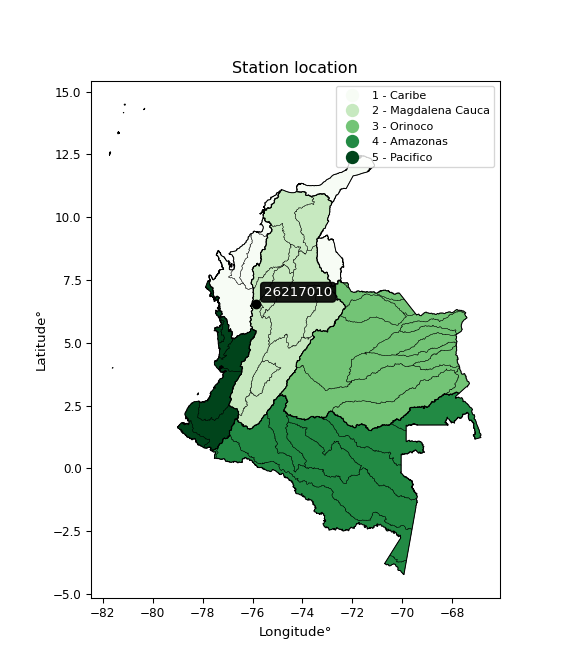

<div align="center">


</div>

# PMP Station (Rain, Pmax24h): 26217010

Probable Maximum Precipitation (PMP) is the greatest amount of rainfall for a specific duration that is meteorologically possible for a given location, acting as a "worst-case" scenario for extreme storms, crucial for designing safety-critical infrastructure like bridges, river deviations, dams, spillways, and nuclear plants to prevent catastrophic failure. PMP is calculated by hydrologists using meteorological data to determine the upper limit of extreme rainfall, often leading to the Probable Maximum Flood (PMF) for flood control design, and is increasingly being studied for climate change impacts. Probable Maximum Precipitation (PMP) is the theoretical upper limit of rainfall, a deterministic estimate for extreme events, while probability distributions (like GEV, Gumbel) describe the likelihood and frequency of various precipitation amounts, including rare ones, showing how often events occur, with PMP representing the extreme end of these distributions, used for critical infrastructure design to ensure safety against the worst conceivable weather, unlike standard statistical forecasts which cover typical probabilities.

The most common probability distributions in hydrology, used for analyzing floods, rainfall, and streamflow, include the Normal, Log-Normal, Gumbel, Gamma (including Log-Pearson Type III), and Generalized Extreme Value (GEV) distributions, often chosen based on the data´s skewness and whether modeling extremes or general conditions, with Gumbel and GEV popular for extreme events like floods, while the Normal distribution serves as a baseline, though often requiring transformations for skewed hydrological data. These distributions help in designing water infrastructure, managing water resources, and forecasting hydrologic events.

> Hydrological data often isn´t perfectly normal (it´s skewed), so different distributions are needed for different applications, such as: **Flood Frequency Analysis**: Using Gumbel, GEV, or Log-Pearson Type III for predicting extreme flood magnitudes and their return periods, **Rainfall Analysis**: Normal for annual totals, but Log-Normal, Weibull, or GEV for intensity or extreme daily rainfall, **Streamflow Modeling**: Gamma and Log-Normal for maximum flows, GEV for minimum flows, and Kappa for daily flows.

<div align="center">

</img>

</div>


## A. General information


### 1. General running parameters

• app_version: _v20260108_. • runtime: _2026-01-09 11:32:22.148588_. • Python version: _3.14.0_. • SciPy version: _1.16.3_. • Pandas version: _2.3.3_. • NumPy version: _2.3.5_. • Stations dataset (station_dataset_file): _dataset/pmax24h_in/automatic_colombia_2003_2024.csv_. • Stations catalog (station_catalog_file): _dataset/CNE.xls_. • Minimum year to eval til year_max (date_min): _1900_. • Maximum year to eval since year_min (date_max): _2024_. • Creates, save and include plots into reports (create_plot): _False_. • Plot only fit distributions with Δo > Δ (plot_only_fit): _True_. • Plot only simple graphs avoiding multiple CDFs and multiple Extreme values plots (plot_only_simple): _True_. • Eval low extreme values, if False, evaluates high extreme values (low_extreme): _False_. • Eval every SciPy distribution as logarithmic (pdist_logarithmic_on): _True_. • Standard deviation normalized (ddof): _1.0_. • Return periods to eval in years (Tr): _[2, 2.33, 5, 10, 15, 20, 25, 50, 75, 100, 200, 250, 500, 750, 1000]_. • Minimum data sample per station, 0 means any (minimum_sample): _5_. • Z-Score maximum threshold to adjust a value, 0 means disable (zscore_max): _3.5_. • Z-Score minimum threshold to adjust a value, 0 means disable (zscore_min): _-2.5_. • Avoid zeros, e.g. rain = 0 (avoid_zeros): _True_. • Avoid null values (avoid_nans): _True_. 

:file_folder:Table: [dataset.csv](../../dataset/pmax24h_in/automatic_colombia_2003_2024.csv)

> Delta Degrees of Freedom (DDOF): is a parameter used in the formulas for calculating variance and standard deviation. When ddof=0, the divisor is $N$ (the total number of observations) and this is used when your data set is the entire population. When ddof=1, the divisor is $N-1$ and this is used when your data set is a sample drawn from a larger population. Using $N-1$ provides an unbiased estimate of the population variance (known as Bessel´s correction).


### 2. Station info and location

|   id |   CODIGO | NOMBRE               | CATEGORIA    | TECNOLOGIA                | ESTADO   | FECHA_INSTALACION   |   FECHA_SUSPENSION |   ALTITUD |   LATITUD |   LONGITUD | DEPARTAMENTO   | MUNICIPIO             | AREA_OPERATIVA                      | ENTIDAD                                                     | AREA_HIDROGRAFICA   | ZONA_HIDROGRAFICA   | SUBZONA_HIDROGRAFICA                               | CORRIENTE   | Catalogo   |   Version |
|-----:|---------:|:---------------------|:-------------|:--------------------------|:---------|:--------------------|-------------------:|----------:|----------:|-----------:|:---------------|:----------------------|:------------------------------------|:------------------------------------------------------------|:--------------------|:--------------------|:---------------------------------------------------|:------------|:-----------|----------:|
|    0 | 26217010 | LA GALERA [26217010] | Limnigráfica | Automática con Telemetría | Activa   | 15/11/1970          |                nan |       538 |   6.55497 |   -75.8642 | Antioquia      | Santa Fe De Antioquia | Area Operativa 01 - Antioquia-Chocó | INSTITUTO DE HIDROLOGIA METEOROLOGIA Y ESTUDIOS AMBIENTALES | Magdalena Cauca     | Cauca               | Directos Río Cauca entre Río San Juan y Pto Valdia | Tonusco     | CNE_IDEAM  |  20251226 |

<div align="center">

Dynamic map: [:earth_americas:Google](http://maps.google.com/maps?q=6.554972222,-75.86419444) [:earth_americas:OSM](https://www.openstreetmap.org/#map=18/6.554972222/-75.86419444&layers=P) [:earth_americas:Bing](https://www.bing.com/maps?cp=6.554972222~-75.86419444&lvl=18) [:earth_americas:Apple](https://maps.apple.com/frame?center=6.554972222%2C-75.86419444&span=0.003%2C0.006)

</div>


<div align="center">

```geojson
{
  "type": "Feature",
  "geometry": {
    "type": "Point", 
    "coordinates": [-75.86419444, 6.554972222]
  }, 
  "properties": {
    "Name": "26217010"
  }
}
```

</div>


### 3. Discrete values table and plot

<div align="center">

|               |           0 |          1 |           2 |         3 |           4 |          5 |
|:--------------|------------:|-----------:|------------:|----------:|------------:|-----------:|
| Date          | 2019        | 2020       | 2021        | 2022      | 2023        | 2024       |
| Value         |   66        |   57.2     |   75        |  111      |   71.6      |  118.8     |
| Value_initial |   66        |   57.2     |   75        |  111      |   71.6      |  118.8     |
| count         |    6        |    6       |    6        |    6      |    6        |    6       |
| mean          |   83.2667   |   83.2667  |   83.2667   |   83.2667 |   83.2667   |   83.2667  |
| std           |   25.3528   |   25.3528  |   25.3528   |   25.3528 |   25.3528   |   25.3528  |
| zscore        |   -0.681057 |   -1.02816 |   -0.326066 |    1.0939 |   -0.460173 |    1.40156 |


</div>


> The initial value (value_initial) correspond to the initial obtained or null completed value, and value (value) is adjusted only when the initial value is outside the valid range (outlier) definite through the Z-Score value. If Z-Score is active, values out of range or outliers are replaced with the station mean value. A Z-Score (or standard score) measures how many standard deviations a data point is from the mean of a dataset, indicating its relative position; positive scores mean above the mean, negative mean below, and a score of zero is exactly at the mean, allowing for comparison of values from different distributions. It´s calculated using the formula $z=(x–μ)/σ$, where $x$ is the data point, $μ$ is the mean, and $σ$ is the standard deviation, helping identify outliers and understand probability.
>
> <sub>**Note**: In this study, "completing" (filling gaps in) and "extending" (forecasting or lengthening the historical record) rainfall data series are avoided for certain critical analyses because they introduce artificial bias and uncertainty, which can distort the statistics of rare events (extremes), alter day-to-day variability, and compromise the integrity and homogeneity of the original data. Some reasons against Completing/Extending rainfall data are: **Distortion of Extremes and Variability**: The primary issue is that most gap-filling or extension methods rely on averaging or regression with nearby stations, which inherently smooths the data. Rainfall is highly variable in space and time, with a large percentage of zero values and occasional large storms. Infilling methods often underestimate the highest values and overestimate the lowest (zero) values, which severely distorts analyses focused on flood frequency, drought severity, and intensity-duration-frequency (IDF) curves, **Loss of Data Homogeneity**: Infilled or extended data are synthetic estimates, not actual measurements. Combining these estimates with observed data can violate the assumption of data homogeneity, which requires that the data properties do not change over time. Inhomogeneity can lead to incorrect conclusions about long-term trends or changes in climate patterns, **Propagation of Errors**: Errors and biases from the original data (e.g., wind-induced undercatch, instrument errors, site changes) or the data used for imputation can propagate through the analysis, leading to unreliable hydrological models and inaccurate predictions, **Compromised Statistical Integrity**: For statistical analyses, especially those involving the frequency of events, using artificial data can introduce time bias or autocorrelation that doesn´t exist in reality, making it difficult to assess the true probability of events, **Difficulty in Validation**: It is difficult to accurately validate the quality of filled or extended data, especially for past periods where ground-truth measurements are unavailable. The reliability of imputation techniques heavily depends on the density of the surrounding station network and the complexity of the local topography.</sub>


### 4. Active continuous probability distributions from SciPy (45 of 104 available)

A Probability Density Function (PDF) describes the relative likelihood of a continuous random variable falling within a specific range, where the total area under its curve equals 1, and the area over any interval gives the actual probability for that range. Unlike discrete probabilities (like rolling a die), a PDF shows density, not direct probability for a single point (which is zero), with higher points indicating higher likelihood, often visualized as a bell curve for normal distributions.

A log of a probability density function (log-PDF) is simply the logarithm of the PDF´s value, denoted as $log(f(x))$, useful for converting multiplication of probabilities into addition, improving numerical stability with tiny numbers, and connecting to information theory concepts like entropy. Instead of dealing with very small probabilities (e.g., 0.000001), log-PDFs use negative numbers (e.g., $log(0.00001) ≈ -11.51$ that are easier for computers to handle, preventing underflow errors and simplifying complex calculations. In this study, each active probability distribution from SciPy is also evaluated in the $log$ form.

[scipy.stats](https://docs.scipy.org/doc/scipy/reference/stats.html) is a Python´s powerful submodule within the SciPy library for comprehensive statistical analysis, offering over 130 probability distributions (like Normal, Poisson), functions for descriptive stats (mean, variance), hypothesis testing (t-tests, chi-square), random variable generation, and statistical tests, making it essential for data science, modeling, and research. It provides tools to explore, model, and draw conclusions from data efficiently, working seamlessly with NumPy.

<div align="center">

|   id | p_dist             |   n_parameter | fit_method   | label                                                                       | active   | ref                                                                                                        |
|-----:|:-------------------|--------------:|:-------------|:----------------------------------------------------------------------------|:---------|:-----------------------------------------------------------------------------------------------------------|
|    0 | alpha              |             3 | MLE          | Alpha                                                                       | True     | [:mortar_board:](https://docs.scipy.org/doc/scipy/reference/generated/scipy.stats.alpha.html)              |
|    1 | betaprime          |             4 | MLE          | Beta prime                                                                  | True     | [:mortar_board:](https://docs.scipy.org/doc/scipy/reference/generated/scipy.stats.betaprime.html)          |
|    2 | chi2               |             3 | MLE          | Chi²                                                                        | True     | [:mortar_board:](https://docs.scipy.org/doc/scipy/reference/generated/scipy.stats.chi2.html)               |
|    3 | crystalball        |             4 | MLE          | Crystalball                                                                 | True     | [:mortar_board:](https://docs.scipy.org/doc/scipy/reference/generated/scipy.stats.crystalball.html)        |
|    4 | dweibull           |             3 | MLE          | Double Weibull                                                              | True     | [:mortar_board:](https://docs.scipy.org/doc/scipy/reference/generated/scipy.stats.dweibull.html)           |
|    5 | erlang             |             3 | MLE          | Erlang                                                                      | True     | [:mortar_board:](https://docs.scipy.org/doc/scipy/reference/generated/scipy.stats.erlang.html)             |
|    6 | expon              |             2 | MLE          | Exponential                                                                 | True     | [:mortar_board:](https://docs.scipy.org/doc/scipy/reference/generated/scipy.stats.expon.html)              |
|    7 | exponnorm          |             3 | MLE          | Exponentially modified Normal                                               | True     | [:mortar_board:](https://docs.scipy.org/doc/scipy/reference/generated/scipy.stats.exponnorm.html)          |
|    8 | f                  |             4 | MLE          | F                                                                           | True     | [:mortar_board:](https://docs.scipy.org/doc/scipy/reference/generated/scipy.stats.f.html)                  |
|    9 | fatiguelife        |             3 | MLE          | Fatigue-life (Birnbaum-Saunders)                                            | True     | [:mortar_board:](https://docs.scipy.org/doc/scipy/reference/generated/scipy.stats.fatiguelife.html)        |
|   10 | fisk               |             3 | MLE          | Fisk                                                                        | True     | [:mortar_board:](https://docs.scipy.org/doc/scipy/reference/generated/scipy.stats.fisk.html)               |
|   11 | gamma              |             3 | MLE          | Gamma                                                                       | True     | [:mortar_board:](https://docs.scipy.org/doc/scipy/reference/generated/scipy.stats.gamma.html)              |
|   12 | genexpon           |             5 | MLE          | Generalized exponential                                                     | True     | [:mortar_board:](https://docs.scipy.org/doc/scipy/reference/generated/scipy.stats.genexpon.html)           |
|   13 | genlogistic        |             3 | MLE          | Generalized logistic                                                        | True     | [:mortar_board:](https://docs.scipy.org/doc/scipy/reference/generated/scipy.stats.genlogistic.html)        |
|   14 | gibrat             |             2 | MM           | Gibrat                                                                      | True     | [:mortar_board:](https://docs.scipy.org/doc/scipy/reference/generated/scipy.stats.gibrat.html)             |
|   15 | gompertz           |             3 | MLE          | Gompertz (or truncated Gumbel)                                              | True     | [:mortar_board:](https://docs.scipy.org/doc/scipy/reference/generated/scipy.stats.gompertz.html)           |
|   16 | gumbel_l           |             2 | MM           | Gumbel Left Skew                                                            | True     | [:mortar_board:](https://docs.scipy.org/doc/scipy/reference/generated/scipy.stats.gumbel_l.html)           |
|   17 | gumbel_r           |             2 | MM           | Gumbel Right Skew                                                           | True     | [:mortar_board:](https://docs.scipy.org/doc/scipy/reference/generated/scipy.stats.gumbel_r.html)           |
|   18 | halflogistic       |             2 | MM           | Half-logistic                                                               | True     | [:mortar_board:](https://docs.scipy.org/doc/scipy/reference/generated/scipy.stats.halflogistic.html)       |
|   19 | halfnorm           |             2 | MM           | Half Normal                                                                 | True     | [:mortar_board:](https://docs.scipy.org/doc/scipy/reference/generated/scipy.stats.halfnorm.html)           |
|   20 | hypsecant          |             2 | MM           | hyperbolic secant                                                           | True     | [:mortar_board:](https://docs.scipy.org/doc/scipy/reference/generated/scipy.stats.hypsecant.html)          |
|   21 | invgamma           |             3 | MLE          | Inverted gamma                                                              | True     | [:mortar_board:](https://docs.scipy.org/doc/scipy/reference/generated/scipy.stats.invgamma.html)           |
|   22 | invgauss           |             3 | MLE          | Inverse Gaussian                                                            | True     | [:mortar_board:](https://docs.scipy.org/doc/scipy/reference/generated/scipy.stats.invgauss.html)           |
|   23 | invweibull         |             3 | MLE          | Inverted Weibull                                                            | True     | [:mortar_board:](https://docs.scipy.org/doc/scipy/reference/generated/scipy.stats.invweibull.html)         |
|   24 | kappa4             |             4 | MLE          | Kappa 4                                                                     | True     | [:mortar_board:](https://docs.scipy.org/doc/scipy/reference/generated/scipy.stats.kappa4.html)             |
|   25 | kstwobign          |             2 | MLE          | Limiting distribution of scaled Kolmogorov-Smirnov two-sided test statistic | True     | [:mortar_board:](https://docs.scipy.org/doc/scipy/reference/generated/scipy.stats.kstwobign.html)          |
|   26 | laplace            |             2 | MM           | Laplace                                                                     | True     | [:mortar_board:](https://docs.scipy.org/doc/scipy/reference/generated/scipy.stats.laplace.html)            |
|   27 | laplace_asymmetric |             3 | MLE          | Asymmetric Laplace                                                          | True     | [:mortar_board:](https://docs.scipy.org/doc/scipy/reference/generated/scipy.stats.laplace_asymmetric.html) |
|   28 | loggamma           |             3 | MLE          | Log gamma                                                                   | True     | [:mortar_board:](https://docs.scipy.org/doc/scipy/reference/generated/scipy.stats.loggamma.html)           |
|   29 | logistic           |             2 | MM           | Logistic (or Sech-squared)                                                  | True     | [:mortar_board:](https://docs.scipy.org/doc/scipy/reference/generated/scipy.stats.logistic.html)           |
|   30 | lognorm            |             3 | MLE          | Log Normal                                                                  | True     | [:mortar_board:](https://docs.scipy.org/doc/scipy/reference/generated/scipy.stats.lognorm.html)            |
|   31 | maxwell            |             2 | MM           | Maxwell                                                                     | True     | [:mortar_board:](https://docs.scipy.org/doc/scipy/reference/generated/scipy.stats.maxwell.html)            |
|   32 | mielke             |             4 | MLE          | Mielke Beta-Kappa / Dagum                                                   | True     | [:mortar_board:](https://docs.scipy.org/doc/scipy/reference/generated/scipy.stats.mielke.html)             |
|   33 | moyal              |             2 | MM           | Moyal                                                                       | True     | [:mortar_board:](https://docs.scipy.org/doc/scipy/reference/generated/scipy.stats.moyal.html)              |
|   34 | nakagami           |             3 | MLE          | Nakagami                                                                    | True     | [:mortar_board:](https://docs.scipy.org/doc/scipy/reference/generated/scipy.stats.nakagami.html)           |
|   35 | ncf                |             5 | MLE          | Non-central F distribution                                                  | True     | [:mortar_board:](https://docs.scipy.org/doc/scipy/reference/generated/scipy.stats.ncf.html)                |
|   36 | nct                |             4 | MLE          | Non-central Student’s t                                                     | True     | [:mortar_board:](https://docs.scipy.org/doc/scipy/reference/generated/scipy.stats.nct.html)                |
|   37 | norm               |             2 | MM           | Normal                                                                      | True     | [:mortar_board:](https://docs.scipy.org/doc/scipy/reference/generated/scipy.stats.norm.html)               |
|   38 | pearson3           |             3 | MM           | Pearson type III                                                            | True     | [:mortar_board:](https://docs.scipy.org/doc/scipy/reference/generated/scipy.stats.pearson3.html)           |
|   39 | rayleigh           |             2 | MM           | Rayleigh                                                                    | True     | [:mortar_board:](https://docs.scipy.org/doc/scipy/reference/generated/scipy.stats.rayleigh.html)           |
|   40 | rice               |             3 | MLE          | Rice                                                                        | True     | [:mortar_board:](https://docs.scipy.org/doc/scipy/reference/generated/scipy.stats.rice.html)               |
|   41 | t                  |             3 | MLE          | Student’s t                                                                 | True     | [:mortar_board:](https://docs.scipy.org/doc/scipy/reference/generated/scipy.stats.t.html)                  |
|   42 | truncnorm          |             4 | MLE          | Truncated normal                                                            | True     | [:mortar_board:](https://docs.scipy.org/doc/scipy/reference/generated/scipy.stats.truncnorm.html)          |
|   43 | wald               |             2 | MM           | Wald                                                                        | True     | [:mortar_board:](https://docs.scipy.org/doc/scipy/reference/generated/scipy.stats.wald.html)               |
|   44 | weibull_min        |             3 | MLE          | Weibull minimum                                                             | True     | [:mortar_board:](https://docs.scipy.org/doc/scipy/reference/generated/scipy.stats.weibull_min.html)        |

</div>

> **n_parameter:** # arguments & localization & scale.
>
> **Fit methods:** (MLE) maximum likelihood, (MM) L-moments.
>
>**Inactive** (With the only purpose of prevent loops, zero divisions, infinite values, over high estimated values or horizontal trending for recurrence intervals estimations, the follow distributions were disabled.)**:** foldnorm, gennorm, norminvgauss, powernorm, powerlognorm, skewnorm, genextreme, anglit, arcsine, argus, beta, bradford, burr, burr12, cauchy, cosine, halfcauchy, foldcauchy, skewcauchy, wrapcauchy, dgamma, gengamma, exponweib, exponpow, truncexpon, gausshyper, genhalflogistic, genhyperbolic, geninvgauss, halfgennorm, johnsonsb, johnsonsu, kappa3, ksone, kstwo, loglaplace, levy, levy_l, levy_stable, ncx2, pareto, genpareto, truncpareto, lomax, powerlaw, rdist, rel_breitwigner, recipinvgauss, semicircular, studentized_range, trapezoid, triang, truncweibull_min, tukeylambda, uniform, loguniform, vonmises, vonmises_line, weibull_max, 


## B. Probability (PDF) vs. Empirical (EDF) distributions functions

A continuous probability distribution (CPD) describes probabilities for variables that can take any value within a range (like rain any time), unlike discrete variables with specific outcomes (like temperature). It uses a Probability Density Function (PDF), a curve where the total area under it equals 1, and the probability of the variable falling within an interval (a to b) is found by calculating the area under the curve between those points. A key feature is that the probability of hitting any single exact value is zero, so probabilities are always expressed for ranges, e.g., $P(a ≤ X ≤ b)$.

<div align="center">

Distributions parameters from station values
|    |   station | p_dist                |   n |            loc |          scale | shape                  | shape1             | shape2                | shape3   |
|---:|----------:|:----------------------|----:|---------------:|---------------:|:-----------------------|:-------------------|:----------------------|:---------|
|  0 |  26217010 | alpha                 |   6 |    23.7627     |  146.781       | 2.8302025853449004     |                    |                       |          |
|  1 |  26217010 | betaprime             |   6 |    -0.713624   |    4.58113     | 271.3728222387891      | 15.836552009546075 |                       |          |
|  2 |  26217010 | chi2                  |   6 |    57.2        |   15.9918      | 1.2352227142914392     |                    |                       |          |
|  3 |  26217010 | crystalball           |   6 |    83.2667     |   23.1438      | 7348.975836472939      | 647.2201599113874  |                       |          |
|  4 |  26217010 | dweibull              |   6 |    71.6        |   18.7825      | 0.8704451543074058     |                    |                       |          |
|  5 |  26217010 | erlang                |   6 |    57.2        |   26.0674      | 0.5126826247058258     |                    |                       |          |
|  6 |  26217010 | expon                 |   6 |    57.2        |   26.0667      |                        |                    |                       |          |
|  7 |  26217010 | exponnorm             |   6 |    57.1831     |    0.00511118  | 5094.314087872068      |                    |                       |          |
|  8 |  26217010 | f                     |   6 |     5.09018    |   73.1226      | 3472.0499098902237     | 24.02470953159593  |                       |          |
|  9 |  26217010 | fatiguelife           |   6 |    57.2        |    2.14053e-05 | 1134.1208349395097     |                    |                       |          |
| 10 |  26217010 | fisk                  |   6 |    55.2498     |   18.7855      | 1.508224314473942      |                    |                       |          |
| 11 |  26217010 | gamma                 |   6 |    57.2        |   19.818       | 0.8808195688025432     |                    |                       |          |
| 12 |  26217010 | genexpon              |   6 |    57.2        |    8.06434e+07 | 2823103.990493954      | 2024795.84270971   | 479429.0030390023     |          |
| 13 |  26217010 | genlogistic           |   6 |   -53.9096     |   17.1614      | 1584.8998487051504     |                    |                       |          |
| 14 |  26217010 | gibrat                |   6 |    65.6109     |   10.7088      |                        |                    |                       |          |
| 15 |  26217010 | gompertz              |   6 |    57.2        |  117.226       | 3.629343436418093      |                    |                       |          |
| 16 |  26217010 | gumbel_l              |   6 |    93.6826     |   18.0451      |                        |                    |                       |          |
| 17 |  26217010 | gumbel_r              |   6 |    72.8507     |   18.0451      |                        |                    |                       |          |
| 18 |  26217010 | halflogistic          |   6 |    55.8359     |   19.7871      |                        |                    |                       |          |
| 19 |  26217010 | halfnorm              |   6 |    52.6333     |   38.3932      |                        |                    |                       |          |
| 20 |  26217010 | hypsecant             |   6 |    83.2667     |   14.7338      |                        |                    |                       |          |
| 21 |  26217010 | invgamma              |   6 |    43.8289     |   84.3888      | 3.040914163593596      |                    |                       |          |
| 22 |  26217010 | invgauss              |   6 |    50.0561     |   43.0118      | 0.7721271057399053     |                    |                       |          |
| 23 |  26217010 | invweibull            |   6 |    57.2        |    1.51856     | 0.04742203501540282    |                    |                       |          |
| 24 |  26217010 | kappa4                |   6 |    47.0419     |   75.1188      | 1.1568780314926403     | 1.0392307117520563 |                       |          |
| 25 |  26217010 | kstwobign             |   6 |    12.7629     |   80.8239      |                        |                    |                       |          |
| 26 |  26217010 | laplace               |   6 |    83.2667     |   16.3651      |                        |                    |                       |          |
| 27 |  26217010 | laplace_asymmetric    |   6 |    66          |   12.682       | 0.5289689027762707     |                    |                       |          |
| 28 |  26217010 | loggamma              |   6 | -6622.44       |  914.09        | 1534.6918267535705     |                    |                       |          |
| 29 |  26217010 | logistic              |   6 |    83.2667     |   12.7598      |                        |                    |                       |          |
| 30 |  26217010 | lognorm               |   6 |    57.2        |    0.0613107   | 13.338862378184439     |                    |                       |          |
| 31 |  26217010 | maxwell               |   6 |    28.4256     |   34.3666      |                        |                    |                       |          |
| 32 |  26217010 | mielke                |   6 |    -3.92652    |   31.7527      | 357.39242163184315     | 4.982527785944228  |                       |          |
| 33 |  26217010 | moyal                 |   6 |    70.0316     |   10.4184      |                        |                    |                       |          |
| 34 |  26217010 | nakagami              |   6 |    57.2        |   48.8216      | 0.2728927979251403     |                    |                       |          |
| 35 |  26217010 | ncf                   |   6 |    -0.00860468 |    8.54341e-09 | 5.409545608654732e-10  | 3.344772199174746  | 4.24069737634436      |          |
| 36 |  26217010 | nct                   |   6 |    -0.153856   |    1.63079     | 8.1276757785106        | 46.2366150782575   |                       |          |
| 37 |  26217010 | norm                  |   6 |    83.2667     |   23.1438      |                        |                    |                       |          |
| 38 |  26217010 | pearson3              |   6 |    83.2667     |   23.1438      | 0.5537067941365357     |                    |                       |          |
| 39 |  26217010 | rayleigh              |   6 |    38.9912     |   35.3267      |                        |                    |                       |          |
| 40 |  26217010 | rice                  |   6 |    45.0423     |   31.597       | 0.0012867716886529677  |                    |                       |          |
| 41 |  26217010 | t                     |   6 |    83.2587     |   23.1444      | 894866.9112715153      |                    |                       |          |
| 42 |  26217010 | truncnorm             |   6 |     0.797407   |  102.943       | -4548.454901332484     | 1.1462863480832381 |                       |          |
| 43 |  26217010 | wald                  |   6 |    60.1228     |   23.1438      |                        |                    |                       |          |
| 44 |  26217010 | weibull_min           |   6 |    57.2        |   22.1335      | 0.7973058125543728     |                    |                       |          |
| 45 |  26217010 | logalpha              |   6 |     1.80707    |   25.4162      | 9.977146307744043      |                    |                       |          |
| 46 |  26217010 | logbetaprime          |   6 |     2.33663    |    4.86384     | 88.59460691706482      | 211.4913202856951  |                       |          |
| 47 |  26217010 | logchi2               |   6 |     4.04655    |    0.974317    | 1.0263411886995462     |                    |                       |          |
| 48 |  26217010 | logcrystalball        |   6 |     4.38529    |    0.267572    | 7.596535738354962      | 678.8454657770908  |                       |          |
| 49 |  26217010 | logdweibull           |   6 |     4.2711     |    0.213754    | 0.8977588848358824     |                    |                       |          |
| 50 |  26217010 | logerlang             |   6 |     4.04655    |    0.420249    | 0.17381766287852318    |                    |                       |          |
| 51 |  26217010 | logexpon              |   6 |     4.04655    |    0.33874     |                        |                    |                       |          |
| 52 |  26217010 | logexponnorm          |   6 |     4.084      |    0.0851885   | 3.5368401610068716     |                    |                       |          |
| 53 |  26217010 | logf                  |   6 |     4.04655    |    0.338098    | 0.9404541767043213     | 2128.3803335188595 |                       |          |
| 54 |  26217010 | logfatiguelife        |   6 |     3.89934    |    0.405522    | 0.6277532699186278     |                    |                       |          |
| 55 |  26217010 | logfisk               |   6 |     3.94126    |    0.369194    | 2.4255306487692234     |                    |                       |          |
| 56 |  26217010 | loggamma              |   6 |     4.04655    |    0.369675    | 0.3100589482776114     |                    |                       |          |
| 57 |  26217010 | loggenexpon           |   6 |     4.04646    |    0.0356117   | 0.07612409819529786    | 6.963741818000884  | 0.0005388942159208791 |          |
| 58 |  26217010 | loggenlogistic        |   6 |     2.81043    |    0.212541    | 909.5602864148154      |                    |                       |          |
| 59 |  26217010 | loggibrat             |   6 |     4.18114    |    0.123824    |                        |                    |                       |          |
| 60 |  26217010 | loggompertz           |   6 |     4.04655    |    0.696948    | 1.3256817397705096     |                    |                       |          |
| 61 |  26217010 | loggumbel_l           |   6 |     4.50572    |    0.208625    |                        |                    |                       |          |
| 62 |  26217010 | loggumbel_r           |   6 |     4.26487    |    0.208625    |                        |                    |                       |          |
| 63 |  26217010 | loghalflogistic       |   6 |     4.06817    |    0.228759    |                        |                    |                       |          |
| 64 |  26217010 | loghalfnorm           |   6 |     4.03113    |    0.443874    |                        |                    |                       |          |
| 65 |  26217010 | loghypsecant          |   6 |     4.38529    |    0.170341    |                        |                    |                       |          |
| 66 |  26217010 | loginvgamma           |   6 |    -2.53943    | 4731.09        | 684.1917145617977      |                    |                       |          |
| 67 |  26217010 | loginvgauss           |   6 |     3.86057    |    1.54881     | 0.3387936948633569     |                    |                       |          |
| 68 |  26217010 | loginvweibull         |   6 |     1.84428    |    2.40478     | 11.773479914433262     |                    |                       |          |
| 69 |  26217010 | logkappa4             |   6 |     4.01666    |    0.815223    | 1.0381147300727624     | 1.0715559061999553 |                       |          |
| 70 |  26217010 | logkstwobign          |   6 |     3.51886    |    0.992061    |                        |                    |                       |          |
| 71 |  26217010 | loglaplace            |   6 |     4.38529    |    0.189202    |                        |                    |                       |          |
| 72 |  26217010 | loglaplace_asymmetric |   6 |     4.2711     |    0.191574    | 0.7454368594575426     |                    |                       |          |
| 73 |  26217010 | logloggamma           |   6 |   -46.0758     |    7.5666      | 788.1453451465431      |                    |                       |          |
| 74 |  26217010 | loglogistic           |   6 |     4.38529    |    0.14752     |                        |                    |                       |          |
| 75 |  26217010 | loglognorm            |   6 |     4.04655    |    0.00124626  | 12.521790850311787     |                    |                       |          |
| 76 |  26217010 | logmaxwell            |   6 |     3.75126    |    0.397321    |                        |                    |                       |          |
| 77 |  26217010 | logmielke             |   6 |    -2.15576    |    5.36924     | 7037.659420699456      | 30.656804911360922 |                       |          |
| 78 |  26217010 | logmoyal              |   6 |     4.23228    |    0.12045     |                        |                    |                       |          |
| 79 |  26217010 | lognakagami           |   6 |     4.04655    |    0.523207    | 0.3258301744195137     |                    |                       |          |
| 80 |  26217010 | logncf                |   6 |     3.44841    |    4.75461e-07 | 2.5251732429274734e-05 | 1862.1831776624308 | 49.66928006681448     |          |
| 81 |  26217010 | lognct                |   6 |    -0.130653   |    0.0927172   | 169.0218668212566      | 48.47919853948764  |                       |          |
| 82 |  26217010 | lognorm               |   6 |     4.38529    |    0.267572    |                        |                    |                       |          |
| 83 |  26217010 | logpearson3           |   6 |     4.38529    |    0.267572    | 0.402222757498502      |                    |                       |          |
| 84 |  26217010 | lograyleigh           |   6 |     3.87341    |    0.408421    |                        |                    |                       |          |
| 85 |  26217010 | logrice               |   6 |     3.91948    |    0.369932    | 0.32975173135222513    |                    |                       |          |
| 86 |  26217010 | logt                  |   6 |     4.38529    |    0.267572    | 44377324520.29608      |                    |                       |          |
| 87 |  26217010 | logtruncnorm          |   6 |     0.00282202 |    1.41463     | 2.8585092627748763     | 3.4432910180019256 |                       |          |
| 88 |  26217010 | logwald               |   6 |     4.11777    |    0.267529    |                        |                    |                       |          |
| 89 |  26217010 | logweibull_min        |   6 |     4.04655    |    0.538665    | 0.1746189193607296     |                    |                       |          |

</div>

> **loc** (Location parameter): This shifts the distribution along the x-axis. For many common distributions, like the normal (Gaussian) distribution, loc represents the mean $μ$. For others, like the uniform distribution, it might represent the minimum value, or for the beta distribution, the left end of the support interval.
>
> **scale** (Scale parameter): This determines the width or spread of the distribution. For the normal distribution, scale represents the standard deviation $σ$. For a uniform distribution, it defines the length of the interval (from $loc$ to $loc + scale$).
>
> **shape** (Shape parameters): Refers to parameters that define the specific form of a probability distribution, distinct from its location (loc) and scale (scale). These parameters are required arguments for most distribution functions. For example, a normal (Gaussian) distribution is fully defined by its location (mean) and scale (standard deviation), so it has no specific shape parameters beyond loc and scale. However, other distributions have intrinsic properties that need specification, as Gamma distribution that takes a shape parameter, often named $a$ or $alpha$.


### 0. Cumulative distribution values - CDF (90 evaluated)

Cumulative Distribution Function (CDF), denoted as $F$<sub>$X$</sub>$(x)$, is a function that gives the probability that a random variable $X$ will take a value less than or equal to a specific value, $x$ (i.e., $(P(X≥x)$. It essentially "accumulates" probabilities from a given point up to the far right (positive infinity), providing a complete picture of the distribution´s probabilities for both discrete (like rain) and continuous (like temperature) variables, helping to find probabilities over ranges or above certain values. Each station is evaluated separately ordering the $x$ values ascending, calculating the CDF and PDF values for the activated distributions and their logarithmic forms.

<div align="center">

CDF ordered by x ascending and calculating $log(f(x))$ separately
|   id |   Station |   date |     x |   count |    mean |     std |    zscore |   Value_initial |   station |   m |     alpha |   alpha_pdf |   betaprime |   betaprime_pdf |        chi2 |       chi2_pdf |   crystalball |   crystalball_pdf |   dweibull |   dweibull_pdf |      erlang |      erlang_pdf |    expon |   expon_pdf |   exponnorm |   exponnorm_pdf |         f |      f_pdf |   fatiguelife |   fatiguelife_pdf |      fisk |   fisk_pdf |       gamma |   gamma_pdf |    genexpon |   genexpon_pdf |   genlogistic |   genlogistic_pdf |      gibrat |   gibrat_pdf |    gompertz |   gompertz_pdf |   gumbel_l |   gumbel_l_pdf |   gumbel_r |   gumbel_r_pdf |   halflogistic |   halflogistic_pdf |   halfnorm |   halfnorm_pdf |   hypsecant |   hypsecant_pdf |   invgamma |   invgamma_pdf |   invgauss |   invgauss_pdf |   invweibull |   invweibull_pdf |      kappa4 |   kappa4_pdf |   kstwobign |   kstwobign_pdf |   laplace |   laplace_pdf |   laplace_asymmetric |   laplace_asymmetric_pdf |    loggamma |   loggamma_pdf |   logistic |   logistic_pdf |   lognorm |   lognorm_pdf |   maxwell |   maxwell_pdf |    mielke |   mielke_pdf |     moyal |   moyal_pdf |    nakagami |    nakagami_pdf |      ncf |    ncf_pdf |       nct |    nct_pdf |     norm |   norm_pdf |   pearson3 |   pearson3_pdf |   rayleigh |   rayleigh_pdf |      rice |   rice_pdf |        t |      t_pdf |   truncnorm |   truncnorm_pdf |     wald |   wald_pdf |   weibull_min |   weibull_min_pdf |   logalpha |   logalpha_pdf |   logbetaprime |   logbetaprime_pdf |     logchi2 |   logchi2_pdf |   logcrystalball |   logcrystalball_pdf |   logdweibull |   logdweibull_pdf |   logerlang |   logerlang_pdf |   logexpon |   logexpon_pdf |   logexponnorm |   logexponnorm_pdf |        logf |     logf_pdf |   logfatiguelife |   logfatiguelife_pdf |   logfisk |   logfisk_pdf |   loggenexpon |   loggenexpon_pdf |   loggenlogistic |   loggenlogistic_pdf |   loggibrat |   loggibrat_pdf |   loggompertz |   loggompertz_pdf |   loggumbel_l |   loggumbel_l_pdf |   loggumbel_r |   loggumbel_r_pdf |   loghalflogistic |   loghalflogistic_pdf |   loghalfnorm |   loghalfnorm_pdf |   loghypsecant |   loghypsecant_pdf |   loginvgamma |   loginvgamma_pdf |   loginvgauss |   loginvgauss_pdf |   loginvweibull |   loginvweibull_pdf |   logkappa4 |   logkappa4_pdf |   logkstwobign |   logkstwobign_pdf |   loglaplace |   loglaplace_pdf |   loglaplace_asymmetric |   loglaplace_asymmetric_pdf |   logloggamma |   logloggamma_pdf |   loglogistic |   loglogistic_pdf |   loglognorm |   loglognorm_pdf |   logmaxwell |   logmaxwell_pdf |   logmielke |   logmielke_pdf |   logmoyal |   logmoyal_pdf |   lognakagami |   lognakagami_pdf |   logncf |   logncf_pdf |    lognct |   lognct_pdf |   logpearson3 |   logpearson3_pdf |   lograyleigh |   lograyleigh_pdf |   logrice |   logrice_pdf |     logt |   logt_pdf |   logtruncnorm |   logtruncnorm_pdf |   logwald |   logwald_pdf |   logweibull_min |   logweibull_min_pdf |
|-----:|----------:|-------:|------:|--------:|--------:|--------:|----------:|----------------:|----------:|----:|----------:|------------:|------------:|----------------:|------------:|---------------:|--------------:|------------------:|-----------:|---------------:|------------:|----------------:|---------:|------------:|------------:|----------------:|----------:|-----------:|--------------:|------------------:|----------:|-----------:|------------:|------------:|------------:|---------------:|--------------:|------------------:|------------:|-------------:|------------:|---------------:|-----------:|---------------:|-----------:|---------------:|---------------:|-------------------:|-----------:|---------------:|------------:|----------------:|-----------:|---------------:|-----------:|---------------:|-------------:|-----------------:|------------:|-------------:|------------:|----------------:|----------:|--------------:|---------------------:|-------------------------:|------------:|---------------:|-----------:|---------------:|----------:|--------------:|----------:|--------------:|----------:|-------------:|----------:|------------:|------------:|----------------:|---------:|-----------:|----------:|-----------:|---------:|-----------:|-----------:|---------------:|-----------:|---------------:|----------:|-----------:|---------:|-----------:|------------:|----------------:|---------:|-----------:|--------------:|------------------:|-----------:|---------------:|---------------:|-------------------:|------------:|--------------:|-----------------:|---------------------:|--------------:|------------------:|------------:|----------------:|-----------:|---------------:|---------------:|-------------------:|------------:|-------------:|-----------------:|---------------------:|----------:|--------------:|--------------:|------------------:|-----------------:|---------------------:|------------:|----------------:|--------------:|------------------:|--------------:|------------------:|--------------:|------------------:|------------------:|----------------------:|--------------:|------------------:|---------------:|-------------------:|--------------:|------------------:|--------------:|------------------:|----------------:|--------------------:|------------:|----------------:|---------------:|-------------------:|-------------:|-----------------:|------------------------:|----------------------------:|--------------:|------------------:|--------------:|------------------:|-------------:|-----------------:|-------------:|-----------------:|------------:|----------------:|-----------:|---------------:|--------------:|------------------:|---------:|-------------:|----------:|-------------:|--------------:|------------------:|--------------:|------------------:|----------:|--------------:|---------:|-----------:|---------------:|-------------------:|----------:|--------------:|-----------------:|---------------------:|
|    0 |  26217010 |   2020 |  57.2 |       6 | 83.2667 | 25.3528 | -1.02816  |            57.2 |  26217010 |   1 | 0.0595739 |  0.0155595  |   0.0958635 |      0.0124162  | 2.39992e-10 | 20860.4        |      0.130021 |        0.00914149 |   0.226125 |     0.0108464  | 1.18187e-08 | 852762          | 0        |  0.0383632  | 0.000648161 |      0.0383622  | 0.0915281 | 0.0121883  |      0.090425 |       1.17316e+10 | 0.0317879 | 0.0238024  | 2.60118e-14 |  3.22453    | 2.27776e-10 |     0.0350073  |     0.0869259 |        0.0123632  | 0           |   0          | 1.24143e-07 |     0.0309603  |   0.124031 |     0.00642832 |  0.0925046 |     0.0122031  |      0.0344561 |         0.025239   |  0.0946807 |     0.0206354  |    0.107494 |      0.00715783 |  0.0516875 |     0.0177173  |   0.046177 |     0.0214474  |    0.0083847 |      2.67564e+11 | 1.61781e-14 |    1.95097   |   0.0769835 |      0.0124086  |  0.101676 |    0.00621296 |            0.0588861 |               0.00877797 | 3.27222e-05 |    1.14232e+10 |   0.114775 |     0.00796262 |  0.10276  |      0.669033 |  0.12704  |    0.0114635  | 0.0676754 |   0.0145803  | 0.0641462 |  0.0127772  | 1.76715e-09 | 135739          | 0.495575 | 0.00461036 | 0.0863048 | 0.0131959  | 0.130021 | 0.00914149 |   0.119869 |     0.0111009  |   0.124394 |     0.0127757  | 0.0713521 | 0.0113087  | 0.130101 | 0.0091451  |    0.810055 |      0.00381534 | 0        | 0          |   4.43583e-13 |       49.7748     |  0.0850284 |       0.788787 |      0.0886139 |           0.722621 | 1.51197e-08 |   8.73584e+06 |         0.10276  |             0.669033 |      0.175812 |          0.734698 |  0.00303966 |     5.94865e+11 |   0        |       2.95212  |      0.0531157 |           0.919444 | 0.000139382 | 18693.6      |        0.0460859 |             1.18257  | 0.0455179 |      1.00085  |   0.000208479 |          2.13746  |        0.0667885 |             0.849135 |  0          |        0        |   1.70414e-10 |          1.90212  |      0.104796 |          0.475028 |     0.0579851 |          0.791453 |          0        |              0        |     0.0277125 |          1.79646  |      0.0866071 |           0.502182 |     0.0971929 |          0.693832 |     0.0482383 |          1.09167  |       0.0597804 |            0.900308 | 1.13366e-05 |         1.89838 |      0.0601934 |           0.880708 |    0.0834496 |         0.441062 |               0.0741382 |                    0.519151 |      0.104494 |          0.662191 |     0.0914355 |          0.563145 |    0.0127519 |      2.96019e+12 |    0.0927534 |         0.841544 |         nan |             nan |  0.0306292 |       0.691937 |   1.84033e-10 |      135026       | 0.092247 |     0.772086 | 0.0942364 |     0.71633  |     0.0927107 |          0.755653 |     0.0859375 |          0.948761 | 0.0543477 |      0.831718 | 0.10276  |   0.669033 |    1.14975e-06 |           2.57587  |  0        |      0        |       0.00261861 |          5.14153e+11 |
|    1 |  26217010 |   2019 |  66   |       6 | 83.2667 | 25.3528 | -0.681057 |            66   |  26217010 |   2 | 0.260087  |  0.0267224  |   0.23571   |      0.0186902  | 0.454548    |     0.0268213  |      0.227816 |        0.01305    |   0.352782 |     0.0191242  | 0.579299    |      0.026865   | 0.286516 |  0.0273715  | 0.287244    |      0.0273737  | 0.228279  | 0.0181794  |      0.714083 |       0.0109223   | 0.301149  | 0.0295268  | 0.41942     |  0.0328734  | 0.269294    |     0.0265152  |     0.231492  |        0.0197283  | 0.000458249 |   0.00421305 | 0.246434    |     0.0251495  |   0.193987 |     0.00963255 |  0.231827  |     0.0187794  |      0.251334  |         0.0236727  |  0.272274  |     0.0195599  |    0.191241 |      0.0122128  |  0.275753  |     0.0281094  |   0.29695  |     0.0285407  |    0.398496  |      0.00197577  | 0.17903     |    0.0176375 |   0.221553  |      0.019506   |  0.174081 |    0.0106373  |            0.218633  |               0.0325909  | 0.763039    |    1.22344     |   0.205347 |     0.0127885  |  0.232339 |      1.14125  |  0.245892 |    0.0152665  | 0.248957  |   0.0244283  | 0.224951  |  0.022253   | 0.304742    |      0.0187692  | 0.533923 | 0.00411541 | 0.23865   | 0.0203984  | 0.227816 | 0.01305    |   0.238685 |     0.0156164  |   0.253428 |     0.0161574  | 0.197458  | 0.0168469  | 0.227926 | 0.0130532  |    0.842817 |      0.00362749 | 0.116786 | 0.0450214  |   0.380796    |        0.0268907  |  0.244979  |       1.40744  |      0.233624  |           1.28766  | 0.288084    |   0.983914    |         0.232339 |             1.14125  |      0.328357 |          1.52209  |  0.854611   |     0.774186    |   0.344561 |       1.93493  |      0.283609  |           2.02111  | 0.496722    |     1.42305  |        0.296377  |             1.92381  | 0.276623  |      1.95399  |   0.285677    |          1.8293   |        0.251261  |             1.63166  |  0.00371167 |        1.30135  |   0.260776    |          1.72658  |      0.197332 |          0.845719 |     0.238329  |          1.63829  |          0.259466 |              2.03856  |     0.279006  |          1.6865   |      0.195492  |           1.07685  |     0.233217  |          1.20033  |     0.285403  |          1.89617  |       0.261203  |            1.76024  | 0.195808    |         1.328   |      0.249533  |           1.63562  |    0.177787  |         0.939667 |               0.201944  |                    1.41411  |      0.232159 |          1.12248  |     0.209791  |          1.12377  |    0.647586  |      0.207225    |    0.251174  |         1.33009  |         nan |             nan |  0.232651  |       1.93912  |   0.33154     |           1.48225 | 0.24351  |     1.31276  | 0.235735  |     1.24838  |     0.241192  |          1.29476  |     0.259012  |          1.40479  | 0.223249  |      1.45292  | 0.232339 |   1.14125  |    0.319596    |           1.9192   |  0.132309 |      3.95774  |       0.547682   |          0.437894    |
|    2 |  26217010 |   2023 |  71.6 |       6 | 83.2667 | 25.3528 | -0.460173 |            71.6 |  26217010 |   3 | 0.406836  |  0.0249312  |   0.345477  |      0.0201589  | 0.579513    |     0.0186489  |      0.307097 |        0.0151808  |   0.5      |     2.1085     | 0.698993    |      0.0170475  | 0.42445  |  0.0220799  | 0.425174    |      0.0220765  | 0.334637  | 0.0194676  |      0.765223 |       0.0077127   | 0.447838  | 0.0228103  | 0.575012    |  0.0233688  | 0.404973    |     0.022056   |     0.347859  |        0.021397   | 0.280579    |   0.0562623  | 0.377722    |     0.0217841  |   0.254818 |     0.0121461  |  0.342402  |     0.0203366  |      0.37853   |         0.0216483  |  0.378702  |     0.0183947  |    0.270792 |      0.0162409  |  0.424194  |     0.0243758  |   0.442009 |     0.0231322  |    0.40705   |      0.00120486  | 0.274495    |    0.016563  |   0.335684  |      0.0208589  |  0.245111 |    0.0149776  |            0.381394  |               0.0258021  | 0.839443    |    0.71931     |   0.286115 |     0.0160075  |  0.334763 |      1.36118  |  0.335673 |    0.0166444  | 0.38668   |   0.0240782  | 0.353672  |  0.0231005  | 0.397455    |      0.0147856  | 0.556164 | 0.0038317  | 0.357038  | 0.0214309  | 0.307097 | 0.0151808  |   0.331381 |     0.0173007  |   0.346899 |     0.0170651  | 0.297586  | 0.018685   | 0.307223 | 0.0151832  |    0.862775 |      0.00349945 | 0.361367 | 0.0382037  |   0.508271    |        0.019326   |  0.367759  |       1.57745  |      0.347946  |           1.49754  | 0.358029    |   0.757803    |         0.334763 |             1.36118  |      0.5      |         62.028    |  0.90209    |     0.439579    |   0.484631 |       1.52143  |      0.4422    |           1.80474  | 0.593547    |     1.00085  |        0.444914  |             1.69474  | 0.43206   |      1.80452  |   0.425795    |          1.60847  |        0.389916  |             1.72692  |  0.374648   |        4.2142   |   0.395849    |          1.586    |      0.277314 |          1.12506  |     0.378851  |          1.76258  |          0.416575 |              1.80641  |     0.411221  |          1.55317  |      0.300996  |           1.51521  |     0.340391  |          1.41499  |     0.434443  |          1.7262   |       0.407308  |            1.77483  | 0.303517    |         1.31907 |      0.386707  |           1.69211  |    0.273425  |         1.44515  |               0.357193  |                    2.50123  |      0.332969 |          1.34132  |     0.315588  |          1.46415  |    0.660852  |      0.130193    |    0.36568   |         1.46062  |         nan |             nan |  0.394668  |       1.96247  |   0.440843    |           1.22261 | 0.358359 |     1.48444  | 0.34665   |     1.45576  |     0.354921  |          1.47573  |     0.377524  |          1.48403  | 0.348157  |      1.58722  | 0.334763 |   1.36118  |    0.46323     |           1.61586  |  0.425754 |      2.93172  |       0.576119   |          0.28293     |
|    3 |  26217010 |   2021 |  75   |       6 | 83.2667 | 25.3528 | -0.326066 |            75   |  26217010 |   4 | 0.487364  |  0.0223439  |   0.414064  |      0.0200754  | 0.637251    |     0.0154627  |      0.360476 |        0.0161723  |   0.601096 |     0.0230687  | 0.750585    |      0.0134944  | 0.494832 |  0.0193798  | 0.49554     |      0.019374   | 0.400776  | 0.0193361  |      0.789319 |       0.00652171  | 0.518874  | 0.0190641  | 0.647103    |  0.0191936  | 0.475843    |     0.0196708  |     0.420536  |        0.0212209  | 0.447685    |   0.0421241  | 0.448512    |     0.0198741  |   0.298904 |     0.0137969  |  0.411596  |     0.0202481  |      0.449647  |         0.02016    |  0.439816  |     0.0175384  |    0.330101 |      0.018599   |  0.501858  |     0.0212921  |   0.51509  |     0.0199094  |    0.410726  |      0.000973686 | 0.330051    |    0.0161359 |   0.406427  |      0.0206438  |  0.301711 |    0.0184362  |            0.463185  |               0.0223906  | 0.868838    |    0.557361    |   0.343471 |     0.0176725  |  0.399975 |      1.44386  |  0.393005 |    0.0170218  | 0.465812  |   0.0223463  | 0.430784  |  0.0221192  | 0.445017    |      0.0132611  | 0.568915 | 0.0036706  | 0.429186  | 0.0208872  | 0.360476 | 0.0161723  |   0.391095 |     0.017752   |   0.405179 |     0.0171628  | 0.362031  | 0.0191433  | 0.360608 | 0.0161739  |    0.874537 |      0.00341899 | 0.477459 | 0.0302865  |   0.568517    |        0.016245   |  0.441498  |       1.59157  |      0.418862  |           1.55094  | 0.391188    |   0.675316    |         0.399975 |             1.44386  |      0.612049 |          1.90483  |  0.919957   |     0.337057    |   0.550594 |       1.3267   |      0.520771  |           1.58038  | 0.636304    |     0.849435 |        0.519484  |             1.51817  | 0.511438  |      1.61091  |   0.497368    |          1.47672  |        0.468972  |             1.67009  |  0.538374   |        2.91239  |   0.467337    |          1.49459  |      0.333466 |          1.29605  |     0.459743  |          1.71246  |          0.49672  |              1.64643  |     0.481154  |          1.45985  |      0.376513  |           1.7298   |     0.407832  |          1.48515  |     0.510821  |          1.56263  |       0.487391  |            1.66749  | 0.364685    |         1.3183  |      0.463998  |           1.6311   |    0.349404  |         1.84673  |               0.463362  |                    2.08812  |      0.397302 |          1.42618  |     0.387072  |          1.60824  |    0.666325  |      0.107218    |    0.433991  |         1.47735  |         nan |             nan |  0.482631  |       1.81742  |   0.49498     |           1.11428 | 0.428166 |     1.51682  | 0.415732  |     1.51439  |     0.424474  |          1.51456  |     0.446285  |          1.47409  | 0.422116  |      1.59308  | 0.399975 |   1.44386  |    0.534593    |           1.46283  |  0.544374 |      2.21449  |       0.588077   |          0.235466    |
|    4 |  26217010 |   2022 | 111   |       6 | 83.2667 | 25.3528 |  1.0939   |           111   |  26217010 |   5 | 0.876484  |  0.00399189 |   0.888122  |      0.00593051 | 0.909567    |     0.00328677 |      0.884601 |        0.00840748 |   0.925643 |     0.00313062 | 0.956193    |      0.00197828 | 0.873047 |  0.00487032 | 0.873418    |      0.00486145 | 0.866036  | 0.00624347 |      0.918926 |       0.00195095  | 0.837622  | 0.00367955 | 0.947578    |  0.00273526 | 0.874834    |     0.00524199 |     0.899118  |        0.00557122 | 0.92566     |   0.00309775 | 0.879214    |     0.00591749 |   0.926527 |     0.0106304  |  0.886263  |     0.00593006 |      0.884035  |         0.00552083 |  0.871548  |     0.00654386 |    0.903819 |      0.00642902 |  0.873018  |     0.00408314 |   0.873391 |     0.00429969 |    0.429833  |      0.000319908 | 0.873739    |    0.014753  |   0.895818  |      0.00626421 |  0.908169 |    0.00561137 |            0.880408  |               0.00498821 | 0.970043    |    0.104095    |   0.897843 |     0.00718825 |  0.887201 |      0.715504 |  0.87682  |    0.00747449 | 0.888692  |   0.0045428  | 0.888666  |  0.00530836 | 0.766925    |      0.0059735  | 0.675876 | 0.00238667 | 0.886572  | 0.00543549 | 0.884601 | 0.00840748 |   0.880371 |     0.00712598 |   0.874753 |     0.00722679 | 0.886819  | 0.00747738 | 0.884661 | 0.00840411 |    0.981291 |      0.00249959 | 0.905029 | 0.00381507 |   0.868696    |        0.00395065 |  0.888833  |       0.571618 |      0.891127  |           0.633317 | 0.58078     |   0.357218    |         0.887201 |             0.715504 |      0.925653 |          0.290141 |  0.980742   |     0.0633106   |   0.858744 |       0.417003 |      0.869471  |           0.433222 | 0.837896    |     0.306537 |        0.869628  |             0.44196  | 0.855384  |      0.390546 |   0.873275    |          0.518294 |        0.887138  |             0.499819 |  0.926606   |        0.263507 |   0.878332    |          0.599159 |      0.929794 |          0.893896 |     0.888097  |          0.505184 |          0.885747 |              0.470916 |     0.873575  |          0.559054 |      0.905803  |           0.544953 |     0.88721   |          0.680012 |     0.872427  |          0.44804  |       0.880633  |            0.459971 | 0.894888    |         1.44755 |      0.887856  |           0.542401 |    0.909902  |         0.476202 |               0.883272  |                    0.454201 |      0.885337 |          0.728833 |     0.900062  |          0.60975  |    0.691904  |      0.0423825   |    0.879134  |         0.637332 |         nan |             nan |  0.890308  |       0.452463 |   0.804797    |           0.52766 | 0.883114 |     0.627191 | 0.887998  |     0.651764 |     0.883206  |          0.634313 |     0.876991  |          0.616578 | 0.88505   |      0.630433 | 0.8872   |   0.715505 |    0.917794    |           0.604536 |  0.906226 |      0.325221 |       0.645456   |          0.09683     |
|    5 |  26217010 |   2024 | 118.8 |       6 | 83.2667 | 25.3528 |  1.40156  |           118.8 |  26217010 |   6 | 0.902835  |  0.00284332 |   0.926369  |      0.00398735 | 0.931748    |     0.00244553 |      0.937648 |        0.00530406 |   0.946246 |     0.00221081 | 0.96911     |      0.00137304 | 0.905879 |  0.00361079 | 0.906185    |      0.00360302 | 0.907091  | 0.00438008 |      0.932646 |       0.00158244  | 0.862729  | 0.00281062 | 0.965079    |  0.00181577 | 0.910007    |     0.00384328 |     0.934726  |        0.00367653 | 0.94551     |   0.00207611 | 0.91864     |     0.0042602  |   0.982093 |     0.00399177 |  0.924625  |     0.00401549 |      0.920308  |         0.00386698 |  0.915183  |     0.00470693 |    0.94307  |      0.00384331 |  0.900315  |     0.00298513 |   0.902437 |     0.00320862 |    0.432162  |      0.000279116 | 0.991247    |    0.0160543 |   0.936029  |      0.00415318 |  0.942984 |    0.00348397 |            0.913621  |               0.0036029  | 0.976292    |    0.0809894   |   0.941848 |     0.00429242 |  0.928619 |      0.509395 |  0.925357 |    0.00505775 | 0.918424  |   0.00317106 | 0.923299  |  0.0036697  | 0.809906    |      0.00506717 | 0.693702 | 0.00218789 | 0.921851  | 0.0037145  | 0.937648 | 0.00530406 |   0.92636  |     0.0047692  |   0.922067 |     0.00498384 | 0.934424  | 0.00484465 | 0.937685 | 0.00530146 |    1        |      0.00229823 | 0.930065 | 0.00268244 |   0.895823    |        0.00304962 |  0.922276  |       0.418992 |      0.927872  |           0.454746 | 0.604058    |   0.328988    |         0.928619 |             0.509395 |      0.942849 |          0.219775 |  0.984558   |     0.0496941   |   0.884405 |       0.341249 |      0.895812  |           0.345798 | 0.857256    |     0.264877 |        0.896447  |             0.351241 | 0.878992  |      0.308536 |   0.904654    |          0.408917 |        0.916674  |             0.37522  |  0.942011   |        0.194498 |   0.91437     |          0.464844 |      0.974735 |          0.445452 |     0.917869  |          0.37705  |          0.913829 |              0.360459 |     0.907305  |          0.437339 |      0.93652   |           0.370198 |     0.926688  |          0.488064 |     0.899496  |          0.352838 |       0.908032  |            0.351631 | 1           |        14.2604  |      0.920011  |           0.409082 |    0.937074  |         0.332589 |               0.910379  |                    0.348727 |      0.927582 |          0.520128 |     0.934519  |          0.414815 |    0.694638  |      0.0382935   |    0.916828  |         0.476939 |         nan |             nan |  0.917142  |       0.342715 |   0.838149    |           0.45569 | 0.919942 |     0.462421 | 0.925898  |     0.469988 |     0.920403  |          0.466268 |     0.913682  |          0.467804 | 0.92206   |      0.46443  | 0.928618 |   0.509396 |    0.955724    |           0.5147   |  0.925592 |      0.249109 |       0.651715   |          0.0877644   |


</div>

An Empirical Distribution Function (EDF) is a step-function estimate of a true cumulative distribution function (CDF) based on observed sample data, representing the proportion of data points less than or equal to a given value. It is calculated by ordering your data and jumping up by $1/n$ (where $n$ is sample size) at each unique data point, allowing analysis without assuming an underlying population distribution, and it gets closer to the true CDF as the sample size grows. For the empirical probability calculations, the parameter $m$ correspond to the order number which means the position of the $x$ values in an ascending order list.

The Kolmogorov-Smirnov (K-S) test is a non-parametric statistical test used to determine if a sample data set comes from a specific theoretical distribution (one-sample) or if two different samples come from the same underlying distribution (two-sample), by comparing their cumulative distribution functions (CDFs). It calculates the maximum vertical difference (D statistic) between these functions, with a small p-value indicating a significant difference and rejection of the null hypothesis (that the data/samples match).


### 1. EDF California (1923)

California´s estimates the true probability distribution of water-related data (like rainfall, streamflow) using observed samples, crucial for risk assessment.

<div align="center">


$P=m/n$


</div>


**1.1. Empirical values**

<div align="center">

|                | 0                   | 1                  | 2              | 3                  | 4                  | 5              |
|:---------------|:--------------------|:-------------------|:---------------|:-------------------|:-------------------|:---------------|
| date           | 2020                | 2019               | 2023           | 2021               | 2022               | 2024           |
| x              | 57.2                | 66.0               | 71.6           | 75.0               | 111.0              | 118.8          |
| m              | 1                   | 2                  | 3              | 4                  | 5                  | 6              |
| empirical_dist | edf_california      | edf_california     | edf_california | edf_california     | edf_california     | edf_california |
| empirical      | 0.16666666666666666 | 0.3333333333333333 | 0.5            | 0.6666666666666666 | 0.8333333333333334 | 1.0            |
| empirical_tr   | 1.2                 | 1.4999999999999998 | 2.0            | 2.9999999999999996 | 6.000000000000002  | inf            |

</div>


**1.2. Kolmogorov-Smirnov fit test (sorted by Δ)**


<div align="center">

|                | 0                   | 1                  | 2                   | 3                   | 4                  | 5                  | 6                   | 7                   | 8                   | 9                  | 10                  | 11                  | 12                  | 13                  | 14                  | 15                  | 16                  | 17                  | 18                 | 19                  | 20                  | 21                  | 22                  | 23                  | 24                  | 25                  | 26                  | 27                  | 28                  | 29                  | 30                    | 31                 | 32                  | 33                  | 34                 | 35                 | 36                 | 37                  | 38                  | 39                  | 40                 | 41                 | 42                  | 43                  | 44                | 45                  | 46                  | 47                  | 48                  | 49                 | 50                 | 51                  | 52                 | 53                  | 54                | 55                  | 56                  | 57                  | 58                 | 59                  | 60                 | 61                 | 62                 | 63                 | 64                  | 65                 | 66                 | 67                | 68                 | 69                 | 70                | 71                  | 72                  | 73                 | 74                | 75                  | 76                  | 77                 | 78                 | 79                  | 80                  | 81                  | 82                  | 83                 | 84                  | 85                  | 86                 | 87                 | 88                 | 89             |
|:---------------|:--------------------|:-------------------|:--------------------|:--------------------|:-------------------|:-------------------|:--------------------|:--------------------|:--------------------|:-------------------|:--------------------|:--------------------|:--------------------|:--------------------|:--------------------|:--------------------|:--------------------|:--------------------|:-------------------|:--------------------|:--------------------|:--------------------|:--------------------|:--------------------|:--------------------|:--------------------|:--------------------|:--------------------|:--------------------|:--------------------|:----------------------|:-------------------|:--------------------|:--------------------|:-------------------|:-------------------|:-------------------|:--------------------|:--------------------|:--------------------|:-------------------|:-------------------|:--------------------|:--------------------|:------------------|:--------------------|:--------------------|:--------------------|:--------------------|:-------------------|:-------------------|:--------------------|:-------------------|:--------------------|:------------------|:--------------------|:--------------------|:--------------------|:-------------------|:--------------------|:-------------------|:-------------------|:-------------------|:-------------------|:--------------------|:-------------------|:-------------------|:------------------|:-------------------|:-------------------|:------------------|:--------------------|:--------------------|:-------------------|:------------------|:--------------------|:--------------------|:-------------------|:-------------------|:--------------------|:--------------------|:--------------------|:--------------------|:-------------------|:--------------------|:--------------------|:-------------------|:-------------------|:-------------------|:---------------|
| station        | 26217010            | 26217010           | 26217010            | 26217010            | 26217010           | 26217010           | 26217010            | 26217010            | 26217010            | 26217010           | 26217010            | 26217010            | 26217010            | 26217010            | 26217010            | 26217010            | 26217010            | 26217010            | 26217010           | 26217010            | 26217010            | 26217010            | 26217010            | 26217010            | 26217010            | 26217010            | 26217010            | 26217010            | 26217010            | 26217010            | 26217010              | 26217010           | 26217010            | 26217010            | 26217010           | 26217010           | 26217010           | 26217010            | 26217010            | 26217010            | 26217010           | 26217010           | 26217010            | 26217010            | 26217010          | 26217010            | 26217010            | 26217010            | 26217010            | 26217010           | 26217010           | 26217010            | 26217010           | 26217010            | 26217010          | 26217010            | 26217010            | 26217010            | 26217010           | 26217010            | 26217010           | 26217010           | 26217010           | 26217010           | 26217010            | 26217010           | 26217010           | 26217010          | 26217010           | 26217010           | 26217010          | 26217010            | 26217010            | 26217010           | 26217010          | 26217010            | 26217010            | 26217010           | 26217010           | 26217010            | 26217010            | 26217010            | 26217010            | 26217010           | 26217010            | 26217010            | 26217010           | 26217010           | 26217010           | 26217010       |
| empirical_dist | edf_california      | edf_california     | edf_california      | edf_california      | edf_california     | edf_california     | edf_california      | edf_california      | edf_california      | edf_california     | edf_california      | edf_california      | edf_california      | edf_california      | edf_california      | edf_california      | edf_california      | edf_california      | edf_california     | edf_california      | edf_california      | edf_california      | edf_california      | edf_california      | edf_california      | edf_california      | edf_california      | edf_california      | edf_california      | edf_california      | edf_california        | edf_california     | edf_california      | edf_california      | edf_california     | edf_california     | edf_california     | edf_california      | edf_california      | edf_california      | edf_california     | edf_california     | edf_california      | edf_california      | edf_california    | edf_california      | edf_california      | edf_california      | edf_california      | edf_california     | edf_california     | edf_california      | edf_california     | edf_california      | edf_california    | edf_california      | edf_california      | edf_california      | edf_california     | edf_california      | edf_california     | edf_california     | edf_california     | edf_california     | edf_california      | edf_california     | edf_california     | edf_california    | edf_california     | edf_california     | edf_california    | edf_california      | edf_california      | edf_california     | edf_california    | edf_california      | edf_california      | edf_california     | edf_california     | edf_california      | edf_california      | edf_california      | edf_california      | edf_california     | edf_california      | edf_california      | edf_california     | edf_california     | edf_california     | edf_california |
| p_dist         | dweibull            | logdweibull        | logexponnorm        | logfatiguelife      | fisk               | invgauss           | logfisk             | loginvgauss         | invgamma            | logf               | logtruncnorm        | chi2                | weibull_min         | gamma               | logexpon            | loggenexpon         | loghalflogistic     | exponnorm           | lognakagami        | expon               | loginvweibull       | alpha               | logmoyal            | loghalfnorm         | genexpon            | loggenlogistic      | loggompertz         | mielke              | logwald             | logkstwobign        | loglaplace_asymmetric | laplace_asymmetric | loggumbel_r         | wald                | halflogistic       | gompertz           | lograyleigh        | nakagami            | logalpha            | halfnorm            | logmaxwell         | moyal              | nct                 | logncf              | logpearson3       | logrice             | erlang              | genlogistic         | logbetaprime        | lognct             | betaprime          | gumbel_r            | loginvgamma        | kstwobign           | rayleigh          | f                   | lognorm             | lognorm             | logcrystalball     | logt                | logloggamma        | maxwell            | pearson3           | loglogistic        | loghypsecant        | logkappa4          | rice               | t                 | norm               | crystalball        | loglognorm        | loglaplace          | logistic            | ncf                | loggibrat         | gibrat              | loggumbel_l         | hypsecant          | kappa4             | logweibull_min      | laplace             | gumbel_l            | fatiguelife         | logchi2            | loggamma            | loggamma            | logerlang          | invweibull         | truncnorm          | logmielke      |
| delta          | 0.09230918186558212 | 0.0923200129920313 | 0.14589528422109932 | 0.14718309782175576 | 0.1477930271782495 | 0.1515767167400679 | 0.15522878511881855 | 0.15584595378888677 | 0.16480843668468237 | 0.1665272845184999 | 0.16666551691297504 | 0.16666666642667466 | 0.16666666666622307 | 0.16666666666664065 | 0.16666666666666666 | 0.16929818332293067 | 0.16994707405670306 | 0.17112684363734587 | 0.1716869595918094 | 0.17183455635569622 | 0.17927575586290656 | 0.17930293017882132 | 0.18403573876330592 | 0.18551263504080429 | 0.19082368520111803 | 0.19769440824921436 | 0.19932941908727053 | 0.20085435285667497 | 0.20102455791963766 | 0.20266915155320153 | 0.20330508965765193   | 0.2034818064530869 | 0.20692356583752858 | 0.21654751243984172 | 0.2170201199262533 | 0.2181548679622366 | 0.2203817279089546 | 0.22165000242825977 | 0.22516891258886013 | 0.22685046506902756 | 0.2326759312398886 | 0.2358827796642109 | 0.23748060348025235 | 0.23850034286388444 | 0.242192428015996 | 0.24455103056276167 | 0.24596518668107864 | 0.24613017492943784 | 0.24780492540458038 | 0.2509350509883575 | 0.2526026945261229 | 0.25507115734812763 | 0.2588346809943615 | 0.26023998300678775 | 0.261487944064156 | 0.26589091163654127 | 0.26669165591500593 | 0.26669165591500593 | 0.2666916560828188 | 0.26669188171852315 | 0.2693642373438366 | 0.2736619749255093 | 0.2755712618818229 | 0.2795949948553754 | 0.29015319587993826 | 0.3019815289529901 | 0.3046359673030148 | 0.306058179687504 | 0.3061907835545935 | 0.3061907890458017 | 0.314252878896442 | 0.31726236302725824 | 0.32319600357579076 | 0.3289080410006976 | 0.329621660375612 | 0.33287508461841425 | 0.33320044335957166 | 0.3365661248064053 | 0.3366159777628275 | 0.34828537092796985 | 0.36495575822036486 | 0.36776253698652994 | 0.38075000203736326 | 0.3959418950669161 | 0.42970524406301797 | 0.42970524406301797 | 0.5212773850757033 | 0.5678377721209931 | 0.6433888027008616 | nan            |
| deltao         | 0.530385761606      | 0.530385761606     | 0.530385761606      | 0.530385761606      | 0.530385761606     | 0.530385761606     | 0.530385761606      | 0.530385761606      | 0.530385761606      | 0.530385761606     | 0.530385761606      | 0.530385761606      | 0.530385761606      | 0.530385761606      | 0.530385761606      | 0.530385761606      | 0.530385761606      | 0.530385761606      | 0.530385761606     | 0.530385761606      | 0.530385761606      | 0.530385761606      | 0.530385761606      | 0.530385761606      | 0.530385761606      | 0.530385761606      | 0.530385761606      | 0.530385761606      | 0.530385761606      | 0.530385761606      | 0.530385761606        | 0.530385761606     | 0.530385761606      | 0.530385761606      | 0.530385761606     | 0.530385761606     | 0.530385761606     | 0.530385761606      | 0.530385761606      | 0.530385761606      | 0.530385761606     | 0.530385761606     | 0.530385761606      | 0.530385761606      | 0.530385761606    | 0.530385761606      | 0.530385761606      | 0.530385761606      | 0.530385761606      | 0.530385761606     | 0.530385761606     | 0.530385761606      | 0.530385761606     | 0.530385761606      | 0.530385761606    | 0.530385761606      | 0.530385761606      | 0.530385761606      | 0.530385761606     | 0.530385761606      | 0.530385761606     | 0.530385761606     | 0.530385761606     | 0.530385761606     | 0.530385761606      | 0.530385761606     | 0.530385761606     | 0.530385761606    | 0.530385761606     | 0.530385761606     | 0.530385761606    | 0.530385761606      | 0.530385761606      | 0.530385761606     | 0.530385761606    | 0.530385761606      | 0.530385761606      | 0.530385761606     | 0.530385761606     | 0.530385761606      | 0.530385761606      | 0.530385761606      | 0.530385761606      | 0.530385761606     | 0.530385761606      | 0.530385761606      | 0.530385761606     | 0.530385761606     | 0.530385761606     | 0.530385761606 |
| eval           | Δo > Δ              | Δo > Δ             | Δo > Δ              | Δo > Δ              | Δo > Δ             | Δo > Δ             | Δo > Δ              | Δo > Δ              | Δo > Δ              | Δo > Δ             | Δo > Δ              | Δo > Δ              | Δo > Δ              | Δo > Δ              | Δo > Δ              | Δo > Δ              | Δo > Δ              | Δo > Δ              | Δo > Δ             | Δo > Δ              | Δo > Δ              | Δo > Δ              | Δo > Δ              | Δo > Δ              | Δo > Δ              | Δo > Δ              | Δo > Δ              | Δo > Δ              | Δo > Δ              | Δo > Δ              | Δo > Δ                | Δo > Δ             | Δo > Δ              | Δo > Δ              | Δo > Δ             | Δo > Δ             | Δo > Δ             | Δo > Δ              | Δo > Δ              | Δo > Δ              | Δo > Δ             | Δo > Δ             | Δo > Δ              | Δo > Δ              | Δo > Δ            | Δo > Δ              | Δo > Δ              | Δo > Δ              | Δo > Δ              | Δo > Δ             | Δo > Δ             | Δo > Δ              | Δo > Δ             | Δo > Δ              | Δo > Δ            | Δo > Δ              | Δo > Δ              | Δo > Δ              | Δo > Δ             | Δo > Δ              | Δo > Δ             | Δo > Δ             | Δo > Δ             | Δo > Δ             | Δo > Δ              | Δo > Δ             | Δo > Δ             | Δo > Δ            | Δo > Δ             | Δo > Δ             | Δo > Δ            | Δo > Δ              | Δo > Δ              | Δo > Δ             | Δo > Δ            | Δo > Δ              | Δo > Δ              | Δo > Δ             | Δo > Δ             | Δo > Δ              | Δo > Δ              | Δo > Δ              | Δo > Δ              | Δo > Δ             | Δo > Δ              | Δo > Δ              | Δo > Δ             | Δo <= Δ            | Δo <= Δ            | Δo <= Δ        |
| fit            | 1                   | 1                  | 1                   | 1                   | 1                  | 1                  | 1                   | 1                   | 1                   | 1                  | 1                   | 1                   | 1                   | 1                   | 1                   | 1                   | 1                   | 1                   | 1                  | 1                   | 1                   | 1                   | 1                   | 1                   | 1                   | 1                   | 1                   | 1                   | 1                   | 1                   | 1                     | 1                  | 1                   | 1                   | 1                  | 1                  | 1                  | 1                   | 1                   | 1                   | 1                  | 1                  | 1                   | 1                   | 1                 | 1                   | 1                   | 1                   | 1                   | 1                  | 1                  | 1                   | 1                  | 1                   | 1                 | 1                   | 1                   | 1                   | 1                  | 1                   | 1                  | 1                  | 1                  | 1                  | 1                   | 1                  | 1                  | 1                 | 1                  | 1                  | 1                 | 1                   | 1                   | 1                  | 1                 | 1                   | 1                   | 1                  | 1                  | 1                   | 1                   | 1                   | 1                   | 1                  | 1                   | 1                   | 1                  | 0                  | 0                  | 0              |
| n              | 6                   | 6                  | 6                   | 6                   | 6                  | 6                  | 6                   | 6                   | 6                   | 6                  | 6                   | 6                   | 6                   | 6                   | 6                   | 6                   | 6                   | 6                   | 6                  | 6                   | 6                   | 6                   | 6                   | 6                   | 6                   | 6                   | 6                   | 6                   | 6                   | 6                   | 6                     | 6                  | 6                   | 6                   | 6                  | 6                  | 6                  | 6                   | 6                   | 6                   | 6                  | 6                  | 6                   | 6                   | 6                 | 6                   | 6                   | 6                   | 6                   | 6                  | 6                  | 6                   | 6                  | 6                   | 6                 | 6                   | 6                   | 6                   | 6                  | 6                   | 6                  | 6                  | 6                  | 6                  | 6                   | 6                  | 6                  | 6                 | 6                  | 6                  | 6                 | 6                   | 6                   | 6                  | 6                 | 6                   | 6                   | 6                  | 6                  | 6                   | 6                   | 6                   | 6                   | 6                  | 6                   | 6                   | 6                  | 6                  | 6                  | 6              |
| best_fit       | 1                   | 0                  | 0                   | 0                   | 0                  | 0                  | 0                   | 0                   | 0                   | 0                  | 0                   | 0                   | 0                   | 0                   | 0                   | 0                   | 0                   | 0                   | 0                  | 0                   | 0                   | 0                   | 0                   | 0                   | 0                   | 0                   | 0                   | 0                   | 0                   | 0                   | 0                     | 0                  | 0                   | 0                   | 0                  | 0                  | 0                  | 0                   | 0                   | 0                   | 0                  | 0                  | 0                   | 0                   | 0                 | 0                   | 0                   | 0                   | 0                   | 0                  | 0                  | 0                   | 0                  | 0                   | 0                 | 0                   | 0                   | 0                   | 0                  | 0                   | 0                  | 0                  | 0                  | 0                  | 0                   | 0                  | 0                  | 0                 | 0                  | 0                  | 0                 | 0                   | 0                   | 0                  | 0                 | 0                   | 0                   | 0                  | 0                  | 0                   | 0                   | 0                   | 0                   | 0                  | 0                   | 0                   | 0                  | 0                  | 0                  | 0              |
| best_fit_sort  | 1                   | 2                  | 3                   | 4                   | 5                  | 6                  | 7                   | 8                   | 9                   | 10                 | 11                  | 12                  | 13                  | 14                  | 15                  | 16                  | 17                  | 18                  | 19                 | 20                  | 21                  | 22                  | 23                  | 24                  | 25                  | 26                  | 27                  | 28                  | 29                  | 30                  | 31                    | 32                 | 33                  | 34                  | 35                 | 36                 | 37                 | 38                  | 39                  | 40                  | 41                 | 42                 | 43                  | 44                  | 45                | 46                  | 47                  | 48                  | 49                  | 50                 | 51                 | 52                  | 53                 | 54                  | 55                | 56                  | 57                  | 58                  | 59                 | 60                  | 61                 | 62                 | 63                 | 64                 | 65                  | 66                 | 67                 | 68                | 69                 | 70                 | 71                | 72                  | 73                  | 74                 | 75                | 76                  | 77                  | 78                 | 79                 | 80                  | 81                  | 82                  | 83                  | 84                 | 85                  | 86                  | 87                 | 88                 | 89                 | 90             |

</div>


**1.3. Best fit**

<div align="center">

|   id |   station | empirical_dist   | p_dist   |     delta |   deltao | eval   |   fit |   n |   best_fit |   best_fit_sort |
|-----:|----------:|:-----------------|:---------|----------:|---------:|:-------|------:|----:|-----------:|----------------:|
|    0 |  26217010 | edf_california   | dweibull | 0.0923092 | 0.530386 | Δo > Δ |     1 |   6 |          1 |               1 |

</div>


### 2. EDF Hazen (1930)

Hazen method for plotting positions is a formula used to estimate the empirical cumulative probability distribution of flood events or other hydrological data. This formula often results in biased estimations, particularly when extrapolating to extreme events (high return periods).

<div align="center">


$P=(m-0.5)/n$


</div>


**2.1. Empirical values**

<div align="center">

|                | 0                   | 1                  | 2                  | 3                  | 4         | 5                  |
|:---------------|:--------------------|:-------------------|:-------------------|:-------------------|:----------|:-------------------|
| date           | 2020                | 2019               | 2023               | 2021               | 2022      | 2024               |
| x              | 57.2                | 66.0               | 71.6               | 75.0               | 111.0     | 118.8              |
| m              | 1                   | 2                  | 3                  | 4                  | 5         | 6                  |
| empirical_dist | edf_hazen           | edf_hazen          | edf_hazen          | edf_hazen          | edf_hazen | edf_hazen          |
| empirical      | 0.08333333333333333 | 0.25               | 0.4166666666666667 | 0.5833333333333334 | 0.75      | 0.9166666666666666 |
| empirical_tr   | 1.090909090909091   | 1.3333333333333333 | 1.7142857142857144 | 2.4000000000000004 | 4.0       | 11.999999999999995 |

</div>


**2.2. Kolmogorov-Smirnov fit test (sorted by Δ)**


<div align="center">

|                | 0                   | 1                   | 2                   | 3                   | 4                   | 5                   | 6                   | 7                   | 8                   | 9                  | 10                 | 11                  | 12                  | 13                  | 14                  | 15                 | 16                  | 17                  | 18                 | 19                    | 20                  | 21                  | 22                  | 23                  | 24                  | 25                  | 26                  | 27                  | 28                  | 29                  | 30                  | 31                 | 32                  | 33                  | 34                 | 35                  | 36                  | 37                 | 38                  | 39                 | 40                  | 41                  | 42                  | 43                  | 44                  | 45                  | 46                  | 47                 | 48                  | 49                  | 50                  | 51                | 52                  | 53                  | 54                  | 55                 | 56                  | 57                  | 58                  | 59                  | 60                 | 61                  | 62                | 63                  | 64                  | 65                  | 66                  | 67                  | 68                  | 69                 | 70                 | 71                  | 72                  | 73                 | 74                  | 75                 | 76                 | 77                 | 78                 | 79                  | 80                  | 81                 | 82                  | 83                  | 84                  | 85                 | 86                 | 87                 | 88                 | 89             |
|:---------------|:--------------------|:--------------------|:--------------------|:--------------------|:--------------------|:--------------------|:--------------------|:--------------------|:--------------------|:-------------------|:-------------------|:--------------------|:--------------------|:--------------------|:--------------------|:-------------------|:--------------------|:--------------------|:-------------------|:----------------------|:--------------------|:--------------------|:--------------------|:--------------------|:--------------------|:--------------------|:--------------------|:--------------------|:--------------------|:--------------------|:--------------------|:-------------------|:--------------------|:--------------------|:-------------------|:--------------------|:--------------------|:-------------------|:--------------------|:-------------------|:--------------------|:--------------------|:--------------------|:--------------------|:--------------------|:--------------------|:--------------------|:-------------------|:--------------------|:--------------------|:--------------------|:------------------|:--------------------|:--------------------|:--------------------|:-------------------|:--------------------|:--------------------|:--------------------|:--------------------|:-------------------|:--------------------|:------------------|:--------------------|:--------------------|:--------------------|:--------------------|:--------------------|:--------------------|:-------------------|:-------------------|:--------------------|:--------------------|:-------------------|:--------------------|:-------------------|:-------------------|:-------------------|:-------------------|:--------------------|:--------------------|:-------------------|:--------------------|:--------------------|:--------------------|:-------------------|:-------------------|:-------------------|:-------------------|:---------------|
| station        | 26217010            | 26217010            | 26217010            | 26217010            | 26217010            | 26217010            | 26217010            | 26217010            | 26217010            | 26217010           | 26217010           | 26217010            | 26217010            | 26217010            | 26217010            | 26217010           | 26217010            | 26217010            | 26217010           | 26217010              | 26217010            | 26217010            | 26217010            | 26217010            | 26217010            | 26217010            | 26217010            | 26217010            | 26217010            | 26217010            | 26217010            | 26217010           | 26217010            | 26217010            | 26217010           | 26217010            | 26217010            | 26217010           | 26217010            | 26217010           | 26217010            | 26217010            | 26217010            | 26217010            | 26217010            | 26217010            | 26217010            | 26217010           | 26217010            | 26217010            | 26217010            | 26217010          | 26217010            | 26217010            | 26217010            | 26217010           | 26217010            | 26217010            | 26217010            | 26217010            | 26217010           | 26217010            | 26217010          | 26217010            | 26217010            | 26217010            | 26217010            | 26217010            | 26217010            | 26217010           | 26217010           | 26217010            | 26217010            | 26217010           | 26217010            | 26217010           | 26217010           | 26217010           | 26217010           | 26217010            | 26217010            | 26217010           | 26217010            | 26217010            | 26217010            | 26217010           | 26217010           | 26217010           | 26217010           | 26217010       |
| empirical_dist | edf_hazen           | edf_hazen           | edf_hazen           | edf_hazen           | edf_hazen           | edf_hazen           | edf_hazen           | edf_hazen           | edf_hazen           | edf_hazen          | edf_hazen          | edf_hazen           | edf_hazen           | edf_hazen           | edf_hazen           | edf_hazen          | edf_hazen           | edf_hazen           | edf_hazen          | edf_hazen             | edf_hazen           | edf_hazen           | edf_hazen           | edf_hazen           | edf_hazen           | edf_hazen           | edf_hazen           | edf_hazen           | edf_hazen           | edf_hazen           | edf_hazen           | edf_hazen          | edf_hazen           | edf_hazen           | edf_hazen          | edf_hazen           | edf_hazen           | edf_hazen          | edf_hazen           | edf_hazen          | edf_hazen           | edf_hazen           | edf_hazen           | edf_hazen           | edf_hazen           | edf_hazen           | edf_hazen           | edf_hazen          | edf_hazen           | edf_hazen           | edf_hazen           | edf_hazen         | edf_hazen           | edf_hazen           | edf_hazen           | edf_hazen          | edf_hazen           | edf_hazen           | edf_hazen           | edf_hazen           | edf_hazen          | edf_hazen           | edf_hazen         | edf_hazen           | edf_hazen           | edf_hazen           | edf_hazen           | edf_hazen           | edf_hazen           | edf_hazen          | edf_hazen          | edf_hazen           | edf_hazen           | edf_hazen          | edf_hazen           | edf_hazen          | edf_hazen          | edf_hazen          | edf_hazen          | edf_hazen           | edf_hazen           | edf_hazen          | edf_hazen           | edf_hazen           | edf_hazen           | edf_hazen          | edf_hazen          | edf_hazen          | edf_hazen          | edf_hazen      |
| p_dist         | fisk                | lognakagami         | logfisk             | logexpon            | logexponnorm        | logfatiguelife      | loginvgauss         | invgamma            | expon               | loggenexpon        | invgauss           | exponnorm           | loghalfnorm         | genexpon            | alpha               | loggompertz        | laplace_asymmetric  | loginvweibull       | weibull_min        | loglaplace_asymmetric | halflogistic        | gompertz            | loghalflogistic     | lograyleigh         | loggenlogistic      | logkstwobign        | loggumbel_r         | nakagami            | mielke              | logmoyal            | logalpha            | halfnorm           | logmaxwell          | moyal               | nct                | wald                | logncf              | logwald            | logpearson3         | logrice            | genlogistic         | logbetaprime        | lognct              | logtruncnorm        | betaprime           | gumbel_r            | loginvgamma         | dweibull           | logdweibull         | kstwobign           | rayleigh            | f                 | lognorm             | lognorm             | logcrystalball      | logt               | logloggamma         | maxwell             | pearson3            | loglogistic         | gamma              | chi2                | loghypsecant      | logkappa4           | rice                | t                   | norm                | crystalball         | loglaplace          | logistic           | loggibrat          | logf                | gibrat              | loggumbel_l        | hypsecant           | kappa4             | laplace            | gumbel_l           | logweibull_min     | logchi2             | erlang              | loglognorm         | ncf                 | fatiguelife         | invweibull          | loggamma           | loggamma           | logerlang          | truncnorm          | logmielke      |
| delta          | 0.08762221534442127 | 0.08835362625847615 | 0.10538391367786626 | 0.10874427092893468 | 0.11947113734590409 | 0.11962835859477838 | 0.12242682111372916 | 0.12301759357700204 | 0.12304703544096784 | 0.1232749409119882 | 0.1233913074740719 | 0.12341795994621574 | 0.12357542924399989 | 0.12483393645418928 | 0.12648351008997405 | 0.1283316944560582 | 0.13040770589809525 | 0.13063334596105092 | 0.1307957474854029 | 0.13327213657935477   | 0.13403460325929872 | 0.13482153462890334 | 0.13574669707808984 | 0.13704839457562135 | 0.13713803702964356 | 0.13785584100723625 | 0.13809739981233804 | 0.13831666909492651 | 0.13869167103736124 | 0.14030827533805135 | 0.14183557925552687 | 0.1435171317356943 | 0.14934259790655535 | 0.15254944633087764 | 0.1541472701469191 | 0.15502909437947654 | 0.15516700953055118 | 0.1562257113174419 | 0.15885909468266274 | 0.1612176972294284 | 0.16279684159610458 | 0.16447159207124712 | 0.16760171765502424 | 0.16779367787353772 | 0.16926936119278962 | 0.17173782401479437 | 0.17550134766102826 | 0.1756425151989155 | 0.17565334632536467 | 0.17690664967345449 | 0.17815461073082273 | 0.182557578303208 | 0.18335832258167267 | 0.18335832258167267 | 0.18335832274948555 | 0.1833585483851899 | 0.18603090401050332 | 0.19032864159217605 | 0.19223792854848964 | 0.19626166152204216 | 0.1975777522018195 | 0.20454788925710832 | 0.206819862546605 | 0.21864819561965682 | 0.22130263396968153 | 0.22272484635417072 | 0.22285745022126024 | 0.22285745571246846 | 0.23392902969392498 | 0.2398626702424575 | 0.2462883270422787 | 0.24672207864931583 | 0.24954175128508094 | 0.2498671100262384 | 0.25323279147307204 | 0.2532826444294942 | 0.2816224248870316 | 0.2844292036531967 | 0.2976822747797556 | 0.31260856173358276 | 0.32929852001441196 | 0.3975862122297753 | 0.41224137433403096 | 0.46408333537069657 | 0.48450443878765975 | 0.5130385773963513 | 0.5130385773963513 | 0.6046107184090366 | 0.7267221360341949 | nan            |
| deltao         | 0.530385761606      | 0.530385761606      | 0.530385761606      | 0.530385761606      | 0.530385761606      | 0.530385761606      | 0.530385761606      | 0.530385761606      | 0.530385761606      | 0.530385761606     | 0.530385761606     | 0.530385761606      | 0.530385761606      | 0.530385761606      | 0.530385761606      | 0.530385761606     | 0.530385761606      | 0.530385761606      | 0.530385761606     | 0.530385761606        | 0.530385761606      | 0.530385761606      | 0.530385761606      | 0.530385761606      | 0.530385761606      | 0.530385761606      | 0.530385761606      | 0.530385761606      | 0.530385761606      | 0.530385761606      | 0.530385761606      | 0.530385761606     | 0.530385761606      | 0.530385761606      | 0.530385761606     | 0.530385761606      | 0.530385761606      | 0.530385761606     | 0.530385761606      | 0.530385761606     | 0.530385761606      | 0.530385761606      | 0.530385761606      | 0.530385761606      | 0.530385761606      | 0.530385761606      | 0.530385761606      | 0.530385761606     | 0.530385761606      | 0.530385761606      | 0.530385761606      | 0.530385761606    | 0.530385761606      | 0.530385761606      | 0.530385761606      | 0.530385761606     | 0.530385761606      | 0.530385761606      | 0.530385761606      | 0.530385761606      | 0.530385761606     | 0.530385761606      | 0.530385761606    | 0.530385761606      | 0.530385761606      | 0.530385761606      | 0.530385761606      | 0.530385761606      | 0.530385761606      | 0.530385761606     | 0.530385761606     | 0.530385761606      | 0.530385761606      | 0.530385761606     | 0.530385761606      | 0.530385761606     | 0.530385761606     | 0.530385761606     | 0.530385761606     | 0.530385761606      | 0.530385761606      | 0.530385761606     | 0.530385761606      | 0.530385761606      | 0.530385761606      | 0.530385761606     | 0.530385761606     | 0.530385761606     | 0.530385761606     | 0.530385761606 |
| eval           | Δo > Δ              | Δo > Δ              | Δo > Δ              | Δo > Δ              | Δo > Δ              | Δo > Δ              | Δo > Δ              | Δo > Δ              | Δo > Δ              | Δo > Δ             | Δo > Δ             | Δo > Δ              | Δo > Δ              | Δo > Δ              | Δo > Δ              | Δo > Δ             | Δo > Δ              | Δo > Δ              | Δo > Δ             | Δo > Δ                | Δo > Δ              | Δo > Δ              | Δo > Δ              | Δo > Δ              | Δo > Δ              | Δo > Δ              | Δo > Δ              | Δo > Δ              | Δo > Δ              | Δo > Δ              | Δo > Δ              | Δo > Δ             | Δo > Δ              | Δo > Δ              | Δo > Δ             | Δo > Δ              | Δo > Δ              | Δo > Δ             | Δo > Δ              | Δo > Δ             | Δo > Δ              | Δo > Δ              | Δo > Δ              | Δo > Δ              | Δo > Δ              | Δo > Δ              | Δo > Δ              | Δo > Δ             | Δo > Δ              | Δo > Δ              | Δo > Δ              | Δo > Δ            | Δo > Δ              | Δo > Δ              | Δo > Δ              | Δo > Δ             | Δo > Δ              | Δo > Δ              | Δo > Δ              | Δo > Δ              | Δo > Δ             | Δo > Δ              | Δo > Δ            | Δo > Δ              | Δo > Δ              | Δo > Δ              | Δo > Δ              | Δo > Δ              | Δo > Δ              | Δo > Δ             | Δo > Δ             | Δo > Δ              | Δo > Δ              | Δo > Δ             | Δo > Δ              | Δo > Δ             | Δo > Δ             | Δo > Δ             | Δo > Δ             | Δo > Δ              | Δo > Δ              | Δo > Δ             | Δo > Δ              | Δo > Δ              | Δo > Δ              | Δo > Δ             | Δo > Δ             | Δo <= Δ            | Δo <= Δ            | Δo <= Δ        |
| fit            | 1                   | 1                   | 1                   | 1                   | 1                   | 1                   | 1                   | 1                   | 1                   | 1                  | 1                  | 1                   | 1                   | 1                   | 1                   | 1                  | 1                   | 1                   | 1                  | 1                     | 1                   | 1                   | 1                   | 1                   | 1                   | 1                   | 1                   | 1                   | 1                   | 1                   | 1                   | 1                  | 1                   | 1                   | 1                  | 1                   | 1                   | 1                  | 1                   | 1                  | 1                   | 1                   | 1                   | 1                   | 1                   | 1                   | 1                   | 1                  | 1                   | 1                   | 1                   | 1                 | 1                   | 1                   | 1                   | 1                  | 1                   | 1                   | 1                   | 1                   | 1                  | 1                   | 1                 | 1                   | 1                   | 1                   | 1                   | 1                   | 1                   | 1                  | 1                  | 1                   | 1                   | 1                  | 1                   | 1                  | 1                  | 1                  | 1                  | 1                   | 1                   | 1                  | 1                   | 1                   | 1                   | 1                  | 1                  | 0                  | 0                  | 0              |
| n              | 6                   | 6                   | 6                   | 6                   | 6                   | 6                   | 6                   | 6                   | 6                   | 6                  | 6                  | 6                   | 6                   | 6                   | 6                   | 6                  | 6                   | 6                   | 6                  | 6                     | 6                   | 6                   | 6                   | 6                   | 6                   | 6                   | 6                   | 6                   | 6                   | 6                   | 6                   | 6                  | 6                   | 6                   | 6                  | 6                   | 6                   | 6                  | 6                   | 6                  | 6                   | 6                   | 6                   | 6                   | 6                   | 6                   | 6                   | 6                  | 6                   | 6                   | 6                   | 6                 | 6                   | 6                   | 6                   | 6                  | 6                   | 6                   | 6                   | 6                   | 6                  | 6                   | 6                 | 6                   | 6                   | 6                   | 6                   | 6                   | 6                   | 6                  | 6                  | 6                   | 6                   | 6                  | 6                   | 6                  | 6                  | 6                  | 6                  | 6                   | 6                   | 6                  | 6                   | 6                   | 6                   | 6                  | 6                  | 6                  | 6                  | 6              |
| best_fit       | 1                   | 0                   | 0                   | 0                   | 0                   | 0                   | 0                   | 0                   | 0                   | 0                  | 0                  | 0                   | 0                   | 0                   | 0                   | 0                  | 0                   | 0                   | 0                  | 0                     | 0                   | 0                   | 0                   | 0                   | 0                   | 0                   | 0                   | 0                   | 0                   | 0                   | 0                   | 0                  | 0                   | 0                   | 0                  | 0                   | 0                   | 0                  | 0                   | 0                  | 0                   | 0                   | 0                   | 0                   | 0                   | 0                   | 0                   | 0                  | 0                   | 0                   | 0                   | 0                 | 0                   | 0                   | 0                   | 0                  | 0                   | 0                   | 0                   | 0                   | 0                  | 0                   | 0                 | 0                   | 0                   | 0                   | 0                   | 0                   | 0                   | 0                  | 0                  | 0                   | 0                   | 0                  | 0                   | 0                  | 0                  | 0                  | 0                  | 0                   | 0                   | 0                  | 0                   | 0                   | 0                   | 0                  | 0                  | 0                  | 0                  | 0              |
| best_fit_sort  | 1                   | 2                   | 3                   | 4                   | 5                   | 6                   | 7                   | 8                   | 9                   | 10                 | 11                 | 12                  | 13                  | 14                  | 15                  | 16                 | 17                  | 18                  | 19                 | 20                    | 21                  | 22                  | 23                  | 24                  | 25                  | 26                  | 27                  | 28                  | 29                  | 30                  | 31                  | 32                 | 33                  | 34                  | 35                 | 36                  | 37                  | 38                 | 39                  | 40                 | 41                  | 42                  | 43                  | 44                  | 45                  | 46                  | 47                  | 48                 | 49                  | 50                  | 51                  | 52                | 53                  | 54                  | 55                  | 56                 | 57                  | 58                  | 59                  | 60                  | 61                 | 62                  | 63                | 64                  | 65                  | 66                  | 67                  | 68                  | 69                  | 70                 | 71                 | 72                  | 73                  | 74                 | 75                  | 76                 | 77                 | 78                 | 79                 | 80                  | 81                  | 82                 | 83                  | 84                  | 85                  | 86                 | 87                 | 88                 | 89                 | 90             |

</div>


**2.3. Best fit**

<div align="center">

|   id |   station | empirical_dist   | p_dist   |     delta |   deltao | eval   |   fit |   n |   best_fit |   best_fit_sort |
|-----:|----------:|:-----------------|:---------|----------:|---------:|:-------|------:|----:|-----------:|----------------:|
|    0 |  26217010 | edf_hazen        | fisk     | 0.0876222 | 0.530386 | Δo > Δ |     1 |   6 |          1 |               1 |

</div>


### 3. EDF Weibull (1939)

Weibull plotting position formula is an empirical method used to estimate the non-exceedance probability or plotting position for a set of observed data, is often recommended or widely used in practice, particularly in flood frequency analysis.

<div align="center">


$P=m/(n+1)$


</div>


**3.1. Empirical values**

<div align="center">

|                | 0                   | 1                  | 2                   | 3                  | 4                  | 5                  |
|:---------------|:--------------------|:-------------------|:--------------------|:-------------------|:-------------------|:-------------------|
| date           | 2020                | 2019               | 2023                | 2021               | 2022               | 2024               |
| x              | 57.2                | 66.0               | 71.6                | 75.0               | 111.0              | 118.8              |
| m              | 1                   | 2                  | 3                   | 4                  | 5                  | 6                  |
| empirical_dist | edf_weibull         | edf_weibull        | edf_weibull         | edf_weibull        | edf_weibull        | edf_weibull        |
| empirical      | 0.14285714285714285 | 0.2857142857142857 | 0.42857142857142855 | 0.5714285714285714 | 0.7142857142857143 | 0.8571428571428571 |
| empirical_tr   | 1.1666666666666665  | 1.4                | 1.75                | 2.333333333333333  | 3.5                | 6.999999999999997  |

</div>


**3.2. Kolmogorov-Smirnov fit test (sorted by Δ)**


<div align="center">

|                | 0                   | 1                   | 2                   | 3                   | 4                   | 5                   | 6                  | 7                   | 8                   | 9                   | 10                  | 11                  | 12                 | 13                 | 14                  | 15                 | 16                  | 17                  | 18                  | 19                  | 20                  | 21                  | 22                  | 23                  | 24                  | 25                  | 26                  | 27                    | 28                  | 29                  | 30                  | 31                  | 32                  | 33                  | 34                  | 35                 | 36                  | 37                  | 38                  | 39                 | 40                  | 41                  | 42                  | 43                  | 44                  | 45                 | 46                  | 47                  | 48                  | 49                  | 50                  | 51                  | 52                 | 53                 | 54                  | 55                  | 56                 | 57                  | 58                  | 59                  | 60                  | 61                  | 62                  | 63                  | 64                  | 65                  | 66                 | 67                  | 68                | 69                  | 70                 | 71                  | 72                  | 73                  | 74                 | 75                 | 76                 | 77                 | 78                 | 79                  | 80                  | 81                  | 82                 | 83                 | 84                  | 85                 | 86                 | 87                 | 88                 | 89             |
|:---------------|:--------------------|:--------------------|:--------------------|:--------------------|:--------------------|:--------------------|:-------------------|:--------------------|:--------------------|:--------------------|:--------------------|:--------------------|:-------------------|:-------------------|:--------------------|:-------------------|:--------------------|:--------------------|:--------------------|:--------------------|:--------------------|:--------------------|:--------------------|:--------------------|:--------------------|:--------------------|:--------------------|:----------------------|:--------------------|:--------------------|:--------------------|:--------------------|:--------------------|:--------------------|:--------------------|:-------------------|:--------------------|:--------------------|:--------------------|:-------------------|:--------------------|:--------------------|:--------------------|:--------------------|:--------------------|:-------------------|:--------------------|:--------------------|:--------------------|:--------------------|:--------------------|:--------------------|:-------------------|:-------------------|:--------------------|:--------------------|:-------------------|:--------------------|:--------------------|:--------------------|:--------------------|:--------------------|:--------------------|:--------------------|:--------------------|:--------------------|:-------------------|:--------------------|:------------------|:--------------------|:-------------------|:--------------------|:--------------------|:--------------------|:-------------------|:-------------------|:-------------------|:-------------------|:-------------------|:--------------------|:--------------------|:--------------------|:-------------------|:-------------------|:--------------------|:-------------------|:-------------------|:-------------------|:-------------------|:---------------|
| station        | 26217010            | 26217010            | 26217010            | 26217010            | 26217010            | 26217010            | 26217010           | 26217010            | 26217010            | 26217010            | 26217010            | 26217010            | 26217010           | 26217010           | 26217010            | 26217010           | 26217010            | 26217010            | 26217010            | 26217010            | 26217010            | 26217010            | 26217010            | 26217010            | 26217010            | 26217010            | 26217010            | 26217010              | 26217010            | 26217010            | 26217010            | 26217010            | 26217010            | 26217010            | 26217010            | 26217010           | 26217010            | 26217010            | 26217010            | 26217010           | 26217010            | 26217010            | 26217010            | 26217010            | 26217010            | 26217010           | 26217010            | 26217010            | 26217010            | 26217010            | 26217010            | 26217010            | 26217010           | 26217010           | 26217010            | 26217010            | 26217010           | 26217010            | 26217010            | 26217010            | 26217010            | 26217010            | 26217010            | 26217010            | 26217010            | 26217010            | 26217010           | 26217010            | 26217010          | 26217010            | 26217010           | 26217010            | 26217010            | 26217010            | 26217010           | 26217010           | 26217010           | 26217010           | 26217010           | 26217010            | 26217010            | 26217010            | 26217010           | 26217010           | 26217010            | 26217010           | 26217010           | 26217010           | 26217010           | 26217010       |
| empirical_dist | edf_weibull         | edf_weibull         | edf_weibull         | edf_weibull         | edf_weibull         | edf_weibull         | edf_weibull        | edf_weibull         | edf_weibull         | edf_weibull         | edf_weibull         | edf_weibull         | edf_weibull        | edf_weibull        | edf_weibull         | edf_weibull        | edf_weibull         | edf_weibull         | edf_weibull         | edf_weibull         | edf_weibull         | edf_weibull         | edf_weibull         | edf_weibull         | edf_weibull         | edf_weibull         | edf_weibull         | edf_weibull           | edf_weibull         | edf_weibull         | edf_weibull         | edf_weibull         | edf_weibull         | edf_weibull         | edf_weibull         | edf_weibull        | edf_weibull         | edf_weibull         | edf_weibull         | edf_weibull        | edf_weibull         | edf_weibull         | edf_weibull         | edf_weibull         | edf_weibull         | edf_weibull        | edf_weibull         | edf_weibull         | edf_weibull         | edf_weibull         | edf_weibull         | edf_weibull         | edf_weibull        | edf_weibull        | edf_weibull         | edf_weibull         | edf_weibull        | edf_weibull         | edf_weibull         | edf_weibull         | edf_weibull         | edf_weibull         | edf_weibull         | edf_weibull         | edf_weibull         | edf_weibull         | edf_weibull        | edf_weibull         | edf_weibull       | edf_weibull         | edf_weibull        | edf_weibull         | edf_weibull         | edf_weibull         | edf_weibull        | edf_weibull        | edf_weibull        | edf_weibull        | edf_weibull        | edf_weibull         | edf_weibull         | edf_weibull         | edf_weibull        | edf_weibull        | edf_weibull         | edf_weibull        | edf_weibull        | edf_weibull        | edf_weibull        | edf_weibull    |
| p_dist         | fisk                | logfisk             | nakagami            | lognakagami         | logexpon            | weibull_min         | logexponnorm       | logfatiguelife      | halfnorm            | loginvgauss         | invgamma            | expon               | loggenexpon        | invgauss           | exponnorm           | loghalfnorm        | genexpon            | alpha               | lograyleigh         | loggompertz         | logmaxwell          | gompertz            | laplace_asymmetric  | rayleigh            | loginvweibull       | logncf              | logpearson3         | loglaplace_asymmetric | halflogistic        | f                   | logrice             | loghalflogistic     | gumbel_r            | nct                 | loggenlogistic      | logt               | lognorm             | lognorm             | logcrystalball      | loginvgamma        | logkstwobign        | lognct              | loggumbel_r         | betaprime           | logloggamma         | moyal              | mielke              | logalpha            | logmoyal            | logbetaprime        | maxwell             | pearson3            | kstwobign          | genlogistic        | loglogistic         | wald                | logwald            | loghypsecant        | chi2                | logtruncnorm        | logkappa4           | rice                | t                   | norm                | crystalball         | logf                | dweibull           | logdweibull         | loglaplace        | logistic            | gamma              | loggumbel_l         | hypsecant           | kappa4              | logchi2            | logweibull_min     | laplace            | gumbel_l           | loggibrat          | gibrat              | erlang              | ncf                 | loglognorm         | invweibull         | fatiguelife         | loggamma           | loggamma           | logerlang          | truncnorm          | logmielke      |
| delta          | 0.12333650105870697 | 0.14109819939215196 | 0.14285714108999384 | 0.14285714267310964 | 0.14445855664322038 | 0.15440997164568493 | 0.1551854230601898 | 0.15534264430906408 | 0.15726239441924084 | 0.15814110682801485 | 0.15873187929128774 | 0.15876132115525354 | 0.1589892266262739 | 0.1591055931883576 | 0.15913224566050144 | 0.1592897149582856 | 0.16054822216847497 | 0.16219779580425975 | 0.16270510484062028 | 0.16404598017034389 | 0.16484815301522748 | 0.16492868436679975 | 0.16612199161238095 | 0.16624984882606075 | 0.16634763167533662 | 0.16882815269850648 | 0.16891989763270354 | 0.16898642229364047   | 0.16974888897358442 | 0.17065281639844604 | 0.17076450884356376 | 0.17146098279237554 | 0.17197711791863446 | 0.17228589722921628 | 0.17285232274392925 | 0.1729145298559025 | 0.17291483974088329 | 0.17291483974088329 | 0.17291484027957793 | 0.1729245587569168 | 0.17357012672152194 | 0.17371269341429862 | 0.17381168552662374 | 0.17383660353747266 | 0.17412614210574134 | 0.1743798929553977 | 0.17440595675164694 | 0.17454704985894975 | 0.17602256105233705 | 0.17684110982899204 | 0.17842387968741408 | 0.18033316664372767 | 0.1815317931686814 | 0.1848324537237972 | 0.18577640348992397 | 0.19074338009376224 | 0.1919399970317276 | 0.19491510064184303 | 0.19528107903978198 | 0.20350796358782341 | 0.20674343371489484 | 0.20939787206491955 | 0.21082008444940875 | 0.21095268831649827 | 0.21095269380770648 | 0.21100779293503014 | 0.2113568009132012 | 0.21136763203965037 | 0.222024267789163 | 0.22795790833769553 | 0.2332920379161052 | 0.23796234812147643 | 0.24132802956831007 | 0.24137788252473225 | 0.2530847522097732 | 0.2619679890654699 | 0.2697176629822696 | 0.2725244417484347 | 0.2820026127565644 | 0.28525603699936664 | 0.29358423430012626 | 0.35271756481022143 | 0.3618719265154896 | 0.4249806292638502 | 0.42836904965641087 | 0.4773242916820656 | 0.4773242916820656 | 0.5688964326947509 | 0.6671983265103854 | nan            |
| deltao         | 0.530385761606      | 0.530385761606      | 0.530385761606      | 0.530385761606      | 0.530385761606      | 0.530385761606      | 0.530385761606     | 0.530385761606      | 0.530385761606      | 0.530385761606      | 0.530385761606      | 0.530385761606      | 0.530385761606     | 0.530385761606     | 0.530385761606      | 0.530385761606     | 0.530385761606      | 0.530385761606      | 0.530385761606      | 0.530385761606      | 0.530385761606      | 0.530385761606      | 0.530385761606      | 0.530385761606      | 0.530385761606      | 0.530385761606      | 0.530385761606      | 0.530385761606        | 0.530385761606      | 0.530385761606      | 0.530385761606      | 0.530385761606      | 0.530385761606      | 0.530385761606      | 0.530385761606      | 0.530385761606     | 0.530385761606      | 0.530385761606      | 0.530385761606      | 0.530385761606     | 0.530385761606      | 0.530385761606      | 0.530385761606      | 0.530385761606      | 0.530385761606      | 0.530385761606     | 0.530385761606      | 0.530385761606      | 0.530385761606      | 0.530385761606      | 0.530385761606      | 0.530385761606      | 0.530385761606     | 0.530385761606     | 0.530385761606      | 0.530385761606      | 0.530385761606     | 0.530385761606      | 0.530385761606      | 0.530385761606      | 0.530385761606      | 0.530385761606      | 0.530385761606      | 0.530385761606      | 0.530385761606      | 0.530385761606      | 0.530385761606     | 0.530385761606      | 0.530385761606    | 0.530385761606      | 0.530385761606     | 0.530385761606      | 0.530385761606      | 0.530385761606      | 0.530385761606     | 0.530385761606     | 0.530385761606     | 0.530385761606     | 0.530385761606     | 0.530385761606      | 0.530385761606      | 0.530385761606      | 0.530385761606     | 0.530385761606     | 0.530385761606      | 0.530385761606     | 0.530385761606     | 0.530385761606     | 0.530385761606     | 0.530385761606 |
| eval           | Δo > Δ              | Δo > Δ              | Δo > Δ              | Δo > Δ              | Δo > Δ              | Δo > Δ              | Δo > Δ             | Δo > Δ              | Δo > Δ              | Δo > Δ              | Δo > Δ              | Δo > Δ              | Δo > Δ             | Δo > Δ             | Δo > Δ              | Δo > Δ             | Δo > Δ              | Δo > Δ              | Δo > Δ              | Δo > Δ              | Δo > Δ              | Δo > Δ              | Δo > Δ              | Δo > Δ              | Δo > Δ              | Δo > Δ              | Δo > Δ              | Δo > Δ                | Δo > Δ              | Δo > Δ              | Δo > Δ              | Δo > Δ              | Δo > Δ              | Δo > Δ              | Δo > Δ              | Δo > Δ             | Δo > Δ              | Δo > Δ              | Δo > Δ              | Δo > Δ             | Δo > Δ              | Δo > Δ              | Δo > Δ              | Δo > Δ              | Δo > Δ              | Δo > Δ             | Δo > Δ              | Δo > Δ              | Δo > Δ              | Δo > Δ              | Δo > Δ              | Δo > Δ              | Δo > Δ             | Δo > Δ             | Δo > Δ              | Δo > Δ              | Δo > Δ             | Δo > Δ              | Δo > Δ              | Δo > Δ              | Δo > Δ              | Δo > Δ              | Δo > Δ              | Δo > Δ              | Δo > Δ              | Δo > Δ              | Δo > Δ             | Δo > Δ              | Δo > Δ            | Δo > Δ              | Δo > Δ             | Δo > Δ              | Δo > Δ              | Δo > Δ              | Δo > Δ             | Δo > Δ             | Δo > Δ             | Δo > Δ             | Δo > Δ             | Δo > Δ              | Δo > Δ              | Δo > Δ              | Δo > Δ             | Δo > Δ             | Δo > Δ              | Δo > Δ             | Δo > Δ             | Δo <= Δ            | Δo <= Δ            | Δo <= Δ        |
| fit            | 1                   | 1                   | 1                   | 1                   | 1                   | 1                   | 1                  | 1                   | 1                   | 1                   | 1                   | 1                   | 1                  | 1                  | 1                   | 1                  | 1                   | 1                   | 1                   | 1                   | 1                   | 1                   | 1                   | 1                   | 1                   | 1                   | 1                   | 1                     | 1                   | 1                   | 1                   | 1                   | 1                   | 1                   | 1                   | 1                  | 1                   | 1                   | 1                   | 1                  | 1                   | 1                   | 1                   | 1                   | 1                   | 1                  | 1                   | 1                   | 1                   | 1                   | 1                   | 1                   | 1                  | 1                  | 1                   | 1                   | 1                  | 1                   | 1                   | 1                   | 1                   | 1                   | 1                   | 1                   | 1                   | 1                   | 1                  | 1                   | 1                 | 1                   | 1                  | 1                   | 1                   | 1                   | 1                  | 1                  | 1                  | 1                  | 1                  | 1                   | 1                   | 1                   | 1                  | 1                  | 1                   | 1                  | 1                  | 0                  | 0                  | 0              |
| n              | 6                   | 6                   | 6                   | 6                   | 6                   | 6                   | 6                  | 6                   | 6                   | 6                   | 6                   | 6                   | 6                  | 6                  | 6                   | 6                  | 6                   | 6                   | 6                   | 6                   | 6                   | 6                   | 6                   | 6                   | 6                   | 6                   | 6                   | 6                     | 6                   | 6                   | 6                   | 6                   | 6                   | 6                   | 6                   | 6                  | 6                   | 6                   | 6                   | 6                  | 6                   | 6                   | 6                   | 6                   | 6                   | 6                  | 6                   | 6                   | 6                   | 6                   | 6                   | 6                   | 6                  | 6                  | 6                   | 6                   | 6                  | 6                   | 6                   | 6                   | 6                   | 6                   | 6                   | 6                   | 6                   | 6                   | 6                  | 6                   | 6                 | 6                   | 6                  | 6                   | 6                   | 6                   | 6                  | 6                  | 6                  | 6                  | 6                  | 6                   | 6                   | 6                   | 6                  | 6                  | 6                   | 6                  | 6                  | 6                  | 6                  | 6              |
| best_fit       | 1                   | 0                   | 0                   | 0                   | 0                   | 0                   | 0                  | 0                   | 0                   | 0                   | 0                   | 0                   | 0                  | 0                  | 0                   | 0                  | 0                   | 0                   | 0                   | 0                   | 0                   | 0                   | 0                   | 0                   | 0                   | 0                   | 0                   | 0                     | 0                   | 0                   | 0                   | 0                   | 0                   | 0                   | 0                   | 0                  | 0                   | 0                   | 0                   | 0                  | 0                   | 0                   | 0                   | 0                   | 0                   | 0                  | 0                   | 0                   | 0                   | 0                   | 0                   | 0                   | 0                  | 0                  | 0                   | 0                   | 0                  | 0                   | 0                   | 0                   | 0                   | 0                   | 0                   | 0                   | 0                   | 0                   | 0                  | 0                   | 0                 | 0                   | 0                  | 0                   | 0                   | 0                   | 0                  | 0                  | 0                  | 0                  | 0                  | 0                   | 0                   | 0                   | 0                  | 0                  | 0                   | 0                  | 0                  | 0                  | 0                  | 0              |
| best_fit_sort  | 1                   | 2                   | 3                   | 4                   | 5                   | 6                   | 7                  | 8                   | 9                   | 10                  | 11                  | 12                  | 13                 | 14                 | 15                  | 16                 | 17                  | 18                  | 19                  | 20                  | 21                  | 22                  | 23                  | 24                  | 25                  | 26                  | 27                  | 28                    | 29                  | 30                  | 31                  | 32                  | 33                  | 34                  | 35                  | 36                 | 37                  | 38                  | 39                  | 40                 | 41                  | 42                  | 43                  | 44                  | 45                  | 46                 | 47                  | 48                  | 49                  | 50                  | 51                  | 52                  | 53                 | 54                 | 55                  | 56                  | 57                 | 58                  | 59                  | 60                  | 61                  | 62                  | 63                  | 64                  | 65                  | 66                  | 67                 | 68                  | 69                | 70                  | 71                 | 72                  | 73                  | 74                  | 75                 | 76                 | 77                 | 78                 | 79                 | 80                  | 81                  | 82                  | 83                 | 84                 | 85                  | 86                 | 87                 | 88                 | 89                 | 90             |

</div>


**3.3. Best fit**

<div align="center">

|   id |   station | empirical_dist   | p_dist   |    delta |   deltao | eval   |   fit |   n |   best_fit |   best_fit_sort |
|-----:|----------:|:-----------------|:---------|---------:|---------:|:-------|------:|----:|-----------:|----------------:|
|    0 |  26217010 | edf_weibull      | fisk     | 0.123337 | 0.530386 | Δo > Δ |     1 |   6 |          1 |               1 |

</div>


### 4. EDF Beard (1943)

The Beard formula (or Beard´s plotting position formula) in hydrology is used to estimate the empirical non-exceedance probability _(P)_ of a flood event (or other extreme hydrological data point) within a given dataset.

<div align="center">


$P=(m-0.31)/(n+0.38)$


</div>


**4.1. Empirical values**

<div align="center">

|                | 0                   | 1                   | 2                  | 3                  | 4                  | 5                  |
|:---------------|:--------------------|:--------------------|:-------------------|:-------------------|:-------------------|:-------------------|
| date           | 2020                | 2019                | 2023               | 2021               | 2022               | 2024               |
| x              | 57.2                | 66.0                | 71.6               | 75.0               | 111.0              | 118.8              |
| m              | 1                   | 2                   | 3                  | 4                  | 5                  | 6                  |
| empirical_dist | edf_beard           | edf_beard           | edf_beard          | edf_beard          | edf_beard          | edf_beard          |
| empirical      | 0.10815047021943573 | 0.26489028213166144 | 0.4216300940438871 | 0.5783699059561128 | 0.7351097178683387 | 0.8918495297805643 |
| empirical_tr   | 1.1212653778558874  | 1.3603411513859276  | 1.7289972899728996 | 2.3717472118959106 | 3.7751479289940844 | 9.246376811594207  |

</div>


**4.2. Kolmogorov-Smirnov fit test (sorted by Δ)**


<div align="center">

|                | 0                  | 1                   | 2                   | 3                   | 4                   | 5                   | 6                  | 7                  | 8                   | 9                   | 10                  | 11                  | 12                  | 13                  | 14                  | 15                  | 16                 | 17                  | 18                 | 19                 | 20                  | 21                 | 22                  | 23                  | 24                    | 25                  | 26                  | 27                  | 28                 | 29                  | 30                  | 31                  | 32                 | 33                  | 34                  | 35                  | 36                  | 37                  | 38                  | 39                 | 40                  | 41                  | 42                  | 43                  | 44                 | 45                  | 46                  | 47                  | 48                  | 49                  | 50                  | 51                | 52                  | 53                  | 54                  | 55                 | 56                 | 57                  | 58                  | 59                | 60                 | 61                  | 62                  | 63                  | 64                  | 65                  | 66                 | 67                 | 68                  | 69                 | 70                  | 71                  | 72                  | 73                  | 74                  | 75                 | 76                  | 77                  | 78                 | 79                  | 80                 | 81                  | 82                  | 83                  | 84                  | 85                  | 86                  | 87                 | 88                 | 89             |
|:---------------|:-------------------|:--------------------|:--------------------|:--------------------|:--------------------|:--------------------|:-------------------|:-------------------|:--------------------|:--------------------|:--------------------|:--------------------|:--------------------|:--------------------|:--------------------|:--------------------|:-------------------|:--------------------|:-------------------|:-------------------|:--------------------|:-------------------|:--------------------|:--------------------|:----------------------|:--------------------|:--------------------|:--------------------|:-------------------|:--------------------|:--------------------|:--------------------|:-------------------|:--------------------|:--------------------|:--------------------|:--------------------|:--------------------|:--------------------|:-------------------|:--------------------|:--------------------|:--------------------|:--------------------|:-------------------|:--------------------|:--------------------|:--------------------|:--------------------|:--------------------|:--------------------|:------------------|:--------------------|:--------------------|:--------------------|:-------------------|:-------------------|:--------------------|:--------------------|:------------------|:-------------------|:--------------------|:--------------------|:--------------------|:--------------------|:--------------------|:-------------------|:-------------------|:--------------------|:-------------------|:--------------------|:--------------------|:--------------------|:--------------------|:--------------------|:-------------------|:--------------------|:--------------------|:-------------------|:--------------------|:-------------------|:--------------------|:--------------------|:--------------------|:--------------------|:--------------------|:--------------------|:-------------------|:-------------------|:---------------|
| station        | 26217010           | 26217010            | 26217010            | 26217010            | 26217010            | 26217010            | 26217010           | 26217010           | 26217010            | 26217010            | 26217010            | 26217010            | 26217010            | 26217010            | 26217010            | 26217010            | 26217010           | 26217010            | 26217010           | 26217010           | 26217010            | 26217010           | 26217010            | 26217010            | 26217010              | 26217010            | 26217010            | 26217010            | 26217010           | 26217010            | 26217010            | 26217010            | 26217010           | 26217010            | 26217010            | 26217010            | 26217010            | 26217010            | 26217010            | 26217010           | 26217010            | 26217010            | 26217010            | 26217010            | 26217010           | 26217010            | 26217010            | 26217010            | 26217010            | 26217010            | 26217010            | 26217010          | 26217010            | 26217010            | 26217010            | 26217010           | 26217010           | 26217010            | 26217010            | 26217010          | 26217010           | 26217010            | 26217010            | 26217010            | 26217010            | 26217010            | 26217010           | 26217010           | 26217010            | 26217010           | 26217010            | 26217010            | 26217010            | 26217010            | 26217010            | 26217010           | 26217010            | 26217010            | 26217010           | 26217010            | 26217010           | 26217010            | 26217010            | 26217010            | 26217010            | 26217010            | 26217010            | 26217010           | 26217010           | 26217010       |
| empirical_dist | edf_beard          | edf_beard           | edf_beard           | edf_beard           | edf_beard           | edf_beard           | edf_beard          | edf_beard          | edf_beard           | edf_beard           | edf_beard           | edf_beard           | edf_beard           | edf_beard           | edf_beard           | edf_beard           | edf_beard          | edf_beard           | edf_beard          | edf_beard          | edf_beard           | edf_beard          | edf_beard           | edf_beard           | edf_beard             | edf_beard           | edf_beard           | edf_beard           | edf_beard          | edf_beard           | edf_beard           | edf_beard           | edf_beard          | edf_beard           | edf_beard           | edf_beard           | edf_beard           | edf_beard           | edf_beard           | edf_beard          | edf_beard           | edf_beard           | edf_beard           | edf_beard           | edf_beard          | edf_beard           | edf_beard           | edf_beard           | edf_beard           | edf_beard           | edf_beard           | edf_beard         | edf_beard           | edf_beard           | edf_beard           | edf_beard          | edf_beard          | edf_beard           | edf_beard           | edf_beard         | edf_beard          | edf_beard           | edf_beard           | edf_beard           | edf_beard           | edf_beard           | edf_beard          | edf_beard          | edf_beard           | edf_beard          | edf_beard           | edf_beard           | edf_beard           | edf_beard           | edf_beard           | edf_beard          | edf_beard           | edf_beard           | edf_beard          | edf_beard           | edf_beard          | edf_beard           | edf_beard           | edf_beard           | edf_beard           | edf_beard           | edf_beard           | edf_beard          | edf_beard          | edf_beard      |
| p_dist         | fisk               | lognakagami         | logfisk             | logexpon            | nakagami            | weibull_min         | logexponnorm       | logfatiguelife     | loginvgauss         | invgamma            | expon               | loggenexpon         | invgauss            | exponnorm           | loghalfnorm         | halfnorm            | genexpon           | alpha               | lograyleigh        | loggompertz        | gompertz            | logmaxwell         | laplace_asymmetric  | loginvweibull       | loglaplace_asymmetric | halflogistic        | logncf              | loghalflogistic     | nct                | loggenlogistic      | logkstwobign        | loggumbel_r         | moyal              | mielke              | logalpha            | logpearson3         | logmoyal            | logrice             | logbetaprime        | lognct             | genlogistic         | betaprime           | gumbel_r            | wald                | loginvgamma        | logwald             | kstwobign           | rayleigh            | f                   | lognorm             | lognorm             | logcrystalball    | logt                | logloggamma         | logtruncnorm        | maxwell            | pearson3           | chi2                | dweibull            | logdweibull       | loglogistic        | loghypsecant        | gamma               | logkappa4           | rice                | t                   | norm               | crystalball        | loglaplace          | logf               | logistic            | loggumbel_l         | hypsecant           | kappa4              | loggibrat           | gibrat             | laplace             | gumbel_l            | logweibull_min     | logchi2             | erlang             | loglognorm          | ncf                 | fatiguelife         | invweibull          | loggamma            | loggamma            | logerlang          | truncnorm          | logmielke      |
| delta          | 0.1025124974760826 | 0.10815047003540251 | 0.12027419580952758 | 0.12363455306059601 | 0.13335324171770596 | 0.13358596806306056 | 0.1343614194775654 | 0.1345186407264397 | 0.13731710324539048 | 0.13790787570866336 | 0.13793731757262917 | 0.13816522304364953 | 0.13828158960573322 | 0.13830824207787706 | 0.13846571137566122 | 0.13855370435847375 | 0.1397242185858506 | 0.14137379222163537 | 0.1418811012579959 | 0.1432219765877195 | 0.14410468078417538 | 0.1443791705293348 | 0.14529798802975658 | 0.14552362809271224 | 0.1481624187110161    | 0.14892488539096005 | 0.15020358215333063 | 0.15063697920975117 | 0.1514618936465919 | 0.15202831916130488 | 0.15274612313889757 | 0.15298768194399937 | 0.1535558893727733 | 0.15358195316902257 | 0.15372304627632538 | 0.15389566730544219 | 0.15519855746971267 | 0.15625426985220786 | 0.15950816469402657 | 0.1626382902778037 | 0.16400845014117282 | 0.16430593381556907 | 0.16677439663757382 | 0.16991937651113787 | 0.1705379202838077 | 0.17111599344910322 | 0.17194322229623393 | 0.17319118335360217 | 0.17759415092598746 | 0.17839489520445212 | 0.17839489520445212 | 0.178394895372265 | 0.17839512100796934 | 0.18106747663328276 | 0.18268396000519904 | 0.1853652142149555 | 0.1872745011712691 | 0.18965760712544688 | 0.19053279733057682 | 0.190543628457026 | 0.1912982341448216 | 0.20185643516938445 | 0.21246803433348083 | 0.21368476824243626 | 0.21633920659246098 | 0.21776141897695017 | 0.2178940228440397 | 0.2178940283352479 | 0.22896560231670443 | 0.2318317965176544 | 0.23489924286523695 | 0.24490368264901785 | 0.24826936409585149 | 0.24831921705227367 | 0.26117860917394015 | 0.2644320334167424 | 0.27665899750981104 | 0.27946577627597613 | 0.2827919926480942 | 0.28779142484748044 | 0.3144082378827505 | 0.38269593009811387 | 0.38742423744792853 | 0.44919305323903513 | 0.45968730190155743 | 0.49814829526468984 | 0.49814829526468984 | 0.5897204362773751 | 0.7019049991480926 | nan            |
| deltao         | 0.530385761606     | 0.530385761606      | 0.530385761606      | 0.530385761606      | 0.530385761606      | 0.530385761606      | 0.530385761606     | 0.530385761606     | 0.530385761606      | 0.530385761606      | 0.530385761606      | 0.530385761606      | 0.530385761606      | 0.530385761606      | 0.530385761606      | 0.530385761606      | 0.530385761606     | 0.530385761606      | 0.530385761606     | 0.530385761606     | 0.530385761606      | 0.530385761606     | 0.530385761606      | 0.530385761606      | 0.530385761606        | 0.530385761606      | 0.530385761606      | 0.530385761606      | 0.530385761606     | 0.530385761606      | 0.530385761606      | 0.530385761606      | 0.530385761606     | 0.530385761606      | 0.530385761606      | 0.530385761606      | 0.530385761606      | 0.530385761606      | 0.530385761606      | 0.530385761606     | 0.530385761606      | 0.530385761606      | 0.530385761606      | 0.530385761606      | 0.530385761606     | 0.530385761606      | 0.530385761606      | 0.530385761606      | 0.530385761606      | 0.530385761606      | 0.530385761606      | 0.530385761606    | 0.530385761606      | 0.530385761606      | 0.530385761606      | 0.530385761606     | 0.530385761606     | 0.530385761606      | 0.530385761606      | 0.530385761606    | 0.530385761606     | 0.530385761606      | 0.530385761606      | 0.530385761606      | 0.530385761606      | 0.530385761606      | 0.530385761606     | 0.530385761606     | 0.530385761606      | 0.530385761606     | 0.530385761606      | 0.530385761606      | 0.530385761606      | 0.530385761606      | 0.530385761606      | 0.530385761606     | 0.530385761606      | 0.530385761606      | 0.530385761606     | 0.530385761606      | 0.530385761606     | 0.530385761606      | 0.530385761606      | 0.530385761606      | 0.530385761606      | 0.530385761606      | 0.530385761606      | 0.530385761606     | 0.530385761606     | 0.530385761606 |
| eval           | Δo > Δ             | Δo > Δ              | Δo > Δ              | Δo > Δ              | Δo > Δ              | Δo > Δ              | Δo > Δ             | Δo > Δ             | Δo > Δ              | Δo > Δ              | Δo > Δ              | Δo > Δ              | Δo > Δ              | Δo > Δ              | Δo > Δ              | Δo > Δ              | Δo > Δ             | Δo > Δ              | Δo > Δ             | Δo > Δ             | Δo > Δ              | Δo > Δ             | Δo > Δ              | Δo > Δ              | Δo > Δ                | Δo > Δ              | Δo > Δ              | Δo > Δ              | Δo > Δ             | Δo > Δ              | Δo > Δ              | Δo > Δ              | Δo > Δ             | Δo > Δ              | Δo > Δ              | Δo > Δ              | Δo > Δ              | Δo > Δ              | Δo > Δ              | Δo > Δ             | Δo > Δ              | Δo > Δ              | Δo > Δ              | Δo > Δ              | Δo > Δ             | Δo > Δ              | Δo > Δ              | Δo > Δ              | Δo > Δ              | Δo > Δ              | Δo > Δ              | Δo > Δ            | Δo > Δ              | Δo > Δ              | Δo > Δ              | Δo > Δ             | Δo > Δ             | Δo > Δ              | Δo > Δ              | Δo > Δ            | Δo > Δ             | Δo > Δ              | Δo > Δ              | Δo > Δ              | Δo > Δ              | Δo > Δ              | Δo > Δ             | Δo > Δ             | Δo > Δ              | Δo > Δ             | Δo > Δ              | Δo > Δ              | Δo > Δ              | Δo > Δ              | Δo > Δ              | Δo > Δ             | Δo > Δ              | Δo > Δ              | Δo > Δ             | Δo > Δ              | Δo > Δ             | Δo > Δ              | Δo > Δ              | Δo > Δ              | Δo > Δ              | Δo > Δ              | Δo > Δ              | Δo <= Δ            | Δo <= Δ            | Δo <= Δ        |
| fit            | 1                  | 1                   | 1                   | 1                   | 1                   | 1                   | 1                  | 1                  | 1                   | 1                   | 1                   | 1                   | 1                   | 1                   | 1                   | 1                   | 1                  | 1                   | 1                  | 1                  | 1                   | 1                  | 1                   | 1                   | 1                     | 1                   | 1                   | 1                   | 1                  | 1                   | 1                   | 1                   | 1                  | 1                   | 1                   | 1                   | 1                   | 1                   | 1                   | 1                  | 1                   | 1                   | 1                   | 1                   | 1                  | 1                   | 1                   | 1                   | 1                   | 1                   | 1                   | 1                 | 1                   | 1                   | 1                   | 1                  | 1                  | 1                   | 1                   | 1                 | 1                  | 1                   | 1                   | 1                   | 1                   | 1                   | 1                  | 1                  | 1                   | 1                  | 1                   | 1                   | 1                   | 1                   | 1                   | 1                  | 1                   | 1                   | 1                  | 1                   | 1                  | 1                   | 1                   | 1                   | 1                   | 1                   | 1                   | 0                  | 0                  | 0              |
| n              | 6                  | 6                   | 6                   | 6                   | 6                   | 6                   | 6                  | 6                  | 6                   | 6                   | 6                   | 6                   | 6                   | 6                   | 6                   | 6                   | 6                  | 6                   | 6                  | 6                  | 6                   | 6                  | 6                   | 6                   | 6                     | 6                   | 6                   | 6                   | 6                  | 6                   | 6                   | 6                   | 6                  | 6                   | 6                   | 6                   | 6                   | 6                   | 6                   | 6                  | 6                   | 6                   | 6                   | 6                   | 6                  | 6                   | 6                   | 6                   | 6                   | 6                   | 6                   | 6                 | 6                   | 6                   | 6                   | 6                  | 6                  | 6                   | 6                   | 6                 | 6                  | 6                   | 6                   | 6                   | 6                   | 6                   | 6                  | 6                  | 6                   | 6                  | 6                   | 6                   | 6                   | 6                   | 6                   | 6                  | 6                   | 6                   | 6                  | 6                   | 6                  | 6                   | 6                   | 6                   | 6                   | 6                   | 6                   | 6                  | 6                  | 6              |
| best_fit       | 1                  | 0                   | 0                   | 0                   | 0                   | 0                   | 0                  | 0                  | 0                   | 0                   | 0                   | 0                   | 0                   | 0                   | 0                   | 0                   | 0                  | 0                   | 0                  | 0                  | 0                   | 0                  | 0                   | 0                   | 0                     | 0                   | 0                   | 0                   | 0                  | 0                   | 0                   | 0                   | 0                  | 0                   | 0                   | 0                   | 0                   | 0                   | 0                   | 0                  | 0                   | 0                   | 0                   | 0                   | 0                  | 0                   | 0                   | 0                   | 0                   | 0                   | 0                   | 0                 | 0                   | 0                   | 0                   | 0                  | 0                  | 0                   | 0                   | 0                 | 0                  | 0                   | 0                   | 0                   | 0                   | 0                   | 0                  | 0                  | 0                   | 0                  | 0                   | 0                   | 0                   | 0                   | 0                   | 0                  | 0                   | 0                   | 0                  | 0                   | 0                  | 0                   | 0                   | 0                   | 0                   | 0                   | 0                   | 0                  | 0                  | 0              |
| best_fit_sort  | 1                  | 2                   | 3                   | 4                   | 5                   | 6                   | 7                  | 8                  | 9                   | 10                  | 11                  | 12                  | 13                  | 14                  | 15                  | 16                  | 17                 | 18                  | 19                 | 20                 | 21                  | 22                 | 23                  | 24                  | 25                    | 26                  | 27                  | 28                  | 29                 | 30                  | 31                  | 32                  | 33                 | 34                  | 35                  | 36                  | 37                  | 38                  | 39                  | 40                 | 41                  | 42                  | 43                  | 44                  | 45                 | 46                  | 47                  | 48                  | 49                  | 50                  | 51                  | 52                | 53                  | 54                  | 55                  | 56                 | 57                 | 58                  | 59                  | 60                | 61                 | 62                  | 63                  | 64                  | 65                  | 66                  | 67                 | 68                 | 69                  | 70                 | 71                  | 72                  | 73                  | 74                  | 75                  | 76                 | 77                  | 78                  | 79                 | 80                  | 81                 | 82                  | 83                  | 84                  | 85                  | 86                  | 87                  | 88                 | 89                 | 90             |

</div>


**4.3. Best fit**

<div align="center">

|   id |   station | empirical_dist   | p_dist   |    delta |   deltao | eval   |   fit |   n |   best_fit |   best_fit_sort |
|-----:|----------:|:-----------------|:---------|---------:|---------:|:-------|------:|----:|-----------:|----------------:|
|    0 |  26217010 | edf_beard        | fisk     | 0.102512 | 0.530386 | Δo > Δ |     1 |   6 |          1 |               1 |

</div>


### 5. EDF Chegodayev (1955)

The Chegodayev formula is an empirical plotting position formula used in hydrological frequency analysis to estimate the exceedance probability or return period of a specific event from a set of observed data. It is primarily used for plotting observed data points on probability paper to fit a theoretical distribution, particularly for analyzing extreme events like maximum flood flows or rainfall intensities. The constant _b_ value in the generalized plotting position formula is 0.3.

<div align="center">


$P=(m-b)/(n+1-2b)$


</div>


**5.1. Empirical values**

<div align="center">

|                | 0                   | 1                  | 2                  | 3                  | 4                 | 5                 |
|:---------------|:--------------------|:-------------------|:-------------------|:-------------------|:------------------|:------------------|
| date           | 2020                | 2019               | 2023               | 2021               | 2022              | 2024              |
| x              | 57.2                | 66.0               | 71.6               | 75.0               | 111.0             | 118.8             |
| m              | 1                   | 2                  | 3                  | 4                  | 5                 | 6                 |
| empirical_dist | edf_chegodayev      | edf_chegodayev     | edf_chegodayev     | edf_chegodayev     | edf_chegodayev    | edf_chegodayev    |
| empirical      | 0.10937499999999999 | 0.265625           | 0.421875           | 0.578125           | 0.734375          | 0.890625          |
| empirical_tr   | 1.1228070175438596  | 1.3617021276595744 | 1.7297297297297298 | 2.3703703703703702 | 3.764705882352941 | 9.142857142857142 |

</div>


**5.2. Kolmogorov-Smirnov fit test (sorted by Δ)**


<div align="center">

|                | 0                   | 1                   | 2                   | 3                   | 4                   | 5                   | 6                  | 7                   | 8                   | 9                   | 10                  | 11                  | 12                 | 13                 | 14                  | 15                 | 16                  | 17                  | 18                 | 19                 | 20                  | 21                  | 22                  | 23                  | 24                    | 25                  | 26                 | 27                  | 28                  | 29                  | 30                  | 31                  | 32                  | 33                | 34                  | 35                  | 36                  | 37                  | 38                  | 39                  | 40                  | 41                 | 42                | 43                 | 44                  | 45                  | 46                 | 47                  | 48                  | 49                 | 50                 | 51                  | 52                  | 53                  | 54                  | 55                  | 56                  | 57                  | 58                 | 59                 | 60                  | 61                  | 62                 | 63                  | 64                  | 65                  | 66                  | 67                  | 68                 | 69                  | 70                  | 71                  | 72                  | 73                  | 74                 | 75                  | 76                 | 77                 | 78                 | 79                 | 80                  | 81                 | 82                 | 83                  | 84                 | 85                 | 86                 | 87                 | 88                 | 89             |
|:---------------|:--------------------|:--------------------|:--------------------|:--------------------|:--------------------|:--------------------|:-------------------|:--------------------|:--------------------|:--------------------|:--------------------|:--------------------|:-------------------|:-------------------|:--------------------|:-------------------|:--------------------|:--------------------|:-------------------|:-------------------|:--------------------|:--------------------|:--------------------|:--------------------|:----------------------|:--------------------|:-------------------|:--------------------|:--------------------|:--------------------|:--------------------|:--------------------|:--------------------|:------------------|:--------------------|:--------------------|:--------------------|:--------------------|:--------------------|:--------------------|:--------------------|:-------------------|:------------------|:-------------------|:--------------------|:--------------------|:-------------------|:--------------------|:--------------------|:-------------------|:-------------------|:--------------------|:--------------------|:--------------------|:--------------------|:--------------------|:--------------------|:--------------------|:-------------------|:-------------------|:--------------------|:--------------------|:-------------------|:--------------------|:--------------------|:--------------------|:--------------------|:--------------------|:-------------------|:--------------------|:--------------------|:--------------------|:--------------------|:--------------------|:-------------------|:--------------------|:-------------------|:-------------------|:-------------------|:-------------------|:--------------------|:-------------------|:-------------------|:--------------------|:-------------------|:-------------------|:-------------------|:-------------------|:-------------------|:---------------|
| station        | 26217010            | 26217010            | 26217010            | 26217010            | 26217010            | 26217010            | 26217010           | 26217010            | 26217010            | 26217010            | 26217010            | 26217010            | 26217010           | 26217010           | 26217010            | 26217010           | 26217010            | 26217010            | 26217010           | 26217010           | 26217010            | 26217010            | 26217010            | 26217010            | 26217010              | 26217010            | 26217010           | 26217010            | 26217010            | 26217010            | 26217010            | 26217010            | 26217010            | 26217010          | 26217010            | 26217010            | 26217010            | 26217010            | 26217010            | 26217010            | 26217010            | 26217010           | 26217010          | 26217010           | 26217010            | 26217010            | 26217010           | 26217010            | 26217010            | 26217010           | 26217010           | 26217010            | 26217010            | 26217010            | 26217010            | 26217010            | 26217010            | 26217010            | 26217010           | 26217010           | 26217010            | 26217010            | 26217010           | 26217010            | 26217010            | 26217010            | 26217010            | 26217010            | 26217010           | 26217010            | 26217010            | 26217010            | 26217010            | 26217010            | 26217010           | 26217010            | 26217010           | 26217010           | 26217010           | 26217010           | 26217010            | 26217010           | 26217010           | 26217010            | 26217010           | 26217010           | 26217010           | 26217010           | 26217010           | 26217010       |
| empirical_dist | edf_chegodayev      | edf_chegodayev      | edf_chegodayev      | edf_chegodayev      | edf_chegodayev      | edf_chegodayev      | edf_chegodayev     | edf_chegodayev      | edf_chegodayev      | edf_chegodayev      | edf_chegodayev      | edf_chegodayev      | edf_chegodayev     | edf_chegodayev     | edf_chegodayev      | edf_chegodayev     | edf_chegodayev      | edf_chegodayev      | edf_chegodayev     | edf_chegodayev     | edf_chegodayev      | edf_chegodayev      | edf_chegodayev      | edf_chegodayev      | edf_chegodayev        | edf_chegodayev      | edf_chegodayev     | edf_chegodayev      | edf_chegodayev      | edf_chegodayev      | edf_chegodayev      | edf_chegodayev      | edf_chegodayev      | edf_chegodayev    | edf_chegodayev      | edf_chegodayev      | edf_chegodayev      | edf_chegodayev      | edf_chegodayev      | edf_chegodayev      | edf_chegodayev      | edf_chegodayev     | edf_chegodayev    | edf_chegodayev     | edf_chegodayev      | edf_chegodayev      | edf_chegodayev     | edf_chegodayev      | edf_chegodayev      | edf_chegodayev     | edf_chegodayev     | edf_chegodayev      | edf_chegodayev      | edf_chegodayev      | edf_chegodayev      | edf_chegodayev      | edf_chegodayev      | edf_chegodayev      | edf_chegodayev     | edf_chegodayev     | edf_chegodayev      | edf_chegodayev      | edf_chegodayev     | edf_chegodayev      | edf_chegodayev      | edf_chegodayev      | edf_chegodayev      | edf_chegodayev      | edf_chegodayev     | edf_chegodayev      | edf_chegodayev      | edf_chegodayev      | edf_chegodayev      | edf_chegodayev      | edf_chegodayev     | edf_chegodayev      | edf_chegodayev     | edf_chegodayev     | edf_chegodayev     | edf_chegodayev     | edf_chegodayev      | edf_chegodayev     | edf_chegodayev     | edf_chegodayev      | edf_chegodayev     | edf_chegodayev     | edf_chegodayev     | edf_chegodayev     | edf_chegodayev     | edf_chegodayev |
| p_dist         | fisk                | lognakagami         | logfisk             | logexpon            | nakagami            | weibull_min         | logexponnorm       | logfatiguelife      | loginvgauss         | halfnorm            | invgamma            | expon               | loggenexpon        | invgauss           | exponnorm           | loghalfnorm        | genexpon            | alpha               | lograyleigh        | loggompertz        | logmaxwell          | gompertz            | laplace_asymmetric  | loginvweibull       | loglaplace_asymmetric | halflogistic        | logncf             | loghalflogistic     | nct                 | loggenlogistic      | logkstwobign        | logpearson3         | loggumbel_r         | moyal             | mielke              | logalpha            | logmoyal            | logrice             | logbetaprime        | lognct              | betaprime           | genlogistic        | gumbel_r          | loginvgamma        | wald                | kstwobign           | logwald            | rayleigh            | f                   | lognorm            | lognorm            | logcrystalball      | logt                | logloggamma         | logtruncnorm        | maxwell             | pearson3            | chi2                | loglogistic        | dweibull           | logdweibull         | loghypsecant        | gamma              | logkappa4           | rice                | t                   | norm                | crystalball         | loglaplace         | logf                | logistic            | loggumbel_l         | hypsecant           | kappa4              | loggibrat          | gibrat              | laplace            | gumbel_l           | logweibull_min     | logchi2            | erlang              | loglognorm         | ncf                | fatiguelife         | invweibull         | loggamma           | loggamma           | logerlang          | truncnorm          | logmielke      |
| delta          | 0.10324721534442127 | 0.10937499981596677 | 0.12100891367786626 | 0.12436927092893468 | 0.13310833576159314 | 0.13432068593139923 | 0.1350961373459041 | 0.13525335859477838 | 0.13805182111372916 | 0.13830879840236093 | 0.13864259357700204 | 0.13867203544096784 | 0.1388999409119882 | 0.1390163074740719 | 0.13904295994621574 | 0.1392004292439999 | 0.14045893645418928 | 0.14210851008997405 | 0.1426158191263346 | 0.1439566944560582 | 0.14475886730094178 | 0.14483939865251405 | 0.14603270589809525 | 0.14625834596105092 | 0.14889713657935477   | 0.14965960325929872 | 0.1499586761972178 | 0.15137169707808984 | 0.15219661151493058 | 0.15276303702964356 | 0.15348084100723625 | 0.15365076134932937 | 0.15372239981233804 | 0.154290607241112 | 0.15431667103736124 | 0.15445776414466406 | 0.15593327533805135 | 0.15600936389609504 | 0.15926325873791375 | 0.16239338432169087 | 0.16406102785945625 | 0.1647431680095115 | 0.166529490681461 | 0.1702930143276949 | 0.17065409437947654 | 0.17169831634012112 | 0.1718507113174419 | 0.17294627739748936 | 0.17734924496987464 | 0.1781499892483393 | 0.1781499892483393 | 0.17814998941615218 | 0.17815021505185652 | 0.18082257067716995 | 0.18341867787353772 | 0.18512030825884268 | 0.18702959521515627 | 0.18892288925710832 | 0.1910533281887088 | 0.1912675151989155 | 0.19127834632536467 | 0.20161152921327163 | 0.2132027522018195 | 0.21343986228632345 | 0.21609430063634816 | 0.21751651302083735 | 0.21764911688792687 | 0.21764912237913508 | 0.2287206963605916 | 0.23109707864931583 | 0.23465433690912413 | 0.24465877669290503 | 0.24802445813973867 | 0.24807431109616085 | 0.2619133270422787 | 0.26516675128508094 | 0.2764140915536982 | 0.2792208703198633 | 0.2820572747797556 | 0.2865668950669161 | 0.31367352001441196 | 0.3819612122297753 | 0.3861997076673643 | 0.44845833537069657 | 0.4584627721209931 | 0.4974135773963513 | 0.4974135773963513 | 0.5889857184090366 | 0.7006804693675283 | nan            |
| deltao         | 0.530385761606      | 0.530385761606      | 0.530385761606      | 0.530385761606      | 0.530385761606      | 0.530385761606      | 0.530385761606     | 0.530385761606      | 0.530385761606      | 0.530385761606      | 0.530385761606      | 0.530385761606      | 0.530385761606     | 0.530385761606     | 0.530385761606      | 0.530385761606     | 0.530385761606      | 0.530385761606      | 0.530385761606     | 0.530385761606     | 0.530385761606      | 0.530385761606      | 0.530385761606      | 0.530385761606      | 0.530385761606        | 0.530385761606      | 0.530385761606     | 0.530385761606      | 0.530385761606      | 0.530385761606      | 0.530385761606      | 0.530385761606      | 0.530385761606      | 0.530385761606    | 0.530385761606      | 0.530385761606      | 0.530385761606      | 0.530385761606      | 0.530385761606      | 0.530385761606      | 0.530385761606      | 0.530385761606     | 0.530385761606    | 0.530385761606     | 0.530385761606      | 0.530385761606      | 0.530385761606     | 0.530385761606      | 0.530385761606      | 0.530385761606     | 0.530385761606     | 0.530385761606      | 0.530385761606      | 0.530385761606      | 0.530385761606      | 0.530385761606      | 0.530385761606      | 0.530385761606      | 0.530385761606     | 0.530385761606     | 0.530385761606      | 0.530385761606      | 0.530385761606     | 0.530385761606      | 0.530385761606      | 0.530385761606      | 0.530385761606      | 0.530385761606      | 0.530385761606     | 0.530385761606      | 0.530385761606      | 0.530385761606      | 0.530385761606      | 0.530385761606      | 0.530385761606     | 0.530385761606      | 0.530385761606     | 0.530385761606     | 0.530385761606     | 0.530385761606     | 0.530385761606      | 0.530385761606     | 0.530385761606     | 0.530385761606      | 0.530385761606     | 0.530385761606     | 0.530385761606     | 0.530385761606     | 0.530385761606     | 0.530385761606 |
| eval           | Δo > Δ              | Δo > Δ              | Δo > Δ              | Δo > Δ              | Δo > Δ              | Δo > Δ              | Δo > Δ             | Δo > Δ              | Δo > Δ              | Δo > Δ              | Δo > Δ              | Δo > Δ              | Δo > Δ             | Δo > Δ             | Δo > Δ              | Δo > Δ             | Δo > Δ              | Δo > Δ              | Δo > Δ             | Δo > Δ             | Δo > Δ              | Δo > Δ              | Δo > Δ              | Δo > Δ              | Δo > Δ                | Δo > Δ              | Δo > Δ             | Δo > Δ              | Δo > Δ              | Δo > Δ              | Δo > Δ              | Δo > Δ              | Δo > Δ              | Δo > Δ            | Δo > Δ              | Δo > Δ              | Δo > Δ              | Δo > Δ              | Δo > Δ              | Δo > Δ              | Δo > Δ              | Δo > Δ             | Δo > Δ            | Δo > Δ             | Δo > Δ              | Δo > Δ              | Δo > Δ             | Δo > Δ              | Δo > Δ              | Δo > Δ             | Δo > Δ             | Δo > Δ              | Δo > Δ              | Δo > Δ              | Δo > Δ              | Δo > Δ              | Δo > Δ              | Δo > Δ              | Δo > Δ             | Δo > Δ             | Δo > Δ              | Δo > Δ              | Δo > Δ             | Δo > Δ              | Δo > Δ              | Δo > Δ              | Δo > Δ              | Δo > Δ              | Δo > Δ             | Δo > Δ              | Δo > Δ              | Δo > Δ              | Δo > Δ              | Δo > Δ              | Δo > Δ             | Δo > Δ              | Δo > Δ             | Δo > Δ             | Δo > Δ             | Δo > Δ             | Δo > Δ              | Δo > Δ             | Δo > Δ             | Δo > Δ              | Δo > Δ             | Δo > Δ             | Δo > Δ             | Δo <= Δ            | Δo <= Δ            | Δo <= Δ        |
| fit            | 1                   | 1                   | 1                   | 1                   | 1                   | 1                   | 1                  | 1                   | 1                   | 1                   | 1                   | 1                   | 1                  | 1                  | 1                   | 1                  | 1                   | 1                   | 1                  | 1                  | 1                   | 1                   | 1                   | 1                   | 1                     | 1                   | 1                  | 1                   | 1                   | 1                   | 1                   | 1                   | 1                   | 1                 | 1                   | 1                   | 1                   | 1                   | 1                   | 1                   | 1                   | 1                  | 1                 | 1                  | 1                   | 1                   | 1                  | 1                   | 1                   | 1                  | 1                  | 1                   | 1                   | 1                   | 1                   | 1                   | 1                   | 1                   | 1                  | 1                  | 1                   | 1                   | 1                  | 1                   | 1                   | 1                   | 1                   | 1                   | 1                  | 1                   | 1                   | 1                   | 1                   | 1                   | 1                  | 1                   | 1                  | 1                  | 1                  | 1                  | 1                   | 1                  | 1                  | 1                   | 1                  | 1                  | 1                  | 0                  | 0                  | 0              |
| n              | 6                   | 6                   | 6                   | 6                   | 6                   | 6                   | 6                  | 6                   | 6                   | 6                   | 6                   | 6                   | 6                  | 6                  | 6                   | 6                  | 6                   | 6                   | 6                  | 6                  | 6                   | 6                   | 6                   | 6                   | 6                     | 6                   | 6                  | 6                   | 6                   | 6                   | 6                   | 6                   | 6                   | 6                 | 6                   | 6                   | 6                   | 6                   | 6                   | 6                   | 6                   | 6                  | 6                 | 6                  | 6                   | 6                   | 6                  | 6                   | 6                   | 6                  | 6                  | 6                   | 6                   | 6                   | 6                   | 6                   | 6                   | 6                   | 6                  | 6                  | 6                   | 6                   | 6                  | 6                   | 6                   | 6                   | 6                   | 6                   | 6                  | 6                   | 6                   | 6                   | 6                   | 6                   | 6                  | 6                   | 6                  | 6                  | 6                  | 6                  | 6                   | 6                  | 6                  | 6                   | 6                  | 6                  | 6                  | 6                  | 6                  | 6              |
| best_fit       | 1                   | 0                   | 0                   | 0                   | 0                   | 0                   | 0                  | 0                   | 0                   | 0                   | 0                   | 0                   | 0                  | 0                  | 0                   | 0                  | 0                   | 0                   | 0                  | 0                  | 0                   | 0                   | 0                   | 0                   | 0                     | 0                   | 0                  | 0                   | 0                   | 0                   | 0                   | 0                   | 0                   | 0                 | 0                   | 0                   | 0                   | 0                   | 0                   | 0                   | 0                   | 0                  | 0                 | 0                  | 0                   | 0                   | 0                  | 0                   | 0                   | 0                  | 0                  | 0                   | 0                   | 0                   | 0                   | 0                   | 0                   | 0                   | 0                  | 0                  | 0                   | 0                   | 0                  | 0                   | 0                   | 0                   | 0                   | 0                   | 0                  | 0                   | 0                   | 0                   | 0                   | 0                   | 0                  | 0                   | 0                  | 0                  | 0                  | 0                  | 0                   | 0                  | 0                  | 0                   | 0                  | 0                  | 0                  | 0                  | 0                  | 0              |
| best_fit_sort  | 1                   | 2                   | 3                   | 4                   | 5                   | 6                   | 7                  | 8                   | 9                   | 10                  | 11                  | 12                  | 13                 | 14                 | 15                  | 16                 | 17                  | 18                  | 19                 | 20                 | 21                  | 22                  | 23                  | 24                  | 25                    | 26                  | 27                 | 28                  | 29                  | 30                  | 31                  | 32                  | 33                  | 34                | 35                  | 36                  | 37                  | 38                  | 39                  | 40                  | 41                  | 42                 | 43                | 44                 | 45                  | 46                  | 47                 | 48                  | 49                  | 50                 | 51                 | 52                  | 53                  | 54                  | 55                  | 56                  | 57                  | 58                  | 59                 | 60                 | 61                  | 62                  | 63                 | 64                  | 65                  | 66                  | 67                  | 68                  | 69                 | 70                  | 71                  | 72                  | 73                  | 74                  | 75                 | 76                  | 77                 | 78                 | 79                 | 80                 | 81                  | 82                 | 83                 | 84                  | 85                 | 86                 | 87                 | 88                 | 89                 | 90             |

</div>


**5.3. Best fit**

<div align="center">

|   id |   station | empirical_dist   | p_dist   |    delta |   deltao | eval   |   fit |   n |   best_fit |   best_fit_sort |
|-----:|----------:|:-----------------|:---------|---------:|---------:|:-------|------:|----:|-----------:|----------------:|
|    0 |  26217010 | edf_chegodayev   | fisk     | 0.103247 | 0.530386 | Δo > Δ |     1 |   6 |          1 |               1 |

</div>


### 6. EDF Blom (1958)

The Blom formula is a specific "plotting position" formula used in hydrology and statistical analysis to estimate the empirical cumulative probability (or non-exceedance probability) of a data series. It is particularly recommended for data that are approximately normally distributed. The constant _a_ is set to 0.375 (or 3/8).

<div align="center">


$P=(m-a)/(n+1-2a)$


</div>


**6.1. Empirical values**

<div align="center">

|                | 0                  | 1                  | 2                  | 3                 | 4                 | 5                  |
|:---------------|:-------------------|:-------------------|:-------------------|:------------------|:------------------|:-------------------|
| date           | 2020               | 2019               | 2023               | 2021              | 2022              | 2024               |
| x              | 57.2               | 66.0               | 71.6               | 75.0              | 111.0             | 118.8              |
| m              | 1                  | 2                  | 3                  | 4                 | 5                 | 6                  |
| empirical_dist | edf_blom           | edf_blom           | edf_blom           | edf_blom          | edf_blom          | edf_blom           |
| empirical      | 0.1                | 0.26               | 0.42               | 0.58              | 0.74              | 0.9                |
| empirical_tr   | 1.1111111111111112 | 1.3513513513513513 | 1.7241379310344827 | 2.380952380952381 | 3.846153846153846 | 10.000000000000002 |

</div>


**6.2. Kolmogorov-Smirnov fit test (sorted by Δ)**


<div align="center">

|                | 0                   | 1                   | 2                   | 3                   | 4                   | 5                  | 6                  | 7                   | 8                   | 9                   | 10                  | 11                 | 12                  | 13                 | 14                  | 15                 | 16                  | 17                 | 18                 | 19                  | 20                 | 21                  | 22                  | 23                    | 24                  | 25                  | 26                  | 27                  | 28                  | 29                  | 30                  | 31                  | 32                  | 33                  | 34                  | 35                  | 36                  | 37                | 38                  | 39                 | 40                  | 41                  | 42                  | 43                 | 44                  | 45                  | 46                  | 47                  | 48                  | 49                 | 50                  | 51                  | 52                  | 53                  | 54                 | 55                 | 56                  | 57                  | 58                  | 59                  | 60                 | 61                 | 62                 | 63                 | 64                  | 65                  | 66                  | 67                  | 68                  | 69                 | 70                  | 71                | 72                  | 73                 | 74                 | 75                  | 76                 | 77                 | 78                 | 79                  | 80                  | 81                 | 82                  | 83                  | 84                  | 85                 | 86                 | 87                 | 88                 | 89             |
|:---------------|:--------------------|:--------------------|:--------------------|:--------------------|:--------------------|:-------------------|:-------------------|:--------------------|:--------------------|:--------------------|:--------------------|:-------------------|:--------------------|:-------------------|:--------------------|:-------------------|:--------------------|:-------------------|:-------------------|:--------------------|:-------------------|:--------------------|:--------------------|:----------------------|:--------------------|:--------------------|:--------------------|:--------------------|:--------------------|:--------------------|:--------------------|:--------------------|:--------------------|:--------------------|:--------------------|:--------------------|:--------------------|:------------------|:--------------------|:-------------------|:--------------------|:--------------------|:--------------------|:-------------------|:--------------------|:--------------------|:--------------------|:--------------------|:--------------------|:-------------------|:--------------------|:--------------------|:--------------------|:--------------------|:-------------------|:-------------------|:--------------------|:--------------------|:--------------------|:--------------------|:-------------------|:-------------------|:-------------------|:-------------------|:--------------------|:--------------------|:--------------------|:--------------------|:--------------------|:-------------------|:--------------------|:------------------|:--------------------|:-------------------|:-------------------|:--------------------|:-------------------|:-------------------|:-------------------|:--------------------|:--------------------|:-------------------|:--------------------|:--------------------|:--------------------|:-------------------|:-------------------|:-------------------|:-------------------|:---------------|
| station        | 26217010            | 26217010            | 26217010            | 26217010            | 26217010            | 26217010           | 26217010           | 26217010            | 26217010            | 26217010            | 26217010            | 26217010           | 26217010            | 26217010           | 26217010            | 26217010           | 26217010            | 26217010           | 26217010           | 26217010            | 26217010           | 26217010            | 26217010            | 26217010              | 26217010            | 26217010            | 26217010            | 26217010            | 26217010            | 26217010            | 26217010            | 26217010            | 26217010            | 26217010            | 26217010            | 26217010            | 26217010            | 26217010          | 26217010            | 26217010           | 26217010            | 26217010            | 26217010            | 26217010           | 26217010            | 26217010            | 26217010            | 26217010            | 26217010            | 26217010           | 26217010            | 26217010            | 26217010            | 26217010            | 26217010           | 26217010           | 26217010            | 26217010            | 26217010            | 26217010            | 26217010           | 26217010           | 26217010           | 26217010           | 26217010            | 26217010            | 26217010            | 26217010            | 26217010            | 26217010           | 26217010            | 26217010          | 26217010            | 26217010           | 26217010           | 26217010            | 26217010           | 26217010           | 26217010           | 26217010            | 26217010            | 26217010           | 26217010            | 26217010            | 26217010            | 26217010           | 26217010           | 26217010           | 26217010           | 26217010       |
| empirical_dist | edf_blom            | edf_blom            | edf_blom            | edf_blom            | edf_blom            | edf_blom           | edf_blom           | edf_blom            | edf_blom            | edf_blom            | edf_blom            | edf_blom           | edf_blom            | edf_blom           | edf_blom            | edf_blom           | edf_blom            | edf_blom           | edf_blom           | edf_blom            | edf_blom           | edf_blom            | edf_blom            | edf_blom              | edf_blom            | edf_blom            | edf_blom            | edf_blom            | edf_blom            | edf_blom            | edf_blom            | edf_blom            | edf_blom            | edf_blom            | edf_blom            | edf_blom            | edf_blom            | edf_blom          | edf_blom            | edf_blom           | edf_blom            | edf_blom            | edf_blom            | edf_blom           | edf_blom            | edf_blom            | edf_blom            | edf_blom            | edf_blom            | edf_blom           | edf_blom            | edf_blom            | edf_blom            | edf_blom            | edf_blom           | edf_blom           | edf_blom            | edf_blom            | edf_blom            | edf_blom            | edf_blom           | edf_blom           | edf_blom           | edf_blom           | edf_blom            | edf_blom            | edf_blom            | edf_blom            | edf_blom            | edf_blom           | edf_blom            | edf_blom          | edf_blom            | edf_blom           | edf_blom           | edf_blom            | edf_blom           | edf_blom           | edf_blom           | edf_blom            | edf_blom            | edf_blom           | edf_blom            | edf_blom            | edf_blom            | edf_blom           | edf_blom           | edf_blom           | edf_blom           | edf_blom       |
| p_dist         | fisk                | lognakagami         | logfisk             | logexpon            | weibull_min         | logexponnorm       | logfatiguelife     | loginvgauss         | invgamma            | expon               | loggenexpon         | invgauss           | exponnorm           | loghalfnorm        | genexpon            | nakagami           | alpha               | lograyleigh        | loggompertz        | gompertz            | halfnorm           | laplace_asymmetric  | loginvweibull       | loglaplace_asymmetric | halflogistic        | loghalflogistic     | logmaxwell          | loggenlogistic      | logkstwobign        | loggumbel_r         | mielke              | logalpha            | moyal               | logmoyal            | nct                 | logncf              | logpearson3         | logrice           | genlogistic         | logbetaprime       | lognct              | wald                | betaprime           | logwald            | gumbel_r            | loginvgamma         | kstwobign           | rayleigh            | logtruncnorm        | f                  | lognorm             | lognorm             | logcrystalball      | logt                | logloggamma        | dweibull           | logdweibull         | maxwell             | pearson3            | loglogistic         | chi2               | loghypsecant       | gamma              | logkappa4          | rice                | t                   | norm                | crystalball         | loglaplace          | logistic           | logf                | loggumbel_l       | hypsecant           | kappa4             | loggibrat          | gibrat              | laplace            | gumbel_l           | logweibull_min     | logchi2             | erlang              | loglognorm         | ncf                 | fatiguelife         | invweibull          | loggamma           | loggamma           | logerlang          | truncnorm          | logmielke      |
| delta          | 0.09762221534442128 | 0.09999999981596679 | 0.11538391367786627 | 0.11874427092893469 | 0.12869568593139924 | 0.1294711373459041 | 0.1296283585947784 | 0.13242682111372917 | 0.13301759357700205 | 0.13304703544096785 | 0.13327494091198822 | 0.1333913074740719 | 0.13341795994621575 | 0.1335754292439999 | 0.13483393645418928 | 0.1349833357615931 | 0.13648351008997406 | 0.1369908191263346 | 0.1383316944560582 | 0.13921439865251406 | 0.1401837984023609 | 0.14040770589809526 | 0.14063334596105093 | 0.14327213657935478   | 0.14403460325929873 | 0.14574669707808985 | 0.14600926457322194 | 0.14713803702964356 | 0.14785584100723626 | 0.14809739981233805 | 0.14869167103736125 | 0.14883276414466406 | 0.14921611299754423 | 0.15030827533805136 | 0.15081393681358568 | 0.15183367619721777 | 0.15552576134932933 | 0.157884363896095 | 0.15946350826277117 | 0.1611382587379137 | 0.16426838432169083 | 0.16502909437947655 | 0.16593602785945621 | 0.1662257113174419 | 0.16840449068146096 | 0.17216801432769485 | 0.17357331634012108 | 0.17482127739748932 | 0.17779367787353773 | 0.1792242449698746 | 0.18002498924833926 | 0.18002498924833926 | 0.18002498941615214 | 0.18002521505185648 | 0.1826975706771699 | 0.1856425151989155 | 0.18565334632536468 | 0.18699530825884264 | 0.18890459521515623 | 0.19292832818870875 | 0.1945478892571083 | 0.2034865292132716 | 0.2075777522018195 | 0.2153148622863234 | 0.21796930063634812 | 0.21939151302083731 | 0.21952411688792683 | 0.21952412237913504 | 0.23059569636059157 | 0.2365293369091241 | 0.23672207864931583 | 0.246533776692905 | 0.24989945813973863 | 0.2499493110961608 | 0.2562883270422787 | 0.25954175128508095 | 0.2782890915536982 | 0.2810958703198633 | 0.2876822747797556 | 0.29594189506691615 | 0.31929852001441195 | 0.3875862122297753 | 0.39557470766736424 | 0.45408333537069656 | 0.46783777212099315 | 0.5030385773963513 | 0.5030385773963513 | 0.5946107184090366 | 0.7100554693675283 | nan            |
| deltao         | 0.530385761606      | 0.530385761606      | 0.530385761606      | 0.530385761606      | 0.530385761606      | 0.530385761606     | 0.530385761606     | 0.530385761606      | 0.530385761606      | 0.530385761606      | 0.530385761606      | 0.530385761606     | 0.530385761606      | 0.530385761606     | 0.530385761606      | 0.530385761606     | 0.530385761606      | 0.530385761606     | 0.530385761606     | 0.530385761606      | 0.530385761606     | 0.530385761606      | 0.530385761606      | 0.530385761606        | 0.530385761606      | 0.530385761606      | 0.530385761606      | 0.530385761606      | 0.530385761606      | 0.530385761606      | 0.530385761606      | 0.530385761606      | 0.530385761606      | 0.530385761606      | 0.530385761606      | 0.530385761606      | 0.530385761606      | 0.530385761606    | 0.530385761606      | 0.530385761606     | 0.530385761606      | 0.530385761606      | 0.530385761606      | 0.530385761606     | 0.530385761606      | 0.530385761606      | 0.530385761606      | 0.530385761606      | 0.530385761606      | 0.530385761606     | 0.530385761606      | 0.530385761606      | 0.530385761606      | 0.530385761606      | 0.530385761606     | 0.530385761606     | 0.530385761606      | 0.530385761606      | 0.530385761606      | 0.530385761606      | 0.530385761606     | 0.530385761606     | 0.530385761606     | 0.530385761606     | 0.530385761606      | 0.530385761606      | 0.530385761606      | 0.530385761606      | 0.530385761606      | 0.530385761606     | 0.530385761606      | 0.530385761606    | 0.530385761606      | 0.530385761606     | 0.530385761606     | 0.530385761606      | 0.530385761606     | 0.530385761606     | 0.530385761606     | 0.530385761606      | 0.530385761606      | 0.530385761606     | 0.530385761606      | 0.530385761606      | 0.530385761606      | 0.530385761606     | 0.530385761606     | 0.530385761606     | 0.530385761606     | 0.530385761606 |
| eval           | Δo > Δ              | Δo > Δ              | Δo > Δ              | Δo > Δ              | Δo > Δ              | Δo > Δ             | Δo > Δ             | Δo > Δ              | Δo > Δ              | Δo > Δ              | Δo > Δ              | Δo > Δ             | Δo > Δ              | Δo > Δ             | Δo > Δ              | Δo > Δ             | Δo > Δ              | Δo > Δ             | Δo > Δ             | Δo > Δ              | Δo > Δ             | Δo > Δ              | Δo > Δ              | Δo > Δ                | Δo > Δ              | Δo > Δ              | Δo > Δ              | Δo > Δ              | Δo > Δ              | Δo > Δ              | Δo > Δ              | Δo > Δ              | Δo > Δ              | Δo > Δ              | Δo > Δ              | Δo > Δ              | Δo > Δ              | Δo > Δ            | Δo > Δ              | Δo > Δ             | Δo > Δ              | Δo > Δ              | Δo > Δ              | Δo > Δ             | Δo > Δ              | Δo > Δ              | Δo > Δ              | Δo > Δ              | Δo > Δ              | Δo > Δ             | Δo > Δ              | Δo > Δ              | Δo > Δ              | Δo > Δ              | Δo > Δ             | Δo > Δ             | Δo > Δ              | Δo > Δ              | Δo > Δ              | Δo > Δ              | Δo > Δ             | Δo > Δ             | Δo > Δ             | Δo > Δ             | Δo > Δ              | Δo > Δ              | Δo > Δ              | Δo > Δ              | Δo > Δ              | Δo > Δ             | Δo > Δ              | Δo > Δ            | Δo > Δ              | Δo > Δ             | Δo > Δ             | Δo > Δ              | Δo > Δ             | Δo > Δ             | Δo > Δ             | Δo > Δ              | Δo > Δ              | Δo > Δ             | Δo > Δ              | Δo > Δ              | Δo > Δ              | Δo > Δ             | Δo > Δ             | Δo <= Δ            | Δo <= Δ            | Δo <= Δ        |
| fit            | 1                   | 1                   | 1                   | 1                   | 1                   | 1                  | 1                  | 1                   | 1                   | 1                   | 1                   | 1                  | 1                   | 1                  | 1                   | 1                  | 1                   | 1                  | 1                  | 1                   | 1                  | 1                   | 1                   | 1                     | 1                   | 1                   | 1                   | 1                   | 1                   | 1                   | 1                   | 1                   | 1                   | 1                   | 1                   | 1                   | 1                   | 1                 | 1                   | 1                  | 1                   | 1                   | 1                   | 1                  | 1                   | 1                   | 1                   | 1                   | 1                   | 1                  | 1                   | 1                   | 1                   | 1                   | 1                  | 1                  | 1                   | 1                   | 1                   | 1                   | 1                  | 1                  | 1                  | 1                  | 1                   | 1                   | 1                   | 1                   | 1                   | 1                  | 1                   | 1                 | 1                   | 1                  | 1                  | 1                   | 1                  | 1                  | 1                  | 1                   | 1                   | 1                  | 1                   | 1                   | 1                   | 1                  | 1                  | 0                  | 0                  | 0              |
| n              | 6                   | 6                   | 6                   | 6                   | 6                   | 6                  | 6                  | 6                   | 6                   | 6                   | 6                   | 6                  | 6                   | 6                  | 6                   | 6                  | 6                   | 6                  | 6                  | 6                   | 6                  | 6                   | 6                   | 6                     | 6                   | 6                   | 6                   | 6                   | 6                   | 6                   | 6                   | 6                   | 6                   | 6                   | 6                   | 6                   | 6                   | 6                 | 6                   | 6                  | 6                   | 6                   | 6                   | 6                  | 6                   | 6                   | 6                   | 6                   | 6                   | 6                  | 6                   | 6                   | 6                   | 6                   | 6                  | 6                  | 6                   | 6                   | 6                   | 6                   | 6                  | 6                  | 6                  | 6                  | 6                   | 6                   | 6                   | 6                   | 6                   | 6                  | 6                   | 6                 | 6                   | 6                  | 6                  | 6                   | 6                  | 6                  | 6                  | 6                   | 6                   | 6                  | 6                   | 6                   | 6                   | 6                  | 6                  | 6                  | 6                  | 6              |
| best_fit       | 1                   | 0                   | 0                   | 0                   | 0                   | 0                  | 0                  | 0                   | 0                   | 0                   | 0                   | 0                  | 0                   | 0                  | 0                   | 0                  | 0                   | 0                  | 0                  | 0                   | 0                  | 0                   | 0                   | 0                     | 0                   | 0                   | 0                   | 0                   | 0                   | 0                   | 0                   | 0                   | 0                   | 0                   | 0                   | 0                   | 0                   | 0                 | 0                   | 0                  | 0                   | 0                   | 0                   | 0                  | 0                   | 0                   | 0                   | 0                   | 0                   | 0                  | 0                   | 0                   | 0                   | 0                   | 0                  | 0                  | 0                   | 0                   | 0                   | 0                   | 0                  | 0                  | 0                  | 0                  | 0                   | 0                   | 0                   | 0                   | 0                   | 0                  | 0                   | 0                 | 0                   | 0                  | 0                  | 0                   | 0                  | 0                  | 0                  | 0                   | 0                   | 0                  | 0                   | 0                   | 0                   | 0                  | 0                  | 0                  | 0                  | 0              |
| best_fit_sort  | 1                   | 2                   | 3                   | 4                   | 5                   | 6                  | 7                  | 8                   | 9                   | 10                  | 11                  | 12                 | 13                  | 14                 | 15                  | 16                 | 17                  | 18                 | 19                 | 20                  | 21                 | 22                  | 23                  | 24                    | 25                  | 26                  | 27                  | 28                  | 29                  | 30                  | 31                  | 32                  | 33                  | 34                  | 35                  | 36                  | 37                  | 38                | 39                  | 40                 | 41                  | 42                  | 43                  | 44                 | 45                  | 46                  | 47                  | 48                  | 49                  | 50                 | 51                  | 52                  | 53                  | 54                  | 55                 | 56                 | 57                  | 58                  | 59                  | 60                  | 61                 | 62                 | 63                 | 64                 | 65                  | 66                  | 67                  | 68                  | 69                  | 70                 | 71                  | 72                | 73                  | 74                 | 75                 | 76                  | 77                 | 78                 | 79                 | 80                  | 81                  | 82                 | 83                  | 84                  | 85                  | 86                 | 87                 | 88                 | 89                 | 90             |

</div>


**6.3. Best fit**

<div align="center">

|   id |   station | empirical_dist   | p_dist   |     delta |   deltao | eval   |   fit |   n |   best_fit |   best_fit_sort |
|-----:|----------:|:-----------------|:---------|----------:|---------:|:-------|------:|----:|-----------:|----------------:|
|    0 |  26217010 | edf_blom         | fisk     | 0.0976222 | 0.530386 | Δo > Δ |     1 |   6 |          1 |               1 |

</div>


### 7. EDF Tukey (1962)

In hydrology, the Tukey formula is used as a plotting position formula to estimate the empirical probability or frequency of a flood event (or other hydrological data). The formula parameter is given as _c=0.333_ (or 1/3).

<div align="center">


$P=(m-c)/(n+1-2c)$


</div>


**7.1. Empirical values**

<div align="center">

|                | 0                   | 1                  | 2                   | 3                  | 4                  | 5                  |
|:---------------|:--------------------|:-------------------|:--------------------|:-------------------|:-------------------|:-------------------|
| date           | 2020                | 2019               | 2023                | 2021               | 2022               | 2024               |
| x              | 57.2                | 66.0               | 71.6                | 75.0               | 111.0              | 118.8              |
| m              | 1                   | 2                  | 3                   | 4                  | 5                  | 6                  |
| empirical_dist | edf_tukey           | edf_tukey          | edf_tukey           | edf_tukey          | edf_tukey          | edf_tukey          |
| empirical      | 0.10526315789473684 | 0.2631578947368421 | 0.42105263157894735 | 0.5789473684210527 | 0.7368421052631579 | 0.8947368421052632 |
| empirical_tr   | 1.1176470588235294  | 1.357142857142857  | 1.7272727272727273  | 2.375              | 3.7999999999999994 | 9.5                |

</div>


**7.2. Kolmogorov-Smirnov fit test (sorted by Δ)**


<div align="center">

|                | 0                   | 1                   | 2                  | 3                   | 4                   | 5                   | 6                   | 7                  | 8                  | 9                   | 10               | 11                  | 12                  | 13                  | 14                  | 15                  | 16                 | 17                 | 18                  | 19                  | 20                 | 21                 | 22                  | 23                  | 24                    | 25                  | 26                  | 27                  | 28                 | 29                  | 30                 | 31                  | 32                  | 33                 | 34                 | 35                 | 36                  | 37                 | 38                 | 39                  | 40                  | 41                 | 42                  | 43                  | 44                  | 45                  | 46                  | 47                | 48                 | 49                  | 50                  | 51                  | 52                  | 53                  | 54                 | 55                  | 56                  | 57                  | 58                 | 59                  | 60                  | 61                 | 62                  | 63                 | 64                 | 65               | 66                  | 67                  | 68                  | 69                  | 70                  | 71                 | 72                  | 73                 | 74                 | 75                  | 76                 | 77                  | 78                 | 79                 | 80                  | 81                 | 82                  | 83                 | 84                 | 85                 | 86                 | 87                 | 88                 | 89             |
|:---------------|:--------------------|:--------------------|:-------------------|:--------------------|:--------------------|:--------------------|:--------------------|:-------------------|:-------------------|:--------------------|:-----------------|:--------------------|:--------------------|:--------------------|:--------------------|:--------------------|:-------------------|:-------------------|:--------------------|:--------------------|:-------------------|:-------------------|:--------------------|:--------------------|:----------------------|:--------------------|:--------------------|:--------------------|:-------------------|:--------------------|:-------------------|:--------------------|:--------------------|:-------------------|:-------------------|:-------------------|:--------------------|:-------------------|:-------------------|:--------------------|:--------------------|:-------------------|:--------------------|:--------------------|:--------------------|:--------------------|:--------------------|:------------------|:-------------------|:--------------------|:--------------------|:--------------------|:--------------------|:--------------------|:-------------------|:--------------------|:--------------------|:--------------------|:-------------------|:--------------------|:--------------------|:-------------------|:--------------------|:-------------------|:-------------------|:-----------------|:--------------------|:--------------------|:--------------------|:--------------------|:--------------------|:-------------------|:--------------------|:-------------------|:-------------------|:--------------------|:-------------------|:--------------------|:-------------------|:-------------------|:--------------------|:-------------------|:--------------------|:-------------------|:-------------------|:-------------------|:-------------------|:-------------------|:-------------------|:---------------|
| station        | 26217010            | 26217010            | 26217010           | 26217010            | 26217010            | 26217010            | 26217010            | 26217010           | 26217010           | 26217010            | 26217010         | 26217010            | 26217010            | 26217010            | 26217010            | 26217010            | 26217010           | 26217010           | 26217010            | 26217010            | 26217010           | 26217010           | 26217010            | 26217010            | 26217010              | 26217010            | 26217010            | 26217010            | 26217010           | 26217010            | 26217010           | 26217010            | 26217010            | 26217010           | 26217010           | 26217010           | 26217010            | 26217010           | 26217010           | 26217010            | 26217010            | 26217010           | 26217010            | 26217010            | 26217010            | 26217010            | 26217010            | 26217010          | 26217010           | 26217010            | 26217010            | 26217010            | 26217010            | 26217010            | 26217010           | 26217010            | 26217010            | 26217010            | 26217010           | 26217010            | 26217010            | 26217010           | 26217010            | 26217010           | 26217010           | 26217010         | 26217010            | 26217010            | 26217010            | 26217010            | 26217010            | 26217010           | 26217010            | 26217010           | 26217010           | 26217010            | 26217010           | 26217010            | 26217010           | 26217010           | 26217010            | 26217010           | 26217010            | 26217010           | 26217010           | 26217010           | 26217010           | 26217010           | 26217010           | 26217010       |
| empirical_dist | edf_tukey           | edf_tukey           | edf_tukey          | edf_tukey           | edf_tukey           | edf_tukey           | edf_tukey           | edf_tukey          | edf_tukey          | edf_tukey           | edf_tukey        | edf_tukey           | edf_tukey           | edf_tukey           | edf_tukey           | edf_tukey           | edf_tukey          | edf_tukey          | edf_tukey           | edf_tukey           | edf_tukey          | edf_tukey          | edf_tukey           | edf_tukey           | edf_tukey             | edf_tukey           | edf_tukey           | edf_tukey           | edf_tukey          | edf_tukey           | edf_tukey          | edf_tukey           | edf_tukey           | edf_tukey          | edf_tukey          | edf_tukey          | edf_tukey           | edf_tukey          | edf_tukey          | edf_tukey           | edf_tukey           | edf_tukey          | edf_tukey           | edf_tukey           | edf_tukey           | edf_tukey           | edf_tukey           | edf_tukey         | edf_tukey          | edf_tukey           | edf_tukey           | edf_tukey           | edf_tukey           | edf_tukey           | edf_tukey          | edf_tukey           | edf_tukey           | edf_tukey           | edf_tukey          | edf_tukey           | edf_tukey           | edf_tukey          | edf_tukey           | edf_tukey          | edf_tukey          | edf_tukey        | edf_tukey           | edf_tukey           | edf_tukey           | edf_tukey           | edf_tukey           | edf_tukey          | edf_tukey           | edf_tukey          | edf_tukey          | edf_tukey           | edf_tukey          | edf_tukey           | edf_tukey          | edf_tukey          | edf_tukey           | edf_tukey          | edf_tukey           | edf_tukey          | edf_tukey          | edf_tukey          | edf_tukey          | edf_tukey          | edf_tukey          | edf_tukey      |
| p_dist         | fisk                | lognakagami         | logfisk            | logexpon            | weibull_min         | logexponnorm        | logfatiguelife      | nakagami           | loginvgauss        | invgamma            | expon            | loggenexpon         | invgauss            | exponnorm           | loghalfnorm         | genexpon            | halfnorm           | alpha              | lograyleigh         | loggompertz         | gompertz           | laplace_asymmetric | loginvweibull       | logmaxwell          | loglaplace_asymmetric | halflogistic        | loghalflogistic     | nct                 | loggenlogistic     | logncf              | logkstwobign       | loggumbel_r         | moyal               | mielke             | logalpha           | logmoyal           | logpearson3         | logrice            | logbetaprime       | genlogistic         | lognct              | betaprime          | gumbel_r            | wald                | logwald             | loginvgamma         | kstwobign           | rayleigh          | f                  | lognorm             | lognorm             | logcrystalball      | logt                | logtruncnorm        | logloggamma        | maxwell             | pearson3            | dweibull            | logdweibull        | chi2                | loglogistic         | loghypsecant       | gamma               | logkappa4          | rice               | t                | norm                | crystalball         | loglaplace          | logf                | logistic            | loggumbel_l        | hypsecant           | kappa4             | loggibrat          | gibrat              | laplace            | gumbel_l            | logweibull_min     | logchi2            | erlang              | loglognorm         | ncf                 | fatiguelife        | invweibull         | loggamma           | loggamma           | logerlang          | truncnorm          | logmielke      |
| delta          | 0.10078011008126342 | 0.10526315771070362 | 0.1185418084147084 | 0.12190216566577683 | 0.13185358066824138 | 0.13262903208274623 | 0.13278625333162053 | 0.1339307041826458 | 0.1355847158505713 | 0.13617548831384418 | 0.13620493017781 | 0.13643283564883035 | 0.13654920221091404 | 0.13657585468305788 | 0.13673332398084204 | 0.13799183119103142 | 0.1391311668234136 | 0.1396414048268162 | 0.14014871386317673 | 0.14148958919290033 | 0.1423722933893562 | 0.1435656006349374 | 0.14379124069789306 | 0.14495663299427464 | 0.14643003131619692   | 0.14719249799614087 | 0.14890459181493199 | 0.14976130523463838 | 0.1502959317664857 | 0.15078104461827047 | 0.1510137357440784 | 0.15125529454918019 | 0.15182350197795413 | 0.1518495657742034 | 0.1519906588815062 | 0.1534661700748935 | 0.15447312977038202 | 0.1568317323171477 | 0.1600856271589664 | 0.16227606274635364 | 0.16321575274274353 | 0.1648833962805089 | 0.16735185910251366 | 0.16818698911631869 | 0.16938360605428404 | 0.17111538274874755 | 0.17252068476117377 | 0.173768645818542 | 0.1781716133909273 | 0.17897235766939196 | 0.17897235766939196 | 0.17897235783720483 | 0.17897258347290917 | 0.18095157261037986 | 0.1816449390982226 | 0.18594267667989534 | 0.18785196363620893 | 0.18880040993575764 | 0.1888112410622068 | 0.19138999452026623 | 0.19187569660976145 | 0.2024338976343243 | 0.21073564693866165 | 0.2142622307073761 | 0.2169166690574008 | 0.21833888144189 | 0.21847148530897953 | 0.21847149080018774 | 0.22954306478164427 | 0.23356418391247374 | 0.23547670533017678 | 0.2454811451139577 | 0.24884682656079132 | 0.2488966795172135 | 0.2594462217791208 | 0.26269964602192303 | 0.2772364599747509 | 0.28004323874091597 | 0.2845243800429135 | 0.2906787371721793 | 0.31614062527756986 | 0.3844283174929332 | 0.39031154977262744 | 0.4509254406338545 | 0.4625746142262563 | 0.4998806826595092 | 0.4998806826595092 | 0.5914528236721945 | 0.7047923114727914 | nan            |
| deltao         | 0.530385761606      | 0.530385761606      | 0.530385761606     | 0.530385761606      | 0.530385761606      | 0.530385761606      | 0.530385761606      | 0.530385761606     | 0.530385761606     | 0.530385761606      | 0.530385761606   | 0.530385761606      | 0.530385761606      | 0.530385761606      | 0.530385761606      | 0.530385761606      | 0.530385761606     | 0.530385761606     | 0.530385761606      | 0.530385761606      | 0.530385761606     | 0.530385761606     | 0.530385761606      | 0.530385761606      | 0.530385761606        | 0.530385761606      | 0.530385761606      | 0.530385761606      | 0.530385761606     | 0.530385761606      | 0.530385761606     | 0.530385761606      | 0.530385761606      | 0.530385761606     | 0.530385761606     | 0.530385761606     | 0.530385761606      | 0.530385761606     | 0.530385761606     | 0.530385761606      | 0.530385761606      | 0.530385761606     | 0.530385761606      | 0.530385761606      | 0.530385761606      | 0.530385761606      | 0.530385761606      | 0.530385761606    | 0.530385761606     | 0.530385761606      | 0.530385761606      | 0.530385761606      | 0.530385761606      | 0.530385761606      | 0.530385761606     | 0.530385761606      | 0.530385761606      | 0.530385761606      | 0.530385761606     | 0.530385761606      | 0.530385761606      | 0.530385761606     | 0.530385761606      | 0.530385761606     | 0.530385761606     | 0.530385761606   | 0.530385761606      | 0.530385761606      | 0.530385761606      | 0.530385761606      | 0.530385761606      | 0.530385761606     | 0.530385761606      | 0.530385761606     | 0.530385761606     | 0.530385761606      | 0.530385761606     | 0.530385761606      | 0.530385761606     | 0.530385761606     | 0.530385761606      | 0.530385761606     | 0.530385761606      | 0.530385761606     | 0.530385761606     | 0.530385761606     | 0.530385761606     | 0.530385761606     | 0.530385761606     | 0.530385761606 |
| eval           | Δo > Δ              | Δo > Δ              | Δo > Δ             | Δo > Δ              | Δo > Δ              | Δo > Δ              | Δo > Δ              | Δo > Δ             | Δo > Δ             | Δo > Δ              | Δo > Δ           | Δo > Δ              | Δo > Δ              | Δo > Δ              | Δo > Δ              | Δo > Δ              | Δo > Δ             | Δo > Δ             | Δo > Δ              | Δo > Δ              | Δo > Δ             | Δo > Δ             | Δo > Δ              | Δo > Δ              | Δo > Δ                | Δo > Δ              | Δo > Δ              | Δo > Δ              | Δo > Δ             | Δo > Δ              | Δo > Δ             | Δo > Δ              | Δo > Δ              | Δo > Δ             | Δo > Δ             | Δo > Δ             | Δo > Δ              | Δo > Δ             | Δo > Δ             | Δo > Δ              | Δo > Δ              | Δo > Δ             | Δo > Δ              | Δo > Δ              | Δo > Δ              | Δo > Δ              | Δo > Δ              | Δo > Δ            | Δo > Δ             | Δo > Δ              | Δo > Δ              | Δo > Δ              | Δo > Δ              | Δo > Δ              | Δo > Δ             | Δo > Δ              | Δo > Δ              | Δo > Δ              | Δo > Δ             | Δo > Δ              | Δo > Δ              | Δo > Δ             | Δo > Δ              | Δo > Δ             | Δo > Δ             | Δo > Δ           | Δo > Δ              | Δo > Δ              | Δo > Δ              | Δo > Δ              | Δo > Δ              | Δo > Δ             | Δo > Δ              | Δo > Δ             | Δo > Δ             | Δo > Δ              | Δo > Δ             | Δo > Δ              | Δo > Δ             | Δo > Δ             | Δo > Δ              | Δo > Δ             | Δo > Δ              | Δo > Δ             | Δo > Δ             | Δo > Δ             | Δo > Δ             | Δo <= Δ            | Δo <= Δ            | Δo <= Δ        |
| fit            | 1                   | 1                   | 1                  | 1                   | 1                   | 1                   | 1                   | 1                  | 1                  | 1                   | 1                | 1                   | 1                   | 1                   | 1                   | 1                   | 1                  | 1                  | 1                   | 1                   | 1                  | 1                  | 1                   | 1                   | 1                     | 1                   | 1                   | 1                   | 1                  | 1                   | 1                  | 1                   | 1                   | 1                  | 1                  | 1                  | 1                   | 1                  | 1                  | 1                   | 1                   | 1                  | 1                   | 1                   | 1                   | 1                   | 1                   | 1                 | 1                  | 1                   | 1                   | 1                   | 1                   | 1                   | 1                  | 1                   | 1                   | 1                   | 1                  | 1                   | 1                   | 1                  | 1                   | 1                  | 1                  | 1                | 1                   | 1                   | 1                   | 1                   | 1                   | 1                  | 1                   | 1                  | 1                  | 1                   | 1                  | 1                   | 1                  | 1                  | 1                   | 1                  | 1                   | 1                  | 1                  | 1                  | 1                  | 0                  | 0                  | 0              |
| n              | 6                   | 6                   | 6                  | 6                   | 6                   | 6                   | 6                   | 6                  | 6                  | 6                   | 6                | 6                   | 6                   | 6                   | 6                   | 6                   | 6                  | 6                  | 6                   | 6                   | 6                  | 6                  | 6                   | 6                   | 6                     | 6                   | 6                   | 6                   | 6                  | 6                   | 6                  | 6                   | 6                   | 6                  | 6                  | 6                  | 6                   | 6                  | 6                  | 6                   | 6                   | 6                  | 6                   | 6                   | 6                   | 6                   | 6                   | 6                 | 6                  | 6                   | 6                   | 6                   | 6                   | 6                   | 6                  | 6                   | 6                   | 6                   | 6                  | 6                   | 6                   | 6                  | 6                   | 6                  | 6                  | 6                | 6                   | 6                   | 6                   | 6                   | 6                   | 6                  | 6                   | 6                  | 6                  | 6                   | 6                  | 6                   | 6                  | 6                  | 6                   | 6                  | 6                   | 6                  | 6                  | 6                  | 6                  | 6                  | 6                  | 6              |
| best_fit       | 1                   | 0                   | 0                  | 0                   | 0                   | 0                   | 0                   | 0                  | 0                  | 0                   | 0                | 0                   | 0                   | 0                   | 0                   | 0                   | 0                  | 0                  | 0                   | 0                   | 0                  | 0                  | 0                   | 0                   | 0                     | 0                   | 0                   | 0                   | 0                  | 0                   | 0                  | 0                   | 0                   | 0                  | 0                  | 0                  | 0                   | 0                  | 0                  | 0                   | 0                   | 0                  | 0                   | 0                   | 0                   | 0                   | 0                   | 0                 | 0                  | 0                   | 0                   | 0                   | 0                   | 0                   | 0                  | 0                   | 0                   | 0                   | 0                  | 0                   | 0                   | 0                  | 0                   | 0                  | 0                  | 0                | 0                   | 0                   | 0                   | 0                   | 0                   | 0                  | 0                   | 0                  | 0                  | 0                   | 0                  | 0                   | 0                  | 0                  | 0                   | 0                  | 0                   | 0                  | 0                  | 0                  | 0                  | 0                  | 0                  | 0              |
| best_fit_sort  | 1                   | 2                   | 3                  | 4                   | 5                   | 6                   | 7                   | 8                  | 9                  | 10                  | 11               | 12                  | 13                  | 14                  | 15                  | 16                  | 17                 | 18                 | 19                  | 20                  | 21                 | 22                 | 23                  | 24                  | 25                    | 26                  | 27                  | 28                  | 29                 | 30                  | 31                 | 32                  | 33                  | 34                 | 35                 | 36                 | 37                  | 38                 | 39                 | 40                  | 41                  | 42                 | 43                  | 44                  | 45                  | 46                  | 47                  | 48                | 49                 | 50                  | 51                  | 52                  | 53                  | 54                  | 55                 | 56                  | 57                  | 58                  | 59                 | 60                  | 61                  | 62                 | 63                  | 64                 | 65                 | 66               | 67                  | 68                  | 69                  | 70                  | 71                  | 72                 | 73                  | 74                 | 75                 | 76                  | 77                 | 78                  | 79                 | 80                 | 81                  | 82                 | 83                  | 84                 | 85                 | 86                 | 87                 | 88                 | 89                 | 90             |

</div>


**7.3. Best fit**

<div align="center">

|   id |   station | empirical_dist   | p_dist   |   delta |   deltao | eval   |   fit |   n |   best_fit |   best_fit_sort |
|-----:|----------:|:-----------------|:---------|--------:|---------:|:-------|------:|----:|-----------:|----------------:|
|    0 |  26217010 | edf_tukey        | fisk     | 0.10078 | 0.530386 | Δo > Δ |     1 |   6 |          1 |               1 |

</div>


### 8. EDF Gringorten (1963)

Gringorten plotting position formula is essential for estimating the probability and return periods of extreme events like floods and heavy rainfall. The constant _a=0.44_.

<div align="center">


$P=(m-a)/(n+1-2a)$


</div>


**8.1. Empirical values**

<div align="center">

|                | 0                   | 1                  | 2                   | 3                  | 4                  | 5                  |
|:---------------|:--------------------|:-------------------|:--------------------|:-------------------|:-------------------|:-------------------|
| date           | 2020                | 2019               | 2023                | 2021               | 2022               | 2024               |
| x              | 57.2                | 66.0               | 71.6                | 75.0               | 111.0              | 118.8              |
| m              | 1                   | 2                  | 3                   | 4                  | 5                  | 6                  |
| empirical_dist | edf_gringorten      | edf_gringorten     | edf_gringorten      | edf_gringorten     | edf_gringorten     | edf_gringorten     |
| empirical      | 0.09150326797385622 | 0.2549019607843137 | 0.41830065359477125 | 0.5816993464052288 | 0.7450980392156862 | 0.9084967320261437 |
| empirical_tr   | 1.1007194244604317  | 1.3421052631578947 | 1.7191011235955058  | 2.3906250000000004 | 3.9230769230769216 | 10.928571428571415 |

</div>


**8.2. Kolmogorov-Smirnov fit test (sorted by Δ)**


<div align="center">

|                | 0                 | 1                   | 2                   | 3                  | 4                   | 5                  | 6                  | 7                   | 8                   | 9                   | 10                  | 11                  | 12                  | 13                 | 14                 | 15                  | 16                | 17                  | 18                  | 19                  | 20                  | 21                  | 22                    | 23                  | 24                  | 25                  | 26                  | 27                  | 28                  | 29                  | 30                  | 31                  | 32                  | 33                  | 34                  | 35                 | 36                  | 37                  | 38                  | 39                  | 40             | 41                  | 42                  | 43                  | 44                 | 45                  | 46                 | 47                  | 48                  | 49                 | 50                 | 51                  | 52                 | 53                 | 54                  | 55                  | 56                  | 57                  | 58                  | 59                 | 60                 | 61                  | 62                  | 63                  | 64                  | 65                  | 66                  | 67                  | 68                  | 69                  | 70                  | 71                  | 72                 | 73                  | 74                  | 75                  | 76                  | 77                 | 78                 | 79                 | 80                  | 81                 | 82                  | 83                  | 84                 | 85                 | 86                 | 87                 | 88                | 89             |
|:---------------|:------------------|:--------------------|:--------------------|:-------------------|:--------------------|:-------------------|:-------------------|:--------------------|:--------------------|:--------------------|:--------------------|:--------------------|:--------------------|:-------------------|:-------------------|:--------------------|:------------------|:--------------------|:--------------------|:--------------------|:--------------------|:--------------------|:----------------------|:--------------------|:--------------------|:--------------------|:--------------------|:--------------------|:--------------------|:--------------------|:--------------------|:--------------------|:--------------------|:--------------------|:--------------------|:-------------------|:--------------------|:--------------------|:--------------------|:--------------------|:---------------|:--------------------|:--------------------|:--------------------|:-------------------|:--------------------|:-------------------|:--------------------|:--------------------|:-------------------|:-------------------|:--------------------|:-------------------|:-------------------|:--------------------|:--------------------|:--------------------|:--------------------|:--------------------|:-------------------|:-------------------|:--------------------|:--------------------|:--------------------|:--------------------|:--------------------|:--------------------|:--------------------|:--------------------|:--------------------|:--------------------|:--------------------|:-------------------|:--------------------|:--------------------|:--------------------|:--------------------|:-------------------|:-------------------|:-------------------|:--------------------|:-------------------|:--------------------|:--------------------|:-------------------|:-------------------|:-------------------|:-------------------|:------------------|:---------------|
| station        | 26217010          | 26217010            | 26217010            | 26217010           | 26217010            | 26217010           | 26217010           | 26217010            | 26217010            | 26217010            | 26217010            | 26217010            | 26217010            | 26217010           | 26217010           | 26217010            | 26217010          | 26217010            | 26217010            | 26217010            | 26217010            | 26217010            | 26217010              | 26217010            | 26217010            | 26217010            | 26217010            | 26217010            | 26217010            | 26217010            | 26217010            | 26217010            | 26217010            | 26217010            | 26217010            | 26217010           | 26217010            | 26217010            | 26217010            | 26217010            | 26217010       | 26217010            | 26217010            | 26217010            | 26217010           | 26217010            | 26217010           | 26217010            | 26217010            | 26217010           | 26217010           | 26217010            | 26217010           | 26217010           | 26217010            | 26217010            | 26217010            | 26217010            | 26217010            | 26217010           | 26217010           | 26217010            | 26217010            | 26217010            | 26217010            | 26217010            | 26217010            | 26217010            | 26217010            | 26217010            | 26217010            | 26217010            | 26217010           | 26217010            | 26217010            | 26217010            | 26217010            | 26217010           | 26217010           | 26217010           | 26217010            | 26217010           | 26217010            | 26217010            | 26217010           | 26217010           | 26217010           | 26217010           | 26217010          | 26217010       |
| empirical_dist | edf_gringorten    | edf_gringorten      | edf_gringorten      | edf_gringorten     | edf_gringorten      | edf_gringorten     | edf_gringorten     | edf_gringorten      | edf_gringorten      | edf_gringorten      | edf_gringorten      | edf_gringorten      | edf_gringorten      | edf_gringorten     | edf_gringorten     | edf_gringorten      | edf_gringorten    | edf_gringorten      | edf_gringorten      | edf_gringorten      | edf_gringorten      | edf_gringorten      | edf_gringorten        | edf_gringorten      | edf_gringorten      | edf_gringorten      | edf_gringorten      | edf_gringorten      | edf_gringorten      | edf_gringorten      | edf_gringorten      | edf_gringorten      | edf_gringorten      | edf_gringorten      | edf_gringorten      | edf_gringorten     | edf_gringorten      | edf_gringorten      | edf_gringorten      | edf_gringorten      | edf_gringorten | edf_gringorten      | edf_gringorten      | edf_gringorten      | edf_gringorten     | edf_gringorten      | edf_gringorten     | edf_gringorten      | edf_gringorten      | edf_gringorten     | edf_gringorten     | edf_gringorten      | edf_gringorten     | edf_gringorten     | edf_gringorten      | edf_gringorten      | edf_gringorten      | edf_gringorten      | edf_gringorten      | edf_gringorten     | edf_gringorten     | edf_gringorten      | edf_gringorten      | edf_gringorten      | edf_gringorten      | edf_gringorten      | edf_gringorten      | edf_gringorten      | edf_gringorten      | edf_gringorten      | edf_gringorten      | edf_gringorten      | edf_gringorten     | edf_gringorten      | edf_gringorten      | edf_gringorten      | edf_gringorten      | edf_gringorten     | edf_gringorten     | edf_gringorten     | edf_gringorten      | edf_gringorten     | edf_gringorten      | edf_gringorten      | edf_gringorten     | edf_gringorten     | edf_gringorten     | edf_gringorten     | edf_gringorten    | edf_gringorten |
| p_dist         | lognakagami       | fisk                | logfisk             | logexpon           | logexponnorm        | logfatiguelife     | weibull_min        | loginvgauss         | invgamma            | expon               | loggenexpon         | invgauss            | exponnorm           | loghalfnorm        | genexpon           | alpha               | loggompertz       | gompertz            | laplace_asymmetric  | lograyleigh         | loginvweibull       | nakagami            | loglaplace_asymmetric | halflogistic        | loghalflogistic     | halfnorm            | loggenlogistic      | logkstwobign        | loggumbel_r         | mielke              | logalpha            | logmoyal            | logmaxwell          | moyal               | nct                 | logncf             | logpearson3         | logrice             | wald                | logwald             | genlogistic    | logbetaprime        | lognct              | betaprime           | gumbel_r           | logtruncnorm        | loginvgamma        | kstwobign           | rayleigh            | dweibull           | logdweibull        | f                   | lognorm            | lognorm            | logcrystalball      | logt                | logloggamma         | maxwell             | pearson3            | loglogistic        | chi2               | gamma               | loghypsecant        | logkappa4           | rice                | t                   | norm                | crystalball         | loglaplace          | logistic            | logf                | loggumbel_l         | loggibrat          | hypsecant           | kappa4              | gibrat              | laplace             | gumbel_l           | logweibull_min     | logchi2            | erlang              | loglognorm         | ncf                 | fatiguelife         | invweibull         | loggamma           | loggamma           | logerlang          | truncnorm         | logmielke      |
| delta          | 0.091503267789823 | 0.09252417612873509 | 0.11028587446218008 | 0.1136462317132485 | 0.12437309813021791 | 0.1245303193790922 | 0.1258937867010892 | 0.12732878189804298 | 0.12791955436131586 | 0.12794899622528166 | 0.12817690169630203 | 0.12829326825838572 | 0.12831992073052956 | 0.1284773900283137 | 0.1297358972385031 | 0.13138547087428787 | 0.133233655240372 | 0.13411635943682787 | 0.13530966668240907 | 0.13541440764751678 | 0.13553530674536474 | 0.13668268216682194 | 0.1381740973636686    | 0.13893656404361254 | 0.14064865786240366 | 0.14188314480758973 | 0.14203999781395737 | 0.14275780179155007 | 0.14299936059665186 | 0.14359363182167506 | 0.14373472492897788 | 0.14521023612236517 | 0.14770861097845078 | 0.15091545940277307 | 0.15251328321881452 | 0.1535330226024466 | 0.15722510775455817 | 0.15958371030132384 | 0.15993105516379036 | 0.16112767210175571 | 0.161162854668 | 0.16283760514314255 | 0.16596773072691967 | 0.16763537426468506 | 0.1701038370866898 | 0.17269563865785154 | 0.1738673607329237 | 0.17527266274534992 | 0.17652062380271816 | 0.1805444759832293 | 0.1805553071096785 | 0.18092359137510344 | 0.1817243356535681 | 0.1817243356535681 | 0.18172433582138098 | 0.18172456145708532 | 0.18439691708239875 | 0.18869465466407148 | 0.19060394162038508 | 0.1946276745939376 | 0.1996459284727946 | 0.20247971298613332 | 0.20518587561850044 | 0.21701420869155225 | 0.21966864704157696 | 0.22109085942606616 | 0.22122346329315568 | 0.22122346878436389 | 0.23229504276582041 | 0.23822868331435293 | 0.24182011786500213 | 0.24823312309813383 | 0.2511902878265924 | 0.25159880454496747 | 0.25164865750138965 | 0.25444371206939465 | 0.27998843795892703 | 0.2827952167250921 | 0.2927803139954419 | 0.3044386270930598 | 0.32439655923009825 | 0.3926842514454616 | 0.40407143969350806 | 0.45918137458638286 | 0.4763345041471368 | 0.5081366166120376 | 0.5081366166120376 | 0.5997087576247229 | 0.718552201393672 | nan            |
| deltao         | 0.530385761606    | 0.530385761606      | 0.530385761606      | 0.530385761606     | 0.530385761606      | 0.530385761606     | 0.530385761606     | 0.530385761606      | 0.530385761606      | 0.530385761606      | 0.530385761606      | 0.530385761606      | 0.530385761606      | 0.530385761606     | 0.530385761606     | 0.530385761606      | 0.530385761606    | 0.530385761606      | 0.530385761606      | 0.530385761606      | 0.530385761606      | 0.530385761606      | 0.530385761606        | 0.530385761606      | 0.530385761606      | 0.530385761606      | 0.530385761606      | 0.530385761606      | 0.530385761606      | 0.530385761606      | 0.530385761606      | 0.530385761606      | 0.530385761606      | 0.530385761606      | 0.530385761606      | 0.530385761606     | 0.530385761606      | 0.530385761606      | 0.530385761606      | 0.530385761606      | 0.530385761606 | 0.530385761606      | 0.530385761606      | 0.530385761606      | 0.530385761606     | 0.530385761606      | 0.530385761606     | 0.530385761606      | 0.530385761606      | 0.530385761606     | 0.530385761606     | 0.530385761606      | 0.530385761606     | 0.530385761606     | 0.530385761606      | 0.530385761606      | 0.530385761606      | 0.530385761606      | 0.530385761606      | 0.530385761606     | 0.530385761606     | 0.530385761606      | 0.530385761606      | 0.530385761606      | 0.530385761606      | 0.530385761606      | 0.530385761606      | 0.530385761606      | 0.530385761606      | 0.530385761606      | 0.530385761606      | 0.530385761606      | 0.530385761606     | 0.530385761606      | 0.530385761606      | 0.530385761606      | 0.530385761606      | 0.530385761606     | 0.530385761606     | 0.530385761606     | 0.530385761606      | 0.530385761606     | 0.530385761606      | 0.530385761606      | 0.530385761606     | 0.530385761606     | 0.530385761606     | 0.530385761606     | 0.530385761606    | 0.530385761606 |
| eval           | Δo > Δ            | Δo > Δ              | Δo > Δ              | Δo > Δ             | Δo > Δ              | Δo > Δ             | Δo > Δ             | Δo > Δ              | Δo > Δ              | Δo > Δ              | Δo > Δ              | Δo > Δ              | Δo > Δ              | Δo > Δ             | Δo > Δ             | Δo > Δ              | Δo > Δ            | Δo > Δ              | Δo > Δ              | Δo > Δ              | Δo > Δ              | Δo > Δ              | Δo > Δ                | Δo > Δ              | Δo > Δ              | Δo > Δ              | Δo > Δ              | Δo > Δ              | Δo > Δ              | Δo > Δ              | Δo > Δ              | Δo > Δ              | Δo > Δ              | Δo > Δ              | Δo > Δ              | Δo > Δ             | Δo > Δ              | Δo > Δ              | Δo > Δ              | Δo > Δ              | Δo > Δ         | Δo > Δ              | Δo > Δ              | Δo > Δ              | Δo > Δ             | Δo > Δ              | Δo > Δ             | Δo > Δ              | Δo > Δ              | Δo > Δ             | Δo > Δ             | Δo > Δ              | Δo > Δ             | Δo > Δ             | Δo > Δ              | Δo > Δ              | Δo > Δ              | Δo > Δ              | Δo > Δ              | Δo > Δ             | Δo > Δ             | Δo > Δ              | Δo > Δ              | Δo > Δ              | Δo > Δ              | Δo > Δ              | Δo > Δ              | Δo > Δ              | Δo > Δ              | Δo > Δ              | Δo > Δ              | Δo > Δ              | Δo > Δ             | Δo > Δ              | Δo > Δ              | Δo > Δ              | Δo > Δ              | Δo > Δ             | Δo > Δ             | Δo > Δ             | Δo > Δ              | Δo > Δ             | Δo > Δ              | Δo > Δ              | Δo > Δ             | Δo > Δ             | Δo > Δ             | Δo <= Δ            | Δo <= Δ           | Δo <= Δ        |
| fit            | 1                 | 1                   | 1                   | 1                  | 1                   | 1                  | 1                  | 1                   | 1                   | 1                   | 1                   | 1                   | 1                   | 1                  | 1                  | 1                   | 1                 | 1                   | 1                   | 1                   | 1                   | 1                   | 1                     | 1                   | 1                   | 1                   | 1                   | 1                   | 1                   | 1                   | 1                   | 1                   | 1                   | 1                   | 1                   | 1                  | 1                   | 1                   | 1                   | 1                   | 1              | 1                   | 1                   | 1                   | 1                  | 1                   | 1                  | 1                   | 1                   | 1                  | 1                  | 1                   | 1                  | 1                  | 1                   | 1                   | 1                   | 1                   | 1                   | 1                  | 1                  | 1                   | 1                   | 1                   | 1                   | 1                   | 1                   | 1                   | 1                   | 1                   | 1                   | 1                   | 1                  | 1                   | 1                   | 1                   | 1                   | 1                  | 1                  | 1                  | 1                   | 1                  | 1                   | 1                   | 1                  | 1                  | 1                  | 0                  | 0                 | 0              |
| n              | 6                 | 6                   | 6                   | 6                  | 6                   | 6                  | 6                  | 6                   | 6                   | 6                   | 6                   | 6                   | 6                   | 6                  | 6                  | 6                   | 6                 | 6                   | 6                   | 6                   | 6                   | 6                   | 6                     | 6                   | 6                   | 6                   | 6                   | 6                   | 6                   | 6                   | 6                   | 6                   | 6                   | 6                   | 6                   | 6                  | 6                   | 6                   | 6                   | 6                   | 6              | 6                   | 6                   | 6                   | 6                  | 6                   | 6                  | 6                   | 6                   | 6                  | 6                  | 6                   | 6                  | 6                  | 6                   | 6                   | 6                   | 6                   | 6                   | 6                  | 6                  | 6                   | 6                   | 6                   | 6                   | 6                   | 6                   | 6                   | 6                   | 6                   | 6                   | 6                   | 6                  | 6                   | 6                   | 6                   | 6                   | 6                  | 6                  | 6                  | 6                   | 6                  | 6                   | 6                   | 6                  | 6                  | 6                  | 6                  | 6                 | 6              |
| best_fit       | 1                 | 0                   | 0                   | 0                  | 0                   | 0                  | 0                  | 0                   | 0                   | 0                   | 0                   | 0                   | 0                   | 0                  | 0                  | 0                   | 0                 | 0                   | 0                   | 0                   | 0                   | 0                   | 0                     | 0                   | 0                   | 0                   | 0                   | 0                   | 0                   | 0                   | 0                   | 0                   | 0                   | 0                   | 0                   | 0                  | 0                   | 0                   | 0                   | 0                   | 0              | 0                   | 0                   | 0                   | 0                  | 0                   | 0                  | 0                   | 0                   | 0                  | 0                  | 0                   | 0                  | 0                  | 0                   | 0                   | 0                   | 0                   | 0                   | 0                  | 0                  | 0                   | 0                   | 0                   | 0                   | 0                   | 0                   | 0                   | 0                   | 0                   | 0                   | 0                   | 0                  | 0                   | 0                   | 0                   | 0                   | 0                  | 0                  | 0                  | 0                   | 0                  | 0                   | 0                   | 0                  | 0                  | 0                  | 0                  | 0                 | 0              |
| best_fit_sort  | 1                 | 2                   | 3                   | 4                  | 5                   | 6                  | 7                  | 8                   | 9                   | 10                  | 11                  | 12                  | 13                  | 14                 | 15                 | 16                  | 17                | 18                  | 19                  | 20                  | 21                  | 22                  | 23                    | 24                  | 25                  | 26                  | 27                  | 28                  | 29                  | 30                  | 31                  | 32                  | 33                  | 34                  | 35                  | 36                 | 37                  | 38                  | 39                  | 40                  | 41             | 42                  | 43                  | 44                  | 45                 | 46                  | 47                 | 48                  | 49                  | 50                 | 51                 | 52                  | 53                 | 54                 | 55                  | 56                  | 57                  | 58                  | 59                  | 60                 | 61                 | 62                  | 63                  | 64                  | 65                  | 66                  | 67                  | 68                  | 69                  | 70                  | 71                  | 72                  | 73                 | 74                  | 75                  | 76                  | 77                  | 78                 | 79                 | 80                 | 81                  | 82                 | 83                  | 84                  | 85                 | 86                 | 87                 | 88                 | 89                | 90             |

</div>


**8.3. Best fit**

<div align="center">

|   id |   station | empirical_dist   | p_dist      |     delta |   deltao | eval   |   fit |   n |   best_fit |   best_fit_sort |
|-----:|----------:|:-----------------|:------------|----------:|---------:|:-------|------:|----:|-----------:|----------------:|
|    0 |  26217010 | edf_gringorten   | lognakagami | 0.0915033 | 0.530386 | Δo > Δ |     1 |   6 |          1 |               1 |

</div>


### 9. EDF Filliben (1975)

The specific values of the constants (0.3175) (often denoted as $alpha$) and (0.365) are derived from a method proposed by James J. Filliben in a 1975 paper. This particular formula is the mean value of the $i$-th order statistic of the normal distribution and is considered a robust and effective plotting position formula for the normal probability plot correlation coefficient test for normality.

<div align="center">


$P=(m-0.3175)/(n+0.365)$


</div>


**9.1. Empirical values**

<div align="center">

|                | 0                   | 1                   | 2                  | 3                  | 4                  | 5                  |
|:---------------|:--------------------|:--------------------|:-------------------|:-------------------|:-------------------|:-------------------|
| date           | 2020                | 2019                | 2023               | 2021               | 2022               | 2024               |
| x              | 57.2                | 66.0                | 71.6               | 75.0               | 111.0              | 118.8              |
| m              | 1                   | 2                   | 3                  | 4                  | 5                  | 6                  |
| empirical_dist | edf_filliben        | edf_filliben        | edf_filliben       | edf_filliben       | edf_filliben       | edf_filliben       |
| empirical      | 0.10722702278083267 | 0.26433621366849963 | 0.4214454045561665 | 0.5785545954438335 | 0.7356637863315004 | 0.8927729772191673 |
| empirical_tr   | 1.1201055873295205  | 1.3593166043780034  | 1.7284453496266123 | 2.3727865796831313 | 3.783060921248143  | 9.326007326007321  |

</div>


**9.2. Kolmogorov-Smirnov fit test (sorted by Δ)**


<div align="center">

|                | 0                   | 1                   | 2                   | 3                   | 4                  | 5                   | 6                   | 7                   | 8                   | 9                  | 10                  | 11                  | 12                  | 13                  | 14                  | 15                 | 16                  | 17                  | 18                  | 19                  | 20                  | 21                  | 22                  | 23                 | 24                    | 25                 | 26                  | 27                  | 28                  | 29                  | 30                  | 31                  | 32                  | 33                  | 34                  | 35                  | 36                  | 37                  | 38                  | 39                  | 40                  | 41                  | 42                  | 43                  | 44                  | 45                  | 46                 | 47                  | 48                  | 49                  | 50                  | 51                  | 52               | 53                  | 54                 | 55                  | 56                  | 57                  | 58                  | 59                 | 60                  | 61                 | 62                  | 63                  | 64                  | 65                  | 66                  | 67                  | 68                 | 69                 | 70                 | 71                 | 72                  | 73                  | 74                  | 75                  | 76                 | 77                 | 78                | 79                 | 80                 | 81                 | 82                 | 83                  | 84                 | 85                  | 86                  | 87                 | 88                 | 89             |
|:---------------|:--------------------|:--------------------|:--------------------|:--------------------|:-------------------|:--------------------|:--------------------|:--------------------|:--------------------|:-------------------|:--------------------|:--------------------|:--------------------|:--------------------|:--------------------|:-------------------|:--------------------|:--------------------|:--------------------|:--------------------|:--------------------|:--------------------|:--------------------|:-------------------|:----------------------|:-------------------|:--------------------|:--------------------|:--------------------|:--------------------|:--------------------|:--------------------|:--------------------|:--------------------|:--------------------|:--------------------|:--------------------|:--------------------|:--------------------|:--------------------|:--------------------|:--------------------|:--------------------|:--------------------|:--------------------|:--------------------|:-------------------|:--------------------|:--------------------|:--------------------|:--------------------|:--------------------|:-----------------|:--------------------|:-------------------|:--------------------|:--------------------|:--------------------|:--------------------|:-------------------|:--------------------|:-------------------|:--------------------|:--------------------|:--------------------|:--------------------|:--------------------|:--------------------|:-------------------|:-------------------|:-------------------|:-------------------|:--------------------|:--------------------|:--------------------|:--------------------|:-------------------|:-------------------|:------------------|:-------------------|:-------------------|:-------------------|:-------------------|:--------------------|:-------------------|:--------------------|:--------------------|:-------------------|:-------------------|:---------------|
| station        | 26217010            | 26217010            | 26217010            | 26217010            | 26217010           | 26217010            | 26217010            | 26217010            | 26217010            | 26217010           | 26217010            | 26217010            | 26217010            | 26217010            | 26217010            | 26217010           | 26217010            | 26217010            | 26217010            | 26217010            | 26217010            | 26217010            | 26217010            | 26217010           | 26217010              | 26217010           | 26217010            | 26217010            | 26217010            | 26217010            | 26217010            | 26217010            | 26217010            | 26217010            | 26217010            | 26217010            | 26217010            | 26217010            | 26217010            | 26217010            | 26217010            | 26217010            | 26217010            | 26217010            | 26217010            | 26217010            | 26217010           | 26217010            | 26217010            | 26217010            | 26217010            | 26217010            | 26217010         | 26217010            | 26217010           | 26217010            | 26217010            | 26217010            | 26217010            | 26217010           | 26217010            | 26217010           | 26217010            | 26217010            | 26217010            | 26217010            | 26217010            | 26217010            | 26217010           | 26217010           | 26217010           | 26217010           | 26217010            | 26217010            | 26217010            | 26217010            | 26217010           | 26217010           | 26217010          | 26217010           | 26217010           | 26217010           | 26217010           | 26217010            | 26217010           | 26217010            | 26217010            | 26217010           | 26217010           | 26217010       |
| empirical_dist | edf_filliben        | edf_filliben        | edf_filliben        | edf_filliben        | edf_filliben       | edf_filliben        | edf_filliben        | edf_filliben        | edf_filliben        | edf_filliben       | edf_filliben        | edf_filliben        | edf_filliben        | edf_filliben        | edf_filliben        | edf_filliben       | edf_filliben        | edf_filliben        | edf_filliben        | edf_filliben        | edf_filliben        | edf_filliben        | edf_filliben        | edf_filliben       | edf_filliben          | edf_filliben       | edf_filliben        | edf_filliben        | edf_filliben        | edf_filliben        | edf_filliben        | edf_filliben        | edf_filliben        | edf_filliben        | edf_filliben        | edf_filliben        | edf_filliben        | edf_filliben        | edf_filliben        | edf_filliben        | edf_filliben        | edf_filliben        | edf_filliben        | edf_filliben        | edf_filliben        | edf_filliben        | edf_filliben       | edf_filliben        | edf_filliben        | edf_filliben        | edf_filliben        | edf_filliben        | edf_filliben     | edf_filliben        | edf_filliben       | edf_filliben        | edf_filliben        | edf_filliben        | edf_filliben        | edf_filliben       | edf_filliben        | edf_filliben       | edf_filliben        | edf_filliben        | edf_filliben        | edf_filliben        | edf_filliben        | edf_filliben        | edf_filliben       | edf_filliben       | edf_filliben       | edf_filliben       | edf_filliben        | edf_filliben        | edf_filliben        | edf_filliben        | edf_filliben       | edf_filliben       | edf_filliben      | edf_filliben       | edf_filliben       | edf_filliben       | edf_filliben       | edf_filliben        | edf_filliben       | edf_filliben        | edf_filliben        | edf_filliben       | edf_filliben       | edf_filliben   |
| p_dist         | fisk                | lognakagami         | logfisk             | logexpon            | weibull_min        | nakagami            | logexponnorm        | logfatiguelife      | loginvgauss         | invgamma           | expon               | loggenexpon         | invgauss            | exponnorm           | loghalfnorm         | halfnorm           | genexpon            | alpha               | lograyleigh         | loggompertz         | gompertz            | logmaxwell          | laplace_asymmetric  | loginvweibull      | loglaplace_asymmetric | halflogistic       | loghalflogistic     | logncf              | nct                 | loggenlogistic      | logkstwobign        | loggumbel_r         | moyal               | mielke              | logalpha            | logpearson3         | logmoyal            | logrice             | logbetaprime        | lognct              | genlogistic         | betaprime           | gumbel_r            | wald                | logwald             | loginvgamma         | kstwobign          | rayleigh            | f                   | lognorm             | lognorm             | logcrystalball      | logt             | logloggamma         | logtruncnorm       | maxwell             | pearson3            | dweibull            | logdweibull         | chi2               | loglogistic         | loghypsecant       | gamma               | logkappa4           | rice                | t                   | norm                | crystalball         | loglaplace         | logf               | logistic           | loggumbel_l        | hypsecant           | kappa4              | loggibrat           | gibrat              | laplace            | gumbel_l           | logweibull_min    | logchi2            | erlang             | loglognorm         | ncf                | fatiguelife         | invweibull         | loggamma            | loggamma            | logerlang          | truncnorm          | logmielke      |
| delta          | 0.10195842901292085 | 0.10722702259679945 | 0.11972012734636583 | 0.12308048459743426 | 0.1330318995998988 | 0.13353793120542662 | 0.13380735101440366 | 0.13396457226327796 | 0.13676303478222873 | 0.1373538072455016 | 0.13738324910946742 | 0.13761115458048778 | 0.13772752114257147 | 0.13775417361471531 | 0.13791164291249947 | 0.1387383938461944 | 0.13917015012268885 | 0.14081972375847362 | 0.14132703279483416 | 0.14266790812455776 | 0.14355061232101363 | 0.14456386001705546 | 0.14474391956659483 | 0.1449695596295505 | 0.14760835024785435   | 0.1483708169277983 | 0.15008291074658942 | 0.15038827164105129 | 0.15090782518343016 | 0.15147425069814313 | 0.15219205467573582 | 0.15243361348083762 | 0.15300182090961156 | 0.15302788470586082 | 0.15316897781316363 | 0.15408035679316284 | 0.15464448900655092 | 0.15643895933992852 | 0.15969285418174722 | 0.16282297976552434 | 0.16345438167801107 | 0.16449062330328973 | 0.16695908612529448 | 0.16936530804797612 | 0.17056192498594147 | 0.17072260977152837 | 0.1721279117839546 | 0.17337587284132283 | 0.17777884041370812 | 0.17857958469217278 | 0.17857958469217278 | 0.17857958485998565 | 0.17857981049569 | 0.18125216612100342 | 0.1821298915420373 | 0.18554990370267616 | 0.18745919065898975 | 0.18997872886741507 | 0.18998955999386424 | 0.1902116755886087 | 0.19148292363254227 | 0.2020411246571051 | 0.21191396587031908 | 0.21386945773015692 | 0.21652389608018163 | 0.21794610846467083 | 0.21807871233176035 | 0.21807871782296856 | 0.2291502918044251 | 0.2323858649808162 | 0.2350839323529576 | 0.2450883721367385 | 0.24845405358357214 | 0.24850390653999432 | 0.26062454071077834 | 0.26387796495358057 | 0.2768436869975317 | 0.2796504657636968 | 0.283346061111256 | 0.2887148722860834 | 0.3149623063459123 | 0.3832499985612757 | 0.3883476848865316 | 0.44974712170219694 | 0.4606107493401604 | 0.49870236372785165 | 0.49870236372785165 | 0.5902745047405369 | 0.7028284465866956 | nan            |
| deltao         | 0.530385761606      | 0.530385761606      | 0.530385761606      | 0.530385761606      | 0.530385761606     | 0.530385761606      | 0.530385761606      | 0.530385761606      | 0.530385761606      | 0.530385761606     | 0.530385761606      | 0.530385761606      | 0.530385761606      | 0.530385761606      | 0.530385761606      | 0.530385761606     | 0.530385761606      | 0.530385761606      | 0.530385761606      | 0.530385761606      | 0.530385761606      | 0.530385761606      | 0.530385761606      | 0.530385761606     | 0.530385761606        | 0.530385761606     | 0.530385761606      | 0.530385761606      | 0.530385761606      | 0.530385761606      | 0.530385761606      | 0.530385761606      | 0.530385761606      | 0.530385761606      | 0.530385761606      | 0.530385761606      | 0.530385761606      | 0.530385761606      | 0.530385761606      | 0.530385761606      | 0.530385761606      | 0.530385761606      | 0.530385761606      | 0.530385761606      | 0.530385761606      | 0.530385761606      | 0.530385761606     | 0.530385761606      | 0.530385761606      | 0.530385761606      | 0.530385761606      | 0.530385761606      | 0.530385761606   | 0.530385761606      | 0.530385761606     | 0.530385761606      | 0.530385761606      | 0.530385761606      | 0.530385761606      | 0.530385761606     | 0.530385761606      | 0.530385761606     | 0.530385761606      | 0.530385761606      | 0.530385761606      | 0.530385761606      | 0.530385761606      | 0.530385761606      | 0.530385761606     | 0.530385761606     | 0.530385761606     | 0.530385761606     | 0.530385761606      | 0.530385761606      | 0.530385761606      | 0.530385761606      | 0.530385761606     | 0.530385761606     | 0.530385761606    | 0.530385761606     | 0.530385761606     | 0.530385761606     | 0.530385761606     | 0.530385761606      | 0.530385761606     | 0.530385761606      | 0.530385761606      | 0.530385761606     | 0.530385761606     | 0.530385761606 |
| eval           | Δo > Δ              | Δo > Δ              | Δo > Δ              | Δo > Δ              | Δo > Δ             | Δo > Δ              | Δo > Δ              | Δo > Δ              | Δo > Δ              | Δo > Δ             | Δo > Δ              | Δo > Δ              | Δo > Δ              | Δo > Δ              | Δo > Δ              | Δo > Δ             | Δo > Δ              | Δo > Δ              | Δo > Δ              | Δo > Δ              | Δo > Δ              | Δo > Δ              | Δo > Δ              | Δo > Δ             | Δo > Δ                | Δo > Δ             | Δo > Δ              | Δo > Δ              | Δo > Δ              | Δo > Δ              | Δo > Δ              | Δo > Δ              | Δo > Δ              | Δo > Δ              | Δo > Δ              | Δo > Δ              | Δo > Δ              | Δo > Δ              | Δo > Δ              | Δo > Δ              | Δo > Δ              | Δo > Δ              | Δo > Δ              | Δo > Δ              | Δo > Δ              | Δo > Δ              | Δo > Δ             | Δo > Δ              | Δo > Δ              | Δo > Δ              | Δo > Δ              | Δo > Δ              | Δo > Δ           | Δo > Δ              | Δo > Δ             | Δo > Δ              | Δo > Δ              | Δo > Δ              | Δo > Δ              | Δo > Δ             | Δo > Δ              | Δo > Δ             | Δo > Δ              | Δo > Δ              | Δo > Δ              | Δo > Δ              | Δo > Δ              | Δo > Δ              | Δo > Δ             | Δo > Δ             | Δo > Δ             | Δo > Δ             | Δo > Δ              | Δo > Δ              | Δo > Δ              | Δo > Δ              | Δo > Δ             | Δo > Δ             | Δo > Δ            | Δo > Δ             | Δo > Δ             | Δo > Δ             | Δo > Δ             | Δo > Δ              | Δo > Δ             | Δo > Δ              | Δo > Δ              | Δo <= Δ            | Δo <= Δ            | Δo <= Δ        |
| fit            | 1                   | 1                   | 1                   | 1                   | 1                  | 1                   | 1                   | 1                   | 1                   | 1                  | 1                   | 1                   | 1                   | 1                   | 1                   | 1                  | 1                   | 1                   | 1                   | 1                   | 1                   | 1                   | 1                   | 1                  | 1                     | 1                  | 1                   | 1                   | 1                   | 1                   | 1                   | 1                   | 1                   | 1                   | 1                   | 1                   | 1                   | 1                   | 1                   | 1                   | 1                   | 1                   | 1                   | 1                   | 1                   | 1                   | 1                  | 1                   | 1                   | 1                   | 1                   | 1                   | 1                | 1                   | 1                  | 1                   | 1                   | 1                   | 1                   | 1                  | 1                   | 1                  | 1                   | 1                   | 1                   | 1                   | 1                   | 1                   | 1                  | 1                  | 1                  | 1                  | 1                   | 1                   | 1                   | 1                   | 1                  | 1                  | 1                 | 1                  | 1                  | 1                  | 1                  | 1                   | 1                  | 1                   | 1                   | 0                  | 0                  | 0              |
| n              | 6                   | 6                   | 6                   | 6                   | 6                  | 6                   | 6                   | 6                   | 6                   | 6                  | 6                   | 6                   | 6                   | 6                   | 6                   | 6                  | 6                   | 6                   | 6                   | 6                   | 6                   | 6                   | 6                   | 6                  | 6                     | 6                  | 6                   | 6                   | 6                   | 6                   | 6                   | 6                   | 6                   | 6                   | 6                   | 6                   | 6                   | 6                   | 6                   | 6                   | 6                   | 6                   | 6                   | 6                   | 6                   | 6                   | 6                  | 6                   | 6                   | 6                   | 6                   | 6                   | 6                | 6                   | 6                  | 6                   | 6                   | 6                   | 6                   | 6                  | 6                   | 6                  | 6                   | 6                   | 6                   | 6                   | 6                   | 6                   | 6                  | 6                  | 6                  | 6                  | 6                   | 6                   | 6                   | 6                   | 6                  | 6                  | 6                 | 6                  | 6                  | 6                  | 6                  | 6                   | 6                  | 6                   | 6                   | 6                  | 6                  | 6              |
| best_fit       | 1                   | 0                   | 0                   | 0                   | 0                  | 0                   | 0                   | 0                   | 0                   | 0                  | 0                   | 0                   | 0                   | 0                   | 0                   | 0                  | 0                   | 0                   | 0                   | 0                   | 0                   | 0                   | 0                   | 0                  | 0                     | 0                  | 0                   | 0                   | 0                   | 0                   | 0                   | 0                   | 0                   | 0                   | 0                   | 0                   | 0                   | 0                   | 0                   | 0                   | 0                   | 0                   | 0                   | 0                   | 0                   | 0                   | 0                  | 0                   | 0                   | 0                   | 0                   | 0                   | 0                | 0                   | 0                  | 0                   | 0                   | 0                   | 0                   | 0                  | 0                   | 0                  | 0                   | 0                   | 0                   | 0                   | 0                   | 0                   | 0                  | 0                  | 0                  | 0                  | 0                   | 0                   | 0                   | 0                   | 0                  | 0                  | 0                 | 0                  | 0                  | 0                  | 0                  | 0                   | 0                  | 0                   | 0                   | 0                  | 0                  | 0              |
| best_fit_sort  | 1                   | 2                   | 3                   | 4                   | 5                  | 6                   | 7                   | 8                   | 9                   | 10                 | 11                  | 12                  | 13                  | 14                  | 15                  | 16                 | 17                  | 18                  | 19                  | 20                  | 21                  | 22                  | 23                  | 24                 | 25                    | 26                 | 27                  | 28                  | 29                  | 30                  | 31                  | 32                  | 33                  | 34                  | 35                  | 36                  | 37                  | 38                  | 39                  | 40                  | 41                  | 42                  | 43                  | 44                  | 45                  | 46                  | 47                 | 48                  | 49                  | 50                  | 51                  | 52                  | 53               | 54                  | 55                 | 56                  | 57                  | 58                  | 59                  | 60                 | 61                  | 62                 | 63                  | 64                  | 65                  | 66                  | 67                  | 68                  | 69                 | 70                 | 71                 | 72                 | 73                  | 74                  | 75                  | 76                  | 77                 | 78                 | 79                | 80                 | 81                 | 82                 | 83                 | 84                  | 85                 | 86                  | 87                  | 88                 | 89                 | 90             |

</div>


**9.3. Best fit**

<div align="center">

|   id |   station | empirical_dist   | p_dist   |    delta |   deltao | eval   |   fit |   n |   best_fit |   best_fit_sort |
|-----:|----------:|:-----------------|:---------|---------:|---------:|:-------|------:|----:|-----------:|----------------:|
|    0 |  26217010 | edf_filliben     | fisk     | 0.101958 | 0.530386 | Δo > Δ |     1 |   6 |          1 |               1 |

</div>


### 10. EDF Jenkinson (1977)

The Jenkinson formula in hydrology is an empirical plotting position formula used to estimate the non-exceedance probability _(P)_ or return period _(T)_ of a given ordered observation within a sample. It is a widely used method in the frequency analysis of extreme events such as floods and rainfall, as it provides a distribution-free way to plot data. _a≈0.31_ and _b≈0.38_ are constants derived to approximate the median of the probability distribution for the given rank.

<div align="center">


$P=(m-a)/(n+b)$


</div>


**10.1. Empirical values**

<div align="center">

|                | 0                   | 1                   | 2                  | 3                  | 4                  | 5                  |
|:---------------|:--------------------|:--------------------|:-------------------|:-------------------|:-------------------|:-------------------|
| date           | 2020                | 2019                | 2023               | 2021               | 2022               | 2024               |
| x              | 57.2                | 66.0                | 71.6               | 75.0               | 111.0              | 118.8              |
| m              | 1                   | 2                   | 3                  | 4                  | 5                  | 6                  |
| empirical_dist | edf_jenkinson       | edf_jenkinson       | edf_jenkinson      | edf_jenkinson      | edf_jenkinson      | edf_jenkinson      |
| empirical      | 0.10815047021943573 | 0.26489028213166144 | 0.4216300940438871 | 0.5783699059561128 | 0.7351097178683387 | 0.8918495297805643 |
| empirical_tr   | 1.1212653778558874  | 1.3603411513859276  | 1.7289972899728996 | 2.3717472118959106 | 3.7751479289940844 | 9.246376811594207  |

</div>


**10.2. Kolmogorov-Smirnov fit test (sorted by Δ)**


<div align="center">

|                | 0                  | 1                   | 2                   | 3                   | 4                   | 5                   | 6                  | 7                  | 8                   | 9                   | 10                  | 11                  | 12                  | 13                  | 14                  | 15                  | 16                 | 17                  | 18                 | 19                 | 20                  | 21                 | 22                  | 23                  | 24                    | 25                  | 26                  | 27                  | 28                 | 29                  | 30                  | 31                  | 32                 | 33                  | 34                  | 35                  | 36                  | 37                  | 38                  | 39                 | 40                  | 41                  | 42                  | 43                  | 44                 | 45                  | 46                  | 47                  | 48                  | 49                  | 50                  | 51                | 52                  | 53                  | 54                  | 55                 | 56                 | 57                  | 58                  | 59                | 60                 | 61                  | 62                  | 63                  | 64                  | 65                  | 66                 | 67                 | 68                  | 69                 | 70                  | 71                  | 72                  | 73                  | 74                  | 75                 | 76                  | 77                  | 78                 | 79                  | 80                 | 81                  | 82                  | 83                  | 84                  | 85                  | 86                  | 87                 | 88                 | 89             |
|:---------------|:-------------------|:--------------------|:--------------------|:--------------------|:--------------------|:--------------------|:-------------------|:-------------------|:--------------------|:--------------------|:--------------------|:--------------------|:--------------------|:--------------------|:--------------------|:--------------------|:-------------------|:--------------------|:-------------------|:-------------------|:--------------------|:-------------------|:--------------------|:--------------------|:----------------------|:--------------------|:--------------------|:--------------------|:-------------------|:--------------------|:--------------------|:--------------------|:-------------------|:--------------------|:--------------------|:--------------------|:--------------------|:--------------------|:--------------------|:-------------------|:--------------------|:--------------------|:--------------------|:--------------------|:-------------------|:--------------------|:--------------------|:--------------------|:--------------------|:--------------------|:--------------------|:------------------|:--------------------|:--------------------|:--------------------|:-------------------|:-------------------|:--------------------|:--------------------|:------------------|:-------------------|:--------------------|:--------------------|:--------------------|:--------------------|:--------------------|:-------------------|:-------------------|:--------------------|:-------------------|:--------------------|:--------------------|:--------------------|:--------------------|:--------------------|:-------------------|:--------------------|:--------------------|:-------------------|:--------------------|:-------------------|:--------------------|:--------------------|:--------------------|:--------------------|:--------------------|:--------------------|:-------------------|:-------------------|:---------------|
| station        | 26217010           | 26217010            | 26217010            | 26217010            | 26217010            | 26217010            | 26217010           | 26217010           | 26217010            | 26217010            | 26217010            | 26217010            | 26217010            | 26217010            | 26217010            | 26217010            | 26217010           | 26217010            | 26217010           | 26217010           | 26217010            | 26217010           | 26217010            | 26217010            | 26217010              | 26217010            | 26217010            | 26217010            | 26217010           | 26217010            | 26217010            | 26217010            | 26217010           | 26217010            | 26217010            | 26217010            | 26217010            | 26217010            | 26217010            | 26217010           | 26217010            | 26217010            | 26217010            | 26217010            | 26217010           | 26217010            | 26217010            | 26217010            | 26217010            | 26217010            | 26217010            | 26217010          | 26217010            | 26217010            | 26217010            | 26217010           | 26217010           | 26217010            | 26217010            | 26217010          | 26217010           | 26217010            | 26217010            | 26217010            | 26217010            | 26217010            | 26217010           | 26217010           | 26217010            | 26217010           | 26217010            | 26217010            | 26217010            | 26217010            | 26217010            | 26217010           | 26217010            | 26217010            | 26217010           | 26217010            | 26217010           | 26217010            | 26217010            | 26217010            | 26217010            | 26217010            | 26217010            | 26217010           | 26217010           | 26217010       |
| empirical_dist | edf_jenkinson      | edf_jenkinson       | edf_jenkinson       | edf_jenkinson       | edf_jenkinson       | edf_jenkinson       | edf_jenkinson      | edf_jenkinson      | edf_jenkinson       | edf_jenkinson       | edf_jenkinson       | edf_jenkinson       | edf_jenkinson       | edf_jenkinson       | edf_jenkinson       | edf_jenkinson       | edf_jenkinson      | edf_jenkinson       | edf_jenkinson      | edf_jenkinson      | edf_jenkinson       | edf_jenkinson      | edf_jenkinson       | edf_jenkinson       | edf_jenkinson         | edf_jenkinson       | edf_jenkinson       | edf_jenkinson       | edf_jenkinson      | edf_jenkinson       | edf_jenkinson       | edf_jenkinson       | edf_jenkinson      | edf_jenkinson       | edf_jenkinson       | edf_jenkinson       | edf_jenkinson       | edf_jenkinson       | edf_jenkinson       | edf_jenkinson      | edf_jenkinson       | edf_jenkinson       | edf_jenkinson       | edf_jenkinson       | edf_jenkinson      | edf_jenkinson       | edf_jenkinson       | edf_jenkinson       | edf_jenkinson       | edf_jenkinson       | edf_jenkinson       | edf_jenkinson     | edf_jenkinson       | edf_jenkinson       | edf_jenkinson       | edf_jenkinson      | edf_jenkinson      | edf_jenkinson       | edf_jenkinson       | edf_jenkinson     | edf_jenkinson      | edf_jenkinson       | edf_jenkinson       | edf_jenkinson       | edf_jenkinson       | edf_jenkinson       | edf_jenkinson      | edf_jenkinson      | edf_jenkinson       | edf_jenkinson      | edf_jenkinson       | edf_jenkinson       | edf_jenkinson       | edf_jenkinson       | edf_jenkinson       | edf_jenkinson      | edf_jenkinson       | edf_jenkinson       | edf_jenkinson      | edf_jenkinson       | edf_jenkinson      | edf_jenkinson       | edf_jenkinson       | edf_jenkinson       | edf_jenkinson       | edf_jenkinson       | edf_jenkinson       | edf_jenkinson      | edf_jenkinson      | edf_jenkinson  |
| p_dist         | fisk               | lognakagami         | logfisk             | logexpon            | nakagami            | weibull_min         | logexponnorm       | logfatiguelife     | loginvgauss         | invgamma            | expon               | loggenexpon         | invgauss            | exponnorm           | loghalfnorm         | halfnorm            | genexpon           | alpha               | lograyleigh        | loggompertz        | gompertz            | logmaxwell         | laplace_asymmetric  | loginvweibull       | loglaplace_asymmetric | halflogistic        | logncf              | loghalflogistic     | nct                | loggenlogistic      | logkstwobign        | loggumbel_r         | moyal              | mielke              | logalpha            | logpearson3         | logmoyal            | logrice             | logbetaprime        | lognct             | genlogistic         | betaprime           | gumbel_r            | wald                | loginvgamma        | logwald             | kstwobign           | rayleigh            | f                   | lognorm             | lognorm             | logcrystalball    | logt                | logloggamma         | logtruncnorm        | maxwell            | pearson3           | chi2                | dweibull            | logdweibull       | loglogistic        | loghypsecant        | gamma               | logkappa4           | rice                | t                   | norm               | crystalball        | loglaplace          | logf               | logistic            | loggumbel_l         | hypsecant           | kappa4              | loggibrat           | gibrat             | laplace             | gumbel_l            | logweibull_min     | logchi2             | erlang             | loglognorm          | ncf                 | fatiguelife         | invweibull          | loggamma            | loggamma            | logerlang          | truncnorm          | logmielke      |
| delta          | 0.1025124974760826 | 0.10815047003540251 | 0.12027419580952758 | 0.12363455306059601 | 0.13335324171770596 | 0.13358596806306056 | 0.1343614194775654 | 0.1345186407264397 | 0.13731710324539048 | 0.13790787570866336 | 0.13793731757262917 | 0.13816522304364953 | 0.13828158960573322 | 0.13830824207787706 | 0.13846571137566122 | 0.13855370435847375 | 0.1397242185858506 | 0.14137379222163537 | 0.1418811012579959 | 0.1432219765877195 | 0.14410468078417538 | 0.1443791705293348 | 0.14529798802975658 | 0.14552362809271224 | 0.1481624187110161    | 0.14892488539096005 | 0.15020358215333063 | 0.15063697920975117 | 0.1514618936465919 | 0.15202831916130488 | 0.15274612313889757 | 0.15298768194399937 | 0.1535558893727733 | 0.15358195316902257 | 0.15372304627632538 | 0.15389566730544219 | 0.15519855746971267 | 0.15625426985220786 | 0.15950816469402657 | 0.1626382902778037 | 0.16400845014117282 | 0.16430593381556907 | 0.16677439663757382 | 0.16991937651113787 | 0.1705379202838077 | 0.17111599344910322 | 0.17194322229623393 | 0.17319118335360217 | 0.17759415092598746 | 0.17839489520445212 | 0.17839489520445212 | 0.178394895372265 | 0.17839512100796934 | 0.18106747663328276 | 0.18268396000519904 | 0.1853652142149555 | 0.1872745011712691 | 0.18965760712544688 | 0.19053279733057682 | 0.190543628457026 | 0.1912982341448216 | 0.20185643516938445 | 0.21246803433348083 | 0.21368476824243626 | 0.21633920659246098 | 0.21776141897695017 | 0.2178940228440397 | 0.2178940283352479 | 0.22896560231670443 | 0.2318317965176544 | 0.23489924286523695 | 0.24490368264901785 | 0.24826936409585149 | 0.24831921705227367 | 0.26117860917394015 | 0.2644320334167424 | 0.27665899750981104 | 0.27946577627597613 | 0.2827919926480942 | 0.28779142484748044 | 0.3144082378827505 | 0.38269593009811387 | 0.38742423744792853 | 0.44919305323903513 | 0.45968730190155743 | 0.49814829526468984 | 0.49814829526468984 | 0.5897204362773751 | 0.7019049991480926 | nan            |
| deltao         | 0.530385761606     | 0.530385761606      | 0.530385761606      | 0.530385761606      | 0.530385761606      | 0.530385761606      | 0.530385761606     | 0.530385761606     | 0.530385761606      | 0.530385761606      | 0.530385761606      | 0.530385761606      | 0.530385761606      | 0.530385761606      | 0.530385761606      | 0.530385761606      | 0.530385761606     | 0.530385761606      | 0.530385761606     | 0.530385761606     | 0.530385761606      | 0.530385761606     | 0.530385761606      | 0.530385761606      | 0.530385761606        | 0.530385761606      | 0.530385761606      | 0.530385761606      | 0.530385761606     | 0.530385761606      | 0.530385761606      | 0.530385761606      | 0.530385761606     | 0.530385761606      | 0.530385761606      | 0.530385761606      | 0.530385761606      | 0.530385761606      | 0.530385761606      | 0.530385761606     | 0.530385761606      | 0.530385761606      | 0.530385761606      | 0.530385761606      | 0.530385761606     | 0.530385761606      | 0.530385761606      | 0.530385761606      | 0.530385761606      | 0.530385761606      | 0.530385761606      | 0.530385761606    | 0.530385761606      | 0.530385761606      | 0.530385761606      | 0.530385761606     | 0.530385761606     | 0.530385761606      | 0.530385761606      | 0.530385761606    | 0.530385761606     | 0.530385761606      | 0.530385761606      | 0.530385761606      | 0.530385761606      | 0.530385761606      | 0.530385761606     | 0.530385761606     | 0.530385761606      | 0.530385761606     | 0.530385761606      | 0.530385761606      | 0.530385761606      | 0.530385761606      | 0.530385761606      | 0.530385761606     | 0.530385761606      | 0.530385761606      | 0.530385761606     | 0.530385761606      | 0.530385761606     | 0.530385761606      | 0.530385761606      | 0.530385761606      | 0.530385761606      | 0.530385761606      | 0.530385761606      | 0.530385761606     | 0.530385761606     | 0.530385761606 |
| eval           | Δo > Δ             | Δo > Δ              | Δo > Δ              | Δo > Δ              | Δo > Δ              | Δo > Δ              | Δo > Δ             | Δo > Δ             | Δo > Δ              | Δo > Δ              | Δo > Δ              | Δo > Δ              | Δo > Δ              | Δo > Δ              | Δo > Δ              | Δo > Δ              | Δo > Δ             | Δo > Δ              | Δo > Δ             | Δo > Δ             | Δo > Δ              | Δo > Δ             | Δo > Δ              | Δo > Δ              | Δo > Δ                | Δo > Δ              | Δo > Δ              | Δo > Δ              | Δo > Δ             | Δo > Δ              | Δo > Δ              | Δo > Δ              | Δo > Δ             | Δo > Δ              | Δo > Δ              | Δo > Δ              | Δo > Δ              | Δo > Δ              | Δo > Δ              | Δo > Δ             | Δo > Δ              | Δo > Δ              | Δo > Δ              | Δo > Δ              | Δo > Δ             | Δo > Δ              | Δo > Δ              | Δo > Δ              | Δo > Δ              | Δo > Δ              | Δo > Δ              | Δo > Δ            | Δo > Δ              | Δo > Δ              | Δo > Δ              | Δo > Δ             | Δo > Δ             | Δo > Δ              | Δo > Δ              | Δo > Δ            | Δo > Δ             | Δo > Δ              | Δo > Δ              | Δo > Δ              | Δo > Δ              | Δo > Δ              | Δo > Δ             | Δo > Δ             | Δo > Δ              | Δo > Δ             | Δo > Δ              | Δo > Δ              | Δo > Δ              | Δo > Δ              | Δo > Δ              | Δo > Δ             | Δo > Δ              | Δo > Δ              | Δo > Δ             | Δo > Δ              | Δo > Δ             | Δo > Δ              | Δo > Δ              | Δo > Δ              | Δo > Δ              | Δo > Δ              | Δo > Δ              | Δo <= Δ            | Δo <= Δ            | Δo <= Δ        |
| fit            | 1                  | 1                   | 1                   | 1                   | 1                   | 1                   | 1                  | 1                  | 1                   | 1                   | 1                   | 1                   | 1                   | 1                   | 1                   | 1                   | 1                  | 1                   | 1                  | 1                  | 1                   | 1                  | 1                   | 1                   | 1                     | 1                   | 1                   | 1                   | 1                  | 1                   | 1                   | 1                   | 1                  | 1                   | 1                   | 1                   | 1                   | 1                   | 1                   | 1                  | 1                   | 1                   | 1                   | 1                   | 1                  | 1                   | 1                   | 1                   | 1                   | 1                   | 1                   | 1                 | 1                   | 1                   | 1                   | 1                  | 1                  | 1                   | 1                   | 1                 | 1                  | 1                   | 1                   | 1                   | 1                   | 1                   | 1                  | 1                  | 1                   | 1                  | 1                   | 1                   | 1                   | 1                   | 1                   | 1                  | 1                   | 1                   | 1                  | 1                   | 1                  | 1                   | 1                   | 1                   | 1                   | 1                   | 1                   | 0                  | 0                  | 0              |
| n              | 6                  | 6                   | 6                   | 6                   | 6                   | 6                   | 6                  | 6                  | 6                   | 6                   | 6                   | 6                   | 6                   | 6                   | 6                   | 6                   | 6                  | 6                   | 6                  | 6                  | 6                   | 6                  | 6                   | 6                   | 6                     | 6                   | 6                   | 6                   | 6                  | 6                   | 6                   | 6                   | 6                  | 6                   | 6                   | 6                   | 6                   | 6                   | 6                   | 6                  | 6                   | 6                   | 6                   | 6                   | 6                  | 6                   | 6                   | 6                   | 6                   | 6                   | 6                   | 6                 | 6                   | 6                   | 6                   | 6                  | 6                  | 6                   | 6                   | 6                 | 6                  | 6                   | 6                   | 6                   | 6                   | 6                   | 6                  | 6                  | 6                   | 6                  | 6                   | 6                   | 6                   | 6                   | 6                   | 6                  | 6                   | 6                   | 6                  | 6                   | 6                  | 6                   | 6                   | 6                   | 6                   | 6                   | 6                   | 6                  | 6                  | 6              |
| best_fit       | 1                  | 0                   | 0                   | 0                   | 0                   | 0                   | 0                  | 0                  | 0                   | 0                   | 0                   | 0                   | 0                   | 0                   | 0                   | 0                   | 0                  | 0                   | 0                  | 0                  | 0                   | 0                  | 0                   | 0                   | 0                     | 0                   | 0                   | 0                   | 0                  | 0                   | 0                   | 0                   | 0                  | 0                   | 0                   | 0                   | 0                   | 0                   | 0                   | 0                  | 0                   | 0                   | 0                   | 0                   | 0                  | 0                   | 0                   | 0                   | 0                   | 0                   | 0                   | 0                 | 0                   | 0                   | 0                   | 0                  | 0                  | 0                   | 0                   | 0                 | 0                  | 0                   | 0                   | 0                   | 0                   | 0                   | 0                  | 0                  | 0                   | 0                  | 0                   | 0                   | 0                   | 0                   | 0                   | 0                  | 0                   | 0                   | 0                  | 0                   | 0                  | 0                   | 0                   | 0                   | 0                   | 0                   | 0                   | 0                  | 0                  | 0              |
| best_fit_sort  | 1                  | 2                   | 3                   | 4                   | 5                   | 6                   | 7                  | 8                  | 9                   | 10                  | 11                  | 12                  | 13                  | 14                  | 15                  | 16                  | 17                 | 18                  | 19                 | 20                 | 21                  | 22                 | 23                  | 24                  | 25                    | 26                  | 27                  | 28                  | 29                 | 30                  | 31                  | 32                  | 33                 | 34                  | 35                  | 36                  | 37                  | 38                  | 39                  | 40                 | 41                  | 42                  | 43                  | 44                  | 45                 | 46                  | 47                  | 48                  | 49                  | 50                  | 51                  | 52                | 53                  | 54                  | 55                  | 56                 | 57                 | 58                  | 59                  | 60                | 61                 | 62                  | 63                  | 64                  | 65                  | 66                  | 67                 | 68                 | 69                  | 70                 | 71                  | 72                  | 73                  | 74                  | 75                  | 76                 | 77                  | 78                  | 79                 | 80                  | 81                 | 82                  | 83                  | 84                  | 85                  | 86                  | 87                  | 88                 | 89                 | 90             |

</div>


**10.3. Best fit**

<div align="center">

|   id |   station | empirical_dist   | p_dist   |    delta |   deltao | eval   |   fit |   n |   best_fit |   best_fit_sort |
|-----:|----------:|:-----------------|:---------|---------:|---------:|:-------|------:|----:|-----------:|----------------:|
|    0 |  26217010 | edf_jenkinson    | fisk     | 0.102512 | 0.530386 | Δo > Δ |     1 |   6 |          1 |               1 |

</div>


### 11. EDF Cunnane (1978)

Cunnane´s work in statistical hydrology has focused on the performance and evaluation of different probability distributions (such as GEV, Gumbel, Lognormal) for flood frequency estimation. _b_ is a constant, typically set to 0.4.

<div align="center">


$P=(m-b)/(n+1-2b)$


</div>


**11.1. Empirical values**

<div align="center">

|                | 0                  | 1                   | 2                   | 3                  | 4                  | 5                  |
|:---------------|:-------------------|:--------------------|:--------------------|:-------------------|:-------------------|:-------------------|
| date           | 2020               | 2019                | 2023                | 2021               | 2022               | 2024               |
| x              | 57.2               | 66.0                | 71.6                | 75.0               | 111.0              | 118.8              |
| m              | 1                  | 2                   | 3                   | 4                  | 5                  | 6                  |
| empirical_dist | edf_cunnane        | edf_cunnane         | edf_cunnane         | edf_cunnane        | edf_cunnane        | edf_cunnane        |
| empirical      | 0.0967741935483871 | 0.25806451612903225 | 0.41935483870967744 | 0.5806451612903226 | 0.7419354838709676 | 0.9032258064516128 |
| empirical_tr   | 1.1071428571428572 | 1.3478260869565217  | 1.7222222222222225  | 2.384615384615385  | 3.8749999999999982 | 10.333333333333318 |

</div>


**11.2. Kolmogorov-Smirnov fit test (sorted by Δ)**


<div align="center">

|                | 0                   | 1                   | 2                   | 3                   | 4                  | 5                   | 6                   | 7                   | 8                  | 9                  | 10                  | 11                  | 12                 | 13                  | 14                  | 15                 | 16                  | 17                  | 18                  | 19                 | 20                 | 21                  | 22                  | 23                    | 24                  | 25                 | 26                  | 27                 | 28                 | 29                 | 30                 | 31                  | 32                 | 33                  | 34                  | 35                  | 36                | 37                  | 38                  | 39                  | 40                 | 41                  | 42                 | 43                  | 44                  | 45                 | 46                  | 47                  | 48                  | 49                  | 50                  | 51                  | 52                 | 53                  | 54                  | 55                  | 56                  | 57                 | 58                 | 59                 | 60                  | 61                  | 62                  | 63                  | 64                  | 65                  | 66                 | 67                 | 68                  | 69                  | 70                  | 71                  | 72                 | 73                  | 74                  | 75                 | 76                  | 77                  | 78                  | 79                 | 80                 | 81                  | 82                 | 83                 | 84                 | 85                | 86                | 87                 | 88                 | 89             |
|:---------------|:--------------------|:--------------------|:--------------------|:--------------------|:-------------------|:--------------------|:--------------------|:--------------------|:-------------------|:-------------------|:--------------------|:--------------------|:-------------------|:--------------------|:--------------------|:-------------------|:--------------------|:--------------------|:--------------------|:-------------------|:-------------------|:--------------------|:--------------------|:----------------------|:--------------------|:-------------------|:--------------------|:-------------------|:-------------------|:-------------------|:-------------------|:--------------------|:-------------------|:--------------------|:--------------------|:--------------------|:------------------|:--------------------|:--------------------|:--------------------|:-------------------|:--------------------|:-------------------|:--------------------|:--------------------|:-------------------|:--------------------|:--------------------|:--------------------|:--------------------|:--------------------|:--------------------|:-------------------|:--------------------|:--------------------|:--------------------|:--------------------|:-------------------|:-------------------|:-------------------|:--------------------|:--------------------|:--------------------|:--------------------|:--------------------|:--------------------|:-------------------|:-------------------|:--------------------|:--------------------|:--------------------|:--------------------|:-------------------|:--------------------|:--------------------|:-------------------|:--------------------|:--------------------|:--------------------|:-------------------|:-------------------|:--------------------|:-------------------|:-------------------|:-------------------|:------------------|:------------------|:-------------------|:-------------------|:---------------|
| station        | 26217010            | 26217010            | 26217010            | 26217010            | 26217010           | 26217010            | 26217010            | 26217010            | 26217010           | 26217010           | 26217010            | 26217010            | 26217010           | 26217010            | 26217010            | 26217010           | 26217010            | 26217010            | 26217010            | 26217010           | 26217010           | 26217010            | 26217010            | 26217010              | 26217010            | 26217010           | 26217010            | 26217010           | 26217010           | 26217010           | 26217010           | 26217010            | 26217010           | 26217010            | 26217010            | 26217010            | 26217010          | 26217010            | 26217010            | 26217010            | 26217010           | 26217010            | 26217010           | 26217010            | 26217010            | 26217010           | 26217010            | 26217010            | 26217010            | 26217010            | 26217010            | 26217010            | 26217010           | 26217010            | 26217010            | 26217010            | 26217010            | 26217010           | 26217010           | 26217010           | 26217010            | 26217010            | 26217010            | 26217010            | 26217010            | 26217010            | 26217010           | 26217010           | 26217010            | 26217010            | 26217010            | 26217010            | 26217010           | 26217010            | 26217010            | 26217010           | 26217010            | 26217010            | 26217010            | 26217010           | 26217010           | 26217010            | 26217010           | 26217010           | 26217010           | 26217010          | 26217010          | 26217010           | 26217010           | 26217010       |
| empirical_dist | edf_cunnane         | edf_cunnane         | edf_cunnane         | edf_cunnane         | edf_cunnane        | edf_cunnane         | edf_cunnane         | edf_cunnane         | edf_cunnane        | edf_cunnane        | edf_cunnane         | edf_cunnane         | edf_cunnane        | edf_cunnane         | edf_cunnane         | edf_cunnane        | edf_cunnane         | edf_cunnane         | edf_cunnane         | edf_cunnane        | edf_cunnane        | edf_cunnane         | edf_cunnane         | edf_cunnane           | edf_cunnane         | edf_cunnane        | edf_cunnane         | edf_cunnane        | edf_cunnane        | edf_cunnane        | edf_cunnane        | edf_cunnane         | edf_cunnane        | edf_cunnane         | edf_cunnane         | edf_cunnane         | edf_cunnane       | edf_cunnane         | edf_cunnane         | edf_cunnane         | edf_cunnane        | edf_cunnane         | edf_cunnane        | edf_cunnane         | edf_cunnane         | edf_cunnane        | edf_cunnane         | edf_cunnane         | edf_cunnane         | edf_cunnane         | edf_cunnane         | edf_cunnane         | edf_cunnane        | edf_cunnane         | edf_cunnane         | edf_cunnane         | edf_cunnane         | edf_cunnane        | edf_cunnane        | edf_cunnane        | edf_cunnane         | edf_cunnane         | edf_cunnane         | edf_cunnane         | edf_cunnane         | edf_cunnane         | edf_cunnane        | edf_cunnane        | edf_cunnane         | edf_cunnane         | edf_cunnane         | edf_cunnane         | edf_cunnane        | edf_cunnane         | edf_cunnane         | edf_cunnane        | edf_cunnane         | edf_cunnane         | edf_cunnane         | edf_cunnane        | edf_cunnane        | edf_cunnane         | edf_cunnane        | edf_cunnane        | edf_cunnane        | edf_cunnane       | edf_cunnane       | edf_cunnane        | edf_cunnane        | edf_cunnane    |
| p_dist         | fisk                | lognakagami         | logfisk             | logexpon            | weibull_min        | logexponnorm        | logfatiguelife      | loginvgauss         | invgamma           | expon              | loggenexpon         | invgauss            | exponnorm          | loghalfnorm         | genexpon            | alpha              | lograyleigh         | nakagami            | loggompertz         | gompertz           | laplace_asymmetric | loginvweibull       | halfnorm            | loglaplace_asymmetric | halflogistic        | loghalflogistic    | loggenlogistic      | logkstwobign       | loggumbel_r        | logmaxwell         | mielke             | logalpha            | logmoyal           | moyal               | nct                 | logncf              | logpearson3       | logrice             | genlogistic         | logbetaprime        | wald               | logwald             | lognct             | betaprime           | gumbel_r            | loginvgamma        | kstwobign           | rayleigh            | logtruncnorm        | f                   | lognorm             | lognorm             | logcrystalball     | logt                | logloggamma         | dweibull            | logdweibull         | maxwell            | pearson3           | loglogistic        | chi2                | loghypsecant        | gamma               | logkappa4           | rice                | t                   | norm               | crystalball        | loglaplace          | logistic            | logf                | loggumbel_l         | hypsecant          | kappa4              | loggibrat           | gibrat             | laplace             | gumbel_l            | logweibull_min      | logchi2            | erlang             | loglognorm          | ncf                | fatiguelife        | invweibull         | loggamma          | loggamma          | logerlang          | truncnorm          | logmielke      |
| delta          | 0.09568673147345363 | 0.09677419336435387 | 0.11344842980689862 | 0.11680878705796705 | 0.1267602020604316 | 0.12753565347493645 | 0.12769287472381075 | 0.13049133724276152 | 0.1310821097060344 | 0.1311115515700002 | 0.13133945704102057 | 0.13145582360310426 | 0.1314824760752481 | 0.13163994537303225 | 0.13289845258322164 | 0.1345480262190064 | 0.13505533525536695 | 0.13562849705191576 | 0.13639621058509055 | 0.1372789147815464 | 0.1384722220271276 | 0.13869786209008328 | 0.14082895969268355 | 0.14133665270838713   | 0.14209911938833109 | 0.1438112132071222 | 0.14520255315867592 | 0.1459203571362686 | 0.1461619159413704 | 0.1466544258635446 | 0.1467561871663936 | 0.14689728027369642 | 0.1483727914670837 | 0.14986127428786689 | 0.15145909810390834 | 0.15247883748754043 | 0.156170922639652 | 0.15852952518641766 | 0.16010866955309383 | 0.16178342002823637 | 0.1630936105085089 | 0.16429022744647426 | 0.1649135456120135 | 0.16658118914977887 | 0.16904965197178362 | 0.1728131756180175 | 0.17421847763044374 | 0.17546643868781198 | 0.17585819400257008 | 0.17986940626019726 | 0.18067015053866192 | 0.18067015053866192 | 0.1806701507064748 | 0.18067037634217914 | 0.18334273196749257 | 0.18370703132794786 | 0.18371786245439703 | 0.1876404695491653 | 0.1895497565054789 | 0.1935734894790314 | 0.19648337312807607 | 0.20413169050359425 | 0.20564226833085186 | 0.21596002357664607 | 0.21861446192667078 | 0.22003667431115997 | 0.2201692781782495 | 0.2201692836694577 | 0.23124085765091423 | 0.23717449819944675 | 0.23865756252028358 | 0.24717893798322765 | 0.2505446194300613 | 0.25059447238648347 | 0.25435284317131096 | 0.2576062674141132 | 0.27893425284402085 | 0.28174103161018593 | 0.28961775865072337 | 0.2991677015185289 | 0.3212340038853797 | 0.38952169610074305 | 0.3988005141189772 | 0.4560188192416643 | 0.4710635785726059 | 0.504974061267319 | 0.504974061267319 | 0.5965462022800043 | 0.7132812758191411 | nan            |
| deltao         | 0.530385761606      | 0.530385761606      | 0.530385761606      | 0.530385761606      | 0.530385761606     | 0.530385761606      | 0.530385761606      | 0.530385761606      | 0.530385761606     | 0.530385761606     | 0.530385761606      | 0.530385761606      | 0.530385761606     | 0.530385761606      | 0.530385761606      | 0.530385761606     | 0.530385761606      | 0.530385761606      | 0.530385761606      | 0.530385761606     | 0.530385761606     | 0.530385761606      | 0.530385761606      | 0.530385761606        | 0.530385761606      | 0.530385761606     | 0.530385761606      | 0.530385761606     | 0.530385761606     | 0.530385761606     | 0.530385761606     | 0.530385761606      | 0.530385761606     | 0.530385761606      | 0.530385761606      | 0.530385761606      | 0.530385761606    | 0.530385761606      | 0.530385761606      | 0.530385761606      | 0.530385761606     | 0.530385761606      | 0.530385761606     | 0.530385761606      | 0.530385761606      | 0.530385761606     | 0.530385761606      | 0.530385761606      | 0.530385761606      | 0.530385761606      | 0.530385761606      | 0.530385761606      | 0.530385761606     | 0.530385761606      | 0.530385761606      | 0.530385761606      | 0.530385761606      | 0.530385761606     | 0.530385761606     | 0.530385761606     | 0.530385761606      | 0.530385761606      | 0.530385761606      | 0.530385761606      | 0.530385761606      | 0.530385761606      | 0.530385761606     | 0.530385761606     | 0.530385761606      | 0.530385761606      | 0.530385761606      | 0.530385761606      | 0.530385761606     | 0.530385761606      | 0.530385761606      | 0.530385761606     | 0.530385761606      | 0.530385761606      | 0.530385761606      | 0.530385761606     | 0.530385761606     | 0.530385761606      | 0.530385761606     | 0.530385761606     | 0.530385761606     | 0.530385761606    | 0.530385761606    | 0.530385761606     | 0.530385761606     | 0.530385761606 |
| eval           | Δo > Δ              | Δo > Δ              | Δo > Δ              | Δo > Δ              | Δo > Δ             | Δo > Δ              | Δo > Δ              | Δo > Δ              | Δo > Δ             | Δo > Δ             | Δo > Δ              | Δo > Δ              | Δo > Δ             | Δo > Δ              | Δo > Δ              | Δo > Δ             | Δo > Δ              | Δo > Δ              | Δo > Δ              | Δo > Δ             | Δo > Δ             | Δo > Δ              | Δo > Δ              | Δo > Δ                | Δo > Δ              | Δo > Δ             | Δo > Δ              | Δo > Δ             | Δo > Δ             | Δo > Δ             | Δo > Δ             | Δo > Δ              | Δo > Δ             | Δo > Δ              | Δo > Δ              | Δo > Δ              | Δo > Δ            | Δo > Δ              | Δo > Δ              | Δo > Δ              | Δo > Δ             | Δo > Δ              | Δo > Δ             | Δo > Δ              | Δo > Δ              | Δo > Δ             | Δo > Δ              | Δo > Δ              | Δo > Δ              | Δo > Δ              | Δo > Δ              | Δo > Δ              | Δo > Δ             | Δo > Δ              | Δo > Δ              | Δo > Δ              | Δo > Δ              | Δo > Δ             | Δo > Δ             | Δo > Δ             | Δo > Δ              | Δo > Δ              | Δo > Δ              | Δo > Δ              | Δo > Δ              | Δo > Δ              | Δo > Δ             | Δo > Δ             | Δo > Δ              | Δo > Δ              | Δo > Δ              | Δo > Δ              | Δo > Δ             | Δo > Δ              | Δo > Δ              | Δo > Δ             | Δo > Δ              | Δo > Δ              | Δo > Δ              | Δo > Δ             | Δo > Δ             | Δo > Δ              | Δo > Δ             | Δo > Δ             | Δo > Δ             | Δo > Δ            | Δo > Δ            | Δo <= Δ            | Δo <= Δ            | Δo <= Δ        |
| fit            | 1                   | 1                   | 1                   | 1                   | 1                  | 1                   | 1                   | 1                   | 1                  | 1                  | 1                   | 1                   | 1                  | 1                   | 1                   | 1                  | 1                   | 1                   | 1                   | 1                  | 1                  | 1                   | 1                   | 1                     | 1                   | 1                  | 1                   | 1                  | 1                  | 1                  | 1                  | 1                   | 1                  | 1                   | 1                   | 1                   | 1                 | 1                   | 1                   | 1                   | 1                  | 1                   | 1                  | 1                   | 1                   | 1                  | 1                   | 1                   | 1                   | 1                   | 1                   | 1                   | 1                  | 1                   | 1                   | 1                   | 1                   | 1                  | 1                  | 1                  | 1                   | 1                   | 1                   | 1                   | 1                   | 1                   | 1                  | 1                  | 1                   | 1                   | 1                   | 1                   | 1                  | 1                   | 1                   | 1                  | 1                   | 1                   | 1                   | 1                  | 1                  | 1                   | 1                  | 1                  | 1                  | 1                 | 1                 | 0                  | 0                  | 0              |
| n              | 6                   | 6                   | 6                   | 6                   | 6                  | 6                   | 6                   | 6                   | 6                  | 6                  | 6                   | 6                   | 6                  | 6                   | 6                   | 6                  | 6                   | 6                   | 6                   | 6                  | 6                  | 6                   | 6                   | 6                     | 6                   | 6                  | 6                   | 6                  | 6                  | 6                  | 6                  | 6                   | 6                  | 6                   | 6                   | 6                   | 6                 | 6                   | 6                   | 6                   | 6                  | 6                   | 6                  | 6                   | 6                   | 6                  | 6                   | 6                   | 6                   | 6                   | 6                   | 6                   | 6                  | 6                   | 6                   | 6                   | 6                   | 6                  | 6                  | 6                  | 6                   | 6                   | 6                   | 6                   | 6                   | 6                   | 6                  | 6                  | 6                   | 6                   | 6                   | 6                   | 6                  | 6                   | 6                   | 6                  | 6                   | 6                   | 6                   | 6                  | 6                  | 6                   | 6                  | 6                  | 6                  | 6                 | 6                 | 6                  | 6                  | 6              |
| best_fit       | 1                   | 0                   | 0                   | 0                   | 0                  | 0                   | 0                   | 0                   | 0                  | 0                  | 0                   | 0                   | 0                  | 0                   | 0                   | 0                  | 0                   | 0                   | 0                   | 0                  | 0                  | 0                   | 0                   | 0                     | 0                   | 0                  | 0                   | 0                  | 0                  | 0                  | 0                  | 0                   | 0                  | 0                   | 0                   | 0                   | 0                 | 0                   | 0                   | 0                   | 0                  | 0                   | 0                  | 0                   | 0                   | 0                  | 0                   | 0                   | 0                   | 0                   | 0                   | 0                   | 0                  | 0                   | 0                   | 0                   | 0                   | 0                  | 0                  | 0                  | 0                   | 0                   | 0                   | 0                   | 0                   | 0                   | 0                  | 0                  | 0                   | 0                   | 0                   | 0                   | 0                  | 0                   | 0                   | 0                  | 0                   | 0                   | 0                   | 0                  | 0                  | 0                   | 0                  | 0                  | 0                  | 0                 | 0                 | 0                  | 0                  | 0              |
| best_fit_sort  | 1                   | 2                   | 3                   | 4                   | 5                  | 6                   | 7                   | 8                   | 9                  | 10                 | 11                  | 12                  | 13                 | 14                  | 15                  | 16                 | 17                  | 18                  | 19                  | 20                 | 21                 | 22                  | 23                  | 24                    | 25                  | 26                 | 27                  | 28                 | 29                 | 30                 | 31                 | 32                  | 33                 | 34                  | 35                  | 36                  | 37                | 38                  | 39                  | 40                  | 41                 | 42                  | 43                 | 44                  | 45                  | 46                 | 47                  | 48                  | 49                  | 50                  | 51                  | 52                  | 53                 | 54                  | 55                  | 56                  | 57                  | 58                 | 59                 | 60                 | 61                  | 62                  | 63                  | 64                  | 65                  | 66                  | 67                 | 68                 | 69                  | 70                  | 71                  | 72                  | 73                 | 74                  | 75                  | 76                 | 77                  | 78                  | 79                  | 80                 | 81                 | 82                  | 83                 | 84                 | 85                 | 86                | 87                | 88                 | 89                 | 90             |

</div>


**11.3. Best fit**

<div align="center">

|   id |   station | empirical_dist   | p_dist   |     delta |   deltao | eval   |   fit |   n |   best_fit |   best_fit_sort |
|-----:|----------:|:-----------------|:---------|----------:|---------:|:-------|------:|----:|-----------:|----------------:|
|    0 |  26217010 | edf_cunnane      | fisk     | 0.0956867 | 0.530386 | Δo > Δ |     1 |   6 |          1 |               1 |

</div>


### 12. EDF Adamowski (1981)

The Adamowski formula in hydrology refers to a specific plotting position formula used for estimating the non-parametric empirical distribution of hydrological events (like flood peaks) to calculate their return periods. This formula provides an alternative to traditional parametric methods (like the Gumbel or Log Pearson Type III distributions). 

<div align="center">


$P=(m-0.25)/(n+0.5)$


</div>


**12.1. Empirical values**

<div align="center">

|                | 0                   | 1                  | 2                  | 3                  | 4                  | 5                  |
|:---------------|:--------------------|:-------------------|:-------------------|:-------------------|:-------------------|:-------------------|
| date           | 2020                | 2019               | 2023               | 2021               | 2022               | 2024               |
| x              | 57.2                | 66.0               | 71.6               | 75.0               | 111.0              | 118.8              |
| m              | 1                   | 2                  | 3                  | 4                  | 5                  | 6                  |
| empirical_dist | edf_adamowski       | edf_adamowski      | edf_adamowski      | edf_adamowski      | edf_adamowski      | edf_adamowski      |
| empirical      | 0.11538461538461539 | 0.2692307692307692 | 0.4230769230769231 | 0.5769230769230769 | 0.7307692307692307 | 0.8846153846153846 |
| empirical_tr   | 1.1304347826086958  | 1.3684210526315788 | 1.7333333333333334 | 2.3636363636363633 | 3.7142857142857135 | 8.666666666666664  |

</div>


**12.2. Kolmogorov-Smirnov fit test (sorted by Δ)**


<div align="center">

|                | 0                   | 1                   | 2                   | 3                   | 4                   | 5                  | 6                   | 7                   | 8                  | 9                   | 10                 | 11                  | 12                  | 13                  | 14                | 15                  | 16                  | 17                  | 18                  | 19                  | 20                  | 21                  | 22                  | 23                 | 24                  | 25                  | 26                    | 27                | 28                  | 29                 | 30                  | 31                  | 32                  | 33                 | 34                  | 35                  | 36                  | 37                  | 38                 | 39                  | 40                  | 41                  | 42                  | 43                  | 44                | 45                  | 46                 | 47                  | 48                 | 49                  | 50                  | 51                  | 52                 | 53                  | 54                  | 55                 | 56                  | 57                | 58                  | 59                  | 60                  | 61                 | 62                  | 63                  | 64                  | 65                  | 66                  | 67                  | 68                  | 69                  | 70                | 71                 | 72                  | 73                  | 74                 | 75                  | 76                 | 77                 | 78                 | 79                 | 80                  | 81                 | 82                 | 83                  | 84                 | 85                  | 86                  | 87                 | 88                 | 89             |
|:---------------|:--------------------|:--------------------|:--------------------|:--------------------|:--------------------|:-------------------|:--------------------|:--------------------|:-------------------|:--------------------|:-------------------|:--------------------|:--------------------|:--------------------|:------------------|:--------------------|:--------------------|:--------------------|:--------------------|:--------------------|:--------------------|:--------------------|:--------------------|:-------------------|:--------------------|:--------------------|:----------------------|:------------------|:--------------------|:-------------------|:--------------------|:--------------------|:--------------------|:-------------------|:--------------------|:--------------------|:--------------------|:--------------------|:-------------------|:--------------------|:--------------------|:--------------------|:--------------------|:--------------------|:------------------|:--------------------|:-------------------|:--------------------|:-------------------|:--------------------|:--------------------|:--------------------|:-------------------|:--------------------|:--------------------|:-------------------|:--------------------|:------------------|:--------------------|:--------------------|:--------------------|:-------------------|:--------------------|:--------------------|:--------------------|:--------------------|:--------------------|:--------------------|:--------------------|:--------------------|:------------------|:-------------------|:--------------------|:--------------------|:-------------------|:--------------------|:-------------------|:-------------------|:-------------------|:-------------------|:--------------------|:-------------------|:-------------------|:--------------------|:-------------------|:--------------------|:--------------------|:-------------------|:-------------------|:---------------|
| station        | 26217010            | 26217010            | 26217010            | 26217010            | 26217010            | 26217010           | 26217010            | 26217010            | 26217010           | 26217010            | 26217010           | 26217010            | 26217010            | 26217010            | 26217010          | 26217010            | 26217010            | 26217010            | 26217010            | 26217010            | 26217010            | 26217010            | 26217010            | 26217010           | 26217010            | 26217010            | 26217010              | 26217010          | 26217010            | 26217010           | 26217010            | 26217010            | 26217010            | 26217010           | 26217010            | 26217010            | 26217010            | 26217010            | 26217010           | 26217010            | 26217010            | 26217010            | 26217010            | 26217010            | 26217010          | 26217010            | 26217010           | 26217010            | 26217010           | 26217010            | 26217010            | 26217010            | 26217010           | 26217010            | 26217010            | 26217010           | 26217010            | 26217010          | 26217010            | 26217010            | 26217010            | 26217010           | 26217010            | 26217010            | 26217010            | 26217010            | 26217010            | 26217010            | 26217010            | 26217010            | 26217010          | 26217010           | 26217010            | 26217010            | 26217010           | 26217010            | 26217010           | 26217010           | 26217010           | 26217010           | 26217010            | 26217010           | 26217010           | 26217010            | 26217010           | 26217010            | 26217010            | 26217010           | 26217010           | 26217010       |
| empirical_dist | edf_adamowski       | edf_adamowski       | edf_adamowski       | edf_adamowski       | edf_adamowski       | edf_adamowski      | edf_adamowski       | edf_adamowski       | edf_adamowski      | edf_adamowski       | edf_adamowski      | edf_adamowski       | edf_adamowski       | edf_adamowski       | edf_adamowski     | edf_adamowski       | edf_adamowski       | edf_adamowski       | edf_adamowski       | edf_adamowski       | edf_adamowski       | edf_adamowski       | edf_adamowski       | edf_adamowski      | edf_adamowski       | edf_adamowski       | edf_adamowski         | edf_adamowski     | edf_adamowski       | edf_adamowski      | edf_adamowski       | edf_adamowski       | edf_adamowski       | edf_adamowski      | edf_adamowski       | edf_adamowski       | edf_adamowski       | edf_adamowski       | edf_adamowski      | edf_adamowski       | edf_adamowski       | edf_adamowski       | edf_adamowski       | edf_adamowski       | edf_adamowski     | edf_adamowski       | edf_adamowski      | edf_adamowski       | edf_adamowski      | edf_adamowski       | edf_adamowski       | edf_adamowski       | edf_adamowski      | edf_adamowski       | edf_adamowski       | edf_adamowski      | edf_adamowski       | edf_adamowski     | edf_adamowski       | edf_adamowski       | edf_adamowski       | edf_adamowski      | edf_adamowski       | edf_adamowski       | edf_adamowski       | edf_adamowski       | edf_adamowski       | edf_adamowski       | edf_adamowski       | edf_adamowski       | edf_adamowski     | edf_adamowski      | edf_adamowski       | edf_adamowski       | edf_adamowski      | edf_adamowski       | edf_adamowski      | edf_adamowski      | edf_adamowski      | edf_adamowski      | edf_adamowski       | edf_adamowski      | edf_adamowski      | edf_adamowski       | edf_adamowski      | edf_adamowski       | edf_adamowski       | edf_adamowski      | edf_adamowski      | edf_adamowski  |
| p_dist         | fisk                | lognakagami         | logfisk             | logexpon            | nakagami            | weibull_min        | logexponnorm        | logfatiguelife      | halfnorm           | loginvgauss         | invgamma           | expon               | loggenexpon         | invgauss            | exponnorm         | loghalfnorm         | genexpon            | alpha               | lograyleigh         | loggompertz         | logmaxwell          | gompertz            | laplace_asymmetric  | loginvweibull      | logncf              | logpearson3         | loglaplace_asymmetric | halflogistic      | logrice             | loghalflogistic    | nct                 | loggenlogistic      | logkstwobign        | loggumbel_r        | moyal               | mielke              | logalpha            | logmoyal            | logbetaprime       | lognct              | betaprime           | gumbel_r            | genlogistic         | loginvgamma         | kstwobign         | rayleigh            | wald               | logwald             | f                  | lognorm             | lognorm             | logcrystalball      | logt               | logloggamma         | maxwell             | chi2               | pearson3            | logtruncnorm      | loglogistic         | dweibull            | logdweibull         | loghypsecant       | logkappa4           | rice                | t                   | norm                | crystalball         | gamma               | logf                | loglaplace          | logistic          | loggumbel_l        | hypsecant           | kappa4              | loggibrat          | gibrat              | laplace            | gumbel_l           | logweibull_min     | logchi2            | erlang              | loglognorm         | ncf                | fatiguelife         | invweibull         | loggamma            | loggamma            | logerlang          | truncnorm          | logmielke      |
| delta          | 0.10685298457519055 | 0.11538461520058217 | 0.12461468290863553 | 0.12797504015970396 | 0.13190641268467002 | 0.1379264551621685 | 0.13870190657667336 | 0.13885912782554766 | 0.1407788779357244 | 0.14165759034449843 | 0.1422483628077713 | 0.14227780467173712 | 0.14250571014275748 | 0.14262207670484117 | 0.142648729176985 | 0.14280619847476916 | 0.14406470568495855 | 0.14571427932074332 | 0.14622158835710386 | 0.14756246368682746 | 0.14836463653171106 | 0.14844516788328332 | 0.14963847512886452 | 0.1498641151918202 | 0.15234463621499006 | 0.15244883827240624 | 0.15250290581012405   | 0.153265372490068 | 0.15480744081917192 | 0.1549774663088591 | 0.15580238074569985 | 0.15636880626041283 | 0.15708661023800552 | 0.1573281690431073 | 0.15789637647188126 | 0.15792244026813052 | 0.15806353337543333 | 0.15953904456882062 | 0.1603575933454756 | 0.16119146124476774 | 0.16285910478253313 | 0.16532756760453787 | 0.16834893724028077 | 0.16909109125077176 | 0.170496393263198 | 0.17174435432056623 | 0.1742598636102458 | 0.17545648054821117 | 0.1761473218929515 | 0.17694806617141617 | 0.17694806617141617 | 0.17694806633922905 | 0.1769482919749334 | 0.17962064760024682 | 0.18391838518191955 | 0.1853171200263391 | 0.18582767213823315 | 0.187024447104307 | 0.18985140511178566 | 0.19487328442968477 | 0.19488411555613394 | 0.2004096061363485 | 0.21223793920940032 | 0.21489237755942503 | 0.21631458994391423 | 0.21644719381100375 | 0.21644719930221196 | 0.21680852143258877 | 0.22749130941854662 | 0.22751877328366849 | 0.233452413832201 | 0.2434568536159819 | 0.24682253506281554 | 0.24687238801923772 | 0.2655190962730479 | 0.26877252051585016 | 0.2752121684767751 | 0.2780189472429402 | 0.2784515055489864 | 0.2805572796823007 | 0.31006775078364274 | 0.3783554429990061 | 0.3801900922827489 | 0.44485256613992735 | 0.4524531567363777 | 0.49380780816558206 | 0.49380780816558206 | 0.5853799491782674 | 0.6946708539829128 | nan            |
| deltao         | 0.530385761606      | 0.530385761606      | 0.530385761606      | 0.530385761606      | 0.530385761606      | 0.530385761606     | 0.530385761606      | 0.530385761606      | 0.530385761606     | 0.530385761606      | 0.530385761606     | 0.530385761606      | 0.530385761606      | 0.530385761606      | 0.530385761606    | 0.530385761606      | 0.530385761606      | 0.530385761606      | 0.530385761606      | 0.530385761606      | 0.530385761606      | 0.530385761606      | 0.530385761606      | 0.530385761606     | 0.530385761606      | 0.530385761606      | 0.530385761606        | 0.530385761606    | 0.530385761606      | 0.530385761606     | 0.530385761606      | 0.530385761606      | 0.530385761606      | 0.530385761606     | 0.530385761606      | 0.530385761606      | 0.530385761606      | 0.530385761606      | 0.530385761606     | 0.530385761606      | 0.530385761606      | 0.530385761606      | 0.530385761606      | 0.530385761606      | 0.530385761606    | 0.530385761606      | 0.530385761606     | 0.530385761606      | 0.530385761606     | 0.530385761606      | 0.530385761606      | 0.530385761606      | 0.530385761606     | 0.530385761606      | 0.530385761606      | 0.530385761606     | 0.530385761606      | 0.530385761606    | 0.530385761606      | 0.530385761606      | 0.530385761606      | 0.530385761606     | 0.530385761606      | 0.530385761606      | 0.530385761606      | 0.530385761606      | 0.530385761606      | 0.530385761606      | 0.530385761606      | 0.530385761606      | 0.530385761606    | 0.530385761606     | 0.530385761606      | 0.530385761606      | 0.530385761606     | 0.530385761606      | 0.530385761606     | 0.530385761606     | 0.530385761606     | 0.530385761606     | 0.530385761606      | 0.530385761606     | 0.530385761606     | 0.530385761606      | 0.530385761606     | 0.530385761606      | 0.530385761606      | 0.530385761606     | 0.530385761606     | 0.530385761606 |
| eval           | Δo > Δ              | Δo > Δ              | Δo > Δ              | Δo > Δ              | Δo > Δ              | Δo > Δ             | Δo > Δ              | Δo > Δ              | Δo > Δ             | Δo > Δ              | Δo > Δ             | Δo > Δ              | Δo > Δ              | Δo > Δ              | Δo > Δ            | Δo > Δ              | Δo > Δ              | Δo > Δ              | Δo > Δ              | Δo > Δ              | Δo > Δ              | Δo > Δ              | Δo > Δ              | Δo > Δ             | Δo > Δ              | Δo > Δ              | Δo > Δ                | Δo > Δ            | Δo > Δ              | Δo > Δ             | Δo > Δ              | Δo > Δ              | Δo > Δ              | Δo > Δ             | Δo > Δ              | Δo > Δ              | Δo > Δ              | Δo > Δ              | Δo > Δ             | Δo > Δ              | Δo > Δ              | Δo > Δ              | Δo > Δ              | Δo > Δ              | Δo > Δ            | Δo > Δ              | Δo > Δ             | Δo > Δ              | Δo > Δ             | Δo > Δ              | Δo > Δ              | Δo > Δ              | Δo > Δ             | Δo > Δ              | Δo > Δ              | Δo > Δ             | Δo > Δ              | Δo > Δ            | Δo > Δ              | Δo > Δ              | Δo > Δ              | Δo > Δ             | Δo > Δ              | Δo > Δ              | Δo > Δ              | Δo > Δ              | Δo > Δ              | Δo > Δ              | Δo > Δ              | Δo > Δ              | Δo > Δ            | Δo > Δ             | Δo > Δ              | Δo > Δ              | Δo > Δ             | Δo > Δ              | Δo > Δ             | Δo > Δ             | Δo > Δ             | Δo > Δ             | Δo > Δ              | Δo > Δ             | Δo > Δ             | Δo > Δ              | Δo > Δ             | Δo > Δ              | Δo > Δ              | Δo <= Δ            | Δo <= Δ            | Δo <= Δ        |
| fit            | 1                   | 1                   | 1                   | 1                   | 1                   | 1                  | 1                   | 1                   | 1                  | 1                   | 1                  | 1                   | 1                   | 1                   | 1                 | 1                   | 1                   | 1                   | 1                   | 1                   | 1                   | 1                   | 1                   | 1                  | 1                   | 1                   | 1                     | 1                 | 1                   | 1                  | 1                   | 1                   | 1                   | 1                  | 1                   | 1                   | 1                   | 1                   | 1                  | 1                   | 1                   | 1                   | 1                   | 1                   | 1                 | 1                   | 1                  | 1                   | 1                  | 1                   | 1                   | 1                   | 1                  | 1                   | 1                   | 1                  | 1                   | 1                 | 1                   | 1                   | 1                   | 1                  | 1                   | 1                   | 1                   | 1                   | 1                   | 1                   | 1                   | 1                   | 1                 | 1                  | 1                   | 1                   | 1                  | 1                   | 1                  | 1                  | 1                  | 1                  | 1                   | 1                  | 1                  | 1                   | 1                  | 1                   | 1                   | 0                  | 0                  | 0              |
| n              | 6                   | 6                   | 6                   | 6                   | 6                   | 6                  | 6                   | 6                   | 6                  | 6                   | 6                  | 6                   | 6                   | 6                   | 6                 | 6                   | 6                   | 6                   | 6                   | 6                   | 6                   | 6                   | 6                   | 6                  | 6                   | 6                   | 6                     | 6                 | 6                   | 6                  | 6                   | 6                   | 6                   | 6                  | 6                   | 6                   | 6                   | 6                   | 6                  | 6                   | 6                   | 6                   | 6                   | 6                   | 6                 | 6                   | 6                  | 6                   | 6                  | 6                   | 6                   | 6                   | 6                  | 6                   | 6                   | 6                  | 6                   | 6                 | 6                   | 6                   | 6                   | 6                  | 6                   | 6                   | 6                   | 6                   | 6                   | 6                   | 6                   | 6                   | 6                 | 6                  | 6                   | 6                   | 6                  | 6                   | 6                  | 6                  | 6                  | 6                  | 6                   | 6                  | 6                  | 6                   | 6                  | 6                   | 6                   | 6                  | 6                  | 6              |
| best_fit       | 1                   | 0                   | 0                   | 0                   | 0                   | 0                  | 0                   | 0                   | 0                  | 0                   | 0                  | 0                   | 0                   | 0                   | 0                 | 0                   | 0                   | 0                   | 0                   | 0                   | 0                   | 0                   | 0                   | 0                  | 0                   | 0                   | 0                     | 0                 | 0                   | 0                  | 0                   | 0                   | 0                   | 0                  | 0                   | 0                   | 0                   | 0                   | 0                  | 0                   | 0                   | 0                   | 0                   | 0                   | 0                 | 0                   | 0                  | 0                   | 0                  | 0                   | 0                   | 0                   | 0                  | 0                   | 0                   | 0                  | 0                   | 0                 | 0                   | 0                   | 0                   | 0                  | 0                   | 0                   | 0                   | 0                   | 0                   | 0                   | 0                   | 0                   | 0                 | 0                  | 0                   | 0                   | 0                  | 0                   | 0                  | 0                  | 0                  | 0                  | 0                   | 0                  | 0                  | 0                   | 0                  | 0                   | 0                   | 0                  | 0                  | 0              |
| best_fit_sort  | 1                   | 2                   | 3                   | 4                   | 5                   | 6                  | 7                   | 8                   | 9                  | 10                  | 11                 | 12                  | 13                  | 14                  | 15                | 16                  | 17                  | 18                  | 19                  | 20                  | 21                  | 22                  | 23                  | 24                 | 25                  | 26                  | 27                    | 28                | 29                  | 30                 | 31                  | 32                  | 33                  | 34                 | 35                  | 36                  | 37                  | 38                  | 39                 | 40                  | 41                  | 42                  | 43                  | 44                  | 45                | 46                  | 47                 | 48                  | 49                 | 50                  | 51                  | 52                  | 53                 | 54                  | 55                  | 56                 | 57                  | 58                | 59                  | 60                  | 61                  | 62                 | 63                  | 64                  | 65                  | 66                  | 67                  | 68                  | 69                  | 70                  | 71                | 72                 | 73                  | 74                  | 75                 | 76                  | 77                 | 78                 | 79                 | 80                 | 81                  | 82                 | 83                 | 84                  | 85                 | 86                  | 87                  | 88                 | 89                 | 90             |

</div>


**12.3. Best fit**

<div align="center">

|   id |   station | empirical_dist   | p_dist   |    delta |   deltao | eval   |   fit |   n |   best_fit |   best_fit_sort |
|-----:|----------:|:-----------------|:---------|---------:|---------:|:-------|------:|----:|-----------:|----------------:|
|    0 |  26217010 | edf_adamowski    | fisk     | 0.106853 | 0.530386 | Δo > Δ |     1 |   6 |          1 |               1 |

</div>


## C. Best fit & Estimate extreme values for specific return periods - Tr

Best fit in probability distribution analysis means finding the theoretical distribution (like Normal, Poisson, Exponential) that most accurately mirrors your real-world data´s patterns (shape, center, spread) for better predictions, using methods like visual checks (Q-Q plots), goodness-of-fit tests (Kolmogorov-Smirnov, Chi-Squared), and information criteria (AIC) to score and select the simplest, most representative model.


### 1. Best fit (ordered by delta Δ)

:file_folder:Table: [bestfit_26217010.csv](table/bestfit_26217010.csv)

<div align="center">

|   id |   station | empirical_dist   | p_dist      |     delta |   deltao | eval   |   fit |   n |   best_fit |   best_fit_sort |
|-----:|----------:|:-----------------|:------------|----------:|---------:|:-------|------:|----:|-----------:|----------------:|
|    0 |  26217010 | edf_hazen        | fisk        | 0.0876222 | 0.530386 | Δo > Δ |     1 |   6 |          1 |               1 |
|    1 |  26217010 | edf_gringorten   | lognakagami | 0.0915033 | 0.530386 | Δo > Δ |     1 |   6 |          1 |               2 |
|    2 |  26217010 | edf_california   | dweibull    | 0.0923092 | 0.530386 | Δo > Δ |     1 |   6 |          1 |               3 |
|    3 |  26217010 | edf_cunnane      | fisk        | 0.0956867 | 0.530386 | Δo > Δ |     1 |   6 |          1 |               4 |
|    4 |  26217010 | edf_blom         | fisk        | 0.0976222 | 0.530386 | Δo > Δ |     1 |   6 |          1 |               5 |
|    5 |  26217010 | edf_tukey        | fisk        | 0.10078   | 0.530386 | Δo > Δ |     1 |   6 |          1 |               6 |
|    6 |  26217010 | edf_filliben     | fisk        | 0.101958  | 0.530386 | Δo > Δ |     1 |   6 |          1 |               7 |
|    7 |  26217010 | edf_jenkinson    | fisk        | 0.102512  | 0.530386 | Δo > Δ |     1 |   6 |          1 |               8 |
|    8 |  26217010 | edf_beard        | fisk        | 0.102512  | 0.530386 | Δo > Δ |     1 |   6 |          1 |               9 |
|    9 |  26217010 | edf_chegodayev   | fisk        | 0.103247  | 0.530386 | Δo > Δ |     1 |   6 |          1 |              10 |
|   10 |  26217010 | edf_adamowski    | fisk        | 0.106853  | 0.530386 | Δo > Δ |     1 |   6 |          1 |              11 |
|   11 |  26217010 | edf_weibull      | fisk        | 0.123337  | 0.530386 | Δo > Δ |     1 |   6 |          1 |              12 |

</div>


### 2. Extreme values and % difference analysis

In hydrology, a return period (or recurrence interval $Tr$) is the statistical average time between extreme events like floods or droughts of a specific magnitude, indicating how rare an event is, with a 100-year flood, for example, having a 1% chance of occurring in any given year, not that it happens exactly every century. It is a key tool for infrastructure design (like bridges or dams) and risk assessment, calculated from historical data to determine the probability of future events, although it is important to remember it is statistical average, and events can cluster or be missed.

The extreme value porcentage difference is evaluated as $pdiff = 1 - (ETrBf / ETr) * 100$, where _ETrBf_ correspond to the bestfit extreme value for a specific recurrence interval and _ETr_ correspond to the extreme value for one of the most used PDFsused in hydrology.

> risk_rate: assuming the return period as the project useful life.

:file_folder:Table: [extreme_26217010.csv](table/extreme_26217010.csv), all PDFs.  
:file_folder:Table: [extremepdiff_26217010.csv](table/extremepdiff_26217010.csv), % difference between bestfit and most used PDFs in Hydrology.

<div align="center">

Extreme values table for only best fit PDFs
|   id |      tr |   prob_l |     prob_g |     alpha |   betaprime |     chi2 |   crystalball |   dweibull |   erlang |    expon |   exponnorm |        f |   fatiguelife |      fisk |    gamma |   genexpon |   genlogistic |   gibrat |   gompertz |   gumbel_l |   gumbel_r |   halflogistic |   halfnorm |   hypsecant |   invgamma |   invgauss |       invweibull |   kappa4 |   kstwobign |   laplace |   laplace_asymmetric |   loggamma |   logistic |   lognorm |   maxwell |   mielke |    moyal |   nakagami |       ncf |      nct |     norm |   pearson3 |   rayleigh |     rice |        t |   truncnorm |     wald |   weibull_min |   logalpha |   logbetaprime |          logchi2 |   logcrystalball |   logdweibull |   logerlang |   logexpon |   logexponnorm |      logf |   logfatiguelife |    logfisk |   loggenexpon |   loggenlogistic |   loggibrat |   loggompertz |   loggumbel_l |   loggumbel_r |   loghalflogistic |   loghalfnorm |   loghypsecant |   loginvgamma |   loginvgauss |   loginvweibull |   logkappa4 |   logkstwobign |   loglaplace |   loglaplace_asymmetric |   logloggamma |   loglogistic |    loglognorm |   logmaxwell |   logmielke |   logmoyal |   lognakagami |   logncf |   lognct |   logpearson3 |   lograyleigh |   logrice |     logt |   logtruncnorm |   logwald |    logweibull_min |   station |   n |   risk_rate |
|-----:|--------:|---------:|-----------:|----------:|------------:|---------:|--------------:|-----------:|---------:|---------:|------------:|---------:|--------------:|----------:|---------:|-----------:|--------------:|---------:|-----------:|-----------:|-----------:|---------------:|-----------:|------------:|-----------:|-----------:|-----------------:|---------:|------------:|----------:|---------------------:|-----------:|-----------:|----------:|----------:|---------:|---------:|-----------:|----------:|---------:|---------:|-----------:|-----------:|---------:|---------:|------------:|---------:|--------------:|-----------:|---------------:|-----------------:|-----------------:|--------------:|------------:|-----------:|---------------:|----------:|-----------------:|-----------:|--------------:|-----------------:|------------:|--------------:|--------------:|--------------:|------------------:|--------------:|---------------:|--------------:|--------------:|----------------:|------------:|---------------:|-------------:|------------------------:|--------------:|--------------:|--------------:|-------------:|------------:|-----------:|--------------:|---------:|---------:|--------------:|--------------:|----------:|---------:|---------------:|----------:|------------------:|----------:|----:|------------:|
|    0 |    2    | 0.5      | 0.5        |   75.5716 |     79.3705 |  67.8074 |       83.2667 |    71.6    |  63.4144 |  75.268  |     75.2312 |  80.2744 |       57.2    |   74.0353 |  68.6619 |    76.2545 |       78.8262 |  76.3197 |    77.6887 |    87.0688 |    79.4645 |        77.5743 |    78.5291 |     83.2667 |    74.9129 |    74.2547 |   3508.5         |  85.8526 |     79.6507 |   83.2667 |              76.7033 |    58.91   |    83.2667 |   80.2618 |   81.2873 |  76.5643 |  78.237  |    79.408  |   58.1659 |  78.4826 |  83.2667 |    81.1408 |    80.5852 |  82.2449 |  83.2587 |   -15.5062  |  75.7644 |       71.1768 |    77.8294 |        79.0167 |     91.0974      |          80.2618 |       71.6    |     57.4892 |    72.3381 |        74.0397 |   66.1531 |          74.0587 |    74.4745 |       75.134  |          76.423  |     74.0667 |       76.6833 |       83.8686 |       76.8101 |           75.1499 |       75.984  |        80.2618 |       79.7419 |       74.4866 |         75.5732 |     83.0924 |        76.6973 |      80.2618 |                 76.3755 |       80.4613 |       80.2618 |  57.2713      |      78.4459 |     76.096  |    75.7278 |       75.3402 |  78.6473 |  79.2658 |       78.8384 |       77.8118 |   78.801  |  80.2618 |        73.2899 |   73.5948 |     61.1046       |  26217010 |   6 |    0.75     |
|    1 |    2.33 | 0.570815 | 0.429185   |   79.0446 |     83.2106 |  71.1398 |       87.3967 |    73.7686 |  65.6888 |  79.249  |     79.2078 |  84.344  |       58.0768 |   77.9453 |  71.4213 |    80.2774 |       82.4665 |  78.4118 |    81.759  |    90.662  |    83.2914 |        81.509  |    82.9865 |     86.5719 |    78.495  |    77.9931 | 302181           |  90.524  |     83.4267 |   85.766  |              80.3648 |    59.9371 |    86.9055 |   84.1871 |   85.5781 |  80.0798 |  81.8597 |    85.9225 |   75.5193 |  82.2393 |  87.3967 |    85.2772 |    84.9395 |  86.1395 |  87.3888 |     0.53549 |  78.4725 |       75.142  |    81.5252 |        82.7711 |    107.998       |          84.1871 |       73.5121 |     57.829  |    76.1788 |        77.5441 |   70.0576 |          77.7036 |    77.9852 |       79.0342 |          79.9478 |     75.8802 |       80.6814 |       87.4261 |       80.2848 |           78.6473 |       80.0023 |        83.3882 |       83.6146 |       78.089  |         79.0589 |     87.6429 |        80.3358 |      82.6148 |                 79.4327 |       84.4222 |       83.7104 |  57.8698      |      82.4355 |     79.6063 |    78.9668 |       80.6671 |  82.5198 |  83.0951 |       82.7103 |       81.8292 |   82.5776 |  84.1872 |        76.9332 |   75.935  |     70.3225       |  26217010 |   6 |    0.729209 |
|    2 |    5    | 0.8      | 0.2        |   97.3293 |     99.756  |  89.7552 |      102.745  |    88.5877 |  79.1712 |  99.1527 |     99.0896 | 102.292  |       76.7018 |  102.348  |  85.5609 |    99.6382 |       98.2799 |  90.4566 |   100.226  |   102.27   |    99.9174 |        99.3126 |   101.836  |     99.8301 |    97.7375 |    97.9423 |      8.27926e+13 | 105.988  |     99.4667 |   98.2619 |              98.6714 |    68.2868 |   100.956  |  100.533  |  102.466  |  97.1908 |  98.6403 |   116.885  |  186.102  |  99.1299 | 102.745  |   101.866  |   102.372  | 101.731  | 102.738  |    54.5825  |  93.6325 |       97.4036 |    98.4162 |        99.1607 |    296.073       |         100.533  |       86.9224 |     62.5008 |    98.6655 |        97.608  |   99.5231 |          97.8128 |    98.9984 |       98.8008 |          97.2455 |     87.2196 |       99.5344 |       99.9827 |       97.2998 |           96.6216 |       99.4824 |        97.2017 |      100.113  |       97.6377 |         97.1059 |    103.796  |        97.8167 |      95.4553 |                 96.6547 |      100.839  |       98.4747 |   1.53663e+22 |     100.21   |     97.1806 |    95.8738 |      110.005  |  99.7514 |  99.6794 |       99.8519 |      100.1    |   99.5905 | 100.533  |        94.5203 |   90.4791 | 212549            |  26217010 |   6 |    0.67232  |
|    3 |   10    | 0.9      | 0.1        |  117.823  |    113.11   | 108.241  |      112.927  |   104.048  |  93.1692 | 117.221  |    117.138  | 117.239  |      102.418  |  135.883  |  98.6658 |   116.324  |      111.159  | 104.186  |   114.793  |   108.733  |   113.459  |       114.098  |   115.785  |    110.417  |   118.695  |   118.051  |      6.17249e+20 | 112.776  |    111.679  |  109.605  |             115.29   |    80.0969 |   111.303  |  113.092  |  114.352  | 113.646  | 113.25   |   141.475  |  337.628  | 113.631  | 112.927  |   113.958  |   114.801  | 112.848  | 112.92   |    82.6559  | 109.721  |      120.201  |   113.291  |       112.619  |    843.371       |         113.092  |      102.954  |     71.2652 |   124.777  |       120.278  |  144.546  |         120.029  |   128.34   |      117.482  |         114.063  |    102.226  |      115.383  |      107.739  |      113.79   |          114.633  |      116.891  |       109.858  |      113.204  |      118.97   |        116.23   |    111.392  |       113.635  |     108.832  |                115.501  |      113.368  |      110.989  | inf           |     114.97   |    114.831  |   113.516  |      139.813  | 114.222  | 113.155  |      114.166  |      115.569  |  113.811  | 113.092  |       107.885  |  108.972  |      3.29368e+29  |  26217010 |   6 |    0.651322 |
|    4 |   15    | 0.933333 | 0.0666667  |  132.837  |    120.632  | 119.456  |      118.008  |   113.604  | 101.807  | 127.79   |    127.695  | 125.829  |      119.237  |  163.329  | 106.399  |   125.767  |      118.425  | 113.656  |   122.543  |   111.66   |   121.099  |       122.465  |   123.043  |    116.459  |   133.086  |   130.632  |      4.65424e+24 | 115.016  |    118.162  |  116.241  |             125.011  |    88.9118 |   116.941  |  119.934  |  120.45   | 124.08   | 121.729  |   154.482  |  459.462  | 122.153  | 118.008  |   120.325  |   121.205  | 118.576  | 118.001  |    93.4249  | 120.052  |      134.414  |   122.201  |       120.283  |   1608.95        |         119.934  |      114.155  |     78.4154 |   143.148  |       135.907  |  182.362  |         135.276  |   154.036  |      128.847  |         124.803  |    114.056  |      124.225  |      111.447  |      124.298  |          126.276  |      127.124  |       117.806  |      120.491  |      133.559  |        129.305  |    113.945  |       123.048  |     117.509  |                128.186  |      120.163  |      118.464  | inf           |     123.368  |    126.396  |   125.207  |      158.598  | 122.565  | 120.778  |      122.394  |      124.451  |  121.908  | 119.934  |       113.983  |  122.795  |      1.08617e+72  |  26217010 |   6 |    0.644736 |
|    5 |   20    | 0.95     | 0.05       |  145.43   |    125.906  | 127.543  |      121.335  |   120.564  | 108.082  | 135.289  |    135.186  | 131.922  |      131.69   |  187.585  | 111.907  |   132.345  |      123.512  | 121.085  |   127.748  |   113.482  |   126.448  |       128.327  |   127.883  |    120.721  |   144.443  |   139.889  |      2.41378e+27 | 116.125  |    122.53   |  120.949  |             131.908  |    96.0949 |   120.837  |  124.638  |  124.497  | 131.931  | 127.734  |   163.192  |  565.491  | 128.284  | 121.335  |   124.616  |   125.462  | 122.384  | 121.328  |    99.2071  | 127.751  |      144.838  |   128.69   |       125.69   |   2572.12        |         124.638  |      123.017  |     84.4501 |   157.8    |       148.213  |  216.039  |         147.272  |   178.436  |      137.13   |         132.92   |    124.285  |      130.335  |      113.82   |      132.228  |          135.13   |      134.439  |       123.757  |      125.564  |      145.028  |        139.648  |    115.212  |       129.824  |     124.083  |                138.023  |      124.823  |      123.923  | inf           |     129.278  |    135.287  |   134.209  |      172.545  | 128.491  | 126.136  |      128.229  |      130.729  |  127.605  | 124.638  |       117.503  |  134.224  |      1.11761e+127 |  26217010 |   6 |    0.641514 |
|    6 |   25    | 0.96     | 0.04       |  156.613  |    129.978  | 133.877  |      123.784  |   126.054  | 113.018  | 141.105  |    140.996  | 136.666  |      141.583  |  209.756  | 116.19   |   137.383  |      127.431  | 127.278  |   131.631  |   114.778  |   130.569  |       132.844  |   131.483  |    124.02   |   153.985  |   147.246  |      2.97744e+29 | 116.785  |    125.801  |  124.601  |             137.258  |   102.239  |   123.818  |  128.217  |  127.501  | 138.304  | 132.389  |   169.684  |  661.173  | 133.105  | 123.784  |   127.837  |   128.625  | 125.212  | 123.777  |   102.83    | 133.917  |      153.101  |   133.84   |       129.883  |   3720.23        |         128.217  |      130.459  |     89.7177 |   170.19   |       158.52   |  246.924  |         157.319  |   202.33   |      143.688  |         139.53   |    133.512  |      134.989  |      115.539  |      138.68   |          142.374  |      140.154  |       128.567  |      129.459  |      154.634  |        148.374  |    115.965  |       135.143  |     129.433  |                146.169  |      128.362  |      128.268  | inf           |     133.848  |    142.623  |   141.629  |      183.726  | 133.108  | 130.279  |      132.769  |      135.597  |  132.008  | 128.218  |       119.801  |  144.141  |      6.57842e+190 |  26217010 |   6 |    0.639603 |
|    7 |   50    | 0.98     | 0.02       |  202.457  |    142.607  | 153.83   |      130.798  |   143.549  | 128.661  | 159.173  |    159.044  | 151.585  |      173.328  |  303.263  | 129.54   |   152.713  |      139.503  | 149.108  |   142.933  |   118.297  |   143.262  |       146.76   |   141.949  |    134.247  |   188.335  |   170.989  |      8.23516e+35 | 118.087  |    135.407  |  135.944  |             153.876  |   124.9    |   132.926  |  139.048  |  136.215  | 159.874  | 146.838  |   188.58   | 1054.19   | 148.549  | 130.798  |   137.354  |   137.805  | 133.424  | 130.792  |   110.485   | 154.051  |      179.677  |   150.629  |       142.984  |  11981.8         |         139.048  |      157.138  |    109.733  |   215.231  |       195.336  |  377.657  |         193.236  |   323.171  |      164.851  |         162.031  |    171.847  |      149.027  |      120.336  |      160.599  |          167.225  |      158.181  |       144.705  |      141.429  |      188.996  |        180.188  |    117.442  |       152.055  |     147.571  |                174.67   |      139.037  |      142.51   | inf           |     148.034  |    168.238  |   167.38   |      220.543  | 147.636  | 143.167  |      147.033  |      150.781  |  145.663  | 139.048  |       124.897  |  181.913  |    inf            |  26217010 |   6 |    0.63583  |
|    8 |   75    | 0.986667 | 0.0133333  |  240.762  |    150.029  | 165.659  |      134.562  |   154.055  | 137.987  | 169.743  |    169.602  | 160.496  |      192.445  |  381.223  | 137.375  |   161.479  |      146.519  | 163.852  |   149.072  |   120.077  |   150.639  |       154.85   |   147.646  |    140.224  |   212.277  |   185.438  |      4.56992e+39 | 118.512  |    140.693  |  142.58   |             163.597  |   141.027  |   138.186  |  145.232  |  140.953  | 173.883  | 155.288  |   198.868  | 1371.79   | 157.978  | 134.562  |   142.641  |   142.8    | 137.891  | 134.555  |   113.175   | 166.441  |      195.803  |   161.101  |       150.75   |  24063.4         |         145.232  |      175.594  |    124.381  |   246.919  |       220.719  |  486.932  |         218.039  |   454.176  |      177.817  |         176.741  |    203.79   |      156.977  |      122.838  |      174.899  |          183.619  |      168.95   |       155.057  |      148.387  |      212.767  |        202.83   |    117.919  |       162.246  |     159.338  |                193.854  |      145.109  |      151.446  | inf           |     156.369  |    185.515  |   184.556  |      243.601  | 156.316  | 150.766  |      155.538  |      159.744  |  153.673  | 145.232  |       126.768  |  209.923  |    inf            |  26217010 |   6 |    0.634587 |
|    9 |  100    | 0.99     | 0.01       |  275.678  |    155.329  | 174.109  |      137.107  |   161.617  | 144.668  | 177.241  |    177.092  | 166.923  |      206.201  |  450.608  | 142.944  |   167.62   |      151.485  | 175.274  |   153.241  |   121.241  |   155.861  |       160.575  |   151.528  |    144.464  |   231.275  |   195.914  |      2.04144e+42 | 118.722  |    144.314  |  147.287  |             170.494  |   153.957  |   141.9    |  149.569  |  144.18   | 184.516  | 161.283  |   205.873  | 1648.63   | 164.872  | 137.107  |   146.29   |   146.203  | 140.935  | 137.101  |   114.55    | 175.474  |      207.482  |   168.867  |       156.323  |  39654.6         |         149.569  |      190.155  |    136.311  |   272.192  |       240.704  |  584.337  |         237.596  |   599.482  |      187.293  |         187.952  |    232.562  |      162.512  |      124.502  |      185.783  |          196.185  |      176.704  |       162.846  |      153.322  |      231.539  |        221.11   |    118.152  |       169.621  |     168.251  |                208.729  |      149.358  |      158.09   | inf           |     162.312  |    198.962  |   197.801  |      260.669  | 162.574  | 156.204  |      161.664  |      166.154  |  159.379  | 149.569  |       127.74   |  233.028  |    inf            |  26217010 |   6 |    0.633968 |
|   10 |  200    | 0.995    | 0.005      |  401.327  |    168.264  | 194.631  |      142.881  |   180.171  | 160.947  | 195.309  |    195.14   | 182.817  |      239.873  |  683.357  | 156.39   |   182.17   |      163.423  | 206.348  |   162.715  |   123.771  |   168.414  |       174.34   |   160.404  |    154.677  |   285.064  |   221.839  |      4.79587e+48 | 119.032  |    152.654  |  158.631  |             187.112  |   191.029  |   150.808  |  159.894  |  151.562  | 212.754  | 175.726  |   221.879  | 2548.08   | 182.262  | 142.881  |   154.784  |   153.988  | 147.898  | 142.875  |   116.65    | 197.974  |      236.376  |   188.876  |       170.02   | 133923           |         159.894  |      231.01   |    171.244  |   344.229  |       296.608  |  912.008  |         292.432  |  1359.51   |      211.111  |         217.901  |    333.107  |      175.526  |      128.198  |      214.801  |          230.027  |      195.802  |       183.257  |      165.249  |      284.326  |        274.515  |    118.491  |       187.906  |     191.828  |                249.429  |      159.443  |      175.241  | inf           |     176.775  |    236.058  |   233.748  |      304.306  | 178.041  | 169.509  |      176.781  |      181.803  |  173.238  | 159.894  |       129.247  |  302.249  |    inf            |  26217010 |   6 |    0.633042 |
|   11 |  250    | 0.996    | 0.004      |  460.274  |    172.487  | 201.28   |      144.646  |   186.236  | 166.234  | 201.126  |    200.951  | 188.07   |      250.847  |  783.998  | 160.726  |   186.786  |      167.262  | 217.497  |   165.609  |   124.515  |   172.45   |       178.766  |   163.135  |    157.965  |   305.134  |   230.372  |      5.35833e+50 | 119.092  |    155.236  |  162.283  |             192.462  |   205.001  |   153.669  |  163.19   |  153.835  | 222.702  | 180.376  |   226.797  | 2926.43   | 188.115  | 144.646  |   157.441  |   156.385  | 150.042  | 144.64   |   117.076   | 205.418  |      245.891  |   195.749  |       174.521  | 198853           |         163.19   |      246.129  |    184.647  |   371.257  |       317.235  | 1054.13   |         312.713  |  1866.49   |      219.086  |         228.509  |    378.942  |      179.626  |      129.306  |      225.06   |          242.102  |      202.082  |       190.357  |      169.109  |      303.907  |        295.101  |    118.557  |       193.954  |     200.1    |                264.151  |      162.652  |      181.132  | inf           |     181.481  |    249.603  |   246.657  |      319.135  | 183.149  | 173.864  |      181.767  |      186.911  |  177.741  | 163.19   |       129.556  |  329.408  |    inf            |  26217010 |   6 |    0.632858 |
|   12 |  500    | 0.998    | 0.002      |  742.137  |    185.826  | 222.043  |      149.878  |   205.337  | 182.779  | 219.194  |    218.999  | 204.863  |      285.271  | 1210.69   | 174.212  |   200.941  |      179.174  | 256.03   |   174.168  |   126.649  |   184.976  |       192.501  |   171.277  |    168.178  |   377.697  |   257.394  |      1.21928e+57 | 119.212  |    162.971  |  173.626  |             209.08   |   255.998  |   162.539  |  173.367  |  160.616  | 256.581  | 194.819  |   241.443  | 4481.91   | 207.171  | 149.878  |   165.487  |   163.536  | 156.438  | 149.872  |   117.934   | 229.087  |      276.061  |   218.621  |       188.825  | 685074           |         173.367  |      300.322  |    234.476  |   469.51   |       390.914  | 1659.5    |         385.35   |  6145.55   |      244.857  |         264.836  |    591.656  |      192.113  |      132.536  |      260.131  |          283.766  |      222.029  |       214.214  |      181.193  |      374.289  |        372.677  |    118.684  |       213.272  |     228.141  |                315.657  |      172.537  |      200.693  | inf           |     196.282  |    297.57   |   291.482  |      367.737  | 199.456  | 187.654  |      197.665  |      203.02   |  191.877  | 173.367  |       130.182  |  433.068  |    inf            |  26217010 |   6 |    0.632489 |
|   13 |  750    | 0.998667 | 0.00133333 | 1016.01   |    193.802  | 234.255  |      152.785  |   216.68   | 192.532  | 229.763  |    229.556  | 215.045  |      305.611  | 1567.74   | 182.113  |   209.101  |      186.138  | 281.512  |   178.9    |   127.79   |   192.299  |       200.53   |   175.826  |    174.152  |   428.442  |   273.528  |      6.34511e+60 | 119.251  |    167.317  |  180.262  |             218.801  |   292.037  |   167.721  |  179.292  |  164.409  | 278.686  | 203.268  |   249.613  | 5739.62   | 218.98   | 152.785  |   170.067  |   167.535  | 160.014  | 152.779  |   118.222   | 243.278  |      294.117  |   233.183  |       197.439  |      1.42029e+06 |         179.292  |      337.854  |    270.431  |   538.635  |       441.71   | 2169.26   |         435.596  | 14693.5    |      260.657  |         288.692  |    794.394  |      199.255  |      134.295  |      283.112  |          311.369  |      234.017  |       229.532  |      188.342  |      423.196  |        429.948  |    118.725  |       224.957  |     246.332  |                350.324  |      178.273  |      213.085  | inf           |     205.081  |    330.389  |   321.39   |      398.01   | 209.327  | 195.922  |      207.274  |      212.626  |  200.264  | 179.292  |       130.392  |  510.269  |    inf            |  26217010 |   6 |    0.632366 |
|   14 | 1000    | 0.999    | 0.001      | 1287.13   |    199.547  | 242.945  |      154.786  |   224.799  | 199.48   | 237.262  |    237.047  | 222.441  |      320.119  | 1886      | 187.723  |   214.842  |      191.078  | 301.013  |   182.145  |   128.557  |   197.493  |       206.226  |   178.967  |    178.391  |   468.766  |   285.109  |      2.74524e+63 | 119.27   |    170.327  |  184.97   |             225.698  |   320.862  |   171.396  |  183.489  |  167.031  | 295.494  | 209.262  |   255.25   | 6836.13   | 227.678  | 154.786  |   173.265  |   170.298  | 162.486  | 154.781  |   118.366   | 253.486  |      307.1    |   244.102  |       203.671  |      2.38765e+06 |         183.489  |      367.501  |    299.572  |   593.767  |       481.705  | 2625.82   |         475.246  | 29971.8    |      272.203  |         306.906  |    995.32   |      204.256  |      135.492  |      300.635  |          332.563  |      242.672  |       241.06   |      193.456  |      461.912  |        477.276  |    118.745  |       233.425  |     260.111  |                377.206  |      182.328  |      222.333  | inf           |     211.392  |    356.14   |   344.453  |      420.346  | 216.488  | 201.887  |      214.239  |      219.529  |  206.271  | 183.489  |       130.498  |  574.178  |    inf            |  26217010 |   6 |    0.632305 |


</div>


<sub>**APP DISCLAIMER**: NO WARRANTY - This software is provided by [github.com/rcfdtools](https://github.com/rcfdtools) "as is", without any express or implied warranty, including warranties of merchantability, fitness for a particular purpose, or non-infringement. There is no guarantee that the software will be error-free or operate without interruption. LIMITATION OF LIABILITY - Neither the authors nor copyright holders will be liable for claims or damages arising from the software or its use. You are responsible for determining if the software is appropriate for your use and assume all associated risks, including errors, legal compliance, and data loss. NO PROFESSIONAL ADVICE - The software provides general information and does not offer professional advice. It should not replace consultation with professional advisors.</sub>