<div align="center">


</div>

# Station (rain, Pmax24h): 26217010

Probable Maximum Precipitation (PMP) is the greatest amount of rainfall for a specific duration that is meteorologically possible for a given location, acting as a "worst-case" scenario for extreme storms, crucial for designing safety-critical infrastructure like bridges, river deviations, dams, spillways, and nuclear plants to prevent catastrophic failure. PMP is calculated by hydrologists using meteorological data to determine the upper limit of extreme rainfall, often leading to the Probable Maximum Flood (PMF) for flood control design, and is increasingly being studied for climate change impacts.

<div align="center">

</img>

</div>


## A. General information


### 1. General running parameters

• app_version: _v20251225_. • runtime: _2025-12-26 14:29:50.888910_. • Python version: _3.14.0_. • SciPy version: _1.16.3_. • Pandas version: _2.3.3_. • NumPy version: _2.3.5_. • Stations dataset (station_dataset_file): _dataset/pmax24h_in/automatic_colombia.csv_. • Stations catalog (station_catalog_file): _dataset/CNE_IDEAM.xls_. • Plot only fit distributions with Δo > Δ (plot_only_fit): _True_. • Eval low extreme values, if False, evaluates high extreme values (low_extreme): _False_. • Eval every SciPy distribution as logarithmic (pdist_logarithmic_on): _True_. • Standard deviation normalized (ddof): _1.0_. • Return periods to eval in years (Tr): _[2, 2.33, 5, 10, 15, 20, 25, 50, 75, 100, 200, 250, 500, 750, 1000]_. • Minimum data sample per station, 0 means any (minimum_sample): _5_. • Z-Score threshold to adjust a value, 0 means disable (zscore): _3.5_. • Avoid zeros, e.g. rain = 0 (avoid_zeros): _True_. • Avoid null values (avoid_nans): _True_. [:file_folder:Dataset file.](../../dataset/pmax24h_in/automatic_colombia.csv)


### 2. Station info and location

|   id |   CODIGO | NOMBRE               | CATEGORIA    | TECNOLOGIA                | ESTADO   | FECHA_INSTALACION   |   FECHA_SUSPENSION |   ALTITUD |   LATITUD |   LONGITUD | DEPARTAMENTO   | MUNICIPIO             | AREA_OPERATIVA                      | ENTIDAD                                                     | AREA_HIDROGRAFICA   | ZONA_HIDROGRAFICA   | SUBZONA_HIDROGRAFICA                               | CORRIENTE   | OBSERVACION                                                                                                                                                                                                                               |   SUBRED | Catalogo   |
|-----:|---------:|:---------------------|:-------------|:--------------------------|:---------|:--------------------|-------------------:|----------:|----------:|-----------:|:---------------|:----------------------|:------------------------------------|:------------------------------------------------------------|:--------------------|:--------------------|:---------------------------------------------------|:------------|:------------------------------------------------------------------------------------------------------------------------------------------------------------------------------------------------------------------------------------------|---------:|:-----------|
|    0 | 26217010 | LA GALERA [26217010] | Limnigráfica | Automática con Telemetría | Activa   | 15/11/1970          |                nan |       538 |   6.55497 |   -75.8642 | Antioquia      | Santa Fe De Antioquia | Area Operativa 01 - Antioquia-Chocó | INSTITUTO DE HIDROLOGIA METEOROLOGIA Y ESTUDIOS AMBIENTALES | Magdalena Cauca     | Cauca               | Directos Río Cauca entre Río San Juan y Pto Valdia | Tonusco     | Cambio de tecnología por instalación o repotenciación de estaciones proyecto Fondo de Adaptación|15/10/2025$mvelez$Se cambio de estado bajo el memorando 20253080178903 atendiendo a la solicitud del aop 1 y del grupo de automatización |      nan | CNE_IDEAM  |

<div align="center">

Map location in: [:earth_americas:Google](http://maps.google.com/maps?q=6.554972222,-75.86419444) [:earth_americas:OSM](https://www.openstreetmap.org/#map=18/6.554972222/-75.86419444&layers=P) [:earth_americas:Bing](https://www.bing.com/maps?cp=6.554972222~-75.86419444&lvl=18) [:earth_americas:Apple](https://maps.apple.com/frame?center=6.554972222%2C-75.86419444&span=0.003%2C0.006)

</div>


<div align="center">

```geojson
{
  "type": "Feature",
  "geometry": {
    "type": "Point", 
    "coordinates": [-75.86419444, 6.554972222]
  }, 
  "properties": {
    "Name": "26217010"
  }
}
```

</div>


### 3. Discrete values table and plot

|               |           0 |           1 |           2 |          3 |           4 |          5 |          6 |
|:--------------|------------:|------------:|------------:|-----------:|------------:|-----------:|-----------:|
| Date          | 2019        | 2020        | 2021        | 2022       | 2023        | 2024       | 2025       |
| Value         |   66        |   57.2      |   75        |  111       |   71.6      |  118.8     |   55.2     |
| Value_initial |   66        |   57.2      |   75        |  111       |   71.6      |  118.8     |   55.2     |
| count         |    7        |    7        |    7        |    7       |    7        |    7       |    7       |
| mean          |   79.2571   |   79.2571   |   79.2571   |   79.2571  |   79.2571   |   79.2571  |   79.2571  |
| std           |   25.4592   |   25.4592   |   25.4592   |   25.4592  |   25.4592   |   25.4592  |   25.4592  |
| zscore        |   -0.520722 |   -0.866373 |   -0.167214 |    1.24681 |   -0.300762 |    1.55319 |   -0.94493 |

<div align="center">

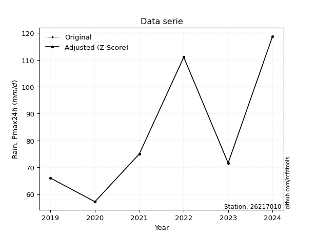</img>

</div>

> If Z-Score is active, values out of range or outliers are replaced with the station mean value.


### 4. Active continuous probability distributions from SciPy (45 of 104 available)

[scipy.stats](https://docs.scipy.org/doc/scipy/reference/stats.html) is a Python´s powerful submodule within the SciPy library for comprehensive statistical analysis, offering over 130 probability distributions (like Normal, Poisson), functions for descriptive stats (mean, variance), hypothesis testing (t-tests, chi-square), random variable generation, and statistical tests, making it essential for data science, modeling, and research. It provides tools to explore, model, and draw conclusions from data efficiently, working seamlessly with NumPy.

<div align="center">

|   id | p_dist             |   n_parameter | fit_method   | label                                                                       | active   | ref                                                                                                        |
|-----:|:-------------------|--------------:|:-------------|:----------------------------------------------------------------------------|:---------|:-----------------------------------------------------------------------------------------------------------|
|    0 | alpha              |             3 | MLE          | Alpha                                                                       | True     | [:mortar_board:](https://docs.scipy.org/doc/scipy/reference/generated/scipy.stats.alpha.html)              |
|    1 | betaprime          |             4 | MLE          | Beta prime                                                                  | True     | [:mortar_board:](https://docs.scipy.org/doc/scipy/reference/generated/scipy.stats.betaprime.html)          |
|    2 | chi2               |             3 | MLE          | Chi²                                                                        | True     | [:mortar_board:](https://docs.scipy.org/doc/scipy/reference/generated/scipy.stats.chi2.html)               |
|    3 | crystalball        |             4 | MLE          | Crystalball                                                                 | True     | [:mortar_board:](https://docs.scipy.org/doc/scipy/reference/generated/scipy.stats.crystalball.html)        |
|    4 | erlang             |             3 | MLE          | Erlang                                                                      | True     | [:mortar_board:](https://docs.scipy.org/doc/scipy/reference/generated/scipy.stats.erlang.html)             |
|    5 | expon              |             2 | MLE          | Exponential                                                                 | True     | [:mortar_board:](https://docs.scipy.org/doc/scipy/reference/generated/scipy.stats.expon.html)              |
|    6 | exponnorm          |             3 | MLE          | Exponentially modified Normal                                               | True     | [:mortar_board:](https://docs.scipy.org/doc/scipy/reference/generated/scipy.stats.exponnorm.html)          |
|    7 | f                  |             4 | MLE          | F                                                                           | True     | [:mortar_board:](https://docs.scipy.org/doc/scipy/reference/generated/scipy.stats.f.html)                  |
|    8 | fatiguelife        |             3 | MLE          | Fatigue-life (Birnbaum-Saunders)                                            | True     | [:mortar_board:](https://docs.scipy.org/doc/scipy/reference/generated/scipy.stats.fatiguelife.html)        |
|    9 | fisk               |             3 | MLE          | Fisk                                                                        | True     | [:mortar_board:](https://docs.scipy.org/doc/scipy/reference/generated/scipy.stats.fisk.html)               |
|   10 | gamma              |             3 | MLE          | Gamma                                                                       | True     | [:mortar_board:](https://docs.scipy.org/doc/scipy/reference/generated/scipy.stats.gamma.html)              |
|   11 | genexpon           |             5 | MLE          | Generalized exponential                                                     | True     | [:mortar_board:](https://docs.scipy.org/doc/scipy/reference/generated/scipy.stats.genexpon.html)           |
|   12 | genlogistic        |             3 | MLE          | Generalized logistic                                                        | True     | [:mortar_board:](https://docs.scipy.org/doc/scipy/reference/generated/scipy.stats.genlogistic.html)        |
|   13 | gibrat             |             2 | MM           | Gibrat                                                                      | True     | [:mortar_board:](https://docs.scipy.org/doc/scipy/reference/generated/scipy.stats.gibrat.html)             |
|   14 | gompertz           |             3 | MLE          | Gompertz (or truncated Gumbel)                                              | True     | [:mortar_board:](https://docs.scipy.org/doc/scipy/reference/generated/scipy.stats.gompertz.html)           |
|   15 | gumbel_l           |             2 | MM           | Gumbel Left Skew                                                            | True     | [:mortar_board:](https://docs.scipy.org/doc/scipy/reference/generated/scipy.stats.gumbel_l.html)           |
|   16 | gumbel_r           |             2 | MM           | Gumbel Right Skew                                                           | True     | [:mortar_board:](https://docs.scipy.org/doc/scipy/reference/generated/scipy.stats.gumbel_r.html)           |
|   17 | halflogistic       |             2 | MM           | Half-logistic                                                               | True     | [:mortar_board:](https://docs.scipy.org/doc/scipy/reference/generated/scipy.stats.halflogistic.html)       |
|   18 | halfnorm           |             2 | MM           | Half Normal                                                                 | True     | [:mortar_board:](https://docs.scipy.org/doc/scipy/reference/generated/scipy.stats.halfnorm.html)           |
|   19 | hypsecant          |             2 | MM           | hyperbolic secant                                                           | True     | [:mortar_board:](https://docs.scipy.org/doc/scipy/reference/generated/scipy.stats.hypsecant.html)          |
|   20 | invgamma           |             3 | MLE          | Inverted gamma                                                              | True     | [:mortar_board:](https://docs.scipy.org/doc/scipy/reference/generated/scipy.stats.invgamma.html)           |
|   21 | invgauss           |             3 | MLE          | Inverse Gaussian                                                            | True     | [:mortar_board:](https://docs.scipy.org/doc/scipy/reference/generated/scipy.stats.invgauss.html)           |
|   22 | invweibull         |             3 | MLE          | Inverted Weibull                                                            | True     | [:mortar_board:](https://docs.scipy.org/doc/scipy/reference/generated/scipy.stats.invweibull.html)         |
|   23 | johnsonsu          |             4 | MLE          | Johnson Su                                                                  | True     | [:mortar_board:](https://docs.scipy.org/doc/scipy/reference/generated/scipy.stats.johnsonsu.html)          |
|   24 | kstwobign          |             2 | MLE          | Limiting distribution of scaled Kolmogorov-Smirnov two-sided test statistic | True     | [:mortar_board:](https://docs.scipy.org/doc/scipy/reference/generated/scipy.stats.kstwobign.html)          |
|   25 | laplace            |             2 | MM           | Laplace                                                                     | True     | [:mortar_board:](https://docs.scipy.org/doc/scipy/reference/generated/scipy.stats.laplace.html)            |
|   26 | laplace_asymmetric |             3 | MLE          | Asymmetric Laplace                                                          | True     | [:mortar_board:](https://docs.scipy.org/doc/scipy/reference/generated/scipy.stats.laplace_asymmetric.html) |
|   27 | loggamma           |             3 | MLE          | Log gamma                                                                   | True     | [:mortar_board:](https://docs.scipy.org/doc/scipy/reference/generated/scipy.stats.loggamma.html)           |
|   28 | logistic           |             2 | MM           | Logistic (or Sech-squared)                                                  | True     | [:mortar_board:](https://docs.scipy.org/doc/scipy/reference/generated/scipy.stats.logistic.html)           |
|   29 | lognorm            |             3 | MLE          | Log Normal                                                                  | True     | [:mortar_board:](https://docs.scipy.org/doc/scipy/reference/generated/scipy.stats.lognorm.html)            |
|   30 | maxwell            |             2 | MM           | Maxwell                                                                     | True     | [:mortar_board:](https://docs.scipy.org/doc/scipy/reference/generated/scipy.stats.maxwell.html)            |
|   31 | mielke             |             4 | MLE          | Mielke Beta-Kappa / Dagum                                                   | True     | [:mortar_board:](https://docs.scipy.org/doc/scipy/reference/generated/scipy.stats.mielke.html)             |
|   32 | moyal              |             2 | MM           | Moyal                                                                       | True     | [:mortar_board:](https://docs.scipy.org/doc/scipy/reference/generated/scipy.stats.moyal.html)              |
|   33 | nakagami           |             3 | MLE          | Nakagami                                                                    | True     | [:mortar_board:](https://docs.scipy.org/doc/scipy/reference/generated/scipy.stats.nakagami.html)           |
|   34 | ncf                |             5 | MLE          | Non-central F distribution                                                  | True     | [:mortar_board:](https://docs.scipy.org/doc/scipy/reference/generated/scipy.stats.ncf.html)                |
|   35 | nct                |             4 | MLE          | Non-central Student’s t                                                     | True     | [:mortar_board:](https://docs.scipy.org/doc/scipy/reference/generated/scipy.stats.nct.html)                |
|   36 | norm               |             2 | MM           | Normal                                                                      | True     | [:mortar_board:](https://docs.scipy.org/doc/scipy/reference/generated/scipy.stats.norm.html)               |
|   37 | pareto             |             3 | MLE          | Pareto                                                                      | True     | [:mortar_board:](https://docs.scipy.org/doc/scipy/reference/generated/scipy.stats.pareto.html)             |
|   38 | pearson3           |             3 | MM           | Pearson type III                                                            | True     | [:mortar_board:](https://docs.scipy.org/doc/scipy/reference/generated/scipy.stats.pearson3.html)           |
|   39 | rayleigh           |             2 | MM           | Rayleigh                                                                    | True     | [:mortar_board:](https://docs.scipy.org/doc/scipy/reference/generated/scipy.stats.rayleigh.html)           |
|   40 | rice               |             3 | MLE          | Rice                                                                        | True     | [:mortar_board:](https://docs.scipy.org/doc/scipy/reference/generated/scipy.stats.rice.html)               |
|   41 | t                  |             3 | MLE          | Student’s t                                                                 | True     | [:mortar_board:](https://docs.scipy.org/doc/scipy/reference/generated/scipy.stats.t.html)                  |
|   42 | truncnorm          |             4 | MLE          | Truncated normal                                                            | True     | [:mortar_board:](https://docs.scipy.org/doc/scipy/reference/generated/scipy.stats.truncnorm.html)          |
|   43 | wald               |             2 | MM           | Wald                                                                        | True     | [:mortar_board:](https://docs.scipy.org/doc/scipy/reference/generated/scipy.stats.wald.html)               |
|   44 | weibull_min        |             3 | MLE          | Weibull minimum                                                             | True     | [:mortar_board:](https://docs.scipy.org/doc/scipy/reference/generated/scipy.stats.weibull_min.html)        |

</div>

> **n_parameter:** # arguments & localization & scale.
>
> **Fit methods:** (MLE) maximum likelihood, (MM) L-moments.
>
>**Inactive:** foldnorm, gennorm, norminvgauss, powernorm, powerlognorm, skewnorm, genextreme, anglit, arcsine, argus, beta, bradford, burr, burr12, cauchy, cosine, halfcauchy, foldcauchy, skewcauchy, wrapcauchy, dgamma, gengamma, exponweib, exponpow, truncexpon, gausshyper, genhalflogistic, genhyperbolic, geninvgauss, halfgennorm, johnsonsb, kappa4, kappa3, ksone, kstwo, loglaplace, levy, levy_l, levy_stable, ncx2, genpareto, truncpareto, lomax, powerlaw, rdist, rel_breitwigner, recipinvgauss, semicircular, studentized_range, trapezoid, triang, truncweibull_min, tukeylambda, uniform, loguniform, vonmises, vonmises_line, weibull_max, dweibull, 


## B. Probability distributions vs. Empirical distributions

A continuous probability distribution (CPD) describes probabilities for variables that can take any value within a range (like rain any time), unlike discrete variables with specific outcomes (like temperature). It uses a Probability Density Function (PDF), a curve where the total area under it equals 1, and the probability of the variable falling within an interval (a to b) is found by calculating the area under the curve between those points. A key feature is that the probability of hitting any single exact value is zero, so probabilities are always expressed for ranges, e.g., $P(a ≤ X ≤ b)$.

<div align="center">

Distributions parameters
|    |   station | p_dist                |   n |             loc |         scale | shape                  | shape1             | shape2                 | shape3   |
|---:|----------:|:----------------------|----:|----------------:|--------------:|:-----------------------|:-------------------|:-----------------------|:---------|
|  0 |  26217010 | alpha                 |   7 |    48.771       |  12.4043      | 1.2433125471626722e-05 |                    |                        |          |
|  1 |  26217010 | betaprime             |   7 |    -1.22999     |   2.43045     | 444.00505225729614     | 14.43107377724176  |                        |          |
|  2 |  26217010 | chi2                  |   7 |    55.2         |  14.3261      | 1.326455859445663      |                    |                        |          |
|  3 |  26217010 | crystalball           |   7 |    79.2571      |  23.5706      | 7080.869008328507      | 174.97236472454583 |                        |          |
|  4 |  26217010 | erlang                |   7 |    55.2         |  19.818       | 0.7701922866585655     |                    |                        |          |
|  5 |  26217010 | expon                 |   7 |    55.2         |  24.0571      |                        |                    |                        |          |
|  6 |  26217010 | exponnorm             |   7 |    55.161       |   0.0121266   | 1990.030958086816      |                    |                        |          |
|  7 |  26217010 | f                     |   7 |    55.0688      |  18.1424      | 1.232598488351087      | 2.6567034689623537 |                        |          |
|  8 |  26217010 | fatiguelife           |   7 |    55.2         |   9.21581e-06 | 1435.5400423675792     |                    |                        |          |
|  9 |  26217010 | fisk                  |   7 |    55.2         |  11.926       | 0.8945673681530766     |                    |                        |          |
| 10 |  26217010 | gamma                 |   7 |    55.2         |  18.5376      | 0.5012266997390953     |                    |                        |          |
| 11 |  26217010 | genexpon              |   7 |    55.2         |  78.133       | 3.2094062239425645     | 1.790751598853909  | 0.07232309330917011    |          |
| 12 |  26217010 | genlogistic           |   7 |   -52.9904      |  16.731       | 1429.2202281958366     |                    |                        |          |
| 13 |  26217010 | gibrat                |   7 |    61.2758      |  10.9063      |                        |                    |                        |          |
| 14 |  26217010 | gompertz              |   7 |    55.2         |  48.0523      | 1.0849976985308363     |                    |                        |          |
| 15 |  26217010 | gumbel_l              |   7 |    89.8652      |  18.3779      |                        |                    |                        |          |
| 16 |  26217010 | gumbel_r              |   7 |    68.6491      |  18.3779      |                        |                    |                        |          |
| 17 |  26217010 | halflogistic          |   7 |    51.3205      |  20.152       |                        |                    |                        |          |
| 18 |  26217010 | halfnorm              |   7 |    48.0589      |  39.1012      |                        |                    |                        |          |
| 19 |  26217010 | hypsecant             |   7 |    79.2571      |  15.0055      |                        |                    |                        |          |
| 20 |  26217010 | invgamma              |   7 |    48.1549      |  29.5766      | 1.7682989650720176     |                    |                        |          |
| 21 |  26217010 | invgauss              |   7 |    51.8357      |  16.4866      | 1.6632558732113307     |                    |                        |          |
| 22 |  26217010 | invweibull            |   7 |    55.2         |   1.49063     | 0.050973848130770744   |                    |                        |          |
| 23 |  26217010 | johnsonsu             |   7 |     1.33728e+09 |   5.3134e+08  | 97567972.61713502      | 59008553.793176994 |                        |          |
| 24 |  26217010 | kstwobign             |   7 |     9.70924     |  79.9261      |                        |                    |                        |          |
| 25 |  26217010 | laplace               |   7 |    79.2571      |  16.6669      |                        |                    |                        |          |
| 26 |  26217010 | laplace_asymmetric    |   7 |    55.2         |   0.702472    | 0.02909550594351199    |                    |                        |          |
| 27 |  26217010 | loggamma              |   7 | -5298.17        | 771.75        | 1062.223764862078      |                    |                        |          |
| 28 |  26217010 | logistic              |   7 |    79.2571      |  12.9952      |                        |                    |                        |          |
| 29 |  26217010 | lognorm               |   7 |    55.2         |   0.108487    | 12.438922646813442     |                    |                        |          |
| 30 |  26217010 | maxwell               |   7 |    23.4047      |  35.0003      |                        |                    |                        |          |
| 31 |  26217010 | mielke                |   7 |    -2.98875     |  27.6445      | 441.70021927706784     | 4.860313597659809  |                        |          |
| 32 |  26217010 | moyal                 |   7 |    65.778       |  10.6105      |                        |                    |                        |          |
| 33 |  26217010 | nakagami              |   7 |    55.2         |  37.5771      | 0.13749083863049788    |                    |                        |          |
| 34 |  26217010 | ncf                   |   7 |    -0.228684    |  92.2174      | 5.7761197021244755     | 87.93691785474562  | 1.93086265312609e-05   |          |
| 35 |  26217010 | nct                   |   7 |    -0.0035148   |   1.33703     | 7.578599129603914      | 53.100815993033066 |                        |          |
| 36 |  26217010 | norm                  |   7 |    79.2571      |  23.5706      |                        |                    |                        |          |
| 37 |  26217010 | pareto                |   7 |    55.1827      |   0.0172961   | 0.16913761341117067    |                    |                        |          |
| 38 |  26217010 | pearson3              |   7 |    79.2571      |  23.5706      | 0.7233027903628986     |                    |                        |          |
| 39 |  26217010 | rayleigh              |   7 |    34.1652      |  35.9782      |                        |                    |                        |          |
| 40 |  26217010 | rice                  |   7 |    41.3934      |  31.5376      | 0.0004114124866800813  |                    |                        |          |
| 41 |  26217010 | t                     |   7 |    79.2588      |  23.5684      | 949361.7157918366      |                    |                        |          |
| 42 |  26217010 | truncnorm             |   7 |    87.0588      |  30.5986      | -1042.5917984042856    | 1.0373418642534205 |                        |          |
| 43 |  26217010 | wald                  |   7 |    55.6865      |  23.5706      |                        |                    |                        |          |
| 44 |  26217010 | weibull_min           |   7 |    55.2         |  14.986       | 0.5897969459946207     |                    |                        |          |
| 45 |  26217010 | logalpha              |   7 |     2.27519     |  15.9691      | 7.928092909761116      |                    |                        |          |
| 46 |  26217010 | logbetaprime          |   7 |    -1.52241     |   3.67386     | 1176.4825729801264     | 738.4797109691494  |                        |          |
| 47 |  26217010 | logchi2               |   7 |     4.01096     |   0.99414     | 1.0285218977449482     |                    |                        |          |
| 48 |  26217010 | logcrystalball        |   7 |     4.33182     |   0.280222    | 226.05631425613694     | 7.871095870593253  |                        |          |
| 49 |  26217010 | logerlang             |   7 |     4.01096     |   0.346278    | 0.5720589625808237     |                    |                        |          |
| 50 |  26217010 | logexpon              |   7 |     4.01096     |   0.320855    |                        |                    |                        |          |
| 51 |  26217010 | logexponnorm          |   7 |     4.0105      |   0.000155877 | 2062.431494874434      |                    |                        |          |
| 52 |  26217010 | logf                  |   7 |     4.01096     |   0.284318    | 0.6412743659110272     | 186.54995158508802 |                        |          |
| 53 |  26217010 | logfatiguelife        |   7 |     3.98895     |   0.168494    | 1.3743125377509195     |                    |                        |          |
| 54 |  26217010 | logfisk               |   7 |     4.01096     |   0.229587    | 0.44400838205860876    |                    |                        |          |
| 55 |  26217010 | loggamma              |   7 |     4.01096     |   0.2923      | 0.7254882704861937     |                    |                        |          |
| 56 |  26217010 | loggenexpon           |   7 |     4.01061     |   0.0113889   | 0.03011923335102029    | 4.233708372932512  | 5.0442429262658015e-05 |          |
| 57 |  26217010 | loggenlogistic        |   7 |     2.70901     |   0.214748    | 1043.4065920600656     |                    |                        |          |
| 58 |  26217010 | loggibrat             |   7 |     4.11807     |   0.129646    |                        |                    |                        |          |
| 59 |  26217010 | loggompertz           |   7 |     4.01096     |   0.607421    | 1.0910514621449847     |                    |                        |          |
| 60 |  26217010 | loggumbel_l           |   7 |     4.45793     |   0.218489    |                        |                    |                        |          |
| 61 |  26217010 | loggumbel_r           |   7 |     4.2057      |   0.218489    |                        |                    |                        |          |
| 62 |  26217010 | loghalflogistic       |   7 |     3.99969     |   0.23958     |                        |                    |                        |          |
| 63 |  26217010 | loghalfnorm           |   7 |     3.96091     |   0.464861    |                        |                    |                        |          |
| 64 |  26217010 | loghypsecant          |   7 |     4.33182     |   0.178395    |                        |                    |                        |          |
| 65 |  26217010 | loginvgamma           |   7 |     3.79798     |   1.47987     | 3.6844682828554207     |                    |                        |          |
| 66 |  26217010 | loginvgauss           |   7 |     3.92764     |   0.47168     | 0.8568975570179411     |                    |                        |          |
| 67 |  26217010 | loginvweibull         |   7 |     3.51319     |   0.657605    | 3.5427339908955187     |                    |                        |          |
| 68 |  26217010 | logjohnsonsu          |   7 |     2.15379e+07 |   2.81694e+06 | 216735492.2702969      | 79344887.06384058  |                        |          |
| 69 |  26217010 | logkstwobign          |   7 |     3.45443     |   1.00572     |                        |                    |                        |          |
| 70 |  26217010 | loglaplace            |   7 |     4.33182     |   0.198147    |                        |                    |                        |          |
| 71 |  26217010 | loglaplace_asymmetric |   7 |     4.18965     |   0.197661    | 0.7032084075756432     |                    |                        |          |
| 72 |  26217010 | logloggamma           |   7 |   -51.2623      |   8.24686     | 846.8407551615865      |                    |                        |          |
| 73 |  26217010 | loglogistic           |   7 |     4.33182     |   0.154495    |                        |                    |                        |          |
| 74 |  26217010 | loglognorm            |   7 |     4.01096     |   0.00218943  | 11.687001926004417     |                    |                        |          |
| 75 |  26217010 | logmaxwell            |   7 |     3.66781     |   0.416107    |                        |                    |                        |          |
| 76 |  26217010 | logmielke             |   7 |   -13.5751      |  17.1038      | 2200.3309974607446     | 84.1550795575626   |                        |          |
| 77 |  26217010 | logmoyal              |   7 |     4.17157     |   0.126145    |                        |                    |                        |          |
| 78 |  26217010 | lognakagami           |   7 |     4.01096     |   0.532737    | 0.2396524206581936     |                    |                        |          |
| 79 |  26217010 | logncf                |   7 |    -4.29111     |   8.39575     | 677.0298086668913      | 5474.109479322498  | 18.2089036954329       |          |
| 80 |  26217010 | lognct                |   7 |     0.248069    |   0.0809157   | 122.38099415978547     | 50.14570732781094  |                        |          |
| 81 |  26217010 | lognorm               |   7 |     4.33182     |   0.280223    |                        |                    |                        |          |
| 82 |  26217010 | logpareto             |   7 |     4.01071     |   0.000254091 | 0.1688109643230827     |                    |                        |          |
| 83 |  26217010 | logpearson3           |   7 |     4.33182     |   0.280223    | 0.5390465530085014     |                    |                        |          |
| 84 |  26217010 | lograyleigh           |   7 |     3.79574     |   0.427732    |                        |                    |                        |          |
| 85 |  26217010 | logrice               |   7 |     3.86043     |   0.387769    | 0.0008382026418313667  |                    |                        |          |
| 86 |  26217010 | logt                  |   7 |     4.33182     |   0.280223    | 90213056761.61203      |                    |                        |          |
| 87 |  26217010 | logtruncnorm          |   7 |    -2.48759     |   1.61979     | 4.01197621478312       | 4.485184684310458  |                        |          |
| 88 |  26217010 | logwald               |   7 |     4.05163     |   0.280189    |                        |                    |                        |          |
| 89 |  26217010 | logweibull_min        |   7 |     4.01096     |   0.27287     | 0.4047712656093928     |                    |                        |          |

</div>

> **loc** (Location parameter): This shifts the distribution along the x-axis. For many common distributions, like the normal (Gaussian) distribution, loc represents the mean $μ$. For others, like the uniform distribution, it might represent the minimum value, or for the beta distribution, the left end of the support interval.
>
> **scale** (Scale parameter): This determines the width or spread of the distribution. For the normal distribution, scale represents the standard deviation $σ$. For a uniform distribution, it defines the length of the interval (from $loc$ to $loc + scale$).
>
> **shape** (Shape parameters): Refers to parameters that define the specific form of a probability distribution, distinct from its location (loc) and scale (scale). These parameters are required arguments for most distribution functions. For example, a normal (Gaussian) distribution is fully defined by its location (mean) and scale (standard deviation), so it has no specific shape parameters beyond loc and scale. However, other distributions have intrinsic properties that need specification, as Gamma distribution that takes a shape parameter, often named $a$ or $alpha$.


### 0. Cumulative distribution values - CDF (90 evaluated)

> Ordered by x ascending and calculating $log(f(x))$ separately. 

|   id |   Station |   date |     x |   count |    mean |     std |    zscore |   Value_initial |   station |   m |     alpha |   alpha_pdf |   betaprime |   betaprime_pdf |        chi2 |      chi2_pdf |   crystalball |   crystalball_pdf |      erlang |   erlang_pdf |     expon |   expon_pdf |   exponnorm |   exponnorm_pdf |         f |      f_pdf |   fatiguelife |   fatiguelife_pdf |        fisk |   fisk_pdf |       gamma |   gamma_pdf |    genexpon |   genexpon_pdf |   genlogistic |   genlogistic_pdf |   gibrat |   gibrat_pdf |    gompertz |   gompertz_pdf |   gumbel_l |   gumbel_l_pdf |   gumbel_r |   gumbel_r_pdf |   halflogistic |   halflogistic_pdf |   halfnorm |   halfnorm_pdf |   hypsecant |   hypsecant_pdf |   invgamma |   invgamma_pdf |   invgauss |   invgauss_pdf |   invweibull |   invweibull_pdf |   johnsonsu |   johnsonsu_pdf |   kstwobign |   kstwobign_pdf |   laplace |   laplace_pdf |   laplace_asymmetric |   laplace_asymmetric_pdf |    loggamma |   loggamma_pdf |   logistic |   logistic_pdf |   lognorm |   lognorm_pdf |   maxwell |   maxwell_pdf |    mielke |   mielke_pdf |     moyal |   moyal_pdf |    nakagami |   nakagami_pdf |      ncf |    ncf_pdf |      nct |    nct_pdf |     norm |   norm_pdf |   pareto |   pareto_pdf |   pearson3 |   pearson3_pdf |   rayleigh |   rayleigh_pdf |      rice |   rice_pdf |        t |      t_pdf |   truncnorm |   truncnorm_pdf |        wald |   wald_pdf |   weibull_min |   weibull_min_pdf |   logalpha |   logalpha_pdf |   logbetaprime |   logbetaprime_pdf |     logchi2 |   logchi2_pdf |   logcrystalball |   logcrystalball_pdf |   logerlang |   logerlang_pdf |   logexpon |   logexpon_pdf |   logexponnorm |   logexponnorm_pdf |        logf |    logf_pdf |   logfatiguelife |   logfatiguelife_pdf |     logfisk |   logfisk_pdf |   loggenexpon |   loggenexpon_pdf |   loggenlogistic |   loggenlogistic_pdf |   loggibrat |   loggibrat_pdf |   loggompertz |   loggompertz_pdf |   loggumbel_l |   loggumbel_l_pdf |   loggumbel_r |   loggumbel_r_pdf |   loghalflogistic |   loghalflogistic_pdf |   loghalfnorm |   loghalfnorm_pdf |   loghypsecant |   loghypsecant_pdf |   loginvgamma |   loginvgamma_pdf |   loginvgauss |   loginvgauss_pdf |   loginvweibull |   loginvweibull_pdf |   logjohnsonsu |   logjohnsonsu_pdf |   logkstwobign |   logkstwobign_pdf |   loglaplace |   loglaplace_pdf |   loglaplace_asymmetric |   loglaplace_asymmetric_pdf |   logloggamma |   logloggamma_pdf |   loglogistic |   loglogistic_pdf |   loglognorm |   loglognorm_pdf |   logmaxwell |   logmaxwell_pdf |   logmielke |   logmielke_pdf |   logmoyal |   logmoyal_pdf |   lognakagami |   lognakagami_pdf |   logncf |   logncf_pdf |   lognct |   lognct_pdf |   logpareto |   logpareto_pdf |   logpearson3 |   logpearson3_pdf |   lograyleigh |   lograyleigh_pdf |   logrice |   logrice_pdf |     logt |   logt_pdf |   logtruncnorm |   logtruncnorm_pdf |   logwald |   logwald_pdf |   logweibull_min |   logweibull_min_pdf |
|-----:|----------:|-------:|------:|--------:|--------:|--------:|----------:|----------------:|----------:|----:|----------:|------------:|------------:|----------------:|------------:|--------------:|--------------:|------------------:|------------:|-------------:|----------:|------------:|------------:|----------------:|----------:|-----------:|--------------:|------------------:|------------:|-----------:|------------:|------------:|------------:|---------------:|--------------:|------------------:|---------:|-------------:|------------:|---------------:|-----------:|---------------:|-----------:|---------------:|---------------:|-------------------:|-----------:|---------------:|------------:|----------------:|-----------:|---------------:|-----------:|---------------:|-------------:|-----------------:|------------:|----------------:|------------:|----------------:|----------:|--------------:|---------------------:|-------------------------:|------------:|---------------:|-----------:|---------------:|----------:|--------------:|----------:|--------------:|----------:|-------------:|----------:|------------:|------------:|---------------:|---------:|-----------:|---------:|-----------:|---------:|-----------:|---------:|-------------:|-----------:|---------------:|-----------:|---------------:|----------:|-----------:|---------:|-----------:|------------:|----------------:|------------:|-----------:|--------------:|------------------:|-----------:|---------------:|---------------:|-------------------:|------------:|--------------:|-----------------:|---------------------:|------------:|----------------:|-----------:|---------------:|---------------:|-------------------:|------------:|------------:|-----------------:|---------------------:|------------:|--------------:|--------------:|------------------:|-----------------:|---------------------:|------------:|----------------:|--------------:|------------------:|--------------:|------------------:|--------------:|------------------:|------------------:|----------------------:|--------------:|------------------:|---------------:|-------------------:|--------------:|------------------:|--------------:|------------------:|----------------:|--------------------:|---------------:|-------------------:|---------------:|-------------------:|-------------:|-----------------:|------------------------:|----------------------------:|--------------:|------------------:|--------------:|------------------:|-------------:|-----------------:|-------------:|-----------------:|------------:|----------------:|-----------:|---------------:|--------------:|------------------:|---------:|-------------:|---------:|-------------:|------------:|----------------:|--------------:|------------------:|--------------:|------------------:|----------:|--------------:|---------:|-----------:|---------------:|-------------------:|----------:|--------------:|-----------------:|---------------------:|
|    0 |  26217010 |   2025 |  55.2 |       7 | 79.2571 | 25.4592 | -0.94493  |            55.2 |  26217010 |   1 | 0.0536762 |  0.0372262  |    0.118641 |      0.0143398  | 4.95058e-11 | 4620.92       |      0.153712 |         0.0100539 | 1.37542e-12 | 149.089      | 0         |  0.0415677  |  0.00161295 |      0.0413443  | 0.0363988 | 0.170311   |     0.0268156 |        4.98e+10   | 2.84376e-11 | 1.31241    | 2.11491e-08 | 1.49189e+06 | 8.11382e-14 |     0.0410762  |      0.108579 |        0.0143977  | 0        |   0          | 3.65192e-10 |     0.0225795  |   0.140703 |     0.00709028 |   0.125076 |     0.0141481  |      0.0959599 |         0.0245829  |   0.144913 |     0.0200681  |    0.126429 |      0.00820573 |  0.0575561 |     0.0291914  |  0.0476027 |     0.0398201  |   0.00560377 |      1.04207e+11 |    0.16194  |      0.0100564  |    0.0977   |      0.0142108  |  0.118061 |    0.00708356 |          0.000845836 |               0.0413837  | 3.21394e-11 |   26252.3      |   0.135728 |     0.00902687 |  0.126104 |      0.73913  |  0.15658  |    0.0124523  | 0.0899768 |    0.0178611 | 0.0997238 |  0.015966   | 3.85497e-05 |    1.49188e+09 | 0.277385 | 0.00849704 | 0.109569 | 0.0155542  | 0.153712 |  0.0100539 | 0        |  9.77896     |   0.145044 |     0.0131818  |   0.157103 |     0.0136973  | 0.0913784 | 0.0126128  | 0.153673 | 0.0100532  |    0.175127 |      0.00891824 | 0           | 0          |   9.16001e-10 |    76034.1        |   0.101703 |       0.941706 |       0.114756 |           0.74901  | 1.43977e-08 |   8.33638e+06 |         0.126104 |             0.73913  |  5.0514e-09 |     3.25351e+06 |   0        |       3.11667  |     0.00142904 |           3.10117  | 1.73203e-05 | 6.25271e+09 |        0.0400442 |             4.4595   | 5.42515e-07 |   1.35604e+08 |   0.000939369 |          2.64271  |        0.0883631 |             0.997198 |    0        |        0        |   2.23925e-08 |          1.7962   |      0.121277 |          0.519962 |     0.0873084 |          0.974352 |         0.0235241 |              2.08583  |     0.0857398 |          1.70648  |       0.104437 |           0.574977 |     0.0635133 |          1.39174  |     0.0506573 |          1.91394  |       0.0684311 |            1.3062   |       0.120608 |           0.733324 |      0.0806115 |           1.02225  |    0.0990211 |         0.499735 |                0.091485 |                    0.658181 |      0.131124 |          0.741197 |      0.111372 |          0.640594 |   0.00731419 |      1.95147e+12 |     0.122125 |         0.928166 |    0.090385 |        0.993284 |  0.0587535 |       1.00187  |   6.45314e-08 |       3.48243e+07 | 0.261951 |     0.674195 | 0.117297 |     0.813526 |    0        |     664.373     |      0.115571 |          0.890675 |      0.118911 |          1.03651  |  0.07258  |      0.928445 | 0.126104 |   0.73913  |    9.43745e-07 |           2.97583  |  0        |      0        |       1.3674e-06 |          6.23165e+08 |
|    1 |  26217010 |   2020 |  57.2 |       7 | 79.2571 | 25.4592 | -0.866373 |            57.2 |  26217010 |   2 | 0.141122  |  0.0471729  |    0.149037 |      0.0160225  | 0.184474    |    0.058647   |      0.174691 |         0.010924  | 0.177178    |   0.0644205  | 0.0797735 |  0.0382517  |  0.08102    |      0.038081   | 0.195563  | 0.053051   |     0.627225  |        0.0307056  | 0.168357    | 0.0626256  | 0.356711    | 0.0831546   | 0.0789075   |     0.037874   |      0.139416 |        0.0164067  | 0        |   0          | 0.045065    |     0.0224784  |   0.155554 |     0.00776881 |   0.154977 |     0.0157227  |      0.144853  |         0.0242908  |   0.184845 |     0.0198556  |    0.143884 |      0.00926549 |  0.12503   |     0.0369802  |  0.139282  |     0.048239   |   0.373391   |      0.00937507  |    0.182865 |      0.0108673  |    0.12811  |      0.0161551  |  0.133113 |    0.00798667 |          0.0802778   |               0.0380937  | 0.225835    |       4.28695  |   0.154814 |     0.0100689  |  0.154341 |      0.847961 |  0.18238  |    0.0133347  | 0.129055  |    0.0210993 | 0.134099  |  0.0183383  | 0.362519    |    0.049826    | 0.294406 | 0.00852048 | 0.142785 | 0.0176092  | 0.174691 |  0.010924  | 0.552881 |  0.0374881   |   0.172539 |     0.0142942  |   0.185317 |     0.0144976  | 0.118032  | 0.0140163  | 0.17465  | 0.0109234  |    0.193571 |      0.00952593 | 0.000209564 | 0.00113686 |   0.262789    |        0.066282   |   0.138506 |       1.12454  |       0.143542 |           0.868884 | 0.141602    |   2.02196     |         0.154341 |             0.847961 |  0.294442   |     4.431       |   0.104994 |       2.78944  |     0.106079   |           2.7806   | 0.394377    | 3.44602     |        0.206385  |             4.13494  | 0.304128    |   2.6402      |   0.0916517   |          2.45598  |        0.127952  |             1.22387  |    0        |        0        |   0.063718    |          1.78324  |      0.141147 |          0.598113 |     0.125961  |          1.19441  |         0.0974954 |              2.06714  |     0.146166  |          1.68751  |       0.126943 |           0.69287  |     0.12134   |          1.82495  |     0.131247  |          2.48784  |       0.122473  |            1.70824  |       0.148719 |           0.84683  |      0.121196  |           1.25224  |    0.118505  |         0.598063 |                0.118183 |                    0.850255 |      0.159371 |          0.846469 |      0.136292 |          0.761946 |   0.59429    |      0.932193    |     0.157359 |         1.04983  |    0.129784 |        1.21741  |  0.100724  |       1.34971  |   0.213593    |       2.87399     | 0.286457 |     0.702428 | 0.148571 |     0.943658 |    0.566338 |       2.04231   |      0.149781 |          1.03035  |      0.15796  |          1.15438  |  0.108804 |      1.10312  | 0.154341 |   0.84796  |    0.101372    |           2.72407  |  0        |      0        |       0.354973   |          3.21648     |
|    2 |  26217010 |   2019 |  66   |       7 | 79.2571 | 25.4592 | -0.520722 |            66   |  26217010 |   3 | 0.471546  |  0.0257297  |    0.313025 |      0.0203239  | 0.502494    |    0.0244462  |      0.286907 |         0.0144493 | 0.542037    |   0.0280459  | 0.36169   |  0.0265331  |  0.361829   |      0.0264448  | 0.464847  | 0.0194483  |     0.774606  |        0.010481   | 0.477835    | 0.0206669  | 0.718878    | 0.0223061   | 0.359083    |     0.0264725  |      0.312005 |        0.0217115  | 0.2014   |   0.0595094  | 0.23924     |     0.0215066  |   0.238846 |     0.0113034  |   0.315041 |     0.0198003  |      0.348925  |         0.0217906  |   0.353649 |     0.0183668  |    0.249525 |      0.0149774  |  0.432838  |     0.0282701  |  0.470402  |     0.0265221  |   0.404954   |      0.00172778  |    0.293347 |      0.0141123  |    0.295909 |      0.0208928  |  0.225697 |    0.0135416  |          0.361203    |               0.0264582  | 0.602022    |       1.68719  |   0.264996 |     0.0149881  |  0.305964 |      1.25175  |  0.313357 |    0.0161003  | 0.346245  |    0.0257213 | 0.322374  |  0.0228023  | 0.575641    |    0.0145109   | 0.369161 | 0.00841773 | 0.322915 | 0.0220082  | 0.286907 |  0.0144493 | 0.66344  |  0.0052624   |   0.314616 |     0.017493   |   0.323936 |     0.0166269  | 0.26242   | 0.0182475  | 0.286865 | 0.0144496  |    0.288933 |      0.0121012  | 0.307543    | 0.0407376  |   0.561466    |        0.0197413  |   0.33973  |       1.59596  |       0.300587 |           1.29987  | 0.316942    |   0.859265    |         0.305964 |             1.25175  |  0.644796   |     1.4694      |   0.427031 |       1.78576  |     0.427225   |           1.78165  | 0.63709     | 0.979505    |        0.550707  |             1.44013  | 0.472209    |   0.619274    |   0.393405    |          1.78296  |        0.347684  |             1.70958  |    0.276282 |        4.67186  |   0.311451    |          1.65978  |      0.253912 |          1.00023  |     0.340883  |          1.6791   |         0.376912  |              1.7905   |     0.377327  |          1.52069  |       0.26958  |           1.33686  |     0.411852  |          1.90927  |     0.457803  |          1.8276   |       0.404665  |            1.91732  |       0.301804 |           1.27351  |      0.340884  |           1.67693  |    0.243994  |         1.23138  |                0.330881 |                    2.3805   |      0.309778 |          1.23724  |      0.284921 |          1.31876  |   0.646787   |      0.177949    |     0.33443  |         1.37366  |    0.348642 |        1.70569  |  0.351946  |       1.90882  |   0.46058     |       1.2088      | 0.393479 |     0.783958 | 0.316994 |     1.37035  |    0.669424 |       0.311853  |      0.32945  |          1.42254  |      0.345624 |          1.40894  |  0.302614 |      1.52692  | 0.305964 |   1.25175  |    0.428904    |           1.89998  |  0.358447 |      3.17117  |       0.569378   |          0.821834    |
|    3 |  26217010 |   2023 |  71.6 |       7 | 79.2571 | 25.4592 | -0.300762 |            71.6 |  26217010 |   4 | 0.586885  |  0.0163844  |    0.427566 |      0.020261   | 0.618192    |    0.0174675  |      0.372644 |         0.0160555 | 0.672351    |   0.019207   | 0.494249  |  0.0210229  |  0.493992   |      0.0209681  | 0.555431  | 0.0135007  |     0.823624  |        0.00733943 | 0.570766    | 0.0133635  | 0.816002    | 0.0133887   | 0.491601    |     0.0210587  |      0.434517 |        0.0216409  | 0.478132 |   0.0385832  | 0.356828    |     0.0204298  |   0.309365 |     0.0139098  |   0.426706 |     0.0197742  |      0.464601  |         0.0194557  |   0.452863 |     0.0170232  |    0.344193 |      0.018722   |  0.565918  |     0.0197298  |  0.592455  |     0.0178456  |   0.41274    |      0.00113525  |    0.376763 |      0.0155727  |    0.413619 |      0.0208175  |  0.315825 |    0.0189492  |          0.49344     |               0.0209811  | 0.715876    |       1.15184  |   0.356811 |     0.0176602  |  0.414223 |      1.39063  |  0.405755 |    0.0167493  | 0.483293  |    0.0228075 | 0.447217  |  0.0214081  | 0.644564    |    0.0105614   | 0.415764 | 0.00821083 | 0.444797 | 0.0211527  | 0.372644 |  0.0160555 | 0.68637  |  0.00323114  |   0.41433  |     0.0179143  |   0.418013 |     0.016831   | 0.367887  | 0.0191973  | 0.372606 | 0.0160564  |    0.360739 |      0.0134976  | 0.499534    | 0.0282166  |   0.651675    |        0.0132111  |   0.470965 |       1.59499  |       0.412617 |           1.43232  | 0.379299    |   0.687257    |         0.414223 |             1.39063  |  0.743121   |     0.989027    |   0.555474 |       1.38544  |     0.555403   |           1.38295  | 0.703955    | 0.692295    |        0.647759  |             0.989435 | 0.513861    |   0.426386    |   0.525135    |          1.45938  |        0.485226  |             1.63338  |    0.56584  |        2.57145  |   0.441921    |          1.5383   |      0.346377 |          1.27209  |     0.476474  |          1.6167   |         0.512725  |              1.53834  |     0.495393  |          1.37384  |       0.393686 |           1.6857   |     0.551365  |          1.5101   |     0.585836  |          1.34028  |       0.546194  |            1.54408  |       0.412262 |           1.42189  |      0.475296  |           1.59581  |    0.368026  |         1.85734  |                0.499191 |                    1.78171  |      0.416712 |          1.37341  |      0.402985 |          1.55726  |   0.658654   |      0.120705    |     0.448498 |         1.40904  |    0.485949 |        1.63107  |  0.500298  |       1.6985   |   0.54825     |       0.96456     | 0.458244 |     0.802964 | 0.433402 |     1.4663   |    0.689706 |       0.201166  |      0.448034 |          1.46657  |      0.460735 |          1.40114  |  0.429238 |      1.55881  | 0.414223 |   1.39062  |    0.568601    |           1.54237  |  0.565506 |      1.99327  |       0.625002   |          0.572322    |
|    4 |  26217010 |   2021 |  75   |       7 | 79.2571 | 25.4592 | -0.167214 |            75   |  26217010 |   5 | 0.636269  |  0.0128642  |    0.495137 |      0.0194027  | 0.672433    |    0.0145593  |      0.428336 |         0.0166516 | 0.731076    |   0.0154934  | 0.560905  |  0.0182522  |  0.560489   |      0.0182126  | 0.597224  | 0.0111967  |     0.846386  |        0.00610769 | 0.611474    | 0.0107336  | 0.855697    | 0.0101455   | 0.55844     |     0.0183214  |      0.506478 |        0.0205883  | 0.590887 |   0.0283108  | 0.424924    |     0.0196061  |   0.35941  |     0.0155239  |   0.492719 |     0.0189768  |      0.528111  |         0.0178915  |   0.509183 |     0.0160939  |    0.410881 |      0.0203869  |  0.626237  |     0.0159111  |  0.64699   |     0.0144053  |   0.416246   |      0.000939234 |    0.43071  |      0.0161122  |    0.483075 |      0.0199588  |  0.387294 |    0.0232372  |          0.559981    |               0.018225   | 0.764191    |       0.939497 |   0.418826 |     0.0187309  |  0.479608 |      1.4218   |  0.46273  |    0.0167134  | 0.556576  |    0.0202591 | 0.517281  |  0.0197419  | 0.677868    |    0.00910318  | 0.443406 | 0.00804416 | 0.514496 | 0.0197692  | 0.428336 |  0.0166516 | 0.696197 |  0.00259291  |   0.474829 |     0.0176091  |   0.474865 |     0.0165662  | 0.433205  | 0.0191511  | 0.428302 | 0.0166529  |    0.407845 |      0.0141891  | 0.585106    | 0.0223697  |   0.69228     |        0.0108031  |   0.543361 |       1.51837  |       0.479713 |           1.45325  | 0.409562    |   0.619963    |         0.479608 |             1.4218   |  0.784583   |     0.806349    |   0.615318 |       1.19893  |     0.615148   |           1.19711  | 0.733535    | 0.587692    |        0.689684  |             0.825681 | 0.532037    |   0.360644    |   0.588963    |          1.29457  |        0.558401  |             1.51469  |    0.666618 |        1.8234   |   0.511367    |          1.45378  |      0.408928 |          1.42248  |     0.549076  |          1.50663  |         0.580516  |              1.38367  |     0.556953  |          1.27895  |       0.474459 |           1.77855  |     0.616203  |          1.28828  |     0.642854  |          1.12476  |       0.612632  |            1.32224  |       0.47916  |           1.45529  |      0.546988  |           1.4897   |    0.465117  |         2.34733  |                0.575388 |                    1.51062  |      0.481307 |          1.40521  |      0.476828 |          1.6147   |   0.663792   |      0.10184     |     0.513355 |         1.38157  |    0.559015 |        1.51223  |  0.57493   |       1.51552  |   0.590638    |       0.866119    | 0.495551 |     0.80412  | 0.501471 |     1.46094  |    0.698177 |       0.166084  |      0.515444 |          1.43296  |      0.524777 |          1.35525  |  0.500748 |      1.51755  | 0.479608 |   1.4218   |    0.636037    |           1.36807  |  0.646889 |      1.53838  |       0.649433   |          0.485244    |
|    5 |  26217010 |   2022 | 111   |       7 | 79.2571 | 25.4592 |  1.24681  |           111   |  26217010 |   6 | 0.842003  |  0.00250552 |    0.909895 |      0.00477328 | 0.925675    |    0.00292371 |      0.910964 |         0.0068346 | 0.963023    |   0.00198532 | 0.901675  |  0.00408714 |  0.901123   |      0.00409732 | 0.805776  | 0.00298568 |     0.956744  |        0.00141018 | 0.79905     | 0.00257419 | 0.9858      | 0.000867843 | 0.902169    |     0.00413138 |      0.923926 |        0.00436927 | 0.935386 |   0.00253817 | 0.907482    |     0.00667206 |   0.957499 |     0.00730375 |   0.905005 |     0.00491528 |      0.901605  |         0.00464242 |   0.892536 |     0.00558591 |    0.923603 |      0.00504252 |  0.879577  |     0.00283901 |  0.888429  |     0.00295327 |   0.435444   |      0.000330712 |    0.903491 |      0.00701185 |    0.919463 |      0.00510695 |  0.925554 |    0.00446666 |          0.900938    |               0.00410302 | 0.947332    |       0.195975 |   0.920024 |     0.00566212 |  0.911155 |      0.573966 |  0.900529 |    0.00623136 | 0.911304  |    0.0036071 | 0.905499  |  0.00443231 | 0.874775    |    0.0032951   | 0.688685 | 0.00545508 | 0.908417 | 0.00435074 | 0.910964 |  0.0068346 | 0.745008 |  0.000772677 |   0.901727 |     0.00564679 |   0.897755 |     0.00606907 | 0.912459  | 0.00612641 | 0.910972 | 0.00683472 |    0.920969 |      0.0112913  | 0.917147    | 0.00319911 |   0.885985    |        0.00261683 |   0.914369 |       0.421657 |       0.908177 |           0.560462 | 0.587615    |   0.341165    |         0.911155 |             0.573965 |  0.945363   |     0.182701    |   0.886642 |       0.3533   |     0.88632    |           0.353609 | 0.873653    | 0.216075    |        0.875522  |             0.264421 | 0.621065    |   0.149584    |   0.894612    |          0.399799 |        0.91037   |             0.398067 |    0.935466 |        0.213181 |   0.905096    |          0.538398 |      0.957703 |          0.61233  |     0.905143  |          0.412877 |         0.901735  |              0.390004 |     0.892692  |          0.469312 |       0.923744 |           0.423379 |     0.885022  |          0.314909 |     0.882913  |          0.304521 |       0.886895  |            0.315241 |       0.916177 |           0.562499 |      0.911239  |           0.440453 |    0.925679  |         0.375078 |                0.894741 |                    0.374475 |      0.910943 |          0.577264 |      0.920182 |          0.475402 |   0.689106   |      0.0432667   |     0.900703 |         0.52343  |    0.909614 |        0.395889 |  0.905623  |       0.372335 |   0.82641     |       0.404389    | 0.778202 |     0.580199 | 0.909958 |     0.516026 |    0.737339 |       0.0634497 |      0.903192 |          0.49774  |      0.897925 |          0.509831 |  0.909045 |      0.513613 | 0.911155 |   0.573967 |    0.970222    |           0.480599 |  0.917248 |      0.268743 |       0.768463   |          0.196278    |
|    6 |  26217010 |   2024 | 118.8 |       7 | 79.2571 | 25.4592 |  1.55319  |           118.8 |  26217010 |   7 | 0.859406  |  0.00198674 |    0.940548 |      0.0031839  | 0.945216    |    0.00213093 |      0.953291 |         0.0041437 | 0.975643    |   0.0012997  | 0.928903  |  0.00295535 |  0.928431   |      0.0029657  | 0.826815  | 0.00243595 |     0.966374  |        0.00107567 | 0.817188    | 0.00210127 | 0.991157    | 0.000533781 | 0.929668    |     0.00298114 |      0.951571 |        0.00282327 | 0.951831 |   0.00174027 | 0.949767    |     0.00426106 |   0.991998 |     0.0021023  |   0.936793 |     0.00332825 |      0.932113  |         0.00325441 |   0.929577 |     0.0039719  |    0.95443  |      0.0030265  |  0.898924  |     0.00216309 |  0.908729  |     0.00228844 |   0.437857   |      0.000289821 |    0.947551 |      0.00439333 |    0.951817 |      0.00329116 |  0.953378 |    0.00279728 |          0.928287    |               0.00297028 | 0.959061    |       0.15144  |   0.954475 |     0.00334377 |  0.94411  |      0.402037 |  0.94058  |    0.00412732 | 0.934878  |    0.0025114 | 0.934485  |  0.00308031 | 0.898233    |    0.00273708  | 0.728951 | 0.00487401 | 0.936585 | 0.00296052 | 0.953291 |  0.0041437 | 0.750587 |  0.000663106 |   0.938139 |     0.00378286 |   0.937142 |     0.0041099  | 0.950812  | 0.00382809 | 0.953299 | 0.00414348 |    1        |      0.00895394 | 0.938296    | 0.00228386 |   0.904212    |        0.00208359 |   0.938971 |       0.307886 |       0.940523 |           0.397591 | 0.609882    |   0.31518     |         0.944111 |             0.402035 |  0.956413   |     0.144319    |   0.908266 |       0.285905 |     0.907967   |           0.286274 | 0.887344    | 0.187997    |        0.892085  |             0.224682 | 0.63071     |   0.134924    |   0.918855    |          0.316875 |        0.933843  |             0.297634 |    0.948076 |        0.161188 |   0.936867    |          0.400524 |      0.986648 |          0.263754 |     0.929566  |          0.310739 |         0.925081  |              0.300997 |     0.920997  |          0.366989 |       0.947754 |           0.291555 |     0.904168  |          0.2517   |     0.901657  |          0.249603 |       0.906011  |            0.250596 |       0.948225 |           0.387351 |      0.937209  |           0.328497 |    0.947245  |         0.266241 |                0.917333 |                    0.294101 |      0.944108 |          0.404761 |      0.947069 |          0.32447  |   0.691904   |      0.0392778   |     0.931567 |         0.389478 |    0.932973 |        0.296418 |  0.927825  |       0.285299 |   0.85214     |       0.354269    | 0.815466 |     0.516919 | 0.939874 |     0.370276 |    0.741419 |       0.0569315 |      0.932439 |          0.3681   |      0.928198 |          0.385279 |  0.93896  |      0.372258 | 0.94411  |   0.402038 |    0.999992    |           0.398564 |  0.933393 |      0.209586 |       0.781069   |          0.17562     |

An Empirical Distribution Function (EDF) is a step-function estimate of a true cumulative distribution function (CDF) based on observed sample data, representing the proportion of data points less than or equal to a given value. It is calculated by ordering your data and jumping up by $1/n$ (where $n$ is sample size) at each unique data point, allowing analysis without assuming an underlying population distribution, and it gets closer to the true CDF as the sample size grows.


### 1. Empirical - EDF California (1923)

California´s estimates the true probability distribution of water-related data (like rainfall, streamflow) using observed samples, crucial for risk assessment.

<div align="center">


$P=m/n$


</div>


**1.1. Empirical values**

<div align="center">

|                | 0                   | 1                  | 2                   | 3                  | 4                  | 5                  | 6              |
|:---------------|:--------------------|:-------------------|:--------------------|:-------------------|:-------------------|:-------------------|:---------------|
| date           | 2025                | 2020               | 2019                | 2023               | 2021               | 2022               | 2024           |
| x              | 55.2                | 57.2               | 66.0                | 71.6               | 75.0               | 111.0              | 118.8          |
| m              | 1                   | 2                  | 3                   | 4                  | 5                  | 6                  | 7              |
| empirical_dist | edf_california      | edf_california     | edf_california      | edf_california     | edf_california     | edf_california     | edf_california |
| empirical      | 0.14285714285714285 | 0.2857142857142857 | 0.42857142857142855 | 0.5714285714285714 | 0.7142857142857143 | 0.8571428571428571 | 1.0            |
| empirical_tr   | 1.1666666666666665  | 1.4                | 1.75                | 2.333333333333333  | 3.5                | 6.999999999999997  | inf            |

</div>


**1.2. Kolmogorov-Smirnov fit test (sorted by Δ)**


<div align="center">

|                | 0                   | 1                   | 2                   | 3                   | 4                   | 5                   | 6                   | 7                   | 8                   | 9                   | 10                  | 11                  | 12                  | 13                  | 14                  | 15                  | 16                  | 17                  | 18                    | 19                  | 20                  | 21                  | 22                  | 23                  | 24                  | 25                  | 26                  | 27                  | 28                  | 29                  | 30                  | 31                  | 32                  | 33                  | 34                  | 35                  | 36                  | 37                  | 38                  | 39                  | 40                  | 41                  | 42                  | 43                  | 44                  | 45                  | 46                  | 47                  | 48                  | 49                  | 50                  | 51                  | 52                  | 53                  | 54                  | 55                  | 56                  | 57                  | 58                  | 59                  | 60                  | 61                  | 62                  | 63                  | 64                  | 65                  | 66                  | 67                  | 68                  | 69                  | 70                  | 71                  | 72                  | 73                  | 74                  | 75                  | 76                  | 77                  | 78                  | 79                  | 80                  | 81                  | 82                  | 83                  | 84                  | 85                  | 86                  | 87                  | 88                  | 89                  |
|:---------------|:--------------------|:--------------------|:--------------------|:--------------------|:--------------------|:--------------------|:--------------------|:--------------------|:--------------------|:--------------------|:--------------------|:--------------------|:--------------------|:--------------------|:--------------------|:--------------------|:--------------------|:--------------------|:----------------------|:--------------------|:--------------------|:--------------------|:--------------------|:--------------------|:--------------------|:--------------------|:--------------------|:--------------------|:--------------------|:--------------------|:--------------------|:--------------------|:--------------------|:--------------------|:--------------------|:--------------------|:--------------------|:--------------------|:--------------------|:--------------------|:--------------------|:--------------------|:--------------------|:--------------------|:--------------------|:--------------------|:--------------------|:--------------------|:--------------------|:--------------------|:--------------------|:--------------------|:--------------------|:--------------------|:--------------------|:--------------------|:--------------------|:--------------------|:--------------------|:--------------------|:--------------------|:--------------------|:--------------------|:--------------------|:--------------------|:--------------------|:--------------------|:--------------------|:--------------------|:--------------------|:--------------------|:--------------------|:--------------------|:--------------------|:--------------------|:--------------------|:--------------------|:--------------------|:--------------------|:--------------------|:--------------------|:--------------------|:--------------------|:--------------------|:--------------------|:--------------------|:--------------------|:--------------------|:--------------------|:--------------------|
| station        | 26217010            | 26217010            | 26217010            | 26217010            | 26217010            | 26217010            | 26217010            | 26217010            | 26217010            | 26217010            | 26217010            | 26217010            | 26217010            | 26217010            | 26217010            | 26217010            | 26217010            | 26217010            | 26217010              | 26217010            | 26217010            | 26217010            | 26217010            | 26217010            | 26217010            | 26217010            | 26217010            | 26217010            | 26217010            | 26217010            | 26217010            | 26217010            | 26217010            | 26217010            | 26217010            | 26217010            | 26217010            | 26217010            | 26217010            | 26217010            | 26217010            | 26217010            | 26217010            | 26217010            | 26217010            | 26217010            | 26217010            | 26217010            | 26217010            | 26217010            | 26217010            | 26217010            | 26217010            | 26217010            | 26217010            | 26217010            | 26217010            | 26217010            | 26217010            | 26217010            | 26217010            | 26217010            | 26217010            | 26217010            | 26217010            | 26217010            | 26217010            | 26217010            | 26217010            | 26217010            | 26217010            | 26217010            | 26217010            | 26217010            | 26217010            | 26217010            | 26217010            | 26217010            | 26217010            | 26217010            | 26217010            | 26217010            | 26217010            | 26217010            | 26217010            | 26217010            | 26217010            | 26217010            | 26217010            | 26217010            |
| empirical_dist | edf_california      | edf_california      | edf_california      | edf_california      | edf_california      | edf_california      | edf_california      | edf_california      | edf_california      | edf_california      | edf_california      | edf_california      | edf_california      | edf_california      | edf_california      | edf_california      | edf_california      | edf_california      | edf_california        | edf_california      | edf_california      | edf_california      | edf_california      | edf_california      | edf_california      | edf_california      | edf_california      | edf_california      | edf_california      | edf_california      | edf_california      | edf_california      | edf_california      | edf_california      | edf_california      | edf_california      | edf_california      | edf_california      | edf_california      | edf_california      | edf_california      | edf_california      | edf_california      | edf_california      | edf_california      | edf_california      | edf_california      | edf_california      | edf_california      | edf_california      | edf_california      | edf_california      | edf_california      | edf_california      | edf_california      | edf_california      | edf_california      | edf_california      | edf_california      | edf_california      | edf_california      | edf_california      | edf_california      | edf_california      | edf_california      | edf_california      | edf_california      | edf_california      | edf_california      | edf_california      | edf_california      | edf_california      | edf_california      | edf_california      | edf_california      | edf_california      | edf_california      | edf_california      | edf_california      | edf_california      | edf_california      | edf_california      | edf_california      | edf_california      | edf_california      | edf_california      | edf_california      | edf_california      | edf_california      | edf_california      |
| p_dist         | logfatiguelife      | weibull_min         | chi2                | erlang              | alpha               | invgauss            | nakagami            | lognakagami         | loginvgauss         | logmielke           | loghalfnorm         | mielke              | loggenlogistic      | invgamma            | loginvweibull       | loginvgamma         | loggumbel_r         | logkstwobign        | loglaplace_asymmetric | logalpha            | f                   | loggamma            | loggamma            | logexponnorm        | logexpon            | fisk                | logtruncnorm        | logmoyal            | halflogistic        | loghalflogistic     | lograyleigh         | loggenexpon         | moyal               | logpearson3         | nct                 | logmaxwell          | exponnorm           | halfnorm            | laplace_asymmetric  | expon               | genexpon            | genlogistic         | logf                | lognct              | logrice             | logerlang           | logncf              | logweibull_min      | betaprime           | gumbel_r            | loggompertz         | kstwobign           | logloggamma         | logbetaprime        | logcrystalball      | lognorm             | lognorm             | logt                | logjohnsonsu        | loglogistic         | rayleigh            | pearson3            | loghypsecant        | loglaplace          | maxwell             | pareto              | ncf                 | logpareto           | rice                | johnsonsu           | wald                | gibrat              | logwald             | loggibrat           | crystalball         | norm                | t                   | gompertz            | gamma               | logistic            | hypsecant           | loggumbel_l         | truncnorm           | loglognorm          | laplace             | fatiguelife         | gumbel_l            | logfisk             | logchi2             | invweibull          |
| delta          | 0.12213523033207502 | 0.14285714194114213 | 0.14285714280763703 | 0.14285714285576742 | 0.1445926952005362  | 0.14643234734479132 | 0.14706954687154955 | 0.14785978945690714 | 0.15446747058783755 | 0.15593064852881017 | 0.15733260703872043 | 0.15770962164180458 | 0.15776244351581967 | 0.1606838794018031  | 0.16324145567007828 | 0.164374057066696   | 0.16520957100045575 | 0.16729819932571233 | 0.1675317005269537    | 0.1709245399168815  | 0.17318459803093755 | 0.17345027181412803 | 0.17345027181412803 | 0.17963534092934152 | 0.18071989849907075 | 0.18281190087336852 | 0.1843427692969325  | 0.1849905663343529  | 0.18617496693786606 | 0.1882188771245431  | 0.18950894477943858 | 0.19406255329623398 | 0.19700450267424496 | 0.1988421622309069  | 0.19978953029131852 | 0.20093106158801088 | 0.2046943310932754  | 0.20510293272539692 | 0.20543647929514464 | 0.20594083325692675 | 0.20680680941256102 | 0.20780723453102967 | 0.20851874137734266 | 0.21281495341623524 | 0.21353735136901308 | 0.21622453967510985 | 0.21873517111736795 | 0.2189306409029924  | 0.21914855846077652 | 0.22156649194962585 | 0.2219962732444039  | 0.23121053690488447 | 0.23297920074733502 | 0.23457266693709844 | 0.2346776349942588  | 0.23467781398272086 | 0.23467781398272086 | 0.23467809490699254 | 0.23512592988442438 | 0.23745748278582968 | 0.2394209842464058  | 0.23945682297305593 | 0.2398271082704873  | 0.24916895028542585 | 0.2515555740755929  | 0.2671672087485345  | 0.2710490003542624  | 0.28062417410472407 | 0.28108113881503366 | 0.28357576193717565 | 0.28550472210262584 | 0.2857142857142857  | 0.2857142857142857  | 0.2857142857142857  | 0.28594976024778107 | 0.2859497626711858  | 0.2859836902356895  | 0.28936174737985687 | 0.2903063300383007  | 0.29545967352100366 | 0.30340424756945084 | 0.3053580588490816  | 0.3064405467217236  | 0.3085756071710132  | 0.32699185203821834 | 0.3460341970707082  | 0.3548757975149079  | 0.3692903621176762  | 0.3901176693424493  | 0.562143126022612   |
| deltao         | 0.48442053926100004 | 0.48442053926100004 | 0.48442053926100004 | 0.48442053926100004 | 0.48442053926100004 | 0.48442053926100004 | 0.48442053926100004 | 0.48442053926100004 | 0.48442053926100004 | 0.48442053926100004 | 0.48442053926100004 | 0.48442053926100004 | 0.48442053926100004 | 0.48442053926100004 | 0.48442053926100004 | 0.48442053926100004 | 0.48442053926100004 | 0.48442053926100004 | 0.48442053926100004   | 0.48442053926100004 | 0.48442053926100004 | 0.48442053926100004 | 0.48442053926100004 | 0.48442053926100004 | 0.48442053926100004 | 0.48442053926100004 | 0.48442053926100004 | 0.48442053926100004 | 0.48442053926100004 | 0.48442053926100004 | 0.48442053926100004 | 0.48442053926100004 | 0.48442053926100004 | 0.48442053926100004 | 0.48442053926100004 | 0.48442053926100004 | 0.48442053926100004 | 0.48442053926100004 | 0.48442053926100004 | 0.48442053926100004 | 0.48442053926100004 | 0.48442053926100004 | 0.48442053926100004 | 0.48442053926100004 | 0.48442053926100004 | 0.48442053926100004 | 0.48442053926100004 | 0.48442053926100004 | 0.48442053926100004 | 0.48442053926100004 | 0.48442053926100004 | 0.48442053926100004 | 0.48442053926100004 | 0.48442053926100004 | 0.48442053926100004 | 0.48442053926100004 | 0.48442053926100004 | 0.48442053926100004 | 0.48442053926100004 | 0.48442053926100004 | 0.48442053926100004 | 0.48442053926100004 | 0.48442053926100004 | 0.48442053926100004 | 0.48442053926100004 | 0.48442053926100004 | 0.48442053926100004 | 0.48442053926100004 | 0.48442053926100004 | 0.48442053926100004 | 0.48442053926100004 | 0.48442053926100004 | 0.48442053926100004 | 0.48442053926100004 | 0.48442053926100004 | 0.48442053926100004 | 0.48442053926100004 | 0.48442053926100004 | 0.48442053926100004 | 0.48442053926100004 | 0.48442053926100004 | 0.48442053926100004 | 0.48442053926100004 | 0.48442053926100004 | 0.48442053926100004 | 0.48442053926100004 | 0.48442053926100004 | 0.48442053926100004 | 0.48442053926100004 | 0.48442053926100004 |
| eval           | Δo > Δ              | Δo > Δ              | Δo > Δ              | Δo > Δ              | Δo > Δ              | Δo > Δ              | Δo > Δ              | Δo > Δ              | Δo > Δ              | Δo > Δ              | Δo > Δ              | Δo > Δ              | Δo > Δ              | Δo > Δ              | Δo > Δ              | Δo > Δ              | Δo > Δ              | Δo > Δ              | Δo > Δ                | Δo > Δ              | Δo > Δ              | Δo > Δ              | Δo > Δ              | Δo > Δ              | Δo > Δ              | Δo > Δ              | Δo > Δ              | Δo > Δ              | Δo > Δ              | Δo > Δ              | Δo > Δ              | Δo > Δ              | Δo > Δ              | Δo > Δ              | Δo > Δ              | Δo > Δ              | Δo > Δ              | Δo > Δ              | Δo > Δ              | Δo > Δ              | Δo > Δ              | Δo > Δ              | Δo > Δ              | Δo > Δ              | Δo > Δ              | Δo > Δ              | Δo > Δ              | Δo > Δ              | Δo > Δ              | Δo > Δ              | Δo > Δ              | Δo > Δ              | Δo > Δ              | Δo > Δ              | Δo > Δ              | Δo > Δ              | Δo > Δ              | Δo > Δ              | Δo > Δ              | Δo > Δ              | Δo > Δ              | Δo > Δ              | Δo > Δ              | Δo > Δ              | Δo > Δ              | Δo > Δ              | Δo > Δ              | Δo > Δ              | Δo > Δ              | Δo > Δ              | Δo > Δ              | Δo > Δ              | Δo > Δ              | Δo > Δ              | Δo > Δ              | Δo > Δ              | Δo > Δ              | Δo > Δ              | Δo > Δ              | Δo > Δ              | Δo > Δ              | Δo > Δ              | Δo > Δ              | Δo > Δ              | Δo > Δ              | Δo > Δ              | Δo > Δ              | Δo > Δ              | Δo > Δ              | Δo <= Δ             |
| fit            | 1                   | 1                   | 1                   | 1                   | 1                   | 1                   | 1                   | 1                   | 1                   | 1                   | 1                   | 1                   | 1                   | 1                   | 1                   | 1                   | 1                   | 1                   | 1                     | 1                   | 1                   | 1                   | 1                   | 1                   | 1                   | 1                   | 1                   | 1                   | 1                   | 1                   | 1                   | 1                   | 1                   | 1                   | 1                   | 1                   | 1                   | 1                   | 1                   | 1                   | 1                   | 1                   | 1                   | 1                   | 1                   | 1                   | 1                   | 1                   | 1                   | 1                   | 1                   | 1                   | 1                   | 1                   | 1                   | 1                   | 1                   | 1                   | 1                   | 1                   | 1                   | 1                   | 1                   | 1                   | 1                   | 1                   | 1                   | 1                   | 1                   | 1                   | 1                   | 1                   | 1                   | 1                   | 1                   | 1                   | 1                   | 1                   | 1                   | 1                   | 1                   | 1                   | 1                   | 1                   | 1                   | 1                   | 1                   | 1                   | 1                   | 0                   |
| n              | 7                   | 7                   | 7                   | 7                   | 7                   | 7                   | 7                   | 7                   | 7                   | 7                   | 7                   | 7                   | 7                   | 7                   | 7                   | 7                   | 7                   | 7                   | 7                     | 7                   | 7                   | 7                   | 7                   | 7                   | 7                   | 7                   | 7                   | 7                   | 7                   | 7                   | 7                   | 7                   | 7                   | 7                   | 7                   | 7                   | 7                   | 7                   | 7                   | 7                   | 7                   | 7                   | 7                   | 7                   | 7                   | 7                   | 7                   | 7                   | 7                   | 7                   | 7                   | 7                   | 7                   | 7                   | 7                   | 7                   | 7                   | 7                   | 7                   | 7                   | 7                   | 7                   | 7                   | 7                   | 7                   | 7                   | 7                   | 7                   | 7                   | 7                   | 7                   | 7                   | 7                   | 7                   | 7                   | 7                   | 7                   | 7                   | 7                   | 7                   | 7                   | 7                   | 7                   | 7                   | 7                   | 7                   | 7                   | 7                   | 7                   | 7                   |
| best_fit       | 1                   | 0                   | 0                   | 0                   | 0                   | 0                   | 0                   | 0                   | 0                   | 0                   | 0                   | 0                   | 0                   | 0                   | 0                   | 0                   | 0                   | 0                   | 0                     | 0                   | 0                   | 0                   | 0                   | 0                   | 0                   | 0                   | 0                   | 0                   | 0                   | 0                   | 0                   | 0                   | 0                   | 0                   | 0                   | 0                   | 0                   | 0                   | 0                   | 0                   | 0                   | 0                   | 0                   | 0                   | 0                   | 0                   | 0                   | 0                   | 0                   | 0                   | 0                   | 0                   | 0                   | 0                   | 0                   | 0                   | 0                   | 0                   | 0                   | 0                   | 0                   | 0                   | 0                   | 0                   | 0                   | 0                   | 0                   | 0                   | 0                   | 0                   | 0                   | 0                   | 0                   | 0                   | 0                   | 0                   | 0                   | 0                   | 0                   | 0                   | 0                   | 0                   | 0                   | 0                   | 0                   | 0                   | 0                   | 0                   | 0                   | 0                   |
| best_fit_sort  | 1                   | 2                   | 3                   | 4                   | 5                   | 6                   | 7                   | 8                   | 9                   | 10                  | 11                  | 12                  | 13                  | 14                  | 15                  | 16                  | 17                  | 18                  | 19                    | 20                  | 21                  | 22                  | 23                  | 24                  | 25                  | 26                  | 27                  | 28                  | 29                  | 30                  | 31                  | 32                  | 33                  | 34                  | 35                  | 36                  | 37                  | 38                  | 39                  | 40                  | 41                  | 42                  | 43                  | 44                  | 45                  | 46                  | 47                  | 48                  | 49                  | 50                  | 51                  | 52                  | 53                  | 54                  | 55                  | 56                  | 57                  | 58                  | 59                  | 60                  | 61                  | 62                  | 63                  | 64                  | 65                  | 66                  | 67                  | 68                  | 69                  | 70                  | 71                  | 72                  | 73                  | 74                  | 75                  | 76                  | 77                  | 78                  | 79                  | 80                  | 81                  | 82                  | 83                  | 84                  | 85                  | 86                  | 87                  | 88                  | 89                  | 90                  |

</div>


<div align="center">

</img>

</div>


**1.3. Best fit**

<div align="center">

|   id |   station | empirical_dist   | p_dist         |    delta |   deltao | eval   |   fit |   n |   best_fit |   best_fit_sort |
|-----:|----------:|:-----------------|:---------------|---------:|---------:|:-------|------:|----:|-----------:|----------------:|
|    0 |  26217010 | edf_california   | logfatiguelife | 0.122135 | 0.484421 | Δo > Δ |     1 |   7 |          1 |               1 |

</div>


<div align="center">

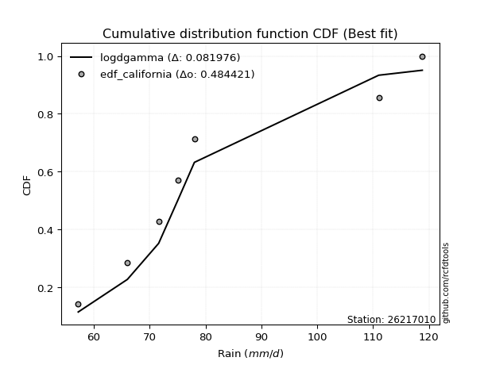</img>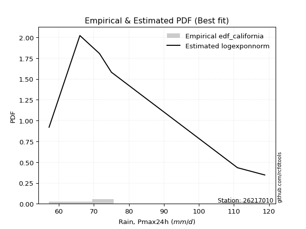</img>

</div>


### 2. Empirical - EDF Hazen (1930)

Hazen method for plotting positions is a formula used to estimate the empirical cumulative probability distribution of flood events or other hydrological data. This formula often results in biased estimations, particularly when extrapolating to extreme events (high return periods).

<div align="center">


$P=(m-0.5)/n$


</div>


**2.1. Empirical values**

<div align="center">

|                | 0                   | 1                   | 2                   | 3         | 4                  | 5                  | 6                  |
|:---------------|:--------------------|:--------------------|:--------------------|:----------|:-------------------|:-------------------|:-------------------|
| date           | 2025                | 2020                | 2019                | 2023      | 2021               | 2022               | 2024               |
| x              | 55.2                | 57.2                | 66.0                | 71.6      | 75.0               | 111.0              | 118.8              |
| m              | 1                   | 2                   | 3                   | 4         | 5                  | 6                  | 7                  |
| empirical_dist | edf_hazen           | edf_hazen           | edf_hazen           | edf_hazen | edf_hazen          | edf_hazen          | edf_hazen          |
| empirical      | 0.07142857142857142 | 0.21428571428571427 | 0.35714285714285715 | 0.5       | 0.6428571428571429 | 0.7857142857142857 | 0.9285714285714286 |
| empirical_tr   | 1.0769230769230769  | 1.2727272727272727  | 1.5555555555555558  | 2.0       | 2.8000000000000003 | 4.666666666666666  | 14.000000000000007 |

</div>


**2.2. Kolmogorov-Smirnov fit test (sorted by Δ)**


<div align="center">

|                | 0                   | 1                   | 2                   | 3                   | 4                   | 5                   | 6                   | 7                   | 8                     | 9                   | 10                  | 11                  | 12                  | 13                  | 14                  | 15                  | 16                  | 17                  | 18                  | 19                  | 20                  | 21                  | 22                  | 23                  | 24                  | 25                  | 26                  | 27                  | 28                  | 29                  | 30                  | 31                  | 32                  | 33                  | 34                  | 35                  | 36                  | 37                  | 38                  | 39                  | 40                  | 41                  | 42                  | 43                  | 44                  | 45                  | 46                  | 47                  | 48                  | 49                  | 50                  | 51                  | 52                  | 53                  | 54                  | 55                  | 56                  | 57                  | 58                  | 59                  | 60                  | 61                  | 62                  | 63                  | 64                  | 65                  | 66                  | 67                  | 68                  | 69                  | 70                  | 71                  | 72                  | 73                  | 74                  | 75                  | 76                  | 77                  | 78                  | 79                  | 80                  | 81                  | 82                  | 83                  | 84                  | 85                  | 86                  | 87                  | 88                  | 89                  |
|:---------------|:--------------------|:--------------------|:--------------------|:--------------------|:--------------------|:--------------------|:--------------------|:--------------------|:----------------------|:--------------------|:--------------------|:--------------------|:--------------------|:--------------------|:--------------------|:--------------------|:--------------------|:--------------------|:--------------------|:--------------------|:--------------------|:--------------------|:--------------------|:--------------------|:--------------------|:--------------------|:--------------------|:--------------------|:--------------------|:--------------------|:--------------------|:--------------------|:--------------------|:--------------------|:--------------------|:--------------------|:--------------------|:--------------------|:--------------------|:--------------------|:--------------------|:--------------------|:--------------------|:--------------------|:--------------------|:--------------------|:--------------------|:--------------------|:--------------------|:--------------------|:--------------------|:--------------------|:--------------------|:--------------------|:--------------------|:--------------------|:--------------------|:--------------------|:--------------------|:--------------------|:--------------------|:--------------------|:--------------------|:--------------------|:--------------------|:--------------------|:--------------------|:--------------------|:--------------------|:--------------------|:--------------------|:--------------------|:--------------------|:--------------------|:--------------------|:--------------------|:--------------------|:--------------------|:--------------------|:--------------------|:--------------------|:--------------------|:--------------------|:--------------------|:--------------------|:--------------------|:--------------------|:--------------------|:--------------------|:--------------------|
| station        | 26217010            | 26217010            | 26217010            | 26217010            | 26217010            | 26217010            | 26217010            | 26217010            | 26217010              | 26217010            | 26217010            | 26217010            | 26217010            | 26217010            | 26217010            | 26217010            | 26217010            | 26217010            | 26217010            | 26217010            | 26217010            | 26217010            | 26217010            | 26217010            | 26217010            | 26217010            | 26217010            | 26217010            | 26217010            | 26217010            | 26217010            | 26217010            | 26217010            | 26217010            | 26217010            | 26217010            | 26217010            | 26217010            | 26217010            | 26217010            | 26217010            | 26217010            | 26217010            | 26217010            | 26217010            | 26217010            | 26217010            | 26217010            | 26217010            | 26217010            | 26217010            | 26217010            | 26217010            | 26217010            | 26217010            | 26217010            | 26217010            | 26217010            | 26217010            | 26217010            | 26217010            | 26217010            | 26217010            | 26217010            | 26217010            | 26217010            | 26217010            | 26217010            | 26217010            | 26217010            | 26217010            | 26217010            | 26217010            | 26217010            | 26217010            | 26217010            | 26217010            | 26217010            | 26217010            | 26217010            | 26217010            | 26217010            | 26217010            | 26217010            | 26217010            | 26217010            | 26217010            | 26217010            | 26217010            | 26217010            |
| empirical_dist | edf_hazen           | edf_hazen           | edf_hazen           | edf_hazen           | edf_hazen           | edf_hazen           | edf_hazen           | edf_hazen           | edf_hazen             | edf_hazen           | edf_hazen           | edf_hazen           | edf_hazen           | edf_hazen           | edf_hazen           | edf_hazen           | edf_hazen           | edf_hazen           | edf_hazen           | edf_hazen           | edf_hazen           | edf_hazen           | edf_hazen           | edf_hazen           | edf_hazen           | edf_hazen           | edf_hazen           | edf_hazen           | edf_hazen           | edf_hazen           | edf_hazen           | edf_hazen           | edf_hazen           | edf_hazen           | edf_hazen           | edf_hazen           | edf_hazen           | edf_hazen           | edf_hazen           | edf_hazen           | edf_hazen           | edf_hazen           | edf_hazen           | edf_hazen           | edf_hazen           | edf_hazen           | edf_hazen           | edf_hazen           | edf_hazen           | edf_hazen           | edf_hazen           | edf_hazen           | edf_hazen           | edf_hazen           | edf_hazen           | edf_hazen           | edf_hazen           | edf_hazen           | edf_hazen           | edf_hazen           | edf_hazen           | edf_hazen           | edf_hazen           | edf_hazen           | edf_hazen           | edf_hazen           | edf_hazen           | edf_hazen           | edf_hazen           | edf_hazen           | edf_hazen           | edf_hazen           | edf_hazen           | edf_hazen           | edf_hazen           | edf_hazen           | edf_hazen           | edf_hazen           | edf_hazen           | edf_hazen           | edf_hazen           | edf_hazen           | edf_hazen           | edf_hazen           | edf_hazen           | edf_hazen           | edf_hazen           | edf_hazen           | edf_hazen           | edf_hazen           |
| p_dist         | invgamma            | loginvgamma         | loginvgauss         | loginvweibull       | lognakagami         | loghalfnorm         | f                   | logexponnorm        | loglaplace_asymmetric | logexpon            | invgauss            | alpha               | halflogistic        | loghalflogistic     | lograyleigh         | loggumbel_r         | logmoyal            | fisk                | loggenexpon         | logmielke           | loggenlogistic      | logkstwobign        | moyal               | mielke              | logpearson3         | nct                 | logalpha            | logmaxwell          | exponnorm           | halfnorm            | laplace_asymmetric  | expon               | genexpon            | genlogistic         | lognct              | logrice             | chi2                | betaprime           | gumbel_r            | loggompertz         | kstwobign           | logloggamma         | logbetaprime        | logcrystalball      | lognorm             | lognorm             | logt                | logjohnsonsu        | loglogistic         | rayleigh            | pearson3            | loghypsecant        | loglaplace          | maxwell             | logtruncnorm        | erlang              | logncf              | logfatiguelife      | weibull_min         | ncf                 | rice                | johnsonsu           | logweibull_min      | wald                | loggibrat           | gibrat              | logwald             | crystalball         | norm                | t                   | gompertz            | nakagami            | logistic            | hypsecant           | loggumbel_l         | truncnorm           | loggamma            | loggamma            | laplace             | logf                | gumbel_l            | logerlang           | logfisk             | logchi2             | pareto              | logpareto           | gamma               | loglognorm          | fatiguelife         | invweibull          |
| delta          | 0.09386230454795363 | 0.0993073820915642  | 0.10065967602297704 | 0.10118072856461247 | 0.10343713400422289 | 0.10697787632999955 | 0.10770434735626461 | 0.1082067695007701  | 0.10902663874727514   | 0.10929132707049932 | 0.11325963917978171 | 0.11440317714453418 | 0.11589066204743659 | 0.11679030569597168 | 0.11808037335086718 | 0.11942844666421837 | 0.11990832718405475 | 0.12069251823350385 | 0.12263398186766256 | 0.12389998876695729 | 0.12465529352822957 | 0.12552433641532146 | 0.12557593124567357 | 0.12559001042862716 | 0.1274135908023355  | 0.12836095886274712 | 0.12865450327078753 | 0.1295024901594395  | 0.13326575966470397 | 0.13367436129682553 | 0.1340079078665732  | 0.13451226182835535 | 0.13537823798398957 | 0.13821165425310566 | 0.14138638198766385 | 0.1421087799404417  | 0.14535082172563224 | 0.14771998703220512 | 0.15013792052105446 | 0.15056770181583246 | 0.15978196547631307 | 0.16155062931876363 | 0.16314409550852704 | 0.1632490635656874  | 0.16324924255414947 | 0.16324924255414947 | 0.16324952347842114 | 0.16369735845585298 | 0.16602891135725828 | 0.1679924128178344  | 0.16802825154448453 | 0.1683985368419159  | 0.17774037885685445 | 0.18012700264702153 | 0.18450810283193653 | 0.18489430002289747 | 0.19052288960254485 | 0.19356380176064641 | 0.20432325438019122 | 0.20595642157640717 | 0.20965256738646226 | 0.21214719050860426 | 0.2122349769925665  | 0.21407615067405442 | 0.21428571428571427 | 0.21428571428571427 | 0.21428571428571427 | 0.21452118881920967 | 0.21452119124261443 | 0.21455511880711808 | 0.21793317595128547 | 0.21849811830012095 | 0.22403110209243227 | 0.23197567614087944 | 0.23392948742051023 | 0.2350119752931522  | 0.24487884324269943 | 0.24487884324269943 | 0.25556328060964695 | 0.27994731280591406 | 0.2834472260863365  | 0.28765311110368125 | 0.2978617906891048  | 0.3186890979138779  | 0.3385957801771059  | 0.35205274553329546 | 0.3617349014668721  | 0.3800041785995846  | 0.4174627684992796  | 0.4907145545940405  |
| deltao         | 0.48442053926100004 | 0.48442053926100004 | 0.48442053926100004 | 0.48442053926100004 | 0.48442053926100004 | 0.48442053926100004 | 0.48442053926100004 | 0.48442053926100004 | 0.48442053926100004   | 0.48442053926100004 | 0.48442053926100004 | 0.48442053926100004 | 0.48442053926100004 | 0.48442053926100004 | 0.48442053926100004 | 0.48442053926100004 | 0.48442053926100004 | 0.48442053926100004 | 0.48442053926100004 | 0.48442053926100004 | 0.48442053926100004 | 0.48442053926100004 | 0.48442053926100004 | 0.48442053926100004 | 0.48442053926100004 | 0.48442053926100004 | 0.48442053926100004 | 0.48442053926100004 | 0.48442053926100004 | 0.48442053926100004 | 0.48442053926100004 | 0.48442053926100004 | 0.48442053926100004 | 0.48442053926100004 | 0.48442053926100004 | 0.48442053926100004 | 0.48442053926100004 | 0.48442053926100004 | 0.48442053926100004 | 0.48442053926100004 | 0.48442053926100004 | 0.48442053926100004 | 0.48442053926100004 | 0.48442053926100004 | 0.48442053926100004 | 0.48442053926100004 | 0.48442053926100004 | 0.48442053926100004 | 0.48442053926100004 | 0.48442053926100004 | 0.48442053926100004 | 0.48442053926100004 | 0.48442053926100004 | 0.48442053926100004 | 0.48442053926100004 | 0.48442053926100004 | 0.48442053926100004 | 0.48442053926100004 | 0.48442053926100004 | 0.48442053926100004 | 0.48442053926100004 | 0.48442053926100004 | 0.48442053926100004 | 0.48442053926100004 | 0.48442053926100004 | 0.48442053926100004 | 0.48442053926100004 | 0.48442053926100004 | 0.48442053926100004 | 0.48442053926100004 | 0.48442053926100004 | 0.48442053926100004 | 0.48442053926100004 | 0.48442053926100004 | 0.48442053926100004 | 0.48442053926100004 | 0.48442053926100004 | 0.48442053926100004 | 0.48442053926100004 | 0.48442053926100004 | 0.48442053926100004 | 0.48442053926100004 | 0.48442053926100004 | 0.48442053926100004 | 0.48442053926100004 | 0.48442053926100004 | 0.48442053926100004 | 0.48442053926100004 | 0.48442053926100004 | 0.48442053926100004 |
| eval           | Δo > Δ              | Δo > Δ              | Δo > Δ              | Δo > Δ              | Δo > Δ              | Δo > Δ              | Δo > Δ              | Δo > Δ              | Δo > Δ                | Δo > Δ              | Δo > Δ              | Δo > Δ              | Δo > Δ              | Δo > Δ              | Δo > Δ              | Δo > Δ              | Δo > Δ              | Δo > Δ              | Δo > Δ              | Δo > Δ              | Δo > Δ              | Δo > Δ              | Δo > Δ              | Δo > Δ              | Δo > Δ              | Δo > Δ              | Δo > Δ              | Δo > Δ              | Δo > Δ              | Δo > Δ              | Δo > Δ              | Δo > Δ              | Δo > Δ              | Δo > Δ              | Δo > Δ              | Δo > Δ              | Δo > Δ              | Δo > Δ              | Δo > Δ              | Δo > Δ              | Δo > Δ              | Δo > Δ              | Δo > Δ              | Δo > Δ              | Δo > Δ              | Δo > Δ              | Δo > Δ              | Δo > Δ              | Δo > Δ              | Δo > Δ              | Δo > Δ              | Δo > Δ              | Δo > Δ              | Δo > Δ              | Δo > Δ              | Δo > Δ              | Δo > Δ              | Δo > Δ              | Δo > Δ              | Δo > Δ              | Δo > Δ              | Δo > Δ              | Δo > Δ              | Δo > Δ              | Δo > Δ              | Δo > Δ              | Δo > Δ              | Δo > Δ              | Δo > Δ              | Δo > Δ              | Δo > Δ              | Δo > Δ              | Δo > Δ              | Δo > Δ              | Δo > Δ              | Δo > Δ              | Δo > Δ              | Δo > Δ              | Δo > Δ              | Δo > Δ              | Δo > Δ              | Δo > Δ              | Δo > Δ              | Δo > Δ              | Δo > Δ              | Δo > Δ              | Δo > Δ              | Δo > Δ              | Δo > Δ              | Δo <= Δ             |
| fit            | 1                   | 1                   | 1                   | 1                   | 1                   | 1                   | 1                   | 1                   | 1                     | 1                   | 1                   | 1                   | 1                   | 1                   | 1                   | 1                   | 1                   | 1                   | 1                   | 1                   | 1                   | 1                   | 1                   | 1                   | 1                   | 1                   | 1                   | 1                   | 1                   | 1                   | 1                   | 1                   | 1                   | 1                   | 1                   | 1                   | 1                   | 1                   | 1                   | 1                   | 1                   | 1                   | 1                   | 1                   | 1                   | 1                   | 1                   | 1                   | 1                   | 1                   | 1                   | 1                   | 1                   | 1                   | 1                   | 1                   | 1                   | 1                   | 1                   | 1                   | 1                   | 1                   | 1                   | 1                   | 1                   | 1                   | 1                   | 1                   | 1                   | 1                   | 1                   | 1                   | 1                   | 1                   | 1                   | 1                   | 1                   | 1                   | 1                   | 1                   | 1                   | 1                   | 1                   | 1                   | 1                   | 1                   | 1                   | 1                   | 1                   | 0                   |
| n              | 7                   | 7                   | 7                   | 7                   | 7                   | 7                   | 7                   | 7                   | 7                     | 7                   | 7                   | 7                   | 7                   | 7                   | 7                   | 7                   | 7                   | 7                   | 7                   | 7                   | 7                   | 7                   | 7                   | 7                   | 7                   | 7                   | 7                   | 7                   | 7                   | 7                   | 7                   | 7                   | 7                   | 7                   | 7                   | 7                   | 7                   | 7                   | 7                   | 7                   | 7                   | 7                   | 7                   | 7                   | 7                   | 7                   | 7                   | 7                   | 7                   | 7                   | 7                   | 7                   | 7                   | 7                   | 7                   | 7                   | 7                   | 7                   | 7                   | 7                   | 7                   | 7                   | 7                   | 7                   | 7                   | 7                   | 7                   | 7                   | 7                   | 7                   | 7                   | 7                   | 7                   | 7                   | 7                   | 7                   | 7                   | 7                   | 7                   | 7                   | 7                   | 7                   | 7                   | 7                   | 7                   | 7                   | 7                   | 7                   | 7                   | 7                   |
| best_fit       | 1                   | 0                   | 0                   | 0                   | 0                   | 0                   | 0                   | 0                   | 0                     | 0                   | 0                   | 0                   | 0                   | 0                   | 0                   | 0                   | 0                   | 0                   | 0                   | 0                   | 0                   | 0                   | 0                   | 0                   | 0                   | 0                   | 0                   | 0                   | 0                   | 0                   | 0                   | 0                   | 0                   | 0                   | 0                   | 0                   | 0                   | 0                   | 0                   | 0                   | 0                   | 0                   | 0                   | 0                   | 0                   | 0                   | 0                   | 0                   | 0                   | 0                   | 0                   | 0                   | 0                   | 0                   | 0                   | 0                   | 0                   | 0                   | 0                   | 0                   | 0                   | 0                   | 0                   | 0                   | 0                   | 0                   | 0                   | 0                   | 0                   | 0                   | 0                   | 0                   | 0                   | 0                   | 0                   | 0                   | 0                   | 0                   | 0                   | 0                   | 0                   | 0                   | 0                   | 0                   | 0                   | 0                   | 0                   | 0                   | 0                   | 0                   |
| best_fit_sort  | 1                   | 2                   | 3                   | 4                   | 5                   | 6                   | 7                   | 8                   | 9                     | 10                  | 11                  | 12                  | 13                  | 14                  | 15                  | 16                  | 17                  | 18                  | 19                  | 20                  | 21                  | 22                  | 23                  | 24                  | 25                  | 26                  | 27                  | 28                  | 29                  | 30                  | 31                  | 32                  | 33                  | 34                  | 35                  | 36                  | 37                  | 38                  | 39                  | 40                  | 41                  | 42                  | 43                  | 44                  | 45                  | 46                  | 47                  | 48                  | 49                  | 50                  | 51                  | 52                  | 53                  | 54                  | 55                  | 56                  | 57                  | 58                  | 59                  | 60                  | 61                  | 62                  | 63                  | 64                  | 65                  | 66                  | 67                  | 68                  | 69                  | 70                  | 71                  | 72                  | 73                  | 74                  | 75                  | 76                  | 77                  | 78                  | 79                  | 80                  | 81                  | 82                  | 83                  | 84                  | 85                  | 86                  | 87                  | 88                  | 89                  | 90                  |

</div>


<div align="center">

</img>

</div>


**2.3. Best fit**

<div align="center">

|   id |   station | empirical_dist   | p_dist   |     delta |   deltao | eval   |   fit |   n |   best_fit |   best_fit_sort |
|-----:|----------:|:-----------------|:---------|----------:|---------:|:-------|------:|----:|-----------:|----------------:|
|    0 |  26217010 | edf_hazen        | invgamma | 0.0938623 | 0.484421 | Δo > Δ |     1 |   7 |          1 |               1 |

</div>


<div align="center">

</img></img>

</div>


### 3. Empirical - EDF Weibull (1939)

Weibull plotting position formula is an empirical method used to estimate the non-exceedance probability or plotting position for a set of observed data, is often recommended or widely used in practice, particularly in flood frequency analysis.

<div align="center">


$P=m/(n+1)$


</div>


**3.1. Empirical values**

<div align="center">

|                | 0                  | 1                  | 2           | 3           | 4                  | 5           | 6           |
|:---------------|:-------------------|:-------------------|:------------|:------------|:-------------------|:------------|:------------|
| date           | 2025               | 2020               | 2019        | 2023        | 2021               | 2022        | 2024        |
| x              | 55.2               | 57.2               | 66.0        | 71.6        | 75.0               | 111.0       | 118.8       |
| m              | 1                  | 2                  | 3           | 4           | 5                  | 6           | 7           |
| empirical_dist | edf_weibull        | edf_weibull        | edf_weibull | edf_weibull | edf_weibull        | edf_weibull | edf_weibull |
| empirical      | 0.125              | 0.25               | 0.375       | 0.5         | 0.625              | 0.75        | 0.875       |
| empirical_tr   | 1.1428571428571428 | 1.3333333333333333 | 1.6         | 2.0         | 2.6666666666666665 | 4.0         | 8.0         |

</div>


**3.2. Kolmogorov-Smirnov fit test (sorted by Δ)**


<div align="center">

|                | 0                   | 1                   | 2                   | 3                   | 4                   | 5                   | 6                   | 7                   | 8                   | 9                   | 10                  | 11                  | 12                  | 13                    | 14                  | 15                  | 16                  | 17                  | 18                  | 19                  | 20                  | 21                  | 22                  | 23                  | 24                  | 25                  | 26                  | 27                  | 28                  | 29                  | 30                  | 31                  | 32                  | 33                  | 34                  | 35                  | 36                  | 37                  | 38                  | 39                  | 40                  | 41                  | 42                  | 43                  | 44                  | 45                  | 46                  | 47                  | 48                  | 49                  | 50                  | 51                  | 52                  | 53                  | 54                  | 55                  | 56                  | 57                  | 58                  | 59                  | 60                  | 61                  | 62                  | 63                  | 64                  | 65                  | 66                  | 67                  | 68                  | 69                  | 70                  | 71                  | 72                  | 73                  | 74                  | 75                  | 76                  | 77                  | 78                  | 79                  | 80                  | 81                  | 82                  | 83                  | 84                  | 85                  | 86                  | 87                  | 88                  | 89                  |
|:---------------|:--------------------|:--------------------|:--------------------|:--------------------|:--------------------|:--------------------|:--------------------|:--------------------|:--------------------|:--------------------|:--------------------|:--------------------|:--------------------|:----------------------|:--------------------|:--------------------|:--------------------|:--------------------|:--------------------|:--------------------|:--------------------|:--------------------|:--------------------|:--------------------|:--------------------|:--------------------|:--------------------|:--------------------|:--------------------|:--------------------|:--------------------|:--------------------|:--------------------|:--------------------|:--------------------|:--------------------|:--------------------|:--------------------|:--------------------|:--------------------|:--------------------|:--------------------|:--------------------|:--------------------|:--------------------|:--------------------|:--------------------|:--------------------|:--------------------|:--------------------|:--------------------|:--------------------|:--------------------|:--------------------|:--------------------|:--------------------|:--------------------|:--------------------|:--------------------|:--------------------|:--------------------|:--------------------|:--------------------|:--------------------|:--------------------|:--------------------|:--------------------|:--------------------|:--------------------|:--------------------|:--------------------|:--------------------|:--------------------|:--------------------|:--------------------|:--------------------|:--------------------|:--------------------|:--------------------|:--------------------|:--------------------|:--------------------|:--------------------|:--------------------|:--------------------|:--------------------|:--------------------|:--------------------|:--------------------|:--------------------|
| station        | 26217010            | 26217010            | 26217010            | 26217010            | 26217010            | 26217010            | 26217010            | 26217010            | 26217010            | 26217010            | 26217010            | 26217010            | 26217010            | 26217010              | 26217010            | 26217010            | 26217010            | 26217010            | 26217010            | 26217010            | 26217010            | 26217010            | 26217010            | 26217010            | 26217010            | 26217010            | 26217010            | 26217010            | 26217010            | 26217010            | 26217010            | 26217010            | 26217010            | 26217010            | 26217010            | 26217010            | 26217010            | 26217010            | 26217010            | 26217010            | 26217010            | 26217010            | 26217010            | 26217010            | 26217010            | 26217010            | 26217010            | 26217010            | 26217010            | 26217010            | 26217010            | 26217010            | 26217010            | 26217010            | 26217010            | 26217010            | 26217010            | 26217010            | 26217010            | 26217010            | 26217010            | 26217010            | 26217010            | 26217010            | 26217010            | 26217010            | 26217010            | 26217010            | 26217010            | 26217010            | 26217010            | 26217010            | 26217010            | 26217010            | 26217010            | 26217010            | 26217010            | 26217010            | 26217010            | 26217010            | 26217010            | 26217010            | 26217010            | 26217010            | 26217010            | 26217010            | 26217010            | 26217010            | 26217010            | 26217010            |
| empirical_dist | edf_weibull         | edf_weibull         | edf_weibull         | edf_weibull         | edf_weibull         | edf_weibull         | edf_weibull         | edf_weibull         | edf_weibull         | edf_weibull         | edf_weibull         | edf_weibull         | edf_weibull         | edf_weibull           | edf_weibull         | edf_weibull         | edf_weibull         | edf_weibull         | edf_weibull         | edf_weibull         | edf_weibull         | edf_weibull         | edf_weibull         | edf_weibull         | edf_weibull         | edf_weibull         | edf_weibull         | edf_weibull         | edf_weibull         | edf_weibull         | edf_weibull         | edf_weibull         | edf_weibull         | edf_weibull         | edf_weibull         | edf_weibull         | edf_weibull         | edf_weibull         | edf_weibull         | edf_weibull         | edf_weibull         | edf_weibull         | edf_weibull         | edf_weibull         | edf_weibull         | edf_weibull         | edf_weibull         | edf_weibull         | edf_weibull         | edf_weibull         | edf_weibull         | edf_weibull         | edf_weibull         | edf_weibull         | edf_weibull         | edf_weibull         | edf_weibull         | edf_weibull         | edf_weibull         | edf_weibull         | edf_weibull         | edf_weibull         | edf_weibull         | edf_weibull         | edf_weibull         | edf_weibull         | edf_weibull         | edf_weibull         | edf_weibull         | edf_weibull         | edf_weibull         | edf_weibull         | edf_weibull         | edf_weibull         | edf_weibull         | edf_weibull         | edf_weibull         | edf_weibull         | edf_weibull         | edf_weibull         | edf_weibull         | edf_weibull         | edf_weibull         | edf_weibull         | edf_weibull         | edf_weibull         | edf_weibull         | edf_weibull         | edf_weibull         | edf_weibull         |
| p_dist         | f                   | alpha               | lognakagami         | fisk                | invgamma            | loginvgauss         | loginvgamma         | loginvweibull       | logncf              | invgauss            | halfnorm            | loghalfnorm         | logexponnorm        | loglaplace_asymmetric | logexpon            | lograyleigh         | rayleigh            | logmaxwell          | halflogistic        | pearson3            | loghalflogistic     | logpearson3         | gumbel_r            | loggumbel_r         | moyal               | logmoyal            | logbetaprime        | loggenexpon         | nct                 | logrice             | logmielke           | betaprime           | lognct              | loggenlogistic      | logloggamma         | logt                | lognorm             | lognorm             | logcrystalball      | logkstwobign        | mielke              | maxwell             | logalpha            | logjohnsonsu        | exponnorm           | kstwobign           | laplace_asymmetric  | loglogistic         | expon               | genexpon            | loghypsecant        | genlogistic         | chi2                | loglaplace          | logfatiguelife      | ncf                 | loggompertz         | weibull_min         | rice                | johnsonsu           | logweibull_min      | crystalball         | norm                | t                   | nakagami            | gompertz            | logistic            | erlang              | hypsecant           | loggumbel_l         | truncnorm           | logtruncnorm        | loggamma            | loggamma            | laplace             | logfisk             | wald                | gibrat              | loggibrat           | logwald             | logf                | logchi2             | gumbel_l            | logerlang           | pareto              | logpareto           | gamma               | loglognorm          | fatiguelife         | invweibull          |
| delta          | 0.08984720449912176 | 0.1088784094862505  | 0.12499993546860556 | 0.12499999997156244 | 0.12957659026223933 | 0.1329133519702611  | 0.1350216678058499  | 0.13689501427889816 | 0.13695146103111627 | 0.13842905376165116 | 0.14253600041168069 | 0.14269216204428525 | 0.14392105521505583 | 0.14474092446156084   | 0.14500561278478505 | 0.14792460042606126 | 0.1501352699606915  | 0.1507033845874255  | 0.1516049477617223  | 0.15172665426553011 | 0.1525045914102574  | 0.1531916480118446  | 0.1550053343345067  | 0.15514273237850407 | 0.15549871085745748 | 0.15562261289834045 | 0.15817711753895802 | 0.15834826758194828 | 0.15841650015671038 | 0.15904544822651234 | 0.159614274481243   | 0.15989521830950904 | 0.15995816347415914 | 0.16036957924251527 | 0.16094287781233918 | 0.1611545243628857  | 0.16115471239047707 | 0.16115471239047707 | 0.16115524679941728 | 0.16123862212960716 | 0.16130429614291286 | 0.16226985978987862 | 0.16436878898507323 | 0.1661771261115833  | 0.1689800453789897  | 0.16946315482889207 | 0.16972219358085894 | 0.1701818220004524  | 0.17022654754264105 | 0.17109252369827532 | 0.173743884240807   | 0.17392593996739136 | 0.17567498291131667 | 0.17567928188504345 | 0.17570665890350357 | 0.18159438861471067 | 0.1862819875301182  | 0.18646611152304837 | 0.19179542452931936 | 0.19429004765146135 | 0.19437783413542364 | 0.19666404596206677 | 0.19666404838547152 | 0.19669797594997518 | 0.2006409754429781  | 0.2049349911922405  | 0.20617395923528936 | 0.21302335023077246 | 0.21411853328373653 | 0.21607234456336732 | 0.2171548324360093  | 0.22022238854622223 | 0.22702170038555658 | 0.22702170038555658 | 0.23770613775250404 | 0.24429036211767619 | 0.24979043638834014 | 0.25                | 0.25                | 0.25                | 0.2620901699487712  | 0.2651176693424493  | 0.2655900832291936  | 0.2697959682465384  | 0.3028814944628202  | 0.31633845981900977 | 0.34387775860972924 | 0.3442898928852989  | 0.39960562564213675 | 0.4371431260226119  |
| deltao         | 0.48442053926100004 | 0.48442053926100004 | 0.48442053926100004 | 0.48442053926100004 | 0.48442053926100004 | 0.48442053926100004 | 0.48442053926100004 | 0.48442053926100004 | 0.48442053926100004 | 0.48442053926100004 | 0.48442053926100004 | 0.48442053926100004 | 0.48442053926100004 | 0.48442053926100004   | 0.48442053926100004 | 0.48442053926100004 | 0.48442053926100004 | 0.48442053926100004 | 0.48442053926100004 | 0.48442053926100004 | 0.48442053926100004 | 0.48442053926100004 | 0.48442053926100004 | 0.48442053926100004 | 0.48442053926100004 | 0.48442053926100004 | 0.48442053926100004 | 0.48442053926100004 | 0.48442053926100004 | 0.48442053926100004 | 0.48442053926100004 | 0.48442053926100004 | 0.48442053926100004 | 0.48442053926100004 | 0.48442053926100004 | 0.48442053926100004 | 0.48442053926100004 | 0.48442053926100004 | 0.48442053926100004 | 0.48442053926100004 | 0.48442053926100004 | 0.48442053926100004 | 0.48442053926100004 | 0.48442053926100004 | 0.48442053926100004 | 0.48442053926100004 | 0.48442053926100004 | 0.48442053926100004 | 0.48442053926100004 | 0.48442053926100004 | 0.48442053926100004 | 0.48442053926100004 | 0.48442053926100004 | 0.48442053926100004 | 0.48442053926100004 | 0.48442053926100004 | 0.48442053926100004 | 0.48442053926100004 | 0.48442053926100004 | 0.48442053926100004 | 0.48442053926100004 | 0.48442053926100004 | 0.48442053926100004 | 0.48442053926100004 | 0.48442053926100004 | 0.48442053926100004 | 0.48442053926100004 | 0.48442053926100004 | 0.48442053926100004 | 0.48442053926100004 | 0.48442053926100004 | 0.48442053926100004 | 0.48442053926100004 | 0.48442053926100004 | 0.48442053926100004 | 0.48442053926100004 | 0.48442053926100004 | 0.48442053926100004 | 0.48442053926100004 | 0.48442053926100004 | 0.48442053926100004 | 0.48442053926100004 | 0.48442053926100004 | 0.48442053926100004 | 0.48442053926100004 | 0.48442053926100004 | 0.48442053926100004 | 0.48442053926100004 | 0.48442053926100004 | 0.48442053926100004 |
| eval           | Δo > Δ              | Δo > Δ              | Δo > Δ              | Δo > Δ              | Δo > Δ              | Δo > Δ              | Δo > Δ              | Δo > Δ              | Δo > Δ              | Δo > Δ              | Δo > Δ              | Δo > Δ              | Δo > Δ              | Δo > Δ                | Δo > Δ              | Δo > Δ              | Δo > Δ              | Δo > Δ              | Δo > Δ              | Δo > Δ              | Δo > Δ              | Δo > Δ              | Δo > Δ              | Δo > Δ              | Δo > Δ              | Δo > Δ              | Δo > Δ              | Δo > Δ              | Δo > Δ              | Δo > Δ              | Δo > Δ              | Δo > Δ              | Δo > Δ              | Δo > Δ              | Δo > Δ              | Δo > Δ              | Δo > Δ              | Δo > Δ              | Δo > Δ              | Δo > Δ              | Δo > Δ              | Δo > Δ              | Δo > Δ              | Δo > Δ              | Δo > Δ              | Δo > Δ              | Δo > Δ              | Δo > Δ              | Δo > Δ              | Δo > Δ              | Δo > Δ              | Δo > Δ              | Δo > Δ              | Δo > Δ              | Δo > Δ              | Δo > Δ              | Δo > Δ              | Δo > Δ              | Δo > Δ              | Δo > Δ              | Δo > Δ              | Δo > Δ              | Δo > Δ              | Δo > Δ              | Δo > Δ              | Δo > Δ              | Δo > Δ              | Δo > Δ              | Δo > Δ              | Δo > Δ              | Δo > Δ              | Δo > Δ              | Δo > Δ              | Δo > Δ              | Δo > Δ              | Δo > Δ              | Δo > Δ              | Δo > Δ              | Δo > Δ              | Δo > Δ              | Δo > Δ              | Δo > Δ              | Δo > Δ              | Δo > Δ              | Δo > Δ              | Δo > Δ              | Δo > Δ              | Δo > Δ              | Δo > Δ              | Δo > Δ              |
| fit            | 1                   | 1                   | 1                   | 1                   | 1                   | 1                   | 1                   | 1                   | 1                   | 1                   | 1                   | 1                   | 1                   | 1                     | 1                   | 1                   | 1                   | 1                   | 1                   | 1                   | 1                   | 1                   | 1                   | 1                   | 1                   | 1                   | 1                   | 1                   | 1                   | 1                   | 1                   | 1                   | 1                   | 1                   | 1                   | 1                   | 1                   | 1                   | 1                   | 1                   | 1                   | 1                   | 1                   | 1                   | 1                   | 1                   | 1                   | 1                   | 1                   | 1                   | 1                   | 1                   | 1                   | 1                   | 1                   | 1                   | 1                   | 1                   | 1                   | 1                   | 1                   | 1                   | 1                   | 1                   | 1                   | 1                   | 1                   | 1                   | 1                   | 1                   | 1                   | 1                   | 1                   | 1                   | 1                   | 1                   | 1                   | 1                   | 1                   | 1                   | 1                   | 1                   | 1                   | 1                   | 1                   | 1                   | 1                   | 1                   | 1                   | 1                   |
| n              | 7                   | 7                   | 7                   | 7                   | 7                   | 7                   | 7                   | 7                   | 7                   | 7                   | 7                   | 7                   | 7                   | 7                     | 7                   | 7                   | 7                   | 7                   | 7                   | 7                   | 7                   | 7                   | 7                   | 7                   | 7                   | 7                   | 7                   | 7                   | 7                   | 7                   | 7                   | 7                   | 7                   | 7                   | 7                   | 7                   | 7                   | 7                   | 7                   | 7                   | 7                   | 7                   | 7                   | 7                   | 7                   | 7                   | 7                   | 7                   | 7                   | 7                   | 7                   | 7                   | 7                   | 7                   | 7                   | 7                   | 7                   | 7                   | 7                   | 7                   | 7                   | 7                   | 7                   | 7                   | 7                   | 7                   | 7                   | 7                   | 7                   | 7                   | 7                   | 7                   | 7                   | 7                   | 7                   | 7                   | 7                   | 7                   | 7                   | 7                   | 7                   | 7                   | 7                   | 7                   | 7                   | 7                   | 7                   | 7                   | 7                   | 7                   |
| best_fit       | 1                   | 0                   | 0                   | 0                   | 0                   | 0                   | 0                   | 0                   | 0                   | 0                   | 0                   | 0                   | 0                   | 0                     | 0                   | 0                   | 0                   | 0                   | 0                   | 0                   | 0                   | 0                   | 0                   | 0                   | 0                   | 0                   | 0                   | 0                   | 0                   | 0                   | 0                   | 0                   | 0                   | 0                   | 0                   | 0                   | 0                   | 0                   | 0                   | 0                   | 0                   | 0                   | 0                   | 0                   | 0                   | 0                   | 0                   | 0                   | 0                   | 0                   | 0                   | 0                   | 0                   | 0                   | 0                   | 0                   | 0                   | 0                   | 0                   | 0                   | 0                   | 0                   | 0                   | 0                   | 0                   | 0                   | 0                   | 0                   | 0                   | 0                   | 0                   | 0                   | 0                   | 0                   | 0                   | 0                   | 0                   | 0                   | 0                   | 0                   | 0                   | 0                   | 0                   | 0                   | 0                   | 0                   | 0                   | 0                   | 0                   | 0                   |
| best_fit_sort  | 1                   | 2                   | 3                   | 4                   | 5                   | 6                   | 7                   | 8                   | 9                   | 10                  | 11                  | 12                  | 13                  | 14                    | 15                  | 16                  | 17                  | 18                  | 19                  | 20                  | 21                  | 22                  | 23                  | 24                  | 25                  | 26                  | 27                  | 28                  | 29                  | 30                  | 31                  | 32                  | 33                  | 34                  | 35                  | 36                  | 37                  | 38                  | 39                  | 40                  | 41                  | 42                  | 43                  | 44                  | 45                  | 46                  | 47                  | 48                  | 49                  | 50                  | 51                  | 52                  | 53                  | 54                  | 55                  | 56                  | 57                  | 58                  | 59                  | 60                  | 61                  | 62                  | 63                  | 64                  | 65                  | 66                  | 67                  | 68                  | 69                  | 70                  | 71                  | 72                  | 73                  | 74                  | 75                  | 76                  | 77                  | 78                  | 79                  | 80                  | 81                  | 82                  | 83                  | 84                  | 85                  | 86                  | 87                  | 88                  | 89                  | 90                  |

</div>


<div align="center">

</img>

</div>


**3.3. Best fit**

<div align="center">

|   id |   station | empirical_dist   | p_dist   |     delta |   deltao | eval   |   fit |   n |   best_fit |   best_fit_sort |
|-----:|----------:|:-----------------|:---------|----------:|---------:|:-------|------:|----:|-----------:|----------------:|
|    0 |  26217010 | edf_weibull      | f        | 0.0898472 | 0.484421 | Δo > Δ |     1 |   7 |          1 |               1 |

</div>


<div align="center">

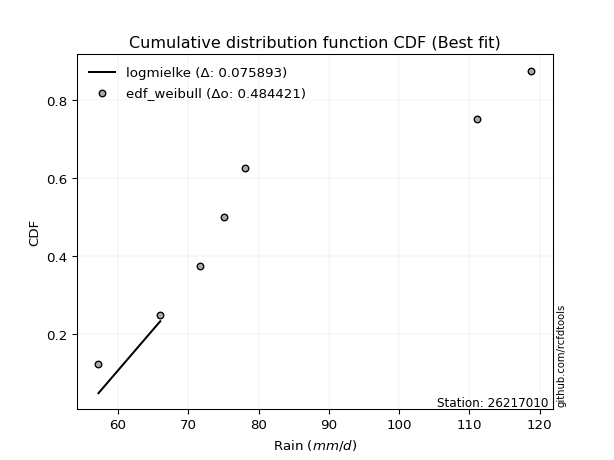</img></img>

</div>


### 4. Empirical - EDF Beard (1943)

The Beard formula (or Beard´s plotting position formula) in hydrology is used to estimate the empirical non-exceedance probability _(P)_ of a flood event (or other extreme hydrological data point) within a given dataset.

<div align="center">


$P=(m-0.31)/(n+0.38)$


</div>


**4.1. Empirical values**

<div align="center">

|                | 0                   | 1                   | 2                   | 3         | 4                  | 5                  | 6                  |
|:---------------|:--------------------|:--------------------|:--------------------|:----------|:-------------------|:-------------------|:-------------------|
| date           | 2025                | 2020                | 2019                | 2023      | 2021               | 2022               | 2024               |
| x              | 55.2                | 57.2                | 66.0                | 71.6      | 75.0               | 111.0              | 118.8              |
| m              | 1                   | 2                   | 3                   | 4         | 5                  | 6                  | 7                  |
| empirical_dist | edf_beard           | edf_beard           | edf_beard           | edf_beard | edf_beard          | edf_beard          | edf_beard          |
| empirical      | 0.09349593495934959 | 0.22899728997289973 | 0.36449864498644985 | 0.5       | 0.6355013550135502 | 0.7710027100271003 | 0.9065040650406505 |
| empirical_tr   | 1.1031390134529149  | 1.29701230228471    | 1.5735607675906182  | 2.0       | 2.743494423791822  | 4.366863905325444  | 10.695652173913055 |

</div>


**4.2. Kolmogorov-Smirnov fit test (sorted by Δ)**


<div align="center">

|                | 0                   | 1                   | 2                   | 3                   | 4                   | 5                   | 6                   | 7                   | 8                   | 9                   | 10                  | 11                    | 12                  | 13                  | 14                  | 15                  | 16                  | 17                  | 18                  | 19                  | 20                  | 21                  | 22                  | 23                  | 24                  | 25                  | 26                  | 27                  | 28                  | 29                  | 30                  | 31                  | 32                  | 33                  | 34                  | 35                  | 36                  | 37                  | 38                  | 39                  | 40                  | 41                  | 42                  | 43                  | 44                  | 45                  | 46                  | 47                  | 48                  | 49                  | 50                  | 51                  | 52                  | 53                  | 54                  | 55                  | 56                  | 57                  | 58                  | 59                  | 60                  | 61                  | 62                  | 63                  | 64                  | 65                  | 66                  | 67                  | 68                  | 69                  | 70                  | 71                  | 72                  | 73                  | 74                  | 75                  | 76                  | 77                  | 78                  | 79                  | 80                  | 81                  | 82                  | 83                  | 84                  | 85                  | 86                  | 87                  | 88                  | 89                  |
|:---------------|:--------------------|:--------------------|:--------------------|:--------------------|:--------------------|:--------------------|:--------------------|:--------------------|:--------------------|:--------------------|:--------------------|:----------------------|:--------------------|:--------------------|:--------------------|:--------------------|:--------------------|:--------------------|:--------------------|:--------------------|:--------------------|:--------------------|:--------------------|:--------------------|:--------------------|:--------------------|:--------------------|:--------------------|:--------------------|:--------------------|:--------------------|:--------------------|:--------------------|:--------------------|:--------------------|:--------------------|:--------------------|:--------------------|:--------------------|:--------------------|:--------------------|:--------------------|:--------------------|:--------------------|:--------------------|:--------------------|:--------------------|:--------------------|:--------------------|:--------------------|:--------------------|:--------------------|:--------------------|:--------------------|:--------------------|:--------------------|:--------------------|:--------------------|:--------------------|:--------------------|:--------------------|:--------------------|:--------------------|:--------------------|:--------------------|:--------------------|:--------------------|:--------------------|:--------------------|:--------------------|:--------------------|:--------------------|:--------------------|:--------------------|:--------------------|:--------------------|:--------------------|:--------------------|:--------------------|:--------------------|:--------------------|:--------------------|:--------------------|:--------------------|:--------------------|:--------------------|:--------------------|:--------------------|:--------------------|:--------------------|
| station        | 26217010            | 26217010            | 26217010            | 26217010            | 26217010            | 26217010            | 26217010            | 26217010            | 26217010            | 26217010            | 26217010            | 26217010              | 26217010            | 26217010            | 26217010            | 26217010            | 26217010            | 26217010            | 26217010            | 26217010            | 26217010            | 26217010            | 26217010            | 26217010            | 26217010            | 26217010            | 26217010            | 26217010            | 26217010            | 26217010            | 26217010            | 26217010            | 26217010            | 26217010            | 26217010            | 26217010            | 26217010            | 26217010            | 26217010            | 26217010            | 26217010            | 26217010            | 26217010            | 26217010            | 26217010            | 26217010            | 26217010            | 26217010            | 26217010            | 26217010            | 26217010            | 26217010            | 26217010            | 26217010            | 26217010            | 26217010            | 26217010            | 26217010            | 26217010            | 26217010            | 26217010            | 26217010            | 26217010            | 26217010            | 26217010            | 26217010            | 26217010            | 26217010            | 26217010            | 26217010            | 26217010            | 26217010            | 26217010            | 26217010            | 26217010            | 26217010            | 26217010            | 26217010            | 26217010            | 26217010            | 26217010            | 26217010            | 26217010            | 26217010            | 26217010            | 26217010            | 26217010            | 26217010            | 26217010            | 26217010            |
| empirical_dist | edf_beard           | edf_beard           | edf_beard           | edf_beard           | edf_beard           | edf_beard           | edf_beard           | edf_beard           | edf_beard           | edf_beard           | edf_beard           | edf_beard             | edf_beard           | edf_beard           | edf_beard           | edf_beard           | edf_beard           | edf_beard           | edf_beard           | edf_beard           | edf_beard           | edf_beard           | edf_beard           | edf_beard           | edf_beard           | edf_beard           | edf_beard           | edf_beard           | edf_beard           | edf_beard           | edf_beard           | edf_beard           | edf_beard           | edf_beard           | edf_beard           | edf_beard           | edf_beard           | edf_beard           | edf_beard           | edf_beard           | edf_beard           | edf_beard           | edf_beard           | edf_beard           | edf_beard           | edf_beard           | edf_beard           | edf_beard           | edf_beard           | edf_beard           | edf_beard           | edf_beard           | edf_beard           | edf_beard           | edf_beard           | edf_beard           | edf_beard           | edf_beard           | edf_beard           | edf_beard           | edf_beard           | edf_beard           | edf_beard           | edf_beard           | edf_beard           | edf_beard           | edf_beard           | edf_beard           | edf_beard           | edf_beard           | edf_beard           | edf_beard           | edf_beard           | edf_beard           | edf_beard           | edf_beard           | edf_beard           | edf_beard           | edf_beard           | edf_beard           | edf_beard           | edf_beard           | edf_beard           | edf_beard           | edf_beard           | edf_beard           | edf_beard           | edf_beard           | edf_beard           | edf_beard           |
| p_dist         | lognakagami         | f                   | alpha               | invgamma            | loginvgauss         | fisk                | loginvgamma         | loginvweibull       | invgauss            | loghalfnorm         | logexponnorm        | loglaplace_asymmetric | logexpon            | halfnorm            | lograyleigh         | logmaxwell          | halflogistic        | loghalflogistic     | logpearson3         | loggumbel_r         | moyal               | logmoyal            | loggenexpon         | nct                 | logrice             | logmielke           | lognct              | loggenlogistic      | logkstwobign        | mielke              | betaprime           | gumbel_r            | logalpha            | exponnorm           | laplace_asymmetric  | expon               | genexpon            | kstwobign           | genlogistic         | logloggamma         | chi2                | logbetaprime        | logcrystalball      | lognorm             | lognorm             | logt                | logjohnsonsu        | loglogistic         | rayleigh            | pearson3            | loghypsecant        | loggompertz         | logncf              | loglaplace          | maxwell             | logfatiguelife      | erlang              | ncf                 | weibull_min         | logtruncnorm        | rice                | johnsonsu           | logweibull_min      | crystalball         | norm                | t                   | gompertz            | nakagami            | logistic            | hypsecant           | loggumbel_l         | truncnorm           | wald                | gibrat              | loggibrat           | logwald             | loggamma            | loggamma            | laplace             | logf                | logfisk             | gumbel_l            | logerlang           | logchi2             | pareto              | logpareto           | gamma               | loglognorm          | fatiguelife         | invweibull          |
| delta          | 0.09608134616063019 | 0.10034855951267191 | 0.10704738930094149 | 0.10857388023513903 | 0.1119106419431608  | 0.11333673038991116 | 0.1140189577787496  | 0.11589230425179786 | 0.11742634373455085 | 0.12168945201718495 | 0.12291834518795555 | 0.12373821443446054   | 0.12400290275768477 | 0.12631857345323283 | 0.12692189039896096 | 0.1297006745603252  | 0.13060223773462198 | 0.13150188138315713 | 0.1321889379847443  | 0.13414002235140376 | 0.13449600083035718 | 0.13461990287124015 | 0.137345557554848   | 0.13741379012961008 | 0.13804273819941204 | 0.1386115644541427  | 0.13895545344705884 | 0.13936686921541497 | 0.14023591210250685 | 0.14030158611581256 | 0.14036419918861243 | 0.14278213267746176 | 0.14336607895797293 | 0.14797733535188942 | 0.14871948355375866 | 0.1492238375155408  | 0.15008981367117502 | 0.15242617763272037 | 0.15292322994029106 | 0.15419484147517093 | 0.15467227288421637 | 0.15578830766493434 | 0.15589327572209472 | 0.15589345471055677 | 0.15589345471055677 | 0.15589373563482845 | 0.15634157061226028 | 0.15867312351366558 | 0.1606366249742417  | 0.16067246370089183 | 0.16104274899832322 | 0.1652792775030179  | 0.16845552607176667 | 0.17038459101326175 | 0.17277121480342883 | 0.18620801391705372 | 0.19202064020367215 | 0.19209574362826087 | 0.19696746653659852 | 0.19921967851912192 | 0.20229677954286956 | 0.20479140266501156 | 0.2048791891489738  | 0.20716540097561698 | 0.20716540339902173 | 0.20719933096352539 | 0.21057738810769278 | 0.21114233045652825 | 0.21667531424883957 | 0.22461988829728674 | 0.22657369957691753 | 0.2276561874495595  | 0.22878772636123987 | 0.22899728997289973 | 0.22899728997289973 | 0.22899728997289973 | 0.23752305539910673 | 0.23752305539910673 | 0.24820749276605425 | 0.27259152496232136 | 0.2757944271583267  | 0.2760914382427438  | 0.28029732326008855 | 0.2966217343830998  | 0.3238842044899205  | 0.33734116984611007 | 0.3543791136232794  | 0.3652926029123992  | 0.4101069806556869  | 0.4686471910632624  |
| deltao         | 0.48442053926100004 | 0.48442053926100004 | 0.48442053926100004 | 0.48442053926100004 | 0.48442053926100004 | 0.48442053926100004 | 0.48442053926100004 | 0.48442053926100004 | 0.48442053926100004 | 0.48442053926100004 | 0.48442053926100004 | 0.48442053926100004   | 0.48442053926100004 | 0.48442053926100004 | 0.48442053926100004 | 0.48442053926100004 | 0.48442053926100004 | 0.48442053926100004 | 0.48442053926100004 | 0.48442053926100004 | 0.48442053926100004 | 0.48442053926100004 | 0.48442053926100004 | 0.48442053926100004 | 0.48442053926100004 | 0.48442053926100004 | 0.48442053926100004 | 0.48442053926100004 | 0.48442053926100004 | 0.48442053926100004 | 0.48442053926100004 | 0.48442053926100004 | 0.48442053926100004 | 0.48442053926100004 | 0.48442053926100004 | 0.48442053926100004 | 0.48442053926100004 | 0.48442053926100004 | 0.48442053926100004 | 0.48442053926100004 | 0.48442053926100004 | 0.48442053926100004 | 0.48442053926100004 | 0.48442053926100004 | 0.48442053926100004 | 0.48442053926100004 | 0.48442053926100004 | 0.48442053926100004 | 0.48442053926100004 | 0.48442053926100004 | 0.48442053926100004 | 0.48442053926100004 | 0.48442053926100004 | 0.48442053926100004 | 0.48442053926100004 | 0.48442053926100004 | 0.48442053926100004 | 0.48442053926100004 | 0.48442053926100004 | 0.48442053926100004 | 0.48442053926100004 | 0.48442053926100004 | 0.48442053926100004 | 0.48442053926100004 | 0.48442053926100004 | 0.48442053926100004 | 0.48442053926100004 | 0.48442053926100004 | 0.48442053926100004 | 0.48442053926100004 | 0.48442053926100004 | 0.48442053926100004 | 0.48442053926100004 | 0.48442053926100004 | 0.48442053926100004 | 0.48442053926100004 | 0.48442053926100004 | 0.48442053926100004 | 0.48442053926100004 | 0.48442053926100004 | 0.48442053926100004 | 0.48442053926100004 | 0.48442053926100004 | 0.48442053926100004 | 0.48442053926100004 | 0.48442053926100004 | 0.48442053926100004 | 0.48442053926100004 | 0.48442053926100004 | 0.48442053926100004 |
| eval           | Δo > Δ              | Δo > Δ              | Δo > Δ              | Δo > Δ              | Δo > Δ              | Δo > Δ              | Δo > Δ              | Δo > Δ              | Δo > Δ              | Δo > Δ              | Δo > Δ              | Δo > Δ                | Δo > Δ              | Δo > Δ              | Δo > Δ              | Δo > Δ              | Δo > Δ              | Δo > Δ              | Δo > Δ              | Δo > Δ              | Δo > Δ              | Δo > Δ              | Δo > Δ              | Δo > Δ              | Δo > Δ              | Δo > Δ              | Δo > Δ              | Δo > Δ              | Δo > Δ              | Δo > Δ              | Δo > Δ              | Δo > Δ              | Δo > Δ              | Δo > Δ              | Δo > Δ              | Δo > Δ              | Δo > Δ              | Δo > Δ              | Δo > Δ              | Δo > Δ              | Δo > Δ              | Δo > Δ              | Δo > Δ              | Δo > Δ              | Δo > Δ              | Δo > Δ              | Δo > Δ              | Δo > Δ              | Δo > Δ              | Δo > Δ              | Δo > Δ              | Δo > Δ              | Δo > Δ              | Δo > Δ              | Δo > Δ              | Δo > Δ              | Δo > Δ              | Δo > Δ              | Δo > Δ              | Δo > Δ              | Δo > Δ              | Δo > Δ              | Δo > Δ              | Δo > Δ              | Δo > Δ              | Δo > Δ              | Δo > Δ              | Δo > Δ              | Δo > Δ              | Δo > Δ              | Δo > Δ              | Δo > Δ              | Δo > Δ              | Δo > Δ              | Δo > Δ              | Δo > Δ              | Δo > Δ              | Δo > Δ              | Δo > Δ              | Δo > Δ              | Δo > Δ              | Δo > Δ              | Δo > Δ              | Δo > Δ              | Δo > Δ              | Δo > Δ              | Δo > Δ              | Δo > Δ              | Δo > Δ              | Δo > Δ              |
| fit            | 1                   | 1                   | 1                   | 1                   | 1                   | 1                   | 1                   | 1                   | 1                   | 1                   | 1                   | 1                     | 1                   | 1                   | 1                   | 1                   | 1                   | 1                   | 1                   | 1                   | 1                   | 1                   | 1                   | 1                   | 1                   | 1                   | 1                   | 1                   | 1                   | 1                   | 1                   | 1                   | 1                   | 1                   | 1                   | 1                   | 1                   | 1                   | 1                   | 1                   | 1                   | 1                   | 1                   | 1                   | 1                   | 1                   | 1                   | 1                   | 1                   | 1                   | 1                   | 1                   | 1                   | 1                   | 1                   | 1                   | 1                   | 1                   | 1                   | 1                   | 1                   | 1                   | 1                   | 1                   | 1                   | 1                   | 1                   | 1                   | 1                   | 1                   | 1                   | 1                   | 1                   | 1                   | 1                   | 1                   | 1                   | 1                   | 1                   | 1                   | 1                   | 1                   | 1                   | 1                   | 1                   | 1                   | 1                   | 1                   | 1                   | 1                   |
| n              | 7                   | 7                   | 7                   | 7                   | 7                   | 7                   | 7                   | 7                   | 7                   | 7                   | 7                   | 7                     | 7                   | 7                   | 7                   | 7                   | 7                   | 7                   | 7                   | 7                   | 7                   | 7                   | 7                   | 7                   | 7                   | 7                   | 7                   | 7                   | 7                   | 7                   | 7                   | 7                   | 7                   | 7                   | 7                   | 7                   | 7                   | 7                   | 7                   | 7                   | 7                   | 7                   | 7                   | 7                   | 7                   | 7                   | 7                   | 7                   | 7                   | 7                   | 7                   | 7                   | 7                   | 7                   | 7                   | 7                   | 7                   | 7                   | 7                   | 7                   | 7                   | 7                   | 7                   | 7                   | 7                   | 7                   | 7                   | 7                   | 7                   | 7                   | 7                   | 7                   | 7                   | 7                   | 7                   | 7                   | 7                   | 7                   | 7                   | 7                   | 7                   | 7                   | 7                   | 7                   | 7                   | 7                   | 7                   | 7                   | 7                   | 7                   |
| best_fit       | 1                   | 0                   | 0                   | 0                   | 0                   | 0                   | 0                   | 0                   | 0                   | 0                   | 0                   | 0                     | 0                   | 0                   | 0                   | 0                   | 0                   | 0                   | 0                   | 0                   | 0                   | 0                   | 0                   | 0                   | 0                   | 0                   | 0                   | 0                   | 0                   | 0                   | 0                   | 0                   | 0                   | 0                   | 0                   | 0                   | 0                   | 0                   | 0                   | 0                   | 0                   | 0                   | 0                   | 0                   | 0                   | 0                   | 0                   | 0                   | 0                   | 0                   | 0                   | 0                   | 0                   | 0                   | 0                   | 0                   | 0                   | 0                   | 0                   | 0                   | 0                   | 0                   | 0                   | 0                   | 0                   | 0                   | 0                   | 0                   | 0                   | 0                   | 0                   | 0                   | 0                   | 0                   | 0                   | 0                   | 0                   | 0                   | 0                   | 0                   | 0                   | 0                   | 0                   | 0                   | 0                   | 0                   | 0                   | 0                   | 0                   | 0                   |
| best_fit_sort  | 1                   | 2                   | 3                   | 4                   | 5                   | 6                   | 7                   | 8                   | 9                   | 10                  | 11                  | 12                    | 13                  | 14                  | 15                  | 16                  | 17                  | 18                  | 19                  | 20                  | 21                  | 22                  | 23                  | 24                  | 25                  | 26                  | 27                  | 28                  | 29                  | 30                  | 31                  | 32                  | 33                  | 34                  | 35                  | 36                  | 37                  | 38                  | 39                  | 40                  | 41                  | 42                  | 43                  | 44                  | 45                  | 46                  | 47                  | 48                  | 49                  | 50                  | 51                  | 52                  | 53                  | 54                  | 55                  | 56                  | 57                  | 58                  | 59                  | 60                  | 61                  | 62                  | 63                  | 64                  | 65                  | 66                  | 67                  | 68                  | 69                  | 70                  | 71                  | 72                  | 73                  | 74                  | 75                  | 76                  | 77                  | 78                  | 79                  | 80                  | 81                  | 82                  | 83                  | 84                  | 85                  | 86                  | 87                  | 88                  | 89                  | 90                  |

</div>


<div align="center">

</img>

</div>


**4.3. Best fit**

<div align="center">

|   id |   station | empirical_dist   | p_dist      |     delta |   deltao | eval   |   fit |   n |   best_fit |   best_fit_sort |
|-----:|----------:|:-----------------|:------------|----------:|---------:|:-------|------:|----:|-----------:|----------------:|
|    0 |  26217010 | edf_beard        | lognakagami | 0.0960813 | 0.484421 | Δo > Δ |     1 |   7 |          1 |               1 |

</div>


<div align="center">

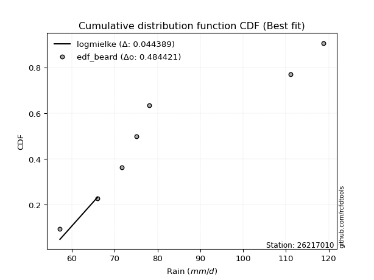</img>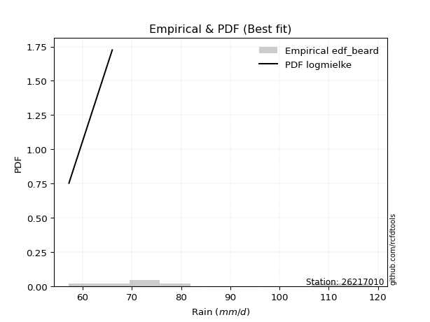</img>

</div>


### 5. Empirical - EDF Chegodayev (1955)

The Chegodayev formula is an empirical plotting position formula used in hydrological frequency analysis to estimate the exceedance probability or return period of a specific event from a set of observed data. It is primarily used for plotting observed data points on probability paper to fit a theoretical distribution, particularly for analyzing extreme events like maximum flood flows or rainfall intensities. The constant _b_ value in the generalized plotting position formula is 0.3.

<div align="center">


$P=(m-b)/(n+1-2b)$


</div>


**5.1. Empirical values**

<div align="center">

|                | 0                   | 1                   | 2                   | 3              | 4                  | 5                  | 6                  |
|:---------------|:--------------------|:--------------------|:--------------------|:---------------|:-------------------|:-------------------|:-------------------|
| date           | 2025                | 2020                | 2019                | 2023           | 2021               | 2022               | 2024               |
| x              | 55.2                | 57.2                | 66.0                | 71.6           | 75.0               | 111.0              | 118.8              |
| m              | 1                   | 2                   | 3                   | 4              | 5                  | 6                  | 7                  |
| empirical_dist | edf_chegodayev      | edf_chegodayev      | edf_chegodayev      | edf_chegodayev | edf_chegodayev     | edf_chegodayev     | edf_chegodayev     |
| empirical      | 0.09459459459459459 | 0.22972972972972971 | 0.36486486486486486 | 0.5            | 0.6351351351351351 | 0.7702702702702703 | 0.9054054054054054 |
| empirical_tr   | 1.1044776119402986  | 1.2982456140350878  | 1.574468085106383   | 2.0            | 2.7407407407407405 | 4.352941176470589  | 10.571428571428568 |

</div>


**5.2. Kolmogorov-Smirnov fit test (sorted by Δ)**


<div align="center">

|                | 0                   | 1                   | 2                   | 3                   | 4                   | 5                   | 6                   | 7                   | 8                   | 9                   | 10                  | 11                    | 12                  | 13                  | 14                  | 15                  | 16                  | 17                  | 18                  | 19                  | 20                  | 21                  | 22                  | 23                  | 24                  | 25                  | 26                  | 27                  | 28                  | 29                  | 30                  | 31                  | 32                  | 33                  | 34                  | 35                  | 36                  | 37                  | 38                  | 39                  | 40                  | 41                  | 42                  | 43                  | 44                  | 45                  | 46                  | 47                  | 48                  | 49                  | 50                  | 51                  | 52                  | 53                  | 54                  | 55                  | 56                  | 57                  | 58                  | 59                  | 60                  | 61                  | 62                  | 63                  | 64                  | 65                  | 66                  | 67                  | 68                  | 69                  | 70                  | 71                  | 72                  | 73                  | 74                  | 75                  | 76                  | 77                  | 78                  | 79                  | 80                  | 81                  | 82                  | 83                  | 84                  | 85                  | 86                  | 87                  | 88                  | 89                  |
|:---------------|:--------------------|:--------------------|:--------------------|:--------------------|:--------------------|:--------------------|:--------------------|:--------------------|:--------------------|:--------------------|:--------------------|:----------------------|:--------------------|:--------------------|:--------------------|:--------------------|:--------------------|:--------------------|:--------------------|:--------------------|:--------------------|:--------------------|:--------------------|:--------------------|:--------------------|:--------------------|:--------------------|:--------------------|:--------------------|:--------------------|:--------------------|:--------------------|:--------------------|:--------------------|:--------------------|:--------------------|:--------------------|:--------------------|:--------------------|:--------------------|:--------------------|:--------------------|:--------------------|:--------------------|:--------------------|:--------------------|:--------------------|:--------------------|:--------------------|:--------------------|:--------------------|:--------------------|:--------------------|:--------------------|:--------------------|:--------------------|:--------------------|:--------------------|:--------------------|:--------------------|:--------------------|:--------------------|:--------------------|:--------------------|:--------------------|:--------------------|:--------------------|:--------------------|:--------------------|:--------------------|:--------------------|:--------------------|:--------------------|:--------------------|:--------------------|:--------------------|:--------------------|:--------------------|:--------------------|:--------------------|:--------------------|:--------------------|:--------------------|:--------------------|:--------------------|:--------------------|:--------------------|:--------------------|:--------------------|:--------------------|
| station        | 26217010            | 26217010            | 26217010            | 26217010            | 26217010            | 26217010            | 26217010            | 26217010            | 26217010            | 26217010            | 26217010            | 26217010              | 26217010            | 26217010            | 26217010            | 26217010            | 26217010            | 26217010            | 26217010            | 26217010            | 26217010            | 26217010            | 26217010            | 26217010            | 26217010            | 26217010            | 26217010            | 26217010            | 26217010            | 26217010            | 26217010            | 26217010            | 26217010            | 26217010            | 26217010            | 26217010            | 26217010            | 26217010            | 26217010            | 26217010            | 26217010            | 26217010            | 26217010            | 26217010            | 26217010            | 26217010            | 26217010            | 26217010            | 26217010            | 26217010            | 26217010            | 26217010            | 26217010            | 26217010            | 26217010            | 26217010            | 26217010            | 26217010            | 26217010            | 26217010            | 26217010            | 26217010            | 26217010            | 26217010            | 26217010            | 26217010            | 26217010            | 26217010            | 26217010            | 26217010            | 26217010            | 26217010            | 26217010            | 26217010            | 26217010            | 26217010            | 26217010            | 26217010            | 26217010            | 26217010            | 26217010            | 26217010            | 26217010            | 26217010            | 26217010            | 26217010            | 26217010            | 26217010            | 26217010            | 26217010            |
| empirical_dist | edf_chegodayev      | edf_chegodayev      | edf_chegodayev      | edf_chegodayev      | edf_chegodayev      | edf_chegodayev      | edf_chegodayev      | edf_chegodayev      | edf_chegodayev      | edf_chegodayev      | edf_chegodayev      | edf_chegodayev        | edf_chegodayev      | edf_chegodayev      | edf_chegodayev      | edf_chegodayev      | edf_chegodayev      | edf_chegodayev      | edf_chegodayev      | edf_chegodayev      | edf_chegodayev      | edf_chegodayev      | edf_chegodayev      | edf_chegodayev      | edf_chegodayev      | edf_chegodayev      | edf_chegodayev      | edf_chegodayev      | edf_chegodayev      | edf_chegodayev      | edf_chegodayev      | edf_chegodayev      | edf_chegodayev      | edf_chegodayev      | edf_chegodayev      | edf_chegodayev      | edf_chegodayev      | edf_chegodayev      | edf_chegodayev      | edf_chegodayev      | edf_chegodayev      | edf_chegodayev      | edf_chegodayev      | edf_chegodayev      | edf_chegodayev      | edf_chegodayev      | edf_chegodayev      | edf_chegodayev      | edf_chegodayev      | edf_chegodayev      | edf_chegodayev      | edf_chegodayev      | edf_chegodayev      | edf_chegodayev      | edf_chegodayev      | edf_chegodayev      | edf_chegodayev      | edf_chegodayev      | edf_chegodayev      | edf_chegodayev      | edf_chegodayev      | edf_chegodayev      | edf_chegodayev      | edf_chegodayev      | edf_chegodayev      | edf_chegodayev      | edf_chegodayev      | edf_chegodayev      | edf_chegodayev      | edf_chegodayev      | edf_chegodayev      | edf_chegodayev      | edf_chegodayev      | edf_chegodayev      | edf_chegodayev      | edf_chegodayev      | edf_chegodayev      | edf_chegodayev      | edf_chegodayev      | edf_chegodayev      | edf_chegodayev      | edf_chegodayev      | edf_chegodayev      | edf_chegodayev      | edf_chegodayev      | edf_chegodayev      | edf_chegodayev      | edf_chegodayev      | edf_chegodayev      | edf_chegodayev      |
| p_dist         | lognakagami         | f                   | alpha               | invgamma            | loginvgauss         | fisk                | loginvgamma         | loginvweibull       | invgauss            | loghalfnorm         | logexponnorm        | loglaplace_asymmetric | logexpon            | halfnorm            | lograyleigh         | logmaxwell          | halflogistic        | loghalflogistic     | logpearson3         | loggumbel_r         | moyal               | logmoyal            | loggenexpon         | nct                 | logrice             | logmielke           | lognct              | betaprime           | loggenlogistic      | logkstwobign        | mielke              | gumbel_r            | logalpha            | exponnorm           | laplace_asymmetric  | expon               | genexpon            | kstwobign           | genlogistic         | logloggamma         | chi2                | logbetaprime        | logcrystalball      | lognorm             | lognorm             | logt                | logjohnsonsu        | loglogistic         | rayleigh            | pearson3            | loghypsecant        | loggompertz         | logncf              | loglaplace          | maxwell             | logfatiguelife      | ncf                 | erlang              | weibull_min         | logtruncnorm        | rice                | johnsonsu           | logweibull_min      | crystalball         | norm                | t                   | gompertz            | nakagami            | logistic            | hypsecant           | loggumbel_l         | truncnorm           | wald                | gibrat              | loggibrat           | logwald             | loggamma            | loggamma            | laplace             | logf                | logfisk             | gumbel_l            | logerlang           | logchi2             | pareto              | logpareto           | gamma               | loglognorm          | fatiguelife         | invweibull          |
| delta          | 0.09571512628221518 | 0.0999823396342569  | 0.10668116942252648 | 0.10930631999196905 | 0.11264308169999082 | 0.11297051051149615 | 0.11475139753557961 | 0.11662474400862788 | 0.11815878349138087 | 0.12242189177401497 | 0.12365078494478554 | 0.12447065419129055   | 0.12473534251451476 | 0.1259523535748177  | 0.12765433015579097 | 0.1304331143171552  | 0.131334677491452   | 0.13223432113998712 | 0.1329213777415743  | 0.13487246210823378 | 0.1352284405871872  | 0.13535234262807017 | 0.138077997311678   | 0.1381462298864401  | 0.13877517795624206 | 0.1393440042109727  | 0.13968789320388886 | 0.1399979793101973  | 0.14009930897224498 | 0.14096835185933687 | 0.14103402587264258 | 0.14241591279904664 | 0.14409851871480295 | 0.1487097751087194  | 0.14945192331058865 | 0.14995627727237076 | 0.15082225342800504 | 0.15205995775430525 | 0.15365566969712108 | 0.1538286215967558  | 0.15540471264104638 | 0.15542208778651923 | 0.1555270558436796  | 0.15552723483214165 | 0.15552723483214165 | 0.15552751575641333 | 0.15597535073384516 | 0.15830690363525046 | 0.16027040509582657 | 0.1603062438224767  | 0.1606765291199081  | 0.16601171725984792 | 0.1673568664365217  | 0.17001837113484664 | 0.1724049949250137  | 0.1858417940386387  | 0.19172952374984575 | 0.19275307996050217 | 0.19660124665818351 | 0.19995211827595194 | 0.20193055966445445 | 0.20442518278659644 | 0.2045129692705588  | 0.20679918109720186 | 0.2067991835206066  | 0.20683311108511027 | 0.21021116822927766 | 0.21077611057811324 | 0.21630909437042445 | 0.22425366841887162 | 0.2262074796985024  | 0.2272899675711444  | 0.22952016611806986 | 0.22972972972972971 | 0.22972972972972971 | 0.22972972972972971 | 0.23715683552069172 | 0.23715683552069172 | 0.24784127288763913 | 0.27222530508390635 | 0.27469576752308156 | 0.2757252183643287  | 0.27993110338167354 | 0.29552307474785466 | 0.3231517647330905  | 0.33660873008928005 | 0.3540128937448644  | 0.36456016315556916 | 0.4097407607772719  | 0.4675485314280173  |
| deltao         | 0.48442053926100004 | 0.48442053926100004 | 0.48442053926100004 | 0.48442053926100004 | 0.48442053926100004 | 0.48442053926100004 | 0.48442053926100004 | 0.48442053926100004 | 0.48442053926100004 | 0.48442053926100004 | 0.48442053926100004 | 0.48442053926100004   | 0.48442053926100004 | 0.48442053926100004 | 0.48442053926100004 | 0.48442053926100004 | 0.48442053926100004 | 0.48442053926100004 | 0.48442053926100004 | 0.48442053926100004 | 0.48442053926100004 | 0.48442053926100004 | 0.48442053926100004 | 0.48442053926100004 | 0.48442053926100004 | 0.48442053926100004 | 0.48442053926100004 | 0.48442053926100004 | 0.48442053926100004 | 0.48442053926100004 | 0.48442053926100004 | 0.48442053926100004 | 0.48442053926100004 | 0.48442053926100004 | 0.48442053926100004 | 0.48442053926100004 | 0.48442053926100004 | 0.48442053926100004 | 0.48442053926100004 | 0.48442053926100004 | 0.48442053926100004 | 0.48442053926100004 | 0.48442053926100004 | 0.48442053926100004 | 0.48442053926100004 | 0.48442053926100004 | 0.48442053926100004 | 0.48442053926100004 | 0.48442053926100004 | 0.48442053926100004 | 0.48442053926100004 | 0.48442053926100004 | 0.48442053926100004 | 0.48442053926100004 | 0.48442053926100004 | 0.48442053926100004 | 0.48442053926100004 | 0.48442053926100004 | 0.48442053926100004 | 0.48442053926100004 | 0.48442053926100004 | 0.48442053926100004 | 0.48442053926100004 | 0.48442053926100004 | 0.48442053926100004 | 0.48442053926100004 | 0.48442053926100004 | 0.48442053926100004 | 0.48442053926100004 | 0.48442053926100004 | 0.48442053926100004 | 0.48442053926100004 | 0.48442053926100004 | 0.48442053926100004 | 0.48442053926100004 | 0.48442053926100004 | 0.48442053926100004 | 0.48442053926100004 | 0.48442053926100004 | 0.48442053926100004 | 0.48442053926100004 | 0.48442053926100004 | 0.48442053926100004 | 0.48442053926100004 | 0.48442053926100004 | 0.48442053926100004 | 0.48442053926100004 | 0.48442053926100004 | 0.48442053926100004 | 0.48442053926100004 |
| eval           | Δo > Δ              | Δo > Δ              | Δo > Δ              | Δo > Δ              | Δo > Δ              | Δo > Δ              | Δo > Δ              | Δo > Δ              | Δo > Δ              | Δo > Δ              | Δo > Δ              | Δo > Δ                | Δo > Δ              | Δo > Δ              | Δo > Δ              | Δo > Δ              | Δo > Δ              | Δo > Δ              | Δo > Δ              | Δo > Δ              | Δo > Δ              | Δo > Δ              | Δo > Δ              | Δo > Δ              | Δo > Δ              | Δo > Δ              | Δo > Δ              | Δo > Δ              | Δo > Δ              | Δo > Δ              | Δo > Δ              | Δo > Δ              | Δo > Δ              | Δo > Δ              | Δo > Δ              | Δo > Δ              | Δo > Δ              | Δo > Δ              | Δo > Δ              | Δo > Δ              | Δo > Δ              | Δo > Δ              | Δo > Δ              | Δo > Δ              | Δo > Δ              | Δo > Δ              | Δo > Δ              | Δo > Δ              | Δo > Δ              | Δo > Δ              | Δo > Δ              | Δo > Δ              | Δo > Δ              | Δo > Δ              | Δo > Δ              | Δo > Δ              | Δo > Δ              | Δo > Δ              | Δo > Δ              | Δo > Δ              | Δo > Δ              | Δo > Δ              | Δo > Δ              | Δo > Δ              | Δo > Δ              | Δo > Δ              | Δo > Δ              | Δo > Δ              | Δo > Δ              | Δo > Δ              | Δo > Δ              | Δo > Δ              | Δo > Δ              | Δo > Δ              | Δo > Δ              | Δo > Δ              | Δo > Δ              | Δo > Δ              | Δo > Δ              | Δo > Δ              | Δo > Δ              | Δo > Δ              | Δo > Δ              | Δo > Δ              | Δo > Δ              | Δo > Δ              | Δo > Δ              | Δo > Δ              | Δo > Δ              | Δo > Δ              |
| fit            | 1                   | 1                   | 1                   | 1                   | 1                   | 1                   | 1                   | 1                   | 1                   | 1                   | 1                   | 1                     | 1                   | 1                   | 1                   | 1                   | 1                   | 1                   | 1                   | 1                   | 1                   | 1                   | 1                   | 1                   | 1                   | 1                   | 1                   | 1                   | 1                   | 1                   | 1                   | 1                   | 1                   | 1                   | 1                   | 1                   | 1                   | 1                   | 1                   | 1                   | 1                   | 1                   | 1                   | 1                   | 1                   | 1                   | 1                   | 1                   | 1                   | 1                   | 1                   | 1                   | 1                   | 1                   | 1                   | 1                   | 1                   | 1                   | 1                   | 1                   | 1                   | 1                   | 1                   | 1                   | 1                   | 1                   | 1                   | 1                   | 1                   | 1                   | 1                   | 1                   | 1                   | 1                   | 1                   | 1                   | 1                   | 1                   | 1                   | 1                   | 1                   | 1                   | 1                   | 1                   | 1                   | 1                   | 1                   | 1                   | 1                   | 1                   |
| n              | 7                   | 7                   | 7                   | 7                   | 7                   | 7                   | 7                   | 7                   | 7                   | 7                   | 7                   | 7                     | 7                   | 7                   | 7                   | 7                   | 7                   | 7                   | 7                   | 7                   | 7                   | 7                   | 7                   | 7                   | 7                   | 7                   | 7                   | 7                   | 7                   | 7                   | 7                   | 7                   | 7                   | 7                   | 7                   | 7                   | 7                   | 7                   | 7                   | 7                   | 7                   | 7                   | 7                   | 7                   | 7                   | 7                   | 7                   | 7                   | 7                   | 7                   | 7                   | 7                   | 7                   | 7                   | 7                   | 7                   | 7                   | 7                   | 7                   | 7                   | 7                   | 7                   | 7                   | 7                   | 7                   | 7                   | 7                   | 7                   | 7                   | 7                   | 7                   | 7                   | 7                   | 7                   | 7                   | 7                   | 7                   | 7                   | 7                   | 7                   | 7                   | 7                   | 7                   | 7                   | 7                   | 7                   | 7                   | 7                   | 7                   | 7                   |
| best_fit       | 1                   | 0                   | 0                   | 0                   | 0                   | 0                   | 0                   | 0                   | 0                   | 0                   | 0                   | 0                     | 0                   | 0                   | 0                   | 0                   | 0                   | 0                   | 0                   | 0                   | 0                   | 0                   | 0                   | 0                   | 0                   | 0                   | 0                   | 0                   | 0                   | 0                   | 0                   | 0                   | 0                   | 0                   | 0                   | 0                   | 0                   | 0                   | 0                   | 0                   | 0                   | 0                   | 0                   | 0                   | 0                   | 0                   | 0                   | 0                   | 0                   | 0                   | 0                   | 0                   | 0                   | 0                   | 0                   | 0                   | 0                   | 0                   | 0                   | 0                   | 0                   | 0                   | 0                   | 0                   | 0                   | 0                   | 0                   | 0                   | 0                   | 0                   | 0                   | 0                   | 0                   | 0                   | 0                   | 0                   | 0                   | 0                   | 0                   | 0                   | 0                   | 0                   | 0                   | 0                   | 0                   | 0                   | 0                   | 0                   | 0                   | 0                   |
| best_fit_sort  | 1                   | 2                   | 3                   | 4                   | 5                   | 6                   | 7                   | 8                   | 9                   | 10                  | 11                  | 12                    | 13                  | 14                  | 15                  | 16                  | 17                  | 18                  | 19                  | 20                  | 21                  | 22                  | 23                  | 24                  | 25                  | 26                  | 27                  | 28                  | 29                  | 30                  | 31                  | 32                  | 33                  | 34                  | 35                  | 36                  | 37                  | 38                  | 39                  | 40                  | 41                  | 42                  | 43                  | 44                  | 45                  | 46                  | 47                  | 48                  | 49                  | 50                  | 51                  | 52                  | 53                  | 54                  | 55                  | 56                  | 57                  | 58                  | 59                  | 60                  | 61                  | 62                  | 63                  | 64                  | 65                  | 66                  | 67                  | 68                  | 69                  | 70                  | 71                  | 72                  | 73                  | 74                  | 75                  | 76                  | 77                  | 78                  | 79                  | 80                  | 81                  | 82                  | 83                  | 84                  | 85                  | 86                  | 87                  | 88                  | 89                  | 90                  |

</div>


<div align="center">

</img>

</div>


**5.3. Best fit**

<div align="center">

|   id |   station | empirical_dist   | p_dist      |     delta |   deltao | eval   |   fit |   n |   best_fit |   best_fit_sort |
|-----:|----------:|:-----------------|:------------|----------:|---------:|:-------|------:|----:|-----------:|----------------:|
|    0 |  26217010 | edf_chegodayev   | lognakagami | 0.0957151 | 0.484421 | Δo > Δ |     1 |   7 |          1 |               1 |

</div>


<div align="center">

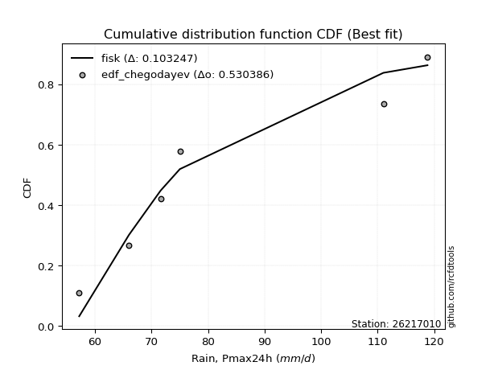</img>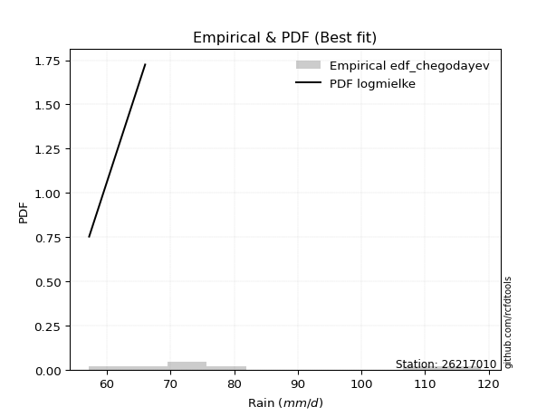</img>

</div>


### 6. Empirical - EDF Blom (1958)

The Blom formula is a specific "plotting position" formula used in hydrology and statistical analysis to estimate the empirical cumulative probability (or non-exceedance probability) of a data series. It is particularly recommended for data that are approximately normally distributed. The constant _a_ is set to 0.375 (or 3/8).

<div align="center">


$P=(m-a)/(n+1-2a)$


</div>


**6.1. Empirical values**

<div align="center">

|                | 0                   | 1                   | 2                  | 3        | 4                  | 5                  | 6                  |
|:---------------|:--------------------|:--------------------|:-------------------|:---------|:-------------------|:-------------------|:-------------------|
| date           | 2025                | 2020                | 2019               | 2023     | 2021               | 2022               | 2024               |
| x              | 55.2                | 57.2                | 66.0               | 71.6     | 75.0               | 111.0              | 118.8              |
| m              | 1                   | 2                   | 3                  | 4        | 5                  | 6                  | 7                  |
| empirical_dist | edf_blom            | edf_blom            | edf_blom           | edf_blom | edf_blom           | edf_blom           | edf_blom           |
| empirical      | 0.08620689655172414 | 0.22413793103448276 | 0.3620689655172414 | 0.5      | 0.6379310344827587 | 0.7758620689655172 | 0.9137931034482759 |
| empirical_tr   | 1.0943396226415094  | 1.288888888888889   | 1.5675675675675675 | 2.0      | 2.7619047619047623 | 4.461538461538462  | 11.600000000000007 |

</div>


**6.2. Kolmogorov-Smirnov fit test (sorted by Δ)**


<div align="center">

|                | 0                   | 1                   | 2                   | 3                   | 4                   | 5                   | 6                   | 7                   | 8                   | 9                   | 10                  | 11                    | 12                  | 13                  | 14                  | 15                  | 16                  | 17                  | 18                  | 19                  | 20                  | 21                  | 22                  | 23                  | 24                  | 25                  | 26                  | 27                  | 28                  | 29                  | 30                  | 31                  | 32                  | 33                  | 34                  | 35                  | 36                  | 37                  | 38                  | 39                  | 40                  | 41                  | 42                  | 43                  | 44                  | 45                  | 46                  | 47                  | 48                  | 49                  | 50                  | 51                  | 52                  | 53                  | 54                  | 55                  | 56                  | 57                  | 58                  | 59                  | 60                  | 61                  | 62                  | 63                  | 64                  | 65                  | 66                  | 67                  | 68                  | 69                  | 70                  | 71                  | 72                  | 73                  | 74                  | 75                  | 76                  | 77                  | 78                  | 79                  | 80                  | 81                  | 82                  | 83                  | 84                  | 85                  | 86                  | 87                  | 88                  | 89                  |
|:---------------|:--------------------|:--------------------|:--------------------|:--------------------|:--------------------|:--------------------|:--------------------|:--------------------|:--------------------|:--------------------|:--------------------|:----------------------|:--------------------|:--------------------|:--------------------|:--------------------|:--------------------|:--------------------|:--------------------|:--------------------|:--------------------|:--------------------|:--------------------|:--------------------|:--------------------|:--------------------|:--------------------|:--------------------|:--------------------|:--------------------|:--------------------|:--------------------|:--------------------|:--------------------|:--------------------|:--------------------|:--------------------|:--------------------|:--------------------|:--------------------|:--------------------|:--------------------|:--------------------|:--------------------|:--------------------|:--------------------|:--------------------|:--------------------|:--------------------|:--------------------|:--------------------|:--------------------|:--------------------|:--------------------|:--------------------|:--------------------|:--------------------|:--------------------|:--------------------|:--------------------|:--------------------|:--------------------|:--------------------|:--------------------|:--------------------|:--------------------|:--------------------|:--------------------|:--------------------|:--------------------|:--------------------|:--------------------|:--------------------|:--------------------|:--------------------|:--------------------|:--------------------|:--------------------|:--------------------|:--------------------|:--------------------|:--------------------|:--------------------|:--------------------|:--------------------|:--------------------|:--------------------|:--------------------|:--------------------|:--------------------|
| station        | 26217010            | 26217010            | 26217010            | 26217010            | 26217010            | 26217010            | 26217010            | 26217010            | 26217010            | 26217010            | 26217010            | 26217010              | 26217010            | 26217010            | 26217010            | 26217010            | 26217010            | 26217010            | 26217010            | 26217010            | 26217010            | 26217010            | 26217010            | 26217010            | 26217010            | 26217010            | 26217010            | 26217010            | 26217010            | 26217010            | 26217010            | 26217010            | 26217010            | 26217010            | 26217010            | 26217010            | 26217010            | 26217010            | 26217010            | 26217010            | 26217010            | 26217010            | 26217010            | 26217010            | 26217010            | 26217010            | 26217010            | 26217010            | 26217010            | 26217010            | 26217010            | 26217010            | 26217010            | 26217010            | 26217010            | 26217010            | 26217010            | 26217010            | 26217010            | 26217010            | 26217010            | 26217010            | 26217010            | 26217010            | 26217010            | 26217010            | 26217010            | 26217010            | 26217010            | 26217010            | 26217010            | 26217010            | 26217010            | 26217010            | 26217010            | 26217010            | 26217010            | 26217010            | 26217010            | 26217010            | 26217010            | 26217010            | 26217010            | 26217010            | 26217010            | 26217010            | 26217010            | 26217010            | 26217010            | 26217010            |
| empirical_dist | edf_blom            | edf_blom            | edf_blom            | edf_blom            | edf_blom            | edf_blom            | edf_blom            | edf_blom            | edf_blom            | edf_blom            | edf_blom            | edf_blom              | edf_blom            | edf_blom            | edf_blom            | edf_blom            | edf_blom            | edf_blom            | edf_blom            | edf_blom            | edf_blom            | edf_blom            | edf_blom            | edf_blom            | edf_blom            | edf_blom            | edf_blom            | edf_blom            | edf_blom            | edf_blom            | edf_blom            | edf_blom            | edf_blom            | edf_blom            | edf_blom            | edf_blom            | edf_blom            | edf_blom            | edf_blom            | edf_blom            | edf_blom            | edf_blom            | edf_blom            | edf_blom            | edf_blom            | edf_blom            | edf_blom            | edf_blom            | edf_blom            | edf_blom            | edf_blom            | edf_blom            | edf_blom            | edf_blom            | edf_blom            | edf_blom            | edf_blom            | edf_blom            | edf_blom            | edf_blom            | edf_blom            | edf_blom            | edf_blom            | edf_blom            | edf_blom            | edf_blom            | edf_blom            | edf_blom            | edf_blom            | edf_blom            | edf_blom            | edf_blom            | edf_blom            | edf_blom            | edf_blom            | edf_blom            | edf_blom            | edf_blom            | edf_blom            | edf_blom            | edf_blom            | edf_blom            | edf_blom            | edf_blom            | edf_blom            | edf_blom            | edf_blom            | edf_blom            | edf_blom            | edf_blom            |
| p_dist         | lognakagami         | f                   | invgamma            | loginvgauss         | loginvgamma         | alpha               | loginvweibull       | invgauss            | fisk                | loghalfnorm         | logexponnorm        | loglaplace_asymmetric | logexpon            | lograyleigh         | logmaxwell          | halflogistic        | loghalflogistic     | logpearson3         | halfnorm            | loggumbel_r         | moyal               | logmoyal            | loggenexpon         | nct                 | logmielke           | loggenlogistic      | logkstwobign        | mielke              | lognct              | logrice             | logalpha            | betaprime           | exponnorm           | laplace_asymmetric  | expon               | gumbel_r            | genexpon            | genlogistic         | chi2                | kstwobign           | logloggamma         | logbetaprime        | logcrystalball      | lognorm             | lognorm             | logt                | logjohnsonsu        | loggompertz         | loglogistic         | rayleigh            | pearson3            | loghypsecant        | loglaplace          | maxwell             | logncf              | erlang              | logfatiguelife      | logtruncnorm        | ncf                 | weibull_min         | rice                | johnsonsu           | logweibull_min      | crystalball         | norm                | t                   | gompertz            | nakagami            | logistic            | wald                | gibrat              | logwald             | loggibrat           | hypsecant           | loggumbel_l         | truncnorm           | loggamma            | loggamma            | laplace             | logf                | gumbel_l            | logerlang           | logfisk             | logchi2             | pareto              | logpareto           | gamma               | loglognorm          | fatiguelife         | invweibull          |
| delta          | 0.09851102562983866 | 0.10277823898188038 | 0.1037145212967221  | 0.10705128300474387 | 0.10915959884033266 | 0.10947706877014995 | 0.11103294531338093 | 0.11256698479613392 | 0.11576640985911962 | 0.11683009307876802 | 0.11805898624953859 | 0.1188788554960436    | 0.11914354381926781 | 0.12206253146054402 | 0.12484131562190826 | 0.12574287879620505 | 0.12664252244474017 | 0.12732957904632736 | 0.1287482529224413  | 0.12928066341298683 | 0.12963664189194024 | 0.1297605439328232  | 0.13248619861643104 | 0.13255443119119314 | 0.13375220551572575 | 0.13450751027699803 | 0.13537655316408992 | 0.13544222717739562 | 0.13646027361327961 | 0.13718267156605746 | 0.138506720019556   | 0.1427938786578209  | 0.14311797641347246 | 0.1438601246153417  | 0.1443644785771238  | 0.14521181214667023 | 0.14523045473275809 | 0.14806387100187413 | 0.14981291394579943 | 0.15485585710192884 | 0.1566245209443794  | 0.1582179871341428  | 0.15832295519130318 | 0.15832313417976523 | 0.15832313417976523 | 0.1583234151040369  | 0.15877125008146875 | 0.16041991856460097 | 0.16110280298287405 | 0.16306630444345016 | 0.1631021431701003  | 0.16347242846753168 | 0.17281427048247022 | 0.1752008942726373  | 0.17574456447939213 | 0.18716128126525522 | 0.18863769338626218 | 0.194360319580705   | 0.19452542309746934 | 0.199397146005807   | 0.20472645901207803 | 0.20722108213422002 | 0.20730886861818226 | 0.20959508044482544 | 0.2095950828682302  | 0.20962901043273385 | 0.21300706757690124 | 0.21357200992573672 | 0.21910499371804804 | 0.2239283674228229  | 0.22413793103448276 | 0.22413793103448276 | 0.22413793103448276 | 0.2270495677664952  | 0.229003379046126   | 0.23008586691876798 | 0.2399527348683152  | 0.2399527348683152  | 0.2506371722352627  | 0.27502120443152983 | 0.27852111771195226 | 0.282727002729297   | 0.2830834655659521  | 0.3039107727907252  | 0.32874356342833744 | 0.342200528784527   | 0.35680879309248786 | 0.3701519618508161  | 0.41253666012489537 | 0.4759362294708878  |
| deltao         | 0.48442053926100004 | 0.48442053926100004 | 0.48442053926100004 | 0.48442053926100004 | 0.48442053926100004 | 0.48442053926100004 | 0.48442053926100004 | 0.48442053926100004 | 0.48442053926100004 | 0.48442053926100004 | 0.48442053926100004 | 0.48442053926100004   | 0.48442053926100004 | 0.48442053926100004 | 0.48442053926100004 | 0.48442053926100004 | 0.48442053926100004 | 0.48442053926100004 | 0.48442053926100004 | 0.48442053926100004 | 0.48442053926100004 | 0.48442053926100004 | 0.48442053926100004 | 0.48442053926100004 | 0.48442053926100004 | 0.48442053926100004 | 0.48442053926100004 | 0.48442053926100004 | 0.48442053926100004 | 0.48442053926100004 | 0.48442053926100004 | 0.48442053926100004 | 0.48442053926100004 | 0.48442053926100004 | 0.48442053926100004 | 0.48442053926100004 | 0.48442053926100004 | 0.48442053926100004 | 0.48442053926100004 | 0.48442053926100004 | 0.48442053926100004 | 0.48442053926100004 | 0.48442053926100004 | 0.48442053926100004 | 0.48442053926100004 | 0.48442053926100004 | 0.48442053926100004 | 0.48442053926100004 | 0.48442053926100004 | 0.48442053926100004 | 0.48442053926100004 | 0.48442053926100004 | 0.48442053926100004 | 0.48442053926100004 | 0.48442053926100004 | 0.48442053926100004 | 0.48442053926100004 | 0.48442053926100004 | 0.48442053926100004 | 0.48442053926100004 | 0.48442053926100004 | 0.48442053926100004 | 0.48442053926100004 | 0.48442053926100004 | 0.48442053926100004 | 0.48442053926100004 | 0.48442053926100004 | 0.48442053926100004 | 0.48442053926100004 | 0.48442053926100004 | 0.48442053926100004 | 0.48442053926100004 | 0.48442053926100004 | 0.48442053926100004 | 0.48442053926100004 | 0.48442053926100004 | 0.48442053926100004 | 0.48442053926100004 | 0.48442053926100004 | 0.48442053926100004 | 0.48442053926100004 | 0.48442053926100004 | 0.48442053926100004 | 0.48442053926100004 | 0.48442053926100004 | 0.48442053926100004 | 0.48442053926100004 | 0.48442053926100004 | 0.48442053926100004 | 0.48442053926100004 |
| eval           | Δo > Δ              | Δo > Δ              | Δo > Δ              | Δo > Δ              | Δo > Δ              | Δo > Δ              | Δo > Δ              | Δo > Δ              | Δo > Δ              | Δo > Δ              | Δo > Δ              | Δo > Δ                | Δo > Δ              | Δo > Δ              | Δo > Δ              | Δo > Δ              | Δo > Δ              | Δo > Δ              | Δo > Δ              | Δo > Δ              | Δo > Δ              | Δo > Δ              | Δo > Δ              | Δo > Δ              | Δo > Δ              | Δo > Δ              | Δo > Δ              | Δo > Δ              | Δo > Δ              | Δo > Δ              | Δo > Δ              | Δo > Δ              | Δo > Δ              | Δo > Δ              | Δo > Δ              | Δo > Δ              | Δo > Δ              | Δo > Δ              | Δo > Δ              | Δo > Δ              | Δo > Δ              | Δo > Δ              | Δo > Δ              | Δo > Δ              | Δo > Δ              | Δo > Δ              | Δo > Δ              | Δo > Δ              | Δo > Δ              | Δo > Δ              | Δo > Δ              | Δo > Δ              | Δo > Δ              | Δo > Δ              | Δo > Δ              | Δo > Δ              | Δo > Δ              | Δo > Δ              | Δo > Δ              | Δo > Δ              | Δo > Δ              | Δo > Δ              | Δo > Δ              | Δo > Δ              | Δo > Δ              | Δo > Δ              | Δo > Δ              | Δo > Δ              | Δo > Δ              | Δo > Δ              | Δo > Δ              | Δo > Δ              | Δo > Δ              | Δo > Δ              | Δo > Δ              | Δo > Δ              | Δo > Δ              | Δo > Δ              | Δo > Δ              | Δo > Δ              | Δo > Δ              | Δo > Δ              | Δo > Δ              | Δo > Δ              | Δo > Δ              | Δo > Δ              | Δo > Δ              | Δo > Δ              | Δo > Δ              | Δo > Δ              |
| fit            | 1                   | 1                   | 1                   | 1                   | 1                   | 1                   | 1                   | 1                   | 1                   | 1                   | 1                   | 1                     | 1                   | 1                   | 1                   | 1                   | 1                   | 1                   | 1                   | 1                   | 1                   | 1                   | 1                   | 1                   | 1                   | 1                   | 1                   | 1                   | 1                   | 1                   | 1                   | 1                   | 1                   | 1                   | 1                   | 1                   | 1                   | 1                   | 1                   | 1                   | 1                   | 1                   | 1                   | 1                   | 1                   | 1                   | 1                   | 1                   | 1                   | 1                   | 1                   | 1                   | 1                   | 1                   | 1                   | 1                   | 1                   | 1                   | 1                   | 1                   | 1                   | 1                   | 1                   | 1                   | 1                   | 1                   | 1                   | 1                   | 1                   | 1                   | 1                   | 1                   | 1                   | 1                   | 1                   | 1                   | 1                   | 1                   | 1                   | 1                   | 1                   | 1                   | 1                   | 1                   | 1                   | 1                   | 1                   | 1                   | 1                   | 1                   |
| n              | 7                   | 7                   | 7                   | 7                   | 7                   | 7                   | 7                   | 7                   | 7                   | 7                   | 7                   | 7                     | 7                   | 7                   | 7                   | 7                   | 7                   | 7                   | 7                   | 7                   | 7                   | 7                   | 7                   | 7                   | 7                   | 7                   | 7                   | 7                   | 7                   | 7                   | 7                   | 7                   | 7                   | 7                   | 7                   | 7                   | 7                   | 7                   | 7                   | 7                   | 7                   | 7                   | 7                   | 7                   | 7                   | 7                   | 7                   | 7                   | 7                   | 7                   | 7                   | 7                   | 7                   | 7                   | 7                   | 7                   | 7                   | 7                   | 7                   | 7                   | 7                   | 7                   | 7                   | 7                   | 7                   | 7                   | 7                   | 7                   | 7                   | 7                   | 7                   | 7                   | 7                   | 7                   | 7                   | 7                   | 7                   | 7                   | 7                   | 7                   | 7                   | 7                   | 7                   | 7                   | 7                   | 7                   | 7                   | 7                   | 7                   | 7                   |
| best_fit       | 1                   | 0                   | 0                   | 0                   | 0                   | 0                   | 0                   | 0                   | 0                   | 0                   | 0                   | 0                     | 0                   | 0                   | 0                   | 0                   | 0                   | 0                   | 0                   | 0                   | 0                   | 0                   | 0                   | 0                   | 0                   | 0                   | 0                   | 0                   | 0                   | 0                   | 0                   | 0                   | 0                   | 0                   | 0                   | 0                   | 0                   | 0                   | 0                   | 0                   | 0                   | 0                   | 0                   | 0                   | 0                   | 0                   | 0                   | 0                   | 0                   | 0                   | 0                   | 0                   | 0                   | 0                   | 0                   | 0                   | 0                   | 0                   | 0                   | 0                   | 0                   | 0                   | 0                   | 0                   | 0                   | 0                   | 0                   | 0                   | 0                   | 0                   | 0                   | 0                   | 0                   | 0                   | 0                   | 0                   | 0                   | 0                   | 0                   | 0                   | 0                   | 0                   | 0                   | 0                   | 0                   | 0                   | 0                   | 0                   | 0                   | 0                   |
| best_fit_sort  | 1                   | 2                   | 3                   | 4                   | 5                   | 6                   | 7                   | 8                   | 9                   | 10                  | 11                  | 12                    | 13                  | 14                  | 15                  | 16                  | 17                  | 18                  | 19                  | 20                  | 21                  | 22                  | 23                  | 24                  | 25                  | 26                  | 27                  | 28                  | 29                  | 30                  | 31                  | 32                  | 33                  | 34                  | 35                  | 36                  | 37                  | 38                  | 39                  | 40                  | 41                  | 42                  | 43                  | 44                  | 45                  | 46                  | 47                  | 48                  | 49                  | 50                  | 51                  | 52                  | 53                  | 54                  | 55                  | 56                  | 57                  | 58                  | 59                  | 60                  | 61                  | 62                  | 63                  | 64                  | 65                  | 66                  | 67                  | 68                  | 69                  | 70                  | 71                  | 72                  | 73                  | 74                  | 75                  | 76                  | 77                  | 78                  | 79                  | 80                  | 81                  | 82                  | 83                  | 84                  | 85                  | 86                  | 87                  | 88                  | 89                  | 90                  |

</div>


<div align="center">

</img>

</div>


**6.3. Best fit**

<div align="center">

|   id |   station | empirical_dist   | p_dist      |    delta |   deltao | eval   |   fit |   n |   best_fit |   best_fit_sort |
|-----:|----------:|:-----------------|:------------|---------:|---------:|:-------|------:|----:|-----------:|----------------:|
|    0 |  26217010 | edf_blom         | lognakagami | 0.098511 | 0.484421 | Δo > Δ |     1 |   7 |          1 |               1 |

</div>


<div align="center">

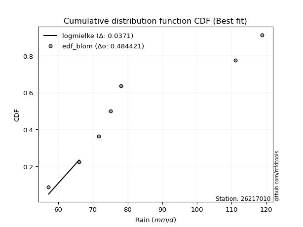</img></img>

</div>


### 7. Empirical - EDF Tukey (1962)

In hydrology, the Tukey formula is used as a plotting position formula to estimate the empirical probability or frequency of a flood event (or other hydrological data). The formula parameter is given as _c=0.333_ (or 1/3).

<div align="center">


$P=(m-c)/(n+1-2c)$


</div>


**7.1. Empirical values**

<div align="center">

|                | 0                   | 1                   | 2                   | 3         | 4                  | 5                  | 6                  |
|:---------------|:--------------------|:--------------------|:--------------------|:----------|:-------------------|:-------------------|:-------------------|
| date           | 2025                | 2020                | 2019                | 2023      | 2021               | 2022               | 2024               |
| x              | 55.2                | 57.2                | 66.0                | 71.6      | 75.0               | 111.0              | 118.8              |
| m              | 1                   | 2                   | 3                   | 4         | 5                  | 6                  | 7                  |
| empirical_dist | edf_tukey           | edf_tukey           | edf_tukey           | edf_tukey | edf_tukey          | edf_tukey          | edf_tukey          |
| empirical      | 0.09090909090909091 | 0.22727272727272727 | 0.36363636363636365 | 0.5       | 0.6363636363636364 | 0.7727272727272727 | 0.9090909090909091 |
| empirical_tr   | 1.1                 | 1.2941176470588236  | 1.5714285714285714  | 2.0       | 2.75               | 4.3999999999999995 | 10.999999999999996 |

</div>


**7.2. Kolmogorov-Smirnov fit test (sorted by Δ)**


<div align="center">

|                | 0                   | 1                   | 2                   | 3                   | 4                   | 5                   | 6                   | 7                   | 8                   | 9                   | 10                  | 11                    | 12                  | 13                  | 14                  | 15                  | 16                  | 17                  | 18                  | 19                  | 20                  | 21                  | 22                  | 23                  | 24                  | 25                  | 26                  | 27                  | 28                  | 29                  | 30                  | 31                  | 32                  | 33                  | 34                  | 35                  | 36                  | 37                  | 38                  | 39                  | 40                  | 41                  | 42                  | 43                  | 44                  | 45                  | 46                  | 47                  | 48                  | 49                  | 50                  | 51                  | 52                  | 53                  | 54                  | 55                  | 56                  | 57                  | 58                  | 59                  | 60                  | 61                  | 62                  | 63                  | 64                  | 65                  | 66                  | 67                  | 68                  | 69                  | 70                  | 71                  | 72                  | 73                  | 74                  | 75                  | 76                  | 77                  | 78                  | 79                  | 80                  | 81                  | 82                  | 83                  | 84                  | 85                  | 86                  | 87                  | 88                  | 89                  |
|:---------------|:--------------------|:--------------------|:--------------------|:--------------------|:--------------------|:--------------------|:--------------------|:--------------------|:--------------------|:--------------------|:--------------------|:----------------------|:--------------------|:--------------------|:--------------------|:--------------------|:--------------------|:--------------------|:--------------------|:--------------------|:--------------------|:--------------------|:--------------------|:--------------------|:--------------------|:--------------------|:--------------------|:--------------------|:--------------------|:--------------------|:--------------------|:--------------------|:--------------------|:--------------------|:--------------------|:--------------------|:--------------------|:--------------------|:--------------------|:--------------------|:--------------------|:--------------------|:--------------------|:--------------------|:--------------------|:--------------------|:--------------------|:--------------------|:--------------------|:--------------------|:--------------------|:--------------------|:--------------------|:--------------------|:--------------------|:--------------------|:--------------------|:--------------------|:--------------------|:--------------------|:--------------------|:--------------------|:--------------------|:--------------------|:--------------------|:--------------------|:--------------------|:--------------------|:--------------------|:--------------------|:--------------------|:--------------------|:--------------------|:--------------------|:--------------------|:--------------------|:--------------------|:--------------------|:--------------------|:--------------------|:--------------------|:--------------------|:--------------------|:--------------------|:--------------------|:--------------------|:--------------------|:--------------------|:--------------------|:--------------------|
| station        | 26217010            | 26217010            | 26217010            | 26217010            | 26217010            | 26217010            | 26217010            | 26217010            | 26217010            | 26217010            | 26217010            | 26217010              | 26217010            | 26217010            | 26217010            | 26217010            | 26217010            | 26217010            | 26217010            | 26217010            | 26217010            | 26217010            | 26217010            | 26217010            | 26217010            | 26217010            | 26217010            | 26217010            | 26217010            | 26217010            | 26217010            | 26217010            | 26217010            | 26217010            | 26217010            | 26217010            | 26217010            | 26217010            | 26217010            | 26217010            | 26217010            | 26217010            | 26217010            | 26217010            | 26217010            | 26217010            | 26217010            | 26217010            | 26217010            | 26217010            | 26217010            | 26217010            | 26217010            | 26217010            | 26217010            | 26217010            | 26217010            | 26217010            | 26217010            | 26217010            | 26217010            | 26217010            | 26217010            | 26217010            | 26217010            | 26217010            | 26217010            | 26217010            | 26217010            | 26217010            | 26217010            | 26217010            | 26217010            | 26217010            | 26217010            | 26217010            | 26217010            | 26217010            | 26217010            | 26217010            | 26217010            | 26217010            | 26217010            | 26217010            | 26217010            | 26217010            | 26217010            | 26217010            | 26217010            | 26217010            |
| empirical_dist | edf_tukey           | edf_tukey           | edf_tukey           | edf_tukey           | edf_tukey           | edf_tukey           | edf_tukey           | edf_tukey           | edf_tukey           | edf_tukey           | edf_tukey           | edf_tukey             | edf_tukey           | edf_tukey           | edf_tukey           | edf_tukey           | edf_tukey           | edf_tukey           | edf_tukey           | edf_tukey           | edf_tukey           | edf_tukey           | edf_tukey           | edf_tukey           | edf_tukey           | edf_tukey           | edf_tukey           | edf_tukey           | edf_tukey           | edf_tukey           | edf_tukey           | edf_tukey           | edf_tukey           | edf_tukey           | edf_tukey           | edf_tukey           | edf_tukey           | edf_tukey           | edf_tukey           | edf_tukey           | edf_tukey           | edf_tukey           | edf_tukey           | edf_tukey           | edf_tukey           | edf_tukey           | edf_tukey           | edf_tukey           | edf_tukey           | edf_tukey           | edf_tukey           | edf_tukey           | edf_tukey           | edf_tukey           | edf_tukey           | edf_tukey           | edf_tukey           | edf_tukey           | edf_tukey           | edf_tukey           | edf_tukey           | edf_tukey           | edf_tukey           | edf_tukey           | edf_tukey           | edf_tukey           | edf_tukey           | edf_tukey           | edf_tukey           | edf_tukey           | edf_tukey           | edf_tukey           | edf_tukey           | edf_tukey           | edf_tukey           | edf_tukey           | edf_tukey           | edf_tukey           | edf_tukey           | edf_tukey           | edf_tukey           | edf_tukey           | edf_tukey           | edf_tukey           | edf_tukey           | edf_tukey           | edf_tukey           | edf_tukey           | edf_tukey           | edf_tukey           |
| p_dist         | lognakagami         | f                   | invgamma            | alpha               | loginvgauss         | loginvgamma         | loginvweibull       | fisk                | invgauss            | loghalfnorm         | logexponnorm        | loglaplace_asymmetric | logexpon            | lograyleigh         | halfnorm            | logmaxwell          | halflogistic        | loghalflogistic     | logpearson3         | loggumbel_r         | moyal               | logmoyal            | loggenexpon         | nct                 | logrice             | logmielke           | lognct              | loggenlogistic      | logkstwobign        | mielke              | betaprime           | logalpha            | gumbel_r            | exponnorm           | laplace_asymmetric  | expon               | genexpon            | genlogistic         | chi2                | kstwobign           | logloggamma         | logbetaprime        | logcrystalball      | lognorm             | lognorm             | logt                | logjohnsonsu        | loglogistic         | rayleigh            | pearson3            | loghypsecant        | loggompertz         | logncf              | loglaplace          | maxwell             | logfatiguelife      | erlang              | ncf                 | logtruncnorm        | weibull_min         | rice                | johnsonsu           | logweibull_min      | crystalball         | norm                | t                   | gompertz            | nakagami            | logistic            | hypsecant           | wald                | logwald             | loggibrat           | gibrat              | loggumbel_l         | truncnorm           | loggamma            | loggamma            | laplace             | logf                | gumbel_l            | logfisk             | logerlang           | logchi2             | pareto              | logpareto           | gamma               | loglognorm          | fatiguelife         | invweibull          |
| delta          | 0.09694362751071639 | 0.10121084086275811 | 0.10684931753496663 | 0.10790967065102769 | 0.1101860792429884  | 0.11229439507857719 | 0.11416774155162546 | 0.11419901173999736 | 0.11570178103437845 | 0.11996488931701255 | 0.12119378248778309 | 0.12201365173428813   | 0.12227834005751231 | 0.12519732769878855 | 0.12718085480331898 | 0.12797611186015279 | 0.12887767503444958 | 0.12977731868298467 | 0.1304643752845719  | 0.13241545965123136 | 0.13277143813018477 | 0.13289534017106774 | 0.13562099485467555 | 0.13568922742943768 | 0.13631817549923964 | 0.13688700175397028 | 0.13723089074688644 | 0.13764230651524256 | 0.13851134940233445 | 0.13857702341564015 | 0.14122648053869857 | 0.14164151625780053 | 0.1436444140275479  | 0.14625277265171696 | 0.1469949208535862  | 0.14749927481536834 | 0.14836525097100256 | 0.15119866724011866 | 0.15294771018404396 | 0.15328845898280652 | 0.15505712282525708 | 0.1566505890150205  | 0.15675555707218086 | 0.15675573606064291 | 0.15675573606064291 | 0.1567560169849146  | 0.15720385196234643 | 0.15953540486375173 | 0.16149890632432784 | 0.16153474505097798 | 0.16190503034840936 | 0.16355471480284545 | 0.17104237012202536 | 0.1712468723633479  | 0.17363349615351498 | 0.18707029526713992 | 0.19029607750349975 | 0.19295802497834702 | 0.19749511581894952 | 0.19782974788668473 | 0.2031590608929557  | 0.2056536840150977  | 0.20574147049906    | 0.20802768232570312 | 0.20802768474910788 | 0.20806161231361153 | 0.21143966945777892 | 0.21200461180661445 | 0.21753759559892571 | 0.2254821696473729  | 0.2270631636610674  | 0.22727272727272727 | 0.22727272727272727 | 0.22727272727272727 | 0.22743598092700368 | 0.22851846879964566 | 0.23838533674919293 | 0.23838533674919293 | 0.2490697741161404  | 0.27345380631240757 | 0.27695371959282994 | 0.27838127120858525 | 0.28115960461017475 | 0.29920857843335835 | 0.3256087671900929  | 0.3390657325462825  | 0.3552413949733656  | 0.3670171656125716  | 0.4109692620057731  | 0.47123403511352097 |
| deltao         | 0.48442053926100004 | 0.48442053926100004 | 0.48442053926100004 | 0.48442053926100004 | 0.48442053926100004 | 0.48442053926100004 | 0.48442053926100004 | 0.48442053926100004 | 0.48442053926100004 | 0.48442053926100004 | 0.48442053926100004 | 0.48442053926100004   | 0.48442053926100004 | 0.48442053926100004 | 0.48442053926100004 | 0.48442053926100004 | 0.48442053926100004 | 0.48442053926100004 | 0.48442053926100004 | 0.48442053926100004 | 0.48442053926100004 | 0.48442053926100004 | 0.48442053926100004 | 0.48442053926100004 | 0.48442053926100004 | 0.48442053926100004 | 0.48442053926100004 | 0.48442053926100004 | 0.48442053926100004 | 0.48442053926100004 | 0.48442053926100004 | 0.48442053926100004 | 0.48442053926100004 | 0.48442053926100004 | 0.48442053926100004 | 0.48442053926100004 | 0.48442053926100004 | 0.48442053926100004 | 0.48442053926100004 | 0.48442053926100004 | 0.48442053926100004 | 0.48442053926100004 | 0.48442053926100004 | 0.48442053926100004 | 0.48442053926100004 | 0.48442053926100004 | 0.48442053926100004 | 0.48442053926100004 | 0.48442053926100004 | 0.48442053926100004 | 0.48442053926100004 | 0.48442053926100004 | 0.48442053926100004 | 0.48442053926100004 | 0.48442053926100004 | 0.48442053926100004 | 0.48442053926100004 | 0.48442053926100004 | 0.48442053926100004 | 0.48442053926100004 | 0.48442053926100004 | 0.48442053926100004 | 0.48442053926100004 | 0.48442053926100004 | 0.48442053926100004 | 0.48442053926100004 | 0.48442053926100004 | 0.48442053926100004 | 0.48442053926100004 | 0.48442053926100004 | 0.48442053926100004 | 0.48442053926100004 | 0.48442053926100004 | 0.48442053926100004 | 0.48442053926100004 | 0.48442053926100004 | 0.48442053926100004 | 0.48442053926100004 | 0.48442053926100004 | 0.48442053926100004 | 0.48442053926100004 | 0.48442053926100004 | 0.48442053926100004 | 0.48442053926100004 | 0.48442053926100004 | 0.48442053926100004 | 0.48442053926100004 | 0.48442053926100004 | 0.48442053926100004 | 0.48442053926100004 |
| eval           | Δo > Δ              | Δo > Δ              | Δo > Δ              | Δo > Δ              | Δo > Δ              | Δo > Δ              | Δo > Δ              | Δo > Δ              | Δo > Δ              | Δo > Δ              | Δo > Δ              | Δo > Δ                | Δo > Δ              | Δo > Δ              | Δo > Δ              | Δo > Δ              | Δo > Δ              | Δo > Δ              | Δo > Δ              | Δo > Δ              | Δo > Δ              | Δo > Δ              | Δo > Δ              | Δo > Δ              | Δo > Δ              | Δo > Δ              | Δo > Δ              | Δo > Δ              | Δo > Δ              | Δo > Δ              | Δo > Δ              | Δo > Δ              | Δo > Δ              | Δo > Δ              | Δo > Δ              | Δo > Δ              | Δo > Δ              | Δo > Δ              | Δo > Δ              | Δo > Δ              | Δo > Δ              | Δo > Δ              | Δo > Δ              | Δo > Δ              | Δo > Δ              | Δo > Δ              | Δo > Δ              | Δo > Δ              | Δo > Δ              | Δo > Δ              | Δo > Δ              | Δo > Δ              | Δo > Δ              | Δo > Δ              | Δo > Δ              | Δo > Δ              | Δo > Δ              | Δo > Δ              | Δo > Δ              | Δo > Δ              | Δo > Δ              | Δo > Δ              | Δo > Δ              | Δo > Δ              | Δo > Δ              | Δo > Δ              | Δo > Δ              | Δo > Δ              | Δo > Δ              | Δo > Δ              | Δo > Δ              | Δo > Δ              | Δo > Δ              | Δo > Δ              | Δo > Δ              | Δo > Δ              | Δo > Δ              | Δo > Δ              | Δo > Δ              | Δo > Δ              | Δo > Δ              | Δo > Δ              | Δo > Δ              | Δo > Δ              | Δo > Δ              | Δo > Δ              | Δo > Δ              | Δo > Δ              | Δo > Δ              | Δo > Δ              |
| fit            | 1                   | 1                   | 1                   | 1                   | 1                   | 1                   | 1                   | 1                   | 1                   | 1                   | 1                   | 1                     | 1                   | 1                   | 1                   | 1                   | 1                   | 1                   | 1                   | 1                   | 1                   | 1                   | 1                   | 1                   | 1                   | 1                   | 1                   | 1                   | 1                   | 1                   | 1                   | 1                   | 1                   | 1                   | 1                   | 1                   | 1                   | 1                   | 1                   | 1                   | 1                   | 1                   | 1                   | 1                   | 1                   | 1                   | 1                   | 1                   | 1                   | 1                   | 1                   | 1                   | 1                   | 1                   | 1                   | 1                   | 1                   | 1                   | 1                   | 1                   | 1                   | 1                   | 1                   | 1                   | 1                   | 1                   | 1                   | 1                   | 1                   | 1                   | 1                   | 1                   | 1                   | 1                   | 1                   | 1                   | 1                   | 1                   | 1                   | 1                   | 1                   | 1                   | 1                   | 1                   | 1                   | 1                   | 1                   | 1                   | 1                   | 1                   |
| n              | 7                   | 7                   | 7                   | 7                   | 7                   | 7                   | 7                   | 7                   | 7                   | 7                   | 7                   | 7                     | 7                   | 7                   | 7                   | 7                   | 7                   | 7                   | 7                   | 7                   | 7                   | 7                   | 7                   | 7                   | 7                   | 7                   | 7                   | 7                   | 7                   | 7                   | 7                   | 7                   | 7                   | 7                   | 7                   | 7                   | 7                   | 7                   | 7                   | 7                   | 7                   | 7                   | 7                   | 7                   | 7                   | 7                   | 7                   | 7                   | 7                   | 7                   | 7                   | 7                   | 7                   | 7                   | 7                   | 7                   | 7                   | 7                   | 7                   | 7                   | 7                   | 7                   | 7                   | 7                   | 7                   | 7                   | 7                   | 7                   | 7                   | 7                   | 7                   | 7                   | 7                   | 7                   | 7                   | 7                   | 7                   | 7                   | 7                   | 7                   | 7                   | 7                   | 7                   | 7                   | 7                   | 7                   | 7                   | 7                   | 7                   | 7                   |
| best_fit       | 1                   | 0                   | 0                   | 0                   | 0                   | 0                   | 0                   | 0                   | 0                   | 0                   | 0                   | 0                     | 0                   | 0                   | 0                   | 0                   | 0                   | 0                   | 0                   | 0                   | 0                   | 0                   | 0                   | 0                   | 0                   | 0                   | 0                   | 0                   | 0                   | 0                   | 0                   | 0                   | 0                   | 0                   | 0                   | 0                   | 0                   | 0                   | 0                   | 0                   | 0                   | 0                   | 0                   | 0                   | 0                   | 0                   | 0                   | 0                   | 0                   | 0                   | 0                   | 0                   | 0                   | 0                   | 0                   | 0                   | 0                   | 0                   | 0                   | 0                   | 0                   | 0                   | 0                   | 0                   | 0                   | 0                   | 0                   | 0                   | 0                   | 0                   | 0                   | 0                   | 0                   | 0                   | 0                   | 0                   | 0                   | 0                   | 0                   | 0                   | 0                   | 0                   | 0                   | 0                   | 0                   | 0                   | 0                   | 0                   | 0                   | 0                   |
| best_fit_sort  | 1                   | 2                   | 3                   | 4                   | 5                   | 6                   | 7                   | 8                   | 9                   | 10                  | 11                  | 12                    | 13                  | 14                  | 15                  | 16                  | 17                  | 18                  | 19                  | 20                  | 21                  | 22                  | 23                  | 24                  | 25                  | 26                  | 27                  | 28                  | 29                  | 30                  | 31                  | 32                  | 33                  | 34                  | 35                  | 36                  | 37                  | 38                  | 39                  | 40                  | 41                  | 42                  | 43                  | 44                  | 45                  | 46                  | 47                  | 48                  | 49                  | 50                  | 51                  | 52                  | 53                  | 54                  | 55                  | 56                  | 57                  | 58                  | 59                  | 60                  | 61                  | 62                  | 63                  | 64                  | 65                  | 66                  | 67                  | 68                  | 69                  | 70                  | 71                  | 72                  | 73                  | 74                  | 75                  | 76                  | 77                  | 78                  | 79                  | 80                  | 81                  | 82                  | 83                  | 84                  | 85                  | 86                  | 87                  | 88                  | 89                  | 90                  |

</div>


<div align="center">

</img>

</div>


**7.3. Best fit**

<div align="center">

|   id |   station | empirical_dist   | p_dist      |     delta |   deltao | eval   |   fit |   n |   best_fit |   best_fit_sort |
|-----:|----------:|:-----------------|:------------|----------:|---------:|:-------|------:|----:|-----------:|----------------:|
|    0 |  26217010 | edf_tukey        | lognakagami | 0.0969436 | 0.484421 | Δo > Δ |     1 |   7 |          1 |               1 |

</div>


<div align="center">

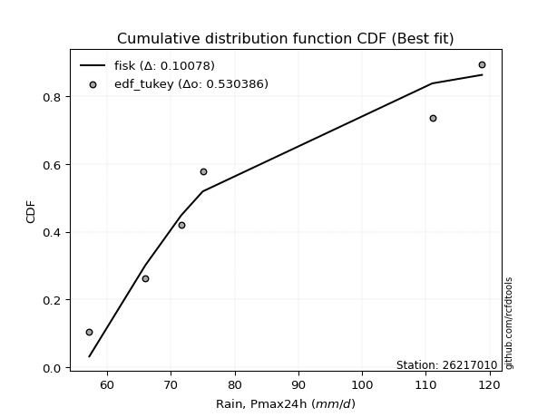</img>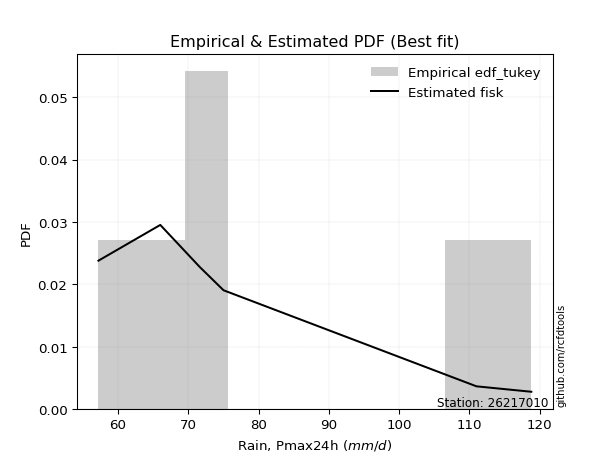</img>

</div>


### 8. Empirical - EDF Gringorten (1963)

Gringorten plotting position formula is essential for estimating the probability and return periods of extreme events like floods and heavy rainfall. The constant _a=0.44_.

<div align="center">


$P=(m-a)/(n+1-2a)$


</div>


**8.1. Empirical values**

<div align="center">

|                | 0                   | 1                   | 2                  | 3              | 4                  | 5                  | 6                  |
|:---------------|:--------------------|:--------------------|:-------------------|:---------------|:-------------------|:-------------------|:-------------------|
| date           | 2025                | 2020                | 2019               | 2023           | 2021               | 2022               | 2024               |
| x              | 55.2                | 57.2                | 66.0               | 71.6           | 75.0               | 111.0              | 118.8              |
| m              | 1                   | 2                   | 3                  | 4              | 5                  | 6                  | 7                  |
| empirical_dist | edf_gringorten      | edf_gringorten      | edf_gringorten     | edf_gringorten | edf_gringorten     | edf_gringorten     | edf_gringorten     |
| empirical      | 0.07865168539325844 | 0.21910112359550563 | 0.3595505617977528 | 0.5            | 0.6404494382022471 | 0.7808988764044943 | 0.9213483146067415 |
| empirical_tr   | 1.0853658536585364  | 1.2805755395683454  | 1.5614035087719298 | 2.0            | 2.781249999999999  | 4.564102564102562  | 12.714285714285701 |

</div>


**8.2. Kolmogorov-Smirnov fit test (sorted by Δ)**


<div align="center">

|                | 0                   | 1                   | 2                   | 3                   | 4                   | 5                   | 6                   | 7                   | 8                   | 9                   | 10                    | 11                  | 12                  | 13                  | 14                  | 15                  | 16                  | 17                  | 18                  | 19                  | 20                  | 21                  | 22                  | 23                  | 24                  | 25                  | 26                  | 27                  | 28                  | 29                  | 30                  | 31                  | 32                  | 33                  | 34                  | 35                  | 36                  | 37                  | 38                  | 39                  | 40                  | 41                  | 42                  | 43                  | 44                  | 45                  | 46                  | 47                  | 48                  | 49                  | 50                  | 51                  | 52                  | 53                  | 54                  | 55                  | 56                  | 57                  | 58                  | 59                  | 60                  | 61                  | 62                  | 63                  | 64                  | 65                  | 66                  | 67                  | 68                  | 69                  | 70                  | 71                  | 72                  | 73                  | 74                  | 75                  | 76                  | 77                  | 78                  | 79                  | 80                  | 81                  | 82                  | 83                  | 84                  | 85                  | 86                  | 87                  | 88                  | 89                  |
|:---------------|:--------------------|:--------------------|:--------------------|:--------------------|:--------------------|:--------------------|:--------------------|:--------------------|:--------------------|:--------------------|:----------------------|:--------------------|:--------------------|:--------------------|:--------------------|:--------------------|:--------------------|:--------------------|:--------------------|:--------------------|:--------------------|:--------------------|:--------------------|:--------------------|:--------------------|:--------------------|:--------------------|:--------------------|:--------------------|:--------------------|:--------------------|:--------------------|:--------------------|:--------------------|:--------------------|:--------------------|:--------------------|:--------------------|:--------------------|:--------------------|:--------------------|:--------------------|:--------------------|:--------------------|:--------------------|:--------------------|:--------------------|:--------------------|:--------------------|:--------------------|:--------------------|:--------------------|:--------------------|:--------------------|:--------------------|:--------------------|:--------------------|:--------------------|:--------------------|:--------------------|:--------------------|:--------------------|:--------------------|:--------------------|:--------------------|:--------------------|:--------------------|:--------------------|:--------------------|:--------------------|:--------------------|:--------------------|:--------------------|:--------------------|:--------------------|:--------------------|:--------------------|:--------------------|:--------------------|:--------------------|:--------------------|:--------------------|:--------------------|:--------------------|:--------------------|:--------------------|:--------------------|:--------------------|:--------------------|:--------------------|
| station        | 26217010            | 26217010            | 26217010            | 26217010            | 26217010            | 26217010            | 26217010            | 26217010            | 26217010            | 26217010            | 26217010              | 26217010            | 26217010            | 26217010            | 26217010            | 26217010            | 26217010            | 26217010            | 26217010            | 26217010            | 26217010            | 26217010            | 26217010            | 26217010            | 26217010            | 26217010            | 26217010            | 26217010            | 26217010            | 26217010            | 26217010            | 26217010            | 26217010            | 26217010            | 26217010            | 26217010            | 26217010            | 26217010            | 26217010            | 26217010            | 26217010            | 26217010            | 26217010            | 26217010            | 26217010            | 26217010            | 26217010            | 26217010            | 26217010            | 26217010            | 26217010            | 26217010            | 26217010            | 26217010            | 26217010            | 26217010            | 26217010            | 26217010            | 26217010            | 26217010            | 26217010            | 26217010            | 26217010            | 26217010            | 26217010            | 26217010            | 26217010            | 26217010            | 26217010            | 26217010            | 26217010            | 26217010            | 26217010            | 26217010            | 26217010            | 26217010            | 26217010            | 26217010            | 26217010            | 26217010            | 26217010            | 26217010            | 26217010            | 26217010            | 26217010            | 26217010            | 26217010            | 26217010            | 26217010            | 26217010            |
| empirical_dist | edf_gringorten      | edf_gringorten      | edf_gringorten      | edf_gringorten      | edf_gringorten      | edf_gringorten      | edf_gringorten      | edf_gringorten      | edf_gringorten      | edf_gringorten      | edf_gringorten        | edf_gringorten      | edf_gringorten      | edf_gringorten      | edf_gringorten      | edf_gringorten      | edf_gringorten      | edf_gringorten      | edf_gringorten      | edf_gringorten      | edf_gringorten      | edf_gringorten      | edf_gringorten      | edf_gringorten      | edf_gringorten      | edf_gringorten      | edf_gringorten      | edf_gringorten      | edf_gringorten      | edf_gringorten      | edf_gringorten      | edf_gringorten      | edf_gringorten      | edf_gringorten      | edf_gringorten      | edf_gringorten      | edf_gringorten      | edf_gringorten      | edf_gringorten      | edf_gringorten      | edf_gringorten      | edf_gringorten      | edf_gringorten      | edf_gringorten      | edf_gringorten      | edf_gringorten      | edf_gringorten      | edf_gringorten      | edf_gringorten      | edf_gringorten      | edf_gringorten      | edf_gringorten      | edf_gringorten      | edf_gringorten      | edf_gringorten      | edf_gringorten      | edf_gringorten      | edf_gringorten      | edf_gringorten      | edf_gringorten      | edf_gringorten      | edf_gringorten      | edf_gringorten      | edf_gringorten      | edf_gringorten      | edf_gringorten      | edf_gringorten      | edf_gringorten      | edf_gringorten      | edf_gringorten      | edf_gringorten      | edf_gringorten      | edf_gringorten      | edf_gringorten      | edf_gringorten      | edf_gringorten      | edf_gringorten      | edf_gringorten      | edf_gringorten      | edf_gringorten      | edf_gringorten      | edf_gringorten      | edf_gringorten      | edf_gringorten      | edf_gringorten      | edf_gringorten      | edf_gringorten      | edf_gringorten      | edf_gringorten      | edf_gringorten      |
| p_dist         | invgamma            | lognakagami         | loginvgauss         | loginvgamma         | f                   | loginvweibull       | invgauss            | loghalfnorm         | alpha               | logexponnorm        | loglaplace_asymmetric | logexpon            | lograyleigh         | fisk                | halflogistic        | loghalflogistic     | loggumbel_r         | moyal               | logmoyal            | logpearson3         | logmaxwell          | loggenexpon         | nct                 | logmielke           | loggenlogistic      | logkstwobign        | mielke              | halfnorm            | logalpha            | exponnorm           | laplace_asymmetric  | lognct              | expon               | logrice             | genexpon            | genlogistic         | chi2                | betaprime           | gumbel_r            | loggompertz         | kstwobign           | logloggamma         | logbetaprime        | logcrystalball      | lognorm             | lognorm             | logt                | logjohnsonsu        | loglogistic         | rayleigh            | pearson3            | loghypsecant        | loglaplace          | maxwell             | erlang              | logncf              | logtruncnorm        | logfatiguelife      | ncf                 | weibull_min         | rice                | johnsonsu           | logweibull_min      | crystalball         | norm                | t                   | gompertz            | nakagami            | wald                | gibrat              | loggibrat           | logwald             | logistic            | hypsecant           | loggumbel_l         | truncnorm           | loggamma            | loggamma            | laplace             | logf                | gumbel_l            | logerlang           | logfisk             | logchi2             | pareto              | logpareto           | gamma               | loglognorm          | fatiguelife         | invweibull          |
| delta          | 0.09867771385774504 | 0.10102942934932724 | 0.10201447556576682 | 0.10412279140135561 | 0.10529664270136896 | 0.10599613787440387 | 0.11085193452488606 | 0.11179328563979096 | 0.11199547248963854 | 0.11302217881056145 | 0.11384204805706655   | 0.11410673638029067 | 0.11702572402156697 | 0.1182848135786082  | 0.120706071357228   | 0.12160571500576303 | 0.12424385597400978 | 0.12459983445296319 | 0.12472373649384616 | 0.12500588614743968 | 0.12709478550454367 | 0.1274493911774539  | 0.1275176237522161  | 0.1287153980767487  | 0.12947070283802098 | 0.13033974572511287 | 0.13040541973841857 | 0.1312666566419297  | 0.13346991258057894 | 0.13808116897449532 | 0.13882331717636456 | 0.13897867733276803 | 0.1393276711381467  | 0.13970107528554587 | 0.14019364729378092 | 0.14302706356289707 | 0.14477610650682238 | 0.1453122823773093  | 0.14773021586615864 | 0.1553831111256238  | 0.15737426082141726 | 0.1591429246638678  | 0.16073639085363123 | 0.1608413589107916  | 0.16084153789925365 | 0.16084153789925365 | 0.16084181882352533 | 0.16128965380095717 | 0.16362120670236247 | 0.16558470816293858 | 0.16562054688958872 | 0.1659908321870201  | 0.17533267420195864 | 0.1777192979921257  | 0.18248659536800182 | 0.18329977563785782 | 0.18932351214172793 | 0.19115609710575077 | 0.19873330761172014 | 0.20191554972529557 | 0.20724486273156645 | 0.20973948585370844 | 0.20982727233767084 | 0.21211348416431386 | 0.2121134865877186  | 0.21214741415222227 | 0.21552547129638966 | 0.2160904136452253  | 0.21889155998384577 | 0.21910112359550563 | 0.21910112359550563 | 0.21910112359550563 | 0.22162339743753645 | 0.22956797148598362 | 0.23152178276561441 | 0.2326042706382564  | 0.24247113858780378 | 0.24247113858780378 | 0.25315557595475113 | 0.2775396081510184  | 0.2810395214314407  | 0.2852454064487856  | 0.2906386767244177  | 0.3114659839491908  | 0.3337803708673146  | 0.34723733622350417 | 0.35932719681197645 | 0.3751887692897933  | 0.41505506384438395 | 0.4834914406293534  |
| deltao         | 0.48442053926100004 | 0.48442053926100004 | 0.48442053926100004 | 0.48442053926100004 | 0.48442053926100004 | 0.48442053926100004 | 0.48442053926100004 | 0.48442053926100004 | 0.48442053926100004 | 0.48442053926100004 | 0.48442053926100004   | 0.48442053926100004 | 0.48442053926100004 | 0.48442053926100004 | 0.48442053926100004 | 0.48442053926100004 | 0.48442053926100004 | 0.48442053926100004 | 0.48442053926100004 | 0.48442053926100004 | 0.48442053926100004 | 0.48442053926100004 | 0.48442053926100004 | 0.48442053926100004 | 0.48442053926100004 | 0.48442053926100004 | 0.48442053926100004 | 0.48442053926100004 | 0.48442053926100004 | 0.48442053926100004 | 0.48442053926100004 | 0.48442053926100004 | 0.48442053926100004 | 0.48442053926100004 | 0.48442053926100004 | 0.48442053926100004 | 0.48442053926100004 | 0.48442053926100004 | 0.48442053926100004 | 0.48442053926100004 | 0.48442053926100004 | 0.48442053926100004 | 0.48442053926100004 | 0.48442053926100004 | 0.48442053926100004 | 0.48442053926100004 | 0.48442053926100004 | 0.48442053926100004 | 0.48442053926100004 | 0.48442053926100004 | 0.48442053926100004 | 0.48442053926100004 | 0.48442053926100004 | 0.48442053926100004 | 0.48442053926100004 | 0.48442053926100004 | 0.48442053926100004 | 0.48442053926100004 | 0.48442053926100004 | 0.48442053926100004 | 0.48442053926100004 | 0.48442053926100004 | 0.48442053926100004 | 0.48442053926100004 | 0.48442053926100004 | 0.48442053926100004 | 0.48442053926100004 | 0.48442053926100004 | 0.48442053926100004 | 0.48442053926100004 | 0.48442053926100004 | 0.48442053926100004 | 0.48442053926100004 | 0.48442053926100004 | 0.48442053926100004 | 0.48442053926100004 | 0.48442053926100004 | 0.48442053926100004 | 0.48442053926100004 | 0.48442053926100004 | 0.48442053926100004 | 0.48442053926100004 | 0.48442053926100004 | 0.48442053926100004 | 0.48442053926100004 | 0.48442053926100004 | 0.48442053926100004 | 0.48442053926100004 | 0.48442053926100004 | 0.48442053926100004 |
| eval           | Δo > Δ              | Δo > Δ              | Δo > Δ              | Δo > Δ              | Δo > Δ              | Δo > Δ              | Δo > Δ              | Δo > Δ              | Δo > Δ              | Δo > Δ              | Δo > Δ                | Δo > Δ              | Δo > Δ              | Δo > Δ              | Δo > Δ              | Δo > Δ              | Δo > Δ              | Δo > Δ              | Δo > Δ              | Δo > Δ              | Δo > Δ              | Δo > Δ              | Δo > Δ              | Δo > Δ              | Δo > Δ              | Δo > Δ              | Δo > Δ              | Δo > Δ              | Δo > Δ              | Δo > Δ              | Δo > Δ              | Δo > Δ              | Δo > Δ              | Δo > Δ              | Δo > Δ              | Δo > Δ              | Δo > Δ              | Δo > Δ              | Δo > Δ              | Δo > Δ              | Δo > Δ              | Δo > Δ              | Δo > Δ              | Δo > Δ              | Δo > Δ              | Δo > Δ              | Δo > Δ              | Δo > Δ              | Δo > Δ              | Δo > Δ              | Δo > Δ              | Δo > Δ              | Δo > Δ              | Δo > Δ              | Δo > Δ              | Δo > Δ              | Δo > Δ              | Δo > Δ              | Δo > Δ              | Δo > Δ              | Δo > Δ              | Δo > Δ              | Δo > Δ              | Δo > Δ              | Δo > Δ              | Δo > Δ              | Δo > Δ              | Δo > Δ              | Δo > Δ              | Δo > Δ              | Δo > Δ              | Δo > Δ              | Δo > Δ              | Δo > Δ              | Δo > Δ              | Δo > Δ              | Δo > Δ              | Δo > Δ              | Δo > Δ              | Δo > Δ              | Δo > Δ              | Δo > Δ              | Δo > Δ              | Δo > Δ              | Δo > Δ              | Δo > Δ              | Δo > Δ              | Δo > Δ              | Δo > Δ              | Δo > Δ              |
| fit            | 1                   | 1                   | 1                   | 1                   | 1                   | 1                   | 1                   | 1                   | 1                   | 1                   | 1                     | 1                   | 1                   | 1                   | 1                   | 1                   | 1                   | 1                   | 1                   | 1                   | 1                   | 1                   | 1                   | 1                   | 1                   | 1                   | 1                   | 1                   | 1                   | 1                   | 1                   | 1                   | 1                   | 1                   | 1                   | 1                   | 1                   | 1                   | 1                   | 1                   | 1                   | 1                   | 1                   | 1                   | 1                   | 1                   | 1                   | 1                   | 1                   | 1                   | 1                   | 1                   | 1                   | 1                   | 1                   | 1                   | 1                   | 1                   | 1                   | 1                   | 1                   | 1                   | 1                   | 1                   | 1                   | 1                   | 1                   | 1                   | 1                   | 1                   | 1                   | 1                   | 1                   | 1                   | 1                   | 1                   | 1                   | 1                   | 1                   | 1                   | 1                   | 1                   | 1                   | 1                   | 1                   | 1                   | 1                   | 1                   | 1                   | 1                   |
| n              | 7                   | 7                   | 7                   | 7                   | 7                   | 7                   | 7                   | 7                   | 7                   | 7                   | 7                     | 7                   | 7                   | 7                   | 7                   | 7                   | 7                   | 7                   | 7                   | 7                   | 7                   | 7                   | 7                   | 7                   | 7                   | 7                   | 7                   | 7                   | 7                   | 7                   | 7                   | 7                   | 7                   | 7                   | 7                   | 7                   | 7                   | 7                   | 7                   | 7                   | 7                   | 7                   | 7                   | 7                   | 7                   | 7                   | 7                   | 7                   | 7                   | 7                   | 7                   | 7                   | 7                   | 7                   | 7                   | 7                   | 7                   | 7                   | 7                   | 7                   | 7                   | 7                   | 7                   | 7                   | 7                   | 7                   | 7                   | 7                   | 7                   | 7                   | 7                   | 7                   | 7                   | 7                   | 7                   | 7                   | 7                   | 7                   | 7                   | 7                   | 7                   | 7                   | 7                   | 7                   | 7                   | 7                   | 7                   | 7                   | 7                   | 7                   |
| best_fit       | 1                   | 0                   | 0                   | 0                   | 0                   | 0                   | 0                   | 0                   | 0                   | 0                   | 0                     | 0                   | 0                   | 0                   | 0                   | 0                   | 0                   | 0                   | 0                   | 0                   | 0                   | 0                   | 0                   | 0                   | 0                   | 0                   | 0                   | 0                   | 0                   | 0                   | 0                   | 0                   | 0                   | 0                   | 0                   | 0                   | 0                   | 0                   | 0                   | 0                   | 0                   | 0                   | 0                   | 0                   | 0                   | 0                   | 0                   | 0                   | 0                   | 0                   | 0                   | 0                   | 0                   | 0                   | 0                   | 0                   | 0                   | 0                   | 0                   | 0                   | 0                   | 0                   | 0                   | 0                   | 0                   | 0                   | 0                   | 0                   | 0                   | 0                   | 0                   | 0                   | 0                   | 0                   | 0                   | 0                   | 0                   | 0                   | 0                   | 0                   | 0                   | 0                   | 0                   | 0                   | 0                   | 0                   | 0                   | 0                   | 0                   | 0                   |
| best_fit_sort  | 1                   | 2                   | 3                   | 4                   | 5                   | 6                   | 7                   | 8                   | 9                   | 10                  | 11                    | 12                  | 13                  | 14                  | 15                  | 16                  | 17                  | 18                  | 19                  | 20                  | 21                  | 22                  | 23                  | 24                  | 25                  | 26                  | 27                  | 28                  | 29                  | 30                  | 31                  | 32                  | 33                  | 34                  | 35                  | 36                  | 37                  | 38                  | 39                  | 40                  | 41                  | 42                  | 43                  | 44                  | 45                  | 46                  | 47                  | 48                  | 49                  | 50                  | 51                  | 52                  | 53                  | 54                  | 55                  | 56                  | 57                  | 58                  | 59                  | 60                  | 61                  | 62                  | 63                  | 64                  | 65                  | 66                  | 67                  | 68                  | 69                  | 70                  | 71                  | 72                  | 73                  | 74                  | 75                  | 76                  | 77                  | 78                  | 79                  | 80                  | 81                  | 82                  | 83                  | 84                  | 85                  | 86                  | 87                  | 88                  | 89                  | 90                  |

</div>


<div align="center">

</img>

</div>


**8.3. Best fit**

<div align="center">

|   id |   station | empirical_dist   | p_dist   |     delta |   deltao | eval   |   fit |   n |   best_fit |   best_fit_sort |
|-----:|----------:|:-----------------|:---------|----------:|---------:|:-------|------:|----:|-----------:|----------------:|
|    0 |  26217010 | edf_gringorten   | invgamma | 0.0986777 | 0.484421 | Δo > Δ |     1 |   7 |          1 |               1 |

</div>


<div align="center">

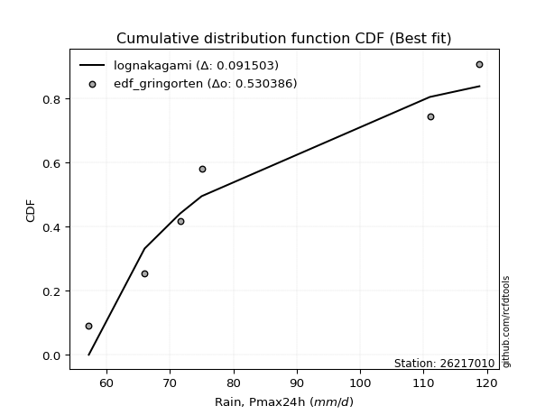</img>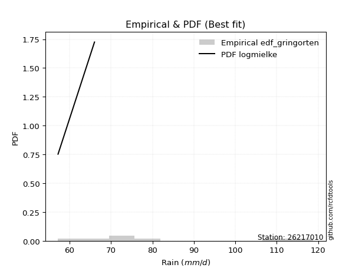</img>

</div>


### 9. Empirical - EDF Filliben (1975)

The specific values of the constants (0.3175) (often denoted as $alpha$) and (0.365) are derived from a method proposed by James J. Filliben in a 1975 paper. This particular formula is the mean value of the $i$-th order statistic of the normal distribution and is considered a robust and effective plotting position formula for the normal probability plot correlation coefficient test for normality.

<div align="center">


$P=(m-0.3175)/(n+0.365)$


</div>


**9.1. Empirical values**

<div align="center">

|                | 0                   | 1                   | 2                   | 3            | 4                  | 5                  | 6                  |
|:---------------|:--------------------|:--------------------|:--------------------|:-------------|:-------------------|:-------------------|:-------------------|
| date           | 2025                | 2020                | 2019                | 2023         | 2021               | 2022               | 2024               |
| x              | 55.2                | 57.2                | 66.0                | 71.6         | 75.0               | 111.0              | 118.8              |
| m              | 1                   | 2                   | 3                   | 4            | 5                  | 6                  | 7                  |
| empirical_dist | edf_filliben        | edf_filliben        | edf_filliben        | edf_filliben | edf_filliben       | edf_filliben       | edf_filliben       |
| empirical      | 0.09266802443991853 | 0.22844534962661237 | 0.36422267481330617 | 0.5          | 0.6357773251866938 | 0.7715546503733877 | 0.9073319755600815 |
| empirical_tr   | 1.1021324354657687  | 1.2960844698636163  | 1.5728777362520021  | 2.0          | 2.7455731593662627 | 4.377414561664191  | 10.791208791208794 |

</div>


**9.2. Kolmogorov-Smirnov fit test (sorted by Δ)**


<div align="center">

|                | 0                   | 1                   | 2                   | 3                   | 4                   | 5                   | 6                   | 7                   | 8                   | 9                   | 10                  | 11                    | 12                  | 13                  | 14                  | 15                  | 16                  | 17                  | 18                  | 19                  | 20                  | 21                  | 22                  | 23                  | 24                  | 25                  | 26                  | 27                  | 28                  | 29                  | 30                  | 31                  | 32                  | 33                  | 34                  | 35                  | 36                  | 37                  | 38                  | 39                  | 40                  | 41                  | 42                  | 43                  | 44                  | 45                  | 46                  | 47                  | 48                  | 49                  | 50                  | 51                  | 52                  | 53                  | 54                  | 55                  | 56                  | 57                  | 58                  | 59                  | 60                  | 61                  | 62                  | 63                  | 64                  | 65                  | 66                  | 67                  | 68                  | 69                  | 70                  | 71                  | 72                  | 73                  | 74                  | 75                  | 76                  | 77                  | 78                  | 79                  | 80                  | 81                  | 82                  | 83                  | 84                  | 85                  | 86                  | 87                  | 88                  | 89                  |
|:---------------|:--------------------|:--------------------|:--------------------|:--------------------|:--------------------|:--------------------|:--------------------|:--------------------|:--------------------|:--------------------|:--------------------|:----------------------|:--------------------|:--------------------|:--------------------|:--------------------|:--------------------|:--------------------|:--------------------|:--------------------|:--------------------|:--------------------|:--------------------|:--------------------|:--------------------|:--------------------|:--------------------|:--------------------|:--------------------|:--------------------|:--------------------|:--------------------|:--------------------|:--------------------|:--------------------|:--------------------|:--------------------|:--------------------|:--------------------|:--------------------|:--------------------|:--------------------|:--------------------|:--------------------|:--------------------|:--------------------|:--------------------|:--------------------|:--------------------|:--------------------|:--------------------|:--------------------|:--------------------|:--------------------|:--------------------|:--------------------|:--------------------|:--------------------|:--------------------|:--------------------|:--------------------|:--------------------|:--------------------|:--------------------|:--------------------|:--------------------|:--------------------|:--------------------|:--------------------|:--------------------|:--------------------|:--------------------|:--------------------|:--------------------|:--------------------|:--------------------|:--------------------|:--------------------|:--------------------|:--------------------|:--------------------|:--------------------|:--------------------|:--------------------|:--------------------|:--------------------|:--------------------|:--------------------|:--------------------|:--------------------|
| station        | 26217010            | 26217010            | 26217010            | 26217010            | 26217010            | 26217010            | 26217010            | 26217010            | 26217010            | 26217010            | 26217010            | 26217010              | 26217010            | 26217010            | 26217010            | 26217010            | 26217010            | 26217010            | 26217010            | 26217010            | 26217010            | 26217010            | 26217010            | 26217010            | 26217010            | 26217010            | 26217010            | 26217010            | 26217010            | 26217010            | 26217010            | 26217010            | 26217010            | 26217010            | 26217010            | 26217010            | 26217010            | 26217010            | 26217010            | 26217010            | 26217010            | 26217010            | 26217010            | 26217010            | 26217010            | 26217010            | 26217010            | 26217010            | 26217010            | 26217010            | 26217010            | 26217010            | 26217010            | 26217010            | 26217010            | 26217010            | 26217010            | 26217010            | 26217010            | 26217010            | 26217010            | 26217010            | 26217010            | 26217010            | 26217010            | 26217010            | 26217010            | 26217010            | 26217010            | 26217010            | 26217010            | 26217010            | 26217010            | 26217010            | 26217010            | 26217010            | 26217010            | 26217010            | 26217010            | 26217010            | 26217010            | 26217010            | 26217010            | 26217010            | 26217010            | 26217010            | 26217010            | 26217010            | 26217010            | 26217010            |
| empirical_dist | edf_filliben        | edf_filliben        | edf_filliben        | edf_filliben        | edf_filliben        | edf_filliben        | edf_filliben        | edf_filliben        | edf_filliben        | edf_filliben        | edf_filliben        | edf_filliben          | edf_filliben        | edf_filliben        | edf_filliben        | edf_filliben        | edf_filliben        | edf_filliben        | edf_filliben        | edf_filliben        | edf_filliben        | edf_filliben        | edf_filliben        | edf_filliben        | edf_filliben        | edf_filliben        | edf_filliben        | edf_filliben        | edf_filliben        | edf_filliben        | edf_filliben        | edf_filliben        | edf_filliben        | edf_filliben        | edf_filliben        | edf_filliben        | edf_filliben        | edf_filliben        | edf_filliben        | edf_filliben        | edf_filliben        | edf_filliben        | edf_filliben        | edf_filliben        | edf_filliben        | edf_filliben        | edf_filliben        | edf_filliben        | edf_filliben        | edf_filliben        | edf_filliben        | edf_filliben        | edf_filliben        | edf_filliben        | edf_filliben        | edf_filliben        | edf_filliben        | edf_filliben        | edf_filliben        | edf_filliben        | edf_filliben        | edf_filliben        | edf_filliben        | edf_filliben        | edf_filliben        | edf_filliben        | edf_filliben        | edf_filliben        | edf_filliben        | edf_filliben        | edf_filliben        | edf_filliben        | edf_filliben        | edf_filliben        | edf_filliben        | edf_filliben        | edf_filliben        | edf_filliben        | edf_filliben        | edf_filliben        | edf_filliben        | edf_filliben        | edf_filliben        | edf_filliben        | edf_filliben        | edf_filliben        | edf_filliben        | edf_filliben        | edf_filliben        | edf_filliben        |
| p_dist         | lognakagami         | f                   | alpha               | invgamma            | loginvgauss         | loginvgamma         | fisk                | loginvweibull       | invgauss            | loghalfnorm         | logexponnorm        | loglaplace_asymmetric | logexpon            | lograyleigh         | halfnorm            | logmaxwell          | halflogistic        | loghalflogistic     | logpearson3         | loggumbel_r         | moyal               | logmoyal            | loggenexpon         | nct                 | logrice             | logmielke           | lognct              | loggenlogistic      | logkstwobign        | mielke              | betaprime           | logalpha            | gumbel_r            | exponnorm           | laplace_asymmetric  | expon               | genexpon            | genlogistic         | kstwobign           | chi2                | logloggamma         | logbetaprime        | logcrystalball      | lognorm             | lognorm             | logt                | logjohnsonsu        | loglogistic         | rayleigh            | pearson3            | loghypsecant        | loggompertz         | logncf              | loglaplace          | maxwell             | logfatiguelife      | erlang              | ncf                 | weibull_min         | logtruncnorm        | rice                | johnsonsu           | logweibull_min      | crystalball         | norm                | t                   | gompertz            | nakagami            | logistic            | hypsecant           | loggumbel_l         | truncnorm           | wald                | gibrat              | loggibrat           | logwald             | loggamma            | loggamma            | laplace             | logf                | gumbel_l            | logfisk             | logerlang           | logchi2             | pareto              | logpareto           | gamma               | loglognorm          | fatiguelife         | invweibull          |
| delta          | 0.09635731633377387 | 0.10062452968581559 | 0.10732335947408517 | 0.10802193988885167 | 0.11135870159687344 | 0.11346701743246224 | 0.11361270056305484 | 0.1153403639055105  | 0.11687440338826349 | 0.12113751167089759 | 0.12236640484166819 | 0.12318627408817318   | 0.12345096241139741 | 0.1263699500526736  | 0.12659454362637645 | 0.12914873421403783 | 0.13005029738833462 | 0.13094994103686977 | 0.13163699763845693 | 0.1335880820051164  | 0.13394406048406982 | 0.1340679625249528  | 0.13679361720856065 | 0.13686184978332272 | 0.13749079785312468 | 0.13805962410785533 | 0.13840351310077148 | 0.1388149288691276  | 0.1396839717562195  | 0.1397496457695252  | 0.14064016936175605 | 0.14281413861168557 | 0.14305810285060538 | 0.14742539500560206 | 0.1481675432074713  | 0.14867189716925344 | 0.14953787332488766 | 0.1523712895940037  | 0.152702147805864   | 0.154120332537929   | 0.15447081164831455 | 0.15606427783807797 | 0.15616924589523834 | 0.1561694248837004  | 0.1561694248837004  | 0.15616970580797207 | 0.1566175407854039  | 0.1589490936868092  | 0.16091259514738532 | 0.16094843387403546 | 0.16131871917146684 | 0.16472733715673055 | 0.16928343659119774 | 0.17066056118640538 | 0.17304718497657245 | 0.1864839840901974  | 0.1914686998573848  | 0.1923717138014045  | 0.1972434367097422  | 0.19866773817283456 | 0.2025727497160132  | 0.20506737283815518 | 0.20515515932211748 | 0.2074413711487606  | 0.20744137357216536 | 0.207475301136669   | 0.2108533582808364  | 0.21141830062967193 | 0.2169512844219832  | 0.22489585847043037 | 0.22684966975006116 | 0.22793215762270314 | 0.2282357860149525  | 0.22844534962661237 | 0.22844534962661237 | 0.22844534962661237 | 0.2377990255722504  | 0.2377990255722504  | 0.24848346293919787 | 0.27286749513546504 | 0.2763674084158874  | 0.2766223376777577  | 0.28057329343323223 | 0.2974496449025308  | 0.32443614483620786 | 0.33789311019239743 | 0.3546550837964231  | 0.36584454325868654 | 0.4103829508288306  | 0.4694751015826934  |
| deltao         | 0.48442053926100004 | 0.48442053926100004 | 0.48442053926100004 | 0.48442053926100004 | 0.48442053926100004 | 0.48442053926100004 | 0.48442053926100004 | 0.48442053926100004 | 0.48442053926100004 | 0.48442053926100004 | 0.48442053926100004 | 0.48442053926100004   | 0.48442053926100004 | 0.48442053926100004 | 0.48442053926100004 | 0.48442053926100004 | 0.48442053926100004 | 0.48442053926100004 | 0.48442053926100004 | 0.48442053926100004 | 0.48442053926100004 | 0.48442053926100004 | 0.48442053926100004 | 0.48442053926100004 | 0.48442053926100004 | 0.48442053926100004 | 0.48442053926100004 | 0.48442053926100004 | 0.48442053926100004 | 0.48442053926100004 | 0.48442053926100004 | 0.48442053926100004 | 0.48442053926100004 | 0.48442053926100004 | 0.48442053926100004 | 0.48442053926100004 | 0.48442053926100004 | 0.48442053926100004 | 0.48442053926100004 | 0.48442053926100004 | 0.48442053926100004 | 0.48442053926100004 | 0.48442053926100004 | 0.48442053926100004 | 0.48442053926100004 | 0.48442053926100004 | 0.48442053926100004 | 0.48442053926100004 | 0.48442053926100004 | 0.48442053926100004 | 0.48442053926100004 | 0.48442053926100004 | 0.48442053926100004 | 0.48442053926100004 | 0.48442053926100004 | 0.48442053926100004 | 0.48442053926100004 | 0.48442053926100004 | 0.48442053926100004 | 0.48442053926100004 | 0.48442053926100004 | 0.48442053926100004 | 0.48442053926100004 | 0.48442053926100004 | 0.48442053926100004 | 0.48442053926100004 | 0.48442053926100004 | 0.48442053926100004 | 0.48442053926100004 | 0.48442053926100004 | 0.48442053926100004 | 0.48442053926100004 | 0.48442053926100004 | 0.48442053926100004 | 0.48442053926100004 | 0.48442053926100004 | 0.48442053926100004 | 0.48442053926100004 | 0.48442053926100004 | 0.48442053926100004 | 0.48442053926100004 | 0.48442053926100004 | 0.48442053926100004 | 0.48442053926100004 | 0.48442053926100004 | 0.48442053926100004 | 0.48442053926100004 | 0.48442053926100004 | 0.48442053926100004 | 0.48442053926100004 |
| eval           | Δo > Δ              | Δo > Δ              | Δo > Δ              | Δo > Δ              | Δo > Δ              | Δo > Δ              | Δo > Δ              | Δo > Δ              | Δo > Δ              | Δo > Δ              | Δo > Δ              | Δo > Δ                | Δo > Δ              | Δo > Δ              | Δo > Δ              | Δo > Δ              | Δo > Δ              | Δo > Δ              | Δo > Δ              | Δo > Δ              | Δo > Δ              | Δo > Δ              | Δo > Δ              | Δo > Δ              | Δo > Δ              | Δo > Δ              | Δo > Δ              | Δo > Δ              | Δo > Δ              | Δo > Δ              | Δo > Δ              | Δo > Δ              | Δo > Δ              | Δo > Δ              | Δo > Δ              | Δo > Δ              | Δo > Δ              | Δo > Δ              | Δo > Δ              | Δo > Δ              | Δo > Δ              | Δo > Δ              | Δo > Δ              | Δo > Δ              | Δo > Δ              | Δo > Δ              | Δo > Δ              | Δo > Δ              | Δo > Δ              | Δo > Δ              | Δo > Δ              | Δo > Δ              | Δo > Δ              | Δo > Δ              | Δo > Δ              | Δo > Δ              | Δo > Δ              | Δo > Δ              | Δo > Δ              | Δo > Δ              | Δo > Δ              | Δo > Δ              | Δo > Δ              | Δo > Δ              | Δo > Δ              | Δo > Δ              | Δo > Δ              | Δo > Δ              | Δo > Δ              | Δo > Δ              | Δo > Δ              | Δo > Δ              | Δo > Δ              | Δo > Δ              | Δo > Δ              | Δo > Δ              | Δo > Δ              | Δo > Δ              | Δo > Δ              | Δo > Δ              | Δo > Δ              | Δo > Δ              | Δo > Δ              | Δo > Δ              | Δo > Δ              | Δo > Δ              | Δo > Δ              | Δo > Δ              | Δo > Δ              | Δo > Δ              |
| fit            | 1                   | 1                   | 1                   | 1                   | 1                   | 1                   | 1                   | 1                   | 1                   | 1                   | 1                   | 1                     | 1                   | 1                   | 1                   | 1                   | 1                   | 1                   | 1                   | 1                   | 1                   | 1                   | 1                   | 1                   | 1                   | 1                   | 1                   | 1                   | 1                   | 1                   | 1                   | 1                   | 1                   | 1                   | 1                   | 1                   | 1                   | 1                   | 1                   | 1                   | 1                   | 1                   | 1                   | 1                   | 1                   | 1                   | 1                   | 1                   | 1                   | 1                   | 1                   | 1                   | 1                   | 1                   | 1                   | 1                   | 1                   | 1                   | 1                   | 1                   | 1                   | 1                   | 1                   | 1                   | 1                   | 1                   | 1                   | 1                   | 1                   | 1                   | 1                   | 1                   | 1                   | 1                   | 1                   | 1                   | 1                   | 1                   | 1                   | 1                   | 1                   | 1                   | 1                   | 1                   | 1                   | 1                   | 1                   | 1                   | 1                   | 1                   |
| n              | 7                   | 7                   | 7                   | 7                   | 7                   | 7                   | 7                   | 7                   | 7                   | 7                   | 7                   | 7                     | 7                   | 7                   | 7                   | 7                   | 7                   | 7                   | 7                   | 7                   | 7                   | 7                   | 7                   | 7                   | 7                   | 7                   | 7                   | 7                   | 7                   | 7                   | 7                   | 7                   | 7                   | 7                   | 7                   | 7                   | 7                   | 7                   | 7                   | 7                   | 7                   | 7                   | 7                   | 7                   | 7                   | 7                   | 7                   | 7                   | 7                   | 7                   | 7                   | 7                   | 7                   | 7                   | 7                   | 7                   | 7                   | 7                   | 7                   | 7                   | 7                   | 7                   | 7                   | 7                   | 7                   | 7                   | 7                   | 7                   | 7                   | 7                   | 7                   | 7                   | 7                   | 7                   | 7                   | 7                   | 7                   | 7                   | 7                   | 7                   | 7                   | 7                   | 7                   | 7                   | 7                   | 7                   | 7                   | 7                   | 7                   | 7                   |
| best_fit       | 1                   | 0                   | 0                   | 0                   | 0                   | 0                   | 0                   | 0                   | 0                   | 0                   | 0                   | 0                     | 0                   | 0                   | 0                   | 0                   | 0                   | 0                   | 0                   | 0                   | 0                   | 0                   | 0                   | 0                   | 0                   | 0                   | 0                   | 0                   | 0                   | 0                   | 0                   | 0                   | 0                   | 0                   | 0                   | 0                   | 0                   | 0                   | 0                   | 0                   | 0                   | 0                   | 0                   | 0                   | 0                   | 0                   | 0                   | 0                   | 0                   | 0                   | 0                   | 0                   | 0                   | 0                   | 0                   | 0                   | 0                   | 0                   | 0                   | 0                   | 0                   | 0                   | 0                   | 0                   | 0                   | 0                   | 0                   | 0                   | 0                   | 0                   | 0                   | 0                   | 0                   | 0                   | 0                   | 0                   | 0                   | 0                   | 0                   | 0                   | 0                   | 0                   | 0                   | 0                   | 0                   | 0                   | 0                   | 0                   | 0                   | 0                   |
| best_fit_sort  | 1                   | 2                   | 3                   | 4                   | 5                   | 6                   | 7                   | 8                   | 9                   | 10                  | 11                  | 12                    | 13                  | 14                  | 15                  | 16                  | 17                  | 18                  | 19                  | 20                  | 21                  | 22                  | 23                  | 24                  | 25                  | 26                  | 27                  | 28                  | 29                  | 30                  | 31                  | 32                  | 33                  | 34                  | 35                  | 36                  | 37                  | 38                  | 39                  | 40                  | 41                  | 42                  | 43                  | 44                  | 45                  | 46                  | 47                  | 48                  | 49                  | 50                  | 51                  | 52                  | 53                  | 54                  | 55                  | 56                  | 57                  | 58                  | 59                  | 60                  | 61                  | 62                  | 63                  | 64                  | 65                  | 66                  | 67                  | 68                  | 69                  | 70                  | 71                  | 72                  | 73                  | 74                  | 75                  | 76                  | 77                  | 78                  | 79                  | 80                  | 81                  | 82                  | 83                  | 84                  | 85                  | 86                  | 87                  | 88                  | 89                  | 90                  |

</div>


<div align="center">

</img>

</div>


**9.3. Best fit**

<div align="center">

|   id |   station | empirical_dist   | p_dist      |     delta |   deltao | eval   |   fit |   n |   best_fit |   best_fit_sort |
|-----:|----------:|:-----------------|:------------|----------:|---------:|:-------|------:|----:|-----------:|----------------:|
|    0 |  26217010 | edf_filliben     | lognakagami | 0.0963573 | 0.484421 | Δo > Δ |     1 |   7 |          1 |               1 |

</div>


<div align="center">

</img></img>

</div>


### 10. Empirical - EDF Jenkinson (1977)

The Jenkinson formula in hydrology is an empirical plotting position formula used to estimate the non-exceedance probability _(P)_ or return period _(T)_ of a given ordered observation within a sample. It is a widely used method in the frequency analysis of extreme events such as floods and rainfall, as it provides a distribution-free way to plot data. _a≈0.31_ and _b≈0.38_ are constants derived to approximate the median of the probability distribution for the given rank.

<div align="center">


$P=(m-a)/(n+b)$


</div>


**10.1. Empirical values**

<div align="center">

|                | 0                   | 1                   | 2                   | 3             | 4                  | 5                  | 6                  |
|:---------------|:--------------------|:--------------------|:--------------------|:--------------|:-------------------|:-------------------|:-------------------|
| date           | 2025                | 2020                | 2019                | 2023          | 2021               | 2022               | 2024               |
| x              | 55.2                | 57.2                | 66.0                | 71.6          | 75.0               | 111.0              | 118.8              |
| m              | 1                   | 2                   | 3                   | 4             | 5                  | 6                  | 7                  |
| empirical_dist | edf_jenkinson       | edf_jenkinson       | edf_jenkinson       | edf_jenkinson | edf_jenkinson      | edf_jenkinson      | edf_jenkinson      |
| empirical      | 0.09349593495934959 | 0.22899728997289973 | 0.36449864498644985 | 0.5           | 0.6355013550135502 | 0.7710027100271003 | 0.9065040650406505 |
| empirical_tr   | 1.1031390134529149  | 1.29701230228471    | 1.5735607675906182  | 2.0           | 2.743494423791822  | 4.366863905325444  | 10.695652173913055 |

</div>


**10.2. Kolmogorov-Smirnov fit test (sorted by Δ)**


<div align="center">

|                | 0                   | 1                   | 2                   | 3                   | 4                   | 5                   | 6                   | 7                   | 8                   | 9                   | 10                  | 11                    | 12                  | 13                  | 14                  | 15                  | 16                  | 17                  | 18                  | 19                  | 20                  | 21                  | 22                  | 23                  | 24                  | 25                  | 26                  | 27                  | 28                  | 29                  | 30                  | 31                  | 32                  | 33                  | 34                  | 35                  | 36                  | 37                  | 38                  | 39                  | 40                  | 41                  | 42                  | 43                  | 44                  | 45                  | 46                  | 47                  | 48                  | 49                  | 50                  | 51                  | 52                  | 53                  | 54                  | 55                  | 56                  | 57                  | 58                  | 59                  | 60                  | 61                  | 62                  | 63                  | 64                  | 65                  | 66                  | 67                  | 68                  | 69                  | 70                  | 71                  | 72                  | 73                  | 74                  | 75                  | 76                  | 77                  | 78                  | 79                  | 80                  | 81                  | 82                  | 83                  | 84                  | 85                  | 86                  | 87                  | 88                  | 89                  |
|:---------------|:--------------------|:--------------------|:--------------------|:--------------------|:--------------------|:--------------------|:--------------------|:--------------------|:--------------------|:--------------------|:--------------------|:----------------------|:--------------------|:--------------------|:--------------------|:--------------------|:--------------------|:--------------------|:--------------------|:--------------------|:--------------------|:--------------------|:--------------------|:--------------------|:--------------------|:--------------------|:--------------------|:--------------------|:--------------------|:--------------------|:--------------------|:--------------------|:--------------------|:--------------------|:--------------------|:--------------------|:--------------------|:--------------------|:--------------------|:--------------------|:--------------------|:--------------------|:--------------------|:--------------------|:--------------------|:--------------------|:--------------------|:--------------------|:--------------------|:--------------------|:--------------------|:--------------------|:--------------------|:--------------------|:--------------------|:--------------------|:--------------------|:--------------------|:--------------------|:--------------------|:--------------------|:--------------------|:--------------------|:--------------------|:--------------------|:--------------------|:--------------------|:--------------------|:--------------------|:--------------------|:--------------------|:--------------------|:--------------------|:--------------------|:--------------------|:--------------------|:--------------------|:--------------------|:--------------------|:--------------------|:--------------------|:--------------------|:--------------------|:--------------------|:--------------------|:--------------------|:--------------------|:--------------------|:--------------------|:--------------------|
| station        | 26217010            | 26217010            | 26217010            | 26217010            | 26217010            | 26217010            | 26217010            | 26217010            | 26217010            | 26217010            | 26217010            | 26217010              | 26217010            | 26217010            | 26217010            | 26217010            | 26217010            | 26217010            | 26217010            | 26217010            | 26217010            | 26217010            | 26217010            | 26217010            | 26217010            | 26217010            | 26217010            | 26217010            | 26217010            | 26217010            | 26217010            | 26217010            | 26217010            | 26217010            | 26217010            | 26217010            | 26217010            | 26217010            | 26217010            | 26217010            | 26217010            | 26217010            | 26217010            | 26217010            | 26217010            | 26217010            | 26217010            | 26217010            | 26217010            | 26217010            | 26217010            | 26217010            | 26217010            | 26217010            | 26217010            | 26217010            | 26217010            | 26217010            | 26217010            | 26217010            | 26217010            | 26217010            | 26217010            | 26217010            | 26217010            | 26217010            | 26217010            | 26217010            | 26217010            | 26217010            | 26217010            | 26217010            | 26217010            | 26217010            | 26217010            | 26217010            | 26217010            | 26217010            | 26217010            | 26217010            | 26217010            | 26217010            | 26217010            | 26217010            | 26217010            | 26217010            | 26217010            | 26217010            | 26217010            | 26217010            |
| empirical_dist | edf_jenkinson       | edf_jenkinson       | edf_jenkinson       | edf_jenkinson       | edf_jenkinson       | edf_jenkinson       | edf_jenkinson       | edf_jenkinson       | edf_jenkinson       | edf_jenkinson       | edf_jenkinson       | edf_jenkinson         | edf_jenkinson       | edf_jenkinson       | edf_jenkinson       | edf_jenkinson       | edf_jenkinson       | edf_jenkinson       | edf_jenkinson       | edf_jenkinson       | edf_jenkinson       | edf_jenkinson       | edf_jenkinson       | edf_jenkinson       | edf_jenkinson       | edf_jenkinson       | edf_jenkinson       | edf_jenkinson       | edf_jenkinson       | edf_jenkinson       | edf_jenkinson       | edf_jenkinson       | edf_jenkinson       | edf_jenkinson       | edf_jenkinson       | edf_jenkinson       | edf_jenkinson       | edf_jenkinson       | edf_jenkinson       | edf_jenkinson       | edf_jenkinson       | edf_jenkinson       | edf_jenkinson       | edf_jenkinson       | edf_jenkinson       | edf_jenkinson       | edf_jenkinson       | edf_jenkinson       | edf_jenkinson       | edf_jenkinson       | edf_jenkinson       | edf_jenkinson       | edf_jenkinson       | edf_jenkinson       | edf_jenkinson       | edf_jenkinson       | edf_jenkinson       | edf_jenkinson       | edf_jenkinson       | edf_jenkinson       | edf_jenkinson       | edf_jenkinson       | edf_jenkinson       | edf_jenkinson       | edf_jenkinson       | edf_jenkinson       | edf_jenkinson       | edf_jenkinson       | edf_jenkinson       | edf_jenkinson       | edf_jenkinson       | edf_jenkinson       | edf_jenkinson       | edf_jenkinson       | edf_jenkinson       | edf_jenkinson       | edf_jenkinson       | edf_jenkinson       | edf_jenkinson       | edf_jenkinson       | edf_jenkinson       | edf_jenkinson       | edf_jenkinson       | edf_jenkinson       | edf_jenkinson       | edf_jenkinson       | edf_jenkinson       | edf_jenkinson       | edf_jenkinson       | edf_jenkinson       |
| p_dist         | lognakagami         | f                   | alpha               | invgamma            | loginvgauss         | fisk                | loginvgamma         | loginvweibull       | invgauss            | loghalfnorm         | logexponnorm        | loglaplace_asymmetric | logexpon            | halfnorm            | lograyleigh         | logmaxwell          | halflogistic        | loghalflogistic     | logpearson3         | loggumbel_r         | moyal               | logmoyal            | loggenexpon         | nct                 | logrice             | logmielke           | lognct              | loggenlogistic      | logkstwobign        | mielke              | betaprime           | gumbel_r            | logalpha            | exponnorm           | laplace_asymmetric  | expon               | genexpon            | kstwobign           | genlogistic         | logloggamma         | chi2                | logbetaprime        | logcrystalball      | lognorm             | lognorm             | logt                | logjohnsonsu        | loglogistic         | rayleigh            | pearson3            | loghypsecant        | loggompertz         | logncf              | loglaplace          | maxwell             | logfatiguelife      | erlang              | ncf                 | weibull_min         | logtruncnorm        | rice                | johnsonsu           | logweibull_min      | crystalball         | norm                | t                   | gompertz            | nakagami            | logistic            | hypsecant           | loggumbel_l         | truncnorm           | wald                | gibrat              | loggibrat           | logwald             | loggamma            | loggamma            | laplace             | logf                | logfisk             | gumbel_l            | logerlang           | logchi2             | pareto              | logpareto           | gamma               | loglognorm          | fatiguelife         | invweibull          |
| delta          | 0.09608134616063019 | 0.10034855951267191 | 0.10704738930094149 | 0.10857388023513903 | 0.1119106419431608  | 0.11333673038991116 | 0.1140189577787496  | 0.11589230425179786 | 0.11742634373455085 | 0.12168945201718495 | 0.12291834518795555 | 0.12373821443446054   | 0.12400290275768477 | 0.12631857345323283 | 0.12692189039896096 | 0.1297006745603252  | 0.13060223773462198 | 0.13150188138315713 | 0.1321889379847443  | 0.13414002235140376 | 0.13449600083035718 | 0.13461990287124015 | 0.137345557554848   | 0.13741379012961008 | 0.13804273819941204 | 0.1386115644541427  | 0.13895545344705884 | 0.13936686921541497 | 0.14023591210250685 | 0.14030158611581256 | 0.14036419918861243 | 0.14278213267746176 | 0.14336607895797293 | 0.14797733535188942 | 0.14871948355375866 | 0.1492238375155408  | 0.15008981367117502 | 0.15242617763272037 | 0.15292322994029106 | 0.15419484147517093 | 0.15467227288421637 | 0.15578830766493434 | 0.15589327572209472 | 0.15589345471055677 | 0.15589345471055677 | 0.15589373563482845 | 0.15634157061226028 | 0.15867312351366558 | 0.1606366249742417  | 0.16067246370089183 | 0.16104274899832322 | 0.1652792775030179  | 0.16845552607176667 | 0.17038459101326175 | 0.17277121480342883 | 0.18620801391705372 | 0.19202064020367215 | 0.19209574362826087 | 0.19696746653659852 | 0.19921967851912192 | 0.20229677954286956 | 0.20479140266501156 | 0.2048791891489738  | 0.20716540097561698 | 0.20716540339902173 | 0.20719933096352539 | 0.21057738810769278 | 0.21114233045652825 | 0.21667531424883957 | 0.22461988829728674 | 0.22657369957691753 | 0.2276561874495595  | 0.22878772636123987 | 0.22899728997289973 | 0.22899728997289973 | 0.22899728997289973 | 0.23752305539910673 | 0.23752305539910673 | 0.24820749276605425 | 0.27259152496232136 | 0.2757944271583267  | 0.2760914382427438  | 0.28029732326008855 | 0.2966217343830998  | 0.3238842044899205  | 0.33734116984611007 | 0.3543791136232794  | 0.3652926029123992  | 0.4101069806556869  | 0.4686471910632624  |
| deltao         | 0.48442053926100004 | 0.48442053926100004 | 0.48442053926100004 | 0.48442053926100004 | 0.48442053926100004 | 0.48442053926100004 | 0.48442053926100004 | 0.48442053926100004 | 0.48442053926100004 | 0.48442053926100004 | 0.48442053926100004 | 0.48442053926100004   | 0.48442053926100004 | 0.48442053926100004 | 0.48442053926100004 | 0.48442053926100004 | 0.48442053926100004 | 0.48442053926100004 | 0.48442053926100004 | 0.48442053926100004 | 0.48442053926100004 | 0.48442053926100004 | 0.48442053926100004 | 0.48442053926100004 | 0.48442053926100004 | 0.48442053926100004 | 0.48442053926100004 | 0.48442053926100004 | 0.48442053926100004 | 0.48442053926100004 | 0.48442053926100004 | 0.48442053926100004 | 0.48442053926100004 | 0.48442053926100004 | 0.48442053926100004 | 0.48442053926100004 | 0.48442053926100004 | 0.48442053926100004 | 0.48442053926100004 | 0.48442053926100004 | 0.48442053926100004 | 0.48442053926100004 | 0.48442053926100004 | 0.48442053926100004 | 0.48442053926100004 | 0.48442053926100004 | 0.48442053926100004 | 0.48442053926100004 | 0.48442053926100004 | 0.48442053926100004 | 0.48442053926100004 | 0.48442053926100004 | 0.48442053926100004 | 0.48442053926100004 | 0.48442053926100004 | 0.48442053926100004 | 0.48442053926100004 | 0.48442053926100004 | 0.48442053926100004 | 0.48442053926100004 | 0.48442053926100004 | 0.48442053926100004 | 0.48442053926100004 | 0.48442053926100004 | 0.48442053926100004 | 0.48442053926100004 | 0.48442053926100004 | 0.48442053926100004 | 0.48442053926100004 | 0.48442053926100004 | 0.48442053926100004 | 0.48442053926100004 | 0.48442053926100004 | 0.48442053926100004 | 0.48442053926100004 | 0.48442053926100004 | 0.48442053926100004 | 0.48442053926100004 | 0.48442053926100004 | 0.48442053926100004 | 0.48442053926100004 | 0.48442053926100004 | 0.48442053926100004 | 0.48442053926100004 | 0.48442053926100004 | 0.48442053926100004 | 0.48442053926100004 | 0.48442053926100004 | 0.48442053926100004 | 0.48442053926100004 |
| eval           | Δo > Δ              | Δo > Δ              | Δo > Δ              | Δo > Δ              | Δo > Δ              | Δo > Δ              | Δo > Δ              | Δo > Δ              | Δo > Δ              | Δo > Δ              | Δo > Δ              | Δo > Δ                | Δo > Δ              | Δo > Δ              | Δo > Δ              | Δo > Δ              | Δo > Δ              | Δo > Δ              | Δo > Δ              | Δo > Δ              | Δo > Δ              | Δo > Δ              | Δo > Δ              | Δo > Δ              | Δo > Δ              | Δo > Δ              | Δo > Δ              | Δo > Δ              | Δo > Δ              | Δo > Δ              | Δo > Δ              | Δo > Δ              | Δo > Δ              | Δo > Δ              | Δo > Δ              | Δo > Δ              | Δo > Δ              | Δo > Δ              | Δo > Δ              | Δo > Δ              | Δo > Δ              | Δo > Δ              | Δo > Δ              | Δo > Δ              | Δo > Δ              | Δo > Δ              | Δo > Δ              | Δo > Δ              | Δo > Δ              | Δo > Δ              | Δo > Δ              | Δo > Δ              | Δo > Δ              | Δo > Δ              | Δo > Δ              | Δo > Δ              | Δo > Δ              | Δo > Δ              | Δo > Δ              | Δo > Δ              | Δo > Δ              | Δo > Δ              | Δo > Δ              | Δo > Δ              | Δo > Δ              | Δo > Δ              | Δo > Δ              | Δo > Δ              | Δo > Δ              | Δo > Δ              | Δo > Δ              | Δo > Δ              | Δo > Δ              | Δo > Δ              | Δo > Δ              | Δo > Δ              | Δo > Δ              | Δo > Δ              | Δo > Δ              | Δo > Δ              | Δo > Δ              | Δo > Δ              | Δo > Δ              | Δo > Δ              | Δo > Δ              | Δo > Δ              | Δo > Δ              | Δo > Δ              | Δo > Δ              | Δo > Δ              |
| fit            | 1                   | 1                   | 1                   | 1                   | 1                   | 1                   | 1                   | 1                   | 1                   | 1                   | 1                   | 1                     | 1                   | 1                   | 1                   | 1                   | 1                   | 1                   | 1                   | 1                   | 1                   | 1                   | 1                   | 1                   | 1                   | 1                   | 1                   | 1                   | 1                   | 1                   | 1                   | 1                   | 1                   | 1                   | 1                   | 1                   | 1                   | 1                   | 1                   | 1                   | 1                   | 1                   | 1                   | 1                   | 1                   | 1                   | 1                   | 1                   | 1                   | 1                   | 1                   | 1                   | 1                   | 1                   | 1                   | 1                   | 1                   | 1                   | 1                   | 1                   | 1                   | 1                   | 1                   | 1                   | 1                   | 1                   | 1                   | 1                   | 1                   | 1                   | 1                   | 1                   | 1                   | 1                   | 1                   | 1                   | 1                   | 1                   | 1                   | 1                   | 1                   | 1                   | 1                   | 1                   | 1                   | 1                   | 1                   | 1                   | 1                   | 1                   |
| n              | 7                   | 7                   | 7                   | 7                   | 7                   | 7                   | 7                   | 7                   | 7                   | 7                   | 7                   | 7                     | 7                   | 7                   | 7                   | 7                   | 7                   | 7                   | 7                   | 7                   | 7                   | 7                   | 7                   | 7                   | 7                   | 7                   | 7                   | 7                   | 7                   | 7                   | 7                   | 7                   | 7                   | 7                   | 7                   | 7                   | 7                   | 7                   | 7                   | 7                   | 7                   | 7                   | 7                   | 7                   | 7                   | 7                   | 7                   | 7                   | 7                   | 7                   | 7                   | 7                   | 7                   | 7                   | 7                   | 7                   | 7                   | 7                   | 7                   | 7                   | 7                   | 7                   | 7                   | 7                   | 7                   | 7                   | 7                   | 7                   | 7                   | 7                   | 7                   | 7                   | 7                   | 7                   | 7                   | 7                   | 7                   | 7                   | 7                   | 7                   | 7                   | 7                   | 7                   | 7                   | 7                   | 7                   | 7                   | 7                   | 7                   | 7                   |
| best_fit       | 1                   | 0                   | 0                   | 0                   | 0                   | 0                   | 0                   | 0                   | 0                   | 0                   | 0                   | 0                     | 0                   | 0                   | 0                   | 0                   | 0                   | 0                   | 0                   | 0                   | 0                   | 0                   | 0                   | 0                   | 0                   | 0                   | 0                   | 0                   | 0                   | 0                   | 0                   | 0                   | 0                   | 0                   | 0                   | 0                   | 0                   | 0                   | 0                   | 0                   | 0                   | 0                   | 0                   | 0                   | 0                   | 0                   | 0                   | 0                   | 0                   | 0                   | 0                   | 0                   | 0                   | 0                   | 0                   | 0                   | 0                   | 0                   | 0                   | 0                   | 0                   | 0                   | 0                   | 0                   | 0                   | 0                   | 0                   | 0                   | 0                   | 0                   | 0                   | 0                   | 0                   | 0                   | 0                   | 0                   | 0                   | 0                   | 0                   | 0                   | 0                   | 0                   | 0                   | 0                   | 0                   | 0                   | 0                   | 0                   | 0                   | 0                   |
| best_fit_sort  | 1                   | 2                   | 3                   | 4                   | 5                   | 6                   | 7                   | 8                   | 9                   | 10                  | 11                  | 12                    | 13                  | 14                  | 15                  | 16                  | 17                  | 18                  | 19                  | 20                  | 21                  | 22                  | 23                  | 24                  | 25                  | 26                  | 27                  | 28                  | 29                  | 30                  | 31                  | 32                  | 33                  | 34                  | 35                  | 36                  | 37                  | 38                  | 39                  | 40                  | 41                  | 42                  | 43                  | 44                  | 45                  | 46                  | 47                  | 48                  | 49                  | 50                  | 51                  | 52                  | 53                  | 54                  | 55                  | 56                  | 57                  | 58                  | 59                  | 60                  | 61                  | 62                  | 63                  | 64                  | 65                  | 66                  | 67                  | 68                  | 69                  | 70                  | 71                  | 72                  | 73                  | 74                  | 75                  | 76                  | 77                  | 78                  | 79                  | 80                  | 81                  | 82                  | 83                  | 84                  | 85                  | 86                  | 87                  | 88                  | 89                  | 90                  |

</div>


<div align="center">

</img>

</div>


**10.3. Best fit**

<div align="center">

|   id |   station | empirical_dist   | p_dist      |     delta |   deltao | eval   |   fit |   n |   best_fit |   best_fit_sort |
|-----:|----------:|:-----------------|:------------|----------:|---------:|:-------|------:|----:|-----------:|----------------:|
|    0 |  26217010 | edf_jenkinson    | lognakagami | 0.0960813 | 0.484421 | Δo > Δ |     1 |   7 |          1 |               1 |

</div>


<div align="center">

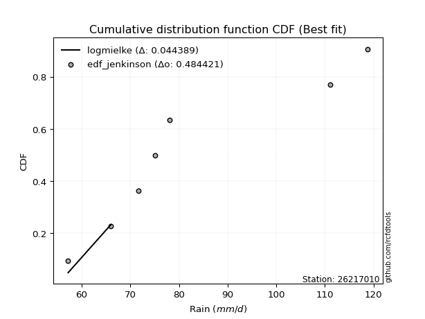</img>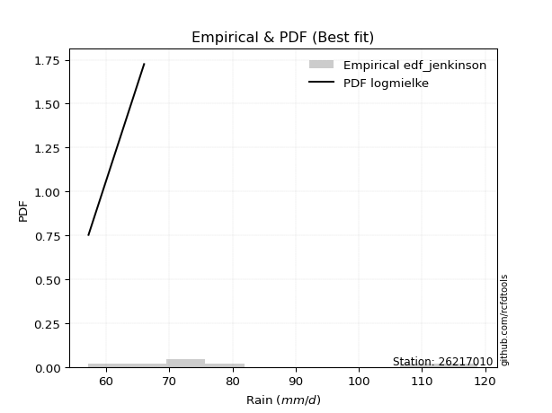</img>

</div>


### 11. Empirical - EDF Cunnane (1978)

Cunnane´s work in statistical hydrology has focused on the performance and evaluation of different probability distributions (such as GEV, Gumbel, Lognormal) for flood frequency estimation. _b_ is a constant, typically set to 0.4.

<div align="center">


$P=(m-b)/(n+1-2b)$


</div>


**11.1. Empirical values**

<div align="center">

|                | 0                   | 1                   | 2                  | 3           | 4                  | 5                  | 6                  |
|:---------------|:--------------------|:--------------------|:-------------------|:------------|:-------------------|:-------------------|:-------------------|
| date           | 2025                | 2020                | 2019               | 2023        | 2021               | 2022               | 2024               |
| x              | 55.2                | 57.2                | 66.0               | 71.6        | 75.0               | 111.0              | 118.8              |
| m              | 1                   | 2                   | 3                  | 4           | 5                  | 6                  | 7                  |
| empirical_dist | edf_cunnane         | edf_cunnane         | edf_cunnane        | edf_cunnane | edf_cunnane        | edf_cunnane        | edf_cunnane        |
| empirical      | 0.08333333333333333 | 0.22222222222222224 | 0.3611111111111111 | 0.5         | 0.6388888888888888 | 0.7777777777777777 | 0.9166666666666666 |
| empirical_tr   | 1.090909090909091   | 1.2857142857142856  | 1.565217391304348  | 2.0         | 2.7692307692307687 | 4.499999999999998  | 11.999999999999995 |

</div>


**11.2. Kolmogorov-Smirnov fit test (sorted by Δ)**


<div align="center">

|                | 0                   | 1                   | 2                   | 3                   | 4                   | 5                   | 6                   | 7                   | 8                   | 9                   | 10                  | 11                    | 12                  | 13                  | 14                  | 15                  | 16                  | 17                  | 18                  | 19                  | 20                  | 21                  | 22                  | 23                  | 24                  | 25                  | 26                  | 27                  | 28                  | 29                  | 30                  | 31                  | 32                  | 33                  | 34                  | 35                  | 36                  | 37                  | 38                  | 39                  | 40                  | 41                  | 42                  | 43                  | 44                  | 45                  | 46                  | 47                  | 48                  | 49                  | 50                  | 51                  | 52                  | 53                  | 54                  | 55                  | 56                  | 57                  | 58                  | 59                  | 60                  | 61                  | 62                  | 63                  | 64                  | 65                  | 66                  | 67                  | 68                  | 69                  | 70                  | 71                  | 72                  | 73                  | 74                  | 75                  | 76                  | 77                  | 78                  | 79                  | 80                  | 81                  | 82                  | 83                  | 84                  | 85                  | 86                  | 87                  | 88                  | 89                  |
|:---------------|:--------------------|:--------------------|:--------------------|:--------------------|:--------------------|:--------------------|:--------------------|:--------------------|:--------------------|:--------------------|:--------------------|:----------------------|:--------------------|:--------------------|:--------------------|:--------------------|:--------------------|:--------------------|:--------------------|:--------------------|:--------------------|:--------------------|:--------------------|:--------------------|:--------------------|:--------------------|:--------------------|:--------------------|:--------------------|:--------------------|:--------------------|:--------------------|:--------------------|:--------------------|:--------------------|:--------------------|:--------------------|:--------------------|:--------------------|:--------------------|:--------------------|:--------------------|:--------------------|:--------------------|:--------------------|:--------------------|:--------------------|:--------------------|:--------------------|:--------------------|:--------------------|:--------------------|:--------------------|:--------------------|:--------------------|:--------------------|:--------------------|:--------------------|:--------------------|:--------------------|:--------------------|:--------------------|:--------------------|:--------------------|:--------------------|:--------------------|:--------------------|:--------------------|:--------------------|:--------------------|:--------------------|:--------------------|:--------------------|:--------------------|:--------------------|:--------------------|:--------------------|:--------------------|:--------------------|:--------------------|:--------------------|:--------------------|:--------------------|:--------------------|:--------------------|:--------------------|:--------------------|:--------------------|:--------------------|:--------------------|
| station        | 26217010            | 26217010            | 26217010            | 26217010            | 26217010            | 26217010            | 26217010            | 26217010            | 26217010            | 26217010            | 26217010            | 26217010              | 26217010            | 26217010            | 26217010            | 26217010            | 26217010            | 26217010            | 26217010            | 26217010            | 26217010            | 26217010            | 26217010            | 26217010            | 26217010            | 26217010            | 26217010            | 26217010            | 26217010            | 26217010            | 26217010            | 26217010            | 26217010            | 26217010            | 26217010            | 26217010            | 26217010            | 26217010            | 26217010            | 26217010            | 26217010            | 26217010            | 26217010            | 26217010            | 26217010            | 26217010            | 26217010            | 26217010            | 26217010            | 26217010            | 26217010            | 26217010            | 26217010            | 26217010            | 26217010            | 26217010            | 26217010            | 26217010            | 26217010            | 26217010            | 26217010            | 26217010            | 26217010            | 26217010            | 26217010            | 26217010            | 26217010            | 26217010            | 26217010            | 26217010            | 26217010            | 26217010            | 26217010            | 26217010            | 26217010            | 26217010            | 26217010            | 26217010            | 26217010            | 26217010            | 26217010            | 26217010            | 26217010            | 26217010            | 26217010            | 26217010            | 26217010            | 26217010            | 26217010            | 26217010            |
| empirical_dist | edf_cunnane         | edf_cunnane         | edf_cunnane         | edf_cunnane         | edf_cunnane         | edf_cunnane         | edf_cunnane         | edf_cunnane         | edf_cunnane         | edf_cunnane         | edf_cunnane         | edf_cunnane           | edf_cunnane         | edf_cunnane         | edf_cunnane         | edf_cunnane         | edf_cunnane         | edf_cunnane         | edf_cunnane         | edf_cunnane         | edf_cunnane         | edf_cunnane         | edf_cunnane         | edf_cunnane         | edf_cunnane         | edf_cunnane         | edf_cunnane         | edf_cunnane         | edf_cunnane         | edf_cunnane         | edf_cunnane         | edf_cunnane         | edf_cunnane         | edf_cunnane         | edf_cunnane         | edf_cunnane         | edf_cunnane         | edf_cunnane         | edf_cunnane         | edf_cunnane         | edf_cunnane         | edf_cunnane         | edf_cunnane         | edf_cunnane         | edf_cunnane         | edf_cunnane         | edf_cunnane         | edf_cunnane         | edf_cunnane         | edf_cunnane         | edf_cunnane         | edf_cunnane         | edf_cunnane         | edf_cunnane         | edf_cunnane         | edf_cunnane         | edf_cunnane         | edf_cunnane         | edf_cunnane         | edf_cunnane         | edf_cunnane         | edf_cunnane         | edf_cunnane         | edf_cunnane         | edf_cunnane         | edf_cunnane         | edf_cunnane         | edf_cunnane         | edf_cunnane         | edf_cunnane         | edf_cunnane         | edf_cunnane         | edf_cunnane         | edf_cunnane         | edf_cunnane         | edf_cunnane         | edf_cunnane         | edf_cunnane         | edf_cunnane         | edf_cunnane         | edf_cunnane         | edf_cunnane         | edf_cunnane         | edf_cunnane         | edf_cunnane         | edf_cunnane         | edf_cunnane         | edf_cunnane         | edf_cunnane         | edf_cunnane         |
| p_dist         | lognakagami         | invgamma            | f                   | loginvgauss         | loginvgamma         | loginvweibull       | alpha               | invgauss            | loghalfnorm         | logexponnorm        | fisk                | loglaplace_asymmetric | logexpon            | lograyleigh         | halflogistic        | loghalflogistic     | logpearson3         | logmaxwell          | loggumbel_r         | moyal               | logmoyal            | halfnorm            | loggenexpon         | nct                 | logmielke           | loggenlogistic      | logkstwobign        | mielke              | logalpha            | lognct              | logrice             | exponnorm           | laplace_asymmetric  | expon               | genexpon            | betaprime           | genlogistic         | gumbel_r            | chi2                | kstwobign           | logloggamma         | loggompertz         | logbetaprime        | logcrystalball      | lognorm             | lognorm             | logt                | logjohnsonsu        | loglogistic         | rayleigh            | pearson3            | loghypsecant        | loglaplace          | maxwell             | logncf              | erlang              | logfatiguelife      | logtruncnorm        | ncf                 | weibull_min         | rice                | johnsonsu           | logweibull_min      | crystalball         | norm                | t                   | gompertz            | nakagami            | logistic            | wald                | gibrat              | logwald             | loggibrat           | hypsecant           | loggumbel_l         | truncnorm           | loggamma            | loggamma            | laplace             | logf                | gumbel_l            | logerlang           | logfisk             | logchi2             | pareto              | logpareto           | gamma               | loglognorm          | fatiguelife         | invweibull          |
| delta          | 0.09946888003596893 | 0.10179881248446165 | 0.10373609338801065 | 0.10513557419248343 | 0.10724389002807222 | 0.10911723650112048 | 0.11043492317628023 | 0.11065127598387348 | 0.11491438426650757 | 0.11614327743727806 | 0.1167242642652499  | 0.11696314668378316   | 0.11722783500700729 | 0.12014682264828358 | 0.12382716998394461 | 0.12472681363247964 | 0.12541387023406692 | 0.12553423619118542 | 0.1273649546007264  | 0.1277209330796798  | 0.12784483512056277 | 0.12970610732857146 | 0.13057048980417052 | 0.1306387223789327  | 0.1318364967034653  | 0.1325918014647376  | 0.13346084435182948 | 0.13352651836513518 | 0.13659101120729555 | 0.13741812801940978 | 0.13814052597218762 | 0.14120226760121193 | 0.14194441580308118 | 0.14244876976486331 | 0.14331474592049753 | 0.14375173306395106 | 0.14614816218961368 | 0.1461696665528004  | 0.147897205133539   | 0.155813711508059   | 0.15758237535050956 | 0.15850420975234042 | 0.15917584154027298 | 0.15928080959743335 | 0.1592809885858954  | 0.1592809885858954  | 0.15928126951016708 | 0.15972910448759892 | 0.16206065738900421 | 0.16402415884958033 | 0.16405999757623047 | 0.16443028287366185 | 0.1737721248886004  | 0.17615874867876746 | 0.17861812769778296 | 0.18524557245299478 | 0.18959554779239246 | 0.19244461076844455 | 0.1954832775035995  | 0.20035500041193727 | 0.2056843134182082  | 0.2081789365403502  | 0.20826672302431254 | 0.2105529348509556  | 0.21055293727436036 | 0.21058686483886402 | 0.2139649219830314  | 0.214529864331867   | 0.2200628481241782  | 0.22201265861056238 | 0.22222222222222224 | 0.22222222222222224 | 0.22222222222222224 | 0.22800742217262537 | 0.22996123345225616 | 0.23104372132489814 | 0.24091058927444547 | 0.24091058927444547 | 0.2515950266413929  | 0.2759790588376601  | 0.2794789721180824  | 0.2836848571354273  | 0.2859570287843428  | 0.3067843360091159  | 0.330659272240598   | 0.34411623759678756 | 0.35776664749861814 | 0.37206767066307667 | 0.41349451453102565 | 0.47880979268927853 |
| deltao         | 0.48442053926100004 | 0.48442053926100004 | 0.48442053926100004 | 0.48442053926100004 | 0.48442053926100004 | 0.48442053926100004 | 0.48442053926100004 | 0.48442053926100004 | 0.48442053926100004 | 0.48442053926100004 | 0.48442053926100004 | 0.48442053926100004   | 0.48442053926100004 | 0.48442053926100004 | 0.48442053926100004 | 0.48442053926100004 | 0.48442053926100004 | 0.48442053926100004 | 0.48442053926100004 | 0.48442053926100004 | 0.48442053926100004 | 0.48442053926100004 | 0.48442053926100004 | 0.48442053926100004 | 0.48442053926100004 | 0.48442053926100004 | 0.48442053926100004 | 0.48442053926100004 | 0.48442053926100004 | 0.48442053926100004 | 0.48442053926100004 | 0.48442053926100004 | 0.48442053926100004 | 0.48442053926100004 | 0.48442053926100004 | 0.48442053926100004 | 0.48442053926100004 | 0.48442053926100004 | 0.48442053926100004 | 0.48442053926100004 | 0.48442053926100004 | 0.48442053926100004 | 0.48442053926100004 | 0.48442053926100004 | 0.48442053926100004 | 0.48442053926100004 | 0.48442053926100004 | 0.48442053926100004 | 0.48442053926100004 | 0.48442053926100004 | 0.48442053926100004 | 0.48442053926100004 | 0.48442053926100004 | 0.48442053926100004 | 0.48442053926100004 | 0.48442053926100004 | 0.48442053926100004 | 0.48442053926100004 | 0.48442053926100004 | 0.48442053926100004 | 0.48442053926100004 | 0.48442053926100004 | 0.48442053926100004 | 0.48442053926100004 | 0.48442053926100004 | 0.48442053926100004 | 0.48442053926100004 | 0.48442053926100004 | 0.48442053926100004 | 0.48442053926100004 | 0.48442053926100004 | 0.48442053926100004 | 0.48442053926100004 | 0.48442053926100004 | 0.48442053926100004 | 0.48442053926100004 | 0.48442053926100004 | 0.48442053926100004 | 0.48442053926100004 | 0.48442053926100004 | 0.48442053926100004 | 0.48442053926100004 | 0.48442053926100004 | 0.48442053926100004 | 0.48442053926100004 | 0.48442053926100004 | 0.48442053926100004 | 0.48442053926100004 | 0.48442053926100004 | 0.48442053926100004 |
| eval           | Δo > Δ              | Δo > Δ              | Δo > Δ              | Δo > Δ              | Δo > Δ              | Δo > Δ              | Δo > Δ              | Δo > Δ              | Δo > Δ              | Δo > Δ              | Δo > Δ              | Δo > Δ                | Δo > Δ              | Δo > Δ              | Δo > Δ              | Δo > Δ              | Δo > Δ              | Δo > Δ              | Δo > Δ              | Δo > Δ              | Δo > Δ              | Δo > Δ              | Δo > Δ              | Δo > Δ              | Δo > Δ              | Δo > Δ              | Δo > Δ              | Δo > Δ              | Δo > Δ              | Δo > Δ              | Δo > Δ              | Δo > Δ              | Δo > Δ              | Δo > Δ              | Δo > Δ              | Δo > Δ              | Δo > Δ              | Δo > Δ              | Δo > Δ              | Δo > Δ              | Δo > Δ              | Δo > Δ              | Δo > Δ              | Δo > Δ              | Δo > Δ              | Δo > Δ              | Δo > Δ              | Δo > Δ              | Δo > Δ              | Δo > Δ              | Δo > Δ              | Δo > Δ              | Δo > Δ              | Δo > Δ              | Δo > Δ              | Δo > Δ              | Δo > Δ              | Δo > Δ              | Δo > Δ              | Δo > Δ              | Δo > Δ              | Δo > Δ              | Δo > Δ              | Δo > Δ              | Δo > Δ              | Δo > Δ              | Δo > Δ              | Δo > Δ              | Δo > Δ              | Δo > Δ              | Δo > Δ              | Δo > Δ              | Δo > Δ              | Δo > Δ              | Δo > Δ              | Δo > Δ              | Δo > Δ              | Δo > Δ              | Δo > Δ              | Δo > Δ              | Δo > Δ              | Δo > Δ              | Δo > Δ              | Δo > Δ              | Δo > Δ              | Δo > Δ              | Δo > Δ              | Δo > Δ              | Δo > Δ              | Δo > Δ              |
| fit            | 1                   | 1                   | 1                   | 1                   | 1                   | 1                   | 1                   | 1                   | 1                   | 1                   | 1                   | 1                     | 1                   | 1                   | 1                   | 1                   | 1                   | 1                   | 1                   | 1                   | 1                   | 1                   | 1                   | 1                   | 1                   | 1                   | 1                   | 1                   | 1                   | 1                   | 1                   | 1                   | 1                   | 1                   | 1                   | 1                   | 1                   | 1                   | 1                   | 1                   | 1                   | 1                   | 1                   | 1                   | 1                   | 1                   | 1                   | 1                   | 1                   | 1                   | 1                   | 1                   | 1                   | 1                   | 1                   | 1                   | 1                   | 1                   | 1                   | 1                   | 1                   | 1                   | 1                   | 1                   | 1                   | 1                   | 1                   | 1                   | 1                   | 1                   | 1                   | 1                   | 1                   | 1                   | 1                   | 1                   | 1                   | 1                   | 1                   | 1                   | 1                   | 1                   | 1                   | 1                   | 1                   | 1                   | 1                   | 1                   | 1                   | 1                   |
| n              | 7                   | 7                   | 7                   | 7                   | 7                   | 7                   | 7                   | 7                   | 7                   | 7                   | 7                   | 7                     | 7                   | 7                   | 7                   | 7                   | 7                   | 7                   | 7                   | 7                   | 7                   | 7                   | 7                   | 7                   | 7                   | 7                   | 7                   | 7                   | 7                   | 7                   | 7                   | 7                   | 7                   | 7                   | 7                   | 7                   | 7                   | 7                   | 7                   | 7                   | 7                   | 7                   | 7                   | 7                   | 7                   | 7                   | 7                   | 7                   | 7                   | 7                   | 7                   | 7                   | 7                   | 7                   | 7                   | 7                   | 7                   | 7                   | 7                   | 7                   | 7                   | 7                   | 7                   | 7                   | 7                   | 7                   | 7                   | 7                   | 7                   | 7                   | 7                   | 7                   | 7                   | 7                   | 7                   | 7                   | 7                   | 7                   | 7                   | 7                   | 7                   | 7                   | 7                   | 7                   | 7                   | 7                   | 7                   | 7                   | 7                   | 7                   |
| best_fit       | 1                   | 0                   | 0                   | 0                   | 0                   | 0                   | 0                   | 0                   | 0                   | 0                   | 0                   | 0                     | 0                   | 0                   | 0                   | 0                   | 0                   | 0                   | 0                   | 0                   | 0                   | 0                   | 0                   | 0                   | 0                   | 0                   | 0                   | 0                   | 0                   | 0                   | 0                   | 0                   | 0                   | 0                   | 0                   | 0                   | 0                   | 0                   | 0                   | 0                   | 0                   | 0                   | 0                   | 0                   | 0                   | 0                   | 0                   | 0                   | 0                   | 0                   | 0                   | 0                   | 0                   | 0                   | 0                   | 0                   | 0                   | 0                   | 0                   | 0                   | 0                   | 0                   | 0                   | 0                   | 0                   | 0                   | 0                   | 0                   | 0                   | 0                   | 0                   | 0                   | 0                   | 0                   | 0                   | 0                   | 0                   | 0                   | 0                   | 0                   | 0                   | 0                   | 0                   | 0                   | 0                   | 0                   | 0                   | 0                   | 0                   | 0                   |
| best_fit_sort  | 1                   | 2                   | 3                   | 4                   | 5                   | 6                   | 7                   | 8                   | 9                   | 10                  | 11                  | 12                    | 13                  | 14                  | 15                  | 16                  | 17                  | 18                  | 19                  | 20                  | 21                  | 22                  | 23                  | 24                  | 25                  | 26                  | 27                  | 28                  | 29                  | 30                  | 31                  | 32                  | 33                  | 34                  | 35                  | 36                  | 37                  | 38                  | 39                  | 40                  | 41                  | 42                  | 43                  | 44                  | 45                  | 46                  | 47                  | 48                  | 49                  | 50                  | 51                  | 52                  | 53                  | 54                  | 55                  | 56                  | 57                  | 58                  | 59                  | 60                  | 61                  | 62                  | 63                  | 64                  | 65                  | 66                  | 67                  | 68                  | 69                  | 70                  | 71                  | 72                  | 73                  | 74                  | 75                  | 76                  | 77                  | 78                  | 79                  | 80                  | 81                  | 82                  | 83                  | 84                  | 85                  | 86                  | 87                  | 88                  | 89                  | 90                  |

</div>


<div align="center">

</img>

</div>


**11.3. Best fit**

<div align="center">

|   id |   station | empirical_dist   | p_dist      |     delta |   deltao | eval   |   fit |   n |   best_fit |   best_fit_sort |
|-----:|----------:|:-----------------|:------------|----------:|---------:|:-------|------:|----:|-----------:|----------------:|
|    0 |  26217010 | edf_cunnane      | lognakagami | 0.0994689 | 0.484421 | Δo > Δ |     1 |   7 |          1 |               1 |

</div>


<div align="center">

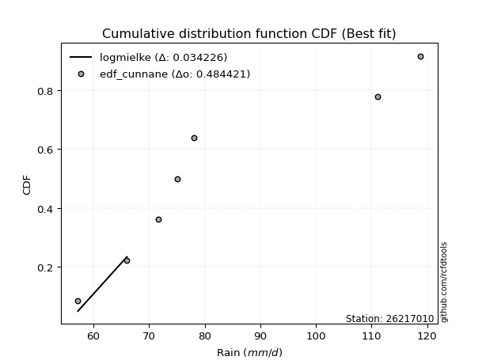</img></img>

</div>


### 12. Empirical - EDF Adamowski (1981)

The Adamowski formula in hydrology refers to a specific plotting position formula used for estimating the non-parametric empirical distribution of hydrological events (like flood peaks) to calculate their return periods. This formula provides an alternative to traditional parametric methods (like the Gumbel or Log Pearson Type III distributions). 

<div align="center">


$P=(m-0.25)/(n+0.5)$


</div>


**12.1. Empirical values**

<div align="center">

|                | 0                  | 1                   | 2                   | 3             | 4                  | 5                  | 6                  |
|:---------------|:-------------------|:--------------------|:--------------------|:--------------|:-------------------|:-------------------|:-------------------|
| date           | 2025               | 2020                | 2019                | 2023          | 2021               | 2022               | 2024               |
| x              | 55.2               | 57.2                | 66.0                | 71.6          | 75.0               | 111.0              | 118.8              |
| m              | 1                  | 2                   | 3                   | 4             | 5                  | 6                  | 7                  |
| empirical_dist | edf_adamowski      | edf_adamowski       | edf_adamowski       | edf_adamowski | edf_adamowski      | edf_adamowski      | edf_adamowski      |
| empirical      | 0.1                | 0.23333333333333334 | 0.36666666666666664 | 0.5           | 0.6333333333333333 | 0.7666666666666667 | 0.9                |
| empirical_tr   | 1.1111111111111112 | 1.3043478260869565  | 1.5789473684210527  | 2.0           | 2.727272727272727  | 4.2857142857142865 | 10.000000000000002 |

</div>


**12.2. Kolmogorov-Smirnov fit test (sorted by Δ)**


<div align="center">

|                | 0                   | 1                   | 2                   | 3                   | 4                   | 5                   | 6                   | 7                   | 8                   | 9                   | 10                  | 11                  | 12                    | 13                  | 14                  | 15                  | 16                  | 17                  | 18                  | 19                  | 20                  | 21                  | 22                  | 23                  | 24                  | 25                  | 26                  | 27                  | 28                  | 29                  | 30                  | 31                  | 32                  | 33                  | 34                  | 35                  | 36                  | 37                  | 38                  | 39                  | 40                  | 41                  | 42                  | 43                  | 44                  | 45                  | 46                  | 47                  | 48                  | 49                  | 50                  | 51                  | 52                  | 53                  | 54                  | 55                  | 56                  | 57                  | 58                  | 59                  | 60                  | 61                  | 62                  | 63                  | 64                  | 65                  | 66                  | 67                  | 68                  | 69                  | 70                  | 71                  | 72                  | 73                  | 74                  | 75                  | 76                  | 77                  | 78                  | 79                  | 80                  | 81                  | 82                  | 83                  | 84                  | 85                  | 86                  | 87                  | 88                  | 89                  |
|:---------------|:--------------------|:--------------------|:--------------------|:--------------------|:--------------------|:--------------------|:--------------------|:--------------------|:--------------------|:--------------------|:--------------------|:--------------------|:----------------------|:--------------------|:--------------------|:--------------------|:--------------------|:--------------------|:--------------------|:--------------------|:--------------------|:--------------------|:--------------------|:--------------------|:--------------------|:--------------------|:--------------------|:--------------------|:--------------------|:--------------------|:--------------------|:--------------------|:--------------------|:--------------------|:--------------------|:--------------------|:--------------------|:--------------------|:--------------------|:--------------------|:--------------------|:--------------------|:--------------------|:--------------------|:--------------------|:--------------------|:--------------------|:--------------------|:--------------------|:--------------------|:--------------------|:--------------------|:--------------------|:--------------------|:--------------------|:--------------------|:--------------------|:--------------------|:--------------------|:--------------------|:--------------------|:--------------------|:--------------------|:--------------------|:--------------------|:--------------------|:--------------------|:--------------------|:--------------------|:--------------------|:--------------------|:--------------------|:--------------------|:--------------------|:--------------------|:--------------------|:--------------------|:--------------------|:--------------------|:--------------------|:--------------------|:--------------------|:--------------------|:--------------------|:--------------------|:--------------------|:--------------------|:--------------------|:--------------------|:--------------------|
| station        | 26217010            | 26217010            | 26217010            | 26217010            | 26217010            | 26217010            | 26217010            | 26217010            | 26217010            | 26217010            | 26217010            | 26217010            | 26217010              | 26217010            | 26217010            | 26217010            | 26217010            | 26217010            | 26217010            | 26217010            | 26217010            | 26217010            | 26217010            | 26217010            | 26217010            | 26217010            | 26217010            | 26217010            | 26217010            | 26217010            | 26217010            | 26217010            | 26217010            | 26217010            | 26217010            | 26217010            | 26217010            | 26217010            | 26217010            | 26217010            | 26217010            | 26217010            | 26217010            | 26217010            | 26217010            | 26217010            | 26217010            | 26217010            | 26217010            | 26217010            | 26217010            | 26217010            | 26217010            | 26217010            | 26217010            | 26217010            | 26217010            | 26217010            | 26217010            | 26217010            | 26217010            | 26217010            | 26217010            | 26217010            | 26217010            | 26217010            | 26217010            | 26217010            | 26217010            | 26217010            | 26217010            | 26217010            | 26217010            | 26217010            | 26217010            | 26217010            | 26217010            | 26217010            | 26217010            | 26217010            | 26217010            | 26217010            | 26217010            | 26217010            | 26217010            | 26217010            | 26217010            | 26217010            | 26217010            | 26217010            |
| empirical_dist | edf_adamowski       | edf_adamowski       | edf_adamowski       | edf_adamowski       | edf_adamowski       | edf_adamowski       | edf_adamowski       | edf_adamowski       | edf_adamowski       | edf_adamowski       | edf_adamowski       | edf_adamowski       | edf_adamowski         | edf_adamowski       | edf_adamowski       | edf_adamowski       | edf_adamowski       | edf_adamowski       | edf_adamowski       | edf_adamowski       | edf_adamowski       | edf_adamowski       | edf_adamowski       | edf_adamowski       | edf_adamowski       | edf_adamowski       | edf_adamowski       | edf_adamowski       | edf_adamowski       | edf_adamowski       | edf_adamowski       | edf_adamowski       | edf_adamowski       | edf_adamowski       | edf_adamowski       | edf_adamowski       | edf_adamowski       | edf_adamowski       | edf_adamowski       | edf_adamowski       | edf_adamowski       | edf_adamowski       | edf_adamowski       | edf_adamowski       | edf_adamowski       | edf_adamowski       | edf_adamowski       | edf_adamowski       | edf_adamowski       | edf_adamowski       | edf_adamowski       | edf_adamowski       | edf_adamowski       | edf_adamowski       | edf_adamowski       | edf_adamowski       | edf_adamowski       | edf_adamowski       | edf_adamowski       | edf_adamowski       | edf_adamowski       | edf_adamowski       | edf_adamowski       | edf_adamowski       | edf_adamowski       | edf_adamowski       | edf_adamowski       | edf_adamowski       | edf_adamowski       | edf_adamowski       | edf_adamowski       | edf_adamowski       | edf_adamowski       | edf_adamowski       | edf_adamowski       | edf_adamowski       | edf_adamowski       | edf_adamowski       | edf_adamowski       | edf_adamowski       | edf_adamowski       | edf_adamowski       | edf_adamowski       | edf_adamowski       | edf_adamowski       | edf_adamowski       | edf_adamowski       | edf_adamowski       | edf_adamowski       | edf_adamowski       |
| p_dist         | f                   | lognakagami         | alpha               | fisk                | invgamma            | loginvgauss         | loginvgamma         | loginvweibull       | invgauss            | halfnorm            | loghalfnorm         | logexponnorm        | loglaplace_asymmetric | logexpon            | lograyleigh         | logmaxwell          | halflogistic        | loghalflogistic     | logpearson3         | loggumbel_r         | moyal               | logmoyal            | gumbel_r            | loggenexpon         | nct                 | logrice             | logmielke           | betaprime           | lognct              | loggenlogistic      | logkstwobign        | mielke              | logalpha            | logloggamma         | exponnorm           | kstwobign           | laplace_asymmetric  | expon               | logbetaprime        | logcrystalball      | lognorm             | lognorm             | logt                | logjohnsonsu        | genexpon            | loglogistic         | genlogistic         | rayleigh            | pearson3            | loghypsecant        | chi2                | logncf              | loglaplace          | loggompertz         | maxwell             | logfatiguelife      | ncf                 | weibull_min         | erlang              | rice                | johnsonsu           | logweibull_min      | logtruncnorm        | crystalball         | norm                | t                   | gompertz            | nakagami            | logistic            | hypsecant           | loggumbel_l         | truncnorm           | wald                | gibrat              | loggibrat           | logwald             | loggamma            | loggamma            | laplace             | logfisk             | logf                | gumbel_l            | logerlang           | logchi2             | pareto              | logpareto           | gamma               | loglognorm          | fatiguelife         | invweibull          |
| delta          | 0.09818053783245512 | 0.09999993546860557 | 0.1048793676207247  | 0.11116870870969436 | 0.11290992359557261 | 0.11624668530359439 | 0.11835500113918318 | 0.12022834761223145 | 0.12176238709498444 | 0.12586933374501397 | 0.12602549537761853 | 0.12725438854838916 | 0.12807425779489412   | 0.12833894611811839 | 0.13125793375939454 | 0.13403671792075877 | 0.13493828109505557 | 0.13583792474359074 | 0.13652498134517788 | 0.13847606571183735 | 0.13883204419079076 | 0.13895594623167373 | 0.14061411099724486 | 0.14168160091528162 | 0.14174983349004366 | 0.14237878155984562 | 0.14294760781457627 | 0.14322855164284232 | 0.14329149680749242 | 0.14370291257584855 | 0.14457195546294044 | 0.14463762947624614 | 0.14770212231840651 | 0.15202681979495403 | 0.15231337871232303 | 0.15279648816222535 | 0.15305552691419227 | 0.15355988087597439 | 0.15362028598471744 | 0.1537252540418778  | 0.15372543303033986 | 0.15372543303033986 | 0.15372571395461154 | 0.15417354893204338 | 0.15442585703160866 | 0.15650510183344868 | 0.15725927330072464 | 0.1584686032940248  | 0.15850444202067493 | 0.1588747273181063  | 0.15900831624464995 | 0.16195146103111627 | 0.16821656933304485 | 0.16961532086345155 | 0.17060319312321193 | 0.18403999223683692 | 0.18992772194804397 | 0.19479944485638173 | 0.19635668356410574 | 0.20012875786265266 | 0.20262338098479465 | 0.202711167468757   | 0.2035557218795555  | 0.20499737929540007 | 0.20499738171880483 | 0.20503130928330848 | 0.20840936642747587 | 0.20897430877631146 | 0.21450729256862267 | 0.22245186661706984 | 0.22440567789670063 | 0.2254881657693426  | 0.23312376972167348 | 0.23333333333333334 | 0.23333333333333334 | 0.23333333333333334 | 0.23535503371888994 | 0.23535503371888994 | 0.24603947108583735 | 0.2692903621176762  | 0.27042350328210457 | 0.2739234165625269  | 0.27812930157987176 | 0.2901176693424493  | 0.31954816112948686 | 0.33300512648567643 | 0.3522110919430626  | 0.36095655955196554 | 0.4079389589754701  | 0.4621431260226119  |
| deltao         | 0.48442053926100004 | 0.48442053926100004 | 0.48442053926100004 | 0.48442053926100004 | 0.48442053926100004 | 0.48442053926100004 | 0.48442053926100004 | 0.48442053926100004 | 0.48442053926100004 | 0.48442053926100004 | 0.48442053926100004 | 0.48442053926100004 | 0.48442053926100004   | 0.48442053926100004 | 0.48442053926100004 | 0.48442053926100004 | 0.48442053926100004 | 0.48442053926100004 | 0.48442053926100004 | 0.48442053926100004 | 0.48442053926100004 | 0.48442053926100004 | 0.48442053926100004 | 0.48442053926100004 | 0.48442053926100004 | 0.48442053926100004 | 0.48442053926100004 | 0.48442053926100004 | 0.48442053926100004 | 0.48442053926100004 | 0.48442053926100004 | 0.48442053926100004 | 0.48442053926100004 | 0.48442053926100004 | 0.48442053926100004 | 0.48442053926100004 | 0.48442053926100004 | 0.48442053926100004 | 0.48442053926100004 | 0.48442053926100004 | 0.48442053926100004 | 0.48442053926100004 | 0.48442053926100004 | 0.48442053926100004 | 0.48442053926100004 | 0.48442053926100004 | 0.48442053926100004 | 0.48442053926100004 | 0.48442053926100004 | 0.48442053926100004 | 0.48442053926100004 | 0.48442053926100004 | 0.48442053926100004 | 0.48442053926100004 | 0.48442053926100004 | 0.48442053926100004 | 0.48442053926100004 | 0.48442053926100004 | 0.48442053926100004 | 0.48442053926100004 | 0.48442053926100004 | 0.48442053926100004 | 0.48442053926100004 | 0.48442053926100004 | 0.48442053926100004 | 0.48442053926100004 | 0.48442053926100004 | 0.48442053926100004 | 0.48442053926100004 | 0.48442053926100004 | 0.48442053926100004 | 0.48442053926100004 | 0.48442053926100004 | 0.48442053926100004 | 0.48442053926100004 | 0.48442053926100004 | 0.48442053926100004 | 0.48442053926100004 | 0.48442053926100004 | 0.48442053926100004 | 0.48442053926100004 | 0.48442053926100004 | 0.48442053926100004 | 0.48442053926100004 | 0.48442053926100004 | 0.48442053926100004 | 0.48442053926100004 | 0.48442053926100004 | 0.48442053926100004 | 0.48442053926100004 |
| eval           | Δo > Δ              | Δo > Δ              | Δo > Δ              | Δo > Δ              | Δo > Δ              | Δo > Δ              | Δo > Δ              | Δo > Δ              | Δo > Δ              | Δo > Δ              | Δo > Δ              | Δo > Δ              | Δo > Δ                | Δo > Δ              | Δo > Δ              | Δo > Δ              | Δo > Δ              | Δo > Δ              | Δo > Δ              | Δo > Δ              | Δo > Δ              | Δo > Δ              | Δo > Δ              | Δo > Δ              | Δo > Δ              | Δo > Δ              | Δo > Δ              | Δo > Δ              | Δo > Δ              | Δo > Δ              | Δo > Δ              | Δo > Δ              | Δo > Δ              | Δo > Δ              | Δo > Δ              | Δo > Δ              | Δo > Δ              | Δo > Δ              | Δo > Δ              | Δo > Δ              | Δo > Δ              | Δo > Δ              | Δo > Δ              | Δo > Δ              | Δo > Δ              | Δo > Δ              | Δo > Δ              | Δo > Δ              | Δo > Δ              | Δo > Δ              | Δo > Δ              | Δo > Δ              | Δo > Δ              | Δo > Δ              | Δo > Δ              | Δo > Δ              | Δo > Δ              | Δo > Δ              | Δo > Δ              | Δo > Δ              | Δo > Δ              | Δo > Δ              | Δo > Δ              | Δo > Δ              | Δo > Δ              | Δo > Δ              | Δo > Δ              | Δo > Δ              | Δo > Δ              | Δo > Δ              | Δo > Δ              | Δo > Δ              | Δo > Δ              | Δo > Δ              | Δo > Δ              | Δo > Δ              | Δo > Δ              | Δo > Δ              | Δo > Δ              | Δo > Δ              | Δo > Δ              | Δo > Δ              | Δo > Δ              | Δo > Δ              | Δo > Δ              | Δo > Δ              | Δo > Δ              | Δo > Δ              | Δo > Δ              | Δo > Δ              |
| fit            | 1                   | 1                   | 1                   | 1                   | 1                   | 1                   | 1                   | 1                   | 1                   | 1                   | 1                   | 1                   | 1                     | 1                   | 1                   | 1                   | 1                   | 1                   | 1                   | 1                   | 1                   | 1                   | 1                   | 1                   | 1                   | 1                   | 1                   | 1                   | 1                   | 1                   | 1                   | 1                   | 1                   | 1                   | 1                   | 1                   | 1                   | 1                   | 1                   | 1                   | 1                   | 1                   | 1                   | 1                   | 1                   | 1                   | 1                   | 1                   | 1                   | 1                   | 1                   | 1                   | 1                   | 1                   | 1                   | 1                   | 1                   | 1                   | 1                   | 1                   | 1                   | 1                   | 1                   | 1                   | 1                   | 1                   | 1                   | 1                   | 1                   | 1                   | 1                   | 1                   | 1                   | 1                   | 1                   | 1                   | 1                   | 1                   | 1                   | 1                   | 1                   | 1                   | 1                   | 1                   | 1                   | 1                   | 1                   | 1                   | 1                   | 1                   |
| n              | 7                   | 7                   | 7                   | 7                   | 7                   | 7                   | 7                   | 7                   | 7                   | 7                   | 7                   | 7                   | 7                     | 7                   | 7                   | 7                   | 7                   | 7                   | 7                   | 7                   | 7                   | 7                   | 7                   | 7                   | 7                   | 7                   | 7                   | 7                   | 7                   | 7                   | 7                   | 7                   | 7                   | 7                   | 7                   | 7                   | 7                   | 7                   | 7                   | 7                   | 7                   | 7                   | 7                   | 7                   | 7                   | 7                   | 7                   | 7                   | 7                   | 7                   | 7                   | 7                   | 7                   | 7                   | 7                   | 7                   | 7                   | 7                   | 7                   | 7                   | 7                   | 7                   | 7                   | 7                   | 7                   | 7                   | 7                   | 7                   | 7                   | 7                   | 7                   | 7                   | 7                   | 7                   | 7                   | 7                   | 7                   | 7                   | 7                   | 7                   | 7                   | 7                   | 7                   | 7                   | 7                   | 7                   | 7                   | 7                   | 7                   | 7                   |
| best_fit       | 1                   | 0                   | 0                   | 0                   | 0                   | 0                   | 0                   | 0                   | 0                   | 0                   | 0                   | 0                   | 0                     | 0                   | 0                   | 0                   | 0                   | 0                   | 0                   | 0                   | 0                   | 0                   | 0                   | 0                   | 0                   | 0                   | 0                   | 0                   | 0                   | 0                   | 0                   | 0                   | 0                   | 0                   | 0                   | 0                   | 0                   | 0                   | 0                   | 0                   | 0                   | 0                   | 0                   | 0                   | 0                   | 0                   | 0                   | 0                   | 0                   | 0                   | 0                   | 0                   | 0                   | 0                   | 0                   | 0                   | 0                   | 0                   | 0                   | 0                   | 0                   | 0                   | 0                   | 0                   | 0                   | 0                   | 0                   | 0                   | 0                   | 0                   | 0                   | 0                   | 0                   | 0                   | 0                   | 0                   | 0                   | 0                   | 0                   | 0                   | 0                   | 0                   | 0                   | 0                   | 0                   | 0                   | 0                   | 0                   | 0                   | 0                   |
| best_fit_sort  | 1                   | 2                   | 3                   | 4                   | 5                   | 6                   | 7                   | 8                   | 9                   | 10                  | 11                  | 12                  | 13                    | 14                  | 15                  | 16                  | 17                  | 18                  | 19                  | 20                  | 21                  | 22                  | 23                  | 24                  | 25                  | 26                  | 27                  | 28                  | 29                  | 30                  | 31                  | 32                  | 33                  | 34                  | 35                  | 36                  | 37                  | 38                  | 39                  | 40                  | 41                  | 42                  | 43                  | 44                  | 45                  | 46                  | 47                  | 48                  | 49                  | 50                  | 51                  | 52                  | 53                  | 54                  | 55                  | 56                  | 57                  | 58                  | 59                  | 60                  | 61                  | 62                  | 63                  | 64                  | 65                  | 66                  | 67                  | 68                  | 69                  | 70                  | 71                  | 72                  | 73                  | 74                  | 75                  | 76                  | 77                  | 78                  | 79                  | 80                  | 81                  | 82                  | 83                  | 84                  | 85                  | 86                  | 87                  | 88                  | 89                  | 90                  |

</div>


<div align="center">

</img>

</div>


**12.3. Best fit**

<div align="center">

|   id |   station | empirical_dist   | p_dist   |     delta |   deltao | eval   |   fit |   n |   best_fit |   best_fit_sort |
|-----:|----------:|:-----------------|:---------|----------:|---------:|:-------|------:|----:|-----------:|----------------:|
|    0 |  26217010 | edf_adamowski    | f        | 0.0981805 | 0.484421 | Δo > Δ |     1 |   7 |          1 |               1 |

</div>


<div align="center">

</img>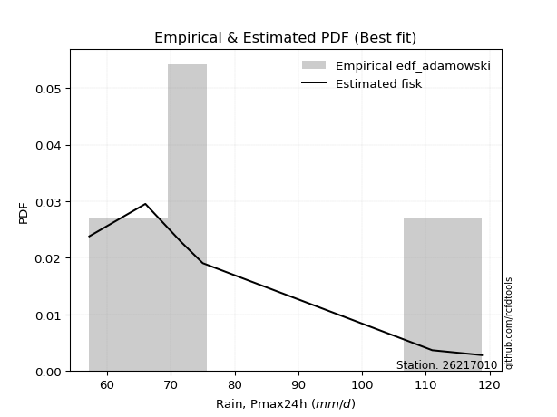</img>

</div>


## C. Best fit & Estimate extreme values for specific return periods - Tr


### 1. Best fit (ordered by delta Δ)

<div align="center">

|   id |   station | empirical_dist   | p_dist         |     delta |   deltao | eval   |   fit |   n |   best_fit |   best_fit_sort |
|-----:|----------:|:-----------------|:---------------|----------:|---------:|:-------|------:|----:|-----------:|----------------:|
|    0 |  26217010 | edf_weibull      | f              | 0.0898472 | 0.484421 | Δo > Δ |     1 |   7 |          1 |               1 |
|    1 |  26217010 | edf_hazen        | invgamma       | 0.0938623 | 0.484421 | Δo > Δ |     1 |   7 |          1 |               2 |
|    2 |  26217010 | edf_chegodayev   | lognakagami    | 0.0957151 | 0.484421 | Δo > Δ |     1 |   7 |          1 |               3 |
|    3 |  26217010 | edf_jenkinson    | lognakagami    | 0.0960813 | 0.484421 | Δo > Δ |     1 |   7 |          1 |               4 |
|    4 |  26217010 | edf_beard        | lognakagami    | 0.0960813 | 0.484421 | Δo > Δ |     1 |   7 |          1 |               5 |
|    5 |  26217010 | edf_filliben     | lognakagami    | 0.0963573 | 0.484421 | Δo > Δ |     1 |   7 |          1 |               6 |
|    6 |  26217010 | edf_tukey        | lognakagami    | 0.0969436 | 0.484421 | Δo > Δ |     1 |   7 |          1 |               7 |
|    7 |  26217010 | edf_adamowski    | f              | 0.0981805 | 0.484421 | Δo > Δ |     1 |   7 |          1 |               8 |
|    8 |  26217010 | edf_blom         | lognakagami    | 0.098511  | 0.484421 | Δo > Δ |     1 |   7 |          1 |               9 |
|    9 |  26217010 | edf_gringorten   | invgamma       | 0.0986777 | 0.484421 | Δo > Δ |     1 |   7 |          1 |              10 |
|   10 |  26217010 | edf_cunnane      | lognakagami    | 0.0994689 | 0.484421 | Δo > Δ |     1 |   7 |          1 |              11 |
|   11 |  26217010 | edf_california   | logfatiguelife | 0.122135  | 0.484421 | Δo > Δ |     1 |   7 |          1 |              12 |

</div>

:file_folder:Tables: [bestfit_26217010.csv](table/bestfit_26217010.csv) | [extreme_26217010.csv](table/extreme_26217010.csv)


### 2. Extreme values

In hydrology, a return period (or recurrence interval $Tr$) is the statistical average time between extreme events like floods or droughts of a specific magnitude, indicating how rare an event is, with a 100-year flood, for example, having a 1% chance of occurring in any given year, not that it happens exactly every century. It is a key tool for infrastructure design (like bridges or dams) and risk assessment, calculated from historical data to determine the probability of future events, although it is important to remember it is statistical average, and events can cluster or be missed.

> risk_rate: assuming the return period as the project useful life.

|   id |      tr |   prob_l |     prob_g |     alpha |   betaprime |     chi2 |   crystalball |   erlang |    expon |   exponnorm |         f |   fatiguelife |       fisk |    gamma |   genexpon |   genlogistic |   gibrat |   gompertz |   gumbel_l |   gumbel_r |   halflogistic |   halfnorm |   hypsecant |   invgamma |   invgauss |       invweibull |   johnsonsu |   kstwobign |   laplace |   laplace_asymmetric |   loggamma |   logistic |   lognorm |   maxwell |   mielke |    moyal |   nakagami |      ncf |      nct |     norm |           pareto |   pearson3 |   rayleigh |     rice |        t |   truncnorm |     wald |   weibull_min |   logalpha |   logbetaprime |          logchi2 |   logcrystalball |   logerlang |   logexpon |   logexponnorm |      logf |   logfatiguelife |          logfisk |   loggenexpon |   loggenlogistic |   loggibrat |   loggompertz |   loggumbel_l |   loggumbel_r |   loghalflogistic |   loghalfnorm |   loghypsecant |   loginvgamma |   loginvgauss |   loginvweibull |   logjohnsonsu |   logkstwobign |   loglaplace |   loglaplace_asymmetric |   logloggamma |   loglogistic |    loglognorm |   logmaxwell |   logmielke |   logmoyal |   lognakagami |   logncf |   lognct |      logpareto |   logpearson3 |   lograyleigh |   logrice |     logt |   logtruncnorm |   logwald |   logweibull_min |   station |   n |   risk_rate |
|-----:|--------:|---------:|-----------:|----------:|------------:|---------:|--------------:|---------:|---------:|------------:|----------:|--------------:|-----------:|---------:|-----------:|--------------:|---------:|-----------:|-----------:|-----------:|---------------:|-----------:|------------:|-----------:|-----------:|-----------------:|------------:|------------:|----------:|---------------------:|-----------:|-----------:|----------:|----------:|---------:|---------:|-----------:|---------:|---------:|---------:|-----------------:|-----------:|-----------:|---------:|---------:|------------:|---------:|--------------:|-----------:|---------------:|-----------------:|-----------------:|------------:|-----------:|---------------:|----------:|-----------------:|-----------------:|--------------:|-----------------:|------------:|--------------:|--------------:|--------------:|------------------:|--------------:|---------------:|--------------:|--------------:|----------------:|---------------:|---------------:|-------------:|------------------------:|--------------:|--------------:|--------------:|-------------:|------------:|-----------:|--------------:|---------:|---------:|---------------:|--------------:|--------------:|----------:|---------:|---------------:|----------:|-----------------:|----------:|----:|------------:|
|    0 |    2    | 0.5      | 0.5        |   67.1616 |     75.2512 |  65.8983 |       79.2571 |  64.5774 |  71.8751 |     71.8882 |   67.9356 |       55.2    |    67.126  |  59.4362 |    72.0021 |       74.6863 |  72.182  |    78.9375 |    83.1294 |    75.3849 |        73.4598 |    74.4323 |     79.2571 |    68.5747 |    67.1655 |   2032.35        |     79.257  |     75.854  |   79.2571 |              71.9147 |    62.6147 |    79.2571 |   76.0825 |   77.2412 |  72.3411 |  74.1348 |    61.6497 |  82.2224 |  74.2729 |  79.2571 |     56.2244      |    76.4388 |    76.5263 |  78.5261 |  79.2588 |     81.2803 |  71.6165 |       63.2502 |    72.9252 |        76.0548 |     88.9153      |          76.0825 |     61.0443 |    68.9487 |        68.9471 |   59.6336 |          63.908  |    69.4461       |       70.403  |          72.2545 |     69.9455 |       74.4189 |       79.6669 |       72.6593 |           71.0153 |       71.8411 |        76.0825 |       69.3253 |       67.6136 |         69.5798 |        76.0808 |        72.7283 |      76.0825 |                 71.6326 |       76.0034 |       76.0825 |  55.321       |      74.2807 |     72.2231 |    71.5875 |       68.3071 |  75.4162 |  74.9245 |   56.0438      |       74.1992 |       73.652  |   74.963  |  76.0825 |        68.6473 |   69.4769 |     61.6391      |  26217010 |   7 |    0.75     |
|    1 |    2.33 | 0.570815 | 0.429185   |   70.6538 |     79.0554 |  69.0768 |       83.4633 |  67.0655 |  75.5492 |     75.5737 |   72.7785 |       55.8048 |    71.6037 |  61.0168 |    75.685  |       78.2353 |  74.3127 |    82.8969 |    86.7889 |    79.2824 |        77.467  |    78.9718 |     82.6234 |    71.8502 |    70.4337 | 126794           |     83.6086 |     79.5881 |   81.8025 |              75.6019 |    64.8428 |    82.9631 |   79.9838 |   81.6112 |  75.7126 |  77.8242 |    65.6713 |  91.957  |  77.9585 |  83.4633 |     57.7524      |    80.6279 |    80.9608 |  82.4133 |  83.4646 |     85.9321 |  74.3746 |       66.4831 |    76.3872 |        79.896  |    105.816       |          79.9838 |     63.1318 |    72.4114 |        72.4167 |   62.3048 |          66.9633 |    85.4017       |       73.9746 |          75.6223 |     71.7397 |       78.2256 |       83.2094 |       76.1053 |           74.4804 |       75.8249 |        79.189  |       72.5487 |       70.8186 |         72.7817 |        79.8898 |        76.2271 |      78.42   |                 74.7745 |       79.9424 |       79.5095 |  56.1814      |      78.2418 |     75.5922 |    74.7974 |       73.3447 |  82.4284 |  78.7003 |   57.3301      |       78.0113 |       77.6392 |   78.6329 |  79.9838 |        71.7031 |   71.7924 |     66.1161      |  26217010 |   7 |    0.729209 |
|    2 |    5    | 0.8      | 0.2        |   97.7325 |     95.5681 |  86.4833 |       99.0947 |  80.1927 |  93.9185 |     94.0004 |  109.115  |       68.6524 |   111.371  |  70.4618 |    93.9977 |       93.6524 |  86.5797 |    98.9089 |    98.611  |    96.2149 |        95.599  |    98.1691 |     96.126  |    92.2057 |    90.8346 |      8.96969e+12 |     99.7806 |     95.4499 |   94.5289 |              94.0373 |    78.1865 |    97.2723 |   96.3184 |   98.8109 |  92.176  |  94.9143 |    92.9406 | 135.319  |  94.6588 |  99.0947 |    289.875       |    97.8241 |    98.7144 |  97.9757 |  99.0945 |    101.384  |  89.8141 |       88.7815 |    92.6338 |        96.3311 |    296.532       |          96.3183 |     76.5106 |    92.5139 |        92.5652 |   86.1841 |          89.5939 | 10116            |       93.1285 |          92.1709 |     83.0021 |       95.7235 |       95.7661 |       93.0766 |           92.3976 |       95.2644 |        92.9783 |       91.7449 |       91.0961 |         91.6005 |        95.7937 |        93.0658 |      91.2295 |                 92.6755 |       96.3687 |       94.254  |   3.29991e+19 |      95.9941 |     92.1852 |    91.6485 |      104.375  | 115.387  |  95.2642 | 1849.31        |       95.3334 |       95.884  |   95.215  |  96.3184 |        86.5945 |   86.2554 |    133.642       |  26217010 |   7 |    0.67232  |
|    3 |   10    | 0.9      | 0.1        |  147.483  |    109.029  | 103.505  |      109.464  |  92.6551 | 110.594  |    110.728  |  167.355  |       86.3915 |   194.26   |  80.3258 |   110.481  |      106.208  | 100.563  |   109.909  |   105.193  |   110.006  |       110.657  |   112.375  |    106.908  |   119.302  |   115.2    |      2.22013e+19 |    110.509  |    107.527  |  106.082  |             110.772  |    93.5784 |   107.81   |  108.955  |  110.915  | 108.079  | 109.794  |   119.451  | 170.99   | 109.152  | 109.464  |  14190.1         |   110.696  |   111.373  | 109.072  | 109.463  |    109.185  | 106.199  |      116.834  |   107.534  |       109.444  |    863.651       |         108.955  |     92.9135 |   115.556  |       115.671  |  127.701  |         123.249  |     6.29129e+15  |      112.542  |         108.29   |     98.0115 |      109.974  |      103.561  |      109.66   |          110.511  |      112.791  |       105.694  |      116.899  |      118.021  |        116.09   |       108.054  |       108.339  |     104.661  |                112.611  |      109.003  |      106.834  | inf           |     110.851  |    108.462  |   109.383  |      139.099  | 144.992  | 108.966  |    2.14148e+94 |      110.3    |      111.456  |  109.133  | 108.955  |        98.1552 |  104.803  |    470.111       |  26217010 |   7 |    0.651322 |
|    4 |   15    | 0.933333 | 0.0666667  |  197.055  |    116.659  | 113.77   |      114.639  | 100.082  | 120.348  |    120.512  |  218.734  |       97.9933 |   283.078  |  86.4265 |   120.062  |      113.292  | 110.207  |   115.342  |   108.174  |   117.787  |       119.178  |   119.767  |    113.062  |   140.681  |   131.823  |      8.98658e+22 |    115.862  |    113.938  |  112.839  |             120.562  |   104.207  |   113.552  |  115.869  |  117.126  | 118.193  | 118.429  |   134.121  | 191.068  | 117.73   | 114.639  | 155439           |   117.571  |   117.895  | 114.789  | 114.637  |    112.111  | 116.721  |      136.343  |   116.732  |       116.767  |   1670.15        |         115.868  |    104.617  |   131.612  |       131.776  |  165.149  |         150.71   |     5.82792e+39  |      124.867  |         118.597  |    109.918  |      117.777  |      107.297  |      120.288  |          122.294  |      123.153  |       113.716  |      137.241  |      139.007  |        135.9    |       114.747  |       117.442  |     113.416  |                126.205  |      115.887  |      114.381  | inf           |     119.346  |    118.945  |   121.21   |      162.055  | 162.753  | 116.808  |  inf           |      119.091  |      120.443  |  117.081  | 115.869  |       103.529  |  118.766  |   1351.18        |  26217010 |   7 |    0.644736 |
|    5 |   20    | 0.95     | 0.05       |  246.584  |    122.03   | 121.153  |      118.027  | 105.395  | 127.269  |    127.455  |  266.026  |      106.583  |   375.797  |  90.8618 |   126.835  |      118.252  | 117.773  |   118.855  |   110.029  |   123.235  |       125.149  |   124.696  |    117.403  |   159.072  |   144.579  |      3.01491e+25 |    119.368  |    118.257  |  117.634  |             127.508  |   112.563  |   117.521  |  120.632  |  121.248  | 125.817  | 124.545  |   144.06   | 205.089  | 123.928  | 118.027  | 851362           |   122.239  |   122.231  | 118.589  | 118.025  |    113.663  | 124.562  |      151.493  |   123.561  |       121.874  |   2696.29        |         120.632  |    113.99   |   144.338  |       144.544  |  200.008  |         174.647  |     2.41151e+77  |      134.071  |         126.393  |    120.262  |      123.117  |      109.69   |      128.337  |          131.29   |      130.585  |       119.739  |      155.331  |      156.891  |        153.546  |       119.353  |       124.001  |     120.069  |                136.834  |      120.62   |      119.907  | inf           |     125.34   |    126.913  |   130.351  |      179.534  | 175.648  | 122.359  |  inf           |      125.403  |      126.813  |  122.682  | 120.632  |       106.666  |  130.368  |   3342.99        |  26217010 |   7 |    0.641514 |
|    6 |   25    | 0.96     | 0.04       |  296.096  |    126.187  | 126.926  |      120.522  | 109.537  | 132.637  |    132.84   |  310.478  |      113.408  |   471.47   |  94.3529 |   132.073  |      122.073  | 124.08   |   121.413  |   111.35   |   127.432  |       129.749  |   128.363  |    120.762  |   175.527  |   154.984  |      2.65895e+27 |    121.949  |    121.492  |  121.353  |             132.895  |   119.548  |   120.556  |  124.263  |  124.308  | 132.014  | 129.285  |   151.504  | 215.868  | 128.816  | 120.522  |      3.18463e+06 |   125.759  |   125.452  | 121.413  | 120.52   |    114.628  | 130.842  |      163.967  |   129.059  |       125.802  |   3929.97        |         124.263  |    121.927  |   155.051  |       155.295  |  233.055  |         196.235  |     5.70064e+129 |      141.482  |         132.745  |    129.625  |      127.157  |      111.425  |      134.902  |          138.669  |      136.404  |       124.618  |      172.074  |      172.781  |        169.906  |       122.862  |       129.152  |     125.497  |                145.692  |      124.221  |      124.314  | inf           |     129.983  |    133.431  |   137.908  |      193.787  | 185.844  | 126.673  |  inf           |      130.358  |      131.763  |  127.015  | 124.263  |       108.729  |  140.474  |   7417.7         |  26217010 |   7 |    0.639603 |
|    7 |   50    | 0.98     | 0.02       |  543.576  |    139.136  | 145.072  |      127.665  | 122.499  | 149.312  |    149.567  |  507.53   |      135.305  |   979.673  | 105.426  |   148.264  |      133.841  | 146.313  |   128.589  |   114.934  |   140.359  |       143.922  |   139.022  |    131.178  |   242.055  |   189.87   |      2.61625e+33 |    129.339  |    130.991  |  132.906  |             149.63   |   144.377  |   129.832  |  135.277  |  133.182  | 153.041  | 144.001  |   173.25   | 248.97   | 144.56   | 127.665  |      1.91799e+08 |   136.241  |   134.802  | 129.609  | 127.662  |    116.645  | 151.347  |      206.591  |   147.472  |       137.894  |  12968.9         |         135.277  |    150.808  |   193.67   |       194.059  |  382.395  |         284.622  |   inf            |      166.086  |         154.391  |    168.837  |      139.214  |      116.276  |      157.312  |          164.119  |      154.832  |       141.046  |      246.139  |      236.228  |        242.621  |       133.49   |       145.551  |     143.974  |                177.031  |      135.114  |      138.807  | inf           |     144.447  |    155.818  |   164.274  |      242.064  | 218.735  | 140.206  |  inf           |      146.161  |      147.255  |  140.482  | 135.277  |       113.348  |  179.248  | 154066           |  26217010 |   7 |    0.63583  |
|    8 |   75    | 0.986667 | 0.0133333  |  791.022  |    146.785  | 155.808  |      131.498  | 130.134  | 159.066  |    159.352  |  680.596  |      148.492  |  1520.85   | 112.032  |   157.681  |      140.682  | 161.329  |   132.337  |   116.746  |   147.872  |       152.16   |   144.824  |    137.265  |   294.881  |   211.877  |      7.96197e+36 |    133.305  |    136.218  |  139.664  |             159.42   |   161.384  |   135.189  |  141.584  |  138.007  | 166.735  | 152.607  |   185.102  | 268.159  | 154.232  | 131.498  |      2.10842e+09 |   142.113  |   139.888  | 134.068  | 131.495  |    117.347  | 163.965  |      234.145  |   159.339  |       144.941  |  26425           |         141.584  |    171.113  |   220.578  |       221.077  |  516.903  |         355.726  |   inf            |      181.646  |         168.56   |    201.832  |      145.962  |      118.808  |      172.011  |          181.007  |      165.889  |       151.631  |      313.342  |      285.995  |        309.049  |       139.567  |       155.445  |     156.018  |                198.402  |      141.331  |      147.935  | inf           |     152.975  |    170.617  |   181.971  |      273.231  | 238.924  | 148.267  |  inf           |      155.747  |      156.435  |  148.399  | 141.584  |       115.061  |  208.254  |      1.37515e+06 |  26217010 |   7 |    0.634587 |
|    9 |  100    | 0.99     | 0.01       | 1038.46   |    152.265  | 163.469  |      134.091  | 135.571  | 165.987  |    166.294  |  839.703  |      157.981  |  2084.43   | 116.766  |   164.338  |      145.523  | 172.961  |   134.83   |   117.932  |   153.19   |       157.991  |   148.777  |    141.583  |   340.415  |   228.124  |      2.32486e+39 |    135.987  |    139.799  |  144.459  |             166.365  |   174.714  |   138.971  |  146.016  |  141.293  | 177.147  | 158.712  |   193.167  | 281.729  | 161.33   | 134.091  |      1.15515e+10 |   146.183  |   143.354  | 137.105  | 134.087  |    117.704  | 173.165  |      254.826  |   168.33   |       149.946  |  43998.7         |         146.015  |    187.291  |   241.907  |       242.499  |  642.977  |         417.524  |   inf            |      193.234  |         179.366  |    231.762  |      150.63   |      120.495  |      183.238  |          194.001  |      173.871  |       159.618  |      378.009  |      328.615  |        373.33   |       143.833  |       162.61   |     165.17   |                215.112  |      145.69   |      154.739  | inf           |     159.07   |    181.98   |   195.67   |      296.717  | 253.711  | 154.071  |  inf           |      162.722  |      163.015  |  154.046  | 146.016  |       115.955  |  232.321  |      7.90483e+06 |  26217010 |   7 |    0.633968 |
|   10 |  200    | 0.995    | 0.005      | 2028.19   |    165.693  | 182.052  |      139.971  | 148.728  | 182.662  |    183.021  | 1399.51   |      181.208  |  4484.01   | 128.305  |   180.298  |      157.162  | 204.608  |   140.354  |   120.508  |   165.975  |       172.01   |   157.817  |    151.985  |   485.919  |   269.171  |      1.9652e+45  |    142.071  |    148.047  |  156.011  |             183.1    |   211.742  |   148.044  |  156.589  |  148.812  | 204.868  | 173.422  |   211.565  | 314.35   | 179.328  | 139.971  |      6.95716e+11 |   155.715  |   151.283  | 144.056  | 139.967  |    118.247  | 196.08   |      308.398  |   192.252  |       162.065  | 152376           |         156.589  |    233.306  |   302.16   |       303.03   | 1102.06   |         617.563  |   inf            |      223.119  |         208.268  |    337.617  |      161.511  |      124.243  |      213.317  |          229.184  |      193.6    |       180.63   |      633.045  |      463.841  |        629.673  |       154      |       180.393  |     189.487  |                261.384  |      156.062  |      172.364  | inf           |     173.944  |    212.681  |   233.063  |      358.214  | 291.029  | 168.393  |  inf           |      180.187  |      179.129  |  167.79   | 156.589  |       117.346  |  305.063  |      1.07705e+09 |  26217010 |   7 |    0.633042 |
|   11 |  250    | 0.996    | 0.004      | 2523.04   |    170.094  | 188.067  |      141.768  | 152.977  | 188.031  |    188.406  | 1651.39   |      188.778  |  5745.12   | 132.055  |   185.412  |      160.904  | 215.963  |   142.005  |   121.266  |   170.085  |       176.517  |   160.599  |    155.333  |   546.259  |   282.9    |      1.58072e+47 |    143.93   |    150.599  |  159.73   |             188.488  |   225.318  |   150.957  |  159.97   |  151.127  | 214.656  | 178.157  |   217.208  | 324.846  | 185.415  | 141.768  |      2.60254e+12 |   158.711  |   153.724  | 146.196  | 141.764  |    118.357  | 203.661  |      326.742  |   200.722  |       165.994  | 228106           |         159.97   |    250.536  |   324.586  |       325.567  | 1315.36   |         701.487  |   inf            |      233.356  |         218.514  |    386.408  |      164.915  |      125.368  |      223.999  |          241.799  |      200.108  |       187.965  |      763.499  |      519.681  |        762.238  |       157.248  |       186.281  |     198.053  |                278.303  |      159.37   |      178.437  | inf           |     178.797  |    223.673  |   246.56   |      379.552  | 303.579  | 173.117  |  inf           |      186.022  |      184.404  |  172.263  | 159.97   |       117.632  |  333.832  |      6.5227e+09  |  26217010 |   7 |    0.632858 |
|   12 |  500    | 0.998    | 0.002      | 4997.33   |    184.048  | 206.835  |      147.097  | 166.216  | 204.706  |    205.133  | 2767.31   |      212.524  | 12431.5    | 143.79   |   201.228  |      172.518  | 255.206  |   146.799  |   123.44   |   182.842  |       190.506  |   168.891  |    165.734  |   790.503  |   326.934  |      1.2971e+53  |    149.443  |    158.249  |  171.283  |             205.223  |   273.478  |   159.991  |  170.433  |  158.033  | 248.07   | 192.867  |   233.977  | 357.489  | 205.329  | 147.097  |      1.56744e+14 |   167.827  |   161.007  | 152.579  | 147.093  |    118.577  | 227.767  |      387.031  |   229.851  |       178.313  | 806135           |         170.433  |    313.024  |   405.431  |       406.834  | 2300.53   |        1045.87   |   inf            |      267.173  |         253.641  |    616.085  |      175.209  |      128.649  |      260.683  |          285.549  |      220.84   |       212.707  |     1475.81   |      745.283  |       1498.54   |       167.288  |       205.102  |     227.211  |                338.168  |      169.581  |      198.668  | inf           |     194.097  |    261.764  |   293.677  |      450.895  | 344.338  | 188.194  |  inf           |      204.865  |      201.081  |  186.329  | 170.433  |       118.212  |  444.603  |      3.57784e+12 |  26217010 |   7 |    0.632489 |
|   13 |  750    | 0.998667 | 0.00133333 | 7471.62   |    192.428  | 217.865  |      150.058  | 173.983  | 214.46   |    214.918  | 3747.09   |      226.554  | 19542.8    | 150.708  |   210.431  |      179.307  | 281.159  |   149.397  |   124.601  |   190.3    |       198.683  |   173.523  |    171.819  |   984.598  |   353.565  |      3.71842e+56 |    152.506  |    162.546  |  178.041  |             215.012  |   306.418  |   165.269  |  176.539  |  161.896  | 269.932  | 201.471  |   243.308  | 376.637  | 217.739  | 150.058  |      1.72307e+15 |   173.042  |   165.079  | 156.149  | 150.053  |    118.651  | 242.22   |      424.566  |   249.158  |       185.614  |      1.69653e+06 |         176.538  |    356.869  |   461.761  |       463.477  | 3209.63   |        1324      |   inf            |      288.435  |         276.736  |    838.735  |      181.053  |      130.438  |      284.852  |          314.704  |      233.344  |       228.663  |     2306.51   |      924.639  |       2376.31   |       173.14   |       216.498  |     246.219  |                378.992  |      175.521  |      211.533  | inf           |     203.219  |    287.141  |   325.309  |      496.345  | 369.487  | 197.316  |  inf           |      216.424  |      211.056  |  194.69   | 176.539  |       118.407  |  527.942  |      2.4031e+14  |  26217010 |   7 |    0.632366 |
|   14 | 1000    | 0.999    | 0.001      | 9945.91   |    198.48   | 225.711  |      152.096  | 179.503  | 221.381  |    221.861  | 4647.75   |      236.562  | 26944.8    | 155.638  |   216.939  |      184.123  | 301.019  |   151.158  |   125.383  |   195.59   |       204.484  |   176.722  |    176.135  |  1151.94   |   372.808  |      1.05394e+59 |    154.615  |    165.523  |  182.836  |             221.958  |   332.221  |   169.012  |  180.869  |  164.566  | 286.584  | 207.576  |   249.736  | 390.256  | 226.911  | 152.096  |      9.44026e+15 |   176.695  |   167.893  | 158.616  | 152.091  |    118.689  | 252.616  |      452.19   |   264.027  |       190.844  |      2.88266e+06 |         180.868  |    391.781  |   506.412  |       508.387  | 4075.07   |        1566.43   |   inf            |      304.214  |         294.382  |   1062.08   |      185.126  |      131.656  |      303.342  |          337.173  |      242.39   |       240.704  |     3265.84   |     1079.57   |       3408.03   |       177.288  |       224.762  |     260.662  |                410.911  |      179.726  |      221.158  | inf           |     209.773  |    306.704  |   349.798  |      530.339  | 387.943  | 203.935  |  inf           |      224.879  |      218.237  |  200.686  | 180.869  |       118.506  |  597.391  |      6.04393e+15 |  26217010 |   7 |    0.632305 |

<div align="center">

</img>

</div>


<div align="center">

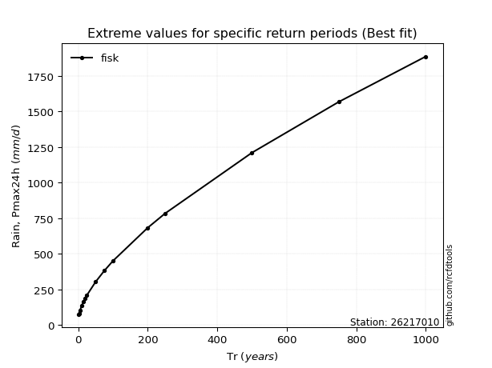</img>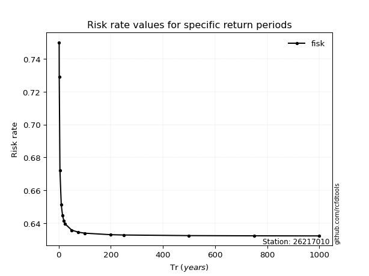</img>

</div>


<sub>**APP DISCLAIMER**: NO WARRANTY - This software is provided by [github.com/rcfdtools](https://github.com/rcfdtools) "as is", without any express or implied warranty, including warranties of merchantability, fitness for a particular purpose, or non-infringement. There is no guarantee that the software will be error-free or operate without interruption. LIMITATION OF LIABILITY - Neither the authors nor copyright holders will be liable for claims or damages arising from the software or its use. You are responsible for determining if the software is appropriate for your use and assume all associated risks, including errors, legal compliance, and data loss. NO PROFESSIONAL ADVICE - The software provides general information and does not offer professional advice. It should not replace consultation with professional advisors.</sub>