<div align="center">


</div>

# Station (rain, Pmax24h): 26225060

Probable Maximum Precipitation (PMP) is the greatest amount of rainfall for a specific duration that is meteorologically possible for a given location, acting as a "worst-case" scenario for extreme storms, crucial for designing safety-critical infrastructure like bridges, river deviations, dams, spillways, and nuclear plants to prevent catastrophic failure. PMP is calculated by hydrologists using meteorological data to determine the upper limit of extreme rainfall, often leading to the Probable Maximum Flood (PMF) for flood control design, and is increasingly being studied for climate change impacts.

<div align="center">

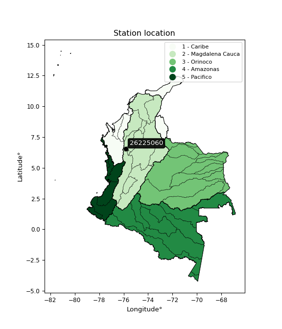</img>

</div>


## A. General information


### 1. General running parameters

• app_version: _v20251225_. • runtime: _2025-12-26 14:29:50.888910_. • Python version: _3.14.0_. • SciPy version: _1.16.3_. • Pandas version: _2.3.3_. • NumPy version: _2.3.5_. • Stations dataset (station_dataset_file): _dataset/pmax24h_in/automatic_colombia.csv_. • Stations catalog (station_catalog_file): _dataset/CNE_IDEAM.xls_. • Plot only fit distributions with Δo > Δ (plot_only_fit): _True_. • Eval low extreme values, if False, evaluates high extreme values (low_extreme): _False_. • Eval every SciPy distribution as logarithmic (pdist_logarithmic_on): _True_. • Standard deviation normalized (ddof): _1.0_. • Return periods to eval in years (Tr): _[2, 2.33, 5, 10, 15, 20, 25, 50, 75, 100, 200, 250, 500, 750, 1000]_. • Minimum data sample per station, 0 means any (minimum_sample): _5_. • Z-Score threshold to adjust a value, 0 means disable (zscore): _3.5_. • Avoid zeros, e.g. rain = 0 (avoid_zeros): _True_. • Avoid null values (avoid_nans): _True_. [:file_folder:Dataset file.](../../dataset/pmax24h_in/automatic_colombia.csv)


### 2. Station info and location

|   id |   CODIGO | NOMBRE                     | CATEGORIA         | TECNOLOGIA                | ESTADO   | FECHA_INSTALACION   |   FECHA_SUSPENSION |   ALTITUD |   LATITUD |   LONGITUD | DEPARTAMENTO   | MUNICIPIO             | AREA_OPERATIVA                      | ENTIDAD                                                     | AREA_HIDROGRAFICA   | ZONA_HIDROGRAFICA   | SUBZONA_HIDROGRAFICA                               |   CORRIENTE | OBSERVACION                                                                                                                                                                                             | SUBRED                                                   | Catalogo   |
|-----:|---------:|:---------------------------|:------------------|:--------------------------|:---------|:--------------------|-------------------:|----------:|----------:|-----------:|:---------------|:----------------------|:------------------------------------|:------------------------------------------------------------|:--------------------|:--------------------|:---------------------------------------------------|------------:|:--------------------------------------------------------------------------------------------------------------------------------------------------------------------------------------------------------|:---------------------------------------------------------|:-----------|
|    0 | 26225060 | HACIENDA COTOVE [26225060] | Agrometeorológica | Automática con Telemetría | Activa   | 25/11/2004          |                nan |       534 |   6.53392 |   -75.8273 | Antioquia      | Santa Fe De Antioquia | Area Operativa 01 - Antioquia-Chocó | INSTITUTO DE HIDROLOGIA METEOROLOGIA Y ESTUDIOS AMBIENTALES | Magdalena Cauca     | Cauca               | Directos Río Cauca entre Río San Juan y Pto Valdia |         nan | Correcciones solicitadas por actualizaciones en automatización|15/10/2025$mvelez$Se cambio de estado bajo el memorando 20253080178903 atendiendo a la solicitud del aop 1 y del grupo de automatización | Radición Global,Radiación Visible,Radiación Ultravioleta | CNE_IDEAM  |

<div align="center">

Map location in: [:earth_americas:Google](http://maps.google.com/maps?q=6.533916667,-75.82733333) [:earth_americas:OSM](https://www.openstreetmap.org/#map=18/6.533916667/-75.82733333&layers=P) [:earth_americas:Bing](https://www.bing.com/maps?cp=6.533916667~-75.82733333&lvl=18) [:earth_americas:Apple](https://maps.apple.com/frame?center=6.533916667%2C-75.82733333&span=0.003%2C0.006)

</div>


<div align="center">

```geojson
{
  "type": "Feature",
  "geometry": {
    "type": "Point", 
    "coordinates": [-75.82733333, 6.533916667]
  }, 
  "properties": {
    "Name": "26225060"
  }
}
```

</div>


### 3. Discrete values table and plot

|               |           0 |           1 |           2 |           3 |           4 |            5 |           6 |          7 |          8 |
|:--------------|------------:|------------:|------------:|------------:|------------:|-------------:|------------:|-----------:|-----------:|
| Date          | 2017        | 2018        | 2019        | 2020        | 2021        | 2022         | 2023        | 2024       | 2025       |
| Value         |   31.4      |   17.2      |   42.5      |   19.5      |   33.3      |   27.7       |   13.3      |    9.3     |   66.8     |
| Value_initial |   31.4      |   17.2      |   42.5      |   19.5      |   33.3      |   27.7       |   13.3      |    9.3     |   66.8     |
| count         |    9        |    9        |    9        |    9        |    9        |    9         |    9        |    9       |    9       |
| mean          |   29        |   29        |   29        |   29        |   29        |   29         |   29        |   29       |   29       |
| std           |   17.6816   |   17.6816   |   17.6816   |   17.6816   |   17.6816   |   17.6816    |   17.6816   |   17.6816  |   17.6816  |
| zscore        |    0.135735 |   -0.667362 |    0.763507 |   -0.537283 |    0.243191 |   -0.0735229 |   -0.887931 |   -1.11416 |    2.13782 |

<div align="center">

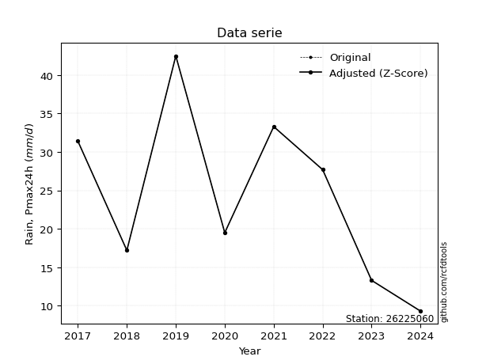</img>

</div>

> If Z-Score is active, values out of range or outliers are replaced with the station mean value.


### 4. Active continuous probability distributions from SciPy (45 of 104 available)

[scipy.stats](https://docs.scipy.org/doc/scipy/reference/stats.html) is a Python´s powerful submodule within the SciPy library for comprehensive statistical analysis, offering over 130 probability distributions (like Normal, Poisson), functions for descriptive stats (mean, variance), hypothesis testing (t-tests, chi-square), random variable generation, and statistical tests, making it essential for data science, modeling, and research. It provides tools to explore, model, and draw conclusions from data efficiently, working seamlessly with NumPy.

<div align="center">

|   id | p_dist             |   n_parameter | fit_method   | label                                                                       | active   | ref                                                                                                        |
|-----:|:-------------------|--------------:|:-------------|:----------------------------------------------------------------------------|:---------|:-----------------------------------------------------------------------------------------------------------|
|    0 | alpha              |             3 | MLE          | Alpha                                                                       | True     | [:mortar_board:](https://docs.scipy.org/doc/scipy/reference/generated/scipy.stats.alpha.html)              |
|    1 | betaprime          |             4 | MLE          | Beta prime                                                                  | True     | [:mortar_board:](https://docs.scipy.org/doc/scipy/reference/generated/scipy.stats.betaprime.html)          |
|    2 | chi2               |             3 | MLE          | Chi²                                                                        | True     | [:mortar_board:](https://docs.scipy.org/doc/scipy/reference/generated/scipy.stats.chi2.html)               |
|    3 | crystalball        |             4 | MLE          | Crystalball                                                                 | True     | [:mortar_board:](https://docs.scipy.org/doc/scipy/reference/generated/scipy.stats.crystalball.html)        |
|    4 | erlang             |             3 | MLE          | Erlang                                                                      | True     | [:mortar_board:](https://docs.scipy.org/doc/scipy/reference/generated/scipy.stats.erlang.html)             |
|    5 | expon              |             2 | MLE          | Exponential                                                                 | True     | [:mortar_board:](https://docs.scipy.org/doc/scipy/reference/generated/scipy.stats.expon.html)              |
|    6 | exponnorm          |             3 | MLE          | Exponentially modified Normal                                               | True     | [:mortar_board:](https://docs.scipy.org/doc/scipy/reference/generated/scipy.stats.exponnorm.html)          |
|    7 | f                  |             4 | MLE          | F                                                                           | True     | [:mortar_board:](https://docs.scipy.org/doc/scipy/reference/generated/scipy.stats.f.html)                  |
|    8 | fatiguelife        |             3 | MLE          | Fatigue-life (Birnbaum-Saunders)                                            | True     | [:mortar_board:](https://docs.scipy.org/doc/scipy/reference/generated/scipy.stats.fatiguelife.html)        |
|    9 | fisk               |             3 | MLE          | Fisk                                                                        | True     | [:mortar_board:](https://docs.scipy.org/doc/scipy/reference/generated/scipy.stats.fisk.html)               |
|   10 | gamma              |             3 | MLE          | Gamma                                                                       | True     | [:mortar_board:](https://docs.scipy.org/doc/scipy/reference/generated/scipy.stats.gamma.html)              |
|   11 | genexpon           |             5 | MLE          | Generalized exponential                                                     | True     | [:mortar_board:](https://docs.scipy.org/doc/scipy/reference/generated/scipy.stats.genexpon.html)           |
|   12 | genlogistic        |             3 | MLE          | Generalized logistic                                                        | True     | [:mortar_board:](https://docs.scipy.org/doc/scipy/reference/generated/scipy.stats.genlogistic.html)        |
|   13 | gibrat             |             2 | MM           | Gibrat                                                                      | True     | [:mortar_board:](https://docs.scipy.org/doc/scipy/reference/generated/scipy.stats.gibrat.html)             |
|   14 | gompertz           |             3 | MLE          | Gompertz (or truncated Gumbel)                                              | True     | [:mortar_board:](https://docs.scipy.org/doc/scipy/reference/generated/scipy.stats.gompertz.html)           |
|   15 | gumbel_l           |             2 | MM           | Gumbel Left Skew                                                            | True     | [:mortar_board:](https://docs.scipy.org/doc/scipy/reference/generated/scipy.stats.gumbel_l.html)           |
|   16 | gumbel_r           |             2 | MM           | Gumbel Right Skew                                                           | True     | [:mortar_board:](https://docs.scipy.org/doc/scipy/reference/generated/scipy.stats.gumbel_r.html)           |
|   17 | halflogistic       |             2 | MM           | Half-logistic                                                               | True     | [:mortar_board:](https://docs.scipy.org/doc/scipy/reference/generated/scipy.stats.halflogistic.html)       |
|   18 | halfnorm           |             2 | MM           | Half Normal                                                                 | True     | [:mortar_board:](https://docs.scipy.org/doc/scipy/reference/generated/scipy.stats.halfnorm.html)           |
|   19 | hypsecant          |             2 | MM           | hyperbolic secant                                                           | True     | [:mortar_board:](https://docs.scipy.org/doc/scipy/reference/generated/scipy.stats.hypsecant.html)          |
|   20 | invgamma           |             3 | MLE          | Inverted gamma                                                              | True     | [:mortar_board:](https://docs.scipy.org/doc/scipy/reference/generated/scipy.stats.invgamma.html)           |
|   21 | invgauss           |             3 | MLE          | Inverse Gaussian                                                            | True     | [:mortar_board:](https://docs.scipy.org/doc/scipy/reference/generated/scipy.stats.invgauss.html)           |
|   22 | invweibull         |             3 | MLE          | Inverted Weibull                                                            | True     | [:mortar_board:](https://docs.scipy.org/doc/scipy/reference/generated/scipy.stats.invweibull.html)         |
|   23 | johnsonsu          |             4 | MLE          | Johnson Su                                                                  | True     | [:mortar_board:](https://docs.scipy.org/doc/scipy/reference/generated/scipy.stats.johnsonsu.html)          |
|   24 | kstwobign          |             2 | MLE          | Limiting distribution of scaled Kolmogorov-Smirnov two-sided test statistic | True     | [:mortar_board:](https://docs.scipy.org/doc/scipy/reference/generated/scipy.stats.kstwobign.html)          |
|   25 | laplace            |             2 | MM           | Laplace                                                                     | True     | [:mortar_board:](https://docs.scipy.org/doc/scipy/reference/generated/scipy.stats.laplace.html)            |
|   26 | laplace_asymmetric |             3 | MLE          | Asymmetric Laplace                                                          | True     | [:mortar_board:](https://docs.scipy.org/doc/scipy/reference/generated/scipy.stats.laplace_asymmetric.html) |
|   27 | loggamma           |             3 | MLE          | Log gamma                                                                   | True     | [:mortar_board:](https://docs.scipy.org/doc/scipy/reference/generated/scipy.stats.loggamma.html)           |
|   28 | logistic           |             2 | MM           | Logistic (or Sech-squared)                                                  | True     | [:mortar_board:](https://docs.scipy.org/doc/scipy/reference/generated/scipy.stats.logistic.html)           |
|   29 | lognorm            |             3 | MLE          | Log Normal                                                                  | True     | [:mortar_board:](https://docs.scipy.org/doc/scipy/reference/generated/scipy.stats.lognorm.html)            |
|   30 | maxwell            |             2 | MM           | Maxwell                                                                     | True     | [:mortar_board:](https://docs.scipy.org/doc/scipy/reference/generated/scipy.stats.maxwell.html)            |
|   31 | mielke             |             4 | MLE          | Mielke Beta-Kappa / Dagum                                                   | True     | [:mortar_board:](https://docs.scipy.org/doc/scipy/reference/generated/scipy.stats.mielke.html)             |
|   32 | moyal              |             2 | MM           | Moyal                                                                       | True     | [:mortar_board:](https://docs.scipy.org/doc/scipy/reference/generated/scipy.stats.moyal.html)              |
|   33 | nakagami           |             3 | MLE          | Nakagami                                                                    | True     | [:mortar_board:](https://docs.scipy.org/doc/scipy/reference/generated/scipy.stats.nakagami.html)           |
|   34 | ncf                |             5 | MLE          | Non-central F distribution                                                  | True     | [:mortar_board:](https://docs.scipy.org/doc/scipy/reference/generated/scipy.stats.ncf.html)                |
|   35 | nct                |             4 | MLE          | Non-central Student’s t                                                     | True     | [:mortar_board:](https://docs.scipy.org/doc/scipy/reference/generated/scipy.stats.nct.html)                |
|   36 | norm               |             2 | MM           | Normal                                                                      | True     | [:mortar_board:](https://docs.scipy.org/doc/scipy/reference/generated/scipy.stats.norm.html)               |
|   37 | pareto             |             3 | MLE          | Pareto                                                                      | True     | [:mortar_board:](https://docs.scipy.org/doc/scipy/reference/generated/scipy.stats.pareto.html)             |
|   38 | pearson3           |             3 | MM           | Pearson type III                                                            | True     | [:mortar_board:](https://docs.scipy.org/doc/scipy/reference/generated/scipy.stats.pearson3.html)           |
|   39 | rayleigh           |             2 | MM           | Rayleigh                                                                    | True     | [:mortar_board:](https://docs.scipy.org/doc/scipy/reference/generated/scipy.stats.rayleigh.html)           |
|   40 | rice               |             3 | MLE          | Rice                                                                        | True     | [:mortar_board:](https://docs.scipy.org/doc/scipy/reference/generated/scipy.stats.rice.html)               |
|   41 | t                  |             3 | MLE          | Student’s t                                                                 | True     | [:mortar_board:](https://docs.scipy.org/doc/scipy/reference/generated/scipy.stats.t.html)                  |
|   42 | truncnorm          |             4 | MLE          | Truncated normal                                                            | True     | [:mortar_board:](https://docs.scipy.org/doc/scipy/reference/generated/scipy.stats.truncnorm.html)          |
|   43 | wald               |             2 | MM           | Wald                                                                        | True     | [:mortar_board:](https://docs.scipy.org/doc/scipy/reference/generated/scipy.stats.wald.html)               |
|   44 | weibull_min        |             3 | MLE          | Weibull minimum                                                             | True     | [:mortar_board:](https://docs.scipy.org/doc/scipy/reference/generated/scipy.stats.weibull_min.html)        |

</div>

> **n_parameter:** # arguments & localization & scale.
>
> **Fit methods:** (MLE) maximum likelihood, (MM) L-moments.
>
>**Inactive:** foldnorm, gennorm, norminvgauss, powernorm, powerlognorm, skewnorm, genextreme, anglit, arcsine, argus, beta, bradford, burr, burr12, cauchy, cosine, halfcauchy, foldcauchy, skewcauchy, wrapcauchy, dgamma, gengamma, exponweib, exponpow, truncexpon, gausshyper, genhalflogistic, genhyperbolic, geninvgauss, halfgennorm, johnsonsb, kappa4, kappa3, ksone, kstwo, loglaplace, levy, levy_l, levy_stable, ncx2, genpareto, truncpareto, lomax, powerlaw, rdist, rel_breitwigner, recipinvgauss, semicircular, studentized_range, trapezoid, triang, truncweibull_min, tukeylambda, uniform, loguniform, vonmises, vonmises_line, weibull_max, dweibull, 


## B. Probability distributions vs. Empirical distributions

A continuous probability distribution (CPD) describes probabilities for variables that can take any value within a range (like rain any time), unlike discrete variables with specific outcomes (like temperature). It uses a Probability Density Function (PDF), a curve where the total area under it equals 1, and the probability of the variable falling within an interval (a to b) is found by calculating the area under the curve between those points. A key feature is that the probability of hitting any single exact value is zero, so probabilities are always expressed for ranges, e.g., $P(a ≤ X ≤ b)$.

<div align="center">

Distributions parameters
|    |   station | p_dist                |   n |             loc |          scale | shape                 | shape1                | shape2                 | shape3   |
|---:|----------:|:----------------------|----:|----------------:|---------------:|:----------------------|:----------------------|:-----------------------|:---------|
|  0 |  26225060 | alpha                 |   9 |   -26.4747      |  195.317       | 3.8068322921481075    |                       |                        |          |
|  1 |  26225060 | betaprime             |   9 |     5.5467      |   43.0281      | 2.5473734513588244    | 5.591200303510334     |                        |          |
|  2 |  26225060 | chi2                  |   9 |     9.3         |   10.6702      | 1.346129808754318     |                       |                        |          |
|  3 |  26225060 | crystalball           |   9 |    29           |   16.6703      | 1847.7071131125213    | 254.97301325335343    |                        |          |
|  4 |  26225060 | erlang                |   9 |     9.3         |   16.6943      | 0.8856119169508341    |                       |                        |          |
|  5 |  26225060 | expon                 |   9 |     9.3         |   19.7         |                       |                       |                        |          |
|  6 |  26225060 | exponnorm             |   9 |     9.27468     |    0.00816356  | 2389.9401419565847    |                       |                        |          |
|  7 |  26225060 | f                     |   9 |     9.3         |   22.8149      | 1.4993048045717738    | 59.811811620397975    |                        |          |
|  8 |  26225060 | fatiguelife           |   9 |     3.539       |   20.1175      | 0.7258428216091237    |                       |                        |          |
|  9 |  26225060 | fisk                  |   9 |     5.05815     |   19.1151      | 2.2211652631426153    |                       |                        |          |
| 10 |  26225060 | gamma                 |   9 |     9.3         |   25.1482      | 0.7198665931399454    |                       |                        |          |
| 11 |  26225060 | genexpon              |   9 |     9.29998     |    2.10281     | 0.10670526054118068   | 4.963700415726401e-06 | 0.9543520766548649     |          |
| 12 |  26225060 | genlogistic           |   9 |   -62.5644      |   12.0849      | 1056.0971566084559    |                       |                        |          |
| 13 |  26225060 | gibrat                |   9 |    16.2826      |    7.71348     |                       |                       |                        |          |
| 14 |  26225060 | gompertz              |   9 |     9.3         |   79.0672      | 3.185898491091769     |                       |                        |          |
| 15 |  26225060 | gumbel_l              |   9 |    36.5025      |   12.9978      |                       |                       |                        |          |
| 16 |  26225060 | gumbel_r              |   9 |    21.4975      |   12.9978      |                       |                       |                        |          |
| 17 |  26225060 | halflogistic          |   9 |     9.24178     |   14.2525      |                       |                       |                        |          |
| 18 |  26225060 | halfnorm              |   9 |     6.93501     |   27.6544      |                       |                       |                        |          |
| 19 |  26225060 | hypsecant             |   9 |    29           |   10.6127      |                       |                       |                        |          |
| 20 |  26225060 | invgamma              |   9 |    -5.54105     |  140.131       | 5.012059617058039     |                       |                        |          |
| 21 |  26225060 | invgauss              |   9 |     1.86807     |   57.451       | 0.47226169244601957   |                       |                        |          |
| 22 |  26225060 | invweibull            |   9 |   -34.0962      |   54.4248      | 4.974469084471741     |                       |                        |          |
| 23 |  26225060 | johnsonsu             |   9 |     3.09861     |    0.396257    | -6.900878694283129    | 1.4810154360051242    |                        |          |
| 24 |  26225060 | kstwobign             |   9 |   -21.6623      |   58.4042      |                       |                       |                        |          |
| 25 |  26225060 | laplace               |   9 |    29           |   11.7877      |                       |                       |                        |          |
| 26 |  26225060 | laplace_asymmetric    |   9 |    27.7         |   12.6945      | 0.9501124968044273    |                       |                        |          |
| 27 |  26225060 | loggamma              |   9 | -4737.97        |  654.194       | 1461.3198755651174    |                       |                        |          |
| 28 |  26225060 | logistic              |   9 |    29           |    9.19084     |                       |                       |                        |          |
| 29 |  26225060 | lognorm               |   9 |     9.3         |    0.28026     | 11.58275244786593     |                       |                        |          |
| 30 |  26225060 | maxwell               |   9 |   -10.5017      |   24.754       |                       |                       |                        |          |
| 31 |  26225060 | mielke                |   9 |     0.0773297   |   22.9201      | 3.221234283276914     | 2.799889564077188     |                        |          |
| 32 |  26225060 | moyal                 |   9 |    19.4668      |    7.50429     |                       |                       |                        |          |
| 33 |  26225060 | nakagami              |   9 |     9.3         |   25.4342      | 0.3093629496284094    |                       |                        |          |
| 34 |  26225060 | ncf                   |   9 |     0.217345    |    8.85845     | 9.182396434957205     | 11.078506146207092    | 15.392516467047562     |          |
| 35 |  26225060 | nct                   |   9 |   -13.1456      |    1.94427     | 4.4555232479408       | 17.886731192252782    |                        |          |
| 36 |  26225060 | norm                  |   9 |    29           |   16.6703      |                       |                       |                        |          |
| 37 |  26225060 | pareto                |   9 |     9.29791     |    0.00208844  | 0.12519480530462979   |                       |                        |          |
| 38 |  26225060 | pearson3              |   9 |    29           |   16.6703      | 1.0204445717840818    |                       |                        |          |
| 39 |  26225060 | rayleigh              |   9 |    -2.89132     |   25.4456      |                       |                       |                        |          |
| 40 |  26225060 | rice                  |   9 |     1.6339      |   22.6584      | 0.0002825758655563736 |                       |                        |          |
| 41 |  26225060 | t                     |   9 |    26.4517      |   13.2488      | 4.803523153336314     |                       |                        |          |
| 42 |  26225060 | truncnorm             |   9 |    29           |   16.6703      | -99.18184393666644    | 4590.865929615334     |                        |          |
| 43 |  26225060 | wald                  |   9 |    12.3296      |   16.6704      |                       |                       |                        |          |
| 44 |  26225060 | weibull_min           |   9 |     9.3         |   19.8889      | 0.7799934533444456    |                       |                        |          |
| 45 |  26225060 | logalpha              |   9 |    -7.71776     |  205.71        | 18.898426304242022    |                       |                        |          |
| 46 |  26225060 | logbetaprime          |   9 |    -6.04695     |   17.7102      | 386.6382938430489     | 741.0241936074794     |                        |          |
| 47 |  26225060 | logchi2               |   9 |     2.23001     |    0.943768    | 1.091640607849079     |                       |                        |          |
| 48 |  26225060 | logcrystalball        |   9 |     3.20646     |    0.574313    | 354.74160389546546    | 74.91557724143343     |                        |          |
| 49 |  26225060 | logerlang             |   9 |   -48.4478      |    0.00639147  | 8081.764579396393     |                       |                        |          |
| 50 |  26225060 | logexpon              |   9 |     2.23001     |    0.976442    |                       |                       |                        |          |
| 51 |  26225060 | logexponnorm          |   9 |     3.20561     |    0.574311    | 0.0014832812883161322 |                       |                        |          |
| 52 |  26225060 | logf                  |   9 |   -95.5207      |   98.7248      | 173211.8867645022     | 89263.97833078244     |                        |          |
| 53 |  26225060 | logfatiguelife        |   9 |   -45.3577      |   48.5613      | 0.011810816926318198  |                       |                        |          |
| 54 |  26225060 | logfisk               |   9 |    -1.84711e+07 |    1.84711e+07 | 54445758.32320425     |                       |                        |          |
| 55 |  26225060 | loggamma              |   9 |   -47.9322      |    0.00645213  | 7925.835794131455     |                       |                        |          |
| 56 |  26225060 | loggenexpon           |   9 |     2.21713     |    0.0250258   | 0.009035017666411266  | 5.088087838239073     | 0.00012138776012862788 |          |
| 57 |  26225060 | loggenlogistic        |   9 |     3.12495     |    0.358079    | 1.1727780674062105    |                       |                        |          |
| 58 |  26225060 | loggibrat             |   9 |     2.7683      |    0.265754    |                       |                       |                        |          |
| 59 |  26225060 | loggompertz           |   9 |     2.23001     |    0.780506    | 0.2830153298570008    |                       |                        |          |
| 60 |  26225060 | loggumbel_l           |   9 |     3.46493     |    0.44779     |                       |                       |                        |          |
| 61 |  26225060 | loggumbel_r           |   9 |     2.94798     |    0.44779     |                       |                       |                        |          |
| 62 |  26225060 | loghalflogistic       |   9 |     2.52578     |    0.491002    |                       |                       |                        |          |
| 63 |  26225060 | loghalfnorm           |   9 |     2.44631     |    0.952704    |                       |                       |                        |          |
| 64 |  26225060 | loghypsecant          |   9 |     3.20646     |    0.365619    |                       |                       |                        |          |
| 65 |  26225060 | loginvgamma           |   9 |    -5.40918     | 1905.73        | 222.2503767135163     |                       |                        |          |
| 66 |  26225060 | loginvgauss           |   9 |    -1.15523     |  241.167       | 0.01807273552148151   |                       |                        |          |
| 67 |  26225060 | loginvweibull         |   9 |    -4.98197e+07 |    4.98197e+07 | 89073732.54302599     |                       |                        |          |
| 68 |  26225060 | logjohnsonsu          |   9 |    21.2803      |   40.3797      | 33.41582866186363     | 77.02717338056902     |                        |          |
| 69 |  26225060 | logkstwobign          |   9 |     1.0229      |    2.49772     |                       |                       |                        |          |
| 70 |  26225060 | loglaplace            |   9 |     3.20646     |    0.406101    |                       |                       |                        |          |
| 71 |  26225060 | loglaplace_asymmetric |   9 |     3.44681     |    0.440671    | 1.3091938312815325    |                       |                        |          |
| 72 |  26225060 | logloggamma           |   9 |   -88.4017      |   14.2604      | 616.9352113946529     |                       |                        |          |
| 73 |  26225060 | loglogistic           |   9 |     3.20646     |    0.316635    |                       |                       |                        |          |
| 74 |  26225060 | loglognorm            |   9 |     2.23001     |    0.019274    | 11.11271515071868     |                       |                        |          |
| 75 |  26225060 | logmaxwell            |   9 |     1.84558     |    0.852805    |                       |                       |                        |          |
| 76 |  26225060 | logmielke             |   9 |     2.23001     |    1.78003     | 0.7743538227826489    | 9.762448577848083     |                        |          |
| 77 |  26225060 | logmoyal              |   9 |     2.87803     |    0.258532    |                       |                       |                        |          |
| 78 |  26225060 | lognakagami           |   9 |     2.58776     |    0.880414    | 0.252298791755087     |                       |                        |          |
| 79 |  26225060 | logncf                |   9 |    -3.67979     |    6.85743     | 637.8333877193404     | 428.1412046096194     | 5.972888230490234e-06  |          |
| 80 |  26225060 | lognct                |   9 |   -10.3512      |    0.516097    | 1422.141735869738     | 26.25662274770209     |                        |          |
| 81 |  26225060 | lognorm               |   9 |     3.20646     |    0.574313    |                       |                       |                        |          |
| 82 |  26225060 | logpareto             |   9 |     2.22989     |    0.000121938 | 0.12516219880210083   |                       |                        |          |
| 83 |  26225060 | logpearson3           |   9 |     3.20646     |    0.574313    | -0.023535416571581876 |                       |                        |          |
| 84 |  26225060 | lograyleigh           |   9 |     2.10776     |    0.876631    |                       |                       |                        |          |
| 85 |  26225060 | logrice               |   9 |     1.96301     |    0.65961     | 1.5204711828337985    |                       |                        |          |
| 86 |  26225060 | logt                  |   9 |     3.20646     |    0.574313    | 207938035714.6588     |                       |                        |          |
| 87 |  26225060 | logtruncnorm          |   9 |     0.249642    |    1.63511     | 1.429925692891425     | 15.487214781451932    |                        |          |
| 88 |  26225060 | logwald               |   9 |     2.63213     |    0.574329    |                       |                       |                        |          |
| 89 |  26225060 | logweibull_min        |   9 |     1.7165      |    1.67428     | 2.8762057638306873    |                       |                        |          |

</div>

> **loc** (Location parameter): This shifts the distribution along the x-axis. For many common distributions, like the normal (Gaussian) distribution, loc represents the mean $μ$. For others, like the uniform distribution, it might represent the minimum value, or for the beta distribution, the left end of the support interval.
>
> **scale** (Scale parameter): This determines the width or spread of the distribution. For the normal distribution, scale represents the standard deviation $σ$. For a uniform distribution, it defines the length of the interval (from $loc$ to $loc + scale$).
>
> **shape** (Shape parameters): Refers to parameters that define the specific form of a probability distribution, distinct from its location (loc) and scale (scale). These parameters are required arguments for most distribution functions. For example, a normal (Gaussian) distribution is fully defined by its location (mean) and scale (standard deviation), so it has no specific shape parameters beyond loc and scale. However, other distributions have intrinsic properties that need specification, as Gamma distribution that takes a shape parameter, often named $a$ or $alpha$.


### 0. Cumulative distribution values - CDF (90 evaluated)

> Ordered by x ascending and calculating $log(f(x))$ separately. 

|   id |   Station |   date |    x |   count |   mean |     std |     zscore |   Value_initial |   station |   m |     alpha |   alpha_pdf |   betaprime |   betaprime_pdf |        chi2 |      chi2_pdf |   crystalball |   crystalball_pdf |      erlang |   erlang_pdf |    expon |   expon_pdf |   exponnorm |   exponnorm_pdf |           f |       f_pdf |   fatiguelife |   fatiguelife_pdf |      fisk |   fisk_pdf |       gamma |     gamma_pdf |    genexpon |   genexpon_pdf |   genlogistic |   genlogistic_pdf |    gibrat |   gibrat_pdf |    gompertz |   gompertz_pdf |   gumbel_l |   gumbel_l_pdf |   gumbel_r |   gumbel_r_pdf |   halflogistic |   halflogistic_pdf |   halfnorm |   halfnorm_pdf |   hypsecant |   hypsecant_pdf |   invgamma |   invgamma_pdf |   invgauss |   invgauss_pdf |   invweibull |   invweibull_pdf |   johnsonsu |   johnsonsu_pdf |   kstwobign |   kstwobign_pdf |   laplace |   laplace_pdf |   laplace_asymmetric |   laplace_asymmetric_pdf |   loggamma |   loggamma_pdf |   logistic |   logistic_pdf |   lognorm |   lognorm_pdf |   maxwell |   maxwell_pdf |    mielke |   mielke_pdf |     moyal |   moyal_pdf |    nakagami |   nakagami_pdf |       ncf |    ncf_pdf |       nct |    nct_pdf |     norm |   norm_pdf |   pareto |   pareto_pdf |   pearson3 |   pearson3_pdf |   rayleigh |   rayleigh_pdf |      rice |   rice_pdf |        t |      t_pdf |   truncnorm |   truncnorm_pdf |        wald |    wald_pdf |   weibull_min |   weibull_min_pdf |   logalpha |   logalpha_pdf |   logbetaprime |   logbetaprime_pdf |     logchi2 |   logchi2_pdf |   logcrystalball |   logcrystalball_pdf |   logerlang |   logerlang_pdf |   logexpon |   logexpon_pdf |   logexponnorm |   logexponnorm_pdf |      logf |   logf_pdf |   logfatiguelife |   logfatiguelife_pdf |   logfisk |   logfisk_pdf |   loggenexpon |   loggenexpon_pdf |   loggenlogistic |   loggenlogistic_pdf |   loggibrat |   loggibrat_pdf |   loggompertz |   loggompertz_pdf |   loggumbel_l |   loggumbel_l_pdf |   loggumbel_r |   loggumbel_r_pdf |   loghalflogistic |   loghalflogistic_pdf |   loghalfnorm |   loghalfnorm_pdf |   loghypsecant |   loghypsecant_pdf |   loginvgamma |   loginvgamma_pdf |   loginvgauss |   loginvgauss_pdf |   loginvweibull |   loginvweibull_pdf |   logjohnsonsu |   logjohnsonsu_pdf |   logkstwobign |   logkstwobign_pdf |   loglaplace |   loglaplace_pdf |   loglaplace_asymmetric |   loglaplace_asymmetric_pdf |   logloggamma |   logloggamma_pdf |   loglogistic |   loglogistic_pdf |   loglognorm |   loglognorm_pdf |   logmaxwell |   logmaxwell_pdf |   logmielke |   logmielke_pdf |    logmoyal |   logmoyal_pdf |   lognakagami |   lognakagami_pdf |    logncf |   logncf_pdf |    lognct |   lognct_pdf |   logpareto |   logpareto_pdf |   logpearson3 |   logpearson3_pdf |   lograyleigh |   lograyleigh_pdf |   logrice |   logrice_pdf |      logt |   logt_pdf |   logtruncnorm |   logtruncnorm_pdf |   logwald |   logwald_pdf |   logweibull_min |   logweibull_min_pdf |
|-----:|----------:|-------:|-----:|--------:|-------:|--------:|-----------:|----------------:|----------:|----:|----------:|------------:|------------:|----------------:|------------:|--------------:|--------------:|------------------:|------------:|-------------:|---------:|------------:|------------:|----------------:|------------:|------------:|--------------:|------------------:|----------:|-----------:|------------:|--------------:|------------:|---------------:|--------------:|------------------:|----------:|-------------:|------------:|---------------:|-----------:|---------------:|-----------:|---------------:|---------------:|-------------------:|-----------:|---------------:|------------:|----------------:|-----------:|---------------:|-----------:|---------------:|-------------:|-----------------:|------------:|----------------:|------------:|----------------:|----------:|--------------:|---------------------:|-------------------------:|-----------:|---------------:|-----------:|---------------:|----------:|--------------:|----------:|--------------:|----------:|-------------:|----------:|------------:|------------:|---------------:|----------:|-----------:|----------:|-----------:|---------:|-----------:|---------:|-------------:|-----------:|---------------:|-----------:|---------------:|----------:|-----------:|---------:|-----------:|------------:|----------------:|------------:|------------:|--------------:|------------------:|-----------:|---------------:|---------------:|-------------------:|------------:|--------------:|-----------------:|---------------------:|------------:|----------------:|-----------:|---------------:|---------------:|-------------------:|----------:|-----------:|-----------------:|---------------------:|----------:|--------------:|--------------:|------------------:|-----------------:|---------------------:|------------:|----------------:|--------------:|------------------:|--------------:|------------------:|--------------:|------------------:|------------------:|----------------------:|--------------:|------------------:|---------------:|-------------------:|--------------:|------------------:|--------------:|------------------:|----------------:|--------------------:|---------------:|-------------------:|---------------:|-------------------:|-------------:|-----------------:|------------------------:|----------------------------:|--------------:|------------------:|--------------:|------------------:|-------------:|-----------------:|-------------:|-----------------:|------------:|----------------:|------------:|---------------:|--------------:|------------------:|----------:|-------------:|----------:|-------------:|------------:|----------------:|--------------:|------------------:|--------------:|------------------:|----------:|--------------:|----------:|-----------:|---------------:|-------------------:|----------:|--------------:|-----------------:|---------------------:|
|    0 |  26225060 |   2024 |  9.3 |       9 |     29 | 17.6816 | -1.11416   |             9.3 |  26225060 |   1 | 0.0491888 |  0.0155358  |   0.0387811 |      0.021596   | 1.66441e-11 | 6306.49       |      0.118654 |        0.0119047  | 7.46816e-15 |   3.72329    | 0        |  0.0507614  |  0.00129682 |      0.0511388  | 2.40619e-09 | 20.7421     |     0.0330856 |        0.0212059  | 0.0340948 | 0.0172444  | 2.58936e-12 | 1049.34       | 1.01173e-06 |     0.0507442  |      0.063434 |        0.0144566  | 0         |   0          | 2.16159e-14 |     0.0402935  |   0.116032 |    0.00838785  |  0.0776183 |      0.0152632 |     0.00204238 |         0.0350813  |  0.0681516 |     0.0287467  |   0.0986764 |      0.00914978 |  0.0422019 |     0.0168606  |  0.0354716 |     0.0194514  |    0.0457427 |       0.0161746  |   0.0359835 |      0.0188393  |   0.0586542 |      0.0147369  | 0.0940076 |    0.00797505 |             0.10319  |               0.00855552 |  0.0439244 |       0.163923 |   0.104946 |      0.0102202 | 0.0445474 |      0.163706 |  0.11276  |     0.014978  | 0.0488482 |   0.0158244  | 0.0489811 |  0.0150706  | 7.83338e-11 | 27284.6        | 0.0455852 | 0.0175199  | 0.0453166 | 0.016438   | 0.118654 | 0.0119047  | 0        | 59.9467      |  0.0824987 |     0.0172042  |   0.108433 |     0.0167873  | 0.0556279 | 0.0141013  | 0.127098 | 0.0119982  |    0.118654 |      0.0119047  | 0           | 0           |   3.03265e-13 |      133.163      |  0.0374877 |       0.169914 |      0.0411164 |           0.16761  | 3.31892e-09 |   4.07921e+06 |        0.0445474 |             0.163706 |    0.043951 |        0.163934 |   0        |       1.02413  |      0.0445471 |           0.163705 | 0.0442677 |   0.164404 |        0.0431919 |             0.163168 | 0.0524097 |      0.146387 |      0.004724 |          0.371973 |        0.0486221 |             0.147158 |    0        |       0         |   4.84424e-09 |          0.362605 |     0.0614615 |         0.132948  |    0.00694505 |         0.0770785 |         0         |              0        |      0        |          0        |      0.0439883 |           0.119929 |     0.0376848 |          0.166529 |     0.0342113 |          0.168371 |       0.0305547 |            0.19056  |      0.0450033 |           0.163537 |      0.0263577 |           0.208837 |    0.0451583 |         0.1112   |               0.0766348 |                    0.132834 |     0.0457143 |          0.163397 |     0.0437802 |          0.132214 |   0.00235867 |      1.49195e+12 |    0.0229312 |         0.171758 | 1.41545e-12 |     1234.05     | 0.000462251 |      0.0117489 |    0          |       0           | 0.0449768 |     0.182897 | 0.0434174 |     0.164308 |    0        |    1026.44      |     0.0452373 |          0.163571 |    0.00967697 |          0.157543 | 0.0259353 |      0.195232 | 0.0445474 |   0.163706 |    0           |           0        |  0        |     0         |        0.0328453 |             0.180914 |
|    1 |  26225060 |   2023 | 13.3 |       9 |     29 | 17.6816 | -0.887931  |            13.3 |  26225060 |   2 | 0.134861  |  0.0267871  |   0.155181  |      0.0340346  | 0.332999    |    0.0500153  |      0.173149 |        0.015359   | 0.264117    |   0.0513715  | 0.183759 |  0.0414336  |  0.186424   |      0.0416996  | 0.223862    |  0.0388225  |     0.154289  |        0.035747   | 0.133708  | 0.031216   | 0.273239    |    0.0447796  | 0.183708    |     0.0414237  |      0.137879 |        0.0225847  | 0         |   0          | 0.152378    |     0.035926   |   0.154459 |    0.0109144   |  0.15276   |      0.0220821 |     0.141414   |         0.0343799  |  0.182034  |     0.0280979  |   0.142578  |      0.01299    |  0.13782   |     0.02981    |  0.147035  |     0.033727   |    0.13677   |       0.028558   |   0.143868  |      0.0328902  |   0.133905  |      0.0225408  | 0.131988  |    0.0111971  |             0.14377  |               0.01192    |  0.140632  |       0.391837 |   0.153394 |      0.0141298 | 0.140679  |      0.388828 |  0.180497 |     0.0187697 | 0.135964  |   0.0272762  | 0.131515  |  0.0257121  | 0.246702    |     0.0379378  | 0.142281  | 0.0296842  | 0.137666  | 0.0288687  | 0.173149 | 0.015359   | 0.611803 |  0.0121437   |  0.163848  |     0.0230694  |   0.183269 |     0.0204238  | 0.124137  | 0.0199024  | 0.184103 | 0.0166393  |    0.173149 |      0.015359   | 9.00322e-05 | 0.000836845 |   0.2489      |        0.0419202  |  0.143946  |       0.439309 |      0.142289  |           0.412282 | 0.425287    |   0.573075    |        0.140679  |             0.388828 |    0.14064  |        0.391706 |   0.306761 |       0.709964 |      0.140678  |           0.388828 | 0.141034  |   0.391559 |        0.139929  |             0.392926 | 0.137013  |      0.348528 |      0.182502 |          0.593679 |        0.135937  |             0.364013 |    0        |       0         |   0.151738    |          0.486435 |     0.131526  |         0.273498  |    0.106944   |         0.533885  |         0.0630334 |              1.01428  |      0.118032 |          0.828314 |      0.115915  |           0.310077 |     0.141318  |          0.427406 |     0.142477  |          0.449971 |       0.158817  |            0.522472 |      0.140714  |           0.386633 |      0.172647  |           0.583198 |    0.108974  |         0.268343 |               0.142473  |                    0.246953 |     0.140865  |          0.383608 |     0.124122  |          0.343348 |   0.60367    |      0.0969409   |    0.140374  |         0.485233 | 0.288664    |        0.624816 | 0.0795898   |      0.581897  |    1.4896e-08 |       1.69256e+07 | 0.152413  |     0.42763  | 0.140733  |     0.39478  |    0.63188  |       0.128746  |     0.140813  |          0.385826 |    0.139212   |          0.537657 | 0.143437  |      0.458815 | 0.140679  |   0.388828 |    4.74616e-05 |           1.1493   |  0        |     0         |        0.141685  |             0.432909 |
|    2 |  26225060 |   2018 | 17.2 |       9 |     29 | 17.6816 | -0.667362  |            17.2 |  26225060 |   3 | 0.252963  |  0.0327432  |   0.292211  |      0.0350119  | 0.491368    |    0.0333506  |      0.239521 |        0.018628   | 0.435511    |   0.0376232  | 0.33036  |  0.0339919  |  0.333829   |      0.0341444  | 0.353355    |  0.028735   |     0.295781  |        0.0354935  | 0.267369  | 0.0358338  | 0.419305    |    0.0316907  | 0.330279    |     0.033986   |      0.238057 |        0.0282532  | 0.0166188 |   0.0450738  | 0.284493    |     0.0318597  |   0.202671 |    0.0138936   |  0.248616  |      0.0266226 |     0.272151   |         0.0324831  |  0.289503  |     0.0269313  |   0.202312  |      0.0178055  |  0.265705  |     0.0344421  |  0.284472  |     0.0353392  |    0.261201  |       0.0340047  |   0.279648  |      0.0353187  |   0.232219  |      0.0273241  | 0.183748  |    0.0155881  |             0.198654 |               0.0164705  |  0.26535   |       0.573307 |   0.216889 |      0.0184802 | 0.264501  |      0.569776 |  0.259519 |     0.0215811 | 0.256546  |   0.03347    | 0.244814  |  0.031439   | 0.373925    |     0.0286247  | 0.268787  | 0.0339608  | 0.262869  | 0.0340837  | 0.239521 | 0.018628   | 0.643497 |  0.00564816  |  0.260865  |     0.0262502  |   0.267812 |     0.0227199  | 0.210202  | 0.0239463  | 0.258667 | 0.0215993  |    0.239521 |      0.018628   | 0.157316    | 0.0642893   |   0.38533     |        0.0295352  |  0.282035  |       0.622835 |      0.272553  |           0.592927 | 0.546407    |   0.391032    |        0.264501  |             0.569776 |    0.265309 |        0.573067 |   0.467264 |       0.545589 |      0.2645    |           0.569777 | 0.265586  |   0.572331 |        0.265085  |             0.575429 | 0.25306   |      0.55716  |      0.343467 |          0.642871 |        0.256925  |             0.57736  |    0.106783 |       2.40253   |   0.287674    |          0.56788  |     0.221526  |         0.435349  |    0.283984   |         0.798343  |         0.313998  |              0.917924 |      0.324335 |          0.76731  |      0.226724  |           0.568991 |     0.27624   |          0.611663 |     0.283334  |          0.631589 |       0.312907  |            0.65     |      0.263878  |           0.567152 |      0.338213  |           0.67511  |    0.205268  |         0.505462 |               0.222487  |                    0.385644 |     0.263111  |          0.563473 |     0.241983  |          0.579301 |   0.622327   |      0.0556167   |    0.288162  |         0.646597 | 0.439072    |        0.552918 | 0.286358    |      0.931942  |    0.417274   |       0.804852    | 0.284565  |     0.590021 | 0.266273  |     0.576294 |    0.656002 |       0.0700071 |     0.263726  |          0.56613  |    0.297806   |          0.673562 | 0.282076  |      0.608872 | 0.264501  |   0.569776 |    0.263684    |           0.90656  |  0.240472 |     1.80435   |        0.27491   |             0.594118 |
|    3 |  26225060 |   2020 | 19.5 |       9 |     29 | 17.6816 | -0.537283  |            19.5 |  26225060 |   4 | 0.329441  |  0.0334435  |   0.37074   |      0.0330853  | 0.561059    |    0.0275432  |      0.284381 |        0.0203444  | 0.515155    |   0.0318367  | 0.40415  |  0.0302462  |  0.407909   |      0.0303474  | 0.414922    |  0.0249641  |     0.374645  |        0.0329406  | 0.349167  | 0.0349511  | 0.486459    |    0.0269231  | 0.404057    |     0.030242   |      0.305242 |        0.0299557  | 0.19095   |   0.0846022  | 0.355114    |     0.0295627  |   0.236873 |    0.0158717   |  0.311575  |      0.0279534 |     0.345102   |         0.0309034  |  0.350429  |     0.0260225  |   0.246913  |      0.0210018  |  0.344749  |     0.0339887  |  0.363814  |     0.0334476  |    0.339831  |       0.0340424  |   0.359351  |      0.0337512  |   0.296743  |      0.0286012  | 0.223337  |    0.0189466  |             0.240389 |               0.0199308  |  0.341787  |       0.641131 |   0.262379 |      0.0210575 | 0.340537  |      0.638383 |  0.31054  |     0.0227154 | 0.334619  |   0.0340672  | 0.31838   |  0.0322442  | 0.435944    |     0.0254556  | 0.34673   | 0.0335332  | 0.34155   | 0.0340162  | 0.284381 | 0.0203444  | 0.654719 |  0.00423711  |  0.322209  |     0.0269579  |   0.321026 |     0.0234805  | 0.267187  | 0.0255015  | 0.311545 | 0.0243249  |    0.284381 |      0.0203444  | 0.300373    | 0.0581594   |   0.447891    |        0.0250789  |  0.363875  |       0.676152 |      0.351045  |           0.6536   | 0.591902    |   0.336279    |        0.340537  |             0.638383 |    0.341714 |        0.640872 |   0.531521 |       0.479782 |      0.340536  |           0.638383 | 0.341887  |   0.639974 |        0.34179   |             0.643218 | 0.329065  |      0.650778 |      0.423868 |          0.635213 |        0.335185  |             0.665538 |    0.392148 |       1.90124   |   0.360947    |          0.598341 |     0.282103  |         0.531347  |    0.386299   |         0.820532  |         0.424181  |              0.835098 |      0.417764 |          0.71989  |      0.307448  |           0.716114 |     0.356887  |          0.668618 |     0.365989  |          0.680125 |       0.395217  |            0.655966 |      0.339612  |           0.63629  |      0.422527  |           0.663574 |    0.279602  |         0.688505 |               0.276555  |                    0.479362 |     0.338422  |          0.633357 |     0.321809  |          0.689273 |   0.628662   |      0.0459428   |    0.371862  |         0.682016 | 0.506984    |        0.530132 | 0.402943    |      0.9097    |    0.507303   |       0.643943    | 0.361949  |     0.63882  | 0.343026  |     0.64307  |    0.663906 |       0.0568063 |     0.339342  |          0.635475 |    0.383798   |          0.691711 | 0.361514  |      0.653117 | 0.340537  |   0.638382 |    0.370702    |           0.800217 |  0.438057 |     1.33134   |        0.352976  |             0.646151 |
|    4 |  26225060 |   2022 | 27.7 |       9 |     29 | 17.6816 | -0.0735229 |            27.7 |  26225060 |   5 | 0.579894  |  0.0260177  |   0.600048  |      0.0226502  | 0.731041    |    0.0154658  |      0.468921 |        0.0238586  | 0.714507    |   0.0182096  | 0.607025 |  0.019948   |  0.611081   |      0.0199339  | 0.580864    |  0.0164089  |     0.599741  |        0.0221262  | 0.592929  | 0.0236778  | 0.659473    |    0.0164718  | 0.606916    |     0.0199476  |      0.54759  |        0.0272803  | 0.652533  |   0.0323554  | 0.566025    |     0.0220682  |   0.398315 |    0.0235169   |  0.537665  |      0.0256683 |     0.570012   |         0.023683   |  0.547273  |     0.0217644  |   0.461106  |      0.0297698  |  0.589013  |     0.0246173  |  0.595843  |     0.0229729  |    0.587664  |       0.0251477  |   0.594891  |      0.0233309  |   0.527337  |      0.0262175  | 0.44779   |    0.0379879  |             0.474435 |               0.0393357  |  0.580814  |       0.679199 |   0.464698 |      0.0270654 | 0.579337  |      0.680861 |  0.502936 |     0.0233348 | 0.585258  |   0.0254069  | 0.563413  |  0.025994   | 0.612134    |     0.0181714  | 0.588995  | 0.0245828  | 0.588756  | 0.0250805  | 0.468921 | 0.0238586  | 0.679299 |  0.00218183  |  0.536855  |     0.0243132  |   0.514547 |     0.0229362  | 0.484029  | 0.0261965  | 0.535631 | 0.028442   |    0.468921 |      0.0238586  | 0.635082    | 0.0269417   |   0.609806    |        0.0155666  |  0.604061  |       0.650388 |      0.589291  |           0.662492 | 0.690365    |   0.234096    |        0.579337  |             0.680861 |    0.580665 |        0.679064 |   0.672985 |       0.334904 |      0.579337  |           0.680862 | 0.58054   |   0.678432 |        0.581276  |             0.679435 | 0.579872  |      0.718099 |      0.631727 |          0.532949 |        0.585818  |             0.702547 |    0.76823  |       0.551313  |   0.578009    |          0.619485 |     0.516073  |         0.784396  |    0.647706   |         0.628219  |         0.669717  |              0.561585 |      0.641677 |          0.549239 |      0.598489  |           0.829263 |     0.596933  |          0.656976 |     0.605008  |          0.641276 |       0.609201  |            0.539817 |      0.578203  |           0.681939 |      0.634613  |           0.528391 |    0.623286  |         0.927637 |               0.508183  |                    0.88085  |     0.57674   |          0.683584 |     0.589795  |          0.764087 |   0.641784   |      0.0307928   |    0.607594  |         0.626809 | 0.684241    |        0.481404 | 0.671418    |      0.598266  |    0.687365   |       0.410588    | 0.590488  |     0.627073 | 0.581915  |     0.676425 |    0.679837 |       0.0367117 |     0.577864  |          0.682439 |    0.616486   |          0.605687 | 0.594522  |      0.640357 | 0.579337  |   0.680861 |    0.605256    |           0.547096 |  0.737303 |     0.519543  |        0.587466  |             0.654608 |
|    5 |  26225060 |   2017 | 31.4 |       9 |     29 | 17.6816 |  0.135735  |            31.4 |  26225060 |   6 | 0.66718   |  0.0211922  |   0.675703  |      0.0183534  | 0.782033    |    0.0122478  |      0.557237 |        0.0236845  | 0.774314    |   0.0142871  | 0.674316 |  0.0165322  |  0.678265   |      0.0164904  | 0.636716    |  0.0138744  |     0.673867  |        0.0180597  | 0.670905  | 0.0186173  | 0.714709    |    0.0135068  | 0.674208    |     0.0165328  |      0.64183  |        0.0235457  | 0.749487  |   0.0210435  | 0.64206     |     0.0190737  |   0.491006 |    0.0264455   |  0.627008  |      0.022518  |     0.651179   |         0.0202057  |  0.623665  |     0.0195087  |   0.571378  |      0.0292425  |  0.671231  |     0.0199092  |  0.672732  |     0.0186989  |    0.671616  |       0.0203053  |   0.672787  |      0.0188847  |   0.618948  |      0.0232049  | 0.592106  |    0.0346033  |             0.601563 |               0.0298208  |  0.663392  |       0.633435 |   0.564914 |      0.0267425 | 0.66221   |      0.636399 |  0.587139 |     0.0220431 | 0.669614  |   0.020268   | 0.6516    |  0.0216782  | 0.674828    |     0.0157734  | 0.671313  | 0.0199856  | 0.672525  | 0.0202731  | 0.557237 | 0.0236845  | 0.686571 |  0.00177538  |  0.621949  |     0.0216018  |   0.596693 |     0.0213597  | 0.57806   | 0.0244633  | 0.637652 | 0.0263155  |    0.557237 |      0.0236845  | 0.719843    | 0.0193825   |   0.662334    |        0.0129388  |  0.681941  |       0.588672 |      0.669315  |           0.610098 | 0.718067    |   0.208496    |        0.66221   |             0.636399 |    0.663231 |        0.633387 |   0.71239  |       0.294549 |      0.66221   |           0.6364   | 0.663044  |   0.633026 |        0.663833  |             0.632889 | 0.666369  |      0.655318 |      0.695193 |          0.478578 |        0.669991  |             0.634801 |    0.825705 |       0.378941  |   0.654385    |          0.595775 |     0.617238  |         0.820881  |    0.72018    |         0.527931  |         0.734258  |              0.469312 |      0.706358 |          0.482505 |      0.695628  |           0.711296 |     0.675871  |          0.598675 |     0.681641  |          0.578265 |       0.672951  |            0.47656  |      0.661276  |           0.638452 |      0.696963  |           0.465975 |    0.723349  |         0.681237 |               0.631539  |                    1.09467  |     0.660114  |          0.641512 |     0.681154  |          0.68591  |   0.645432   |      0.0275207   |    0.682518  |         0.565936 | 0.743426    |        0.461846 | 0.739237    |      0.485964  |    0.735319   |       0.355825    | 0.666105  |     0.576032 | 0.664067  |     0.629522 |    0.684164 |       0.0324843 |     0.661027  |          0.639356 |    0.68858    |          0.542635 | 0.67186   |      0.590037 | 0.66221   |   0.636399 |    0.669077    |           0.47231  |  0.793597 |     0.386544  |        0.666894  |             0.608687 |
|    6 |  26225060 |   2021 | 33.3 |       9 |     29 | 17.6816 |  0.243191  |            33.3 |  26225060 |   7 | 0.705204  |  0.0188579  |   0.708702  |      0.0164134  | 0.804001    |    0.0109064  |      0.601775 |        0.0231482  | 0.799852    |   0.0126304  | 0.70426  |  0.0150122  |  0.708119   |      0.0149603  | 0.662008    |  0.0127685  |     0.706426  |        0.0162433  | 0.704116  | 0.0163853  | 0.739143    |    0.0122379  | 0.704153    |     0.0150132  |      0.684593 |        0.021462   | 0.785606  |   0.017142   | 0.676922    |     0.0176347  |   0.542335 |    0.0275215   |  0.668103  |      0.0207308 |     0.687921   |         0.0184797  |  0.6596    |     0.018315   |   0.625581  |      0.0276893  |  0.706958  |     0.0177292  |  0.706398  |     0.01677    |    0.708018  |       0.0180441  |   0.706726  |      0.0168725  |   0.661425  |      0.0214981  | 0.652828  |    0.0294521  |             0.654378 |               0.0258679  |  0.699742  |       0.603182 |   0.614876 |      0.0257652 | 0.698746  |      0.606547 |  0.628143 |     0.0210904 | 0.70582   |   0.0178802  | 0.690742  |  0.019541   | 0.703727    |     0.0146581  | 0.707216  | 0.0178359  | 0.70888   | 0.0180261  | 0.601775 | 0.0231482  | 0.68979  |  0.00161805  |  0.661547  |     0.0200713  |   0.636317 |     0.0203284  | 0.623398  | 0.0232284  | 0.685934 | 0.0244382  |    0.601775 |      0.0231482  | 0.75386     | 0.0165192   |   0.685835    |        0.0118218  |  0.71552   |       0.553957 |      0.704242  |           0.578257 | 0.729999    |   0.197825    |        0.698746  |             0.606547 |    0.699579 |        0.603177 |   0.729184 |       0.277349 |      0.698746  |           0.606548 | 0.699375  |   0.602947 |        0.700141  |             0.602341 | 0.7037    |      0.614597 |      0.722521 |          0.451648 |        0.706102  |             0.593774 |    0.846223 |       0.321519  |   0.688891    |          0.578218 |     0.665453  |         0.818066  |    0.749842   |         0.482089  |         0.760639  |              0.429151 |      0.733789 |          0.451389 |      0.735432  |           0.64313  |     0.710068  |          0.564952 |     0.71461   |          0.543684 |       0.70006   |            0.446325 |      0.697943  |           0.608912 |      0.723476  |           0.436643 |    0.760611  |         0.589481 |               0.69055   |                    0.919349 |     0.696974  |          0.612417 |     0.720033  |          0.636649 |   0.647009   |      0.0262114   |    0.714814  |         0.533163 | 0.770228    |        0.450192 | 0.76638     |      0.438681  |    0.755541   |       0.332849    | 0.699091  |     0.546395 | 0.700177  |     0.59899  |    0.686023 |       0.030806  |     0.69775   |          0.609941 |    0.719513   |          0.510179 | 0.705668  |      0.560321 | 0.698746  |   0.606547 |    0.695867    |           0.439982 |  0.814866 |     0.338783  |        0.701833  |             0.580067 |
|    7 |  26225060 |   2019 | 42.5 |       9 |     29 | 17.6816 |  0.763507  |            42.5 |  26225060 |   8 | 0.835307  |  0.0101818  |   0.824825  |      0.00945551 | 0.881408    |    0.00637349 |      0.790979 |        0.0172408  | 0.887609    |   0.00701397 | 0.814607 |  0.0094108  |  0.817855   |      0.00933578 | 0.759422    |  0.00871731 |     0.823112  |        0.00968316 | 0.816575  | 0.00888544 | 0.829304    |    0.00775086 | 0.814515    |     0.00941272 |      0.837777 |        0.0122696  | 0.889421  |   0.00719924 | 0.810319    |     0.011631   |   0.795324 |    0.0249798   |  0.819778  |      0.0125334 |     0.823227   |         0.0113067  |  0.801576  |     0.0126191  |   0.826048  |      0.0155872  |  0.830557  |     0.00985605 |  0.82584   |     0.00980041 |    0.833018  |       0.00988399 |   0.825785  |      0.0096611  |   0.82118   |      0.0134256  | 0.84093   |    0.0134946  |             0.826396 |               0.0129933  |  0.827933  |       0.440844 |   0.812883 |      0.0165495 | 0.827814  |      0.444236 |  0.795121 |     0.0149307 | 0.827913  |   0.00951659 | 0.829356  |  0.0111948  | 0.816543    |     0.0100705  | 0.831937  | 0.00996594 | 0.833868  | 0.00988856 | 0.790979 | 0.0172408  | 0.702139 |  0.00112314  |  0.811975  |     0.0127945  |   0.796293 |     0.0142808  | 0.803372  | 0.0156513  | 0.85901  | 0.0131939  |    0.790979 |      0.0172408  | 0.862143    | 0.00820023  |   0.774924    |        0.00788592 |  0.831346  |       0.393852 |      0.826489  |           0.419537 | 0.773503    |   0.160558    |        0.827814  |             0.444236 |    0.827788 |        0.440982 |   0.789053 |       0.216036 |      0.827814  |           0.444236 | 0.827585  |   0.441185 |        0.828043  |             0.439516 | 0.829776  |      0.416344 |      0.818814 |          0.338206 |        0.827852  |             0.403408 |    0.90426  |       0.173243  |   0.81729     |          0.464173 |     0.848624  |         0.638236  |    0.846225   |         0.315536  |         0.8472    |              0.287425 |      0.828653 |          0.328605 |      0.858236  |           0.375046 |     0.828707  |          0.404919 |     0.828342  |          0.387677 |       0.794104  |            0.32732  |      0.827638  |           0.446712 |      0.815658  |           0.321507 |    0.868713  |         0.323286 |               0.850087  |                    0.445377 |     0.827591  |          0.450297 |     0.847491  |          0.408198 |   0.652843   |      0.0218702   |    0.827047  |         0.385808 | 0.871199    |        0.365919 | 0.852944    |      0.281164  |    0.826364   |       0.251087    | 0.815358  |     0.403677 | 0.827371  |     0.43731  |    0.692825 |       0.0253004 |     0.827712  |          0.447729 |    0.826861   |          0.369884 | 0.824922  |      0.413123 | 0.827813  |   0.444236 |    0.788406    |           0.323282 |  0.879305 |     0.203425  |        0.825843  |             0.43064  |
|    8 |  26225060 |   2025 | 66.8 |       9 |     29 | 17.6816 |  2.13782   |            66.8 |  26225060 |   9 | 0.956696  |  0.00206578 |   0.947811  |      0.00238554 | 0.966757    |    0.00170556 |      0.98832  |        0.00183016 | 0.975021    |   0.00153647 | 0.946001 |  0.00274109 |  0.947579   |      0.00268684 | 0.896989    |  0.00348389 |     0.952159  |        0.00253384 | 0.931136  | 0.00230677 | 0.941804    |    0.00252862 | 0.945954    |     0.00274264 |      0.976579 |        0.00191517 | 0.969902  |   0.00135057 | 0.966853    |     0.00276382 |   0.999966 |    2.69452e-05 |  0.969823  |      0.0022863 |     0.965361   |         0.00238828 |  0.969594  |     0.00277068 |   0.981932  |      0.00170154 |  0.953472  |     0.00224106 |  0.953813  |     0.00244879 |    0.954666  |       0.00218363 |   0.950437  |      0.00238106 |   0.979661  |      0.00210985 | 0.979756  |    0.00171741 |             0.971836 |               0.00210794 |  0.957779  |       0.154741 |   0.983901 |      0.0017234 | 0.958446  |      0.154759 |  0.979202 |     0.0023977 | 0.945208  |   0.0021812  | 0.965947  |  0.00226753 | 0.960645    |     0.00284679 | 0.955703  | 0.00222429 | 0.955321  | 0.00216702 | 0.98832  | 0.00183016 | 0.721931 |  0.000605417 |  0.970346  |     0.00244362 |   0.976497 |     0.00252978 | 0.98401   | 0.00202966 | 0.984954 | 0.00126241 |    0.98832  |      0.00183016 | 0.962519    | 0.00184481  |   0.898619    |        0.00314775 |  0.949504  |       0.150511 |      0.95208   |           0.156615 | 0.83438     |   0.112254    |        0.958446  |             0.154758 |    0.957714 |        0.154907 |   0.867246 |       0.135957 |      0.958447  |           0.154758 | 0.957647  |   0.155171 |        0.957517  |             0.154594 | 0.948678  |      0.143514 |      0.929513 |          0.16274  |        0.944979  |             0.145804 |    0.954028 |       0.0672726 |   0.961466    |          0.174732 |     0.994388  |         0.0649536 |    0.94099    |         0.127814  |         0.936233  |              0.12573  |      0.934603 |          0.153384 |      0.95821   |           0.11397  |     0.950158  |          0.153658 |     0.945999  |          0.15337  |       0.902387  |            0.165715 |      0.958871  |           0.154857 |      0.921631  |           0.159698 |    0.956885  |         0.106168 |               0.960881  |                    0.116219 |     0.95963   |          0.15475  |     0.95864   |          0.125222 |   0.661459   |      0.0166952   |    0.945763  |         0.157143 | 0.975423    |        0.103156 | 0.93838     |      0.118935  |    0.913425   |       0.141796    | 0.940733  |     0.167611 | 0.956608  |     0.155459 |    0.702678 |       0.0188727 |     0.959152  |          0.154737 |    0.942315   |          0.157178 | 0.950764  |      0.160571 | 0.958446  |   0.154759 |    0.897545    |           0.172143 |  0.941191 |     0.0887597 |        0.955592  |             0.160061 |

An Empirical Distribution Function (EDF) is a step-function estimate of a true cumulative distribution function (CDF) based on observed sample data, representing the proportion of data points less than or equal to a given value. It is calculated by ordering your data and jumping up by $1/n$ (where $n$ is sample size) at each unique data point, allowing analysis without assuming an underlying population distribution, and it gets closer to the true CDF as the sample size grows.


### 1. Empirical - EDF California (1923)

California´s estimates the true probability distribution of water-related data (like rainfall, streamflow) using observed samples, crucial for risk assessment.

<div align="center">


$P=m/n$


</div>


**1.1. Empirical values**

<div align="center">

|                | 0                  | 1                  | 2                  | 3                  | 4                  | 5                  | 6                  | 7                  | 8              |
|:---------------|:-------------------|:-------------------|:-------------------|:-------------------|:-------------------|:-------------------|:-------------------|:-------------------|:---------------|
| date           | 2024               | 2023               | 2018               | 2020               | 2022               | 2017               | 2021               | 2019               | 2025           |
| x              | 9.3                | 13.3               | 17.2               | 19.5               | 27.7               | 31.4               | 33.3               | 42.5               | 66.8           |
| m              | 1                  | 2                  | 3                  | 4                  | 5                  | 6                  | 7                  | 8                  | 9              |
| empirical_dist | edf_california     | edf_california     | edf_california     | edf_california     | edf_california     | edf_california     | edf_california     | edf_california     | edf_california |
| empirical      | 0.1111111111111111 | 0.2222222222222222 | 0.3333333333333333 | 0.4444444444444444 | 0.5555555555555556 | 0.6666666666666666 | 0.7777777777777778 | 0.8888888888888888 | 1.0            |
| empirical_tr   | 1.125              | 1.2857142857142856 | 1.4999999999999998 | 1.7999999999999998 | 2.25               | 2.9999999999999996 | 4.5                | 8.999999999999996  | inf            |

</div>


**1.2. Kolmogorov-Smirnov fit test (sorted by Δ)**


<div align="center">

|                | 0                   | 1                   | 2                   | 3                   | 4                   | 5                   | 6                   | 7                   | 8                   | 9                   | 10                  | 11                  | 12                  | 13                  | 14                  | 15                  | 16                  | 17                  | 18                  | 19                  | 20                  | 21                  | 22                  | 23                  | 24                  | 25                  | 26                  | 27                  | 28                  | 29                  | 30                  | 31                  | 32                  | 33                  | 34                  | 35                  | 36                  | 37                  | 38                  | 39                  | 40                  | 41                  | 42                  | 43                  | 44                  | 45                  | 46                  | 47                  | 48                  | 49                  | 50                  | 51                  | 52                  | 53                  | 54                  | 55                  | 56                  | 57                  | 58                  | 59                  | 60                  | 61                  | 62                  | 63                  | 64                  | 65                  | 66                  | 67                  | 68                  | 69                    | 70                  | 71                  | 72                  | 73                  | 74                  | 75                  | 76                  | 77                  | 78                  | 79                  | 80                  | 81                  | 82                  | 83                  | 84                  | 85                  | 86                  | 87                  | 88                  | 89                  |
|:---------------|:--------------------|:--------------------|:--------------------|:--------------------|:--------------------|:--------------------|:--------------------|:--------------------|:--------------------|:--------------------|:--------------------|:--------------------|:--------------------|:--------------------|:--------------------|:--------------------|:--------------------|:--------------------|:--------------------|:--------------------|:--------------------|:--------------------|:--------------------|:--------------------|:--------------------|:--------------------|:--------------------|:--------------------|:--------------------|:--------------------|:--------------------|:--------------------|:--------------------|:--------------------|:--------------------|:--------------------|:--------------------|:--------------------|:--------------------|:--------------------|:--------------------|:--------------------|:--------------------|:--------------------|:--------------------|:--------------------|:--------------------|:--------------------|:--------------------|:--------------------|:--------------------|:--------------------|:--------------------|:--------------------|:--------------------|:--------------------|:--------------------|:--------------------|:--------------------|:--------------------|:--------------------|:--------------------|:--------------------|:--------------------|:--------------------|:--------------------|:--------------------|:--------------------|:--------------------|:----------------------|:--------------------|:--------------------|:--------------------|:--------------------|:--------------------|:--------------------|:--------------------|:--------------------|:--------------------|:--------------------|:--------------------|:--------------------|:--------------------|:--------------------|:--------------------|:--------------------|:--------------------|:--------------------|:--------------------|:--------------------|
| station        | 26225060            | 26225060            | 26225060            | 26225060            | 26225060            | 26225060            | 26225060            | 26225060            | 26225060            | 26225060            | 26225060            | 26225060            | 26225060            | 26225060            | 26225060            | 26225060            | 26225060            | 26225060            | 26225060            | 26225060            | 26225060            | 26225060            | 26225060            | 26225060            | 26225060            | 26225060            | 26225060            | 26225060            | 26225060            | 26225060            | 26225060            | 26225060            | 26225060            | 26225060            | 26225060            | 26225060            | 26225060            | 26225060            | 26225060            | 26225060            | 26225060            | 26225060            | 26225060            | 26225060            | 26225060            | 26225060            | 26225060            | 26225060            | 26225060            | 26225060            | 26225060            | 26225060            | 26225060            | 26225060            | 26225060            | 26225060            | 26225060            | 26225060            | 26225060            | 26225060            | 26225060            | 26225060            | 26225060            | 26225060            | 26225060            | 26225060            | 26225060            | 26225060            | 26225060            | 26225060              | 26225060            | 26225060            | 26225060            | 26225060            | 26225060            | 26225060            | 26225060            | 26225060            | 26225060            | 26225060            | 26225060            | 26225060            | 26225060            | 26225060            | 26225060            | 26225060            | 26225060            | 26225060            | 26225060            | 26225060            |
| empirical_dist | edf_california      | edf_california      | edf_california      | edf_california      | edf_california      | edf_california      | edf_california      | edf_california      | edf_california      | edf_california      | edf_california      | edf_california      | edf_california      | edf_california      | edf_california      | edf_california      | edf_california      | edf_california      | edf_california      | edf_california      | edf_california      | edf_california      | edf_california      | edf_california      | edf_california      | edf_california      | edf_california      | edf_california      | edf_california      | edf_california      | edf_california      | edf_california      | edf_california      | edf_california      | edf_california      | edf_california      | edf_california      | edf_california      | edf_california      | edf_california      | edf_california      | edf_california      | edf_california      | edf_california      | edf_california      | edf_california      | edf_california      | edf_california      | edf_california      | edf_california      | edf_california      | edf_california      | edf_california      | edf_california      | edf_california      | edf_california      | edf_california      | edf_california      | edf_california      | edf_california      | edf_california      | edf_california      | edf_california      | edf_california      | edf_california      | edf_california      | edf_california      | edf_california      | edf_california      | edf_california        | edf_california      | edf_california      | edf_california      | edf_california      | edf_california      | edf_california      | edf_california      | edf_california      | edf_california      | edf_california      | edf_california      | edf_california      | edf_california      | edf_california      | edf_california      | edf_california      | edf_california      | edf_california      | edf_california      | edf_california      |
| p_dist         | betaprime           | fatiguelife         | loginvgauss         | logalpha            | invgauss            | logncf              | logkstwobign        | johnsonsu           | logrice             | loginvgamma         | logmaxwell          | logweibull_min      | logbetaprime        | fisk                | loginvweibull       | ncf                 | invgamma            | lognct              | lograyleigh         | logf                | logfatiguelife      | loggamma            | loggamma            | logerlang           | nct                 | lognorm             | lognorm             | logcrystalball      | logt                | logexponnorm        | invweibull          | logjohnsonsu        | logpearson3         | logloggamma         | loggenexpon         | halflogistic        | loggenlogistic      | exponnorm           | mielke              | genexpon            | loggompertz         | nakagami            | gamma               | gompertz            | expon               | loghalfnorm         | weibull_min         | alpha               | loggumbel_r         | logfisk             | halfnorm            | pearson3            | loglogistic         | moyal               | logmielke           | f                   | gumbel_r            | t                   | logexpon            | loghypsecant        | genlogistic         | rayleigh            | logmoyal            | kstwobign           | maxwell             | erlang              | loghalflogistic     | loggumbel_l         | loglaplace          | loglaplace_asymmetric | chi2                | crystalball         | truncnorm           | norm                | rice                | logistic            | hypsecant           | laplace_asymmetric  | logchi2             | laplace             | wald                | logtruncnorm        | lognakagami         | logwald             | loggibrat           | gumbel_l            | gibrat              | loglognorm          | pareto              | logpareto           |
| delta          | 0.073704543700366   | 0.07802551745350433 | 0.07974477862727158 | 0.08056902052915427 | 0.08063000422278588 | 0.08249564019084504 | 0.08475343002011027 | 0.08509359672460504 | 0.0851757740180075  | 0.0875574741934862  | 0.08817988014145241 | 0.09146886833226309 | 0.09339942471642004 | 0.0952773577781717  | 0.09761324359765544 | 0.09771425405763423 | 0.09969501032227635 | 0.10141832836384401 | 0.1014341397204876  | 0.10255741753889414 | 0.10265431374805961 | 0.10265773234376985 | 0.10265773234376985 | 0.10273029562161007 | 0.1028949438106811  | 0.10390771967068019 | 0.10390771967068019 | 0.10390781128144733 | 0.10390785788709156 | 0.10390838370491778 | 0.1046137063375292  | 0.10483240005714212 | 0.10510222276152248 | 0.10602206277561388 | 0.10638711253510727 | 0.10906872979941828 | 0.10925952193126964 | 0.10981429284219774 | 0.1098255712532144  | 0.1111100993800493  | 0.11111110626687239 | 0.11111111103277728 | 0.11111111110852175 | 0.11111111111108948 | 0.1111111111111111  | 0.1111111111111111  | 0.11396525386979928 | 0.11500383603822645 | 0.1152780579216404  | 0.11537940256691037 | 0.1181776748652188  | 0.12223563591903935 | 0.12263512108897062 | 0.126064503950313   | 0.12868557012292192 | 0.12946643775592181 | 0.13286910940166163 | 0.13289962706767894 | 0.13393115283915763 | 0.13699685984554621 | 0.13920256323268376 | 0.14146112972609248 | 0.1426323918015431  | 0.14770096653299802 | 0.14963510155719284 | 0.15895173075321933 | 0.1591887726603805  | 0.16234165869276285 | 0.16484218572786957 | 0.16788915281377315   | 0.17548517996665958 | 0.17600311942326885 | 0.17600312106876814 | 0.17600312705579146 | 0.17725706932920854 | 0.18206508505343955 | 0.19753168302243695 | 0.2040556178781117  | 0.21307361703568967 | 0.2211070401469038  | 0.22213219003712653 | 0.22217476057307517 | 0.22222220732621048 | 0.2222222222222222  | 0.22655015569318976 | 0.23544320062297497 | 0.3167144985252654  | 0.3814480369732344  | 0.38958061087989837 | 0.40965817671776217 |
| deltao         | 0.41761268023100007 | 0.41761268023100007 | 0.41761268023100007 | 0.41761268023100007 | 0.41761268023100007 | 0.41761268023100007 | 0.41761268023100007 | 0.41761268023100007 | 0.41761268023100007 | 0.41761268023100007 | 0.41761268023100007 | 0.41761268023100007 | 0.41761268023100007 | 0.41761268023100007 | 0.41761268023100007 | 0.41761268023100007 | 0.41761268023100007 | 0.41761268023100007 | 0.41761268023100007 | 0.41761268023100007 | 0.41761268023100007 | 0.41761268023100007 | 0.41761268023100007 | 0.41761268023100007 | 0.41761268023100007 | 0.41761268023100007 | 0.41761268023100007 | 0.41761268023100007 | 0.41761268023100007 | 0.41761268023100007 | 0.41761268023100007 | 0.41761268023100007 | 0.41761268023100007 | 0.41761268023100007 | 0.41761268023100007 | 0.41761268023100007 | 0.41761268023100007 | 0.41761268023100007 | 0.41761268023100007 | 0.41761268023100007 | 0.41761268023100007 | 0.41761268023100007 | 0.41761268023100007 | 0.41761268023100007 | 0.41761268023100007 | 0.41761268023100007 | 0.41761268023100007 | 0.41761268023100007 | 0.41761268023100007 | 0.41761268023100007 | 0.41761268023100007 | 0.41761268023100007 | 0.41761268023100007 | 0.41761268023100007 | 0.41761268023100007 | 0.41761268023100007 | 0.41761268023100007 | 0.41761268023100007 | 0.41761268023100007 | 0.41761268023100007 | 0.41761268023100007 | 0.41761268023100007 | 0.41761268023100007 | 0.41761268023100007 | 0.41761268023100007 | 0.41761268023100007 | 0.41761268023100007 | 0.41761268023100007 | 0.41761268023100007 | 0.41761268023100007   | 0.41761268023100007 | 0.41761268023100007 | 0.41761268023100007 | 0.41761268023100007 | 0.41761268023100007 | 0.41761268023100007 | 0.41761268023100007 | 0.41761268023100007 | 0.41761268023100007 | 0.41761268023100007 | 0.41761268023100007 | 0.41761268023100007 | 0.41761268023100007 | 0.41761268023100007 | 0.41761268023100007 | 0.41761268023100007 | 0.41761268023100007 | 0.41761268023100007 | 0.41761268023100007 | 0.41761268023100007 |
| eval           | Δo > Δ              | Δo > Δ              | Δo > Δ              | Δo > Δ              | Δo > Δ              | Δo > Δ              | Δo > Δ              | Δo > Δ              | Δo > Δ              | Δo > Δ              | Δo > Δ              | Δo > Δ              | Δo > Δ              | Δo > Δ              | Δo > Δ              | Δo > Δ              | Δo > Δ              | Δo > Δ              | Δo > Δ              | Δo > Δ              | Δo > Δ              | Δo > Δ              | Δo > Δ              | Δo > Δ              | Δo > Δ              | Δo > Δ              | Δo > Δ              | Δo > Δ              | Δo > Δ              | Δo > Δ              | Δo > Δ              | Δo > Δ              | Δo > Δ              | Δo > Δ              | Δo > Δ              | Δo > Δ              | Δo > Δ              | Δo > Δ              | Δo > Δ              | Δo > Δ              | Δo > Δ              | Δo > Δ              | Δo > Δ              | Δo > Δ              | Δo > Δ              | Δo > Δ              | Δo > Δ              | Δo > Δ              | Δo > Δ              | Δo > Δ              | Δo > Δ              | Δo > Δ              | Δo > Δ              | Δo > Δ              | Δo > Δ              | Δo > Δ              | Δo > Δ              | Δo > Δ              | Δo > Δ              | Δo > Δ              | Δo > Δ              | Δo > Δ              | Δo > Δ              | Δo > Δ              | Δo > Δ              | Δo > Δ              | Δo > Δ              | Δo > Δ              | Δo > Δ              | Δo > Δ                | Δo > Δ              | Δo > Δ              | Δo > Δ              | Δo > Δ              | Δo > Δ              | Δo > Δ              | Δo > Δ              | Δo > Δ              | Δo > Δ              | Δo > Δ              | Δo > Δ              | Δo > Δ              | Δo > Δ              | Δo > Δ              | Δo > Δ              | Δo > Δ              | Δo > Δ              | Δo > Δ              | Δo > Δ              | Δo > Δ              |
| fit            | 1                   | 1                   | 1                   | 1                   | 1                   | 1                   | 1                   | 1                   | 1                   | 1                   | 1                   | 1                   | 1                   | 1                   | 1                   | 1                   | 1                   | 1                   | 1                   | 1                   | 1                   | 1                   | 1                   | 1                   | 1                   | 1                   | 1                   | 1                   | 1                   | 1                   | 1                   | 1                   | 1                   | 1                   | 1                   | 1                   | 1                   | 1                   | 1                   | 1                   | 1                   | 1                   | 1                   | 1                   | 1                   | 1                   | 1                   | 1                   | 1                   | 1                   | 1                   | 1                   | 1                   | 1                   | 1                   | 1                   | 1                   | 1                   | 1                   | 1                   | 1                   | 1                   | 1                   | 1                   | 1                   | 1                   | 1                   | 1                   | 1                   | 1                     | 1                   | 1                   | 1                   | 1                   | 1                   | 1                   | 1                   | 1                   | 1                   | 1                   | 1                   | 1                   | 1                   | 1                   | 1                   | 1                   | 1                   | 1                   | 1                   | 1                   |
| n              | 9                   | 9                   | 9                   | 9                   | 9                   | 9                   | 9                   | 9                   | 9                   | 9                   | 9                   | 9                   | 9                   | 9                   | 9                   | 9                   | 9                   | 9                   | 9                   | 9                   | 9                   | 9                   | 9                   | 9                   | 9                   | 9                   | 9                   | 9                   | 9                   | 9                   | 9                   | 9                   | 9                   | 9                   | 9                   | 9                   | 9                   | 9                   | 9                   | 9                   | 9                   | 9                   | 9                   | 9                   | 9                   | 9                   | 9                   | 9                   | 9                   | 9                   | 9                   | 9                   | 9                   | 9                   | 9                   | 9                   | 9                   | 9                   | 9                   | 9                   | 9                   | 9                   | 9                   | 9                   | 9                   | 9                   | 9                   | 9                   | 9                   | 9                     | 9                   | 9                   | 9                   | 9                   | 9                   | 9                   | 9                   | 9                   | 9                   | 9                   | 9                   | 9                   | 9                   | 9                   | 9                   | 9                   | 9                   | 9                   | 9                   | 9                   |
| best_fit       | 1                   | 0                   | 0                   | 0                   | 0                   | 0                   | 0                   | 0                   | 0                   | 0                   | 0                   | 0                   | 0                   | 0                   | 0                   | 0                   | 0                   | 0                   | 0                   | 0                   | 0                   | 0                   | 0                   | 0                   | 0                   | 0                   | 0                   | 0                   | 0                   | 0                   | 0                   | 0                   | 0                   | 0                   | 0                   | 0                   | 0                   | 0                   | 0                   | 0                   | 0                   | 0                   | 0                   | 0                   | 0                   | 0                   | 0                   | 0                   | 0                   | 0                   | 0                   | 0                   | 0                   | 0                   | 0                   | 0                   | 0                   | 0                   | 0                   | 0                   | 0                   | 0                   | 0                   | 0                   | 0                   | 0                   | 0                   | 0                   | 0                   | 0                     | 0                   | 0                   | 0                   | 0                   | 0                   | 0                   | 0                   | 0                   | 0                   | 0                   | 0                   | 0                   | 0                   | 0                   | 0                   | 0                   | 0                   | 0                   | 0                   | 0                   |
| best_fit_sort  | 1                   | 2                   | 3                   | 4                   | 5                   | 6                   | 7                   | 8                   | 9                   | 10                  | 11                  | 12                  | 13                  | 14                  | 15                  | 16                  | 17                  | 18                  | 19                  | 20                  | 21                  | 22                  | 23                  | 24                  | 25                  | 26                  | 27                  | 28                  | 29                  | 30                  | 31                  | 32                  | 33                  | 34                  | 35                  | 36                  | 37                  | 38                  | 39                  | 40                  | 41                  | 42                  | 43                  | 44                  | 45                  | 46                  | 47                  | 48                  | 49                  | 50                  | 51                  | 52                  | 53                  | 54                  | 55                  | 56                  | 57                  | 58                  | 59                  | 60                  | 61                  | 62                  | 63                  | 64                  | 65                  | 66                  | 67                  | 68                  | 69                  | 70                    | 71                  | 72                  | 73                  | 74                  | 75                  | 76                  | 77                  | 78                  | 79                  | 80                  | 81                  | 82                  | 83                  | 84                  | 85                  | 86                  | 87                  | 88                  | 89                  | 90                  |

</div>


<div align="center">

</img>

</div>


**1.3. Best fit**

<div align="center">

|   id |   station | empirical_dist   | p_dist    |     delta |   deltao | eval   |   fit |   n |   best_fit |   best_fit_sort |
|-----:|----------:|:-----------------|:----------|----------:|---------:|:-------|------:|----:|-----------:|----------------:|
|    0 |  26225060 | edf_california   | betaprime | 0.0737045 | 0.417613 | Δo > Δ |     1 |   9 |          1 |               1 |

</div>


<div align="center">

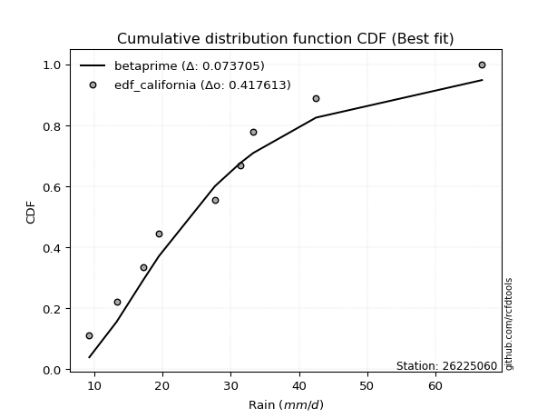</img>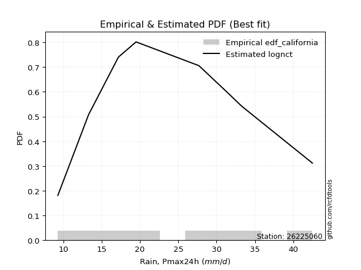</img>

</div>


### 2. Empirical - EDF Hazen (1930)

Hazen method for plotting positions is a formula used to estimate the empirical cumulative probability distribution of flood events or other hydrological data. This formula often results in biased estimations, particularly when extrapolating to extreme events (high return periods).

<div align="center">


$P=(m-0.5)/n$


</div>


**2.1. Empirical values**

<div align="center">

|                | 0                   | 1                   | 2                  | 3                  | 4         | 5                  | 6                  | 7                  | 8                  |
|:---------------|:--------------------|:--------------------|:-------------------|:-------------------|:----------|:-------------------|:-------------------|:-------------------|:-------------------|
| date           | 2024                | 2023                | 2018               | 2020               | 2022      | 2017               | 2021               | 2019               | 2025               |
| x              | 9.3                 | 13.3                | 17.2               | 19.5               | 27.7      | 31.4               | 33.3               | 42.5               | 66.8               |
| m              | 1                   | 2                   | 3                  | 4                  | 5         | 6                  | 7                  | 8                  | 9                  |
| empirical_dist | edf_hazen           | edf_hazen           | edf_hazen          | edf_hazen          | edf_hazen | edf_hazen          | edf_hazen          | edf_hazen          | edf_hazen          |
| empirical      | 0.05555555555555555 | 0.16666666666666666 | 0.2777777777777778 | 0.3888888888888889 | 0.5       | 0.6111111111111112 | 0.7222222222222222 | 0.8333333333333334 | 0.9444444444444444 |
| empirical_tr   | 1.0588235294117647  | 1.2                 | 1.3846153846153846 | 1.6363636363636362 | 2.0       | 2.5714285714285716 | 3.5999999999999996 | 6.000000000000002  | 17.999999999999993 |

</div>


**2.2. Kolmogorov-Smirnov fit test (sorted by Δ)**


<div align="center">

|                | 0                   | 1                   | 2                   | 3                   | 4                   | 5                   | 6                   | 7                   | 8                   | 9                   | 10                  | 11                  | 12                  | 13                  | 14                  | 15                  | 16                  | 17                  | 18                  | 19                  | 20                  | 21                  | 22                  | 23                  | 24                  | 25                  | 26                  | 27                  | 28                  | 29                  | 30                  | 31                  | 32                  | 33                  | 34                  | 35                  | 36                  | 37                  | 38                  | 39                  | 40                  | 41                  | 42                  | 43                  | 44                  | 45                  | 46                  | 47                  | 48                  | 49                  | 50                  | 51                  | 52                  | 53                  | 54                  | 55                  | 56                  | 57                    | 58                  | 59                  | 60                  | 61                  | 62                  | 63                  | 64                  | 65                  | 66                  | 67                  | 68                  | 69                  | 70                  | 71                  | 72                  | 73                  | 74                  | 75                  | 76                  | 77                  | 78                  | 79                  | 80                  | 81                  | 82                  | 83                  | 84                  | 85                  | 86                  | 87                  | 88                  | 89                  |
|:---------------|:--------------------|:--------------------|:--------------------|:--------------------|:--------------------|:--------------------|:--------------------|:--------------------|:--------------------|:--------------------|:--------------------|:--------------------|:--------------------|:--------------------|:--------------------|:--------------------|:--------------------|:--------------------|:--------------------|:--------------------|:--------------------|:--------------------|:--------------------|:--------------------|:--------------------|:--------------------|:--------------------|:--------------------|:--------------------|:--------------------|:--------------------|:--------------------|:--------------------|:--------------------|:--------------------|:--------------------|:--------------------|:--------------------|:--------------------|:--------------------|:--------------------|:--------------------|:--------------------|:--------------------|:--------------------|:--------------------|:--------------------|:--------------------|:--------------------|:--------------------|:--------------------|:--------------------|:--------------------|:--------------------|:--------------------|:--------------------|:--------------------|:----------------------|:--------------------|:--------------------|:--------------------|:--------------------|:--------------------|:--------------------|:--------------------|:--------------------|:--------------------|:--------------------|:--------------------|:--------------------|:--------------------|:--------------------|:--------------------|:--------------------|:--------------------|:--------------------|:--------------------|:--------------------|:--------------------|:--------------------|:--------------------|:--------------------|:--------------------|:--------------------|:--------------------|:--------------------|:--------------------|:--------------------|:--------------------|:--------------------|
| station        | 26225060            | 26225060            | 26225060            | 26225060            | 26225060            | 26225060            | 26225060            | 26225060            | 26225060            | 26225060            | 26225060            | 26225060            | 26225060            | 26225060            | 26225060            | 26225060            | 26225060            | 26225060            | 26225060            | 26225060            | 26225060            | 26225060            | 26225060            | 26225060            | 26225060            | 26225060            | 26225060            | 26225060            | 26225060            | 26225060            | 26225060            | 26225060            | 26225060            | 26225060            | 26225060            | 26225060            | 26225060            | 26225060            | 26225060            | 26225060            | 26225060            | 26225060            | 26225060            | 26225060            | 26225060            | 26225060            | 26225060            | 26225060            | 26225060            | 26225060            | 26225060            | 26225060            | 26225060            | 26225060            | 26225060            | 26225060            | 26225060            | 26225060              | 26225060            | 26225060            | 26225060            | 26225060            | 26225060            | 26225060            | 26225060            | 26225060            | 26225060            | 26225060            | 26225060            | 26225060            | 26225060            | 26225060            | 26225060            | 26225060            | 26225060            | 26225060            | 26225060            | 26225060            | 26225060            | 26225060            | 26225060            | 26225060            | 26225060            | 26225060            | 26225060            | 26225060            | 26225060            | 26225060            | 26225060            | 26225060            |
| empirical_dist | edf_hazen           | edf_hazen           | edf_hazen           | edf_hazen           | edf_hazen           | edf_hazen           | edf_hazen           | edf_hazen           | edf_hazen           | edf_hazen           | edf_hazen           | edf_hazen           | edf_hazen           | edf_hazen           | edf_hazen           | edf_hazen           | edf_hazen           | edf_hazen           | edf_hazen           | edf_hazen           | edf_hazen           | edf_hazen           | edf_hazen           | edf_hazen           | edf_hazen           | edf_hazen           | edf_hazen           | edf_hazen           | edf_hazen           | edf_hazen           | edf_hazen           | edf_hazen           | edf_hazen           | edf_hazen           | edf_hazen           | edf_hazen           | edf_hazen           | edf_hazen           | edf_hazen           | edf_hazen           | edf_hazen           | edf_hazen           | edf_hazen           | edf_hazen           | edf_hazen           | edf_hazen           | edf_hazen           | edf_hazen           | edf_hazen           | edf_hazen           | edf_hazen           | edf_hazen           | edf_hazen           | edf_hazen           | edf_hazen           | edf_hazen           | edf_hazen           | edf_hazen             | edf_hazen           | edf_hazen           | edf_hazen           | edf_hazen           | edf_hazen           | edf_hazen           | edf_hazen           | edf_hazen           | edf_hazen           | edf_hazen           | edf_hazen           | edf_hazen           | edf_hazen           | edf_hazen           | edf_hazen           | edf_hazen           | edf_hazen           | edf_hazen           | edf_hazen           | edf_hazen           | edf_hazen           | edf_hazen           | edf_hazen           | edf_hazen           | edf_hazen           | edf_hazen           | edf_hazen           | edf_hazen           | edf_hazen           | edf_hazen           | edf_hazen           | edf_hazen           |
| p_dist         | halfnorm            | gompertz            | pearson3            | halflogistic        | moyal               | logloggamma         | gumbel_r            | t                   | logpearson3         | loggompertz         | logjohnsonsu        | logexponnorm        | logt                | logcrystalball      | lognorm             | lognorm             | logfisk             | alpha               | logf                | logerlang           | loggamma            | loggamma            | f                   | logfatiguelife      | lognct              | genlogistic         | mielke              | loggenlogistic      | rayleigh            | logweibull_min      | invweibull          | nct                 | ncf                 | invgamma            | logbetaprime        | loglogistic         | logncf              | kstwobign           | fisk                | maxwell             | logrice             | johnsonsu           | invgauss            | loginvgamma         | loghypsecant        | fatiguelife         | betaprime           | logalpha            | loginvgauss         | loggumbel_l         | genexpon            | expon               | logmaxwell          | loginvweibull       | weibull_min         | exponnorm           | nakagami            | loglaplace_asymmetric | lograyleigh         | crystalball         | truncnorm           | norm                | rice                | loglaplace          | logistic            | loggenexpon         | logkstwobign        | loghalfnorm         | hypsecant           | loggumbel_r         | laplace_asymmetric  | gamma               | laplace             | wald                | logtruncnorm        | loghalflogistic     | logmoyal            | gumbel_l            | logmielke           | lognakagami         | logexpon            | erlang              | chi2                | logwald             | gibrat              | loggibrat           | logchi2             | loglognorm          | pareto              | logpareto           |
| delta          | 0.06262211930966322 | 0.06602483047439822 | 0.06668008036348383 | 0.07001244564958953 | 0.07050894839475746 | 0.07673973434061898 | 0.07731355384610611 | 0.07734407151212341 | 0.07786380128007009 | 0.07800935326083869 | 0.07820301203544078 | 0.07933667281834977 | 0.07933678160384305 | 0.0793369778193358  | 0.0793369781895753  | 0.0793369781895753  | 0.07987225319132396 | 0.07989410161489785 | 0.0805404884847869  | 0.08066531963722512 | 0.08081433090606616 | 0.08081433090606616 | 0.08086438373942106 | 0.08127609956391324 | 0.08191511236595117 | 0.08364700767712824 | 0.08525754667285301 | 0.08581780727647736 | 0.0859055741705369  | 0.08746614765741767 | 0.08766405098112673 | 0.08875572283552369 | 0.08899472401171338 | 0.08901331160958037 | 0.08929086661529739 | 0.08979507175026491 | 0.09048777201298419 | 0.0921454109774425  | 0.09292936892029813 | 0.09407954600163726 | 0.09452224632691297 | 0.09489061864825088 | 0.09584313787898546 | 0.09693262516191736 | 0.0984886375640015  | 0.0997408599438463  | 0.10004818683920125 | 0.10406068237689059 | 0.10500790384798186 | 0.10678610313720732 | 0.10691627878629628 | 0.1070253418552598  | 0.10759434514081123 | 0.10920097650425342 | 0.1098063904636426  | 0.11108069797294196 | 0.11213366937192637 | 0.11233359725821762   | 0.11648624523655715 | 0.12044756386771327 | 0.12044756551321256 | 0.12044757150023588 | 0.12170151377365301 | 0.12328612898149327 | 0.12650952949788402 | 0.1317270714991029  | 0.13461325421078363 | 0.14167720841323905 | 0.14197612746688143 | 0.14770646855007796 | 0.14850006232255616 | 0.15947334310729433 | 0.16555148459134827 | 0.16657663448157098 | 0.16661920501751962 | 0.16971739386444018 | 0.17141835592951649 | 0.1798876450674194  | 0.1842411256784775  | 0.18736476570323968 | 0.18948670839471315 | 0.2145072863087749  | 0.23104073552221516 | 0.23730315849246775 | 0.2611589429697099  | 0.2682298401855556  | 0.2686291725912452  | 0.43700359252878995 | 0.44513616643545395 | 0.46521373227331775 |
| deltao         | 0.41761268023100007 | 0.41761268023100007 | 0.41761268023100007 | 0.41761268023100007 | 0.41761268023100007 | 0.41761268023100007 | 0.41761268023100007 | 0.41761268023100007 | 0.41761268023100007 | 0.41761268023100007 | 0.41761268023100007 | 0.41761268023100007 | 0.41761268023100007 | 0.41761268023100007 | 0.41761268023100007 | 0.41761268023100007 | 0.41761268023100007 | 0.41761268023100007 | 0.41761268023100007 | 0.41761268023100007 | 0.41761268023100007 | 0.41761268023100007 | 0.41761268023100007 | 0.41761268023100007 | 0.41761268023100007 | 0.41761268023100007 | 0.41761268023100007 | 0.41761268023100007 | 0.41761268023100007 | 0.41761268023100007 | 0.41761268023100007 | 0.41761268023100007 | 0.41761268023100007 | 0.41761268023100007 | 0.41761268023100007 | 0.41761268023100007 | 0.41761268023100007 | 0.41761268023100007 | 0.41761268023100007 | 0.41761268023100007 | 0.41761268023100007 | 0.41761268023100007 | 0.41761268023100007 | 0.41761268023100007 | 0.41761268023100007 | 0.41761268023100007 | 0.41761268023100007 | 0.41761268023100007 | 0.41761268023100007 | 0.41761268023100007 | 0.41761268023100007 | 0.41761268023100007 | 0.41761268023100007 | 0.41761268023100007 | 0.41761268023100007 | 0.41761268023100007 | 0.41761268023100007 | 0.41761268023100007   | 0.41761268023100007 | 0.41761268023100007 | 0.41761268023100007 | 0.41761268023100007 | 0.41761268023100007 | 0.41761268023100007 | 0.41761268023100007 | 0.41761268023100007 | 0.41761268023100007 | 0.41761268023100007 | 0.41761268023100007 | 0.41761268023100007 | 0.41761268023100007 | 0.41761268023100007 | 0.41761268023100007 | 0.41761268023100007 | 0.41761268023100007 | 0.41761268023100007 | 0.41761268023100007 | 0.41761268023100007 | 0.41761268023100007 | 0.41761268023100007 | 0.41761268023100007 | 0.41761268023100007 | 0.41761268023100007 | 0.41761268023100007 | 0.41761268023100007 | 0.41761268023100007 | 0.41761268023100007 | 0.41761268023100007 | 0.41761268023100007 | 0.41761268023100007 |
| eval           | Δo > Δ              | Δo > Δ              | Δo > Δ              | Δo > Δ              | Δo > Δ              | Δo > Δ              | Δo > Δ              | Δo > Δ              | Δo > Δ              | Δo > Δ              | Δo > Δ              | Δo > Δ              | Δo > Δ              | Δo > Δ              | Δo > Δ              | Δo > Δ              | Δo > Δ              | Δo > Δ              | Δo > Δ              | Δo > Δ              | Δo > Δ              | Δo > Δ              | Δo > Δ              | Δo > Δ              | Δo > Δ              | Δo > Δ              | Δo > Δ              | Δo > Δ              | Δo > Δ              | Δo > Δ              | Δo > Δ              | Δo > Δ              | Δo > Δ              | Δo > Δ              | Δo > Δ              | Δo > Δ              | Δo > Δ              | Δo > Δ              | Δo > Δ              | Δo > Δ              | Δo > Δ              | Δo > Δ              | Δo > Δ              | Δo > Δ              | Δo > Δ              | Δo > Δ              | Δo > Δ              | Δo > Δ              | Δo > Δ              | Δo > Δ              | Δo > Δ              | Δo > Δ              | Δo > Δ              | Δo > Δ              | Δo > Δ              | Δo > Δ              | Δo > Δ              | Δo > Δ                | Δo > Δ              | Δo > Δ              | Δo > Δ              | Δo > Δ              | Δo > Δ              | Δo > Δ              | Δo > Δ              | Δo > Δ              | Δo > Δ              | Δo > Δ              | Δo > Δ              | Δo > Δ              | Δo > Δ              | Δo > Δ              | Δo > Δ              | Δo > Δ              | Δo > Δ              | Δo > Δ              | Δo > Δ              | Δo > Δ              | Δo > Δ              | Δo > Δ              | Δo > Δ              | Δo > Δ              | Δo > Δ              | Δo > Δ              | Δo > Δ              | Δo > Δ              | Δo > Δ              | Δo <= Δ             | Δo <= Δ             | Δo <= Δ             |
| fit            | 1                   | 1                   | 1                   | 1                   | 1                   | 1                   | 1                   | 1                   | 1                   | 1                   | 1                   | 1                   | 1                   | 1                   | 1                   | 1                   | 1                   | 1                   | 1                   | 1                   | 1                   | 1                   | 1                   | 1                   | 1                   | 1                   | 1                   | 1                   | 1                   | 1                   | 1                   | 1                   | 1                   | 1                   | 1                   | 1                   | 1                   | 1                   | 1                   | 1                   | 1                   | 1                   | 1                   | 1                   | 1                   | 1                   | 1                   | 1                   | 1                   | 1                   | 1                   | 1                   | 1                   | 1                   | 1                   | 1                   | 1                   | 1                     | 1                   | 1                   | 1                   | 1                   | 1                   | 1                   | 1                   | 1                   | 1                   | 1                   | 1                   | 1                   | 1                   | 1                   | 1                   | 1                   | 1                   | 1                   | 1                   | 1                   | 1                   | 1                   | 1                   | 1                   | 1                   | 1                   | 1                   | 1                   | 1                   | 0                   | 0                   | 0                   |
| n              | 9                   | 9                   | 9                   | 9                   | 9                   | 9                   | 9                   | 9                   | 9                   | 9                   | 9                   | 9                   | 9                   | 9                   | 9                   | 9                   | 9                   | 9                   | 9                   | 9                   | 9                   | 9                   | 9                   | 9                   | 9                   | 9                   | 9                   | 9                   | 9                   | 9                   | 9                   | 9                   | 9                   | 9                   | 9                   | 9                   | 9                   | 9                   | 9                   | 9                   | 9                   | 9                   | 9                   | 9                   | 9                   | 9                   | 9                   | 9                   | 9                   | 9                   | 9                   | 9                   | 9                   | 9                   | 9                   | 9                   | 9                   | 9                     | 9                   | 9                   | 9                   | 9                   | 9                   | 9                   | 9                   | 9                   | 9                   | 9                   | 9                   | 9                   | 9                   | 9                   | 9                   | 9                   | 9                   | 9                   | 9                   | 9                   | 9                   | 9                   | 9                   | 9                   | 9                   | 9                   | 9                   | 9                   | 9                   | 9                   | 9                   | 9                   |
| best_fit       | 1                   | 0                   | 0                   | 0                   | 0                   | 0                   | 0                   | 0                   | 0                   | 0                   | 0                   | 0                   | 0                   | 0                   | 0                   | 0                   | 0                   | 0                   | 0                   | 0                   | 0                   | 0                   | 0                   | 0                   | 0                   | 0                   | 0                   | 0                   | 0                   | 0                   | 0                   | 0                   | 0                   | 0                   | 0                   | 0                   | 0                   | 0                   | 0                   | 0                   | 0                   | 0                   | 0                   | 0                   | 0                   | 0                   | 0                   | 0                   | 0                   | 0                   | 0                   | 0                   | 0                   | 0                   | 0                   | 0                   | 0                   | 0                     | 0                   | 0                   | 0                   | 0                   | 0                   | 0                   | 0                   | 0                   | 0                   | 0                   | 0                   | 0                   | 0                   | 0                   | 0                   | 0                   | 0                   | 0                   | 0                   | 0                   | 0                   | 0                   | 0                   | 0                   | 0                   | 0                   | 0                   | 0                   | 0                   | 0                   | 0                   | 0                   |
| best_fit_sort  | 1                   | 2                   | 3                   | 4                   | 5                   | 6                   | 7                   | 8                   | 9                   | 10                  | 11                  | 12                  | 13                  | 14                  | 15                  | 16                  | 17                  | 18                  | 19                  | 20                  | 21                  | 22                  | 23                  | 24                  | 25                  | 26                  | 27                  | 28                  | 29                  | 30                  | 31                  | 32                  | 33                  | 34                  | 35                  | 36                  | 37                  | 38                  | 39                  | 40                  | 41                  | 42                  | 43                  | 44                  | 45                  | 46                  | 47                  | 48                  | 49                  | 50                  | 51                  | 52                  | 53                  | 54                  | 55                  | 56                  | 57                  | 58                    | 59                  | 60                  | 61                  | 62                  | 63                  | 64                  | 65                  | 66                  | 67                  | 68                  | 69                  | 70                  | 71                  | 72                  | 73                  | 74                  | 75                  | 76                  | 77                  | 78                  | 79                  | 80                  | 81                  | 82                  | 83                  | 84                  | 85                  | 86                  | 87                  | 88                  | 89                  | 90                  |

</div>


<div align="center">

</img>

</div>


**2.3. Best fit**

<div align="center">

|   id |   station | empirical_dist   | p_dist   |     delta |   deltao | eval   |   fit |   n |   best_fit |   best_fit_sort |
|-----:|----------:|:-----------------|:---------|----------:|---------:|:-------|------:|----:|-----------:|----------------:|
|    0 |  26225060 | edf_hazen        | halfnorm | 0.0626221 | 0.417613 | Δo > Δ |     1 |   9 |          1 |               1 |

</div>


<div align="center">

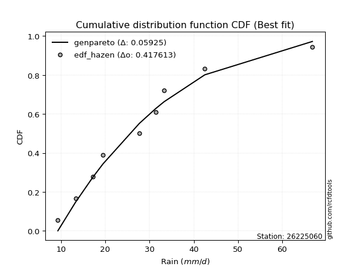</img>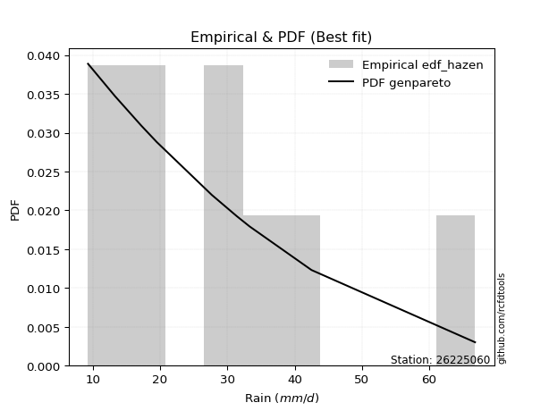</img>

</div>


### 3. Empirical - EDF Weibull (1939)

Weibull plotting position formula is an empirical method used to estimate the non-exceedance probability or plotting position for a set of observed data, is often recommended or widely used in practice, particularly in flood frequency analysis.

<div align="center">


$P=m/(n+1)$


</div>


**3.1. Empirical values**

<div align="center">

|                | 0                  | 1           | 2                  | 3                  | 4           | 5           | 6                 | 7                 | 8                  |
|:---------------|:-------------------|:------------|:-------------------|:-------------------|:------------|:------------|:------------------|:------------------|:-------------------|
| date           | 2024               | 2023        | 2018               | 2020               | 2022        | 2017        | 2021              | 2019              | 2025               |
| x              | 9.3                | 13.3        | 17.2               | 19.5               | 27.7        | 31.4        | 33.3              | 42.5              | 66.8               |
| m              | 1                  | 2           | 3                  | 4                  | 5           | 6           | 7                 | 8                 | 9                  |
| empirical_dist | edf_weibull        | edf_weibull | edf_weibull        | edf_weibull        | edf_weibull | edf_weibull | edf_weibull       | edf_weibull       | edf_weibull        |
| empirical      | 0.1                | 0.2         | 0.3                | 0.4                | 0.5         | 0.6         | 0.7               | 0.8               | 0.9                |
| empirical_tr   | 1.1111111111111112 | 1.25        | 1.4285714285714286 | 1.6666666666666667 | 2.0         | 2.5         | 3.333333333333333 | 5.000000000000001 | 10.000000000000002 |

</div>


**3.2. Kolmogorov-Smirnov fit test (sorted by Δ)**


<div align="center">

|                | 0                   | 1                   | 2                   | 3                   | 4                   | 5                   | 6                   | 7                   | 8                   | 9                   | 10                  | 11                  | 12                  | 13                  | 14                  | 15                  | 16                  | 17                  | 18                  | 19                  | 20                  | 21                  | 22                  | 23                  | 24                  | 25                  | 26                  | 27                  | 28                  | 29                  | 30                  | 31                  | 32                  | 33                  | 34                  | 35                  | 36                  | 37                  | 38                  | 39                  | 40                  | 41                  | 42                  | 43                  | 44                  | 45                  | 46                  | 47                  | 48                  | 49                  | 50                  | 51                  | 52                  | 53                  | 54                  | 55                  | 56                  | 57                  | 58                  | 59                  | 60                  | 61                  | 62                    | 63                  | 64                  | 65                  | 66                  | 67                  | 68                  | 69                  | 70                  | 71                  | 72                  | 73                  | 74                  | 75                  | 76                  | 77                  | 78                  | 79                  | 80                  | 81                  | 82                  | 83                  | 84                  | 85                  | 86                  | 87                  | 88                  | 89                  |
|:---------------|:--------------------|:--------------------|:--------------------|:--------------------|:--------------------|:--------------------|:--------------------|:--------------------|:--------------------|:--------------------|:--------------------|:--------------------|:--------------------|:--------------------|:--------------------|:--------------------|:--------------------|:--------------------|:--------------------|:--------------------|:--------------------|:--------------------|:--------------------|:--------------------|:--------------------|:--------------------|:--------------------|:--------------------|:--------------------|:--------------------|:--------------------|:--------------------|:--------------------|:--------------------|:--------------------|:--------------------|:--------------------|:--------------------|:--------------------|:--------------------|:--------------------|:--------------------|:--------------------|:--------------------|:--------------------|:--------------------|:--------------------|:--------------------|:--------------------|:--------------------|:--------------------|:--------------------|:--------------------|:--------------------|:--------------------|:--------------------|:--------------------|:--------------------|:--------------------|:--------------------|:--------------------|:--------------------|:----------------------|:--------------------|:--------------------|:--------------------|:--------------------|:--------------------|:--------------------|:--------------------|:--------------------|:--------------------|:--------------------|:--------------------|:--------------------|:--------------------|:--------------------|:--------------------|:--------------------|:--------------------|:--------------------|:--------------------|:--------------------|:--------------------|:--------------------|:--------------------|:--------------------|:--------------------|:--------------------|:--------------------|
| station        | 26225060            | 26225060            | 26225060            | 26225060            | 26225060            | 26225060            | 26225060            | 26225060            | 26225060            | 26225060            | 26225060            | 26225060            | 26225060            | 26225060            | 26225060            | 26225060            | 26225060            | 26225060            | 26225060            | 26225060            | 26225060            | 26225060            | 26225060            | 26225060            | 26225060            | 26225060            | 26225060            | 26225060            | 26225060            | 26225060            | 26225060            | 26225060            | 26225060            | 26225060            | 26225060            | 26225060            | 26225060            | 26225060            | 26225060            | 26225060            | 26225060            | 26225060            | 26225060            | 26225060            | 26225060            | 26225060            | 26225060            | 26225060            | 26225060            | 26225060            | 26225060            | 26225060            | 26225060            | 26225060            | 26225060            | 26225060            | 26225060            | 26225060            | 26225060            | 26225060            | 26225060            | 26225060            | 26225060              | 26225060            | 26225060            | 26225060            | 26225060            | 26225060            | 26225060            | 26225060            | 26225060            | 26225060            | 26225060            | 26225060            | 26225060            | 26225060            | 26225060            | 26225060            | 26225060            | 26225060            | 26225060            | 26225060            | 26225060            | 26225060            | 26225060            | 26225060            | 26225060            | 26225060            | 26225060            | 26225060            |
| empirical_dist | edf_weibull         | edf_weibull         | edf_weibull         | edf_weibull         | edf_weibull         | edf_weibull         | edf_weibull         | edf_weibull         | edf_weibull         | edf_weibull         | edf_weibull         | edf_weibull         | edf_weibull         | edf_weibull         | edf_weibull         | edf_weibull         | edf_weibull         | edf_weibull         | edf_weibull         | edf_weibull         | edf_weibull         | edf_weibull         | edf_weibull         | edf_weibull         | edf_weibull         | edf_weibull         | edf_weibull         | edf_weibull         | edf_weibull         | edf_weibull         | edf_weibull         | edf_weibull         | edf_weibull         | edf_weibull         | edf_weibull         | edf_weibull         | edf_weibull         | edf_weibull         | edf_weibull         | edf_weibull         | edf_weibull         | edf_weibull         | edf_weibull         | edf_weibull         | edf_weibull         | edf_weibull         | edf_weibull         | edf_weibull         | edf_weibull         | edf_weibull         | edf_weibull         | edf_weibull         | edf_weibull         | edf_weibull         | edf_weibull         | edf_weibull         | edf_weibull         | edf_weibull         | edf_weibull         | edf_weibull         | edf_weibull         | edf_weibull         | edf_weibull           | edf_weibull         | edf_weibull         | edf_weibull         | edf_weibull         | edf_weibull         | edf_weibull         | edf_weibull         | edf_weibull         | edf_weibull         | edf_weibull         | edf_weibull         | edf_weibull         | edf_weibull         | edf_weibull         | edf_weibull         | edf_weibull         | edf_weibull         | edf_weibull         | edf_weibull         | edf_weibull         | edf_weibull         | edf_weibull         | edf_weibull         | edf_weibull         | edf_weibull         | edf_weibull         | edf_weibull         |
| p_dist         | halfnorm            | logloggamma         | pearson3            | logpearson3         | logjohnsonsu        | rayleigh            | logexponnorm        | logt                | logcrystalball      | lognorm             | lognorm             | logfisk             | alpha               | logf                | logerlang           | loggamma            | loggamma            | logfatiguelife      | moyal               | lognct              | mielke              | loggenlogistic      | logweibull_min      | invweibull          | gumbel_r            | t                   | nct                 | ncf                 | invgamma            | logbetaprime        | maxwell             | loglogistic         | logncf              | fisk                | logrice             | genlogistic         | johnsonsu           | invgauss            | loginvgamma         | halflogistic        | loghypsecant        | fatiguelife         | loggompertz         | f                   | gompertz            | betaprime           | kstwobign           | logalpha            | loginvgauss         | genexpon            | expon               | logmaxwell          | loginvweibull       | weibull_min         | exponnorm           | nakagami            | truncnorm           | crystalball         | norm                | lograyleigh         | loggumbel_l         | loglaplace          | loglaplace_asymmetric | loggenexpon         | rice                | logkstwobign        | logistic            | loghalfnorm         | loggumbel_r         | hypsecant           | gamma               | laplace_asymmetric  | gumbel_l            | loghalflogistic     | logmoyal            | logexpon            | laplace             | logmielke           | wald                | logtruncnorm        | lognakagami         | erlang              | chi2                | logwald             | logchi2             | loggibrat           | gibrat              | loglognorm          | pareto              | logpareto           |
| delta          | 0.06959374546470287 | 0.07673973434061898 | 0.07779119147459496 | 0.07786380128007009 | 0.07820301203544078 | 0.07897409346310136 | 0.07933667281834977 | 0.07933678160384305 | 0.0793369778193358  | 0.0793369781895753  | 0.0793369781895753  | 0.07987225319132396 | 0.07989410161489785 | 0.0805404884847869  | 0.08066531963722512 | 0.08081433090606616 | 0.08081433090606616 | 0.08127609956391324 | 0.08162005950586859 | 0.08191511236595117 | 0.08525754667285301 | 0.08581780727647736 | 0.08746614765741767 | 0.08766405098112673 | 0.08842466495721724 | 0.08845518262323454 | 0.08875572283552369 | 0.08899472401171338 | 0.08901331160958037 | 0.08929086661529739 | 0.08946031756291128 | 0.08979507175026491 | 0.09048777201298419 | 0.09292936892029813 | 0.09452224632691297 | 0.09475811878823936 | 0.09489061864825088 | 0.09584313787898546 | 0.09693262516191736 | 0.09795761868830719 | 0.0984886375640015  | 0.0997408599438463  | 0.09999999515576129 | 0.09999999759381112 | 0.09999999999997838 | 0.10004818683920125 | 0.10325652208855363 | 0.10406068237689059 | 0.10500790384798186 | 0.10691627878629628 | 0.1070253418552598  | 0.10759434514081123 | 0.10920097650425342 | 0.1098063904636426  | 0.11108069797294196 | 0.11213366937192637 | 0.11561863087892799 | 0.11561863714834447 | 0.11561863727453303 | 0.11648624523655715 | 0.11789721424831845 | 0.12334927463146395 | 0.12344470836932875   | 0.1317270714991029  | 0.13281262488476414 | 0.13461325421078363 | 0.13762064060899515 | 0.14167720841323905 | 0.14770646855007796 | 0.15308723857799256 | 0.15947334310729433 | 0.1596111734336673  | 0.16312688734960684 | 0.16971739386444018 | 0.17141835592951649 | 0.1729852574624463  | 0.1766625957024594  | 0.1842411256784775  | 0.19990996781490433 | 0.19995253835085297 | 0.19999998510398828 | 0.2145072863087749  | 0.23104073552221516 | 0.23730315849246775 | 0.246406950369023   | 0.2682298401855556  | 0.28338116519193207 | 0.40367025919545657 | 0.41180283310212057 | 0.43188039893998437 |
| deltao         | 0.41761268023100007 | 0.41761268023100007 | 0.41761268023100007 | 0.41761268023100007 | 0.41761268023100007 | 0.41761268023100007 | 0.41761268023100007 | 0.41761268023100007 | 0.41761268023100007 | 0.41761268023100007 | 0.41761268023100007 | 0.41761268023100007 | 0.41761268023100007 | 0.41761268023100007 | 0.41761268023100007 | 0.41761268023100007 | 0.41761268023100007 | 0.41761268023100007 | 0.41761268023100007 | 0.41761268023100007 | 0.41761268023100007 | 0.41761268023100007 | 0.41761268023100007 | 0.41761268023100007 | 0.41761268023100007 | 0.41761268023100007 | 0.41761268023100007 | 0.41761268023100007 | 0.41761268023100007 | 0.41761268023100007 | 0.41761268023100007 | 0.41761268023100007 | 0.41761268023100007 | 0.41761268023100007 | 0.41761268023100007 | 0.41761268023100007 | 0.41761268023100007 | 0.41761268023100007 | 0.41761268023100007 | 0.41761268023100007 | 0.41761268023100007 | 0.41761268023100007 | 0.41761268023100007 | 0.41761268023100007 | 0.41761268023100007 | 0.41761268023100007 | 0.41761268023100007 | 0.41761268023100007 | 0.41761268023100007 | 0.41761268023100007 | 0.41761268023100007 | 0.41761268023100007 | 0.41761268023100007 | 0.41761268023100007 | 0.41761268023100007 | 0.41761268023100007 | 0.41761268023100007 | 0.41761268023100007 | 0.41761268023100007 | 0.41761268023100007 | 0.41761268023100007 | 0.41761268023100007 | 0.41761268023100007   | 0.41761268023100007 | 0.41761268023100007 | 0.41761268023100007 | 0.41761268023100007 | 0.41761268023100007 | 0.41761268023100007 | 0.41761268023100007 | 0.41761268023100007 | 0.41761268023100007 | 0.41761268023100007 | 0.41761268023100007 | 0.41761268023100007 | 0.41761268023100007 | 0.41761268023100007 | 0.41761268023100007 | 0.41761268023100007 | 0.41761268023100007 | 0.41761268023100007 | 0.41761268023100007 | 0.41761268023100007 | 0.41761268023100007 | 0.41761268023100007 | 0.41761268023100007 | 0.41761268023100007 | 0.41761268023100007 | 0.41761268023100007 | 0.41761268023100007 |
| eval           | Δo > Δ              | Δo > Δ              | Δo > Δ              | Δo > Δ              | Δo > Δ              | Δo > Δ              | Δo > Δ              | Δo > Δ              | Δo > Δ              | Δo > Δ              | Δo > Δ              | Δo > Δ              | Δo > Δ              | Δo > Δ              | Δo > Δ              | Δo > Δ              | Δo > Δ              | Δo > Δ              | Δo > Δ              | Δo > Δ              | Δo > Δ              | Δo > Δ              | Δo > Δ              | Δo > Δ              | Δo > Δ              | Δo > Δ              | Δo > Δ              | Δo > Δ              | Δo > Δ              | Δo > Δ              | Δo > Δ              | Δo > Δ              | Δo > Δ              | Δo > Δ              | Δo > Δ              | Δo > Δ              | Δo > Δ              | Δo > Δ              | Δo > Δ              | Δo > Δ              | Δo > Δ              | Δo > Δ              | Δo > Δ              | Δo > Δ              | Δo > Δ              | Δo > Δ              | Δo > Δ              | Δo > Δ              | Δo > Δ              | Δo > Δ              | Δo > Δ              | Δo > Δ              | Δo > Δ              | Δo > Δ              | Δo > Δ              | Δo > Δ              | Δo > Δ              | Δo > Δ              | Δo > Δ              | Δo > Δ              | Δo > Δ              | Δo > Δ              | Δo > Δ                | Δo > Δ              | Δo > Δ              | Δo > Δ              | Δo > Δ              | Δo > Δ              | Δo > Δ              | Δo > Δ              | Δo > Δ              | Δo > Δ              | Δo > Δ              | Δo > Δ              | Δo > Δ              | Δo > Δ              | Δo > Δ              | Δo > Δ              | Δo > Δ              | Δo > Δ              | Δo > Δ              | Δo > Δ              | Δo > Δ              | Δo > Δ              | Δo > Δ              | Δo > Δ              | Δo > Δ              | Δo > Δ              | Δo > Δ              | Δo <= Δ             |
| fit            | 1                   | 1                   | 1                   | 1                   | 1                   | 1                   | 1                   | 1                   | 1                   | 1                   | 1                   | 1                   | 1                   | 1                   | 1                   | 1                   | 1                   | 1                   | 1                   | 1                   | 1                   | 1                   | 1                   | 1                   | 1                   | 1                   | 1                   | 1                   | 1                   | 1                   | 1                   | 1                   | 1                   | 1                   | 1                   | 1                   | 1                   | 1                   | 1                   | 1                   | 1                   | 1                   | 1                   | 1                   | 1                   | 1                   | 1                   | 1                   | 1                   | 1                   | 1                   | 1                   | 1                   | 1                   | 1                   | 1                   | 1                   | 1                   | 1                   | 1                   | 1                   | 1                   | 1                     | 1                   | 1                   | 1                   | 1                   | 1                   | 1                   | 1                   | 1                   | 1                   | 1                   | 1                   | 1                   | 1                   | 1                   | 1                   | 1                   | 1                   | 1                   | 1                   | 1                   | 1                   | 1                   | 1                   | 1                   | 1                   | 1                   | 0                   |
| n              | 9                   | 9                   | 9                   | 9                   | 9                   | 9                   | 9                   | 9                   | 9                   | 9                   | 9                   | 9                   | 9                   | 9                   | 9                   | 9                   | 9                   | 9                   | 9                   | 9                   | 9                   | 9                   | 9                   | 9                   | 9                   | 9                   | 9                   | 9                   | 9                   | 9                   | 9                   | 9                   | 9                   | 9                   | 9                   | 9                   | 9                   | 9                   | 9                   | 9                   | 9                   | 9                   | 9                   | 9                   | 9                   | 9                   | 9                   | 9                   | 9                   | 9                   | 9                   | 9                   | 9                   | 9                   | 9                   | 9                   | 9                   | 9                   | 9                   | 9                   | 9                   | 9                   | 9                     | 9                   | 9                   | 9                   | 9                   | 9                   | 9                   | 9                   | 9                   | 9                   | 9                   | 9                   | 9                   | 9                   | 9                   | 9                   | 9                   | 9                   | 9                   | 9                   | 9                   | 9                   | 9                   | 9                   | 9                   | 9                   | 9                   | 9                   |
| best_fit       | 1                   | 0                   | 0                   | 0                   | 0                   | 0                   | 0                   | 0                   | 0                   | 0                   | 0                   | 0                   | 0                   | 0                   | 0                   | 0                   | 0                   | 0                   | 0                   | 0                   | 0                   | 0                   | 0                   | 0                   | 0                   | 0                   | 0                   | 0                   | 0                   | 0                   | 0                   | 0                   | 0                   | 0                   | 0                   | 0                   | 0                   | 0                   | 0                   | 0                   | 0                   | 0                   | 0                   | 0                   | 0                   | 0                   | 0                   | 0                   | 0                   | 0                   | 0                   | 0                   | 0                   | 0                   | 0                   | 0                   | 0                   | 0                   | 0                   | 0                   | 0                   | 0                   | 0                     | 0                   | 0                   | 0                   | 0                   | 0                   | 0                   | 0                   | 0                   | 0                   | 0                   | 0                   | 0                   | 0                   | 0                   | 0                   | 0                   | 0                   | 0                   | 0                   | 0                   | 0                   | 0                   | 0                   | 0                   | 0                   | 0                   | 0                   |
| best_fit_sort  | 1                   | 2                   | 3                   | 4                   | 5                   | 6                   | 7                   | 8                   | 9                   | 10                  | 11                  | 12                  | 13                  | 14                  | 15                  | 16                  | 17                  | 18                  | 19                  | 20                  | 21                  | 22                  | 23                  | 24                  | 25                  | 26                  | 27                  | 28                  | 29                  | 30                  | 31                  | 32                  | 33                  | 34                  | 35                  | 36                  | 37                  | 38                  | 39                  | 40                  | 41                  | 42                  | 43                  | 44                  | 45                  | 46                  | 47                  | 48                  | 49                  | 50                  | 51                  | 52                  | 53                  | 54                  | 55                  | 56                  | 57                  | 58                  | 59                  | 60                  | 61                  | 62                  | 63                    | 64                  | 65                  | 66                  | 67                  | 68                  | 69                  | 70                  | 71                  | 72                  | 73                  | 74                  | 75                  | 76                  | 77                  | 78                  | 79                  | 80                  | 81                  | 82                  | 83                  | 84                  | 85                  | 86                  | 87                  | 88                  | 89                  | 90                  |

</div>


<div align="center">

</img>

</div>


**3.3. Best fit**

<div align="center">

|   id |   station | empirical_dist   | p_dist   |     delta |   deltao | eval   |   fit |   n |   best_fit |   best_fit_sort |
|-----:|----------:|:-----------------|:---------|----------:|---------:|:-------|------:|----:|-----------:|----------------:|
|    0 |  26225060 | edf_weibull      | halfnorm | 0.0695937 | 0.417613 | Δo > Δ |     1 |   9 |          1 |               1 |

</div>


<div align="center">

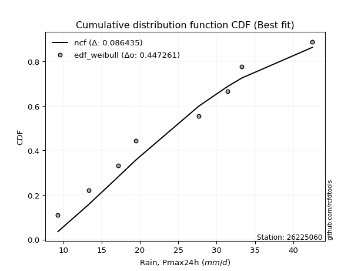</img>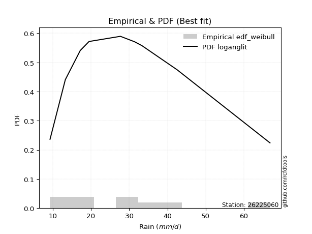</img>

</div>


### 4. Empirical - EDF Beard (1943)

The Beard formula (or Beard´s plotting position formula) in hydrology is used to estimate the empirical non-exceedance probability _(P)_ of a flood event (or other extreme hydrological data point) within a given dataset.

<div align="center">


$P=(m-0.31)/(n+0.38)$


</div>


**4.1. Empirical values**

<div align="center">

|                | 0                   | 1                   | 2                  | 3                   | 4         | 5                  | 6                  | 7                  | 8                  |
|:---------------|:--------------------|:--------------------|:-------------------|:--------------------|:----------|:-------------------|:-------------------|:-------------------|:-------------------|
| date           | 2024                | 2023                | 2018               | 2020                | 2022      | 2017               | 2021               | 2019               | 2025               |
| x              | 9.3                 | 13.3                | 17.2               | 19.5                | 27.7      | 31.4               | 33.3               | 42.5               | 66.8               |
| m              | 1                   | 2                   | 3                  | 4                   | 5         | 6                  | 7                  | 8                  | 9                  |
| empirical_dist | edf_beard           | edf_beard           | edf_beard          | edf_beard           | edf_beard | edf_beard          | edf_beard          | edf_beard          | edf_beard          |
| empirical      | 0.07356076759061833 | 0.18017057569296374 | 0.2867803837953091 | 0.39339019189765456 | 0.5       | 0.6066098081023454 | 0.7132196162046908 | 0.8198294243070362 | 0.9264392324093815 |
| empirical_tr   | 1.0794016110471807  | 1.2197659297789336  | 1.4020926756352765 | 1.6485061511423549  | 2.0       | 2.542005420054201  | 3.486988847583642  | 5.550295857988164  | 13.5942028985507   |

</div>


**4.2. Kolmogorov-Smirnov fit test (sorted by Δ)**


<div align="center">

|                | 0                   | 1                   | 2                   | 3                   | 4                   | 5                   | 6                   | 7                   | 8                   | 9                   | 10                  | 11                  | 12                  | 13                  | 14                  | 15                  | 16                  | 17                  | 18                  | 19                  | 20                  | 21                  | 22                  | 23                  | 24                  | 25                  | 26                  | 27                  | 28                  | 29                  | 30                  | 31                  | 32                  | 33                  | 34                  | 35                  | 36                  | 37                  | 38                  | 39                  | 40                  | 41                  | 42                  | 43                  | 44                  | 45                  | 46                  | 47                  | 48                  | 49                  | 50                  | 51                  | 52                  | 53                  | 54                  | 55                  | 56                  | 57                  | 58                  | 59                  | 60                  | 61                    | 62                  | 63                  | 64                  | 65                  | 66                  | 67                  | 68                  | 69                  | 70                  | 71                  | 72                  | 73                  | 74                  | 75                  | 76                  | 77                  | 78                  | 79                  | 80                  | 81                  | 82                  | 83                  | 84                  | 85                  | 86                  | 87                  | 88                  | 89                  |
|:---------------|:--------------------|:--------------------|:--------------------|:--------------------|:--------------------|:--------------------|:--------------------|:--------------------|:--------------------|:--------------------|:--------------------|:--------------------|:--------------------|:--------------------|:--------------------|:--------------------|:--------------------|:--------------------|:--------------------|:--------------------|:--------------------|:--------------------|:--------------------|:--------------------|:--------------------|:--------------------|:--------------------|:--------------------|:--------------------|:--------------------|:--------------------|:--------------------|:--------------------|:--------------------|:--------------------|:--------------------|:--------------------|:--------------------|:--------------------|:--------------------|:--------------------|:--------------------|:--------------------|:--------------------|:--------------------|:--------------------|:--------------------|:--------------------|:--------------------|:--------------------|:--------------------|:--------------------|:--------------------|:--------------------|:--------------------|:--------------------|:--------------------|:--------------------|:--------------------|:--------------------|:--------------------|:----------------------|:--------------------|:--------------------|:--------------------|:--------------------|:--------------------|:--------------------|:--------------------|:--------------------|:--------------------|:--------------------|:--------------------|:--------------------|:--------------------|:--------------------|:--------------------|:--------------------|:--------------------|:--------------------|:--------------------|:--------------------|:--------------------|:--------------------|:--------------------|:--------------------|:--------------------|:--------------------|:--------------------|:--------------------|
| station        | 26225060            | 26225060            | 26225060            | 26225060            | 26225060            | 26225060            | 26225060            | 26225060            | 26225060            | 26225060            | 26225060            | 26225060            | 26225060            | 26225060            | 26225060            | 26225060            | 26225060            | 26225060            | 26225060            | 26225060            | 26225060            | 26225060            | 26225060            | 26225060            | 26225060            | 26225060            | 26225060            | 26225060            | 26225060            | 26225060            | 26225060            | 26225060            | 26225060            | 26225060            | 26225060            | 26225060            | 26225060            | 26225060            | 26225060            | 26225060            | 26225060            | 26225060            | 26225060            | 26225060            | 26225060            | 26225060            | 26225060            | 26225060            | 26225060            | 26225060            | 26225060            | 26225060            | 26225060            | 26225060            | 26225060            | 26225060            | 26225060            | 26225060            | 26225060            | 26225060            | 26225060            | 26225060              | 26225060            | 26225060            | 26225060            | 26225060            | 26225060            | 26225060            | 26225060            | 26225060            | 26225060            | 26225060            | 26225060            | 26225060            | 26225060            | 26225060            | 26225060            | 26225060            | 26225060            | 26225060            | 26225060            | 26225060            | 26225060            | 26225060            | 26225060            | 26225060            | 26225060            | 26225060            | 26225060            | 26225060            |
| empirical_dist | edf_beard           | edf_beard           | edf_beard           | edf_beard           | edf_beard           | edf_beard           | edf_beard           | edf_beard           | edf_beard           | edf_beard           | edf_beard           | edf_beard           | edf_beard           | edf_beard           | edf_beard           | edf_beard           | edf_beard           | edf_beard           | edf_beard           | edf_beard           | edf_beard           | edf_beard           | edf_beard           | edf_beard           | edf_beard           | edf_beard           | edf_beard           | edf_beard           | edf_beard           | edf_beard           | edf_beard           | edf_beard           | edf_beard           | edf_beard           | edf_beard           | edf_beard           | edf_beard           | edf_beard           | edf_beard           | edf_beard           | edf_beard           | edf_beard           | edf_beard           | edf_beard           | edf_beard           | edf_beard           | edf_beard           | edf_beard           | edf_beard           | edf_beard           | edf_beard           | edf_beard           | edf_beard           | edf_beard           | edf_beard           | edf_beard           | edf_beard           | edf_beard           | edf_beard           | edf_beard           | edf_beard           | edf_beard             | edf_beard           | edf_beard           | edf_beard           | edf_beard           | edf_beard           | edf_beard           | edf_beard           | edf_beard           | edf_beard           | edf_beard           | edf_beard           | edf_beard           | edf_beard           | edf_beard           | edf_beard           | edf_beard           | edf_beard           | edf_beard           | edf_beard           | edf_beard           | edf_beard           | edf_beard           | edf_beard           | edf_beard           | edf_beard           | edf_beard           | edf_beard           | edf_beard           |
| p_dist         | halfnorm            | pearson3            | halflogistic        | gompertz            | moyal               | logloggamma         | rayleigh            | logpearson3         | loggompertz         | logjohnsonsu        | logexponnorm        | logt                | logcrystalball      | lognorm             | lognorm             | logfisk             | alpha               | logf                | logerlang           | loggamma            | loggamma            | f                   | logfatiguelife      | gumbel_r            | t                   | lognct              | maxwell             | mielke              | loggenlogistic      | logweibull_min      | invweibull          | genlogistic         | nct                 | ncf                 | invgamma            | logbetaprime        | loglogistic         | logncf              | fisk                | logrice             | johnsonsu           | invgauss            | kstwobign           | loginvgamma         | loghypsecant        | fatiguelife         | betaprime           | logalpha            | loginvgauss         | genexpon            | expon               | logmaxwell          | loginvweibull       | weibull_min         | exponnorm           | loggumbel_l         | crystalball         | truncnorm           | norm                | nakagami            | lograyleigh         | loglaplace_asymmetric | loglaplace          | rice                | logistic            | loggenexpon         | logkstwobign        | loghalfnorm         | hypsecant           | loggumbel_r         | laplace_asymmetric  | gamma               | loghalflogistic     | laplace             | gumbel_l            | logmoyal            | wald                | logtruncnorm        | logexpon            | logmielke           | lognakagami         | erlang              | chi2                | logwald             | logchi2             | loggibrat           | gibrat              | loglognorm          | pareto              | logpareto           |
| delta          | 0.05361951329213177 | 0.0711813833722495  | 0.07151838627892551 | 0.07356076759059671 | 0.07501025140352313 | 0.07673973434061898 | 0.07690296815300546 | 0.07786380128007009 | 0.07800935326083869 | 0.07820301203544078 | 0.07933667281834977 | 0.07933678160384305 | 0.0793369778193358  | 0.0793369781895753  | 0.0793369781895753  | 0.07987225319132396 | 0.07989410161489785 | 0.0805404884847869  | 0.08066531963722512 | 0.08081433090606616 | 0.08081433090606616 | 0.08086438373942106 | 0.08127609956391324 | 0.08181485685487178 | 0.08184537452088908 | 0.08191511236595117 | 0.08507693998410581 | 0.08525754667285301 | 0.08581780727647736 | 0.08746614765741767 | 0.08766405098112673 | 0.0881483106858939  | 0.08875572283552369 | 0.08899472401171338 | 0.08901331160958037 | 0.08929086661529739 | 0.08979507175026491 | 0.09048777201298419 | 0.09292936892029813 | 0.09452224632691297 | 0.09489061864825088 | 0.09584313787898546 | 0.09664671398620817 | 0.09693262516191736 | 0.0984886375640015  | 0.0997408599438463  | 0.10004818683920125 | 0.10406068237689059 | 0.10500790384798186 | 0.10691627878629628 | 0.1070253418552598  | 0.10759434514081123 | 0.10920097650425342 | 0.1098063904636426  | 0.11108069797294196 | 0.11128740614597299 | 0.11144495785018182 | 0.11144495949568112 | 0.11144496548270444 | 0.11213366937192637 | 0.11648624523655715 | 0.11683490026698329   | 0.12328612898149327 | 0.12620281678241868 | 0.1310108325066497  | 0.1317270714991029  | 0.13461325421078363 | 0.14167720841323905 | 0.1464774304756471  | 0.14770646855007796 | 0.15300136533132183 | 0.15947334310729433 | 0.16971739386444018 | 0.17005278760011394 | 0.17088503904988794 | 0.17141835592951649 | 0.18008054350786806 | 0.1801231140438167  | 0.18048410237718182 | 0.1842411256784775  | 0.18736476570323968 | 0.2145072863087749  | 0.23104073552221516 | 0.23730315849246775 | 0.25962656657371386 | 0.2682298401855556  | 0.2701615489872412  | 0.42349968350249284 | 0.43163225740915684 | 0.45170982324702064 |
| deltao         | 0.41761268023100007 | 0.41761268023100007 | 0.41761268023100007 | 0.41761268023100007 | 0.41761268023100007 | 0.41761268023100007 | 0.41761268023100007 | 0.41761268023100007 | 0.41761268023100007 | 0.41761268023100007 | 0.41761268023100007 | 0.41761268023100007 | 0.41761268023100007 | 0.41761268023100007 | 0.41761268023100007 | 0.41761268023100007 | 0.41761268023100007 | 0.41761268023100007 | 0.41761268023100007 | 0.41761268023100007 | 0.41761268023100007 | 0.41761268023100007 | 0.41761268023100007 | 0.41761268023100007 | 0.41761268023100007 | 0.41761268023100007 | 0.41761268023100007 | 0.41761268023100007 | 0.41761268023100007 | 0.41761268023100007 | 0.41761268023100007 | 0.41761268023100007 | 0.41761268023100007 | 0.41761268023100007 | 0.41761268023100007 | 0.41761268023100007 | 0.41761268023100007 | 0.41761268023100007 | 0.41761268023100007 | 0.41761268023100007 | 0.41761268023100007 | 0.41761268023100007 | 0.41761268023100007 | 0.41761268023100007 | 0.41761268023100007 | 0.41761268023100007 | 0.41761268023100007 | 0.41761268023100007 | 0.41761268023100007 | 0.41761268023100007 | 0.41761268023100007 | 0.41761268023100007 | 0.41761268023100007 | 0.41761268023100007 | 0.41761268023100007 | 0.41761268023100007 | 0.41761268023100007 | 0.41761268023100007 | 0.41761268023100007 | 0.41761268023100007 | 0.41761268023100007 | 0.41761268023100007   | 0.41761268023100007 | 0.41761268023100007 | 0.41761268023100007 | 0.41761268023100007 | 0.41761268023100007 | 0.41761268023100007 | 0.41761268023100007 | 0.41761268023100007 | 0.41761268023100007 | 0.41761268023100007 | 0.41761268023100007 | 0.41761268023100007 | 0.41761268023100007 | 0.41761268023100007 | 0.41761268023100007 | 0.41761268023100007 | 0.41761268023100007 | 0.41761268023100007 | 0.41761268023100007 | 0.41761268023100007 | 0.41761268023100007 | 0.41761268023100007 | 0.41761268023100007 | 0.41761268023100007 | 0.41761268023100007 | 0.41761268023100007 | 0.41761268023100007 | 0.41761268023100007 |
| eval           | Δo > Δ              | Δo > Δ              | Δo > Δ              | Δo > Δ              | Δo > Δ              | Δo > Δ              | Δo > Δ              | Δo > Δ              | Δo > Δ              | Δo > Δ              | Δo > Δ              | Δo > Δ              | Δo > Δ              | Δo > Δ              | Δo > Δ              | Δo > Δ              | Δo > Δ              | Δo > Δ              | Δo > Δ              | Δo > Δ              | Δo > Δ              | Δo > Δ              | Δo > Δ              | Δo > Δ              | Δo > Δ              | Δo > Δ              | Δo > Δ              | Δo > Δ              | Δo > Δ              | Δo > Δ              | Δo > Δ              | Δo > Δ              | Δo > Δ              | Δo > Δ              | Δo > Δ              | Δo > Δ              | Δo > Δ              | Δo > Δ              | Δo > Δ              | Δo > Δ              | Δo > Δ              | Δo > Δ              | Δo > Δ              | Δo > Δ              | Δo > Δ              | Δo > Δ              | Δo > Δ              | Δo > Δ              | Δo > Δ              | Δo > Δ              | Δo > Δ              | Δo > Δ              | Δo > Δ              | Δo > Δ              | Δo > Δ              | Δo > Δ              | Δo > Δ              | Δo > Δ              | Δo > Δ              | Δo > Δ              | Δo > Δ              | Δo > Δ                | Δo > Δ              | Δo > Δ              | Δo > Δ              | Δo > Δ              | Δo > Δ              | Δo > Δ              | Δo > Δ              | Δo > Δ              | Δo > Δ              | Δo > Δ              | Δo > Δ              | Δo > Δ              | Δo > Δ              | Δo > Δ              | Δo > Δ              | Δo > Δ              | Δo > Δ              | Δo > Δ              | Δo > Δ              | Δo > Δ              | Δo > Δ              | Δo > Δ              | Δo > Δ              | Δo > Δ              | Δo > Δ              | Δo <= Δ             | Δo <= Δ             | Δo <= Δ             |
| fit            | 1                   | 1                   | 1                   | 1                   | 1                   | 1                   | 1                   | 1                   | 1                   | 1                   | 1                   | 1                   | 1                   | 1                   | 1                   | 1                   | 1                   | 1                   | 1                   | 1                   | 1                   | 1                   | 1                   | 1                   | 1                   | 1                   | 1                   | 1                   | 1                   | 1                   | 1                   | 1                   | 1                   | 1                   | 1                   | 1                   | 1                   | 1                   | 1                   | 1                   | 1                   | 1                   | 1                   | 1                   | 1                   | 1                   | 1                   | 1                   | 1                   | 1                   | 1                   | 1                   | 1                   | 1                   | 1                   | 1                   | 1                   | 1                   | 1                   | 1                   | 1                   | 1                     | 1                   | 1                   | 1                   | 1                   | 1                   | 1                   | 1                   | 1                   | 1                   | 1                   | 1                   | 1                   | 1                   | 1                   | 1                   | 1                   | 1                   | 1                   | 1                   | 1                   | 1                   | 1                   | 1                   | 1                   | 1                   | 0                   | 0                   | 0                   |
| n              | 9                   | 9                   | 9                   | 9                   | 9                   | 9                   | 9                   | 9                   | 9                   | 9                   | 9                   | 9                   | 9                   | 9                   | 9                   | 9                   | 9                   | 9                   | 9                   | 9                   | 9                   | 9                   | 9                   | 9                   | 9                   | 9                   | 9                   | 9                   | 9                   | 9                   | 9                   | 9                   | 9                   | 9                   | 9                   | 9                   | 9                   | 9                   | 9                   | 9                   | 9                   | 9                   | 9                   | 9                   | 9                   | 9                   | 9                   | 9                   | 9                   | 9                   | 9                   | 9                   | 9                   | 9                   | 9                   | 9                   | 9                   | 9                   | 9                   | 9                   | 9                   | 9                     | 9                   | 9                   | 9                   | 9                   | 9                   | 9                   | 9                   | 9                   | 9                   | 9                   | 9                   | 9                   | 9                   | 9                   | 9                   | 9                   | 9                   | 9                   | 9                   | 9                   | 9                   | 9                   | 9                   | 9                   | 9                   | 9                   | 9                   | 9                   |
| best_fit       | 1                   | 0                   | 0                   | 0                   | 0                   | 0                   | 0                   | 0                   | 0                   | 0                   | 0                   | 0                   | 0                   | 0                   | 0                   | 0                   | 0                   | 0                   | 0                   | 0                   | 0                   | 0                   | 0                   | 0                   | 0                   | 0                   | 0                   | 0                   | 0                   | 0                   | 0                   | 0                   | 0                   | 0                   | 0                   | 0                   | 0                   | 0                   | 0                   | 0                   | 0                   | 0                   | 0                   | 0                   | 0                   | 0                   | 0                   | 0                   | 0                   | 0                   | 0                   | 0                   | 0                   | 0                   | 0                   | 0                   | 0                   | 0                   | 0                   | 0                   | 0                   | 0                     | 0                   | 0                   | 0                   | 0                   | 0                   | 0                   | 0                   | 0                   | 0                   | 0                   | 0                   | 0                   | 0                   | 0                   | 0                   | 0                   | 0                   | 0                   | 0                   | 0                   | 0                   | 0                   | 0                   | 0                   | 0                   | 0                   | 0                   | 0                   |
| best_fit_sort  | 1                   | 2                   | 3                   | 4                   | 5                   | 6                   | 7                   | 8                   | 9                   | 10                  | 11                  | 12                  | 13                  | 14                  | 15                  | 16                  | 17                  | 18                  | 19                  | 20                  | 21                  | 22                  | 23                  | 24                  | 25                  | 26                  | 27                  | 28                  | 29                  | 30                  | 31                  | 32                  | 33                  | 34                  | 35                  | 36                  | 37                  | 38                  | 39                  | 40                  | 41                  | 42                  | 43                  | 44                  | 45                  | 46                  | 47                  | 48                  | 49                  | 50                  | 51                  | 52                  | 53                  | 54                  | 55                  | 56                  | 57                  | 58                  | 59                  | 60                  | 61                  | 62                    | 63                  | 64                  | 65                  | 66                  | 67                  | 68                  | 69                  | 70                  | 71                  | 72                  | 73                  | 74                  | 75                  | 76                  | 77                  | 78                  | 79                  | 80                  | 81                  | 82                  | 83                  | 84                  | 85                  | 86                  | 87                  | 88                  | 89                  | 90                  |

</div>


<div align="center">

</img>

</div>


**4.3. Best fit**

<div align="center">

|   id |   station | empirical_dist   | p_dist   |     delta |   deltao | eval   |   fit |   n |   best_fit |   best_fit_sort |
|-----:|----------:|:-----------------|:---------|----------:|---------:|:-------|------:|----:|-----------:|----------------:|
|    0 |  26225060 | edf_beard        | halfnorm | 0.0536195 | 0.417613 | Δo > Δ |     1 |   9 |          1 |               1 |

</div>


<div align="center">

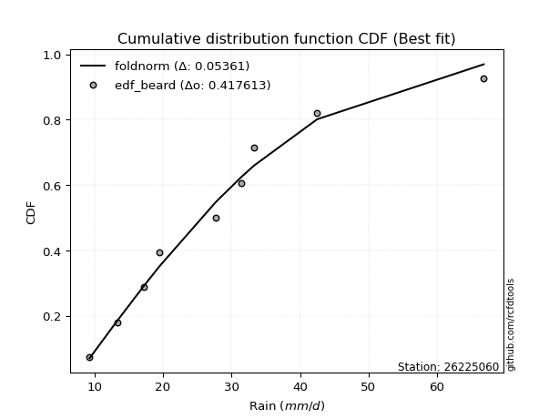</img>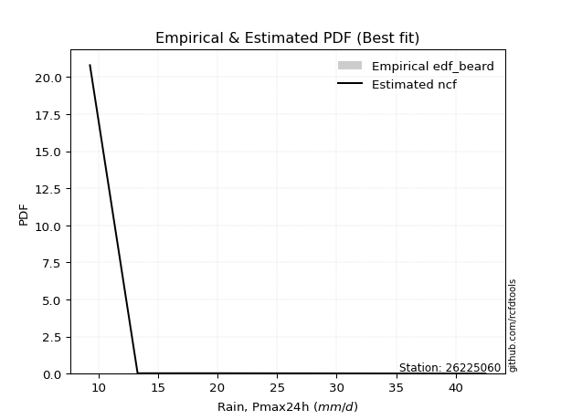</img>

</div>


### 5. Empirical - EDF Chegodayev (1955)

The Chegodayev formula is an empirical plotting position formula used in hydrological frequency analysis to estimate the exceedance probability or return period of a specific event from a set of observed data. It is primarily used for plotting observed data points on probability paper to fit a theoretical distribution, particularly for analyzing extreme events like maximum flood flows or rainfall intensities. The constant _b_ value in the generalized plotting position formula is 0.3.

<div align="center">


$P=(m-b)/(n+1-2b)$


</div>


**5.1. Empirical values**

<div align="center">

|                | 0                   | 1                   | 2                  | 3                   | 4              | 5                  | 6                  | 7                  | 8                  |
|:---------------|:--------------------|:--------------------|:-------------------|:--------------------|:---------------|:-------------------|:-------------------|:-------------------|:-------------------|
| date           | 2024                | 2023                | 2018               | 2020                | 2022           | 2017               | 2021               | 2019               | 2025               |
| x              | 9.3                 | 13.3                | 17.2               | 19.5                | 27.7           | 31.4               | 33.3               | 42.5               | 66.8               |
| m              | 1                   | 2                   | 3                  | 4                   | 5              | 6                  | 7                  | 8                  | 9                  |
| empirical_dist | edf_chegodayev      | edf_chegodayev      | edf_chegodayev     | edf_chegodayev      | edf_chegodayev | edf_chegodayev     | edf_chegodayev     | edf_chegodayev     | edf_chegodayev     |
| empirical      | 0.07446808510638298 | 0.18085106382978722 | 0.2872340425531915 | 0.39361702127659576 | 0.5            | 0.6063829787234043 | 0.7127659574468085 | 0.8191489361702128 | 0.9255319148936169 |
| empirical_tr   | 1.0804597701149425  | 1.2207792207792207  | 1.4029850746268657 | 1.6491228070175437  | 2.0            | 2.540540540540541  | 3.481481481481481  | 5.529411764705883  | 13.428571428571399 |

</div>


**5.2. Kolmogorov-Smirnov fit test (sorted by Δ)**


<div align="center">

|                | 0                   | 1                   | 2                   | 3                   | 4                   | 5                   | 6                   | 7                   | 8                   | 9                   | 10                  | 11                  | 12                  | 13                  | 14                  | 15                  | 16                  | 17                  | 18                  | 19                  | 20                  | 21                  | 22                  | 23                  | 24                  | 25                  | 26                  | 27                  | 28                  | 29                  | 30                  | 31                  | 32                  | 33                  | 34                  | 35                  | 36                  | 37                  | 38                  | 39                  | 40                  | 41                  | 42                  | 43                  | 44                  | 45                  | 46                  | 47                  | 48                  | 49                  | 50                  | 51                  | 52                  | 53                  | 54                  | 55                  | 56                  | 57                  | 58                  | 59                  | 60                  | 61                    | 62                  | 63                  | 64                  | 65                  | 66                  | 67                  | 68                  | 69                  | 70                  | 71                  | 72                  | 73                  | 74                  | 75                  | 76                  | 77                  | 78                  | 79                  | 80                  | 81                  | 82                  | 83                  | 84                  | 85                  | 86                  | 87                  | 88                  | 89                  |
|:---------------|:--------------------|:--------------------|:--------------------|:--------------------|:--------------------|:--------------------|:--------------------|:--------------------|:--------------------|:--------------------|:--------------------|:--------------------|:--------------------|:--------------------|:--------------------|:--------------------|:--------------------|:--------------------|:--------------------|:--------------------|:--------------------|:--------------------|:--------------------|:--------------------|:--------------------|:--------------------|:--------------------|:--------------------|:--------------------|:--------------------|:--------------------|:--------------------|:--------------------|:--------------------|:--------------------|:--------------------|:--------------------|:--------------------|:--------------------|:--------------------|:--------------------|:--------------------|:--------------------|:--------------------|:--------------------|:--------------------|:--------------------|:--------------------|:--------------------|:--------------------|:--------------------|:--------------------|:--------------------|:--------------------|:--------------------|:--------------------|:--------------------|:--------------------|:--------------------|:--------------------|:--------------------|:----------------------|:--------------------|:--------------------|:--------------------|:--------------------|:--------------------|:--------------------|:--------------------|:--------------------|:--------------------|:--------------------|:--------------------|:--------------------|:--------------------|:--------------------|:--------------------|:--------------------|:--------------------|:--------------------|:--------------------|:--------------------|:--------------------|:--------------------|:--------------------|:--------------------|:--------------------|:--------------------|:--------------------|:--------------------|
| station        | 26225060            | 26225060            | 26225060            | 26225060            | 26225060            | 26225060            | 26225060            | 26225060            | 26225060            | 26225060            | 26225060            | 26225060            | 26225060            | 26225060            | 26225060            | 26225060            | 26225060            | 26225060            | 26225060            | 26225060            | 26225060            | 26225060            | 26225060            | 26225060            | 26225060            | 26225060            | 26225060            | 26225060            | 26225060            | 26225060            | 26225060            | 26225060            | 26225060            | 26225060            | 26225060            | 26225060            | 26225060            | 26225060            | 26225060            | 26225060            | 26225060            | 26225060            | 26225060            | 26225060            | 26225060            | 26225060            | 26225060            | 26225060            | 26225060            | 26225060            | 26225060            | 26225060            | 26225060            | 26225060            | 26225060            | 26225060            | 26225060            | 26225060            | 26225060            | 26225060            | 26225060            | 26225060              | 26225060            | 26225060            | 26225060            | 26225060            | 26225060            | 26225060            | 26225060            | 26225060            | 26225060            | 26225060            | 26225060            | 26225060            | 26225060            | 26225060            | 26225060            | 26225060            | 26225060            | 26225060            | 26225060            | 26225060            | 26225060            | 26225060            | 26225060            | 26225060            | 26225060            | 26225060            | 26225060            | 26225060            |
| empirical_dist | edf_chegodayev      | edf_chegodayev      | edf_chegodayev      | edf_chegodayev      | edf_chegodayev      | edf_chegodayev      | edf_chegodayev      | edf_chegodayev      | edf_chegodayev      | edf_chegodayev      | edf_chegodayev      | edf_chegodayev      | edf_chegodayev      | edf_chegodayev      | edf_chegodayev      | edf_chegodayev      | edf_chegodayev      | edf_chegodayev      | edf_chegodayev      | edf_chegodayev      | edf_chegodayev      | edf_chegodayev      | edf_chegodayev      | edf_chegodayev      | edf_chegodayev      | edf_chegodayev      | edf_chegodayev      | edf_chegodayev      | edf_chegodayev      | edf_chegodayev      | edf_chegodayev      | edf_chegodayev      | edf_chegodayev      | edf_chegodayev      | edf_chegodayev      | edf_chegodayev      | edf_chegodayev      | edf_chegodayev      | edf_chegodayev      | edf_chegodayev      | edf_chegodayev      | edf_chegodayev      | edf_chegodayev      | edf_chegodayev      | edf_chegodayev      | edf_chegodayev      | edf_chegodayev      | edf_chegodayev      | edf_chegodayev      | edf_chegodayev      | edf_chegodayev      | edf_chegodayev      | edf_chegodayev      | edf_chegodayev      | edf_chegodayev      | edf_chegodayev      | edf_chegodayev      | edf_chegodayev      | edf_chegodayev      | edf_chegodayev      | edf_chegodayev      | edf_chegodayev        | edf_chegodayev      | edf_chegodayev      | edf_chegodayev      | edf_chegodayev      | edf_chegodayev      | edf_chegodayev      | edf_chegodayev      | edf_chegodayev      | edf_chegodayev      | edf_chegodayev      | edf_chegodayev      | edf_chegodayev      | edf_chegodayev      | edf_chegodayev      | edf_chegodayev      | edf_chegodayev      | edf_chegodayev      | edf_chegodayev      | edf_chegodayev      | edf_chegodayev      | edf_chegodayev      | edf_chegodayev      | edf_chegodayev      | edf_chegodayev      | edf_chegodayev      | edf_chegodayev      | edf_chegodayev      | edf_chegodayev      |
| p_dist         | halfnorm            | pearson3            | halflogistic        | gompertz            | moyal               | rayleigh            | logloggamma         | logpearson3         | loggompertz         | logjohnsonsu        | logexponnorm        | logt                | logcrystalball      | lognorm             | lognorm             | logfisk             | alpha               | logf                | logerlang           | loggamma            | loggamma            | f                   | logfatiguelife      | lognct              | gumbel_r            | t                   | maxwell             | mielke              | loggenlogistic      | logweibull_min      | invweibull          | genlogistic         | nct                 | ncf                 | invgamma            | logbetaprime        | loglogistic         | logncf              | fisk                | logrice             | johnsonsu           | invgauss            | kstwobign           | loginvgamma         | loghypsecant        | fatiguelife         | betaprime           | logalpha            | loginvgauss         | genexpon            | expon               | logmaxwell          | loginvweibull       | weibull_min         | crystalball         | truncnorm           | norm                | exponnorm           | loggumbel_l         | nakagami            | lograyleigh         | loglaplace_asymmetric | loglaplace          | rice                | logistic            | loggenexpon         | logkstwobign        | loghalfnorm         | hypsecant           | loggumbel_r         | laplace_asymmetric  | gamma               | loghalflogistic     | laplace             | gumbel_l            | logmoyal            | logexpon            | wald                | logtruncnorm        | logmielke           | lognakagami         | erlang              | chi2                | logwald             | logchi2             | loggibrat           | gibrat              | loglognorm          | pareto              | logpareto           |
| delta          | 0.05316585453424949 | 0.07140821275119069 | 0.07242570379469015 | 0.07446808510636135 | 0.07523708078246433 | 0.07644930939512318 | 0.07673973434061898 | 0.07786380128007009 | 0.07800935326083869 | 0.07820301203544078 | 0.07933667281834977 | 0.07933678160384305 | 0.0793369778193358  | 0.0793369781895753  | 0.0793369781895753  | 0.07987225319132396 | 0.07989410161489785 | 0.0805404884847869  | 0.08066531963722512 | 0.08081433090606616 | 0.08081433090606616 | 0.08086438373942106 | 0.08127609956391324 | 0.08191511236595117 | 0.08204168623381297 | 0.08207220389983028 | 0.08462328122622353 | 0.08525754667285301 | 0.08581780727647736 | 0.08746614765741767 | 0.08766405098112673 | 0.0883751400648351  | 0.08875572283552369 | 0.08899472401171338 | 0.08901331160958037 | 0.08929086661529739 | 0.08979507175026491 | 0.09048777201298419 | 0.09292936892029813 | 0.09452224632691297 | 0.09489061864825088 | 0.09584313787898546 | 0.09687354336514936 | 0.09693262516191736 | 0.0984886375640015  | 0.0997408599438463  | 0.10004818683920125 | 0.10406068237689059 | 0.10500790384798186 | 0.10691627878629628 | 0.1070253418552598  | 0.10759434514081123 | 0.10920097650425342 | 0.1098063904636426  | 0.11099129909229954 | 0.11099130073779884 | 0.11099130672482216 | 0.11108069797294196 | 0.11151423552491418 | 0.11213366937192637 | 0.11648624523655715 | 0.11706172964592448   | 0.12328612898149327 | 0.12642964616135988 | 0.13123766188559088 | 0.1317270714991029  | 0.13461325421078363 | 0.14167720841323905 | 0.1467042598545883  | 0.14770646855007796 | 0.15322819471026303 | 0.15947334310729433 | 0.16971739386444018 | 0.17027961697905514 | 0.17043138029200566 | 0.17141835592951649 | 0.18003044361929943 | 0.18076103164469154 | 0.18080360218064018 | 0.1842411256784775  | 0.18736476570323968 | 0.2145072863087749  | 0.23104073552221516 | 0.23730315849246775 | 0.25917290781583147 | 0.2682298401855556  | 0.2706152077451236  | 0.42281919536566936 | 0.43095176927233336 | 0.45102933511019716 |
| deltao         | 0.41761268023100007 | 0.41761268023100007 | 0.41761268023100007 | 0.41761268023100007 | 0.41761268023100007 | 0.41761268023100007 | 0.41761268023100007 | 0.41761268023100007 | 0.41761268023100007 | 0.41761268023100007 | 0.41761268023100007 | 0.41761268023100007 | 0.41761268023100007 | 0.41761268023100007 | 0.41761268023100007 | 0.41761268023100007 | 0.41761268023100007 | 0.41761268023100007 | 0.41761268023100007 | 0.41761268023100007 | 0.41761268023100007 | 0.41761268023100007 | 0.41761268023100007 | 0.41761268023100007 | 0.41761268023100007 | 0.41761268023100007 | 0.41761268023100007 | 0.41761268023100007 | 0.41761268023100007 | 0.41761268023100007 | 0.41761268023100007 | 0.41761268023100007 | 0.41761268023100007 | 0.41761268023100007 | 0.41761268023100007 | 0.41761268023100007 | 0.41761268023100007 | 0.41761268023100007 | 0.41761268023100007 | 0.41761268023100007 | 0.41761268023100007 | 0.41761268023100007 | 0.41761268023100007 | 0.41761268023100007 | 0.41761268023100007 | 0.41761268023100007 | 0.41761268023100007 | 0.41761268023100007 | 0.41761268023100007 | 0.41761268023100007 | 0.41761268023100007 | 0.41761268023100007 | 0.41761268023100007 | 0.41761268023100007 | 0.41761268023100007 | 0.41761268023100007 | 0.41761268023100007 | 0.41761268023100007 | 0.41761268023100007 | 0.41761268023100007 | 0.41761268023100007 | 0.41761268023100007   | 0.41761268023100007 | 0.41761268023100007 | 0.41761268023100007 | 0.41761268023100007 | 0.41761268023100007 | 0.41761268023100007 | 0.41761268023100007 | 0.41761268023100007 | 0.41761268023100007 | 0.41761268023100007 | 0.41761268023100007 | 0.41761268023100007 | 0.41761268023100007 | 0.41761268023100007 | 0.41761268023100007 | 0.41761268023100007 | 0.41761268023100007 | 0.41761268023100007 | 0.41761268023100007 | 0.41761268023100007 | 0.41761268023100007 | 0.41761268023100007 | 0.41761268023100007 | 0.41761268023100007 | 0.41761268023100007 | 0.41761268023100007 | 0.41761268023100007 | 0.41761268023100007 |
| eval           | Δo > Δ              | Δo > Δ              | Δo > Δ              | Δo > Δ              | Δo > Δ              | Δo > Δ              | Δo > Δ              | Δo > Δ              | Δo > Δ              | Δo > Δ              | Δo > Δ              | Δo > Δ              | Δo > Δ              | Δo > Δ              | Δo > Δ              | Δo > Δ              | Δo > Δ              | Δo > Δ              | Δo > Δ              | Δo > Δ              | Δo > Δ              | Δo > Δ              | Δo > Δ              | Δo > Δ              | Δo > Δ              | Δo > Δ              | Δo > Δ              | Δo > Δ              | Δo > Δ              | Δo > Δ              | Δo > Δ              | Δo > Δ              | Δo > Δ              | Δo > Δ              | Δo > Δ              | Δo > Δ              | Δo > Δ              | Δo > Δ              | Δo > Δ              | Δo > Δ              | Δo > Δ              | Δo > Δ              | Δo > Δ              | Δo > Δ              | Δo > Δ              | Δo > Δ              | Δo > Δ              | Δo > Δ              | Δo > Δ              | Δo > Δ              | Δo > Δ              | Δo > Δ              | Δo > Δ              | Δo > Δ              | Δo > Δ              | Δo > Δ              | Δo > Δ              | Δo > Δ              | Δo > Δ              | Δo > Δ              | Δo > Δ              | Δo > Δ                | Δo > Δ              | Δo > Δ              | Δo > Δ              | Δo > Δ              | Δo > Δ              | Δo > Δ              | Δo > Δ              | Δo > Δ              | Δo > Δ              | Δo > Δ              | Δo > Δ              | Δo > Δ              | Δo > Δ              | Δo > Δ              | Δo > Δ              | Δo > Δ              | Δo > Δ              | Δo > Δ              | Δo > Δ              | Δo > Δ              | Δo > Δ              | Δo > Δ              | Δo > Δ              | Δo > Δ              | Δo > Δ              | Δo <= Δ             | Δo <= Δ             | Δo <= Δ             |
| fit            | 1                   | 1                   | 1                   | 1                   | 1                   | 1                   | 1                   | 1                   | 1                   | 1                   | 1                   | 1                   | 1                   | 1                   | 1                   | 1                   | 1                   | 1                   | 1                   | 1                   | 1                   | 1                   | 1                   | 1                   | 1                   | 1                   | 1                   | 1                   | 1                   | 1                   | 1                   | 1                   | 1                   | 1                   | 1                   | 1                   | 1                   | 1                   | 1                   | 1                   | 1                   | 1                   | 1                   | 1                   | 1                   | 1                   | 1                   | 1                   | 1                   | 1                   | 1                   | 1                   | 1                   | 1                   | 1                   | 1                   | 1                   | 1                   | 1                   | 1                   | 1                   | 1                     | 1                   | 1                   | 1                   | 1                   | 1                   | 1                   | 1                   | 1                   | 1                   | 1                   | 1                   | 1                   | 1                   | 1                   | 1                   | 1                   | 1                   | 1                   | 1                   | 1                   | 1                   | 1                   | 1                   | 1                   | 1                   | 0                   | 0                   | 0                   |
| n              | 9                   | 9                   | 9                   | 9                   | 9                   | 9                   | 9                   | 9                   | 9                   | 9                   | 9                   | 9                   | 9                   | 9                   | 9                   | 9                   | 9                   | 9                   | 9                   | 9                   | 9                   | 9                   | 9                   | 9                   | 9                   | 9                   | 9                   | 9                   | 9                   | 9                   | 9                   | 9                   | 9                   | 9                   | 9                   | 9                   | 9                   | 9                   | 9                   | 9                   | 9                   | 9                   | 9                   | 9                   | 9                   | 9                   | 9                   | 9                   | 9                   | 9                   | 9                   | 9                   | 9                   | 9                   | 9                   | 9                   | 9                   | 9                   | 9                   | 9                   | 9                   | 9                     | 9                   | 9                   | 9                   | 9                   | 9                   | 9                   | 9                   | 9                   | 9                   | 9                   | 9                   | 9                   | 9                   | 9                   | 9                   | 9                   | 9                   | 9                   | 9                   | 9                   | 9                   | 9                   | 9                   | 9                   | 9                   | 9                   | 9                   | 9                   |
| best_fit       | 1                   | 0                   | 0                   | 0                   | 0                   | 0                   | 0                   | 0                   | 0                   | 0                   | 0                   | 0                   | 0                   | 0                   | 0                   | 0                   | 0                   | 0                   | 0                   | 0                   | 0                   | 0                   | 0                   | 0                   | 0                   | 0                   | 0                   | 0                   | 0                   | 0                   | 0                   | 0                   | 0                   | 0                   | 0                   | 0                   | 0                   | 0                   | 0                   | 0                   | 0                   | 0                   | 0                   | 0                   | 0                   | 0                   | 0                   | 0                   | 0                   | 0                   | 0                   | 0                   | 0                   | 0                   | 0                   | 0                   | 0                   | 0                   | 0                   | 0                   | 0                   | 0                     | 0                   | 0                   | 0                   | 0                   | 0                   | 0                   | 0                   | 0                   | 0                   | 0                   | 0                   | 0                   | 0                   | 0                   | 0                   | 0                   | 0                   | 0                   | 0                   | 0                   | 0                   | 0                   | 0                   | 0                   | 0                   | 0                   | 0                   | 0                   |
| best_fit_sort  | 1                   | 2                   | 3                   | 4                   | 5                   | 6                   | 7                   | 8                   | 9                   | 10                  | 11                  | 12                  | 13                  | 14                  | 15                  | 16                  | 17                  | 18                  | 19                  | 20                  | 21                  | 22                  | 23                  | 24                  | 25                  | 26                  | 27                  | 28                  | 29                  | 30                  | 31                  | 32                  | 33                  | 34                  | 35                  | 36                  | 37                  | 38                  | 39                  | 40                  | 41                  | 42                  | 43                  | 44                  | 45                  | 46                  | 47                  | 48                  | 49                  | 50                  | 51                  | 52                  | 53                  | 54                  | 55                  | 56                  | 57                  | 58                  | 59                  | 60                  | 61                  | 62                    | 63                  | 64                  | 65                  | 66                  | 67                  | 68                  | 69                  | 70                  | 71                  | 72                  | 73                  | 74                  | 75                  | 76                  | 77                  | 78                  | 79                  | 80                  | 81                  | 82                  | 83                  | 84                  | 85                  | 86                  | 87                  | 88                  | 89                  | 90                  |

</div>


<div align="center">

</img>

</div>


**5.3. Best fit**

<div align="center">

|   id |   station | empirical_dist   | p_dist   |     delta |   deltao | eval   |   fit |   n |   best_fit |   best_fit_sort |
|-----:|----------:|:-----------------|:---------|----------:|---------:|:-------|------:|----:|-----------:|----------------:|
|    0 |  26225060 | edf_chegodayev   | halfnorm | 0.0531659 | 0.417613 | Δo > Δ |     1 |   9 |          1 |               1 |

</div>


<div align="center">

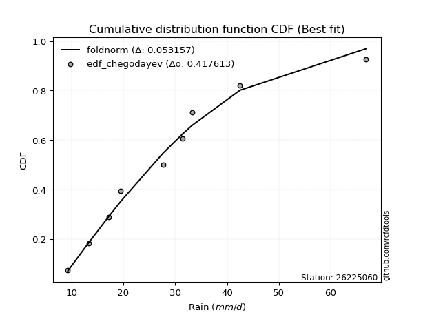</img>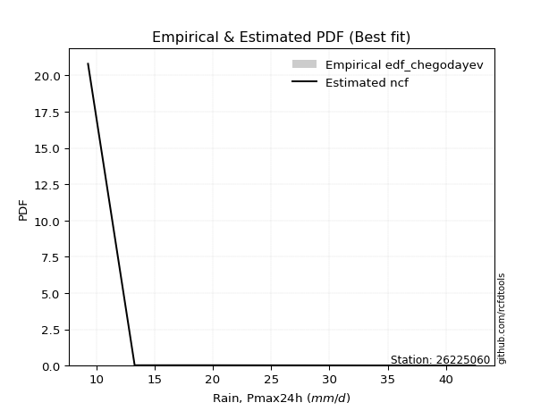</img>

</div>


### 6. Empirical - EDF Blom (1958)

The Blom formula is a specific "plotting position" formula used in hydrology and statistical analysis to estimate the empirical cumulative probability (or non-exceedance probability) of a data series. It is particularly recommended for data that are approximately normally distributed. The constant _a_ is set to 0.375 (or 3/8).

<div align="center">


$P=(m-a)/(n+1-2a)$


</div>


**6.1. Empirical values**

<div align="center">

|                | 0                   | 1                   | 2                   | 3                  | 4        | 5                  | 6                  | 7                  | 8                  |
|:---------------|:--------------------|:--------------------|:--------------------|:-------------------|:---------|:-------------------|:-------------------|:-------------------|:-------------------|
| date           | 2024                | 2023                | 2018                | 2020               | 2022     | 2017               | 2021               | 2019               | 2025               |
| x              | 9.3                 | 13.3                | 17.2                | 19.5               | 27.7     | 31.4               | 33.3               | 42.5               | 66.8               |
| m              | 1                   | 2                   | 3                   | 4                  | 5        | 6                  | 7                  | 8                  | 9                  |
| empirical_dist | edf_blom            | edf_blom            | edf_blom            | edf_blom           | edf_blom | edf_blom           | edf_blom           | edf_blom           | edf_blom           |
| empirical      | 0.06756756756756757 | 0.17567567567567569 | 0.28378378378378377 | 0.3918918918918919 | 0.5      | 0.6081081081081081 | 0.7162162162162162 | 0.8243243243243243 | 0.9324324324324325 |
| empirical_tr   | 1.072463768115942   | 1.2131147540983607  | 1.3962264150943395  | 1.6444444444444444 | 2.0      | 2.5517241379310347 | 3.523809523809524  | 5.6923076923076925 | 14.800000000000006 |

</div>


**6.2. Kolmogorov-Smirnov fit test (sorted by Δ)**


<div align="center">

|                | 0                    | 1                   | 2                   | 3                   | 4                   | 5                   | 6                   | 7                   | 8                   | 9                   | 10                  | 11                  | 12                  | 13                  | 14                  | 15                  | 16                  | 17                  | 18                  | 19                  | 20                  | 21                  | 22                  | 23                  | 24                  | 25                  | 26                  | 27                  | 28                  | 29                  | 30                  | 31                  | 32                  | 33                  | 34                  | 35                  | 36                  | 37                  | 38                  | 39                  | 40                  | 41                  | 42                  | 43                  | 44                  | 45                  | 46                  | 47                  | 48                  | 49                  | 50                  | 51                  | 52                  | 53                  | 54                  | 55                  | 56                  | 57                  | 58                  | 59                  | 60                    | 61                  | 62                  | 63                  | 64                  | 65                  | 66                  | 67                  | 68                  | 69                  | 70                  | 71                  | 72                  | 73                  | 74                  | 75                  | 76                  | 77                  | 78                  | 79                  | 80                  | 81                  | 82                  | 83                  | 84                  | 85                  | 86                  | 87                  | 88                  | 89                  |
|:---------------|:---------------------|:--------------------|:--------------------|:--------------------|:--------------------|:--------------------|:--------------------|:--------------------|:--------------------|:--------------------|:--------------------|:--------------------|:--------------------|:--------------------|:--------------------|:--------------------|:--------------------|:--------------------|:--------------------|:--------------------|:--------------------|:--------------------|:--------------------|:--------------------|:--------------------|:--------------------|:--------------------|:--------------------|:--------------------|:--------------------|:--------------------|:--------------------|:--------------------|:--------------------|:--------------------|:--------------------|:--------------------|:--------------------|:--------------------|:--------------------|:--------------------|:--------------------|:--------------------|:--------------------|:--------------------|:--------------------|:--------------------|:--------------------|:--------------------|:--------------------|:--------------------|:--------------------|:--------------------|:--------------------|:--------------------|:--------------------|:--------------------|:--------------------|:--------------------|:--------------------|:----------------------|:--------------------|:--------------------|:--------------------|:--------------------|:--------------------|:--------------------|:--------------------|:--------------------|:--------------------|:--------------------|:--------------------|:--------------------|:--------------------|:--------------------|:--------------------|:--------------------|:--------------------|:--------------------|:--------------------|:--------------------|:--------------------|:--------------------|:--------------------|:--------------------|:--------------------|:--------------------|:--------------------|:--------------------|:--------------------|
| station        | 26225060             | 26225060            | 26225060            | 26225060            | 26225060            | 26225060            | 26225060            | 26225060            | 26225060            | 26225060            | 26225060            | 26225060            | 26225060            | 26225060            | 26225060            | 26225060            | 26225060            | 26225060            | 26225060            | 26225060            | 26225060            | 26225060            | 26225060            | 26225060            | 26225060            | 26225060            | 26225060            | 26225060            | 26225060            | 26225060            | 26225060            | 26225060            | 26225060            | 26225060            | 26225060            | 26225060            | 26225060            | 26225060            | 26225060            | 26225060            | 26225060            | 26225060            | 26225060            | 26225060            | 26225060            | 26225060            | 26225060            | 26225060            | 26225060            | 26225060            | 26225060            | 26225060            | 26225060            | 26225060            | 26225060            | 26225060            | 26225060            | 26225060            | 26225060            | 26225060            | 26225060              | 26225060            | 26225060            | 26225060            | 26225060            | 26225060            | 26225060            | 26225060            | 26225060            | 26225060            | 26225060            | 26225060            | 26225060            | 26225060            | 26225060            | 26225060            | 26225060            | 26225060            | 26225060            | 26225060            | 26225060            | 26225060            | 26225060            | 26225060            | 26225060            | 26225060            | 26225060            | 26225060            | 26225060            | 26225060            |
| empirical_dist | edf_blom             | edf_blom            | edf_blom            | edf_blom            | edf_blom            | edf_blom            | edf_blom            | edf_blom            | edf_blom            | edf_blom            | edf_blom            | edf_blom            | edf_blom            | edf_blom            | edf_blom            | edf_blom            | edf_blom            | edf_blom            | edf_blom            | edf_blom            | edf_blom            | edf_blom            | edf_blom            | edf_blom            | edf_blom            | edf_blom            | edf_blom            | edf_blom            | edf_blom            | edf_blom            | edf_blom            | edf_blom            | edf_blom            | edf_blom            | edf_blom            | edf_blom            | edf_blom            | edf_blom            | edf_blom            | edf_blom            | edf_blom            | edf_blom            | edf_blom            | edf_blom            | edf_blom            | edf_blom            | edf_blom            | edf_blom            | edf_blom            | edf_blom            | edf_blom            | edf_blom            | edf_blom            | edf_blom            | edf_blom            | edf_blom            | edf_blom            | edf_blom            | edf_blom            | edf_blom            | edf_blom              | edf_blom            | edf_blom            | edf_blom            | edf_blom            | edf_blom            | edf_blom            | edf_blom            | edf_blom            | edf_blom            | edf_blom            | edf_blom            | edf_blom            | edf_blom            | edf_blom            | edf_blom            | edf_blom            | edf_blom            | edf_blom            | edf_blom            | edf_blom            | edf_blom            | edf_blom            | edf_blom            | edf_blom            | edf_blom            | edf_blom            | edf_blom            | edf_blom            | edf_blom            |
| p_dist         | halfnorm             | gompertz            | pearson3            | halflogistic        | moyal               | logloggamma         | logpearson3         | loggompertz         | logjohnsonsu        | logexponnorm        | logt                | logcrystalball      | lognorm             | lognorm             | logfisk             | alpha               | rayleigh            | gumbel_r            | t                   | logf                | logerlang           | loggamma            | loggamma            | f                   | logfatiguelife      | lognct              | mielke              | loggenlogistic      | genlogistic         | logweibull_min      | invweibull          | maxwell             | nct                 | ncf                 | invgamma            | logbetaprime        | loglogistic         | logncf              | fisk                | logrice             | johnsonsu           | kstwobign           | invgauss            | loginvgamma         | loghypsecant        | fatiguelife         | betaprime           | logalpha            | loginvgauss         | genexpon            | expon               | logmaxwell          | loginvweibull       | loggumbel_l         | weibull_min         | exponnorm           | nakagami            | crystalball         | truncnorm           | norm                | loglaplace_asymmetric | lograyleigh         | loglaplace          | rice                | logistic            | loggenexpon         | logkstwobign        | loghalfnorm         | hypsecant           | loggumbel_r         | laplace_asymmetric  | gamma               | laplace             | loghalflogistic     | logmoyal            | gumbel_l            | wald                | logtruncnorm        | logexpon            | logmielke           | lognakagami         | erlang              | chi2                | logwald             | logchi2             | gibrat              | loggibrat           | loglognorm          | pareto              | logpareto           |
| delta          | 0.056616113303657234 | 0.06756756756754595 | 0.06968308336648682 | 0.07001244564958953 | 0.07351195139776046 | 0.07673973434061898 | 0.07786380128007009 | 0.07800935326083869 | 0.07820301203544078 | 0.07933667281834977 | 0.07933678160384305 | 0.0793369778193358  | 0.0793369781895753  | 0.0793369781895753  | 0.07987225319132396 | 0.07989410161489785 | 0.07989956816453092 | 0.0803165568491091  | 0.0803470745151264  | 0.0805404884847869  | 0.08066531963722512 | 0.08081433090606616 | 0.08081433090606616 | 0.08086438373942106 | 0.08127609956391324 | 0.08191511236595117 | 0.08525754667285301 | 0.08581780727647736 | 0.08665001068013123 | 0.08746614765741767 | 0.08766405098112673 | 0.08807353999563128 | 0.08875572283552369 | 0.08899472401171338 | 0.08901331160958037 | 0.08929086661529739 | 0.08979507175026491 | 0.09048777201298419 | 0.09292936892029813 | 0.09452224632691297 | 0.09489061864825088 | 0.09514841398044549 | 0.09584313787898546 | 0.09693262516191736 | 0.0984886375640015  | 0.0997408599438463  | 0.10004818683920125 | 0.10406068237689059 | 0.10500790384798186 | 0.10691627878629628 | 0.1070253418552598  | 0.10759434514081123 | 0.10920097650425342 | 0.10978910614021031 | 0.1098063904636426  | 0.11108069797294196 | 0.11213366937192637 | 0.11444155786170729 | 0.11444155950720658 | 0.1144415654942299  | 0.11533660026122061   | 0.11648624523655715 | 0.12328612898149327 | 0.124704516776656   | 0.129512532500887   | 0.1317270714991029  | 0.13461325421078363 | 0.14167720841323905 | 0.14497913046988442 | 0.14770646855007796 | 0.15150306532555916 | 0.15947334310729433 | 0.16855448759435127 | 0.16971739386444018 | 0.17141835592951649 | 0.1738816390614134  | 0.17558564349058    | 0.17562821402652865 | 0.18348070238870717 | 0.1842411256784775  | 0.18736476570323968 | 0.2145072863087749  | 0.23104073552221516 | 0.23730315849246775 | 0.2626231665852392  | 0.26716494897571585 | 0.2682298401855556  | 0.4279945835197809  | 0.4361271574264449  | 0.4562047232643087  |
| deltao         | 0.41761268023100007  | 0.41761268023100007 | 0.41761268023100007 | 0.41761268023100007 | 0.41761268023100007 | 0.41761268023100007 | 0.41761268023100007 | 0.41761268023100007 | 0.41761268023100007 | 0.41761268023100007 | 0.41761268023100007 | 0.41761268023100007 | 0.41761268023100007 | 0.41761268023100007 | 0.41761268023100007 | 0.41761268023100007 | 0.41761268023100007 | 0.41761268023100007 | 0.41761268023100007 | 0.41761268023100007 | 0.41761268023100007 | 0.41761268023100007 | 0.41761268023100007 | 0.41761268023100007 | 0.41761268023100007 | 0.41761268023100007 | 0.41761268023100007 | 0.41761268023100007 | 0.41761268023100007 | 0.41761268023100007 | 0.41761268023100007 | 0.41761268023100007 | 0.41761268023100007 | 0.41761268023100007 | 0.41761268023100007 | 0.41761268023100007 | 0.41761268023100007 | 0.41761268023100007 | 0.41761268023100007 | 0.41761268023100007 | 0.41761268023100007 | 0.41761268023100007 | 0.41761268023100007 | 0.41761268023100007 | 0.41761268023100007 | 0.41761268023100007 | 0.41761268023100007 | 0.41761268023100007 | 0.41761268023100007 | 0.41761268023100007 | 0.41761268023100007 | 0.41761268023100007 | 0.41761268023100007 | 0.41761268023100007 | 0.41761268023100007 | 0.41761268023100007 | 0.41761268023100007 | 0.41761268023100007 | 0.41761268023100007 | 0.41761268023100007 | 0.41761268023100007   | 0.41761268023100007 | 0.41761268023100007 | 0.41761268023100007 | 0.41761268023100007 | 0.41761268023100007 | 0.41761268023100007 | 0.41761268023100007 | 0.41761268023100007 | 0.41761268023100007 | 0.41761268023100007 | 0.41761268023100007 | 0.41761268023100007 | 0.41761268023100007 | 0.41761268023100007 | 0.41761268023100007 | 0.41761268023100007 | 0.41761268023100007 | 0.41761268023100007 | 0.41761268023100007 | 0.41761268023100007 | 0.41761268023100007 | 0.41761268023100007 | 0.41761268023100007 | 0.41761268023100007 | 0.41761268023100007 | 0.41761268023100007 | 0.41761268023100007 | 0.41761268023100007 | 0.41761268023100007 |
| eval           | Δo > Δ               | Δo > Δ              | Δo > Δ              | Δo > Δ              | Δo > Δ              | Δo > Δ              | Δo > Δ              | Δo > Δ              | Δo > Δ              | Δo > Δ              | Δo > Δ              | Δo > Δ              | Δo > Δ              | Δo > Δ              | Δo > Δ              | Δo > Δ              | Δo > Δ              | Δo > Δ              | Δo > Δ              | Δo > Δ              | Δo > Δ              | Δo > Δ              | Δo > Δ              | Δo > Δ              | Δo > Δ              | Δo > Δ              | Δo > Δ              | Δo > Δ              | Δo > Δ              | Δo > Δ              | Δo > Δ              | Δo > Δ              | Δo > Δ              | Δo > Δ              | Δo > Δ              | Δo > Δ              | Δo > Δ              | Δo > Δ              | Δo > Δ              | Δo > Δ              | Δo > Δ              | Δo > Δ              | Δo > Δ              | Δo > Δ              | Δo > Δ              | Δo > Δ              | Δo > Δ              | Δo > Δ              | Δo > Δ              | Δo > Δ              | Δo > Δ              | Δo > Δ              | Δo > Δ              | Δo > Δ              | Δo > Δ              | Δo > Δ              | Δo > Δ              | Δo > Δ              | Δo > Δ              | Δo > Δ              | Δo > Δ                | Δo > Δ              | Δo > Δ              | Δo > Δ              | Δo > Δ              | Δo > Δ              | Δo > Δ              | Δo > Δ              | Δo > Δ              | Δo > Δ              | Δo > Δ              | Δo > Δ              | Δo > Δ              | Δo > Δ              | Δo > Δ              | Δo > Δ              | Δo > Δ              | Δo > Δ              | Δo > Δ              | Δo > Δ              | Δo > Δ              | Δo > Δ              | Δo > Δ              | Δo > Δ              | Δo > Δ              | Δo > Δ              | Δo > Δ              | Δo <= Δ             | Δo <= Δ             | Δo <= Δ             |
| fit            | 1                    | 1                   | 1                   | 1                   | 1                   | 1                   | 1                   | 1                   | 1                   | 1                   | 1                   | 1                   | 1                   | 1                   | 1                   | 1                   | 1                   | 1                   | 1                   | 1                   | 1                   | 1                   | 1                   | 1                   | 1                   | 1                   | 1                   | 1                   | 1                   | 1                   | 1                   | 1                   | 1                   | 1                   | 1                   | 1                   | 1                   | 1                   | 1                   | 1                   | 1                   | 1                   | 1                   | 1                   | 1                   | 1                   | 1                   | 1                   | 1                   | 1                   | 1                   | 1                   | 1                   | 1                   | 1                   | 1                   | 1                   | 1                   | 1                   | 1                   | 1                     | 1                   | 1                   | 1                   | 1                   | 1                   | 1                   | 1                   | 1                   | 1                   | 1                   | 1                   | 1                   | 1                   | 1                   | 1                   | 1                   | 1                   | 1                   | 1                   | 1                   | 1                   | 1                   | 1                   | 1                   | 1                   | 1                   | 0                   | 0                   | 0                   |
| n              | 9                    | 9                   | 9                   | 9                   | 9                   | 9                   | 9                   | 9                   | 9                   | 9                   | 9                   | 9                   | 9                   | 9                   | 9                   | 9                   | 9                   | 9                   | 9                   | 9                   | 9                   | 9                   | 9                   | 9                   | 9                   | 9                   | 9                   | 9                   | 9                   | 9                   | 9                   | 9                   | 9                   | 9                   | 9                   | 9                   | 9                   | 9                   | 9                   | 9                   | 9                   | 9                   | 9                   | 9                   | 9                   | 9                   | 9                   | 9                   | 9                   | 9                   | 9                   | 9                   | 9                   | 9                   | 9                   | 9                   | 9                   | 9                   | 9                   | 9                   | 9                     | 9                   | 9                   | 9                   | 9                   | 9                   | 9                   | 9                   | 9                   | 9                   | 9                   | 9                   | 9                   | 9                   | 9                   | 9                   | 9                   | 9                   | 9                   | 9                   | 9                   | 9                   | 9                   | 9                   | 9                   | 9                   | 9                   | 9                   | 9                   | 9                   |
| best_fit       | 1                    | 0                   | 0                   | 0                   | 0                   | 0                   | 0                   | 0                   | 0                   | 0                   | 0                   | 0                   | 0                   | 0                   | 0                   | 0                   | 0                   | 0                   | 0                   | 0                   | 0                   | 0                   | 0                   | 0                   | 0                   | 0                   | 0                   | 0                   | 0                   | 0                   | 0                   | 0                   | 0                   | 0                   | 0                   | 0                   | 0                   | 0                   | 0                   | 0                   | 0                   | 0                   | 0                   | 0                   | 0                   | 0                   | 0                   | 0                   | 0                   | 0                   | 0                   | 0                   | 0                   | 0                   | 0                   | 0                   | 0                   | 0                   | 0                   | 0                   | 0                     | 0                   | 0                   | 0                   | 0                   | 0                   | 0                   | 0                   | 0                   | 0                   | 0                   | 0                   | 0                   | 0                   | 0                   | 0                   | 0                   | 0                   | 0                   | 0                   | 0                   | 0                   | 0                   | 0                   | 0                   | 0                   | 0                   | 0                   | 0                   | 0                   |
| best_fit_sort  | 1                    | 2                   | 3                   | 4                   | 5                   | 6                   | 7                   | 8                   | 9                   | 10                  | 11                  | 12                  | 13                  | 14                  | 15                  | 16                  | 17                  | 18                  | 19                  | 20                  | 21                  | 22                  | 23                  | 24                  | 25                  | 26                  | 27                  | 28                  | 29                  | 30                  | 31                  | 32                  | 33                  | 34                  | 35                  | 36                  | 37                  | 38                  | 39                  | 40                  | 41                  | 42                  | 43                  | 44                  | 45                  | 46                  | 47                  | 48                  | 49                  | 50                  | 51                  | 52                  | 53                  | 54                  | 55                  | 56                  | 57                  | 58                  | 59                  | 60                  | 61                    | 62                  | 63                  | 64                  | 65                  | 66                  | 67                  | 68                  | 69                  | 70                  | 71                  | 72                  | 73                  | 74                  | 75                  | 76                  | 77                  | 78                  | 79                  | 80                  | 81                  | 82                  | 83                  | 84                  | 85                  | 86                  | 87                  | 88                  | 89                  | 90                  |

</div>


<div align="center">

</img>

</div>


**6.3. Best fit**

<div align="center">

|   id |   station | empirical_dist   | p_dist   |     delta |   deltao | eval   |   fit |   n |   best_fit |   best_fit_sort |
|-----:|----------:|:-----------------|:---------|----------:|---------:|:-------|------:|----:|-----------:|----------------:|
|    0 |  26225060 | edf_blom         | halfnorm | 0.0566161 | 0.417613 | Δo > Δ |     1 |   9 |          1 |               1 |

</div>


<div align="center">

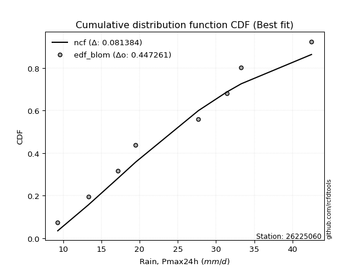</img></img>

</div>


### 7. Empirical - EDF Tukey (1962)

In hydrology, the Tukey formula is used as a plotting position formula to estimate the empirical probability or frequency of a flood event (or other hydrological data). The formula parameter is given as _c=0.333_ (or 1/3).

<div align="center">


$P=(m-c)/(n+1-2c)$


</div>


**7.1. Empirical values**

<div align="center">

|                | 0                   | 1                   | 2                  | 3                   | 4         | 5                  | 6                  | 7                  | 8                  |
|:---------------|:--------------------|:--------------------|:-------------------|:--------------------|:----------|:-------------------|:-------------------|:-------------------|:-------------------|
| date           | 2024                | 2023                | 2018               | 2020                | 2022      | 2017               | 2021               | 2019               | 2025               |
| x              | 9.3                 | 13.3                | 17.2               | 19.5                | 27.7      | 31.4               | 33.3               | 42.5               | 66.8               |
| m              | 1                   | 2                   | 3                  | 4                   | 5         | 6                  | 7                  | 8                  | 9                  |
| empirical_dist | edf_tukey           | edf_tukey           | edf_tukey          | edf_tukey           | edf_tukey | edf_tukey          | edf_tukey          | edf_tukey          | edf_tukey          |
| empirical      | 0.07142857142857142 | 0.17857142857142858 | 0.2857142857142857 | 0.39285714285714285 | 0.5       | 0.6071428571428571 | 0.7142857142857143 | 0.8214285714285714 | 0.9285714285714286 |
| empirical_tr   | 1.0769230769230769  | 1.2173913043478262  | 1.4                | 1.6470588235294117  | 2.0       | 2.545454545454545  | 3.5                | 5.599999999999999  | 14.000000000000007 |

</div>


**7.2. Kolmogorov-Smirnov fit test (sorted by Δ)**


<div align="center">

|                | 0                   | 1                   | 2                   | 3                   | 4                   | 5                   | 6                   | 7                   | 8                   | 9                   | 10                  | 11                  | 12                  | 13                  | 14                  | 15                  | 16                  | 17                  | 18                  | 19                  | 20                  | 21                  | 22                  | 23                  | 24                  | 25                  | 26                  | 27                  | 28                  | 29                  | 30                  | 31                  | 32                  | 33                  | 34                  | 35                  | 36                  | 37                  | 38                  | 39                  | 40                  | 41                  | 42                  | 43                  | 44                  | 45                  | 46                  | 47                  | 48                  | 49                  | 50                  | 51                  | 52                  | 53                  | 54                  | 55                  | 56                  | 57                  | 58                  | 59                  | 60                    | 61                  | 62                  | 63                  | 64                  | 65                  | 66                  | 67                  | 68                  | 69                  | 70                  | 71                  | 72                  | 73                  | 74                  | 75                  | 76                  | 77                  | 78                  | 79                  | 80                  | 81                  | 82                  | 83                  | 84                  | 85                  | 86                  | 87                  | 88                  | 89                  |
|:---------------|:--------------------|:--------------------|:--------------------|:--------------------|:--------------------|:--------------------|:--------------------|:--------------------|:--------------------|:--------------------|:--------------------|:--------------------|:--------------------|:--------------------|:--------------------|:--------------------|:--------------------|:--------------------|:--------------------|:--------------------|:--------------------|:--------------------|:--------------------|:--------------------|:--------------------|:--------------------|:--------------------|:--------------------|:--------------------|:--------------------|:--------------------|:--------------------|:--------------------|:--------------------|:--------------------|:--------------------|:--------------------|:--------------------|:--------------------|:--------------------|:--------------------|:--------------------|:--------------------|:--------------------|:--------------------|:--------------------|:--------------------|:--------------------|:--------------------|:--------------------|:--------------------|:--------------------|:--------------------|:--------------------|:--------------------|:--------------------|:--------------------|:--------------------|:--------------------|:--------------------|:----------------------|:--------------------|:--------------------|:--------------------|:--------------------|:--------------------|:--------------------|:--------------------|:--------------------|:--------------------|:--------------------|:--------------------|:--------------------|:--------------------|:--------------------|:--------------------|:--------------------|:--------------------|:--------------------|:--------------------|:--------------------|:--------------------|:--------------------|:--------------------|:--------------------|:--------------------|:--------------------|:--------------------|:--------------------|:--------------------|
| station        | 26225060            | 26225060            | 26225060            | 26225060            | 26225060            | 26225060            | 26225060            | 26225060            | 26225060            | 26225060            | 26225060            | 26225060            | 26225060            | 26225060            | 26225060            | 26225060            | 26225060            | 26225060            | 26225060            | 26225060            | 26225060            | 26225060            | 26225060            | 26225060            | 26225060            | 26225060            | 26225060            | 26225060            | 26225060            | 26225060            | 26225060            | 26225060            | 26225060            | 26225060            | 26225060            | 26225060            | 26225060            | 26225060            | 26225060            | 26225060            | 26225060            | 26225060            | 26225060            | 26225060            | 26225060            | 26225060            | 26225060            | 26225060            | 26225060            | 26225060            | 26225060            | 26225060            | 26225060            | 26225060            | 26225060            | 26225060            | 26225060            | 26225060            | 26225060            | 26225060            | 26225060              | 26225060            | 26225060            | 26225060            | 26225060            | 26225060            | 26225060            | 26225060            | 26225060            | 26225060            | 26225060            | 26225060            | 26225060            | 26225060            | 26225060            | 26225060            | 26225060            | 26225060            | 26225060            | 26225060            | 26225060            | 26225060            | 26225060            | 26225060            | 26225060            | 26225060            | 26225060            | 26225060            | 26225060            | 26225060            |
| empirical_dist | edf_tukey           | edf_tukey           | edf_tukey           | edf_tukey           | edf_tukey           | edf_tukey           | edf_tukey           | edf_tukey           | edf_tukey           | edf_tukey           | edf_tukey           | edf_tukey           | edf_tukey           | edf_tukey           | edf_tukey           | edf_tukey           | edf_tukey           | edf_tukey           | edf_tukey           | edf_tukey           | edf_tukey           | edf_tukey           | edf_tukey           | edf_tukey           | edf_tukey           | edf_tukey           | edf_tukey           | edf_tukey           | edf_tukey           | edf_tukey           | edf_tukey           | edf_tukey           | edf_tukey           | edf_tukey           | edf_tukey           | edf_tukey           | edf_tukey           | edf_tukey           | edf_tukey           | edf_tukey           | edf_tukey           | edf_tukey           | edf_tukey           | edf_tukey           | edf_tukey           | edf_tukey           | edf_tukey           | edf_tukey           | edf_tukey           | edf_tukey           | edf_tukey           | edf_tukey           | edf_tukey           | edf_tukey           | edf_tukey           | edf_tukey           | edf_tukey           | edf_tukey           | edf_tukey           | edf_tukey           | edf_tukey             | edf_tukey           | edf_tukey           | edf_tukey           | edf_tukey           | edf_tukey           | edf_tukey           | edf_tukey           | edf_tukey           | edf_tukey           | edf_tukey           | edf_tukey           | edf_tukey           | edf_tukey           | edf_tukey           | edf_tukey           | edf_tukey           | edf_tukey           | edf_tukey           | edf_tukey           | edf_tukey           | edf_tukey           | edf_tukey           | edf_tukey           | edf_tukey           | edf_tukey           | edf_tukey           | edf_tukey           | edf_tukey           | edf_tukey           |
| p_dist         | halfnorm            | halflogistic        | pearson3            | gompertz            | moyal               | logloggamma         | logpearson3         | rayleigh            | loggompertz         | logjohnsonsu        | logexponnorm        | logt                | logcrystalball      | lognorm             | lognorm             | logfisk             | alpha               | logf                | logerlang           | loggamma            | loggamma            | f                   | logfatiguelife      | gumbel_r            | t                   | lognct              | mielke              | loggenlogistic      | maxwell             | logweibull_min      | genlogistic         | invweibull          | nct                 | ncf                 | invgamma            | logbetaprime        | loglogistic         | logncf              | fisk                | logrice             | johnsonsu           | invgauss            | kstwobign           | loginvgamma         | loghypsecant        | fatiguelife         | betaprime           | logalpha            | loginvgauss         | genexpon            | expon               | logmaxwell          | loginvweibull       | weibull_min         | loggumbel_l         | exponnorm           | nakagami            | crystalball         | truncnorm           | norm                | loglaplace_asymmetric | lograyleigh         | loglaplace          | rice                | logistic            | loggenexpon         | logkstwobign        | loghalfnorm         | hypsecant           | loggumbel_r         | laplace_asymmetric  | gamma               | laplace             | loghalflogistic     | logmoyal            | gumbel_l            | wald                | logtruncnorm        | logexpon            | logmielke           | lognakagami         | erlang              | chi2                | logwald             | logchi2             | loggibrat           | gibrat              | loglognorm          | pareto              | logpareto           |
| delta          | 0.05468561137315531 | 0.07001244564958953 | 0.07064833433173778 | 0.0714285714285498  | 0.07447720236301142 | 0.07673973434061898 | 0.07786380128007009 | 0.077969066234029   | 0.07800935326083869 | 0.07820301203544078 | 0.07933667281834977 | 0.07933678160384305 | 0.0793369778193358  | 0.0793369781895753  | 0.0793369781895753  | 0.07987225319132396 | 0.07989410161489785 | 0.0805404884847869  | 0.08066531963722512 | 0.08081433090606616 | 0.08081433090606616 | 0.08086438373942106 | 0.08127609956391324 | 0.08128180781436006 | 0.08131232548037737 | 0.08191511236595117 | 0.08525754667285301 | 0.08581780727647736 | 0.08614303806512935 | 0.08746614765741767 | 0.08761526164538219 | 0.08766405098112673 | 0.08875572283552369 | 0.08899472401171338 | 0.08901331160958037 | 0.08929086661529739 | 0.08979507175026491 | 0.09048777201298419 | 0.09292936892029813 | 0.09452224632691297 | 0.09489061864825088 | 0.09584313787898546 | 0.09611366494569645 | 0.09693262516191736 | 0.0984886375640015  | 0.0997408599438463  | 0.10004818683920125 | 0.10406068237689059 | 0.10500790384798186 | 0.10691627878629628 | 0.1070253418552598  | 0.10759434514081123 | 0.10920097650425342 | 0.1098063904636426  | 0.11075435710546128 | 0.11108069797294196 | 0.11213366937192637 | 0.11251105593120536 | 0.11251105757670465 | 0.11251106356372798 | 0.11630185122647158   | 0.11648624523655715 | 0.12328612898149327 | 0.12566976774190697 | 0.13047778346613798 | 0.1317270714991029  | 0.13461325421078363 | 0.14167720841323905 | 0.14594438143513538 | 0.14770646855007796 | 0.15246831629081012 | 0.15947334310729433 | 0.16951973855960223 | 0.16971739386444018 | 0.17141835592951649 | 0.17195113713091148 | 0.1784813963863329  | 0.17852396692228154 | 0.18155020045820525 | 0.1842411256784775  | 0.18736476570323968 | 0.2145072863087749  | 0.23104073552221516 | 0.23730315849246775 | 0.2606926646547373  | 0.2682298401855556  | 0.2690954509062178  | 0.425098830624028   | 0.433231404530692   | 0.4533089703685558  |
| deltao         | 0.41761268023100007 | 0.41761268023100007 | 0.41761268023100007 | 0.41761268023100007 | 0.41761268023100007 | 0.41761268023100007 | 0.41761268023100007 | 0.41761268023100007 | 0.41761268023100007 | 0.41761268023100007 | 0.41761268023100007 | 0.41761268023100007 | 0.41761268023100007 | 0.41761268023100007 | 0.41761268023100007 | 0.41761268023100007 | 0.41761268023100007 | 0.41761268023100007 | 0.41761268023100007 | 0.41761268023100007 | 0.41761268023100007 | 0.41761268023100007 | 0.41761268023100007 | 0.41761268023100007 | 0.41761268023100007 | 0.41761268023100007 | 0.41761268023100007 | 0.41761268023100007 | 0.41761268023100007 | 0.41761268023100007 | 0.41761268023100007 | 0.41761268023100007 | 0.41761268023100007 | 0.41761268023100007 | 0.41761268023100007 | 0.41761268023100007 | 0.41761268023100007 | 0.41761268023100007 | 0.41761268023100007 | 0.41761268023100007 | 0.41761268023100007 | 0.41761268023100007 | 0.41761268023100007 | 0.41761268023100007 | 0.41761268023100007 | 0.41761268023100007 | 0.41761268023100007 | 0.41761268023100007 | 0.41761268023100007 | 0.41761268023100007 | 0.41761268023100007 | 0.41761268023100007 | 0.41761268023100007 | 0.41761268023100007 | 0.41761268023100007 | 0.41761268023100007 | 0.41761268023100007 | 0.41761268023100007 | 0.41761268023100007 | 0.41761268023100007 | 0.41761268023100007   | 0.41761268023100007 | 0.41761268023100007 | 0.41761268023100007 | 0.41761268023100007 | 0.41761268023100007 | 0.41761268023100007 | 0.41761268023100007 | 0.41761268023100007 | 0.41761268023100007 | 0.41761268023100007 | 0.41761268023100007 | 0.41761268023100007 | 0.41761268023100007 | 0.41761268023100007 | 0.41761268023100007 | 0.41761268023100007 | 0.41761268023100007 | 0.41761268023100007 | 0.41761268023100007 | 0.41761268023100007 | 0.41761268023100007 | 0.41761268023100007 | 0.41761268023100007 | 0.41761268023100007 | 0.41761268023100007 | 0.41761268023100007 | 0.41761268023100007 | 0.41761268023100007 | 0.41761268023100007 |
| eval           | Δo > Δ              | Δo > Δ              | Δo > Δ              | Δo > Δ              | Δo > Δ              | Δo > Δ              | Δo > Δ              | Δo > Δ              | Δo > Δ              | Δo > Δ              | Δo > Δ              | Δo > Δ              | Δo > Δ              | Δo > Δ              | Δo > Δ              | Δo > Δ              | Δo > Δ              | Δo > Δ              | Δo > Δ              | Δo > Δ              | Δo > Δ              | Δo > Δ              | Δo > Δ              | Δo > Δ              | Δo > Δ              | Δo > Δ              | Δo > Δ              | Δo > Δ              | Δo > Δ              | Δo > Δ              | Δo > Δ              | Δo > Δ              | Δo > Δ              | Δo > Δ              | Δo > Δ              | Δo > Δ              | Δo > Δ              | Δo > Δ              | Δo > Δ              | Δo > Δ              | Δo > Δ              | Δo > Δ              | Δo > Δ              | Δo > Δ              | Δo > Δ              | Δo > Δ              | Δo > Δ              | Δo > Δ              | Δo > Δ              | Δo > Δ              | Δo > Δ              | Δo > Δ              | Δo > Δ              | Δo > Δ              | Δo > Δ              | Δo > Δ              | Δo > Δ              | Δo > Δ              | Δo > Δ              | Δo > Δ              | Δo > Δ                | Δo > Δ              | Δo > Δ              | Δo > Δ              | Δo > Δ              | Δo > Δ              | Δo > Δ              | Δo > Δ              | Δo > Δ              | Δo > Δ              | Δo > Δ              | Δo > Δ              | Δo > Δ              | Δo > Δ              | Δo > Δ              | Δo > Δ              | Δo > Δ              | Δo > Δ              | Δo > Δ              | Δo > Δ              | Δo > Δ              | Δo > Δ              | Δo > Δ              | Δo > Δ              | Δo > Δ              | Δo > Δ              | Δo > Δ              | Δo <= Δ             | Δo <= Δ             | Δo <= Δ             |
| fit            | 1                   | 1                   | 1                   | 1                   | 1                   | 1                   | 1                   | 1                   | 1                   | 1                   | 1                   | 1                   | 1                   | 1                   | 1                   | 1                   | 1                   | 1                   | 1                   | 1                   | 1                   | 1                   | 1                   | 1                   | 1                   | 1                   | 1                   | 1                   | 1                   | 1                   | 1                   | 1                   | 1                   | 1                   | 1                   | 1                   | 1                   | 1                   | 1                   | 1                   | 1                   | 1                   | 1                   | 1                   | 1                   | 1                   | 1                   | 1                   | 1                   | 1                   | 1                   | 1                   | 1                   | 1                   | 1                   | 1                   | 1                   | 1                   | 1                   | 1                   | 1                     | 1                   | 1                   | 1                   | 1                   | 1                   | 1                   | 1                   | 1                   | 1                   | 1                   | 1                   | 1                   | 1                   | 1                   | 1                   | 1                   | 1                   | 1                   | 1                   | 1                   | 1                   | 1                   | 1                   | 1                   | 1                   | 1                   | 0                   | 0                   | 0                   |
| n              | 9                   | 9                   | 9                   | 9                   | 9                   | 9                   | 9                   | 9                   | 9                   | 9                   | 9                   | 9                   | 9                   | 9                   | 9                   | 9                   | 9                   | 9                   | 9                   | 9                   | 9                   | 9                   | 9                   | 9                   | 9                   | 9                   | 9                   | 9                   | 9                   | 9                   | 9                   | 9                   | 9                   | 9                   | 9                   | 9                   | 9                   | 9                   | 9                   | 9                   | 9                   | 9                   | 9                   | 9                   | 9                   | 9                   | 9                   | 9                   | 9                   | 9                   | 9                   | 9                   | 9                   | 9                   | 9                   | 9                   | 9                   | 9                   | 9                   | 9                   | 9                     | 9                   | 9                   | 9                   | 9                   | 9                   | 9                   | 9                   | 9                   | 9                   | 9                   | 9                   | 9                   | 9                   | 9                   | 9                   | 9                   | 9                   | 9                   | 9                   | 9                   | 9                   | 9                   | 9                   | 9                   | 9                   | 9                   | 9                   | 9                   | 9                   |
| best_fit       | 1                   | 0                   | 0                   | 0                   | 0                   | 0                   | 0                   | 0                   | 0                   | 0                   | 0                   | 0                   | 0                   | 0                   | 0                   | 0                   | 0                   | 0                   | 0                   | 0                   | 0                   | 0                   | 0                   | 0                   | 0                   | 0                   | 0                   | 0                   | 0                   | 0                   | 0                   | 0                   | 0                   | 0                   | 0                   | 0                   | 0                   | 0                   | 0                   | 0                   | 0                   | 0                   | 0                   | 0                   | 0                   | 0                   | 0                   | 0                   | 0                   | 0                   | 0                   | 0                   | 0                   | 0                   | 0                   | 0                   | 0                   | 0                   | 0                   | 0                   | 0                     | 0                   | 0                   | 0                   | 0                   | 0                   | 0                   | 0                   | 0                   | 0                   | 0                   | 0                   | 0                   | 0                   | 0                   | 0                   | 0                   | 0                   | 0                   | 0                   | 0                   | 0                   | 0                   | 0                   | 0                   | 0                   | 0                   | 0                   | 0                   | 0                   |
| best_fit_sort  | 1                   | 2                   | 3                   | 4                   | 5                   | 6                   | 7                   | 8                   | 9                   | 10                  | 11                  | 12                  | 13                  | 14                  | 15                  | 16                  | 17                  | 18                  | 19                  | 20                  | 21                  | 22                  | 23                  | 24                  | 25                  | 26                  | 27                  | 28                  | 29                  | 30                  | 31                  | 32                  | 33                  | 34                  | 35                  | 36                  | 37                  | 38                  | 39                  | 40                  | 41                  | 42                  | 43                  | 44                  | 45                  | 46                  | 47                  | 48                  | 49                  | 50                  | 51                  | 52                  | 53                  | 54                  | 55                  | 56                  | 57                  | 58                  | 59                  | 60                  | 61                    | 62                  | 63                  | 64                  | 65                  | 66                  | 67                  | 68                  | 69                  | 70                  | 71                  | 72                  | 73                  | 74                  | 75                  | 76                  | 77                  | 78                  | 79                  | 80                  | 81                  | 82                  | 83                  | 84                  | 85                  | 86                  | 87                  | 88                  | 89                  | 90                  |

</div>


<div align="center">

</img>

</div>


**7.3. Best fit**

<div align="center">

|   id |   station | empirical_dist   | p_dist   |     delta |   deltao | eval   |   fit |   n |   best_fit |   best_fit_sort |
|-----:|----------:|:-----------------|:---------|----------:|---------:|:-------|------:|----:|-----------:|----------------:|
|    0 |  26225060 | edf_tukey        | halfnorm | 0.0546856 | 0.417613 | Δo > Δ |     1 |   9 |          1 |               1 |

</div>


<div align="center">

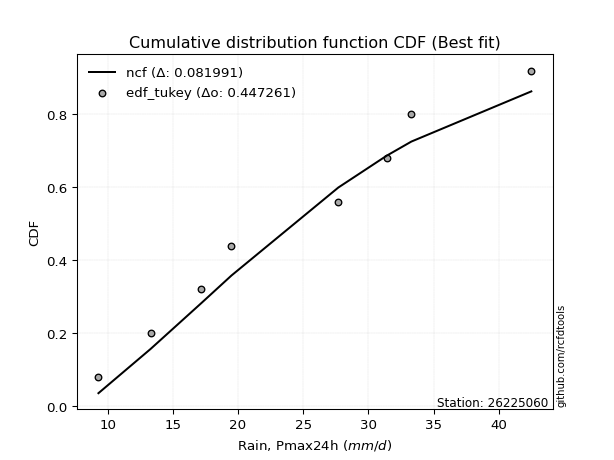</img></img>

</div>


### 8. Empirical - EDF Gringorten (1963)

Gringorten plotting position formula is essential for estimating the probability and return periods of extreme events like floods and heavy rainfall. The constant _a=0.44_.

<div align="center">


$P=(m-a)/(n+1-2a)$


</div>


**8.1. Empirical values**

<div align="center">

|                | 0                    | 1                  | 2                   | 3                  | 4              | 5                  | 6                  | 7                  | 8                  |
|:---------------|:---------------------|:-------------------|:--------------------|:-------------------|:---------------|:-------------------|:-------------------|:-------------------|:-------------------|
| date           | 2024                 | 2023               | 2018                | 2020               | 2022           | 2017               | 2021               | 2019               | 2025               |
| x              | 9.3                  | 13.3               | 17.2                | 19.5               | 27.7           | 31.4               | 33.3               | 42.5               | 66.8               |
| m              | 1                    | 2                  | 3                   | 4                  | 5              | 6                  | 7                  | 8                  | 9                  |
| empirical_dist | edf_gringorten       | edf_gringorten     | edf_gringorten      | edf_gringorten     | edf_gringorten | edf_gringorten     | edf_gringorten     | edf_gringorten     | edf_gringorten     |
| empirical      | 0.061403508771929835 | 0.1710526315789474 | 0.28070175438596495 | 0.3903508771929825 | 0.5            | 0.6096491228070176 | 0.7192982456140351 | 0.8289473684210527 | 0.9385964912280703 |
| empirical_tr   | 1.0654205607476634   | 1.2063492063492063 | 1.3902439024390243  | 1.6402877697841727 | 2.0            | 2.561797752808989  | 3.5625             | 5.846153846153847  | 16.285714285714324 |

</div>


**8.2. Kolmogorov-Smirnov fit test (sorted by Δ)**


<div align="center">

|                | 0                   | 1                   | 2                   | 3                   | 4                   | 5                   | 6                   | 7                   | 8                   | 9                   | 10                  | 11                  | 12                  | 13                  | 14                  | 15                  | 16                  | 17                  | 18                  | 19                  | 20                  | 21                  | 22                  | 23                  | 24                  | 25                  | 26                  | 27                  | 28                  | 29                  | 30                  | 31                  | 32                  | 33                  | 34                  | 35                  | 36                  | 37                  | 38                  | 39                  | 40                  | 41                  | 42                  | 43                  | 44                  | 45                  | 46                  | 47                  | 48                  | 49                  | 50                  | 51                  | 52                  | 53                  | 54                  | 55                  | 56                  | 57                    | 58                  | 59                  | 60                  | 61                  | 62                  | 63                  | 64                  | 65                  | 66                  | 67                  | 68                  | 69                  | 70                  | 71                  | 72                  | 73                  | 74                  | 75                  | 76                  | 77                  | 78                  | 79                  | 80                  | 81                  | 82                  | 83                  | 84                  | 85                  | 86                  | 87                  | 88                  | 89                  |
|:---------------|:--------------------|:--------------------|:--------------------|:--------------------|:--------------------|:--------------------|:--------------------|:--------------------|:--------------------|:--------------------|:--------------------|:--------------------|:--------------------|:--------------------|:--------------------|:--------------------|:--------------------|:--------------------|:--------------------|:--------------------|:--------------------|:--------------------|:--------------------|:--------------------|:--------------------|:--------------------|:--------------------|:--------------------|:--------------------|:--------------------|:--------------------|:--------------------|:--------------------|:--------------------|:--------------------|:--------------------|:--------------------|:--------------------|:--------------------|:--------------------|:--------------------|:--------------------|:--------------------|:--------------------|:--------------------|:--------------------|:--------------------|:--------------------|:--------------------|:--------------------|:--------------------|:--------------------|:--------------------|:--------------------|:--------------------|:--------------------|:--------------------|:----------------------|:--------------------|:--------------------|:--------------------|:--------------------|:--------------------|:--------------------|:--------------------|:--------------------|:--------------------|:--------------------|:--------------------|:--------------------|:--------------------|:--------------------|:--------------------|:--------------------|:--------------------|:--------------------|:--------------------|:--------------------|:--------------------|:--------------------|:--------------------|:--------------------|:--------------------|:--------------------|:--------------------|:--------------------|:--------------------|:--------------------|:--------------------|:--------------------|
| station        | 26225060            | 26225060            | 26225060            | 26225060            | 26225060            | 26225060            | 26225060            | 26225060            | 26225060            | 26225060            | 26225060            | 26225060            | 26225060            | 26225060            | 26225060            | 26225060            | 26225060            | 26225060            | 26225060            | 26225060            | 26225060            | 26225060            | 26225060            | 26225060            | 26225060            | 26225060            | 26225060            | 26225060            | 26225060            | 26225060            | 26225060            | 26225060            | 26225060            | 26225060            | 26225060            | 26225060            | 26225060            | 26225060            | 26225060            | 26225060            | 26225060            | 26225060            | 26225060            | 26225060            | 26225060            | 26225060            | 26225060            | 26225060            | 26225060            | 26225060            | 26225060            | 26225060            | 26225060            | 26225060            | 26225060            | 26225060            | 26225060            | 26225060              | 26225060            | 26225060            | 26225060            | 26225060            | 26225060            | 26225060            | 26225060            | 26225060            | 26225060            | 26225060            | 26225060            | 26225060            | 26225060            | 26225060            | 26225060            | 26225060            | 26225060            | 26225060            | 26225060            | 26225060            | 26225060            | 26225060            | 26225060            | 26225060            | 26225060            | 26225060            | 26225060            | 26225060            | 26225060            | 26225060            | 26225060            | 26225060            |
| empirical_dist | edf_gringorten      | edf_gringorten      | edf_gringorten      | edf_gringorten      | edf_gringorten      | edf_gringorten      | edf_gringorten      | edf_gringorten      | edf_gringorten      | edf_gringorten      | edf_gringorten      | edf_gringorten      | edf_gringorten      | edf_gringorten      | edf_gringorten      | edf_gringorten      | edf_gringorten      | edf_gringorten      | edf_gringorten      | edf_gringorten      | edf_gringorten      | edf_gringorten      | edf_gringorten      | edf_gringorten      | edf_gringorten      | edf_gringorten      | edf_gringorten      | edf_gringorten      | edf_gringorten      | edf_gringorten      | edf_gringorten      | edf_gringorten      | edf_gringorten      | edf_gringorten      | edf_gringorten      | edf_gringorten      | edf_gringorten      | edf_gringorten      | edf_gringorten      | edf_gringorten      | edf_gringorten      | edf_gringorten      | edf_gringorten      | edf_gringorten      | edf_gringorten      | edf_gringorten      | edf_gringorten      | edf_gringorten      | edf_gringorten      | edf_gringorten      | edf_gringorten      | edf_gringorten      | edf_gringorten      | edf_gringorten      | edf_gringorten      | edf_gringorten      | edf_gringorten      | edf_gringorten        | edf_gringorten      | edf_gringorten      | edf_gringorten      | edf_gringorten      | edf_gringorten      | edf_gringorten      | edf_gringorten      | edf_gringorten      | edf_gringorten      | edf_gringorten      | edf_gringorten      | edf_gringorten      | edf_gringorten      | edf_gringorten      | edf_gringorten      | edf_gringorten      | edf_gringorten      | edf_gringorten      | edf_gringorten      | edf_gringorten      | edf_gringorten      | edf_gringorten      | edf_gringorten      | edf_gringorten      | edf_gringorten      | edf_gringorten      | edf_gringorten      | edf_gringorten      | edf_gringorten      | edf_gringorten      | edf_gringorten      | edf_gringorten      |
| p_dist         | halfnorm            | gompertz            | pearson3            | halflogistic        | moyal               | logloggamma         | logpearson3         | loggompertz         | logjohnsonsu        | gumbel_r            | t                   | logexponnorm        | logt                | logcrystalball      | lognorm             | lognorm             | logfisk             | alpha               | logf                | logerlang           | loggamma            | loggamma            | f                   | logfatiguelife      | lognct              | rayleigh            | genlogistic         | mielke              | loggenlogistic      | logweibull_min      | invweibull          | nct                 | ncf                 | invgamma            | logbetaprime        | loglogistic         | logncf              | maxwell             | fisk                | kstwobign           | logrice             | johnsonsu           | invgauss            | loginvgamma         | loghypsecant        | fatiguelife         | betaprime           | logalpha            | loginvgauss         | genexpon            | expon               | logmaxwell          | loggumbel_l         | loginvweibull       | weibull_min         | exponnorm           | nakagami            | loglaplace_asymmetric | lograyleigh         | crystalball         | truncnorm           | norm                | rice                | loglaplace          | logistic            | loggenexpon         | logkstwobign        | loghalfnorm         | hypsecant           | loggumbel_r         | laplace_asymmetric  | gamma               | laplace             | loghalflogistic     | wald                | logtruncnorm        | logmoyal            | gumbel_l            | logmielke           | logexpon            | lognakagami         | erlang              | chi2                | logwald             | gibrat              | logchi2             | loggibrat           | loglognorm          | pareto              | logpareto           |
| delta          | 0.05969814270147611 | 0.06602483047439822 | 0.06814206866757744 | 0.07001244564958953 | 0.07197093669885107 | 0.07673973434061898 | 0.07786380128007009 | 0.07800935326083869 | 0.07820301203544078 | 0.07877554215019972 | 0.07880605981621702 | 0.07933667281834977 | 0.07933678160384305 | 0.0793369778193358  | 0.0793369781895753  | 0.0793369781895753  | 0.07987225319132396 | 0.07989410161489785 | 0.0805404884847869  | 0.08066531963722512 | 0.08081433090606616 | 0.08081433090606616 | 0.08086438373942106 | 0.08127609956391324 | 0.08191511236595117 | 0.0829815975623498  | 0.08510899598122185 | 0.08525754667285301 | 0.08581780727647736 | 0.08746614765741767 | 0.08766405098112673 | 0.08875572283552369 | 0.08899472401171338 | 0.08901331160958037 | 0.08929086661529739 | 0.08979507175026491 | 0.09048777201298419 | 0.09115556939345015 | 0.09292936892029813 | 0.09360739928153611 | 0.09452224632691297 | 0.09489061864825088 | 0.09584313787898546 | 0.09693262516191736 | 0.0984886375640015  | 0.0997408599438463  | 0.10004818683920125 | 0.10406068237689059 | 0.10500790384798186 | 0.10691627878629628 | 0.1070253418552598  | 0.10759434514081123 | 0.10824809144130093 | 0.10920097650425342 | 0.1098063904636426  | 0.11108069797294196 | 0.11213366937192637 | 0.11379558556231123   | 0.11648624523655715 | 0.11752358725952616 | 0.11752358890502546 | 0.11752359489204878 | 0.12316350207774662 | 0.12328612898149327 | 0.12797151780197763 | 0.1317270714991029  | 0.13461325421078363 | 0.14167720841323905 | 0.14343811577097504 | 0.14770646855007796 | 0.14996205062664977 | 0.15947334310729433 | 0.16701347289544188 | 0.16971739386444018 | 0.17096259939385172 | 0.17100516992980036 | 0.17141835592951649 | 0.17696366845923228 | 0.1842411256784775  | 0.186562731786526   | 0.18736476570323968 | 0.2145072863087749  | 0.23104073552221516 | 0.23730315849246775 | 0.26408291957789704 | 0.26570519598305803 | 0.2682298401855556  | 0.4326176276165092  | 0.4407502015231732  | 0.460827767361037   |
| deltao         | 0.41761268023100007 | 0.41761268023100007 | 0.41761268023100007 | 0.41761268023100007 | 0.41761268023100007 | 0.41761268023100007 | 0.41761268023100007 | 0.41761268023100007 | 0.41761268023100007 | 0.41761268023100007 | 0.41761268023100007 | 0.41761268023100007 | 0.41761268023100007 | 0.41761268023100007 | 0.41761268023100007 | 0.41761268023100007 | 0.41761268023100007 | 0.41761268023100007 | 0.41761268023100007 | 0.41761268023100007 | 0.41761268023100007 | 0.41761268023100007 | 0.41761268023100007 | 0.41761268023100007 | 0.41761268023100007 | 0.41761268023100007 | 0.41761268023100007 | 0.41761268023100007 | 0.41761268023100007 | 0.41761268023100007 | 0.41761268023100007 | 0.41761268023100007 | 0.41761268023100007 | 0.41761268023100007 | 0.41761268023100007 | 0.41761268023100007 | 0.41761268023100007 | 0.41761268023100007 | 0.41761268023100007 | 0.41761268023100007 | 0.41761268023100007 | 0.41761268023100007 | 0.41761268023100007 | 0.41761268023100007 | 0.41761268023100007 | 0.41761268023100007 | 0.41761268023100007 | 0.41761268023100007 | 0.41761268023100007 | 0.41761268023100007 | 0.41761268023100007 | 0.41761268023100007 | 0.41761268023100007 | 0.41761268023100007 | 0.41761268023100007 | 0.41761268023100007 | 0.41761268023100007 | 0.41761268023100007   | 0.41761268023100007 | 0.41761268023100007 | 0.41761268023100007 | 0.41761268023100007 | 0.41761268023100007 | 0.41761268023100007 | 0.41761268023100007 | 0.41761268023100007 | 0.41761268023100007 | 0.41761268023100007 | 0.41761268023100007 | 0.41761268023100007 | 0.41761268023100007 | 0.41761268023100007 | 0.41761268023100007 | 0.41761268023100007 | 0.41761268023100007 | 0.41761268023100007 | 0.41761268023100007 | 0.41761268023100007 | 0.41761268023100007 | 0.41761268023100007 | 0.41761268023100007 | 0.41761268023100007 | 0.41761268023100007 | 0.41761268023100007 | 0.41761268023100007 | 0.41761268023100007 | 0.41761268023100007 | 0.41761268023100007 | 0.41761268023100007 | 0.41761268023100007 |
| eval           | Δo > Δ              | Δo > Δ              | Δo > Δ              | Δo > Δ              | Δo > Δ              | Δo > Δ              | Δo > Δ              | Δo > Δ              | Δo > Δ              | Δo > Δ              | Δo > Δ              | Δo > Δ              | Δo > Δ              | Δo > Δ              | Δo > Δ              | Δo > Δ              | Δo > Δ              | Δo > Δ              | Δo > Δ              | Δo > Δ              | Δo > Δ              | Δo > Δ              | Δo > Δ              | Δo > Δ              | Δo > Δ              | Δo > Δ              | Δo > Δ              | Δo > Δ              | Δo > Δ              | Δo > Δ              | Δo > Δ              | Δo > Δ              | Δo > Δ              | Δo > Δ              | Δo > Δ              | Δo > Δ              | Δo > Δ              | Δo > Δ              | Δo > Δ              | Δo > Δ              | Δo > Δ              | Δo > Δ              | Δo > Δ              | Δo > Δ              | Δo > Δ              | Δo > Δ              | Δo > Δ              | Δo > Δ              | Δo > Δ              | Δo > Δ              | Δo > Δ              | Δo > Δ              | Δo > Δ              | Δo > Δ              | Δo > Δ              | Δo > Δ              | Δo > Δ              | Δo > Δ                | Δo > Δ              | Δo > Δ              | Δo > Δ              | Δo > Δ              | Δo > Δ              | Δo > Δ              | Δo > Δ              | Δo > Δ              | Δo > Δ              | Δo > Δ              | Δo > Δ              | Δo > Δ              | Δo > Δ              | Δo > Δ              | Δo > Δ              | Δo > Δ              | Δo > Δ              | Δo > Δ              | Δo > Δ              | Δo > Δ              | Δo > Δ              | Δo > Δ              | Δo > Δ              | Δo > Δ              | Δo > Δ              | Δo > Δ              | Δo > Δ              | Δo > Δ              | Δo > Δ              | Δo <= Δ             | Δo <= Δ             | Δo <= Δ             |
| fit            | 1                   | 1                   | 1                   | 1                   | 1                   | 1                   | 1                   | 1                   | 1                   | 1                   | 1                   | 1                   | 1                   | 1                   | 1                   | 1                   | 1                   | 1                   | 1                   | 1                   | 1                   | 1                   | 1                   | 1                   | 1                   | 1                   | 1                   | 1                   | 1                   | 1                   | 1                   | 1                   | 1                   | 1                   | 1                   | 1                   | 1                   | 1                   | 1                   | 1                   | 1                   | 1                   | 1                   | 1                   | 1                   | 1                   | 1                   | 1                   | 1                   | 1                   | 1                   | 1                   | 1                   | 1                   | 1                   | 1                   | 1                   | 1                     | 1                   | 1                   | 1                   | 1                   | 1                   | 1                   | 1                   | 1                   | 1                   | 1                   | 1                   | 1                   | 1                   | 1                   | 1                   | 1                   | 1                   | 1                   | 1                   | 1                   | 1                   | 1                   | 1                   | 1                   | 1                   | 1                   | 1                   | 1                   | 1                   | 0                   | 0                   | 0                   |
| n              | 9                   | 9                   | 9                   | 9                   | 9                   | 9                   | 9                   | 9                   | 9                   | 9                   | 9                   | 9                   | 9                   | 9                   | 9                   | 9                   | 9                   | 9                   | 9                   | 9                   | 9                   | 9                   | 9                   | 9                   | 9                   | 9                   | 9                   | 9                   | 9                   | 9                   | 9                   | 9                   | 9                   | 9                   | 9                   | 9                   | 9                   | 9                   | 9                   | 9                   | 9                   | 9                   | 9                   | 9                   | 9                   | 9                   | 9                   | 9                   | 9                   | 9                   | 9                   | 9                   | 9                   | 9                   | 9                   | 9                   | 9                   | 9                     | 9                   | 9                   | 9                   | 9                   | 9                   | 9                   | 9                   | 9                   | 9                   | 9                   | 9                   | 9                   | 9                   | 9                   | 9                   | 9                   | 9                   | 9                   | 9                   | 9                   | 9                   | 9                   | 9                   | 9                   | 9                   | 9                   | 9                   | 9                   | 9                   | 9                   | 9                   | 9                   |
| best_fit       | 1                   | 0                   | 0                   | 0                   | 0                   | 0                   | 0                   | 0                   | 0                   | 0                   | 0                   | 0                   | 0                   | 0                   | 0                   | 0                   | 0                   | 0                   | 0                   | 0                   | 0                   | 0                   | 0                   | 0                   | 0                   | 0                   | 0                   | 0                   | 0                   | 0                   | 0                   | 0                   | 0                   | 0                   | 0                   | 0                   | 0                   | 0                   | 0                   | 0                   | 0                   | 0                   | 0                   | 0                   | 0                   | 0                   | 0                   | 0                   | 0                   | 0                   | 0                   | 0                   | 0                   | 0                   | 0                   | 0                   | 0                   | 0                     | 0                   | 0                   | 0                   | 0                   | 0                   | 0                   | 0                   | 0                   | 0                   | 0                   | 0                   | 0                   | 0                   | 0                   | 0                   | 0                   | 0                   | 0                   | 0                   | 0                   | 0                   | 0                   | 0                   | 0                   | 0                   | 0                   | 0                   | 0                   | 0                   | 0                   | 0                   | 0                   |
| best_fit_sort  | 1                   | 2                   | 3                   | 4                   | 5                   | 6                   | 7                   | 8                   | 9                   | 10                  | 11                  | 12                  | 13                  | 14                  | 15                  | 16                  | 17                  | 18                  | 19                  | 20                  | 21                  | 22                  | 23                  | 24                  | 25                  | 26                  | 27                  | 28                  | 29                  | 30                  | 31                  | 32                  | 33                  | 34                  | 35                  | 36                  | 37                  | 38                  | 39                  | 40                  | 41                  | 42                  | 43                  | 44                  | 45                  | 46                  | 47                  | 48                  | 49                  | 50                  | 51                  | 52                  | 53                  | 54                  | 55                  | 56                  | 57                  | 58                    | 59                  | 60                  | 61                  | 62                  | 63                  | 64                  | 65                  | 66                  | 67                  | 68                  | 69                  | 70                  | 71                  | 72                  | 73                  | 74                  | 75                  | 76                  | 77                  | 78                  | 79                  | 80                  | 81                  | 82                  | 83                  | 84                  | 85                  | 86                  | 87                  | 88                  | 89                  | 90                  |

</div>


<div align="center">

</img>

</div>


**8.3. Best fit**

<div align="center">

|   id |   station | empirical_dist   | p_dist   |     delta |   deltao | eval   |   fit |   n |   best_fit |   best_fit_sort |
|-----:|----------:|:-----------------|:---------|----------:|---------:|:-------|------:|----:|-----------:|----------------:|
|    0 |  26225060 | edf_gringorten   | halfnorm | 0.0596981 | 0.417613 | Δo > Δ |     1 |   9 |          1 |               1 |

</div>


<div align="center">

</img></img>

</div>


### 9. Empirical - EDF Filliben (1975)

The specific values of the constants (0.3175) (often denoted as $alpha$) and (0.365) are derived from a method proposed by James J. Filliben in a 1975 paper. This particular formula is the mean value of the $i$-th order statistic of the normal distribution and is considered a robust and effective plotting position formula for the normal probability plot correlation coefficient test for normality.

<div align="center">


$P=(m-0.3175)/(n+0.365)$


</div>


**9.1. Empirical values**

<div align="center">

|                | 0                   | 1                  | 2                   | 3                   | 4            | 5                  | 6                  | 7                  | 8                  |
|:---------------|:--------------------|:-------------------|:--------------------|:--------------------|:-------------|:-------------------|:-------------------|:-------------------|:-------------------|
| date           | 2024                | 2023               | 2018                | 2020                | 2022         | 2017               | 2021               | 2019               | 2025               |
| x              | 9.3                 | 13.3               | 17.2                | 19.5                | 27.7         | 31.4               | 33.3               | 42.5               | 66.8               |
| m              | 1                   | 2                  | 3                   | 4                   | 5            | 6                  | 7                  | 8                  | 9                  |
| empirical_dist | edf_filliben        | edf_filliben       | edf_filliben        | edf_filliben        | edf_filliben | edf_filliben       | edf_filliben       | edf_filliben       | edf_filliben       |
| empirical      | 0.07287773625200214 | 0.1796583021890016 | 0.28643886812600106 | 0.39321943406300053 | 0.5          | 0.6067805659369995 | 0.7135611318739989 | 0.8203416978109984 | 0.9271222637479978 |
| empirical_tr   | 1.0786063921681543  | 1.219004230393752  | 1.401421623643846   | 1.6480422349318082  | 2.0          | 2.5431093007467753 | 3.491146318732526  | 5.566121842496286  | 13.721611721611705 |

</div>


**9.2. Kolmogorov-Smirnov fit test (sorted by Δ)**


<div align="center">

|                | 0                   | 1                   | 2                   | 3                   | 4                   | 5                   | 6                   | 7                   | 8                   | 9                   | 10                  | 11                  | 12                  | 13                  | 14                  | 15                  | 16                  | 17                  | 18                  | 19                  | 20                  | 21                  | 22                  | 23                  | 24                  | 25                  | 26                  | 27                  | 28                  | 29                  | 30                  | 31                  | 32                  | 33                  | 34                  | 35                  | 36                  | 37                  | 38                  | 39                  | 40                  | 41                  | 42                  | 43                  | 44                  | 45                  | 46                  | 47                  | 48                  | 49                  | 50                  | 51                  | 52                  | 53                  | 54                  | 55                  | 56                  | 57                  | 58                  | 59                  | 60                  | 61                    | 62                  | 63                  | 64                  | 65                  | 66                  | 67                  | 68                  | 69                  | 70                  | 71                  | 72                  | 73                  | 74                  | 75                  | 76                  | 77                  | 78                  | 79                  | 80                  | 81                  | 82                  | 83                  | 84                  | 85                  | 86                  | 87                  | 88                  | 89                  |
|:---------------|:--------------------|:--------------------|:--------------------|:--------------------|:--------------------|:--------------------|:--------------------|:--------------------|:--------------------|:--------------------|:--------------------|:--------------------|:--------------------|:--------------------|:--------------------|:--------------------|:--------------------|:--------------------|:--------------------|:--------------------|:--------------------|:--------------------|:--------------------|:--------------------|:--------------------|:--------------------|:--------------------|:--------------------|:--------------------|:--------------------|:--------------------|:--------------------|:--------------------|:--------------------|:--------------------|:--------------------|:--------------------|:--------------------|:--------------------|:--------------------|:--------------------|:--------------------|:--------------------|:--------------------|:--------------------|:--------------------|:--------------------|:--------------------|:--------------------|:--------------------|:--------------------|:--------------------|:--------------------|:--------------------|:--------------------|:--------------------|:--------------------|:--------------------|:--------------------|:--------------------|:--------------------|:----------------------|:--------------------|:--------------------|:--------------------|:--------------------|:--------------------|:--------------------|:--------------------|:--------------------|:--------------------|:--------------------|:--------------------|:--------------------|:--------------------|:--------------------|:--------------------|:--------------------|:--------------------|:--------------------|:--------------------|:--------------------|:--------------------|:--------------------|:--------------------|:--------------------|:--------------------|:--------------------|:--------------------|:--------------------|
| station        | 26225060            | 26225060            | 26225060            | 26225060            | 26225060            | 26225060            | 26225060            | 26225060            | 26225060            | 26225060            | 26225060            | 26225060            | 26225060            | 26225060            | 26225060            | 26225060            | 26225060            | 26225060            | 26225060            | 26225060            | 26225060            | 26225060            | 26225060            | 26225060            | 26225060            | 26225060            | 26225060            | 26225060            | 26225060            | 26225060            | 26225060            | 26225060            | 26225060            | 26225060            | 26225060            | 26225060            | 26225060            | 26225060            | 26225060            | 26225060            | 26225060            | 26225060            | 26225060            | 26225060            | 26225060            | 26225060            | 26225060            | 26225060            | 26225060            | 26225060            | 26225060            | 26225060            | 26225060            | 26225060            | 26225060            | 26225060            | 26225060            | 26225060            | 26225060            | 26225060            | 26225060            | 26225060              | 26225060            | 26225060            | 26225060            | 26225060            | 26225060            | 26225060            | 26225060            | 26225060            | 26225060            | 26225060            | 26225060            | 26225060            | 26225060            | 26225060            | 26225060            | 26225060            | 26225060            | 26225060            | 26225060            | 26225060            | 26225060            | 26225060            | 26225060            | 26225060            | 26225060            | 26225060            | 26225060            | 26225060            |
| empirical_dist | edf_filliben        | edf_filliben        | edf_filliben        | edf_filliben        | edf_filliben        | edf_filliben        | edf_filliben        | edf_filliben        | edf_filliben        | edf_filliben        | edf_filliben        | edf_filliben        | edf_filliben        | edf_filliben        | edf_filliben        | edf_filliben        | edf_filliben        | edf_filliben        | edf_filliben        | edf_filliben        | edf_filliben        | edf_filliben        | edf_filliben        | edf_filliben        | edf_filliben        | edf_filliben        | edf_filliben        | edf_filliben        | edf_filliben        | edf_filliben        | edf_filliben        | edf_filliben        | edf_filliben        | edf_filliben        | edf_filliben        | edf_filliben        | edf_filliben        | edf_filliben        | edf_filliben        | edf_filliben        | edf_filliben        | edf_filliben        | edf_filliben        | edf_filliben        | edf_filliben        | edf_filliben        | edf_filliben        | edf_filliben        | edf_filliben        | edf_filliben        | edf_filliben        | edf_filliben        | edf_filliben        | edf_filliben        | edf_filliben        | edf_filliben        | edf_filliben        | edf_filliben        | edf_filliben        | edf_filliben        | edf_filliben        | edf_filliben          | edf_filliben        | edf_filliben        | edf_filliben        | edf_filliben        | edf_filliben        | edf_filliben        | edf_filliben        | edf_filliben        | edf_filliben        | edf_filliben        | edf_filliben        | edf_filliben        | edf_filliben        | edf_filliben        | edf_filliben        | edf_filliben        | edf_filliben        | edf_filliben        | edf_filliben        | edf_filliben        | edf_filliben        | edf_filliben        | edf_filliben        | edf_filliben        | edf_filliben        | edf_filliben        | edf_filliben        | edf_filliben        |
| p_dist         | halfnorm            | halflogistic        | pearson3            | gompertz            | moyal               | logloggamma         | rayleigh            | logpearson3         | loggompertz         | logjohnsonsu        | logexponnorm        | logt                | logcrystalball      | lognorm             | lognorm             | logfisk             | alpha               | logf                | logerlang           | loggamma            | loggamma            | f                   | logfatiguelife      | gumbel_r            | t                   | lognct              | mielke              | maxwell             | loggenlogistic      | logweibull_min      | invweibull          | genlogistic         | nct                 | ncf                 | invgamma            | logbetaprime        | loglogistic         | logncf              | fisk                | logrice             | johnsonsu           | invgauss            | kstwobign           | loginvgamma         | loghypsecant        | fatiguelife         | betaprime           | logalpha            | loginvgauss         | genexpon            | expon               | logmaxwell          | loginvweibull       | weibull_min         | exponnorm           | loggumbel_l         | crystalball         | truncnorm           | norm                | nakagami            | lograyleigh         | loglaplace_asymmetric | loglaplace          | rice                | logistic            | loggenexpon         | logkstwobign        | loghalfnorm         | hypsecant           | loggumbel_r         | laplace_asymmetric  | gamma               | loghalflogistic     | laplace             | gumbel_l            | logmoyal            | wald                | logtruncnorm        | logexpon            | logmielke           | lognakagami         | erlang              | chi2                | logwald             | logchi2             | loggibrat           | gibrat              | loglognorm          | pareto              | logpareto           |
| delta          | 0.05396102896143995 | 0.07083535494030932 | 0.07101062553759546 | 0.07287773625198052 | 0.0748394935688691  | 0.07673973434061898 | 0.07724448382231364 | 0.07786380128007009 | 0.07800935326083869 | 0.07820301203544078 | 0.07933667281834977 | 0.07933678160384305 | 0.0793369778193358  | 0.0793369781895753  | 0.0793369781895753  | 0.07987225319132396 | 0.07989410161489785 | 0.0805404884847869  | 0.08066531963722512 | 0.08081433090606616 | 0.08081433090606616 | 0.08086438373942106 | 0.08127609956391324 | 0.08164409902021774 | 0.08167461668623505 | 0.08191511236595117 | 0.08525754667285301 | 0.085418455653414   | 0.08581780727647736 | 0.08746614765741767 | 0.08766405098112673 | 0.08797755285123987 | 0.08875572283552369 | 0.08899472401171338 | 0.08901331160958037 | 0.08929086661529739 | 0.08979507175026491 | 0.09048777201298419 | 0.09292936892029813 | 0.09452224632691297 | 0.09489061864825088 | 0.09584313787898546 | 0.09647595615155413 | 0.09693262516191736 | 0.0984886375640015  | 0.0997408599438463  | 0.10004818683920125 | 0.10406068237689059 | 0.10500790384798186 | 0.10691627878629628 | 0.1070253418552598  | 0.10759434514081123 | 0.10920097650425342 | 0.1098063904636426  | 0.11108069797294196 | 0.11111664831131896 | 0.11178647351949    | 0.1117864751649893  | 0.11178648115201262 | 0.11213366937192637 | 0.11648624523655715 | 0.11666414243232925   | 0.12328612898149327 | 0.12603205894776465 | 0.13084007467199565 | 0.1317270714991029  | 0.13461325421078363 | 0.14167720841323905 | 0.14630667264099306 | 0.14770646855007796 | 0.1528306074966678  | 0.15947334310729433 | 0.16971739386444018 | 0.1698820297654599  | 0.17122655471919612 | 0.17141835592951649 | 0.17956827000390593 | 0.17961084053985457 | 0.1808256180464899  | 0.1842411256784775  | 0.18736476570323968 | 0.2145072863087749  | 0.23104073552221516 | 0.23730315849246775 | 0.2599680822430219  | 0.2682298401855556  | 0.26982003331793314 | 0.424011957006455   | 0.432144530913119   | 0.4522220967509828  |
| deltao         | 0.41761268023100007 | 0.41761268023100007 | 0.41761268023100007 | 0.41761268023100007 | 0.41761268023100007 | 0.41761268023100007 | 0.41761268023100007 | 0.41761268023100007 | 0.41761268023100007 | 0.41761268023100007 | 0.41761268023100007 | 0.41761268023100007 | 0.41761268023100007 | 0.41761268023100007 | 0.41761268023100007 | 0.41761268023100007 | 0.41761268023100007 | 0.41761268023100007 | 0.41761268023100007 | 0.41761268023100007 | 0.41761268023100007 | 0.41761268023100007 | 0.41761268023100007 | 0.41761268023100007 | 0.41761268023100007 | 0.41761268023100007 | 0.41761268023100007 | 0.41761268023100007 | 0.41761268023100007 | 0.41761268023100007 | 0.41761268023100007 | 0.41761268023100007 | 0.41761268023100007 | 0.41761268023100007 | 0.41761268023100007 | 0.41761268023100007 | 0.41761268023100007 | 0.41761268023100007 | 0.41761268023100007 | 0.41761268023100007 | 0.41761268023100007 | 0.41761268023100007 | 0.41761268023100007 | 0.41761268023100007 | 0.41761268023100007 | 0.41761268023100007 | 0.41761268023100007 | 0.41761268023100007 | 0.41761268023100007 | 0.41761268023100007 | 0.41761268023100007 | 0.41761268023100007 | 0.41761268023100007 | 0.41761268023100007 | 0.41761268023100007 | 0.41761268023100007 | 0.41761268023100007 | 0.41761268023100007 | 0.41761268023100007 | 0.41761268023100007 | 0.41761268023100007 | 0.41761268023100007   | 0.41761268023100007 | 0.41761268023100007 | 0.41761268023100007 | 0.41761268023100007 | 0.41761268023100007 | 0.41761268023100007 | 0.41761268023100007 | 0.41761268023100007 | 0.41761268023100007 | 0.41761268023100007 | 0.41761268023100007 | 0.41761268023100007 | 0.41761268023100007 | 0.41761268023100007 | 0.41761268023100007 | 0.41761268023100007 | 0.41761268023100007 | 0.41761268023100007 | 0.41761268023100007 | 0.41761268023100007 | 0.41761268023100007 | 0.41761268023100007 | 0.41761268023100007 | 0.41761268023100007 | 0.41761268023100007 | 0.41761268023100007 | 0.41761268023100007 | 0.41761268023100007 |
| eval           | Δo > Δ              | Δo > Δ              | Δo > Δ              | Δo > Δ              | Δo > Δ              | Δo > Δ              | Δo > Δ              | Δo > Δ              | Δo > Δ              | Δo > Δ              | Δo > Δ              | Δo > Δ              | Δo > Δ              | Δo > Δ              | Δo > Δ              | Δo > Δ              | Δo > Δ              | Δo > Δ              | Δo > Δ              | Δo > Δ              | Δo > Δ              | Δo > Δ              | Δo > Δ              | Δo > Δ              | Δo > Δ              | Δo > Δ              | Δo > Δ              | Δo > Δ              | Δo > Δ              | Δo > Δ              | Δo > Δ              | Δo > Δ              | Δo > Δ              | Δo > Δ              | Δo > Δ              | Δo > Δ              | Δo > Δ              | Δo > Δ              | Δo > Δ              | Δo > Δ              | Δo > Δ              | Δo > Δ              | Δo > Δ              | Δo > Δ              | Δo > Δ              | Δo > Δ              | Δo > Δ              | Δo > Δ              | Δo > Δ              | Δo > Δ              | Δo > Δ              | Δo > Δ              | Δo > Δ              | Δo > Δ              | Δo > Δ              | Δo > Δ              | Δo > Δ              | Δo > Δ              | Δo > Δ              | Δo > Δ              | Δo > Δ              | Δo > Δ                | Δo > Δ              | Δo > Δ              | Δo > Δ              | Δo > Δ              | Δo > Δ              | Δo > Δ              | Δo > Δ              | Δo > Δ              | Δo > Δ              | Δo > Δ              | Δo > Δ              | Δo > Δ              | Δo > Δ              | Δo > Δ              | Δo > Δ              | Δo > Δ              | Δo > Δ              | Δo > Δ              | Δo > Δ              | Δo > Δ              | Δo > Δ              | Δo > Δ              | Δo > Δ              | Δo > Δ              | Δo > Δ              | Δo <= Δ             | Δo <= Δ             | Δo <= Δ             |
| fit            | 1                   | 1                   | 1                   | 1                   | 1                   | 1                   | 1                   | 1                   | 1                   | 1                   | 1                   | 1                   | 1                   | 1                   | 1                   | 1                   | 1                   | 1                   | 1                   | 1                   | 1                   | 1                   | 1                   | 1                   | 1                   | 1                   | 1                   | 1                   | 1                   | 1                   | 1                   | 1                   | 1                   | 1                   | 1                   | 1                   | 1                   | 1                   | 1                   | 1                   | 1                   | 1                   | 1                   | 1                   | 1                   | 1                   | 1                   | 1                   | 1                   | 1                   | 1                   | 1                   | 1                   | 1                   | 1                   | 1                   | 1                   | 1                   | 1                   | 1                   | 1                   | 1                     | 1                   | 1                   | 1                   | 1                   | 1                   | 1                   | 1                   | 1                   | 1                   | 1                   | 1                   | 1                   | 1                   | 1                   | 1                   | 1                   | 1                   | 1                   | 1                   | 1                   | 1                   | 1                   | 1                   | 1                   | 1                   | 0                   | 0                   | 0                   |
| n              | 9                   | 9                   | 9                   | 9                   | 9                   | 9                   | 9                   | 9                   | 9                   | 9                   | 9                   | 9                   | 9                   | 9                   | 9                   | 9                   | 9                   | 9                   | 9                   | 9                   | 9                   | 9                   | 9                   | 9                   | 9                   | 9                   | 9                   | 9                   | 9                   | 9                   | 9                   | 9                   | 9                   | 9                   | 9                   | 9                   | 9                   | 9                   | 9                   | 9                   | 9                   | 9                   | 9                   | 9                   | 9                   | 9                   | 9                   | 9                   | 9                   | 9                   | 9                   | 9                   | 9                   | 9                   | 9                   | 9                   | 9                   | 9                   | 9                   | 9                   | 9                   | 9                     | 9                   | 9                   | 9                   | 9                   | 9                   | 9                   | 9                   | 9                   | 9                   | 9                   | 9                   | 9                   | 9                   | 9                   | 9                   | 9                   | 9                   | 9                   | 9                   | 9                   | 9                   | 9                   | 9                   | 9                   | 9                   | 9                   | 9                   | 9                   |
| best_fit       | 1                   | 0                   | 0                   | 0                   | 0                   | 0                   | 0                   | 0                   | 0                   | 0                   | 0                   | 0                   | 0                   | 0                   | 0                   | 0                   | 0                   | 0                   | 0                   | 0                   | 0                   | 0                   | 0                   | 0                   | 0                   | 0                   | 0                   | 0                   | 0                   | 0                   | 0                   | 0                   | 0                   | 0                   | 0                   | 0                   | 0                   | 0                   | 0                   | 0                   | 0                   | 0                   | 0                   | 0                   | 0                   | 0                   | 0                   | 0                   | 0                   | 0                   | 0                   | 0                   | 0                   | 0                   | 0                   | 0                   | 0                   | 0                   | 0                   | 0                   | 0                   | 0                     | 0                   | 0                   | 0                   | 0                   | 0                   | 0                   | 0                   | 0                   | 0                   | 0                   | 0                   | 0                   | 0                   | 0                   | 0                   | 0                   | 0                   | 0                   | 0                   | 0                   | 0                   | 0                   | 0                   | 0                   | 0                   | 0                   | 0                   | 0                   |
| best_fit_sort  | 1                   | 2                   | 3                   | 4                   | 5                   | 6                   | 7                   | 8                   | 9                   | 10                  | 11                  | 12                  | 13                  | 14                  | 15                  | 16                  | 17                  | 18                  | 19                  | 20                  | 21                  | 22                  | 23                  | 24                  | 25                  | 26                  | 27                  | 28                  | 29                  | 30                  | 31                  | 32                  | 33                  | 34                  | 35                  | 36                  | 37                  | 38                  | 39                  | 40                  | 41                  | 42                  | 43                  | 44                  | 45                  | 46                  | 47                  | 48                  | 49                  | 50                  | 51                  | 52                  | 53                  | 54                  | 55                  | 56                  | 57                  | 58                  | 59                  | 60                  | 61                  | 62                    | 63                  | 64                  | 65                  | 66                  | 67                  | 68                  | 69                  | 70                  | 71                  | 72                  | 73                  | 74                  | 75                  | 76                  | 77                  | 78                  | 79                  | 80                  | 81                  | 82                  | 83                  | 84                  | 85                  | 86                  | 87                  | 88                  | 89                  | 90                  |

</div>


<div align="center">

</img>

</div>


**9.3. Best fit**

<div align="center">

|   id |   station | empirical_dist   | p_dist   |    delta |   deltao | eval   |   fit |   n |   best_fit |   best_fit_sort |
|-----:|----------:|:-----------------|:---------|---------:|---------:|:-------|------:|----:|-----------:|----------------:|
|    0 |  26225060 | edf_filliben     | halfnorm | 0.053961 | 0.417613 | Δo > Δ |     1 |   9 |          1 |               1 |

</div>


<div align="center">

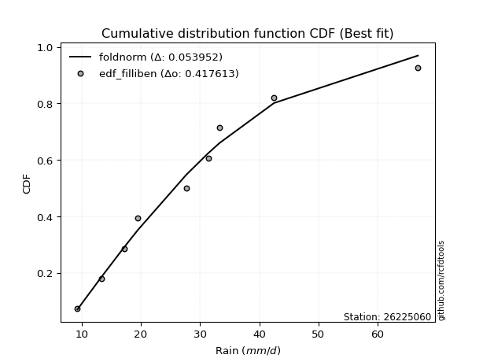</img>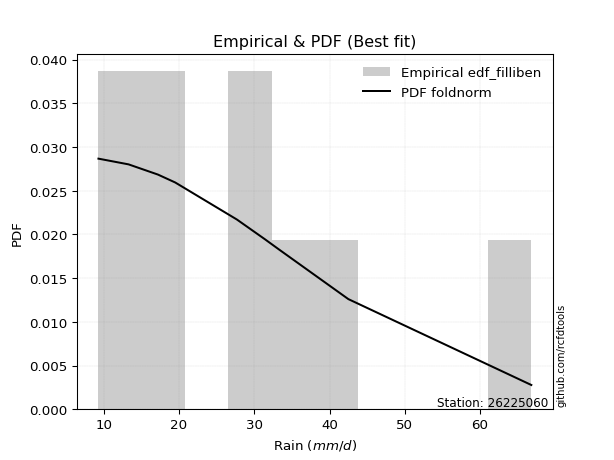</img>

</div>


### 10. Empirical - EDF Jenkinson (1977)

The Jenkinson formula in hydrology is an empirical plotting position formula used to estimate the non-exceedance probability _(P)_ or return period _(T)_ of a given ordered observation within a sample. It is a widely used method in the frequency analysis of extreme events such as floods and rainfall, as it provides a distribution-free way to plot data. _a≈0.31_ and _b≈0.38_ are constants derived to approximate the median of the probability distribution for the given rank.

<div align="center">


$P=(m-a)/(n+b)$


</div>


**10.1. Empirical values**

<div align="center">

|                | 0                   | 1                   | 2                  | 3                   | 4             | 5                  | 6                  | 7                  | 8                  |
|:---------------|:--------------------|:--------------------|:-------------------|:--------------------|:--------------|:-------------------|:-------------------|:-------------------|:-------------------|
| date           | 2024                | 2023                | 2018               | 2020                | 2022          | 2017               | 2021               | 2019               | 2025               |
| x              | 9.3                 | 13.3                | 17.2               | 19.5                | 27.7          | 31.4               | 33.3               | 42.5               | 66.8               |
| m              | 1                   | 2                   | 3                  | 4                   | 5             | 6                  | 7                  | 8                  | 9                  |
| empirical_dist | edf_jenkinson       | edf_jenkinson       | edf_jenkinson      | edf_jenkinson       | edf_jenkinson | edf_jenkinson      | edf_jenkinson      | edf_jenkinson      | edf_jenkinson      |
| empirical      | 0.07356076759061833 | 0.18017057569296374 | 0.2867803837953091 | 0.39339019189765456 | 0.5           | 0.6066098081023454 | 0.7132196162046908 | 0.8198294243070362 | 0.9264392324093815 |
| empirical_tr   | 1.0794016110471807  | 1.2197659297789336  | 1.4020926756352765 | 1.6485061511423549  | 2.0           | 2.542005420054201  | 3.486988847583642  | 5.550295857988164  | 13.5942028985507   |

</div>


**10.2. Kolmogorov-Smirnov fit test (sorted by Δ)**


<div align="center">

|                | 0                   | 1                   | 2                   | 3                   | 4                   | 5                   | 6                   | 7                   | 8                   | 9                   | 10                  | 11                  | 12                  | 13                  | 14                  | 15                  | 16                  | 17                  | 18                  | 19                  | 20                  | 21                  | 22                  | 23                  | 24                  | 25                  | 26                  | 27                  | 28                  | 29                  | 30                  | 31                  | 32                  | 33                  | 34                  | 35                  | 36                  | 37                  | 38                  | 39                  | 40                  | 41                  | 42                  | 43                  | 44                  | 45                  | 46                  | 47                  | 48                  | 49                  | 50                  | 51                  | 52                  | 53                  | 54                  | 55                  | 56                  | 57                  | 58                  | 59                  | 60                  | 61                    | 62                  | 63                  | 64                  | 65                  | 66                  | 67                  | 68                  | 69                  | 70                  | 71                  | 72                  | 73                  | 74                  | 75                  | 76                  | 77                  | 78                  | 79                  | 80                  | 81                  | 82                  | 83                  | 84                  | 85                  | 86                  | 87                  | 88                  | 89                  |
|:---------------|:--------------------|:--------------------|:--------------------|:--------------------|:--------------------|:--------------------|:--------------------|:--------------------|:--------------------|:--------------------|:--------------------|:--------------------|:--------------------|:--------------------|:--------------------|:--------------------|:--------------------|:--------------------|:--------------------|:--------------------|:--------------------|:--------------------|:--------------------|:--------------------|:--------------------|:--------------------|:--------------------|:--------------------|:--------------------|:--------------------|:--------------------|:--------------------|:--------------------|:--------------------|:--------------------|:--------------------|:--------------------|:--------------------|:--------------------|:--------------------|:--------------------|:--------------------|:--------------------|:--------------------|:--------------------|:--------------------|:--------------------|:--------------------|:--------------------|:--------------------|:--------------------|:--------------------|:--------------------|:--------------------|:--------------------|:--------------------|:--------------------|:--------------------|:--------------------|:--------------------|:--------------------|:----------------------|:--------------------|:--------------------|:--------------------|:--------------------|:--------------------|:--------------------|:--------------------|:--------------------|:--------------------|:--------------------|:--------------------|:--------------------|:--------------------|:--------------------|:--------------------|:--------------------|:--------------------|:--------------------|:--------------------|:--------------------|:--------------------|:--------------------|:--------------------|:--------------------|:--------------------|:--------------------|:--------------------|:--------------------|
| station        | 26225060            | 26225060            | 26225060            | 26225060            | 26225060            | 26225060            | 26225060            | 26225060            | 26225060            | 26225060            | 26225060            | 26225060            | 26225060            | 26225060            | 26225060            | 26225060            | 26225060            | 26225060            | 26225060            | 26225060            | 26225060            | 26225060            | 26225060            | 26225060            | 26225060            | 26225060            | 26225060            | 26225060            | 26225060            | 26225060            | 26225060            | 26225060            | 26225060            | 26225060            | 26225060            | 26225060            | 26225060            | 26225060            | 26225060            | 26225060            | 26225060            | 26225060            | 26225060            | 26225060            | 26225060            | 26225060            | 26225060            | 26225060            | 26225060            | 26225060            | 26225060            | 26225060            | 26225060            | 26225060            | 26225060            | 26225060            | 26225060            | 26225060            | 26225060            | 26225060            | 26225060            | 26225060              | 26225060            | 26225060            | 26225060            | 26225060            | 26225060            | 26225060            | 26225060            | 26225060            | 26225060            | 26225060            | 26225060            | 26225060            | 26225060            | 26225060            | 26225060            | 26225060            | 26225060            | 26225060            | 26225060            | 26225060            | 26225060            | 26225060            | 26225060            | 26225060            | 26225060            | 26225060            | 26225060            | 26225060            |
| empirical_dist | edf_jenkinson       | edf_jenkinson       | edf_jenkinson       | edf_jenkinson       | edf_jenkinson       | edf_jenkinson       | edf_jenkinson       | edf_jenkinson       | edf_jenkinson       | edf_jenkinson       | edf_jenkinson       | edf_jenkinson       | edf_jenkinson       | edf_jenkinson       | edf_jenkinson       | edf_jenkinson       | edf_jenkinson       | edf_jenkinson       | edf_jenkinson       | edf_jenkinson       | edf_jenkinson       | edf_jenkinson       | edf_jenkinson       | edf_jenkinson       | edf_jenkinson       | edf_jenkinson       | edf_jenkinson       | edf_jenkinson       | edf_jenkinson       | edf_jenkinson       | edf_jenkinson       | edf_jenkinson       | edf_jenkinson       | edf_jenkinson       | edf_jenkinson       | edf_jenkinson       | edf_jenkinson       | edf_jenkinson       | edf_jenkinson       | edf_jenkinson       | edf_jenkinson       | edf_jenkinson       | edf_jenkinson       | edf_jenkinson       | edf_jenkinson       | edf_jenkinson       | edf_jenkinson       | edf_jenkinson       | edf_jenkinson       | edf_jenkinson       | edf_jenkinson       | edf_jenkinson       | edf_jenkinson       | edf_jenkinson       | edf_jenkinson       | edf_jenkinson       | edf_jenkinson       | edf_jenkinson       | edf_jenkinson       | edf_jenkinson       | edf_jenkinson       | edf_jenkinson         | edf_jenkinson       | edf_jenkinson       | edf_jenkinson       | edf_jenkinson       | edf_jenkinson       | edf_jenkinson       | edf_jenkinson       | edf_jenkinson       | edf_jenkinson       | edf_jenkinson       | edf_jenkinson       | edf_jenkinson       | edf_jenkinson       | edf_jenkinson       | edf_jenkinson       | edf_jenkinson       | edf_jenkinson       | edf_jenkinson       | edf_jenkinson       | edf_jenkinson       | edf_jenkinson       | edf_jenkinson       | edf_jenkinson       | edf_jenkinson       | edf_jenkinson       | edf_jenkinson       | edf_jenkinson       | edf_jenkinson       |
| p_dist         | halfnorm            | pearson3            | halflogistic        | gompertz            | moyal               | logloggamma         | rayleigh            | logpearson3         | loggompertz         | logjohnsonsu        | logexponnorm        | logt                | logcrystalball      | lognorm             | lognorm             | logfisk             | alpha               | logf                | logerlang           | loggamma            | loggamma            | f                   | logfatiguelife      | gumbel_r            | t                   | lognct              | maxwell             | mielke              | loggenlogistic      | logweibull_min      | invweibull          | genlogistic         | nct                 | ncf                 | invgamma            | logbetaprime        | loglogistic         | logncf              | fisk                | logrice             | johnsonsu           | invgauss            | kstwobign           | loginvgamma         | loghypsecant        | fatiguelife         | betaprime           | logalpha            | loginvgauss         | genexpon            | expon               | logmaxwell          | loginvweibull       | weibull_min         | exponnorm           | loggumbel_l         | crystalball         | truncnorm           | norm                | nakagami            | lograyleigh         | loglaplace_asymmetric | loglaplace          | rice                | logistic            | loggenexpon         | logkstwobign        | loghalfnorm         | hypsecant           | loggumbel_r         | laplace_asymmetric  | gamma               | loghalflogistic     | laplace             | gumbel_l            | logmoyal            | wald                | logtruncnorm        | logexpon            | logmielke           | lognakagami         | erlang              | chi2                | logwald             | logchi2             | loggibrat           | gibrat              | loglognorm          | pareto              | logpareto           |
| delta          | 0.05361951329213177 | 0.0711813833722495  | 0.07151838627892551 | 0.07356076759059671 | 0.07501025140352313 | 0.07673973434061898 | 0.07690296815300546 | 0.07786380128007009 | 0.07800935326083869 | 0.07820301203544078 | 0.07933667281834977 | 0.07933678160384305 | 0.0793369778193358  | 0.0793369781895753  | 0.0793369781895753  | 0.07987225319132396 | 0.07989410161489785 | 0.0805404884847869  | 0.08066531963722512 | 0.08081433090606616 | 0.08081433090606616 | 0.08086438373942106 | 0.08127609956391324 | 0.08181485685487178 | 0.08184537452088908 | 0.08191511236595117 | 0.08507693998410581 | 0.08525754667285301 | 0.08581780727647736 | 0.08746614765741767 | 0.08766405098112673 | 0.0881483106858939  | 0.08875572283552369 | 0.08899472401171338 | 0.08901331160958037 | 0.08929086661529739 | 0.08979507175026491 | 0.09048777201298419 | 0.09292936892029813 | 0.09452224632691297 | 0.09489061864825088 | 0.09584313787898546 | 0.09664671398620817 | 0.09693262516191736 | 0.0984886375640015  | 0.0997408599438463  | 0.10004818683920125 | 0.10406068237689059 | 0.10500790384798186 | 0.10691627878629628 | 0.1070253418552598  | 0.10759434514081123 | 0.10920097650425342 | 0.1098063904636426  | 0.11108069797294196 | 0.11128740614597299 | 0.11144495785018182 | 0.11144495949568112 | 0.11144496548270444 | 0.11213366937192637 | 0.11648624523655715 | 0.11683490026698329   | 0.12328612898149327 | 0.12620281678241868 | 0.1310108325066497  | 0.1317270714991029  | 0.13461325421078363 | 0.14167720841323905 | 0.1464774304756471  | 0.14770646855007796 | 0.15300136533132183 | 0.15947334310729433 | 0.16971739386444018 | 0.17005278760011394 | 0.17088503904988794 | 0.17141835592951649 | 0.18008054350786806 | 0.1801231140438167  | 0.18048410237718182 | 0.1842411256784775  | 0.18736476570323968 | 0.2145072863087749  | 0.23104073552221516 | 0.23730315849246775 | 0.25962656657371386 | 0.2682298401855556  | 0.2701615489872412  | 0.42349968350249284 | 0.43163225740915684 | 0.45170982324702064 |
| deltao         | 0.41761268023100007 | 0.41761268023100007 | 0.41761268023100007 | 0.41761268023100007 | 0.41761268023100007 | 0.41761268023100007 | 0.41761268023100007 | 0.41761268023100007 | 0.41761268023100007 | 0.41761268023100007 | 0.41761268023100007 | 0.41761268023100007 | 0.41761268023100007 | 0.41761268023100007 | 0.41761268023100007 | 0.41761268023100007 | 0.41761268023100007 | 0.41761268023100007 | 0.41761268023100007 | 0.41761268023100007 | 0.41761268023100007 | 0.41761268023100007 | 0.41761268023100007 | 0.41761268023100007 | 0.41761268023100007 | 0.41761268023100007 | 0.41761268023100007 | 0.41761268023100007 | 0.41761268023100007 | 0.41761268023100007 | 0.41761268023100007 | 0.41761268023100007 | 0.41761268023100007 | 0.41761268023100007 | 0.41761268023100007 | 0.41761268023100007 | 0.41761268023100007 | 0.41761268023100007 | 0.41761268023100007 | 0.41761268023100007 | 0.41761268023100007 | 0.41761268023100007 | 0.41761268023100007 | 0.41761268023100007 | 0.41761268023100007 | 0.41761268023100007 | 0.41761268023100007 | 0.41761268023100007 | 0.41761268023100007 | 0.41761268023100007 | 0.41761268023100007 | 0.41761268023100007 | 0.41761268023100007 | 0.41761268023100007 | 0.41761268023100007 | 0.41761268023100007 | 0.41761268023100007 | 0.41761268023100007 | 0.41761268023100007 | 0.41761268023100007 | 0.41761268023100007 | 0.41761268023100007   | 0.41761268023100007 | 0.41761268023100007 | 0.41761268023100007 | 0.41761268023100007 | 0.41761268023100007 | 0.41761268023100007 | 0.41761268023100007 | 0.41761268023100007 | 0.41761268023100007 | 0.41761268023100007 | 0.41761268023100007 | 0.41761268023100007 | 0.41761268023100007 | 0.41761268023100007 | 0.41761268023100007 | 0.41761268023100007 | 0.41761268023100007 | 0.41761268023100007 | 0.41761268023100007 | 0.41761268023100007 | 0.41761268023100007 | 0.41761268023100007 | 0.41761268023100007 | 0.41761268023100007 | 0.41761268023100007 | 0.41761268023100007 | 0.41761268023100007 | 0.41761268023100007 |
| eval           | Δo > Δ              | Δo > Δ              | Δo > Δ              | Δo > Δ              | Δo > Δ              | Δo > Δ              | Δo > Δ              | Δo > Δ              | Δo > Δ              | Δo > Δ              | Δo > Δ              | Δo > Δ              | Δo > Δ              | Δo > Δ              | Δo > Δ              | Δo > Δ              | Δo > Δ              | Δo > Δ              | Δo > Δ              | Δo > Δ              | Δo > Δ              | Δo > Δ              | Δo > Δ              | Δo > Δ              | Δo > Δ              | Δo > Δ              | Δo > Δ              | Δo > Δ              | Δo > Δ              | Δo > Δ              | Δo > Δ              | Δo > Δ              | Δo > Δ              | Δo > Δ              | Δo > Δ              | Δo > Δ              | Δo > Δ              | Δo > Δ              | Δo > Δ              | Δo > Δ              | Δo > Δ              | Δo > Δ              | Δo > Δ              | Δo > Δ              | Δo > Δ              | Δo > Δ              | Δo > Δ              | Δo > Δ              | Δo > Δ              | Δo > Δ              | Δo > Δ              | Δo > Δ              | Δo > Δ              | Δo > Δ              | Δo > Δ              | Δo > Δ              | Δo > Δ              | Δo > Δ              | Δo > Δ              | Δo > Δ              | Δo > Δ              | Δo > Δ                | Δo > Δ              | Δo > Δ              | Δo > Δ              | Δo > Δ              | Δo > Δ              | Δo > Δ              | Δo > Δ              | Δo > Δ              | Δo > Δ              | Δo > Δ              | Δo > Δ              | Δo > Δ              | Δo > Δ              | Δo > Δ              | Δo > Δ              | Δo > Δ              | Δo > Δ              | Δo > Δ              | Δo > Δ              | Δo > Δ              | Δo > Δ              | Δo > Δ              | Δo > Δ              | Δo > Δ              | Δo > Δ              | Δo <= Δ             | Δo <= Δ             | Δo <= Δ             |
| fit            | 1                   | 1                   | 1                   | 1                   | 1                   | 1                   | 1                   | 1                   | 1                   | 1                   | 1                   | 1                   | 1                   | 1                   | 1                   | 1                   | 1                   | 1                   | 1                   | 1                   | 1                   | 1                   | 1                   | 1                   | 1                   | 1                   | 1                   | 1                   | 1                   | 1                   | 1                   | 1                   | 1                   | 1                   | 1                   | 1                   | 1                   | 1                   | 1                   | 1                   | 1                   | 1                   | 1                   | 1                   | 1                   | 1                   | 1                   | 1                   | 1                   | 1                   | 1                   | 1                   | 1                   | 1                   | 1                   | 1                   | 1                   | 1                   | 1                   | 1                   | 1                   | 1                     | 1                   | 1                   | 1                   | 1                   | 1                   | 1                   | 1                   | 1                   | 1                   | 1                   | 1                   | 1                   | 1                   | 1                   | 1                   | 1                   | 1                   | 1                   | 1                   | 1                   | 1                   | 1                   | 1                   | 1                   | 1                   | 0                   | 0                   | 0                   |
| n              | 9                   | 9                   | 9                   | 9                   | 9                   | 9                   | 9                   | 9                   | 9                   | 9                   | 9                   | 9                   | 9                   | 9                   | 9                   | 9                   | 9                   | 9                   | 9                   | 9                   | 9                   | 9                   | 9                   | 9                   | 9                   | 9                   | 9                   | 9                   | 9                   | 9                   | 9                   | 9                   | 9                   | 9                   | 9                   | 9                   | 9                   | 9                   | 9                   | 9                   | 9                   | 9                   | 9                   | 9                   | 9                   | 9                   | 9                   | 9                   | 9                   | 9                   | 9                   | 9                   | 9                   | 9                   | 9                   | 9                   | 9                   | 9                   | 9                   | 9                   | 9                   | 9                     | 9                   | 9                   | 9                   | 9                   | 9                   | 9                   | 9                   | 9                   | 9                   | 9                   | 9                   | 9                   | 9                   | 9                   | 9                   | 9                   | 9                   | 9                   | 9                   | 9                   | 9                   | 9                   | 9                   | 9                   | 9                   | 9                   | 9                   | 9                   |
| best_fit       | 1                   | 0                   | 0                   | 0                   | 0                   | 0                   | 0                   | 0                   | 0                   | 0                   | 0                   | 0                   | 0                   | 0                   | 0                   | 0                   | 0                   | 0                   | 0                   | 0                   | 0                   | 0                   | 0                   | 0                   | 0                   | 0                   | 0                   | 0                   | 0                   | 0                   | 0                   | 0                   | 0                   | 0                   | 0                   | 0                   | 0                   | 0                   | 0                   | 0                   | 0                   | 0                   | 0                   | 0                   | 0                   | 0                   | 0                   | 0                   | 0                   | 0                   | 0                   | 0                   | 0                   | 0                   | 0                   | 0                   | 0                   | 0                   | 0                   | 0                   | 0                   | 0                     | 0                   | 0                   | 0                   | 0                   | 0                   | 0                   | 0                   | 0                   | 0                   | 0                   | 0                   | 0                   | 0                   | 0                   | 0                   | 0                   | 0                   | 0                   | 0                   | 0                   | 0                   | 0                   | 0                   | 0                   | 0                   | 0                   | 0                   | 0                   |
| best_fit_sort  | 1                   | 2                   | 3                   | 4                   | 5                   | 6                   | 7                   | 8                   | 9                   | 10                  | 11                  | 12                  | 13                  | 14                  | 15                  | 16                  | 17                  | 18                  | 19                  | 20                  | 21                  | 22                  | 23                  | 24                  | 25                  | 26                  | 27                  | 28                  | 29                  | 30                  | 31                  | 32                  | 33                  | 34                  | 35                  | 36                  | 37                  | 38                  | 39                  | 40                  | 41                  | 42                  | 43                  | 44                  | 45                  | 46                  | 47                  | 48                  | 49                  | 50                  | 51                  | 52                  | 53                  | 54                  | 55                  | 56                  | 57                  | 58                  | 59                  | 60                  | 61                  | 62                    | 63                  | 64                  | 65                  | 66                  | 67                  | 68                  | 69                  | 70                  | 71                  | 72                  | 73                  | 74                  | 75                  | 76                  | 77                  | 78                  | 79                  | 80                  | 81                  | 82                  | 83                  | 84                  | 85                  | 86                  | 87                  | 88                  | 89                  | 90                  |

</div>


<div align="center">

</img>

</div>


**10.3. Best fit**

<div align="center">

|   id |   station | empirical_dist   | p_dist   |     delta |   deltao | eval   |   fit |   n |   best_fit |   best_fit_sort |
|-----:|----------:|:-----------------|:---------|----------:|---------:|:-------|------:|----:|-----------:|----------------:|
|    0 |  26225060 | edf_jenkinson    | halfnorm | 0.0536195 | 0.417613 | Δo > Δ |     1 |   9 |          1 |               1 |

</div>


<div align="center">

</img>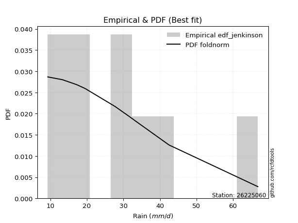</img>

</div>


### 11. Empirical - EDF Cunnane (1978)

Cunnane´s work in statistical hydrology has focused on the performance and evaluation of different probability distributions (such as GEV, Gumbel, Lognormal) for flood frequency estimation. _b_ is a constant, typically set to 0.4.

<div align="center">


$P=(m-b)/(n+1-2b)$


</div>


**11.1. Empirical values**

<div align="center">

|                | 0                   | 1                  | 2                   | 3                  | 4           | 5                  | 6                 | 7                  | 8                  |
|:---------------|:--------------------|:-------------------|:--------------------|:-------------------|:------------|:-------------------|:------------------|:-------------------|:-------------------|
| date           | 2024                | 2023               | 2018                | 2020               | 2022        | 2017               | 2021              | 2019               | 2025               |
| x              | 9.3                 | 13.3               | 17.2                | 19.5               | 27.7        | 31.4               | 33.3              | 42.5               | 66.8               |
| m              | 1                   | 2                  | 3                   | 4                  | 5           | 6                  | 7                 | 8                  | 9                  |
| empirical_dist | edf_cunnane         | edf_cunnane        | edf_cunnane         | edf_cunnane        | edf_cunnane | edf_cunnane        | edf_cunnane       | edf_cunnane        | edf_cunnane        |
| empirical      | 0.06521739130434782 | 0.1739130434782609 | 0.28260869565217395 | 0.391304347826087  | 0.5         | 0.6086956521739131 | 0.717391304347826 | 0.8260869565217391 | 0.9347826086956522 |
| empirical_tr   | 1.069767441860465   | 1.2105263157894737 | 1.393939393939394   | 1.6428571428571428 | 2.0         | 2.555555555555556  | 3.538461538461538 | 5.75               | 15.333333333333343 |

</div>


**11.2. Kolmogorov-Smirnov fit test (sorted by Δ)**


<div align="center">

|                | 0                   | 1                   | 2                   | 3                   | 4                   | 5                   | 6                   | 7                   | 8                   | 9                   | 10                  | 11                  | 12                  | 13                  | 14                  | 15                  | 16                  | 17                  | 18                  | 19                  | 20                  | 21                  | 22                  | 23                  | 24                  | 25                  | 26                  | 27                  | 28                  | 29                  | 30                  | 31                  | 32                  | 33                  | 34                  | 35                  | 36                  | 37                  | 38                  | 39                  | 40                  | 41                  | 42                  | 43                  | 44                  | 45                  | 46                  | 47                  | 48                  | 49                  | 50                  | 51                  | 52                  | 53                  | 54                  | 55                  | 56                  | 57                    | 58                  | 59                  | 60                  | 61                  | 62                  | 63                  | 64                  | 65                  | 66                  | 67                  | 68                  | 69                  | 70                  | 71                  | 72                  | 73                  | 74                  | 75                  | 76                  | 77                  | 78                  | 79                  | 80                  | 81                  | 82                  | 83                  | 84                  | 85                  | 86                  | 87                  | 88                  | 89                  |
|:---------------|:--------------------|:--------------------|:--------------------|:--------------------|:--------------------|:--------------------|:--------------------|:--------------------|:--------------------|:--------------------|:--------------------|:--------------------|:--------------------|:--------------------|:--------------------|:--------------------|:--------------------|:--------------------|:--------------------|:--------------------|:--------------------|:--------------------|:--------------------|:--------------------|:--------------------|:--------------------|:--------------------|:--------------------|:--------------------|:--------------------|:--------------------|:--------------------|:--------------------|:--------------------|:--------------------|:--------------------|:--------------------|:--------------------|:--------------------|:--------------------|:--------------------|:--------------------|:--------------------|:--------------------|:--------------------|:--------------------|:--------------------|:--------------------|:--------------------|:--------------------|:--------------------|:--------------------|:--------------------|:--------------------|:--------------------|:--------------------|:--------------------|:----------------------|:--------------------|:--------------------|:--------------------|:--------------------|:--------------------|:--------------------|:--------------------|:--------------------|:--------------------|:--------------------|:--------------------|:--------------------|:--------------------|:--------------------|:--------------------|:--------------------|:--------------------|:--------------------|:--------------------|:--------------------|:--------------------|:--------------------|:--------------------|:--------------------|:--------------------|:--------------------|:--------------------|:--------------------|:--------------------|:--------------------|:--------------------|:--------------------|
| station        | 26225060            | 26225060            | 26225060            | 26225060            | 26225060            | 26225060            | 26225060            | 26225060            | 26225060            | 26225060            | 26225060            | 26225060            | 26225060            | 26225060            | 26225060            | 26225060            | 26225060            | 26225060            | 26225060            | 26225060            | 26225060            | 26225060            | 26225060            | 26225060            | 26225060            | 26225060            | 26225060            | 26225060            | 26225060            | 26225060            | 26225060            | 26225060            | 26225060            | 26225060            | 26225060            | 26225060            | 26225060            | 26225060            | 26225060            | 26225060            | 26225060            | 26225060            | 26225060            | 26225060            | 26225060            | 26225060            | 26225060            | 26225060            | 26225060            | 26225060            | 26225060            | 26225060            | 26225060            | 26225060            | 26225060            | 26225060            | 26225060            | 26225060              | 26225060            | 26225060            | 26225060            | 26225060            | 26225060            | 26225060            | 26225060            | 26225060            | 26225060            | 26225060            | 26225060            | 26225060            | 26225060            | 26225060            | 26225060            | 26225060            | 26225060            | 26225060            | 26225060            | 26225060            | 26225060            | 26225060            | 26225060            | 26225060            | 26225060            | 26225060            | 26225060            | 26225060            | 26225060            | 26225060            | 26225060            | 26225060            |
| empirical_dist | edf_cunnane         | edf_cunnane         | edf_cunnane         | edf_cunnane         | edf_cunnane         | edf_cunnane         | edf_cunnane         | edf_cunnane         | edf_cunnane         | edf_cunnane         | edf_cunnane         | edf_cunnane         | edf_cunnane         | edf_cunnane         | edf_cunnane         | edf_cunnane         | edf_cunnane         | edf_cunnane         | edf_cunnane         | edf_cunnane         | edf_cunnane         | edf_cunnane         | edf_cunnane         | edf_cunnane         | edf_cunnane         | edf_cunnane         | edf_cunnane         | edf_cunnane         | edf_cunnane         | edf_cunnane         | edf_cunnane         | edf_cunnane         | edf_cunnane         | edf_cunnane         | edf_cunnane         | edf_cunnane         | edf_cunnane         | edf_cunnane         | edf_cunnane         | edf_cunnane         | edf_cunnane         | edf_cunnane         | edf_cunnane         | edf_cunnane         | edf_cunnane         | edf_cunnane         | edf_cunnane         | edf_cunnane         | edf_cunnane         | edf_cunnane         | edf_cunnane         | edf_cunnane         | edf_cunnane         | edf_cunnane         | edf_cunnane         | edf_cunnane         | edf_cunnane         | edf_cunnane           | edf_cunnane         | edf_cunnane         | edf_cunnane         | edf_cunnane         | edf_cunnane         | edf_cunnane         | edf_cunnane         | edf_cunnane         | edf_cunnane         | edf_cunnane         | edf_cunnane         | edf_cunnane         | edf_cunnane         | edf_cunnane         | edf_cunnane         | edf_cunnane         | edf_cunnane         | edf_cunnane         | edf_cunnane         | edf_cunnane         | edf_cunnane         | edf_cunnane         | edf_cunnane         | edf_cunnane         | edf_cunnane         | edf_cunnane         | edf_cunnane         | edf_cunnane         | edf_cunnane         | edf_cunnane         | edf_cunnane         | edf_cunnane         |
| p_dist         | halfnorm            | gompertz            | pearson3            | halflogistic        | moyal               | logloggamma         | logpearson3         | loggompertz         | logjohnsonsu        | logexponnorm        | logt                | logcrystalball      | lognorm             | lognorm             | gumbel_r            | t                   | logfisk             | alpha               | logf                | logerlang           | loggamma            | loggamma            | f                   | rayleigh            | logfatiguelife      | lognct              | mielke              | loggenlogistic      | genlogistic         | logweibull_min      | invweibull          | nct                 | ncf                 | invgamma            | maxwell             | logbetaprime        | loglogistic         | logncf              | fisk                | logrice             | kstwobign           | johnsonsu           | invgauss            | loginvgamma         | loghypsecant        | fatiguelife         | betaprime           | logalpha            | loginvgauss         | genexpon            | expon               | logmaxwell          | loginvweibull       | loggumbel_l         | weibull_min         | exponnorm           | nakagami            | loglaplace_asymmetric | crystalball         | truncnorm           | norm                | lograyleigh         | loglaplace          | rice                | logistic            | loggenexpon         | logkstwobign        | loghalfnorm         | hypsecant           | loggumbel_r         | laplace_asymmetric  | gamma               | laplace             | loghalflogistic     | logmoyal            | wald                | logtruncnorm        | gumbel_l            | logmielke           | logexpon            | lognakagami         | erlang              | chi2                | logwald             | logchi2             | gibrat              | loggibrat           | loglognorm          | pareto              | logpareto           |
| delta          | 0.05779120143526706 | 0.06602483047439822 | 0.06909553930068191 | 0.07001244564958953 | 0.07292440733195554 | 0.07673973434061898 | 0.07786380128007009 | 0.07800935326083869 | 0.07820301203544078 | 0.07933667281834977 | 0.07933678160384305 | 0.0793369778193358  | 0.0793369781895753  | 0.0793369781895753  | 0.07972901278330419 | 0.07975953044932149 | 0.07987225319132396 | 0.07989410161489785 | 0.0805404884847869  | 0.08066531963722512 | 0.08081433090606616 | 0.08081433090606616 | 0.08086438373942106 | 0.08107465629614075 | 0.08127609956391324 | 0.08191511236595117 | 0.08525754667285301 | 0.08581780727647736 | 0.08606246661432632 | 0.08746614765741767 | 0.08766405098112673 | 0.08875572283552369 | 0.08899472401171338 | 0.08901331160958037 | 0.0892486281272411  | 0.08929086661529739 | 0.08979507175026491 | 0.09048777201298419 | 0.09292936892029813 | 0.09452224632691297 | 0.09456086991464058 | 0.09489061864825088 | 0.09584313787898546 | 0.09693262516191736 | 0.0984886375640015  | 0.0997408599438463  | 0.10004818683920125 | 0.10406068237689059 | 0.10500790384798186 | 0.10691627878629628 | 0.1070253418552598  | 0.10759434514081123 | 0.10920097650425342 | 0.1092015620744054  | 0.1098063904636426  | 0.11108069797294196 | 0.11213366937192637 | 0.1147490561954157    | 0.11561664599331711 | 0.1156166476388164  | 0.11561665362583973 | 0.11648624523655715 | 0.12328612898149327 | 0.12411697271085109 | 0.1289249884350821  | 0.1317270714991029  | 0.13461325421078363 | 0.14167720841323905 | 0.1443915864040795  | 0.14770646855007796 | 0.15091552125975424 | 0.15947334310729433 | 0.16796694352854635 | 0.16971739386444018 | 0.17141835592951649 | 0.1738230112931652  | 0.17386558182911385 | 0.17505672719302323 | 0.1842411256784775  | 0.184655790520317   | 0.18736476570323968 | 0.2145072863087749  | 0.23104073552221516 | 0.23730315849246775 | 0.26379825471684903 | 0.26598986084410603 | 0.2682298401855556  | 0.4297572157171957  | 0.4378897896238597  | 0.4579673554617235  |
| deltao         | 0.41761268023100007 | 0.41761268023100007 | 0.41761268023100007 | 0.41761268023100007 | 0.41761268023100007 | 0.41761268023100007 | 0.41761268023100007 | 0.41761268023100007 | 0.41761268023100007 | 0.41761268023100007 | 0.41761268023100007 | 0.41761268023100007 | 0.41761268023100007 | 0.41761268023100007 | 0.41761268023100007 | 0.41761268023100007 | 0.41761268023100007 | 0.41761268023100007 | 0.41761268023100007 | 0.41761268023100007 | 0.41761268023100007 | 0.41761268023100007 | 0.41761268023100007 | 0.41761268023100007 | 0.41761268023100007 | 0.41761268023100007 | 0.41761268023100007 | 0.41761268023100007 | 0.41761268023100007 | 0.41761268023100007 | 0.41761268023100007 | 0.41761268023100007 | 0.41761268023100007 | 0.41761268023100007 | 0.41761268023100007 | 0.41761268023100007 | 0.41761268023100007 | 0.41761268023100007 | 0.41761268023100007 | 0.41761268023100007 | 0.41761268023100007 | 0.41761268023100007 | 0.41761268023100007 | 0.41761268023100007 | 0.41761268023100007 | 0.41761268023100007 | 0.41761268023100007 | 0.41761268023100007 | 0.41761268023100007 | 0.41761268023100007 | 0.41761268023100007 | 0.41761268023100007 | 0.41761268023100007 | 0.41761268023100007 | 0.41761268023100007 | 0.41761268023100007 | 0.41761268023100007 | 0.41761268023100007   | 0.41761268023100007 | 0.41761268023100007 | 0.41761268023100007 | 0.41761268023100007 | 0.41761268023100007 | 0.41761268023100007 | 0.41761268023100007 | 0.41761268023100007 | 0.41761268023100007 | 0.41761268023100007 | 0.41761268023100007 | 0.41761268023100007 | 0.41761268023100007 | 0.41761268023100007 | 0.41761268023100007 | 0.41761268023100007 | 0.41761268023100007 | 0.41761268023100007 | 0.41761268023100007 | 0.41761268023100007 | 0.41761268023100007 | 0.41761268023100007 | 0.41761268023100007 | 0.41761268023100007 | 0.41761268023100007 | 0.41761268023100007 | 0.41761268023100007 | 0.41761268023100007 | 0.41761268023100007 | 0.41761268023100007 | 0.41761268023100007 | 0.41761268023100007 |
| eval           | Δo > Δ              | Δo > Δ              | Δo > Δ              | Δo > Δ              | Δo > Δ              | Δo > Δ              | Δo > Δ              | Δo > Δ              | Δo > Δ              | Δo > Δ              | Δo > Δ              | Δo > Δ              | Δo > Δ              | Δo > Δ              | Δo > Δ              | Δo > Δ              | Δo > Δ              | Δo > Δ              | Δo > Δ              | Δo > Δ              | Δo > Δ              | Δo > Δ              | Δo > Δ              | Δo > Δ              | Δo > Δ              | Δo > Δ              | Δo > Δ              | Δo > Δ              | Δo > Δ              | Δo > Δ              | Δo > Δ              | Δo > Δ              | Δo > Δ              | Δo > Δ              | Δo > Δ              | Δo > Δ              | Δo > Δ              | Δo > Δ              | Δo > Δ              | Δo > Δ              | Δo > Δ              | Δo > Δ              | Δo > Δ              | Δo > Δ              | Δo > Δ              | Δo > Δ              | Δo > Δ              | Δo > Δ              | Δo > Δ              | Δo > Δ              | Δo > Δ              | Δo > Δ              | Δo > Δ              | Δo > Δ              | Δo > Δ              | Δo > Δ              | Δo > Δ              | Δo > Δ                | Δo > Δ              | Δo > Δ              | Δo > Δ              | Δo > Δ              | Δo > Δ              | Δo > Δ              | Δo > Δ              | Δo > Δ              | Δo > Δ              | Δo > Δ              | Δo > Δ              | Δo > Δ              | Δo > Δ              | Δo > Δ              | Δo > Δ              | Δo > Δ              | Δo > Δ              | Δo > Δ              | Δo > Δ              | Δo > Δ              | Δo > Δ              | Δo > Δ              | Δo > Δ              | Δo > Δ              | Δo > Δ              | Δo > Δ              | Δo > Δ              | Δo > Δ              | Δo > Δ              | Δo <= Δ             | Δo <= Δ             | Δo <= Δ             |
| fit            | 1                   | 1                   | 1                   | 1                   | 1                   | 1                   | 1                   | 1                   | 1                   | 1                   | 1                   | 1                   | 1                   | 1                   | 1                   | 1                   | 1                   | 1                   | 1                   | 1                   | 1                   | 1                   | 1                   | 1                   | 1                   | 1                   | 1                   | 1                   | 1                   | 1                   | 1                   | 1                   | 1                   | 1                   | 1                   | 1                   | 1                   | 1                   | 1                   | 1                   | 1                   | 1                   | 1                   | 1                   | 1                   | 1                   | 1                   | 1                   | 1                   | 1                   | 1                   | 1                   | 1                   | 1                   | 1                   | 1                   | 1                   | 1                     | 1                   | 1                   | 1                   | 1                   | 1                   | 1                   | 1                   | 1                   | 1                   | 1                   | 1                   | 1                   | 1                   | 1                   | 1                   | 1                   | 1                   | 1                   | 1                   | 1                   | 1                   | 1                   | 1                   | 1                   | 1                   | 1                   | 1                   | 1                   | 1                   | 0                   | 0                   | 0                   |
| n              | 9                   | 9                   | 9                   | 9                   | 9                   | 9                   | 9                   | 9                   | 9                   | 9                   | 9                   | 9                   | 9                   | 9                   | 9                   | 9                   | 9                   | 9                   | 9                   | 9                   | 9                   | 9                   | 9                   | 9                   | 9                   | 9                   | 9                   | 9                   | 9                   | 9                   | 9                   | 9                   | 9                   | 9                   | 9                   | 9                   | 9                   | 9                   | 9                   | 9                   | 9                   | 9                   | 9                   | 9                   | 9                   | 9                   | 9                   | 9                   | 9                   | 9                   | 9                   | 9                   | 9                   | 9                   | 9                   | 9                   | 9                   | 9                     | 9                   | 9                   | 9                   | 9                   | 9                   | 9                   | 9                   | 9                   | 9                   | 9                   | 9                   | 9                   | 9                   | 9                   | 9                   | 9                   | 9                   | 9                   | 9                   | 9                   | 9                   | 9                   | 9                   | 9                   | 9                   | 9                   | 9                   | 9                   | 9                   | 9                   | 9                   | 9                   |
| best_fit       | 1                   | 0                   | 0                   | 0                   | 0                   | 0                   | 0                   | 0                   | 0                   | 0                   | 0                   | 0                   | 0                   | 0                   | 0                   | 0                   | 0                   | 0                   | 0                   | 0                   | 0                   | 0                   | 0                   | 0                   | 0                   | 0                   | 0                   | 0                   | 0                   | 0                   | 0                   | 0                   | 0                   | 0                   | 0                   | 0                   | 0                   | 0                   | 0                   | 0                   | 0                   | 0                   | 0                   | 0                   | 0                   | 0                   | 0                   | 0                   | 0                   | 0                   | 0                   | 0                   | 0                   | 0                   | 0                   | 0                   | 0                   | 0                     | 0                   | 0                   | 0                   | 0                   | 0                   | 0                   | 0                   | 0                   | 0                   | 0                   | 0                   | 0                   | 0                   | 0                   | 0                   | 0                   | 0                   | 0                   | 0                   | 0                   | 0                   | 0                   | 0                   | 0                   | 0                   | 0                   | 0                   | 0                   | 0                   | 0                   | 0                   | 0                   |
| best_fit_sort  | 1                   | 2                   | 3                   | 4                   | 5                   | 6                   | 7                   | 8                   | 9                   | 10                  | 11                  | 12                  | 13                  | 14                  | 15                  | 16                  | 17                  | 18                  | 19                  | 20                  | 21                  | 22                  | 23                  | 24                  | 25                  | 26                  | 27                  | 28                  | 29                  | 30                  | 31                  | 32                  | 33                  | 34                  | 35                  | 36                  | 37                  | 38                  | 39                  | 40                  | 41                  | 42                  | 43                  | 44                  | 45                  | 46                  | 47                  | 48                  | 49                  | 50                  | 51                  | 52                  | 53                  | 54                  | 55                  | 56                  | 57                  | 58                    | 59                  | 60                  | 61                  | 62                  | 63                  | 64                  | 65                  | 66                  | 67                  | 68                  | 69                  | 70                  | 71                  | 72                  | 73                  | 74                  | 75                  | 76                  | 77                  | 78                  | 79                  | 80                  | 81                  | 82                  | 83                  | 84                  | 85                  | 86                  | 87                  | 88                  | 89                  | 90                  |

</div>


<div align="center">

</img>

</div>


**11.3. Best fit**

<div align="center">

|   id |   station | empirical_dist   | p_dist   |     delta |   deltao | eval   |   fit |   n |   best_fit |   best_fit_sort |
|-----:|----------:|:-----------------|:---------|----------:|---------:|:-------|------:|----:|-----------:|----------------:|
|    0 |  26225060 | edf_cunnane      | halfnorm | 0.0577912 | 0.417613 | Δo > Δ |     1 |   9 |          1 |               1 |

</div>


<div align="center">

</img>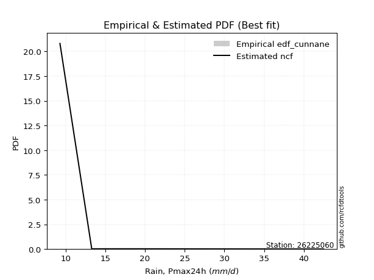</img>

</div>


### 12. Empirical - EDF Adamowski (1981)

The Adamowski formula in hydrology refers to a specific plotting position formula used for estimating the non-parametric empirical distribution of hydrological events (like flood peaks) to calculate their return periods. This formula provides an alternative to traditional parametric methods (like the Gumbel or Log Pearson Type III distributions). 

<div align="center">


$P=(m-0.25)/(n+0.5)$


</div>


**12.1. Empirical values**

<div align="center">

|                | 0                   | 1                   | 2                  | 3                   | 4             | 5                  | 6                  | 7                  | 8                  |
|:---------------|:--------------------|:--------------------|:-------------------|:--------------------|:--------------|:-------------------|:-------------------|:-------------------|:-------------------|
| date           | 2024                | 2023                | 2018               | 2020                | 2022          | 2017               | 2021               | 2019               | 2025               |
| x              | 9.3                 | 13.3                | 17.2               | 19.5                | 27.7          | 31.4               | 33.3               | 42.5               | 66.8               |
| m              | 1                   | 2                   | 3                  | 4                   | 5             | 6                  | 7                  | 8                  | 9                  |
| empirical_dist | edf_adamowski       | edf_adamowski       | edf_adamowski      | edf_adamowski       | edf_adamowski | edf_adamowski      | edf_adamowski      | edf_adamowski      | edf_adamowski      |
| empirical      | 0.07894736842105263 | 0.18421052631578946 | 0.2894736842105263 | 0.39473684210526316 | 0.5           | 0.6052631578947368 | 0.7105263157894737 | 0.8157894736842105 | 0.9210526315789473 |
| empirical_tr   | 1.0857142857142856  | 1.2258064516129032  | 1.4074074074074074 | 1.6521739130434783  | 2.0           | 2.533333333333333  | 3.4545454545454546 | 5.428571428571428  | 12.666666666666663 |

</div>


**12.2. Kolmogorov-Smirnov fit test (sorted by Δ)**


<div align="center">

|                | 0                   | 1                   | 2                   | 3                   | 4                   | 5                   | 6                   | 7                   | 8                   | 9                   | 10                  | 11                  | 12                  | 13                  | 14                  | 15                  | 16                  | 17                  | 18                  | 19                  | 20                  | 21                  | 22                  | 23                  | 24                  | 25                  | 26                  | 27                  | 28                  | 29                  | 30                  | 31                  | 32                  | 33                  | 34                  | 35                  | 36                  | 37                  | 38                  | 39                  | 40                  | 41                  | 42                  | 43                  | 44                  | 45                  | 46                  | 47                  | 48                  | 49                  | 50                  | 51                  | 52                  | 53                  | 54                  | 55                  | 56                  | 57                  | 58                  | 59                  | 60                  | 61                    | 62                  | 63                  | 64                  | 65                  | 66                  | 67                  | 68                  | 69                  | 70                  | 71                  | 72                  | 73                  | 74                  | 75                  | 76                  | 77                  | 78                  | 79                  | 80                  | 81                  | 82                  | 83                  | 84                  | 85                  | 86                  | 87                  | 88                  | 89                  |
|:---------------|:--------------------|:--------------------|:--------------------|:--------------------|:--------------------|:--------------------|:--------------------|:--------------------|:--------------------|:--------------------|:--------------------|:--------------------|:--------------------|:--------------------|:--------------------|:--------------------|:--------------------|:--------------------|:--------------------|:--------------------|:--------------------|:--------------------|:--------------------|:--------------------|:--------------------|:--------------------|:--------------------|:--------------------|:--------------------|:--------------------|:--------------------|:--------------------|:--------------------|:--------------------|:--------------------|:--------------------|:--------------------|:--------------------|:--------------------|:--------------------|:--------------------|:--------------------|:--------------------|:--------------------|:--------------------|:--------------------|:--------------------|:--------------------|:--------------------|:--------------------|:--------------------|:--------------------|:--------------------|:--------------------|:--------------------|:--------------------|:--------------------|:--------------------|:--------------------|:--------------------|:--------------------|:----------------------|:--------------------|:--------------------|:--------------------|:--------------------|:--------------------|:--------------------|:--------------------|:--------------------|:--------------------|:--------------------|:--------------------|:--------------------|:--------------------|:--------------------|:--------------------|:--------------------|:--------------------|:--------------------|:--------------------|:--------------------|:--------------------|:--------------------|:--------------------|:--------------------|:--------------------|:--------------------|:--------------------|:--------------------|
| station        | 26225060            | 26225060            | 26225060            | 26225060            | 26225060            | 26225060            | 26225060            | 26225060            | 26225060            | 26225060            | 26225060            | 26225060            | 26225060            | 26225060            | 26225060            | 26225060            | 26225060            | 26225060            | 26225060            | 26225060            | 26225060            | 26225060            | 26225060            | 26225060            | 26225060            | 26225060            | 26225060            | 26225060            | 26225060            | 26225060            | 26225060            | 26225060            | 26225060            | 26225060            | 26225060            | 26225060            | 26225060            | 26225060            | 26225060            | 26225060            | 26225060            | 26225060            | 26225060            | 26225060            | 26225060            | 26225060            | 26225060            | 26225060            | 26225060            | 26225060            | 26225060            | 26225060            | 26225060            | 26225060            | 26225060            | 26225060            | 26225060            | 26225060            | 26225060            | 26225060            | 26225060            | 26225060              | 26225060            | 26225060            | 26225060            | 26225060            | 26225060            | 26225060            | 26225060            | 26225060            | 26225060            | 26225060            | 26225060            | 26225060            | 26225060            | 26225060            | 26225060            | 26225060            | 26225060            | 26225060            | 26225060            | 26225060            | 26225060            | 26225060            | 26225060            | 26225060            | 26225060            | 26225060            | 26225060            | 26225060            |
| empirical_dist | edf_adamowski       | edf_adamowski       | edf_adamowski       | edf_adamowski       | edf_adamowski       | edf_adamowski       | edf_adamowski       | edf_adamowski       | edf_adamowski       | edf_adamowski       | edf_adamowski       | edf_adamowski       | edf_adamowski       | edf_adamowski       | edf_adamowski       | edf_adamowski       | edf_adamowski       | edf_adamowski       | edf_adamowski       | edf_adamowski       | edf_adamowski       | edf_adamowski       | edf_adamowski       | edf_adamowski       | edf_adamowski       | edf_adamowski       | edf_adamowski       | edf_adamowski       | edf_adamowski       | edf_adamowski       | edf_adamowski       | edf_adamowski       | edf_adamowski       | edf_adamowski       | edf_adamowski       | edf_adamowski       | edf_adamowski       | edf_adamowski       | edf_adamowski       | edf_adamowski       | edf_adamowski       | edf_adamowski       | edf_adamowski       | edf_adamowski       | edf_adamowski       | edf_adamowski       | edf_adamowski       | edf_adamowski       | edf_adamowski       | edf_adamowski       | edf_adamowski       | edf_adamowski       | edf_adamowski       | edf_adamowski       | edf_adamowski       | edf_adamowski       | edf_adamowski       | edf_adamowski       | edf_adamowski       | edf_adamowski       | edf_adamowski       | edf_adamowski         | edf_adamowski       | edf_adamowski       | edf_adamowski       | edf_adamowski       | edf_adamowski       | edf_adamowski       | edf_adamowski       | edf_adamowski       | edf_adamowski       | edf_adamowski       | edf_adamowski       | edf_adamowski       | edf_adamowski       | edf_adamowski       | edf_adamowski       | edf_adamowski       | edf_adamowski       | edf_adamowski       | edf_adamowski       | edf_adamowski       | edf_adamowski       | edf_adamowski       | edf_adamowski       | edf_adamowski       | edf_adamowski       | edf_adamowski       | edf_adamowski       | edf_adamowski       |
| p_dist         | halfnorm            | pearson3            | rayleigh            | moyal               | logloggamma         | halflogistic        | logpearson3         | logjohnsonsu        | loggompertz         | gompertz            | logexponnorm        | logt                | logcrystalball      | lognorm             | lognorm             | logfisk             | alpha               | logf                | logerlang           | loggamma            | loggamma            | f                   | logfatiguelife      | lognct              | gumbel_r            | t                   | maxwell             | mielke              | loggenlogistic      | logweibull_min      | invweibull          | nct                 | ncf                 | invgamma            | logbetaprime        | genlogistic         | loglogistic         | logncf              | fisk                | logrice             | johnsonsu           | invgauss            | loginvgamma         | kstwobign           | loghypsecant        | fatiguelife         | betaprime           | logalpha            | loginvgauss         | genexpon            | expon               | logmaxwell          | loginvweibull       | weibull_min         | truncnorm           | crystalball         | norm                | exponnorm           | nakagami            | loggumbel_l         | lograyleigh         | loglaplace_asymmetric | loglaplace          | rice                | loggenexpon         | logistic            | logkstwobign        | loghalfnorm         | loggumbel_r         | hypsecant           | laplace_asymmetric  | gamma               | gumbel_l            | loghalflogistic     | laplace             | logmoyal            | logexpon            | wald                | logtruncnorm        | logmielke           | lognakagami         | erlang              | chi2                | logwald             | logchi2             | loggibrat           | gibrat              | loglognorm          | pareto              | logpareto           |
| delta          | 0.05092621287691468 | 0.0725280335798581  | 0.07420966773778837 | 0.07635690161113173 | 0.07673973434061898 | 0.07690498710935981 | 0.07786380128007009 | 0.07820301203544078 | 0.07894736357681391 | 0.078947368421031   | 0.07933667281834977 | 0.07933678160384305 | 0.0793369778193358  | 0.0793369781895753  | 0.0793369781895753  | 0.07987225319132396 | 0.07989410161489785 | 0.0805404884847869  | 0.08066531963722512 | 0.08081433090606616 | 0.08081433090606616 | 0.08086438373942106 | 0.08127609956391324 | 0.08191511236595117 | 0.08316150706248038 | 0.08319202472849768 | 0.08419715966817443 | 0.08525754667285301 | 0.08581780727647736 | 0.08746614765741767 | 0.08766405098112673 | 0.08875572283552369 | 0.08899472401171338 | 0.08901331160958037 | 0.08929086661529739 | 0.0894949608935025  | 0.08979507175026491 | 0.09048777201298419 | 0.09292936892029813 | 0.09452224632691297 | 0.09489061864825088 | 0.09584313787898546 | 0.09693262516191736 | 0.09799336419381677 | 0.0984886375640015  | 0.0997408599438463  | 0.10004818683920125 | 0.10406068237689059 | 0.10500790384798186 | 0.10691627878629628 | 0.1070253418552598  | 0.10759434514081123 | 0.10920097650425342 | 0.1098063904636426  | 0.11035547298419113 | 0.11035547925360761 | 0.11035547937979617 | 0.11108069797294196 | 0.11213366937192637 | 0.11263405635358159 | 0.11648624523655715 | 0.11818155047459189   | 0.12328612898149327 | 0.12754946699002728 | 0.1317270714991029  | 0.1323574827142583  | 0.13461325421078363 | 0.14167720841323905 | 0.14770646855007796 | 0.1478240806832557  | 0.15434801553893043 | 0.15947334310729433 | 0.16819173863467085 | 0.16971739386444018 | 0.17139943780772254 | 0.17141835592951649 | 0.17779080196196462 | 0.18412049413069378 | 0.18416306466664242 | 0.1842411256784775  | 0.18736476570323968 | 0.2145072863087749  | 0.23104073552221516 | 0.23730315849246775 | 0.25693326615849665 | 0.2682298401855556  | 0.2728548494024584  | 0.4194597328796671  | 0.4275923067863311  | 0.4476698726241949  |
| deltao         | 0.41761268023100007 | 0.41761268023100007 | 0.41761268023100007 | 0.41761268023100007 | 0.41761268023100007 | 0.41761268023100007 | 0.41761268023100007 | 0.41761268023100007 | 0.41761268023100007 | 0.41761268023100007 | 0.41761268023100007 | 0.41761268023100007 | 0.41761268023100007 | 0.41761268023100007 | 0.41761268023100007 | 0.41761268023100007 | 0.41761268023100007 | 0.41761268023100007 | 0.41761268023100007 | 0.41761268023100007 | 0.41761268023100007 | 0.41761268023100007 | 0.41761268023100007 | 0.41761268023100007 | 0.41761268023100007 | 0.41761268023100007 | 0.41761268023100007 | 0.41761268023100007 | 0.41761268023100007 | 0.41761268023100007 | 0.41761268023100007 | 0.41761268023100007 | 0.41761268023100007 | 0.41761268023100007 | 0.41761268023100007 | 0.41761268023100007 | 0.41761268023100007 | 0.41761268023100007 | 0.41761268023100007 | 0.41761268023100007 | 0.41761268023100007 | 0.41761268023100007 | 0.41761268023100007 | 0.41761268023100007 | 0.41761268023100007 | 0.41761268023100007 | 0.41761268023100007 | 0.41761268023100007 | 0.41761268023100007 | 0.41761268023100007 | 0.41761268023100007 | 0.41761268023100007 | 0.41761268023100007 | 0.41761268023100007 | 0.41761268023100007 | 0.41761268023100007 | 0.41761268023100007 | 0.41761268023100007 | 0.41761268023100007 | 0.41761268023100007 | 0.41761268023100007 | 0.41761268023100007   | 0.41761268023100007 | 0.41761268023100007 | 0.41761268023100007 | 0.41761268023100007 | 0.41761268023100007 | 0.41761268023100007 | 0.41761268023100007 | 0.41761268023100007 | 0.41761268023100007 | 0.41761268023100007 | 0.41761268023100007 | 0.41761268023100007 | 0.41761268023100007 | 0.41761268023100007 | 0.41761268023100007 | 0.41761268023100007 | 0.41761268023100007 | 0.41761268023100007 | 0.41761268023100007 | 0.41761268023100007 | 0.41761268023100007 | 0.41761268023100007 | 0.41761268023100007 | 0.41761268023100007 | 0.41761268023100007 | 0.41761268023100007 | 0.41761268023100007 | 0.41761268023100007 |
| eval           | Δo > Δ              | Δo > Δ              | Δo > Δ              | Δo > Δ              | Δo > Δ              | Δo > Δ              | Δo > Δ              | Δo > Δ              | Δo > Δ              | Δo > Δ              | Δo > Δ              | Δo > Δ              | Δo > Δ              | Δo > Δ              | Δo > Δ              | Δo > Δ              | Δo > Δ              | Δo > Δ              | Δo > Δ              | Δo > Δ              | Δo > Δ              | Δo > Δ              | Δo > Δ              | Δo > Δ              | Δo > Δ              | Δo > Δ              | Δo > Δ              | Δo > Δ              | Δo > Δ              | Δo > Δ              | Δo > Δ              | Δo > Δ              | Δo > Δ              | Δo > Δ              | Δo > Δ              | Δo > Δ              | Δo > Δ              | Δo > Δ              | Δo > Δ              | Δo > Δ              | Δo > Δ              | Δo > Δ              | Δo > Δ              | Δo > Δ              | Δo > Δ              | Δo > Δ              | Δo > Δ              | Δo > Δ              | Δo > Δ              | Δo > Δ              | Δo > Δ              | Δo > Δ              | Δo > Δ              | Δo > Δ              | Δo > Δ              | Δo > Δ              | Δo > Δ              | Δo > Δ              | Δo > Δ              | Δo > Δ              | Δo > Δ              | Δo > Δ                | Δo > Δ              | Δo > Δ              | Δo > Δ              | Δo > Δ              | Δo > Δ              | Δo > Δ              | Δo > Δ              | Δo > Δ              | Δo > Δ              | Δo > Δ              | Δo > Δ              | Δo > Δ              | Δo > Δ              | Δo > Δ              | Δo > Δ              | Δo > Δ              | Δo > Δ              | Δo > Δ              | Δo > Δ              | Δo > Δ              | Δo > Δ              | Δo > Δ              | Δo > Δ              | Δo > Δ              | Δo > Δ              | Δo <= Δ             | Δo <= Δ             | Δo <= Δ             |
| fit            | 1                   | 1                   | 1                   | 1                   | 1                   | 1                   | 1                   | 1                   | 1                   | 1                   | 1                   | 1                   | 1                   | 1                   | 1                   | 1                   | 1                   | 1                   | 1                   | 1                   | 1                   | 1                   | 1                   | 1                   | 1                   | 1                   | 1                   | 1                   | 1                   | 1                   | 1                   | 1                   | 1                   | 1                   | 1                   | 1                   | 1                   | 1                   | 1                   | 1                   | 1                   | 1                   | 1                   | 1                   | 1                   | 1                   | 1                   | 1                   | 1                   | 1                   | 1                   | 1                   | 1                   | 1                   | 1                   | 1                   | 1                   | 1                   | 1                   | 1                   | 1                   | 1                     | 1                   | 1                   | 1                   | 1                   | 1                   | 1                   | 1                   | 1                   | 1                   | 1                   | 1                   | 1                   | 1                   | 1                   | 1                   | 1                   | 1                   | 1                   | 1                   | 1                   | 1                   | 1                   | 1                   | 1                   | 1                   | 0                   | 0                   | 0                   |
| n              | 9                   | 9                   | 9                   | 9                   | 9                   | 9                   | 9                   | 9                   | 9                   | 9                   | 9                   | 9                   | 9                   | 9                   | 9                   | 9                   | 9                   | 9                   | 9                   | 9                   | 9                   | 9                   | 9                   | 9                   | 9                   | 9                   | 9                   | 9                   | 9                   | 9                   | 9                   | 9                   | 9                   | 9                   | 9                   | 9                   | 9                   | 9                   | 9                   | 9                   | 9                   | 9                   | 9                   | 9                   | 9                   | 9                   | 9                   | 9                   | 9                   | 9                   | 9                   | 9                   | 9                   | 9                   | 9                   | 9                   | 9                   | 9                   | 9                   | 9                   | 9                   | 9                     | 9                   | 9                   | 9                   | 9                   | 9                   | 9                   | 9                   | 9                   | 9                   | 9                   | 9                   | 9                   | 9                   | 9                   | 9                   | 9                   | 9                   | 9                   | 9                   | 9                   | 9                   | 9                   | 9                   | 9                   | 9                   | 9                   | 9                   | 9                   |
| best_fit       | 1                   | 0                   | 0                   | 0                   | 0                   | 0                   | 0                   | 0                   | 0                   | 0                   | 0                   | 0                   | 0                   | 0                   | 0                   | 0                   | 0                   | 0                   | 0                   | 0                   | 0                   | 0                   | 0                   | 0                   | 0                   | 0                   | 0                   | 0                   | 0                   | 0                   | 0                   | 0                   | 0                   | 0                   | 0                   | 0                   | 0                   | 0                   | 0                   | 0                   | 0                   | 0                   | 0                   | 0                   | 0                   | 0                   | 0                   | 0                   | 0                   | 0                   | 0                   | 0                   | 0                   | 0                   | 0                   | 0                   | 0                   | 0                   | 0                   | 0                   | 0                   | 0                     | 0                   | 0                   | 0                   | 0                   | 0                   | 0                   | 0                   | 0                   | 0                   | 0                   | 0                   | 0                   | 0                   | 0                   | 0                   | 0                   | 0                   | 0                   | 0                   | 0                   | 0                   | 0                   | 0                   | 0                   | 0                   | 0                   | 0                   | 0                   |
| best_fit_sort  | 1                   | 2                   | 3                   | 4                   | 5                   | 6                   | 7                   | 8                   | 9                   | 10                  | 11                  | 12                  | 13                  | 14                  | 15                  | 16                  | 17                  | 18                  | 19                  | 20                  | 21                  | 22                  | 23                  | 24                  | 25                  | 26                  | 27                  | 28                  | 29                  | 30                  | 31                  | 32                  | 33                  | 34                  | 35                  | 36                  | 37                  | 38                  | 39                  | 40                  | 41                  | 42                  | 43                  | 44                  | 45                  | 46                  | 47                  | 48                  | 49                  | 50                  | 51                  | 52                  | 53                  | 54                  | 55                  | 56                  | 57                  | 58                  | 59                  | 60                  | 61                  | 62                    | 63                  | 64                  | 65                  | 66                  | 67                  | 68                  | 69                  | 70                  | 71                  | 72                  | 73                  | 74                  | 75                  | 76                  | 77                  | 78                  | 79                  | 80                  | 81                  | 82                  | 83                  | 84                  | 85                  | 86                  | 87                  | 88                  | 89                  | 90                  |

</div>


<div align="center">

</img>

</div>


**12.3. Best fit**

<div align="center">

|   id |   station | empirical_dist   | p_dist   |     delta |   deltao | eval   |   fit |   n |   best_fit |   best_fit_sort |
|-----:|----------:|:-----------------|:---------|----------:|---------:|:-------|------:|----:|-----------:|----------------:|
|    0 |  26225060 | edf_adamowski    | halfnorm | 0.0509262 | 0.417613 | Δo > Δ |     1 |   9 |          1 |               1 |

</div>


<div align="center">

</img></img>

</div>


## C. Best fit & Estimate extreme values for specific return periods - Tr


### 1. Best fit (ordered by delta Δ)

<div align="center">

|   id |   station | empirical_dist   | p_dist    |     delta |   deltao | eval   |   fit |   n |   best_fit |   best_fit_sort |
|-----:|----------:|:-----------------|:----------|----------:|---------:|:-------|------:|----:|-----------:|----------------:|
|    0 |  26225060 | edf_adamowski    | halfnorm  | 0.0509262 | 0.417613 | Δo > Δ |     1 |   9 |          1 |               1 |
|    1 |  26225060 | edf_chegodayev   | halfnorm  | 0.0531659 | 0.417613 | Δo > Δ |     1 |   9 |          1 |               2 |
|    2 |  26225060 | edf_jenkinson    | halfnorm  | 0.0536195 | 0.417613 | Δo > Δ |     1 |   9 |          1 |               3 |
|    3 |  26225060 | edf_beard        | halfnorm  | 0.0536195 | 0.417613 | Δo > Δ |     1 |   9 |          1 |               4 |
|    4 |  26225060 | edf_filliben     | halfnorm  | 0.053961  | 0.417613 | Δo > Δ |     1 |   9 |          1 |               5 |
|    5 |  26225060 | edf_tukey        | halfnorm  | 0.0546856 | 0.417613 | Δo > Δ |     1 |   9 |          1 |               6 |
|    6 |  26225060 | edf_blom         | halfnorm  | 0.0566161 | 0.417613 | Δo > Δ |     1 |   9 |          1 |               7 |
|    7 |  26225060 | edf_cunnane      | halfnorm  | 0.0577912 | 0.417613 | Δo > Δ |     1 |   9 |          1 |               8 |
|    8 |  26225060 | edf_gringorten   | halfnorm  | 0.0596981 | 0.417613 | Δo > Δ |     1 |   9 |          1 |               9 |
|    9 |  26225060 | edf_hazen        | halfnorm  | 0.0626221 | 0.417613 | Δo > Δ |     1 |   9 |          1 |              10 |
|   10 |  26225060 | edf_weibull      | halfnorm  | 0.0695937 | 0.417613 | Δo > Δ |     1 |   9 |          1 |              11 |
|   11 |  26225060 | edf_california   | betaprime | 0.0737045 | 0.417613 | Δo > Δ |     1 |   9 |          1 |              12 |

</div>

:file_folder:Tables: [bestfit_26225060.csv](table/bestfit_26225060.csv) | [extreme_26225060.csv](table/extreme_26225060.csv)


### 2. Extreme values

In hydrology, a return period (or recurrence interval $Tr$) is the statistical average time between extreme events like floods or droughts of a specific magnitude, indicating how rare an event is, with a 100-year flood, for example, having a 1% chance of occurring in any given year, not that it happens exactly every century. It is a key tool for infrastructure design (like bridges or dams) and risk assessment, calculated from historical data to determine the probability of future events, although it is important to remember it is statistical average, and events can cluster or be missed.

> risk_rate: assuming the return period as the project useful life.

|   id |      tr |   prob_l |     prob_g |    alpha |   betaprime |     chi2 |   crystalball |   erlang |    expon |   exponnorm |        f |   fatiguelife |     fisk |    gamma |   genexpon |   genlogistic |   gibrat |   gompertz |   gumbel_l |   gumbel_r |   halflogistic |   halfnorm |   hypsecant |   invgamma |   invgauss |   invweibull |   johnsonsu |   kstwobign |   laplace |   laplace_asymmetric |   loggamma |   logistic |   lognorm |   maxwell |   mielke |    moyal |   nakagami |      ncf |      nct |    norm |           pareto |   pearson3 |   rayleigh |    rice |        t |   truncnorm |     wald |   weibull_min |   logalpha |   logbetaprime |     logchi2 |   logcrystalball |   logerlang |   logexpon |   logexponnorm |     logf |   logfatiguelife |   logfisk |   loggenexpon |   loggenlogistic |   loggibrat |   loggompertz |   loggumbel_l |   loggumbel_r |   loghalflogistic |   loghalfnorm |   loghypsecant |   loginvgamma |   loginvgauss |   loginvweibull |   logjohnsonsu |   logkstwobign |   loglaplace |   loglaplace_asymmetric |   logloggamma |   loglogistic |    loglognorm |   logmaxwell |   logmielke |   logmoyal |   lognakagami |   logncf |   lognct |     logpareto |   logpearson3 |   lograyleigh |   logrice |     logt |   logtruncnorm |   logwald |   logweibull_min |   station |   n |   risk_rate |
|-----:|--------:|---------:|-----------:|---------:|------------:|---------:|--------------:|---------:|---------:|------------:|---------:|--------------:|---------:|---------:|-----------:|--------------:|---------:|-----------:|-----------:|-----------:|---------------:|-----------:|------------:|-----------:|-----------:|-------------:|------------:|------------:|----------:|---------------------:|-----------:|-----------:|----------:|----------:|---------:|---------:|-----------:|---------:|---------:|--------:|-----------------:|-----------:|-----------:|--------:|---------:|------------:|---------:|--------------:|-----------:|---------------:|------------:|-----------------:|------------:|-----------:|---------------:|---------:|-----------------:|----------:|--------------:|-----------------:|------------:|--------------:|--------------:|--------------:|------------------:|--------------:|---------------:|--------------:|--------------:|----------------:|---------------:|---------------:|-------------:|------------------------:|--------------:|--------------:|--------------:|-------------:|------------:|-----------:|--------------:|---------:|---------:|--------------:|--------------:|--------------:|----------:|---------:|---------------:|----------:|-----------------:|----------:|----:|------------:|
|    0 |    2    | 0.5      | 0.5        |  24.831  |     23.7312 |  17.4618 |       29      |  19.0319 |  22.955  |     22.7983 |  23.2761 |       23.6565 |  24.1733 |  20.0116 |    22.9591 |       26.0003 |  23.9961 |    24.8648 |    31.7387 |    26.2613 |        24.8998 |    25.5876 |     29      |    24.3826 |    23.9265 |      24.49   |     24.017  |     26.6714 |   29      |              28.3663 |    24.6352 |    29      |   24.6914 |   27.5742 |  24.6101 |  25.3772 |    22.171  |  24.3704 |  24.444  | 29      |      9.82796     |    26.2128 |    27.0686 | 28.3121 |  26.4517 |     29      |  23.5962 |       21.732  |    23.7432 |        24.2827 |     15.4043 |          24.6914 |     24.6398 |    18.2987 |        24.6914 |  24.6412 |          24.6215 |   24.8314 |       22.0285 |          24.5877 |     20.7813 |       24.4439 |       27.1345 |       22.4683 |           21.4388 |       21.9529 |        24.6914 |       24.0085 |       23.673  |         22.9612 |        24.7339 |        21.9761 |      24.6914 |                 27.4418 |       24.7896 |       24.6914 |   9.48099     |      23.5079 |     19.2453 |    21.7943 |       19.282  |  24.0745 |  24.5877 |   9.59157     |       24.7471 |       23.1019 |   23.9937 |  24.6914 |        23.2732 |   20.4971 |          24.2997 |  26225060 |   9 |    0.75     |
|    1 |    2.33 | 0.570815 | 0.429185   |  27.3541 |     26.4527 |  19.8593 |       31.9748 |  21.3658 |  25.9636 |     25.7779 |  27.0962 |       26.4365 |  26.792  |  23.0007 |    25.9686 |       28.5639 |  25.503  |    27.918  |    34.3268 |    29.0178 |        27.7339 |    28.7982 |     31.3808 |    26.975  |    26.6412 |      27.0417 |     26.6961 |     29.4    |   30.8002 |              30.4068 |    27.2962 |    31.621  |   27.3562 |   30.6649 |  27.1404 |  27.9866 |    25.5203 |  26.9743 |  26.9979 | 31.9748 |     11.093       |    29.1252 |    30.2049 | 31.1049 |  28.9459 |     31.9748 |  25.5468 |       25.3476 |    26.3392 |        26.9429 |     18.3547 |          27.3562 |     27.3021 |    21.2415 |        27.3562 |  27.3067 |          27.278  |   27.3538 |       24.8181 |          27.1181 |     21.8887 |       27.3805 |       29.6651 |       24.7066 |           23.6376 |       24.5204 |        26.802  |       26.6315 |       26.2844 |         25.8529 |        27.4021 |        24.6962 |      26.2713 |                 29.621  |       27.4613 |       27.0248 |  10.6978      |      26.1491 |     22.0432 |    23.8442 |       21.6916 |  26.851  |  27.2505 |  10.3283      |       27.4158 |       25.738  |   26.7017 |  27.3562 |        26.0662 |   21.9219 |          27.0077 |  26225060 |   9 |    0.729209 |
|    2 |    5    | 0.8      | 0.2        |  39.3903 |     40.0618 |  32.9372 |       43.0301 |  33.3118 |  41.0059 |     40.6755 |  47.6454 |       40.2603 |  40.7388 |  39.0287 |    41.0153 |       39.7003 |  34.1789 |    41.6313 |    42.688  |    40.9934 |        40.5578 |    42.3755 |     40.9305 |    39.6736 |    40.0482 |      39.4819 |     40.0264 |     40.9907 |   39.801  |              40.6089 |    40.0101 |    41.7412 |   40.0373 |   42.8294 |  39.8269 |  40.0735 |    40.9126 |  39.5862 |  39.4128 | 43.0301 |    808.912       |    41.5876 |    42.7612 | 42.2858 |  38.6802 |     43.0301 |  36.4664 |       45.9084 |    39.4346 |        40.0176 |     50.7435 |          40.0372 |     40.0226 |    44.7699 |        40.0372 |  40.0402 |          39.9943 |   39.7424 |       40.2787 |          39.8257 |     29.5145 |       40.9797 |       39.5681 |       37.3242 |           36.7679 |       39.1441 |        37.2435 |       39.74   |       39.6604 |         43.2823 |        40.064  |        40.5419 |      35.822  |                 38.57   |       40.0857 |       38.2983 |   3.02424e+97 |      39.7614 |     35.6189 |    36.16   |       38.4934 |  40.9557 |  40.0381 |   2.05316e+21 |       40.0631 |       39.668  |   40.115  |  40.0373 |        44.0903 |   31.9346 |          40.1265 |  26225060 |   9 |    0.67232  |
|    3 |   10    | 0.9      | 0.1        |  50.8588 |     53.246  |  45.6872 |       50.3639 |  44.3733 |  54.6609 |     54.1991 |  67.6779 |       52.9987 |  56.4614 |  54.4439 |    54.6743 |       48.7699 |  44.0683 |    52.3061 |    47.3431 |    50.7473 |        51.2075 |    52.4224 |     48.5563 |    51.8639 |    52.479  |      51.4626 |     52.7995 |     49.8155 |   47.9716 |              49.87   |    51.6164 |    49.1943 |   51.5457 |   51.3902 |  53.0267 |  50.5971 |    52.8973 |  51.4848 |  51.3089 | 50.3639 | 202952           |    51.3479 |    51.7141 | 50.258  |  46.1261 |     50.3639 |  48.0548 |       67.2421 |    52.4121 |        52.4577 |    143.465  |          51.5456 |     51.6355 |    88.0897 |        51.5456 |  51.6607 |          51.6369 |   52.328  |       57.1128 |          53.0707 |     41.4963 |       52.2824 |       46.451  |       52.231  |           53.0645 |       55.333  |        48.4336 |       52.5363 |       53.1776 |         65.8556 |        51.5086 |        59.1301 |      47.4677 |                 48.7052 |       51.4234 |       49.51   | inf           |      53.4008 |     46.2179 |    51.9614 |       61.1042 |  55.0178 |  51.8017 | inf           |       51.4703 |       53.9999 |   52.841  |  51.5457 |        67.7698 |   47.6048 |          52.1438 |  26225060 |   9 |    0.651322 |
|    4 |   15    | 0.933333 | 0.0666667  |  58.2153 |     61.543  |  53.3665 |       54.0236 |  50.898  |  62.6486 |     62.1099 |  79.8415 |       60.5582 |  67.7744 |  63.6784 |    62.6643 |       53.8867 |  50.8896 |    57.9415 |    49.4513 |    56.2504 |        57.2343 |    57.6507 |     52.9082 |    59.5523 |    59.9335 |      59.0635 |     60.7411 |     54.5004 |   52.7511 |              55.2874 |    58.6306 |    53.2551 |   58.4721 |   55.7826 |  62.0236 |  56.7045 |    59.2085 |  58.8967 |  58.8389 | 54.0236 |      5.17502e+06 |    56.6826 |    56.327  | 54.3656 |  50.3631 |     54.0236 |  55.4963 |       80.6352 |    60.7329 |        60.1965 |    271.413  |          58.4721 |     58.6537 |   130.878  |        58.472  |  58.6815 |          58.6879 |   60.7901 |       68.4237 |          62.1065 |     52.4899 |       58.5779 |       49.9503 |       63.1343 |           65.3091 |       66.2536 |        56.2679 |       60.647  |       61.9499 |         83.4516 |        58.3772 |        72.2473 |      55.9641 |                 55.8274 |       58.1975 |       56.9444 | inf           |      62.1251 |     52.0111 |    64.1298 |       78.0841 |  64.0511 |  58.95   | inf           |       58.3063 |       63.3011 |   60.6966 |  58.4721 |        85.7262 |   61.5168 |          59.3712 |  26225060 |   9 |    0.644736 |
|    5 |   20    | 0.95     | 0.05       |  63.8399 |     67.7407 |  58.8864 |       56.4203 |  55.5448 |  68.3159 |     67.7227 |  88.6455 |       65.9669 |  77.0179 |  70.3004 |    68.3333 |       57.4693 |  56.2404 |    61.7095 |    50.7636 |    60.1035 |        61.4568 |    61.1366 |     55.9784 |    65.3148 |    65.3066 |      64.7839 |     66.6174 |     57.6563 |   56.1422 |              59.1312 |    63.7399 |    56.0619 |   63.5049 |   58.6977 |  69.1332 |  61.0299 |    63.4299 |  64.4098 |  64.5036 | 56.4203 |      5.15069e+07 |    60.3472 |    59.393  | 57.0959 |  53.3917 |     56.4203 |  61.0417 |       90.4928 |    67.0215 |        65.934  |    430.76   |          63.5049 |     63.766  |   173.326  |        63.5048 |  63.7948 |          63.8306 |   67.4259 |       77.1722 |          69.2502 |     63.1158 |       62.9306 |       52.2603 |       72.0967 |           75.5352 |       74.7072 |        62.5454 |       66.7312 |       68.625  |         98.5014 |        63.3594 |        82.6869 |      62.8994 |                 61.5037 |       63.0979 |       62.7256 | inf           |      68.6883 |     56.1202 |    74.4348 |       92.0307 |  70.8806 |  64.1746 | inf           |       63.2604 |       70.3535 |   66.4849 |  63.5049 |       100.649  |   74.4673 |          64.6107 |  26225060 |   9 |    0.641514 |
|    6 |   25    | 0.96     | 0.04       |  68.4808 |     72.7419 |  63.2019 |       58.1845 |  59.1574 |  72.7119 |     72.0763 |  95.5677 |       70.1861 |  84.9988 |  75.4701 |    72.7305 |       60.2288 |  60.7011 |    64.5134 |    51.6974 |    63.0714 |        64.7101 |    63.7301 |     58.3544 |    69.9793 |    69.5212 |      69.4285 |     71.3226 |     60.0202 |   58.7725 |              62.1126 |    67.7874 |    58.209  |   67.4845 |   60.8619 |  75.1236 |  64.3825 |    66.575  |  68.8479 |  69.1041 | 58.1845 |      3.06154e+08 |    63.1325 |    61.6711 | 59.1244 |  55.7735 |     58.1845 |  65.4834 |       98.3265 |    72.1392 |        70.5376 |    619.168  |          67.4845 |     67.8159 |   215.521  |        67.4844 |  67.8448 |          67.9084 |   72.9873 |       84.3971 |          75.2713 |     73.6009 |       66.2491 |       53.9689 |       79.8585 |           84.4935 |       81.6895 |        67.8806 |       71.6552 |       74.083  |        111.92   |        67.2942 |        91.4832 |      68.8656 |                 66.3011 |       66.9604 |       67.5414 | inf           |      74.0053 |     59.3661 |    83.5483 |      104.028  |  76.4384 |  68.3235 | inf           |       67.1703 |       76.0974 |   71.1061 |  67.4845 |       113.619  |   86.781  |          68.7445 |  26225060 |   9 |    0.639603 |
|    7 |   50    | 0.98     | 0.02       |  84.8482 |     89.4731 |  76.7597 |       63.2367 |  70.4167 |  86.3669 |     85.5999 | 117.56   |       83.412  | 115.295  |  91.679  |    86.3895 |       68.7295 |  76.4252 |    72.6382 |    54.2323 |    72.2141 |        74.7339 |    71.2687 |     65.721  |    85.6886 |    82.8616 |      85.1527 |     86.8147 |     66.9617 |   66.9432 |              71.3738 |    80.878  |    64.7691 |   80.3146 |   67.1384 |  96.8675 |  74.7903 |    75.7255 |  83.6472 |  84.7054 | 63.2367 |      7.7702e+10  |    71.5242 |    68.2838 | 65.0127 |  63.4677 |     63.2367 |  79.9857 |      123.616  |    89.5173 |        85.7686 |   1950.56   |          80.3145 |     80.9143 |   424.061  |        80.3144 |  80.9406 |          81.1192 |   92.9848 |      109.479  |          97.1382 |    126.521  |       76.2778 |       58.8939 |      109.424  |          119.342  |      105.915  |        87.4912 |       88.2033 |       92.763  |        165.87   |        79.9524 |       123.103  |      91.2537 |                 83.7234 |       79.3429 |       84.6685 | inf           |      91.8695 |     70.1501 |   119.58   |      148.618  |  95.2961 |  81.8013 | inf           |       79.7335 |       95.5673 |   86.2456 |  80.3146 |       162.895  |  143.026  |          82.0037 |  26225060 |   9 |    0.63583  |
|    8 |   75    | 0.986667 | 0.0133333  |  96.1736 |    100.187  |  84.7773 |       65.9475 |  77.0242 |  94.3545 |     93.5107 | 130.752  |       91.223  | 137.777  | 101.246  |    94.3795 |       73.6704 |  87.0453 |    77.0306 |    55.5141 |    77.5282 |        80.5607 |    75.3724 |     70.026  |    95.8366 |    90.8285 |      95.3677 |     96.5303 |     70.7809 |   71.7227 |              76.7912 |    88.9296 |    68.558  |   88.1766 |   70.5508 | 112.203  |  80.8767 |    80.7074 |  93.0987 |  94.8763 | 65.9475 |      1.98139e+12 |    76.2843 |    71.8814 | 68.2163 |  68.2519 |     65.9475 |  88.9098 |      139.023  |   100.834  |        95.3869 |   3861.04   |          88.1766 |     88.9707 |   630.045  |        88.1765 |  88.9931 |          89.2606 |  106.943  |      126.155  |         112.57   |    182.418  |       81.9733 |       61.553  |      131.408  |          145.872  |      121.998  |       101.479  |       98.8469 |      105.03   |        208.486  |        87.6897 |       144.945  |     107.587  |                 95.9662 |       86.8813 |       96.4742 | inf           |     103.33   |     77.2176 |   147.477  |      180.478  | 107.556  |  90.1337 | inf           |       87.4021 |      108.177  |   95.6881 |  88.1767 |       199.08   |  194.509  |          90.0718 |  26225060 |   9 |    0.634587 |
|    9 |  100    | 0.99     | 0.01       | 105.221  |    108.245  |  90.4975 |       67.781  |  81.7201 | 100.022  |     99.1235 | 140.253  |       96.7943 | 156.359  | 108.065  |   100.048  |       77.1674 |  95.2723 |    80.0054 |    56.3525 |    81.2893 |        84.6848 |    78.1679 |     73.0798 |   103.516  |    96.5486 |     103.122  |    103.733  |     73.3976 |   75.1138 |              80.6349 |    94.8312 |    71.233  |   93.9261 |   72.8751 | 124.476  |  85.1947 |    84.1001 | 100.2    | 102.622  | 67.781  |      1.97208e+13 |    79.6069 |    74.3323 | 70.3987 |  71.8056 |     67.781  |  95.4163 |      150.207  |   109.433  |       102.553  |   6294.1    |          93.926  |     94.8758 |   834.386  |        93.9259 |  94.8943 |          95.2354 |  118.041  |      138.96   |         124.924  |    242.196  |       85.9474 |       63.3569 |      149.588  |          168.142  |      134.332  |       112.737  |      106.87   |      114.397  |        245.113  |        93.3391 |       162.108  |     120.92   |                105.724  |       92.3717 |      105.788  | inf           |     111.945  |     82.6963 |   171.131  |      205.995  | 116.859  |  96.2608 | inf           |       92.9964 |      117.708  |  102.666  |  93.9261 |       228.605  |  243.384  |          95.9428 |  26225060 |   9 |    0.633968 |
|   10 |  200    | 0.995    | 0.005      | 131.572  |    129.372  | 104.37   |       71.9399 |  93.0566 | 113.677  |    112.647  | 163.617  |      110.306  | 212.241  | 124.583  |   113.707  |       85.5744 | 117.655  |    86.7442 |    58.1749 |    90.3314 |        94.5997 |    84.5617 |     80.4365 |   123.83   |   110.543  |     123.718  |    122.197  |     79.4246 |   83.2844 |              89.8961 |   109.732  |    77.6499 |  108.396  |   78.1929 | 159.688  |  95.5981 |    91.8536 | 118.796  | 123.312  | 71.9399 |      5.00515e+15 |    87.4549 |    79.9404 | 75.3925 |  81.015  |     71.9399 | 111.623  |      177.956  |   132.296  |       121.072  |  20676      |         108.396  |    109.785  |  1641.74   |       108.395  | 109.79   |         110.347  |  149.59   |      173.398  |         160.385  |    523.689  |       95.3196 |       67.4622 |      204.261  |          236.601  |      167.433  |       145.257  |      127.952  |      139.461  |        361.698  |       107.526  |       209.77   |     160.231  |                133.505  |      106.111  |      131.961  | inf           |     134.452  |     97.9381 |   244.898  |      278.649  | 141.524  | 111.801  | inf           |      107.028  |      142.795  |  120.474  | 108.396  |       315.073  |  425.388  |         110.608  |  26225060 |   9 |    0.633042 |
|   11 |  250    | 0.996    | 0.004      | 141.81   |    136.729  | 108.859  |       73.2109 |  96.712  | 118.073  |    117.001  | 171.278  |      114.68   | 234.24   | 129.923  |   118.105  |       88.2772 | 125.686  |    88.7969 |    58.7111 |    93.2383 |        97.7872 |    86.5287 |     82.8048 |   130.964  |   115.108  |     130.975  |    128.488  |     81.2899 |   85.9147 |              92.8775 |   114.743  |    79.71   |  113.247  |   79.8298 | 172.987  |  98.9472 |    94.2368 | 125.267  | 130.646  | 73.2109 |      2.97503e+16 |    89.9401 |    81.6667 | 76.9297 |  84.2016 |     73.2109 | 116.985  |      187.116  |   140.356  |       127.432  |  30415.6    |         113.247  |    114.799  |  2041.42   |       113.247  | 114.798  |         115.437  |  161.409  |      185.638  |         173.784  |    690.619  |       98.2812 |       68.72   |      225.776  |          264.062  |      179.172  |       157.605  |      135.304  |      148.344  |        409.893  |       112.274  |       227.189  |     175.429  |                143.919  |      110.695  |      141.667  | inf           |     142.253  |    103.593  |   274.849  |      305.75   | 150.195  | 117.049  | inf           |      111.719  |      151.545  |  126.519  | 113.247  |       348.162  |  511.693  |         115.489  |  26225060 |   9 |    0.632858 |
|   12 |  500    | 0.998    | 0.002      | 181.403  |    161.494  | 122.864  |       76.9799 | 108.081  | 131.728  |    130.524  | 195.506  |      128.33   | 318.459  | 146.572  |   131.764  |       96.6659 | 153.44   |    94.8531 |    60.2483 |   102.261  |       107.681  |    92.3934 |     90.161  |   155.196  |   129.455  |     155.694  |    149.169  |     86.8795 |   94.0854 |             102.139  |   131.008  |    86.099  |  128.95   |   84.7145 | 221.706  | 109.35   |   101.336  | 147.045  | 155.807  | 76.9799 |      7.55064e+18 |    97.5513 |    86.8174 | 81.5162 |  94.9051 |     76.9799 | 134.033  |      216.227  |   167.818  |       148.518  | 101688      |         128.95   |    131.074  |  4016.71   |       128.949  | 131.05   |         131.984  |  204.339  |      227.569  |         222.89   |   1796.91   |      107.327  |       72.4572 |      308.085  |          371.301  |      219.288  |       203.065  |      160.065  |      178.759  |        604.342  |       127.609  |       288.538  |     232.462  |                181.737  |      125.452  |      176.547  | inf           |     168.323  |    124.149  |   393.32   |      403.065  | 179.635  | 134.155  | inf           |      126.852  |      180.97   |  146.318  | 128.95   |       470.302  |  920.652  |         131.167  |  26225060 |   9 |    0.632489 |
|   13 |  750    | 0.998667 | 0.00133333 | 212.083  |    177.437  | 131.093  |       79.0737 | 114.741  | 139.715  |    138.435  | 209.979  |      136.356  | 381.337  | 156.347  |   139.754  |      101.57   | 171.795  |    98.1919 |    61.0698 |   107.535  |       113.464  |    95.6698 |     94.4641 |   170.964  |   137.956  |     171.826  |    162.097  |     90.0196 |   98.8649 |             107.556  |   141.034  |    89.8317 |  138.595  |   87.4465 | 256.298  | 115.436  |   105.297  | 161.063  | 172.377  | 79.0737 |      1.9254e+20  |   101.936  |    89.6976 | 84.0809 | 101.801  |     79.0737 | 144.255  |      233.692  |   185.739  |       161.841  | 207020      |         138.595  |    141.106  |  5967.79   |       138.594  | 141.064  |         142.203  |  234.525  |      255.04   |         257.775  |   3381.99   |      112.519  |       74.5372 |      369.477  |          453.167  |      245.491  |       235.515  |      176.004  |      198.711  |        758.321  |       137.007  |       330.009  |     274.07   |                208.313  |      134.463  |      200.775  | inf           |     184.936  |    138.745  |   485.061  |      470.22   | 198.76   | 144.751  | inf           |      136.114  |      199.849  |  158.644  | 138.595  |       557.327  | 1309.3    |         140.707  |  26225060 |   9 |    0.632366 |
|   14 | 1000    | 0.999    | 0.001      | 238.6    |    189.459  | 136.946  |       80.5152 | 119.47   | 145.383  |    144.048  | 220.383  |      142.067  | 433.433  | 163.297  |   145.423  |      105.049  | 185.842  |   100.478  |    61.6227 |   111.277  |       117.567  |    97.9324 |     97.5172 |   182.935  |   144.033  |     184.093  |    171.657  |     92.1951 |  102.256  |             111.4    |   148.385  |    92.4789 |  145.651  |   89.3348 | 284.056  | 119.754  |   108.031  | 171.633  | 185.055  | 80.5152 |      1.91636e+21 |   105.021  |    91.688  | 85.8533 | 107.013  |     80.5152 | 151.608  |      246.27   |   199.365  |       171.764  | 343475      |         145.651  |    148.461  |  7903.31   |       145.651  | 148.405  |         149.704  |  258.598  |      275.947  |         285.777  |   5487.12   |      116.163  |       75.9706 |      420.307  |          521.963  |      265.392  |       261.636  |      188.015  |      213.926  |        890.786  |       143.874  |       362.185  |     308.035  |                229.493  |      141.03   |      219.945  | inf           |     197.366  |    150.523  |   562.857  |      522.962  | 213.256  | 152.544  | inf           |      142.876  |      214.033  |  167.736  | 145.652  |       627.092  | 1686.77   |         147.644  |  26225060 |   9 |    0.632305 |

<div align="center">

</img>

</div>


<div align="center">

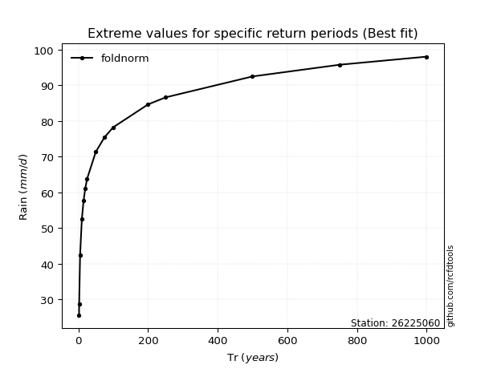</img>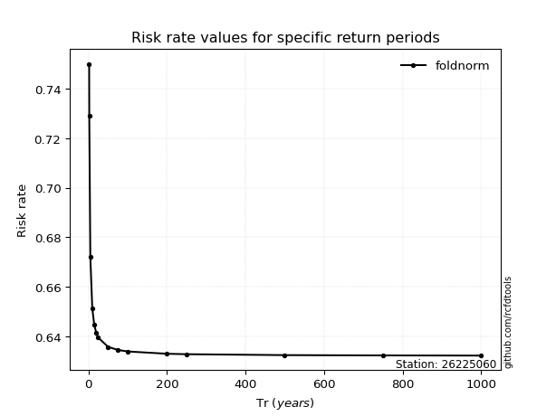</img>

</div>


<sub>**APP DISCLAIMER**: NO WARRANTY - This software is provided by [github.com/rcfdtools](https://github.com/rcfdtools) "as is", without any express or implied warranty, including warranties of merchantability, fitness for a particular purpose, or non-infringement. There is no guarantee that the software will be error-free or operate without interruption. LIMITATION OF LIABILITY - Neither the authors nor copyright holders will be liable for claims or damages arising from the software or its use. You are responsible for determining if the software is appropriate for your use and assume all associated risks, including errors, legal compliance, and data loss. NO PROFESSIONAL ADVICE - The software provides general information and does not offer professional advice. It should not replace consultation with professional advisors.</sub>