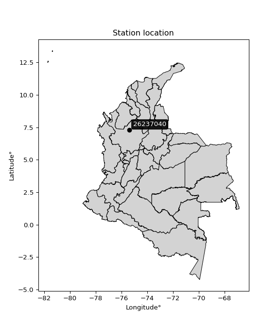

<div align="center">


</div>

# Station (rain, Pmax24h): 26237040

Probable Maximum Precipitation (PMP) is the greatest amount of rainfall for a specific duration that is meteorologically possible for a given location, acting as a "worst-case" scenario for extreme storms, crucial for designing safety-critical infrastructure like bridges, river deviations, dams, spillways, and nuclear plants to prevent catastrophic failure. PMP is calculated by hydrologists using meteorological data to determine the upper limit of extreme rainfall, often leading to the Probable Maximum Flood (PMF) for flood control design, and is increasingly being studied for climate change impacts.

<div align="center">

</img>

</div>


## A. General information


### 1. General running parameters

• app_version: _v20251226_. • runtime: _2025-12-26 15:38:16.554582_. • Python version: _3.14.0_. • SciPy version: _1.16.3_. • Pandas version: _2.3.3_. • NumPy version: _2.3.5_. • Stations dataset (station_dataset_file): _dataset/pmax24h_in/automatic_colombia_2003_2024.csv_. • Stations catalog (station_catalog_file): _dataset/CNE_IDEAM.xls_. • Minimum year to eval til year_max (date_min): _2003_. • Maximum year to eval since year_min (date_max): _2024_. • Creates, save and include plots into reports (create_plot): _False_. • Plot only fit distributions with Δo > Δ (plot_only_fit): _True_. • Eval low extreme values, if False, evaluates high extreme values (low_extreme): _False_. • Eval every SciPy distribution as logarithmic (pdist_logarithmic_on): _True_. • Standard deviation normalized (ddof): _1.0_. • Return periods to eval in years (Tr): _[2, 2.33, 5, 10, 15, 20, 25, 50, 75, 100, 200, 250, 500, 750, 1000]_. • Minimum data sample per station, 0 means any (minimum_sample): _5_. • Z-Score threshold to adjust a value, 0 means disable (zscore): _3.5_. • Avoid zeros, e.g. rain = 0 (avoid_zeros): _True_. • Avoid null values (avoid_nans): _True_. [:file_folder:Dataset file.](../../dataset/pmax24h_in/automatic_colombia_2003_2024.csv)


### 2. Station info and location

|   id |   CODIGO | NOMBRE                     | CATEGORIA    | TECNOLOGIA                | ESTADO   | FECHA_INSTALACION   |   FECHA_SUSPENSION |   ALTITUD |   LATITUD |   LONGITUD | DEPARTAMENTO   | MUNICIPIO   | AREA_OPERATIVA                      | ENTIDAD                                                     | AREA_HIDROGRAFICA   | ZONA_HIDROGRAFICA   | SUBZONA_HIDROGRAFICA                                   | CORRIENTE   | OBSERVACION                                                                                                                                                    | SUBRED                          | Catalogo   |
|-----:|---------:|:---------------------------|:-------------|:--------------------------|:---------|:--------------------|-------------------:|----------:|----------:|-----------:|:---------------|:------------|:------------------------------------|:------------------------------------------------------------|:--------------------|:--------------------|:-------------------------------------------------------|:------------|:---------------------------------------------------------------------------------------------------------------------------------------------------------------|:--------------------------------|:-----------|
|    0 | 26237040 | PUERTO VALDIVIA [26237040] | Limnigráfica | Automática con Telemetría | Activa   | 15/10/1959          |                nan |       129 |   7.28712 |   -75.3967 | Antioquia      | Valdivia    | Area Operativa 01 - Antioquia-Chocó | INSTITUTO DE HIDROLOGIA METEOROLOGIA Y ESTUDIOS AMBIENTALES | Magdalena Cauca     | Cauca               | Directos Río Cauca  entre Río San Juan y  Pto Valdivia | Cauca       | ESTACIÓN ACTIVADA NUEVAMENTE EN SU COMPONENTE CONVENCIONAL POR SOLICITUD DEL AO. (11012023) ESTACIÓN YA CUENTA CON OBSERVADOR Y PERTENECE A LA RED DE ALERTAS. | RED ALERTAS - AREA OPERATIVA 01 | CNE_IDEAM  |

<div align="center">

Map location in: [:earth_americas:Google](http://maps.google.com/maps?q=7.287116944,-75.396725) [:earth_americas:OSM](https://www.openstreetmap.org/#map=18/7.287116944/-75.396725&layers=P) [:earth_americas:Bing](https://www.bing.com/maps?cp=7.287116944~-75.396725&lvl=18) [:earth_americas:Apple](https://maps.apple.com/frame?center=7.287116944%2C-75.396725&span=0.003%2C0.006)

</div>


<div align="center">

```geojson
{
  "type": "Feature",
  "geometry": {
    "type": "Point", 
    "coordinates": [-75.396725, 7.287116944]
  }, 
  "properties": {
    "Name": "26237040"
  }
}
```

</div>


### 3. Discrete values table and plot

|               |           0 |           1 |           2 |         3 |          4 |           5 |          6 |
|:--------------|------------:|------------:|------------:|----------:|-----------:|------------:|-----------:|
| Date          | 2017        | 2018        | 2019        | 2020      | 2022       | 2023        | 2024       |
| Value         |   70.9      |  107.2      |  247.2      |    0.2    |  600       |   85.4      |   22.4     |
| Value_initial |   70.9      |  107.2      |  247.2      |    0.2    |  600       |   85.4      |   22.4     |
| count         |    7        |    7        |    7        |    7      |    7       |    7        |    7       |
| mean          |  161.9      |  161.9      |  161.9      |  161.9    |  161.9     |  161.9      |  161.9     |
| std           |  208.942    |  208.942    |  208.942    |  208.942  |  208.942   |  208.942    |  208.942   |
| zscore        |   -0.435528 |   -0.261795 |    0.408248 |   -0.7739 |    2.09676 |   -0.366131 |   -0.66765 |
> If Z-Score is active, values out of range or outliers are replaced with the station mean value.


### 4. Active continuous probability distributions from SciPy (45 of 104 available)

[scipy.stats](https://docs.scipy.org/doc/scipy/reference/stats.html) is a Python´s powerful submodule within the SciPy library for comprehensive statistical analysis, offering over 130 probability distributions (like Normal, Poisson), functions for descriptive stats (mean, variance), hypothesis testing (t-tests, chi-square), random variable generation, and statistical tests, making it essential for data science, modeling, and research. It provides tools to explore, model, and draw conclusions from data efficiently, working seamlessly with NumPy.

<div align="center">

|   id | p_dist             |   n_parameter | fit_method   | label                                                                       | active   | ref                                                                                                        |
|-----:|:-------------------|--------------:|:-------------|:----------------------------------------------------------------------------|:---------|:-----------------------------------------------------------------------------------------------------------|
|    0 | alpha              |             3 | MLE          | Alpha                                                                       | True     | [:mortar_board:](https://docs.scipy.org/doc/scipy/reference/generated/scipy.stats.alpha.html)              |
|    1 | betaprime          |             4 | MLE          | Beta prime                                                                  | True     | [:mortar_board:](https://docs.scipy.org/doc/scipy/reference/generated/scipy.stats.betaprime.html)          |
|    2 | chi2               |             3 | MLE          | Chi²                                                                        | True     | [:mortar_board:](https://docs.scipy.org/doc/scipy/reference/generated/scipy.stats.chi2.html)               |
|    3 | crystalball        |             4 | MLE          | Crystalball                                                                 | True     | [:mortar_board:](https://docs.scipy.org/doc/scipy/reference/generated/scipy.stats.crystalball.html)        |
|    4 | erlang             |             3 | MLE          | Erlang                                                                      | True     | [:mortar_board:](https://docs.scipy.org/doc/scipy/reference/generated/scipy.stats.erlang.html)             |
|    5 | expon              |             2 | MLE          | Exponential                                                                 | True     | [:mortar_board:](https://docs.scipy.org/doc/scipy/reference/generated/scipy.stats.expon.html)              |
|    6 | exponnorm          |             3 | MLE          | Exponentially modified Normal                                               | True     | [:mortar_board:](https://docs.scipy.org/doc/scipy/reference/generated/scipy.stats.exponnorm.html)          |
|    7 | f                  |             4 | MLE          | F                                                                           | True     | [:mortar_board:](https://docs.scipy.org/doc/scipy/reference/generated/scipy.stats.f.html)                  |
|    8 | fatiguelife        |             3 | MLE          | Fatigue-life (Birnbaum-Saunders)                                            | True     | [:mortar_board:](https://docs.scipy.org/doc/scipy/reference/generated/scipy.stats.fatiguelife.html)        |
|    9 | fisk               |             3 | MLE          | Fisk                                                                        | True     | [:mortar_board:](https://docs.scipy.org/doc/scipy/reference/generated/scipy.stats.fisk.html)               |
|   10 | gamma              |             3 | MLE          | Gamma                                                                       | True     | [:mortar_board:](https://docs.scipy.org/doc/scipy/reference/generated/scipy.stats.gamma.html)              |
|   11 | genexpon           |             5 | MLE          | Generalized exponential                                                     | True     | [:mortar_board:](https://docs.scipy.org/doc/scipy/reference/generated/scipy.stats.genexpon.html)           |
|   12 | genlogistic        |             3 | MLE          | Generalized logistic                                                        | True     | [:mortar_board:](https://docs.scipy.org/doc/scipy/reference/generated/scipy.stats.genlogistic.html)        |
|   13 | gibrat             |             2 | MM           | Gibrat                                                                      | True     | [:mortar_board:](https://docs.scipy.org/doc/scipy/reference/generated/scipy.stats.gibrat.html)             |
|   14 | gompertz           |             3 | MLE          | Gompertz (or truncated Gumbel)                                              | True     | [:mortar_board:](https://docs.scipy.org/doc/scipy/reference/generated/scipy.stats.gompertz.html)           |
|   15 | gumbel_l           |             2 | MM           | Gumbel Left Skew                                                            | True     | [:mortar_board:](https://docs.scipy.org/doc/scipy/reference/generated/scipy.stats.gumbel_l.html)           |
|   16 | gumbel_r           |             2 | MM           | Gumbel Right Skew                                                           | True     | [:mortar_board:](https://docs.scipy.org/doc/scipy/reference/generated/scipy.stats.gumbel_r.html)           |
|   17 | halflogistic       |             2 | MM           | Half-logistic                                                               | True     | [:mortar_board:](https://docs.scipy.org/doc/scipy/reference/generated/scipy.stats.halflogistic.html)       |
|   18 | halfnorm           |             2 | MM           | Half Normal                                                                 | True     | [:mortar_board:](https://docs.scipy.org/doc/scipy/reference/generated/scipy.stats.halfnorm.html)           |
|   19 | hypsecant          |             2 | MM           | hyperbolic secant                                                           | True     | [:mortar_board:](https://docs.scipy.org/doc/scipy/reference/generated/scipy.stats.hypsecant.html)          |
|   20 | invgamma           |             3 | MLE          | Inverted gamma                                                              | True     | [:mortar_board:](https://docs.scipy.org/doc/scipy/reference/generated/scipy.stats.invgamma.html)           |
|   21 | invgauss           |             3 | MLE          | Inverse Gaussian                                                            | True     | [:mortar_board:](https://docs.scipy.org/doc/scipy/reference/generated/scipy.stats.invgauss.html)           |
|   22 | invweibull         |             3 | MLE          | Inverted Weibull                                                            | True     | [:mortar_board:](https://docs.scipy.org/doc/scipy/reference/generated/scipy.stats.invweibull.html)         |
|   23 | johnsonsu          |             4 | MLE          | Johnson Su                                                                  | True     | [:mortar_board:](https://docs.scipy.org/doc/scipy/reference/generated/scipy.stats.johnsonsu.html)          |
|   24 | kstwobign          |             2 | MLE          | Limiting distribution of scaled Kolmogorov-Smirnov two-sided test statistic | True     | [:mortar_board:](https://docs.scipy.org/doc/scipy/reference/generated/scipy.stats.kstwobign.html)          |
|   25 | laplace            |             2 | MM           | Laplace                                                                     | True     | [:mortar_board:](https://docs.scipy.org/doc/scipy/reference/generated/scipy.stats.laplace.html)            |
|   26 | laplace_asymmetric |             3 | MLE          | Asymmetric Laplace                                                          | True     | [:mortar_board:](https://docs.scipy.org/doc/scipy/reference/generated/scipy.stats.laplace_asymmetric.html) |
|   27 | loggamma           |             3 | MLE          | Log gamma                                                                   | True     | [:mortar_board:](https://docs.scipy.org/doc/scipy/reference/generated/scipy.stats.loggamma.html)           |
|   28 | logistic           |             2 | MM           | Logistic (or Sech-squared)                                                  | True     | [:mortar_board:](https://docs.scipy.org/doc/scipy/reference/generated/scipy.stats.logistic.html)           |
|   29 | lognorm            |             3 | MLE          | Log Normal                                                                  | True     | [:mortar_board:](https://docs.scipy.org/doc/scipy/reference/generated/scipy.stats.lognorm.html)            |
|   30 | maxwell            |             2 | MM           | Maxwell                                                                     | True     | [:mortar_board:](https://docs.scipy.org/doc/scipy/reference/generated/scipy.stats.maxwell.html)            |
|   31 | mielke             |             4 | MLE          | Mielke Beta-Kappa / Dagum                                                   | True     | [:mortar_board:](https://docs.scipy.org/doc/scipy/reference/generated/scipy.stats.mielke.html)             |
|   32 | moyal              |             2 | MM           | Moyal                                                                       | True     | [:mortar_board:](https://docs.scipy.org/doc/scipy/reference/generated/scipy.stats.moyal.html)              |
|   33 | nakagami           |             3 | MLE          | Nakagami                                                                    | True     | [:mortar_board:](https://docs.scipy.org/doc/scipy/reference/generated/scipy.stats.nakagami.html)           |
|   34 | ncf                |             5 | MLE          | Non-central F distribution                                                  | True     | [:mortar_board:](https://docs.scipy.org/doc/scipy/reference/generated/scipy.stats.ncf.html)                |
|   35 | nct                |             4 | MLE          | Non-central Student’s t                                                     | True     | [:mortar_board:](https://docs.scipy.org/doc/scipy/reference/generated/scipy.stats.nct.html)                |
|   36 | norm               |             2 | MM           | Normal                                                                      | True     | [:mortar_board:](https://docs.scipy.org/doc/scipy/reference/generated/scipy.stats.norm.html)               |
|   37 | pareto             |             3 | MLE          | Pareto                                                                      | True     | [:mortar_board:](https://docs.scipy.org/doc/scipy/reference/generated/scipy.stats.pareto.html)             |
|   38 | pearson3           |             3 | MM           | Pearson type III                                                            | True     | [:mortar_board:](https://docs.scipy.org/doc/scipy/reference/generated/scipy.stats.pearson3.html)           |
|   39 | rayleigh           |             2 | MM           | Rayleigh                                                                    | True     | [:mortar_board:](https://docs.scipy.org/doc/scipy/reference/generated/scipy.stats.rayleigh.html)           |
|   40 | rice               |             3 | MLE          | Rice                                                                        | True     | [:mortar_board:](https://docs.scipy.org/doc/scipy/reference/generated/scipy.stats.rice.html)               |
|   41 | t                  |             3 | MLE          | Student’s t                                                                 | True     | [:mortar_board:](https://docs.scipy.org/doc/scipy/reference/generated/scipy.stats.t.html)                  |
|   42 | truncnorm          |             4 | MLE          | Truncated normal                                                            | True     | [:mortar_board:](https://docs.scipy.org/doc/scipy/reference/generated/scipy.stats.truncnorm.html)          |
|   43 | wald               |             2 | MM           | Wald                                                                        | True     | [:mortar_board:](https://docs.scipy.org/doc/scipy/reference/generated/scipy.stats.wald.html)               |
|   44 | weibull_min        |             3 | MLE          | Weibull minimum                                                             | True     | [:mortar_board:](https://docs.scipy.org/doc/scipy/reference/generated/scipy.stats.weibull_min.html)        |

</div>

> **n_parameter:** # arguments & localization & scale.
>
> **Fit methods:** (MLE) maximum likelihood, (MM) L-moments.
>
>**Inactive:** foldnorm, gennorm, norminvgauss, powernorm, powerlognorm, skewnorm, genextreme, anglit, arcsine, argus, beta, bradford, burr, burr12, cauchy, cosine, halfcauchy, foldcauchy, skewcauchy, wrapcauchy, dgamma, gengamma, exponweib, exponpow, truncexpon, gausshyper, genhalflogistic, genhyperbolic, geninvgauss, halfgennorm, johnsonsb, kappa4, kappa3, ksone, kstwo, loglaplace, levy, levy_l, levy_stable, ncx2, genpareto, truncpareto, lomax, powerlaw, rdist, rel_breitwigner, recipinvgauss, semicircular, studentized_range, trapezoid, triang, truncweibull_min, tukeylambda, uniform, loguniform, vonmises, vonmises_line, weibull_max, dweibull, 


## B. Probability distributions vs. Empirical distributions

A continuous probability distribution (CPD) describes probabilities for variables that can take any value within a range (like rain any time), unlike discrete variables with specific outcomes (like temperature). It uses a Probability Density Function (PDF), a curve where the total area under it equals 1, and the probability of the variable falling within an interval (a to b) is found by calculating the area under the curve between those points. A key feature is that the probability of hitting any single exact value is zero, so probabilities are always expressed for ranges, e.g., $P(a ≤ X ≤ b)$.

<div align="center">

Distributions parameters
|    |   station | p_dist                |   n |              loc |           scale | shape                 | shape1             | shape2                | shape3   |
|---:|----------:|:----------------------|----:|-----------------:|----------------:|:----------------------|:-------------------|:----------------------|:---------|
|  0 |  26237040 | alpha                 |   7 |      0.00623899  |     0.520526    | 5.662840292759794e-07 |                    |                       |          |
|  1 |  26237040 | betaprime             |   7 |      0.2         |   226.467       | 0.8360142113369696    | 2.3563314994845634 |                       |          |
|  2 |  26237040 | chi2                  |   7 |     -2.66639     |    64.7703      | 1.7508496409662055    |                    |                       |          |
|  3 |  26237040 | crystalball           |   7 |    161.9         |   193.443       | 9073.244384518002     | 275.69243429401376 |                       |          |
|  4 |  26237040 | erlang                |   7 |      0.2         |   193.249       | 0.6213384584994036    |                    |                       |          |
|  5 |  26237040 | expon                 |   7 |      0.2         |   161.7         |                       |                    |                       |          |
|  6 |  26237040 | exponnorm             |   7 |      0.021113    |     0.0557226   | 2885.909226337434     |                    |                       |          |
|  7 |  26237040 | f                     |   7 |      0.2         |    54.284       | 1.1175350323116091    | 2.3222462922107194 |                       |          |
|  8 |  26237040 | fatiguelife           |   7 |     -8.55372     |    78.3816      | 1.4948553175550319    |                    |                       |          |
|  9 |  26237040 | fisk                  |   7 |      0.2         |    43.1258      | 0.7146359766869959    |                    |                       |          |
| 10 |  26237040 | gamma                 |   7 |      0.2         |   141.991       | 0.7299419241923146    |                    |                       |          |
| 11 |  26237040 | genexpon              |   7 |      0.2         |   354.063       | 2.1896264918563393    | 1.6947146684610128 | 9.932526803284422e-13 |          |
| 12 |  26237040 | genlogistic           |   7 |   -743.85        |   111.622       | 1656.9252034563788    |                    |                       |          |
| 13 |  26237040 | gibrat                |   7 |     14.3277      |    89.5071      |                       |                    |                       |          |
| 14 |  26237040 | gompertz              |   7 |      0.2         |     8.38388e+11 | 5153837659.815203     |                    |                       |          |
| 15 |  26237040 | gumbel_l              |   7 |    248.959       |   150.827       |                       |                    |                       |          |
| 16 |  26237040 | gumbel_r              |   7 |     74.8406      |   150.827       |                       |                    |                       |          |
| 17 |  26237040 | halflogistic          |   7 |    -67.3744      |   165.387       |                       |                    |                       |          |
| 18 |  26237040 | halfnorm              |   7 |    -94.1421      |   320.901       |                       |                    |                       |          |
| 19 |  26237040 | hypsecant             |   7 |    161.9         |   123.149       |                       |                    |                       |          |
| 20 |  26237040 | invgamma              |   7 |    -34.2493      |   142.611       | 1.5635830898248693    |                    |                       |          |
| 21 |  26237040 | invgauss              |   7 |    -18.9406      |    97.5721      | 1.8534047057936718    |                    |                       |          |
| 22 |  26237040 | invweibull            |   7 |      0.2         |     0.782221    | 0.06704472808895218   |                    |                       |          |
| 23 |  26237040 | johnsonsu             |   7 |     -5.40962     |     0.14241     | -5.000922070530667    | 0.7137959670388123 |                       |          |
| 24 |  26237040 | kstwobign             |   7 |   -341.886       |   587.238       |                       |                    |                       |          |
| 25 |  26237040 | laplace               |   7 |    161.9         |   136.785       |                       |                    |                       |          |
| 26 |  26237040 | laplace_asymmetric    |   7 |      0.2         |     0.000367895 | 2.27517761942399e-06  |                    |                       |          |
| 27 |  26237040 | loggamma              |   7 | -71720.3         |  9363.61        | 2158.3159634445665    |                    |                       |          |
| 28 |  26237040 | logistic              |   7 |    161.9         |   106.65        |                       |                    |                       |          |
| 29 |  26237040 | lognorm               |   7 |      0.2         |     0.248693    | 15.025805844354602    |                    |                       |          |
| 30 |  26237040 | maxwell               |   7 |   -296.478       |   287.246       |                       |                    |                       |          |
| 31 |  26237040 | mielke                |   7 |      0.2         |   166.132       | 0.8247784674843877    | 1.778946424256278  |                       |          |
| 32 |  26237040 | moyal                 |   7 |     51.2771      |    87.0797      |                       |                    |                       |          |
| 33 |  26237040 | nakagami              |   7 |      0.2         |   341.513       | 0.17664045555976304   |                    |                       |          |
| 34 |  26237040 | ncf                   |   7 |      0.2         |    65.1608      | 1.0723537629255433    | 11.58821881065763  | 0.9220345989559323    |          |
| 35 |  26237040 | nct                   |   7 |     -0.490612    |     0.0349919   | 0.22018581533550508   | 54.519545763665434 |                       |          |
| 36 |  26237040 | norm                  |   7 |    161.9         |   193.443       |                       |                    |                       |          |
| 37 |  26237040 | pareto                |   7 |      0.0881331   |     0.111867    | 0.16853406037336074   |                    |                       |          |
| 38 |  26237040 | pearson3              |   7 |    161.9         |   193.443       | 1.507749317664584     |                    |                       |          |
| 39 |  26237040 | rayleigh              |   7 |   -208.167       |   295.271       |                       |                    |                       |          |
| 40 |  26237040 | rice                  |   7 |   -121.292       |   242.505       | 0.0002480792349222115 |                    |                       |          |
| 41 |  26237040 | t                     |   7 |     74.3973      |    49.2059      | 1.0013395591060883    |                    |                       |          |
| 42 |  26237040 | truncnorm             |   7 |   -135.2         |   273.941       | 0.4942684410503775    | 2.685442124049981  |                       |          |
| 43 |  26237040 | wald                  |   7 |    -31.5426      |   193.443       |                       |                    |                       |          |
| 44 |  26237040 | weibull_min           |   7 |      0.2         |   165.414       | 0.673156317797194     |                    |                       |          |
| 45 |  26237040 | logalpha              |   7 |     -2.45077     |     1.65995     | 8.467830077559828e-08 |                    |                       |          |
| 46 |  26237040 | logbetaprime          |   7 |     -9.84762     |     3.87024e+12 | 21.24378589791874     | 5987263002804.093  |                       |          |
| 47 |  26237040 | logchi2               |   7 |     -1.60944     |     3.89074     | 1.4127867984124372    |                    |                       |          |
| 48 |  26237040 | logcrystalball        |   7 |      3.82715     |     2.41424     | 1382.5669679685852    | 177.0078446105423  |                       |          |
| 49 |  26237040 | logerlang             |   7 |    -35.275       |     0.164509    | 237.52061371939715    |                    |                       |          |
| 50 |  26237040 | logexpon              |   7 |     -1.60944     |     5.43659     |                       |                    |                       |          |
| 51 |  26237040 | logexponnorm          |   7 |      3.82539     |     2.41424     | 0.0007277111881999121 |                    |                       |          |
| 52 |  26237040 | logf                  |   7 |     -1.60944     |     1.14144     | 1.1120959249799696    | 1.1232275833439664 |                       |          |
| 53 |  26237040 | logfatiguelife        |   7 |     -1.60944     |     1.76032e-05 | 582.9580475861537     |                    |                       |          |
| 54 |  26237040 | logfisk               |   7 |     -1.60944     |     1.12742     | 0.7306224759512533    |                    |                       |          |
| 55 |  26237040 | loggamma              |   7 |    -36.8316      |     0.156126    | 260.2792650694203     |                    |                       |          |
| 56 |  26237040 | loggenexpon           |   7 |     -1.93061     |     0.318381    | 0.011418606686183465  | 5.630745051304965  | 0.0007330986983437899 |          |
| 57 |  26237040 | loggenlogistic        |   7 |      5.97711     |     0.395283    | 0.17600755483506975   |                    |                       |          |
| 58 |  26237040 | loggibrat             |   7 |      1.98538     |     1.11709     |                       |                    |                       |          |
| 59 |  26237040 | loggompertz           |   7 |     -1.84987     |     1.64129     | 0.01765846750540631   |                    |                       |          |
| 60 |  26237040 | loggumbel_l           |   7 |      4.91369     |     1.88238     |                       |                    |                       |          |
| 61 |  26237040 | loggumbel_r           |   7 |      2.74061     |     1.88238     |                       |                    |                       |          |
| 62 |  26237040 | loghalflogistic       |   7 |      0.965738    |     2.06408     |                       |                    |                       |          |
| 63 |  26237040 | loghalfnorm           |   7 |      0.631625    |     4.005       |                       |                    |                       |          |
| 64 |  26237040 | loghypsecant          |   7 |      3.82715     |     1.53696     |                       |                    |                       |          |
| 65 |  26237040 | loginvgamma           |   7 |    -54.0104      | 30560.9         | 529.0230505537645     |                    |                       |          |
| 66 |  26237040 | loginvgauss           |   7 |    -22.2647      |  2532.66        | 0.01029862419860303   |                    |                       |          |
| 67 |  26237040 | loginvweibull         |   7 |     -4.33818e+08 |     4.33818e+08 | 148779661.49447292    |                    |                       |          |
| 68 |  26237040 | logjohnsonsu          |   7 |      7.13604     |     0.0535851   | 6.488136216340093     | 1.4179135599339707 |                       |          |
| 69 |  26237040 | logkstwobign          |   7 |     -8.03073     |    13.567       |                       |                    |                       |          |
| 70 |  26237040 | loglaplace            |   7 |      3.82715     |     1.70713     |                       |                    |                       |          |
| 71 |  26237040 | loglaplace_asymmetric |   7 |      4.6747      |     1.39185     | 1.3498908801602463    |                    |                       |          |
| 72 |  26237040 | logloggamma           |   7 |      6.27445     |     0.529212    | 0.22876624368629755   |                    |                       |          |
| 73 |  26237040 | loglogistic           |   7 |      3.82715     |     1.33104     |                       |                    |                       |          |
| 74 |  26237040 | loglognorm            |   7 |     -1.60944     |     0.880476    | 13.7403574971671      |                    |                       |          |
| 75 |  26237040 | logmaxwell            |   7 |     -1.89359     |     3.58494     |                       |                    |                       |          |
| 76 |  26237040 | logmielke             |   7 |     -1.60944     |     2.26994     | 0.1734149180030668    | 0.8527590075906009 |                       |          |
| 77 |  26237040 | logmoyal              |   7 |      2.44653     |     1.08679     |                       |                    |                       |          |
| 78 |  26237040 | lognakagami           |   7 |  -1386.77        |  1390.6         | 82591.22633179469     |                    |                       |          |
| 79 |  26237040 | logncf                |   7 |     -1.60944     |     1.08497     | 1.059859873688386     | 1.164412835456916  | 1.088275860333717     |          |
| 80 |  26237040 | lognct                |   7 |    127.645       |     2.36016     | 32632.926315181016    | -52.46003318394381 |                       |          |
| 81 |  26237040 | lognorm               |   7 |      3.82715     |     2.41424     |                       |                    |                       |          |
| 82 |  26237040 | logpareto             |   7 |     -1.61543     |     0.00598883  | 0.1677983638683954    |                    |                       |          |
| 83 |  26237040 | logpearson3           |   7 |      3.82716     |     2.41423     | -1.4049809035147756   |                    |                       |          |
| 84 |  26237040 | lograyleigh           |   7 |     -0.791427    |     3.68509     |                       |                    |                       |          |
| 85 |  26237040 | logrice               |   7 |  -1384.29        |     2.41254     | 575.3724159308507     |                    |                       |          |
| 86 |  26237040 | logt                  |   7 |      4.56506     |     0.835546    | 1.2509871367714889    |                    |                       |          |
| 87 |  26237040 | logtruncnorm          |   7 |      1.80047     |     5.94174     | -0.5738912503551501   | 0.7736111168711264 |                       |          |
| 88 |  26237040 | logwald               |   7 |      1.41293     |     2.41423     |                       |                    |                       |          |
| 89 |  26237040 | logweibull_min        |   7 |     -1.60944     |     1.96112     | 0.45439693625963495   |                    |                       |          |

</div>

> **loc** (Location parameter): This shifts the distribution along the x-axis. For many common distributions, like the normal (Gaussian) distribution, loc represents the mean $μ$. For others, like the uniform distribution, it might represent the minimum value, or for the beta distribution, the left end of the support interval.
>
> **scale** (Scale parameter): This determines the width or spread of the distribution. For the normal distribution, scale represents the standard deviation $σ$. For a uniform distribution, it defines the length of the interval (from $loc$ to $loc + scale$).
>
> **shape** (Shape parameters): Refers to parameters that define the specific form of a probability distribution, distinct from its location (loc) and scale (scale). These parameters are required arguments for most distribution functions. For example, a normal (Gaussian) distribution is fully defined by its location (mean) and scale (standard deviation), so it has no specific shape parameters beyond loc and scale. However, other distributions have intrinsic properties that need specification, as Gamma distribution that takes a shape parameter, often named $a$ or $alpha$.


### 0. Cumulative distribution values - CDF (90 evaluated)

> Ordered by x ascending and calculating $log(f(x))$ separately. 

|   id |   Station |   date |     x |   count |   mean |     std |    zscore |   Value_initial |   station |   m |      alpha |   alpha_pdf |   betaprime |   betaprime_pdf |      chi2 |    chi2_pdf |   crystalball |   crystalball_pdf |      erlang |      erlang_pdf |    expon |   expon_pdf |   exponnorm |   exponnorm_pdf |           f |           f_pdf |   fatiguelife |   fatiguelife_pdf |        fisk |       fisk_pdf |       gamma |     gamma_pdf |    genexpon |   genexpon_pdf |   genlogistic |   genlogistic_pdf |     gibrat |   gibrat_pdf |    gompertz |   gompertz_pdf |   gumbel_l |   gumbel_l_pdf |   gumbel_r |   gumbel_r_pdf |   halflogistic |   halflogistic_pdf |   halfnorm |   halfnorm_pdf |   hypsecant |   hypsecant_pdf |   invgamma |   invgamma_pdf |   invgauss |   invgauss_pdf |   invweibull |   invweibull_pdf |   johnsonsu |   johnsonsu_pdf |   kstwobign |   kstwobign_pdf |   laplace |   laplace_pdf |   laplace_asymmetric |   laplace_asymmetric_pdf |   loggamma |   loggamma_pdf |   logistic |   logistic_pdf |   lognorm |   lognorm_pdf |   maxwell |   maxwell_pdf |      mielke |   mielke_pdf |    moyal |   moyal_pdf |    nakagami |   nakagami_pdf |         ncf |          ncf_pdf |       nct |     nct_pdf |     norm |    norm_pdf |   pareto |   pareto_pdf |   pearson3 |   pearson3_pdf |   rayleigh |   rayleigh_pdf |     rice |    rice_pdf |        t |       t_pdf |   truncnorm |   truncnorm_pdf |      wald |    wald_pdf |   weibull_min |   weibull_min_pdf |   logalpha |   logalpha_pdf |   logbetaprime |   logbetaprime_pdf |     logchi2 |   logchi2_pdf |   logcrystalball |   logcrystalball_pdf |   logerlang |   logerlang_pdf |   logexpon |   logexpon_pdf |   logexponnorm |   logexponnorm_pdf |        logf |    logf_pdf |   logfatiguelife |   logfatiguelife_pdf |     logfisk |   logfisk_pdf |   loggenexpon |   loggenexpon_pdf |   loggenlogistic |   loggenlogistic_pdf |   loggibrat |   loggibrat_pdf |   loggompertz |   loggompertz_pdf |   loggumbel_l |   loggumbel_l_pdf |   loggumbel_r |   loggumbel_r_pdf |   loghalflogistic |   loghalflogistic_pdf |   loghalfnorm |   loghalfnorm_pdf |   loghypsecant |   loghypsecant_pdf |   loginvgamma |   loginvgamma_pdf |   loginvgauss |   loginvgauss_pdf |   loginvweibull |   loginvweibull_pdf |   logjohnsonsu |   logjohnsonsu_pdf |   logkstwobign |   logkstwobign_pdf |   loglaplace |   loglaplace_pdf |   loglaplace_asymmetric |   loglaplace_asymmetric_pdf |   logloggamma |   logloggamma_pdf |   loglogistic |   loglogistic_pdf |   loglognorm |   loglognorm_pdf |   logmaxwell |   logmaxwell_pdf |   logmielke |   logmielke_pdf |    logmoyal |   logmoyal_pdf |   lognakagami |   lognakagami_pdf |      logncf |   logncf_pdf |    lognct |   lognct_pdf |   logpareto |   logpareto_pdf |   logpearson3 |   logpearson3_pdf |   lograyleigh |   lograyleigh_pdf |   logrice |   logrice_pdf |      logt |   logt_pdf |   logtruncnorm |   logtruncnorm_pdf |   logwald |   logwald_pdf |   logweibull_min |   logweibull_min_pdf |
|-----:|----------:|-------:|------:|--------:|-------:|--------:|----------:|----------------:|----------:|----:|-----------:|------------:|------------:|----------------:|----------:|------------:|--------------:|------------------:|------------:|----------------:|---------:|------------:|------------:|----------------:|------------:|----------------:|--------------:|------------------:|------------:|---------------:|------------:|--------------:|------------:|---------------:|--------------:|------------------:|-----------:|-------------:|------------:|---------------:|-----------:|---------------:|-----------:|---------------:|---------------:|-------------------:|-----------:|---------------:|------------:|----------------:|-----------:|---------------:|-----------:|---------------:|-------------:|-----------------:|------------:|----------------:|------------:|----------------:|----------:|--------------:|---------------------:|-------------------------:|-----------:|---------------:|-----------:|---------------:|----------:|--------------:|----------:|--------------:|------------:|-------------:|---------:|------------:|------------:|---------------:|------------:|-----------------:|----------:|------------:|---------:|------------:|---------:|-------------:|-----------:|---------------:|-----------:|---------------:|---------:|------------:|---------:|------------:|------------:|----------------:|----------:|------------:|--------------:|------------------:|-----------:|---------------:|---------------:|-------------------:|------------:|--------------:|-----------------:|---------------------:|------------:|----------------:|-----------:|---------------:|---------------:|-------------------:|------------:|------------:|-----------------:|---------------------:|------------:|--------------:|--------------:|------------------:|-----------------:|---------------------:|------------:|----------------:|--------------:|------------------:|--------------:|------------------:|--------------:|------------------:|------------------:|----------------------:|--------------:|------------------:|---------------:|-------------------:|--------------:|------------------:|--------------:|------------------:|----------------:|--------------------:|---------------:|-------------------:|---------------:|-------------------:|-------------:|-----------------:|------------------------:|----------------------------:|--------------:|------------------:|--------------:|------------------:|-------------:|-----------------:|-------------:|-----------------:|------------:|----------------:|------------:|---------------:|--------------:|------------------:|------------:|-------------:|----------:|-------------:|------------:|----------------:|--------------:|------------------:|--------------:|------------------:|----------:|--------------:|----------:|-----------:|---------------:|-------------------:|----------:|--------------:|-----------------:|---------------------:|
|    0 |  26237040 |   2020 |   0.2 |       7 |  161.9 | 208.942 | -0.7739   |             0.2 |  26237040 |   1 | 0.00722189 | 0.299718    |  5.8433e-16 |     8.80018     | 0.0369212 | 0.0111436   |      0.201604 |       0.00145421  | 2.18731e-12 | 48965.2         | 0        | 0.00618429  |  0.00111179 |     0.00620746  | 1.94021e-09 | 44793.2         |     0.0376855 |       0.0104342   | 9.99495e-14 | 2573.45        | 2.41171e-14 | 634.255       | 4.59503e-15 |    0.00618429  |      0.121344 |       0.00229137  | 0          |  0           | 5.19897e-12 |    0.00614732  |   0.174844 |    0.00105141  |   0.193923 |    0.00210898  |       0.201497 |        0.00290048  |   0.231235 |    0.00238123  |    0.167291 |     0.00129676  |  0.0448416 |    0.00478948  |  0.0401886 |    0.00613225  |  3.13418e-06 |      9.5945e+10  |   0.0297897 |     0.00860484  |    0.113469 |     0.0020801   |  0.153309 |   0.00112081  |          6.55898e-12 |              0.00618431  |  0.0127988 |      0.0144302 |   0.180027 |    0.00138412  | 0.0121649 |     0.0130913 |  0.214894 |   0.00173823  | 5.77208e-16 |  8.5761      | 0.17998  | 0.00250022  | 1.43498e-07 |    1.82649e+09 | 2.41679e-10 | 466872           | 0.0348562 | 0.14252     | 0.201604 | 0.00145421  | 0        |  1.50656     |   0.193853 |    0.00280171  |   0.220414 |    0.00186317  | 0.117939 | 0.00182223  | 0.18628  | 0.00197678  | 1.88206e-08 |     0.00419909  | 0.0345187 | 0.00369034  |   2.29795e-13 |    5573.22        |  0.0484966 |      0.267183  |      0.0180703 |          0.0210858 | 2.25949e-12 |  7188.15      |        0.0121649 |            0.0130913 |   0.0132571 |       0.0148384 |   0        |      0.183939  |       0.012165 |          0.0130914 | 1.22406e-09 | 3.06532e+06 |         0.102806 |          3.50509e+09 | 3.35045e-12 | 11024.4       |     0.0135262 |         0.0482768 |        0.0341135 |            0.0151897 |    0        |       0         |    0.00278193 |         0.0124216 |      0.030778 |         0.0160963 |   4.17486e-05 |       0.000223646 |          0        |             0         |      0        |         0         |      0.0185162 |          0.0120405 |     0.0108821 |         0.0130118 |     0.0120146 |         0.0150383 |       0.0172526 |           0.0240212 |      0.0428073 |          0.0147607 |      0.0214882 |          0.0335123 |    0.0206965 |        0.0121236 |               0.0227737 |                   0.0121211 |     0.0363394 |         0.0157087 |     0.0165536 |         0.0122307 |   0.00447534 |      4.29322e+12 |  0.000132194 |       0.00139391 |  0.00167379 |     1.30722e+12 | 1.02927e-10 |    2.02304e-09 |     0.0122339 |         0.0131448 | 1.86559e-09 |  4.45241e+06 | 0.0121154 |    0.0130238 |    0        |     28.0185     |     0.0345598 |         0.0170235 |      0        |         0         | 0.0121145 |     0.0130534 | 0.0276404 | 0.00551303 |      7.293e-07 |           0.114492 |  0        |     0         |      5.67751e-08 |          1.16186e+08 |
|    1 |  26237040 |   2024 |  22.4 |       7 |  161.9 | 208.942 | -0.66765  |            22.4 |  26237040 |   2 | 0.981455   | 0.000827964 |  0.265362   |     0.00847943  | 0.227857  | 0.00716603  |      0.23541  |       0.00159012  | 0.27853     |     0.00725802  | 0.128284 | 0.00539095  |  0.129914   |     0.00541063  | 0.398537    |     0.00822406  |     0.259747  |       0.00777626  | 0.383543    |    0.00761112  | 0.264423    |   0.00793436  | 0.128284    |    0.00539095  |      0.177475 |       0.0027475   | 0.00806679 |  0.00273532  | 0.127568    |    0.00536312  |   0.199611 |    0.00118157  |   0.242734 |    0.00227851  |       0.264934 |        0.00281102  |   0.283523 |    0.00232771  |    0.198398 |     0.00150873  |  0.182607  |    0.00677753  |  0.204917  |    0.00734575  |  0.449749    |      0.00108534  |   0.229259  |     0.00777963  |    0.163736 |     0.00243248  |  0.180324 |   0.00131831  |          0.128284    |              0.00539096  |  0.398548  |      0.154995  |   0.21282  |    0.00157081  | 0.383066  |     0.158095  |  0.254749 |   0.00184851  | 0.187727    |  0.00678542  | 0.237862 | 0.00269444  | 0.303101    |    0.00482035  | 0.276119    |      0.00649827  | 0.521002  | 0.00460432  | 0.23541  | 0.00159012  | 0.590363 |  0.00309422  |   0.256457 |    0.00282261  |   0.262785 |    0.00194962  | 0.161002 | 0.00204999  | 0.24113  | 0.00305759  | 0.0912787   |     0.004021    | 0.143091  | 0.00551216  |   0.227975    |       0.00605696  |  0.765275  |      0.0409783 |      0.423625  |          0.13647   | 0.610291    |     0.0630159 |        0.383066  |            0.158095  |   0.400468  |       0.154233  |   0.580174 |      0.0772223 |       0.383067 |          0.158095  | 0.724819    | 0.0280393   |         0.812759 |          0.0253089   | 0.739993    |     0.0297922 |     0.501371  |         0.119624  |        0.278822  |            0.124064  |    0.502348 |       0.355026  |    0.291551   |         0.156399  |      0.318455 |         0.138813  |   0.439451    |       0.191954    |          0.477079 |             0.187104  |      0.463811 |         0.164531  |      0.356413  |          0.186388  |     0.391698  |         0.155263  |     0.41241   |         0.15139   |       0.447154  |           0.123427  |      0.267818  |          0.115938  |      0.489768  |          0.116938  |    0.328312  |        0.192319  |               0.280616  |                   0.149356  |     0.279256  |         0.120468  |     0.368305  |         0.174793  |   0.548621   |      0.00610754  |  0.416586    |       0.163697   |  0.916447   |     0.0117505   | 0.460962    |    0.206231    |     0.38286   |         0.15776   | 0.622214    |  0.0355317   | 0.382437  |    0.158259  |    0.673498 |      0.0115963  |     0.30447   |         0.126213  |      0.428882 |         0.16404   | 0.382982  |     0.158196  | 0.146062  | 0.099127   |      0.611453  |           0.131753 |  0.517367 |     0.263491  |      0.774686    |          0.0323357   |
|    2 |  26237040 |   2017 |  70.9 |       7 |  161.9 | 208.942 | -0.435528 |            70.9 |  26237040 |   3 | 0.994142   | 8.26333e-05 |  0.546005   |     0.00397045  | 0.497056  | 0.00430952  |      0.319026 |       0.00184631  | 0.522391    |     0.00364192  | 0.354177 | 0.00399396  |  0.356453   |     0.0040019   | 0.63162     |     0.00290975  |     0.503626  |       0.00335884  | 0.587408    |    0.00244977  | 0.53849     |   0.00412394  | 0.354177    |    0.00399396  |      0.326333 |       0.0032728   | 0.323189   |  0.00634742  | 0.352486    |    0.00398047  |   0.264428 |    0.00149774  |   0.358269 |    0.00243825  |       0.395273 |        0.00255087  |   0.392963 |    0.00217836  |    0.283667 |     0.00201043  |  0.460801  |    0.00443352  |  0.474738  |    0.00403318  |  0.477421    |      0.000334735 |   0.491712  |     0.00373087  |    0.293644 |     0.00284097  |  0.257065 |   0.00187934  |          0.354178    |              0.00399397  |  0.57973   |      0.154044  |   0.298751 |    0.00196435  | 0.571351  |     0.162595  |  0.34869  |   0.00200542  | 0.450968    |  0.00431667  | 0.37162  | 0.00274615  | 0.455897    |    0.00226346  | 0.495458    |      0.00333293  | 0.627098  | 0.00115004  | 0.319026 | 0.00184631  | 0.662815 |  0.000802508 |   0.389723 |    0.00263349  |   0.360218 |    0.00204786  | 0.269517 | 0.00238728  | 0.477408 | 0.00643811  | 0.275754    |     0.00357513  | 0.390392  | 0.00434234  |   0.431236    |       0.00305584  |  0.804669  |      0.028513  |      0.578291  |          0.128802  | 0.675636    |     0.0509665 |        0.571351  |            0.162595  |   0.5805    |       0.152916  |   0.660354 |      0.0624741 |       0.571353 |          0.162595  | 0.752635    | 0.0208289   |         0.839066 |          0.0206066   | 0.769512    |     0.0220732 |     0.631757  |         0.1054    |        0.464734  |            0.204271  |    0.761658 |       0.136077  |    0.510058   |         0.218249  |      0.506924 |         0.185218  |   0.640298    |       0.151648    |          0.663088 |             0.13573   |      0.635212 |         0.132125  |      0.588736  |          0.199109  |     0.57324   |         0.154351  |     0.585827  |         0.144947  |       0.581509  |           0.108117  |      0.443703  |          0.194773  |      0.615532  |          0.10045   |    0.61227   |        0.227124  |               0.518138  |                   0.275775  |     0.45785   |         0.194359  |     0.580822  |         0.182915  |   0.554911   |      0.00489871  |  0.600228    |       0.150266   |  0.927912   |     0.00843734  | 0.66435     |    0.144972    |     0.570748  |         0.162277  | 0.657939    |  0.0271013   | 0.571061  |    0.162988  |    0.685238 |      0.00898746 |     0.479801  |         0.178393  |      0.609366 |         0.145344  | 0.571398  |     0.162707  | 0.384013  | 0.354145   |      0.759147  |           0.123893 |  0.731134 |     0.127192  |      0.807142    |          0.0245674   |
|    3 |  26237040 |   2023 |  85.4 |       7 |  161.9 | 208.942 | -0.366131 |            85.4 |  26237040 |   4 | 0.995136   | 5.69538e-05 |  0.598567   |     0.00330753  | 0.555509  | 0.00376776  |      0.346249 |       0.00190721  | 0.571479    |     0.00314822  | 0.409569 | 0.0036514   |  0.411941   |     0.00365684  | 0.669538    |     0.00235126  |     0.548309  |       0.00283124  | 0.619301    |    0.00197756  | 0.593907    |   0.00354065  | 0.409568    |    0.0036514   |      0.374015 |       0.00329433  | 0.408805   |  0.00546589  | 0.407706    |    0.00364102  |   0.286874 |    0.00159857  |   0.393614 |    0.00243326  |       0.431608 |        0.00246004  |   0.424175 |    0.00212615  |    0.31388  |     0.00215534  |  0.520009  |    0.00375235  |  0.528453  |    0.0034006   |  0.481828    |      0.000276847 |   0.541178  |     0.00311911  |    0.3351   |     0.00287074  |  0.285812 |   0.00208951  |          0.409569    |              0.00365141  |  0.608116  |      0.150931  |   0.327989 |    0.00206668  | 0.601368  |     0.159882  |  0.377952 |   0.00202879  | 0.509596    |  0.00378063  | 0.411037 | 0.0026863   | 0.486707    |    0.00199935  | 0.54064     |      0.00291531  | 0.641975  | 0.000917775 | 0.346249 | 0.00190721  | 0.673237 |  0.000645522 |   0.427253 |    0.0025412   |   0.38997  |    0.00205408  | 0.304569 | 0.00244419  | 0.570043 | 0.00616268  | 0.326552    |     0.00343075  | 0.449777  | 0.00385524  |   0.4726      |       0.00266599  |  0.809836  |      0.0270395 |      0.601995  |          0.125921  | 0.684964    |     0.0493083 |        0.601368  |            0.159882  |   0.608676  |       0.149808  |   0.671782 |      0.060372  |       0.601369 |          0.159882  | 0.756428    | 0.0199507   |         0.842841 |          0.0199745   | 0.773531    |     0.0211318 |     0.651099  |         0.10247   |        0.504196  |            0.219916  |    0.785305 |       0.118584  |    0.551227   |         0.223908  |      0.541851 |         0.18998   |   0.667738    |       0.143261    |          0.687595 |             0.127711  |      0.659278 |         0.126541  |      0.625095  |          0.191316  |     0.601682  |         0.151233  |     0.612483  |         0.141468  |       0.601329  |           0.10489   |      0.481367  |          0.210116  |      0.63394   |          0.0973933 |    0.65231   |        0.20367   |               0.57208   |                   0.304485  |     0.495341  |         0.20867   |     0.614424  |         0.177986  |   0.555809   |      0.00474671  |  0.627772    |       0.145695   |  0.929445   |     0.00804154  | 0.690399    |    0.135064    |     0.600707  |         0.159588  | 0.662882    |  0.0260474   | 0.601152  |    0.160289  |    0.68688  |      0.00866617 |     0.513749  |         0.186428  |      0.63596  |         0.140437  | 0.601435  |     0.159988  | 0.453596  | 0.389572   |      0.782048  |           0.122236 |  0.753569 |     0.114232  |      0.811622    |          0.0235917   |
|    4 |  26237040 |   2018 | 107.2 |       7 |  161.9 | 208.942 | -0.261795 |           107.2 |  26237040 |   5 | 0.996126   | 3.61442e-05 |  0.662145   |     0.0025677   | 0.630066  | 0.00309764  |      0.388676 |       0.0019815   | 0.633608    |     0.00257993  | 0.484036 | 0.00319087  |  0.486493   |     0.00319324  | 0.714087    |     0.00177675  |     0.603519  |       0.00226995  | 0.656874    |    0.00150535  | 0.663277    |   0.00285551  | 0.484036    |    0.00319087  |      0.445293 |       0.00322665  | 0.514721   |  0.00429268  | 0.481991    |    0.00318437  |   0.323399 |    0.00175254  |   0.446236 |    0.00238732  |       0.48368  |        0.00231595  |   0.469621 |    0.00204214  |    0.363046 |     0.00234917  |  0.592485  |    0.00293584  |  0.594349  |    0.00268487  |  0.487191    |      0.000219517 |   0.601404  |     0.00244663  |    0.397586 |     0.00284985  |  0.335194 |   0.00245052  |          0.484037    |              0.00319087  |  0.641907  |      0.146164  |   0.374516 |    0.00219646  | 0.637228  |     0.15537   |  0.422384 |   0.00204356  | 0.584249    |  0.00309055  | 0.468238 | 0.00255442  | 0.527       |    0.00171452  | 0.598664    |      0.002431    | 0.659368  | 0.000696439 | 0.388676 | 0.0019815   | 0.685532 |  0.000494797 |   0.480994 |    0.00238676  |   0.434687 |    0.00204486  | 0.35846  | 0.0024926   | 0.687222 | 0.0044805   | 0.398921    |     0.00320761  | 0.526591  | 0.00321117  |   0.525665    |       0.00222569  |  0.815793  |      0.0253877 |      0.630178  |          0.121921  | 0.695952    |     0.0473732 |        0.637228  |            0.15537   |   0.642215  |       0.14507   |   0.685225 |      0.0578994 |       0.63723  |          0.15537   | 0.760849    | 0.0189576   |         0.847298 |          0.0192408   | 0.778213    |     0.020067  |     0.673973  |         0.0987257 |        0.556364  |            0.238876  |    0.810181 |       0.100846  |    0.602636   |         0.227714  |      0.585535 |         0.193929  |   0.699134    |       0.132932    |          0.715544 |             0.118212  |      0.687269 |         0.119686  |      0.667256  |          0.179166  |     0.635542  |         0.146467  |     0.644094  |         0.136491  |       0.624713  |           0.100796  |      0.531293  |          0.229059  |      0.655651  |          0.0935925 |    0.695663  |        0.178274  |               0.645667  |                   0.343651  |     0.544794  |         0.22634   |     0.654019  |         0.170001  |   0.556868   |      0.00457324  |  0.6602      |       0.139461   |  0.931222   |     0.00759622  | 0.719777    |    0.123485    |     0.636505  |         0.155113  | 0.668666    |  0.0248481   | 0.637106  |    0.155784  |    0.688808 |      0.0083015  |     0.557186  |         0.19553   |      0.667163 |         0.133972  | 0.637318  |     0.155467  | 0.543251  | 0.390482   |      0.809597  |           0.120082 |  0.777942 |     0.100534  |      0.816858    |          0.0224795   |
|    5 |  26237040 |   2019 | 247.2 |       7 |  161.9 | 208.942 |  0.408248 |           247.2 |  26237040 |   6 | 0.99832    | 6.79683e-06 |  0.858482   |     0.000731095 | 0.882563  | 0.000948893 |      0.670378 |       0.00187126  | 0.85315     |     0.000910769 | 0.782927 | 0.00134244  |  0.784992   |     0.00133702  | 0.849615    |     0.000526271 |     0.798998  |       0.000866674 | 0.77682     |    0.000501607 | 0.891362    |   0.000849892 | 0.782927    |    0.00134244  |      0.793859 |       0.0016417   | 0.830507   |  0.00108458  | 0.780935    |    0.00134666  |   0.627829 |    0.00243892  |   0.726922 |    0.00153714  |       0.740248 |        0.0013666   |   0.712535 |    0.00141214  |    0.704707 |     0.00206841  |  0.816162  |    0.000830881 |  0.810262  |    0.000871353 |  0.506679    |      9.35042e-05 |   0.797767  |     0.000796371 |    0.733358 |     0.00180888  |  0.731997 |   0.00195931  |          0.782928    |              0.00134244  |  0.754406  |      0.121584  |   0.689934 |    0.00200585  | 0.75714   |     0.129598  |  0.689771 |   0.0016594   | 0.830207    |  0.000916453 | 0.745435 | 0.00141104  | 0.700442    |    0.000925942 | 0.814402    |      0.000945819 | 0.716444  | 0.000252067 | 0.670378 | 0.00187126  | 0.726857 |  0.000186288 |   0.7414   |    0.00136345  |   0.695533 |    0.00159023  | 0.684776 | 0.00197517  | 0.91183  | 0.000485069 | 0.7467      |     0.0017909   | 0.798513  | 0.0011145   |   0.730132    |       0.000963347 |  0.83483   |      0.0204485 |      0.724805  |          0.103881  | 0.7328      |     0.041019  |        0.75714   |            0.129598  |   0.753904  |       0.120781  |   0.730066 |      0.0496514 |       0.757141 |          0.129597  | 0.77536     | 0.0159234   |         0.862347 |          0.0168573   | 0.793554    |     0.0168119 |     0.750368  |         0.0839494 |        0.774907  |            0.264015  |    0.874744 |       0.0584848 |    0.787149   |         0.202934  |      0.746617 |         0.184797  |   0.794834    |       0.0969578   |          0.800802 |             0.086895  |      0.776822 |         0.0948703 |      0.794486  |          0.124617  |     0.74833   |         0.122007  |     0.748845  |         0.113214  |       0.702401  |           0.0850951 |      0.747386  |          0.278514  |      0.727936  |          0.0794488 |    0.813447  |        0.109279  |               0.842422  |                   0.152828  |     0.756318  |         0.269324  |     0.779792  |         0.129009  |   0.560453   |      0.00403116  |  0.765789    |       0.112517   |  0.936978   |     0.00625161  | 0.807025    |    0.0870301   |     0.756273  |         0.129519  | 0.687806    |  0.0211315   | 0.757343  |    0.129938  |    0.695253 |      0.00717636 |     0.730602  |         0.214528  |      0.768252 |         0.10754   | 0.757291  |     0.129645  | 0.785129  | 0.179445   |      0.906276  |           0.111082 |  0.845661 |     0.0647702 |      0.834131    |          0.0190188   |
|    6 |  26237040 |   2022 | 600   |       7 |  161.9 | 208.942 |  2.09676  |           600   |  26237040 |   7 | 0.999308   | 1.15369e-06 |  0.963162   |     0.000106852 | 0.992929  | 5.58207e-05 |      0.988236 |       0.000158703 | 0.981541    |     0.000104869 | 0.975506 | 0.000151476 |  0.97603    |     0.000149055 | 0.934977    |     0.000109841 |     0.947802  |       0.000184505 | 0.867756    |    0.000136726 | 0.992487    |   5.57482e-05 | 0.975506    |    0.000151476 |      0.99026  |       8.68349e-05 | 0.96984    |  0.000116692 | 0.974957    |    0.000153947 |   0.999965 |    2.39913e-06 |   0.969718 |    0.000197701 |       0.965252 |        0.000206454 |   0.969467 |    0.000239626 |    0.981854 |     0.000147267 |  0.93914   |    0.000137202 |  0.948293  |    0.000161138 |  0.526968    |      3.77346e-05 |   0.927521  |     0.000162593 |    0.988345 |     0.000127335 |  0.979677 |   0.000148578 |          0.975507    |              0.000151475 |  0.84816   |      0.0895525 |   0.983822 |    0.000149235 | 0.856432  |     0.0937782 |  0.979092 |   0.000207578 | 0.956011    |  0.000121562 | 0.965843 | 0.000196005 | 0.902355    |    0.000331813 | 0.961191    |      0.000151224 | 0.766678  | 8.55536e-05 | 0.988236 | 0.000158703 | 0.764782 |  6.60802e-05 |   0.965047 |    0.000207896 |   0.976381 |    0.000218942 | 0.988006 | 0.000147109 | 0.970374 | 5.61139e-05 | 0.999942    |     0.000129464 | 0.962434  | 0.000159379 |   0.907454    |       0.000247202 |  0.85118   |      0.0166238 |      0.807316  |          0.0820897 | 0.766592    |     0.0353613 |        0.856432  |            0.0937782 |   0.847147  |       0.0892106 |   0.77069  |      0.042179  |       0.856432 |          0.0937778 | 0.788351    | 0.013489    |         0.876337 |          0.0147609   | 0.807251    |     0.014199  |     0.817626  |         0.0677981 |        0.949078  |            0.108571  |    0.915202 |       0.0352102 |    0.93063    |         0.113524  |      0.889076 |         0.129577  |   0.866442    |       0.0659876   |          0.865697 |             0.0606976 |      0.849999 |         0.0706897 |      0.881775  |          0.0751653 |     0.842593  |         0.0903013 |     0.836744  |         0.0849561 |       0.770572  |           0.0688748 |      0.962675  |          0.155844  |      0.791911  |          0.0650223 |    0.889027  |        0.0650056 |               0.933319  |                   0.064671  |     0.958191  |         0.141851  |     0.873321  |         0.0831161 |   0.56382    |      0.00357991  |  0.851988    |       0.0820981  |  0.942029   |     0.0051923   | 0.870961    |    0.0588467   |     0.855584  |         0.0938932 | 0.705138    |  0.018089    | 0.856858  |    0.0939314 |    0.701192 |      0.00625777 |     0.9104    |         0.175596  |      0.85081  |         0.0789719 | 0.8566    |     0.0937701 | 0.884689  | 0.0671828  |      0.999987  |           0.100079 |  0.892303 |     0.0423406 |      0.849679    |          0.0161668   |

An Empirical Distribution Function (EDF) is a step-function estimate of a true cumulative distribution function (CDF) based on observed sample data, representing the proportion of data points less than or equal to a given value. It is calculated by ordering your data and jumping up by $1/n$ (where $n$ is sample size) at each unique data point, allowing analysis without assuming an underlying population distribution, and it gets closer to the true CDF as the sample size grows.


### 1. Empirical - EDF California (1923)

California´s estimates the true probability distribution of water-related data (like rainfall, streamflow) using observed samples, crucial for risk assessment.

<div align="center">


$P=m/n$


</div>


**1.1. Empirical values**

<div align="center">

|                | 0                   | 1                  | 2                   | 3                  | 4                  | 5                  | 6              |
|:---------------|:--------------------|:-------------------|:--------------------|:-------------------|:-------------------|:-------------------|:---------------|
| date           | 2020                | 2024               | 2017                | 2023               | 2018               | 2019               | 2022           |
| x              | 0.2                 | 22.4               | 70.9                | 85.4               | 107.2              | 247.2              | 600.0          |
| m              | 1                   | 2                  | 3                   | 4                  | 5                  | 6                  | 7              |
| empirical_dist | edf_california      | edf_california     | edf_california      | edf_california     | edf_california     | edf_california     | edf_california |
| empirical      | 0.14285714285714285 | 0.2857142857142857 | 0.42857142857142855 | 0.5714285714285714 | 0.7142857142857143 | 0.8571428571428571 | 1.0            |
| empirical_tr   | 1.1666666666666665  | 1.4                | 1.75                | 2.333333333333333  | 3.5                | 6.999999999999997  | inf            |

</div>


**1.2. Kolmogorov-Smirnov fit test (sorted by Δ)**


<div align="center">

|                | 0                   | 1                   | 2                   | 3                   | 4                   | 5                     | 6                   | 7                   | 8                   | 9                   | 10                  | 11                  | 12                  | 13                  | 14                  | 15                  | 16                  | 17                  | 18                  | 19                  | 20                  | 21                  | 22                  | 23                  | 24                  | 25                  | 26                  | 27                  | 28                  | 29                  | 30                  | 31                  | 32                  | 33                  | 34                  | 35                  | 36                  | 37                  | 38                  | 39                  | 40                  | 41                  | 42                  | 43                  | 44                  | 45                  | 46                  | 47                  | 48                  | 49                  | 50                  | 51                  | 52                  | 53                  | 54                  | 55                  | 56                  | 57                  | 58                  | 59                  | 60                  | 61                  | 62                  | 63                  | 64                  | 65                  | 66                  | 67                  | 68                  | 69                  | 70                  | 71                  | 72                  | 73                  | 74                  | 75                  | 76                  | 77                  | 78                  | 79                  | 80                  | 81                  | 82                  | 83                  | 84                  | 85                  | 86                  | 87                  | 88                  | 89                  |
|:---------------|:--------------------|:--------------------|:--------------------|:--------------------|:--------------------|:----------------------|:--------------------|:--------------------|:--------------------|:--------------------|:--------------------|:--------------------|:--------------------|:--------------------|:--------------------|:--------------------|:--------------------|:--------------------|:--------------------|:--------------------|:--------------------|:--------------------|:--------------------|:--------------------|:--------------------|:--------------------|:--------------------|:--------------------|:--------------------|:--------------------|:--------------------|:--------------------|:--------------------|:--------------------|:--------------------|:--------------------|:--------------------|:--------------------|:--------------------|:--------------------|:--------------------|:--------------------|:--------------------|:--------------------|:--------------------|:--------------------|:--------------------|:--------------------|:--------------------|:--------------------|:--------------------|:--------------------|:--------------------|:--------------------|:--------------------|:--------------------|:--------------------|:--------------------|:--------------------|:--------------------|:--------------------|:--------------------|:--------------------|:--------------------|:--------------------|:--------------------|:--------------------|:--------------------|:--------------------|:--------------------|:--------------------|:--------------------|:--------------------|:--------------------|:--------------------|:--------------------|:--------------------|:--------------------|:--------------------|:--------------------|:--------------------|:--------------------|:--------------------|:--------------------|:--------------------|:--------------------|:--------------------|:--------------------|:--------------------|:--------------------|
| station        | 26237040            | 26237040            | 26237040            | 26237040            | 26237040            | 26237040              | 26237040            | 26237040            | 26237040            | 26237040            | 26237040            | 26237040            | 26237040            | 26237040            | 26237040            | 26237040            | 26237040            | 26237040            | 26237040            | 26237040            | 26237040            | 26237040            | 26237040            | 26237040            | 26237040            | 26237040            | 26237040            | 26237040            | 26237040            | 26237040            | 26237040            | 26237040            | 26237040            | 26237040            | 26237040            | 26237040            | 26237040            | 26237040            | 26237040            | 26237040            | 26237040            | 26237040            | 26237040            | 26237040            | 26237040            | 26237040            | 26237040            | 26237040            | 26237040            | 26237040            | 26237040            | 26237040            | 26237040            | 26237040            | 26237040            | 26237040            | 26237040            | 26237040            | 26237040            | 26237040            | 26237040            | 26237040            | 26237040            | 26237040            | 26237040            | 26237040            | 26237040            | 26237040            | 26237040            | 26237040            | 26237040            | 26237040            | 26237040            | 26237040            | 26237040            | 26237040            | 26237040            | 26237040            | 26237040            | 26237040            | 26237040            | 26237040            | 26237040            | 26237040            | 26237040            | 26237040            | 26237040            | 26237040            | 26237040            | 26237040            |
| empirical_dist | edf_california      | edf_california      | edf_california      | edf_california      | edf_california      | edf_california        | edf_california      | edf_california      | edf_california      | edf_california      | edf_california      | edf_california      | edf_california      | edf_california      | edf_california      | edf_california      | edf_california      | edf_california      | edf_california      | edf_california      | edf_california      | edf_california      | edf_california      | edf_california      | edf_california      | edf_california      | edf_california      | edf_california      | edf_california      | edf_california      | edf_california      | edf_california      | edf_california      | edf_california      | edf_california      | edf_california      | edf_california      | edf_california      | edf_california      | edf_california      | edf_california      | edf_california      | edf_california      | edf_california      | edf_california      | edf_california      | edf_california      | edf_california      | edf_california      | edf_california      | edf_california      | edf_california      | edf_california      | edf_california      | edf_california      | edf_california      | edf_california      | edf_california      | edf_california      | edf_california      | edf_california      | edf_california      | edf_california      | edf_california      | edf_california      | edf_california      | edf_california      | edf_california      | edf_california      | edf_california      | edf_california      | edf_california      | edf_california      | edf_california      | edf_california      | edf_california      | edf_california      | edf_california      | edf_california      | edf_california      | edf_california      | edf_california      | edf_california      | edf_california      | edf_california      | edf_california      | edf_california      | edf_california      | edf_california      | edf_california      |
| p_dist         | t                   | chi2                | fatiguelife         | johnsonsu           | invgauss            | loglaplace_asymmetric | invgamma            | loggumbel_l         | loggompertz         | ncf                 | erlang              | gamma               | mielke              | betaprime           | lognct              | logrice             | logexponnorm        | logcrystalball      | lognorm             | lognorm             | lognakagami         | loggamma            | loggamma            | loglogistic         | logerlang           | logpearson3         | loginvgamma         | loggenlogistic      | fisk                | loghypsecant        | loginvgauss         | logloggamma         | logt                | logmaxwell          | lograyleigh         | logjohnsonsu        | loglaplace          | nakagami            | wald                | weibull_min         | logbetaprime        | f                   | loghalfnorm         | logkstwobign        | loggumbel_r         | loggenexpon         | exponnorm           | loginvweibull       | laplace_asymmetric  | expon               | genexpon            | halflogistic        | gompertz            | pearson3            | loghalflogistic     | nct                 | logmoyal            | halfnorm            | moyal               | gumbel_r            | genlogistic         | gibrat              | rayleigh            | maxwell             | logexpon            | logwald             | pareto              | truncnorm           | kstwobign           | logchi2             | crystalball         | norm                | logtruncnorm        | loggibrat           | logncf              | logistic            | hypsecant           | rice                | laplace             | logpareto           | gumbel_l            | loglognorm          | logf                | logfisk             | invweibull          | logalpha            | logweibull_min      | logfatiguelife      | logmielke           | alpha               |
| delta          | 0.05468712601956738 | 0.10593596465371971 | 0.11076654266970443 | 0.11306748501002094 | 0.11993622559899064 | 0.12008345884058395   | 0.12180093595651476 | 0.12875115943393645 | 0.1400752100627886  | 0.14285714261546345 | 0.14285714285495554 | 0.14285714285711873 | 0.14285714285714227 | 0.14285714285714227 | 0.1431419920965984  | 0.14340016889199292 | 0.14356758454720953 | 0.14356840164307383 | 0.14356840435713414 | 0.14356840435713414 | 0.14441615348790948 | 0.15184039187652854 | 0.15184039187652854 | 0.1522507374681364  | 0.15285283334246635 | 0.15709935618122006 | 0.1574071865561083  | 0.15792179563015274 | 0.1588369973514075  | 0.16016418813971373 | 0.16325590173001225 | 0.1694916592454725  | 0.1710344370463842  | 0.17165706456278434 | 0.18079434922540022 | 0.18299285762995876 | 0.183698084985986   | 0.18728528403656064 | 0.1876943861967194  | 0.18862081489171334 | 0.19268363253962817 | 0.20304825692794898 | 0.2066407602936024  | 0.20808895396955274 | 0.21172704521255697 | 0.21565687368720987 | 0.22779261473308388 | 0.2294277118556045  | 0.23024830127432627 | 0.2302492242380404  | 0.2302492580805674  | 0.23060574057487448 | 0.23229441369177684 | 0.2332915863070369  | 0.23451676538430272 | 0.2352881540875248  | 0.2357786411206318  | 0.24466500124961127 | 0.24604814153991417 | 0.2680493707021133  | 0.26899249224223387 | 0.2776474995191529  | 0.2795982733926785  | 0.2919016615202673  | 0.2944598197400673  | 0.30256301064309016 | 0.3046483443611928  | 0.3153651753556811  | 0.3167000557318495  | 0.3245772015999274  | 0.3256096215766887  | 0.32560962553588274 | 0.3305760627930972  | 0.3330870544901379  | 0.33649981967791154 | 0.3397695102772835  | 0.35123923061803314 | 0.3558256970416708  | 0.37909182766737226 | 0.38778356247840173 | 0.3908869574603401  | 0.4361804859077647  | 0.43910511793021434 | 0.45427839591345043 | 0.4730321520934866  | 0.47956119426433386 | 0.4889714103987284  | 0.5270448799619732  | 0.630733006672559   | 0.6957411538568906  |
| deltao         | 0.48442053926100004 | 0.48442053926100004 | 0.48442053926100004 | 0.48442053926100004 | 0.48442053926100004 | 0.48442053926100004   | 0.48442053926100004 | 0.48442053926100004 | 0.48442053926100004 | 0.48442053926100004 | 0.48442053926100004 | 0.48442053926100004 | 0.48442053926100004 | 0.48442053926100004 | 0.48442053926100004 | 0.48442053926100004 | 0.48442053926100004 | 0.48442053926100004 | 0.48442053926100004 | 0.48442053926100004 | 0.48442053926100004 | 0.48442053926100004 | 0.48442053926100004 | 0.48442053926100004 | 0.48442053926100004 | 0.48442053926100004 | 0.48442053926100004 | 0.48442053926100004 | 0.48442053926100004 | 0.48442053926100004 | 0.48442053926100004 | 0.48442053926100004 | 0.48442053926100004 | 0.48442053926100004 | 0.48442053926100004 | 0.48442053926100004 | 0.48442053926100004 | 0.48442053926100004 | 0.48442053926100004 | 0.48442053926100004 | 0.48442053926100004 | 0.48442053926100004 | 0.48442053926100004 | 0.48442053926100004 | 0.48442053926100004 | 0.48442053926100004 | 0.48442053926100004 | 0.48442053926100004 | 0.48442053926100004 | 0.48442053926100004 | 0.48442053926100004 | 0.48442053926100004 | 0.48442053926100004 | 0.48442053926100004 | 0.48442053926100004 | 0.48442053926100004 | 0.48442053926100004 | 0.48442053926100004 | 0.48442053926100004 | 0.48442053926100004 | 0.48442053926100004 | 0.48442053926100004 | 0.48442053926100004 | 0.48442053926100004 | 0.48442053926100004 | 0.48442053926100004 | 0.48442053926100004 | 0.48442053926100004 | 0.48442053926100004 | 0.48442053926100004 | 0.48442053926100004 | 0.48442053926100004 | 0.48442053926100004 | 0.48442053926100004 | 0.48442053926100004 | 0.48442053926100004 | 0.48442053926100004 | 0.48442053926100004 | 0.48442053926100004 | 0.48442053926100004 | 0.48442053926100004 | 0.48442053926100004 | 0.48442053926100004 | 0.48442053926100004 | 0.48442053926100004 | 0.48442053926100004 | 0.48442053926100004 | 0.48442053926100004 | 0.48442053926100004 | 0.48442053926100004 |
| eval           | Δo > Δ              | Δo > Δ              | Δo > Δ              | Δo > Δ              | Δo > Δ              | Δo > Δ                | Δo > Δ              | Δo > Δ              | Δo > Δ              | Δo > Δ              | Δo > Δ              | Δo > Δ              | Δo > Δ              | Δo > Δ              | Δo > Δ              | Δo > Δ              | Δo > Δ              | Δo > Δ              | Δo > Δ              | Δo > Δ              | Δo > Δ              | Δo > Δ              | Δo > Δ              | Δo > Δ              | Δo > Δ              | Δo > Δ              | Δo > Δ              | Δo > Δ              | Δo > Δ              | Δo > Δ              | Δo > Δ              | Δo > Δ              | Δo > Δ              | Δo > Δ              | Δo > Δ              | Δo > Δ              | Δo > Δ              | Δo > Δ              | Δo > Δ              | Δo > Δ              | Δo > Δ              | Δo > Δ              | Δo > Δ              | Δo > Δ              | Δo > Δ              | Δo > Δ              | Δo > Δ              | Δo > Δ              | Δo > Δ              | Δo > Δ              | Δo > Δ              | Δo > Δ              | Δo > Δ              | Δo > Δ              | Δo > Δ              | Δo > Δ              | Δo > Δ              | Δo > Δ              | Δo > Δ              | Δo > Δ              | Δo > Δ              | Δo > Δ              | Δo > Δ              | Δo > Δ              | Δo > Δ              | Δo > Δ              | Δo > Δ              | Δo > Δ              | Δo > Δ              | Δo > Δ              | Δo > Δ              | Δo > Δ              | Δo > Δ              | Δo > Δ              | Δo > Δ              | Δo > Δ              | Δo > Δ              | Δo > Δ              | Δo > Δ              | Δo > Δ              | Δo > Δ              | Δo > Δ              | Δo > Δ              | Δo > Δ              | Δo > Δ              | Δo > Δ              | Δo <= Δ             | Δo <= Δ             | Δo <= Δ             | Δo <= Δ             |
| fit            | 1                   | 1                   | 1                   | 1                   | 1                   | 1                     | 1                   | 1                   | 1                   | 1                   | 1                   | 1                   | 1                   | 1                   | 1                   | 1                   | 1                   | 1                   | 1                   | 1                   | 1                   | 1                   | 1                   | 1                   | 1                   | 1                   | 1                   | 1                   | 1                   | 1                   | 1                   | 1                   | 1                   | 1                   | 1                   | 1                   | 1                   | 1                   | 1                   | 1                   | 1                   | 1                   | 1                   | 1                   | 1                   | 1                   | 1                   | 1                   | 1                   | 1                   | 1                   | 1                   | 1                   | 1                   | 1                   | 1                   | 1                   | 1                   | 1                   | 1                   | 1                   | 1                   | 1                   | 1                   | 1                   | 1                   | 1                   | 1                   | 1                   | 1                   | 1                   | 1                   | 1                   | 1                   | 1                   | 1                   | 1                   | 1                   | 1                   | 1                   | 1                   | 1                   | 1                   | 1                   | 1                   | 1                   | 0                   | 0                   | 0                   | 0                   |
| n              | 7                   | 7                   | 7                   | 7                   | 7                   | 7                     | 7                   | 7                   | 7                   | 7                   | 7                   | 7                   | 7                   | 7                   | 7                   | 7                   | 7                   | 7                   | 7                   | 7                   | 7                   | 7                   | 7                   | 7                   | 7                   | 7                   | 7                   | 7                   | 7                   | 7                   | 7                   | 7                   | 7                   | 7                   | 7                   | 7                   | 7                   | 7                   | 7                   | 7                   | 7                   | 7                   | 7                   | 7                   | 7                   | 7                   | 7                   | 7                   | 7                   | 7                   | 7                   | 7                   | 7                   | 7                   | 7                   | 7                   | 7                   | 7                   | 7                   | 7                   | 7                   | 7                   | 7                   | 7                   | 7                   | 7                   | 7                   | 7                   | 7                   | 7                   | 7                   | 7                   | 7                   | 7                   | 7                   | 7                   | 7                   | 7                   | 7                   | 7                   | 7                   | 7                   | 7                   | 7                   | 7                   | 7                   | 7                   | 7                   | 7                   | 7                   |
| best_fit       | 1                   | 0                   | 0                   | 0                   | 0                   | 0                     | 0                   | 0                   | 0                   | 0                   | 0                   | 0                   | 0                   | 0                   | 0                   | 0                   | 0                   | 0                   | 0                   | 0                   | 0                   | 0                   | 0                   | 0                   | 0                   | 0                   | 0                   | 0                   | 0                   | 0                   | 0                   | 0                   | 0                   | 0                   | 0                   | 0                   | 0                   | 0                   | 0                   | 0                   | 0                   | 0                   | 0                   | 0                   | 0                   | 0                   | 0                   | 0                   | 0                   | 0                   | 0                   | 0                   | 0                   | 0                   | 0                   | 0                   | 0                   | 0                   | 0                   | 0                   | 0                   | 0                   | 0                   | 0                   | 0                   | 0                   | 0                   | 0                   | 0                   | 0                   | 0                   | 0                   | 0                   | 0                   | 0                   | 0                   | 0                   | 0                   | 0                   | 0                   | 0                   | 0                   | 0                   | 0                   | 0                   | 0                   | 0                   | 0                   | 0                   | 0                   |
| best_fit_sort  | 1                   | 2                   | 3                   | 4                   | 5                   | 6                     | 7                   | 8                   | 9                   | 10                  | 11                  | 12                  | 13                  | 14                  | 15                  | 16                  | 17                  | 18                  | 19                  | 20                  | 21                  | 22                  | 23                  | 24                  | 25                  | 26                  | 27                  | 28                  | 29                  | 30                  | 31                  | 32                  | 33                  | 34                  | 35                  | 36                  | 37                  | 38                  | 39                  | 40                  | 41                  | 42                  | 43                  | 44                  | 45                  | 46                  | 47                  | 48                  | 49                  | 50                  | 51                  | 52                  | 53                  | 54                  | 55                  | 56                  | 57                  | 58                  | 59                  | 60                  | 61                  | 62                  | 63                  | 64                  | 65                  | 66                  | 67                  | 68                  | 69                  | 70                  | 71                  | 72                  | 73                  | 74                  | 75                  | 76                  | 77                  | 78                  | 79                  | 80                  | 81                  | 82                  | 83                  | 84                  | 85                  | 86                  | 87                  | 88                  | 89                  | 90                  |

</div>


**1.3. Best fit**

<div align="center">

|   id |   station | empirical_dist   | p_dist   |     delta |   deltao | eval   |   fit |   n |   best_fit |   best_fit_sort |
|-----:|----------:|:-----------------|:---------|----------:|---------:|:-------|------:|----:|-----------:|----------------:|
|    0 |  26237040 | edf_california   | t        | 0.0546871 | 0.484421 | Δo > Δ |     1 |   7 |          1 |               1 |

</div>


### 2. Empirical - EDF Hazen (1930)

Hazen method for plotting positions is a formula used to estimate the empirical cumulative probability distribution of flood events or other hydrological data. This formula often results in biased estimations, particularly when extrapolating to extreme events (high return periods).

<div align="center">


$P=(m-0.5)/n$


</div>


**2.1. Empirical values**

<div align="center">

|                | 0                   | 1                   | 2                   | 3         | 4                  | 5                  | 6                  |
|:---------------|:--------------------|:--------------------|:--------------------|:----------|:-------------------|:-------------------|:-------------------|
| date           | 2020                | 2024                | 2017                | 2023      | 2018               | 2019               | 2022               |
| x              | 0.2                 | 22.4                | 70.9                | 85.4      | 107.2              | 247.2              | 600.0              |
| m              | 1                   | 2                   | 3                   | 4         | 5                  | 6                  | 7                  |
| empirical_dist | edf_hazen           | edf_hazen           | edf_hazen           | edf_hazen | edf_hazen          | edf_hazen          | edf_hazen          |
| empirical      | 0.07142857142857142 | 0.21428571428571427 | 0.35714285714285715 | 0.5       | 0.6428571428571429 | 0.7857142857142857 | 0.9285714285714286 |
| empirical_tr   | 1.0769230769230769  | 1.2727272727272727  | 1.5555555555555558  | 2.0       | 2.8000000000000003 | 4.666666666666666  | 14.000000000000007 |

</div>


**2.2. Kolmogorov-Smirnov fit test (sorted by Δ)**


<div align="center">

|                | 0                   | 1                   | 2                   | 3                   | 4                   | 5                   | 6                   | 7                   | 8                   | 9                   | 10                  | 11                  | 12                  | 13                  | 14                  | 15                  | 16                  | 17                  | 18                  | 19                  | 20                  | 21                  | 22                  | 23                  | 24                    | 25                  | 26                  | 27                  | 28                  | 29                  | 30                  | 31                  | 32                  | 33                  | 34                  | 35                  | 36                  | 37                  | 38                  | 39                  | 40                  | 41                  | 42                  | 43                  | 44                  | 45                  | 46                  | 47                  | 48                  | 49                  | 50                  | 51                  | 52                  | 53                  | 54                  | 55                  | 56                  | 57                  | 58                  | 59                  | 60                  | 61                  | 62                  | 63                  | 64                  | 65                  | 66                  | 67                  | 68                  | 69                  | 70                  | 71                  | 72                  | 73                  | 74                  | 75                  | 76                  | 77                  | 78                  | 79                  | 80                  | 81                  | 82                  | 83                  | 84                  | 85                  | 86                  | 87                  | 88                  | 89                  |
|:---------------|:--------------------|:--------------------|:--------------------|:--------------------|:--------------------|:--------------------|:--------------------|:--------------------|:--------------------|:--------------------|:--------------------|:--------------------|:--------------------|:--------------------|:--------------------|:--------------------|:--------------------|:--------------------|:--------------------|:--------------------|:--------------------|:--------------------|:--------------------|:--------------------|:----------------------|:--------------------|:--------------------|:--------------------|:--------------------|:--------------------|:--------------------|:--------------------|:--------------------|:--------------------|:--------------------|:--------------------|:--------------------|:--------------------|:--------------------|:--------------------|:--------------------|:--------------------|:--------------------|:--------------------|:--------------------|:--------------------|:--------------------|:--------------------|:--------------------|:--------------------|:--------------------|:--------------------|:--------------------|:--------------------|:--------------------|:--------------------|:--------------------|:--------------------|:--------------------|:--------------------|:--------------------|:--------------------|:--------------------|:--------------------|:--------------------|:--------------------|:--------------------|:--------------------|:--------------------|:--------------------|:--------------------|:--------------------|:--------------------|:--------------------|:--------------------|:--------------------|:--------------------|:--------------------|:--------------------|:--------------------|:--------------------|:--------------------|:--------------------|:--------------------|:--------------------|:--------------------|:--------------------|:--------------------|:--------------------|:--------------------|
| station        | 26237040            | 26237040            | 26237040            | 26237040            | 26237040            | 26237040            | 26237040            | 26237040            | 26237040            | 26237040            | 26237040            | 26237040            | 26237040            | 26237040            | 26237040            | 26237040            | 26237040            | 26237040            | 26237040            | 26237040            | 26237040            | 26237040            | 26237040            | 26237040            | 26237040              | 26237040            | 26237040            | 26237040            | 26237040            | 26237040            | 26237040            | 26237040            | 26237040            | 26237040            | 26237040            | 26237040            | 26237040            | 26237040            | 26237040            | 26237040            | 26237040            | 26237040            | 26237040            | 26237040            | 26237040            | 26237040            | 26237040            | 26237040            | 26237040            | 26237040            | 26237040            | 26237040            | 26237040            | 26237040            | 26237040            | 26237040            | 26237040            | 26237040            | 26237040            | 26237040            | 26237040            | 26237040            | 26237040            | 26237040            | 26237040            | 26237040            | 26237040            | 26237040            | 26237040            | 26237040            | 26237040            | 26237040            | 26237040            | 26237040            | 26237040            | 26237040            | 26237040            | 26237040            | 26237040            | 26237040            | 26237040            | 26237040            | 26237040            | 26237040            | 26237040            | 26237040            | 26237040            | 26237040            | 26237040            | 26237040            |
| empirical_dist | edf_hazen           | edf_hazen           | edf_hazen           | edf_hazen           | edf_hazen           | edf_hazen           | edf_hazen           | edf_hazen           | edf_hazen           | edf_hazen           | edf_hazen           | edf_hazen           | edf_hazen           | edf_hazen           | edf_hazen           | edf_hazen           | edf_hazen           | edf_hazen           | edf_hazen           | edf_hazen           | edf_hazen           | edf_hazen           | edf_hazen           | edf_hazen           | edf_hazen             | edf_hazen           | edf_hazen           | edf_hazen           | edf_hazen           | edf_hazen           | edf_hazen           | edf_hazen           | edf_hazen           | edf_hazen           | edf_hazen           | edf_hazen           | edf_hazen           | edf_hazen           | edf_hazen           | edf_hazen           | edf_hazen           | edf_hazen           | edf_hazen           | edf_hazen           | edf_hazen           | edf_hazen           | edf_hazen           | edf_hazen           | edf_hazen           | edf_hazen           | edf_hazen           | edf_hazen           | edf_hazen           | edf_hazen           | edf_hazen           | edf_hazen           | edf_hazen           | edf_hazen           | edf_hazen           | edf_hazen           | edf_hazen           | edf_hazen           | edf_hazen           | edf_hazen           | edf_hazen           | edf_hazen           | edf_hazen           | edf_hazen           | edf_hazen           | edf_hazen           | edf_hazen           | edf_hazen           | edf_hazen           | edf_hazen           | edf_hazen           | edf_hazen           | edf_hazen           | edf_hazen           | edf_hazen           | edf_hazen           | edf_hazen           | edf_hazen           | edf_hazen           | edf_hazen           | edf_hazen           | edf_hazen           | edf_hazen           | edf_hazen           | edf_hazen           | edf_hazen           |
| p_dist         | mielke              | logt                | logloggamma         | invgamma            | loggenlogistic      | logjohnsonsu        | nakagami            | wald                | weibull_min         | invgauss            | logpearson3         | t                   | johnsonsu           | ncf                 | chi2                | fatiguelife         | loggumbel_l         | loggompertz         | exponnorm           | laplace_asymmetric  | expon               | genexpon            | halflogistic        | gompertz            | loglaplace_asymmetric | pearson3            | erlang              | halfnorm            | moyal               | gamma               | betaprime           | gumbel_r            | genlogistic         | gibrat              | rayleigh            | lognakagami         | lognct              | logcrystalball      | lognorm             | lognorm             | logexponnorm        | logrice             | loginvgamma         | maxwell             | logbetaprime        | loggamma            | loggamma            | logerlang           | loglogistic         | loginvgauss         | fisk                | loghypsecant        | loginvweibull       | logmaxwell          | truncnorm           | kstwobign           | lograyleigh         | crystalball         | norm                | loglaplace          | logistic            | f                   | logkstwobign        | loghalfnorm         | hypsecant           | loggumbel_r         | rice                | loggenexpon         | loghalflogistic     | nct                 | logmoyal            | laplace             | gumbel_l            | loglognorm          | logexpon            | logwald             | pareto              | logchi2             | invweibull          | logtruncnorm        | loggibrat           | logncf              | logpareto           | logf                | logfisk             | logalpha            | logweibull_min      | logfatiguelife      | logmielke           | alpha               |
| delta          | 0.09382544201410997 | 0.09960586561781282 | 0.10070720948946849 | 0.10365764494207391 | 0.1075913316370169  | 0.11156428620138736 | 0.11585671260798924 | 0.11626581476814801 | 0.11719224346314194 | 0.11759496454644003 | 0.12265780587547676 | 0.12611569744813877 | 0.13456955751101535 | 0.13831522807089452 | 0.13991328167167733 | 0.1464828160688741  | 0.14978160346288955 | 0.15291491786229966 | 0.15636404330451248 | 0.15881972984575488 | 0.158820652809469   | 0.158820686651996   | 0.1591771691463031  | 0.16086584226320544 | 0.1609951743826568    | 0.1618630148784655  | 0.16524814577330876 | 0.17323642982103987 | 0.17461957011134277 | 0.18134668634787038 | 0.18886203112733085 | 0.19662079927354192 | 0.19756392081366247 | 0.20621892809058145 | 0.2081697019641071  | 0.21360480783379848 | 0.21391844236817165 | 0.21420845349733947 | 0.2142084643387145  | 0.2142084643387145  | 0.21420992042092196 | 0.21425514565061504 | 0.21609689637101442 | 0.2204730900916959  | 0.22114787398625607 | 0.22258744743527809 | 0.22258744743527809 | 0.22335672527329314 | 0.22367930889670778 | 0.22868382052281006 | 0.2302655687799789  | 0.23159275956828512 | 0.23286832020545964 | 0.24308563599135574 | 0.2439366039271097  | 0.2452714843032781  | 0.2522229206539716  | 0.2541810501481173  | 0.25418105410731134 | 0.2551266564145574  | 0.26834093884871213 | 0.2744768283565204  | 0.2754822696399821  | 0.2780693317221738  | 0.27981065918946174 | 0.28315561664112837 | 0.2843971256130994  | 0.28708544511578127 | 0.3059453368128741  | 0.3067167255160962  | 0.3072072125492032  | 0.30766325623880086 | 0.3194583860317687  | 0.3647519144791933  | 0.3658883911686387  | 0.37399158207166155 | 0.3760769157897642  | 0.3960057730284988  | 0.4016035806649152  | 0.4020046342216686  | 0.4045156259187093  | 0.40792839110648293 | 0.45921213390697313 | 0.5105336893587857  | 0.5257069673420218  | 0.5509897656929053  | 0.5603999818272998  | 0.5984734513905446  | 0.7021615781011304  | 0.767169725285462   |
| deltao         | 0.48442053926100004 | 0.48442053926100004 | 0.48442053926100004 | 0.48442053926100004 | 0.48442053926100004 | 0.48442053926100004 | 0.48442053926100004 | 0.48442053926100004 | 0.48442053926100004 | 0.48442053926100004 | 0.48442053926100004 | 0.48442053926100004 | 0.48442053926100004 | 0.48442053926100004 | 0.48442053926100004 | 0.48442053926100004 | 0.48442053926100004 | 0.48442053926100004 | 0.48442053926100004 | 0.48442053926100004 | 0.48442053926100004 | 0.48442053926100004 | 0.48442053926100004 | 0.48442053926100004 | 0.48442053926100004   | 0.48442053926100004 | 0.48442053926100004 | 0.48442053926100004 | 0.48442053926100004 | 0.48442053926100004 | 0.48442053926100004 | 0.48442053926100004 | 0.48442053926100004 | 0.48442053926100004 | 0.48442053926100004 | 0.48442053926100004 | 0.48442053926100004 | 0.48442053926100004 | 0.48442053926100004 | 0.48442053926100004 | 0.48442053926100004 | 0.48442053926100004 | 0.48442053926100004 | 0.48442053926100004 | 0.48442053926100004 | 0.48442053926100004 | 0.48442053926100004 | 0.48442053926100004 | 0.48442053926100004 | 0.48442053926100004 | 0.48442053926100004 | 0.48442053926100004 | 0.48442053926100004 | 0.48442053926100004 | 0.48442053926100004 | 0.48442053926100004 | 0.48442053926100004 | 0.48442053926100004 | 0.48442053926100004 | 0.48442053926100004 | 0.48442053926100004 | 0.48442053926100004 | 0.48442053926100004 | 0.48442053926100004 | 0.48442053926100004 | 0.48442053926100004 | 0.48442053926100004 | 0.48442053926100004 | 0.48442053926100004 | 0.48442053926100004 | 0.48442053926100004 | 0.48442053926100004 | 0.48442053926100004 | 0.48442053926100004 | 0.48442053926100004 | 0.48442053926100004 | 0.48442053926100004 | 0.48442053926100004 | 0.48442053926100004 | 0.48442053926100004 | 0.48442053926100004 | 0.48442053926100004 | 0.48442053926100004 | 0.48442053926100004 | 0.48442053926100004 | 0.48442053926100004 | 0.48442053926100004 | 0.48442053926100004 | 0.48442053926100004 | 0.48442053926100004 |
| eval           | Δo > Δ              | Δo > Δ              | Δo > Δ              | Δo > Δ              | Δo > Δ              | Δo > Δ              | Δo > Δ              | Δo > Δ              | Δo > Δ              | Δo > Δ              | Δo > Δ              | Δo > Δ              | Δo > Δ              | Δo > Δ              | Δo > Δ              | Δo > Δ              | Δo > Δ              | Δo > Δ              | Δo > Δ              | Δo > Δ              | Δo > Δ              | Δo > Δ              | Δo > Δ              | Δo > Δ              | Δo > Δ                | Δo > Δ              | Δo > Δ              | Δo > Δ              | Δo > Δ              | Δo > Δ              | Δo > Δ              | Δo > Δ              | Δo > Δ              | Δo > Δ              | Δo > Δ              | Δo > Δ              | Δo > Δ              | Δo > Δ              | Δo > Δ              | Δo > Δ              | Δo > Δ              | Δo > Δ              | Δo > Δ              | Δo > Δ              | Δo > Δ              | Δo > Δ              | Δo > Δ              | Δo > Δ              | Δo > Δ              | Δo > Δ              | Δo > Δ              | Δo > Δ              | Δo > Δ              | Δo > Δ              | Δo > Δ              | Δo > Δ              | Δo > Δ              | Δo > Δ              | Δo > Δ              | Δo > Δ              | Δo > Δ              | Δo > Δ              | Δo > Δ              | Δo > Δ              | Δo > Δ              | Δo > Δ              | Δo > Δ              | Δo > Δ              | Δo > Δ              | Δo > Δ              | Δo > Δ              | Δo > Δ              | Δo > Δ              | Δo > Δ              | Δo > Δ              | Δo > Δ              | Δo > Δ              | Δo > Δ              | Δo > Δ              | Δo > Δ              | Δo > Δ              | Δo > Δ              | Δo > Δ              | Δo <= Δ             | Δo <= Δ             | Δo <= Δ             | Δo <= Δ             | Δo <= Δ             | Δo <= Δ             | Δo <= Δ             |
| fit            | 1                   | 1                   | 1                   | 1                   | 1                   | 1                   | 1                   | 1                   | 1                   | 1                   | 1                   | 1                   | 1                   | 1                   | 1                   | 1                   | 1                   | 1                   | 1                   | 1                   | 1                   | 1                   | 1                   | 1                   | 1                     | 1                   | 1                   | 1                   | 1                   | 1                   | 1                   | 1                   | 1                   | 1                   | 1                   | 1                   | 1                   | 1                   | 1                   | 1                   | 1                   | 1                   | 1                   | 1                   | 1                   | 1                   | 1                   | 1                   | 1                   | 1                   | 1                   | 1                   | 1                   | 1                   | 1                   | 1                   | 1                   | 1                   | 1                   | 1                   | 1                   | 1                   | 1                   | 1                   | 1                   | 1                   | 1                   | 1                   | 1                   | 1                   | 1                   | 1                   | 1                   | 1                   | 1                   | 1                   | 1                   | 1                   | 1                   | 1                   | 1                   | 1                   | 1                   | 0                   | 0                   | 0                   | 0                   | 0                   | 0                   | 0                   |
| n              | 7                   | 7                   | 7                   | 7                   | 7                   | 7                   | 7                   | 7                   | 7                   | 7                   | 7                   | 7                   | 7                   | 7                   | 7                   | 7                   | 7                   | 7                   | 7                   | 7                   | 7                   | 7                   | 7                   | 7                   | 7                     | 7                   | 7                   | 7                   | 7                   | 7                   | 7                   | 7                   | 7                   | 7                   | 7                   | 7                   | 7                   | 7                   | 7                   | 7                   | 7                   | 7                   | 7                   | 7                   | 7                   | 7                   | 7                   | 7                   | 7                   | 7                   | 7                   | 7                   | 7                   | 7                   | 7                   | 7                   | 7                   | 7                   | 7                   | 7                   | 7                   | 7                   | 7                   | 7                   | 7                   | 7                   | 7                   | 7                   | 7                   | 7                   | 7                   | 7                   | 7                   | 7                   | 7                   | 7                   | 7                   | 7                   | 7                   | 7                   | 7                   | 7                   | 7                   | 7                   | 7                   | 7                   | 7                   | 7                   | 7                   | 7                   |
| best_fit       | 1                   | 0                   | 0                   | 0                   | 0                   | 0                   | 0                   | 0                   | 0                   | 0                   | 0                   | 0                   | 0                   | 0                   | 0                   | 0                   | 0                   | 0                   | 0                   | 0                   | 0                   | 0                   | 0                   | 0                   | 0                     | 0                   | 0                   | 0                   | 0                   | 0                   | 0                   | 0                   | 0                   | 0                   | 0                   | 0                   | 0                   | 0                   | 0                   | 0                   | 0                   | 0                   | 0                   | 0                   | 0                   | 0                   | 0                   | 0                   | 0                   | 0                   | 0                   | 0                   | 0                   | 0                   | 0                   | 0                   | 0                   | 0                   | 0                   | 0                   | 0                   | 0                   | 0                   | 0                   | 0                   | 0                   | 0                   | 0                   | 0                   | 0                   | 0                   | 0                   | 0                   | 0                   | 0                   | 0                   | 0                   | 0                   | 0                   | 0                   | 0                   | 0                   | 0                   | 0                   | 0                   | 0                   | 0                   | 0                   | 0                   | 0                   |
| best_fit_sort  | 1                   | 2                   | 3                   | 4                   | 5                   | 6                   | 7                   | 8                   | 9                   | 10                  | 11                  | 12                  | 13                  | 14                  | 15                  | 16                  | 17                  | 18                  | 19                  | 20                  | 21                  | 22                  | 23                  | 24                  | 25                    | 26                  | 27                  | 28                  | 29                  | 30                  | 31                  | 32                  | 33                  | 34                  | 35                  | 36                  | 37                  | 38                  | 39                  | 40                  | 41                  | 42                  | 43                  | 44                  | 45                  | 46                  | 47                  | 48                  | 49                  | 50                  | 51                  | 52                  | 53                  | 54                  | 55                  | 56                  | 57                  | 58                  | 59                  | 60                  | 61                  | 62                  | 63                  | 64                  | 65                  | 66                  | 67                  | 68                  | 69                  | 70                  | 71                  | 72                  | 73                  | 74                  | 75                  | 76                  | 77                  | 78                  | 79                  | 80                  | 81                  | 82                  | 83                  | 84                  | 85                  | 86                  | 87                  | 88                  | 89                  | 90                  |

</div>


**2.3. Best fit**

<div align="center">

|   id |   station | empirical_dist   | p_dist   |     delta |   deltao | eval   |   fit |   n |   best_fit |   best_fit_sort |
|-----:|----------:|:-----------------|:---------|----------:|---------:|:-------|------:|----:|-----------:|----------------:|
|    0 |  26237040 | edf_hazen        | mielke   | 0.0938254 | 0.484421 | Δo > Δ |     1 |   7 |          1 |               1 |

</div>


### 3. Empirical - EDF Weibull (1939)

Weibull plotting position formula is an empirical method used to estimate the non-exceedance probability or plotting position for a set of observed data, is often recommended or widely used in practice, particularly in flood frequency analysis.

<div align="center">


$P=m/(n+1)$


</div>


**3.1. Empirical values**

<div align="center">

|                | 0                  | 1                  | 2           | 3           | 4                  | 5           | 6           |
|:---------------|:-------------------|:-------------------|:------------|:------------|:-------------------|:------------|:------------|
| date           | 2020               | 2024               | 2017        | 2023        | 2018               | 2019        | 2022        |
| x              | 0.2                | 22.4               | 70.9        | 85.4        | 107.2              | 247.2       | 600.0       |
| m              | 1                  | 2                  | 3           | 4           | 5                  | 6           | 7           |
| empirical_dist | edf_weibull        | edf_weibull        | edf_weibull | edf_weibull | edf_weibull        | edf_weibull | edf_weibull |
| empirical      | 0.125              | 0.25               | 0.375       | 0.5         | 0.625              | 0.75        | 0.875       |
| empirical_tr   | 1.1428571428571428 | 1.3333333333333333 | 1.6         | 2.0         | 2.6666666666666665 | 4.0         | 8.0         |

</div>


**3.2. Kolmogorov-Smirnov fit test (sorted by Δ)**


<div align="center">

|                | 0                   | 1                   | 2                   | 3                   | 4                   | 5                   | 6                   | 7                   | 8                   | 9                   | 10                  | 11                  | 12                  | 13                  | 14                  | 15                  | 16                  | 17                  | 18                  | 19                  | 20                  | 21                  | 22                  | 23                    | 24                  | 25                  | 26                  | 27                  | 28                  | 29                  | 30                  | 31                  | 32                  | 33                  | 34                  | 35                  | 36                  | 37                  | 38                  | 39                  | 40                  | 41                  | 42                  | 43                  | 44                  | 45                  | 46                  | 47                  | 48                  | 49                  | 50                  | 51                  | 52                  | 53                  | 54                  | 55                  | 56                  | 57                  | 58                  | 59                  | 60                  | 61                  | 62                  | 63                  | 64                  | 65                  | 66                  | 67                  | 68                  | 69                  | 70                  | 71                  | 72                  | 73                  | 74                  | 75                  | 76                  | 77                  | 78                  | 79                  | 80                  | 81                  | 82                  | 83                  | 84                  | 85                  | 86                  | 87                  | 88                  | 89                  |
|:---------------|:--------------------|:--------------------|:--------------------|:--------------------|:--------------------|:--------------------|:--------------------|:--------------------|:--------------------|:--------------------|:--------------------|:--------------------|:--------------------|:--------------------|:--------------------|:--------------------|:--------------------|:--------------------|:--------------------|:--------------------|:--------------------|:--------------------|:--------------------|:----------------------|:--------------------|:--------------------|:--------------------|:--------------------|:--------------------|:--------------------|:--------------------|:--------------------|:--------------------|:--------------------|:--------------------|:--------------------|:--------------------|:--------------------|:--------------------|:--------------------|:--------------------|:--------------------|:--------------------|:--------------------|:--------------------|:--------------------|:--------------------|:--------------------|:--------------------|:--------------------|:--------------------|:--------------------|:--------------------|:--------------------|:--------------------|:--------------------|:--------------------|:--------------------|:--------------------|:--------------------|:--------------------|:--------------------|:--------------------|:--------------------|:--------------------|:--------------------|:--------------------|:--------------------|:--------------------|:--------------------|:--------------------|:--------------------|:--------------------|:--------------------|:--------------------|:--------------------|:--------------------|:--------------------|:--------------------|:--------------------|:--------------------|:--------------------|:--------------------|:--------------------|:--------------------|:--------------------|:--------------------|:--------------------|:--------------------|:--------------------|
| station        | 26237040            | 26237040            | 26237040            | 26237040            | 26237040            | 26237040            | 26237040            | 26237040            | 26237040            | 26237040            | 26237040            | 26237040            | 26237040            | 26237040            | 26237040            | 26237040            | 26237040            | 26237040            | 26237040            | 26237040            | 26237040            | 26237040            | 26237040            | 26237040              | 26237040            | 26237040            | 26237040            | 26237040            | 26237040            | 26237040            | 26237040            | 26237040            | 26237040            | 26237040            | 26237040            | 26237040            | 26237040            | 26237040            | 26237040            | 26237040            | 26237040            | 26237040            | 26237040            | 26237040            | 26237040            | 26237040            | 26237040            | 26237040            | 26237040            | 26237040            | 26237040            | 26237040            | 26237040            | 26237040            | 26237040            | 26237040            | 26237040            | 26237040            | 26237040            | 26237040            | 26237040            | 26237040            | 26237040            | 26237040            | 26237040            | 26237040            | 26237040            | 26237040            | 26237040            | 26237040            | 26237040            | 26237040            | 26237040            | 26237040            | 26237040            | 26237040            | 26237040            | 26237040            | 26237040            | 26237040            | 26237040            | 26237040            | 26237040            | 26237040            | 26237040            | 26237040            | 26237040            | 26237040            | 26237040            | 26237040            |
| empirical_dist | edf_weibull         | edf_weibull         | edf_weibull         | edf_weibull         | edf_weibull         | edf_weibull         | edf_weibull         | edf_weibull         | edf_weibull         | edf_weibull         | edf_weibull         | edf_weibull         | edf_weibull         | edf_weibull         | edf_weibull         | edf_weibull         | edf_weibull         | edf_weibull         | edf_weibull         | edf_weibull         | edf_weibull         | edf_weibull         | edf_weibull         | edf_weibull           | edf_weibull         | edf_weibull         | edf_weibull         | edf_weibull         | edf_weibull         | edf_weibull         | edf_weibull         | edf_weibull         | edf_weibull         | edf_weibull         | edf_weibull         | edf_weibull         | edf_weibull         | edf_weibull         | edf_weibull         | edf_weibull         | edf_weibull         | edf_weibull         | edf_weibull         | edf_weibull         | edf_weibull         | edf_weibull         | edf_weibull         | edf_weibull         | edf_weibull         | edf_weibull         | edf_weibull         | edf_weibull         | edf_weibull         | edf_weibull         | edf_weibull         | edf_weibull         | edf_weibull         | edf_weibull         | edf_weibull         | edf_weibull         | edf_weibull         | edf_weibull         | edf_weibull         | edf_weibull         | edf_weibull         | edf_weibull         | edf_weibull         | edf_weibull         | edf_weibull         | edf_weibull         | edf_weibull         | edf_weibull         | edf_weibull         | edf_weibull         | edf_weibull         | edf_weibull         | edf_weibull         | edf_weibull         | edf_weibull         | edf_weibull         | edf_weibull         | edf_weibull         | edf_weibull         | edf_weibull         | edf_weibull         | edf_weibull         | edf_weibull         | edf_weibull         | edf_weibull         | edf_weibull         |
| p_dist         | invgamma            | logloggamma         | loggenlogistic      | logjohnsonsu        | invgauss            | logt                | logpearson3         | wald                | johnsonsu           | nakagami            | ncf                 | weibull_min         | mielke              | fatiguelife         | loggumbel_l         | chi2                | loggompertz         | exponnorm           | laplace_asymmetric  | expon               | genexpon            | halflogistic        | gompertz            | loglaplace_asymmetric | pearson3            | erlang              | halfnorm            | moyal               | t                   | gamma               | betaprime           | gumbel_r            | genlogistic         | rayleigh            | lognakagami         | lognct              | logcrystalball      | lognorm             | lognorm             | logexponnorm        | logrice             | loginvgamma         | maxwell             | logbetaprime        | loggamma            | loggamma            | logerlang           | loglogistic         | loginvweibull       | loginvgauss         | fisk                | loghypsecant        | logmaxwell          | truncnorm           | kstwobign           | lograyleigh         | crystalball         | norm                | loglaplace          | logkstwobign        | gibrat              | logistic            | f                   | loggenexpon         | loghalfnorm         | hypsecant           | loggumbel_r         | rice                | nct                 | loghalflogistic     | logmoyal            | laplace             | gumbel_l            | loglognorm          | logexpon            | pareto              | invweibull          | logwald             | logchi2             | logncf              | logtruncnorm        | loggibrat           | logpareto           | logf                | logfisk             | logalpha            | logweibull_min      | logfatiguelife      | logmielke           | alpha               |
| delta          | 0.08580050208493106 | 0.088660629271899   | 0.09088645483545262 | 0.09370714334424446 | 0.09973782168929718 | 0.10393796746907483 | 0.1048006630183339  | 0.10690869366299699 | 0.1167124146538725  | 0.12499985650168495 | 0.12499999975832062 | 0.12499999999977021 | 0.12499999999999942 | 0.12862567321173124 | 0.1319244606057467  | 0.13256311124621878 | 0.1350577750051568  | 0.13850690044736957 | 0.14096258698861197 | 0.1409635099523261  | 0.1409635437948531  | 0.14132002628916018 | 0.14300869940606253 | 0.14313803152551396   | 0.1440058720213226  | 0.14739100291616591 | 0.15537928696389697 | 0.15676242725419987 | 0.16182998316242447 | 0.16348954349072753 | 0.171004888270188   | 0.17876365641639902 | 0.17970677795651957 | 0.1903125591069642  | 0.19574766497665563 | 0.1960612995110288  | 0.19635131064019662 | 0.19635132148157164 | 0.19635132148157164 | 0.1963527775637791  | 0.1963980027934722  | 0.19823975351387157 | 0.202615947234553   | 0.20329073112911322 | 0.20473030457813524 | 0.20473030457813524 | 0.2054995824161503  | 0.20582216603956494 | 0.20650903168600065 | 0.2108266776656672  | 0.21240842592283604 | 0.21373561671114227 | 0.2252284931342129  | 0.2260794610699668  | 0.2274143414461352  | 0.23436577779682877 | 0.2363239072909744  | 0.23632391125016844 | 0.23726951355741455 | 0.24053186782128555 | 0.24193321380486718 | 0.2504837959915692  | 0.2566196854993775  | 0.25675693806489774 | 0.26021218886503095 | 0.26195351633231884 | 0.2652984737839855  | 0.2665399827559565  | 0.2710024398018105  | 0.28808819395573126 | 0.28935006969206034 | 0.28980611338165796 | 0.3016012431746258  | 0.3111804859077647  | 0.330174105454353   | 0.3403626300754785  | 0.3480321520934866  | 0.3561344392145187  | 0.3602914873142131  | 0.37221410539219724 | 0.38414749136452575 | 0.38665848306156647 | 0.42349784819268743 | 0.47481940364450004 | 0.4899926816277361  | 0.5152754799786196  | 0.5246856961130141  | 0.5627591656762589  | 0.6664472923868447  | 0.7314554395711763  |
| deltao         | 0.48442053926100004 | 0.48442053926100004 | 0.48442053926100004 | 0.48442053926100004 | 0.48442053926100004 | 0.48442053926100004 | 0.48442053926100004 | 0.48442053926100004 | 0.48442053926100004 | 0.48442053926100004 | 0.48442053926100004 | 0.48442053926100004 | 0.48442053926100004 | 0.48442053926100004 | 0.48442053926100004 | 0.48442053926100004 | 0.48442053926100004 | 0.48442053926100004 | 0.48442053926100004 | 0.48442053926100004 | 0.48442053926100004 | 0.48442053926100004 | 0.48442053926100004 | 0.48442053926100004   | 0.48442053926100004 | 0.48442053926100004 | 0.48442053926100004 | 0.48442053926100004 | 0.48442053926100004 | 0.48442053926100004 | 0.48442053926100004 | 0.48442053926100004 | 0.48442053926100004 | 0.48442053926100004 | 0.48442053926100004 | 0.48442053926100004 | 0.48442053926100004 | 0.48442053926100004 | 0.48442053926100004 | 0.48442053926100004 | 0.48442053926100004 | 0.48442053926100004 | 0.48442053926100004 | 0.48442053926100004 | 0.48442053926100004 | 0.48442053926100004 | 0.48442053926100004 | 0.48442053926100004 | 0.48442053926100004 | 0.48442053926100004 | 0.48442053926100004 | 0.48442053926100004 | 0.48442053926100004 | 0.48442053926100004 | 0.48442053926100004 | 0.48442053926100004 | 0.48442053926100004 | 0.48442053926100004 | 0.48442053926100004 | 0.48442053926100004 | 0.48442053926100004 | 0.48442053926100004 | 0.48442053926100004 | 0.48442053926100004 | 0.48442053926100004 | 0.48442053926100004 | 0.48442053926100004 | 0.48442053926100004 | 0.48442053926100004 | 0.48442053926100004 | 0.48442053926100004 | 0.48442053926100004 | 0.48442053926100004 | 0.48442053926100004 | 0.48442053926100004 | 0.48442053926100004 | 0.48442053926100004 | 0.48442053926100004 | 0.48442053926100004 | 0.48442053926100004 | 0.48442053926100004 | 0.48442053926100004 | 0.48442053926100004 | 0.48442053926100004 | 0.48442053926100004 | 0.48442053926100004 | 0.48442053926100004 | 0.48442053926100004 | 0.48442053926100004 | 0.48442053926100004 |
| eval           | Δo > Δ              | Δo > Δ              | Δo > Δ              | Δo > Δ              | Δo > Δ              | Δo > Δ              | Δo > Δ              | Δo > Δ              | Δo > Δ              | Δo > Δ              | Δo > Δ              | Δo > Δ              | Δo > Δ              | Δo > Δ              | Δo > Δ              | Δo > Δ              | Δo > Δ              | Δo > Δ              | Δo > Δ              | Δo > Δ              | Δo > Δ              | Δo > Δ              | Δo > Δ              | Δo > Δ                | Δo > Δ              | Δo > Δ              | Δo > Δ              | Δo > Δ              | Δo > Δ              | Δo > Δ              | Δo > Δ              | Δo > Δ              | Δo > Δ              | Δo > Δ              | Δo > Δ              | Δo > Δ              | Δo > Δ              | Δo > Δ              | Δo > Δ              | Δo > Δ              | Δo > Δ              | Δo > Δ              | Δo > Δ              | Δo > Δ              | Δo > Δ              | Δo > Δ              | Δo > Δ              | Δo > Δ              | Δo > Δ              | Δo > Δ              | Δo > Δ              | Δo > Δ              | Δo > Δ              | Δo > Δ              | Δo > Δ              | Δo > Δ              | Δo > Δ              | Δo > Δ              | Δo > Δ              | Δo > Δ              | Δo > Δ              | Δo > Δ              | Δo > Δ              | Δo > Δ              | Δo > Δ              | Δo > Δ              | Δo > Δ              | Δo > Δ              | Δo > Δ              | Δo > Δ              | Δo > Δ              | Δo > Δ              | Δo > Δ              | Δo > Δ              | Δo > Δ              | Δo > Δ              | Δo > Δ              | Δo > Δ              | Δo > Δ              | Δo > Δ              | Δo > Δ              | Δo > Δ              | Δo > Δ              | Δo > Δ              | Δo <= Δ             | Δo <= Δ             | Δo <= Δ             | Δo <= Δ             | Δo <= Δ             | Δo <= Δ             |
| fit            | 1                   | 1                   | 1                   | 1                   | 1                   | 1                   | 1                   | 1                   | 1                   | 1                   | 1                   | 1                   | 1                   | 1                   | 1                   | 1                   | 1                   | 1                   | 1                   | 1                   | 1                   | 1                   | 1                   | 1                     | 1                   | 1                   | 1                   | 1                   | 1                   | 1                   | 1                   | 1                   | 1                   | 1                   | 1                   | 1                   | 1                   | 1                   | 1                   | 1                   | 1                   | 1                   | 1                   | 1                   | 1                   | 1                   | 1                   | 1                   | 1                   | 1                   | 1                   | 1                   | 1                   | 1                   | 1                   | 1                   | 1                   | 1                   | 1                   | 1                   | 1                   | 1                   | 1                   | 1                   | 1                   | 1                   | 1                   | 1                   | 1                   | 1                   | 1                   | 1                   | 1                   | 1                   | 1                   | 1                   | 1                   | 1                   | 1                   | 1                   | 1                   | 1                   | 1                   | 1                   | 0                   | 0                   | 0                   | 0                   | 0                   | 0                   |
| n              | 7                   | 7                   | 7                   | 7                   | 7                   | 7                   | 7                   | 7                   | 7                   | 7                   | 7                   | 7                   | 7                   | 7                   | 7                   | 7                   | 7                   | 7                   | 7                   | 7                   | 7                   | 7                   | 7                   | 7                     | 7                   | 7                   | 7                   | 7                   | 7                   | 7                   | 7                   | 7                   | 7                   | 7                   | 7                   | 7                   | 7                   | 7                   | 7                   | 7                   | 7                   | 7                   | 7                   | 7                   | 7                   | 7                   | 7                   | 7                   | 7                   | 7                   | 7                   | 7                   | 7                   | 7                   | 7                   | 7                   | 7                   | 7                   | 7                   | 7                   | 7                   | 7                   | 7                   | 7                   | 7                   | 7                   | 7                   | 7                   | 7                   | 7                   | 7                   | 7                   | 7                   | 7                   | 7                   | 7                   | 7                   | 7                   | 7                   | 7                   | 7                   | 7                   | 7                   | 7                   | 7                   | 7                   | 7                   | 7                   | 7                   | 7                   |
| best_fit       | 1                   | 0                   | 0                   | 0                   | 0                   | 0                   | 0                   | 0                   | 0                   | 0                   | 0                   | 0                   | 0                   | 0                   | 0                   | 0                   | 0                   | 0                   | 0                   | 0                   | 0                   | 0                   | 0                   | 0                     | 0                   | 0                   | 0                   | 0                   | 0                   | 0                   | 0                   | 0                   | 0                   | 0                   | 0                   | 0                   | 0                   | 0                   | 0                   | 0                   | 0                   | 0                   | 0                   | 0                   | 0                   | 0                   | 0                   | 0                   | 0                   | 0                   | 0                   | 0                   | 0                   | 0                   | 0                   | 0                   | 0                   | 0                   | 0                   | 0                   | 0                   | 0                   | 0                   | 0                   | 0                   | 0                   | 0                   | 0                   | 0                   | 0                   | 0                   | 0                   | 0                   | 0                   | 0                   | 0                   | 0                   | 0                   | 0                   | 0                   | 0                   | 0                   | 0                   | 0                   | 0                   | 0                   | 0                   | 0                   | 0                   | 0                   |
| best_fit_sort  | 1                   | 2                   | 3                   | 4                   | 5                   | 6                   | 7                   | 8                   | 9                   | 10                  | 11                  | 12                  | 13                  | 14                  | 15                  | 16                  | 17                  | 18                  | 19                  | 20                  | 21                  | 22                  | 23                  | 24                    | 25                  | 26                  | 27                  | 28                  | 29                  | 30                  | 31                  | 32                  | 33                  | 34                  | 35                  | 36                  | 37                  | 38                  | 39                  | 40                  | 41                  | 42                  | 43                  | 44                  | 45                  | 46                  | 47                  | 48                  | 49                  | 50                  | 51                  | 52                  | 53                  | 54                  | 55                  | 56                  | 57                  | 58                  | 59                  | 60                  | 61                  | 62                  | 63                  | 64                  | 65                  | 66                  | 67                  | 68                  | 69                  | 70                  | 71                  | 72                  | 73                  | 74                  | 75                  | 76                  | 77                  | 78                  | 79                  | 80                  | 81                  | 82                  | 83                  | 84                  | 85                  | 86                  | 87                  | 88                  | 89                  | 90                  |

</div>


**3.3. Best fit**

<div align="center">

|   id |   station | empirical_dist   | p_dist   |     delta |   deltao | eval   |   fit |   n |   best_fit |   best_fit_sort |
|-----:|----------:|:-----------------|:---------|----------:|---------:|:-------|------:|----:|-----------:|----------------:|
|    0 |  26237040 | edf_weibull      | invgamma | 0.0858005 | 0.484421 | Δo > Δ |     1 |   7 |          1 |               1 |

</div>


### 4. Empirical - EDF Beard (1943)

The Beard formula (or Beard´s plotting position formula) in hydrology is used to estimate the empirical non-exceedance probability _(P)_ of a flood event (or other extreme hydrological data point) within a given dataset.

<div align="center">


$P=(m-0.31)/(n+0.38)$


</div>


**4.1. Empirical values**

<div align="center">

|                | 0                   | 1                   | 2                   | 3         | 4                  | 5                  | 6                  |
|:---------------|:--------------------|:--------------------|:--------------------|:----------|:-------------------|:-------------------|:-------------------|
| date           | 2020                | 2024                | 2017                | 2023      | 2018               | 2019               | 2022               |
| x              | 0.2                 | 22.4                | 70.9                | 85.4      | 107.2              | 247.2              | 600.0              |
| m              | 1                   | 2                   | 3                   | 4         | 5                  | 6                  | 7                  |
| empirical_dist | edf_beard           | edf_beard           | edf_beard           | edf_beard | edf_beard          | edf_beard          | edf_beard          |
| empirical      | 0.09349593495934959 | 0.22899728997289973 | 0.36449864498644985 | 0.5       | 0.6355013550135502 | 0.7710027100271003 | 0.9065040650406505 |
| empirical_tr   | 1.1031390134529149  | 1.29701230228471    | 1.5735607675906182  | 2.0       | 2.743494423791822  | 4.366863905325444  | 10.695652173913055 |

</div>


**4.2. Kolmogorov-Smirnov fit test (sorted by Δ)**


<div align="center">

|                | 0                   | 1                   | 2                   | 3                   | 4                   | 5                   | 6                   | 7                   | 8                   | 9                   | 10                  | 11                  | 12                  | 13                  | 14                  | 15                  | 16                  | 17                  | 18                  | 19                  | 20                  | 21                  | 22                  | 23                  | 24                    | 25                  | 26                  | 27                  | 28                  | 29                  | 30                  | 31                  | 32                  | 33                  | 34                  | 35                  | 36                  | 37                  | 38                  | 39                  | 40                  | 41                  | 42                  | 43                  | 44                  | 45                  | 46                  | 47                  | 48                  | 49                  | 50                  | 51                  | 52                  | 53                  | 54                  | 55                  | 56                  | 57                  | 58                  | 59                  | 60                  | 61                  | 62                  | 63                  | 64                  | 65                  | 66                  | 67                  | 68                  | 69                  | 70                  | 71                  | 72                  | 73                  | 74                  | 75                  | 76                  | 77                  | 78                  | 79                  | 80                  | 81                  | 82                  | 83                  | 84                  | 85                  | 86                  | 87                  | 88                  | 89                  |
|:---------------|:--------------------|:--------------------|:--------------------|:--------------------|:--------------------|:--------------------|:--------------------|:--------------------|:--------------------|:--------------------|:--------------------|:--------------------|:--------------------|:--------------------|:--------------------|:--------------------|:--------------------|:--------------------|:--------------------|:--------------------|:--------------------|:--------------------|:--------------------|:--------------------|:----------------------|:--------------------|:--------------------|:--------------------|:--------------------|:--------------------|:--------------------|:--------------------|:--------------------|:--------------------|:--------------------|:--------------------|:--------------------|:--------------------|:--------------------|:--------------------|:--------------------|:--------------------|:--------------------|:--------------------|:--------------------|:--------------------|:--------------------|:--------------------|:--------------------|:--------------------|:--------------------|:--------------------|:--------------------|:--------------------|:--------------------|:--------------------|:--------------------|:--------------------|:--------------------|:--------------------|:--------------------|:--------------------|:--------------------|:--------------------|:--------------------|:--------------------|:--------------------|:--------------------|:--------------------|:--------------------|:--------------------|:--------------------|:--------------------|:--------------------|:--------------------|:--------------------|:--------------------|:--------------------|:--------------------|:--------------------|:--------------------|:--------------------|:--------------------|:--------------------|:--------------------|:--------------------|:--------------------|:--------------------|:--------------------|:--------------------|
| station        | 26237040            | 26237040            | 26237040            | 26237040            | 26237040            | 26237040            | 26237040            | 26237040            | 26237040            | 26237040            | 26237040            | 26237040            | 26237040            | 26237040            | 26237040            | 26237040            | 26237040            | 26237040            | 26237040            | 26237040            | 26237040            | 26237040            | 26237040            | 26237040            | 26237040              | 26237040            | 26237040            | 26237040            | 26237040            | 26237040            | 26237040            | 26237040            | 26237040            | 26237040            | 26237040            | 26237040            | 26237040            | 26237040            | 26237040            | 26237040            | 26237040            | 26237040            | 26237040            | 26237040            | 26237040            | 26237040            | 26237040            | 26237040            | 26237040            | 26237040            | 26237040            | 26237040            | 26237040            | 26237040            | 26237040            | 26237040            | 26237040            | 26237040            | 26237040            | 26237040            | 26237040            | 26237040            | 26237040            | 26237040            | 26237040            | 26237040            | 26237040            | 26237040            | 26237040            | 26237040            | 26237040            | 26237040            | 26237040            | 26237040            | 26237040            | 26237040            | 26237040            | 26237040            | 26237040            | 26237040            | 26237040            | 26237040            | 26237040            | 26237040            | 26237040            | 26237040            | 26237040            | 26237040            | 26237040            | 26237040            |
| empirical_dist | edf_beard           | edf_beard           | edf_beard           | edf_beard           | edf_beard           | edf_beard           | edf_beard           | edf_beard           | edf_beard           | edf_beard           | edf_beard           | edf_beard           | edf_beard           | edf_beard           | edf_beard           | edf_beard           | edf_beard           | edf_beard           | edf_beard           | edf_beard           | edf_beard           | edf_beard           | edf_beard           | edf_beard           | edf_beard             | edf_beard           | edf_beard           | edf_beard           | edf_beard           | edf_beard           | edf_beard           | edf_beard           | edf_beard           | edf_beard           | edf_beard           | edf_beard           | edf_beard           | edf_beard           | edf_beard           | edf_beard           | edf_beard           | edf_beard           | edf_beard           | edf_beard           | edf_beard           | edf_beard           | edf_beard           | edf_beard           | edf_beard           | edf_beard           | edf_beard           | edf_beard           | edf_beard           | edf_beard           | edf_beard           | edf_beard           | edf_beard           | edf_beard           | edf_beard           | edf_beard           | edf_beard           | edf_beard           | edf_beard           | edf_beard           | edf_beard           | edf_beard           | edf_beard           | edf_beard           | edf_beard           | edf_beard           | edf_beard           | edf_beard           | edf_beard           | edf_beard           | edf_beard           | edf_beard           | edf_beard           | edf_beard           | edf_beard           | edf_beard           | edf_beard           | edf_beard           | edf_beard           | edf_beard           | edf_beard           | edf_beard           | edf_beard           | edf_beard           | edf_beard           | edf_beard           |
| p_dist         | logt                | logloggamma         | mielke              | invgamma            | loggenlogistic      | logjohnsonsu        | nakagami            | wald                | weibull_min         | invgauss            | logpearson3         | johnsonsu           | ncf                 | chi2                | fatiguelife         | t                   | loggumbel_l         | loggompertz         | exponnorm           | laplace_asymmetric  | expon               | genexpon            | halflogistic        | gompertz            | loglaplace_asymmetric | pearson3            | erlang              | halfnorm            | moyal               | gamma               | betaprime           | gumbel_r            | genlogistic         | rayleigh            | lognakagami         | lognct              | logcrystalball      | lognorm             | lognorm             | logexponnorm        | logrice             | loginvgamma         | maxwell             | logbetaprime        | loggamma            | loggamma            | logerlang           | loglogistic         | loginvweibull       | gibrat              | loginvgauss         | fisk                | loghypsecant        | logmaxwell          | truncnorm           | kstwobign           | lograyleigh         | crystalball         | norm                | loglaplace          | logkstwobign        | logistic            | f                   | loghalfnorm         | loggenexpon         | hypsecant           | loggumbel_r         | rice                | nct                 | loghalflogistic     | logmoyal            | laplace             | gumbel_l            | loglognorm          | logexpon            | pareto              | logwald             | invweibull          | logchi2             | logncf              | logtruncnorm        | loggibrat           | logpareto           | logf                | logfisk             | logalpha            | logweibull_min      | logfatiguelife      | logmielke           | alpha               |
| delta          | 0.09225007777422012 | 0.09335142164587579 | 0.093495934959349   | 0.09630185709848121 | 0.1002355437934242  | 0.10420849835779467 | 0.10850092476439654 | 0.10891002692455531 | 0.10983645561954924 | 0.11023917670284733 | 0.11530201803188406 | 0.12721376966742265 | 0.13095944022730183 | 0.13255749382808463 | 0.1391270282252814  | 0.14082727313532417 | 0.14242581561929685 | 0.14555913001870696 | 0.14900825546091978 | 0.15146394200216218 | 0.1514648649658763  | 0.1514648988084033  | 0.1518213813027104  | 0.15351005441961274 | 0.15363938653906412   | 0.1545072270348728  | 0.15789235792971607 | 0.16588064197744717 | 0.16726378226775007 | 0.17399089850427768 | 0.18150624328373816 | 0.18926501142994923 | 0.19020813297006978 | 0.20081391412051441 | 0.20624901999020578 | 0.20656265452457895 | 0.20685266565374677 | 0.2068526764951218  | 0.2068526764951218  | 0.20685413257732926 | 0.20689935780702234 | 0.20874110852742173 | 0.2131173022481032  | 0.21379208614266337 | 0.2152316595916854  | 0.2152316595916854  | 0.21600093742970045 | 0.2163235210531151  | 0.2181567445182742  | 0.2209305037777669  | 0.22132803267921736 | 0.2229097809363862  | 0.22423697172469242 | 0.23572984814776304 | 0.236580816083517   | 0.2379156964596854  | 0.24486713281037892 | 0.24682526230452462 | 0.24682526626371865 | 0.2477708685709647  | 0.26077069395279673 | 0.26098515100511943 | 0.2671210405129277  | 0.2707135438785811  | 0.27237386942859587 | 0.27245487134586904 | 0.2757998287975357  | 0.2770413377695067  | 0.2920051498289108  | 0.2985895489692814  | 0.2998514247056105  | 0.30030746839520817 | 0.312102598188176   | 0.3426845509484152  | 0.3511768154814533  | 0.3613653401025788  | 0.36663579422806886 | 0.3795362171341371  | 0.3812941973413134  | 0.39321681541929754 | 0.3946488463780759  | 0.3971598380751166  | 0.44450055821978773 | 0.49582211367160034 | 0.5109953916548364  | 0.5362781900057199  | 0.5456884061401144  | 0.5837618757033592  | 0.687450002413945   | 0.7524581495982766  |
| deltao         | 0.48442053926100004 | 0.48442053926100004 | 0.48442053926100004 | 0.48442053926100004 | 0.48442053926100004 | 0.48442053926100004 | 0.48442053926100004 | 0.48442053926100004 | 0.48442053926100004 | 0.48442053926100004 | 0.48442053926100004 | 0.48442053926100004 | 0.48442053926100004 | 0.48442053926100004 | 0.48442053926100004 | 0.48442053926100004 | 0.48442053926100004 | 0.48442053926100004 | 0.48442053926100004 | 0.48442053926100004 | 0.48442053926100004 | 0.48442053926100004 | 0.48442053926100004 | 0.48442053926100004 | 0.48442053926100004   | 0.48442053926100004 | 0.48442053926100004 | 0.48442053926100004 | 0.48442053926100004 | 0.48442053926100004 | 0.48442053926100004 | 0.48442053926100004 | 0.48442053926100004 | 0.48442053926100004 | 0.48442053926100004 | 0.48442053926100004 | 0.48442053926100004 | 0.48442053926100004 | 0.48442053926100004 | 0.48442053926100004 | 0.48442053926100004 | 0.48442053926100004 | 0.48442053926100004 | 0.48442053926100004 | 0.48442053926100004 | 0.48442053926100004 | 0.48442053926100004 | 0.48442053926100004 | 0.48442053926100004 | 0.48442053926100004 | 0.48442053926100004 | 0.48442053926100004 | 0.48442053926100004 | 0.48442053926100004 | 0.48442053926100004 | 0.48442053926100004 | 0.48442053926100004 | 0.48442053926100004 | 0.48442053926100004 | 0.48442053926100004 | 0.48442053926100004 | 0.48442053926100004 | 0.48442053926100004 | 0.48442053926100004 | 0.48442053926100004 | 0.48442053926100004 | 0.48442053926100004 | 0.48442053926100004 | 0.48442053926100004 | 0.48442053926100004 | 0.48442053926100004 | 0.48442053926100004 | 0.48442053926100004 | 0.48442053926100004 | 0.48442053926100004 | 0.48442053926100004 | 0.48442053926100004 | 0.48442053926100004 | 0.48442053926100004 | 0.48442053926100004 | 0.48442053926100004 | 0.48442053926100004 | 0.48442053926100004 | 0.48442053926100004 | 0.48442053926100004 | 0.48442053926100004 | 0.48442053926100004 | 0.48442053926100004 | 0.48442053926100004 | 0.48442053926100004 |
| eval           | Δo > Δ              | Δo > Δ              | Δo > Δ              | Δo > Δ              | Δo > Δ              | Δo > Δ              | Δo > Δ              | Δo > Δ              | Δo > Δ              | Δo > Δ              | Δo > Δ              | Δo > Δ              | Δo > Δ              | Δo > Δ              | Δo > Δ              | Δo > Δ              | Δo > Δ              | Δo > Δ              | Δo > Δ              | Δo > Δ              | Δo > Δ              | Δo > Δ              | Δo > Δ              | Δo > Δ              | Δo > Δ                | Δo > Δ              | Δo > Δ              | Δo > Δ              | Δo > Δ              | Δo > Δ              | Δo > Δ              | Δo > Δ              | Δo > Δ              | Δo > Δ              | Δo > Δ              | Δo > Δ              | Δo > Δ              | Δo > Δ              | Δo > Δ              | Δo > Δ              | Δo > Δ              | Δo > Δ              | Δo > Δ              | Δo > Δ              | Δo > Δ              | Δo > Δ              | Δo > Δ              | Δo > Δ              | Δo > Δ              | Δo > Δ              | Δo > Δ              | Δo > Δ              | Δo > Δ              | Δo > Δ              | Δo > Δ              | Δo > Δ              | Δo > Δ              | Δo > Δ              | Δo > Δ              | Δo > Δ              | Δo > Δ              | Δo > Δ              | Δo > Δ              | Δo > Δ              | Δo > Δ              | Δo > Δ              | Δo > Δ              | Δo > Δ              | Δo > Δ              | Δo > Δ              | Δo > Δ              | Δo > Δ              | Δo > Δ              | Δo > Δ              | Δo > Δ              | Δo > Δ              | Δo > Δ              | Δo > Δ              | Δo > Δ              | Δo > Δ              | Δo > Δ              | Δo > Δ              | Δo > Δ              | Δo <= Δ             | Δo <= Δ             | Δo <= Δ             | Δo <= Δ             | Δo <= Δ             | Δo <= Δ             | Δo <= Δ             |
| fit            | 1                   | 1                   | 1                   | 1                   | 1                   | 1                   | 1                   | 1                   | 1                   | 1                   | 1                   | 1                   | 1                   | 1                   | 1                   | 1                   | 1                   | 1                   | 1                   | 1                   | 1                   | 1                   | 1                   | 1                   | 1                     | 1                   | 1                   | 1                   | 1                   | 1                   | 1                   | 1                   | 1                   | 1                   | 1                   | 1                   | 1                   | 1                   | 1                   | 1                   | 1                   | 1                   | 1                   | 1                   | 1                   | 1                   | 1                   | 1                   | 1                   | 1                   | 1                   | 1                   | 1                   | 1                   | 1                   | 1                   | 1                   | 1                   | 1                   | 1                   | 1                   | 1                   | 1                   | 1                   | 1                   | 1                   | 1                   | 1                   | 1                   | 1                   | 1                   | 1                   | 1                   | 1                   | 1                   | 1                   | 1                   | 1                   | 1                   | 1                   | 1                   | 1                   | 1                   | 0                   | 0                   | 0                   | 0                   | 0                   | 0                   | 0                   |
| n              | 7                   | 7                   | 7                   | 7                   | 7                   | 7                   | 7                   | 7                   | 7                   | 7                   | 7                   | 7                   | 7                   | 7                   | 7                   | 7                   | 7                   | 7                   | 7                   | 7                   | 7                   | 7                   | 7                   | 7                   | 7                     | 7                   | 7                   | 7                   | 7                   | 7                   | 7                   | 7                   | 7                   | 7                   | 7                   | 7                   | 7                   | 7                   | 7                   | 7                   | 7                   | 7                   | 7                   | 7                   | 7                   | 7                   | 7                   | 7                   | 7                   | 7                   | 7                   | 7                   | 7                   | 7                   | 7                   | 7                   | 7                   | 7                   | 7                   | 7                   | 7                   | 7                   | 7                   | 7                   | 7                   | 7                   | 7                   | 7                   | 7                   | 7                   | 7                   | 7                   | 7                   | 7                   | 7                   | 7                   | 7                   | 7                   | 7                   | 7                   | 7                   | 7                   | 7                   | 7                   | 7                   | 7                   | 7                   | 7                   | 7                   | 7                   |
| best_fit       | 1                   | 0                   | 0                   | 0                   | 0                   | 0                   | 0                   | 0                   | 0                   | 0                   | 0                   | 0                   | 0                   | 0                   | 0                   | 0                   | 0                   | 0                   | 0                   | 0                   | 0                   | 0                   | 0                   | 0                   | 0                     | 0                   | 0                   | 0                   | 0                   | 0                   | 0                   | 0                   | 0                   | 0                   | 0                   | 0                   | 0                   | 0                   | 0                   | 0                   | 0                   | 0                   | 0                   | 0                   | 0                   | 0                   | 0                   | 0                   | 0                   | 0                   | 0                   | 0                   | 0                   | 0                   | 0                   | 0                   | 0                   | 0                   | 0                   | 0                   | 0                   | 0                   | 0                   | 0                   | 0                   | 0                   | 0                   | 0                   | 0                   | 0                   | 0                   | 0                   | 0                   | 0                   | 0                   | 0                   | 0                   | 0                   | 0                   | 0                   | 0                   | 0                   | 0                   | 0                   | 0                   | 0                   | 0                   | 0                   | 0                   | 0                   |
| best_fit_sort  | 1                   | 2                   | 3                   | 4                   | 5                   | 6                   | 7                   | 8                   | 9                   | 10                  | 11                  | 12                  | 13                  | 14                  | 15                  | 16                  | 17                  | 18                  | 19                  | 20                  | 21                  | 22                  | 23                  | 24                  | 25                    | 26                  | 27                  | 28                  | 29                  | 30                  | 31                  | 32                  | 33                  | 34                  | 35                  | 36                  | 37                  | 38                  | 39                  | 40                  | 41                  | 42                  | 43                  | 44                  | 45                  | 46                  | 47                  | 48                  | 49                  | 50                  | 51                  | 52                  | 53                  | 54                  | 55                  | 56                  | 57                  | 58                  | 59                  | 60                  | 61                  | 62                  | 63                  | 64                  | 65                  | 66                  | 67                  | 68                  | 69                  | 70                  | 71                  | 72                  | 73                  | 74                  | 75                  | 76                  | 77                  | 78                  | 79                  | 80                  | 81                  | 82                  | 83                  | 84                  | 85                  | 86                  | 87                  | 88                  | 89                  | 90                  |

</div>


**4.3. Best fit**

<div align="center">

|   id |   station | empirical_dist   | p_dist   |     delta |   deltao | eval   |   fit |   n |   best_fit |   best_fit_sort |
|-----:|----------:|:-----------------|:---------|----------:|---------:|:-------|------:|----:|-----------:|----------------:|
|    0 |  26237040 | edf_beard        | logt     | 0.0922501 | 0.484421 | Δo > Δ |     1 |   7 |          1 |               1 |

</div>


### 5. Empirical - EDF Chegodayev (1955)

The Chegodayev formula is an empirical plotting position formula used in hydrological frequency analysis to estimate the exceedance probability or return period of a specific event from a set of observed data. It is primarily used for plotting observed data points on probability paper to fit a theoretical distribution, particularly for analyzing extreme events like maximum flood flows or rainfall intensities. The constant _b_ value in the generalized plotting position formula is 0.3.

<div align="center">


$P=(m-b)/(n+1-2b)$


</div>


**5.1. Empirical values**

<div align="center">

|                | 0                   | 1                   | 2                   | 3              | 4                  | 5                  | 6                  |
|:---------------|:--------------------|:--------------------|:--------------------|:---------------|:-------------------|:-------------------|:-------------------|
| date           | 2020                | 2024                | 2017                | 2023           | 2018               | 2019               | 2022               |
| x              | 0.2                 | 22.4                | 70.9                | 85.4           | 107.2              | 247.2              | 600.0              |
| m              | 1                   | 2                   | 3                   | 4              | 5                  | 6                  | 7                  |
| empirical_dist | edf_chegodayev      | edf_chegodayev      | edf_chegodayev      | edf_chegodayev | edf_chegodayev     | edf_chegodayev     | edf_chegodayev     |
| empirical      | 0.09459459459459459 | 0.22972972972972971 | 0.36486486486486486 | 0.5            | 0.6351351351351351 | 0.7702702702702703 | 0.9054054054054054 |
| empirical_tr   | 1.1044776119402986  | 1.2982456140350878  | 1.574468085106383   | 2.0            | 2.7407407407407405 | 4.352941176470589  | 10.571428571428568 |

</div>


**5.2. Kolmogorov-Smirnov fit test (sorted by Δ)**


<div align="center">

|                | 0                   | 1                   | 2                   | 3                   | 4                   | 5                   | 6                   | 7                   | 8                   | 9                   | 10                  | 11                  | 12                  | 13                  | 14                  | 15                  | 16                  | 17                  | 18                  | 19                  | 20                  | 21                  | 22                  | 23                  | 24                    | 25                  | 26                  | 27                  | 28                  | 29                  | 30                  | 31                  | 32                  | 33                  | 34                  | 35                  | 36                  | 37                  | 38                  | 39                  | 40                  | 41                  | 42                  | 43                  | 44                  | 45                  | 46                  | 47                  | 48                  | 49                  | 50                  | 51                  | 52                  | 53                  | 54                  | 55                  | 56                  | 57                  | 58                  | 59                  | 60                  | 61                  | 62                  | 63                  | 64                  | 65                  | 66                  | 67                  | 68                  | 69                  | 70                  | 71                  | 72                  | 73                  | 74                  | 75                  | 76                  | 77                  | 78                  | 79                  | 80                  | 81                  | 82                  | 83                  | 84                  | 85                  | 86                  | 87                  | 88                  | 89                  |
|:---------------|:--------------------|:--------------------|:--------------------|:--------------------|:--------------------|:--------------------|:--------------------|:--------------------|:--------------------|:--------------------|:--------------------|:--------------------|:--------------------|:--------------------|:--------------------|:--------------------|:--------------------|:--------------------|:--------------------|:--------------------|:--------------------|:--------------------|:--------------------|:--------------------|:----------------------|:--------------------|:--------------------|:--------------------|:--------------------|:--------------------|:--------------------|:--------------------|:--------------------|:--------------------|:--------------------|:--------------------|:--------------------|:--------------------|:--------------------|:--------------------|:--------------------|:--------------------|:--------------------|:--------------------|:--------------------|:--------------------|:--------------------|:--------------------|:--------------------|:--------------------|:--------------------|:--------------------|:--------------------|:--------------------|:--------------------|:--------------------|:--------------------|:--------------------|:--------------------|:--------------------|:--------------------|:--------------------|:--------------------|:--------------------|:--------------------|:--------------------|:--------------------|:--------------------|:--------------------|:--------------------|:--------------------|:--------------------|:--------------------|:--------------------|:--------------------|:--------------------|:--------------------|:--------------------|:--------------------|:--------------------|:--------------------|:--------------------|:--------------------|:--------------------|:--------------------|:--------------------|:--------------------|:--------------------|:--------------------|:--------------------|
| station        | 26237040            | 26237040            | 26237040            | 26237040            | 26237040            | 26237040            | 26237040            | 26237040            | 26237040            | 26237040            | 26237040            | 26237040            | 26237040            | 26237040            | 26237040            | 26237040            | 26237040            | 26237040            | 26237040            | 26237040            | 26237040            | 26237040            | 26237040            | 26237040            | 26237040              | 26237040            | 26237040            | 26237040            | 26237040            | 26237040            | 26237040            | 26237040            | 26237040            | 26237040            | 26237040            | 26237040            | 26237040            | 26237040            | 26237040            | 26237040            | 26237040            | 26237040            | 26237040            | 26237040            | 26237040            | 26237040            | 26237040            | 26237040            | 26237040            | 26237040            | 26237040            | 26237040            | 26237040            | 26237040            | 26237040            | 26237040            | 26237040            | 26237040            | 26237040            | 26237040            | 26237040            | 26237040            | 26237040            | 26237040            | 26237040            | 26237040            | 26237040            | 26237040            | 26237040            | 26237040            | 26237040            | 26237040            | 26237040            | 26237040            | 26237040            | 26237040            | 26237040            | 26237040            | 26237040            | 26237040            | 26237040            | 26237040            | 26237040            | 26237040            | 26237040            | 26237040            | 26237040            | 26237040            | 26237040            | 26237040            |
| empirical_dist | edf_chegodayev      | edf_chegodayev      | edf_chegodayev      | edf_chegodayev      | edf_chegodayev      | edf_chegodayev      | edf_chegodayev      | edf_chegodayev      | edf_chegodayev      | edf_chegodayev      | edf_chegodayev      | edf_chegodayev      | edf_chegodayev      | edf_chegodayev      | edf_chegodayev      | edf_chegodayev      | edf_chegodayev      | edf_chegodayev      | edf_chegodayev      | edf_chegodayev      | edf_chegodayev      | edf_chegodayev      | edf_chegodayev      | edf_chegodayev      | edf_chegodayev        | edf_chegodayev      | edf_chegodayev      | edf_chegodayev      | edf_chegodayev      | edf_chegodayev      | edf_chegodayev      | edf_chegodayev      | edf_chegodayev      | edf_chegodayev      | edf_chegodayev      | edf_chegodayev      | edf_chegodayev      | edf_chegodayev      | edf_chegodayev      | edf_chegodayev      | edf_chegodayev      | edf_chegodayev      | edf_chegodayev      | edf_chegodayev      | edf_chegodayev      | edf_chegodayev      | edf_chegodayev      | edf_chegodayev      | edf_chegodayev      | edf_chegodayev      | edf_chegodayev      | edf_chegodayev      | edf_chegodayev      | edf_chegodayev      | edf_chegodayev      | edf_chegodayev      | edf_chegodayev      | edf_chegodayev      | edf_chegodayev      | edf_chegodayev      | edf_chegodayev      | edf_chegodayev      | edf_chegodayev      | edf_chegodayev      | edf_chegodayev      | edf_chegodayev      | edf_chegodayev      | edf_chegodayev      | edf_chegodayev      | edf_chegodayev      | edf_chegodayev      | edf_chegodayev      | edf_chegodayev      | edf_chegodayev      | edf_chegodayev      | edf_chegodayev      | edf_chegodayev      | edf_chegodayev      | edf_chegodayev      | edf_chegodayev      | edf_chegodayev      | edf_chegodayev      | edf_chegodayev      | edf_chegodayev      | edf_chegodayev      | edf_chegodayev      | edf_chegodayev      | edf_chegodayev      | edf_chegodayev      | edf_chegodayev      |
| p_dist         | logt                | logloggamma         | mielke              | invgamma            | loggenlogistic      | logjohnsonsu        | nakagami            | wald                | weibull_min         | invgauss            | logpearson3         | johnsonsu           | ncf                 | chi2                | fatiguelife         | t                   | loggumbel_l         | loggompertz         | exponnorm           | laplace_asymmetric  | expon               | genexpon            | halflogistic        | gompertz            | loglaplace_asymmetric | pearson3            | erlang              | halfnorm            | moyal               | gamma               | betaprime           | gumbel_r            | genlogistic         | rayleigh            | lognakagami         | lognct              | logcrystalball      | lognorm             | lognorm             | logexponnorm        | logrice             | loginvgamma         | maxwell             | logbetaprime        | loggamma            | loggamma            | logerlang           | loglogistic         | loginvweibull       | loginvgauss         | gibrat              | fisk                | loghypsecant        | logmaxwell          | truncnorm           | kstwobign           | lograyleigh         | crystalball         | norm                | loglaplace          | logkstwobign        | logistic            | f                   | loghalfnorm         | loggenexpon         | hypsecant           | loggumbel_r         | rice                | nct                 | loghalflogistic     | logmoyal            | laplace             | gumbel_l            | loglognorm          | logexpon            | pareto              | logwald             | invweibull          | logchi2             | logncf              | logtruncnorm        | loggibrat           | logpareto           | logf                | logfisk             | logalpha            | logweibull_min      | logfatiguelife      | logmielke           | alpha               |
| delta          | 0.091883857895805   | 0.09298520176746078 | 0.094594594594594   | 0.0959356372200662  | 0.09986932391500919 | 0.10384227847937955 | 0.10813470488598143 | 0.1085438070461402  | 0.10947023574113413 | 0.10987295682443232 | 0.11493579815346905 | 0.12684754978900764 | 0.13059322034888682 | 0.13219127394966962 | 0.13876080834686638 | 0.1415597128921542  | 0.14205959574088184 | 0.14519291014029195 | 0.14864203558250466 | 0.15109772212374706 | 0.15109864508746118 | 0.15109867892998818 | 0.15145516142429527 | 0.15314383454119762 | 0.1532731666606491    | 0.15414100715645768 | 0.15752613805130106 | 0.16551442209903205 | 0.16689756238933495 | 0.17362467862586267 | 0.18114002340532315 | 0.1888987915515341  | 0.18984191309165466 | 0.2004476942420993  | 0.20588280011179078 | 0.20619643464616394 | 0.20648644577533176 | 0.20648645661670678 | 0.20648645661670678 | 0.20648791269891426 | 0.20653313792860734 | 0.20837488864900672 | 0.2127510823696881  | 0.21342586626424837 | 0.21486543971327038 | 0.21486543971327038 | 0.21563471755128544 | 0.21595730117470008 | 0.2174243047614442  | 0.22096181280080235 | 0.2216629435345969  | 0.22254356105797118 | 0.22387075184627742 | 0.23536362826934804 | 0.23621459620510188 | 0.2375494765812703  | 0.2445009129319639  | 0.2464590424261095  | 0.24645904638530353 | 0.2474046486925497  | 0.2600382541959667  | 0.2606189311267043  | 0.26675482063451267 | 0.2703473240001661  | 0.27164142967176585 | 0.2720886514674539  | 0.27543360891912066 | 0.27667511789109156 | 0.2912727100720808  | 0.2982233290908664  | 0.2994852048271955  | 0.29994124851679305 | 0.31173637830976086 | 0.3415858913131701  | 0.3504443757246233  | 0.3606329003457488  | 0.36626957434965385 | 0.37843755749889196 | 0.3805617575844834  | 0.3924843756624675  | 0.3942826264996609  | 0.3967936181967016  | 0.4437681184629577  | 0.4950896739147703  | 0.5102629518980064  | 0.5355457502488898  | 0.5449559663832844  | 0.5830294359465292  | 0.686717562657115   | 0.7517257098414466  |
| deltao         | 0.48442053926100004 | 0.48442053926100004 | 0.48442053926100004 | 0.48442053926100004 | 0.48442053926100004 | 0.48442053926100004 | 0.48442053926100004 | 0.48442053926100004 | 0.48442053926100004 | 0.48442053926100004 | 0.48442053926100004 | 0.48442053926100004 | 0.48442053926100004 | 0.48442053926100004 | 0.48442053926100004 | 0.48442053926100004 | 0.48442053926100004 | 0.48442053926100004 | 0.48442053926100004 | 0.48442053926100004 | 0.48442053926100004 | 0.48442053926100004 | 0.48442053926100004 | 0.48442053926100004 | 0.48442053926100004   | 0.48442053926100004 | 0.48442053926100004 | 0.48442053926100004 | 0.48442053926100004 | 0.48442053926100004 | 0.48442053926100004 | 0.48442053926100004 | 0.48442053926100004 | 0.48442053926100004 | 0.48442053926100004 | 0.48442053926100004 | 0.48442053926100004 | 0.48442053926100004 | 0.48442053926100004 | 0.48442053926100004 | 0.48442053926100004 | 0.48442053926100004 | 0.48442053926100004 | 0.48442053926100004 | 0.48442053926100004 | 0.48442053926100004 | 0.48442053926100004 | 0.48442053926100004 | 0.48442053926100004 | 0.48442053926100004 | 0.48442053926100004 | 0.48442053926100004 | 0.48442053926100004 | 0.48442053926100004 | 0.48442053926100004 | 0.48442053926100004 | 0.48442053926100004 | 0.48442053926100004 | 0.48442053926100004 | 0.48442053926100004 | 0.48442053926100004 | 0.48442053926100004 | 0.48442053926100004 | 0.48442053926100004 | 0.48442053926100004 | 0.48442053926100004 | 0.48442053926100004 | 0.48442053926100004 | 0.48442053926100004 | 0.48442053926100004 | 0.48442053926100004 | 0.48442053926100004 | 0.48442053926100004 | 0.48442053926100004 | 0.48442053926100004 | 0.48442053926100004 | 0.48442053926100004 | 0.48442053926100004 | 0.48442053926100004 | 0.48442053926100004 | 0.48442053926100004 | 0.48442053926100004 | 0.48442053926100004 | 0.48442053926100004 | 0.48442053926100004 | 0.48442053926100004 | 0.48442053926100004 | 0.48442053926100004 | 0.48442053926100004 | 0.48442053926100004 |
| eval           | Δo > Δ              | Δo > Δ              | Δo > Δ              | Δo > Δ              | Δo > Δ              | Δo > Δ              | Δo > Δ              | Δo > Δ              | Δo > Δ              | Δo > Δ              | Δo > Δ              | Δo > Δ              | Δo > Δ              | Δo > Δ              | Δo > Δ              | Δo > Δ              | Δo > Δ              | Δo > Δ              | Δo > Δ              | Δo > Δ              | Δo > Δ              | Δo > Δ              | Δo > Δ              | Δo > Δ              | Δo > Δ                | Δo > Δ              | Δo > Δ              | Δo > Δ              | Δo > Δ              | Δo > Δ              | Δo > Δ              | Δo > Δ              | Δo > Δ              | Δo > Δ              | Δo > Δ              | Δo > Δ              | Δo > Δ              | Δo > Δ              | Δo > Δ              | Δo > Δ              | Δo > Δ              | Δo > Δ              | Δo > Δ              | Δo > Δ              | Δo > Δ              | Δo > Δ              | Δo > Δ              | Δo > Δ              | Δo > Δ              | Δo > Δ              | Δo > Δ              | Δo > Δ              | Δo > Δ              | Δo > Δ              | Δo > Δ              | Δo > Δ              | Δo > Δ              | Δo > Δ              | Δo > Δ              | Δo > Δ              | Δo > Δ              | Δo > Δ              | Δo > Δ              | Δo > Δ              | Δo > Δ              | Δo > Δ              | Δo > Δ              | Δo > Δ              | Δo > Δ              | Δo > Δ              | Δo > Δ              | Δo > Δ              | Δo > Δ              | Δo > Δ              | Δo > Δ              | Δo > Δ              | Δo > Δ              | Δo > Δ              | Δo > Δ              | Δo > Δ              | Δo > Δ              | Δo > Δ              | Δo > Δ              | Δo <= Δ             | Δo <= Δ             | Δo <= Δ             | Δo <= Δ             | Δo <= Δ             | Δo <= Δ             | Δo <= Δ             |
| fit            | 1                   | 1                   | 1                   | 1                   | 1                   | 1                   | 1                   | 1                   | 1                   | 1                   | 1                   | 1                   | 1                   | 1                   | 1                   | 1                   | 1                   | 1                   | 1                   | 1                   | 1                   | 1                   | 1                   | 1                   | 1                     | 1                   | 1                   | 1                   | 1                   | 1                   | 1                   | 1                   | 1                   | 1                   | 1                   | 1                   | 1                   | 1                   | 1                   | 1                   | 1                   | 1                   | 1                   | 1                   | 1                   | 1                   | 1                   | 1                   | 1                   | 1                   | 1                   | 1                   | 1                   | 1                   | 1                   | 1                   | 1                   | 1                   | 1                   | 1                   | 1                   | 1                   | 1                   | 1                   | 1                   | 1                   | 1                   | 1                   | 1                   | 1                   | 1                   | 1                   | 1                   | 1                   | 1                   | 1                   | 1                   | 1                   | 1                   | 1                   | 1                   | 1                   | 1                   | 0                   | 0                   | 0                   | 0                   | 0                   | 0                   | 0                   |
| n              | 7                   | 7                   | 7                   | 7                   | 7                   | 7                   | 7                   | 7                   | 7                   | 7                   | 7                   | 7                   | 7                   | 7                   | 7                   | 7                   | 7                   | 7                   | 7                   | 7                   | 7                   | 7                   | 7                   | 7                   | 7                     | 7                   | 7                   | 7                   | 7                   | 7                   | 7                   | 7                   | 7                   | 7                   | 7                   | 7                   | 7                   | 7                   | 7                   | 7                   | 7                   | 7                   | 7                   | 7                   | 7                   | 7                   | 7                   | 7                   | 7                   | 7                   | 7                   | 7                   | 7                   | 7                   | 7                   | 7                   | 7                   | 7                   | 7                   | 7                   | 7                   | 7                   | 7                   | 7                   | 7                   | 7                   | 7                   | 7                   | 7                   | 7                   | 7                   | 7                   | 7                   | 7                   | 7                   | 7                   | 7                   | 7                   | 7                   | 7                   | 7                   | 7                   | 7                   | 7                   | 7                   | 7                   | 7                   | 7                   | 7                   | 7                   |
| best_fit       | 1                   | 0                   | 0                   | 0                   | 0                   | 0                   | 0                   | 0                   | 0                   | 0                   | 0                   | 0                   | 0                   | 0                   | 0                   | 0                   | 0                   | 0                   | 0                   | 0                   | 0                   | 0                   | 0                   | 0                   | 0                     | 0                   | 0                   | 0                   | 0                   | 0                   | 0                   | 0                   | 0                   | 0                   | 0                   | 0                   | 0                   | 0                   | 0                   | 0                   | 0                   | 0                   | 0                   | 0                   | 0                   | 0                   | 0                   | 0                   | 0                   | 0                   | 0                   | 0                   | 0                   | 0                   | 0                   | 0                   | 0                   | 0                   | 0                   | 0                   | 0                   | 0                   | 0                   | 0                   | 0                   | 0                   | 0                   | 0                   | 0                   | 0                   | 0                   | 0                   | 0                   | 0                   | 0                   | 0                   | 0                   | 0                   | 0                   | 0                   | 0                   | 0                   | 0                   | 0                   | 0                   | 0                   | 0                   | 0                   | 0                   | 0                   |
| best_fit_sort  | 1                   | 2                   | 3                   | 4                   | 5                   | 6                   | 7                   | 8                   | 9                   | 10                  | 11                  | 12                  | 13                  | 14                  | 15                  | 16                  | 17                  | 18                  | 19                  | 20                  | 21                  | 22                  | 23                  | 24                  | 25                    | 26                  | 27                  | 28                  | 29                  | 30                  | 31                  | 32                  | 33                  | 34                  | 35                  | 36                  | 37                  | 38                  | 39                  | 40                  | 41                  | 42                  | 43                  | 44                  | 45                  | 46                  | 47                  | 48                  | 49                  | 50                  | 51                  | 52                  | 53                  | 54                  | 55                  | 56                  | 57                  | 58                  | 59                  | 60                  | 61                  | 62                  | 63                  | 64                  | 65                  | 66                  | 67                  | 68                  | 69                  | 70                  | 71                  | 72                  | 73                  | 74                  | 75                  | 76                  | 77                  | 78                  | 79                  | 80                  | 81                  | 82                  | 83                  | 84                  | 85                  | 86                  | 87                  | 88                  | 89                  | 90                  |

</div>


**5.3. Best fit**

<div align="center">

|   id |   station | empirical_dist   | p_dist   |     delta |   deltao | eval   |   fit |   n |   best_fit |   best_fit_sort |
|-----:|----------:|:-----------------|:---------|----------:|---------:|:-------|------:|----:|-----------:|----------------:|
|    0 |  26237040 | edf_chegodayev   | logt     | 0.0918839 | 0.484421 | Δo > Δ |     1 |   7 |          1 |               1 |

</div>


### 6. Empirical - EDF Blom (1958)

The Blom formula is a specific "plotting position" formula used in hydrology and statistical analysis to estimate the empirical cumulative probability (or non-exceedance probability) of a data series. It is particularly recommended for data that are approximately normally distributed. The constant _a_ is set to 0.375 (or 3/8).

<div align="center">


$P=(m-a)/(n+1-2a)$


</div>


**6.1. Empirical values**

<div align="center">

|                | 0                   | 1                   | 2                  | 3        | 4                  | 5                  | 6                  |
|:---------------|:--------------------|:--------------------|:-------------------|:---------|:-------------------|:-------------------|:-------------------|
| date           | 2020                | 2024                | 2017               | 2023     | 2018               | 2019               | 2022               |
| x              | 0.2                 | 22.4                | 70.9               | 85.4     | 107.2              | 247.2              | 600.0              |
| m              | 1                   | 2                   | 3                  | 4        | 5                  | 6                  | 7                  |
| empirical_dist | edf_blom            | edf_blom            | edf_blom           | edf_blom | edf_blom           | edf_blom           | edf_blom           |
| empirical      | 0.08620689655172414 | 0.22413793103448276 | 0.3620689655172414 | 0.5      | 0.6379310344827587 | 0.7758620689655172 | 0.9137931034482759 |
| empirical_tr   | 1.0943396226415094  | 1.288888888888889   | 1.5675675675675675 | 2.0      | 2.7619047619047623 | 4.461538461538462  | 11.600000000000007 |

</div>


**6.2. Kolmogorov-Smirnov fit test (sorted by Δ)**


<div align="center">

|                | 0                   | 1                   | 2                   | 3                   | 4                   | 5                   | 6                   | 7                   | 8                   | 9                   | 10                  | 11                  | 12                  | 13                  | 14                  | 15                  | 16                  | 17                  | 18                  | 19                  | 20                  | 21                  | 22                  | 23                  | 24                    | 25                  | 26                  | 27                  | 28                  | 29                  | 30                  | 31                  | 32                  | 33                  | 34                  | 35                  | 36                  | 37                  | 38                  | 39                  | 40                  | 41                  | 42                  | 43                  | 44                  | 45                  | 46                  | 47                  | 48                  | 49                  | 50                  | 51                  | 52                  | 53                  | 54                  | 55                  | 56                  | 57                  | 58                  | 59                  | 60                  | 61                  | 62                  | 63                  | 64                  | 65                  | 66                  | 67                  | 68                  | 69                  | 70                  | 71                  | 72                  | 73                  | 74                  | 75                  | 76                  | 77                  | 78                  | 79                  | 80                  | 81                  | 82                  | 83                  | 84                  | 85                  | 86                  | 87                  | 88                  | 89                  |
|:---------------|:--------------------|:--------------------|:--------------------|:--------------------|:--------------------|:--------------------|:--------------------|:--------------------|:--------------------|:--------------------|:--------------------|:--------------------|:--------------------|:--------------------|:--------------------|:--------------------|:--------------------|:--------------------|:--------------------|:--------------------|:--------------------|:--------------------|:--------------------|:--------------------|:----------------------|:--------------------|:--------------------|:--------------------|:--------------------|:--------------------|:--------------------|:--------------------|:--------------------|:--------------------|:--------------------|:--------------------|:--------------------|:--------------------|:--------------------|:--------------------|:--------------------|:--------------------|:--------------------|:--------------------|:--------------------|:--------------------|:--------------------|:--------------------|:--------------------|:--------------------|:--------------------|:--------------------|:--------------------|:--------------------|:--------------------|:--------------------|:--------------------|:--------------------|:--------------------|:--------------------|:--------------------|:--------------------|:--------------------|:--------------------|:--------------------|:--------------------|:--------------------|:--------------------|:--------------------|:--------------------|:--------------------|:--------------------|:--------------------|:--------------------|:--------------------|:--------------------|:--------------------|:--------------------|:--------------------|:--------------------|:--------------------|:--------------------|:--------------------|:--------------------|:--------------------|:--------------------|:--------------------|:--------------------|:--------------------|:--------------------|
| station        | 26237040            | 26237040            | 26237040            | 26237040            | 26237040            | 26237040            | 26237040            | 26237040            | 26237040            | 26237040            | 26237040            | 26237040            | 26237040            | 26237040            | 26237040            | 26237040            | 26237040            | 26237040            | 26237040            | 26237040            | 26237040            | 26237040            | 26237040            | 26237040            | 26237040              | 26237040            | 26237040            | 26237040            | 26237040            | 26237040            | 26237040            | 26237040            | 26237040            | 26237040            | 26237040            | 26237040            | 26237040            | 26237040            | 26237040            | 26237040            | 26237040            | 26237040            | 26237040            | 26237040            | 26237040            | 26237040            | 26237040            | 26237040            | 26237040            | 26237040            | 26237040            | 26237040            | 26237040            | 26237040            | 26237040            | 26237040            | 26237040            | 26237040            | 26237040            | 26237040            | 26237040            | 26237040            | 26237040            | 26237040            | 26237040            | 26237040            | 26237040            | 26237040            | 26237040            | 26237040            | 26237040            | 26237040            | 26237040            | 26237040            | 26237040            | 26237040            | 26237040            | 26237040            | 26237040            | 26237040            | 26237040            | 26237040            | 26237040            | 26237040            | 26237040            | 26237040            | 26237040            | 26237040            | 26237040            | 26237040            |
| empirical_dist | edf_blom            | edf_blom            | edf_blom            | edf_blom            | edf_blom            | edf_blom            | edf_blom            | edf_blom            | edf_blom            | edf_blom            | edf_blom            | edf_blom            | edf_blom            | edf_blom            | edf_blom            | edf_blom            | edf_blom            | edf_blom            | edf_blom            | edf_blom            | edf_blom            | edf_blom            | edf_blom            | edf_blom            | edf_blom              | edf_blom            | edf_blom            | edf_blom            | edf_blom            | edf_blom            | edf_blom            | edf_blom            | edf_blom            | edf_blom            | edf_blom            | edf_blom            | edf_blom            | edf_blom            | edf_blom            | edf_blom            | edf_blom            | edf_blom            | edf_blom            | edf_blom            | edf_blom            | edf_blom            | edf_blom            | edf_blom            | edf_blom            | edf_blom            | edf_blom            | edf_blom            | edf_blom            | edf_blom            | edf_blom            | edf_blom            | edf_blom            | edf_blom            | edf_blom            | edf_blom            | edf_blom            | edf_blom            | edf_blom            | edf_blom            | edf_blom            | edf_blom            | edf_blom            | edf_blom            | edf_blom            | edf_blom            | edf_blom            | edf_blom            | edf_blom            | edf_blom            | edf_blom            | edf_blom            | edf_blom            | edf_blom            | edf_blom            | edf_blom            | edf_blom            | edf_blom            | edf_blom            | edf_blom            | edf_blom            | edf_blom            | edf_blom            | edf_blom            | edf_blom            | edf_blom            |
| p_dist         | mielke              | logt                | logloggamma         | invgamma            | loggenlogistic      | logjohnsonsu        | nakagami            | wald                | weibull_min         | invgauss            | logpearson3         | johnsonsu           | ncf                 | chi2                | t                   | fatiguelife         | loggumbel_l         | loggompertz         | exponnorm           | laplace_asymmetric  | expon               | genexpon            | halflogistic        | gompertz            | loglaplace_asymmetric | pearson3            | erlang              | halfnorm            | moyal               | gamma               | betaprime           | gumbel_r            | genlogistic         | rayleigh            | lognakagami         | lognct              | logcrystalball      | lognorm             | lognorm             | logexponnorm        | logrice             | loginvgamma         | maxwell             | gibrat              | logbetaprime        | loggamma            | loggamma            | logerlang           | loglogistic         | loginvweibull       | loginvgauss         | fisk                | loghypsecant        | logmaxwell          | truncnorm           | kstwobign           | lograyleigh         | crystalball         | norm                | loglaplace          | logistic            | logkstwobign        | f                   | loghalfnorm         | hypsecant           | loggenexpon         | loggumbel_r         | rice                | nct                 | loghalflogistic     | logmoyal            | laplace             | gumbel_l            | loglognorm          | logexpon            | pareto              | logwald             | logchi2             | invweibull          | logtruncnorm        | logncf              | loggibrat           | logpareto           | logf                | logfisk             | logalpha            | logweibull_min      | logfatiguelife      | logmielke           | alpha               |
| delta          | 0.08889933363972574 | 0.09467975724342859 | 0.09578110111508426 | 0.09873153656768968 | 0.10266522326263267 | 0.10663817782700313 | 0.11093060423360501 | 0.11133970639376378 | 0.11226613508875771 | 0.1126688561720558  | 0.11773169750109252 | 0.12964344913663112 | 0.1333891196965103  | 0.1349871732972931  | 0.13596791419690724 | 0.14155670769448986 | 0.14485549508850531 | 0.14798880948791543 | 0.15143793493012825 | 0.15389362147137065 | 0.15389454443508477 | 0.15389457827761177 | 0.15425106077191886 | 0.1559397338888212  | 0.15606906600827258   | 0.15693690650408126 | 0.16032203739892453 | 0.16831032144665564 | 0.16969346173695854 | 0.17642057797348615 | 0.18393592275294662 | 0.1916946908991577  | 0.19263781243927824 | 0.20324359358972288 | 0.20867869945941425 | 0.20899233399378742 | 0.20928234512295524 | 0.20928235596433026 | 0.20928235596433026 | 0.20928381204653773 | 0.2093290372762308  | 0.2111707879966302  | 0.21554698171731168 | 0.21607114483934994 | 0.21622176561187184 | 0.21766133906089385 | 0.21766133906089385 | 0.2184306168989089  | 0.21875320052232355 | 0.22301610345669115 | 0.22375771214842582 | 0.22533946040559466 | 0.2266666511939009  | 0.2381595276169715  | 0.23901049555272547 | 0.24034537592889388 | 0.24729681227958739 | 0.24925494177373309 | 0.2492549457329271  | 0.25020054804017317 | 0.2634148304743279  | 0.26563005289121366 | 0.26955071998213614 | 0.27314322334778957 | 0.2748845508150775  | 0.2772332283670128  | 0.27822950826674414 | 0.27947101723871515 | 0.29686450876732773 | 0.3010192284384899  | 0.30228110417481896 | 0.30273714786441663 | 0.31453227765738445 | 0.3499735893560406  | 0.35603617441987023 | 0.36622469904099575 | 0.3690654736972773  | 0.38615355627973036 | 0.3868252555417625  | 0.39707852584728437 | 0.3980761743577145  | 0.3995895175443251  | 0.44935991715820467 | 0.5006814726100173  | 0.5158547505932534  | 0.5411375489441368  | 0.5505477650785313  | 0.5886212346417762  | 0.692309361352362   | 0.7573175085366936  |
| deltao         | 0.48442053926100004 | 0.48442053926100004 | 0.48442053926100004 | 0.48442053926100004 | 0.48442053926100004 | 0.48442053926100004 | 0.48442053926100004 | 0.48442053926100004 | 0.48442053926100004 | 0.48442053926100004 | 0.48442053926100004 | 0.48442053926100004 | 0.48442053926100004 | 0.48442053926100004 | 0.48442053926100004 | 0.48442053926100004 | 0.48442053926100004 | 0.48442053926100004 | 0.48442053926100004 | 0.48442053926100004 | 0.48442053926100004 | 0.48442053926100004 | 0.48442053926100004 | 0.48442053926100004 | 0.48442053926100004   | 0.48442053926100004 | 0.48442053926100004 | 0.48442053926100004 | 0.48442053926100004 | 0.48442053926100004 | 0.48442053926100004 | 0.48442053926100004 | 0.48442053926100004 | 0.48442053926100004 | 0.48442053926100004 | 0.48442053926100004 | 0.48442053926100004 | 0.48442053926100004 | 0.48442053926100004 | 0.48442053926100004 | 0.48442053926100004 | 0.48442053926100004 | 0.48442053926100004 | 0.48442053926100004 | 0.48442053926100004 | 0.48442053926100004 | 0.48442053926100004 | 0.48442053926100004 | 0.48442053926100004 | 0.48442053926100004 | 0.48442053926100004 | 0.48442053926100004 | 0.48442053926100004 | 0.48442053926100004 | 0.48442053926100004 | 0.48442053926100004 | 0.48442053926100004 | 0.48442053926100004 | 0.48442053926100004 | 0.48442053926100004 | 0.48442053926100004 | 0.48442053926100004 | 0.48442053926100004 | 0.48442053926100004 | 0.48442053926100004 | 0.48442053926100004 | 0.48442053926100004 | 0.48442053926100004 | 0.48442053926100004 | 0.48442053926100004 | 0.48442053926100004 | 0.48442053926100004 | 0.48442053926100004 | 0.48442053926100004 | 0.48442053926100004 | 0.48442053926100004 | 0.48442053926100004 | 0.48442053926100004 | 0.48442053926100004 | 0.48442053926100004 | 0.48442053926100004 | 0.48442053926100004 | 0.48442053926100004 | 0.48442053926100004 | 0.48442053926100004 | 0.48442053926100004 | 0.48442053926100004 | 0.48442053926100004 | 0.48442053926100004 | 0.48442053926100004 |
| eval           | Δo > Δ              | Δo > Δ              | Δo > Δ              | Δo > Δ              | Δo > Δ              | Δo > Δ              | Δo > Δ              | Δo > Δ              | Δo > Δ              | Δo > Δ              | Δo > Δ              | Δo > Δ              | Δo > Δ              | Δo > Δ              | Δo > Δ              | Δo > Δ              | Δo > Δ              | Δo > Δ              | Δo > Δ              | Δo > Δ              | Δo > Δ              | Δo > Δ              | Δo > Δ              | Δo > Δ              | Δo > Δ                | Δo > Δ              | Δo > Δ              | Δo > Δ              | Δo > Δ              | Δo > Δ              | Δo > Δ              | Δo > Δ              | Δo > Δ              | Δo > Δ              | Δo > Δ              | Δo > Δ              | Δo > Δ              | Δo > Δ              | Δo > Δ              | Δo > Δ              | Δo > Δ              | Δo > Δ              | Δo > Δ              | Δo > Δ              | Δo > Δ              | Δo > Δ              | Δo > Δ              | Δo > Δ              | Δo > Δ              | Δo > Δ              | Δo > Δ              | Δo > Δ              | Δo > Δ              | Δo > Δ              | Δo > Δ              | Δo > Δ              | Δo > Δ              | Δo > Δ              | Δo > Δ              | Δo > Δ              | Δo > Δ              | Δo > Δ              | Δo > Δ              | Δo > Δ              | Δo > Δ              | Δo > Δ              | Δo > Δ              | Δo > Δ              | Δo > Δ              | Δo > Δ              | Δo > Δ              | Δo > Δ              | Δo > Δ              | Δo > Δ              | Δo > Δ              | Δo > Δ              | Δo > Δ              | Δo > Δ              | Δo > Δ              | Δo > Δ              | Δo > Δ              | Δo > Δ              | Δo > Δ              | Δo <= Δ             | Δo <= Δ             | Δo <= Δ             | Δo <= Δ             | Δo <= Δ             | Δo <= Δ             | Δo <= Δ             |
| fit            | 1                   | 1                   | 1                   | 1                   | 1                   | 1                   | 1                   | 1                   | 1                   | 1                   | 1                   | 1                   | 1                   | 1                   | 1                   | 1                   | 1                   | 1                   | 1                   | 1                   | 1                   | 1                   | 1                   | 1                   | 1                     | 1                   | 1                   | 1                   | 1                   | 1                   | 1                   | 1                   | 1                   | 1                   | 1                   | 1                   | 1                   | 1                   | 1                   | 1                   | 1                   | 1                   | 1                   | 1                   | 1                   | 1                   | 1                   | 1                   | 1                   | 1                   | 1                   | 1                   | 1                   | 1                   | 1                   | 1                   | 1                   | 1                   | 1                   | 1                   | 1                   | 1                   | 1                   | 1                   | 1                   | 1                   | 1                   | 1                   | 1                   | 1                   | 1                   | 1                   | 1                   | 1                   | 1                   | 1                   | 1                   | 1                   | 1                   | 1                   | 1                   | 1                   | 1                   | 0                   | 0                   | 0                   | 0                   | 0                   | 0                   | 0                   |
| n              | 7                   | 7                   | 7                   | 7                   | 7                   | 7                   | 7                   | 7                   | 7                   | 7                   | 7                   | 7                   | 7                   | 7                   | 7                   | 7                   | 7                   | 7                   | 7                   | 7                   | 7                   | 7                   | 7                   | 7                   | 7                     | 7                   | 7                   | 7                   | 7                   | 7                   | 7                   | 7                   | 7                   | 7                   | 7                   | 7                   | 7                   | 7                   | 7                   | 7                   | 7                   | 7                   | 7                   | 7                   | 7                   | 7                   | 7                   | 7                   | 7                   | 7                   | 7                   | 7                   | 7                   | 7                   | 7                   | 7                   | 7                   | 7                   | 7                   | 7                   | 7                   | 7                   | 7                   | 7                   | 7                   | 7                   | 7                   | 7                   | 7                   | 7                   | 7                   | 7                   | 7                   | 7                   | 7                   | 7                   | 7                   | 7                   | 7                   | 7                   | 7                   | 7                   | 7                   | 7                   | 7                   | 7                   | 7                   | 7                   | 7                   | 7                   |
| best_fit       | 1                   | 0                   | 0                   | 0                   | 0                   | 0                   | 0                   | 0                   | 0                   | 0                   | 0                   | 0                   | 0                   | 0                   | 0                   | 0                   | 0                   | 0                   | 0                   | 0                   | 0                   | 0                   | 0                   | 0                   | 0                     | 0                   | 0                   | 0                   | 0                   | 0                   | 0                   | 0                   | 0                   | 0                   | 0                   | 0                   | 0                   | 0                   | 0                   | 0                   | 0                   | 0                   | 0                   | 0                   | 0                   | 0                   | 0                   | 0                   | 0                   | 0                   | 0                   | 0                   | 0                   | 0                   | 0                   | 0                   | 0                   | 0                   | 0                   | 0                   | 0                   | 0                   | 0                   | 0                   | 0                   | 0                   | 0                   | 0                   | 0                   | 0                   | 0                   | 0                   | 0                   | 0                   | 0                   | 0                   | 0                   | 0                   | 0                   | 0                   | 0                   | 0                   | 0                   | 0                   | 0                   | 0                   | 0                   | 0                   | 0                   | 0                   |
| best_fit_sort  | 1                   | 2                   | 3                   | 4                   | 5                   | 6                   | 7                   | 8                   | 9                   | 10                  | 11                  | 12                  | 13                  | 14                  | 15                  | 16                  | 17                  | 18                  | 19                  | 20                  | 21                  | 22                  | 23                  | 24                  | 25                    | 26                  | 27                  | 28                  | 29                  | 30                  | 31                  | 32                  | 33                  | 34                  | 35                  | 36                  | 37                  | 38                  | 39                  | 40                  | 41                  | 42                  | 43                  | 44                  | 45                  | 46                  | 47                  | 48                  | 49                  | 50                  | 51                  | 52                  | 53                  | 54                  | 55                  | 56                  | 57                  | 58                  | 59                  | 60                  | 61                  | 62                  | 63                  | 64                  | 65                  | 66                  | 67                  | 68                  | 69                  | 70                  | 71                  | 72                  | 73                  | 74                  | 75                  | 76                  | 77                  | 78                  | 79                  | 80                  | 81                  | 82                  | 83                  | 84                  | 85                  | 86                  | 87                  | 88                  | 89                  | 90                  |

</div>


**6.3. Best fit**

<div align="center">

|   id |   station | empirical_dist   | p_dist   |     delta |   deltao | eval   |   fit |   n |   best_fit |   best_fit_sort |
|-----:|----------:|:-----------------|:---------|----------:|---------:|:-------|------:|----:|-----------:|----------------:|
|    0 |  26237040 | edf_blom         | mielke   | 0.0888993 | 0.484421 | Δo > Δ |     1 |   7 |          1 |               1 |

</div>


### 7. Empirical - EDF Tukey (1962)

In hydrology, the Tukey formula is used as a plotting position formula to estimate the empirical probability or frequency of a flood event (or other hydrological data). The formula parameter is given as _c=0.333_ (or 1/3).

<div align="center">


$P=(m-c)/(n+1-2c)$


</div>


**7.1. Empirical values**

<div align="center">

|                | 0                   | 1                   | 2                   | 3         | 4                  | 5                  | 6                  |
|:---------------|:--------------------|:--------------------|:--------------------|:----------|:-------------------|:-------------------|:-------------------|
| date           | 2020                | 2024                | 2017                | 2023      | 2018               | 2019               | 2022               |
| x              | 0.2                 | 22.4                | 70.9                | 85.4      | 107.2              | 247.2              | 600.0              |
| m              | 1                   | 2                   | 3                   | 4         | 5                  | 6                  | 7                  |
| empirical_dist | edf_tukey           | edf_tukey           | edf_tukey           | edf_tukey | edf_tukey          | edf_tukey          | edf_tukey          |
| empirical      | 0.09090909090909091 | 0.22727272727272727 | 0.36363636363636365 | 0.5       | 0.6363636363636364 | 0.7727272727272727 | 0.9090909090909091 |
| empirical_tr   | 1.1                 | 1.2941176470588236  | 1.5714285714285714  | 2.0       | 2.75               | 4.3999999999999995 | 10.999999999999996 |

</div>


**7.2. Kolmogorov-Smirnov fit test (sorted by Δ)**


<div align="center">

|                | 0                   | 1                   | 2                   | 3                   | 4                   | 5                   | 6                   | 7                   | 8                   | 9                   | 10                  | 11                  | 12                  | 13                  | 14                  | 15                  | 16                  | 17                  | 18                  | 19                  | 20                  | 21                  | 22                  | 23                  | 24                    | 25                  | 26                  | 27                  | 28                  | 29                  | 30                  | 31                  | 32                  | 33                  | 34                  | 35                  | 36                  | 37                  | 38                  | 39                  | 40                  | 41                  | 42                  | 43                  | 44                  | 45                  | 46                  | 47                  | 48                  | 49                  | 50                  | 51                  | 52                  | 53                  | 54                  | 55                  | 56                  | 57                  | 58                  | 59                  | 60                  | 61                  | 62                  | 63                  | 64                  | 65                  | 66                  | 67                  | 68                  | 69                  | 70                  | 71                  | 72                  | 73                  | 74                  | 75                  | 76                  | 77                  | 78                  | 79                  | 80                  | 81                  | 82                  | 83                  | 84                  | 85                  | 86                  | 87                  | 88                  | 89                  |
|:---------------|:--------------------|:--------------------|:--------------------|:--------------------|:--------------------|:--------------------|:--------------------|:--------------------|:--------------------|:--------------------|:--------------------|:--------------------|:--------------------|:--------------------|:--------------------|:--------------------|:--------------------|:--------------------|:--------------------|:--------------------|:--------------------|:--------------------|:--------------------|:--------------------|:----------------------|:--------------------|:--------------------|:--------------------|:--------------------|:--------------------|:--------------------|:--------------------|:--------------------|:--------------------|:--------------------|:--------------------|:--------------------|:--------------------|:--------------------|:--------------------|:--------------------|:--------------------|:--------------------|:--------------------|:--------------------|:--------------------|:--------------------|:--------------------|:--------------------|:--------------------|:--------------------|:--------------------|:--------------------|:--------------------|:--------------------|:--------------------|:--------------------|:--------------------|:--------------------|:--------------------|:--------------------|:--------------------|:--------------------|:--------------------|:--------------------|:--------------------|:--------------------|:--------------------|:--------------------|:--------------------|:--------------------|:--------------------|:--------------------|:--------------------|:--------------------|:--------------------|:--------------------|:--------------------|:--------------------|:--------------------|:--------------------|:--------------------|:--------------------|:--------------------|:--------------------|:--------------------|:--------------------|:--------------------|:--------------------|:--------------------|
| station        | 26237040            | 26237040            | 26237040            | 26237040            | 26237040            | 26237040            | 26237040            | 26237040            | 26237040            | 26237040            | 26237040            | 26237040            | 26237040            | 26237040            | 26237040            | 26237040            | 26237040            | 26237040            | 26237040            | 26237040            | 26237040            | 26237040            | 26237040            | 26237040            | 26237040              | 26237040            | 26237040            | 26237040            | 26237040            | 26237040            | 26237040            | 26237040            | 26237040            | 26237040            | 26237040            | 26237040            | 26237040            | 26237040            | 26237040            | 26237040            | 26237040            | 26237040            | 26237040            | 26237040            | 26237040            | 26237040            | 26237040            | 26237040            | 26237040            | 26237040            | 26237040            | 26237040            | 26237040            | 26237040            | 26237040            | 26237040            | 26237040            | 26237040            | 26237040            | 26237040            | 26237040            | 26237040            | 26237040            | 26237040            | 26237040            | 26237040            | 26237040            | 26237040            | 26237040            | 26237040            | 26237040            | 26237040            | 26237040            | 26237040            | 26237040            | 26237040            | 26237040            | 26237040            | 26237040            | 26237040            | 26237040            | 26237040            | 26237040            | 26237040            | 26237040            | 26237040            | 26237040            | 26237040            | 26237040            | 26237040            |
| empirical_dist | edf_tukey           | edf_tukey           | edf_tukey           | edf_tukey           | edf_tukey           | edf_tukey           | edf_tukey           | edf_tukey           | edf_tukey           | edf_tukey           | edf_tukey           | edf_tukey           | edf_tukey           | edf_tukey           | edf_tukey           | edf_tukey           | edf_tukey           | edf_tukey           | edf_tukey           | edf_tukey           | edf_tukey           | edf_tukey           | edf_tukey           | edf_tukey           | edf_tukey             | edf_tukey           | edf_tukey           | edf_tukey           | edf_tukey           | edf_tukey           | edf_tukey           | edf_tukey           | edf_tukey           | edf_tukey           | edf_tukey           | edf_tukey           | edf_tukey           | edf_tukey           | edf_tukey           | edf_tukey           | edf_tukey           | edf_tukey           | edf_tukey           | edf_tukey           | edf_tukey           | edf_tukey           | edf_tukey           | edf_tukey           | edf_tukey           | edf_tukey           | edf_tukey           | edf_tukey           | edf_tukey           | edf_tukey           | edf_tukey           | edf_tukey           | edf_tukey           | edf_tukey           | edf_tukey           | edf_tukey           | edf_tukey           | edf_tukey           | edf_tukey           | edf_tukey           | edf_tukey           | edf_tukey           | edf_tukey           | edf_tukey           | edf_tukey           | edf_tukey           | edf_tukey           | edf_tukey           | edf_tukey           | edf_tukey           | edf_tukey           | edf_tukey           | edf_tukey           | edf_tukey           | edf_tukey           | edf_tukey           | edf_tukey           | edf_tukey           | edf_tukey           | edf_tukey           | edf_tukey           | edf_tukey           | edf_tukey           | edf_tukey           | edf_tukey           | edf_tukey           |
| p_dist         | mielke              | logt                | logloggamma         | invgamma            | loggenlogistic      | logjohnsonsu        | nakagami            | wald                | weibull_min         | invgauss            | logpearson3         | johnsonsu           | ncf                 | chi2                | t                   | fatiguelife         | loggumbel_l         | loggompertz         | exponnorm           | laplace_asymmetric  | expon               | genexpon            | halflogistic        | gompertz            | loglaplace_asymmetric | pearson3            | erlang              | halfnorm            | moyal               | gamma               | betaprime           | gumbel_r            | genlogistic         | rayleigh            | lognakagami         | lognct              | logcrystalball      | lognorm             | lognorm             | logexponnorm        | logrice             | loginvgamma         | maxwell             | logbetaprime        | loggamma            | loggamma            | logerlang           | loglogistic         | gibrat              | loginvweibull       | loginvgauss         | fisk                | loghypsecant        | logmaxwell          | truncnorm           | kstwobign           | lograyleigh         | crystalball         | norm                | loglaplace          | logistic            | logkstwobign        | f                   | loghalfnorm         | hypsecant           | loggenexpon         | loggumbel_r         | rice                | nct                 | loghalflogistic     | logmoyal            | laplace             | gumbel_l            | loglognorm          | logexpon            | pareto              | logwald             | invweibull          | logchi2             | logncf              | logtruncnorm        | loggibrat           | logpareto           | logf                | logfisk             | logalpha            | logweibull_min      | logfatiguelife      | logmielke           | alpha               |
| delta          | 0.09090909090909033 | 0.09311235912430627 | 0.09421370299596199 | 0.09716413844856742 | 0.1010978251435104  | 0.10507077970788081 | 0.10936320611448269 | 0.10977230827464146 | 0.11069873696963539 | 0.11110145805293353 | 0.11616429938197026 | 0.12807605101750885 | 0.13182172157738803 | 0.13341977517817083 | 0.13910271043515177 | 0.1399893095753676  | 0.14328809696938305 | 0.14642141136879316 | 0.14987053681100593 | 0.15232622335224832 | 0.15232714631596245 | 0.15232718015848945 | 0.15268366265279654 | 0.1543723357696989  | 0.15450166788915032   | 0.15536950838495894 | 0.15875463927980227 | 0.16674292332753332 | 0.16812606361783622 | 0.17485317985436388 | 0.18236852463382436 | 0.19012729278003537 | 0.19107041432015592 | 0.20167619547060056 | 0.207111301340292   | 0.20742493587466515 | 0.20771494700383297 | 0.207714957845208   | 0.207714957845208   | 0.20771641392741547 | 0.20776163915710855 | 0.20960338987750793 | 0.21397958359818936 | 0.21465436749274958 | 0.2160939409417716  | 0.2160939409417716  | 0.21686321877978665 | 0.2171858024032013  | 0.21920594107759445 | 0.21988130721844665 | 0.22219031402930356 | 0.2237720622864724  | 0.22509925307477863 | 0.23659212949784925 | 0.23744309743360315 | 0.23877797780977156 | 0.24572941416046512 | 0.24768754365461076 | 0.2476875476138048  | 0.2486331499210509  | 0.2618474323552056  | 0.26249525665296913 | 0.2679833218630139  | 0.2715758252286673  | 0.2733171526959552  | 0.2740984321287683  | 0.2766621101476219  | 0.2779036191195928  | 0.2937297125290832  | 0.2994518303193676  | 0.3007137060556967  | 0.3011697497452943  | 0.31296487953826213 | 0.34527139499867376 | 0.3529013781816257  | 0.3630899028027512  | 0.36749807557815506 | 0.38212306118439565 | 0.38301876004148583 | 0.39494137811946994 | 0.3955111277281621  | 0.3980221194252028  | 0.44622512091996014 | 0.49754667637177274 | 0.5127199543550088  | 0.5380027527058923  | 0.5474129688402868  | 0.5854864384035317  | 0.6891745651141175  | 0.754182712298449   |
| deltao         | 0.48442053926100004 | 0.48442053926100004 | 0.48442053926100004 | 0.48442053926100004 | 0.48442053926100004 | 0.48442053926100004 | 0.48442053926100004 | 0.48442053926100004 | 0.48442053926100004 | 0.48442053926100004 | 0.48442053926100004 | 0.48442053926100004 | 0.48442053926100004 | 0.48442053926100004 | 0.48442053926100004 | 0.48442053926100004 | 0.48442053926100004 | 0.48442053926100004 | 0.48442053926100004 | 0.48442053926100004 | 0.48442053926100004 | 0.48442053926100004 | 0.48442053926100004 | 0.48442053926100004 | 0.48442053926100004   | 0.48442053926100004 | 0.48442053926100004 | 0.48442053926100004 | 0.48442053926100004 | 0.48442053926100004 | 0.48442053926100004 | 0.48442053926100004 | 0.48442053926100004 | 0.48442053926100004 | 0.48442053926100004 | 0.48442053926100004 | 0.48442053926100004 | 0.48442053926100004 | 0.48442053926100004 | 0.48442053926100004 | 0.48442053926100004 | 0.48442053926100004 | 0.48442053926100004 | 0.48442053926100004 | 0.48442053926100004 | 0.48442053926100004 | 0.48442053926100004 | 0.48442053926100004 | 0.48442053926100004 | 0.48442053926100004 | 0.48442053926100004 | 0.48442053926100004 | 0.48442053926100004 | 0.48442053926100004 | 0.48442053926100004 | 0.48442053926100004 | 0.48442053926100004 | 0.48442053926100004 | 0.48442053926100004 | 0.48442053926100004 | 0.48442053926100004 | 0.48442053926100004 | 0.48442053926100004 | 0.48442053926100004 | 0.48442053926100004 | 0.48442053926100004 | 0.48442053926100004 | 0.48442053926100004 | 0.48442053926100004 | 0.48442053926100004 | 0.48442053926100004 | 0.48442053926100004 | 0.48442053926100004 | 0.48442053926100004 | 0.48442053926100004 | 0.48442053926100004 | 0.48442053926100004 | 0.48442053926100004 | 0.48442053926100004 | 0.48442053926100004 | 0.48442053926100004 | 0.48442053926100004 | 0.48442053926100004 | 0.48442053926100004 | 0.48442053926100004 | 0.48442053926100004 | 0.48442053926100004 | 0.48442053926100004 | 0.48442053926100004 | 0.48442053926100004 |
| eval           | Δo > Δ              | Δo > Δ              | Δo > Δ              | Δo > Δ              | Δo > Δ              | Δo > Δ              | Δo > Δ              | Δo > Δ              | Δo > Δ              | Δo > Δ              | Δo > Δ              | Δo > Δ              | Δo > Δ              | Δo > Δ              | Δo > Δ              | Δo > Δ              | Δo > Δ              | Δo > Δ              | Δo > Δ              | Δo > Δ              | Δo > Δ              | Δo > Δ              | Δo > Δ              | Δo > Δ              | Δo > Δ                | Δo > Δ              | Δo > Δ              | Δo > Δ              | Δo > Δ              | Δo > Δ              | Δo > Δ              | Δo > Δ              | Δo > Δ              | Δo > Δ              | Δo > Δ              | Δo > Δ              | Δo > Δ              | Δo > Δ              | Δo > Δ              | Δo > Δ              | Δo > Δ              | Δo > Δ              | Δo > Δ              | Δo > Δ              | Δo > Δ              | Δo > Δ              | Δo > Δ              | Δo > Δ              | Δo > Δ              | Δo > Δ              | Δo > Δ              | Δo > Δ              | Δo > Δ              | Δo > Δ              | Δo > Δ              | Δo > Δ              | Δo > Δ              | Δo > Δ              | Δo > Δ              | Δo > Δ              | Δo > Δ              | Δo > Δ              | Δo > Δ              | Δo > Δ              | Δo > Δ              | Δo > Δ              | Δo > Δ              | Δo > Δ              | Δo > Δ              | Δo > Δ              | Δo > Δ              | Δo > Δ              | Δo > Δ              | Δo > Δ              | Δo > Δ              | Δo > Δ              | Δo > Δ              | Δo > Δ              | Δo > Δ              | Δo > Δ              | Δo > Δ              | Δo > Δ              | Δo > Δ              | Δo <= Δ             | Δo <= Δ             | Δo <= Δ             | Δo <= Δ             | Δo <= Δ             | Δo <= Δ             | Δo <= Δ             |
| fit            | 1                   | 1                   | 1                   | 1                   | 1                   | 1                   | 1                   | 1                   | 1                   | 1                   | 1                   | 1                   | 1                   | 1                   | 1                   | 1                   | 1                   | 1                   | 1                   | 1                   | 1                   | 1                   | 1                   | 1                   | 1                     | 1                   | 1                   | 1                   | 1                   | 1                   | 1                   | 1                   | 1                   | 1                   | 1                   | 1                   | 1                   | 1                   | 1                   | 1                   | 1                   | 1                   | 1                   | 1                   | 1                   | 1                   | 1                   | 1                   | 1                   | 1                   | 1                   | 1                   | 1                   | 1                   | 1                   | 1                   | 1                   | 1                   | 1                   | 1                   | 1                   | 1                   | 1                   | 1                   | 1                   | 1                   | 1                   | 1                   | 1                   | 1                   | 1                   | 1                   | 1                   | 1                   | 1                   | 1                   | 1                   | 1                   | 1                   | 1                   | 1                   | 1                   | 1                   | 0                   | 0                   | 0                   | 0                   | 0                   | 0                   | 0                   |
| n              | 7                   | 7                   | 7                   | 7                   | 7                   | 7                   | 7                   | 7                   | 7                   | 7                   | 7                   | 7                   | 7                   | 7                   | 7                   | 7                   | 7                   | 7                   | 7                   | 7                   | 7                   | 7                   | 7                   | 7                   | 7                     | 7                   | 7                   | 7                   | 7                   | 7                   | 7                   | 7                   | 7                   | 7                   | 7                   | 7                   | 7                   | 7                   | 7                   | 7                   | 7                   | 7                   | 7                   | 7                   | 7                   | 7                   | 7                   | 7                   | 7                   | 7                   | 7                   | 7                   | 7                   | 7                   | 7                   | 7                   | 7                   | 7                   | 7                   | 7                   | 7                   | 7                   | 7                   | 7                   | 7                   | 7                   | 7                   | 7                   | 7                   | 7                   | 7                   | 7                   | 7                   | 7                   | 7                   | 7                   | 7                   | 7                   | 7                   | 7                   | 7                   | 7                   | 7                   | 7                   | 7                   | 7                   | 7                   | 7                   | 7                   | 7                   |
| best_fit       | 1                   | 0                   | 0                   | 0                   | 0                   | 0                   | 0                   | 0                   | 0                   | 0                   | 0                   | 0                   | 0                   | 0                   | 0                   | 0                   | 0                   | 0                   | 0                   | 0                   | 0                   | 0                   | 0                   | 0                   | 0                     | 0                   | 0                   | 0                   | 0                   | 0                   | 0                   | 0                   | 0                   | 0                   | 0                   | 0                   | 0                   | 0                   | 0                   | 0                   | 0                   | 0                   | 0                   | 0                   | 0                   | 0                   | 0                   | 0                   | 0                   | 0                   | 0                   | 0                   | 0                   | 0                   | 0                   | 0                   | 0                   | 0                   | 0                   | 0                   | 0                   | 0                   | 0                   | 0                   | 0                   | 0                   | 0                   | 0                   | 0                   | 0                   | 0                   | 0                   | 0                   | 0                   | 0                   | 0                   | 0                   | 0                   | 0                   | 0                   | 0                   | 0                   | 0                   | 0                   | 0                   | 0                   | 0                   | 0                   | 0                   | 0                   |
| best_fit_sort  | 1                   | 2                   | 3                   | 4                   | 5                   | 6                   | 7                   | 8                   | 9                   | 10                  | 11                  | 12                  | 13                  | 14                  | 15                  | 16                  | 17                  | 18                  | 19                  | 20                  | 21                  | 22                  | 23                  | 24                  | 25                    | 26                  | 27                  | 28                  | 29                  | 30                  | 31                  | 32                  | 33                  | 34                  | 35                  | 36                  | 37                  | 38                  | 39                  | 40                  | 41                  | 42                  | 43                  | 44                  | 45                  | 46                  | 47                  | 48                  | 49                  | 50                  | 51                  | 52                  | 53                  | 54                  | 55                  | 56                  | 57                  | 58                  | 59                  | 60                  | 61                  | 62                  | 63                  | 64                  | 65                  | 66                  | 67                  | 68                  | 69                  | 70                  | 71                  | 72                  | 73                  | 74                  | 75                  | 76                  | 77                  | 78                  | 79                  | 80                  | 81                  | 82                  | 83                  | 84                  | 85                  | 86                  | 87                  | 88                  | 89                  | 90                  |

</div>


**7.3. Best fit**

<div align="center">

|   id |   station | empirical_dist   | p_dist   |     delta |   deltao | eval   |   fit |   n |   best_fit |   best_fit_sort |
|-----:|----------:|:-----------------|:---------|----------:|---------:|:-------|------:|----:|-----------:|----------------:|
|    0 |  26237040 | edf_tukey        | mielke   | 0.0909091 | 0.484421 | Δo > Δ |     1 |   7 |          1 |               1 |

</div>


### 8. Empirical - EDF Gringorten (1963)

Gringorten plotting position formula is essential for estimating the probability and return periods of extreme events like floods and heavy rainfall. The constant _a=0.44_.

<div align="center">


$P=(m-a)/(n+1-2a)$


</div>


**8.1. Empirical values**

<div align="center">

|                | 0                   | 1                   | 2                  | 3              | 4                  | 5                  | 6                  |
|:---------------|:--------------------|:--------------------|:-------------------|:---------------|:-------------------|:-------------------|:-------------------|
| date           | 2020                | 2024                | 2017               | 2023           | 2018               | 2019               | 2022               |
| x              | 0.2                 | 22.4                | 70.9               | 85.4           | 107.2              | 247.2              | 600.0              |
| m              | 1                   | 2                   | 3                  | 4              | 5                  | 6                  | 7                  |
| empirical_dist | edf_gringorten      | edf_gringorten      | edf_gringorten     | edf_gringorten | edf_gringorten     | edf_gringorten     | edf_gringorten     |
| empirical      | 0.07865168539325844 | 0.21910112359550563 | 0.3595505617977528 | 0.5            | 0.6404494382022471 | 0.7808988764044943 | 0.9213483146067415 |
| empirical_tr   | 1.0853658536585364  | 1.2805755395683454  | 1.5614035087719298 | 2.0            | 2.781249999999999  | 4.564102564102562  | 12.714285714285701 |

</div>


**8.2. Kolmogorov-Smirnov fit test (sorted by Δ)**


<div align="center">

|                | 0                   | 1                   | 2                   | 3                   | 4                   | 5                   | 6                   | 7                   | 8                   | 9                   | 10                  | 11                  | 12                  | 13                  | 14                  | 15                  | 16                  | 17                  | 18                  | 19                  | 20                  | 21                  | 22                  | 23                  | 24                    | 25                  | 26                  | 27                  | 28                  | 29                  | 30                  | 31                  | 32                  | 33                  | 34                  | 35                  | 36                  | 37                  | 38                  | 39                  | 40                  | 41                  | 42                  | 43                  | 44                  | 45                  | 46                  | 47                  | 48                  | 49                  | 50                  | 51                  | 52                  | 53                  | 54                  | 55                  | 56                  | 57                  | 58                  | 59                  | 60                  | 61                  | 62                  | 63                  | 64                  | 65                  | 66                  | 67                  | 68                  | 69                  | 70                  | 71                  | 72                  | 73                  | 74                  | 75                  | 76                  | 77                  | 78                  | 79                  | 80                  | 81                  | 82                  | 83                  | 84                  | 85                  | 86                  | 87                  | 88                  | 89                  |
|:---------------|:--------------------|:--------------------|:--------------------|:--------------------|:--------------------|:--------------------|:--------------------|:--------------------|:--------------------|:--------------------|:--------------------|:--------------------|:--------------------|:--------------------|:--------------------|:--------------------|:--------------------|:--------------------|:--------------------|:--------------------|:--------------------|:--------------------|:--------------------|:--------------------|:----------------------|:--------------------|:--------------------|:--------------------|:--------------------|:--------------------|:--------------------|:--------------------|:--------------------|:--------------------|:--------------------|:--------------------|:--------------------|:--------------------|:--------------------|:--------------------|:--------------------|:--------------------|:--------------------|:--------------------|:--------------------|:--------------------|:--------------------|:--------------------|:--------------------|:--------------------|:--------------------|:--------------------|:--------------------|:--------------------|:--------------------|:--------------------|:--------------------|:--------------------|:--------------------|:--------------------|:--------------------|:--------------------|:--------------------|:--------------------|:--------------------|:--------------------|:--------------------|:--------------------|:--------------------|:--------------------|:--------------------|:--------------------|:--------------------|:--------------------|:--------------------|:--------------------|:--------------------|:--------------------|:--------------------|:--------------------|:--------------------|:--------------------|:--------------------|:--------------------|:--------------------|:--------------------|:--------------------|:--------------------|:--------------------|:--------------------|
| station        | 26237040            | 26237040            | 26237040            | 26237040            | 26237040            | 26237040            | 26237040            | 26237040            | 26237040            | 26237040            | 26237040            | 26237040            | 26237040            | 26237040            | 26237040            | 26237040            | 26237040            | 26237040            | 26237040            | 26237040            | 26237040            | 26237040            | 26237040            | 26237040            | 26237040              | 26237040            | 26237040            | 26237040            | 26237040            | 26237040            | 26237040            | 26237040            | 26237040            | 26237040            | 26237040            | 26237040            | 26237040            | 26237040            | 26237040            | 26237040            | 26237040            | 26237040            | 26237040            | 26237040            | 26237040            | 26237040            | 26237040            | 26237040            | 26237040            | 26237040            | 26237040            | 26237040            | 26237040            | 26237040            | 26237040            | 26237040            | 26237040            | 26237040            | 26237040            | 26237040            | 26237040            | 26237040            | 26237040            | 26237040            | 26237040            | 26237040            | 26237040            | 26237040            | 26237040            | 26237040            | 26237040            | 26237040            | 26237040            | 26237040            | 26237040            | 26237040            | 26237040            | 26237040            | 26237040            | 26237040            | 26237040            | 26237040            | 26237040            | 26237040            | 26237040            | 26237040            | 26237040            | 26237040            | 26237040            | 26237040            |
| empirical_dist | edf_gringorten      | edf_gringorten      | edf_gringorten      | edf_gringorten      | edf_gringorten      | edf_gringorten      | edf_gringorten      | edf_gringorten      | edf_gringorten      | edf_gringorten      | edf_gringorten      | edf_gringorten      | edf_gringorten      | edf_gringorten      | edf_gringorten      | edf_gringorten      | edf_gringorten      | edf_gringorten      | edf_gringorten      | edf_gringorten      | edf_gringorten      | edf_gringorten      | edf_gringorten      | edf_gringorten      | edf_gringorten        | edf_gringorten      | edf_gringorten      | edf_gringorten      | edf_gringorten      | edf_gringorten      | edf_gringorten      | edf_gringorten      | edf_gringorten      | edf_gringorten      | edf_gringorten      | edf_gringorten      | edf_gringorten      | edf_gringorten      | edf_gringorten      | edf_gringorten      | edf_gringorten      | edf_gringorten      | edf_gringorten      | edf_gringorten      | edf_gringorten      | edf_gringorten      | edf_gringorten      | edf_gringorten      | edf_gringorten      | edf_gringorten      | edf_gringorten      | edf_gringorten      | edf_gringorten      | edf_gringorten      | edf_gringorten      | edf_gringorten      | edf_gringorten      | edf_gringorten      | edf_gringorten      | edf_gringorten      | edf_gringorten      | edf_gringorten      | edf_gringorten      | edf_gringorten      | edf_gringorten      | edf_gringorten      | edf_gringorten      | edf_gringorten      | edf_gringorten      | edf_gringorten      | edf_gringorten      | edf_gringorten      | edf_gringorten      | edf_gringorten      | edf_gringorten      | edf_gringorten      | edf_gringorten      | edf_gringorten      | edf_gringorten      | edf_gringorten      | edf_gringorten      | edf_gringorten      | edf_gringorten      | edf_gringorten      | edf_gringorten      | edf_gringorten      | edf_gringorten      | edf_gringorten      | edf_gringorten      | edf_gringorten      |
| p_dist         | mielke              | logt                | logloggamma         | invgamma            | loggenlogistic      | logjohnsonsu        | nakagami            | wald                | weibull_min         | invgauss            | logpearson3         | t                   | johnsonsu           | ncf                 | chi2                | fatiguelife         | loggumbel_l         | loggompertz         | exponnorm           | laplace_asymmetric  | expon               | genexpon            | halflogistic        | gompertz            | loglaplace_asymmetric | pearson3            | erlang              | halfnorm            | moyal               | gamma               | betaprime           | gumbel_r            | genlogistic         | rayleigh            | gibrat              | lognakagami         | lognct              | logcrystalball      | lognorm             | lognorm             | logexponnorm        | logrice             | loginvgamma         | maxwell             | logbetaprime        | loggamma            | loggamma            | logerlang           | loglogistic         | loginvgauss         | fisk                | loginvweibull       | loghypsecant        | logmaxwell          | truncnorm           | kstwobign           | lograyleigh         | crystalball         | norm                | loglaplace          | logistic            | logkstwobign        | f                   | loghalfnorm         | hypsecant           | loggumbel_r         | rice                | loggenexpon         | nct                 | loghalflogistic     | logmoyal            | laplace             | gumbel_l            | loglognorm          | logexpon            | pareto              | logwald             | logchi2             | invweibull          | logtruncnorm        | loggibrat           | logncf              | logpareto           | logf                | logfisk             | logalpha            | logweibull_min      | logfatiguelife      | logmielke           | alpha               |
| delta          | 0.09141773735921432 | 0.097198160962917   | 0.09829950483457284 | 0.10124994028717826 | 0.10518362698212125 | 0.10915658154649155 | 0.11344900795309343 | 0.1138581101132522  | 0.11478453880824613 | 0.11518725989154438 | 0.12025010122058111 | 0.13093110675793018 | 0.1321618528561197  | 0.13590752341599888 | 0.13750557701678168 | 0.14407511141397844 | 0.1473738988079939  | 0.150507213207404   | 0.15395633864961666 | 0.15641202519085906 | 0.15641294815457318 | 0.1564129819971002  | 0.15676946449140727 | 0.15845813760830962 | 0.15858746972776117   | 0.15945531022356968 | 0.16284044111841312 | 0.17082872516614406 | 0.17221186545644696 | 0.17893898169297473 | 0.1864543264724352  | 0.1942130946186461  | 0.19515621615876666 | 0.2057619973092113  | 0.2110343374003728  | 0.21119710317890283 | 0.211510737713276   | 0.21180074884244382 | 0.21180075968381884 | 0.21180075968381884 | 0.2118022157660263  | 0.2118474409957194  | 0.21368919171611878 | 0.2180653854368001  | 0.21874016933136042 | 0.22017974278038244 | 0.22017974278038244 | 0.2209490206183975  | 0.22127160424181214 | 0.2262761158679144  | 0.22785786412508324 | 0.2280529108956683  | 0.22918505491338947 | 0.2406779313364601  | 0.24152889927221388 | 0.2428637796483823  | 0.24981521599907597 | 0.2517733454932215  | 0.25177334945241553 | 0.25271895175966175 | 0.2659332341938163  | 0.27066686033019083 | 0.2720691237016247  | 0.27566162706727815 | 0.2774029545345659  | 0.2807479119862327  | 0.28198942095820356 | 0.28227003580598997 | 0.3019013162063049  | 0.30353763215797847 | 0.30479950789430754 | 0.30525555158390505 | 0.31705068137687287 | 0.3575288005145062  | 0.3610729818588474  | 0.3712615064799729  | 0.3715838774167659  | 0.3911903637187075  | 0.3943804667002281  | 0.39959692956677295 | 0.4021079212638137  | 0.40311298179669164 | 0.45439672459718183 | 0.5057182800489944  | 0.5208915580322305  | 0.546174356383114   | 0.5555845725175085  | 0.5936580420807533  | 0.6973461687913391  | 0.7623543159756707  |
| deltao         | 0.48442053926100004 | 0.48442053926100004 | 0.48442053926100004 | 0.48442053926100004 | 0.48442053926100004 | 0.48442053926100004 | 0.48442053926100004 | 0.48442053926100004 | 0.48442053926100004 | 0.48442053926100004 | 0.48442053926100004 | 0.48442053926100004 | 0.48442053926100004 | 0.48442053926100004 | 0.48442053926100004 | 0.48442053926100004 | 0.48442053926100004 | 0.48442053926100004 | 0.48442053926100004 | 0.48442053926100004 | 0.48442053926100004 | 0.48442053926100004 | 0.48442053926100004 | 0.48442053926100004 | 0.48442053926100004   | 0.48442053926100004 | 0.48442053926100004 | 0.48442053926100004 | 0.48442053926100004 | 0.48442053926100004 | 0.48442053926100004 | 0.48442053926100004 | 0.48442053926100004 | 0.48442053926100004 | 0.48442053926100004 | 0.48442053926100004 | 0.48442053926100004 | 0.48442053926100004 | 0.48442053926100004 | 0.48442053926100004 | 0.48442053926100004 | 0.48442053926100004 | 0.48442053926100004 | 0.48442053926100004 | 0.48442053926100004 | 0.48442053926100004 | 0.48442053926100004 | 0.48442053926100004 | 0.48442053926100004 | 0.48442053926100004 | 0.48442053926100004 | 0.48442053926100004 | 0.48442053926100004 | 0.48442053926100004 | 0.48442053926100004 | 0.48442053926100004 | 0.48442053926100004 | 0.48442053926100004 | 0.48442053926100004 | 0.48442053926100004 | 0.48442053926100004 | 0.48442053926100004 | 0.48442053926100004 | 0.48442053926100004 | 0.48442053926100004 | 0.48442053926100004 | 0.48442053926100004 | 0.48442053926100004 | 0.48442053926100004 | 0.48442053926100004 | 0.48442053926100004 | 0.48442053926100004 | 0.48442053926100004 | 0.48442053926100004 | 0.48442053926100004 | 0.48442053926100004 | 0.48442053926100004 | 0.48442053926100004 | 0.48442053926100004 | 0.48442053926100004 | 0.48442053926100004 | 0.48442053926100004 | 0.48442053926100004 | 0.48442053926100004 | 0.48442053926100004 | 0.48442053926100004 | 0.48442053926100004 | 0.48442053926100004 | 0.48442053926100004 | 0.48442053926100004 |
| eval           | Δo > Δ              | Δo > Δ              | Δo > Δ              | Δo > Δ              | Δo > Δ              | Δo > Δ              | Δo > Δ              | Δo > Δ              | Δo > Δ              | Δo > Δ              | Δo > Δ              | Δo > Δ              | Δo > Δ              | Δo > Δ              | Δo > Δ              | Δo > Δ              | Δo > Δ              | Δo > Δ              | Δo > Δ              | Δo > Δ              | Δo > Δ              | Δo > Δ              | Δo > Δ              | Δo > Δ              | Δo > Δ                | Δo > Δ              | Δo > Δ              | Δo > Δ              | Δo > Δ              | Δo > Δ              | Δo > Δ              | Δo > Δ              | Δo > Δ              | Δo > Δ              | Δo > Δ              | Δo > Δ              | Δo > Δ              | Δo > Δ              | Δo > Δ              | Δo > Δ              | Δo > Δ              | Δo > Δ              | Δo > Δ              | Δo > Δ              | Δo > Δ              | Δo > Δ              | Δo > Δ              | Δo > Δ              | Δo > Δ              | Δo > Δ              | Δo > Δ              | Δo > Δ              | Δo > Δ              | Δo > Δ              | Δo > Δ              | Δo > Δ              | Δo > Δ              | Δo > Δ              | Δo > Δ              | Δo > Δ              | Δo > Δ              | Δo > Δ              | Δo > Δ              | Δo > Δ              | Δo > Δ              | Δo > Δ              | Δo > Δ              | Δo > Δ              | Δo > Δ              | Δo > Δ              | Δo > Δ              | Δo > Δ              | Δo > Δ              | Δo > Δ              | Δo > Δ              | Δo > Δ              | Δo > Δ              | Δo > Δ              | Δo > Δ              | Δo > Δ              | Δo > Δ              | Δo > Δ              | Δo > Δ              | Δo <= Δ             | Δo <= Δ             | Δo <= Δ             | Δo <= Δ             | Δo <= Δ             | Δo <= Δ             | Δo <= Δ             |
| fit            | 1                   | 1                   | 1                   | 1                   | 1                   | 1                   | 1                   | 1                   | 1                   | 1                   | 1                   | 1                   | 1                   | 1                   | 1                   | 1                   | 1                   | 1                   | 1                   | 1                   | 1                   | 1                   | 1                   | 1                   | 1                     | 1                   | 1                   | 1                   | 1                   | 1                   | 1                   | 1                   | 1                   | 1                   | 1                   | 1                   | 1                   | 1                   | 1                   | 1                   | 1                   | 1                   | 1                   | 1                   | 1                   | 1                   | 1                   | 1                   | 1                   | 1                   | 1                   | 1                   | 1                   | 1                   | 1                   | 1                   | 1                   | 1                   | 1                   | 1                   | 1                   | 1                   | 1                   | 1                   | 1                   | 1                   | 1                   | 1                   | 1                   | 1                   | 1                   | 1                   | 1                   | 1                   | 1                   | 1                   | 1                   | 1                   | 1                   | 1                   | 1                   | 1                   | 1                   | 0                   | 0                   | 0                   | 0                   | 0                   | 0                   | 0                   |
| n              | 7                   | 7                   | 7                   | 7                   | 7                   | 7                   | 7                   | 7                   | 7                   | 7                   | 7                   | 7                   | 7                   | 7                   | 7                   | 7                   | 7                   | 7                   | 7                   | 7                   | 7                   | 7                   | 7                   | 7                   | 7                     | 7                   | 7                   | 7                   | 7                   | 7                   | 7                   | 7                   | 7                   | 7                   | 7                   | 7                   | 7                   | 7                   | 7                   | 7                   | 7                   | 7                   | 7                   | 7                   | 7                   | 7                   | 7                   | 7                   | 7                   | 7                   | 7                   | 7                   | 7                   | 7                   | 7                   | 7                   | 7                   | 7                   | 7                   | 7                   | 7                   | 7                   | 7                   | 7                   | 7                   | 7                   | 7                   | 7                   | 7                   | 7                   | 7                   | 7                   | 7                   | 7                   | 7                   | 7                   | 7                   | 7                   | 7                   | 7                   | 7                   | 7                   | 7                   | 7                   | 7                   | 7                   | 7                   | 7                   | 7                   | 7                   |
| best_fit       | 1                   | 0                   | 0                   | 0                   | 0                   | 0                   | 0                   | 0                   | 0                   | 0                   | 0                   | 0                   | 0                   | 0                   | 0                   | 0                   | 0                   | 0                   | 0                   | 0                   | 0                   | 0                   | 0                   | 0                   | 0                     | 0                   | 0                   | 0                   | 0                   | 0                   | 0                   | 0                   | 0                   | 0                   | 0                   | 0                   | 0                   | 0                   | 0                   | 0                   | 0                   | 0                   | 0                   | 0                   | 0                   | 0                   | 0                   | 0                   | 0                   | 0                   | 0                   | 0                   | 0                   | 0                   | 0                   | 0                   | 0                   | 0                   | 0                   | 0                   | 0                   | 0                   | 0                   | 0                   | 0                   | 0                   | 0                   | 0                   | 0                   | 0                   | 0                   | 0                   | 0                   | 0                   | 0                   | 0                   | 0                   | 0                   | 0                   | 0                   | 0                   | 0                   | 0                   | 0                   | 0                   | 0                   | 0                   | 0                   | 0                   | 0                   |
| best_fit_sort  | 1                   | 2                   | 3                   | 4                   | 5                   | 6                   | 7                   | 8                   | 9                   | 10                  | 11                  | 12                  | 13                  | 14                  | 15                  | 16                  | 17                  | 18                  | 19                  | 20                  | 21                  | 22                  | 23                  | 24                  | 25                    | 26                  | 27                  | 28                  | 29                  | 30                  | 31                  | 32                  | 33                  | 34                  | 35                  | 36                  | 37                  | 38                  | 39                  | 40                  | 41                  | 42                  | 43                  | 44                  | 45                  | 46                  | 47                  | 48                  | 49                  | 50                  | 51                  | 52                  | 53                  | 54                  | 55                  | 56                  | 57                  | 58                  | 59                  | 60                  | 61                  | 62                  | 63                  | 64                  | 65                  | 66                  | 67                  | 68                  | 69                  | 70                  | 71                  | 72                  | 73                  | 74                  | 75                  | 76                  | 77                  | 78                  | 79                  | 80                  | 81                  | 82                  | 83                  | 84                  | 85                  | 86                  | 87                  | 88                  | 89                  | 90                  |

</div>


**8.3. Best fit**

<div align="center">

|   id |   station | empirical_dist   | p_dist   |     delta |   deltao | eval   |   fit |   n |   best_fit |   best_fit_sort |
|-----:|----------:|:-----------------|:---------|----------:|---------:|:-------|------:|----:|-----------:|----------------:|
|    0 |  26237040 | edf_gringorten   | mielke   | 0.0914177 | 0.484421 | Δo > Δ |     1 |   7 |          1 |               1 |

</div>


### 9. Empirical - EDF Filliben (1975)

The specific values of the constants (0.3175) (often denoted as $alpha$) and (0.365) are derived from a method proposed by James J. Filliben in a 1975 paper. This particular formula is the mean value of the $i$-th order statistic of the normal distribution and is considered a robust and effective plotting position formula for the normal probability plot correlation coefficient test for normality.

<div align="center">


$P=(m-0.3175)/(n+0.365)$


</div>


**9.1. Empirical values**

<div align="center">

|                | 0                   | 1                   | 2                   | 3            | 4                  | 5                  | 6                  |
|:---------------|:--------------------|:--------------------|:--------------------|:-------------|:-------------------|:-------------------|:-------------------|
| date           | 2020                | 2024                | 2017                | 2023         | 2018               | 2019               | 2022               |
| x              | 0.2                 | 22.4                | 70.9                | 85.4         | 107.2              | 247.2              | 600.0              |
| m              | 1                   | 2                   | 3                   | 4            | 5                  | 6                  | 7                  |
| empirical_dist | edf_filliben        | edf_filliben        | edf_filliben        | edf_filliben | edf_filliben       | edf_filliben       | edf_filliben       |
| empirical      | 0.09266802443991853 | 0.22844534962661237 | 0.36422267481330617 | 0.5          | 0.6357773251866938 | 0.7715546503733877 | 0.9073319755600815 |
| empirical_tr   | 1.1021324354657687  | 1.2960844698636163  | 1.5728777362520021  | 2.0          | 2.7455731593662627 | 4.377414561664191  | 10.791208791208794 |

</div>


**9.2. Kolmogorov-Smirnov fit test (sorted by Δ)**


<div align="center">

|                | 0                   | 1                   | 2                   | 3                   | 4                   | 5                   | 6                   | 7                   | 8                   | 9                   | 10                  | 11                  | 12                  | 13                  | 14                  | 15                  | 16                  | 17                  | 18                  | 19                  | 20                  | 21                  | 22                  | 23                  | 24                    | 25                  | 26                  | 27                  | 28                  | 29                  | 30                  | 31                  | 32                  | 33                  | 34                  | 35                  | 36                  | 37                  | 38                  | 39                  | 40                  | 41                  | 42                  | 43                  | 44                  | 45                  | 46                  | 47                  | 48                  | 49                  | 50                  | 51                  | 52                  | 53                  | 54                  | 55                  | 56                  | 57                  | 58                  | 59                  | 60                  | 61                  | 62                  | 63                  | 64                  | 65                  | 66                  | 67                  | 68                  | 69                  | 70                  | 71                  | 72                  | 73                  | 74                  | 75                  | 76                  | 77                  | 78                  | 79                  | 80                  | 81                  | 82                  | 83                  | 84                  | 85                  | 86                  | 87                  | 88                  | 89                  |
|:---------------|:--------------------|:--------------------|:--------------------|:--------------------|:--------------------|:--------------------|:--------------------|:--------------------|:--------------------|:--------------------|:--------------------|:--------------------|:--------------------|:--------------------|:--------------------|:--------------------|:--------------------|:--------------------|:--------------------|:--------------------|:--------------------|:--------------------|:--------------------|:--------------------|:----------------------|:--------------------|:--------------------|:--------------------|:--------------------|:--------------------|:--------------------|:--------------------|:--------------------|:--------------------|:--------------------|:--------------------|:--------------------|:--------------------|:--------------------|:--------------------|:--------------------|:--------------------|:--------------------|:--------------------|:--------------------|:--------------------|:--------------------|:--------------------|:--------------------|:--------------------|:--------------------|:--------------------|:--------------------|:--------------------|:--------------------|:--------------------|:--------------------|:--------------------|:--------------------|:--------------------|:--------------------|:--------------------|:--------------------|:--------------------|:--------------------|:--------------------|:--------------------|:--------------------|:--------------------|:--------------------|:--------------------|:--------------------|:--------------------|:--------------------|:--------------------|:--------------------|:--------------------|:--------------------|:--------------------|:--------------------|:--------------------|:--------------------|:--------------------|:--------------------|:--------------------|:--------------------|:--------------------|:--------------------|:--------------------|:--------------------|
| station        | 26237040            | 26237040            | 26237040            | 26237040            | 26237040            | 26237040            | 26237040            | 26237040            | 26237040            | 26237040            | 26237040            | 26237040            | 26237040            | 26237040            | 26237040            | 26237040            | 26237040            | 26237040            | 26237040            | 26237040            | 26237040            | 26237040            | 26237040            | 26237040            | 26237040              | 26237040            | 26237040            | 26237040            | 26237040            | 26237040            | 26237040            | 26237040            | 26237040            | 26237040            | 26237040            | 26237040            | 26237040            | 26237040            | 26237040            | 26237040            | 26237040            | 26237040            | 26237040            | 26237040            | 26237040            | 26237040            | 26237040            | 26237040            | 26237040            | 26237040            | 26237040            | 26237040            | 26237040            | 26237040            | 26237040            | 26237040            | 26237040            | 26237040            | 26237040            | 26237040            | 26237040            | 26237040            | 26237040            | 26237040            | 26237040            | 26237040            | 26237040            | 26237040            | 26237040            | 26237040            | 26237040            | 26237040            | 26237040            | 26237040            | 26237040            | 26237040            | 26237040            | 26237040            | 26237040            | 26237040            | 26237040            | 26237040            | 26237040            | 26237040            | 26237040            | 26237040            | 26237040            | 26237040            | 26237040            | 26237040            |
| empirical_dist | edf_filliben        | edf_filliben        | edf_filliben        | edf_filliben        | edf_filliben        | edf_filliben        | edf_filliben        | edf_filliben        | edf_filliben        | edf_filliben        | edf_filliben        | edf_filliben        | edf_filliben        | edf_filliben        | edf_filliben        | edf_filliben        | edf_filliben        | edf_filliben        | edf_filliben        | edf_filliben        | edf_filliben        | edf_filliben        | edf_filliben        | edf_filliben        | edf_filliben          | edf_filliben        | edf_filliben        | edf_filliben        | edf_filliben        | edf_filliben        | edf_filliben        | edf_filliben        | edf_filliben        | edf_filliben        | edf_filliben        | edf_filliben        | edf_filliben        | edf_filliben        | edf_filliben        | edf_filliben        | edf_filliben        | edf_filliben        | edf_filliben        | edf_filliben        | edf_filliben        | edf_filliben        | edf_filliben        | edf_filliben        | edf_filliben        | edf_filliben        | edf_filliben        | edf_filliben        | edf_filliben        | edf_filliben        | edf_filliben        | edf_filliben        | edf_filliben        | edf_filliben        | edf_filliben        | edf_filliben        | edf_filliben        | edf_filliben        | edf_filliben        | edf_filliben        | edf_filliben        | edf_filliben        | edf_filliben        | edf_filliben        | edf_filliben        | edf_filliben        | edf_filliben        | edf_filliben        | edf_filliben        | edf_filliben        | edf_filliben        | edf_filliben        | edf_filliben        | edf_filliben        | edf_filliben        | edf_filliben        | edf_filliben        | edf_filliben        | edf_filliben        | edf_filliben        | edf_filliben        | edf_filliben        | edf_filliben        | edf_filliben        | edf_filliben        | edf_filliben        |
| p_dist         | logt                | mielke              | logloggamma         | invgamma            | loggenlogistic      | logjohnsonsu        | nakagami            | wald                | weibull_min         | invgauss            | logpearson3         | johnsonsu           | ncf                 | chi2                | fatiguelife         | t                   | loggumbel_l         | loggompertz         | exponnorm           | laplace_asymmetric  | expon               | genexpon            | halflogistic        | gompertz            | loglaplace_asymmetric | pearson3            | erlang              | halfnorm            | moyal               | gamma               | betaprime           | gumbel_r            | genlogistic         | rayleigh            | lognakagami         | lognct              | logcrystalball      | lognorm             | lognorm             | logexponnorm        | logrice             | loginvgamma         | maxwell             | logbetaprime        | loggamma            | loggamma            | logerlang           | loglogistic         | loginvweibull       | gibrat              | loginvgauss         | fisk                | loghypsecant        | logmaxwell          | truncnorm           | kstwobign           | lograyleigh         | crystalball         | norm                | loglaplace          | logistic            | logkstwobign        | f                   | loghalfnorm         | hypsecant           | loggenexpon         | loggumbel_r         | rice                | nct                 | loghalflogistic     | logmoyal            | laplace             | gumbel_l            | loglognorm          | logexpon            | pareto              | logwald             | invweibull          | logchi2             | logncf              | logtruncnorm        | loggibrat           | logpareto           | logf                | logfisk             | logalpha            | logweibull_min      | logfatiguelife      | logmielke           | alpha               |
| delta          | 0.09252604794736374 | 0.09266802443991795 | 0.09362739181901947 | 0.0965778272716249  | 0.10051151396656788 | 0.10448446853093829 | 0.10877689493754017 | 0.10918599709769894 | 0.11011242579269287 | 0.11051514687599101 | 0.11557798820502774 | 0.12748973984056633 | 0.1312354104004455  | 0.1328334640012283  | 0.13940299839842507 | 0.1402753327890368  | 0.14270178579244053 | 0.14583510019185064 | 0.1492842256340634  | 0.1517399121753058  | 0.15174083513901993 | 0.15174086898154693 | 0.15209735147585401 | 0.15378602459275637 | 0.1539153567122078    | 0.15478319720801642 | 0.15816832810285975 | 0.1661566121505908  | 0.1675397524408937  | 0.17426686867742136 | 0.18178221345688184 | 0.18954098160309285 | 0.1904841031432134  | 0.20108988429365804 | 0.20652499016334946 | 0.20683862469772263 | 0.20712863582689045 | 0.20712864666826547 | 0.20712864666826547 | 0.20713010275047294 | 0.20717532798016602 | 0.2090170787005654  | 0.21339327242124684 | 0.21406805631580705 | 0.21550762976482907 | 0.21550762976482907 | 0.21627690760284413 | 0.21659949122625877 | 0.21870868486456155 | 0.22037856343147955 | 0.22160400285236104 | 0.22318575110952987 | 0.2245129418978361  | 0.23600581832090672 | 0.23685678625666062 | 0.23819166663282904 | 0.2451431029835226  | 0.24710123247766824 | 0.24710123643686227 | 0.24804683874410838 | 0.26126112117826306 | 0.2613226342990841  | 0.26739701068607136 | 0.2709895140517248  | 0.27273084151901267 | 0.27292580977488323 | 0.27607579897067935 | 0.2773173079426503  | 0.29255709017519815 | 0.2988655191424251  | 0.3001273948787542  | 0.3005834385683518  | 0.3123785683613196  | 0.3435124614678462  | 0.35172875582774066 | 0.3619172804488662  | 0.36691176440121254 | 0.3803641276535681  | 0.3818461376876008  | 0.3937687557655849  | 0.3949248165512196  | 0.3974358082482603  | 0.4450524985660751  | 0.4963740540178877  | 0.5115473320011238  | 0.5368301303520072  | 0.5462403464864017  | 0.5843138160496466  | 0.6880019427602324  | 0.753010089944564   |
| deltao         | 0.48442053926100004 | 0.48442053926100004 | 0.48442053926100004 | 0.48442053926100004 | 0.48442053926100004 | 0.48442053926100004 | 0.48442053926100004 | 0.48442053926100004 | 0.48442053926100004 | 0.48442053926100004 | 0.48442053926100004 | 0.48442053926100004 | 0.48442053926100004 | 0.48442053926100004 | 0.48442053926100004 | 0.48442053926100004 | 0.48442053926100004 | 0.48442053926100004 | 0.48442053926100004 | 0.48442053926100004 | 0.48442053926100004 | 0.48442053926100004 | 0.48442053926100004 | 0.48442053926100004 | 0.48442053926100004   | 0.48442053926100004 | 0.48442053926100004 | 0.48442053926100004 | 0.48442053926100004 | 0.48442053926100004 | 0.48442053926100004 | 0.48442053926100004 | 0.48442053926100004 | 0.48442053926100004 | 0.48442053926100004 | 0.48442053926100004 | 0.48442053926100004 | 0.48442053926100004 | 0.48442053926100004 | 0.48442053926100004 | 0.48442053926100004 | 0.48442053926100004 | 0.48442053926100004 | 0.48442053926100004 | 0.48442053926100004 | 0.48442053926100004 | 0.48442053926100004 | 0.48442053926100004 | 0.48442053926100004 | 0.48442053926100004 | 0.48442053926100004 | 0.48442053926100004 | 0.48442053926100004 | 0.48442053926100004 | 0.48442053926100004 | 0.48442053926100004 | 0.48442053926100004 | 0.48442053926100004 | 0.48442053926100004 | 0.48442053926100004 | 0.48442053926100004 | 0.48442053926100004 | 0.48442053926100004 | 0.48442053926100004 | 0.48442053926100004 | 0.48442053926100004 | 0.48442053926100004 | 0.48442053926100004 | 0.48442053926100004 | 0.48442053926100004 | 0.48442053926100004 | 0.48442053926100004 | 0.48442053926100004 | 0.48442053926100004 | 0.48442053926100004 | 0.48442053926100004 | 0.48442053926100004 | 0.48442053926100004 | 0.48442053926100004 | 0.48442053926100004 | 0.48442053926100004 | 0.48442053926100004 | 0.48442053926100004 | 0.48442053926100004 | 0.48442053926100004 | 0.48442053926100004 | 0.48442053926100004 | 0.48442053926100004 | 0.48442053926100004 | 0.48442053926100004 |
| eval           | Δo > Δ              | Δo > Δ              | Δo > Δ              | Δo > Δ              | Δo > Δ              | Δo > Δ              | Δo > Δ              | Δo > Δ              | Δo > Δ              | Δo > Δ              | Δo > Δ              | Δo > Δ              | Δo > Δ              | Δo > Δ              | Δo > Δ              | Δo > Δ              | Δo > Δ              | Δo > Δ              | Δo > Δ              | Δo > Δ              | Δo > Δ              | Δo > Δ              | Δo > Δ              | Δo > Δ              | Δo > Δ                | Δo > Δ              | Δo > Δ              | Δo > Δ              | Δo > Δ              | Δo > Δ              | Δo > Δ              | Δo > Δ              | Δo > Δ              | Δo > Δ              | Δo > Δ              | Δo > Δ              | Δo > Δ              | Δo > Δ              | Δo > Δ              | Δo > Δ              | Δo > Δ              | Δo > Δ              | Δo > Δ              | Δo > Δ              | Δo > Δ              | Δo > Δ              | Δo > Δ              | Δo > Δ              | Δo > Δ              | Δo > Δ              | Δo > Δ              | Δo > Δ              | Δo > Δ              | Δo > Δ              | Δo > Δ              | Δo > Δ              | Δo > Δ              | Δo > Δ              | Δo > Δ              | Δo > Δ              | Δo > Δ              | Δo > Δ              | Δo > Δ              | Δo > Δ              | Δo > Δ              | Δo > Δ              | Δo > Δ              | Δo > Δ              | Δo > Δ              | Δo > Δ              | Δo > Δ              | Δo > Δ              | Δo > Δ              | Δo > Δ              | Δo > Δ              | Δo > Δ              | Δo > Δ              | Δo > Δ              | Δo > Δ              | Δo > Δ              | Δo > Δ              | Δo > Δ              | Δo > Δ              | Δo <= Δ             | Δo <= Δ             | Δo <= Δ             | Δo <= Δ             | Δo <= Δ             | Δo <= Δ             | Δo <= Δ             |
| fit            | 1                   | 1                   | 1                   | 1                   | 1                   | 1                   | 1                   | 1                   | 1                   | 1                   | 1                   | 1                   | 1                   | 1                   | 1                   | 1                   | 1                   | 1                   | 1                   | 1                   | 1                   | 1                   | 1                   | 1                   | 1                     | 1                   | 1                   | 1                   | 1                   | 1                   | 1                   | 1                   | 1                   | 1                   | 1                   | 1                   | 1                   | 1                   | 1                   | 1                   | 1                   | 1                   | 1                   | 1                   | 1                   | 1                   | 1                   | 1                   | 1                   | 1                   | 1                   | 1                   | 1                   | 1                   | 1                   | 1                   | 1                   | 1                   | 1                   | 1                   | 1                   | 1                   | 1                   | 1                   | 1                   | 1                   | 1                   | 1                   | 1                   | 1                   | 1                   | 1                   | 1                   | 1                   | 1                   | 1                   | 1                   | 1                   | 1                   | 1                   | 1                   | 1                   | 1                   | 0                   | 0                   | 0                   | 0                   | 0                   | 0                   | 0                   |
| n              | 7                   | 7                   | 7                   | 7                   | 7                   | 7                   | 7                   | 7                   | 7                   | 7                   | 7                   | 7                   | 7                   | 7                   | 7                   | 7                   | 7                   | 7                   | 7                   | 7                   | 7                   | 7                   | 7                   | 7                   | 7                     | 7                   | 7                   | 7                   | 7                   | 7                   | 7                   | 7                   | 7                   | 7                   | 7                   | 7                   | 7                   | 7                   | 7                   | 7                   | 7                   | 7                   | 7                   | 7                   | 7                   | 7                   | 7                   | 7                   | 7                   | 7                   | 7                   | 7                   | 7                   | 7                   | 7                   | 7                   | 7                   | 7                   | 7                   | 7                   | 7                   | 7                   | 7                   | 7                   | 7                   | 7                   | 7                   | 7                   | 7                   | 7                   | 7                   | 7                   | 7                   | 7                   | 7                   | 7                   | 7                   | 7                   | 7                   | 7                   | 7                   | 7                   | 7                   | 7                   | 7                   | 7                   | 7                   | 7                   | 7                   | 7                   |
| best_fit       | 1                   | 0                   | 0                   | 0                   | 0                   | 0                   | 0                   | 0                   | 0                   | 0                   | 0                   | 0                   | 0                   | 0                   | 0                   | 0                   | 0                   | 0                   | 0                   | 0                   | 0                   | 0                   | 0                   | 0                   | 0                     | 0                   | 0                   | 0                   | 0                   | 0                   | 0                   | 0                   | 0                   | 0                   | 0                   | 0                   | 0                   | 0                   | 0                   | 0                   | 0                   | 0                   | 0                   | 0                   | 0                   | 0                   | 0                   | 0                   | 0                   | 0                   | 0                   | 0                   | 0                   | 0                   | 0                   | 0                   | 0                   | 0                   | 0                   | 0                   | 0                   | 0                   | 0                   | 0                   | 0                   | 0                   | 0                   | 0                   | 0                   | 0                   | 0                   | 0                   | 0                   | 0                   | 0                   | 0                   | 0                   | 0                   | 0                   | 0                   | 0                   | 0                   | 0                   | 0                   | 0                   | 0                   | 0                   | 0                   | 0                   | 0                   |
| best_fit_sort  | 1                   | 2                   | 3                   | 4                   | 5                   | 6                   | 7                   | 8                   | 9                   | 10                  | 11                  | 12                  | 13                  | 14                  | 15                  | 16                  | 17                  | 18                  | 19                  | 20                  | 21                  | 22                  | 23                  | 24                  | 25                    | 26                  | 27                  | 28                  | 29                  | 30                  | 31                  | 32                  | 33                  | 34                  | 35                  | 36                  | 37                  | 38                  | 39                  | 40                  | 41                  | 42                  | 43                  | 44                  | 45                  | 46                  | 47                  | 48                  | 49                  | 50                  | 51                  | 52                  | 53                  | 54                  | 55                  | 56                  | 57                  | 58                  | 59                  | 60                  | 61                  | 62                  | 63                  | 64                  | 65                  | 66                  | 67                  | 68                  | 69                  | 70                  | 71                  | 72                  | 73                  | 74                  | 75                  | 76                  | 77                  | 78                  | 79                  | 80                  | 81                  | 82                  | 83                  | 84                  | 85                  | 86                  | 87                  | 88                  | 89                  | 90                  |

</div>


**9.3. Best fit**

<div align="center">

|   id |   station | empirical_dist   | p_dist   |    delta |   deltao | eval   |   fit |   n |   best_fit |   best_fit_sort |
|-----:|----------:|:-----------------|:---------|---------:|---------:|:-------|------:|----:|-----------:|----------------:|
|    0 |  26237040 | edf_filliben     | logt     | 0.092526 | 0.484421 | Δo > Δ |     1 |   7 |          1 |               1 |

</div>


### 10. Empirical - EDF Jenkinson (1977)

The Jenkinson formula in hydrology is an empirical plotting position formula used to estimate the non-exceedance probability _(P)_ or return period _(T)_ of a given ordered observation within a sample. It is a widely used method in the frequency analysis of extreme events such as floods and rainfall, as it provides a distribution-free way to plot data. _a≈0.31_ and _b≈0.38_ are constants derived to approximate the median of the probability distribution for the given rank.

<div align="center">


$P=(m-a)/(n+b)$


</div>


**10.1. Empirical values**

<div align="center">

|                | 0                   | 1                   | 2                   | 3             | 4                  | 5                  | 6                  |
|:---------------|:--------------------|:--------------------|:--------------------|:--------------|:-------------------|:-------------------|:-------------------|
| date           | 2020                | 2024                | 2017                | 2023          | 2018               | 2019               | 2022               |
| x              | 0.2                 | 22.4                | 70.9                | 85.4          | 107.2              | 247.2              | 600.0              |
| m              | 1                   | 2                   | 3                   | 4             | 5                  | 6                  | 7                  |
| empirical_dist | edf_jenkinson       | edf_jenkinson       | edf_jenkinson       | edf_jenkinson | edf_jenkinson      | edf_jenkinson      | edf_jenkinson      |
| empirical      | 0.09349593495934959 | 0.22899728997289973 | 0.36449864498644985 | 0.5           | 0.6355013550135502 | 0.7710027100271003 | 0.9065040650406505 |
| empirical_tr   | 1.1031390134529149  | 1.29701230228471    | 1.5735607675906182  | 2.0           | 2.743494423791822  | 4.366863905325444  | 10.695652173913055 |

</div>


**10.2. Kolmogorov-Smirnov fit test (sorted by Δ)**


<div align="center">

|                | 0                   | 1                   | 2                   | 3                   | 4                   | 5                   | 6                   | 7                   | 8                   | 9                   | 10                  | 11                  | 12                  | 13                  | 14                  | 15                  | 16                  | 17                  | 18                  | 19                  | 20                  | 21                  | 22                  | 23                  | 24                    | 25                  | 26                  | 27                  | 28                  | 29                  | 30                  | 31                  | 32                  | 33                  | 34                  | 35                  | 36                  | 37                  | 38                  | 39                  | 40                  | 41                  | 42                  | 43                  | 44                  | 45                  | 46                  | 47                  | 48                  | 49                  | 50                  | 51                  | 52                  | 53                  | 54                  | 55                  | 56                  | 57                  | 58                  | 59                  | 60                  | 61                  | 62                  | 63                  | 64                  | 65                  | 66                  | 67                  | 68                  | 69                  | 70                  | 71                  | 72                  | 73                  | 74                  | 75                  | 76                  | 77                  | 78                  | 79                  | 80                  | 81                  | 82                  | 83                  | 84                  | 85                  | 86                  | 87                  | 88                  | 89                  |
|:---------------|:--------------------|:--------------------|:--------------------|:--------------------|:--------------------|:--------------------|:--------------------|:--------------------|:--------------------|:--------------------|:--------------------|:--------------------|:--------------------|:--------------------|:--------------------|:--------------------|:--------------------|:--------------------|:--------------------|:--------------------|:--------------------|:--------------------|:--------------------|:--------------------|:----------------------|:--------------------|:--------------------|:--------------------|:--------------------|:--------------------|:--------------------|:--------------------|:--------------------|:--------------------|:--------------------|:--------------------|:--------------------|:--------------------|:--------------------|:--------------------|:--------------------|:--------------------|:--------------------|:--------------------|:--------------------|:--------------------|:--------------------|:--------------------|:--------------------|:--------------------|:--------------------|:--------------------|:--------------------|:--------------------|:--------------------|:--------------------|:--------------------|:--------------------|:--------------------|:--------------------|:--------------------|:--------------------|:--------------------|:--------------------|:--------------------|:--------------------|:--------------------|:--------------------|:--------------------|:--------------------|:--------------------|:--------------------|:--------------------|:--------------------|:--------------------|:--------------------|:--------------------|:--------------------|:--------------------|:--------------------|:--------------------|:--------------------|:--------------------|:--------------------|:--------------------|:--------------------|:--------------------|:--------------------|:--------------------|:--------------------|
| station        | 26237040            | 26237040            | 26237040            | 26237040            | 26237040            | 26237040            | 26237040            | 26237040            | 26237040            | 26237040            | 26237040            | 26237040            | 26237040            | 26237040            | 26237040            | 26237040            | 26237040            | 26237040            | 26237040            | 26237040            | 26237040            | 26237040            | 26237040            | 26237040            | 26237040              | 26237040            | 26237040            | 26237040            | 26237040            | 26237040            | 26237040            | 26237040            | 26237040            | 26237040            | 26237040            | 26237040            | 26237040            | 26237040            | 26237040            | 26237040            | 26237040            | 26237040            | 26237040            | 26237040            | 26237040            | 26237040            | 26237040            | 26237040            | 26237040            | 26237040            | 26237040            | 26237040            | 26237040            | 26237040            | 26237040            | 26237040            | 26237040            | 26237040            | 26237040            | 26237040            | 26237040            | 26237040            | 26237040            | 26237040            | 26237040            | 26237040            | 26237040            | 26237040            | 26237040            | 26237040            | 26237040            | 26237040            | 26237040            | 26237040            | 26237040            | 26237040            | 26237040            | 26237040            | 26237040            | 26237040            | 26237040            | 26237040            | 26237040            | 26237040            | 26237040            | 26237040            | 26237040            | 26237040            | 26237040            | 26237040            |
| empirical_dist | edf_jenkinson       | edf_jenkinson       | edf_jenkinson       | edf_jenkinson       | edf_jenkinson       | edf_jenkinson       | edf_jenkinson       | edf_jenkinson       | edf_jenkinson       | edf_jenkinson       | edf_jenkinson       | edf_jenkinson       | edf_jenkinson       | edf_jenkinson       | edf_jenkinson       | edf_jenkinson       | edf_jenkinson       | edf_jenkinson       | edf_jenkinson       | edf_jenkinson       | edf_jenkinson       | edf_jenkinson       | edf_jenkinson       | edf_jenkinson       | edf_jenkinson         | edf_jenkinson       | edf_jenkinson       | edf_jenkinson       | edf_jenkinson       | edf_jenkinson       | edf_jenkinson       | edf_jenkinson       | edf_jenkinson       | edf_jenkinson       | edf_jenkinson       | edf_jenkinson       | edf_jenkinson       | edf_jenkinson       | edf_jenkinson       | edf_jenkinson       | edf_jenkinson       | edf_jenkinson       | edf_jenkinson       | edf_jenkinson       | edf_jenkinson       | edf_jenkinson       | edf_jenkinson       | edf_jenkinson       | edf_jenkinson       | edf_jenkinson       | edf_jenkinson       | edf_jenkinson       | edf_jenkinson       | edf_jenkinson       | edf_jenkinson       | edf_jenkinson       | edf_jenkinson       | edf_jenkinson       | edf_jenkinson       | edf_jenkinson       | edf_jenkinson       | edf_jenkinson       | edf_jenkinson       | edf_jenkinson       | edf_jenkinson       | edf_jenkinson       | edf_jenkinson       | edf_jenkinson       | edf_jenkinson       | edf_jenkinson       | edf_jenkinson       | edf_jenkinson       | edf_jenkinson       | edf_jenkinson       | edf_jenkinson       | edf_jenkinson       | edf_jenkinson       | edf_jenkinson       | edf_jenkinson       | edf_jenkinson       | edf_jenkinson       | edf_jenkinson       | edf_jenkinson       | edf_jenkinson       | edf_jenkinson       | edf_jenkinson       | edf_jenkinson       | edf_jenkinson       | edf_jenkinson       | edf_jenkinson       |
| p_dist         | logt                | logloggamma         | mielke              | invgamma            | loggenlogistic      | logjohnsonsu        | nakagami            | wald                | weibull_min         | invgauss            | logpearson3         | johnsonsu           | ncf                 | chi2                | fatiguelife         | t                   | loggumbel_l         | loggompertz         | exponnorm           | laplace_asymmetric  | expon               | genexpon            | halflogistic        | gompertz            | loglaplace_asymmetric | pearson3            | erlang              | halfnorm            | moyal               | gamma               | betaprime           | gumbel_r            | genlogistic         | rayleigh            | lognakagami         | lognct              | logcrystalball      | lognorm             | lognorm             | logexponnorm        | logrice             | loginvgamma         | maxwell             | logbetaprime        | loggamma            | loggamma            | logerlang           | loglogistic         | loginvweibull       | gibrat              | loginvgauss         | fisk                | loghypsecant        | logmaxwell          | truncnorm           | kstwobign           | lograyleigh         | crystalball         | norm                | loglaplace          | logkstwobign        | logistic            | f                   | loghalfnorm         | loggenexpon         | hypsecant           | loggumbel_r         | rice                | nct                 | loghalflogistic     | logmoyal            | laplace             | gumbel_l            | loglognorm          | logexpon            | pareto              | logwald             | invweibull          | logchi2             | logncf              | logtruncnorm        | loggibrat           | logpareto           | logf                | logfisk             | logalpha            | logweibull_min      | logfatiguelife      | logmielke           | alpha               |
| delta          | 0.09225007777422012 | 0.09335142164587579 | 0.093495934959349   | 0.09630185709848121 | 0.1002355437934242  | 0.10420849835779467 | 0.10850092476439654 | 0.10891002692455531 | 0.10983645561954924 | 0.11023917670284733 | 0.11530201803188406 | 0.12721376966742265 | 0.13095944022730183 | 0.13255749382808463 | 0.1391270282252814  | 0.14082727313532417 | 0.14242581561929685 | 0.14555913001870696 | 0.14900825546091978 | 0.15146394200216218 | 0.1514648649658763  | 0.1514648988084033  | 0.1518213813027104  | 0.15351005441961274 | 0.15363938653906412   | 0.1545072270348728  | 0.15789235792971607 | 0.16588064197744717 | 0.16726378226775007 | 0.17399089850427768 | 0.18150624328373816 | 0.18926501142994923 | 0.19020813297006978 | 0.20081391412051441 | 0.20624901999020578 | 0.20656265452457895 | 0.20685266565374677 | 0.2068526764951218  | 0.2068526764951218  | 0.20685413257732926 | 0.20689935780702234 | 0.20874110852742173 | 0.2131173022481032  | 0.21379208614266337 | 0.2152316595916854  | 0.2152316595916854  | 0.21600093742970045 | 0.2163235210531151  | 0.2181567445182742  | 0.2209305037777669  | 0.22132803267921736 | 0.2229097809363862  | 0.22423697172469242 | 0.23572984814776304 | 0.236580816083517   | 0.2379156964596854  | 0.24486713281037892 | 0.24682526230452462 | 0.24682526626371865 | 0.2477708685709647  | 0.26077069395279673 | 0.26098515100511943 | 0.2671210405129277  | 0.2707135438785811  | 0.27237386942859587 | 0.27245487134586904 | 0.2757998287975357  | 0.2770413377695067  | 0.2920051498289108  | 0.2985895489692814  | 0.2998514247056105  | 0.30030746839520817 | 0.312102598188176   | 0.3426845509484152  | 0.3511768154814533  | 0.3613653401025788  | 0.36663579422806886 | 0.3795362171341371  | 0.3812941973413134  | 0.39321681541929754 | 0.3946488463780759  | 0.3971598380751166  | 0.44450055821978773 | 0.49582211367160034 | 0.5109953916548364  | 0.5362781900057199  | 0.5456884061401144  | 0.5837618757033592  | 0.687450002413945   | 0.7524581495982766  |
| deltao         | 0.48442053926100004 | 0.48442053926100004 | 0.48442053926100004 | 0.48442053926100004 | 0.48442053926100004 | 0.48442053926100004 | 0.48442053926100004 | 0.48442053926100004 | 0.48442053926100004 | 0.48442053926100004 | 0.48442053926100004 | 0.48442053926100004 | 0.48442053926100004 | 0.48442053926100004 | 0.48442053926100004 | 0.48442053926100004 | 0.48442053926100004 | 0.48442053926100004 | 0.48442053926100004 | 0.48442053926100004 | 0.48442053926100004 | 0.48442053926100004 | 0.48442053926100004 | 0.48442053926100004 | 0.48442053926100004   | 0.48442053926100004 | 0.48442053926100004 | 0.48442053926100004 | 0.48442053926100004 | 0.48442053926100004 | 0.48442053926100004 | 0.48442053926100004 | 0.48442053926100004 | 0.48442053926100004 | 0.48442053926100004 | 0.48442053926100004 | 0.48442053926100004 | 0.48442053926100004 | 0.48442053926100004 | 0.48442053926100004 | 0.48442053926100004 | 0.48442053926100004 | 0.48442053926100004 | 0.48442053926100004 | 0.48442053926100004 | 0.48442053926100004 | 0.48442053926100004 | 0.48442053926100004 | 0.48442053926100004 | 0.48442053926100004 | 0.48442053926100004 | 0.48442053926100004 | 0.48442053926100004 | 0.48442053926100004 | 0.48442053926100004 | 0.48442053926100004 | 0.48442053926100004 | 0.48442053926100004 | 0.48442053926100004 | 0.48442053926100004 | 0.48442053926100004 | 0.48442053926100004 | 0.48442053926100004 | 0.48442053926100004 | 0.48442053926100004 | 0.48442053926100004 | 0.48442053926100004 | 0.48442053926100004 | 0.48442053926100004 | 0.48442053926100004 | 0.48442053926100004 | 0.48442053926100004 | 0.48442053926100004 | 0.48442053926100004 | 0.48442053926100004 | 0.48442053926100004 | 0.48442053926100004 | 0.48442053926100004 | 0.48442053926100004 | 0.48442053926100004 | 0.48442053926100004 | 0.48442053926100004 | 0.48442053926100004 | 0.48442053926100004 | 0.48442053926100004 | 0.48442053926100004 | 0.48442053926100004 | 0.48442053926100004 | 0.48442053926100004 | 0.48442053926100004 |
| eval           | Δo > Δ              | Δo > Δ              | Δo > Δ              | Δo > Δ              | Δo > Δ              | Δo > Δ              | Δo > Δ              | Δo > Δ              | Δo > Δ              | Δo > Δ              | Δo > Δ              | Δo > Δ              | Δo > Δ              | Δo > Δ              | Δo > Δ              | Δo > Δ              | Δo > Δ              | Δo > Δ              | Δo > Δ              | Δo > Δ              | Δo > Δ              | Δo > Δ              | Δo > Δ              | Δo > Δ              | Δo > Δ                | Δo > Δ              | Δo > Δ              | Δo > Δ              | Δo > Δ              | Δo > Δ              | Δo > Δ              | Δo > Δ              | Δo > Δ              | Δo > Δ              | Δo > Δ              | Δo > Δ              | Δo > Δ              | Δo > Δ              | Δo > Δ              | Δo > Δ              | Δo > Δ              | Δo > Δ              | Δo > Δ              | Δo > Δ              | Δo > Δ              | Δo > Δ              | Δo > Δ              | Δo > Δ              | Δo > Δ              | Δo > Δ              | Δo > Δ              | Δo > Δ              | Δo > Δ              | Δo > Δ              | Δo > Δ              | Δo > Δ              | Δo > Δ              | Δo > Δ              | Δo > Δ              | Δo > Δ              | Δo > Δ              | Δo > Δ              | Δo > Δ              | Δo > Δ              | Δo > Δ              | Δo > Δ              | Δo > Δ              | Δo > Δ              | Δo > Δ              | Δo > Δ              | Δo > Δ              | Δo > Δ              | Δo > Δ              | Δo > Δ              | Δo > Δ              | Δo > Δ              | Δo > Δ              | Δo > Δ              | Δo > Δ              | Δo > Δ              | Δo > Δ              | Δo > Δ              | Δo > Δ              | Δo <= Δ             | Δo <= Δ             | Δo <= Δ             | Δo <= Δ             | Δo <= Δ             | Δo <= Δ             | Δo <= Δ             |
| fit            | 1                   | 1                   | 1                   | 1                   | 1                   | 1                   | 1                   | 1                   | 1                   | 1                   | 1                   | 1                   | 1                   | 1                   | 1                   | 1                   | 1                   | 1                   | 1                   | 1                   | 1                   | 1                   | 1                   | 1                   | 1                     | 1                   | 1                   | 1                   | 1                   | 1                   | 1                   | 1                   | 1                   | 1                   | 1                   | 1                   | 1                   | 1                   | 1                   | 1                   | 1                   | 1                   | 1                   | 1                   | 1                   | 1                   | 1                   | 1                   | 1                   | 1                   | 1                   | 1                   | 1                   | 1                   | 1                   | 1                   | 1                   | 1                   | 1                   | 1                   | 1                   | 1                   | 1                   | 1                   | 1                   | 1                   | 1                   | 1                   | 1                   | 1                   | 1                   | 1                   | 1                   | 1                   | 1                   | 1                   | 1                   | 1                   | 1                   | 1                   | 1                   | 1                   | 1                   | 0                   | 0                   | 0                   | 0                   | 0                   | 0                   | 0                   |
| n              | 7                   | 7                   | 7                   | 7                   | 7                   | 7                   | 7                   | 7                   | 7                   | 7                   | 7                   | 7                   | 7                   | 7                   | 7                   | 7                   | 7                   | 7                   | 7                   | 7                   | 7                   | 7                   | 7                   | 7                   | 7                     | 7                   | 7                   | 7                   | 7                   | 7                   | 7                   | 7                   | 7                   | 7                   | 7                   | 7                   | 7                   | 7                   | 7                   | 7                   | 7                   | 7                   | 7                   | 7                   | 7                   | 7                   | 7                   | 7                   | 7                   | 7                   | 7                   | 7                   | 7                   | 7                   | 7                   | 7                   | 7                   | 7                   | 7                   | 7                   | 7                   | 7                   | 7                   | 7                   | 7                   | 7                   | 7                   | 7                   | 7                   | 7                   | 7                   | 7                   | 7                   | 7                   | 7                   | 7                   | 7                   | 7                   | 7                   | 7                   | 7                   | 7                   | 7                   | 7                   | 7                   | 7                   | 7                   | 7                   | 7                   | 7                   |
| best_fit       | 1                   | 0                   | 0                   | 0                   | 0                   | 0                   | 0                   | 0                   | 0                   | 0                   | 0                   | 0                   | 0                   | 0                   | 0                   | 0                   | 0                   | 0                   | 0                   | 0                   | 0                   | 0                   | 0                   | 0                   | 0                     | 0                   | 0                   | 0                   | 0                   | 0                   | 0                   | 0                   | 0                   | 0                   | 0                   | 0                   | 0                   | 0                   | 0                   | 0                   | 0                   | 0                   | 0                   | 0                   | 0                   | 0                   | 0                   | 0                   | 0                   | 0                   | 0                   | 0                   | 0                   | 0                   | 0                   | 0                   | 0                   | 0                   | 0                   | 0                   | 0                   | 0                   | 0                   | 0                   | 0                   | 0                   | 0                   | 0                   | 0                   | 0                   | 0                   | 0                   | 0                   | 0                   | 0                   | 0                   | 0                   | 0                   | 0                   | 0                   | 0                   | 0                   | 0                   | 0                   | 0                   | 0                   | 0                   | 0                   | 0                   | 0                   |
| best_fit_sort  | 1                   | 2                   | 3                   | 4                   | 5                   | 6                   | 7                   | 8                   | 9                   | 10                  | 11                  | 12                  | 13                  | 14                  | 15                  | 16                  | 17                  | 18                  | 19                  | 20                  | 21                  | 22                  | 23                  | 24                  | 25                    | 26                  | 27                  | 28                  | 29                  | 30                  | 31                  | 32                  | 33                  | 34                  | 35                  | 36                  | 37                  | 38                  | 39                  | 40                  | 41                  | 42                  | 43                  | 44                  | 45                  | 46                  | 47                  | 48                  | 49                  | 50                  | 51                  | 52                  | 53                  | 54                  | 55                  | 56                  | 57                  | 58                  | 59                  | 60                  | 61                  | 62                  | 63                  | 64                  | 65                  | 66                  | 67                  | 68                  | 69                  | 70                  | 71                  | 72                  | 73                  | 74                  | 75                  | 76                  | 77                  | 78                  | 79                  | 80                  | 81                  | 82                  | 83                  | 84                  | 85                  | 86                  | 87                  | 88                  | 89                  | 90                  |

</div>


**10.3. Best fit**

<div align="center">

|   id |   station | empirical_dist   | p_dist   |     delta |   deltao | eval   |   fit |   n |   best_fit |   best_fit_sort |
|-----:|----------:|:-----------------|:---------|----------:|---------:|:-------|------:|----:|-----------:|----------------:|
|    0 |  26237040 | edf_jenkinson    | logt     | 0.0922501 | 0.484421 | Δo > Δ |     1 |   7 |          1 |               1 |

</div>


### 11. Empirical - EDF Cunnane (1978)

Cunnane´s work in statistical hydrology has focused on the performance and evaluation of different probability distributions (such as GEV, Gumbel, Lognormal) for flood frequency estimation. _b_ is a constant, typically set to 0.4.

<div align="center">


$P=(m-b)/(n+1-2b)$


</div>


**11.1. Empirical values**

<div align="center">

|                | 0                   | 1                   | 2                  | 3           | 4                  | 5                  | 6                  |
|:---------------|:--------------------|:--------------------|:-------------------|:------------|:-------------------|:-------------------|:-------------------|
| date           | 2020                | 2024                | 2017               | 2023        | 2018               | 2019               | 2022               |
| x              | 0.2                 | 22.4                | 70.9               | 85.4        | 107.2              | 247.2              | 600.0              |
| m              | 1                   | 2                   | 3                  | 4           | 5                  | 6                  | 7                  |
| empirical_dist | edf_cunnane         | edf_cunnane         | edf_cunnane        | edf_cunnane | edf_cunnane        | edf_cunnane        | edf_cunnane        |
| empirical      | 0.08333333333333333 | 0.22222222222222224 | 0.3611111111111111 | 0.5         | 0.6388888888888888 | 0.7777777777777777 | 0.9166666666666666 |
| empirical_tr   | 1.090909090909091   | 1.2857142857142856  | 1.565217391304348  | 2.0         | 2.7692307692307687 | 4.499999999999998  | 11.999999999999995 |

</div>


**11.2. Kolmogorov-Smirnov fit test (sorted by Δ)**


<div align="center">

|                | 0                   | 1                   | 2                   | 3                   | 4                   | 5                   | 6                   | 7                   | 8                   | 9                   | 10                  | 11                  | 12                  | 13                  | 14                  | 15                  | 16                  | 17                  | 18                  | 19                  | 20                  | 21                  | 22                  | 23                  | 24                    | 25                  | 26                  | 27                  | 28                  | 29                  | 30                  | 31                  | 32                  | 33                  | 34                  | 35                  | 36                  | 37                  | 38                  | 39                  | 40                  | 41                  | 42                  | 43                  | 44                  | 45                  | 46                  | 47                  | 48                  | 49                  | 50                  | 51                  | 52                  | 53                  | 54                  | 55                  | 56                  | 57                  | 58                  | 59                  | 60                  | 61                  | 62                  | 63                  | 64                  | 65                  | 66                  | 67                  | 68                  | 69                  | 70                  | 71                  | 72                  | 73                  | 74                  | 75                  | 76                  | 77                  | 78                  | 79                  | 80                  | 81                  | 82                  | 83                  | 84                  | 85                  | 86                  | 87                  | 88                  | 89                  |
|:---------------|:--------------------|:--------------------|:--------------------|:--------------------|:--------------------|:--------------------|:--------------------|:--------------------|:--------------------|:--------------------|:--------------------|:--------------------|:--------------------|:--------------------|:--------------------|:--------------------|:--------------------|:--------------------|:--------------------|:--------------------|:--------------------|:--------------------|:--------------------|:--------------------|:----------------------|:--------------------|:--------------------|:--------------------|:--------------------|:--------------------|:--------------------|:--------------------|:--------------------|:--------------------|:--------------------|:--------------------|:--------------------|:--------------------|:--------------------|:--------------------|:--------------------|:--------------------|:--------------------|:--------------------|:--------------------|:--------------------|:--------------------|:--------------------|:--------------------|:--------------------|:--------------------|:--------------------|:--------------------|:--------------------|:--------------------|:--------------------|:--------------------|:--------------------|:--------------------|:--------------------|:--------------------|:--------------------|:--------------------|:--------------------|:--------------------|:--------------------|:--------------------|:--------------------|:--------------------|:--------------------|:--------------------|:--------------------|:--------------------|:--------------------|:--------------------|:--------------------|:--------------------|:--------------------|:--------------------|:--------------------|:--------------------|:--------------------|:--------------------|:--------------------|:--------------------|:--------------------|:--------------------|:--------------------|:--------------------|:--------------------|
| station        | 26237040            | 26237040            | 26237040            | 26237040            | 26237040            | 26237040            | 26237040            | 26237040            | 26237040            | 26237040            | 26237040            | 26237040            | 26237040            | 26237040            | 26237040            | 26237040            | 26237040            | 26237040            | 26237040            | 26237040            | 26237040            | 26237040            | 26237040            | 26237040            | 26237040              | 26237040            | 26237040            | 26237040            | 26237040            | 26237040            | 26237040            | 26237040            | 26237040            | 26237040            | 26237040            | 26237040            | 26237040            | 26237040            | 26237040            | 26237040            | 26237040            | 26237040            | 26237040            | 26237040            | 26237040            | 26237040            | 26237040            | 26237040            | 26237040            | 26237040            | 26237040            | 26237040            | 26237040            | 26237040            | 26237040            | 26237040            | 26237040            | 26237040            | 26237040            | 26237040            | 26237040            | 26237040            | 26237040            | 26237040            | 26237040            | 26237040            | 26237040            | 26237040            | 26237040            | 26237040            | 26237040            | 26237040            | 26237040            | 26237040            | 26237040            | 26237040            | 26237040            | 26237040            | 26237040            | 26237040            | 26237040            | 26237040            | 26237040            | 26237040            | 26237040            | 26237040            | 26237040            | 26237040            | 26237040            | 26237040            |
| empirical_dist | edf_cunnane         | edf_cunnane         | edf_cunnane         | edf_cunnane         | edf_cunnane         | edf_cunnane         | edf_cunnane         | edf_cunnane         | edf_cunnane         | edf_cunnane         | edf_cunnane         | edf_cunnane         | edf_cunnane         | edf_cunnane         | edf_cunnane         | edf_cunnane         | edf_cunnane         | edf_cunnane         | edf_cunnane         | edf_cunnane         | edf_cunnane         | edf_cunnane         | edf_cunnane         | edf_cunnane         | edf_cunnane           | edf_cunnane         | edf_cunnane         | edf_cunnane         | edf_cunnane         | edf_cunnane         | edf_cunnane         | edf_cunnane         | edf_cunnane         | edf_cunnane         | edf_cunnane         | edf_cunnane         | edf_cunnane         | edf_cunnane         | edf_cunnane         | edf_cunnane         | edf_cunnane         | edf_cunnane         | edf_cunnane         | edf_cunnane         | edf_cunnane         | edf_cunnane         | edf_cunnane         | edf_cunnane         | edf_cunnane         | edf_cunnane         | edf_cunnane         | edf_cunnane         | edf_cunnane         | edf_cunnane         | edf_cunnane         | edf_cunnane         | edf_cunnane         | edf_cunnane         | edf_cunnane         | edf_cunnane         | edf_cunnane         | edf_cunnane         | edf_cunnane         | edf_cunnane         | edf_cunnane         | edf_cunnane         | edf_cunnane         | edf_cunnane         | edf_cunnane         | edf_cunnane         | edf_cunnane         | edf_cunnane         | edf_cunnane         | edf_cunnane         | edf_cunnane         | edf_cunnane         | edf_cunnane         | edf_cunnane         | edf_cunnane         | edf_cunnane         | edf_cunnane         | edf_cunnane         | edf_cunnane         | edf_cunnane         | edf_cunnane         | edf_cunnane         | edf_cunnane         | edf_cunnane         | edf_cunnane         | edf_cunnane         |
| p_dist         | mielke              | logt                | logloggamma         | invgamma            | loggenlogistic      | logjohnsonsu        | nakagami            | wald                | weibull_min         | invgauss            | logpearson3         | johnsonsu           | t                   | ncf                 | chi2                | fatiguelife         | loggumbel_l         | loggompertz         | exponnorm           | laplace_asymmetric  | expon               | genexpon            | halflogistic        | gompertz            | loglaplace_asymmetric | pearson3            | erlang              | halfnorm            | moyal               | gamma               | betaprime           | gumbel_r            | genlogistic         | rayleigh            | lognakagami         | lognct              | logcrystalball      | lognorm             | lognorm             | logexponnorm        | logrice             | loginvgamma         | gibrat              | maxwell             | logbetaprime        | loggamma            | loggamma            | logerlang           | loglogistic         | loginvgauss         | loginvweibull       | fisk                | loghypsecant        | logmaxwell          | truncnorm           | kstwobign           | lograyleigh         | crystalball         | norm                | loglaplace          | logistic            | logkstwobign        | f                   | loghalfnorm         | hypsecant           | loggenexpon         | loggumbel_r         | rice                | nct                 | loghalflogistic     | logmoyal            | laplace             | gumbel_l            | loglognorm          | logexpon            | pareto              | logwald             | logchi2             | invweibull          | logtruncnorm        | logncf              | loggibrat           | logpareto           | logf                | logfisk             | logalpha            | logweibull_min      | logfatiguelife      | logmielke           | alpha               |
| delta          | 0.08985718804585602 | 0.09563761164955875 | 0.09673895552121453 | 0.09968939097381996 | 0.10362307766876294 | 0.1075960322331333  | 0.11188845863973518 | 0.11229756079989395 | 0.11322398949488788 | 0.11362671057818607 | 0.1186895519072228  | 0.1306013035427614  | 0.1340522053846468  | 0.13434697410264057 | 0.13594502770342337 | 0.14251456210062013 | 0.1458133494946356  | 0.1489466638940457  | 0.1523957893362584  | 0.1548514758775008  | 0.15485239884121493 | 0.15485243268374194 | 0.15520891517804902 | 0.15689758829495137 | 0.15702692041440286   | 0.15789476091021143 | 0.1612798918050548  | 0.1692681758527858  | 0.1706513161430887  | 0.17737843237961642 | 0.1848937771590769  | 0.19265254530528786 | 0.1935956668454084  | 0.20420144799585305 | 0.20963655386554453 | 0.2099501883999177  | 0.21024019952908551 | 0.21024021037046053 | 0.21024021037046053 | 0.210241666452668   | 0.2102868916823611  | 0.21212864240276047 | 0.21415543602708942 | 0.21650483612344185 | 0.21717962001800212 | 0.21861919346702413 | 0.21861919346702413 | 0.2193884713050392  | 0.21971105492845383 | 0.2247155665545561  | 0.22493181226895168 | 0.22629731481172494 | 0.22762450560003117 | 0.2391173820231018  | 0.23996834995885563 | 0.24130323033502404 | 0.24825466668571766 | 0.25021279617986325 | 0.2502128001390573  | 0.25115840244630344 | 0.26437268488045806 | 0.2675457617034742  | 0.2705085743882664  | 0.27410107775391984 | 0.2758424052212077  | 0.27914893717927336 | 0.2791873626728744  | 0.2804288716448453  | 0.2987802175795883  | 0.30197708284462016 | 0.30323895858094924 | 0.3036950022705468  | 0.3154901320635146  | 0.35284715257443133 | 0.3579518832321308  | 0.3681404078532563  | 0.3700233281034076  | 0.3880692650919909  | 0.3896988187601532  | 0.39803638025341465 | 0.399991883169975   | 0.40054737195045537 | 0.4512756259704652  | 0.5025971814222778  | 0.5177704594055139  | 0.5430532577563973  | 0.5524634738907919  | 0.5905369434540367  | 0.6942250701646225  | 0.7592332173489541  |
| deltao         | 0.48442053926100004 | 0.48442053926100004 | 0.48442053926100004 | 0.48442053926100004 | 0.48442053926100004 | 0.48442053926100004 | 0.48442053926100004 | 0.48442053926100004 | 0.48442053926100004 | 0.48442053926100004 | 0.48442053926100004 | 0.48442053926100004 | 0.48442053926100004 | 0.48442053926100004 | 0.48442053926100004 | 0.48442053926100004 | 0.48442053926100004 | 0.48442053926100004 | 0.48442053926100004 | 0.48442053926100004 | 0.48442053926100004 | 0.48442053926100004 | 0.48442053926100004 | 0.48442053926100004 | 0.48442053926100004   | 0.48442053926100004 | 0.48442053926100004 | 0.48442053926100004 | 0.48442053926100004 | 0.48442053926100004 | 0.48442053926100004 | 0.48442053926100004 | 0.48442053926100004 | 0.48442053926100004 | 0.48442053926100004 | 0.48442053926100004 | 0.48442053926100004 | 0.48442053926100004 | 0.48442053926100004 | 0.48442053926100004 | 0.48442053926100004 | 0.48442053926100004 | 0.48442053926100004 | 0.48442053926100004 | 0.48442053926100004 | 0.48442053926100004 | 0.48442053926100004 | 0.48442053926100004 | 0.48442053926100004 | 0.48442053926100004 | 0.48442053926100004 | 0.48442053926100004 | 0.48442053926100004 | 0.48442053926100004 | 0.48442053926100004 | 0.48442053926100004 | 0.48442053926100004 | 0.48442053926100004 | 0.48442053926100004 | 0.48442053926100004 | 0.48442053926100004 | 0.48442053926100004 | 0.48442053926100004 | 0.48442053926100004 | 0.48442053926100004 | 0.48442053926100004 | 0.48442053926100004 | 0.48442053926100004 | 0.48442053926100004 | 0.48442053926100004 | 0.48442053926100004 | 0.48442053926100004 | 0.48442053926100004 | 0.48442053926100004 | 0.48442053926100004 | 0.48442053926100004 | 0.48442053926100004 | 0.48442053926100004 | 0.48442053926100004 | 0.48442053926100004 | 0.48442053926100004 | 0.48442053926100004 | 0.48442053926100004 | 0.48442053926100004 | 0.48442053926100004 | 0.48442053926100004 | 0.48442053926100004 | 0.48442053926100004 | 0.48442053926100004 | 0.48442053926100004 |
| eval           | Δo > Δ              | Δo > Δ              | Δo > Δ              | Δo > Δ              | Δo > Δ              | Δo > Δ              | Δo > Δ              | Δo > Δ              | Δo > Δ              | Δo > Δ              | Δo > Δ              | Δo > Δ              | Δo > Δ              | Δo > Δ              | Δo > Δ              | Δo > Δ              | Δo > Δ              | Δo > Δ              | Δo > Δ              | Δo > Δ              | Δo > Δ              | Δo > Δ              | Δo > Δ              | Δo > Δ              | Δo > Δ                | Δo > Δ              | Δo > Δ              | Δo > Δ              | Δo > Δ              | Δo > Δ              | Δo > Δ              | Δo > Δ              | Δo > Δ              | Δo > Δ              | Δo > Δ              | Δo > Δ              | Δo > Δ              | Δo > Δ              | Δo > Δ              | Δo > Δ              | Δo > Δ              | Δo > Δ              | Δo > Δ              | Δo > Δ              | Δo > Δ              | Δo > Δ              | Δo > Δ              | Δo > Δ              | Δo > Δ              | Δo > Δ              | Δo > Δ              | Δo > Δ              | Δo > Δ              | Δo > Δ              | Δo > Δ              | Δo > Δ              | Δo > Δ              | Δo > Δ              | Δo > Δ              | Δo > Δ              | Δo > Δ              | Δo > Δ              | Δo > Δ              | Δo > Δ              | Δo > Δ              | Δo > Δ              | Δo > Δ              | Δo > Δ              | Δo > Δ              | Δo > Δ              | Δo > Δ              | Δo > Δ              | Δo > Δ              | Δo > Δ              | Δo > Δ              | Δo > Δ              | Δo > Δ              | Δo > Δ              | Δo > Δ              | Δo > Δ              | Δo > Δ              | Δo > Δ              | Δo > Δ              | Δo <= Δ             | Δo <= Δ             | Δo <= Δ             | Δo <= Δ             | Δo <= Δ             | Δo <= Δ             | Δo <= Δ             |
| fit            | 1                   | 1                   | 1                   | 1                   | 1                   | 1                   | 1                   | 1                   | 1                   | 1                   | 1                   | 1                   | 1                   | 1                   | 1                   | 1                   | 1                   | 1                   | 1                   | 1                   | 1                   | 1                   | 1                   | 1                   | 1                     | 1                   | 1                   | 1                   | 1                   | 1                   | 1                   | 1                   | 1                   | 1                   | 1                   | 1                   | 1                   | 1                   | 1                   | 1                   | 1                   | 1                   | 1                   | 1                   | 1                   | 1                   | 1                   | 1                   | 1                   | 1                   | 1                   | 1                   | 1                   | 1                   | 1                   | 1                   | 1                   | 1                   | 1                   | 1                   | 1                   | 1                   | 1                   | 1                   | 1                   | 1                   | 1                   | 1                   | 1                   | 1                   | 1                   | 1                   | 1                   | 1                   | 1                   | 1                   | 1                   | 1                   | 1                   | 1                   | 1                   | 1                   | 1                   | 0                   | 0                   | 0                   | 0                   | 0                   | 0                   | 0                   |
| n              | 7                   | 7                   | 7                   | 7                   | 7                   | 7                   | 7                   | 7                   | 7                   | 7                   | 7                   | 7                   | 7                   | 7                   | 7                   | 7                   | 7                   | 7                   | 7                   | 7                   | 7                   | 7                   | 7                   | 7                   | 7                     | 7                   | 7                   | 7                   | 7                   | 7                   | 7                   | 7                   | 7                   | 7                   | 7                   | 7                   | 7                   | 7                   | 7                   | 7                   | 7                   | 7                   | 7                   | 7                   | 7                   | 7                   | 7                   | 7                   | 7                   | 7                   | 7                   | 7                   | 7                   | 7                   | 7                   | 7                   | 7                   | 7                   | 7                   | 7                   | 7                   | 7                   | 7                   | 7                   | 7                   | 7                   | 7                   | 7                   | 7                   | 7                   | 7                   | 7                   | 7                   | 7                   | 7                   | 7                   | 7                   | 7                   | 7                   | 7                   | 7                   | 7                   | 7                   | 7                   | 7                   | 7                   | 7                   | 7                   | 7                   | 7                   |
| best_fit       | 1                   | 0                   | 0                   | 0                   | 0                   | 0                   | 0                   | 0                   | 0                   | 0                   | 0                   | 0                   | 0                   | 0                   | 0                   | 0                   | 0                   | 0                   | 0                   | 0                   | 0                   | 0                   | 0                   | 0                   | 0                     | 0                   | 0                   | 0                   | 0                   | 0                   | 0                   | 0                   | 0                   | 0                   | 0                   | 0                   | 0                   | 0                   | 0                   | 0                   | 0                   | 0                   | 0                   | 0                   | 0                   | 0                   | 0                   | 0                   | 0                   | 0                   | 0                   | 0                   | 0                   | 0                   | 0                   | 0                   | 0                   | 0                   | 0                   | 0                   | 0                   | 0                   | 0                   | 0                   | 0                   | 0                   | 0                   | 0                   | 0                   | 0                   | 0                   | 0                   | 0                   | 0                   | 0                   | 0                   | 0                   | 0                   | 0                   | 0                   | 0                   | 0                   | 0                   | 0                   | 0                   | 0                   | 0                   | 0                   | 0                   | 0                   |
| best_fit_sort  | 1                   | 2                   | 3                   | 4                   | 5                   | 6                   | 7                   | 8                   | 9                   | 10                  | 11                  | 12                  | 13                  | 14                  | 15                  | 16                  | 17                  | 18                  | 19                  | 20                  | 21                  | 22                  | 23                  | 24                  | 25                    | 26                  | 27                  | 28                  | 29                  | 30                  | 31                  | 32                  | 33                  | 34                  | 35                  | 36                  | 37                  | 38                  | 39                  | 40                  | 41                  | 42                  | 43                  | 44                  | 45                  | 46                  | 47                  | 48                  | 49                  | 50                  | 51                  | 52                  | 53                  | 54                  | 55                  | 56                  | 57                  | 58                  | 59                  | 60                  | 61                  | 62                  | 63                  | 64                  | 65                  | 66                  | 67                  | 68                  | 69                  | 70                  | 71                  | 72                  | 73                  | 74                  | 75                  | 76                  | 77                  | 78                  | 79                  | 80                  | 81                  | 82                  | 83                  | 84                  | 85                  | 86                  | 87                  | 88                  | 89                  | 90                  |

</div>


**11.3. Best fit**

<div align="center">

|   id |   station | empirical_dist   | p_dist   |     delta |   deltao | eval   |   fit |   n |   best_fit |   best_fit_sort |
|-----:|----------:|:-----------------|:---------|----------:|---------:|:-------|------:|----:|-----------:|----------------:|
|    0 |  26237040 | edf_cunnane      | mielke   | 0.0898572 | 0.484421 | Δo > Δ |     1 |   7 |          1 |               1 |

</div>


### 12. Empirical - EDF Adamowski (1981)

The Adamowski formula in hydrology refers to a specific plotting position formula used for estimating the non-parametric empirical distribution of hydrological events (like flood peaks) to calculate their return periods. This formula provides an alternative to traditional parametric methods (like the Gumbel or Log Pearson Type III distributions). 

<div align="center">


$P=(m-0.25)/(n+0.5)$


</div>


**12.1. Empirical values**

<div align="center">

|                | 0                  | 1                   | 2                   | 3             | 4                  | 5                  | 6                  |
|:---------------|:-------------------|:--------------------|:--------------------|:--------------|:-------------------|:-------------------|:-------------------|
| date           | 2020               | 2024                | 2017                | 2023          | 2018               | 2019               | 2022               |
| x              | 0.2                | 22.4                | 70.9                | 85.4          | 107.2              | 247.2              | 600.0              |
| m              | 1                  | 2                   | 3                   | 4             | 5                  | 6                  | 7                  |
| empirical_dist | edf_adamowski      | edf_adamowski       | edf_adamowski       | edf_adamowski | edf_adamowski      | edf_adamowski      | edf_adamowski      |
| empirical      | 0.1                | 0.23333333333333334 | 0.36666666666666664 | 0.5           | 0.6333333333333333 | 0.7666666666666667 | 0.9                |
| empirical_tr   | 1.1111111111111112 | 1.3043478260869565  | 1.5789473684210527  | 2.0           | 2.727272727272727  | 4.2857142857142865 | 10.000000000000002 |

</div>


**12.2. Kolmogorov-Smirnov fit test (sorted by Δ)**


<div align="center">

|                | 0                   | 1                   | 2                   | 3                   | 4                   | 5                   | 6                   | 7                   | 8                   | 9                   | 10                  | 11                  | 12                  | 13                  | 14                  | 15                  | 16                  | 17                  | 18                  | 19                  | 20                  | 21                  | 22                  | 23                  | 24                    | 25                  | 26                  | 27                  | 28                  | 29                  | 30                  | 31                  | 32                  | 33                  | 34                  | 35                  | 36                  | 37                  | 38                  | 39                  | 40                  | 41                  | 42                  | 43                  | 44                  | 45                  | 46                  | 47                  | 48                  | 49                  | 50                  | 51                  | 52                  | 53                  | 54                  | 55                  | 56                  | 57                  | 58                  | 59                  | 60                  | 61                  | 62                  | 63                  | 64                  | 65                  | 66                  | 67                  | 68                  | 69                  | 70                  | 71                  | 72                  | 73                  | 74                  | 75                  | 76                  | 77                  | 78                  | 79                  | 80                  | 81                  | 82                  | 83                  | 84                  | 85                  | 86                  | 87                  | 88                  | 89                  |
|:---------------|:--------------------|:--------------------|:--------------------|:--------------------|:--------------------|:--------------------|:--------------------|:--------------------|:--------------------|:--------------------|:--------------------|:--------------------|:--------------------|:--------------------|:--------------------|:--------------------|:--------------------|:--------------------|:--------------------|:--------------------|:--------------------|:--------------------|:--------------------|:--------------------|:----------------------|:--------------------|:--------------------|:--------------------|:--------------------|:--------------------|:--------------------|:--------------------|:--------------------|:--------------------|:--------------------|:--------------------|:--------------------|:--------------------|:--------------------|:--------------------|:--------------------|:--------------------|:--------------------|:--------------------|:--------------------|:--------------------|:--------------------|:--------------------|:--------------------|:--------------------|:--------------------|:--------------------|:--------------------|:--------------------|:--------------------|:--------------------|:--------------------|:--------------------|:--------------------|:--------------------|:--------------------|:--------------------|:--------------------|:--------------------|:--------------------|:--------------------|:--------------------|:--------------------|:--------------------|:--------------------|:--------------------|:--------------------|:--------------------|:--------------------|:--------------------|:--------------------|:--------------------|:--------------------|:--------------------|:--------------------|:--------------------|:--------------------|:--------------------|:--------------------|:--------------------|:--------------------|:--------------------|:--------------------|:--------------------|:--------------------|
| station        | 26237040            | 26237040            | 26237040            | 26237040            | 26237040            | 26237040            | 26237040            | 26237040            | 26237040            | 26237040            | 26237040            | 26237040            | 26237040            | 26237040            | 26237040            | 26237040            | 26237040            | 26237040            | 26237040            | 26237040            | 26237040            | 26237040            | 26237040            | 26237040            | 26237040              | 26237040            | 26237040            | 26237040            | 26237040            | 26237040            | 26237040            | 26237040            | 26237040            | 26237040            | 26237040            | 26237040            | 26237040            | 26237040            | 26237040            | 26237040            | 26237040            | 26237040            | 26237040            | 26237040            | 26237040            | 26237040            | 26237040            | 26237040            | 26237040            | 26237040            | 26237040            | 26237040            | 26237040            | 26237040            | 26237040            | 26237040            | 26237040            | 26237040            | 26237040            | 26237040            | 26237040            | 26237040            | 26237040            | 26237040            | 26237040            | 26237040            | 26237040            | 26237040            | 26237040            | 26237040            | 26237040            | 26237040            | 26237040            | 26237040            | 26237040            | 26237040            | 26237040            | 26237040            | 26237040            | 26237040            | 26237040            | 26237040            | 26237040            | 26237040            | 26237040            | 26237040            | 26237040            | 26237040            | 26237040            | 26237040            |
| empirical_dist | edf_adamowski       | edf_adamowski       | edf_adamowski       | edf_adamowski       | edf_adamowski       | edf_adamowski       | edf_adamowski       | edf_adamowski       | edf_adamowski       | edf_adamowski       | edf_adamowski       | edf_adamowski       | edf_adamowski       | edf_adamowski       | edf_adamowski       | edf_adamowski       | edf_adamowski       | edf_adamowski       | edf_adamowski       | edf_adamowski       | edf_adamowski       | edf_adamowski       | edf_adamowski       | edf_adamowski       | edf_adamowski         | edf_adamowski       | edf_adamowski       | edf_adamowski       | edf_adamowski       | edf_adamowski       | edf_adamowski       | edf_adamowski       | edf_adamowski       | edf_adamowski       | edf_adamowski       | edf_adamowski       | edf_adamowski       | edf_adamowski       | edf_adamowski       | edf_adamowski       | edf_adamowski       | edf_adamowski       | edf_adamowski       | edf_adamowski       | edf_adamowski       | edf_adamowski       | edf_adamowski       | edf_adamowski       | edf_adamowski       | edf_adamowski       | edf_adamowski       | edf_adamowski       | edf_adamowski       | edf_adamowski       | edf_adamowski       | edf_adamowski       | edf_adamowski       | edf_adamowski       | edf_adamowski       | edf_adamowski       | edf_adamowski       | edf_adamowski       | edf_adamowski       | edf_adamowski       | edf_adamowski       | edf_adamowski       | edf_adamowski       | edf_adamowski       | edf_adamowski       | edf_adamowski       | edf_adamowski       | edf_adamowski       | edf_adamowski       | edf_adamowski       | edf_adamowski       | edf_adamowski       | edf_adamowski       | edf_adamowski       | edf_adamowski       | edf_adamowski       | edf_adamowski       | edf_adamowski       | edf_adamowski       | edf_adamowski       | edf_adamowski       | edf_adamowski       | edf_adamowski       | edf_adamowski       | edf_adamowski       | edf_adamowski       |
| p_dist         | logt                | logloggamma         | invgamma            | loggenlogistic      | mielke              | logjohnsonsu        | nakagami            | wald                | weibull_min         | invgauss            | logpearson3         | johnsonsu           | ncf                 | chi2                | fatiguelife         | loggumbel_l         | loggompertz         | t                   | exponnorm           | laplace_asymmetric  | expon               | genexpon            | halflogistic        | gompertz            | loglaplace_asymmetric | pearson3            | erlang              | halfnorm            | moyal               | gamma               | betaprime           | gumbel_r            | genlogistic         | rayleigh            | lognakagami         | lognct              | logcrystalball      | lognorm             | lognorm             | logexponnorm        | logrice             | loginvgamma         | maxwell             | logbetaprime        | loggamma            | loggamma            | logerlang           | loglogistic         | loginvweibull       | loginvgauss         | fisk                | loghypsecant        | gibrat              | logmaxwell          | truncnorm           | kstwobign           | lograyleigh         | crystalball         | norm                | loglaplace          | logkstwobign        | logistic            | f                   | loggenexpon         | loghalfnorm         | hypsecant           | loggumbel_r         | rice                | nct                 | loghalflogistic     | logmoyal            | laplace             | gumbel_l            | loglognorm          | logexpon            | pareto              | logwald             | invweibull          | logchi2             | logncf              | logtruncnorm        | loggibrat           | logpareto           | logf                | logfisk             | logalpha            | logweibull_min      | logfatiguelife      | logmielke           | alpha               |
| delta          | 0.09008205609400322 | 0.091183399965659   | 0.09413383541826442 | 0.0980675221132074  | 0.09999999999999942 | 0.10204047667757776 | 0.10633290308417964 | 0.10674200524433841 | 0.10766843393933234 | 0.10807115502263054 | 0.11313399635166727 | 0.12504574798720586 | 0.12879141854708503 | 0.13038947214786784 | 0.1369590065450646  | 0.14025779393908006 | 0.14339110833849017 | 0.14516331649575775 | 0.14684023378070288 | 0.14929592032194527 | 0.1492968432856594  | 0.1492968771281864  | 0.1496533596224935  | 0.15134203273939584 | 0.15147136485884732   | 0.1523392053546559  | 0.15572433624949927 | 0.16371262029723027 | 0.16509576058753317 | 0.1718228768240609  | 0.17933822160352136 | 0.18709698974973232 | 0.18804011128985287 | 0.1986458924402975  | 0.204080998309989   | 0.20439463284436216 | 0.20468464397352998 | 0.204684654814905   | 0.204684654814905   | 0.20468611089711247 | 0.20473133612680555 | 0.20657308684720493 | 0.2109492805678863  | 0.21162406446244658 | 0.2130636379114686  | 0.2130636379114686  | 0.21383291574948365 | 0.2141554993728983  | 0.21484236501933401 | 0.21916001099900057 | 0.2207417592561694  | 0.22206895004447563 | 0.22526654713820052 | 0.23356182646754625 | 0.2344127944033001  | 0.2357476747794685  | 0.24269911113016213 | 0.24465724062430771 | 0.24465724458350174 | 0.2456028468907479  | 0.2564346505923631  | 0.25881712932490253 | 0.2649530188327109  | 0.26803782606816223 | 0.2685455221983643  | 0.27028684966565214 | 0.2736318071173189  | 0.2748733160892898  | 0.28766910646847715 | 0.2964215272890646  | 0.2976834030253937  | 0.29813944671499126 | 0.3099345765079591  | 0.3361804859077647  | 0.34684077212101966 | 0.3570292967421452  | 0.36446777254785206 | 0.3730321520934866  | 0.3769581539808798  | 0.3888807720588639  | 0.3924808246978591  | 0.39499181639489983 | 0.4401645148593541  | 0.4914860703111667  | 0.5066593482944028  | 0.5319421466452863  | 0.5413523627796808  | 0.5794258323429256  | 0.6831139590535114  | 0.7481221062378429  |
| deltao         | 0.48442053926100004 | 0.48442053926100004 | 0.48442053926100004 | 0.48442053926100004 | 0.48442053926100004 | 0.48442053926100004 | 0.48442053926100004 | 0.48442053926100004 | 0.48442053926100004 | 0.48442053926100004 | 0.48442053926100004 | 0.48442053926100004 | 0.48442053926100004 | 0.48442053926100004 | 0.48442053926100004 | 0.48442053926100004 | 0.48442053926100004 | 0.48442053926100004 | 0.48442053926100004 | 0.48442053926100004 | 0.48442053926100004 | 0.48442053926100004 | 0.48442053926100004 | 0.48442053926100004 | 0.48442053926100004   | 0.48442053926100004 | 0.48442053926100004 | 0.48442053926100004 | 0.48442053926100004 | 0.48442053926100004 | 0.48442053926100004 | 0.48442053926100004 | 0.48442053926100004 | 0.48442053926100004 | 0.48442053926100004 | 0.48442053926100004 | 0.48442053926100004 | 0.48442053926100004 | 0.48442053926100004 | 0.48442053926100004 | 0.48442053926100004 | 0.48442053926100004 | 0.48442053926100004 | 0.48442053926100004 | 0.48442053926100004 | 0.48442053926100004 | 0.48442053926100004 | 0.48442053926100004 | 0.48442053926100004 | 0.48442053926100004 | 0.48442053926100004 | 0.48442053926100004 | 0.48442053926100004 | 0.48442053926100004 | 0.48442053926100004 | 0.48442053926100004 | 0.48442053926100004 | 0.48442053926100004 | 0.48442053926100004 | 0.48442053926100004 | 0.48442053926100004 | 0.48442053926100004 | 0.48442053926100004 | 0.48442053926100004 | 0.48442053926100004 | 0.48442053926100004 | 0.48442053926100004 | 0.48442053926100004 | 0.48442053926100004 | 0.48442053926100004 | 0.48442053926100004 | 0.48442053926100004 | 0.48442053926100004 | 0.48442053926100004 | 0.48442053926100004 | 0.48442053926100004 | 0.48442053926100004 | 0.48442053926100004 | 0.48442053926100004 | 0.48442053926100004 | 0.48442053926100004 | 0.48442053926100004 | 0.48442053926100004 | 0.48442053926100004 | 0.48442053926100004 | 0.48442053926100004 | 0.48442053926100004 | 0.48442053926100004 | 0.48442053926100004 | 0.48442053926100004 |
| eval           | Δo > Δ              | Δo > Δ              | Δo > Δ              | Δo > Δ              | Δo > Δ              | Δo > Δ              | Δo > Δ              | Δo > Δ              | Δo > Δ              | Δo > Δ              | Δo > Δ              | Δo > Δ              | Δo > Δ              | Δo > Δ              | Δo > Δ              | Δo > Δ              | Δo > Δ              | Δo > Δ              | Δo > Δ              | Δo > Δ              | Δo > Δ              | Δo > Δ              | Δo > Δ              | Δo > Δ              | Δo > Δ                | Δo > Δ              | Δo > Δ              | Δo > Δ              | Δo > Δ              | Δo > Δ              | Δo > Δ              | Δo > Δ              | Δo > Δ              | Δo > Δ              | Δo > Δ              | Δo > Δ              | Δo > Δ              | Δo > Δ              | Δo > Δ              | Δo > Δ              | Δo > Δ              | Δo > Δ              | Δo > Δ              | Δo > Δ              | Δo > Δ              | Δo > Δ              | Δo > Δ              | Δo > Δ              | Δo > Δ              | Δo > Δ              | Δo > Δ              | Δo > Δ              | Δo > Δ              | Δo > Δ              | Δo > Δ              | Δo > Δ              | Δo > Δ              | Δo > Δ              | Δo > Δ              | Δo > Δ              | Δo > Δ              | Δo > Δ              | Δo > Δ              | Δo > Δ              | Δo > Δ              | Δo > Δ              | Δo > Δ              | Δo > Δ              | Δo > Δ              | Δo > Δ              | Δo > Δ              | Δo > Δ              | Δo > Δ              | Δo > Δ              | Δo > Δ              | Δo > Δ              | Δo > Δ              | Δo > Δ              | Δo > Δ              | Δo > Δ              | Δo > Δ              | Δo > Δ              | Δo > Δ              | Δo <= Δ             | Δo <= Δ             | Δo <= Δ             | Δo <= Δ             | Δo <= Δ             | Δo <= Δ             | Δo <= Δ             |
| fit            | 1                   | 1                   | 1                   | 1                   | 1                   | 1                   | 1                   | 1                   | 1                   | 1                   | 1                   | 1                   | 1                   | 1                   | 1                   | 1                   | 1                   | 1                   | 1                   | 1                   | 1                   | 1                   | 1                   | 1                   | 1                     | 1                   | 1                   | 1                   | 1                   | 1                   | 1                   | 1                   | 1                   | 1                   | 1                   | 1                   | 1                   | 1                   | 1                   | 1                   | 1                   | 1                   | 1                   | 1                   | 1                   | 1                   | 1                   | 1                   | 1                   | 1                   | 1                   | 1                   | 1                   | 1                   | 1                   | 1                   | 1                   | 1                   | 1                   | 1                   | 1                   | 1                   | 1                   | 1                   | 1                   | 1                   | 1                   | 1                   | 1                   | 1                   | 1                   | 1                   | 1                   | 1                   | 1                   | 1                   | 1                   | 1                   | 1                   | 1                   | 1                   | 1                   | 1                   | 0                   | 0                   | 0                   | 0                   | 0                   | 0                   | 0                   |
| n              | 7                   | 7                   | 7                   | 7                   | 7                   | 7                   | 7                   | 7                   | 7                   | 7                   | 7                   | 7                   | 7                   | 7                   | 7                   | 7                   | 7                   | 7                   | 7                   | 7                   | 7                   | 7                   | 7                   | 7                   | 7                     | 7                   | 7                   | 7                   | 7                   | 7                   | 7                   | 7                   | 7                   | 7                   | 7                   | 7                   | 7                   | 7                   | 7                   | 7                   | 7                   | 7                   | 7                   | 7                   | 7                   | 7                   | 7                   | 7                   | 7                   | 7                   | 7                   | 7                   | 7                   | 7                   | 7                   | 7                   | 7                   | 7                   | 7                   | 7                   | 7                   | 7                   | 7                   | 7                   | 7                   | 7                   | 7                   | 7                   | 7                   | 7                   | 7                   | 7                   | 7                   | 7                   | 7                   | 7                   | 7                   | 7                   | 7                   | 7                   | 7                   | 7                   | 7                   | 7                   | 7                   | 7                   | 7                   | 7                   | 7                   | 7                   |
| best_fit       | 1                   | 0                   | 0                   | 0                   | 0                   | 0                   | 0                   | 0                   | 0                   | 0                   | 0                   | 0                   | 0                   | 0                   | 0                   | 0                   | 0                   | 0                   | 0                   | 0                   | 0                   | 0                   | 0                   | 0                   | 0                     | 0                   | 0                   | 0                   | 0                   | 0                   | 0                   | 0                   | 0                   | 0                   | 0                   | 0                   | 0                   | 0                   | 0                   | 0                   | 0                   | 0                   | 0                   | 0                   | 0                   | 0                   | 0                   | 0                   | 0                   | 0                   | 0                   | 0                   | 0                   | 0                   | 0                   | 0                   | 0                   | 0                   | 0                   | 0                   | 0                   | 0                   | 0                   | 0                   | 0                   | 0                   | 0                   | 0                   | 0                   | 0                   | 0                   | 0                   | 0                   | 0                   | 0                   | 0                   | 0                   | 0                   | 0                   | 0                   | 0                   | 0                   | 0                   | 0                   | 0                   | 0                   | 0                   | 0                   | 0                   | 0                   |
| best_fit_sort  | 1                   | 2                   | 3                   | 4                   | 5                   | 6                   | 7                   | 8                   | 9                   | 10                  | 11                  | 12                  | 13                  | 14                  | 15                  | 16                  | 17                  | 18                  | 19                  | 20                  | 21                  | 22                  | 23                  | 24                  | 25                    | 26                  | 27                  | 28                  | 29                  | 30                  | 31                  | 32                  | 33                  | 34                  | 35                  | 36                  | 37                  | 38                  | 39                  | 40                  | 41                  | 42                  | 43                  | 44                  | 45                  | 46                  | 47                  | 48                  | 49                  | 50                  | 51                  | 52                  | 53                  | 54                  | 55                  | 56                  | 57                  | 58                  | 59                  | 60                  | 61                  | 62                  | 63                  | 64                  | 65                  | 66                  | 67                  | 68                  | 69                  | 70                  | 71                  | 72                  | 73                  | 74                  | 75                  | 76                  | 77                  | 78                  | 79                  | 80                  | 81                  | 82                  | 83                  | 84                  | 85                  | 86                  | 87                  | 88                  | 89                  | 90                  |

</div>


**12.3. Best fit**

<div align="center">

|   id |   station | empirical_dist   | p_dist   |     delta |   deltao | eval   |   fit |   n |   best_fit |   best_fit_sort |
|-----:|----------:|:-----------------|:---------|----------:|---------:|:-------|------:|----:|-----------:|----------------:|
|    0 |  26237040 | edf_adamowski    | logt     | 0.0900821 | 0.484421 | Δo > Δ |     1 |   7 |          1 |               1 |

</div>


## C. Best fit & Estimate extreme values for specific return periods - Tr


### 1. Best fit (ordered by delta Δ)

<div align="center">

|   id |   station | empirical_dist   | p_dist   |     delta |   deltao | eval   |   fit |   n |   best_fit |   best_fit_sort |
|-----:|----------:|:-----------------|:---------|----------:|---------:|:-------|------:|----:|-----------:|----------------:|
|    0 |  26237040 | edf_california   | t        | 0.0546871 | 0.484421 | Δo > Δ |     1 |   7 |          1 |               1 |
|    1 |  26237040 | edf_weibull      | invgamma | 0.0858005 | 0.484421 | Δo > Δ |     1 |   7 |          1 |               2 |
|    2 |  26237040 | edf_blom         | mielke   | 0.0888993 | 0.484421 | Δo > Δ |     1 |   7 |          1 |               3 |
|    3 |  26237040 | edf_cunnane      | mielke   | 0.0898572 | 0.484421 | Δo > Δ |     1 |   7 |          1 |               4 |
|    4 |  26237040 | edf_adamowski    | logt     | 0.0900821 | 0.484421 | Δo > Δ |     1 |   7 |          1 |               5 |
|    5 |  26237040 | edf_tukey        | mielke   | 0.0909091 | 0.484421 | Δo > Δ |     1 |   7 |          1 |               6 |
|    6 |  26237040 | edf_gringorten   | mielke   | 0.0914177 | 0.484421 | Δo > Δ |     1 |   7 |          1 |               7 |
|    7 |  26237040 | edf_chegodayev   | logt     | 0.0918839 | 0.484421 | Δo > Δ |     1 |   7 |          1 |               8 |
|    8 |  26237040 | edf_beard        | logt     | 0.0922501 | 0.484421 | Δo > Δ |     1 |   7 |          1 |               9 |
|    9 |  26237040 | edf_jenkinson    | logt     | 0.0922501 | 0.484421 | Δo > Δ |     1 |   7 |          1 |              10 |
|   10 |  26237040 | edf_filliben     | logt     | 0.092526  | 0.484421 | Δo > Δ |     1 |   7 |          1 |              11 |
|   11 |  26237040 | edf_hazen        | mielke   | 0.0938254 | 0.484421 | Δo > Δ |     1 |   7 |          1 |              12 |

</div>

:file_folder:Tables: [bestfit_26237040.csv](table/bestfit_26237040.csv) | [extreme_26237040.csv](table/extreme_26237040.csv)


### 2. Extreme values

In hydrology, a return period (or recurrence interval $Tr$) is the statistical average time between extreme events like floods or droughts of a specific magnitude, indicating how rare an event is, with a 100-year flood, for example, having a 1% chance of occurring in any given year, not that it happens exactly every century. It is a key tool for infrastructure design (like bridges or dams) and risk assessment, calculated from historical data to determine the probability of future events, although it is important to remember it is statistical average, and events can cluster or be missed.

> risk_rate: assuming the return period as the project useful life.

|   id |      tr |   prob_l |     prob_g |      alpha |   betaprime |     chi2 |   crystalball |    erlang |    expon |   exponnorm |          f |   fatiguelife |        fisk |    gamma |   genexpon |   genlogistic |   gibrat |   gompertz |   gumbel_l |   gumbel_r |   halflogistic |   halfnorm |   hypsecant |   invgamma |   invgauss |     invweibull |   johnsonsu |   kstwobign |   laplace |   laplace_asymmetric |    loggamma |   logistic |    lognorm |   maxwell |    mielke |    moyal |   nakagami |       ncf |              nct |    norm |          pareto |   pearson3 |   rayleigh |    rice |          t |   truncnorm |      wald |   weibull_min |         logalpha |     logbetaprime |          logchi2 |   logcrystalball |   logerlang |         logexpon |   logexponnorm |            logf |   logfatiguelife |        logfisk |      loggenexpon |   loggenlogistic |        loggibrat |   loggompertz |   loggumbel_l |      loggumbel_r |   loghalflogistic |   loghalfnorm |   loghypsecant |   loginvgamma |   loginvgauss |    loginvweibull |   logjohnsonsu |     logkstwobign |       loglaplace |   loglaplace_asymmetric |   logloggamma |   loglogistic |   loglognorm |   logmaxwell |         logmielke |         logmoyal |   lognakagami |        logncf |     lognct |    logpareto |   logpearson3 |   lograyleigh |    logrice |             logt |   logtruncnorm |          logwald |   logweibull_min |   station |   n |   risk_rate |
|-----:|--------:|---------:|-----------:|-----------:|------------:|---------:|--------------:|----------:|---------:|------------:|-----------:|--------------:|------------:|---------:|-----------:|--------------:|---------:|-----------:|-----------:|-----------:|---------------:|-----------:|------------:|-----------:|-----------:|---------------:|------------:|------------:|----------:|---------------------:|------------:|-----------:|-----------:|----------:|----------:|---------:|-----------:|----------:|-----------------:|--------:|----------------:|-----------:|-----------:|--------:|-----------:|------------:|----------:|--------------:|-----------------:|-----------------:|-----------------:|-----------------:|------------:|-----------------:|---------------:|----------------:|-----------------:|---------------:|-----------------:|-----------------:|-----------------:|--------------:|--------------:|-----------------:|------------------:|--------------:|---------------:|--------------:|--------------:|-----------------:|---------------:|-----------------:|-----------------:|------------------------:|--------------:|--------------:|-------------:|-------------:|------------------:|-----------------:|--------------:|--------------:|-----------:|-------------:|--------------:|--------------:|-----------:|-----------------:|---------------:|-----------------:|-----------------:|----------:|----:|------------:|
|    0 |    2    | 0.5      | 0.5        |   0.777972 |     60.1251 |  71.5853 |       161.9   |   64.9454 |  112.282 |     111.486 |    37.6493 |       69.8279 |     43.3258 |  62.0168 |    112.239 |       124.459 |  103.835 |    112.956 |    193.68  |    130.12  |        114.321 |    122.302 |     161.9   |    80.2244 |    77.4122 |  185.333       |     73.1537 |     144.097 |   161.9   |              112.282 |     42.6381 |    161.9   |    45.9315 |   145.356 |   82.8911 |  119.861 |    92.2241 |   72.2718 |     18.3435      | 161.9   |     6.92518     |    115.264 |    139.488 | 164.236 |    74.3973 |     140.518 |   99.1939 |       96.1649 |     1.01032      |     39.2421      |      4.98889     |          45.9315 |     42.28   |      8.66177     |        45.9311 |    0.621059     |      0.200004    |   0.617535     |     22.1448      |          83.7803 |     22.2528      |       67.6946 |       68.2907 |     30.893       |      25.3648      |       28.021  |        45.9315 |       44.4624 |       39.8337 |     34.6305      |        93.1785 |     24.4577      |     45.9315      |                 66.3087 |       87.3199 |       45.9315 |      0.48241 |      37.3626 |      0.208866     |     27.1801      |       46.059  |   2.11579     |    46.056  |   0.288592   |       79.2785 |       34.7242 |    45.9324 |     96.0686      |        9.71235 |     21.0009      |      0.479966    |  26237040 |   7 |    0.75     |
|    1 |    2.33 | 0.570815 | 0.429185   |   0.924516 |     77.4154 |  89.5396 |       196.42  |   85.1895 |  136.977 |     136.046 |    52.9557 |       93.7107 |     64.4753 |  79.0878 |    136.954 |       148.136 |  121.321 |    137.8   |    223.712 |    162.107 |        147.209 |    159.558 |     189.526 |   100.105  |    98.813  | 4377.85        |     95.4679 |     171.533 |   182.79  |              136.977 |     66.9237 |    192.314 |    70.6667 |   181.219 |  102.939  |  150.14  |   134.916  |   96.2426 |     37.2091      | 196.42  |    17.0087      |    147.401 |    175.882 | 194.127 |    85.5255 |     166.527 |  121.829  |      129.196  |     1.61219      |     66.9147      |     12.401       |          70.6668 |     66.5615 |     19.8698      |        70.6661 |    1.11314      |      0.24198     |   1.05789      |     40.6286      |         113.817  |     27.6799      |       93.1718 |       99.3447 |     46.0504      |      38.2371      |       44.6085 |        64.8411 |       69.7959 |       63.9634 |     64.2713      |       126.752  |     46.0991      |     59.6126      |                 85.0457 |      120.003  |       67.1371 |   5508.23    |      58.4555 |      0.220297     |     39.6617      |       70.9296 |   6.63347     |    70.7931 |   0.501865   |      114.886  |       54.6884 |    70.6466 |    115.139       |       16.4814  |     27.8563      |      0.776752    |  26237040 |   7 |    0.729209 |
|    2 |    5    | 0.8      | 0.2        |   2.06084  |    185.043  | 181.655  |       324.705 |  198.078  |  260.446 |     258.836 |   175.141  |      248.36   |    300.26   | 170.311  |    260.411 |       250.99  |  221.995 |    262.011 |    320.736 |    301.071 |        296.017 |    317.109 |     300.342 |   229.032  |   235.852  |    4.06879e+09 |    250.029  |     288.073 |   287.234 |              260.445 |    367.993  |    309.749 |   350.384  |   322.377 |  217.911  |  290.397 |   378.341  |  232.636  |   1208.6         | 324.705 |  1570.64        |    295.25  |    321.585 | 313.792 |   142.074  |     279.554 |  248.541  |      335.625  |    60.4182       |    549.478       |   1674.57        |         350.384  |    370.699  |   1261.95        |       350.381  | 1527.8          |     13.8462      | 368.301        |    466.548       |         272.222  |     97.2379      |      263.551  |      333.447  |    260.882       |     244.933       |      318.694  |       258.517  |      388.788  |      401.331  |    943.531       |       298.694  |    680.779       |    219.505       |                193.329  |      290.971  |      290.722  |    inf       |     340.348  |      0.548726     |    228.343       |      353.058  |   4.86339e+06 |   349.449  |   2.3733e+37 |      342.257  |      336.998  |   349.889  |    269.751       |       98.9917  |    135.431       |     53.4945      |  26237040 |   7 |    0.67232  |
|    3 |   10    | 0.9      | 0.1        |   4.14853  |    319.726  | 267.119  |       409.807 |  310.034  |  372.528 |     370.301 |   387.262  |      421.59   |    933.501  | 257.808  |    372.569 |       334.758 |  336.752 |    374.767 |    374.754 |    414.256 |        419.596 |    433.693 |     388.831 |   411.049  |   404.192  |    2.95458e+14 |    467.691  |     376.804 |   382.046 |              372.527 |   1169.51   |    396.235 |  1013.46   |   421.716 |  358.229  |  412.513 |   592.974  |  375.468  |  28158.8         | 409.807 | 95988.8         |    419.759 |    425.474 | 399.116 |   225.62   |     363.603 |  383.011  |      571.229  | 47047.2          |   2475.91        | 190808           |        1013.46   |   1189.77   |  54653.7         |      1013.45   |    3.18226e+13  |   3698.76        |   1.61403e+09  |   2678.87        |         426.559  |    407.229       |      471.869  |      654.358  |   1071.33        |    1145.16        |     1365.47   |       780.04   |     1261.06   |     1453.37   |   8414.87        |       438.32   |   5287.97        |    716.708       |                395.079  |      436.239  |      855.555  |    inf       |    1175.87   |      7.13988      |   1048.27        |     1024.18   |   1.19939e+25 |  1006.87   | inf          |      566.047  |     1232.32   |  1011.27   |    775.677       |      233.659   |    725.385       |  43608.7         |  26237040 |   7 |    0.651322 |
|    4 |   15    | 0.933333 | 0.0666667  |   6.22878  |    419.328  | 317.571  |       452.274 |  377.919  |  438.092 |     435.504 |   585.381  |      531.494  |   1732.13   | 310.166  |    438.206 |       382.018 |  415.907 |    440.725 |    399.217 |    478.113 |        489.531 |    494.363 |     439.331 |   560.722  |   520.738  |    1.63323e+17 |    638.055  |     423.91  |   437.508 |              438.091 |   2098.59   |    443.357 |  1721.82   |   472.686 |  464.88   |  483.383 |   709.164  |  467.281  | 177566           | 452.274 |     1.06429e+06 |    490.221 |    479.002 | 443.079 |   305.451  |     406.074 |  469.363  |      726.809  |     3.57751e+07  |   5424.42        |      3.26968e+06 |        1721.82   |   2146.35   | 495400           |      1721.81   |    8.17443e+28  | 142948           |   2.74295e+17  |   6604.1         |         527.053  |   1093.62        |      614.643  |      887.998  |   2377.07        |    2741.08        |     2911.56   |      1465      |     2294.77   |     2821.21   |  28919.7         |       509.9    |  15700.8         |   1432.03        |                600.134  |      514.853  |     1540.48   |    inf       |    2221.39   |    142.958        |   2538.66        |     1742.75   |   4.80105e+51 |  1706.89   | inf          |      687.814  |     2403.56   |  1717.46   |   1890.89        |      316.404   |   2131.1         |      8.50371e+06 |  26237040 |   7 |    0.644736 |
|    5 |   20    | 0.95     | 0.05       |   8.3072   |    501.252  | 353.516  |       480.085 |  426.858  |  484.61  |     481.766 |   774.585  |      612.191  |   2655.51   | 347.693  |    484.648 |       415.108 |  477.997 |    487.523 |    414.445 |    522.825 |        538.529 |    534.813 |     474.957 |   692.866  |   610.812  |    1.35929e+19 |    781.631  |     455.641 |   476.858 |              484.609 |   3086.18   |    475.926 |  2436.28   |   506.513 |  555.19   |  533.575 |   787.437  |  536.344  | 655820           | 480.085 |     5.86661e+06 |    539.451 |    514.581 | 472.3   |   384.367  |     433.373 |  533.711  |      844.382  |     2.70455e+10  |   9176.15        |      2.51143e+07 |        2436.28   |   3167.95   |      2.36699e+06 |      2436.26   |    9.17352e+48  |      2.13918e+06 |   7.06775e+26  |  12037.1         |         605.156  |   2373.61        |      724.676  |     1073.86   |   4153.24        |    5052.43        |     4823.57   |      2285.25   |     3410.72   |     4389.82   |  68642           |       556.314  |  32681.6         |   2340.12        |                807.366  |      567.983  |     2313.05   |    inf       |    3388.22   |   3664.02         |   4749.54        |     2468.5    |   3.72922e+85 |  2411.47   | inf          |      767.487  |     3747.11   |  2429.51   |   4278.41        |      369.628   |   4757.55        |      6.72372e+08 |  26237040 |   7 |    0.641514 |
|    6 |   25    | 0.96     | 0.04       |  10.3849   |    572.102  | 381.467  |       500.557 |  465.185  |  520.692 |     517.65  |   957.354  |      676.056  |   3682.22   | 376.982  |    520.722 |       440.596 |  529.759 |    523.823 |    425.281 |    557.264 |        576.28  |    564.908 |     502.528 |   813.392  |   684.608  |    4.09656e+20 |    907.418  |     479.41  |   507.381 |              520.691 |   4105.18   |    500.841 |  3145.52   |   531.626 |  635.286  |  572.478 |   845.922  |  592.263  |      1.80681e+06 | 500.557 |     2.20498e+07 |    577.274 |    541.015 | 494.01  |   462.91   |     452.933 |  585.253  |      939.462  |     2.03986e+13  |  13595.5         |      1.23432e+08 |        3145.52   |   4225.58   |      7.96263e+06 |      3145.49   |    2.31197e+73  |      1.83606e+07 |   1.69403e+37  |  18808.2         |         670.494  |   4528.65        |      814.826  |     1229.36   |   6383.45        |    8093.11        |     7022.53   |      3223.85   |     4575.93   |     6102.6    | 133581           |       589.963  |  56595.6         |   3425.13        |               1016.23   |      607.797  |     3156.68   |    inf       |    4635.41   | 112247            |   7718.21        |     3189.65   |   1.4818e+126 |  3109.85   | inf          |      825.01   |     5211.65   |  3136.21   |   9235.85        |      406.323   |   9052.04        |      2.88028e+10 |  26237040 |   7 |    0.639603 |
|    7 |   50    | 0.98     | 0.02       |  20.7701   |    840.506  | 468.61   |       559.182 |  585.896  |  632.774 |     629.115 |  1811.38   |      880.062  |   9996.79   | 468.774  |    632.741 |       519.112 |  712.222 |    636.579 |    454.695 |    663.356 |        692.596 |    652.386 |     588.01  |  1318.51   |   933.638  |    1.4752e+25  |   1390.26   |     549.205 |   602.192 |              632.772 |   9354.91   |    576.964 |  6538.1    |   604.458 |  955.286  |  693.251 |  1016.46   |  779.988  |      4.20801e+07 | 559.182 |     1.34763e+09 |    693.116 |    617.749 | 557.032 |   853.805  |     504.57  |  753.538  |     1255.1    |     4.92718e+27  |  43145.4         |      1.82291e+10 |        6538.1    |   9709.22   |      3.44852e+08 |      6538.04   |    4.24177e+254 |      1.81728e+10 |   1.11787e+100 |  68791.4         |         906.763  |  44151.7         |     1120.44   |     1774.65   |  23993.5         |   34559.4         |    20923.7    |      9369.24   |    10726      |    15972.9    |      1.0387e+06  |       682.627  | 283841           |  11183.4         |               2076.73   |      724.544  |     8162.69   |    inf       |   11504.1    |      1.74657e+13  |  34843.9         |     6645.55   | inf           |  6440.9    | inf          |      979.246  |    13579.6    |  6515.4    | 292877           |      492.619   |  73938.8         |      2.75726e+16 |  26237040 |   7 |    0.63583  |
|    8 |   75    | 0.986667 | 0.0133333  |  31.1538   |   1038.38   | 519.766  |       590.639 |  657.446  |  698.338 |     694.319 |  2605.58   |     1002.52   |  17798.5    | 522.93   |    698.338 |       564.749 |  835.457 |    702.537 |    469.569 |    725.021 |        760.211 |    700.005 |     637.966 |  1735.89   |  1091.67   |    6.5648e+27  |   1747.34   |     587.606 |   657.654 |              698.336 |  14612.9    |    620.931 |  9681.68   |   644.056 | 1207.04   |  763.877 |  1109.34   |  900.42   |      2.65348e+08 | 590.639 |     1.49421e+10 |    759.939 |    659.496 | 591.318 |  1243.74   |     528.329 |  857.092  |     1453.09   |     1.18464e+42  |  81623.5         |      3.48215e+11 |        9681.68   |  15237.2    |      3.12586e+09 |      9681.6    |  inf            |      1.15737e+12 |   2.66493e+176 | 139399           |        1074.09   | 205545           |     1316.39   |     2136.65   |  51799.6         |   80361.2         |    37909      |     17477.2    |    17049.5    |    27080.7    |      3.42155e+06 |       729.474  | 689243           |  22345.2         |               3154.6    |      788.565  |    14129.8    |    inf       |   18857.3    |      1.85781e+22  |  84126.1         |     9853.84   | inf           |  9518.21   | inf          |     1053.03   |    22864.3    |  9645.39   |      6.47429e+06 |      525.822   | 269248           |      3.93391e+20 |  26237040 |   7 |    0.634587 |
|    9 |  100    | 0.99     | 0.01       |  41.5371   |   1200.96   | 556.127  |       611.915 |  708.554  |  744.856 |     740.581 |  3363.2    |     1090.52   |  26746.1    | 561.523  |    744.899 |       597.048 |  930.923 |    749.335 |    479.299 |    768.665 |        808.067 |    732.445 |     673.402 |  2104.94   |  1208.68   |    4.91628e+29 |   2039.33   |     613.917 |   697.004 |              744.854 |  19790      |    651.972 | 12626.1    |   671.027 | 1423.13   |  813.983 |  1172.56   |  991.02   |      9.80032e+08 | 611.915 |     8.23643e+10 |    807.006 |    687.937 | 614.677 |  1633.32   |     542.374 |  932.594  |     1599.21   |     2.84493e+56  | 126528           |      2.85231e+12 |       12626.1    |  20702.4    |      1.49352e+10 |     12626      |  inf            |      2.29905e+13 |   1.28354e+263 | 225605           |        1208.86   | 676625           |     1462.79   |     2412.5    |  89306.8         |  146027           |    56829.3    |     27198.1    |    23386      |    38883      |      7.95529e+06 |       759.841  |      1.26579e+06 |  36514.9         |               4243.92   |      832.318  |    20815.4    |    inf       |   26403.9    |      7.35037e+31  | 157223           |    12862.4    | inf           | 12395.1    | inf          |     1098.67   |    32607.1    | 12576.4    |      1.16178e+08 |      543.364   | 690844           |      6.96242e+23 |  26237040 |   7 |    0.633968 |
|   10 |  200    | 0.995    | 0.005      |  83.0697   |   1684.86   | 643.926  |       660.175 |  832.663  |  856.938 |     852.046 |  6182.44   |     1305.64   |  71048.5    | 654.989  |    856.899 |       674.7   | 1190.65  |    862.091 |    500.446 |    873.59  |        923.119 |    806.638 |     758.77  |  3329.8    |  1505.3    |    1.57732e+34 |   2894.81   |     674.517 |   791.816 |              856.936 |  39564.1    |    726.433 | 23059.4    |   732.734 | 2110.51   |  934.705 |  1316.87   | 1228.38   |      2.28246e+10 | 660.175 |     5.03392e+12 |    919.422 |    753.012 | 668.123 |  3190.13   |     567.502 | 1120.66   |     1969.48   |     9.43537e+113 | 349412           |      4.65999e+14 |       23059.4    |  41704.6    |      6.46824e+11 |     23059.2    |  inf            |      3.45939e+16 | inf            | 679420           |        1600.57   |      1.73025e+07 |     1839.79   |     3141.16   | 330821           |  613808           |   143456      |     78931.3    |    48265.3    |    89587.4    |      6.0478e+07  |       824.481  |      5.13324e+06 | 119225           |               8672.69   |      932.712  |    52720.7    |    inf       |   57033.7    |      1.03044e+74  | 709328           |    23541.3    | inf           | 22560.1    | inf          |     1188.63   |    73456.8    | 22959      |      3.7948e+12  |      570.928   |      7.22302e+06 |      5.17324e+32 |  26237040 |   7 |    0.633042 |
|   11 |  250    | 0.996    | 0.004      | 103.836    |   1873.49   | 672.24   |       674.923 |  872.87   |  893.02  |     887.93  |  7511.36   |     1375.69   |  97223.8    | 685.202  |    893.032 |       699.663 | 1283.84  |    898.39  |    506.668 |    907.321 |        960.107 |    829.464 |     786.251 |  3854.47   |  1604.75   |    4.43225e+35 |   3221.73   |     693.271 |   822.339 |              893.018 |  48958      |    750.339 | 27719.6    |   751.729 | 2394.67   |  973.568 |  1361.16   | 1310.94   |      6.28828e+10 | 674.923 |     1.89201e+13 |    955.354 |    773.044 | 684.575 |  3968.02   |     573.315 | 1182.88   |     2093.94   |     5.43096e+142 | 479458           |      2.42175e+15 |       27719.6    |  51730.9    |      2.17594e+12 |     27719.3    |  inf            |      3.75434e+17 | inf            | 954163           |        1750.49   |      5.5363e+07  |     1968.24   |     3394.8    | 503993           |  973894           |   190736      |    111225      |    60358.8    |   116074      |      1.16093e+08 |       843.02   |      7.91703e+06 | 174504           |              10916.3    |      963.671  |    71048.2    |    inf       |   72291.6    |      5.00399e+96  |      1.1521e+06  |    28317.8    | inf           | 27089.8    | inf          |     1212.32   |    94320.8    | 27595.2    |      4.47035e+14 |      576.628   |      1.57016e+07 |      7.74737e+35 |  26237040 |   7 |    0.632858 |
|   12 |  500    | 0.998    | 0.002      | 207.666    |   2587.55   | 760.318  |       718.659 |  998.413  | 1005.1   |     999.395 | 13718.1    |     1595.3    | 257174      | 779.377  |   1005.17  |       777.146 | 1605.9   |   1011.15  |    524.505 |   1012.02  |       1074.91  |    897.517 |     871.612 |  6055.1    |  1924.39   |    1.39029e+40 |   4424.33   |     749.473 |   917.151 |             1005.1   |  92428.7    |    824.477 | 47845.6    |   808.411 | 3541.82   | 1094.29  |  1492.89   | 1588.4    |      1.46452e+12 | 718.659 |     1.15635e+15 |   1066.29  |    832.813 | 733.663 |  7854.73   |     586.001 | 1380.71   |     2496.06   |     3.42779e+286 |      1.24579e+06 |      4.12938e+17 |       47845.6    |  98382      |      9.42373e+13 |     47845.2    |  inf            |      6.65291e+20 | inf            |      2.62995e+06 |        2308.37   |      3.0822e+09  |     2388.47   |     4241.24   |      1.86164e+06 |       4.08093e+06 |   445962      |    322758      |   117852      |   252984      |      8.78684e+08 |       894.603  |      2.90049e+07 | 569772           |              22308.1    |     1056.14   |   179224      |    inf       |  146660      |      2.51294e+220 |      5.19766e+06 |    48978.1    | inf           | 46602.2    | inf          |     1272.52   |   198867      | 47612.6    |      1.08151e+24 |      588.222   |      1.85445e+08 |      5.82756e+46 |  26237040 |   7 |    0.632489 |
|   13 |  750    | 0.998667 | 0.00133333 | 311.496    |   3113.69   | 811.919  |       742.955 | 1072.25   | 1070.67  |    1064.6   | 19488.8    |     1724.98   | 453983      | 834.663  |   1070.69  |       822.442 | 1818.9   |   1077.1   |    534.038 |   1073.22  |       1142.02  |    935.536 |     921.545 |  7874.39   |  2118.08   |    5.91211e+42 |   5276.55   |     781.046 |   972.612 |             1070.66  | 131874      |    867.792 | 64793.2    |   840.113 | 4451.07   | 1164.9   |  1566.26   | 1766.61   |      9.23495e+12 | 742.955 |     1.28213e+16 |   1130.77  |    866.235 | 761.113 | 11738.7    |     590.596 | 1499.32   |     2741.75   |   inf            |      2.14038e+06 |      8.44402e+18 |       64793.2    | 140959      |      8.54198e+14 |     64792.7    |  inf            |      5.52515e+22 | inf            |      4.63821e+06 |        2712.03   |      4.39866e+10 |     2648.8    |     4777.08   |      3.99613e+06 |       9.43029e+06 |   716748      |    601897      |   171585      |   392794      |      2.86886e+09 |       921.078  |      6.01534e+07 |      1.13844e+06 |              33886.6    |     1107.89   |   307728      |    inf       |  217844      |    inf            |      1.25475e+07 |    66404      | inf           | 62987.2    | inf          |     1299.86   |   301799      | 64463.9    |      3.00058e+32 |      592.145   |      8.14932e+08 |      7.05819e+53 |  26237040 |   7 |    0.632366 |
|   14 | 1000    | 0.999    | 0.001      | 415.326    |   3545.89   | 848.56   |       759.682 | 1124.79   | 1117.18  |    1110.86  | 24993.3    |     1817.45   | 679314      | 873.966  |   1117.21  |       854.572 | 1981.89  |   1123.9   |    540.454 |   1116.64  |       1189.63  |    961.792 |     956.973 |  9483.24   |  2258.18   |    4.32849e+44 |   5956.82   |     802.92  |  1011.96  |             1117.18  | 168602      |    898.509 | 79835.6    |   862.025 | 5233.86   | 1215     |  1616.84   | 1900.77   |      3.41082e+13 | 759.682 |     7.06737e+16 |   1176.35  |    889.331 | 780.082 | 15620.8    |     592.973 | 1584.64   |     2920.59   |   inf            |      3.12081e+06 |      7.21941e+19 |       79835.6    | 180750      |      4.08131e+15 |     79834.9    |  inf            |      1.29255e+24 | inf            |      6.86594e+06 |        3039.99   |      3.36335e+11 |     2839.82   |     5175.32   |      6.87002e+06 |       1.70828e+07 |   994671      |    936587      |   222600      |   533360      |      6.64083e+09 |       938.418  |      9.97075e+07 |      1.86036e+06 |              45588      |     1143.66   |   451501      |    inf       |  286358      |    inf            |      2.34489e+07 |    81887      | inf           | 77504.4    | inf          |     1316.36   |   402627      | 79418.1    |      2.30464e+40 |      594.117   |      2.36365e+09 |      1.59156e+59 |  26237040 |   7 |    0.632305 |

<sub>**APP DISCLAIMER**: NO WARRANTY - This software is provided by [github.com/rcfdtools](https://github.com/rcfdtools) "as is", without any express or implied warranty, including warranties of merchantability, fitness for a particular purpose, or non-infringement. There is no guarantee that the software will be error-free or operate without interruption. LIMITATION OF LIABILITY - Neither the authors nor copyright holders will be liable for claims or damages arising from the software or its use. You are responsible for determining if the software is appropriate for your use and assume all associated risks, including errors, legal compliance, and data loss. NO PROFESSIONAL ADVICE - The software provides general information and does not offer professional advice. It should not replace consultation with professional advisors.</sub>