<div align="center">


</div>

# Station (rain, Pmax24h): 26237040

Probable Maximum Precipitation (PMP) is the greatest amount of rainfall for a specific duration that is meteorologically possible for a given location, acting as a "worst-case" scenario for extreme storms, crucial for designing safety-critical infrastructure like bridges, river deviations, dams, spillways, and nuclear plants to prevent catastrophic failure. PMP is calculated by hydrologists using meteorological data to determine the upper limit of extreme rainfall, often leading to the Probable Maximum Flood (PMF) for flood control design, and is increasingly being studied for climate change impacts.

<div align="center">

</img>

</div>


## A. General information


### 1. General running parameters

• app_version: _v20251225_. • runtime: _2025-12-26 14:29:50.888910_. • Python version: _3.14.0_. • SciPy version: _1.16.3_. • Pandas version: _2.3.3_. • NumPy version: _2.3.5_. • Stations dataset (station_dataset_file): _dataset/pmax24h_in/automatic_colombia.csv_. • Stations catalog (station_catalog_file): _dataset/CNE_IDEAM.xls_. • Plot only fit distributions with Δo > Δ (plot_only_fit): _True_. • Eval low extreme values, if False, evaluates high extreme values (low_extreme): _False_. • Eval every SciPy distribution as logarithmic (pdist_logarithmic_on): _True_. • Standard deviation normalized (ddof): _1.0_. • Return periods to eval in years (Tr): _[2, 2.33, 5, 10, 15, 20, 25, 50, 75, 100, 200, 250, 500, 750, 1000]_. • Minimum data sample per station, 0 means any (minimum_sample): _5_. • Z-Score threshold to adjust a value, 0 means disable (zscore): _3.5_. • Avoid zeros, e.g. rain = 0 (avoid_zeros): _True_. • Avoid null values (avoid_nans): _True_. [:file_folder:Dataset file.](../../dataset/pmax24h_in/automatic_colombia.csv)


### 2. Station info and location

|   id |   CODIGO | NOMBRE                     | CATEGORIA    | TECNOLOGIA                | ESTADO   | FECHA_INSTALACION   |   FECHA_SUSPENSION |   ALTITUD |   LATITUD |   LONGITUD | DEPARTAMENTO   | MUNICIPIO   | AREA_OPERATIVA                      | ENTIDAD                                                     | AREA_HIDROGRAFICA   | ZONA_HIDROGRAFICA   | SUBZONA_HIDROGRAFICA                                   | CORRIENTE   | OBSERVACION                                                                                                                                                    | SUBRED                          | Catalogo   |
|-----:|---------:|:---------------------------|:-------------|:--------------------------|:---------|:--------------------|-------------------:|----------:|----------:|-----------:|:---------------|:------------|:------------------------------------|:------------------------------------------------------------|:--------------------|:--------------------|:-------------------------------------------------------|:------------|:---------------------------------------------------------------------------------------------------------------------------------------------------------------|:--------------------------------|:-----------|
|    0 | 26237040 | PUERTO VALDIVIA [26237040] | Limnigráfica | Automática con Telemetría | Activa   | 15/10/1959          |                nan |       129 |   7.28712 |   -75.3967 | Antioquia      | Valdivia    | Area Operativa 01 - Antioquia-Chocó | INSTITUTO DE HIDROLOGIA METEOROLOGIA Y ESTUDIOS AMBIENTALES | Magdalena Cauca     | Cauca               | Directos Río Cauca  entre Río San Juan y  Pto Valdivia | Cauca       | ESTACIÓN ACTIVADA NUEVAMENTE EN SU COMPONENTE CONVENCIONAL POR SOLICITUD DEL AO. (11012023) ESTACIÓN YA CUENTA CON OBSERVADOR Y PERTENECE A LA RED DE ALERTAS. | RED ALERTAS - AREA OPERATIVA 01 | CNE_IDEAM  |

<div align="center">

Map location in: [:earth_americas:Google](http://maps.google.com/maps?q=7.287116944,-75.396725) [:earth_americas:OSM](https://www.openstreetmap.org/#map=18/7.287116944/-75.396725&layers=P) [:earth_americas:Bing](https://www.bing.com/maps?cp=7.287116944~-75.396725&lvl=18) [:earth_americas:Apple](https://maps.apple.com/frame?center=7.287116944%2C-75.396725&span=0.003%2C0.006)

</div>


<div align="center">

```geojson
{
  "type": "Feature",
  "geometry": {
    "type": "Point", 
    "coordinates": [-75.396725, 7.287116944]
  }, 
  "properties": {
    "Name": "26237040"
  }
}
```

</div>


### 3. Discrete values table and plot

|               |           0 |           1 |           2 |           3 |          4 |           5 |          6 |          7 |
|:--------------|------------:|------------:|------------:|------------:|-----------:|------------:|-----------:|-----------:|
| Date          | 2017        | 2018        | 2019        | 2020        | 2022       | 2023        | 2024       | 2025       |
| Value         |   70.9      |  107.2      |  247.2      |    0.2      |  600       |   85.4      |   22.4     |   11.2     |
| Value_initial |   70.9      |  107.2      |  247.2      |    0.2      |  600       |   85.4      |   22.4     |   11.2     |
| count         |    8        |    8        |    8        |    8        |    8       |    8        |    8       |    8       |
| mean          |  143.062    |  143.062    |  143.062    |  143.062    |  143.062   |  143.062    |  143.062   |  143.062   |
| std           |  200.646    |  200.646    |  200.646    |  200.646    |  200.646   |  200.646    |  200.646   |  200.646   |
| zscore        |   -0.359651 |   -0.178735 |    0.519011 |   -0.712013 |    2.27733 |   -0.287384 |   -0.60137 |   -0.65719 |

<div align="center">

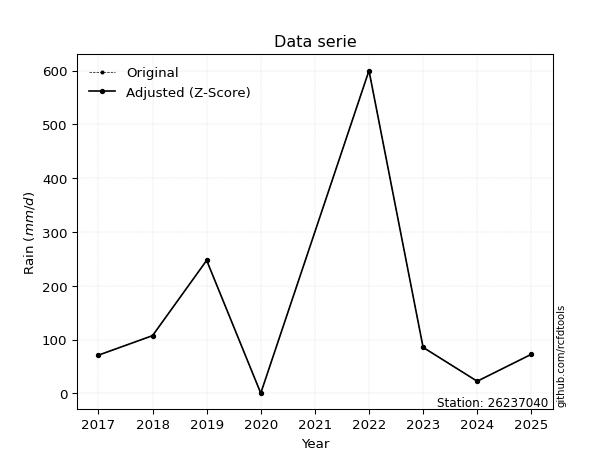</img>

</div>

> If Z-Score is active, values out of range or outliers are replaced with the station mean value.


### 4. Active continuous probability distributions from SciPy (45 of 104 available)

[scipy.stats](https://docs.scipy.org/doc/scipy/reference/stats.html) is a Python´s powerful submodule within the SciPy library for comprehensive statistical analysis, offering over 130 probability distributions (like Normal, Poisson), functions for descriptive stats (mean, variance), hypothesis testing (t-tests, chi-square), random variable generation, and statistical tests, making it essential for data science, modeling, and research. It provides tools to explore, model, and draw conclusions from data efficiently, working seamlessly with NumPy.

<div align="center">

|   id | p_dist             |   n_parameter | fit_method   | label                                                                       | active   | ref                                                                                                        |
|-----:|:-------------------|--------------:|:-------------|:----------------------------------------------------------------------------|:---------|:-----------------------------------------------------------------------------------------------------------|
|    0 | alpha              |             3 | MLE          | Alpha                                                                       | True     | [:mortar_board:](https://docs.scipy.org/doc/scipy/reference/generated/scipy.stats.alpha.html)              |
|    1 | betaprime          |             4 | MLE          | Beta prime                                                                  | True     | [:mortar_board:](https://docs.scipy.org/doc/scipy/reference/generated/scipy.stats.betaprime.html)          |
|    2 | chi2               |             3 | MLE          | Chi²                                                                        | True     | [:mortar_board:](https://docs.scipy.org/doc/scipy/reference/generated/scipy.stats.chi2.html)               |
|    3 | crystalball        |             4 | MLE          | Crystalball                                                                 | True     | [:mortar_board:](https://docs.scipy.org/doc/scipy/reference/generated/scipy.stats.crystalball.html)        |
|    4 | erlang             |             3 | MLE          | Erlang                                                                      | True     | [:mortar_board:](https://docs.scipy.org/doc/scipy/reference/generated/scipy.stats.erlang.html)             |
|    5 | expon              |             2 | MLE          | Exponential                                                                 | True     | [:mortar_board:](https://docs.scipy.org/doc/scipy/reference/generated/scipy.stats.expon.html)              |
|    6 | exponnorm          |             3 | MLE          | Exponentially modified Normal                                               | True     | [:mortar_board:](https://docs.scipy.org/doc/scipy/reference/generated/scipy.stats.exponnorm.html)          |
|    7 | f                  |             4 | MLE          | F                                                                           | True     | [:mortar_board:](https://docs.scipy.org/doc/scipy/reference/generated/scipy.stats.f.html)                  |
|    8 | fatiguelife        |             3 | MLE          | Fatigue-life (Birnbaum-Saunders)                                            | True     | [:mortar_board:](https://docs.scipy.org/doc/scipy/reference/generated/scipy.stats.fatiguelife.html)        |
|    9 | fisk               |             3 | MLE          | Fisk                                                                        | True     | [:mortar_board:](https://docs.scipy.org/doc/scipy/reference/generated/scipy.stats.fisk.html)               |
|   10 | gamma              |             3 | MLE          | Gamma                                                                       | True     | [:mortar_board:](https://docs.scipy.org/doc/scipy/reference/generated/scipy.stats.gamma.html)              |
|   11 | genexpon           |             5 | MLE          | Generalized exponential                                                     | True     | [:mortar_board:](https://docs.scipy.org/doc/scipy/reference/generated/scipy.stats.genexpon.html)           |
|   12 | genlogistic        |             3 | MLE          | Generalized logistic                                                        | True     | [:mortar_board:](https://docs.scipy.org/doc/scipy/reference/generated/scipy.stats.genlogistic.html)        |
|   13 | gibrat             |             2 | MM           | Gibrat                                                                      | True     | [:mortar_board:](https://docs.scipy.org/doc/scipy/reference/generated/scipy.stats.gibrat.html)             |
|   14 | gompertz           |             3 | MLE          | Gompertz (or truncated Gumbel)                                              | True     | [:mortar_board:](https://docs.scipy.org/doc/scipy/reference/generated/scipy.stats.gompertz.html)           |
|   15 | gumbel_l           |             2 | MM           | Gumbel Left Skew                                                            | True     | [:mortar_board:](https://docs.scipy.org/doc/scipy/reference/generated/scipy.stats.gumbel_l.html)           |
|   16 | gumbel_r           |             2 | MM           | Gumbel Right Skew                                                           | True     | [:mortar_board:](https://docs.scipy.org/doc/scipy/reference/generated/scipy.stats.gumbel_r.html)           |
|   17 | halflogistic       |             2 | MM           | Half-logistic                                                               | True     | [:mortar_board:](https://docs.scipy.org/doc/scipy/reference/generated/scipy.stats.halflogistic.html)       |
|   18 | halfnorm           |             2 | MM           | Half Normal                                                                 | True     | [:mortar_board:](https://docs.scipy.org/doc/scipy/reference/generated/scipy.stats.halfnorm.html)           |
|   19 | hypsecant          |             2 | MM           | hyperbolic secant                                                           | True     | [:mortar_board:](https://docs.scipy.org/doc/scipy/reference/generated/scipy.stats.hypsecant.html)          |
|   20 | invgamma           |             3 | MLE          | Inverted gamma                                                              | True     | [:mortar_board:](https://docs.scipy.org/doc/scipy/reference/generated/scipy.stats.invgamma.html)           |
|   21 | invgauss           |             3 | MLE          | Inverse Gaussian                                                            | True     | [:mortar_board:](https://docs.scipy.org/doc/scipy/reference/generated/scipy.stats.invgauss.html)           |
|   22 | invweibull         |             3 | MLE          | Inverted Weibull                                                            | True     | [:mortar_board:](https://docs.scipy.org/doc/scipy/reference/generated/scipy.stats.invweibull.html)         |
|   23 | johnsonsu          |             4 | MLE          | Johnson Su                                                                  | True     | [:mortar_board:](https://docs.scipy.org/doc/scipy/reference/generated/scipy.stats.johnsonsu.html)          |
|   24 | kstwobign          |             2 | MLE          | Limiting distribution of scaled Kolmogorov-Smirnov two-sided test statistic | True     | [:mortar_board:](https://docs.scipy.org/doc/scipy/reference/generated/scipy.stats.kstwobign.html)          |
|   25 | laplace            |             2 | MM           | Laplace                                                                     | True     | [:mortar_board:](https://docs.scipy.org/doc/scipy/reference/generated/scipy.stats.laplace.html)            |
|   26 | laplace_asymmetric |             3 | MLE          | Asymmetric Laplace                                                          | True     | [:mortar_board:](https://docs.scipy.org/doc/scipy/reference/generated/scipy.stats.laplace_asymmetric.html) |
|   27 | loggamma           |             3 | MLE          | Log gamma                                                                   | True     | [:mortar_board:](https://docs.scipy.org/doc/scipy/reference/generated/scipy.stats.loggamma.html)           |
|   28 | logistic           |             2 | MM           | Logistic (or Sech-squared)                                                  | True     | [:mortar_board:](https://docs.scipy.org/doc/scipy/reference/generated/scipy.stats.logistic.html)           |
|   29 | lognorm            |             3 | MLE          | Log Normal                                                                  | True     | [:mortar_board:](https://docs.scipy.org/doc/scipy/reference/generated/scipy.stats.lognorm.html)            |
|   30 | maxwell            |             2 | MM           | Maxwell                                                                     | True     | [:mortar_board:](https://docs.scipy.org/doc/scipy/reference/generated/scipy.stats.maxwell.html)            |
|   31 | mielke             |             4 | MLE          | Mielke Beta-Kappa / Dagum                                                   | True     | [:mortar_board:](https://docs.scipy.org/doc/scipy/reference/generated/scipy.stats.mielke.html)             |
|   32 | moyal              |             2 | MM           | Moyal                                                                       | True     | [:mortar_board:](https://docs.scipy.org/doc/scipy/reference/generated/scipy.stats.moyal.html)              |
|   33 | nakagami           |             3 | MLE          | Nakagami                                                                    | True     | [:mortar_board:](https://docs.scipy.org/doc/scipy/reference/generated/scipy.stats.nakagami.html)           |
|   34 | ncf                |             5 | MLE          | Non-central F distribution                                                  | True     | [:mortar_board:](https://docs.scipy.org/doc/scipy/reference/generated/scipy.stats.ncf.html)                |
|   35 | nct                |             4 | MLE          | Non-central Student’s t                                                     | True     | [:mortar_board:](https://docs.scipy.org/doc/scipy/reference/generated/scipy.stats.nct.html)                |
|   36 | norm               |             2 | MM           | Normal                                                                      | True     | [:mortar_board:](https://docs.scipy.org/doc/scipy/reference/generated/scipy.stats.norm.html)               |
|   37 | pareto             |             3 | MLE          | Pareto                                                                      | True     | [:mortar_board:](https://docs.scipy.org/doc/scipy/reference/generated/scipy.stats.pareto.html)             |
|   38 | pearson3           |             3 | MM           | Pearson type III                                                            | True     | [:mortar_board:](https://docs.scipy.org/doc/scipy/reference/generated/scipy.stats.pearson3.html)           |
|   39 | rayleigh           |             2 | MM           | Rayleigh                                                                    | True     | [:mortar_board:](https://docs.scipy.org/doc/scipy/reference/generated/scipy.stats.rayleigh.html)           |
|   40 | rice               |             3 | MLE          | Rice                                                                        | True     | [:mortar_board:](https://docs.scipy.org/doc/scipy/reference/generated/scipy.stats.rice.html)               |
|   41 | t                  |             3 | MLE          | Student’s t                                                                 | True     | [:mortar_board:](https://docs.scipy.org/doc/scipy/reference/generated/scipy.stats.t.html)                  |
|   42 | truncnorm          |             4 | MLE          | Truncated normal                                                            | True     | [:mortar_board:](https://docs.scipy.org/doc/scipy/reference/generated/scipy.stats.truncnorm.html)          |
|   43 | wald               |             2 | MM           | Wald                                                                        | True     | [:mortar_board:](https://docs.scipy.org/doc/scipy/reference/generated/scipy.stats.wald.html)               |
|   44 | weibull_min        |             3 | MLE          | Weibull minimum                                                             | True     | [:mortar_board:](https://docs.scipy.org/doc/scipy/reference/generated/scipy.stats.weibull_min.html)        |

</div>

> **n_parameter:** # arguments & localization & scale.
>
> **Fit methods:** (MLE) maximum likelihood, (MM) L-moments.
>
>**Inactive:** foldnorm, gennorm, norminvgauss, powernorm, powerlognorm, skewnorm, genextreme, anglit, arcsine, argus, beta, bradford, burr, burr12, cauchy, cosine, halfcauchy, foldcauchy, skewcauchy, wrapcauchy, dgamma, gengamma, exponweib, exponpow, truncexpon, gausshyper, genhalflogistic, genhyperbolic, geninvgauss, halfgennorm, johnsonsb, kappa4, kappa3, ksone, kstwo, loglaplace, levy, levy_l, levy_stable, ncx2, genpareto, truncpareto, lomax, powerlaw, rdist, rel_breitwigner, recipinvgauss, semicircular, studentized_range, trapezoid, triang, truncweibull_min, tukeylambda, uniform, loguniform, vonmises, vonmises_line, weibull_max, dweibull, 


## B. Probability distributions vs. Empirical distributions

A continuous probability distribution (CPD) describes probabilities for variables that can take any value within a range (like rain any time), unlike discrete variables with specific outcomes (like temperature). It uses a Probability Density Function (PDF), a curve where the total area under it equals 1, and the probability of the variable falling within an interval (a to b) is found by calculating the area under the curve between those points. A key feature is that the probability of hitting any single exact value is zero, so probabilities are always expressed for ranges, e.g., $P(a ≤ X ≤ b)$.

<div align="center">

Distributions parameters
|    |   station | p_dist                |   n |              loc |           scale | shape                  | shape1             | shape2                 | shape3   |
|---:|----------:|:----------------------|----:|-----------------:|----------------:|:-----------------------|:-------------------|:-----------------------|:---------|
|  0 |  26237040 | alpha                 |   8 |    -27.4537      |    55.1445      | 1.8278083408381754e-06 |                    |                        |          |
|  1 |  26237040 | betaprime             |   8 |      0.2         |   187.95        | 0.5437237705135638     | 1.8972174264081938 |                        |          |
|  2 |  26237040 | chi2                  |   8 |      0.2         |     1.75755     | 1.3571614121861924     |                    |                        |          |
|  3 |  26237040 | crystalball           |   8 |    143.062       |   187.687       | 9712.067384457912      | 11978.652780118431 |                        |          |
|  4 |  26237040 | erlang                |   8 |      0.2         |   206.796       | 0.4685848998161394     |                    |                        |          |
|  5 |  26237040 | expon                 |   8 |      0.2         |   142.863       |                        |                    |                        |          |
|  6 |  26237040 | exponnorm             |   8 |      0.0496956   |     0.0470851   | 3016.1956291298447     |                    |                        |          |
|  7 |  26237040 | f                     |   8 |      0.2         |   140.171       | 0.8095738247959727     | 35.96698266172416  |                        |          |
|  8 |  26237040 | fatiguelife           |   8 |     -3.33281     |    49.4957      | 1.9024131066165562     |                    |                        |          |
|  9 |  26237040 | fisk                  |   8 |      0.2         |    84.9857      | 0.8174722496915998     |                    |                        |          |
| 10 |  26237040 | gamma                 |   8 |      0.2         |   181.248       | 0.6002690747398989     |                    |                        |          |
| 11 |  26237040 | genexpon              |   8 |      0.2         |   305.571       | 2.1389130019654035     | 1.8404358852213978 | 7.001254871686382e-14  |          |
| 12 |  26237040 | genlogistic           |   8 |   -710.464       |   103.111       | 1921.3286252656017     |                    |                        |          |
| 13 |  26237040 | gibrat                |   8 |     -0.119175    |    86.8441      |                        |                    |                        |          |
| 14 |  26237040 | gompertz              |   8 |      0.2         |   479.889       | 1.901076533241647      |                    |                        |          |
| 15 |  26237040 | gumbel_l              |   8 |    227.532       |   146.339       |                        |                    |                        |          |
| 16 |  26237040 | gumbel_r              |   8 |     58.5933      |   146.339       |                        |                    |                        |          |
| 17 |  26237040 | halflogistic          |   8 |    -79.3904      |   160.466       |                        |                    |                        |          |
| 18 |  26237040 | halfnorm              |   8 |   -105.362       |   311.354       |                        |                    |                        |          |
| 19 |  26237040 | hypsecant             |   8 |    143.063       |   119.485       |                        |                    |                        |          |
| 20 |  26237040 | invgamma              |   8 |    -15.7802      |    52.6017      | 1.0573667450331206     |                    |                        |          |
| 21 |  26237040 | invgauss              |   8 |     -9.90231     |    49.3916      | 3.0969818487694436     |                    |                        |          |
| 22 |  26237040 | invweibull            |   8 |      0.2         |     2.84111     | 0.05229180287050238    |                    |                        |          |
| 23 |  26237040 | johnsonsu             |   8 |     -0.128381    |     0.00175258  | -5.027493280159996     | 0.4670182456865932 |                        |          |
| 24 |  26237040 | kstwobign             |   8 |   -332.77        |   556.528       |                        |                    |                        |          |
| 25 |  26237040 | laplace               |   8 |    143.063       |   132.715       |                        |                    |                        |          |
| 26 |  26237040 | laplace_asymmetric    |   8 |      0.2         |     4.82056     | 0.03374944931874213    |                    |                        |          |
| 27 |  26237040 | loggamma              |   8 | -60007.7         |  8022.54        | 1804.2612145620992     |                    |                        |          |
| 28 |  26237040 | logistic              |   8 |    143.063       |   103.477       |                        |                    |                        |          |
| 29 |  26237040 | lognorm               |   8 |      0.2         |     0.399374    | 14.111115721831359     |                    |                        |          |
| 30 |  26237040 | maxwell               |   8 |   -301.677       |   278.699       |                        |                    |                        |          |
| 31 |  26237040 | mielke                |   8 |      0.2         |    68.4246      | 0.8057416748182279     | 1.0344048709381473 |                        |          |
| 32 |  26237040 | moyal                 |   8 |     35.7309      |    84.4889      |                        |                    |                        |          |
| 33 |  26237040 | nakagami              |   8 |      0.2         |   283.787       | 0.21158637321725618    |                    |                        |          |
| 34 |  26237040 | ncf                   |   8 |      0.2         |    29.3377      | 1.0686450784506314     | 8.243116726662938  | 2.2636415847092626     |          |
| 35 |  26237040 | nct                   |   8 |    -27.5972      |    13.4022      | 1.0617900050260949     | 4.249647013467076  |                        |          |
| 36 |  26237040 | norm                  |   8 |    143.063       |   187.687       |                        |                    |                        |          |
| 37 |  26237040 | pareto                |   8 |      0.171454    |     0.0285459   | 0.14368074806464345    |                    |                        |          |
| 38 |  26237040 | pearson3              |   8 |    143.063       |   187.687       | 1.6818122411126084     |                    |                        |          |
| 39 |  26237040 | rayleigh              |   8 |   -215.994       |   286.486       |                        |                    |                        |          |
| 40 |  26237040 | rice                  |   8 |   -126.562       |   232.297       | 0.0008276259662706067  |                    |                        |          |
| 41 |  26237040 | t                     |   8 |     59.4198      |    54.6204      | 1.187511823459499      |                    |                        |          |
| 42 |  26237040 | truncnorm             |   8 |   -113.247       |   259.136       | 0.43778853102275683    | 2.7524078289072444 |                        |          |
| 43 |  26237040 | wald                  |   8 |    -44.6247      |   187.687       |                        |                    |                        |          |
| 44 |  26237040 | weibull_min           |   8 |      0.2         |   117.906       | 0.5899128942338865     |                    |                        |          |
| 45 |  26237040 | logalpha              |   8 |    -71.7637      |  2296.5         | 30.491792422357364     |                    |                        |          |
| 46 |  26237040 | logbetaprime          |   8 |     -6.76043     |     2.68469e+12 | 12.25739563270557      | 3133094921192.6313 |                        |          |
| 47 |  26237040 | logchi2               |   8 |     -1.60944     |     3.89074     | 1.4127867984124372     |                    |                        |          |
| 48 |  26237040 | logcrystalball        |   8 |      3.65075     |     2.30604     | 1000.6618915732588     | 2410.719952448105  |                        |          |
| 49 |  26237040 | logerlang             |   8 |    -33.1588      |     0.157879    | 232.8981829447568      |                    |                        |          |
| 50 |  26237040 | logexpon              |   8 |     -1.60944     |     5.26019     |                        |                    |                        |          |
| 51 |  26237040 | logexponnorm          |   8 |      3.64926     |     2.30605     | 0.0006405635454970581  |                    |                        |          |
| 52 |  26237040 | logf                  |   8 |     -1.60944     |     1.14144     | 1.1120959249799696     | 1.1232275833439664 |                        |          |
| 53 |  26237040 | logfatiguelife        |   8 |   -495.588       |   499.204       | 0.004623670043641972   |                    |                        |          |
| 54 |  26237040 | logfisk               |   8 |     -1.60944     |     0.75644     | 0.2068180148733278     |                    |                        |          |
| 55 |  26237040 | loggamma              |   8 |    -35.1958      |     0.144247    | 269.31846641667494     |                    |                        |          |
| 56 |  26237040 | loggenexpon           |   8 |     -1.73789     |     0.120856    | 0.005304079684901351   | 4.907366216841897  | 0.00013244952652412173 |          |
| 57 |  26237040 | loggenlogistic        |   8 |      5.70612     |     0.479318    | 0.21798014362191306    |                    |                        |          |
| 58 |  26237040 | loggibrat             |   8 |      1.89154     |     1.06701     |                        |                    |                        |          |
| 59 |  26237040 | loggompertz           |   8 |     -1.60944     |     5.80947     | 0.787211532728884      |                    |                        |          |
| 60 |  26237040 | loggumbel_l           |   8 |      4.68859     |     1.79801     |                        |                    |                        |          |
| 61 |  26237040 | loggumbel_r           |   8 |      2.61291     |     1.79801     |                        |                    |                        |          |
| 62 |  26237040 | loghalflogistic       |   8 |      0.917576    |     1.97157     |                        |                    |                        |          |
| 63 |  26237040 | loghalfnorm           |   8 |      0.598476    |     3.82546     |                        |                    |                        |          |
| 64 |  26237040 | loghypsecant          |   8 |      3.65075     |     1.46807     |                        |                    |                        |          |
| 65 |  26237040 | loginvgamma           |   8 |    -52.968       | 31137.6         | 551.3586721789452      |                    |                        |          |
| 66 |  26237040 | loginvgauss           |   8 |    -20.1417      |  2057.18        | 0.011574581307219091   |                    |                        |          |
| 67 |  26237040 | loginvweibull         |   8 |     -3.72145e+08 |     3.72145e+08 | 135998279.65666395     |                    |                        |          |
| 68 |  26237040 | logjohnsonsu          |   8 |      7.55727     |     0.0880329   | 7.476879525419912      | 1.7297310435756599 |                        |          |
| 69 |  26237040 | logkstwobign          |   8 |     -7.54075     |    12.8188      |                        |                    |                        |          |
| 70 |  26237040 | loglaplace            |   8 |      3.65075     |     1.63062     |                        |                    |                        |          |
| 71 |  26237040 | loglaplace_asymmetric |   8 |      4.6747      |     1.39616     | 1.431801478761432      |                    |                        |          |
| 72 |  26237040 | logloggamma           |   8 |      5.95692     |     0.779107    | 0.3511979114320335     |                    |                        |          |
| 73 |  26237040 | loglogistic           |   8 |      3.65075     |     1.27139     |                        |                    |                        |          |
| 74 |  26237040 | loglognorm            |   8 |   -722.235       |   725.896       | 0.0031789255580987868  |                    |                        |          |
| 75 |  26237040 | logmaxwell            |   8 |     -1.8136      |     3.42427     |                        |                    |                        |          |
| 76 |  26237040 | logmielke             |   8 |     -1.77661e+08 |     1.77661e+08 | 2799129283.55021       | 66354080.20384626  |                        |          |
| 77 |  26237040 | logmoyal              |   8 |      2.332       |     1.03808     |                        |                    |                        |          |
| 78 |  26237040 | lognakagami           |   8 |  -2108.72        |  2112.37        | 209656.7968712605      |                    |                        |          |
| 79 |  26237040 | logncf                |   8 |     -1.60944     |     1.08497     | 1.059859873688386      | 1.164412835456916  | 1.088275860333717      |          |
| 80 |  26237040 | lognct                |   8 |   -148.096       |     2.27896     | 84212.6671233474       | 66.58533062369835  |                        |          |
| 81 |  26237040 | lognorm               |   8 |      3.65075     |     2.30604     |                        |                    |                        |          |
| 82 |  26237040 | logpareto             |   8 |     -1.61145     |     0.00201668  | 0.14325892058849024    |                    |                        |          |
| 83 |  26237040 | logpearson3           |   8 |      3.65073     |     2.30608     | -1.20934881031969      |                    |                        |          |
| 84 |  26237040 | lograyleigh           |   8 |     -0.760823    |     3.51993     |                        |                    |                        |          |
| 85 |  26237040 | logrice               |   8 |   -872.06        |     2.30564     | 379.81161445394605     |                    |                        |          |
| 86 |  26237040 | logt                  |   8 |      4.26346     |     1.33397     | 2.233692568875945      |                    |                        |          |
| 87 |  26237040 | logtruncnorm          |   8 |      1.83601     |     5.87412     | -0.5865608456045018    | 0.7764463688501613 |                        |          |
| 88 |  26237040 | logwald               |   8 |      1.34467     |     2.30607     |                        |                    |                        |          |
| 89 |  26237040 | logweibull_min        |   8 |     -1.60944     |     2.04544     | 0.419765172106619      |                    |                        |          |

</div>

> **loc** (Location parameter): This shifts the distribution along the x-axis. For many common distributions, like the normal (Gaussian) distribution, loc represents the mean $μ$. For others, like the uniform distribution, it might represent the minimum value, or for the beta distribution, the left end of the support interval.
>
> **scale** (Scale parameter): This determines the width or spread of the distribution. For the normal distribution, scale represents the standard deviation $σ$. For a uniform distribution, it defines the length of the interval (from $loc$ to $loc + scale$).
>
> **shape** (Shape parameters): Refers to parameters that define the specific form of a probability distribution, distinct from its location (loc) and scale (scale). These parameters are required arguments for most distribution functions. For example, a normal (Gaussian) distribution is fully defined by its location (mean) and scale (standard deviation), so it has no specific shape parameters beyond loc and scale. However, other distributions have intrinsic properties that need specification, as Gamma distribution that takes a shape parameter, often named $a$ or $alpha$.


### 0. Cumulative distribution values - CDF (90 evaluated)

> Ordered by x ascending and calculating $log(f(x))$ separately. 

|   id |   Station |   date |     x |   count |    mean |     std |    zscore |   Value_initial |   station |   m |     alpha |   alpha_pdf |   betaprime |   betaprime_pdf |        chi2 |        chi2_pdf |   crystalball |   crystalball_pdf |      erlang |   erlang_pdf |     expon |   expon_pdf |   exponnorm |   exponnorm_pdf |           f |       f_pdf |   fatiguelife |   fatiguelife_pdf |        fisk |     fisk_pdf |       gamma |        gamma_pdf |    genexpon |   genexpon_pdf |   genlogistic |   genlogistic_pdf |      gibrat |   gibrat_pdf |    gompertz |   gompertz_pdf |   gumbel_l |   gumbel_l_pdf |   gumbel_r |   gumbel_r_pdf |   halflogistic |   halflogistic_pdf |   halfnorm |   halfnorm_pdf |   hypsecant |   hypsecant_pdf |   invgamma |   invgamma_pdf |   invgauss |   invgauss_pdf |   invweibull |   invweibull_pdf |   johnsonsu |   johnsonsu_pdf |   kstwobign |   kstwobign_pdf |   laplace |   laplace_pdf |   laplace_asymmetric |   laplace_asymmetric_pdf |   loggamma |   loggamma_pdf |   logistic |   logistic_pdf |   lognorm |   lognorm_pdf |   maxwell |   maxwell_pdf |     mielke |   mielke_pdf |    moyal |   moyal_pdf |    nakagami |   nakagami_pdf |         ncf |          ncf_pdf |       nct |     nct_pdf |     norm |    norm_pdf |   pareto |   pareto_pdf |   pearson3 |   pearson3_pdf |   rayleigh |   rayleigh_pdf |     rice |    rice_pdf |        t |       t_pdf |   truncnorm |   truncnorm_pdf |     wald |    wald_pdf |   weibull_min |   weibull_min_pdf |   logalpha |   logalpha_pdf |   logbetaprime |   logbetaprime_pdf |     logchi2 |   logchi2_pdf |   logcrystalball |   logcrystalball_pdf |   logerlang |   logerlang_pdf |   logexpon |   logexpon_pdf |   logexponnorm |   logexponnorm_pdf |        logf |    logf_pdf |   logfatiguelife |   logfatiguelife_pdf |     logfisk |   logfisk_pdf |   loggenexpon |   loggenexpon_pdf |   loggenlogistic |   loggenlogistic_pdf |   loggibrat |   loggibrat_pdf |   loggompertz |   loggompertz_pdf |   loggumbel_l |   loggumbel_l_pdf |   loggumbel_r |   loggumbel_r_pdf |   loghalflogistic |   loghalflogistic_pdf |   loghalfnorm |   loghalfnorm_pdf |   loghypsecant |   loghypsecant_pdf |   loginvgamma |   loginvgamma_pdf |   loginvgauss |   loginvgauss_pdf |   loginvweibull |   loginvweibull_pdf |   logjohnsonsu |   logjohnsonsu_pdf |   logkstwobign |   logkstwobign_pdf |   loglaplace |   loglaplace_pdf |   loglaplace_asymmetric |   loglaplace_asymmetric_pdf |   logloggamma |   logloggamma_pdf |   loglogistic |   loglogistic_pdf |   loglognorm |   loglognorm_pdf |   logmaxwell |   logmaxwell_pdf |   logmielke |   logmielke_pdf |    logmoyal |   logmoyal_pdf |   lognakagami |   lognakagami_pdf |      logncf |   logncf_pdf |    lognct |   lognct_pdf |   logpareto |   logpareto_pdf |   logpearson3 |   logpearson3_pdf |   lograyleigh |   lograyleigh_pdf |   logrice |   logrice_pdf |      logt |   logt_pdf |   logtruncnorm |   logtruncnorm_pdf |   logwald |   logwald_pdf |   logweibull_min |   logweibull_min_pdf |
|-----:|----------:|-------:|------:|--------:|--------:|--------:|----------:|----------------:|----------:|----:|----------:|------------:|------------:|----------------:|------------:|----------------:|--------------:|------------------:|------------:|-------------:|----------:|------------:|------------:|----------------:|------------:|------------:|--------------:|------------------:|------------:|-------------:|------------:|-----------------:|------------:|---------------:|--------------:|------------------:|------------:|-------------:|------------:|---------------:|-----------:|---------------:|-----------:|---------------:|---------------:|-------------------:|-----------:|---------------:|------------:|----------------:|-----------:|---------------:|-----------:|---------------:|-------------:|-----------------:|------------:|----------------:|------------:|----------------:|----------:|--------------:|---------------------:|-------------------------:|-----------:|---------------:|-----------:|---------------:|----------:|--------------:|----------:|--------------:|-----------:|-------------:|---------:|------------:|------------:|---------------:|------------:|-----------------:|----------:|------------:|---------:|------------:|---------:|-------------:|-----------:|---------------:|-----------:|---------------:|---------:|------------:|---------:|------------:|------------:|----------------:|---------:|------------:|--------------:|------------------:|-----------:|---------------:|---------------:|-------------------:|------------:|--------------:|-----------------:|---------------------:|------------:|----------------:|-----------:|---------------:|---------------:|-------------------:|------------:|------------:|-----------------:|---------------------:|------------:|--------------:|--------------:|------------------:|-----------------:|---------------------:|------------:|----------------:|--------------:|------------------:|--------------:|------------------:|--------------:|------------------:|------------------:|----------------------:|--------------:|------------------:|---------------:|-------------------:|--------------:|------------------:|--------------:|------------------:|----------------:|--------------------:|---------------:|-------------------:|---------------:|-------------------:|-------------:|-----------------:|------------------------:|----------------------------:|--------------:|------------------:|--------------:|------------------:|-------------:|-----------------:|-------------:|-----------------:|------------:|----------------:|------------:|---------------:|--------------:|------------------:|------------:|-------------:|----------:|-------------:|------------:|----------------:|--------------:|------------------:|--------------:|------------------:|----------:|--------------:|----------:|-----------:|---------------:|-------------------:|----------:|--------------:|-----------------:|---------------------:|
|    0 |  26237040 |   2020 |   0.2 |       8 | 143.062 | 200.646 | -0.712013 |             0.2 |  26237040 |   1 | 0.0461404 | 0.00787876  | 8.63017e-11 |     1.69063e+06 | 2.74147e-12 | 67024.6         |      0.223277 |       0.00159098  | 1.62004e-09 |  2.73505e+07 | 0         | 0.00699974  |   0.0010578 |     0.00702895  | 4.42445e-07 | 3.40867e+06 |     0.0338434 |       0.0224249   | 7.73057e-16 | 22.7685      | 5.68678e-12 | 122988           | 4.23554e-14 |    0.00699974  |      0.142223 |       0.00268881  | 1.03451e-08 |  1.87167e-07 | 1.50611e-13 |    0.00396149  |   0.190643 |    0.00116983  |   0.225288 |    0.00229442  |       0.243036 |        0.00293188  |   0.265421 |    0.0024195   |    0.187011 |     0.00147664  |  0.0416336 |    0.00845663  |  0.0370194 |    0.0103525   |  0.000429291 |      6.27085e+12 |   0.0119158 |     0.0441493   |    0.133474 |     0.00236222  |  0.1704   |   0.00128395  |           0.00113773 |              0.00699317  |  0.0104038 |      0.0128481 |   0.20091  |    0.0015515   | 0.0112729 |     0.0128289 |  0.240572 |    0.00186821 | 3.7674e-11 |  3.83815     | 0.217199 | 0.0027212   | 7.10256e-09 |    1.08289e+08 | 8.54724e-11 | 822714           | 0.0634582 | 0.00782821  | 0.223277 | 0.00159098  | 0        |  5.03333     |   0.229919 |    0.00324766  |   0.247792 |    0.00198142  | 0.138335 | 0.00202414  | 0.225445 | 0.00283301  | 1.82924e-08 |     0.00426717  | 0.10122  | 0.00541452  |   1.02563e-11 |  217987           |  0.0124436 |      0.0150399 |      0.0165821 |          0.0223934 | 2.25949e-12 |  7188.15      |        0.0112729 |            0.0128289 |   0.0120197 |       0.0143847 |   0        |      0.190107  |      0.0112732 |          0.0128292 | 1.22406e-09 | 3.06532e+06 |        0.0114344 |             0.013114 | 0.000612868 |   5.70491e+11 |    0.00598646 |         0.0493065 |        0.0359039 |            0.0163281 |    0        |       0         |    4.1636e-12 |         0.135505  |      0.029665 |         0.0162516 |   2.84274e-05 |       0.000165506 |          0        |             0         |      0        |         0         |      0.0176875 |          0.0120419 |     0.0113173 |         0.0140112 |     0.0111393 |         0.0148231 |       0.0136416 |           0.0214098 |      0.0393911 |          0.0160584 |      0.0170304 |          0.0302193 |    0.0198603 |        0.0121796 |               0.0289872 |                   0.0145007 |     0.0370559 |          0.016703 |     0.0157141 |         0.0121656 |    0.0109497 |        0.0125916 |  5.63122e-05 |      0.000826858 |   0.0132283 |       0.020311  | 2.46636e-11 |    5.40748e-10 |     0.0112306 |         0.0127942 | 1.86559e-09 |  4.45241e+06 | 0.0113103 |    0.0128729 |    0        |     71.0369     |     0.0313764 |         0.0173662 |      0        |         0         | 0.0112605 |     0.0128189 | 0.0195225 | 0.00683428 |    8.96191e-06 |          0.113794  |  0        |     0         |       1.9894e-07 |          3.76088e+08 |
|    1 |  26237040 |   2025 |  11.2 |       8 | 143.062 | 200.646 | -0.65719  |            11.2 |  26237040 |   2 | 0.153687  | 0.0106441   | 0.304364    |     0.0137462   | 0.978992    |     0.00646879  |      0.241163 |       0.0016607   | 0.280793    |  0.0115345   | 0.0741075 | 0.006481    |   0.0755103 |     0.00650967  | 0.274616    | 0.00987435  |     0.246595  |       0.01362     | 0.158238    |  0.00989877  | 0.203522    |      0.0106911   | 0.0741075   |    0.006481    |      0.173236 |       0.00294404  | 0.0207942   |  0.00442106  | 0.0431223   |    0.00387855  |   0.203897 |    0.0012405   |   0.250962 |    0.00237082  |       0.275008 |        0.00288027  |   0.291872 |    0.0023892   |    0.203885 |     0.00159205  |  0.155737  |    0.011017    |  0.171525  |    0.0121213   |  0.393899    |      0.00174455  |   0.2722    |     0.0136863   |    0.160503 |     0.00254731  |  0.185125 |   0.00139491  |           0.0751752  |              0.00647483  |  0.305825  |      0.151366  |   0.21852  |    0.0016503   | 0.29616   |     0.149892  |  0.26142  |    0.00192136 | 0.205505   |  0.0130787   | 0.247583 | 0.00279806  | 0.198794    |    0.00764564  | 0.1609      |      0.00874057  | 0.165264  | 0.00997815  | 0.241163 | 0.0016607   | 0.575086 |  0.00553582  |   0.265369 |    0.00319437  |   0.269813 |    0.00202127  | 0.161256 | 0.00214127  | 0.259968 | 0.00346265  | 0.0464915   |     0.00418483  | 0.162975 | 0.00571516  |   0.218685    |       0.0103401   |  0.320325  |      0.149311  |      0.357194  |          0.13585   | 0.563538    |     0.0721763 |        0.29616   |            0.149892  |   0.315783  |       0.150869  |   0.534782 |      0.0884414 |      0.296162  |          0.149892  | 0.703234    | 0.034624    |        0.301415  |             0.151321 | 0.585586    |   0.0124684   |    0.431996   |         0.129683  |        0.223908  |            0.101721  |    0.238722 |       0.591123  |    0.544707   |         0.123358  |      0.246121 |         0.118458  |   0.327657    |       0.203333    |          0.362695 |             0.220244  |      0.365278 |         0.186313  |      0.259188  |          0.157677  |     0.317943  |         0.152185  |     0.326435  |         0.148844  |       0.372911  |           0.134427  |      0.224331  |          0.100716  |      0.41757   |          0.129583  |    0.23447   |        0.143792  |               0.217135  |                   0.108621  |     0.226829  |          0.101447 |     0.274632  |         0.156686  |    0.294658  |        0.1497    |  0.323629    |      0.16578     |   0.367547  |       0.135781  | 0.336859    |    0.232723    |     0.29581   |         0.149799  | 0.595157    |  0.0429191   | 0.296531  |    0.149863  |    0.663341 |      0.0119754  |     0.246715  |         0.112623  |      0.334524 |         0.170626  | 0.296122  |     0.14991   | 0.144073  | 0.0984507  |    0.518541    |          0.134496  |  0.332977 |     0.401314  |       0.735171   |          0.0366932   |
|    2 |  26237040 |   2024 |  22.4 |       8 | 143.062 | 200.646 | -0.60137  |            22.4 |  26237040 |   3 | 0.268673  | 0.00960207  | 0.425743    |     0.00872929  | 0.999282    |     0.00021332  |      0.260147 |       0.00172873  | 0.38366     |  0.00752344  | 0.143922  | 0.00599232  |   0.145618  |     0.00601602  | 0.36149     | 0.00629025  |     0.363169  |       0.00807872  | 0.250233    |  0.00690862  | 0.303266    |      0.00759074  | 0.143922    |    0.00599232  |      0.207479 |       0.00316334  | 0.0885486   |  0.00712451  | 0.0860789   |    0.00379191  |   0.218206 |    0.00131509  |   0.277872 |    0.00243162  |       0.306947 |        0.00282236  |   0.318446 |    0.00235571  |    0.222392 |     0.00171348  |  0.272177  |    0.00955446  |  0.292687  |    0.00949038  |  0.407355    |      0.000861716 |   0.387778  |     0.00794076  |    0.189946 |     0.00270511  |  0.201426 |   0.00151774  |           0.144923   |              0.00598651  |  0.416689  |      0.166378  |   0.237565 |    0.00175041  | 0.407144  |     0.168291  |  0.283212 |    0.00196885 | 0.326747   |  0.00903817  | 0.279214 | 0.0028452   | 0.267535    |    0.00509425  | 0.247322    |      0.00696915  | 0.274395  | 0.00924634  | 0.260147 | 0.00172873  | 0.615792 |  0.00248344  |   0.300753 |    0.00312157  |   0.292645 |    0.0020546   | 0.185846 | 0.00224748  | 0.302831 | 0.00420489  | 0.0928641   |     0.00409503  | 0.226525 | 0.00558411  |   0.311628    |       0.00683066  |  0.428503  |      0.160797  |      0.452342  |          0.137331  | 0.610291    |     0.0630159 |        0.407144  |            0.168291  |   0.425692  |       0.164176  |   0.592218 |      0.0775225 |      0.407146  |          0.168291  | 0.724819    | 0.0280393   |        0.413124  |             0.168897 | 0.593537    |   0.0105743   |    0.520265   |         0.124255  |        0.306654  |            0.138842  |    0.552488 |       0.324828  |    0.627039   |         0.113856  |      0.339932 |         0.152502  |   0.468203    |       0.197606    |          0.504833 |             0.188972  |      0.488358 |         0.168163  |      0.385128  |          0.202855  |     0.428526  |         0.164739  |     0.433293  |         0.15749   |       0.465015  |           0.130118  |      0.306008  |          0.136382  |      0.50506   |          0.122108  |    0.358673  |        0.219961  |               0.307127  |                   0.153639  |     0.308805  |          0.136558 |     0.395068  |         0.187975  |    0.405523  |        0.168141  |  0.441308    |      0.171345    |   0.460845  |       0.132123  | 0.491586    |    0.208646    |     0.406735  |         0.168218  | 0.622214    |  0.0355317   | 0.407458  |    0.168155  |    0.670913 |      0.00998717 |     0.335261  |         0.143294  |      0.453578 |         0.170671  | 0.407122  |     0.168319  | 0.234846  | 0.168069   |    0.611011    |          0.132016  |  0.55521  |     0.249342  |       0.75836    |          0.0305319   |
|    3 |  26237040 |   2017 |  70.9 |       8 | 143.062 | 200.646 | -0.359651 |            70.9 |  26237040 |   4 | 0.57502   | 0.00388686  | 0.674257    |     0.00309964  | 1           |     1.49662e-10 |      0.35031  |       0.00197413  | 0.615371    |  0.00321532  | 0.390357  | 0.00426734  |   0.392792  |     0.00427558  | 0.555385    | 0.00273842  |     0.584928  |       0.00281757  | 0.462459    |  0.00287434  | 0.553142    |      0.00365579  | 0.390357    |    0.00426734  |      0.374282 |       0.00356636  | 0.420285    |  0.00550487  | 0.260485    |    0.0033946   |   0.290287 |    0.00166296  |   0.398781 |    0.00250525  |       0.43682  |        0.00252137  |   0.428684 |    0.0021832   |    0.318481 |     0.00224246  |  0.572703  |    0.00382298  |  0.57754   |    0.00360628  |  0.429434    |      0.000268482 |   0.599156  |     0.00254164  |    0.331254 |     0.00302791  |  0.290286 |   0.00218729  |           0.391111   |              0.00426292  |  0.608749  |      0.160538  |   0.332395 |    0.00214451  | 0.604399  |     0.167041  |  0.382265 |    0.00209358 | 0.59046    |  0.0033077   | 0.416733 | 0.00275747  | 0.435882    |    0.00258082  | 0.507095    |      0.00415561  | 0.579473  | 0.00396115  | 0.35031  | 0.00197413  | 0.674658 |  0.000660913 |   0.442286 |    0.00269515  |   0.394334 |    0.00211714  | 0.30322  | 0.00254972  | 0.568116 | 0.00577754  | 0.280982    |     0.00364841  | 0.457896 | 0.00390358  |   0.522673    |       0.00294547  |  0.612051  |      0.152218  |      0.604533  |          0.124058  | 0.675636    |     0.0509665 |        0.604399  |            0.167041  |   0.614164  |       0.156889  |   0.672434 |      0.0622728 |      0.604401  |          0.16704   | 0.752635    | 0.0208289   |        0.61011   |             0.166    | 0.60439     |   0.0084233   |    0.654348   |         0.107145  |        0.512979  |            0.222375  |    0.787539 |       0.122451  |    0.747244   |         0.0940872 |      0.54546  |         0.199326  |   0.670449    |       0.149082    |          0.690011 |             0.13286   |      0.661675 |         0.131881  |      0.628716  |          0.199335  |     0.616739  |         0.155927  |     0.611117  |         0.146242  |       0.604984  |           0.111109  |      0.504476  |          0.209276  |      0.635187  |          0.102853  |    0.656153  |        0.210869  |               0.546562  |                   0.273415  |     0.507663  |          0.2103   |     0.617796  |         0.185722  |    0.602655  |        0.16699   |  0.630532    |      0.152014    |   0.603269  |       0.113192  | 0.692952    |    0.140364    |     0.60394   |         0.167032  | 0.657939    |  0.0271013   | 0.604481  |    0.1668    |    0.68105  |      0.00778044 |     0.52976   |         0.192114  |      0.638619 |         0.146481  | 0.604411  |     0.167069  | 0.499411  | 0.268236   |    0.758994    |          0.124111  |  0.755725 |     0.118304  |       0.789175   |          0.0234666   |
|    4 |  26237040 |   2023 |  85.4 |       8 | 143.062 | 200.646 | -0.287384 |            85.4 |  26237040 |   5 | 0.625099  | 0.00306593  | 0.714557    |     0.00249184  | 1           |     2.27813e-12 |      0.379335 |       0.00202759  | 0.658195    |  0.00271467  | 0.449197  | 0.00385548  |   0.451728  |     0.00386059  | 0.592134    | 0.00234915  |     0.622183  |       0.00234818  | 0.500515    |  0.00239868  | 0.6022      |      0.00313221  | 0.449197    |    0.00385548  |      0.425772 |       0.003525    | 0.493867    |  0.00466439  | 0.308806    |    0.00327012  |   0.315187 |    0.00177175  |   0.43491  |    0.00247448  |       0.472648 |        0.00241984  |   0.459915 |    0.00212409  |    0.352024 |     0.00238129  |  0.622101  |    0.00303366  |  0.624461  |    0.00290462  |  0.432972    |      0.000222445 |   0.632289  |     0.00205749  |    0.375176 |     0.00302374  |  0.323799 |   0.00243981  |           0.449889   |              0.0038514   |  0.638227  |      0.15617   |   0.364185 |    0.00223773  | 0.635118  |     0.162979  |  0.412719 |    0.00210503 | 0.633444   |  0.00265703  | 0.456077 | 0.0026658   | 0.471201    |    0.00230379  | 0.563369    |      0.00361957  | 0.630584  | 0.00313245  | 0.379335 | 0.00202759  | 0.68326  |  0.00053397  |   0.480343 |    0.00255372  |   0.425004 |    0.00211151  | 0.340513 | 0.00259046  | 0.646509 | 0.00496886  | 0.33282     |     0.0035007   | 0.511095 | 0.00344352  |   0.562024    |       0.00250359  |  0.639986  |      0.147926  |      0.627295  |          0.12055   | 0.684964    |     0.0493083 |        0.635118  |            0.162979  |   0.642961  |       0.152509  |   0.683819 |      0.0601084 |      0.63512   |          0.162978  | 0.756428    | 0.0199507   |        0.640615  |             0.16172  | 0.605932    |   0.00815345  |    0.673971   |         0.103744  |        0.555613  |            0.235629  |    0.808805 |       0.106585  |    0.764423   |         0.0905466 |      0.582904 |         0.202849  |   0.697327    |       0.139814    |          0.713936 |             0.124341  |      0.685642 |         0.125731  |      0.664819  |          0.188399  |     0.64534   |         0.151361  |     0.637936  |         0.141919  |       0.625305  |           0.107291  |      0.544469  |          0.220422  |      0.654002  |          0.0993688 |    0.693235  |        0.188128  |               0.599881  |                   0.300088  |     0.54788   |          0.221807 |     0.651709  |         0.178533  |    0.633367  |        0.162955  |  0.658305    |      0.146413    |   0.623972  |       0.109304  | 0.718097    |    0.129984    |     0.634659  |         0.162982  | 0.662882    |  0.0260474   | 0.635155  |    0.162737  |    0.682472 |      0.00750787 |     0.566061  |         0.197887  |      0.665341 |         0.140676  | 0.635136  |     0.163005  | 0.549099  | 0.264588   |    0.781934    |          0.122436  |  0.776572 |     0.106043  |       0.793457   |          0.0225774   |
|    5 |  26237040 |   2018 | 107.2 |       8 | 143.062 | 200.646 | -0.178735 |           107.2 |  26237040 |   6 | 0.682153  | 0.00223145  | 0.761532    |     0.00186198  | 1           |     4.28908e-15 |      0.424233 |       0.00208712  | 0.71103     |  0.00216448  | 0.527148  | 0.00330984  |   0.529747  |     0.00331122  | 0.638452    | 0.00192525  |     0.667772  |       0.00186808  | 0.546937    |  0.00189315  | 0.663643    |      0.0025355   | 0.527147    |    0.00330984  |      0.500993 |       0.00335762  | 0.583827    |  0.00363498  | 0.378023    |    0.0030794   |   0.355595 |    0.00193502  |   0.48803  |    0.0023924   |       0.523684 |        0.0022614   |   0.505205 |    0.00202991  |    0.405865 |     0.00254836  |  0.678785  |    0.00222663  |  0.67939   |    0.00218703  |  0.437286    |      0.00017677  |   0.671463  |     0.00157301  |    0.440431 |     0.00295099  |  0.381605 |   0.00287537  |           0.527756   |              0.00330624  |  0.673028  |      0.149787  |   0.414214 |    0.00234487  | 0.671489  |     0.156758  |  0.458606 |    0.00210058 | 0.683559   |  0.00198895  | 0.512396 | 0.00249593  | 0.517904    |    0.00199797  | 0.634691    |      0.00294826  | 0.688889  | 0.00227968  | 0.424233 | 0.00208712  | 0.693457 |  0.000411519 |   0.533692 |    0.00234121  |   0.470775 |    0.002084    | 0.397295 | 0.00261091  | 0.738504 | 0.00349009  | 0.40664     |     0.00327047  | 0.579542 | 0.00285636  |   0.611068    |       0.00202494  |  0.67294   |      0.141828  |      0.654182  |          0.11591   | 0.695952    |     0.0473732 |        0.671489  |            0.156758  |   0.676935  |       0.146193  |   0.697193 |      0.0575658 |      0.671491  |          0.156757  | 0.760849    | 0.0189576   |        0.676673  |             0.155272 | 0.607751    |   0.00784568  |    0.69707    |         0.0994371 |        0.610768  |            0.248829  |    0.83115  |       0.090528  |    0.784508   |         0.0861321 |      0.629278 |         0.204597  |   0.727834    |       0.128597    |          0.741059 |             0.114333  |      0.713374 |         0.118225  |      0.705934  |          0.173006  |     0.67903   |         0.144861  |     0.669535  |         0.135941  |       0.649155  |           0.102503  |      0.59598   |          0.232321  |      0.676105  |          0.0950641 |    0.733158  |        0.163645  |               0.672137  |                   0.336233  |     0.599747  |          0.234037 |     0.691124  |         0.167904  |    0.669737  |        0.156771  |  0.690756    |      0.138958    |   0.648268  |       0.10441   | 0.746272    |    0.118004    |     0.671032  |         0.156778  | 0.668666    |  0.0248481   | 0.671472  |    0.156522  |    0.684144 |      0.00719824 |     0.611706  |         0.203327  |      0.696477 |         0.133157  | 0.671512  |     0.156781  | 0.607859  | 0.250761   |    0.809525    |          0.120258  |  0.799173 |     0.0931167 |       0.798474   |          0.0215631   |
|    6 |  26237040 |   2019 | 247.2 |       8 | 143.062 | 200.646 |  0.519011 |           247.2 |  26237040 |   7 | 0.840872  | 0.000571633 | 0.897792    |     0.000492539 | 1           |     1.65365e-32 |      0.7105   |       0.00182232  | 0.887661    |  0.000705128 | 0.822527  | 0.00124227  |   0.824528  |     0.00123556  | 0.810015    | 0.000782816 |     0.828683  |       0.000718793 | 0.705196    |  0.000688049 | 0.873395    |      0.000838259 | 0.822527    |    0.00124227  |      0.837097 |       0.00144352  | 0.85235     |  0.000932848 | 0.721877    |    0.00184344  |   0.681411 |    0.00249024  |   0.759123 |    0.00142961  |       0.7689   |        0.00127377  |   0.742513 |    0.00134976  |    0.747781 |     0.00189682  |  0.839284  |    0.000585366 |  0.846194  |    0.000650494 |  0.453045    |      7.59405e-05 |   0.797813  |     0.000532099 |    0.772448 |     0.00169683  |  0.771865 |   0.00171899  |           0.82279    |              0.00124067  |  0.78604   |      0.119305  |   0.732311 |    0.00189444  | 0.789976  |     0.124985  |  0.725129 |    0.00159679 | 0.832651   |  0.000569099 | 0.774812 | 0.00129669  | 0.721874    |    0.00108261  | 0.869323    |      0.000867932 | 0.849731  | 0.00057058  | 0.7105   | 0.00182232  | 0.728169 |  0.000158107 |   0.776673 |    0.00121503  |   0.729381 |    0.00152727  | 0.725941 | 0.00189824  | 0.925946 | 0.000438632 | 0.758516    |     0.00178497  | 0.821353 | 0.000993002 |   0.787088    |       0.000786586 |  0.780205  |      0.113814  |      0.743172  |          0.0967007 | 0.7328      |     0.041019  |        0.789976  |            0.124985  |   0.787241  |       0.116548  |   0.741664 |      0.0491115 |      0.789977  |          0.124984  | 0.77536     | 0.0159234   |        0.7937    |             0.123092 | 0.613888    |   0.00688546  |    0.773254   |         0.0827971 |        0.818597  |            0.223659  |    0.889002 |       0.0523003 |    0.84953    |         0.0694455 |      0.793872 |         0.18105   |   0.819049    |       0.0909288   |          0.822569 |             0.0820107 |      0.800843 |         0.0914702 |      0.825141  |          0.113207  |     0.788081  |         0.114995  |     0.772462  |         0.109593  |       0.727316  |           0.0846271 |      0.798028  |          0.237738  |      0.748913  |          0.0792919 |    0.840144  |        0.098034  |               0.860821  |                   0.142733  |     0.802364  |          0.235414 |     0.81192   |         0.120109  |    0.788302  |        0.125166  |  0.794253    |      0.108239    |   0.727822  |       0.0860363 | 0.828705    |    0.081226    |     0.789559  |         0.12506   | 0.687806    |  0.0211315   | 0.789788  |    0.124824  |    0.68974  |      0.00624118 |     0.783144  |         0.199623  |      0.795463 |         0.103524  | 0.790013  |     0.124994  | 0.780173  | 0.157309   |    0.906304    |          0.11114   |  0.861665 |     0.0595226 |       0.815112   |          0.0184005   |
|    7 |  26237040 |   2022 | 600   |       8 | 143.062 | 200.646 |  2.27733  |           600   |  26237040 |   8 | 0.929967  | 0.000111327 | 0.969411    |     7.70895e-05 | 1           |     3.20472e-76 |      0.992545 |       0.000109753 | 0.985584    |  7.99076e-05 | 0.984981  | 0.000105129 |   0.985367  |     0.000103037 | 0.946865    | 0.000174019 |     0.953974  |       0.000158843 | 0.831659    |  0.00019081  | 0.986143    |      8.39466e-05 | 0.984981    |    0.000105129 |      0.994209 |       5.60008e-05 | 0.973383    |  0.000102634 | 0.991204    |    0.000121604 |   0.999997 |    2.53733e-07 |   0.975572 |    0.000164874 |       0.971422 |        0.000175551 |   0.976516 |    0.000196884 |    0.986101 |     0.000116285 |  0.93076   |    0.000114024 |  0.950984  |    0.000129696 |  0.469602    |      3.0946e-05  |   0.89395   |     0.000142526 |    0.992739 |     8.74757e-05 |  0.984016 |   0.000120441 |           0.985011   |              0.000104942 |  0.875596  |      0.0828162 |   0.98806  |    0.000114013 | 0.883147  |     0.0851322 |  0.985015 |    0.00015985 | 0.924607   |  0.000118908 | 0.971712 | 0.000167338 | 0.939198    |    0.000296031 | 0.980155    |      8.59817e-05 | 0.937009  | 0.000106213 | 0.992545 | 0.000109753 | 0.7607   |  5.7321e-05  |   0.969841 |    0.000175926 |   0.982688 |    0.000172115 | 0.992489 | 0.000101135 | 0.978166 | 4.75692e-05 | 1           |     0.000106343 | 0.967287 | 0.000140906 |   0.926516    |       0.000188681 |  0.866511  |      0.0809897 |      0.819411  |          0.0753576 | 0.766592    |     0.0353613 |        0.883147  |            0.0851322 |   0.874943  |       0.0814059 |   0.78174  |      0.0414928 |      0.883147  |          0.0851317 | 0.788351    | 0.013489    |        0.885262  |             0.083493 | 0.619626    |   0.00608826  |    0.838794   |         0.0651729 |        0.954758  |            0.0830855 |    0.925124 |       0.0313794 |    0.903298   |         0.0519897 |      0.924682 |         0.108328  |   0.885237    |       0.0600162   |          0.883081 |             0.0558357 |      0.870419 |         0.0661239 |      0.902706  |          0.0652463 |     0.874558  |         0.0802784 |     0.856253  |         0.0795895 |       0.794322  |           0.0668419 |      0.965228  |          0.114241  |      0.812143  |          0.0635772 |    0.907198  |        0.0569124 |               0.943942  |                   0.0574895 |     0.962982  |          0.106235 |     0.896598  |         0.0729201 |    0.881715  |        0.08549   |  0.875528    |      0.0756065   |   0.795827  |       0.0676962 | 0.887748    |    0.0537089   |     0.882815  |         0.0852433 | 0.705138    |  0.018089    | 0.88287   |    0.0850946 |    0.694912 |      0.00545759 |     0.935921  |         0.132061  |      0.873505 |         0.0730776 | 0.883185  |     0.0851274 | 0.881053  | 0.0780917  |    0.999998    |          0.0999803 |  0.904368 |     0.0385976 |       0.830222   |          0.0157843   |

An Empirical Distribution Function (EDF) is a step-function estimate of a true cumulative distribution function (CDF) based on observed sample data, representing the proportion of data points less than or equal to a given value. It is calculated by ordering your data and jumping up by $1/n$ (where $n$ is sample size) at each unique data point, allowing analysis without assuming an underlying population distribution, and it gets closer to the true CDF as the sample size grows.


### 1. Empirical - EDF California (1923)

California´s estimates the true probability distribution of water-related data (like rainfall, streamflow) using observed samples, crucial for risk assessment.

<div align="center">


$P=m/n$


</div>


**1.1. Empirical values**

<div align="center">

|                | 0                  | 1                  | 2              | 3              | 4                  | 5              | 6              | 7              |
|:---------------|:-------------------|:-------------------|:---------------|:---------------|:-------------------|:---------------|:---------------|:---------------|
| date           | 2020               | 2025               | 2024           | 2017           | 2023               | 2018           | 2019           | 2022           |
| x              | 0.2                | 11.2               | 22.4           | 70.9           | 85.4               | 107.2          | 247.2          | 600.0          |
| m              | 1                  | 2                  | 3              | 4              | 5                  | 6              | 7              | 8              |
| empirical_dist | edf_california     | edf_california     | edf_california | edf_california | edf_california     | edf_california | edf_california | edf_california |
| empirical      | 0.125              | 0.25               | 0.375          | 0.5            | 0.625              | 0.75           | 0.875          | 1.0            |
| empirical_tr   | 1.1428571428571428 | 1.3333333333333333 | 1.6            | 2.0            | 2.6666666666666665 | 4.0            | 8.0            | inf            |

</div>


**1.2. Kolmogorov-Smirnov fit test (sorted by Δ)**


<div align="center">

|                | 0                   | 1                   | 2                     | 3                   | 4                   | 5                   | 6                  | 7                   | 8                   | 9                   | 10                  | 11                  | 12                  | 13                  | 14                  | 15                  | 16                  | 17                 | 18                  | 19                  | 20                  | 21                  | 22                  | 23                  | 24                  | 25                  | 26                 | 27                  | 28                  | 29                  | 30                 | 31                  | 32                  | 33                  | 34                 | 35                  | 36                 | 37                 | 38                  | 39                  | 40                 | 41                  | 42                  | 43                  | 44                  | 45                 | 46                  | 47                 | 48                  | 49                 | 50                  | 51                 | 52                  | 53                  | 54                 | 55                  | 56                  | 57                  | 58                  | 59                  | 60                  | 61                  | 62                  | 63                 | 64                 | 65                  | 66                 | 67                 | 68                 | 69                  | 70                 | 71                 | 72                  | 73                 | 74                 | 75                  | 76                 | 77                  | 78                 | 79                  | 80                 | 81                 | 82                 | 83                 | 84                  | 85                 | 86                 | 87                  | 88                 | 89                 |
|:---------------|:--------------------|:--------------------|:----------------------|:--------------------|:--------------------|:--------------------|:-------------------|:--------------------|:--------------------|:--------------------|:--------------------|:--------------------|:--------------------|:--------------------|:--------------------|:--------------------|:--------------------|:-------------------|:--------------------|:--------------------|:--------------------|:--------------------|:--------------------|:--------------------|:--------------------|:--------------------|:-------------------|:--------------------|:--------------------|:--------------------|:-------------------|:--------------------|:--------------------|:--------------------|:-------------------|:--------------------|:-------------------|:-------------------|:--------------------|:--------------------|:-------------------|:--------------------|:--------------------|:--------------------|:--------------------|:-------------------|:--------------------|:-------------------|:--------------------|:-------------------|:--------------------|:-------------------|:--------------------|:--------------------|:-------------------|:--------------------|:--------------------|:--------------------|:--------------------|:--------------------|:--------------------|:--------------------|:--------------------|:-------------------|:-------------------|:--------------------|:-------------------|:-------------------|:-------------------|:--------------------|:-------------------|:-------------------|:--------------------|:-------------------|:-------------------|:--------------------|:-------------------|:--------------------|:-------------------|:--------------------|:-------------------|:-------------------|:-------------------|:-------------------|:--------------------|:-------------------|:-------------------|:--------------------|:-------------------|:-------------------|
| station        | 26237040            | 26237040            | 26237040              | 26237040            | 26237040            | 26237040            | 26237040           | 26237040            | 26237040            | 26237040            | 26237040            | 26237040            | 26237040            | 26237040            | 26237040            | 26237040            | 26237040            | 26237040           | 26237040            | 26237040            | 26237040            | 26237040            | 26237040            | 26237040            | 26237040            | 26237040            | 26237040           | 26237040            | 26237040            | 26237040            | 26237040           | 26237040            | 26237040            | 26237040            | 26237040           | 26237040            | 26237040           | 26237040           | 26237040            | 26237040            | 26237040           | 26237040            | 26237040            | 26237040            | 26237040            | 26237040           | 26237040            | 26237040           | 26237040            | 26237040           | 26237040            | 26237040           | 26237040            | 26237040            | 26237040           | 26237040            | 26237040            | 26237040            | 26237040            | 26237040            | 26237040            | 26237040            | 26237040            | 26237040           | 26237040           | 26237040            | 26237040           | 26237040           | 26237040           | 26237040            | 26237040           | 26237040           | 26237040            | 26237040           | 26237040           | 26237040            | 26237040           | 26237040            | 26237040           | 26237040            | 26237040           | 26237040           | 26237040           | 26237040           | 26237040            | 26237040           | 26237040           | 26237040            | 26237040           | 26237040           |
| empirical_dist | edf_california      | edf_california      | edf_california        | edf_california      | edf_california      | edf_california      | edf_california     | edf_california      | edf_california      | edf_california      | edf_california      | edf_california      | edf_california      | edf_california      | edf_california      | edf_california      | edf_california      | edf_california     | edf_california      | edf_california      | edf_california      | edf_california      | edf_california      | edf_california      | edf_california      | edf_california      | edf_california     | edf_california      | edf_california      | edf_california      | edf_california     | edf_california      | edf_california      | edf_california      | edf_california     | edf_california      | edf_california     | edf_california     | edf_california      | edf_california      | edf_california     | edf_california      | edf_california      | edf_california      | edf_california      | edf_california     | edf_california      | edf_california     | edf_california      | edf_california     | edf_california      | edf_california     | edf_california      | edf_california      | edf_california     | edf_california      | edf_california      | edf_california      | edf_california      | edf_california      | edf_california      | edf_california      | edf_california      | edf_california     | edf_california     | edf_california      | edf_california     | edf_california     | edf_california     | edf_california      | edf_california     | edf_california     | edf_california      | edf_california     | edf_california     | edf_california      | edf_california     | edf_california      | edf_california     | edf_california      | edf_california     | edf_california     | edf_california     | edf_california     | edf_california      | edf_california     | edf_california     | edf_california      | edf_california     | edf_california     |
| p_dist         | invgauss            | fatiguelife         | loglaplace_asymmetric | t                   | nct                 | invgamma            | alpha              | johnsonsu           | logfatiguelife      | logrice             | logexponnorm        | logcrystalball      | lognorm             | lognorm             | lognct              | lognakagami         | loglogistic         | loglognorm         | loggumbel_l         | loggamma            | loggamma            | f                   | erlang              | mielke              | gamma               | logerlang           | loginvgamma        | ncf                 | loghypsecant        | logmaxwell          | logalpha           | logpearson3         | lograyleigh         | weibull_min         | loggenlogistic     | logt                | loginvgauss        | logloggamma        | logjohnsonsu        | loglaplace          | loghalfnorm        | loggumbel_r         | wald                | betaprime           | logbetaprime        | loggenexpon        | logkstwobign        | loghalflogistic    | logmoyal            | fisk               | logmielke           | loginvweibull      | pearson3            | halflogistic        | exponnorm          | laplace_asymmetric  | expon               | genexpon            | nakagami            | moyal               | halfnorm            | genlogistic         | logwald             | gumbel_r           | logtruncnorm       | rayleigh            | logexpon           | gibrat             | loggibrat          | maxwell             | loggompertz        | kstwobign          | logchi2             | pareto             | crystalball        | norm                | logistic           | truncnorm           | hypsecant          | logncf              | rice               | laplace            | gompertz           | logfisk            | gumbel_l            | logpareto          | logf               | logweibull_min      | invweibull         | chi2               |
| delta          | 0.08798059591884617 | 0.09115664466600784 | 0.09601276768374936   | 0.10044511328778649 | 0.10060493057675879 | 0.10282282739537196 | 0.1063274557678725 | 0.11308415930148503 | 0.11473796435332684 | 0.11681485440655981 | 0.11685281255473168 | 0.11685348259574446 | 0.11685348321642686 | 0.11685348321642686 | 0.11713015770105051 | 0.11718548105785864 | 0.11779565370201706 | 0.1182847913592816 | 0.12072186269770868 | 0.12440387321686375 | 0.12440387321686375 | 0.12499955755533176 | 0.12499999837995554 | 0.12499999996232597 | 0.12499999999431322 | 0.12505691017212117 | 0.1254423070115216 | 0.12767816054526313 | 0.12871621975917746 | 0.13053210287210004 | 0.1334894458749487 | 0.13829378828524308 | 0.13861888764401065 | 0.13893233506576208 | 0.1392323126432118 | 0.14214066978815043 | 0.1437473291233713 | 0.1502529378579921 | 0.15402019536533562 | 0.15615331717223746 | 0.1616745108026587 | 0.17044853200384102 | 0.17045772808186943 | 0.17425720081192675 | 0.18058863731421215 | 0.1819960765990679 | 0.18785698193779743 | 0.1900112012361045 | 0.19295206720369795 | 0.2030633732842334 | 0.20417263769711613 | 0.2056782628762499 | 0.21630812211509187 | 0.22631614161787805 | 0.2293821644777535 | 0.23007705364455633 | 0.23107766850770567 | 0.23107770041399434 | 0.23209573478909196 | 0.23760418944152406 | 0.24479513871582892 | 0.24900743187857077 | 0.25572512122968105 | 0.2619701843962024 | 0.2685409718280787 | 0.27922455845602623 | 0.2847819538924541 | 0.2864514395004901 | 0.2875389830640589 | 0.29139359014365945 | 0.2947074683056634 | 0.3095693363989186 | 0.31353813633425964 | 0.3250855755105373 | 0.3257669362239869 | 0.32576693710883675 | 0.3357863800189862 | 0.34335957039459375 | 0.3441350149358494 | 0.34515738315480204 | 0.3527053867914493 | 0.3683950299211451 | 0.3719770494092885 | 0.3803742461613878 | 0.39440452879248783 | 0.4133406982722838 | 0.4532340635049499 | 0.48517133435433357 | 0.5303978161347367 | 0.7289919908107495 |
| deltao         | 0.4472608134160001  | 0.4472608134160001  | 0.4472608134160001    | 0.4472608134160001  | 0.4472608134160001  | 0.4472608134160001  | 0.4472608134160001 | 0.4472608134160001  | 0.4472608134160001  | 0.4472608134160001  | 0.4472608134160001  | 0.4472608134160001  | 0.4472608134160001  | 0.4472608134160001  | 0.4472608134160001  | 0.4472608134160001  | 0.4472608134160001  | 0.4472608134160001 | 0.4472608134160001  | 0.4472608134160001  | 0.4472608134160001  | 0.4472608134160001  | 0.4472608134160001  | 0.4472608134160001  | 0.4472608134160001  | 0.4472608134160001  | 0.4472608134160001 | 0.4472608134160001  | 0.4472608134160001  | 0.4472608134160001  | 0.4472608134160001 | 0.4472608134160001  | 0.4472608134160001  | 0.4472608134160001  | 0.4472608134160001 | 0.4472608134160001  | 0.4472608134160001 | 0.4472608134160001 | 0.4472608134160001  | 0.4472608134160001  | 0.4472608134160001 | 0.4472608134160001  | 0.4472608134160001  | 0.4472608134160001  | 0.4472608134160001  | 0.4472608134160001 | 0.4472608134160001  | 0.4472608134160001 | 0.4472608134160001  | 0.4472608134160001 | 0.4472608134160001  | 0.4472608134160001 | 0.4472608134160001  | 0.4472608134160001  | 0.4472608134160001 | 0.4472608134160001  | 0.4472608134160001  | 0.4472608134160001  | 0.4472608134160001  | 0.4472608134160001  | 0.4472608134160001  | 0.4472608134160001  | 0.4472608134160001  | 0.4472608134160001 | 0.4472608134160001 | 0.4472608134160001  | 0.4472608134160001 | 0.4472608134160001 | 0.4472608134160001 | 0.4472608134160001  | 0.4472608134160001 | 0.4472608134160001 | 0.4472608134160001  | 0.4472608134160001 | 0.4472608134160001 | 0.4472608134160001  | 0.4472608134160001 | 0.4472608134160001  | 0.4472608134160001 | 0.4472608134160001  | 0.4472608134160001 | 0.4472608134160001 | 0.4472608134160001 | 0.4472608134160001 | 0.4472608134160001  | 0.4472608134160001 | 0.4472608134160001 | 0.4472608134160001  | 0.4472608134160001 | 0.4472608134160001 |
| eval           | Δo > Δ              | Δo > Δ              | Δo > Δ                | Δo > Δ              | Δo > Δ              | Δo > Δ              | Δo > Δ             | Δo > Δ              | Δo > Δ              | Δo > Δ              | Δo > Δ              | Δo > Δ              | Δo > Δ              | Δo > Δ              | Δo > Δ              | Δo > Δ              | Δo > Δ              | Δo > Δ             | Δo > Δ              | Δo > Δ              | Δo > Δ              | Δo > Δ              | Δo > Δ              | Δo > Δ              | Δo > Δ              | Δo > Δ              | Δo > Δ             | Δo > Δ              | Δo > Δ              | Δo > Δ              | Δo > Δ             | Δo > Δ              | Δo > Δ              | Δo > Δ              | Δo > Δ             | Δo > Δ              | Δo > Δ             | Δo > Δ             | Δo > Δ              | Δo > Δ              | Δo > Δ             | Δo > Δ              | Δo > Δ              | Δo > Δ              | Δo > Δ              | Δo > Δ             | Δo > Δ              | Δo > Δ             | Δo > Δ              | Δo > Δ             | Δo > Δ              | Δo > Δ             | Δo > Δ              | Δo > Δ              | Δo > Δ             | Δo > Δ              | Δo > Δ              | Δo > Δ              | Δo > Δ              | Δo > Δ              | Δo > Δ              | Δo > Δ              | Δo > Δ              | Δo > Δ             | Δo > Δ             | Δo > Δ              | Δo > Δ             | Δo > Δ             | Δo > Δ             | Δo > Δ              | Δo > Δ             | Δo > Δ             | Δo > Δ              | Δo > Δ             | Δo > Δ             | Δo > Δ              | Δo > Δ             | Δo > Δ              | Δo > Δ             | Δo > Δ              | Δo > Δ             | Δo > Δ             | Δo > Δ             | Δo > Δ             | Δo > Δ              | Δo > Δ             | Δo <= Δ            | Δo <= Δ             | Δo <= Δ            | Δo <= Δ            |
| fit            | 1                   | 1                   | 1                     | 1                   | 1                   | 1                   | 1                  | 1                   | 1                   | 1                   | 1                   | 1                   | 1                   | 1                   | 1                   | 1                   | 1                   | 1                  | 1                   | 1                   | 1                   | 1                   | 1                   | 1                   | 1                   | 1                   | 1                  | 1                   | 1                   | 1                   | 1                  | 1                   | 1                   | 1                   | 1                  | 1                   | 1                  | 1                  | 1                   | 1                   | 1                  | 1                   | 1                   | 1                   | 1                   | 1                  | 1                   | 1                  | 1                   | 1                  | 1                   | 1                  | 1                   | 1                   | 1                  | 1                   | 1                   | 1                   | 1                   | 1                   | 1                   | 1                   | 1                   | 1                  | 1                  | 1                   | 1                  | 1                  | 1                  | 1                   | 1                  | 1                  | 1                   | 1                  | 1                  | 1                   | 1                  | 1                   | 1                  | 1                   | 1                  | 1                  | 1                  | 1                  | 1                   | 1                  | 0                  | 0                   | 0                  | 0                  |
| n              | 8                   | 8                   | 8                     | 8                   | 8                   | 8                   | 8                  | 8                   | 8                   | 8                   | 8                   | 8                   | 8                   | 8                   | 8                   | 8                   | 8                   | 8                  | 8                   | 8                   | 8                   | 8                   | 8                   | 8                   | 8                   | 8                   | 8                  | 8                   | 8                   | 8                   | 8                  | 8                   | 8                   | 8                   | 8                  | 8                   | 8                  | 8                  | 8                   | 8                   | 8                  | 8                   | 8                   | 8                   | 8                   | 8                  | 8                   | 8                  | 8                   | 8                  | 8                   | 8                  | 8                   | 8                   | 8                  | 8                   | 8                   | 8                   | 8                   | 8                   | 8                   | 8                   | 8                   | 8                  | 8                  | 8                   | 8                  | 8                  | 8                  | 8                   | 8                  | 8                  | 8                   | 8                  | 8                  | 8                   | 8                  | 8                   | 8                  | 8                   | 8                  | 8                  | 8                  | 8                  | 8                   | 8                  | 8                  | 8                   | 8                  | 8                  |
| best_fit       | 1                   | 0                   | 0                     | 0                   | 0                   | 0                   | 0                  | 0                   | 0                   | 0                   | 0                   | 0                   | 0                   | 0                   | 0                   | 0                   | 0                   | 0                  | 0                   | 0                   | 0                   | 0                   | 0                   | 0                   | 0                   | 0                   | 0                  | 0                   | 0                   | 0                   | 0                  | 0                   | 0                   | 0                   | 0                  | 0                   | 0                  | 0                  | 0                   | 0                   | 0                  | 0                   | 0                   | 0                   | 0                   | 0                  | 0                   | 0                  | 0                   | 0                  | 0                   | 0                  | 0                   | 0                   | 0                  | 0                   | 0                   | 0                   | 0                   | 0                   | 0                   | 0                   | 0                   | 0                  | 0                  | 0                   | 0                  | 0                  | 0                  | 0                   | 0                  | 0                  | 0                   | 0                  | 0                  | 0                   | 0                  | 0                   | 0                  | 0                   | 0                  | 0                  | 0                  | 0                  | 0                   | 0                  | 0                  | 0                   | 0                  | 0                  |
| best_fit_sort  | 1                   | 2                   | 3                     | 4                   | 5                   | 6                   | 7                  | 8                   | 9                   | 10                  | 11                  | 12                  | 13                  | 14                  | 15                  | 16                  | 17                  | 18                 | 19                  | 20                  | 21                  | 22                  | 23                  | 24                  | 25                  | 26                  | 27                 | 28                  | 29                  | 30                  | 31                 | 32                  | 33                  | 34                  | 35                 | 36                  | 37                 | 38                 | 39                  | 40                  | 41                 | 42                  | 43                  | 44                  | 45                  | 46                 | 47                  | 48                 | 49                  | 50                 | 51                  | 52                 | 53                  | 54                  | 55                 | 56                  | 57                  | 58                  | 59                  | 60                  | 61                  | 62                  | 63                  | 64                 | 65                 | 66                  | 67                 | 68                 | 69                 | 70                  | 71                 | 72                 | 73                  | 74                 | 75                 | 76                  | 77                 | 78                  | 79                 | 80                  | 81                 | 82                 | 83                 | 84                 | 85                  | 86                 | 87                 | 88                  | 89                 | 90                 |

</div>


<div align="center">

</img>

</div>


**1.3. Best fit**

<div align="center">

|   id |   station | empirical_dist   | p_dist   |     delta |   deltao | eval   |   fit |   n |   best_fit |   best_fit_sort |
|-----:|----------:|:-----------------|:---------|----------:|---------:|:-------|------:|----:|-----------:|----------------:|
|    0 |  26237040 | edf_california   | invgauss | 0.0879806 | 0.447261 | Δo > Δ |     1 |   8 |          1 |               1 |

</div>


<div align="center">

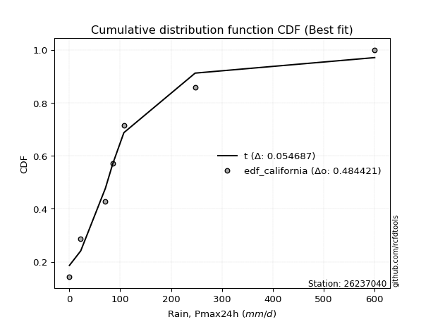</img>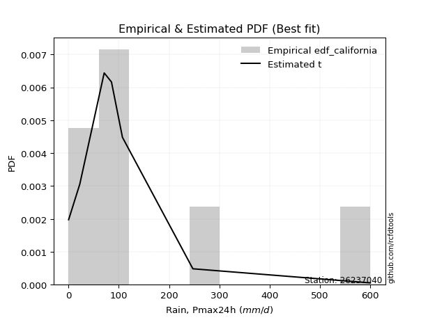</img>

</div>


### 2. Empirical - EDF Hazen (1930)

Hazen method for plotting positions is a formula used to estimate the empirical cumulative probability distribution of flood events or other hydrological data. This formula often results in biased estimations, particularly when extrapolating to extreme events (high return periods).

<div align="center">


$P=(m-0.5)/n$


</div>


**2.1. Empirical values**

<div align="center">

|                | 0                  | 1                  | 2                  | 3                  | 4                  | 5         | 6                 | 7         |
|:---------------|:-------------------|:-------------------|:-------------------|:-------------------|:-------------------|:----------|:------------------|:----------|
| date           | 2020               | 2025               | 2024               | 2017               | 2023               | 2018      | 2019              | 2022      |
| x              | 0.2                | 11.2               | 22.4               | 70.9               | 85.4               | 107.2     | 247.2             | 600.0     |
| m              | 1                  | 2                  | 3                  | 4                  | 5                  | 6         | 7                 | 8         |
| empirical_dist | edf_hazen          | edf_hazen          | edf_hazen          | edf_hazen          | edf_hazen          | edf_hazen | edf_hazen         | edf_hazen |
| empirical      | 0.0625             | 0.1875             | 0.3125             | 0.4375             | 0.5625             | 0.6875    | 0.8125            | 0.9375    |
| empirical_tr   | 1.0666666666666667 | 1.2307692307692308 | 1.4545454545454546 | 1.7777777777777777 | 2.2857142857142856 | 3.2       | 5.333333333333333 | 16.0      |

</div>


**2.2. Kolmogorov-Smirnov fit test (sorted by Δ)**


<div align="center">

|                | 0                   | 1                   | 2                   | 3                   | 4                  | 5                   | 6                   | 7                   | 8                   | 9                     | 10                  | 11                  | 12                 | 13                  | 14                  | 15                 | 16                  | 17                  | 18                 | 19                  | 20                 | 21                  | 22                  | 23                 | 24                  | 25                  | 26                  | 27                 | 28                  | 29                  | 30                  | 31                  | 32                  | 33                  | 34                  | 35                 | 36                 | 37                 | 38                  | 39                  | 40                  | 41                  | 42                  | 43                  | 44                  | 45                  | 46                  | 47                 | 48                  | 49                  | 50                  | 51                  | 52                 | 53                  | 54                  | 55                  | 56                  | 57                  | 58                 | 59                  | 60                  | 61                  | 62                  | 63                 | 64                 | 65                 | 66                  | 67                 | 68                  | 69                 | 70                  | 71                 | 72                 | 73                 | 74                 | 75                  | 76                 | 77                  | 78                 | 79                 | 80                 | 81                  | 82                 | 83                  | 84                  | 85                 | 86                 | 87                 | 88                 | 89                 |
|:---------------|:--------------------|:--------------------|:--------------------|:--------------------|:-------------------|:--------------------|:--------------------|:--------------------|:--------------------|:----------------------|:--------------------|:--------------------|:-------------------|:--------------------|:--------------------|:-------------------|:--------------------|:--------------------|:-------------------|:--------------------|:-------------------|:--------------------|:--------------------|:-------------------|:--------------------|:--------------------|:--------------------|:-------------------|:--------------------|:--------------------|:--------------------|:--------------------|:--------------------|:--------------------|:--------------------|:-------------------|:-------------------|:-------------------|:--------------------|:--------------------|:--------------------|:--------------------|:--------------------|:--------------------|:--------------------|:--------------------|:--------------------|:-------------------|:--------------------|:--------------------|:--------------------|:--------------------|:-------------------|:--------------------|:--------------------|:--------------------|:--------------------|:--------------------|:-------------------|:--------------------|:--------------------|:--------------------|:--------------------|:-------------------|:-------------------|:-------------------|:--------------------|:-------------------|:--------------------|:-------------------|:--------------------|:-------------------|:-------------------|:-------------------|:-------------------|:--------------------|:-------------------|:--------------------|:-------------------|:-------------------|:-------------------|:--------------------|:-------------------|:--------------------|:--------------------|:-------------------|:-------------------|:-------------------|:-------------------|:-------------------|
| station        | 26237040            | 26237040            | 26237040            | 26237040            | 26237040           | 26237040            | 26237040            | 26237040            | 26237040            | 26237040              | 26237040            | 26237040            | 26237040           | 26237040            | 26237040            | 26237040           | 26237040            | 26237040            | 26237040           | 26237040            | 26237040           | 26237040            | 26237040            | 26237040           | 26237040            | 26237040            | 26237040            | 26237040           | 26237040            | 26237040            | 26237040            | 26237040            | 26237040            | 26237040            | 26237040            | 26237040           | 26237040           | 26237040           | 26237040            | 26237040            | 26237040            | 26237040            | 26237040            | 26237040            | 26237040            | 26237040            | 26237040            | 26237040           | 26237040            | 26237040            | 26237040            | 26237040            | 26237040           | 26237040            | 26237040            | 26237040            | 26237040            | 26237040            | 26237040           | 26237040            | 26237040            | 26237040            | 26237040            | 26237040           | 26237040           | 26237040           | 26237040            | 26237040           | 26237040            | 26237040           | 26237040            | 26237040           | 26237040           | 26237040           | 26237040           | 26237040            | 26237040           | 26237040            | 26237040           | 26237040           | 26237040           | 26237040            | 26237040           | 26237040            | 26237040            | 26237040           | 26237040           | 26237040           | 26237040           | 26237040           |
| empirical_dist | edf_hazen           | edf_hazen           | edf_hazen           | edf_hazen           | edf_hazen          | edf_hazen           | edf_hazen           | edf_hazen           | edf_hazen           | edf_hazen             | edf_hazen           | edf_hazen           | edf_hazen          | edf_hazen           | edf_hazen           | edf_hazen          | edf_hazen           | edf_hazen           | edf_hazen          | edf_hazen           | edf_hazen          | edf_hazen           | edf_hazen           | edf_hazen          | edf_hazen           | edf_hazen           | edf_hazen           | edf_hazen          | edf_hazen           | edf_hazen           | edf_hazen           | edf_hazen           | edf_hazen           | edf_hazen           | edf_hazen           | edf_hazen          | edf_hazen          | edf_hazen          | edf_hazen           | edf_hazen           | edf_hazen           | edf_hazen           | edf_hazen           | edf_hazen           | edf_hazen           | edf_hazen           | edf_hazen           | edf_hazen          | edf_hazen           | edf_hazen           | edf_hazen           | edf_hazen           | edf_hazen          | edf_hazen           | edf_hazen           | edf_hazen           | edf_hazen           | edf_hazen           | edf_hazen          | edf_hazen           | edf_hazen           | edf_hazen           | edf_hazen           | edf_hazen          | edf_hazen          | edf_hazen          | edf_hazen           | edf_hazen          | edf_hazen           | edf_hazen          | edf_hazen           | edf_hazen          | edf_hazen          | edf_hazen          | edf_hazen          | edf_hazen           | edf_hazen          | edf_hazen           | edf_hazen          | edf_hazen          | edf_hazen          | edf_hazen           | edf_hazen          | edf_hazen           | edf_hazen           | edf_hazen          | edf_hazen          | edf_hazen          | edf_hazen          | edf_hazen          |
| p_dist         | ncf                 | loggenlogistic      | logt                | weibull_min         | logloggamma        | logjohnsonsu        | logpearson3         | wald                | loggumbel_l         | loglaplace_asymmetric | gamma               | f                   | invgamma           | alpha               | invgauss            | fisk               | nct                 | fatiguelife         | mielke             | johnsonsu           | t                  | loglognorm          | lognakagami         | exponnorm          | lognorm             | lognorm             | logcrystalball      | logexponnorm       | logrice             | lognct              | pearson3            | laplace_asymmetric  | expon               | genexpon            | nakagami            | logbetaprime       | loggamma           | loggamma           | logfatiguelife      | loginvgauss         | logalpha            | moyal               | logerlang           | erlang              | loginvgamma         | logmielke           | loglogistic         | halflogistic       | loginvweibull       | genlogistic         | loghypsecant        | logmaxwell          | gumbel_r           | lograyleigh         | halfnorm            | rayleigh            | loglaplace          | gibrat              | loghalfnorm        | maxwell             | logkstwobign        | loggumbel_r         | betaprime           | loggenexpon        | kstwobign          | loghalflogistic    | logmoyal            | crystalball        | norm                | logistic           | truncnorm           | hypsecant          | rice               | laplace            | gompertz           | logwald             | logtruncnorm       | gumbel_l            | logexpon           | loggibrat          | loggompertz        | logchi2             | pareto             | logfisk             | logncf              | invweibull         | logpareto          | logf               | logweibull_min     | chi2               |
| delta          | 0.06959499156494886 | 0.07673231264321179 | 0.07964066978815043 | 0.08517303926566233 | 0.0877529378579921 | 0.09152019536533562 | 0.09225952968899265 | 0.10795772808186943 | 0.10796014289225186 | 0.10906221366601887   | 0.11564204102273379 | 0.11788533355421915 | 0.1352029062228599 | 0.13751955365648005 | 0.14003978240390458 | 0.1405633732842334 | 0.14197260761640895 | 0.14742796455100937 | 0.152959560385026  | 0.16165627233473756 | 0.1629451132877865 | 0.16515472974132195 | 0.16643969670523862 | 0.1668821644777535 | 0.16689875068908844 | 0.16689875068908844 | 0.16689875573598423 | 0.1669009096528835 | 0.16691121102793904 | 0.16698063921998663 | 0.16741858461149067 | 0.16757705364455633 | 0.16857766850770567 | 0.16857770041399434 | 0.16959573478909196 | 0.1696937222769626 | 0.1712489215388402 | 0.1712489215388402 | 0.17260967062354526 | 0.17361716984642872 | 0.17455089141069602 | 0.17510418944152406 | 0.17666378772540403 | 0.17787117763525995 | 0.17923883005796815 | 0.18004669692791003 | 0.18029565370201706 | 0.1805358483396104 | 0.18541082168102258 | 0.18650743187857077 | 0.19121621975917746 | 0.19303210287210004 | 0.1994701843962024 | 0.20111888764401065 | 0.20292146502364755 | 0.21672455845602623 | 0.21865331717223746 | 0.22395143950049012 | 0.2241745108026587 | 0.22889359014365945 | 0.23007017721139283 | 0.23294853200384102 | 0.23675720081192675 | 0.2444960765990679 | 0.2470693363989186 | 0.2525112012361045 | 0.25545206720369795 | 0.2632669362239869 | 0.26326693710883675 | 0.2732863800189862 | 0.28085957039459375 | 0.2816350149358494 | 0.2902053867914493 | 0.3058950299211451 | 0.3094770494092885 | 0.31822512122968105 | 0.3310409718280787 | 0.33190452879248783 | 0.3472819538924541 | 0.3500389830640589 | 0.3572074683056634 | 0.37603813633425964 | 0.3875855755105373 | 0.39808581830182677 | 0.40765738315480204 | 0.4678978161347367 | 0.4758406982722838 | 0.5157340635049499 | 0.5476713343543336 | 0.7914919908107495 |
| deltao         | 0.4472608134160001  | 0.4472608134160001  | 0.4472608134160001  | 0.4472608134160001  | 0.4472608134160001 | 0.4472608134160001  | 0.4472608134160001  | 0.4472608134160001  | 0.4472608134160001  | 0.4472608134160001    | 0.4472608134160001  | 0.4472608134160001  | 0.4472608134160001 | 0.4472608134160001  | 0.4472608134160001  | 0.4472608134160001 | 0.4472608134160001  | 0.4472608134160001  | 0.4472608134160001 | 0.4472608134160001  | 0.4472608134160001 | 0.4472608134160001  | 0.4472608134160001  | 0.4472608134160001 | 0.4472608134160001  | 0.4472608134160001  | 0.4472608134160001  | 0.4472608134160001 | 0.4472608134160001  | 0.4472608134160001  | 0.4472608134160001  | 0.4472608134160001  | 0.4472608134160001  | 0.4472608134160001  | 0.4472608134160001  | 0.4472608134160001 | 0.4472608134160001 | 0.4472608134160001 | 0.4472608134160001  | 0.4472608134160001  | 0.4472608134160001  | 0.4472608134160001  | 0.4472608134160001  | 0.4472608134160001  | 0.4472608134160001  | 0.4472608134160001  | 0.4472608134160001  | 0.4472608134160001 | 0.4472608134160001  | 0.4472608134160001  | 0.4472608134160001  | 0.4472608134160001  | 0.4472608134160001 | 0.4472608134160001  | 0.4472608134160001  | 0.4472608134160001  | 0.4472608134160001  | 0.4472608134160001  | 0.4472608134160001 | 0.4472608134160001  | 0.4472608134160001  | 0.4472608134160001  | 0.4472608134160001  | 0.4472608134160001 | 0.4472608134160001 | 0.4472608134160001 | 0.4472608134160001  | 0.4472608134160001 | 0.4472608134160001  | 0.4472608134160001 | 0.4472608134160001  | 0.4472608134160001 | 0.4472608134160001 | 0.4472608134160001 | 0.4472608134160001 | 0.4472608134160001  | 0.4472608134160001 | 0.4472608134160001  | 0.4472608134160001 | 0.4472608134160001 | 0.4472608134160001 | 0.4472608134160001  | 0.4472608134160001 | 0.4472608134160001  | 0.4472608134160001  | 0.4472608134160001 | 0.4472608134160001 | 0.4472608134160001 | 0.4472608134160001 | 0.4472608134160001 |
| eval           | Δo > Δ              | Δo > Δ              | Δo > Δ              | Δo > Δ              | Δo > Δ             | Δo > Δ              | Δo > Δ              | Δo > Δ              | Δo > Δ              | Δo > Δ                | Δo > Δ              | Δo > Δ              | Δo > Δ             | Δo > Δ              | Δo > Δ              | Δo > Δ             | Δo > Δ              | Δo > Δ              | Δo > Δ             | Δo > Δ              | Δo > Δ             | Δo > Δ              | Δo > Δ              | Δo > Δ             | Δo > Δ              | Δo > Δ              | Δo > Δ              | Δo > Δ             | Δo > Δ              | Δo > Δ              | Δo > Δ              | Δo > Δ              | Δo > Δ              | Δo > Δ              | Δo > Δ              | Δo > Δ             | Δo > Δ             | Δo > Δ             | Δo > Δ              | Δo > Δ              | Δo > Δ              | Δo > Δ              | Δo > Δ              | Δo > Δ              | Δo > Δ              | Δo > Δ              | Δo > Δ              | Δo > Δ             | Δo > Δ              | Δo > Δ              | Δo > Δ              | Δo > Δ              | Δo > Δ             | Δo > Δ              | Δo > Δ              | Δo > Δ              | Δo > Δ              | Δo > Δ              | Δo > Δ             | Δo > Δ              | Δo > Δ              | Δo > Δ              | Δo > Δ              | Δo > Δ             | Δo > Δ             | Δo > Δ             | Δo > Δ              | Δo > Δ             | Δo > Δ              | Δo > Δ             | Δo > Δ              | Δo > Δ             | Δo > Δ             | Δo > Δ             | Δo > Δ             | Δo > Δ              | Δo > Δ             | Δo > Δ              | Δo > Δ             | Δo > Δ             | Δo > Δ             | Δo > Δ              | Δo > Δ             | Δo > Δ              | Δo > Δ              | Δo <= Δ            | Δo <= Δ            | Δo <= Δ            | Δo <= Δ            | Δo <= Δ            |
| fit            | 1                   | 1                   | 1                   | 1                   | 1                  | 1                   | 1                   | 1                   | 1                   | 1                     | 1                   | 1                   | 1                  | 1                   | 1                   | 1                  | 1                   | 1                   | 1                  | 1                   | 1                  | 1                   | 1                   | 1                  | 1                   | 1                   | 1                   | 1                  | 1                   | 1                   | 1                   | 1                   | 1                   | 1                   | 1                   | 1                  | 1                  | 1                  | 1                   | 1                   | 1                   | 1                   | 1                   | 1                   | 1                   | 1                   | 1                   | 1                  | 1                   | 1                   | 1                   | 1                   | 1                  | 1                   | 1                   | 1                   | 1                   | 1                   | 1                  | 1                   | 1                   | 1                   | 1                   | 1                  | 1                  | 1                  | 1                   | 1                  | 1                   | 1                  | 1                   | 1                  | 1                  | 1                  | 1                  | 1                   | 1                  | 1                   | 1                  | 1                  | 1                  | 1                   | 1                  | 1                   | 1                   | 0                  | 0                  | 0                  | 0                  | 0                  |
| n              | 8                   | 8                   | 8                   | 8                   | 8                  | 8                   | 8                   | 8                   | 8                   | 8                     | 8                   | 8                   | 8                  | 8                   | 8                   | 8                  | 8                   | 8                   | 8                  | 8                   | 8                  | 8                   | 8                   | 8                  | 8                   | 8                   | 8                   | 8                  | 8                   | 8                   | 8                   | 8                   | 8                   | 8                   | 8                   | 8                  | 8                  | 8                  | 8                   | 8                   | 8                   | 8                   | 8                   | 8                   | 8                   | 8                   | 8                   | 8                  | 8                   | 8                   | 8                   | 8                   | 8                  | 8                   | 8                   | 8                   | 8                   | 8                   | 8                  | 8                   | 8                   | 8                   | 8                   | 8                  | 8                  | 8                  | 8                   | 8                  | 8                   | 8                  | 8                   | 8                  | 8                  | 8                  | 8                  | 8                   | 8                  | 8                   | 8                  | 8                  | 8                  | 8                   | 8                  | 8                   | 8                   | 8                  | 8                  | 8                  | 8                  | 8                  |
| best_fit       | 1                   | 0                   | 0                   | 0                   | 0                  | 0                   | 0                   | 0                   | 0                   | 0                     | 0                   | 0                   | 0                  | 0                   | 0                   | 0                  | 0                   | 0                   | 0                  | 0                   | 0                  | 0                   | 0                   | 0                  | 0                   | 0                   | 0                   | 0                  | 0                   | 0                   | 0                   | 0                   | 0                   | 0                   | 0                   | 0                  | 0                  | 0                  | 0                   | 0                   | 0                   | 0                   | 0                   | 0                   | 0                   | 0                   | 0                   | 0                  | 0                   | 0                   | 0                   | 0                   | 0                  | 0                   | 0                   | 0                   | 0                   | 0                   | 0                  | 0                   | 0                   | 0                   | 0                   | 0                  | 0                  | 0                  | 0                   | 0                  | 0                   | 0                  | 0                   | 0                  | 0                  | 0                  | 0                  | 0                   | 0                  | 0                   | 0                  | 0                  | 0                  | 0                   | 0                  | 0                   | 0                   | 0                  | 0                  | 0                  | 0                  | 0                  |
| best_fit_sort  | 1                   | 2                   | 3                   | 4                   | 5                  | 6                   | 7                   | 8                   | 9                   | 10                    | 11                  | 12                  | 13                 | 14                  | 15                  | 16                 | 17                  | 18                  | 19                 | 20                  | 21                 | 22                  | 23                  | 24                 | 25                  | 26                  | 27                  | 28                 | 29                  | 30                  | 31                  | 32                  | 33                  | 34                  | 35                  | 36                 | 37                 | 38                 | 39                  | 40                  | 41                  | 42                  | 43                  | 44                  | 45                  | 46                  | 47                  | 48                 | 49                  | 50                  | 51                  | 52                  | 53                 | 54                  | 55                  | 56                  | 57                  | 58                  | 59                 | 60                  | 61                  | 62                  | 63                  | 64                 | 65                 | 66                 | 67                  | 68                 | 69                  | 70                 | 71                  | 72                 | 73                 | 74                 | 75                 | 76                  | 77                 | 78                  | 79                 | 80                 | 81                 | 82                  | 83                 | 84                  | 85                  | 86                 | 87                 | 88                 | 89                 | 90                 |

</div>


<div align="center">

</img>

</div>


**2.3. Best fit**

<div align="center">

|   id |   station | empirical_dist   | p_dist   |    delta |   deltao | eval   |   fit |   n |   best_fit |   best_fit_sort |
|-----:|----------:|:-----------------|:---------|---------:|---------:|:-------|------:|----:|-----------:|----------------:|
|    0 |  26237040 | edf_hazen        | ncf      | 0.069595 | 0.447261 | Δo > Δ |     1 |   8 |          1 |               1 |

</div>


<div align="center">

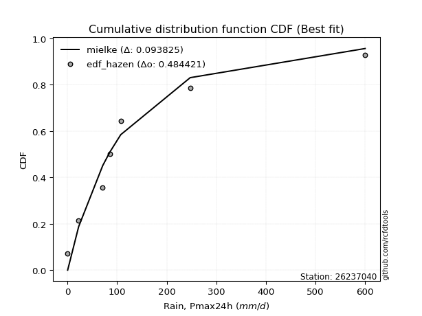</img></img>

</div>


### 3. Empirical - EDF Weibull (1939)

Weibull plotting position formula is an empirical method used to estimate the non-exceedance probability or plotting position for a set of observed data, is often recommended or widely used in practice, particularly in flood frequency analysis.

<div align="center">


$P=m/(n+1)$


</div>


**3.1. Empirical values**

<div align="center">

|                | 0                  | 1                  | 2                  | 3                  | 4                  | 5                  | 6                  | 7                  |
|:---------------|:-------------------|:-------------------|:-------------------|:-------------------|:-------------------|:-------------------|:-------------------|:-------------------|
| date           | 2020               | 2025               | 2024               | 2017               | 2023               | 2018               | 2019               | 2022               |
| x              | 0.2                | 11.2               | 22.4               | 70.9               | 85.4               | 107.2              | 247.2              | 600.0              |
| m              | 1                  | 2                  | 3                  | 4                  | 5                  | 6                  | 7                  | 8                  |
| empirical_dist | edf_weibull        | edf_weibull        | edf_weibull        | edf_weibull        | edf_weibull        | edf_weibull        | edf_weibull        | edf_weibull        |
| empirical      | 0.1111111111111111 | 0.2222222222222222 | 0.3333333333333333 | 0.4444444444444444 | 0.5555555555555556 | 0.6666666666666666 | 0.7777777777777778 | 0.8888888888888888 |
| empirical_tr   | 1.125              | 1.2857142857142856 | 1.4999999999999998 | 1.7999999999999998 | 2.25               | 2.9999999999999996 | 4.5                | 8.999999999999996  |

</div>


**3.2. Kolmogorov-Smirnov fit test (sorted by Δ)**


<div align="center">

|                | 0                  | 1                   | 2                   | 3                   | 4                   | 5                   | 6                     | 7                   | 8                   | 9                   | 10                  | 11                  | 12                  | 13                 | 14                  | 15                 | 16                  | 17                  | 18                  | 19                  | 20                  | 21                  | 22                  | 23                 | 24                  | 25                  | 26                  | 27                 | 28                  | 29                  | 30                 | 31                 | 32                  | 33                 | 34                  | 35                  | 36                  | 37                  | 38                  | 39                  | 40                 | 41                 | 42                 | 43                 | 44                  | 45                  | 46                  | 47                  | 48                  | 49                  | 50                  | 51                  | 52                  | 53                  | 54                  | 55                  | 56                  | 57                  | 58                  | 59                  | 60                 | 61                 | 62                  | 63                  | 64                  | 65                  | 66                  | 67                  | 68                  | 69                 | 70                 | 71                  | 72                  | 73                 | 74                 | 75                  | 76                  | 77                 | 78                 | 79                 | 80                  | 81                 | 82                 | 83                  | 84                  | 85                 | 86                 | 87                  | 88                 | 89                 |
|:---------------|:-------------------|:--------------------|:--------------------|:--------------------|:--------------------|:--------------------|:----------------------|:--------------------|:--------------------|:--------------------|:--------------------|:--------------------|:--------------------|:-------------------|:--------------------|:-------------------|:--------------------|:--------------------|:--------------------|:--------------------|:--------------------|:--------------------|:--------------------|:-------------------|:--------------------|:--------------------|:--------------------|:-------------------|:--------------------|:--------------------|:-------------------|:-------------------|:--------------------|:-------------------|:--------------------|:--------------------|:--------------------|:--------------------|:--------------------|:--------------------|:-------------------|:-------------------|:-------------------|:-------------------|:--------------------|:--------------------|:--------------------|:--------------------|:--------------------|:--------------------|:--------------------|:--------------------|:--------------------|:--------------------|:--------------------|:--------------------|:--------------------|:--------------------|:--------------------|:--------------------|:-------------------|:-------------------|:--------------------|:--------------------|:--------------------|:--------------------|:--------------------|:--------------------|:--------------------|:-------------------|:-------------------|:--------------------|:--------------------|:-------------------|:-------------------|:--------------------|:--------------------|:-------------------|:-------------------|:-------------------|:--------------------|:-------------------|:-------------------|:--------------------|:--------------------|:-------------------|:-------------------|:--------------------|:-------------------|:-------------------|
| station        | 26237040           | 26237040            | 26237040            | 26237040            | 26237040            | 26237040            | 26237040              | 26237040            | 26237040            | 26237040            | 26237040            | 26237040            | 26237040            | 26237040           | 26237040            | 26237040           | 26237040            | 26237040            | 26237040            | 26237040            | 26237040            | 26237040            | 26237040            | 26237040           | 26237040            | 26237040            | 26237040            | 26237040           | 26237040            | 26237040            | 26237040           | 26237040           | 26237040            | 26237040           | 26237040            | 26237040            | 26237040            | 26237040            | 26237040            | 26237040            | 26237040           | 26237040           | 26237040           | 26237040           | 26237040            | 26237040            | 26237040            | 26237040            | 26237040            | 26237040            | 26237040            | 26237040            | 26237040            | 26237040            | 26237040            | 26237040            | 26237040            | 26237040            | 26237040            | 26237040            | 26237040           | 26237040           | 26237040            | 26237040            | 26237040            | 26237040            | 26237040            | 26237040            | 26237040            | 26237040           | 26237040           | 26237040            | 26237040            | 26237040           | 26237040           | 26237040            | 26237040            | 26237040           | 26237040           | 26237040           | 26237040            | 26237040           | 26237040           | 26237040            | 26237040            | 26237040           | 26237040           | 26237040            | 26237040           | 26237040           |
| empirical_dist | edf_weibull        | edf_weibull         | edf_weibull         | edf_weibull         | edf_weibull         | edf_weibull         | edf_weibull           | edf_weibull         | edf_weibull         | edf_weibull         | edf_weibull         | edf_weibull         | edf_weibull         | edf_weibull        | edf_weibull         | edf_weibull        | edf_weibull         | edf_weibull         | edf_weibull         | edf_weibull         | edf_weibull         | edf_weibull         | edf_weibull         | edf_weibull        | edf_weibull         | edf_weibull         | edf_weibull         | edf_weibull        | edf_weibull         | edf_weibull         | edf_weibull        | edf_weibull        | edf_weibull         | edf_weibull        | edf_weibull         | edf_weibull         | edf_weibull         | edf_weibull         | edf_weibull         | edf_weibull         | edf_weibull        | edf_weibull        | edf_weibull        | edf_weibull        | edf_weibull         | edf_weibull         | edf_weibull         | edf_weibull         | edf_weibull         | edf_weibull         | edf_weibull         | edf_weibull         | edf_weibull         | edf_weibull         | edf_weibull         | edf_weibull         | edf_weibull         | edf_weibull         | edf_weibull         | edf_weibull         | edf_weibull        | edf_weibull        | edf_weibull         | edf_weibull         | edf_weibull         | edf_weibull         | edf_weibull         | edf_weibull         | edf_weibull         | edf_weibull        | edf_weibull        | edf_weibull         | edf_weibull         | edf_weibull        | edf_weibull        | edf_weibull         | edf_weibull         | edf_weibull        | edf_weibull        | edf_weibull        | edf_weibull         | edf_weibull        | edf_weibull        | edf_weibull         | edf_weibull         | edf_weibull        | edf_weibull        | edf_weibull         | edf_weibull        | edf_weibull        |
| p_dist         | logloggamma        | loggenlogistic      | logjohnsonsu        | logpearson3         | logt                | loggumbel_l         | loglaplace_asymmetric | wald                | f                   | ncf                 | weibull_min         | gamma               | fisk                | invgamma           | alpha               | pearson3           | invgauss            | nct                 | fatiguelife         | halflogistic        | mielke              | t                   | nakagami            | moyal              | johnsonsu           | loglognorm          | logmielke           | lognakagami        | lognorm             | lognorm             | logcrystalball     | logexponnorm       | logrice             | lognct             | logbetaprime        | loginvweibull       | halfnorm            | loggamma            | loggamma            | logfatiguelife      | genlogistic        | loginvgauss        | logalpha           | logerlang          | erlang              | loginvgamma         | loglogistic         | gumbel_r            | loghypsecant        | logmaxwell          | exponnorm           | laplace_asymmetric  | expon               | genexpon            | lograyleigh         | logkstwobign        | rayleigh            | maxwell             | loggenexpon         | loglaplace          | loghalfnorm        | loggumbel_r        | kstwobign           | betaprime           | crystalball         | norm                | gibrat              | loghalflogistic     | logmoyal            | logistic           | truncnorm          | hypsecant           | rice                | laplace            | gompertz           | gumbel_l            | logwald             | logexpon           | logtruncnorm       | loggompertz        | logchi2             | loggibrat          | pareto             | logfisk             | logncf              | invweibull         | logpareto          | logf                | logweibull_min     | chi2               |
| delta          | 0.0740927927548718 | 0.07520722376529086 | 0.07633947422125587 | 0.08531508524454823 | 0.09848750270047318 | 0.10101569844780744 | 0.10211776922157445   | 0.10680805691406448 | 0.11111066866644287 | 0.11111111102563873 | 0.11111111110085477 | 0.11111111110542432 | 0.11973003995090004 | 0.1282584617784155 | 0.13057510921203563 | 0.1329747887817585 | 0.13309533795946016 | 0.13502816317196453 | 0.14048352010656495 | 0.14298280828454468 | 0.14601511594058159 | 0.14816809341642634 | 0.14876240145575859 | 0.1542708561081907 | 0.15471182789029314 | 0.15821028529687753 | 0.15882490225788093 | 0.1594952522607942 | 0.15995430624464402 | 0.15995430624464402 | 0.1599543112915398 | 0.1599564652084391 | 0.15996676658349462 | 0.1600361947755422 | 0.16008853505352172 | 0.16053917639735626 | 0.16146180538249555 | 0.16430447709439577 | 0.16430447709439577 | 0.16566522617910084 | 0.1656740985452374 | 0.1666727254019843 | 0.1676064469662516 | 0.1697193432809596 | 0.17092673319081553 | 0.17229438561352373 | 0.17335120925757264 | 0.17863685106286903 | 0.18427177531473304 | 0.18608765842765562 | 0.18771549781108682 | 0.18841038697788964 | 0.18941100184103898 | 0.18941103374732765 | 0.19417444319956623 | 0.19534795498917062 | 0.19589122512269286 | 0.20806025681032608 | 0.20990358677488274 | 0.21170887272779304 | 0.2172300663582143 | 0.2260040875593966 | 0.22623600306558522 | 0.22981275636748233 | 0.24243360289065352 | 0.24243360377550338 | 0.24478477283382344 | 0.24556675679166007 | 0.24850762275925353 | 0.2524530466856528 | 0.2600262370612604 | 0.26080168160251604 | 0.26937205345811593 | 0.2850616965878117 | 0.2886437160759551 | 0.31107119545915446 | 0.31128067678523663 | 0.3125597316702319 | 0.3145493284555336 | 0.3224852460834412 | 0.34131591411203743 | 0.3430945386196145 | 0.3528633532883151 | 0.36336359607960456 | 0.37293516093257983 | 0.4192867050236255 | 0.4411184760500616 | 0.48101184128272767 | 0.5129491121321114 | 0.7567697685885273 |
| deltao         | 0.4472608134160001 | 0.4472608134160001  | 0.4472608134160001  | 0.4472608134160001  | 0.4472608134160001  | 0.4472608134160001  | 0.4472608134160001    | 0.4472608134160001  | 0.4472608134160001  | 0.4472608134160001  | 0.4472608134160001  | 0.4472608134160001  | 0.4472608134160001  | 0.4472608134160001 | 0.4472608134160001  | 0.4472608134160001 | 0.4472608134160001  | 0.4472608134160001  | 0.4472608134160001  | 0.4472608134160001  | 0.4472608134160001  | 0.4472608134160001  | 0.4472608134160001  | 0.4472608134160001 | 0.4472608134160001  | 0.4472608134160001  | 0.4472608134160001  | 0.4472608134160001 | 0.4472608134160001  | 0.4472608134160001  | 0.4472608134160001 | 0.4472608134160001 | 0.4472608134160001  | 0.4472608134160001 | 0.4472608134160001  | 0.4472608134160001  | 0.4472608134160001  | 0.4472608134160001  | 0.4472608134160001  | 0.4472608134160001  | 0.4472608134160001 | 0.4472608134160001 | 0.4472608134160001 | 0.4472608134160001 | 0.4472608134160001  | 0.4472608134160001  | 0.4472608134160001  | 0.4472608134160001  | 0.4472608134160001  | 0.4472608134160001  | 0.4472608134160001  | 0.4472608134160001  | 0.4472608134160001  | 0.4472608134160001  | 0.4472608134160001  | 0.4472608134160001  | 0.4472608134160001  | 0.4472608134160001  | 0.4472608134160001  | 0.4472608134160001  | 0.4472608134160001 | 0.4472608134160001 | 0.4472608134160001  | 0.4472608134160001  | 0.4472608134160001  | 0.4472608134160001  | 0.4472608134160001  | 0.4472608134160001  | 0.4472608134160001  | 0.4472608134160001 | 0.4472608134160001 | 0.4472608134160001  | 0.4472608134160001  | 0.4472608134160001 | 0.4472608134160001 | 0.4472608134160001  | 0.4472608134160001  | 0.4472608134160001 | 0.4472608134160001 | 0.4472608134160001 | 0.4472608134160001  | 0.4472608134160001 | 0.4472608134160001 | 0.4472608134160001  | 0.4472608134160001  | 0.4472608134160001 | 0.4472608134160001 | 0.4472608134160001  | 0.4472608134160001 | 0.4472608134160001 |
| eval           | Δo > Δ             | Δo > Δ              | Δo > Δ              | Δo > Δ              | Δo > Δ              | Δo > Δ              | Δo > Δ                | Δo > Δ              | Δo > Δ              | Δo > Δ              | Δo > Δ              | Δo > Δ              | Δo > Δ              | Δo > Δ             | Δo > Δ              | Δo > Δ             | Δo > Δ              | Δo > Δ              | Δo > Δ              | Δo > Δ              | Δo > Δ              | Δo > Δ              | Δo > Δ              | Δo > Δ             | Δo > Δ              | Δo > Δ              | Δo > Δ              | Δo > Δ             | Δo > Δ              | Δo > Δ              | Δo > Δ             | Δo > Δ             | Δo > Δ              | Δo > Δ             | Δo > Δ              | Δo > Δ              | Δo > Δ              | Δo > Δ              | Δo > Δ              | Δo > Δ              | Δo > Δ             | Δo > Δ             | Δo > Δ             | Δo > Δ             | Δo > Δ              | Δo > Δ              | Δo > Δ              | Δo > Δ              | Δo > Δ              | Δo > Δ              | Δo > Δ              | Δo > Δ              | Δo > Δ              | Δo > Δ              | Δo > Δ              | Δo > Δ              | Δo > Δ              | Δo > Δ              | Δo > Δ              | Δo > Δ              | Δo > Δ             | Δo > Δ             | Δo > Δ              | Δo > Δ              | Δo > Δ              | Δo > Δ              | Δo > Δ              | Δo > Δ              | Δo > Δ              | Δo > Δ             | Δo > Δ             | Δo > Δ              | Δo > Δ              | Δo > Δ             | Δo > Δ             | Δo > Δ              | Δo > Δ              | Δo > Δ             | Δo > Δ             | Δo > Δ             | Δo > Δ              | Δo > Δ             | Δo > Δ             | Δo > Δ              | Δo > Δ              | Δo > Δ             | Δo > Δ             | Δo <= Δ             | Δo <= Δ            | Δo <= Δ            |
| fit            | 1                  | 1                   | 1                   | 1                   | 1                   | 1                   | 1                     | 1                   | 1                   | 1                   | 1                   | 1                   | 1                   | 1                  | 1                   | 1                  | 1                   | 1                   | 1                   | 1                   | 1                   | 1                   | 1                   | 1                  | 1                   | 1                   | 1                   | 1                  | 1                   | 1                   | 1                  | 1                  | 1                   | 1                  | 1                   | 1                   | 1                   | 1                   | 1                   | 1                   | 1                  | 1                  | 1                  | 1                  | 1                   | 1                   | 1                   | 1                   | 1                   | 1                   | 1                   | 1                   | 1                   | 1                   | 1                   | 1                   | 1                   | 1                   | 1                   | 1                   | 1                  | 1                  | 1                   | 1                   | 1                   | 1                   | 1                   | 1                   | 1                   | 1                  | 1                  | 1                   | 1                   | 1                  | 1                  | 1                   | 1                   | 1                  | 1                  | 1                  | 1                   | 1                  | 1                  | 1                   | 1                   | 1                  | 1                  | 0                   | 0                  | 0                  |
| n              | 8                  | 8                   | 8                   | 8                   | 8                   | 8                   | 8                     | 8                   | 8                   | 8                   | 8                   | 8                   | 8                   | 8                  | 8                   | 8                  | 8                   | 8                   | 8                   | 8                   | 8                   | 8                   | 8                   | 8                  | 8                   | 8                   | 8                   | 8                  | 8                   | 8                   | 8                  | 8                  | 8                   | 8                  | 8                   | 8                   | 8                   | 8                   | 8                   | 8                   | 8                  | 8                  | 8                  | 8                  | 8                   | 8                   | 8                   | 8                   | 8                   | 8                   | 8                   | 8                   | 8                   | 8                   | 8                   | 8                   | 8                   | 8                   | 8                   | 8                   | 8                  | 8                  | 8                   | 8                   | 8                   | 8                   | 8                   | 8                   | 8                   | 8                  | 8                  | 8                   | 8                   | 8                  | 8                  | 8                   | 8                   | 8                  | 8                  | 8                  | 8                   | 8                  | 8                  | 8                   | 8                   | 8                  | 8                  | 8                   | 8                  | 8                  |
| best_fit       | 1                  | 0                   | 0                   | 0                   | 0                   | 0                   | 0                     | 0                   | 0                   | 0                   | 0                   | 0                   | 0                   | 0                  | 0                   | 0                  | 0                   | 0                   | 0                   | 0                   | 0                   | 0                   | 0                   | 0                  | 0                   | 0                   | 0                   | 0                  | 0                   | 0                   | 0                  | 0                  | 0                   | 0                  | 0                   | 0                   | 0                   | 0                   | 0                   | 0                   | 0                  | 0                  | 0                  | 0                  | 0                   | 0                   | 0                   | 0                   | 0                   | 0                   | 0                   | 0                   | 0                   | 0                   | 0                   | 0                   | 0                   | 0                   | 0                   | 0                   | 0                  | 0                  | 0                   | 0                   | 0                   | 0                   | 0                   | 0                   | 0                   | 0                  | 0                  | 0                   | 0                   | 0                  | 0                  | 0                   | 0                   | 0                  | 0                  | 0                  | 0                   | 0                  | 0                  | 0                   | 0                   | 0                  | 0                  | 0                   | 0                  | 0                  |
| best_fit_sort  | 1                  | 2                   | 3                   | 4                   | 5                   | 6                   | 7                     | 8                   | 9                   | 10                  | 11                  | 12                  | 13                  | 14                 | 15                  | 16                 | 17                  | 18                  | 19                  | 20                  | 21                  | 22                  | 23                  | 24                 | 25                  | 26                  | 27                  | 28                 | 29                  | 30                  | 31                 | 32                 | 33                  | 34                 | 35                  | 36                  | 37                  | 38                  | 39                  | 40                  | 41                 | 42                 | 43                 | 44                 | 45                  | 46                  | 47                  | 48                  | 49                  | 50                  | 51                  | 52                  | 53                  | 54                  | 55                  | 56                  | 57                  | 58                  | 59                  | 60                  | 61                 | 62                 | 63                  | 64                  | 65                  | 66                  | 67                  | 68                  | 69                  | 70                 | 71                 | 72                  | 73                  | 74                 | 75                 | 76                  | 77                  | 78                 | 79                 | 80                 | 81                  | 82                 | 83                 | 84                  | 85                  | 86                 | 87                 | 88                  | 89                 | 90                 |

</div>


<div align="center">

</img>

</div>


**3.3. Best fit**

<div align="center">

|   id |   station | empirical_dist   | p_dist      |     delta |   deltao | eval   |   fit |   n |   best_fit |   best_fit_sort |
|-----:|----------:|:-----------------|:------------|----------:|---------:|:-------|------:|----:|-----------:|----------------:|
|    0 |  26237040 | edf_weibull      | logloggamma | 0.0740928 | 0.447261 | Δo > Δ |     1 |   8 |          1 |               1 |

</div>


<div align="center">

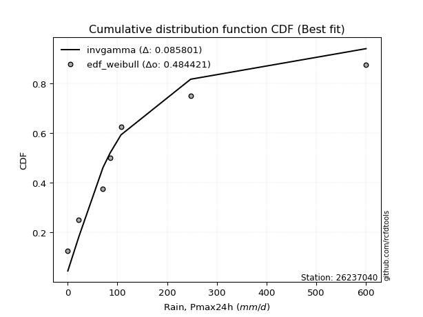</img>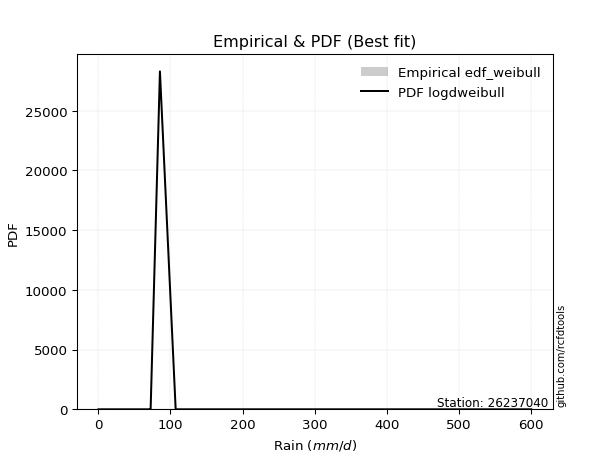</img>

</div>


### 4. Empirical - EDF Beard (1943)

The Beard formula (or Beard´s plotting position formula) in hydrology is used to estimate the empirical non-exceedance probability _(P)_ of a flood event (or other extreme hydrological data point) within a given dataset.

<div align="center">


$P=(m-0.31)/(n+0.38)$


</div>


**4.1. Empirical values**

<div align="center">

|                | 0                   | 1                   | 2                  | 3                   | 4                  | 5                  | 6                  | 7                  |
|:---------------|:--------------------|:--------------------|:-------------------|:--------------------|:-------------------|:-------------------|:-------------------|:-------------------|
| date           | 2020                | 2025                | 2024               | 2017                | 2023               | 2018               | 2019               | 2022               |
| x              | 0.2                 | 11.2                | 22.4               | 70.9                | 85.4               | 107.2              | 247.2              | 600.0              |
| m              | 1                   | 2                   | 3                  | 4                   | 5                  | 6                  | 7                  | 8                  |
| empirical_dist | edf_beard           | edf_beard           | edf_beard          | edf_beard           | edf_beard          | edf_beard          | edf_beard          | edf_beard          |
| empirical      | 0.08233890214797135 | 0.20167064439140808 | 0.3210023866348448 | 0.44033412887828155 | 0.5596658711217184 | 0.6789976133651551 | 0.7983293556085919 | 0.9176610978520287 |
| empirical_tr   | 1.0897269180754225  | 1.2526158445440956  | 1.4727592267135323 | 1.7867803837953091  | 2.2710027100271004 | 3.115241635687732  | 4.958579881656804  | 12.144927536231886 |

</div>


**4.2. Kolmogorov-Smirnov fit test (sorted by Δ)**


<div align="center">

|                | 0                   | 1                   | 2                   | 3                   | 4                  | 5                   | 6                  | 7                  | 8                   | 9                     | 10                  | 11                 | 12                  | 13                  | 14                 | 15                  | 16                 | 17                  | 18                  | 19                  | 20                  | 21                 | 22                  | 23                  | 24                 | 25                  | 26                 | 27                 | 28                  | 29                  | 30                 | 31                  | 32                 | 33                  | 34                  | 35                  | 36                  | 37                  | 38                  | 39                 | 40                  | 41                  | 42                 | 43                  | 44                  | 45                 | 46                  | 47                  | 48                 | 49                  | 50                 | 51                 | 52                 | 53                  | 54                 | 55                 | 56                 | 57                  | 58                  | 59                  | 60                  | 61                  | 62                  | 63                 | 64                  | 65                  | 66                 | 67                  | 68                 | 69                  | 70                 | 71                 | 72                 | 73                  | 74                  | 75                 | 76                 | 77                 | 78                 | 79                  | 80                  | 81                  | 82                 | 83                 | 84                  | 85                  | 86                  | 87                 | 88                 | 89                 |
|:---------------|:--------------------|:--------------------|:--------------------|:--------------------|:-------------------|:--------------------|:-------------------|:-------------------|:--------------------|:----------------------|:--------------------|:-------------------|:--------------------|:--------------------|:-------------------|:--------------------|:-------------------|:--------------------|:--------------------|:--------------------|:--------------------|:-------------------|:--------------------|:--------------------|:-------------------|:--------------------|:-------------------|:-------------------|:--------------------|:--------------------|:-------------------|:--------------------|:-------------------|:--------------------|:--------------------|:--------------------|:--------------------|:--------------------|:--------------------|:-------------------|:--------------------|:--------------------|:-------------------|:--------------------|:--------------------|:-------------------|:--------------------|:--------------------|:-------------------|:--------------------|:-------------------|:-------------------|:-------------------|:--------------------|:-------------------|:-------------------|:-------------------|:--------------------|:--------------------|:--------------------|:--------------------|:--------------------|:--------------------|:-------------------|:--------------------|:--------------------|:-------------------|:--------------------|:-------------------|:--------------------|:-------------------|:-------------------|:-------------------|:--------------------|:--------------------|:-------------------|:-------------------|:-------------------|:-------------------|:--------------------|:--------------------|:--------------------|:-------------------|:-------------------|:--------------------|:--------------------|:--------------------|:-------------------|:-------------------|:-------------------|
| station        | 26237040            | 26237040            | 26237040            | 26237040            | 26237040           | 26237040            | 26237040           | 26237040           | 26237040            | 26237040              | 26237040            | 26237040           | 26237040            | 26237040            | 26237040           | 26237040            | 26237040           | 26237040            | 26237040            | 26237040            | 26237040            | 26237040           | 26237040            | 26237040            | 26237040           | 26237040            | 26237040           | 26237040           | 26237040            | 26237040            | 26237040           | 26237040            | 26237040           | 26237040            | 26237040            | 26237040            | 26237040            | 26237040            | 26237040            | 26237040           | 26237040            | 26237040            | 26237040           | 26237040            | 26237040            | 26237040           | 26237040            | 26237040            | 26237040           | 26237040            | 26237040           | 26237040           | 26237040           | 26237040            | 26237040           | 26237040           | 26237040           | 26237040            | 26237040            | 26237040            | 26237040            | 26237040            | 26237040            | 26237040           | 26237040            | 26237040            | 26237040           | 26237040            | 26237040           | 26237040            | 26237040           | 26237040           | 26237040           | 26237040            | 26237040            | 26237040           | 26237040           | 26237040           | 26237040           | 26237040            | 26237040            | 26237040            | 26237040           | 26237040           | 26237040            | 26237040            | 26237040            | 26237040           | 26237040           | 26237040           |
| empirical_dist | edf_beard           | edf_beard           | edf_beard           | edf_beard           | edf_beard          | edf_beard           | edf_beard          | edf_beard          | edf_beard           | edf_beard             | edf_beard           | edf_beard          | edf_beard           | edf_beard           | edf_beard          | edf_beard           | edf_beard          | edf_beard           | edf_beard           | edf_beard           | edf_beard           | edf_beard          | edf_beard           | edf_beard           | edf_beard          | edf_beard           | edf_beard          | edf_beard          | edf_beard           | edf_beard           | edf_beard          | edf_beard           | edf_beard          | edf_beard           | edf_beard           | edf_beard           | edf_beard           | edf_beard           | edf_beard           | edf_beard          | edf_beard           | edf_beard           | edf_beard          | edf_beard           | edf_beard           | edf_beard          | edf_beard           | edf_beard           | edf_beard          | edf_beard           | edf_beard          | edf_beard          | edf_beard          | edf_beard           | edf_beard          | edf_beard          | edf_beard          | edf_beard           | edf_beard           | edf_beard           | edf_beard           | edf_beard           | edf_beard           | edf_beard          | edf_beard           | edf_beard           | edf_beard          | edf_beard           | edf_beard          | edf_beard           | edf_beard          | edf_beard          | edf_beard          | edf_beard           | edf_beard           | edf_beard          | edf_beard          | edf_beard          | edf_beard          | edf_beard           | edf_beard           | edf_beard           | edf_beard          | edf_beard          | edf_beard           | edf_beard           | edf_beard           | edf_beard          | edf_beard          | edf_beard          |
| p_dist         | loggenlogistic      | logloggamma         | ncf                 | weibull_min         | logjohnsonsu       | logt                | logpearson3        | wald               | loggumbel_l         | loglaplace_asymmetric | gamma               | f                  | fisk                | invgamma            | alpha              | invgauss            | nct                | t                   | fatiguelife         | pearson3            | mielke              | johnsonsu          | halflogistic        | nakagami            | loglognorm         | lognakagami         | lognorm            | lognorm            | logcrystalball      | logexponnorm        | logrice            | lognct              | logbetaprime       | logmielke           | moyal               | loggamma            | loggamma            | logfatiguelife      | loginvgauss         | loginvweibull      | logalpha            | logerlang           | erlang             | exponnorm           | laplace_asymmetric  | loginvgamma        | expon               | genexpon            | loglogistic        | genlogistic         | halfnorm           | loghypsecant       | logmaxwell         | gumbel_r            | lograyleigh        | rayleigh           | loglaplace         | logkstwobign        | maxwell             | loghalfnorm         | loggumbel_r         | loggenexpon         | gibrat              | betaprime          | kstwobign           | loghalflogistic     | logmoyal           | crystalball         | norm               | logistic            | truncnorm          | hypsecant          | rice               | laplace             | gompertz            | logwald            | logtruncnorm       | gumbel_l           | logexpon           | loggompertz         | loggibrat           | logchi2             | pareto             | logfisk            | logncf              | invweibull          | logpareto           | logf               | logweibull_min     | chi2               |
| delta          | 0.07264478131832325 | 0.07925055122314717 | 0.08233890206249897 | 0.08233891038738078 | 0.0830178087304907 | 0.08615655600198469 | 0.0894254008107111 | 0.0994553414470245 | 0.10512601401397031 | 0.10622808478773732   | 0.11280791214445224 | 0.1150512046759376 | 0.13206098664938848 | 0.13236877734457836 | 0.1346854247781985 | 0.13720565352562303 | 0.1391384787381274 | 0.14310621113981514 | 0.14459383567272782 | 0.14757968246351932 | 0.15012543150674446 | 0.158822143456456  | 0.16069694619163905 | 0.16109334815424703 | 0.1623206008630404 | 0.16360556782695707 | 0.1640646218108069 | 0.1640646218108069 | 0.16406462685770268 | 0.16406678077460196 | 0.1640770821496575 | 0.16414651034170508 | 0.1641988506196846 | 0.16587605253650195 | 0.16660180280667913 | 0.16841479266055864 | 0.16841479266055864 | 0.16977554174526371 | 0.17078304096814717 | 0.1712401772896145 | 0.17171676253241447 | 0.17382965884712248 | 0.1750370487569784 | 0.17538455111259832 | 0.17607944027940114 | 0.1764047011796866 | 0.17708005514255049 | 0.17708008704883915 | 0.1774615248237355 | 0.17800504524372585 | 0.1830825628756762 | 0.1883820908808959 | 0.1901979739938185 | 0.19096779776135747 | 0.1982847587657291 | 0.2082221718211813 | 0.2158191882939559 | 0.21589953281998475 | 0.22039120350881453 | 0.22134038192437716 | 0.23011440312555947 | 0.23032543220765983 | 0.23245382613533494 | 0.2339230719336452 | 0.23856694976407367 | 0.24967707235782294 | 0.2526179383254164 | 0.25476454958914196 | 0.2547645504739918 | 0.26478399338414127 | 0.2723571837597488 | 0.2731326283010045 | 0.2817030001566044 | 0.29739264328630016 | 0.30097466277444357 | 0.3153909923513995 | 0.3186596440216965 | 0.3234021421576429 | 0.333111309501046  | 0.34303682391425533 | 0.34720485418577735 | 0.36186749194285156 | 0.3734149311191292 | 0.3839151739104187 | 0.39348673876339396 | 0.44805891398676534 | 0.46167005388087573 | 0.5015634191135419 | 0.5335006899629255 | 0.7773213464193414 |
| deltao         | 0.4472608134160001  | 0.4472608134160001  | 0.4472608134160001  | 0.4472608134160001  | 0.4472608134160001 | 0.4472608134160001  | 0.4472608134160001 | 0.4472608134160001 | 0.4472608134160001  | 0.4472608134160001    | 0.4472608134160001  | 0.4472608134160001 | 0.4472608134160001  | 0.4472608134160001  | 0.4472608134160001 | 0.4472608134160001  | 0.4472608134160001 | 0.4472608134160001  | 0.4472608134160001  | 0.4472608134160001  | 0.4472608134160001  | 0.4472608134160001 | 0.4472608134160001  | 0.4472608134160001  | 0.4472608134160001 | 0.4472608134160001  | 0.4472608134160001 | 0.4472608134160001 | 0.4472608134160001  | 0.4472608134160001  | 0.4472608134160001 | 0.4472608134160001  | 0.4472608134160001 | 0.4472608134160001  | 0.4472608134160001  | 0.4472608134160001  | 0.4472608134160001  | 0.4472608134160001  | 0.4472608134160001  | 0.4472608134160001 | 0.4472608134160001  | 0.4472608134160001  | 0.4472608134160001 | 0.4472608134160001  | 0.4472608134160001  | 0.4472608134160001 | 0.4472608134160001  | 0.4472608134160001  | 0.4472608134160001 | 0.4472608134160001  | 0.4472608134160001 | 0.4472608134160001 | 0.4472608134160001 | 0.4472608134160001  | 0.4472608134160001 | 0.4472608134160001 | 0.4472608134160001 | 0.4472608134160001  | 0.4472608134160001  | 0.4472608134160001  | 0.4472608134160001  | 0.4472608134160001  | 0.4472608134160001  | 0.4472608134160001 | 0.4472608134160001  | 0.4472608134160001  | 0.4472608134160001 | 0.4472608134160001  | 0.4472608134160001 | 0.4472608134160001  | 0.4472608134160001 | 0.4472608134160001 | 0.4472608134160001 | 0.4472608134160001  | 0.4472608134160001  | 0.4472608134160001 | 0.4472608134160001 | 0.4472608134160001 | 0.4472608134160001 | 0.4472608134160001  | 0.4472608134160001  | 0.4472608134160001  | 0.4472608134160001 | 0.4472608134160001 | 0.4472608134160001  | 0.4472608134160001  | 0.4472608134160001  | 0.4472608134160001 | 0.4472608134160001 | 0.4472608134160001 |
| eval           | Δo > Δ              | Δo > Δ              | Δo > Δ              | Δo > Δ              | Δo > Δ             | Δo > Δ              | Δo > Δ             | Δo > Δ             | Δo > Δ              | Δo > Δ                | Δo > Δ              | Δo > Δ             | Δo > Δ              | Δo > Δ              | Δo > Δ             | Δo > Δ              | Δo > Δ             | Δo > Δ              | Δo > Δ              | Δo > Δ              | Δo > Δ              | Δo > Δ             | Δo > Δ              | Δo > Δ              | Δo > Δ             | Δo > Δ              | Δo > Δ             | Δo > Δ             | Δo > Δ              | Δo > Δ              | Δo > Δ             | Δo > Δ              | Δo > Δ             | Δo > Δ              | Δo > Δ              | Δo > Δ              | Δo > Δ              | Δo > Δ              | Δo > Δ              | Δo > Δ             | Δo > Δ              | Δo > Δ              | Δo > Δ             | Δo > Δ              | Δo > Δ              | Δo > Δ             | Δo > Δ              | Δo > Δ              | Δo > Δ             | Δo > Δ              | Δo > Δ             | Δo > Δ             | Δo > Δ             | Δo > Δ              | Δo > Δ             | Δo > Δ             | Δo > Δ             | Δo > Δ              | Δo > Δ              | Δo > Δ              | Δo > Δ              | Δo > Δ              | Δo > Δ              | Δo > Δ             | Δo > Δ              | Δo > Δ              | Δo > Δ             | Δo > Δ              | Δo > Δ             | Δo > Δ              | Δo > Δ             | Δo > Δ             | Δo > Δ             | Δo > Δ              | Δo > Δ              | Δo > Δ             | Δo > Δ             | Δo > Δ             | Δo > Δ             | Δo > Δ              | Δo > Δ              | Δo > Δ              | Δo > Δ             | Δo > Δ             | Δo > Δ              | Δo <= Δ             | Δo <= Δ             | Δo <= Δ            | Δo <= Δ            | Δo <= Δ            |
| fit            | 1                   | 1                   | 1                   | 1                   | 1                  | 1                   | 1                  | 1                  | 1                   | 1                     | 1                   | 1                  | 1                   | 1                   | 1                  | 1                   | 1                  | 1                   | 1                   | 1                   | 1                   | 1                  | 1                   | 1                   | 1                  | 1                   | 1                  | 1                  | 1                   | 1                   | 1                  | 1                   | 1                  | 1                   | 1                   | 1                   | 1                   | 1                   | 1                   | 1                  | 1                   | 1                   | 1                  | 1                   | 1                   | 1                  | 1                   | 1                   | 1                  | 1                   | 1                  | 1                  | 1                  | 1                   | 1                  | 1                  | 1                  | 1                   | 1                   | 1                   | 1                   | 1                   | 1                   | 1                  | 1                   | 1                   | 1                  | 1                   | 1                  | 1                   | 1                  | 1                  | 1                  | 1                   | 1                   | 1                  | 1                  | 1                  | 1                  | 1                   | 1                   | 1                   | 1                  | 1                  | 1                   | 0                   | 0                   | 0                  | 0                  | 0                  |
| n              | 8                   | 8                   | 8                   | 8                   | 8                  | 8                   | 8                  | 8                  | 8                   | 8                     | 8                   | 8                  | 8                   | 8                   | 8                  | 8                   | 8                  | 8                   | 8                   | 8                   | 8                   | 8                  | 8                   | 8                   | 8                  | 8                   | 8                  | 8                  | 8                   | 8                   | 8                  | 8                   | 8                  | 8                   | 8                   | 8                   | 8                   | 8                   | 8                   | 8                  | 8                   | 8                   | 8                  | 8                   | 8                   | 8                  | 8                   | 8                   | 8                  | 8                   | 8                  | 8                  | 8                  | 8                   | 8                  | 8                  | 8                  | 8                   | 8                   | 8                   | 8                   | 8                   | 8                   | 8                  | 8                   | 8                   | 8                  | 8                   | 8                  | 8                   | 8                  | 8                  | 8                  | 8                   | 8                   | 8                  | 8                  | 8                  | 8                  | 8                   | 8                   | 8                   | 8                  | 8                  | 8                   | 8                   | 8                   | 8                  | 8                  | 8                  |
| best_fit       | 1                   | 0                   | 0                   | 0                   | 0                  | 0                   | 0                  | 0                  | 0                   | 0                     | 0                   | 0                  | 0                   | 0                   | 0                  | 0                   | 0                  | 0                   | 0                   | 0                   | 0                   | 0                  | 0                   | 0                   | 0                  | 0                   | 0                  | 0                  | 0                   | 0                   | 0                  | 0                   | 0                  | 0                   | 0                   | 0                   | 0                   | 0                   | 0                   | 0                  | 0                   | 0                   | 0                  | 0                   | 0                   | 0                  | 0                   | 0                   | 0                  | 0                   | 0                  | 0                  | 0                  | 0                   | 0                  | 0                  | 0                  | 0                   | 0                   | 0                   | 0                   | 0                   | 0                   | 0                  | 0                   | 0                   | 0                  | 0                   | 0                  | 0                   | 0                  | 0                  | 0                  | 0                   | 0                   | 0                  | 0                  | 0                  | 0                  | 0                   | 0                   | 0                   | 0                  | 0                  | 0                   | 0                   | 0                   | 0                  | 0                  | 0                  |
| best_fit_sort  | 1                   | 2                   | 3                   | 4                   | 5                  | 6                   | 7                  | 8                  | 9                   | 10                    | 11                  | 12                 | 13                  | 14                  | 15                 | 16                  | 17                 | 18                  | 19                  | 20                  | 21                  | 22                 | 23                  | 24                  | 25                 | 26                  | 27                 | 28                 | 29                  | 30                  | 31                 | 32                  | 33                 | 34                  | 35                  | 36                  | 37                  | 38                  | 39                  | 40                 | 41                  | 42                  | 43                 | 44                  | 45                  | 46                 | 47                  | 48                  | 49                 | 50                  | 51                 | 52                 | 53                 | 54                  | 55                 | 56                 | 57                 | 58                  | 59                  | 60                  | 61                  | 62                  | 63                  | 64                 | 65                  | 66                  | 67                 | 68                  | 69                 | 70                  | 71                 | 72                 | 73                 | 74                  | 75                  | 76                 | 77                 | 78                 | 79                 | 80                  | 81                  | 82                  | 83                 | 84                 | 85                  | 86                  | 87                  | 88                 | 89                 | 90                 |

</div>


<div align="center">

</img>

</div>


**4.3. Best fit**

<div align="center">

|   id |   station | empirical_dist   | p_dist         |     delta |   deltao | eval   |   fit |   n |   best_fit |   best_fit_sort |
|-----:|----------:|:-----------------|:---------------|----------:|---------:|:-------|------:|----:|-----------:|----------------:|
|    0 |  26237040 | edf_beard        | loggenlogistic | 0.0726448 | 0.447261 | Δo > Δ |     1 |   8 |          1 |               1 |

</div>


<div align="center">

</img></img>

</div>


### 5. Empirical - EDF Chegodayev (1955)

The Chegodayev formula is an empirical plotting position formula used in hydrological frequency analysis to estimate the exceedance probability or return period of a specific event from a set of observed data. It is primarily used for plotting observed data points on probability paper to fit a theoretical distribution, particularly for analyzing extreme events like maximum flood flows or rainfall intensities. The constant _b_ value in the generalized plotting position formula is 0.3.

<div align="center">


$P=(m-b)/(n+1-2b)$


</div>


**5.1. Empirical values**

<div align="center">

|                | 0                   | 1                   | 2                   | 3                   | 4                  | 5                  | 6                  | 7                  |
|:---------------|:--------------------|:--------------------|:--------------------|:--------------------|:-------------------|:-------------------|:-------------------|:-------------------|
| date           | 2020                | 2025                | 2024                | 2017                | 2023               | 2018               | 2019               | 2022               |
| x              | 0.2                 | 11.2                | 22.4                | 70.9                | 85.4               | 107.2              | 247.2              | 600.0              |
| m              | 1                   | 2                   | 3                   | 4                   | 5                  | 6                  | 7                  | 8                  |
| empirical_dist | edf_chegodayev      | edf_chegodayev      | edf_chegodayev      | edf_chegodayev      | edf_chegodayev     | edf_chegodayev     | edf_chegodayev     | edf_chegodayev     |
| empirical      | 0.08333333333333333 | 0.20238095238095236 | 0.32142857142857145 | 0.44047619047619047 | 0.5595238095238095 | 0.6785714285714286 | 0.7976190476190476 | 0.9166666666666666 |
| empirical_tr   | 1.090909090909091   | 1.253731343283582   | 1.4736842105263157  | 1.7872340425531914  | 2.27027027027027   | 3.1111111111111116 | 4.941176470588234  | 11.999999999999995 |

</div>


**5.2. Kolmogorov-Smirnov fit test (sorted by Δ)**


<div align="center">

|                | 0                   | 1                  | 2                   | 3                   | 4                   | 5                   | 6                   | 7                   | 8                  | 9                     | 10                  | 11                  | 12                 | 13                  | 14                 | 15                 | 16                 | 17                  | 18                 | 19                  | 20                  | 21                 | 22                  | 23                  | 24                  | 25                  | 26                  | 27                  | 28                  | 29                  | 30                  | 31                  | 32                  | 33                  | 34                  | 35                  | 36                  | 37                 | 38                  | 39                  | 40                  | 41                  | 42                  | 43                  | 44                  | 45                  | 46                 | 47                  | 48                 | 49                  | 50                  | 51                 | 52                  | 53                 | 54                  | 55                  | 56                  | 57                 | 58                  | 59                  | 60                  | 61                  | 62                  | 63                  | 64                 | 65                  | 66                 | 67                 | 68                  | 69                 | 70                  | 71                 | 72                 | 73                 | 74                 | 75                 | 76                 | 77                  | 78                  | 79                 | 80                  | 81                 | 82                  | 83                  | 84                 | 85                 | 86                 | 87                 | 88                 | 89                 |
|:---------------|:--------------------|:-------------------|:--------------------|:--------------------|:--------------------|:--------------------|:--------------------|:--------------------|:-------------------|:----------------------|:--------------------|:--------------------|:-------------------|:--------------------|:-------------------|:-------------------|:-------------------|:--------------------|:-------------------|:--------------------|:--------------------|:-------------------|:--------------------|:--------------------|:--------------------|:--------------------|:--------------------|:--------------------|:--------------------|:--------------------|:--------------------|:--------------------|:--------------------|:--------------------|:--------------------|:--------------------|:--------------------|:-------------------|:--------------------|:--------------------|:--------------------|:--------------------|:--------------------|:--------------------|:--------------------|:--------------------|:-------------------|:--------------------|:-------------------|:--------------------|:--------------------|:-------------------|:--------------------|:-------------------|:--------------------|:--------------------|:--------------------|:-------------------|:--------------------|:--------------------|:--------------------|:--------------------|:--------------------|:--------------------|:-------------------|:--------------------|:-------------------|:-------------------|:--------------------|:-------------------|:--------------------|:-------------------|:-------------------|:-------------------|:-------------------|:-------------------|:-------------------|:--------------------|:--------------------|:-------------------|:--------------------|:-------------------|:--------------------|:--------------------|:-------------------|:-------------------|:-------------------|:-------------------|:-------------------|:-------------------|
| station        | 26237040            | 26237040           | 26237040            | 26237040            | 26237040            | 26237040            | 26237040            | 26237040            | 26237040           | 26237040              | 26237040            | 26237040            | 26237040           | 26237040            | 26237040           | 26237040           | 26237040           | 26237040            | 26237040           | 26237040            | 26237040            | 26237040           | 26237040            | 26237040            | 26237040            | 26237040            | 26237040            | 26237040            | 26237040            | 26237040            | 26237040            | 26237040            | 26237040            | 26237040            | 26237040            | 26237040            | 26237040            | 26237040           | 26237040            | 26237040            | 26237040            | 26237040            | 26237040            | 26237040            | 26237040            | 26237040            | 26237040           | 26237040            | 26237040           | 26237040            | 26237040            | 26237040           | 26237040            | 26237040           | 26237040            | 26237040            | 26237040            | 26237040           | 26237040            | 26237040            | 26237040            | 26237040            | 26237040            | 26237040            | 26237040           | 26237040            | 26237040           | 26237040           | 26237040            | 26237040           | 26237040            | 26237040           | 26237040           | 26237040           | 26237040           | 26237040           | 26237040           | 26237040            | 26237040            | 26237040           | 26237040            | 26237040           | 26237040            | 26237040            | 26237040           | 26237040           | 26237040           | 26237040           | 26237040           | 26237040           |
| empirical_dist | edf_chegodayev      | edf_chegodayev     | edf_chegodayev      | edf_chegodayev      | edf_chegodayev      | edf_chegodayev      | edf_chegodayev      | edf_chegodayev      | edf_chegodayev     | edf_chegodayev        | edf_chegodayev      | edf_chegodayev      | edf_chegodayev     | edf_chegodayev      | edf_chegodayev     | edf_chegodayev     | edf_chegodayev     | edf_chegodayev      | edf_chegodayev     | edf_chegodayev      | edf_chegodayev      | edf_chegodayev     | edf_chegodayev      | edf_chegodayev      | edf_chegodayev      | edf_chegodayev      | edf_chegodayev      | edf_chegodayev      | edf_chegodayev      | edf_chegodayev      | edf_chegodayev      | edf_chegodayev      | edf_chegodayev      | edf_chegodayev      | edf_chegodayev      | edf_chegodayev      | edf_chegodayev      | edf_chegodayev     | edf_chegodayev      | edf_chegodayev      | edf_chegodayev      | edf_chegodayev      | edf_chegodayev      | edf_chegodayev      | edf_chegodayev      | edf_chegodayev      | edf_chegodayev     | edf_chegodayev      | edf_chegodayev     | edf_chegodayev      | edf_chegodayev      | edf_chegodayev     | edf_chegodayev      | edf_chegodayev     | edf_chegodayev      | edf_chegodayev      | edf_chegodayev      | edf_chegodayev     | edf_chegodayev      | edf_chegodayev      | edf_chegodayev      | edf_chegodayev      | edf_chegodayev      | edf_chegodayev      | edf_chegodayev     | edf_chegodayev      | edf_chegodayev     | edf_chegodayev     | edf_chegodayev      | edf_chegodayev     | edf_chegodayev      | edf_chegodayev     | edf_chegodayev     | edf_chegodayev     | edf_chegodayev     | edf_chegodayev     | edf_chegodayev     | edf_chegodayev      | edf_chegodayev      | edf_chegodayev     | edf_chegodayev      | edf_chegodayev     | edf_chegodayev      | edf_chegodayev      | edf_chegodayev     | edf_chegodayev     | edf_chegodayev     | edf_chegodayev     | edf_chegodayev     | edf_chegodayev     |
| p_dist         | loggenlogistic      | logloggamma        | logjohnsonsu        | ncf                 | weibull_min         | logt                | logpearson3         | wald                | loggumbel_l        | loglaplace_asymmetric | gamma               | f                   | fisk               | invgamma            | alpha              | invgauss           | nct                | t                   | fatiguelife        | pearson3            | mielke              | johnsonsu          | halflogistic        | nakagami            | loglognorm          | lognakagami         | lognorm             | lognorm             | logcrystalball      | logexponnorm        | logrice             | lognct              | logbetaprime        | logmielke           | moyal               | loggamma            | loggamma            | logfatiguelife     | loginvweibull       | loginvgauss         | logalpha            | logerlang           | erlang              | exponnorm           | loginvgamma         | laplace_asymmetric  | loglogistic        | expon               | genexpon           | genlogistic         | halfnorm            | loghypsecant       | logmaxwell          | gumbel_r           | lograyleigh         | rayleigh            | logkstwobign        | loglaplace         | maxwell             | loghalfnorm         | loggenexpon         | loggumbel_r         | gibrat              | betaprime           | kstwobign          | loghalflogistic     | logmoyal           | crystalball        | norm                | logistic           | truncnorm           | hypsecant          | rice               | laplace            | gompertz           | logwald            | logtruncnorm       | gumbel_l            | logexpon            | loggompertz        | loggibrat           | logchi2            | pareto              | logfisk             | logncf             | invweibull         | logpareto          | logf               | logweibull_min     | chi2               |
| delta          | 0.07250271972041433 | 0.0788243664294207 | 0.08259162393676422 | 0.08333333324786095 | 0.08333333332307699 | 0.08658274079571132 | 0.08928333921280218 | 0.09902915665329803 | 0.1049839524160614 | 0.1060860231898284    | 0.11266585054654332 | 0.11490914307802869 | 0.131634801855662  | 0.13222671574666944 | 0.1345433631802896 | 0.1370635919277141 | 0.1389964171402185 | 0.14211177995445318 | 0.1444517740748189 | 0.14658525127815736 | 0.14998336990883554 | 0.1586800818585471 | 0.15970251500627708 | 0.16066716336052056 | 0.16217853926513148 | 0.16346350622904815 | 0.16392256021289797 | 0.16392256021289797 | 0.16392256525979376 | 0.16392471917669305 | 0.16393502055174858 | 0.16400444874379616 | 0.16405678902177567 | 0.16516574454695768 | 0.16617561801295266 | 0.16827273106264973 | 0.16827273106264973 | 0.1696334801473548 | 0.17052986930007022 | 0.17064097937023825 | 0.17157470093450555 | 0.17368759724921357 | 0.17489498715906948 | 0.17581073590632496 | 0.17626263958177768 | 0.17650562507312778 | 0.1773194632258266 | 0.17750623993627712 | 0.1775062718425658 | 0.17757886044999938 | 0.18208813169031424 | 0.188240029282987  | 0.19005591239590958 | 0.190541612967631  | 0.19814269716782018 | 0.20779598702745483 | 0.21518922483044048 | 0.215677126696047  | 0.21996501871508806 | 0.22119832032646825 | 0.22961512421811556 | 0.22997234152765056 | 0.23288001092906158 | 0.23378101033573628 | 0.2381407649703472 | 0.24953501075991402 | 0.2524758767275075 | 0.2543383647954155 | 0.25433836568026535 | 0.2643578085904148 | 0.27193099896602235 | 0.272706443507278  | 0.2812768153628779 | 0.2969664584925737 | 0.3005484779807171 | 0.3152489307534906 | 0.3185175824237876 | 0.32297595736391643 | 0.33240100151150176 | 0.3423265159247111 | 0.34706279258786843 | 0.3611571839533073 | 0.37270462312958497 | 0.38320486592087444 | 0.3927764307738497 | 0.4470644828014033 | 0.4609597458913315 | 0.5008531111239976 | 0.5327903819733812 | 0.7766110384297972 |
| deltao         | 0.4472608134160001  | 0.4472608134160001 | 0.4472608134160001  | 0.4472608134160001  | 0.4472608134160001  | 0.4472608134160001  | 0.4472608134160001  | 0.4472608134160001  | 0.4472608134160001 | 0.4472608134160001    | 0.4472608134160001  | 0.4472608134160001  | 0.4472608134160001 | 0.4472608134160001  | 0.4472608134160001 | 0.4472608134160001 | 0.4472608134160001 | 0.4472608134160001  | 0.4472608134160001 | 0.4472608134160001  | 0.4472608134160001  | 0.4472608134160001 | 0.4472608134160001  | 0.4472608134160001  | 0.4472608134160001  | 0.4472608134160001  | 0.4472608134160001  | 0.4472608134160001  | 0.4472608134160001  | 0.4472608134160001  | 0.4472608134160001  | 0.4472608134160001  | 0.4472608134160001  | 0.4472608134160001  | 0.4472608134160001  | 0.4472608134160001  | 0.4472608134160001  | 0.4472608134160001 | 0.4472608134160001  | 0.4472608134160001  | 0.4472608134160001  | 0.4472608134160001  | 0.4472608134160001  | 0.4472608134160001  | 0.4472608134160001  | 0.4472608134160001  | 0.4472608134160001 | 0.4472608134160001  | 0.4472608134160001 | 0.4472608134160001  | 0.4472608134160001  | 0.4472608134160001 | 0.4472608134160001  | 0.4472608134160001 | 0.4472608134160001  | 0.4472608134160001  | 0.4472608134160001  | 0.4472608134160001 | 0.4472608134160001  | 0.4472608134160001  | 0.4472608134160001  | 0.4472608134160001  | 0.4472608134160001  | 0.4472608134160001  | 0.4472608134160001 | 0.4472608134160001  | 0.4472608134160001 | 0.4472608134160001 | 0.4472608134160001  | 0.4472608134160001 | 0.4472608134160001  | 0.4472608134160001 | 0.4472608134160001 | 0.4472608134160001 | 0.4472608134160001 | 0.4472608134160001 | 0.4472608134160001 | 0.4472608134160001  | 0.4472608134160001  | 0.4472608134160001 | 0.4472608134160001  | 0.4472608134160001 | 0.4472608134160001  | 0.4472608134160001  | 0.4472608134160001 | 0.4472608134160001 | 0.4472608134160001 | 0.4472608134160001 | 0.4472608134160001 | 0.4472608134160001 |
| eval           | Δo > Δ              | Δo > Δ             | Δo > Δ              | Δo > Δ              | Δo > Δ              | Δo > Δ              | Δo > Δ              | Δo > Δ              | Δo > Δ             | Δo > Δ                | Δo > Δ              | Δo > Δ              | Δo > Δ             | Δo > Δ              | Δo > Δ             | Δo > Δ             | Δo > Δ             | Δo > Δ              | Δo > Δ             | Δo > Δ              | Δo > Δ              | Δo > Δ             | Δo > Δ              | Δo > Δ              | Δo > Δ              | Δo > Δ              | Δo > Δ              | Δo > Δ              | Δo > Δ              | Δo > Δ              | Δo > Δ              | Δo > Δ              | Δo > Δ              | Δo > Δ              | Δo > Δ              | Δo > Δ              | Δo > Δ              | Δo > Δ             | Δo > Δ              | Δo > Δ              | Δo > Δ              | Δo > Δ              | Δo > Δ              | Δo > Δ              | Δo > Δ              | Δo > Δ              | Δo > Δ             | Δo > Δ              | Δo > Δ             | Δo > Δ              | Δo > Δ              | Δo > Δ             | Δo > Δ              | Δo > Δ             | Δo > Δ              | Δo > Δ              | Δo > Δ              | Δo > Δ             | Δo > Δ              | Δo > Δ              | Δo > Δ              | Δo > Δ              | Δo > Δ              | Δo > Δ              | Δo > Δ             | Δo > Δ              | Δo > Δ             | Δo > Δ             | Δo > Δ              | Δo > Δ             | Δo > Δ              | Δo > Δ             | Δo > Δ             | Δo > Δ             | Δo > Δ             | Δo > Δ             | Δo > Δ             | Δo > Δ              | Δo > Δ              | Δo > Δ             | Δo > Δ              | Δo > Δ             | Δo > Δ              | Δo > Δ              | Δo > Δ             | Δo > Δ             | Δo <= Δ            | Δo <= Δ            | Δo <= Δ            | Δo <= Δ            |
| fit            | 1                   | 1                  | 1                   | 1                   | 1                   | 1                   | 1                   | 1                   | 1                  | 1                     | 1                   | 1                   | 1                  | 1                   | 1                  | 1                  | 1                  | 1                   | 1                  | 1                   | 1                   | 1                  | 1                   | 1                   | 1                   | 1                   | 1                   | 1                   | 1                   | 1                   | 1                   | 1                   | 1                   | 1                   | 1                   | 1                   | 1                   | 1                  | 1                   | 1                   | 1                   | 1                   | 1                   | 1                   | 1                   | 1                   | 1                  | 1                   | 1                  | 1                   | 1                   | 1                  | 1                   | 1                  | 1                   | 1                   | 1                   | 1                  | 1                   | 1                   | 1                   | 1                   | 1                   | 1                   | 1                  | 1                   | 1                  | 1                  | 1                   | 1                  | 1                   | 1                  | 1                  | 1                  | 1                  | 1                  | 1                  | 1                   | 1                   | 1                  | 1                   | 1                  | 1                   | 1                   | 1                  | 1                  | 0                  | 0                  | 0                  | 0                  |
| n              | 8                   | 8                  | 8                   | 8                   | 8                   | 8                   | 8                   | 8                   | 8                  | 8                     | 8                   | 8                   | 8                  | 8                   | 8                  | 8                  | 8                  | 8                   | 8                  | 8                   | 8                   | 8                  | 8                   | 8                   | 8                   | 8                   | 8                   | 8                   | 8                   | 8                   | 8                   | 8                   | 8                   | 8                   | 8                   | 8                   | 8                   | 8                  | 8                   | 8                   | 8                   | 8                   | 8                   | 8                   | 8                   | 8                   | 8                  | 8                   | 8                  | 8                   | 8                   | 8                  | 8                   | 8                  | 8                   | 8                   | 8                   | 8                  | 8                   | 8                   | 8                   | 8                   | 8                   | 8                   | 8                  | 8                   | 8                  | 8                  | 8                   | 8                  | 8                   | 8                  | 8                  | 8                  | 8                  | 8                  | 8                  | 8                   | 8                   | 8                  | 8                   | 8                  | 8                   | 8                   | 8                  | 8                  | 8                  | 8                  | 8                  | 8                  |
| best_fit       | 1                   | 0                  | 0                   | 0                   | 0                   | 0                   | 0                   | 0                   | 0                  | 0                     | 0                   | 0                   | 0                  | 0                   | 0                  | 0                  | 0                  | 0                   | 0                  | 0                   | 0                   | 0                  | 0                   | 0                   | 0                   | 0                   | 0                   | 0                   | 0                   | 0                   | 0                   | 0                   | 0                   | 0                   | 0                   | 0                   | 0                   | 0                  | 0                   | 0                   | 0                   | 0                   | 0                   | 0                   | 0                   | 0                   | 0                  | 0                   | 0                  | 0                   | 0                   | 0                  | 0                   | 0                  | 0                   | 0                   | 0                   | 0                  | 0                   | 0                   | 0                   | 0                   | 0                   | 0                   | 0                  | 0                   | 0                  | 0                  | 0                   | 0                  | 0                   | 0                  | 0                  | 0                  | 0                  | 0                  | 0                  | 0                   | 0                   | 0                  | 0                   | 0                  | 0                   | 0                   | 0                  | 0                  | 0                  | 0                  | 0                  | 0                  |
| best_fit_sort  | 1                   | 2                  | 3                   | 4                   | 5                   | 6                   | 7                   | 8                   | 9                  | 10                    | 11                  | 12                  | 13                 | 14                  | 15                 | 16                 | 17                 | 18                  | 19                 | 20                  | 21                  | 22                 | 23                  | 24                  | 25                  | 26                  | 27                  | 28                  | 29                  | 30                  | 31                  | 32                  | 33                  | 34                  | 35                  | 36                  | 37                  | 38                 | 39                  | 40                  | 41                  | 42                  | 43                  | 44                  | 45                  | 46                  | 47                 | 48                  | 49                 | 50                  | 51                  | 52                 | 53                  | 54                 | 55                  | 56                  | 57                  | 58                 | 59                  | 60                  | 61                  | 62                  | 63                  | 64                  | 65                 | 66                  | 67                 | 68                 | 69                  | 70                 | 71                  | 72                 | 73                 | 74                 | 75                 | 76                 | 77                 | 78                  | 79                  | 80                 | 81                  | 82                 | 83                  | 84                  | 85                 | 86                 | 87                 | 88                 | 89                 | 90                 |

</div>


<div align="center">

</img>

</div>


**5.3. Best fit**

<div align="center">

|   id |   station | empirical_dist   | p_dist         |     delta |   deltao | eval   |   fit |   n |   best_fit |   best_fit_sort |
|-----:|----------:|:-----------------|:---------------|----------:|---------:|:-------|------:|----:|-----------:|----------------:|
|    0 |  26237040 | edf_chegodayev   | loggenlogistic | 0.0725027 | 0.447261 | Δo > Δ |     1 |   8 |          1 |               1 |

</div>


<div align="center">

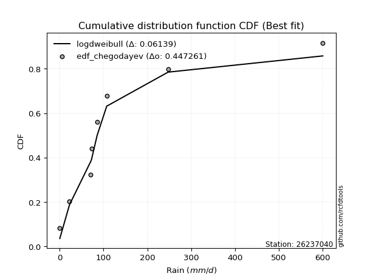</img>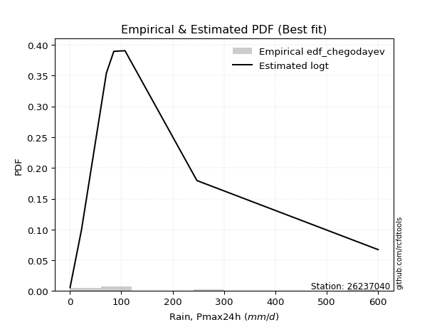</img>

</div>


### 6. Empirical - EDF Blom (1958)

The Blom formula is a specific "plotting position" formula used in hydrology and statistical analysis to estimate the empirical cumulative probability (or non-exceedance probability) of a data series. It is particularly recommended for data that are approximately normally distributed. The constant _a_ is set to 0.375 (or 3/8).

<div align="center">


$P=(m-a)/(n+1-2a)$


</div>


**6.1. Empirical values**

<div align="center">

|                | 0                   | 1                   | 2                  | 3                  | 4                  | 5                  | 6                 | 7                  |
|:---------------|:--------------------|:--------------------|:-------------------|:-------------------|:-------------------|:-------------------|:------------------|:-------------------|
| date           | 2020                | 2025                | 2024               | 2017               | 2023               | 2018               | 2019              | 2022               |
| x              | 0.2                 | 11.2                | 22.4               | 70.9               | 85.4               | 107.2              | 247.2             | 600.0              |
| m              | 1                   | 2                   | 3                  | 4                  | 5                  | 6                  | 7                 | 8                  |
| empirical_dist | edf_blom            | edf_blom            | edf_blom           | edf_blom           | edf_blom           | edf_blom           | edf_blom          | edf_blom           |
| empirical      | 0.07575757575757576 | 0.19696969696969696 | 0.3181818181818182 | 0.4393939393939394 | 0.5606060606060606 | 0.6818181818181818 | 0.803030303030303 | 0.9242424242424242 |
| empirical_tr   | 1.0819672131147542  | 1.2452830188679247  | 1.4666666666666666 | 1.783783783783784  | 2.275862068965517  | 3.1428571428571423 | 5.076923076923076 | 13.199999999999992 |

</div>


**6.2. Kolmogorov-Smirnov fit test (sorted by Δ)**


<div align="center">

|                | 0                  | 1                   | 2                   | 3                   | 4                   | 5                   | 6                   | 7                  | 8                   | 9                     | 10                 | 11                  | 12                  | 13                  | 14                  | 15                  | 16                  | 17                  | 18                  | 19                 | 20                  | 21                  | 22                  | 23                  | 24                  | 25                  | 26                  | 27                  | 28                  | 29                  | 30                  | 31                  | 32                  | 33                 | 34                 | 35                  | 36                  | 37                  | 38                  | 39                  | 40                  | 41                 | 42                  | 43                 | 44                  | 45                 | 46                  | 47                  | 48                  | 49                  | 50                  | 51                 | 52                  | 53                  | 54                  | 55                 | 56                  | 57                  | 58                  | 59                  | 60                 | 61                  | 62                  | 63                  | 64                  | 65                 | 66                  | 67                  | 68                 | 69                  | 70                 | 71                 | 72                 | 73                  | 74                  | 75                  | 76                 | 77                 | 78                 | 79                  | 80                 | 81                 | 82                  | 83                 | 84                 | 85                 | 86                  | 87                 | 88                 | 89                 |
|:---------------|:-------------------|:--------------------|:--------------------|:--------------------|:--------------------|:--------------------|:--------------------|:-------------------|:--------------------|:----------------------|:-------------------|:--------------------|:--------------------|:--------------------|:--------------------|:--------------------|:--------------------|:--------------------|:--------------------|:-------------------|:--------------------|:--------------------|:--------------------|:--------------------|:--------------------|:--------------------|:--------------------|:--------------------|:--------------------|:--------------------|:--------------------|:--------------------|:--------------------|:-------------------|:-------------------|:--------------------|:--------------------|:--------------------|:--------------------|:--------------------|:--------------------|:-------------------|:--------------------|:-------------------|:--------------------|:-------------------|:--------------------|:--------------------|:--------------------|:--------------------|:--------------------|:-------------------|:--------------------|:--------------------|:--------------------|:-------------------|:--------------------|:--------------------|:--------------------|:--------------------|:-------------------|:--------------------|:--------------------|:--------------------|:--------------------|:-------------------|:--------------------|:--------------------|:-------------------|:--------------------|:-------------------|:-------------------|:-------------------|:--------------------|:--------------------|:--------------------|:-------------------|:-------------------|:-------------------|:--------------------|:-------------------|:-------------------|:--------------------|:-------------------|:-------------------|:-------------------|:--------------------|:-------------------|:-------------------|:-------------------|
| station        | 26237040           | 26237040            | 26237040            | 26237040            | 26237040            | 26237040            | 26237040            | 26237040           | 26237040            | 26237040              | 26237040           | 26237040            | 26237040            | 26237040            | 26237040            | 26237040            | 26237040            | 26237040            | 26237040            | 26237040           | 26237040            | 26237040            | 26237040            | 26237040            | 26237040            | 26237040            | 26237040            | 26237040            | 26237040            | 26237040            | 26237040            | 26237040            | 26237040            | 26237040           | 26237040           | 26237040            | 26237040            | 26237040            | 26237040            | 26237040            | 26237040            | 26237040           | 26237040            | 26237040           | 26237040            | 26237040           | 26237040            | 26237040            | 26237040            | 26237040            | 26237040            | 26237040           | 26237040            | 26237040            | 26237040            | 26237040           | 26237040            | 26237040            | 26237040            | 26237040            | 26237040           | 26237040            | 26237040            | 26237040            | 26237040            | 26237040           | 26237040            | 26237040            | 26237040           | 26237040            | 26237040           | 26237040           | 26237040           | 26237040            | 26237040            | 26237040            | 26237040           | 26237040           | 26237040           | 26237040            | 26237040           | 26237040           | 26237040            | 26237040           | 26237040           | 26237040           | 26237040            | 26237040           | 26237040           | 26237040           |
| empirical_dist | edf_blom           | edf_blom            | edf_blom            | edf_blom            | edf_blom            | edf_blom            | edf_blom            | edf_blom           | edf_blom            | edf_blom              | edf_blom           | edf_blom            | edf_blom            | edf_blom            | edf_blom            | edf_blom            | edf_blom            | edf_blom            | edf_blom            | edf_blom           | edf_blom            | edf_blom            | edf_blom            | edf_blom            | edf_blom            | edf_blom            | edf_blom            | edf_blom            | edf_blom            | edf_blom            | edf_blom            | edf_blom            | edf_blom            | edf_blom           | edf_blom           | edf_blom            | edf_blom            | edf_blom            | edf_blom            | edf_blom            | edf_blom            | edf_blom           | edf_blom            | edf_blom           | edf_blom            | edf_blom           | edf_blom            | edf_blom            | edf_blom            | edf_blom            | edf_blom            | edf_blom           | edf_blom            | edf_blom            | edf_blom            | edf_blom           | edf_blom            | edf_blom            | edf_blom            | edf_blom            | edf_blom           | edf_blom            | edf_blom            | edf_blom            | edf_blom            | edf_blom           | edf_blom            | edf_blom            | edf_blom           | edf_blom            | edf_blom           | edf_blom           | edf_blom           | edf_blom            | edf_blom            | edf_blom            | edf_blom           | edf_blom           | edf_blom           | edf_blom            | edf_blom           | edf_blom           | edf_blom            | edf_blom           | edf_blom           | edf_blom           | edf_blom            | edf_blom           | edf_blom           | edf_blom           |
| p_dist         | loggenlogistic     | ncf                 | logloggamma         | weibull_min         | logt                | logjohnsonsu        | logpearson3         | wald               | loggumbel_l         | loglaplace_asymmetric | gamma              | f                   | invgamma            | fisk                | alpha               | invgauss            | nct                 | fatiguelife         | t                   | mielke             | pearson3            | johnsonsu           | loglognorm          | nakagami            | lognakagami         | lognorm             | lognorm             | logcrystalball      | logexponnorm        | logrice             | lognct              | logbetaprime        | halflogistic        | loggamma           | loggamma           | moyal               | logmielke           | logfatiguelife      | loginvgauss         | exponnorm           | logalpha            | laplace_asymmetric | expon               | genexpon           | logerlang           | loginvweibull      | erlang              | loginvgamma         | loglogistic         | genlogistic         | loghypsecant        | halfnorm           | logmaxwell          | gumbel_r            | lograyleigh         | rayleigh           | loglaplace          | logkstwobign        | loghalfnorm         | maxwell             | gibrat             | loggumbel_r         | betaprime           | loggenexpon         | kstwobign           | loghalflogistic    | logmoyal            | crystalball         | norm               | logistic            | truncnorm          | hypsecant          | rice               | laplace             | gompertz            | logwald             | logtruncnorm       | gumbel_l           | logexpon           | loggompertz         | loggibrat          | logchi2            | pareto              | logfisk            | logncf             | invweibull         | logpareto           | logf               | logweibull_min     | chi2               |
| delta          | 0.0735849708026654 | 0.07575757567210338 | 0.08207111967617386 | 0.08327909987172294 | 0.08333598754895805 | 0.08583837718351739 | 0.09036559029505326 | 0.1022759099000512 | 0.10606620349831247 | 0.10716827427207948   | 0.1137481016287944 | 0.11599139416027976 | 0.13330896682892052 | 0.13488155510241517 | 0.13562561426254066 | 0.13814584300996519 | 0.14007866822246956 | 0.14553402515706998 | 0.14968753753021075 | 0.1510656209910866 | 0.15416100885391493 | 0.15976233294079817 | 0.16326079034738256 | 0.16391391660727372 | 0.16454575731129922 | 0.16500481129514905 | 0.16500481129514905 | 0.16500481634204484 | 0.16500697025894412 | 0.16501727163399965 | 0.16508669982604723 | 0.16513904010402675 | 0.16727827258203465 | 0.1693549821449008 | 0.1693549821449008 | 0.16942237125970583 | 0.17057699995821307 | 0.17071573122960587 | 0.17172323045248933 | 0.17256398265957168 | 0.17265695201675663 | 0.1732588718263745 | 0.17425948668952385 | 0.1742595185958125 | 0.17476984833146464 | 0.1759411247113256 | 0.17597723824132055 | 0.17734489066402875 | 0.17840171430807766 | 0.18082561369675254 | 0.18932228036523807 | 0.1896638892660718 | 0.19113816347816065 | 0.19378836621438417 | 0.19922494825007125 | 0.211042740274208  | 0.21675937777829807 | 0.22060048024169587 | 0.22228057140871932 | 0.22321177196184122 | 0.2296332576823083 | 0.23105459260990163 | 0.23486326141798736 | 0.23502637962937095 | 0.24138751821710036 | 0.2506172618421651 | 0.25355812780975856 | 0.25758511804216866 | 0.2575851189270185 | 0.26760456183716796 | 0.2751777522127755 | 0.2759531967540312 | 0.2845235686096311 | 0.30021321173932686 | 0.30379523122747026 | 0.31633118183574166 | 0.3215712748583817 | 0.3262227106106696 | 0.3378122569227571 | 0.34773777133596645 | 0.3481450436701195 | 0.3665684393645627 | 0.37811587854084033 | 0.3886161213321298 | 0.3981876861851051 | 0.4546402403771609 | 0.46637100130258685 | 0.5062643665352529 | 0.5382016373846366 | 0.7820222938410526 |
| deltao         | 0.4472608134160001 | 0.4472608134160001  | 0.4472608134160001  | 0.4472608134160001  | 0.4472608134160001  | 0.4472608134160001  | 0.4472608134160001  | 0.4472608134160001 | 0.4472608134160001  | 0.4472608134160001    | 0.4472608134160001 | 0.4472608134160001  | 0.4472608134160001  | 0.4472608134160001  | 0.4472608134160001  | 0.4472608134160001  | 0.4472608134160001  | 0.4472608134160001  | 0.4472608134160001  | 0.4472608134160001 | 0.4472608134160001  | 0.4472608134160001  | 0.4472608134160001  | 0.4472608134160001  | 0.4472608134160001  | 0.4472608134160001  | 0.4472608134160001  | 0.4472608134160001  | 0.4472608134160001  | 0.4472608134160001  | 0.4472608134160001  | 0.4472608134160001  | 0.4472608134160001  | 0.4472608134160001 | 0.4472608134160001 | 0.4472608134160001  | 0.4472608134160001  | 0.4472608134160001  | 0.4472608134160001  | 0.4472608134160001  | 0.4472608134160001  | 0.4472608134160001 | 0.4472608134160001  | 0.4472608134160001 | 0.4472608134160001  | 0.4472608134160001 | 0.4472608134160001  | 0.4472608134160001  | 0.4472608134160001  | 0.4472608134160001  | 0.4472608134160001  | 0.4472608134160001 | 0.4472608134160001  | 0.4472608134160001  | 0.4472608134160001  | 0.4472608134160001 | 0.4472608134160001  | 0.4472608134160001  | 0.4472608134160001  | 0.4472608134160001  | 0.4472608134160001 | 0.4472608134160001  | 0.4472608134160001  | 0.4472608134160001  | 0.4472608134160001  | 0.4472608134160001 | 0.4472608134160001  | 0.4472608134160001  | 0.4472608134160001 | 0.4472608134160001  | 0.4472608134160001 | 0.4472608134160001 | 0.4472608134160001 | 0.4472608134160001  | 0.4472608134160001  | 0.4472608134160001  | 0.4472608134160001 | 0.4472608134160001 | 0.4472608134160001 | 0.4472608134160001  | 0.4472608134160001 | 0.4472608134160001 | 0.4472608134160001  | 0.4472608134160001 | 0.4472608134160001 | 0.4472608134160001 | 0.4472608134160001  | 0.4472608134160001 | 0.4472608134160001 | 0.4472608134160001 |
| eval           | Δo > Δ             | Δo > Δ              | Δo > Δ              | Δo > Δ              | Δo > Δ              | Δo > Δ              | Δo > Δ              | Δo > Δ             | Δo > Δ              | Δo > Δ                | Δo > Δ             | Δo > Δ              | Δo > Δ              | Δo > Δ              | Δo > Δ              | Δo > Δ              | Δo > Δ              | Δo > Δ              | Δo > Δ              | Δo > Δ             | Δo > Δ              | Δo > Δ              | Δo > Δ              | Δo > Δ              | Δo > Δ              | Δo > Δ              | Δo > Δ              | Δo > Δ              | Δo > Δ              | Δo > Δ              | Δo > Δ              | Δo > Δ              | Δo > Δ              | Δo > Δ             | Δo > Δ             | Δo > Δ              | Δo > Δ              | Δo > Δ              | Δo > Δ              | Δo > Δ              | Δo > Δ              | Δo > Δ             | Δo > Δ              | Δo > Δ             | Δo > Δ              | Δo > Δ             | Δo > Δ              | Δo > Δ              | Δo > Δ              | Δo > Δ              | Δo > Δ              | Δo > Δ             | Δo > Δ              | Δo > Δ              | Δo > Δ              | Δo > Δ             | Δo > Δ              | Δo > Δ              | Δo > Δ              | Δo > Δ              | Δo > Δ             | Δo > Δ              | Δo > Δ              | Δo > Δ              | Δo > Δ              | Δo > Δ             | Δo > Δ              | Δo > Δ              | Δo > Δ             | Δo > Δ              | Δo > Δ             | Δo > Δ             | Δo > Δ             | Δo > Δ              | Δo > Δ              | Δo > Δ              | Δo > Δ             | Δo > Δ             | Δo > Δ             | Δo > Δ              | Δo > Δ             | Δo > Δ             | Δo > Δ              | Δo > Δ             | Δo > Δ             | Δo <= Δ            | Δo <= Δ             | Δo <= Δ            | Δo <= Δ            | Δo <= Δ            |
| fit            | 1                  | 1                   | 1                   | 1                   | 1                   | 1                   | 1                   | 1                  | 1                   | 1                     | 1                  | 1                   | 1                   | 1                   | 1                   | 1                   | 1                   | 1                   | 1                   | 1                  | 1                   | 1                   | 1                   | 1                   | 1                   | 1                   | 1                   | 1                   | 1                   | 1                   | 1                   | 1                   | 1                   | 1                  | 1                  | 1                   | 1                   | 1                   | 1                   | 1                   | 1                   | 1                  | 1                   | 1                  | 1                   | 1                  | 1                   | 1                   | 1                   | 1                   | 1                   | 1                  | 1                   | 1                   | 1                   | 1                  | 1                   | 1                   | 1                   | 1                   | 1                  | 1                   | 1                   | 1                   | 1                   | 1                  | 1                   | 1                   | 1                  | 1                   | 1                  | 1                  | 1                  | 1                   | 1                   | 1                   | 1                  | 1                  | 1                  | 1                   | 1                  | 1                  | 1                   | 1                  | 1                  | 0                  | 0                   | 0                  | 0                  | 0                  |
| n              | 8                  | 8                   | 8                   | 8                   | 8                   | 8                   | 8                   | 8                  | 8                   | 8                     | 8                  | 8                   | 8                   | 8                   | 8                   | 8                   | 8                   | 8                   | 8                   | 8                  | 8                   | 8                   | 8                   | 8                   | 8                   | 8                   | 8                   | 8                   | 8                   | 8                   | 8                   | 8                   | 8                   | 8                  | 8                  | 8                   | 8                   | 8                   | 8                   | 8                   | 8                   | 8                  | 8                   | 8                  | 8                   | 8                  | 8                   | 8                   | 8                   | 8                   | 8                   | 8                  | 8                   | 8                   | 8                   | 8                  | 8                   | 8                   | 8                   | 8                   | 8                  | 8                   | 8                   | 8                   | 8                   | 8                  | 8                   | 8                   | 8                  | 8                   | 8                  | 8                  | 8                  | 8                   | 8                   | 8                   | 8                  | 8                  | 8                  | 8                   | 8                  | 8                  | 8                   | 8                  | 8                  | 8                  | 8                   | 8                  | 8                  | 8                  |
| best_fit       | 1                  | 0                   | 0                   | 0                   | 0                   | 0                   | 0                   | 0                  | 0                   | 0                     | 0                  | 0                   | 0                   | 0                   | 0                   | 0                   | 0                   | 0                   | 0                   | 0                  | 0                   | 0                   | 0                   | 0                   | 0                   | 0                   | 0                   | 0                   | 0                   | 0                   | 0                   | 0                   | 0                   | 0                  | 0                  | 0                   | 0                   | 0                   | 0                   | 0                   | 0                   | 0                  | 0                   | 0                  | 0                   | 0                  | 0                   | 0                   | 0                   | 0                   | 0                   | 0                  | 0                   | 0                   | 0                   | 0                  | 0                   | 0                   | 0                   | 0                   | 0                  | 0                   | 0                   | 0                   | 0                   | 0                  | 0                   | 0                   | 0                  | 0                   | 0                  | 0                  | 0                  | 0                   | 0                   | 0                   | 0                  | 0                  | 0                  | 0                   | 0                  | 0                  | 0                   | 0                  | 0                  | 0                  | 0                   | 0                  | 0                  | 0                  |
| best_fit_sort  | 1                  | 2                   | 3                   | 4                   | 5                   | 6                   | 7                   | 8                  | 9                   | 10                    | 11                 | 12                  | 13                  | 14                  | 15                  | 16                  | 17                  | 18                  | 19                  | 20                 | 21                  | 22                  | 23                  | 24                  | 25                  | 26                  | 27                  | 28                  | 29                  | 30                  | 31                  | 32                  | 33                  | 34                 | 35                 | 36                  | 37                  | 38                  | 39                  | 40                  | 41                  | 42                 | 43                  | 44                 | 45                  | 46                 | 47                  | 48                  | 49                  | 50                  | 51                  | 52                 | 53                  | 54                  | 55                  | 56                 | 57                  | 58                  | 59                  | 60                  | 61                 | 62                  | 63                  | 64                  | 65                  | 66                 | 67                  | 68                  | 69                 | 70                  | 71                 | 72                 | 73                 | 74                  | 75                  | 76                  | 77                 | 78                 | 79                 | 80                  | 81                 | 82                 | 83                  | 84                 | 85                 | 86                 | 87                  | 88                 | 89                 | 90                 |

</div>


<div align="center">

</img>

</div>


**6.3. Best fit**

<div align="center">

|   id |   station | empirical_dist   | p_dist         |    delta |   deltao | eval   |   fit |   n |   best_fit |   best_fit_sort |
|-----:|----------:|:-----------------|:---------------|---------:|---------:|:-------|------:|----:|-----------:|----------------:|
|    0 |  26237040 | edf_blom         | loggenlogistic | 0.073585 | 0.447261 | Δo > Δ |     1 |   8 |          1 |               1 |

</div>


<div align="center">

</img>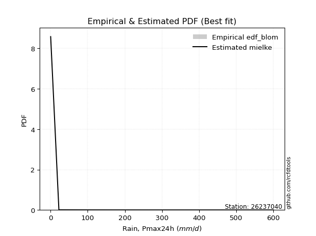</img>

</div>


### 7. Empirical - EDF Tukey (1962)

In hydrology, the Tukey formula is used as a plotting position formula to estimate the empirical probability or frequency of a flood event (or other hydrological data). The formula parameter is given as _c=0.333_ (or 1/3).

<div align="center">


$P=(m-c)/(n+1-2c)$


</div>


**7.1. Empirical values**

<div align="center">

|                | 0                  | 1         | 2                  | 3                  | 4                 | 5                  | 6                 | 7                  |
|:---------------|:-------------------|:----------|:-------------------|:-------------------|:------------------|:-------------------|:------------------|:-------------------|
| date           | 2020               | 2025      | 2024               | 2017               | 2023              | 2018               | 2019              | 2022               |
| x              | 0.2                | 11.2      | 22.4               | 70.9               | 85.4              | 107.2              | 247.2             | 600.0              |
| m              | 1                  | 2         | 3                  | 4                  | 5                 | 6                  | 7                 | 8                  |
| empirical_dist | edf_tukey          | edf_tukey | edf_tukey          | edf_tukey          | edf_tukey         | edf_tukey          | edf_tukey         | edf_tukey          |
| empirical      | 0.08               | 0.2       | 0.32               | 0.44               | 0.56              | 0.68               | 0.8               | 0.92               |
| empirical_tr   | 1.0869565217391304 | 1.25      | 1.4705882352941178 | 1.7857142857142856 | 2.272727272727273 | 3.1250000000000004 | 5.000000000000001 | 12.500000000000007 |

</div>


**7.2. Kolmogorov-Smirnov fit test (sorted by Δ)**


<div align="center">

|                | 0                  | 1                   | 2                   | 3                   | 4                   | 5                   | 6                   | 7                   | 8                   | 9                     | 10                  | 11                  | 12                 | 13                  | 14                  | 15                  | 16                  | 17                  | 18                  | 19                  | 20                 | 21                  | 22                 | 23                  | 24                  | 25                 | 26                  | 27                  | 28                  | 29                 | 30                  | 31                  | 32                  | 33                  | 34                 | 35                 | 36                 | 37                  | 38                  | 39                  | 40                  | 41                  | 42                 | 43                  | 44                  | 45                  | 46                  | 47                  | 48                  | 49                  | 50                  | 51                  | 52                  | 53                  | 54                  | 55                  | 56                  | 57                  | 58                 | 59                 | 60                  | 61                  | 62                 | 63                  | 64                  | 65                 | 66                  | 67                  | 68                 | 69                  | 70                 | 71                  | 72                  | 73                  | 74                  | 75                  | 76                  | 77                 | 78                 | 79                 | 80                 | 81                  | 82                 | 83                  | 84                  | 85                  | 86                 | 87                 | 88                 | 89                 |
|:---------------|:-------------------|:--------------------|:--------------------|:--------------------|:--------------------|:--------------------|:--------------------|:--------------------|:--------------------|:----------------------|:--------------------|:--------------------|:-------------------|:--------------------|:--------------------|:--------------------|:--------------------|:--------------------|:--------------------|:--------------------|:-------------------|:--------------------|:-------------------|:--------------------|:--------------------|:-------------------|:--------------------|:--------------------|:--------------------|:-------------------|:--------------------|:--------------------|:--------------------|:--------------------|:-------------------|:-------------------|:-------------------|:--------------------|:--------------------|:--------------------|:--------------------|:--------------------|:-------------------|:--------------------|:--------------------|:--------------------|:--------------------|:--------------------|:--------------------|:--------------------|:--------------------|:--------------------|:--------------------|:--------------------|:--------------------|:--------------------|:--------------------|:--------------------|:-------------------|:-------------------|:--------------------|:--------------------|:-------------------|:--------------------|:--------------------|:-------------------|:--------------------|:--------------------|:-------------------|:--------------------|:-------------------|:--------------------|:--------------------|:--------------------|:--------------------|:--------------------|:--------------------|:-------------------|:-------------------|:-------------------|:-------------------|:--------------------|:-------------------|:--------------------|:--------------------|:--------------------|:-------------------|:-------------------|:-------------------|:-------------------|
| station        | 26237040           | 26237040            | 26237040            | 26237040            | 26237040            | 26237040            | 26237040            | 26237040            | 26237040            | 26237040              | 26237040            | 26237040            | 26237040           | 26237040            | 26237040            | 26237040            | 26237040            | 26237040            | 26237040            | 26237040            | 26237040           | 26237040            | 26237040           | 26237040            | 26237040            | 26237040           | 26237040            | 26237040            | 26237040            | 26237040           | 26237040            | 26237040            | 26237040            | 26237040            | 26237040           | 26237040           | 26237040           | 26237040            | 26237040            | 26237040            | 26237040            | 26237040            | 26237040           | 26237040            | 26237040            | 26237040            | 26237040            | 26237040            | 26237040            | 26237040            | 26237040            | 26237040            | 26237040            | 26237040            | 26237040            | 26237040            | 26237040            | 26237040            | 26237040           | 26237040           | 26237040            | 26237040            | 26237040           | 26237040            | 26237040            | 26237040           | 26237040            | 26237040            | 26237040           | 26237040            | 26237040           | 26237040            | 26237040            | 26237040            | 26237040            | 26237040            | 26237040            | 26237040           | 26237040           | 26237040           | 26237040           | 26237040            | 26237040           | 26237040            | 26237040            | 26237040            | 26237040           | 26237040           | 26237040           | 26237040           |
| empirical_dist | edf_tukey          | edf_tukey           | edf_tukey           | edf_tukey           | edf_tukey           | edf_tukey           | edf_tukey           | edf_tukey           | edf_tukey           | edf_tukey             | edf_tukey           | edf_tukey           | edf_tukey          | edf_tukey           | edf_tukey           | edf_tukey           | edf_tukey           | edf_tukey           | edf_tukey           | edf_tukey           | edf_tukey          | edf_tukey           | edf_tukey          | edf_tukey           | edf_tukey           | edf_tukey          | edf_tukey           | edf_tukey           | edf_tukey           | edf_tukey          | edf_tukey           | edf_tukey           | edf_tukey           | edf_tukey           | edf_tukey          | edf_tukey          | edf_tukey          | edf_tukey           | edf_tukey           | edf_tukey           | edf_tukey           | edf_tukey           | edf_tukey          | edf_tukey           | edf_tukey           | edf_tukey           | edf_tukey           | edf_tukey           | edf_tukey           | edf_tukey           | edf_tukey           | edf_tukey           | edf_tukey           | edf_tukey           | edf_tukey           | edf_tukey           | edf_tukey           | edf_tukey           | edf_tukey          | edf_tukey          | edf_tukey           | edf_tukey           | edf_tukey          | edf_tukey           | edf_tukey           | edf_tukey          | edf_tukey           | edf_tukey           | edf_tukey          | edf_tukey           | edf_tukey          | edf_tukey           | edf_tukey           | edf_tukey           | edf_tukey           | edf_tukey           | edf_tukey           | edf_tukey          | edf_tukey          | edf_tukey          | edf_tukey          | edf_tukey           | edf_tukey          | edf_tukey           | edf_tukey           | edf_tukey           | edf_tukey          | edf_tukey          | edf_tukey          | edf_tukey          |
| p_dist         | loggenlogistic     | ncf                 | logloggamma         | weibull_min         | logjohnsonsu        | logt                | logpearson3         | wald                | loggumbel_l         | loglaplace_asymmetric | gamma               | f                   | invgamma           | fisk                | alpha               | invgauss            | nct                 | fatiguelife         | t                   | pearson3            | mielke             | johnsonsu           | nakagami           | loglognorm          | halflogistic        | lognakagami        | lognorm             | lognorm             | logcrystalball      | logexponnorm       | logrice             | lognct              | logbetaprime        | logmielke           | moyal              | loggamma           | loggamma           | logfatiguelife      | loginvgauss         | logalpha            | loginvweibull       | logerlang           | exponnorm          | laplace_asymmetric  | erlang              | expon               | genexpon            | loginvgamma         | loglogistic         | genlogistic         | halfnorm            | loghypsecant        | logmaxwell          | gumbel_r            | lograyleigh         | rayleigh            | loglaplace          | logkstwobign        | maxwell            | loghalfnorm        | loggumbel_r         | gibrat              | loggenexpon        | betaprime           | kstwobign           | loghalflogistic    | logmoyal            | crystalball         | norm               | logistic            | truncnorm          | hypsecant           | rice                | laplace             | gompertz            | logwald             | logtruncnorm        | gumbel_l           | logexpon           | loggompertz        | loggibrat          | logchi2             | pareto             | logfisk             | logncf              | invweibull          | logpareto          | logf               | logweibull_min     | chi2               |
| delta          | 0.0729789101966048 | 0.07999999991452762 | 0.08025293785799215 | 0.08267303926566233 | 0.08402019536533567 | 0.08515416936713988 | 0.08975952968899265 | 0.10045772808186948 | 0.10546014289225186 | 0.10656221366601887   | 0.11314204102273379 | 0.11538533355421915 | 0.1327029062228599 | 0.13306337328423345 | 0.13501955365648005 | 0.13753978240390458 | 0.13947260761640895 | 0.14492796455100937 | 0.14544511328778648 | 0.14991858461149066 | 0.150459560385026  | 0.15915627233473756 | 0.162095734789092  | 0.16265472974132195 | 0.16303584833961038 | 0.1639396967052386 | 0.16439875068908844 | 0.16439875068908844 | 0.16439875573598423 | 0.1644009096528835 | 0.16441121102793904 | 0.16448063921998662 | 0.16453297949796614 | 0.16754669692791002 | 0.1676041894415241 | 0.1687489215388402 | 0.1687489215388402 | 0.17010967062354526 | 0.17111716984642872 | 0.17205089141069602 | 0.17291082168102256 | 0.17416378772540403 | 0.1743821644777535 | 0.17507705364455634 | 0.17537117763525994 | 0.17607766850770568 | 0.17607770041399434 | 0.17673883005796814 | 0.17779565370201705 | 0.17900743187857082 | 0.18542146502364754 | 0.18871621975917746 | 0.19053210287210004 | 0.19197018439620245 | 0.19861888764401064 | 0.20922455845602628 | 0.21615331717223746 | 0.21757017721139282 | 0.2213935901436595 | 0.2216745108026587 | 0.23044853200384102 | 0.23145143950049013 | 0.2319960765990679 | 0.23425720081192675 | 0.23956933639891864 | 0.2500112012361045 | 0.25295206720369795 | 0.25576693622398694 | 0.2557669371088368 | 0.26578638001898625 | 0.2733595703945938 | 0.27413501493584946 | 0.28270538679144935 | 0.29839502992114514 | 0.30197704940928854 | 0.31572512122968105 | 0.31899377289997805 | 0.3244045287924879 | 0.3347819538924541 | 0.3447074683056634 | 0.3475389830640589 | 0.36353813633425963 | 0.3750855755105373 | 0.38558581830182675 | 0.39515738315480203 | 0.45039781613473673 | 0.4633406982722838 | 0.5032340635049499 | 0.5351713343543336 | 0.7789919908107494 |
| deltao         | 0.4472608134160001 | 0.4472608134160001  | 0.4472608134160001  | 0.4472608134160001  | 0.4472608134160001  | 0.4472608134160001  | 0.4472608134160001  | 0.4472608134160001  | 0.4472608134160001  | 0.4472608134160001    | 0.4472608134160001  | 0.4472608134160001  | 0.4472608134160001 | 0.4472608134160001  | 0.4472608134160001  | 0.4472608134160001  | 0.4472608134160001  | 0.4472608134160001  | 0.4472608134160001  | 0.4472608134160001  | 0.4472608134160001 | 0.4472608134160001  | 0.4472608134160001 | 0.4472608134160001  | 0.4472608134160001  | 0.4472608134160001 | 0.4472608134160001  | 0.4472608134160001  | 0.4472608134160001  | 0.4472608134160001 | 0.4472608134160001  | 0.4472608134160001  | 0.4472608134160001  | 0.4472608134160001  | 0.4472608134160001 | 0.4472608134160001 | 0.4472608134160001 | 0.4472608134160001  | 0.4472608134160001  | 0.4472608134160001  | 0.4472608134160001  | 0.4472608134160001  | 0.4472608134160001 | 0.4472608134160001  | 0.4472608134160001  | 0.4472608134160001  | 0.4472608134160001  | 0.4472608134160001  | 0.4472608134160001  | 0.4472608134160001  | 0.4472608134160001  | 0.4472608134160001  | 0.4472608134160001  | 0.4472608134160001  | 0.4472608134160001  | 0.4472608134160001  | 0.4472608134160001  | 0.4472608134160001  | 0.4472608134160001 | 0.4472608134160001 | 0.4472608134160001  | 0.4472608134160001  | 0.4472608134160001 | 0.4472608134160001  | 0.4472608134160001  | 0.4472608134160001 | 0.4472608134160001  | 0.4472608134160001  | 0.4472608134160001 | 0.4472608134160001  | 0.4472608134160001 | 0.4472608134160001  | 0.4472608134160001  | 0.4472608134160001  | 0.4472608134160001  | 0.4472608134160001  | 0.4472608134160001  | 0.4472608134160001 | 0.4472608134160001 | 0.4472608134160001 | 0.4472608134160001 | 0.4472608134160001  | 0.4472608134160001 | 0.4472608134160001  | 0.4472608134160001  | 0.4472608134160001  | 0.4472608134160001 | 0.4472608134160001 | 0.4472608134160001 | 0.4472608134160001 |
| eval           | Δo > Δ             | Δo > Δ              | Δo > Δ              | Δo > Δ              | Δo > Δ              | Δo > Δ              | Δo > Δ              | Δo > Δ              | Δo > Δ              | Δo > Δ                | Δo > Δ              | Δo > Δ              | Δo > Δ             | Δo > Δ              | Δo > Δ              | Δo > Δ              | Δo > Δ              | Δo > Δ              | Δo > Δ              | Δo > Δ              | Δo > Δ             | Δo > Δ              | Δo > Δ             | Δo > Δ              | Δo > Δ              | Δo > Δ             | Δo > Δ              | Δo > Δ              | Δo > Δ              | Δo > Δ             | Δo > Δ              | Δo > Δ              | Δo > Δ              | Δo > Δ              | Δo > Δ             | Δo > Δ             | Δo > Δ             | Δo > Δ              | Δo > Δ              | Δo > Δ              | Δo > Δ              | Δo > Δ              | Δo > Δ             | Δo > Δ              | Δo > Δ              | Δo > Δ              | Δo > Δ              | Δo > Δ              | Δo > Δ              | Δo > Δ              | Δo > Δ              | Δo > Δ              | Δo > Δ              | Δo > Δ              | Δo > Δ              | Δo > Δ              | Δo > Δ              | Δo > Δ              | Δo > Δ             | Δo > Δ             | Δo > Δ              | Δo > Δ              | Δo > Δ             | Δo > Δ              | Δo > Δ              | Δo > Δ             | Δo > Δ              | Δo > Δ              | Δo > Δ             | Δo > Δ              | Δo > Δ             | Δo > Δ              | Δo > Δ              | Δo > Δ              | Δo > Δ              | Δo > Δ              | Δo > Δ              | Δo > Δ             | Δo > Δ             | Δo > Δ             | Δo > Δ             | Δo > Δ              | Δo > Δ             | Δo > Δ              | Δo > Δ              | Δo <= Δ             | Δo <= Δ            | Δo <= Δ            | Δo <= Δ            | Δo <= Δ            |
| fit            | 1                  | 1                   | 1                   | 1                   | 1                   | 1                   | 1                   | 1                   | 1                   | 1                     | 1                   | 1                   | 1                  | 1                   | 1                   | 1                   | 1                   | 1                   | 1                   | 1                   | 1                  | 1                   | 1                  | 1                   | 1                   | 1                  | 1                   | 1                   | 1                   | 1                  | 1                   | 1                   | 1                   | 1                   | 1                  | 1                  | 1                  | 1                   | 1                   | 1                   | 1                   | 1                   | 1                  | 1                   | 1                   | 1                   | 1                   | 1                   | 1                   | 1                   | 1                   | 1                   | 1                   | 1                   | 1                   | 1                   | 1                   | 1                   | 1                  | 1                  | 1                   | 1                   | 1                  | 1                   | 1                   | 1                  | 1                   | 1                   | 1                  | 1                   | 1                  | 1                   | 1                   | 1                   | 1                   | 1                   | 1                   | 1                  | 1                  | 1                  | 1                  | 1                   | 1                  | 1                   | 1                   | 0                   | 0                  | 0                  | 0                  | 0                  |
| n              | 8                  | 8                   | 8                   | 8                   | 8                   | 8                   | 8                   | 8                   | 8                   | 8                     | 8                   | 8                   | 8                  | 8                   | 8                   | 8                   | 8                   | 8                   | 8                   | 8                   | 8                  | 8                   | 8                  | 8                   | 8                   | 8                  | 8                   | 8                   | 8                   | 8                  | 8                   | 8                   | 8                   | 8                   | 8                  | 8                  | 8                  | 8                   | 8                   | 8                   | 8                   | 8                   | 8                  | 8                   | 8                   | 8                   | 8                   | 8                   | 8                   | 8                   | 8                   | 8                   | 8                   | 8                   | 8                   | 8                   | 8                   | 8                   | 8                  | 8                  | 8                   | 8                   | 8                  | 8                   | 8                   | 8                  | 8                   | 8                   | 8                  | 8                   | 8                  | 8                   | 8                   | 8                   | 8                   | 8                   | 8                   | 8                  | 8                  | 8                  | 8                  | 8                   | 8                  | 8                   | 8                   | 8                   | 8                  | 8                  | 8                  | 8                  |
| best_fit       | 1                  | 0                   | 0                   | 0                   | 0                   | 0                   | 0                   | 0                   | 0                   | 0                     | 0                   | 0                   | 0                  | 0                   | 0                   | 0                   | 0                   | 0                   | 0                   | 0                   | 0                  | 0                   | 0                  | 0                   | 0                   | 0                  | 0                   | 0                   | 0                   | 0                  | 0                   | 0                   | 0                   | 0                   | 0                  | 0                  | 0                  | 0                   | 0                   | 0                   | 0                   | 0                   | 0                  | 0                   | 0                   | 0                   | 0                   | 0                   | 0                   | 0                   | 0                   | 0                   | 0                   | 0                   | 0                   | 0                   | 0                   | 0                   | 0                  | 0                  | 0                   | 0                   | 0                  | 0                   | 0                   | 0                  | 0                   | 0                   | 0                  | 0                   | 0                  | 0                   | 0                   | 0                   | 0                   | 0                   | 0                   | 0                  | 0                  | 0                  | 0                  | 0                   | 0                  | 0                   | 0                   | 0                   | 0                  | 0                  | 0                  | 0                  |
| best_fit_sort  | 1                  | 2                   | 3                   | 4                   | 5                   | 6                   | 7                   | 8                   | 9                   | 10                    | 11                  | 12                  | 13                 | 14                  | 15                  | 16                  | 17                  | 18                  | 19                  | 20                  | 21                 | 22                  | 23                 | 24                  | 25                  | 26                 | 27                  | 28                  | 29                  | 30                 | 31                  | 32                  | 33                  | 34                  | 35                 | 36                 | 37                 | 38                  | 39                  | 40                  | 41                  | 42                  | 43                 | 44                  | 45                  | 46                  | 47                  | 48                  | 49                  | 50                  | 51                  | 52                  | 53                  | 54                  | 55                  | 56                  | 57                  | 58                  | 59                 | 60                 | 61                  | 62                  | 63                 | 64                  | 65                  | 66                 | 67                  | 68                  | 69                 | 70                  | 71                 | 72                  | 73                  | 74                  | 75                  | 76                  | 77                  | 78                 | 79                 | 80                 | 81                 | 82                  | 83                 | 84                  | 85                  | 86                  | 87                 | 88                 | 89                 | 90                 |

</div>


<div align="center">

</img>

</div>


**7.3. Best fit**

<div align="center">

|   id |   station | empirical_dist   | p_dist         |     delta |   deltao | eval   |   fit |   n |   best_fit |   best_fit_sort |
|-----:|----------:|:-----------------|:---------------|----------:|---------:|:-------|------:|----:|-----------:|----------------:|
|    0 |  26237040 | edf_tukey        | loggenlogistic | 0.0729789 | 0.447261 | Δo > Δ |     1 |   8 |          1 |               1 |

</div>


<div align="center">

</img></img>

</div>


### 8. Empirical - EDF Gringorten (1963)

Gringorten plotting position formula is essential for estimating the probability and return periods of extreme events like floods and heavy rainfall. The constant _a=0.44_.

<div align="center">


$P=(m-a)/(n+1-2a)$


</div>


**8.1. Empirical values**

<div align="center">

|                | 0                   | 1                   | 2                  | 3                  | 4                  | 5                  | 6                  | 7                  |
|:---------------|:--------------------|:--------------------|:-------------------|:-------------------|:-------------------|:-------------------|:-------------------|:-------------------|
| date           | 2020                | 2025                | 2024               | 2017               | 2023               | 2018               | 2019               | 2022               |
| x              | 0.2                 | 11.2                | 22.4               | 70.9               | 85.4               | 107.2              | 247.2              | 600.0              |
| m              | 1                   | 2                   | 3                  | 4                  | 5                  | 6                  | 7                  | 8                  |
| empirical_dist | edf_gringorten      | edf_gringorten      | edf_gringorten     | edf_gringorten     | edf_gringorten     | edf_gringorten     | edf_gringorten     | edf_gringorten     |
| empirical      | 0.06896551724137932 | 0.19211822660098524 | 0.3152709359605912 | 0.4384236453201971 | 0.5615763546798029 | 0.6847290640394089 | 0.8078817733990148 | 0.9310344827586208 |
| empirical_tr   | 1.0740740740740742  | 1.2378048780487805  | 1.460431654676259  | 1.780701754385965  | 2.2808988764044944 | 3.1718750000000004 | 5.205128205128205  | 14.500000000000018 |

</div>


**8.2. Kolmogorov-Smirnov fit test (sorted by Δ)**


<div align="center">

|                | 0                   | 1                   | 2                   | 3                   | 4                   | 5                   | 6                   | 7                   | 8                   | 9                     | 10                  | 11                  | 12                 | 13                  | 14                  | 15                  | 16                  | 17                  | 18                  | 19                  | 20                  | 21                  | 22                  | 23                 | 24                  | 25                  | 26                 | 27                 | 28                  | 29                 | 30                  | 31                  | 32                 | 33                  | 34                  | 35                  | 36                  | 37                  | 38                  | 39                  | 40                 | 41                 | 42                  | 43                 | 44                 | 45                  | 46                  | 47                  | 48                  | 49                 | 50                  | 51                  | 52                  | 53                  | 54                  | 55                  | 56                  | 57                 | 58                 | 59                  | 60                  | 61                 | 62                  | 63                  | 64                 | 65                  | 66                  | 67                 | 68                  | 69                 | 70                  | 71                  | 72                 | 73                 | 74                 | 75                  | 76                  | 77                  | 78                 | 79                 | 80                 | 81                  | 82                 | 83                  | 84                  | 85                  | 86                 | 87                 | 88                 | 89                 |
|:---------------|:--------------------|:--------------------|:--------------------|:--------------------|:--------------------|:--------------------|:--------------------|:--------------------|:--------------------|:----------------------|:--------------------|:--------------------|:-------------------|:--------------------|:--------------------|:--------------------|:--------------------|:--------------------|:--------------------|:--------------------|:--------------------|:--------------------|:--------------------|:-------------------|:--------------------|:--------------------|:-------------------|:-------------------|:--------------------|:-------------------|:--------------------|:--------------------|:-------------------|:--------------------|:--------------------|:--------------------|:--------------------|:--------------------|:--------------------|:--------------------|:-------------------|:-------------------|:--------------------|:-------------------|:-------------------|:--------------------|:--------------------|:--------------------|:--------------------|:-------------------|:--------------------|:--------------------|:--------------------|:--------------------|:--------------------|:--------------------|:--------------------|:-------------------|:-------------------|:--------------------|:--------------------|:-------------------|:--------------------|:--------------------|:-------------------|:--------------------|:--------------------|:-------------------|:--------------------|:-------------------|:--------------------|:--------------------|:-------------------|:-------------------|:-------------------|:--------------------|:--------------------|:--------------------|:-------------------|:-------------------|:-------------------|:--------------------|:-------------------|:--------------------|:--------------------|:--------------------|:-------------------|:-------------------|:-------------------|:-------------------|
| station        | 26237040            | 26237040            | 26237040            | 26237040            | 26237040            | 26237040            | 26237040            | 26237040            | 26237040            | 26237040              | 26237040            | 26237040            | 26237040           | 26237040            | 26237040            | 26237040            | 26237040            | 26237040            | 26237040            | 26237040            | 26237040            | 26237040            | 26237040            | 26237040           | 26237040            | 26237040            | 26237040           | 26237040           | 26237040            | 26237040           | 26237040            | 26237040            | 26237040           | 26237040            | 26237040            | 26237040            | 26237040            | 26237040            | 26237040            | 26237040            | 26237040           | 26237040           | 26237040            | 26237040           | 26237040           | 26237040            | 26237040            | 26237040            | 26237040            | 26237040           | 26237040            | 26237040            | 26237040            | 26237040            | 26237040            | 26237040            | 26237040            | 26237040           | 26237040           | 26237040            | 26237040            | 26237040           | 26237040            | 26237040            | 26237040           | 26237040            | 26237040            | 26237040           | 26237040            | 26237040           | 26237040            | 26237040            | 26237040           | 26237040           | 26237040           | 26237040            | 26237040            | 26237040            | 26237040           | 26237040           | 26237040           | 26237040            | 26237040           | 26237040            | 26237040            | 26237040            | 26237040           | 26237040           | 26237040           | 26237040           |
| empirical_dist | edf_gringorten      | edf_gringorten      | edf_gringorten      | edf_gringorten      | edf_gringorten      | edf_gringorten      | edf_gringorten      | edf_gringorten      | edf_gringorten      | edf_gringorten        | edf_gringorten      | edf_gringorten      | edf_gringorten     | edf_gringorten      | edf_gringorten      | edf_gringorten      | edf_gringorten      | edf_gringorten      | edf_gringorten      | edf_gringorten      | edf_gringorten      | edf_gringorten      | edf_gringorten      | edf_gringorten     | edf_gringorten      | edf_gringorten      | edf_gringorten     | edf_gringorten     | edf_gringorten      | edf_gringorten     | edf_gringorten      | edf_gringorten      | edf_gringorten     | edf_gringorten      | edf_gringorten      | edf_gringorten      | edf_gringorten      | edf_gringorten      | edf_gringorten      | edf_gringorten      | edf_gringorten     | edf_gringorten     | edf_gringorten      | edf_gringorten     | edf_gringorten     | edf_gringorten      | edf_gringorten      | edf_gringorten      | edf_gringorten      | edf_gringorten     | edf_gringorten      | edf_gringorten      | edf_gringorten      | edf_gringorten      | edf_gringorten      | edf_gringorten      | edf_gringorten      | edf_gringorten     | edf_gringorten     | edf_gringorten      | edf_gringorten      | edf_gringorten     | edf_gringorten      | edf_gringorten      | edf_gringorten     | edf_gringorten      | edf_gringorten      | edf_gringorten     | edf_gringorten      | edf_gringorten     | edf_gringorten      | edf_gringorten      | edf_gringorten     | edf_gringorten     | edf_gringorten     | edf_gringorten      | edf_gringorten      | edf_gringorten      | edf_gringorten     | edf_gringorten     | edf_gringorten     | edf_gringorten      | edf_gringorten     | edf_gringorten      | edf_gringorten      | edf_gringorten      | edf_gringorten     | edf_gringorten     | edf_gringorten     | edf_gringorten     |
| p_dist         | ncf                 | loggenlogistic      | logt                | weibull_min         | logloggamma         | logjohnsonsu        | logpearson3         | wald                | loggumbel_l         | loglaplace_asymmetric | gamma               | f                   | invgamma           | alpha               | fisk                | invgauss            | nct                 | fatiguelife         | mielke              | t                   | johnsonsu           | pearson3            | loglognorm          | lognakagami        | lognorm             | lognorm             | logcrystalball     | logexponnorm       | logrice             | lognct             | logbetaprime        | nakagami            | exponnorm          | loggamma            | loggamma            | laplace_asymmetric  | expon               | genexpon            | logfatiguelife      | moyal               | loginvgauss        | logalpha           | halflogistic        | logmielke          | logerlang          | erlang              | loginvgamma         | loglogistic         | loginvweibull       | genlogistic        | loghypsecant        | logmaxwell          | halfnorm            | gumbel_r            | lograyleigh         | rayleigh            | loglaplace          | loghalfnorm        | logkstwobign       | maxwell             | gibrat              | loggumbel_r        | betaprime           | loggenexpon         | kstwobign          | loghalflogistic     | logmoyal            | crystalball        | norm                | logistic           | truncnorm           | hypsecant           | rice               | laplace            | gompertz           | logwald             | logtruncnorm        | gumbel_l            | logexpon           | loggibrat          | loggompertz        | logchi2             | pareto             | logfisk             | logncf              | invweibull          | logpareto          | logf               | logweibull_min     | chi2               |
| delta          | 0.06896551715590694 | 0.07455526487640768 | 0.08042510532773106 | 0.08424939394546521 | 0.08498200189740102 | 0.08874925940474454 | 0.09133588436879553 | 0.10518679212127835 | 0.10703649757205475 | 0.10813856834582175   | 0.11471839570253667 | 0.11696168823402203 | 0.1342792609026628 | 0.13659590833628293 | 0.13779243732364232 | 0.13911613708370746 | 0.14104896229621183 | 0.14650431923081225 | 0.15203591506482889 | 0.15647959604640715 | 0.16073262701454044 | 0.16095306737011134 | 0.16423108442112483 | 0.1655160513850415 | 0.16597510536889132 | 0.16597510536889132 | 0.1659751104157871 | 0.1659772643326864 | 0.16598756570774192 | 0.1660569938997895 | 0.16610933417776902 | 0.16682479882850088 | 0.1696531004383447 | 0.17032527621864307 | 0.17032527621864307 | 0.17034798960514752 | 0.17134860446829686 | 0.17134863637458553 | 0.17168602530334814 | 0.17233325348093298 | 0.1726935245262316 | 0.1736272460904989 | 0.17407033109823106 | 0.1754284703269248 | 0.1757401424052069 | 0.17694753231506283 | 0.17831518473777103 | 0.17937200838181994 | 0.18079259508003734 | 0.1837364959179797 | 0.19029257443898034 | 0.19210845755190292 | 0.19645594778226821 | 0.19669924843561132 | 0.20019524232381353 | 0.21395362249543515 | 0.21772967185204034 | 0.2232508654824616 | 0.2254519506104076 | 0.22612265418306837 | 0.22672237546108132 | 0.2320248866836439 | 0.23583355549172963 | 0.23987784999808268 | 0.2442984004383275 | 0.25158755591590737 | 0.25452842188350083 | 0.2604960002633958 | 0.26049600114824567 | 0.2705154440583951 | 0.27808863443400267 | 0.27886407897525833 | 0.2874344508308582 | 0.303124093960554  | 0.3067061134486974 | 0.31730147590948393 | 0.32642274522709347 | 0.32913359283189675 | 0.3426637272914689 | 0.3491153377438618 | 0.3525892417046782 | 0.37141990973327443 | 0.3829673489095521 | 0.39346759170084156 | 0.40303915655381684 | 0.46143229889335746 | 0.4712224716712986 | 0.5111158369039647 | 0.5430531077533484 | 0.7868737642097643 |
| deltao         | 0.4472608134160001  | 0.4472608134160001  | 0.4472608134160001  | 0.4472608134160001  | 0.4472608134160001  | 0.4472608134160001  | 0.4472608134160001  | 0.4472608134160001  | 0.4472608134160001  | 0.4472608134160001    | 0.4472608134160001  | 0.4472608134160001  | 0.4472608134160001 | 0.4472608134160001  | 0.4472608134160001  | 0.4472608134160001  | 0.4472608134160001  | 0.4472608134160001  | 0.4472608134160001  | 0.4472608134160001  | 0.4472608134160001  | 0.4472608134160001  | 0.4472608134160001  | 0.4472608134160001 | 0.4472608134160001  | 0.4472608134160001  | 0.4472608134160001 | 0.4472608134160001 | 0.4472608134160001  | 0.4472608134160001 | 0.4472608134160001  | 0.4472608134160001  | 0.4472608134160001 | 0.4472608134160001  | 0.4472608134160001  | 0.4472608134160001  | 0.4472608134160001  | 0.4472608134160001  | 0.4472608134160001  | 0.4472608134160001  | 0.4472608134160001 | 0.4472608134160001 | 0.4472608134160001  | 0.4472608134160001 | 0.4472608134160001 | 0.4472608134160001  | 0.4472608134160001  | 0.4472608134160001  | 0.4472608134160001  | 0.4472608134160001 | 0.4472608134160001  | 0.4472608134160001  | 0.4472608134160001  | 0.4472608134160001  | 0.4472608134160001  | 0.4472608134160001  | 0.4472608134160001  | 0.4472608134160001 | 0.4472608134160001 | 0.4472608134160001  | 0.4472608134160001  | 0.4472608134160001 | 0.4472608134160001  | 0.4472608134160001  | 0.4472608134160001 | 0.4472608134160001  | 0.4472608134160001  | 0.4472608134160001 | 0.4472608134160001  | 0.4472608134160001 | 0.4472608134160001  | 0.4472608134160001  | 0.4472608134160001 | 0.4472608134160001 | 0.4472608134160001 | 0.4472608134160001  | 0.4472608134160001  | 0.4472608134160001  | 0.4472608134160001 | 0.4472608134160001 | 0.4472608134160001 | 0.4472608134160001  | 0.4472608134160001 | 0.4472608134160001  | 0.4472608134160001  | 0.4472608134160001  | 0.4472608134160001 | 0.4472608134160001 | 0.4472608134160001 | 0.4472608134160001 |
| eval           | Δo > Δ              | Δo > Δ              | Δo > Δ              | Δo > Δ              | Δo > Δ              | Δo > Δ              | Δo > Δ              | Δo > Δ              | Δo > Δ              | Δo > Δ                | Δo > Δ              | Δo > Δ              | Δo > Δ             | Δo > Δ              | Δo > Δ              | Δo > Δ              | Δo > Δ              | Δo > Δ              | Δo > Δ              | Δo > Δ              | Δo > Δ              | Δo > Δ              | Δo > Δ              | Δo > Δ             | Δo > Δ              | Δo > Δ              | Δo > Δ             | Δo > Δ             | Δo > Δ              | Δo > Δ             | Δo > Δ              | Δo > Δ              | Δo > Δ             | Δo > Δ              | Δo > Δ              | Δo > Δ              | Δo > Δ              | Δo > Δ              | Δo > Δ              | Δo > Δ              | Δo > Δ             | Δo > Δ             | Δo > Δ              | Δo > Δ             | Δo > Δ             | Δo > Δ              | Δo > Δ              | Δo > Δ              | Δo > Δ              | Δo > Δ             | Δo > Δ              | Δo > Δ              | Δo > Δ              | Δo > Δ              | Δo > Δ              | Δo > Δ              | Δo > Δ              | Δo > Δ             | Δo > Δ             | Δo > Δ              | Δo > Δ              | Δo > Δ             | Δo > Δ              | Δo > Δ              | Δo > Δ             | Δo > Δ              | Δo > Δ              | Δo > Δ             | Δo > Δ              | Δo > Δ             | Δo > Δ              | Δo > Δ              | Δo > Δ             | Δo > Δ             | Δo > Δ             | Δo > Δ              | Δo > Δ              | Δo > Δ              | Δo > Δ             | Δo > Δ             | Δo > Δ             | Δo > Δ              | Δo > Δ             | Δo > Δ              | Δo > Δ              | Δo <= Δ             | Δo <= Δ            | Δo <= Δ            | Δo <= Δ            | Δo <= Δ            |
| fit            | 1                   | 1                   | 1                   | 1                   | 1                   | 1                   | 1                   | 1                   | 1                   | 1                     | 1                   | 1                   | 1                  | 1                   | 1                   | 1                   | 1                   | 1                   | 1                   | 1                   | 1                   | 1                   | 1                   | 1                  | 1                   | 1                   | 1                  | 1                  | 1                   | 1                  | 1                   | 1                   | 1                  | 1                   | 1                   | 1                   | 1                   | 1                   | 1                   | 1                   | 1                  | 1                  | 1                   | 1                  | 1                  | 1                   | 1                   | 1                   | 1                   | 1                  | 1                   | 1                   | 1                   | 1                   | 1                   | 1                   | 1                   | 1                  | 1                  | 1                   | 1                   | 1                  | 1                   | 1                   | 1                  | 1                   | 1                   | 1                  | 1                   | 1                  | 1                   | 1                   | 1                  | 1                  | 1                  | 1                   | 1                   | 1                   | 1                  | 1                  | 1                  | 1                   | 1                  | 1                   | 1                   | 0                   | 0                  | 0                  | 0                  | 0                  |
| n              | 8                   | 8                   | 8                   | 8                   | 8                   | 8                   | 8                   | 8                   | 8                   | 8                     | 8                   | 8                   | 8                  | 8                   | 8                   | 8                   | 8                   | 8                   | 8                   | 8                   | 8                   | 8                   | 8                   | 8                  | 8                   | 8                   | 8                  | 8                  | 8                   | 8                  | 8                   | 8                   | 8                  | 8                   | 8                   | 8                   | 8                   | 8                   | 8                   | 8                   | 8                  | 8                  | 8                   | 8                  | 8                  | 8                   | 8                   | 8                   | 8                   | 8                  | 8                   | 8                   | 8                   | 8                   | 8                   | 8                   | 8                   | 8                  | 8                  | 8                   | 8                   | 8                  | 8                   | 8                   | 8                  | 8                   | 8                   | 8                  | 8                   | 8                  | 8                   | 8                   | 8                  | 8                  | 8                  | 8                   | 8                   | 8                   | 8                  | 8                  | 8                  | 8                   | 8                  | 8                   | 8                   | 8                   | 8                  | 8                  | 8                  | 8                  |
| best_fit       | 1                   | 0                   | 0                   | 0                   | 0                   | 0                   | 0                   | 0                   | 0                   | 0                     | 0                   | 0                   | 0                  | 0                   | 0                   | 0                   | 0                   | 0                   | 0                   | 0                   | 0                   | 0                   | 0                   | 0                  | 0                   | 0                   | 0                  | 0                  | 0                   | 0                  | 0                   | 0                   | 0                  | 0                   | 0                   | 0                   | 0                   | 0                   | 0                   | 0                   | 0                  | 0                  | 0                   | 0                  | 0                  | 0                   | 0                   | 0                   | 0                   | 0                  | 0                   | 0                   | 0                   | 0                   | 0                   | 0                   | 0                   | 0                  | 0                  | 0                   | 0                   | 0                  | 0                   | 0                   | 0                  | 0                   | 0                   | 0                  | 0                   | 0                  | 0                   | 0                   | 0                  | 0                  | 0                  | 0                   | 0                   | 0                   | 0                  | 0                  | 0                  | 0                   | 0                  | 0                   | 0                   | 0                   | 0                  | 0                  | 0                  | 0                  |
| best_fit_sort  | 1                   | 2                   | 3                   | 4                   | 5                   | 6                   | 7                   | 8                   | 9                   | 10                    | 11                  | 12                  | 13                 | 14                  | 15                  | 16                  | 17                  | 18                  | 19                  | 20                  | 21                  | 22                  | 23                  | 24                 | 25                  | 26                  | 27                 | 28                 | 29                  | 30                 | 31                  | 32                  | 33                 | 34                  | 35                  | 36                  | 37                  | 38                  | 39                  | 40                  | 41                 | 42                 | 43                  | 44                 | 45                 | 46                  | 47                  | 48                  | 49                  | 50                 | 51                  | 52                  | 53                  | 54                  | 55                  | 56                  | 57                  | 58                 | 59                 | 60                  | 61                  | 62                 | 63                  | 64                  | 65                 | 66                  | 67                  | 68                 | 69                  | 70                 | 71                  | 72                  | 73                 | 74                 | 75                 | 76                  | 77                  | 78                  | 79                 | 80                 | 81                 | 82                  | 83                 | 84                  | 85                  | 86                  | 87                 | 88                 | 89                 | 90                 |

</div>


<div align="center">

</img>

</div>


**8.3. Best fit**

<div align="center">

|   id |   station | empirical_dist   | p_dist   |     delta |   deltao | eval   |   fit |   n |   best_fit |   best_fit_sort |
|-----:|----------:|:-----------------|:---------|----------:|---------:|:-------|------:|----:|-----------:|----------------:|
|    0 |  26237040 | edf_gringorten   | ncf      | 0.0689655 | 0.447261 | Δo > Δ |     1 |   8 |          1 |               1 |

</div>


<div align="center">

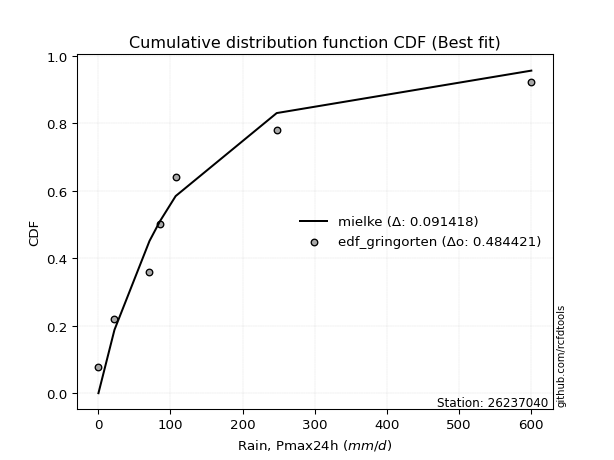</img>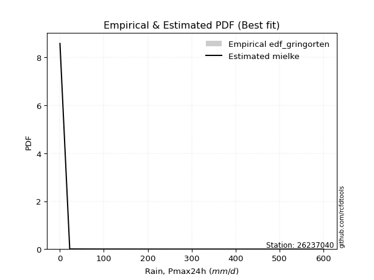</img>

</div>


### 9. Empirical - EDF Filliben (1975)

The specific values of the constants (0.3175) (often denoted as $alpha$) and (0.365) are derived from a method proposed by James J. Filliben in a 1975 paper. This particular formula is the mean value of the $i$-th order statistic of the normal distribution and is considered a robust and effective plotting position formula for the normal probability plot correlation coefficient test for normality.

<div align="center">


$P=(m-0.3175)/(n+0.365)$


</div>


**9.1. Empirical values**

<div align="center">

|                | 0                  | 1                   | 2                  | 3                   | 4                  | 5                  | 6                  | 7                  |
|:---------------|:-------------------|:--------------------|:-------------------|:--------------------|:-------------------|:-------------------|:-------------------|:-------------------|
| date           | 2020               | 2025                | 2024               | 2017                | 2023               | 2018               | 2019               | 2022               |
| x              | 0.2                | 11.2                | 22.4               | 70.9                | 85.4               | 107.2              | 247.2              | 600.0              |
| m              | 1                  | 2                   | 3                  | 4                   | 5                  | 6                  | 7                  | 8                  |
| empirical_dist | edf_filliben       | edf_filliben        | edf_filliben       | edf_filliben        | edf_filliben       | edf_filliben       | edf_filliben       | edf_filliben       |
| empirical      | 0.0815899581589958 | 0.20113568439928273 | 0.3206814106395696 | 0.44022713687985654 | 0.5597728631201434 | 0.6793185893604303 | 0.7988643156007172 | 0.9184100418410042 |
| empirical_tr   | 1.0888382687927107 | 1.2517770295548074  | 1.4720633523977125 | 1.7864388681260008  | 2.271554650373387  | 3.118359739049394  | 4.971768202080237  | 12.256410256410254 |

</div>


**9.2. Kolmogorov-Smirnov fit test (sorted by Δ)**


<div align="center">

|                | 0                   | 1                   | 2                   | 3                   | 4                   | 5                   | 6                   | 7                   | 8                   | 9                     | 10                  | 11                  | 12                  | 13                  | 14                 | 15                  | 16                 | 17                  | 18                  | 19                  | 20                  | 21                  | 22                  | 23                 | 24                 | 25                  | 26                 | 27                 | 28                 | 29                  | 30                 | 31                 | 32                 | 33                 | 34                  | 35                  | 36                  | 37                  | 38                  | 39                  | 40                  | 41                 | 42                  | 43                 | 44                  | 45                 | 46                 | 47                  | 48                  | 49                 | 50                  | 51                  | 52                 | 53                  | 54                 | 55                  | 56                  | 57                 | 58                  | 59                  | 60                  | 61                  | 62                  | 63                 | 64                  | 65                  | 66                 | 67                 | 68                 | 69                 | 70                 | 71                  | 72                  | 73                 | 74                 | 75                 | 76                 | 77                  | 78                  | 79                  | 80                  | 81                 | 82                  | 83                 | 84                 | 85                  | 86                  | 87                 | 88                 | 89                 |
|:---------------|:--------------------|:--------------------|:--------------------|:--------------------|:--------------------|:--------------------|:--------------------|:--------------------|:--------------------|:----------------------|:--------------------|:--------------------|:--------------------|:--------------------|:-------------------|:--------------------|:-------------------|:--------------------|:--------------------|:--------------------|:--------------------|:--------------------|:--------------------|:-------------------|:-------------------|:--------------------|:-------------------|:-------------------|:-------------------|:--------------------|:-------------------|:-------------------|:-------------------|:-------------------|:--------------------|:--------------------|:--------------------|:--------------------|:--------------------|:--------------------|:--------------------|:-------------------|:--------------------|:-------------------|:--------------------|:-------------------|:-------------------|:--------------------|:--------------------|:-------------------|:--------------------|:--------------------|:-------------------|:--------------------|:-------------------|:--------------------|:--------------------|:-------------------|:--------------------|:--------------------|:--------------------|:--------------------|:--------------------|:-------------------|:--------------------|:--------------------|:-------------------|:-------------------|:-------------------|:-------------------|:-------------------|:--------------------|:--------------------|:-------------------|:-------------------|:-------------------|:-------------------|:--------------------|:--------------------|:--------------------|:--------------------|:-------------------|:--------------------|:-------------------|:-------------------|:--------------------|:--------------------|:-------------------|:-------------------|:-------------------|
| station        | 26237040            | 26237040            | 26237040            | 26237040            | 26237040            | 26237040            | 26237040            | 26237040            | 26237040            | 26237040              | 26237040            | 26237040            | 26237040            | 26237040            | 26237040           | 26237040            | 26237040           | 26237040            | 26237040            | 26237040            | 26237040            | 26237040            | 26237040            | 26237040           | 26237040           | 26237040            | 26237040           | 26237040           | 26237040           | 26237040            | 26237040           | 26237040           | 26237040           | 26237040           | 26237040            | 26237040            | 26237040            | 26237040            | 26237040            | 26237040            | 26237040            | 26237040           | 26237040            | 26237040           | 26237040            | 26237040           | 26237040           | 26237040            | 26237040            | 26237040           | 26237040            | 26237040            | 26237040           | 26237040            | 26237040           | 26237040            | 26237040            | 26237040           | 26237040            | 26237040            | 26237040            | 26237040            | 26237040            | 26237040           | 26237040            | 26237040            | 26237040           | 26237040           | 26237040           | 26237040           | 26237040           | 26237040            | 26237040            | 26237040           | 26237040           | 26237040           | 26237040           | 26237040            | 26237040            | 26237040            | 26237040            | 26237040           | 26237040            | 26237040           | 26237040           | 26237040            | 26237040            | 26237040           | 26237040           | 26237040           |
| empirical_dist | edf_filliben        | edf_filliben        | edf_filliben        | edf_filliben        | edf_filliben        | edf_filliben        | edf_filliben        | edf_filliben        | edf_filliben        | edf_filliben          | edf_filliben        | edf_filliben        | edf_filliben        | edf_filliben        | edf_filliben       | edf_filliben        | edf_filliben       | edf_filliben        | edf_filliben        | edf_filliben        | edf_filliben        | edf_filliben        | edf_filliben        | edf_filliben       | edf_filliben       | edf_filliben        | edf_filliben       | edf_filliben       | edf_filliben       | edf_filliben        | edf_filliben       | edf_filliben       | edf_filliben       | edf_filliben       | edf_filliben        | edf_filliben        | edf_filliben        | edf_filliben        | edf_filliben        | edf_filliben        | edf_filliben        | edf_filliben       | edf_filliben        | edf_filliben       | edf_filliben        | edf_filliben       | edf_filliben       | edf_filliben        | edf_filliben        | edf_filliben       | edf_filliben        | edf_filliben        | edf_filliben       | edf_filliben        | edf_filliben       | edf_filliben        | edf_filliben        | edf_filliben       | edf_filliben        | edf_filliben        | edf_filliben        | edf_filliben        | edf_filliben        | edf_filliben       | edf_filliben        | edf_filliben        | edf_filliben       | edf_filliben       | edf_filliben       | edf_filliben       | edf_filliben       | edf_filliben        | edf_filliben        | edf_filliben       | edf_filliben       | edf_filliben       | edf_filliben       | edf_filliben        | edf_filliben        | edf_filliben        | edf_filliben        | edf_filliben       | edf_filliben        | edf_filliben       | edf_filliben       | edf_filliben        | edf_filliben        | edf_filliben       | edf_filliben       | edf_filliben       |
| p_dist         | loggenlogistic      | logloggamma         | ncf                 | weibull_min         | logjohnsonsu        | logt                | logpearson3         | wald                | loggumbel_l         | loglaplace_asymmetric | gamma               | f                   | fisk                | invgamma            | alpha              | invgauss            | nct                | t                   | fatiguelife         | pearson3            | mielke              | johnsonsu           | nakagami            | halflogistic       | loglognorm         | lognakagami         | lognorm            | lognorm            | logcrystalball     | logexponnorm        | logrice            | lognct             | logbetaprime       | logmielke          | moyal               | loggamma            | loggamma            | logfatiguelife      | loginvgauss         | loginvweibull       | logalpha            | logerlang          | exponnorm           | erlang             | laplace_asymmetric  | loginvgamma        | expon              | genexpon            | loglogistic         | genlogistic        | halfnorm            | loghypsecant        | logmaxwell         | gumbel_r            | lograyleigh        | rayleigh            | loglaplace          | logkstwobign       | maxwell             | loghalfnorm         | loggumbel_r         | loggenexpon         | gibrat              | betaprime          | kstwobign           | loghalflogistic     | logmoyal           | crystalball        | norm               | logistic           | truncnorm          | hypsecant           | rice                | laplace            | gompertz           | logwald            | logtruncnorm       | gumbel_l            | logexpon            | loggompertz         | loggibrat           | logchi2            | pareto              | logfisk            | logncf             | invweibull          | logpareto           | logf               | logweibull_min     | chi2               |
| delta          | 0.07275177331674826 | 0.07957152721842242 | 0.08158995807352343 | 0.08244590238580579 | 0.08333878472576595 | 0.08583558000670949 | 0.08953239280913611 | 0.09977631744229976 | 0.10523300601239532 | 0.10633507678616233   | 0.11291490414287725 | 0.11515819667436261 | 0.13238196264466373 | 0.13247576934300337 | 0.1347924167766235 | 0.13731264552404804 | 0.1392454707365524 | 0.14385515512879068 | 0.14470082767115283 | 0.14832862645249487 | 0.15023242350516947 | 0.15892913545488102 | 0.16141432414952228 | 0.1614458901806146 | 0.1624275928614654 | 0.16371255982538208 | 0.1641716138092319 | 0.1641716138092319 | 0.1641716188561277 | 0.16417377277302697 | 0.1641840741480825 | 0.1642535023401301 | 0.1643058426181096 | 0.1664110125286273 | 0.16692277880195439 | 0.16852178465898365 | 0.16852178465898365 | 0.16988253374368872 | 0.17089003296657218 | 0.17177513728173985 | 0.17182375453083948 | 0.1739366508455475 | 0.17506357511732312 | 0.1751440407554034 | 0.17575846428412595 | 0.1765116931781116 | 0.1767590791472753 | 0.17675911105356396 | 0.17756851682216052 | 0.1783260212390011 | 0.18383150686465174 | 0.18848908287932092 | 0.1903049659922435 | 0.19128877375663272 | 0.1983917507641541 | 0.20854314781645655 | 0.21592618029238092 | 0.2164344928121101 | 0.22071217950408978 | 0.22144737392280217 | 0.23022139512398448 | 0.23086039219978519 | 0.23213285014005974 | 0.2340300639320702 | 0.23888792575934892 | 0.24978406435624795 | 0.2527249303238414 | 0.2550855255844172 | 0.2550855264692671 | 0.2651049693794165 | 0.2726781597550241 | 0.27345360429627974 | 0.28202397615187963 | 0.2977136192815754 | 0.3012956387697188 | 0.3154979843498245 | 0.3187666360201215 | 0.32372311815291815 | 0.33364626949317133 | 0.34357178390638066 | 0.34731184618420236 | 0.3624024519349769 | 0.37394989111125454 | 0.384450133902544  | 0.3940216987555193 | 0.44880785797574085 | 0.46220501387300106 | 0.5020983791056671 | 0.5340356499550508 | 0.7778563064114667 |
| deltao         | 0.4472608134160001  | 0.4472608134160001  | 0.4472608134160001  | 0.4472608134160001  | 0.4472608134160001  | 0.4472608134160001  | 0.4472608134160001  | 0.4472608134160001  | 0.4472608134160001  | 0.4472608134160001    | 0.4472608134160001  | 0.4472608134160001  | 0.4472608134160001  | 0.4472608134160001  | 0.4472608134160001 | 0.4472608134160001  | 0.4472608134160001 | 0.4472608134160001  | 0.4472608134160001  | 0.4472608134160001  | 0.4472608134160001  | 0.4472608134160001  | 0.4472608134160001  | 0.4472608134160001 | 0.4472608134160001 | 0.4472608134160001  | 0.4472608134160001 | 0.4472608134160001 | 0.4472608134160001 | 0.4472608134160001  | 0.4472608134160001 | 0.4472608134160001 | 0.4472608134160001 | 0.4472608134160001 | 0.4472608134160001  | 0.4472608134160001  | 0.4472608134160001  | 0.4472608134160001  | 0.4472608134160001  | 0.4472608134160001  | 0.4472608134160001  | 0.4472608134160001 | 0.4472608134160001  | 0.4472608134160001 | 0.4472608134160001  | 0.4472608134160001 | 0.4472608134160001 | 0.4472608134160001  | 0.4472608134160001  | 0.4472608134160001 | 0.4472608134160001  | 0.4472608134160001  | 0.4472608134160001 | 0.4472608134160001  | 0.4472608134160001 | 0.4472608134160001  | 0.4472608134160001  | 0.4472608134160001 | 0.4472608134160001  | 0.4472608134160001  | 0.4472608134160001  | 0.4472608134160001  | 0.4472608134160001  | 0.4472608134160001 | 0.4472608134160001  | 0.4472608134160001  | 0.4472608134160001 | 0.4472608134160001 | 0.4472608134160001 | 0.4472608134160001 | 0.4472608134160001 | 0.4472608134160001  | 0.4472608134160001  | 0.4472608134160001 | 0.4472608134160001 | 0.4472608134160001 | 0.4472608134160001 | 0.4472608134160001  | 0.4472608134160001  | 0.4472608134160001  | 0.4472608134160001  | 0.4472608134160001 | 0.4472608134160001  | 0.4472608134160001 | 0.4472608134160001 | 0.4472608134160001  | 0.4472608134160001  | 0.4472608134160001 | 0.4472608134160001 | 0.4472608134160001 |
| eval           | Δo > Δ              | Δo > Δ              | Δo > Δ              | Δo > Δ              | Δo > Δ              | Δo > Δ              | Δo > Δ              | Δo > Δ              | Δo > Δ              | Δo > Δ                | Δo > Δ              | Δo > Δ              | Δo > Δ              | Δo > Δ              | Δo > Δ             | Δo > Δ              | Δo > Δ             | Δo > Δ              | Δo > Δ              | Δo > Δ              | Δo > Δ              | Δo > Δ              | Δo > Δ              | Δo > Δ             | Δo > Δ             | Δo > Δ              | Δo > Δ             | Δo > Δ             | Δo > Δ             | Δo > Δ              | Δo > Δ             | Δo > Δ             | Δo > Δ             | Δo > Δ             | Δo > Δ              | Δo > Δ              | Δo > Δ              | Δo > Δ              | Δo > Δ              | Δo > Δ              | Δo > Δ              | Δo > Δ             | Δo > Δ              | Δo > Δ             | Δo > Δ              | Δo > Δ             | Δo > Δ             | Δo > Δ              | Δo > Δ              | Δo > Δ             | Δo > Δ              | Δo > Δ              | Δo > Δ             | Δo > Δ              | Δo > Δ             | Δo > Δ              | Δo > Δ              | Δo > Δ             | Δo > Δ              | Δo > Δ              | Δo > Δ              | Δo > Δ              | Δo > Δ              | Δo > Δ             | Δo > Δ              | Δo > Δ              | Δo > Δ             | Δo > Δ             | Δo > Δ             | Δo > Δ             | Δo > Δ             | Δo > Δ              | Δo > Δ              | Δo > Δ             | Δo > Δ             | Δo > Δ             | Δo > Δ             | Δo > Δ              | Δo > Δ              | Δo > Δ              | Δo > Δ              | Δo > Δ             | Δo > Δ              | Δo > Δ             | Δo > Δ             | Δo <= Δ             | Δo <= Δ             | Δo <= Δ            | Δo <= Δ            | Δo <= Δ            |
| fit            | 1                   | 1                   | 1                   | 1                   | 1                   | 1                   | 1                   | 1                   | 1                   | 1                     | 1                   | 1                   | 1                   | 1                   | 1                  | 1                   | 1                  | 1                   | 1                   | 1                   | 1                   | 1                   | 1                   | 1                  | 1                  | 1                   | 1                  | 1                  | 1                  | 1                   | 1                  | 1                  | 1                  | 1                  | 1                   | 1                   | 1                   | 1                   | 1                   | 1                   | 1                   | 1                  | 1                   | 1                  | 1                   | 1                  | 1                  | 1                   | 1                   | 1                  | 1                   | 1                   | 1                  | 1                   | 1                  | 1                   | 1                   | 1                  | 1                   | 1                   | 1                   | 1                   | 1                   | 1                  | 1                   | 1                   | 1                  | 1                  | 1                  | 1                  | 1                  | 1                   | 1                   | 1                  | 1                  | 1                  | 1                  | 1                   | 1                   | 1                   | 1                   | 1                  | 1                   | 1                  | 1                  | 0                   | 0                   | 0                  | 0                  | 0                  |
| n              | 8                   | 8                   | 8                   | 8                   | 8                   | 8                   | 8                   | 8                   | 8                   | 8                     | 8                   | 8                   | 8                   | 8                   | 8                  | 8                   | 8                  | 8                   | 8                   | 8                   | 8                   | 8                   | 8                   | 8                  | 8                  | 8                   | 8                  | 8                  | 8                  | 8                   | 8                  | 8                  | 8                  | 8                  | 8                   | 8                   | 8                   | 8                   | 8                   | 8                   | 8                   | 8                  | 8                   | 8                  | 8                   | 8                  | 8                  | 8                   | 8                   | 8                  | 8                   | 8                   | 8                  | 8                   | 8                  | 8                   | 8                   | 8                  | 8                   | 8                   | 8                   | 8                   | 8                   | 8                  | 8                   | 8                   | 8                  | 8                  | 8                  | 8                  | 8                  | 8                   | 8                   | 8                  | 8                  | 8                  | 8                  | 8                   | 8                   | 8                   | 8                   | 8                  | 8                   | 8                  | 8                  | 8                   | 8                   | 8                  | 8                  | 8                  |
| best_fit       | 1                   | 0                   | 0                   | 0                   | 0                   | 0                   | 0                   | 0                   | 0                   | 0                     | 0                   | 0                   | 0                   | 0                   | 0                  | 0                   | 0                  | 0                   | 0                   | 0                   | 0                   | 0                   | 0                   | 0                  | 0                  | 0                   | 0                  | 0                  | 0                  | 0                   | 0                  | 0                  | 0                  | 0                  | 0                   | 0                   | 0                   | 0                   | 0                   | 0                   | 0                   | 0                  | 0                   | 0                  | 0                   | 0                  | 0                  | 0                   | 0                   | 0                  | 0                   | 0                   | 0                  | 0                   | 0                  | 0                   | 0                   | 0                  | 0                   | 0                   | 0                   | 0                   | 0                   | 0                  | 0                   | 0                   | 0                  | 0                  | 0                  | 0                  | 0                  | 0                   | 0                   | 0                  | 0                  | 0                  | 0                  | 0                   | 0                   | 0                   | 0                   | 0                  | 0                   | 0                  | 0                  | 0                   | 0                   | 0                  | 0                  | 0                  |
| best_fit_sort  | 1                   | 2                   | 3                   | 4                   | 5                   | 6                   | 7                   | 8                   | 9                   | 10                    | 11                  | 12                  | 13                  | 14                  | 15                 | 16                  | 17                 | 18                  | 19                  | 20                  | 21                  | 22                  | 23                  | 24                 | 25                 | 26                  | 27                 | 28                 | 29                 | 30                  | 31                 | 32                 | 33                 | 34                 | 35                  | 36                  | 37                  | 38                  | 39                  | 40                  | 41                  | 42                 | 43                  | 44                 | 45                  | 46                 | 47                 | 48                  | 49                  | 50                 | 51                  | 52                  | 53                 | 54                  | 55                 | 56                  | 57                  | 58                 | 59                  | 60                  | 61                  | 62                  | 63                  | 64                 | 65                  | 66                  | 67                 | 68                 | 69                 | 70                 | 71                 | 72                  | 73                  | 74                 | 75                 | 76                 | 77                 | 78                  | 79                  | 80                  | 81                  | 82                 | 83                  | 84                 | 85                 | 86                  | 87                  | 88                 | 89                 | 90                 |

</div>


<div align="center">

</img>

</div>


**9.3. Best fit**

<div align="center">

|   id |   station | empirical_dist   | p_dist         |     delta |   deltao | eval   |   fit |   n |   best_fit |   best_fit_sort |
|-----:|----------:|:-----------------|:---------------|----------:|---------:|:-------|------:|----:|-----------:|----------------:|
|    0 |  26237040 | edf_filliben     | loggenlogistic | 0.0727518 | 0.447261 | Δo > Δ |     1 |   8 |          1 |               1 |

</div>


<div align="center">

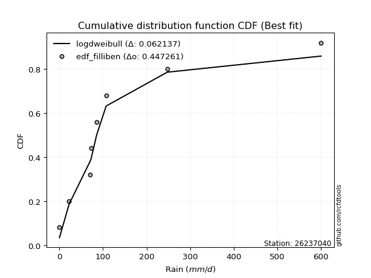</img></img>

</div>


### 10. Empirical - EDF Jenkinson (1977)

The Jenkinson formula in hydrology is an empirical plotting position formula used to estimate the non-exceedance probability _(P)_ or return period _(T)_ of a given ordered observation within a sample. It is a widely used method in the frequency analysis of extreme events such as floods and rainfall, as it provides a distribution-free way to plot data. _a≈0.31_ and _b≈0.38_ are constants derived to approximate the median of the probability distribution for the given rank.

<div align="center">


$P=(m-a)/(n+b)$


</div>


**10.1. Empirical values**

<div align="center">

|                | 0                   | 1                   | 2                  | 3                   | 4                  | 5                  | 6                  | 7                  |
|:---------------|:--------------------|:--------------------|:-------------------|:--------------------|:-------------------|:-------------------|:-------------------|:-------------------|
| date           | 2020                | 2025                | 2024               | 2017                | 2023               | 2018               | 2019               | 2022               |
| x              | 0.2                 | 11.2                | 22.4               | 70.9                | 85.4               | 107.2              | 247.2              | 600.0              |
| m              | 1                   | 2                   | 3                  | 4                   | 5                  | 6                  | 7                  | 8                  |
| empirical_dist | edf_jenkinson       | edf_jenkinson       | edf_jenkinson      | edf_jenkinson       | edf_jenkinson      | edf_jenkinson      | edf_jenkinson      | edf_jenkinson      |
| empirical      | 0.08233890214797135 | 0.20167064439140808 | 0.3210023866348448 | 0.44033412887828155 | 0.5596658711217184 | 0.6789976133651551 | 0.7983293556085919 | 0.9176610978520287 |
| empirical_tr   | 1.0897269180754225  | 1.2526158445440956  | 1.4727592267135323 | 1.7867803837953091  | 2.2710027100271004 | 3.115241635687732  | 4.958579881656804  | 12.144927536231886 |

</div>


**10.2. Kolmogorov-Smirnov fit test (sorted by Δ)**


<div align="center">

|                | 0                   | 1                   | 2                   | 3                   | 4                  | 5                   | 6                  | 7                  | 8                   | 9                     | 10                  | 11                 | 12                  | 13                  | 14                 | 15                  | 16                 | 17                  | 18                  | 19                  | 20                  | 21                 | 22                  | 23                  | 24                 | 25                  | 26                 | 27                 | 28                  | 29                  | 30                 | 31                  | 32                 | 33                  | 34                  | 35                  | 36                  | 37                  | 38                  | 39                 | 40                  | 41                  | 42                 | 43                  | 44                  | 45                 | 46                  | 47                  | 48                 | 49                  | 50                 | 51                 | 52                 | 53                  | 54                 | 55                 | 56                 | 57                  | 58                  | 59                  | 60                  | 61                  | 62                  | 63                 | 64                  | 65                  | 66                 | 67                  | 68                 | 69                  | 70                 | 71                 | 72                 | 73                  | 74                  | 75                 | 76                 | 77                 | 78                 | 79                  | 80                  | 81                  | 82                 | 83                 | 84                  | 85                  | 86                  | 87                 | 88                 | 89                 |
|:---------------|:--------------------|:--------------------|:--------------------|:--------------------|:-------------------|:--------------------|:-------------------|:-------------------|:--------------------|:----------------------|:--------------------|:-------------------|:--------------------|:--------------------|:-------------------|:--------------------|:-------------------|:--------------------|:--------------------|:--------------------|:--------------------|:-------------------|:--------------------|:--------------------|:-------------------|:--------------------|:-------------------|:-------------------|:--------------------|:--------------------|:-------------------|:--------------------|:-------------------|:--------------------|:--------------------|:--------------------|:--------------------|:--------------------|:--------------------|:-------------------|:--------------------|:--------------------|:-------------------|:--------------------|:--------------------|:-------------------|:--------------------|:--------------------|:-------------------|:--------------------|:-------------------|:-------------------|:-------------------|:--------------------|:-------------------|:-------------------|:-------------------|:--------------------|:--------------------|:--------------------|:--------------------|:--------------------|:--------------------|:-------------------|:--------------------|:--------------------|:-------------------|:--------------------|:-------------------|:--------------------|:-------------------|:-------------------|:-------------------|:--------------------|:--------------------|:-------------------|:-------------------|:-------------------|:-------------------|:--------------------|:--------------------|:--------------------|:-------------------|:-------------------|:--------------------|:--------------------|:--------------------|:-------------------|:-------------------|:-------------------|
| station        | 26237040            | 26237040            | 26237040            | 26237040            | 26237040           | 26237040            | 26237040           | 26237040           | 26237040            | 26237040              | 26237040            | 26237040           | 26237040            | 26237040            | 26237040           | 26237040            | 26237040           | 26237040            | 26237040            | 26237040            | 26237040            | 26237040           | 26237040            | 26237040            | 26237040           | 26237040            | 26237040           | 26237040           | 26237040            | 26237040            | 26237040           | 26237040            | 26237040           | 26237040            | 26237040            | 26237040            | 26237040            | 26237040            | 26237040            | 26237040           | 26237040            | 26237040            | 26237040           | 26237040            | 26237040            | 26237040           | 26237040            | 26237040            | 26237040           | 26237040            | 26237040           | 26237040           | 26237040           | 26237040            | 26237040           | 26237040           | 26237040           | 26237040            | 26237040            | 26237040            | 26237040            | 26237040            | 26237040            | 26237040           | 26237040            | 26237040            | 26237040           | 26237040            | 26237040           | 26237040            | 26237040           | 26237040           | 26237040           | 26237040            | 26237040            | 26237040           | 26237040           | 26237040           | 26237040           | 26237040            | 26237040            | 26237040            | 26237040           | 26237040           | 26237040            | 26237040            | 26237040            | 26237040           | 26237040           | 26237040           |
| empirical_dist | edf_jenkinson       | edf_jenkinson       | edf_jenkinson       | edf_jenkinson       | edf_jenkinson      | edf_jenkinson       | edf_jenkinson      | edf_jenkinson      | edf_jenkinson       | edf_jenkinson         | edf_jenkinson       | edf_jenkinson      | edf_jenkinson       | edf_jenkinson       | edf_jenkinson      | edf_jenkinson       | edf_jenkinson      | edf_jenkinson       | edf_jenkinson       | edf_jenkinson       | edf_jenkinson       | edf_jenkinson      | edf_jenkinson       | edf_jenkinson       | edf_jenkinson      | edf_jenkinson       | edf_jenkinson      | edf_jenkinson      | edf_jenkinson       | edf_jenkinson       | edf_jenkinson      | edf_jenkinson       | edf_jenkinson      | edf_jenkinson       | edf_jenkinson       | edf_jenkinson       | edf_jenkinson       | edf_jenkinson       | edf_jenkinson       | edf_jenkinson      | edf_jenkinson       | edf_jenkinson       | edf_jenkinson      | edf_jenkinson       | edf_jenkinson       | edf_jenkinson      | edf_jenkinson       | edf_jenkinson       | edf_jenkinson      | edf_jenkinson       | edf_jenkinson      | edf_jenkinson      | edf_jenkinson      | edf_jenkinson       | edf_jenkinson      | edf_jenkinson      | edf_jenkinson      | edf_jenkinson       | edf_jenkinson       | edf_jenkinson       | edf_jenkinson       | edf_jenkinson       | edf_jenkinson       | edf_jenkinson      | edf_jenkinson       | edf_jenkinson       | edf_jenkinson      | edf_jenkinson       | edf_jenkinson      | edf_jenkinson       | edf_jenkinson      | edf_jenkinson      | edf_jenkinson      | edf_jenkinson       | edf_jenkinson       | edf_jenkinson      | edf_jenkinson      | edf_jenkinson      | edf_jenkinson      | edf_jenkinson       | edf_jenkinson       | edf_jenkinson       | edf_jenkinson      | edf_jenkinson      | edf_jenkinson       | edf_jenkinson       | edf_jenkinson       | edf_jenkinson      | edf_jenkinson      | edf_jenkinson      |
| p_dist         | loggenlogistic      | logloggamma         | ncf                 | weibull_min         | logjohnsonsu       | logt                | logpearson3        | wald               | loggumbel_l         | loglaplace_asymmetric | gamma               | f                  | fisk                | invgamma            | alpha              | invgauss            | nct                | t                   | fatiguelife         | pearson3            | mielke              | johnsonsu          | halflogistic        | nakagami            | loglognorm         | lognakagami         | lognorm            | lognorm            | logcrystalball      | logexponnorm        | logrice            | lognct              | logbetaprime       | logmielke           | moyal               | loggamma            | loggamma            | logfatiguelife      | loginvgauss         | loginvweibull      | logalpha            | logerlang           | erlang             | exponnorm           | laplace_asymmetric  | loginvgamma        | expon               | genexpon            | loglogistic        | genlogistic         | halfnorm           | loghypsecant       | logmaxwell         | gumbel_r            | lograyleigh        | rayleigh           | loglaplace         | logkstwobign        | maxwell             | loghalfnorm         | loggumbel_r         | loggenexpon         | gibrat              | betaprime          | kstwobign           | loghalflogistic     | logmoyal           | crystalball         | norm               | logistic            | truncnorm          | hypsecant          | rice               | laplace             | gompertz            | logwald            | logtruncnorm       | gumbel_l           | logexpon           | loggompertz         | loggibrat           | logchi2             | pareto             | logfisk            | logncf              | invweibull          | logpareto           | logf               | logweibull_min     | chi2               |
| delta          | 0.07264478131832325 | 0.07925055122314717 | 0.08233890206249897 | 0.08233891038738078 | 0.0830178087304907 | 0.08615655600198469 | 0.0894254008107111 | 0.0994553414470245 | 0.10512601401397031 | 0.10622808478773732   | 0.11280791214445224 | 0.1150512046759376 | 0.13206098664938848 | 0.13236877734457836 | 0.1346854247781985 | 0.13720565352562303 | 0.1391384787381274 | 0.14310621113981514 | 0.14459383567272782 | 0.14757968246351932 | 0.15012543150674446 | 0.158822143456456  | 0.16069694619163905 | 0.16109334815424703 | 0.1623206008630404 | 0.16360556782695707 | 0.1640646218108069 | 0.1640646218108069 | 0.16406462685770268 | 0.16406678077460196 | 0.1640770821496575 | 0.16414651034170508 | 0.1641988506196846 | 0.16587605253650195 | 0.16660180280667913 | 0.16841479266055864 | 0.16841479266055864 | 0.16977554174526371 | 0.17078304096814717 | 0.1712401772896145 | 0.17171676253241447 | 0.17382965884712248 | 0.1750370487569784 | 0.17538455111259832 | 0.17607944027940114 | 0.1764047011796866 | 0.17708005514255049 | 0.17708008704883915 | 0.1774615248237355 | 0.17800504524372585 | 0.1830825628756762 | 0.1883820908808959 | 0.1901979739938185 | 0.19096779776135747 | 0.1982847587657291 | 0.2082221718211813 | 0.2158191882939559 | 0.21589953281998475 | 0.22039120350881453 | 0.22134038192437716 | 0.23011440312555947 | 0.23032543220765983 | 0.23245382613533494 | 0.2339230719336452 | 0.23856694976407367 | 0.24967707235782294 | 0.2526179383254164 | 0.25476454958914196 | 0.2547645504739918 | 0.26478399338414127 | 0.2723571837597488 | 0.2731326283010045 | 0.2817030001566044 | 0.29739264328630016 | 0.30097466277444357 | 0.3153909923513995 | 0.3186596440216965 | 0.3234021421576429 | 0.333111309501046  | 0.34303682391425533 | 0.34720485418577735 | 0.36186749194285156 | 0.3734149311191292 | 0.3839151739104187 | 0.39348673876339396 | 0.44805891398676534 | 0.46167005388087573 | 0.5015634191135419 | 0.5335006899629255 | 0.7773213464193414 |
| deltao         | 0.4472608134160001  | 0.4472608134160001  | 0.4472608134160001  | 0.4472608134160001  | 0.4472608134160001 | 0.4472608134160001  | 0.4472608134160001 | 0.4472608134160001 | 0.4472608134160001  | 0.4472608134160001    | 0.4472608134160001  | 0.4472608134160001 | 0.4472608134160001  | 0.4472608134160001  | 0.4472608134160001 | 0.4472608134160001  | 0.4472608134160001 | 0.4472608134160001  | 0.4472608134160001  | 0.4472608134160001  | 0.4472608134160001  | 0.4472608134160001 | 0.4472608134160001  | 0.4472608134160001  | 0.4472608134160001 | 0.4472608134160001  | 0.4472608134160001 | 0.4472608134160001 | 0.4472608134160001  | 0.4472608134160001  | 0.4472608134160001 | 0.4472608134160001  | 0.4472608134160001 | 0.4472608134160001  | 0.4472608134160001  | 0.4472608134160001  | 0.4472608134160001  | 0.4472608134160001  | 0.4472608134160001  | 0.4472608134160001 | 0.4472608134160001  | 0.4472608134160001  | 0.4472608134160001 | 0.4472608134160001  | 0.4472608134160001  | 0.4472608134160001 | 0.4472608134160001  | 0.4472608134160001  | 0.4472608134160001 | 0.4472608134160001  | 0.4472608134160001 | 0.4472608134160001 | 0.4472608134160001 | 0.4472608134160001  | 0.4472608134160001 | 0.4472608134160001 | 0.4472608134160001 | 0.4472608134160001  | 0.4472608134160001  | 0.4472608134160001  | 0.4472608134160001  | 0.4472608134160001  | 0.4472608134160001  | 0.4472608134160001 | 0.4472608134160001  | 0.4472608134160001  | 0.4472608134160001 | 0.4472608134160001  | 0.4472608134160001 | 0.4472608134160001  | 0.4472608134160001 | 0.4472608134160001 | 0.4472608134160001 | 0.4472608134160001  | 0.4472608134160001  | 0.4472608134160001 | 0.4472608134160001 | 0.4472608134160001 | 0.4472608134160001 | 0.4472608134160001  | 0.4472608134160001  | 0.4472608134160001  | 0.4472608134160001 | 0.4472608134160001 | 0.4472608134160001  | 0.4472608134160001  | 0.4472608134160001  | 0.4472608134160001 | 0.4472608134160001 | 0.4472608134160001 |
| eval           | Δo > Δ              | Δo > Δ              | Δo > Δ              | Δo > Δ              | Δo > Δ             | Δo > Δ              | Δo > Δ             | Δo > Δ             | Δo > Δ              | Δo > Δ                | Δo > Δ              | Δo > Δ             | Δo > Δ              | Δo > Δ              | Δo > Δ             | Δo > Δ              | Δo > Δ             | Δo > Δ              | Δo > Δ              | Δo > Δ              | Δo > Δ              | Δo > Δ             | Δo > Δ              | Δo > Δ              | Δo > Δ             | Δo > Δ              | Δo > Δ             | Δo > Δ             | Δo > Δ              | Δo > Δ              | Δo > Δ             | Δo > Δ              | Δo > Δ             | Δo > Δ              | Δo > Δ              | Δo > Δ              | Δo > Δ              | Δo > Δ              | Δo > Δ              | Δo > Δ             | Δo > Δ              | Δo > Δ              | Δo > Δ             | Δo > Δ              | Δo > Δ              | Δo > Δ             | Δo > Δ              | Δo > Δ              | Δo > Δ             | Δo > Δ              | Δo > Δ             | Δo > Δ             | Δo > Δ             | Δo > Δ              | Δo > Δ             | Δo > Δ             | Δo > Δ             | Δo > Δ              | Δo > Δ              | Δo > Δ              | Δo > Δ              | Δo > Δ              | Δo > Δ              | Δo > Δ             | Δo > Δ              | Δo > Δ              | Δo > Δ             | Δo > Δ              | Δo > Δ             | Δo > Δ              | Δo > Δ             | Δo > Δ             | Δo > Δ             | Δo > Δ              | Δo > Δ              | Δo > Δ             | Δo > Δ             | Δo > Δ             | Δo > Δ             | Δo > Δ              | Δo > Δ              | Δo > Δ              | Δo > Δ             | Δo > Δ             | Δo > Δ              | Δo <= Δ             | Δo <= Δ             | Δo <= Δ            | Δo <= Δ            | Δo <= Δ            |
| fit            | 1                   | 1                   | 1                   | 1                   | 1                  | 1                   | 1                  | 1                  | 1                   | 1                     | 1                   | 1                  | 1                   | 1                   | 1                  | 1                   | 1                  | 1                   | 1                   | 1                   | 1                   | 1                  | 1                   | 1                   | 1                  | 1                   | 1                  | 1                  | 1                   | 1                   | 1                  | 1                   | 1                  | 1                   | 1                   | 1                   | 1                   | 1                   | 1                   | 1                  | 1                   | 1                   | 1                  | 1                   | 1                   | 1                  | 1                   | 1                   | 1                  | 1                   | 1                  | 1                  | 1                  | 1                   | 1                  | 1                  | 1                  | 1                   | 1                   | 1                   | 1                   | 1                   | 1                   | 1                  | 1                   | 1                   | 1                  | 1                   | 1                  | 1                   | 1                  | 1                  | 1                  | 1                   | 1                   | 1                  | 1                  | 1                  | 1                  | 1                   | 1                   | 1                   | 1                  | 1                  | 1                   | 0                   | 0                   | 0                  | 0                  | 0                  |
| n              | 8                   | 8                   | 8                   | 8                   | 8                  | 8                   | 8                  | 8                  | 8                   | 8                     | 8                   | 8                  | 8                   | 8                   | 8                  | 8                   | 8                  | 8                   | 8                   | 8                   | 8                   | 8                  | 8                   | 8                   | 8                  | 8                   | 8                  | 8                  | 8                   | 8                   | 8                  | 8                   | 8                  | 8                   | 8                   | 8                   | 8                   | 8                   | 8                   | 8                  | 8                   | 8                   | 8                  | 8                   | 8                   | 8                  | 8                   | 8                   | 8                  | 8                   | 8                  | 8                  | 8                  | 8                   | 8                  | 8                  | 8                  | 8                   | 8                   | 8                   | 8                   | 8                   | 8                   | 8                  | 8                   | 8                   | 8                  | 8                   | 8                  | 8                   | 8                  | 8                  | 8                  | 8                   | 8                   | 8                  | 8                  | 8                  | 8                  | 8                   | 8                   | 8                   | 8                  | 8                  | 8                   | 8                   | 8                   | 8                  | 8                  | 8                  |
| best_fit       | 1                   | 0                   | 0                   | 0                   | 0                  | 0                   | 0                  | 0                  | 0                   | 0                     | 0                   | 0                  | 0                   | 0                   | 0                  | 0                   | 0                  | 0                   | 0                   | 0                   | 0                   | 0                  | 0                   | 0                   | 0                  | 0                   | 0                  | 0                  | 0                   | 0                   | 0                  | 0                   | 0                  | 0                   | 0                   | 0                   | 0                   | 0                   | 0                   | 0                  | 0                   | 0                   | 0                  | 0                   | 0                   | 0                  | 0                   | 0                   | 0                  | 0                   | 0                  | 0                  | 0                  | 0                   | 0                  | 0                  | 0                  | 0                   | 0                   | 0                   | 0                   | 0                   | 0                   | 0                  | 0                   | 0                   | 0                  | 0                   | 0                  | 0                   | 0                  | 0                  | 0                  | 0                   | 0                   | 0                  | 0                  | 0                  | 0                  | 0                   | 0                   | 0                   | 0                  | 0                  | 0                   | 0                   | 0                   | 0                  | 0                  | 0                  |
| best_fit_sort  | 1                   | 2                   | 3                   | 4                   | 5                  | 6                   | 7                  | 8                  | 9                   | 10                    | 11                  | 12                 | 13                  | 14                  | 15                 | 16                  | 17                 | 18                  | 19                  | 20                  | 21                  | 22                 | 23                  | 24                  | 25                 | 26                  | 27                 | 28                 | 29                  | 30                  | 31                 | 32                  | 33                 | 34                  | 35                  | 36                  | 37                  | 38                  | 39                  | 40                 | 41                  | 42                  | 43                 | 44                  | 45                  | 46                 | 47                  | 48                  | 49                 | 50                  | 51                 | 52                 | 53                 | 54                  | 55                 | 56                 | 57                 | 58                  | 59                  | 60                  | 61                  | 62                  | 63                  | 64                 | 65                  | 66                  | 67                 | 68                  | 69                 | 70                  | 71                 | 72                 | 73                 | 74                  | 75                  | 76                 | 77                 | 78                 | 79                 | 80                  | 81                  | 82                  | 83                 | 84                 | 85                  | 86                  | 87                  | 88                 | 89                 | 90                 |

</div>


<div align="center">

</img>

</div>


**10.3. Best fit**

<div align="center">

|   id |   station | empirical_dist   | p_dist         |     delta |   deltao | eval   |   fit |   n |   best_fit |   best_fit_sort |
|-----:|----------:|:-----------------|:---------------|----------:|---------:|:-------|------:|----:|-----------:|----------------:|
|    0 |  26237040 | edf_jenkinson    | loggenlogistic | 0.0726448 | 0.447261 | Δo > Δ |     1 |   8 |          1 |               1 |

</div>


<div align="center">

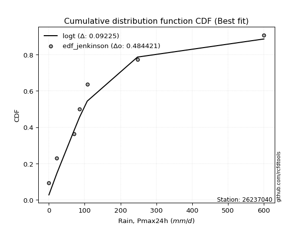</img>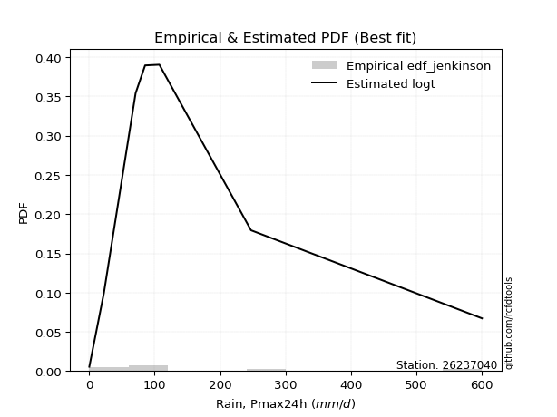</img>

</div>


### 11. Empirical - EDF Cunnane (1978)

Cunnane´s work in statistical hydrology has focused on the performance and evaluation of different probability distributions (such as GEV, Gumbel, Lognormal) for flood frequency estimation. _b_ is a constant, typically set to 0.4.

<div align="center">


$P=(m-b)/(n+1-2b)$


</div>


**11.1. Empirical values**

<div align="center">

|                | 0                   | 1                   | 2                  | 3                  | 4                  | 5                  | 6                  | 7                  |
|:---------------|:--------------------|:--------------------|:-------------------|:-------------------|:-------------------|:-------------------|:-------------------|:-------------------|
| date           | 2020                | 2025                | 2024               | 2017               | 2023               | 2018               | 2019               | 2022               |
| x              | 0.2                 | 11.2                | 22.4               | 70.9               | 85.4               | 107.2              | 247.2              | 600.0              |
| m              | 1                   | 2                   | 3                  | 4                  | 5                  | 6                  | 7                  | 8                  |
| empirical_dist | edf_cunnane         | edf_cunnane         | edf_cunnane        | edf_cunnane        | edf_cunnane        | edf_cunnane        | edf_cunnane        | edf_cunnane        |
| empirical      | 0.07317073170731708 | 0.19512195121951223 | 0.3170731707317074 | 0.4390243902439025 | 0.5609756097560976 | 0.6829268292682927 | 0.8048780487804879 | 0.926829268292683  |
| empirical_tr   | 1.0789473684210527  | 1.2424242424242424  | 1.4642857142857144 | 1.782608695652174  | 2.277777777777778  | 3.153846153846154  | 5.125000000000001  | 13.666666666666675 |

</div>


**11.2. Kolmogorov-Smirnov fit test (sorted by Δ)**


<div align="center">

|                | 0                  | 1                  | 2                   | 3                   | 4                   | 5                   | 6                   | 7                   | 8                   | 9                     | 10                  | 11                  | 12                 | 13                  | 14                  | 15                  | 16                  | 17                  | 18                 | 19                 | 20                 | 21                  | 22                  | 23                  | 24                 | 25                  | 26                  | 27                  | 28                  | 29                  | 30                  | 31                  | 32                 | 33                 | 34                 | 35                 | 36                  | 37                  | 38                  | 39                 | 40                 | 41                  | 42                  | 43                 | 44                  | 45                  | 46                  | 47                  | 48                  | 49                 | 50                  | 51                  | 52                  | 53                  | 54                  | 55                  | 56                  | 57                 | 58                  | 59                 | 60                 | 61                  | 62                  | 63                  | 64                  | 65                 | 66                  | 67                 | 68                 | 69                  | 70                 | 71                  | 72                  | 73                 | 74                  | 75                  | 76                 | 77                  | 78                  | 79                 | 80                  | 81                 | 82                  | 83                 | 84                 | 85                  | 86                  | 87                 | 88                 | 89                 |
|:---------------|:-------------------|:-------------------|:--------------------|:--------------------|:--------------------|:--------------------|:--------------------|:--------------------|:--------------------|:----------------------|:--------------------|:--------------------|:-------------------|:--------------------|:--------------------|:--------------------|:--------------------|:--------------------|:-------------------|:-------------------|:-------------------|:--------------------|:--------------------|:--------------------|:-------------------|:--------------------|:--------------------|:--------------------|:--------------------|:--------------------|:--------------------|:--------------------|:-------------------|:-------------------|:-------------------|:-------------------|:--------------------|:--------------------|:--------------------|:-------------------|:-------------------|:--------------------|:--------------------|:-------------------|:--------------------|:--------------------|:--------------------|:--------------------|:--------------------|:-------------------|:--------------------|:--------------------|:--------------------|:--------------------|:--------------------|:--------------------|:--------------------|:-------------------|:--------------------|:-------------------|:-------------------|:--------------------|:--------------------|:--------------------|:--------------------|:-------------------|:--------------------|:-------------------|:-------------------|:--------------------|:-------------------|:--------------------|:--------------------|:-------------------|:--------------------|:--------------------|:-------------------|:--------------------|:--------------------|:-------------------|:--------------------|:-------------------|:--------------------|:-------------------|:-------------------|:--------------------|:--------------------|:-------------------|:-------------------|:-------------------|
| station        | 26237040           | 26237040           | 26237040            | 26237040            | 26237040            | 26237040            | 26237040            | 26237040            | 26237040            | 26237040              | 26237040            | 26237040            | 26237040           | 26237040            | 26237040            | 26237040            | 26237040            | 26237040            | 26237040           | 26237040           | 26237040           | 26237040            | 26237040            | 26237040            | 26237040           | 26237040            | 26237040            | 26237040            | 26237040            | 26237040            | 26237040            | 26237040            | 26237040           | 26237040           | 26237040           | 26237040           | 26237040            | 26237040            | 26237040            | 26237040           | 26237040           | 26237040            | 26237040            | 26237040           | 26237040            | 26237040            | 26237040            | 26237040            | 26237040            | 26237040           | 26237040            | 26237040            | 26237040            | 26237040            | 26237040            | 26237040            | 26237040            | 26237040           | 26237040            | 26237040           | 26237040           | 26237040            | 26237040            | 26237040            | 26237040            | 26237040           | 26237040            | 26237040           | 26237040           | 26237040            | 26237040           | 26237040            | 26237040            | 26237040           | 26237040            | 26237040            | 26237040           | 26237040            | 26237040            | 26237040           | 26237040            | 26237040           | 26237040            | 26237040           | 26237040           | 26237040            | 26237040            | 26237040           | 26237040           | 26237040           |
| empirical_dist | edf_cunnane        | edf_cunnane        | edf_cunnane         | edf_cunnane         | edf_cunnane         | edf_cunnane         | edf_cunnane         | edf_cunnane         | edf_cunnane         | edf_cunnane           | edf_cunnane         | edf_cunnane         | edf_cunnane        | edf_cunnane         | edf_cunnane         | edf_cunnane         | edf_cunnane         | edf_cunnane         | edf_cunnane        | edf_cunnane        | edf_cunnane        | edf_cunnane         | edf_cunnane         | edf_cunnane         | edf_cunnane        | edf_cunnane         | edf_cunnane         | edf_cunnane         | edf_cunnane         | edf_cunnane         | edf_cunnane         | edf_cunnane         | edf_cunnane        | edf_cunnane        | edf_cunnane        | edf_cunnane        | edf_cunnane         | edf_cunnane         | edf_cunnane         | edf_cunnane        | edf_cunnane        | edf_cunnane         | edf_cunnane         | edf_cunnane        | edf_cunnane         | edf_cunnane         | edf_cunnane         | edf_cunnane         | edf_cunnane         | edf_cunnane        | edf_cunnane         | edf_cunnane         | edf_cunnane         | edf_cunnane         | edf_cunnane         | edf_cunnane         | edf_cunnane         | edf_cunnane        | edf_cunnane         | edf_cunnane        | edf_cunnane        | edf_cunnane         | edf_cunnane         | edf_cunnane         | edf_cunnane         | edf_cunnane        | edf_cunnane         | edf_cunnane        | edf_cunnane        | edf_cunnane         | edf_cunnane        | edf_cunnane         | edf_cunnane         | edf_cunnane        | edf_cunnane         | edf_cunnane         | edf_cunnane        | edf_cunnane         | edf_cunnane         | edf_cunnane        | edf_cunnane         | edf_cunnane        | edf_cunnane         | edf_cunnane        | edf_cunnane        | edf_cunnane         | edf_cunnane         | edf_cunnane        | edf_cunnane        | edf_cunnane        |
| p_dist         | ncf                | loggenlogistic     | logt                | logloggamma         | weibull_min         | logjohnsonsu        | logpearson3         | wald                | loggumbel_l         | loglaplace_asymmetric | gamma               | f                   | invgamma           | fisk                | alpha               | invgauss            | nct                 | fatiguelife         | mielke             | t                  | pearson3           | johnsonsu           | loglognorm          | lognakagami         | nakagami           | lognorm             | lognorm             | logcrystalball      | logexponnorm        | logrice             | lognct              | logbetaprime        | loggamma           | loggamma           | halflogistic       | moyal              | logfatiguelife      | exponnorm           | loginvgauss         | laplace_asymmetric | logmielke          | logalpha            | expon               | genexpon           | logerlang           | erlang              | loginvgamma         | loginvweibull       | loglogistic         | genlogistic        | loghypsecant        | logmaxwell          | halfnorm            | gumbel_r            | lograyleigh         | rayleigh            | loglaplace          | logkstwobign       | loghalfnorm         | maxwell            | gibrat             | loggumbel_r         | betaprime           | loggenexpon         | kstwobign           | loghalflogistic    | logmoyal            | crystalball        | norm               | logistic            | truncnorm          | hypsecant           | rice                | laplace            | gompertz            | logwald             | logtruncnorm       | gumbel_l            | logexpon            | loggibrat          | loggompertz         | logchi2            | pareto              | logfisk            | logncf             | invweibull          | logpareto           | logf               | logweibull_min     | chi2               |
| delta          | 0.0731707316218447 | 0.0739545199527023 | 0.08222734009884725 | 0.08317976712628483 | 0.08364864902175984 | 0.08694702463362836 | 0.09073513944509015 | 0.10338455735016217 | 0.10643575264834937 | 0.10753782342211637   | 0.11411765077883129 | 0.11636094331031666 | 0.1336785159789574 | 0.13599020255252614 | 0.13599516341257756 | 0.13851539216000208 | 0.14044821737250646 | 0.14590357430710688 | 0.1514351701411235 | 0.1522743815804694 | 0.1567478529041736 | 0.16013188209083506 | 0.16363033949741945 | 0.16491530646133612 | 0.1650225640573847 | 0.16537436044518594 | 0.16537436044518594 | 0.16537436549208173 | 0.16537651940898102 | 0.16538682078403655 | 0.16545624897608413 | 0.16550858925406364 | 0.1697245312949377 | 0.1697245312949377 | 0.1698651166322933 | 0.1705310187098168 | 0.17108528037964277 | 0.17145533520946088 | 0.17209277960252622 | 0.1721502243762637 | 0.1724247457083978 | 0.17302650116679352 | 0.17315083923941305 | 0.1731508711457017 | 0.17513939748150154 | 0.17634678739135745 | 0.17771443981406565 | 0.17778887046151035 | 0.17877126345811456 | 0.1819342611468635 | 0.18969182951527497 | 0.19150771262819755 | 0.19225073331633047 | 0.19489701366449513 | 0.19959449740010815 | 0.21215138772431896 | 0.21712892692833496 | 0.2224482259918806 | 0.22265012055875621 | 0.2243204194119522 | 0.2285246102321975 | 0.23142414175993853 | 0.23523281056802425 | 0.23687412537955568 | 0.24249616566721133 | 0.250986810992202  | 0.25392767695979546 | 0.2586937654922796 | 0.2586937663771295 | 0.26871320928727893 | 0.2762863996628865 | 0.27706184420414215 | 0.28563221605974204 | 0.3013218591894378 | 0.30490387867758123 | 0.31670073098577856 | 0.3234190206085664 | 0.32733135806078056 | 0.33966000267294183 | 0.3485145928201564 | 0.34958551708615115 | 0.3684161851147474 | 0.37996362429102504 | 0.3904638670823145 | 0.4000354319352898 | 0.45722708442741966 | 0.46821874705277156 | 0.5081121122854376 | 0.5400493831348213 | 0.7838700395912372 |
| deltao         | 0.4472608134160001 | 0.4472608134160001 | 0.4472608134160001  | 0.4472608134160001  | 0.4472608134160001  | 0.4472608134160001  | 0.4472608134160001  | 0.4472608134160001  | 0.4472608134160001  | 0.4472608134160001    | 0.4472608134160001  | 0.4472608134160001  | 0.4472608134160001 | 0.4472608134160001  | 0.4472608134160001  | 0.4472608134160001  | 0.4472608134160001  | 0.4472608134160001  | 0.4472608134160001 | 0.4472608134160001 | 0.4472608134160001 | 0.4472608134160001  | 0.4472608134160001  | 0.4472608134160001  | 0.4472608134160001 | 0.4472608134160001  | 0.4472608134160001  | 0.4472608134160001  | 0.4472608134160001  | 0.4472608134160001  | 0.4472608134160001  | 0.4472608134160001  | 0.4472608134160001 | 0.4472608134160001 | 0.4472608134160001 | 0.4472608134160001 | 0.4472608134160001  | 0.4472608134160001  | 0.4472608134160001  | 0.4472608134160001 | 0.4472608134160001 | 0.4472608134160001  | 0.4472608134160001  | 0.4472608134160001 | 0.4472608134160001  | 0.4472608134160001  | 0.4472608134160001  | 0.4472608134160001  | 0.4472608134160001  | 0.4472608134160001 | 0.4472608134160001  | 0.4472608134160001  | 0.4472608134160001  | 0.4472608134160001  | 0.4472608134160001  | 0.4472608134160001  | 0.4472608134160001  | 0.4472608134160001 | 0.4472608134160001  | 0.4472608134160001 | 0.4472608134160001 | 0.4472608134160001  | 0.4472608134160001  | 0.4472608134160001  | 0.4472608134160001  | 0.4472608134160001 | 0.4472608134160001  | 0.4472608134160001 | 0.4472608134160001 | 0.4472608134160001  | 0.4472608134160001 | 0.4472608134160001  | 0.4472608134160001  | 0.4472608134160001 | 0.4472608134160001  | 0.4472608134160001  | 0.4472608134160001 | 0.4472608134160001  | 0.4472608134160001  | 0.4472608134160001 | 0.4472608134160001  | 0.4472608134160001 | 0.4472608134160001  | 0.4472608134160001 | 0.4472608134160001 | 0.4472608134160001  | 0.4472608134160001  | 0.4472608134160001 | 0.4472608134160001 | 0.4472608134160001 |
| eval           | Δo > Δ             | Δo > Δ             | Δo > Δ              | Δo > Δ              | Δo > Δ              | Δo > Δ              | Δo > Δ              | Δo > Δ              | Δo > Δ              | Δo > Δ                | Δo > Δ              | Δo > Δ              | Δo > Δ             | Δo > Δ              | Δo > Δ              | Δo > Δ              | Δo > Δ              | Δo > Δ              | Δo > Δ             | Δo > Δ             | Δo > Δ             | Δo > Δ              | Δo > Δ              | Δo > Δ              | Δo > Δ             | Δo > Δ              | Δo > Δ              | Δo > Δ              | Δo > Δ              | Δo > Δ              | Δo > Δ              | Δo > Δ              | Δo > Δ             | Δo > Δ             | Δo > Δ             | Δo > Δ             | Δo > Δ              | Δo > Δ              | Δo > Δ              | Δo > Δ             | Δo > Δ             | Δo > Δ              | Δo > Δ              | Δo > Δ             | Δo > Δ              | Δo > Δ              | Δo > Δ              | Δo > Δ              | Δo > Δ              | Δo > Δ             | Δo > Δ              | Δo > Δ              | Δo > Δ              | Δo > Δ              | Δo > Δ              | Δo > Δ              | Δo > Δ              | Δo > Δ             | Δo > Δ              | Δo > Δ             | Δo > Δ             | Δo > Δ              | Δo > Δ              | Δo > Δ              | Δo > Δ              | Δo > Δ             | Δo > Δ              | Δo > Δ             | Δo > Δ             | Δo > Δ              | Δo > Δ             | Δo > Δ              | Δo > Δ              | Δo > Δ             | Δo > Δ              | Δo > Δ              | Δo > Δ             | Δo > Δ              | Δo > Δ              | Δo > Δ             | Δo > Δ              | Δo > Δ             | Δo > Δ              | Δo > Δ             | Δo > Δ             | Δo <= Δ             | Δo <= Δ             | Δo <= Δ            | Δo <= Δ            | Δo <= Δ            |
| fit            | 1                  | 1                  | 1                   | 1                   | 1                   | 1                   | 1                   | 1                   | 1                   | 1                     | 1                   | 1                   | 1                  | 1                   | 1                   | 1                   | 1                   | 1                   | 1                  | 1                  | 1                  | 1                   | 1                   | 1                   | 1                  | 1                   | 1                   | 1                   | 1                   | 1                   | 1                   | 1                   | 1                  | 1                  | 1                  | 1                  | 1                   | 1                   | 1                   | 1                  | 1                  | 1                   | 1                   | 1                  | 1                   | 1                   | 1                   | 1                   | 1                   | 1                  | 1                   | 1                   | 1                   | 1                   | 1                   | 1                   | 1                   | 1                  | 1                   | 1                  | 1                  | 1                   | 1                   | 1                   | 1                   | 1                  | 1                   | 1                  | 1                  | 1                   | 1                  | 1                   | 1                   | 1                  | 1                   | 1                   | 1                  | 1                   | 1                   | 1                  | 1                   | 1                  | 1                   | 1                  | 1                  | 0                   | 0                   | 0                  | 0                  | 0                  |
| n              | 8                  | 8                  | 8                   | 8                   | 8                   | 8                   | 8                   | 8                   | 8                   | 8                     | 8                   | 8                   | 8                  | 8                   | 8                   | 8                   | 8                   | 8                   | 8                  | 8                  | 8                  | 8                   | 8                   | 8                   | 8                  | 8                   | 8                   | 8                   | 8                   | 8                   | 8                   | 8                   | 8                  | 8                  | 8                  | 8                  | 8                   | 8                   | 8                   | 8                  | 8                  | 8                   | 8                   | 8                  | 8                   | 8                   | 8                   | 8                   | 8                   | 8                  | 8                   | 8                   | 8                   | 8                   | 8                   | 8                   | 8                   | 8                  | 8                   | 8                  | 8                  | 8                   | 8                   | 8                   | 8                   | 8                  | 8                   | 8                  | 8                  | 8                   | 8                  | 8                   | 8                   | 8                  | 8                   | 8                   | 8                  | 8                   | 8                   | 8                  | 8                   | 8                  | 8                   | 8                  | 8                  | 8                   | 8                   | 8                  | 8                  | 8                  |
| best_fit       | 1                  | 0                  | 0                   | 0                   | 0                   | 0                   | 0                   | 0                   | 0                   | 0                     | 0                   | 0                   | 0                  | 0                   | 0                   | 0                   | 0                   | 0                   | 0                  | 0                  | 0                  | 0                   | 0                   | 0                   | 0                  | 0                   | 0                   | 0                   | 0                   | 0                   | 0                   | 0                   | 0                  | 0                  | 0                  | 0                  | 0                   | 0                   | 0                   | 0                  | 0                  | 0                   | 0                   | 0                  | 0                   | 0                   | 0                   | 0                   | 0                   | 0                  | 0                   | 0                   | 0                   | 0                   | 0                   | 0                   | 0                   | 0                  | 0                   | 0                  | 0                  | 0                   | 0                   | 0                   | 0                   | 0                  | 0                   | 0                  | 0                  | 0                   | 0                  | 0                   | 0                   | 0                  | 0                   | 0                   | 0                  | 0                   | 0                   | 0                  | 0                   | 0                  | 0                   | 0                  | 0                  | 0                   | 0                   | 0                  | 0                  | 0                  |
| best_fit_sort  | 1                  | 2                  | 3                   | 4                   | 5                   | 6                   | 7                   | 8                   | 9                   | 10                    | 11                  | 12                  | 13                 | 14                  | 15                  | 16                  | 17                  | 18                  | 19                 | 20                 | 21                 | 22                  | 23                  | 24                  | 25                 | 26                  | 27                  | 28                  | 29                  | 30                  | 31                  | 32                  | 33                 | 34                 | 35                 | 36                 | 37                  | 38                  | 39                  | 40                 | 41                 | 42                  | 43                  | 44                 | 45                  | 46                  | 47                  | 48                  | 49                  | 50                 | 51                  | 52                  | 53                  | 54                  | 55                  | 56                  | 57                  | 58                 | 59                  | 60                 | 61                 | 62                  | 63                  | 64                  | 65                  | 66                 | 67                  | 68                 | 69                 | 70                  | 71                 | 72                  | 73                  | 74                 | 75                  | 76                  | 77                 | 78                  | 79                  | 80                 | 81                  | 82                 | 83                  | 84                 | 85                 | 86                  | 87                  | 88                 | 89                 | 90                 |

</div>


<div align="center">

</img>

</div>


**11.3. Best fit**

<div align="center">

|   id |   station | empirical_dist   | p_dist   |     delta |   deltao | eval   |   fit |   n |   best_fit |   best_fit_sort |
|-----:|----------:|:-----------------|:---------|----------:|---------:|:-------|------:|----:|-----------:|----------------:|
|    0 |  26237040 | edf_cunnane      | ncf      | 0.0731707 | 0.447261 | Δo > Δ |     1 |   8 |          1 |               1 |

</div>


<div align="center">

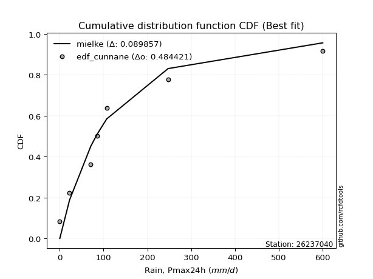</img>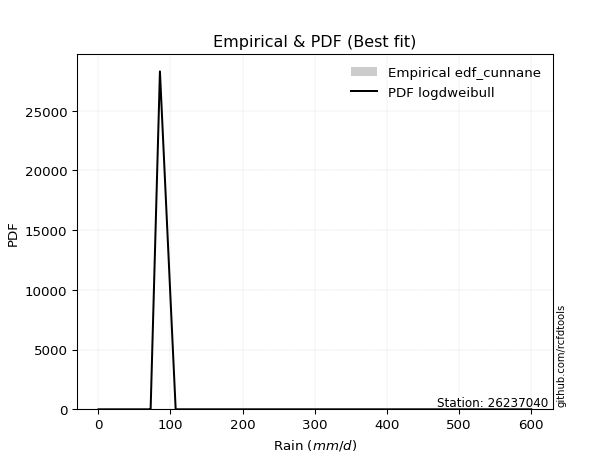</img>

</div>


### 12. Empirical - EDF Adamowski (1981)

The Adamowski formula in hydrology refers to a specific plotting position formula used for estimating the non-parametric empirical distribution of hydrological events (like flood peaks) to calculate their return periods. This formula provides an alternative to traditional parametric methods (like the Gumbel or Log Pearson Type III distributions). 

<div align="center">


$P=(m-0.25)/(n+0.5)$


</div>


**12.1. Empirical values**

<div align="center">

|                | 0                   | 1                   | 2                  | 3                  | 4                  | 5                  | 6                  | 7                  |
|:---------------|:--------------------|:--------------------|:-------------------|:-------------------|:-------------------|:-------------------|:-------------------|:-------------------|
| date           | 2020                | 2025                | 2024               | 2017               | 2023               | 2018               | 2019               | 2022               |
| x              | 0.2                 | 11.2                | 22.4               | 70.9               | 85.4               | 107.2              | 247.2              | 600.0              |
| m              | 1                   | 2                   | 3                  | 4                  | 5                  | 6                  | 7                  | 8                  |
| empirical_dist | edf_adamowski       | edf_adamowski       | edf_adamowski      | edf_adamowski      | edf_adamowski      | edf_adamowski      | edf_adamowski      | edf_adamowski      |
| empirical      | 0.08823529411764706 | 0.20588235294117646 | 0.3235294117647059 | 0.4411764705882353 | 0.5588235294117647 | 0.6764705882352942 | 0.7941176470588235 | 0.9117647058823529 |
| empirical_tr   | 1.096774193548387   | 1.259259259259259   | 1.4782608695652173 | 1.7894736842105263 | 2.2666666666666666 | 3.0909090909090913 | 4.857142857142856  | 11.33333333333333  |

</div>


**12.2. Kolmogorov-Smirnov fit test (sorted by Δ)**


<div align="center">

|                | 0                   | 1                   | 2                   | 3                   | 4                   | 5                   | 6                   | 7                   | 8                   | 9                     | 10                  | 11                  | 12                  | 13                  | 14                  | 15                 | 16                 | 17                  | 18                  | 19                 | 20                  | 21                  | 22                  | 23                 | 24                  | 25                  | 26                  | 27                  | 28                  | 29                  | 30                  | 31                  | 32                  | 33                  | 34                  | 35                  | 36                 | 37                 | 38                  | 39                  | 40                  | 41                  | 42                  | 43                  | 44                  | 45                  | 46                  | 47                 | 48                  | 49                  | 50                  | 51                  | 52                  | 53                  | 54                  | 55                  | 56                  | 57                  | 58                 | 59                  | 60                  | 61                  | 62                  | 63                  | 64                  | 65                 | 66                  | 67                  | 68                 | 69                  | 70                 | 71                  | 72                  | 73                  | 74                  | 75                  | 76                  | 77                 | 78                 | 79                  | 80                 | 81                 | 82                  | 83                 | 84                 | 85                 | 86                  | 87                 | 88                 | 89                 |
|:---------------|:--------------------|:--------------------|:--------------------|:--------------------|:--------------------|:--------------------|:--------------------|:--------------------|:--------------------|:----------------------|:--------------------|:--------------------|:--------------------|:--------------------|:--------------------|:-------------------|:-------------------|:--------------------|:--------------------|:-------------------|:--------------------|:--------------------|:--------------------|:-------------------|:--------------------|:--------------------|:--------------------|:--------------------|:--------------------|:--------------------|:--------------------|:--------------------|:--------------------|:--------------------|:--------------------|:--------------------|:-------------------|:-------------------|:--------------------|:--------------------|:--------------------|:--------------------|:--------------------|:--------------------|:--------------------|:--------------------|:--------------------|:-------------------|:--------------------|:--------------------|:--------------------|:--------------------|:--------------------|:--------------------|:--------------------|:--------------------|:--------------------|:--------------------|:-------------------|:--------------------|:--------------------|:--------------------|:--------------------|:--------------------|:--------------------|:-------------------|:--------------------|:--------------------|:-------------------|:--------------------|:-------------------|:--------------------|:--------------------|:--------------------|:--------------------|:--------------------|:--------------------|:-------------------|:-------------------|:--------------------|:-------------------|:-------------------|:--------------------|:-------------------|:-------------------|:-------------------|:--------------------|:-------------------|:-------------------|:-------------------|
| station        | 26237040            | 26237040            | 26237040            | 26237040            | 26237040            | 26237040            | 26237040            | 26237040            | 26237040            | 26237040              | 26237040            | 26237040            | 26237040            | 26237040            | 26237040            | 26237040           | 26237040           | 26237040            | 26237040            | 26237040           | 26237040            | 26237040            | 26237040            | 26237040           | 26237040            | 26237040            | 26237040            | 26237040            | 26237040            | 26237040            | 26237040            | 26237040            | 26237040            | 26237040            | 26237040            | 26237040            | 26237040           | 26237040           | 26237040            | 26237040            | 26237040            | 26237040            | 26237040            | 26237040            | 26237040            | 26237040            | 26237040            | 26237040           | 26237040            | 26237040            | 26237040            | 26237040            | 26237040            | 26237040            | 26237040            | 26237040            | 26237040            | 26237040            | 26237040           | 26237040            | 26237040            | 26237040            | 26237040            | 26237040            | 26237040            | 26237040           | 26237040            | 26237040            | 26237040           | 26237040            | 26237040           | 26237040            | 26237040            | 26237040            | 26237040            | 26237040            | 26237040            | 26237040           | 26237040           | 26237040            | 26237040           | 26237040           | 26237040            | 26237040           | 26237040           | 26237040           | 26237040            | 26237040           | 26237040           | 26237040           |
| empirical_dist | edf_adamowski       | edf_adamowski       | edf_adamowski       | edf_adamowski       | edf_adamowski       | edf_adamowski       | edf_adamowski       | edf_adamowski       | edf_adamowski       | edf_adamowski         | edf_adamowski       | edf_adamowski       | edf_adamowski       | edf_adamowski       | edf_adamowski       | edf_adamowski      | edf_adamowski      | edf_adamowski       | edf_adamowski       | edf_adamowski      | edf_adamowski       | edf_adamowski       | edf_adamowski       | edf_adamowski      | edf_adamowski       | edf_adamowski       | edf_adamowski       | edf_adamowski       | edf_adamowski       | edf_adamowski       | edf_adamowski       | edf_adamowski       | edf_adamowski       | edf_adamowski       | edf_adamowski       | edf_adamowski       | edf_adamowski      | edf_adamowski      | edf_adamowski       | edf_adamowski       | edf_adamowski       | edf_adamowski       | edf_adamowski       | edf_adamowski       | edf_adamowski       | edf_adamowski       | edf_adamowski       | edf_adamowski      | edf_adamowski       | edf_adamowski       | edf_adamowski       | edf_adamowski       | edf_adamowski       | edf_adamowski       | edf_adamowski       | edf_adamowski       | edf_adamowski       | edf_adamowski       | edf_adamowski      | edf_adamowski       | edf_adamowski       | edf_adamowski       | edf_adamowski       | edf_adamowski       | edf_adamowski       | edf_adamowski      | edf_adamowski       | edf_adamowski       | edf_adamowski      | edf_adamowski       | edf_adamowski      | edf_adamowski       | edf_adamowski       | edf_adamowski       | edf_adamowski       | edf_adamowski       | edf_adamowski       | edf_adamowski      | edf_adamowski      | edf_adamowski       | edf_adamowski      | edf_adamowski      | edf_adamowski       | edf_adamowski      | edf_adamowski      | edf_adamowski      | edf_adamowski       | edf_adamowski      | edf_adamowski      | edf_adamowski      |
| p_dist         | loggenlogistic      | logloggamma         | logjohnsonsu        | ncf                 | weibull_min         | logpearson3         | logt                | wald                | loggumbel_l         | loglaplace_asymmetric | gamma               | f                   | fisk                | invgamma            | alpha               | invgauss           | t                  | nct                 | pearson3            | fatiguelife        | mielke              | halflogistic        | johnsonsu           | nakagami           | loglognorm          | logmielke           | lognakagami         | lognorm             | lognorm             | logcrystalball      | logexponnorm        | logrice             | lognct              | logbetaprime        | moyal               | loginvweibull       | loggamma           | loggamma           | logfatiguelife      | loginvgauss         | logalpha            | logerlang           | erlang              | genlogistic         | loginvgamma         | loglogistic         | halfnorm            | exponnorm          | laplace_asymmetric  | expon               | genexpon            | loghypsecant        | gumbel_r            | logmaxwell          | lograyleigh         | rayleigh            | logkstwobign        | loglaplace          | maxwell            | loghalfnorm         | loggenexpon         | loggumbel_r         | betaprime           | gibrat              | kstwobign           | loghalflogistic    | logmoyal            | crystalball         | norm               | logistic            | truncnorm          | hypsecant           | rice                | laplace             | gompertz            | logwald             | logtruncnorm        | gumbel_l           | logexpon           | loggompertz         | loggibrat          | logchi2            | pareto              | logfisk            | logncf             | invweibull         | logpareto           | logf               | logweibull_min     | chi2               |
| delta          | 0.07180243960836952 | 0.07672352609328625 | 0.08049078360062978 | 0.08823529403217469 | 0.08823529410739073 | 0.08858305910075737 | 0.08868358113184577 | 0.09700413534543706 | 0.10428367230401658 | 0.10538574307778359   | 0.11196557043449851 | 0.11420886296598387 | 0.12953396151952756 | 0.13152643563462463 | 0.13384308306824477 | 0.1363633118156693 | 0.1372098191701394 | 0.13829613702817367 | 0.14277871035038603 | 0.1437514939627741 | 0.14928308979679072 | 0.15480055422196332 | 0.15797980174650228 | 0.1585663230243861 | 0.16147825915308667 | 0.16209287611409007 | 0.16276322611700333 | 0.16322228010085316 | 0.16322228010085316 | 0.16322228514774895 | 0.16322443906464823 | 0.16323474043970376 | 0.16330416863175135 | 0.16335650890973086 | 0.16407477767681822 | 0.16702846873984611 | 0.1675724509506049 | 0.1675724509506049 | 0.16893320003530998 | 0.16994069925819344 | 0.17087442082246074 | 0.17298731713716875 | 0.17419470704702467 | 0.17547802011386493 | 0.17556235946973286 | 0.17661918311378177 | 0.17718617090600047 | 0.1779115762424594 | 0.17860646540926223 | 0.17960708027241157 | 0.17960711217870023 | 0.18753974917094218 | 0.18844077263149656 | 0.18935563228386476 | 0.19744241705577537 | 0.20569514669132039 | 0.21168782427021637 | 0.21497684658400218 | 0.2178641783789536 | 0.22049804021442343 | 0.22611372365789145 | 0.22927206141560574 | 0.23308073022369147 | 0.23498085126519602 | 0.23603992463421275 | 0.2488347306478692 | 0.25177559661546267 | 0.25223752445928105 | 0.2522375253441309 | 0.26225696825428035 | 0.2698301586298879 | 0.27060560317114357 | 0.27917597502674346 | 0.29486561815643925 | 0.29844763764458265 | 0.31454865064144577 | 0.31781730231174277 | 0.320875117027782  | 0.3288996009512776 | 0.33882511536448695 | 0.3463625124758236 | 0.3576557833930832 | 0.36920322256936083 | 0.3797034653606503 | 0.3892750302136256 | 0.4421625220170896 | 0.45745834533110735 | 0.4973517105637734 | 0.5292889814131572 | 0.773109637869573  |
| deltao         | 0.4472608134160001  | 0.4472608134160001  | 0.4472608134160001  | 0.4472608134160001  | 0.4472608134160001  | 0.4472608134160001  | 0.4472608134160001  | 0.4472608134160001  | 0.4472608134160001  | 0.4472608134160001    | 0.4472608134160001  | 0.4472608134160001  | 0.4472608134160001  | 0.4472608134160001  | 0.4472608134160001  | 0.4472608134160001 | 0.4472608134160001 | 0.4472608134160001  | 0.4472608134160001  | 0.4472608134160001 | 0.4472608134160001  | 0.4472608134160001  | 0.4472608134160001  | 0.4472608134160001 | 0.4472608134160001  | 0.4472608134160001  | 0.4472608134160001  | 0.4472608134160001  | 0.4472608134160001  | 0.4472608134160001  | 0.4472608134160001  | 0.4472608134160001  | 0.4472608134160001  | 0.4472608134160001  | 0.4472608134160001  | 0.4472608134160001  | 0.4472608134160001 | 0.4472608134160001 | 0.4472608134160001  | 0.4472608134160001  | 0.4472608134160001  | 0.4472608134160001  | 0.4472608134160001  | 0.4472608134160001  | 0.4472608134160001  | 0.4472608134160001  | 0.4472608134160001  | 0.4472608134160001 | 0.4472608134160001  | 0.4472608134160001  | 0.4472608134160001  | 0.4472608134160001  | 0.4472608134160001  | 0.4472608134160001  | 0.4472608134160001  | 0.4472608134160001  | 0.4472608134160001  | 0.4472608134160001  | 0.4472608134160001 | 0.4472608134160001  | 0.4472608134160001  | 0.4472608134160001  | 0.4472608134160001  | 0.4472608134160001  | 0.4472608134160001  | 0.4472608134160001 | 0.4472608134160001  | 0.4472608134160001  | 0.4472608134160001 | 0.4472608134160001  | 0.4472608134160001 | 0.4472608134160001  | 0.4472608134160001  | 0.4472608134160001  | 0.4472608134160001  | 0.4472608134160001  | 0.4472608134160001  | 0.4472608134160001 | 0.4472608134160001 | 0.4472608134160001  | 0.4472608134160001 | 0.4472608134160001 | 0.4472608134160001  | 0.4472608134160001 | 0.4472608134160001 | 0.4472608134160001 | 0.4472608134160001  | 0.4472608134160001 | 0.4472608134160001 | 0.4472608134160001 |
| eval           | Δo > Δ              | Δo > Δ              | Δo > Δ              | Δo > Δ              | Δo > Δ              | Δo > Δ              | Δo > Δ              | Δo > Δ              | Δo > Δ              | Δo > Δ                | Δo > Δ              | Δo > Δ              | Δo > Δ              | Δo > Δ              | Δo > Δ              | Δo > Δ             | Δo > Δ             | Δo > Δ              | Δo > Δ              | Δo > Δ             | Δo > Δ              | Δo > Δ              | Δo > Δ              | Δo > Δ             | Δo > Δ              | Δo > Δ              | Δo > Δ              | Δo > Δ              | Δo > Δ              | Δo > Δ              | Δo > Δ              | Δo > Δ              | Δo > Δ              | Δo > Δ              | Δo > Δ              | Δo > Δ              | Δo > Δ             | Δo > Δ             | Δo > Δ              | Δo > Δ              | Δo > Δ              | Δo > Δ              | Δo > Δ              | Δo > Δ              | Δo > Δ              | Δo > Δ              | Δo > Δ              | Δo > Δ             | Δo > Δ              | Δo > Δ              | Δo > Δ              | Δo > Δ              | Δo > Δ              | Δo > Δ              | Δo > Δ              | Δo > Δ              | Δo > Δ              | Δo > Δ              | Δo > Δ             | Δo > Δ              | Δo > Δ              | Δo > Δ              | Δo > Δ              | Δo > Δ              | Δo > Δ              | Δo > Δ             | Δo > Δ              | Δo > Δ              | Δo > Δ             | Δo > Δ              | Δo > Δ             | Δo > Δ              | Δo > Δ              | Δo > Δ              | Δo > Δ              | Δo > Δ              | Δo > Δ              | Δo > Δ             | Δo > Δ             | Δo > Δ              | Δo > Δ             | Δo > Δ             | Δo > Δ              | Δo > Δ             | Δo > Δ             | Δo > Δ             | Δo <= Δ             | Δo <= Δ            | Δo <= Δ            | Δo <= Δ            |
| fit            | 1                   | 1                   | 1                   | 1                   | 1                   | 1                   | 1                   | 1                   | 1                   | 1                     | 1                   | 1                   | 1                   | 1                   | 1                   | 1                  | 1                  | 1                   | 1                   | 1                  | 1                   | 1                   | 1                   | 1                  | 1                   | 1                   | 1                   | 1                   | 1                   | 1                   | 1                   | 1                   | 1                   | 1                   | 1                   | 1                   | 1                  | 1                  | 1                   | 1                   | 1                   | 1                   | 1                   | 1                   | 1                   | 1                   | 1                   | 1                  | 1                   | 1                   | 1                   | 1                   | 1                   | 1                   | 1                   | 1                   | 1                   | 1                   | 1                  | 1                   | 1                   | 1                   | 1                   | 1                   | 1                   | 1                  | 1                   | 1                   | 1                  | 1                   | 1                  | 1                   | 1                   | 1                   | 1                   | 1                   | 1                   | 1                  | 1                  | 1                   | 1                  | 1                  | 1                   | 1                  | 1                  | 1                  | 0                   | 0                  | 0                  | 0                  |
| n              | 8                   | 8                   | 8                   | 8                   | 8                   | 8                   | 8                   | 8                   | 8                   | 8                     | 8                   | 8                   | 8                   | 8                   | 8                   | 8                  | 8                  | 8                   | 8                   | 8                  | 8                   | 8                   | 8                   | 8                  | 8                   | 8                   | 8                   | 8                   | 8                   | 8                   | 8                   | 8                   | 8                   | 8                   | 8                   | 8                   | 8                  | 8                  | 8                   | 8                   | 8                   | 8                   | 8                   | 8                   | 8                   | 8                   | 8                   | 8                  | 8                   | 8                   | 8                   | 8                   | 8                   | 8                   | 8                   | 8                   | 8                   | 8                   | 8                  | 8                   | 8                   | 8                   | 8                   | 8                   | 8                   | 8                  | 8                   | 8                   | 8                  | 8                   | 8                  | 8                   | 8                   | 8                   | 8                   | 8                   | 8                   | 8                  | 8                  | 8                   | 8                  | 8                  | 8                   | 8                  | 8                  | 8                  | 8                   | 8                  | 8                  | 8                  |
| best_fit       | 1                   | 0                   | 0                   | 0                   | 0                   | 0                   | 0                   | 0                   | 0                   | 0                     | 0                   | 0                   | 0                   | 0                   | 0                   | 0                  | 0                  | 0                   | 0                   | 0                  | 0                   | 0                   | 0                   | 0                  | 0                   | 0                   | 0                   | 0                   | 0                   | 0                   | 0                   | 0                   | 0                   | 0                   | 0                   | 0                   | 0                  | 0                  | 0                   | 0                   | 0                   | 0                   | 0                   | 0                   | 0                   | 0                   | 0                   | 0                  | 0                   | 0                   | 0                   | 0                   | 0                   | 0                   | 0                   | 0                   | 0                   | 0                   | 0                  | 0                   | 0                   | 0                   | 0                   | 0                   | 0                   | 0                  | 0                   | 0                   | 0                  | 0                   | 0                  | 0                   | 0                   | 0                   | 0                   | 0                   | 0                   | 0                  | 0                  | 0                   | 0                  | 0                  | 0                   | 0                  | 0                  | 0                  | 0                   | 0                  | 0                  | 0                  |
| best_fit_sort  | 1                   | 2                   | 3                   | 4                   | 5                   | 6                   | 7                   | 8                   | 9                   | 10                    | 11                  | 12                  | 13                  | 14                  | 15                  | 16                 | 17                 | 18                  | 19                  | 20                 | 21                  | 22                  | 23                  | 24                 | 25                  | 26                  | 27                  | 28                  | 29                  | 30                  | 31                  | 32                  | 33                  | 34                  | 35                  | 36                  | 37                 | 38                 | 39                  | 40                  | 41                  | 42                  | 43                  | 44                  | 45                  | 46                  | 47                  | 48                 | 49                  | 50                  | 51                  | 52                  | 53                  | 54                  | 55                  | 56                  | 57                  | 58                  | 59                 | 60                  | 61                  | 62                  | 63                  | 64                  | 65                  | 66                 | 67                  | 68                  | 69                 | 70                  | 71                 | 72                  | 73                  | 74                  | 75                  | 76                  | 77                  | 78                 | 79                 | 80                  | 81                 | 82                 | 83                  | 84                 | 85                 | 86                 | 87                  | 88                 | 89                 | 90                 |

</div>


<div align="center">

</img>

</div>


**12.3. Best fit**

<div align="center">

|   id |   station | empirical_dist   | p_dist         |     delta |   deltao | eval   |   fit |   n |   best_fit |   best_fit_sort |
|-----:|----------:|:-----------------|:---------------|----------:|---------:|:-------|------:|----:|-----------:|----------------:|
|    0 |  26237040 | edf_adamowski    | loggenlogistic | 0.0718024 | 0.447261 | Δo > Δ |     1 |   8 |          1 |               1 |

</div>


<div align="center">

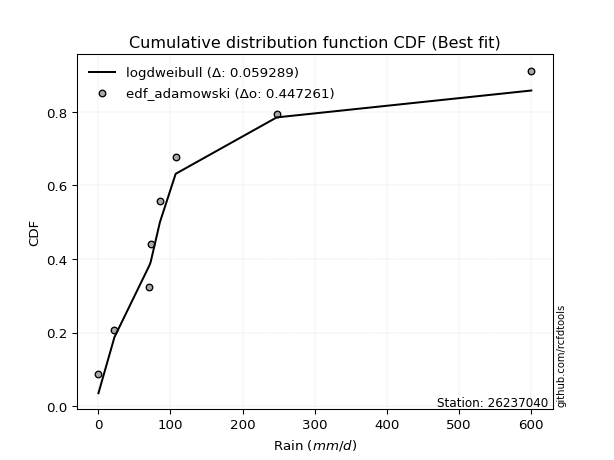</img>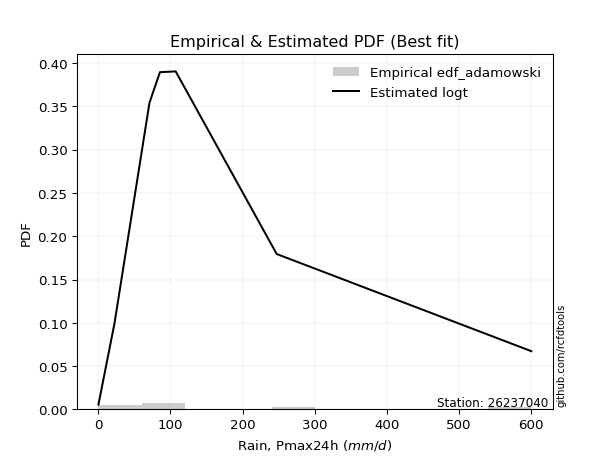</img>

</div>


## C. Best fit & Estimate extreme values for specific return periods - Tr


### 1. Best fit (ordered by delta Δ)

<div align="center">

|   id |   station | empirical_dist   | p_dist         |     delta |   deltao | eval   |   fit |   n |   best_fit |   best_fit_sort |
|-----:|----------:|:-----------------|:---------------|----------:|---------:|:-------|------:|----:|-----------:|----------------:|
|    0 |  26237040 | edf_gringorten   | ncf            | 0.0689655 | 0.447261 | Δo > Δ |     1 |   8 |          1 |               1 |
|    1 |  26237040 | edf_hazen        | ncf            | 0.069595  | 0.447261 | Δo > Δ |     1 |   8 |          1 |               2 |
|    2 |  26237040 | edf_adamowski    | loggenlogistic | 0.0718024 | 0.447261 | Δo > Δ |     1 |   8 |          1 |               3 |
|    3 |  26237040 | edf_chegodayev   | loggenlogistic | 0.0725027 | 0.447261 | Δo > Δ |     1 |   8 |          1 |               4 |
|    4 |  26237040 | edf_beard        | loggenlogistic | 0.0726448 | 0.447261 | Δo > Δ |     1 |   8 |          1 |               5 |
|    5 |  26237040 | edf_jenkinson    | loggenlogistic | 0.0726448 | 0.447261 | Δo > Δ |     1 |   8 |          1 |               6 |
|    6 |  26237040 | edf_filliben     | loggenlogistic | 0.0727518 | 0.447261 | Δo > Δ |     1 |   8 |          1 |               7 |
|    7 |  26237040 | edf_tukey        | loggenlogistic | 0.0729789 | 0.447261 | Δo > Δ |     1 |   8 |          1 |               8 |
|    8 |  26237040 | edf_cunnane      | ncf            | 0.0731707 | 0.447261 | Δo > Δ |     1 |   8 |          1 |               9 |
|    9 |  26237040 | edf_blom         | loggenlogistic | 0.073585  | 0.447261 | Δo > Δ |     1 |   8 |          1 |              10 |
|   10 |  26237040 | edf_weibull      | logloggamma    | 0.0740928 | 0.447261 | Δo > Δ |     1 |   8 |          1 |              11 |
|   11 |  26237040 | edf_california   | invgauss       | 0.0879806 | 0.447261 | Δo > Δ |     1 |   8 |          1 |              12 |

</div>

:file_folder:Tables: [bestfit_26237040.csv](table/bestfit_26237040.csv) | [extreme_26237040.csv](table/extreme_26237040.csv)


### 2. Extreme values

In hydrology, a return period (or recurrence interval $Tr$) is the statistical average time between extreme events like floods or droughts of a specific magnitude, indicating how rare an event is, with a 100-year flood, for example, having a 1% chance of occurring in any given year, not that it happens exactly every century. It is a key tool for infrastructure design (like bridges or dams) and risk assessment, calculated from historical data to determine the probability of future events, although it is important to remember it is statistical average, and events can cluster or be missed.

> risk_rate: assuming the return period as the project useful life.

|   id |      tr |   prob_l |     prob_g |      alpha |   betaprime |     chi2 |   crystalball |    erlang |    expon |   exponnorm |         f |   fatiguelife |        fisk |     gamma |   genexpon |   genlogistic |    gibrat |   gompertz |   gumbel_l |   gumbel_r |   halflogistic |   halfnorm |   hypsecant |   invgamma |   invgauss |       invweibull |   johnsonsu |   kstwobign |   laplace |   laplace_asymmetric |   loggamma |   logistic |    lognorm |   maxwell |     mielke |    moyal |   nakagami |       ncf |        nct |    norm |           pareto |   pearson3 |   rayleigh |    rice |         t |   truncnorm |      wald |   weibull_min |    logalpha |     logbetaprime |          logchi2 |   logcrystalball |   logerlang |         logexpon |   logexponnorm |            logf |   logfatiguelife |        logfisk |      loggenexpon |   loggenlogistic |        loggibrat |   loggompertz |   loggumbel_l |      loggumbel_r |   loghalflogistic |   loghalfnorm |   loghypsecant |   loginvgamma |   loginvgauss |    loginvweibull |   logjohnsonsu |     logkstwobign |   loglaplace |   loglaplace_asymmetric |   logloggamma |   loglogistic |   loglognorm |   logmaxwell |        logmielke |         logmoyal |   lognakagami |        logncf |     lognct |     logpareto |   logpearson3 |   lograyleigh |    logrice |             logt |   logtruncnorm |          logwald |   logweibull_min |   station |   n |   risk_rate |
|-----:|--------:|---------:|-----------:|-----------:|------------:|---------:|--------------:|----------:|---------:|------------:|----------:|--------------:|------------:|----------:|-----------:|--------------:|----------:|-----------:|-----------:|-----------:|---------------:|-----------:|------------:|-----------:|-----------:|-----------------:|------------:|------------:|----------:|---------------------:|-----------:|-----------:|-----------:|----------:|-----------:|---------:|-----------:|----------:|-----------:|--------:|-----------------:|-----------:|-----------:|--------:|----------:|------------:|----------:|--------------:|------------:|-----------------:|-----------------:|-----------------:|------------:|-----------------:|---------------:|----------------:|-----------------:|---------------:|-----------------:|-----------------:|-----------------:|--------------:|--------------:|-----------------:|------------------:|--------------:|---------------:|--------------:|--------------:|-----------------:|---------------:|-----------------:|-------------:|------------------------:|--------------:|--------------:|-------------:|-------------:|-----------------:|-----------------:|--------------:|--------------:|-----------:|--------------:|--------------:|--------------:|-----------:|-----------------:|---------------:|-----------------:|-----------------:|----------:|----:|------------:|
|    0 |    2    | 0.5      | 0.5        |    54.3035 |     32.1977 |  1.56231 |       143.062 |   41.7244 |  99.2247 |      98.489 |   52.8207 |       46.1629 |     85.1857 |   57.4645 |    99.0498 |       106.905 |   86.7249 |    149.382 |    173.897 |    112.228 |        96.8993 |    104.643 |     143.063 |    54.4685 |    52.5378 |   3144           |     41.3543 |     127.797 |   143.063 |              99.0423 |    36.7661 |    143.063 |    38.5034 |   127.01  |    48.466  |  102.274 |    98.4748 |   69.2065 |    53.6868 | 143.063 |      3.7251      |    93.2146 |    121.317 | 146.947 |   59.4198 |     137.243 |   82.2221 |       63.5447 |     34.8659 |     31.7692      |      4.98889     |          38.5034 |     35.1014 |      7.66485     |        38.5029 |    0.621059     |          37.1693 |   0.426136     |     19.0502      |          66.8411 |     19.2701      |       7.84195 |       56.238  |     26.3614      |      21.8362      |       24.0157 |        38.5034 |       34.4825 |       34.2088 |     29.4123      |        69.3948 |     21.4927      |      38.5034 |                 59.3396 |       68.3491 |       38.5034 |      38.8822 |      31.6115 |     30.249       |     23.3266      |       38.6018 |   2.11579     |    38.4543 |   0.257481    |       60.5889 |       29.476  |    38.5047 |     71.0557      |        9.75915 |     18.2326      |      0.469925    |  26237040 |   8 |    0.75     |
|    1 |    2.33 | 0.570815 | 0.429185   |    69.8283 |     44.5511 |  1.95996 |       176.555 |   58.1476 | 121.043  |     120.178 |   76.7189 |       66.0587 |    120.662  |   75.8682 |   120.613  |       128.775 |  103.691  |    176.832 |    203.036 |    143.263 |       128.808  |    140.791 |     169.867 |    70.4083 |    69.0625 | 181462           |     60.659  |     153.798 |   163.331 |             120.856  |    56.1618 |    172.572 |    58.1056 |   161.807 |    65.2303 |  131.653 |   135.857  |   87.4777 |    68.7539 | 176.555 |     10.4586      |   123.607  |    156.629 | 175.579 |   71.368  |     162.491 |  104.184  |       88.9777 |     54.3193 |     54.2949      |     12.401       |          58.1056 |     54.0287 |     17.1155      |        58.1048 |    1.11314      |          56.1229 |   4.03093      |     33.9277      |          91.0397 |     23.7365      |      13.8721  |       80.4484 |     38.5986      |      32.3178      |       37.4436 |        53.5214 |       53.101  |       54.0936 |     52.5483      |        96.0742 |     39.1189      |      49.3914 |                 77.3286 |       94.5753 |       55.3303 |      58.7    |      48.4753 |     53.5974      |     33.467       |       58.2614 |   6.63347     |    58.0614 |   0.418119    |       87.4734 |       45.4874 |    58.1033 |     92.7586      |       16.546   |     23.8802      |      0.789264    |  26237040 |   8 |    0.729209 |
|    2 |    5    | 0.8      | 0.2        |   190.21   |    130.959  |  4.12451 |       301.024 |  158.802  | 230.128  |     228.619 |  234.821  |      211.12   |    463.472  |  179.533  |   229.154  |       223.785 |  201.37   |    294.536 |    297.172 |    278.093 |       273.189  |    293.654 |     277.385 |   192.917  |   189.491  |      8.14342e+12 |    251.359  |     264.244 |   264.668 |             229.92   |   278.565  |    286.513 |   268.154  |   298.765 |   199.04   |  267.737 |   330.589  |  185.865  |   181.008  | 301.024 |   2090.85        |   267.404  |    297.996 | 290.207 |  128.454  |     272.063 |  227.125  |      264.371  |    295.697  |    468.243       |   1674.57        |         268.154  |    276.381  |    950.039       |       268.151  | 1527.8          |         260.306  |   9.63465e+266 |    346.216       |         227.879  |     78.8186      |     128.82    |      255.759  |    202.313       |     190.483       |      244.936  |       200.561  |      274.719  |      321.225  |    653.874       |       249.261  |    497.98        |     171.549  |                173.585  |      244.734  |      224.363  |     271.846  |     260.813  |    638.498       |    178.14        |      269.062  |   4.86339e+06 |   268.599  |   3.94977e+65 |      269.158  |      258.362  |   268.071  |    282.169       |       99.0624  |    108.159       |    115.121       |  26237040 |   8 |    0.67232  |
|    3 |   10    | 0.9      | 0.1        |   411.38   |    251.759  |  6.23121 |       383.593 |  265.855  | 329.153  |     327.058 |  415.096  |      383.531  |   1249.47   |  283.137  |   328.488  |       301.166 |  312.713  |    381.009 |    349.583 |    387.91  |       393.092  |    406.769 |     363.242 |   411.403  |   360.852  |      1.3908e+19  |    644.962  |     348.335 |   356.659 |             328.925  |   825.168  |    370.426 |   739.563  |   395.148 |   443.224  |  386.219 |   493.669  |  288.659  |   377.56   | 383.593 | 260266           |   391.707  |    398.794 | 371.94  |  201.969  |     353.827 |  357.595  |      484.989  |    949.411  |   2261.61        | 190808           |         739.563  |    837.513  |  36409.5         |       739.557  |    3.18226e+13  |         722.182  | inf            |   1827.05        |         377.699  |    309.564       |     563.526   |      486.964  |    779.846       |     831.097       |      983.18   |       575.942  |      846.434  |     1123.77   |   5096.86        |       394.189  |   3454.58        |     531.193  |                341.232  |      390.514  |      629.088  |     752.828  |     852.38   |   4779.57        |    763.809       |      742.564  |   1.19939e+25 |   742.308  | inf           |      469.026  |      891.427  |   739.2    |    785.959       |      233.608   |    537.355       | 601867           |  26237040 |   8 |    0.651322 |
|    4 |   15    | 0.933333 | 0.0666667  |   631.76   |    347.029  |  7.49924 |       424.797 |  332.516  | 387.079  |     384.641 |  531.734  |      494.371  |   2144.99   |  346.147  |   386.877  |       344.822 |  389.512  |    425.199 |    373.319 |    449.868 |       460.946  |    465.634 |     412.239 |   623.414  |   489.287  |      4.5663e+22  |   1032.09   |     392.977 |   410.47  |             386.839  |  1428.78   |    416.145 |  1226.98   |   444.602 |   682.805  |  454.981 |   580.951  |  356.297  |   567.242  | 424.797 |      4.37513e+06 |   462.89   |    450.73  | 414.052 |  265.7    |     395.486 |  441.377  |      638.408  |   1721.92   |   5188.93        |      3.26968e+06 |        1226.98   |   1467.69   | 307247           |      1226.98   |    8.17443e+28  |        1202.63   | inf            |   4311.34        |         482.835  |    795.335       |    1153.48    |      651.855  |   1669.61        |    1913.02        |     2026.44   |      1051.55   |     1500.18   |     2145.5    |  16235.1         |       476.05   |   9659.66        |    1028.94   |                506.707  |      476.303  |     1103.25   |    1252.22   |    1565.01   |  14866.4         |   1777.87        |     1232.45   |   4.80105e+51 |  1232.96   | inf           |      588.457  |     1687.39   |  1226.27   |   1558.53        |      316.295   |   1504.28        |      6.84232e+08 |  26237040 |   8 |    0.644736 |
|    5 |   20    | 0.95     | 0.05       |   851.947  |    428.44   |  8.41042 |       451.78  |  381.119  | 428.178  |     425.497 |  618.638  |      576.085  |   3116.39   |  391.629  |   428.307  |       375.389 |  449.755  |    454.254 |    388.093 |    493.249 |       508.486  |    504.88  |     446.805 |   831.466  |   592.51   |      1.32308e+25 |   1404.19   |     423.049 |   448.65  |             427.929  |  2052.19   |    447.745 |  1709.32   |   477.422 |   919.511  |  503.679 |   639.577  |  408.156  |   752.963  | 451.78  |      3.24003e+07 |   512.902  |    485.25  | 442.042 |  325.078  |     422.489 |  503.812  |      757.537  |   2555.46   |   9085.56        |      2.51143e+07 |        1709.32   |   2125.26   |      1.39537e+06 |      1709.31   |    9.17352e+48  |        1679.95   | inf            |   7631.99        |         567.999  |   1667.27        |    1826.27    |      781.605  |   2845.11        |    3430.8         |     3282.08   |      1607.96   |     2190.94   |     3303.12   |  36538.2         |       532.059  |  19310.1         |    1644.82   |                670.788  |      536.954  |     1626.64   |    1747.76   |    2342.32   |  32897           |   3234.1         |     1717.41   |   3.72922e+85 |  1719.03   | inf           |      671.455  |     2578.78   |  1708.22   |   2682.37        |      369.498   |   3239.53        |      2.6766e+11  |  26237040 |   8 |    0.641514 |
|    6 |   25    | 0.96     | 0.04       |  1072.06   |    500.81   |  9.12267 |       471.644 |  419.439  | 460.057  |     457.187 |  688.209  |      640.883  |   4147.21   |  427.278  |   460.046  |       398.933 |  499.977  |    475.638 |    398.607 |    526.664 |       545.114  |    534.08  |     473.556 |  1036.65   |   679.157  |      1.0423e+27  |   1761.37   |     445.574 |   478.264 |             459.802  |  2682.52   |    471.919 |  2181.79   |   501.788 |  1154.13   |  541.425 |   683.329  |  450.792  |   935.872  | 471.644 |      1.53119e+08 |   551.46   |    510.898 | 462.839 |  381.707  |     441.992 |  553.82   |      855.622  |   3425.94   |  13837.1         |      1.23432e+08 |        2181.79   |   2795.02   |      4.51287e+06 |      2181.78   |    2.31197e+73  |        2148.92   | inf            |  11668.3         |         641.291  |   3090.22        |    2547.81    |      889.38   |   4289.45        |    5380.71        |     4698.52   |      2233.66   |     2901.32   |     4556.7    |  68250.4         |       574.177  |  32442.3         |    2366.69   |                833.84   |      583.79   |     2189.19   |    2234.17   |    3159.82   |  60647.9         |   5142.41        |     2192.6    |   1.4818e+126 |  2195.54   | inf           |      734.098  |     3534.03   |  2180.3    |   4253.54        |      406.185   |   5988.68        |      4.91195e+13 |  26237040 |   8 |    0.639603 |
|    7 |   50    | 0.98     | 0.02       |  2172.26   |    789.135  | 11.3598  |       528.525 |  541.262  | 559.081  |     555.627 |  915.321  |      848.348  |   9929.86   |  539.674  |   558.411  |       471.462 |  677.011  |    536.569 |    427.146 |    629.599 |       657.969  |    618.955 |     556.495 |  2035.37   |   982.064  |      7.24292e+32 |   3370.5    |     511.719 |   570.255 |             558.807  |  5811.74   |    545.778 |  4388.66   |   572.453 |  2307.46   |  658.605 |   810.788  |  598.211  |  1824.12   | 528.525 |      1.90617e+10 |   670.17   |    585.349 | 523.208 |  641.789  |     494.421 |  717.098  |     1190.77   |   8027.69   |  48008.6         |      1.82291e+10 |        4388.66   |   6165.83   |      1.72952e+08 |      4388.64   |    4.24177e+254 |        4352.08   | inf            |  40049.1         |         919.506  |  27204.4         |    6438.75    |     1262.91   |  15193.8         |   21529.5         |    13330.6    |      6188.45   |     6546.84   |    11674      | 467769           |       697.193  | 148862           |    7328.34   |               1639.15   |      727.794  |     5424.92   |    4515.21   |    7528.95   | 399048           |  21699           |     4413.38   | inf           |  4424.64   | inf           |      915.533  |     8821.47   |  4385.12   |  23568.8         |      492.489   |  44523.9         |      1.58959e+22 |  26237040 |   8 |    0.63583  |
|    8 |   75    | 0.986667 | 0.0133333  |  3272.31   |   1013.96   | 12.6824  |       559.045 |  614.101  | 617.007  |     613.21  | 1055.33   |      973.102  |  16441.9    |  606.364  |   616.8    |       513.619 |  796.58   |    568.926 |    441.578 |    689.43  |       723.572  |    665.157 |     604.964 |  3006.04   |  1180.59   |      1.80078e+36 |   4774.4    |     548.112 |   624.066 |             616.721  |  8832.71   |    588.436 |  6385.42   |   610.873 |  3440.41   |  727.129 |   880.195  |  696.238  |  2685.49   | 559.045 |      3.20431e+11 |   739.006  |    625.854 | 556.051 |  880.248  |     519.235 |  817.571  |     1407.41   |  12772.8    |  95887           |      3.48215e+11 |        6385.42   |   9465.54   |      1.45948e+09 |      6385.41   |  inf            |        6357.99   | inf            |  78377.9         |        1127.04   | 118211           |   10413.9     |     1507.93   |  31689.9         |   48204.7         |    23517.1    |     11225.7    |    10192      |    19573.6    |      1.43187e+06 |       763.617  | 344216           |   14195.2    |               2434.03   |      810.869  |     9162.57   |    6588      |   12071      |      1.19269e+06 |  50360.1         |     6423.92   | inf           |  6444.74   | inf           |     1010.9    |    14510.1    |  6379.85   |  82153.1         |      525.706   | 153013           |      1.84498e+28 |  26237040 |   8 |    0.634587 |
|    9 |  100    | 0.99     | 0.01       |  4372.32   |   1205.39   | 13.6259  |       579.688 |  666.354  | 658.106  |     654.066 | 1157.7    |     1062.81   |  23473.4    |  654.024  |   657.988  |       543.456 |  889.205  |    590.628 |    451.018 |    731.775 |       770.004  |    696.632 |     639.346 |  3958.95   |  1329.93   |      4.55722e+38 |   6042.26   |     573.047 |   662.246 |             657.812  | 11740.7    |    618.553 |  8228.86   |   637.042 |  4560.42   |  775.744 |   927.444  |  771.725  |  3529.92   | 579.688 |      2.37297e+12 |   787.624  |    653.448 | 578.426 | 1105.98   |     534.204 |  890.826  |     1570.02   |  17539.9    | 154589           |      2.85231e+12 |        8228.86   |  12669.5    |      6.62827e+09 |      8228.85   |  inf            |        8217.37   | inf            | 123862           |        1299.57   | 368896           |   14319.8     |     1693.37   |  53318.4         |   85280.6         |    34620.4    |     17126.7    |    13782.1    |    27898.3    |      3.16072e+06 |       808.323  | 611309           |   22691.9    |               3222.22   |      869.269  |    13265.5    |    8506.98   |   16648.7    |      2.58852e+06 |  91516.4         |     8280.78   | inf           |  8311.62   | inf           |     1073.42   |    20366.5    |  8221.31   | 228794           |      543.257   | 376376           |      1.19478e+33 |  26237040 |   8 |    0.633968 |
|   10 |  200    | 0.995    | 0.005      |  8772.26   |   1805.71   | 15.9137  |       626.513 |  793.871  | 757.131  |     752.505 | 1414.27   |     1282.29   |  55143.7    |  769.83   |   756.595  |       615.186 | 1141.2    |    639.209 |    471.536 |    833.578 |       881.633  |    768.618 |     722.174 |  7664.05   |  1715.29   |      2.73104e+44 |  10308.7    |     630.478 |   754.237 |             756.817  | 22490.3    |    690.8   | 14628.4    |   696.913 |  8962.5    |  892.874 |  1035.34   |  976.342  |  6806.42   | 626.513 |      2.95409e+14 |   904.13   |    716.588 | 629.623 | 1936.97   |     561.739 | 1073.3    |     1991.2    |  36348.5    | 470297           |      4.65999e+14 |       14628.4    |  24665.6    |      2.54023e+11 |     14628.4    |  inf            |       14711.7    | inf            | 353112           |        1824.04   |      8.15764e+06 |   28909.3     |     2178.9    | 186250           |  336125           |    83839.7    |     47385.5    |    27525.4    |    63246.3    |      2.12086e+07 |       908.169  |      2.29487e+06 |   70264.4    |               6334.18   |     1008.13   |    32227.9    |   15196.8    |   34741.8    |      1.66742e+07 | 385927           |    14730.5    | inf           | 14802.2    | inf           |     1206.66   |    44241.3    | 14613.4    |      4.85974e+06 |      570.838   |      3.54237e+06 |      2.96444e+46 |  26237040 |   8 |    0.633042 |
|   11 |  250    | 0.996    | 0.004      | 10972.2    |   2050.6    | 16.654   |       640.822 |  835.342  | 789.01   |     784.196 | 1499.79   |     1353.79   |  72540      |  807.364  |   789.303  |       638.246 | 1231.62   |    653.858 |    477.573 |    866.306 |       917.521  |    790.764 |     748.837 |  9474.5    |  1846.23   |      1.96676e+46 |  12136.8    |     648.251 |   783.852 |             788.689  | 27466.5    |    713.994 | 17440.2    |   715.343 | 11132.6    |  930.581 |  1068.47   | 1049.77   |  8404.75   | 640.822 |      1.39606e+15 |   941.471  |    736.023 | 645.382 | 2325.35   |     568.282 | 1133.66   |     2135.42   |  45533.1    | 666151           |      2.42175e+15 |       17440.2    |  30276.1    |      8.21558e+11 |     17440.2    |  inf            |       17579.9    | inf            | 487557           |        2032.68   |      2.47761e+07 |   35636.5     |     2346.67   | 278442           |  522390           |   110058      |     65753.9    |    34073.8    |    81552.2    |      3.91105e+07 |       938.065  |      3.45582e+06 |  101102      |               7873.87   |     1052.29   |    42854.6    |   18146.6    |   43570.7    |      3.0347e+07  | 613350           |    17565.8    | inf           | 17657.6    | inf           |     1244.5    |    56174.2    | 17421.8    |      1.60827e+07 |      576.542   |      7.43725e+06 |      2.20392e+51 |  26237040 |   8 |    0.632858 |
|   12 |  500    | 0.998    | 0.002      | 21971.9    |   3024.09   | 18.9632  |       683.257 |  965.242  | 888.034  |     882.635 | 1774.36   |     1578.02   | 169780      |  924.608  |   887.91   |       709.821 | 1544.1    |    696.701 |    494.879 |    967.887 |      1028.91   |    856.793 |     831.659 | 18288      |  2271.5    |      1.14501e+52 |  19694.9    |     701.514 |   875.843 |             887.694  | 49856      |    785.927 | 29375.3    |   770.338 | 21805.8    | 1047.71  |  1167.07   | 1304.65   | 16170.5    | 683.257 |      1.73795e+17 |  1057.03   |    794.014 | 692.404 | 4122.1    |     582.843 | 1325.61   |     2609.39   |  89464.5    |      1.91327e+06 |      4.12938e+17 |       29375.3    |  55806.1    |      3.14856e+13 |     29375.3    |  inf            |       29824.1    | inf            |      1.27716e+06 |        2841.37   |      1.15194e+09 |   65299       |     2902.67   | 970004           |       2.05284e+06 |   247713      |    181912      |    64526.2    |   175295      |      2.61349e+08 |      1024.49   |      1.17858e+07 |  313057      |              15478.3    |     1187.84   |   103712      |   30716.9    |   85634.8    |      1.94674e+08 |      2.58643e+06 |    29606.6    | inf           | 29794.3    | inf           |     1347.61   |   114544      | 29341.7    |      1.54257e+09 |      588.145   |      7.86402e+07 |      1.90001e+68 |  26237040 |   8 |    0.632489 |
|   13 |  750    | 0.998667 | 0.00133333 | 32971.7    |   3782.08   | 20.32    |       706.83  | 1041.89   | 945.96   |     940.218 | 1941.19   |     1710.48   | 279030      |  993.59   |   946.057  |       751.663 | 1750.76   |    720.097 |    504.128 |   1027.27  |      1094.02   |    893.681 |     880.107 | 26854.4    |  2531.82   |      2.68569e+55 |  25772.2    |     731.436 |   929.654 |             945.608  | 69583.7    |    827.952 | 39243.5    |   801.097 | 32294.2    | 1116.22  |  1222.02   | 1474.7    | 23702.9    | 706.83  |      2.92152e+18 |  1124.36   |    826.442 | 718.698 | 5775.72   |     588.226 | 1440.69   |     2904.46   | 130822      |      3.48893e+06 |      8.44402e+18 |       39243.5    |  78572.5    |      2.65696e+14 |     39243.6    |  inf            |       40011.8    | inf            |      2.18882e+06 |        3453.98   |      1.45929e+10 |   90560.2     |     3252      |      2.0121e+06  |       4.56896e+06 |   389744      |    329896      |    92340.2    |   270151      |      7.93365e+08 |      1070.83   |      2.34789e+07 |  606402      |              22984.3    |     1266.03   |   173812      |   41155.5    |  124963      |      5.7701e+08  |      6.00199e+06 |    39567.8    | inf           | 39844.2    | inf           |     1398.64   |   170612      | 39196.6    |      4.59988e+10 |      592.071   |      3.23407e+08 |      3.07153e+79 |  26237040 |   8 |    0.632366 |
|   14 | 1000    | 0.999    | 0.001      | 43971.4    |   4427.09   | 21.285   |       723.06  | 1096.52   | 987.059  |     981.074 | 2062.34   |     1804.95   | 396884      | 1042.69   |   987.002  |       781.343 | 1908.9    |    736.031 |    510.353 |   1069.39  |      1140.21   |    919.156 |     914.481 | 35264.3    |  2721.09   |      6.60241e+57 |  31014.6    |     752.166 |   967.834 |             986.699  | 87618.3    |    857.755 | 47903.9    |   822.357 | 42664.5    | 1164.83  |  1259.91   | 1605.84   | 31087.8    | 723.06  |      2.16355e+19 |  1172.03   |    848.851 | 736.868 | 7342.77   |     591.036 | 1523.48   |     3121.62   | 170288      |      5.3088e+06  |      7.21941e+19 |       47903.9    |  99543.4    |      1.20666e+15 |     47904      |  inf            |       48989      | inf            |      3.17637e+06 |        3966.43   |      1.01857e+11 |  112998       |     3510.49   |      3.37614e+06 |       8.05908e+06 |   532982      |    503265      |   118367      |   364991      |      1.74403e+09 |      1101.97   |      3.78479e+07 |  969367      |              30427.1    |     1321.03   |   250674      |   50342.2    |  162264      |      1.2471e+09  |      1.09066e+07 |    48313.1    | inf           | 48672.5    | inf           |     1431.12   |   224690      | 47845      |      7.62517e+11 |      594.045   |      8.9432e+08  |      1.09473e+88 |  26237040 |   8 |    0.632305 |

<div align="center">

</img>

</div>


<div align="center">

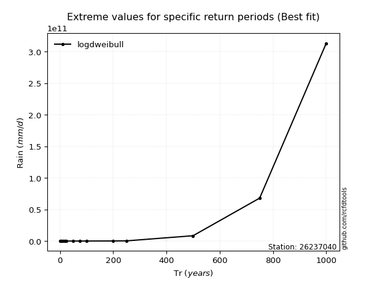</img>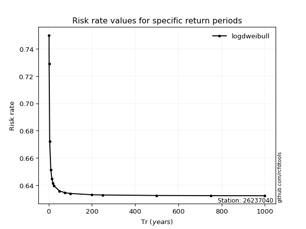</img>

</div>


<sub>**APP DISCLAIMER**: NO WARRANTY - This software is provided by [github.com/rcfdtools](https://github.com/rcfdtools) "as is", without any express or implied warranty, including warranties of merchantability, fitness for a particular purpose, or non-infringement. There is no guarantee that the software will be error-free or operate without interruption. LIMITATION OF LIABILITY - Neither the authors nor copyright holders will be liable for claims or damages arising from the software or its use. You are responsible for determining if the software is appropriate for your use and assume all associated risks, including errors, legal compliance, and data loss. NO PROFESSIONAL ADVICE - The software provides general information and does not offer professional advice. It should not replace consultation with professional advisors.</sub>