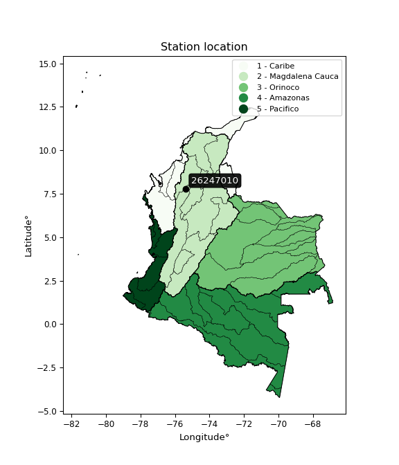

<div align="center">


</div>

# PMP Station (Rain, Pmax24h): 26247010

Probable Maximum Precipitation (PMP) is the greatest amount of rainfall for a specific duration that is meteorologically possible for a given location, acting as a "worst-case" scenario for extreme storms, crucial for designing safety-critical infrastructure like bridges, river deviations, dams, spillways, and nuclear plants to prevent catastrophic failure. PMP is calculated by hydrologists using meteorological data to determine the upper limit of extreme rainfall, often leading to the Probable Maximum Flood (PMF) for flood control design, and is increasingly being studied for climate change impacts. Probable Maximum Precipitation (PMP) is the theoretical upper limit of rainfall, a deterministic estimate for extreme events, while probability distributions (like GEV, Gumbel) describe the likelihood and frequency of various precipitation amounts, including rare ones, showing how often events occur, with PMP representing the extreme end of these distributions, used for critical infrastructure design to ensure safety against the worst conceivable weather, unlike standard statistical forecasts which cover typical probabilities.

The most common probability distributions in hydrology, used for analyzing floods, rainfall, and streamflow, include the Normal, Log-Normal, Gumbel, Gamma (including Log-Pearson Type III), and Generalized Extreme Value (GEV) distributions, often chosen based on the data´s skewness and whether modeling extremes or general conditions, with Gumbel and GEV popular for extreme events like floods, while the Normal distribution serves as a baseline, though often requiring transformations for skewed hydrological data. These distributions help in designing water infrastructure, managing water resources, and forecasting hydrologic events.

> Hydrological data often isn´t perfectly normal (it´s skewed), so different distributions are needed for different applications, such as: **Flood Frequency Analysis**: Using Gumbel, GEV, or Log-Pearson Type III for predicting extreme flood magnitudes and their return periods, **Rainfall Analysis**: Normal for annual totals, but Log-Normal, Weibull, or GEV for intensity or extreme daily rainfall, **Streamflow Modeling**: Gamma and Log-Normal for maximum flows, GEV for minimum flows, and Kappa for daily flows.

<div align="center">

</img>

</div>


## A. General information


### 1. General running parameters

• app_version: _v20260108_. • runtime: _2026-01-08 13:24:42.400241_. • Python version: _3.14.0_. • SciPy version: _1.16.3_. • Pandas version: _2.3.3_. • NumPy version: _2.3.5_. • Stations dataset (station_dataset_file): _dataset/pmax24h_in/automatic_colombia_2003_2024.csv_. • Stations catalog (station_catalog_file): _dataset/CNE.xls_. • Minimum year to eval til year_max (date_min): _1900_. • Maximum year to eval since year_min (date_max): _2024_. • Creates, save and include plots into reports (create_plot): _False_. • Plot only fit distributions with Δo > Δ (plot_only_fit): _True_. • Plot only simple graphs avoiding multiple CDFs and multiple Extreme values plots (plot_only_simple): _True_. • Eval low extreme values, if False, evaluates high extreme values (low_extreme): _False_. • Eval every SciPy distribution as logarithmic (pdist_logarithmic_on): _True_. • Standard deviation normalized (ddof): _1.0_. • Return periods to eval in years (Tr): _[2, 2.33, 5, 10, 15, 20, 25, 50, 75, 100, 200, 250, 500, 750, 1000]_. • Minimum data sample per station, 0 means any (minimum_sample): _5_. • Z-Score maximum threshold to adjust a value, 0 means disable (zscore_max): _3.5_. • Z-Score minimum threshold to adjust a value, 0 means disable (zscore_min): _-2.5_. • Avoid zeros, e.g. rain = 0 (avoid_zeros): _True_. • Avoid null values (avoid_nans): _True_. 

:file_folder:Table: [dataset.csv](../../dataset/pmax24h_in/automatic_colombia_2003_2024.csv)

> Delta Degrees of Freedom (DDOF): is a parameter used in the formulas for calculating variance and standard deviation. When ddof=0, the divisor is $N$ (the total number of observations) and this is used when your data set is the entire population. When ddof=1, the divisor is $N-1$ and this is used when your data set is a sample drawn from a larger population. Using $N-1$ provides an unbiased estimate of the population variance (known as Bessel´s correction).


### 2. Station info and location

|   id |   CODIGO | NOMBRE                      | CATEGORIA    | TECNOLOGIA                | ESTADO   | FECHA_INSTALACION   |   FECHA_SUSPENSION |   ALTITUD |   LATITUD |   LONGITUD | DEPARTAMENTO   | MUNICIPIO   | AREA_OPERATIVA                      | ENTIDAD                                                     | AREA_HIDROGRAFICA   | ZONA_HIDROGRAFICA   | SUBZONA_HIDROGRAFICA   | CORRIENTE   | Catalogo   |   Version |
|-----:|---------:|:----------------------------|:-------------|:--------------------------|:---------|:--------------------|-------------------:|----------:|----------:|-----------:|:---------------|:------------|:------------------------------------|:------------------------------------------------------------|:--------------------|:--------------------|:-----------------------|:------------|:-----------|----------:|
|    0 | 26247010 | HACIENDA PALMIRA [26247010] | Limnigráfica | Automática con Telemetría | Activa   | 15/09/1971          |                nan |        80 |   7.79678 |   -75.3725 | Antioquia      | Cáceres     | Area Operativa 01 - Antioquia-Chocó | INSTITUTO DE HIDROLOGIA METEOROLOGIA Y ESTUDIOS AMBIENTALES | Magdalena Cauca     | Cauca               | Río Taraza - Río Man   | Man         | CNE_IDEAM  |  20251226 |

<div align="center">

Dynamic map: [:earth_americas:Google](http://maps.google.com/maps?q=7.796777778,-75.37252778) [:earth_americas:OSM](https://www.openstreetmap.org/#map=18/7.796777778/-75.37252778&layers=P) [:earth_americas:Bing](https://www.bing.com/maps?cp=7.796777778~-75.37252778&lvl=18) [:earth_americas:Apple](https://maps.apple.com/frame?center=7.796777778%2C-75.37252778&span=0.003%2C0.006)

</div>


<div align="center">

```geojson
{
  "type": "Feature",
  "geometry": {
    "type": "Point", 
    "coordinates": [-75.37252778, 7.796777778]
  }, 
  "properties": {
    "Name": "26247010"
  }
}
```

</div>


### 3. Discrete values table and plot

<div align="center">

|               |          0 |           1 |           2 |           3 |           4 |
|:--------------|-----------:|------------:|------------:|------------:|------------:|
| Date          | 2019       | 2020        | 2021        | 2022        | 2024        |
| Value         | 1445.1     |  372.5      |  670.8      |    6        |  168        |
| Value_initial | 1445.1     |  372.5      |  670.8      |    6        |  168        |
| count         |    5       |    5        |    5        |    5        |    5        |
| mean          |  532.48    |  532.48     |  532.48     |  532.48     |  532.48     |
| std           |  567.369   |  567.369    |  567.369    |  567.369    |  567.369    |
| zscore        |    1.60851 |   -0.281968 |    0.243792 |   -0.927933 |   -0.642404 |


</div>


> The initial value (value_initial) correspond to the initial obtained or null completed value, and value (value) is adjusted only when the initial value is outside the valid range (outlier) definite through the Z-Score value. If Z-Score is active, values out of range or outliers are replaced with the station mean value. A Z-Score (or standard score) measures how many standard deviations a data point is from the mean of a dataset, indicating its relative position; positive scores mean above the mean, negative mean below, and a score of zero is exactly at the mean, allowing for comparison of values from different distributions. It´s calculated using the formula $z=(x–μ)/σ$, where $x$ is the data point, $μ$ is the mean, and $σ$ is the standard deviation, helping identify outliers and understand probability.
>
> <sub>**Note**: In this study, "completing" (filling gaps in) and "extending" (forecasting or lengthening the historical record) rainfall data series are avoided for certain critical analyses because they introduce artificial bias and uncertainty, which can distort the statistics of rare events (extremes), alter day-to-day variability, and compromise the integrity and homogeneity of the original data. Some reasons against Completing/Extending rainfall data are: **Distortion of Extremes and Variability**: The primary issue is that most gap-filling or extension methods rely on averaging or regression with nearby stations, which inherently smooths the data. Rainfall is highly variable in space and time, with a large percentage of zero values and occasional large storms. Infilling methods often underestimate the highest values and overestimate the lowest (zero) values, which severely distorts analyses focused on flood frequency, drought severity, and intensity-duration-frequency (IDF) curves, **Loss of Data Homogeneity**: Infilled or extended data are synthetic estimates, not actual measurements. Combining these estimates with observed data can violate the assumption of data homogeneity, which requires that the data properties do not change over time. Inhomogeneity can lead to incorrect conclusions about long-term trends or changes in climate patterns, **Propagation of Errors**: Errors and biases from the original data (e.g., wind-induced undercatch, instrument errors, site changes) or the data used for imputation can propagate through the analysis, leading to unreliable hydrological models and inaccurate predictions, **Compromised Statistical Integrity**: For statistical analyses, especially those involving the frequency of events, using artificial data can introduce time bias or autocorrelation that doesn´t exist in reality, making it difficult to assess the true probability of events, **Difficulty in Validation**: It is difficult to accurately validate the quality of filled or extended data, especially for past periods where ground-truth measurements are unavailable. The reliability of imputation techniques heavily depends on the density of the surrounding station network and the complexity of the local topography.</sub>


### 4. Active continuous probability distributions from SciPy (43 of 104 available)

A Probability Density Function (PDF) describes the relative likelihood of a continuous random variable falling within a specific range, where the total area under its curve equals 1, and the area over any interval gives the actual probability for that range. Unlike discrete probabilities (like rolling a die), a PDF shows density, not direct probability for a single point (which is zero), with higher points indicating higher likelihood, often visualized as a bell curve for normal distributions.

A log of a probability density function (log-PDF) is simply the logarithm of the PDF´s value, denoted as $log(f(x))$, useful for converting multiplication of probabilities into addition, improving numerical stability with tiny numbers, and connecting to information theory concepts like entropy. Instead of dealing with very small probabilities (e.g., 0.000001), log-PDFs use negative numbers (e.g., $log(0.00001) ≈ -11.51$ that are easier for computers to handle, preventing underflow errors and simplifying complex calculations. In this study, each active probability distribution from SciPy is also evaluated in the $log$ form.

[scipy.stats](https://docs.scipy.org/doc/scipy/reference/stats.html) is a Python´s powerful submodule within the SciPy library for comprehensive statistical analysis, offering over 130 probability distributions (like Normal, Poisson), functions for descriptive stats (mean, variance), hypothesis testing (t-tests, chi-square), random variable generation, and statistical tests, making it essential for data science, modeling, and research. It provides tools to explore, model, and draw conclusions from data efficiently, working seamlessly with NumPy.

<div align="center">

|   id | p_dist             |   n_parameter | fit_method   | label                                                                       | active   | ref                                                                                                        |
|-----:|:-------------------|--------------:|:-------------|:----------------------------------------------------------------------------|:---------|:-----------------------------------------------------------------------------------------------------------|
|    0 | alpha              |             3 | MLE          | Alpha                                                                       | True     | [:mortar_board:](https://docs.scipy.org/doc/scipy/reference/generated/scipy.stats.alpha.html)              |
|    1 | betaprime          |             4 | MLE          | Beta prime                                                                  | True     | [:mortar_board:](https://docs.scipy.org/doc/scipy/reference/generated/scipy.stats.betaprime.html)          |
|    2 | chi2               |             3 | MLE          | Chi²                                                                        | True     | [:mortar_board:](https://docs.scipy.org/doc/scipy/reference/generated/scipy.stats.chi2.html)               |
|    3 | crystalball        |             4 | MLE          | Crystalball                                                                 | True     | [:mortar_board:](https://docs.scipy.org/doc/scipy/reference/generated/scipy.stats.crystalball.html)        |
|    4 | erlang             |             3 | MLE          | Erlang                                                                      | True     | [:mortar_board:](https://docs.scipy.org/doc/scipy/reference/generated/scipy.stats.erlang.html)             |
|    5 | expon              |             2 | MLE          | Exponential                                                                 | True     | [:mortar_board:](https://docs.scipy.org/doc/scipy/reference/generated/scipy.stats.expon.html)              |
|    6 | exponnorm          |             3 | MLE          | Exponentially modified Normal                                               | True     | [:mortar_board:](https://docs.scipy.org/doc/scipy/reference/generated/scipy.stats.exponnorm.html)          |
|    7 | f                  |             4 | MLE          | F                                                                           | True     | [:mortar_board:](https://docs.scipy.org/doc/scipy/reference/generated/scipy.stats.f.html)                  |
|    8 | fatiguelife        |             3 | MLE          | Fatigue-life (Birnbaum-Saunders)                                            | True     | [:mortar_board:](https://docs.scipy.org/doc/scipy/reference/generated/scipy.stats.fatiguelife.html)        |
|    9 | fisk               |             3 | MLE          | Fisk                                                                        | True     | [:mortar_board:](https://docs.scipy.org/doc/scipy/reference/generated/scipy.stats.fisk.html)               |
|   10 | gamma              |             3 | MLE          | Gamma                                                                       | True     | [:mortar_board:](https://docs.scipy.org/doc/scipy/reference/generated/scipy.stats.gamma.html)              |
|   11 | genexpon           |             5 | MLE          | Generalized exponential                                                     | True     | [:mortar_board:](https://docs.scipy.org/doc/scipy/reference/generated/scipy.stats.genexpon.html)           |
|   12 | genlogistic        |             3 | MLE          | Generalized logistic                                                        | True     | [:mortar_board:](https://docs.scipy.org/doc/scipy/reference/generated/scipy.stats.genlogistic.html)        |
|   13 | gibrat             |             2 | MM           | Gibrat                                                                      | True     | [:mortar_board:](https://docs.scipy.org/doc/scipy/reference/generated/scipy.stats.gibrat.html)             |
|   14 | gompertz           |             3 | MLE          | Gompertz (or truncated Gumbel)                                              | True     | [:mortar_board:](https://docs.scipy.org/doc/scipy/reference/generated/scipy.stats.gompertz.html)           |
|   15 | gumbel_l           |             2 | MM           | Gumbel Left Skew                                                            | True     | [:mortar_board:](https://docs.scipy.org/doc/scipy/reference/generated/scipy.stats.gumbel_l.html)           |
|   16 | gumbel_r           |             2 | MM           | Gumbel Right Skew                                                           | True     | [:mortar_board:](https://docs.scipy.org/doc/scipy/reference/generated/scipy.stats.gumbel_r.html)           |
|   17 | halflogistic       |             2 | MM           | Half-logistic                                                               | True     | [:mortar_board:](https://docs.scipy.org/doc/scipy/reference/generated/scipy.stats.halflogistic.html)       |
|   18 | halfnorm           |             2 | MM           | Half Normal                                                                 | True     | [:mortar_board:](https://docs.scipy.org/doc/scipy/reference/generated/scipy.stats.halfnorm.html)           |
|   19 | hypsecant          |             2 | MM           | hyperbolic secant                                                           | True     | [:mortar_board:](https://docs.scipy.org/doc/scipy/reference/generated/scipy.stats.hypsecant.html)          |
|   20 | invgamma           |             3 | MLE          | Inverted gamma                                                              | True     | [:mortar_board:](https://docs.scipy.org/doc/scipy/reference/generated/scipy.stats.invgamma.html)           |
|   21 | invgauss           |             3 | MLE          | Inverse Gaussian                                                            | True     | [:mortar_board:](https://docs.scipy.org/doc/scipy/reference/generated/scipy.stats.invgauss.html)           |
|   22 | invweibull         |             3 | MLE          | Inverted Weibull                                                            | True     | [:mortar_board:](https://docs.scipy.org/doc/scipy/reference/generated/scipy.stats.invweibull.html)         |
|   23 | kstwobign          |             2 | MLE          | Limiting distribution of scaled Kolmogorov-Smirnov two-sided test statistic | True     | [:mortar_board:](https://docs.scipy.org/doc/scipy/reference/generated/scipy.stats.kstwobign.html)          |
|   24 | laplace            |             2 | MM           | Laplace                                                                     | True     | [:mortar_board:](https://docs.scipy.org/doc/scipy/reference/generated/scipy.stats.laplace.html)            |
|   25 | laplace_asymmetric |             3 | MLE          | Asymmetric Laplace                                                          | True     | [:mortar_board:](https://docs.scipy.org/doc/scipy/reference/generated/scipy.stats.laplace_asymmetric.html) |
|   26 | loggamma           |             3 | MLE          | Log gamma                                                                   | True     | [:mortar_board:](https://docs.scipy.org/doc/scipy/reference/generated/scipy.stats.loggamma.html)           |
|   27 | logistic           |             2 | MM           | Logistic (or Sech-squared)                                                  | True     | [:mortar_board:](https://docs.scipy.org/doc/scipy/reference/generated/scipy.stats.logistic.html)           |
|   28 | lognorm            |             3 | MLE          | Log Normal                                                                  | True     | [:mortar_board:](https://docs.scipy.org/doc/scipy/reference/generated/scipy.stats.lognorm.html)            |
|   29 | maxwell            |             2 | MM           | Maxwell                                                                     | True     | [:mortar_board:](https://docs.scipy.org/doc/scipy/reference/generated/scipy.stats.maxwell.html)            |
|   30 | mielke             |             4 | MLE          | Mielke Beta-Kappa / Dagum                                                   | True     | [:mortar_board:](https://docs.scipy.org/doc/scipy/reference/generated/scipy.stats.mielke.html)             |
|   31 | moyal              |             2 | MM           | Moyal                                                                       | True     | [:mortar_board:](https://docs.scipy.org/doc/scipy/reference/generated/scipy.stats.moyal.html)              |
|   32 | nakagami           |             3 | MLE          | Nakagami                                                                    | True     | [:mortar_board:](https://docs.scipy.org/doc/scipy/reference/generated/scipy.stats.nakagami.html)           |
|   33 | ncf                |             5 | MLE          | Non-central F distribution                                                  | True     | [:mortar_board:](https://docs.scipy.org/doc/scipy/reference/generated/scipy.stats.ncf.html)                |
|   34 | nct                |             4 | MLE          | Non-central Student’s t                                                     | True     | [:mortar_board:](https://docs.scipy.org/doc/scipy/reference/generated/scipy.stats.nct.html)                |
|   35 | norm               |             2 | MM           | Normal                                                                      | True     | [:mortar_board:](https://docs.scipy.org/doc/scipy/reference/generated/scipy.stats.norm.html)               |
|   36 | pearson3           |             3 | MM           | Pearson type III                                                            | True     | [:mortar_board:](https://docs.scipy.org/doc/scipy/reference/generated/scipy.stats.pearson3.html)           |
|   37 | rayleigh           |             2 | MM           | Rayleigh                                                                    | True     | [:mortar_board:](https://docs.scipy.org/doc/scipy/reference/generated/scipy.stats.rayleigh.html)           |
|   38 | rice               |             3 | MLE          | Rice                                                                        | True     | [:mortar_board:](https://docs.scipy.org/doc/scipy/reference/generated/scipy.stats.rice.html)               |
|   39 | t                  |             3 | MLE          | Student’s t                                                                 | True     | [:mortar_board:](https://docs.scipy.org/doc/scipy/reference/generated/scipy.stats.t.html)                  |
|   40 | truncnorm          |             4 | MLE          | Truncated normal                                                            | True     | [:mortar_board:](https://docs.scipy.org/doc/scipy/reference/generated/scipy.stats.truncnorm.html)          |
|   41 | wald               |             2 | MM           | Wald                                                                        | True     | [:mortar_board:](https://docs.scipy.org/doc/scipy/reference/generated/scipy.stats.wald.html)               |
|   42 | weibull_min        |             3 | MLE          | Weibull minimum                                                             | True     | [:mortar_board:](https://docs.scipy.org/doc/scipy/reference/generated/scipy.stats.weibull_min.html)        |

</div>

> **n_parameter:** # arguments & localization & scale.
>
> **Fit methods:** (MLE) maximum likelihood, (MM) L-moments.
>
>**Inactive** (With the only purpose of prevent loops, zero divisions, infinite values, over high estimated values or horizontal trending for recurrence intervals estimations, the follow distributions were disabled.)**:** foldnorm, gennorm, norminvgauss, powernorm, powerlognorm, skewnorm, genextreme, anglit, arcsine, argus, beta, bradford, burr, burr12, cauchy, cosine, halfcauchy, foldcauchy, skewcauchy, wrapcauchy, dgamma, gengamma, exponweib, exponpow, truncexpon, gausshyper, genhalflogistic, genhyperbolic, geninvgauss, halfgennorm, johnsonsb, johnsonsu, kappa4, kappa3, ksone, kstwo, loglaplace, levy, levy_l, levy_stable, ncx2, pareto, genpareto, truncpareto, lomax, powerlaw, rdist, rel_breitwigner, recipinvgauss, semicircular, studentized_range, trapezoid, triang, truncweibull_min, tukeylambda, uniform, loguniform, vonmises, vonmises_line, weibull_max, dweibull, 


## B. Probability (PDF) vs. Empirical (EDF) distributions functions

A continuous probability distribution (CPD) describes probabilities for variables that can take any value within a range (like rain any time), unlike discrete variables with specific outcomes (like temperature). It uses a Probability Density Function (PDF), a curve where the total area under it equals 1, and the probability of the variable falling within an interval (a to b) is found by calculating the area under the curve between those points. A key feature is that the probability of hitting any single exact value is zero, so probabilities are always expressed for ranges, e.g., $P(a ≤ X ≤ b)$.

<div align="center">

Distributions parameters from station values
|    |   station | p_dist                |   n |               loc |           scale | shape                  | shape1              | shape2             | shape3   |
|---:|----------:|:----------------------|----:|------------------:|----------------:|:-----------------------|:--------------------|:-------------------|:---------|
|  0 |  26247010 | alpha                 |   5 |      -0.029697    |    13.4951      | 1.583073409225568e-10  |                     |                    |          |
|  1 |  26247010 | betaprime             |   5 |       5.98506     |  4397.35        | 0.49646931078429246    | 3.798712655067205   |                    |          |
|  2 |  26247010 | chi2                  |   5 |       5.99908     |   226.627       | 1.03936441053595       |                     |                    |          |
|  3 |  26247010 | crystalball           |   5 |      -0.433436    |   735.733       | 4.7021209734478955     | 2.2173174023867857  |                    |          |
|  4 |  26247010 | erlang                |   5 |       6           |   446.787       | 0.6375323809818421     |                     |                    |          |
|  5 |  26247010 | expon                 |   5 |       6           |   526.48        |                        |                     |                    |          |
|  6 |  26247010 | exponnorm             |   5 |       5.46312     |     0.161704    | 3232.3012639452845     |                     |                    |          |
|  7 |  26247010 | f                     |   5 |       6           |   310.682       | 0.7390109152735571     | 99.70168337142825   |                    |          |
|  8 |  26247010 | fatiguelife           |   5 |       6           |     0.0575597   | 86.18780541371436      |                     |                    |          |
|  9 |  26247010 | fisk                  |   5 |       6           |   303.754       | 0.5676871583847816     |                     |                    |          |
| 10 |  26247010 | gamma                 |   5 |       6           |   398.018       | 0.8409507906746301     |                     |                    |          |
| 11 |  26247010 | genexpon              |   5 |       6           |     6.69649e+08 | 1228186.6639797098     | 2699585.607076118   | 20670.770594566133 |          |
| 12 |  26247010 | genlogistic           |   5 |   -2250.25        |   357.803       | 1263.745218095588      |                     |                    |          |
| 13 |  26247010 | gibrat                |   5 |     145.345       |   234.81        |                        |                     |                    |          |
| 14 |  26247010 | gompertz              |   5 |       5.92083     |  9976.86        | 17.88665088297588      |                     |                    |          |
| 15 |  26247010 | gumbel_l              |   5 |     760.868       |   395.673       |                        |                     |                    |          |
| 16 |  26247010 | gumbel_r              |   5 |     304.092       |   395.673       |                        |                     |                    |          |
| 17 |  26247010 | halflogistic          |   5 |     -68.9897      |   433.869       |                        |                     |                    |          |
| 18 |  26247010 | halfnorm              |   5 |    -139.211       |   841.84        |                        |                     |                    |          |
| 19 |  26247010 | hypsecant             |   5 |     532.48        |   323.065       |                        |                     |                    |          |
| 20 |  26247010 | invgamma              |   5 |    -224.671       |  1196.32        | 2.457732535994606      |                     |                    |          |
| 21 |  26247010 | invgauss              |   5 |    -104.922       |   564.087       | 1.1299712842195353     |                     |                    |          |
| 22 |  26247010 | invweibull            |   5 |       6           |     2.60343     | 0.05089801709092741    |                     |                    |          |
| 23 |  26247010 | kstwobign             |   5 |    -967.503       |  1727.04        |                        |                     |                    |          |
| 24 |  26247010 | laplace               |   5 |     532.48        |   358.835       |                        |                     |                    |          |
| 25 |  26247010 | laplace_asymmetric    |   5 |       6           |     0.0438698   | 8.332234208882489e-05  |                     |                    |          |
| 26 |  26247010 | loggamma              |   5 | -246149           | 30350.3         | 3387.792127282364      |                     |                    |          |
| 27 |  26247010 | logistic              |   5 |     532.48        |   279.783       |                        |                     |                    |          |
| 28 |  26247010 | lognorm               |   5 |       6           |     0.138221    | 16.35490832682043      |                     |                    |          |
| 29 |  26247010 | maxwell               |   5 |    -670.01        |   753.549       |                        |                     |                    |          |
| 30 |  26247010 | mielke                |   5 |       5.99761     |  1490.56        | 0.37016291396256673    | 209.68966647983348  |                    |          |
| 31 |  26247010 | moyal                 |   5 |     242.276       |   228.442       |                        |                     |                    |          |
| 32 |  26247010 | nakagami              |   5 |       6           |   901.822       | 0.18722112672619234    |                     |                    |          |
| 33 |  26247010 | ncf                   |   5 |      -0.233235    |   144.298       | 0.8690260167699124     | 113.55449427196845  | 2.2973139381757024 |          |
| 34 |  26247010 | nct                   |   5 |      -0.276397    |     0.256235    | 0.28720700591286813    | 54.73613602491595   |                    |          |
| 35 |  26247010 | norm                  |   5 |     532.48        |   507.47        |                        |                     |                    |          |
| 36 |  26247010 | pearson3              |   5 |     532.48        |   507.47        | 0.8635947950067392     |                     |                    |          |
| 37 |  26247010 | rayleigh              |   5 |    -438.339       |   774.602       |                        |                     |                    |          |
| 38 |  26247010 | rice                  |   5 |    -282.408       |   678.811       | 0.00034460561901359255 |                     |                    |          |
| 39 |  26247010 | t                     |   5 |     532.745       |   507.508       | 155099.57004826533     |                     |                    |          |
| 40 |  26247010 | truncnorm             |   5 |     532.48        |   507.47        | -3007.040793728659     | 56783.22198047885   |                    |          |
| 41 |  26247010 | wald                  |   5 |      25.0101      |   507.47        |                        |                     |                    |          |
| 42 |  26247010 | weibull_min           |   5 |       6           |   571.88        | 0.4094475131896278     |                     |                    |          |
| 43 |  26247010 | logalpha              |   5 |     -52.4213      |  1671.19        | 28.97968980205271      |                     |                    |          |
| 44 |  26247010 | logbetaprime          |   5 |     -37.1067      |   384.909       | 519.6616909959009      | 4718.859748749248   |                    |          |
| 45 |  26247010 | logchi2               |   5 |       1.79176     |     2.2701      | 1.598518953471058      |                     |                    |          |
| 46 |  26247010 | logcrystalball        |   5 |       7.27594     |     2.54847e-06 | 1.3271249517460623e-06 | 117.29900175857875  |                    |          |
| 47 |  26247010 | logerlang             |   5 |     -27.7891      |     0.116458    | 284.0827863775571      |                     |                    |          |
| 48 |  26247010 | logexpon              |   5 |       1.79176     |     3.53231     |                        |                     |                    |          |
| 49 |  26247010 | logexponnorm          |   5 |       5.32277     |     1.90185     | 0.0006875381148242514  |                     |                    |          |
| 50 |  26247010 | logf                  |   5 |    -277.085       |   282.401       | 54293.17440586025      | 215369.99326674337  |                    |          |
| 51 |  26247010 | logfatiguelife        |   5 |   -1068.71        |  1074.02        | 0.0017693668355396853  |                     |                    |          |
| 52 |  26247010 | logfisk               |   5 |      -1.17002e+08 |     1.17002e+08 | 111654555.27020347     |                     |                    |          |
| 53 |  26247010 | loggamma              |   5 |     -26.9798      |     0.125011    | 258.43860427702225     |                     |                    |          |
| 54 |  26247010 | loggenexpon           |   5 |       1.79176     |     1.65946     | 0.31849330095448986    | 0.23548211484328607 | 0.8780968481411892 |          |
| 55 |  26247010 | loggenlogistic        |   5 |       7.27607     |     9.1331e-06  | 4.660867478101372e-06  |                     |                    |          |
| 56 |  26247010 | loggibrat             |   5 |       3.87315     |     0.880022    |                        |                     |                    |          |
| 57 |  26247010 | loggompertz           |   5 |       1.79176     |     1.5075      | 0.06139099717239892    |                     |                    |          |
| 58 |  26247010 | loggumbel_l           |   5 |       6.18001     |     1.48287     |                        |                     |                    |          |
| 59 |  26247010 | loggumbel_r           |   5 |       4.46814     |     1.48287     |                        |                     |                    |          |
| 60 |  26247010 | loghalflogistic       |   5 |       3.06996     |     1.626       |                        |                     |                    |          |
| 61 |  26247010 | loghalfnorm           |   5 |       2.80677     |     3.15497     |                        |                     |                    |          |
| 62 |  26247010 | loghypsecant          |   5 |       5.32407     |     1.21076     |                        |                     |                    |          |
| 63 |  26247010 | loginvgamma           |   5 |     -29.9033      | 10604           | 302.34681012584724     |                     |                    |          |
| 64 |  26247010 | loginvgauss           |   5 |     -15.1172      |  2095.4         | 0.009726264640809966   |                     |                    |          |
| 65 |  26247010 | loginvweibull         |   5 |      -1.31339e+08 |     1.31339e+08 | 62330793.04698792      |                     |                    |          |
| 66 |  26247010 | logkstwobign          |   5 |      -3.08231     |     9.58304     |                        |                     |                    |          |
| 67 |  26247010 | loglaplace            |   5 |       5.32407     |     1.34481     |                        |                     |                    |          |
| 68 |  26247010 | loglaplace_asymmetric |   5 |       7.27596     |     0.0406367   | 48.174095543431875     |                     |                    |          |
| 69 |  26247010 | logloggamma           |   5 |       7.27605     |     4.76002e-06 | 2.4429270229661367e-06 |                     |                    |          |
| 70 |  26247010 | loglogistic           |   5 |       5.32407     |     1.04855     |                        |                     |                    |          |
| 71 |  26247010 | loglognorm            |   5 |       1.79176     |     0.00239631  | 15.005806478260245     |                     |                    |          |
| 72 |  26247010 | logmaxwell            |   5 |       0.817476    |     2.82409     |                        |                     |                    |          |
| 73 |  26247010 | logmielke             |   5 |      -1.5025e+07  |     1.5025e+07  | 7619087.859201197      | 3296368362.2572365  |                    |          |
| 74 |  26247010 | logmoyal              |   5 |       4.23647     |     0.856135    |                        |                     |                    |          |
| 75 |  26247010 | lognakagami           |   5 |       5.12396     |     1.30362     | 0.2197982101767747     |                     |                    |          |
| 76 |  26247010 | logncf                |   5 |     -83.7667      |    51.9078      | 3596.679833952323      | 134210.3540486251   | 2577.040206133952  |          |
| 77 |  26247010 | lognct                |   5 |    -126.858       |     1.84894     | 40406.12634805765      | 71.48887179526102   |                    |          |
| 78 |  26247010 | lognorm               |   5 |       5.32407     |     1.90185     |                        |                     |                    |          |
| 79 |  26247010 | logpearson3           |   5 |       5.32407     |     1.90186     | -1.0109590026348767    |                     |                    |          |
| 80 |  26247010 | lograyleigh           |   5 |       1.68571     |     2.90299     |                        |                     |                    |          |
| 81 |  26247010 | logrice               |   5 |       0.393448    |     2.06069     | 2.139346084339826      |                     |                    |          |
| 82 |  26247010 | logt                  |   5 |       5.32407     |     1.90186     | 606112426.7821116      |                     |                    |          |
| 83 |  26247010 | logtruncnorm          |   5 |       6.21251     |     4.73456     | -0.933719354853014     | 0.22461015349193653 |                    |          |
| 84 |  26247010 | logwald               |   5 |       3.42225     |     1.90183     |                        |                     |                    |          |
| 85 |  26247010 | logweibull_min        |   5 |      -9.35901e+07 |     9.35902e+07 | 71519568.34269631      |                     |                    |          |

</div>

> **loc** (Location parameter): This shifts the distribution along the x-axis. For many common distributions, like the normal (Gaussian) distribution, loc represents the mean $μ$. For others, like the uniform distribution, it might represent the minimum value, or for the beta distribution, the left end of the support interval.
>
> **scale** (Scale parameter): This determines the width or spread of the distribution. For the normal distribution, scale represents the standard deviation $σ$. For a uniform distribution, it defines the length of the interval (from $loc$ to $loc + scale$).
>
> **shape** (Shape parameters): Refers to parameters that define the specific form of a probability distribution, distinct from its location (loc) and scale (scale). These parameters are required arguments for most distribution functions. For example, a normal (Gaussian) distribution is fully defined by its location (mean) and scale (standard deviation), so it has no specific shape parameters beyond loc and scale. However, other distributions have intrinsic properties that need specification, as Gamma distribution that takes a shape parameter, often named $a$ or $alpha$.


### 0. Cumulative distribution values - CDF (86 evaluated)

Cumulative Distribution Function (CDF), denoted as $F$<sub>$X$</sub>$(x)$, is a function that gives the probability that a random variable $X$ will take a value less than or equal to a specific value, $x$ (i.e., $(P(X≥x)$. It essentially "accumulates" probabilities from a given point up to the far right (positive infinity), providing a complete picture of the distribution´s probabilities for both discrete (like rain) and continuous (like temperature) variables, helping to find probabilities over ranges or above certain values. Each station is evaluated separately ordering the $x$ values ascending, calculating the CDF and PDF values for the activated distributions and their logarithmic forms.

<div align="center">

CDF ordered by x ascending and calculating $log(f(x))$ separately
|   id |   Station |   date |      x |   count |   mean |     std |    zscore |   Value_initial |   station |   m |     alpha |   alpha_pdf |   betaprime |   betaprime_pdf |      chi2 |    chi2_pdf |   crystalball |   crystalball_pdf |      erlang |     erlang_pdf |    expon |   expon_pdf |   exponnorm |   exponnorm_pdf |           f |          f_pdf |   fatiguelife |   fatiguelife_pdf |        fisk |        fisk_pdf |       gamma |   gamma_pdf |    genexpon |   genexpon_pdf |   genlogistic |   genlogistic_pdf |     gibrat |   gibrat_pdf |    gompertz |   gompertz_pdf |   gumbel_l |   gumbel_l_pdf |   gumbel_r |   gumbel_r_pdf |   halflogistic |   halflogistic_pdf |   halfnorm |   halfnorm_pdf |   hypsecant |   hypsecant_pdf |   invgamma |   invgamma_pdf |   invgauss |   invgauss_pdf |   invweibull |   invweibull_pdf |   kstwobign |   kstwobign_pdf |   laplace |   laplace_pdf |   laplace_asymmetric |   laplace_asymmetric_pdf |   loggamma |   loggamma_pdf |   logistic |   logistic_pdf |   lognorm |   lognorm_pdf |   maxwell |   maxwell_pdf |     mielke |   mielke_pdf |     moyal |   moyal_pdf |    nakagami |   nakagami_pdf |       ncf |     ncf_pdf |       nct |     nct_pdf |     norm |    norm_pdf |   pearson3 |   pearson3_pdf |   rayleigh |   rayleigh_pdf |      rice |    rice_pdf |        t |       t_pdf |   truncnorm |   truncnorm_pdf |     wald |    wald_pdf |   weibull_min |   weibull_min_pdf |   logalpha |   logalpha_pdf |   logbetaprime |   logbetaprime_pdf |     logchi2 |   logchi2_pdf |   logcrystalball |   logcrystalball_pdf |   logerlang |   logerlang_pdf |   logexpon |   logexpon_pdf |   logexponnorm |   logexponnorm_pdf |     logf |   logf_pdf |   logfatiguelife |   logfatiguelife_pdf |   logfisk |   logfisk_pdf |   loggenexpon |   loggenexpon_pdf |   loggenlogistic |   loggenlogistic_pdf |   loggibrat |   loggibrat_pdf |   loggompertz |   loggompertz_pdf |   loggumbel_l |   loggumbel_l_pdf |   loggumbel_r |   loggumbel_r_pdf |   loghalflogistic |   loghalflogistic_pdf |   loghalfnorm |   loghalfnorm_pdf |   loghypsecant |   loghypsecant_pdf |   loginvgamma |   loginvgamma_pdf |   loginvgauss |   loginvgauss_pdf |   loginvweibull |   loginvweibull_pdf |   logkstwobign |   logkstwobign_pdf |   loglaplace |   loglaplace_pdf |   loglaplace_asymmetric |   loglaplace_asymmetric_pdf |   logloggamma |   logloggamma_pdf |   loglogistic |   loglogistic_pdf |   loglognorm |   loglognorm_pdf |   logmaxwell |   logmaxwell_pdf |   logmielke |   logmielke_pdf |    logmoyal |   logmoyal_pdf |   lognakagami |   lognakagami_pdf |    logncf |   logncf_pdf |    lognct |   lognct_pdf |   logpearson3 |   logpearson3_pdf |   lograyleigh |   lograyleigh_pdf |   logrice |   logrice_pdf |      logt |   logt_pdf |   logtruncnorm |   logtruncnorm_pdf |   logwald |   logwald_pdf |   logweibull_min |   logweibull_min_pdf |
|-----:|----------:|-------:|-------:|--------:|-------:|--------:|----------:|----------------:|----------:|----:|----------:|------------:|------------:|----------------:|----------:|------------:|--------------:|------------------:|------------:|---------------:|---------:|------------:|------------:|----------------:|------------:|---------------:|--------------:|------------------:|------------:|----------------:|------------:|------------:|------------:|---------------:|--------------:|------------------:|-----------:|-------------:|------------:|---------------:|-----------:|---------------:|-----------:|---------------:|---------------:|-------------------:|-----------:|---------------:|------------:|----------------:|-----------:|---------------:|-----------:|---------------:|-------------:|-----------------:|------------:|----------------:|----------:|--------------:|---------------------:|-------------------------:|-----------:|---------------:|-----------:|---------------:|----------:|--------------:|----------:|--------------:|-----------:|-------------:|----------:|------------:|------------:|---------------:|----------:|------------:|----------:|------------:|---------:|------------:|-----------:|---------------:|-----------:|---------------:|----------:|------------:|---------:|------------:|------------:|----------------:|---------:|------------:|--------------:|------------------:|-----------:|---------------:|---------------:|-------------------:|------------:|--------------:|-----------------:|---------------------:|------------:|----------------:|-----------:|---------------:|---------------:|-------------------:|---------:|-----------:|-----------------:|---------------------:|----------:|--------------:|--------------:|------------------:|-----------------:|---------------------:|------------:|----------------:|--------------:|------------------:|--------------:|------------------:|--------------:|------------------:|------------------:|----------------------:|--------------:|------------------:|---------------:|-------------------:|--------------:|------------------:|--------------:|------------------:|----------------:|--------------------:|---------------:|-------------------:|-------------:|-----------------:|------------------------:|----------------------------:|--------------:|------------------:|--------------:|------------------:|-------------:|-----------------:|-------------:|-----------------:|------------:|----------------:|------------:|---------------:|--------------:|------------------:|----------:|-------------:|----------:|-------------:|--------------:|------------------:|--------------:|------------------:|----------:|--------------:|----------:|-----------:|---------------:|-------------------:|----------:|--------------:|-----------------:|---------------------:|
|    0 |  26247010 |   2022 |    6   |       5 | 532.48 | 567.369 | -0.927933 |             6   |  26247010 |   1 | 0.0252139 | 0.0241995   |  0.00408273 |     0.135648    | 0.0012427 | 0.700034    |      0.503489 |       0.000542217 | 8.97752e-12 | 3222.02        | 0        | 0.00189941  |  0.00102664 |     0.00191041  | 7.01883e-05 | 7338.34        |     0.0559731 |   29235           | 4.55825e-10 | 24278.7         | 2.72099e-15 | 1.28815     | 3.49936e-10 |    0.00183408  |     0.0997587 |       0.00064207  | 0          |  0           | 0.000141936 |    0.00179257  |   0.137918 |    0.000323341 |   0.119533 |    0.00064171  |      0.0862053 |        0.00114386  |   0.13695  |    0.000933791 |    0.123216 |     0.000371942 |  0.0622292 |    0.0010731   |   0.055056 |    0.00143109  |   0.00269993 |      4.57555e+11 |   0.0915787 |     0.000636441 |  0.115286 |   0.000321279 |          8.19896e-09 |              0.00189931  |  0.0353578 |      0.0418973 |   0.132189 |    0.000410013 | 0.0316343 |     0.0373826 |  0.151679 |   0.000569841 | 0.00716536 |  1.1076      | 0.0934962 | 0.000717575 | 1.85984e-07 |    3.92041e+07 | 0.0640684 | 0.0045606   | 0.0573599 | 0.0227715   | 0.149761 | 0.000458964 |   0.135323 |    0.000640164 |   0.151707 |    0.000628208 | 0.0863049 | 0.000571888 | 0.149658 | 0.000458717 |    0.149761 |     0.000458964 | 0        | 0           |   5.10775e-08 |       2.35466e+07 |  0.0323946 |      0.0412272 |      0.0339996 |          0.0410098 | 9.87491e-14 |   355.452     |              nan |                  nan |   0.0334902 |       0.0409157 |   0        |      0.283101  |      0.0316339 |          0.0373823 | 0.032489 |  0.0382777 |        0.0315333 |            0.0374367 | 0.0249783 |     0.0232414 |   2.36119e-10 |         0.191926  |         0        |            0.0310706 |    0        |       0         |   3.34255e-10 |         0.0407238 |     0.0505339 |         0.0332025 |    0.00229014 |        0.00938861 |          0        |             0         |      0        |         0         |      0.0343898 |          0.0283483 |      0.035165 |         0.0440239 |     0.0322074 |         0.0435149 |       0.0378697 |           0.0588336 |      0.0418335 |          0.0732816 |    0.0361613 |        0.0268894 |               0.0606964 |                    0.031005 |     0.0599267 |         0.0307555 |     0.0332859 |         0.0306881 |    0.0227566 |      1.62078e+13 |    0.0105386 |        0.0316833 |   0.0613428 |       0.0311065 | 3.05472e-05 |    0.000326336 |     0         |       0           | 0.0326782 |    0.0386224 | 0.0318234 |    0.0375913 |      0.051445 |         0.0358576 |   0.000666984 |         0.0125751 | 0.0266174 |     0.0424612 | 0.0316346 |  0.0373829 |    8.60354e-07 |           0.131734 |  0        |     0         |        0.0350706 |            0.0263246 |
|    1 |  26247010 |   2024 |  168   |       5 | 532.48 | 567.369 | -0.642404 |           168   |  26247010 |   2 | 0.935988  | 0.000380141 |  0.391003   |     0.00107923  | 0.587758  | 0.00148202  |      0.59054  |       0.000528213 | 0.509239    |    0.00159666  | 0.264867 | 0.00139632  |  0.267265   |     0.00140189  | 0.580221    |    0.00114714  |     0.730827  |       0.000627418 | 0.41172     |     0.00084875  | 0.416497    | 0.0017208   | 0.258255    |    0.00137533  |     0.230809  |       0.000945236 | 0.00968397 |  0.00114388  | 0.253941    |    0.00135945  |   0.200278 |    0.000451715 |   0.244019 |    0.000869889 |      0.266518  |        0.00107056  |   0.284835 |    0.000886732 |    0.19925  |     0.000577253 |  0.287824  |    0.00144883  |   0.323077 |    0.0014989   |   0.444688   |      0.000113222 |   0.219671  |     0.000910755 |  0.181069 |   0.000504602 |          0.264855    |              0.00139627  |  0.467726  |      0.198676  |   0.213707 |    0.000600595 | 0.458101  |     0.208607  |  0.255791 |   0.000705588 | 0.439771   |  0.00100484  | 0.239382  | 0.00102839  | 0.416484    |    0.000957762 | 0.320833  | 0.00108882  | 0.603657  | 0.000675872 | 0.236308 | 0.000607412 |   0.254252 |    0.000808391 |   0.263885 |    0.000743883 | 0.197588  | 0.000784343 | 0.236164 | 0.000607161 |    0.236308 |     0.000607412 | 0.146201 | 0.00210432  |   0.449339    |       0.00083038  |  0.475407  |      0.200951  |      0.472886  |          0.203696  | 0.61961     |     0.0965607 |              nan |                  nan |   0.473161  |       0.203465  |   0.610678 |      0.110217  |      0.458099  |          0.208607  | 0.46066  |  0.20711   |        0.459299  |            0.208876  | 0.381181  |     0.225102  |   0.589428    |         0.12707   |         0        |            0.170166  |    0.637432 |       0.299829  |   0.39254     |         0.225601  |     0.38773   |         0.202559  |    0.525935   |        0.227905   |          0.559161 |             0.211359  |      0.537331 |         0.193112  |      0.447629  |          0.259351  |      0.483444 |         0.197938  |     0.491865  |         0.200051  |       0.51      |           0.162973  |      0.544251  |          0.156837  |    0.43087   |        0.320394  |               0.332967  |                    0.170086 |     0.331381  |         0.170071  |     0.452433  |         0.236267  |    0.685207  |      0.00710241  |    0.492319  |        0.205403  |   0.33236   |       0.168537  | 0.551493    |    0.232411    |     1.689e-07 |       8.35955e+07 | 0.459453  |    0.204876  | 0.458592  |    0.20816   |      0.392775 |         0.193945  |   0.5041      |         0.202321  | 0.468917  |     0.203926  | 0.458103  |  0.208607  |    0.565366    |           0.198397 |  0.622587 |     0.246308  |        0.365916  |            0.22075   |
|    2 |  26247010 |   2020 |  372.5 |       5 | 532.48 | 567.369 | -0.281968 |           372.5 |  26247010 |   3 | 0.971102  | 7.75372e-05 |  0.552332   |     0.000592585 | 0.78713   | 0.000637688 |      0.693883 |       0.000476867 | 0.734021    |    0.000751475 | 0.501491 | 0.000946872 |  0.504519   |     0.00094797  | 0.739011    |    0.000537434 |     0.822695  |       0.000328348 | 0.526625    |     0.000386137 | 0.673713    | 0.000904065 | 0.493644    |    0.000951659 |     0.436886  |       0.00101078  | 0.486781   |  0.00175529  | 0.488       |    0.000952275 |   0.312528 |    0.000651091 |   0.43118  |    0.000916721 |      0.468996  |        0.000898939 |   0.456712 |    0.000787914 |    0.348448 |     0.0008757   |  0.536798  |    0.000965099 |   0.56064  |    0.000875118 |   0.4596     |      4.96193e-05 |   0.41619   |     0.000962385 |  0.320146 |   0.000892181 |          0.501472    |              0.000946857 |  0.623095  |      0.18669   |   0.360821 |    0.000824316 | 0.623036  |     0.199708  |  0.409549 |   0.000778306 | 0.594936   |  0.000600878 | 0.452054  | 0.000989814 | 0.563207    |    0.000560603 | 0.509622  | 0.000788465 | 0.684567  | 0.000242983 | 0.376286 | 0.00074803  |   0.426762 |    0.000848291 |   0.421824 |    0.000781336 | 0.372121  | 0.000892399 | 0.376097 | 0.000747854 |    0.376286 |     0.00074803  | 0.505876 | 0.00129029  |   0.565455    |       0.000404615 |  0.631069  |      0.185207  |      0.631832  |          0.190294  | 0.688628    |     0.0776162 |              nan |                  nan |   0.63174   |       0.189659  |   0.689252 |      0.0879728 |      0.623034  |          0.199709  | 0.624061 |  0.19753   |        0.624278  |            0.199549  | 0.568404  |     0.234109  |   0.680248    |         0.101637  |         0        |            0.255477  |    0.800728 |       0.136461  |   0.588551    |         0.259141  |     0.567989  |         0.244518  |    0.686882   |        0.173979   |          0.704646 |             0.15482   |      0.676282 |         0.155408  |      0.650758  |          0.233962  |      0.636087 |         0.180964  |     0.644806  |         0.179711  |       0.630372  |           0.138046  |      0.659356  |          0.131554  |    0.679045  |        0.238662  |               0.500093  |                    0.255458 |     0.498663  |         0.255923  |     0.638431  |         0.220149  |    0.690261  |      0.00569262  |    0.647424  |        0.180293  |   0.497702  |       0.252382  | 0.708364    |    0.162525    |     0.622874  |       0.321439    | 0.620988  |    0.195289  | 0.623087  |    0.199104  |      0.563591 |         0.230955  |   0.654882    |         0.173413  | 0.628478  |     0.191667  | 0.623037  |  0.199708  |    0.725675    |           0.203323 |  0.768584 |     0.134235  |        0.567075  |            0.276969  |
|    3 |  26247010 |   2021 |  670.8 |       5 | 532.48 | 567.369 |  0.243792 |           670.8 |  26247010 |   4 | 0.98395   | 2.39224e-05 |  0.68547    |     0.000338251 | 0.9085    | 0.000248067 |      0.819204 |       0.00035764  | 0.88129     |    0.00031061  | 0.717118 | 0.000537308 |  0.719994   |     0.000535717 | 0.850744    |    0.000259378 |     0.893768  |       0.000171989 | 0.609367    |     0.000203267 | 0.854982    | 0.000388668 | 0.712521    |    0.000550799 |     0.697803  |       0.000701634 | 0.789732   |  0.00054889  | 0.708473    |    0.000558672 |   0.549058 |    0.000907664 |   0.673128 |    0.000673378 |      0.692399  |        0.000599932 |   0.664046 |    0.000596586 |    0.632301 |     0.000901393 |  0.740364  |    0.000463446 |   0.745664 |    0.00043111  |   0.470391   |      2.71613e-05 |   0.670816  |     0.000713402 |  0.659934 |   0.000947693 |          0.717099    |              0.000537315 |  0.726102  |      0.161774  |   0.621139 |    0.000841101 | 0.733279  |     0.172789  |  0.633268 |   0.000688416 | 0.741651   |  0.000412953 | 0.695474  | 0.000633178 | 0.696269    |    0.000359848 | 0.700291  | 0.000507329 | 0.73357   | 0.00011402  | 0.607407 | 0.000757473 |   0.657533 |    0.000669064 |   0.641256 |    0.000663154 | 0.626909  | 0.000771799 | 0.607199 | 0.000757526 |    0.607407 |     0.000757473 | 0.757847 | 0.000531865 |   0.654784    |       0.000226136 |  0.732575  |      0.158354  |      0.736367  |          0.163281  | 0.730883    |     0.0663853 |              nan |                  nan |   0.735881  |       0.162623  |   0.736922 |      0.0744776 |      0.733277  |          0.17279   | 0.733059 |  0.170837  |        0.734349  |            0.172384  | 0.697768  |     0.201249  |   0.735128    |         0.0853239 |         0        |            0.344924  |    0.863638 |       0.0829562 |   0.738477    |         0.243329  |     0.712908  |         0.241611  |    0.776776   |        0.132322   |          0.784648 |             0.118182  |      0.759322 |         0.127062  |      0.771055  |          0.173205  |      0.735143 |         0.154423  |     0.742597  |         0.151544  |       0.705362  |           0.116842  |      0.730865  |          0.111599  |    0.792757  |        0.154105  |               0.675381  |                    0.344998 |     0.6744    |         0.346114  |     0.755758  |         0.176042  |    0.693385  |      0.00496056  |    0.745034  |        0.150617  |   0.67068   |       0.340097  | 0.790778    |    0.11935     |     0.772298  |       0.199717    | 0.728869  |    0.169375  | 0.732993  |    0.172276  |      0.701747 |         0.233986  |   0.748414    |         0.143976  | 0.734047  |     0.165354  | 0.733279  |  0.172789  |    0.845428    |           0.203313 |  0.833489 |     0.0900445 |        0.730811  |            0.26996   |
|    4 |  26247010 |   2019 | 1445.1 |       5 | 532.48 | 567.369 |  1.60851  |          1445.1 |  26247010 |   5 | 0.992549  | 5.15566e-06 |  0.845789   |     0.000124411 | 0.987474  | 3.10142e-05 |      0.975279 |       7.86947e-05 | 0.983004    |    4.14948e-05 | 0.935004 | 0.000123453 |  0.93635    |     0.000121777 | 0.955708    |    6.44781e-05 |     0.966712  |       4.72654e-05 | 0.707458    |     8.16408e-05 | 0.981123    | 4.91318e-05 | 0.937111    |    0.000126358 |     0.959509  |       0.000110842 | 0.956474   |  7.09952e-05 | 0.937685    |    0.000129054 |   0.996435 |    5.07837e-05 |   0.945609 |    0.000133657 |      0.940789  |        0.000132432 |   0.940159 |    0.000161296 |    0.962283 |     0.000116476 |  0.91551   |    9.98546e-05 |   0.918933 |    0.000106924 |   0.484266   |      1.24195e-05 |   0.959637  |     0.000130591 |  0.960696 |   0.000109532 |          0.934995    |              0.000123464 |  0.834248  |      0.119139  |   0.963098 |    0.000127028 | 0.847623  |     0.123884  |  0.951409 |   0.00016236  | 0.987078   |  0.000253734 | 0.942693  | 0.000125215 | 0.881753    |    0.00015256  | 0.924108  | 0.000139311 | 0.78626   | 4.24713e-05 | 0.963941 | 0.000156032 |   0.946143 |    0.000147562 |   0.947978 |    0.0001633   | 0.960768  | 0.000147083 | 0.963888 | 0.000156206 |    0.963941 |     0.000156032 | 0.944425 | 9.42279e-05 |   0.767567    |       9.64953e-05 |  0.837737  |      0.115149  |      0.844547  |          0.117813  | 0.777058    |     0.0543898 |              nan |                  nan |   0.843652  |       0.117449  |   0.788297 |      0.0599331 |      0.847622  |          0.123885  | 0.846247 |  0.122899  |        0.848327  |            0.123378  | 0.827653  |     0.136125  |   0.793475    |         0.0673348 |         0.999931 |            0.510291  |    0.911877 |       0.0469803 |   0.896923    |         0.159568  |     0.876802  |         0.173968  |    0.860238   |        0.0873342  |          0.860001 |             0.0800732 |      0.843385 |         0.0927289 |      0.874659  |          0.100868  |      0.83778  |         0.11261   |     0.842711  |         0.109194  |       0.784668  |           0.0903016 |      0.806875  |          0.086896  |    0.882879  |        0.0870911 |               0.999557  |                    0.510594 |     0.999944  |         0.513189  |     0.865471  |         0.111041  |    0.696903  |      0.00424455  |    0.844289  |        0.108115  |   0.989738  |       0.496102  | 0.865431    |    0.0778417   |     0.888062  |       0.109805    | 0.841505  |    0.12295   | 0.847051  |    0.123671  |      0.866987 |         0.185662  |   0.843408    |         0.103874  | 0.843901  |     0.119916  | 0.847624  |  0.123884  |    0.999999    |           0.198636 |  0.888323 |     0.0560796 |        0.905497  |            0.170369  |


</div>

An Empirical Distribution Function (EDF) is a step-function estimate of a true cumulative distribution function (CDF) based on observed sample data, representing the proportion of data points less than or equal to a given value. It is calculated by ordering your data and jumping up by $1/n$ (where $n$ is sample size) at each unique data point, allowing analysis without assuming an underlying population distribution, and it gets closer to the true CDF as the sample size grows. For the empirical probability calculations, the parameter $m$ correspond to the order number which means the position of the $x$ values in an ascending order list.

The Kolmogorov-Smirnov (K-S) test is a non-parametric statistical test used to determine if a sample data set comes from a specific theoretical distribution (one-sample) or if two different samples come from the same underlying distribution (two-sample), by comparing their cumulative distribution functions (CDFs). It calculates the maximum vertical difference (D statistic) between these functions, with a small p-value indicating a significant difference and rejection of the null hypothesis (that the data/samples match).


### 1. EDF California (1923)

California´s estimates the true probability distribution of water-related data (like rainfall, streamflow) using observed samples, crucial for risk assessment.

<div align="center">


$P=m/n$


</div>


**1.1. Empirical values**

<div align="center">

|                | 0              | 1                  | 2              | 3                 | 4              |
|:---------------|:---------------|:-------------------|:---------------|:------------------|:---------------|
| date           | 2022           | 2024               | 2020           | 2021              | 2019           |
| x              | 6.0            | 168.0              | 372.5          | 670.8             | 1445.1         |
| m              | 1              | 2                  | 3              | 4                 | 5              |
| empirical_dist | edf_california | edf_california     | edf_california | edf_california    | edf_california |
| empirical      | 0.2            | 0.4                | 0.6            | 0.8               | 1.0            |
| empirical_tr   | 1.25           | 1.6666666666666667 | 2.5            | 5.000000000000001 | inf            |

</div>


**1.2. Kolmogorov-Smirnov fit test (sorted by Δ)**


<div align="center">

|                | 0                   | 1                   | 2                   | 3                  | 4                     | 5                   | 6                   | 7                   | 8                   | 9                  | 10                  | 11                 | 12                  | 13                  | 14                  | 15                 | 16                 | 17                  | 18                  | 19                  | 20                  | 21                  | 22                  | 23                  | 24                  | 25                  | 26                  | 27                  | 28                  | 29                 | 30                 | 31                  | 32                 | 33                 | 34                  | 35                 | 36                  | 37                  | 38                 | 39                  | 40                 | 41                 | 42                 | 43                 | 44                  | 45                  | 46                  | 47                  | 48                  | 49                  | 50                 | 51                  | 52                 | 53                  | 54                 | 55                 | 56                 | 57                 | 58                 | 59                  | 60                 | 61                  | 62                  | 63                  | 64                 | 65                  | 66                  | 67                  | 68                  | 69                  | 70                  | 71                  | 72                 | 73                 | 74                 | 75                  | 76                  | 77                 | 78                 | 79                  | 80                 | 81                  | 82                 | 83                 | 84                 | 85                 |
|:---------------|:--------------------|:--------------------|:--------------------|:-------------------|:----------------------|:--------------------|:--------------------|:--------------------|:--------------------|:-------------------|:--------------------|:-------------------|:--------------------|:--------------------|:--------------------|:-------------------|:-------------------|:--------------------|:--------------------|:--------------------|:--------------------|:--------------------|:--------------------|:--------------------|:--------------------|:--------------------|:--------------------|:--------------------|:--------------------|:-------------------|:-------------------|:--------------------|:-------------------|:-------------------|:--------------------|:-------------------|:--------------------|:--------------------|:-------------------|:--------------------|:-------------------|:-------------------|:-------------------|:-------------------|:--------------------|:--------------------|:--------------------|:--------------------|:--------------------|:--------------------|:-------------------|:--------------------|:-------------------|:--------------------|:-------------------|:-------------------|:-------------------|:-------------------|:-------------------|:--------------------|:-------------------|:--------------------|:--------------------|:--------------------|:-------------------|:--------------------|:--------------------|:--------------------|:--------------------|:--------------------|:--------------------|:--------------------|:-------------------|:-------------------|:-------------------|:--------------------|:--------------------|:-------------------|:-------------------|:--------------------|:-------------------|:--------------------|:-------------------|:-------------------|:-------------------|:-------------------|
| station        | 26247010            | 26247010            | 26247010            | 26247010           | 26247010              | 26247010            | 26247010            | 26247010            | 26247010            | 26247010           | 26247010            | 26247010           | 26247010            | 26247010            | 26247010            | 26247010           | 26247010           | 26247010            | 26247010            | 26247010            | 26247010            | 26247010            | 26247010            | 26247010            | 26247010            | 26247010            | 26247010            | 26247010            | 26247010            | 26247010           | 26247010           | 26247010            | 26247010           | 26247010           | 26247010            | 26247010           | 26247010            | 26247010            | 26247010           | 26247010            | 26247010           | 26247010           | 26247010           | 26247010           | 26247010            | 26247010            | 26247010            | 26247010            | 26247010            | 26247010            | 26247010           | 26247010            | 26247010           | 26247010            | 26247010           | 26247010           | 26247010           | 26247010           | 26247010           | 26247010            | 26247010           | 26247010            | 26247010            | 26247010            | 26247010           | 26247010            | 26247010            | 26247010            | 26247010            | 26247010            | 26247010            | 26247010            | 26247010           | 26247010           | 26247010           | 26247010            | 26247010            | 26247010           | 26247010           | 26247010            | 26247010           | 26247010            | 26247010           | 26247010           | 26247010           | 26247010           |
| empirical_dist | edf_california      | edf_california      | edf_california      | edf_california     | edf_california        | edf_california      | edf_california      | edf_california      | edf_california      | edf_california     | edf_california      | edf_california     | edf_california      | edf_california      | edf_california      | edf_california     | edf_california     | edf_california      | edf_california      | edf_california      | edf_california      | edf_california      | edf_california      | edf_california      | edf_california      | edf_california      | edf_california      | edf_california      | edf_california      | edf_california     | edf_california     | edf_california      | edf_california     | edf_california     | edf_california      | edf_california     | edf_california      | edf_california      | edf_california     | edf_california      | edf_california     | edf_california     | edf_california     | edf_california     | edf_california      | edf_california      | edf_california      | edf_california      | edf_california      | edf_california      | edf_california     | edf_california      | edf_california     | edf_california      | edf_california     | edf_california     | edf_california     | edf_california     | edf_california     | edf_california      | edf_california     | edf_california      | edf_california      | edf_california      | edf_california     | edf_california      | edf_california      | edf_california      | edf_california      | edf_california      | edf_california      | edf_california      | edf_california     | edf_california     | edf_california     | edf_california      | edf_california      | edf_california     | edf_california     | edf_california      | edf_california     | edf_california      | edf_california     | edf_california     | edf_california     | edf_california     |
| p_dist         | halflogistic        | ncf                 | invgamma            | logmielke          | loglaplace_asymmetric | logloggamma         | halfnorm            | invgauss            | logpearson3         | loggumbel_l        | moyal               | loglaplace         | loginvgamma         | logweibull_min      | loghypsecant        | loggamma           | loggamma           | logbetaprime        | logerlang           | loglogistic         | logncf              | logf                | logalpha            | loginvgauss         | lognct              | logt                | lognorm             | lognorm             | logexponnorm        | logfatiguelife     | gumbel_r           | genlogistic         | pearson3           | logrice            | logfisk             | rayleigh           | kstwobign           | logmaxwell          | maxwell            | mielke              | logkstwobign       | betaprime          | loggumbel_r        | chi2               | exponnorm           | lograyleigh         | gompertz            | f                   | logmoyal            | logtruncnorm        | nakagami           | laplace_asymmetric  | genexpon           | loggompertz         | erlang             | gamma              | expon              | loghalflogistic    | loghalfnorm        | loggenexpon         | logexpon           | nct                 | loginvweibull       | logwald             | logchi2            | norm                | truncnorm           | t                   | rice                | weibull_min         | loggibrat           | logistic            | hypsecant          | wald               | laplace            | gumbel_l            | fisk                | loglognorm         | crystalball        | fatiguelife         | gibrat             | lognakagami         | invweibull         | alpha              | loggenlogistic     | logcrystalball     |
| delta          | 0.13348161087052896 | 0.13593162229651498 | 0.13777078829861739 | 0.1386571867683831 | 0.13930356573536684   | 0.14007331159867692 | 0.14328798514192542 | 0.14494399468878316 | 0.14855502144638622 | 0.1494660857382771 | 0.16061777770021513 | 0.1638386862126618 | 0.16483501827524596 | 0.16492941914833195 | 0.16561020433366352 | 0.1657515737758024 | 0.1657515737758024 | 0.16600044808944714 | 0.16650978490689017 | 0.16671409532849663 | 0.16732175933333565 | 0.16751098777314055 | 0.16760540043775635 | 0.16779261898143932 | 0.16817656249898932 | 0.16836542690685544 | 0.16836572669611877 | 0.16836572669611877 | 0.16836610663361354 | 0.1684666722751318 | 0.1688196769166399 | 0.16919092298611854 | 0.1732384514091999 | 0.1733826174736883 | 0.17502165892712382 | 0.1781762609226305 | 0.18381021513114765 | 0.18946135993852642 | 0.1904507155301151 | 0.19283464113009022 | 0.1931253758103968 | 0.1959172736075046 | 0.1977098593351473 | 0.1987572961663663 | 0.19897335525204712 | 0.19933301560754654 | 0.19985806419233693 | 0.19992981168096316 | 0.19996945279793654 | 0.19999913964618968 | 0.1999998140156363 | 0.19999999180104028 | 0.1999999996500643 | 0.19999999966574464 | 0.1999999999910225 | 0.1999999999999973 | 0.2                | 0.2                | 0.2                | 0.20652543134657453 | 0.2117025846159427 | 0.21374019290593604 | 0.21533200600505475 | 0.22258730387073344 | 0.2229420298416258 | 0.22371417902154844 | 0.22371418064351556 | 0.22390281403315399 | 0.22787929293073544 | 0.23243296474478414 | 0.23743155861303966 | 0.23917858135273334 | 0.2515518792348273 | 0.2537986374465444 | 0.279854079091368  | 0.28747238065377595 | 0.29254225384632704 | 0.3030971851290609 | 0.303488983528817  | 0.33082694711696936 | 0.3903160300469962 | 0.39999983110026693 | 0.5157335762288267 | 0.5359875859492299 | 0.8                | nan                |
| deltao         | 0.5865427407550001  | 0.5865427407550001  | 0.5865427407550001  | 0.5865427407550001 | 0.5865427407550001    | 0.5865427407550001  | 0.5865427407550001  | 0.5865427407550001  | 0.5865427407550001  | 0.5865427407550001 | 0.5865427407550001  | 0.5865427407550001 | 0.5865427407550001  | 0.5865427407550001  | 0.5865427407550001  | 0.5865427407550001 | 0.5865427407550001 | 0.5865427407550001  | 0.5865427407550001  | 0.5865427407550001  | 0.5865427407550001  | 0.5865427407550001  | 0.5865427407550001  | 0.5865427407550001  | 0.5865427407550001  | 0.5865427407550001  | 0.5865427407550001  | 0.5865427407550001  | 0.5865427407550001  | 0.5865427407550001 | 0.5865427407550001 | 0.5865427407550001  | 0.5865427407550001 | 0.5865427407550001 | 0.5865427407550001  | 0.5865427407550001 | 0.5865427407550001  | 0.5865427407550001  | 0.5865427407550001 | 0.5865427407550001  | 0.5865427407550001 | 0.5865427407550001 | 0.5865427407550001 | 0.5865427407550001 | 0.5865427407550001  | 0.5865427407550001  | 0.5865427407550001  | 0.5865427407550001  | 0.5865427407550001  | 0.5865427407550001  | 0.5865427407550001 | 0.5865427407550001  | 0.5865427407550001 | 0.5865427407550001  | 0.5865427407550001 | 0.5865427407550001 | 0.5865427407550001 | 0.5865427407550001 | 0.5865427407550001 | 0.5865427407550001  | 0.5865427407550001 | 0.5865427407550001  | 0.5865427407550001  | 0.5865427407550001  | 0.5865427407550001 | 0.5865427407550001  | 0.5865427407550001  | 0.5865427407550001  | 0.5865427407550001  | 0.5865427407550001  | 0.5865427407550001  | 0.5865427407550001  | 0.5865427407550001 | 0.5865427407550001 | 0.5865427407550001 | 0.5865427407550001  | 0.5865427407550001  | 0.5865427407550001 | 0.5865427407550001 | 0.5865427407550001  | 0.5865427407550001 | 0.5865427407550001  | 0.5865427407550001 | 0.5865427407550001 | 0.5865427407550001 | 0.5865427407550001 |
| eval           | Δo > Δ              | Δo > Δ              | Δo > Δ              | Δo > Δ             | Δo > Δ                | Δo > Δ              | Δo > Δ              | Δo > Δ              | Δo > Δ              | Δo > Δ             | Δo > Δ              | Δo > Δ             | Δo > Δ              | Δo > Δ              | Δo > Δ              | Δo > Δ             | Δo > Δ             | Δo > Δ              | Δo > Δ              | Δo > Δ              | Δo > Δ              | Δo > Δ              | Δo > Δ              | Δo > Δ              | Δo > Δ              | Δo > Δ              | Δo > Δ              | Δo > Δ              | Δo > Δ              | Δo > Δ             | Δo > Δ             | Δo > Δ              | Δo > Δ             | Δo > Δ             | Δo > Δ              | Δo > Δ             | Δo > Δ              | Δo > Δ              | Δo > Δ             | Δo > Δ              | Δo > Δ             | Δo > Δ             | Δo > Δ             | Δo > Δ             | Δo > Δ              | Δo > Δ              | Δo > Δ              | Δo > Δ              | Δo > Δ              | Δo > Δ              | Δo > Δ             | Δo > Δ              | Δo > Δ             | Δo > Δ              | Δo > Δ             | Δo > Δ             | Δo > Δ             | Δo > Δ             | Δo > Δ             | Δo > Δ              | Δo > Δ             | Δo > Δ              | Δo > Δ              | Δo > Δ              | Δo > Δ             | Δo > Δ              | Δo > Δ              | Δo > Δ              | Δo > Δ              | Δo > Δ              | Δo > Δ              | Δo > Δ              | Δo > Δ             | Δo > Δ             | Δo > Δ             | Δo > Δ              | Δo > Δ              | Δo > Δ             | Δo > Δ             | Δo > Δ              | Δo > Δ             | Δo > Δ              | Δo > Δ             | Δo > Δ             | Δo <= Δ            | Δo <= Δ            |
| fit            | 1                   | 1                   | 1                   | 1                  | 1                     | 1                   | 1                   | 1                   | 1                   | 1                  | 1                   | 1                  | 1                   | 1                   | 1                   | 1                  | 1                  | 1                   | 1                   | 1                   | 1                   | 1                   | 1                   | 1                   | 1                   | 1                   | 1                   | 1                   | 1                   | 1                  | 1                  | 1                   | 1                  | 1                  | 1                   | 1                  | 1                   | 1                   | 1                  | 1                   | 1                  | 1                  | 1                  | 1                  | 1                   | 1                   | 1                   | 1                   | 1                   | 1                   | 1                  | 1                   | 1                  | 1                   | 1                  | 1                  | 1                  | 1                  | 1                  | 1                   | 1                  | 1                   | 1                   | 1                   | 1                  | 1                   | 1                   | 1                   | 1                   | 1                   | 1                   | 1                   | 1                  | 1                  | 1                  | 1                   | 1                   | 1                  | 1                  | 1                   | 1                  | 1                   | 1                  | 1                  | 0                  | 0                  |
| n              | 5                   | 5                   | 5                   | 5                  | 5                     | 5                   | 5                   | 5                   | 5                   | 5                  | 5                   | 5                  | 5                   | 5                   | 5                   | 5                  | 5                  | 5                   | 5                   | 5                   | 5                   | 5                   | 5                   | 5                   | 5                   | 5                   | 5                   | 5                   | 5                   | 5                  | 5                  | 5                   | 5                  | 5                  | 5                   | 5                  | 5                   | 5                   | 5                  | 5                   | 5                  | 5                  | 5                  | 5                  | 5                   | 5                   | 5                   | 5                   | 5                   | 5                   | 5                  | 5                   | 5                  | 5                   | 5                  | 5                  | 5                  | 5                  | 5                  | 5                   | 5                  | 5                   | 5                   | 5                   | 5                  | 5                   | 5                   | 5                   | 5                   | 5                   | 5                   | 5                   | 5                  | 5                  | 5                  | 5                   | 5                   | 5                  | 5                  | 5                   | 5                  | 5                   | 5                  | 5                  | 5                  | 5                  |
| best_fit       | 1                   | 0                   | 0                   | 0                  | 0                     | 0                   | 0                   | 0                   | 0                   | 0                  | 0                   | 0                  | 0                   | 0                   | 0                   | 0                  | 0                  | 0                   | 0                   | 0                   | 0                   | 0                   | 0                   | 0                   | 0                   | 0                   | 0                   | 0                   | 0                   | 0                  | 0                  | 0                   | 0                  | 0                  | 0                   | 0                  | 0                   | 0                   | 0                  | 0                   | 0                  | 0                  | 0                  | 0                  | 0                   | 0                   | 0                   | 0                   | 0                   | 0                   | 0                  | 0                   | 0                  | 0                   | 0                  | 0                  | 0                  | 0                  | 0                  | 0                   | 0                  | 0                   | 0                   | 0                   | 0                  | 0                   | 0                   | 0                   | 0                   | 0                   | 0                   | 0                   | 0                  | 0                  | 0                  | 0                   | 0                   | 0                  | 0                  | 0                   | 0                  | 0                   | 0                  | 0                  | 0                  | 0                  |
| best_fit_sort  | 1                   | 2                   | 3                   | 4                  | 5                     | 6                   | 7                   | 8                   | 9                   | 10                 | 11                  | 12                 | 13                  | 14                  | 15                  | 16                 | 17                 | 18                  | 19                  | 20                  | 21                  | 22                  | 23                  | 24                  | 25                  | 26                  | 27                  | 28                  | 29                  | 30                 | 31                 | 32                  | 33                 | 34                 | 35                  | 36                 | 37                  | 38                  | 39                 | 40                  | 41                 | 42                 | 43                 | 44                 | 45                  | 46                  | 47                  | 48                  | 49                  | 50                  | 51                 | 52                  | 53                 | 54                  | 55                 | 56                 | 57                 | 58                 | 59                 | 60                  | 61                 | 62                  | 63                  | 64                  | 65                 | 66                  | 67                  | 68                  | 69                  | 70                  | 71                  | 72                  | 73                 | 74                 | 75                 | 76                  | 77                  | 78                 | 79                 | 80                  | 81                 | 82                  | 83                 | 84                 | 85                 | 86                 |

</div>


<div align="center">

</img>

</div>


**1.3. Best fit**

<div align="center">

|   id |   station | empirical_dist   | p_dist       |    delta |   deltao | eval   |   fit |   n |   best_fit |   best_fit_sort |
|-----:|----------:|:-----------------|:-------------|---------:|---------:|:-------|------:|----:|-----------:|----------------:|
|    0 |  26247010 | edf_california   | halflogistic | 0.133482 | 0.586543 | Δo > Δ |     1 |   5 |          1 |               1 |

</div>


### 2. EDF Hazen (1930)

Hazen method for plotting positions is a formula used to estimate the empirical cumulative probability distribution of flood events or other hydrological data. This formula often results in biased estimations, particularly when extrapolating to extreme events (high return periods).

<div align="center">


$P=(m-0.5)/n$


</div>


**2.1. Empirical values**

<div align="center">

|                | 0                  | 1                  | 2         | 3                 | 4                  |
|:---------------|:-------------------|:-------------------|:----------|:------------------|:-------------------|
| date           | 2022               | 2024               | 2020      | 2021              | 2019               |
| x              | 6.0                | 168.0              | 372.5     | 670.8             | 1445.1             |
| m              | 1                  | 2                  | 3         | 4                 | 5                  |
| empirical_dist | edf_hazen          | edf_hazen          | edf_hazen | edf_hazen         | edf_hazen          |
| empirical      | 0.1                | 0.3                | 0.5       | 0.7               | 0.9                |
| empirical_tr   | 1.1111111111111112 | 1.4285714285714286 | 2.0       | 3.333333333333333 | 10.000000000000002 |

</div>


**2.2. Kolmogorov-Smirnov fit test (sorted by Δ)**


<div align="center">

|                | 0                    | 1                   | 2                    | 3                    | 4                   | 5                   | 6                  | 7                   | 8                   | 9                   | 10                  | 11                  | 12                  | 13                  | 14                  | 15                  | 16                  | 17                 | 18                  | 19                    | 20                  | 21                  | 22                  | 23                  | 24                  | 25                 | 26                  | 27                  | 28                  | 29                  | 30                  | 31                  | 32                 | 33                  | 34                 | 35                  | 36                  | 37                 | 38                 | 39                  | 40                  | 41                  | 42                  | 43                  | 44                  | 45                  | 46                  | 47                  | 48                  | 49                  | 50                 | 51                  | 52                  | 53                 | 54                  | 55                 | 56                  | 57                  | 58                  | 59                  | 60                  | 61                 | 62                  | 63                  | 64                 | 65                  | 66                  | 67                 | 68                 | 69                  | 70                 | 71                 | 72                 | 73                 | 74                  | 75                  | 76                 | 77                 | 78                 | 79                  | 80                 | 81                 | 82                 | 83                 | 84                 | 85                 |
|:---------------|:---------------------|:--------------------|:---------------------|:---------------------|:--------------------|:--------------------|:-------------------|:--------------------|:--------------------|:--------------------|:--------------------|:--------------------|:--------------------|:--------------------|:--------------------|:--------------------|:--------------------|:-------------------|:--------------------|:----------------------|:--------------------|:--------------------|:--------------------|:--------------------|:--------------------|:-------------------|:--------------------|:--------------------|:--------------------|:--------------------|:--------------------|:--------------------|:-------------------|:--------------------|:-------------------|:--------------------|:--------------------|:-------------------|:-------------------|:--------------------|:--------------------|:--------------------|:--------------------|:--------------------|:--------------------|:--------------------|:--------------------|:--------------------|:--------------------|:--------------------|:-------------------|:--------------------|:--------------------|:-------------------|:--------------------|:-------------------|:--------------------|:--------------------|:--------------------|:--------------------|:--------------------|:-------------------|:--------------------|:--------------------|:-------------------|:--------------------|:--------------------|:-------------------|:-------------------|:--------------------|:-------------------|:-------------------|:-------------------|:-------------------|:--------------------|:--------------------|:-------------------|:-------------------|:-------------------|:--------------------|:-------------------|:-------------------|:-------------------|:-------------------|:-------------------|:-------------------|
| station        | 26247010             | 26247010            | 26247010             | 26247010             | 26247010            | 26247010            | 26247010           | 26247010            | 26247010            | 26247010            | 26247010            | 26247010            | 26247010            | 26247010            | 26247010            | 26247010            | 26247010            | 26247010           | 26247010            | 26247010              | 26247010            | 26247010            | 26247010            | 26247010            | 26247010            | 26247010           | 26247010            | 26247010            | 26247010            | 26247010            | 26247010            | 26247010            | 26247010           | 26247010            | 26247010           | 26247010            | 26247010            | 26247010           | 26247010           | 26247010            | 26247010            | 26247010            | 26247010            | 26247010            | 26247010            | 26247010            | 26247010            | 26247010            | 26247010            | 26247010            | 26247010           | 26247010            | 26247010            | 26247010           | 26247010            | 26247010           | 26247010            | 26247010            | 26247010            | 26247010            | 26247010            | 26247010           | 26247010            | 26247010            | 26247010           | 26247010            | 26247010            | 26247010           | 26247010           | 26247010            | 26247010           | 26247010           | 26247010           | 26247010           | 26247010            | 26247010            | 26247010           | 26247010           | 26247010           | 26247010            | 26247010           | 26247010           | 26247010           | 26247010           | 26247010           | 26247010           |
| empirical_dist | edf_hazen            | edf_hazen           | edf_hazen            | edf_hazen            | edf_hazen           | edf_hazen           | edf_hazen          | edf_hazen           | edf_hazen           | edf_hazen           | edf_hazen           | edf_hazen           | edf_hazen           | edf_hazen           | edf_hazen           | edf_hazen           | edf_hazen           | edf_hazen          | edf_hazen           | edf_hazen             | edf_hazen           | edf_hazen           | edf_hazen           | edf_hazen           | edf_hazen           | edf_hazen          | edf_hazen           | edf_hazen           | edf_hazen           | edf_hazen           | edf_hazen           | edf_hazen           | edf_hazen          | edf_hazen           | edf_hazen          | edf_hazen           | edf_hazen           | edf_hazen          | edf_hazen          | edf_hazen           | edf_hazen           | edf_hazen           | edf_hazen           | edf_hazen           | edf_hazen           | edf_hazen           | edf_hazen           | edf_hazen           | edf_hazen           | edf_hazen           | edf_hazen          | edf_hazen           | edf_hazen           | edf_hazen          | edf_hazen           | edf_hazen          | edf_hazen           | edf_hazen           | edf_hazen           | edf_hazen           | edf_hazen           | edf_hazen          | edf_hazen           | edf_hazen           | edf_hazen          | edf_hazen           | edf_hazen           | edf_hazen          | edf_hazen          | edf_hazen           | edf_hazen          | edf_hazen          | edf_hazen          | edf_hazen          | edf_hazen           | edf_hazen           | edf_hazen          | edf_hazen          | edf_hazen          | edf_hazen           | edf_hazen          | edf_hazen          | edf_hazen          | edf_hazen          | edf_hazen          | edf_hazen          |
| p_dist         | ncf                  | invgamma            | halflogistic         | halfnorm             | moyal               | invgauss            | logweibull_min     | gumbel_r            | genlogistic         | pearson3            | rayleigh            | logfisk             | kstwobign           | loggumbel_l         | logmielke           | maxwell             | logpearson3         | betaprime          | exponnorm           | loglaplace_asymmetric | gompertz            | logloggamma         | laplace_asymmetric  | genexpon            | loggompertz         | expon              | nakagami            | norm                | truncnorm           | t                   | rice                | logistic            | mielke             | weibull_min         | loghypsecant       | hypsecant           | loglogistic         | wald               | logexponnorm       | lognorm             | lognorm             | logt                | lognct              | logfatiguelife      | logncf              | logf                | loggamma            | loggamma            | logrice             | logbetaprime        | logerlang          | gamma               | logalpha            | loglaplace         | laplace             | loginvgamma        | gumbel_l            | loginvgauss         | logmaxwell          | fisk                | lograyleigh         | loginvweibull      | loggumbel_r         | erlang              | loghalfnorm        | logkstwobign        | logmoyal            | loghalflogistic    | logtruncnorm       | f                   | chi2               | loggenexpon        | gibrat             | lognakagami        | nct                 | logexpon            | logchi2            | logwald            | loggibrat          | loglognorm          | crystalball        | invweibull         | fatiguelife        | alpha              | loggenlogistic     | logcrystalball     |
| delta          | 0.035931622296514976 | 0.04036434833823754 | 0.040788968603608144 | 0.043287985141925445 | 0.06061777770021509 | 0.06064011614654641 | 0.0670753165403426 | 0.06881967691663993 | 0.06919092298611851 | 0.07323845140919993 | 0.07817626092263052 | 0.08118127587413176 | 0.08381021513114767 | 0.08773005382054416 | 0.08973827603495887 | 0.09045071553011513 | 0.09277510626885227 | 0.0959172736075046 | 0.09897335525204712 | 0.09955728658352203   | 0.09985806419233692 | 0.09994407600670041 | 0.09999999180104027 | 0.09999999965006429 | 0.09999999966574465 | 0.1                | 0.11648376787684067 | 0.12371417902154846 | 0.12371418064351558 | 0.12390281403315401 | 0.12787929293073547 | 0.13917858135273337 | 0.1397710473473029 | 0.14933862565054218 | 0.1507578120965143 | 0.15155187923482732 | 0.15243325662866009 | 0.1537986374465444 | 0.1580994872174522 | 0.15810146535789754 | 0.15810146535789754 | 0.15810251376993822 | 0.15859157417212022 | 0.15929887508856372 | 0.15945269324135192 | 0.16066008536406645 | 0.16772584491769954 | 0.16772584491769954 | 0.16891656999180094 | 0.17288627474138224 | 0.1731613977062098 | 0.17371283775174695 | 0.17540745007320385 | 0.17904456500639   | 0.17985407909136802 | 0.1834443240376139 | 0.18747238065377597 | 0.19186504026659268 | 0.19231889276745306 | 0.19254225384632706 | 0.20409973886633875 | 0.2100001816247113 | 0.22593529950515084 | 0.23402090072503234 | 0.2373311741762842 | 0.24425060786832115 | 0.25149332640200367 | 0.2591611451934917 | 0.2653664007720093 | 0.28022138611037667 | 0.2877581609883317 | 0.2894277095173498 | 0.2903160300469962 | 0.2999998311002669 | 0.30365651387139275 | 0.31067819054787066 | 0.3196095715349228 | 0.3225873038707335 | 0.3374315586130397 | 0.38520736470020417 | 0.403488983528817  | 0.4157335762288266 | 0.4308269471169694 | 0.6359875859492299 | 0.7                | nan                |
| deltao         | 0.5865427407550001   | 0.5865427407550001  | 0.5865427407550001   | 0.5865427407550001   | 0.5865427407550001  | 0.5865427407550001  | 0.5865427407550001 | 0.5865427407550001  | 0.5865427407550001  | 0.5865427407550001  | 0.5865427407550001  | 0.5865427407550001  | 0.5865427407550001  | 0.5865427407550001  | 0.5865427407550001  | 0.5865427407550001  | 0.5865427407550001  | 0.5865427407550001 | 0.5865427407550001  | 0.5865427407550001    | 0.5865427407550001  | 0.5865427407550001  | 0.5865427407550001  | 0.5865427407550001  | 0.5865427407550001  | 0.5865427407550001 | 0.5865427407550001  | 0.5865427407550001  | 0.5865427407550001  | 0.5865427407550001  | 0.5865427407550001  | 0.5865427407550001  | 0.5865427407550001 | 0.5865427407550001  | 0.5865427407550001 | 0.5865427407550001  | 0.5865427407550001  | 0.5865427407550001 | 0.5865427407550001 | 0.5865427407550001  | 0.5865427407550001  | 0.5865427407550001  | 0.5865427407550001  | 0.5865427407550001  | 0.5865427407550001  | 0.5865427407550001  | 0.5865427407550001  | 0.5865427407550001  | 0.5865427407550001  | 0.5865427407550001  | 0.5865427407550001 | 0.5865427407550001  | 0.5865427407550001  | 0.5865427407550001 | 0.5865427407550001  | 0.5865427407550001 | 0.5865427407550001  | 0.5865427407550001  | 0.5865427407550001  | 0.5865427407550001  | 0.5865427407550001  | 0.5865427407550001 | 0.5865427407550001  | 0.5865427407550001  | 0.5865427407550001 | 0.5865427407550001  | 0.5865427407550001  | 0.5865427407550001 | 0.5865427407550001 | 0.5865427407550001  | 0.5865427407550001 | 0.5865427407550001 | 0.5865427407550001 | 0.5865427407550001 | 0.5865427407550001  | 0.5865427407550001  | 0.5865427407550001 | 0.5865427407550001 | 0.5865427407550001 | 0.5865427407550001  | 0.5865427407550001 | 0.5865427407550001 | 0.5865427407550001 | 0.5865427407550001 | 0.5865427407550001 | 0.5865427407550001 |
| eval           | Δo > Δ               | Δo > Δ              | Δo > Δ               | Δo > Δ               | Δo > Δ              | Δo > Δ              | Δo > Δ             | Δo > Δ              | Δo > Δ              | Δo > Δ              | Δo > Δ              | Δo > Δ              | Δo > Δ              | Δo > Δ              | Δo > Δ              | Δo > Δ              | Δo > Δ              | Δo > Δ             | Δo > Δ              | Δo > Δ                | Δo > Δ              | Δo > Δ              | Δo > Δ              | Δo > Δ              | Δo > Δ              | Δo > Δ             | Δo > Δ              | Δo > Δ              | Δo > Δ              | Δo > Δ              | Δo > Δ              | Δo > Δ              | Δo > Δ             | Δo > Δ              | Δo > Δ             | Δo > Δ              | Δo > Δ              | Δo > Δ             | Δo > Δ             | Δo > Δ              | Δo > Δ              | Δo > Δ              | Δo > Δ              | Δo > Δ              | Δo > Δ              | Δo > Δ              | Δo > Δ              | Δo > Δ              | Δo > Δ              | Δo > Δ              | Δo > Δ             | Δo > Δ              | Δo > Δ              | Δo > Δ             | Δo > Δ              | Δo > Δ             | Δo > Δ              | Δo > Δ              | Δo > Δ              | Δo > Δ              | Δo > Δ              | Δo > Δ             | Δo > Δ              | Δo > Δ              | Δo > Δ             | Δo > Δ              | Δo > Δ              | Δo > Δ             | Δo > Δ             | Δo > Δ              | Δo > Δ             | Δo > Δ             | Δo > Δ             | Δo > Δ             | Δo > Δ              | Δo > Δ              | Δo > Δ             | Δo > Δ             | Δo > Δ             | Δo > Δ              | Δo > Δ             | Δo > Δ             | Δo > Δ             | Δo <= Δ            | Δo <= Δ            | Δo <= Δ            |
| fit            | 1                    | 1                   | 1                    | 1                    | 1                   | 1                   | 1                  | 1                   | 1                   | 1                   | 1                   | 1                   | 1                   | 1                   | 1                   | 1                   | 1                   | 1                  | 1                   | 1                     | 1                   | 1                   | 1                   | 1                   | 1                   | 1                  | 1                   | 1                   | 1                   | 1                   | 1                   | 1                   | 1                  | 1                   | 1                  | 1                   | 1                   | 1                  | 1                  | 1                   | 1                   | 1                   | 1                   | 1                   | 1                   | 1                   | 1                   | 1                   | 1                   | 1                   | 1                  | 1                   | 1                   | 1                  | 1                   | 1                  | 1                   | 1                   | 1                   | 1                   | 1                   | 1                  | 1                   | 1                   | 1                  | 1                   | 1                   | 1                  | 1                  | 1                   | 1                  | 1                  | 1                  | 1                  | 1                   | 1                   | 1                  | 1                  | 1                  | 1                   | 1                  | 1                  | 1                  | 0                  | 0                  | 0                  |
| n              | 5                    | 5                   | 5                    | 5                    | 5                   | 5                   | 5                  | 5                   | 5                   | 5                   | 5                   | 5                   | 5                   | 5                   | 5                   | 5                   | 5                   | 5                  | 5                   | 5                     | 5                   | 5                   | 5                   | 5                   | 5                   | 5                  | 5                   | 5                   | 5                   | 5                   | 5                   | 5                   | 5                  | 5                   | 5                  | 5                   | 5                   | 5                  | 5                  | 5                   | 5                   | 5                   | 5                   | 5                   | 5                   | 5                   | 5                   | 5                   | 5                   | 5                   | 5                  | 5                   | 5                   | 5                  | 5                   | 5                  | 5                   | 5                   | 5                   | 5                   | 5                   | 5                  | 5                   | 5                   | 5                  | 5                   | 5                   | 5                  | 5                  | 5                   | 5                  | 5                  | 5                  | 5                  | 5                   | 5                   | 5                  | 5                  | 5                  | 5                   | 5                  | 5                  | 5                  | 5                  | 5                  | 5                  |
| best_fit       | 1                    | 0                   | 0                    | 0                    | 0                   | 0                   | 0                  | 0                   | 0                   | 0                   | 0                   | 0                   | 0                   | 0                   | 0                   | 0                   | 0                   | 0                  | 0                   | 0                     | 0                   | 0                   | 0                   | 0                   | 0                   | 0                  | 0                   | 0                   | 0                   | 0                   | 0                   | 0                   | 0                  | 0                   | 0                  | 0                   | 0                   | 0                  | 0                  | 0                   | 0                   | 0                   | 0                   | 0                   | 0                   | 0                   | 0                   | 0                   | 0                   | 0                   | 0                  | 0                   | 0                   | 0                  | 0                   | 0                  | 0                   | 0                   | 0                   | 0                   | 0                   | 0                  | 0                   | 0                   | 0                  | 0                   | 0                   | 0                  | 0                  | 0                   | 0                  | 0                  | 0                  | 0                  | 0                   | 0                   | 0                  | 0                  | 0                  | 0                   | 0                  | 0                  | 0                  | 0                  | 0                  | 0                  |
| best_fit_sort  | 1                    | 2                   | 3                    | 4                    | 5                   | 6                   | 7                  | 8                   | 9                   | 10                  | 11                  | 12                  | 13                  | 14                  | 15                  | 16                  | 17                  | 18                 | 19                  | 20                    | 21                  | 22                  | 23                  | 24                  | 25                  | 26                 | 27                  | 28                  | 29                  | 30                  | 31                  | 32                  | 33                 | 34                  | 35                 | 36                  | 37                  | 38                 | 39                 | 40                  | 41                  | 42                  | 43                  | 44                  | 45                  | 46                  | 47                  | 48                  | 49                  | 50                  | 51                 | 52                  | 53                  | 54                 | 55                  | 56                 | 57                  | 58                  | 59                  | 60                  | 61                  | 62                 | 63                  | 64                  | 65                 | 66                  | 67                  | 68                 | 69                 | 70                  | 71                 | 72                 | 73                 | 74                 | 75                  | 76                  | 77                 | 78                 | 79                 | 80                  | 81                 | 82                 | 83                 | 84                 | 85                 | 86                 |

</div>


<div align="center">

</img>

</div>


**2.3. Best fit**

<div align="center">

|   id |   station | empirical_dist   | p_dist   |     delta |   deltao | eval   |   fit |   n |   best_fit |   best_fit_sort |
|-----:|----------:|:-----------------|:---------|----------:|---------:|:-------|------:|----:|-----------:|----------------:|
|    0 |  26247010 | edf_hazen        | ncf      | 0.0359316 | 0.586543 | Δo > Δ |     1 |   5 |          1 |               1 |

</div>


### 3. EDF Weibull (1939)

Weibull plotting position formula is an empirical method used to estimate the non-exceedance probability or plotting position for a set of observed data, is often recommended or widely used in practice, particularly in flood frequency analysis.

<div align="center">


$P=m/(n+1)$


</div>


**3.1. Empirical values**

<div align="center">

|                | 0                   | 1                  | 2           | 3                  | 4                  |
|:---------------|:--------------------|:-------------------|:------------|:-------------------|:-------------------|
| date           | 2022                | 2024               | 2020        | 2021               | 2019               |
| x              | 6.0                 | 168.0              | 372.5       | 670.8              | 1445.1             |
| m              | 1                   | 2                  | 3           | 4                  | 5                  |
| empirical_dist | edf_weibull         | edf_weibull        | edf_weibull | edf_weibull        | edf_weibull        |
| empirical      | 0.16666666666666666 | 0.3333333333333333 | 0.5         | 0.6666666666666666 | 0.8333333333333334 |
| empirical_tr   | 1.2                 | 1.4999999999999998 | 2.0         | 2.9999999999999996 | 6.000000000000002  |

</div>


**3.2. Kolmogorov-Smirnov fit test (sorted by Δ)**


<div align="center">

|                | 0                   | 1                   | 2                   | 3                  | 4                   | 5                  | 6                  | 7                   | 8                   | 9                   | 10                  | 11                 | 12                 | 13                  | 14                  | 15                  | 16                  | 17                 | 18                  | 19                 | 20                  | 21                  | 22                  | 23                  | 24                  | 25                  | 26                  | 27                 | 28                 | 29                  | 30                  | 31                  | 32                  | 33                  | 34                  | 35                  | 36                  | 37                 | 38                  | 39                  | 40                  | 41                  | 42                  | 43                  | 44                  | 45                    | 46                  | 47                  | 48                  | 49                 | 50                  | 51                 | 52                  | 53                  | 54                  | 55                  | 56                  | 57                 | 58                  | 59                  | 60                  | 61                  | 62                  | 63                  | 64                  | 65                  | 66                  | 67                  | 68                  | 69                  | 70                 | 71                 | 72                  | 73                 | 74                  | 75                  | 76                  | 77                 | 78                 | 79                  | 80                  | 81                  | 82                  | 83                 | 84                 | 85                 |
|:---------------|:--------------------|:--------------------|:--------------------|:-------------------|:--------------------|:-------------------|:-------------------|:--------------------|:--------------------|:--------------------|:--------------------|:-------------------|:-------------------|:--------------------|:--------------------|:--------------------|:--------------------|:-------------------|:--------------------|:-------------------|:--------------------|:--------------------|:--------------------|:--------------------|:--------------------|:--------------------|:--------------------|:-------------------|:-------------------|:--------------------|:--------------------|:--------------------|:--------------------|:--------------------|:--------------------|:--------------------|:--------------------|:-------------------|:--------------------|:--------------------|:--------------------|:--------------------|:--------------------|:--------------------|:--------------------|:----------------------|:--------------------|:--------------------|:--------------------|:-------------------|:--------------------|:-------------------|:--------------------|:--------------------|:--------------------|:--------------------|:--------------------|:-------------------|:--------------------|:--------------------|:--------------------|:--------------------|:--------------------|:--------------------|:--------------------|:--------------------|:--------------------|:--------------------|:--------------------|:--------------------|:-------------------|:-------------------|:--------------------|:-------------------|:--------------------|:--------------------|:--------------------|:-------------------|:-------------------|:--------------------|:--------------------|:--------------------|:--------------------|:-------------------|:-------------------|:-------------------|
| station        | 26247010            | 26247010            | 26247010            | 26247010           | 26247010            | 26247010           | 26247010           | 26247010            | 26247010            | 26247010            | 26247010            | 26247010           | 26247010           | 26247010            | 26247010            | 26247010            | 26247010            | 26247010           | 26247010            | 26247010           | 26247010            | 26247010            | 26247010            | 26247010            | 26247010            | 26247010            | 26247010            | 26247010           | 26247010           | 26247010            | 26247010            | 26247010            | 26247010            | 26247010            | 26247010            | 26247010            | 26247010            | 26247010           | 26247010            | 26247010            | 26247010            | 26247010            | 26247010            | 26247010            | 26247010            | 26247010              | 26247010            | 26247010            | 26247010            | 26247010           | 26247010            | 26247010           | 26247010            | 26247010            | 26247010            | 26247010            | 26247010            | 26247010           | 26247010            | 26247010            | 26247010            | 26247010            | 26247010            | 26247010            | 26247010            | 26247010            | 26247010            | 26247010            | 26247010            | 26247010            | 26247010           | 26247010           | 26247010            | 26247010           | 26247010            | 26247010            | 26247010            | 26247010           | 26247010           | 26247010            | 26247010            | 26247010            | 26247010            | 26247010           | 26247010           | 26247010           |
| empirical_dist | edf_weibull         | edf_weibull         | edf_weibull         | edf_weibull        | edf_weibull         | edf_weibull        | edf_weibull        | edf_weibull         | edf_weibull         | edf_weibull         | edf_weibull         | edf_weibull        | edf_weibull        | edf_weibull         | edf_weibull         | edf_weibull         | edf_weibull         | edf_weibull        | edf_weibull         | edf_weibull        | edf_weibull         | edf_weibull         | edf_weibull         | edf_weibull         | edf_weibull         | edf_weibull         | edf_weibull         | edf_weibull        | edf_weibull        | edf_weibull         | edf_weibull         | edf_weibull         | edf_weibull         | edf_weibull         | edf_weibull         | edf_weibull         | edf_weibull         | edf_weibull        | edf_weibull         | edf_weibull         | edf_weibull         | edf_weibull         | edf_weibull         | edf_weibull         | edf_weibull         | edf_weibull           | edf_weibull         | edf_weibull         | edf_weibull         | edf_weibull        | edf_weibull         | edf_weibull        | edf_weibull         | edf_weibull         | edf_weibull         | edf_weibull         | edf_weibull         | edf_weibull        | edf_weibull         | edf_weibull         | edf_weibull         | edf_weibull         | edf_weibull         | edf_weibull         | edf_weibull         | edf_weibull         | edf_weibull         | edf_weibull         | edf_weibull         | edf_weibull         | edf_weibull        | edf_weibull        | edf_weibull         | edf_weibull        | edf_weibull         | edf_weibull         | edf_weibull         | edf_weibull        | edf_weibull        | edf_weibull         | edf_weibull         | edf_weibull         | edf_weibull         | edf_weibull        | edf_weibull        | edf_weibull        |
| p_dist         | ncf                 | invgamma            | halfnorm            | halflogistic       | moyal               | invgauss           | gumbel_r           | pearson3            | rayleigh            | logpearson3         | loggumbel_l         | maxwell            | genlogistic        | kstwobign           | t                   | truncnorm           | norm                | logweibull_min     | logncf              | logf               | loggamma            | loggamma            | lognct              | logt                | lognorm             | lognorm             | logexponnorm        | logfatiguelife     | rice               | loglogistic         | logistic            | logbetaprime        | logerlang           | logrice             | logfisk             | logalpha            | loginvgamma         | loghypsecant       | hypsecant           | logmielke           | loginvgauss         | logmaxwell          | mielke              | betaprime           | exponnorm           | loglaplace_asymmetric | gompertz            | logloggamma         | nakagami            | weibull_min        | laplace_asymmetric  | fisk               | genexpon            | loggompertz         | expon               | lograyleigh         | loginvweibull       | loglaplace         | laplace             | wald                | gumbel_l            | gamma               | loggumbel_r         | loghalfnorm         | logkstwobign        | logmoyal            | loghalflogistic     | logtruncnorm        | erlang              | f                   | loggenexpon        | nct                | logexpon            | logchi2            | chi2                | logwald             | loggibrat           | gibrat             | lognakagami        | crystalball         | invweibull          | loglognorm          | fatiguelife         | alpha              | loggenlogistic     | logcrystalball     |
| delta          | 0.10259828896318163 | 0.10443745496528402 | 0.10682552297010728 | 0.1074556352702748 | 0.10935917015401786 | 0.1116106613554498 | 0.1122753864383671 | 0.11280950742915519 | 0.11464425692608748 | 0.11522168811305285 | 0.11613275240494375 | 0.1180758032043846 | 0.1261753594017444 | 0.12630374001109068 | 0.13055455219346845 | 0.13060769497760816 | 0.13060770075152595 | 0.1315960858149986 | 0.13398842600000233 | 0.1341776544398072 | 0.13439251158436621 | 0.13439251158436621 | 0.13484322916565597 | 0.13503209357352208 | 0.13503239336278539 | 0.13503239336278539 | 0.13503277330028018 | 0.1351333389417984 | 0.1357455026716434 | 0.13843125180882143 | 0.13917858135273337 | 0.13955294140804891 | 0.13982806437287648 | 0.14004928414035495 | 0.14168832559379047 | 0.14207411673987053 | 0.15011099070428058 | 0.1507578120965143 | 0.15155187923482732 | 0.15640494270162553 | 0.15853170693325935 | 0.15898555943411974 | 0.15950130779675686 | 0.16258394027417125 | 0.16564002191871377 | 0.16622395325018868   | 0.16652473085900357 | 0.16661074267336706 | 0.16666648068230294 | 0.1666666155892064 | 0.16666665846770692 | 0.1666666662108414 | 0.16666666631673094 | 0.16666666633241128 | 0.16666666666666666 | 0.17076640553300543 | 0.17666684829137796 | 0.17904456500639   | 0.17985407909136802 | 0.18713197077987773 | 0.18747238065377597 | 0.18831545981375353 | 0.19260196617181752 | 0.20399784084295086 | 0.21091727453498782 | 0.21815999306867034 | 0.22582781186015838 | 0.23203306743867597 | 0.23402090072503234 | 0.24688805277704334 | 0.2560943761840165 | 0.2703231805380594 | 0.27734485721453733 | 0.2862762382015895 | 0.28712981146759486 | 0.28925397053740015 | 0.30409822527970637 | 0.3236493633803295 | 0.3333331644336002 | 0.33682231686215036 | 0.34906690956215997 | 0.35187403136687084 | 0.39749361378363607 | 0.6026542526158967 | 0.6666666666666666 | nan                |
| deltao         | 0.5865427407550001  | 0.5865427407550001  | 0.5865427407550001  | 0.5865427407550001 | 0.5865427407550001  | 0.5865427407550001 | 0.5865427407550001 | 0.5865427407550001  | 0.5865427407550001  | 0.5865427407550001  | 0.5865427407550001  | 0.5865427407550001 | 0.5865427407550001 | 0.5865427407550001  | 0.5865427407550001  | 0.5865427407550001  | 0.5865427407550001  | 0.5865427407550001 | 0.5865427407550001  | 0.5865427407550001 | 0.5865427407550001  | 0.5865427407550001  | 0.5865427407550001  | 0.5865427407550001  | 0.5865427407550001  | 0.5865427407550001  | 0.5865427407550001  | 0.5865427407550001 | 0.5865427407550001 | 0.5865427407550001  | 0.5865427407550001  | 0.5865427407550001  | 0.5865427407550001  | 0.5865427407550001  | 0.5865427407550001  | 0.5865427407550001  | 0.5865427407550001  | 0.5865427407550001 | 0.5865427407550001  | 0.5865427407550001  | 0.5865427407550001  | 0.5865427407550001  | 0.5865427407550001  | 0.5865427407550001  | 0.5865427407550001  | 0.5865427407550001    | 0.5865427407550001  | 0.5865427407550001  | 0.5865427407550001  | 0.5865427407550001 | 0.5865427407550001  | 0.5865427407550001 | 0.5865427407550001  | 0.5865427407550001  | 0.5865427407550001  | 0.5865427407550001  | 0.5865427407550001  | 0.5865427407550001 | 0.5865427407550001  | 0.5865427407550001  | 0.5865427407550001  | 0.5865427407550001  | 0.5865427407550001  | 0.5865427407550001  | 0.5865427407550001  | 0.5865427407550001  | 0.5865427407550001  | 0.5865427407550001  | 0.5865427407550001  | 0.5865427407550001  | 0.5865427407550001 | 0.5865427407550001 | 0.5865427407550001  | 0.5865427407550001 | 0.5865427407550001  | 0.5865427407550001  | 0.5865427407550001  | 0.5865427407550001 | 0.5865427407550001 | 0.5865427407550001  | 0.5865427407550001  | 0.5865427407550001  | 0.5865427407550001  | 0.5865427407550001 | 0.5865427407550001 | 0.5865427407550001 |
| eval           | Δo > Δ              | Δo > Δ              | Δo > Δ              | Δo > Δ             | Δo > Δ              | Δo > Δ             | Δo > Δ             | Δo > Δ              | Δo > Δ              | Δo > Δ              | Δo > Δ              | Δo > Δ             | Δo > Δ             | Δo > Δ              | Δo > Δ              | Δo > Δ              | Δo > Δ              | Δo > Δ             | Δo > Δ              | Δo > Δ             | Δo > Δ              | Δo > Δ              | Δo > Δ              | Δo > Δ              | Δo > Δ              | Δo > Δ              | Δo > Δ              | Δo > Δ             | Δo > Δ             | Δo > Δ              | Δo > Δ              | Δo > Δ              | Δo > Δ              | Δo > Δ              | Δo > Δ              | Δo > Δ              | Δo > Δ              | Δo > Δ             | Δo > Δ              | Δo > Δ              | Δo > Δ              | Δo > Δ              | Δo > Δ              | Δo > Δ              | Δo > Δ              | Δo > Δ                | Δo > Δ              | Δo > Δ              | Δo > Δ              | Δo > Δ             | Δo > Δ              | Δo > Δ             | Δo > Δ              | Δo > Δ              | Δo > Δ              | Δo > Δ              | Δo > Δ              | Δo > Δ             | Δo > Δ              | Δo > Δ              | Δo > Δ              | Δo > Δ              | Δo > Δ              | Δo > Δ              | Δo > Δ              | Δo > Δ              | Δo > Δ              | Δo > Δ              | Δo > Δ              | Δo > Δ              | Δo > Δ             | Δo > Δ             | Δo > Δ              | Δo > Δ             | Δo > Δ              | Δo > Δ              | Δo > Δ              | Δo > Δ             | Δo > Δ             | Δo > Δ              | Δo > Δ              | Δo > Δ              | Δo > Δ              | Δo <= Δ            | Δo <= Δ            | Δo <= Δ            |
| fit            | 1                   | 1                   | 1                   | 1                  | 1                   | 1                  | 1                  | 1                   | 1                   | 1                   | 1                   | 1                  | 1                  | 1                   | 1                   | 1                   | 1                   | 1                  | 1                   | 1                  | 1                   | 1                   | 1                   | 1                   | 1                   | 1                   | 1                   | 1                  | 1                  | 1                   | 1                   | 1                   | 1                   | 1                   | 1                   | 1                   | 1                   | 1                  | 1                   | 1                   | 1                   | 1                   | 1                   | 1                   | 1                   | 1                     | 1                   | 1                   | 1                   | 1                  | 1                   | 1                  | 1                   | 1                   | 1                   | 1                   | 1                   | 1                  | 1                   | 1                   | 1                   | 1                   | 1                   | 1                   | 1                   | 1                   | 1                   | 1                   | 1                   | 1                   | 1                  | 1                  | 1                   | 1                  | 1                   | 1                   | 1                   | 1                  | 1                  | 1                   | 1                   | 1                   | 1                   | 0                  | 0                  | 0                  |
| n              | 5                   | 5                   | 5                   | 5                  | 5                   | 5                  | 5                  | 5                   | 5                   | 5                   | 5                   | 5                  | 5                  | 5                   | 5                   | 5                   | 5                   | 5                  | 5                   | 5                  | 5                   | 5                   | 5                   | 5                   | 5                   | 5                   | 5                   | 5                  | 5                  | 5                   | 5                   | 5                   | 5                   | 5                   | 5                   | 5                   | 5                   | 5                  | 5                   | 5                   | 5                   | 5                   | 5                   | 5                   | 5                   | 5                     | 5                   | 5                   | 5                   | 5                  | 5                   | 5                  | 5                   | 5                   | 5                   | 5                   | 5                   | 5                  | 5                   | 5                   | 5                   | 5                   | 5                   | 5                   | 5                   | 5                   | 5                   | 5                   | 5                   | 5                   | 5                  | 5                  | 5                   | 5                  | 5                   | 5                   | 5                   | 5                  | 5                  | 5                   | 5                   | 5                   | 5                   | 5                  | 5                  | 5                  |
| best_fit       | 1                   | 0                   | 0                   | 0                  | 0                   | 0                  | 0                  | 0                   | 0                   | 0                   | 0                   | 0                  | 0                  | 0                   | 0                   | 0                   | 0                   | 0                  | 0                   | 0                  | 0                   | 0                   | 0                   | 0                   | 0                   | 0                   | 0                   | 0                  | 0                  | 0                   | 0                   | 0                   | 0                   | 0                   | 0                   | 0                   | 0                   | 0                  | 0                   | 0                   | 0                   | 0                   | 0                   | 0                   | 0                   | 0                     | 0                   | 0                   | 0                   | 0                  | 0                   | 0                  | 0                   | 0                   | 0                   | 0                   | 0                   | 0                  | 0                   | 0                   | 0                   | 0                   | 0                   | 0                   | 0                   | 0                   | 0                   | 0                   | 0                   | 0                   | 0                  | 0                  | 0                   | 0                  | 0                   | 0                   | 0                   | 0                  | 0                  | 0                   | 0                   | 0                   | 0                   | 0                  | 0                  | 0                  |
| best_fit_sort  | 1                   | 2                   | 3                   | 4                  | 5                   | 6                  | 7                  | 8                   | 9                   | 10                  | 11                  | 12                 | 13                 | 14                  | 15                  | 16                  | 17                  | 18                 | 19                  | 20                 | 21                  | 22                  | 23                  | 24                  | 25                  | 26                  | 27                  | 28                 | 29                 | 30                  | 31                  | 32                  | 33                  | 34                  | 35                  | 36                  | 37                  | 38                 | 39                  | 40                  | 41                  | 42                  | 43                  | 44                  | 45                  | 46                    | 47                  | 48                  | 49                  | 50                 | 51                  | 52                 | 53                  | 54                  | 55                  | 56                  | 57                  | 58                 | 59                  | 60                  | 61                  | 62                  | 63                  | 64                  | 65                  | 66                  | 67                  | 68                  | 69                  | 70                  | 71                 | 72                 | 73                  | 74                 | 75                  | 76                  | 77                  | 78                 | 79                 | 80                  | 81                  | 82                  | 83                  | 84                 | 85                 | 86                 |

</div>


<div align="center">

</img>

</div>


**3.3. Best fit**

<div align="center">

|   id |   station | empirical_dist   | p_dist   |    delta |   deltao | eval   |   fit |   n |   best_fit |   best_fit_sort |
|-----:|----------:|:-----------------|:---------|---------:|---------:|:-------|------:|----:|-----------:|----------------:|
|    0 |  26247010 | edf_weibull      | ncf      | 0.102598 | 0.586543 | Δo > Δ |     1 |   5 |          1 |               1 |

</div>


### 4. EDF Beard (1943)

The Beard formula (or Beard´s plotting position formula) in hydrology is used to estimate the empirical non-exceedance probability _(P)_ of a flood event (or other extreme hydrological data point) within a given dataset.

<div align="center">


$P=(m-0.31)/(n+0.38)$


</div>


**4.1. Empirical values**

<div align="center">

|                | 0                   | 1                  | 2         | 3                  | 4                  |
|:---------------|:--------------------|:-------------------|:----------|:-------------------|:-------------------|
| date           | 2022                | 2024               | 2020      | 2021               | 2019               |
| x              | 6.0                 | 168.0              | 372.5     | 670.8              | 1445.1             |
| m              | 1                   | 2                  | 3         | 4                  | 5                  |
| empirical_dist | edf_beard           | edf_beard          | edf_beard | edf_beard          | edf_beard          |
| empirical      | 0.12825278810408922 | 0.3141263940520446 | 0.5       | 0.6858736059479554 | 0.8717472118959109 |
| empirical_tr   | 1.1471215351812367  | 1.4579945799457996 | 2.0       | 3.183431952662722  | 7.797101449275368  |

</div>


**4.2. Kolmogorov-Smirnov fit test (sorted by Δ)**


<div align="center">

|                | 0                   | 1                   | 2                   | 3                  | 4                   | 5                  | 6                   | 7                   | 8                   | 9                   | 10                  | 11                 | 12                  | 13                  | 14                  | 15                  | 16                  | 17                  | 18                  | 19                  | 20                  | 21                  | 22                  | 23                    | 24                  | 25                  | 26                  | 27                 | 28                  | 29                 | 30                  | 31                  | 32                  | 33                  | 34                  | 35                  | 36                 | 37                 | 38                 | 39                 | 40                  | 41                  | 42                  | 43                 | 44                  | 45                 | 46                 | 47                 | 48                 | 49                  | 50                  | 51                 | 52                  | 53                  | 54                  | 55                  | 56                  | 57                 | 58                  | 59                  | 60                  | 61                  | 62                 | 63                  | 64                 | 65                  | 66                  | 67                  | 68                  | 69                  | 70                 | 71                  | 72                 | 73                 | 74                 | 75                 | 76                  | 77                  | 78                  | 79                  | 80                  | 81                  | 82                  | 83                 | 84                 | 85                 |
|:---------------|:--------------------|:--------------------|:--------------------|:-------------------|:--------------------|:-------------------|:--------------------|:--------------------|:--------------------|:--------------------|:--------------------|:-------------------|:--------------------|:--------------------|:--------------------|:--------------------|:--------------------|:--------------------|:--------------------|:--------------------|:--------------------|:--------------------|:--------------------|:----------------------|:--------------------|:--------------------|:--------------------|:-------------------|:--------------------|:-------------------|:--------------------|:--------------------|:--------------------|:--------------------|:--------------------|:--------------------|:-------------------|:-------------------|:-------------------|:-------------------|:--------------------|:--------------------|:--------------------|:-------------------|:--------------------|:-------------------|:-------------------|:-------------------|:-------------------|:--------------------|:--------------------|:-------------------|:--------------------|:--------------------|:--------------------|:--------------------|:--------------------|:-------------------|:--------------------|:--------------------|:--------------------|:--------------------|:-------------------|:--------------------|:-------------------|:--------------------|:--------------------|:--------------------|:--------------------|:--------------------|:-------------------|:--------------------|:-------------------|:-------------------|:-------------------|:-------------------|:--------------------|:--------------------|:--------------------|:--------------------|:--------------------|:--------------------|:--------------------|:-------------------|:-------------------|:-------------------|
| station        | 26247010            | 26247010            | 26247010            | 26247010           | 26247010            | 26247010           | 26247010            | 26247010            | 26247010            | 26247010            | 26247010            | 26247010           | 26247010            | 26247010            | 26247010            | 26247010            | 26247010            | 26247010            | 26247010            | 26247010            | 26247010            | 26247010            | 26247010            | 26247010              | 26247010            | 26247010            | 26247010            | 26247010           | 26247010            | 26247010           | 26247010            | 26247010            | 26247010            | 26247010            | 26247010            | 26247010            | 26247010           | 26247010           | 26247010           | 26247010           | 26247010            | 26247010            | 26247010            | 26247010           | 26247010            | 26247010           | 26247010           | 26247010           | 26247010           | 26247010            | 26247010            | 26247010           | 26247010            | 26247010            | 26247010            | 26247010            | 26247010            | 26247010           | 26247010            | 26247010            | 26247010            | 26247010            | 26247010           | 26247010            | 26247010           | 26247010            | 26247010            | 26247010            | 26247010            | 26247010            | 26247010           | 26247010            | 26247010           | 26247010           | 26247010           | 26247010           | 26247010            | 26247010            | 26247010            | 26247010            | 26247010            | 26247010            | 26247010            | 26247010           | 26247010           | 26247010           |
| empirical_dist | edf_beard           | edf_beard           | edf_beard           | edf_beard          | edf_beard           | edf_beard          | edf_beard           | edf_beard           | edf_beard           | edf_beard           | edf_beard           | edf_beard          | edf_beard           | edf_beard           | edf_beard           | edf_beard           | edf_beard           | edf_beard           | edf_beard           | edf_beard           | edf_beard           | edf_beard           | edf_beard           | edf_beard             | edf_beard           | edf_beard           | edf_beard           | edf_beard          | edf_beard           | edf_beard          | edf_beard           | edf_beard           | edf_beard           | edf_beard           | edf_beard           | edf_beard           | edf_beard          | edf_beard          | edf_beard          | edf_beard          | edf_beard           | edf_beard           | edf_beard           | edf_beard          | edf_beard           | edf_beard          | edf_beard          | edf_beard          | edf_beard          | edf_beard           | edf_beard           | edf_beard          | edf_beard           | edf_beard           | edf_beard           | edf_beard           | edf_beard           | edf_beard          | edf_beard           | edf_beard           | edf_beard           | edf_beard           | edf_beard          | edf_beard           | edf_beard          | edf_beard           | edf_beard           | edf_beard           | edf_beard           | edf_beard           | edf_beard          | edf_beard           | edf_beard          | edf_beard          | edf_beard          | edf_beard          | edf_beard           | edf_beard           | edf_beard           | edf_beard           | edf_beard           | edf_beard           | edf_beard           | edf_beard          | edf_beard          | edf_beard          |
| p_dist         | ncf                 | invgamma            | halfnorm            | halflogistic       | invgauss            | gumbel_r           | pearson3            | moyal               | loggumbel_l         | rayleigh            | logpearson3         | genlogistic        | maxwell             | logweibull_min      | kstwobign           | logfisk             | logmielke           | norm                | truncnorm           | t                   | betaprime           | mielke              | exponnorm           | loglaplace_asymmetric | rice                | gompertz            | logloggamma         | nakagami           | laplace_asymmetric  | genexpon           | loggompertz         | expon               | weibull_min         | loglogistic         | logistic            | logexponnorm        | lognorm            | lognorm            | logt               | lognct             | logfatiguelife      | logncf              | logf                | loghypsecant       | hypsecant           | loggamma           | loggamma           | logrice            | logbetaprime       | logerlang           | logalpha            | fisk               | wald                | loginvgamma         | gamma               | loginvgauss         | logmaxwell          | loglaplace         | laplace             | gumbel_l            | lograyleigh         | loginvweibull       | loggumbel_r        | loghalfnorm         | logkstwobign       | erlang              | logmoyal            | loghalflogistic     | logtruncnorm        | f                   | loggenexpon        | chi2                | nct                | logexpon           | gibrat             | logchi2            | logwald             | lognakagami         | loggibrat           | loglognorm          | crystalball         | invweibull          | fatiguelife         | alpha              | loggenlogistic     | logcrystalball     |
| delta          | 0.06418441040060419 | 0.06602357640270658 | 0.06841164440752978 | 0.0690417567076973 | 0.07319678279287235 | 0.0738615078757896 | 0.07439562886657769 | 0.07474417175225972 | 0.07771887384236631 | 0.07817626092263052 | 0.07864871221680764 | 0.0877614808391669 | 0.09045071553011513 | 0.09318220725242116 | 0.09445571993512278 | 0.10327444703121302 | 0.11799106413904803 | 0.12371417902154846 | 0.12371418064351558 | 0.12390281403315401 | 0.12417006171159381 | 0.12564465329525826 | 0.12722614335613633 | 0.12781007468761119   | 0.12787929293073547 | 0.12811085229642613 | 0.12819686411078957 | 0.1282526021197255 | 0.12825277990512948 | 0.1282527877541535 | 0.12825278776983384 | 0.12825278810408922 | 0.13521223159849755 | 0.13843125180882143 | 0.13917858135273337 | 0.14397309316540757 | 0.1439750713058529 | 0.1439750713058529 | 0.1439761197178936 | 0.1444651801200756 | 0.14517248103651909 | 0.14532629918930728 | 0.14653369131202182 | 0.1507578120965143 | 0.15155187923482732 | 0.1535994508656549 | 0.1535994508656549 | 0.1547901759397563 | 0.1587598806893376 | 0.15903500365416517 | 0.16128105602115922 | 0.1642894657422379 | 0.16792503149858903 | 0.16931792998556927 | 0.17371283775174695 | 0.17773864621454805 | 0.17819249871540843 | 0.17904456500639   | 0.17985407909136802 | 0.18747238065377597 | 0.18997334481429412 | 0.19587378757266666 | 0.2118089054531062 | 0.22320478012423955 | 0.2301242138162765 | 0.23402090072503234 | 0.23736693234995904 | 0.24503475114144707 | 0.25124000671996466 | 0.26609499205833204 | 0.2753013154653052 | 0.28712981146759486 | 0.2895301198193481 | 0.296551796495826  | 0.3044424240990408 | 0.3054831774828782 | 0.30846090981868884 | 0.31412622515231153 | 0.32330516456099506 | 0.37108097064815954 | 0.37523619542472775 | 0.38748078812473746 | 0.41670055306492476 | 0.6218611918971853 | 0.6858736059479554 | nan                |
| deltao         | 0.5865427407550001  | 0.5865427407550001  | 0.5865427407550001  | 0.5865427407550001 | 0.5865427407550001  | 0.5865427407550001 | 0.5865427407550001  | 0.5865427407550001  | 0.5865427407550001  | 0.5865427407550001  | 0.5865427407550001  | 0.5865427407550001 | 0.5865427407550001  | 0.5865427407550001  | 0.5865427407550001  | 0.5865427407550001  | 0.5865427407550001  | 0.5865427407550001  | 0.5865427407550001  | 0.5865427407550001  | 0.5865427407550001  | 0.5865427407550001  | 0.5865427407550001  | 0.5865427407550001    | 0.5865427407550001  | 0.5865427407550001  | 0.5865427407550001  | 0.5865427407550001 | 0.5865427407550001  | 0.5865427407550001 | 0.5865427407550001  | 0.5865427407550001  | 0.5865427407550001  | 0.5865427407550001  | 0.5865427407550001  | 0.5865427407550001  | 0.5865427407550001 | 0.5865427407550001 | 0.5865427407550001 | 0.5865427407550001 | 0.5865427407550001  | 0.5865427407550001  | 0.5865427407550001  | 0.5865427407550001 | 0.5865427407550001  | 0.5865427407550001 | 0.5865427407550001 | 0.5865427407550001 | 0.5865427407550001 | 0.5865427407550001  | 0.5865427407550001  | 0.5865427407550001 | 0.5865427407550001  | 0.5865427407550001  | 0.5865427407550001  | 0.5865427407550001  | 0.5865427407550001  | 0.5865427407550001 | 0.5865427407550001  | 0.5865427407550001  | 0.5865427407550001  | 0.5865427407550001  | 0.5865427407550001 | 0.5865427407550001  | 0.5865427407550001 | 0.5865427407550001  | 0.5865427407550001  | 0.5865427407550001  | 0.5865427407550001  | 0.5865427407550001  | 0.5865427407550001 | 0.5865427407550001  | 0.5865427407550001 | 0.5865427407550001 | 0.5865427407550001 | 0.5865427407550001 | 0.5865427407550001  | 0.5865427407550001  | 0.5865427407550001  | 0.5865427407550001  | 0.5865427407550001  | 0.5865427407550001  | 0.5865427407550001  | 0.5865427407550001 | 0.5865427407550001 | 0.5865427407550001 |
| eval           | Δo > Δ              | Δo > Δ              | Δo > Δ              | Δo > Δ             | Δo > Δ              | Δo > Δ             | Δo > Δ              | Δo > Δ              | Δo > Δ              | Δo > Δ              | Δo > Δ              | Δo > Δ             | Δo > Δ              | Δo > Δ              | Δo > Δ              | Δo > Δ              | Δo > Δ              | Δo > Δ              | Δo > Δ              | Δo > Δ              | Δo > Δ              | Δo > Δ              | Δo > Δ              | Δo > Δ                | Δo > Δ              | Δo > Δ              | Δo > Δ              | Δo > Δ             | Δo > Δ              | Δo > Δ             | Δo > Δ              | Δo > Δ              | Δo > Δ              | Δo > Δ              | Δo > Δ              | Δo > Δ              | Δo > Δ             | Δo > Δ             | Δo > Δ             | Δo > Δ             | Δo > Δ              | Δo > Δ              | Δo > Δ              | Δo > Δ             | Δo > Δ              | Δo > Δ             | Δo > Δ             | Δo > Δ             | Δo > Δ             | Δo > Δ              | Δo > Δ              | Δo > Δ             | Δo > Δ              | Δo > Δ              | Δo > Δ              | Δo > Δ              | Δo > Δ              | Δo > Δ             | Δo > Δ              | Δo > Δ              | Δo > Δ              | Δo > Δ              | Δo > Δ             | Δo > Δ              | Δo > Δ             | Δo > Δ              | Δo > Δ              | Δo > Δ              | Δo > Δ              | Δo > Δ              | Δo > Δ             | Δo > Δ              | Δo > Δ             | Δo > Δ             | Δo > Δ             | Δo > Δ             | Δo > Δ              | Δo > Δ              | Δo > Δ              | Δo > Δ              | Δo > Δ              | Δo > Δ              | Δo > Δ              | Δo <= Δ            | Δo <= Δ            | Δo <= Δ            |
| fit            | 1                   | 1                   | 1                   | 1                  | 1                   | 1                  | 1                   | 1                   | 1                   | 1                   | 1                   | 1                  | 1                   | 1                   | 1                   | 1                   | 1                   | 1                   | 1                   | 1                   | 1                   | 1                   | 1                   | 1                     | 1                   | 1                   | 1                   | 1                  | 1                   | 1                  | 1                   | 1                   | 1                   | 1                   | 1                   | 1                   | 1                  | 1                  | 1                  | 1                  | 1                   | 1                   | 1                   | 1                  | 1                   | 1                  | 1                  | 1                  | 1                  | 1                   | 1                   | 1                  | 1                   | 1                   | 1                   | 1                   | 1                   | 1                  | 1                   | 1                   | 1                   | 1                   | 1                  | 1                   | 1                  | 1                   | 1                   | 1                   | 1                   | 1                   | 1                  | 1                   | 1                  | 1                  | 1                  | 1                  | 1                   | 1                   | 1                   | 1                   | 1                   | 1                   | 1                   | 0                  | 0                  | 0                  |
| n              | 5                   | 5                   | 5                   | 5                  | 5                   | 5                  | 5                   | 5                   | 5                   | 5                   | 5                   | 5                  | 5                   | 5                   | 5                   | 5                   | 5                   | 5                   | 5                   | 5                   | 5                   | 5                   | 5                   | 5                     | 5                   | 5                   | 5                   | 5                  | 5                   | 5                  | 5                   | 5                   | 5                   | 5                   | 5                   | 5                   | 5                  | 5                  | 5                  | 5                  | 5                   | 5                   | 5                   | 5                  | 5                   | 5                  | 5                  | 5                  | 5                  | 5                   | 5                   | 5                  | 5                   | 5                   | 5                   | 5                   | 5                   | 5                  | 5                   | 5                   | 5                   | 5                   | 5                  | 5                   | 5                  | 5                   | 5                   | 5                   | 5                   | 5                   | 5                  | 5                   | 5                  | 5                  | 5                  | 5                  | 5                   | 5                   | 5                   | 5                   | 5                   | 5                   | 5                   | 5                  | 5                  | 5                  |
| best_fit       | 1                   | 0                   | 0                   | 0                  | 0                   | 0                  | 0                   | 0                   | 0                   | 0                   | 0                   | 0                  | 0                   | 0                   | 0                   | 0                   | 0                   | 0                   | 0                   | 0                   | 0                   | 0                   | 0                   | 0                     | 0                   | 0                   | 0                   | 0                  | 0                   | 0                  | 0                   | 0                   | 0                   | 0                   | 0                   | 0                   | 0                  | 0                  | 0                  | 0                  | 0                   | 0                   | 0                   | 0                  | 0                   | 0                  | 0                  | 0                  | 0                  | 0                   | 0                   | 0                  | 0                   | 0                   | 0                   | 0                   | 0                   | 0                  | 0                   | 0                   | 0                   | 0                   | 0                  | 0                   | 0                  | 0                   | 0                   | 0                   | 0                   | 0                   | 0                  | 0                   | 0                  | 0                  | 0                  | 0                  | 0                   | 0                   | 0                   | 0                   | 0                   | 0                   | 0                   | 0                  | 0                  | 0                  |
| best_fit_sort  | 1                   | 2                   | 3                   | 4                  | 5                   | 6                  | 7                   | 8                   | 9                   | 10                  | 11                  | 12                 | 13                  | 14                  | 15                  | 16                  | 17                  | 18                  | 19                  | 20                  | 21                  | 22                  | 23                  | 24                    | 25                  | 26                  | 27                  | 28                 | 29                  | 30                 | 31                  | 32                  | 33                  | 34                  | 35                  | 36                  | 37                 | 38                 | 39                 | 40                 | 41                  | 42                  | 43                  | 44                 | 45                  | 46                 | 47                 | 48                 | 49                 | 50                  | 51                  | 52                 | 53                  | 54                  | 55                  | 56                  | 57                  | 58                 | 59                  | 60                  | 61                  | 62                  | 63                 | 64                  | 65                 | 66                  | 67                  | 68                  | 69                  | 70                  | 71                 | 72                  | 73                 | 74                 | 75                 | 76                 | 77                  | 78                  | 79                  | 80                  | 81                  | 82                  | 83                  | 84                 | 85                 | 86                 |

</div>


<div align="center">

</img>

</div>


**4.3. Best fit**

<div align="center">

|   id |   station | empirical_dist   | p_dist   |     delta |   deltao | eval   |   fit |   n |   best_fit |   best_fit_sort |
|-----:|----------:|:-----------------|:---------|----------:|---------:|:-------|------:|----:|-----------:|----------------:|
|    0 |  26247010 | edf_beard        | ncf      | 0.0641844 | 0.586543 | Δo > Δ |     1 |   5 |          1 |               1 |

</div>


### 5. EDF Chegodayev (1955)

The Chegodayev formula is an empirical plotting position formula used in hydrological frequency analysis to estimate the exceedance probability or return period of a specific event from a set of observed data. It is primarily used for plotting observed data points on probability paper to fit a theoretical distribution, particularly for analyzing extreme events like maximum flood flows or rainfall intensities. The constant _b_ value in the generalized plotting position formula is 0.3.

<div align="center">


$P=(m-b)/(n+1-2b)$


</div>


**5.1. Empirical values**

<div align="center">

|                | 0                   | 1                   | 2              | 3                  | 4                  |
|:---------------|:--------------------|:--------------------|:---------------|:-------------------|:-------------------|
| date           | 2022                | 2024                | 2020           | 2021               | 2019               |
| x              | 6.0                 | 168.0               | 372.5          | 670.8              | 1445.1             |
| m              | 1                   | 2                   | 3              | 4                  | 5                  |
| empirical_dist | edf_chegodayev      | edf_chegodayev      | edf_chegodayev | edf_chegodayev     | edf_chegodayev     |
| empirical      | 0.12962962962962962 | 0.31481481481481477 | 0.5            | 0.6851851851851851 | 0.8703703703703703 |
| empirical_tr   | 1.148936170212766   | 1.4594594594594594  | 2.0            | 3.1764705882352935 | 7.714285714285713  |

</div>


**5.2. Kolmogorov-Smirnov fit test (sorted by Δ)**


<div align="center">

|                | 0                   | 1                   | 2                  | 3                   | 4                   | 5                   | 6                   | 7                   | 8                   | 9                   | 10                  | 11                  | 12                  | 13                  | 14                  | 15                  | 16                  | 17                  | 18                  | 19                  | 20                  | 21                  | 22                  | 23                  | 24                    | 25                  | 26                  | 27                 | 28                 | 29                 | 30                  | 31                  | 32                 | 33                  | 34                  | 35                  | 36                  | 37                  | 38                  | 39                  | 40                  | 41                  | 42                  | 43                 | 44                  | 45                  | 46                  | 47                  | 48                  | 49                  | 50                  | 51                 | 52                  | 53                  | 54                  | 55                 | 56                  | 57                 | 58                  | 59                  | 60                  | 61                 | 62                  | 63                 | 64                  | 65                  | 66                 | 67                  | 68                 | 69                 | 70                 | 71                  | 72                  | 73                 | 74                  | 75                  | 76                 | 77                 | 78                 | 79                 | 80                  | 81                  | 82                 | 83                 | 84                 | 85                 |
|:---------------|:--------------------|:--------------------|:-------------------|:--------------------|:--------------------|:--------------------|:--------------------|:--------------------|:--------------------|:--------------------|:--------------------|:--------------------|:--------------------|:--------------------|:--------------------|:--------------------|:--------------------|:--------------------|:--------------------|:--------------------|:--------------------|:--------------------|:--------------------|:--------------------|:----------------------|:--------------------|:--------------------|:-------------------|:-------------------|:-------------------|:--------------------|:--------------------|:-------------------|:--------------------|:--------------------|:--------------------|:--------------------|:--------------------|:--------------------|:--------------------|:--------------------|:--------------------|:--------------------|:-------------------|:--------------------|:--------------------|:--------------------|:--------------------|:--------------------|:--------------------|:--------------------|:-------------------|:--------------------|:--------------------|:--------------------|:-------------------|:--------------------|:-------------------|:--------------------|:--------------------|:--------------------|:-------------------|:--------------------|:-------------------|:--------------------|:--------------------|:-------------------|:--------------------|:-------------------|:-------------------|:-------------------|:--------------------|:--------------------|:-------------------|:--------------------|:--------------------|:-------------------|:-------------------|:-------------------|:-------------------|:--------------------|:--------------------|:-------------------|:-------------------|:-------------------|:-------------------|
| station        | 26247010            | 26247010            | 26247010           | 26247010            | 26247010            | 26247010            | 26247010            | 26247010            | 26247010            | 26247010            | 26247010            | 26247010            | 26247010            | 26247010            | 26247010            | 26247010            | 26247010            | 26247010            | 26247010            | 26247010            | 26247010            | 26247010            | 26247010            | 26247010            | 26247010              | 26247010            | 26247010            | 26247010           | 26247010           | 26247010           | 26247010            | 26247010            | 26247010           | 26247010            | 26247010            | 26247010            | 26247010            | 26247010            | 26247010            | 26247010            | 26247010            | 26247010            | 26247010            | 26247010           | 26247010            | 26247010            | 26247010            | 26247010            | 26247010            | 26247010            | 26247010            | 26247010           | 26247010            | 26247010            | 26247010            | 26247010           | 26247010            | 26247010           | 26247010            | 26247010            | 26247010            | 26247010           | 26247010            | 26247010           | 26247010            | 26247010            | 26247010           | 26247010            | 26247010           | 26247010           | 26247010           | 26247010            | 26247010            | 26247010           | 26247010            | 26247010            | 26247010           | 26247010           | 26247010           | 26247010           | 26247010            | 26247010            | 26247010           | 26247010           | 26247010           | 26247010           |
| empirical_dist | edf_chegodayev      | edf_chegodayev      | edf_chegodayev     | edf_chegodayev      | edf_chegodayev      | edf_chegodayev      | edf_chegodayev      | edf_chegodayev      | edf_chegodayev      | edf_chegodayev      | edf_chegodayev      | edf_chegodayev      | edf_chegodayev      | edf_chegodayev      | edf_chegodayev      | edf_chegodayev      | edf_chegodayev      | edf_chegodayev      | edf_chegodayev      | edf_chegodayev      | edf_chegodayev      | edf_chegodayev      | edf_chegodayev      | edf_chegodayev      | edf_chegodayev        | edf_chegodayev      | edf_chegodayev      | edf_chegodayev     | edf_chegodayev     | edf_chegodayev     | edf_chegodayev      | edf_chegodayev      | edf_chegodayev     | edf_chegodayev      | edf_chegodayev      | edf_chegodayev      | edf_chegodayev      | edf_chegodayev      | edf_chegodayev      | edf_chegodayev      | edf_chegodayev      | edf_chegodayev      | edf_chegodayev      | edf_chegodayev     | edf_chegodayev      | edf_chegodayev      | edf_chegodayev      | edf_chegodayev      | edf_chegodayev      | edf_chegodayev      | edf_chegodayev      | edf_chegodayev     | edf_chegodayev      | edf_chegodayev      | edf_chegodayev      | edf_chegodayev     | edf_chegodayev      | edf_chegodayev     | edf_chegodayev      | edf_chegodayev      | edf_chegodayev      | edf_chegodayev     | edf_chegodayev      | edf_chegodayev     | edf_chegodayev      | edf_chegodayev      | edf_chegodayev     | edf_chegodayev      | edf_chegodayev     | edf_chegodayev     | edf_chegodayev     | edf_chegodayev      | edf_chegodayev      | edf_chegodayev     | edf_chegodayev      | edf_chegodayev      | edf_chegodayev     | edf_chegodayev     | edf_chegodayev     | edf_chegodayev     | edf_chegodayev      | edf_chegodayev      | edf_chegodayev     | edf_chegodayev     | edf_chegodayev     | edf_chegodayev     |
| p_dist         | ncf                 | invgamma            | halfnorm           | halflogistic        | invgauss            | gumbel_r            | moyal               | pearson3            | rayleigh            | logpearson3         | loggumbel_l         | genlogistic         | maxwell             | logweibull_min      | kstwobign           | logfisk             | logmielke           | norm                | truncnorm           | t                   | mielke              | betaprime           | rice                | exponnorm           | loglaplace_asymmetric | gompertz            | logloggamma         | nakagami           | laplace_asymmetric | genexpon           | loggompertz         | expon               | weibull_min        | loglogistic         | logistic            | logexponnorm        | lognorm             | lognorm             | logt                | lognct              | logfatiguelife      | logncf              | logf                | loghypsecant       | hypsecant           | loggamma            | loggamma            | logrice             | logbetaprime        | logerlang           | logalpha            | fisk               | wald                | loginvgamma         | gamma               | loginvgauss        | logmaxwell          | loglaplace         | laplace             | gumbel_l            | lograyleigh         | loginvweibull      | loggumbel_r         | loghalfnorm        | logkstwobign        | erlang              | logmoyal           | loghalflogistic     | logtruncnorm       | f                  | loggenexpon        | chi2                | nct                 | logexpon           | logchi2             | gibrat              | logwald            | lognakagami        | loggibrat          | loglognorm         | crystalball         | invweibull          | fatiguelife        | alpha              | loggenlogistic     | logcrystalball     |
| delta          | 0.06556125192614459 | 0.06740041792824698 | 0.0697884859330703 | 0.07041859823323782 | 0.07457362431841276 | 0.07523834940133012 | 0.07543259251502987 | 0.07577247039211821 | 0.07817626092263052 | 0.07818465107601581 | 0.07909571536790672 | 0.08913832236470742 | 0.09045071553011513 | 0.09455904877796156 | 0.09514414069789293 | 0.10465128855675343 | 0.11936790566458855 | 0.12371417902154846 | 0.12371418064351558 | 0.12390281403315401 | 0.12495623253248811 | 0.12554690323713422 | 0.12787929293073547 | 0.12860298488167674 | 0.1291869162131517    | 0.12948769382196654 | 0.12957370563633008 | 0.1296294436452659 | 0.1296296214306699 | 0.1296296292796939 | 0.12962962929537425 | 0.12962962962962962 | 0.1345238108357274 | 0.13843125180882143 | 0.13917858135273337 | 0.14328467240263743 | 0.14328665054308276 | 0.14328665054308276 | 0.14328769895512344 | 0.14377675935730544 | 0.14448406027374894 | 0.14463787842653714 | 0.14584527054925167 | 0.1507578120965143 | 0.15155187923482732 | 0.15291103010288476 | 0.15291103010288476 | 0.15410175517698615 | 0.15807145992656746 | 0.15834658289139503 | 0.16059263525838907 | 0.1629126242166974 | 0.16861345226135918 | 0.16862950922279912 | 0.17371283775174695 | 0.1770502254517779 | 0.17750407795263828 | 0.17904456500639   | 0.17985407909136802 | 0.18747238065377597 | 0.18928492405152397 | 0.1951853668098965 | 0.21112048469033606 | 0.2225163593614694 | 0.22943579305350636 | 0.23402090072503234 | 0.2366785115871889 | 0.24434633037867692 | 0.2505515859571945 | 0.2654065712955619 | 0.274612894702535  | 0.28712981146759486 | 0.28884169905657797 | 0.2958633757330559 | 0.30479475672010803 | 0.30513084486181097 | 0.3077724890559187 | 0.3148146459150817 | 0.3226167437982249 | 0.3703925498853894 | 0.37385935389918734 | 0.38610394659919695 | 0.4160121323021546 | 0.6211727711344152 | 0.6851851851851851 | nan                |
| deltao         | 0.5865427407550001  | 0.5865427407550001  | 0.5865427407550001 | 0.5865427407550001  | 0.5865427407550001  | 0.5865427407550001  | 0.5865427407550001  | 0.5865427407550001  | 0.5865427407550001  | 0.5865427407550001  | 0.5865427407550001  | 0.5865427407550001  | 0.5865427407550001  | 0.5865427407550001  | 0.5865427407550001  | 0.5865427407550001  | 0.5865427407550001  | 0.5865427407550001  | 0.5865427407550001  | 0.5865427407550001  | 0.5865427407550001  | 0.5865427407550001  | 0.5865427407550001  | 0.5865427407550001  | 0.5865427407550001    | 0.5865427407550001  | 0.5865427407550001  | 0.5865427407550001 | 0.5865427407550001 | 0.5865427407550001 | 0.5865427407550001  | 0.5865427407550001  | 0.5865427407550001 | 0.5865427407550001  | 0.5865427407550001  | 0.5865427407550001  | 0.5865427407550001  | 0.5865427407550001  | 0.5865427407550001  | 0.5865427407550001  | 0.5865427407550001  | 0.5865427407550001  | 0.5865427407550001  | 0.5865427407550001 | 0.5865427407550001  | 0.5865427407550001  | 0.5865427407550001  | 0.5865427407550001  | 0.5865427407550001  | 0.5865427407550001  | 0.5865427407550001  | 0.5865427407550001 | 0.5865427407550001  | 0.5865427407550001  | 0.5865427407550001  | 0.5865427407550001 | 0.5865427407550001  | 0.5865427407550001 | 0.5865427407550001  | 0.5865427407550001  | 0.5865427407550001  | 0.5865427407550001 | 0.5865427407550001  | 0.5865427407550001 | 0.5865427407550001  | 0.5865427407550001  | 0.5865427407550001 | 0.5865427407550001  | 0.5865427407550001 | 0.5865427407550001 | 0.5865427407550001 | 0.5865427407550001  | 0.5865427407550001  | 0.5865427407550001 | 0.5865427407550001  | 0.5865427407550001  | 0.5865427407550001 | 0.5865427407550001 | 0.5865427407550001 | 0.5865427407550001 | 0.5865427407550001  | 0.5865427407550001  | 0.5865427407550001 | 0.5865427407550001 | 0.5865427407550001 | 0.5865427407550001 |
| eval           | Δo > Δ              | Δo > Δ              | Δo > Δ             | Δo > Δ              | Δo > Δ              | Δo > Δ              | Δo > Δ              | Δo > Δ              | Δo > Δ              | Δo > Δ              | Δo > Δ              | Δo > Δ              | Δo > Δ              | Δo > Δ              | Δo > Δ              | Δo > Δ              | Δo > Δ              | Δo > Δ              | Δo > Δ              | Δo > Δ              | Δo > Δ              | Δo > Δ              | Δo > Δ              | Δo > Δ              | Δo > Δ                | Δo > Δ              | Δo > Δ              | Δo > Δ             | Δo > Δ             | Δo > Δ             | Δo > Δ              | Δo > Δ              | Δo > Δ             | Δo > Δ              | Δo > Δ              | Δo > Δ              | Δo > Δ              | Δo > Δ              | Δo > Δ              | Δo > Δ              | Δo > Δ              | Δo > Δ              | Δo > Δ              | Δo > Δ             | Δo > Δ              | Δo > Δ              | Δo > Δ              | Δo > Δ              | Δo > Δ              | Δo > Δ              | Δo > Δ              | Δo > Δ             | Δo > Δ              | Δo > Δ              | Δo > Δ              | Δo > Δ             | Δo > Δ              | Δo > Δ             | Δo > Δ              | Δo > Δ              | Δo > Δ              | Δo > Δ             | Δo > Δ              | Δo > Δ             | Δo > Δ              | Δo > Δ              | Δo > Δ             | Δo > Δ              | Δo > Δ             | Δo > Δ             | Δo > Δ             | Δo > Δ              | Δo > Δ              | Δo > Δ             | Δo > Δ              | Δo > Δ              | Δo > Δ             | Δo > Δ             | Δo > Δ             | Δo > Δ             | Δo > Δ              | Δo > Δ              | Δo > Δ             | Δo <= Δ            | Δo <= Δ            | Δo <= Δ            |
| fit            | 1                   | 1                   | 1                  | 1                   | 1                   | 1                   | 1                   | 1                   | 1                   | 1                   | 1                   | 1                   | 1                   | 1                   | 1                   | 1                   | 1                   | 1                   | 1                   | 1                   | 1                   | 1                   | 1                   | 1                   | 1                     | 1                   | 1                   | 1                  | 1                  | 1                  | 1                   | 1                   | 1                  | 1                   | 1                   | 1                   | 1                   | 1                   | 1                   | 1                   | 1                   | 1                   | 1                   | 1                  | 1                   | 1                   | 1                   | 1                   | 1                   | 1                   | 1                   | 1                  | 1                   | 1                   | 1                   | 1                  | 1                   | 1                  | 1                   | 1                   | 1                   | 1                  | 1                   | 1                  | 1                   | 1                   | 1                  | 1                   | 1                  | 1                  | 1                  | 1                   | 1                   | 1                  | 1                   | 1                   | 1                  | 1                  | 1                  | 1                  | 1                   | 1                   | 1                  | 0                  | 0                  | 0                  |
| n              | 5                   | 5                   | 5                  | 5                   | 5                   | 5                   | 5                   | 5                   | 5                   | 5                   | 5                   | 5                   | 5                   | 5                   | 5                   | 5                   | 5                   | 5                   | 5                   | 5                   | 5                   | 5                   | 5                   | 5                   | 5                     | 5                   | 5                   | 5                  | 5                  | 5                  | 5                   | 5                   | 5                  | 5                   | 5                   | 5                   | 5                   | 5                   | 5                   | 5                   | 5                   | 5                   | 5                   | 5                  | 5                   | 5                   | 5                   | 5                   | 5                   | 5                   | 5                   | 5                  | 5                   | 5                   | 5                   | 5                  | 5                   | 5                  | 5                   | 5                   | 5                   | 5                  | 5                   | 5                  | 5                   | 5                   | 5                  | 5                   | 5                  | 5                  | 5                  | 5                   | 5                   | 5                  | 5                   | 5                   | 5                  | 5                  | 5                  | 5                  | 5                   | 5                   | 5                  | 5                  | 5                  | 5                  |
| best_fit       | 1                   | 0                   | 0                  | 0                   | 0                   | 0                   | 0                   | 0                   | 0                   | 0                   | 0                   | 0                   | 0                   | 0                   | 0                   | 0                   | 0                   | 0                   | 0                   | 0                   | 0                   | 0                   | 0                   | 0                   | 0                     | 0                   | 0                   | 0                  | 0                  | 0                  | 0                   | 0                   | 0                  | 0                   | 0                   | 0                   | 0                   | 0                   | 0                   | 0                   | 0                   | 0                   | 0                   | 0                  | 0                   | 0                   | 0                   | 0                   | 0                   | 0                   | 0                   | 0                  | 0                   | 0                   | 0                   | 0                  | 0                   | 0                  | 0                   | 0                   | 0                   | 0                  | 0                   | 0                  | 0                   | 0                   | 0                  | 0                   | 0                  | 0                  | 0                  | 0                   | 0                   | 0                  | 0                   | 0                   | 0                  | 0                  | 0                  | 0                  | 0                   | 0                   | 0                  | 0                  | 0                  | 0                  |
| best_fit_sort  | 1                   | 2                   | 3                  | 4                   | 5                   | 6                   | 7                   | 8                   | 9                   | 10                  | 11                  | 12                  | 13                  | 14                  | 15                  | 16                  | 17                  | 18                  | 19                  | 20                  | 21                  | 22                  | 23                  | 24                  | 25                    | 26                  | 27                  | 28                 | 29                 | 30                 | 31                  | 32                  | 33                 | 34                  | 35                  | 36                  | 37                  | 38                  | 39                  | 40                  | 41                  | 42                  | 43                  | 44                 | 45                  | 46                  | 47                  | 48                  | 49                  | 50                  | 51                  | 52                 | 53                  | 54                  | 55                  | 56                 | 57                  | 58                 | 59                  | 60                  | 61                  | 62                 | 63                  | 64                 | 65                  | 66                  | 67                 | 68                  | 69                 | 70                 | 71                 | 72                  | 73                  | 74                 | 75                  | 76                  | 77                 | 78                 | 79                 | 80                 | 81                  | 82                  | 83                 | 84                 | 85                 | 86                 |

</div>


<div align="center">

</img>

</div>


**5.3. Best fit**

<div align="center">

|   id |   station | empirical_dist   | p_dist   |     delta |   deltao | eval   |   fit |   n |   best_fit |   best_fit_sort |
|-----:|----------:|:-----------------|:---------|----------:|---------:|:-------|------:|----:|-----------:|----------------:|
|    0 |  26247010 | edf_chegodayev   | ncf      | 0.0655613 | 0.586543 | Δo > Δ |     1 |   5 |          1 |               1 |

</div>


### 6. EDF Blom (1958)

The Blom formula is a specific "plotting position" formula used in hydrology and statistical analysis to estimate the empirical cumulative probability (or non-exceedance probability) of a data series. It is particularly recommended for data that are approximately normally distributed. The constant _a_ is set to 0.375 (or 3/8).

<div align="center">


$P=(m-a)/(n+1-2a)$


</div>


**6.1. Empirical values**

<div align="center">

|                | 0                   | 1                   | 2        | 3                  | 4                  |
|:---------------|:--------------------|:--------------------|:---------|:-------------------|:-------------------|
| date           | 2022                | 2024                | 2020     | 2021               | 2019               |
| x              | 6.0                 | 168.0               | 372.5    | 670.8              | 1445.1             |
| m              | 1                   | 2                   | 3        | 4                  | 5                  |
| empirical_dist | edf_blom            | edf_blom            | edf_blom | edf_blom           | edf_blom           |
| empirical      | 0.11904761904761904 | 0.30952380952380953 | 0.5      | 0.6904761904761905 | 0.8809523809523809 |
| empirical_tr   | 1.135135135135135   | 1.4482758620689655  | 2.0      | 3.230769230769231  | 8.399999999999999  |

</div>


**6.2. Kolmogorov-Smirnov fit test (sorted by Δ)**


<div align="center">

|                | 0                   | 1                  | 2                   | 3                    | 4                   | 5                   | 6                   | 7                   | 8                   | 9                   | 10                  | 11                  | 12                  | 13                  | 14                  | 15                  | 16                  | 17                  | 18                  | 19                    | 20                  | 21                 | 22                  | 23                  | 24                  | 25                  | 26                  | 27                  | 28                  | 29                  | 30                  | 31                  | 32                  | 33                  | 34                  | 35                  | 36                 | 37                 | 38                  | 39                  | 40                  | 41                  | 42                 | 43                 | 44                  | 45                 | 46                 | 47                 | 48                  | 49                 | 50                  | 51                 | 52                  | 53                  | 54                  | 55                 | 56                  | 57                  | 58                  | 59                  | 60                 | 61                  | 62                 | 63                  | 64                  | 65                 | 66                  | 67                  | 68                  | 69                 | 70                  | 71                  | 72                 | 73                  | 74                 | 75                  | 76                  | 77                  | 78                  | 79                 | 80                 | 81                 | 82                  | 83                 | 84                 | 85                 |
|:---------------|:--------------------|:-------------------|:--------------------|:---------------------|:--------------------|:--------------------|:--------------------|:--------------------|:--------------------|:--------------------|:--------------------|:--------------------|:--------------------|:--------------------|:--------------------|:--------------------|:--------------------|:--------------------|:--------------------|:----------------------|:--------------------|:-------------------|:--------------------|:--------------------|:--------------------|:--------------------|:--------------------|:--------------------|:--------------------|:--------------------|:--------------------|:--------------------|:--------------------|:--------------------|:--------------------|:--------------------|:-------------------|:-------------------|:--------------------|:--------------------|:--------------------|:--------------------|:-------------------|:-------------------|:--------------------|:-------------------|:-------------------|:-------------------|:--------------------|:-------------------|:--------------------|:-------------------|:--------------------|:--------------------|:--------------------|:-------------------|:--------------------|:--------------------|:--------------------|:--------------------|:-------------------|:--------------------|:-------------------|:--------------------|:--------------------|:-------------------|:--------------------|:--------------------|:--------------------|:-------------------|:--------------------|:--------------------|:-------------------|:--------------------|:-------------------|:--------------------|:--------------------|:--------------------|:--------------------|:-------------------|:-------------------|:-------------------|:--------------------|:-------------------|:-------------------|:-------------------|
| station        | 26247010            | 26247010           | 26247010            | 26247010             | 26247010            | 26247010            | 26247010            | 26247010            | 26247010            | 26247010            | 26247010            | 26247010            | 26247010            | 26247010            | 26247010            | 26247010            | 26247010            | 26247010            | 26247010            | 26247010              | 26247010            | 26247010           | 26247010            | 26247010            | 26247010            | 26247010            | 26247010            | 26247010            | 26247010            | 26247010            | 26247010            | 26247010            | 26247010            | 26247010            | 26247010            | 26247010            | 26247010           | 26247010           | 26247010            | 26247010            | 26247010            | 26247010            | 26247010           | 26247010           | 26247010            | 26247010           | 26247010           | 26247010           | 26247010            | 26247010           | 26247010            | 26247010           | 26247010            | 26247010            | 26247010            | 26247010           | 26247010            | 26247010            | 26247010            | 26247010            | 26247010           | 26247010            | 26247010           | 26247010            | 26247010            | 26247010           | 26247010            | 26247010            | 26247010            | 26247010           | 26247010            | 26247010            | 26247010           | 26247010            | 26247010           | 26247010            | 26247010            | 26247010            | 26247010            | 26247010           | 26247010           | 26247010           | 26247010            | 26247010           | 26247010           | 26247010           |
| empirical_dist | edf_blom            | edf_blom           | edf_blom            | edf_blom             | edf_blom            | edf_blom            | edf_blom            | edf_blom            | edf_blom            | edf_blom            | edf_blom            | edf_blom            | edf_blom            | edf_blom            | edf_blom            | edf_blom            | edf_blom            | edf_blom            | edf_blom            | edf_blom              | edf_blom            | edf_blom           | edf_blom            | edf_blom            | edf_blom            | edf_blom            | edf_blom            | edf_blom            | edf_blom            | edf_blom            | edf_blom            | edf_blom            | edf_blom            | edf_blom            | edf_blom            | edf_blom            | edf_blom           | edf_blom           | edf_blom            | edf_blom            | edf_blom            | edf_blom            | edf_blom           | edf_blom           | edf_blom            | edf_blom           | edf_blom           | edf_blom           | edf_blom            | edf_blom           | edf_blom            | edf_blom           | edf_blom            | edf_blom            | edf_blom            | edf_blom           | edf_blom            | edf_blom            | edf_blom            | edf_blom            | edf_blom           | edf_blom            | edf_blom           | edf_blom            | edf_blom            | edf_blom           | edf_blom            | edf_blom            | edf_blom            | edf_blom           | edf_blom            | edf_blom            | edf_blom           | edf_blom            | edf_blom           | edf_blom            | edf_blom            | edf_blom            | edf_blom            | edf_blom           | edf_blom           | edf_blom           | edf_blom            | edf_blom           | edf_blom           | edf_blom           |
| p_dist         | ncf                 | invgamma           | halfnorm            | halflogistic         | invgauss            | gumbel_r            | moyal               | pearson3            | rayleigh            | loggumbel_l         | genlogistic         | logpearson3         | logweibull_min      | kstwobign           | maxwell             | logfisk             | logmielke           | betaprime           | exponnorm           | loglaplace_asymmetric | gompertz            | logloggamma        | nakagami            | laplace_asymmetric  | genexpon            | loggompertz         | expon               | norm                | truncnorm           | t                   | rice                | mielke              | logistic            | weibull_min         | loglogistic         | logexponnorm        | lognorm            | lognorm            | logt                | lognct              | logfatiguelife      | logncf              | loghypsecant       | logf               | hypsecant           | loggamma           | loggamma           | logrice            | wald                | logbetaprime       | logerlang           | logalpha           | fisk                | gamma               | loginvgamma         | loglaplace         | laplace             | loginvgauss         | logmaxwell          | gumbel_l            | lograyleigh        | loginvweibull       | loggumbel_r        | loghalfnorm         | erlang              | logkstwobign       | logmoyal            | loghalflogistic     | logtruncnorm        | f                  | loggenexpon         | chi2                | nct                | gibrat              | logexpon           | lognakagami         | logchi2             | logwald             | loggibrat           | loglognorm         | crystalball        | invweibull         | fatiguelife         | alpha              | loggenlogistic     | logcrystalball     |
| delta          | 0.05497924134413401 | 0.0568184073462364 | 0.05920647535105972 | 0.059836587651227235 | 0.06399161373640218 | 0.06881967691663993 | 0.07014158722402464 | 0.07323845140919993 | 0.07817626092263052 | 0.07820624429673462 | 0.07871473250992805 | 0.08325129674504272 | 0.08397703819595098 | 0.08985313540688769 | 0.09045071553011513 | 0.09406927797474285 | 0.10878589508257797 | 0.11496489265512363 | 0.11802097429966615 | 0.11860490563114112   | 0.11890568323995596 | 0.1189916950543195 | 0.11904743306325531 | 0.11904761084865931 | 0.11904761869768332 | 0.11904761871336368 | 0.11904761904761904 | 0.12371417902154846 | 0.12371418064351558 | 0.12390281403315401 | 0.12787929293073547 | 0.13024723782349334 | 0.13917858135273337 | 0.13981481612673263 | 0.14290944710485054 | 0.14857567769364266 | 0.148577655834088  | 0.148577655834088  | 0.14857870424612868 | 0.14906776464831067 | 0.14977506556475417 | 0.14992888371754237 | 0.1507578120965143 | 0.1511362758402569 | 0.15155187923482732 | 0.15820203539389   | 0.15820203539389   | 0.1593927604679914 | 0.16332244697035395 | 0.1633624652175727 | 0.16363758818240026 | 0.1658836405493943 | 0.17349463479870797 | 0.17371283775174695 | 0.17392051451380436 | 0.17904456500639   | 0.17985407909136802 | 0.18234123074278313 | 0.18279508324364352 | 0.18747238065377597 | 0.1945759293425292 | 0.20047637210090175 | 0.2164114899813413 | 0.22780736465247464 | 0.23402090072503234 | 0.2347267983445116 | 0.24196951687819412 | 0.24963733566968216 | 0.25584259124819975 | 0.2706975765865671 | 0.27990389999354026 | 0.28712981146759486 | 0.2941327043475832 | 0.29983983957080573 | 0.3011543810240611 | 0.30952364062407645 | 0.31008576201111326 | 0.31306349434692393 | 0.32790774908923015 | 0.3756835551763946 | 0.3844413644811979 | 0.3966859571812075 | 0.42130313759315985 | 0.6264637764254204 | 0.6904761904761905 | nan                |
| deltao         | 0.5865427407550001  | 0.5865427407550001 | 0.5865427407550001  | 0.5865427407550001   | 0.5865427407550001  | 0.5865427407550001  | 0.5865427407550001  | 0.5865427407550001  | 0.5865427407550001  | 0.5865427407550001  | 0.5865427407550001  | 0.5865427407550001  | 0.5865427407550001  | 0.5865427407550001  | 0.5865427407550001  | 0.5865427407550001  | 0.5865427407550001  | 0.5865427407550001  | 0.5865427407550001  | 0.5865427407550001    | 0.5865427407550001  | 0.5865427407550001 | 0.5865427407550001  | 0.5865427407550001  | 0.5865427407550001  | 0.5865427407550001  | 0.5865427407550001  | 0.5865427407550001  | 0.5865427407550001  | 0.5865427407550001  | 0.5865427407550001  | 0.5865427407550001  | 0.5865427407550001  | 0.5865427407550001  | 0.5865427407550001  | 0.5865427407550001  | 0.5865427407550001 | 0.5865427407550001 | 0.5865427407550001  | 0.5865427407550001  | 0.5865427407550001  | 0.5865427407550001  | 0.5865427407550001 | 0.5865427407550001 | 0.5865427407550001  | 0.5865427407550001 | 0.5865427407550001 | 0.5865427407550001 | 0.5865427407550001  | 0.5865427407550001 | 0.5865427407550001  | 0.5865427407550001 | 0.5865427407550001  | 0.5865427407550001  | 0.5865427407550001  | 0.5865427407550001 | 0.5865427407550001  | 0.5865427407550001  | 0.5865427407550001  | 0.5865427407550001  | 0.5865427407550001 | 0.5865427407550001  | 0.5865427407550001 | 0.5865427407550001  | 0.5865427407550001  | 0.5865427407550001 | 0.5865427407550001  | 0.5865427407550001  | 0.5865427407550001  | 0.5865427407550001 | 0.5865427407550001  | 0.5865427407550001  | 0.5865427407550001 | 0.5865427407550001  | 0.5865427407550001 | 0.5865427407550001  | 0.5865427407550001  | 0.5865427407550001  | 0.5865427407550001  | 0.5865427407550001 | 0.5865427407550001 | 0.5865427407550001 | 0.5865427407550001  | 0.5865427407550001 | 0.5865427407550001 | 0.5865427407550001 |
| eval           | Δo > Δ              | Δo > Δ             | Δo > Δ              | Δo > Δ               | Δo > Δ              | Δo > Δ              | Δo > Δ              | Δo > Δ              | Δo > Δ              | Δo > Δ              | Δo > Δ              | Δo > Δ              | Δo > Δ              | Δo > Δ              | Δo > Δ              | Δo > Δ              | Δo > Δ              | Δo > Δ              | Δo > Δ              | Δo > Δ                | Δo > Δ              | Δo > Δ             | Δo > Δ              | Δo > Δ              | Δo > Δ              | Δo > Δ              | Δo > Δ              | Δo > Δ              | Δo > Δ              | Δo > Δ              | Δo > Δ              | Δo > Δ              | Δo > Δ              | Δo > Δ              | Δo > Δ              | Δo > Δ              | Δo > Δ             | Δo > Δ             | Δo > Δ              | Δo > Δ              | Δo > Δ              | Δo > Δ              | Δo > Δ             | Δo > Δ             | Δo > Δ              | Δo > Δ             | Δo > Δ             | Δo > Δ             | Δo > Δ              | Δo > Δ             | Δo > Δ              | Δo > Δ             | Δo > Δ              | Δo > Δ              | Δo > Δ              | Δo > Δ             | Δo > Δ              | Δo > Δ              | Δo > Δ              | Δo > Δ              | Δo > Δ             | Δo > Δ              | Δo > Δ             | Δo > Δ              | Δo > Δ              | Δo > Δ             | Δo > Δ              | Δo > Δ              | Δo > Δ              | Δo > Δ             | Δo > Δ              | Δo > Δ              | Δo > Δ             | Δo > Δ              | Δo > Δ             | Δo > Δ              | Δo > Δ              | Δo > Δ              | Δo > Δ              | Δo > Δ             | Δo > Δ             | Δo > Δ             | Δo > Δ              | Δo <= Δ            | Δo <= Δ            | Δo <= Δ            |
| fit            | 1                   | 1                  | 1                   | 1                    | 1                   | 1                   | 1                   | 1                   | 1                   | 1                   | 1                   | 1                   | 1                   | 1                   | 1                   | 1                   | 1                   | 1                   | 1                   | 1                     | 1                   | 1                  | 1                   | 1                   | 1                   | 1                   | 1                   | 1                   | 1                   | 1                   | 1                   | 1                   | 1                   | 1                   | 1                   | 1                   | 1                  | 1                  | 1                   | 1                   | 1                   | 1                   | 1                  | 1                  | 1                   | 1                  | 1                  | 1                  | 1                   | 1                  | 1                   | 1                  | 1                   | 1                   | 1                   | 1                  | 1                   | 1                   | 1                   | 1                   | 1                  | 1                   | 1                  | 1                   | 1                   | 1                  | 1                   | 1                   | 1                   | 1                  | 1                   | 1                   | 1                  | 1                   | 1                  | 1                   | 1                   | 1                   | 1                   | 1                  | 1                  | 1                  | 1                   | 0                  | 0                  | 0                  |
| n              | 5                   | 5                  | 5                   | 5                    | 5                   | 5                   | 5                   | 5                   | 5                   | 5                   | 5                   | 5                   | 5                   | 5                   | 5                   | 5                   | 5                   | 5                   | 5                   | 5                     | 5                   | 5                  | 5                   | 5                   | 5                   | 5                   | 5                   | 5                   | 5                   | 5                   | 5                   | 5                   | 5                   | 5                   | 5                   | 5                   | 5                  | 5                  | 5                   | 5                   | 5                   | 5                   | 5                  | 5                  | 5                   | 5                  | 5                  | 5                  | 5                   | 5                  | 5                   | 5                  | 5                   | 5                   | 5                   | 5                  | 5                   | 5                   | 5                   | 5                   | 5                  | 5                   | 5                  | 5                   | 5                   | 5                  | 5                   | 5                   | 5                   | 5                  | 5                   | 5                   | 5                  | 5                   | 5                  | 5                   | 5                   | 5                   | 5                   | 5                  | 5                  | 5                  | 5                   | 5                  | 5                  | 5                  |
| best_fit       | 1                   | 0                  | 0                   | 0                    | 0                   | 0                   | 0                   | 0                   | 0                   | 0                   | 0                   | 0                   | 0                   | 0                   | 0                   | 0                   | 0                   | 0                   | 0                   | 0                     | 0                   | 0                  | 0                   | 0                   | 0                   | 0                   | 0                   | 0                   | 0                   | 0                   | 0                   | 0                   | 0                   | 0                   | 0                   | 0                   | 0                  | 0                  | 0                   | 0                   | 0                   | 0                   | 0                  | 0                  | 0                   | 0                  | 0                  | 0                  | 0                   | 0                  | 0                   | 0                  | 0                   | 0                   | 0                   | 0                  | 0                   | 0                   | 0                   | 0                   | 0                  | 0                   | 0                  | 0                   | 0                   | 0                  | 0                   | 0                   | 0                   | 0                  | 0                   | 0                   | 0                  | 0                   | 0                  | 0                   | 0                   | 0                   | 0                   | 0                  | 0                  | 0                  | 0                   | 0                  | 0                  | 0                  |
| best_fit_sort  | 1                   | 2                  | 3                   | 4                    | 5                   | 6                   | 7                   | 8                   | 9                   | 10                  | 11                  | 12                  | 13                  | 14                  | 15                  | 16                  | 17                  | 18                  | 19                  | 20                    | 21                  | 22                 | 23                  | 24                  | 25                  | 26                  | 27                  | 28                  | 29                  | 30                  | 31                  | 32                  | 33                  | 34                  | 35                  | 36                  | 37                 | 38                 | 39                  | 40                  | 41                  | 42                  | 43                 | 44                 | 45                  | 46                 | 47                 | 48                 | 49                  | 50                 | 51                  | 52                 | 53                  | 54                  | 55                  | 56                 | 57                  | 58                  | 59                  | 60                  | 61                 | 62                  | 63                 | 64                  | 65                  | 66                 | 67                  | 68                  | 69                  | 70                 | 71                  | 72                  | 73                 | 74                  | 75                 | 76                  | 77                  | 78                  | 79                  | 80                 | 81                 | 82                 | 83                  | 84                 | 85                 | 86                 |

</div>


<div align="center">

</img>

</div>


**6.3. Best fit**

<div align="center">

|   id |   station | empirical_dist   | p_dist   |     delta |   deltao | eval   |   fit |   n |   best_fit |   best_fit_sort |
|-----:|----------:|:-----------------|:---------|----------:|---------:|:-------|------:|----:|-----------:|----------------:|
|    0 |  26247010 | edf_blom         | ncf      | 0.0549792 | 0.586543 | Δo > Δ |     1 |   5 |          1 |               1 |

</div>


### 7. EDF Tukey (1962)

In hydrology, the Tukey formula is used as a plotting position formula to estimate the empirical probability or frequency of a flood event (or other hydrological data). The formula parameter is given as _c=0.333_ (or 1/3).

<div align="center">


$P=(m-c)/(n+1-2c)$


</div>


**7.1. Empirical values**

<div align="center">

|                | 0                  | 1                  | 2         | 3         | 4         |
|:---------------|:-------------------|:-------------------|:----------|:----------|:----------|
| date           | 2022               | 2024               | 2020      | 2021      | 2019      |
| x              | 6.0                | 168.0              | 372.5     | 670.8     | 1445.1    |
| m              | 1                  | 2                  | 3         | 4         | 5         |
| empirical_dist | edf_tukey          | edf_tukey          | edf_tukey | edf_tukey | edf_tukey |
| empirical      | 0.125              | 0.3125             | 0.5       | 0.6875    | 0.875     |
| empirical_tr   | 1.1428571428571428 | 1.4545454545454546 | 2.0       | 3.2       | 8.0       |

</div>


**7.2. Kolmogorov-Smirnov fit test (sorted by Δ)**


<div align="center">

|                | 0                   | 1                   | 2                   | 3                   | 4                   | 5                   | 6                  | 7                   | 8                   | 9                   | 10                  | 11                  | 12                  | 13                  | 14                  | 15                  | 16                 | 17                 | 18                  | 19                  | 20                  | 21                  | 22                    | 23                  | 24                  | 25                  | 26                  | 27                  | 28                  | 29                 | 30                  | 31                  | 32                  | 33                  | 34                  | 35                 | 36                  | 37                  | 38                 | 39                 | 40                 | 41                 | 42                  | 43                 | 44                  | 45                  | 46                  | 47                  | 48                  | 49                 | 50                  | 51                 | 52                  | 53                 | 54                  | 55                 | 56                  | 57                  | 58                  | 59                  | 60                  | 61                  | 62                  | 63                  | 64                  | 65                  | 66                  | 67                 | 68                 | 69                  | 70                 | 71                  | 72                  | 73                  | 74                 | 75                 | 76                  | 77                 | 78                 | 79                  | 80                 | 81                 | 82                 | 83                 | 84                 | 85                 |
|:---------------|:--------------------|:--------------------|:--------------------|:--------------------|:--------------------|:--------------------|:-------------------|:--------------------|:--------------------|:--------------------|:--------------------|:--------------------|:--------------------|:--------------------|:--------------------|:--------------------|:-------------------|:-------------------|:--------------------|:--------------------|:--------------------|:--------------------|:----------------------|:--------------------|:--------------------|:--------------------|:--------------------|:--------------------|:--------------------|:-------------------|:--------------------|:--------------------|:--------------------|:--------------------|:--------------------|:-------------------|:--------------------|:--------------------|:-------------------|:-------------------|:-------------------|:-------------------|:--------------------|:-------------------|:--------------------|:--------------------|:--------------------|:--------------------|:--------------------|:-------------------|:--------------------|:-------------------|:--------------------|:-------------------|:--------------------|:-------------------|:--------------------|:--------------------|:--------------------|:--------------------|:--------------------|:--------------------|:--------------------|:--------------------|:--------------------|:--------------------|:--------------------|:-------------------|:-------------------|:--------------------|:-------------------|:--------------------|:--------------------|:--------------------|:-------------------|:-------------------|:--------------------|:-------------------|:-------------------|:--------------------|:-------------------|:-------------------|:-------------------|:-------------------|:-------------------|:-------------------|
| station        | 26247010            | 26247010            | 26247010            | 26247010            | 26247010            | 26247010            | 26247010           | 26247010            | 26247010            | 26247010            | 26247010            | 26247010            | 26247010            | 26247010            | 26247010            | 26247010            | 26247010           | 26247010           | 26247010            | 26247010            | 26247010            | 26247010            | 26247010              | 26247010            | 26247010            | 26247010            | 26247010            | 26247010            | 26247010            | 26247010           | 26247010            | 26247010            | 26247010            | 26247010            | 26247010            | 26247010           | 26247010            | 26247010            | 26247010           | 26247010           | 26247010           | 26247010           | 26247010            | 26247010           | 26247010            | 26247010            | 26247010            | 26247010            | 26247010            | 26247010           | 26247010            | 26247010           | 26247010            | 26247010           | 26247010            | 26247010           | 26247010            | 26247010            | 26247010            | 26247010            | 26247010            | 26247010            | 26247010            | 26247010            | 26247010            | 26247010            | 26247010            | 26247010           | 26247010           | 26247010            | 26247010           | 26247010            | 26247010            | 26247010            | 26247010           | 26247010           | 26247010            | 26247010           | 26247010           | 26247010            | 26247010           | 26247010           | 26247010           | 26247010           | 26247010           | 26247010           |
| empirical_dist | edf_tukey           | edf_tukey           | edf_tukey           | edf_tukey           | edf_tukey           | edf_tukey           | edf_tukey          | edf_tukey           | edf_tukey           | edf_tukey           | edf_tukey           | edf_tukey           | edf_tukey           | edf_tukey           | edf_tukey           | edf_tukey           | edf_tukey          | edf_tukey          | edf_tukey           | edf_tukey           | edf_tukey           | edf_tukey           | edf_tukey             | edf_tukey           | edf_tukey           | edf_tukey           | edf_tukey           | edf_tukey           | edf_tukey           | edf_tukey          | edf_tukey           | edf_tukey           | edf_tukey           | edf_tukey           | edf_tukey           | edf_tukey          | edf_tukey           | edf_tukey           | edf_tukey          | edf_tukey          | edf_tukey          | edf_tukey          | edf_tukey           | edf_tukey          | edf_tukey           | edf_tukey           | edf_tukey           | edf_tukey           | edf_tukey           | edf_tukey          | edf_tukey           | edf_tukey          | edf_tukey           | edf_tukey          | edf_tukey           | edf_tukey          | edf_tukey           | edf_tukey           | edf_tukey           | edf_tukey           | edf_tukey           | edf_tukey           | edf_tukey           | edf_tukey           | edf_tukey           | edf_tukey           | edf_tukey           | edf_tukey          | edf_tukey          | edf_tukey           | edf_tukey          | edf_tukey           | edf_tukey           | edf_tukey           | edf_tukey          | edf_tukey          | edf_tukey           | edf_tukey          | edf_tukey          | edf_tukey           | edf_tukey          | edf_tukey          | edf_tukey          | edf_tukey          | edf_tukey          | edf_tukey          |
| p_dist         | ncf                 | invgamma            | halfnorm            | halflogistic        | invgauss            | gumbel_r            | moyal              | pearson3            | loggumbel_l         | rayleigh            | logpearson3         | genlogistic         | logweibull_min      | maxwell             | kstwobign           | logfisk             | logmielke          | betaprime          | norm                | truncnorm           | t                   | exponnorm           | loglaplace_asymmetric | gompertz            | logloggamma         | nakagami            | laplace_asymmetric  | genexpon            | loggompertz         | expon              | mielke              | rice                | weibull_min         | logistic            | loglogistic         | logexponnorm       | lognorm             | lognorm             | logt               | lognct             | logfatiguelife     | logncf             | logf                | loghypsecant       | hypsecant           | loggamma            | loggamma            | logrice             | logbetaprime        | logerlang          | logalpha            | wald               | fisk                | loginvgamma        | gamma               | loglaplace         | loginvgauss         | logmaxwell          | laplace             | gumbel_l            | lograyleigh         | loginvweibull       | loggumbel_r         | loghalfnorm         | logkstwobign        | erlang              | logmoyal            | loghalflogistic    | logtruncnorm       | f                   | loggenexpon        | chi2                | nct                 | logexpon            | gibrat             | logchi2            | logwald             | lognakagami        | loggibrat          | loglognorm          | crystalball        | invweibull         | fatiguelife        | alpha              | loggenlogistic     | logcrystalball     |
| delta          | 0.06093162229651497 | 0.06277078829861736 | 0.06515885630344065 | 0.06578896860360817 | 0.06994399468878314 | 0.07060871977170047 | 0.0731177777002151 | 0.07323845140919993 | 0.07523005382054415 | 0.07817626092263052 | 0.08027510626885226 | 0.08450869273507777 | 0.08992941914833194 | 0.09045071553011513 | 0.09282932588307816 | 0.10002165892712381 | 0.1147382760349589 | 0.1209172736075046 | 0.12371417902154846 | 0.12371418064351558 | 0.12390281403315401 | 0.12397335525204711 | 0.12455728658352205   | 0.12485806419233691 | 0.12494407600670043 | 0.12499981401563627 | 0.12499999180104027 | 0.12499999965006428 | 0.12499999966574464 | 0.125              | 0.12727104734730288 | 0.12787929293073547 | 0.13683862565054217 | 0.13917858135273337 | 0.13993325662866007 | 0.1455994872174522 | 0.14560146535789753 | 0.14560146535789753 | 0.1456025137699382 | 0.1460915741721202 | 0.1467988750885637 | 0.1469526932413519 | 0.14816008536406644 | 0.1507578120965143 | 0.15155187923482732 | 0.15522584491769953 | 0.15522584491769953 | 0.15641656999180092 | 0.16038627474138223 | 0.1606613977062098 | 0.16290745007320384 | 0.1662986374465444 | 0.16754225384632704 | 0.1709443240376139 | 0.17371283775174695 | 0.17904456500639   | 0.17936504026659267 | 0.17981889276745305 | 0.17985407909136802 | 0.18747238065377597 | 0.19159973886633874 | 0.19750018162471128 | 0.21343529950515083 | 0.22483117417628418 | 0.23175060786832113 | 0.23402090072503234 | 0.23899332640200366 | 0.2466611451934917 | 0.2528664007720093 | 0.26772138611037666 | 0.2769277095173498 | 0.28712981146759486 | 0.29115651387139274 | 0.29817819054787065 | 0.3028160300469962 | 0.3071095715349228 | 0.31008730387073347 | 0.3124998311002669 | 0.3249315586130397 | 0.37270736470020416 | 0.378488983528817  | 0.3907335762288266 | 0.4183269471169694 | 0.6234875859492299 | 0.6875             | nan                |
| deltao         | 0.5865427407550001  | 0.5865427407550001  | 0.5865427407550001  | 0.5865427407550001  | 0.5865427407550001  | 0.5865427407550001  | 0.5865427407550001 | 0.5865427407550001  | 0.5865427407550001  | 0.5865427407550001  | 0.5865427407550001  | 0.5865427407550001  | 0.5865427407550001  | 0.5865427407550001  | 0.5865427407550001  | 0.5865427407550001  | 0.5865427407550001 | 0.5865427407550001 | 0.5865427407550001  | 0.5865427407550001  | 0.5865427407550001  | 0.5865427407550001  | 0.5865427407550001    | 0.5865427407550001  | 0.5865427407550001  | 0.5865427407550001  | 0.5865427407550001  | 0.5865427407550001  | 0.5865427407550001  | 0.5865427407550001 | 0.5865427407550001  | 0.5865427407550001  | 0.5865427407550001  | 0.5865427407550001  | 0.5865427407550001  | 0.5865427407550001 | 0.5865427407550001  | 0.5865427407550001  | 0.5865427407550001 | 0.5865427407550001 | 0.5865427407550001 | 0.5865427407550001 | 0.5865427407550001  | 0.5865427407550001 | 0.5865427407550001  | 0.5865427407550001  | 0.5865427407550001  | 0.5865427407550001  | 0.5865427407550001  | 0.5865427407550001 | 0.5865427407550001  | 0.5865427407550001 | 0.5865427407550001  | 0.5865427407550001 | 0.5865427407550001  | 0.5865427407550001 | 0.5865427407550001  | 0.5865427407550001  | 0.5865427407550001  | 0.5865427407550001  | 0.5865427407550001  | 0.5865427407550001  | 0.5865427407550001  | 0.5865427407550001  | 0.5865427407550001  | 0.5865427407550001  | 0.5865427407550001  | 0.5865427407550001 | 0.5865427407550001 | 0.5865427407550001  | 0.5865427407550001 | 0.5865427407550001  | 0.5865427407550001  | 0.5865427407550001  | 0.5865427407550001 | 0.5865427407550001 | 0.5865427407550001  | 0.5865427407550001 | 0.5865427407550001 | 0.5865427407550001  | 0.5865427407550001 | 0.5865427407550001 | 0.5865427407550001 | 0.5865427407550001 | 0.5865427407550001 | 0.5865427407550001 |
| eval           | Δo > Δ              | Δo > Δ              | Δo > Δ              | Δo > Δ              | Δo > Δ              | Δo > Δ              | Δo > Δ             | Δo > Δ              | Δo > Δ              | Δo > Δ              | Δo > Δ              | Δo > Δ              | Δo > Δ              | Δo > Δ              | Δo > Δ              | Δo > Δ              | Δo > Δ             | Δo > Δ             | Δo > Δ              | Δo > Δ              | Δo > Δ              | Δo > Δ              | Δo > Δ                | Δo > Δ              | Δo > Δ              | Δo > Δ              | Δo > Δ              | Δo > Δ              | Δo > Δ              | Δo > Δ             | Δo > Δ              | Δo > Δ              | Δo > Δ              | Δo > Δ              | Δo > Δ              | Δo > Δ             | Δo > Δ              | Δo > Δ              | Δo > Δ             | Δo > Δ             | Δo > Δ             | Δo > Δ             | Δo > Δ              | Δo > Δ             | Δo > Δ              | Δo > Δ              | Δo > Δ              | Δo > Δ              | Δo > Δ              | Δo > Δ             | Δo > Δ              | Δo > Δ             | Δo > Δ              | Δo > Δ             | Δo > Δ              | Δo > Δ             | Δo > Δ              | Δo > Δ              | Δo > Δ              | Δo > Δ              | Δo > Δ              | Δo > Δ              | Δo > Δ              | Δo > Δ              | Δo > Δ              | Δo > Δ              | Δo > Δ              | Δo > Δ             | Δo > Δ             | Δo > Δ              | Δo > Δ             | Δo > Δ              | Δo > Δ              | Δo > Δ              | Δo > Δ             | Δo > Δ             | Δo > Δ              | Δo > Δ             | Δo > Δ             | Δo > Δ              | Δo > Δ             | Δo > Δ             | Δo > Δ             | Δo <= Δ            | Δo <= Δ            | Δo <= Δ            |
| fit            | 1                   | 1                   | 1                   | 1                   | 1                   | 1                   | 1                  | 1                   | 1                   | 1                   | 1                   | 1                   | 1                   | 1                   | 1                   | 1                   | 1                  | 1                  | 1                   | 1                   | 1                   | 1                   | 1                     | 1                   | 1                   | 1                   | 1                   | 1                   | 1                   | 1                  | 1                   | 1                   | 1                   | 1                   | 1                   | 1                  | 1                   | 1                   | 1                  | 1                  | 1                  | 1                  | 1                   | 1                  | 1                   | 1                   | 1                   | 1                   | 1                   | 1                  | 1                   | 1                  | 1                   | 1                  | 1                   | 1                  | 1                   | 1                   | 1                   | 1                   | 1                   | 1                   | 1                   | 1                   | 1                   | 1                   | 1                   | 1                  | 1                  | 1                   | 1                  | 1                   | 1                   | 1                   | 1                  | 1                  | 1                   | 1                  | 1                  | 1                   | 1                  | 1                  | 1                  | 0                  | 0                  | 0                  |
| n              | 5                   | 5                   | 5                   | 5                   | 5                   | 5                   | 5                  | 5                   | 5                   | 5                   | 5                   | 5                   | 5                   | 5                   | 5                   | 5                   | 5                  | 5                  | 5                   | 5                   | 5                   | 5                   | 5                     | 5                   | 5                   | 5                   | 5                   | 5                   | 5                   | 5                  | 5                   | 5                   | 5                   | 5                   | 5                   | 5                  | 5                   | 5                   | 5                  | 5                  | 5                  | 5                  | 5                   | 5                  | 5                   | 5                   | 5                   | 5                   | 5                   | 5                  | 5                   | 5                  | 5                   | 5                  | 5                   | 5                  | 5                   | 5                   | 5                   | 5                   | 5                   | 5                   | 5                   | 5                   | 5                   | 5                   | 5                   | 5                  | 5                  | 5                   | 5                  | 5                   | 5                   | 5                   | 5                  | 5                  | 5                   | 5                  | 5                  | 5                   | 5                  | 5                  | 5                  | 5                  | 5                  | 5                  |
| best_fit       | 1                   | 0                   | 0                   | 0                   | 0                   | 0                   | 0                  | 0                   | 0                   | 0                   | 0                   | 0                   | 0                   | 0                   | 0                   | 0                   | 0                  | 0                  | 0                   | 0                   | 0                   | 0                   | 0                     | 0                   | 0                   | 0                   | 0                   | 0                   | 0                   | 0                  | 0                   | 0                   | 0                   | 0                   | 0                   | 0                  | 0                   | 0                   | 0                  | 0                  | 0                  | 0                  | 0                   | 0                  | 0                   | 0                   | 0                   | 0                   | 0                   | 0                  | 0                   | 0                  | 0                   | 0                  | 0                   | 0                  | 0                   | 0                   | 0                   | 0                   | 0                   | 0                   | 0                   | 0                   | 0                   | 0                   | 0                   | 0                  | 0                  | 0                   | 0                  | 0                   | 0                   | 0                   | 0                  | 0                  | 0                   | 0                  | 0                  | 0                   | 0                  | 0                  | 0                  | 0                  | 0                  | 0                  |
| best_fit_sort  | 1                   | 2                   | 3                   | 4                   | 5                   | 6                   | 7                  | 8                   | 9                   | 10                  | 11                  | 12                  | 13                  | 14                  | 15                  | 16                  | 17                 | 18                 | 19                  | 20                  | 21                  | 22                  | 23                    | 24                  | 25                  | 26                  | 27                  | 28                  | 29                  | 30                 | 31                  | 32                  | 33                  | 34                  | 35                  | 36                 | 37                  | 38                  | 39                 | 40                 | 41                 | 42                 | 43                  | 44                 | 45                  | 46                  | 47                  | 48                  | 49                  | 50                 | 51                  | 52                 | 53                  | 54                 | 55                  | 56                 | 57                  | 58                  | 59                  | 60                  | 61                  | 62                  | 63                  | 64                  | 65                  | 66                  | 67                  | 68                 | 69                 | 70                  | 71                 | 72                  | 73                  | 74                  | 75                 | 76                 | 77                  | 78                 | 79                 | 80                  | 81                 | 82                 | 83                 | 84                 | 85                 | 86                 |

</div>


<div align="center">

</img>

</div>


**7.3. Best fit**

<div align="center">

|   id |   station | empirical_dist   | p_dist   |     delta |   deltao | eval   |   fit |   n |   best_fit |   best_fit_sort |
|-----:|----------:|:-----------------|:---------|----------:|---------:|:-------|------:|----:|-----------:|----------------:|
|    0 |  26247010 | edf_tukey        | ncf      | 0.0609316 | 0.586543 | Δo > Δ |     1 |   5 |          1 |               1 |

</div>


### 8. EDF Gringorten (1963)

Gringorten plotting position formula is essential for estimating the probability and return periods of extreme events like floods and heavy rainfall. The constant _a=0.44_.

<div align="center">


$P=(m-a)/(n+1-2a)$


</div>


**8.1. Empirical values**

<div align="center">

|                | 0                   | 1                  | 2              | 3                 | 4                  |
|:---------------|:--------------------|:-------------------|:---------------|:------------------|:-------------------|
| date           | 2022                | 2024               | 2020           | 2021              | 2019               |
| x              | 6.0                 | 168.0              | 372.5          | 670.8             | 1445.1             |
| m              | 1                   | 2                  | 3              | 4                 | 5                  |
| empirical_dist | edf_gringorten      | edf_gringorten     | edf_gringorten | edf_gringorten    | edf_gringorten     |
| empirical      | 0.10937500000000001 | 0.3046875          | 0.5            | 0.6953125         | 0.8906249999999999 |
| empirical_tr   | 1.1228070175438596  | 1.4382022471910112 | 2.0            | 3.282051282051282 | 9.142857142857133  |

</div>


**8.2. Kolmogorov-Smirnov fit test (sorted by Δ)**


<div align="center">

|                | 0                    | 1                    | 2                   | 3                   | 4                   | 5                  | 6                   | 7                   | 8                   | 9                   | 10                  | 11                  | 12                  | 13                  | 14                  | 15                  | 16                  | 17                  | 18                  | 19                    | 20                  | 21                  | 22                  | 23                 | 24                  | 25                  | 26                  | 27                  | 28                  | 29                  | 30                  | 31                  | 32                  | 33                  | 34                  | 35                 | 36                  | 37                 | 38                  | 39                  | 40                 | 41                 | 42                 | 43                 | 44                  | 45                 | 46                  | 47                  | 48                  | 49                  | 50                 | 51                  | 52                  | 53                 | 54                 | 55                  | 56                  | 57                  | 58                  | 59                  | 60                  | 61                  | 62                  | 63                  | 64                  | 65                  | 66                  | 67                 | 68                 | 69                  | 70                 | 71                  | 72                 | 73                  | 74                 | 75                  | 76                 | 77                  | 78                 | 79                  | 80                 | 81                 | 82                 | 83                 | 84                 | 85                 |
|:---------------|:---------------------|:---------------------|:--------------------|:--------------------|:--------------------|:-------------------|:--------------------|:--------------------|:--------------------|:--------------------|:--------------------|:--------------------|:--------------------|:--------------------|:--------------------|:--------------------|:--------------------|:--------------------|:--------------------|:----------------------|:--------------------|:--------------------|:--------------------|:-------------------|:--------------------|:--------------------|:--------------------|:--------------------|:--------------------|:--------------------|:--------------------|:--------------------|:--------------------|:--------------------|:--------------------|:-------------------|:--------------------|:-------------------|:--------------------|:--------------------|:-------------------|:-------------------|:-------------------|:-------------------|:--------------------|:-------------------|:--------------------|:--------------------|:--------------------|:--------------------|:-------------------|:--------------------|:--------------------|:-------------------|:-------------------|:--------------------|:--------------------|:--------------------|:--------------------|:--------------------|:--------------------|:--------------------|:--------------------|:--------------------|:--------------------|:--------------------|:--------------------|:-------------------|:-------------------|:--------------------|:-------------------|:--------------------|:-------------------|:--------------------|:-------------------|:--------------------|:-------------------|:--------------------|:-------------------|:--------------------|:-------------------|:-------------------|:-------------------|:-------------------|:-------------------|:-------------------|
| station        | 26247010             | 26247010             | 26247010            | 26247010            | 26247010            | 26247010           | 26247010            | 26247010            | 26247010            | 26247010            | 26247010            | 26247010            | 26247010            | 26247010            | 26247010            | 26247010            | 26247010            | 26247010            | 26247010            | 26247010              | 26247010            | 26247010            | 26247010            | 26247010           | 26247010            | 26247010            | 26247010            | 26247010            | 26247010            | 26247010            | 26247010            | 26247010            | 26247010            | 26247010            | 26247010            | 26247010           | 26247010            | 26247010           | 26247010            | 26247010            | 26247010           | 26247010           | 26247010           | 26247010           | 26247010            | 26247010           | 26247010            | 26247010            | 26247010            | 26247010            | 26247010           | 26247010            | 26247010            | 26247010           | 26247010           | 26247010            | 26247010            | 26247010            | 26247010            | 26247010            | 26247010            | 26247010            | 26247010            | 26247010            | 26247010            | 26247010            | 26247010            | 26247010           | 26247010           | 26247010            | 26247010           | 26247010            | 26247010           | 26247010            | 26247010           | 26247010            | 26247010           | 26247010            | 26247010           | 26247010            | 26247010           | 26247010           | 26247010           | 26247010           | 26247010           | 26247010           |
| empirical_dist | edf_gringorten       | edf_gringorten       | edf_gringorten      | edf_gringorten      | edf_gringorten      | edf_gringorten     | edf_gringorten      | edf_gringorten      | edf_gringorten      | edf_gringorten      | edf_gringorten      | edf_gringorten      | edf_gringorten      | edf_gringorten      | edf_gringorten      | edf_gringorten      | edf_gringorten      | edf_gringorten      | edf_gringorten      | edf_gringorten        | edf_gringorten      | edf_gringorten      | edf_gringorten      | edf_gringorten     | edf_gringorten      | edf_gringorten      | edf_gringorten      | edf_gringorten      | edf_gringorten      | edf_gringorten      | edf_gringorten      | edf_gringorten      | edf_gringorten      | edf_gringorten      | edf_gringorten      | edf_gringorten     | edf_gringorten      | edf_gringorten     | edf_gringorten      | edf_gringorten      | edf_gringorten     | edf_gringorten     | edf_gringorten     | edf_gringorten     | edf_gringorten      | edf_gringorten     | edf_gringorten      | edf_gringorten      | edf_gringorten      | edf_gringorten      | edf_gringorten     | edf_gringorten      | edf_gringorten      | edf_gringorten     | edf_gringorten     | edf_gringorten      | edf_gringorten      | edf_gringorten      | edf_gringorten      | edf_gringorten      | edf_gringorten      | edf_gringorten      | edf_gringorten      | edf_gringorten      | edf_gringorten      | edf_gringorten      | edf_gringorten      | edf_gringorten     | edf_gringorten     | edf_gringorten      | edf_gringorten     | edf_gringorten      | edf_gringorten     | edf_gringorten      | edf_gringorten     | edf_gringorten      | edf_gringorten     | edf_gringorten      | edf_gringorten     | edf_gringorten      | edf_gringorten     | edf_gringorten     | edf_gringorten     | edf_gringorten     | edf_gringorten     | edf_gringorten     |
| p_dist         | ncf                  | invgamma             | halfnorm            | halflogistic        | invgauss            | moyal              | gumbel_r            | pearson3            | genlogistic         | logweibull_min      | rayleigh            | loggumbel_l         | logfisk             | kstwobign           | logpearson3         | maxwell             | logmielke           | betaprime           | exponnorm           | loglaplace_asymmetric | gompertz            | logloggamma         | laplace_asymmetric  | genexpon           | loggompertz         | expon               | nakagami            | norm                | truncnorm           | t                   | rice                | mielke              | logistic            | weibull_min         | loglogistic         | loghypsecant       | hypsecant           | logexponnorm       | lognorm             | lognorm             | logt               | lognct             | logfatiguelife     | logncf             | logf                | wald               | loggamma            | loggamma            | logrice             | logbetaprime        | logerlang          | logalpha            | gamma               | loginvgamma        | loglaplace         | laplace             | fisk                | loginvgauss         | gumbel_l            | logmaxwell          | lograyleigh         | loginvweibull       | loggumbel_r         | loghalfnorm         | erlang              | logkstwobign        | logmoyal            | loghalflogistic    | logtruncnorm       | f                   | loggenexpon        | chi2                | gibrat             | nct                 | lognakagami        | logexpon            | logchi2            | logwald             | loggibrat          | loglognorm          | crystalball        | invweibull         | fatiguelife        | alpha              | loggenlogistic     | logcrystalball     |
| delta          | 0.045306622296514984 | 0.047145788298617375 | 0.04953385630344076 | 0.05016396860360828 | 0.06064011614654641 | 0.0653052777002151 | 0.06881967691663993 | 0.07323845140919993 | 0.07387842298611852 | 0.07430441914833197 | 0.07817626092263052 | 0.08304255382054415 | 0.08439665892712382 | 0.08501682588307816 | 0.08808760626885226 | 0.09045071553011513 | 0.09911327603495901 | 0.10529227360750461 | 0.10834835525204713 | 0.10893228658352216   | 0.10923306419233693 | 0.10931907600670054 | 0.10937499180104028 | 0.1093749996500643 | 0.10937499966574465 | 0.10937500000000001 | 0.11179626787684066 | 0.12371417902154846 | 0.12371418064351558 | 0.12390281403315401 | 0.12787929293073547 | 0.13508354734730288 | 0.13917858135273337 | 0.14465112565054217 | 0.14774575662866007 | 0.1507578120965143 | 0.15155187923482732 | 0.1534119872174522 | 0.15341396535789753 | 0.15341396535789753 | 0.1534150137699382 | 0.1539040741721202 | 0.1546113750885637 | 0.1547651932413519 | 0.15597258536406644 | 0.1584861374465444 | 0.16303834491769953 | 0.16303834491769953 | 0.16422906999180092 | 0.16819877474138223 | 0.1684738977062098 | 0.17071995007320384 | 0.17371283775174695 | 0.1787568240376139 | 0.17904456500639   | 0.17985407909136802 | 0.18316725384632693 | 0.18717754026659267 | 0.18747238065377597 | 0.18763139276745305 | 0.19941223886633874 | 0.20531268162471128 | 0.22124779950515083 | 0.23264367417628418 | 0.23402090072503234 | 0.23956310786832113 | 0.24680582640200366 | 0.2544736451934917 | 0.2606789007720093 | 0.27553388611037666 | 0.2847402095173498 | 0.28712981146759486 | 0.2950035300469962 | 0.29896901387139274 | 0.3046873311002669 | 0.30599069054787065 | 0.3149220715349228 | 0.31789980387073347 | 0.3327440586130397 | 0.38051986470020416 | 0.394113983528817  | 0.4063585762288265 | 0.4261394471169694 | 0.6313000859492299 | 0.6953125          | nan                |
| deltao         | 0.5865427407550001   | 0.5865427407550001   | 0.5865427407550001  | 0.5865427407550001  | 0.5865427407550001  | 0.5865427407550001 | 0.5865427407550001  | 0.5865427407550001  | 0.5865427407550001  | 0.5865427407550001  | 0.5865427407550001  | 0.5865427407550001  | 0.5865427407550001  | 0.5865427407550001  | 0.5865427407550001  | 0.5865427407550001  | 0.5865427407550001  | 0.5865427407550001  | 0.5865427407550001  | 0.5865427407550001    | 0.5865427407550001  | 0.5865427407550001  | 0.5865427407550001  | 0.5865427407550001 | 0.5865427407550001  | 0.5865427407550001  | 0.5865427407550001  | 0.5865427407550001  | 0.5865427407550001  | 0.5865427407550001  | 0.5865427407550001  | 0.5865427407550001  | 0.5865427407550001  | 0.5865427407550001  | 0.5865427407550001  | 0.5865427407550001 | 0.5865427407550001  | 0.5865427407550001 | 0.5865427407550001  | 0.5865427407550001  | 0.5865427407550001 | 0.5865427407550001 | 0.5865427407550001 | 0.5865427407550001 | 0.5865427407550001  | 0.5865427407550001 | 0.5865427407550001  | 0.5865427407550001  | 0.5865427407550001  | 0.5865427407550001  | 0.5865427407550001 | 0.5865427407550001  | 0.5865427407550001  | 0.5865427407550001 | 0.5865427407550001 | 0.5865427407550001  | 0.5865427407550001  | 0.5865427407550001  | 0.5865427407550001  | 0.5865427407550001  | 0.5865427407550001  | 0.5865427407550001  | 0.5865427407550001  | 0.5865427407550001  | 0.5865427407550001  | 0.5865427407550001  | 0.5865427407550001  | 0.5865427407550001 | 0.5865427407550001 | 0.5865427407550001  | 0.5865427407550001 | 0.5865427407550001  | 0.5865427407550001 | 0.5865427407550001  | 0.5865427407550001 | 0.5865427407550001  | 0.5865427407550001 | 0.5865427407550001  | 0.5865427407550001 | 0.5865427407550001  | 0.5865427407550001 | 0.5865427407550001 | 0.5865427407550001 | 0.5865427407550001 | 0.5865427407550001 | 0.5865427407550001 |
| eval           | Δo > Δ               | Δo > Δ               | Δo > Δ              | Δo > Δ              | Δo > Δ              | Δo > Δ             | Δo > Δ              | Δo > Δ              | Δo > Δ              | Δo > Δ              | Δo > Δ              | Δo > Δ              | Δo > Δ              | Δo > Δ              | Δo > Δ              | Δo > Δ              | Δo > Δ              | Δo > Δ              | Δo > Δ              | Δo > Δ                | Δo > Δ              | Δo > Δ              | Δo > Δ              | Δo > Δ             | Δo > Δ              | Δo > Δ              | Δo > Δ              | Δo > Δ              | Δo > Δ              | Δo > Δ              | Δo > Δ              | Δo > Δ              | Δo > Δ              | Δo > Δ              | Δo > Δ              | Δo > Δ             | Δo > Δ              | Δo > Δ             | Δo > Δ              | Δo > Δ              | Δo > Δ             | Δo > Δ             | Δo > Δ             | Δo > Δ             | Δo > Δ              | Δo > Δ             | Δo > Δ              | Δo > Δ              | Δo > Δ              | Δo > Δ              | Δo > Δ             | Δo > Δ              | Δo > Δ              | Δo > Δ             | Δo > Δ             | Δo > Δ              | Δo > Δ              | Δo > Δ              | Δo > Δ              | Δo > Δ              | Δo > Δ              | Δo > Δ              | Δo > Δ              | Δo > Δ              | Δo > Δ              | Δo > Δ              | Δo > Δ              | Δo > Δ             | Δo > Δ             | Δo > Δ              | Δo > Δ             | Δo > Δ              | Δo > Δ             | Δo > Δ              | Δo > Δ             | Δo > Δ              | Δo > Δ             | Δo > Δ              | Δo > Δ             | Δo > Δ              | Δo > Δ             | Δo > Δ             | Δo > Δ             | Δo <= Δ            | Δo <= Δ            | Δo <= Δ            |
| fit            | 1                    | 1                    | 1                   | 1                   | 1                   | 1                  | 1                   | 1                   | 1                   | 1                   | 1                   | 1                   | 1                   | 1                   | 1                   | 1                   | 1                   | 1                   | 1                   | 1                     | 1                   | 1                   | 1                   | 1                  | 1                   | 1                   | 1                   | 1                   | 1                   | 1                   | 1                   | 1                   | 1                   | 1                   | 1                   | 1                  | 1                   | 1                  | 1                   | 1                   | 1                  | 1                  | 1                  | 1                  | 1                   | 1                  | 1                   | 1                   | 1                   | 1                   | 1                  | 1                   | 1                   | 1                  | 1                  | 1                   | 1                   | 1                   | 1                   | 1                   | 1                   | 1                   | 1                   | 1                   | 1                   | 1                   | 1                   | 1                  | 1                  | 1                   | 1                  | 1                   | 1                  | 1                   | 1                  | 1                   | 1                  | 1                   | 1                  | 1                   | 1                  | 1                  | 1                  | 0                  | 0                  | 0                  |
| n              | 5                    | 5                    | 5                   | 5                   | 5                   | 5                  | 5                   | 5                   | 5                   | 5                   | 5                   | 5                   | 5                   | 5                   | 5                   | 5                   | 5                   | 5                   | 5                   | 5                     | 5                   | 5                   | 5                   | 5                  | 5                   | 5                   | 5                   | 5                   | 5                   | 5                   | 5                   | 5                   | 5                   | 5                   | 5                   | 5                  | 5                   | 5                  | 5                   | 5                   | 5                  | 5                  | 5                  | 5                  | 5                   | 5                  | 5                   | 5                   | 5                   | 5                   | 5                  | 5                   | 5                   | 5                  | 5                  | 5                   | 5                   | 5                   | 5                   | 5                   | 5                   | 5                   | 5                   | 5                   | 5                   | 5                   | 5                   | 5                  | 5                  | 5                   | 5                  | 5                   | 5                  | 5                   | 5                  | 5                   | 5                  | 5                   | 5                  | 5                   | 5                  | 5                  | 5                  | 5                  | 5                  | 5                  |
| best_fit       | 1                    | 0                    | 0                   | 0                   | 0                   | 0                  | 0                   | 0                   | 0                   | 0                   | 0                   | 0                   | 0                   | 0                   | 0                   | 0                   | 0                   | 0                   | 0                   | 0                     | 0                   | 0                   | 0                   | 0                  | 0                   | 0                   | 0                   | 0                   | 0                   | 0                   | 0                   | 0                   | 0                   | 0                   | 0                   | 0                  | 0                   | 0                  | 0                   | 0                   | 0                  | 0                  | 0                  | 0                  | 0                   | 0                  | 0                   | 0                   | 0                   | 0                   | 0                  | 0                   | 0                   | 0                  | 0                  | 0                   | 0                   | 0                   | 0                   | 0                   | 0                   | 0                   | 0                   | 0                   | 0                   | 0                   | 0                   | 0                  | 0                  | 0                   | 0                  | 0                   | 0                  | 0                   | 0                  | 0                   | 0                  | 0                   | 0                  | 0                   | 0                  | 0                  | 0                  | 0                  | 0                  | 0                  |
| best_fit_sort  | 1                    | 2                    | 3                   | 4                   | 5                   | 6                  | 7                   | 8                   | 9                   | 10                  | 11                  | 12                  | 13                  | 14                  | 15                  | 16                  | 17                  | 18                  | 19                  | 20                    | 21                  | 22                  | 23                  | 24                 | 25                  | 26                  | 27                  | 28                  | 29                  | 30                  | 31                  | 32                  | 33                  | 34                  | 35                  | 36                 | 37                  | 38                 | 39                  | 40                  | 41                 | 42                 | 43                 | 44                 | 45                  | 46                 | 47                  | 48                  | 49                  | 50                  | 51                 | 52                  | 53                  | 54                 | 55                 | 56                  | 57                  | 58                  | 59                  | 60                  | 61                  | 62                  | 63                  | 64                  | 65                  | 66                  | 67                  | 68                 | 69                 | 70                  | 71                 | 72                  | 73                 | 74                  | 75                 | 76                  | 77                 | 78                  | 79                 | 80                  | 81                 | 82                 | 83                 | 84                 | 85                 | 86                 |

</div>


<div align="center">

</img>

</div>


**8.3. Best fit**

<div align="center">

|   id |   station | empirical_dist   | p_dist   |     delta |   deltao | eval   |   fit |   n |   best_fit |   best_fit_sort |
|-----:|----------:|:-----------------|:---------|----------:|---------:|:-------|------:|----:|-----------:|----------------:|
|    0 |  26247010 | edf_gringorten   | ncf      | 0.0453066 | 0.586543 | Δo > Δ |     1 |   5 |          1 |               1 |

</div>


### 9. EDF Filliben (1975)

The specific values of the constants (0.3175) (often denoted as $alpha$) and (0.365) are derived from a method proposed by James J. Filliben in a 1975 paper. This particular formula is the mean value of the $i$-th order statistic of the normal distribution and is considered a robust and effective plotting position formula for the normal probability plot correlation coefficient test for normality.

<div align="center">


$P=(m-0.3175)/(n+0.365)$


</div>


**9.1. Empirical values**

<div align="center">

|                | 0                   | 1                  | 2            | 3                  | 4                  |
|:---------------|:--------------------|:-------------------|:-------------|:-------------------|:-------------------|
| date           | 2022                | 2024               | 2020         | 2021               | 2019               |
| x              | 6.0                 | 168.0              | 372.5        | 670.8              | 1445.1             |
| m              | 1                   | 2                  | 3            | 4                  | 5                  |
| empirical_dist | edf_filliben        | edf_filliben       | edf_filliben | edf_filliben       | edf_filliben       |
| empirical      | 0.12721342031686858 | 0.3136067101584343 | 0.5          | 0.6863932898415657 | 0.8727865796831314 |
| empirical_tr   | 1.1457554725040042  | 1.456890699253225  | 2.0          | 3.188707280832095  | 7.860805860805863  |

</div>


**9.2. Kolmogorov-Smirnov fit test (sorted by Δ)**


<div align="center">

|                | 0                   | 1                   | 2                  | 3                   | 4                   | 5                   | 6                   | 7                   | 8                   | 9                   | 10                  | 11                  | 12                  | 13                  | 14                  | 15                  | 16                  | 17                  | 18                  | 19                  | 20                  | 21                 | 22                 | 23                    | 24                 | 25                  | 26                  | 27                  | 28                  | 29                 | 30                  | 31                  | 32                 | 33                 | 34                  | 35                  | 36                  | 37                  | 38                  | 39                  | 40                  | 41                  | 42                  | 43                 | 44                  | 45                  | 46                  | 47                  | 48                  | 49                  | 50                  | 51                  | 52                 | 53                  | 54                  | 55                 | 56                  | 57                 | 58                  | 59                  | 60                  | 61                 | 62                  | 63                 | 64                  | 65                  | 66                  | 67                  | 68                 | 69                 | 70                 | 71                  | 72                  | 73                  | 74                 | 75                 | 76                 | 77                 | 78                 | 79                 | 80                  | 81                  | 82                 | 83                 | 84                 | 85                 |
|:---------------|:--------------------|:--------------------|:-------------------|:--------------------|:--------------------|:--------------------|:--------------------|:--------------------|:--------------------|:--------------------|:--------------------|:--------------------|:--------------------|:--------------------|:--------------------|:--------------------|:--------------------|:--------------------|:--------------------|:--------------------|:--------------------|:-------------------|:-------------------|:----------------------|:-------------------|:--------------------|:--------------------|:--------------------|:--------------------|:-------------------|:--------------------|:--------------------|:-------------------|:-------------------|:--------------------|:--------------------|:--------------------|:--------------------|:--------------------|:--------------------|:--------------------|:--------------------|:--------------------|:-------------------|:--------------------|:--------------------|:--------------------|:--------------------|:--------------------|:--------------------|:--------------------|:--------------------|:-------------------|:--------------------|:--------------------|:-------------------|:--------------------|:-------------------|:--------------------|:--------------------|:--------------------|:-------------------|:--------------------|:-------------------|:--------------------|:--------------------|:--------------------|:--------------------|:-------------------|:-------------------|:-------------------|:--------------------|:--------------------|:--------------------|:-------------------|:-------------------|:-------------------|:-------------------|:-------------------|:-------------------|:--------------------|:--------------------|:-------------------|:-------------------|:-------------------|:-------------------|
| station        | 26247010            | 26247010            | 26247010           | 26247010            | 26247010            | 26247010            | 26247010            | 26247010            | 26247010            | 26247010            | 26247010            | 26247010            | 26247010            | 26247010            | 26247010            | 26247010            | 26247010            | 26247010            | 26247010            | 26247010            | 26247010            | 26247010           | 26247010           | 26247010              | 26247010           | 26247010            | 26247010            | 26247010            | 26247010            | 26247010           | 26247010            | 26247010            | 26247010           | 26247010           | 26247010            | 26247010            | 26247010            | 26247010            | 26247010            | 26247010            | 26247010            | 26247010            | 26247010            | 26247010           | 26247010            | 26247010            | 26247010            | 26247010            | 26247010            | 26247010            | 26247010            | 26247010            | 26247010           | 26247010            | 26247010            | 26247010           | 26247010            | 26247010           | 26247010            | 26247010            | 26247010            | 26247010           | 26247010            | 26247010           | 26247010            | 26247010            | 26247010            | 26247010            | 26247010           | 26247010           | 26247010           | 26247010            | 26247010            | 26247010            | 26247010           | 26247010           | 26247010           | 26247010           | 26247010           | 26247010           | 26247010            | 26247010            | 26247010           | 26247010           | 26247010           | 26247010           |
| empirical_dist | edf_filliben        | edf_filliben        | edf_filliben       | edf_filliben        | edf_filliben        | edf_filliben        | edf_filliben        | edf_filliben        | edf_filliben        | edf_filliben        | edf_filliben        | edf_filliben        | edf_filliben        | edf_filliben        | edf_filliben        | edf_filliben        | edf_filliben        | edf_filliben        | edf_filliben        | edf_filliben        | edf_filliben        | edf_filliben       | edf_filliben       | edf_filliben          | edf_filliben       | edf_filliben        | edf_filliben        | edf_filliben        | edf_filliben        | edf_filliben       | edf_filliben        | edf_filliben        | edf_filliben       | edf_filliben       | edf_filliben        | edf_filliben        | edf_filliben        | edf_filliben        | edf_filliben        | edf_filliben        | edf_filliben        | edf_filliben        | edf_filliben        | edf_filliben       | edf_filliben        | edf_filliben        | edf_filliben        | edf_filliben        | edf_filliben        | edf_filliben        | edf_filliben        | edf_filliben        | edf_filliben       | edf_filliben        | edf_filliben        | edf_filliben       | edf_filliben        | edf_filliben       | edf_filliben        | edf_filliben        | edf_filliben        | edf_filliben       | edf_filliben        | edf_filliben       | edf_filliben        | edf_filliben        | edf_filliben        | edf_filliben        | edf_filliben       | edf_filliben       | edf_filliben       | edf_filliben        | edf_filliben        | edf_filliben        | edf_filliben       | edf_filliben       | edf_filliben       | edf_filliben       | edf_filliben       | edf_filliben       | edf_filliben        | edf_filliben        | edf_filliben       | edf_filliben       | edf_filliben       | edf_filliben       |
| p_dist         | ncf                 | invgamma            | halfnorm           | halflogistic        | invgauss            | gumbel_r            | pearson3            | moyal               | loggumbel_l         | rayleigh            | logpearson3         | genlogistic         | maxwell             | logweibull_min      | kstwobign           | logfisk             | logmielke           | betaprime           | norm                | truncnorm           | t                   | mielke             | exponnorm          | loglaplace_asymmetric | gompertz           | logloggamma         | nakagami            | laplace_asymmetric  | genexpon            | loggompertz        | expon               | rice                | weibull_min        | loglogistic        | logistic            | logexponnorm        | lognorm             | lognorm             | logt                | lognct              | logfatiguelife      | logncf              | logf                | loghypsecant       | hypsecant           | loggamma            | loggamma            | logrice             | logbetaprime        | logerlang           | logalpha            | fisk                | wald               | loginvgamma         | gamma               | loginvgauss        | logmaxwell          | loglaplace         | laplace             | gumbel_l            | lograyleigh         | loginvweibull      | loggumbel_r         | loghalfnorm        | logkstwobign        | erlang              | logmoyal            | loghalflogistic     | logtruncnorm       | f                  | loggenexpon        | chi2                | nct                 | logexpon            | gibrat             | logchi2            | logwald            | lognakagami        | loggibrat          | loglognorm         | crystalball         | invweibull          | fatiguelife        | alpha              | loggenlogistic     | logcrystalball     |
| delta          | 0.06314504261338355 | 0.06498420861548594 | 0.0673722766203092 | 0.06800238892047672 | 0.07215741500565172 | 0.07282214008856902 | 0.07335626107935711 | 0.07422448785864938 | 0.07667950605514567 | 0.07817626092263052 | 0.07916839611041798 | 0.08672211305194633 | 0.09045071553011513 | 0.09214283946520052 | 0.09393603604151243 | 0.10223507924399239 | 0.11695169635182745 | 0.12313069392437317 | 0.12371417902154846 | 0.12371418064351558 | 0.12390281403315401 | 0.1261643371888686 | 0.1261867755689157 | 0.1267707069003906    | 0.1270714845092055 | 0.12715749632356899 | 0.12721323433250487 | 0.12721341211790885 | 0.12721341996693286 | 0.1272134199826132 | 0.12721342031686858 | 0.12787929293073547 | 0.1357319154921079 | 0.1388265464702258 | 0.13917858135273337 | 0.14449277705901792 | 0.14449475519946325 | 0.14449475519946325 | 0.14449580361150394 | 0.14498486401368593 | 0.14569216493012943 | 0.14584598308291763 | 0.14705337520563216 | 0.1507578120965143 | 0.15155187923482732 | 0.15411913475926525 | 0.15411913475926525 | 0.15530985983336665 | 0.15927956458294795 | 0.15955468754777552 | 0.16180073991476956 | 0.16532883352945849 | 0.1674053476049787 | 0.16983761387917962 | 0.17371283775174695 | 0.1782583301081584 | 0.17871218260901878 | 0.17904456500639   | 0.17985407909136802 | 0.18747238065377597 | 0.19049302870790447 | 0.196393471466277  | 0.21232858934671656 | 0.2237244640178499 | 0.23064389770988686 | 0.23402090072503234 | 0.23788661624356938 | 0.24555443503505742 | 0.251759690613575  | 0.2666146759519424 | 0.2758209993589155 | 0.28712981146759486 | 0.29004980371295846 | 0.29707148038943637 | 0.3039227402054305 | 0.3060028613764885 | 0.3089805937122992 | 0.3136065412587012 | 0.3238248484546054 | 0.3716006545417699 | 0.37627556321194844 | 0.38852015591195804 | 0.4172202369585351 | 0.6223808757907956 | 0.6863932898415657 | nan                |
| deltao         | 0.5865427407550001  | 0.5865427407550001  | 0.5865427407550001 | 0.5865427407550001  | 0.5865427407550001  | 0.5865427407550001  | 0.5865427407550001  | 0.5865427407550001  | 0.5865427407550001  | 0.5865427407550001  | 0.5865427407550001  | 0.5865427407550001  | 0.5865427407550001  | 0.5865427407550001  | 0.5865427407550001  | 0.5865427407550001  | 0.5865427407550001  | 0.5865427407550001  | 0.5865427407550001  | 0.5865427407550001  | 0.5865427407550001  | 0.5865427407550001 | 0.5865427407550001 | 0.5865427407550001    | 0.5865427407550001 | 0.5865427407550001  | 0.5865427407550001  | 0.5865427407550001  | 0.5865427407550001  | 0.5865427407550001 | 0.5865427407550001  | 0.5865427407550001  | 0.5865427407550001 | 0.5865427407550001 | 0.5865427407550001  | 0.5865427407550001  | 0.5865427407550001  | 0.5865427407550001  | 0.5865427407550001  | 0.5865427407550001  | 0.5865427407550001  | 0.5865427407550001  | 0.5865427407550001  | 0.5865427407550001 | 0.5865427407550001  | 0.5865427407550001  | 0.5865427407550001  | 0.5865427407550001  | 0.5865427407550001  | 0.5865427407550001  | 0.5865427407550001  | 0.5865427407550001  | 0.5865427407550001 | 0.5865427407550001  | 0.5865427407550001  | 0.5865427407550001 | 0.5865427407550001  | 0.5865427407550001 | 0.5865427407550001  | 0.5865427407550001  | 0.5865427407550001  | 0.5865427407550001 | 0.5865427407550001  | 0.5865427407550001 | 0.5865427407550001  | 0.5865427407550001  | 0.5865427407550001  | 0.5865427407550001  | 0.5865427407550001 | 0.5865427407550001 | 0.5865427407550001 | 0.5865427407550001  | 0.5865427407550001  | 0.5865427407550001  | 0.5865427407550001 | 0.5865427407550001 | 0.5865427407550001 | 0.5865427407550001 | 0.5865427407550001 | 0.5865427407550001 | 0.5865427407550001  | 0.5865427407550001  | 0.5865427407550001 | 0.5865427407550001 | 0.5865427407550001 | 0.5865427407550001 |
| eval           | Δo > Δ              | Δo > Δ              | Δo > Δ             | Δo > Δ              | Δo > Δ              | Δo > Δ              | Δo > Δ              | Δo > Δ              | Δo > Δ              | Δo > Δ              | Δo > Δ              | Δo > Δ              | Δo > Δ              | Δo > Δ              | Δo > Δ              | Δo > Δ              | Δo > Δ              | Δo > Δ              | Δo > Δ              | Δo > Δ              | Δo > Δ              | Δo > Δ             | Δo > Δ             | Δo > Δ                | Δo > Δ             | Δo > Δ              | Δo > Δ              | Δo > Δ              | Δo > Δ              | Δo > Δ             | Δo > Δ              | Δo > Δ              | Δo > Δ             | Δo > Δ             | Δo > Δ              | Δo > Δ              | Δo > Δ              | Δo > Δ              | Δo > Δ              | Δo > Δ              | Δo > Δ              | Δo > Δ              | Δo > Δ              | Δo > Δ             | Δo > Δ              | Δo > Δ              | Δo > Δ              | Δo > Δ              | Δo > Δ              | Δo > Δ              | Δo > Δ              | Δo > Δ              | Δo > Δ             | Δo > Δ              | Δo > Δ              | Δo > Δ             | Δo > Δ              | Δo > Δ             | Δo > Δ              | Δo > Δ              | Δo > Δ              | Δo > Δ             | Δo > Δ              | Δo > Δ             | Δo > Δ              | Δo > Δ              | Δo > Δ              | Δo > Δ              | Δo > Δ             | Δo > Δ             | Δo > Δ             | Δo > Δ              | Δo > Δ              | Δo > Δ              | Δo > Δ             | Δo > Δ             | Δo > Δ             | Δo > Δ             | Δo > Δ             | Δo > Δ             | Δo > Δ              | Δo > Δ              | Δo > Δ             | Δo <= Δ            | Δo <= Δ            | Δo <= Δ            |
| fit            | 1                   | 1                   | 1                  | 1                   | 1                   | 1                   | 1                   | 1                   | 1                   | 1                   | 1                   | 1                   | 1                   | 1                   | 1                   | 1                   | 1                   | 1                   | 1                   | 1                   | 1                   | 1                  | 1                  | 1                     | 1                  | 1                   | 1                   | 1                   | 1                   | 1                  | 1                   | 1                   | 1                  | 1                  | 1                   | 1                   | 1                   | 1                   | 1                   | 1                   | 1                   | 1                   | 1                   | 1                  | 1                   | 1                   | 1                   | 1                   | 1                   | 1                   | 1                   | 1                   | 1                  | 1                   | 1                   | 1                  | 1                   | 1                  | 1                   | 1                   | 1                   | 1                  | 1                   | 1                  | 1                   | 1                   | 1                   | 1                   | 1                  | 1                  | 1                  | 1                   | 1                   | 1                   | 1                  | 1                  | 1                  | 1                  | 1                  | 1                  | 1                   | 1                   | 1                  | 0                  | 0                  | 0                  |
| n              | 5                   | 5                   | 5                  | 5                   | 5                   | 5                   | 5                   | 5                   | 5                   | 5                   | 5                   | 5                   | 5                   | 5                   | 5                   | 5                   | 5                   | 5                   | 5                   | 5                   | 5                   | 5                  | 5                  | 5                     | 5                  | 5                   | 5                   | 5                   | 5                   | 5                  | 5                   | 5                   | 5                  | 5                  | 5                   | 5                   | 5                   | 5                   | 5                   | 5                   | 5                   | 5                   | 5                   | 5                  | 5                   | 5                   | 5                   | 5                   | 5                   | 5                   | 5                   | 5                   | 5                  | 5                   | 5                   | 5                  | 5                   | 5                  | 5                   | 5                   | 5                   | 5                  | 5                   | 5                  | 5                   | 5                   | 5                   | 5                   | 5                  | 5                  | 5                  | 5                   | 5                   | 5                   | 5                  | 5                  | 5                  | 5                  | 5                  | 5                  | 5                   | 5                   | 5                  | 5                  | 5                  | 5                  |
| best_fit       | 1                   | 0                   | 0                  | 0                   | 0                   | 0                   | 0                   | 0                   | 0                   | 0                   | 0                   | 0                   | 0                   | 0                   | 0                   | 0                   | 0                   | 0                   | 0                   | 0                   | 0                   | 0                  | 0                  | 0                     | 0                  | 0                   | 0                   | 0                   | 0                   | 0                  | 0                   | 0                   | 0                  | 0                  | 0                   | 0                   | 0                   | 0                   | 0                   | 0                   | 0                   | 0                   | 0                   | 0                  | 0                   | 0                   | 0                   | 0                   | 0                   | 0                   | 0                   | 0                   | 0                  | 0                   | 0                   | 0                  | 0                   | 0                  | 0                   | 0                   | 0                   | 0                  | 0                   | 0                  | 0                   | 0                   | 0                   | 0                   | 0                  | 0                  | 0                  | 0                   | 0                   | 0                   | 0                  | 0                  | 0                  | 0                  | 0                  | 0                  | 0                   | 0                   | 0                  | 0                  | 0                  | 0                  |
| best_fit_sort  | 1                   | 2                   | 3                  | 4                   | 5                   | 6                   | 7                   | 8                   | 9                   | 10                  | 11                  | 12                  | 13                  | 14                  | 15                  | 16                  | 17                  | 18                  | 19                  | 20                  | 21                  | 22                 | 23                 | 24                    | 25                 | 26                  | 27                  | 28                  | 29                  | 30                 | 31                  | 32                  | 33                 | 34                 | 35                  | 36                  | 37                  | 38                  | 39                  | 40                  | 41                  | 42                  | 43                  | 44                 | 45                  | 46                  | 47                  | 48                  | 49                  | 50                  | 51                  | 52                  | 53                 | 54                  | 55                  | 56                 | 57                  | 58                 | 59                  | 60                  | 61                  | 62                 | 63                  | 64                 | 65                  | 66                  | 67                  | 68                  | 69                 | 70                 | 71                 | 72                  | 73                  | 74                  | 75                 | 76                 | 77                 | 78                 | 79                 | 80                 | 81                  | 82                  | 83                 | 84                 | 85                 | 86                 |

</div>


<div align="center">

</img>

</div>


**9.3. Best fit**

<div align="center">

|   id |   station | empirical_dist   | p_dist   |    delta |   deltao | eval   |   fit |   n |   best_fit |   best_fit_sort |
|-----:|----------:|:-----------------|:---------|---------:|---------:|:-------|------:|----:|-----------:|----------------:|
|    0 |  26247010 | edf_filliben     | ncf      | 0.063145 | 0.586543 | Δo > Δ |     1 |   5 |          1 |               1 |

</div>


### 10. EDF Jenkinson (1977)

The Jenkinson formula in hydrology is an empirical plotting position formula used to estimate the non-exceedance probability _(P)_ or return period _(T)_ of a given ordered observation within a sample. It is a widely used method in the frequency analysis of extreme events such as floods and rainfall, as it provides a distribution-free way to plot data. _a≈0.31_ and _b≈0.38_ are constants derived to approximate the median of the probability distribution for the given rank.

<div align="center">


$P=(m-a)/(n+b)$


</div>


**10.1. Empirical values**

<div align="center">

|                | 0                   | 1                  | 2             | 3                  | 4                  |
|:---------------|:--------------------|:-------------------|:--------------|:-------------------|:-------------------|
| date           | 2022                | 2024               | 2020          | 2021               | 2019               |
| x              | 6.0                 | 168.0              | 372.5         | 670.8              | 1445.1             |
| m              | 1                   | 2                  | 3             | 4                  | 5                  |
| empirical_dist | edf_jenkinson       | edf_jenkinson      | edf_jenkinson | edf_jenkinson      | edf_jenkinson      |
| empirical      | 0.12825278810408922 | 0.3141263940520446 | 0.5           | 0.6858736059479554 | 0.8717472118959109 |
| empirical_tr   | 1.1471215351812367  | 1.4579945799457996 | 2.0           | 3.183431952662722  | 7.797101449275368  |

</div>


**10.2. Kolmogorov-Smirnov fit test (sorted by Δ)**


<div align="center">

|                | 0                   | 1                   | 2                   | 3                  | 4                   | 5                  | 6                   | 7                   | 8                   | 9                   | 10                  | 11                 | 12                  | 13                  | 14                  | 15                  | 16                  | 17                  | 18                  | 19                  | 20                  | 21                  | 22                  | 23                    | 24                  | 25                  | 26                  | 27                 | 28                  | 29                 | 30                  | 31                  | 32                  | 33                  | 34                  | 35                  | 36                 | 37                 | 38                 | 39                 | 40                  | 41                  | 42                  | 43                 | 44                  | 45                 | 46                 | 47                 | 48                 | 49                  | 50                  | 51                 | 52                  | 53                  | 54                  | 55                  | 56                  | 57                 | 58                  | 59                  | 60                  | 61                  | 62                 | 63                  | 64                 | 65                  | 66                  | 67                  | 68                  | 69                  | 70                 | 71                  | 72                 | 73                 | 74                 | 75                 | 76                  | 77                  | 78                  | 79                  | 80                  | 81                  | 82                  | 83                 | 84                 | 85                 |
|:---------------|:--------------------|:--------------------|:--------------------|:-------------------|:--------------------|:-------------------|:--------------------|:--------------------|:--------------------|:--------------------|:--------------------|:-------------------|:--------------------|:--------------------|:--------------------|:--------------------|:--------------------|:--------------------|:--------------------|:--------------------|:--------------------|:--------------------|:--------------------|:----------------------|:--------------------|:--------------------|:--------------------|:-------------------|:--------------------|:-------------------|:--------------------|:--------------------|:--------------------|:--------------------|:--------------------|:--------------------|:-------------------|:-------------------|:-------------------|:-------------------|:--------------------|:--------------------|:--------------------|:-------------------|:--------------------|:-------------------|:-------------------|:-------------------|:-------------------|:--------------------|:--------------------|:-------------------|:--------------------|:--------------------|:--------------------|:--------------------|:--------------------|:-------------------|:--------------------|:--------------------|:--------------------|:--------------------|:-------------------|:--------------------|:-------------------|:--------------------|:--------------------|:--------------------|:--------------------|:--------------------|:-------------------|:--------------------|:-------------------|:-------------------|:-------------------|:-------------------|:--------------------|:--------------------|:--------------------|:--------------------|:--------------------|:--------------------|:--------------------|:-------------------|:-------------------|:-------------------|
| station        | 26247010            | 26247010            | 26247010            | 26247010           | 26247010            | 26247010           | 26247010            | 26247010            | 26247010            | 26247010            | 26247010            | 26247010           | 26247010            | 26247010            | 26247010            | 26247010            | 26247010            | 26247010            | 26247010            | 26247010            | 26247010            | 26247010            | 26247010            | 26247010              | 26247010            | 26247010            | 26247010            | 26247010           | 26247010            | 26247010           | 26247010            | 26247010            | 26247010            | 26247010            | 26247010            | 26247010            | 26247010           | 26247010           | 26247010           | 26247010           | 26247010            | 26247010            | 26247010            | 26247010           | 26247010            | 26247010           | 26247010           | 26247010           | 26247010           | 26247010            | 26247010            | 26247010           | 26247010            | 26247010            | 26247010            | 26247010            | 26247010            | 26247010           | 26247010            | 26247010            | 26247010            | 26247010            | 26247010           | 26247010            | 26247010           | 26247010            | 26247010            | 26247010            | 26247010            | 26247010            | 26247010           | 26247010            | 26247010           | 26247010           | 26247010           | 26247010           | 26247010            | 26247010            | 26247010            | 26247010            | 26247010            | 26247010            | 26247010            | 26247010           | 26247010           | 26247010           |
| empirical_dist | edf_jenkinson       | edf_jenkinson       | edf_jenkinson       | edf_jenkinson      | edf_jenkinson       | edf_jenkinson      | edf_jenkinson       | edf_jenkinson       | edf_jenkinson       | edf_jenkinson       | edf_jenkinson       | edf_jenkinson      | edf_jenkinson       | edf_jenkinson       | edf_jenkinson       | edf_jenkinson       | edf_jenkinson       | edf_jenkinson       | edf_jenkinson       | edf_jenkinson       | edf_jenkinson       | edf_jenkinson       | edf_jenkinson       | edf_jenkinson         | edf_jenkinson       | edf_jenkinson       | edf_jenkinson       | edf_jenkinson      | edf_jenkinson       | edf_jenkinson      | edf_jenkinson       | edf_jenkinson       | edf_jenkinson       | edf_jenkinson       | edf_jenkinson       | edf_jenkinson       | edf_jenkinson      | edf_jenkinson      | edf_jenkinson      | edf_jenkinson      | edf_jenkinson       | edf_jenkinson       | edf_jenkinson       | edf_jenkinson      | edf_jenkinson       | edf_jenkinson      | edf_jenkinson      | edf_jenkinson      | edf_jenkinson      | edf_jenkinson       | edf_jenkinson       | edf_jenkinson      | edf_jenkinson       | edf_jenkinson       | edf_jenkinson       | edf_jenkinson       | edf_jenkinson       | edf_jenkinson      | edf_jenkinson       | edf_jenkinson       | edf_jenkinson       | edf_jenkinson       | edf_jenkinson      | edf_jenkinson       | edf_jenkinson      | edf_jenkinson       | edf_jenkinson       | edf_jenkinson       | edf_jenkinson       | edf_jenkinson       | edf_jenkinson      | edf_jenkinson       | edf_jenkinson      | edf_jenkinson      | edf_jenkinson      | edf_jenkinson      | edf_jenkinson       | edf_jenkinson       | edf_jenkinson       | edf_jenkinson       | edf_jenkinson       | edf_jenkinson       | edf_jenkinson       | edf_jenkinson      | edf_jenkinson      | edf_jenkinson      |
| p_dist         | ncf                 | invgamma            | halfnorm            | halflogistic       | invgauss            | gumbel_r           | pearson3            | moyal               | loggumbel_l         | rayleigh            | logpearson3         | genlogistic        | maxwell             | logweibull_min      | kstwobign           | logfisk             | logmielke           | norm                | truncnorm           | t                   | betaprime           | mielke              | exponnorm           | loglaplace_asymmetric | rice                | gompertz            | logloggamma         | nakagami           | laplace_asymmetric  | genexpon           | loggompertz         | expon               | weibull_min         | loglogistic         | logistic            | logexponnorm        | lognorm            | lognorm            | logt               | lognct             | logfatiguelife      | logncf              | logf                | loghypsecant       | hypsecant           | loggamma           | loggamma           | logrice            | logbetaprime       | logerlang           | logalpha            | fisk               | wald                | loginvgamma         | gamma               | loginvgauss         | logmaxwell          | loglaplace         | laplace             | gumbel_l            | lograyleigh         | loginvweibull       | loggumbel_r        | loghalfnorm         | logkstwobign       | erlang              | logmoyal            | loghalflogistic     | logtruncnorm        | f                   | loggenexpon        | chi2                | nct                | logexpon           | gibrat             | logchi2            | logwald             | lognakagami         | loggibrat           | loglognorm          | crystalball         | invweibull          | fatiguelife         | alpha              | loggenlogistic     | logcrystalball     |
| delta          | 0.06418441040060419 | 0.06602357640270658 | 0.06841164440752978 | 0.0690417567076973 | 0.07319678279287235 | 0.0738615078757896 | 0.07439562886657769 | 0.07474417175225972 | 0.07771887384236631 | 0.07817626092263052 | 0.07864871221680764 | 0.0877614808391669 | 0.09045071553011513 | 0.09318220725242116 | 0.09445571993512278 | 0.10327444703121302 | 0.11799106413904803 | 0.12371417902154846 | 0.12371418064351558 | 0.12390281403315401 | 0.12417006171159381 | 0.12564465329525826 | 0.12722614335613633 | 0.12781007468761119   | 0.12787929293073547 | 0.12811085229642613 | 0.12819686411078957 | 0.1282526021197255 | 0.12825277990512948 | 0.1282527877541535 | 0.12825278776983384 | 0.12825278810408922 | 0.13521223159849755 | 0.13843125180882143 | 0.13917858135273337 | 0.14397309316540757 | 0.1439750713058529 | 0.1439750713058529 | 0.1439761197178936 | 0.1444651801200756 | 0.14517248103651909 | 0.14532629918930728 | 0.14653369131202182 | 0.1507578120965143 | 0.15155187923482732 | 0.1535994508656549 | 0.1535994508656549 | 0.1547901759397563 | 0.1587598806893376 | 0.15903500365416517 | 0.16128105602115922 | 0.1642894657422379 | 0.16792503149858903 | 0.16931792998556927 | 0.17371283775174695 | 0.17773864621454805 | 0.17819249871540843 | 0.17904456500639   | 0.17985407909136802 | 0.18747238065377597 | 0.18997334481429412 | 0.19587378757266666 | 0.2118089054531062 | 0.22320478012423955 | 0.2301242138162765 | 0.23402090072503234 | 0.23736693234995904 | 0.24503475114144707 | 0.25124000671996466 | 0.26609499205833204 | 0.2753013154653052 | 0.28712981146759486 | 0.2895301198193481 | 0.296551796495826  | 0.3044424240990408 | 0.3054831774828782 | 0.30846090981868884 | 0.31412622515231153 | 0.32330516456099506 | 0.37108097064815954 | 0.37523619542472775 | 0.38748078812473746 | 0.41670055306492476 | 0.6218611918971853 | 0.6858736059479554 | nan                |
| deltao         | 0.5865427407550001  | 0.5865427407550001  | 0.5865427407550001  | 0.5865427407550001 | 0.5865427407550001  | 0.5865427407550001 | 0.5865427407550001  | 0.5865427407550001  | 0.5865427407550001  | 0.5865427407550001  | 0.5865427407550001  | 0.5865427407550001 | 0.5865427407550001  | 0.5865427407550001  | 0.5865427407550001  | 0.5865427407550001  | 0.5865427407550001  | 0.5865427407550001  | 0.5865427407550001  | 0.5865427407550001  | 0.5865427407550001  | 0.5865427407550001  | 0.5865427407550001  | 0.5865427407550001    | 0.5865427407550001  | 0.5865427407550001  | 0.5865427407550001  | 0.5865427407550001 | 0.5865427407550001  | 0.5865427407550001 | 0.5865427407550001  | 0.5865427407550001  | 0.5865427407550001  | 0.5865427407550001  | 0.5865427407550001  | 0.5865427407550001  | 0.5865427407550001 | 0.5865427407550001 | 0.5865427407550001 | 0.5865427407550001 | 0.5865427407550001  | 0.5865427407550001  | 0.5865427407550001  | 0.5865427407550001 | 0.5865427407550001  | 0.5865427407550001 | 0.5865427407550001 | 0.5865427407550001 | 0.5865427407550001 | 0.5865427407550001  | 0.5865427407550001  | 0.5865427407550001 | 0.5865427407550001  | 0.5865427407550001  | 0.5865427407550001  | 0.5865427407550001  | 0.5865427407550001  | 0.5865427407550001 | 0.5865427407550001  | 0.5865427407550001  | 0.5865427407550001  | 0.5865427407550001  | 0.5865427407550001 | 0.5865427407550001  | 0.5865427407550001 | 0.5865427407550001  | 0.5865427407550001  | 0.5865427407550001  | 0.5865427407550001  | 0.5865427407550001  | 0.5865427407550001 | 0.5865427407550001  | 0.5865427407550001 | 0.5865427407550001 | 0.5865427407550001 | 0.5865427407550001 | 0.5865427407550001  | 0.5865427407550001  | 0.5865427407550001  | 0.5865427407550001  | 0.5865427407550001  | 0.5865427407550001  | 0.5865427407550001  | 0.5865427407550001 | 0.5865427407550001 | 0.5865427407550001 |
| eval           | Δo > Δ              | Δo > Δ              | Δo > Δ              | Δo > Δ             | Δo > Δ              | Δo > Δ             | Δo > Δ              | Δo > Δ              | Δo > Δ              | Δo > Δ              | Δo > Δ              | Δo > Δ             | Δo > Δ              | Δo > Δ              | Δo > Δ              | Δo > Δ              | Δo > Δ              | Δo > Δ              | Δo > Δ              | Δo > Δ              | Δo > Δ              | Δo > Δ              | Δo > Δ              | Δo > Δ                | Δo > Δ              | Δo > Δ              | Δo > Δ              | Δo > Δ             | Δo > Δ              | Δo > Δ             | Δo > Δ              | Δo > Δ              | Δo > Δ              | Δo > Δ              | Δo > Δ              | Δo > Δ              | Δo > Δ             | Δo > Δ             | Δo > Δ             | Δo > Δ             | Δo > Δ              | Δo > Δ              | Δo > Δ              | Δo > Δ             | Δo > Δ              | Δo > Δ             | Δo > Δ             | Δo > Δ             | Δo > Δ             | Δo > Δ              | Δo > Δ              | Δo > Δ             | Δo > Δ              | Δo > Δ              | Δo > Δ              | Δo > Δ              | Δo > Δ              | Δo > Δ             | Δo > Δ              | Δo > Δ              | Δo > Δ              | Δo > Δ              | Δo > Δ             | Δo > Δ              | Δo > Δ             | Δo > Δ              | Δo > Δ              | Δo > Δ              | Δo > Δ              | Δo > Δ              | Δo > Δ             | Δo > Δ              | Δo > Δ             | Δo > Δ             | Δo > Δ             | Δo > Δ             | Δo > Δ              | Δo > Δ              | Δo > Δ              | Δo > Δ              | Δo > Δ              | Δo > Δ              | Δo > Δ              | Δo <= Δ            | Δo <= Δ            | Δo <= Δ            |
| fit            | 1                   | 1                   | 1                   | 1                  | 1                   | 1                  | 1                   | 1                   | 1                   | 1                   | 1                   | 1                  | 1                   | 1                   | 1                   | 1                   | 1                   | 1                   | 1                   | 1                   | 1                   | 1                   | 1                   | 1                     | 1                   | 1                   | 1                   | 1                  | 1                   | 1                  | 1                   | 1                   | 1                   | 1                   | 1                   | 1                   | 1                  | 1                  | 1                  | 1                  | 1                   | 1                   | 1                   | 1                  | 1                   | 1                  | 1                  | 1                  | 1                  | 1                   | 1                   | 1                  | 1                   | 1                   | 1                   | 1                   | 1                   | 1                  | 1                   | 1                   | 1                   | 1                   | 1                  | 1                   | 1                  | 1                   | 1                   | 1                   | 1                   | 1                   | 1                  | 1                   | 1                  | 1                  | 1                  | 1                  | 1                   | 1                   | 1                   | 1                   | 1                   | 1                   | 1                   | 0                  | 0                  | 0                  |
| n              | 5                   | 5                   | 5                   | 5                  | 5                   | 5                  | 5                   | 5                   | 5                   | 5                   | 5                   | 5                  | 5                   | 5                   | 5                   | 5                   | 5                   | 5                   | 5                   | 5                   | 5                   | 5                   | 5                   | 5                     | 5                   | 5                   | 5                   | 5                  | 5                   | 5                  | 5                   | 5                   | 5                   | 5                   | 5                   | 5                   | 5                  | 5                  | 5                  | 5                  | 5                   | 5                   | 5                   | 5                  | 5                   | 5                  | 5                  | 5                  | 5                  | 5                   | 5                   | 5                  | 5                   | 5                   | 5                   | 5                   | 5                   | 5                  | 5                   | 5                   | 5                   | 5                   | 5                  | 5                   | 5                  | 5                   | 5                   | 5                   | 5                   | 5                   | 5                  | 5                   | 5                  | 5                  | 5                  | 5                  | 5                   | 5                   | 5                   | 5                   | 5                   | 5                   | 5                   | 5                  | 5                  | 5                  |
| best_fit       | 1                   | 0                   | 0                   | 0                  | 0                   | 0                  | 0                   | 0                   | 0                   | 0                   | 0                   | 0                  | 0                   | 0                   | 0                   | 0                   | 0                   | 0                   | 0                   | 0                   | 0                   | 0                   | 0                   | 0                     | 0                   | 0                   | 0                   | 0                  | 0                   | 0                  | 0                   | 0                   | 0                   | 0                   | 0                   | 0                   | 0                  | 0                  | 0                  | 0                  | 0                   | 0                   | 0                   | 0                  | 0                   | 0                  | 0                  | 0                  | 0                  | 0                   | 0                   | 0                  | 0                   | 0                   | 0                   | 0                   | 0                   | 0                  | 0                   | 0                   | 0                   | 0                   | 0                  | 0                   | 0                  | 0                   | 0                   | 0                   | 0                   | 0                   | 0                  | 0                   | 0                  | 0                  | 0                  | 0                  | 0                   | 0                   | 0                   | 0                   | 0                   | 0                   | 0                   | 0                  | 0                  | 0                  |
| best_fit_sort  | 1                   | 2                   | 3                   | 4                  | 5                   | 6                  | 7                   | 8                   | 9                   | 10                  | 11                  | 12                 | 13                  | 14                  | 15                  | 16                  | 17                  | 18                  | 19                  | 20                  | 21                  | 22                  | 23                  | 24                    | 25                  | 26                  | 27                  | 28                 | 29                  | 30                 | 31                  | 32                  | 33                  | 34                  | 35                  | 36                  | 37                 | 38                 | 39                 | 40                 | 41                  | 42                  | 43                  | 44                 | 45                  | 46                 | 47                 | 48                 | 49                 | 50                  | 51                  | 52                 | 53                  | 54                  | 55                  | 56                  | 57                  | 58                 | 59                  | 60                  | 61                  | 62                  | 63                 | 64                  | 65                 | 66                  | 67                  | 68                  | 69                  | 70                  | 71                 | 72                  | 73                 | 74                 | 75                 | 76                 | 77                  | 78                  | 79                  | 80                  | 81                  | 82                  | 83                  | 84                 | 85                 | 86                 |

</div>


<div align="center">

</img>

</div>


**10.3. Best fit**

<div align="center">

|   id |   station | empirical_dist   | p_dist   |     delta |   deltao | eval   |   fit |   n |   best_fit |   best_fit_sort |
|-----:|----------:|:-----------------|:---------|----------:|---------:|:-------|------:|----:|-----------:|----------------:|
|    0 |  26247010 | edf_jenkinson    | ncf      | 0.0641844 | 0.586543 | Δo > Δ |     1 |   5 |          1 |               1 |

</div>


### 11. EDF Cunnane (1978)

Cunnane´s work in statistical hydrology has focused on the performance and evaluation of different probability distributions (such as GEV, Gumbel, Lognormal) for flood frequency estimation. _b_ is a constant, typically set to 0.4.

<div align="center">


$P=(m-b)/(n+1-2b)$


</div>


**11.1. Empirical values**

<div align="center">

|                | 0                   | 1                  | 2           | 3                  | 4                  |
|:---------------|:--------------------|:-------------------|:------------|:-------------------|:-------------------|
| date           | 2022                | 2024               | 2020        | 2021               | 2019               |
| x              | 6.0                 | 168.0              | 372.5       | 670.8              | 1445.1             |
| m              | 1                   | 2                  | 3           | 4                  | 5                  |
| empirical_dist | edf_cunnane         | edf_cunnane        | edf_cunnane | edf_cunnane        | edf_cunnane        |
| empirical      | 0.11538461538461538 | 0.3076923076923077 | 0.5         | 0.6923076923076923 | 0.8846153846153845 |
| empirical_tr   | 1.1304347826086958  | 1.4444444444444444 | 2.0         | 3.25               | 8.666666666666655  |

</div>


**11.2. Kolmogorov-Smirnov fit test (sorted by Δ)**


<div align="center">

|                | 0                   | 1                   | 2                   | 3                    | 4                   | 5                   | 6                   | 7                   | 8                   | 9                   | 10                  | 11                  | 12                  | 13                  | 14                  | 15                  | 16                  | 17                  | 18                  | 19                    | 20                  | 21                  | 22                  | 23                  | 24                  | 25                  | 26                  | 27                  | 28                  | 29                  | 30                  | 31                  | 32                  | 33                  | 34                  | 35                  | 36                  | 37                  | 38                 | 39                 | 40                 | 41                  | 42                 | 43                 | 44                  | 45                  | 46                  | 47                  | 48                  | 49                  | 50                 | 51                  | 52                  | 53                  | 54                 | 55                 | 56                  | 57                  | 58                  | 59                  | 60                  | 61                  | 62                  | 63                  | 64                  | 65                  | 66                  | 67                 | 68                  | 69                  | 70                 | 71                  | 72                  | 73                 | 74                  | 75                 | 76                 | 77                  | 78                 | 79                  | 80                  | 81                  | 82                 | 83                 | 84                 | 85                 |
|:---------------|:--------------------|:--------------------|:--------------------|:---------------------|:--------------------|:--------------------|:--------------------|:--------------------|:--------------------|:--------------------|:--------------------|:--------------------|:--------------------|:--------------------|:--------------------|:--------------------|:--------------------|:--------------------|:--------------------|:----------------------|:--------------------|:--------------------|:--------------------|:--------------------|:--------------------|:--------------------|:--------------------|:--------------------|:--------------------|:--------------------|:--------------------|:--------------------|:--------------------|:--------------------|:--------------------|:--------------------|:--------------------|:--------------------|:-------------------|:-------------------|:-------------------|:--------------------|:-------------------|:-------------------|:--------------------|:--------------------|:--------------------|:--------------------|:--------------------|:--------------------|:-------------------|:--------------------|:--------------------|:--------------------|:-------------------|:-------------------|:--------------------|:--------------------|:--------------------|:--------------------|:--------------------|:--------------------|:--------------------|:--------------------|:--------------------|:--------------------|:--------------------|:-------------------|:--------------------|:--------------------|:-------------------|:--------------------|:--------------------|:-------------------|:--------------------|:-------------------|:-------------------|:--------------------|:-------------------|:--------------------|:--------------------|:--------------------|:-------------------|:-------------------|:-------------------|:-------------------|
| station        | 26247010            | 26247010            | 26247010            | 26247010             | 26247010            | 26247010            | 26247010            | 26247010            | 26247010            | 26247010            | 26247010            | 26247010            | 26247010            | 26247010            | 26247010            | 26247010            | 26247010            | 26247010            | 26247010            | 26247010              | 26247010            | 26247010            | 26247010            | 26247010            | 26247010            | 26247010            | 26247010            | 26247010            | 26247010            | 26247010            | 26247010            | 26247010            | 26247010            | 26247010            | 26247010            | 26247010            | 26247010            | 26247010            | 26247010           | 26247010           | 26247010           | 26247010            | 26247010           | 26247010           | 26247010            | 26247010            | 26247010            | 26247010            | 26247010            | 26247010            | 26247010           | 26247010            | 26247010            | 26247010            | 26247010           | 26247010           | 26247010            | 26247010            | 26247010            | 26247010            | 26247010            | 26247010            | 26247010            | 26247010            | 26247010            | 26247010            | 26247010            | 26247010           | 26247010            | 26247010            | 26247010           | 26247010            | 26247010            | 26247010           | 26247010            | 26247010           | 26247010           | 26247010            | 26247010           | 26247010            | 26247010            | 26247010            | 26247010           | 26247010           | 26247010           | 26247010           |
| empirical_dist | edf_cunnane         | edf_cunnane         | edf_cunnane         | edf_cunnane          | edf_cunnane         | edf_cunnane         | edf_cunnane         | edf_cunnane         | edf_cunnane         | edf_cunnane         | edf_cunnane         | edf_cunnane         | edf_cunnane         | edf_cunnane         | edf_cunnane         | edf_cunnane         | edf_cunnane         | edf_cunnane         | edf_cunnane         | edf_cunnane           | edf_cunnane         | edf_cunnane         | edf_cunnane         | edf_cunnane         | edf_cunnane         | edf_cunnane         | edf_cunnane         | edf_cunnane         | edf_cunnane         | edf_cunnane         | edf_cunnane         | edf_cunnane         | edf_cunnane         | edf_cunnane         | edf_cunnane         | edf_cunnane         | edf_cunnane         | edf_cunnane         | edf_cunnane        | edf_cunnane        | edf_cunnane        | edf_cunnane         | edf_cunnane        | edf_cunnane        | edf_cunnane         | edf_cunnane         | edf_cunnane         | edf_cunnane         | edf_cunnane         | edf_cunnane         | edf_cunnane        | edf_cunnane         | edf_cunnane         | edf_cunnane         | edf_cunnane        | edf_cunnane        | edf_cunnane         | edf_cunnane         | edf_cunnane         | edf_cunnane         | edf_cunnane         | edf_cunnane         | edf_cunnane         | edf_cunnane         | edf_cunnane         | edf_cunnane         | edf_cunnane         | edf_cunnane        | edf_cunnane         | edf_cunnane         | edf_cunnane        | edf_cunnane         | edf_cunnane         | edf_cunnane        | edf_cunnane         | edf_cunnane        | edf_cunnane        | edf_cunnane         | edf_cunnane        | edf_cunnane         | edf_cunnane         | edf_cunnane         | edf_cunnane        | edf_cunnane        | edf_cunnane        | edf_cunnane        |
| p_dist         | ncf                 | invgamma            | halfnorm            | halflogistic         | invgauss            | moyal               | gumbel_r            | pearson3            | genlogistic         | rayleigh            | loggumbel_l         | logweibull_min      | logpearson3         | kstwobign           | logfisk             | maxwell             | logmielke           | betaprime           | exponnorm           | loglaplace_asymmetric | gompertz            | logloggamma         | nakagami            | laplace_asymmetric  | genexpon            | loggompertz         | expon               | norm                | truncnorm           | t                   | rice                | mielke              | logistic            | weibull_min         | loglogistic         | logexponnorm        | lognorm             | lognorm             | logt               | loghypsecant       | lognct             | hypsecant           | logfatiguelife     | logncf             | logf                | loggamma            | loggamma            | logrice             | wald                | logbetaprime        | logerlang          | logalpha            | gamma               | loginvgamma         | fisk               | loglaplace         | laplace             | loginvgauss         | logmaxwell          | gumbel_l            | lograyleigh         | loginvweibull       | loggumbel_r         | loghalfnorm         | erlang              | logkstwobign        | logmoyal            | loghalflogistic    | logtruncnorm        | f                   | loggenexpon        | chi2                | nct                 | gibrat             | logexpon            | lognakagami        | logchi2            | logwald             | loggibrat          | loglognorm          | crystalball         | invweibull          | fatiguelife        | alpha              | loggenlogistic     | logcrystalball     |
| delta          | 0.05131623768113035 | 0.05315540368323274 | 0.05554347168805618 | 0.056173583988223696 | 0.06064011614654641 | 0.06831008539252281 | 0.06881967691663993 | 0.07323845140919993 | 0.07688323067842623 | 0.07817626092263052 | 0.08003774612823644 | 0.08031403453294733 | 0.08508279857654455 | 0.08802163357538587 | 0.09040627431173918 | 0.09045071553011513 | 0.10512289141957443 | 0.11130188899211997 | 0.11435797063666249 | 0.11494190196813758   | 0.11524267957695229 | 0.11532869139131596 | 0.11538442940025165 | 0.11538460718565564 | 0.11538461503467966 | 0.11538461505036002 | 0.11538461538461538 | 0.12371417902154846 | 0.12371418064351558 | 0.12390281403315401 | 0.12787929293073547 | 0.13207873965499517 | 0.13917858135273337 | 0.14164631795823446 | 0.14474094893635236 | 0.15040717952514449 | 0.15040915766558982 | 0.15040915766558982 | 0.1504102060776305 | 0.1507578120965143 | 0.1508992664798125 | 0.15155187923482732 | 0.151606567396256  | 0.1517603855490442 | 0.15296777767175873 | 0.16003353722539182 | 0.16003353722539182 | 0.16122426229949322 | 0.16149094513885212 | 0.16519396704907452 | 0.1654690900139021 | 0.16771514238089613 | 0.17371283775174695 | 0.17575201634530618 | 0.1771576384617115 | 0.17904456500639   | 0.17985407909136802 | 0.18417273257428496 | 0.18462658507514534 | 0.18747238065377597 | 0.19640743117403103 | 0.20230787393240357 | 0.21824299181284312 | 0.22963886648397647 | 0.23402090072503234 | 0.23655830017601343 | 0.24380101870969595 | 0.251468837501184  | 0.25767409307970157 | 0.27252907841806895 | 0.2817354018250421 | 0.28712981146759486 | 0.29596420617908503 | 0.2980083377393039 | 0.30298588285556294 | 0.3076921387925746 | 0.3119172638426151 | 0.31489499617842576 | 0.329739250920732  | 0.37751505700789645 | 0.38810436814420163 | 0.40034896084421107 | 0.4231346394246617 | 0.6282952782569222 | 0.6923076923076923 | nan                |
| deltao         | 0.5865427407550001  | 0.5865427407550001  | 0.5865427407550001  | 0.5865427407550001   | 0.5865427407550001  | 0.5865427407550001  | 0.5865427407550001  | 0.5865427407550001  | 0.5865427407550001  | 0.5865427407550001  | 0.5865427407550001  | 0.5865427407550001  | 0.5865427407550001  | 0.5865427407550001  | 0.5865427407550001  | 0.5865427407550001  | 0.5865427407550001  | 0.5865427407550001  | 0.5865427407550001  | 0.5865427407550001    | 0.5865427407550001  | 0.5865427407550001  | 0.5865427407550001  | 0.5865427407550001  | 0.5865427407550001  | 0.5865427407550001  | 0.5865427407550001  | 0.5865427407550001  | 0.5865427407550001  | 0.5865427407550001  | 0.5865427407550001  | 0.5865427407550001  | 0.5865427407550001  | 0.5865427407550001  | 0.5865427407550001  | 0.5865427407550001  | 0.5865427407550001  | 0.5865427407550001  | 0.5865427407550001 | 0.5865427407550001 | 0.5865427407550001 | 0.5865427407550001  | 0.5865427407550001 | 0.5865427407550001 | 0.5865427407550001  | 0.5865427407550001  | 0.5865427407550001  | 0.5865427407550001  | 0.5865427407550001  | 0.5865427407550001  | 0.5865427407550001 | 0.5865427407550001  | 0.5865427407550001  | 0.5865427407550001  | 0.5865427407550001 | 0.5865427407550001 | 0.5865427407550001  | 0.5865427407550001  | 0.5865427407550001  | 0.5865427407550001  | 0.5865427407550001  | 0.5865427407550001  | 0.5865427407550001  | 0.5865427407550001  | 0.5865427407550001  | 0.5865427407550001  | 0.5865427407550001  | 0.5865427407550001 | 0.5865427407550001  | 0.5865427407550001  | 0.5865427407550001 | 0.5865427407550001  | 0.5865427407550001  | 0.5865427407550001 | 0.5865427407550001  | 0.5865427407550001 | 0.5865427407550001 | 0.5865427407550001  | 0.5865427407550001 | 0.5865427407550001  | 0.5865427407550001  | 0.5865427407550001  | 0.5865427407550001 | 0.5865427407550001 | 0.5865427407550001 | 0.5865427407550001 |
| eval           | Δo > Δ              | Δo > Δ              | Δo > Δ              | Δo > Δ               | Δo > Δ              | Δo > Δ              | Δo > Δ              | Δo > Δ              | Δo > Δ              | Δo > Δ              | Δo > Δ              | Δo > Δ              | Δo > Δ              | Δo > Δ              | Δo > Δ              | Δo > Δ              | Δo > Δ              | Δo > Δ              | Δo > Δ              | Δo > Δ                | Δo > Δ              | Δo > Δ              | Δo > Δ              | Δo > Δ              | Δo > Δ              | Δo > Δ              | Δo > Δ              | Δo > Δ              | Δo > Δ              | Δo > Δ              | Δo > Δ              | Δo > Δ              | Δo > Δ              | Δo > Δ              | Δo > Δ              | Δo > Δ              | Δo > Δ              | Δo > Δ              | Δo > Δ             | Δo > Δ             | Δo > Δ             | Δo > Δ              | Δo > Δ             | Δo > Δ             | Δo > Δ              | Δo > Δ              | Δo > Δ              | Δo > Δ              | Δo > Δ              | Δo > Δ              | Δo > Δ             | Δo > Δ              | Δo > Δ              | Δo > Δ              | Δo > Δ             | Δo > Δ             | Δo > Δ              | Δo > Δ              | Δo > Δ              | Δo > Δ              | Δo > Δ              | Δo > Δ              | Δo > Δ              | Δo > Δ              | Δo > Δ              | Δo > Δ              | Δo > Δ              | Δo > Δ             | Δo > Δ              | Δo > Δ              | Δo > Δ             | Δo > Δ              | Δo > Δ              | Δo > Δ             | Δo > Δ              | Δo > Δ             | Δo > Δ             | Δo > Δ              | Δo > Δ             | Δo > Δ              | Δo > Δ              | Δo > Δ              | Δo > Δ             | Δo <= Δ            | Δo <= Δ            | Δo <= Δ            |
| fit            | 1                   | 1                   | 1                   | 1                    | 1                   | 1                   | 1                   | 1                   | 1                   | 1                   | 1                   | 1                   | 1                   | 1                   | 1                   | 1                   | 1                   | 1                   | 1                   | 1                     | 1                   | 1                   | 1                   | 1                   | 1                   | 1                   | 1                   | 1                   | 1                   | 1                   | 1                   | 1                   | 1                   | 1                   | 1                   | 1                   | 1                   | 1                   | 1                  | 1                  | 1                  | 1                   | 1                  | 1                  | 1                   | 1                   | 1                   | 1                   | 1                   | 1                   | 1                  | 1                   | 1                   | 1                   | 1                  | 1                  | 1                   | 1                   | 1                   | 1                   | 1                   | 1                   | 1                   | 1                   | 1                   | 1                   | 1                   | 1                  | 1                   | 1                   | 1                  | 1                   | 1                   | 1                  | 1                   | 1                  | 1                  | 1                   | 1                  | 1                   | 1                   | 1                   | 1                  | 0                  | 0                  | 0                  |
| n              | 5                   | 5                   | 5                   | 5                    | 5                   | 5                   | 5                   | 5                   | 5                   | 5                   | 5                   | 5                   | 5                   | 5                   | 5                   | 5                   | 5                   | 5                   | 5                   | 5                     | 5                   | 5                   | 5                   | 5                   | 5                   | 5                   | 5                   | 5                   | 5                   | 5                   | 5                   | 5                   | 5                   | 5                   | 5                   | 5                   | 5                   | 5                   | 5                  | 5                  | 5                  | 5                   | 5                  | 5                  | 5                   | 5                   | 5                   | 5                   | 5                   | 5                   | 5                  | 5                   | 5                   | 5                   | 5                  | 5                  | 5                   | 5                   | 5                   | 5                   | 5                   | 5                   | 5                   | 5                   | 5                   | 5                   | 5                   | 5                  | 5                   | 5                   | 5                  | 5                   | 5                   | 5                  | 5                   | 5                  | 5                  | 5                   | 5                  | 5                   | 5                   | 5                   | 5                  | 5                  | 5                  | 5                  |
| best_fit       | 1                   | 0                   | 0                   | 0                    | 0                   | 0                   | 0                   | 0                   | 0                   | 0                   | 0                   | 0                   | 0                   | 0                   | 0                   | 0                   | 0                   | 0                   | 0                   | 0                     | 0                   | 0                   | 0                   | 0                   | 0                   | 0                   | 0                   | 0                   | 0                   | 0                   | 0                   | 0                   | 0                   | 0                   | 0                   | 0                   | 0                   | 0                   | 0                  | 0                  | 0                  | 0                   | 0                  | 0                  | 0                   | 0                   | 0                   | 0                   | 0                   | 0                   | 0                  | 0                   | 0                   | 0                   | 0                  | 0                  | 0                   | 0                   | 0                   | 0                   | 0                   | 0                   | 0                   | 0                   | 0                   | 0                   | 0                   | 0                  | 0                   | 0                   | 0                  | 0                   | 0                   | 0                  | 0                   | 0                  | 0                  | 0                   | 0                  | 0                   | 0                   | 0                   | 0                  | 0                  | 0                  | 0                  |
| best_fit_sort  | 1                   | 2                   | 3                   | 4                    | 5                   | 6                   | 7                   | 8                   | 9                   | 10                  | 11                  | 12                  | 13                  | 14                  | 15                  | 16                  | 17                  | 18                  | 19                  | 20                    | 21                  | 22                  | 23                  | 24                  | 25                  | 26                  | 27                  | 28                  | 29                  | 30                  | 31                  | 32                  | 33                  | 34                  | 35                  | 36                  | 37                  | 38                  | 39                 | 40                 | 41                 | 42                  | 43                 | 44                 | 45                  | 46                  | 47                  | 48                  | 49                  | 50                  | 51                 | 52                  | 53                  | 54                  | 55                 | 56                 | 57                  | 58                  | 59                  | 60                  | 61                  | 62                  | 63                  | 64                  | 65                  | 66                  | 67                  | 68                 | 69                  | 70                  | 71                 | 72                  | 73                  | 74                 | 75                  | 76                 | 77                 | 78                  | 79                 | 80                  | 81                  | 82                  | 83                 | 84                 | 85                 | 86                 |

</div>


<div align="center">

</img>

</div>


**11.3. Best fit**

<div align="center">

|   id |   station | empirical_dist   | p_dist   |     delta |   deltao | eval   |   fit |   n |   best_fit |   best_fit_sort |
|-----:|----------:|:-----------------|:---------|----------:|---------:|:-------|------:|----:|-----------:|----------------:|
|    0 |  26247010 | edf_cunnane      | ncf      | 0.0513162 | 0.586543 | Δo > Δ |     1 |   5 |          1 |               1 |

</div>


### 12. EDF Adamowski (1981)

The Adamowski formula in hydrology refers to a specific plotting position formula used for estimating the non-parametric empirical distribution of hydrological events (like flood peaks) to calculate their return periods. This formula provides an alternative to traditional parametric methods (like the Gumbel or Log Pearson Type III distributions). 

<div align="center">


$P=(m-0.25)/(n+0.5)$


</div>


**12.1. Empirical values**

<div align="center">

|                | 0                   | 1                  | 2             | 3                  | 4                  |
|:---------------|:--------------------|:-------------------|:--------------|:-------------------|:-------------------|
| date           | 2022                | 2024               | 2020          | 2021               | 2019               |
| x              | 6.0                 | 168.0              | 372.5         | 670.8              | 1445.1             |
| m              | 1                   | 2                  | 3             | 4                  | 5                  |
| empirical_dist | edf_adamowski       | edf_adamowski      | edf_adamowski | edf_adamowski      | edf_adamowski      |
| empirical      | 0.13636363636363635 | 0.3181818181818182 | 0.5           | 0.6818181818181818 | 0.8636363636363636 |
| empirical_tr   | 1.1578947368421053  | 1.4666666666666666 | 2.0           | 3.1428571428571423 | 7.333333333333334  |

</div>


**12.2. Kolmogorov-Smirnov fit test (sorted by Δ)**


<div align="center">

|                | 0                   | 1                   | 2                  | 3                   | 4                   | 5                   | 6                   | 7                   | 8                   | 9                   | 10                  | 11                  | 12                  | 13                  | 14                 | 15                  | 16                  | 17                  | 18                  | 19                  | 20                  | 21                  | 22                  | 23                  | 24                    | 25                  | 26                 | 27                  | 28                 | 29                  | 30                  | 31                  | 32                  | 33                  | 34                  | 35                  | 36                  | 37                  | 38                  | 39                  | 40                  | 41                  | 42                  | 43                  | 44                  | 45                  | 46                 | 47                  | 48                  | 49                  | 50                  | 51                  | 52                  | 53                 | 54                 | 55                  | 56                  | 57                 | 58                  | 59                  | 60                  | 61                 | 62                  | 63                 | 64                  | 65                  | 66                  | 67                  | 68                 | 69                 | 70                 | 71                  | 72                  | 73                  | 74                 | 75                 | 76                 | 77                 | 78                 | 79                 | 80                  | 81                  | 82                 | 83                 | 84                 | 85                 |
|:---------------|:--------------------|:--------------------|:-------------------|:--------------------|:--------------------|:--------------------|:--------------------|:--------------------|:--------------------|:--------------------|:--------------------|:--------------------|:--------------------|:--------------------|:-------------------|:--------------------|:--------------------|:--------------------|:--------------------|:--------------------|:--------------------|:--------------------|:--------------------|:--------------------|:----------------------|:--------------------|:-------------------|:--------------------|:-------------------|:--------------------|:--------------------|:--------------------|:--------------------|:--------------------|:--------------------|:--------------------|:--------------------|:--------------------|:--------------------|:--------------------|:--------------------|:--------------------|:--------------------|:--------------------|:--------------------|:--------------------|:-------------------|:--------------------|:--------------------|:--------------------|:--------------------|:--------------------|:--------------------|:-------------------|:-------------------|:--------------------|:--------------------|:-------------------|:--------------------|:--------------------|:--------------------|:-------------------|:--------------------|:-------------------|:--------------------|:--------------------|:--------------------|:--------------------|:-------------------|:-------------------|:-------------------|:--------------------|:--------------------|:--------------------|:-------------------|:-------------------|:-------------------|:-------------------|:-------------------|:-------------------|:--------------------|:--------------------|:-------------------|:-------------------|:-------------------|:-------------------|
| station        | 26247010            | 26247010            | 26247010           | 26247010            | 26247010            | 26247010            | 26247010            | 26247010            | 26247010            | 26247010            | 26247010            | 26247010            | 26247010            | 26247010            | 26247010           | 26247010            | 26247010            | 26247010            | 26247010            | 26247010            | 26247010            | 26247010            | 26247010            | 26247010            | 26247010              | 26247010            | 26247010           | 26247010            | 26247010           | 26247010            | 26247010            | 26247010            | 26247010            | 26247010            | 26247010            | 26247010            | 26247010            | 26247010            | 26247010            | 26247010            | 26247010            | 26247010            | 26247010            | 26247010            | 26247010            | 26247010            | 26247010           | 26247010            | 26247010            | 26247010            | 26247010            | 26247010            | 26247010            | 26247010           | 26247010           | 26247010            | 26247010            | 26247010           | 26247010            | 26247010            | 26247010            | 26247010           | 26247010            | 26247010           | 26247010            | 26247010            | 26247010            | 26247010            | 26247010           | 26247010           | 26247010           | 26247010            | 26247010            | 26247010            | 26247010           | 26247010           | 26247010           | 26247010           | 26247010           | 26247010           | 26247010            | 26247010            | 26247010           | 26247010           | 26247010           | 26247010           |
| empirical_dist | edf_adamowski       | edf_adamowski       | edf_adamowski      | edf_adamowski       | edf_adamowski       | edf_adamowski       | edf_adamowski       | edf_adamowski       | edf_adamowski       | edf_adamowski       | edf_adamowski       | edf_adamowski       | edf_adamowski       | edf_adamowski       | edf_adamowski      | edf_adamowski       | edf_adamowski       | edf_adamowski       | edf_adamowski       | edf_adamowski       | edf_adamowski       | edf_adamowski       | edf_adamowski       | edf_adamowski       | edf_adamowski         | edf_adamowski       | edf_adamowski      | edf_adamowski       | edf_adamowski      | edf_adamowski       | edf_adamowski       | edf_adamowski       | edf_adamowski       | edf_adamowski       | edf_adamowski       | edf_adamowski       | edf_adamowski       | edf_adamowski       | edf_adamowski       | edf_adamowski       | edf_adamowski       | edf_adamowski       | edf_adamowski       | edf_adamowski       | edf_adamowski       | edf_adamowski       | edf_adamowski      | edf_adamowski       | edf_adamowski       | edf_adamowski       | edf_adamowski       | edf_adamowski       | edf_adamowski       | edf_adamowski      | edf_adamowski      | edf_adamowski       | edf_adamowski       | edf_adamowski      | edf_adamowski       | edf_adamowski       | edf_adamowski       | edf_adamowski      | edf_adamowski       | edf_adamowski      | edf_adamowski       | edf_adamowski       | edf_adamowski       | edf_adamowski       | edf_adamowski      | edf_adamowski      | edf_adamowski      | edf_adamowski       | edf_adamowski       | edf_adamowski       | edf_adamowski      | edf_adamowski      | edf_adamowski      | edf_adamowski      | edf_adamowski      | edf_adamowski      | edf_adamowski       | edf_adamowski       | edf_adamowski      | edf_adamowski      | edf_adamowski      | edf_adamowski      |
| p_dist         | ncf                 | invgamma            | halfnorm           | halflogistic        | moyal               | invgauss            | gumbel_r            | pearson3            | rayleigh            | logpearson3         | loggumbel_l         | maxwell             | genlogistic         | kstwobign           | logweibull_min     | logfisk             | norm                | truncnorm           | t                   | logmielke           | rice                | mielke              | betaprime           | exponnorm           | loglaplace_asymmetric | gompertz            | logloggamma        | nakagami            | weibull_min        | laplace_asymmetric  | genexpon            | loggompertz         | expon               | loglogistic         | logistic            | logexponnorm        | lognorm             | lognorm             | logt                | lognct              | logfatiguelife      | logncf              | logf                | loggamma            | loggamma            | logrice             | loghypsecant       | hypsecant           | logbetaprime        | logerlang           | fisk                | logalpha            | loginvgamma         | wald               | loginvgauss        | gamma               | logmaxwell          | loglaplace         | laplace             | lograyleigh         | gumbel_l            | loginvweibull      | loggumbel_r         | loghalfnorm        | logkstwobign        | logmoyal            | erlang              | loghalflogistic     | logtruncnorm       | f                  | loggenexpon        | nct                 | chi2                | logexpon            | logchi2            | logwald            | gibrat             | lognakagami        | loggibrat          | loglognorm         | crystalball         | invweibull          | fatiguelife        | alpha              | loggenlogistic     | logcrystalball     |
| delta          | 0.07229525866015132 | 0.07413442466225371 | 0.076522492667077  | 0.07715260496724452 | 0.07905613985098758 | 0.08130763105241949 | 0.08197235613533682 | 0.08250647712612491 | 0.08434122662305721 | 0.08491865781002254 | 0.08582972210191345 | 0.09045071553011513 | 0.09587232909871413 | 0.09851114406489633 | 0.1012930555119683 | 0.11138529529076016 | 0.12371417902154846 | 0.12371418064351558 | 0.12390281403315401 | 0.12610191239859525 | 0.12787929293073547 | 0.12919827749372656 | 0.13228090997114095 | 0.13533699161568347 | 0.1359209229471584    | 0.13622170055597327 | 0.1363077123703368 | 0.13636345037927264 | 0.1363635852861761 | 0.13636362816467662 | 0.13636363601370063 | 0.13636363602938098 | 0.13636363636363635 | 0.13843125180882143 | 0.13917858135273337 | 0.13991766903563402 | 0.13991964717607935 | 0.13991964717607935 | 0.13992069558812004 | 0.14040975599030203 | 0.14111705690674553 | 0.14127087505953373 | 0.14247826718224826 | 0.14954402673588135 | 0.14954402673588135 | 0.15073475180998275 | 0.1507578120965143 | 0.15155187923482732 | 0.15470445655956405 | 0.15497957952439162 | 0.15617861748269068 | 0.15722563189138566 | 0.16526250585579572 | 0.1719804556283626 | 0.1736832220847745 | 0.17371283775174695 | 0.17413707458563488 | 0.17904456500639   | 0.17985407909136802 | 0.18591792068452057 | 0.18747238065377597 | 0.1918183634428931 | 0.20775348132333266 | 0.219149355994466  | 0.22606878968650296 | 0.23331150822018548 | 0.23402090072503234 | 0.24097932701167352 | 0.2471845825901911 | 0.2620395679285585 | 0.2712458913355316 | 0.28547469568957456 | 0.28712981146759486 | 0.29249637236605247 | 0.3014277533531046 | 0.3044054856889153 | 0.3084978482288144 | 0.3181816492820851 | 0.3192497404312215 | 0.367025546518386  | 0.36712534716518064 | 0.37936993986519024 | 0.4126451289351512 | 0.6178057677674118 | 0.6818181818181818 | nan                |
| deltao         | 0.5865427407550001  | 0.5865427407550001  | 0.5865427407550001 | 0.5865427407550001  | 0.5865427407550001  | 0.5865427407550001  | 0.5865427407550001  | 0.5865427407550001  | 0.5865427407550001  | 0.5865427407550001  | 0.5865427407550001  | 0.5865427407550001  | 0.5865427407550001  | 0.5865427407550001  | 0.5865427407550001 | 0.5865427407550001  | 0.5865427407550001  | 0.5865427407550001  | 0.5865427407550001  | 0.5865427407550001  | 0.5865427407550001  | 0.5865427407550001  | 0.5865427407550001  | 0.5865427407550001  | 0.5865427407550001    | 0.5865427407550001  | 0.5865427407550001 | 0.5865427407550001  | 0.5865427407550001 | 0.5865427407550001  | 0.5865427407550001  | 0.5865427407550001  | 0.5865427407550001  | 0.5865427407550001  | 0.5865427407550001  | 0.5865427407550001  | 0.5865427407550001  | 0.5865427407550001  | 0.5865427407550001  | 0.5865427407550001  | 0.5865427407550001  | 0.5865427407550001  | 0.5865427407550001  | 0.5865427407550001  | 0.5865427407550001  | 0.5865427407550001  | 0.5865427407550001 | 0.5865427407550001  | 0.5865427407550001  | 0.5865427407550001  | 0.5865427407550001  | 0.5865427407550001  | 0.5865427407550001  | 0.5865427407550001 | 0.5865427407550001 | 0.5865427407550001  | 0.5865427407550001  | 0.5865427407550001 | 0.5865427407550001  | 0.5865427407550001  | 0.5865427407550001  | 0.5865427407550001 | 0.5865427407550001  | 0.5865427407550001 | 0.5865427407550001  | 0.5865427407550001  | 0.5865427407550001  | 0.5865427407550001  | 0.5865427407550001 | 0.5865427407550001 | 0.5865427407550001 | 0.5865427407550001  | 0.5865427407550001  | 0.5865427407550001  | 0.5865427407550001 | 0.5865427407550001 | 0.5865427407550001 | 0.5865427407550001 | 0.5865427407550001 | 0.5865427407550001 | 0.5865427407550001  | 0.5865427407550001  | 0.5865427407550001 | 0.5865427407550001 | 0.5865427407550001 | 0.5865427407550001 |
| eval           | Δo > Δ              | Δo > Δ              | Δo > Δ             | Δo > Δ              | Δo > Δ              | Δo > Δ              | Δo > Δ              | Δo > Δ              | Δo > Δ              | Δo > Δ              | Δo > Δ              | Δo > Δ              | Δo > Δ              | Δo > Δ              | Δo > Δ             | Δo > Δ              | Δo > Δ              | Δo > Δ              | Δo > Δ              | Δo > Δ              | Δo > Δ              | Δo > Δ              | Δo > Δ              | Δo > Δ              | Δo > Δ                | Δo > Δ              | Δo > Δ             | Δo > Δ              | Δo > Δ             | Δo > Δ              | Δo > Δ              | Δo > Δ              | Δo > Δ              | Δo > Δ              | Δo > Δ              | Δo > Δ              | Δo > Δ              | Δo > Δ              | Δo > Δ              | Δo > Δ              | Δo > Δ              | Δo > Δ              | Δo > Δ              | Δo > Δ              | Δo > Δ              | Δo > Δ              | Δo > Δ             | Δo > Δ              | Δo > Δ              | Δo > Δ              | Δo > Δ              | Δo > Δ              | Δo > Δ              | Δo > Δ             | Δo > Δ             | Δo > Δ              | Δo > Δ              | Δo > Δ             | Δo > Δ              | Δo > Δ              | Δo > Δ              | Δo > Δ             | Δo > Δ              | Δo > Δ             | Δo > Δ              | Δo > Δ              | Δo > Δ              | Δo > Δ              | Δo > Δ             | Δo > Δ             | Δo > Δ             | Δo > Δ              | Δo > Δ              | Δo > Δ              | Δo > Δ             | Δo > Δ             | Δo > Δ             | Δo > Δ             | Δo > Δ             | Δo > Δ             | Δo > Δ              | Δo > Δ              | Δo > Δ             | Δo <= Δ            | Δo <= Δ            | Δo <= Δ            |
| fit            | 1                   | 1                   | 1                  | 1                   | 1                   | 1                   | 1                   | 1                   | 1                   | 1                   | 1                   | 1                   | 1                   | 1                   | 1                  | 1                   | 1                   | 1                   | 1                   | 1                   | 1                   | 1                   | 1                   | 1                   | 1                     | 1                   | 1                  | 1                   | 1                  | 1                   | 1                   | 1                   | 1                   | 1                   | 1                   | 1                   | 1                   | 1                   | 1                   | 1                   | 1                   | 1                   | 1                   | 1                   | 1                   | 1                   | 1                  | 1                   | 1                   | 1                   | 1                   | 1                   | 1                   | 1                  | 1                  | 1                   | 1                   | 1                  | 1                   | 1                   | 1                   | 1                  | 1                   | 1                  | 1                   | 1                   | 1                   | 1                   | 1                  | 1                  | 1                  | 1                   | 1                   | 1                   | 1                  | 1                  | 1                  | 1                  | 1                  | 1                  | 1                   | 1                   | 1                  | 0                  | 0                  | 0                  |
| n              | 5                   | 5                   | 5                  | 5                   | 5                   | 5                   | 5                   | 5                   | 5                   | 5                   | 5                   | 5                   | 5                   | 5                   | 5                  | 5                   | 5                   | 5                   | 5                   | 5                   | 5                   | 5                   | 5                   | 5                   | 5                     | 5                   | 5                  | 5                   | 5                  | 5                   | 5                   | 5                   | 5                   | 5                   | 5                   | 5                   | 5                   | 5                   | 5                   | 5                   | 5                   | 5                   | 5                   | 5                   | 5                   | 5                   | 5                  | 5                   | 5                   | 5                   | 5                   | 5                   | 5                   | 5                  | 5                  | 5                   | 5                   | 5                  | 5                   | 5                   | 5                   | 5                  | 5                   | 5                  | 5                   | 5                   | 5                   | 5                   | 5                  | 5                  | 5                  | 5                   | 5                   | 5                   | 5                  | 5                  | 5                  | 5                  | 5                  | 5                  | 5                   | 5                   | 5                  | 5                  | 5                  | 5                  |
| best_fit       | 1                   | 0                   | 0                  | 0                   | 0                   | 0                   | 0                   | 0                   | 0                   | 0                   | 0                   | 0                   | 0                   | 0                   | 0                  | 0                   | 0                   | 0                   | 0                   | 0                   | 0                   | 0                   | 0                   | 0                   | 0                     | 0                   | 0                  | 0                   | 0                  | 0                   | 0                   | 0                   | 0                   | 0                   | 0                   | 0                   | 0                   | 0                   | 0                   | 0                   | 0                   | 0                   | 0                   | 0                   | 0                   | 0                   | 0                  | 0                   | 0                   | 0                   | 0                   | 0                   | 0                   | 0                  | 0                  | 0                   | 0                   | 0                  | 0                   | 0                   | 0                   | 0                  | 0                   | 0                  | 0                   | 0                   | 0                   | 0                   | 0                  | 0                  | 0                  | 0                   | 0                   | 0                   | 0                  | 0                  | 0                  | 0                  | 0                  | 0                  | 0                   | 0                   | 0                  | 0                  | 0                  | 0                  |
| best_fit_sort  | 1                   | 2                   | 3                  | 4                   | 5                   | 6                   | 7                   | 8                   | 9                   | 10                  | 11                  | 12                  | 13                  | 14                  | 15                 | 16                  | 17                  | 18                  | 19                  | 20                  | 21                  | 22                  | 23                  | 24                  | 25                    | 26                  | 27                 | 28                  | 29                 | 30                  | 31                  | 32                  | 33                  | 34                  | 35                  | 36                  | 37                  | 38                  | 39                  | 40                  | 41                  | 42                  | 43                  | 44                  | 45                  | 46                  | 47                 | 48                  | 49                  | 50                  | 51                  | 52                  | 53                  | 54                 | 55                 | 56                  | 57                  | 58                 | 59                  | 60                  | 61                  | 62                 | 63                  | 64                 | 65                  | 66                  | 67                  | 68                  | 69                 | 70                 | 71                 | 72                  | 73                  | 74                  | 75                 | 76                 | 77                 | 78                 | 79                 | 80                 | 81                  | 82                  | 83                 | 84                 | 85                 | 86                 |

</div>


<div align="center">

</img>

</div>


**12.3. Best fit**

<div align="center">

|   id |   station | empirical_dist   | p_dist   |     delta |   deltao | eval   |   fit |   n |   best_fit |   best_fit_sort |
|-----:|----------:|:-----------------|:---------|----------:|---------:|:-------|------:|----:|-----------:|----------------:|
|    0 |  26247010 | edf_adamowski    | ncf      | 0.0722953 | 0.586543 | Δo > Δ |     1 |   5 |          1 |               1 |

</div>


## C. Best fit & Estimate extreme values for specific return periods - Tr

Best fit in probability distribution analysis means finding the theoretical distribution (like Normal, Poisson, Exponential) that most accurately mirrors your real-world data´s patterns (shape, center, spread) for better predictions, using methods like visual checks (Q-Q plots), goodness-of-fit tests (Kolmogorov-Smirnov, Chi-Squared), and information criteria (AIC) to score and select the simplest, most representative model.


### 1. Best fit (ordered by delta Δ)

:file_folder:Table: [bestfit_26247010.csv](table/bestfit_26247010.csv)

<div align="center">

|   id |   station | empirical_dist   | p_dist       |     delta |   deltao | eval   |   fit |   n |   best_fit |   best_fit_sort |
|-----:|----------:|:-----------------|:-------------|----------:|---------:|:-------|------:|----:|-----------:|----------------:|
|    0 |  26247010 | edf_hazen        | ncf          | 0.0359316 | 0.586543 | Δo > Δ |     1 |   5 |          1 |               1 |
|    1 |  26247010 | edf_gringorten   | ncf          | 0.0453066 | 0.586543 | Δo > Δ |     1 |   5 |          1 |               2 |
|    2 |  26247010 | edf_cunnane      | ncf          | 0.0513162 | 0.586543 | Δo > Δ |     1 |   5 |          1 |               3 |
|    3 |  26247010 | edf_blom         | ncf          | 0.0549792 | 0.586543 | Δo > Δ |     1 |   5 |          1 |               4 |
|    4 |  26247010 | edf_tukey        | ncf          | 0.0609316 | 0.586543 | Δo > Δ |     1 |   5 |          1 |               5 |
|    5 |  26247010 | edf_filliben     | ncf          | 0.063145  | 0.586543 | Δo > Δ |     1 |   5 |          1 |               6 |
|    6 |  26247010 | edf_beard        | ncf          | 0.0641844 | 0.586543 | Δo > Δ |     1 |   5 |          1 |               7 |
|    7 |  26247010 | edf_jenkinson    | ncf          | 0.0641844 | 0.586543 | Δo > Δ |     1 |   5 |          1 |               8 |
|    8 |  26247010 | edf_chegodayev   | ncf          | 0.0655613 | 0.586543 | Δo > Δ |     1 |   5 |          1 |               9 |
|    9 |  26247010 | edf_adamowski    | ncf          | 0.0722953 | 0.586543 | Δo > Δ |     1 |   5 |          1 |              10 |
|   10 |  26247010 | edf_weibull      | ncf          | 0.102598  | 0.586543 | Δo > Δ |     1 |   5 |          1 |              11 |
|   11 |  26247010 | edf_california   | halflogistic | 0.133482  | 0.586543 | Δo > Δ |     1 |   5 |          1 |              12 |

</div>


### 2. Extreme values and % difference analysis

In hydrology, a return period (or recurrence interval $Tr$) is the statistical average time between extreme events like floods or droughts of a specific magnitude, indicating how rare an event is, with a 100-year flood, for example, having a 1% chance of occurring in any given year, not that it happens exactly every century. It is a key tool for infrastructure design (like bridges or dams) and risk assessment, calculated from historical data to determine the probability of future events, although it is important to remember it is statistical average, and events can cluster or be missed.

> risk_rate: assuming the return period as the project useful life.

:file_folder:Table: [extreme_26247010.csv](table/extreme_26247010.csv), all PDFs.  
:file_folder:Table: [extremepdiff_26247010.csv](table/extremepdiff_26247010.csv), % difference between bestfit and most used PDFs in Hydrology.

<div align="center">

Extreme values table for only best fit PDFs
|   id |      tr |   prob_l |     prob_g |      alpha |   betaprime |     chi2 |   crystalball |   erlang |    expon |   exponnorm |        f |   fatiguelife |             fisk |    gamma |   genexpon |   genlogistic |   gibrat |   gompertz |   gumbel_l |   gumbel_r |   halflogistic |   halfnorm |   hypsecant |   invgamma |   invgauss |       invweibull |   kstwobign |   laplace |   laplace_asymmetric |   loggamma |   logistic |   lognorm |   maxwell |   mielke |    moyal |   nakagami |      ncf |              nct |     norm |   pearson3 |   rayleigh |     rice |        t |   truncnorm |     wald |   weibull_min |   logalpha |   logbetaprime |          logchi2 |   logcrystalball |   logerlang |         logexpon |   logexponnorm |      logf |   logfatiguelife |    logfisk |      loggenexpon |   loggenlogistic |        loggibrat |   loggompertz |   loggumbel_l |      loggumbel_r |   loghalflogistic |   loghalfnorm |   loghypsecant |   loginvgamma |   loginvgauss |    loginvweibull |     logkstwobign |   loglaplace |   loglaplace_asymmetric |   logloggamma |   loglogistic |   loglognorm |   logmaxwell |   logmielke |         logmoyal |   lognakagami |    logncf |    lognct |   logpearson3 |   lograyleigh |   logrice |      logt |   logtruncnorm |          logwald |   logweibull_min |   station |   n |   risk_rate |
|-----:|--------:|---------:|-----------:|-----------:|------------:|---------:|--------------:|---------:|---------:|------------:|---------:|--------------:|-----------------:|---------:|-----------:|--------------:|---------:|-----------:|-----------:|-----------:|---------------:|-----------:|------------:|-----------:|-----------:|-----------------:|------------:|----------:|---------------------:|-----------:|-----------:|----------:|----------:|---------:|---------:|-----------:|---------:|-----------------:|---------:|-----------:|-----------:|---------:|---------:|------------:|---------:|--------------:|-----------:|---------------:|-----------------:|-----------------:|------------:|-----------------:|---------------:|----------:|-----------------:|-----------:|-----------------:|-----------------:|-----------------:|--------------:|--------------:|-----------------:|------------------:|--------------:|---------------:|--------------:|--------------:|-----------------:|-----------------:|-------------:|------------------------:|--------------:|--------------:|-------------:|-------------:|------------:|-----------------:|--------------:|----------:|----------:|--------------:|--------------:|----------:|----------:|---------------:|-----------------:|-----------------:|----------:|----:|------------:|
|    0 |    2    | 0.5      | 0.5        |    19.9782 |     292.39  |  116.806 |     -0.434501 |  162.288 |  370.928 |     367.754 |  109.124 |       6.05756 |    309.754       |  221.037 |    379.22  |       436.162 |  380.154 |    385.243 |    615.849 |    449.111 |        407.664 |    428.601 |     532.48  |    336.025 |    308.838 |   3496.35        |     461.75  |   532.48  |              370.947 |    197.616 |    532.48  |   205.218 |   489.078 |  235.144 |  422.196 |    271.054 |  360.402 |     74.5313      |  532.48  |    460.301 |    473.685 |  516.831 |  532.745 |     532.48  |  367.979 |       239.642 |    189.891 |        191.909 |     58.2539      |                0 |     191.684 |     69.4198      |        205.22  |   203.028 |          204.009 |    279.138 |     88.0129      |           inf    |    115.952       |       263.441 |       280.484 |    150.149       |     128.548       |       139.04  |        205.218 |       182.672 |       174.979 |    158.046       |    127.531       |      205.218 |                 372.364 |       374.448 |       205.218 |      6.0144  |      174.411 |     375.899 |    135.743       |       269.564 |   204.656 |   204.832 |       281.241 |       164.634 |   195.64  |   205.217 |        120.488 |    110.784       |          290.953 |  26247010 |   5 |    0.75     |
|    1 |    2.33 | 0.570815 | 0.429185   |    23.7775 |     404.831 |  156.897 |    130.858    |  210.173 |  451.333 |     447.578 |  159.969 |      19.7308  |    507.985       |  274.55  |    460.229 |       512.062 |  426.027 |    466.915 |    694.636 |    533.023 |        493.939 |    526.337 |     604.954 |    409.365 |    384.306 | 225136           |     542.437 |   587.282 |              451.356 |    283.161 |    612.268 |   288.144 |   583.162 |  333.73  |  501.63  |    386.246 |  454.811 |    127.223       |  623.038 |    549.872 |    569.16  |  600.499 |  623.31  |     623.038 |  427.359 |       385.975 |    271.444 |        272.482 |    104.766       |                0 |     272.359 |    119.06        |        288.147 |   285.934 |          286.384 |    376.359 |    145.514       |           inf    |    137.703       |       347.824 |       376.828 |    205.636       |     177.618       |       200.547 |        269.262 |       262.611 |       250.717 |    247.092       |    199.553       |      252.006 |                 482.594 |       484.707 |       276.745 |      6.21293 |      248.145 |     488.105 |    182.812       |       320.395 |   289.436 |   287.857 |       384.314 |       235.46  |   277.583 |   288.143 |        172.675 |    138.396       |          377.56  |  26247010 |   5 |    0.729209 |
|    2 |    5    | 0.8      | 0.2        |    53.2376 |    1137.28  |  393.429 |    618.774    |  475.265 |  853.337 |     846.677 |  508.336 |     308.976   |   3497.97        |  551.424 |    859.049 |       841.772 |  690.132 |    865.519 |    949.163 |    897.577 |        884.317 |    939.65  |     895.663 |    823.625 |    817.216 |      1.6368e+13  |     885.179 |   861.278 |              853.381 |   1103.33  |    920.341 |  1017.1   |   953.469 |  821.726 |  869.575 |   1022.47  |  905.712 |   1821.33        |  959.577 |    924.778 |    951.391 |  935.462 |  959.876 |     959.577 |  759.77  |      1834.39  |   1065.62  |       1021.45  |   2258.13        |                0 |    1026.92  |   1766.58        |       1017.11  |  1023.71  |         1011.03  |   1193.2   |   1594.55        |           inf    |    370.522       |       873.27  |       978.171 |    806.217       |     767.124       |       943.901 |        800.455 |      1058.15  |      1009.61  |   1721.88        |   1336.61        |      703.673 |                 934.458 |       935.658 |       878.019 |    inf       |      994.083 |     949.73  |    725.898       |       776.709 |  1057.31  |  1020.37  |      1035.93  |       986.373 |  1031.68  |  1017.1   |        536.615 |    481.008       |          876.133 |  26247010 |   5 |    0.67232  |
|    3 |   10    | 0.9      | 0.1        |   107.363  |    2022.68  |  638.155 |    942.445    |  736.693 | 1218.26  |    1208.97  |  910.749 |     708.35    |  14575.8         |  810.107 |   1212.66  |      1110.29  |  991.181 |   1214.07  |   1090.87  |   1194.5   |       1208.51  |   1245.49  |    1127.8   |   1307.06  |   1288.87  |      4.14116e+19 |    1146.13  |  1110     |             1218.33  |   2776.06  |   1147.23  |  2348.18  |  1214.07  | 1127.33  | 1189.93  |   1573.38  | 1294.05  |  20350.7         | 1182.83  |   1211.52  |   1223.93  | 1174.3   | 1183.15  |    1182.83  | 1112.54  |      4390.8   |   2737.09  |       2494.74  |  40840.2         |                0 |    2524.5   |  20439.2         |       2348.21  |  2391.82  |         2336.27  |   2791.01  |  13079.8         |           inf    |   1145.03        |      1473.48  |      1663.65  |   2453.18        |    2585.36        |      2969.73  |       1910.6   |      2777.15  |      2675.67  |   8370.13        |   5686.65        |     1787.31  |                1176.79  |      1177.03  |      2054.87  |    inf       |     2639.88  |    1198.05  |   2411.49        |      1619.43  |  2513.49  |  2364.18  |      1744.93  |      2739.23  |  2484.31  |  2348.18  |        877.879 |   1804.31        |         1399.95  |  26247010 |   5 |    0.651322 |
|    4 |   15    | 0.933333 | 0.0666667  |   161.295  |    2639.6   |  788.978 |   1103.96     |  894.865 | 1431.73  |    1420.89  | 1170.11  |     969.547   |  31735.6         |  963.258 |   1416.04  |      1261.79  | 1198.83  |   1412.45  |   1155.05  |   1362.02  |       1391.97  |   1404.65  |    1260.28  |   1655.14  |   1595.82  |      1.69712e+23 |    1284.67  |  1255.5   |             1431.81  |   4426.54  |   1270.84  |  3565     |  1347.78  | 1243.09  | 1375.85  |   1870.42  | 1515.55  |  83502.4         | 1294.24  |   1366.38  |   1364.35  | 1297.36  | 1294.56  |    1294.24  | 1339.07  |      6522.12  |   4432.38  |       3914.64  | 228178           |                0 |    3977.37  |  85600.1         |       3565.03  |  3655.72  |         3549.38  |   4434.42  |  44354.1         |           inf    |   2493.45        |      1870.61  |      2116.01  |   4596.1         |    5141.93        |      5392.2   |       3139.04  |      4551.73  |      4419.85  |  20425.8         |  12265.9         |     3083.26  |                1263.62  |      1263.46  |      3265.77  |    inf       |     4357.27  |    1287.12  |   4840.5         |      2397.72  |  3879.65  |  3596.58  |      2180.86  |      4636.45  |  3858.39  |  3564.99  |       1035.55  |   4217.07        |         1730.97  |  26247010 |   5 |    0.644736 |
|    5 |   20    | 0.95     | 0.05       |   215.18   |    3124.79  |  898.467 |   1209.74     | 1008.78  | 1583.19  |    1571.26  | 1362.33  |    1162.93    |  54342.2         | 1072.51  |   1558.86  |      1367.86  | 1361.72  |   1550.85  |   1195     |   1479.32  |       1520.51  |   1510.76  |    1353.74  |   1937.95  |   1826.04  |      5.74321e+25 |    1377.99  |  1358.73  |             1583.28  |   6021.89  |   1356.28  |  4686.05  |  1436.52  | 1303.68  | 1507.52  |   2070.31  | 1670.92  | 227359           | 1367.19  |   1472.13  |   1457.69  | 1379.15  | 1367.53  |    1367.19  | 1507.88  |      8344.26  |   6103.18  |       5267.52  | 780156           |                0 |    5367.6   | 236482           |       4686.09  |  4827.8   |         4668.06  |   6106.81  | 105279           |           inf    |   4591.16        |      2171.14  |      2457.74  |   7133.45        |    8324.11        |      8025.58  |       4455.66  |      6320.03  |      6174.95  |  38146.9         |  20586.8         |     4539.73  |                1308.17  |      1307.8   |      4498.31  |    inf       |     6076.45  |    1332.84  |   7928.64        |      3120.46  |  5158.85  |  4734.26  |      2492.2   |      6578.09  |  5150.44  |  4686.04  |       1125.06  |   7938.99        |         1975.45  |  26247010 |   5 |    0.641514 |
|    6 |   25    | 0.96     | 0.04       |   269.046  |    3529.94  |  984.571 |   1287.6      | 1097.95  | 1700.67  |    1687.89  | 1515.45  |    1316.58    |  82005.3         | 1157.54  |   1668.82  |      1449.56  | 1497.51  |   1656.89  |   1223.42  |   1569.66  |       1619.55  |   1589.72  |    1426.07  |   2180.65  |   2011.18  |      5.09905e+27 |    1447.89  |  1438.8   |             1700.76  |   7561.72  |   1421.64  |  5730.87  |  1502.4   | 1340.92  | 1609.58  |   2219.61  | 1790.61  | 494465           | 1420.9   |   1552.18  |   1527.04  | 1439.92  | 1421.24  |    1420.9   | 1643.09  |      9943.53  |   7740.28  |       6559.93  |      2.03284e+06 |                0 |    6699.93  | 520132           |       5730.92  |  5925.4   |         5711.41  |   7800.65  | 205698           |           inf    |   7637.34        |      2414.41  |      2734.03  |  10008.1         |   12064.9         |     10789     |       5843.01  |      8066.53  |      7921.49  |  61718.6         |  30341.7         |     6128.52  |                1335.27  |      1334.75  |      5746.88  |    inf       |     7778.17  |    1360.65  |  11622.8         |      3798.33  |  6365.19  |  5796.13  |      2732.68  |      8530.4   |  6372.18  |  5730.86  |       1182.59  |  13177.6         |         2170.18  |  26247010 |   5 |    0.639603 |
|    7 |   50    | 0.98     | 0.02       |   538.291  |    4963.75  | 1257.33  |   1510.58     | 1378.55  | 2065.6   |    2050.18  | 2010.23  |    1809.57    | 288316           | 1422.91  |   2006.02  |      1701.24  | 1976.17  |   1979.29  |   1300.59  |   1847.98  |       1924.69  |   1819.2   |    1650.32  |   3088.82  |   2619.25  |      5.12137e+33 |    1653.16  |  1687.53  |             2065.71  |  14591.5   |   1621.34  | 10198.6   |  1693.47  | 1417.39  | 1926.41  |   2654.8   | 2158.93  |      5.52414e+06 | 1574.7   |   1791.93  |   1728.34  | 1616.33  | 1575.05  |    1574.7   | 2084.56  |     16006.6   |  15444.4   |      12349.2   |      4.05664e+07 |                0 |   12704.3   |      6.01792e+06 |      10198.7   | 10660.4   |        10179     |  16480.2   |      1.64402e+06 |           inf    |  45924.4         |      3223.42  |      3650.88  |  28401.7         |   37859           |     25497.1   |      13540.4   |     16409.3   |     16390.4   | 271715           |  94774.7         |    15566.3   |                1390.27  |      1389.47  |     12146.9   |    inf       |    15916.9   |    1417.12  |  38105.6         |      6733.82  | 11637.7   | 10349     |      3461.92  |     18138.9   | 11734.1   | 10198.6   |       1306.99  |  68924.4         |         2801.11  |  26247010 |   5 |    0.63583  |
|    8 |   75    | 0.986667 | 0.0133333  |   807.499  |    5938.79  | 1419.88  |   1630.22     | 1544.75  | 2279.07  |    2262.11  | 2311.15  |    2106.47    | 595992           | 1578.87  |   2200.32  |      1847.53  | 2299.46  |   2163.16  |   1339.61  |   2009.75  |       2102.07  |   1944.12  |    1781.37  |   3750.09  |   2995.51  |      1.57731e+37 |    1766.09  |  1833.02  |             2279.19  |  20830.1   |   1736.68  | 13894.8   |  1797.35  | 1443.48  | 2111.68  |   2891.82  | 2372.61  |      2.26663e+07 | 1657.22  |   1927.06  |   1837.85  | 1712.3   | 1657.58  |    1657.22  | 2356.22  |     20364.2   |  22519     |      17385.9   |      2.36185e+08 |                0 |   17962.4   |      2.52032e+07 |      13895     | 14615     |        13881     |  25384.7   |      5.54134e+06 |           inf    | 154259           |      3731.92  |      4225.8   |  52076.5         |   73598.2         |     40720.6   |      22127.4   |     24191     |     24420.2   | 643066           | 177356           |    26853.1   |                1408.84  |      1407.95  |     18715.2   |    inf       |    23492.7   |    1436.21  |  76304.2         |      9197.45  | 16103.6   | 14126.8   |      3869.12  |     27343.9   | 16291.8   | 13894.8   |       1351.43  | 190777           |         3186.97  |  26247010 |   5 |    0.634587 |
|    9 |  100    | 0.99     | 0.01       |  1076.7    |    6698.81  | 1536.31  |   1711.14     | 1663.42  | 2430.53  |    2412.47  | 2529.13  |    2320.09    | 995183           | 1689.78  |   2336.92  |      1951.06  | 2549.91  |   2291.59  |   1365.13  |   2124.24  |       2227.61  |   2029.23  |    1874.33  |   4289.51  |   3270.61  |      4.64479e+39 |    1843.47  |  1936.25  |             2430.66  |  26534.4   |   1818.12  | 17127.6   |  1868.1   | 1456.65  | 2243.13  |   3053.15  | 2523.67  |      6.17154e+07 | 1713.03  |   2021.05  |   1912.46  | 1777.68  | 1713.4   |    1713.03  | 2554.29  |     23838     |  29137.7   |      21934.5   |      8.27497e+08 |                0 |   22731     |      6.96271e+07 |      17127.8   | 18094.5   |        17122.1   |  34437.3   |      1.31209e+07 |           inf    | 394350           |      4107.62  |      4649.98  |  79982.3         |  117815           |     56017.8   |      31349.8   |     31543.3   |     32089.2   |      1.1832e+06  | 272468           |    39538     |                1418.17  |      1417.23  |     25394.1   |    inf       |    30626.4   |    1445.86  | 124880           |     11372.3   | 20067.9   | 17436.9   |      4147.05  |     36165.7   | 20344.5   | 17127.6   |       1374.24  | 400774           |         3467.67  |  26247010 |   5 |    0.633968 |
|   10 |  200    | 0.995    | 0.005      |  2153.47   |    8791.28  | 1819.9   |   1894.69     | 1951.47  | 2795.46  |    2774.76  | 3067.99  |    2843.02    |      3.40431e+06 | 1957.77  |   2661.93  |      2199.98  | 3231.26  |   2594.41  |   1420.61  |   2399.5   |       2529.43  |   2223.86  |    2098.29  |   5879.1   |   3958.07  |      4.00689e+45 |    2021.69  |  2184.98  |             2795.6   |  46124.8   |   2013.46  | 27527.1   |  2029.98  | 1476.93  | 2559.83  |   3421.43  | 2886.43  |      6.89481e+08 | 1839.64  |   2242.11  |   2083.18  | 1927.29  | 1840.02  |    1839.64  | 3047.65  |     33570.3   |  52692.6   |      37276.4   |      1.71595e+10 |                0 |   38916.2   |      8.05584e+08 |      27527.3   | 29385.5   |        27564.5   |  71576.1   |      1.04668e+08 |           inf    |      5.06867e+06 |      5061.24  |      5724.61  | 224389           |  365130           |    116177     |      72567.5   |     58092.3   |     60243.8   |      5.12474e+06 | 732484           |   100426     |                1432.23  |      1431.21  |     52804.6   |    inf       |    56179     |    1461.02  | 409215           |     18465.6   | 33100.4   | 28114     |      4774.6   |     68573.8   | 33692.3   | 27527.1   |       1409.2   |      2.54621e+06 |         4166.01  |  26247010 |   5 |    0.633042 |
|   11 |  250    | 0.996    | 0.004      |  2691.85   |    9551.92  | 1912     |   1950.78     | 2044.75  | 2912.94  |    2891.39  | 3245.23  |    3013.44    |      5.05252e+06 | 2044.24  |   2765.36  |      2280     | 3475.73  |   2689.97  |   1436.93  |   2487.99  |       2626.47  |   2283.74  |    2170.38  |   6493.53  |   4186.07  |      3.2441e+47  |    2076.85  |  2265.05  |             2913.09  |  54674.1   |   2076.17  | 31822.3   |  2079.82  | 1481.27  | 2661.78  |   3534.49  | 3002.98  |      1.49949e+09 | 1878.33  |   2311.85  |   2135.73  | 1973.34  | 1878.71  |    1878.33  | 3210.87  |     37128.3   |  63292.3   |      43872.5   |      4.56712e+10 |                0 |   45911.8   |      1.77185e+09 |      31822.6   | 34083.5   |        31883.4   |  90526.6   |      2.04234e+08 |           inf    |      1.2671e+07  |      5382.23  |      6085.74  | 312630           |  525263           |    145404     |      95078.1   |     70182.5   |     73243.4   |      8.20982e+06 | 994747           |   135572     |                1435.05  |      1434.01  |     66795     |    inf       |    67714.2   |    1464.4   | 599639           |     21429.7   | 38582.9   | 32534     |      4963.27  |     83500.7   | 39313.5   | 31822.3   |       1416.31  |      4.69404e+06 |         4397.09  |  26247010 |   5 |    0.632858 |
|   12 |  500    | 0.998    | 0.002      |  5383.74   |   12224.9   | 2200.15  |   2117.12     | 2335.94  | 3277.87  |    3253.69  | 3806.48  |    3548.05    |      1.71916e+07 | 2313.35  |   3083.13  |      2528.37  | 4320.62  |   2981.11  |   1483.72  |   2762.65  |       2927.63  |   2462.27  |    2394.31  |   8799.18  |   4912.49  |      2.71659e+53 |    2242.13  |  2513.78  |             3278.04  |  90795.2   |   2270.66  | 48918.8   |  2228.51  | 1491.26  | 2978.47  |   3870.82  | 3364.78  |      1.67523e+10 | 1993.06  |   2524.76  |   2292.53  | 2110.75  | 1993.46  |    1993.06  | 3729.85  |     49559.2   | 109684     |      71297.3   |      9.62643e+11 |                0 |   75166.7   |      2.05003e+10 |      48919.3   | 52931.4   |        49099.2   | 187558     |      1.62892e+09 |          1439.64 |      3.00607e+08 |      6420.72  |      7252.26  | 875113           |       1.6239e+06  |    283892     |     220070     |    123795     |    131800     |      3.54456e+07 |      2.48903e+06 |   344349     |                1440.7   |      1439.63  |    138453     |    inf       |   118223     |    1472.57  |      1.96488e+06 |     33376     | 60839.6   | 50170.2   |      5506.79  |    150277     | 62146.9   | 48918.9   |       1430.63  |      3.28275e+07 |         5133.04  |  26247010 |   5 |    0.632489 |
|   13 |  750    | 0.998667 | 0.00133333 |  8075.63   |   14032.6   | 2369.96  |   2209.53     | 2507.15  | 3491.34  |    3465.61  | 4141.83  |    3863.92    |      3.51575e+07 | 2471.07  |   3266.62  |      2673.56  | 4879.38  |   3147.56  |   1508.73  |   2923.21  |       3103.7   |   2562.01  |    2525.3   |  10481.5   |   5348.91  |      7.88061e+56 |    2334.99  |  2659.27  |             3491.52  | 120577     |   2384.29  | 62117.6   |  2311.68  | 1495.69  | 3163.72  |   4058.18  | 3576.47  |      6.87369e+10 | 2056.8   |   2646.98  |   2380.21  | 2187.58  | 2057.2   |    2056.8   | 4041.02  |     57830.3   | 149482     |      93518.5   |      5.75213e+12 |                0 |   99023     |      8.58557e+10 |      62118.2   | 67610.1   |        62412.4   | 287055     |      5.48776e+09 |          1441.52 |      2.44041e+09 |      7056.19  |      7964.83  |      1.59735e+06 |       3.14137e+06 |    412558     |     359555     |    170441     |    183628     |      8.3352e+07  |      4.16672e+06 |   594031     |                1442.58  |      1441.51  |    211956     |    inf       |   161460     |    1476.38  |      3.93417e+06 |     42726     | 78401.2   | 63822.8   |      5795.13  |    208737     | 80166.2   | 62117.7   |       1435.44  |      1.05365e+08 |         5575.64  |  26247010 |   5 |    0.632366 |
|   14 | 1000    | 0.999    | 0.001      | 10767.5    |   15438.2   | 2490.94  |   2273.15     | 2628.97  | 3642.79  |    3615.98  | 4382.73  |    4089.24    |      5.83925e+07 | 2583.1   |   3395.78  |      2776.55  | 5306.97  |   3264     |   1525.56  |   3037.1   |       3228.59  |   2630.89  |    2618.25  |  11855     |   5663.17  |      2.25253e+59 |    2399.32  |  2762.5   |             3642.99  | 146702     |   2464.87  | 73221.6   |  2369.16  | 1498.49  | 3295.15  |   4187.36  | 3726.78  |      1.87156e+11 | 2100.68  |   2732.78  |   2440.8   | 2240.68  | 2101.09  |    2100.68  | 4264.85  |     64161     | 185317     |     112798     |      2.04852e+13 |                0 |  119806     |      2.37188e+11 |      73222.2   | 80027.7   |        73624.7   | 388185     |      1.29914e+10 |          1442.47 |      1.2118e+10  |      7519.17  |      8483.42  |      2.44779e+06 |       5.01634e+06 |    534064     |     509373     |    212818     |    231235     |      1.52873e+08 |      5.95409e+06 |   874639     |                1443.52  |      1442.44  |    286683     |    inf       |   200273     |    1478.84  |      6.43847e+06 |     50659.8   | 93381.2   | 75328.3   |      5986.82  |    261949     | 95533.6   | 73221.6   |       1437.85  |      2.43783e+08 |         5894.81  |  26247010 |   5 |    0.632305 |


</div>


<div align="center">

</img>

</div>


<sub>**APP DISCLAIMER**: NO WARRANTY - This software is provided by [github.com/rcfdtools](https://github.com/rcfdtools) "as is", without any express or implied warranty, including warranties of merchantability, fitness for a particular purpose, or non-infringement. There is no guarantee that the software will be error-free or operate without interruption. LIMITATION OF LIABILITY - Neither the authors nor copyright holders will be liable for claims or damages arising from the software or its use. You are responsible for determining if the software is appropriate for your use and assume all associated risks, including errors, legal compliance, and data loss. NO PROFESSIONAL ADVICE - The software provides general information and does not offer professional advice. It should not replace consultation with professional advisors.</sub>