<div align="center">


</div>

# Station (rain, Pmax24h): 26247010

Probable Maximum Precipitation (PMP) is the greatest amount of rainfall for a specific duration that is meteorologically possible for a given location, acting as a "worst-case" scenario for extreme storms, crucial for designing safety-critical infrastructure like bridges, river deviations, dams, spillways, and nuclear plants to prevent catastrophic failure. PMP is calculated by hydrologists using meteorological data to determine the upper limit of extreme rainfall, often leading to the Probable Maximum Flood (PMF) for flood control design, and is increasingly being studied for climate change impacts.

<div align="center">

</img>

</div>


## A. General information


### 1. General running parameters

• app_version: _v20251225_. • runtime: _2025-12-26 14:29:50.888910_. • Python version: _3.14.0_. • SciPy version: _1.16.3_. • Pandas version: _2.3.3_. • NumPy version: _2.3.5_. • Stations dataset (station_dataset_file): _dataset/pmax24h_in/automatic_colombia.csv_. • Stations catalog (station_catalog_file): _dataset/CNE_IDEAM.xls_. • Plot only fit distributions with Δo > Δ (plot_only_fit): _True_. • Eval low extreme values, if False, evaluates high extreme values (low_extreme): _False_. • Eval every SciPy distribution as logarithmic (pdist_logarithmic_on): _True_. • Standard deviation normalized (ddof): _1.0_. • Return periods to eval in years (Tr): _[2, 2.33, 5, 10, 15, 20, 25, 50, 75, 100, 200, 250, 500, 750, 1000]_. • Minimum data sample per station, 0 means any (minimum_sample): _5_. • Z-Score threshold to adjust a value, 0 means disable (zscore): _3.5_. • Avoid zeros, e.g. rain = 0 (avoid_zeros): _True_. • Avoid null values (avoid_nans): _True_. [:file_folder:Dataset file.](../../dataset/pmax24h_in/automatic_colombia.csv)


### 2. Station info and location

|   id |   CODIGO | NOMBRE                      | CATEGORIA    | TECNOLOGIA                | ESTADO   | FECHA_INSTALACION   |   FECHA_SUSPENSION |   ALTITUD |   LATITUD |   LONGITUD | DEPARTAMENTO   | MUNICIPIO   | AREA_OPERATIVA                      | ENTIDAD                                                     | AREA_HIDROGRAFICA   | ZONA_HIDROGRAFICA   | SUBZONA_HIDROGRAFICA   | CORRIENTE   | OBSERVACION                                                                                                                                                                                                                                                                      |   SUBRED | Catalogo   |
|-----:|---------:|:----------------------------|:-------------|:--------------------------|:---------|:--------------------|-------------------:|----------:|----------:|-----------:|:---------------|:------------|:------------------------------------|:------------------------------------------------------------|:--------------------|:--------------------|:-----------------------|:------------|:---------------------------------------------------------------------------------------------------------------------------------------------------------------------------------------------------------------------------------------------------------------------------------|---------:|:-----------|
|    0 | 26247010 | HACIENDA PALMIRA [26247010] | Limnigráfica | Automática con Telemetría | Activa   | 15/09/1971          |                nan |        80 |   7.79678 |   -75.3725 | Antioquia      | Cáceres     | Area Operativa 01 - Antioquia-Chocó | INSTITUTO DE HIDROLOGIA METEOROLOGIA Y ESTUDIOS AMBIENTALES | Magdalena Cauca     | Cauca               | Río Taraza - Río Man   | Man         | Cambio de tecnología por instalación o repotenciación de estaciones proyecto Fondo de Adaptación|06/06/2025$mvelez$La estación fue actualizada en su estado luego de la reunión con el grupo de automatización 24/04/2025 se realiza el cambio bajo el memorando 20253080087083. |      nan | CNE_IDEAM  |

<div align="center">

Map location in: [:earth_americas:Google](http://maps.google.com/maps?q=7.796777778,-75.37252778) [:earth_americas:OSM](https://www.openstreetmap.org/#map=18/7.796777778/-75.37252778&layers=P) [:earth_americas:Bing](https://www.bing.com/maps?cp=7.796777778~-75.37252778&lvl=18) [:earth_americas:Apple](https://maps.apple.com/frame?center=7.796777778%2C-75.37252778&span=0.003%2C0.006)

</div>


<div align="center">

```geojson
{
  "type": "Feature",
  "geometry": {
    "type": "Point", 
    "coordinates": [-75.37252778, 7.796777778]
  }, 
  "properties": {
    "Name": "26247010"
  }
}
```

</div>


### 3. Discrete values table and plot

|               |          0 |           1 |           2 |           3 |          4 |           5 |
|:--------------|-----------:|------------:|------------:|------------:|-----------:|------------:|
| Date          | 2019       | 2020        | 2021        | 2022        | 2024       | 2025        |
| Value         | 1445.1     |  372.5      |  670.8      |    6        |  168       |  132.8      |
| Value_initial | 1445.1     |  372.5      |  670.8      |    6        |  168       |  132.8      |
| count         |    6       |    6        |    6        |    6        |    6       |    6        |
| mean          |  465.867   |  465.867    |  465.867    |  465.867    |  465.867   |  465.867    |
| std           |  533.057   |  533.057    |  533.057    |  533.057    |  533.057   |  533.057    |
| zscore        |    1.83701 |   -0.175153 |    0.384449 |   -0.862697 |   -0.55879 |   -0.624824 |

<div align="center">

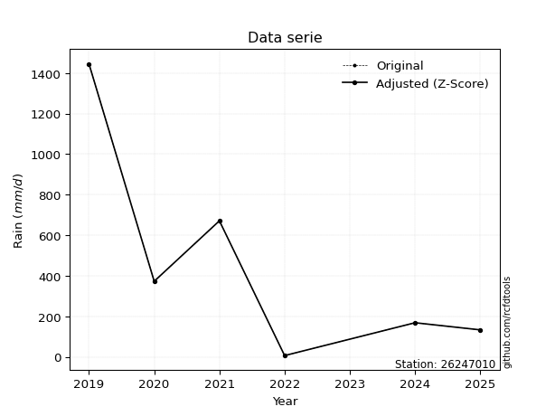</img>

</div>

> If Z-Score is active, values out of range or outliers are replaced with the station mean value.


### 4. Active continuous probability distributions from SciPy (45 of 104 available)

[scipy.stats](https://docs.scipy.org/doc/scipy/reference/stats.html) is a Python´s powerful submodule within the SciPy library for comprehensive statistical analysis, offering over 130 probability distributions (like Normal, Poisson), functions for descriptive stats (mean, variance), hypothesis testing (t-tests, chi-square), random variable generation, and statistical tests, making it essential for data science, modeling, and research. It provides tools to explore, model, and draw conclusions from data efficiently, working seamlessly with NumPy.

<div align="center">

|   id | p_dist             |   n_parameter | fit_method   | label                                                                       | active   | ref                                                                                                        |
|-----:|:-------------------|--------------:|:-------------|:----------------------------------------------------------------------------|:---------|:-----------------------------------------------------------------------------------------------------------|
|    0 | alpha              |             3 | MLE          | Alpha                                                                       | True     | [:mortar_board:](https://docs.scipy.org/doc/scipy/reference/generated/scipy.stats.alpha.html)              |
|    1 | betaprime          |             4 | MLE          | Beta prime                                                                  | True     | [:mortar_board:](https://docs.scipy.org/doc/scipy/reference/generated/scipy.stats.betaprime.html)          |
|    2 | chi2               |             3 | MLE          | Chi²                                                                        | True     | [:mortar_board:](https://docs.scipy.org/doc/scipy/reference/generated/scipy.stats.chi2.html)               |
|    3 | crystalball        |             4 | MLE          | Crystalball                                                                 | True     | [:mortar_board:](https://docs.scipy.org/doc/scipy/reference/generated/scipy.stats.crystalball.html)        |
|    4 | erlang             |             3 | MLE          | Erlang                                                                      | True     | [:mortar_board:](https://docs.scipy.org/doc/scipy/reference/generated/scipy.stats.erlang.html)             |
|    5 | expon              |             2 | MLE          | Exponential                                                                 | True     | [:mortar_board:](https://docs.scipy.org/doc/scipy/reference/generated/scipy.stats.expon.html)              |
|    6 | exponnorm          |             3 | MLE          | Exponentially modified Normal                                               | True     | [:mortar_board:](https://docs.scipy.org/doc/scipy/reference/generated/scipy.stats.exponnorm.html)          |
|    7 | f                  |             4 | MLE          | F                                                                           | True     | [:mortar_board:](https://docs.scipy.org/doc/scipy/reference/generated/scipy.stats.f.html)                  |
|    8 | fatiguelife        |             3 | MLE          | Fatigue-life (Birnbaum-Saunders)                                            | True     | [:mortar_board:](https://docs.scipy.org/doc/scipy/reference/generated/scipy.stats.fatiguelife.html)        |
|    9 | fisk               |             3 | MLE          | Fisk                                                                        | True     | [:mortar_board:](https://docs.scipy.org/doc/scipy/reference/generated/scipy.stats.fisk.html)               |
|   10 | gamma              |             3 | MLE          | Gamma                                                                       | True     | [:mortar_board:](https://docs.scipy.org/doc/scipy/reference/generated/scipy.stats.gamma.html)              |
|   11 | genexpon           |             5 | MLE          | Generalized exponential                                                     | True     | [:mortar_board:](https://docs.scipy.org/doc/scipy/reference/generated/scipy.stats.genexpon.html)           |
|   12 | genlogistic        |             3 | MLE          | Generalized logistic                                                        | True     | [:mortar_board:](https://docs.scipy.org/doc/scipy/reference/generated/scipy.stats.genlogistic.html)        |
|   13 | gibrat             |             2 | MM           | Gibrat                                                                      | True     | [:mortar_board:](https://docs.scipy.org/doc/scipy/reference/generated/scipy.stats.gibrat.html)             |
|   14 | gompertz           |             3 | MLE          | Gompertz (or truncated Gumbel)                                              | True     | [:mortar_board:](https://docs.scipy.org/doc/scipy/reference/generated/scipy.stats.gompertz.html)           |
|   15 | gumbel_l           |             2 | MM           | Gumbel Left Skew                                                            | True     | [:mortar_board:](https://docs.scipy.org/doc/scipy/reference/generated/scipy.stats.gumbel_l.html)           |
|   16 | gumbel_r           |             2 | MM           | Gumbel Right Skew                                                           | True     | [:mortar_board:](https://docs.scipy.org/doc/scipy/reference/generated/scipy.stats.gumbel_r.html)           |
|   17 | halflogistic       |             2 | MM           | Half-logistic                                                               | True     | [:mortar_board:](https://docs.scipy.org/doc/scipy/reference/generated/scipy.stats.halflogistic.html)       |
|   18 | halfnorm           |             2 | MM           | Half Normal                                                                 | True     | [:mortar_board:](https://docs.scipy.org/doc/scipy/reference/generated/scipy.stats.halfnorm.html)           |
|   19 | hypsecant          |             2 | MM           | hyperbolic secant                                                           | True     | [:mortar_board:](https://docs.scipy.org/doc/scipy/reference/generated/scipy.stats.hypsecant.html)          |
|   20 | invgamma           |             3 | MLE          | Inverted gamma                                                              | True     | [:mortar_board:](https://docs.scipy.org/doc/scipy/reference/generated/scipy.stats.invgamma.html)           |
|   21 | invgauss           |             3 | MLE          | Inverse Gaussian                                                            | True     | [:mortar_board:](https://docs.scipy.org/doc/scipy/reference/generated/scipy.stats.invgauss.html)           |
|   22 | invweibull         |             3 | MLE          | Inverted Weibull                                                            | True     | [:mortar_board:](https://docs.scipy.org/doc/scipy/reference/generated/scipy.stats.invweibull.html)         |
|   23 | johnsonsu          |             4 | MLE          | Johnson Su                                                                  | True     | [:mortar_board:](https://docs.scipy.org/doc/scipy/reference/generated/scipy.stats.johnsonsu.html)          |
|   24 | kstwobign          |             2 | MLE          | Limiting distribution of scaled Kolmogorov-Smirnov two-sided test statistic | True     | [:mortar_board:](https://docs.scipy.org/doc/scipy/reference/generated/scipy.stats.kstwobign.html)          |
|   25 | laplace            |             2 | MM           | Laplace                                                                     | True     | [:mortar_board:](https://docs.scipy.org/doc/scipy/reference/generated/scipy.stats.laplace.html)            |
|   26 | laplace_asymmetric |             3 | MLE          | Asymmetric Laplace                                                          | True     | [:mortar_board:](https://docs.scipy.org/doc/scipy/reference/generated/scipy.stats.laplace_asymmetric.html) |
|   27 | loggamma           |             3 | MLE          | Log gamma                                                                   | True     | [:mortar_board:](https://docs.scipy.org/doc/scipy/reference/generated/scipy.stats.loggamma.html)           |
|   28 | logistic           |             2 | MM           | Logistic (or Sech-squared)                                                  | True     | [:mortar_board:](https://docs.scipy.org/doc/scipy/reference/generated/scipy.stats.logistic.html)           |
|   29 | lognorm            |             3 | MLE          | Log Normal                                                                  | True     | [:mortar_board:](https://docs.scipy.org/doc/scipy/reference/generated/scipy.stats.lognorm.html)            |
|   30 | maxwell            |             2 | MM           | Maxwell                                                                     | True     | [:mortar_board:](https://docs.scipy.org/doc/scipy/reference/generated/scipy.stats.maxwell.html)            |
|   31 | mielke             |             4 | MLE          | Mielke Beta-Kappa / Dagum                                                   | True     | [:mortar_board:](https://docs.scipy.org/doc/scipy/reference/generated/scipy.stats.mielke.html)             |
|   32 | moyal              |             2 | MM           | Moyal                                                                       | True     | [:mortar_board:](https://docs.scipy.org/doc/scipy/reference/generated/scipy.stats.moyal.html)              |
|   33 | nakagami           |             3 | MLE          | Nakagami                                                                    | True     | [:mortar_board:](https://docs.scipy.org/doc/scipy/reference/generated/scipy.stats.nakagami.html)           |
|   34 | ncf                |             5 | MLE          | Non-central F distribution                                                  | True     | [:mortar_board:](https://docs.scipy.org/doc/scipy/reference/generated/scipy.stats.ncf.html)                |
|   35 | nct                |             4 | MLE          | Non-central Student’s t                                                     | True     | [:mortar_board:](https://docs.scipy.org/doc/scipy/reference/generated/scipy.stats.nct.html)                |
|   36 | norm               |             2 | MM           | Normal                                                                      | True     | [:mortar_board:](https://docs.scipy.org/doc/scipy/reference/generated/scipy.stats.norm.html)               |
|   37 | pareto             |             3 | MLE          | Pareto                                                                      | True     | [:mortar_board:](https://docs.scipy.org/doc/scipy/reference/generated/scipy.stats.pareto.html)             |
|   38 | pearson3           |             3 | MM           | Pearson type III                                                            | True     | [:mortar_board:](https://docs.scipy.org/doc/scipy/reference/generated/scipy.stats.pearson3.html)           |
|   39 | rayleigh           |             2 | MM           | Rayleigh                                                                    | True     | [:mortar_board:](https://docs.scipy.org/doc/scipy/reference/generated/scipy.stats.rayleigh.html)           |
|   40 | rice               |             3 | MLE          | Rice                                                                        | True     | [:mortar_board:](https://docs.scipy.org/doc/scipy/reference/generated/scipy.stats.rice.html)               |
|   41 | t                  |             3 | MLE          | Student’s t                                                                 | True     | [:mortar_board:](https://docs.scipy.org/doc/scipy/reference/generated/scipy.stats.t.html)                  |
|   42 | truncnorm          |             4 | MLE          | Truncated normal                                                            | True     | [:mortar_board:](https://docs.scipy.org/doc/scipy/reference/generated/scipy.stats.truncnorm.html)          |
|   43 | wald               |             2 | MM           | Wald                                                                        | True     | [:mortar_board:](https://docs.scipy.org/doc/scipy/reference/generated/scipy.stats.wald.html)               |
|   44 | weibull_min        |             3 | MLE          | Weibull minimum                                                             | True     | [:mortar_board:](https://docs.scipy.org/doc/scipy/reference/generated/scipy.stats.weibull_min.html)        |

</div>

> **n_parameter:** # arguments & localization & scale.
>
> **Fit methods:** (MLE) maximum likelihood, (MM) L-moments.
>
>**Inactive:** foldnorm, gennorm, norminvgauss, powernorm, powerlognorm, skewnorm, genextreme, anglit, arcsine, argus, beta, bradford, burr, burr12, cauchy, cosine, halfcauchy, foldcauchy, skewcauchy, wrapcauchy, dgamma, gengamma, exponweib, exponpow, truncexpon, gausshyper, genhalflogistic, genhyperbolic, geninvgauss, halfgennorm, johnsonsb, kappa4, kappa3, ksone, kstwo, loglaplace, levy, levy_l, levy_stable, ncx2, genpareto, truncpareto, lomax, powerlaw, rdist, rel_breitwigner, recipinvgauss, semicircular, studentized_range, trapezoid, triang, truncweibull_min, tukeylambda, uniform, loguniform, vonmises, vonmises_line, weibull_max, dweibull, 


## B. Probability distributions vs. Empirical distributions

A continuous probability distribution (CPD) describes probabilities for variables that can take any value within a range (like rain any time), unlike discrete variables with specific outcomes (like temperature). It uses a Probability Density Function (PDF), a curve where the total area under it equals 1, and the probability of the variable falling within an interval (a to b) is found by calculating the area under the curve between those points. A key feature is that the probability of hitting any single exact value is zero, so probabilities are always expressed for ranges, e.g., $P(a ≤ X ≤ b)$.

<div align="center">

Distributions parameters
|    |   station | p_dist                |   n |               loc |            scale | shape                  | shape1             | shape2                 | shape3   |
|---:|----------:|:----------------------|----:|------------------:|-----------------:|:-----------------------|:-------------------|:-----------------------|:---------|
|  0 |  26247010 | alpha                 |   6 |      -0.0346624   |     14.771       | 7.212395635533114e-12  |                    |                        |          |
|  1 |  26247010 | betaprime             |   6 |       5.99999     |   8125.35        | 0.5836786366602074     | 16.25463599745776  |                        |          |
|  2 |  26247010 | chi2                  |   6 |       5.99938     |    262.271       | 0.7729634174795994     |                    |                        |          |
|  3 |  26247010 | crystalball           |   6 |      -0.405446    |    673.812       | 4.672173231330696      | 2.297519951340222  |                        |          |
|  4 |  26247010 | erlang                |   6 |       6           |    354.81        | 0.6306032436221707     |                    |                        |          |
|  5 |  26247010 | expon                 |   6 |       6           |    459.867       |                        |                    |                        |          |
|  6 |  26247010 | exponnorm             |   6 |       5.47978     |      0.169055    | 2718.8192827179028     |                    |                        |          |
|  7 |  26247010 | f                     |   6 |    -122.313       |    314.585       | 7692.490912907653      | 3.635394559440953  |                        |          |
|  8 |  26247010 | fatiguelife           |   6 |     -25.7792      |    241.747       | 1.3964111259785275     |                    |                        |          |
|  9 |  26247010 | fisk                  |   6 |       6           |    205.493       | 0.8852954748551654     |                    |                        |          |
| 10 |  26247010 | gamma                 |   6 |       6           |    395.136       | 0.2202231976729066     |                    |                        |          |
| 11 |  26247010 | genexpon              |   6 |       6           |    664.311       | 1.444573192507371      | 1.306272181847958  | 3.9803356759473556e-13 |          |
| 12 |  26247010 | genlogistic           |   6 |   -2091.93        |    315.009       | 1729.796261585254      |                    |                        |          |
| 13 |  26247010 | gibrat                |   6 |      94.6429      |    225.159       |                        |                    |                        |          |
| 14 |  26247010 | gompertz              |   6 |       6           |   1179.06        | 1.4655942837069582     |                    |                        |          |
| 15 |  26247010 | gumbel_l              |   6 |     684.868       |    379.41        |                        |                    |                        |          |
| 16 |  26247010 | gumbel_r              |   6 |     246.865       |    379.41        |                        |                    |                        |          |
| 17 |  26247010 | halflogistic          |   6 |    -110.882       |    416.036       |                        |                    |                        |          |
| 18 |  26247010 | halfnorm              |   6 |    -178.217       |    807.239       |                        |                    |                        |          |
| 19 |  26247010 | hypsecant             |   6 |     465.867       |    309.787       |                        |                    |                        |          |
| 20 |  26247010 | invgamma              |   6 |    -122.387       |    571.882       | 1.8176995155944158     |                    |                        |          |
| 21 |  26247010 | invgauss              |   6 |     -65.8532      |    369.371       | 1.4395260784836754     |                    |                        |          |
| 22 |  26247010 | invweibull            |   6 |       6           |      2.23157     | 0.07122900046595827    |                    |                        |          |
| 23 |  26247010 | johnsonsu             |   6 |     -19.647       |      0.698346    | -5.149399617700691     | 0.7798231152223322 |                        |          |
| 24 |  26247010 | kstwobign             |   6 |    -889.886       |   1568.15        |                        |                    |                        |          |
| 25 |  26247010 | laplace               |   6 |     465.867       |    344.087       |                        |                    |                        |          |
| 26 |  26247010 | laplace_asymmetric    |   6 |       6           |      0.00110621  | 2.405513808432435e-06  |                    |                        |          |
| 27 |  26247010 | loggamma              |   6 | -159721           |  21325.4         | 1829.4626285253266     |                    |                        |          |
| 28 |  26247010 | logistic              |   6 |     465.867       |    268.283       |                        |                    |                        |          |
| 29 |  26247010 | lognorm               |   6 |       6           |      0.430856    | 15.144815688309528     |                    |                        |          |
| 30 |  26247010 | maxwell               |   6 |    -687.2         |    722.577       |                        |                    |                        |          |
| 31 |  26247010 | mielke                |   6 |       6           |   1891.82        | 0.463314180428119      | 11.285369788738397 |                        |          |
| 32 |  26247010 | moyal                 |   6 |     187.591       |    219.052       |                        |                    |                        |          |
| 33 |  26247010 | nakagami              |   6 |       6           |    864.707       | 0.17646181384786888    |                    |                        |          |
| 34 |  26247010 | ncf                   |   6 |       6           |    449.869       | 0.9107639674673178     | 5976.257307656702  | 0.31373515650986816    |          |
| 35 |  26247010 | nct                   |   6 |      -0.243079    |      0.278983    | 0.3029746102435541     | 54.736114890022705 |                        |          |
| 36 |  26247010 | norm                  |   6 |     465.867       |    486.612       |                        |                    |                        |          |
| 37 |  26247010 | pareto                |   6 |       4.93003     |      1.06997     | 0.20486521500242477    |                    |                        |          |
| 38 |  26247010 | pearson3              |   6 |     465.867       |    486.612       | 1.1371160992742884     |                    |                        |          |
| 39 |  26247010 | rayleigh              |   6 |    -465.051       |    742.765       |                        |                    |                        |          |
| 40 |  26247010 | rice                  |   6 |    -281.447       |    630.583       | 0.000441164602692922   |                    |                        |          |
| 41 |  26247010 | t                     |   6 |     260.763       |    257.265       | 1.8004089454007741     |                    |                        |          |
| 42 |  26247010 | truncnorm             |   6 |  -18615.5         |   3035.3         | 6.134985369805925      | 3028.2534545331723 |                        |          |
| 43 |  26247010 | wald                  |   6 |     -20.7455      |    486.612       |                        |                    |                        |          |
| 44 |  26247010 | weibull_min           |   6 |       6           |    587.275       | 0.6510563759398275     |                    |                        |          |
| 45 |  26247010 | logalpha              |   6 |     -24.0986      |    461.562       | 15.813915681175096     |                    |                        |          |
| 46 |  26247010 | logbetaprime          |   6 |     -32.919       |    396.251       | 495.64047427962464     | 5149.237084239334  |                        |          |
| 47 |  26247010 | logchi2               |   6 |       1.79176     |      2.19379     | 1.6188638557221702     |                    |                        |          |
| 48 |  26247010 | logcrystalball        |   6 |       5.25154     |      1.74371     | 787.903240039232       | 9.99775408606316   |                        |          |
| 49 |  26247010 | logerlang             |   6 |     -25.9321      |      0.105365    | 295.85883856651503     |                    |                        |          |
| 50 |  26247010 | logexpon              |   6 |       1.79176     |      3.45978     |                        |                    |                        |          |
| 51 |  26247010 | logexponnorm          |   6 |       5.25048     |      1.74371     | 0.000609605446799848   |                    |                        |          |
| 52 |  26247010 | logf                  |   6 |    -206.73        |    211.954       | 36197.501638079484     | 144869.82783015355 |                        |          |
| 53 |  26247010 | logfatiguelife        |   6 |    -742.311       |    747.565       | 0.0023206291338796143  |                    |                        |          |
| 54 |  26247010 | logfisk               |   6 |      -9.88368e+07 |      9.88368e+07 | 103848183.53937668     |                    |                        |          |
| 55 |  26247010 | loggamma              |   6 |     -23.8682      |      0.112579    | 258.6641777189938      |                    |                        |          |
| 56 |  26247010 | loggenexpon           |   6 |       1.76243     |      0.184818    | 0.018534744350732976   | 15.740572336142879 | 0.00018547831335880845 |          |
| 57 |  26247010 | loggenlogistic        |   6 |       7.27676     |      1.44784e-06 | 7.143436157513932e-07  |                    |                        |          |
| 58 |  26247010 | loggibrat             |   6 |       3.92127     |      0.806841    |                        |                    |                        |          |
| 59 |  26247010 | loggompertz           |   6 |       1.79176     |      1.45425     | 0.06033617599933108    |                    |                        |          |
| 60 |  26247010 | loggumbel_l           |   6 |       6.0363      |      1.35956     |                        |                    |                        |          |
| 61 |  26247010 | loggumbel_r           |   6 |       4.46677     |      1.35956     |                        |                    |                        |          |
| 62 |  26247010 | loghalflogistic       |   6 |       3.18481     |      1.49082     |                        |                    |                        |          |
| 63 |  26247010 | loghalfnorm           |   6 |       2.94355     |      2.89264     |                        |                    |                        |          |
| 64 |  26247010 | loghypsecant          |   6 |       5.25153     |      1.11008     |                        |                    |                        |          |
| 65 |  26247010 | loginvgamma           |   6 |     -26.8103      |  10008.4         | 313.49359334521546     |                    |                        |          |
| 66 |  26247010 | loginvgauss           |   6 |     -11.7541      |   1402.46        | 0.012106031330819257   |                    |                        |          |
| 67 |  26247010 | loginvweibull         |   6 | -131287           | 131291           | 67158.54683997495      |                    |                        |          |
| 68 |  26247010 | logjohnsonsu          |   6 |       8.0682      |      0.0348349   | 7.640834728353262      | 1.5620047467967586 |                        |          |
| 69 |  26247010 | logkstwobign          |   6 |      -2.62984     |      9.00308     |                        |                    |                        |          |
| 70 |  26247010 | loglaplace            |   6 |       5.25153     |      1.23299     |                        |                    |                        |          |
| 71 |  26247010 | loglaplace_asymmetric |   6 |       5.92024     |      1.17898     | 1.3231368623098159     |                    |                        |          |
| 72 |  26247010 | logloggamma           |   6 |       7.27615     |      1.28359e-06 | 6.360476037003255e-07  |                    |                        |          |
| 73 |  26247010 | loglogistic           |   6 |       5.25153     |      0.961357    |                        |                    |                        |          |
| 74 |  26247010 | loglognorm            |   6 |       1.79176     |      0.00790881  | 13.956143543236092     |                    |                        |          |
| 75 |  26247010 | logmaxwell            |   6 |       1.11968     |      2.58926     |                        |                    |                        |          |
| 76 |  26247010 | logmielke             |   6 |      -1.1145      |      8.39175     | 3.076316720037741      | 49746.734400459325 |                        |          |
| 77 |  26247010 | logmoyal              |   6 |       4.25437     |      0.784944    |                        |                    |                        |          |
| 78 |  26247010 | lognakagami           |   6 |       4.88884     |      1.44616     | 0.22119548999416144    |                    |                        |          |
| 79 |  26247010 | logncf                |   6 |      -1.29162     |      2.87141e-06 | 2.1419355617433456e-05 | 88.4108020652805   | 48.026559633465894     |          |
| 80 |  26247010 | lognct                |   6 |     -96.8645      |      1.70024     | 31455.221939435847     | 60.05802943239783  |                        |          |
| 81 |  26247010 | lognorm               |   6 |       5.25153     |      1.74371     |                        |                    |                        |          |
| 82 |  26247010 | logpareto             |   6 |       1.78062     |      0.0111444   | 0.20336847397556868    |                    |                        |          |
| 83 |  26247010 | logpearson3           |   6 |       5.25154     |      1.74371     | -0.970847344285229     |                    |                        |          |
| 84 |  26247010 | lograyleigh           |   6 |       1.91568     |      2.66163     |                        |                    |                        |          |
| 85 |  26247010 | logrice               |   6 |       0.447837    |      1.86533     | 2.346448460269475      |                    |                        |          |
| 86 |  26247010 | logt                  |   6 |       5.25153     |      1.74371     | 98279455.47496745      |                    |                        |          |
| 87 |  26247010 | logtruncnorm          |   6 |       3.91831     |      4.07344     | -0.5220711850062767    | 0.824284486259955  |                        |          |
| 88 |  26247010 | logwald               |   6 |       3.50786     |      1.74368     |                        |                    |                        |          |
| 89 |  26247010 | logweibull_min        |   6 |      -1.14587e+08 |      1.14587e+08 | 89603144.21925601      |                    |                        |          |

</div>

> **loc** (Location parameter): This shifts the distribution along the x-axis. For many common distributions, like the normal (Gaussian) distribution, loc represents the mean $μ$. For others, like the uniform distribution, it might represent the minimum value, or for the beta distribution, the left end of the support interval.
>
> **scale** (Scale parameter): This determines the width or spread of the distribution. For the normal distribution, scale represents the standard deviation $σ$. For a uniform distribution, it defines the length of the interval (from $loc$ to $loc + scale$).
>
> **shape** (Shape parameters): Refers to parameters that define the specific form of a probability distribution, distinct from its location (loc) and scale (scale). These parameters are required arguments for most distribution functions. For example, a normal (Gaussian) distribution is fully defined by its location (mean) and scale (standard deviation), so it has no specific shape parameters beyond loc and scale. However, other distributions have intrinsic properties that need specification, as Gamma distribution that takes a shape parameter, often named $a$ or $alpha$.


### 0. Cumulative distribution values - CDF (90 evaluated)

> Ordered by x ascending and calculating $log(f(x))$ separately. 

|   id |   Station |   date |      x |   count |    mean |     std |    zscore |   Value_initial |   station |   m |     alpha |   alpha_pdf |   betaprime |   betaprime_pdf |       chi2 |    chi2_pdf |   crystalball |   crystalball_pdf |      erlang |     erlang_pdf |    expon |   expon_pdf |   exponnorm |   exponnorm_pdf |         f |       f_pdf |   fatiguelife |   fatiguelife_pdf |        fisk |    fisk_pdf |       gamma |   gamma_pdf |    genexpon |   genexpon_pdf |   genlogistic |   genlogistic_pdf |    gibrat |   gibrat_pdf |    gompertz |   gompertz_pdf |   gumbel_l |   gumbel_l_pdf |   gumbel_r |   gumbel_r_pdf |   halflogistic |   halflogistic_pdf |   halfnorm |   halfnorm_pdf |   hypsecant |   hypsecant_pdf |   invgamma |   invgamma_pdf |   invgauss |   invgauss_pdf |   invweibull |   invweibull_pdf |   johnsonsu |   johnsonsu_pdf |   kstwobign |   kstwobign_pdf |   laplace |   laplace_pdf |   laplace_asymmetric |   laplace_asymmetric_pdf |   loggamma |   loggamma_pdf |   logistic |   logistic_pdf |   lognorm |   lognorm_pdf |   maxwell |   maxwell_pdf |      mielke |   mielke_pdf |    moyal |   moyal_pdf |    nakagami |   nakagami_pdf |         ncf |       ncf_pdf |       nct |     nct_pdf |     norm |    norm_pdf |   pareto |   pareto_pdf |   pearson3 |   pearson3_pdf |   rayleigh |   rayleigh_pdf |      rice |    rice_pdf |        t |       t_pdf |   truncnorm |   truncnorm_pdf |       wald |    wald_pdf |   weibull_min |   weibull_min_pdf |   logalpha |   logalpha_pdf |   logbetaprime |   logbetaprime_pdf |     logchi2 |   logchi2_pdf |   logcrystalball |   logcrystalball_pdf |   logerlang |   logerlang_pdf |   logexpon |   logexpon_pdf |   logexponnorm |   logexponnorm_pdf |     logf |   logf_pdf |   logfatiguelife |   logfatiguelife_pdf |   logfisk |   logfisk_pdf |   loggenexpon |   loggenexpon_pdf |   loggenlogistic |   loggenlogistic_pdf |   loggibrat |   loggibrat_pdf |   loggompertz |   loggompertz_pdf |   loggumbel_l |   loggumbel_l_pdf |   loggumbel_r |   loggumbel_r_pdf |   loghalflogistic |   loghalflogistic_pdf |   loghalfnorm |   loghalfnorm_pdf |   loghypsecant |   loghypsecant_pdf |   loginvgamma |   loginvgamma_pdf |   loginvgauss |   loginvgauss_pdf |   loginvweibull |   loginvweibull_pdf |   logjohnsonsu |   logjohnsonsu_pdf |   logkstwobign |   logkstwobign_pdf |   loglaplace |   loglaplace_pdf |   loglaplace_asymmetric |   loglaplace_asymmetric_pdf |   logloggamma |   logloggamma_pdf |   loglogistic |   loglogistic_pdf |   loglognorm |   loglognorm_pdf |   logmaxwell |   logmaxwell_pdf |   logmielke |   logmielke_pdf |    logmoyal |   logmoyal_pdf |   lognakagami |   lognakagami_pdf |    logncf |   logncf_pdf |    lognct |   lognct_pdf |   logpareto |   logpareto_pdf |   logpearson3 |   logpearson3_pdf |   lograyleigh |   lograyleigh_pdf |   logrice |   logrice_pdf |     logt |   logt_pdf |   logtruncnorm |   logtruncnorm_pdf |   logwald |   logwald_pdf |   logweibull_min |   logweibull_min_pdf |
|-----:|----------:|-------:|-------:|--------:|--------:|--------:|----------:|----------------:|----------:|----:|----------:|------------:|------------:|----------------:|-----------:|------------:|--------------:|------------------:|------------:|---------------:|---------:|------------:|------------:|----------------:|----------:|------------:|--------------:|------------------:|------------:|------------:|------------:|------------:|------------:|---------------:|--------------:|------------------:|----------:|-------------:|------------:|---------------:|-----------:|---------------:|-----------:|---------------:|---------------:|-------------------:|-----------:|---------------:|------------:|----------------:|-----------:|---------------:|-----------:|---------------:|-------------:|-----------------:|------------:|----------------:|------------:|----------------:|----------:|--------------:|---------------------:|-------------------------:|-----------:|---------------:|-----------:|---------------:|----------:|--------------:|----------:|--------------:|------------:|-------------:|---------:|------------:|------------:|---------------:|------------:|--------------:|----------:|------------:|---------:|------------:|---------:|-------------:|-----------:|---------------:|-----------:|---------------:|----------:|------------:|---------:|------------:|------------:|----------------:|-----------:|------------:|--------------:|------------------:|-----------:|---------------:|---------------:|-------------------:|------------:|--------------:|-----------------:|---------------------:|------------:|----------------:|-----------:|---------------:|---------------:|-------------------:|---------:|-----------:|-----------------:|---------------------:|----------:|--------------:|--------------:|------------------:|-----------------:|---------------------:|------------:|----------------:|--------------:|------------------:|--------------:|------------------:|--------------:|------------------:|------------------:|----------------------:|--------------:|------------------:|---------------:|-------------------:|--------------:|------------------:|--------------:|------------------:|----------------:|--------------------:|---------------:|-------------------:|---------------:|-------------------:|-------------:|-----------------:|------------------------:|----------------------------:|--------------:|------------------:|--------------:|------------------:|-------------:|-----------------:|-------------:|-----------------:|------------:|----------------:|------------:|---------------:|--------------:|------------------:|----------:|-------------:|----------:|-------------:|------------:|----------------:|--------------:|------------------:|--------------:|------------------:|----------:|--------------:|---------:|-----------:|---------------:|-------------------:|----------:|--------------:|-----------------:|---------------------:|
|    0 |  26247010 |   2022 |    6   |       6 | 465.867 | 533.057 | -0.862697 |             6   |  26247010 |   1 | 0.0143776 | 0.0161836   | 2.42131e-05 |     2.75045     | 0.00574721 | 3.60959     |      0.503793 |       0.00059204  | 8.86114e-12 | 6291.37        | 0        | 0.00217454  |  0.00113123 |     0.00217092  | 0.0496115 | 0.00146185  |     0.0431279 |       0.00322054  | 7.83372e-16 | 0.390415    | 0.000142217 | 3.52626e+10 | 8.80343e-14 |    0.00217454  |      0.109167 |       0.000767079 | 0         |  0           | 1.21045e-14 |    0.00124302  |   0.153869 |    0.000372612 |   0.151568 |    0.000753713 |       0.139554 |        0.00117841  |   0.180514 |    0.000963006 |    0.141877 |     0.000442969 |  0.0496113 |    0.00146184  |  0.0451305 |    0.00184079  |  3.72403e-06 |      3.7334e+09  |   0.0360367 |     0.00240548  |    0.100146 |     0.000733284 |  0.131384 |   0.000381834 |          6.17162e-12 |              0.00217455  |  0.0243289 |      0.0343383 |   0.152632 |    0.000482084 | 0.0236197 |     0.0319567 |  0.179483 |   0.000641438 | 2.14236e-05 | 62.7358      | 0.130127 | 0.000876783 | 4.55776e-07 |    9.05529e+07 | 2.19788e-05 | 158.722       | 0.0443595 | 0.0207141   | 0.17232  | 0.000524558 | 0        |  0.191468    |   0.158396 |    0.000837961 |   0.182166 |    0.000698281 | 0.0986816 | 0.000651556 | 0.218067 | 0.000738303 | 2.92314e-07 |     0.00207238  | 5.2884e-05 | 1.88438e-05 |   2.50008e-12 |    1832.62        |  0.0220223 |      0.0361714 |      0.0246999 |          0.0345324 | 6.90814e-14 |   251.826     |        0.0236196 |            0.0319566 |   0.0250642 |       0.0349559 |   0        |      0.289036  |      0.0236195 |          0.0319565 | 0.025005 |  0.0336232 |        0.0227381 |            0.0312529 |  0.020209 |     0.0208045 |    0.00297323 |         0.102487  |         0        |            0.0329526 |    0        |       0         |   1.39279e-07 |         0.0414897 |     0.0431127 |         0.0310171 |   0.000782392 |        0.00411645 |          0        |             0         |      0        |         0         |       0.028186 |          0.0253578 |     0.0226825 |         0.0345915 |      0.022462 |         0.0361244 |       0.0267872 |           0.0496008 |       0.059993 |          0.0296427 |      0.0306586 |           0.063997 |    0.0302229 |        0.0245119 |               0.0451218 |                   0.0289252 |     0.0660306 |         0.0327196 |     0.0266269 |         0.0269597 |    0.0126807 |      1.05725e+13 |   0.00455823 |        0.0200737 |   0.0383088 |       0.0405504 | 1.58524e-06 |    2.42037e-05 |    0          |       0           | 0.0262215 |    0.0461789 | 0.0237877 |    0.0321773 |    0        |      18.2485    |     0.0429255 |         0.0335782 |      0        |         0         | 0.0201671 |      0.035187 | 0.02362  |   0.031957 |    1.20289e-05 |           0.172893 |  0        |     0         |        0.0359519 |            0.0276017 |
|    1 |  26247010 |   2025 |  132.8 |       6 | 465.867 | 533.057 | -0.624824 |           132.8 |  26247010 |   2 | 0.911459  | 0.000663806 | 0.455231    |     0.00177253  | 0.609537   | 0.00155683  |      0.578356 |       0.00058061  | 0.510136    |    0.00202618  | 0.240984 | 0.00165051  |  0.241949   |     0.00164926  | 0.295321  | 0.0019298   |     0.380493  |       0.00175848  | 0.394743    | 0.0016681   | 0.807368    | 0.00107442  | 0.240984    |    0.00165051  |      0.227355 |       0.00106862  | 0.0379412 |  0.00216328  | 0.153294    |    0.00117197  |   0.208151 |    0.000487085 |   0.259053 |    0.000922245 |       0.284766 |        0.00110436  |   0.299974 |    0.000917706 |    0.209356 |     0.000628127 |  0.295321  |    0.00192981  |  0.319013  |    0.00190141  |  0.472394    |      0.000199008 |   0.341326  |     0.00187709  |    0.21134  |     0.000992214 |  0.189926 |   0.000551972 |          0.240984    |              0.00165051  |  0.428311  |      0.218566  |   0.22418  |    0.000648281 | 0.417615  |     0.223894  |  0.267975 |   0.000746906 | 0.285878    |  0.00104457  | 0.257122 | 0.00108597  | 0.404143    |    0.00112123  | 0.369182    |   0.00125031  | 0.58198   | 0.000950293 | 0.246842 | 0.00064863  | 0.624669 |  0.000601331 |   0.273004 |    0.000947851 |   0.2767   |    0.000783806 | 0.194085  | 0.000839585 | 0.336474 | 0.00113331  | 0.231743    |     0.00160245  | 0.182393   | 0.00220163  |   0.308311    |       0.00130914  |  0.45663   |      0.217843  |      0.431134  |          0.220463  | 0.60182     |     0.104211  |        0.417615  |            0.223894  |   0.430237  |       0.21838   |   0.591462 |      0.118082  |      0.417613  |          0.223893  | 0.425078 |  0.222772  |        0.416682  |            0.225038  |  0.34817  |     0.238455  |    0.518488   |         0.176758  |         0        |            0.151886  |    0.572077 |       0.405565  |   0.3606      |         0.223164  |     0.349487  |         0.20574   |   0.480408    |        0.259051   |          0.516464 |             0.245926  |      0.498734 |         0.220009  |       0.397803 |          0.272093  |     0.442394  |         0.221009  |      0.449598 |         0.216459  |       0.475952  |           0.180754  |       0.31118  |          0.173602  |      0.511809  |           0.172756 |    0.37258   |        0.302177  |               0.328567  |                   0.210627  |     0.30637   |         0.151813  |     0.406786  |         0.251011  |    0.665596  |      0.00842274  |   0.451931   |        0.226339  |   0.356878  |       0.182877  | 0.504426    |    0.27151     |    1.4627e-07 |       7.28556e+07 | 0.468974  |    0.193631  | 0.418332  |    0.223473  |    0.681821 |       0.0208181 |     0.358407  |         0.199684  |      0.464149 |         0.224889  | 0.426917  |      0.220743 | 0.417616 |   0.223894 |    0.593463    |           0.192589 |  0.570342 |     0.315863  |        0.338013  |            0.213537  |
|    2 |  26247010 |   2024 |  168   |       6 | 465.867 | 533.057 | -0.55879  |           168   |  26247010 |   3 | 0.929953  | 0.00041579  | 0.512386    |     0.00148995  | 0.658639   | 0.00125263  |      0.59868  |       0.000573861 | 0.574981    |    0.00167607  | 0.296914 | 0.00152889  |  0.297836   |     0.00152767  | 0.36033   | 0.0017594   |     0.436949  |       0.00146477  | 0.44756     | 0.00135117  | 0.840224    | 0.000811934 | 0.296914    |    0.00152889  |      0.265884 |       0.00111768  | 0.131045  |  0.00289978  | 0.194151    |    0.00114922  |   0.225914 |    0.000522448 |   0.291987 |    0.000947391 |       0.323154 |        0.00107631  |   0.331997 |    0.000901559 |    0.232471 |     0.000685469 |  0.36033   |    0.0017594   |  0.381873  |    0.00167337  |  0.478562    |      0.000155071 |   0.402515  |     0.00160816  |    0.247015 |     0.00103247  |  0.210384 |   0.000611428 |          0.296914    |              0.00152889  |  0.480022  |      0.220682  |   0.247821 |    0.000694809 | 0.470839  |     0.228178  |  0.294646 |   0.000767802 | 0.32024     |  0.000915874 | 0.295685 | 0.00110235  | 0.440482    |    0.000954568 | 0.409798    |   0.00106844  | 0.610639  | 0.000700407 | 0.270228 | 0.000679772 | 0.642909 |  0.000448614 |   0.306547 |    0.000956595 |   0.304552 |    0.000797996 | 0.224312  | 0.000876761 | 0.378136 | 0.00123097  | 0.286175    |     0.00149158  | 0.258342   | 0.00209372  |   0.351025    |       0.00112766  |  0.507654  |      0.215588  |      0.483296  |          0.222606  | 0.625511    |     0.0974061 |        0.470839  |            0.228178  |   0.481896  |       0.220431  |   0.618303 |      0.110324  |      0.470837  |          0.228178  | 0.477941 |  0.226235  |        0.470182  |            0.229359  |  0.406114 |     0.253414  |    0.559343   |         0.170588  |         0        |            0.170568  |    0.655124 |       0.306304  |   0.415088    |         0.23997   |     0.400208  |         0.225511  |   0.539726    |        0.244818   |          0.571913 |             0.225686  |      0.549019 |         0.207618  |       0.4635   |          0.284862  |     0.494446  |         0.22113   |      0.500406 |         0.215151  |       0.517727  |           0.174338  |       0.354757 |          0.19745   |      0.551593  |           0.165509 |    0.450854  |        0.36566   |               0.382017  |                   0.244891  |     0.344226  |         0.170572  |     0.466874  |         0.258908  |    0.667503  |      0.00781079  |   0.504811   |        0.222906  |   0.401649  |       0.198062  | 0.565499    |    0.247622    |    0.350921   |       0.657122    | 0.514012  |    0.189103  | 0.471442  |    0.227632  |    0.686505 |       0.0190692 |     0.40731   |         0.216089  |      0.516391 |         0.219015  | 0.479207  |      0.223431 | 0.470841 |   0.228178 |    0.63841     |           0.189642 |  0.637237 |     0.255674  |        0.390899  |            0.236135  |
|    3 |  26247010 |   2020 |  372.5 |       6 | 465.867 | 533.057 | -0.175153 |           372.5 |  26247010 |   4 | 0.968372  | 8.48544e-05 | 0.721651    |     0.000703559 | 0.822551   | 0.000514019 |      0.710015 |       0.000507999 | 0.798497    |    0.000696636 | 0.549308 | 0.00098005  |  0.550001   |     0.000979043 | 0.6219    | 0.000883923 |     0.641046  |       0.000693048 | 0.625327    | 0.000565944 | 0.934573    | 0.000256022 | 0.549307    |    0.00098005  |      0.500454 |       0.00109954  | 0.583284  |  0.00140438  | 0.413929    |    0.000994087 |   0.355307 |    0.000745916 |   0.487673 |    0.00092302  |       0.523346 |        0.000872651 |   0.504902 |    0.000783198 |    0.405485 |     0.000982548 |  0.6219    |    0.000883924 |  0.624528  |    0.000824639 |  0.498907    |      6.74213e-05 |   0.628522  |     0.000751802 |    0.463995 |     0.00103188  |  0.381176 |   0.00110779  |          0.549308    |              0.00098005  |  0.650604  |      0.201354  |   0.413864 |    0.000904195 | 0.649323  |     0.212569  |  0.458293 |   0.000810244 | 0.467463    |  0.000590948 | 0.512023 | 0.00096317  | 0.585344    |    0.00054866  | 0.570383    |   0.000595518 | 0.693987  | 0.00024868  | 0.423922 | 0.000804883 | 0.697679 |  0.000168499 |   0.497262 |    0.000878225 |   0.470465 |    0.000803903 | 0.415932  | 0.000960554 | 0.644751 | 0.00118047  | 0.535434    |     0.00098082  | 0.579116   | 0.0011031   |   0.520817    |       0.000626225 |  0.669363  |      0.185637  |      0.655232  |          0.202647  | 0.695006    |     0.0779893 |        0.649323  |            0.212569  |   0.65222   |       0.200976  |   0.696775 |      0.0876431 |      0.649322  |          0.21257   | 0.654039 |  0.208846  |        0.649517  |            0.213425  |  0.612206 |     0.249447  |    0.684861   |         0.143364  |         0        |            0.252649  |    0.817865 |       0.132241  |   0.621388    |         0.268571  |     0.600754  |         0.26963   |   0.709405    |        0.179145   |          0.724674 |             0.159257  |      0.696547 |         0.162441  |       0.681103 |          0.241573  |     0.662864  |         0.195919  |      0.662994 |         0.188095  |       0.645285  |           0.144593  |       0.547755 |          0.287994  |      0.672126  |           0.136481 |    0.709308  |        0.235762  |               0.636455  |                   0.407998  |     0.510745  |         0.253085  |     0.667207  |         0.230967  |    0.673061  |      0.00626178  |   0.671031   |        0.18992   |   0.581218  |       0.254169  | 0.729296    |    0.165661    |    0.662329   |       0.258978    | 0.654417  |    0.160875  | 0.64939   |    0.211844  |    0.699833 |       0.0147464 |     0.596795  |         0.253416  |      0.677561 |         0.182267  | 0.652562  |      0.205276 | 0.649325 |   0.212569 |    0.784216    |           0.175594 |  0.785647 |     0.133319  |        0.603095  |            0.286798  |
|    4 |  26247010 |   2021 |  670.8 |       6 | 465.867 | 533.057 |  0.384449 |           670.8 |  26247010 |   5 | 0.982433  | 2.61826e-05 | 0.862323    |     0.000307015 | 0.920419   | 0.000201993 |      0.840407 |       0.000360496 | 0.925199    |    0.000241184 | 0.764404 | 0.000512314 |  0.764845   |     0.000511618 | 0.793069  | 0.000361321 |     0.786323  |       0.0003422   | 0.738735    | 0.00025702  | 0.977708    | 7.564e-05   | 0.764404    |    0.000512314 |      0.764475 |       0.000651716 | 0.826282  |  0.000445319 | 0.670458    |    0.000719882 |   0.618483 |    0.000968951 |   0.720979 |    0.000621662 |       0.734965 |        0.000552628 |   0.707088 |    0.000568503 |    0.696706 |     0.000837481 |  0.793069  |    0.000361321 |  0.790486  |    0.000369465 |  0.513524    |      3.66691e-05 |   0.77908   |     0.000335223 |    0.724861 |     0.000692962 |  0.72438  |   0.000801018 |          0.764404    |              0.000512314 |  0.759547  |      0.167089  |   0.682193 |    0.000808122 | 0.764496  |     0.176443  |  0.683375 |   0.000666967 | 0.615982    |  0.000429289 | 0.739973 | 0.000572053 | 0.714623    |    0.000347078 | 0.705925    |   0.000349322 | 0.743913  | 0.000115615 | 0.663175 | 0.000750263 | 0.732328 |  8.23535e-05 |   0.718679 |    0.000596413 |   0.689402 |    0.000639465 | 0.680248  | 0.000765735 | 0.86736  | 0.000395824 | 0.75369     |     0.000527825 | 0.794185   | 0.000454642 |   0.661785    |       0.00035907  |  0.768422  |      0.150181  |      0.76465   |          0.167367  | 0.737399    |     0.0664945 |        0.764496  |            0.176443  |   0.760928  |       0.166673  |   0.744185 |      0.0739398 |      0.764495  |          0.176443  | 0.76699  |  0.17281   |        0.765054  |            0.176818  |  0.745481 |     0.19936   |    0.762376   |         0.119995  |         0        |            0.337723  |    0.878032 |       0.0782094 |   0.773618    |         0.240645  |     0.757133  |         0.252813  |   0.800319    |        0.131121   |          0.805719 |             0.117659  |      0.782205 |         0.129073  |       0.801514 |          0.16744   |     0.767953  |         0.159861  |      0.763859 |         0.15367   |       0.723079  |           0.119924  |       0.73229  |          0.329633  |      0.745755  |           0.113943 |    0.819598  |        0.146313  |               0.812131  |                   0.21084   |     0.683586  |         0.338732  |     0.787088  |         0.174317  |    0.676497  |      0.0054572   |   0.772173   |        0.153051  |   0.744097  |       0.300287  | 0.811946    |    0.117545    |    0.7865     |       0.170745    | 0.741078  |    0.13337   | 0.764172  |    0.175876  |    0.707836 |       0.0125674 |     0.745385  |         0.244991  |      0.774352 |         0.14629   | 0.763711  |      0.170441 | 0.764497 |   0.176442 |    0.883587    |           0.161868 |  0.849316 |     0.0871485 |        0.768633  |            0.264825  |
|    5 |  26247010 |   2019 | 1445.1 |       6 | 465.867 | 533.057 |  1.83701  |          1445.1 |  26247010 |   6 | 0.991845  | 5.643e-06   | 0.971529    |     5.37242e-05 | 0.987197   | 2.87396e-05 |      0.984034 |       5.92957e-05 | 0.993257    |    2.04501e-05 | 0.956255 | 9.51247e-05 |  0.956375   |     9.49135e-05 | 0.925409  | 7.56856e-05 |     0.930042  |       9.38311e-05 | 0.848529    | 7.90669e-05 | 0.998042    | 5.83687e-06 | 0.956255    |    9.51248e-05 |      0.97727  |       7.13285e-05 | 0.963385  |  5.93723e-05 | 0.969844    |    0.000127037 |   0.999399 |    1.17518e-05 |   0.958386 |    0.000107365 |       0.953595 |        0.000108953 |   0.955669 |    0.000130862 |    0.973034 |     8.69435e-05 |  0.925409  |    7.56856e-05 |  0.934106  |    8.62429e-05 |  0.532172    |      1.6615e-05  |   0.912386  |     8.47435e-05 |    0.976273 |     9.01191e-05 |  0.970959 |   8.4401e-05  |          0.956255    |              9.51245e-05 |  0.867256  |      0.113343  |   0.974667 |    9.20334e-05 | 0.877174  |     0.116614  |  0.966567 |   0.000123602 | 0.879363    |  0.000270749 | 0.9548   | 0.00010306  | 0.891449    |    0.000143361 | 0.873713    |   0.000130274 | 0.797029  | 4.25465e-05 | 0.977908 | 0.000108238 | 0.771457 |  3.25104e-05 |   0.956694 |    0.000114395 |   0.963365 |    0.00012684  | 0.976444  | 0.000102281 | 0.97322  | 3.83441e-05 | 0.954602    |     0.000101021 | 0.953672   | 8.00672e-05 |   0.833432    |       0.000135065 |  0.864887  |      0.101864  |      0.872036  |          0.112286  | 0.783554    |     0.054243  |        0.877174  |            0.116614  |   0.86831   |       0.112912  |   0.795078 |      0.0592299 |      0.877172  |          0.116615  | 0.877375 |  0.114427  |        0.877804  |            0.116475  |  0.867729 |     0.120595  |    0.84271    |         0.0896928 |         0.999592 |            0.493184  |    0.922918 |       0.0430853 |   0.9227      |         0.139287  |     0.916988  |         0.151958  |   0.88103     |        0.082081   |          0.87917  |             0.0761526 |      0.865796 |         0.0898552 |       0.898106 |          0.0902299 |     0.870366  |         0.107306  |      0.862993 |         0.10507   |       0.803351  |           0.0899773 |       0.953253 |          0.1925    |      0.822489  |           0.086592 |    0.903191  |        0.0785161 |               0.920605  |                   0.0891033 |     0.999892  |         0.495469  |     0.891463  |         0.100646  |    0.680368  |      0.00467008  |   0.870234   |        0.103158  |   0.999516  |       0.366323  | 0.883985    |    0.0733773   |    0.888023   |       0.0993508   | 0.829437  |    0.0974114 | 0.876567  |    0.116458  |    0.716638 |       0.0104865 |     0.90818   |         0.166562  |      0.868389 |         0.0995829 | 0.873186  |      0.114417 | 0.877174 |   0.116614 |    0.999993    |           0.141066 |  0.901667 |     0.0527256 |        0.930573  |            0.144817  |

An Empirical Distribution Function (EDF) is a step-function estimate of a true cumulative distribution function (CDF) based on observed sample data, representing the proportion of data points less than or equal to a given value. It is calculated by ordering your data and jumping up by $1/n$ (where $n$ is sample size) at each unique data point, allowing analysis without assuming an underlying population distribution, and it gets closer to the true CDF as the sample size grows.


### 1. Empirical - EDF California (1923)

California´s estimates the true probability distribution of water-related data (like rainfall, streamflow) using observed samples, crucial for risk assessment.

<div align="center">


$P=m/n$


</div>


**1.1. Empirical values**

<div align="center">

|                | 0                   | 1                  | 2              | 3                  | 4                  | 5              |
|:---------------|:--------------------|:-------------------|:---------------|:-------------------|:-------------------|:---------------|
| date           | 2022                | 2025               | 2024           | 2020               | 2021               | 2019           |
| x              | 6.0                 | 132.8              | 168.0          | 372.5              | 670.8              | 1445.1         |
| m              | 1                   | 2                  | 3              | 4                  | 5                  | 6              |
| empirical_dist | edf_california      | edf_california     | edf_california | edf_california     | edf_california     | edf_california |
| empirical      | 0.16666666666666666 | 0.3333333333333333 | 0.5            | 0.6666666666666666 | 0.8333333333333334 | 1.0            |
| empirical_tr   | 1.2                 | 1.4999999999999998 | 2.0            | 2.9999999999999996 | 6.000000000000002  | inf            |

</div>


**1.2. Kolmogorov-Smirnov fit test (sorted by Δ)**


<div align="center">

|                | 0                   | 1                     | 2                   | 3                   | 4                   | 5                   | 6                   | 7                   | 8                   | 9                   | 10                  | 11                  | 12                 | 13                  | 14                  | 15                  | 16                  | 17                  | 18                  | 19                  | 20                  | 21                  | 22                  | 23                  | 24                 | 25                  | 26                 | 27                  | 28                 | 29                  | 30                  | 31                 | 32                 | 33                 | 34                  | 35                  | 36                  | 37                  | 38                  | 39                  | 40                  | 41                  | 42                  | 43                  | 44                  | 45                 | 46                  | 47                  | 48                  | 49                  | 50                  | 51                  | 52                  | 53                  | 54                  | 55                  | 56                  | 57                 | 58                  | 59                  | 60                  | 61                  | 62                  | 63                 | 64                  | 65                  | 66                 | 67                 | 68                  | 69                 | 70                 | 71                  | 72                 | 73                 | 74                  | 75                 | 76                  | 77                  | 78                 | 79                  | 80                  | 81                 | 82                  | 83                 | 84                 | 85                 | 86                 | 87                  | 88                 | 89                 |
|:---------------|:--------------------|:----------------------|:--------------------|:--------------------|:--------------------|:--------------------|:--------------------|:--------------------|:--------------------|:--------------------|:--------------------|:--------------------|:-------------------|:--------------------|:--------------------|:--------------------|:--------------------|:--------------------|:--------------------|:--------------------|:--------------------|:--------------------|:--------------------|:--------------------|:-------------------|:--------------------|:-------------------|:--------------------|:-------------------|:--------------------|:--------------------|:-------------------|:-------------------|:-------------------|:--------------------|:--------------------|:--------------------|:--------------------|:--------------------|:--------------------|:--------------------|:--------------------|:--------------------|:--------------------|:--------------------|:-------------------|:--------------------|:--------------------|:--------------------|:--------------------|:--------------------|:--------------------|:--------------------|:--------------------|:--------------------|:--------------------|:--------------------|:-------------------|:--------------------|:--------------------|:--------------------|:--------------------|:--------------------|:-------------------|:--------------------|:--------------------|:-------------------|:-------------------|:--------------------|:-------------------|:-------------------|:--------------------|:-------------------|:-------------------|:--------------------|:-------------------|:--------------------|:--------------------|:-------------------|:--------------------|:--------------------|:-------------------|:--------------------|:-------------------|:-------------------|:-------------------|:-------------------|:--------------------|:-------------------|:-------------------|
| station        | 26247010            | 26247010              | 26247010            | 26247010            | 26247010            | 26247010            | 26247010            | 26247010            | 26247010            | 26247010            | 26247010            | 26247010            | 26247010           | 26247010            | 26247010            | 26247010            | 26247010            | 26247010            | 26247010            | 26247010            | 26247010            | 26247010            | 26247010            | 26247010            | 26247010           | 26247010            | 26247010           | 26247010            | 26247010           | 26247010            | 26247010            | 26247010           | 26247010           | 26247010           | 26247010            | 26247010            | 26247010            | 26247010            | 26247010            | 26247010            | 26247010            | 26247010            | 26247010            | 26247010            | 26247010            | 26247010           | 26247010            | 26247010            | 26247010            | 26247010            | 26247010            | 26247010            | 26247010            | 26247010            | 26247010            | 26247010            | 26247010            | 26247010           | 26247010            | 26247010            | 26247010            | 26247010            | 26247010            | 26247010           | 26247010            | 26247010            | 26247010           | 26247010           | 26247010            | 26247010           | 26247010           | 26247010            | 26247010           | 26247010           | 26247010            | 26247010           | 26247010            | 26247010            | 26247010           | 26247010            | 26247010            | 26247010           | 26247010            | 26247010           | 26247010           | 26247010           | 26247010           | 26247010            | 26247010           | 26247010           |
| empirical_dist | edf_california      | edf_california        | edf_california      | edf_california      | edf_california      | edf_california      | edf_california      | edf_california      | edf_california      | edf_california      | edf_california      | edf_california      | edf_california     | edf_california      | edf_california      | edf_california      | edf_california      | edf_california      | edf_california      | edf_california      | edf_california      | edf_california      | edf_california      | edf_california      | edf_california     | edf_california      | edf_california     | edf_california      | edf_california     | edf_california      | edf_california      | edf_california     | edf_california     | edf_california     | edf_california      | edf_california      | edf_california      | edf_california      | edf_california      | edf_california      | edf_california      | edf_california      | edf_california      | edf_california      | edf_california      | edf_california     | edf_california      | edf_california      | edf_california      | edf_california      | edf_california      | edf_california      | edf_california      | edf_california      | edf_california      | edf_california      | edf_california      | edf_california     | edf_california      | edf_california      | edf_california      | edf_california      | edf_california      | edf_california     | edf_california      | edf_california      | edf_california     | edf_california     | edf_california      | edf_california     | edf_california     | edf_california      | edf_california     | edf_california     | edf_california      | edf_california     | edf_california      | edf_california      | edf_california     | edf_california      | edf_california      | edf_california     | edf_california      | edf_california     | edf_california     | edf_california     | edf_california     | edf_california      | edf_california     | edf_california     |
| p_dist         | invgauss            | loglaplace_asymmetric | t                   | fatiguelife         | loggumbel_l         | logpearson3         | logmielke           | johnsonsu           | logweibull_min      | loglaplace          | loghypsecant        | f                   | invgamma           | loglogistic         | logerlang           | logf                | logbetaprime        | loggamma            | loggamma            | lognct              | logt                | lognorm             | lognorm             | logcrystalball      | logexponnorm       | logfatiguelife      | loginvgamma        | loginvgauss         | logalpha           | logjohnsonsu        | logfisk             | logrice            | logloggamma        | logmaxwell         | loggumbel_r         | betaprime           | ncf                 | nakagami            | loggompertz         | fisk                | loghalfnorm         | lograyleigh         | halfnorm            | logncf              | logmoyal            | weibull_min        | erlang              | halflogistic        | logkstwobign        | loghalflogistic     | loggenexpon         | pearson3            | rayleigh            | loginvweibull       | exponnorm           | laplace_asymmetric  | expon               | genexpon           | moyal               | gumbel_r            | maxwell             | truncnorm           | mielke              | genlogistic        | logwald             | loggibrat           | wald               | norm               | nct                 | logistic           | kstwobign          | logexpon            | logtruncnorm       | hypsecant          | logchi2             | rice               | chi2                | laplace             | pareto             | gompertz            | gumbel_l            | loglognorm         | lognakagami         | crystalball        | logpareto          | gibrat             | invweibull         | gamma               | alpha              | loggenlogistic     |
| delta          | 0.12153615611259824 | 0.12154490583813078   | 0.12186356052733077 | 0.12353874879806523 | 0.12355401014632855 | 0.12374116362388062 | 0.12835790009379247 | 0.13062996720770703 | 0.13071478650720791 | 0.13644380633347883 | 0.13848065157131956 | 0.13966997383513535 | 0.1396702054250431 | 0.14003980614556014 | 0.14160246277567623 | 0.14166164742592208 | 0.14196674208096802 | 0.14233773767361882 | 0.14233773767361882 | 0.14287901268208958 | 0.14304664068428444 | 0.14304701401828362 | 0.14304701401828362 | 0.14304702750772796 | 0.1430471579595315 | 0.14392853483533646 | 0.1439841422850264 | 0.14420469950607598 | 0.1446443505045949 | 0.14524287438972205 | 0.14645770117092616 | 0.1464995363354647 | 0.1559219051126316 | 0.1621084367198262 | 0.16588427457488844 | 0.16664245360641566 | 0.16664468787107978 | 0.16666621089036673 | 0.16666652738721088 | 0.16666666666666588 | 0.16666666666666666 | 0.16666666666666666 | 0.16800306159010048 | 0.17056262069616734 | 0.17109219546883064 | 0.1715480735911704 | 0.17680242422660114 | 0.17684554523951446 | 0.17847532138208017 | 0.18313107374874676 | 0.18515426433460308 | 0.19345287025299768 | 0.19620216559195502 | 0.19664919883916188 | 0.20216397877348324 | 0.20308581505625656 | 0.20308602795398178 | 0.2030861340246236 | 0.20431501771530158 | 0.20801259027413194 | 0.20837366077871639 | 0.21382480467235643 | 0.21735110837726213 | 0.2341161963267488 | 0.23700878203714965 | 0.23874321354296607 | 0.2416581007255022 | 0.2427449666269496 | 0.24864702799388344 | 0.2528028443497183 | 0.2529846728132944 | 0.25812823873490437 | 0.2601297270540069 | 0.2675288936379616 | 0.26848685267653266 | 0.2756875999841935 | 0.27620411822098584 | 0.28961589921012876 | 0.2913361251414544 | 0.30584903715022926 | 0.31135980775215977 | 0.3322631213891109 | 0.33333318706286613 | 0.3371263603018543 | 0.3484879454236793 | 0.3689552440736854 | 0.4678277938703972 | 0.47403434543365724 | 0.5781258216799752 | 0.8333333333333334 |
| deltao         | 0.530385761606      | 0.530385761606        | 0.530385761606      | 0.530385761606      | 0.530385761606      | 0.530385761606      | 0.530385761606      | 0.530385761606      | 0.530385761606      | 0.530385761606      | 0.530385761606      | 0.530385761606      | 0.530385761606     | 0.530385761606      | 0.530385761606      | 0.530385761606      | 0.530385761606      | 0.530385761606      | 0.530385761606      | 0.530385761606      | 0.530385761606      | 0.530385761606      | 0.530385761606      | 0.530385761606      | 0.530385761606     | 0.530385761606      | 0.530385761606     | 0.530385761606      | 0.530385761606     | 0.530385761606      | 0.530385761606      | 0.530385761606     | 0.530385761606     | 0.530385761606     | 0.530385761606      | 0.530385761606      | 0.530385761606      | 0.530385761606      | 0.530385761606      | 0.530385761606      | 0.530385761606      | 0.530385761606      | 0.530385761606      | 0.530385761606      | 0.530385761606      | 0.530385761606     | 0.530385761606      | 0.530385761606      | 0.530385761606      | 0.530385761606      | 0.530385761606      | 0.530385761606      | 0.530385761606      | 0.530385761606      | 0.530385761606      | 0.530385761606      | 0.530385761606      | 0.530385761606     | 0.530385761606      | 0.530385761606      | 0.530385761606      | 0.530385761606      | 0.530385761606      | 0.530385761606     | 0.530385761606      | 0.530385761606      | 0.530385761606     | 0.530385761606     | 0.530385761606      | 0.530385761606     | 0.530385761606     | 0.530385761606      | 0.530385761606     | 0.530385761606     | 0.530385761606      | 0.530385761606     | 0.530385761606      | 0.530385761606      | 0.530385761606     | 0.530385761606      | 0.530385761606      | 0.530385761606     | 0.530385761606      | 0.530385761606     | 0.530385761606     | 0.530385761606     | 0.530385761606     | 0.530385761606      | 0.530385761606     | 0.530385761606     |
| eval           | Δo > Δ              | Δo > Δ                | Δo > Δ              | Δo > Δ              | Δo > Δ              | Δo > Δ              | Δo > Δ              | Δo > Δ              | Δo > Δ              | Δo > Δ              | Δo > Δ              | Δo > Δ              | Δo > Δ             | Δo > Δ              | Δo > Δ              | Δo > Δ              | Δo > Δ              | Δo > Δ              | Δo > Δ              | Δo > Δ              | Δo > Δ              | Δo > Δ              | Δo > Δ              | Δo > Δ              | Δo > Δ             | Δo > Δ              | Δo > Δ             | Δo > Δ              | Δo > Δ             | Δo > Δ              | Δo > Δ              | Δo > Δ             | Δo > Δ             | Δo > Δ             | Δo > Δ              | Δo > Δ              | Δo > Δ              | Δo > Δ              | Δo > Δ              | Δo > Δ              | Δo > Δ              | Δo > Δ              | Δo > Δ              | Δo > Δ              | Δo > Δ              | Δo > Δ             | Δo > Δ              | Δo > Δ              | Δo > Δ              | Δo > Δ              | Δo > Δ              | Δo > Δ              | Δo > Δ              | Δo > Δ              | Δo > Δ              | Δo > Δ              | Δo > Δ              | Δo > Δ             | Δo > Δ              | Δo > Δ              | Δo > Δ              | Δo > Δ              | Δo > Δ              | Δo > Δ             | Δo > Δ              | Δo > Δ              | Δo > Δ             | Δo > Δ             | Δo > Δ              | Δo > Δ             | Δo > Δ             | Δo > Δ              | Δo > Δ             | Δo > Δ             | Δo > Δ              | Δo > Δ             | Δo > Δ              | Δo > Δ              | Δo > Δ             | Δo > Δ              | Δo > Δ              | Δo > Δ             | Δo > Δ              | Δo > Δ             | Δo > Δ             | Δo > Δ             | Δo > Δ             | Δo > Δ              | Δo <= Δ            | Δo <= Δ            |
| fit            | 1                   | 1                     | 1                   | 1                   | 1                   | 1                   | 1                   | 1                   | 1                   | 1                   | 1                   | 1                   | 1                  | 1                   | 1                   | 1                   | 1                   | 1                   | 1                   | 1                   | 1                   | 1                   | 1                   | 1                   | 1                  | 1                   | 1                  | 1                   | 1                  | 1                   | 1                   | 1                  | 1                  | 1                  | 1                   | 1                   | 1                   | 1                   | 1                   | 1                   | 1                   | 1                   | 1                   | 1                   | 1                   | 1                  | 1                   | 1                   | 1                   | 1                   | 1                   | 1                   | 1                   | 1                   | 1                   | 1                   | 1                   | 1                  | 1                   | 1                   | 1                   | 1                   | 1                   | 1                  | 1                   | 1                   | 1                  | 1                  | 1                   | 1                  | 1                  | 1                   | 1                  | 1                  | 1                   | 1                  | 1                   | 1                   | 1                  | 1                   | 1                   | 1                  | 1                   | 1                  | 1                  | 1                  | 1                  | 1                   | 0                  | 0                  |
| n              | 6                   | 6                     | 6                   | 6                   | 6                   | 6                   | 6                   | 6                   | 6                   | 6                   | 6                   | 6                   | 6                  | 6                   | 6                   | 6                   | 6                   | 6                   | 6                   | 6                   | 6                   | 6                   | 6                   | 6                   | 6                  | 6                   | 6                  | 6                   | 6                  | 6                   | 6                   | 6                  | 6                  | 6                  | 6                   | 6                   | 6                   | 6                   | 6                   | 6                   | 6                   | 6                   | 6                   | 6                   | 6                   | 6                  | 6                   | 6                   | 6                   | 6                   | 6                   | 6                   | 6                   | 6                   | 6                   | 6                   | 6                   | 6                  | 6                   | 6                   | 6                   | 6                   | 6                   | 6                  | 6                   | 6                   | 6                  | 6                  | 6                   | 6                  | 6                  | 6                   | 6                  | 6                  | 6                   | 6                  | 6                   | 6                   | 6                  | 6                   | 6                   | 6                  | 6                   | 6                  | 6                  | 6                  | 6                  | 6                   | 6                  | 6                  |
| best_fit       | 1                   | 0                     | 0                   | 0                   | 0                   | 0                   | 0                   | 0                   | 0                   | 0                   | 0                   | 0                   | 0                  | 0                   | 0                   | 0                   | 0                   | 0                   | 0                   | 0                   | 0                   | 0                   | 0                   | 0                   | 0                  | 0                   | 0                  | 0                   | 0                  | 0                   | 0                   | 0                  | 0                  | 0                  | 0                   | 0                   | 0                   | 0                   | 0                   | 0                   | 0                   | 0                   | 0                   | 0                   | 0                   | 0                  | 0                   | 0                   | 0                   | 0                   | 0                   | 0                   | 0                   | 0                   | 0                   | 0                   | 0                   | 0                  | 0                   | 0                   | 0                   | 0                   | 0                   | 0                  | 0                   | 0                   | 0                  | 0                  | 0                   | 0                  | 0                  | 0                   | 0                  | 0                  | 0                   | 0                  | 0                   | 0                   | 0                  | 0                   | 0                   | 0                  | 0                   | 0                  | 0                  | 0                  | 0                  | 0                   | 0                  | 0                  |
| best_fit_sort  | 1                   | 2                     | 3                   | 4                   | 5                   | 6                   | 7                   | 8                   | 9                   | 10                  | 11                  | 12                  | 13                 | 14                  | 15                  | 16                  | 17                  | 18                  | 19                  | 20                  | 21                  | 22                  | 23                  | 24                  | 25                 | 26                  | 27                 | 28                  | 29                 | 30                  | 31                  | 32                 | 33                 | 34                 | 35                  | 36                  | 37                  | 38                  | 39                  | 40                  | 41                  | 42                  | 43                  | 44                  | 45                  | 46                 | 47                  | 48                  | 49                  | 50                  | 51                  | 52                  | 53                  | 54                  | 55                  | 56                  | 57                  | 58                 | 59                  | 60                  | 61                  | 62                  | 63                  | 64                 | 65                  | 66                  | 67                 | 68                 | 69                  | 70                 | 71                 | 72                  | 73                 | 74                 | 75                  | 76                 | 77                  | 78                  | 79                 | 80                  | 81                  | 82                 | 83                  | 84                 | 85                 | 86                 | 87                 | 88                  | 89                 | 90                 |

</div>


<div align="center">

</img>

</div>


**1.3. Best fit**

<div align="center">

|   id |   station | empirical_dist   | p_dist   |    delta |   deltao | eval   |   fit |   n |   best_fit |   best_fit_sort |
|-----:|----------:|:-----------------|:---------|---------:|---------:|:-------|------:|----:|-----------:|----------------:|
|    0 |  26247010 | edf_california   | invgauss | 0.121536 | 0.530386 | Δo > Δ |     1 |   6 |          1 |               1 |

</div>


<div align="center">

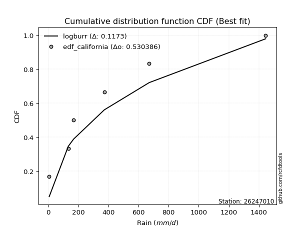</img>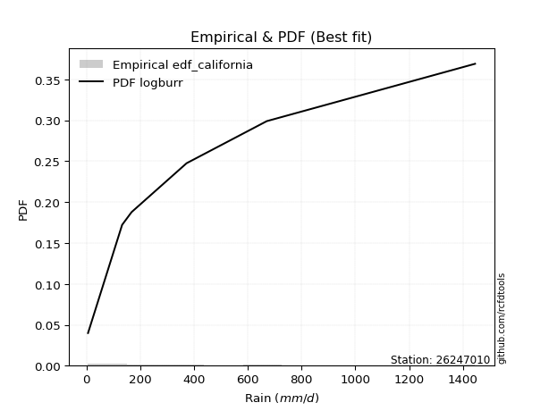</img>

</div>


### 2. Empirical - EDF Hazen (1930)

Hazen method for plotting positions is a formula used to estimate the empirical cumulative probability distribution of flood events or other hydrological data. This formula often results in biased estimations, particularly when extrapolating to extreme events (high return periods).

<div align="center">


$P=(m-0.5)/n$


</div>


**2.1. Empirical values**

<div align="center">

|                | 0                   | 1                  | 2                  | 3                  | 4         | 5                  |
|:---------------|:--------------------|:-------------------|:-------------------|:-------------------|:----------|:-------------------|
| date           | 2022                | 2025               | 2024               | 2020               | 2021      | 2019               |
| x              | 6.0                 | 132.8              | 168.0              | 372.5              | 670.8     | 1445.1             |
| m              | 1                   | 2                  | 3                  | 4                  | 5         | 6                  |
| empirical_dist | edf_hazen           | edf_hazen          | edf_hazen          | edf_hazen          | edf_hazen | edf_hazen          |
| empirical      | 0.08333333333333333 | 0.25               | 0.4166666666666667 | 0.5833333333333334 | 0.75      | 0.9166666666666666 |
| empirical_tr   | 1.090909090909091   | 1.3333333333333333 | 1.7142857142857144 | 2.4000000000000004 | 4.0       | 11.999999999999995 |

</div>


**2.2. Kolmogorov-Smirnov fit test (sorted by Δ)**


<div align="center">

|                | 0                   | 1                   | 2                   | 3                   | 4                     | 5                   | 6                   | 7                   | 8                  | 9                   | 10                  | 11                  | 12                 | 13                  | 14                  | 15                  | 16                 | 17                  | 18                  | 19                  | 20                  | 21                  | 22                 | 23                  | 24                  | 25                  | 26                  | 27                 | 28                 | 29                  | 30                 | 31                  | 32                  | 33                  | 34                 | 35                  | 36                  | 37                  | 38                  | 39                 | 40                  | 41                  | 42                  | 43                  | 44                  | 45                  | 46                  | 47                  | 48                 | 49                  | 50                  | 51                  | 52                  | 53                  | 54                 | 55                  | 56                  | 57                  | 58                  | 59                  | 60                  | 61                  | 62                  | 63                  | 64                  | 65                 | 66                  | 67                  | 68                  | 69                  | 70                  | 71                 | 72                 | 73                 | 74                 | 75                  | 76                 | 77                  | 78                 | 79                 | 80                | 81                  | 82                 | 83                 | 84                 | 85                 | 86                 | 87                 | 88                 | 89             |
|:---------------|:--------------------|:--------------------|:--------------------|:--------------------|:----------------------|:--------------------|:--------------------|:--------------------|:-------------------|:--------------------|:--------------------|:--------------------|:-------------------|:--------------------|:--------------------|:--------------------|:-------------------|:--------------------|:--------------------|:--------------------|:--------------------|:--------------------|:-------------------|:--------------------|:--------------------|:--------------------|:--------------------|:-------------------|:-------------------|:--------------------|:-------------------|:--------------------|:--------------------|:--------------------|:-------------------|:--------------------|:--------------------|:--------------------|:--------------------|:-------------------|:--------------------|:--------------------|:--------------------|:--------------------|:--------------------|:--------------------|:--------------------|:--------------------|:-------------------|:--------------------|:--------------------|:--------------------|:--------------------|:--------------------|:-------------------|:--------------------|:--------------------|:--------------------|:--------------------|:--------------------|:--------------------|:--------------------|:--------------------|:--------------------|:--------------------|:-------------------|:--------------------|:--------------------|:--------------------|:--------------------|:--------------------|:-------------------|:-------------------|:-------------------|:-------------------|:--------------------|:-------------------|:--------------------|:-------------------|:-------------------|:------------------|:--------------------|:-------------------|:-------------------|:-------------------|:-------------------|:-------------------|:-------------------|:-------------------|:---------------|
| station        | 26247010            | 26247010            | 26247010            | 26247010            | 26247010              | 26247010            | 26247010            | 26247010            | 26247010           | 26247010            | 26247010            | 26247010            | 26247010           | 26247010            | 26247010            | 26247010            | 26247010           | 26247010            | 26247010            | 26247010            | 26247010            | 26247010            | 26247010           | 26247010            | 26247010            | 26247010            | 26247010            | 26247010           | 26247010           | 26247010            | 26247010           | 26247010            | 26247010            | 26247010            | 26247010           | 26247010            | 26247010            | 26247010            | 26247010            | 26247010           | 26247010            | 26247010            | 26247010            | 26247010            | 26247010            | 26247010            | 26247010            | 26247010            | 26247010           | 26247010            | 26247010            | 26247010            | 26247010            | 26247010            | 26247010           | 26247010            | 26247010            | 26247010            | 26247010            | 26247010            | 26247010            | 26247010            | 26247010            | 26247010            | 26247010            | 26247010           | 26247010            | 26247010            | 26247010            | 26247010            | 26247010            | 26247010           | 26247010           | 26247010           | 26247010           | 26247010            | 26247010           | 26247010            | 26247010           | 26247010           | 26247010          | 26247010            | 26247010           | 26247010           | 26247010           | 26247010           | 26247010           | 26247010           | 26247010           | 26247010       |
| empirical_dist | edf_hazen           | edf_hazen           | edf_hazen           | edf_hazen           | edf_hazen             | edf_hazen           | edf_hazen           | edf_hazen           | edf_hazen          | edf_hazen           | edf_hazen           | edf_hazen           | edf_hazen          | edf_hazen           | edf_hazen           | edf_hazen           | edf_hazen          | edf_hazen           | edf_hazen           | edf_hazen           | edf_hazen           | edf_hazen           | edf_hazen          | edf_hazen           | edf_hazen           | edf_hazen           | edf_hazen           | edf_hazen          | edf_hazen          | edf_hazen           | edf_hazen          | edf_hazen           | edf_hazen           | edf_hazen           | edf_hazen          | edf_hazen           | edf_hazen           | edf_hazen           | edf_hazen           | edf_hazen          | edf_hazen           | edf_hazen           | edf_hazen           | edf_hazen           | edf_hazen           | edf_hazen           | edf_hazen           | edf_hazen           | edf_hazen          | edf_hazen           | edf_hazen           | edf_hazen           | edf_hazen           | edf_hazen           | edf_hazen          | edf_hazen           | edf_hazen           | edf_hazen           | edf_hazen           | edf_hazen           | edf_hazen           | edf_hazen           | edf_hazen           | edf_hazen           | edf_hazen           | edf_hazen          | edf_hazen           | edf_hazen           | edf_hazen           | edf_hazen           | edf_hazen           | edf_hazen          | edf_hazen          | edf_hazen          | edf_hazen          | edf_hazen           | edf_hazen          | edf_hazen           | edf_hazen          | edf_hazen          | edf_hazen         | edf_hazen           | edf_hazen          | edf_hazen          | edf_hazen          | edf_hazen          | edf_hazen          | edf_hazen          | edf_hazen          | edf_hazen      |
| p_dist         | f                   | invgamma            | logjohnsonsu        | invgauss            | loglaplace_asymmetric | logloggamma         | logweibull_min      | weibull_min         | johnsonsu          | halflogistic        | halfnorm            | logfisk             | loggumbel_l        | logmielke           | logpearson3         | pearson3            | loggompertz        | rayleigh            | exponnorm           | ncf                 | laplace_asymmetric  | expon               | genexpon           | moyal               | gumbel_r            | maxwell             | loglaplace          | truncnorm          | fatiguelife        | mielke              | t                  | fisk                | loghypsecant        | genlogistic         | nakagami           | loglogistic         | wald                | norm                | logfatiguelife      | logexponnorm       | logcrystalball      | lognorm             | lognorm             | logt                | lognct              | logistic            | kstwobign           | logf                | logrice            | loggamma            | loggamma            | logerlang           | logbetaprime        | hypsecant           | rice               | loginvgamma         | loginvgauss         | logmaxwell          | betaprime           | laplace             | logalpha            | lograyleigh         | logncf              | gompertz            | loginvweibull       | gumbel_l           | loggumbel_r         | loghalfnorm         | lognakagami         | logmoyal            | erlang              | logkstwobign       | loghalflogistic    | loggenexpon        | gibrat             | logwald             | loggibrat          | nct                 | logexpon           | logtruncnorm       | logchi2           | chi2                | pareto             | invweibull         | loglognorm         | crystalball        | logpareto          | gamma              | alpha              | loggenlogistic |
| delta          | 0.05633664050180204 | 0.05633687209170979 | 0.06190954105638874 | 0.06901251915147405 | 0.07856740030374793   | 0.08322574480182465 | 0.08801270526803129 | 0.08821474025783704 | 0.0913261462408343 | 0.09351221190618114 | 0.09718080957749568 | 0.09816954013177198 | 0.0994865620629618 | 0.10687819575686097 | 0.10840713766398785 | 0.11011953691966436 | 0.1106002424274124 | 0.11286883225862177 | 0.11883064544014993 | 0.11918205994633235 | 0.11975248172292324 | 0.11975269462064847 | 0.1197528006912903 | 0.12098168438196827 | 0.12467925694079862 | 0.12504032744538313 | 0.12597438681363715 | 0.1304914713390231 | 0.1304931146139836 | 0.13401777504392876 | 0.1347339664003473 | 0.14474267869647922 | 0.14780258795357765 | 0.15078286299341548 | 0.1541425043375479 | 0.15678559110929657 | 0.15832476739216889 | 0.15941163329361635 | 0.16668233141888994 | 0.1676129086131899 | 0.16761458855033123 | 0.16761461522121768 | 0.16761461522121768 | 0.16761640542694178 | 0.16833152576064636 | 0.16946951101638502 | 0.16965133947996108 | 0.17507843796810707 | 0.1769167411090089 | 0.17831061760914857 | 0.17831061760914857 | 0.18023678182436542 | 0.18113371128833133 | 0.18419556030462828 | 0.1923542666508602 | 0.19239409606770308 | 0.19959786345870772 | 0.20193050169596022 | 0.20523117556767168 | 0.20628256587679544 | 0.20663048070242934 | 0.21414917699847402 | 0.21897396385735052 | 0.22251570381689595 | 0.22595151429607224 | 0.2280264744188265 | 0.23040772525766484 | 0.24873397971114541 | 0.24999985372953282 | 0.25442552880216396 | 0.26013575755993446 | 0.2618086547154135 | 0.2664644070820801 | 0.2684875976679364 | 0.2856219107403521 | 0.32034211537048296 | 0.3220765468762994 | 0.33198036132721676 | 0.3414615720682377 | 0.3434630603873402 | 0.351820186009866 | 0.35953745155431915 | 0.3746694584747877 | 0.3844944605370638 | 0.4155964547224442 | 0.4204596936351876 | 0.4318212787570126 | 0.5573676787669906 | 0.6614591550133085 | 0.75           |
| deltao         | 0.530385761606      | 0.530385761606      | 0.530385761606      | 0.530385761606      | 0.530385761606        | 0.530385761606      | 0.530385761606      | 0.530385761606      | 0.530385761606     | 0.530385761606      | 0.530385761606      | 0.530385761606      | 0.530385761606     | 0.530385761606      | 0.530385761606      | 0.530385761606      | 0.530385761606     | 0.530385761606      | 0.530385761606      | 0.530385761606      | 0.530385761606      | 0.530385761606      | 0.530385761606     | 0.530385761606      | 0.530385761606      | 0.530385761606      | 0.530385761606      | 0.530385761606     | 0.530385761606     | 0.530385761606      | 0.530385761606     | 0.530385761606      | 0.530385761606      | 0.530385761606      | 0.530385761606     | 0.530385761606      | 0.530385761606      | 0.530385761606      | 0.530385761606      | 0.530385761606     | 0.530385761606      | 0.530385761606      | 0.530385761606      | 0.530385761606      | 0.530385761606      | 0.530385761606      | 0.530385761606      | 0.530385761606      | 0.530385761606     | 0.530385761606      | 0.530385761606      | 0.530385761606      | 0.530385761606      | 0.530385761606      | 0.530385761606     | 0.530385761606      | 0.530385761606      | 0.530385761606      | 0.530385761606      | 0.530385761606      | 0.530385761606      | 0.530385761606      | 0.530385761606      | 0.530385761606      | 0.530385761606      | 0.530385761606     | 0.530385761606      | 0.530385761606      | 0.530385761606      | 0.530385761606      | 0.530385761606      | 0.530385761606     | 0.530385761606     | 0.530385761606     | 0.530385761606     | 0.530385761606      | 0.530385761606     | 0.530385761606      | 0.530385761606     | 0.530385761606     | 0.530385761606    | 0.530385761606      | 0.530385761606     | 0.530385761606     | 0.530385761606     | 0.530385761606     | 0.530385761606     | 0.530385761606     | 0.530385761606     | 0.530385761606 |
| eval           | Δo > Δ              | Δo > Δ              | Δo > Δ              | Δo > Δ              | Δo > Δ                | Δo > Δ              | Δo > Δ              | Δo > Δ              | Δo > Δ             | Δo > Δ              | Δo > Δ              | Δo > Δ              | Δo > Δ             | Δo > Δ              | Δo > Δ              | Δo > Δ              | Δo > Δ             | Δo > Δ              | Δo > Δ              | Δo > Δ              | Δo > Δ              | Δo > Δ              | Δo > Δ             | Δo > Δ              | Δo > Δ              | Δo > Δ              | Δo > Δ              | Δo > Δ             | Δo > Δ             | Δo > Δ              | Δo > Δ             | Δo > Δ              | Δo > Δ              | Δo > Δ              | Δo > Δ             | Δo > Δ              | Δo > Δ              | Δo > Δ              | Δo > Δ              | Δo > Δ             | Δo > Δ              | Δo > Δ              | Δo > Δ              | Δo > Δ              | Δo > Δ              | Δo > Δ              | Δo > Δ              | Δo > Δ              | Δo > Δ             | Δo > Δ              | Δo > Δ              | Δo > Δ              | Δo > Δ              | Δo > Δ              | Δo > Δ             | Δo > Δ              | Δo > Δ              | Δo > Δ              | Δo > Δ              | Δo > Δ              | Δo > Δ              | Δo > Δ              | Δo > Δ              | Δo > Δ              | Δo > Δ              | Δo > Δ             | Δo > Δ              | Δo > Δ              | Δo > Δ              | Δo > Δ              | Δo > Δ              | Δo > Δ             | Δo > Δ             | Δo > Δ             | Δo > Δ             | Δo > Δ              | Δo > Δ             | Δo > Δ              | Δo > Δ             | Δo > Δ             | Δo > Δ            | Δo > Δ              | Δo > Δ             | Δo > Δ             | Δo > Δ             | Δo > Δ             | Δo > Δ             | Δo <= Δ            | Δo <= Δ            | Δo <= Δ        |
| fit            | 1                   | 1                   | 1                   | 1                   | 1                     | 1                   | 1                   | 1                   | 1                  | 1                   | 1                   | 1                   | 1                  | 1                   | 1                   | 1                   | 1                  | 1                   | 1                   | 1                   | 1                   | 1                   | 1                  | 1                   | 1                   | 1                   | 1                   | 1                  | 1                  | 1                   | 1                  | 1                   | 1                   | 1                   | 1                  | 1                   | 1                   | 1                   | 1                   | 1                  | 1                   | 1                   | 1                   | 1                   | 1                   | 1                   | 1                   | 1                   | 1                  | 1                   | 1                   | 1                   | 1                   | 1                   | 1                  | 1                   | 1                   | 1                   | 1                   | 1                   | 1                   | 1                   | 1                   | 1                   | 1                   | 1                  | 1                   | 1                   | 1                   | 1                   | 1                   | 1                  | 1                  | 1                  | 1                  | 1                   | 1                  | 1                   | 1                  | 1                  | 1                 | 1                   | 1                  | 1                  | 1                  | 1                  | 1                  | 0                  | 0                  | 0              |
| n              | 6                   | 6                   | 6                   | 6                   | 6                     | 6                   | 6                   | 6                   | 6                  | 6                   | 6                   | 6                   | 6                  | 6                   | 6                   | 6                   | 6                  | 6                   | 6                   | 6                   | 6                   | 6                   | 6                  | 6                   | 6                   | 6                   | 6                   | 6                  | 6                  | 6                   | 6                  | 6                   | 6                   | 6                   | 6                  | 6                   | 6                   | 6                   | 6                   | 6                  | 6                   | 6                   | 6                   | 6                   | 6                   | 6                   | 6                   | 6                   | 6                  | 6                   | 6                   | 6                   | 6                   | 6                   | 6                  | 6                   | 6                   | 6                   | 6                   | 6                   | 6                   | 6                   | 6                   | 6                   | 6                   | 6                  | 6                   | 6                   | 6                   | 6                   | 6                   | 6                  | 6                  | 6                  | 6                  | 6                   | 6                  | 6                   | 6                  | 6                  | 6                 | 6                   | 6                  | 6                  | 6                  | 6                  | 6                  | 6                  | 6                  | 6              |
| best_fit       | 1                   | 0                   | 0                   | 0                   | 0                     | 0                   | 0                   | 0                   | 0                  | 0                   | 0                   | 0                   | 0                  | 0                   | 0                   | 0                   | 0                  | 0                   | 0                   | 0                   | 0                   | 0                   | 0                  | 0                   | 0                   | 0                   | 0                   | 0                  | 0                  | 0                   | 0                  | 0                   | 0                   | 0                   | 0                  | 0                   | 0                   | 0                   | 0                   | 0                  | 0                   | 0                   | 0                   | 0                   | 0                   | 0                   | 0                   | 0                   | 0                  | 0                   | 0                   | 0                   | 0                   | 0                   | 0                  | 0                   | 0                   | 0                   | 0                   | 0                   | 0                   | 0                   | 0                   | 0                   | 0                   | 0                  | 0                   | 0                   | 0                   | 0                   | 0                   | 0                  | 0                  | 0                  | 0                  | 0                   | 0                  | 0                   | 0                  | 0                  | 0                 | 0                   | 0                  | 0                  | 0                  | 0                  | 0                  | 0                  | 0                  | 0              |
| best_fit_sort  | 1                   | 2                   | 3                   | 4                   | 5                     | 6                   | 7                   | 8                   | 9                  | 10                  | 11                  | 12                  | 13                 | 14                  | 15                  | 16                  | 17                 | 18                  | 19                  | 20                  | 21                  | 22                  | 23                 | 24                  | 25                  | 26                  | 27                  | 28                 | 29                 | 30                  | 31                 | 32                  | 33                  | 34                  | 35                 | 36                  | 37                  | 38                  | 39                  | 40                 | 41                  | 42                  | 43                  | 44                  | 45                  | 46                  | 47                  | 48                  | 49                 | 50                  | 51                  | 52                  | 53                  | 54                  | 55                 | 56                  | 57                  | 58                  | 59                  | 60                  | 61                  | 62                  | 63                  | 64                  | 65                  | 66                 | 67                  | 68                  | 69                  | 70                  | 71                  | 72                 | 73                 | 74                 | 75                 | 76                  | 77                 | 78                  | 79                 | 80                 | 81                | 82                  | 83                 | 84                 | 85                 | 86                 | 87                 | 88                 | 89                 | 90             |

</div>


<div align="center">

</img>

</div>


**2.3. Best fit**

<div align="center">

|   id |   station | empirical_dist   | p_dist   |     delta |   deltao | eval   |   fit |   n |   best_fit |   best_fit_sort |
|-----:|----------:|:-----------------|:---------|----------:|---------:|:-------|------:|----:|-----------:|----------------:|
|    0 |  26247010 | edf_hazen        | f        | 0.0563366 | 0.530386 | Δo > Δ |     1 |   6 |          1 |               1 |

</div>


<div align="center">

</img>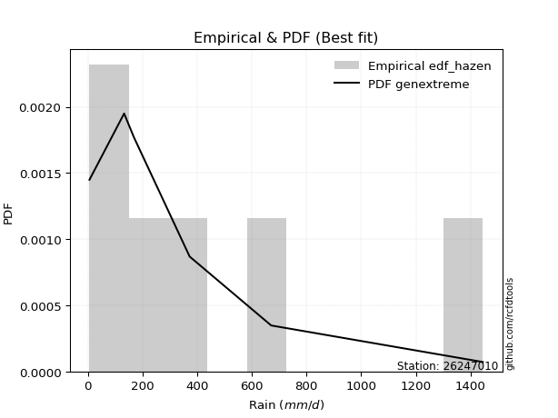</img>

</div>


### 3. Empirical - EDF Weibull (1939)

Weibull plotting position formula is an empirical method used to estimate the non-exceedance probability or plotting position for a set of observed data, is often recommended or widely used in practice, particularly in flood frequency analysis.

<div align="center">


$P=m/(n+1)$


</div>


**3.1. Empirical values**

<div align="center">

|                | 0                   | 1                  | 2                   | 3                  | 4                  | 5                  |
|:---------------|:--------------------|:-------------------|:--------------------|:-------------------|:-------------------|:-------------------|
| date           | 2022                | 2025               | 2024                | 2020               | 2021               | 2019               |
| x              | 6.0                 | 132.8              | 168.0               | 372.5              | 670.8              | 1445.1             |
| m              | 1                   | 2                  | 3                   | 4                  | 5                  | 6                  |
| empirical_dist | edf_weibull         | edf_weibull        | edf_weibull         | edf_weibull        | edf_weibull        | edf_weibull        |
| empirical      | 0.14285714285714285 | 0.2857142857142857 | 0.42857142857142855 | 0.5714285714285714 | 0.7142857142857143 | 0.8571428571428571 |
| empirical_tr   | 1.1666666666666665  | 1.4                | 1.75                | 2.333333333333333  | 3.5                | 6.999999999999997  |

</div>


**3.2. Kolmogorov-Smirnov fit test (sorted by Δ)**


<div align="center">

|                | 0                  | 1                   | 2                   | 3                   | 4                     | 5                   | 6                   | 7                   | 8                  | 9                 | 10                  | 11                 | 12                  | 13                  | 14                  | 15                  | 16                  | 17                  | 18                 | 19                  | 20                  | 21                  | 22                  | 23                  | 24                  | 25                  | 26                  | 27                  | 28                  | 29                 | 30                  | 31                  | 32                  | 33                  | 34                 | 35                  | 36                  | 37                  | 38                 | 39                  | 40                  | 41                  | 42                 | 43                  | 44                  | 45                  | 46                  | 47                  | 48                  | 49                  | 50                  | 51                  | 52                  | 53                  | 54                  | 55                  | 56                  | 57                  | 58                  | 59                  | 60                  | 61                  | 62                  | 63                  | 64                  | 65                  | 66                 | 67                  | 68                  | 69                 | 70                  | 71                 | 72                 | 73                  | 74                 | 75                 | 76                  | 77                  | 78                | 79                 | 80                 | 81                  | 82                 | 83                | 84                  | 85                 | 86                 | 87                 | 88                 | 89                 |
|:---------------|:-------------------|:--------------------|:--------------------|:--------------------|:----------------------|:--------------------|:--------------------|:--------------------|:-------------------|:------------------|:--------------------|:-------------------|:--------------------|:--------------------|:--------------------|:--------------------|:--------------------|:--------------------|:-------------------|:--------------------|:--------------------|:--------------------|:--------------------|:--------------------|:--------------------|:--------------------|:--------------------|:--------------------|:--------------------|:-------------------|:--------------------|:--------------------|:--------------------|:--------------------|:-------------------|:--------------------|:--------------------|:--------------------|:-------------------|:--------------------|:--------------------|:--------------------|:-------------------|:--------------------|:--------------------|:--------------------|:--------------------|:--------------------|:--------------------|:--------------------|:--------------------|:--------------------|:--------------------|:--------------------|:--------------------|:--------------------|:--------------------|:--------------------|:--------------------|:--------------------|:--------------------|:--------------------|:--------------------|:--------------------|:--------------------|:--------------------|:-------------------|:--------------------|:--------------------|:-------------------|:--------------------|:-------------------|:-------------------|:--------------------|:-------------------|:-------------------|:--------------------|:--------------------|:------------------|:-------------------|:-------------------|:--------------------|:-------------------|:------------------|:--------------------|:-------------------|:-------------------|:-------------------|:-------------------|:-------------------|
| station        | 26247010           | 26247010            | 26247010            | 26247010            | 26247010              | 26247010            | 26247010            | 26247010            | 26247010           | 26247010          | 26247010            | 26247010           | 26247010            | 26247010            | 26247010            | 26247010            | 26247010            | 26247010            | 26247010           | 26247010            | 26247010            | 26247010            | 26247010            | 26247010            | 26247010            | 26247010            | 26247010            | 26247010            | 26247010            | 26247010           | 26247010            | 26247010            | 26247010            | 26247010            | 26247010           | 26247010            | 26247010            | 26247010            | 26247010           | 26247010            | 26247010            | 26247010            | 26247010           | 26247010            | 26247010            | 26247010            | 26247010            | 26247010            | 26247010            | 26247010            | 26247010            | 26247010            | 26247010            | 26247010            | 26247010            | 26247010            | 26247010            | 26247010            | 26247010            | 26247010            | 26247010            | 26247010            | 26247010            | 26247010            | 26247010            | 26247010            | 26247010           | 26247010            | 26247010            | 26247010           | 26247010            | 26247010           | 26247010           | 26247010            | 26247010           | 26247010           | 26247010            | 26247010            | 26247010          | 26247010           | 26247010           | 26247010            | 26247010           | 26247010          | 26247010            | 26247010           | 26247010           | 26247010           | 26247010           | 26247010           |
| empirical_dist | edf_weibull        | edf_weibull         | edf_weibull         | edf_weibull         | edf_weibull           | edf_weibull         | edf_weibull         | edf_weibull         | edf_weibull        | edf_weibull       | edf_weibull         | edf_weibull        | edf_weibull         | edf_weibull         | edf_weibull         | edf_weibull         | edf_weibull         | edf_weibull         | edf_weibull        | edf_weibull         | edf_weibull         | edf_weibull         | edf_weibull         | edf_weibull         | edf_weibull         | edf_weibull         | edf_weibull         | edf_weibull         | edf_weibull         | edf_weibull        | edf_weibull         | edf_weibull         | edf_weibull         | edf_weibull         | edf_weibull        | edf_weibull         | edf_weibull         | edf_weibull         | edf_weibull        | edf_weibull         | edf_weibull         | edf_weibull         | edf_weibull        | edf_weibull         | edf_weibull         | edf_weibull         | edf_weibull         | edf_weibull         | edf_weibull         | edf_weibull         | edf_weibull         | edf_weibull         | edf_weibull         | edf_weibull         | edf_weibull         | edf_weibull         | edf_weibull         | edf_weibull         | edf_weibull         | edf_weibull         | edf_weibull         | edf_weibull         | edf_weibull         | edf_weibull         | edf_weibull         | edf_weibull         | edf_weibull        | edf_weibull         | edf_weibull         | edf_weibull        | edf_weibull         | edf_weibull        | edf_weibull        | edf_weibull         | edf_weibull        | edf_weibull        | edf_weibull         | edf_weibull         | edf_weibull       | edf_weibull        | edf_weibull        | edf_weibull         | edf_weibull        | edf_weibull       | edf_weibull         | edf_weibull        | edf_weibull        | edf_weibull        | edf_weibull        | edf_weibull        |
| p_dist         | f                  | invgamma            | logjohnsonsu        | invgauss            | loglaplace_asymmetric | halfnorm            | fatiguelife         | loggumbel_l         | logpearson3        | halflogistic      | johnsonsu           | logweibull_min     | loghypsecant        | loglogistic         | pearson3            | logfisk             | rayleigh            | logfatiguelife      | logexponnorm       | logcrystalball      | lognorm             | lognorm             | logt                | lognct              | moyal               | maxwell             | gumbel_r            | loglaplace          | logf                | logrice            | exponnorm           | logmielke           | loggamma            | loggamma            | logloggamma        | ncf                 | mielke              | nakagami            | truncnorm          | loggompertz         | laplace_asymmetric  | weibull_min         | genexpon           | fisk                | expon               | logerlang           | logbetaprime        | t                   | loginvgamma         | norm                | genlogistic         | loginvgauss         | logmaxwell          | betaprime           | wald                | logalpha            | lograyleigh         | logistic            | kstwobign           | logncf              | loginvweibull       | loggumbel_r         | hypsecant           | rice                | loghalfnorm         | gumbel_l            | laplace            | logmoyal            | logkstwobign        | erlang             | loghalflogistic     | loggenexpon        | gompertz           | logwald             | lognakagami        | loggibrat          | nct                 | gibrat              | logexpon          | logtruncnorm       | logchi2            | chi2                | invweibull         | pareto            | crystalball         | loglognorm         | logpareto          | gamma              | alpha              | loggenlogistic     |
| delta          | 0.0932456741117216 | 0.09324587645856847 | 0.09611063935662445 | 0.09772663230307443 | 0.0978456476272932    | 0.09852630663634432 | 0.09972922498854142 | 0.09974448633680474 | 0.0999316398143568 | 0.105416973810943 | 0.10682044339818321 | 0.1069052626976841 | 0.11467112776179574 | 0.12107130539501088 | 0.12202429882442622 | 0.12264817736140235 | 0.12401946233007233 | 0.13096804570460424 | 0.1318986228989042 | 0.13190030283604554 | 0.13190032950693198 | 0.13190032950693198 | 0.13190211971265609 | 0.13261724004636066 | 0.13288644628673013 | 0.13392584747247044 | 0.13658401884556048 | 0.13787914871839912 | 0.13936415225382137 | 0.1412024553947232 | 0.14172591414023333 | 0.14237268971976125 | 0.14259633189486287 | 0.14259633189486287 | 0.1427495543256342 | 0.14283516406155597 | 0.14283571922378274 | 0.14285668708084293 | 0.1428568505432401 | 0.14285700357768708 | 0.14285714285097123 | 0.14285714285464277 | 0.1428571428570548 | 0.14285714285714207 | 0.14285714285714285 | 0.14452249611007972 | 0.14541942557404564 | 0.15307443265314757 | 0.15667981035341738 | 0.15834336388072595 | 0.16268762489817734 | 0.16388357774442203 | 0.16621621598167452 | 0.16951688985338598 | 0.17022952929693075 | 0.17091619498814364 | 0.17843489128418832 | 0.18075068633181393 | 0.18155610138472295 | 0.18325967814306482 | 0.19023722858178654 | 0.19469343954337914 | 0.19610032220939014 | 0.20425902855562206 | 0.21301969399685972 | 0.21612171251406453 | 0.2181873277815573 | 0.21871124308787826 | 0.22609436900112778 | 0.2270687995401982 | 0.23075012136779438 | 0.2327733119536507 | 0.2344204657216578 | 0.28462782965619726 | 0.2857141394438185 | 0.2863622611620137 | 0.29626607561293106 | 0.29752667264511395 | 0.305747286353952 | 0.3077487746730545 | 0.3161059002955803 | 0.32382316584003346 | 0.3249706510132543 | 0.338955172760502 | 0.36093588411137806 | 0.3798821690081585 | 0.3961069930427269 | 0.5216533930527049 | 0.6257448692990228 | 0.7142857142857143 |
| deltao         | 0.530385761606     | 0.530385761606      | 0.530385761606      | 0.530385761606      | 0.530385761606        | 0.530385761606      | 0.530385761606      | 0.530385761606      | 0.530385761606     | 0.530385761606    | 0.530385761606      | 0.530385761606     | 0.530385761606      | 0.530385761606      | 0.530385761606      | 0.530385761606      | 0.530385761606      | 0.530385761606      | 0.530385761606     | 0.530385761606      | 0.530385761606      | 0.530385761606      | 0.530385761606      | 0.530385761606      | 0.530385761606      | 0.530385761606      | 0.530385761606      | 0.530385761606      | 0.530385761606      | 0.530385761606     | 0.530385761606      | 0.530385761606      | 0.530385761606      | 0.530385761606      | 0.530385761606     | 0.530385761606      | 0.530385761606      | 0.530385761606      | 0.530385761606     | 0.530385761606      | 0.530385761606      | 0.530385761606      | 0.530385761606     | 0.530385761606      | 0.530385761606      | 0.530385761606      | 0.530385761606      | 0.530385761606      | 0.530385761606      | 0.530385761606      | 0.530385761606      | 0.530385761606      | 0.530385761606      | 0.530385761606      | 0.530385761606      | 0.530385761606      | 0.530385761606      | 0.530385761606      | 0.530385761606      | 0.530385761606      | 0.530385761606      | 0.530385761606      | 0.530385761606      | 0.530385761606      | 0.530385761606      | 0.530385761606      | 0.530385761606     | 0.530385761606      | 0.530385761606      | 0.530385761606     | 0.530385761606      | 0.530385761606     | 0.530385761606     | 0.530385761606      | 0.530385761606     | 0.530385761606     | 0.530385761606      | 0.530385761606      | 0.530385761606    | 0.530385761606     | 0.530385761606     | 0.530385761606      | 0.530385761606     | 0.530385761606    | 0.530385761606      | 0.530385761606     | 0.530385761606     | 0.530385761606     | 0.530385761606     | 0.530385761606     |
| eval           | Δo > Δ             | Δo > Δ              | Δo > Δ              | Δo > Δ              | Δo > Δ                | Δo > Δ              | Δo > Δ              | Δo > Δ              | Δo > Δ             | Δo > Δ            | Δo > Δ              | Δo > Δ             | Δo > Δ              | Δo > Δ              | Δo > Δ              | Δo > Δ              | Δo > Δ              | Δo > Δ              | Δo > Δ             | Δo > Δ              | Δo > Δ              | Δo > Δ              | Δo > Δ              | Δo > Δ              | Δo > Δ              | Δo > Δ              | Δo > Δ              | Δo > Δ              | Δo > Δ              | Δo > Δ             | Δo > Δ              | Δo > Δ              | Δo > Δ              | Δo > Δ              | Δo > Δ             | Δo > Δ              | Δo > Δ              | Δo > Δ              | Δo > Δ             | Δo > Δ              | Δo > Δ              | Δo > Δ              | Δo > Δ             | Δo > Δ              | Δo > Δ              | Δo > Δ              | Δo > Δ              | Δo > Δ              | Δo > Δ              | Δo > Δ              | Δo > Δ              | Δo > Δ              | Δo > Δ              | Δo > Δ              | Δo > Δ              | Δo > Δ              | Δo > Δ              | Δo > Δ              | Δo > Δ              | Δo > Δ              | Δo > Δ              | Δo > Δ              | Δo > Δ              | Δo > Δ              | Δo > Δ              | Δo > Δ              | Δo > Δ             | Δo > Δ              | Δo > Δ              | Δo > Δ             | Δo > Δ              | Δo > Δ             | Δo > Δ             | Δo > Δ              | Δo > Δ             | Δo > Δ             | Δo > Δ              | Δo > Δ              | Δo > Δ            | Δo > Δ             | Δo > Δ             | Δo > Δ              | Δo > Δ             | Δo > Δ            | Δo > Δ              | Δo > Δ             | Δo > Δ             | Δo > Δ             | Δo <= Δ            | Δo <= Δ            |
| fit            | 1                  | 1                   | 1                   | 1                   | 1                     | 1                   | 1                   | 1                   | 1                  | 1                 | 1                   | 1                  | 1                   | 1                   | 1                   | 1                   | 1                   | 1                   | 1                  | 1                   | 1                   | 1                   | 1                   | 1                   | 1                   | 1                   | 1                   | 1                   | 1                   | 1                  | 1                   | 1                   | 1                   | 1                   | 1                  | 1                   | 1                   | 1                   | 1                  | 1                   | 1                   | 1                   | 1                  | 1                   | 1                   | 1                   | 1                   | 1                   | 1                   | 1                   | 1                   | 1                   | 1                   | 1                   | 1                   | 1                   | 1                   | 1                   | 1                   | 1                   | 1                   | 1                   | 1                   | 1                   | 1                   | 1                   | 1                  | 1                   | 1                   | 1                  | 1                   | 1                  | 1                  | 1                   | 1                  | 1                  | 1                   | 1                   | 1                 | 1                  | 1                  | 1                   | 1                  | 1                 | 1                   | 1                  | 1                  | 1                  | 0                  | 0                  |
| n              | 6                  | 6                   | 6                   | 6                   | 6                     | 6                   | 6                   | 6                   | 6                  | 6                 | 6                   | 6                  | 6                   | 6                   | 6                   | 6                   | 6                   | 6                   | 6                  | 6                   | 6                   | 6                   | 6                   | 6                   | 6                   | 6                   | 6                   | 6                   | 6                   | 6                  | 6                   | 6                   | 6                   | 6                   | 6                  | 6                   | 6                   | 6                   | 6                  | 6                   | 6                   | 6                   | 6                  | 6                   | 6                   | 6                   | 6                   | 6                   | 6                   | 6                   | 6                   | 6                   | 6                   | 6                   | 6                   | 6                   | 6                   | 6                   | 6                   | 6                   | 6                   | 6                   | 6                   | 6                   | 6                   | 6                   | 6                  | 6                   | 6                   | 6                  | 6                   | 6                  | 6                  | 6                   | 6                  | 6                  | 6                   | 6                   | 6                 | 6                  | 6                  | 6                   | 6                  | 6                 | 6                   | 6                  | 6                  | 6                  | 6                  | 6                  |
| best_fit       | 1                  | 0                   | 0                   | 0                   | 0                     | 0                   | 0                   | 0                   | 0                  | 0                 | 0                   | 0                  | 0                   | 0                   | 0                   | 0                   | 0                   | 0                   | 0                  | 0                   | 0                   | 0                   | 0                   | 0                   | 0                   | 0                   | 0                   | 0                   | 0                   | 0                  | 0                   | 0                   | 0                   | 0                   | 0                  | 0                   | 0                   | 0                   | 0                  | 0                   | 0                   | 0                   | 0                  | 0                   | 0                   | 0                   | 0                   | 0                   | 0                   | 0                   | 0                   | 0                   | 0                   | 0                   | 0                   | 0                   | 0                   | 0                   | 0                   | 0                   | 0                   | 0                   | 0                   | 0                   | 0                   | 0                   | 0                  | 0                   | 0                   | 0                  | 0                   | 0                  | 0                  | 0                   | 0                  | 0                  | 0                   | 0                   | 0                 | 0                  | 0                  | 0                   | 0                  | 0                 | 0                   | 0                  | 0                  | 0                  | 0                  | 0                  |
| best_fit_sort  | 1                  | 2                   | 3                   | 4                   | 5                     | 6                   | 7                   | 8                   | 9                  | 10                | 11                  | 12                 | 13                  | 14                  | 15                  | 16                  | 17                  | 18                  | 19                 | 20                  | 21                  | 22                  | 23                  | 24                  | 25                  | 26                  | 27                  | 28                  | 29                  | 30                 | 31                  | 32                  | 33                  | 34                  | 35                 | 36                  | 37                  | 38                  | 39                 | 40                  | 41                  | 42                  | 43                 | 44                  | 45                  | 46                  | 47                  | 48                  | 49                  | 50                  | 51                  | 52                  | 53                  | 54                  | 55                  | 56                  | 57                  | 58                  | 59                  | 60                  | 61                  | 62                  | 63                  | 64                  | 65                  | 66                  | 67                 | 68                  | 69                  | 70                 | 71                  | 72                 | 73                 | 74                  | 75                 | 76                 | 77                  | 78                  | 79                | 80                 | 81                 | 82                  | 83                 | 84                | 85                  | 86                 | 87                 | 88                 | 89                 | 90                 |

</div>


<div align="center">

</img>

</div>


**3.3. Best fit**

<div align="center">

|   id |   station | empirical_dist   | p_dist   |     delta |   deltao | eval   |   fit |   n |   best_fit |   best_fit_sort |
|-----:|----------:|:-----------------|:---------|----------:|---------:|:-------|------:|----:|-----------:|----------------:|
|    0 |  26247010 | edf_weibull      | f        | 0.0932457 | 0.530386 | Δo > Δ |     1 |   6 |          1 |               1 |

</div>


<div align="center">

</img>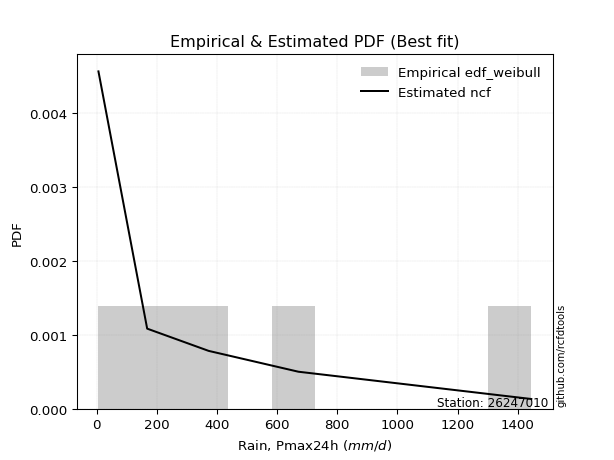</img>

</div>


### 4. Empirical - EDF Beard (1943)

The Beard formula (or Beard´s plotting position formula) in hydrology is used to estimate the empirical non-exceedance probability _(P)_ of a flood event (or other extreme hydrological data point) within a given dataset.

<div align="center">


$P=(m-0.31)/(n+0.38)$


</div>


**4.1. Empirical values**

<div align="center">

|                | 0                   | 1                   | 2                  | 3                  | 4                  | 5                  |
|:---------------|:--------------------|:--------------------|:-------------------|:-------------------|:-------------------|:-------------------|
| date           | 2022                | 2025                | 2024               | 2020               | 2021               | 2019               |
| x              | 6.0                 | 132.8               | 168.0              | 372.5              | 670.8              | 1445.1             |
| m              | 1                   | 2                   | 3                  | 4                  | 5                  | 6                  |
| empirical_dist | edf_beard           | edf_beard           | edf_beard          | edf_beard          | edf_beard          | edf_beard          |
| empirical      | 0.10815047021943573 | 0.26489028213166144 | 0.4216300940438871 | 0.5783699059561128 | 0.7351097178683387 | 0.8918495297805643 |
| empirical_tr   | 1.1212653778558874  | 1.3603411513859276  | 1.7289972899728996 | 2.3717472118959106 | 3.7751479289940844 | 9.246376811594207  |

</div>


**4.2. Kolmogorov-Smirnov fit test (sorted by Δ)**


<div align="center">

|                | 0                   | 1                   | 2                   | 3                   | 4                   | 5                   | 6                     | 7                   | 8                   | 9                  | 10                  | 11                  | 12                  | 13                  | 14                  | 15                  | 16                  | 17                 | 18                  | 19                 | 20                  | 21                  | 22                  | 23                  | 24                  | 25                 | 26                  | 27                  | 28                  | 29                 | 30                 | 31                 | 32                  | 33                  | 34                  | 35                 | 36                  | 37                 | 38                  | 39                  | 40                  | 41                  | 42                 | 43                  | 44                  | 45                  | 46                  | 47                  | 48                  | 49                  | 50                 | 51                 | 52                  | 53                  | 54                 | 55                  | 56                  | 57                  | 58                 | 59                  | 60                  | 61                  | 62                 | 63                  | 64                 | 65                  | 66                 | 67                  | 68                  | 69                  | 70                  | 71                  | 72                  | 73                  | 74                  | 75                 | 76                  | 77                 | 78                  | 79                  | 80                  | 81                 | 82                 | 83                 | 84                  | 85                 | 86                  | 87                 | 88                 | 89                 |
|:---------------|:--------------------|:--------------------|:--------------------|:--------------------|:--------------------|:--------------------|:----------------------|:--------------------|:--------------------|:-------------------|:--------------------|:--------------------|:--------------------|:--------------------|:--------------------|:--------------------|:--------------------|:-------------------|:--------------------|:-------------------|:--------------------|:--------------------|:--------------------|:--------------------|:--------------------|:-------------------|:--------------------|:--------------------|:--------------------|:-------------------|:-------------------|:-------------------|:--------------------|:--------------------|:--------------------|:-------------------|:--------------------|:-------------------|:--------------------|:--------------------|:--------------------|:--------------------|:-------------------|:--------------------|:--------------------|:--------------------|:--------------------|:--------------------|:--------------------|:--------------------|:-------------------|:-------------------|:--------------------|:--------------------|:-------------------|:--------------------|:--------------------|:--------------------|:-------------------|:--------------------|:--------------------|:--------------------|:-------------------|:--------------------|:-------------------|:--------------------|:-------------------|:--------------------|:--------------------|:--------------------|:--------------------|:--------------------|:--------------------|:--------------------|:--------------------|:-------------------|:--------------------|:-------------------|:--------------------|:--------------------|:--------------------|:-------------------|:-------------------|:-------------------|:--------------------|:-------------------|:--------------------|:-------------------|:-------------------|:-------------------|
| station        | 26247010            | 26247010            | 26247010            | 26247010            | 26247010            | 26247010            | 26247010              | 26247010            | 26247010            | 26247010           | 26247010            | 26247010            | 26247010            | 26247010            | 26247010            | 26247010            | 26247010            | 26247010           | 26247010            | 26247010           | 26247010            | 26247010            | 26247010            | 26247010            | 26247010            | 26247010           | 26247010            | 26247010            | 26247010            | 26247010           | 26247010           | 26247010           | 26247010            | 26247010            | 26247010            | 26247010           | 26247010            | 26247010           | 26247010            | 26247010            | 26247010            | 26247010            | 26247010           | 26247010            | 26247010            | 26247010            | 26247010            | 26247010            | 26247010            | 26247010            | 26247010           | 26247010           | 26247010            | 26247010            | 26247010           | 26247010            | 26247010            | 26247010            | 26247010           | 26247010            | 26247010            | 26247010            | 26247010           | 26247010            | 26247010           | 26247010            | 26247010           | 26247010            | 26247010            | 26247010            | 26247010            | 26247010            | 26247010            | 26247010            | 26247010            | 26247010           | 26247010            | 26247010           | 26247010            | 26247010            | 26247010            | 26247010           | 26247010           | 26247010           | 26247010            | 26247010           | 26247010            | 26247010           | 26247010           | 26247010           |
| empirical_dist | edf_beard           | edf_beard           | edf_beard           | edf_beard           | edf_beard           | edf_beard           | edf_beard             | edf_beard           | edf_beard           | edf_beard          | edf_beard           | edf_beard           | edf_beard           | edf_beard           | edf_beard           | edf_beard           | edf_beard           | edf_beard          | edf_beard           | edf_beard          | edf_beard           | edf_beard           | edf_beard           | edf_beard           | edf_beard           | edf_beard          | edf_beard           | edf_beard           | edf_beard           | edf_beard          | edf_beard          | edf_beard          | edf_beard           | edf_beard           | edf_beard           | edf_beard          | edf_beard           | edf_beard          | edf_beard           | edf_beard           | edf_beard           | edf_beard           | edf_beard          | edf_beard           | edf_beard           | edf_beard           | edf_beard           | edf_beard           | edf_beard           | edf_beard           | edf_beard          | edf_beard          | edf_beard           | edf_beard           | edf_beard          | edf_beard           | edf_beard           | edf_beard           | edf_beard          | edf_beard           | edf_beard           | edf_beard           | edf_beard          | edf_beard           | edf_beard          | edf_beard           | edf_beard          | edf_beard           | edf_beard           | edf_beard           | edf_beard           | edf_beard           | edf_beard           | edf_beard           | edf_beard           | edf_beard          | edf_beard           | edf_beard          | edf_beard           | edf_beard           | edf_beard           | edf_beard          | edf_beard          | edf_beard          | edf_beard           | edf_beard          | edf_beard           | edf_beard          | edf_beard          | edf_beard          |
| p_dist         | f                   | invgamma            | invgauss            | logjohnsonsu        | logweibull_min      | johnsonsu           | loglaplace_asymmetric | loggumbel_l         | logfisk             | halfnorm           | logpearson3         | halflogistic        | logmielke           | logloggamma         | ncf                 | loggompertz         | weibull_min         | pearson3           | fatiguelife         | rayleigh           | mielke              | exponnorm           | laplace_asymmetric  | expon               | genexpon            | moyal              | maxwell             | gumbel_r            | fisk                | loglaplace         | t                  | loghypsecant       | truncnorm           | nakagami            | loglogistic         | logfatiguelife     | logexponnorm        | logcrystalball     | lognorm             | lognorm             | logt                | lognct              | norm               | genlogistic         | logf                | logrice             | wald                | loggamma            | loggamma            | logerlang           | logbetaprime       | logistic           | kstwobign           | loginvgamma         | loginvgauss        | logmaxwell          | hypsecant           | betaprime           | logalpha           | rice                | lograyleigh         | logncf              | loginvweibull      | laplace             | loggumbel_r        | gumbel_l            | gompertz           | loghalfnorm         | logmoyal            | erlang              | logkstwobign        | loghalflogistic     | loggenexpon         | lognakagami         | gibrat              | logwald            | loggibrat           | nct                | logexpon            | logtruncnorm        | logchi2             | chi2               | invweibull         | pareto             | crystalball         | loglognorm         | logpareto           | gamma              | alpha              | loggenlogistic     |
| delta          | 0.06130006787902248 | 0.06130029946893023 | 0.06301995966536732 | 0.06687296843360918 | 0.07312242313636985 | 0.07643586410917286 | 0.07702164404466882   | 0.08459627993130037 | 0.08794150472369523 | 0.0896331556339876 | 0.09351685553232642 | 0.09847563928340158 | 0.10766601708205403 | 0.10804288168792697 | 0.10812849142384884 | 0.10815033093997996 | 0.10815047021693566 | 0.1150829642968848 | 0.11560283248232217 | 0.1170781278025309 | 0.11912749291226743 | 0.12379407281737037 | 0.12471590910014368 | 0.12471612199786891 | 0.12471622806851074 | 0.1259451117591887 | 0.12698451294492902 | 0.12964268431801906 | 0.12985239656481778 | 0.1309378141908577 | 0.1322504290705232 | 0.1329123058219162 | 0.13545489871624355 | 0.13925222220588646 | 0.14189530897763514 | 0.1517920492872285 | 0.15272262648152846 | 0.1527243064186698 | 0.15272433308955624 | 0.15272433308955624 | 0.15272612329528035 | 0.15344124362898492 | 0.1544482059163958 | 0.15574629037063592 | 0.16018815583644563 | 0.16202645897734747 | 0.16328819476938933 | 0.16342033547748713 | 0.16342033547748713 | 0.16534649969270399 | 0.1662434291566699 | 0.1738093518042725 | 0.17461476685718152 | 0.17750381393604164 | 0.1847075813270463 | 0.18704021956429878 | 0.18915898768184872 | 0.19034089343601024 | 0.1917401985707679 | 0.19731769402808064 | 0.19925889486681259 | 0.20408368172568908 | 0.2110612321644108 | 0.21124599325401588 | 0.2155174431260034 | 0.22306304704160596 | 0.2274791311941164 | 0.23384369757948398 | 0.23953524667050252 | 0.24524547542827302 | 0.24691837258375204 | 0.25157412495041864 | 0.25359731553627496 | 0.26489013586119425 | 0.29058533811757253 | 0.3054518332388215 | 0.30718626474463795 | 0.3170900791955553 | 0.32657128993657625 | 0.32857277825567877 | 0.33692990387820454 | 0.3446471694226577 | 0.3596773236509615 | 0.3597791763431263 | 0.39564255674908516 | 0.4007061725907828 | 0.41693099662535116 | 0.5424773966353291 | 0.6465688728816471 | 0.7351097178683387 |
| deltao         | 0.530385761606      | 0.530385761606      | 0.530385761606      | 0.530385761606      | 0.530385761606      | 0.530385761606      | 0.530385761606        | 0.530385761606      | 0.530385761606      | 0.530385761606     | 0.530385761606      | 0.530385761606      | 0.530385761606      | 0.530385761606      | 0.530385761606      | 0.530385761606      | 0.530385761606      | 0.530385761606     | 0.530385761606      | 0.530385761606     | 0.530385761606      | 0.530385761606      | 0.530385761606      | 0.530385761606      | 0.530385761606      | 0.530385761606     | 0.530385761606      | 0.530385761606      | 0.530385761606      | 0.530385761606     | 0.530385761606     | 0.530385761606     | 0.530385761606      | 0.530385761606      | 0.530385761606      | 0.530385761606     | 0.530385761606      | 0.530385761606     | 0.530385761606      | 0.530385761606      | 0.530385761606      | 0.530385761606      | 0.530385761606     | 0.530385761606      | 0.530385761606      | 0.530385761606      | 0.530385761606      | 0.530385761606      | 0.530385761606      | 0.530385761606      | 0.530385761606     | 0.530385761606     | 0.530385761606      | 0.530385761606      | 0.530385761606     | 0.530385761606      | 0.530385761606      | 0.530385761606      | 0.530385761606     | 0.530385761606      | 0.530385761606      | 0.530385761606      | 0.530385761606     | 0.530385761606      | 0.530385761606     | 0.530385761606      | 0.530385761606     | 0.530385761606      | 0.530385761606      | 0.530385761606      | 0.530385761606      | 0.530385761606      | 0.530385761606      | 0.530385761606      | 0.530385761606      | 0.530385761606     | 0.530385761606      | 0.530385761606     | 0.530385761606      | 0.530385761606      | 0.530385761606      | 0.530385761606     | 0.530385761606     | 0.530385761606     | 0.530385761606      | 0.530385761606     | 0.530385761606      | 0.530385761606     | 0.530385761606     | 0.530385761606     |
| eval           | Δo > Δ              | Δo > Δ              | Δo > Δ              | Δo > Δ              | Δo > Δ              | Δo > Δ              | Δo > Δ                | Δo > Δ              | Δo > Δ              | Δo > Δ             | Δo > Δ              | Δo > Δ              | Δo > Δ              | Δo > Δ              | Δo > Δ              | Δo > Δ              | Δo > Δ              | Δo > Δ             | Δo > Δ              | Δo > Δ             | Δo > Δ              | Δo > Δ              | Δo > Δ              | Δo > Δ              | Δo > Δ              | Δo > Δ             | Δo > Δ              | Δo > Δ              | Δo > Δ              | Δo > Δ             | Δo > Δ             | Δo > Δ             | Δo > Δ              | Δo > Δ              | Δo > Δ              | Δo > Δ             | Δo > Δ              | Δo > Δ             | Δo > Δ              | Δo > Δ              | Δo > Δ              | Δo > Δ              | Δo > Δ             | Δo > Δ              | Δo > Δ              | Δo > Δ              | Δo > Δ              | Δo > Δ              | Δo > Δ              | Δo > Δ              | Δo > Δ             | Δo > Δ             | Δo > Δ              | Δo > Δ              | Δo > Δ             | Δo > Δ              | Δo > Δ              | Δo > Δ              | Δo > Δ             | Δo > Δ              | Δo > Δ              | Δo > Δ              | Δo > Δ             | Δo > Δ              | Δo > Δ             | Δo > Δ              | Δo > Δ             | Δo > Δ              | Δo > Δ              | Δo > Δ              | Δo > Δ              | Δo > Δ              | Δo > Δ              | Δo > Δ              | Δo > Δ              | Δo > Δ             | Δo > Δ              | Δo > Δ             | Δo > Δ              | Δo > Δ              | Δo > Δ              | Δo > Δ             | Δo > Δ             | Δo > Δ             | Δo > Δ              | Δo > Δ             | Δo > Δ              | Δo <= Δ            | Δo <= Δ            | Δo <= Δ            |
| fit            | 1                   | 1                   | 1                   | 1                   | 1                   | 1                   | 1                     | 1                   | 1                   | 1                  | 1                   | 1                   | 1                   | 1                   | 1                   | 1                   | 1                   | 1                  | 1                   | 1                  | 1                   | 1                   | 1                   | 1                   | 1                   | 1                  | 1                   | 1                   | 1                   | 1                  | 1                  | 1                  | 1                   | 1                   | 1                   | 1                  | 1                   | 1                  | 1                   | 1                   | 1                   | 1                   | 1                  | 1                   | 1                   | 1                   | 1                   | 1                   | 1                   | 1                   | 1                  | 1                  | 1                   | 1                   | 1                  | 1                   | 1                   | 1                   | 1                  | 1                   | 1                   | 1                   | 1                  | 1                   | 1                  | 1                   | 1                  | 1                   | 1                   | 1                   | 1                   | 1                   | 1                   | 1                   | 1                   | 1                  | 1                   | 1                  | 1                   | 1                   | 1                   | 1                  | 1                  | 1                  | 1                   | 1                  | 1                   | 0                  | 0                  | 0                  |
| n              | 6                   | 6                   | 6                   | 6                   | 6                   | 6                   | 6                     | 6                   | 6                   | 6                  | 6                   | 6                   | 6                   | 6                   | 6                   | 6                   | 6                   | 6                  | 6                   | 6                  | 6                   | 6                   | 6                   | 6                   | 6                   | 6                  | 6                   | 6                   | 6                   | 6                  | 6                  | 6                  | 6                   | 6                   | 6                   | 6                  | 6                   | 6                  | 6                   | 6                   | 6                   | 6                   | 6                  | 6                   | 6                   | 6                   | 6                   | 6                   | 6                   | 6                   | 6                  | 6                  | 6                   | 6                   | 6                  | 6                   | 6                   | 6                   | 6                  | 6                   | 6                   | 6                   | 6                  | 6                   | 6                  | 6                   | 6                  | 6                   | 6                   | 6                   | 6                   | 6                   | 6                   | 6                   | 6                   | 6                  | 6                   | 6                  | 6                   | 6                   | 6                   | 6                  | 6                  | 6                  | 6                   | 6                  | 6                   | 6                  | 6                  | 6                  |
| best_fit       | 1                   | 0                   | 0                   | 0                   | 0                   | 0                   | 0                     | 0                   | 0                   | 0                  | 0                   | 0                   | 0                   | 0                   | 0                   | 0                   | 0                   | 0                  | 0                   | 0                  | 0                   | 0                   | 0                   | 0                   | 0                   | 0                  | 0                   | 0                   | 0                   | 0                  | 0                  | 0                  | 0                   | 0                   | 0                   | 0                  | 0                   | 0                  | 0                   | 0                   | 0                   | 0                   | 0                  | 0                   | 0                   | 0                   | 0                   | 0                   | 0                   | 0                   | 0                  | 0                  | 0                   | 0                   | 0                  | 0                   | 0                   | 0                   | 0                  | 0                   | 0                   | 0                   | 0                  | 0                   | 0                  | 0                   | 0                  | 0                   | 0                   | 0                   | 0                   | 0                   | 0                   | 0                   | 0                   | 0                  | 0                   | 0                  | 0                   | 0                   | 0                   | 0                  | 0                  | 0                  | 0                   | 0                  | 0                   | 0                  | 0                  | 0                  |
| best_fit_sort  | 1                   | 2                   | 3                   | 4                   | 5                   | 6                   | 7                     | 8                   | 9                   | 10                 | 11                  | 12                  | 13                  | 14                  | 15                  | 16                  | 17                  | 18                 | 19                  | 20                 | 21                  | 22                  | 23                  | 24                  | 25                  | 26                 | 27                  | 28                  | 29                  | 30                 | 31                 | 32                 | 33                  | 34                  | 35                  | 36                 | 37                  | 38                 | 39                  | 40                  | 41                  | 42                  | 43                 | 44                  | 45                  | 46                  | 47                  | 48                  | 49                  | 50                  | 51                 | 52                 | 53                  | 54                  | 55                 | 56                  | 57                  | 58                  | 59                 | 60                  | 61                  | 62                  | 63                 | 64                  | 65                 | 66                  | 67                 | 68                  | 69                  | 70                  | 71                  | 72                  | 73                  | 74                  | 75                  | 76                 | 77                  | 78                 | 79                  | 80                  | 81                  | 82                 | 83                 | 84                 | 85                  | 86                 | 87                  | 88                 | 89                 | 90                 |

</div>


<div align="center">

</img>

</div>


**4.3. Best fit**

<div align="center">

|   id |   station | empirical_dist   | p_dist   |     delta |   deltao | eval   |   fit |   n |   best_fit |   best_fit_sort |
|-----:|----------:|:-----------------|:---------|----------:|---------:|:-------|------:|----:|-----------:|----------------:|
|    0 |  26247010 | edf_beard        | f        | 0.0613001 | 0.530386 | Δo > Δ |     1 |   6 |          1 |               1 |

</div>


<div align="center">

</img></img>

</div>


### 5. Empirical - EDF Chegodayev (1955)

The Chegodayev formula is an empirical plotting position formula used in hydrological frequency analysis to estimate the exceedance probability or return period of a specific event from a set of observed data. It is primarily used for plotting observed data points on probability paper to fit a theoretical distribution, particularly for analyzing extreme events like maximum flood flows or rainfall intensities. The constant _b_ value in the generalized plotting position formula is 0.3.

<div align="center">


$P=(m-b)/(n+1-2b)$


</div>


**5.1. Empirical values**

<div align="center">

|                | 0                   | 1                  | 2                  | 3                  | 4                 | 5                 |
|:---------------|:--------------------|:-------------------|:-------------------|:-------------------|:------------------|:------------------|
| date           | 2022                | 2025               | 2024               | 2020               | 2021              | 2019              |
| x              | 6.0                 | 132.8              | 168.0              | 372.5              | 670.8             | 1445.1            |
| m              | 1                   | 2                  | 3                  | 4                  | 5                 | 6                 |
| empirical_dist | edf_chegodayev      | edf_chegodayev     | edf_chegodayev     | edf_chegodayev     | edf_chegodayev    | edf_chegodayev    |
| empirical      | 0.10937499999999999 | 0.265625           | 0.421875           | 0.578125           | 0.734375          | 0.890625          |
| empirical_tr   | 1.1228070175438596  | 1.3617021276595744 | 1.7297297297297298 | 2.3703703703703702 | 3.764705882352941 | 9.142857142857142 |

</div>


**5.2. Kolmogorov-Smirnov fit test (sorted by Δ)**


<div align="center">

|                | 0                   | 1                    | 2                   | 3                   | 4                   | 5                  | 6                     | 7                  | 8                   | 9                   | 10                  | 11                  | 12                  | 13                  | 14                  | 15                  | 16                  | 17                  | 18                  | 19                  | 20                  | 21                  | 22                  | 23                  | 24                  | 25                  | 26                 | 27                  | 28                  | 29                  | 30                  | 31                  | 32                  | 33                 | 34                  | 35                  | 36                 | 37                  | 38                  | 39                  | 40                  | 41                  | 42                  | 43                 | 44                  | 45                 | 46                  | 47                  | 48                 | 49                  | 50                  | 51                  | 52                 | 53                  | 54                  | 55                  | 56                 | 57                  | 58                  | 59                 | 60                  | 61                  | 62                  | 63                  | 64                  | 65                  | 66                  | 67                  | 68                  | 69                  | 70                  | 71                 | 72                 | 73                 | 74                 | 75                  | 76                 | 77                  | 78                 | 79                 | 80                | 81                  | 82                 | 83                 | 84                 | 85                 | 86                 | 87                 | 88                 | 89             |
|:---------------|:--------------------|:---------------------|:--------------------|:--------------------|:--------------------|:-------------------|:----------------------|:-------------------|:--------------------|:--------------------|:--------------------|:--------------------|:--------------------|:--------------------|:--------------------|:--------------------|:--------------------|:--------------------|:--------------------|:--------------------|:--------------------|:--------------------|:--------------------|:--------------------|:--------------------|:--------------------|:-------------------|:--------------------|:--------------------|:--------------------|:--------------------|:--------------------|:--------------------|:-------------------|:--------------------|:--------------------|:-------------------|:--------------------|:--------------------|:--------------------|:--------------------|:--------------------|:--------------------|:-------------------|:--------------------|:-------------------|:--------------------|:--------------------|:-------------------|:--------------------|:--------------------|:--------------------|:-------------------|:--------------------|:--------------------|:--------------------|:-------------------|:--------------------|:--------------------|:-------------------|:--------------------|:--------------------|:--------------------|:--------------------|:--------------------|:--------------------|:--------------------|:--------------------|:--------------------|:--------------------|:--------------------|:-------------------|:-------------------|:-------------------|:-------------------|:--------------------|:-------------------|:--------------------|:-------------------|:-------------------|:------------------|:--------------------|:-------------------|:-------------------|:-------------------|:-------------------|:-------------------|:-------------------|:-------------------|:---------------|
| station        | 26247010            | 26247010             | 26247010            | 26247010            | 26247010            | 26247010           | 26247010              | 26247010           | 26247010            | 26247010            | 26247010            | 26247010            | 26247010            | 26247010            | 26247010            | 26247010            | 26247010            | 26247010            | 26247010            | 26247010            | 26247010            | 26247010            | 26247010            | 26247010            | 26247010            | 26247010            | 26247010           | 26247010            | 26247010            | 26247010            | 26247010            | 26247010            | 26247010            | 26247010           | 26247010            | 26247010            | 26247010           | 26247010            | 26247010            | 26247010            | 26247010            | 26247010            | 26247010            | 26247010           | 26247010            | 26247010           | 26247010            | 26247010            | 26247010           | 26247010            | 26247010            | 26247010            | 26247010           | 26247010            | 26247010            | 26247010            | 26247010           | 26247010            | 26247010            | 26247010           | 26247010            | 26247010            | 26247010            | 26247010            | 26247010            | 26247010            | 26247010            | 26247010            | 26247010            | 26247010            | 26247010            | 26247010           | 26247010           | 26247010           | 26247010           | 26247010            | 26247010           | 26247010            | 26247010           | 26247010           | 26247010          | 26247010            | 26247010           | 26247010           | 26247010           | 26247010           | 26247010           | 26247010           | 26247010           | 26247010       |
| empirical_dist | edf_chegodayev      | edf_chegodayev       | edf_chegodayev      | edf_chegodayev      | edf_chegodayev      | edf_chegodayev     | edf_chegodayev        | edf_chegodayev     | edf_chegodayev      | edf_chegodayev      | edf_chegodayev      | edf_chegodayev      | edf_chegodayev      | edf_chegodayev      | edf_chegodayev      | edf_chegodayev      | edf_chegodayev      | edf_chegodayev      | edf_chegodayev      | edf_chegodayev      | edf_chegodayev      | edf_chegodayev      | edf_chegodayev      | edf_chegodayev      | edf_chegodayev      | edf_chegodayev      | edf_chegodayev     | edf_chegodayev      | edf_chegodayev      | edf_chegodayev      | edf_chegodayev      | edf_chegodayev      | edf_chegodayev      | edf_chegodayev     | edf_chegodayev      | edf_chegodayev      | edf_chegodayev     | edf_chegodayev      | edf_chegodayev      | edf_chegodayev      | edf_chegodayev      | edf_chegodayev      | edf_chegodayev      | edf_chegodayev     | edf_chegodayev      | edf_chegodayev     | edf_chegodayev      | edf_chegodayev      | edf_chegodayev     | edf_chegodayev      | edf_chegodayev      | edf_chegodayev      | edf_chegodayev     | edf_chegodayev      | edf_chegodayev      | edf_chegodayev      | edf_chegodayev     | edf_chegodayev      | edf_chegodayev      | edf_chegodayev     | edf_chegodayev      | edf_chegodayev      | edf_chegodayev      | edf_chegodayev      | edf_chegodayev      | edf_chegodayev      | edf_chegodayev      | edf_chegodayev      | edf_chegodayev      | edf_chegodayev      | edf_chegodayev      | edf_chegodayev     | edf_chegodayev     | edf_chegodayev     | edf_chegodayev     | edf_chegodayev      | edf_chegodayev     | edf_chegodayev      | edf_chegodayev     | edf_chegodayev     | edf_chegodayev    | edf_chegodayev      | edf_chegodayev     | edf_chegodayev     | edf_chegodayev     | edf_chegodayev     | edf_chegodayev     | edf_chegodayev     | edf_chegodayev     | edf_chegodayev |
| p_dist         | f                   | invgamma             | invgauss            | logjohnsonsu        | logweibull_min      | johnsonsu          | loglaplace_asymmetric | loggumbel_l        | logfisk             | halfnorm            | logpearson3         | halflogistic        | logmielke           | logloggamma         | ncf                 | loggompertz         | weibull_min         | fatiguelife         | pearson3            | rayleigh            | mielke              | exponnorm           | laplace_asymmetric  | expon               | genexpon            | moyal               | maxwell            | fisk                | gumbel_r            | loglaplace          | loghypsecant        | t                   | truncnorm           | nakagami           | loglogistic         | logfatiguelife      | logexponnorm       | logcrystalball      | lognorm             | lognorm             | logt                | lognct              | norm                | genlogistic        | logf                | logrice            | loggamma            | loggamma            | wald               | logerlang           | logbetaprime        | logistic            | kstwobign          | loginvgamma         | loginvgauss         | logmaxwell          | hypsecant          | betaprime           | logalpha            | rice               | lograyleigh         | logncf              | loginvweibull       | laplace             | loggumbel_r         | gumbel_l            | gompertz            | loghalfnorm         | logmoyal            | erlang              | logkstwobign        | loghalflogistic    | loggenexpon        | lognakagami        | gibrat             | logwald             | loggibrat          | nct                 | logexpon           | logtruncnorm       | logchi2           | chi2                | invweibull         | pareto             | crystalball        | loglognorm         | logpareto          | gamma              | alpha              | loggenlogistic |
| delta          | 0.06154497383513535 | 0.061545205425043104 | 0.06424448944593157 | 0.06711787438972205 | 0.07342311984054126 | 0.0757011462408343 | 0.0777563619130075    | 0.0838615620629618 | 0.08916603450425949 | 0.08987806159010048 | 0.09278213766398785 | 0.09872054523951446 | 0.10889054686261834 | 0.10926741146849128 | 0.10935302120441309 | 0.10937486072054421 | 0.10937499999749992 | 0.11486811461398361 | 0.11532787025299768 | 0.11732303375864378 | 0.11839277504392876 | 0.12403897877348324 | 0.12496081505625656 | 0.12496102795398178 | 0.12496113402462361 | 0.12619001771530158 | 0.1272294189010419 | 0.12911767869647922 | 0.12988759027413194 | 0.13118272014697052 | 0.13217758795357765 | 0.13298514693886188 | 0.13569980467235643 | 0.1385175043375479 | 0.14116059110929657 | 0.15105733141888994 | 0.1519879086131899 | 0.15198958855033123 | 0.15198961522121768 | 0.15198961522121768 | 0.15199140542694178 | 0.15270652576064636 | 0.15420329996028298 | 0.1559911963267488 | 0.15945343796810707 | 0.1612917411090089 | 0.16268561760914857 | 0.16268561760914857 | 0.1635331007255022 | 0.16461178182436542 | 0.16550871128833133 | 0.17405425776038538 | 0.1748596728132944 | 0.17676909606770308 | 0.18397286345870772 | 0.18630550169596022 | 0.1894038936379616 | 0.18960617556767168 | 0.19100548070242934 | 0.1975625999841935 | 0.19852417699847402 | 0.20334896385735052 | 0.21032651429607224 | 0.21149089921012876 | 0.21478272525766484 | 0.22281814108549314 | 0.22772403715022926 | 0.23310897971114541 | 0.23880052880216396 | 0.24451075755993446 | 0.24618365471541348 | 0.2508394070820801 | 0.2528625976679364 | 0.2656248537295328 | 0.2908302440736854 | 0.30471711537048296 | 0.3064515468762994 | 0.31635536132721676 | 0.3258365720682377 | 0.3278380603873402 | 0.336195186009866 | 0.34391245155431915 | 0.3584527938703972 | 0.3590444584747877 | 0.3944180269685209 | 0.3999714547224442 | 0.4161962787570126 | 0.5417426787669906 | 0.6458341550133085 | 0.734375       |
| deltao         | 0.530385761606      | 0.530385761606       | 0.530385761606      | 0.530385761606      | 0.530385761606      | 0.530385761606     | 0.530385761606        | 0.530385761606     | 0.530385761606      | 0.530385761606      | 0.530385761606      | 0.530385761606      | 0.530385761606      | 0.530385761606      | 0.530385761606      | 0.530385761606      | 0.530385761606      | 0.530385761606      | 0.530385761606      | 0.530385761606      | 0.530385761606      | 0.530385761606      | 0.530385761606      | 0.530385761606      | 0.530385761606      | 0.530385761606      | 0.530385761606     | 0.530385761606      | 0.530385761606      | 0.530385761606      | 0.530385761606      | 0.530385761606      | 0.530385761606      | 0.530385761606     | 0.530385761606      | 0.530385761606      | 0.530385761606     | 0.530385761606      | 0.530385761606      | 0.530385761606      | 0.530385761606      | 0.530385761606      | 0.530385761606      | 0.530385761606     | 0.530385761606      | 0.530385761606     | 0.530385761606      | 0.530385761606      | 0.530385761606     | 0.530385761606      | 0.530385761606      | 0.530385761606      | 0.530385761606     | 0.530385761606      | 0.530385761606      | 0.530385761606      | 0.530385761606     | 0.530385761606      | 0.530385761606      | 0.530385761606     | 0.530385761606      | 0.530385761606      | 0.530385761606      | 0.530385761606      | 0.530385761606      | 0.530385761606      | 0.530385761606      | 0.530385761606      | 0.530385761606      | 0.530385761606      | 0.530385761606      | 0.530385761606     | 0.530385761606     | 0.530385761606     | 0.530385761606     | 0.530385761606      | 0.530385761606     | 0.530385761606      | 0.530385761606     | 0.530385761606     | 0.530385761606    | 0.530385761606      | 0.530385761606     | 0.530385761606     | 0.530385761606     | 0.530385761606     | 0.530385761606     | 0.530385761606     | 0.530385761606     | 0.530385761606 |
| eval           | Δo > Δ              | Δo > Δ               | Δo > Δ              | Δo > Δ              | Δo > Δ              | Δo > Δ             | Δo > Δ                | Δo > Δ             | Δo > Δ              | Δo > Δ              | Δo > Δ              | Δo > Δ              | Δo > Δ              | Δo > Δ              | Δo > Δ              | Δo > Δ              | Δo > Δ              | Δo > Δ              | Δo > Δ              | Δo > Δ              | Δo > Δ              | Δo > Δ              | Δo > Δ              | Δo > Δ              | Δo > Δ              | Δo > Δ              | Δo > Δ             | Δo > Δ              | Δo > Δ              | Δo > Δ              | Δo > Δ              | Δo > Δ              | Δo > Δ              | Δo > Δ             | Δo > Δ              | Δo > Δ              | Δo > Δ             | Δo > Δ              | Δo > Δ              | Δo > Δ              | Δo > Δ              | Δo > Δ              | Δo > Δ              | Δo > Δ             | Δo > Δ              | Δo > Δ             | Δo > Δ              | Δo > Δ              | Δo > Δ             | Δo > Δ              | Δo > Δ              | Δo > Δ              | Δo > Δ             | Δo > Δ              | Δo > Δ              | Δo > Δ              | Δo > Δ             | Δo > Δ              | Δo > Δ              | Δo > Δ             | Δo > Δ              | Δo > Δ              | Δo > Δ              | Δo > Δ              | Δo > Δ              | Δo > Δ              | Δo > Δ              | Δo > Δ              | Δo > Δ              | Δo > Δ              | Δo > Δ              | Δo > Δ             | Δo > Δ             | Δo > Δ             | Δo > Δ             | Δo > Δ              | Δo > Δ             | Δo > Δ              | Δo > Δ             | Δo > Δ             | Δo > Δ            | Δo > Δ              | Δo > Δ             | Δo > Δ             | Δo > Δ             | Δo > Δ             | Δo > Δ             | Δo <= Δ            | Δo <= Δ            | Δo <= Δ        |
| fit            | 1                   | 1                    | 1                   | 1                   | 1                   | 1                  | 1                     | 1                  | 1                   | 1                   | 1                   | 1                   | 1                   | 1                   | 1                   | 1                   | 1                   | 1                   | 1                   | 1                   | 1                   | 1                   | 1                   | 1                   | 1                   | 1                   | 1                  | 1                   | 1                   | 1                   | 1                   | 1                   | 1                   | 1                  | 1                   | 1                   | 1                  | 1                   | 1                   | 1                   | 1                   | 1                   | 1                   | 1                  | 1                   | 1                  | 1                   | 1                   | 1                  | 1                   | 1                   | 1                   | 1                  | 1                   | 1                   | 1                   | 1                  | 1                   | 1                   | 1                  | 1                   | 1                   | 1                   | 1                   | 1                   | 1                   | 1                   | 1                   | 1                   | 1                   | 1                   | 1                  | 1                  | 1                  | 1                  | 1                   | 1                  | 1                   | 1                  | 1                  | 1                 | 1                   | 1                  | 1                  | 1                  | 1                  | 1                  | 0                  | 0                  | 0              |
| n              | 6                   | 6                    | 6                   | 6                   | 6                   | 6                  | 6                     | 6                  | 6                   | 6                   | 6                   | 6                   | 6                   | 6                   | 6                   | 6                   | 6                   | 6                   | 6                   | 6                   | 6                   | 6                   | 6                   | 6                   | 6                   | 6                   | 6                  | 6                   | 6                   | 6                   | 6                   | 6                   | 6                   | 6                  | 6                   | 6                   | 6                  | 6                   | 6                   | 6                   | 6                   | 6                   | 6                   | 6                  | 6                   | 6                  | 6                   | 6                   | 6                  | 6                   | 6                   | 6                   | 6                  | 6                   | 6                   | 6                   | 6                  | 6                   | 6                   | 6                  | 6                   | 6                   | 6                   | 6                   | 6                   | 6                   | 6                   | 6                   | 6                   | 6                   | 6                   | 6                  | 6                  | 6                  | 6                  | 6                   | 6                  | 6                   | 6                  | 6                  | 6                 | 6                   | 6                  | 6                  | 6                  | 6                  | 6                  | 6                  | 6                  | 6              |
| best_fit       | 1                   | 0                    | 0                   | 0                   | 0                   | 0                  | 0                     | 0                  | 0                   | 0                   | 0                   | 0                   | 0                   | 0                   | 0                   | 0                   | 0                   | 0                   | 0                   | 0                   | 0                   | 0                   | 0                   | 0                   | 0                   | 0                   | 0                  | 0                   | 0                   | 0                   | 0                   | 0                   | 0                   | 0                  | 0                   | 0                   | 0                  | 0                   | 0                   | 0                   | 0                   | 0                   | 0                   | 0                  | 0                   | 0                  | 0                   | 0                   | 0                  | 0                   | 0                   | 0                   | 0                  | 0                   | 0                   | 0                   | 0                  | 0                   | 0                   | 0                  | 0                   | 0                   | 0                   | 0                   | 0                   | 0                   | 0                   | 0                   | 0                   | 0                   | 0                   | 0                  | 0                  | 0                  | 0                  | 0                   | 0                  | 0                   | 0                  | 0                  | 0                 | 0                   | 0                  | 0                  | 0                  | 0                  | 0                  | 0                  | 0                  | 0              |
| best_fit_sort  | 1                   | 2                    | 3                   | 4                   | 5                   | 6                  | 7                     | 8                  | 9                   | 10                  | 11                  | 12                  | 13                  | 14                  | 15                  | 16                  | 17                  | 18                  | 19                  | 20                  | 21                  | 22                  | 23                  | 24                  | 25                  | 26                  | 27                 | 28                  | 29                  | 30                  | 31                  | 32                  | 33                  | 34                 | 35                  | 36                  | 37                 | 38                  | 39                  | 40                  | 41                  | 42                  | 43                  | 44                 | 45                  | 46                 | 47                  | 48                  | 49                 | 50                  | 51                  | 52                  | 53                 | 54                  | 55                  | 56                  | 57                 | 58                  | 59                  | 60                 | 61                  | 62                  | 63                  | 64                  | 65                  | 66                  | 67                  | 68                  | 69                  | 70                  | 71                  | 72                 | 73                 | 74                 | 75                 | 76                  | 77                 | 78                  | 79                 | 80                 | 81                | 82                  | 83                 | 84                 | 85                 | 86                 | 87                 | 88                 | 89                 | 90             |

</div>


<div align="center">

</img>

</div>


**5.3. Best fit**

<div align="center">

|   id |   station | empirical_dist   | p_dist   |    delta |   deltao | eval   |   fit |   n |   best_fit |   best_fit_sort |
|-----:|----------:|:-----------------|:---------|---------:|---------:|:-------|------:|----:|-----------:|----------------:|
|    0 |  26247010 | edf_chegodayev   | f        | 0.061545 | 0.530386 | Δo > Δ |     1 |   6 |          1 |               1 |

</div>


<div align="center">

</img></img>

</div>


### 6. Empirical - EDF Blom (1958)

The Blom formula is a specific "plotting position" formula used in hydrology and statistical analysis to estimate the empirical cumulative probability (or non-exceedance probability) of a data series. It is particularly recommended for data that are approximately normally distributed. The constant _a_ is set to 0.375 (or 3/8).

<div align="center">


$P=(m-a)/(n+1-2a)$


</div>


**6.1. Empirical values**

<div align="center">

|                | 0                  | 1                  | 2                  | 3                 | 4                 | 5                  |
|:---------------|:-------------------|:-------------------|:-------------------|:------------------|:------------------|:-------------------|
| date           | 2022               | 2025               | 2024               | 2020              | 2021              | 2019               |
| x              | 6.0                | 132.8              | 168.0              | 372.5             | 670.8             | 1445.1             |
| m              | 1                  | 2                  | 3                  | 4                 | 5                 | 6                  |
| empirical_dist | edf_blom           | edf_blom           | edf_blom           | edf_blom          | edf_blom          | edf_blom           |
| empirical      | 0.1                | 0.26               | 0.42               | 0.58              | 0.74              | 0.9                |
| empirical_tr   | 1.1111111111111112 | 1.3513513513513513 | 1.7241379310344827 | 2.380952380952381 | 3.846153846153846 | 10.000000000000002 |

</div>


**6.2. Kolmogorov-Smirnov fit test (sorted by Δ)**


<div align="center">

|                | 0                   | 1                   | 2                   | 3                   | 4                     | 5                   | 6                   | 7                   | 8                   | 9                  | 10                  | 11                  | 12                  | 13                  | 14                  | 15                  | 16                  | 17                  | 18                  | 19                 | 20                  | 21                  | 22                  | 23                 | 24                  | 25                  | 26                  | 27                  | 28                  | 29                  | 30                 | 31                 | 32                  | 33                  | 34                  | 35                  | 36                  | 37                  | 38                  | 39                  | 40                  | 41                  | 42                  | 43                  | 44                  | 45                  | 46                 | 47                  | 48                  | 49                 | 50                  | 51                  | 52                  | 53                  | 54                  | 55                  | 56                 | 57                  | 58                 | 59                  | 60                | 61                 | 62                  | 63                  | 64                  | 65                 | 66                  | 67                 | 68                  | 69                  | 70                  | 71                  | 72                 | 73                 | 74                 | 75                  | 76                 | 77                  | 78                 | 79                 | 80                  | 81                  | 82                 | 83                 | 84                  | 85                 | 86                 | 87                 | 88                 | 89             |
|:---------------|:--------------------|:--------------------|:--------------------|:--------------------|:----------------------|:--------------------|:--------------------|:--------------------|:--------------------|:-------------------|:--------------------|:--------------------|:--------------------|:--------------------|:--------------------|:--------------------|:--------------------|:--------------------|:--------------------|:-------------------|:--------------------|:--------------------|:--------------------|:-------------------|:--------------------|:--------------------|:--------------------|:--------------------|:--------------------|:--------------------|:-------------------|:-------------------|:--------------------|:--------------------|:--------------------|:--------------------|:--------------------|:--------------------|:--------------------|:--------------------|:--------------------|:--------------------|:--------------------|:--------------------|:--------------------|:--------------------|:-------------------|:--------------------|:--------------------|:-------------------|:--------------------|:--------------------|:--------------------|:--------------------|:--------------------|:--------------------|:-------------------|:--------------------|:-------------------|:--------------------|:------------------|:-------------------|:--------------------|:--------------------|:--------------------|:-------------------|:--------------------|:-------------------|:--------------------|:--------------------|:--------------------|:--------------------|:-------------------|:-------------------|:-------------------|:--------------------|:-------------------|:--------------------|:-------------------|:-------------------|:--------------------|:--------------------|:-------------------|:-------------------|:--------------------|:-------------------|:-------------------|:-------------------|:-------------------|:---------------|
| station        | 26247010            | 26247010            | 26247010            | 26247010            | 26247010              | 26247010            | 26247010            | 26247010            | 26247010            | 26247010           | 26247010            | 26247010            | 26247010            | 26247010            | 26247010            | 26247010            | 26247010            | 26247010            | 26247010            | 26247010           | 26247010            | 26247010            | 26247010            | 26247010           | 26247010            | 26247010            | 26247010            | 26247010            | 26247010            | 26247010            | 26247010           | 26247010           | 26247010            | 26247010            | 26247010            | 26247010            | 26247010            | 26247010            | 26247010            | 26247010            | 26247010            | 26247010            | 26247010            | 26247010            | 26247010            | 26247010            | 26247010           | 26247010            | 26247010            | 26247010           | 26247010            | 26247010            | 26247010            | 26247010            | 26247010            | 26247010            | 26247010           | 26247010            | 26247010           | 26247010            | 26247010          | 26247010           | 26247010            | 26247010            | 26247010            | 26247010           | 26247010            | 26247010           | 26247010            | 26247010            | 26247010            | 26247010            | 26247010           | 26247010           | 26247010           | 26247010            | 26247010           | 26247010            | 26247010           | 26247010           | 26247010            | 26247010            | 26247010           | 26247010           | 26247010            | 26247010           | 26247010           | 26247010           | 26247010           | 26247010       |
| empirical_dist | edf_blom            | edf_blom            | edf_blom            | edf_blom            | edf_blom              | edf_blom            | edf_blom            | edf_blom            | edf_blom            | edf_blom           | edf_blom            | edf_blom            | edf_blom            | edf_blom            | edf_blom            | edf_blom            | edf_blom            | edf_blom            | edf_blom            | edf_blom           | edf_blom            | edf_blom            | edf_blom            | edf_blom           | edf_blom            | edf_blom            | edf_blom            | edf_blom            | edf_blom            | edf_blom            | edf_blom           | edf_blom           | edf_blom            | edf_blom            | edf_blom            | edf_blom            | edf_blom            | edf_blom            | edf_blom            | edf_blom            | edf_blom            | edf_blom            | edf_blom            | edf_blom            | edf_blom            | edf_blom            | edf_blom           | edf_blom            | edf_blom            | edf_blom           | edf_blom            | edf_blom            | edf_blom            | edf_blom            | edf_blom            | edf_blom            | edf_blom           | edf_blom            | edf_blom           | edf_blom            | edf_blom          | edf_blom           | edf_blom            | edf_blom            | edf_blom            | edf_blom           | edf_blom            | edf_blom           | edf_blom            | edf_blom            | edf_blom            | edf_blom            | edf_blom           | edf_blom           | edf_blom           | edf_blom            | edf_blom           | edf_blom            | edf_blom           | edf_blom           | edf_blom            | edf_blom            | edf_blom           | edf_blom           | edf_blom            | edf_blom           | edf_blom           | edf_blom           | edf_blom           | edf_blom       |
| p_dist         | invgauss            | f                   | invgamma            | logjohnsonsu        | loglaplace_asymmetric | logweibull_min      | johnsonsu           | halfnorm            | logfisk             | loggumbel_l        | halflogistic        | logpearson3         | logmielke           | logloggamma         | weibull_min         | loggompertz         | ncf                 | pearson3            | rayleigh            | fatiguelife        | exponnorm           | laplace_asymmetric  | expon               | genexpon           | mielke              | moyal               | maxwell             | t                   | gumbel_r            | loglaplace          | truncnorm          | fisk               | loghypsecant        | nakagami            | loglogistic         | genlogistic         | norm                | logfatiguelife      | logexponnorm        | logcrystalball      | lognorm             | lognorm             | logt                | lognct              | wald                | logf                | logrice            | loggamma            | loggamma            | logerlang          | logbetaprime        | logistic            | kstwobign           | loginvgamma         | hypsecant           | loginvgauss         | logmaxwell         | betaprime           | rice               | logalpha            | lograyleigh       | logncf             | laplace             | loginvweibull       | loggumbel_r         | gumbel_l           | gompertz            | loghalfnorm        | logmoyal            | erlang              | logkstwobign        | loghalflogistic     | loggenexpon        | lognakagami        | gibrat             | logwald             | loggibrat          | nct                 | logexpon           | logtruncnorm       | logchi2             | chi2                | pareto             | invweibull         | crystalball         | loglognorm         | logpareto          | gamma              | alpha              | loggenlogistic |
| delta          | 0.05901251915147404 | 0.05966997383513534 | 0.05967020542504309 | 0.06524287438972204 | 0.07213136191300751   | 0.07801270526803128 | 0.08132614624083429 | 0.08800306159010046 | 0.08816954013177197 | 0.0894865620629618 | 0.09684554523951444 | 0.09840713766398784 | 0.09951554686261832 | 0.09989241146849126 | 0.09999999999749994 | 0.10060024242741239 | 0.10918205994633234 | 0.11345287025299766 | 0.11544803375864376 | 0.1204931146139836 | 0.12216397877348323 | 0.12308581505625654 | 0.12308602795398177 | 0.1230861340246236 | 0.12401777504392875 | 0.12431501771530157 | 0.12535441890104188 | 0.12736014693886188 | 0.12801259027413192 | 0.12930772014697056 | 0.1338248046723564 | 0.1347426786964792 | 0.13780258795357764 | 0.14414250433754788 | 0.14678559110929656 | 0.15411619632674878 | 0.15607829996028294 | 0.15668233141888993 | 0.15761290861318988 | 0.15761458855033122 | 0.15761461522121767 | 0.15761461522121767 | 0.15761640542694177 | 0.15833152576064635 | 0.16165810072550219 | 0.16507843796810706 | 0.1669167411090089 | 0.16831061760914856 | 0.16831061760914856 | 0.1702367818243654 | 0.17113371128833132 | 0.17217925776038537 | 0.17298467281329438 | 0.18239409606770307 | 0.18752889363796157 | 0.18959786345870772 | 0.1919305016959602 | 0.19523117556767167 | 0.1956875999841935 | 0.19663048070242933 | 0.204149176998474 | 0.2089739638573505 | 0.20961589921012874 | 0.21595151429607223 | 0.22040772525766483 | 0.2246931410854931 | 0.22584903715022925 | 0.2387339797111454 | 0.24442552880216395 | 0.25013575755993445 | 0.25180865471541347 | 0.25646440708208007 | 0.2584875976679364 | 0.2599998537295328 | 0.2889552440736854 | 0.31034211537048295 | 0.3120765468762994 | 0.32198036132721675 | 0.3314615720682377 | 0.3334630603873402 | 0.34182018600986597 | 0.34953745155431915 | 0.3646694584747877 | 0.3678277938703972 | 0.40379302696852093 | 0.4055964547224442 | 0.4218212787570126 | 0.5473676787669906 | 0.6514591550133085 | 0.74           |
| deltao         | 0.530385761606      | 0.530385761606      | 0.530385761606      | 0.530385761606      | 0.530385761606        | 0.530385761606      | 0.530385761606      | 0.530385761606      | 0.530385761606      | 0.530385761606     | 0.530385761606      | 0.530385761606      | 0.530385761606      | 0.530385761606      | 0.530385761606      | 0.530385761606      | 0.530385761606      | 0.530385761606      | 0.530385761606      | 0.530385761606     | 0.530385761606      | 0.530385761606      | 0.530385761606      | 0.530385761606     | 0.530385761606      | 0.530385761606      | 0.530385761606      | 0.530385761606      | 0.530385761606      | 0.530385761606      | 0.530385761606     | 0.530385761606     | 0.530385761606      | 0.530385761606      | 0.530385761606      | 0.530385761606      | 0.530385761606      | 0.530385761606      | 0.530385761606      | 0.530385761606      | 0.530385761606      | 0.530385761606      | 0.530385761606      | 0.530385761606      | 0.530385761606      | 0.530385761606      | 0.530385761606     | 0.530385761606      | 0.530385761606      | 0.530385761606     | 0.530385761606      | 0.530385761606      | 0.530385761606      | 0.530385761606      | 0.530385761606      | 0.530385761606      | 0.530385761606     | 0.530385761606      | 0.530385761606     | 0.530385761606      | 0.530385761606    | 0.530385761606     | 0.530385761606      | 0.530385761606      | 0.530385761606      | 0.530385761606     | 0.530385761606      | 0.530385761606     | 0.530385761606      | 0.530385761606      | 0.530385761606      | 0.530385761606      | 0.530385761606     | 0.530385761606     | 0.530385761606     | 0.530385761606      | 0.530385761606     | 0.530385761606      | 0.530385761606     | 0.530385761606     | 0.530385761606      | 0.530385761606      | 0.530385761606     | 0.530385761606     | 0.530385761606      | 0.530385761606     | 0.530385761606     | 0.530385761606     | 0.530385761606     | 0.530385761606 |
| eval           | Δo > Δ              | Δo > Δ              | Δo > Δ              | Δo > Δ              | Δo > Δ                | Δo > Δ              | Δo > Δ              | Δo > Δ              | Δo > Δ              | Δo > Δ             | Δo > Δ              | Δo > Δ              | Δo > Δ              | Δo > Δ              | Δo > Δ              | Δo > Δ              | Δo > Δ              | Δo > Δ              | Δo > Δ              | Δo > Δ             | Δo > Δ              | Δo > Δ              | Δo > Δ              | Δo > Δ             | Δo > Δ              | Δo > Δ              | Δo > Δ              | Δo > Δ              | Δo > Δ              | Δo > Δ              | Δo > Δ             | Δo > Δ             | Δo > Δ              | Δo > Δ              | Δo > Δ              | Δo > Δ              | Δo > Δ              | Δo > Δ              | Δo > Δ              | Δo > Δ              | Δo > Δ              | Δo > Δ              | Δo > Δ              | Δo > Δ              | Δo > Δ              | Δo > Δ              | Δo > Δ             | Δo > Δ              | Δo > Δ              | Δo > Δ             | Δo > Δ              | Δo > Δ              | Δo > Δ              | Δo > Δ              | Δo > Δ              | Δo > Δ              | Δo > Δ             | Δo > Δ              | Δo > Δ             | Δo > Δ              | Δo > Δ            | Δo > Δ             | Δo > Δ              | Δo > Δ              | Δo > Δ              | Δo > Δ             | Δo > Δ              | Δo > Δ             | Δo > Δ              | Δo > Δ              | Δo > Δ              | Δo > Δ              | Δo > Δ             | Δo > Δ             | Δo > Δ             | Δo > Δ              | Δo > Δ             | Δo > Δ              | Δo > Δ             | Δo > Δ             | Δo > Δ              | Δo > Δ              | Δo > Δ             | Δo > Δ             | Δo > Δ              | Δo > Δ             | Δo > Δ             | Δo <= Δ            | Δo <= Δ            | Δo <= Δ        |
| fit            | 1                   | 1                   | 1                   | 1                   | 1                     | 1                   | 1                   | 1                   | 1                   | 1                  | 1                   | 1                   | 1                   | 1                   | 1                   | 1                   | 1                   | 1                   | 1                   | 1                  | 1                   | 1                   | 1                   | 1                  | 1                   | 1                   | 1                   | 1                   | 1                   | 1                   | 1                  | 1                  | 1                   | 1                   | 1                   | 1                   | 1                   | 1                   | 1                   | 1                   | 1                   | 1                   | 1                   | 1                   | 1                   | 1                   | 1                  | 1                   | 1                   | 1                  | 1                   | 1                   | 1                   | 1                   | 1                   | 1                   | 1                  | 1                   | 1                  | 1                   | 1                 | 1                  | 1                   | 1                   | 1                   | 1                  | 1                   | 1                  | 1                   | 1                   | 1                   | 1                   | 1                  | 1                  | 1                  | 1                   | 1                  | 1                   | 1                  | 1                  | 1                   | 1                   | 1                  | 1                  | 1                   | 1                  | 1                  | 0                  | 0                  | 0              |
| n              | 6                   | 6                   | 6                   | 6                   | 6                     | 6                   | 6                   | 6                   | 6                   | 6                  | 6                   | 6                   | 6                   | 6                   | 6                   | 6                   | 6                   | 6                   | 6                   | 6                  | 6                   | 6                   | 6                   | 6                  | 6                   | 6                   | 6                   | 6                   | 6                   | 6                   | 6                  | 6                  | 6                   | 6                   | 6                   | 6                   | 6                   | 6                   | 6                   | 6                   | 6                   | 6                   | 6                   | 6                   | 6                   | 6                   | 6                  | 6                   | 6                   | 6                  | 6                   | 6                   | 6                   | 6                   | 6                   | 6                   | 6                  | 6                   | 6                  | 6                   | 6                 | 6                  | 6                   | 6                   | 6                   | 6                  | 6                   | 6                  | 6                   | 6                   | 6                   | 6                   | 6                  | 6                  | 6                  | 6                   | 6                  | 6                   | 6                  | 6                  | 6                   | 6                   | 6                  | 6                  | 6                   | 6                  | 6                  | 6                  | 6                  | 6              |
| best_fit       | 1                   | 0                   | 0                   | 0                   | 0                     | 0                   | 0                   | 0                   | 0                   | 0                  | 0                   | 0                   | 0                   | 0                   | 0                   | 0                   | 0                   | 0                   | 0                   | 0                  | 0                   | 0                   | 0                   | 0                  | 0                   | 0                   | 0                   | 0                   | 0                   | 0                   | 0                  | 0                  | 0                   | 0                   | 0                   | 0                   | 0                   | 0                   | 0                   | 0                   | 0                   | 0                   | 0                   | 0                   | 0                   | 0                   | 0                  | 0                   | 0                   | 0                  | 0                   | 0                   | 0                   | 0                   | 0                   | 0                   | 0                  | 0                   | 0                  | 0                   | 0                 | 0                  | 0                   | 0                   | 0                   | 0                  | 0                   | 0                  | 0                   | 0                   | 0                   | 0                   | 0                  | 0                  | 0                  | 0                   | 0                  | 0                   | 0                  | 0                  | 0                   | 0                   | 0                  | 0                  | 0                   | 0                  | 0                  | 0                  | 0                  | 0              |
| best_fit_sort  | 1                   | 2                   | 3                   | 4                   | 5                     | 6                   | 7                   | 8                   | 9                   | 10                 | 11                  | 12                  | 13                  | 14                  | 15                  | 16                  | 17                  | 18                  | 19                  | 20                 | 21                  | 22                  | 23                  | 24                 | 25                  | 26                  | 27                  | 28                  | 29                  | 30                  | 31                 | 32                 | 33                  | 34                  | 35                  | 36                  | 37                  | 38                  | 39                  | 40                  | 41                  | 42                  | 43                  | 44                  | 45                  | 46                  | 47                 | 48                  | 49                  | 50                 | 51                  | 52                  | 53                  | 54                  | 55                  | 56                  | 57                 | 58                  | 59                 | 60                  | 61                | 62                 | 63                  | 64                  | 65                  | 66                 | 67                  | 68                 | 69                  | 70                  | 71                  | 72                  | 73                 | 74                 | 75                 | 76                  | 77                 | 78                  | 79                 | 80                 | 81                  | 82                  | 83                 | 84                 | 85                  | 86                 | 87                 | 88                 | 89                 | 90             |

</div>


<div align="center">

</img>

</div>


**6.3. Best fit**

<div align="center">

|   id |   station | empirical_dist   | p_dist   |     delta |   deltao | eval   |   fit |   n |   best_fit |   best_fit_sort |
|-----:|----------:|:-----------------|:---------|----------:|---------:|:-------|------:|----:|-----------:|----------------:|
|    0 |  26247010 | edf_blom         | invgauss | 0.0590125 | 0.530386 | Δo > Δ |     1 |   6 |          1 |               1 |

</div>


<div align="center">

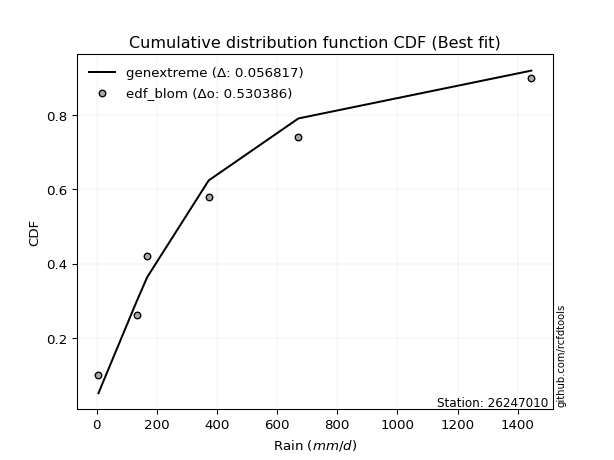</img></img>

</div>


### 7. Empirical - EDF Tukey (1962)

In hydrology, the Tukey formula is used as a plotting position formula to estimate the empirical probability or frequency of a flood event (or other hydrological data). The formula parameter is given as _c=0.333_ (or 1/3).

<div align="center">


$P=(m-c)/(n+1-2c)$


</div>


**7.1. Empirical values**

<div align="center">

|                | 0                   | 1                  | 2                   | 3                  | 4                  | 5                  |
|:---------------|:--------------------|:-------------------|:--------------------|:-------------------|:-------------------|:-------------------|
| date           | 2022                | 2025               | 2024                | 2020               | 2021               | 2019               |
| x              | 6.0                 | 132.8              | 168.0               | 372.5              | 670.8              | 1445.1             |
| m              | 1                   | 2                  | 3                   | 4                  | 5                  | 6                  |
| empirical_dist | edf_tukey           | edf_tukey          | edf_tukey           | edf_tukey          | edf_tukey          | edf_tukey          |
| empirical      | 0.10526315789473684 | 0.2631578947368421 | 0.42105263157894735 | 0.5789473684210527 | 0.7368421052631579 | 0.8947368421052632 |
| empirical_tr   | 1.1176470588235294  | 1.357142857142857  | 1.7272727272727273  | 2.375              | 3.7999999999999994 | 9.5                |

</div>


**7.2. Kolmogorov-Smirnov fit test (sorted by Δ)**


<div align="center">

|                | 0                   | 1                  | 2                   | 3                  | 4                  | 5                     | 6                  | 7                   | 8                   | 9                   | 10                  | 11                 | 12                  | 13                  | 14                  | 15                  | 16                  | 17                  | 18                  | 19                  | 20                  | 21                  | 22                 | 23                  | 24                  | 25                  | 26                  | 27                  | 28                  | 29                  | 30                  | 31                  | 32                  | 33                 | 34                  | 35                  | 36                 | 37                  | 38                 | 39                 | 40                 | 41                  | 42                  | 43                  | 44                  | 45                  | 46                 | 47                  | 48                  | 49                  | 50                  | 51                  | 52                  | 53                | 54                  | 55                  | 56                  | 57                  | 58                  | 59                  | 60                  | 61                  | 62                 | 63                  | 64                  | 65                 | 66                 | 67                  | 68                  | 69                  | 70                 | 71                | 72                 | 73                 | 74                  | 75                  | 76                 | 77                  | 78                 | 79                 | 80                 | 81                  | 82                  | 83                  | 84                  | 85                  | 86                 | 87                 | 88                 | 89                 |
|:---------------|:--------------------|:-------------------|:--------------------|:-------------------|:-------------------|:----------------------|:-------------------|:--------------------|:--------------------|:--------------------|:--------------------|:-------------------|:--------------------|:--------------------|:--------------------|:--------------------|:--------------------|:--------------------|:--------------------|:--------------------|:--------------------|:--------------------|:-------------------|:--------------------|:--------------------|:--------------------|:--------------------|:--------------------|:--------------------|:--------------------|:--------------------|:--------------------|:--------------------|:-------------------|:--------------------|:--------------------|:-------------------|:--------------------|:-------------------|:-------------------|:-------------------|:--------------------|:--------------------|:--------------------|:--------------------|:--------------------|:-------------------|:--------------------|:--------------------|:--------------------|:--------------------|:--------------------|:--------------------|:------------------|:--------------------|:--------------------|:--------------------|:--------------------|:--------------------|:--------------------|:--------------------|:--------------------|:-------------------|:--------------------|:--------------------|:-------------------|:-------------------|:--------------------|:--------------------|:--------------------|:-------------------|:------------------|:-------------------|:-------------------|:--------------------|:--------------------|:-------------------|:--------------------|:-------------------|:-------------------|:-------------------|:--------------------|:--------------------|:--------------------|:--------------------|:--------------------|:-------------------|:-------------------|:-------------------|:-------------------|
| station        | 26247010            | 26247010           | 26247010            | 26247010           | 26247010           | 26247010              | 26247010           | 26247010            | 26247010            | 26247010            | 26247010            | 26247010           | 26247010            | 26247010            | 26247010            | 26247010            | 26247010            | 26247010            | 26247010            | 26247010            | 26247010            | 26247010            | 26247010           | 26247010            | 26247010            | 26247010            | 26247010            | 26247010            | 26247010            | 26247010            | 26247010            | 26247010            | 26247010            | 26247010           | 26247010            | 26247010            | 26247010           | 26247010            | 26247010           | 26247010           | 26247010           | 26247010            | 26247010            | 26247010            | 26247010            | 26247010            | 26247010           | 26247010            | 26247010            | 26247010            | 26247010            | 26247010            | 26247010            | 26247010          | 26247010            | 26247010            | 26247010            | 26247010            | 26247010            | 26247010            | 26247010            | 26247010            | 26247010           | 26247010            | 26247010            | 26247010           | 26247010           | 26247010            | 26247010            | 26247010            | 26247010           | 26247010          | 26247010           | 26247010           | 26247010            | 26247010            | 26247010           | 26247010            | 26247010           | 26247010           | 26247010           | 26247010            | 26247010            | 26247010            | 26247010            | 26247010            | 26247010           | 26247010           | 26247010           | 26247010           |
| empirical_dist | edf_tukey           | edf_tukey          | edf_tukey           | edf_tukey          | edf_tukey          | edf_tukey             | edf_tukey          | edf_tukey           | edf_tukey           | edf_tukey           | edf_tukey           | edf_tukey          | edf_tukey           | edf_tukey           | edf_tukey           | edf_tukey           | edf_tukey           | edf_tukey           | edf_tukey           | edf_tukey           | edf_tukey           | edf_tukey           | edf_tukey          | edf_tukey           | edf_tukey           | edf_tukey           | edf_tukey           | edf_tukey           | edf_tukey           | edf_tukey           | edf_tukey           | edf_tukey           | edf_tukey           | edf_tukey          | edf_tukey           | edf_tukey           | edf_tukey          | edf_tukey           | edf_tukey          | edf_tukey          | edf_tukey          | edf_tukey           | edf_tukey           | edf_tukey           | edf_tukey           | edf_tukey           | edf_tukey          | edf_tukey           | edf_tukey           | edf_tukey           | edf_tukey           | edf_tukey           | edf_tukey           | edf_tukey         | edf_tukey           | edf_tukey           | edf_tukey           | edf_tukey           | edf_tukey           | edf_tukey           | edf_tukey           | edf_tukey           | edf_tukey          | edf_tukey           | edf_tukey           | edf_tukey          | edf_tukey          | edf_tukey           | edf_tukey           | edf_tukey           | edf_tukey          | edf_tukey         | edf_tukey          | edf_tukey          | edf_tukey           | edf_tukey           | edf_tukey          | edf_tukey           | edf_tukey          | edf_tukey          | edf_tukey          | edf_tukey           | edf_tukey           | edf_tukey           | edf_tukey           | edf_tukey           | edf_tukey          | edf_tukey          | edf_tukey          | edf_tukey          |
| p_dist         | invgauss            | f                  | invgamma            | logjohnsonsu       | logweibull_min     | loglaplace_asymmetric | johnsonsu          | logfisk             | loggumbel_l         | halfnorm            | logpearson3         | halflogistic       | logmielke           | logloggamma         | loggompertz         | weibull_min         | ncf                 | pearson3            | rayleigh            | fatiguelife         | mielke              | exponnorm           | laplace_asymmetric | expon               | genexpon            | moyal               | maxwell             | gumbel_r            | loglaplace          | t                   | fisk                | loghypsecant        | truncnorm           | nakagami           | loglogistic         | logfatiguelife      | logexponnorm       | logcrystalball      | lognorm            | lognorm            | logt               | norm                | genlogistic         | lognct              | logf                | wald                | logrice            | loggamma            | loggamma            | logerlang           | logbetaprime        | logistic            | kstwobign           | loginvgamma       | loginvgauss         | hypsecant           | logmaxwell          | betaprime           | logalpha            | rice                | lograyleigh         | logncf              | laplace            | loginvweibull       | loggumbel_r         | gumbel_l           | gompertz           | loghalfnorm         | logmoyal            | erlang              | logkstwobign       | loghalflogistic   | loggenexpon        | lognakagami        | gibrat              | logwald             | loggibrat          | nct                 | logexpon           | logtruncnorm       | logchi2            | chi2                | pareto              | invweibull          | crystalball         | loglognorm          | logpareto          | gamma              | alpha              | loggenlogistic     |
| delta          | 0.06013264734066842 | 0.0607226054140827 | 0.06072283700399045 | 0.0662955059686694 | 0.0748548105311892 | 0.07528925664984965   | 0.0781682515039922 | 0.08505419239899634 | 0.08632866732611971 | 0.08905569316904782 | 0.09524924292714576 | 0.0978981768184618 | 0.10477870475735518 | 0.10515556936322812 | 0.10526301861528106 | 0.10526315789223677 | 0.10602416520949026 | 0.11450550183194502 | 0.11650066533759112 | 0.11733521987714152 | 0.12085988030708661 | 0.12321661035243059 | 0.1241384466352039 | 0.12413865953292913 | 0.12413876560357096 | 0.12536764929424893 | 0.12640705047998924 | 0.12906522185307928 | 0.13036035172591787 | 0.13051804167570402 | 0.13158478395963713 | 0.13464469321673556 | 0.13487743625130377 | 0.1409846096007058 | 0.14362769637245448 | 0.15352443668204785 | 0.1544550138763478 | 0.15445669381348914 | 0.1544567204843756 | 0.1544567204843756 | 0.1544585106900997 | 0.15502566838133564 | 0.15516882790569614 | 0.15517363102380427 | 0.16192054323126498 | 0.16271073230444955 | 0.1637588463721668 | 0.16515272287230648 | 0.16515272287230648 | 0.16707888708752333 | 0.16797581655148924 | 0.17323188933933273 | 0.17403730439224174 | 0.179236201330861 | 0.18643996872186563 | 0.18858152521690894 | 0.18877260695911813 | 0.19207328083082958 | 0.19347258596558725 | 0.19674023156314085 | 0.20099128226163193 | 0.20581606912050843 | 0.2106685307890761 | 0.21279361955923015 | 0.21724983052082275 | 0.2236405095065458 | 0.2269016687291766 | 0.23557608497430332 | 0.24126763406532187 | 0.24697786282309236 | 0.2486507599785714 | 0.253306512345238 | 0.2553297029310943 | 0.2631577484663749 | 0.29000787565263275 | 0.30718422063364087 | 0.3089186521394573 | 0.31882246659037466 | 0.3283036773313956 | 0.3303051656504981 | 0.3386622912730239 | 0.34637955681747706 | 0.36151156373794563 | 0.36256463597566035 | 0.39852986907378407 | 0.40243855998560213 | 0.4186633840201705 | 0.5442097840301485 | 0.6483012602764664 | 0.7368421052631579 |
| deltao         | 0.530385761606      | 0.530385761606     | 0.530385761606      | 0.530385761606     | 0.530385761606     | 0.530385761606        | 0.530385761606     | 0.530385761606      | 0.530385761606      | 0.530385761606      | 0.530385761606      | 0.530385761606     | 0.530385761606      | 0.530385761606      | 0.530385761606      | 0.530385761606      | 0.530385761606      | 0.530385761606      | 0.530385761606      | 0.530385761606      | 0.530385761606      | 0.530385761606      | 0.530385761606     | 0.530385761606      | 0.530385761606      | 0.530385761606      | 0.530385761606      | 0.530385761606      | 0.530385761606      | 0.530385761606      | 0.530385761606      | 0.530385761606      | 0.530385761606      | 0.530385761606     | 0.530385761606      | 0.530385761606      | 0.530385761606     | 0.530385761606      | 0.530385761606     | 0.530385761606     | 0.530385761606     | 0.530385761606      | 0.530385761606      | 0.530385761606      | 0.530385761606      | 0.530385761606      | 0.530385761606     | 0.530385761606      | 0.530385761606      | 0.530385761606      | 0.530385761606      | 0.530385761606      | 0.530385761606      | 0.530385761606    | 0.530385761606      | 0.530385761606      | 0.530385761606      | 0.530385761606      | 0.530385761606      | 0.530385761606      | 0.530385761606      | 0.530385761606      | 0.530385761606     | 0.530385761606      | 0.530385761606      | 0.530385761606     | 0.530385761606     | 0.530385761606      | 0.530385761606      | 0.530385761606      | 0.530385761606     | 0.530385761606    | 0.530385761606     | 0.530385761606     | 0.530385761606      | 0.530385761606      | 0.530385761606     | 0.530385761606      | 0.530385761606     | 0.530385761606     | 0.530385761606     | 0.530385761606      | 0.530385761606      | 0.530385761606      | 0.530385761606      | 0.530385761606      | 0.530385761606     | 0.530385761606     | 0.530385761606     | 0.530385761606     |
| eval           | Δo > Δ              | Δo > Δ             | Δo > Δ              | Δo > Δ             | Δo > Δ             | Δo > Δ                | Δo > Δ             | Δo > Δ              | Δo > Δ              | Δo > Δ              | Δo > Δ              | Δo > Δ             | Δo > Δ              | Δo > Δ              | Δo > Δ              | Δo > Δ              | Δo > Δ              | Δo > Δ              | Δo > Δ              | Δo > Δ              | Δo > Δ              | Δo > Δ              | Δo > Δ             | Δo > Δ              | Δo > Δ              | Δo > Δ              | Δo > Δ              | Δo > Δ              | Δo > Δ              | Δo > Δ              | Δo > Δ              | Δo > Δ              | Δo > Δ              | Δo > Δ             | Δo > Δ              | Δo > Δ              | Δo > Δ             | Δo > Δ              | Δo > Δ             | Δo > Δ             | Δo > Δ             | Δo > Δ              | Δo > Δ              | Δo > Δ              | Δo > Δ              | Δo > Δ              | Δo > Δ             | Δo > Δ              | Δo > Δ              | Δo > Δ              | Δo > Δ              | Δo > Δ              | Δo > Δ              | Δo > Δ            | Δo > Δ              | Δo > Δ              | Δo > Δ              | Δo > Δ              | Δo > Δ              | Δo > Δ              | Δo > Δ              | Δo > Δ              | Δo > Δ             | Δo > Δ              | Δo > Δ              | Δo > Δ             | Δo > Δ             | Δo > Δ              | Δo > Δ              | Δo > Δ              | Δo > Δ             | Δo > Δ            | Δo > Δ             | Δo > Δ             | Δo > Δ              | Δo > Δ              | Δo > Δ             | Δo > Δ              | Δo > Δ             | Δo > Δ             | Δo > Δ             | Δo > Δ              | Δo > Δ              | Δo > Δ              | Δo > Δ              | Δo > Δ              | Δo > Δ             | Δo <= Δ            | Δo <= Δ            | Δo <= Δ            |
| fit            | 1                   | 1                  | 1                   | 1                  | 1                  | 1                     | 1                  | 1                   | 1                   | 1                   | 1                   | 1                  | 1                   | 1                   | 1                   | 1                   | 1                   | 1                   | 1                   | 1                   | 1                   | 1                   | 1                  | 1                   | 1                   | 1                   | 1                   | 1                   | 1                   | 1                   | 1                   | 1                   | 1                   | 1                  | 1                   | 1                   | 1                  | 1                   | 1                  | 1                  | 1                  | 1                   | 1                   | 1                   | 1                   | 1                   | 1                  | 1                   | 1                   | 1                   | 1                   | 1                   | 1                   | 1                 | 1                   | 1                   | 1                   | 1                   | 1                   | 1                   | 1                   | 1                   | 1                  | 1                   | 1                   | 1                  | 1                  | 1                   | 1                   | 1                   | 1                  | 1                 | 1                  | 1                  | 1                   | 1                   | 1                  | 1                   | 1                  | 1                  | 1                  | 1                   | 1                   | 1                   | 1                   | 1                   | 1                  | 0                  | 0                  | 0                  |
| n              | 6                   | 6                  | 6                   | 6                  | 6                  | 6                     | 6                  | 6                   | 6                   | 6                   | 6                   | 6                  | 6                   | 6                   | 6                   | 6                   | 6                   | 6                   | 6                   | 6                   | 6                   | 6                   | 6                  | 6                   | 6                   | 6                   | 6                   | 6                   | 6                   | 6                   | 6                   | 6                   | 6                   | 6                  | 6                   | 6                   | 6                  | 6                   | 6                  | 6                  | 6                  | 6                   | 6                   | 6                   | 6                   | 6                   | 6                  | 6                   | 6                   | 6                   | 6                   | 6                   | 6                   | 6                 | 6                   | 6                   | 6                   | 6                   | 6                   | 6                   | 6                   | 6                   | 6                  | 6                   | 6                   | 6                  | 6                  | 6                   | 6                   | 6                   | 6                  | 6                 | 6                  | 6                  | 6                   | 6                   | 6                  | 6                   | 6                  | 6                  | 6                  | 6                   | 6                   | 6                   | 6                   | 6                   | 6                  | 6                  | 6                  | 6                  |
| best_fit       | 1                   | 0                  | 0                   | 0                  | 0                  | 0                     | 0                  | 0                   | 0                   | 0                   | 0                   | 0                  | 0                   | 0                   | 0                   | 0                   | 0                   | 0                   | 0                   | 0                   | 0                   | 0                   | 0                  | 0                   | 0                   | 0                   | 0                   | 0                   | 0                   | 0                   | 0                   | 0                   | 0                   | 0                  | 0                   | 0                   | 0                  | 0                   | 0                  | 0                  | 0                  | 0                   | 0                   | 0                   | 0                   | 0                   | 0                  | 0                   | 0                   | 0                   | 0                   | 0                   | 0                   | 0                 | 0                   | 0                   | 0                   | 0                   | 0                   | 0                   | 0                   | 0                   | 0                  | 0                   | 0                   | 0                  | 0                  | 0                   | 0                   | 0                   | 0                  | 0                 | 0                  | 0                  | 0                   | 0                   | 0                  | 0                   | 0                  | 0                  | 0                  | 0                   | 0                   | 0                   | 0                   | 0                   | 0                  | 0                  | 0                  | 0                  |
| best_fit_sort  | 1                   | 2                  | 3                   | 4                  | 5                  | 6                     | 7                  | 8                   | 9                   | 10                  | 11                  | 12                 | 13                  | 14                  | 15                  | 16                  | 17                  | 18                  | 19                  | 20                  | 21                  | 22                  | 23                 | 24                  | 25                  | 26                  | 27                  | 28                  | 29                  | 30                  | 31                  | 32                  | 33                  | 34                 | 35                  | 36                  | 37                 | 38                  | 39                 | 40                 | 41                 | 42                  | 43                  | 44                  | 45                  | 46                  | 47                 | 48                  | 49                  | 50                  | 51                  | 52                  | 53                  | 54                | 55                  | 56                  | 57                  | 58                  | 59                  | 60                  | 61                  | 62                  | 63                 | 64                  | 65                  | 66                 | 67                 | 68                  | 69                  | 70                  | 71                 | 72                | 73                 | 74                 | 75                  | 76                  | 77                 | 78                  | 79                 | 80                 | 81                 | 82                  | 83                  | 84                  | 85                  | 86                  | 87                 | 88                 | 89                 | 90                 |

</div>


<div align="center">

</img>

</div>


**7.3. Best fit**

<div align="center">

|   id |   station | empirical_dist   | p_dist   |     delta |   deltao | eval   |   fit |   n |   best_fit |   best_fit_sort |
|-----:|----------:|:-----------------|:---------|----------:|---------:|:-------|------:|----:|-----------:|----------------:|
|    0 |  26247010 | edf_tukey        | invgauss | 0.0601326 | 0.530386 | Δo > Δ |     1 |   6 |          1 |               1 |

</div>


<div align="center">

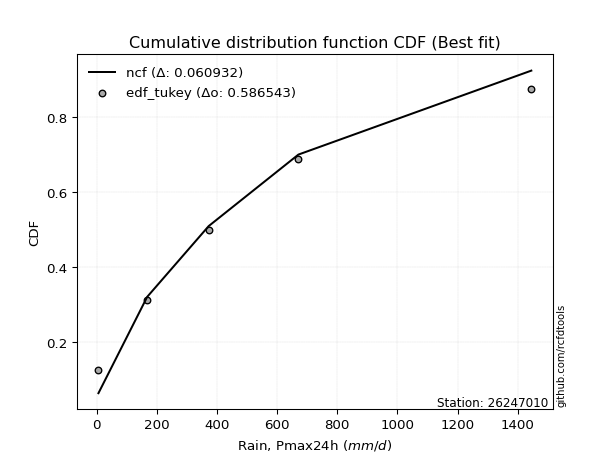</img></img>

</div>


### 8. Empirical - EDF Gringorten (1963)

Gringorten plotting position formula is essential for estimating the probability and return periods of extreme events like floods and heavy rainfall. The constant _a=0.44_.

<div align="center">


$P=(m-a)/(n+1-2a)$


</div>


**8.1. Empirical values**

<div align="center">

|                | 0                   | 1                  | 2                   | 3                  | 4                  | 5                  |
|:---------------|:--------------------|:-------------------|:--------------------|:-------------------|:-------------------|:-------------------|
| date           | 2022                | 2025               | 2024                | 2020               | 2021               | 2019               |
| x              | 6.0                 | 132.8              | 168.0               | 372.5              | 670.8              | 1445.1             |
| m              | 1                   | 2                  | 3                   | 4                  | 5                  | 6                  |
| empirical_dist | edf_gringorten      | edf_gringorten     | edf_gringorten      | edf_gringorten     | edf_gringorten     | edf_gringorten     |
| empirical      | 0.09150326797385622 | 0.2549019607843137 | 0.41830065359477125 | 0.5816993464052288 | 0.7450980392156862 | 0.9084967320261437 |
| empirical_tr   | 1.1007194244604317  | 1.3421052631578947 | 1.7191011235955058  | 2.3906250000000004 | 3.9230769230769216 | 10.928571428571415 |

</div>


**8.2. Kolmogorov-Smirnov fit test (sorted by Δ)**


<div align="center">

|                | 0                   | 1                   | 2                   | 3                   | 4                     | 5                   | 6                   | 7                  | 8                   | 9                   | 10                  | 11                 | 12                  | 13                  | 14                  | 15                  | 16                  | 17                  | 18                  | 19                 | 20                  | 21                  | 22                  | 23                  | 24                  | 25                 | 26                 | 27                 | 28                  | 29                  | 30                  | 31                 | 32                  | 33                  | 34                  | 35                  | 36                  | 37                  | 38                  | 39                  | 40                  | 41                  | 42                  | 43                  | 44                  | 45                  | 46                  | 47                  | 48                 | 49                  | 50                  | 51                 | 52                  | 53                  | 54                  | 55                  | 56                  | 57                 | 58                  | 59                  | 60              | 61                  | 62                 | 63                  | 64                  | 65                  | 66                  | 67                 | 68                  | 69                 | 70                  | 71                  | 72                  | 73                 | 74                  | 75                  | 76                 | 77                  | 78                | 79                 | 80                  | 81                  | 82                | 83                  | 84                 | 85                 | 86                 | 87                 | 88                 | 89                 |
|:---------------|:--------------------|:--------------------|:--------------------|:--------------------|:----------------------|:--------------------|:--------------------|:-------------------|:--------------------|:--------------------|:--------------------|:-------------------|:--------------------|:--------------------|:--------------------|:--------------------|:--------------------|:--------------------|:--------------------|:-------------------|:--------------------|:--------------------|:--------------------|:--------------------|:--------------------|:-------------------|:-------------------|:-------------------|:--------------------|:--------------------|:--------------------|:-------------------|:--------------------|:--------------------|:--------------------|:--------------------|:--------------------|:--------------------|:--------------------|:--------------------|:--------------------|:--------------------|:--------------------|:--------------------|:--------------------|:--------------------|:--------------------|:--------------------|:-------------------|:--------------------|:--------------------|:-------------------|:--------------------|:--------------------|:--------------------|:--------------------|:--------------------|:-------------------|:--------------------|:--------------------|:----------------|:--------------------|:-------------------|:--------------------|:--------------------|:--------------------|:--------------------|:-------------------|:--------------------|:-------------------|:--------------------|:--------------------|:--------------------|:-------------------|:--------------------|:--------------------|:-------------------|:--------------------|:------------------|:-------------------|:--------------------|:--------------------|:------------------|:--------------------|:-------------------|:-------------------|:-------------------|:-------------------|:-------------------|:-------------------|
| station        | 26247010            | 26247010            | 26247010            | 26247010            | 26247010              | 26247010            | 26247010            | 26247010           | 26247010            | 26247010            | 26247010            | 26247010           | 26247010            | 26247010            | 26247010            | 26247010            | 26247010            | 26247010            | 26247010            | 26247010           | 26247010            | 26247010            | 26247010            | 26247010            | 26247010            | 26247010           | 26247010           | 26247010           | 26247010            | 26247010            | 26247010            | 26247010           | 26247010            | 26247010            | 26247010            | 26247010            | 26247010            | 26247010            | 26247010            | 26247010            | 26247010            | 26247010            | 26247010            | 26247010            | 26247010            | 26247010            | 26247010            | 26247010            | 26247010           | 26247010            | 26247010            | 26247010           | 26247010            | 26247010            | 26247010            | 26247010            | 26247010            | 26247010           | 26247010            | 26247010            | 26247010        | 26247010            | 26247010           | 26247010            | 26247010            | 26247010            | 26247010            | 26247010           | 26247010            | 26247010           | 26247010            | 26247010            | 26247010            | 26247010           | 26247010            | 26247010            | 26247010           | 26247010            | 26247010          | 26247010           | 26247010            | 26247010            | 26247010          | 26247010            | 26247010           | 26247010           | 26247010           | 26247010           | 26247010           | 26247010           |
| empirical_dist | edf_gringorten      | edf_gringorten      | edf_gringorten      | edf_gringorten      | edf_gringorten        | edf_gringorten      | edf_gringorten      | edf_gringorten     | edf_gringorten      | edf_gringorten      | edf_gringorten      | edf_gringorten     | edf_gringorten      | edf_gringorten      | edf_gringorten      | edf_gringorten      | edf_gringorten      | edf_gringorten      | edf_gringorten      | edf_gringorten     | edf_gringorten      | edf_gringorten      | edf_gringorten      | edf_gringorten      | edf_gringorten      | edf_gringorten     | edf_gringorten     | edf_gringorten     | edf_gringorten      | edf_gringorten      | edf_gringorten      | edf_gringorten     | edf_gringorten      | edf_gringorten      | edf_gringorten      | edf_gringorten      | edf_gringorten      | edf_gringorten      | edf_gringorten      | edf_gringorten      | edf_gringorten      | edf_gringorten      | edf_gringorten      | edf_gringorten      | edf_gringorten      | edf_gringorten      | edf_gringorten      | edf_gringorten      | edf_gringorten     | edf_gringorten      | edf_gringorten      | edf_gringorten     | edf_gringorten      | edf_gringorten      | edf_gringorten      | edf_gringorten      | edf_gringorten      | edf_gringorten     | edf_gringorten      | edf_gringorten      | edf_gringorten  | edf_gringorten      | edf_gringorten     | edf_gringorten      | edf_gringorten      | edf_gringorten      | edf_gringorten      | edf_gringorten     | edf_gringorten      | edf_gringorten     | edf_gringorten      | edf_gringorten      | edf_gringorten      | edf_gringorten     | edf_gringorten      | edf_gringorten      | edf_gringorten     | edf_gringorten      | edf_gringorten    | edf_gringorten     | edf_gringorten      | edf_gringorten      | edf_gringorten    | edf_gringorten      | edf_gringorten     | edf_gringorten     | edf_gringorten     | edf_gringorten     | edf_gringorten     | edf_gringorten     |
| p_dist         | f                   | invgamma            | logjohnsonsu        | invgauss            | loglaplace_asymmetric | logweibull_min      | johnsonsu           | halfnorm           | logloggamma         | weibull_min         | logfisk             | loggumbel_l        | halflogistic        | logmielke           | logpearson3         | loggompertz         | pearson3            | rayleigh            | ncf                 | exponnorm          | laplace_asymmetric  | expon               | genexpon            | moyal               | maxwell             | fatiguelife        | gumbel_r           | t                  | loglaplace          | mielke              | truncnorm           | fisk               | loghypsecant        | nakagami            | loglogistic         | genlogistic         | norm                | wald                | logfatiguelife      | logexponnorm        | logcrystalball      | lognorm             | lognorm             | logt                | lognct              | logf                | logistic            | kstwobign           | logrice            | loggamma            | loggamma            | logerlang          | logbetaprime        | hypsecant           | loginvgamma         | rice                | loginvgauss         | logmaxwell         | betaprime           | logalpha            | laplace         | lograyleigh         | logncf             | loginvweibull       | gompertz            | loggumbel_r         | gumbel_l            | loghalfnorm        | logmoyal            | lognakagami        | erlang              | logkstwobign        | loghalflogistic     | loggenexpon        | gibrat              | logwald             | loggibrat          | nct                 | logexpon          | logtruncnorm       | logchi2             | chi2                | pareto            | invweibull          | loglognorm         | crystalball        | logpareto          | gamma              | alpha              | loggenlogistic     |
| delta          | 0.05797062742990661 | 0.05797085901981436 | 0.06354352798449331 | 0.06411055836716034 | 0.07366543951943422   | 0.08311074448371758 | 0.08642418545652059 | 0.0890108749369728 | 0.09139567944234761 | 0.09150326797135615 | 0.09326757934745827 | 0.0945846012786481 | 0.09514619883428571 | 0.10197623497254726 | 0.10350517687967414 | 0.10569828164309869 | 0.11175352384776893 | 0.11374868735341503 | 0.11428009916201864 | 0.1204646323682545 | 0.12138646865102781 | 0.12138668154875304 | 0.12138678761939486 | 0.12261567131007284 | 0.12365507249581315 | 0.1255911538296699 | 0.1263132438689032 | 0.1265640317598244 | 0.12760837374174172 | 0.12911581425961494 | 0.13212545826712768 | 0.1398407179121655 | 0.14290062716926394 | 0.14924054355323418 | 0.15188363032498287 | 0.15241684992152005 | 0.15777764636551178 | 0.15995875432027346 | 0.16178037063457623 | 0.16271094782887618 | 0.16271262776601753 | 0.16271265443690397 | 0.16271265443690397 | 0.16271444464262808 | 0.16342956497633265 | 0.17017647718379336 | 0.17047991135515664 | 0.17128532640806565 | 0.1720147803246952 | 0.17340865682483486 | 0.17340865682483486 | 0.1753348210400517 | 0.17623175050401763 | 0.18582954723273284 | 0.18749213528338937 | 0.19398825357896476 | 0.19469590267439402 | 0.1970285409116465 | 0.20032921478335797 | 0.20172851991811563 | 0.2079165528049 | 0.20924721621416031 | 0.2140720030730368 | 0.22104955351175853 | 0.22414969074500052 | 0.22550576447335113 | 0.22639248749072194 | 0.2438320189268317 | 0.24952356801785025 | 0.2549018145138465 | 0.25523379677562075 | 0.25690669393109977 | 0.26156244629776637 | 0.2635856368836227 | 0.28725589766845666 | 0.31544015458616925 | 0.3171745860919857 | 0.32707840054290305 | 0.336559611283924 | 0.3385610996030265 | 0.34691822522555227 | 0.35463549077000545 | 0.369767497690474 | 0.37632452589654086 | 0.4106944939381305 | 0.4122897589946647 | 0.4269193179726989 | 0.5524657179826769 | 0.6565571942289948 | 0.7450980392156862 |
| deltao         | 0.530385761606      | 0.530385761606      | 0.530385761606      | 0.530385761606      | 0.530385761606        | 0.530385761606      | 0.530385761606      | 0.530385761606     | 0.530385761606      | 0.530385761606      | 0.530385761606      | 0.530385761606     | 0.530385761606      | 0.530385761606      | 0.530385761606      | 0.530385761606      | 0.530385761606      | 0.530385761606      | 0.530385761606      | 0.530385761606     | 0.530385761606      | 0.530385761606      | 0.530385761606      | 0.530385761606      | 0.530385761606      | 0.530385761606     | 0.530385761606     | 0.530385761606     | 0.530385761606      | 0.530385761606      | 0.530385761606      | 0.530385761606     | 0.530385761606      | 0.530385761606      | 0.530385761606      | 0.530385761606      | 0.530385761606      | 0.530385761606      | 0.530385761606      | 0.530385761606      | 0.530385761606      | 0.530385761606      | 0.530385761606      | 0.530385761606      | 0.530385761606      | 0.530385761606      | 0.530385761606      | 0.530385761606      | 0.530385761606     | 0.530385761606      | 0.530385761606      | 0.530385761606     | 0.530385761606      | 0.530385761606      | 0.530385761606      | 0.530385761606      | 0.530385761606      | 0.530385761606     | 0.530385761606      | 0.530385761606      | 0.530385761606  | 0.530385761606      | 0.530385761606     | 0.530385761606      | 0.530385761606      | 0.530385761606      | 0.530385761606      | 0.530385761606     | 0.530385761606      | 0.530385761606     | 0.530385761606      | 0.530385761606      | 0.530385761606      | 0.530385761606     | 0.530385761606      | 0.530385761606      | 0.530385761606     | 0.530385761606      | 0.530385761606    | 0.530385761606     | 0.530385761606      | 0.530385761606      | 0.530385761606    | 0.530385761606      | 0.530385761606     | 0.530385761606     | 0.530385761606     | 0.530385761606     | 0.530385761606     | 0.530385761606     |
| eval           | Δo > Δ              | Δo > Δ              | Δo > Δ              | Δo > Δ              | Δo > Δ                | Δo > Δ              | Δo > Δ              | Δo > Δ             | Δo > Δ              | Δo > Δ              | Δo > Δ              | Δo > Δ             | Δo > Δ              | Δo > Δ              | Δo > Δ              | Δo > Δ              | Δo > Δ              | Δo > Δ              | Δo > Δ              | Δo > Δ             | Δo > Δ              | Δo > Δ              | Δo > Δ              | Δo > Δ              | Δo > Δ              | Δo > Δ             | Δo > Δ             | Δo > Δ             | Δo > Δ              | Δo > Δ              | Δo > Δ              | Δo > Δ             | Δo > Δ              | Δo > Δ              | Δo > Δ              | Δo > Δ              | Δo > Δ              | Δo > Δ              | Δo > Δ              | Δo > Δ              | Δo > Δ              | Δo > Δ              | Δo > Δ              | Δo > Δ              | Δo > Δ              | Δo > Δ              | Δo > Δ              | Δo > Δ              | Δo > Δ             | Δo > Δ              | Δo > Δ              | Δo > Δ             | Δo > Δ              | Δo > Δ              | Δo > Δ              | Δo > Δ              | Δo > Δ              | Δo > Δ             | Δo > Δ              | Δo > Δ              | Δo > Δ          | Δo > Δ              | Δo > Δ             | Δo > Δ              | Δo > Δ              | Δo > Δ              | Δo > Δ              | Δo > Δ             | Δo > Δ              | Δo > Δ             | Δo > Δ              | Δo > Δ              | Δo > Δ              | Δo > Δ             | Δo > Δ              | Δo > Δ              | Δo > Δ             | Δo > Δ              | Δo > Δ            | Δo > Δ             | Δo > Δ              | Δo > Δ              | Δo > Δ            | Δo > Δ              | Δo > Δ             | Δo > Δ             | Δo > Δ             | Δo <= Δ            | Δo <= Δ            | Δo <= Δ            |
| fit            | 1                   | 1                   | 1                   | 1                   | 1                     | 1                   | 1                   | 1                  | 1                   | 1                   | 1                   | 1                  | 1                   | 1                   | 1                   | 1                   | 1                   | 1                   | 1                   | 1                  | 1                   | 1                   | 1                   | 1                   | 1                   | 1                  | 1                  | 1                  | 1                   | 1                   | 1                   | 1                  | 1                   | 1                   | 1                   | 1                   | 1                   | 1                   | 1                   | 1                   | 1                   | 1                   | 1                   | 1                   | 1                   | 1                   | 1                   | 1                   | 1                  | 1                   | 1                   | 1                  | 1                   | 1                   | 1                   | 1                   | 1                   | 1                  | 1                   | 1                   | 1               | 1                   | 1                  | 1                   | 1                   | 1                   | 1                   | 1                  | 1                   | 1                  | 1                   | 1                   | 1                   | 1                  | 1                   | 1                   | 1                  | 1                   | 1                 | 1                  | 1                   | 1                   | 1                 | 1                   | 1                  | 1                  | 1                  | 0                  | 0                  | 0                  |
| n              | 6                   | 6                   | 6                   | 6                   | 6                     | 6                   | 6                   | 6                  | 6                   | 6                   | 6                   | 6                  | 6                   | 6                   | 6                   | 6                   | 6                   | 6                   | 6                   | 6                  | 6                   | 6                   | 6                   | 6                   | 6                   | 6                  | 6                  | 6                  | 6                   | 6                   | 6                   | 6                  | 6                   | 6                   | 6                   | 6                   | 6                   | 6                   | 6                   | 6                   | 6                   | 6                   | 6                   | 6                   | 6                   | 6                   | 6                   | 6                   | 6                  | 6                   | 6                   | 6                  | 6                   | 6                   | 6                   | 6                   | 6                   | 6                  | 6                   | 6                   | 6               | 6                   | 6                  | 6                   | 6                   | 6                   | 6                   | 6                  | 6                   | 6                  | 6                   | 6                   | 6                   | 6                  | 6                   | 6                   | 6                  | 6                   | 6                 | 6                  | 6                   | 6                   | 6                 | 6                   | 6                  | 6                  | 6                  | 6                  | 6                  | 6                  |
| best_fit       | 1                   | 0                   | 0                   | 0                   | 0                     | 0                   | 0                   | 0                  | 0                   | 0                   | 0                   | 0                  | 0                   | 0                   | 0                   | 0                   | 0                   | 0                   | 0                   | 0                  | 0                   | 0                   | 0                   | 0                   | 0                   | 0                  | 0                  | 0                  | 0                   | 0                   | 0                   | 0                  | 0                   | 0                   | 0                   | 0                   | 0                   | 0                   | 0                   | 0                   | 0                   | 0                   | 0                   | 0                   | 0                   | 0                   | 0                   | 0                   | 0                  | 0                   | 0                   | 0                  | 0                   | 0                   | 0                   | 0                   | 0                   | 0                  | 0                   | 0                   | 0               | 0                   | 0                  | 0                   | 0                   | 0                   | 0                   | 0                  | 0                   | 0                  | 0                   | 0                   | 0                   | 0                  | 0                   | 0                   | 0                  | 0                   | 0                 | 0                  | 0                   | 0                   | 0                 | 0                   | 0                  | 0                  | 0                  | 0                  | 0                  | 0                  |
| best_fit_sort  | 1                   | 2                   | 3                   | 4                   | 5                     | 6                   | 7                   | 8                  | 9                   | 10                  | 11                  | 12                 | 13                  | 14                  | 15                  | 16                  | 17                  | 18                  | 19                  | 20                 | 21                  | 22                  | 23                  | 24                  | 25                  | 26                 | 27                 | 28                 | 29                  | 30                  | 31                  | 32                 | 33                  | 34                  | 35                  | 36                  | 37                  | 38                  | 39                  | 40                  | 41                  | 42                  | 43                  | 44                  | 45                  | 46                  | 47                  | 48                  | 49                 | 50                  | 51                  | 52                 | 53                  | 54                  | 55                  | 56                  | 57                  | 58                 | 59                  | 60                  | 61              | 62                  | 63                 | 64                  | 65                  | 66                  | 67                  | 68                 | 69                  | 70                 | 71                  | 72                  | 73                  | 74                 | 75                  | 76                  | 77                 | 78                  | 79                | 80                 | 81                  | 82                  | 83                | 84                  | 85                 | 86                 | 87                 | 88                 | 89                 | 90                 |

</div>


<div align="center">

</img>

</div>


**8.3. Best fit**

<div align="center">

|   id |   station | empirical_dist   | p_dist   |     delta |   deltao | eval   |   fit |   n |   best_fit |   best_fit_sort |
|-----:|----------:|:-----------------|:---------|----------:|---------:|:-------|------:|----:|-----------:|----------------:|
|    0 |  26247010 | edf_gringorten   | f        | 0.0579706 | 0.530386 | Δo > Δ |     1 |   6 |          1 |               1 |

</div>


<div align="center">

</img>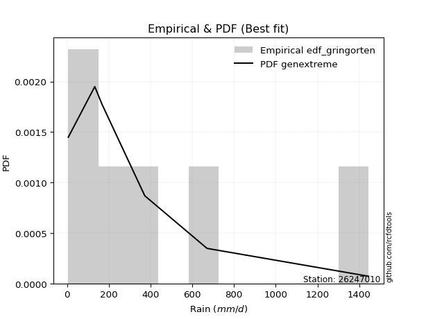</img>

</div>


### 9. Empirical - EDF Filliben (1975)

The specific values of the constants (0.3175) (often denoted as $alpha$) and (0.365) are derived from a method proposed by James J. Filliben in a 1975 paper. This particular formula is the mean value of the $i$-th order statistic of the normal distribution and is considered a robust and effective plotting position formula for the normal probability plot correlation coefficient test for normality.

<div align="center">


$P=(m-0.3175)/(n+0.365)$


</div>


**9.1. Empirical values**

<div align="center">

|                | 0                   | 1                   | 2                  | 3                  | 4                  | 5                  |
|:---------------|:--------------------|:--------------------|:-------------------|:-------------------|:-------------------|:-------------------|
| date           | 2022                | 2025                | 2024               | 2020               | 2021               | 2019               |
| x              | 6.0                 | 132.8               | 168.0              | 372.5              | 670.8              | 1445.1             |
| m              | 1                   | 2                   | 3                  | 4                  | 5                  | 6                  |
| empirical_dist | edf_filliben        | edf_filliben        | edf_filliben       | edf_filliben       | edf_filliben       | edf_filliben       |
| empirical      | 0.10722702278083267 | 0.26433621366849963 | 0.4214454045561665 | 0.5785545954438335 | 0.7356637863315004 | 0.8927729772191673 |
| empirical_tr   | 1.1201055873295205  | 1.3593166043780034  | 1.7284453496266123 | 2.3727865796831313 | 3.783060921248143  | 9.326007326007321  |

</div>


**9.2. Kolmogorov-Smirnov fit test (sorted by Δ)**


<div align="center">

|                | 0                   | 1                   | 2                   | 3                   | 4                   | 5                     | 6                   | 7                   | 8                   | 9                 | 10                  | 11                  | 12                  | 13                  | 14                  | 15                 | 16                 | 17                 | 18                  | 19                 | 20                  | 21                  | 22                  | 23                  | 24                  | 25                 | 26                  | 27                  | 28                 | 29                  | 30                  | 31                  | 32                  | 33                  | 34                  | 35                 | 36                  | 37                 | 38                  | 39                  | 40                  | 41                  | 42                  | 43                  | 44                  | 45                  | 46                  | 47                  | 48                  | 49                 | 50                 | 51                 | 52                  | 53                  | 54                 | 55                 | 56                  | 57                  | 58                 | 59                  | 60                 | 61                 | 62                  | 63                 | 64                 | 65                 | 66                 | 67                  | 68                  | 69                  | 70                  | 71                  | 72                  | 73                  | 74                  | 75                  | 76                  | 77                 | 78                  | 79                  | 80                  | 81                 | 82                 | 83                  | 84                 | 85                 | 86                  | 87                 | 88                | 89                 |
|:---------------|:--------------------|:--------------------|:--------------------|:--------------------|:--------------------|:----------------------|:--------------------|:--------------------|:--------------------|:------------------|:--------------------|:--------------------|:--------------------|:--------------------|:--------------------|:-------------------|:-------------------|:-------------------|:--------------------|:-------------------|:--------------------|:--------------------|:--------------------|:--------------------|:--------------------|:-------------------|:--------------------|:--------------------|:-------------------|:--------------------|:--------------------|:--------------------|:--------------------|:--------------------|:--------------------|:-------------------|:--------------------|:-------------------|:--------------------|:--------------------|:--------------------|:--------------------|:--------------------|:--------------------|:--------------------|:--------------------|:--------------------|:--------------------|:--------------------|:-------------------|:-------------------|:-------------------|:--------------------|:--------------------|:-------------------|:-------------------|:--------------------|:--------------------|:-------------------|:--------------------|:-------------------|:-------------------|:--------------------|:-------------------|:-------------------|:-------------------|:-------------------|:--------------------|:--------------------|:--------------------|:--------------------|:--------------------|:--------------------|:--------------------|:--------------------|:--------------------|:--------------------|:-------------------|:--------------------|:--------------------|:--------------------|:-------------------|:-------------------|:--------------------|:-------------------|:-------------------|:--------------------|:-------------------|:------------------|:-------------------|
| station        | 26247010            | 26247010            | 26247010            | 26247010            | 26247010            | 26247010              | 26247010            | 26247010            | 26247010            | 26247010          | 26247010            | 26247010            | 26247010            | 26247010            | 26247010            | 26247010           | 26247010           | 26247010           | 26247010            | 26247010           | 26247010            | 26247010            | 26247010            | 26247010            | 26247010            | 26247010           | 26247010            | 26247010            | 26247010           | 26247010            | 26247010            | 26247010            | 26247010            | 26247010            | 26247010            | 26247010           | 26247010            | 26247010           | 26247010            | 26247010            | 26247010            | 26247010            | 26247010            | 26247010            | 26247010            | 26247010            | 26247010            | 26247010            | 26247010            | 26247010           | 26247010           | 26247010           | 26247010            | 26247010            | 26247010           | 26247010           | 26247010            | 26247010            | 26247010           | 26247010            | 26247010           | 26247010           | 26247010            | 26247010           | 26247010           | 26247010           | 26247010           | 26247010            | 26247010            | 26247010            | 26247010            | 26247010            | 26247010            | 26247010            | 26247010            | 26247010            | 26247010            | 26247010           | 26247010            | 26247010            | 26247010            | 26247010           | 26247010           | 26247010            | 26247010           | 26247010           | 26247010            | 26247010           | 26247010          | 26247010           |
| empirical_dist | edf_filliben        | edf_filliben        | edf_filliben        | edf_filliben        | edf_filliben        | edf_filliben          | edf_filliben        | edf_filliben        | edf_filliben        | edf_filliben      | edf_filliben        | edf_filliben        | edf_filliben        | edf_filliben        | edf_filliben        | edf_filliben       | edf_filliben       | edf_filliben       | edf_filliben        | edf_filliben       | edf_filliben        | edf_filliben        | edf_filliben        | edf_filliben        | edf_filliben        | edf_filliben       | edf_filliben        | edf_filliben        | edf_filliben       | edf_filliben        | edf_filliben        | edf_filliben        | edf_filliben        | edf_filliben        | edf_filliben        | edf_filliben       | edf_filliben        | edf_filliben       | edf_filliben        | edf_filliben        | edf_filliben        | edf_filliben        | edf_filliben        | edf_filliben        | edf_filliben        | edf_filliben        | edf_filliben        | edf_filliben        | edf_filliben        | edf_filliben       | edf_filliben       | edf_filliben       | edf_filliben        | edf_filliben        | edf_filliben       | edf_filliben       | edf_filliben        | edf_filliben        | edf_filliben       | edf_filliben        | edf_filliben       | edf_filliben       | edf_filliben        | edf_filliben       | edf_filliben       | edf_filliben       | edf_filliben       | edf_filliben        | edf_filliben        | edf_filliben        | edf_filliben        | edf_filliben        | edf_filliben        | edf_filliben        | edf_filliben        | edf_filliben        | edf_filliben        | edf_filliben       | edf_filliben        | edf_filliben        | edf_filliben        | edf_filliben       | edf_filliben       | edf_filliben        | edf_filliben       | edf_filliben       | edf_filliben        | edf_filliben       | edf_filliben      | edf_filliben       |
| p_dist         | f                   | invgamma            | invgauss            | logjohnsonsu        | logweibull_min      | loglaplace_asymmetric | johnsonsu           | loggumbel_l         | logfisk             | halfnorm          | logpearson3         | halflogistic        | logmielke           | logloggamma         | ncf                 | loggompertz        | weibull_min        | pearson3           | fatiguelife         | rayleigh           | mielke              | exponnorm           | laplace_asymmetric  | expon               | genexpon            | moyal              | maxwell             | gumbel_r            | fisk               | loglaplace          | t                   | loghypsecant        | truncnorm           | nakagami            | loglogistic         | logfatiguelife     | logexponnorm        | logcrystalball     | lognorm             | lognorm             | logt                | lognct              | norm                | genlogistic         | logf                | logrice             | wald                | loggamma            | loggamma            | logerlang          | logbetaprime       | logistic           | kstwobign           | loginvgamma         | loginvgauss        | logmaxwell         | hypsecant           | betaprime           | logalpha           | rice                | lograyleigh        | logncf             | laplace             | loginvweibull      | loggumbel_r        | gumbel_l           | gompertz           | loghalfnorm         | logmoyal            | erlang              | logkstwobign        | loghalflogistic     | loggenexpon         | lognakagami         | gibrat              | logwald             | loggibrat           | nct                | logexpon            | logtruncnorm        | logchi2             | chi2               | pareto             | invweibull          | crystalball        | loglognorm         | logpareto           | gamma              | alpha             | loggenlogistic     |
| delta          | 0.06111537839130188 | 0.06111560998120963 | 0.06209651222676425 | 0.06668827894588858 | 0.07367649159953166 | 0.07646757558150707   | 0.07698993257233466 | 0.08515034839446217 | 0.08701805728509217 | 0.089448466146267 | 0.09407092399548822 | 0.09829094979568098 | 0.10674256964345108 | 0.10711943424932402 | 0.10720504398524577 | 0.1072268835013769 | 0.1072270227783326 | 0.1148982748091642 | 0.11615690094548398 | 0.1168934383148103 | 0.11968156137542918 | 0.12360938332964977 | 0.12453121961242308 | 0.12453143251014831 | 0.12453153858079014 | 0.1257604222714681 | 0.12679982345720842 | 0.12945799483029846 | 0.1304064650279796 | 0.13075312470313705 | 0.13169636060736145 | 0.13346637428507802 | 0.13527020922852295 | 0.13980629066904826 | 0.14244937744079694 | 0.1523461177503903 | 0.15327669494469026 | 0.1532783748818316 | 0.15327840155271805 | 0.15327840155271805 | 0.15328019175844215 | 0.15399531209214673 | 0.15463289540411645 | 0.15556160088291532 | 0.16074222429960744 | 0.16258052744050927 | 0.16310350528166873 | 0.16397440394064894 | 0.16397440394064894 | 0.1659005681558658 | 0.1667974976198317 | 0.1736246623165519 | 0.17443007736946092 | 0.17805788239920345 | 0.1852616497902081 | 0.1875942880274606 | 0.18897429819412812 | 0.19089496189917204 | 0.1922942670339297 | 0.19713300454036004 | 0.1998129633299744 | 0.2046377501888509 | 0.21106130376629528 | 0.2116153006275726 | 0.2160715115891652 | 0.2232477365293266 | 0.2272944417063958 | 0.23439776604264578 | 0.24008931513366433 | 0.24579954389143482 | 0.24747244104691385 | 0.25212819341358045 | 0.25415138399943676 | 0.26433606739803245 | 0.29040064862985193 | 0.30600590170198333 | 0.30774033320779975 | 0.3176441476587171 | 0.32712535839973805 | 0.32912684671884057 | 0.33748397234136635 | 0.3452012378858195 | 0.3603332448062881 | 0.36060077108956445 | 0.3965660041876882 | 0.4012602410539446 | 0.41748506508851296 | 0.5430314650984909 | 0.647122941344809 | 0.7356637863315004 |
| deltao         | 0.530385761606      | 0.530385761606      | 0.530385761606      | 0.530385761606      | 0.530385761606      | 0.530385761606        | 0.530385761606      | 0.530385761606      | 0.530385761606      | 0.530385761606    | 0.530385761606      | 0.530385761606      | 0.530385761606      | 0.530385761606      | 0.530385761606      | 0.530385761606     | 0.530385761606     | 0.530385761606     | 0.530385761606      | 0.530385761606     | 0.530385761606      | 0.530385761606      | 0.530385761606      | 0.530385761606      | 0.530385761606      | 0.530385761606     | 0.530385761606      | 0.530385761606      | 0.530385761606     | 0.530385761606      | 0.530385761606      | 0.530385761606      | 0.530385761606      | 0.530385761606      | 0.530385761606      | 0.530385761606     | 0.530385761606      | 0.530385761606     | 0.530385761606      | 0.530385761606      | 0.530385761606      | 0.530385761606      | 0.530385761606      | 0.530385761606      | 0.530385761606      | 0.530385761606      | 0.530385761606      | 0.530385761606      | 0.530385761606      | 0.530385761606     | 0.530385761606     | 0.530385761606     | 0.530385761606      | 0.530385761606      | 0.530385761606     | 0.530385761606     | 0.530385761606      | 0.530385761606      | 0.530385761606     | 0.530385761606      | 0.530385761606     | 0.530385761606     | 0.530385761606      | 0.530385761606     | 0.530385761606     | 0.530385761606     | 0.530385761606     | 0.530385761606      | 0.530385761606      | 0.530385761606      | 0.530385761606      | 0.530385761606      | 0.530385761606      | 0.530385761606      | 0.530385761606      | 0.530385761606      | 0.530385761606      | 0.530385761606     | 0.530385761606      | 0.530385761606      | 0.530385761606      | 0.530385761606     | 0.530385761606     | 0.530385761606      | 0.530385761606     | 0.530385761606     | 0.530385761606      | 0.530385761606     | 0.530385761606    | 0.530385761606     |
| eval           | Δo > Δ              | Δo > Δ              | Δo > Δ              | Δo > Δ              | Δo > Δ              | Δo > Δ                | Δo > Δ              | Δo > Δ              | Δo > Δ              | Δo > Δ            | Δo > Δ              | Δo > Δ              | Δo > Δ              | Δo > Δ              | Δo > Δ              | Δo > Δ             | Δo > Δ             | Δo > Δ             | Δo > Δ              | Δo > Δ             | Δo > Δ              | Δo > Δ              | Δo > Δ              | Δo > Δ              | Δo > Δ              | Δo > Δ             | Δo > Δ              | Δo > Δ              | Δo > Δ             | Δo > Δ              | Δo > Δ              | Δo > Δ              | Δo > Δ              | Δo > Δ              | Δo > Δ              | Δo > Δ             | Δo > Δ              | Δo > Δ             | Δo > Δ              | Δo > Δ              | Δo > Δ              | Δo > Δ              | Δo > Δ              | Δo > Δ              | Δo > Δ              | Δo > Δ              | Δo > Δ              | Δo > Δ              | Δo > Δ              | Δo > Δ             | Δo > Δ             | Δo > Δ             | Δo > Δ              | Δo > Δ              | Δo > Δ             | Δo > Δ             | Δo > Δ              | Δo > Δ              | Δo > Δ             | Δo > Δ              | Δo > Δ             | Δo > Δ             | Δo > Δ              | Δo > Δ             | Δo > Δ             | Δo > Δ             | Δo > Δ             | Δo > Δ              | Δo > Δ              | Δo > Δ              | Δo > Δ              | Δo > Δ              | Δo > Δ              | Δo > Δ              | Δo > Δ              | Δo > Δ              | Δo > Δ              | Δo > Δ             | Δo > Δ              | Δo > Δ              | Δo > Δ              | Δo > Δ             | Δo > Δ             | Δo > Δ              | Δo > Δ             | Δo > Δ             | Δo > Δ              | Δo <= Δ            | Δo <= Δ           | Δo <= Δ            |
| fit            | 1                   | 1                   | 1                   | 1                   | 1                   | 1                     | 1                   | 1                   | 1                   | 1                 | 1                   | 1                   | 1                   | 1                   | 1                   | 1                  | 1                  | 1                  | 1                   | 1                  | 1                   | 1                   | 1                   | 1                   | 1                   | 1                  | 1                   | 1                   | 1                  | 1                   | 1                   | 1                   | 1                   | 1                   | 1                   | 1                  | 1                   | 1                  | 1                   | 1                   | 1                   | 1                   | 1                   | 1                   | 1                   | 1                   | 1                   | 1                   | 1                   | 1                  | 1                  | 1                  | 1                   | 1                   | 1                  | 1                  | 1                   | 1                   | 1                  | 1                   | 1                  | 1                  | 1                   | 1                  | 1                  | 1                  | 1                  | 1                   | 1                   | 1                   | 1                   | 1                   | 1                   | 1                   | 1                   | 1                   | 1                   | 1                  | 1                   | 1                   | 1                   | 1                  | 1                  | 1                   | 1                  | 1                  | 1                   | 0                  | 0                 | 0                  |
| n              | 6                   | 6                   | 6                   | 6                   | 6                   | 6                     | 6                   | 6                   | 6                   | 6                 | 6                   | 6                   | 6                   | 6                   | 6                   | 6                  | 6                  | 6                  | 6                   | 6                  | 6                   | 6                   | 6                   | 6                   | 6                   | 6                  | 6                   | 6                   | 6                  | 6                   | 6                   | 6                   | 6                   | 6                   | 6                   | 6                  | 6                   | 6                  | 6                   | 6                   | 6                   | 6                   | 6                   | 6                   | 6                   | 6                   | 6                   | 6                   | 6                   | 6                  | 6                  | 6                  | 6                   | 6                   | 6                  | 6                  | 6                   | 6                   | 6                  | 6                   | 6                  | 6                  | 6                   | 6                  | 6                  | 6                  | 6                  | 6                   | 6                   | 6                   | 6                   | 6                   | 6                   | 6                   | 6                   | 6                   | 6                   | 6                  | 6                   | 6                   | 6                   | 6                  | 6                  | 6                   | 6                  | 6                  | 6                   | 6                  | 6                 | 6                  |
| best_fit       | 1                   | 0                   | 0                   | 0                   | 0                   | 0                     | 0                   | 0                   | 0                   | 0                 | 0                   | 0                   | 0                   | 0                   | 0                   | 0                  | 0                  | 0                  | 0                   | 0                  | 0                   | 0                   | 0                   | 0                   | 0                   | 0                  | 0                   | 0                   | 0                  | 0                   | 0                   | 0                   | 0                   | 0                   | 0                   | 0                  | 0                   | 0                  | 0                   | 0                   | 0                   | 0                   | 0                   | 0                   | 0                   | 0                   | 0                   | 0                   | 0                   | 0                  | 0                  | 0                  | 0                   | 0                   | 0                  | 0                  | 0                   | 0                   | 0                  | 0                   | 0                  | 0                  | 0                   | 0                  | 0                  | 0                  | 0                  | 0                   | 0                   | 0                   | 0                   | 0                   | 0                   | 0                   | 0                   | 0                   | 0                   | 0                  | 0                   | 0                   | 0                   | 0                  | 0                  | 0                   | 0                  | 0                  | 0                   | 0                  | 0                 | 0                  |
| best_fit_sort  | 1                   | 2                   | 3                   | 4                   | 5                   | 6                     | 7                   | 8                   | 9                   | 10                | 11                  | 12                  | 13                  | 14                  | 15                  | 16                 | 17                 | 18                 | 19                  | 20                 | 21                  | 22                  | 23                  | 24                  | 25                  | 26                 | 27                  | 28                  | 29                 | 30                  | 31                  | 32                  | 33                  | 34                  | 35                  | 36                 | 37                  | 38                 | 39                  | 40                  | 41                  | 42                  | 43                  | 44                  | 45                  | 46                  | 47                  | 48                  | 49                  | 50                 | 51                 | 52                 | 53                  | 54                  | 55                 | 56                 | 57                  | 58                  | 59                 | 60                  | 61                 | 62                 | 63                  | 64                 | 65                 | 66                 | 67                 | 68                  | 69                  | 70                  | 71                  | 72                  | 73                  | 74                  | 75                  | 76                  | 77                  | 78                 | 79                  | 80                  | 81                  | 82                 | 83                 | 84                  | 85                 | 86                 | 87                  | 88                 | 89                | 90                 |

</div>


<div align="center">

</img>

</div>


**9.3. Best fit**

<div align="center">

|   id |   station | empirical_dist   | p_dist   |     delta |   deltao | eval   |   fit |   n |   best_fit |   best_fit_sort |
|-----:|----------:|:-----------------|:---------|----------:|---------:|:-------|------:|----:|-----------:|----------------:|
|    0 |  26247010 | edf_filliben     | f        | 0.0611154 | 0.530386 | Δo > Δ |     1 |   6 |          1 |               1 |

</div>


<div align="center">

</img></img>

</div>


### 10. Empirical - EDF Jenkinson (1977)

The Jenkinson formula in hydrology is an empirical plotting position formula used to estimate the non-exceedance probability _(P)_ or return period _(T)_ of a given ordered observation within a sample. It is a widely used method in the frequency analysis of extreme events such as floods and rainfall, as it provides a distribution-free way to plot data. _a≈0.31_ and _b≈0.38_ are constants derived to approximate the median of the probability distribution for the given rank.

<div align="center">


$P=(m-a)/(n+b)$


</div>


**10.1. Empirical values**

<div align="center">

|                | 0                   | 1                   | 2                  | 3                  | 4                  | 5                  |
|:---------------|:--------------------|:--------------------|:-------------------|:-------------------|:-------------------|:-------------------|
| date           | 2022                | 2025                | 2024               | 2020               | 2021               | 2019               |
| x              | 6.0                 | 132.8               | 168.0              | 372.5              | 670.8              | 1445.1             |
| m              | 1                   | 2                   | 3                  | 4                  | 5                  | 6                  |
| empirical_dist | edf_jenkinson       | edf_jenkinson       | edf_jenkinson      | edf_jenkinson      | edf_jenkinson      | edf_jenkinson      |
| empirical      | 0.10815047021943573 | 0.26489028213166144 | 0.4216300940438871 | 0.5783699059561128 | 0.7351097178683387 | 0.8918495297805643 |
| empirical_tr   | 1.1212653778558874  | 1.3603411513859276  | 1.7289972899728996 | 2.3717472118959106 | 3.7751479289940844 | 9.246376811594207  |

</div>


**10.2. Kolmogorov-Smirnov fit test (sorted by Δ)**


<div align="center">

|                | 0                   | 1                   | 2                   | 3                   | 4                   | 5                   | 6                     | 7                   | 8                   | 9                  | 10                  | 11                  | 12                  | 13                  | 14                  | 15                  | 16                  | 17                 | 18                  | 19                 | 20                  | 21                  | 22                  | 23                  | 24                  | 25                 | 26                  | 27                  | 28                  | 29                 | 30                 | 31                 | 32                  | 33                  | 34                  | 35                 | 36                  | 37                 | 38                  | 39                  | 40                  | 41                  | 42                 | 43                  | 44                  | 45                  | 46                  | 47                  | 48                  | 49                  | 50                 | 51                 | 52                  | 53                  | 54                 | 55                  | 56                  | 57                  | 58                 | 59                  | 60                  | 61                  | 62                 | 63                  | 64                 | 65                  | 66                 | 67                  | 68                  | 69                  | 70                  | 71                  | 72                  | 73                  | 74                  | 75                 | 76                  | 77                 | 78                  | 79                  | 80                  | 81                 | 82                 | 83                 | 84                  | 85                 | 86                  | 87                 | 88                 | 89                 |
|:---------------|:--------------------|:--------------------|:--------------------|:--------------------|:--------------------|:--------------------|:----------------------|:--------------------|:--------------------|:-------------------|:--------------------|:--------------------|:--------------------|:--------------------|:--------------------|:--------------------|:--------------------|:-------------------|:--------------------|:-------------------|:--------------------|:--------------------|:--------------------|:--------------------|:--------------------|:-------------------|:--------------------|:--------------------|:--------------------|:-------------------|:-------------------|:-------------------|:--------------------|:--------------------|:--------------------|:-------------------|:--------------------|:-------------------|:--------------------|:--------------------|:--------------------|:--------------------|:-------------------|:--------------------|:--------------------|:--------------------|:--------------------|:--------------------|:--------------------|:--------------------|:-------------------|:-------------------|:--------------------|:--------------------|:-------------------|:--------------------|:--------------------|:--------------------|:-------------------|:--------------------|:--------------------|:--------------------|:-------------------|:--------------------|:-------------------|:--------------------|:-------------------|:--------------------|:--------------------|:--------------------|:--------------------|:--------------------|:--------------------|:--------------------|:--------------------|:-------------------|:--------------------|:-------------------|:--------------------|:--------------------|:--------------------|:-------------------|:-------------------|:-------------------|:--------------------|:-------------------|:--------------------|:-------------------|:-------------------|:-------------------|
| station        | 26247010            | 26247010            | 26247010            | 26247010            | 26247010            | 26247010            | 26247010              | 26247010            | 26247010            | 26247010           | 26247010            | 26247010            | 26247010            | 26247010            | 26247010            | 26247010            | 26247010            | 26247010           | 26247010            | 26247010           | 26247010            | 26247010            | 26247010            | 26247010            | 26247010            | 26247010           | 26247010            | 26247010            | 26247010            | 26247010           | 26247010           | 26247010           | 26247010            | 26247010            | 26247010            | 26247010           | 26247010            | 26247010           | 26247010            | 26247010            | 26247010            | 26247010            | 26247010           | 26247010            | 26247010            | 26247010            | 26247010            | 26247010            | 26247010            | 26247010            | 26247010           | 26247010           | 26247010            | 26247010            | 26247010           | 26247010            | 26247010            | 26247010            | 26247010           | 26247010            | 26247010            | 26247010            | 26247010           | 26247010            | 26247010           | 26247010            | 26247010           | 26247010            | 26247010            | 26247010            | 26247010            | 26247010            | 26247010            | 26247010            | 26247010            | 26247010           | 26247010            | 26247010           | 26247010            | 26247010            | 26247010            | 26247010           | 26247010           | 26247010           | 26247010            | 26247010           | 26247010            | 26247010           | 26247010           | 26247010           |
| empirical_dist | edf_jenkinson       | edf_jenkinson       | edf_jenkinson       | edf_jenkinson       | edf_jenkinson       | edf_jenkinson       | edf_jenkinson         | edf_jenkinson       | edf_jenkinson       | edf_jenkinson      | edf_jenkinson       | edf_jenkinson       | edf_jenkinson       | edf_jenkinson       | edf_jenkinson       | edf_jenkinson       | edf_jenkinson       | edf_jenkinson      | edf_jenkinson       | edf_jenkinson      | edf_jenkinson       | edf_jenkinson       | edf_jenkinson       | edf_jenkinson       | edf_jenkinson       | edf_jenkinson      | edf_jenkinson       | edf_jenkinson       | edf_jenkinson       | edf_jenkinson      | edf_jenkinson      | edf_jenkinson      | edf_jenkinson       | edf_jenkinson       | edf_jenkinson       | edf_jenkinson      | edf_jenkinson       | edf_jenkinson      | edf_jenkinson       | edf_jenkinson       | edf_jenkinson       | edf_jenkinson       | edf_jenkinson      | edf_jenkinson       | edf_jenkinson       | edf_jenkinson       | edf_jenkinson       | edf_jenkinson       | edf_jenkinson       | edf_jenkinson       | edf_jenkinson      | edf_jenkinson      | edf_jenkinson       | edf_jenkinson       | edf_jenkinson      | edf_jenkinson       | edf_jenkinson       | edf_jenkinson       | edf_jenkinson      | edf_jenkinson       | edf_jenkinson       | edf_jenkinson       | edf_jenkinson      | edf_jenkinson       | edf_jenkinson      | edf_jenkinson       | edf_jenkinson      | edf_jenkinson       | edf_jenkinson       | edf_jenkinson       | edf_jenkinson       | edf_jenkinson       | edf_jenkinson       | edf_jenkinson       | edf_jenkinson       | edf_jenkinson      | edf_jenkinson       | edf_jenkinson      | edf_jenkinson       | edf_jenkinson       | edf_jenkinson       | edf_jenkinson      | edf_jenkinson      | edf_jenkinson      | edf_jenkinson       | edf_jenkinson      | edf_jenkinson       | edf_jenkinson      | edf_jenkinson      | edf_jenkinson      |
| p_dist         | f                   | invgamma            | invgauss            | logjohnsonsu        | logweibull_min      | johnsonsu           | loglaplace_asymmetric | loggumbel_l         | logfisk             | halfnorm           | logpearson3         | halflogistic        | logmielke           | logloggamma         | ncf                 | loggompertz         | weibull_min         | pearson3           | fatiguelife         | rayleigh           | mielke              | exponnorm           | laplace_asymmetric  | expon               | genexpon            | moyal              | maxwell             | gumbel_r            | fisk                | loglaplace         | t                  | loghypsecant       | truncnorm           | nakagami            | loglogistic         | logfatiguelife     | logexponnorm        | logcrystalball     | lognorm             | lognorm             | logt                | lognct              | norm               | genlogistic         | logf                | logrice             | wald                | loggamma            | loggamma            | logerlang           | logbetaprime       | logistic           | kstwobign           | loginvgamma         | loginvgauss        | logmaxwell          | hypsecant           | betaprime           | logalpha           | rice                | lograyleigh         | logncf              | loginvweibull      | laplace             | loggumbel_r        | gumbel_l            | gompertz           | loghalfnorm         | logmoyal            | erlang              | logkstwobign        | loghalflogistic     | loggenexpon         | lognakagami         | gibrat              | logwald            | loggibrat           | nct                | logexpon            | logtruncnorm        | logchi2             | chi2               | invweibull         | pareto             | crystalball         | loglognorm         | logpareto           | gamma              | alpha              | loggenlogistic     |
| delta          | 0.06130006787902248 | 0.06130029946893023 | 0.06301995966536732 | 0.06687296843360918 | 0.07312242313636985 | 0.07643586410917286 | 0.07702164404466882   | 0.08459627993130037 | 0.08794150472369523 | 0.0896331556339876 | 0.09351685553232642 | 0.09847563928340158 | 0.10766601708205403 | 0.10804288168792697 | 0.10812849142384884 | 0.10815033093997996 | 0.10815047021693566 | 0.1150829642968848 | 0.11560283248232217 | 0.1170781278025309 | 0.11912749291226743 | 0.12379407281737037 | 0.12471590910014368 | 0.12471612199786891 | 0.12471622806851074 | 0.1259451117591887 | 0.12698451294492902 | 0.12964268431801906 | 0.12985239656481778 | 0.1309378141908577 | 0.1322504290705232 | 0.1329123058219162 | 0.13545489871624355 | 0.13925222220588646 | 0.14189530897763514 | 0.1517920492872285 | 0.15272262648152846 | 0.1527243064186698 | 0.15272433308955624 | 0.15272433308955624 | 0.15272612329528035 | 0.15344124362898492 | 0.1544482059163958 | 0.15574629037063592 | 0.16018815583644563 | 0.16202645897734747 | 0.16328819476938933 | 0.16342033547748713 | 0.16342033547748713 | 0.16534649969270399 | 0.1662434291566699 | 0.1738093518042725 | 0.17461476685718152 | 0.17750381393604164 | 0.1847075813270463 | 0.18704021956429878 | 0.18915898768184872 | 0.19034089343601024 | 0.1917401985707679 | 0.19731769402808064 | 0.19925889486681259 | 0.20408368172568908 | 0.2110612321644108 | 0.21124599325401588 | 0.2155174431260034 | 0.22306304704160596 | 0.2274791311941164 | 0.23384369757948398 | 0.23953524667050252 | 0.24524547542827302 | 0.24691837258375204 | 0.25157412495041864 | 0.25359731553627496 | 0.26489013586119425 | 0.29058533811757253 | 0.3054518332388215 | 0.30718626474463795 | 0.3170900791955553 | 0.32657128993657625 | 0.32857277825567877 | 0.33692990387820454 | 0.3446471694226577 | 0.3596773236509615 | 0.3597791763431263 | 0.39564255674908516 | 0.4007061725907828 | 0.41693099662535116 | 0.5424773966353291 | 0.6465688728816471 | 0.7351097178683387 |
| deltao         | 0.530385761606      | 0.530385761606      | 0.530385761606      | 0.530385761606      | 0.530385761606      | 0.530385761606      | 0.530385761606        | 0.530385761606      | 0.530385761606      | 0.530385761606     | 0.530385761606      | 0.530385761606      | 0.530385761606      | 0.530385761606      | 0.530385761606      | 0.530385761606      | 0.530385761606      | 0.530385761606     | 0.530385761606      | 0.530385761606     | 0.530385761606      | 0.530385761606      | 0.530385761606      | 0.530385761606      | 0.530385761606      | 0.530385761606     | 0.530385761606      | 0.530385761606      | 0.530385761606      | 0.530385761606     | 0.530385761606     | 0.530385761606     | 0.530385761606      | 0.530385761606      | 0.530385761606      | 0.530385761606     | 0.530385761606      | 0.530385761606     | 0.530385761606      | 0.530385761606      | 0.530385761606      | 0.530385761606      | 0.530385761606     | 0.530385761606      | 0.530385761606      | 0.530385761606      | 0.530385761606      | 0.530385761606      | 0.530385761606      | 0.530385761606      | 0.530385761606     | 0.530385761606     | 0.530385761606      | 0.530385761606      | 0.530385761606     | 0.530385761606      | 0.530385761606      | 0.530385761606      | 0.530385761606     | 0.530385761606      | 0.530385761606      | 0.530385761606      | 0.530385761606     | 0.530385761606      | 0.530385761606     | 0.530385761606      | 0.530385761606     | 0.530385761606      | 0.530385761606      | 0.530385761606      | 0.530385761606      | 0.530385761606      | 0.530385761606      | 0.530385761606      | 0.530385761606      | 0.530385761606     | 0.530385761606      | 0.530385761606     | 0.530385761606      | 0.530385761606      | 0.530385761606      | 0.530385761606     | 0.530385761606     | 0.530385761606     | 0.530385761606      | 0.530385761606     | 0.530385761606      | 0.530385761606     | 0.530385761606     | 0.530385761606     |
| eval           | Δo > Δ              | Δo > Δ              | Δo > Δ              | Δo > Δ              | Δo > Δ              | Δo > Δ              | Δo > Δ                | Δo > Δ              | Δo > Δ              | Δo > Δ             | Δo > Δ              | Δo > Δ              | Δo > Δ              | Δo > Δ              | Δo > Δ              | Δo > Δ              | Δo > Δ              | Δo > Δ             | Δo > Δ              | Δo > Δ             | Δo > Δ              | Δo > Δ              | Δo > Δ              | Δo > Δ              | Δo > Δ              | Δo > Δ             | Δo > Δ              | Δo > Δ              | Δo > Δ              | Δo > Δ             | Δo > Δ             | Δo > Δ             | Δo > Δ              | Δo > Δ              | Δo > Δ              | Δo > Δ             | Δo > Δ              | Δo > Δ             | Δo > Δ              | Δo > Δ              | Δo > Δ              | Δo > Δ              | Δo > Δ             | Δo > Δ              | Δo > Δ              | Δo > Δ              | Δo > Δ              | Δo > Δ              | Δo > Δ              | Δo > Δ              | Δo > Δ             | Δo > Δ             | Δo > Δ              | Δo > Δ              | Δo > Δ             | Δo > Δ              | Δo > Δ              | Δo > Δ              | Δo > Δ             | Δo > Δ              | Δo > Δ              | Δo > Δ              | Δo > Δ             | Δo > Δ              | Δo > Δ             | Δo > Δ              | Δo > Δ             | Δo > Δ              | Δo > Δ              | Δo > Δ              | Δo > Δ              | Δo > Δ              | Δo > Δ              | Δo > Δ              | Δo > Δ              | Δo > Δ             | Δo > Δ              | Δo > Δ             | Δo > Δ              | Δo > Δ              | Δo > Δ              | Δo > Δ             | Δo > Δ             | Δo > Δ             | Δo > Δ              | Δo > Δ             | Δo > Δ              | Δo <= Δ            | Δo <= Δ            | Δo <= Δ            |
| fit            | 1                   | 1                   | 1                   | 1                   | 1                   | 1                   | 1                     | 1                   | 1                   | 1                  | 1                   | 1                   | 1                   | 1                   | 1                   | 1                   | 1                   | 1                  | 1                   | 1                  | 1                   | 1                   | 1                   | 1                   | 1                   | 1                  | 1                   | 1                   | 1                   | 1                  | 1                  | 1                  | 1                   | 1                   | 1                   | 1                  | 1                   | 1                  | 1                   | 1                   | 1                   | 1                   | 1                  | 1                   | 1                   | 1                   | 1                   | 1                   | 1                   | 1                   | 1                  | 1                  | 1                   | 1                   | 1                  | 1                   | 1                   | 1                   | 1                  | 1                   | 1                   | 1                   | 1                  | 1                   | 1                  | 1                   | 1                  | 1                   | 1                   | 1                   | 1                   | 1                   | 1                   | 1                   | 1                   | 1                  | 1                   | 1                  | 1                   | 1                   | 1                   | 1                  | 1                  | 1                  | 1                   | 1                  | 1                   | 0                  | 0                  | 0                  |
| n              | 6                   | 6                   | 6                   | 6                   | 6                   | 6                   | 6                     | 6                   | 6                   | 6                  | 6                   | 6                   | 6                   | 6                   | 6                   | 6                   | 6                   | 6                  | 6                   | 6                  | 6                   | 6                   | 6                   | 6                   | 6                   | 6                  | 6                   | 6                   | 6                   | 6                  | 6                  | 6                  | 6                   | 6                   | 6                   | 6                  | 6                   | 6                  | 6                   | 6                   | 6                   | 6                   | 6                  | 6                   | 6                   | 6                   | 6                   | 6                   | 6                   | 6                   | 6                  | 6                  | 6                   | 6                   | 6                  | 6                   | 6                   | 6                   | 6                  | 6                   | 6                   | 6                   | 6                  | 6                   | 6                  | 6                   | 6                  | 6                   | 6                   | 6                   | 6                   | 6                   | 6                   | 6                   | 6                   | 6                  | 6                   | 6                  | 6                   | 6                   | 6                   | 6                  | 6                  | 6                  | 6                   | 6                  | 6                   | 6                  | 6                  | 6                  |
| best_fit       | 1                   | 0                   | 0                   | 0                   | 0                   | 0                   | 0                     | 0                   | 0                   | 0                  | 0                   | 0                   | 0                   | 0                   | 0                   | 0                   | 0                   | 0                  | 0                   | 0                  | 0                   | 0                   | 0                   | 0                   | 0                   | 0                  | 0                   | 0                   | 0                   | 0                  | 0                  | 0                  | 0                   | 0                   | 0                   | 0                  | 0                   | 0                  | 0                   | 0                   | 0                   | 0                   | 0                  | 0                   | 0                   | 0                   | 0                   | 0                   | 0                   | 0                   | 0                  | 0                  | 0                   | 0                   | 0                  | 0                   | 0                   | 0                   | 0                  | 0                   | 0                   | 0                   | 0                  | 0                   | 0                  | 0                   | 0                  | 0                   | 0                   | 0                   | 0                   | 0                   | 0                   | 0                   | 0                   | 0                  | 0                   | 0                  | 0                   | 0                   | 0                   | 0                  | 0                  | 0                  | 0                   | 0                  | 0                   | 0                  | 0                  | 0                  |
| best_fit_sort  | 1                   | 2                   | 3                   | 4                   | 5                   | 6                   | 7                     | 8                   | 9                   | 10                 | 11                  | 12                  | 13                  | 14                  | 15                  | 16                  | 17                  | 18                 | 19                  | 20                 | 21                  | 22                  | 23                  | 24                  | 25                  | 26                 | 27                  | 28                  | 29                  | 30                 | 31                 | 32                 | 33                  | 34                  | 35                  | 36                 | 37                  | 38                 | 39                  | 40                  | 41                  | 42                  | 43                 | 44                  | 45                  | 46                  | 47                  | 48                  | 49                  | 50                  | 51                 | 52                 | 53                  | 54                  | 55                 | 56                  | 57                  | 58                  | 59                 | 60                  | 61                  | 62                  | 63                 | 64                  | 65                 | 66                  | 67                 | 68                  | 69                  | 70                  | 71                  | 72                  | 73                  | 74                  | 75                  | 76                 | 77                  | 78                 | 79                  | 80                  | 81                  | 82                 | 83                 | 84                 | 85                  | 86                 | 87                  | 88                 | 89                 | 90                 |

</div>


<div align="center">

</img>

</div>


**10.3. Best fit**

<div align="center">

|   id |   station | empirical_dist   | p_dist   |     delta |   deltao | eval   |   fit |   n |   best_fit |   best_fit_sort |
|-----:|----------:|:-----------------|:---------|----------:|---------:|:-------|------:|----:|-----------:|----------------:|
|    0 |  26247010 | edf_jenkinson    | f        | 0.0613001 | 0.530386 | Δo > Δ |     1 |   6 |          1 |               1 |

</div>


<div align="center">

</img></img>

</div>


### 11. Empirical - EDF Cunnane (1978)

Cunnane´s work in statistical hydrology has focused on the performance and evaluation of different probability distributions (such as GEV, Gumbel, Lognormal) for flood frequency estimation. _b_ is a constant, typically set to 0.4.

<div align="center">


$P=(m-b)/(n+1-2b)$


</div>


**11.1. Empirical values**

<div align="center">

|                | 0                  | 1                   | 2                   | 3                  | 4                  | 5                  |
|:---------------|:-------------------|:--------------------|:--------------------|:-------------------|:-------------------|:-------------------|
| date           | 2022               | 2025                | 2024                | 2020               | 2021               | 2019               |
| x              | 6.0                | 132.8               | 168.0               | 372.5              | 670.8              | 1445.1             |
| m              | 1                  | 2                   | 3                   | 4                  | 5                  | 6                  |
| empirical_dist | edf_cunnane        | edf_cunnane         | edf_cunnane         | edf_cunnane        | edf_cunnane        | edf_cunnane        |
| empirical      | 0.0967741935483871 | 0.25806451612903225 | 0.41935483870967744 | 0.5806451612903226 | 0.7419354838709676 | 0.9032258064516128 |
| empirical_tr   | 1.1071428571428572 | 1.3478260869565217  | 1.7222222222222225  | 2.384615384615385  | 3.8749999999999982 | 10.333333333333318 |

</div>


**11.2. Kolmogorov-Smirnov fit test (sorted by Δ)**


<div align="center">

|                | 0                   | 1                   | 2                  | 3                   | 4                     | 5                   | 6                   | 7                   | 8                   | 9                   | 10                  | 11                  | 12                  | 13                  | 14                 | 15                  | 16                 | 17                  | 18                  | 19                  | 20                  | 21                 | 22                  | 23                  | 24                  | 25                  | 26                  | 27                 | 28                  | 29                 | 30                  | 31                  | 32                 | 33                  | 34                  | 35                  | 36                 | 37                 | 38                  | 39                  | 40                  | 41                  | 42                  | 43                 | 44                  | 45                  | 46                  | 47                  | 48                  | 49                  | 50                  | 51                  | 52                  | 53                  | 54                  | 55                  | 56                  | 57                  | 58                  | 59                 | 60                  | 61                 | 62                  | 63               | 64                 | 65                 | 66                  | 67                  | 68                 | 69                 | 70                  | 71                  | 72                  | 73                  | 74                  | 75                 | 76                  | 77                 | 78                  | 79                  | 80                 | 81                 | 82                  | 83                  | 84                 | 85                  | 86                  | 87                 | 88                 | 89                 |
|:---------------|:--------------------|:--------------------|:-------------------|:--------------------|:----------------------|:--------------------|:--------------------|:--------------------|:--------------------|:--------------------|:--------------------|:--------------------|:--------------------|:--------------------|:-------------------|:--------------------|:-------------------|:--------------------|:--------------------|:--------------------|:--------------------|:-------------------|:--------------------|:--------------------|:--------------------|:--------------------|:--------------------|:-------------------|:--------------------|:-------------------|:--------------------|:--------------------|:-------------------|:--------------------|:--------------------|:--------------------|:-------------------|:-------------------|:--------------------|:--------------------|:--------------------|:--------------------|:--------------------|:-------------------|:--------------------|:--------------------|:--------------------|:--------------------|:--------------------|:--------------------|:--------------------|:--------------------|:--------------------|:--------------------|:--------------------|:--------------------|:--------------------|:--------------------|:--------------------|:-------------------|:--------------------|:-------------------|:--------------------|:-----------------|:-------------------|:-------------------|:--------------------|:--------------------|:-------------------|:-------------------|:--------------------|:--------------------|:--------------------|:--------------------|:--------------------|:-------------------|:--------------------|:-------------------|:--------------------|:--------------------|:-------------------|:-------------------|:--------------------|:--------------------|:-------------------|:--------------------|:--------------------|:-------------------|:-------------------|:-------------------|
| station        | 26247010            | 26247010            | 26247010           | 26247010            | 26247010              | 26247010            | 26247010            | 26247010            | 26247010            | 26247010            | 26247010            | 26247010            | 26247010            | 26247010            | 26247010           | 26247010            | 26247010           | 26247010            | 26247010            | 26247010            | 26247010            | 26247010           | 26247010            | 26247010            | 26247010            | 26247010            | 26247010            | 26247010           | 26247010            | 26247010           | 26247010            | 26247010            | 26247010           | 26247010            | 26247010            | 26247010            | 26247010           | 26247010           | 26247010            | 26247010            | 26247010            | 26247010            | 26247010            | 26247010           | 26247010            | 26247010            | 26247010            | 26247010            | 26247010            | 26247010            | 26247010            | 26247010            | 26247010            | 26247010            | 26247010            | 26247010            | 26247010            | 26247010            | 26247010            | 26247010           | 26247010            | 26247010           | 26247010            | 26247010         | 26247010           | 26247010           | 26247010            | 26247010            | 26247010           | 26247010           | 26247010            | 26247010            | 26247010            | 26247010            | 26247010            | 26247010           | 26247010            | 26247010           | 26247010            | 26247010            | 26247010           | 26247010           | 26247010            | 26247010            | 26247010           | 26247010            | 26247010            | 26247010           | 26247010           | 26247010           |
| empirical_dist | edf_cunnane         | edf_cunnane         | edf_cunnane        | edf_cunnane         | edf_cunnane           | edf_cunnane         | edf_cunnane         | edf_cunnane         | edf_cunnane         | edf_cunnane         | edf_cunnane         | edf_cunnane         | edf_cunnane         | edf_cunnane         | edf_cunnane        | edf_cunnane         | edf_cunnane        | edf_cunnane         | edf_cunnane         | edf_cunnane         | edf_cunnane         | edf_cunnane        | edf_cunnane         | edf_cunnane         | edf_cunnane         | edf_cunnane         | edf_cunnane         | edf_cunnane        | edf_cunnane         | edf_cunnane        | edf_cunnane         | edf_cunnane         | edf_cunnane        | edf_cunnane         | edf_cunnane         | edf_cunnane         | edf_cunnane        | edf_cunnane        | edf_cunnane         | edf_cunnane         | edf_cunnane         | edf_cunnane         | edf_cunnane         | edf_cunnane        | edf_cunnane         | edf_cunnane         | edf_cunnane         | edf_cunnane         | edf_cunnane         | edf_cunnane         | edf_cunnane         | edf_cunnane         | edf_cunnane         | edf_cunnane         | edf_cunnane         | edf_cunnane         | edf_cunnane         | edf_cunnane         | edf_cunnane         | edf_cunnane        | edf_cunnane         | edf_cunnane        | edf_cunnane         | edf_cunnane      | edf_cunnane        | edf_cunnane        | edf_cunnane         | edf_cunnane         | edf_cunnane        | edf_cunnane        | edf_cunnane         | edf_cunnane         | edf_cunnane         | edf_cunnane         | edf_cunnane         | edf_cunnane        | edf_cunnane         | edf_cunnane        | edf_cunnane         | edf_cunnane         | edf_cunnane        | edf_cunnane        | edf_cunnane         | edf_cunnane         | edf_cunnane        | edf_cunnane         | edf_cunnane         | edf_cunnane        | edf_cunnane        | edf_cunnane        |
| p_dist         | f                   | invgamma            | invgauss           | logjohnsonsu        | loglaplace_asymmetric | logweibull_min      | johnsonsu           | halfnorm            | logfisk             | loggumbel_l         | halflogistic        | logloggamma         | weibull_min         | logmielke           | logpearson3        | loggompertz         | ncf                | pearson3            | rayleigh            | exponnorm           | fatiguelife         | laplace_asymmetric | expon               | genexpon            | moyal               | maxwell             | t                   | mielke             | gumbel_r            | loglaplace         | truncnorm           | fisk                | loghypsecant       | nakagami            | loglogistic         | genlogistic         | norm               | logfatiguelife     | logexponnorm        | logcrystalball      | lognorm             | lognorm             | logt                | lognct             | wald                | logf                | logrice             | loggamma            | loggamma            | logistic            | logerlang           | kstwobign           | logbetaprime        | loginvgamma         | hypsecant           | loginvgauss         | logmaxwell          | rice                | betaprime           | logalpha           | lograyleigh         | laplace            | logncf              | loginvweibull    | loggumbel_r        | gompertz           | gumbel_l            | loghalfnorm         | logmoyal           | erlang             | logkstwobign        | lognakagami         | loghalflogistic     | loggenexpon         | gibrat              | logwald            | loggibrat           | nct                | logexpon            | logtruncnorm        | logchi2            | chi2               | pareto              | invweibull          | crystalball        | loglognorm          | logpareto           | gamma              | alpha              | loggenlogistic     |
| delta          | 0.05902481254481279 | 0.05902504413472054 | 0.0609480030224418 | 0.06459771309939949 | 0.07050288417471567   | 0.07994818913899904 | 0.08326163011180204 | 0.08735790029977791 | 0.09010502400273973 | 0.09142204593392955 | 0.09620038394919189 | 0.09666660501687852 | 0.09677419354588702 | 0.09881367962782872 | 0.1003426215349556 | 0.10253572629838015 | 0.1111175438173001 | 0.11280770896267511 | 0.11480287246832122 | 0.12151881748316068 | 0.12242859848495136 | 0.122440653765934  | 0.12244086666365922 | 0.12244097273430105 | 0.12366985642497902 | 0.12470925761071933 | 0.12542466306789424 | 0.1259532589148964 | 0.12736742898380937 | 0.1286625588566479 | 0.13317964338203386 | 0.13667816256744697 | 0.1397380718245454 | 0.14607798820851564 | 0.14872107498026432 | 0.15347103503642623 | 0.1567234612506056 | 0.1586178152898577 | 0.15954839248415764 | 0.15955007242129898 | 0.15955009909218543 | 0.15955009909218543 | 0.15955188929790953 | 0.1602670096316141 | 0.16101293943517964 | 0.16701392183907482 | 0.16885222497997665 | 0.17024610148011632 | 0.17024610148011632 | 0.17153409647006282 | 0.17217226569533317 | 0.17233951152297183 | 0.17306919515929908 | 0.18432957993867083 | 0.18688373234763903 | 0.19153334732967547 | 0.19386598556692797 | 0.19504243869387095 | 0.19716665943863942 | 0.1985659645733971 | 0.20608466086944177 | 0.2089707379198062 | 0.21090944772831827 | 0.21788699816704 | 0.2223432091286326 | 0.2252038758599067 | 0.22533830237581576 | 0.24066946358211316 | 0.2463610126731317 | 0.2520712414309022 | 0.25374413858638123 | 0.25806436985856507 | 0.25839989095304783 | 0.26042308153890414 | 0.28831008278336284 | 0.3122775992414507 | 0.31401203074726713 | 0.3239158451981845 | 0.33339705593920543 | 0.33539854425830795 | 0.3437556698808337 | 0.3514729354252869 | 0.36660494234575547 | 0.37105360032200996 | 0.4070188334201338 | 0.40753193859341197 | 0.42375676262798034 | 0.5493031626379583 | 0.6533946388842763 | 0.7419354838709676 |
| deltao         | 0.530385761606      | 0.530385761606      | 0.530385761606     | 0.530385761606      | 0.530385761606        | 0.530385761606      | 0.530385761606      | 0.530385761606      | 0.530385761606      | 0.530385761606      | 0.530385761606      | 0.530385761606      | 0.530385761606      | 0.530385761606      | 0.530385761606     | 0.530385761606      | 0.530385761606     | 0.530385761606      | 0.530385761606      | 0.530385761606      | 0.530385761606      | 0.530385761606     | 0.530385761606      | 0.530385761606      | 0.530385761606      | 0.530385761606      | 0.530385761606      | 0.530385761606     | 0.530385761606      | 0.530385761606     | 0.530385761606      | 0.530385761606      | 0.530385761606     | 0.530385761606      | 0.530385761606      | 0.530385761606      | 0.530385761606     | 0.530385761606     | 0.530385761606      | 0.530385761606      | 0.530385761606      | 0.530385761606      | 0.530385761606      | 0.530385761606     | 0.530385761606      | 0.530385761606      | 0.530385761606      | 0.530385761606      | 0.530385761606      | 0.530385761606      | 0.530385761606      | 0.530385761606      | 0.530385761606      | 0.530385761606      | 0.530385761606      | 0.530385761606      | 0.530385761606      | 0.530385761606      | 0.530385761606      | 0.530385761606     | 0.530385761606      | 0.530385761606     | 0.530385761606      | 0.530385761606   | 0.530385761606     | 0.530385761606     | 0.530385761606      | 0.530385761606      | 0.530385761606     | 0.530385761606     | 0.530385761606      | 0.530385761606      | 0.530385761606      | 0.530385761606      | 0.530385761606      | 0.530385761606     | 0.530385761606      | 0.530385761606     | 0.530385761606      | 0.530385761606      | 0.530385761606     | 0.530385761606     | 0.530385761606      | 0.530385761606      | 0.530385761606     | 0.530385761606      | 0.530385761606      | 0.530385761606     | 0.530385761606     | 0.530385761606     |
| eval           | Δo > Δ              | Δo > Δ              | Δo > Δ             | Δo > Δ              | Δo > Δ                | Δo > Δ              | Δo > Δ              | Δo > Δ              | Δo > Δ              | Δo > Δ              | Δo > Δ              | Δo > Δ              | Δo > Δ              | Δo > Δ              | Δo > Δ             | Δo > Δ              | Δo > Δ             | Δo > Δ              | Δo > Δ              | Δo > Δ              | Δo > Δ              | Δo > Δ             | Δo > Δ              | Δo > Δ              | Δo > Δ              | Δo > Δ              | Δo > Δ              | Δo > Δ             | Δo > Δ              | Δo > Δ             | Δo > Δ              | Δo > Δ              | Δo > Δ             | Δo > Δ              | Δo > Δ              | Δo > Δ              | Δo > Δ             | Δo > Δ             | Δo > Δ              | Δo > Δ              | Δo > Δ              | Δo > Δ              | Δo > Δ              | Δo > Δ             | Δo > Δ              | Δo > Δ              | Δo > Δ              | Δo > Δ              | Δo > Δ              | Δo > Δ              | Δo > Δ              | Δo > Δ              | Δo > Δ              | Δo > Δ              | Δo > Δ              | Δo > Δ              | Δo > Δ              | Δo > Δ              | Δo > Δ              | Δo > Δ             | Δo > Δ              | Δo > Δ             | Δo > Δ              | Δo > Δ           | Δo > Δ             | Δo > Δ             | Δo > Δ              | Δo > Δ              | Δo > Δ             | Δo > Δ             | Δo > Δ              | Δo > Δ              | Δo > Δ              | Δo > Δ              | Δo > Δ              | Δo > Δ             | Δo > Δ              | Δo > Δ             | Δo > Δ              | Δo > Δ              | Δo > Δ             | Δo > Δ             | Δo > Δ              | Δo > Δ              | Δo > Δ             | Δo > Δ              | Δo > Δ              | Δo <= Δ            | Δo <= Δ            | Δo <= Δ            |
| fit            | 1                   | 1                   | 1                  | 1                   | 1                     | 1                   | 1                   | 1                   | 1                   | 1                   | 1                   | 1                   | 1                   | 1                   | 1                  | 1                   | 1                  | 1                   | 1                   | 1                   | 1                   | 1                  | 1                   | 1                   | 1                   | 1                   | 1                   | 1                  | 1                   | 1                  | 1                   | 1                   | 1                  | 1                   | 1                   | 1                   | 1                  | 1                  | 1                   | 1                   | 1                   | 1                   | 1                   | 1                  | 1                   | 1                   | 1                   | 1                   | 1                   | 1                   | 1                   | 1                   | 1                   | 1                   | 1                   | 1                   | 1                   | 1                   | 1                   | 1                  | 1                   | 1                  | 1                   | 1                | 1                  | 1                  | 1                   | 1                   | 1                  | 1                  | 1                   | 1                   | 1                   | 1                   | 1                   | 1                  | 1                   | 1                  | 1                   | 1                   | 1                  | 1                  | 1                   | 1                   | 1                  | 1                   | 1                   | 0                  | 0                  | 0                  |
| n              | 6                   | 6                   | 6                  | 6                   | 6                     | 6                   | 6                   | 6                   | 6                   | 6                   | 6                   | 6                   | 6                   | 6                   | 6                  | 6                   | 6                  | 6                   | 6                   | 6                   | 6                   | 6                  | 6                   | 6                   | 6                   | 6                   | 6                   | 6                  | 6                   | 6                  | 6                   | 6                   | 6                  | 6                   | 6                   | 6                   | 6                  | 6                  | 6                   | 6                   | 6                   | 6                   | 6                   | 6                  | 6                   | 6                   | 6                   | 6                   | 6                   | 6                   | 6                   | 6                   | 6                   | 6                   | 6                   | 6                   | 6                   | 6                   | 6                   | 6                  | 6                   | 6                  | 6                   | 6                | 6                  | 6                  | 6                   | 6                   | 6                  | 6                  | 6                   | 6                   | 6                   | 6                   | 6                   | 6                  | 6                   | 6                  | 6                   | 6                   | 6                  | 6                  | 6                   | 6                   | 6                  | 6                   | 6                   | 6                  | 6                  | 6                  |
| best_fit       | 1                   | 0                   | 0                  | 0                   | 0                     | 0                   | 0                   | 0                   | 0                   | 0                   | 0                   | 0                   | 0                   | 0                   | 0                  | 0                   | 0                  | 0                   | 0                   | 0                   | 0                   | 0                  | 0                   | 0                   | 0                   | 0                   | 0                   | 0                  | 0                   | 0                  | 0                   | 0                   | 0                  | 0                   | 0                   | 0                   | 0                  | 0                  | 0                   | 0                   | 0                   | 0                   | 0                   | 0                  | 0                   | 0                   | 0                   | 0                   | 0                   | 0                   | 0                   | 0                   | 0                   | 0                   | 0                   | 0                   | 0                   | 0                   | 0                   | 0                  | 0                   | 0                  | 0                   | 0                | 0                  | 0                  | 0                   | 0                   | 0                  | 0                  | 0                   | 0                   | 0                   | 0                   | 0                   | 0                  | 0                   | 0                  | 0                   | 0                   | 0                  | 0                  | 0                   | 0                   | 0                  | 0                   | 0                   | 0                  | 0                  | 0                  |
| best_fit_sort  | 1                   | 2                   | 3                  | 4                   | 5                     | 6                   | 7                   | 8                   | 9                   | 10                  | 11                  | 12                  | 13                  | 14                  | 15                 | 16                  | 17                 | 18                  | 19                  | 20                  | 21                  | 22                 | 23                  | 24                  | 25                  | 26                  | 27                  | 28                 | 29                  | 30                 | 31                  | 32                  | 33                 | 34                  | 35                  | 36                  | 37                 | 38                 | 39                  | 40                  | 41                  | 42                  | 43                  | 44                 | 45                  | 46                  | 47                  | 48                  | 49                  | 50                  | 51                  | 52                  | 53                  | 54                  | 55                  | 56                  | 57                  | 58                  | 59                  | 60                 | 61                  | 62                 | 63                  | 64               | 65                 | 66                 | 67                  | 68                  | 69                 | 70                 | 71                  | 72                  | 73                  | 74                  | 75                  | 76                 | 77                  | 78                 | 79                  | 80                  | 81                 | 82                 | 83                  | 84                  | 85                 | 86                  | 87                  | 88                 | 89                 | 90                 |

</div>


<div align="center">

</img>

</div>


**11.3. Best fit**

<div align="center">

|   id |   station | empirical_dist   | p_dist   |     delta |   deltao | eval   |   fit |   n |   best_fit |   best_fit_sort |
|-----:|----------:|:-----------------|:---------|----------:|---------:|:-------|------:|----:|-----------:|----------------:|
|    0 |  26247010 | edf_cunnane      | f        | 0.0590248 | 0.530386 | Δo > Δ |     1 |   6 |          1 |               1 |

</div>


<div align="center">

</img></img>

</div>


### 12. Empirical - EDF Adamowski (1981)

The Adamowski formula in hydrology refers to a specific plotting position formula used for estimating the non-parametric empirical distribution of hydrological events (like flood peaks) to calculate their return periods. This formula provides an alternative to traditional parametric methods (like the Gumbel or Log Pearson Type III distributions). 

<div align="center">


$P=(m-0.25)/(n+0.5)$


</div>


**12.1. Empirical values**

<div align="center">

|                | 0                   | 1                  | 2                  | 3                  | 4                  | 5                  |
|:---------------|:--------------------|:-------------------|:-------------------|:-------------------|:-------------------|:-------------------|
| date           | 2022                | 2025               | 2024               | 2020               | 2021               | 2019               |
| x              | 6.0                 | 132.8              | 168.0              | 372.5              | 670.8              | 1445.1             |
| m              | 1                   | 2                  | 3                  | 4                  | 5                  | 6                  |
| empirical_dist | edf_adamowski       | edf_adamowski      | edf_adamowski      | edf_adamowski      | edf_adamowski      | edf_adamowski      |
| empirical      | 0.11538461538461539 | 0.2692307692307692 | 0.4230769230769231 | 0.5769230769230769 | 0.7307692307692307 | 0.8846153846153846 |
| empirical_tr   | 1.1304347826086958  | 1.3684210526315788 | 1.7333333333333334 | 2.3636363636363633 | 3.7142857142857135 | 8.666666666666664  |

</div>


**12.2. Kolmogorov-Smirnov fit test (sorted by Δ)**


<div align="center">

|                | 0                   | 1                   | 2                   | 3                   | 4                   | 5                   | 6                   | 7                     | 8                   | 9                   | 10                  | 11                  | 12                  | 13                  | 14                 | 15                 | 16                 | 17                  | 18                  | 19                  | 20                  | 21                  | 22               | 23                  | 24                  | 25                  | 26                  | 27                  | 28                  | 29                | 30                  | 31                  | 32                  | 33                 | 34                  | 35                  | 36                  | 37                  | 38                  | 39                  | 40                  | 41                  | 42                  | 43                  | 44                  | 45                  | 46                  | 47                  | 48                 | 49                  | 50                  | 51                  | 52                  | 53                  | 54                 | 55                | 56                  | 57                  | 58                  | 59                 | 60                  | 61                 | 62                  | 63                  | 64                  | 65               | 66                  | 67                 | 68                  | 69                  | 70                  | 71                  | 72                  | 73                  | 74                 | 75                  | 76                  | 77                  | 78                  | 79                | 80                  | 81                  | 82                  | 83                 | 84                 | 85                | 86                 | 87                 | 88                 | 89                 |
|:---------------|:--------------------|:--------------------|:--------------------|:--------------------|:--------------------|:--------------------|:--------------------|:----------------------|:--------------------|:--------------------|:--------------------|:--------------------|:--------------------|:--------------------|:-------------------|:-------------------|:-------------------|:--------------------|:--------------------|:--------------------|:--------------------|:--------------------|:-----------------|:--------------------|:--------------------|:--------------------|:--------------------|:--------------------|:--------------------|:------------------|:--------------------|:--------------------|:--------------------|:-------------------|:--------------------|:--------------------|:--------------------|:--------------------|:--------------------|:--------------------|:--------------------|:--------------------|:--------------------|:--------------------|:--------------------|:--------------------|:--------------------|:--------------------|:-------------------|:--------------------|:--------------------|:--------------------|:--------------------|:--------------------|:-------------------|:------------------|:--------------------|:--------------------|:--------------------|:-------------------|:--------------------|:-------------------|:--------------------|:--------------------|:--------------------|:-----------------|:--------------------|:-------------------|:--------------------|:--------------------|:--------------------|:--------------------|:--------------------|:--------------------|:-------------------|:--------------------|:--------------------|:--------------------|:--------------------|:------------------|:--------------------|:--------------------|:--------------------|:-------------------|:-------------------|:------------------|:-------------------|:-------------------|:-------------------|:-------------------|
| station        | 26247010            | 26247010            | 26247010            | 26247010            | 26247010            | 26247010            | 26247010            | 26247010              | 26247010            | 26247010            | 26247010            | 26247010            | 26247010            | 26247010            | 26247010           | 26247010           | 26247010           | 26247010            | 26247010            | 26247010            | 26247010            | 26247010            | 26247010         | 26247010            | 26247010            | 26247010            | 26247010            | 26247010            | 26247010            | 26247010          | 26247010            | 26247010            | 26247010            | 26247010           | 26247010            | 26247010            | 26247010            | 26247010            | 26247010            | 26247010            | 26247010            | 26247010            | 26247010            | 26247010            | 26247010            | 26247010            | 26247010            | 26247010            | 26247010           | 26247010            | 26247010            | 26247010            | 26247010            | 26247010            | 26247010           | 26247010          | 26247010            | 26247010            | 26247010            | 26247010           | 26247010            | 26247010           | 26247010            | 26247010            | 26247010            | 26247010         | 26247010            | 26247010           | 26247010            | 26247010            | 26247010            | 26247010            | 26247010            | 26247010            | 26247010           | 26247010            | 26247010            | 26247010            | 26247010            | 26247010          | 26247010            | 26247010            | 26247010            | 26247010           | 26247010           | 26247010          | 26247010           | 26247010           | 26247010           | 26247010           |
| empirical_dist | edf_adamowski       | edf_adamowski       | edf_adamowski       | edf_adamowski       | edf_adamowski       | edf_adamowski       | edf_adamowski       | edf_adamowski         | edf_adamowski       | edf_adamowski       | edf_adamowski       | edf_adamowski       | edf_adamowski       | edf_adamowski       | edf_adamowski      | edf_adamowski      | edf_adamowski      | edf_adamowski       | edf_adamowski       | edf_adamowski       | edf_adamowski       | edf_adamowski       | edf_adamowski    | edf_adamowski       | edf_adamowski       | edf_adamowski       | edf_adamowski       | edf_adamowski       | edf_adamowski       | edf_adamowski     | edf_adamowski       | edf_adamowski       | edf_adamowski       | edf_adamowski      | edf_adamowski       | edf_adamowski       | edf_adamowski       | edf_adamowski       | edf_adamowski       | edf_adamowski       | edf_adamowski       | edf_adamowski       | edf_adamowski       | edf_adamowski       | edf_adamowski       | edf_adamowski       | edf_adamowski       | edf_adamowski       | edf_adamowski      | edf_adamowski       | edf_adamowski       | edf_adamowski       | edf_adamowski       | edf_adamowski       | edf_adamowski      | edf_adamowski     | edf_adamowski       | edf_adamowski       | edf_adamowski       | edf_adamowski      | edf_adamowski       | edf_adamowski      | edf_adamowski       | edf_adamowski       | edf_adamowski       | edf_adamowski    | edf_adamowski       | edf_adamowski      | edf_adamowski       | edf_adamowski       | edf_adamowski       | edf_adamowski       | edf_adamowski       | edf_adamowski       | edf_adamowski      | edf_adamowski       | edf_adamowski       | edf_adamowski       | edf_adamowski       | edf_adamowski     | edf_adamowski       | edf_adamowski       | edf_adamowski       | edf_adamowski      | edf_adamowski      | edf_adamowski     | edf_adamowski      | edf_adamowski      | edf_adamowski      | edf_adamowski      |
| p_dist         | f                   | invgamma            | logjohnsonsu        | invgauss            | johnsonsu           | logweibull_min      | loggumbel_l         | loglaplace_asymmetric | logpearson3         | halfnorm            | logfisk             | halflogistic        | fatiguelife         | logmielke           | logloggamma        | ncf                | mielke             | loggompertz         | weibull_min         | pearson3            | rayleigh            | exponnorm           | fisk             | laplace_asymmetric  | expon               | genexpon            | moyal               | maxwell             | loghypsecant        | gumbel_r          | loglaplace          | nakagami            | t                   | truncnorm          | loglogistic         | logfatiguelife      | logexponnorm        | logcrystalball      | lognorm             | lognorm             | logt                | lognct              | norm                | logf                | genlogistic         | logrice             | loggamma            | loggamma            | logerlang          | logbetaprime        | wald                | loginvgamma         | logistic            | kstwobign           | loginvgauss        | logmaxwell        | betaprime           | logalpha            | hypsecant           | lograyleigh        | rice                | logncf             | loginvweibull       | loggumbel_r         | laplace             | gumbel_l         | gompertz            | loghalfnorm        | logmoyal            | erlang              | logkstwobign        | loghalflogistic     | loggenexpon         | lognakagami         | gibrat             | logwald             | loggibrat           | nct                 | logexpon            | logtruncnorm      | logchi2             | chi2                | invweibull          | pareto             | crystalball        | loglognorm        | logpareto          | gamma              | alpha              | loggenlogistic     |
| delta          | 0.06577314663919415 | 0.06577334898604101 | 0.06863811188409696 | 0.07025410483054698 | 0.07934791592565575 | 0.07943273522515665 | 0.08025579283219259 | 0.08136213114377677   | 0.08917636843321863 | 0.09107998466702355 | 0.09517564988887489 | 0.09992246831643753 | 0.11126234538321439 | 0.11490016224723376 | 0.1152770268531067 | 0.1153626365890285 | 0.1153631917512553 | 0.11538447610515962 | 0.11538461538211532 | 0.11652979332992075 | 0.11852495683556685 | 0.12524090185040632 | 0.12551190946571 | 0.12616273813317963 | 0.12616295103090486 | 0.12616305710154668 | 0.12739194079222466 | 0.12843134197796496 | 0.12857181872280843 | 0.131089513351055 | 0.13238464322389365 | 0.13491173510677867 | 0.13659091616963115 | 0.1369017277492795 | 0.13755482187852736 | 0.14745156218812072 | 0.14838213938242067 | 0.14838381931956202 | 0.14838384599044846 | 0.14838384599044846 | 0.14838563619617257 | 0.14910075652987714 | 0.15300137688335985 | 0.15584766873733785 | 0.15719311940367187 | 0.15768597187823968 | 0.15907984837837935 | 0.15907984837837935 | 0.1610060125935962 | 0.16190294205756212 | 0.16473502380242527 | 0.17316332683693386 | 0.17525618083730846 | 0.17606159589021747 | 0.1803670942279385 | 0.182699732465191 | 0.18600040633690246 | 0.18739971147166012 | 0.19060581671488466 | 0.1949184077677048 | 0.19876452306111658 | 0.1997431946265813 | 0.20672074506530302 | 0.21117695602689562 | 0.21269282228705183 | 0.22161621800857 | 0.22892596022715234 | 0.2295032104803762 | 0.23519475957139474 | 0.24090498832916524 | 0.24257788548464426 | 0.24723363785131086 | 0.24925682843716718 | 0.26923062296030204 | 0.2920321671506085 | 0.30111134613971374 | 0.30284577764553017 | 0.31274959209644754 | 0.32223080283746847 | 0.324232291156571 | 0.33258941677909676 | 0.34030668232354994 | 0.35244317848578177 | 0.3554386892440185 | 0.3884084115839055 | 0.396365685491675 | 0.4125905095262434 | 0.5381369095362214 | 0.6422283857825393 | 0.7307692307692307 |
| deltao         | 0.530385761606      | 0.530385761606      | 0.530385761606      | 0.530385761606      | 0.530385761606      | 0.530385761606      | 0.530385761606      | 0.530385761606        | 0.530385761606      | 0.530385761606      | 0.530385761606      | 0.530385761606      | 0.530385761606      | 0.530385761606      | 0.530385761606     | 0.530385761606     | 0.530385761606     | 0.530385761606      | 0.530385761606      | 0.530385761606      | 0.530385761606      | 0.530385761606      | 0.530385761606   | 0.530385761606      | 0.530385761606      | 0.530385761606      | 0.530385761606      | 0.530385761606      | 0.530385761606      | 0.530385761606    | 0.530385761606      | 0.530385761606      | 0.530385761606      | 0.530385761606     | 0.530385761606      | 0.530385761606      | 0.530385761606      | 0.530385761606      | 0.530385761606      | 0.530385761606      | 0.530385761606      | 0.530385761606      | 0.530385761606      | 0.530385761606      | 0.530385761606      | 0.530385761606      | 0.530385761606      | 0.530385761606      | 0.530385761606     | 0.530385761606      | 0.530385761606      | 0.530385761606      | 0.530385761606      | 0.530385761606      | 0.530385761606     | 0.530385761606    | 0.530385761606      | 0.530385761606      | 0.530385761606      | 0.530385761606     | 0.530385761606      | 0.530385761606     | 0.530385761606      | 0.530385761606      | 0.530385761606      | 0.530385761606   | 0.530385761606      | 0.530385761606     | 0.530385761606      | 0.530385761606      | 0.530385761606      | 0.530385761606      | 0.530385761606      | 0.530385761606      | 0.530385761606     | 0.530385761606      | 0.530385761606      | 0.530385761606      | 0.530385761606      | 0.530385761606    | 0.530385761606      | 0.530385761606      | 0.530385761606      | 0.530385761606     | 0.530385761606     | 0.530385761606    | 0.530385761606     | 0.530385761606     | 0.530385761606     | 0.530385761606     |
| eval           | Δo > Δ              | Δo > Δ              | Δo > Δ              | Δo > Δ              | Δo > Δ              | Δo > Δ              | Δo > Δ              | Δo > Δ                | Δo > Δ              | Δo > Δ              | Δo > Δ              | Δo > Δ              | Δo > Δ              | Δo > Δ              | Δo > Δ             | Δo > Δ             | Δo > Δ             | Δo > Δ              | Δo > Δ              | Δo > Δ              | Δo > Δ              | Δo > Δ              | Δo > Δ           | Δo > Δ              | Δo > Δ              | Δo > Δ              | Δo > Δ              | Δo > Δ              | Δo > Δ              | Δo > Δ            | Δo > Δ              | Δo > Δ              | Δo > Δ              | Δo > Δ             | Δo > Δ              | Δo > Δ              | Δo > Δ              | Δo > Δ              | Δo > Δ              | Δo > Δ              | Δo > Δ              | Δo > Δ              | Δo > Δ              | Δo > Δ              | Δo > Δ              | Δo > Δ              | Δo > Δ              | Δo > Δ              | Δo > Δ             | Δo > Δ              | Δo > Δ              | Δo > Δ              | Δo > Δ              | Δo > Δ              | Δo > Δ             | Δo > Δ            | Δo > Δ              | Δo > Δ              | Δo > Δ              | Δo > Δ             | Δo > Δ              | Δo > Δ             | Δo > Δ              | Δo > Δ              | Δo > Δ              | Δo > Δ           | Δo > Δ              | Δo > Δ             | Δo > Δ              | Δo > Δ              | Δo > Δ              | Δo > Δ              | Δo > Δ              | Δo > Δ              | Δo > Δ             | Δo > Δ              | Δo > Δ              | Δo > Δ              | Δo > Δ              | Δo > Δ            | Δo > Δ              | Δo > Δ              | Δo > Δ              | Δo > Δ             | Δo > Δ             | Δo > Δ            | Δo > Δ             | Δo <= Δ            | Δo <= Δ            | Δo <= Δ            |
| fit            | 1                   | 1                   | 1                   | 1                   | 1                   | 1                   | 1                   | 1                     | 1                   | 1                   | 1                   | 1                   | 1                   | 1                   | 1                  | 1                  | 1                  | 1                   | 1                   | 1                   | 1                   | 1                   | 1                | 1                   | 1                   | 1                   | 1                   | 1                   | 1                   | 1                 | 1                   | 1                   | 1                   | 1                  | 1                   | 1                   | 1                   | 1                   | 1                   | 1                   | 1                   | 1                   | 1                   | 1                   | 1                   | 1                   | 1                   | 1                   | 1                  | 1                   | 1                   | 1                   | 1                   | 1                   | 1                  | 1                 | 1                   | 1                   | 1                   | 1                  | 1                   | 1                  | 1                   | 1                   | 1                   | 1                | 1                   | 1                  | 1                   | 1                   | 1                   | 1                   | 1                   | 1                   | 1                  | 1                   | 1                   | 1                   | 1                   | 1                 | 1                   | 1                   | 1                   | 1                  | 1                  | 1                 | 1                  | 0                  | 0                  | 0                  |
| n              | 6                   | 6                   | 6                   | 6                   | 6                   | 6                   | 6                   | 6                     | 6                   | 6                   | 6                   | 6                   | 6                   | 6                   | 6                  | 6                  | 6                  | 6                   | 6                   | 6                   | 6                   | 6                   | 6                | 6                   | 6                   | 6                   | 6                   | 6                   | 6                   | 6                 | 6                   | 6                   | 6                   | 6                  | 6                   | 6                   | 6                   | 6                   | 6                   | 6                   | 6                   | 6                   | 6                   | 6                   | 6                   | 6                   | 6                   | 6                   | 6                  | 6                   | 6                   | 6                   | 6                   | 6                   | 6                  | 6                 | 6                   | 6                   | 6                   | 6                  | 6                   | 6                  | 6                   | 6                   | 6                   | 6                | 6                   | 6                  | 6                   | 6                   | 6                   | 6                   | 6                   | 6                   | 6                  | 6                   | 6                   | 6                   | 6                   | 6                 | 6                   | 6                   | 6                   | 6                  | 6                  | 6                 | 6                  | 6                  | 6                  | 6                  |
| best_fit       | 1                   | 0                   | 0                   | 0                   | 0                   | 0                   | 0                   | 0                     | 0                   | 0                   | 0                   | 0                   | 0                   | 0                   | 0                  | 0                  | 0                  | 0                   | 0                   | 0                   | 0                   | 0                   | 0                | 0                   | 0                   | 0                   | 0                   | 0                   | 0                   | 0                 | 0                   | 0                   | 0                   | 0                  | 0                   | 0                   | 0                   | 0                   | 0                   | 0                   | 0                   | 0                   | 0                   | 0                   | 0                   | 0                   | 0                   | 0                   | 0                  | 0                   | 0                   | 0                   | 0                   | 0                   | 0                  | 0                 | 0                   | 0                   | 0                   | 0                  | 0                   | 0                  | 0                   | 0                   | 0                   | 0                | 0                   | 0                  | 0                   | 0                   | 0                   | 0                   | 0                   | 0                   | 0                  | 0                   | 0                   | 0                   | 0                   | 0                 | 0                   | 0                   | 0                   | 0                  | 0                  | 0                 | 0                  | 0                  | 0                  | 0                  |
| best_fit_sort  | 1                   | 2                   | 3                   | 4                   | 5                   | 6                   | 7                   | 8                     | 9                   | 10                  | 11                  | 12                  | 13                  | 14                  | 15                 | 16                 | 17                 | 18                  | 19                  | 20                  | 21                  | 22                  | 23               | 24                  | 25                  | 26                  | 27                  | 28                  | 29                  | 30                | 31                  | 32                  | 33                  | 34                 | 35                  | 36                  | 37                  | 38                  | 39                  | 40                  | 41                  | 42                  | 43                  | 44                  | 45                  | 46                  | 47                  | 48                  | 49                 | 50                  | 51                  | 52                  | 53                  | 54                  | 55                 | 56                | 57                  | 58                  | 59                  | 60                 | 61                  | 62                 | 63                  | 64                  | 65                  | 66               | 67                  | 68                 | 69                  | 70                  | 71                  | 72                  | 73                  | 74                  | 75                 | 76                  | 77                  | 78                  | 79                  | 80                | 81                  | 82                  | 83                  | 84                 | 85                 | 86                | 87                 | 88                 | 89                 | 90                 |

</div>


<div align="center">

</img>

</div>


**12.3. Best fit**

<div align="center">

|   id |   station | empirical_dist   | p_dist   |     delta |   deltao | eval   |   fit |   n |   best_fit |   best_fit_sort |
|-----:|----------:|:-----------------|:---------|----------:|---------:|:-------|------:|----:|-----------:|----------------:|
|    0 |  26247010 | edf_adamowski    | f        | 0.0657731 | 0.530386 | Δo > Δ |     1 |   6 |          1 |               1 |

</div>


<div align="center">

</img>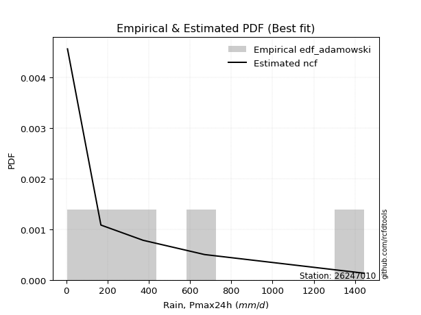</img>

</div>


## C. Best fit & Estimate extreme values for specific return periods - Tr


### 1. Best fit (ordered by delta Δ)

<div align="center">

|   id |   station | empirical_dist   | p_dist   |     delta |   deltao | eval   |   fit |   n |   best_fit |   best_fit_sort |
|-----:|----------:|:-----------------|:---------|----------:|---------:|:-------|------:|----:|-----------:|----------------:|
|    0 |  26247010 | edf_hazen        | f        | 0.0563366 | 0.530386 | Δo > Δ |     1 |   6 |          1 |               1 |
|    1 |  26247010 | edf_gringorten   | f        | 0.0579706 | 0.530386 | Δo > Δ |     1 |   6 |          1 |               2 |
|    2 |  26247010 | edf_blom         | invgauss | 0.0590125 | 0.530386 | Δo > Δ |     1 |   6 |          1 |               3 |
|    3 |  26247010 | edf_cunnane      | f        | 0.0590248 | 0.530386 | Δo > Δ |     1 |   6 |          1 |               4 |
|    4 |  26247010 | edf_tukey        | invgauss | 0.0601326 | 0.530386 | Δo > Δ |     1 |   6 |          1 |               5 |
|    5 |  26247010 | edf_filliben     | f        | 0.0611154 | 0.530386 | Δo > Δ |     1 |   6 |          1 |               6 |
|    6 |  26247010 | edf_beard        | f        | 0.0613001 | 0.530386 | Δo > Δ |     1 |   6 |          1 |               7 |
|    7 |  26247010 | edf_jenkinson    | f        | 0.0613001 | 0.530386 | Δo > Δ |     1 |   6 |          1 |               8 |
|    8 |  26247010 | edf_chegodayev   | f        | 0.061545  | 0.530386 | Δo > Δ |     1 |   6 |          1 |               9 |
|    9 |  26247010 | edf_adamowski    | f        | 0.0657731 | 0.530386 | Δo > Δ |     1 |   6 |          1 |              10 |
|   10 |  26247010 | edf_weibull      | f        | 0.0932457 | 0.530386 | Δo > Δ |     1 |   6 |          1 |              11 |
|   11 |  26247010 | edf_california   | invgauss | 0.121536  | 0.530386 | Δo > Δ |     1 |   6 |          1 |              12 |

</div>

:file_folder:Tables: [bestfit_26247010.csv](table/bestfit_26247010.csv) | [extreme_26247010.csv](table/extreme_26247010.csv)


### 2. Extreme values

In hydrology, a return period (or recurrence interval $Tr$) is the statistical average time between extreme events like floods or droughts of a specific magnitude, indicating how rare an event is, with a 100-year flood, for example, having a 1% chance of occurring in any given year, not that it happens exactly every century. It is a key tool for infrastructure design (like bridges or dams) and risk assessment, calculated from historical data to determine the probability of future events, although it is important to remember it is statistical average, and events can cluster or be missed.

> risk_rate: assuming the return period as the project useful life.

|   id |      tr |   prob_l |     prob_g |      alpha |   betaprime |      chi2 |   crystalball |   erlang |    expon |   exponnorm |         f |   fatiguelife |       fisk |     gamma |   genexpon |   genlogistic |   gibrat |   gompertz |   gumbel_l |   gumbel_r |   halflogistic |   halfnorm |   hypsecant |   invgamma |   invgauss |     invweibull |   johnsonsu |   kstwobign |   laplace |   laplace_asymmetric |   loggamma |   logistic |   lognorm |   maxwell |   mielke |    moyal |   nakagami |      ncf |              nct |     norm |           pareto |   pearson3 |   rayleigh |     rice |        t |   truncnorm |     wald |   weibull_min |   logalpha |   logbetaprime |          logchi2 |   logcrystalball |   logerlang |         logexpon |   logexponnorm |      logf |   logfatiguelife |    logfisk |   loggenexpon |   loggenlogistic |        loggibrat |   loggompertz |   loggumbel_l |      loggumbel_r |   loghalflogistic |   loghalfnorm |   loghypsecant |   loginvgamma |   loginvgauss |    loginvweibull |   logjohnsonsu |     logkstwobign |   loglaplace |   loglaplace_asymmetric |   logloggamma |   loglogistic |   loglognorm |   logmaxwell |   logmielke |         logmoyal |   lognakagami |           logncf |    lognct |     logpareto |   logpearson3 |   lograyleigh |   logrice |      logt |   logtruncnorm |          logwald |   logweibull_min |   station |   n |   risk_rate |
|-----:|--------:|---------:|-----------:|-----------:|------------:|----------:|--------------:|---------:|---------:|------------:|----------:|--------------:|-----------:|----------:|-----------:|--------------:|---------:|-----------:|-----------:|-----------:|---------------:|-----------:|------------:|-----------:|-----------:|---------------:|------------:|------------:|----------:|---------------------:|-----------:|-----------:|----------:|----------:|---------:|---------:|-----------:|---------:|-----------------:|---------:|-----------------:|-----------:|-----------:|---------:|---------:|------------:|---------:|--------------:|-----------:|---------------:|-----------------:|-----------------:|------------:|-----------------:|---------------:|----------:|-----------------:|-----------:|--------------:|-----------------:|-----------------:|--------------:|--------------:|-----------------:|------------------:|--------------:|---------------:|--------------:|--------------:|-----------------:|---------------:|-----------------:|-------------:|------------------------:|--------------:|--------------:|-------------:|-------------:|------------:|-----------------:|--------------:|-----------------:|----------:|--------------:|--------------:|--------------:|----------:|----------:|---------------:|-----------------:|-----------------:|----------:|----:|------------:|
|    0 |    2    | 0.5      | 0.5        |    21.8648 |     159.843 |   76.6024 |      -0.40651 |  127.868 |  324.755 |     324.072 |   259.528 |       215.968 |    211.493 |   17.501  |    324.799 |       372.087 |  319.802 |    462.608 |    545.809 |    385.924 |        346.181 |    366.258 |     465.867 |    259.528 |    249.733 |  389.087       |     237.874 |     407.876 |   465.867 |              324.755 |    183.922 |    465.867 |   190.859 |   424.248 |  429.786 |  360.116 |     238.64 |  268.175 |     73.2825      |  465.867 |     36.464       |    375.621 |    409.488 |  461.007 |  260.763 |     337.654 |  308.127 |       340.468 |    162.148 |        181.093 |     56.3014      |          190.859 |     182.383 |     66.0157      |        190.861 |   185.191 |          191.28  |    241.212 |       119.696 |              inf |    113.082       |       235.898 |       254.169 |    143.319       |     124.294       |       133.567 |        190.859 |       172.275 |       167.683 |    151.889       |        313.786 |    124.073       |      190.859 |                 255.651 |       356.855 |       190.859 |      6.04764 |      164.416 |    0.328081 |    130.659       |       225.28  |    156.054       |   190.417 |   8.30901     |       251.992 |       155.945 |   184.38  |   190.858 |        82.2043 |    108.453       |          257.89  |  26247010 |   6 |    0.75     |
|    1 |    2.33 | 0.570815 | 0.429185   |    26.0233 |     211.046 |  109.888  |     119.836   |  165.53  |  394.987 |     394.267 |   319.727 |       284.181 |    289.593 |   27.4164 |    394.748 |       438.905 |  363.789 |    543.203 |    621.358 |    466.387 |        428.91  |    459.976 |     535.362 |    319.727 |    313.311 | 7528.38        |     304.092 |     481.139 |   518.416 |              394.986 |    254.314 |    542.375 |   260.525 |   514.465 |  570.038 |  436.285 |     346.69 |  373.228 |    121.694       |  552.703 |     71.3857      |    459.84  |    501.039 |  538.732 |  313.505 |     409.986 |  365.067 |       460.131 |    226.247 |        249.629 |     99.8356      |          260.526 |     252.252 |    111.975       |        260.528 |   253.633 |          260.704 |    316.428 |       179.757 |              inf |    132.388       |       308.522 |       333.191 |    191.216       |     167.185       |       186.874 |        244.829 |       238.297 |       234.205 |    229.923       |        403.087 |    188.951       |      230.405 |                 314.329 |       466.211 |       251.06  |      6.60083 |      227.166 |    0.328081 |    171.663       |       272.91  |    228.419       |   260.149 |  12.1114      |       336.054 |       216.495 |   253.723 |   260.524 |       118.112  |    132.999       |          332.678 |  26247010 |   6 |    0.729209 |
|    2 |    5    | 0.8      | 0.2        |    58.2687 |     507.964 |  331.803  |     566.688   |  374.666 |  746.127 |     745.228 |   690.483 |       712.455 |    989.7   |  126.141  |    746.066 |       729.169 |  617.039 |    879.748 |    865.424 |    815.957 |        803.243 |    856.302 |     814.122 |    690.483 |    697.357 |    3.11876e+09 |     738.1   |     792.348 |   781.15  |              746.126 |    866.025 |    837.786 |   828.053 |   869.552 | 1175.18  |  789.106 |     963.14 | 1010.71  |   1517.19        |  875.41  |   2766.94        |    826.297 |    867.56  |  849.896 |  541.248 |     767.759 |  683.814 |      1225.79  |    836.455 |        837.104 |   1981.98        |          828.053 |     858.674 |   1571.92        |        828.06  |   818.874 |          824.872 |    902.414 |       934.986 |              inf |    328.076       |       750.394 |       798.945 |    669.169       |     639.375       |       773.258 |        664.783 |       827.463 |       859.571 |   1392.65        |        824.73  |   1128           |      590.701 |                 634.422 |       921.342 |       723.614 |    inf       |      810.853 |    0.328081 |    607.784       |       727.608 |   1088.27        |   830.296 |   1.02504e+14 |       843.866 |       805.095 |   838.558 |   828.048 |       407.739  |    416.762       |          757.339 |  26247010 |   6 |    0.67232  |
|    3 |   10    | 0.9      | 0.1        |   117.511  |     817.271 |  582.059  |     863.118   |  581.4   | 1064.88  |    1063.82  |  1177.94  |      1183.6   |   2464.53  |  268.877  |   1065.05  |       965.571 |  905.715 |   1119.42  |   1001.31  |   1100.68  |       1114.11  |   1149.57  |    1036.72  |   1177.94  |   1139.86  |    1.17343e+14 |    1312.43  |    1029.29  |  1019.65  |             1064.88  |   1988.63  |   1055.35  |  1783.24  |  1119.44  | 1523.73  | 1096.29  |    1506.86 | 1673.61  |  14951.6         | 1089.49  |  81406.2         |   1118.35  |   1128.9   | 1071.76  |  770.47  |    1087.15  | 1022.08  |      2120.42  |   2126.87  |       1896.38  |  32957.4         |         1783.24  |    1968.89  |  17295.2         |       1783.26  |  1786.99  |         1772.79  |   1952.51  |      3065.77  |              inf |    923.061       |      1243.3   |      1300.13  |   1856.21        |    1947.8         |      2211.69  |       1476.03  |      1957.85  |      2146.62  |   6039.36        |       1149.78  |   4396.47        |     1388.46  |                1176.55  |      1168.56  |      1577.9   |    inf       |     1985.33  |    0.328081 |   1827.27        |      1639.64  |   3524.15        |  1794.43  | inf           |      1377.24  |      2053.78  |  1863.99  |  1783.23  |       742.998  |   1400.56        |         1197.29  |  26247010 |   6 |    0.651322 |
|    4 |   15    | 0.933333 | 0.0666667  |   176.542  |    1011.26  |  741.247  |    1011.04    |  706.597 | 1251.34  |    1250.18  |  1559.23  |      1481.11  |   4055.71  |  367.71   |   1251.36  |      1098.94  | 1104.83  |   1239.92  |   1062.85  |   1261.31  |       1290.03  |   1302.19  |    1163.76  |   1559.23  |   1436.21  |    4.4761e+16  |    1745.54  |    1155.08  |  1159.17  |             1251.34  |   3027.71  |   1173.88  |  2614.92  |  1247.66  | 1666.12  | 1274.57  |    1801.21 | 2079.34  |  57003.4         | 1196.31  | 589090           |   1279.36  |   1263.55  | 1186.08  |  935.203 |    1271.71  | 1239.3   |      2718.61  |   3461.87  |       2864.99  | 174894           |         2614.92  |    2994.42  |  70333.6         |       2614.95  |  2640.05  |         2597.73  |   2973.17  |      5665.72  |              inf |   1884.11        |      1565.3   |      1620.89  |   3300.76        |    3658.69        |      3821.5   |       2326.97  |      3042.38  |      3444.78  |  13818.7         |       1314.56  |   9051.99        |     2289.04  |                1688.56  |      1257.55  |      2412.96  |    inf       |     3143.16  |    0.328081 |   3461.34        |      2530.17  |   6633.45        |  2636.63  | inf           |      1701.24  |      3327.42  |  2780.43  |  2614.91  |       919.414  |   3050.29        |         1473.27  |  26247010 |   6 |    0.644736 |
|    5 |   20    | 0.95     | 0.05       |   235.522  |    1154.04  |  858.343  |    1107.92    |  796.802 | 1383.64  |    1382.41  |  1885.44  |      1699.22  |   5723.86  |  442.888  |   1383.85  |      1192.33  | 1261.02  |   1318.51  |   1101.15  |   1373.79  |       1413.29  |   1403.94  |    1253.37  |   1885.44  |   1661.57  |    2.87317e+18 |    2102.89  |    1239.82  |  1258.16  |             1383.64  |   3995.2   |   1255.81  |  3359.94  |  1332.75  | 1751.01  | 1400.83  |    1999.51 | 2372.22  | 147325           | 1266.27  |      2.39904e+06 |   1390.44  |   1353.05  | 1262.06  | 1071.96  |    1401.67  | 1401.17  |      3173.62  |   4801.93  |       3760.04  | 576085           |         3359.94  |    3947.95  | 190293           |       3359.98  |  3409.9   |         3336.63  |   3975.98  |      8527.37  |              inf |   3297.48        |      1807.33  |      1859.37  |   4939.12        |    5690.44        |      5502.81  |       3208.17  |      4077.07  |      4723.6   |  24669.7         |       1421.28  |  14723.9         |     3263.63  |                2181.94  |      1303.28  |      3236.32  |    inf       |     4263.75  |    0.328081 |   5441.67        |      3385.47  |  10217.2         |  3392.6   | inf           |      1931.78  |      4585.55  |  3614.21  |  3359.93  |      1025.85   |   5448.12        |         1676.31  |  26247010 |   6 |    0.641514 |
|    6 |   25    | 0.96     | 0.04       |   294.48   |    1267.59  |  951.139  |    1179.23    |  867.424 | 1486.25  |    1484.98  |  2176.16  |      1871.71  |   7450.51  |  503.6    |   1486.13  |      1264.26  | 1391.23  |   1376.06  |   1128.41  |   1460.42  |       1508.26  |   1479.65  |    1322.73  |   2176.16  |   1844.37  |    7.08892e+19 |    2411.41  |    1303.29  |  1334.94  |             1486.25  |   4904.88  |   1318.49  |  4040.89  |  1395.93  | 1810.65  | 1498.69  |    2147.68 | 2601.55  | 307707           | 1317.77  |      7.12983e+06 |   1475.09  |   1419.55  | 1318.51  | 1192.01  |    1501.92  | 1530.83  |      3543.18  |   6135.94  |       4596.95  |      1.45777e+06 |         4040.89  |    4843.56  | 411822           |       4040.94  |  4117.33  |         4011.99  |   4965.99  |     11557.5   |              inf |   5258.02        |      2002.38  |      2050.15  |   6737.1         |    7997.11        |      7217.76  |       4113.32  |      5068.09  |      5977.71  |  38551.3         |       1498.7   |  21197.2         |     4297.24  |                2661.91  |      1331.11  |      4051.24  |    inf       |     5346.91  | 1295.48     |   7727.36        |      4207.07  |  14173.4         |  4084.56  | inf           |      2109.6   |      5819.38  |  4384.68  |  4040.87  |      1096.7    |   8669.97        |         1837.61  |  26247010 |   6 |    0.639603 |
|    7 |   50    | 0.98     | 0.02       |   589.18   |    1635.07  | 1248.24   |    1383.43    | 1089.75  | 1805.01  |    1803.57  |  3342.78  |      2422.15  |  16677.9   |  702.937  |   1804.93  |      1485.84  | 1850.22  |   1538.76  |   1202.4   |   1727.3   |       1800.85  |   1699.7   |    1537.76  |   3342.77  |   2452.34  |    1.37831e+24 |    3566.06  |    1489.67  |  1573.44  |             1805.01  |   8867.92  |   1509.98  |  6854.59  |  1579.14  | 1975.29  | 1802.5   |    2579.74 | 3322.47  |      3.03193e+06 | 1465.25  |      2.10128e+08 |   1731.23  |   1612.57  | 1482.39  | 1665.45  |    1810.3   | 1954.15  |      4778.54  |  12642     |       8205.59  |      2.65177e+07 |         6854.59  |    8737.15  |      4.53112e+06 |       6854.67  |  7069.51  |         6803.05  |   9795.63  |     27970.9   |              inf |  27235.5         |      2646.39  |      2672.62  |  17530.7         |   22818.6         |     15880.2   |       8888.66  |      9545.1   |     11903.8   | 152502           |       1712.67  |  61800.9         |    10100.8   |                4936.57  |      1387.67  |      8046.26  |    inf       |    10309.2   | 1369.67     |  22952.5         |      7921.69  |  37880.5         |  6951.55  | inf           |      2648.77  |     11621.9   |  7631.3   |  6854.57  |      1256.61   |  39518.7         |         2358.13  |  26247010 |   6 |    0.63583  |
|    8 |   75    | 0.986667 | 0.0133333  |   883.839  |    1860.05  | 1427.02   |    1493.01    | 1221.47  | 1991.47  |    1989.93  |  4261.48  |      2752.31  |  26565.3   |  825.568  |   1991.34  |      1614.63  | 2160.23  |   1624.47  |   1239.82  |   1882.42  |       1970.94  |   1819.49  |    1663.43  |   4261.47  |   2832.99  |    4.2869e+26  |    4397.45  |    1592.22  |  1712.95  |             1991.47  |  12220.7   |   1620.58  |  9101.77  |  1678.75  | 2063.96  | 1980.16  |    2815.06 | 3748.36  |      1.15592e+07 | 1544.38  |      1.52066e+09 |   1877.16  |   1717.59  | 1571.54  | 2034.27  |    1988.64  | 2214.65  |      5559.09  |  18881.3   |      11224.9   |      1.46116e+08 |         9101.77  |   12023.5   |      1.84265e+07 |       9101.88  |  9452.71  |         9032.93  |  14502     |     45270.1   |              inf |  82715           |      3048.16  |      3056.1   |  30563.4         |   41974.6         |     24393.5   |      13944.4   |     13489.6   |     17382.5   | 339169           |       1821.56  | 111347           |    16652.3   |                7084.85  |      1406.79  |     11959.4   |    inf       |    14731.3   | 1395.1      |  43382.3         |     11180.8   |  66108.8         |  9248.05  | inf           |      2950.53  |     16931.9   | 10278.1   |  9101.75  |      1316      | 100505           |         2675.09  |  26247010 |   6 |    0.634587 |
|    9 |  100    | 0.99     | 0.01       |  1178.49   |    2024.07  | 1555.67   |    1567.11    | 1315.53  | 2123.76  |    2122.16  |  5049.15  |      2989.49  |  36903.6   |  914.734  |   2123.91  |      1705.78  | 2400.37  |   1681.71  |   1264.3   |   1992.21  |       2091.32  |   1901.09  |    1752.57  |   5049.14  |   3112.94  |    2.49143e+28 |    5066.51  |    1662.48  |  1811.94  |             2123.76  |  15198.4   |   1698.66  | 11025.9   |  1746.6   | 2125.48  | 2106.21  |    2975.23 | 4051.82  |      2.98745e+07 | 1597.9   |      6.19283e+09 |   1979.26  |   1789.13  | 1632.28  | 2349.44  |    2114.28  | 2404.58  |      6137.46  |  24902.6   |      13887.7   |      4.9214e+08  |        11025.9   |   14937.7   |      4.98542e+07 |      11026.1   | 11507.1   |        10942.9   |  19130.7   |     62859     |              inf | 195577           |      3343.75  |      3336.22  |  45295.8         |   64615.1         |     32679     |      19192.1   |     17087.9   |     22536.8   | 597187           |       1892.49  | 166672           |    23742.3   |                9154.97  |      1416.39  |     15820.8   |    inf       |    18785.7   | 1407.94     |  68150.1         |     14136.9   |  97529.4         | 11218.1   | inf           |      3157.05  |     21879.9   | 12573.1   | 11025.9   |      1346.95   | 198497           |         2905.12  |  26247010 |   6 |    0.633968 |
|   10 |  200    | 0.995    | 0.005      |  2357.06   |    2434.11  | 1870.75   |    1735.22    | 1543.91  | 2442.52  |    2440.75  |  7546.5   |      3569.14  |  81196.1   | 1135.62   |   2442.9   |      1924.92  | 3053.72  |   1809.18  |   1317.49  |   2256.15  |       2380.74  |   2087.73  |    1967.32  |   7546.48  |   3817.25  |    4.34525e+32 |    6984.08  |    1824.3   |  2050.44  |             2442.52  |  25010.8   |   1885.97  | 17035.1   |  1901.82  | 2272.91  | 2409.89  |    3340.82 | 4786.05  |      2.94363e+08 | 1719.3   |      1.82513e+11 |   2221.15  |   1952.83  | 1771.26  | 3346.78  |    2414.04  | 2877.66  |      7610.88  |  47460.6   |      22573.1   |      9.27171e+09 |        17035.1   |   24518.7   |      5.48527e+08 |      17035.3   | 17986.1   |        16910.9   |  37180.7   |    133296     |              inf |      2.03286e+06 |      4089.93  |      4036.84  | 116631           |  182281           |     63785.4   |      41430.4   |     29439.3   |     41063.9   |      2.32695e+06 |       2044.63  | 422039           |    55806.9   |               16978.1   |      1430.87  |     30955     |    inf       |    32763.9   | 1427.38     | 202331           |     24156     | 244793           | 17387.1   | inf           |      3625.77  |     39337.3   | 19868.6   | 17035     |      1395.02   |      1.08136e+06 |         3475.64  |  26247010 |   6 |    0.633042 |
|   11 |  250    | 0.996    | 0.004      |  2946.34   |    2570.58  | 1973.5    |    1786.59    | 1617.88  | 2545.14  |    2543.32  |  8575.18  |      3757.84  | 104589     | 1208.28   |   2545.46  |      1995.37  | 3288.15  |   1847.45  |   1333.14  |   2341     |       2473.79  |   2145.15  |    2036.44  |   8575.15  |   4052.04  |    1.00373e+34 |    7703.4   |    1874.38  |  2127.23  |             2545.13  |  29151.3   |   1946.11  | 19457.2   |  1949.6   | 2320.83  | 2507.65  |    3453.03 | 5023.1   |      6.14815e+08 | 1756.4   |      5.42422e+11 |   2297.94  |   2003.22  | 1814.04  | 3757.5   |    2509.67  | 3034.17  |      8108.35  |  58082.5   |      26206.5   |      2.39208e+10 |        19457.2   |   28553.4   |      1.18709e+09 |      19457.4   | 20619.5   |        19317.8   |  46022.1   |    168025     |              inf |      4.70906e+06 |      4339.94  |      4269.72  | 158075           |  254415           |     78356.7   |      53076.3   |     34837.8   |     49478.5   |      3.60315e+06 |       2088.6   | 562631           |    73481.3   |               20712.9   |      1433.77  |     38398.5   |    inf       |    38882.7   | 1431.29     | 287212           |     28476.4   | 327874           | 19879.5   | inf           |      3767.5   |     47122.2   | 22853.1   | 19457.1   |      1404.89   |      1.89467e+06 |         3663.92  |  26247010 |   6 |    0.632858 |
|   12 |  500    | 0.998    | 0.002      |  5892.73   |    3008.45  | 2296.06   |    1938.93    | 1848.81  | 2863.89  |    2861.91  | 12708.5   |      4349.33  | 229346     | 1437.93   |   2863.52  |      2214.04  | 4098.31  |   1958.98  |   1378.01  |   2604.37  |       2762.58  |   2316.34  |    2251.18  |  12708.4   |   4803.21  |    1.71379e+38 |   10300.9   |    2024.46  |  2365.73  |             2863.89  |  46037.3   |   2132.61  | 28859.9   |  2092.19  | 2473.09  | 2811.32  |    3786.78 | 5760.79  |      6.05796e+09 | 1866.42  |      1.59861e+13 |   2533.62  |   2153.57  | 1941.68  | 5409.48  |    2804.1   | 3531.82  |      9722.22  | 107210     |      40886.9   |      4.5742e+11  |        28859.9   |   44971.6   |      1.30612e+10 |      28860.3   | 30933.6   |        28668     |  89186.4   |    335408     |              inf |      8.58548e+07 |      5145.3   |      5014.49  | 406187           |  716100           |    144708     |     114570     |     57742.5   |     86734.2   |      1.39985e+07 |       2211.85  |      1.33179e+06 |   172720     |               38412.4   |      1439.59  |     74911.7   |    inf       |    64811.6   | 1439.13     | 852685           |     46469.1   | 805089           | 29578.6   | inf           |      4178.45  |     80762.4   | 34617.7   | 28859.9   |      1424.86   |      1.12715e+07 |         4262.12  |  26247010 |   6 |    0.632489 |
|   13 |  750    | 0.998667 | 0.00133333 |  8839.11   |    3274.47  | 2486.8    |    2023.56    | 1984.6   | 3050.35  |    3048.27  | 15966.2   |      4698.57  | 362845     | 1574.65   |   3050.48  |      2341.87  | 4634.1   |   2019.64  |   1401.99  |   2758.33  |       2931.4   |   2411.98  |    2376.78  |  15966.1   |   5256.34  |    5.10713e+40 |   12104.4   |    2108.78  |  2505.24  |             3050.35  |  59443.4   |   2241.56  | 35925.9   |  2171.94  | 2565.27  | 2988.96  |    3972.67 | 6192.99  |      2.30959e+10 | 1927.53  |      1.15688e+14 |   2669.74  |   2237.65  | 2013.06  | 6713.82  |    2974.53  | 3830.2   |     10712.8   | 152113     |      52422.6   |      2.58091e+12 |        35925.9   |   57973.7   |      5.31151e+10 |      35926.4   | 38761.4   |        35700.3   | 131271     |    493794     |              inf |      5.85598e+08 |      5635.81  |      5464.44  | 705229           |       1.31133e+06 |    203857     |     179700     |     76754.7   |    119130     |      3.09491e+07 |       2275.7   |      2.16101e+06 |   284749     |               55128.6   |      1441.53  |    110692     |    inf       |    86250.3   | 1441.76     |      1.61151e+06 |     61054.5   |      1.35464e+06 | 36887.3   | inf           |      4398.37  |    109157     | 43607.2   | 35925.8   |      1431.59   |      3.2834e+07  |         4620.92  |  26247010 |   6 |    0.632366 |
|   14 | 1000    | 0.999    | 0.001      | 11785.5    |    3467.71  | 2622.93   |    2081.83    | 2081.23  | 3182.65  |    3180.5   | 18760.2   |      4947.6   | 502354     | 1672.57   |   3182.59  |      2432.54  | 5044.12  |   2060.86  |   1418.13  |   2867.55  |       3051.16  |   2478.03  |    2465.9   |  18760.1   |   5583.34  |    2.90561e+42 |   13526.2   |    2167.19  |  2604.23  |             3182.64  |  70930.7   |   2318.83  | 41772.7   |  2227.06  | 2632.33  | 3114.99  |    4100.8  | 6499.84  |      5.96909e+10 | 1969.61  |      4.71137e+14 |   2765.62  |   2295.75  | 2062.38  | 7834.07  |    3094.68  | 4044.83  |     11435.7   | 194319     |      62243.1   |      8.82364e+12 |        41772.7   |   69096.9   |      1.43707e+11 |      41773.2   | 45279.1   |        41522.7   | 172670     |    645153     |              inf |      2.54503e+09 |      5992.18  |      5789.78  |      1.04301e+06 |       2.0141e+06  |    258293     |     247309     |     93524.8   |    148569     |      5.43328e+07 |       2317.75  |      3.02201e+06 |   405985     |               71236.7   |      1442.5   |    146004     |    inf       |   105084     | 1443.07     |      2.53147e+06 |     73702.2   |      1.95618e+06 | 42945.5   | inf           |      4545.42  |    134422     | 51122.9   | 41772.6   |      1434.97   |      7.08496e+07 |         4879.26  |  26247010 |   6 |    0.632305 |

<div align="center">

</img>

</div>


<div align="center">

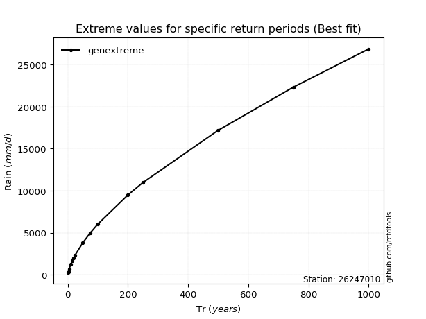</img>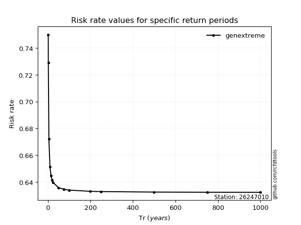</img>

</div>


<sub>**APP DISCLAIMER**: NO WARRANTY - This software is provided by [github.com/rcfdtools](https://github.com/rcfdtools) "as is", without any express or implied warranty, including warranties of merchantability, fitness for a particular purpose, or non-infringement. There is no guarantee that the software will be error-free or operate without interruption. LIMITATION OF LIABILITY - Neither the authors nor copyright holders will be liable for claims or damages arising from the software or its use. You are responsible for determining if the software is appropriate for your use and assume all associated risks, including errors, legal compliance, and data loss. NO PROFESSIONAL ADVICE - The software provides general information and does not offer professional advice. It should not replace consultation with professional advisors.</sub>