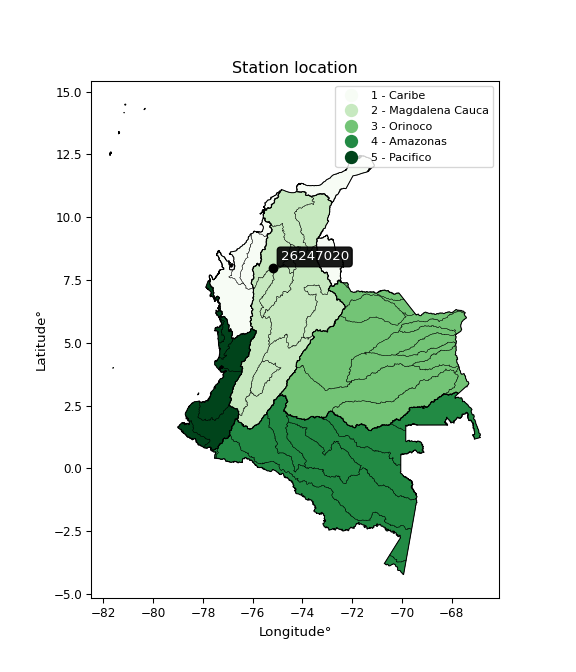

<div align="center">


</div>

# PMP Station (Rain, Pmax24h): 26247020

Probable Maximum Precipitation (PMP) is the greatest amount of rainfall for a specific duration that is meteorologically possible for a given location, acting as a "worst-case" scenario for extreme storms, crucial for designing safety-critical infrastructure like bridges, river deviations, dams, spillways, and nuclear plants to prevent catastrophic failure. PMP is calculated by hydrologists using meteorological data to determine the upper limit of extreme rainfall, often leading to the Probable Maximum Flood (PMF) for flood control design, and is increasingly being studied for climate change impacts. Probable Maximum Precipitation (PMP) is the theoretical upper limit of rainfall, a deterministic estimate for extreme events, while probability distributions (like GEV, Gumbel) describe the likelihood and frequency of various precipitation amounts, including rare ones, showing how often events occur, with PMP representing the extreme end of these distributions, used for critical infrastructure design to ensure safety against the worst conceivable weather, unlike standard statistical forecasts which cover typical probabilities.

The most common probability distributions in hydrology, used for analyzing floods, rainfall, and streamflow, include the Normal, Log-Normal, Gumbel, Gamma (including Log-Pearson Type III), and Generalized Extreme Value (GEV) distributions, often chosen based on the data´s skewness and whether modeling extremes or general conditions, with Gumbel and GEV popular for extreme events like floods, while the Normal distribution serves as a baseline, though often requiring transformations for skewed hydrological data. These distributions help in designing water infrastructure, managing water resources, and forecasting hydrologic events.

> Hydrological data often isn´t perfectly normal (it´s skewed), so different distributions are needed for different applications, such as: **Flood Frequency Analysis**: Using Gumbel, GEV, or Log-Pearson Type III for predicting extreme flood magnitudes and their return periods, **Rainfall Analysis**: Normal for annual totals, but Log-Normal, Weibull, or GEV for intensity or extreme daily rainfall, **Streamflow Modeling**: Gamma and Log-Normal for maximum flows, GEV for minimum flows, and Kappa for daily flows.

<div align="center">

</img>

</div>


## A. General information


### 1. General running parameters

• app_version: _v20260113_. • runtime: _2026-01-17 18:24:04.630693_. • Python version: _3.14.0_. • SciPy version: _1.16.3_. • Pandas version: _2.3.3_. • NumPy version: _2.3.5_. • Stations dataset (station_dataset_file): _dataset/pmax24h_in/automatic_colombia_2003_2025.csv_. • Stations catalog (station_catalog_file): _dataset/CNE.xls_. • Minimum year to eval til year_max (date_min): _1900_. • Maximum year to eval since year_min (date_max): _2025_. • Creates, save and include plots into reports (create_plot): _False_. • Plot only fit distributions with Δo > Δ (plot_only_fit): _True_. • Plot only simple graphs avoiding multiple CDFs and multiple Extreme values plots (plot_only_simple): _True_. • Eval low extreme values, if False, evaluates high extreme values (low_extreme): _False_. • Eval every SciPy distribution as logarithmic (pdist_logarithmic_on): _True_. • Standard deviation normalized (ddof): _1.0_. • Return periods to eval in years (Tr): _[2, 2.33, 5, 10, 15, 20, 25, 50, 75, 100, 200, 250, 500, 750, 1000]_. • Minimum data sample per station, 0 means any (minimum_sample): _5_. • Z-Score maximum threshold to adjust a value, 0 means disable (zscore_max): _3.5_. • Z-Score minimum threshold to adjust a value, 0 means disable (zscore_min): _-2.5_. • Avoid zeros, e.g. rain = 0 (avoid_zeros): _True_. • Avoid null values (avoid_nans): _True_. 

:file_folder:Table: [dataset.csv](../../dataset/pmax24h_in/automatic_colombia_2003_2025.csv)

> Delta Degrees of Freedom (DDOF): is a parameter used in the formulas for calculating variance and standard deviation. When ddof=0, the divisor is $N$ (the total number of observations) and this is used when your data set is the entire population. When ddof=1, the divisor is $N-1$ and this is used when your data set is a sample drawn from a larger population. Using $N-1$ provides an unbiased estimate of the population variance (known as Bessel´s correction).


### 2. Station info and location

|   id |   CODIGO | NOMBRE                | CATEGORIA    | TECNOLOGIA                | ESTADO   | FECHA_INSTALACION   |   FECHA_SUSPENSION |   ALTITUD |   LATITUD |   LONGITUD | DEPARTAMENTO   | MUNICIPIO   | AREA_OPERATIVA                      | ENTIDAD                                                     | AREA_HIDROGRAFICA   | ZONA_HIDROGRAFICA   | SUBZONA_HIDROGRAFICA                             | CORRIENTE   | Catalogo   |   Version |
|-----:|---------:|:----------------------|:-------------|:--------------------------|:---------|:--------------------|-------------------:|----------:|----------:|-----------:|:---------------|:------------|:------------------------------------|:------------------------------------------------------------|:--------------------|:--------------------|:-------------------------------------------------|:------------|:-----------|----------:|
|    0 | 26247020 | LA COQUERA [26247020] | Limnigráfica | Automática con Telemetría | Activa   | 15/08/1966          |                nan |        49 |      7.96 |      -75.2 | Antioquia      | Caucasia    | Area Operativa 01 - Antioquia-Chocó | INSTITUTO DE HIDROLOGIA METEOROLOGIA Y ESTUDIOS AMBIENTALES | Magdalena Cauca     | Cauca               | Directos al Cauca entre Pto Valdivia y Río Nechí | Cauca       | CNE_IDEAM  |  20251226 |

<div align="center">

Dynamic map: [:earth_americas:Google](http://maps.google.com/maps?q=7.96,-75.2) [:earth_americas:OSM](https://www.openstreetmap.org/#map=18/7.96/-75.2&layers=P) [:earth_americas:Bing](https://www.bing.com/maps?cp=7.96~-75.2&lvl=18) [:earth_americas:Apple](https://maps.apple.com/frame?center=7.96%2C-75.2&span=0.003%2C0.006)

</div>


<div align="center">

```geojson
{
  "type": "Feature",
  "geometry": {
    "type": "Point", 
    "coordinates": [-75.2, 7.96]
  }, 
  "properties": {
    "Name": "26247020"
  }
}
```

</div>


### 3. Discrete values table and plot

<div align="center">

|               |          0 |          1 |           2 |           3 |           4 |           5 |           6 |
|:--------------|-----------:|-----------:|------------:|------------:|------------:|------------:|------------:|
| Date          | 2017       | 2018       | 2019        | 2020        | 2022        | 2024        | 2025        |
| Value         |  277.4     |   70.1     |    5.1      |   31.5      |    4.9      |  145        |  101.1      |
| Value_initial |  277.4     |   70.1     |    5.1      |   31.5      |    4.9      |  145        |  101.1      |
| count         |    7       |    7       |    7        |    7        |    7        |    7        |    7        |
| mean          |   90.7286  |   90.7286  |   90.7286   |   90.7286   |   90.7286   |   90.7286   |   90.7286   |
| std           |   97.0666  |   97.0666  |   97.0666   |   97.0666   |   97.0666   |   97.0666   |   97.0666   |
| zscore        |    1.92313 |   -0.21252 |   -0.882163 |   -0.610185 |   -0.884224 |    0.559115 |    0.106849 |


</div>


> The initial value (value_initial) correspond to the initial obtained or null completed value, and value (value) is adjusted only when the initial value is outside the valid range (outlier) definite through the Z-Score value. If Z-Score is active, values out of range or outliers are replaced with the station mean value. A Z-Score (or standard score) measures how many standard deviations a data point is from the mean of a dataset, indicating its relative position; positive scores mean above the mean, negative mean below, and a score of zero is exactly at the mean, allowing for comparison of values from different distributions. It´s calculated using the formula $z=(x–μ)/σ$, where $x$ is the data point, $μ$ is the mean, and $σ$ is the standard deviation, helping identify outliers and understand probability.
>
> <sub>**Note**: In this study, "completing" (filling gaps in) and "extending" (forecasting or lengthening the historical record) rainfall data series are avoided for certain critical analyses because they introduce artificial bias and uncertainty, which can distort the statistics of rare events (extremes), alter day-to-day variability, and compromise the integrity and homogeneity of the original data. Some reasons against Completing/Extending rainfall data are: **Distortion of Extremes and Variability**: The primary issue is that most gap-filling or extension methods rely on averaging or regression with nearby stations, which inherently smooths the data. Rainfall is highly variable in space and time, with a large percentage of zero values and occasional large storms. Infilling methods often underestimate the highest values and overestimate the lowest (zero) values, which severely distorts analyses focused on flood frequency, drought severity, and intensity-duration-frequency (IDF) curves, **Loss of Data Homogeneity**: Infilled or extended data are synthetic estimates, not actual measurements. Combining these estimates with observed data can violate the assumption of data homogeneity, which requires that the data properties do not change over time. Inhomogeneity can lead to incorrect conclusions about long-term trends or changes in climate patterns, **Propagation of Errors**: Errors and biases from the original data (e.g., wind-induced undercatch, instrument errors, site changes) or the data used for imputation can propagate through the analysis, leading to unreliable hydrological models and inaccurate predictions, **Compromised Statistical Integrity**: For statistical analyses, especially those involving the frequency of events, using artificial data can introduce time bias or autocorrelation that doesn´t exist in reality, making it difficult to assess the true probability of events, **Difficulty in Validation**: It is difficult to accurately validate the quality of filled or extended data, especially for past periods where ground-truth measurements are unavailable. The reliability of imputation techniques heavily depends on the density of the surrounding station network and the complexity of the local topography.</sub>


### 4. Active continuous probability distributions from SciPy (80 of 104 available)

A Probability Density Function (PDF) describes the relative likelihood of a continuous random variable falling within a specific range, where the total area under its curve equals 1, and the area over any interval gives the actual probability for that range. Unlike discrete probabilities (like rolling a die), a PDF shows density, not direct probability for a single point (which is zero), with higher points indicating higher likelihood, often visualized as a bell curve for normal distributions.

A log of a probability density function (log-PDF) is simply the logarithm of the PDF´s value, denoted as $log(f(x))$, useful for converting multiplication of probabilities into addition, improving numerical stability with tiny numbers, and connecting to information theory concepts like entropy. Instead of dealing with very small probabilities (e.g., 0.000001), log-PDFs use negative numbers (e.g., $log(0.00001) ≈ -11.51$ that are easier for computers to handle, preventing underflow errors and simplifying complex calculations. In this study, each active probability distribution from SciPy is also evaluated in the $log$ form.

[scipy.stats](https://docs.scipy.org/doc/scipy/reference/stats.html) is a Python´s powerful submodule within the SciPy library for comprehensive statistical analysis, offering over 130 probability distributions (like Normal, Poisson), functions for descriptive stats (mean, variance), hypothesis testing (t-tests, chi-square), random variable generation, and statistical tests, making it essential for data science, modeling, and research. It provides tools to explore, model, and draw conclusions from data efficiently, working seamlessly with NumPy.

<div align="center">

|   id | p_dist           |   n_parameter | fit_method   | label                                                                       | active   | ref                                                                                                      |
|-----:|:-----------------|--------------:|:-------------|:----------------------------------------------------------------------------|:---------|:---------------------------------------------------------------------------------------------------------|
|    0 | alpha            |             3 | MLE          | Alpha                                                                       | True     | [:mortar_board:](https://docs.scipy.org/doc/scipy/reference/generated/scipy.stats.alpha.html)            |
|    1 | anglit           |             2 | MM           | Anglit                                                                      | True     | [:mortar_board:](https://docs.scipy.org/doc/scipy/reference/generated/scipy.stats.anglit.html)           |
|    2 | arcsine          |             2 | MM           | Arcsine                                                                     | True     | [:mortar_board:](https://docs.scipy.org/doc/scipy/reference/generated/scipy.stats.arcsine.html)          |
|    3 | argus            |             3 | MLE          | Argus                                                                       | True     | [:mortar_board:](https://docs.scipy.org/doc/scipy/reference/generated/scipy.stats.argus.html)            |
|    4 | beta             |             4 | MLE          | Beta                                                                        | True     | [:mortar_board:](https://docs.scipy.org/doc/scipy/reference/generated/scipy.stats.beta.html)             |
|    5 | betaprime        |             4 | MLE          | Beta prime                                                                  | True     | [:mortar_board:](https://docs.scipy.org/doc/scipy/reference/generated/scipy.stats.betaprime.html)        |
|    6 | bradford         |             3 | MLE          | Bradford                                                                    | True     | [:mortar_board:](https://docs.scipy.org/doc/scipy/reference/generated/scipy.stats.bradford.html)         |
|    7 | burr             |             4 | MLE          | Burr (Type III)                                                             | True     | [:mortar_board:](https://docs.scipy.org/doc/scipy/reference/generated/scipy.stats.burr.html)             |
|    8 | burr12           |             4 | MLE          | Burr (Type III) 12                                                          | True     | [:mortar_board:](https://docs.scipy.org/doc/scipy/reference/generated/scipy.stats.burr12.html)           |
|    9 | cosine           |             2 | MLE          | Cosine                                                                      | True     | [:mortar_board:](https://docs.scipy.org/doc/scipy/reference/generated/scipy.stats.cosine.html)           |
|   10 | crystalball      |             4 | MLE          | Crystalball                                                                 | True     | [:mortar_board:](https://docs.scipy.org/doc/scipy/reference/generated/scipy.stats.crystalball.html)      |
|   11 | dgamma           |             3 | MLE          | Double gamma                                                                | True     | [:mortar_board:](https://docs.scipy.org/doc/scipy/reference/generated/scipy.stats.dgamma.html)           |
|   12 | dweibull         |             3 | MLE          | Double Weibull                                                              | True     | [:mortar_board:](https://docs.scipy.org/doc/scipy/reference/generated/scipy.stats.dweibull.html)         |
|   13 | erlang           |             3 | MLE          | Erlang                                                                      | True     | [:mortar_board:](https://docs.scipy.org/doc/scipy/reference/generated/scipy.stats.erlang.html)           |
|   14 | exponnorm        |             3 | MLE          | Exponentially modified Normal                                               | True     | [:mortar_board:](https://docs.scipy.org/doc/scipy/reference/generated/scipy.stats.exponnorm.html)        |
|   15 | exponpow         |             3 | MLE          | Exponential power                                                           | True     | [:mortar_board:](https://docs.scipy.org/doc/scipy/reference/generated/scipy.stats.exponpow.html)         |
|   16 | exponweib        |             4 | MLE          | Exponentiated Weibull                                                       | True     | [:mortar_board:](https://docs.scipy.org/doc/scipy/reference/generated/scipy.stats.exponweib.html)        |
|   17 | f                |             4 | MLE          | F                                                                           | True     | [:mortar_board:](https://docs.scipy.org/doc/scipy/reference/generated/scipy.stats.f.html)                |
|   18 | fatiguelife      |             3 | MLE          | Fatigue-life (Birnbaum-Saunders)                                            | True     | [:mortar_board:](https://docs.scipy.org/doc/scipy/reference/generated/scipy.stats.fatiguelife.html)      |
|   19 | foldnorm         |             3 | MM           | Fold Normal                                                                 | True     | [:mortar_board:](https://docs.scipy.org/doc/scipy/reference/generated/scipy.stats.foldnorm.html)         |
|   20 | gamma            |             3 | MLE          | Gamma                                                                       | True     | [:mortar_board:](https://docs.scipy.org/doc/scipy/reference/generated/scipy.stats.gamma.html)            |
|   21 | gausshyper       |             6 | MLE          | Gauss hypergeometric                                                        | True     | [:mortar_board:](https://docs.scipy.org/doc/scipy/reference/generated/scipy.stats.gausshyper.html)       |
|   22 | genexpon         |             5 | MLE          | Generalized exponential                                                     | True     | [:mortar_board:](https://docs.scipy.org/doc/scipy/reference/generated/scipy.stats.genexpon.html)         |
|   23 | genextreme       |             3 | MLE          | Generalized exponential                                                     | True     | [:mortar_board:](https://docs.scipy.org/doc/scipy/reference/generated/scipy.stats.genextreme.html)       |
|   24 | gengamma         |             4 | MLE          | Generalized gamma                                                           | True     | [:mortar_board:](https://docs.scipy.org/doc/scipy/reference/generated/scipy.stats.gengamma.html)         |
|   25 | genhalflogistic  |             3 | MLE          | Generalized half-logistic                                                   | True     | [:mortar_board:](https://docs.scipy.org/doc/scipy/reference/generated/scipy.stats.genhalflogistic.html)  |
|   26 | genlogistic      |             3 | MLE          | Generalized logistic                                                        | True     | [:mortar_board:](https://docs.scipy.org/doc/scipy/reference/generated/scipy.stats.genlogistic.html)      |
|   27 | gennorm          |             3 | MLE          | Generalized Normal                                                          | True     | [:mortar_board:](https://docs.scipy.org/doc/scipy/reference/generated/scipy.stats.gennorm.html)          |
|   28 | genpareto        |             3 | MLE          | Generalized Pareto                                                          | True     | [:mortar_board:](https://docs.scipy.org/doc/scipy/reference/generated/scipy.stats.genpareto.html)        |
|   29 | gompertz         |             3 | MLE          | Gompertz (or truncated Gumbel)                                              | True     | [:mortar_board:](https://docs.scipy.org/doc/scipy/reference/generated/scipy.stats.gompertz.html)         |
|   30 | gumbel_l         |             2 | MM           | Gumbel Left Skew                                                            | True     | [:mortar_board:](https://docs.scipy.org/doc/scipy/reference/generated/scipy.stats.gumbel_l.html)         |
|   31 | gumbel_r         |             2 | MM           | Gumbel Right Skew                                                           | True     | [:mortar_board:](https://docs.scipy.org/doc/scipy/reference/generated/scipy.stats.gumbel_r.html)         |
|   32 | halfgennorm      |             3 | MLE          | Upper half of a generalized normal                                          | True     | [:mortar_board:](https://docs.scipy.org/doc/scipy/reference/generated/scipy.stats.halfgennorm.html)      |
|   33 | halflogistic     |             2 | MM           | Half-logistic                                                               | True     | [:mortar_board:](https://docs.scipy.org/doc/scipy/reference/generated/scipy.stats.halflogistic.html)     |
|   34 | halfnorm         |             2 | MM           | Half Normal                                                                 | True     | [:mortar_board:](https://docs.scipy.org/doc/scipy/reference/generated/scipy.stats.halfnorm.html)         |
|   35 | hypsecant        |             2 | MM           | hyperbolic secant                                                           | True     | [:mortar_board:](https://docs.scipy.org/doc/scipy/reference/generated/scipy.stats.hypsecant.html)        |
|   36 | invgamma         |             3 | MLE          | Inverted gamma                                                              | True     | [:mortar_board:](https://docs.scipy.org/doc/scipy/reference/generated/scipy.stats.invgamma.html)         |
|   37 | invgauss         |             3 | MLE          | Inverse Gaussian                                                            | True     | [:mortar_board:](https://docs.scipy.org/doc/scipy/reference/generated/scipy.stats.invgauss.html)         |
|   38 | invweibull       |             3 | MLE          | Inverted Weibull                                                            | True     | [:mortar_board:](https://docs.scipy.org/doc/scipy/reference/generated/scipy.stats.invweibull.html)       |
|   39 | johnsonsb        |             4 | MLE          | Johnson SB                                                                  | True     | [:mortar_board:](https://docs.scipy.org/doc/scipy/reference/generated/scipy.stats.johnsonsb.html)        |
|   40 | johnsonsu        |             4 | MLE          | Johnson Su                                                                  | True     | [:mortar_board:](https://docs.scipy.org/doc/scipy/reference/generated/scipy.stats.johnsonsu.html)        |
|   41 | kappa3           |             3 | MLE          | Kappa 3                                                                     | True     | [:mortar_board:](https://docs.scipy.org/doc/scipy/reference/generated/scipy.stats.kappa3.html)           |
|   42 | kappa4           |             4 | MLE          | Kappa 4                                                                     | True     | [:mortar_board:](https://docs.scipy.org/doc/scipy/reference/generated/scipy.stats.kappa4.html)           |
|   43 | ksone            |             3 | MLE          | Kolmogorov-Smirnov one-sided test statistic distribution                    | True     | [:mortar_board:](https://docs.scipy.org/doc/scipy/reference/generated/scipy.stats.ksone.html)            |
|   44 | kstwobign        |             2 | MLE          | Limiting distribution of scaled Kolmogorov-Smirnov two-sided test statistic | True     | [:mortar_board:](https://docs.scipy.org/doc/scipy/reference/generated/scipy.stats.kstwobign.html)        |
|   45 | laplace          |             2 | MM           | Laplace                                                                     | True     | [:mortar_board:](https://docs.scipy.org/doc/scipy/reference/generated/scipy.stats.laplace.html)          |
|   46 | levy_l           |             2 | MLE          | Left-skewed Levy                                                            | True     | [:mortar_board:](https://docs.scipy.org/doc/scipy/reference/generated/scipy.stats.levy_l.html)           |
|   47 | loggamma         |             3 | MLE          | Log gamma                                                                   | True     | [:mortar_board:](https://docs.scipy.org/doc/scipy/reference/generated/scipy.stats.loggamma.html)         |
|   48 | logistic         |             2 | MM           | Logistic (or Sech-squared)                                                  | True     | [:mortar_board:](https://docs.scipy.org/doc/scipy/reference/generated/scipy.stats.logistic.html)         |
|   49 | loglaplace       |             3 | MLE          | Log-Laplace                                                                 | True     | [:mortar_board:](https://docs.scipy.org/doc/scipy/reference/generated/scipy.stats.loglaplace.html)       |
|   50 | lomax            |             3 | MLE          | Lomax (Pareto of the second kind)                                           | True     | [:mortar_board:](https://docs.scipy.org/doc/scipy/reference/generated/scipy.stats.lomax.html)            |
|   51 | maxwell          |             2 | MM           | Maxwell                                                                     | True     | [:mortar_board:](https://docs.scipy.org/doc/scipy/reference/generated/scipy.stats.maxwell.html)          |
|   52 | mielke           |             4 | MLE          | Mielke Beta-Kappa / Dagum                                                   | True     | [:mortar_board:](https://docs.scipy.org/doc/scipy/reference/generated/scipy.stats.mielke.html)           |
|   53 | moyal            |             2 | MM           | Moyal                                                                       | True     | [:mortar_board:](https://docs.scipy.org/doc/scipy/reference/generated/scipy.stats.moyal.html)            |
|   54 | nakagami         |             3 | MLE          | Nakagami                                                                    | True     | [:mortar_board:](https://docs.scipy.org/doc/scipy/reference/generated/scipy.stats.nakagami.html)         |
|   55 | ncf              |             5 | MLE          | Non-central F distribution                                                  | True     | [:mortar_board:](https://docs.scipy.org/doc/scipy/reference/generated/scipy.stats.ncf.html)              |
|   56 | nct              |             4 | MLE          | Non-central Student’s t                                                     | True     | [:mortar_board:](https://docs.scipy.org/doc/scipy/reference/generated/scipy.stats.nct.html)              |
|   57 | norm             |             2 | MM           | Normal                                                                      | True     | [:mortar_board:](https://docs.scipy.org/doc/scipy/reference/generated/scipy.stats.norm.html)             |
|   58 | pearson3         |             3 | MM           | Pearson type III                                                            | True     | [:mortar_board:](https://docs.scipy.org/doc/scipy/reference/generated/scipy.stats.pearson3.html)         |
|   59 | powerlaw         |             3 | MLE          | Power-function                                                              | True     | [:mortar_board:](https://docs.scipy.org/doc/scipy/reference/generated/scipy.stats.powerlaw.html)         |
|   60 | rayleigh         |             2 | MM           | Rayleigh                                                                    | True     | [:mortar_board:](https://docs.scipy.org/doc/scipy/reference/generated/scipy.stats.rayleigh.html)         |
|   61 | rdist            |             3 | MLE          | R-distributed (symmetric beta)                                              | True     | [:mortar_board:](https://docs.scipy.org/doc/scipy/reference/generated/scipy.stats.rdist.html)            |
|   62 | rice             |             3 | MLE          | Rice                                                                        | True     | [:mortar_board:](https://docs.scipy.org/doc/scipy/reference/generated/scipy.stats.rice.html)             |
|   63 | semicircular     |             2 | MM           | Semicircular                                                                | True     | [:mortar_board:](https://docs.scipy.org/doc/scipy/reference/generated/scipy.stats.semicircular.html)     |
|   64 | skewnorm         |             3 | MLE          | Skew normal                                                                 | True     | [:mortar_board:](https://docs.scipy.org/doc/scipy/reference/generated/scipy.stats.skewnorm.html)         |
|   65 | t                |             3 | MLE          | Student’s t                                                                 | True     | [:mortar_board:](https://docs.scipy.org/doc/scipy/reference/generated/scipy.stats.t.html)                |
|   66 | trapezoid        |             4 | MLE          | Trapezoid                                                                   | True     | [:mortar_board:](https://docs.scipy.org/doc/scipy/reference/generated/scipy.stats.trapezoid.html)        |
|   67 | triang           |             3 | MLE          | Triangular                                                                  | True     | [:mortar_board:](https://docs.scipy.org/doc/scipy/reference/generated/scipy.stats.triang.html)           |
|   68 | truncexpon       |             3 | MLE          | Truncated exponential                                                       | True     | [:mortar_board:](https://docs.scipy.org/doc/scipy/reference/generated/scipy.stats.truncexpon.html)       |
|   69 | truncnorm        |             4 | MLE          | Truncated normal                                                            | True     | [:mortar_board:](https://docs.scipy.org/doc/scipy/reference/generated/scipy.stats.truncnorm.html)        |
|   70 | truncpareto      |             4 | MLE          | Upper truncated Pareto                                                      | True     | [:mortar_board:](https://docs.scipy.org/doc/scipy/reference/generated/scipy.stats.truncpareto.html)      |
|   71 | truncweibull_min |             5 | MLE          | Doubly truncated Weibull minimum                                            | True     | [:mortar_board:](https://docs.scipy.org/doc/scipy/reference/generated/scipy.stats.truncweibull_min.html) |
|   72 | tukeylambda      |             3 | MLE          | Tukey-Lamdba                                                                | True     | [:mortar_board:](https://docs.scipy.org/doc/scipy/reference/generated/scipy.stats.tukeylambda.html)      |
|   73 | uniform          |             2 | MLE          | Uniform                                                                     | True     | [:mortar_board:](https://docs.scipy.org/doc/scipy/reference/generated/scipy.stats.uniform.html)          |
|   74 | vonmises         |             3 | MLE          | Von Mises                                                                   | True     | [:mortar_board:](https://docs.scipy.org/doc/scipy/reference/generated/scipy.stats.vonmises.html)         |
|   75 | vonmises_line    |             3 | MLE          | Von Mises line                                                              | True     | [:mortar_board:](https://docs.scipy.org/doc/scipy/reference/generated/scipy.stats.vonmises_line.html)    |
|   76 | wald             |             2 | MM           | Wald                                                                        | True     | [:mortar_board:](https://docs.scipy.org/doc/scipy/reference/generated/scipy.stats.wald.html)             |
|   77 | weibull_max      |             3 | MLE          | Weibull maximum                                                             | True     | [:mortar_board:](https://docs.scipy.org/doc/scipy/reference/generated/scipy.stats.weibull_max.html)      |
|   78 | weibull_min      |             3 | MLE          | Weibull minimum                                                             | True     | [:mortar_board:](https://docs.scipy.org/doc/scipy/reference/generated/scipy.stats.weibull_min.html)      |
|   79 | wrapcauchy       |             3 | MLE          | Wrapped  Cauchy                                                             | True     | [:mortar_board:](https://docs.scipy.org/doc/scipy/reference/generated/scipy.stats.wrapcauchy.html)       |

</div>

> **n_parameter:** # arguments & localization & scale.
>
> **Fit methods:** (MLE) maximum likelihood, (MM) L-moments.
>
>**Inactive** (With the only purpose of prevent loops, zero divisions, infinite values, over high estimated values or horizontal trending for recurrence intervals estimations, the follow distributions were disabled.)**:** lognorm, norminvgauss, powernorm, powerlognorm, cauchy, halfcauchy, foldcauchy, skewcauchy, chi2, expon, fisk, genhyperbolic, geninvgauss, gibrat, kstwo, laplace_asymmetric, levy, levy_stable, ncx2, pareto, rel_breitwigner, recipinvgauss, studentized_range, loguniform, 


## B. Probability (PDF) vs. Empirical (EDF) distributions functions

A continuous probability distribution (CPD) describes probabilities for variables that can take any value within a range (like rain any time), unlike discrete variables with specific outcomes (like temperature). It uses a Probability Density Function (PDF), a curve where the total area under it equals 1, and the probability of the variable falling within an interval (a to b) is found by calculating the area under the curve between those points. A key feature is that the probability of hitting any single exact value is zero, so probabilities are always expressed for ranges, e.g., $P(a ≤ X ≤ b)$.

<div align="center">

Distributions parameters from station values
|     |   station | p_dist              |   n |              loc |            scale | shape                  | shape1                | shape2                 | shape3             |
|----:|----------:|:--------------------|----:|-----------------:|-----------------:|:-----------------------|:----------------------|:-----------------------|:-------------------|
|   0 |  26247020 | alpha               |   7 |     -18.8429     |     41.0391      | 5.727938296278088e-06  |                       |                        |                    |
|   1 |  26247020 | anglit              |   7 |      90.7286     |    262.894       |                        |                       |                        |                    |
|   2 |  26247020 | arcsine             |   7 |     -36.3614     |    254.18        |                        |                       |                        |                    |
|   3 |  26247020 | argus               |   7 |    -115.444      |    408.47        | 1.0053496279896437e-07 |                       |                        |                    |
|   4 |  26247020 | beta                |   7 |       4.9        |    272.56        | 0.20763508949645415    | 0.6283234323598992    |                        |                    |
|   5 |  26247020 | betaprime           |   7 |       4.9        |     85.6787      | 0.4518954283414161     | 1.5075616878622289    |                        |                    |
|   6 |  26247020 | bradford            |   7 |       4.9        |    275.012       | 2.3941217169436637     |                       |                        |                    |
|   7 |  26247020 | burr                |   7 |      -0.987067   |    202.896       | 3.536643458803125      | 0.17783049787901417   |                        |                    |
|   8 |  26247020 | burr12              |   7 |      -0.00948266 |      4.7994      | 174.9524420484708      | 0.0026397453757019116 |                        |                    |
|   9 |  26247020 | cosine              |   7 |     104.922      |     78.1109      |                        |                       |                        |                    |
|  10 |  26247020 | crystalball         |   7 |      90.7286     |     89.8662      | 7359.392673437181      | 3558.6484789952556    |                        |                    |
|  11 |  26247020 | dgamma              |   7 |      84.169      |     42.0071      | 1.6870257965019504     |                       |                        |                    |
|  12 |  26247020 | dweibull            |   7 |      84.6077     |     77.5493      | 1.3363361737874953     |                       |                        |                    |
|  13 |  26247020 | erlang              |   7 |       4.9        |     85.0718      | 0.37690332775926233    |                       |                        |                    |
|  14 |  26247020 | exponnorm           |   7 |       4.82647    |      0.0229041   | 3726.662459545245      |                       |                        |                    |
|  15 |  26247020 | exponpow            |   7 |       4.9        |    190.031       | 0.3103457186745683     |                       |                        |                    |
|  16 |  26247020 | exponweib           |   7 |       4.9        |    155.662       | 0.20525724791194688    | 1.339037220246501     |                        |                    |
|  17 |  26247020 | f                   |   7 |       4.9        |    136.422       | 0.4719394405927845     | 10.480341454556775    |                        |                    |
|  18 |  26247020 | fatiguelife         |   7 |       4.9        |      3.74634e-05 | 1421.3582706680209     |                       |                        |                    |
|  19 |  26247020 | foldnorm            |   7 |     -28.6056     |    149.175       | 0.06468783004829559    |                       |                        |                    |
|  20 |  26247020 | gamma               |   7 |       4.9        |     56.2231      | 0.8246723280714985     |                       |                        |                    |
|  21 |  26247020 | gausshyper          |   7 |     -22.4338     |    299.834       | 0.9589778349663585     | 0.5363505569134435    | 1.2850201362987543     | 1.3462765255237836 |
|  22 |  26247020 | genexpon            |   7 |       4.9        |    251.83        | 2.934103028010373      | 0.13252248166848074   | 9.484536668610084e-11  |                    |
|  23 |  26247020 | genextreme          |   7 |       6.03929    |      7.574       | -6.6479869129664735    |                       |                        |                    |
|  24 |  26247020 | gengamma            |   7 |       4.9        |    180.978       | 0.43562489868032167    | 0.9243459331643264    |                        |                    |
|  25 |  26247020 | genhalflogistic     |   7 |     -23.0661     |    313.691       | 1.0440147154973125     |                       |                        |                    |
|  26 |  26247020 | genlogistic         |   7 |    -418.397      |     62.0581      | 1929.1506709310324     |                       |                        |                    |
|  27 |  26247020 | gennorm             |   7 |      83.175      |    113.918       | 1.6656415691556767     |                       |                        |                    |
|  28 |  26247020 | genpareto           |   7 |       4.9        |     75.0036      | 0.11716359540229072    |                       |                        |                    |
|  29 |  26247020 | gompertz            |   7 |       4.9        |      9.07455e+13 | 1059257723029.7804     |                       |                        |                    |
|  30 |  26247020 | gumbel_l            |   7 |     131.173      |     70.0684      |                        |                       |                        |                    |
|  31 |  26247020 | gumbel_r            |   7 |      50.284      |     70.0684      |                        |                       |                        |                    |
|  32 |  26247020 | halfgennorm         |   7 |       4.9        |      2.51735     | 0.36717155287634085    |                       |                        |                    |
|  33 |  26247020 | halflogistic        |   7 |     -15.7838     |     76.8324      |                        |                       |                        |                    |
|  34 |  26247020 | halfnorm            |   7 |     -28.2191     |    149.079       |                        |                       |                        |                    |
|  35 |  26247020 | hypsecant           |   7 |      90.7286     |     57.2106      |                        |                       |                        |                    |
|  36 |  26247020 | invgamma            |   7 |       4.9        |      1.23817e-08 | 0.1145121141636814     |                       |                        |                    |
|  37 |  26247020 | invgauss            |   7 |      -2.38195    |     27.013       | 3.446885781255537      |                       |                        |                    |
|  38 |  26247020 | invweibull          |   7 |       4.9        |      3.62263     | 0.058694208078075      |                       |                        |                    |
|  39 |  26247020 | johnsonsb           |   7 |       4.9        |   1132.89        | 1.991206849306307      | 0.1586873475404924    |                        |                    |
|  40 |  26247020 | johnsonsu           |   7 |       4.9        |      2.71112e-11 | -2.4011687760476503    | 0.12959911832296256   |                        |                    |
|  41 |  26247020 | kappa3              |   7 |       4.9        |      1.49165     | 0.0759851099161396     |                       |                        |                    |
|  42 |  26247020 | kappa4              |   7 |     -20.9455     |    308.349       | 1.0915910788593548     | 1.0240399442401165    |                        |                    |
|  43 |  26247020 | ksone               |   7 |     -22.35       |    327           | 1.0                    |                       |                        |                    |
|  44 |  26247020 | kstwobign           |   7 |    -170.926      |    301.749       |                        |                       |                        |                    |
|  45 |  26247020 | laplace             |   7 |      90.7286     |     63.545       |                        |                       |                        |                    |
|  46 |  26247020 | levy_l              |   7 |     298.98       |     96.1569      |                        |                       |                        |                    |
|  47 |  26247020 | loggamma            |   7 |  -34266.6        |   4430.13        | 2334.6596279073647     |                       |                        |                    |
|  48 |  26247020 | logistic            |   7 |      90.7286     |     49.5458      |                        |                       |                        |                    |
|  49 |  26247020 | loglaplace          |   7 |      -0.188073   |     70.2881      | 0.8258393357763134     |                       |                        |                    |
|  50 |  26247020 | lomax               |   7 |       4.9        |   1990.91        | 24.443892796869903     |                       |                        |                    |
|  51 |  26247020 | maxwell             |   7 |    -122.217      |    133.444       |                        |                       |                        |                    |
|  52 |  26247020 | mielke              |   7 |       4.71233    |    340.699       | 0.5580361023270302     | 30.14907276690272     |                        |                    |
|  53 |  26247020 | moyal               |   7 |      39.3373     |     40.454       |                        |                       |                        |                    |
|  54 |  26247020 | nakagami            |   7 |       4.9        |    173.202       | 0.16433968922689374    |                       |                        |                    |
|  55 |  26247020 | ncf                 |   7 |       4.9        |     57.122       | 0.679643453978938      | 117.44996737382769    | 0.4333463483683895     |                    |
|  56 |  26247020 | nct                 |   7 |       0.0198294  |      0.169226    | 0.47292164289549293    | 54.705084360065314    |                        |                    |
|  57 |  26247020 | norm                |   7 |      90.7286     |     89.8662      |                        |                       |                        |                    |
|  58 |  26247020 | pearson3            |   7 |      90.7285     |     89.8662      | 1.021417584112505      |                       |                        |                    |
|  59 |  26247020 | powerlaw            |   7 |       4.9        |    272.5         | 0.13221149455241238    |                       |                        |                    |
|  60 |  26247020 | rayleigh            |   7 |     -81.1907     |    137.172       |                        |                       |                        |                    |
|  61 |  26247020 | rdist               |   7 |     -21.2807     |    166.281       | 1.0561621087475412     |                       |                        |                    |
|  62 |  26247020 | rice                |   7 |     -51.5065     |    118.968       | 0.00022467423370927417 |                       |                        |                    |
|  63 |  26247020 | semicircular        |   7 |      90.7286     |    179.732       |                        |                       |                        |                    |
|  64 |  26247020 | skewnorm            |   7 |       4.89998    |    124.267       | 34963701.02929613      |                       |                        |                    |
|  65 |  26247020 | t                   |   7 |      90.7389     |     89.8746      | 244304.36087263963     |                       |                        |                    |
|  66 |  26247020 | trapezoid           |   7 |     -23.4675     |    327           | 1.0                    | 1.0                   |                        |                    |
|  67 |  26247020 | triang              |   7 |    -148.901      |    426.407       | 0.9997509613902498     |                       |                        |                    |
|  68 |  26247020 | truncexpon          |   7 |       4.9        |    368.182       | 0.7401240951662109     |                       |                        |                    |
|  69 |  26247020 | truncnorm           |   7 |   -2352.27       |    467.729       | 5.0395949297395735     | 292.14367123105126    |                        |                    |
|  70 |  26247020 | truncpareto         |   7 |      -2.19833    |      7.09831     | 1.2361165239995842e-06 | 39.38945542906579     |                        |                    |
|  71 |  26247020 | truncweibull_min    |   7 |       3.65567    |    238.702       | 0.26980472180021287    | 0.005212907287131914  | 1.1468036683060236     |                    |
|  72 |  26247020 | tukeylambda         |   7 |      93.1478     |    111.463       | 1.2630716637894848     |                       |                        |                    |
|  73 |  26247020 | uniform             |   7 |       4.9        |    272.5         |                        |                       |                        |                    |
|  74 |  26247020 | vonmises            |   7 |       0.183681   |      1           | 1.708884430830328      |                       |                        |                    |
|  75 |  26247020 | vonmises_line       |   7 |      72.7429     |     65.1444      | 1.070927733931753      |                       |                        |                    |
|  76 |  26247020 | wald                |   7 |       0.862374   |     89.8662      |                        |                       |                        |                    |
|  77 |  26247020 | weibull_max         |   7 |     277.4        |      2.22021     | 0.18643300398334506    |                       |                        |                    |
|  78 |  26247020 | weibull_min         |   7 |       4.9        |     88.2558      | 0.36172222728178094    |                       |                        |                    |
|  79 |  26247020 | wrapcauchy          |   7 |       4.89993    |     43.3697      | 0.5825293049302906     |                       |                        |                    |
|  80 |  26247020 | logalpha            |   7 |     -24.9749     |    546.244       | 19.097678763972667     |                       |                        |                    |
|  81 |  26247020 | loganglit           |   7 |       3.73381    |      4.3217      |                        |                       |                        |                    |
|  82 |  26247020 | logarcsine          |   7 |       1.64461    |      4.17841     |                        |                       |                        |                    |
|  83 |  26247020 | logargus            |   7 |       0.160563   |      5.65357     | 1.3839321521412487     |                       |                        |                    |
|  84 |  26247020 | logbeta             |   7 |       1.2225     |      4.40296     | 0.5983039182086882     | 0.42146348503060727   |                        |                    |
|  85 |  26247020 | logbetaprime        |   7 |     -19.972      |    164.421       | 283.6028454335753      | 1969.6456750826528    |                        |                    |
|  86 |  26247020 | logbradford         |   7 |       1.58923    |      4.03628     | 1.1748072243636045     |                       |                        |                    |
|  87 |  26247020 | logburr             |   7 |       1.58923    |      4.12123     | 47.8999643465166       | 0.011026126243777003  |                        |                    |
|  88 |  26247020 | logburr12           |   7 |    -653.495      |    672.389       | 550.1460483355568      | 157881.1468266713     |                        |                    |
|  89 |  26247020 | logcosine           |   7 |       3.65147    |      1.18802     |                        |                       |                        |                    |
|  90 |  26247020 | logcrystalball      |   7 |       3.73381    |      1.4773      | 55.74148086140111      | 5.380961715569157     |                        |                    |
|  91 |  26247020 | logdgamma           |   7 |       3.8137     |      0.510675    | 2.5137984841889045     |                       |                        |                    |
|  92 |  26247020 | logdweibull         |   7 |       3.74592    |      1.4568      | 1.8676143194753685     |                       |                        |                    |
|  93 |  26247020 | logerlang           |   7 |     -21.0326     |      0.0927024   | 267.1774696796806      |                       |                        |                    |
|  94 |  26247020 | logexponnorm        |   7 |       3.73255    |      1.4773      | 0.0008602149085178189  |                       |                        |                    |
|  95 |  26247020 | logexponpow         |   7 |       1.58924    |      1.24651     | 0.3430094906421748     |                       |                        |                    |
|  96 |  26247020 | logexponweib        |   7 |       1.58924    |      1.14376     | 0.9580382500040874     | 0.6179824759905976    |                        |                    |
|  97 |  26247020 | logf                |   7 |    -201.901      |    205.631       | 61677.19239621336      | 102647.0248329909     |                        |                    |
|  98 |  26247020 | logfatiguelife      |   7 |       1.58924    |      3.45154e-06 | 646.972172711025       |                       |                        |                    |
|  99 |  26247020 | logfoldnorm         |   7 |      -7.11241    |      1.42064     | 7.6434345633366245     |                       |                        |                    |
| 100 |  26247020 | loggamma            |   7 |     -18.2411     |      0.104026    | 211.16972329643227     |                       |                        |                    |
| 101 |  26247020 | loggausshyper       |   7 |       1.54992    |      4.07554     | 0.9570765958877705     | 0.9088490613661537    | 1.1691314488820272     | 1.1113987607471512 |
| 102 |  26247020 | loggenexpon         |   7 |       1.561      |      0.0336307   | 0.009326368115518898   | 2.426787605137509     | 5.3422866598722515e-05 |                    |
| 103 |  26247020 | loggenextreme       |   7 |       3.66731    |      2.23406     | 1.1409020702880246     |                       |                        |                    |
| 104 |  26247020 | loggengamma         |   7 |       1.58924    |      1.06201     | 1.2802491991874065     | 0.4595341439263898    |                        |                    |
| 105 |  26247020 | loggenhalflogistic  |   7 |       1.45964    |      4.48172     | 1.0758306634481904     |                       |                        |                    |
| 106 |  26247020 | loggenlogistic      |   7 |       5.62556    |      9.78142e-06 | 5.147676362738037e-06  |                       |                        |                    |
| 107 |  26247020 | loggennorm          |   7 |       3.60735    |      2.01818     | 344996.63234987715     |                       |                        |                    |
| 108 |  26247020 | loggenpareto        |   7 |      -0.00173139 |     12.0826      | -2.147175630244429     |                       |                        |                    |
| 109 |  26247020 | loggompertz         |   7 |       1.58924    |      1.86231     | 0.3197325383974632     |                       |                        |                    |
| 110 |  26247020 | loggumbel_l         |   7 |       4.39868    |      1.15185     |                        |                       |                        |                    |
| 111 |  26247020 | loggumbel_r         |   7 |       3.06895    |      1.15185     |                        |                       |                        |                    |
| 112 |  26247020 | loghalfgennorm      |   7 |       1.58924    |      1.10508     | 0.6962856765762665     |                       |                        |                    |
| 113 |  26247020 | loghalflogistic     |   7 |       1.98284    |      1.26306     |                        |                       |                        |                    |
| 114 |  26247020 | loghalfnorm         |   7 |       1.77843    |      2.45071     |                        |                       |                        |                    |
| 115 |  26247020 | loghypsecant        |   7 |       3.73381    |      0.940481    |                        |                       |                        |                    |
| 116 |  26247020 | loginvgamma         |   7 |     -17.7093     |   4128.65        | 193.46181603522348     |                       |                        |                    |
| 117 |  26247020 | loginvgauss         |   7 |      -7.39232    |    559.62        | 0.01986720496299972    |                       |                        |                    |
| 118 |  26247020 | loginvweibull       |   7 |  -12967.2        |  12970.1         | 9214.50107709362       |                       |                        |                    |
| 119 |  26247020 | logjohnsonsb        |   7 |       1.58924    |      6.28143     | -0.48088125049463715   | 0.108326811897432     |                        |                    |
| 120 |  26247020 | logjohnsonsu        |   7 |       6.5354     |      0.0561964   | 7.811797428398306      | 1.7557811909796435    |                        |                    |
| 121 |  26247020 | logkappa3           |   7 |       1.58921    |      4.03628     | 53843.874969598546     |                       |                        |                    |
| 122 |  26247020 | logkappa4           |   7 |       1.25282    |      4.40346     | 1.0827349977070035     | 1.0053562333380373    |                        |                    |
| 123 |  26247020 | logksone            |   7 |       1.17505    |      5.11753     | 1.0                    |                       |                        |                    |
| 124 |  26247020 | logkstwobign        |   7 |      -1.92837    |      6.44091     |                        |                       |                        |                    |
| 125 |  26247020 | loglaplace          |   7 |       3.73381    |      1.04461     |                        |                       |                        |                    |
| 126 |  26247020 | loglevy_l           |   7 |       5.78576    |      0.707989    |                        |                       |                        |                    |
| 127 |  26247020 | logloggamma         |   7 |       5.62557    |      1.06886e-05 | 5.65934547101665e-06   |                       |                        |                    |
| 128 |  26247020 | loglogistic         |   7 |       3.73381    |      0.814481    |                        |                       |                        |                    |
| 129 |  26247020 | logloglaplace       |   7 |      -0.0038609  |      4.25378     | 2.6239211889221856     |                       |                        |                    |
| 130 |  26247020 | loglomax            |   7 |       1.58924    |      1.42491e+07 | 6742567.7542293575     |                       |                        |                    |
| 131 |  26247020 | logmaxwell          |   7 |       0.233222   |      2.19367     |                        |                       |                        |                    |
| 132 |  26247020 | logmielke           |   7 |       1.58924    |      4.06326     | 0.7961434036463714     | 1759.9331434587375    |                        |                    |
| 133 |  26247020 | logmoyal            |   7 |       2.889      |      0.665021    |                        |                       |                        |                    |
| 134 |  26247020 | lognakagami         |   7 |       1.58924    |      2.3972      | 0.36836316772531336    |                       |                        |                    |
| 135 |  26247020 | logncf              |   7 |    -379.145      |    380.639       | 285326.16252291633     | 246990.8480538632     | 1682.8610614086087     |                    |
| 136 |  26247020 | lognct              |   7 |     -81.8255     |      1.44222     | 33704.98234233614      | 59.323401716091254    |                        |                    |
| 137 |  26247020 | lognorm             |   7 |       3.73381    |      1.4773      |                        |                       |                        |                    |
| 138 |  26247020 | logpearson3         |   7 |       3.73382    |      1.47729     | -0.4295275987301875    |                       |                        |                    |
| 139 |  26247020 | logpowerlaw         |   7 |       1.58924    |      4.03623     | 0.16015716462819485    |                       |                        |                    |
| 140 |  26247020 | lograyleigh         |   7 |       0.907644   |      2.25496     |                        |                       |                        |                    |
| 141 |  26247020 | logrdist            |   7 |       2.32646    |      2.28965     | 1.0371697208500488     |                       |                        |                    |
| 142 |  26247020 | logrice             |   7 |       0.625878   |      1.69245     | 1.460865866255992      |                       |                        |                    |
| 143 |  26247020 | logsemicircular     |   7 |       3.73381    |      2.95461     |                        |                       |                        |                    |
| 144 |  26247020 | logskewnorm         |   7 |       5.62546    |      2.40051     | -14404064.039015021    |                       |                        |                    |
| 145 |  26247020 | logt                |   7 |       3.73382    |      1.4773      | 6497998735.495721      |                       |                        |                    |
| 146 |  26247020 | logtrapezoid        |   7 |      -0.466866   |      6.26767     | 1.0                    | 1.0                   |                        |                    |
| 147 |  26247020 | logtriang           |   7 |      -0.470493   |      6.09615     | 0.999999886668056      |                       |                        |                    |
| 148 |  26247020 | logtruncexpon       |   7 |       1.58762    |      3.7276      | 1.0832287121526458     |                       |                        |                    |
| 149 |  26247020 | logtruncnorm        |   7 |      -0.364392   |      3.25141     | 0.6008550788981153     | 1.8458634376191365    |                        |                    |
| 150 |  26247020 | logtruncpareto      |   7 |       1.58732    |      0.00191275  | 0.007259431311405465   | 2111.970129335057     |                        |                    |
| 151 |  26247020 | logtruncweibull_min |   7 |       1.57782    |      5.21652     | 0.619668194144271      | 0.002188113103098948  | 0.7759278794100959     |                    |
| 152 |  26247020 | logtukeylambda      |   7 |       3.59901    |      2.2726      | 1.1214682636397226     |                       |                        |                    |
| 153 |  26247020 | loguniform          |   7 |       1.58924    |      4.03623     |                        |                       |                        |                    |
| 154 |  26247020 | logvonmises         |   7 |      -1.85582    |      1           | 0.547169688502866      |                       |                        |                    |
| 155 |  26247020 | logvonmises_line    |   7 |       3.49432    |      0.678374    | 3.5961311745785616e-06 |                       |                        |                    |
| 156 |  26247020 | logwald             |   7 |       2.2565     |      1.47731     |                        |                       |                        |                    |
| 157 |  26247020 | logweibull_max      |   7 |       5.62546    |      1.55942     | 0.6786429580681206     |                       |                        |                    |
| 158 |  26247020 | logweibull_min      |   7 | -151178          | 151182           | 129174.17998198158     |                       |                        |                    |
| 159 |  26247020 | logwrapcauchy       |   7 |       1.58922    |      0.642387    | 0.5202652106606029     |                       |                        |                    |

</div>

> **loc** (Location parameter): This shifts the distribution along the x-axis. For many common distributions, like the normal (Gaussian) distribution, loc represents the mean $μ$. For others, like the uniform distribution, it might represent the minimum value, or for the beta distribution, the left end of the support interval.
>
> **scale** (Scale parameter): This determines the width or spread of the distribution. For the normal distribution, scale represents the standard deviation $σ$. For a uniform distribution, it defines the length of the interval (from $loc$ to $loc + scale$).
>
> **shape** (Shape parameters): Refers to parameters that define the specific form of a probability distribution, distinct from its location (loc) and scale (scale). These parameters are required arguments for most distribution functions. For example, a normal (Gaussian) distribution is fully defined by its location (mean) and scale (standard deviation), so it has no specific shape parameters beyond loc and scale. However, other distributions have intrinsic properties that need specification, as Gamma distribution that takes a shape parameter, often named $a$ or $alpha$.


### 0. Cumulative distribution values - CDF (160 evaluated)

Cumulative Distribution Function (CDF), denoted as $F$<sub>$X$</sub>$(x)$, is a function that gives the probability that a random variable $X$ will take a value less than or equal to a specific value, $x$ (i.e., $(P(X≥x)$. It essentially "accumulates" probabilities from a given point up to the far right (positive infinity), providing a complete picture of the distribution´s probabilities for both discrete (like rain) and continuous (like temperature) variables, helping to find probabilities over ranges or above certain values. Each station is evaluated separately ordering the $x$ values ascending, calculating the CDF and PDF values for the activated distributions and their logarithmic forms.

<div align="center">

CDF ordered by x ascending and calculating $log(f(x))$ separately
|   id |   Station |   date |     x |   count |    mean |     std |    zscore |   Value_initial |   station |   m |     alpha |   alpha_pdf |   anglit |   anglit_pdf |   arcsine |   arcsine_pdf |    argus |   argus_pdf |        beta |    beta_pdf |   betaprime |   betaprime_pdf |    bradford |   bradford_pdf |     burr |    burr_pdf |    burr12 |   burr12_pdf |   cosine |   cosine_pdf |   crystalball |   crystalball_pdf |   dgamma |   dgamma_pdf |   dweibull |   dweibull_pdf |      erlang |   erlang_pdf |   exponnorm |   exponnorm_pdf |    exponpow |   exponpow_pdf |   exponweib |   exponweib_pdf |           f |       f_pdf |   fatiguelife |   fatiguelife_pdf |   foldnorm |   foldnorm_pdf |       gamma |    gamma_pdf |   gausshyper |   gausshyper_pdf |    genexpon |   genexpon_pdf |   genextreme |   genextreme_pdf |   gengamma |   gengamma_pdf |   genhalflogistic |   genhalflogistic_pdf |   genlogistic |   genlogistic_pdf |   gennorm |   gennorm_pdf |   genpareto |   genpareto_pdf |    gompertz |   gompertz_pdf |   gumbel_l |   gumbel_l_pdf |   gumbel_r |   gumbel_r_pdf |   halfgennorm |   halfgennorm_pdf |   halflogistic |   halflogistic_pdf |   halfnorm |   halfnorm_pdf |   hypsecant |   hypsecant_pdf |   invgamma |   invgamma_pdf |   invgauss |   invgauss_pdf |   invweibull |   invweibull_pdf |   johnsonsb |   johnsonsb_pdf |   johnsonsu |   johnsonsu_pdf |      kappa3 |   kappa3_pdf |      kappa4 |   kappa4_pdf |     ksone |   ksone_pdf |   kstwobign |   kstwobign_pdf |   laplace |   laplace_pdf |   levy_l |   levy_l_pdf |   loggamma |   loggamma_pdf |   logistic |   logistic_pdf |   loglaplace |   loglaplace_pdf |       lomax |   lomax_pdf |   maxwell |   maxwell_pdf |    mielke |   mielke_pdf |    moyal |   moyal_pdf |    nakagami |   nakagami_pdf |         ncf |        ncf_pdf |       nct |     nct_pdf |     norm |    norm_pdf |   pearson3 |   pearson3_pdf |   powerlaw |   powerlaw_pdf |   rayleigh |   rayleigh_pdf |    rdist |      rdist_pdf |     rice |    rice_pdf |   semicircular |   semicircular_pdf |   skewnorm |   skewnorm_pdf |        t |       t_pdf |   trapezoid |   trapezoid_pdf |   triang |   triang_pdf |   truncexpon |   truncexpon_pdf |   truncnorm |   truncnorm_pdf |   truncpareto |   truncpareto_pdf |   truncweibull_min |   truncweibull_min_pdf |   tukeylambda |   tukeylambda_pdf |     uniform |   uniform_pdf |   vonmises |   vonmises_pdf |   vonmises_line |   vonmises_line_pdf |        wald |    wald_pdf |   weibull_max |   weibull_max_pdf |   weibull_min |   weibull_min_pdf |   wrapcauchy |   wrapcauchy_pdf |   logalpha |   logalpha_pdf |   loganglit |   loganglit_pdf |   logarcsine |   logarcsine_pdf |   logargus |   logargus_pdf |   logbeta |   logbeta_pdf |   logbetaprime |   logbetaprime_pdf |   logbradford |   logbradford_pdf |     logburr |   logburr_pdf |   logburr12 |   logburr12_pdf |   logcosine |   logcosine_pdf |   logcrystalball |   logcrystalball_pdf |   logdgamma |   logdgamma_pdf |   logdweibull |   logdweibull_pdf |   logerlang |   logerlang_pdf |   logexponnorm |   logexponnorm_pdf |   logexponpow |   logexponpow_pdf |   logexponweib |   logexponweib_pdf |      logf |   logf_pdf |   logfatiguelife |   logfatiguelife_pdf |   logfoldnorm |   logfoldnorm_pdf |   loggausshyper |   loggausshyper_pdf |   loggenexpon |   loggenexpon_pdf |   loggenextreme |   loggenextreme_pdf |   loggengamma |   loggengamma_pdf |   loggenhalflogistic |   loggenhalflogistic_pdf |   loggenlogistic |   loggenlogistic_pdf |   loggennorm |   loggennorm_pdf |   loggenpareto |   loggenpareto_pdf |   loggompertz |   loggompertz_pdf |   loggumbel_l |   loggumbel_l_pdf |   loggumbel_r |   loggumbel_r_pdf |   loghalfgennorm |   loghalfgennorm_pdf |   loghalflogistic |   loghalflogistic_pdf |   loghalfnorm |   loghalfnorm_pdf |   loghypsecant |   loghypsecant_pdf |   loginvgamma |   loginvgamma_pdf |   loginvgauss |   loginvgauss_pdf |   loginvweibull |   loginvweibull_pdf |   logjohnsonsb |   logjohnsonsb_pdf |   logjohnsonsu |   logjohnsonsu_pdf |   logkappa3 |   logkappa3_pdf |   logkappa4 |   logkappa4_pdf |   logksone |   logksone_pdf |   logkstwobign |   logkstwobign_pdf |   loglevy_l |   loglevy_l_pdf |   logloggamma |   logloggamma_pdf |   loglogistic |   loglogistic_pdf |   logloglaplace |   logloglaplace_pdf |    loglomax |   loglomax_pdf |   logmaxwell |   logmaxwell_pdf |   logmielke |   logmielke_pdf |   logmoyal |   logmoyal_pdf |   lognakagami |   lognakagami_pdf |    logncf |   logncf_pdf |    lognct |   lognct_pdf |   lognorm |   lognorm_pdf |   logpearson3 |   logpearson3_pdf |   logpowerlaw |   logpowerlaw_pdf |   lograyleigh |   lograyleigh_pdf |   logrdist |   logrdist_pdf |   logrice |   logrice_pdf |   logsemicircular |   logsemicircular_pdf |   logskewnorm |   logskewnorm_pdf |      logt |   logt_pdf |   logtrapezoid |   logtrapezoid_pdf |   logtriang |   logtriang_pdf |   logtruncexpon |   logtruncexpon_pdf |   logtruncnorm |   logtruncnorm_pdf |   logtruncpareto |   logtruncpareto_pdf |   logtruncweibull_min |   logtruncweibull_min_pdf |   logtukeylambda |   logtukeylambda_pdf |   loguniform |   loguniform_pdf |   logvonmises |   logvonmises_pdf |   logvonmises_line |   logvonmises_line_pdf |   logwald |   logwald_pdf |   logweibull_max |   logweibull_max_pdf |   logweibull_min |   logweibull_min_pdf |   logwrapcauchy |   logwrapcauchy_pdf |
|-----:|----------:|-------:|------:|--------:|--------:|--------:|----------:|----------------:|----------:|----:|----------:|------------:|---------:|-------------:|----------:|--------------:|---------:|------------:|------------:|------------:|------------:|----------------:|------------:|---------------:|---------:|------------:|----------:|-------------:|---------:|-------------:|--------------:|------------------:|---------:|-------------:|-----------:|---------------:|------------:|-------------:|------------:|----------------:|------------:|---------------:|------------:|----------------:|------------:|------------:|--------------:|------------------:|-----------:|---------------:|------------:|-------------:|-------------:|-----------------:|------------:|---------------:|-------------:|-----------------:|-----------:|---------------:|------------------:|----------------------:|--------------:|------------------:|----------:|--------------:|------------:|----------------:|------------:|---------------:|-----------:|---------------:|-----------:|---------------:|--------------:|------------------:|---------------:|-------------------:|-----------:|---------------:|------------:|----------------:|-----------:|---------------:|-----------:|---------------:|-------------:|-----------------:|------------:|----------------:|------------:|----------------:|------------:|-------------:|------------:|-------------:|----------:|------------:|------------:|----------------:|----------:|--------------:|---------:|-------------:|-----------:|---------------:|-----------:|---------------:|-------------:|-----------------:|------------:|------------:|----------:|--------------:|----------:|-------------:|---------:|------------:|------------:|---------------:|------------:|---------------:|----------:|------------:|---------:|------------:|-----------:|---------------:|-----------:|---------------:|-----------:|---------------:|---------:|---------------:|---------:|------------:|---------------:|-------------------:|-----------:|---------------:|---------:|------------:|------------:|----------------:|---------:|-------------:|-------------:|-----------------:|------------:|----------------:|--------------:|------------------:|-------------------:|-----------------------:|--------------:|------------------:|------------:|--------------:|-----------:|---------------:|----------------:|--------------------:|------------:|------------:|--------------:|------------------:|--------------:|------------------:|-------------:|-----------------:|-----------:|---------------:|------------:|----------------:|-------------:|-----------------:|-----------:|---------------:|----------:|--------------:|---------------:|-------------------:|--------------:|------------------:|------------:|--------------:|------------:|----------------:|------------:|----------------:|-----------------:|---------------------:|------------:|----------------:|--------------:|------------------:|------------:|----------------:|---------------:|-------------------:|--------------:|------------------:|---------------:|-------------------:|----------:|-----------:|-----------------:|---------------------:|--------------:|------------------:|----------------:|--------------------:|--------------:|------------------:|----------------:|--------------------:|--------------:|------------------:|---------------------:|-------------------------:|-----------------:|---------------------:|-------------:|-----------------:|---------------:|-------------------:|--------------:|------------------:|--------------:|------------------:|--------------:|------------------:|-----------------:|---------------------:|------------------:|----------------------:|--------------:|------------------:|---------------:|-------------------:|--------------:|------------------:|--------------:|------------------:|----------------:|--------------------:|---------------:|-------------------:|---------------:|-------------------:|------------:|----------------:|------------:|----------------:|-----------:|---------------:|---------------:|-------------------:|------------:|----------------:|--------------:|------------------:|--------------:|------------------:|----------------:|--------------------:|------------:|---------------:|-------------:|-----------------:|------------:|----------------:|-----------:|---------------:|--------------:|------------------:|----------:|-------------:|----------:|-------------:|----------:|--------------:|--------------:|------------------:|--------------:|------------------:|--------------:|------------------:|-----------:|---------------:|----------:|--------------:|------------------:|----------------------:|--------------:|------------------:|----------:|-----------:|---------------:|-------------------:|------------:|----------------:|----------------:|--------------------:|---------------:|-------------------:|-----------------:|---------------------:|----------------------:|--------------------------:|-----------------:|---------------------:|-------------:|-----------------:|--------------:|------------------:|-------------------:|-----------------------:|----------:|--------------:|-----------------:|---------------------:|-----------------:|---------------------:|----------------:|--------------------:|
|    0 |  26247020 |   2022 |   4.9 |       7 | 90.7286 | 97.0666 | -0.884224 |             4.9 |  26247020 |   1 | 0.0839029 |  0.0130411  | 0.196234 |  0.00302134  |  0.263998 |    0.00339603 | 0.127335 |  0.0020678  | 0.000201416 | 4.70864e+10 |   0.0001807 |   301.054       | 3.68217e-09 |     0.00712372 | 0.107922 | 0.0115294   | 0.0104675 |  0.0913558   | 0.143704 |  0.00262075  |      0.169771 |       0.00281346  | 0.171323 |  0.00307851  |   0.177193 |     0.00308173 | 4.47619e-07 |  1.8995e+08  | 0.000861143 |     0.0116978   | 4.18416e-06 |    1.46202e+09 | 1.82232e-05 |     5.63917e+09 | 0.000467863 | 3.42804e+07 |     0.0486032 |       1.24034e+10 |   0.17735  |     0.00520509 | 1.48614e-14 | 13.7988      |     0.105872 |       0.00352619 | 4.70536e-14 |    0.0116511   |  0.000602127 |    358.906       |  1.21e-07  |    5.48569e+07 |         0.0467547 |            0.00175366 |      0.122104 |       0.00413533  |  0.181483 |   0.00287609  | 2.63919e-12 |     0.0133327   | 2.48614e-14 |    0.0116728   |   0.15206  |    0.0019961   |   0.147909 |    0.00403431  |      0        |       0.09266     |       0.133796 |        0.00639117  |   0.175809 |    0.00522164  |    0.13973  |      0.00236469 |  0.0690762 |    2.70004e+06 |  0.07171   |    0.0218207   |  0.000262286 |      1.42928e+11 | 1.87796e-06 |     1.6186e+09  |  0.00919853 |     1.12021e+08 | 6.10145e-05 |  3.58347e+10 | 2.42157e-15 |   0.0708858  | 0.0833333 |   0.0030581 |    0.113659 |     0.00405129  |  0.129533 |    0.00203844 | 0.432554 |  0.000658719 |  0.0750636 |       0.100334 |   0.150293 |    0.00257751  |    0.0641753 |        0.0614346 | 9.57662e-14 |  0.0122777  |  0.176364 |   0.00344673  | 0.0151833 |   0.0451488  | 0.125878 | 0.00467849  | 1.66141e-06 |    6.14823e+08 | 0.000104694 | 80213.8        | 0.0800725 | 0.0438002   | 0.169771 | 0.00281346  |   0.158738 |    0.00423352  | 0.00487568 |    7.25779e+11 |   0.178767 |    0.00375745  | 0.552247 |     0.00201149 | 0.106314 | 0.00356167  |       0.207977 |         0.00311208 | 0          |    0.00642072  | 0.169765 | 0.00281312  |  0.0075257  |     0.000530586 | 0.130129 |   0.00169219 |  7.95698e-09 |       0.00519376 | 4.82818e-07 |     0.0111706   |   9.37838e-07 |       0.03835     |        1.38925e-12 |             0.0956918  |   2.13163e-14 |        0.00896929 | 0           |    0.00366972 |    1.05234 |      0.0854711 |        0.188313 |         0.00320794  | 6.34876e-06 | 1.81958e-05 |     0.0861537 |       0.000144505 |   7.10754e-07 |       2.89464e+08 |  9.27521e-07 |      0.013911    |  0.0713877 |       0.105516 |   0.0813111 |        0.126484 |     0        |         0        |  0.0641492 |      0.0910562 |  0.121238 |   0.204158    |      0.0750847 |           0.101048 |   2.95175e-07 |          0.374626 | 0.000699915 |    84.4035    |   0.08887   |       0.0712147 |   0.066738  |        0.111954 |        0.0732949 |            0.0941516 |   0.061408  |       0.0868233 |     0.0624191 |          0.11247  |   0.0750877 |       0.0993387 |      0.0732936 |          0.0941506 |   5.02472e-06 |       3.88104e+09 |    4.98608e-10 |        1.32947e+06 | 0.0733646 |  0.0948544 |        0.0312325 |          2.75812e+10 |     0.064472  |         0.0886878 |       0.0170318 |            0.412193 |    0.00784423 |         0.278353  |        0.151814 |           0.0621473 |   5.17001e-10 |       1.36982e+06 |            0.0146867 |                 0.115122 |         0        |            0.0629043 |    1.598e-05 |         0.247746 |       0.143381 |         0.0988428  |   3.17641e-10 |          0.171686 |     0.0835445 |         0.0694129 |     0.0269609 |         0.0845767 |      1.89459e-09 |            0.711245  |          0        |              0        |      0        |          0        |      0.0648712 |          0.0685002 |     0.0739793 |          0.104418 |     0.0734542 |          0.110967 |       0.0762814 |            0.139471 |    2.27606e-06 |        5.31386e+09 |       0.102612 |          0.0634753 | 6.98387e-06 |        0.247703 | 1.83886e-15 |        3.76295  |  0.0809352 |       0.195407 |      0.0733547 |          0.151659  |    0.318738 |       0.0358884 |      0.117992 |         0.062474  |     0.0670407 |         0.0767928 |       0.0379997 |           0.0625877 | 6.51884e-09 |      0.473194  |    0.0560866 |         0.11481  | 2.86459e-10 |       54.4045   | 0.00788174 |      0.0467079 |   1.99876e-12 |      3315.86      | 0.073667  |    0.094369  | 0.0734285 |    0.0943775 | 0.0732949 |     0.0941516 |     0.0817462 |         0.0854237 |    0.00248839 |       1.79484e+12 |     0.044654  |          0.128059 |   0.393058 |    0.150285    | 0.0559026 |      0.116156 |         0.0825252 |              0.148211 |     0.0926841 |         0.0808602 | 0.0732945 |  0.0941512 |       0.107616 |           0.10468  |    0.114159 |        0.110848 |     0.000656203 |            0.405371 |    8.78099e-09 |          0.424134  |      4.83668e-10 |           70.2079    |           2.10486e-08 |                  2.16026  |       0.00499663 |             0.288587 |   0          |         0.247756 |       1.02618 |         0.0877259 |          0.0530436 |               0.234612 |  0        |     0         |         0.148566 |            0.0476292 |        0.0843446 |            0.0689392 |     1.06503e-05 |           0.785129  |
|    1 |  26247020 |   2019 |   5.1 |       7 | 90.7286 | 97.0666 | -0.882163 |             5.1 |  26247020 |   2 | 0.0865218 |  0.0131469  | 0.196838 |  0.00302486  |  0.264677 |    0.00338942 | 0.127749 |  0.00207091 | 0.1924      | 0.19979     |   0.0808942 |     0.182204    | 0.00142351  |     0.00711134 | 0.110213 | 0.0113873   | 0.0284999 |  0.0878093   | 0.144229 |  0.00262575  |      0.170334 |       0.00281944  | 0.17194  |  0.00308784  |   0.177811 |     0.00308986 | 0.114854    |  0.216075    | 0.00319947  |     0.0116782   | 0.118795    |    0.183428    | 0.160461    |     0.220496    | 0.164791    | 0.194372    |     0.520495  |       0.0512113   |   0.17839  |     0.00520352 | 0.0101741   |  0.0418697   |     0.106577 |       0.00352271 | 0.00232751  |    0.011624    |  0.272764    |      0.266515    |  0.0727523 |    0.146287    |         0.0471056 |            0.00175489 |      0.122933 |       0.00415001  |  0.182059 |   0.00288264  | 0.00266257  |     0.013293    | 0.00233184  |    0.0116456   |   0.15246  |    0.00200087  |   0.148717 |    0.00404478  |      0.013932 |       0.062449    |       0.135074 |        0.00638894  |   0.176853 |    0.00522008  |    0.140203 |      0.00237218 |  0.841936  |    0.0905012   |  0.0760936 |    0.0220098   |  0.305647    |      0.106322    | 0.732326    |     0.261255    |  0.736753   |     0.21153     | 0.327508    |  0.133165    | 0.00130374  |   0.00597177 | 0.083945  |   0.0030581 |    0.114471 |     0.00406485  |  0.129941 |    0.00204487 | 0.432686 |  0.000659318 |  0.0791571 |       0.104324 |   0.150809 |    0.00258479  |    0.0666807 |        0.063833  | 0.00245241  |  0.0122464  |  0.177053 |   0.00345265  | 0.0227609 |   0.0327639  | 0.126815 | 0.00469398  | 0.086668    |    0.14243     | 0.0913537   |     0.15517    | 0.0888651 | 0.0440854   | 0.170334 | 0.00281944  |   0.159586 |    0.00424168  | 0.385128   |    0.254592    |   0.179519 |    0.00376273  | 0.55265  |     0.00201186 | 0.107027 | 0.00357145  |       0.2086   |         0.00311422 | 0.00128426 |    0.00642071  | 0.170328 | 0.0028191   |  0.00763219 |     0.000534327 | 0.130468 |   0.00169439 |  0.00103848  |       0.00519094 | 0.00223219  |     0.0111465   |   0.00756486  |       0.037299    |        0.0180195   |             0.0849755  |   0.00156766  |        0.0075872  | 0.000733945 |    0.00366972 |    1.0727  |      0.120006  |        0.188956 |         0.00321705  | 1.09667e-05 | 2.85822e-05 |     0.0861827 |       0.00014464  |   0.104611    |       0.178939    |  0.00278307  |      0.01391     |  0.0756988 |       0.110023 |   0.0864426 |        0.130049 |     0        |         0        |  0.0678457 |      0.0937495 |  0.129258 |   0.196973    |      0.0792078 |           0.105091 |   0.0149008   |          0.370314 | 0.0864779   |     1.14156   |   0.0917627 |       0.0734096 |   0.0713059 |        0.116415 |        0.077136  |            0.0978907 |   0.0649714 |       0.0913539 |     0.0670457 |          0.118859 |   0.07914   |       0.103264  |      0.0771346 |          0.0978896 |   0.302233    |       2.50083     |    0.129397    |        1.79695     | 0.0772345 |  0.0986276 |        0.566075  |          0.818379    |     0.0680965 |         0.0925252 |       0.0331536 |            0.395329 |    0.0190075  |         0.279719  |        0.154322 |           0.0632518 |   0.111463    |       1.4846      |            0.0193149 |                 0.116256 |         0        |            0.0642427 |    0.5       |         0.247748 |       0.147346 |         0.0993702  |   0.00691862  |          0.174201 |     0.0863659 |         0.0716448 |     0.0305001 |         0.0924132 |      0.0268468   |            0.644084  |          0        |              0        |      0        |          0        |      0.0676695 |          0.0714112 |     0.0782413 |          0.108665 |     0.077986  |          0.115602 |       0.0819856 |            0.1457   |    0.151992    |        0.641       |       0.105184 |          0.0651525 | 0.00991642  |        0.247703 | 0.0140088   |        0.323424 |  0.0887525 |       0.195407 |      0.0795591 |          0.158499  |    0.320183 |       0.0363782 |      0.120518 |         0.0638114 |     0.0701789 |         0.0801171 |       0.0405548 |           0.0651599 | 0.0187522   |      0.46432   |    0.0607894 |         0.1203   | 0.0252542   |        0.502582 | 0.00992695 |      0.0556972 |   0.0381509   |         0.702523  | 0.0775165 |    0.0980929 | 0.0772787 |    0.0981223 | 0.077136  |     0.0978906 |     0.0852228 |         0.0883956 |    0.477604   |       1.91204     |     0.0499128 |          0.134828 |   0.399053 |    0.149409    | 0.0606453 |      0.120948 |         0.0885152 |              0.15123  |     0.0959645 |         0.0831465 | 0.0771356 |  0.0978903 |       0.111844 |           0.106716 |    0.118636 |        0.113001 |     0.0167865   |            0.401044 |    0.0169046   |          0.420978  |      0.409967    |            3.13264   |           0.0602833   |                  1.17719  |       0.0162003  |             0.274317 |   0.00991157 |         0.247756 |       1.0297  |         0.0883384 |          0.0624294 |               0.234612 |  0        |     0         |         0.150487 |            0.0483997 |        0.0871459 |            0.0711182 |     0.0313286   |           0.778303  |
|    2 |  26247020 |   2020 |  31.5 |       7 | 90.7286 | 97.0666 | -0.610185 |            31.5 |  26247020 |   3 | 0.414964  |  0.00926743 | 0.282252 |  0.00342415  |  0.345682 |    0.00283081 | 0.187699 |  0.00246523 | 0.534533    | 0.0043069   |   0.628094  |     0.00738519  | 0.170441    |     0.00578428 | 0.315888 | 0.00610595  | 0.580659  |  0.00614622  | 0.221875 |  0.00323933  |      0.254924 |       0.00357264  | 0.270438 |  0.00437892  |   0.273598 |     0.00415098 | 0.669062    |  0.0075243   | 0.268383    |     0.00857137  | 0.514005    |    0.00530274  | 0.609478    |     0.00600653  | 0.517828    | 0.00441888  |     0.723354  |       0.0037292   |   0.312374 |     0.00492302 | 0.468847    |  0.0111072   |     0.194414 |       0.00315836 | 0.266494    |    0.00854617  |  0.536565    |      0.00188902  |  0.495954  |    0.00666141  |         0.0956869 |            0.00192979 |      0.254087 |       0.00560758  |  0.26972  |   0.00375713  | 0.293534    |     0.00904334  | 0.266918    |    0.00855715  |   0.214243 |    0.00270382  |   0.270508 |    0.00504759  |      0.4943   |       0.00860471  |       0.29835  |        0.00592841  |   0.311276 |    0.00493945  |    0.217238 |      0.00350919 |  0.909713  |    0.000388683 |  0.484476  |    0.00894728  |  0.410833    |      0.000806414 | 0.91919     |     0.000915162 |  0.897449   |     0.00087089  | 0.458487    |  0.000991668 | 0.11516     |   0.00397087 | 0.164679  |   0.0030581 |    0.240936 |     0.00533558  |  0.196868 |    0.00309809 | 0.451211 |  0.000747137 |  0.436254  |       0.262704 |   0.232289 |    0.00359931  |    0.38104   |        0.364767  | 0.277058    |  0.00875908 |  0.27725  |   0.00408649  | 0.241927  |   0.00503979 | 0.270586 | 0.00592175  | 0.432203    |    0.0053227   | 0.474222    |     0.00578413 | 0.56336   | 0.00645182  | 0.254924 | 0.00357264  |   0.282374 |    0.00493486  | 0.735195   |    0.00365418  |   0.286417 |    0.0042737   | 0.606659 |     0.00208997 | 0.216048 | 0.00459771  |       0.294071 |         0.00334419 | 0.169496   |    0.00627529  | 0.254907 | 0.00357217  |  0.0282564  |     0.00102811  | 0.179034 |   0.00198485 |  0.133281    |       0.00483176 | 0.258221    |     0.00837342  |   0.424008    |       0.00807815  |        0.496396    |             0.00719748 |   0.1625      |        0.0056983  | 0.0976147   |    0.00366972 |    5.45343 |      0.464925  |        0.29002  |         0.00442911  | 0.209464    | 0.0117938   |     0.0902545 |       0.000164577 |   0.476923    |       0.00460948  |  0.278905    |      0.00627066  |  0.45247   |       0.267795 |   0.434514  |        0.229397 |     0.456622 |         0.153785 |  0.358278  |      0.229253  |  0.402654 |   0.141431    |      0.439333  |           0.264322 |   0.55708     |          0.243012 | 0.657067    |     0.1865    |   0.357961  |       0.238242  |   0.446144  |        0.26601  |        0.423823  |            0.265109  |   0.461617  |       0.214059  |     0.475159  |          0.152812 |   0.43303   |       0.261549  |      0.423821  |          0.26511   |   0.883482    |       0.0776179   |    0.750364    |        0.112738    | 0.425273  |  0.264864  |        0.871788  |          0.0638951   |     0.417427  |         0.274781  |       0.561034  |            0.229461 |    0.5172     |         0.238272  |        0.333992 |           0.14757   |   0.621664    |       0.104565    |            0.293085  |                 0.195284 |         0        |            0.167482  |    0.5       |         0.247748 |       0.357643 |         0.137517   |   0.422279    |          0.269392 |     0.355215  |         0.245654  |     0.487559  |         0.304063  |      0.611089    |            0.168958  |          0.523241 |              0.287484 |      0.504806 |          0.258005 |      0.405364  |          0.323606  |     0.443161  |          0.260281 |     0.456817  |          0.260183 |       0.503557  |            0.245425 |    0.282775    |        0.0279788   |       0.330585 |          0.206196  | 0.460921    |        0.247703 | 0.486551    |        0.241937 |  0.444539  |       0.195407 |      0.511664  |          0.241511  |    0.418059 |       0.0808086 |      0.316031 |         0.167331  |     0.413752  |         0.297811  |       0.289453  |           0.2199    | 0.585423    |      0.196175  |    0.458193  |         0.266892 | 0.536981    |        0.229753 | 0.511905   |      0.317311  |   0.609512    |         0.20478   | 0.422869  |    0.263253  | 0.424179  |    0.264865  | 0.423823  |     0.265109  |     0.397057  |         0.253754  |    0.883367   |       0.0760325   |     0.470366  |          0.26481  |   0.667146 |    0.162789    | 0.44356   |      0.264465 |         0.438939  |              0.21447  |     0.3648    |         0.220442  | 0.423822  |  0.265109  |       0.390537 |           0.199414 |    0.413588 |        0.210988 |     0.594463    |            0.246071 |    0.635991    |          0.255297  |      0.901381    |            0.0685829 |           0.704581    |                  0.186949 |       0.464329   |             0.239404 |   0.461013   |         0.247756 |       1.2695  |         0.200811  |          0.489599  |               0.234613 |  0.578979 |     0.363496  |         0.285502 |            0.111641  |        0.350824  |            0.239649  |     0.487642    |           0.0792467 |
|    3 |  26247020 |   2018 |  70.1 |       7 | 90.7286 | 97.0666 | -0.21252  |            70.1 |  26247020 |   4 | 0.644506  |  0.00372121 | 0.421855 |  0.00375706  |  0.448104 |    0.00253826 | 0.292941 |  0.00297212 | 0.650551    | 0.00225528  |   0.794472  |     0.00253215  | 0.367863    |     0.00454435 | 0.514833 | 0.00444593  | 0.71016   |  0.00190925  | 0.360424 |  0.00387596  |      0.409222 |       0.00432386  | 0.457985 |  0.0044317   |   0.449507 |     0.00440786 | 0.844274    |  0.00273401  | 0.534537    |     0.00545321  | 0.649817    |    0.00245086  | 0.763111    |     0.00274131  | 0.631676    | 0.00207957  |     0.823334  |       0.00184581  |   0.490936 |     0.00429204 | 0.755059    |  0.00477718  |     0.309361 |       0.00282707 | 0.532172    |    0.00545073  |  0.580409    |      0.000728473 |  0.66921   |    0.00313154  |         0.175911  |            0.00223879 |      0.479182 |       0.00567943  |  0.436425 |   0.00478031  | 0.562998    |     0.00528785  | 0.532833    |    0.00545316  |   0.341817 |    0.00392902  |   0.470639 |    0.00506225  |      0.701672 |       0.00340693  |       0.507163 |        0.0048338   |   0.490432 |    0.00430601  |    0.387635 |      0.00522075 |  0.918522  |    0.000143101 |  0.694174  |    0.0033295   |  0.430001    |      0.000326695 | 0.939135    |     0.000311099 |  0.91672    |     0.000304595 | 0.481975    |  0.000398804 | 0.262262    |   0.00369716 | 0.282722  |   0.0030581 |    0.453842 |     0.00539897  |  0.361398 |    0.00568727 | 0.483122 |  0.000915715 |  0.643072  |       0.242874 |   0.39739  |    0.00483333  |    0.694931  |        0.292041  | 0.545101    |  0.00540802 |  0.443422 |   0.00439606  | 0.398068  |   0.00339722 | 0.494157 | 0.0053372   | 0.578736    |    0.00285965  | 0.628562    |     0.00289485 | 0.70001   | 0.00201767  | 0.409222 | 0.00432386  |   0.47355  |    0.00478217  | 0.827715   |    0.00167843  |   0.455685 |    0.00437657  | 0.691686 |     0.0023554  | 0.406919 | 0.00509578  |       0.427093 |         0.00351864 | 0.400192   |    0.00559508  | 0.409185 | 0.00432336  |  0.0818756  |     0.00175009  | 0.263846 |   0.00240955 |  0.310344    |       0.00435085 | 0.521802    |     0.00547978  |   0.631808    |       0.00376523  |        0.67899     |             0.00328882 |   0.37568     |        0.00541636 | 0.239266    |    0.00366972 |   11.8185  |      0.278796  |        0.485599 |         0.00544591  | 0.558271    | 0.00634372  |     0.097319  |       0.000203907 |   0.591908    |       0.00202918  |  0.412444    |      0.0019229   |  0.657842  |       0.234907 |   0.618291  |        0.224821 |     0.579456 |         0.157233 |  0.56625   |      0.28878   |  0.522614 |   0.163001    |      0.646844  |           0.242891 |   0.738122    |          0.211125 | 0.793659    |     0.157543  |   0.579154  |       0.304652  |   0.656996  |        0.251292 |        0.63659   |            0.25406   |   0.555054  |       0.244555  |     0.564342  |          0.222378 |   0.639679  |       0.243589  |      0.636589  |          0.254061  |   0.929942    |       0.0428564   |    0.821589    |        0.0701333   | 0.637287  |  0.25258   |        0.912622  |          0.0405117   |     0.638555  |         0.263707  |       0.732485  |            0.201435 |    0.686353   |         0.183447  |        0.480089 |           0.224476  |   0.690745    |       0.0716279   |            0.473818  |                 0.262019 |         0        |            0.255151  |    0.5       |         0.247748 |       0.48113  |         0.175678   |   0.637454    |          0.259763 |     0.584738  |         0.316839  |     0.698588  |         0.217545  |      0.721746    |            0.112534  |          0.715058 |              0.193456 |      0.686777 |          0.195795 |      0.666519  |          0.293188  |     0.644828  |          0.233588 |     0.654628  |          0.225218 |       0.677967  |            0.187179 |    0.303536    |        0.024688    |       0.535265 |          0.305191  | 0.659067    |        0.247703 | 0.677517    |        0.235973 |  0.600851  |       0.195407 |      0.68371   |          0.186145  |    0.502833 |       0.140057  |      0.482696 |         0.255576  |     0.653321  |         0.278083  |       0.5       |           0.308422  | 0.716068    |      0.134355  |    0.659627  |         0.228104 | 0.713846    |        0.2136   | 0.71927    |      0.202135  |   0.749865    |         0.147812  | 0.634129  |    0.252432  | 0.636615  |    0.253542  | 0.63659   |     0.25406   |     0.612706  |         0.272733  |    0.935437   |       0.0563076   |     0.666611  |          0.219138 |   0.823349 |    0.256906    | 0.648548  |      0.238183 |         0.610636  |              0.212154 |     0.566631  |         0.282057  | 0.636589  |  0.254061  |       0.566344 |           0.24014  |    0.599584 |        0.254039 |     0.771616    |            0.198546 |    0.811735    |          0.185589  |      0.946965    |            0.047854  |           0.835172    |                  0.143282 |       0.656066   |             0.240648 |   0.659202   |         0.247756 |       1.45478 |         0.253399  |          0.677275  |               0.234613 |  0.777528 |     0.164667  |         0.399166 |            0.180861  |        0.575056  |            0.310727  |     0.554359    |           0.0985991 |
|    4 |  26247020 |   2025 | 101.1 |       7 | 90.7286 | 97.0666 |  0.106849 |           101.1 |  26247020 |   5 | 0.732235  |  0.00214667 | 0.53941  |  0.00379197  |  0.526005 |    0.00251298 | 0.390386 |  0.0033014  | 0.711805    | 0.0017599   |   0.853308  |     0.00141867  | 0.497846    |     0.00387692 | 0.639541 | 0.00362096  | 0.755252  |  0.00111792  | 0.484429 |  0.00407266  |      0.54594  |       0.00440983  | 0.555106 |  0.00470145  |   0.559348 |     0.00451144 | 0.907317    |  0.00149034  | 0.67629     |     0.00379247  | 0.712608    |    0.00168646  | 0.832105    |     0.00180769  | 0.685501    | 0.00146286  |     0.870215  |       0.00123817  |   0.614426 |     0.00366317 | 0.865203    |  0.00257096  |     0.394347 |       0.00266968 | 0.673994    |    0.00379834  |  0.598633    |      0.000480289 |  0.748562  |    0.00209759  |         0.249928  |            0.00254683 |      0.639894 |       0.00460293  |  0.58655  |   0.00469137  | 0.697271    |     0.0035089   | 0.674674    |    0.00379748  |   0.478493 |    0.00484552  |   0.616183 |    0.00425816  |      0.783659 |       0.00205179  |       0.641454 |        0.00383     |   0.614307 |    0.00367389  |    0.557391 |      0.00547364 |  0.922072  |    9.27622e-05 |  0.773419  |    0.00196651  |  0.438271    |      0.000220584 | 0.946731    |     0.000195517 |  0.924179   |     0.000192291 | 0.492052    |  0.000268328 | 0.375102    |   0.00359138 | 0.377523  |   0.0030581 |    0.609332 |     0.00456104  |  0.575295 |    0.00668353 | 0.514254 |  0.00110224  |  0.727025  |       0.21416  |   0.552142 |    0.00499096  |    0.785139  |        0.205685  | 0.68446     |  0.00369555 |  0.576594 |   0.00412812  | 0.494312  |   0.00286182 | 0.641149 | 0.00412333  | 0.655161    |    0.00214291  | 0.70386     |     0.00204958 | 0.747619  | 0.00117891  | 0.54594  | 0.00440983  |   0.611638 |    0.00407605  | 0.871395   |    0.00119759  |   0.586467 |    0.00400632  | 0.771516 |     0.00287259 | 0.560768 | 0.00473595  |       0.536716 |         0.00353614 | 0.561151   |    0.00475827  | 0.54589  | 0.00440947  |  0.145116   |     0.00232991  | 0.343829 |   0.00275062 |  0.439698    |       0.00399952 | 0.665492    |     0.00387915  |   0.728942    |       0.00263528  |        0.76383     |             0.00230216 |   0.542817    |        0.00538692 | 0.353028    |    0.00366972 |   16.6734  |      0.413652  |        0.64954  |         0.00493265  | 0.710424    | 0.00374601  |     0.104303  |       0.000249323 |   0.643588    |       0.00138259  |  0.458454    |      0.00118732  |  0.738225  |       0.203058 |   0.698529  |        0.212368 |     0.638781 |         0.168084 |  0.675812  |      0.308053  |  0.58614  |   0.186228    |      0.730663  |           0.213435 |   0.813201    |          0.199162 | 0.849593    |     0.148243  |   0.691351  |       0.303308  |   0.744718  |        0.226145 |        0.724825  |            0.225936  |   0.659214  |       0.300363  |     0.65875   |          0.279769 |   0.724016  |       0.215499  |      0.724824  |          0.225937  |   0.943834    |       0.0334747   |    0.844949    |        0.0579829   | 0.724949  |  0.22435   |        0.926115  |          0.0334612   |     0.729851  |         0.232808  |       0.80462   |            0.19303  |    0.748752   |         0.157449  |        0.571539 |           0.277649  |   0.71512     |       0.0618863   |            0.577593  |                 0.306839 |         0        |            0.30938   |    0.5       |         0.247748 |       0.550789 |         0.207272   |   0.728705    |          0.23662  |     0.701134  |         0.313373  |     0.770274  |         0.174544  |      0.759562    |            0.0946382 |          0.778841 |              0.155735 |      0.753096 |          0.166537 |      0.762519  |          0.229728  |     0.725279  |          0.20466  |     0.731777  |          0.195313 |       0.741087  |            0.157738 |    0.312514    |        0.024454    |       0.653577 |          0.337423  | 0.749773    |        0.247703 | 0.763559    |        0.234034 |  0.672407  |       0.195407 |      0.74684   |          0.158768  |    0.563436 |       0.196064  |      0.585973 |         0.310258  |     0.747111  |         0.231971  |       0.597407  |           0.228653  | 0.76124     |      0.11298   |    0.737658  |         0.197297 | 0.791023    |        0.208059 | 0.784908   |      0.157743  |   0.799756    |         0.125022  | 0.721874  |    0.224934  | 0.724663  |    0.22545   | 0.724825  |     0.225936  |     0.709667  |         0.253864  |    0.954956   |       0.0505284   |     0.741363  |          0.188629 |   1        |    3.50728e+06 | 0.730741  |      0.209473 |         0.687241  |              0.205636 |     0.674139  |         0.304261  | 0.724824  |  0.225937  |       0.657694 |           0.258783 |    0.696218 |        0.273746 |     0.840864    |            0.179969 |    0.874415    |          0.157175  |      0.963376    |            0.042029  |           0.884977    |                  0.129185 |       0.744547   |             0.242833 |   0.749927   |         0.247756 |       1.54809 |         0.253113  |          0.763187  |               0.234612 |  0.829046 |     0.119645  |         0.475032 |            0.237746  |        0.68969   |            0.310259  |     0.597256    |           0.14215   |
|    5 |  26247020 |   2024 | 145   |       7 | 90.7286 | 97.0666 |  0.559115 |           145   |  26247020 |   6 | 0.802218  |  0.00118211 | 0.700623 |  0.00348418  |  0.640441 |    0.00276985 | 0.542825 |  0.00360752 | 0.781291    | 0.00145321  |   0.898876  |     0.000755792 | 0.652469    |     0.0032094  | 0.774652 | 0.0025433   | 0.792797  |  0.000659904 | 0.659786 |  0.00381273  |      0.727049 |       0.00369928  | 0.763693 |  0.0039808   |   0.755635 |     0.00387126 | 0.953004    |  0.000703794 | 0.806451    |     0.00226755  | 0.773195    |    0.00113519  | 0.894342    |     0.00110157  | 0.738855    | 0.00101694  |     0.913171  |       0.000767712 |   0.754498 |     0.00271937 | 0.941183    |  0.00110247  |     0.509052 |       0.00258277 | 0.804525    |    0.0022775   |  0.615761    |      0.000320577 |  0.821943  |    0.00132917  |         0.373495  |            0.00311263 |      0.802455 |       0.00284562  |  0.766724 |   0.00342244  | 0.815327    |     0.0020201   | 0.805119    |    0.00227482  |   0.704223 |    0.00514213  |   0.77199  |    0.00285119  |      0.851742 |       0.00116738  |       0.780375 |        0.0025446   |   0.754736 |    0.00272495  |    0.764777 |      0.0037474  |  0.925355  |    6.10116e-05 |  0.838649  |    0.00112333  |  0.446232    |      0.00015085  | 0.953567    |     0.000125639 |  0.930893   |     0.000122983 | 0.50172     |  0.000182848 | 0.530619    |   0.00350213 | 0.511774  |   0.0030581 |    0.777    |     0.00308203  |  0.787159 |    0.00334945 | 0.570611 |  0.0014983   |  0.798124  |       0.179483 |   0.749393 |    0.00379049  |    0.847865  |        0.145638  | 0.810296    |  0.00217602 |  0.739601 |   0.00322879  | 0.609481  |   0.00242439 | 0.786459 | 0.00257537  | 0.735585    |    0.00157298  | 0.778085    |     0.001397   | 0.787156  | 0.00069375  | 0.727049 | 0.00369928  |   0.763722 |    0.00285238  | 0.915799   |    0.000864234 |   0.74322  |    0.00308679  | 1        | 34956.1        | 0.744404 | 0.00354872  |       0.689269 |         0.00337671 | 0.740431   |    0.00340078  | 0.726992 | 0.00369932  |  0.265422   |     0.00315102  | 0.475183 |   0.00323363 |  0.605213    |       0.00354997 | 0.799804    |     0.00236057  |   0.825351    |       0.00184934  |        0.848054    |             0.00161509 |   0.782288    |        0.00558263 | 0.514128    |    0.00366972 |   23.6385  |      0.433751  |        0.825407 |         0.00300958  | 0.830222    | 0.00195059  |     0.117309  |       0.000353979 |   0.693317    |       0.000935885 |  0.503729    |      0.000969848 |  0.805145  |       0.167803 |   0.772001  |        0.194156 |     0.702818 |         0.189553 |  0.788412  |      0.313168  |  0.660344 |   0.230937    |      0.801396  |           0.178218 |   0.883091    |          0.188636 | 0.901631    |     0.140563  |   0.795873  |       0.270998  |   0.820483  |        0.192873 |        0.799923  |            0.189553  |   0.761849  |       0.260003  |     0.759026  |          0.266895 |   0.795664  |       0.181137  |      0.799922  |          0.189554  |   0.954593    |       0.0265107   |    0.864111    |        0.0486532   | 0.799507  |  0.188197  |        0.937147  |          0.0279187   |     0.806812  |         0.192973  |       0.873229  |            0.188174 |    0.801054   |         0.132854  |        0.684049 |           0.350951  |   0.736007    |       0.0542203   |            0.698461  |                 0.366913 |         0        |            0.374037  |    0.5       |         0.247748 |       0.634372 |         0.262489   |   0.808257    |          0.202968 |     0.80829   |         0.274915  |     0.826259  |         0.136901  |      0.791018    |            0.0802882 |          0.829077 |              0.12376  |      0.808125 |          0.138935 |      0.834067  |          0.168551  |     0.793192  |          0.171571 |     0.796403  |          0.16292  |       0.793006  |            0.130641 |    0.321388    |        0.0248669   |       0.77644  |          0.336394  | 0.8391      |        0.247703 | 0.847677    |        0.232561 |  0.742875  |       0.195407 |      0.799418  |          0.133139  |    0.650455 |       0.297817  |      0.709255 |         0.375533  |     0.821425  |         0.180098  |       0.669466  |           0.174135  | 0.798697    |      0.0952554 |    0.802866  |         0.164167 | 0.865183    |        0.203339 | 0.835142   |      0.122171  |   0.841104    |         0.104645  | 0.796748  |    0.189324  | 0.799605  |    0.189191  | 0.799922  |     0.189553  |     0.79541   |         0.219363  |    0.972328   |       0.0459706   |     0.803703  |          0.157085 |   1        |    0           | 0.800313  |      0.175809 |         0.759685  |              0.195474 |     0.786971  |         0.320463  | 0.799922  |  0.189553  |       0.754328 |           0.277143 |    0.798436 |        0.293153 |     0.902725    |            0.163374 |    0.926441    |          0.131804  |      0.977691    |            0.0375266 |           0.929413    |                  0.117578 |       0.832762   |             0.246822 |   0.839274   |         0.247756 |       1.63669 |         0.235813  |          0.847794  |               0.234612 |  0.866373 |     0.0891789 |         0.576115 |            0.332348  |        0.796577  |            0.276786  |     0.665126    |           0.251964  |
|    6 |  26247020 |   2017 | 277.4 |       7 | 90.7286 | 97.0666 |  1.92313  |           277.4 |  26247020 |   7 | 0.889821  |  0.00036955 | 0.994335 |  0.000570961 |  1        |    0          | 0.979441 |  0.00193503 | 0.998563    | 0.0149799   |   0.952575  |     0.000212486 | 0.99471     |     0.00211245 | 0.95097  | 0.000529049 | 0.846437  |  0.000255651 | 0.979345 |  0.000825114 |      0.981109 |       0.000513289 | 0.981942 |  0.000376698 |   0.982926 |     0.00039967 | 0.992797    |  9.80638e-05 | 0.958967    |     0.000480729 | 0.872525    |    0.000496803 | 0.974002    |     0.000284733 | 0.831597    | 0.000488901 |     0.971117  |       0.000229546 |   0.959347 |     0.00065676 | 0.994922    |  9.31077e-05 |     1        |   21469          | 0.958203    |    0.000486981 |  0.644861    |      0.00015617  |  0.927455  |    0.000456863 |         1         |            0.0300026  |      0.974273 |       0.000409186 |  0.98163  |   0.000431603 | 0.951535    |     0.000453235 | 0.95845     |    0.000485011 |   0.999684 |    3.63405e-05 |   0.961644 |    0.000536776 |      0.937704 |       0.000348005 |       0.956912 |        0.000548719 |   0.959641 |    0.000654512 |    0.975643 |      0.00042532 |  0.930831  |    2.90669e-05 |  0.923914  |    0.000364921 |  0.460237    |      7.69272e-05 | 0.964756    |     5.95881e-05 |  0.94164    |     5.54358e-05 | 0.518639    |  9.26201e-05 | 0.989746    |   0.00362402 | 0.916667  |   0.0030581 |    0.97581  |     0.000476435 |  0.973504 |    0.00041696 | 0.965217 |  0.00420488  |  0.893386  |       0.115087 |   0.977416 |    0.000445534 |    0.918243  |        0.078265  | 0.95653     |  0.00046946 |  0.97028  |   0.000605307 | 0.883131  |   0.00180507 | 0.957939 | 0.000519376 | 0.881065    |    0.000746087 | 0.897911    |     0.00056991 | 0.843373  | 0.000266985 | 0.981109 | 0.000513289 |   0.961559 |    0.000577422 | 1          |    0.00048518  |   0.967188 |    0.000625326 | 1        |     0          | 0.978109 | 0.000508716 |       1        |         0          | 0.971682   |    0.000579971 | 0.981094 | 0.000513576 |  0.846555   |     0.00562743  | 0.999751 |   0.00469036 |  1           |       0.00247771 | 0.959585    |     0.000500321 |   1           |       0.000973609 |        1           |             0.00084134 |   1           |        0          | 1           |    0.00366972 |   44.8055  |      0.294308  |        1        |         0.000640114 | 0.956124    | 0.00040794  |     0.99708   |       9.56376e+09 |   0.777653    |       0.00044376  |  1           |      0.013911    |  0.89376   |       0.106979 |   0.883905  |        0.148246 |     0.860458 |         0.358934 |  0.972144  |      0.212269  |  1        |   8.14111e+07 |      0.895684  |           0.11348  |   0.999991    |          0.172258 | 0.985638    |     0.0942434 |   0.934878  |       0.14847   |   0.922947  |        0.121822 |        0.899811  |            0.118961  |   0.891917  |       0.142791  |     0.899993  |          0.159927 |   0.891998  |       0.116615  |      0.89981   |          0.118961  |   0.968737    |       0.0177519   |    0.891421    |        0.0363323   | 0.898789  |  0.118498  |        0.952684  |          0.0204334   |     0.907057  |         0.117066  |       1         |            3.81052  |    0.874056   |         0.0934143 |        1        |          41.8126    |   0.767587    |       0.0437301   |            1         |                 5.94505  |         0.999946 |            0.526228  |    0.999983  |         0.247747 |       1        |         2.7665e+07 |   0.915676    |          0.126457 |     0.945032  |         0.138441  |     0.897031  |         0.0846255 |      0.836324    |            0.0604958 |          0.894096 |              0.079407 |      0.88353  |          0.094965 |      0.915319  |          0.0889815 |     0.884931  |          0.11236  |     0.883598  |          0.10728  |       0.863904  |            0.089769 |    0.338213    |        0.0274569   |       0.955819 |          0.179869  | 0.999792    |        0.2477   | 0.998261    |        0.234991 |  0.869641  |       0.195407 |      0.872289  |          0.0929441 |    0.964408 |       0.574732  |      0.999945 |         0.529428  |     0.910725  |         0.0998243 |       0.760288  |           0.111734  | 0.851907    |      0.0700765 |    0.890425  |         0.107131 | 0.994699    |        0.196202 | 0.898321   |      0.0760325 |   0.898471    |         0.0733861 | 0.896915  |    0.119962  | 0.899361  |    0.118918  | 0.899811  |     0.118961  |     0.911138  |         0.135147  |    1          |       0.0396799   |     0.887932  |          0.103979 |   1        |    0           | 0.89396   |      0.113712 |         0.877713  |              0.165517 |     1         |         0.332382  | 0.89981   |  0.118961  |       0.944831 |           0.310171 |    0.999937 |        0.328066 |     1           |            0.137278 |    0.998904    |          0.0930982 |      0.999951    |            0.0314579 |           1           |                  0.100786 |       1          |             0.431771 |   1          |         0.247756 |       1.77258 |         0.180481  |          0.999992  |               0.234612 |  0.911973 |     0.054737  |         1        |        34482.2       |        0.937464  |            0.148115  |     1           |           0.785129  |


</div>

An Empirical Distribution Function (EDF) is a step-function estimate of a true cumulative distribution function (CDF) based on observed sample data, representing the proportion of data points less than or equal to a given value. It is calculated by ordering your data and jumping up by $1/n$ (where $n$ is sample size) at each unique data point, allowing analysis without assuming an underlying population distribution, and it gets closer to the true CDF as the sample size grows. For the empirical probability calculations, the parameter $m$ correspond to the order number which means the position of the $x$ values in an ascending order list.

The Kolmogorov-Smirnov (K-S) test is a non-parametric statistical test used to determine if a sample data set comes from a specific theoretical distribution (one-sample) or if two different samples come from the same underlying distribution (two-sample), by comparing their cumulative distribution functions (CDFs). It calculates the maximum vertical difference (D statistic) between these functions, with a small p-value indicating a significant difference and rejection of the null hypothesis (that the data/samples match).


### 1. EDF California (1923)

California´s estimates the true probability distribution of water-related data (like rainfall, streamflow) using observed samples, crucial for risk assessment.

<div align="center">


$P=m/n$


</div>


**1.1. Empirical values**

<div align="center">

|                | 0                   | 1                  | 2                   | 3                  | 4                  | 5                  | 6              |
|:---------------|:--------------------|:-------------------|:--------------------|:-------------------|:-------------------|:-------------------|:---------------|
| date           | 2022                | 2019               | 2020                | 2018               | 2025               | 2024               | 2017           |
| x              | 4.9                 | 5.1                | 31.5                | 70.1               | 101.1              | 145.0              | 277.4          |
| m              | 1                   | 2                  | 3                   | 4                  | 5                  | 6                  | 7              |
| empirical_dist | edf_california      | edf_california     | edf_california      | edf_california     | edf_california     | edf_california     | edf_california |
| empirical      | 0.14285714285714285 | 0.2857142857142857 | 0.42857142857142855 | 0.5714285714285714 | 0.7142857142857143 | 0.8571428571428571 | 1.0            |
| empirical_tr   | 1.1666666666666665  | 1.4                | 1.75                | 2.333333333333333  | 3.5                | 6.999999999999997  | inf            |

</div>


**1.2. Kolmogorov-Smirnov fit test (sorted by Δ)**


<div align="center">

|                | 0                   | 1                   | 2                   | 3                   | 4                   | 5                   | 6                   | 7                   | 8                   | 9                   | 10                  | 11                  | 12                  | 13                  | 14                  | 15                  | 16                  | 17                  | 18                  | 19                  | 20                  | 21                  | 22                  | 23                  | 24                  | 25                  | 26                  | 27                  | 28                  | 29                  | 30                  | 31                  | 32                  | 33                  | 34                  | 35                  | 36                  | 37                  | 38                  | 39                  | 40                  | 41                  | 42                  | 43                  | 44                  | 45                  | 46                  | 47                  | 48                  | 49                  | 50                  | 51                  | 52                  | 53                  | 54                  | 55                  | 56                  | 57                  | 58                  | 59                  | 60                  | 61                  | 62                  | 63                  | 64                  | 65                  | 66                  | 67                  | 68                  | 69                  | 70                  | 71                  | 72                  | 73                  | 74                  | 75                  | 76                  | 77                  | 78                  | 79                  | 80                  | 81                  | 82                  | 83                  | 84                  | 85                  | 86                  | 87                  | 88                  | 89                  | 90                  | 91                  | 92                  | 93                  | 94                  | 95                  | 96                  | 97                  | 98                  | 99                  | 100                 | 101                 | 102                 | 103                 | 104                 | 105                 | 106                 | 107                 | 108                 | 109                 | 110                 | 111                 | 112                 | 113                 | 114                 | 115                 | 116                 | 117                 | 118                 | 119                 | 120                 | 121                 | 122                 | 123                 | 124                 | 125                 | 126                 | 127                 | 128                 | 129                 | 130                 | 131                 | 132                 | 133                 | 134                 | 135                 | 136                 | 137                 | 138                 | 139                 | 140                 | 141                 | 142                 | 143                 | 144                 | 145                 | 146                 | 147                 | 148                 | 149                 | 150                 | 151                 | 152                 | 153                 | 154                 | 155                 | 156                 | 157                 | 158                 | 159                 |
|:---------------|:--------------------|:--------------------|:--------------------|:--------------------|:--------------------|:--------------------|:--------------------|:--------------------|:--------------------|:--------------------|:--------------------|:--------------------|:--------------------|:--------------------|:--------------------|:--------------------|:--------------------|:--------------------|:--------------------|:--------------------|:--------------------|:--------------------|:--------------------|:--------------------|:--------------------|:--------------------|:--------------------|:--------------------|:--------------------|:--------------------|:--------------------|:--------------------|:--------------------|:--------------------|:--------------------|:--------------------|:--------------------|:--------------------|:--------------------|:--------------------|:--------------------|:--------------------|:--------------------|:--------------------|:--------------------|:--------------------|:--------------------|:--------------------|:--------------------|:--------------------|:--------------------|:--------------------|:--------------------|:--------------------|:--------------------|:--------------------|:--------------------|:--------------------|:--------------------|:--------------------|:--------------------|:--------------------|:--------------------|:--------------------|:--------------------|:--------------------|:--------------------|:--------------------|:--------------------|:--------------------|:--------------------|:--------------------|:--------------------|:--------------------|:--------------------|:--------------------|:--------------------|:--------------------|:--------------------|:--------------------|:--------------------|:--------------------|:--------------------|:--------------------|:--------------------|:--------------------|:--------------------|:--------------------|:--------------------|:--------------------|:--------------------|:--------------------|:--------------------|:--------------------|:--------------------|:--------------------|:--------------------|:--------------------|:--------------------|:--------------------|:--------------------|:--------------------|:--------------------|:--------------------|:--------------------|:--------------------|:--------------------|:--------------------|:--------------------|:--------------------|:--------------------|:--------------------|:--------------------|:--------------------|:--------------------|:--------------------|:--------------------|:--------------------|:--------------------|:--------------------|:--------------------|:--------------------|:--------------------|:--------------------|:--------------------|:--------------------|:--------------------|:--------------------|:--------------------|:--------------------|:--------------------|:--------------------|:--------------------|:--------------------|:--------------------|:--------------------|:--------------------|:--------------------|:--------------------|:--------------------|:--------------------|:--------------------|:--------------------|:--------------------|:--------------------|:--------------------|:--------------------|:--------------------|:--------------------|:--------------------|:--------------------|:--------------------|:--------------------|:--------------------|:--------------------|:--------------------|:--------------------|:--------------------|:--------------------|:--------------------|
| station        | 26247020            | 26247020            | 26247020            | 26247020            | 26247020            | 26247020            | 26247020            | 26247020            | 26247020            | 26247020            | 26247020            | 26247020            | 26247020            | 26247020            | 26247020            | 26247020            | 26247020            | 26247020            | 26247020            | 26247020            | 26247020            | 26247020            | 26247020            | 26247020            | 26247020            | 26247020            | 26247020            | 26247020            | 26247020            | 26247020            | 26247020            | 26247020            | 26247020            | 26247020            | 26247020            | 26247020            | 26247020            | 26247020            | 26247020            | 26247020            | 26247020            | 26247020            | 26247020            | 26247020            | 26247020            | 26247020            | 26247020            | 26247020            | 26247020            | 26247020            | 26247020            | 26247020            | 26247020            | 26247020            | 26247020            | 26247020            | 26247020            | 26247020            | 26247020            | 26247020            | 26247020            | 26247020            | 26247020            | 26247020            | 26247020            | 26247020            | 26247020            | 26247020            | 26247020            | 26247020            | 26247020            | 26247020            | 26247020            | 26247020            | 26247020            | 26247020            | 26247020            | 26247020            | 26247020            | 26247020            | 26247020            | 26247020            | 26247020            | 26247020            | 26247020            | 26247020            | 26247020            | 26247020            | 26247020            | 26247020            | 26247020            | 26247020            | 26247020            | 26247020            | 26247020            | 26247020            | 26247020            | 26247020            | 26247020            | 26247020            | 26247020            | 26247020            | 26247020            | 26247020            | 26247020            | 26247020            | 26247020            | 26247020            | 26247020            | 26247020            | 26247020            | 26247020            | 26247020            | 26247020            | 26247020            | 26247020            | 26247020            | 26247020            | 26247020            | 26247020            | 26247020            | 26247020            | 26247020            | 26247020            | 26247020            | 26247020            | 26247020            | 26247020            | 26247020            | 26247020            | 26247020            | 26247020            | 26247020            | 26247020            | 26247020            | 26247020            | 26247020            | 26247020            | 26247020            | 26247020            | 26247020            | 26247020            | 26247020            | 26247020            | 26247020            | 26247020            | 26247020            | 26247020            | 26247020            | 26247020            | 26247020            | 26247020            | 26247020            | 26247020            | 26247020            | 26247020            | 26247020            | 26247020            | 26247020            | 26247020            |
| empirical_dist | edf_california      | edf_california      | edf_california      | edf_california      | edf_california      | edf_california      | edf_california      | edf_california      | edf_california      | edf_california      | edf_california      | edf_california      | edf_california      | edf_california      | edf_california      | edf_california      | edf_california      | edf_california      | edf_california      | edf_california      | edf_california      | edf_california      | edf_california      | edf_california      | edf_california      | edf_california      | edf_california      | edf_california      | edf_california      | edf_california      | edf_california      | edf_california      | edf_california      | edf_california      | edf_california      | edf_california      | edf_california      | edf_california      | edf_california      | edf_california      | edf_california      | edf_california      | edf_california      | edf_california      | edf_california      | edf_california      | edf_california      | edf_california      | edf_california      | edf_california      | edf_california      | edf_california      | edf_california      | edf_california      | edf_california      | edf_california      | edf_california      | edf_california      | edf_california      | edf_california      | edf_california      | edf_california      | edf_california      | edf_california      | edf_california      | edf_california      | edf_california      | edf_california      | edf_california      | edf_california      | edf_california      | edf_california      | edf_california      | edf_california      | edf_california      | edf_california      | edf_california      | edf_california      | edf_california      | edf_california      | edf_california      | edf_california      | edf_california      | edf_california      | edf_california      | edf_california      | edf_california      | edf_california      | edf_california      | edf_california      | edf_california      | edf_california      | edf_california      | edf_california      | edf_california      | edf_california      | edf_california      | edf_california      | edf_california      | edf_california      | edf_california      | edf_california      | edf_california      | edf_california      | edf_california      | edf_california      | edf_california      | edf_california      | edf_california      | edf_california      | edf_california      | edf_california      | edf_california      | edf_california      | edf_california      | edf_california      | edf_california      | edf_california      | edf_california      | edf_california      | edf_california      | edf_california      | edf_california      | edf_california      | edf_california      | edf_california      | edf_california      | edf_california      | edf_california      | edf_california      | edf_california      | edf_california      | edf_california      | edf_california      | edf_california      | edf_california      | edf_california      | edf_california      | edf_california      | edf_california      | edf_california      | edf_california      | edf_california      | edf_california      | edf_california      | edf_california      | edf_california      | edf_california      | edf_california      | edf_california      | edf_california      | edf_california      | edf_california      | edf_california      | edf_california      | edf_california      | edf_california      | edf_california      | edf_california      | edf_california      |
| p_dist         | foldnorm            | halfnorm            | vonmises_line       | rayleigh            | beta                | pearson3            | halflogistic        | maxwell             | dweibull            | gumbel_r            | gennorm             | moyal               | dgamma              | logloggamma         | exponpow            | logtriang           | f                   | loggenextreme       | crystalball         | norm                | t                   | logtrapezoid        | genlogistic         | anglit              | burr                | semicircular        | logjohnsonsu        | kstwobign           | logskewnorm         | exponweib           | logburr12           | ncf                 | logistic            | logbeta             | nct                 | logksone            | logsemicircular     | logweibull_min      | nakagami            | alpha               | loganglit           | loggumbel_l         | logpearson3         | loginvweibull       | logkstwobign        | logbetaprime        | loggamma            | loggamma            | logerlang           | loglevy_l           | loginvgamma         | loginvgauss         | logncf              | lognct              | logf                | lognorm             | logcrystalball      | logt                | logexponnorm        | invgauss            | logalpha            | hypsecant           | rice                | gengamma            | logcosine           | loglogistic         | arcsine             | logfoldnorm         | logargus            | loghypsecant        | logdweibull         | loglaplace          | loglaplace          | logdgamma           | weibull_min         | loggenpareto        | betaprime           | logvonmises_line    | logmaxwell          | logrice             | logburr             | cosine              | laplace             | loggengamma         | gumbel_l            | lograyleigh         | logloglaplace       | lognakagami         | loggausshyper       | logwrapcauchy       | loggumbel_r         | burr12              | loghalfgennorm      | logmielke           | mielke              | loggenhalflogistic  | loggenexpon         | loglomax            | truncweibull_min    | logtruncnorm        | logtruncexpon       | logtukeylambda      | logbradford         | logkappa4           | halfgennorm         | erlang              | gamma               | logmoyal            | logkappa3           | loguniform          | logtruncweibull_min | truncpareto         | loggompertz         | logweibull_max      | exponnorm           | genpareto           | lomax               | gompertz            | genexpon            | truncnorm           | tukeylambda         | bradford            | skewnorm            | wald                | logrdist            | logarcsine          | loghalfnorm         | loghalflogistic     | logwald             | levy_l              | fatiguelife         | truncexpon          | powerlaw            | logexponweib        | argus               | kappa4              | ksone               | gausshyper          | wrapcauchy          | genextreme          | loggennorm          | uniform             | triang              | rdist               | logfatiguelife      | logpowerlaw         | logexponpow         | johnsonsu           | logtruncpareto      | kappa3              | genhalflogistic     | johnsonsb           | invweibull          | invgamma            | trapezoid           | logjohnsonsb        | weibull_max         | loggenlogistic      | logvonmises         | vonmises            |
| delta          | 0.11619699541489797 | 0.11729540385694054 | 0.1385514360977249  | 0.14215491926539242 | 0.14265572637141644 | 0.14619727306879454 | 0.1506402616968744  | 0.15132128938235367 | 0.1549729904503102  | 0.15806326388285669 | 0.15885190442491687 | 0.15889951282317286 | 0.1591792605921164  | 0.16519605973507984 | 0.16691943310875695 | 0.16707795827689445 | 0.16840251795126837 | 0.17309354888207684 | 0.17364764523060522 | 0.17364765021484246 | 0.17366462872605165 | 0.17386983949562282 | 0.17448406583561749 | 0.1748757198287334  | 0.17550101544076524 | 0.1775701153630047  | 0.1805298599109592  | 0.18763531780647405 | 0.18974973653571037 | 0.19168238120290104 | 0.19395156163993582 | 0.1943605413067358  | 0.19628223030179504 | 0.19679899116456867 | 0.19684916678533818 | 0.19696179798247015 | 0.1971990802396854  | 0.19856839958994477 | 0.1990463086382715  | 0.1991924832131232  | 0.19927171830596907 | 0.19934842712526105 | 0.2004914376347507  | 0.2037286365919716  | 0.20615520498117795 | 0.20650650474414217 | 0.20655718649654403 | 0.20655718649654403 | 0.20657425175499683 | 0.20668778278003053 | 0.20747298879000176 | 0.20772825868172584 | 0.20819778702091762 | 0.20843557219403142 | 0.20847977734176124 | 0.20857831433323332 | 0.20857832189751332 | 0.20857865554094748 | 0.2085796549386647  | 0.20962072800387724 | 0.2100154949238828  | 0.21133306896511583 | 0.212523427739546   | 0.21296197419440172 | 0.21440834144938126 | 0.2155353740141037  | 0.21670220276044272 | 0.2176178055780878  | 0.217868556684519   | 0.21804482510072434 | 0.21866856355881728 | 0.21903362461564485 | 0.21903362461564485 | 0.22074292044438645 | 0.22234736532478006 | 0.2227713049102339  | 0.22304359056997092 | 0.22328492774633812 | 0.22492492433035083 | 0.22506896716828578 | 0.22849563849050242 | 0.22985704096317566 | 0.23170308852263174 | 0.23241256735254112 | 0.23579319568814228 | 0.23580146743868402 | 0.2451594495035774  | 0.24756340448669215 | 0.2525606565598012  | 0.2543856564919136  | 0.2552141751188699  | 0.2572144053311167  | 0.25886744038577647 | 0.26046007680849537 | 0.26295337726456963 | 0.2663994339397933  | 0.2667067437587083  | 0.2669620527414896  | 0.26769475717509816 | 0.26880965224688647 | 0.2689277874790526  | 0.26951395789630894 | 0.27081353071471964 | 0.27170550704192226 | 0.2717822671641245  | 0.27284511145766277 | 0.27554019747940167 | 0.27578733187236887 | 0.2757978625481526  | 0.2758027144780859  | 0.27600959930427343 | 0.2781494207816539  | 0.2787956643647362  | 0.2810280317581809  | 0.2825148184058355  | 0.2830517131861975  | 0.28326187129024427 | 0.2833824414573077  | 0.28338677212516256 | 0.28348209214238873 | 0.2841466230898685  | 0.28429077632288696 | 0.2844300263048519  | 0.2857033189778161  | 0.28571428227585915 | 0.2857142857142857  | 0.2857142857142857  | 0.2857142857142857  | 0.2857142857142857  | 0.28969723859024693 | 0.2947825179460876  | 0.2952900251850197  | 0.3066231318460105  | 0.3217929977551393  | 0.32389967530459784 | 0.33918367045115033 | 0.3453691568370467  | 0.34809080549634885 | 0.35341347224255293 | 0.355138867162194   | 0.3571428571428571  | 0.36125819134993453 | 0.3819599766332673  | 0.40939011374207573 | 0.4432166313784062  | 0.4547957424585332  | 0.4549105221922051  | 0.4688779908396597  | 0.4728096719230204  | 0.4813613770171512  | 0.4836475807179031  | 0.49061843907608466 | 0.539763163634269   | 0.5562217044359581  | 0.5917209551681823  | 0.6617873258815724  | 0.7398338432817478  | 0.8571428571428571  | 0.8833502151893422  | 43.80553868163948   |
| deltao         | 0.48442053926100004 | 0.48442053926100004 | 0.48442053926100004 | 0.48442053926100004 | 0.48442053926100004 | 0.48442053926100004 | 0.48442053926100004 | 0.48442053926100004 | 0.48442053926100004 | 0.48442053926100004 | 0.48442053926100004 | 0.48442053926100004 | 0.48442053926100004 | 0.48442053926100004 | 0.48442053926100004 | 0.48442053926100004 | 0.48442053926100004 | 0.48442053926100004 | 0.48442053926100004 | 0.48442053926100004 | 0.48442053926100004 | 0.48442053926100004 | 0.48442053926100004 | 0.48442053926100004 | 0.48442053926100004 | 0.48442053926100004 | 0.48442053926100004 | 0.48442053926100004 | 0.48442053926100004 | 0.48442053926100004 | 0.48442053926100004 | 0.48442053926100004 | 0.48442053926100004 | 0.48442053926100004 | 0.48442053926100004 | 0.48442053926100004 | 0.48442053926100004 | 0.48442053926100004 | 0.48442053926100004 | 0.48442053926100004 | 0.48442053926100004 | 0.48442053926100004 | 0.48442053926100004 | 0.48442053926100004 | 0.48442053926100004 | 0.48442053926100004 | 0.48442053926100004 | 0.48442053926100004 | 0.48442053926100004 | 0.48442053926100004 | 0.48442053926100004 | 0.48442053926100004 | 0.48442053926100004 | 0.48442053926100004 | 0.48442053926100004 | 0.48442053926100004 | 0.48442053926100004 | 0.48442053926100004 | 0.48442053926100004 | 0.48442053926100004 | 0.48442053926100004 | 0.48442053926100004 | 0.48442053926100004 | 0.48442053926100004 | 0.48442053926100004 | 0.48442053926100004 | 0.48442053926100004 | 0.48442053926100004 | 0.48442053926100004 | 0.48442053926100004 | 0.48442053926100004 | 0.48442053926100004 | 0.48442053926100004 | 0.48442053926100004 | 0.48442053926100004 | 0.48442053926100004 | 0.48442053926100004 | 0.48442053926100004 | 0.48442053926100004 | 0.48442053926100004 | 0.48442053926100004 | 0.48442053926100004 | 0.48442053926100004 | 0.48442053926100004 | 0.48442053926100004 | 0.48442053926100004 | 0.48442053926100004 | 0.48442053926100004 | 0.48442053926100004 | 0.48442053926100004 | 0.48442053926100004 | 0.48442053926100004 | 0.48442053926100004 | 0.48442053926100004 | 0.48442053926100004 | 0.48442053926100004 | 0.48442053926100004 | 0.48442053926100004 | 0.48442053926100004 | 0.48442053926100004 | 0.48442053926100004 | 0.48442053926100004 | 0.48442053926100004 | 0.48442053926100004 | 0.48442053926100004 | 0.48442053926100004 | 0.48442053926100004 | 0.48442053926100004 | 0.48442053926100004 | 0.48442053926100004 | 0.48442053926100004 | 0.48442053926100004 | 0.48442053926100004 | 0.48442053926100004 | 0.48442053926100004 | 0.48442053926100004 | 0.48442053926100004 | 0.48442053926100004 | 0.48442053926100004 | 0.48442053926100004 | 0.48442053926100004 | 0.48442053926100004 | 0.48442053926100004 | 0.48442053926100004 | 0.48442053926100004 | 0.48442053926100004 | 0.48442053926100004 | 0.48442053926100004 | 0.48442053926100004 | 0.48442053926100004 | 0.48442053926100004 | 0.48442053926100004 | 0.48442053926100004 | 0.48442053926100004 | 0.48442053926100004 | 0.48442053926100004 | 0.48442053926100004 | 0.48442053926100004 | 0.48442053926100004 | 0.48442053926100004 | 0.48442053926100004 | 0.48442053926100004 | 0.48442053926100004 | 0.48442053926100004 | 0.48442053926100004 | 0.48442053926100004 | 0.48442053926100004 | 0.48442053926100004 | 0.48442053926100004 | 0.48442053926100004 | 0.48442053926100004 | 0.48442053926100004 | 0.48442053926100004 | 0.48442053926100004 | 0.48442053926100004 | 0.48442053926100004 | 0.48442053926100004 | 0.48442053926100004 | 0.48442053926100004 | 0.48442053926100004 |
| eval           | Δo > Δ              | Δo > Δ              | Δo > Δ              | Δo > Δ              | Δo > Δ              | Δo > Δ              | Δo > Δ              | Δo > Δ              | Δo > Δ              | Δo > Δ              | Δo > Δ              | Δo > Δ              | Δo > Δ              | Δo > Δ              | Δo > Δ              | Δo > Δ              | Δo > Δ              | Δo > Δ              | Δo > Δ              | Δo > Δ              | Δo > Δ              | Δo > Δ              | Δo > Δ              | Δo > Δ              | Δo > Δ              | Δo > Δ              | Δo > Δ              | Δo > Δ              | Δo > Δ              | Δo > Δ              | Δo > Δ              | Δo > Δ              | Δo > Δ              | Δo > Δ              | Δo > Δ              | Δo > Δ              | Δo > Δ              | Δo > Δ              | Δo > Δ              | Δo > Δ              | Δo > Δ              | Δo > Δ              | Δo > Δ              | Δo > Δ              | Δo > Δ              | Δo > Δ              | Δo > Δ              | Δo > Δ              | Δo > Δ              | Δo > Δ              | Δo > Δ              | Δo > Δ              | Δo > Δ              | Δo > Δ              | Δo > Δ              | Δo > Δ              | Δo > Δ              | Δo > Δ              | Δo > Δ              | Δo > Δ              | Δo > Δ              | Δo > Δ              | Δo > Δ              | Δo > Δ              | Δo > Δ              | Δo > Δ              | Δo > Δ              | Δo > Δ              | Δo > Δ              | Δo > Δ              | Δo > Δ              | Δo > Δ              | Δo > Δ              | Δo > Δ              | Δo > Δ              | Δo > Δ              | Δo > Δ              | Δo > Δ              | Δo > Δ              | Δo > Δ              | Δo > Δ              | Δo > Δ              | Δo > Δ              | Δo > Δ              | Δo > Δ              | Δo > Δ              | Δo > Δ              | Δo > Δ              | Δo > Δ              | Δo > Δ              | Δo > Δ              | Δo > Δ              | Δo > Δ              | Δo > Δ              | Δo > Δ              | Δo > Δ              | Δo > Δ              | Δo > Δ              | Δo > Δ              | Δo > Δ              | Δo > Δ              | Δo > Δ              | Δo > Δ              | Δo > Δ              | Δo > Δ              | Δo > Δ              | Δo > Δ              | Δo > Δ              | Δo > Δ              | Δo > Δ              | Δo > Δ              | Δo > Δ              | Δo > Δ              | Δo > Δ              | Δo > Δ              | Δo > Δ              | Δo > Δ              | Δo > Δ              | Δo > Δ              | Δo > Δ              | Δo > Δ              | Δo > Δ              | Δo > Δ              | Δo > Δ              | Δo > Δ              | Δo > Δ              | Δo > Δ              | Δo > Δ              | Δo > Δ              | Δo > Δ              | Δo > Δ              | Δo > Δ              | Δo > Δ              | Δo > Δ              | Δo > Δ              | Δo > Δ              | Δo > Δ              | Δo > Δ              | Δo > Δ              | Δo > Δ              | Δo > Δ              | Δo > Δ              | Δo > Δ              | Δo > Δ              | Δo > Δ              | Δo > Δ              | Δo > Δ              | Δo > Δ              | Δo > Δ              | Δo > Δ              | Δo > Δ              | Δo <= Δ             | Δo <= Δ             | Δo <= Δ             | Δo <= Δ             | Δo <= Δ             | Δo <= Δ             | Δo <= Δ             | Δo <= Δ             | Δo <= Δ             |
| fit            | 1                   | 1                   | 1                   | 1                   | 1                   | 1                   | 1                   | 1                   | 1                   | 1                   | 1                   | 1                   | 1                   | 1                   | 1                   | 1                   | 1                   | 1                   | 1                   | 1                   | 1                   | 1                   | 1                   | 1                   | 1                   | 1                   | 1                   | 1                   | 1                   | 1                   | 1                   | 1                   | 1                   | 1                   | 1                   | 1                   | 1                   | 1                   | 1                   | 1                   | 1                   | 1                   | 1                   | 1                   | 1                   | 1                   | 1                   | 1                   | 1                   | 1                   | 1                   | 1                   | 1                   | 1                   | 1                   | 1                   | 1                   | 1                   | 1                   | 1                   | 1                   | 1                   | 1                   | 1                   | 1                   | 1                   | 1                   | 1                   | 1                   | 1                   | 1                   | 1                   | 1                   | 1                   | 1                   | 1                   | 1                   | 1                   | 1                   | 1                   | 1                   | 1                   | 1                   | 1                   | 1                   | 1                   | 1                   | 1                   | 1                   | 1                   | 1                   | 1                   | 1                   | 1                   | 1                   | 1                   | 1                   | 1                   | 1                   | 1                   | 1                   | 1                   | 1                   | 1                   | 1                   | 1                   | 1                   | 1                   | 1                   | 1                   | 1                   | 1                   | 1                   | 1                   | 1                   | 1                   | 1                   | 1                   | 1                   | 1                   | 1                   | 1                   | 1                   | 1                   | 1                   | 1                   | 1                   | 1                   | 1                   | 1                   | 1                   | 1                   | 1                   | 1                   | 1                   | 1                   | 1                   | 1                   | 1                   | 1                   | 1                   | 1                   | 1                   | 1                   | 1                   | 1                   | 1                   | 1                   | 1                   | 1                   | 1                   | 0                   | 0                   | 0                   | 0                   | 0                   | 0                   | 0                   | 0                   | 0                   |
| n              | 7                   | 7                   | 7                   | 7                   | 7                   | 7                   | 7                   | 7                   | 7                   | 7                   | 7                   | 7                   | 7                   | 7                   | 7                   | 7                   | 7                   | 7                   | 7                   | 7                   | 7                   | 7                   | 7                   | 7                   | 7                   | 7                   | 7                   | 7                   | 7                   | 7                   | 7                   | 7                   | 7                   | 7                   | 7                   | 7                   | 7                   | 7                   | 7                   | 7                   | 7                   | 7                   | 7                   | 7                   | 7                   | 7                   | 7                   | 7                   | 7                   | 7                   | 7                   | 7                   | 7                   | 7                   | 7                   | 7                   | 7                   | 7                   | 7                   | 7                   | 7                   | 7                   | 7                   | 7                   | 7                   | 7                   | 7                   | 7                   | 7                   | 7                   | 7                   | 7                   | 7                   | 7                   | 7                   | 7                   | 7                   | 7                   | 7                   | 7                   | 7                   | 7                   | 7                   | 7                   | 7                   | 7                   | 7                   | 7                   | 7                   | 7                   | 7                   | 7                   | 7                   | 7                   | 7                   | 7                   | 7                   | 7                   | 7                   | 7                   | 7                   | 7                   | 7                   | 7                   | 7                   | 7                   | 7                   | 7                   | 7                   | 7                   | 7                   | 7                   | 7                   | 7                   | 7                   | 7                   | 7                   | 7                   | 7                   | 7                   | 7                   | 7                   | 7                   | 7                   | 7                   | 7                   | 7                   | 7                   | 7                   | 7                   | 7                   | 7                   | 7                   | 7                   | 7                   | 7                   | 7                   | 7                   | 7                   | 7                   | 7                   | 7                   | 7                   | 7                   | 7                   | 7                   | 7                   | 7                   | 7                   | 7                   | 7                   | 7                   | 7                   | 7                   | 7                   | 7                   | 7                   | 7                   | 7                   | 7                   |
| best_fit       | 1                   | 0                   | 0                   | 0                   | 0                   | 0                   | 0                   | 0                   | 0                   | 0                   | 0                   | 0                   | 0                   | 0                   | 0                   | 0                   | 0                   | 0                   | 0                   | 0                   | 0                   | 0                   | 0                   | 0                   | 0                   | 0                   | 0                   | 0                   | 0                   | 0                   | 0                   | 0                   | 0                   | 0                   | 0                   | 0                   | 0                   | 0                   | 0                   | 0                   | 0                   | 0                   | 0                   | 0                   | 0                   | 0                   | 0                   | 0                   | 0                   | 0                   | 0                   | 0                   | 0                   | 0                   | 0                   | 0                   | 0                   | 0                   | 0                   | 0                   | 0                   | 0                   | 0                   | 0                   | 0                   | 0                   | 0                   | 0                   | 0                   | 0                   | 0                   | 0                   | 0                   | 0                   | 0                   | 0                   | 0                   | 0                   | 0                   | 0                   | 0                   | 0                   | 0                   | 0                   | 0                   | 0                   | 0                   | 0                   | 0                   | 0                   | 0                   | 0                   | 0                   | 0                   | 0                   | 0                   | 0                   | 0                   | 0                   | 0                   | 0                   | 0                   | 0                   | 0                   | 0                   | 0                   | 0                   | 0                   | 0                   | 0                   | 0                   | 0                   | 0                   | 0                   | 0                   | 0                   | 0                   | 0                   | 0                   | 0                   | 0                   | 0                   | 0                   | 0                   | 0                   | 0                   | 0                   | 0                   | 0                   | 0                   | 0                   | 0                   | 0                   | 0                   | 0                   | 0                   | 0                   | 0                   | 0                   | 0                   | 0                   | 0                   | 0                   | 0                   | 0                   | 0                   | 0                   | 0                   | 0                   | 0                   | 0                   | 0                   | 0                   | 0                   | 0                   | 0                   | 0                   | 0                   | 0                   | 0                   |
| best_fit_sort  | 1                   | 2                   | 3                   | 4                   | 5                   | 6                   | 7                   | 8                   | 9                   | 10                  | 11                  | 12                  | 13                  | 14                  | 15                  | 16                  | 17                  | 18                  | 19                  | 20                  | 21                  | 22                  | 23                  | 24                  | 25                  | 26                  | 27                  | 28                  | 29                  | 30                  | 31                  | 32                  | 33                  | 34                  | 35                  | 36                  | 37                  | 38                  | 39                  | 40                  | 41                  | 42                  | 43                  | 44                  | 45                  | 46                  | 47                  | 48                  | 49                  | 50                  | 51                  | 52                  | 53                  | 54                  | 55                  | 56                  | 57                  | 58                  | 59                  | 60                  | 61                  | 62                  | 63                  | 64                  | 65                  | 66                  | 67                  | 68                  | 69                  | 70                  | 71                  | 72                  | 73                  | 74                  | 75                  | 76                  | 77                  | 78                  | 79                  | 80                  | 81                  | 82                  | 83                  | 84                  | 85                  | 86                  | 87                  | 88                  | 89                  | 90                  | 91                  | 92                  | 93                  | 94                  | 95                  | 96                  | 97                  | 98                  | 99                  | 100                 | 101                 | 102                 | 103                 | 104                 | 105                 | 106                 | 107                 | 108                 | 109                 | 110                 | 111                 | 112                 | 113                 | 114                 | 115                 | 116                 | 117                 | 118                 | 119                 | 120                 | 121                 | 122                 | 123                 | 124                 | 125                 | 126                 | 127                 | 128                 | 129                 | 130                 | 131                 | 132                 | 133                 | 134                 | 135                 | 136                 | 137                 | 138                 | 139                 | 140                 | 141                 | 142                 | 143                 | 144                 | 145                 | 146                 | 147                 | 148                 | 149                 | 150                 | 151                 | 152                 | 153                 | 154                 | 155                 | 156                 | 157                 | 158                 | 159                 | 160                 |

</div>


**1.3. Best fit**

<div align="center">

|   id |   station | empirical_dist   | p_dist   |    delta |   deltao | eval   |   fit |   n |   best_fit |   best_fit_sort |
|-----:|----------:|:-----------------|:---------|---------:|---------:|:-------|------:|----:|-----------:|----------------:|
|    0 |  26247020 | edf_california   | foldnorm | 0.116197 | 0.484421 | Δo > Δ |     1 |   7 |          1 |               1 |

</div>


### 2. EDF Hazen (1930)

Hazen method for plotting positions is a formula used to estimate the empirical cumulative probability distribution of flood events or other hydrological data. This formula often results in biased estimations, particularly when extrapolating to extreme events (high return periods).

<div align="center">


$P=(m-0.5)/n$


</div>


**2.1. Empirical values**

<div align="center">

|                | 0                   | 1                   | 2                   | 3         | 4                  | 5                  | 6                  |
|:---------------|:--------------------|:--------------------|:--------------------|:----------|:-------------------|:-------------------|:-------------------|
| date           | 2022                | 2019                | 2020                | 2018      | 2025               | 2024               | 2017               |
| x              | 4.9                 | 5.1                 | 31.5                | 70.1      | 101.1              | 145.0              | 277.4              |
| m              | 1                   | 2                   | 3                   | 4         | 5                  | 6                  | 7                  |
| empirical_dist | edf_hazen           | edf_hazen           | edf_hazen           | edf_hazen | edf_hazen          | edf_hazen          | edf_hazen          |
| empirical      | 0.07142857142857142 | 0.21428571428571427 | 0.35714285714285715 | 0.5       | 0.6428571428571429 | 0.7857142857142857 | 0.9285714285714286 |
| empirical_tr   | 1.0769230769230769  | 1.2727272727272727  | 1.5555555555555558  | 2.0       | 2.8000000000000003 | 4.666666666666666  | 14.000000000000007 |

</div>


**2.2. Kolmogorov-Smirnov fit test (sorted by Δ)**


<div align="center">

|                | 0                   | 1                   | 2                   | 3                   | 4                   | 5                   | 6                   | 7                   | 8                   | 9                   | 10                  | 11                  | 12                  | 13                  | 14                  | 15                  | 16                  | 17                  | 18                  | 19                  | 20                  | 21                  | 22                  | 23                  | 24                  | 25                  | 26                  | 27                  | 28                  | 29                  | 30                  | 31                  | 32                  | 33                  | 34                  | 35                  | 36                  | 37                  | 38                  | 39                  | 40                  | 41                  | 42                  | 43                  | 44                  | 45                  | 46                  | 47                  | 48                  | 49                  | 50                  | 51                  | 52                  | 53                  | 54                  | 55                  | 56                  | 57                  | 58                  | 59                  | 60                  | 61                  | 62                  | 63                  | 64                  | 65                  | 66                  | 67                  | 68                  | 69                  | 70                  | 71                  | 72                  | 73                  | 74                  | 75                  | 76                  | 77                  | 78                  | 79                  | 80                  | 81                  | 82                  | 83                  | 84                  | 85                  | 86                  | 87                  | 88                  | 89                  | 90                  | 91                  | 92                  | 93                  | 94                  | 95                  | 96                  | 97                  | 98                  | 99                  | 100                 | 101                 | 102                 | 103                 | 104                 | 105                 | 106                 | 107                 | 108                 | 109                 | 110                 | 111                 | 112                 | 113                 | 114                 | 115                 | 116                 | 117                 | 118                 | 119                 | 120                 | 121                 | 122                 | 123                 | 124                 | 125                 | 126                 | 127                 | 128                 | 129                 | 130                 | 131                 | 132                 | 133                 | 134                 | 135                 | 136                 | 137                 | 138                 | 139                 | 140                 | 141                 | 142                 | 143                 | 144                 | 145                 | 146                 | 147                 | 148                 | 149                 | 150                 | 151                 | 152                 | 153                 | 154                 | 155                 | 156                 | 157                 | 158                 | 159                 |
|:---------------|:--------------------|:--------------------|:--------------------|:--------------------|:--------------------|:--------------------|:--------------------|:--------------------|:--------------------|:--------------------|:--------------------|:--------------------|:--------------------|:--------------------|:--------------------|:--------------------|:--------------------|:--------------------|:--------------------|:--------------------|:--------------------|:--------------------|:--------------------|:--------------------|:--------------------|:--------------------|:--------------------|:--------------------|:--------------------|:--------------------|:--------------------|:--------------------|:--------------------|:--------------------|:--------------------|:--------------------|:--------------------|:--------------------|:--------------------|:--------------------|:--------------------|:--------------------|:--------------------|:--------------------|:--------------------|:--------------------|:--------------------|:--------------------|:--------------------|:--------------------|:--------------------|:--------------------|:--------------------|:--------------------|:--------------------|:--------------------|:--------------------|:--------------------|:--------------------|:--------------------|:--------------------|:--------------------|:--------------------|:--------------------|:--------------------|:--------------------|:--------------------|:--------------------|:--------------------|:--------------------|:--------------------|:--------------------|:--------------------|:--------------------|:--------------------|:--------------------|:--------------------|:--------------------|:--------------------|:--------------------|:--------------------|:--------------------|:--------------------|:--------------------|:--------------------|:--------------------|:--------------------|:--------------------|:--------------------|:--------------------|:--------------------|:--------------------|:--------------------|:--------------------|:--------------------|:--------------------|:--------------------|:--------------------|:--------------------|:--------------------|:--------------------|:--------------------|:--------------------|:--------------------|:--------------------|:--------------------|:--------------------|:--------------------|:--------------------|:--------------------|:--------------------|:--------------------|:--------------------|:--------------------|:--------------------|:--------------------|:--------------------|:--------------------|:--------------------|:--------------------|:--------------------|:--------------------|:--------------------|:--------------------|:--------------------|:--------------------|:--------------------|:--------------------|:--------------------|:--------------------|:--------------------|:--------------------|:--------------------|:--------------------|:--------------------|:--------------------|:--------------------|:--------------------|:--------------------|:--------------------|:--------------------|:--------------------|:--------------------|:--------------------|:--------------------|:--------------------|:--------------------|:--------------------|:--------------------|:--------------------|:--------------------|:--------------------|:--------------------|:--------------------|:--------------------|:--------------------|:--------------------|:--------------------|:--------------------|:--------------------|
| station        | 26247020            | 26247020            | 26247020            | 26247020            | 26247020            | 26247020            | 26247020            | 26247020            | 26247020            | 26247020            | 26247020            | 26247020            | 26247020            | 26247020            | 26247020            | 26247020            | 26247020            | 26247020            | 26247020            | 26247020            | 26247020            | 26247020            | 26247020            | 26247020            | 26247020            | 26247020            | 26247020            | 26247020            | 26247020            | 26247020            | 26247020            | 26247020            | 26247020            | 26247020            | 26247020            | 26247020            | 26247020            | 26247020            | 26247020            | 26247020            | 26247020            | 26247020            | 26247020            | 26247020            | 26247020            | 26247020            | 26247020            | 26247020            | 26247020            | 26247020            | 26247020            | 26247020            | 26247020            | 26247020            | 26247020            | 26247020            | 26247020            | 26247020            | 26247020            | 26247020            | 26247020            | 26247020            | 26247020            | 26247020            | 26247020            | 26247020            | 26247020            | 26247020            | 26247020            | 26247020            | 26247020            | 26247020            | 26247020            | 26247020            | 26247020            | 26247020            | 26247020            | 26247020            | 26247020            | 26247020            | 26247020            | 26247020            | 26247020            | 26247020            | 26247020            | 26247020            | 26247020            | 26247020            | 26247020            | 26247020            | 26247020            | 26247020            | 26247020            | 26247020            | 26247020            | 26247020            | 26247020            | 26247020            | 26247020            | 26247020            | 26247020            | 26247020            | 26247020            | 26247020            | 26247020            | 26247020            | 26247020            | 26247020            | 26247020            | 26247020            | 26247020            | 26247020            | 26247020            | 26247020            | 26247020            | 26247020            | 26247020            | 26247020            | 26247020            | 26247020            | 26247020            | 26247020            | 26247020            | 26247020            | 26247020            | 26247020            | 26247020            | 26247020            | 26247020            | 26247020            | 26247020            | 26247020            | 26247020            | 26247020            | 26247020            | 26247020            | 26247020            | 26247020            | 26247020            | 26247020            | 26247020            | 26247020            | 26247020            | 26247020            | 26247020            | 26247020            | 26247020            | 26247020            | 26247020            | 26247020            | 26247020            | 26247020            | 26247020            | 26247020            | 26247020            | 26247020            | 26247020            | 26247020            | 26247020            | 26247020            |
| empirical_dist | edf_hazen           | edf_hazen           | edf_hazen           | edf_hazen           | edf_hazen           | edf_hazen           | edf_hazen           | edf_hazen           | edf_hazen           | edf_hazen           | edf_hazen           | edf_hazen           | edf_hazen           | edf_hazen           | edf_hazen           | edf_hazen           | edf_hazen           | edf_hazen           | edf_hazen           | edf_hazen           | edf_hazen           | edf_hazen           | edf_hazen           | edf_hazen           | edf_hazen           | edf_hazen           | edf_hazen           | edf_hazen           | edf_hazen           | edf_hazen           | edf_hazen           | edf_hazen           | edf_hazen           | edf_hazen           | edf_hazen           | edf_hazen           | edf_hazen           | edf_hazen           | edf_hazen           | edf_hazen           | edf_hazen           | edf_hazen           | edf_hazen           | edf_hazen           | edf_hazen           | edf_hazen           | edf_hazen           | edf_hazen           | edf_hazen           | edf_hazen           | edf_hazen           | edf_hazen           | edf_hazen           | edf_hazen           | edf_hazen           | edf_hazen           | edf_hazen           | edf_hazen           | edf_hazen           | edf_hazen           | edf_hazen           | edf_hazen           | edf_hazen           | edf_hazen           | edf_hazen           | edf_hazen           | edf_hazen           | edf_hazen           | edf_hazen           | edf_hazen           | edf_hazen           | edf_hazen           | edf_hazen           | edf_hazen           | edf_hazen           | edf_hazen           | edf_hazen           | edf_hazen           | edf_hazen           | edf_hazen           | edf_hazen           | edf_hazen           | edf_hazen           | edf_hazen           | edf_hazen           | edf_hazen           | edf_hazen           | edf_hazen           | edf_hazen           | edf_hazen           | edf_hazen           | edf_hazen           | edf_hazen           | edf_hazen           | edf_hazen           | edf_hazen           | edf_hazen           | edf_hazen           | edf_hazen           | edf_hazen           | edf_hazen           | edf_hazen           | edf_hazen           | edf_hazen           | edf_hazen           | edf_hazen           | edf_hazen           | edf_hazen           | edf_hazen           | edf_hazen           | edf_hazen           | edf_hazen           | edf_hazen           | edf_hazen           | edf_hazen           | edf_hazen           | edf_hazen           | edf_hazen           | edf_hazen           | edf_hazen           | edf_hazen           | edf_hazen           | edf_hazen           | edf_hazen           | edf_hazen           | edf_hazen           | edf_hazen           | edf_hazen           | edf_hazen           | edf_hazen           | edf_hazen           | edf_hazen           | edf_hazen           | edf_hazen           | edf_hazen           | edf_hazen           | edf_hazen           | edf_hazen           | edf_hazen           | edf_hazen           | edf_hazen           | edf_hazen           | edf_hazen           | edf_hazen           | edf_hazen           | edf_hazen           | edf_hazen           | edf_hazen           | edf_hazen           | edf_hazen           | edf_hazen           | edf_hazen           | edf_hazen           | edf_hazen           | edf_hazen           | edf_hazen           | edf_hazen           | edf_hazen           | edf_hazen           | edf_hazen           |
| p_dist         | halflogistic        | gumbel_r            | pearson3            | moyal               | logloggamma         | logtriang           | dgamma              | loggenextreme       | crystalball         | norm                | t                   | logtrapezoid        | genlogistic         | burr                | halfnorm            | maxwell             | dweibull            | foldnorm            | rayleigh            | logjohnsonsu        | gennorm             | kstwobign           | vonmises_line       | logskewnorm         | logburr12           | anglit              | logistic            | logbeta             | logksone            | logsemicircular     | logweibull_min      | nakagami            | loganglit           | loggumbel_l         | ncf                 | logpearson3         | semicircular        | logncf              | lognct              | lognorm             | logcrystalball      | logt                | logexponnorm        | logf                | logerlang           | hypsecant           | rice                | loggamma            | loggamma            | alpha               | loginvgamma         | logfoldnorm         | logargus            | logbetaprime        | logdweibull         | logdgamma           | weibull_min         | loggenpareto        | loglogistic         | logrice             | loginvgauss         | exponpow            | logcosine           | logalpha            | cosine              | logmaxwell          | laplace             | f                   | gumbel_l            | loghypsecant        | lograyleigh         | gengamma            | logloglaplace       | logvonmises_line    | beta                | loginvweibull       | logwrapcauchy       | logkstwobign        | mielke              | arcsine             | invgauss            | loglaplace          | loglaplace          | loggenhalflogistic  | loggenexpon         | truncweibull_min    | logtukeylambda      | loggumbel_r         | logkappa4           | halfgennorm         | logkappa3           | loguniform          | nct                 | truncpareto         | loggompertz         | logweibull_max      | exponnorm           | genpareto           | lomax               | gompertz            | genexpon            | truncnorm           | tukeylambda         | bradford            | skewnorm            | logmielke           | wald                | logarcsine          | loghalfnorm         | loghalflogistic     | logmoyal            | burr12              | truncexpon          | loglomax            | loggausshyper       | logbradford         | loglevy_l           | lognakagami         | argus               | loghalfgennorm      | gamma               | exponweib           | loggengamma         | kappa4              | logtruncexpon       | ksone               | gausshyper          | logwald             | wrapcauchy          | genextreme          | loggennorm          | uniform             | betaprime           | logburr             | triang              | logtruncnorm        | erlang              | logtruncweibull_min | logrdist            | levy_l              | fatiguelife         | powerlaw            | logexponweib        | kappa3              | genhalflogistic     | invweibull          | rdist               | logfatiguelife      | trapezoid           | logpowerlaw         | logexponpow         | johnsonsu           | logtruncpareto      | johnsonsb           | logjohnsonsb        | invgamma            | weibull_max         | loggenlogistic      | logvonmises         | vonmises            |
| delta          | 0.07921169026830296 | 0.08663469245428529 | 0.0873094215416812  | 0.08747094139460143 | 0.09376748830650843 | 0.09958373291812683 | 0.09989465948659759 | 0.10166497745350545 | 0.10221907380203382 | 0.10221907878627107 | 0.10223605729748025 | 0.1024412680670514  | 0.10305549440704609 | 0.10407244401219383 | 0.10438064533500752 | 0.10493493236140355 | 0.10576484913432821 | 0.10592104669575061 | 0.10733873125210502 | 0.10910128848238779 | 0.11005479050425801 | 0.11620674637790265 | 0.11688473283702538 | 0.11832116510713894 | 0.1225229902113644  | 0.12480504775866108 | 0.12485365887322364 | 0.12537041973599727 | 0.1255332265538987  | 0.12577050881111398 | 0.12713982816137331 | 0.12761773720970004 | 0.12784314687739767 | 0.12791985569668962 | 0.1285622309883936  | 0.12906286620617927 | 0.1365487108443709  | 0.1367692155923462  | 0.13700700076545996 | 0.13714974290466186 | 0.1371497504689419  | 0.13715008411237606 | 0.13715108351009328 | 0.1372866857325057  | 0.13967873136516507 | 0.13990449753654444 | 0.1410948563109746  | 0.14307217954197238 | 0.14307217954197238 | 0.14450608698000467 | 0.1448281420523473  | 0.14618923414951637 | 0.14643998525594756 | 0.1468443525233183  | 0.14723999213024586 | 0.14931434901581503 | 0.15091879389620866 | 0.1513427334816625  | 0.1533205965916682  | 0.15364039573971436 | 0.1546284220194284  | 0.1568617145305949  | 0.156995845596828   | 0.1578424222999284  | 0.15842846953460427 | 0.15962687025503808 | 0.16027451709406035 | 0.16068490205414804 | 0.16436462425957088 | 0.16651945042983363 | 0.16661145408025912 | 0.16920982395706674 | 0.17373087807500598 | 0.1772747349709035  | 0.17738973768460048 | 0.17796662638264338 | 0.18295708506334213 | 0.18371003895130178 | 0.19152480583599824 | 0.1925695803927341  | 0.19417393283606055 | 0.19493051932210703 | 0.19493051932210703 | 0.19497086251122192 | 0.1952781723301369  | 0.1962661857465267  | 0.19808538646773752 | 0.19858824876904246 | 0.20027693561335086 | 0.20167151482927315 | 0.20436929111958113 | 0.20437414304951446 | 0.20621721269070853 | 0.2067208493530825  | 0.20736709293616473 | 0.20959946032960952 | 0.21108624697726405 | 0.21162314175762606 | 0.21183329986167285 | 0.21195387002873625 | 0.21195820069659113 | 0.2120535207138173  | 0.21271805166129706 | 0.21286220489431554 | 0.2130014548762805  | 0.21384587293351842 | 0.2142747475492447  | 0.21428571428571427 | 0.21428571428571427 | 0.21505783115954502 | 0.2192697018347819  | 0.22351593479704196 | 0.22386145375644828 | 0.22828013926251073 | 0.23248503537986576 | 0.23812225276092336 | 0.247309001498301   | 0.2523689846106925  | 0.25247110387602645 | 0.25394600050156974 | 0.25505907496751423 | 0.26311095263147244 | 0.26452075686111237 | 0.26775509902257894 | 0.27161616861152693 | 0.2739405854084753  | 0.27666223406777746 | 0.2775277025437578  | 0.28198490081398153 | 0.2837102957336226  | 0.2857142857142857  | 0.28982961992136314 | 0.2944721619985423  | 0.2999242099190738  | 0.3105314052046959  | 0.31173489633260154 | 0.34427368288623417 | 0.34743817073284483 | 0.35714285370443055 | 0.3611258100188184  | 0.366211089374659   | 0.3780517032745819  | 0.3932215691837107  | 0.4099328055885798  | 0.4122190092893317  | 0.4683345922056976  | 0.4808186851706472  | 0.5146452028069777  | 0.520292383739611   | 0.5262243138871046  | 0.5263390936207766  | 0.540306562268231   | 0.5442382433515918  | 0.562047010504656   | 0.590358754453001   | 0.6276502758645295  | 0.6684052718531764  | 0.7857142857142857  | 0.9547787866179136  | 43.87696725306805   |
| deltao         | 0.48442053926100004 | 0.48442053926100004 | 0.48442053926100004 | 0.48442053926100004 | 0.48442053926100004 | 0.48442053926100004 | 0.48442053926100004 | 0.48442053926100004 | 0.48442053926100004 | 0.48442053926100004 | 0.48442053926100004 | 0.48442053926100004 | 0.48442053926100004 | 0.48442053926100004 | 0.48442053926100004 | 0.48442053926100004 | 0.48442053926100004 | 0.48442053926100004 | 0.48442053926100004 | 0.48442053926100004 | 0.48442053926100004 | 0.48442053926100004 | 0.48442053926100004 | 0.48442053926100004 | 0.48442053926100004 | 0.48442053926100004 | 0.48442053926100004 | 0.48442053926100004 | 0.48442053926100004 | 0.48442053926100004 | 0.48442053926100004 | 0.48442053926100004 | 0.48442053926100004 | 0.48442053926100004 | 0.48442053926100004 | 0.48442053926100004 | 0.48442053926100004 | 0.48442053926100004 | 0.48442053926100004 | 0.48442053926100004 | 0.48442053926100004 | 0.48442053926100004 | 0.48442053926100004 | 0.48442053926100004 | 0.48442053926100004 | 0.48442053926100004 | 0.48442053926100004 | 0.48442053926100004 | 0.48442053926100004 | 0.48442053926100004 | 0.48442053926100004 | 0.48442053926100004 | 0.48442053926100004 | 0.48442053926100004 | 0.48442053926100004 | 0.48442053926100004 | 0.48442053926100004 | 0.48442053926100004 | 0.48442053926100004 | 0.48442053926100004 | 0.48442053926100004 | 0.48442053926100004 | 0.48442053926100004 | 0.48442053926100004 | 0.48442053926100004 | 0.48442053926100004 | 0.48442053926100004 | 0.48442053926100004 | 0.48442053926100004 | 0.48442053926100004 | 0.48442053926100004 | 0.48442053926100004 | 0.48442053926100004 | 0.48442053926100004 | 0.48442053926100004 | 0.48442053926100004 | 0.48442053926100004 | 0.48442053926100004 | 0.48442053926100004 | 0.48442053926100004 | 0.48442053926100004 | 0.48442053926100004 | 0.48442053926100004 | 0.48442053926100004 | 0.48442053926100004 | 0.48442053926100004 | 0.48442053926100004 | 0.48442053926100004 | 0.48442053926100004 | 0.48442053926100004 | 0.48442053926100004 | 0.48442053926100004 | 0.48442053926100004 | 0.48442053926100004 | 0.48442053926100004 | 0.48442053926100004 | 0.48442053926100004 | 0.48442053926100004 | 0.48442053926100004 | 0.48442053926100004 | 0.48442053926100004 | 0.48442053926100004 | 0.48442053926100004 | 0.48442053926100004 | 0.48442053926100004 | 0.48442053926100004 | 0.48442053926100004 | 0.48442053926100004 | 0.48442053926100004 | 0.48442053926100004 | 0.48442053926100004 | 0.48442053926100004 | 0.48442053926100004 | 0.48442053926100004 | 0.48442053926100004 | 0.48442053926100004 | 0.48442053926100004 | 0.48442053926100004 | 0.48442053926100004 | 0.48442053926100004 | 0.48442053926100004 | 0.48442053926100004 | 0.48442053926100004 | 0.48442053926100004 | 0.48442053926100004 | 0.48442053926100004 | 0.48442053926100004 | 0.48442053926100004 | 0.48442053926100004 | 0.48442053926100004 | 0.48442053926100004 | 0.48442053926100004 | 0.48442053926100004 | 0.48442053926100004 | 0.48442053926100004 | 0.48442053926100004 | 0.48442053926100004 | 0.48442053926100004 | 0.48442053926100004 | 0.48442053926100004 | 0.48442053926100004 | 0.48442053926100004 | 0.48442053926100004 | 0.48442053926100004 | 0.48442053926100004 | 0.48442053926100004 | 0.48442053926100004 | 0.48442053926100004 | 0.48442053926100004 | 0.48442053926100004 | 0.48442053926100004 | 0.48442053926100004 | 0.48442053926100004 | 0.48442053926100004 | 0.48442053926100004 | 0.48442053926100004 | 0.48442053926100004 | 0.48442053926100004 | 0.48442053926100004 | 0.48442053926100004 |
| eval           | Δo > Δ              | Δo > Δ              | Δo > Δ              | Δo > Δ              | Δo > Δ              | Δo > Δ              | Δo > Δ              | Δo > Δ              | Δo > Δ              | Δo > Δ              | Δo > Δ              | Δo > Δ              | Δo > Δ              | Δo > Δ              | Δo > Δ              | Δo > Δ              | Δo > Δ              | Δo > Δ              | Δo > Δ              | Δo > Δ              | Δo > Δ              | Δo > Δ              | Δo > Δ              | Δo > Δ              | Δo > Δ              | Δo > Δ              | Δo > Δ              | Δo > Δ              | Δo > Δ              | Δo > Δ              | Δo > Δ              | Δo > Δ              | Δo > Δ              | Δo > Δ              | Δo > Δ              | Δo > Δ              | Δo > Δ              | Δo > Δ              | Δo > Δ              | Δo > Δ              | Δo > Δ              | Δo > Δ              | Δo > Δ              | Δo > Δ              | Δo > Δ              | Δo > Δ              | Δo > Δ              | Δo > Δ              | Δo > Δ              | Δo > Δ              | Δo > Δ              | Δo > Δ              | Δo > Δ              | Δo > Δ              | Δo > Δ              | Δo > Δ              | Δo > Δ              | Δo > Δ              | Δo > Δ              | Δo > Δ              | Δo > Δ              | Δo > Δ              | Δo > Δ              | Δo > Δ              | Δo > Δ              | Δo > Δ              | Δo > Δ              | Δo > Δ              | Δo > Δ              | Δo > Δ              | Δo > Δ              | Δo > Δ              | Δo > Δ              | Δo > Δ              | Δo > Δ              | Δo > Δ              | Δo > Δ              | Δo > Δ              | Δo > Δ              | Δo > Δ              | Δo > Δ              | Δo > Δ              | Δo > Δ              | Δo > Δ              | Δo > Δ              | Δo > Δ              | Δo > Δ              | Δo > Δ              | Δo > Δ              | Δo > Δ              | Δo > Δ              | Δo > Δ              | Δo > Δ              | Δo > Δ              | Δo > Δ              | Δo > Δ              | Δo > Δ              | Δo > Δ              | Δo > Δ              | Δo > Δ              | Δo > Δ              | Δo > Δ              | Δo > Δ              | Δo > Δ              | Δo > Δ              | Δo > Δ              | Δo > Δ              | Δo > Δ              | Δo > Δ              | Δo > Δ              | Δo > Δ              | Δo > Δ              | Δo > Δ              | Δo > Δ              | Δo > Δ              | Δo > Δ              | Δo > Δ              | Δo > Δ              | Δo > Δ              | Δo > Δ              | Δo > Δ              | Δo > Δ              | Δo > Δ              | Δo > Δ              | Δo > Δ              | Δo > Δ              | Δo > Δ              | Δo > Δ              | Δo > Δ              | Δo > Δ              | Δo > Δ              | Δo > Δ              | Δo > Δ              | Δo > Δ              | Δo > Δ              | Δo > Δ              | Δo > Δ              | Δo > Δ              | Δo > Δ              | Δo > Δ              | Δo > Δ              | Δo > Δ              | Δo > Δ              | Δo > Δ              | Δo > Δ              | Δo > Δ              | Δo > Δ              | Δo <= Δ             | Δo <= Δ             | Δo <= Δ             | Δo <= Δ             | Δo <= Δ             | Δo <= Δ             | Δo <= Δ             | Δo <= Δ             | Δo <= Δ             | Δo <= Δ             | Δo <= Δ             | Δo <= Δ             | Δo <= Δ             |
| fit            | 1                   | 1                   | 1                   | 1                   | 1                   | 1                   | 1                   | 1                   | 1                   | 1                   | 1                   | 1                   | 1                   | 1                   | 1                   | 1                   | 1                   | 1                   | 1                   | 1                   | 1                   | 1                   | 1                   | 1                   | 1                   | 1                   | 1                   | 1                   | 1                   | 1                   | 1                   | 1                   | 1                   | 1                   | 1                   | 1                   | 1                   | 1                   | 1                   | 1                   | 1                   | 1                   | 1                   | 1                   | 1                   | 1                   | 1                   | 1                   | 1                   | 1                   | 1                   | 1                   | 1                   | 1                   | 1                   | 1                   | 1                   | 1                   | 1                   | 1                   | 1                   | 1                   | 1                   | 1                   | 1                   | 1                   | 1                   | 1                   | 1                   | 1                   | 1                   | 1                   | 1                   | 1                   | 1                   | 1                   | 1                   | 1                   | 1                   | 1                   | 1                   | 1                   | 1                   | 1                   | 1                   | 1                   | 1                   | 1                   | 1                   | 1                   | 1                   | 1                   | 1                   | 1                   | 1                   | 1                   | 1                   | 1                   | 1                   | 1                   | 1                   | 1                   | 1                   | 1                   | 1                   | 1                   | 1                   | 1                   | 1                   | 1                   | 1                   | 1                   | 1                   | 1                   | 1                   | 1                   | 1                   | 1                   | 1                   | 1                   | 1                   | 1                   | 1                   | 1                   | 1                   | 1                   | 1                   | 1                   | 1                   | 1                   | 1                   | 1                   | 1                   | 1                   | 1                   | 1                   | 1                   | 1                   | 1                   | 1                   | 1                   | 1                   | 1                   | 1                   | 1                   | 1                   | 1                   | 0                   | 0                   | 0                   | 0                   | 0                   | 0                   | 0                   | 0                   | 0                   | 0                   | 0                   | 0                   | 0                   |
| n              | 7                   | 7                   | 7                   | 7                   | 7                   | 7                   | 7                   | 7                   | 7                   | 7                   | 7                   | 7                   | 7                   | 7                   | 7                   | 7                   | 7                   | 7                   | 7                   | 7                   | 7                   | 7                   | 7                   | 7                   | 7                   | 7                   | 7                   | 7                   | 7                   | 7                   | 7                   | 7                   | 7                   | 7                   | 7                   | 7                   | 7                   | 7                   | 7                   | 7                   | 7                   | 7                   | 7                   | 7                   | 7                   | 7                   | 7                   | 7                   | 7                   | 7                   | 7                   | 7                   | 7                   | 7                   | 7                   | 7                   | 7                   | 7                   | 7                   | 7                   | 7                   | 7                   | 7                   | 7                   | 7                   | 7                   | 7                   | 7                   | 7                   | 7                   | 7                   | 7                   | 7                   | 7                   | 7                   | 7                   | 7                   | 7                   | 7                   | 7                   | 7                   | 7                   | 7                   | 7                   | 7                   | 7                   | 7                   | 7                   | 7                   | 7                   | 7                   | 7                   | 7                   | 7                   | 7                   | 7                   | 7                   | 7                   | 7                   | 7                   | 7                   | 7                   | 7                   | 7                   | 7                   | 7                   | 7                   | 7                   | 7                   | 7                   | 7                   | 7                   | 7                   | 7                   | 7                   | 7                   | 7                   | 7                   | 7                   | 7                   | 7                   | 7                   | 7                   | 7                   | 7                   | 7                   | 7                   | 7                   | 7                   | 7                   | 7                   | 7                   | 7                   | 7                   | 7                   | 7                   | 7                   | 7                   | 7                   | 7                   | 7                   | 7                   | 7                   | 7                   | 7                   | 7                   | 7                   | 7                   | 7                   | 7                   | 7                   | 7                   | 7                   | 7                   | 7                   | 7                   | 7                   | 7                   | 7                   | 7                   |
| best_fit       | 1                   | 0                   | 0                   | 0                   | 0                   | 0                   | 0                   | 0                   | 0                   | 0                   | 0                   | 0                   | 0                   | 0                   | 0                   | 0                   | 0                   | 0                   | 0                   | 0                   | 0                   | 0                   | 0                   | 0                   | 0                   | 0                   | 0                   | 0                   | 0                   | 0                   | 0                   | 0                   | 0                   | 0                   | 0                   | 0                   | 0                   | 0                   | 0                   | 0                   | 0                   | 0                   | 0                   | 0                   | 0                   | 0                   | 0                   | 0                   | 0                   | 0                   | 0                   | 0                   | 0                   | 0                   | 0                   | 0                   | 0                   | 0                   | 0                   | 0                   | 0                   | 0                   | 0                   | 0                   | 0                   | 0                   | 0                   | 0                   | 0                   | 0                   | 0                   | 0                   | 0                   | 0                   | 0                   | 0                   | 0                   | 0                   | 0                   | 0                   | 0                   | 0                   | 0                   | 0                   | 0                   | 0                   | 0                   | 0                   | 0                   | 0                   | 0                   | 0                   | 0                   | 0                   | 0                   | 0                   | 0                   | 0                   | 0                   | 0                   | 0                   | 0                   | 0                   | 0                   | 0                   | 0                   | 0                   | 0                   | 0                   | 0                   | 0                   | 0                   | 0                   | 0                   | 0                   | 0                   | 0                   | 0                   | 0                   | 0                   | 0                   | 0                   | 0                   | 0                   | 0                   | 0                   | 0                   | 0                   | 0                   | 0                   | 0                   | 0                   | 0                   | 0                   | 0                   | 0                   | 0                   | 0                   | 0                   | 0                   | 0                   | 0                   | 0                   | 0                   | 0                   | 0                   | 0                   | 0                   | 0                   | 0                   | 0                   | 0                   | 0                   | 0                   | 0                   | 0                   | 0                   | 0                   | 0                   | 0                   |
| best_fit_sort  | 1                   | 2                   | 3                   | 4                   | 5                   | 6                   | 7                   | 8                   | 9                   | 10                  | 11                  | 12                  | 13                  | 14                  | 15                  | 16                  | 17                  | 18                  | 19                  | 20                  | 21                  | 22                  | 23                  | 24                  | 25                  | 26                  | 27                  | 28                  | 29                  | 30                  | 31                  | 32                  | 33                  | 34                  | 35                  | 36                  | 37                  | 38                  | 39                  | 40                  | 41                  | 42                  | 43                  | 44                  | 45                  | 46                  | 47                  | 48                  | 49                  | 50                  | 51                  | 52                  | 53                  | 54                  | 55                  | 56                  | 57                  | 58                  | 59                  | 60                  | 61                  | 62                  | 63                  | 64                  | 65                  | 66                  | 67                  | 68                  | 69                  | 70                  | 71                  | 72                  | 73                  | 74                  | 75                  | 76                  | 77                  | 78                  | 79                  | 80                  | 81                  | 82                  | 83                  | 84                  | 85                  | 86                  | 87                  | 88                  | 89                  | 90                  | 91                  | 92                  | 93                  | 94                  | 95                  | 96                  | 97                  | 98                  | 99                  | 100                 | 101                 | 102                 | 103                 | 104                 | 105                 | 106                 | 107                 | 108                 | 109                 | 110                 | 111                 | 112                 | 113                 | 114                 | 115                 | 116                 | 117                 | 118                 | 119                 | 120                 | 121                 | 122                 | 123                 | 124                 | 125                 | 126                 | 127                 | 128                 | 129                 | 130                 | 131                 | 132                 | 133                 | 134                 | 135                 | 136                 | 137                 | 138                 | 139                 | 140                 | 141                 | 142                 | 143                 | 144                 | 145                 | 146                 | 147                 | 148                 | 149                 | 150                 | 151                 | 152                 | 153                 | 154                 | 155                 | 156                 | 157                 | 158                 | 159                 | 160                 |

</div>


**2.3. Best fit**

<div align="center">

|   id |   station | empirical_dist   | p_dist       |     delta |   deltao | eval   |   fit |   n |   best_fit |   best_fit_sort |
|-----:|----------:|:-----------------|:-------------|----------:|---------:|:-------|------:|----:|-----------:|----------------:|
|    0 |  26247020 | edf_hazen        | halflogistic | 0.0792117 | 0.484421 | Δo > Δ |     1 |   7 |          1 |               1 |

</div>


### 3. EDF Weibull (1939)

Weibull plotting position formula is an empirical method used to estimate the non-exceedance probability or plotting position for a set of observed data, is often recommended or widely used in practice, particularly in flood frequency analysis.

<div align="center">


$P=m/(n+1)$


</div>


**3.1. Empirical values**

<div align="center">

|                | 0                  | 1                  | 2           | 3           | 4                  | 5           | 6           |
|:---------------|:-------------------|:-------------------|:------------|:------------|:-------------------|:------------|:------------|
| date           | 2022               | 2019               | 2020        | 2018        | 2025               | 2024        | 2017        |
| x              | 4.9                | 5.1                | 31.5        | 70.1        | 101.1              | 145.0       | 277.4       |
| m              | 1                  | 2                  | 3           | 4           | 5                  | 6           | 7           |
| empirical_dist | edf_weibull        | edf_weibull        | edf_weibull | edf_weibull | edf_weibull        | edf_weibull | edf_weibull |
| empirical      | 0.125              | 0.25               | 0.375       | 0.5         | 0.625              | 0.75        | 0.875       |
| empirical_tr   | 1.1428571428571428 | 1.3333333333333333 | 1.6         | 2.0         | 2.6666666666666665 | 4.0         | 8.0         |

</div>


**3.2. Kolmogorov-Smirnov fit test (sorted by Δ)**


<div align="center">

|                | 0                   | 1                   | 2                   | 3                   | 4                   | 5                   | 6                   | 7                   | 8                   | 9                   | 10                  | 11                  | 12                  | 13                  | 14                  | 15                  | 16                  | 17                  | 18                  | 19                  | 20                  | 21                  | 22                  | 23                  | 24                  | 25                  | 26                  | 27                  | 28                  | 29                  | 30                  | 31                  | 32                  | 33                  | 34                  | 35                  | 36                  | 37                  | 38                  | 39                  | 40                  | 41                  | 42                  | 43                  | 44                  | 45                  | 46                  | 47                  | 48                  | 49                  | 50                  | 51                  | 52                  | 53                  | 54                  | 55                  | 56                  | 57                  | 58                  | 59                  | 60                  | 61                  | 62                  | 63                  | 64                  | 65                  | 66                  | 67                  | 68                  | 69                  | 70                  | 71                  | 72                  | 73                  | 74                  | 75                  | 76                  | 77                  | 78                  | 79                  | 80                  | 81                  | 82                  | 83                  | 84                  | 85                  | 86                  | 87                  | 88                  | 89                  | 90                  | 91                  | 92                  | 93                  | 94                  | 95                  | 96                  | 97                  | 98                  | 99                  | 100                 | 101                 | 102                 | 103                 | 104                 | 105                 | 106                 | 107                 | 108                 | 109                 | 110                 | 111                 | 112                 | 113                 | 114                 | 115                 | 116                 | 117                 | 118                 | 119                 | 120                 | 121                 | 122                 | 123                 | 124                 | 125                 | 126                 | 127                 | 128                 | 129                 | 130                 | 131                 | 132                 | 133                 | 134                 | 135                 | 136                 | 137                 | 138                 | 139                 | 140                 | 141                 | 142                 | 143                 | 144                 | 145                 | 146                 | 147                 | 148                 | 149                 | 150                 | 151                 | 152                 | 153                 | 154                 | 155                 | 156                 | 157                 | 158                 | 159                 |
|:---------------|:--------------------|:--------------------|:--------------------|:--------------------|:--------------------|:--------------------|:--------------------|:--------------------|:--------------------|:--------------------|:--------------------|:--------------------|:--------------------|:--------------------|:--------------------|:--------------------|:--------------------|:--------------------|:--------------------|:--------------------|:--------------------|:--------------------|:--------------------|:--------------------|:--------------------|:--------------------|:--------------------|:--------------------|:--------------------|:--------------------|:--------------------|:--------------------|:--------------------|:--------------------|:--------------------|:--------------------|:--------------------|:--------------------|:--------------------|:--------------------|:--------------------|:--------------------|:--------------------|:--------------------|:--------------------|:--------------------|:--------------------|:--------------------|:--------------------|:--------------------|:--------------------|:--------------------|:--------------------|:--------------------|:--------------------|:--------------------|:--------------------|:--------------------|:--------------------|:--------------------|:--------------------|:--------------------|:--------------------|:--------------------|:--------------------|:--------------------|:--------------------|:--------------------|:--------------------|:--------------------|:--------------------|:--------------------|:--------------------|:--------------------|:--------------------|:--------------------|:--------------------|:--------------------|:--------------------|:--------------------|:--------------------|:--------------------|:--------------------|:--------------------|:--------------------|:--------------------|:--------------------|:--------------------|:--------------------|:--------------------|:--------------------|:--------------------|:--------------------|:--------------------|:--------------------|:--------------------|:--------------------|:--------------------|:--------------------|:--------------------|:--------------------|:--------------------|:--------------------|:--------------------|:--------------------|:--------------------|:--------------------|:--------------------|:--------------------|:--------------------|:--------------------|:--------------------|:--------------------|:--------------------|:--------------------|:--------------------|:--------------------|:--------------------|:--------------------|:--------------------|:--------------------|:--------------------|:--------------------|:--------------------|:--------------------|:--------------------|:--------------------|:--------------------|:--------------------|:--------------------|:--------------------|:--------------------|:--------------------|:--------------------|:--------------------|:--------------------|:--------------------|:--------------------|:--------------------|:--------------------|:--------------------|:--------------------|:--------------------|:--------------------|:--------------------|:--------------------|:--------------------|:--------------------|:--------------------|:--------------------|:--------------------|:--------------------|:--------------------|:--------------------|:--------------------|:--------------------|:--------------------|:--------------------|:--------------------|:--------------------|
| station        | 26247020            | 26247020            | 26247020            | 26247020            | 26247020            | 26247020            | 26247020            | 26247020            | 26247020            | 26247020            | 26247020            | 26247020            | 26247020            | 26247020            | 26247020            | 26247020            | 26247020            | 26247020            | 26247020            | 26247020            | 26247020            | 26247020            | 26247020            | 26247020            | 26247020            | 26247020            | 26247020            | 26247020            | 26247020            | 26247020            | 26247020            | 26247020            | 26247020            | 26247020            | 26247020            | 26247020            | 26247020            | 26247020            | 26247020            | 26247020            | 26247020            | 26247020            | 26247020            | 26247020            | 26247020            | 26247020            | 26247020            | 26247020            | 26247020            | 26247020            | 26247020            | 26247020            | 26247020            | 26247020            | 26247020            | 26247020            | 26247020            | 26247020            | 26247020            | 26247020            | 26247020            | 26247020            | 26247020            | 26247020            | 26247020            | 26247020            | 26247020            | 26247020            | 26247020            | 26247020            | 26247020            | 26247020            | 26247020            | 26247020            | 26247020            | 26247020            | 26247020            | 26247020            | 26247020            | 26247020            | 26247020            | 26247020            | 26247020            | 26247020            | 26247020            | 26247020            | 26247020            | 26247020            | 26247020            | 26247020            | 26247020            | 26247020            | 26247020            | 26247020            | 26247020            | 26247020            | 26247020            | 26247020            | 26247020            | 26247020            | 26247020            | 26247020            | 26247020            | 26247020            | 26247020            | 26247020            | 26247020            | 26247020            | 26247020            | 26247020            | 26247020            | 26247020            | 26247020            | 26247020            | 26247020            | 26247020            | 26247020            | 26247020            | 26247020            | 26247020            | 26247020            | 26247020            | 26247020            | 26247020            | 26247020            | 26247020            | 26247020            | 26247020            | 26247020            | 26247020            | 26247020            | 26247020            | 26247020            | 26247020            | 26247020            | 26247020            | 26247020            | 26247020            | 26247020            | 26247020            | 26247020            | 26247020            | 26247020            | 26247020            | 26247020            | 26247020            | 26247020            | 26247020            | 26247020            | 26247020            | 26247020            | 26247020            | 26247020            | 26247020            | 26247020            | 26247020            | 26247020            | 26247020            | 26247020            | 26247020            |
| empirical_dist | edf_weibull         | edf_weibull         | edf_weibull         | edf_weibull         | edf_weibull         | edf_weibull         | edf_weibull         | edf_weibull         | edf_weibull         | edf_weibull         | edf_weibull         | edf_weibull         | edf_weibull         | edf_weibull         | edf_weibull         | edf_weibull         | edf_weibull         | edf_weibull         | edf_weibull         | edf_weibull         | edf_weibull         | edf_weibull         | edf_weibull         | edf_weibull         | edf_weibull         | edf_weibull         | edf_weibull         | edf_weibull         | edf_weibull         | edf_weibull         | edf_weibull         | edf_weibull         | edf_weibull         | edf_weibull         | edf_weibull         | edf_weibull         | edf_weibull         | edf_weibull         | edf_weibull         | edf_weibull         | edf_weibull         | edf_weibull         | edf_weibull         | edf_weibull         | edf_weibull         | edf_weibull         | edf_weibull         | edf_weibull         | edf_weibull         | edf_weibull         | edf_weibull         | edf_weibull         | edf_weibull         | edf_weibull         | edf_weibull         | edf_weibull         | edf_weibull         | edf_weibull         | edf_weibull         | edf_weibull         | edf_weibull         | edf_weibull         | edf_weibull         | edf_weibull         | edf_weibull         | edf_weibull         | edf_weibull         | edf_weibull         | edf_weibull         | edf_weibull         | edf_weibull         | edf_weibull         | edf_weibull         | edf_weibull         | edf_weibull         | edf_weibull         | edf_weibull         | edf_weibull         | edf_weibull         | edf_weibull         | edf_weibull         | edf_weibull         | edf_weibull         | edf_weibull         | edf_weibull         | edf_weibull         | edf_weibull         | edf_weibull         | edf_weibull         | edf_weibull         | edf_weibull         | edf_weibull         | edf_weibull         | edf_weibull         | edf_weibull         | edf_weibull         | edf_weibull         | edf_weibull         | edf_weibull         | edf_weibull         | edf_weibull         | edf_weibull         | edf_weibull         | edf_weibull         | edf_weibull         | edf_weibull         | edf_weibull         | edf_weibull         | edf_weibull         | edf_weibull         | edf_weibull         | edf_weibull         | edf_weibull         | edf_weibull         | edf_weibull         | edf_weibull         | edf_weibull         | edf_weibull         | edf_weibull         | edf_weibull         | edf_weibull         | edf_weibull         | edf_weibull         | edf_weibull         | edf_weibull         | edf_weibull         | edf_weibull         | edf_weibull         | edf_weibull         | edf_weibull         | edf_weibull         | edf_weibull         | edf_weibull         | edf_weibull         | edf_weibull         | edf_weibull         | edf_weibull         | edf_weibull         | edf_weibull         | edf_weibull         | edf_weibull         | edf_weibull         | edf_weibull         | edf_weibull         | edf_weibull         | edf_weibull         | edf_weibull         | edf_weibull         | edf_weibull         | edf_weibull         | edf_weibull         | edf_weibull         | edf_weibull         | edf_weibull         | edf_weibull         | edf_weibull         | edf_weibull         | edf_weibull         | edf_weibull         | edf_weibull         |
| p_dist         | foldnorm            | halfnorm            | rayleigh            | pearson3            | maxwell             | gumbel_r            | gennorm             | dgamma              | dweibull            | halflogistic        | anglit              | crystalball         | norm                | t                   | moyal               | logbeta             | loggenextreme       | vonmises_line       | semicircular        | loggenpareto        | genlogistic         | logloggamma         | logtriang           | kstwobign           | logtrapezoid        | arcsine             | burr                | logistic            | f                   | logjohnsonsu        | weibull_min         | exponpow            | cosine              | logskewnorm         | hypsecant           | logburr12           | ncf                 | rice                | beta                | gumbel_l            | logksone            | logsemicircular     | logweibull_min      | nakagami            | alpha               | loganglit           | loggumbel_l         | logpearson3         | logbetaprime        | loggamma            | loggamma            | logerlang           | loginvgamma         | loginvgauss         | logncf              | lognct              | logf                | lognorm             | logcrystalball      | logt                | logexponnorm        | logweibull_max      | logalpha            | gengamma            | loginvweibull       | laplace             | logcosine           | loglogistic         | logfoldnorm         | logargus            | loghypsecant        | logdweibull         | logkstwobign        | logdgamma           | logvonmises_line    | logmaxwell          | logrice             | loglevy_l           | invgauss            | loglaplace          | loglaplace          | nct                 | lograyleigh         | logloglaplace       | logwrapcauchy       | loggumbel_r         | burr12              | logmielke           | mielke              | genextreme          | loggenhalflogistic  | loggenexpon         | loglomax            | truncweibull_min    | loggausshyper       | logtukeylambda      | argus               | logkappa4           | halfgennorm         | loghalfgennorm      | logbradford         | logmoyal            | logkappa3           | loguniform          | gausshyper          | truncpareto         | loggompertz         | loggengamma         | exponnorm           | wrapcauchy          | genpareto           | ksone               | lomax               | gompertz            | genexpon            | truncnorm           | tukeylambda         | bradford            | skewnorm            | truncexpon          | lognakagami         | wald                | loghalfnorm         | loghalflogistic     | logarcsine          | loggennorm          | gamma               | kappa4              | exponweib           | logtruncexpon       | uniform             | logwald             | triang              | logburr             | betaprime           | levy_l              | logtruncnorm        | logtruncweibull_min | erlang              | fatiguelife         | kappa3              | powerlaw            | logrdist            | logexponweib        | genhalflogistic     | invweibull          | rdist               | trapezoid           | logfatiguelife      | logpowerlaw         | logexponpow         | johnsonsu           | logtruncpareto      | logjohnsonsb        | johnsonsb           | invgamma            | weibull_max         | loggenlogistic      | logvonmises         | vonmises            |
| delta          | 0.08434696028944755 | 0.084640565853776   | 0.09218767820412455 | 0.092625844497366   | 0.09774986081092513 | 0.10449183531142814 | 0.10663036186764652 | 0.10694159354432076 | 0.10792583896766239 | 0.11492597598258869 | 0.11933521197268548 | 0.12007621665917667 | 0.12007622164341392 | 0.1200932001546231  | 0.12318522710888716 | 0.12499981115357905 | 0.12499999999998967 | 0.12499999999999212 | 0.125               | 0.125               | 0.1270671024506978  | 0.12948177402079414 | 0.13136367256260875 | 0.1355293973599343  | 0.13815555378133712 | 0.13899815182130554 | 0.13978672972647954 | 0.1427108017303665  | 0.1428277591970052  | 0.1448155741966735  | 0.14538948920945266 | 0.14981697297914964 | 0.1531248132379205  | 0.15403545082142467 | 0.15776164039368729 | 0.15823727592565012 | 0.1586462555924501  | 0.15895199916811745 | 0.15953259482745763 | 0.16075713606507996 | 0.16124751226818446 | 0.1614847945253997  | 0.16285411387565907 | 0.1633320229239858  | 0.1634781974988375  | 0.16355743259168337 | 0.16363414141097535 | 0.164777151920465   | 0.17079221902985647 | 0.17084290078225833 | 0.17084290078225833 | 0.17085996604071113 | 0.17175870307571606 | 0.17201397296744014 | 0.17248350130663193 | 0.17272128647974572 | 0.17276549162747554 | 0.17286402861894762 | 0.17286403618322763 | 0.17286436982666178 | 0.172865369224379   | 0.17388517461532382 | 0.1743012092095971  | 0.17724768848011602 | 0.17796662638264338 | 0.1781316599512032  | 0.17869405573509556 | 0.179821088299818   | 0.1819035198638021  | 0.1821542709702333  | 0.18233053938643864 | 0.18295427784453158 | 0.18371003895130178 | 0.18502863473010076 | 0.18757064203205243 | 0.18921063861606513 | 0.18935468145400008 | 0.19373757292687244 | 0.19417393283606055 | 0.19493051932210703 | 0.19493051932210703 | 0.2000103586692198  | 0.20008718172439832 | 0.2094451637892917  | 0.21867137077762788 | 0.2194998894045842  | 0.22150011961683103 | 0.2247457910942097  | 0.22723909155028396 | 0.230138867162194   | 0.23068514822550762 | 0.23099245804442262 | 0.2312477670272039  | 0.23198047146081244 | 0.23248503537986576 | 0.23379967218202324 | 0.23461396101888354 | 0.23599122132763659 | 0.23606798144983882 | 0.23608885764442689 | 0.23812225276092336 | 0.24007304615808317 | 0.24008357683386686 | 0.24008842876380018 | 0.24094794835349176 | 0.24243513506736822 | 0.24308137865045046 | 0.24666361400396952 | 0.24680053269154978 | 0.2472169333869515  | 0.24733742747191179 | 0.2474770642201835  | 0.24754758557595857 | 0.24766815574302198 | 0.24767248641087686 | 0.24776780642810303 | 0.2484323373755828  | 0.24857649060860126 | 0.24871574059056623 | 0.24896152260855867 | 0.2498647082308123  | 0.24998903326353042 | 0.25                | 0.25                | 0.25                | 0.25                | 0.25505907496751423 | 0.2598402763803017  | 0.26311095263147244 | 0.27161616861152693 | 0.2773853211009174  | 0.2775277025437578  | 0.28117148455007823 | 0.29365946727841885 | 0.2944721619985423  | 0.3075543814473898  | 0.31173489633260154 | 0.3351720766510359  | 0.34427368288623417 | 0.34835394651751617 | 0.3563613770171512  | 0.360194560417439   | 0.37499999656157346 | 0.37536442632656786 | 0.376504723575046   | 0.414763163634269   | 0.4272472565992186  | 0.4845780980253252  | 0.49678805994983477 | 0.5083671710299618  | 0.5084819507636337  | 0.5224494194110882  | 0.526381100494449   | 0.5367873258815724  | 0.5441898676475132  | 0.5919359901502438  | 0.6326909861388907  | 0.75                | 0.9547787866179136  | 43.93053868163948   |
| deltao         | 0.48442053926100004 | 0.48442053926100004 | 0.48442053926100004 | 0.48442053926100004 | 0.48442053926100004 | 0.48442053926100004 | 0.48442053926100004 | 0.48442053926100004 | 0.48442053926100004 | 0.48442053926100004 | 0.48442053926100004 | 0.48442053926100004 | 0.48442053926100004 | 0.48442053926100004 | 0.48442053926100004 | 0.48442053926100004 | 0.48442053926100004 | 0.48442053926100004 | 0.48442053926100004 | 0.48442053926100004 | 0.48442053926100004 | 0.48442053926100004 | 0.48442053926100004 | 0.48442053926100004 | 0.48442053926100004 | 0.48442053926100004 | 0.48442053926100004 | 0.48442053926100004 | 0.48442053926100004 | 0.48442053926100004 | 0.48442053926100004 | 0.48442053926100004 | 0.48442053926100004 | 0.48442053926100004 | 0.48442053926100004 | 0.48442053926100004 | 0.48442053926100004 | 0.48442053926100004 | 0.48442053926100004 | 0.48442053926100004 | 0.48442053926100004 | 0.48442053926100004 | 0.48442053926100004 | 0.48442053926100004 | 0.48442053926100004 | 0.48442053926100004 | 0.48442053926100004 | 0.48442053926100004 | 0.48442053926100004 | 0.48442053926100004 | 0.48442053926100004 | 0.48442053926100004 | 0.48442053926100004 | 0.48442053926100004 | 0.48442053926100004 | 0.48442053926100004 | 0.48442053926100004 | 0.48442053926100004 | 0.48442053926100004 | 0.48442053926100004 | 0.48442053926100004 | 0.48442053926100004 | 0.48442053926100004 | 0.48442053926100004 | 0.48442053926100004 | 0.48442053926100004 | 0.48442053926100004 | 0.48442053926100004 | 0.48442053926100004 | 0.48442053926100004 | 0.48442053926100004 | 0.48442053926100004 | 0.48442053926100004 | 0.48442053926100004 | 0.48442053926100004 | 0.48442053926100004 | 0.48442053926100004 | 0.48442053926100004 | 0.48442053926100004 | 0.48442053926100004 | 0.48442053926100004 | 0.48442053926100004 | 0.48442053926100004 | 0.48442053926100004 | 0.48442053926100004 | 0.48442053926100004 | 0.48442053926100004 | 0.48442053926100004 | 0.48442053926100004 | 0.48442053926100004 | 0.48442053926100004 | 0.48442053926100004 | 0.48442053926100004 | 0.48442053926100004 | 0.48442053926100004 | 0.48442053926100004 | 0.48442053926100004 | 0.48442053926100004 | 0.48442053926100004 | 0.48442053926100004 | 0.48442053926100004 | 0.48442053926100004 | 0.48442053926100004 | 0.48442053926100004 | 0.48442053926100004 | 0.48442053926100004 | 0.48442053926100004 | 0.48442053926100004 | 0.48442053926100004 | 0.48442053926100004 | 0.48442053926100004 | 0.48442053926100004 | 0.48442053926100004 | 0.48442053926100004 | 0.48442053926100004 | 0.48442053926100004 | 0.48442053926100004 | 0.48442053926100004 | 0.48442053926100004 | 0.48442053926100004 | 0.48442053926100004 | 0.48442053926100004 | 0.48442053926100004 | 0.48442053926100004 | 0.48442053926100004 | 0.48442053926100004 | 0.48442053926100004 | 0.48442053926100004 | 0.48442053926100004 | 0.48442053926100004 | 0.48442053926100004 | 0.48442053926100004 | 0.48442053926100004 | 0.48442053926100004 | 0.48442053926100004 | 0.48442053926100004 | 0.48442053926100004 | 0.48442053926100004 | 0.48442053926100004 | 0.48442053926100004 | 0.48442053926100004 | 0.48442053926100004 | 0.48442053926100004 | 0.48442053926100004 | 0.48442053926100004 | 0.48442053926100004 | 0.48442053926100004 | 0.48442053926100004 | 0.48442053926100004 | 0.48442053926100004 | 0.48442053926100004 | 0.48442053926100004 | 0.48442053926100004 | 0.48442053926100004 | 0.48442053926100004 | 0.48442053926100004 | 0.48442053926100004 | 0.48442053926100004 | 0.48442053926100004 | 0.48442053926100004 |
| eval           | Δo > Δ              | Δo > Δ              | Δo > Δ              | Δo > Δ              | Δo > Δ              | Δo > Δ              | Δo > Δ              | Δo > Δ              | Δo > Δ              | Δo > Δ              | Δo > Δ              | Δo > Δ              | Δo > Δ              | Δo > Δ              | Δo > Δ              | Δo > Δ              | Δo > Δ              | Δo > Δ              | Δo > Δ              | Δo > Δ              | Δo > Δ              | Δo > Δ              | Δo > Δ              | Δo > Δ              | Δo > Δ              | Δo > Δ              | Δo > Δ              | Δo > Δ              | Δo > Δ              | Δo > Δ              | Δo > Δ              | Δo > Δ              | Δo > Δ              | Δo > Δ              | Δo > Δ              | Δo > Δ              | Δo > Δ              | Δo > Δ              | Δo > Δ              | Δo > Δ              | Δo > Δ              | Δo > Δ              | Δo > Δ              | Δo > Δ              | Δo > Δ              | Δo > Δ              | Δo > Δ              | Δo > Δ              | Δo > Δ              | Δo > Δ              | Δo > Δ              | Δo > Δ              | Δo > Δ              | Δo > Δ              | Δo > Δ              | Δo > Δ              | Δo > Δ              | Δo > Δ              | Δo > Δ              | Δo > Δ              | Δo > Δ              | Δo > Δ              | Δo > Δ              | Δo > Δ              | Δo > Δ              | Δo > Δ              | Δo > Δ              | Δo > Δ              | Δo > Δ              | Δo > Δ              | Δo > Δ              | Δo > Δ              | Δo > Δ              | Δo > Δ              | Δo > Δ              | Δo > Δ              | Δo > Δ              | Δo > Δ              | Δo > Δ              | Δo > Δ              | Δo > Δ              | Δo > Δ              | Δo > Δ              | Δo > Δ              | Δo > Δ              | Δo > Δ              | Δo > Δ              | Δo > Δ              | Δo > Δ              | Δo > Δ              | Δo > Δ              | Δo > Δ              | Δo > Δ              | Δo > Δ              | Δo > Δ              | Δo > Δ              | Δo > Δ              | Δo > Δ              | Δo > Δ              | Δo > Δ              | Δo > Δ              | Δo > Δ              | Δo > Δ              | Δo > Δ              | Δo > Δ              | Δo > Δ              | Δo > Δ              | Δo > Δ              | Δo > Δ              | Δo > Δ              | Δo > Δ              | Δo > Δ              | Δo > Δ              | Δo > Δ              | Δo > Δ              | Δo > Δ              | Δo > Δ              | Δo > Δ              | Δo > Δ              | Δo > Δ              | Δo > Δ              | Δo > Δ              | Δo > Δ              | Δo > Δ              | Δo > Δ              | Δo > Δ              | Δo > Δ              | Δo > Δ              | Δo > Δ              | Δo > Δ              | Δo > Δ              | Δo > Δ              | Δo > Δ              | Δo > Δ              | Δo > Δ              | Δo > Δ              | Δo > Δ              | Δo > Δ              | Δo > Δ              | Δo > Δ              | Δo > Δ              | Δo > Δ              | Δo > Δ              | Δo > Δ              | Δo > Δ              | Δo > Δ              | Δo > Δ              | Δo <= Δ             | Δo <= Δ             | Δo <= Δ             | Δo <= Δ             | Δo <= Δ             | Δo <= Δ             | Δo <= Δ             | Δo <= Δ             | Δo <= Δ             | Δo <= Δ             | Δo <= Δ             | Δo <= Δ             | Δo <= Δ             |
| fit            | 1                   | 1                   | 1                   | 1                   | 1                   | 1                   | 1                   | 1                   | 1                   | 1                   | 1                   | 1                   | 1                   | 1                   | 1                   | 1                   | 1                   | 1                   | 1                   | 1                   | 1                   | 1                   | 1                   | 1                   | 1                   | 1                   | 1                   | 1                   | 1                   | 1                   | 1                   | 1                   | 1                   | 1                   | 1                   | 1                   | 1                   | 1                   | 1                   | 1                   | 1                   | 1                   | 1                   | 1                   | 1                   | 1                   | 1                   | 1                   | 1                   | 1                   | 1                   | 1                   | 1                   | 1                   | 1                   | 1                   | 1                   | 1                   | 1                   | 1                   | 1                   | 1                   | 1                   | 1                   | 1                   | 1                   | 1                   | 1                   | 1                   | 1                   | 1                   | 1                   | 1                   | 1                   | 1                   | 1                   | 1                   | 1                   | 1                   | 1                   | 1                   | 1                   | 1                   | 1                   | 1                   | 1                   | 1                   | 1                   | 1                   | 1                   | 1                   | 1                   | 1                   | 1                   | 1                   | 1                   | 1                   | 1                   | 1                   | 1                   | 1                   | 1                   | 1                   | 1                   | 1                   | 1                   | 1                   | 1                   | 1                   | 1                   | 1                   | 1                   | 1                   | 1                   | 1                   | 1                   | 1                   | 1                   | 1                   | 1                   | 1                   | 1                   | 1                   | 1                   | 1                   | 1                   | 1                   | 1                   | 1                   | 1                   | 1                   | 1                   | 1                   | 1                   | 1                   | 1                   | 1                   | 1                   | 1                   | 1                   | 1                   | 1                   | 1                   | 1                   | 1                   | 1                   | 1                   | 0                   | 0                   | 0                   | 0                   | 0                   | 0                   | 0                   | 0                   | 0                   | 0                   | 0                   | 0                   | 0                   |
| n              | 7                   | 7                   | 7                   | 7                   | 7                   | 7                   | 7                   | 7                   | 7                   | 7                   | 7                   | 7                   | 7                   | 7                   | 7                   | 7                   | 7                   | 7                   | 7                   | 7                   | 7                   | 7                   | 7                   | 7                   | 7                   | 7                   | 7                   | 7                   | 7                   | 7                   | 7                   | 7                   | 7                   | 7                   | 7                   | 7                   | 7                   | 7                   | 7                   | 7                   | 7                   | 7                   | 7                   | 7                   | 7                   | 7                   | 7                   | 7                   | 7                   | 7                   | 7                   | 7                   | 7                   | 7                   | 7                   | 7                   | 7                   | 7                   | 7                   | 7                   | 7                   | 7                   | 7                   | 7                   | 7                   | 7                   | 7                   | 7                   | 7                   | 7                   | 7                   | 7                   | 7                   | 7                   | 7                   | 7                   | 7                   | 7                   | 7                   | 7                   | 7                   | 7                   | 7                   | 7                   | 7                   | 7                   | 7                   | 7                   | 7                   | 7                   | 7                   | 7                   | 7                   | 7                   | 7                   | 7                   | 7                   | 7                   | 7                   | 7                   | 7                   | 7                   | 7                   | 7                   | 7                   | 7                   | 7                   | 7                   | 7                   | 7                   | 7                   | 7                   | 7                   | 7                   | 7                   | 7                   | 7                   | 7                   | 7                   | 7                   | 7                   | 7                   | 7                   | 7                   | 7                   | 7                   | 7                   | 7                   | 7                   | 7                   | 7                   | 7                   | 7                   | 7                   | 7                   | 7                   | 7                   | 7                   | 7                   | 7                   | 7                   | 7                   | 7                   | 7                   | 7                   | 7                   | 7                   | 7                   | 7                   | 7                   | 7                   | 7                   | 7                   | 7                   | 7                   | 7                   | 7                   | 7                   | 7                   | 7                   |
| best_fit       | 1                   | 0                   | 0                   | 0                   | 0                   | 0                   | 0                   | 0                   | 0                   | 0                   | 0                   | 0                   | 0                   | 0                   | 0                   | 0                   | 0                   | 0                   | 0                   | 0                   | 0                   | 0                   | 0                   | 0                   | 0                   | 0                   | 0                   | 0                   | 0                   | 0                   | 0                   | 0                   | 0                   | 0                   | 0                   | 0                   | 0                   | 0                   | 0                   | 0                   | 0                   | 0                   | 0                   | 0                   | 0                   | 0                   | 0                   | 0                   | 0                   | 0                   | 0                   | 0                   | 0                   | 0                   | 0                   | 0                   | 0                   | 0                   | 0                   | 0                   | 0                   | 0                   | 0                   | 0                   | 0                   | 0                   | 0                   | 0                   | 0                   | 0                   | 0                   | 0                   | 0                   | 0                   | 0                   | 0                   | 0                   | 0                   | 0                   | 0                   | 0                   | 0                   | 0                   | 0                   | 0                   | 0                   | 0                   | 0                   | 0                   | 0                   | 0                   | 0                   | 0                   | 0                   | 0                   | 0                   | 0                   | 0                   | 0                   | 0                   | 0                   | 0                   | 0                   | 0                   | 0                   | 0                   | 0                   | 0                   | 0                   | 0                   | 0                   | 0                   | 0                   | 0                   | 0                   | 0                   | 0                   | 0                   | 0                   | 0                   | 0                   | 0                   | 0                   | 0                   | 0                   | 0                   | 0                   | 0                   | 0                   | 0                   | 0                   | 0                   | 0                   | 0                   | 0                   | 0                   | 0                   | 0                   | 0                   | 0                   | 0                   | 0                   | 0                   | 0                   | 0                   | 0                   | 0                   | 0                   | 0                   | 0                   | 0                   | 0                   | 0                   | 0                   | 0                   | 0                   | 0                   | 0                   | 0                   | 0                   |
| best_fit_sort  | 1                   | 2                   | 3                   | 4                   | 5                   | 6                   | 7                   | 8                   | 9                   | 10                  | 11                  | 12                  | 13                  | 14                  | 15                  | 16                  | 17                  | 18                  | 19                  | 20                  | 21                  | 22                  | 23                  | 24                  | 25                  | 26                  | 27                  | 28                  | 29                  | 30                  | 31                  | 32                  | 33                  | 34                  | 35                  | 36                  | 37                  | 38                  | 39                  | 40                  | 41                  | 42                  | 43                  | 44                  | 45                  | 46                  | 47                  | 48                  | 49                  | 50                  | 51                  | 52                  | 53                  | 54                  | 55                  | 56                  | 57                  | 58                  | 59                  | 60                  | 61                  | 62                  | 63                  | 64                  | 65                  | 66                  | 67                  | 68                  | 69                  | 70                  | 71                  | 72                  | 73                  | 74                  | 75                  | 76                  | 77                  | 78                  | 79                  | 80                  | 81                  | 82                  | 83                  | 84                  | 85                  | 86                  | 87                  | 88                  | 89                  | 90                  | 91                  | 92                  | 93                  | 94                  | 95                  | 96                  | 97                  | 98                  | 99                  | 100                 | 101                 | 102                 | 103                 | 104                 | 105                 | 106                 | 107                 | 108                 | 109                 | 110                 | 111                 | 112                 | 113                 | 114                 | 115                 | 116                 | 117                 | 118                 | 119                 | 120                 | 121                 | 122                 | 123                 | 124                 | 125                 | 126                 | 127                 | 128                 | 129                 | 130                 | 131                 | 132                 | 133                 | 134                 | 135                 | 136                 | 137                 | 138                 | 139                 | 140                 | 141                 | 142                 | 143                 | 144                 | 145                 | 146                 | 147                 | 148                 | 149                 | 150                 | 151                 | 152                 | 153                 | 154                 | 155                 | 156                 | 157                 | 158                 | 159                 | 160                 |

</div>


**3.3. Best fit**

<div align="center">

|   id |   station | empirical_dist   | p_dist   |    delta |   deltao | eval   |   fit |   n |   best_fit |   best_fit_sort |
|-----:|----------:|:-----------------|:---------|---------:|---------:|:-------|------:|----:|-----------:|----------------:|
|    0 |  26247020 | edf_weibull      | foldnorm | 0.084347 | 0.484421 | Δo > Δ |     1 |   7 |          1 |               1 |

</div>


### 4. EDF Beard (1943)

The Beard formula (or Beard´s plotting position formula) in hydrology is used to estimate the empirical non-exceedance probability _(P)_ of a flood event (or other extreme hydrological data point) within a given dataset.

<div align="center">


$P=(m-0.31)/(n+0.38)$


</div>


**4.1. Empirical values**

<div align="center">

|                | 0                   | 1                   | 2                   | 3         | 4                  | 5                  | 6                  |
|:---------------|:--------------------|:--------------------|:--------------------|:----------|:-------------------|:-------------------|:-------------------|
| date           | 2022                | 2019                | 2020                | 2018      | 2025               | 2024               | 2017               |
| x              | 4.9                 | 5.1                 | 31.5                | 70.1      | 101.1              | 145.0              | 277.4              |
| m              | 1                   | 2                   | 3                   | 4         | 5                  | 6                  | 7                  |
| empirical_dist | edf_beard           | edf_beard           | edf_beard           | edf_beard | edf_beard          | edf_beard          | edf_beard          |
| empirical      | 0.09349593495934959 | 0.22899728997289973 | 0.36449864498644985 | 0.5       | 0.6355013550135502 | 0.7710027100271003 | 0.9065040650406505 |
| empirical_tr   | 1.1031390134529149  | 1.29701230228471    | 1.5735607675906182  | 2.0       | 2.743494423791822  | 4.366863905325444  | 10.695652173913055 |

</div>


**4.2. Kolmogorov-Smirnov fit test (sorted by Δ)**


<div align="center">

|                | 0                   | 1                   | 2                   | 3                   | 4                   | 5                   | 6                   | 7                   | 8                   | 9                   | 10                  | 11                  | 12                  | 13                  | 14                  | 15                  | 16                  | 17                  | 18                  | 19                  | 20                  | 21                  | 22                  | 23                  | 24                  | 25                  | 26                  | 27                  | 28                  | 29                  | 30                  | 31                  | 32                  | 33                  | 34                  | 35                  | 36                  | 37                  | 38                  | 39                  | 40                  | 41                  | 42                  | 43                  | 44                  | 45                  | 46                  | 47                  | 48                  | 49                  | 50                  | 51                  | 52                  | 53                  | 54                  | 55                  | 56                  | 57                  | 58                  | 59                  | 60                  | 61                  | 62                  | 63                  | 64                  | 65                  | 66                  | 67                  | 68                  | 69                  | 70                  | 71                  | 72                  | 73                  | 74                  | 75                  | 76                  | 77                  | 78                  | 79                  | 80                  | 81                  | 82                  | 83                  | 84                  | 85                  | 86                  | 87                  | 88                  | 89                  | 90                  | 91                  | 92                  | 93                  | 94                  | 95                  | 96                  | 97                  | 98                  | 99                  | 100                 | 101                 | 102                 | 103                 | 104                 | 105                 | 106                 | 107                 | 108                 | 109                 | 110                 | 111                 | 112                 | 113                 | 114                 | 115                 | 116                 | 117                 | 118                 | 119                 | 120                 | 121                 | 122                 | 123                 | 124                 | 125                 | 126                 | 127                 | 128                 | 129                 | 130                 | 131                 | 132                 | 133                 | 134                 | 135                 | 136                 | 137                 | 138                 | 139                 | 140                 | 141                 | 142                 | 143                 | 144                 | 145                 | 146                 | 147                 | 148                 | 149                 | 150                 | 151                 | 152                 | 153                 | 154                 | 155                 | 156                 | 157                 | 158                 | 159                 |
|:---------------|:--------------------|:--------------------|:--------------------|:--------------------|:--------------------|:--------------------|:--------------------|:--------------------|:--------------------|:--------------------|:--------------------|:--------------------|:--------------------|:--------------------|:--------------------|:--------------------|:--------------------|:--------------------|:--------------------|:--------------------|:--------------------|:--------------------|:--------------------|:--------------------|:--------------------|:--------------------|:--------------------|:--------------------|:--------------------|:--------------------|:--------------------|:--------------------|:--------------------|:--------------------|:--------------------|:--------------------|:--------------------|:--------------------|:--------------------|:--------------------|:--------------------|:--------------------|:--------------------|:--------------------|:--------------------|:--------------------|:--------------------|:--------------------|:--------------------|:--------------------|:--------------------|:--------------------|:--------------------|:--------------------|:--------------------|:--------------------|:--------------------|:--------------------|:--------------------|:--------------------|:--------------------|:--------------------|:--------------------|:--------------------|:--------------------|:--------------------|:--------------------|:--------------------|:--------------------|:--------------------|:--------------------|:--------------------|:--------------------|:--------------------|:--------------------|:--------------------|:--------------------|:--------------------|:--------------------|:--------------------|:--------------------|:--------------------|:--------------------|:--------------------|:--------------------|:--------------------|:--------------------|:--------------------|:--------------------|:--------------------|:--------------------|:--------------------|:--------------------|:--------------------|:--------------------|:--------------------|:--------------------|:--------------------|:--------------------|:--------------------|:--------------------|:--------------------|:--------------------|:--------------------|:--------------------|:--------------------|:--------------------|:--------------------|:--------------------|:--------------------|:--------------------|:--------------------|:--------------------|:--------------------|:--------------------|:--------------------|:--------------------|:--------------------|:--------------------|:--------------------|:--------------------|:--------------------|:--------------------|:--------------------|:--------------------|:--------------------|:--------------------|:--------------------|:--------------------|:--------------------|:--------------------|:--------------------|:--------------------|:--------------------|:--------------------|:--------------------|:--------------------|:--------------------|:--------------------|:--------------------|:--------------------|:--------------------|:--------------------|:--------------------|:--------------------|:--------------------|:--------------------|:--------------------|:--------------------|:--------------------|:--------------------|:--------------------|:--------------------|:--------------------|:--------------------|:--------------------|:--------------------|:--------------------|:--------------------|:--------------------|
| station        | 26247020            | 26247020            | 26247020            | 26247020            | 26247020            | 26247020            | 26247020            | 26247020            | 26247020            | 26247020            | 26247020            | 26247020            | 26247020            | 26247020            | 26247020            | 26247020            | 26247020            | 26247020            | 26247020            | 26247020            | 26247020            | 26247020            | 26247020            | 26247020            | 26247020            | 26247020            | 26247020            | 26247020            | 26247020            | 26247020            | 26247020            | 26247020            | 26247020            | 26247020            | 26247020            | 26247020            | 26247020            | 26247020            | 26247020            | 26247020            | 26247020            | 26247020            | 26247020            | 26247020            | 26247020            | 26247020            | 26247020            | 26247020            | 26247020            | 26247020            | 26247020            | 26247020            | 26247020            | 26247020            | 26247020            | 26247020            | 26247020            | 26247020            | 26247020            | 26247020            | 26247020            | 26247020            | 26247020            | 26247020            | 26247020            | 26247020            | 26247020            | 26247020            | 26247020            | 26247020            | 26247020            | 26247020            | 26247020            | 26247020            | 26247020            | 26247020            | 26247020            | 26247020            | 26247020            | 26247020            | 26247020            | 26247020            | 26247020            | 26247020            | 26247020            | 26247020            | 26247020            | 26247020            | 26247020            | 26247020            | 26247020            | 26247020            | 26247020            | 26247020            | 26247020            | 26247020            | 26247020            | 26247020            | 26247020            | 26247020            | 26247020            | 26247020            | 26247020            | 26247020            | 26247020            | 26247020            | 26247020            | 26247020            | 26247020            | 26247020            | 26247020            | 26247020            | 26247020            | 26247020            | 26247020            | 26247020            | 26247020            | 26247020            | 26247020            | 26247020            | 26247020            | 26247020            | 26247020            | 26247020            | 26247020            | 26247020            | 26247020            | 26247020            | 26247020            | 26247020            | 26247020            | 26247020            | 26247020            | 26247020            | 26247020            | 26247020            | 26247020            | 26247020            | 26247020            | 26247020            | 26247020            | 26247020            | 26247020            | 26247020            | 26247020            | 26247020            | 26247020            | 26247020            | 26247020            | 26247020            | 26247020            | 26247020            | 26247020            | 26247020            | 26247020            | 26247020            | 26247020            | 26247020            | 26247020            | 26247020            |
| empirical_dist | edf_beard           | edf_beard           | edf_beard           | edf_beard           | edf_beard           | edf_beard           | edf_beard           | edf_beard           | edf_beard           | edf_beard           | edf_beard           | edf_beard           | edf_beard           | edf_beard           | edf_beard           | edf_beard           | edf_beard           | edf_beard           | edf_beard           | edf_beard           | edf_beard           | edf_beard           | edf_beard           | edf_beard           | edf_beard           | edf_beard           | edf_beard           | edf_beard           | edf_beard           | edf_beard           | edf_beard           | edf_beard           | edf_beard           | edf_beard           | edf_beard           | edf_beard           | edf_beard           | edf_beard           | edf_beard           | edf_beard           | edf_beard           | edf_beard           | edf_beard           | edf_beard           | edf_beard           | edf_beard           | edf_beard           | edf_beard           | edf_beard           | edf_beard           | edf_beard           | edf_beard           | edf_beard           | edf_beard           | edf_beard           | edf_beard           | edf_beard           | edf_beard           | edf_beard           | edf_beard           | edf_beard           | edf_beard           | edf_beard           | edf_beard           | edf_beard           | edf_beard           | edf_beard           | edf_beard           | edf_beard           | edf_beard           | edf_beard           | edf_beard           | edf_beard           | edf_beard           | edf_beard           | edf_beard           | edf_beard           | edf_beard           | edf_beard           | edf_beard           | edf_beard           | edf_beard           | edf_beard           | edf_beard           | edf_beard           | edf_beard           | edf_beard           | edf_beard           | edf_beard           | edf_beard           | edf_beard           | edf_beard           | edf_beard           | edf_beard           | edf_beard           | edf_beard           | edf_beard           | edf_beard           | edf_beard           | edf_beard           | edf_beard           | edf_beard           | edf_beard           | edf_beard           | edf_beard           | edf_beard           | edf_beard           | edf_beard           | edf_beard           | edf_beard           | edf_beard           | edf_beard           | edf_beard           | edf_beard           | edf_beard           | edf_beard           | edf_beard           | edf_beard           | edf_beard           | edf_beard           | edf_beard           | edf_beard           | edf_beard           | edf_beard           | edf_beard           | edf_beard           | edf_beard           | edf_beard           | edf_beard           | edf_beard           | edf_beard           | edf_beard           | edf_beard           | edf_beard           | edf_beard           | edf_beard           | edf_beard           | edf_beard           | edf_beard           | edf_beard           | edf_beard           | edf_beard           | edf_beard           | edf_beard           | edf_beard           | edf_beard           | edf_beard           | edf_beard           | edf_beard           | edf_beard           | edf_beard           | edf_beard           | edf_beard           | edf_beard           | edf_beard           | edf_beard           | edf_beard           | edf_beard           | edf_beard           | edf_beard           |
| p_dist         | pearson3            | halfnorm            | foldnorm            | rayleigh            | maxwell             | dweibull            | loggenextreme       | halflogistic        | gumbel_r            | dgamma              | gennorm             | vonmises_line       | moyal               | anglit              | logloggamma         | crystalball         | norm                | t                   | logtriang           | genlogistic         | logbeta             | semicircular        | logtrapezoid        | burr                | kstwobign           | logjohnsonsu        | weibull_min         | logistic            | logskewnorm         | loggenpareto        | logburr12           | ncf                 | logksone            | logsemicircular     | logweibull_min      | nakagami            | loganglit           | loggumbel_l         | logpearson3         | alpha               | hypsecant           | rice                | logbetaprime        | exponpow            | loggamma            | loggamma            | logerlang           | loginvgamma         | cosine              | logncf              | lognct              | logf                | lognorm             | logcrystalball      | logt                | logexponnorm        | f                   | loginvgauss         | logcosine           | logalpha            | gumbel_l            | loglogistic         | logfoldnorm         | logargus            | logdweibull         | logdgamma           | loghypsecant        | laplace             | logmaxwell          | logrice             | gengamma            | beta                | arcsine             | logvonmises_line    | loginvweibull       | lograyleigh         | logkstwobign        | logloglaplace       | invgauss            | logweibull_max      | loglaplace          | loglaplace          | logwrapcauchy       | loggumbel_r         | nct                 | mielke              | loggenhalflogistic  | loggenexpon         | truncweibull_min    | logtukeylambda      | logmielke           | logkappa4           | halfgennorm         | burr12              | logkappa3           | loguniform          | logmoyal            | loglomax            | truncpareto         | loggompertz         | loglevy_l           | exponnorm           | genpareto           | lomax               | gompertz            | genexpon            | truncnorm           | tukeylambda         | bradford            | skewnorm            | wald                | loghalfnorm         | logarcsine          | loghalflogistic     | truncexpon          | loggausshyper       | logbradford         | argus               | loghalfgennorm      | lognakagami         | gamma               | loggengamma         | ksone               | kappa4              | genextreme          | gausshyper          | exponweib           | wrapcauchy          | loggennorm          | logtruncexpon       | logwald             | uniform             | logburr             | betaprime           | triang              | logtruncnorm        | levy_l              | logtruncweibull_min | erlang              | fatiguelife         | logrdist            | powerlaw            | logexponweib        | kappa3              | genhalflogistic     | invweibull          | rdist               | trapezoid           | logfatiguelife      | logpowerlaw         | logexponpow         | johnsonsu           | logtruncpareto      | johnsonsb           | logjohnsonsb        | invgamma            | weibull_max         | loggenlogistic      | logvonmises         | vonmises            |
| delta          | 0.08212448948381584 | 0.08231328180422935 | 0.08385368316497245 | 0.08527136772132686 | 0.08724850579737498 | 0.09090020686533151 | 0.09349593495933917 | 0.09392326595548842 | 0.09399048029787799 | 0.09406055521349022 | 0.09477912083993817 | 0.09481736930624722 | 0.10218251708178688 | 0.10273768422788292 | 0.10847906399369388 | 0.10957486164562652 | 0.10957486662986377 | 0.10959184514107295 | 0.11036096253550848 | 0.11041128225063879 | 0.11065884404881188 | 0.11448134731359273 | 0.11715284375423685 | 0.11878401969937928 | 0.12356253422149535 | 0.12381286416957324 | 0.12885143036543056 | 0.13220944671681634 | 0.1330327407943244  | 0.1366311577944771  | 0.13723456589854985 | 0.13764354556534983 | 0.14024480224108415 | 0.14048208449829944 | 0.14185140384855877 | 0.1423293128968855  | 0.14255472256458313 | 0.14263143138387507 | 0.14377444189336472 | 0.14450608698000467 | 0.14726028538013713 | 0.1484506441545673  | 0.14978950900275623 | 0.14981697297914964 | 0.14984019075515803 | 0.14984019075515803 | 0.14985725601361086 | 0.1507559930486158  | 0.15107268169101157 | 0.15148079127953165 | 0.15171857645264542 | 0.15176278160037526 | 0.15186131859184732 | 0.15186132615612735 | 0.1518616597995615  | 0.15186265919727873 | 0.15332911421055534 | 0.1546284220194284  | 0.1576913457079953  | 0.1578424222999284  | 0.1581827874952365  | 0.15881837827271772 | 0.16090080983670182 | 0.16115156094313302 | 0.1619515678174313  | 0.16402592470300048 | 0.16651945042983363 | 0.16763030493765305 | 0.16820792858896486 | 0.1683519714268998  | 0.16920982395706674 | 0.17003394984100778 | 0.17050221686195594 | 0.1772747349709035  | 0.17796662638264338 | 0.17908447169729808 | 0.18371003895130178 | 0.18844245376219143 | 0.19417393283606055 | 0.19488788464242413 | 0.19493051932210703 | 0.19493051932210703 | 0.19766866075052758 | 0.19858824876904246 | 0.2000103586692198  | 0.2062363815231837  | 0.20968243819840737 | 0.20998974801732234 | 0.21097776143371216 | 0.21279696215492297 | 0.21384587293351842 | 0.2149885113005363  | 0.21506527142273854 | 0.21616014695344926 | 0.21908086680676658 | 0.2190857187366999  | 0.2192697018347819  | 0.22092435141891803 | 0.22143242504026794 | 0.22207866862335018 | 0.22524163796752283 | 0.2257978226644495  | 0.2263347174448115  | 0.2265448755488583  | 0.2266654457159217  | 0.22666977638377658 | 0.22676509640100276 | 0.22742962734848252 | 0.227573780581501   | 0.22771303056346595 | 0.22898632323643014 | 0.22899728997289973 | 0.22899728997289973 | 0.22899728997289973 | 0.23121724160004098 | 0.23248503537986576 | 0.23812225276092336 | 0.24511531603243375 | 0.24659021265797704 | 0.2498647082308123  | 0.25505907496751423 | 0.2571649690175197  | 0.2592290097212899  | 0.26039931117898624 | 0.2616429322028445  | 0.26195065838059206 | 0.26311095263147244 | 0.26727332512679614 | 0.2710027100271003  | 0.27161616861152693 | 0.2775277025437578  | 0.28247383207777044 | 0.29365946727841885 | 0.2944721619985423  | 0.2958198295175105  | 0.31173489633260154 | 0.3390584464880402  | 0.34008238288925213 | 0.34427368288623417 | 0.3588553015310663  | 0.36449864154802325 | 0.3706959154309892  | 0.385865781340118   | 0.3878654420578017  | 0.3975074336021463  | 0.4462672286749195  | 0.458751321639869   | 0.5055808080524256  | 0.5072894149633849  | 0.518868526043512   | 0.5189833057771838  | 0.5329507744246385  | 0.5368824555079992  | 0.5546912226610634  | 0.5682913909222229  | 0.6129387001773441  | 0.653693696165991   | 0.7710027100271003  | 0.9547787866179136  | 43.89903461659883   |
| deltao         | 0.48442053926100004 | 0.48442053926100004 | 0.48442053926100004 | 0.48442053926100004 | 0.48442053926100004 | 0.48442053926100004 | 0.48442053926100004 | 0.48442053926100004 | 0.48442053926100004 | 0.48442053926100004 | 0.48442053926100004 | 0.48442053926100004 | 0.48442053926100004 | 0.48442053926100004 | 0.48442053926100004 | 0.48442053926100004 | 0.48442053926100004 | 0.48442053926100004 | 0.48442053926100004 | 0.48442053926100004 | 0.48442053926100004 | 0.48442053926100004 | 0.48442053926100004 | 0.48442053926100004 | 0.48442053926100004 | 0.48442053926100004 | 0.48442053926100004 | 0.48442053926100004 | 0.48442053926100004 | 0.48442053926100004 | 0.48442053926100004 | 0.48442053926100004 | 0.48442053926100004 | 0.48442053926100004 | 0.48442053926100004 | 0.48442053926100004 | 0.48442053926100004 | 0.48442053926100004 | 0.48442053926100004 | 0.48442053926100004 | 0.48442053926100004 | 0.48442053926100004 | 0.48442053926100004 | 0.48442053926100004 | 0.48442053926100004 | 0.48442053926100004 | 0.48442053926100004 | 0.48442053926100004 | 0.48442053926100004 | 0.48442053926100004 | 0.48442053926100004 | 0.48442053926100004 | 0.48442053926100004 | 0.48442053926100004 | 0.48442053926100004 | 0.48442053926100004 | 0.48442053926100004 | 0.48442053926100004 | 0.48442053926100004 | 0.48442053926100004 | 0.48442053926100004 | 0.48442053926100004 | 0.48442053926100004 | 0.48442053926100004 | 0.48442053926100004 | 0.48442053926100004 | 0.48442053926100004 | 0.48442053926100004 | 0.48442053926100004 | 0.48442053926100004 | 0.48442053926100004 | 0.48442053926100004 | 0.48442053926100004 | 0.48442053926100004 | 0.48442053926100004 | 0.48442053926100004 | 0.48442053926100004 | 0.48442053926100004 | 0.48442053926100004 | 0.48442053926100004 | 0.48442053926100004 | 0.48442053926100004 | 0.48442053926100004 | 0.48442053926100004 | 0.48442053926100004 | 0.48442053926100004 | 0.48442053926100004 | 0.48442053926100004 | 0.48442053926100004 | 0.48442053926100004 | 0.48442053926100004 | 0.48442053926100004 | 0.48442053926100004 | 0.48442053926100004 | 0.48442053926100004 | 0.48442053926100004 | 0.48442053926100004 | 0.48442053926100004 | 0.48442053926100004 | 0.48442053926100004 | 0.48442053926100004 | 0.48442053926100004 | 0.48442053926100004 | 0.48442053926100004 | 0.48442053926100004 | 0.48442053926100004 | 0.48442053926100004 | 0.48442053926100004 | 0.48442053926100004 | 0.48442053926100004 | 0.48442053926100004 | 0.48442053926100004 | 0.48442053926100004 | 0.48442053926100004 | 0.48442053926100004 | 0.48442053926100004 | 0.48442053926100004 | 0.48442053926100004 | 0.48442053926100004 | 0.48442053926100004 | 0.48442053926100004 | 0.48442053926100004 | 0.48442053926100004 | 0.48442053926100004 | 0.48442053926100004 | 0.48442053926100004 | 0.48442053926100004 | 0.48442053926100004 | 0.48442053926100004 | 0.48442053926100004 | 0.48442053926100004 | 0.48442053926100004 | 0.48442053926100004 | 0.48442053926100004 | 0.48442053926100004 | 0.48442053926100004 | 0.48442053926100004 | 0.48442053926100004 | 0.48442053926100004 | 0.48442053926100004 | 0.48442053926100004 | 0.48442053926100004 | 0.48442053926100004 | 0.48442053926100004 | 0.48442053926100004 | 0.48442053926100004 | 0.48442053926100004 | 0.48442053926100004 | 0.48442053926100004 | 0.48442053926100004 | 0.48442053926100004 | 0.48442053926100004 | 0.48442053926100004 | 0.48442053926100004 | 0.48442053926100004 | 0.48442053926100004 | 0.48442053926100004 | 0.48442053926100004 | 0.48442053926100004 | 0.48442053926100004 |
| eval           | Δo > Δ              | Δo > Δ              | Δo > Δ              | Δo > Δ              | Δo > Δ              | Δo > Δ              | Δo > Δ              | Δo > Δ              | Δo > Δ              | Δo > Δ              | Δo > Δ              | Δo > Δ              | Δo > Δ              | Δo > Δ              | Δo > Δ              | Δo > Δ              | Δo > Δ              | Δo > Δ              | Δo > Δ              | Δo > Δ              | Δo > Δ              | Δo > Δ              | Δo > Δ              | Δo > Δ              | Δo > Δ              | Δo > Δ              | Δo > Δ              | Δo > Δ              | Δo > Δ              | Δo > Δ              | Δo > Δ              | Δo > Δ              | Δo > Δ              | Δo > Δ              | Δo > Δ              | Δo > Δ              | Δo > Δ              | Δo > Δ              | Δo > Δ              | Δo > Δ              | Δo > Δ              | Δo > Δ              | Δo > Δ              | Δo > Δ              | Δo > Δ              | Δo > Δ              | Δo > Δ              | Δo > Δ              | Δo > Δ              | Δo > Δ              | Δo > Δ              | Δo > Δ              | Δo > Δ              | Δo > Δ              | Δo > Δ              | Δo > Δ              | Δo > Δ              | Δo > Δ              | Δo > Δ              | Δo > Δ              | Δo > Δ              | Δo > Δ              | Δo > Δ              | Δo > Δ              | Δo > Δ              | Δo > Δ              | Δo > Δ              | Δo > Δ              | Δo > Δ              | Δo > Δ              | Δo > Δ              | Δo > Δ              | Δo > Δ              | Δo > Δ              | Δo > Δ              | Δo > Δ              | Δo > Δ              | Δo > Δ              | Δo > Δ              | Δo > Δ              | Δo > Δ              | Δo > Δ              | Δo > Δ              | Δo > Δ              | Δo > Δ              | Δo > Δ              | Δo > Δ              | Δo > Δ              | Δo > Δ              | Δo > Δ              | Δo > Δ              | Δo > Δ              | Δo > Δ              | Δo > Δ              | Δo > Δ              | Δo > Δ              | Δo > Δ              | Δo > Δ              | Δo > Δ              | Δo > Δ              | Δo > Δ              | Δo > Δ              | Δo > Δ              | Δo > Δ              | Δo > Δ              | Δo > Δ              | Δo > Δ              | Δo > Δ              | Δo > Δ              | Δo > Δ              | Δo > Δ              | Δo > Δ              | Δo > Δ              | Δo > Δ              | Δo > Δ              | Δo > Δ              | Δo > Δ              | Δo > Δ              | Δo > Δ              | Δo > Δ              | Δo > Δ              | Δo > Δ              | Δo > Δ              | Δo > Δ              | Δo > Δ              | Δo > Δ              | Δo > Δ              | Δo > Δ              | Δo > Δ              | Δo > Δ              | Δo > Δ              | Δo > Δ              | Δo > Δ              | Δo > Δ              | Δo > Δ              | Δo > Δ              | Δo > Δ              | Δo > Δ              | Δo > Δ              | Δo > Δ              | Δo > Δ              | Δo > Δ              | Δo > Δ              | Δo > Δ              | Δo > Δ              | Δo > Δ              | Δo > Δ              | Δo <= Δ             | Δo <= Δ             | Δo <= Δ             | Δo <= Δ             | Δo <= Δ             | Δo <= Δ             | Δo <= Δ             | Δo <= Δ             | Δo <= Δ             | Δo <= Δ             | Δo <= Δ             | Δo <= Δ             | Δo <= Δ             |
| fit            | 1                   | 1                   | 1                   | 1                   | 1                   | 1                   | 1                   | 1                   | 1                   | 1                   | 1                   | 1                   | 1                   | 1                   | 1                   | 1                   | 1                   | 1                   | 1                   | 1                   | 1                   | 1                   | 1                   | 1                   | 1                   | 1                   | 1                   | 1                   | 1                   | 1                   | 1                   | 1                   | 1                   | 1                   | 1                   | 1                   | 1                   | 1                   | 1                   | 1                   | 1                   | 1                   | 1                   | 1                   | 1                   | 1                   | 1                   | 1                   | 1                   | 1                   | 1                   | 1                   | 1                   | 1                   | 1                   | 1                   | 1                   | 1                   | 1                   | 1                   | 1                   | 1                   | 1                   | 1                   | 1                   | 1                   | 1                   | 1                   | 1                   | 1                   | 1                   | 1                   | 1                   | 1                   | 1                   | 1                   | 1                   | 1                   | 1                   | 1                   | 1                   | 1                   | 1                   | 1                   | 1                   | 1                   | 1                   | 1                   | 1                   | 1                   | 1                   | 1                   | 1                   | 1                   | 1                   | 1                   | 1                   | 1                   | 1                   | 1                   | 1                   | 1                   | 1                   | 1                   | 1                   | 1                   | 1                   | 1                   | 1                   | 1                   | 1                   | 1                   | 1                   | 1                   | 1                   | 1                   | 1                   | 1                   | 1                   | 1                   | 1                   | 1                   | 1                   | 1                   | 1                   | 1                   | 1                   | 1                   | 1                   | 1                   | 1                   | 1                   | 1                   | 1                   | 1                   | 1                   | 1                   | 1                   | 1                   | 1                   | 1                   | 1                   | 1                   | 1                   | 1                   | 1                   | 1                   | 0                   | 0                   | 0                   | 0                   | 0                   | 0                   | 0                   | 0                   | 0                   | 0                   | 0                   | 0                   | 0                   |
| n              | 7                   | 7                   | 7                   | 7                   | 7                   | 7                   | 7                   | 7                   | 7                   | 7                   | 7                   | 7                   | 7                   | 7                   | 7                   | 7                   | 7                   | 7                   | 7                   | 7                   | 7                   | 7                   | 7                   | 7                   | 7                   | 7                   | 7                   | 7                   | 7                   | 7                   | 7                   | 7                   | 7                   | 7                   | 7                   | 7                   | 7                   | 7                   | 7                   | 7                   | 7                   | 7                   | 7                   | 7                   | 7                   | 7                   | 7                   | 7                   | 7                   | 7                   | 7                   | 7                   | 7                   | 7                   | 7                   | 7                   | 7                   | 7                   | 7                   | 7                   | 7                   | 7                   | 7                   | 7                   | 7                   | 7                   | 7                   | 7                   | 7                   | 7                   | 7                   | 7                   | 7                   | 7                   | 7                   | 7                   | 7                   | 7                   | 7                   | 7                   | 7                   | 7                   | 7                   | 7                   | 7                   | 7                   | 7                   | 7                   | 7                   | 7                   | 7                   | 7                   | 7                   | 7                   | 7                   | 7                   | 7                   | 7                   | 7                   | 7                   | 7                   | 7                   | 7                   | 7                   | 7                   | 7                   | 7                   | 7                   | 7                   | 7                   | 7                   | 7                   | 7                   | 7                   | 7                   | 7                   | 7                   | 7                   | 7                   | 7                   | 7                   | 7                   | 7                   | 7                   | 7                   | 7                   | 7                   | 7                   | 7                   | 7                   | 7                   | 7                   | 7                   | 7                   | 7                   | 7                   | 7                   | 7                   | 7                   | 7                   | 7                   | 7                   | 7                   | 7                   | 7                   | 7                   | 7                   | 7                   | 7                   | 7                   | 7                   | 7                   | 7                   | 7                   | 7                   | 7                   | 7                   | 7                   | 7                   | 7                   |
| best_fit       | 1                   | 0                   | 0                   | 0                   | 0                   | 0                   | 0                   | 0                   | 0                   | 0                   | 0                   | 0                   | 0                   | 0                   | 0                   | 0                   | 0                   | 0                   | 0                   | 0                   | 0                   | 0                   | 0                   | 0                   | 0                   | 0                   | 0                   | 0                   | 0                   | 0                   | 0                   | 0                   | 0                   | 0                   | 0                   | 0                   | 0                   | 0                   | 0                   | 0                   | 0                   | 0                   | 0                   | 0                   | 0                   | 0                   | 0                   | 0                   | 0                   | 0                   | 0                   | 0                   | 0                   | 0                   | 0                   | 0                   | 0                   | 0                   | 0                   | 0                   | 0                   | 0                   | 0                   | 0                   | 0                   | 0                   | 0                   | 0                   | 0                   | 0                   | 0                   | 0                   | 0                   | 0                   | 0                   | 0                   | 0                   | 0                   | 0                   | 0                   | 0                   | 0                   | 0                   | 0                   | 0                   | 0                   | 0                   | 0                   | 0                   | 0                   | 0                   | 0                   | 0                   | 0                   | 0                   | 0                   | 0                   | 0                   | 0                   | 0                   | 0                   | 0                   | 0                   | 0                   | 0                   | 0                   | 0                   | 0                   | 0                   | 0                   | 0                   | 0                   | 0                   | 0                   | 0                   | 0                   | 0                   | 0                   | 0                   | 0                   | 0                   | 0                   | 0                   | 0                   | 0                   | 0                   | 0                   | 0                   | 0                   | 0                   | 0                   | 0                   | 0                   | 0                   | 0                   | 0                   | 0                   | 0                   | 0                   | 0                   | 0                   | 0                   | 0                   | 0                   | 0                   | 0                   | 0                   | 0                   | 0                   | 0                   | 0                   | 0                   | 0                   | 0                   | 0                   | 0                   | 0                   | 0                   | 0                   | 0                   |
| best_fit_sort  | 1                   | 2                   | 3                   | 4                   | 5                   | 6                   | 7                   | 8                   | 9                   | 10                  | 11                  | 12                  | 13                  | 14                  | 15                  | 16                  | 17                  | 18                  | 19                  | 20                  | 21                  | 22                  | 23                  | 24                  | 25                  | 26                  | 27                  | 28                  | 29                  | 30                  | 31                  | 32                  | 33                  | 34                  | 35                  | 36                  | 37                  | 38                  | 39                  | 40                  | 41                  | 42                  | 43                  | 44                  | 45                  | 46                  | 47                  | 48                  | 49                  | 50                  | 51                  | 52                  | 53                  | 54                  | 55                  | 56                  | 57                  | 58                  | 59                  | 60                  | 61                  | 62                  | 63                  | 64                  | 65                  | 66                  | 67                  | 68                  | 69                  | 70                  | 71                  | 72                  | 73                  | 74                  | 75                  | 76                  | 77                  | 78                  | 79                  | 80                  | 81                  | 82                  | 83                  | 84                  | 85                  | 86                  | 87                  | 88                  | 89                  | 90                  | 91                  | 92                  | 93                  | 94                  | 95                  | 96                  | 97                  | 98                  | 99                  | 100                 | 101                 | 102                 | 103                 | 104                 | 105                 | 106                 | 107                 | 108                 | 109                 | 110                 | 111                 | 112                 | 113                 | 114                 | 115                 | 116                 | 117                 | 118                 | 119                 | 120                 | 121                 | 122                 | 123                 | 124                 | 125                 | 126                 | 127                 | 128                 | 129                 | 130                 | 131                 | 132                 | 133                 | 134                 | 135                 | 136                 | 137                 | 138                 | 139                 | 140                 | 141                 | 142                 | 143                 | 144                 | 145                 | 146                 | 147                 | 148                 | 149                 | 150                 | 151                 | 152                 | 153                 | 154                 | 155                 | 156                 | 157                 | 158                 | 159                 | 160                 |

</div>


**4.3. Best fit**

<div align="center">

|   id |   station | empirical_dist   | p_dist   |     delta |   deltao | eval   |   fit |   n |   best_fit |   best_fit_sort |
|-----:|----------:|:-----------------|:---------|----------:|---------:|:-------|------:|----:|-----------:|----------------:|
|    0 |  26247020 | edf_beard        | pearson3 | 0.0821245 | 0.484421 | Δo > Δ |     1 |   7 |          1 |               1 |

</div>


### 5. EDF Chegodayev (1955)

The Chegodayev formula is an empirical plotting position formula used in hydrological frequency analysis to estimate the exceedance probability or return period of a specific event from a set of observed data. It is primarily used for plotting observed data points on probability paper to fit a theoretical distribution, particularly for analyzing extreme events like maximum flood flows or rainfall intensities. The constant _b_ value in the generalized plotting position formula is 0.3.

<div align="center">


$P=(m-b)/(n+1-2b)$


</div>


**5.1. Empirical values**

<div align="center">

|                | 0                   | 1                   | 2                   | 3              | 4                  | 5                  | 6                  |
|:---------------|:--------------------|:--------------------|:--------------------|:---------------|:-------------------|:-------------------|:-------------------|
| date           | 2022                | 2019                | 2020                | 2018           | 2025               | 2024               | 2017               |
| x              | 4.9                 | 5.1                 | 31.5                | 70.1           | 101.1              | 145.0              | 277.4              |
| m              | 1                   | 2                   | 3                   | 4              | 5                  | 6                  | 7                  |
| empirical_dist | edf_chegodayev      | edf_chegodayev      | edf_chegodayev      | edf_chegodayev | edf_chegodayev     | edf_chegodayev     | edf_chegodayev     |
| empirical      | 0.09459459459459459 | 0.22972972972972971 | 0.36486486486486486 | 0.5            | 0.6351351351351351 | 0.7702702702702703 | 0.9054054054054054 |
| empirical_tr   | 1.1044776119402986  | 1.2982456140350878  | 1.574468085106383   | 2.0            | 2.7407407407407405 | 4.352941176470589  | 10.571428571428568 |

</div>


**5.2. Kolmogorov-Smirnov fit test (sorted by Δ)**


<div align="center">

|                | 0                   | 1                   | 2                   | 3                   | 4                   | 5                   | 6                   | 7                   | 8                   | 9                   | 10                  | 11                  | 12                  | 13                  | 14                  | 15                  | 16                  | 17                  | 18                  | 19                  | 20                  | 21                  | 22                  | 23                  | 24                  | 25                  | 26                  | 27                  | 28                  | 29                  | 30                  | 31                  | 32                  | 33                  | 34                  | 35                  | 36                  | 37                  | 38                  | 39                  | 40                  | 41                  | 42                  | 43                  | 44                  | 45                  | 46                  | 47                  | 48                  | 49                  | 50                  | 51                  | 52                  | 53                  | 54                  | 55                  | 56                  | 57                  | 58                  | 59                  | 60                  | 61                  | 62                  | 63                  | 64                  | 65                  | 66                  | 67                  | 68                  | 69                  | 70                  | 71                  | 72                  | 73                  | 74                  | 75                  | 76                  | 77                  | 78                  | 79                  | 80                  | 81                  | 82                  | 83                  | 84                  | 85                  | 86                  | 87                  | 88                  | 89                  | 90                  | 91                  | 92                  | 93                  | 94                  | 95                  | 96                  | 97                  | 98                  | 99                  | 100                 | 101                 | 102                 | 103                 | 104                 | 105                 | 106                 | 107                 | 108                 | 109                 | 110                 | 111                 | 112                 | 113                 | 114                 | 115                 | 116                 | 117                 | 118                 | 119                 | 120                 | 121                 | 122                 | 123                 | 124                 | 125                 | 126                 | 127                 | 128                 | 129                 | 130                 | 131                 | 132                 | 133                 | 134                 | 135                 | 136                 | 137                 | 138                 | 139                 | 140                 | 141                 | 142                 | 143                 | 144                 | 145                 | 146                 | 147                 | 148                 | 149                 | 150                 | 151                 | 152                 | 153                 | 154                 | 155                 | 156                 | 157                 | 158                 | 159                 |
|:---------------|:--------------------|:--------------------|:--------------------|:--------------------|:--------------------|:--------------------|:--------------------|:--------------------|:--------------------|:--------------------|:--------------------|:--------------------|:--------------------|:--------------------|:--------------------|:--------------------|:--------------------|:--------------------|:--------------------|:--------------------|:--------------------|:--------------------|:--------------------|:--------------------|:--------------------|:--------------------|:--------------------|:--------------------|:--------------------|:--------------------|:--------------------|:--------------------|:--------------------|:--------------------|:--------------------|:--------------------|:--------------------|:--------------------|:--------------------|:--------------------|:--------------------|:--------------------|:--------------------|:--------------------|:--------------------|:--------------------|:--------------------|:--------------------|:--------------------|:--------------------|:--------------------|:--------------------|:--------------------|:--------------------|:--------------------|:--------------------|:--------------------|:--------------------|:--------------------|:--------------------|:--------------------|:--------------------|:--------------------|:--------------------|:--------------------|:--------------------|:--------------------|:--------------------|:--------------------|:--------------------|:--------------------|:--------------------|:--------------------|:--------------------|:--------------------|:--------------------|:--------------------|:--------------------|:--------------------|:--------------------|:--------------------|:--------------------|:--------------------|:--------------------|:--------------------|:--------------------|:--------------------|:--------------------|:--------------------|:--------------------|:--------------------|:--------------------|:--------------------|:--------------------|:--------------------|:--------------------|:--------------------|:--------------------|:--------------------|:--------------------|:--------------------|:--------------------|:--------------------|:--------------------|:--------------------|:--------------------|:--------------------|:--------------------|:--------------------|:--------------------|:--------------------|:--------------------|:--------------------|:--------------------|:--------------------|:--------------------|:--------------------|:--------------------|:--------------------|:--------------------|:--------------------|:--------------------|:--------------------|:--------------------|:--------------------|:--------------------|:--------------------|:--------------------|:--------------------|:--------------------|:--------------------|:--------------------|:--------------------|:--------------------|:--------------------|:--------------------|:--------------------|:--------------------|:--------------------|:--------------------|:--------------------|:--------------------|:--------------------|:--------------------|:--------------------|:--------------------|:--------------------|:--------------------|:--------------------|:--------------------|:--------------------|:--------------------|:--------------------|:--------------------|:--------------------|:--------------------|:--------------------|:--------------------|:--------------------|:--------------------|
| station        | 26247020            | 26247020            | 26247020            | 26247020            | 26247020            | 26247020            | 26247020            | 26247020            | 26247020            | 26247020            | 26247020            | 26247020            | 26247020            | 26247020            | 26247020            | 26247020            | 26247020            | 26247020            | 26247020            | 26247020            | 26247020            | 26247020            | 26247020            | 26247020            | 26247020            | 26247020            | 26247020            | 26247020            | 26247020            | 26247020            | 26247020            | 26247020            | 26247020            | 26247020            | 26247020            | 26247020            | 26247020            | 26247020            | 26247020            | 26247020            | 26247020            | 26247020            | 26247020            | 26247020            | 26247020            | 26247020            | 26247020            | 26247020            | 26247020            | 26247020            | 26247020            | 26247020            | 26247020            | 26247020            | 26247020            | 26247020            | 26247020            | 26247020            | 26247020            | 26247020            | 26247020            | 26247020            | 26247020            | 26247020            | 26247020            | 26247020            | 26247020            | 26247020            | 26247020            | 26247020            | 26247020            | 26247020            | 26247020            | 26247020            | 26247020            | 26247020            | 26247020            | 26247020            | 26247020            | 26247020            | 26247020            | 26247020            | 26247020            | 26247020            | 26247020            | 26247020            | 26247020            | 26247020            | 26247020            | 26247020            | 26247020            | 26247020            | 26247020            | 26247020            | 26247020            | 26247020            | 26247020            | 26247020            | 26247020            | 26247020            | 26247020            | 26247020            | 26247020            | 26247020            | 26247020            | 26247020            | 26247020            | 26247020            | 26247020            | 26247020            | 26247020            | 26247020            | 26247020            | 26247020            | 26247020            | 26247020            | 26247020            | 26247020            | 26247020            | 26247020            | 26247020            | 26247020            | 26247020            | 26247020            | 26247020            | 26247020            | 26247020            | 26247020            | 26247020            | 26247020            | 26247020            | 26247020            | 26247020            | 26247020            | 26247020            | 26247020            | 26247020            | 26247020            | 26247020            | 26247020            | 26247020            | 26247020            | 26247020            | 26247020            | 26247020            | 26247020            | 26247020            | 26247020            | 26247020            | 26247020            | 26247020            | 26247020            | 26247020            | 26247020            | 26247020            | 26247020            | 26247020            | 26247020            | 26247020            | 26247020            |
| empirical_dist | edf_chegodayev      | edf_chegodayev      | edf_chegodayev      | edf_chegodayev      | edf_chegodayev      | edf_chegodayev      | edf_chegodayev      | edf_chegodayev      | edf_chegodayev      | edf_chegodayev      | edf_chegodayev      | edf_chegodayev      | edf_chegodayev      | edf_chegodayev      | edf_chegodayev      | edf_chegodayev      | edf_chegodayev      | edf_chegodayev      | edf_chegodayev      | edf_chegodayev      | edf_chegodayev      | edf_chegodayev      | edf_chegodayev      | edf_chegodayev      | edf_chegodayev      | edf_chegodayev      | edf_chegodayev      | edf_chegodayev      | edf_chegodayev      | edf_chegodayev      | edf_chegodayev      | edf_chegodayev      | edf_chegodayev      | edf_chegodayev      | edf_chegodayev      | edf_chegodayev      | edf_chegodayev      | edf_chegodayev      | edf_chegodayev      | edf_chegodayev      | edf_chegodayev      | edf_chegodayev      | edf_chegodayev      | edf_chegodayev      | edf_chegodayev      | edf_chegodayev      | edf_chegodayev      | edf_chegodayev      | edf_chegodayev      | edf_chegodayev      | edf_chegodayev      | edf_chegodayev      | edf_chegodayev      | edf_chegodayev      | edf_chegodayev      | edf_chegodayev      | edf_chegodayev      | edf_chegodayev      | edf_chegodayev      | edf_chegodayev      | edf_chegodayev      | edf_chegodayev      | edf_chegodayev      | edf_chegodayev      | edf_chegodayev      | edf_chegodayev      | edf_chegodayev      | edf_chegodayev      | edf_chegodayev      | edf_chegodayev      | edf_chegodayev      | edf_chegodayev      | edf_chegodayev      | edf_chegodayev      | edf_chegodayev      | edf_chegodayev      | edf_chegodayev      | edf_chegodayev      | edf_chegodayev      | edf_chegodayev      | edf_chegodayev      | edf_chegodayev      | edf_chegodayev      | edf_chegodayev      | edf_chegodayev      | edf_chegodayev      | edf_chegodayev      | edf_chegodayev      | edf_chegodayev      | edf_chegodayev      | edf_chegodayev      | edf_chegodayev      | edf_chegodayev      | edf_chegodayev      | edf_chegodayev      | edf_chegodayev      | edf_chegodayev      | edf_chegodayev      | edf_chegodayev      | edf_chegodayev      | edf_chegodayev      | edf_chegodayev      | edf_chegodayev      | edf_chegodayev      | edf_chegodayev      | edf_chegodayev      | edf_chegodayev      | edf_chegodayev      | edf_chegodayev      | edf_chegodayev      | edf_chegodayev      | edf_chegodayev      | edf_chegodayev      | edf_chegodayev      | edf_chegodayev      | edf_chegodayev      | edf_chegodayev      | edf_chegodayev      | edf_chegodayev      | edf_chegodayev      | edf_chegodayev      | edf_chegodayev      | edf_chegodayev      | edf_chegodayev      | edf_chegodayev      | edf_chegodayev      | edf_chegodayev      | edf_chegodayev      | edf_chegodayev      | edf_chegodayev      | edf_chegodayev      | edf_chegodayev      | edf_chegodayev      | edf_chegodayev      | edf_chegodayev      | edf_chegodayev      | edf_chegodayev      | edf_chegodayev      | edf_chegodayev      | edf_chegodayev      | edf_chegodayev      | edf_chegodayev      | edf_chegodayev      | edf_chegodayev      | edf_chegodayev      | edf_chegodayev      | edf_chegodayev      | edf_chegodayev      | edf_chegodayev      | edf_chegodayev      | edf_chegodayev      | edf_chegodayev      | edf_chegodayev      | edf_chegodayev      | edf_chegodayev      | edf_chegodayev      | edf_chegodayev      | edf_chegodayev      | edf_chegodayev      | edf_chegodayev      |
| p_dist         | halfnorm            | pearson3            | foldnorm            | rayleigh            | maxwell             | dweibull            | gumbel_r            | dgamma              | loggenextreme       | vonmises_line       | halflogistic        | gennorm             | anglit              | moyal               | logloggamma         | logbeta             | crystalball         | norm                | t                   | genlogistic         | logtriang           | semicircular        | logtrapezoid        | burr                | kstwobign           | logjohnsonsu        | weibull_min         | logistic            | logskewnorm         | loggenpareto        | logburr12           | ncf                 | logksone            | logsemicircular     | logweibull_min      | nakagami            | loganglit           | loggumbel_l         | alpha               | logpearson3         | hypsecant           | rice                | exponpow            | logbetaprime        | loggamma            | loggamma            | logerlang           | cosine              | loginvgamma         | logncf              | lognct              | logf                | lognorm             | logcrystalball      | logt                | logexponnorm        | f                   | loginvgauss         | logalpha            | gumbel_l            | logcosine           | loglogistic         | logfoldnorm         | logargus            | logdweibull         | logdgamma           | loghypsecant        | laplace             | logmaxwell          | logrice             | gengamma            | arcsine             | beta                | logvonmises_line    | loginvweibull       | lograyleigh         | logkstwobign        | logloglaplace       | logweibull_max      | invgauss            | loglaplace          | loglaplace          | logwrapcauchy       | loggumbel_r         | nct                 | mielke              | loggenhalflogistic  | loggenexpon         | truncweibull_min    | logtukeylambda      | logmielke           | logkappa4           | burr12              | halfgennorm         | logmoyal            | logkappa3           | loguniform          | loglomax            | truncpareto         | loggompertz         | loglevy_l           | exponnorm           | genpareto           | lomax               | gompertz            | genexpon            | truncnorm           | tukeylambda         | bradford            | skewnorm            | wald                | loghalfnorm         | logarcsine          | loghalflogistic     | truncexpon          | loggausshyper       | logbradford         | argus               | loghalfgennorm      | lognakagami         | gamma               | loggengamma         | ksone               | kappa4              | genextreme          | gausshyper          | exponweib           | wrapcauchy          | loggennorm          | logtruncexpon       | logwald             | uniform             | logburr             | betaprime           | triang              | logtruncnorm        | levy_l              | logtruncweibull_min | erlang              | fatiguelife         | logrdist            | powerlaw            | logexponweib        | kappa3              | genhalflogistic     | invweibull          | rdist               | trapezoid           | logfatiguelife      | logpowerlaw         | logexponpow         | johnsonsu           | logtruncpareto      | johnsonsb           | logjohnsonsb        | invgamma            | weibull_max         | loggenlogistic      | logvonmises         | vonmises            |
| delta          | 0.08121462216898435 | 0.08249070936223085 | 0.08275502352972745 | 0.08417270808608186 | 0.08761472567578998 | 0.09126642674374652 | 0.094356700176293   | 0.09442677509190522 | 0.0945945945945843  | 0.09459459459458675 | 0.0946557057123184  | 0.09514534071835318 | 0.10163902459263792 | 0.10291495683861687 | 0.10921150375052387 | 0.10992640429198186 | 0.10994108152404153 | 0.10994108650827877 | 0.10995806501948796 | 0.1107775021290538  | 0.11109340229233847 | 0.11338268767834773 | 0.11788528351106684 | 0.11951645945620927 | 0.12392875409991036 | 0.12454530392640323 | 0.12775277073018543 | 0.13257566659523135 | 0.13376518055115438 | 0.13589871803764708 | 0.13796700565537984 | 0.13837598532217982 | 0.14097724199791417 | 0.14121452425512943 | 0.14258384360538878 | 0.1430617526537155  | 0.1432871623214131  | 0.14336387114070506 | 0.14450608698000467 | 0.1445068816501947  | 0.14762650525855214 | 0.1488168640329823  | 0.14981697297914964 | 0.1505219487595862  | 0.15057263051198805 | 0.15057263051198805 | 0.15058969577044085 | 0.15070646181259645 | 0.15148843280544577 | 0.15221323103636164 | 0.15245101620947543 | 0.15249522135720525 | 0.15259375834867733 | 0.15259376591295734 | 0.1525940995563915  | 0.15259509895410872 | 0.15296289433214033 | 0.1546284220194284  | 0.1578424222999284  | 0.1581827874952365  | 0.15842378546482527 | 0.1595508180295477  | 0.1616332495935318  | 0.161884000699963   | 0.1626840075742613  | 0.16475836445983047 | 0.16651945042983363 | 0.16799652481606805 | 0.16894036834579484 | 0.1690844111837298  | 0.16920982395706674 | 0.16940355722671097 | 0.16966772996259277 | 0.1772747349709035  | 0.17796662638264338 | 0.17981691145412804 | 0.18371003895130178 | 0.18917489351902142 | 0.1941554448855941  | 0.19417393283606055 | 0.19493051932210703 | 0.19493051932210703 | 0.1984011005073576  | 0.19922961913431392 | 0.2000103586692198  | 0.20696882128001368 | 0.21041487795523733 | 0.21072218777415233 | 0.21171020119054215 | 0.21352940191175296 | 0.21384587293351842 | 0.2157209510573663  | 0.21579392707503425 | 0.21579771117956853 | 0.21980277588781288 | 0.21981330656359657 | 0.2198181584935299  | 0.22055813154050302 | 0.22216486479709793 | 0.22281110838018017 | 0.22414297833227786 | 0.2265302624212795  | 0.2270671572016415  | 0.2272773153056883  | 0.2273978854727517  | 0.22740221614060657 | 0.22749753615783275 | 0.2281620671053125  | 0.22830622033833098 | 0.22844547032029594 | 0.22971876299326013 | 0.22972972972972971 | 0.22972972972972971 | 0.22972972972972971 | 0.231583461478456   | 0.23248503537986576 | 0.23812225276092336 | 0.24474909615401863 | 0.24622399277956203 | 0.2498647082308123  | 0.25505907496751423 | 0.25679874913910467 | 0.2584965699644599  | 0.2600330913005711  | 0.2605442725675994  | 0.26121821862376204 | 0.26311095263147244 | 0.2665408853699661  | 0.2702702702702703  | 0.27161616861152693 | 0.2775277025437578  | 0.2821076121993553  | 0.29365946727841885 | 0.2944721619985423  | 0.2950873897606805  | 0.31173489633260154 | 0.3379597868527952  | 0.3397161630108371  | 0.34427368288623417 | 0.3584890816526513  | 0.36486486142643837 | 0.37032969555257417 | 0.385499561461703   | 0.3867667824225566  | 0.3967749938453163  | 0.4451685690396744  | 0.457652662004624   | 0.5048483682955955  | 0.50692319508497    | 0.5185023061650968  | 0.5186170858987689  | 0.5325845545462233  | 0.5365162356295841  | 0.5543250027826483  | 0.5671927312869778  | 0.6122062604205141  | 0.652961256409161   | 0.7702702702702703  | 0.9547787866179136  | 43.90013327623408   |
| deltao         | 0.48442053926100004 | 0.48442053926100004 | 0.48442053926100004 | 0.48442053926100004 | 0.48442053926100004 | 0.48442053926100004 | 0.48442053926100004 | 0.48442053926100004 | 0.48442053926100004 | 0.48442053926100004 | 0.48442053926100004 | 0.48442053926100004 | 0.48442053926100004 | 0.48442053926100004 | 0.48442053926100004 | 0.48442053926100004 | 0.48442053926100004 | 0.48442053926100004 | 0.48442053926100004 | 0.48442053926100004 | 0.48442053926100004 | 0.48442053926100004 | 0.48442053926100004 | 0.48442053926100004 | 0.48442053926100004 | 0.48442053926100004 | 0.48442053926100004 | 0.48442053926100004 | 0.48442053926100004 | 0.48442053926100004 | 0.48442053926100004 | 0.48442053926100004 | 0.48442053926100004 | 0.48442053926100004 | 0.48442053926100004 | 0.48442053926100004 | 0.48442053926100004 | 0.48442053926100004 | 0.48442053926100004 | 0.48442053926100004 | 0.48442053926100004 | 0.48442053926100004 | 0.48442053926100004 | 0.48442053926100004 | 0.48442053926100004 | 0.48442053926100004 | 0.48442053926100004 | 0.48442053926100004 | 0.48442053926100004 | 0.48442053926100004 | 0.48442053926100004 | 0.48442053926100004 | 0.48442053926100004 | 0.48442053926100004 | 0.48442053926100004 | 0.48442053926100004 | 0.48442053926100004 | 0.48442053926100004 | 0.48442053926100004 | 0.48442053926100004 | 0.48442053926100004 | 0.48442053926100004 | 0.48442053926100004 | 0.48442053926100004 | 0.48442053926100004 | 0.48442053926100004 | 0.48442053926100004 | 0.48442053926100004 | 0.48442053926100004 | 0.48442053926100004 | 0.48442053926100004 | 0.48442053926100004 | 0.48442053926100004 | 0.48442053926100004 | 0.48442053926100004 | 0.48442053926100004 | 0.48442053926100004 | 0.48442053926100004 | 0.48442053926100004 | 0.48442053926100004 | 0.48442053926100004 | 0.48442053926100004 | 0.48442053926100004 | 0.48442053926100004 | 0.48442053926100004 | 0.48442053926100004 | 0.48442053926100004 | 0.48442053926100004 | 0.48442053926100004 | 0.48442053926100004 | 0.48442053926100004 | 0.48442053926100004 | 0.48442053926100004 | 0.48442053926100004 | 0.48442053926100004 | 0.48442053926100004 | 0.48442053926100004 | 0.48442053926100004 | 0.48442053926100004 | 0.48442053926100004 | 0.48442053926100004 | 0.48442053926100004 | 0.48442053926100004 | 0.48442053926100004 | 0.48442053926100004 | 0.48442053926100004 | 0.48442053926100004 | 0.48442053926100004 | 0.48442053926100004 | 0.48442053926100004 | 0.48442053926100004 | 0.48442053926100004 | 0.48442053926100004 | 0.48442053926100004 | 0.48442053926100004 | 0.48442053926100004 | 0.48442053926100004 | 0.48442053926100004 | 0.48442053926100004 | 0.48442053926100004 | 0.48442053926100004 | 0.48442053926100004 | 0.48442053926100004 | 0.48442053926100004 | 0.48442053926100004 | 0.48442053926100004 | 0.48442053926100004 | 0.48442053926100004 | 0.48442053926100004 | 0.48442053926100004 | 0.48442053926100004 | 0.48442053926100004 | 0.48442053926100004 | 0.48442053926100004 | 0.48442053926100004 | 0.48442053926100004 | 0.48442053926100004 | 0.48442053926100004 | 0.48442053926100004 | 0.48442053926100004 | 0.48442053926100004 | 0.48442053926100004 | 0.48442053926100004 | 0.48442053926100004 | 0.48442053926100004 | 0.48442053926100004 | 0.48442053926100004 | 0.48442053926100004 | 0.48442053926100004 | 0.48442053926100004 | 0.48442053926100004 | 0.48442053926100004 | 0.48442053926100004 | 0.48442053926100004 | 0.48442053926100004 | 0.48442053926100004 | 0.48442053926100004 | 0.48442053926100004 | 0.48442053926100004 | 0.48442053926100004 |
| eval           | Δo > Δ              | Δo > Δ              | Δo > Δ              | Δo > Δ              | Δo > Δ              | Δo > Δ              | Δo > Δ              | Δo > Δ              | Δo > Δ              | Δo > Δ              | Δo > Δ              | Δo > Δ              | Δo > Δ              | Δo > Δ              | Δo > Δ              | Δo > Δ              | Δo > Δ              | Δo > Δ              | Δo > Δ              | Δo > Δ              | Δo > Δ              | Δo > Δ              | Δo > Δ              | Δo > Δ              | Δo > Δ              | Δo > Δ              | Δo > Δ              | Δo > Δ              | Δo > Δ              | Δo > Δ              | Δo > Δ              | Δo > Δ              | Δo > Δ              | Δo > Δ              | Δo > Δ              | Δo > Δ              | Δo > Δ              | Δo > Δ              | Δo > Δ              | Δo > Δ              | Δo > Δ              | Δo > Δ              | Δo > Δ              | Δo > Δ              | Δo > Δ              | Δo > Δ              | Δo > Δ              | Δo > Δ              | Δo > Δ              | Δo > Δ              | Δo > Δ              | Δo > Δ              | Δo > Δ              | Δo > Δ              | Δo > Δ              | Δo > Δ              | Δo > Δ              | Δo > Δ              | Δo > Δ              | Δo > Δ              | Δo > Δ              | Δo > Δ              | Δo > Δ              | Δo > Δ              | Δo > Δ              | Δo > Δ              | Δo > Δ              | Δo > Δ              | Δo > Δ              | Δo > Δ              | Δo > Δ              | Δo > Δ              | Δo > Δ              | Δo > Δ              | Δo > Δ              | Δo > Δ              | Δo > Δ              | Δo > Δ              | Δo > Δ              | Δo > Δ              | Δo > Δ              | Δo > Δ              | Δo > Δ              | Δo > Δ              | Δo > Δ              | Δo > Δ              | Δo > Δ              | Δo > Δ              | Δo > Δ              | Δo > Δ              | Δo > Δ              | Δo > Δ              | Δo > Δ              | Δo > Δ              | Δo > Δ              | Δo > Δ              | Δo > Δ              | Δo > Δ              | Δo > Δ              | Δo > Δ              | Δo > Δ              | Δo > Δ              | Δo > Δ              | Δo > Δ              | Δo > Δ              | Δo > Δ              | Δo > Δ              | Δo > Δ              | Δo > Δ              | Δo > Δ              | Δo > Δ              | Δo > Δ              | Δo > Δ              | Δo > Δ              | Δo > Δ              | Δo > Δ              | Δo > Δ              | Δo > Δ              | Δo > Δ              | Δo > Δ              | Δo > Δ              | Δo > Δ              | Δo > Δ              | Δo > Δ              | Δo > Δ              | Δo > Δ              | Δo > Δ              | Δo > Δ              | Δo > Δ              | Δo > Δ              | Δo > Δ              | Δo > Δ              | Δo > Δ              | Δo > Δ              | Δo > Δ              | Δo > Δ              | Δo > Δ              | Δo > Δ              | Δo > Δ              | Δo > Δ              | Δo > Δ              | Δo > Δ              | Δo > Δ              | Δo > Δ              | Δo > Δ              | Δo > Δ              | Δo > Δ              | Δo <= Δ             | Δo <= Δ             | Δo <= Δ             | Δo <= Δ             | Δo <= Δ             | Δo <= Δ             | Δo <= Δ             | Δo <= Δ             | Δo <= Δ             | Δo <= Δ             | Δo <= Δ             | Δo <= Δ             | Δo <= Δ             |
| fit            | 1                   | 1                   | 1                   | 1                   | 1                   | 1                   | 1                   | 1                   | 1                   | 1                   | 1                   | 1                   | 1                   | 1                   | 1                   | 1                   | 1                   | 1                   | 1                   | 1                   | 1                   | 1                   | 1                   | 1                   | 1                   | 1                   | 1                   | 1                   | 1                   | 1                   | 1                   | 1                   | 1                   | 1                   | 1                   | 1                   | 1                   | 1                   | 1                   | 1                   | 1                   | 1                   | 1                   | 1                   | 1                   | 1                   | 1                   | 1                   | 1                   | 1                   | 1                   | 1                   | 1                   | 1                   | 1                   | 1                   | 1                   | 1                   | 1                   | 1                   | 1                   | 1                   | 1                   | 1                   | 1                   | 1                   | 1                   | 1                   | 1                   | 1                   | 1                   | 1                   | 1                   | 1                   | 1                   | 1                   | 1                   | 1                   | 1                   | 1                   | 1                   | 1                   | 1                   | 1                   | 1                   | 1                   | 1                   | 1                   | 1                   | 1                   | 1                   | 1                   | 1                   | 1                   | 1                   | 1                   | 1                   | 1                   | 1                   | 1                   | 1                   | 1                   | 1                   | 1                   | 1                   | 1                   | 1                   | 1                   | 1                   | 1                   | 1                   | 1                   | 1                   | 1                   | 1                   | 1                   | 1                   | 1                   | 1                   | 1                   | 1                   | 1                   | 1                   | 1                   | 1                   | 1                   | 1                   | 1                   | 1                   | 1                   | 1                   | 1                   | 1                   | 1                   | 1                   | 1                   | 1                   | 1                   | 1                   | 1                   | 1                   | 1                   | 1                   | 1                   | 1                   | 1                   | 1                   | 0                   | 0                   | 0                   | 0                   | 0                   | 0                   | 0                   | 0                   | 0                   | 0                   | 0                   | 0                   | 0                   |
| n              | 7                   | 7                   | 7                   | 7                   | 7                   | 7                   | 7                   | 7                   | 7                   | 7                   | 7                   | 7                   | 7                   | 7                   | 7                   | 7                   | 7                   | 7                   | 7                   | 7                   | 7                   | 7                   | 7                   | 7                   | 7                   | 7                   | 7                   | 7                   | 7                   | 7                   | 7                   | 7                   | 7                   | 7                   | 7                   | 7                   | 7                   | 7                   | 7                   | 7                   | 7                   | 7                   | 7                   | 7                   | 7                   | 7                   | 7                   | 7                   | 7                   | 7                   | 7                   | 7                   | 7                   | 7                   | 7                   | 7                   | 7                   | 7                   | 7                   | 7                   | 7                   | 7                   | 7                   | 7                   | 7                   | 7                   | 7                   | 7                   | 7                   | 7                   | 7                   | 7                   | 7                   | 7                   | 7                   | 7                   | 7                   | 7                   | 7                   | 7                   | 7                   | 7                   | 7                   | 7                   | 7                   | 7                   | 7                   | 7                   | 7                   | 7                   | 7                   | 7                   | 7                   | 7                   | 7                   | 7                   | 7                   | 7                   | 7                   | 7                   | 7                   | 7                   | 7                   | 7                   | 7                   | 7                   | 7                   | 7                   | 7                   | 7                   | 7                   | 7                   | 7                   | 7                   | 7                   | 7                   | 7                   | 7                   | 7                   | 7                   | 7                   | 7                   | 7                   | 7                   | 7                   | 7                   | 7                   | 7                   | 7                   | 7                   | 7                   | 7                   | 7                   | 7                   | 7                   | 7                   | 7                   | 7                   | 7                   | 7                   | 7                   | 7                   | 7                   | 7                   | 7                   | 7                   | 7                   | 7                   | 7                   | 7                   | 7                   | 7                   | 7                   | 7                   | 7                   | 7                   | 7                   | 7                   | 7                   | 7                   |
| best_fit       | 1                   | 0                   | 0                   | 0                   | 0                   | 0                   | 0                   | 0                   | 0                   | 0                   | 0                   | 0                   | 0                   | 0                   | 0                   | 0                   | 0                   | 0                   | 0                   | 0                   | 0                   | 0                   | 0                   | 0                   | 0                   | 0                   | 0                   | 0                   | 0                   | 0                   | 0                   | 0                   | 0                   | 0                   | 0                   | 0                   | 0                   | 0                   | 0                   | 0                   | 0                   | 0                   | 0                   | 0                   | 0                   | 0                   | 0                   | 0                   | 0                   | 0                   | 0                   | 0                   | 0                   | 0                   | 0                   | 0                   | 0                   | 0                   | 0                   | 0                   | 0                   | 0                   | 0                   | 0                   | 0                   | 0                   | 0                   | 0                   | 0                   | 0                   | 0                   | 0                   | 0                   | 0                   | 0                   | 0                   | 0                   | 0                   | 0                   | 0                   | 0                   | 0                   | 0                   | 0                   | 0                   | 0                   | 0                   | 0                   | 0                   | 0                   | 0                   | 0                   | 0                   | 0                   | 0                   | 0                   | 0                   | 0                   | 0                   | 0                   | 0                   | 0                   | 0                   | 0                   | 0                   | 0                   | 0                   | 0                   | 0                   | 0                   | 0                   | 0                   | 0                   | 0                   | 0                   | 0                   | 0                   | 0                   | 0                   | 0                   | 0                   | 0                   | 0                   | 0                   | 0                   | 0                   | 0                   | 0                   | 0                   | 0                   | 0                   | 0                   | 0                   | 0                   | 0                   | 0                   | 0                   | 0                   | 0                   | 0                   | 0                   | 0                   | 0                   | 0                   | 0                   | 0                   | 0                   | 0                   | 0                   | 0                   | 0                   | 0                   | 0                   | 0                   | 0                   | 0                   | 0                   | 0                   | 0                   | 0                   |
| best_fit_sort  | 1                   | 2                   | 3                   | 4                   | 5                   | 6                   | 7                   | 8                   | 9                   | 10                  | 11                  | 12                  | 13                  | 14                  | 15                  | 16                  | 17                  | 18                  | 19                  | 20                  | 21                  | 22                  | 23                  | 24                  | 25                  | 26                  | 27                  | 28                  | 29                  | 30                  | 31                  | 32                  | 33                  | 34                  | 35                  | 36                  | 37                  | 38                  | 39                  | 40                  | 41                  | 42                  | 43                  | 44                  | 45                  | 46                  | 47                  | 48                  | 49                  | 50                  | 51                  | 52                  | 53                  | 54                  | 55                  | 56                  | 57                  | 58                  | 59                  | 60                  | 61                  | 62                  | 63                  | 64                  | 65                  | 66                  | 67                  | 68                  | 69                  | 70                  | 71                  | 72                  | 73                  | 74                  | 75                  | 76                  | 77                  | 78                  | 79                  | 80                  | 81                  | 82                  | 83                  | 84                  | 85                  | 86                  | 87                  | 88                  | 89                  | 90                  | 91                  | 92                  | 93                  | 94                  | 95                  | 96                  | 97                  | 98                  | 99                  | 100                 | 101                 | 102                 | 103                 | 104                 | 105                 | 106                 | 107                 | 108                 | 109                 | 110                 | 111                 | 112                 | 113                 | 114                 | 115                 | 116                 | 117                 | 118                 | 119                 | 120                 | 121                 | 122                 | 123                 | 124                 | 125                 | 126                 | 127                 | 128                 | 129                 | 130                 | 131                 | 132                 | 133                 | 134                 | 135                 | 136                 | 137                 | 138                 | 139                 | 140                 | 141                 | 142                 | 143                 | 144                 | 145                 | 146                 | 147                 | 148                 | 149                 | 150                 | 151                 | 152                 | 153                 | 154                 | 155                 | 156                 | 157                 | 158                 | 159                 | 160                 |

</div>


**5.3. Best fit**

<div align="center">

|   id |   station | empirical_dist   | p_dist   |     delta |   deltao | eval   |   fit |   n |   best_fit |   best_fit_sort |
|-----:|----------:|:-----------------|:---------|----------:|---------:|:-------|------:|----:|-----------:|----------------:|
|    0 |  26247020 | edf_chegodayev   | halfnorm | 0.0812146 | 0.484421 | Δo > Δ |     1 |   7 |          1 |               1 |

</div>


### 6. EDF Blom (1958)

The Blom formula is a specific "plotting position" formula used in hydrology and statistical analysis to estimate the empirical cumulative probability (or non-exceedance probability) of a data series. It is particularly recommended for data that are approximately normally distributed. The constant _a_ is set to 0.375 (or 3/8).

<div align="center">


$P=(m-a)/(n+1-2a)$


</div>


**6.1. Empirical values**

<div align="center">

|                | 0                   | 1                   | 2                  | 3        | 4                  | 5                  | 6                  |
|:---------------|:--------------------|:--------------------|:-------------------|:---------|:-------------------|:-------------------|:-------------------|
| date           | 2022                | 2019                | 2020               | 2018     | 2025               | 2024               | 2017               |
| x              | 4.9                 | 5.1                 | 31.5               | 70.1     | 101.1              | 145.0              | 277.4              |
| m              | 1                   | 2                   | 3                  | 4        | 5                  | 6                  | 7                  |
| empirical_dist | edf_blom            | edf_blom            | edf_blom           | edf_blom | edf_blom           | edf_blom           | edf_blom           |
| empirical      | 0.08620689655172414 | 0.22413793103448276 | 0.3620689655172414 | 0.5      | 0.6379310344827587 | 0.7758620689655172 | 0.9137931034482759 |
| empirical_tr   | 1.0943396226415094  | 1.288888888888889   | 1.5675675675675675 | 2.0      | 2.7619047619047623 | 4.461538461538462  | 11.600000000000007 |

</div>


**6.2. Kolmogorov-Smirnov fit test (sorted by Δ)**


<div align="center">

|                | 0                   | 1                   | 2                   | 3                   | 4                   | 5                   | 6                   | 7                   | 8                   | 9                   | 10                  | 11                  | 12                  | 13                  | 14                  | 15                  | 16                  | 17                  | 18                  | 19                  | 20                  | 21                  | 22                  | 23                  | 24                  | 25                  | 26                  | 27                  | 28                  | 29                  | 30                  | 31                  | 32                  | 33                  | 34                  | 35                  | 36                  | 37                  | 38                  | 39                  | 40                  | 41                  | 42                  | 43                  | 44                  | 45                  | 46                  | 47                  | 48                  | 49                  | 50                  | 51                  | 52                  | 53                  | 54                  | 55                  | 56                  | 57                  | 58                  | 59                  | 60                  | 61                  | 62                  | 63                  | 64                  | 65                  | 66                  | 67                  | 68                  | 69                  | 70                  | 71                  | 72                  | 73                  | 74                  | 75                  | 76                  | 77                  | 78                  | 79                  | 80                  | 81                  | 82                  | 83                  | 84                  | 85                  | 86                  | 87                  | 88                  | 89                  | 90                  | 91                  | 92                  | 93                  | 94                  | 95                  | 96                  | 97                  | 98                  | 99                  | 100                 | 101                 | 102                 | 103                 | 104                 | 105                 | 106                 | 107                 | 108                 | 109                 | 110                 | 111                 | 112                 | 113                 | 114                 | 115                 | 116                 | 117                 | 118                 | 119                 | 120                 | 121                 | 122                 | 123                 | 124                 | 125                 | 126                 | 127                 | 128                 | 129                 | 130                 | 131                 | 132                 | 133                 | 134                 | 135                 | 136                 | 137                 | 138                 | 139                 | 140                 | 141                 | 142                 | 143                 | 144                 | 145                 | 146                 | 147                 | 148                 | 149                 | 150                 | 151                 | 152                 | 153                 | 154                 | 155                 | 156                 | 157                 | 158                 | 159                 |
|:---------------|:--------------------|:--------------------|:--------------------|:--------------------|:--------------------|:--------------------|:--------------------|:--------------------|:--------------------|:--------------------|:--------------------|:--------------------|:--------------------|:--------------------|:--------------------|:--------------------|:--------------------|:--------------------|:--------------------|:--------------------|:--------------------|:--------------------|:--------------------|:--------------------|:--------------------|:--------------------|:--------------------|:--------------------|:--------------------|:--------------------|:--------------------|:--------------------|:--------------------|:--------------------|:--------------------|:--------------------|:--------------------|:--------------------|:--------------------|:--------------------|:--------------------|:--------------------|:--------------------|:--------------------|:--------------------|:--------------------|:--------------------|:--------------------|:--------------------|:--------------------|:--------------------|:--------------------|:--------------------|:--------------------|:--------------------|:--------------------|:--------------------|:--------------------|:--------------------|:--------------------|:--------------------|:--------------------|:--------------------|:--------------------|:--------------------|:--------------------|:--------------------|:--------------------|:--------------------|:--------------------|:--------------------|:--------------------|:--------------------|:--------------------|:--------------------|:--------------------|:--------------------|:--------------------|:--------------------|:--------------------|:--------------------|:--------------------|:--------------------|:--------------------|:--------------------|:--------------------|:--------------------|:--------------------|:--------------------|:--------------------|:--------------------|:--------------------|:--------------------|:--------------------|:--------------------|:--------------------|:--------------------|:--------------------|:--------------------|:--------------------|:--------------------|:--------------------|:--------------------|:--------------------|:--------------------|:--------------------|:--------------------|:--------------------|:--------------------|:--------------------|:--------------------|:--------------------|:--------------------|:--------------------|:--------------------|:--------------------|:--------------------|:--------------------|:--------------------|:--------------------|:--------------------|:--------------------|:--------------------|:--------------------|:--------------------|:--------------------|:--------------------|:--------------------|:--------------------|:--------------------|:--------------------|:--------------------|:--------------------|:--------------------|:--------------------|:--------------------|:--------------------|:--------------------|:--------------------|:--------------------|:--------------------|:--------------------|:--------------------|:--------------------|:--------------------|:--------------------|:--------------------|:--------------------|:--------------------|:--------------------|:--------------------|:--------------------|:--------------------|:--------------------|:--------------------|:--------------------|:--------------------|:--------------------|:--------------------|:--------------------|
| station        | 26247020            | 26247020            | 26247020            | 26247020            | 26247020            | 26247020            | 26247020            | 26247020            | 26247020            | 26247020            | 26247020            | 26247020            | 26247020            | 26247020            | 26247020            | 26247020            | 26247020            | 26247020            | 26247020            | 26247020            | 26247020            | 26247020            | 26247020            | 26247020            | 26247020            | 26247020            | 26247020            | 26247020            | 26247020            | 26247020            | 26247020            | 26247020            | 26247020            | 26247020            | 26247020            | 26247020            | 26247020            | 26247020            | 26247020            | 26247020            | 26247020            | 26247020            | 26247020            | 26247020            | 26247020            | 26247020            | 26247020            | 26247020            | 26247020            | 26247020            | 26247020            | 26247020            | 26247020            | 26247020            | 26247020            | 26247020            | 26247020            | 26247020            | 26247020            | 26247020            | 26247020            | 26247020            | 26247020            | 26247020            | 26247020            | 26247020            | 26247020            | 26247020            | 26247020            | 26247020            | 26247020            | 26247020            | 26247020            | 26247020            | 26247020            | 26247020            | 26247020            | 26247020            | 26247020            | 26247020            | 26247020            | 26247020            | 26247020            | 26247020            | 26247020            | 26247020            | 26247020            | 26247020            | 26247020            | 26247020            | 26247020            | 26247020            | 26247020            | 26247020            | 26247020            | 26247020            | 26247020            | 26247020            | 26247020            | 26247020            | 26247020            | 26247020            | 26247020            | 26247020            | 26247020            | 26247020            | 26247020            | 26247020            | 26247020            | 26247020            | 26247020            | 26247020            | 26247020            | 26247020            | 26247020            | 26247020            | 26247020            | 26247020            | 26247020            | 26247020            | 26247020            | 26247020            | 26247020            | 26247020            | 26247020            | 26247020            | 26247020            | 26247020            | 26247020            | 26247020            | 26247020            | 26247020            | 26247020            | 26247020            | 26247020            | 26247020            | 26247020            | 26247020            | 26247020            | 26247020            | 26247020            | 26247020            | 26247020            | 26247020            | 26247020            | 26247020            | 26247020            | 26247020            | 26247020            | 26247020            | 26247020            | 26247020            | 26247020            | 26247020            | 26247020            | 26247020            | 26247020            | 26247020            | 26247020            | 26247020            |
| empirical_dist | edf_blom            | edf_blom            | edf_blom            | edf_blom            | edf_blom            | edf_blom            | edf_blom            | edf_blom            | edf_blom            | edf_blom            | edf_blom            | edf_blom            | edf_blom            | edf_blom            | edf_blom            | edf_blom            | edf_blom            | edf_blom            | edf_blom            | edf_blom            | edf_blom            | edf_blom            | edf_blom            | edf_blom            | edf_blom            | edf_blom            | edf_blom            | edf_blom            | edf_blom            | edf_blom            | edf_blom            | edf_blom            | edf_blom            | edf_blom            | edf_blom            | edf_blom            | edf_blom            | edf_blom            | edf_blom            | edf_blom            | edf_blom            | edf_blom            | edf_blom            | edf_blom            | edf_blom            | edf_blom            | edf_blom            | edf_blom            | edf_blom            | edf_blom            | edf_blom            | edf_blom            | edf_blom            | edf_blom            | edf_blom            | edf_blom            | edf_blom            | edf_blom            | edf_blom            | edf_blom            | edf_blom            | edf_blom            | edf_blom            | edf_blom            | edf_blom            | edf_blom            | edf_blom            | edf_blom            | edf_blom            | edf_blom            | edf_blom            | edf_blom            | edf_blom            | edf_blom            | edf_blom            | edf_blom            | edf_blom            | edf_blom            | edf_blom            | edf_blom            | edf_blom            | edf_blom            | edf_blom            | edf_blom            | edf_blom            | edf_blom            | edf_blom            | edf_blom            | edf_blom            | edf_blom            | edf_blom            | edf_blom            | edf_blom            | edf_blom            | edf_blom            | edf_blom            | edf_blom            | edf_blom            | edf_blom            | edf_blom            | edf_blom            | edf_blom            | edf_blom            | edf_blom            | edf_blom            | edf_blom            | edf_blom            | edf_blom            | edf_blom            | edf_blom            | edf_blom            | edf_blom            | edf_blom            | edf_blom            | edf_blom            | edf_blom            | edf_blom            | edf_blom            | edf_blom            | edf_blom            | edf_blom            | edf_blom            | edf_blom            | edf_blom            | edf_blom            | edf_blom            | edf_blom            | edf_blom            | edf_blom            | edf_blom            | edf_blom            | edf_blom            | edf_blom            | edf_blom            | edf_blom            | edf_blom            | edf_blom            | edf_blom            | edf_blom            | edf_blom            | edf_blom            | edf_blom            | edf_blom            | edf_blom            | edf_blom            | edf_blom            | edf_blom            | edf_blom            | edf_blom            | edf_blom            | edf_blom            | edf_blom            | edf_blom            | edf_blom            | edf_blom            | edf_blom            | edf_blom            | edf_blom            | edf_blom            | edf_blom            |
| p_dist         | pearson3            | halflogistic        | halfnorm            | maxwell             | dweibull            | foldnorm            | gumbel_r            | dgamma              | loggenextreme       | rayleigh            | gennorm             | moyal               | vonmises_line       | logloggamma         | logtriang           | crystalball         | norm                | t                   | genlogistic         | anglit              | logtrapezoid        | burr                | logbeta             | logjohnsonsu        | kstwobign           | semicircular        | logskewnorm         | logistic            | logburr12           | ncf                 | logksone            | logsemicircular     | weibull_min         | logweibull_min      | nakagami            | loganglit           | loggumbel_l         | logpearson3         | loggenpareto        | alpha               | hypsecant           | loggamma            | loggamma            | logerlang           | loginvgamma         | rice                | logncf              | logbetaprime        | lognct              | logf                | lognorm             | logcrystalball      | logt                | logexponnorm        | exponpow            | cosine              | loglogistic         | loginvgauss         | f                   | logfoldnorm         | logargus            | logcosine           | logdweibull         | logalpha            | logdgamma           | gumbel_l            | logmaxwell          | logrice             | laplace             | loghypsecant        | gengamma            | beta                | lograyleigh         | logvonmises_line    | arcsine             | loginvweibull       | logloglaplace       | logkstwobign        | logwrapcauchy       | invgauss            | loglaplace          | loglaplace          | loggumbel_r         | logweibull_max      | nct                 | mielke              | loggenhalflogistic  | loggenexpon         | truncweibull_min    | logtukeylambda      | logkappa4           | halfgennorm         | logmielke           | logkappa3           | loguniform          | truncpareto         | loggompertz         | burr12              | logmoyal            | exponnorm           | genpareto           | lomax               | gompertz            | genexpon            | truncnorm           | tukeylambda         | bradford            | skewnorm            | loglomax            | wald                | loghalfnorm         | logarcsine          | loghalflogistic     | truncexpon          | loggausshyper       | loglevy_l           | logbradford         | argus               | loghalfgennorm      | lognakagami         | gamma               | loggengamma         | kappa4              | exponweib           | ksone               | gausshyper          | genextreme          | logtruncexpon       | wrapcauchy          | loggennorm          | logwald             | uniform             | betaprime           | logburr             | triang              | logtruncnorm        | logtruncweibull_min | erlang              | levy_l              | fatiguelife         | logrdist            | powerlaw            | logexponweib        | kappa3              | genhalflogistic     | invweibull          | rdist               | logfatiguelife      | trapezoid           | logpowerlaw         | logexponpow         | johnsonsu           | logtruncpareto      | johnsonsb           | logjohnsonsb        | invgamma            | weibull_max         | loggenlogistic      | logvonmises         | vonmises            |
| delta          | 0.07969481001460738 | 0.08906390701707145 | 0.0896023202118548  | 0.09015660723825084 | 0.09098652401117549 | 0.0911427215725979  | 0.09156080082866952 | 0.09163087574428175 | 0.09181276070473698 | 0.0925604061289523  | 0.09527646538110529 | 0.09732315814336992 | 0.10210640771387267 | 0.10361970505527691 | 0.10550160359709151 | 0.10714518217641805 | 0.1071451871606553  | 0.10716216567186448 | 0.10798160278143032 | 0.11002672263550836 | 0.11229348481581988 | 0.11392466076096232 | 0.11551820298722881 | 0.11895350523115628 | 0.12113285475228688 | 0.12177038572121818 | 0.12817338185590743 | 0.12977976724760787 | 0.13237520696013289 | 0.13278418662693287 | 0.13538544330266722 | 0.13562272555988247 | 0.13614046877305597 | 0.13699204491014183 | 0.13746995395846856 | 0.13769536362616613 | 0.1377720724454581  | 0.13891508295494776 | 0.14149051673289403 | 0.14450608698000467 | 0.14483060591092867 | 0.1449808318167411  | 0.1449808318167411  | 0.1449978970751939  | 0.14589663411019882 | 0.14602096468535883 | 0.1466214323411147  | 0.1468443525233183  | 0.14685921751422848 | 0.1469034226619583  | 0.14700195965343038 | 0.1470019672177104  | 0.14700230086114455 | 0.14700330025886177 | 0.15193560615621066 | 0.15350236116022004 | 0.15395901933430076 | 0.1546284220194284  | 0.1557587936797638  | 0.15604145089828486 | 0.15629220200471605 | 0.156995845596828   | 0.15709220887901434 | 0.1578424222999284  | 0.15916656576458352 | 0.15943851588518665 | 0.1633485696505479  | 0.16349261248848285 | 0.16520062546844458 | 0.16651945042983363 | 0.16920982395706674 | 0.17246362931021625 | 0.17422511275888108 | 0.1772747349709035  | 0.1777912552695814  | 0.17796662638264338 | 0.18358309482377447 | 0.18371003895130178 | 0.19280930181211065 | 0.19417393283606055 | 0.19493051932210703 | 0.19493051932210703 | 0.19858824876904246 | 0.19974724358084106 | 0.2012911043163243  | 0.20137702258476672 | 0.20482307925999038 | 0.20513038907890538 | 0.2061184024952952  | 0.207937603216506   | 0.21012915236211935 | 0.21020591248432158 | 0.21384587293351842 | 0.21422150786834962 | 0.21422635979828294 | 0.21657306610185098 | 0.21721930968493322 | 0.21858982642265773 | 0.2192697018347819  | 0.22093846372603254 | 0.22147535850639455 | 0.22168551661044134 | 0.22180608677750474 | 0.22181041744535962 | 0.2219057374625858  | 0.22257026841006555 | 0.22271442164308403 | 0.222853671625049   | 0.2233540308881265  | 0.22412696429801318 | 0.22413793103448276 | 0.22413793103448276 | 0.22413793103448276 | 0.2287875621308325  | 0.23248503537986576 | 0.2325306763751483  | 0.23812225276092336 | 0.24754499550164222 | 0.2490198921271855  | 0.2498647082308123  | 0.25505907496751423 | 0.25959464848672814 | 0.2628289906481947  | 0.26311095263147244 | 0.26408836865970686 | 0.266810017319009   | 0.2689319706104699  | 0.27161616861152693 | 0.27213268406521307 | 0.27586206896551724 | 0.2775277025437578  | 0.2849035115469789  | 0.2944721619985423  | 0.2949981015446896  | 0.30067918845592745 | 0.31173489633260154 | 0.3425120623584606  | 0.34427368288623417 | 0.34634748489566564 | 0.3612849810002748  | 0.3620689620788148  | 0.37312559490019764 | 0.3882954608093265  | 0.3951544804654271  | 0.40236679254056323 | 0.45355626708254493 | 0.46604036004749444 | 0.5097190944325933  | 0.5104401669908425  | 0.5212982055127204  | 0.5214129852463922  | 0.5353804538938469  | 0.5393121349772076  | 0.5571209021302719  | 0.5755804293298483  | 0.617798059115761   | 0.658553055104408   | 0.7758620689655172  | 0.9547787866179136  | 43.891745578191205  |
| deltao         | 0.48442053926100004 | 0.48442053926100004 | 0.48442053926100004 | 0.48442053926100004 | 0.48442053926100004 | 0.48442053926100004 | 0.48442053926100004 | 0.48442053926100004 | 0.48442053926100004 | 0.48442053926100004 | 0.48442053926100004 | 0.48442053926100004 | 0.48442053926100004 | 0.48442053926100004 | 0.48442053926100004 | 0.48442053926100004 | 0.48442053926100004 | 0.48442053926100004 | 0.48442053926100004 | 0.48442053926100004 | 0.48442053926100004 | 0.48442053926100004 | 0.48442053926100004 | 0.48442053926100004 | 0.48442053926100004 | 0.48442053926100004 | 0.48442053926100004 | 0.48442053926100004 | 0.48442053926100004 | 0.48442053926100004 | 0.48442053926100004 | 0.48442053926100004 | 0.48442053926100004 | 0.48442053926100004 | 0.48442053926100004 | 0.48442053926100004 | 0.48442053926100004 | 0.48442053926100004 | 0.48442053926100004 | 0.48442053926100004 | 0.48442053926100004 | 0.48442053926100004 | 0.48442053926100004 | 0.48442053926100004 | 0.48442053926100004 | 0.48442053926100004 | 0.48442053926100004 | 0.48442053926100004 | 0.48442053926100004 | 0.48442053926100004 | 0.48442053926100004 | 0.48442053926100004 | 0.48442053926100004 | 0.48442053926100004 | 0.48442053926100004 | 0.48442053926100004 | 0.48442053926100004 | 0.48442053926100004 | 0.48442053926100004 | 0.48442053926100004 | 0.48442053926100004 | 0.48442053926100004 | 0.48442053926100004 | 0.48442053926100004 | 0.48442053926100004 | 0.48442053926100004 | 0.48442053926100004 | 0.48442053926100004 | 0.48442053926100004 | 0.48442053926100004 | 0.48442053926100004 | 0.48442053926100004 | 0.48442053926100004 | 0.48442053926100004 | 0.48442053926100004 | 0.48442053926100004 | 0.48442053926100004 | 0.48442053926100004 | 0.48442053926100004 | 0.48442053926100004 | 0.48442053926100004 | 0.48442053926100004 | 0.48442053926100004 | 0.48442053926100004 | 0.48442053926100004 | 0.48442053926100004 | 0.48442053926100004 | 0.48442053926100004 | 0.48442053926100004 | 0.48442053926100004 | 0.48442053926100004 | 0.48442053926100004 | 0.48442053926100004 | 0.48442053926100004 | 0.48442053926100004 | 0.48442053926100004 | 0.48442053926100004 | 0.48442053926100004 | 0.48442053926100004 | 0.48442053926100004 | 0.48442053926100004 | 0.48442053926100004 | 0.48442053926100004 | 0.48442053926100004 | 0.48442053926100004 | 0.48442053926100004 | 0.48442053926100004 | 0.48442053926100004 | 0.48442053926100004 | 0.48442053926100004 | 0.48442053926100004 | 0.48442053926100004 | 0.48442053926100004 | 0.48442053926100004 | 0.48442053926100004 | 0.48442053926100004 | 0.48442053926100004 | 0.48442053926100004 | 0.48442053926100004 | 0.48442053926100004 | 0.48442053926100004 | 0.48442053926100004 | 0.48442053926100004 | 0.48442053926100004 | 0.48442053926100004 | 0.48442053926100004 | 0.48442053926100004 | 0.48442053926100004 | 0.48442053926100004 | 0.48442053926100004 | 0.48442053926100004 | 0.48442053926100004 | 0.48442053926100004 | 0.48442053926100004 | 0.48442053926100004 | 0.48442053926100004 | 0.48442053926100004 | 0.48442053926100004 | 0.48442053926100004 | 0.48442053926100004 | 0.48442053926100004 | 0.48442053926100004 | 0.48442053926100004 | 0.48442053926100004 | 0.48442053926100004 | 0.48442053926100004 | 0.48442053926100004 | 0.48442053926100004 | 0.48442053926100004 | 0.48442053926100004 | 0.48442053926100004 | 0.48442053926100004 | 0.48442053926100004 | 0.48442053926100004 | 0.48442053926100004 | 0.48442053926100004 | 0.48442053926100004 | 0.48442053926100004 | 0.48442053926100004 | 0.48442053926100004 |
| eval           | Δo > Δ              | Δo > Δ              | Δo > Δ              | Δo > Δ              | Δo > Δ              | Δo > Δ              | Δo > Δ              | Δo > Δ              | Δo > Δ              | Δo > Δ              | Δo > Δ              | Δo > Δ              | Δo > Δ              | Δo > Δ              | Δo > Δ              | Δo > Δ              | Δo > Δ              | Δo > Δ              | Δo > Δ              | Δo > Δ              | Δo > Δ              | Δo > Δ              | Δo > Δ              | Δo > Δ              | Δo > Δ              | Δo > Δ              | Δo > Δ              | Δo > Δ              | Δo > Δ              | Δo > Δ              | Δo > Δ              | Δo > Δ              | Δo > Δ              | Δo > Δ              | Δo > Δ              | Δo > Δ              | Δo > Δ              | Δo > Δ              | Δo > Δ              | Δo > Δ              | Δo > Δ              | Δo > Δ              | Δo > Δ              | Δo > Δ              | Δo > Δ              | Δo > Δ              | Δo > Δ              | Δo > Δ              | Δo > Δ              | Δo > Δ              | Δo > Δ              | Δo > Δ              | Δo > Δ              | Δo > Δ              | Δo > Δ              | Δo > Δ              | Δo > Δ              | Δo > Δ              | Δo > Δ              | Δo > Δ              | Δo > Δ              | Δo > Δ              | Δo > Δ              | Δo > Δ              | Δo > Δ              | Δo > Δ              | Δo > Δ              | Δo > Δ              | Δo > Δ              | Δo > Δ              | Δo > Δ              | Δo > Δ              | Δo > Δ              | Δo > Δ              | Δo > Δ              | Δo > Δ              | Δo > Δ              | Δo > Δ              | Δo > Δ              | Δo > Δ              | Δo > Δ              | Δo > Δ              | Δo > Δ              | Δo > Δ              | Δo > Δ              | Δo > Δ              | Δo > Δ              | Δo > Δ              | Δo > Δ              | Δo > Δ              | Δo > Δ              | Δo > Δ              | Δo > Δ              | Δo > Δ              | Δo > Δ              | Δo > Δ              | Δo > Δ              | Δo > Δ              | Δo > Δ              | Δo > Δ              | Δo > Δ              | Δo > Δ              | Δo > Δ              | Δo > Δ              | Δo > Δ              | Δo > Δ              | Δo > Δ              | Δo > Δ              | Δo > Δ              | Δo > Δ              | Δo > Δ              | Δo > Δ              | Δo > Δ              | Δo > Δ              | Δo > Δ              | Δo > Δ              | Δo > Δ              | Δo > Δ              | Δo > Δ              | Δo > Δ              | Δo > Δ              | Δo > Δ              | Δo > Δ              | Δo > Δ              | Δo > Δ              | Δo > Δ              | Δo > Δ              | Δo > Δ              | Δo > Δ              | Δo > Δ              | Δo > Δ              | Δo > Δ              | Δo > Δ              | Δo > Δ              | Δo > Δ              | Δo > Δ              | Δo > Δ              | Δo > Δ              | Δo > Δ              | Δo > Δ              | Δo > Δ              | Δo > Δ              | Δo > Δ              | Δo > Δ              | Δo > Δ              | Δo > Δ              | Δo > Δ              | Δo <= Δ             | Δo <= Δ             | Δo <= Δ             | Δo <= Δ             | Δo <= Δ             | Δo <= Δ             | Δo <= Δ             | Δo <= Δ             | Δo <= Δ             | Δo <= Δ             | Δo <= Δ             | Δo <= Δ             | Δo <= Δ             |
| fit            | 1                   | 1                   | 1                   | 1                   | 1                   | 1                   | 1                   | 1                   | 1                   | 1                   | 1                   | 1                   | 1                   | 1                   | 1                   | 1                   | 1                   | 1                   | 1                   | 1                   | 1                   | 1                   | 1                   | 1                   | 1                   | 1                   | 1                   | 1                   | 1                   | 1                   | 1                   | 1                   | 1                   | 1                   | 1                   | 1                   | 1                   | 1                   | 1                   | 1                   | 1                   | 1                   | 1                   | 1                   | 1                   | 1                   | 1                   | 1                   | 1                   | 1                   | 1                   | 1                   | 1                   | 1                   | 1                   | 1                   | 1                   | 1                   | 1                   | 1                   | 1                   | 1                   | 1                   | 1                   | 1                   | 1                   | 1                   | 1                   | 1                   | 1                   | 1                   | 1                   | 1                   | 1                   | 1                   | 1                   | 1                   | 1                   | 1                   | 1                   | 1                   | 1                   | 1                   | 1                   | 1                   | 1                   | 1                   | 1                   | 1                   | 1                   | 1                   | 1                   | 1                   | 1                   | 1                   | 1                   | 1                   | 1                   | 1                   | 1                   | 1                   | 1                   | 1                   | 1                   | 1                   | 1                   | 1                   | 1                   | 1                   | 1                   | 1                   | 1                   | 1                   | 1                   | 1                   | 1                   | 1                   | 1                   | 1                   | 1                   | 1                   | 1                   | 1                   | 1                   | 1                   | 1                   | 1                   | 1                   | 1                   | 1                   | 1                   | 1                   | 1                   | 1                   | 1                   | 1                   | 1                   | 1                   | 1                   | 1                   | 1                   | 1                   | 1                   | 1                   | 1                   | 1                   | 1                   | 0                   | 0                   | 0                   | 0                   | 0                   | 0                   | 0                   | 0                   | 0                   | 0                   | 0                   | 0                   | 0                   |
| n              | 7                   | 7                   | 7                   | 7                   | 7                   | 7                   | 7                   | 7                   | 7                   | 7                   | 7                   | 7                   | 7                   | 7                   | 7                   | 7                   | 7                   | 7                   | 7                   | 7                   | 7                   | 7                   | 7                   | 7                   | 7                   | 7                   | 7                   | 7                   | 7                   | 7                   | 7                   | 7                   | 7                   | 7                   | 7                   | 7                   | 7                   | 7                   | 7                   | 7                   | 7                   | 7                   | 7                   | 7                   | 7                   | 7                   | 7                   | 7                   | 7                   | 7                   | 7                   | 7                   | 7                   | 7                   | 7                   | 7                   | 7                   | 7                   | 7                   | 7                   | 7                   | 7                   | 7                   | 7                   | 7                   | 7                   | 7                   | 7                   | 7                   | 7                   | 7                   | 7                   | 7                   | 7                   | 7                   | 7                   | 7                   | 7                   | 7                   | 7                   | 7                   | 7                   | 7                   | 7                   | 7                   | 7                   | 7                   | 7                   | 7                   | 7                   | 7                   | 7                   | 7                   | 7                   | 7                   | 7                   | 7                   | 7                   | 7                   | 7                   | 7                   | 7                   | 7                   | 7                   | 7                   | 7                   | 7                   | 7                   | 7                   | 7                   | 7                   | 7                   | 7                   | 7                   | 7                   | 7                   | 7                   | 7                   | 7                   | 7                   | 7                   | 7                   | 7                   | 7                   | 7                   | 7                   | 7                   | 7                   | 7                   | 7                   | 7                   | 7                   | 7                   | 7                   | 7                   | 7                   | 7                   | 7                   | 7                   | 7                   | 7                   | 7                   | 7                   | 7                   | 7                   | 7                   | 7                   | 7                   | 7                   | 7                   | 7                   | 7                   | 7                   | 7                   | 7                   | 7                   | 7                   | 7                   | 7                   | 7                   |
| best_fit       | 1                   | 0                   | 0                   | 0                   | 0                   | 0                   | 0                   | 0                   | 0                   | 0                   | 0                   | 0                   | 0                   | 0                   | 0                   | 0                   | 0                   | 0                   | 0                   | 0                   | 0                   | 0                   | 0                   | 0                   | 0                   | 0                   | 0                   | 0                   | 0                   | 0                   | 0                   | 0                   | 0                   | 0                   | 0                   | 0                   | 0                   | 0                   | 0                   | 0                   | 0                   | 0                   | 0                   | 0                   | 0                   | 0                   | 0                   | 0                   | 0                   | 0                   | 0                   | 0                   | 0                   | 0                   | 0                   | 0                   | 0                   | 0                   | 0                   | 0                   | 0                   | 0                   | 0                   | 0                   | 0                   | 0                   | 0                   | 0                   | 0                   | 0                   | 0                   | 0                   | 0                   | 0                   | 0                   | 0                   | 0                   | 0                   | 0                   | 0                   | 0                   | 0                   | 0                   | 0                   | 0                   | 0                   | 0                   | 0                   | 0                   | 0                   | 0                   | 0                   | 0                   | 0                   | 0                   | 0                   | 0                   | 0                   | 0                   | 0                   | 0                   | 0                   | 0                   | 0                   | 0                   | 0                   | 0                   | 0                   | 0                   | 0                   | 0                   | 0                   | 0                   | 0                   | 0                   | 0                   | 0                   | 0                   | 0                   | 0                   | 0                   | 0                   | 0                   | 0                   | 0                   | 0                   | 0                   | 0                   | 0                   | 0                   | 0                   | 0                   | 0                   | 0                   | 0                   | 0                   | 0                   | 0                   | 0                   | 0                   | 0                   | 0                   | 0                   | 0                   | 0                   | 0                   | 0                   | 0                   | 0                   | 0                   | 0                   | 0                   | 0                   | 0                   | 0                   | 0                   | 0                   | 0                   | 0                   | 0                   |
| best_fit_sort  | 1                   | 2                   | 3                   | 4                   | 5                   | 6                   | 7                   | 8                   | 9                   | 10                  | 11                  | 12                  | 13                  | 14                  | 15                  | 16                  | 17                  | 18                  | 19                  | 20                  | 21                  | 22                  | 23                  | 24                  | 25                  | 26                  | 27                  | 28                  | 29                  | 30                  | 31                  | 32                  | 33                  | 34                  | 35                  | 36                  | 37                  | 38                  | 39                  | 40                  | 41                  | 42                  | 43                  | 44                  | 45                  | 46                  | 47                  | 48                  | 49                  | 50                  | 51                  | 52                  | 53                  | 54                  | 55                  | 56                  | 57                  | 58                  | 59                  | 60                  | 61                  | 62                  | 63                  | 64                  | 65                  | 66                  | 67                  | 68                  | 69                  | 70                  | 71                  | 72                  | 73                  | 74                  | 75                  | 76                  | 77                  | 78                  | 79                  | 80                  | 81                  | 82                  | 83                  | 84                  | 85                  | 86                  | 87                  | 88                  | 89                  | 90                  | 91                  | 92                  | 93                  | 94                  | 95                  | 96                  | 97                  | 98                  | 99                  | 100                 | 101                 | 102                 | 103                 | 104                 | 105                 | 106                 | 107                 | 108                 | 109                 | 110                 | 111                 | 112                 | 113                 | 114                 | 115                 | 116                 | 117                 | 118                 | 119                 | 120                 | 121                 | 122                 | 123                 | 124                 | 125                 | 126                 | 127                 | 128                 | 129                 | 130                 | 131                 | 132                 | 133                 | 134                 | 135                 | 136                 | 137                 | 138                 | 139                 | 140                 | 141                 | 142                 | 143                 | 144                 | 145                 | 146                 | 147                 | 148                 | 149                 | 150                 | 151                 | 152                 | 153                 | 154                 | 155                 | 156                 | 157                 | 158                 | 159                 | 160                 |

</div>


**6.3. Best fit**

<div align="center">

|   id |   station | empirical_dist   | p_dist   |     delta |   deltao | eval   |   fit |   n |   best_fit |   best_fit_sort |
|-----:|----------:|:-----------------|:---------|----------:|---------:|:-------|------:|----:|-----------:|----------------:|
|    0 |  26247020 | edf_blom         | pearson3 | 0.0796948 | 0.484421 | Δo > Δ |     1 |   7 |          1 |               1 |

</div>


### 7. EDF Tukey (1962)

In hydrology, the Tukey formula is used as a plotting position formula to estimate the empirical probability or frequency of a flood event (or other hydrological data). The formula parameter is given as _c=0.333_ (or 1/3).

<div align="center">


$P=(m-c)/(n+1-2c)$


</div>


**7.1. Empirical values**

<div align="center">

|                | 0                   | 1                   | 2                   | 3         | 4                  | 5                  | 6                  |
|:---------------|:--------------------|:--------------------|:--------------------|:----------|:-------------------|:-------------------|:-------------------|
| date           | 2022                | 2019                | 2020                | 2018      | 2025               | 2024               | 2017               |
| x              | 4.9                 | 5.1                 | 31.5                | 70.1      | 101.1              | 145.0              | 277.4              |
| m              | 1                   | 2                   | 3                   | 4         | 5                  | 6                  | 7                  |
| empirical_dist | edf_tukey           | edf_tukey           | edf_tukey           | edf_tukey | edf_tukey          | edf_tukey          | edf_tukey          |
| empirical      | 0.09090909090909091 | 0.22727272727272727 | 0.36363636363636365 | 0.5       | 0.6363636363636364 | 0.7727272727272727 | 0.9090909090909091 |
| empirical_tr   | 1.1                 | 1.2941176470588236  | 1.5714285714285714  | 2.0       | 2.75               | 4.3999999999999995 | 10.999999999999996 |

</div>


**7.2. Kolmogorov-Smirnov fit test (sorted by Δ)**


<div align="center">

|                | 0                   | 1                   | 2                   | 3                   | 4                   | 5                   | 6                   | 7                   | 8                   | 9                   | 10                  | 11                  | 12                  | 13                  | 14                  | 15                  | 16                  | 17                  | 18                  | 19                  | 20                  | 21                  | 22                  | 23                  | 24                  | 25                  | 26                  | 27                  | 28                  | 29                  | 30                  | 31                  | 32                  | 33                  | 34                  | 35                  | 36                  | 37                  | 38                  | 39                  | 40                  | 41                  | 42                  | 43                  | 44                  | 45                  | 46                  | 47                  | 48                  | 49                  | 50                  | 51                  | 52                  | 53                  | 54                  | 55                  | 56                  | 57                  | 58                  | 59                  | 60                  | 61                  | 62                  | 63                  | 64                  | 65                  | 66                  | 67                  | 68                  | 69                  | 70                  | 71                  | 72                  | 73                  | 74                  | 75                  | 76                  | 77                  | 78                  | 79                  | 80                  | 81                  | 82                  | 83                  | 84                  | 85                  | 86                  | 87                  | 88                  | 89                  | 90                  | 91                  | 92                  | 93                  | 94                  | 95                  | 96                  | 97                  | 98                  | 99                  | 100                 | 101                 | 102                 | 103                 | 104                 | 105                 | 106                 | 107                 | 108                 | 109                 | 110                 | 111                 | 112                 | 113                 | 114                 | 115                 | 116                 | 117                 | 118                 | 119                 | 120                 | 121                 | 122                 | 123                 | 124                 | 125                 | 126                 | 127                 | 128                 | 129                 | 130                 | 131                 | 132                 | 133                 | 134                 | 135                 | 136                 | 137                 | 138                 | 139                 | 140                 | 141                 | 142                 | 143                 | 144                 | 145                 | 146                 | 147                 | 148                 | 149                 | 150                 | 151                 | 152                 | 153                 | 154                 | 155                 | 156                 | 157                 | 158                 | 159                 |
|:---------------|:--------------------|:--------------------|:--------------------|:--------------------|:--------------------|:--------------------|:--------------------|:--------------------|:--------------------|:--------------------|:--------------------|:--------------------|:--------------------|:--------------------|:--------------------|:--------------------|:--------------------|:--------------------|:--------------------|:--------------------|:--------------------|:--------------------|:--------------------|:--------------------|:--------------------|:--------------------|:--------------------|:--------------------|:--------------------|:--------------------|:--------------------|:--------------------|:--------------------|:--------------------|:--------------------|:--------------------|:--------------------|:--------------------|:--------------------|:--------------------|:--------------------|:--------------------|:--------------------|:--------------------|:--------------------|:--------------------|:--------------------|:--------------------|:--------------------|:--------------------|:--------------------|:--------------------|:--------------------|:--------------------|:--------------------|:--------------------|:--------------------|:--------------------|:--------------------|:--------------------|:--------------------|:--------------------|:--------------------|:--------------------|:--------------------|:--------------------|:--------------------|:--------------------|:--------------------|:--------------------|:--------------------|:--------------------|:--------------------|:--------------------|:--------------------|:--------------------|:--------------------|:--------------------|:--------------------|:--------------------|:--------------------|:--------------------|:--------------------|:--------------------|:--------------------|:--------------------|:--------------------|:--------------------|:--------------------|:--------------------|:--------------------|:--------------------|:--------------------|:--------------------|:--------------------|:--------------------|:--------------------|:--------------------|:--------------------|:--------------------|:--------------------|:--------------------|:--------------------|:--------------------|:--------------------|:--------------------|:--------------------|:--------------------|:--------------------|:--------------------|:--------------------|:--------------------|:--------------------|:--------------------|:--------------------|:--------------------|:--------------------|:--------------------|:--------------------|:--------------------|:--------------------|:--------------------|:--------------------|:--------------------|:--------------------|:--------------------|:--------------------|:--------------------|:--------------------|:--------------------|:--------------------|:--------------------|:--------------------|:--------------------|:--------------------|:--------------------|:--------------------|:--------------------|:--------------------|:--------------------|:--------------------|:--------------------|:--------------------|:--------------------|:--------------------|:--------------------|:--------------------|:--------------------|:--------------------|:--------------------|:--------------------|:--------------------|:--------------------|:--------------------|:--------------------|:--------------------|:--------------------|:--------------------|:--------------------|:--------------------|
| station        | 26247020            | 26247020            | 26247020            | 26247020            | 26247020            | 26247020            | 26247020            | 26247020            | 26247020            | 26247020            | 26247020            | 26247020            | 26247020            | 26247020            | 26247020            | 26247020            | 26247020            | 26247020            | 26247020            | 26247020            | 26247020            | 26247020            | 26247020            | 26247020            | 26247020            | 26247020            | 26247020            | 26247020            | 26247020            | 26247020            | 26247020            | 26247020            | 26247020            | 26247020            | 26247020            | 26247020            | 26247020            | 26247020            | 26247020            | 26247020            | 26247020            | 26247020            | 26247020            | 26247020            | 26247020            | 26247020            | 26247020            | 26247020            | 26247020            | 26247020            | 26247020            | 26247020            | 26247020            | 26247020            | 26247020            | 26247020            | 26247020            | 26247020            | 26247020            | 26247020            | 26247020            | 26247020            | 26247020            | 26247020            | 26247020            | 26247020            | 26247020            | 26247020            | 26247020            | 26247020            | 26247020            | 26247020            | 26247020            | 26247020            | 26247020            | 26247020            | 26247020            | 26247020            | 26247020            | 26247020            | 26247020            | 26247020            | 26247020            | 26247020            | 26247020            | 26247020            | 26247020            | 26247020            | 26247020            | 26247020            | 26247020            | 26247020            | 26247020            | 26247020            | 26247020            | 26247020            | 26247020            | 26247020            | 26247020            | 26247020            | 26247020            | 26247020            | 26247020            | 26247020            | 26247020            | 26247020            | 26247020            | 26247020            | 26247020            | 26247020            | 26247020            | 26247020            | 26247020            | 26247020            | 26247020            | 26247020            | 26247020            | 26247020            | 26247020            | 26247020            | 26247020            | 26247020            | 26247020            | 26247020            | 26247020            | 26247020            | 26247020            | 26247020            | 26247020            | 26247020            | 26247020            | 26247020            | 26247020            | 26247020            | 26247020            | 26247020            | 26247020            | 26247020            | 26247020            | 26247020            | 26247020            | 26247020            | 26247020            | 26247020            | 26247020            | 26247020            | 26247020            | 26247020            | 26247020            | 26247020            | 26247020            | 26247020            | 26247020            | 26247020            | 26247020            | 26247020            | 26247020            | 26247020            | 26247020            | 26247020            |
| empirical_dist | edf_tukey           | edf_tukey           | edf_tukey           | edf_tukey           | edf_tukey           | edf_tukey           | edf_tukey           | edf_tukey           | edf_tukey           | edf_tukey           | edf_tukey           | edf_tukey           | edf_tukey           | edf_tukey           | edf_tukey           | edf_tukey           | edf_tukey           | edf_tukey           | edf_tukey           | edf_tukey           | edf_tukey           | edf_tukey           | edf_tukey           | edf_tukey           | edf_tukey           | edf_tukey           | edf_tukey           | edf_tukey           | edf_tukey           | edf_tukey           | edf_tukey           | edf_tukey           | edf_tukey           | edf_tukey           | edf_tukey           | edf_tukey           | edf_tukey           | edf_tukey           | edf_tukey           | edf_tukey           | edf_tukey           | edf_tukey           | edf_tukey           | edf_tukey           | edf_tukey           | edf_tukey           | edf_tukey           | edf_tukey           | edf_tukey           | edf_tukey           | edf_tukey           | edf_tukey           | edf_tukey           | edf_tukey           | edf_tukey           | edf_tukey           | edf_tukey           | edf_tukey           | edf_tukey           | edf_tukey           | edf_tukey           | edf_tukey           | edf_tukey           | edf_tukey           | edf_tukey           | edf_tukey           | edf_tukey           | edf_tukey           | edf_tukey           | edf_tukey           | edf_tukey           | edf_tukey           | edf_tukey           | edf_tukey           | edf_tukey           | edf_tukey           | edf_tukey           | edf_tukey           | edf_tukey           | edf_tukey           | edf_tukey           | edf_tukey           | edf_tukey           | edf_tukey           | edf_tukey           | edf_tukey           | edf_tukey           | edf_tukey           | edf_tukey           | edf_tukey           | edf_tukey           | edf_tukey           | edf_tukey           | edf_tukey           | edf_tukey           | edf_tukey           | edf_tukey           | edf_tukey           | edf_tukey           | edf_tukey           | edf_tukey           | edf_tukey           | edf_tukey           | edf_tukey           | edf_tukey           | edf_tukey           | edf_tukey           | edf_tukey           | edf_tukey           | edf_tukey           | edf_tukey           | edf_tukey           | edf_tukey           | edf_tukey           | edf_tukey           | edf_tukey           | edf_tukey           | edf_tukey           | edf_tukey           | edf_tukey           | edf_tukey           | edf_tukey           | edf_tukey           | edf_tukey           | edf_tukey           | edf_tukey           | edf_tukey           | edf_tukey           | edf_tukey           | edf_tukey           | edf_tukey           | edf_tukey           | edf_tukey           | edf_tukey           | edf_tukey           | edf_tukey           | edf_tukey           | edf_tukey           | edf_tukey           | edf_tukey           | edf_tukey           | edf_tukey           | edf_tukey           | edf_tukey           | edf_tukey           | edf_tukey           | edf_tukey           | edf_tukey           | edf_tukey           | edf_tukey           | edf_tukey           | edf_tukey           | edf_tukey           | edf_tukey           | edf_tukey           | edf_tukey           | edf_tukey           | edf_tukey           | edf_tukey           | edf_tukey           |
| p_dist         | pearson3            | halfnorm            | maxwell             | foldnorm            | rayleigh            | dweibull            | loggenextreme       | halflogistic        | gumbel_r            | dgamma              | gennorm             | vonmises_line       | moyal               | anglit              | logloggamma         | logtriang           | crystalball         | norm                | t                   | genlogistic         | logbeta             | logtrapezoid        | burr                | semicircular        | logjohnsonsu        | kstwobign           | logskewnorm         | logistic            | weibull_min         | logburr12           | ncf                 | loggenpareto        | logksone            | logsemicircular     | logweibull_min      | nakagami            | loganglit           | loggumbel_l         | logpearson3         | alpha               | hypsecant           | rice                | logbetaprime        | loggamma            | loggamma            | logerlang           | loginvgamma         | logncf              | lognct              | logf                | lognorm             | logcrystalball      | logt                | logexponnorm        | exponpow            | cosine              | f                   | loginvgauss         | logcosine           | loglogistic         | logalpha            | gumbel_l            | logfoldnorm         | logargus            | logdweibull         | logdgamma           | logmaxwell          | loghypsecant        | logrice             | laplace             | gengamma            | beta                | arcsine             | logvonmises_line    | lograyleigh         | loginvweibull       | logkstwobign        | logloglaplace       | invgauss            | loglaplace          | loglaplace          | logwrapcauchy       | logweibull_max      | loggumbel_r         | nct                 | mielke              | loggenhalflogistic  | loggenexpon         | truncweibull_min    | logtukeylambda      | logkappa4           | halfgennorm         | logmielke           | burr12              | logkappa3           | loguniform          | logmoyal            | truncpareto         | loggompertz         | loglomax            | exponnorm           | genpareto           | lomax               | gompertz            | genexpon            | truncnorm           | tukeylambda         | bradford            | skewnorm            | wald                | loghalfnorm         | logarcsine          | loghalflogistic     | loglevy_l           | truncexpon          | loggausshyper       | logbradford         | argus               | loghalfgennorm      | lognakagami         | gamma               | loggengamma         | ksone               | kappa4              | exponweib           | gausshyper          | genextreme          | wrapcauchy          | logtruncexpon       | loggennorm          | logwald             | uniform             | logburr             | betaprime           | triang              | logtruncnorm        | logtruncweibull_min | levy_l              | erlang              | fatiguelife         | logrdist            | powerlaw            | logexponweib        | kappa3              | genhalflogistic     | invweibull          | rdist               | trapezoid           | logfatiguelife      | logpowerlaw         | logexponpow         | johnsonsu           | logtruncpareto      | johnsonsb           | logjohnsonsb        | invgamma            | weibull_max         | loggenlogistic      | logvonmises         | vonmises            |
| delta          | 0.08126220813372964 | 0.08490012585448803 | 0.08638622444728877 | 0.08644052721523113 | 0.08785821177158554 | 0.09003792551524531 | 0.09090909090908061 | 0.09219870325531596 | 0.09312819894779178 | 0.09319827386340401 | 0.09391683948985197 | 0.0974042133565059  | 0.10045795438161442 | 0.1053245282781416  | 0.10675450129352142 | 0.10863639983533602 | 0.10871258029554032 | 0.10871258527977756 | 0.10872956379098675 | 0.10954900090055258 | 0.11238340674898428 | 0.11542828105406439 | 0.11705945699920682 | 0.11706819136385141 | 0.12208830146940078 | 0.12270025287140915 | 0.13130817809415193 | 0.13134716536673013 | 0.13143827441568912 | 0.1355100031983774  | 0.13591898286517737 | 0.1383557204946495  | 0.1385202395409117  | 0.13875752179812698 | 0.1401268411483863  | 0.14060475019671304 | 0.14083015986441066 | 0.1409068686837026  | 0.14204987919319226 | 0.14450608698000467 | 0.14639800403005093 | 0.1475883628044811  | 0.14806494630258377 | 0.14811562805498557 | 0.14811562805498557 | 0.1481326933134384  | 0.14903143034844335 | 0.1497562285793592  | 0.14999401375247295 | 0.1500382189002028  | 0.15013675589167486 | 0.1501367634559549  | 0.15013709709938905 | 0.15013809649710627 | 0.1503682080370884  | 0.15193496304109771 | 0.15419139556064154 | 0.1546284220194284  | 0.156995845596828   | 0.15709381557254526 | 0.1578424222999284  | 0.1581827874952365  | 0.15917624713652936 | 0.15942699824296055 | 0.16022700511725885 | 0.16230136200282802 | 0.1664833658887924  | 0.16651945042983363 | 0.16662740872672735 | 0.16676802358756684 | 0.16920982395706674 | 0.17089623119109398 | 0.17308906091221463 | 0.1772747349709035  | 0.17735990899712561 | 0.17796662638264338 | 0.18371003895130178 | 0.18671789106201897 | 0.19417393283606055 | 0.19493051932210703 | 0.19493051932210703 | 0.19594409805035512 | 0.19661244734259653 | 0.19858824876904246 | 0.2000103586692198  | 0.20451181882301123 | 0.2079578754982349  | 0.20826518531714988 | 0.2092531987335397  | 0.2110723994547505  | 0.21326394860036385 | 0.21334070872256608 | 0.21384587293351842 | 0.21702242830353546 | 0.21735630410659412 | 0.21736115603652745 | 0.2192697018347819  | 0.21970786234009548 | 0.22035410592317772 | 0.22178663276900423 | 0.22407325996427704 | 0.22461015474463905 | 0.22482031284868584 | 0.22494088301574924 | 0.22494521368360412 | 0.2250405337008303  | 0.22570506464831006 | 0.22584921788132853 | 0.2259884678632935  | 0.22726176053625768 | 0.22727272727272727 | 0.22727272727272727 | 0.22727272727272727 | 0.22782848201778153 | 0.23035496024995478 | 0.23248503537986576 | 0.23812225276092336 | 0.2459775973825199  | 0.24745249400806324 | 0.2498647082308123  | 0.25505907496751423 | 0.2580272503676059  | 0.26095357242146233 | 0.2612615925290724  | 0.26311095263147244 | 0.26367522108076447 | 0.26422977625310307 | 0.26899788782696854 | 0.27161616861152693 | 0.2727272727272727  | 0.2775277025437578  | 0.2833361134278566  | 0.29365946727841885 | 0.2944721619985423  | 0.2975443922176829  | 0.31173489633260154 | 0.34094466423933834 | 0.34164529053829884 | 0.34427368288623417 | 0.3597175828811525  | 0.3636363601979371  | 0.3715581967810754  | 0.3867280626902042  | 0.39045228610806026 | 0.3992319963023187  | 0.4488540727251781  | 0.46133816569012764 | 0.5073053707525979  | 0.5081516963134711  | 0.5197308073935981  | 0.51984558712727    | 0.5338130557747246  | 0.5377447368580853  | 0.5555535040111496  | 0.5708782349724815  | 0.6146632628775165  | 0.6554182588661635  | 0.7727272727272727  | 0.9547787866179136  | 43.896447772548576  |
| deltao         | 0.48442053926100004 | 0.48442053926100004 | 0.48442053926100004 | 0.48442053926100004 | 0.48442053926100004 | 0.48442053926100004 | 0.48442053926100004 | 0.48442053926100004 | 0.48442053926100004 | 0.48442053926100004 | 0.48442053926100004 | 0.48442053926100004 | 0.48442053926100004 | 0.48442053926100004 | 0.48442053926100004 | 0.48442053926100004 | 0.48442053926100004 | 0.48442053926100004 | 0.48442053926100004 | 0.48442053926100004 | 0.48442053926100004 | 0.48442053926100004 | 0.48442053926100004 | 0.48442053926100004 | 0.48442053926100004 | 0.48442053926100004 | 0.48442053926100004 | 0.48442053926100004 | 0.48442053926100004 | 0.48442053926100004 | 0.48442053926100004 | 0.48442053926100004 | 0.48442053926100004 | 0.48442053926100004 | 0.48442053926100004 | 0.48442053926100004 | 0.48442053926100004 | 0.48442053926100004 | 0.48442053926100004 | 0.48442053926100004 | 0.48442053926100004 | 0.48442053926100004 | 0.48442053926100004 | 0.48442053926100004 | 0.48442053926100004 | 0.48442053926100004 | 0.48442053926100004 | 0.48442053926100004 | 0.48442053926100004 | 0.48442053926100004 | 0.48442053926100004 | 0.48442053926100004 | 0.48442053926100004 | 0.48442053926100004 | 0.48442053926100004 | 0.48442053926100004 | 0.48442053926100004 | 0.48442053926100004 | 0.48442053926100004 | 0.48442053926100004 | 0.48442053926100004 | 0.48442053926100004 | 0.48442053926100004 | 0.48442053926100004 | 0.48442053926100004 | 0.48442053926100004 | 0.48442053926100004 | 0.48442053926100004 | 0.48442053926100004 | 0.48442053926100004 | 0.48442053926100004 | 0.48442053926100004 | 0.48442053926100004 | 0.48442053926100004 | 0.48442053926100004 | 0.48442053926100004 | 0.48442053926100004 | 0.48442053926100004 | 0.48442053926100004 | 0.48442053926100004 | 0.48442053926100004 | 0.48442053926100004 | 0.48442053926100004 | 0.48442053926100004 | 0.48442053926100004 | 0.48442053926100004 | 0.48442053926100004 | 0.48442053926100004 | 0.48442053926100004 | 0.48442053926100004 | 0.48442053926100004 | 0.48442053926100004 | 0.48442053926100004 | 0.48442053926100004 | 0.48442053926100004 | 0.48442053926100004 | 0.48442053926100004 | 0.48442053926100004 | 0.48442053926100004 | 0.48442053926100004 | 0.48442053926100004 | 0.48442053926100004 | 0.48442053926100004 | 0.48442053926100004 | 0.48442053926100004 | 0.48442053926100004 | 0.48442053926100004 | 0.48442053926100004 | 0.48442053926100004 | 0.48442053926100004 | 0.48442053926100004 | 0.48442053926100004 | 0.48442053926100004 | 0.48442053926100004 | 0.48442053926100004 | 0.48442053926100004 | 0.48442053926100004 | 0.48442053926100004 | 0.48442053926100004 | 0.48442053926100004 | 0.48442053926100004 | 0.48442053926100004 | 0.48442053926100004 | 0.48442053926100004 | 0.48442053926100004 | 0.48442053926100004 | 0.48442053926100004 | 0.48442053926100004 | 0.48442053926100004 | 0.48442053926100004 | 0.48442053926100004 | 0.48442053926100004 | 0.48442053926100004 | 0.48442053926100004 | 0.48442053926100004 | 0.48442053926100004 | 0.48442053926100004 | 0.48442053926100004 | 0.48442053926100004 | 0.48442053926100004 | 0.48442053926100004 | 0.48442053926100004 | 0.48442053926100004 | 0.48442053926100004 | 0.48442053926100004 | 0.48442053926100004 | 0.48442053926100004 | 0.48442053926100004 | 0.48442053926100004 | 0.48442053926100004 | 0.48442053926100004 | 0.48442053926100004 | 0.48442053926100004 | 0.48442053926100004 | 0.48442053926100004 | 0.48442053926100004 | 0.48442053926100004 | 0.48442053926100004 | 0.48442053926100004 | 0.48442053926100004 |
| eval           | Δo > Δ              | Δo > Δ              | Δo > Δ              | Δo > Δ              | Δo > Δ              | Δo > Δ              | Δo > Δ              | Δo > Δ              | Δo > Δ              | Δo > Δ              | Δo > Δ              | Δo > Δ              | Δo > Δ              | Δo > Δ              | Δo > Δ              | Δo > Δ              | Δo > Δ              | Δo > Δ              | Δo > Δ              | Δo > Δ              | Δo > Δ              | Δo > Δ              | Δo > Δ              | Δo > Δ              | Δo > Δ              | Δo > Δ              | Δo > Δ              | Δo > Δ              | Δo > Δ              | Δo > Δ              | Δo > Δ              | Δo > Δ              | Δo > Δ              | Δo > Δ              | Δo > Δ              | Δo > Δ              | Δo > Δ              | Δo > Δ              | Δo > Δ              | Δo > Δ              | Δo > Δ              | Δo > Δ              | Δo > Δ              | Δo > Δ              | Δo > Δ              | Δo > Δ              | Δo > Δ              | Δo > Δ              | Δo > Δ              | Δo > Δ              | Δo > Δ              | Δo > Δ              | Δo > Δ              | Δo > Δ              | Δo > Δ              | Δo > Δ              | Δo > Δ              | Δo > Δ              | Δo > Δ              | Δo > Δ              | Δo > Δ              | Δo > Δ              | Δo > Δ              | Δo > Δ              | Δo > Δ              | Δo > Δ              | Δo > Δ              | Δo > Δ              | Δo > Δ              | Δo > Δ              | Δo > Δ              | Δo > Δ              | Δo > Δ              | Δo > Δ              | Δo > Δ              | Δo > Δ              | Δo > Δ              | Δo > Δ              | Δo > Δ              | Δo > Δ              | Δo > Δ              | Δo > Δ              | Δo > Δ              | Δo > Δ              | Δo > Δ              | Δo > Δ              | Δo > Δ              | Δo > Δ              | Δo > Δ              | Δo > Δ              | Δo > Δ              | Δo > Δ              | Δo > Δ              | Δo > Δ              | Δo > Δ              | Δo > Δ              | Δo > Δ              | Δo > Δ              | Δo > Δ              | Δo > Δ              | Δo > Δ              | Δo > Δ              | Δo > Δ              | Δo > Δ              | Δo > Δ              | Δo > Δ              | Δo > Δ              | Δo > Δ              | Δo > Δ              | Δo > Δ              | Δo > Δ              | Δo > Δ              | Δo > Δ              | Δo > Δ              | Δo > Δ              | Δo > Δ              | Δo > Δ              | Δo > Δ              | Δo > Δ              | Δo > Δ              | Δo > Δ              | Δo > Δ              | Δo > Δ              | Δo > Δ              | Δo > Δ              | Δo > Δ              | Δo > Δ              | Δo > Δ              | Δo > Δ              | Δo > Δ              | Δo > Δ              | Δo > Δ              | Δo > Δ              | Δo > Δ              | Δo > Δ              | Δo > Δ              | Δo > Δ              | Δo > Δ              | Δo > Δ              | Δo > Δ              | Δo > Δ              | Δo > Δ              | Δo > Δ              | Δo > Δ              | Δo > Δ              | Δo > Δ              | Δo > Δ              | Δo <= Δ             | Δo <= Δ             | Δo <= Δ             | Δo <= Δ             | Δo <= Δ             | Δo <= Δ             | Δo <= Δ             | Δo <= Δ             | Δo <= Δ             | Δo <= Δ             | Δo <= Δ             | Δo <= Δ             | Δo <= Δ             |
| fit            | 1                   | 1                   | 1                   | 1                   | 1                   | 1                   | 1                   | 1                   | 1                   | 1                   | 1                   | 1                   | 1                   | 1                   | 1                   | 1                   | 1                   | 1                   | 1                   | 1                   | 1                   | 1                   | 1                   | 1                   | 1                   | 1                   | 1                   | 1                   | 1                   | 1                   | 1                   | 1                   | 1                   | 1                   | 1                   | 1                   | 1                   | 1                   | 1                   | 1                   | 1                   | 1                   | 1                   | 1                   | 1                   | 1                   | 1                   | 1                   | 1                   | 1                   | 1                   | 1                   | 1                   | 1                   | 1                   | 1                   | 1                   | 1                   | 1                   | 1                   | 1                   | 1                   | 1                   | 1                   | 1                   | 1                   | 1                   | 1                   | 1                   | 1                   | 1                   | 1                   | 1                   | 1                   | 1                   | 1                   | 1                   | 1                   | 1                   | 1                   | 1                   | 1                   | 1                   | 1                   | 1                   | 1                   | 1                   | 1                   | 1                   | 1                   | 1                   | 1                   | 1                   | 1                   | 1                   | 1                   | 1                   | 1                   | 1                   | 1                   | 1                   | 1                   | 1                   | 1                   | 1                   | 1                   | 1                   | 1                   | 1                   | 1                   | 1                   | 1                   | 1                   | 1                   | 1                   | 1                   | 1                   | 1                   | 1                   | 1                   | 1                   | 1                   | 1                   | 1                   | 1                   | 1                   | 1                   | 1                   | 1                   | 1                   | 1                   | 1                   | 1                   | 1                   | 1                   | 1                   | 1                   | 1                   | 1                   | 1                   | 1                   | 1                   | 1                   | 1                   | 1                   | 1                   | 1                   | 0                   | 0                   | 0                   | 0                   | 0                   | 0                   | 0                   | 0                   | 0                   | 0                   | 0                   | 0                   | 0                   |
| n              | 7                   | 7                   | 7                   | 7                   | 7                   | 7                   | 7                   | 7                   | 7                   | 7                   | 7                   | 7                   | 7                   | 7                   | 7                   | 7                   | 7                   | 7                   | 7                   | 7                   | 7                   | 7                   | 7                   | 7                   | 7                   | 7                   | 7                   | 7                   | 7                   | 7                   | 7                   | 7                   | 7                   | 7                   | 7                   | 7                   | 7                   | 7                   | 7                   | 7                   | 7                   | 7                   | 7                   | 7                   | 7                   | 7                   | 7                   | 7                   | 7                   | 7                   | 7                   | 7                   | 7                   | 7                   | 7                   | 7                   | 7                   | 7                   | 7                   | 7                   | 7                   | 7                   | 7                   | 7                   | 7                   | 7                   | 7                   | 7                   | 7                   | 7                   | 7                   | 7                   | 7                   | 7                   | 7                   | 7                   | 7                   | 7                   | 7                   | 7                   | 7                   | 7                   | 7                   | 7                   | 7                   | 7                   | 7                   | 7                   | 7                   | 7                   | 7                   | 7                   | 7                   | 7                   | 7                   | 7                   | 7                   | 7                   | 7                   | 7                   | 7                   | 7                   | 7                   | 7                   | 7                   | 7                   | 7                   | 7                   | 7                   | 7                   | 7                   | 7                   | 7                   | 7                   | 7                   | 7                   | 7                   | 7                   | 7                   | 7                   | 7                   | 7                   | 7                   | 7                   | 7                   | 7                   | 7                   | 7                   | 7                   | 7                   | 7                   | 7                   | 7                   | 7                   | 7                   | 7                   | 7                   | 7                   | 7                   | 7                   | 7                   | 7                   | 7                   | 7                   | 7                   | 7                   | 7                   | 7                   | 7                   | 7                   | 7                   | 7                   | 7                   | 7                   | 7                   | 7                   | 7                   | 7                   | 7                   | 7                   |
| best_fit       | 1                   | 0                   | 0                   | 0                   | 0                   | 0                   | 0                   | 0                   | 0                   | 0                   | 0                   | 0                   | 0                   | 0                   | 0                   | 0                   | 0                   | 0                   | 0                   | 0                   | 0                   | 0                   | 0                   | 0                   | 0                   | 0                   | 0                   | 0                   | 0                   | 0                   | 0                   | 0                   | 0                   | 0                   | 0                   | 0                   | 0                   | 0                   | 0                   | 0                   | 0                   | 0                   | 0                   | 0                   | 0                   | 0                   | 0                   | 0                   | 0                   | 0                   | 0                   | 0                   | 0                   | 0                   | 0                   | 0                   | 0                   | 0                   | 0                   | 0                   | 0                   | 0                   | 0                   | 0                   | 0                   | 0                   | 0                   | 0                   | 0                   | 0                   | 0                   | 0                   | 0                   | 0                   | 0                   | 0                   | 0                   | 0                   | 0                   | 0                   | 0                   | 0                   | 0                   | 0                   | 0                   | 0                   | 0                   | 0                   | 0                   | 0                   | 0                   | 0                   | 0                   | 0                   | 0                   | 0                   | 0                   | 0                   | 0                   | 0                   | 0                   | 0                   | 0                   | 0                   | 0                   | 0                   | 0                   | 0                   | 0                   | 0                   | 0                   | 0                   | 0                   | 0                   | 0                   | 0                   | 0                   | 0                   | 0                   | 0                   | 0                   | 0                   | 0                   | 0                   | 0                   | 0                   | 0                   | 0                   | 0                   | 0                   | 0                   | 0                   | 0                   | 0                   | 0                   | 0                   | 0                   | 0                   | 0                   | 0                   | 0                   | 0                   | 0                   | 0                   | 0                   | 0                   | 0                   | 0                   | 0                   | 0                   | 0                   | 0                   | 0                   | 0                   | 0                   | 0                   | 0                   | 0                   | 0                   | 0                   |
| best_fit_sort  | 1                   | 2                   | 3                   | 4                   | 5                   | 6                   | 7                   | 8                   | 9                   | 10                  | 11                  | 12                  | 13                  | 14                  | 15                  | 16                  | 17                  | 18                  | 19                  | 20                  | 21                  | 22                  | 23                  | 24                  | 25                  | 26                  | 27                  | 28                  | 29                  | 30                  | 31                  | 32                  | 33                  | 34                  | 35                  | 36                  | 37                  | 38                  | 39                  | 40                  | 41                  | 42                  | 43                  | 44                  | 45                  | 46                  | 47                  | 48                  | 49                  | 50                  | 51                  | 52                  | 53                  | 54                  | 55                  | 56                  | 57                  | 58                  | 59                  | 60                  | 61                  | 62                  | 63                  | 64                  | 65                  | 66                  | 67                  | 68                  | 69                  | 70                  | 71                  | 72                  | 73                  | 74                  | 75                  | 76                  | 77                  | 78                  | 79                  | 80                  | 81                  | 82                  | 83                  | 84                  | 85                  | 86                  | 87                  | 88                  | 89                  | 90                  | 91                  | 92                  | 93                  | 94                  | 95                  | 96                  | 97                  | 98                  | 99                  | 100                 | 101                 | 102                 | 103                 | 104                 | 105                 | 106                 | 107                 | 108                 | 109                 | 110                 | 111                 | 112                 | 113                 | 114                 | 115                 | 116                 | 117                 | 118                 | 119                 | 120                 | 121                 | 122                 | 123                 | 124                 | 125                 | 126                 | 127                 | 128                 | 129                 | 130                 | 131                 | 132                 | 133                 | 134                 | 135                 | 136                 | 137                 | 138                 | 139                 | 140                 | 141                 | 142                 | 143                 | 144                 | 145                 | 146                 | 147                 | 148                 | 149                 | 150                 | 151                 | 152                 | 153                 | 154                 | 155                 | 156                 | 157                 | 158                 | 159                 | 160                 |

</div>


**7.3. Best fit**

<div align="center">

|   id |   station | empirical_dist   | p_dist   |     delta |   deltao | eval   |   fit |   n |   best_fit |   best_fit_sort |
|-----:|----------:|:-----------------|:---------|----------:|---------:|:-------|------:|----:|-----------:|----------------:|
|    0 |  26247020 | edf_tukey        | pearson3 | 0.0812622 | 0.484421 | Δo > Δ |     1 |   7 |          1 |               1 |

</div>


### 8. EDF Gringorten (1963)

Gringorten plotting position formula is essential for estimating the probability and return periods of extreme events like floods and heavy rainfall. The constant _a=0.44_.

<div align="center">


$P=(m-a)/(n+1-2a)$


</div>


**8.1. Empirical values**

<div align="center">

|                | 0                   | 1                   | 2                  | 3              | 4                  | 5                  | 6                  |
|:---------------|:--------------------|:--------------------|:-------------------|:---------------|:-------------------|:-------------------|:-------------------|
| date           | 2022                | 2019                | 2020               | 2018           | 2025               | 2024               | 2017               |
| x              | 4.9                 | 5.1                 | 31.5               | 70.1           | 101.1              | 145.0              | 277.4              |
| m              | 1                   | 2                   | 3                  | 4              | 5                  | 6                  | 7                  |
| empirical_dist | edf_gringorten      | edf_gringorten      | edf_gringorten     | edf_gringorten | edf_gringorten     | edf_gringorten     | edf_gringorten     |
| empirical      | 0.07865168539325844 | 0.21910112359550563 | 0.3595505617977528 | 0.5            | 0.6404494382022471 | 0.7808988764044943 | 0.9213483146067415 |
| empirical_tr   | 1.0853658536585364  | 1.2805755395683454  | 1.5614035087719298 | 2.0            | 2.781249999999999  | 4.564102564102562  | 12.714285714285701 |

</div>


**8.2. Kolmogorov-Smirnov fit test (sorted by Δ)**


<div align="center">

|                | 0                   | 1                   | 2                   | 3                   | 4                   | 5                   | 6                   | 7                   | 8                   | 9                   | 10                  | 11                  | 12                  | 13                  | 14                  | 15                  | 16                  | 17                  | 18                  | 19                  | 20                  | 21                  | 22                  | 23                  | 24                  | 25                  | 26                  | 27                  | 28                  | 29                  | 30                  | 31                  | 32                  | 33                  | 34                  | 35                  | 36                  | 37                  | 38                  | 39                  | 40                  | 41                  | 42                  | 43                  | 44                  | 45                  | 46                  | 47                  | 48                  | 49                  | 50                  | 51                  | 52                  | 53                  | 54                  | 55                  | 56                  | 57                  | 58                  | 59                  | 60                  | 61                  | 62                  | 63                  | 64                  | 65                  | 66                  | 67                  | 68                  | 69                  | 70                  | 71                  | 72                  | 73                  | 74                  | 75                  | 76                  | 77                  | 78                  | 79                  | 80                  | 81                  | 82                  | 83                  | 84                  | 85                  | 86                  | 87                  | 88                  | 89                  | 90                  | 91                  | 92                  | 93                  | 94                  | 95                  | 96                  | 97                  | 98                  | 99                  | 100                 | 101                 | 102                 | 103                 | 104                 | 105                 | 106                 | 107                 | 108                 | 109                 | 110                 | 111                 | 112                 | 113                 | 114                 | 115                 | 116                 | 117                 | 118                 | 119                 | 120                 | 121                 | 122                 | 123                 | 124                 | 125                 | 126                 | 127                 | 128                 | 129                 | 130                 | 131                 | 132                 | 133                 | 134                 | 135                 | 136                 | 137                 | 138                 | 139                 | 140                 | 141                 | 142                 | 143                 | 144                 | 145                 | 146                 | 147                 | 148                 | 149                 | 150                 | 151                 | 152                 | 153                 | 154                 | 155                 | 156                 | 157                 | 158                 | 159                 |
|:---------------|:--------------------|:--------------------|:--------------------|:--------------------|:--------------------|:--------------------|:--------------------|:--------------------|:--------------------|:--------------------|:--------------------|:--------------------|:--------------------|:--------------------|:--------------------|:--------------------|:--------------------|:--------------------|:--------------------|:--------------------|:--------------------|:--------------------|:--------------------|:--------------------|:--------------------|:--------------------|:--------------------|:--------------------|:--------------------|:--------------------|:--------------------|:--------------------|:--------------------|:--------------------|:--------------------|:--------------------|:--------------------|:--------------------|:--------------------|:--------------------|:--------------------|:--------------------|:--------------------|:--------------------|:--------------------|:--------------------|:--------------------|:--------------------|:--------------------|:--------------------|:--------------------|:--------------------|:--------------------|:--------------------|:--------------------|:--------------------|:--------------------|:--------------------|:--------------------|:--------------------|:--------------------|:--------------------|:--------------------|:--------------------|:--------------------|:--------------------|:--------------------|:--------------------|:--------------------|:--------------------|:--------------------|:--------------------|:--------------------|:--------------------|:--------------------|:--------------------|:--------------------|:--------------------|:--------------------|:--------------------|:--------------------|:--------------------|:--------------------|:--------------------|:--------------------|:--------------------|:--------------------|:--------------------|:--------------------|:--------------------|:--------------------|:--------------------|:--------------------|:--------------------|:--------------------|:--------------------|:--------------------|:--------------------|:--------------------|:--------------------|:--------------------|:--------------------|:--------------------|:--------------------|:--------------------|:--------------------|:--------------------|:--------------------|:--------------------|:--------------------|:--------------------|:--------------------|:--------------------|:--------------------|:--------------------|:--------------------|:--------------------|:--------------------|:--------------------|:--------------------|:--------------------|:--------------------|:--------------------|:--------------------|:--------------------|:--------------------|:--------------------|:--------------------|:--------------------|:--------------------|:--------------------|:--------------------|:--------------------|:--------------------|:--------------------|:--------------------|:--------------------|:--------------------|:--------------------|:--------------------|:--------------------|:--------------------|:--------------------|:--------------------|:--------------------|:--------------------|:--------------------|:--------------------|:--------------------|:--------------------|:--------------------|:--------------------|:--------------------|:--------------------|:--------------------|:--------------------|:--------------------|:--------------------|:--------------------|:--------------------|
| station        | 26247020            | 26247020            | 26247020            | 26247020            | 26247020            | 26247020            | 26247020            | 26247020            | 26247020            | 26247020            | 26247020            | 26247020            | 26247020            | 26247020            | 26247020            | 26247020            | 26247020            | 26247020            | 26247020            | 26247020            | 26247020            | 26247020            | 26247020            | 26247020            | 26247020            | 26247020            | 26247020            | 26247020            | 26247020            | 26247020            | 26247020            | 26247020            | 26247020            | 26247020            | 26247020            | 26247020            | 26247020            | 26247020            | 26247020            | 26247020            | 26247020            | 26247020            | 26247020            | 26247020            | 26247020            | 26247020            | 26247020            | 26247020            | 26247020            | 26247020            | 26247020            | 26247020            | 26247020            | 26247020            | 26247020            | 26247020            | 26247020            | 26247020            | 26247020            | 26247020            | 26247020            | 26247020            | 26247020            | 26247020            | 26247020            | 26247020            | 26247020            | 26247020            | 26247020            | 26247020            | 26247020            | 26247020            | 26247020            | 26247020            | 26247020            | 26247020            | 26247020            | 26247020            | 26247020            | 26247020            | 26247020            | 26247020            | 26247020            | 26247020            | 26247020            | 26247020            | 26247020            | 26247020            | 26247020            | 26247020            | 26247020            | 26247020            | 26247020            | 26247020            | 26247020            | 26247020            | 26247020            | 26247020            | 26247020            | 26247020            | 26247020            | 26247020            | 26247020            | 26247020            | 26247020            | 26247020            | 26247020            | 26247020            | 26247020            | 26247020            | 26247020            | 26247020            | 26247020            | 26247020            | 26247020            | 26247020            | 26247020            | 26247020            | 26247020            | 26247020            | 26247020            | 26247020            | 26247020            | 26247020            | 26247020            | 26247020            | 26247020            | 26247020            | 26247020            | 26247020            | 26247020            | 26247020            | 26247020            | 26247020            | 26247020            | 26247020            | 26247020            | 26247020            | 26247020            | 26247020            | 26247020            | 26247020            | 26247020            | 26247020            | 26247020            | 26247020            | 26247020            | 26247020            | 26247020            | 26247020            | 26247020            | 26247020            | 26247020            | 26247020            | 26247020            | 26247020            | 26247020            | 26247020            | 26247020            | 26247020            |
| empirical_dist | edf_gringorten      | edf_gringorten      | edf_gringorten      | edf_gringorten      | edf_gringorten      | edf_gringorten      | edf_gringorten      | edf_gringorten      | edf_gringorten      | edf_gringorten      | edf_gringorten      | edf_gringorten      | edf_gringorten      | edf_gringorten      | edf_gringorten      | edf_gringorten      | edf_gringorten      | edf_gringorten      | edf_gringorten      | edf_gringorten      | edf_gringorten      | edf_gringorten      | edf_gringorten      | edf_gringorten      | edf_gringorten      | edf_gringorten      | edf_gringorten      | edf_gringorten      | edf_gringorten      | edf_gringorten      | edf_gringorten      | edf_gringorten      | edf_gringorten      | edf_gringorten      | edf_gringorten      | edf_gringorten      | edf_gringorten      | edf_gringorten      | edf_gringorten      | edf_gringorten      | edf_gringorten      | edf_gringorten      | edf_gringorten      | edf_gringorten      | edf_gringorten      | edf_gringorten      | edf_gringorten      | edf_gringorten      | edf_gringorten      | edf_gringorten      | edf_gringorten      | edf_gringorten      | edf_gringorten      | edf_gringorten      | edf_gringorten      | edf_gringorten      | edf_gringorten      | edf_gringorten      | edf_gringorten      | edf_gringorten      | edf_gringorten      | edf_gringorten      | edf_gringorten      | edf_gringorten      | edf_gringorten      | edf_gringorten      | edf_gringorten      | edf_gringorten      | edf_gringorten      | edf_gringorten      | edf_gringorten      | edf_gringorten      | edf_gringorten      | edf_gringorten      | edf_gringorten      | edf_gringorten      | edf_gringorten      | edf_gringorten      | edf_gringorten      | edf_gringorten      | edf_gringorten      | edf_gringorten      | edf_gringorten      | edf_gringorten      | edf_gringorten      | edf_gringorten      | edf_gringorten      | edf_gringorten      | edf_gringorten      | edf_gringorten      | edf_gringorten      | edf_gringorten      | edf_gringorten      | edf_gringorten      | edf_gringorten      | edf_gringorten      | edf_gringorten      | edf_gringorten      | edf_gringorten      | edf_gringorten      | edf_gringorten      | edf_gringorten      | edf_gringorten      | edf_gringorten      | edf_gringorten      | edf_gringorten      | edf_gringorten      | edf_gringorten      | edf_gringorten      | edf_gringorten      | edf_gringorten      | edf_gringorten      | edf_gringorten      | edf_gringorten      | edf_gringorten      | edf_gringorten      | edf_gringorten      | edf_gringorten      | edf_gringorten      | edf_gringorten      | edf_gringorten      | edf_gringorten      | edf_gringorten      | edf_gringorten      | edf_gringorten      | edf_gringorten      | edf_gringorten      | edf_gringorten      | edf_gringorten      | edf_gringorten      | edf_gringorten      | edf_gringorten      | edf_gringorten      | edf_gringorten      | edf_gringorten      | edf_gringorten      | edf_gringorten      | edf_gringorten      | edf_gringorten      | edf_gringorten      | edf_gringorten      | edf_gringorten      | edf_gringorten      | edf_gringorten      | edf_gringorten      | edf_gringorten      | edf_gringorten      | edf_gringorten      | edf_gringorten      | edf_gringorten      | edf_gringorten      | edf_gringorten      | edf_gringorten      | edf_gringorten      | edf_gringorten      | edf_gringorten      | edf_gringorten      | edf_gringorten      | edf_gringorten      | edf_gringorten      |
| p_dist         | pearson3            | halflogistic        | gumbel_r            | moyal               | dgamma              | loggenextreme       | halfnorm            | maxwell             | dweibull            | logloggamma         | foldnorm            | rayleigh            | logtriang           | gennorm             | crystalball         | norm                | t                   | genlogistic         | logtrapezoid        | burr                | vonmises_line       | logjohnsonsu        | anglit              | kstwobign           | logbeta             | logskewnorm         | logistic            | logburr12           | ncf                 | semicircular        | logksone            | logsemicircular     | logweibull_min      | nakagami            | loganglit           | loggumbel_l         | logpearson3         | logerlang           | logncf              | lognct              | logf                | lognorm             | logcrystalball      | logt                | logexponnorm        | hypsecant           | loggamma            | loggamma            | rice                | weibull_min         | alpha               | loginvgamma         | loggenpareto        | logbetaprime        | logfoldnorm         | logargus            | logdweibull         | loglogistic         | logdgamma           | exponpow            | loginvgauss         | cosine              | logcosine           | logalpha            | f                   | logrice             | logmaxwell          | gumbel_l            | laplace             | loghypsecant        | lograyleigh         | gengamma            | beta                | logvonmises_line    | loginvweibull       | logloglaplace       | logkstwobign        | arcsine             | logwrapcauchy       | invgauss            | loglaplace          | loglaplace          | mielke              | loggumbel_r         | loggenhalflogistic  | loggenexpon         | truncweibull_min    | logtukeylambda      | nct                 | logweibull_max      | logkappa4           | halfgennorm         | logkappa3           | loguniform          | truncpareto         | loggompertz         | logmielke           | exponnorm           | genpareto           | lomax               | gompertz            | genexpon            | truncnorm           | tukeylambda         | bradford            | skewnorm            | wald                | logarcsine          | loghalfnorm         | loghalflogistic     | logmoyal            | burr12              | loglomax            | truncexpon          | loggausshyper       | logbradford         | loglevy_l           | lognakagami         | argus               | loghalfgennorm      | gamma               | loggengamma         | exponweib           | kappa4              | ksone               | logtruncexpon       | gausshyper          | genextreme          | wrapcauchy          | logwald             | loggennorm          | uniform             | betaprime           | logburr             | triang              | logtruncnorm        | erlang              | logtruncweibull_min | levy_l              | logrdist            | fatiguelife         | powerlaw            | logexponweib        | kappa3              | genhalflogistic     | invweibull          | rdist               | logfatiguelife      | trapezoid           | logpowerlaw         | logexponpow         | johnsonsu           | logtruncpareto      | johnsonsb           | logjohnsonsb        | invgamma            | weibull_max         | loggenlogistic      | logvonmises         | vonmises            |
| delta          | 0.08008630757699418 | 0.08402709957809432 | 0.08904239710918094 | 0.09228635070439278 | 0.09267154552191058 | 0.09684956814371404 | 0.0971575313703205  | 0.09771181839671654 | 0.0985417351696412  | 0.09858289761629978 | 0.0986979327310636  | 0.10011561728741801 | 0.10046479615811438 | 0.102831676539571   | 0.10462677845692947 | 0.10462678344116672 | 0.1046437619523759  | 0.10546319906194174 | 0.10725667737684275 | 0.10888785332198518 | 0.10966161887233837 | 0.11391669779217914 | 0.11758193379397407 | 0.1186144510327983  | 0.12055501042620587 | 0.1231365744169303  | 0.1272613635281193  | 0.12733839952115575 | 0.1285622309883936  | 0.12932559687968387 | 0.13034863586369005 | 0.13058591812090534 | 0.13195523747116467 | 0.1324331465194914  | 0.13265855618718903 | 0.13273526500648097 | 0.13387827551597062 | 0.13996108963621676 | 0.14158462490213755 | 0.14182241007525132 | 0.14186661522298116 | 0.14196515221445322 | 0.14196515977873325 | 0.1419654934221674  | 0.14196649281988463 | 0.14231220219144008 | 0.14307217954197238 | 0.14307217954197238 | 0.14350256096587025 | 0.14369567993152155 | 0.14450608698000467 | 0.1448281420523473  | 0.1465273241718711  | 0.1468443525233183  | 0.15100464345930772 | 0.15125539456573892 | 0.1520554014400372  | 0.1533205965916682  | 0.15412975832560638 | 0.15445400987569924 | 0.1546284220194284  | 0.15602076487970845 | 0.156995845596828   | 0.1578424222999284  | 0.1582771973992524  | 0.1584558050495057  | 0.15962687025503808 | 0.16195691960467506 | 0.162682221748956   | 0.16651945042983363 | 0.16918830531990398 | 0.16920982395706674 | 0.17498203302970483 | 0.1772747349709035  | 0.17796662638264338 | 0.17854628738479733 | 0.18371003895130178 | 0.18534646642804709 | 0.18777249437313348 | 0.19417393283606055 | 0.19493051932210703 | 0.19493051932210703 | 0.1963402151457896  | 0.19858824876904246 | 0.19978627182101327 | 0.20009358163992824 | 0.20108159505631806 | 0.20290079577752887 | 0.20380950803581288 | 0.20478405101981811 | 0.2050923449231422  | 0.20516910504534444 | 0.20918470042937248 | 0.2091895523593058  | 0.21153625866287384 | 0.21218250224595608 | 0.21384587293351842 | 0.2159016562870554  | 0.2164385510674174  | 0.2166487091714642  | 0.2167692793385276  | 0.21677361000638248 | 0.21686893002360866 | 0.21753346097108842 | 0.2176776142041069  | 0.21781686418607185 | 0.21909015685903604 | 0.21910112359550563 | 0.21910112359550563 | 0.21910112359550563 | 0.2192697018347819  | 0.2211082301421463  | 0.22587243460761508 | 0.22626915841134393 | 0.23248503537986576 | 0.23812225276092336 | 0.24008588753361398 | 0.24996127995579687 | 0.25006339922113063 | 0.2515382958466741  | 0.25505907496751423 | 0.2621130522062167  | 0.26311095263147244 | 0.2653473943676831  | 0.2691251760986839  | 0.27161616861152693 | 0.27184682475798605 | 0.2764871817689355  | 0.2771694915041901  | 0.2775277025437578  | 0.2808988764044944  | 0.2874219152664673  | 0.2944721619985423  | 0.29751650526417817 | 0.3057159958949045  | 0.31173489633260154 | 0.34427368288623417 | 0.3450304660779492  | 0.3539026960541313  | 0.35955055835932637 | 0.36380338471976337 | 0.3756439986196862  | 0.39081386452881506 | 0.4027096916238927  | 0.4074035999795403  | 0.4611114782410105  | 0.47359557120596013 | 0.512237498152082   | 0.5154769744298195  | 0.523816609232209   | 0.5239313889658809  | 0.5378988576133354  | 0.5418305386966962  | 0.5596393058497604  | 0.5831356404883139  | 0.6228348665547382  | 0.663589862543385   | 0.7808988764044943  | 0.9547787866179136  | 43.884190367032744  |
| deltao         | 0.48442053926100004 | 0.48442053926100004 | 0.48442053926100004 | 0.48442053926100004 | 0.48442053926100004 | 0.48442053926100004 | 0.48442053926100004 | 0.48442053926100004 | 0.48442053926100004 | 0.48442053926100004 | 0.48442053926100004 | 0.48442053926100004 | 0.48442053926100004 | 0.48442053926100004 | 0.48442053926100004 | 0.48442053926100004 | 0.48442053926100004 | 0.48442053926100004 | 0.48442053926100004 | 0.48442053926100004 | 0.48442053926100004 | 0.48442053926100004 | 0.48442053926100004 | 0.48442053926100004 | 0.48442053926100004 | 0.48442053926100004 | 0.48442053926100004 | 0.48442053926100004 | 0.48442053926100004 | 0.48442053926100004 | 0.48442053926100004 | 0.48442053926100004 | 0.48442053926100004 | 0.48442053926100004 | 0.48442053926100004 | 0.48442053926100004 | 0.48442053926100004 | 0.48442053926100004 | 0.48442053926100004 | 0.48442053926100004 | 0.48442053926100004 | 0.48442053926100004 | 0.48442053926100004 | 0.48442053926100004 | 0.48442053926100004 | 0.48442053926100004 | 0.48442053926100004 | 0.48442053926100004 | 0.48442053926100004 | 0.48442053926100004 | 0.48442053926100004 | 0.48442053926100004 | 0.48442053926100004 | 0.48442053926100004 | 0.48442053926100004 | 0.48442053926100004 | 0.48442053926100004 | 0.48442053926100004 | 0.48442053926100004 | 0.48442053926100004 | 0.48442053926100004 | 0.48442053926100004 | 0.48442053926100004 | 0.48442053926100004 | 0.48442053926100004 | 0.48442053926100004 | 0.48442053926100004 | 0.48442053926100004 | 0.48442053926100004 | 0.48442053926100004 | 0.48442053926100004 | 0.48442053926100004 | 0.48442053926100004 | 0.48442053926100004 | 0.48442053926100004 | 0.48442053926100004 | 0.48442053926100004 | 0.48442053926100004 | 0.48442053926100004 | 0.48442053926100004 | 0.48442053926100004 | 0.48442053926100004 | 0.48442053926100004 | 0.48442053926100004 | 0.48442053926100004 | 0.48442053926100004 | 0.48442053926100004 | 0.48442053926100004 | 0.48442053926100004 | 0.48442053926100004 | 0.48442053926100004 | 0.48442053926100004 | 0.48442053926100004 | 0.48442053926100004 | 0.48442053926100004 | 0.48442053926100004 | 0.48442053926100004 | 0.48442053926100004 | 0.48442053926100004 | 0.48442053926100004 | 0.48442053926100004 | 0.48442053926100004 | 0.48442053926100004 | 0.48442053926100004 | 0.48442053926100004 | 0.48442053926100004 | 0.48442053926100004 | 0.48442053926100004 | 0.48442053926100004 | 0.48442053926100004 | 0.48442053926100004 | 0.48442053926100004 | 0.48442053926100004 | 0.48442053926100004 | 0.48442053926100004 | 0.48442053926100004 | 0.48442053926100004 | 0.48442053926100004 | 0.48442053926100004 | 0.48442053926100004 | 0.48442053926100004 | 0.48442053926100004 | 0.48442053926100004 | 0.48442053926100004 | 0.48442053926100004 | 0.48442053926100004 | 0.48442053926100004 | 0.48442053926100004 | 0.48442053926100004 | 0.48442053926100004 | 0.48442053926100004 | 0.48442053926100004 | 0.48442053926100004 | 0.48442053926100004 | 0.48442053926100004 | 0.48442053926100004 | 0.48442053926100004 | 0.48442053926100004 | 0.48442053926100004 | 0.48442053926100004 | 0.48442053926100004 | 0.48442053926100004 | 0.48442053926100004 | 0.48442053926100004 | 0.48442053926100004 | 0.48442053926100004 | 0.48442053926100004 | 0.48442053926100004 | 0.48442053926100004 | 0.48442053926100004 | 0.48442053926100004 | 0.48442053926100004 | 0.48442053926100004 | 0.48442053926100004 | 0.48442053926100004 | 0.48442053926100004 | 0.48442053926100004 | 0.48442053926100004 | 0.48442053926100004 | 0.48442053926100004 |
| eval           | Δo > Δ              | Δo > Δ              | Δo > Δ              | Δo > Δ              | Δo > Δ              | Δo > Δ              | Δo > Δ              | Δo > Δ              | Δo > Δ              | Δo > Δ              | Δo > Δ              | Δo > Δ              | Δo > Δ              | Δo > Δ              | Δo > Δ              | Δo > Δ              | Δo > Δ              | Δo > Δ              | Δo > Δ              | Δo > Δ              | Δo > Δ              | Δo > Δ              | Δo > Δ              | Δo > Δ              | Δo > Δ              | Δo > Δ              | Δo > Δ              | Δo > Δ              | Δo > Δ              | Δo > Δ              | Δo > Δ              | Δo > Δ              | Δo > Δ              | Δo > Δ              | Δo > Δ              | Δo > Δ              | Δo > Δ              | Δo > Δ              | Δo > Δ              | Δo > Δ              | Δo > Δ              | Δo > Δ              | Δo > Δ              | Δo > Δ              | Δo > Δ              | Δo > Δ              | Δo > Δ              | Δo > Δ              | Δo > Δ              | Δo > Δ              | Δo > Δ              | Δo > Δ              | Δo > Δ              | Δo > Δ              | Δo > Δ              | Δo > Δ              | Δo > Δ              | Δo > Δ              | Δo > Δ              | Δo > Δ              | Δo > Δ              | Δo > Δ              | Δo > Δ              | Δo > Δ              | Δo > Δ              | Δo > Δ              | Δo > Δ              | Δo > Δ              | Δo > Δ              | Δo > Δ              | Δo > Δ              | Δo > Δ              | Δo > Δ              | Δo > Δ              | Δo > Δ              | Δo > Δ              | Δo > Δ              | Δo > Δ              | Δo > Δ              | Δo > Δ              | Δo > Δ              | Δo > Δ              | Δo > Δ              | Δo > Δ              | Δo > Δ              | Δo > Δ              | Δo > Δ              | Δo > Δ              | Δo > Δ              | Δo > Δ              | Δo > Δ              | Δo > Δ              | Δo > Δ              | Δo > Δ              | Δo > Δ              | Δo > Δ              | Δo > Δ              | Δo > Δ              | Δo > Δ              | Δo > Δ              | Δo > Δ              | Δo > Δ              | Δo > Δ              | Δo > Δ              | Δo > Δ              | Δo > Δ              | Δo > Δ              | Δo > Δ              | Δo > Δ              | Δo > Δ              | Δo > Δ              | Δo > Δ              | Δo > Δ              | Δo > Δ              | Δo > Δ              | Δo > Δ              | Δo > Δ              | Δo > Δ              | Δo > Δ              | Δo > Δ              | Δo > Δ              | Δo > Δ              | Δo > Δ              | Δo > Δ              | Δo > Δ              | Δo > Δ              | Δo > Δ              | Δo > Δ              | Δo > Δ              | Δo > Δ              | Δo > Δ              | Δo > Δ              | Δo > Δ              | Δo > Δ              | Δo > Δ              | Δo > Δ              | Δo > Δ              | Δo > Δ              | Δo > Δ              | Δo > Δ              | Δo > Δ              | Δo > Δ              | Δo > Δ              | Δo > Δ              | Δo > Δ              | Δo > Δ              | Δo > Δ              | Δo <= Δ             | Δo <= Δ             | Δo <= Δ             | Δo <= Δ             | Δo <= Δ             | Δo <= Δ             | Δo <= Δ             | Δo <= Δ             | Δo <= Δ             | Δo <= Δ             | Δo <= Δ             | Δo <= Δ             | Δo <= Δ             |
| fit            | 1                   | 1                   | 1                   | 1                   | 1                   | 1                   | 1                   | 1                   | 1                   | 1                   | 1                   | 1                   | 1                   | 1                   | 1                   | 1                   | 1                   | 1                   | 1                   | 1                   | 1                   | 1                   | 1                   | 1                   | 1                   | 1                   | 1                   | 1                   | 1                   | 1                   | 1                   | 1                   | 1                   | 1                   | 1                   | 1                   | 1                   | 1                   | 1                   | 1                   | 1                   | 1                   | 1                   | 1                   | 1                   | 1                   | 1                   | 1                   | 1                   | 1                   | 1                   | 1                   | 1                   | 1                   | 1                   | 1                   | 1                   | 1                   | 1                   | 1                   | 1                   | 1                   | 1                   | 1                   | 1                   | 1                   | 1                   | 1                   | 1                   | 1                   | 1                   | 1                   | 1                   | 1                   | 1                   | 1                   | 1                   | 1                   | 1                   | 1                   | 1                   | 1                   | 1                   | 1                   | 1                   | 1                   | 1                   | 1                   | 1                   | 1                   | 1                   | 1                   | 1                   | 1                   | 1                   | 1                   | 1                   | 1                   | 1                   | 1                   | 1                   | 1                   | 1                   | 1                   | 1                   | 1                   | 1                   | 1                   | 1                   | 1                   | 1                   | 1                   | 1                   | 1                   | 1                   | 1                   | 1                   | 1                   | 1                   | 1                   | 1                   | 1                   | 1                   | 1                   | 1                   | 1                   | 1                   | 1                   | 1                   | 1                   | 1                   | 1                   | 1                   | 1                   | 1                   | 1                   | 1                   | 1                   | 1                   | 1                   | 1                   | 1                   | 1                   | 1                   | 1                   | 1                   | 1                   | 0                   | 0                   | 0                   | 0                   | 0                   | 0                   | 0                   | 0                   | 0                   | 0                   | 0                   | 0                   | 0                   |
| n              | 7                   | 7                   | 7                   | 7                   | 7                   | 7                   | 7                   | 7                   | 7                   | 7                   | 7                   | 7                   | 7                   | 7                   | 7                   | 7                   | 7                   | 7                   | 7                   | 7                   | 7                   | 7                   | 7                   | 7                   | 7                   | 7                   | 7                   | 7                   | 7                   | 7                   | 7                   | 7                   | 7                   | 7                   | 7                   | 7                   | 7                   | 7                   | 7                   | 7                   | 7                   | 7                   | 7                   | 7                   | 7                   | 7                   | 7                   | 7                   | 7                   | 7                   | 7                   | 7                   | 7                   | 7                   | 7                   | 7                   | 7                   | 7                   | 7                   | 7                   | 7                   | 7                   | 7                   | 7                   | 7                   | 7                   | 7                   | 7                   | 7                   | 7                   | 7                   | 7                   | 7                   | 7                   | 7                   | 7                   | 7                   | 7                   | 7                   | 7                   | 7                   | 7                   | 7                   | 7                   | 7                   | 7                   | 7                   | 7                   | 7                   | 7                   | 7                   | 7                   | 7                   | 7                   | 7                   | 7                   | 7                   | 7                   | 7                   | 7                   | 7                   | 7                   | 7                   | 7                   | 7                   | 7                   | 7                   | 7                   | 7                   | 7                   | 7                   | 7                   | 7                   | 7                   | 7                   | 7                   | 7                   | 7                   | 7                   | 7                   | 7                   | 7                   | 7                   | 7                   | 7                   | 7                   | 7                   | 7                   | 7                   | 7                   | 7                   | 7                   | 7                   | 7                   | 7                   | 7                   | 7                   | 7                   | 7                   | 7                   | 7                   | 7                   | 7                   | 7                   | 7                   | 7                   | 7                   | 7                   | 7                   | 7                   | 7                   | 7                   | 7                   | 7                   | 7                   | 7                   | 7                   | 7                   | 7                   | 7                   |
| best_fit       | 1                   | 0                   | 0                   | 0                   | 0                   | 0                   | 0                   | 0                   | 0                   | 0                   | 0                   | 0                   | 0                   | 0                   | 0                   | 0                   | 0                   | 0                   | 0                   | 0                   | 0                   | 0                   | 0                   | 0                   | 0                   | 0                   | 0                   | 0                   | 0                   | 0                   | 0                   | 0                   | 0                   | 0                   | 0                   | 0                   | 0                   | 0                   | 0                   | 0                   | 0                   | 0                   | 0                   | 0                   | 0                   | 0                   | 0                   | 0                   | 0                   | 0                   | 0                   | 0                   | 0                   | 0                   | 0                   | 0                   | 0                   | 0                   | 0                   | 0                   | 0                   | 0                   | 0                   | 0                   | 0                   | 0                   | 0                   | 0                   | 0                   | 0                   | 0                   | 0                   | 0                   | 0                   | 0                   | 0                   | 0                   | 0                   | 0                   | 0                   | 0                   | 0                   | 0                   | 0                   | 0                   | 0                   | 0                   | 0                   | 0                   | 0                   | 0                   | 0                   | 0                   | 0                   | 0                   | 0                   | 0                   | 0                   | 0                   | 0                   | 0                   | 0                   | 0                   | 0                   | 0                   | 0                   | 0                   | 0                   | 0                   | 0                   | 0                   | 0                   | 0                   | 0                   | 0                   | 0                   | 0                   | 0                   | 0                   | 0                   | 0                   | 0                   | 0                   | 0                   | 0                   | 0                   | 0                   | 0                   | 0                   | 0                   | 0                   | 0                   | 0                   | 0                   | 0                   | 0                   | 0                   | 0                   | 0                   | 0                   | 0                   | 0                   | 0                   | 0                   | 0                   | 0                   | 0                   | 0                   | 0                   | 0                   | 0                   | 0                   | 0                   | 0                   | 0                   | 0                   | 0                   | 0                   | 0                   | 0                   |
| best_fit_sort  | 1                   | 2                   | 3                   | 4                   | 5                   | 6                   | 7                   | 8                   | 9                   | 10                  | 11                  | 12                  | 13                  | 14                  | 15                  | 16                  | 17                  | 18                  | 19                  | 20                  | 21                  | 22                  | 23                  | 24                  | 25                  | 26                  | 27                  | 28                  | 29                  | 30                  | 31                  | 32                  | 33                  | 34                  | 35                  | 36                  | 37                  | 38                  | 39                  | 40                  | 41                  | 42                  | 43                  | 44                  | 45                  | 46                  | 47                  | 48                  | 49                  | 50                  | 51                  | 52                  | 53                  | 54                  | 55                  | 56                  | 57                  | 58                  | 59                  | 60                  | 61                  | 62                  | 63                  | 64                  | 65                  | 66                  | 67                  | 68                  | 69                  | 70                  | 71                  | 72                  | 73                  | 74                  | 75                  | 76                  | 77                  | 78                  | 79                  | 80                  | 81                  | 82                  | 83                  | 84                  | 85                  | 86                  | 87                  | 88                  | 89                  | 90                  | 91                  | 92                  | 93                  | 94                  | 95                  | 96                  | 97                  | 98                  | 99                  | 100                 | 101                 | 102                 | 103                 | 104                 | 105                 | 106                 | 107                 | 108                 | 109                 | 110                 | 111                 | 112                 | 113                 | 114                 | 115                 | 116                 | 117                 | 118                 | 119                 | 120                 | 121                 | 122                 | 123                 | 124                 | 125                 | 126                 | 127                 | 128                 | 129                 | 130                 | 131                 | 132                 | 133                 | 134                 | 135                 | 136                 | 137                 | 138                 | 139                 | 140                 | 141                 | 142                 | 143                 | 144                 | 145                 | 146                 | 147                 | 148                 | 149                 | 150                 | 151                 | 152                 | 153                 | 154                 | 155                 | 156                 | 157                 | 158                 | 159                 | 160                 |

</div>


**8.3. Best fit**

<div align="center">

|   id |   station | empirical_dist   | p_dist   |     delta |   deltao | eval   |   fit |   n |   best_fit |   best_fit_sort |
|-----:|----------:|:-----------------|:---------|----------:|---------:|:-------|------:|----:|-----------:|----------------:|
|    0 |  26247020 | edf_gringorten   | pearson3 | 0.0800863 | 0.484421 | Δo > Δ |     1 |   7 |          1 |               1 |

</div>


### 9. EDF Filliben (1975)

The specific values of the constants (0.3175) (often denoted as $alpha$) and (0.365) are derived from a method proposed by James J. Filliben in a 1975 paper. This particular formula is the mean value of the $i$-th order statistic of the normal distribution and is considered a robust and effective plotting position formula for the normal probability plot correlation coefficient test for normality.

<div align="center">


$P=(m-0.3175)/(n+0.365)$


</div>


**9.1. Empirical values**

<div align="center">

|                | 0                   | 1                   | 2                   | 3            | 4                  | 5                  | 6                  |
|:---------------|:--------------------|:--------------------|:--------------------|:-------------|:-------------------|:-------------------|:-------------------|
| date           | 2022                | 2019                | 2020                | 2018         | 2025               | 2024               | 2017               |
| x              | 4.9                 | 5.1                 | 31.5                | 70.1         | 101.1              | 145.0              | 277.4              |
| m              | 1                   | 2                   | 3                   | 4            | 5                  | 6                  | 7                  |
| empirical_dist | edf_filliben        | edf_filliben        | edf_filliben        | edf_filliben | edf_filliben       | edf_filliben       | edf_filliben       |
| empirical      | 0.09266802443991853 | 0.22844534962661237 | 0.36422267481330617 | 0.5          | 0.6357773251866938 | 0.7715546503733877 | 0.9073319755600815 |
| empirical_tr   | 1.1021324354657687  | 1.2960844698636163  | 1.5728777362520021  | 2.0          | 2.7455731593662627 | 4.377414561664191  | 10.791208791208794 |

</div>


**9.2. Kolmogorov-Smirnov fit test (sorted by Δ)**


<div align="center">

|                | 0                   | 1                   | 2                   | 3                   | 4                   | 5                   | 6                   | 7                   | 8                   | 9                   | 10                  | 11                  | 12                  | 13                  | 14                  | 15                  | 16                  | 17                  | 18                  | 19                  | 20                  | 21                  | 22                  | 23                  | 24                  | 25                  | 26                  | 27                  | 28                  | 29                  | 30                  | 31                  | 32                  | 33                  | 34                  | 35                  | 36                  | 37                  | 38                  | 39                  | 40                  | 41                  | 42                  | 43                  | 44                  | 45                  | 46                  | 47                  | 48                  | 49                  | 50                  | 51                  | 52                  | 53                  | 54                  | 55                  | 56                  | 57                  | 58                  | 59                  | 60                  | 61                  | 62                  | 63                  | 64                  | 65                  | 66                  | 67                  | 68                  | 69                  | 70                  | 71                  | 72                  | 73                  | 74                  | 75                  | 76                  | 77                  | 78                  | 79                  | 80                  | 81                  | 82                  | 83                  | 84                  | 85                  | 86                  | 87                  | 88                  | 89                  | 90                  | 91                  | 92                  | 93                  | 94                  | 95                  | 96                  | 97                  | 98                  | 99                  | 100                 | 101                 | 102                 | 103                 | 104                 | 105                 | 106                 | 107                 | 108                 | 109                 | 110                 | 111                 | 112                 | 113                 | 114                 | 115                 | 116                 | 117                 | 118                 | 119                 | 120                 | 121                 | 122                 | 123                 | 124                 | 125                 | 126                 | 127                 | 128                 | 129                 | 130                 | 131                 | 132                 | 133                 | 134                 | 135                 | 136                 | 137                 | 138                 | 139                 | 140                 | 141                 | 142                 | 143                 | 144                 | 145                 | 146                 | 147                 | 148                 | 149                 | 150                 | 151                 | 152                 | 153                 | 154                 | 155                 | 156                 | 157                 | 158                 | 159                 |
|:---------------|:--------------------|:--------------------|:--------------------|:--------------------|:--------------------|:--------------------|:--------------------|:--------------------|:--------------------|:--------------------|:--------------------|:--------------------|:--------------------|:--------------------|:--------------------|:--------------------|:--------------------|:--------------------|:--------------------|:--------------------|:--------------------|:--------------------|:--------------------|:--------------------|:--------------------|:--------------------|:--------------------|:--------------------|:--------------------|:--------------------|:--------------------|:--------------------|:--------------------|:--------------------|:--------------------|:--------------------|:--------------------|:--------------------|:--------------------|:--------------------|:--------------------|:--------------------|:--------------------|:--------------------|:--------------------|:--------------------|:--------------------|:--------------------|:--------------------|:--------------------|:--------------------|:--------------------|:--------------------|:--------------------|:--------------------|:--------------------|:--------------------|:--------------------|:--------------------|:--------------------|:--------------------|:--------------------|:--------------------|:--------------------|:--------------------|:--------------------|:--------------------|:--------------------|:--------------------|:--------------------|:--------------------|:--------------------|:--------------------|:--------------------|:--------------------|:--------------------|:--------------------|:--------------------|:--------------------|:--------------------|:--------------------|:--------------------|:--------------------|:--------------------|:--------------------|:--------------------|:--------------------|:--------------------|:--------------------|:--------------------|:--------------------|:--------------------|:--------------------|:--------------------|:--------------------|:--------------------|:--------------------|:--------------------|:--------------------|:--------------------|:--------------------|:--------------------|:--------------------|:--------------------|:--------------------|:--------------------|:--------------------|:--------------------|:--------------------|:--------------------|:--------------------|:--------------------|:--------------------|:--------------------|:--------------------|:--------------------|:--------------------|:--------------------|:--------------------|:--------------------|:--------------------|:--------------------|:--------------------|:--------------------|:--------------------|:--------------------|:--------------------|:--------------------|:--------------------|:--------------------|:--------------------|:--------------------|:--------------------|:--------------------|:--------------------|:--------------------|:--------------------|:--------------------|:--------------------|:--------------------|:--------------------|:--------------------|:--------------------|:--------------------|:--------------------|:--------------------|:--------------------|:--------------------|:--------------------|:--------------------|:--------------------|:--------------------|:--------------------|:--------------------|:--------------------|:--------------------|:--------------------|:--------------------|:--------------------|:--------------------|
| station        | 26247020            | 26247020            | 26247020            | 26247020            | 26247020            | 26247020            | 26247020            | 26247020            | 26247020            | 26247020            | 26247020            | 26247020            | 26247020            | 26247020            | 26247020            | 26247020            | 26247020            | 26247020            | 26247020            | 26247020            | 26247020            | 26247020            | 26247020            | 26247020            | 26247020            | 26247020            | 26247020            | 26247020            | 26247020            | 26247020            | 26247020            | 26247020            | 26247020            | 26247020            | 26247020            | 26247020            | 26247020            | 26247020            | 26247020            | 26247020            | 26247020            | 26247020            | 26247020            | 26247020            | 26247020            | 26247020            | 26247020            | 26247020            | 26247020            | 26247020            | 26247020            | 26247020            | 26247020            | 26247020            | 26247020            | 26247020            | 26247020            | 26247020            | 26247020            | 26247020            | 26247020            | 26247020            | 26247020            | 26247020            | 26247020            | 26247020            | 26247020            | 26247020            | 26247020            | 26247020            | 26247020            | 26247020            | 26247020            | 26247020            | 26247020            | 26247020            | 26247020            | 26247020            | 26247020            | 26247020            | 26247020            | 26247020            | 26247020            | 26247020            | 26247020            | 26247020            | 26247020            | 26247020            | 26247020            | 26247020            | 26247020            | 26247020            | 26247020            | 26247020            | 26247020            | 26247020            | 26247020            | 26247020            | 26247020            | 26247020            | 26247020            | 26247020            | 26247020            | 26247020            | 26247020            | 26247020            | 26247020            | 26247020            | 26247020            | 26247020            | 26247020            | 26247020            | 26247020            | 26247020            | 26247020            | 26247020            | 26247020            | 26247020            | 26247020            | 26247020            | 26247020            | 26247020            | 26247020            | 26247020            | 26247020            | 26247020            | 26247020            | 26247020            | 26247020            | 26247020            | 26247020            | 26247020            | 26247020            | 26247020            | 26247020            | 26247020            | 26247020            | 26247020            | 26247020            | 26247020            | 26247020            | 26247020            | 26247020            | 26247020            | 26247020            | 26247020            | 26247020            | 26247020            | 26247020            | 26247020            | 26247020            | 26247020            | 26247020            | 26247020            | 26247020            | 26247020            | 26247020            | 26247020            | 26247020            | 26247020            |
| empirical_dist | edf_filliben        | edf_filliben        | edf_filliben        | edf_filliben        | edf_filliben        | edf_filliben        | edf_filliben        | edf_filliben        | edf_filliben        | edf_filliben        | edf_filliben        | edf_filliben        | edf_filliben        | edf_filliben        | edf_filliben        | edf_filliben        | edf_filliben        | edf_filliben        | edf_filliben        | edf_filliben        | edf_filliben        | edf_filliben        | edf_filliben        | edf_filliben        | edf_filliben        | edf_filliben        | edf_filliben        | edf_filliben        | edf_filliben        | edf_filliben        | edf_filliben        | edf_filliben        | edf_filliben        | edf_filliben        | edf_filliben        | edf_filliben        | edf_filliben        | edf_filliben        | edf_filliben        | edf_filliben        | edf_filliben        | edf_filliben        | edf_filliben        | edf_filliben        | edf_filliben        | edf_filliben        | edf_filliben        | edf_filliben        | edf_filliben        | edf_filliben        | edf_filliben        | edf_filliben        | edf_filliben        | edf_filliben        | edf_filliben        | edf_filliben        | edf_filliben        | edf_filliben        | edf_filliben        | edf_filliben        | edf_filliben        | edf_filliben        | edf_filliben        | edf_filliben        | edf_filliben        | edf_filliben        | edf_filliben        | edf_filliben        | edf_filliben        | edf_filliben        | edf_filliben        | edf_filliben        | edf_filliben        | edf_filliben        | edf_filliben        | edf_filliben        | edf_filliben        | edf_filliben        | edf_filliben        | edf_filliben        | edf_filliben        | edf_filliben        | edf_filliben        | edf_filliben        | edf_filliben        | edf_filliben        | edf_filliben        | edf_filliben        | edf_filliben        | edf_filliben        | edf_filliben        | edf_filliben        | edf_filliben        | edf_filliben        | edf_filliben        | edf_filliben        | edf_filliben        | edf_filliben        | edf_filliben        | edf_filliben        | edf_filliben        | edf_filliben        | edf_filliben        | edf_filliben        | edf_filliben        | edf_filliben        | edf_filliben        | edf_filliben        | edf_filliben        | edf_filliben        | edf_filliben        | edf_filliben        | edf_filliben        | edf_filliben        | edf_filliben        | edf_filliben        | edf_filliben        | edf_filliben        | edf_filliben        | edf_filliben        | edf_filliben        | edf_filliben        | edf_filliben        | edf_filliben        | edf_filliben        | edf_filliben        | edf_filliben        | edf_filliben        | edf_filliben        | edf_filliben        | edf_filliben        | edf_filliben        | edf_filliben        | edf_filliben        | edf_filliben        | edf_filliben        | edf_filliben        | edf_filliben        | edf_filliben        | edf_filliben        | edf_filliben        | edf_filliben        | edf_filliben        | edf_filliben        | edf_filliben        | edf_filliben        | edf_filliben        | edf_filliben        | edf_filliben        | edf_filliben        | edf_filliben        | edf_filliben        | edf_filliben        | edf_filliben        | edf_filliben        | edf_filliben        | edf_filliben        | edf_filliben        | edf_filliben        | edf_filliben        |
| p_dist         | pearson3            | halfnorm            | foldnorm            | rayleigh            | maxwell             | dweibull            | loggenextreme       | halflogistic        | gumbel_r            | dgamma              | gennorm             | vonmises_line       | moyal               | anglit              | logloggamma         | crystalball         | norm                | t                   | logtriang           | genlogistic         | logbeta             | semicircular        | logtrapezoid        | burr                | logjohnsonsu        | kstwobign           | weibull_min         | logistic            | logskewnorm         | logburr12           | ncf                 | loggenpareto        | logksone            | logsemicircular     | logweibull_min      | nakagami            | loganglit           | loggumbel_l         | logpearson3         | alpha               | hypsecant           | rice                | logbetaprime        | loggamma            | loggamma            | logerlang           | exponpow            | loginvgamma         | logncf              | lognct              | logf                | lognorm             | logcrystalball      | logt                | logexponnorm        | cosine              | f                   | loginvgauss         | logcosine           | logalpha            | gumbel_l            | loglogistic         | logfoldnorm         | logargus            | logdweibull         | logdgamma           | loghypsecant        | laplace             | logmaxwell          | logrice             | gengamma            | beta                | arcsine             | logvonmises_line    | loginvweibull       | lograyleigh         | logkstwobign        | logloglaplace       | invgauss            | loglaplace          | loglaplace          | logweibull_max      | logwrapcauchy       | loggumbel_r         | nct                 | mielke              | loggenhalflogistic  | loggenexpon         | truncweibull_min    | logtukeylambda      | logmielke           | logkappa4           | halfgennorm         | burr12              | logkappa3           | loguniform          | logmoyal            | truncpareto         | loglomax            | loggompertz         | exponnorm           | genpareto           | lomax               | loglevy_l           | gompertz            | genexpon            | truncnorm           | tukeylambda         | bradford            | skewnorm            | wald                | loghalfnorm         | logarcsine          | loghalflogistic     | truncexpon          | loggausshyper       | logbradford         | argus               | loghalfgennorm      | lognakagami         | gamma               | loggengamma         | ksone               | kappa4              | genextreme          | gausshyper          | exponweib           | wrapcauchy          | loggennorm          | logtruncexpon       | logwald             | uniform             | logburr             | betaprime           | triang              | logtruncnorm        | levy_l              | logtruncweibull_min | erlang              | fatiguelife         | logrdist            | powerlaw            | logexponweib        | kappa3              | genhalflogistic     | invweibull          | rdist               | trapezoid           | logfatiguelife      | logpowerlaw         | logexponpow         | johnsonsu           | logtruncpareto      | johnsonsb           | logjohnsonsb        | invgamma            | weibull_max         | loggenlogistic      | logvonmises         | vonmises            |
| delta          | 0.08184851931067216 | 0.0831411923236604  | 0.0846815936844035  | 0.08609927824075791 | 0.0869725356242313  | 0.09062423669218783 | 0.09266802443990818 | 0.09337132560920106 | 0.09371451012473431 | 0.09378458504034654 | 0.09450315066679449 | 0.09564527982567828 | 0.10163057673549952 | 0.10356559474731397 | 0.10792712364740652 | 0.10929889147248284 | 0.10929889645672008 | 0.10931587496792927 | 0.10980902218922112 | 0.1101353120774951  | 0.11121078439509924 | 0.11530925783302379 | 0.11660090340794949 | 0.11823207935309192 | 0.12326092382328588 | 0.12328656404835167 | 0.12967934088486155 | 0.13193347654367266 | 0.13248080044803703 | 0.1366826255522625  | 0.13709160521906247 | 0.13718309814076446 | 0.1396928618947968  | 0.13993014415201208 | 0.1412994635022714  | 0.14177737255059814 | 0.14200278221829576 | 0.1420794910375877  | 0.14322250154707736 | 0.14450608698000467 | 0.14698431520699345 | 0.14817467398142362 | 0.14923756865646887 | 0.14928825040887067 | 0.14928825040887067 | 0.1493053156673235  | 0.14981697297914964 | 0.15020405270232845 | 0.1509288509332443  | 0.15116663610635805 | 0.1512108412540879  | 0.15130937824555996 | 0.15130938580984    | 0.15130971945327415 | 0.15131071885099137 | 0.1513486518641552  | 0.15360508438369902 | 0.1546284220194284  | 0.15713940536170795 | 0.1578424222999284  | 0.1581827874952365  | 0.15826643792643036 | 0.16034886949041446 | 0.16059962059684565 | 0.16139962747114395 | 0.16347398435671312 | 0.16651945042983363 | 0.16735433476450937 | 0.1676559882426775  | 0.16780003108061245 | 0.16920982395706674 | 0.17030992001415146 | 0.171330127381387   | 0.1772747349709035  | 0.17796662638264338 | 0.17853253135101071 | 0.18371003895130178 | 0.18789051341590407 | 0.19417393283606055 | 0.19493051932210703 | 0.19493051932210703 | 0.19543982498871149 | 0.19711672040424022 | 0.19858824876904246 | 0.2000103586692198  | 0.20568444117689633 | 0.20913049785212    | 0.20943780767103498 | 0.2104258210874248  | 0.2122450218086356  | 0.21384587293351842 | 0.21443657095424895 | 0.21451333107645118 | 0.21643611712659294 | 0.21852892646047922 | 0.21853377839041255 | 0.2192697018347819  | 0.22088048469398058 | 0.2212003215920617  | 0.22152672827706282 | 0.22524588231816214 | 0.22578277709852415 | 0.22599293520257094 | 0.2260695484869539  | 0.22611350536963434 | 0.22611783603748922 | 0.2262131560547154  | 0.22687768700219516 | 0.22702184023521363 | 0.2271610902171786  | 0.22843438289014278 | 0.22844534962661237 | 0.22844534962661237 | 0.22844534962661237 | 0.2309412714268973  | 0.23248503537986576 | 0.23812225276092336 | 0.24539128620557737 | 0.24686618283112072 | 0.2498647082308123  | 0.25505907496751423 | 0.25744093919066335 | 0.2597809500675773  | 0.26067528135212986 | 0.2624708427222755  | 0.2625025987268794  | 0.26311095263147244 | 0.2678252654730835  | 0.27155465037338766 | 0.27161616861152693 | 0.2775277025437578  | 0.28274980225091406 | 0.29365946727841885 | 0.2944721619985423  | 0.2963717698637979  | 0.31173489633260154 | 0.3398863570074713  | 0.3403583530623958  | 0.34427368288623417 | 0.35913127170421    | 0.3642226713748796  | 0.37097188560413286 | 0.3861417515132617  | 0.3886933525772327  | 0.39805937394843366 | 0.4470951391943505  | 0.4595792321593001  | 0.5061327483987128  | 0.5075653851365286  | 0.5191444962166556  | 0.5192592759503275  | 0.5332267445977821  | 0.5371584256811428  | 0.554967192834207   | 0.5691193014416539  | 0.6134906405236314  | 0.6542456365122784  | 0.7715546503733877  | 0.9547787866179136  | 43.8982067060794    |
| deltao         | 0.48442053926100004 | 0.48442053926100004 | 0.48442053926100004 | 0.48442053926100004 | 0.48442053926100004 | 0.48442053926100004 | 0.48442053926100004 | 0.48442053926100004 | 0.48442053926100004 | 0.48442053926100004 | 0.48442053926100004 | 0.48442053926100004 | 0.48442053926100004 | 0.48442053926100004 | 0.48442053926100004 | 0.48442053926100004 | 0.48442053926100004 | 0.48442053926100004 | 0.48442053926100004 | 0.48442053926100004 | 0.48442053926100004 | 0.48442053926100004 | 0.48442053926100004 | 0.48442053926100004 | 0.48442053926100004 | 0.48442053926100004 | 0.48442053926100004 | 0.48442053926100004 | 0.48442053926100004 | 0.48442053926100004 | 0.48442053926100004 | 0.48442053926100004 | 0.48442053926100004 | 0.48442053926100004 | 0.48442053926100004 | 0.48442053926100004 | 0.48442053926100004 | 0.48442053926100004 | 0.48442053926100004 | 0.48442053926100004 | 0.48442053926100004 | 0.48442053926100004 | 0.48442053926100004 | 0.48442053926100004 | 0.48442053926100004 | 0.48442053926100004 | 0.48442053926100004 | 0.48442053926100004 | 0.48442053926100004 | 0.48442053926100004 | 0.48442053926100004 | 0.48442053926100004 | 0.48442053926100004 | 0.48442053926100004 | 0.48442053926100004 | 0.48442053926100004 | 0.48442053926100004 | 0.48442053926100004 | 0.48442053926100004 | 0.48442053926100004 | 0.48442053926100004 | 0.48442053926100004 | 0.48442053926100004 | 0.48442053926100004 | 0.48442053926100004 | 0.48442053926100004 | 0.48442053926100004 | 0.48442053926100004 | 0.48442053926100004 | 0.48442053926100004 | 0.48442053926100004 | 0.48442053926100004 | 0.48442053926100004 | 0.48442053926100004 | 0.48442053926100004 | 0.48442053926100004 | 0.48442053926100004 | 0.48442053926100004 | 0.48442053926100004 | 0.48442053926100004 | 0.48442053926100004 | 0.48442053926100004 | 0.48442053926100004 | 0.48442053926100004 | 0.48442053926100004 | 0.48442053926100004 | 0.48442053926100004 | 0.48442053926100004 | 0.48442053926100004 | 0.48442053926100004 | 0.48442053926100004 | 0.48442053926100004 | 0.48442053926100004 | 0.48442053926100004 | 0.48442053926100004 | 0.48442053926100004 | 0.48442053926100004 | 0.48442053926100004 | 0.48442053926100004 | 0.48442053926100004 | 0.48442053926100004 | 0.48442053926100004 | 0.48442053926100004 | 0.48442053926100004 | 0.48442053926100004 | 0.48442053926100004 | 0.48442053926100004 | 0.48442053926100004 | 0.48442053926100004 | 0.48442053926100004 | 0.48442053926100004 | 0.48442053926100004 | 0.48442053926100004 | 0.48442053926100004 | 0.48442053926100004 | 0.48442053926100004 | 0.48442053926100004 | 0.48442053926100004 | 0.48442053926100004 | 0.48442053926100004 | 0.48442053926100004 | 0.48442053926100004 | 0.48442053926100004 | 0.48442053926100004 | 0.48442053926100004 | 0.48442053926100004 | 0.48442053926100004 | 0.48442053926100004 | 0.48442053926100004 | 0.48442053926100004 | 0.48442053926100004 | 0.48442053926100004 | 0.48442053926100004 | 0.48442053926100004 | 0.48442053926100004 | 0.48442053926100004 | 0.48442053926100004 | 0.48442053926100004 | 0.48442053926100004 | 0.48442053926100004 | 0.48442053926100004 | 0.48442053926100004 | 0.48442053926100004 | 0.48442053926100004 | 0.48442053926100004 | 0.48442053926100004 | 0.48442053926100004 | 0.48442053926100004 | 0.48442053926100004 | 0.48442053926100004 | 0.48442053926100004 | 0.48442053926100004 | 0.48442053926100004 | 0.48442053926100004 | 0.48442053926100004 | 0.48442053926100004 | 0.48442053926100004 | 0.48442053926100004 | 0.48442053926100004 | 0.48442053926100004 |
| eval           | Δo > Δ              | Δo > Δ              | Δo > Δ              | Δo > Δ              | Δo > Δ              | Δo > Δ              | Δo > Δ              | Δo > Δ              | Δo > Δ              | Δo > Δ              | Δo > Δ              | Δo > Δ              | Δo > Δ              | Δo > Δ              | Δo > Δ              | Δo > Δ              | Δo > Δ              | Δo > Δ              | Δo > Δ              | Δo > Δ              | Δo > Δ              | Δo > Δ              | Δo > Δ              | Δo > Δ              | Δo > Δ              | Δo > Δ              | Δo > Δ              | Δo > Δ              | Δo > Δ              | Δo > Δ              | Δo > Δ              | Δo > Δ              | Δo > Δ              | Δo > Δ              | Δo > Δ              | Δo > Δ              | Δo > Δ              | Δo > Δ              | Δo > Δ              | Δo > Δ              | Δo > Δ              | Δo > Δ              | Δo > Δ              | Δo > Δ              | Δo > Δ              | Δo > Δ              | Δo > Δ              | Δo > Δ              | Δo > Δ              | Δo > Δ              | Δo > Δ              | Δo > Δ              | Δo > Δ              | Δo > Δ              | Δo > Δ              | Δo > Δ              | Δo > Δ              | Δo > Δ              | Δo > Δ              | Δo > Δ              | Δo > Δ              | Δo > Δ              | Δo > Δ              | Δo > Δ              | Δo > Δ              | Δo > Δ              | Δo > Δ              | Δo > Δ              | Δo > Δ              | Δo > Δ              | Δo > Δ              | Δo > Δ              | Δo > Δ              | Δo > Δ              | Δo > Δ              | Δo > Δ              | Δo > Δ              | Δo > Δ              | Δo > Δ              | Δo > Δ              | Δo > Δ              | Δo > Δ              | Δo > Δ              | Δo > Δ              | Δo > Δ              | Δo > Δ              | Δo > Δ              | Δo > Δ              | Δo > Δ              | Δo > Δ              | Δo > Δ              | Δo > Δ              | Δo > Δ              | Δo > Δ              | Δo > Δ              | Δo > Δ              | Δo > Δ              | Δo > Δ              | Δo > Δ              | Δo > Δ              | Δo > Δ              | Δo > Δ              | Δo > Δ              | Δo > Δ              | Δo > Δ              | Δo > Δ              | Δo > Δ              | Δo > Δ              | Δo > Δ              | Δo > Δ              | Δo > Δ              | Δo > Δ              | Δo > Δ              | Δo > Δ              | Δo > Δ              | Δo > Δ              | Δo > Δ              | Δo > Δ              | Δo > Δ              | Δo > Δ              | Δo > Δ              | Δo > Δ              | Δo > Δ              | Δo > Δ              | Δo > Δ              | Δo > Δ              | Δo > Δ              | Δo > Δ              | Δo > Δ              | Δo > Δ              | Δo > Δ              | Δo > Δ              | Δo > Δ              | Δo > Δ              | Δo > Δ              | Δo > Δ              | Δo > Δ              | Δo > Δ              | Δo > Δ              | Δo > Δ              | Δo > Δ              | Δo > Δ              | Δo > Δ              | Δo > Δ              | Δo > Δ              | Δo > Δ              | Δo > Δ              | Δo <= Δ             | Δo <= Δ             | Δo <= Δ             | Δo <= Δ             | Δo <= Δ             | Δo <= Δ             | Δo <= Δ             | Δo <= Δ             | Δo <= Δ             | Δo <= Δ             | Δo <= Δ             | Δo <= Δ             | Δo <= Δ             |
| fit            | 1                   | 1                   | 1                   | 1                   | 1                   | 1                   | 1                   | 1                   | 1                   | 1                   | 1                   | 1                   | 1                   | 1                   | 1                   | 1                   | 1                   | 1                   | 1                   | 1                   | 1                   | 1                   | 1                   | 1                   | 1                   | 1                   | 1                   | 1                   | 1                   | 1                   | 1                   | 1                   | 1                   | 1                   | 1                   | 1                   | 1                   | 1                   | 1                   | 1                   | 1                   | 1                   | 1                   | 1                   | 1                   | 1                   | 1                   | 1                   | 1                   | 1                   | 1                   | 1                   | 1                   | 1                   | 1                   | 1                   | 1                   | 1                   | 1                   | 1                   | 1                   | 1                   | 1                   | 1                   | 1                   | 1                   | 1                   | 1                   | 1                   | 1                   | 1                   | 1                   | 1                   | 1                   | 1                   | 1                   | 1                   | 1                   | 1                   | 1                   | 1                   | 1                   | 1                   | 1                   | 1                   | 1                   | 1                   | 1                   | 1                   | 1                   | 1                   | 1                   | 1                   | 1                   | 1                   | 1                   | 1                   | 1                   | 1                   | 1                   | 1                   | 1                   | 1                   | 1                   | 1                   | 1                   | 1                   | 1                   | 1                   | 1                   | 1                   | 1                   | 1                   | 1                   | 1                   | 1                   | 1                   | 1                   | 1                   | 1                   | 1                   | 1                   | 1                   | 1                   | 1                   | 1                   | 1                   | 1                   | 1                   | 1                   | 1                   | 1                   | 1                   | 1                   | 1                   | 1                   | 1                   | 1                   | 1                   | 1                   | 1                   | 1                   | 1                   | 1                   | 1                   | 1                   | 1                   | 0                   | 0                   | 0                   | 0                   | 0                   | 0                   | 0                   | 0                   | 0                   | 0                   | 0                   | 0                   | 0                   |
| n              | 7                   | 7                   | 7                   | 7                   | 7                   | 7                   | 7                   | 7                   | 7                   | 7                   | 7                   | 7                   | 7                   | 7                   | 7                   | 7                   | 7                   | 7                   | 7                   | 7                   | 7                   | 7                   | 7                   | 7                   | 7                   | 7                   | 7                   | 7                   | 7                   | 7                   | 7                   | 7                   | 7                   | 7                   | 7                   | 7                   | 7                   | 7                   | 7                   | 7                   | 7                   | 7                   | 7                   | 7                   | 7                   | 7                   | 7                   | 7                   | 7                   | 7                   | 7                   | 7                   | 7                   | 7                   | 7                   | 7                   | 7                   | 7                   | 7                   | 7                   | 7                   | 7                   | 7                   | 7                   | 7                   | 7                   | 7                   | 7                   | 7                   | 7                   | 7                   | 7                   | 7                   | 7                   | 7                   | 7                   | 7                   | 7                   | 7                   | 7                   | 7                   | 7                   | 7                   | 7                   | 7                   | 7                   | 7                   | 7                   | 7                   | 7                   | 7                   | 7                   | 7                   | 7                   | 7                   | 7                   | 7                   | 7                   | 7                   | 7                   | 7                   | 7                   | 7                   | 7                   | 7                   | 7                   | 7                   | 7                   | 7                   | 7                   | 7                   | 7                   | 7                   | 7                   | 7                   | 7                   | 7                   | 7                   | 7                   | 7                   | 7                   | 7                   | 7                   | 7                   | 7                   | 7                   | 7                   | 7                   | 7                   | 7                   | 7                   | 7                   | 7                   | 7                   | 7                   | 7                   | 7                   | 7                   | 7                   | 7                   | 7                   | 7                   | 7                   | 7                   | 7                   | 7                   | 7                   | 7                   | 7                   | 7                   | 7                   | 7                   | 7                   | 7                   | 7                   | 7                   | 7                   | 7                   | 7                   | 7                   |
| best_fit       | 1                   | 0                   | 0                   | 0                   | 0                   | 0                   | 0                   | 0                   | 0                   | 0                   | 0                   | 0                   | 0                   | 0                   | 0                   | 0                   | 0                   | 0                   | 0                   | 0                   | 0                   | 0                   | 0                   | 0                   | 0                   | 0                   | 0                   | 0                   | 0                   | 0                   | 0                   | 0                   | 0                   | 0                   | 0                   | 0                   | 0                   | 0                   | 0                   | 0                   | 0                   | 0                   | 0                   | 0                   | 0                   | 0                   | 0                   | 0                   | 0                   | 0                   | 0                   | 0                   | 0                   | 0                   | 0                   | 0                   | 0                   | 0                   | 0                   | 0                   | 0                   | 0                   | 0                   | 0                   | 0                   | 0                   | 0                   | 0                   | 0                   | 0                   | 0                   | 0                   | 0                   | 0                   | 0                   | 0                   | 0                   | 0                   | 0                   | 0                   | 0                   | 0                   | 0                   | 0                   | 0                   | 0                   | 0                   | 0                   | 0                   | 0                   | 0                   | 0                   | 0                   | 0                   | 0                   | 0                   | 0                   | 0                   | 0                   | 0                   | 0                   | 0                   | 0                   | 0                   | 0                   | 0                   | 0                   | 0                   | 0                   | 0                   | 0                   | 0                   | 0                   | 0                   | 0                   | 0                   | 0                   | 0                   | 0                   | 0                   | 0                   | 0                   | 0                   | 0                   | 0                   | 0                   | 0                   | 0                   | 0                   | 0                   | 0                   | 0                   | 0                   | 0                   | 0                   | 0                   | 0                   | 0                   | 0                   | 0                   | 0                   | 0                   | 0                   | 0                   | 0                   | 0                   | 0                   | 0                   | 0                   | 0                   | 0                   | 0                   | 0                   | 0                   | 0                   | 0                   | 0                   | 0                   | 0                   | 0                   |
| best_fit_sort  | 1                   | 2                   | 3                   | 4                   | 5                   | 6                   | 7                   | 8                   | 9                   | 10                  | 11                  | 12                  | 13                  | 14                  | 15                  | 16                  | 17                  | 18                  | 19                  | 20                  | 21                  | 22                  | 23                  | 24                  | 25                  | 26                  | 27                  | 28                  | 29                  | 30                  | 31                  | 32                  | 33                  | 34                  | 35                  | 36                  | 37                  | 38                  | 39                  | 40                  | 41                  | 42                  | 43                  | 44                  | 45                  | 46                  | 47                  | 48                  | 49                  | 50                  | 51                  | 52                  | 53                  | 54                  | 55                  | 56                  | 57                  | 58                  | 59                  | 60                  | 61                  | 62                  | 63                  | 64                  | 65                  | 66                  | 67                  | 68                  | 69                  | 70                  | 71                  | 72                  | 73                  | 74                  | 75                  | 76                  | 77                  | 78                  | 79                  | 80                  | 81                  | 82                  | 83                  | 84                  | 85                  | 86                  | 87                  | 88                  | 89                  | 90                  | 91                  | 92                  | 93                  | 94                  | 95                  | 96                  | 97                  | 98                  | 99                  | 100                 | 101                 | 102                 | 103                 | 104                 | 105                 | 106                 | 107                 | 108                 | 109                 | 110                 | 111                 | 112                 | 113                 | 114                 | 115                 | 116                 | 117                 | 118                 | 119                 | 120                 | 121                 | 122                 | 123                 | 124                 | 125                 | 126                 | 127                 | 128                 | 129                 | 130                 | 131                 | 132                 | 133                 | 134                 | 135                 | 136                 | 137                 | 138                 | 139                 | 140                 | 141                 | 142                 | 143                 | 144                 | 145                 | 146                 | 147                 | 148                 | 149                 | 150                 | 151                 | 152                 | 153                 | 154                 | 155                 | 156                 | 157                 | 158                 | 159                 | 160                 |

</div>


**9.3. Best fit**

<div align="center">

|   id |   station | empirical_dist   | p_dist   |     delta |   deltao | eval   |   fit |   n |   best_fit |   best_fit_sort |
|-----:|----------:|:-----------------|:---------|----------:|---------:|:-------|------:|----:|-----------:|----------------:|
|    0 |  26247020 | edf_filliben     | pearson3 | 0.0818485 | 0.484421 | Δo > Δ |     1 |   7 |          1 |               1 |

</div>


### 10. EDF Jenkinson (1977)

The Jenkinson formula in hydrology is an empirical plotting position formula used to estimate the non-exceedance probability _(P)_ or return period _(T)_ of a given ordered observation within a sample. It is a widely used method in the frequency analysis of extreme events such as floods and rainfall, as it provides a distribution-free way to plot data. _a≈0.31_ and _b≈0.38_ are constants derived to approximate the median of the probability distribution for the given rank.

<div align="center">


$P=(m-a)/(n+b)$


</div>


**10.1. Empirical values**

<div align="center">

|                | 0                   | 1                   | 2                   | 3             | 4                  | 5                  | 6                  |
|:---------------|:--------------------|:--------------------|:--------------------|:--------------|:-------------------|:-------------------|:-------------------|
| date           | 2022                | 2019                | 2020                | 2018          | 2025               | 2024               | 2017               |
| x              | 4.9                 | 5.1                 | 31.5                | 70.1          | 101.1              | 145.0              | 277.4              |
| m              | 1                   | 2                   | 3                   | 4             | 5                  | 6                  | 7                  |
| empirical_dist | edf_jenkinson       | edf_jenkinson       | edf_jenkinson       | edf_jenkinson | edf_jenkinson      | edf_jenkinson      | edf_jenkinson      |
| empirical      | 0.09349593495934959 | 0.22899728997289973 | 0.36449864498644985 | 0.5           | 0.6355013550135502 | 0.7710027100271003 | 0.9065040650406505 |
| empirical_tr   | 1.1031390134529149  | 1.29701230228471    | 1.5735607675906182  | 2.0           | 2.743494423791822  | 4.366863905325444  | 10.695652173913055 |

</div>


**10.2. Kolmogorov-Smirnov fit test (sorted by Δ)**


<div align="center">

|                | 0                   | 1                   | 2                   | 3                   | 4                   | 5                   | 6                   | 7                   | 8                   | 9                   | 10                  | 11                  | 12                  | 13                  | 14                  | 15                  | 16                  | 17                  | 18                  | 19                  | 20                  | 21                  | 22                  | 23                  | 24                  | 25                  | 26                  | 27                  | 28                  | 29                  | 30                  | 31                  | 32                  | 33                  | 34                  | 35                  | 36                  | 37                  | 38                  | 39                  | 40                  | 41                  | 42                  | 43                  | 44                  | 45                  | 46                  | 47                  | 48                  | 49                  | 50                  | 51                  | 52                  | 53                  | 54                  | 55                  | 56                  | 57                  | 58                  | 59                  | 60                  | 61                  | 62                  | 63                  | 64                  | 65                  | 66                  | 67                  | 68                  | 69                  | 70                  | 71                  | 72                  | 73                  | 74                  | 75                  | 76                  | 77                  | 78                  | 79                  | 80                  | 81                  | 82                  | 83                  | 84                  | 85                  | 86                  | 87                  | 88                  | 89                  | 90                  | 91                  | 92                  | 93                  | 94                  | 95                  | 96                  | 97                  | 98                  | 99                  | 100                 | 101                 | 102                 | 103                 | 104                 | 105                 | 106                 | 107                 | 108                 | 109                 | 110                 | 111                 | 112                 | 113                 | 114                 | 115                 | 116                 | 117                 | 118                 | 119                 | 120                 | 121                 | 122                 | 123                 | 124                 | 125                 | 126                 | 127                 | 128                 | 129                 | 130                 | 131                 | 132                 | 133                 | 134                 | 135                 | 136                 | 137                 | 138                 | 139                 | 140                 | 141                 | 142                 | 143                 | 144                 | 145                 | 146                 | 147                 | 148                 | 149                 | 150                 | 151                 | 152                 | 153                 | 154                 | 155                 | 156                 | 157                 | 158                 | 159                 |
|:---------------|:--------------------|:--------------------|:--------------------|:--------------------|:--------------------|:--------------------|:--------------------|:--------------------|:--------------------|:--------------------|:--------------------|:--------------------|:--------------------|:--------------------|:--------------------|:--------------------|:--------------------|:--------------------|:--------------------|:--------------------|:--------------------|:--------------------|:--------------------|:--------------------|:--------------------|:--------------------|:--------------------|:--------------------|:--------------------|:--------------------|:--------------------|:--------------------|:--------------------|:--------------------|:--------------------|:--------------------|:--------------------|:--------------------|:--------------------|:--------------------|:--------------------|:--------------------|:--------------------|:--------------------|:--------------------|:--------------------|:--------------------|:--------------------|:--------------------|:--------------------|:--------------------|:--------------------|:--------------------|:--------------------|:--------------------|:--------------------|:--------------------|:--------------------|:--------------------|:--------------------|:--------------------|:--------------------|:--------------------|:--------------------|:--------------------|:--------------------|:--------------------|:--------------------|:--------------------|:--------------------|:--------------------|:--------------------|:--------------------|:--------------------|:--------------------|:--------------------|:--------------------|:--------------------|:--------------------|:--------------------|:--------------------|:--------------------|:--------------------|:--------------------|:--------------------|:--------------------|:--------------------|:--------------------|:--------------------|:--------------------|:--------------------|:--------------------|:--------------------|:--------------------|:--------------------|:--------------------|:--------------------|:--------------------|:--------------------|:--------------------|:--------------------|:--------------------|:--------------------|:--------------------|:--------------------|:--------------------|:--------------------|:--------------------|:--------------------|:--------------------|:--------------------|:--------------------|:--------------------|:--------------------|:--------------------|:--------------------|:--------------------|:--------------------|:--------------------|:--------------------|:--------------------|:--------------------|:--------------------|:--------------------|:--------------------|:--------------------|:--------------------|:--------------------|:--------------------|:--------------------|:--------------------|:--------------------|:--------------------|:--------------------|:--------------------|:--------------------|:--------------------|:--------------------|:--------------------|:--------------------|:--------------------|:--------------------|:--------------------|:--------------------|:--------------------|:--------------------|:--------------------|:--------------------|:--------------------|:--------------------|:--------------------|:--------------------|:--------------------|:--------------------|:--------------------|:--------------------|:--------------------|:--------------------|:--------------------|:--------------------|
| station        | 26247020            | 26247020            | 26247020            | 26247020            | 26247020            | 26247020            | 26247020            | 26247020            | 26247020            | 26247020            | 26247020            | 26247020            | 26247020            | 26247020            | 26247020            | 26247020            | 26247020            | 26247020            | 26247020            | 26247020            | 26247020            | 26247020            | 26247020            | 26247020            | 26247020            | 26247020            | 26247020            | 26247020            | 26247020            | 26247020            | 26247020            | 26247020            | 26247020            | 26247020            | 26247020            | 26247020            | 26247020            | 26247020            | 26247020            | 26247020            | 26247020            | 26247020            | 26247020            | 26247020            | 26247020            | 26247020            | 26247020            | 26247020            | 26247020            | 26247020            | 26247020            | 26247020            | 26247020            | 26247020            | 26247020            | 26247020            | 26247020            | 26247020            | 26247020            | 26247020            | 26247020            | 26247020            | 26247020            | 26247020            | 26247020            | 26247020            | 26247020            | 26247020            | 26247020            | 26247020            | 26247020            | 26247020            | 26247020            | 26247020            | 26247020            | 26247020            | 26247020            | 26247020            | 26247020            | 26247020            | 26247020            | 26247020            | 26247020            | 26247020            | 26247020            | 26247020            | 26247020            | 26247020            | 26247020            | 26247020            | 26247020            | 26247020            | 26247020            | 26247020            | 26247020            | 26247020            | 26247020            | 26247020            | 26247020            | 26247020            | 26247020            | 26247020            | 26247020            | 26247020            | 26247020            | 26247020            | 26247020            | 26247020            | 26247020            | 26247020            | 26247020            | 26247020            | 26247020            | 26247020            | 26247020            | 26247020            | 26247020            | 26247020            | 26247020            | 26247020            | 26247020            | 26247020            | 26247020            | 26247020            | 26247020            | 26247020            | 26247020            | 26247020            | 26247020            | 26247020            | 26247020            | 26247020            | 26247020            | 26247020            | 26247020            | 26247020            | 26247020            | 26247020            | 26247020            | 26247020            | 26247020            | 26247020            | 26247020            | 26247020            | 26247020            | 26247020            | 26247020            | 26247020            | 26247020            | 26247020            | 26247020            | 26247020            | 26247020            | 26247020            | 26247020            | 26247020            | 26247020            | 26247020            | 26247020            | 26247020            |
| empirical_dist | edf_jenkinson       | edf_jenkinson       | edf_jenkinson       | edf_jenkinson       | edf_jenkinson       | edf_jenkinson       | edf_jenkinson       | edf_jenkinson       | edf_jenkinson       | edf_jenkinson       | edf_jenkinson       | edf_jenkinson       | edf_jenkinson       | edf_jenkinson       | edf_jenkinson       | edf_jenkinson       | edf_jenkinson       | edf_jenkinson       | edf_jenkinson       | edf_jenkinson       | edf_jenkinson       | edf_jenkinson       | edf_jenkinson       | edf_jenkinson       | edf_jenkinson       | edf_jenkinson       | edf_jenkinson       | edf_jenkinson       | edf_jenkinson       | edf_jenkinson       | edf_jenkinson       | edf_jenkinson       | edf_jenkinson       | edf_jenkinson       | edf_jenkinson       | edf_jenkinson       | edf_jenkinson       | edf_jenkinson       | edf_jenkinson       | edf_jenkinson       | edf_jenkinson       | edf_jenkinson       | edf_jenkinson       | edf_jenkinson       | edf_jenkinson       | edf_jenkinson       | edf_jenkinson       | edf_jenkinson       | edf_jenkinson       | edf_jenkinson       | edf_jenkinson       | edf_jenkinson       | edf_jenkinson       | edf_jenkinson       | edf_jenkinson       | edf_jenkinson       | edf_jenkinson       | edf_jenkinson       | edf_jenkinson       | edf_jenkinson       | edf_jenkinson       | edf_jenkinson       | edf_jenkinson       | edf_jenkinson       | edf_jenkinson       | edf_jenkinson       | edf_jenkinson       | edf_jenkinson       | edf_jenkinson       | edf_jenkinson       | edf_jenkinson       | edf_jenkinson       | edf_jenkinson       | edf_jenkinson       | edf_jenkinson       | edf_jenkinson       | edf_jenkinson       | edf_jenkinson       | edf_jenkinson       | edf_jenkinson       | edf_jenkinson       | edf_jenkinson       | edf_jenkinson       | edf_jenkinson       | edf_jenkinson       | edf_jenkinson       | edf_jenkinson       | edf_jenkinson       | edf_jenkinson       | edf_jenkinson       | edf_jenkinson       | edf_jenkinson       | edf_jenkinson       | edf_jenkinson       | edf_jenkinson       | edf_jenkinson       | edf_jenkinson       | edf_jenkinson       | edf_jenkinson       | edf_jenkinson       | edf_jenkinson       | edf_jenkinson       | edf_jenkinson       | edf_jenkinson       | edf_jenkinson       | edf_jenkinson       | edf_jenkinson       | edf_jenkinson       | edf_jenkinson       | edf_jenkinson       | edf_jenkinson       | edf_jenkinson       | edf_jenkinson       | edf_jenkinson       | edf_jenkinson       | edf_jenkinson       | edf_jenkinson       | edf_jenkinson       | edf_jenkinson       | edf_jenkinson       | edf_jenkinson       | edf_jenkinson       | edf_jenkinson       | edf_jenkinson       | edf_jenkinson       | edf_jenkinson       | edf_jenkinson       | edf_jenkinson       | edf_jenkinson       | edf_jenkinson       | edf_jenkinson       | edf_jenkinson       | edf_jenkinson       | edf_jenkinson       | edf_jenkinson       | edf_jenkinson       | edf_jenkinson       | edf_jenkinson       | edf_jenkinson       | edf_jenkinson       | edf_jenkinson       | edf_jenkinson       | edf_jenkinson       | edf_jenkinson       | edf_jenkinson       | edf_jenkinson       | edf_jenkinson       | edf_jenkinson       | edf_jenkinson       | edf_jenkinson       | edf_jenkinson       | edf_jenkinson       | edf_jenkinson       | edf_jenkinson       | edf_jenkinson       | edf_jenkinson       | edf_jenkinson       | edf_jenkinson       | edf_jenkinson       | edf_jenkinson       |
| p_dist         | pearson3            | halfnorm            | foldnorm            | rayleigh            | maxwell             | dweibull            | loggenextreme       | halflogistic        | gumbel_r            | dgamma              | gennorm             | vonmises_line       | moyal               | anglit              | logloggamma         | crystalball         | norm                | t                   | logtriang           | genlogistic         | logbeta             | semicircular        | logtrapezoid        | burr                | kstwobign           | logjohnsonsu        | weibull_min         | logistic            | logskewnorm         | loggenpareto        | logburr12           | ncf                 | logksone            | logsemicircular     | logweibull_min      | nakagami            | loganglit           | loggumbel_l         | logpearson3         | alpha               | hypsecant           | rice                | logbetaprime        | exponpow            | loggamma            | loggamma            | logerlang           | loginvgamma         | cosine              | logncf              | lognct              | logf                | lognorm             | logcrystalball      | logt                | logexponnorm        | f                   | loginvgauss         | logcosine           | logalpha            | gumbel_l            | loglogistic         | logfoldnorm         | logargus            | logdweibull         | logdgamma           | loghypsecant        | laplace             | logmaxwell          | logrice             | gengamma            | beta                | arcsine             | logvonmises_line    | loginvweibull       | lograyleigh         | logkstwobign        | logloglaplace       | invgauss            | logweibull_max      | loglaplace          | loglaplace          | logwrapcauchy       | loggumbel_r         | nct                 | mielke              | loggenhalflogistic  | loggenexpon         | truncweibull_min    | logtukeylambda      | logmielke           | logkappa4           | halfgennorm         | burr12              | logkappa3           | loguniform          | logmoyal            | loglomax            | truncpareto         | loggompertz         | loglevy_l           | exponnorm           | genpareto           | lomax               | gompertz            | genexpon            | truncnorm           | tukeylambda         | bradford            | skewnorm            | wald                | loghalfnorm         | logarcsine          | loghalflogistic     | truncexpon          | loggausshyper       | logbradford         | argus               | loghalfgennorm      | lognakagami         | gamma               | loggengamma         | ksone               | kappa4              | genextreme          | gausshyper          | exponweib           | wrapcauchy          | loggennorm          | logtruncexpon       | logwald             | uniform             | logburr             | betaprime           | triang              | logtruncnorm        | levy_l              | logtruncweibull_min | erlang              | fatiguelife         | logrdist            | powerlaw            | logexponweib        | kappa3              | genhalflogistic     | invweibull          | rdist               | trapezoid           | logfatiguelife      | logpowerlaw         | logexponpow         | johnsonsu           | logtruncpareto      | johnsonsb           | logjohnsonsb        | invgamma            | weibull_max         | loggenlogistic      | logvonmises         | vonmises            |
| delta          | 0.08212448948381584 | 0.08231328180422935 | 0.08385368316497245 | 0.08527136772132686 | 0.08724850579737498 | 0.09090020686533151 | 0.09349593495933917 | 0.09392326595548842 | 0.09399048029787799 | 0.09406055521349022 | 0.09477912083993817 | 0.09481736930624722 | 0.10218251708178688 | 0.10273768422788292 | 0.10847906399369388 | 0.10957486164562652 | 0.10957486662986377 | 0.10959184514107295 | 0.11036096253550848 | 0.11041128225063879 | 0.11065884404881188 | 0.11448134731359273 | 0.11715284375423685 | 0.11878401969937928 | 0.12356253422149535 | 0.12381286416957324 | 0.12885143036543056 | 0.13220944671681634 | 0.1330327407943244  | 0.1366311577944771  | 0.13723456589854985 | 0.13764354556534983 | 0.14024480224108415 | 0.14048208449829944 | 0.14185140384855877 | 0.1423293128968855  | 0.14255472256458313 | 0.14263143138387507 | 0.14377444189336472 | 0.14450608698000467 | 0.14726028538013713 | 0.1484506441545673  | 0.14978950900275623 | 0.14981697297914964 | 0.14984019075515803 | 0.14984019075515803 | 0.14985725601361086 | 0.1507559930486158  | 0.15107268169101157 | 0.15148079127953165 | 0.15171857645264542 | 0.15176278160037526 | 0.15186131859184732 | 0.15186132615612735 | 0.1518616597995615  | 0.15186265919727873 | 0.15332911421055534 | 0.1546284220194284  | 0.1576913457079953  | 0.1578424222999284  | 0.1581827874952365  | 0.15881837827271772 | 0.16090080983670182 | 0.16115156094313302 | 0.1619515678174313  | 0.16402592470300048 | 0.16651945042983363 | 0.16763030493765305 | 0.16820792858896486 | 0.1683519714268998  | 0.16920982395706674 | 0.17003394984100778 | 0.17050221686195594 | 0.1772747349709035  | 0.17796662638264338 | 0.17908447169729808 | 0.18371003895130178 | 0.18844245376219143 | 0.19417393283606055 | 0.19488788464242413 | 0.19493051932210703 | 0.19493051932210703 | 0.19766866075052758 | 0.19858824876904246 | 0.2000103586692198  | 0.2062363815231837  | 0.20968243819840737 | 0.20998974801732234 | 0.21097776143371216 | 0.21279696215492297 | 0.21384587293351842 | 0.2149885113005363  | 0.21506527142273854 | 0.21616014695344926 | 0.21908086680676658 | 0.2190857187366999  | 0.2192697018347819  | 0.22092435141891803 | 0.22143242504026794 | 0.22207866862335018 | 0.22524163796752283 | 0.2257978226644495  | 0.2263347174448115  | 0.2265448755488583  | 0.2266654457159217  | 0.22666977638377658 | 0.22676509640100276 | 0.22742962734848252 | 0.227573780581501   | 0.22771303056346595 | 0.22898632323643014 | 0.22899728997289973 | 0.22899728997289973 | 0.22899728997289973 | 0.23121724160004098 | 0.23248503537986576 | 0.23812225276092336 | 0.24511531603243375 | 0.24659021265797704 | 0.2498647082308123  | 0.25505907496751423 | 0.2571649690175197  | 0.2592290097212899  | 0.26039931117898624 | 0.2616429322028445  | 0.26195065838059206 | 0.26311095263147244 | 0.26727332512679614 | 0.2710027100271003  | 0.27161616861152693 | 0.2775277025437578  | 0.28247383207777044 | 0.29365946727841885 | 0.2944721619985423  | 0.2958198295175105  | 0.31173489633260154 | 0.3390584464880402  | 0.34008238288925213 | 0.34427368288623417 | 0.3588553015310663  | 0.36449864154802325 | 0.3706959154309892  | 0.385865781340118   | 0.3878654420578017  | 0.3975074336021463  | 0.4462672286749195  | 0.458751321639869   | 0.5055808080524256  | 0.5072894149633849  | 0.518868526043512   | 0.5189833057771838  | 0.5329507744246385  | 0.5368824555079992  | 0.5546912226610634  | 0.5682913909222229  | 0.6129387001773441  | 0.653693696165991   | 0.7710027100271003  | 0.9547787866179136  | 43.89903461659883   |
| deltao         | 0.48442053926100004 | 0.48442053926100004 | 0.48442053926100004 | 0.48442053926100004 | 0.48442053926100004 | 0.48442053926100004 | 0.48442053926100004 | 0.48442053926100004 | 0.48442053926100004 | 0.48442053926100004 | 0.48442053926100004 | 0.48442053926100004 | 0.48442053926100004 | 0.48442053926100004 | 0.48442053926100004 | 0.48442053926100004 | 0.48442053926100004 | 0.48442053926100004 | 0.48442053926100004 | 0.48442053926100004 | 0.48442053926100004 | 0.48442053926100004 | 0.48442053926100004 | 0.48442053926100004 | 0.48442053926100004 | 0.48442053926100004 | 0.48442053926100004 | 0.48442053926100004 | 0.48442053926100004 | 0.48442053926100004 | 0.48442053926100004 | 0.48442053926100004 | 0.48442053926100004 | 0.48442053926100004 | 0.48442053926100004 | 0.48442053926100004 | 0.48442053926100004 | 0.48442053926100004 | 0.48442053926100004 | 0.48442053926100004 | 0.48442053926100004 | 0.48442053926100004 | 0.48442053926100004 | 0.48442053926100004 | 0.48442053926100004 | 0.48442053926100004 | 0.48442053926100004 | 0.48442053926100004 | 0.48442053926100004 | 0.48442053926100004 | 0.48442053926100004 | 0.48442053926100004 | 0.48442053926100004 | 0.48442053926100004 | 0.48442053926100004 | 0.48442053926100004 | 0.48442053926100004 | 0.48442053926100004 | 0.48442053926100004 | 0.48442053926100004 | 0.48442053926100004 | 0.48442053926100004 | 0.48442053926100004 | 0.48442053926100004 | 0.48442053926100004 | 0.48442053926100004 | 0.48442053926100004 | 0.48442053926100004 | 0.48442053926100004 | 0.48442053926100004 | 0.48442053926100004 | 0.48442053926100004 | 0.48442053926100004 | 0.48442053926100004 | 0.48442053926100004 | 0.48442053926100004 | 0.48442053926100004 | 0.48442053926100004 | 0.48442053926100004 | 0.48442053926100004 | 0.48442053926100004 | 0.48442053926100004 | 0.48442053926100004 | 0.48442053926100004 | 0.48442053926100004 | 0.48442053926100004 | 0.48442053926100004 | 0.48442053926100004 | 0.48442053926100004 | 0.48442053926100004 | 0.48442053926100004 | 0.48442053926100004 | 0.48442053926100004 | 0.48442053926100004 | 0.48442053926100004 | 0.48442053926100004 | 0.48442053926100004 | 0.48442053926100004 | 0.48442053926100004 | 0.48442053926100004 | 0.48442053926100004 | 0.48442053926100004 | 0.48442053926100004 | 0.48442053926100004 | 0.48442053926100004 | 0.48442053926100004 | 0.48442053926100004 | 0.48442053926100004 | 0.48442053926100004 | 0.48442053926100004 | 0.48442053926100004 | 0.48442053926100004 | 0.48442053926100004 | 0.48442053926100004 | 0.48442053926100004 | 0.48442053926100004 | 0.48442053926100004 | 0.48442053926100004 | 0.48442053926100004 | 0.48442053926100004 | 0.48442053926100004 | 0.48442053926100004 | 0.48442053926100004 | 0.48442053926100004 | 0.48442053926100004 | 0.48442053926100004 | 0.48442053926100004 | 0.48442053926100004 | 0.48442053926100004 | 0.48442053926100004 | 0.48442053926100004 | 0.48442053926100004 | 0.48442053926100004 | 0.48442053926100004 | 0.48442053926100004 | 0.48442053926100004 | 0.48442053926100004 | 0.48442053926100004 | 0.48442053926100004 | 0.48442053926100004 | 0.48442053926100004 | 0.48442053926100004 | 0.48442053926100004 | 0.48442053926100004 | 0.48442053926100004 | 0.48442053926100004 | 0.48442053926100004 | 0.48442053926100004 | 0.48442053926100004 | 0.48442053926100004 | 0.48442053926100004 | 0.48442053926100004 | 0.48442053926100004 | 0.48442053926100004 | 0.48442053926100004 | 0.48442053926100004 | 0.48442053926100004 | 0.48442053926100004 | 0.48442053926100004 | 0.48442053926100004 |
| eval           | Δo > Δ              | Δo > Δ              | Δo > Δ              | Δo > Δ              | Δo > Δ              | Δo > Δ              | Δo > Δ              | Δo > Δ              | Δo > Δ              | Δo > Δ              | Δo > Δ              | Δo > Δ              | Δo > Δ              | Δo > Δ              | Δo > Δ              | Δo > Δ              | Δo > Δ              | Δo > Δ              | Δo > Δ              | Δo > Δ              | Δo > Δ              | Δo > Δ              | Δo > Δ              | Δo > Δ              | Δo > Δ              | Δo > Δ              | Δo > Δ              | Δo > Δ              | Δo > Δ              | Δo > Δ              | Δo > Δ              | Δo > Δ              | Δo > Δ              | Δo > Δ              | Δo > Δ              | Δo > Δ              | Δo > Δ              | Δo > Δ              | Δo > Δ              | Δo > Δ              | Δo > Δ              | Δo > Δ              | Δo > Δ              | Δo > Δ              | Δo > Δ              | Δo > Δ              | Δo > Δ              | Δo > Δ              | Δo > Δ              | Δo > Δ              | Δo > Δ              | Δo > Δ              | Δo > Δ              | Δo > Δ              | Δo > Δ              | Δo > Δ              | Δo > Δ              | Δo > Δ              | Δo > Δ              | Δo > Δ              | Δo > Δ              | Δo > Δ              | Δo > Δ              | Δo > Δ              | Δo > Δ              | Δo > Δ              | Δo > Δ              | Δo > Δ              | Δo > Δ              | Δo > Δ              | Δo > Δ              | Δo > Δ              | Δo > Δ              | Δo > Δ              | Δo > Δ              | Δo > Δ              | Δo > Δ              | Δo > Δ              | Δo > Δ              | Δo > Δ              | Δo > Δ              | Δo > Δ              | Δo > Δ              | Δo > Δ              | Δo > Δ              | Δo > Δ              | Δo > Δ              | Δo > Δ              | Δo > Δ              | Δo > Δ              | Δo > Δ              | Δo > Δ              | Δo > Δ              | Δo > Δ              | Δo > Δ              | Δo > Δ              | Δo > Δ              | Δo > Δ              | Δo > Δ              | Δo > Δ              | Δo > Δ              | Δo > Δ              | Δo > Δ              | Δo > Δ              | Δo > Δ              | Δo > Δ              | Δo > Δ              | Δo > Δ              | Δo > Δ              | Δo > Δ              | Δo > Δ              | Δo > Δ              | Δo > Δ              | Δo > Δ              | Δo > Δ              | Δo > Δ              | Δo > Δ              | Δo > Δ              | Δo > Δ              | Δo > Δ              | Δo > Δ              | Δo > Δ              | Δo > Δ              | Δo > Δ              | Δo > Δ              | Δo > Δ              | Δo > Δ              | Δo > Δ              | Δo > Δ              | Δo > Δ              | Δo > Δ              | Δo > Δ              | Δo > Δ              | Δo > Δ              | Δo > Δ              | Δo > Δ              | Δo > Δ              | Δo > Δ              | Δo > Δ              | Δo > Δ              | Δo > Δ              | Δo > Δ              | Δo > Δ              | Δo > Δ              | Δo > Δ              | Δo > Δ              | Δo > Δ              | Δo <= Δ             | Δo <= Δ             | Δo <= Δ             | Δo <= Δ             | Δo <= Δ             | Δo <= Δ             | Δo <= Δ             | Δo <= Δ             | Δo <= Δ             | Δo <= Δ             | Δo <= Δ             | Δo <= Δ             | Δo <= Δ             |
| fit            | 1                   | 1                   | 1                   | 1                   | 1                   | 1                   | 1                   | 1                   | 1                   | 1                   | 1                   | 1                   | 1                   | 1                   | 1                   | 1                   | 1                   | 1                   | 1                   | 1                   | 1                   | 1                   | 1                   | 1                   | 1                   | 1                   | 1                   | 1                   | 1                   | 1                   | 1                   | 1                   | 1                   | 1                   | 1                   | 1                   | 1                   | 1                   | 1                   | 1                   | 1                   | 1                   | 1                   | 1                   | 1                   | 1                   | 1                   | 1                   | 1                   | 1                   | 1                   | 1                   | 1                   | 1                   | 1                   | 1                   | 1                   | 1                   | 1                   | 1                   | 1                   | 1                   | 1                   | 1                   | 1                   | 1                   | 1                   | 1                   | 1                   | 1                   | 1                   | 1                   | 1                   | 1                   | 1                   | 1                   | 1                   | 1                   | 1                   | 1                   | 1                   | 1                   | 1                   | 1                   | 1                   | 1                   | 1                   | 1                   | 1                   | 1                   | 1                   | 1                   | 1                   | 1                   | 1                   | 1                   | 1                   | 1                   | 1                   | 1                   | 1                   | 1                   | 1                   | 1                   | 1                   | 1                   | 1                   | 1                   | 1                   | 1                   | 1                   | 1                   | 1                   | 1                   | 1                   | 1                   | 1                   | 1                   | 1                   | 1                   | 1                   | 1                   | 1                   | 1                   | 1                   | 1                   | 1                   | 1                   | 1                   | 1                   | 1                   | 1                   | 1                   | 1                   | 1                   | 1                   | 1                   | 1                   | 1                   | 1                   | 1                   | 1                   | 1                   | 1                   | 1                   | 1                   | 1                   | 0                   | 0                   | 0                   | 0                   | 0                   | 0                   | 0                   | 0                   | 0                   | 0                   | 0                   | 0                   | 0                   |
| n              | 7                   | 7                   | 7                   | 7                   | 7                   | 7                   | 7                   | 7                   | 7                   | 7                   | 7                   | 7                   | 7                   | 7                   | 7                   | 7                   | 7                   | 7                   | 7                   | 7                   | 7                   | 7                   | 7                   | 7                   | 7                   | 7                   | 7                   | 7                   | 7                   | 7                   | 7                   | 7                   | 7                   | 7                   | 7                   | 7                   | 7                   | 7                   | 7                   | 7                   | 7                   | 7                   | 7                   | 7                   | 7                   | 7                   | 7                   | 7                   | 7                   | 7                   | 7                   | 7                   | 7                   | 7                   | 7                   | 7                   | 7                   | 7                   | 7                   | 7                   | 7                   | 7                   | 7                   | 7                   | 7                   | 7                   | 7                   | 7                   | 7                   | 7                   | 7                   | 7                   | 7                   | 7                   | 7                   | 7                   | 7                   | 7                   | 7                   | 7                   | 7                   | 7                   | 7                   | 7                   | 7                   | 7                   | 7                   | 7                   | 7                   | 7                   | 7                   | 7                   | 7                   | 7                   | 7                   | 7                   | 7                   | 7                   | 7                   | 7                   | 7                   | 7                   | 7                   | 7                   | 7                   | 7                   | 7                   | 7                   | 7                   | 7                   | 7                   | 7                   | 7                   | 7                   | 7                   | 7                   | 7                   | 7                   | 7                   | 7                   | 7                   | 7                   | 7                   | 7                   | 7                   | 7                   | 7                   | 7                   | 7                   | 7                   | 7                   | 7                   | 7                   | 7                   | 7                   | 7                   | 7                   | 7                   | 7                   | 7                   | 7                   | 7                   | 7                   | 7                   | 7                   | 7                   | 7                   | 7                   | 7                   | 7                   | 7                   | 7                   | 7                   | 7                   | 7                   | 7                   | 7                   | 7                   | 7                   | 7                   |
| best_fit       | 1                   | 0                   | 0                   | 0                   | 0                   | 0                   | 0                   | 0                   | 0                   | 0                   | 0                   | 0                   | 0                   | 0                   | 0                   | 0                   | 0                   | 0                   | 0                   | 0                   | 0                   | 0                   | 0                   | 0                   | 0                   | 0                   | 0                   | 0                   | 0                   | 0                   | 0                   | 0                   | 0                   | 0                   | 0                   | 0                   | 0                   | 0                   | 0                   | 0                   | 0                   | 0                   | 0                   | 0                   | 0                   | 0                   | 0                   | 0                   | 0                   | 0                   | 0                   | 0                   | 0                   | 0                   | 0                   | 0                   | 0                   | 0                   | 0                   | 0                   | 0                   | 0                   | 0                   | 0                   | 0                   | 0                   | 0                   | 0                   | 0                   | 0                   | 0                   | 0                   | 0                   | 0                   | 0                   | 0                   | 0                   | 0                   | 0                   | 0                   | 0                   | 0                   | 0                   | 0                   | 0                   | 0                   | 0                   | 0                   | 0                   | 0                   | 0                   | 0                   | 0                   | 0                   | 0                   | 0                   | 0                   | 0                   | 0                   | 0                   | 0                   | 0                   | 0                   | 0                   | 0                   | 0                   | 0                   | 0                   | 0                   | 0                   | 0                   | 0                   | 0                   | 0                   | 0                   | 0                   | 0                   | 0                   | 0                   | 0                   | 0                   | 0                   | 0                   | 0                   | 0                   | 0                   | 0                   | 0                   | 0                   | 0                   | 0                   | 0                   | 0                   | 0                   | 0                   | 0                   | 0                   | 0                   | 0                   | 0                   | 0                   | 0                   | 0                   | 0                   | 0                   | 0                   | 0                   | 0                   | 0                   | 0                   | 0                   | 0                   | 0                   | 0                   | 0                   | 0                   | 0                   | 0                   | 0                   | 0                   |
| best_fit_sort  | 1                   | 2                   | 3                   | 4                   | 5                   | 6                   | 7                   | 8                   | 9                   | 10                  | 11                  | 12                  | 13                  | 14                  | 15                  | 16                  | 17                  | 18                  | 19                  | 20                  | 21                  | 22                  | 23                  | 24                  | 25                  | 26                  | 27                  | 28                  | 29                  | 30                  | 31                  | 32                  | 33                  | 34                  | 35                  | 36                  | 37                  | 38                  | 39                  | 40                  | 41                  | 42                  | 43                  | 44                  | 45                  | 46                  | 47                  | 48                  | 49                  | 50                  | 51                  | 52                  | 53                  | 54                  | 55                  | 56                  | 57                  | 58                  | 59                  | 60                  | 61                  | 62                  | 63                  | 64                  | 65                  | 66                  | 67                  | 68                  | 69                  | 70                  | 71                  | 72                  | 73                  | 74                  | 75                  | 76                  | 77                  | 78                  | 79                  | 80                  | 81                  | 82                  | 83                  | 84                  | 85                  | 86                  | 87                  | 88                  | 89                  | 90                  | 91                  | 92                  | 93                  | 94                  | 95                  | 96                  | 97                  | 98                  | 99                  | 100                 | 101                 | 102                 | 103                 | 104                 | 105                 | 106                 | 107                 | 108                 | 109                 | 110                 | 111                 | 112                 | 113                 | 114                 | 115                 | 116                 | 117                 | 118                 | 119                 | 120                 | 121                 | 122                 | 123                 | 124                 | 125                 | 126                 | 127                 | 128                 | 129                 | 130                 | 131                 | 132                 | 133                 | 134                 | 135                 | 136                 | 137                 | 138                 | 139                 | 140                 | 141                 | 142                 | 143                 | 144                 | 145                 | 146                 | 147                 | 148                 | 149                 | 150                 | 151                 | 152                 | 153                 | 154                 | 155                 | 156                 | 157                 | 158                 | 159                 | 160                 |

</div>


**10.3. Best fit**

<div align="center">

|   id |   station | empirical_dist   | p_dist   |     delta |   deltao | eval   |   fit |   n |   best_fit |   best_fit_sort |
|-----:|----------:|:-----------------|:---------|----------:|---------:|:-------|------:|----:|-----------:|----------------:|
|    0 |  26247020 | edf_jenkinson    | pearson3 | 0.0821245 | 0.484421 | Δo > Δ |     1 |   7 |          1 |               1 |

</div>


### 11. EDF Cunnane (1978)

Cunnane´s work in statistical hydrology has focused on the performance and evaluation of different probability distributions (such as GEV, Gumbel, Lognormal) for flood frequency estimation. _b_ is a constant, typically set to 0.4.

<div align="center">


$P=(m-b)/(n+1-2b)$


</div>


**11.1. Empirical values**

<div align="center">

|                | 0                   | 1                   | 2                  | 3           | 4                  | 5                  | 6                  |
|:---------------|:--------------------|:--------------------|:-------------------|:------------|:-------------------|:-------------------|:-------------------|
| date           | 2022                | 2019                | 2020               | 2018        | 2025               | 2024               | 2017               |
| x              | 4.9                 | 5.1                 | 31.5               | 70.1        | 101.1              | 145.0              | 277.4              |
| m              | 1                   | 2                   | 3                  | 4           | 5                  | 6                  | 7                  |
| empirical_dist | edf_cunnane         | edf_cunnane         | edf_cunnane        | edf_cunnane | edf_cunnane        | edf_cunnane        | edf_cunnane        |
| empirical      | 0.08333333333333333 | 0.22222222222222224 | 0.3611111111111111 | 0.5         | 0.6388888888888888 | 0.7777777777777777 | 0.9166666666666666 |
| empirical_tr   | 1.090909090909091   | 1.2857142857142856  | 1.565217391304348  | 2.0         | 2.7692307692307687 | 4.499999999999998  | 11.999999999999995 |

</div>


**11.2. Kolmogorov-Smirnov fit test (sorted by Δ)**


<div align="center">

|                | 0                   | 1                   | 2                   | 3                   | 4                   | 5                   | 6                   | 7                   | 8                   | 9                   | 10                  | 11                  | 12                  | 13                  | 14                  | 15                  | 16                  | 17                  | 18                  | 19                  | 20                  | 21                  | 22                  | 23                  | 24                  | 25                  | 26                  | 27                  | 28                  | 29                  | 30                  | 31                  | 32                  | 33                  | 34                  | 35                  | 36                  | 37                  | 38                  | 39                  | 40                  | 41                  | 42                  | 43                  | 44                  | 45                  | 46                  | 47                  | 48                  | 49                  | 50                  | 51                  | 52                  | 53                  | 54                  | 55                  | 56                  | 57                  | 58                  | 59                  | 60                  | 61                  | 62                  | 63                  | 64                  | 65                  | 66                  | 67                  | 68                  | 69                  | 70                  | 71                  | 72                  | 73                  | 74                  | 75                  | 76                  | 77                  | 78                  | 79                  | 80                  | 81                  | 82                  | 83                  | 84                  | 85                  | 86                  | 87                  | 88                  | 89                  | 90                  | 91                  | 92                  | 93                  | 94                  | 95                  | 96                  | 97                  | 98                  | 99                  | 100                 | 101                 | 102                 | 103                 | 104                 | 105                 | 106                 | 107                 | 108                 | 109                 | 110                 | 111                 | 112                 | 113                 | 114                 | 115                 | 116                 | 117                 | 118                 | 119                 | 120                 | 121                 | 122                 | 123                 | 124                 | 125                 | 126                 | 127                 | 128                 | 129                 | 130                 | 131                 | 132                 | 133                 | 134                 | 135                 | 136                 | 137                 | 138                 | 139                 | 140                 | 141                 | 142                 | 143                 | 144                 | 145                 | 146                 | 147                 | 148                 | 149                 | 150                 | 151                 | 152                 | 153                 | 154                 | 155                 | 156                 | 157                 | 158                 | 159                 |
|:---------------|:--------------------|:--------------------|:--------------------|:--------------------|:--------------------|:--------------------|:--------------------|:--------------------|:--------------------|:--------------------|:--------------------|:--------------------|:--------------------|:--------------------|:--------------------|:--------------------|:--------------------|:--------------------|:--------------------|:--------------------|:--------------------|:--------------------|:--------------------|:--------------------|:--------------------|:--------------------|:--------------------|:--------------------|:--------------------|:--------------------|:--------------------|:--------------------|:--------------------|:--------------------|:--------------------|:--------------------|:--------------------|:--------------------|:--------------------|:--------------------|:--------------------|:--------------------|:--------------------|:--------------------|:--------------------|:--------------------|:--------------------|:--------------------|:--------------------|:--------------------|:--------------------|:--------------------|:--------------------|:--------------------|:--------------------|:--------------------|:--------------------|:--------------------|:--------------------|:--------------------|:--------------------|:--------------------|:--------------------|:--------------------|:--------------------|:--------------------|:--------------------|:--------------------|:--------------------|:--------------------|:--------------------|:--------------------|:--------------------|:--------------------|:--------------------|:--------------------|:--------------------|:--------------------|:--------------------|:--------------------|:--------------------|:--------------------|:--------------------|:--------------------|:--------------------|:--------------------|:--------------------|:--------------------|:--------------------|:--------------------|:--------------------|:--------------------|:--------------------|:--------------------|:--------------------|:--------------------|:--------------------|:--------------------|:--------------------|:--------------------|:--------------------|:--------------------|:--------------------|:--------------------|:--------------------|:--------------------|:--------------------|:--------------------|:--------------------|:--------------------|:--------------------|:--------------------|:--------------------|:--------------------|:--------------------|:--------------------|:--------------------|:--------------------|:--------------------|:--------------------|:--------------------|:--------------------|:--------------------|:--------------------|:--------------------|:--------------------|:--------------------|:--------------------|:--------------------|:--------------------|:--------------------|:--------------------|:--------------------|:--------------------|:--------------------|:--------------------|:--------------------|:--------------------|:--------------------|:--------------------|:--------------------|:--------------------|:--------------------|:--------------------|:--------------------|:--------------------|:--------------------|:--------------------|:--------------------|:--------------------|:--------------------|:--------------------|:--------------------|:--------------------|:--------------------|:--------------------|:--------------------|:--------------------|:--------------------|:--------------------|
| station        | 26247020            | 26247020            | 26247020            | 26247020            | 26247020            | 26247020            | 26247020            | 26247020            | 26247020            | 26247020            | 26247020            | 26247020            | 26247020            | 26247020            | 26247020            | 26247020            | 26247020            | 26247020            | 26247020            | 26247020            | 26247020            | 26247020            | 26247020            | 26247020            | 26247020            | 26247020            | 26247020            | 26247020            | 26247020            | 26247020            | 26247020            | 26247020            | 26247020            | 26247020            | 26247020            | 26247020            | 26247020            | 26247020            | 26247020            | 26247020            | 26247020            | 26247020            | 26247020            | 26247020            | 26247020            | 26247020            | 26247020            | 26247020            | 26247020            | 26247020            | 26247020            | 26247020            | 26247020            | 26247020            | 26247020            | 26247020            | 26247020            | 26247020            | 26247020            | 26247020            | 26247020            | 26247020            | 26247020            | 26247020            | 26247020            | 26247020            | 26247020            | 26247020            | 26247020            | 26247020            | 26247020            | 26247020            | 26247020            | 26247020            | 26247020            | 26247020            | 26247020            | 26247020            | 26247020            | 26247020            | 26247020            | 26247020            | 26247020            | 26247020            | 26247020            | 26247020            | 26247020            | 26247020            | 26247020            | 26247020            | 26247020            | 26247020            | 26247020            | 26247020            | 26247020            | 26247020            | 26247020            | 26247020            | 26247020            | 26247020            | 26247020            | 26247020            | 26247020            | 26247020            | 26247020            | 26247020            | 26247020            | 26247020            | 26247020            | 26247020            | 26247020            | 26247020            | 26247020            | 26247020            | 26247020            | 26247020            | 26247020            | 26247020            | 26247020            | 26247020            | 26247020            | 26247020            | 26247020            | 26247020            | 26247020            | 26247020            | 26247020            | 26247020            | 26247020            | 26247020            | 26247020            | 26247020            | 26247020            | 26247020            | 26247020            | 26247020            | 26247020            | 26247020            | 26247020            | 26247020            | 26247020            | 26247020            | 26247020            | 26247020            | 26247020            | 26247020            | 26247020            | 26247020            | 26247020            | 26247020            | 26247020            | 26247020            | 26247020            | 26247020            | 26247020            | 26247020            | 26247020            | 26247020            | 26247020            | 26247020            |
| empirical_dist | edf_cunnane         | edf_cunnane         | edf_cunnane         | edf_cunnane         | edf_cunnane         | edf_cunnane         | edf_cunnane         | edf_cunnane         | edf_cunnane         | edf_cunnane         | edf_cunnane         | edf_cunnane         | edf_cunnane         | edf_cunnane         | edf_cunnane         | edf_cunnane         | edf_cunnane         | edf_cunnane         | edf_cunnane         | edf_cunnane         | edf_cunnane         | edf_cunnane         | edf_cunnane         | edf_cunnane         | edf_cunnane         | edf_cunnane         | edf_cunnane         | edf_cunnane         | edf_cunnane         | edf_cunnane         | edf_cunnane         | edf_cunnane         | edf_cunnane         | edf_cunnane         | edf_cunnane         | edf_cunnane         | edf_cunnane         | edf_cunnane         | edf_cunnane         | edf_cunnane         | edf_cunnane         | edf_cunnane         | edf_cunnane         | edf_cunnane         | edf_cunnane         | edf_cunnane         | edf_cunnane         | edf_cunnane         | edf_cunnane         | edf_cunnane         | edf_cunnane         | edf_cunnane         | edf_cunnane         | edf_cunnane         | edf_cunnane         | edf_cunnane         | edf_cunnane         | edf_cunnane         | edf_cunnane         | edf_cunnane         | edf_cunnane         | edf_cunnane         | edf_cunnane         | edf_cunnane         | edf_cunnane         | edf_cunnane         | edf_cunnane         | edf_cunnane         | edf_cunnane         | edf_cunnane         | edf_cunnane         | edf_cunnane         | edf_cunnane         | edf_cunnane         | edf_cunnane         | edf_cunnane         | edf_cunnane         | edf_cunnane         | edf_cunnane         | edf_cunnane         | edf_cunnane         | edf_cunnane         | edf_cunnane         | edf_cunnane         | edf_cunnane         | edf_cunnane         | edf_cunnane         | edf_cunnane         | edf_cunnane         | edf_cunnane         | edf_cunnane         | edf_cunnane         | edf_cunnane         | edf_cunnane         | edf_cunnane         | edf_cunnane         | edf_cunnane         | edf_cunnane         | edf_cunnane         | edf_cunnane         | edf_cunnane         | edf_cunnane         | edf_cunnane         | edf_cunnane         | edf_cunnane         | edf_cunnane         | edf_cunnane         | edf_cunnane         | edf_cunnane         | edf_cunnane         | edf_cunnane         | edf_cunnane         | edf_cunnane         | edf_cunnane         | edf_cunnane         | edf_cunnane         | edf_cunnane         | edf_cunnane         | edf_cunnane         | edf_cunnane         | edf_cunnane         | edf_cunnane         | edf_cunnane         | edf_cunnane         | edf_cunnane         | edf_cunnane         | edf_cunnane         | edf_cunnane         | edf_cunnane         | edf_cunnane         | edf_cunnane         | edf_cunnane         | edf_cunnane         | edf_cunnane         | edf_cunnane         | edf_cunnane         | edf_cunnane         | edf_cunnane         | edf_cunnane         | edf_cunnane         | edf_cunnane         | edf_cunnane         | edf_cunnane         | edf_cunnane         | edf_cunnane         | edf_cunnane         | edf_cunnane         | edf_cunnane         | edf_cunnane         | edf_cunnane         | edf_cunnane         | edf_cunnane         | edf_cunnane         | edf_cunnane         | edf_cunnane         | edf_cunnane         | edf_cunnane         | edf_cunnane         | edf_cunnane         | edf_cunnane         |
| p_dist         | pearson3            | halflogistic        | gumbel_r            | dgamma              | halfnorm            | maxwell             | loggenextreme       | dweibull            | foldnorm            | moyal               | rayleigh            | gennorm             | logloggamma         | logtriang           | vonmises_line       | crystalball         | norm                | t                   | genlogistic         | logtrapezoid        | burr                | anglit              | logjohnsonsu        | logbeta             | kstwobign           | semicircular        | logskewnorm         | logistic            | logburr12           | ncf                 | logksone            | logsemicircular     | logweibull_min      | nakagami            | loganglit           | loggumbel_l         | logpearson3         | weibull_min         | loggamma            | loggamma            | logerlang           | loggenpareto        | hypsecant           | alpha               | logncf              | loginvgamma         | lognct              | logf                | rice                | lognorm             | logcrystalball      | logt                | logexponnorm        | logbetaprime        | exponpow            | loglogistic         | logfoldnorm         | logargus            | cosine              | loginvgauss         | logdweibull         | f                   | logcosine           | logdgamma           | logalpha            | gumbel_l            | logmaxwell          | logrice             | laplace             | loghypsecant        | gengamma            | lograyleigh         | beta                | logvonmises_line    | loginvweibull       | arcsine             | logloglaplace       | logkstwobign        | logwrapcauchy       | invgauss            | loglaplace          | loglaplace          | loggumbel_r         | mielke              | logweibull_max      | nct                 | loggenhalflogistic  | loggenexpon         | truncweibull_min    | logtukeylambda      | logkappa4           | halfgennorm         | logkappa3           | loguniform          | logmielke           | truncpareto         | loggompertz         | exponnorm           | logmoyal            | burr12              | genpareto           | lomax               | gompertz            | genexpon            | truncnorm           | tukeylambda         | bradford            | skewnorm            | wald                | loghalflogistic     | loghalfnorm         | logarcsine          | loglomax            | truncexpon          | loggausshyper       | loglevy_l           | logbradford         | argus               | lognakagami         | loghalfgennorm      | gamma               | loggengamma         | exponweib           | kappa4              | ksone               | gausshyper          | logtruncexpon       | genextreme          | wrapcauchy          | logwald             | loggennorm          | uniform             | betaprime           | logburr             | triang              | logtruncnorm        | logtruncweibull_min | erlang              | levy_l              | logrdist            | fatiguelife         | powerlaw            | logexponweib        | kappa3              | genhalflogistic     | invweibull          | rdist               | logfatiguelife      | trapezoid           | logpowerlaw         | logexponpow         | johnsonsu           | logtruncpareto      | johnsonsb           | logjohnsonsb        | invgamma            | weibull_max         | loggenlogistic      | logvonmises         | vonmises            |
| delta          | 0.0787369556084771  | 0.08714819820481093 | 0.09060294642253924 | 0.09067302133815147 | 0.09247588343024561 | 0.09303017045664165 | 0.09372846951699743 | 0.0938600872295663  | 0.09401628479098871 | 0.0954074493311094  | 0.09543396934734312 | 0.0981500285994961  | 0.10170399624301639 | 0.10358589478483099 | 0.10497997093226348 | 0.10618732777028778 | 0.10618733275452502 | 0.10620431126573421 | 0.10702374837530004 | 0.11037777600355936 | 0.1120089519487018  | 0.11290028585389918 | 0.11703779641889575 | 0.11743391179948925 | 0.12017500034615661 | 0.12464394893960899 | 0.1262576730436469  | 0.1288219128414776  | 0.13045949814787236 | 0.13086847781467234 | 0.13346973449040667 | 0.13370701674762195 | 0.13507633609788128 | 0.135554245146208   | 0.13577965481390564 | 0.13585636363319759 | 0.13699937414268723 | 0.13901403199144668 | 0.14307217954197238 | 0.14307217954197238 | 0.14308218826293337 | 0.14340622554515448 | 0.1438727515047984  | 0.14450608698000467 | 0.14470572352885416 | 0.1448281420523473  | 0.14494350870196793 | 0.14498771384969777 | 0.14506311027922855 | 0.14508625084116983 | 0.14508625840544986 | 0.14508659204888402 | 0.14508759144660124 | 0.1468443525233183  | 0.15289346056234093 | 0.1533205965916682  | 0.15412574208602434 | 0.15437649319245553 | 0.1544602155663502  | 0.1546284220194284  | 0.15517650006675382 | 0.15671664808589408 | 0.156995845596828   | 0.157250856952323   | 0.1578424222999284  | 0.16039637029131681 | 0.16143286083828737 | 0.16157690367622232 | 0.1642427710623143  | 0.16651945042983363 | 0.16920982395706674 | 0.1723094039466206  | 0.17342148371634653 | 0.1772747349709035  | 0.17796662638264338 | 0.18066481848797222 | 0.18166738601151394 | 0.18371003895130178 | 0.1908935929998501  | 0.19417393283606055 | 0.19493051932210703 | 0.19493051932210703 | 0.19858824876904246 | 0.1994613137725062  | 0.2016629523931015  | 0.20224895872245457 | 0.20290737044772988 | 0.20321468026664485 | 0.20420269368303468 | 0.20602189440424548 | 0.20821344354985882 | 0.20829020367206105 | 0.2123057990560891  | 0.21231065098602242 | 0.21384587293351842 | 0.21465735728959046 | 0.2153036008726727  | 0.21902275491377202 | 0.2192697018347819  | 0.219547680828788   | 0.21955964969413402 | 0.2197698077981808  | 0.21989037796524422 | 0.2198947086330991  | 0.21999002865032527 | 0.22065455959780503 | 0.2207987128308235  | 0.22093796281278846 | 0.22221125548575266 | 0.22222222222222224 | 0.22222222222222224 | 0.22222222222222224 | 0.22431188529425677 | 0.22782970772470224 | 0.23248503537986576 | 0.23540423959353912 | 0.23812225276092336 | 0.24850284990777238 | 0.2498647082308123  | 0.24997774653331578 | 0.25505907496751423 | 0.2605525028928584  | 0.26311095263147244 | 0.26378684505432487 | 0.2660040774719673  | 0.26872572613126944 | 0.27161616861152693 | 0.27180553382886063 | 0.2740483928774735  | 0.2775277025437578  | 0.2777777777777778  | 0.28586136595310907 | 0.2944721619985423  | 0.29595595595081986 | 0.3025948972681879  | 0.31173489633260154 | 0.3434699167645909  | 0.34427368288623417 | 0.34922104811405646 | 0.3611111076726846  | 0.36224283540640506 | 0.3740834493063279  | 0.38925331521545675 | 0.39802804368381783 | 0.4042825013528237  | 0.45642983030093565 | 0.46891392326588527 | 0.5106769488387237  | 0.5123558758031028  | 0.5222560599188506  | 0.5223708396525226  | 0.5363383082999771  | 0.5402699893833378  | 0.558078756536402   | 0.578453992548239   | 0.6197137679280216  | 0.6604687639166684  | 0.7777777777777777  | 0.9547787866179136  | 43.88887201497282   |
| deltao         | 0.48442053926100004 | 0.48442053926100004 | 0.48442053926100004 | 0.48442053926100004 | 0.48442053926100004 | 0.48442053926100004 | 0.48442053926100004 | 0.48442053926100004 | 0.48442053926100004 | 0.48442053926100004 | 0.48442053926100004 | 0.48442053926100004 | 0.48442053926100004 | 0.48442053926100004 | 0.48442053926100004 | 0.48442053926100004 | 0.48442053926100004 | 0.48442053926100004 | 0.48442053926100004 | 0.48442053926100004 | 0.48442053926100004 | 0.48442053926100004 | 0.48442053926100004 | 0.48442053926100004 | 0.48442053926100004 | 0.48442053926100004 | 0.48442053926100004 | 0.48442053926100004 | 0.48442053926100004 | 0.48442053926100004 | 0.48442053926100004 | 0.48442053926100004 | 0.48442053926100004 | 0.48442053926100004 | 0.48442053926100004 | 0.48442053926100004 | 0.48442053926100004 | 0.48442053926100004 | 0.48442053926100004 | 0.48442053926100004 | 0.48442053926100004 | 0.48442053926100004 | 0.48442053926100004 | 0.48442053926100004 | 0.48442053926100004 | 0.48442053926100004 | 0.48442053926100004 | 0.48442053926100004 | 0.48442053926100004 | 0.48442053926100004 | 0.48442053926100004 | 0.48442053926100004 | 0.48442053926100004 | 0.48442053926100004 | 0.48442053926100004 | 0.48442053926100004 | 0.48442053926100004 | 0.48442053926100004 | 0.48442053926100004 | 0.48442053926100004 | 0.48442053926100004 | 0.48442053926100004 | 0.48442053926100004 | 0.48442053926100004 | 0.48442053926100004 | 0.48442053926100004 | 0.48442053926100004 | 0.48442053926100004 | 0.48442053926100004 | 0.48442053926100004 | 0.48442053926100004 | 0.48442053926100004 | 0.48442053926100004 | 0.48442053926100004 | 0.48442053926100004 | 0.48442053926100004 | 0.48442053926100004 | 0.48442053926100004 | 0.48442053926100004 | 0.48442053926100004 | 0.48442053926100004 | 0.48442053926100004 | 0.48442053926100004 | 0.48442053926100004 | 0.48442053926100004 | 0.48442053926100004 | 0.48442053926100004 | 0.48442053926100004 | 0.48442053926100004 | 0.48442053926100004 | 0.48442053926100004 | 0.48442053926100004 | 0.48442053926100004 | 0.48442053926100004 | 0.48442053926100004 | 0.48442053926100004 | 0.48442053926100004 | 0.48442053926100004 | 0.48442053926100004 | 0.48442053926100004 | 0.48442053926100004 | 0.48442053926100004 | 0.48442053926100004 | 0.48442053926100004 | 0.48442053926100004 | 0.48442053926100004 | 0.48442053926100004 | 0.48442053926100004 | 0.48442053926100004 | 0.48442053926100004 | 0.48442053926100004 | 0.48442053926100004 | 0.48442053926100004 | 0.48442053926100004 | 0.48442053926100004 | 0.48442053926100004 | 0.48442053926100004 | 0.48442053926100004 | 0.48442053926100004 | 0.48442053926100004 | 0.48442053926100004 | 0.48442053926100004 | 0.48442053926100004 | 0.48442053926100004 | 0.48442053926100004 | 0.48442053926100004 | 0.48442053926100004 | 0.48442053926100004 | 0.48442053926100004 | 0.48442053926100004 | 0.48442053926100004 | 0.48442053926100004 | 0.48442053926100004 | 0.48442053926100004 | 0.48442053926100004 | 0.48442053926100004 | 0.48442053926100004 | 0.48442053926100004 | 0.48442053926100004 | 0.48442053926100004 | 0.48442053926100004 | 0.48442053926100004 | 0.48442053926100004 | 0.48442053926100004 | 0.48442053926100004 | 0.48442053926100004 | 0.48442053926100004 | 0.48442053926100004 | 0.48442053926100004 | 0.48442053926100004 | 0.48442053926100004 | 0.48442053926100004 | 0.48442053926100004 | 0.48442053926100004 | 0.48442053926100004 | 0.48442053926100004 | 0.48442053926100004 | 0.48442053926100004 | 0.48442053926100004 | 0.48442053926100004 |
| eval           | Δo > Δ              | Δo > Δ              | Δo > Δ              | Δo > Δ              | Δo > Δ              | Δo > Δ              | Δo > Δ              | Δo > Δ              | Δo > Δ              | Δo > Δ              | Δo > Δ              | Δo > Δ              | Δo > Δ              | Δo > Δ              | Δo > Δ              | Δo > Δ              | Δo > Δ              | Δo > Δ              | Δo > Δ              | Δo > Δ              | Δo > Δ              | Δo > Δ              | Δo > Δ              | Δo > Δ              | Δo > Δ              | Δo > Δ              | Δo > Δ              | Δo > Δ              | Δo > Δ              | Δo > Δ              | Δo > Δ              | Δo > Δ              | Δo > Δ              | Δo > Δ              | Δo > Δ              | Δo > Δ              | Δo > Δ              | Δo > Δ              | Δo > Δ              | Δo > Δ              | Δo > Δ              | Δo > Δ              | Δo > Δ              | Δo > Δ              | Δo > Δ              | Δo > Δ              | Δo > Δ              | Δo > Δ              | Δo > Δ              | Δo > Δ              | Δo > Δ              | Δo > Δ              | Δo > Δ              | Δo > Δ              | Δo > Δ              | Δo > Δ              | Δo > Δ              | Δo > Δ              | Δo > Δ              | Δo > Δ              | Δo > Δ              | Δo > Δ              | Δo > Δ              | Δo > Δ              | Δo > Δ              | Δo > Δ              | Δo > Δ              | Δo > Δ              | Δo > Δ              | Δo > Δ              | Δo > Δ              | Δo > Δ              | Δo > Δ              | Δo > Δ              | Δo > Δ              | Δo > Δ              | Δo > Δ              | Δo > Δ              | Δo > Δ              | Δo > Δ              | Δo > Δ              | Δo > Δ              | Δo > Δ              | Δo > Δ              | Δo > Δ              | Δo > Δ              | Δo > Δ              | Δo > Δ              | Δo > Δ              | Δo > Δ              | Δo > Δ              | Δo > Δ              | Δo > Δ              | Δo > Δ              | Δo > Δ              | Δo > Δ              | Δo > Δ              | Δo > Δ              | Δo > Δ              | Δo > Δ              | Δo > Δ              | Δo > Δ              | Δo > Δ              | Δo > Δ              | Δo > Δ              | Δo > Δ              | Δo > Δ              | Δo > Δ              | Δo > Δ              | Δo > Δ              | Δo > Δ              | Δo > Δ              | Δo > Δ              | Δo > Δ              | Δo > Δ              | Δo > Δ              | Δo > Δ              | Δo > Δ              | Δo > Δ              | Δo > Δ              | Δo > Δ              | Δo > Δ              | Δo > Δ              | Δo > Δ              | Δo > Δ              | Δo > Δ              | Δo > Δ              | Δo > Δ              | Δo > Δ              | Δo > Δ              | Δo > Δ              | Δo > Δ              | Δo > Δ              | Δo > Δ              | Δo > Δ              | Δo > Δ              | Δo > Δ              | Δo > Δ              | Δo > Δ              | Δo > Δ              | Δo > Δ              | Δo > Δ              | Δo > Δ              | Δo > Δ              | Δo > Δ              | Δo > Δ              | Δo > Δ              | Δo <= Δ             | Δo <= Δ             | Δo <= Δ             | Δo <= Δ             | Δo <= Δ             | Δo <= Δ             | Δo <= Δ             | Δo <= Δ             | Δo <= Δ             | Δo <= Δ             | Δo <= Δ             | Δo <= Δ             | Δo <= Δ             |
| fit            | 1                   | 1                   | 1                   | 1                   | 1                   | 1                   | 1                   | 1                   | 1                   | 1                   | 1                   | 1                   | 1                   | 1                   | 1                   | 1                   | 1                   | 1                   | 1                   | 1                   | 1                   | 1                   | 1                   | 1                   | 1                   | 1                   | 1                   | 1                   | 1                   | 1                   | 1                   | 1                   | 1                   | 1                   | 1                   | 1                   | 1                   | 1                   | 1                   | 1                   | 1                   | 1                   | 1                   | 1                   | 1                   | 1                   | 1                   | 1                   | 1                   | 1                   | 1                   | 1                   | 1                   | 1                   | 1                   | 1                   | 1                   | 1                   | 1                   | 1                   | 1                   | 1                   | 1                   | 1                   | 1                   | 1                   | 1                   | 1                   | 1                   | 1                   | 1                   | 1                   | 1                   | 1                   | 1                   | 1                   | 1                   | 1                   | 1                   | 1                   | 1                   | 1                   | 1                   | 1                   | 1                   | 1                   | 1                   | 1                   | 1                   | 1                   | 1                   | 1                   | 1                   | 1                   | 1                   | 1                   | 1                   | 1                   | 1                   | 1                   | 1                   | 1                   | 1                   | 1                   | 1                   | 1                   | 1                   | 1                   | 1                   | 1                   | 1                   | 1                   | 1                   | 1                   | 1                   | 1                   | 1                   | 1                   | 1                   | 1                   | 1                   | 1                   | 1                   | 1                   | 1                   | 1                   | 1                   | 1                   | 1                   | 1                   | 1                   | 1                   | 1                   | 1                   | 1                   | 1                   | 1                   | 1                   | 1                   | 1                   | 1                   | 1                   | 1                   | 1                   | 1                   | 1                   | 1                   | 0                   | 0                   | 0                   | 0                   | 0                   | 0                   | 0                   | 0                   | 0                   | 0                   | 0                   | 0                   | 0                   |
| n              | 7                   | 7                   | 7                   | 7                   | 7                   | 7                   | 7                   | 7                   | 7                   | 7                   | 7                   | 7                   | 7                   | 7                   | 7                   | 7                   | 7                   | 7                   | 7                   | 7                   | 7                   | 7                   | 7                   | 7                   | 7                   | 7                   | 7                   | 7                   | 7                   | 7                   | 7                   | 7                   | 7                   | 7                   | 7                   | 7                   | 7                   | 7                   | 7                   | 7                   | 7                   | 7                   | 7                   | 7                   | 7                   | 7                   | 7                   | 7                   | 7                   | 7                   | 7                   | 7                   | 7                   | 7                   | 7                   | 7                   | 7                   | 7                   | 7                   | 7                   | 7                   | 7                   | 7                   | 7                   | 7                   | 7                   | 7                   | 7                   | 7                   | 7                   | 7                   | 7                   | 7                   | 7                   | 7                   | 7                   | 7                   | 7                   | 7                   | 7                   | 7                   | 7                   | 7                   | 7                   | 7                   | 7                   | 7                   | 7                   | 7                   | 7                   | 7                   | 7                   | 7                   | 7                   | 7                   | 7                   | 7                   | 7                   | 7                   | 7                   | 7                   | 7                   | 7                   | 7                   | 7                   | 7                   | 7                   | 7                   | 7                   | 7                   | 7                   | 7                   | 7                   | 7                   | 7                   | 7                   | 7                   | 7                   | 7                   | 7                   | 7                   | 7                   | 7                   | 7                   | 7                   | 7                   | 7                   | 7                   | 7                   | 7                   | 7                   | 7                   | 7                   | 7                   | 7                   | 7                   | 7                   | 7                   | 7                   | 7                   | 7                   | 7                   | 7                   | 7                   | 7                   | 7                   | 7                   | 7                   | 7                   | 7                   | 7                   | 7                   | 7                   | 7                   | 7                   | 7                   | 7                   | 7                   | 7                   | 7                   |
| best_fit       | 1                   | 0                   | 0                   | 0                   | 0                   | 0                   | 0                   | 0                   | 0                   | 0                   | 0                   | 0                   | 0                   | 0                   | 0                   | 0                   | 0                   | 0                   | 0                   | 0                   | 0                   | 0                   | 0                   | 0                   | 0                   | 0                   | 0                   | 0                   | 0                   | 0                   | 0                   | 0                   | 0                   | 0                   | 0                   | 0                   | 0                   | 0                   | 0                   | 0                   | 0                   | 0                   | 0                   | 0                   | 0                   | 0                   | 0                   | 0                   | 0                   | 0                   | 0                   | 0                   | 0                   | 0                   | 0                   | 0                   | 0                   | 0                   | 0                   | 0                   | 0                   | 0                   | 0                   | 0                   | 0                   | 0                   | 0                   | 0                   | 0                   | 0                   | 0                   | 0                   | 0                   | 0                   | 0                   | 0                   | 0                   | 0                   | 0                   | 0                   | 0                   | 0                   | 0                   | 0                   | 0                   | 0                   | 0                   | 0                   | 0                   | 0                   | 0                   | 0                   | 0                   | 0                   | 0                   | 0                   | 0                   | 0                   | 0                   | 0                   | 0                   | 0                   | 0                   | 0                   | 0                   | 0                   | 0                   | 0                   | 0                   | 0                   | 0                   | 0                   | 0                   | 0                   | 0                   | 0                   | 0                   | 0                   | 0                   | 0                   | 0                   | 0                   | 0                   | 0                   | 0                   | 0                   | 0                   | 0                   | 0                   | 0                   | 0                   | 0                   | 0                   | 0                   | 0                   | 0                   | 0                   | 0                   | 0                   | 0                   | 0                   | 0                   | 0                   | 0                   | 0                   | 0                   | 0                   | 0                   | 0                   | 0                   | 0                   | 0                   | 0                   | 0                   | 0                   | 0                   | 0                   | 0                   | 0                   | 0                   |
| best_fit_sort  | 1                   | 2                   | 3                   | 4                   | 5                   | 6                   | 7                   | 8                   | 9                   | 10                  | 11                  | 12                  | 13                  | 14                  | 15                  | 16                  | 17                  | 18                  | 19                  | 20                  | 21                  | 22                  | 23                  | 24                  | 25                  | 26                  | 27                  | 28                  | 29                  | 30                  | 31                  | 32                  | 33                  | 34                  | 35                  | 36                  | 37                  | 38                  | 39                  | 40                  | 41                  | 42                  | 43                  | 44                  | 45                  | 46                  | 47                  | 48                  | 49                  | 50                  | 51                  | 52                  | 53                  | 54                  | 55                  | 56                  | 57                  | 58                  | 59                  | 60                  | 61                  | 62                  | 63                  | 64                  | 65                  | 66                  | 67                  | 68                  | 69                  | 70                  | 71                  | 72                  | 73                  | 74                  | 75                  | 76                  | 77                  | 78                  | 79                  | 80                  | 81                  | 82                  | 83                  | 84                  | 85                  | 86                  | 87                  | 88                  | 89                  | 90                  | 91                  | 92                  | 93                  | 94                  | 95                  | 96                  | 97                  | 98                  | 99                  | 100                 | 101                 | 102                 | 103                 | 104                 | 105                 | 106                 | 107                 | 108                 | 109                 | 110                 | 111                 | 112                 | 113                 | 114                 | 115                 | 116                 | 117                 | 118                 | 119                 | 120                 | 121                 | 122                 | 123                 | 124                 | 125                 | 126                 | 127                 | 128                 | 129                 | 130                 | 131                 | 132                 | 133                 | 134                 | 135                 | 136                 | 137                 | 138                 | 139                 | 140                 | 141                 | 142                 | 143                 | 144                 | 145                 | 146                 | 147                 | 148                 | 149                 | 150                 | 151                 | 152                 | 153                 | 154                 | 155                 | 156                 | 157                 | 158                 | 159                 | 160                 |

</div>


**11.3. Best fit**

<div align="center">

|   id |   station | empirical_dist   | p_dist   |    delta |   deltao | eval   |   fit |   n |   best_fit |   best_fit_sort |
|-----:|----------:|:-----------------|:---------|---------:|---------:|:-------|------:|----:|-----------:|----------------:|
|    0 |  26247020 | edf_cunnane      | pearson3 | 0.078737 | 0.484421 | Δo > Δ |     1 |   7 |          1 |               1 |

</div>


### 12. EDF Adamowski (1981)

The Adamowski formula in hydrology refers to a specific plotting position formula used for estimating the non-parametric empirical distribution of hydrological events (like flood peaks) to calculate their return periods. This formula provides an alternative to traditional parametric methods (like the Gumbel or Log Pearson Type III distributions). 

<div align="center">


$P=(m-0.25)/(n+0.5)$


</div>


**12.1. Empirical values**

<div align="center">

|                | 0                  | 1                   | 2                   | 3             | 4                  | 5                  | 6                  |
|:---------------|:-------------------|:--------------------|:--------------------|:--------------|:-------------------|:-------------------|:-------------------|
| date           | 2022               | 2019                | 2020                | 2018          | 2025               | 2024               | 2017               |
| x              | 4.9                | 5.1                 | 31.5                | 70.1          | 101.1              | 145.0              | 277.4              |
| m              | 1                  | 2                   | 3                   | 4             | 5                  | 6                  | 7                  |
| empirical_dist | edf_adamowski      | edf_adamowski       | edf_adamowski       | edf_adamowski | edf_adamowski      | edf_adamowski      | edf_adamowski      |
| empirical      | 0.1                | 0.23333333333333334 | 0.36666666666666664 | 0.5           | 0.6333333333333333 | 0.7666666666666667 | 0.9                |
| empirical_tr   | 1.1111111111111112 | 1.3043478260869565  | 1.5789473684210527  | 2.0           | 2.727272727272727  | 4.2857142857142865 | 10.000000000000002 |

</div>


**12.2. Kolmogorov-Smirnov fit test (sorted by Δ)**


<div align="center">

|                | 0                   | 1                   | 2                   | 3                   | 4                   | 5                   | 6                   | 7                   | 8                   | 9                   | 10                  | 11                  | 12                  | 13                  | 14                  | 15                  | 16                  | 17                  | 18                  | 19                  | 20                  | 21                  | 22                  | 23                  | 24                  | 25                  | 26                  | 27                  | 28                  | 29                  | 30                  | 31                  | 32                  | 33                  | 34                  | 35                  | 36                  | 37                  | 38                  | 39                  | 40                  | 41                  | 42                  | 43                  | 44                  | 45                  | 46                  | 47                  | 48                  | 49                  | 50                  | 51                  | 52                  | 53                  | 54                  | 55                  | 56                  | 57                  | 58                  | 59                  | 60                  | 61                  | 62                  | 63                  | 64                  | 65                  | 66                  | 67                  | 68                  | 69                  | 70                  | 71                  | 72                  | 73                  | 74                  | 75                  | 76                  | 77                  | 78                  | 79                  | 80                  | 81                  | 82                  | 83                  | 84                  | 85                  | 86                  | 87                  | 88                  | 89                  | 90                  | 91                  | 92                  | 93                  | 94                  | 95                  | 96                  | 97                  | 98                  | 99                  | 100                 | 101                 | 102                 | 103                 | 104                 | 105                 | 106                 | 107                 | 108                 | 109                 | 110                 | 111                 | 112                 | 113                 | 114                 | 115                 | 116                 | 117                 | 118                 | 119                 | 120                 | 121                 | 122                 | 123                 | 124                 | 125                 | 126                 | 127                 | 128                 | 129                 | 130                 | 131                 | 132                 | 133                 | 134                 | 135                 | 136                 | 137                 | 138                 | 139                 | 140                 | 141                 | 142                 | 143                 | 144                 | 145                 | 146                 | 147                 | 148                 | 149                 | 150                 | 151                 | 152                 | 153                 | 154                 | 155                 | 156                 | 157                 | 158                 | 159                 |
|:---------------|:--------------------|:--------------------|:--------------------|:--------------------|:--------------------|:--------------------|:--------------------|:--------------------|:--------------------|:--------------------|:--------------------|:--------------------|:--------------------|:--------------------|:--------------------|:--------------------|:--------------------|:--------------------|:--------------------|:--------------------|:--------------------|:--------------------|:--------------------|:--------------------|:--------------------|:--------------------|:--------------------|:--------------------|:--------------------|:--------------------|:--------------------|:--------------------|:--------------------|:--------------------|:--------------------|:--------------------|:--------------------|:--------------------|:--------------------|:--------------------|:--------------------|:--------------------|:--------------------|:--------------------|:--------------------|:--------------------|:--------------------|:--------------------|:--------------------|:--------------------|:--------------------|:--------------------|:--------------------|:--------------------|:--------------------|:--------------------|:--------------------|:--------------------|:--------------------|:--------------------|:--------------------|:--------------------|:--------------------|:--------------------|:--------------------|:--------------------|:--------------------|:--------------------|:--------------------|:--------------------|:--------------------|:--------------------|:--------------------|:--------------------|:--------------------|:--------------------|:--------------------|:--------------------|:--------------------|:--------------------|:--------------------|:--------------------|:--------------------|:--------------------|:--------------------|:--------------------|:--------------------|:--------------------|:--------------------|:--------------------|:--------------------|:--------------------|:--------------------|:--------------------|:--------------------|:--------------------|:--------------------|:--------------------|:--------------------|:--------------------|:--------------------|:--------------------|:--------------------|:--------------------|:--------------------|:--------------------|:--------------------|:--------------------|:--------------------|:--------------------|:--------------------|:--------------------|:--------------------|:--------------------|:--------------------|:--------------------|:--------------------|:--------------------|:--------------------|:--------------------|:--------------------|:--------------------|:--------------------|:--------------------|:--------------------|:--------------------|:--------------------|:--------------------|:--------------------|:--------------------|:--------------------|:--------------------|:--------------------|:--------------------|:--------------------|:--------------------|:--------------------|:--------------------|:--------------------|:--------------------|:--------------------|:--------------------|:--------------------|:--------------------|:--------------------|:--------------------|:--------------------|:--------------------|:--------------------|:--------------------|:--------------------|:--------------------|:--------------------|:--------------------|:--------------------|:--------------------|:--------------------|:--------------------|:--------------------|:--------------------|
| station        | 26247020            | 26247020            | 26247020            | 26247020            | 26247020            | 26247020            | 26247020            | 26247020            | 26247020            | 26247020            | 26247020            | 26247020            | 26247020            | 26247020            | 26247020            | 26247020            | 26247020            | 26247020            | 26247020            | 26247020            | 26247020            | 26247020            | 26247020            | 26247020            | 26247020            | 26247020            | 26247020            | 26247020            | 26247020            | 26247020            | 26247020            | 26247020            | 26247020            | 26247020            | 26247020            | 26247020            | 26247020            | 26247020            | 26247020            | 26247020            | 26247020            | 26247020            | 26247020            | 26247020            | 26247020            | 26247020            | 26247020            | 26247020            | 26247020            | 26247020            | 26247020            | 26247020            | 26247020            | 26247020            | 26247020            | 26247020            | 26247020            | 26247020            | 26247020            | 26247020            | 26247020            | 26247020            | 26247020            | 26247020            | 26247020            | 26247020            | 26247020            | 26247020            | 26247020            | 26247020            | 26247020            | 26247020            | 26247020            | 26247020            | 26247020            | 26247020            | 26247020            | 26247020            | 26247020            | 26247020            | 26247020            | 26247020            | 26247020            | 26247020            | 26247020            | 26247020            | 26247020            | 26247020            | 26247020            | 26247020            | 26247020            | 26247020            | 26247020            | 26247020            | 26247020            | 26247020            | 26247020            | 26247020            | 26247020            | 26247020            | 26247020            | 26247020            | 26247020            | 26247020            | 26247020            | 26247020            | 26247020            | 26247020            | 26247020            | 26247020            | 26247020            | 26247020            | 26247020            | 26247020            | 26247020            | 26247020            | 26247020            | 26247020            | 26247020            | 26247020            | 26247020            | 26247020            | 26247020            | 26247020            | 26247020            | 26247020            | 26247020            | 26247020            | 26247020            | 26247020            | 26247020            | 26247020            | 26247020            | 26247020            | 26247020            | 26247020            | 26247020            | 26247020            | 26247020            | 26247020            | 26247020            | 26247020            | 26247020            | 26247020            | 26247020            | 26247020            | 26247020            | 26247020            | 26247020            | 26247020            | 26247020            | 26247020            | 26247020            | 26247020            | 26247020            | 26247020            | 26247020            | 26247020            | 26247020            | 26247020            |
| empirical_dist | edf_adamowski       | edf_adamowski       | edf_adamowski       | edf_adamowski       | edf_adamowski       | edf_adamowski       | edf_adamowski       | edf_adamowski       | edf_adamowski       | edf_adamowski       | edf_adamowski       | edf_adamowski       | edf_adamowski       | edf_adamowski       | edf_adamowski       | edf_adamowski       | edf_adamowski       | edf_adamowski       | edf_adamowski       | edf_adamowski       | edf_adamowski       | edf_adamowski       | edf_adamowski       | edf_adamowski       | edf_adamowski       | edf_adamowski       | edf_adamowski       | edf_adamowski       | edf_adamowski       | edf_adamowski       | edf_adamowski       | edf_adamowski       | edf_adamowski       | edf_adamowski       | edf_adamowski       | edf_adamowski       | edf_adamowski       | edf_adamowski       | edf_adamowski       | edf_adamowski       | edf_adamowski       | edf_adamowski       | edf_adamowski       | edf_adamowski       | edf_adamowski       | edf_adamowski       | edf_adamowski       | edf_adamowski       | edf_adamowski       | edf_adamowski       | edf_adamowski       | edf_adamowski       | edf_adamowski       | edf_adamowski       | edf_adamowski       | edf_adamowski       | edf_adamowski       | edf_adamowski       | edf_adamowski       | edf_adamowski       | edf_adamowski       | edf_adamowski       | edf_adamowski       | edf_adamowski       | edf_adamowski       | edf_adamowski       | edf_adamowski       | edf_adamowski       | edf_adamowski       | edf_adamowski       | edf_adamowski       | edf_adamowski       | edf_adamowski       | edf_adamowski       | edf_adamowski       | edf_adamowski       | edf_adamowski       | edf_adamowski       | edf_adamowski       | edf_adamowski       | edf_adamowski       | edf_adamowski       | edf_adamowski       | edf_adamowski       | edf_adamowski       | edf_adamowski       | edf_adamowski       | edf_adamowski       | edf_adamowski       | edf_adamowski       | edf_adamowski       | edf_adamowski       | edf_adamowski       | edf_adamowski       | edf_adamowski       | edf_adamowski       | edf_adamowski       | edf_adamowski       | edf_adamowski       | edf_adamowski       | edf_adamowski       | edf_adamowski       | edf_adamowski       | edf_adamowski       | edf_adamowski       | edf_adamowski       | edf_adamowski       | edf_adamowski       | edf_adamowski       | edf_adamowski       | edf_adamowski       | edf_adamowski       | edf_adamowski       | edf_adamowski       | edf_adamowski       | edf_adamowski       | edf_adamowski       | edf_adamowski       | edf_adamowski       | edf_adamowski       | edf_adamowski       | edf_adamowski       | edf_adamowski       | edf_adamowski       | edf_adamowski       | edf_adamowski       | edf_adamowski       | edf_adamowski       | edf_adamowski       | edf_adamowski       | edf_adamowski       | edf_adamowski       | edf_adamowski       | edf_adamowski       | edf_adamowski       | edf_adamowski       | edf_adamowski       | edf_adamowski       | edf_adamowski       | edf_adamowski       | edf_adamowski       | edf_adamowski       | edf_adamowski       | edf_adamowski       | edf_adamowski       | edf_adamowski       | edf_adamowski       | edf_adamowski       | edf_adamowski       | edf_adamowski       | edf_adamowski       | edf_adamowski       | edf_adamowski       | edf_adamowski       | edf_adamowski       | edf_adamowski       | edf_adamowski       | edf_adamowski       | edf_adamowski       | edf_adamowski       |
| p_dist         | halfnorm            | foldnorm            | rayleigh            | pearson3            | maxwell             | dweibull            | gumbel_r            | dgamma              | anglit              | gennorm             | halflogistic        | loggenextreme       | vonmises_line       | logbeta             | moyal               | semicircular        | crystalball         | norm                | t                   | genlogistic         | logloggamma         | logtriang           | logtrapezoid        | burr                | kstwobign           | logjohnsonsu        | weibull_min         | loggenpareto        | logistic            | logskewnorm         | logburr12           | ncf                 | logksone            | logsemicircular     | logweibull_min      | nakagami            | alpha               | loganglit           | loggumbel_l         | logpearson3         | cosine              | hypsecant           | exponpow            | rice                | f                   | logbetaprime        | loggamma            | loggamma            | logerlang           | loginvgamma         | loginvgauss         | logncf              | lognct              | logf                | lognorm             | logcrystalball      | logt                | logexponnorm        | logalpha            | gumbel_l            | logcosine           | loglogistic         | arcsine             | logfoldnorm         | logargus            | logdweibull         | loghypsecant        | beta                | logdgamma           | gengamma            | laplace             | logmaxwell          | logrice             | logvonmises_line    | loginvweibull       | lograyleigh         | logkstwobign        | logweibull_max      | logloglaplace       | invgauss            | loglaplace          | loglaplace          | nct                 | logwrapcauchy       | loggumbel_r         | mielke              | logmielke           | burr12              | loggenhalflogistic  | loggenexpon         | truncweibull_min    | logtukeylambda      | loglevy_l           | loglomax            | logkappa4           | halfgennorm         | logmoyal            | logkappa3           | loguniform          | truncpareto         | loggompertz         | exponnorm           | genpareto           | lomax               | gompertz            | genexpon            | truncnorm           | tukeylambda         | bradford            | skewnorm            | loggausshyper       | wald                | logarcsine          | loghalflogistic     | loghalfnorm         | truncexpon          | logbradford         | argus               | loghalfgennorm      | lognakagami         | loggengamma         | gamma               | genextreme          | ksone               | gausshyper          | kappa4              | wrapcauchy          | exponweib           | loggennorm          | logtruncexpon       | logwald             | uniform             | triang              | logburr             | betaprime           | logtruncnorm        | levy_l              | logtruncweibull_min | erlang              | fatiguelife         | logrdist            | powerlaw            | kappa3              | logexponweib        | genhalflogistic     | invweibull          | rdist               | trapezoid           | logfatiguelife      | logpowerlaw         | logexponpow         | johnsonsu           | logtruncpareto      | johnsonsb           | logjohnsonsb        | invgamma            | weibull_max         | loggenlogistic      | logvonmises         | vonmises            |
| delta          | 0.07580921676357893 | 0.07734961812432203 | 0.08025015736063051 | 0.08429251116403264 | 0.08941652747759177 | 0.0930682285455483  | 0.09615850197809478 | 0.09622857689370701 | 0.0962336191872325  | 0.09694714252015496 | 0.09825930931592203 | 0.09999999999998965 | 0.0999999999999921  | 0.1063228006883783  | 0.1065185604422205  | 0.10797728227294232 | 0.11174288332584331 | 0.11174288831008056 | 0.11175986682128974 | 0.11257930393085558 | 0.11281510735412749 | 0.11469700589594209 | 0.12148888711467046 | 0.12312006305981289 | 0.12573055590171214 | 0.12814890753000685 | 0.128722822542786   | 0.13229511443404351 | 0.13437746839703313 | 0.137368784154758   | 0.14157060925898346 | 0.14197958892578344 | 0.1445808456015178  | 0.14481812785873305 | 0.1461874472089924  | 0.14666535625731913 | 0.14681153083217083 | 0.1468907659250167  | 0.14696747474430868 | 0.14811048525379833 | 0.14890466001079466 | 0.14942830706035393 | 0.14981697297914964 | 0.1506186658347841  | 0.15116109253033855 | 0.1541255523631898  | 0.15417623411559167 | 0.15417623411559167 | 0.15419329937404447 | 0.1550920364090494  | 0.15534730630077348 | 0.15581683463996526 | 0.15605461981307905 | 0.15609882496080887 | 0.15619736195228096 | 0.15619736951656096 | 0.15619770315999512 | 0.15619870255771234 | 0.1578424222999284  | 0.1581827874952365  | 0.1620273890684289  | 0.16315442163315133 | 0.16399815182130553 | 0.16523685319713544 | 0.16548760430356663 | 0.16628761117786492 | 0.16651945042983363 | 0.167865928160791   | 0.1683619680634341  | 0.16920982395706674 | 0.16979832661786984 | 0.17254397194939847 | 0.17268801478733342 | 0.1772747349709035  | 0.17796662638264338 | 0.18342051505773166 | 0.18371003895130178 | 0.19055184128199054 | 0.19277849712262504 | 0.19417393283606055 | 0.19493051932210703 | 0.19493051932210703 | 0.2000103586692198  | 0.20200470411096122 | 0.20283322273791754 | 0.2105724248836173  | 0.21384587293351842 | 0.21399212527323247 | 0.21401848155884096 | 0.21432579137775595 | 0.21531380479414577 | 0.21713300551535658 | 0.21873757292687243 | 0.21875632973870124 | 0.21932455466096992 | 0.21940131478317215 | 0.2234063794914165  | 0.2234169101672002  | 0.22342176209713352 | 0.22576846840070156 | 0.2264147119837838  | 0.23013386602488312 | 0.23067076080524512 | 0.2308809189092919  | 0.23100148907635532 | 0.2310058197442102  | 0.23110113976143637 | 0.23176567070891613 | 0.2319098239419346  | 0.23204907392389956 | 0.23248503537986576 | 0.23332236659686376 | 0.23333333333333334 | 0.23333333333333334 | 0.23333333333333334 | 0.23338526328025777 | 0.23812225276092336 | 0.24294729435221685 | 0.24442219097776025 | 0.2498647082308123  | 0.2549969473373029  | 0.25505907496751423 | 0.255138867162194   | 0.2558103975535168  | 0.2576146150201585  | 0.25823128949876933 | 0.26293728176636255 | 0.26311095263147244 | 0.2666666666666667  | 0.27161616861152693 | 0.2775277025437578  | 0.28030581039755353 | 0.29148378615707693 | 0.29365946727841885 | 0.2944721619985423  | 0.31173489633260154 | 0.3325543814473898  | 0.33791436120903534 | 0.34427368288623417 | 0.3566872798508495  | 0.36666666322824015 | 0.3685278937507724  | 0.3813613770171512  | 0.3836977596599012  | 0.3931713902417127  | 0.43976316363426904 | 0.4522472565992186  | 0.501244764691992   | 0.5051213932831682  | 0.5167005043632951  | 0.5168152840969671  | 0.5307827527444215  | 0.5347144338277823  | 0.5525232009808465  | 0.5617873258815724  | 0.6086026568169105  | 0.6493576528055575  | 0.7666666666666667  | 0.9547787866179136  | 43.905538681639484  |
| deltao         | 0.48442053926100004 | 0.48442053926100004 | 0.48442053926100004 | 0.48442053926100004 | 0.48442053926100004 | 0.48442053926100004 | 0.48442053926100004 | 0.48442053926100004 | 0.48442053926100004 | 0.48442053926100004 | 0.48442053926100004 | 0.48442053926100004 | 0.48442053926100004 | 0.48442053926100004 | 0.48442053926100004 | 0.48442053926100004 | 0.48442053926100004 | 0.48442053926100004 | 0.48442053926100004 | 0.48442053926100004 | 0.48442053926100004 | 0.48442053926100004 | 0.48442053926100004 | 0.48442053926100004 | 0.48442053926100004 | 0.48442053926100004 | 0.48442053926100004 | 0.48442053926100004 | 0.48442053926100004 | 0.48442053926100004 | 0.48442053926100004 | 0.48442053926100004 | 0.48442053926100004 | 0.48442053926100004 | 0.48442053926100004 | 0.48442053926100004 | 0.48442053926100004 | 0.48442053926100004 | 0.48442053926100004 | 0.48442053926100004 | 0.48442053926100004 | 0.48442053926100004 | 0.48442053926100004 | 0.48442053926100004 | 0.48442053926100004 | 0.48442053926100004 | 0.48442053926100004 | 0.48442053926100004 | 0.48442053926100004 | 0.48442053926100004 | 0.48442053926100004 | 0.48442053926100004 | 0.48442053926100004 | 0.48442053926100004 | 0.48442053926100004 | 0.48442053926100004 | 0.48442053926100004 | 0.48442053926100004 | 0.48442053926100004 | 0.48442053926100004 | 0.48442053926100004 | 0.48442053926100004 | 0.48442053926100004 | 0.48442053926100004 | 0.48442053926100004 | 0.48442053926100004 | 0.48442053926100004 | 0.48442053926100004 | 0.48442053926100004 | 0.48442053926100004 | 0.48442053926100004 | 0.48442053926100004 | 0.48442053926100004 | 0.48442053926100004 | 0.48442053926100004 | 0.48442053926100004 | 0.48442053926100004 | 0.48442053926100004 | 0.48442053926100004 | 0.48442053926100004 | 0.48442053926100004 | 0.48442053926100004 | 0.48442053926100004 | 0.48442053926100004 | 0.48442053926100004 | 0.48442053926100004 | 0.48442053926100004 | 0.48442053926100004 | 0.48442053926100004 | 0.48442053926100004 | 0.48442053926100004 | 0.48442053926100004 | 0.48442053926100004 | 0.48442053926100004 | 0.48442053926100004 | 0.48442053926100004 | 0.48442053926100004 | 0.48442053926100004 | 0.48442053926100004 | 0.48442053926100004 | 0.48442053926100004 | 0.48442053926100004 | 0.48442053926100004 | 0.48442053926100004 | 0.48442053926100004 | 0.48442053926100004 | 0.48442053926100004 | 0.48442053926100004 | 0.48442053926100004 | 0.48442053926100004 | 0.48442053926100004 | 0.48442053926100004 | 0.48442053926100004 | 0.48442053926100004 | 0.48442053926100004 | 0.48442053926100004 | 0.48442053926100004 | 0.48442053926100004 | 0.48442053926100004 | 0.48442053926100004 | 0.48442053926100004 | 0.48442053926100004 | 0.48442053926100004 | 0.48442053926100004 | 0.48442053926100004 | 0.48442053926100004 | 0.48442053926100004 | 0.48442053926100004 | 0.48442053926100004 | 0.48442053926100004 | 0.48442053926100004 | 0.48442053926100004 | 0.48442053926100004 | 0.48442053926100004 | 0.48442053926100004 | 0.48442053926100004 | 0.48442053926100004 | 0.48442053926100004 | 0.48442053926100004 | 0.48442053926100004 | 0.48442053926100004 | 0.48442053926100004 | 0.48442053926100004 | 0.48442053926100004 | 0.48442053926100004 | 0.48442053926100004 | 0.48442053926100004 | 0.48442053926100004 | 0.48442053926100004 | 0.48442053926100004 | 0.48442053926100004 | 0.48442053926100004 | 0.48442053926100004 | 0.48442053926100004 | 0.48442053926100004 | 0.48442053926100004 | 0.48442053926100004 | 0.48442053926100004 | 0.48442053926100004 | 0.48442053926100004 |
| eval           | Δo > Δ              | Δo > Δ              | Δo > Δ              | Δo > Δ              | Δo > Δ              | Δo > Δ              | Δo > Δ              | Δo > Δ              | Δo > Δ              | Δo > Δ              | Δo > Δ              | Δo > Δ              | Δo > Δ              | Δo > Δ              | Δo > Δ              | Δo > Δ              | Δo > Δ              | Δo > Δ              | Δo > Δ              | Δo > Δ              | Δo > Δ              | Δo > Δ              | Δo > Δ              | Δo > Δ              | Δo > Δ              | Δo > Δ              | Δo > Δ              | Δo > Δ              | Δo > Δ              | Δo > Δ              | Δo > Δ              | Δo > Δ              | Δo > Δ              | Δo > Δ              | Δo > Δ              | Δo > Δ              | Δo > Δ              | Δo > Δ              | Δo > Δ              | Δo > Δ              | Δo > Δ              | Δo > Δ              | Δo > Δ              | Δo > Δ              | Δo > Δ              | Δo > Δ              | Δo > Δ              | Δo > Δ              | Δo > Δ              | Δo > Δ              | Δo > Δ              | Δo > Δ              | Δo > Δ              | Δo > Δ              | Δo > Δ              | Δo > Δ              | Δo > Δ              | Δo > Δ              | Δo > Δ              | Δo > Δ              | Δo > Δ              | Δo > Δ              | Δo > Δ              | Δo > Δ              | Δo > Δ              | Δo > Δ              | Δo > Δ              | Δo > Δ              | Δo > Δ              | Δo > Δ              | Δo > Δ              | Δo > Δ              | Δo > Δ              | Δo > Δ              | Δo > Δ              | Δo > Δ              | Δo > Δ              | Δo > Δ              | Δo > Δ              | Δo > Δ              | Δo > Δ              | Δo > Δ              | Δo > Δ              | Δo > Δ              | Δo > Δ              | Δo > Δ              | Δo > Δ              | Δo > Δ              | Δo > Δ              | Δo > Δ              | Δo > Δ              | Δo > Δ              | Δo > Δ              | Δo > Δ              | Δo > Δ              | Δo > Δ              | Δo > Δ              | Δo > Δ              | Δo > Δ              | Δo > Δ              | Δo > Δ              | Δo > Δ              | Δo > Δ              | Δo > Δ              | Δo > Δ              | Δo > Δ              | Δo > Δ              | Δo > Δ              | Δo > Δ              | Δo > Δ              | Δo > Δ              | Δo > Δ              | Δo > Δ              | Δo > Δ              | Δo > Δ              | Δo > Δ              | Δo > Δ              | Δo > Δ              | Δo > Δ              | Δo > Δ              | Δo > Δ              | Δo > Δ              | Δo > Δ              | Δo > Δ              | Δo > Δ              | Δo > Δ              | Δo > Δ              | Δo > Δ              | Δo > Δ              | Δo > Δ              | Δo > Δ              | Δo > Δ              | Δo > Δ              | Δo > Δ              | Δo > Δ              | Δo > Δ              | Δo > Δ              | Δo > Δ              | Δo > Δ              | Δo > Δ              | Δo > Δ              | Δo > Δ              | Δo > Δ              | Δo > Δ              | Δo > Δ              | Δo > Δ              | Δo > Δ              | Δo <= Δ             | Δo <= Δ             | Δo <= Δ             | Δo <= Δ             | Δo <= Δ             | Δo <= Δ             | Δo <= Δ             | Δo <= Δ             | Δo <= Δ             | Δo <= Δ             | Δo <= Δ             | Δo <= Δ             | Δo <= Δ             |
| fit            | 1                   | 1                   | 1                   | 1                   | 1                   | 1                   | 1                   | 1                   | 1                   | 1                   | 1                   | 1                   | 1                   | 1                   | 1                   | 1                   | 1                   | 1                   | 1                   | 1                   | 1                   | 1                   | 1                   | 1                   | 1                   | 1                   | 1                   | 1                   | 1                   | 1                   | 1                   | 1                   | 1                   | 1                   | 1                   | 1                   | 1                   | 1                   | 1                   | 1                   | 1                   | 1                   | 1                   | 1                   | 1                   | 1                   | 1                   | 1                   | 1                   | 1                   | 1                   | 1                   | 1                   | 1                   | 1                   | 1                   | 1                   | 1                   | 1                   | 1                   | 1                   | 1                   | 1                   | 1                   | 1                   | 1                   | 1                   | 1                   | 1                   | 1                   | 1                   | 1                   | 1                   | 1                   | 1                   | 1                   | 1                   | 1                   | 1                   | 1                   | 1                   | 1                   | 1                   | 1                   | 1                   | 1                   | 1                   | 1                   | 1                   | 1                   | 1                   | 1                   | 1                   | 1                   | 1                   | 1                   | 1                   | 1                   | 1                   | 1                   | 1                   | 1                   | 1                   | 1                   | 1                   | 1                   | 1                   | 1                   | 1                   | 1                   | 1                   | 1                   | 1                   | 1                   | 1                   | 1                   | 1                   | 1                   | 1                   | 1                   | 1                   | 1                   | 1                   | 1                   | 1                   | 1                   | 1                   | 1                   | 1                   | 1                   | 1                   | 1                   | 1                   | 1                   | 1                   | 1                   | 1                   | 1                   | 1                   | 1                   | 1                   | 1                   | 1                   | 1                   | 1                   | 1                   | 1                   | 0                   | 0                   | 0                   | 0                   | 0                   | 0                   | 0                   | 0                   | 0                   | 0                   | 0                   | 0                   | 0                   |
| n              | 7                   | 7                   | 7                   | 7                   | 7                   | 7                   | 7                   | 7                   | 7                   | 7                   | 7                   | 7                   | 7                   | 7                   | 7                   | 7                   | 7                   | 7                   | 7                   | 7                   | 7                   | 7                   | 7                   | 7                   | 7                   | 7                   | 7                   | 7                   | 7                   | 7                   | 7                   | 7                   | 7                   | 7                   | 7                   | 7                   | 7                   | 7                   | 7                   | 7                   | 7                   | 7                   | 7                   | 7                   | 7                   | 7                   | 7                   | 7                   | 7                   | 7                   | 7                   | 7                   | 7                   | 7                   | 7                   | 7                   | 7                   | 7                   | 7                   | 7                   | 7                   | 7                   | 7                   | 7                   | 7                   | 7                   | 7                   | 7                   | 7                   | 7                   | 7                   | 7                   | 7                   | 7                   | 7                   | 7                   | 7                   | 7                   | 7                   | 7                   | 7                   | 7                   | 7                   | 7                   | 7                   | 7                   | 7                   | 7                   | 7                   | 7                   | 7                   | 7                   | 7                   | 7                   | 7                   | 7                   | 7                   | 7                   | 7                   | 7                   | 7                   | 7                   | 7                   | 7                   | 7                   | 7                   | 7                   | 7                   | 7                   | 7                   | 7                   | 7                   | 7                   | 7                   | 7                   | 7                   | 7                   | 7                   | 7                   | 7                   | 7                   | 7                   | 7                   | 7                   | 7                   | 7                   | 7                   | 7                   | 7                   | 7                   | 7                   | 7                   | 7                   | 7                   | 7                   | 7                   | 7                   | 7                   | 7                   | 7                   | 7                   | 7                   | 7                   | 7                   | 7                   | 7                   | 7                   | 7                   | 7                   | 7                   | 7                   | 7                   | 7                   | 7                   | 7                   | 7                   | 7                   | 7                   | 7                   | 7                   |
| best_fit       | 1                   | 0                   | 0                   | 0                   | 0                   | 0                   | 0                   | 0                   | 0                   | 0                   | 0                   | 0                   | 0                   | 0                   | 0                   | 0                   | 0                   | 0                   | 0                   | 0                   | 0                   | 0                   | 0                   | 0                   | 0                   | 0                   | 0                   | 0                   | 0                   | 0                   | 0                   | 0                   | 0                   | 0                   | 0                   | 0                   | 0                   | 0                   | 0                   | 0                   | 0                   | 0                   | 0                   | 0                   | 0                   | 0                   | 0                   | 0                   | 0                   | 0                   | 0                   | 0                   | 0                   | 0                   | 0                   | 0                   | 0                   | 0                   | 0                   | 0                   | 0                   | 0                   | 0                   | 0                   | 0                   | 0                   | 0                   | 0                   | 0                   | 0                   | 0                   | 0                   | 0                   | 0                   | 0                   | 0                   | 0                   | 0                   | 0                   | 0                   | 0                   | 0                   | 0                   | 0                   | 0                   | 0                   | 0                   | 0                   | 0                   | 0                   | 0                   | 0                   | 0                   | 0                   | 0                   | 0                   | 0                   | 0                   | 0                   | 0                   | 0                   | 0                   | 0                   | 0                   | 0                   | 0                   | 0                   | 0                   | 0                   | 0                   | 0                   | 0                   | 0                   | 0                   | 0                   | 0                   | 0                   | 0                   | 0                   | 0                   | 0                   | 0                   | 0                   | 0                   | 0                   | 0                   | 0                   | 0                   | 0                   | 0                   | 0                   | 0                   | 0                   | 0                   | 0                   | 0                   | 0                   | 0                   | 0                   | 0                   | 0                   | 0                   | 0                   | 0                   | 0                   | 0                   | 0                   | 0                   | 0                   | 0                   | 0                   | 0                   | 0                   | 0                   | 0                   | 0                   | 0                   | 0                   | 0                   | 0                   |
| best_fit_sort  | 1                   | 2                   | 3                   | 4                   | 5                   | 6                   | 7                   | 8                   | 9                   | 10                  | 11                  | 12                  | 13                  | 14                  | 15                  | 16                  | 17                  | 18                  | 19                  | 20                  | 21                  | 22                  | 23                  | 24                  | 25                  | 26                  | 27                  | 28                  | 29                  | 30                  | 31                  | 32                  | 33                  | 34                  | 35                  | 36                  | 37                  | 38                  | 39                  | 40                  | 41                  | 42                  | 43                  | 44                  | 45                  | 46                  | 47                  | 48                  | 49                  | 50                  | 51                  | 52                  | 53                  | 54                  | 55                  | 56                  | 57                  | 58                  | 59                  | 60                  | 61                  | 62                  | 63                  | 64                  | 65                  | 66                  | 67                  | 68                  | 69                  | 70                  | 71                  | 72                  | 73                  | 74                  | 75                  | 76                  | 77                  | 78                  | 79                  | 80                  | 81                  | 82                  | 83                  | 84                  | 85                  | 86                  | 87                  | 88                  | 89                  | 90                  | 91                  | 92                  | 93                  | 94                  | 95                  | 96                  | 97                  | 98                  | 99                  | 100                 | 101                 | 102                 | 103                 | 104                 | 105                 | 106                 | 107                 | 108                 | 109                 | 110                 | 111                 | 112                 | 113                 | 114                 | 115                 | 116                 | 117                 | 118                 | 119                 | 120                 | 121                 | 122                 | 123                 | 124                 | 125                 | 126                 | 127                 | 128                 | 129                 | 130                 | 131                 | 132                 | 133                 | 134                 | 135                 | 136                 | 137                 | 138                 | 139                 | 140                 | 141                 | 142                 | 143                 | 144                 | 145                 | 146                 | 147                 | 148                 | 149                 | 150                 | 151                 | 152                 | 153                 | 154                 | 155                 | 156                 | 157                 | 158                 | 159                 | 160                 |

</div>


**12.3. Best fit**

<div align="center">

|   id |   station | empirical_dist   | p_dist   |     delta |   deltao | eval   |   fit |   n |   best_fit |   best_fit_sort |
|-----:|----------:|:-----------------|:---------|----------:|---------:|:-------|------:|----:|-----------:|----------------:|
|    0 |  26247020 | edf_adamowski    | halfnorm | 0.0758092 | 0.484421 | Δo > Δ |     1 |   7 |          1 |               1 |

</div>


## C. Best fit & Estimate extreme values for specific return periods - Tr

Best fit in probability distribution analysis means finding the theoretical distribution (like Normal, Poisson, Exponential) that most accurately mirrors your real-world data´s patterns (shape, center, spread) for better predictions, using methods like visual checks (Q-Q plots), goodness-of-fit tests (Kolmogorov-Smirnov, Chi-Squared), and information criteria (AIC) to score and select the simplest, most representative model.


### 1. Best fit (ordered by delta Δ)

:file_folder:Table: [bestfit_26247020.csv](table/bestfit_26247020.csv)

<div align="center">

|   id |   station | empirical_dist   | p_dist       |     delta |   deltao | eval   |   fit |   n |   best_fit |   best_fit_sort |
|-----:|----------:|:-----------------|:-------------|----------:|---------:|:-------|------:|----:|-----------:|----------------:|
|    0 |  26247020 | edf_adamowski    | halfnorm     | 0.0758092 | 0.484421 | Δo > Δ |     1 |   7 |          1 |               1 |
|    1 |  26247020 | edf_cunnane      | pearson3     | 0.078737  | 0.484421 | Δo > Δ |     1 |   7 |          1 |               2 |
|    2 |  26247020 | edf_hazen        | halflogistic | 0.0792117 | 0.484421 | Δo > Δ |     1 |   7 |          1 |               3 |
|    3 |  26247020 | edf_blom         | pearson3     | 0.0796948 | 0.484421 | Δo > Δ |     1 |   7 |          1 |               4 |
|    4 |  26247020 | edf_gringorten   | pearson3     | 0.0800863 | 0.484421 | Δo > Δ |     1 |   7 |          1 |               5 |
|    5 |  26247020 | edf_chegodayev   | halfnorm     | 0.0812146 | 0.484421 | Δo > Δ |     1 |   7 |          1 |               6 |
|    6 |  26247020 | edf_tukey        | pearson3     | 0.0812622 | 0.484421 | Δo > Δ |     1 |   7 |          1 |               7 |
|    7 |  26247020 | edf_filliben     | pearson3     | 0.0818485 | 0.484421 | Δo > Δ |     1 |   7 |          1 |               8 |
|    8 |  26247020 | edf_jenkinson    | pearson3     | 0.0821245 | 0.484421 | Δo > Δ |     1 |   7 |          1 |               9 |
|    9 |  26247020 | edf_beard        | pearson3     | 0.0821245 | 0.484421 | Δo > Δ |     1 |   7 |          1 |              10 |
|   10 |  26247020 | edf_weibull      | foldnorm     | 0.084347  | 0.484421 | Δo > Δ |     1 |   7 |          1 |              11 |
|   11 |  26247020 | edf_california   | foldnorm     | 0.116197  | 0.484421 | Δo > Δ |     1 |   7 |          1 |              12 |

</div>


### 2. Extreme values and % difference analysis

In hydrology, a return period (or recurrence interval $Tr$) is the statistical average time between extreme events like floods or droughts of a specific magnitude, indicating how rare an event is, with a 100-year flood, for example, having a 1% chance of occurring in any given year, not that it happens exactly every century. It is a key tool for infrastructure design (like bridges or dams) and risk assessment, calculated from historical data to determine the probability of future events, although it is important to remember it is statistical average, and events can cluster or be missed.

The extreme value porcentage difference is evaluated as $pdiff = 1 - (ETrBf / ETr) * 100$, where _ETrBf_ correspond to the bestfit extreme value for a specific recurrence interval and _ETr_ correspond to the extreme value for one of the most used PDFsused in hydrology.

> risk_rate: assuming the return period as the project useful life.

:file_folder:Table: [extreme_26247020.csv](table/extreme_26247020.csv), all PDFs.  
:file_folder:Table: [extremepdiff_26247020.csv](table/extremepdiff_26247020.csv), % difference between bestfit and most used PDFs in Hydrology.

<div align="center">

Extreme values table for only best fit PDFs
|   id |      tr |   prob_l |     prob_g |      alpha |   anglit |   arcsine |   argus |     beta |   betaprime |   bradford |     burr |   burr12 |   cosine |   crystalball |   dgamma |   dweibull |   erlang |   exponnorm |   exponpow |   exponweib |         f |   fatiguelife |   foldnorm |    gamma |   gausshyper |   genexpon |      genextreme |   gengamma |   genhalflogistic |   genlogistic |   gennorm |   genpareto |   gompertz |   gumbel_l |   gumbel_r |   halfgennorm |   halflogistic |   halfnorm |   hypsecant |        invgamma |   invgauss |      invweibull |   johnsonsb |        johnsonsu |         kappa3 |   kappa4 |   ksone |   kstwobign |   laplace |   levy_l |   loggamma |   logistic |   loglaplace |    lomax |   maxwell |   mielke |    moyal |   nakagami |       ncf |              nct |     norm |   pearson3 |   powerlaw |   rayleigh |    rdist |     rice |   semicircular |   skewnorm |        t |   trapezoid |   triang |   truncexpon |   truncnorm |   truncpareto |   truncweibull_min |   tukeylambda |   uniform |   vonmises |   vonmises_line |     wald |   weibull_max |   weibull_min |   wrapcauchy |   logalpha |   loganglit |   logarcsine |   logargus |   logbeta |   logbetaprime |   logbradford |   logburr |   logburr12 |   logcosine |   logcrystalball |   logdgamma |   logdweibull |   logerlang |   logexponnorm |   logexponpow |     logexponweib |      logf |   logfatiguelife |   logfoldnorm |   loggausshyper |   loggenexpon |   loggenextreme |     loggengamma |   loggenhalflogistic |   loggenlogistic |   loggennorm |   loggenpareto |   loggompertz |   loggumbel_l |   loggumbel_r |   loghalfgennorm |   loghalflogistic |   loghalfnorm |   loghypsecant |   loginvgamma |   loginvgauss |   loginvweibull |   logjohnsonsb |   logjohnsonsu |   logkappa3 |   logkappa4 |   logksone |   logkstwobign |   loglevy_l |   logloggamma |   loglogistic |   logloglaplace |         loglomax |   logmaxwell |   logmielke |    logmoyal |   lognakagami |    logncf |    lognct |   lognorm |   logpearson3 |   logpowerlaw |   lograyleigh |   logrdist |   logrice |   logsemicircular |   logskewnorm |      logt |   logtrapezoid |   logtriang |   logtruncexpon |   logtruncnorm |   logtruncpareto |   logtruncweibull_min |   logtukeylambda |   loguniform |   logvonmises |   logvonmises_line |          logwald |   logweibull_max |   logweibull_min |   logwrapcauchy |   station |   n |   risk_rate |
|-----:|--------:|---------:|-----------:|-----------:|---------:|----------:|--------:|---------:|------------:|-----------:|---------:|---------:|---------:|--------------:|---------:|-----------:|---------:|------------:|-----------:|------------:|----------:|--------------:|-----------:|---------:|-------------:|-----------:|----------------:|-----------:|------------------:|--------------:|----------:|------------:|-----------:|-----------:|-----------:|--------------:|---------------:|-----------:|------------:|----------------:|-----------:|----------------:|------------:|-----------------:|---------------:|---------:|--------:|------------:|----------:|---------:|-----------:|-----------:|-------------:|---------:|----------:|---------:|---------:|-----------:|----------:|-----------------:|---------:|-----------:|-----------:|-----------:|---------:|---------:|---------------:|-----------:|---------:|------------:|---------:|-------------:|------------:|--------------:|-------------------:|--------------:|----------:|-----------:|----------------:|---------:|--------------:|--------------:|-------------:|-----------:|------------:|-------------:|-----------:|----------:|---------------:|--------------:|----------:|------------:|------------:|-----------------:|------------:|--------------:|------------:|---------------:|--------------:|-----------------:|----------:|-----------------:|--------------:|----------------:|--------------:|----------------:|----------------:|---------------------:|-----------------:|-------------:|---------------:|--------------:|--------------:|--------------:|-----------------:|------------------:|--------------:|---------------:|--------------:|--------------:|----------------:|---------------:|---------------:|------------:|------------:|-----------:|---------------:|------------:|--------------:|--------------:|----------------:|-----------------:|-------------:|------------:|------------:|--------------:|----------:|----------:|----------:|--------------:|--------------:|--------------:|-----------:|----------:|------------------:|--------------:|----------:|---------------:|------------:|----------------:|---------------:|-----------------:|----------------------:|-----------------:|-------------:|--------------:|-------------------:|-----------------:|-----------------:|-----------------:|----------------:|----------:|----:|------------:|
|    0 |    2    | 0.5      | 0.5        |    42.0016 |  90.7286 |   90.7286 | 133.032 |  24.3499 |     18.5807 |    101.656 |  66.8001 |  21.5187 |  104.922 |       90.7286 |   84.169 |    84.6077 |  15.7292 |     63.9907 |    28.9628 |     17.563  |   27.7056 |       4.90004 |    72.2217 |  34.4043 |      141.496 |    64.3918 |    17.9264      |    32.1126 |           181.972 |       73.7961 |   83.175  |     59.0579 |    64.2812 |    105.492 |    75.965  |       32.1696 |        68.6253 |    72.333  |     90.7286 |     4.90001     |    33.2878 |  1871.08        |     4.90402 |      4.90151     |  135.91        |  136.274 | 141.15  |     78.7938 |   90.7286 |  87.6167 |    40.1032 |    90.7286 |      41.8383 |  62.1636 |   83.0426 |  103.097 |  71.1988 |    46.4389 |   36.236  |     23.5038      |  90.7286 |    75.6893 |    6.3404  |    80.3167 | -21.2807 |  88.5676 |        90.7286 |    88.7169 |  90.7389 |     207.756 |  152.577 |      116.495 |     66.2065 |       42.3513 |            32.0048 |       93.1478 |   141.15  |   0.183681 |         72.7429 |  61.5977 |       277.089 |       36.9403 |      141.15  |    37.6276 |     41.8383 |      41.8385 |    55.3706 |   60.8554 |        39.5894 |       25.034  |   14.8582 |     53.7582 |     38.5314 |          41.8383 |     45.3179 |       42.348  |     40.6296 |        41.8386 |       5.93819 |      8.83216     |   41.6363 |      4.90002     |       42.3583 |         24.3061 |       29.3257 |         76.4387 |    13.1389      |              77.312  |          inf     |      36.8682 |        77.8745 |       41.9552 |       53.3306 |       32.8225 |     17.9879      |           29.0916 |       30.9201 |        41.8383 |       39.1879 |       37.2102 |         31.0475 |        2434.19 |        62.2849 |     4.89986 |     33.3027 |    41.8383 |        30.0227 |     68.6847 |       74.9217 |       41.8383 |    70.1         |     21.2013      |      36.8724 |       4.9   |     30.349  |       19.3447 |   42.0734 |   41.7971 |   41.8383 |       46.492  |       5.16804 |       35.2566 |    10.2417 |   38.9982 |           41.8383 |       54.9456 |   41.8385 |        52.7227 |     46.5317 |         21.8589 |        19.3173 |          5.31575 |               12.8799 |          36.5621 |      36.8681 |      0.156324 |            32.9278 |     25.9179      |          111.807 |          54.7741 |         36.8679 |  26247020 |   7 |    0.75     |
|    1 |    2.33 | 0.570815 | 0.429185   |    53.5552 | 109.408  |  118.77   | 152.726 |  40.9741 |     24.7548 |    120.786 |  83.2416 |  29.9561 |  122.372 |      106.765  |  104.364 |   103.613  |  20.9581 |     77.0263 |    44.152  |     25.6528 |   45.9296 |       7.31026 |    89.5768 |  41.851  |      168.837 |    77.4997 |    58.249       |    44.7286 |           199.862 |       86.9592 |   97.7688 |     71.5934 |    77.3647 |    119.444 |    90.8248 |       41.8742 |        83.9035 |    89.6408 |    103.563  |     4.90003     |    43.0372 | 69213.1         |     4.91239 |      4.90598     | 2287.43        |  156.505 | 164.307 |     92.8915 |  100.433  | 145.136  |    52.5662 |   104.858  |      49.0749 |  75.0003 |   99.7037 |  129.454 |  85.2655 |    67.3721 |   52.4953 |     32.6866      | 106.765  |    91.3885 |    8.82273 |    97.2241 |  14.0874 | 103.231  |       110.763  |   103.144  | 106.777  |     223.589 |  173.22  |      135.436 |     79.5197 |       55.5875 |            43.7145 |      106.294  |   160.447 |   0.335705 |         85.8283 |  72.1131 |       277.3   |       60.4607 |      202.636 |    49.2803 |     56.8769 |      66.3393 |    71.2152 |   92.9722 |        51.8248 |       33.3419 |   20.3842 |     68.2044 |     50.2434 |          54.4584 |     74.5677 |       72.1358 |     53.2867 |        54.4588 |       6.60902 |     11.1253      |   54.2451 |      5.13073     |       54.5806 |         32.8776 |       39.7362 |        100.837  |    20.5165      |              98.8804 |          inf     |      36.8682 |       111.082  |       54.4969 |       67.0788 |       41.9045 |     25.1757      |           37.3978 |       41.0967 |        51.6656 |       51.6868 |       49.22   |         41.8481 |        2582.25 |        78.5772 |     4.89986 |     44.7233 |    60.1122 |        40.5637 |    104.903  |       96.2175 |       52.7775 |    90.4552      |     29.2772      |      48.4898 |       4.9   |     38.2447 |       26.2444 |   54.8759 |   54.4274 |   54.4585 |       60.1704 |       5.53456 |       46.5531 |    16.7672 |   51.2056 |           58.1576 |       71.1458 |   54.4587 |        71.4148 |     62.5075 |         28.6486 |        24.6691 |          5.64511 |               16.8361 |          49.1455 |      49.0664 |      0.206637 |            44.5297 |     30.8086      |          142.687 |          69.149  |         81.9758 |  26247020 |   7 |    0.729209 |
|    2 |    5    | 0.8      | 0.2        |   143.144  | 175.315  |  193.547  | 215.897 | 158.094  |     72.3353 |    195.373 | 155.473  | 156.545  |  185.255 |      166.362  |  154.711 |   157.246  |  56.2564 |    142.201  |   171.026  |     85.0668 |  220.954  |      58.5103  |   162.969  |  80.542  |      246.955 |   143.036  | 24396.4         |   129.682  |           247.092 |      144.142  |  155.233  |    137.745  |   142.779  |    164.518 |   155.382  |      109.555  |       153.034  |   162.833  |    155.043  |     4.92562     |   116.115  |     4.54454e+11 |     5.70854 |      5.89748     |    4.98978e+08 |  222.808 | 239.25  |    152.775  |  148.954  | 240.433  |   146.528  |   159.414  |     108.96   | 140.398  |  165.28   |  233.119 | 150.424  |   192.048  |  161.727  |    165.408       | 166.362  |   158.575  |   55.2935  |   164.912  | 110.554  | 161.937  |       179.132  |   164.155  | 166.379  |     269.01  |  232.442 |      204.417 |    145.083  |      131.911  |           118.068  |      148.164  |   222.9   |   0.92123  |        137.033  | 130.979  |       277.399 |      333.831  |      260.975 |   140.66   |    168.06   |     226.788  |   150.472  |  229.27   |       143.871  |       94.6483 |   72.9893 |    147.233  |    130.752  |         145.059  |    169.303  |      170.051  |    148.537  |       145.06   |      14.7757  |     52.7489      |  145.381  |     13.6341      |      140.023  |         98.712  |      143.856  |        194.757  |   641.187       |             187.472  |          inf     |      36.8682 |       232.257  |      139.278  |      140.728  |      121.104  |    162.634       |          116.52   |      136.884  |       120.431  |      150.936  |      148.257  |        153.096  |        2619.22 |       155.616  |     4.89986 |    118.162  |   194.236  |       145.636  |    211.598  |      182.021  |      129.402  |   414.784       |    147.004       |     142.503  |     105.564 |    111.624  |      101.298  |  147.525  |  145.303  |  145.059  |      148.083  |      13.3467  |      141.643  |    63.6991 |  144.742  |          178.944  |      151.003  |  145.06   |       170.564  |    145.775  |         81.1009 |        65.8609 |         11.3766  |               55.3189 |         126.913  |     123.744  |      0.606855 |           118.276  |     81.0841      |          233.791 |         146.81   |        207.661  |  26247020 |   7 |    0.67232  |
|    3 |   10    | 0.9      | 0.1        |   307.74   | 212.619  |  211.598  | 246.359 | 230.326  |    146.501  |    235.063 | 214.482  | inf      |  223.247 |      205.897  |  192.385 |   195.33   |  96.399  |    201.366  |   342.013  |    150.282  |  480.895  |     129.204   |   217.278  | 116.817  |      268.714 |   202.528  |     3.57981e+06 |   227.596  |           263.508 |      190.714  |  196.38   |    203.142  |   202.16   |    189.612 |   207.964  |      199.548  |       210.445  |   216.994  |    196.152  |    15.7988      |   223.609  |     1.62221e+17 |    17.696   |     34.6261      |    1.0299e+13  |  251.813 | 271.95  |    198.369  |  193      | 263.439  |   294.218  |   199.592  |     224.764  | 201.558  |  211.429  |  286.825 | 207.154  |   304.723  |  281.108  |    716.429       | 205.897  |   211.202  |  127.721   |   213.175  | 135.501  | 203.795  |       214.213  |   209.301  | 205.918  |     286.752 |  255.574 |      239.103 |    203.23   |      191.442  |           180.976  |      165.584  |   250.15  |   1.35732  |        176.315  | 193.449  |       277.4   |      890.235  |      269.983 |   294.473  |    310.307  |     305.139  |   209.327  |  267.28   |       288.328  |      158.692  |  143.328  |    226.069  |    233.023  |         277.842  |    294.113  |      277.413  |    297.692  |       277.843  |      39.768   |    355.78        |  280.262  |     52.5631      |      261.593  |        167.209  |      375.915  |        238.7    | 86335.2         |             232.777  |          inf     |      36.8682 |       266.497  |      246.693  |      212.588  |      287.445  |   1103.22        |          299.417  |      333.447  |       236.717  |      319.565  |      326.27   |        440.35   |        2619.3  |       216.471  |     4.89986 |    181.644  |   324.027  |       385.416  |    250.656  |      227.369  |      250.488  |  2569.26        |    636.056       |     304.298  |     172.23  |    283.644  |      283.275  |  284.707  |  278.899  |  277.843  |      256.258  |      39.64    |      313.157  |    89.2757 |  292.872  |          318.548  |      205.164  |  277.843  |       239.647  |    202.921  |        142.607  |       119.767  |         30.8754  |              113.778  |         189.885  |     185.274  |      1.2564   |           181.137  |    226.43        |          262.134 |         223.253  |        243.274  |  26247020 |   7 |    0.651322 |
|    4 |   15    | 0.933333 | 0.0666667  |   471.749  | 228.549  |  215.041  | 257.94  | 251.659  |    209.452  |    249.408 | 249.597  | inf      |  240.553 |      225.625  |  213.235 |   215.603  | 122.011  |    235.974  |   459.09   |    189.186  |  670.31   |     175.44    |   245.539  | 138.324  |      273.289 |   237.328  |     5.97378e+07 |   290.893  |           268.466 |      216.989  |  217.749  |    243.932  |   236.896  |    200.977 |   237.629  |      265.403  |       242.934  |   245.179  |    219.613  |   380.851       |   305.694  |     2.20215e+20 |    54.2716  |    166.637       |    2.75781e+15 |  261.416 | 282.85  |    222.574  |  218.766  | 270.39   |   418.765  |   221.483  |     343.3    | 238.147  |  235.108  |  306.032 | 240.078  |   366.054  |  355.039  |   1688.57        | 225.625  |   239.968  |  166.609   |   238.042  | 140.571  | 225.362  |       227.894  |   232.795  | 225.649  |     292.445 |  262.996 |      251.431 |    236.672  |      216.666  |           208.625  |      171.146  |   259.233 |   1.60309  |        197.914  | 233.564  |       277.4   |     1391.16   |      272.541 |   431.687  |    403.198  |     322.907  |   236.154  |  273.483  |       410.106  |      190.251  |  182.35   |    274.55   |    303.187  |         384.28   |    395.37   |      352.763  |    423.073  |       384.281  |      76.0419  |   1315.54        |  389.157  |    127.049       |      357.333  |        199.593  |      622.075  |        252.843  |     3.38346e+06 |             248.187  |          inf     |      36.8682 |       272.782  |      322.432  |      256.258  |      468.112  |   3672.71        |          510.776  |      529.968  |       348.114  |      470.407  |      492.344  |        799.252  |        2619.3  |       248.073  |     4.89986 |    209.734  |   384.295  |       646.118  |    263.817  |      243.535  |      358.983  |  9547.39        |   1498.4         |     449.105  |     203.406 |    487.335  |      485.512  |  395.433  |  386.222  |  384.281  |      332.166  |      67.5443  |      471.3    |    95.4813 |  417.588  |          398.882  |      226.933  |  384.282  |       267.275  |    225.641  |        175.732  |       152.892  |         53.5098  |              149.937  |         216.449  |     211.956  |      1.72352  |           208.791  |    437.859       |          269.112 |         269.923  |        254.529  |  26247020 |   7 |    0.644736 |
|    5 |   20    | 0.95     | 0.05       |   635.614  | 237.919  |  216.254  | 264.297 | 260.849  |    265.805  |    256.803 | 275.587  | inf      |  251.196 |      238.545  |  227.695 |   229.361  | 140.873  |    260.53   |   547.944  |    216.56   |  820.366  |     209.671   |   264.382  | 153.676  |      274.989 |   262.019  |     4.28682e+08 |   337.892  |           270.843 |      235.386  |  232.025  |    274.071  |   261.541  |    208.051 |   258.401  |      318.268  |       265.696  |   263.97   |    236.163  |  4641.33        |   372.286  |     3.43804e+22 |   119.688   |    495.339       |    1.37638e+17 |  266.188 | 288.3   |    238.879  |  237.046  | 273.949  |   528.651  |   236.613  |     463.646  | 264.478  |  250.823  |  316.158 | 263.395  |   407.429  |  408.651  |   3102.44        | 238.545  |   259.73   |  189.774   |   254.571  | 142.427  | 239.697  |       235.482  |   248.459  | 238.57   |     295.253 |  266.658 |      257.754 |    260.156  |      230.485  |           224.004  |      173.853  |   263.775 |   1.77856  |        212.236  | 263.458  |       277.4   |     1837.47   |      273.778 |   557.474  |    470.346  |     329.408  |   252.032  |  275.413  |       517.55   |      208.682  |  206.393  |    309.854  |    356.46   |         475.212  |    484.037  |      412.745  |    533.454  |       475.212  |     123.027   |   3601.38        |  482.609  |    244.202       |      438.304  |        217.838  |      871.655  |        259.659  |     6.5726e+07  |             255.84   |          inf     |      36.8682 |       274.9    |      381.812  |      287.86   |      658.632  |   8917.59        |          742.582  |      721.784  |       456.962  |      608.739  |      648.863  |       1213.27   |        2619.3  |       268.855  |     4.89986 |    225.374  |   418.511  |       915.089  |    270.822  |      251.813  |      460.356  | 27621.4         |   2752.08        |     581.488  |     221.178 |    714.984  |      695.82   |  490.427  |  478.035  |  475.213  |      391.705  |      91.7759  |      618.444  |    97.829  |  527.268  |          451.875  |      238.635  |  475.214  |       282.056  |    237.768  |        195.968  |       174.894  |         74.7467  |              173.427  |         230.849  |     226.705  |      2.05078  |           224.163  |    715.747       |          272.017 |         303.779  |        260.161  |  26247020 |   7 |    0.641514 |
|    6 |   25    | 0.96     | 0.04       |   799.422  | 244.27   |  216.816  | 268.396 | 265.708  |    317.652  |    261.312 | 296.605  | inf      |  258.659 |      248.056  |  238.762 |   239.736  | 155.832  |    279.576  |   619.627  |    237.56   |  945.58   |     236.869   |   278.401  | 165.628  |      275.807 |   281.171  |     1.9561e+09  |   375.379  |           272.233 |      249.557  |  242.67   |    298.159  |   280.658  |    213.085 |   274.4    |      362.869  |       283.234  |   277.951  |    248.972  | 32548.8         |   428.513  |     1.68211e+24 |   208.931   |   1114.68        |    2.79312e+18 |  269.038 | 291.57  |    251.093  |  251.226  | 276.183  |   628.165  |   248.188  |     585.355  | 285.117  |  262.489  |  322.607 | 281.468  |   438.363  |  450.753  |   4973.02        | 248.056  |   274.75   |  205.012   |   266.851  | 143.312  | 250.348  |       240.405  |   260.114  | 248.082  |     296.926 |  268.839 |      261.6   |    278.234  |      239.192  |           233.777  |      175.447  |   266.5   |   1.91625  |        222.447  | 287.403  |       277.4   |     2240.11   |      274.51  |   674.764  |    522.102  |     332.469  |   262.725  |  276.228  |       614.862  |      220.715  |  222.719  |    337.714  |    399.309  |         555.632  |    564.37   |      463.329  |    633.251  |       555.632  |     180.377   |   8214.21        |  565.536  |    410.415       |      509.414  |        229.413  |     1121.21   |        263.625  |     8.09593e+08 |             260.387  |          inf     |      36.8682 |       275.849  |      431.053  |      312.695  |      856.777  |  18073.2         |          990.725  |      908.291  |       564.06   |      737.69   |      797.762  |       1673.35   |        2619.3  |       284.102  |     4.89986 |    235.311  |   440.486  |      1187.63   |    275.313  |      256.843  |      556.839  | 68487.6         |   4410.23        |     704.421  |     232.62  |    962.336  |      909.658  |  574.696  |  559.317  |  555.634  |      441.139  |     111.869   |      756.788  |    98.9589 |  626.271  |          489.963  |      245.935  |  555.635  |       291.247  |    245.301  |        209.539  |       190.493  |         93.3952  |              189.735  |         239.836  |     236.042  |      2.28672  |           233.924  |   1060.98        |          273.544 |         330.427  |        263.557  |  26247020 |   7 |    0.639603 |
|    7 |   50    | 0.98     | 0.02       |  1618.2    | 259.901  |  217.568  | 277.69  | 273.505  |    538.066  |    270.499 | 368.264  | inf      |  278.202 |      275.291  |  272.497 |   270.602  | 203.771  |    338.741  |   854.572  |    301.158  | 1384.03   |     324.134   |   319.15   | 202.953  |      276.962 |   340.663  |     2.10015e+11 |   496.691  |           274.921 |      293.209  |  273.763  |    377.126  |   340.039  |    226.75  |   323.687  |      522.086  |       337.27   |   318.59   |    288.684  |     1.38444e+07 |   626.76   |     2.69485e+29 |   681.547   |  11508.1         |    2.95727e+22 |  274.688 | 298.11  |    286.957  |  295.272  | 281.212  |  1033.94   |   283.552  |    1207.48   | 350.44   |  296.324  |  337.786 | 337.574  |   528.602  |  583.781  |  21535.3         | 275.291  |   320.006  |  238.786   |   302.499  | 144.545  | 281.265  |       251.65   |   293.989  | 275.32   |     300.246 |  273.168 |      269.415 |    333.657  |      257.594  |           254.639  |      178.542  |   271.95  |   2.348    |        247.327  | 365.581  |       277.4   |     3837.27   |      275.961 |  1181.2    |    675.082  |     336.6    |   288.339  |  277.173  |      1011.81   |      247.226  |  262.503  |    426.65   |    537.526  |         869.417  |    896.126  |      645.592  |   1038.87   |       869.416  |     615.166   | 133940           |  891.101  |   2170.92        |      783.527  |        253.686  |     2339.5    |        271.139  |     6.45565e+12 |             269.283  |          inf     |      36.8682 |       277.049  |      601.464  |      391.452  |     1926.37   | 178537           |         2408.47   |     1771.58   |      1083.53   |     1293.45   |     1464.87   |       4505.55   |        2619.3  |       327.05   |     4.89986 |    256.495  |   487.958  |      2553.55   |    285.7    |      267.043  |      995.878  |     1.98669e+06 |  19082.2         |    1228.55   |     257.414 |   2420.42   |     1983.15   |  905.314  |  877.043  |  869.419  |      612.804  |     171.936   |     1359.8    |   100.532  | 1026.78   |          589.453  |      261.199  |  869.422  |       310.384  |    260.964  |        240.458  |       228.869  |        154.291   |              228.461  |         258.492  |     255.887  |      2.86671  |           254.74   |   3835.8         |          276.026 |         415.148  |        270.415  |  26247020 |   7 |    0.63583  |
|    8 |   75    | 0.986667 | 0.0133333  |  2436.87   | 266.781  |  217.707  | 281.376 | 275.379  |    722.829  |    273.611 | 415.791  | inf      |  287.535 |      289.905  |  291.881 |   287.87   | 232.644  |    373.349  |   998.708  |    337.126  | 1676.24   |     376.688   |   341.332  | 224.9    |      277.194 |   375.464  |     3.18172e+12 |   570.543  |           275.782 |      318.581  |  290.802  |    426.381  |   374.775  |    233.66  |   352.334  |      630.209  |       368.681  |   340.712  |    311.891  |     4.77559e+08 |   757.699  |     2.85558e+32 |   917.06    |  40345.9         |    6.44359e+24 |  276.548 | 300.29  |    306.689  |  321.037  | 283.279  |  1354.56   |   303.977  |    1844.28   | 389.519  |  314.72   |  344.699 | 370.385  |   577.76   |  662.861  |  50757.3         | 289.905  |   345.677  |  251.092   |   321.893  | 144.789  | 298.085  |       256.143  |   312.429  | 289.935  |     301.345 |  274.601 |      272.058 |    365.581  |      264.035  |           262.006  |      179.534  |   273.767 |   2.58649  |        256.935  | 413.689  |       277.4   |     5038.43   |      276.441 |  1608.42   |    755.915  |     337.372  |   299.042  |  277.313  |      1325.66   |      256.854  |  280.504  |    480.202  |    619.509  |        1105.5    |   1165.13   |      771.888  |   1358.2    |      1105.5    |    1284.3     | 799720           | 1137.74   |   5920           |      987.149  |        261.937  |     3499.39   |        273.456  |     2.86672e+15 |             272.144  |          inf     |      36.8682 |       277.253  |      713.202  |      438.543  |     3085.05   | 726379           |         4036.44   |     2548.57   |      1586.82   |     1760.7    |     2050.05   |       8012.86   |        2619.3  |       349.406  |     4.89986 |    263.958  |   504.892  |      3891.03   |    290.081  |      270.484  |     1393.24   |     2.24316e+07 |  44953.3         |    1662.36   |     266.284 |   4150.81   |     3031.28   | 1155.57   | 1116.58   | 1105.5    |      725.88   |     200.53    |     1870.4    |   100.84   | 1339.9    |          634.632  |      266.492  | 1105.51   |       316.993  |    266.367  |        252.037  |       244.361  |        185.793   |              243.498  |         264.857  |     262.866  |      3.09651  |           262.083  |   8458.91        |          276.647 |         465.941  |        272.727  |  26247020 |   7 |    0.634587 |
|    9 |  100    | 0.99     | 0.01       |  3255.5    | 270.872  |  217.756  | 283.434 | 276.142  |    887.619  |    275.177 | 452.553  | inf      |  293.385 |      299.789  |  305.51  |   299.827  | 253.431  |    397.905  |  1103.26   |    362.095  | 1900.31   |     414.503   |   356.444  | 240.513  |      277.28  |   400.155  |     2.17827e+13 |   624.045  |           276.204 |      336.539  |  302.46   |    462.775  |   399.42   |    238.18  |   372.609  |      713.859  |       390.914  |   355.782  |    328.353  |     5.88952e+09 |   856.566  |     3.95171e+34 |  1015.51    |  94261.8         |    2.90893e+26 |  277.47  | 301.38  |    320.209  |  339.318  | 284.488  |  1627.81   |   318.398  |    2490.8    | 417.642  |  327.25   |  349.126 | 393.662  |   611.217  |  719.44   |  93257.4         | 299.789  |   363.596  |  257.453   |   335.106  | 144.878  | 309.544  |       258.658  |   324.991  | 299.82   |     301.893 |  275.316 |      273.386 |    388.017  |      267.315  |           265.771  |      180.02   |   274.675 |   2.73703  |        261.934  | 448.764  |       277.4   |     6021.08   |      276.681 |  1988.64   |    808.498  |     337.643  |   305.156  |  277.356  |      1593.29   |      261.827  |  291.898  |    518.822  |    677.153  |        1300.54   |   1399.73   |      871.334  |   1629.69   |      1300.54   |    2176.52    |      3.03486e+06 | 1342.4    |  12184.5         |     1154.09   |        266.031  |     4607.88   |        274.559  |     3.1713e+17  |             273.54   |          inf     |      36.8682 |       277.321  |      797.799  |      472.369  |     4305.41   |      2.01942e+06 |         5817.32   |     3265.05   |      2079.96   |     2175.33   |     2583.68   |      12043.8    |        2619.3  |       364.169  |   266.648   |    267.764  |   513.579  |      5192.69   |    292.673  |      272.212  |     1765.96   |     1.59526e+08 |  82564.8         |    2042.59   |     270.839 |   6085.81   |     4047      | 1363.09   | 1314.73   | 1300.54   |      811.74   |     217.013   |     2324.15   |   100.951  | 1604.69   |          661.428  |      269.178  | 1300.55   |       320.342  |    269.103  |        258.093  |       252.726  |        204.645   |              251.474  |         268.048  |     266.426  |      3.21889  |           265.833  |  15056.7         |          276.908 |         502.479  |        273.888  |  26247020 |   7 |    0.633968 |
|   10 |  200    | 0.995    | 0.005      |  6529.97   | 278.6    |  217.803  | 287.01  | 277.022  |   1441.5    |    277.537 | 553.375  | inf      |  305.279 |      322.209  |  338.006 |   327.769  | 304.361  |    457.069  |  1361.15   |    420.484  | 2500.88   |     507.067   |   391.005  | 278.248  |      277.367 |   459.647  |     2.22136e+15 |   756.217  |           276.821 |      379.71   |  329.286  |    555.669  |   458.801  |    248.004 |   421.353  |      939.819  |       444.363  |   390.25   |    368.012  |     2.50544e+12 |  1112.77   |     5.54863e+39 |  1110.03    | 646165           |    2.75996e+30 |  278.839 | 303.015 |    351.347  |  383.364  | 286.777  |  2477.61   |   352.99   |    5138.05   | 486.777  |  355.917  |  358.868 | 449.745  |   687.566  |  857.185  | 403846           | 322.209  |   405.923  |  267.262   |   365.337  | 144.967  | 335.764  |       263.044  |   353.722  | 322.242  |     302.714 |  276.386 |      275.388 |    441.373  |      272.311  |           271.522  |      180.729  |   276.037 |   3.0092   |        269.609  | 536.132  |       277.4   |     8869.53   |      277.041 |  3251.98   |    918.026  |     337.904  |   316.021  |  277.392  |      2426.37   |      269.493  |  316.799  |    613.836  |    811.431  |        1880.13   |   2160.74   |     1148.3    |   2471.02   |      1880.12   |    7841.2     |      9.36237e+07 | 1954.47   |  71311.7         |     1645      |        272.028  |     8668.64   |        276.112  |     9.91638e+22 |             275.567  |          inf     |      36.8682 |       277.382  |     1019.52   |      555.162  |     9594.31   |      2.58805e+07 |        14006.1    |     5753.97   |      3992.03   |     3545.35   |     4420.32   |      32081.4    |        2619.3  |       396.41   |   272.085   |    273.565  |   526.89   |     10093.8    |    297.648  |      274.815  |     3118.5    |     4.82394e+10 | 357241           |    3272.22   |     277.826 |  15300.7    |     7835.3    | 1983.12   | 1904.66   | 1880.13   |     1037.62   |     244.959   |     3820.31   |   101.061  | 2417.71   |          710.877  |      273.259  | 1880.14   |       325.42   |    273.252  |        267.525  |       266.138  |        237.724   |              264.047  |         272.81   |     271.858  |      3.41217  |           271.559  |  63311.5         |          277.223 |         592.088  |        275.639  |  26247020 |   7 |    0.633042 |
|   11 |  250    | 0.996    | 0.004      |  8167.2    | 280.567  |  217.809  | 287.847 | 277.153  |   1681.28   |    278.011 | 590.037  | inf      |  308.54  |      329.06   |  348.379 |   336.533  | 320.976  |    476.116  |  1445.57   |    438.782  | 2713.56   |     537.234   |   401.637  | 290.427  |      277.378 |   478.799  |     9.82483e+15 |   799.645  |           276.942 |      393.589  |  337.586  |    587.215  |   477.918  |    250.895 |   437.023  |     1020.1    |       461.546  |   400.854  |    380.779  |     1.75861e+13 |  1200.1    |     2.5061e+41  |  1120.46    |      1.16367e+06 |    5.24048e+31 |  279.11  | 303.342 |    360.984  |  397.544  | 287.372  |  2819.5    |   364.095  |    6486.81   | 509.454  |  364.741  |  361.839 | 467.799  |   710.996  |  901.923  | 647342           | 329.06   |   419.327  |  269.263   |   374.643  | 144.978  | 343.835  |       264.073  |   362.561  | 329.095  |     302.878 |  276.6   |      275.789 |    458.345  |      273.322  |           272.687  |      180.867  |   276.31  |   3.06988  |        271.161  | 565.036  |       277.4   |     9940.41   |      277.112 |  3790.64   |    948.196  |     337.935  |   318.608  |  277.395  |      2761.85   |      271.056  |  324.418  |    644.977  |    852.686  |        2104.27   |   2479.9    |     1249.78   |   2808.43   |      2104.26   |   11866.7     |      3.00691e+08 | 2192.5    | 126836           |     1833.17   |        273.187  |    10536.2    |        276.402  |     8.68201e+24 |             275.958  |          inf     |      36.8682 |       277.389  |     1096.22   |      582.179  |    12413.4    |      6.03267e+07 |        18577.9    |     6849.69   |      4924.24   |     4126.31   |     5226.5    |      43959.1    |        2619.3  |       405.885  |   273.186   |    274.737  |   529.593  |     12399      |    298.956  |      275.337  |     3743.11   |     4.2839e+11  | 572482           |    3783.05   |     279.246 |  20587.7    |     9600.2    | 2224.02   | 2133.18   | 2104.28   |     1116      |     251.063   |     4451.81   |   101.074  | 2740.93   |          723.003  |      274.082  | 2104.28   |       326.444  |    274.088  |        269.464  |       268.953  |        245.132   |              266.654  |         273.753  |     272.957  |      3.45226  |           272.719  | 101821           |          277.273 |         621.376  |        275.99   |  26247020 |   7 |    0.632858 |
|   12 |  500    | 0.998    | 0.002      | 16353.3    | 285.445  |  217.816  | 289.771 | 277.358  |   2698.65   |    278.96  | 719.358  | inf      |  317.217 |      349.378  |  380.378 |   363.135  | 373.148  |    535.28   |  1710.94   |    494.217  | 3439.68   |     631.866   |   433.337  | 328.337  |      277.394 |   538.291  |     9.91888e+17 |   936.921  |           277.178 |      436.667  |  362.47   |    690.637  |   537.299  |    259.181 |   485.661  |     1293.71   |       514.879  |   432.469  |    420.435  |     7.48127e+15 |  1484.42   |     3.42927e+46 |  1133.57    |      6.66001e+06 |    4.86669e+35 |  279.646 | 303.996 |    389.864  |  441.59   | 288.911  |  4146.95   |   398.537  |   13381.1    | 581.23   |  391.073  |  370.832 | 523.88   |   780.666  | 1042.04   |      2.80328e+06 | 349.378  |   460.378  |  273.305   |   402.41   | 144.994  | 367.916  |       266.442  |   388.915  | 349.415  |     303.205 |  277.027 |      276.594 |    510.454  |      275.353  |           275.033  |      181.138  |   276.855 |   3.19579  |        274.277  | 656.941  |       277.4   |    13782.6    |      277.256 |  6022.72   |   1027.35   |     337.977  |   324.621  |  277.399  |      4065.86   |      274.214  |  347.822  |    743.3    |    972.979  |        2938.72   |   3784.92   |     1608.06   |   4113.99   |      2938.71   |   43020       |      1.36078e+10 | 3083.88   | 772233           |     2527.54   |        275.426  |    18885.3    |        276.947  |     3.28397e+31 |             276.716  |          276.375 |      36.8682 |       277.397  |     1350.8    |      667.137  |    27614.3    |      9.00469e+08 |        44644.1    |    11518.2    |      9450.53   |     6516.68   |     8672.14   |     116857      |        2619.3  |       432.858  |   275.401   |    277.092  |   535.041  |     22967      |    302.362  |      276.382  |     6593.63   |     1.40977e+15 |      2.47701e+06 |    5832.27   |     282.116 |  51759.7    |    17586.5    | 3125.22   | 2985.38   | 2938.73   |     1376.72   |     263.834   |     7027      |   101.093  | 3978.53   |          751.716  |      275.736  | 2938.74   |       328.499  |    275.766  |        273.396  |       274.726  |        260.839   |              271.962  |         275.617  |     275.17   |      3.53388  |           275.054  | 461298           |          277.354 |         713.618  |        276.694  |  26247020 |   7 |    0.632489 |
|   13 |  750    | 0.998667 | 0.00133333 | 24539.4    | 287.604  |  217.817  | 290.544 | 277.407  |   3550.5    |    279.277 | 807.369  | inf      |  321.421 |      360.665  |  398.961 |   378.304  | 404.008  |    569.889  |  1867.77   |    525.743  | 3913.88   |     687.779   |   451.047  | 350.561  |      277.397 |   573.091  |     1.47258e+19 |  1018.73   |           277.255 |      461.85   |  376.461  |    755.145  |   572.035  |    263.61  |   514.095  |     1471.21   |       546.057  |   450.131  |    443.632  |     2.58064e+17 |  1658.86   |     3.45e+49    |  1135.88    |      1.75533e+07 |    1.01562e+38 |  279.822 | 304.214 |    406.087  |  467.355  | 289.641  |  5146.41   |   418.659  |   20438      | 624.17   |  405.801  |  376.019 | 556.686  |   819.46   | 1124.77   |      6.60714e+06 | 360.665  |   484.03   |  274.664   |   417.936  | 144.997  | 381.382  |       267.396  |   403.637  | 360.703  |     303.314 |  277.169 |      276.862 |    540.521  |      276.034  |           275.82   |      181.226  |   277.037 |   3.23872  |        275.317  | 712.045  |       277.4   |    16413.1    |      277.304 |  7833.14   |   1064.47   |     337.985  |   327.064  |  277.4    |      5049.05   |      275.276  |  361.673  |    801.866  |   1037.24   |        3537.85   |   4831.86   |     1850.91   |   5093.13   |      3537.84   |   91259.8     |      1.43847e+11 | 3728.17   |      2.24526e+06 |     3021.26   |        276.134  |    26194.7    |        277.115  |     5.61825e+35 |             276.958  |          276.726 |      36.8682 |       277.399  |     1511.07   |      717.517  |    44068.8    |      4.60263e+09 |        74535.1    |    15398.5    |     13837.8    |     8438.54   |    11561.3    |     206964      |        2619.3  |       447.086  |   276.143   |    277.879  |   536.87   |     32471.2    |    303.991  |      276.731  |     9178.76   |     4.79653e+17 |      5.83529e+06 |    7429.92   |     283.105 |  88756.6    |    24657.5    | 3775.83   | 3598.44   | 3537.86   |     1541.12   |     268.265   |     9070.28   |   101.097  | 4895.04   |          763.591  |      276.29   | 3537.88   |       329.187  |    276.328  |        274.722  |       276.694  |        266.354   |              273.76   |         276.227  |     275.911  |      3.56152  |           275.837  |      1.14127e+06 |          277.375 |         768.408  |        276.929  |  26247020 |   7 |    0.632366 |
|   14 | 1000    | 0.999    | 0.001      | 32725.4    | 288.891  |  217.818  | 290.979 | 277.426  |   4309.99   |    279.436 | 876.146  | inf      |  324.074 |      368.436  |  412.092 |   388.907  | 426.037  |    594.444  |  1979.55   |    547.743  | 4274.31   |     727.663   |   463.278  | 366.349  |      277.398 |   597.783  |     9.98049e+19 |  1077.38   |           277.292 |      479.713  |  386.162  |    802.809  |   596.68   |    266.59  |   534.264  |     1605.18   |       568.173  |   462.329  |    460.09   |     3.18259e+18 |  1785.84   |     4.65256e+51 |  1136.68    |      3.42087e+07 |    4.48756e+39 |  279.909 | 304.323 |    417.327  |  485.636  | 290.099  |  5975.29   |   432.929  |   27602.6    | 655.071  |  415.98   |  379.694 | 579.962  |   846.198  | 1183.8    |      1.21394e+07 | 368.436  |   500.668  |  275.346   |   428.666  | 144.998  | 390.688  |       267.931  |   413.805  | 368.475  |     303.369 |  277.24  |      276.997 |    561.674  |      276.375  |           276.214  |      181.27   |   277.127 |   3.2603   |        275.838  | 751.682  |       277.4   |    18460.8    |      277.328 |  9409.47   |   1087.23   |     337.987  |   328.442  |  277.4    |      5865.21   |      275.809  |  371.69   |    843.864  |   1079.94   |        4019.94   |   5739.01   |     2039.63   |   5903.1    |      4019.92   |  155396       |      8.10433e+11 | 4248.82   |      4.80734e+06 |     3416.17   |        276.477  |    32850.7    |        277.195  |     8.45757e+38 |             277.075  |          276.902 |     276.301  |       277.399  |     1629.8    |      753.549  |    61393.9    |      1.49669e+10 |       107215      |    18817.5    |     18137.2    |    10101.5    |    14129.4    |     310447      |        2619.3  |       456.561  |   276.515   |    278.272  |   537.786  |     41275.4    |    305.02   |      276.905  |    11605.5    |     5.36891e+19 |      1.07175e+07 |    8783.28   |     283.627 | 130129      |    31136.2    | 4301.13   | 4092.35   | 4019.96   |     1662.98   |     270.514   |    10819.9    |   101.098  | 5646.72   |          770.345  |      276.567  | 4019.97   |       329.531  |    276.609  |        275.389  |       277.686  |        269.166   |              274.665  |         276.528  |     276.283  |      3.57542  |           276.229  |      2.18967e+06 |          277.384 |         807.632  |        277.047  |  26247020 |   7 |    0.632305 |


</div>


<sub>**APP DISCLAIMER**: NO WARRANTY - This software is provided by [github.com/rcfdtools](https://github.com/rcfdtools) "as is", without any express or implied warranty, including warranties of merchantability, fitness for a particular purpose, or non-infringement. There is no guarantee that the software will be error-free or operate without interruption. LIMITATION OF LIABILITY - Neither the authors nor copyright holders will be liable for claims or damages arising from the software or its use. You are responsible for determining if the software is appropriate for your use and assume all associated risks, including errors, legal compliance, and data loss. NO PROFESSIONAL ADVICE - The software provides general information and does not offer professional advice. It should not replace consultation with professional advisors.</sub>