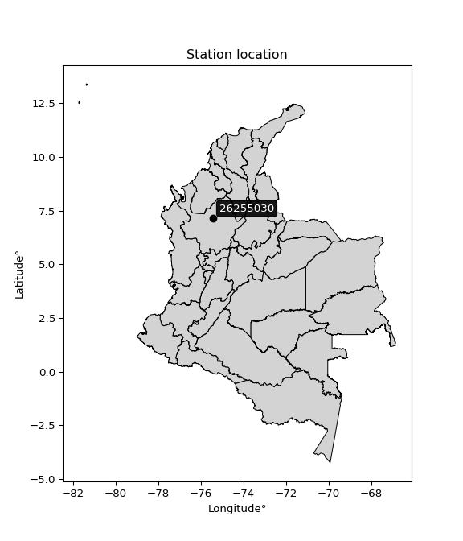

<div align="center">


</div>

# PMP Station (rain, Pmax24h): 26255030

Probable Maximum Precipitation (PMP) is the greatest amount of rainfall for a specific duration that is meteorologically possible for a given location, acting as a "worst-case" scenario for extreme storms, crucial for designing safety-critical infrastructure like bridges, river deviations, dams, spillways, and nuclear plants to prevent catastrophic failure. PMP is calculated by hydrologists using meteorological data to determine the upper limit of extreme rainfall, often leading to the Probable Maximum Flood (PMF) for flood control design, and is increasingly being studied for climate change impacts.

<div align="center">

</img>

</div>


## A. General information


### 1. General running parameters

• app_version: _v20251227_. • runtime: _2025-12-27 09:02:11.367833_. • Python version: _3.14.0_. • SciPy version: _1.16.3_. • Pandas version: _2.3.3_. • NumPy version: _2.3.5_. • Stations dataset (station_dataset_file): _dataset/pmax24h_in/automatic_colombia_2003_2024_filter.csv_. • Stations catalog (station_catalog_file): _dataset/CNE_IDEAM.xls_. • Minimum year to eval til year_max (date_min): _2003_. • Maximum year to eval since year_min (date_max): _2024_. • Creates, save and include plots into reports (create_plot): _False_. • Plot only fit distributions with Δo > Δ (plot_only_fit): _True_. • Eval low extreme values, if False, evaluates high extreme values (low_extreme): _False_. • Eval every SciPy distribution as logarithmic (pdist_logarithmic_on): _True_. • Standard deviation normalized (ddof): _1.0_. • Return periods to eval in years (Tr): _[2, 2.33, 5, 10, 15, 20, 25, 50, 75, 100, 200, 250, 500, 750, 1000]_. • Minimum data sample per station, 0 means any (minimum_sample): _5_. • Z-Score threshold to adjust a value, 0 means disable (zscore): _3.5_. • Avoid zeros, e.g. rain = 0 (avoid_zeros): _True_. • Avoid null values (avoid_nans): _True_. [:file_folder:Dataset file.](../../dataset/pmax24h_in/automatic_colombia_2003_2024_filter.csv)

> Delta Degrees of Freedom (DDOF): is a parameter used in the formulas for calculating variance and standard deviation. When ddof=0, the divisor is $N$ (the total number of observations) and this is used when your data set is the entire population. When ddof=1, the divisor is $N-1$ and this is used when your data set is a sample drawn from a larger population. Using $N-1$ provides an unbiased estimate of the population variance (known as Bessel´s correction).


### 2. Station info and location

|   id |   CODIGO | NOMBRE                           | CATEGORIA         | TECNOLOGIA                | ESTADO   | FECHA_INSTALACION   |   FECHA_SUSPENSION |   ALTITUD |   LATITUD |   LONGITUD | DEPARTAMENTO   | MUNICIPIO   | AREA_OPERATIVA                      | ENTIDAD                                                     | AREA_HIDROGRAFICA   | ZONA_HIDROGRAFICA   | SUBZONA_HIDROGRAFICA                             |   CORRIENTE | Catalogo   |
|-----:|---------:|:---------------------------------|:------------------|:--------------------------|:---------|:--------------------|-------------------:|----------:|----------:|-----------:|:---------------|:------------|:------------------------------------|:------------------------------------------------------------|:--------------------|:--------------------|:-------------------------------------------------|------------:|:-----------|
|    0 | 26255030 | SANTA ISABEL VALDIVIA [26255030] | Agrometeorológica | Automática con Telemetría | Activa   | 22/11/2004          |                nan |      1131 |   7.15722 |   -75.4423 | Antioquia      | Valdivia    | Area Operativa 01 - Antioquia-Chocó | INSTITUTO DE HIDROLOGIA METEOROLOGIA Y ESTUDIOS AMBIENTALES | Magdalena Cauca     | Cauca               | Directos al Cauca entre Pto Valdivia y Río Nechí |         nan | CNE_IDEAM  |

<div align="center">

Map location in: [:earth_americas:Google](http://maps.google.com/maps?q=7.157222222,-75.442275) [:earth_americas:OSM](https://www.openstreetmap.org/#map=18/7.157222222/-75.442275&layers=P) [:earth_americas:Bing](https://www.bing.com/maps?cp=7.157222222~-75.442275&lvl=18) [:earth_americas:Apple](https://maps.apple.com/frame?center=7.157222222%2C-75.442275&span=0.003%2C0.006)

</div>


<div align="center">

```geojson
{
  "type": "Feature",
  "geometry": {
    "type": "Point", 
    "coordinates": [-75.442275, 7.157222222]
  }, 
  "properties": {
    "Name": "26255030"
  }
}
```

</div>


### 3. Discrete values table and plot

|               |          0 |           1 |           2 |           3 |           4 |
|:--------------|-----------:|------------:|------------:|------------:|------------:|
| Date          | 2017       | 2018        | 2019        | 2021        | 2022        |
| Value         |  117.2     |    0.7      |    0.3      |    0.1      |    3.4      |
| Value_initial |  117.2     |    0.7      |    0.3      |    0.1      |    3.4      |
| count         |    5       |    5        |    5        |    5        |    5        |
| mean          |   24.34    |   24.34     |   24.34     |   24.34     |   24.34     |
| std           |   51.9274  |   51.9274   |   51.9274   |   51.9274   |   51.9274   |
| zscore        |    1.78827 |   -0.455251 |   -0.462954 |   -0.466806 |   -0.403255 |

> The initial value (value_initial) correspond to the initial obtained or null completed value, and value (value) is adjusted only when the initial value is outside the valid range definite through the Z-Score value. If Z-Score is active, values out of range or outliers are replaced with the station mean value


### 4. Active continuous probability distributions from SciPy (45 of 104 available)

[scipy.stats](https://docs.scipy.org/doc/scipy/reference/stats.html) is a Python´s powerful submodule within the SciPy library for comprehensive statistical analysis, offering over 130 probability distributions (like Normal, Poisson), functions for descriptive stats (mean, variance), hypothesis testing (t-tests, chi-square), random variable generation, and statistical tests, making it essential for data science, modeling, and research. It provides tools to explore, model, and draw conclusions from data efficiently, working seamlessly with NumPy.

<div align="center">

|   id | p_dist             |   n_parameter | fit_method   | label                                                                       | active   | ref                                                                                                        |
|-----:|:-------------------|--------------:|:-------------|:----------------------------------------------------------------------------|:---------|:-----------------------------------------------------------------------------------------------------------|
|    0 | alpha              |             3 | MLE          | Alpha                                                                       | True     | [:mortar_board:](https://docs.scipy.org/doc/scipy/reference/generated/scipy.stats.alpha.html)              |
|    1 | betaprime          |             4 | MLE          | Beta prime                                                                  | True     | [:mortar_board:](https://docs.scipy.org/doc/scipy/reference/generated/scipy.stats.betaprime.html)          |
|    2 | chi2               |             3 | MLE          | Chi²                                                                        | True     | [:mortar_board:](https://docs.scipy.org/doc/scipy/reference/generated/scipy.stats.chi2.html)               |
|    3 | crystalball        |             4 | MLE          | Crystalball                                                                 | True     | [:mortar_board:](https://docs.scipy.org/doc/scipy/reference/generated/scipy.stats.crystalball.html)        |
|    4 | erlang             |             3 | MLE          | Erlang                                                                      | True     | [:mortar_board:](https://docs.scipy.org/doc/scipy/reference/generated/scipy.stats.erlang.html)             |
|    5 | expon              |             2 | MLE          | Exponential                                                                 | True     | [:mortar_board:](https://docs.scipy.org/doc/scipy/reference/generated/scipy.stats.expon.html)              |
|    6 | exponnorm          |             3 | MLE          | Exponentially modified Normal                                               | True     | [:mortar_board:](https://docs.scipy.org/doc/scipy/reference/generated/scipy.stats.exponnorm.html)          |
|    7 | f                  |             4 | MLE          | F                                                                           | True     | [:mortar_board:](https://docs.scipy.org/doc/scipy/reference/generated/scipy.stats.f.html)                  |
|    8 | fatiguelife        |             3 | MLE          | Fatigue-life (Birnbaum-Saunders)                                            | True     | [:mortar_board:](https://docs.scipy.org/doc/scipy/reference/generated/scipy.stats.fatiguelife.html)        |
|    9 | fisk               |             3 | MLE          | Fisk                                                                        | True     | [:mortar_board:](https://docs.scipy.org/doc/scipy/reference/generated/scipy.stats.fisk.html)               |
|   10 | gamma              |             3 | MLE          | Gamma                                                                       | True     | [:mortar_board:](https://docs.scipy.org/doc/scipy/reference/generated/scipy.stats.gamma.html)              |
|   11 | genexpon           |             5 | MLE          | Generalized exponential                                                     | True     | [:mortar_board:](https://docs.scipy.org/doc/scipy/reference/generated/scipy.stats.genexpon.html)           |
|   12 | genlogistic        |             3 | MLE          | Generalized logistic                                                        | True     | [:mortar_board:](https://docs.scipy.org/doc/scipy/reference/generated/scipy.stats.genlogistic.html)        |
|   13 | gibrat             |             2 | MM           | Gibrat                                                                      | True     | [:mortar_board:](https://docs.scipy.org/doc/scipy/reference/generated/scipy.stats.gibrat.html)             |
|   14 | gompertz           |             3 | MLE          | Gompertz (or truncated Gumbel)                                              | True     | [:mortar_board:](https://docs.scipy.org/doc/scipy/reference/generated/scipy.stats.gompertz.html)           |
|   15 | gumbel_l           |             2 | MM           | Gumbel Left Skew                                                            | True     | [:mortar_board:](https://docs.scipy.org/doc/scipy/reference/generated/scipy.stats.gumbel_l.html)           |
|   16 | gumbel_r           |             2 | MM           | Gumbel Right Skew                                                           | True     | [:mortar_board:](https://docs.scipy.org/doc/scipy/reference/generated/scipy.stats.gumbel_r.html)           |
|   17 | halflogistic       |             2 | MM           | Half-logistic                                                               | True     | [:mortar_board:](https://docs.scipy.org/doc/scipy/reference/generated/scipy.stats.halflogistic.html)       |
|   18 | halfnorm           |             2 | MM           | Half Normal                                                                 | True     | [:mortar_board:](https://docs.scipy.org/doc/scipy/reference/generated/scipy.stats.halfnorm.html)           |
|   19 | hypsecant          |             2 | MM           | hyperbolic secant                                                           | True     | [:mortar_board:](https://docs.scipy.org/doc/scipy/reference/generated/scipy.stats.hypsecant.html)          |
|   20 | invgamma           |             3 | MLE          | Inverted gamma                                                              | True     | [:mortar_board:](https://docs.scipy.org/doc/scipy/reference/generated/scipy.stats.invgamma.html)           |
|   21 | invgauss           |             3 | MLE          | Inverse Gaussian                                                            | True     | [:mortar_board:](https://docs.scipy.org/doc/scipy/reference/generated/scipy.stats.invgauss.html)           |
|   22 | invweibull         |             3 | MLE          | Inverted Weibull                                                            | True     | [:mortar_board:](https://docs.scipy.org/doc/scipy/reference/generated/scipy.stats.invweibull.html)         |
|   23 | johnsonsu          |             4 | MLE          | Johnson Su                                                                  | True     | [:mortar_board:](https://docs.scipy.org/doc/scipy/reference/generated/scipy.stats.johnsonsu.html)          |
|   24 | kstwobign          |             2 | MLE          | Limiting distribution of scaled Kolmogorov-Smirnov two-sided test statistic | True     | [:mortar_board:](https://docs.scipy.org/doc/scipy/reference/generated/scipy.stats.kstwobign.html)          |
|   25 | laplace            |             2 | MM           | Laplace                                                                     | True     | [:mortar_board:](https://docs.scipy.org/doc/scipy/reference/generated/scipy.stats.laplace.html)            |
|   26 | laplace_asymmetric |             3 | MLE          | Asymmetric Laplace                                                          | True     | [:mortar_board:](https://docs.scipy.org/doc/scipy/reference/generated/scipy.stats.laplace_asymmetric.html) |
|   27 | loggamma           |             3 | MLE          | Log gamma                                                                   | True     | [:mortar_board:](https://docs.scipy.org/doc/scipy/reference/generated/scipy.stats.loggamma.html)           |
|   28 | logistic           |             2 | MM           | Logistic (or Sech-squared)                                                  | True     | [:mortar_board:](https://docs.scipy.org/doc/scipy/reference/generated/scipy.stats.logistic.html)           |
|   29 | lognorm            |             3 | MLE          | Log Normal                                                                  | True     | [:mortar_board:](https://docs.scipy.org/doc/scipy/reference/generated/scipy.stats.lognorm.html)            |
|   30 | maxwell            |             2 | MM           | Maxwell                                                                     | True     | [:mortar_board:](https://docs.scipy.org/doc/scipy/reference/generated/scipy.stats.maxwell.html)            |
|   31 | mielke             |             4 | MLE          | Mielke Beta-Kappa / Dagum                                                   | True     | [:mortar_board:](https://docs.scipy.org/doc/scipy/reference/generated/scipy.stats.mielke.html)             |
|   32 | moyal              |             2 | MM           | Moyal                                                                       | True     | [:mortar_board:](https://docs.scipy.org/doc/scipy/reference/generated/scipy.stats.moyal.html)              |
|   33 | nakagami           |             3 | MLE          | Nakagami                                                                    | True     | [:mortar_board:](https://docs.scipy.org/doc/scipy/reference/generated/scipy.stats.nakagami.html)           |
|   34 | ncf                |             5 | MLE          | Non-central F distribution                                                  | True     | [:mortar_board:](https://docs.scipy.org/doc/scipy/reference/generated/scipy.stats.ncf.html)                |
|   35 | nct                |             4 | MLE          | Non-central Student’s t                                                     | True     | [:mortar_board:](https://docs.scipy.org/doc/scipy/reference/generated/scipy.stats.nct.html)                |
|   36 | norm               |             2 | MM           | Normal                                                                      | True     | [:mortar_board:](https://docs.scipy.org/doc/scipy/reference/generated/scipy.stats.norm.html)               |
|   37 | pareto             |             3 | MLE          | Pareto                                                                      | True     | [:mortar_board:](https://docs.scipy.org/doc/scipy/reference/generated/scipy.stats.pareto.html)             |
|   38 | pearson3           |             3 | MM           | Pearson type III                                                            | True     | [:mortar_board:](https://docs.scipy.org/doc/scipy/reference/generated/scipy.stats.pearson3.html)           |
|   39 | rayleigh           |             2 | MM           | Rayleigh                                                                    | True     | [:mortar_board:](https://docs.scipy.org/doc/scipy/reference/generated/scipy.stats.rayleigh.html)           |
|   40 | rice               |             3 | MLE          | Rice                                                                        | True     | [:mortar_board:](https://docs.scipy.org/doc/scipy/reference/generated/scipy.stats.rice.html)               |
|   41 | t                  |             3 | MLE          | Student’s t                                                                 | True     | [:mortar_board:](https://docs.scipy.org/doc/scipy/reference/generated/scipy.stats.t.html)                  |
|   42 | truncnorm          |             4 | MLE          | Truncated normal                                                            | True     | [:mortar_board:](https://docs.scipy.org/doc/scipy/reference/generated/scipy.stats.truncnorm.html)          |
|   43 | wald               |             2 | MM           | Wald                                                                        | True     | [:mortar_board:](https://docs.scipy.org/doc/scipy/reference/generated/scipy.stats.wald.html)               |
|   44 | weibull_min        |             3 | MLE          | Weibull minimum                                                             | True     | [:mortar_board:](https://docs.scipy.org/doc/scipy/reference/generated/scipy.stats.weibull_min.html)        |

</div>

> **n_parameter:** # arguments & localization & scale.
>
> **Fit methods:** (MLE) maximum likelihood, (MM) L-moments.
>
>**Inactive:** foldnorm, gennorm, norminvgauss, powernorm, powerlognorm, skewnorm, genextreme, anglit, arcsine, argus, beta, bradford, burr, burr12, cauchy, cosine, halfcauchy, foldcauchy, skewcauchy, wrapcauchy, dgamma, gengamma, exponweib, exponpow, truncexpon, gausshyper, genhalflogistic, genhyperbolic, geninvgauss, halfgennorm, johnsonsb, kappa4, kappa3, ksone, kstwo, loglaplace, levy, levy_l, levy_stable, ncx2, genpareto, truncpareto, lomax, powerlaw, rdist, rel_breitwigner, recipinvgauss, semicircular, studentized_range, trapezoid, triang, truncweibull_min, tukeylambda, uniform, loguniform, vonmises, vonmises_line, weibull_max, dweibull, 


## B. Probability distributions vs. Empirical distributions

A continuous probability distribution (CPD) describes probabilities for variables that can take any value within a range (like rain any time), unlike discrete variables with specific outcomes (like temperature). It uses a Probability Density Function (PDF), a curve where the total area under it equals 1, and the probability of the variable falling within an interval (a to b) is found by calculating the area under the curve between those points. A key feature is that the probability of hitting any single exact value is zero, so probabilities are always expressed for ranges, e.g., $P(a ≤ X ≤ b)$.

<div align="center">

Distributions parameters from station values
|    |   station | p_dist                |   n |              loc |          scale | shape                  | shape1               | shape2                 | shape3   |
|---:|----------:|:----------------------|----:|-----------------:|---------------:|:-----------------------|:---------------------|:-----------------------|:---------|
|  0 |  26255030 | alpha                 |   5 |     -0.25422     |    0.634989    | 1.1997324625778416e-07 |                      |                        |          |
|  1 |  26255030 | betaprime             |   5 |      0.1         |    0.0992343   | 0.6386643643830211     | 0.4636072147012486   |                        |          |
|  2 |  26255030 | chi2                  |   5 |      0.1         |   86.4777      | 0.33017063953867853    |                      |                        |          |
|  3 |  26255030 | crystalball           |   5 |     24.34        |   46.4453      | 3081.3961922764584     | 11955.277349421978   |                        |          |
|  4 |  26255030 | erlang                |   5 |      0.1         |   22.589       | 0.6494896601290798     |                      |                        |          |
|  5 |  26255030 | expon                 |   5 |      0.1         |   24.24        |                        |                      |                        |          |
|  6 |  26255030 | exponnorm             |   5 |      0.0806977   |    0.00593     | 4071.5691024465473     |                      |                        |          |
|  7 |  26255030 | f                     |   5 |      0.1         |    0.449924    | 0.7405738510346894     | 0.7726054457708487   |                        |          |
|  8 |  26255030 | fatiguelife           |   5 |      0.1         |    1.3212e-05  | 1775.128775246185      |                      |                        |          |
|  9 |  26255030 | fisk                  |   5 |      0.1         |    3.44443     | 0.5165259711598038     |                      |                        |          |
| 10 |  26255030 | gamma                 |   5 |      0.1         |   27.6077      | 0.45350338856564754    |                      |                        |          |
| 11 |  26255030 | genexpon              |   5 |      0.1         |   58.7675      | 2.4244088088364775     | 1.2991073339879193   | 2.7325844385361917e-12 |          |
| 12 |  26255030 | genlogistic           |   5 |   -178.575       |   23.1186      | 2959.168231970376      |                      |                        |          |
| 13 |  26255030 | gibrat                |   5 |    -11.0919      |   21.4905      |                        |                      |                        |          |
| 14 |  26255030 | gompertz              |   5 |      0.1         |    3.76193e+13 | 1204828950998.163      |                      |                        |          |
| 15 |  26255030 | gumbel_l              |   5 |     45.2428      |   36.2132      |                        |                      |                        |          |
| 16 |  26255030 | gumbel_r              |   5 |      3.43716     |   36.2132      |                        |                      |                        |          |
| 17 |  26255030 | halflogistic          |   5 |    -30.7084      |   39.709       |                        |                      |                        |          |
| 18 |  26255030 | halfnorm              |   5 |    -37.1353      |   77.0479      |                        |                      |                        |          |
| 19 |  26255030 | hypsecant             |   5 |     24.34        |   29.568       |                        |                      |                        |          |
| 20 |  26255030 | invgamma              |   5 |      0.1         |    1.805e-15   | 0.14202484317268332    |                      |                        |          |
| 21 |  26255030 | invgauss              |   5 |      0.04101     |    0.222905    | 109.01067637414417     |                      |                        |          |
| 22 |  26255030 | invweibull            |   5 |      0.1         |    2.42665     | 0.05571092342898168    |                      |                        |          |
| 23 |  26255030 | johnsonsu             |   5 |      0.3         |    3.14376e-10 | -1.0583284103642885    | 0.11509885087743342  |                        |          |
| 24 |  26255030 | kstwobign             |   5 |    -87.2408      |  130.702       |                        |                      |                        |          |
| 25 |  26255030 | laplace               |   5 |     24.34        |   32.8418      |                        |                      |                        |          |
| 26 |  26255030 | laplace_asymmetric    |   5 |      0.1         |    0.0047703   | 0.00019676469956504244 |                      |                        |          |
| 27 |  26255030 | loggamma              |   5 | -21174.2         | 2640.6         | 3065.8329305496245     |                      |                        |          |
| 28 |  26255030 | logistic              |   5 |     24.34        |   25.6066      |                        |                      |                        |          |
| 29 |  26255030 | lognorm               |   5 |      0.1         |    0.000915618 | 16.055839571368185     |                      |                        |          |
| 30 |  26255030 | maxwell               |   5 |    -85.7158      |   68.9672      |                        |                      |                        |          |
| 31 |  26255030 | mielke                |   5 |      0.0980848   |    2.21788e-07 | 35.03946869734244      | 0.3703380436039678   |                        |          |
| 32 |  26255030 | moyal                 |   5 |     -2.22038     |   20.9077      |                        |                      |                        |          |
| 33 |  26255030 | nakagami              |   5 |      0.1         |   70.336       | 0.10002323542227479    |                      |                        |          |
| 34 |  26255030 | ncf                   |   5 |      0.1         |    0.403205    | 0.6180074449490855     | 1.3551747470530384   | 0.46096284049945413    |          |
| 35 |  26255030 | nct                   |   5 |      0.1         |    5.83503e-14 | 0.19294991918754684    | 21.941145107524274   |                        |          |
| 36 |  26255030 | norm                  |   5 |     24.34        |   46.4453      |                        |                      |                        |          |
| 37 |  26255030 | pareto                |   5 |     -8.58993e+09 |    8.58993e+09 | 354370244.6256121      |                      |                        |          |
| 38 |  26255030 | pearson3              |   5 |     24.34        |   46.4453      | 1.497557146738942      |                      |                        |          |
| 39 |  26255030 | rayleigh              |   5 |    -64.5125      |   70.894       |                        |                      |                        |          |
| 40 |  26255030 | rice                  |   5 |    -40.8307      |   56.5879      | 0.00033095477782599453 |                      |                        |          |
| 41 |  26255030 | t                     |   5 |      0.285378    |    0.160776    | 0.32159544161077364    |                      |                        |          |
| 42 |  26255030 | truncnorm             |   5 |     -9.87738     |   54.0698      | 0.1845278697807027     | 2.352213303670471    |                        |          |
| 43 |  26255030 | wald                  |   5 |    -22.1053      |   46.4453      |                        |                      |                        |          |
| 44 |  26255030 | weibull_min           |   5 |      0.1         |   52.232       | 0.23196618819493786    |                      |                        |          |
| 45 |  26255030 | logalpha              |   5 |     -3.14592     |    1.60583     | 6.350561064139402e-07  |                      |                        |          |
| 46 |  26255030 | logbetaprime          |   5 |     -2.30259     |    2.03843     | 0.12370388791175382    | 0.9007890236985987   |                        |          |
| 47 |  26255030 | logchi2               |   5 |     -2.30259     |    1.16319     | 1.0620249734956921     |                      |                        |          |
| 48 |  26255030 | logcrystalball        |   5 |      0.424885    |    2.45635     | 7.54865695075612       | 70.03975442319174    |                        |          |
| 49 |  26255030 | logerlang             |   5 |     -2.30259     |    2.15127     | 0.7005565721601921     |                      |                        |          |
| 50 |  26255030 | logexpon              |   5 |     -2.30259     |    2.72747     |                        |                      |                        |          |
| 51 |  26255030 | logexponnorm          |   5 |     -2.30481     |    0.000667955 | 4096.001998190541      |                      |                        |          |
| 52 |  26255030 | logf                  |   5 |     -2.30259     |    1.03927     | 1.1366896408547922     | 1.068716874495109    |                        |          |
| 53 |  26255030 | logfatiguelife        |   5 |     -2.30259     |    1.31187e-06 | 1643.8229219315026     |                      |                        |          |
| 54 |  26255030 | logfisk               |   5 |     -2.30259     |    1.74615     | 0.1405133611216089     |                      |                        |          |
| 55 |  26255030 | loggamma              |   5 |     -2.30259     |    2.74583     | 0.5108920324900393     |                      |                        |          |
| 56 |  26255030 | loggenexpon           |   5 |     -2.30259     |    2.1284      | 0.7786092818162667     | 0.002607131441582101 | 0.7264591809796821     |          |
| 57 |  26255030 | loggenlogistic        |   5 |    -13.4929      |    1.80119     | 1219.457982657063      |                      |                        |          |
| 58 |  26255030 | loggibrat             |   5 |     -1.449       |    1.13655     |                        |                      |                        |          |
| 59 |  26255030 | loggompertz           |   5 |     -2.30259     |   15.4544      | 4.789791958369049      |                      |                        |          |
| 60 |  26255030 | loggumbel_l           |   5 |      1.53037     |    1.91521     |                        |                      |                        |          |
| 61 |  26255030 | loggumbel_r           |   5 |     -0.680602    |    1.91521     |                        |                      |                        |          |
| 62 |  26255030 | loghalflogistic       |   5 |     -2.48646     |    2.10009     |                        |                      |                        |          |
| 63 |  26255030 | loghalfnorm           |   5 |     -2.82636     |    4.07483     |                        |                      |                        |          |
| 64 |  26255030 | loghypsecant          |   5 |      0.424885    |    1.56376     |                        |                      |                        |          |
| 65 |  26255030 | loginvgamma           |   5 |     -4.13656     |   13.0999      | 3.7982713863227175     |                      |                        |          |
| 66 |  26255030 | loginvgauss           |   5 |     -3.17732     |    5.15685     | 0.6985281414691429     |                      |                        |          |
| 67 |  26255030 | loginvweibull         |   5 |     -6.36194     |    5.41392     | 3.4876234604082956     |                      |                        |          |
| 68 |  26255030 | logjohnsonsu          |   5 |     -2.89783     |    0.022449    | -6.236157343761567     | 1.1614605294302378   |                        |          |
| 69 |  26255030 | logkstwobign          |   5 |     -7.05732     |    8.6037      |                        |                      |                        |          |
| 70 |  26255030 | loglaplace            |   5 |      0.424885    |    1.7369      |                        |                      |                        |          |
| 71 |  26255030 | loglaplace_asymmetric |   5 |     -2.30259     |    0.0332519   | 0.012195364099610488   |                      |                        |          |
| 72 |  26255030 | logloggamma           |   5 |   -739.683       |   99.9639      | 1642.530624092623      |                      |                        |          |
| 73 |  26255030 | loglogistic           |   5 |      0.424885    |    1.35426     |                        |                      |                        |          |
| 74 |  26255030 | loglognorm            |   5 |     -2.30259     |    0.0242443   | 3.964108376615449      |                      |                        |          |
| 75 |  26255030 | logmaxwell            |   5 |     -5.39563     |    3.64747     |                        |                      |                        |          |
| 76 |  26255030 | logmielke             |   5 |     -2.30259     |    1.32819     | 0.16950037242493127    | 2.5468966810816536   |                        |          |
| 77 |  26255030 | logmoyal              |   5 |     -0.979813    |    1.10575     |                        |                      |                        |          |
| 78 |  26255030 | lognakagami           |   5 |     -2.30259     |    5.77072     | 0.056193275322331454   |                      |                        |          |
| 79 |  26255030 | logncf                |   5 |     -2.30259     |    1.21172     | 0.20201777774300383    | 1.8767117683091676   | 1.321990601856169      |          |
| 80 |  26255030 | lognct                |   5 |    -83.9664      |    2.40645     | 15978.594308702195     | 35.06707860930808    |                        |          |
| 81 |  26255030 | lognorm               |   5 |      0.424885    |    2.45635     |                        |                      |                        |          |
| 82 |  26255030 | logpareto             |   5 |     -2.32647     |    0.0238804   | 0.26374073194533393    |                      |                        |          |
| 83 |  26255030 | logpearson3           |   5 |      0.424895    |    2.45632     | 0.7706984652962536     |                      |                        |          |
| 84 |  26255030 | lograyleigh           |   5 |     -4.27425     |    3.74937     |                        |                      |                        |          |
| 85 |  26255030 | logrice               |   5 |     -3.61849     |    3.34533     | 0.0005829012635394488  |                      |                        |          |
| 86 |  26255030 | logt                  |   5 |      0.42488     |    2.45635     | 9638922615.173517      |                      |                        |          |
| 87 |  26255030 | logtruncnorm          |   5 |     -2.01366     |    3.56158     | -0.08112158127838491   | 58.06200404196317    |                        |          |
| 88 |  26255030 | logwald               |   5 |     -2.03151     |    2.4564      |                        |                      |                        |          |
| 89 |  26255030 | logweibull_min        |   5 |     -2.30259     |    1.65074     | 0.13843489106171525    |                      |                        |          |

</div>

> **loc** (Location parameter): This shifts the distribution along the x-axis. For many common distributions, like the normal (Gaussian) distribution, loc represents the mean $μ$. For others, like the uniform distribution, it might represent the minimum value, or for the beta distribution, the left end of the support interval.
>
> **scale** (Scale parameter): This determines the width or spread of the distribution. For the normal distribution, scale represents the standard deviation $σ$. For a uniform distribution, it defines the length of the interval (from $loc$ to $loc + scale$).
>
> **shape** (Shape parameters): Refers to parameters that define the specific form of a probability distribution, distinct from its location (loc) and scale (scale). These parameters are required arguments for most distribution functions. For example, a normal (Gaussian) distribution is fully defined by its location (mean) and scale (standard deviation), so it has no specific shape parameters beyond loc and scale. However, other distributions have intrinsic properties that need specification, as Gamma distribution that takes a shape parameter, often named $a$ or $alpha$.


### 0. Cumulative distribution values - CDF (90 evaluated)

Cumulative Distribution Function (CDF), denoted as $F$<sub>$X$</sub>$(x)$, is a function that gives the probability that a random variable $X$ will take a value less than or equal to a specific value, $x$ (i.e., $(P(X≥x)$. It essentially "accumulates" probabilities from a given point up to the far right (positive infinity), providing a complete picture of the distribution´s probabilities for both discrete (like rain) and continuous (like temperature) variables, helping to find probabilities over ranges or above certain values.

<div align="center">

CDF ordered by x ascending and calculating $log(f(x))$ separately
|   id |   Station |   date |     x |   count |   mean |     std |    zscore |   Value_initial |   station |   m |     alpha |   alpha_pdf |   betaprime |   betaprime_pdf |        chi2 |    chi2_pdf |   crystalball |   crystalball_pdf |      erlang |      erlang_pdf |      expon |   expon_pdf |   exponnorm |   exponnorm_pdf |           f |       f_pdf |   fatiguelife |   fatiguelife_pdf |        fisk |    fisk_pdf |       gamma |   gamma_pdf |    genexpon |   genexpon_pdf |   genlogistic |   genlogistic_pdf |   gibrat |   gibrat_pdf |    gompertz |   gompertz_pdf |   gumbel_l |   gumbel_l_pdf |   gumbel_r |   gumbel_r_pdf |   halflogistic |   halflogistic_pdf |   halfnorm |   halfnorm_pdf |   hypsecant |   hypsecant_pdf |   invgamma |   invgamma_pdf |   invgauss |   invgauss_pdf |   invweibull |   invweibull_pdf |   johnsonsu |   johnsonsu_pdf |   kstwobign |   kstwobign_pdf |   laplace |   laplace_pdf |   laplace_asymmetric |   laplace_asymmetric_pdf |    loggamma |   loggamma_pdf |   logistic |   logistic_pdf |   lognorm |   lognorm_pdf |   maxwell |   maxwell_pdf |    mielke |   mielke_pdf |    moyal |   moyal_pdf |   nakagami |   nakagami_pdf |         ncf |     ncf_pdf |       nct |     nct_pdf |     norm |   norm_pdf |     pareto |   pareto_pdf |   pearson3 |   pearson3_pdf |   rayleigh |   rayleigh_pdf |     rice |    rice_pdf |        t |       t_pdf |   truncnorm |   truncnorm_pdf |     wald |    wald_pdf |   weibull_min |   weibull_min_pdf |   logalpha |   logalpha_pdf |   logbetaprime |   logbetaprime_pdf |     logchi2 |   logchi2_pdf |   logcrystalball |   logcrystalball_pdf |   logerlang |   logerlang_pdf |   logexpon |   logexpon_pdf |   logexponnorm |   logexponnorm_pdf |        logf |    logf_pdf |   logfatiguelife |   logfatiguelife_pdf |    logfisk |   logfisk_pdf |   loggenexpon |   loggenexpon_pdf |   loggenlogistic |   loggenlogistic_pdf |   loggibrat |   loggibrat_pdf |   loggompertz |   loggompertz_pdf |   loggumbel_l |   loggumbel_l_pdf |   loggumbel_r |   loggumbel_r_pdf |   loghalflogistic |   loghalflogistic_pdf |   loghalfnorm |   loghalfnorm_pdf |   loghypsecant |   loghypsecant_pdf |   loginvgamma |   loginvgamma_pdf |   loginvgauss |   loginvgauss_pdf |   loginvweibull |   loginvweibull_pdf |   logjohnsonsu |   logjohnsonsu_pdf |   logkstwobign |   logkstwobign_pdf |   loglaplace |   loglaplace_pdf |   loglaplace_asymmetric |   loglaplace_asymmetric_pdf |   logloggamma |   logloggamma_pdf |   loglogistic |   loglogistic_pdf |   loglognorm |   loglognorm_pdf |   logmaxwell |   logmaxwell_pdf |   logmielke |   logmielke_pdf |   logmoyal |   logmoyal_pdf |   lognakagami |   lognakagami_pdf |    logncf |   logncf_pdf |   lognct |   lognct_pdf |   logpareto |   logpareto_pdf |   logpearson3 |   logpearson3_pdf |   lograyleigh |   lograyleigh_pdf |   logrice |   logrice_pdf |     logt |   logt_pdf |   logtruncnorm |   logtruncnorm_pdf |   logwald |   logwald_pdf |   logweibull_min |   logweibull_min_pdf |
|-----:|----------:|-------:|------:|--------:|-------:|--------:|----------:|----------------:|----------:|----:|----------:|------------:|------------:|----------------:|------------:|------------:|--------------:|------------------:|------------:|----------------:|-----------:|------------:|------------:|----------------:|------------:|------------:|--------------:|------------------:|------------:|------------:|------------:|------------:|------------:|---------------:|--------------:|------------------:|---------:|-------------:|------------:|---------------:|-----------:|---------------:|-----------:|---------------:|---------------:|-------------------:|-----------:|---------------:|------------:|----------------:|-----------:|---------------:|-----------:|---------------:|-------------:|-----------------:|------------:|----------------:|------------:|----------------:|----------:|--------------:|---------------------:|-------------------------:|------------:|---------------:|-----------:|---------------:|----------:|--------------:|----------:|--------------:|----------:|-------------:|---------:|------------:|-----------:|---------------:|------------:|------------:|----------:|------------:|---------:|-----------:|-----------:|-------------:|-----------:|---------------:|-----------:|---------------:|---------:|------------:|---------:|------------:|------------:|----------------:|---------:|------------:|--------------:|------------------:|-----------:|---------------:|---------------:|-------------------:|------------:|--------------:|-----------------:|---------------------:|------------:|----------------:|-----------:|---------------:|---------------:|-------------------:|------------:|------------:|-----------------:|---------------------:|-----------:|--------------:|--------------:|------------------:|-----------------:|---------------------:|------------:|----------------:|--------------:|------------------:|--------------:|------------------:|--------------:|------------------:|------------------:|----------------------:|--------------:|------------------:|---------------:|-------------------:|--------------:|------------------:|--------------:|------------------:|----------------:|--------------------:|---------------:|-------------------:|---------------:|-------------------:|-------------:|-----------------:|------------------------:|----------------------------:|--------------:|------------------:|--------------:|------------------:|-------------:|-----------------:|-------------:|-----------------:|------------:|----------------:|-----------:|---------------:|--------------:|------------------:|----------:|-------------:|---------:|-------------:|------------:|----------------:|--------------:|------------------:|--------------:|------------------:|----------:|--------------:|---------:|-----------:|---------------:|-------------------:|----------:|--------------:|-----------------:|---------------------:|
|    0 |  26255030 |   2021 |   0.1 |       5 |  24.34 | 51.9274 | -0.466806 |             0.1 |  26255030 |   1 | 0.0730301 | 0.809736    | 4.14703e-11 |     1.90849e+06 | 0.000758489 | 9.02272e+12 |      0.300868 |        0.00749585 | 1.65009e-12 | 77225.2         | 0          | 0.0412541   | 0.000799141 |     0.0413609   | 4.50894e-07 | 1.20308e+10 |     0.0339675 |       5.46877e+10 | 1.03547e-09 | 3.85396e+07 | 5.67832e-09 | 1.85558e+08 | 5.83587e-12 |    0.0412542   |      0.272022 |       0.0153149   | 0.257064 |  0.0288122   | 4.03146e-14 |    0.0320269   |   0.249852 |    0.00595518  |   0.334027 |     0.0101143  |       0.369572 |         0.0108718  |   0.3711   |     0.00921432 |    0.264159 |     0.00794323  |  0.0925679 |    2.16983e+13 |  0.0523874 |    2.00563     |  0.000108058 |      3.96171e+12 | 0.000258995 |     0.000555109 |    0.236763 |     0.0122676   |  0.239014 |   0.00727776  |          3.90206e-08 |              0.0412479   | 9.65292e-09 |     1.1105e+07 |   0.279563 |    0.00786545  |  0.133419 |     0.0876782 |  0.328826 |    0.00825927 | 0.0391058 |   24.0961    | 0.344138 |  0.011539   | 0.00015129 |    2.18082e+12 | 4.29442e-06 | 9.56199e+10 | 0.0520996 | 2.05437e+11 | 0.300868 | 0.00749585 | 7.8686e-08 |  0.0412541   |   0.362826 |     0.0111668  |   0.339872 |     0.00848644 | 0.230173 | 0.00984     | 0.323038 | 0.4956      | 1.30693e-08 |      0.0173755  | 0.34541  | 0.0195426   |   4.90992e-05 |       8.20669e+11 |  0.0568928 |      0.293982  |       0.011322 |        3.15382e+12 | 5.06609e-09 |    6.0577e+06 |         0.133419 |            0.0876782 | 1.13024e-11 |  17829.7        |   0        |       0.36664  |    0.000811319 |          0.365046  | 1.22455e-09 | 1.56717e+06 |        0.0230851 |          4.46195e+11 | 0.00639679 |   2.01105e+12 |   1.52097e-09 |         0.365819  |        0.0870768 |            0.117888  |   0         |       0         |   1.82919e-13 |         0.309931  |      0.12642  |         0.0616483 |     0.0970627 |         0.118206  |         0.0437495 |             0.237629  |      0.102277 |         0.194197  |       0.110161 |          0.0690486 |     0.0620871 |         0.161089  |      0.055313 |         0.20435   |       0.0652267 |           0.152983  |      0.0522161 |          0.208161  |      0.0798578 |          0.118895  |     0.10399  |        0.0598713 |             0.000148825 |                    0.366702 |      0.135188 |         0.0873054 |      0.117741 |         0.0767049 |  3.67723e-05 |   10726.1        |     0.131298 |        0.109796  |  0.00238148 |     9.08967e+11 |  0.0689532 |      0.125531  |     0.0135444 |        3.4277e+12 | 0.0112631 |   2.5618e+12 | 0.132985 |    0.0878287 | 1.11022e-16 |     11.0442     |      0.116664 |         0.116415  |      0.129134 |         0.122143  | 0.0744471 |     0.108829  | 0.133419 |  0.0876785 |    1.46541e-12 |          0.209729  |  0        |     0         |       0.00696663 |          2.16411e+12 |
|    1 |  26255030 |   2019 |   0.3 |       5 |  24.34 | 51.9274 | -0.462954 |             0.3 |  26255030 |   2 | 0.251904  | 0.85564     | 0.522425    |     0.819593    | 0.352731    | 0.290865    |      0.302369 |        0.00751265 | 0.0513936   |     0.166004    | 0.00821688 | 0.0409151   | 0.0090418   |     0.041043    | 0.402592    | 0.614209    |     0.527627  |       0.0689663   | 0.186922    | 0.392514    | 0.120578    | 0.272053    | 0.0082169   |    0.0409152   |      0.275089 |       0.0153543   | 0.262808 |  0.0286309   | 0.00638491  |    0.0318224   |   0.251046 |    0.00597863  |   0.336051 |     0.0101195  |       0.371744 |         0.0108515  |   0.372941 |     0.00920274 |    0.265751 |     0.00797947  |  0.989181  |    0.00768267  |  0.356801  |    0.937812    |  0.316895    |      0.101442    | 0.148223    |     8.40426e+07 |    0.23922  |     0.0122977   |  0.240474 |   0.00732221  |          0.00821568  |              0.040909    | 0.621261    |     0.220157   |   0.281139 |    0.00789248  |  0.253626 |     0.130357  |  0.330479 |    0.00826789 | 0.556709  |    0.596209  | 0.346445 |  0.0115329  | 0.258406   |    0.258466    | 0.416298    | 0.608907    | 0.994204  | 0.0055917   | 0.302369 | 0.00751265 | 0.00821691 |  0.0409151   |   0.365057 |     0.0111487  |   0.341569 |     0.00849082 | 0.232143 | 0.00986277  | 0.521241 | 1.4365      | 0.00347392  |      0.0173635  | 0.349306 | 0.0194205   |   0.240441    |       0.242279    |  0.408285  |      0.241368  |       0.86466  |        0.0657464   | 0.648371    |    0.22799    |         0.253626 |            0.130357  | 0.563275    |      0.262974   |   0.331551 |       0.24508  |    0.33126     |          0.244428  | 0.501608    | 0.15476     |        0.711134  |          0.0865686   | 0.483729   |   0.0319413   |   0.331097    |         0.244954  |        0.265275  |            0.19533   |   0.0624688 |       0.501719  |   0.297344    |         0.233819  |      0.213262 |         0.0985307 |     0.268674  |         0.18437   |         0.296192  |             0.217198  |      0.309479 |         0.180887  |       0.215965 |          0.127752  |     0.310471  |         0.246054  |      0.340518 |         0.250189  |       0.306048  |           0.245018  |      0.341105  |          0.251533  |      0.256318  |          0.18965   |     0.195745 |        0.112698  |             0.331736    |                    0.24509  |      0.254611 |         0.129367  |      0.230983 |         0.131164  |  0.831985    |       0.0576696  |     0.275765 |        0.149266  |  0.937876   |     0.0895024   |  0.268434  |      0.216435  |     0.727312  |        0.0742597  | 0.423483  |   0.0552703  | 0.253482 |    0.130713  | 0.637767    |      0.0851103  |      0.274886 |         0.165092  |      0.284863 |         0.156189  | 0.229308  |     0.166277  | 0.253627 |  0.130357  |    0.229648    |          0.205053  |  0.205184 |     0.432468  |       0.611395   |          0.0462839   |
|    2 |  26255030 |   2018 |   0.7 |       5 |  24.34 | 51.9274 | -0.455251 |             0.7 |  26255030 |   3 | 0.50576   | 0.445914    | 0.686114    |     0.216216    | 0.422734    | 0.115966    |      0.305381 |        0.00754593 | 0.104179    |     0.110967    | 0.0244486  | 0.0402455   | 0.0253238   |     0.0403686   | 0.543712    | 0.215741    |     0.547777  |       0.0396251   | 0.288502    | 0.176711    | 0.197556    | 0.147101    | 0.0244487   |    0.0402456   |      0.281246 |       0.0154288   | 0.274186 |  0.0282554   | 0.0190327   |    0.0314174   |   0.253446 |    0.00602566  |   0.3401   |     0.010129   |       0.376077 |         0.0108107  |   0.376618 |     0.00917943 |    0.268958 |     0.00805186  |  0.990744  |    0.00219093  |  0.565983  |    0.300007    |  0.339271    |      0.0340521   | 0.924271    |     0.0410336   |    0.24415  |     0.0123555   |  0.243421 |   0.00741194  |          0.024445    |              0.0402396   | 0.76042     |     0.12226    |   0.284307 |    0.00794624  |  0.375174 |     0.154396  |  0.33379  |    0.00828468 | 0.676211  |    0.162443  | 0.351056 |  0.0115195  | 0.321921   |    0.107331    | 0.564791    | 0.241932    | 0.995311  | 0.00150786  | 0.305381 | 0.00754593 | 0.0244487  |  0.0402455   |   0.369509 |     0.0111121  |   0.344967 |     0.00849913 | 0.236098 | 0.0099074   | 0.74664  | 0.191306    | 0.0104144   |      0.0173389  | 0.357025 | 0.019176    |   0.298716    |       0.0962061   |  0.564804  |      0.139537  |       0.902812 |        0.0311837   | 0.789727    |    0.121144   |         0.375174 |            0.154396  | 0.732115    |      0.149457   |   0.510048 |       0.179636 |    0.509363    |          0.17933   | 0.59698     | 0.0829006   |        0.770623  |          0.057719    | 0.503805   |   0.0180514   |   0.50958     |         0.179697  |        0.436399  |            0.200833  |   0.484171  |       0.364935  |   0.474135    |         0.184851  |      0.311561 |         0.134196  |     0.429817  |         0.189502  |         0.467659  |             0.186015  |      0.45554  |         0.162954  |       0.347148 |          0.180533  |     0.501068  |         0.198153  |      0.524    |         0.183185  |       0.498274  |           0.201582  |      0.524569  |          0.181988  |      0.421029  |          0.192773  |     0.318822 |        0.183558  |             0.510233    |                    0.179626 |      0.375264 |         0.153356  |      0.359597 |         0.170047  |  0.865691    |       0.0280478  |     0.408392 |        0.160774  |  0.978884   |     0.0233925   |  0.450582  |      0.204779  |     0.775395  |        0.044513   | 0.46253   |   0.0394936  | 0.375353 |    0.154775  | 0.687699    |      0.0418148  |      0.419961 |         0.173021  |      0.420662 |         0.161448  | 0.37833   |     0.181193  | 0.375175 |  0.154396  |    0.397213    |          0.188837  |  0.503956 |     0.26783   |       0.640498   |          0.0261646   |
|    3 |  26255030 |   2022 |   3.4 |       5 |  24.34 | 51.9274 | -0.403255 |             3.4 |  26255030 |   4 | 0.862047  | 0.0373732   | 0.851262    |     0.020435    | 0.5589      | 0.027505    |      0.326048 |        0.00775942 | 0.301022    |     0.0541724   | 0.127278   | 0.0360034   | 0.128446    |     0.0360976   | 0.738957    | 0.0284288   |     0.610852  |       0.0163568   | 0.494469    | 0.039126    | 0.415389    | 0.0525457   | 0.127279    |    0.0360034   |      0.323445 |       0.0157886   | 0.346782 |  0.0254725   | 0.100295    |    0.0288148   |   0.270148 |    0.00634686  |   0.367502 |     0.0101587  |       0.404886 |         0.0105274  |   0.401185 |     0.00901728 |    0.291352 |     0.00853425  |  0.992735  |    0.000312691 |  0.80396   |    0.0298507   |  0.374179    |      0.00620967  | 0.952549    |     0.00367243  |    0.277961 |     0.0126665   |  0.264279 |   0.00804704  |          0.12726     |              0.0359986   | 0.887827    |     0.0514071  |   0.30624  |    0.00829696  |  0.627498 |     0.154046  |  0.356296 |    0.00838229 | 0.8118    |    0.0189632 | 0.381992 |  0.0113833  | 0.452738   |    0.0274396   | 0.796945    | 0.0338525   | 0.996625  | 0.000197309 | 0.326048 | 0.00775942 | 0.127278   |  0.0360034   |   0.399158 |     0.0108445  |   0.367976 |     0.00854012 | 0.263224 | 0.0101768   | 0.866969 | 0.0137292   | 0.0569823   |      0.017149   | 0.406583 | 0.0175412   |   0.409601    |       0.0218691   |  0.713252  |      0.0627206 |       0.934683 |        0.0131528   | 0.911213    |    0.0464691  |         0.627498 |            0.154046  | 0.885669    |      0.0599987  |   0.725528 |       0.100633 |    0.72465     |          0.100642  | 0.68711     | 0.0398207   |        0.840711  |          0.0343086   | 0.52467    |   0.00993739  |   0.725229    |         0.100752  |        0.708302  |            0.135604  |   0.803757  |       0.103553  |   0.707025    |         0.114075  |      0.573469 |         0.189763  |     0.690758  |         0.133436  |         0.708094  |             0.11871   |      0.679748 |         0.119483  |       0.655973 |          0.179602  |     0.733394  |         0.102994  |      0.736511 |         0.0953336 |       0.73462   |           0.104163  |      0.733463  |          0.0925708 |      0.687623  |          0.138162  |     0.684343 |        0.181736  |             0.725681    |                    0.100608 |      0.626567 |         0.153927  |      0.643345 |         0.169431  |  0.895484    |       0.0129644  |     0.651449 |        0.138814  |  0.994697   |     0.00367103  |  0.711981  |      0.124427  |     0.828336  |        0.02588    | 0.514714  |   0.0282388  | 0.62807  |    0.154112  | 0.732639    |      0.0198618  |      0.670092 |         0.135757  |      0.658752 |         0.133463  | 0.649215  |     0.151779  | 0.627499 |  0.154046  |    0.65871     |          0.139209  |  0.771562 |     0.102293  |       0.670704   |          0.0143595   |
|    4 |  26255030 |   2017 | 117.2 |       5 |  24.34 | 51.9274 |  1.78827  |           117.2 |  26255030 |   5 | 0.995686  | 3.67251e-05 | 0.97128     |     0.000113631 | 0.928501    | 0.000723609 |      0.977214 |        0.00116399 | 0.997853    |     0.000100593 | 0.99202    | 0.000329194 | 0.992178    |     0.000323977 | 0.932409    | 0.000222491 |     0.953241  |       0.000700019 | 0.860735    | 0.000528745 | 0.996984    | 0.000121134 | 0.99202     |    0.000329191 |      0.991814 |       0.000352654 | 0.963007 |  0.000630254 | 0.976491    |    0.000752935 |   0.99932  |    0.000136894 |   0.957702 |     0.00114298 |       0.9529   |         0.00115819 |   0.954834 |     0.0013928  |    0.972478 |     0.000929648 |  0.995624  |    5.30796e-06 |  0.973371  |    0.000146478 |  0.446746    |      0.000171259 | 0.981596    |     4.44184e-05 |    0.985007 |     0.000717732 |  0.97042  |   0.000900693 |          0.992014    |              0.000329386 | 0.975901    |     0.0100798  |   0.974078 |    0.000986068 |  0.961339 |     0.0341233 |  0.965777 |    0.00132097 | 0.945865  |    0         | 0.954143 |  0.00109544 | 0.902848   |    0.00119703  | 0.979186    | 0.000119609 | 0.998305  | 2.79269e-06 | 0.977214 | 0.00116399 | 0.99202    |  0.000329194 |   0.952709 |     0.00116323 |   0.962555 |     0.00135381 | 0.979747 | 0.000999483 | 0.958538 | 0.000114048 | 0.999882    |      0.00111656 | 0.953162 | 0.000849233 |   0.700595    |       0.000715252 |  0.839122  |      0.0200612 |       0.961252 |        0.00431939  | 0.984841    |    0.00732339 |         0.961339 |            0.0341233 | 0.981167    |      0.00939892 |   0.925044 |       0.027482 |    0.924501    |          0.0275952 | 0.774229    | 0.0155607   |        0.921009  |          0.0147099   | 0.54895    |   0.00492349  |   0.925013    |         0.0275154 |        0.952826  |            0.0255621 |   0.955305  |       0.0151731 |   0.937758    |         0.0304738 |      0.99553  |         0.0126265 |     0.943401  |         0.0287001 |         0.938605  |             0.0283371 |      0.937498 |         0.0345457 |       0.960347 |          0.0252917 |     0.921318  |         0.0238941 |      0.92009  |         0.0252742 |       0.922105  |           0.0234411 |      0.910431  |          0.0245296 |      0.954153  |          0.0292853 |     0.958881 |        0.023674  |             0.925117    |                    0.027464 |      0.961659 |         0.0342432 |      0.960983 |         0.0276862 |  0.923868    |       0.00511136 |     0.948718 |        0.0350778 |  0.999065   |     0.000334624 |  0.940627  |      0.0267978 |     0.892702  |        0.0131079  | 0.594165  |   0.0181727  | 0.961385 |    0.0340124 | 0.777224    |      0.00828663 |      0.944942 |         0.0321705 |      0.945275 |         0.0351842 | 0.956684  |     0.0324438 | 0.961339 |  0.0341233 |    0.946418    |          0.0344146 |  0.942872 |     0.0200827 |       0.705653   |          0.00705225  |


</div>

An Empirical Distribution Function (EDF) is a step-function estimate of a true cumulative distribution function (CDF) based on observed sample data, representing the proportion of data points less than or equal to a given value. It is calculated by ordering your data and jumping up by $1/n$ (where $n$ is sample size) at each unique data point, allowing analysis without assuming an underlying population distribution, and it gets closer to the true CDF as the sample size grows.


### 1. Empirical - EDF California (1923)

California´s estimates the true probability distribution of water-related data (like rainfall, streamflow) using observed samples, crucial for risk assessment.

<div align="center">


$P=m/n$


</div>


**1.1. Empirical values**

<div align="center">

|                | 0              | 1                  | 2              | 3                 | 4              |
|:---------------|:---------------|:-------------------|:---------------|:------------------|:---------------|
| date           | 2021           | 2019               | 2018           | 2022              | 2017           |
| x              | 0.1            | 0.3                | 0.7            | 3.4               | 117.2          |
| m              | 1              | 2                  | 3              | 4                 | 5              |
| empirical_dist | edf_california | edf_california     | edf_california | edf_california    | edf_california |
| empirical      | 0.2            | 0.4                | 0.6            | 0.8               | 1.0            |
| empirical_tr   | 1.25           | 1.6666666666666667 | 2.5            | 5.000000000000001 | inf            |

</div>


**1.2. Kolmogorov-Smirnov fit test (sorted by Δ)**


<div align="center">

|                | 0                  | 1                   | 2                   | 3                   | 4                   | 5                   | 6                   | 7                   | 8                   | 9                   | 10                  | 11                  | 12                  | 13                 | 14                  | 15                 | 16                 | 17                  | 18                  | 19                 | 20                    | 21                  | 22                  | 23                  | 24                 | 25                 | 26                 | 27                 | 28                 | 29                  | 30                  | 31                  | 32                  | 33                 | 34                  | 35                  | 36                 | 37                 | 38                  | 39                  | 40                 | 41                  | 42                 | 43                  | 44                  | 45                 | 46                  | 47                 | 48                 | 49                 | 50                 | 51                  | 52                 | 53                 | 54                  | 55                  | 56                  | 57                 | 58                 | 59                 | 60                  | 61                 | 62                 | 63                 | 64                 | 65                 | 66                  | 67                  | 68                 | 69                  | 70                  | 71                  | 72                 | 73                 | 74                 | 75                 | 76                 | 77                 | 78                 | 79                 | 80                 | 81                 | 82                 | 83                 | 84                 | 85                 | 86                 | 87                 | 88                 | 89                 |
|:---------------|:-------------------|:--------------------|:--------------------|:--------------------|:--------------------|:--------------------|:--------------------|:--------------------|:--------------------|:--------------------|:--------------------|:--------------------|:--------------------|:-------------------|:--------------------|:-------------------|:-------------------|:--------------------|:--------------------|:-------------------|:----------------------|:--------------------|:--------------------|:--------------------|:-------------------|:-------------------|:-------------------|:-------------------|:-------------------|:--------------------|:--------------------|:--------------------|:--------------------|:-------------------|:--------------------|:--------------------|:-------------------|:-------------------|:--------------------|:--------------------|:-------------------|:--------------------|:-------------------|:--------------------|:--------------------|:-------------------|:--------------------|:-------------------|:-------------------|:-------------------|:-------------------|:--------------------|:-------------------|:-------------------|:--------------------|:--------------------|:--------------------|:-------------------|:-------------------|:-------------------|:--------------------|:-------------------|:-------------------|:-------------------|:-------------------|:-------------------|:--------------------|:--------------------|:-------------------|:--------------------|:--------------------|:--------------------|:-------------------|:-------------------|:-------------------|:-------------------|:-------------------|:-------------------|:-------------------|:-------------------|:-------------------|:-------------------|:-------------------|:-------------------|:-------------------|:-------------------|:-------------------|:-------------------|:-------------------|:-------------------|
| station        | 26255030           | 26255030            | 26255030            | 26255030            | 26255030            | 26255030            | 26255030            | 26255030            | 26255030            | 26255030            | 26255030            | 26255030            | 26255030            | 26255030           | 26255030            | 26255030           | 26255030           | 26255030            | 26255030            | 26255030           | 26255030              | 26255030            | 26255030            | 26255030            | 26255030           | 26255030           | 26255030           | 26255030           | 26255030           | 26255030            | 26255030            | 26255030            | 26255030            | 26255030           | 26255030            | 26255030            | 26255030           | 26255030           | 26255030            | 26255030            | 26255030           | 26255030            | 26255030           | 26255030            | 26255030            | 26255030           | 26255030            | 26255030           | 26255030           | 26255030           | 26255030           | 26255030            | 26255030           | 26255030           | 26255030            | 26255030            | 26255030            | 26255030           | 26255030           | 26255030           | 26255030            | 26255030           | 26255030           | 26255030           | 26255030           | 26255030           | 26255030            | 26255030            | 26255030           | 26255030            | 26255030            | 26255030            | 26255030           | 26255030           | 26255030           | 26255030           | 26255030           | 26255030           | 26255030           | 26255030           | 26255030           | 26255030           | 26255030           | 26255030           | 26255030           | 26255030           | 26255030           | 26255030           | 26255030           | 26255030           |
| empirical_dist | edf_california     | edf_california      | edf_california      | edf_california      | edf_california      | edf_california      | edf_california      | edf_california      | edf_california      | edf_california      | edf_california      | edf_california      | edf_california      | edf_california     | edf_california      | edf_california     | edf_california     | edf_california      | edf_california      | edf_california     | edf_california        | edf_california      | edf_california      | edf_california      | edf_california     | edf_california     | edf_california     | edf_california     | edf_california     | edf_california      | edf_california      | edf_california      | edf_california      | edf_california     | edf_california      | edf_california      | edf_california     | edf_california     | edf_california      | edf_california      | edf_california     | edf_california      | edf_california     | edf_california      | edf_california      | edf_california     | edf_california      | edf_california     | edf_california     | edf_california     | edf_california     | edf_california      | edf_california     | edf_california     | edf_california      | edf_california      | edf_california      | edf_california     | edf_california     | edf_california     | edf_california      | edf_california     | edf_california     | edf_california     | edf_california     | edf_california     | edf_california      | edf_california      | edf_california     | edf_california      | edf_california      | edf_california      | edf_california     | edf_california     | edf_california     | edf_california     | edf_california     | edf_california     | edf_california     | edf_california     | edf_california     | edf_california     | edf_california     | edf_california     | edf_california     | edf_california     | edf_california     | edf_california     | edf_california     | edf_california     |
| p_dist         | loginvweibull      | loginvgamma         | loghalfnorm         | loginvgauss         | t                   | invgauss            | logjohnsonsu        | alpha               | logmoyal            | loghalflogistic     | logalpha            | mielke              | loggenlogistic      | loggumbel_r        | logkstwobign        | lograyleigh        | logpearson3        | fatiguelife         | logmaxwell          | logexponnorm       | loglaplace_asymmetric | ncf                 | f                   | loggenexpon         | betaprime          | logerlang          | loggompertz        | logexpon           | logwald            | logtruncnorm        | loggamma            | loggamma            | logrice             | lognct             | logloggamma         | logt                | lognorm            | lognorm            | logcrystalball      | logf                | logpareto          | loglogistic         | chi2               | logchi2             | loghypsecant        | loglaplace         | loggumbel_l         | logweibull_min     | logfatiguelife     | fisk               | johnsonsu          | lognakagami         | loggibrat          | nakagami           | weibull_min         | wald                | halflogistic        | halfnorm           | pearson3           | gamma              | logncf              | moyal              | loglognorm         | rayleigh           | gumbel_r           | maxwell            | logfisk             | gibrat              | logbetaprime       | crystalball         | norm                | genlogistic         | logistic           | erlang             | hypsecant          | kstwobign          | gumbel_l           | laplace            | rice               | logmielke          | invweibull         | invgamma           | nct                | exponnorm          | genexpon           | pareto             | expon              | laplace_asymmetric | gompertz           | truncnorm          |
| delta          | 0.1347732722022006 | 0.13791294484945457 | 0.14445988967380585 | 0.14468702233384062 | 0.14664006605685953 | 0.14761257049933946 | 0.14778388262272102 | 0.14809552405525434 | 0.14941801629420481 | 0.15625050211083005 | 0.16087842759187754 | 0.16089420750427616 | 0.16360120100639303 | 0.1701828349260005 | 0.17897099471497957 | 0.1793378595238505 | 0.1800391797975977 | 0.18914784345991942 | 0.19160763625665134 | 0.1991886805847249 | 0.19985117488130105   | 0.19999570557589588 | 0.19999954910572287 | 0.19999999847903405 | 0.1999999999585297 | 0.1999999999886976 | 0.1999999999998171 | 0.2                | 0.2                | 0.20278693982122836 | 0.22126115271931024 | 0.22126115271931024 | 0.22167030452493625 | 0.2246468462745977 | 0.22473560216996474 | 0.22482463497749716 | 0.2248256507129231 | 0.2248256507129231 | 0.22482565489117895 | 0.22577138023903376 | 0.2377668225937667 | 0.24040306184894816 | 0.2411002981778847 | 0.24837082407349143 | 0.25285227819476447 | 0.2811776093161336 | 0.28843912565424373 | 0.2943469395411309 | 0.3111337460996265 | 0.3114983476364714 | 0.3242710050530757 | 0.32731153366917976 | 0.3375312369330037 | 0.3472616306790894 | 0.39039931857176835 | 0.39341722848907873 | 0.39511393087165675 | 0.3988148680187215 | 0.4008417561236532 | 0.4024442288380228 | 0.40583456799389117 | 0.4180081642044938 | 0.4319846251885181 | 0.4320238793908403 | 0.4324980631310388 | 0.4437038141826784 | 0.45104963303143963 | 0.45321811889559394 | 0.4646595390054338 | 0.47395235935586233 | 0.47395235963087634 | 0.47655484831703054 | 0.4937600987115761 | 0.4989778878603454 | 0.5086482594430135 | 0.5220394314875196 | 0.5298520524694048 | 0.5357210321593212 | 0.536776287431548  | 0.5378755652950855 | 0.5532535429347034 | 0.5891812259695802 | 0.5942039933799251 | 0.6715542765218542 | 0.6727213531655558 | 0.672721609701278  | 0.6727216527859732 | 0.6727396433771534 | 0.6997045428004435 | 0.7430177326718933 |
| deltao         | 0.5865427407550001 | 0.5865427407550001  | 0.5865427407550001  | 0.5865427407550001  | 0.5865427407550001  | 0.5865427407550001  | 0.5865427407550001  | 0.5865427407550001  | 0.5865427407550001  | 0.5865427407550001  | 0.5865427407550001  | 0.5865427407550001  | 0.5865427407550001  | 0.5865427407550001 | 0.5865427407550001  | 0.5865427407550001 | 0.5865427407550001 | 0.5865427407550001  | 0.5865427407550001  | 0.5865427407550001 | 0.5865427407550001    | 0.5865427407550001  | 0.5865427407550001  | 0.5865427407550001  | 0.5865427407550001 | 0.5865427407550001 | 0.5865427407550001 | 0.5865427407550001 | 0.5865427407550001 | 0.5865427407550001  | 0.5865427407550001  | 0.5865427407550001  | 0.5865427407550001  | 0.5865427407550001 | 0.5865427407550001  | 0.5865427407550001  | 0.5865427407550001 | 0.5865427407550001 | 0.5865427407550001  | 0.5865427407550001  | 0.5865427407550001 | 0.5865427407550001  | 0.5865427407550001 | 0.5865427407550001  | 0.5865427407550001  | 0.5865427407550001 | 0.5865427407550001  | 0.5865427407550001 | 0.5865427407550001 | 0.5865427407550001 | 0.5865427407550001 | 0.5865427407550001  | 0.5865427407550001 | 0.5865427407550001 | 0.5865427407550001  | 0.5865427407550001  | 0.5865427407550001  | 0.5865427407550001 | 0.5865427407550001 | 0.5865427407550001 | 0.5865427407550001  | 0.5865427407550001 | 0.5865427407550001 | 0.5865427407550001 | 0.5865427407550001 | 0.5865427407550001 | 0.5865427407550001  | 0.5865427407550001  | 0.5865427407550001 | 0.5865427407550001  | 0.5865427407550001  | 0.5865427407550001  | 0.5865427407550001 | 0.5865427407550001 | 0.5865427407550001 | 0.5865427407550001 | 0.5865427407550001 | 0.5865427407550001 | 0.5865427407550001 | 0.5865427407550001 | 0.5865427407550001 | 0.5865427407550001 | 0.5865427407550001 | 0.5865427407550001 | 0.5865427407550001 | 0.5865427407550001 | 0.5865427407550001 | 0.5865427407550001 | 0.5865427407550001 | 0.5865427407550001 |
| eval           | Δo > Δ             | Δo > Δ              | Δo > Δ              | Δo > Δ              | Δo > Δ              | Δo > Δ              | Δo > Δ              | Δo > Δ              | Δo > Δ              | Δo > Δ              | Δo > Δ              | Δo > Δ              | Δo > Δ              | Δo > Δ             | Δo > Δ              | Δo > Δ             | Δo > Δ             | Δo > Δ              | Δo > Δ              | Δo > Δ             | Δo > Δ                | Δo > Δ              | Δo > Δ              | Δo > Δ              | Δo > Δ             | Δo > Δ             | Δo > Δ             | Δo > Δ             | Δo > Δ             | Δo > Δ              | Δo > Δ              | Δo > Δ              | Δo > Δ              | Δo > Δ             | Δo > Δ              | Δo > Δ              | Δo > Δ             | Δo > Δ             | Δo > Δ              | Δo > Δ              | Δo > Δ             | Δo > Δ              | Δo > Δ             | Δo > Δ              | Δo > Δ              | Δo > Δ             | Δo > Δ              | Δo > Δ             | Δo > Δ             | Δo > Δ             | Δo > Δ             | Δo > Δ              | Δo > Δ             | Δo > Δ             | Δo > Δ              | Δo > Δ              | Δo > Δ              | Δo > Δ             | Δo > Δ             | Δo > Δ             | Δo > Δ              | Δo > Δ             | Δo > Δ             | Δo > Δ             | Δo > Δ             | Δo > Δ             | Δo > Δ              | Δo > Δ              | Δo > Δ             | Δo > Δ              | Δo > Δ              | Δo > Δ              | Δo > Δ             | Δo > Δ             | Δo > Δ             | Δo > Δ             | Δo > Δ             | Δo > Δ             | Δo > Δ             | Δo > Δ             | Δo > Δ             | Δo <= Δ            | Δo <= Δ            | Δo <= Δ            | Δo <= Δ            | Δo <= Δ            | Δo <= Δ            | Δo <= Δ            | Δo <= Δ            | Δo <= Δ            |
| fit            | 1                  | 1                   | 1                   | 1                   | 1                   | 1                   | 1                   | 1                   | 1                   | 1                   | 1                   | 1                   | 1                   | 1                  | 1                   | 1                  | 1                  | 1                   | 1                   | 1                  | 1                     | 1                   | 1                   | 1                   | 1                  | 1                  | 1                  | 1                  | 1                  | 1                   | 1                   | 1                   | 1                   | 1                  | 1                   | 1                   | 1                  | 1                  | 1                   | 1                   | 1                  | 1                   | 1                  | 1                   | 1                   | 1                  | 1                   | 1                  | 1                  | 1                  | 1                  | 1                   | 1                  | 1                  | 1                   | 1                   | 1                   | 1                  | 1                  | 1                  | 1                   | 1                  | 1                  | 1                  | 1                  | 1                  | 1                   | 1                   | 1                  | 1                   | 1                   | 1                   | 1                  | 1                  | 1                  | 1                  | 1                  | 1                  | 1                  | 1                  | 1                  | 0                  | 0                  | 0                  | 0                  | 0                  | 0                  | 0                  | 0                  | 0                  |
| n              | 5                  | 5                   | 5                   | 5                   | 5                   | 5                   | 5                   | 5                   | 5                   | 5                   | 5                   | 5                   | 5                   | 5                  | 5                   | 5                  | 5                  | 5                   | 5                   | 5                  | 5                     | 5                   | 5                   | 5                   | 5                  | 5                  | 5                  | 5                  | 5                  | 5                   | 5                   | 5                   | 5                   | 5                  | 5                   | 5                   | 5                  | 5                  | 5                   | 5                   | 5                  | 5                   | 5                  | 5                   | 5                   | 5                  | 5                   | 5                  | 5                  | 5                  | 5                  | 5                   | 5                  | 5                  | 5                   | 5                   | 5                   | 5                  | 5                  | 5                  | 5                   | 5                  | 5                  | 5                  | 5                  | 5                  | 5                   | 5                   | 5                  | 5                   | 5                   | 5                   | 5                  | 5                  | 5                  | 5                  | 5                  | 5                  | 5                  | 5                  | 5                  | 5                  | 5                  | 5                  | 5                  | 5                  | 5                  | 5                  | 5                  | 5                  |
| best_fit       | 1                  | 0                   | 0                   | 0                   | 0                   | 0                   | 0                   | 0                   | 0                   | 0                   | 0                   | 0                   | 0                   | 0                  | 0                   | 0                  | 0                  | 0                   | 0                   | 0                  | 0                     | 0                   | 0                   | 0                   | 0                  | 0                  | 0                  | 0                  | 0                  | 0                   | 0                   | 0                   | 0                   | 0                  | 0                   | 0                   | 0                  | 0                  | 0                   | 0                   | 0                  | 0                   | 0                  | 0                   | 0                   | 0                  | 0                   | 0                  | 0                  | 0                  | 0                  | 0                   | 0                  | 0                  | 0                   | 0                   | 0                   | 0                  | 0                  | 0                  | 0                   | 0                  | 0                  | 0                  | 0                  | 0                  | 0                   | 0                   | 0                  | 0                   | 0                   | 0                   | 0                  | 0                  | 0                  | 0                  | 0                  | 0                  | 0                  | 0                  | 0                  | 0                  | 0                  | 0                  | 0                  | 0                  | 0                  | 0                  | 0                  | 0                  |
| best_fit_sort  | 1                  | 2                   | 3                   | 4                   | 5                   | 6                   | 7                   | 8                   | 9                   | 10                  | 11                  | 12                  | 13                  | 14                 | 15                  | 16                 | 17                 | 18                  | 19                  | 20                 | 21                    | 22                  | 23                  | 24                  | 25                 | 26                 | 27                 | 28                 | 29                 | 30                  | 31                  | 32                  | 33                  | 34                 | 35                  | 36                  | 37                 | 38                 | 39                  | 40                  | 41                 | 42                  | 43                 | 44                  | 45                  | 46                 | 47                  | 48                 | 49                 | 50                 | 51                 | 52                  | 53                 | 54                 | 55                  | 56                  | 57                  | 58                 | 59                 | 60                 | 61                  | 62                 | 63                 | 64                 | 65                 | 66                 | 67                  | 68                  | 69                 | 70                  | 71                  | 72                  | 73                 | 74                 | 75                 | 76                 | 77                 | 78                 | 79                 | 80                 | 81                 | 82                 | 83                 | 84                 | 85                 | 86                 | 87                 | 88                 | 89                 | 90                 |

</div>


**1.3. Best fit**

<div align="center">

|   id |   station | empirical_dist   | p_dist        |    delta |   deltao | eval   |   fit |   n |   best_fit |   best_fit_sort |
|-----:|----------:|:-----------------|:--------------|---------:|---------:|:-------|------:|----:|-----------:|----------------:|
|    0 |  26255030 | edf_california   | loginvweibull | 0.134773 | 0.586543 | Δo > Δ |     1 |   5 |          1 |               1 |

</div>


### 2. Empirical - EDF Hazen (1930)

Hazen method for plotting positions is a formula used to estimate the empirical cumulative probability distribution of flood events or other hydrological data. This formula often results in biased estimations, particularly when extrapolating to extreme events (high return periods).

<div align="center">


$P=(m-0.5)/n$


</div>


**2.1. Empirical values**

<div align="center">

|                | 0                  | 1                  | 2         | 3                 | 4                  |
|:---------------|:-------------------|:-------------------|:----------|:------------------|:-------------------|
| date           | 2021               | 2019               | 2018      | 2022              | 2017               |
| x              | 0.1                | 0.3                | 0.7       | 3.4               | 117.2              |
| m              | 1                  | 2                  | 3         | 4                 | 5                  |
| empirical_dist | edf_hazen          | edf_hazen          | edf_hazen | edf_hazen         | edf_hazen          |
| empirical      | 0.1                | 0.3                | 0.5       | 0.7               | 0.9                |
| empirical_tr   | 1.1111111111111112 | 1.4285714285714286 | 2.0       | 3.333333333333333 | 10.000000000000002 |

</div>


**2.2. Kolmogorov-Smirnov fit test (sorted by Δ)**


<div align="center">

|                | 0                  | 1                   | 2                    | 3                  | 4                   | 5                    | 6                   | 7                   | 8                   | 9                   | 10                  | 11                  | 12                  | 13                  | 14                    | 15                  | 16                  | 17                 | 18                 | 19                  | 20                  | 21                  | 22                 | 23                  | 24                  | 25                  | 26                  | 27                  | 28                  | 29                  | 30                  | 31                  | 32                 | 33                 | 34                  | 35                  | 36                  | 37                  | 38                 | 39                 | 40                  | 41                  | 42                 | 43                 | 44                  | 45                 | 46                  | 47                  | 48                  | 49                 | 50                 | 51                 | 52                 | 53                  | 54                  | 55                 | 56                 | 57                 | 58                 | 59                 | 60                 | 61                  | 62                  | 63                  | 64                  | 65                  | 66                  | 67                 | 68                 | 69                  | 70                  | 71                 | 72                 | 73                 | 74                 | 75                 | 76                 | 77                  | 78                 | 79                 | 80                 | 81                 | 82                 | 83                 | 84                 | 85                 | 86                 | 87                 | 88                 | 89                 |
|:---------------|:-------------------|:--------------------|:---------------------|:-------------------|:--------------------|:---------------------|:--------------------|:--------------------|:--------------------|:--------------------|:--------------------|:--------------------|:--------------------|:--------------------|:----------------------|:--------------------|:--------------------|:-------------------|:-------------------|:--------------------|:--------------------|:--------------------|:-------------------|:--------------------|:--------------------|:--------------------|:--------------------|:--------------------|:--------------------|:--------------------|:--------------------|:--------------------|:-------------------|:-------------------|:--------------------|:--------------------|:--------------------|:--------------------|:-------------------|:-------------------|:--------------------|:--------------------|:-------------------|:-------------------|:--------------------|:-------------------|:--------------------|:--------------------|:--------------------|:-------------------|:-------------------|:-------------------|:-------------------|:--------------------|:--------------------|:-------------------|:-------------------|:-------------------|:-------------------|:-------------------|:-------------------|:--------------------|:--------------------|:--------------------|:--------------------|:--------------------|:--------------------|:-------------------|:-------------------|:--------------------|:--------------------|:-------------------|:-------------------|:-------------------|:-------------------|:-------------------|:-------------------|:--------------------|:-------------------|:-------------------|:-------------------|:-------------------|:-------------------|:-------------------|:-------------------|:-------------------|:-------------------|:-------------------|:-------------------|:-------------------|
| station        | 26255030           | 26255030            | 26255030             | 26255030           | 26255030            | 26255030             | 26255030            | 26255030            | 26255030            | 26255030            | 26255030            | 26255030            | 26255030            | 26255030            | 26255030              | 26255030            | 26255030            | 26255030           | 26255030           | 26255030            | 26255030            | 26255030            | 26255030           | 26255030            | 26255030            | 26255030            | 26255030            | 26255030            | 26255030            | 26255030            | 26255030            | 26255030            | 26255030           | 26255030           | 26255030            | 26255030            | 26255030            | 26255030            | 26255030           | 26255030           | 26255030            | 26255030            | 26255030           | 26255030           | 26255030            | 26255030           | 26255030            | 26255030            | 26255030            | 26255030           | 26255030           | 26255030           | 26255030           | 26255030            | 26255030            | 26255030           | 26255030           | 26255030           | 26255030           | 26255030           | 26255030           | 26255030            | 26255030            | 26255030            | 26255030            | 26255030            | 26255030            | 26255030           | 26255030           | 26255030            | 26255030            | 26255030           | 26255030           | 26255030           | 26255030           | 26255030           | 26255030           | 26255030            | 26255030           | 26255030           | 26255030           | 26255030           | 26255030           | 26255030           | 26255030           | 26255030           | 26255030           | 26255030           | 26255030           | 26255030           |
| empirical_dist | edf_hazen          | edf_hazen           | edf_hazen            | edf_hazen          | edf_hazen           | edf_hazen            | edf_hazen           | edf_hazen           | edf_hazen           | edf_hazen           | edf_hazen           | edf_hazen           | edf_hazen           | edf_hazen           | edf_hazen             | edf_hazen           | edf_hazen           | edf_hazen          | edf_hazen          | edf_hazen           | edf_hazen           | edf_hazen           | edf_hazen          | edf_hazen           | edf_hazen           | edf_hazen           | edf_hazen           | edf_hazen           | edf_hazen           | edf_hazen           | edf_hazen           | edf_hazen           | edf_hazen          | edf_hazen          | edf_hazen           | edf_hazen           | edf_hazen           | edf_hazen           | edf_hazen          | edf_hazen          | edf_hazen           | edf_hazen           | edf_hazen          | edf_hazen          | edf_hazen           | edf_hazen          | edf_hazen           | edf_hazen           | edf_hazen           | edf_hazen          | edf_hazen          | edf_hazen          | edf_hazen          | edf_hazen           | edf_hazen           | edf_hazen          | edf_hazen          | edf_hazen          | edf_hazen          | edf_hazen          | edf_hazen          | edf_hazen           | edf_hazen           | edf_hazen           | edf_hazen           | edf_hazen           | edf_hazen           | edf_hazen          | edf_hazen          | edf_hazen           | edf_hazen           | edf_hazen          | edf_hazen          | edf_hazen          | edf_hazen          | edf_hazen          | edf_hazen          | edf_hazen           | edf_hazen          | edf_hazen          | edf_hazen          | edf_hazen          | edf_hazen          | edf_hazen          | edf_hazen          | edf_hazen          | edf_hazen          | edf_hazen          | edf_hazen          | edf_hazen          |
| p_dist         | loginvweibull      | loginvgamma         | loghalfnorm          | loginvgauss        | logjohnsonsu        | logmoyal             | loghalflogistic     | loggenlogistic      | loggumbel_r         | logkstwobign        | lograyleigh         | logpearson3         | logmaxwell          | logexponnorm        | loglaplace_asymmetric | loggenexpon         | loggompertz         | logwald            | logexpon           | f                   | logtruncnorm        | invgauss            | logalpha           | ncf                 | logrice             | lognct              | logloggamma         | logt                | lognorm             | lognorm             | logcrystalball      | loglogistic         | chi2               | loghypsecant       | alpha               | loglaplace          | loggumbel_l         | logf                | fisk               | betaprime          | fatiguelife         | loggibrat           | t                  | nakagami           | mielke              | logerlang          | weibull_min         | wald                | halflogistic        | halfnorm           | pearson3           | gamma              | logncf             | logweibull_min      | moyal               | loggamma           | loggamma           | rayleigh           | gumbel_r           | logpareto          | maxwell            | logchi2             | logfisk             | gibrat              | crystalball         | norm                | genlogistic         | logistic           | erlang             | hypsecant           | logfatiguelife      | kstwobign          | johnsonsu          | lognakagami        | gumbel_l           | laplace            | rice               | invweibull          | loglognorm         | logbetaprime       | exponnorm          | genexpon           | pareto             | expon              | laplace_asymmetric | gompertz           | logmielke          | truncnorm          | invgamma           | nct                |
| delta          | 0.0347732722022006 | 0.03791294484945457 | 0.044459889673805875 | 0.0446870223338406 | 0.04778388262272103 | 0.049418016294204836 | 0.05625050211083005 | 0.06360120100639305 | 0.07018283492600053 | 0.07897099471497959 | 0.07933785952385053 | 0.08003917979759773 | 0.09160763625665136 | 0.09918868058472488 | 0.09985117488130105   | 0.09999999847903404 | 0.09999999999981708 | 0.1                | 0.1                | 0.10259200270853591 | 0.10278693982122838 | 0.10396019341923612 | 0.1082854416833362 | 0.11629758274400259 | 0.12167030452493627 | 0.12464684627459771 | 0.12473560216996477 | 0.12482463497749718 | 0.12482565071292312 | 0.12482565071292312 | 0.12482565489117897 | 0.14040306184894819 | 0.1411002981778846 | 0.1528522781947645 | 0.16204715748462095 | 0.18117760931613364 | 0.18843912565424376 | 0.20160800711088017 | 0.2114983476364714 | 0.2224249497972059 | 0.22762706943828798 | 0.23753123693300365 | 0.2466400660568595 | 0.2472616306790893 | 0.25670940134635584 | 0.2632753628528289 | 0.29039931857176826 | 0.29341722848907864 | 0.29511393087165666 | 0.2988148680187214 | 0.3008417561236531 | 0.3024442288380228 | 0.3058345679938912 | 0.31139514510711236 | 0.31800816420449374 | 0.3212611527193103 | 0.3212611527193103 | 0.3320238793908402 | 0.3324980631310387 | 0.3377668225937667 | 0.3437038141826783 | 0.34837082407349146 | 0.35104963303143966 | 0.35321811889559385 | 0.37395235935586224 | 0.37395235963087625 | 0.37655484831703046 | 0.393760098711576  | 0.3989778878603453 | 0.40864825944301336 | 0.41113374609962655 | 0.4220394314875196 | 0.4242710050530757 | 0.4273115336691798 | 0.4298520524694048 | 0.4357210321593211 | 0.4367762874315479 | 0.45325354293470344 | 0.5319846251885181 | 0.5646595390054339 | 0.5715542765218541 | 0.5727213531655557 | 0.572721609701278  | 0.5727216527859731 | 0.5727396433771533 | 0.5997045428004434 | 0.6378755652950856 | 0.6430177326718932 | 0.6891812259695802 | 0.6942039933799251 |
| deltao         | 0.5865427407550001 | 0.5865427407550001  | 0.5865427407550001   | 0.5865427407550001 | 0.5865427407550001  | 0.5865427407550001   | 0.5865427407550001  | 0.5865427407550001  | 0.5865427407550001  | 0.5865427407550001  | 0.5865427407550001  | 0.5865427407550001  | 0.5865427407550001  | 0.5865427407550001  | 0.5865427407550001    | 0.5865427407550001  | 0.5865427407550001  | 0.5865427407550001 | 0.5865427407550001 | 0.5865427407550001  | 0.5865427407550001  | 0.5865427407550001  | 0.5865427407550001 | 0.5865427407550001  | 0.5865427407550001  | 0.5865427407550001  | 0.5865427407550001  | 0.5865427407550001  | 0.5865427407550001  | 0.5865427407550001  | 0.5865427407550001  | 0.5865427407550001  | 0.5865427407550001 | 0.5865427407550001 | 0.5865427407550001  | 0.5865427407550001  | 0.5865427407550001  | 0.5865427407550001  | 0.5865427407550001 | 0.5865427407550001 | 0.5865427407550001  | 0.5865427407550001  | 0.5865427407550001 | 0.5865427407550001 | 0.5865427407550001  | 0.5865427407550001 | 0.5865427407550001  | 0.5865427407550001  | 0.5865427407550001  | 0.5865427407550001 | 0.5865427407550001 | 0.5865427407550001 | 0.5865427407550001 | 0.5865427407550001  | 0.5865427407550001  | 0.5865427407550001 | 0.5865427407550001 | 0.5865427407550001 | 0.5865427407550001 | 0.5865427407550001 | 0.5865427407550001 | 0.5865427407550001  | 0.5865427407550001  | 0.5865427407550001  | 0.5865427407550001  | 0.5865427407550001  | 0.5865427407550001  | 0.5865427407550001 | 0.5865427407550001 | 0.5865427407550001  | 0.5865427407550001  | 0.5865427407550001 | 0.5865427407550001 | 0.5865427407550001 | 0.5865427407550001 | 0.5865427407550001 | 0.5865427407550001 | 0.5865427407550001  | 0.5865427407550001 | 0.5865427407550001 | 0.5865427407550001 | 0.5865427407550001 | 0.5865427407550001 | 0.5865427407550001 | 0.5865427407550001 | 0.5865427407550001 | 0.5865427407550001 | 0.5865427407550001 | 0.5865427407550001 | 0.5865427407550001 |
| eval           | Δo > Δ             | Δo > Δ              | Δo > Δ               | Δo > Δ             | Δo > Δ              | Δo > Δ               | Δo > Δ              | Δo > Δ              | Δo > Δ              | Δo > Δ              | Δo > Δ              | Δo > Δ              | Δo > Δ              | Δo > Δ              | Δo > Δ                | Δo > Δ              | Δo > Δ              | Δo > Δ             | Δo > Δ             | Δo > Δ              | Δo > Δ              | Δo > Δ              | Δo > Δ             | Δo > Δ              | Δo > Δ              | Δo > Δ              | Δo > Δ              | Δo > Δ              | Δo > Δ              | Δo > Δ              | Δo > Δ              | Δo > Δ              | Δo > Δ             | Δo > Δ             | Δo > Δ              | Δo > Δ              | Δo > Δ              | Δo > Δ              | Δo > Δ             | Δo > Δ             | Δo > Δ              | Δo > Δ              | Δo > Δ             | Δo > Δ             | Δo > Δ              | Δo > Δ             | Δo > Δ              | Δo > Δ              | Δo > Δ              | Δo > Δ             | Δo > Δ             | Δo > Δ             | Δo > Δ             | Δo > Δ              | Δo > Δ              | Δo > Δ             | Δo > Δ             | Δo > Δ             | Δo > Δ             | Δo > Δ             | Δo > Δ             | Δo > Δ              | Δo > Δ              | Δo > Δ              | Δo > Δ              | Δo > Δ              | Δo > Δ              | Δo > Δ             | Δo > Δ             | Δo > Δ              | Δo > Δ              | Δo > Δ             | Δo > Δ             | Δo > Δ             | Δo > Δ             | Δo > Δ             | Δo > Δ             | Δo > Δ              | Δo > Δ             | Δo > Δ             | Δo > Δ             | Δo > Δ             | Δo > Δ             | Δo > Δ             | Δo > Δ             | Δo <= Δ            | Δo <= Δ            | Δo <= Δ            | Δo <= Δ            | Δo <= Δ            |
| fit            | 1                  | 1                   | 1                    | 1                  | 1                   | 1                    | 1                   | 1                   | 1                   | 1                   | 1                   | 1                   | 1                   | 1                   | 1                     | 1                   | 1                   | 1                  | 1                  | 1                   | 1                   | 1                   | 1                  | 1                   | 1                   | 1                   | 1                   | 1                   | 1                   | 1                   | 1                   | 1                   | 1                  | 1                  | 1                   | 1                   | 1                   | 1                   | 1                  | 1                  | 1                   | 1                   | 1                  | 1                  | 1                   | 1                  | 1                   | 1                   | 1                   | 1                  | 1                  | 1                  | 1                  | 1                   | 1                   | 1                  | 1                  | 1                  | 1                  | 1                  | 1                  | 1                   | 1                   | 1                   | 1                   | 1                   | 1                   | 1                  | 1                  | 1                   | 1                   | 1                  | 1                  | 1                  | 1                  | 1                  | 1                  | 1                   | 1                  | 1                  | 1                  | 1                  | 1                  | 1                  | 1                  | 0                  | 0                  | 0                  | 0                  | 0                  |
| n              | 5                  | 5                   | 5                    | 5                  | 5                   | 5                    | 5                   | 5                   | 5                   | 5                   | 5                   | 5                   | 5                   | 5                   | 5                     | 5                   | 5                   | 5                  | 5                  | 5                   | 5                   | 5                   | 5                  | 5                   | 5                   | 5                   | 5                   | 5                   | 5                   | 5                   | 5                   | 5                   | 5                  | 5                  | 5                   | 5                   | 5                   | 5                   | 5                  | 5                  | 5                   | 5                   | 5                  | 5                  | 5                   | 5                  | 5                   | 5                   | 5                   | 5                  | 5                  | 5                  | 5                  | 5                   | 5                   | 5                  | 5                  | 5                  | 5                  | 5                  | 5                  | 5                   | 5                   | 5                   | 5                   | 5                   | 5                   | 5                  | 5                  | 5                   | 5                   | 5                  | 5                  | 5                  | 5                  | 5                  | 5                  | 5                   | 5                  | 5                  | 5                  | 5                  | 5                  | 5                  | 5                  | 5                  | 5                  | 5                  | 5                  | 5                  |
| best_fit       | 1                  | 0                   | 0                    | 0                  | 0                   | 0                    | 0                   | 0                   | 0                   | 0                   | 0                   | 0                   | 0                   | 0                   | 0                     | 0                   | 0                   | 0                  | 0                  | 0                   | 0                   | 0                   | 0                  | 0                   | 0                   | 0                   | 0                   | 0                   | 0                   | 0                   | 0                   | 0                   | 0                  | 0                  | 0                   | 0                   | 0                   | 0                   | 0                  | 0                  | 0                   | 0                   | 0                  | 0                  | 0                   | 0                  | 0                   | 0                   | 0                   | 0                  | 0                  | 0                  | 0                  | 0                   | 0                   | 0                  | 0                  | 0                  | 0                  | 0                  | 0                  | 0                   | 0                   | 0                   | 0                   | 0                   | 0                   | 0                  | 0                  | 0                   | 0                   | 0                  | 0                  | 0                  | 0                  | 0                  | 0                  | 0                   | 0                  | 0                  | 0                  | 0                  | 0                  | 0                  | 0                  | 0                  | 0                  | 0                  | 0                  | 0                  |
| best_fit_sort  | 1                  | 2                   | 3                    | 4                  | 5                   | 6                    | 7                   | 8                   | 9                   | 10                  | 11                  | 12                  | 13                  | 14                  | 15                    | 16                  | 17                  | 18                 | 19                 | 20                  | 21                  | 22                  | 23                 | 24                  | 25                  | 26                  | 27                  | 28                  | 29                  | 30                  | 31                  | 32                  | 33                 | 34                 | 35                  | 36                  | 37                  | 38                  | 39                 | 40                 | 41                  | 42                  | 43                 | 44                 | 45                  | 46                 | 47                  | 48                  | 49                  | 50                 | 51                 | 52                 | 53                 | 54                  | 55                  | 56                 | 57                 | 58                 | 59                 | 60                 | 61                 | 62                  | 63                  | 64                  | 65                  | 66                  | 67                  | 68                 | 69                 | 70                  | 71                  | 72                 | 73                 | 74                 | 75                 | 76                 | 77                 | 78                  | 79                 | 80                 | 81                 | 82                 | 83                 | 84                 | 85                 | 86                 | 87                 | 88                 | 89                 | 90                 |

</div>


**2.3. Best fit**

<div align="center">

|   id |   station | empirical_dist   | p_dist        |     delta |   deltao | eval   |   fit |   n |   best_fit |   best_fit_sort |
|-----:|----------:|:-----------------|:--------------|----------:|---------:|:-------|------:|----:|-----------:|----------------:|
|    0 |  26255030 | edf_hazen        | loginvweibull | 0.0347733 | 0.586543 | Δo > Δ |     1 |   5 |          1 |               1 |

</div>


### 3. Empirical - EDF Weibull (1939)

Weibull plotting position formula is an empirical method used to estimate the non-exceedance probability or plotting position for a set of observed data, is often recommended or widely used in practice, particularly in flood frequency analysis.

<div align="center">


$P=m/(n+1)$


</div>


**3.1. Empirical values**

<div align="center">

|                | 0                   | 1                  | 2           | 3                  | 4                  |
|:---------------|:--------------------|:-------------------|:------------|:-------------------|:-------------------|
| date           | 2021                | 2019               | 2018        | 2022               | 2017               |
| x              | 0.1                 | 0.3                | 0.7         | 3.4                | 117.2              |
| m              | 1                   | 2                  | 3           | 4                  | 5                  |
| empirical_dist | edf_weibull         | edf_weibull        | edf_weibull | edf_weibull        | edf_weibull        |
| empirical      | 0.16666666666666666 | 0.3333333333333333 | 0.5         | 0.6666666666666666 | 0.8333333333333334 |
| empirical_tr   | 1.2                 | 1.4999999999999998 | 2.0         | 2.9999999999999996 | 6.000000000000002  |

</div>


**3.2. Kolmogorov-Smirnov fit test (sorted by Δ)**


<div align="center">

|                | 0                   | 1                   | 2                   | 3                  | 4                   | 5                   | 6                   | 7                   | 8                  | 9                   | 10                  | 11                  | 12                  | 13                 | 14                  | 15                  | 16                  | 17                  | 18                  | 19                  | 20                 | 21                  | 22                  | 23                 | 24                  | 25                  | 26                    | 27                  | 28                  | 29                 | 30                  | 31                  | 32                  | 33                  | 34                  | 35                  | 36                  | 37                  | 38                  | 39                  | 40                 | 41                  | 42                 | 43                  | 44                  | 45                 | 46                  | 47                 | 48                  | 49                 | 50                 | 51                 | 52                  | 53                 | 54                 | 55                  | 56                  | 57                 | 58                  | 59                 | 60                 | 61                 | 62                  | 63                 | 64                 | 65                 | 66                  | 67                 | 68                  | 69                 | 70                 | 71                 | 72                  | 73                  | 74                  | 75                 | 76                  | 77                 | 78                 | 79                 | 80                 | 81                 | 82                 | 83                 | 84                 | 85                 | 86                 | 87                 | 88                 | 89                 |
|:---------------|:--------------------|:--------------------|:--------------------|:-------------------|:--------------------|:--------------------|:--------------------|:--------------------|:-------------------|:--------------------|:--------------------|:--------------------|:--------------------|:-------------------|:--------------------|:--------------------|:--------------------|:--------------------|:--------------------|:--------------------|:-------------------|:--------------------|:--------------------|:-------------------|:--------------------|:--------------------|:----------------------|:--------------------|:--------------------|:-------------------|:--------------------|:--------------------|:--------------------|:--------------------|:--------------------|:--------------------|:--------------------|:--------------------|:--------------------|:--------------------|:-------------------|:--------------------|:-------------------|:--------------------|:--------------------|:-------------------|:--------------------|:-------------------|:--------------------|:-------------------|:-------------------|:-------------------|:--------------------|:-------------------|:-------------------|:--------------------|:--------------------|:-------------------|:--------------------|:-------------------|:-------------------|:-------------------|:--------------------|:-------------------|:-------------------|:-------------------|:--------------------|:-------------------|:--------------------|:-------------------|:-------------------|:-------------------|:--------------------|:--------------------|:--------------------|:-------------------|:--------------------|:-------------------|:-------------------|:-------------------|:-------------------|:-------------------|:-------------------|:-------------------|:-------------------|:-------------------|:-------------------|:-------------------|:-------------------|:-------------------|
| station        | 26255030            | 26255030            | 26255030            | 26255030           | 26255030            | 26255030            | 26255030            | 26255030            | 26255030           | 26255030            | 26255030            | 26255030            | 26255030            | 26255030           | 26255030            | 26255030            | 26255030            | 26255030            | 26255030            | 26255030            | 26255030           | 26255030            | 26255030            | 26255030           | 26255030            | 26255030            | 26255030              | 26255030            | 26255030            | 26255030           | 26255030            | 26255030            | 26255030            | 26255030            | 26255030            | 26255030            | 26255030            | 26255030            | 26255030            | 26255030            | 26255030           | 26255030            | 26255030           | 26255030            | 26255030            | 26255030           | 26255030            | 26255030           | 26255030            | 26255030           | 26255030           | 26255030           | 26255030            | 26255030           | 26255030           | 26255030            | 26255030            | 26255030           | 26255030            | 26255030           | 26255030           | 26255030           | 26255030            | 26255030           | 26255030           | 26255030           | 26255030            | 26255030           | 26255030            | 26255030           | 26255030           | 26255030           | 26255030            | 26255030            | 26255030            | 26255030           | 26255030            | 26255030           | 26255030           | 26255030           | 26255030           | 26255030           | 26255030           | 26255030           | 26255030           | 26255030           | 26255030           | 26255030           | 26255030           | 26255030           |
| empirical_dist | edf_weibull         | edf_weibull         | edf_weibull         | edf_weibull        | edf_weibull         | edf_weibull         | edf_weibull         | edf_weibull         | edf_weibull        | edf_weibull         | edf_weibull         | edf_weibull         | edf_weibull         | edf_weibull        | edf_weibull         | edf_weibull         | edf_weibull         | edf_weibull         | edf_weibull         | edf_weibull         | edf_weibull        | edf_weibull         | edf_weibull         | edf_weibull        | edf_weibull         | edf_weibull         | edf_weibull           | edf_weibull         | edf_weibull         | edf_weibull        | edf_weibull         | edf_weibull         | edf_weibull         | edf_weibull         | edf_weibull         | edf_weibull         | edf_weibull         | edf_weibull         | edf_weibull         | edf_weibull         | edf_weibull        | edf_weibull         | edf_weibull        | edf_weibull         | edf_weibull         | edf_weibull        | edf_weibull         | edf_weibull        | edf_weibull         | edf_weibull        | edf_weibull        | edf_weibull        | edf_weibull         | edf_weibull        | edf_weibull        | edf_weibull         | edf_weibull         | edf_weibull        | edf_weibull         | edf_weibull        | edf_weibull        | edf_weibull        | edf_weibull         | edf_weibull        | edf_weibull        | edf_weibull        | edf_weibull         | edf_weibull        | edf_weibull         | edf_weibull        | edf_weibull        | edf_weibull        | edf_weibull         | edf_weibull         | edf_weibull         | edf_weibull        | edf_weibull         | edf_weibull        | edf_weibull        | edf_weibull        | edf_weibull        | edf_weibull        | edf_weibull        | edf_weibull        | edf_weibull        | edf_weibull        | edf_weibull        | edf_weibull        | edf_weibull        | edf_weibull        |
| p_dist         | loginvweibull       | loghalfnorm         | loginvgamma         | logmoyal           | logalpha            | loggumbel_r         | loginvgauss         | logpearson3         | lograyleigh        | logjohnsonsu        | logmaxwell          | loggenlogistic      | logkstwobign        | loghalflogistic    | logrice             | logt                | logcrystalball      | lognorm             | lognorm             | lognct              | logloggamma        | invgauss            | loglogistic         | loghypsecant       | logexponnorm        | chi2                | loglaplace_asymmetric | ncf                 | f                   | loggenexpon        | logtruncnorm        | loggompertz         | logexpon            | logwald             | logf                | loglaplace          | loggumbel_l         | betaprime           | fatiguelife         | alpha               | fisk               | nakagami            | mielke             | logerlang           | logncf              | t                  | weibull_min         | wald               | halflogistic        | halfnorm           | pearson3           | loggibrat          | logweibull_min      | logfisk            | moyal              | loggamma            | loggamma            | rayleigh           | gumbel_r            | gamma              | logpareto          | maxwell            | logchi2             | gibrat             | crystalball        | norm               | genlogistic         | logistic           | hypsecant           | logfatiguelife     | invweibull         | kstwobign          | lognakagami         | erlang              | gumbel_l            | laplace            | rice                | johnsonsu          | loglognorm         | logbetaprime       | exponnorm          | genexpon           | pareto             | expon              | laplace_asymmetric | gompertz           | logmielke          | truncnorm          | invgamma           | nct                |
| delta          | 0.10143993886886725 | 0.10416417097626374 | 0.10457961151612122 | 0.1072939883076569 | 0.10977382414300661 | 0.11006725312654209 | 0.11135368900050725 | 0.11160834402090447 | 0.1119417045440605 | 0.11445054928938768 | 0.11538507394513864 | 0.11949304236358493 | 0.12081934776144532 | 0.1229171687774967 | 0.12335108061596001 | 0.12800578526483875 | 0.12800582843518027 | 0.12800583097524754 | 0.12800583097524754 | 0.12805147779458448 | 0.1283261518316332 | 0.14003790081059875 | 0.14040306184894819 | 0.1528522781947645 | 0.16585534725139153 | 0.16590817802057126 | 0.1665178415479677    | 0.16666237224256253 | 0.16666621577238952 | 0.1666666651457007 | 0.16666666666520125 | 0.16666666666648375 | 0.16666666666666666 | 0.16666666666666666 | 0.16827467377754685 | 0.18117760931613364 | 0.18843912565424376 | 0.18909161646387257 | 0.19429373610495465 | 0.19538049081795428 | 0.2114983476364714 | 0.21392829734575597 | 0.2233760680130225 | 0.23211511763077008 | 0.23916790132722454 | 0.2466400660568595 | 0.25706598523843494 | 0.2600838951557453 | 0.26178059753832333 | 0.2654815346853881 | 0.2675084227903198 | 0.270864570266337  | 0.27806181177377903 | 0.284382966364773  | 0.2846748308711604 | 0.28792781938597695 | 0.28792781938597695 | 0.2986905460575069 | 0.29916472979770536 | 0.3024442288380228 | 0.3044334892604334 | 0.310370480849345  | 0.31503749074015813 | 0.3198847855622605 | 0.3406190260225289 | 0.3406190262975429 | 0.34322151498369713 | 0.3604267653782427 | 0.37531492610968004 | 0.3778004127662932 | 0.3865868762680368 | 0.3887060981541863 | 0.39397820033584646 | 0.39582133330106306 | 0.39651871913607145 | 0.4023876988259878 | 0.40344295409821457 | 0.4242710050530757 | 0.4986512918551848 | 0.5313262056721004 | 0.5382209431885208 | 0.5393880198322224 | 0.5393882763679446 | 0.5393883194526399 | 0.53940631004382   | 0.5663712094671101 | 0.6045422319617522 | 0.6096843993385599 | 0.655847892636247  | 0.6608706600465919 |
| deltao         | 0.5865427407550001  | 0.5865427407550001  | 0.5865427407550001  | 0.5865427407550001 | 0.5865427407550001  | 0.5865427407550001  | 0.5865427407550001  | 0.5865427407550001  | 0.5865427407550001 | 0.5865427407550001  | 0.5865427407550001  | 0.5865427407550001  | 0.5865427407550001  | 0.5865427407550001 | 0.5865427407550001  | 0.5865427407550001  | 0.5865427407550001  | 0.5865427407550001  | 0.5865427407550001  | 0.5865427407550001  | 0.5865427407550001 | 0.5865427407550001  | 0.5865427407550001  | 0.5865427407550001 | 0.5865427407550001  | 0.5865427407550001  | 0.5865427407550001    | 0.5865427407550001  | 0.5865427407550001  | 0.5865427407550001 | 0.5865427407550001  | 0.5865427407550001  | 0.5865427407550001  | 0.5865427407550001  | 0.5865427407550001  | 0.5865427407550001  | 0.5865427407550001  | 0.5865427407550001  | 0.5865427407550001  | 0.5865427407550001  | 0.5865427407550001 | 0.5865427407550001  | 0.5865427407550001 | 0.5865427407550001  | 0.5865427407550001  | 0.5865427407550001 | 0.5865427407550001  | 0.5865427407550001 | 0.5865427407550001  | 0.5865427407550001 | 0.5865427407550001 | 0.5865427407550001 | 0.5865427407550001  | 0.5865427407550001 | 0.5865427407550001 | 0.5865427407550001  | 0.5865427407550001  | 0.5865427407550001 | 0.5865427407550001  | 0.5865427407550001 | 0.5865427407550001 | 0.5865427407550001 | 0.5865427407550001  | 0.5865427407550001 | 0.5865427407550001 | 0.5865427407550001 | 0.5865427407550001  | 0.5865427407550001 | 0.5865427407550001  | 0.5865427407550001 | 0.5865427407550001 | 0.5865427407550001 | 0.5865427407550001  | 0.5865427407550001  | 0.5865427407550001  | 0.5865427407550001 | 0.5865427407550001  | 0.5865427407550001 | 0.5865427407550001 | 0.5865427407550001 | 0.5865427407550001 | 0.5865427407550001 | 0.5865427407550001 | 0.5865427407550001 | 0.5865427407550001 | 0.5865427407550001 | 0.5865427407550001 | 0.5865427407550001 | 0.5865427407550001 | 0.5865427407550001 |
| eval           | Δo > Δ              | Δo > Δ              | Δo > Δ              | Δo > Δ             | Δo > Δ              | Δo > Δ              | Δo > Δ              | Δo > Δ              | Δo > Δ             | Δo > Δ              | Δo > Δ              | Δo > Δ              | Δo > Δ              | Δo > Δ             | Δo > Δ              | Δo > Δ              | Δo > Δ              | Δo > Δ              | Δo > Δ              | Δo > Δ              | Δo > Δ             | Δo > Δ              | Δo > Δ              | Δo > Δ             | Δo > Δ              | Δo > Δ              | Δo > Δ                | Δo > Δ              | Δo > Δ              | Δo > Δ             | Δo > Δ              | Δo > Δ              | Δo > Δ              | Δo > Δ              | Δo > Δ              | Δo > Δ              | Δo > Δ              | Δo > Δ              | Δo > Δ              | Δo > Δ              | Δo > Δ             | Δo > Δ              | Δo > Δ             | Δo > Δ              | Δo > Δ              | Δo > Δ             | Δo > Δ              | Δo > Δ             | Δo > Δ              | Δo > Δ             | Δo > Δ             | Δo > Δ             | Δo > Δ              | Δo > Δ             | Δo > Δ             | Δo > Δ              | Δo > Δ              | Δo > Δ             | Δo > Δ              | Δo > Δ             | Δo > Δ             | Δo > Δ             | Δo > Δ              | Δo > Δ             | Δo > Δ             | Δo > Δ             | Δo > Δ              | Δo > Δ             | Δo > Δ              | Δo > Δ             | Δo > Δ             | Δo > Δ             | Δo > Δ              | Δo > Δ              | Δo > Δ              | Δo > Δ             | Δo > Δ              | Δo > Δ             | Δo > Δ             | Δo > Δ             | Δo > Δ             | Δo > Δ             | Δo > Δ             | Δo > Δ             | Δo > Δ             | Δo > Δ             | Δo <= Δ            | Δo <= Δ            | Δo <= Δ            | Δo <= Δ            |
| fit            | 1                   | 1                   | 1                   | 1                  | 1                   | 1                   | 1                   | 1                   | 1                  | 1                   | 1                   | 1                   | 1                   | 1                  | 1                   | 1                   | 1                   | 1                   | 1                   | 1                   | 1                  | 1                   | 1                   | 1                  | 1                   | 1                   | 1                     | 1                   | 1                   | 1                  | 1                   | 1                   | 1                   | 1                   | 1                   | 1                   | 1                   | 1                   | 1                   | 1                   | 1                  | 1                   | 1                  | 1                   | 1                   | 1                  | 1                   | 1                  | 1                   | 1                  | 1                  | 1                  | 1                   | 1                  | 1                  | 1                   | 1                   | 1                  | 1                   | 1                  | 1                  | 1                  | 1                   | 1                  | 1                  | 1                  | 1                   | 1                  | 1                   | 1                  | 1                  | 1                  | 1                   | 1                   | 1                   | 1                  | 1                   | 1                  | 1                  | 1                  | 1                  | 1                  | 1                  | 1                  | 1                  | 1                  | 0                  | 0                  | 0                  | 0                  |
| n              | 5                   | 5                   | 5                   | 5                  | 5                   | 5                   | 5                   | 5                   | 5                  | 5                   | 5                   | 5                   | 5                   | 5                  | 5                   | 5                   | 5                   | 5                   | 5                   | 5                   | 5                  | 5                   | 5                   | 5                  | 5                   | 5                   | 5                     | 5                   | 5                   | 5                  | 5                   | 5                   | 5                   | 5                   | 5                   | 5                   | 5                   | 5                   | 5                   | 5                   | 5                  | 5                   | 5                  | 5                   | 5                   | 5                  | 5                   | 5                  | 5                   | 5                  | 5                  | 5                  | 5                   | 5                  | 5                  | 5                   | 5                   | 5                  | 5                   | 5                  | 5                  | 5                  | 5                   | 5                  | 5                  | 5                  | 5                   | 5                  | 5                   | 5                  | 5                  | 5                  | 5                   | 5                   | 5                   | 5                  | 5                   | 5                  | 5                  | 5                  | 5                  | 5                  | 5                  | 5                  | 5                  | 5                  | 5                  | 5                  | 5                  | 5                  |
| best_fit       | 1                   | 0                   | 0                   | 0                  | 0                   | 0                   | 0                   | 0                   | 0                  | 0                   | 0                   | 0                   | 0                   | 0                  | 0                   | 0                   | 0                   | 0                   | 0                   | 0                   | 0                  | 0                   | 0                   | 0                  | 0                   | 0                   | 0                     | 0                   | 0                   | 0                  | 0                   | 0                   | 0                   | 0                   | 0                   | 0                   | 0                   | 0                   | 0                   | 0                   | 0                  | 0                   | 0                  | 0                   | 0                   | 0                  | 0                   | 0                  | 0                   | 0                  | 0                  | 0                  | 0                   | 0                  | 0                  | 0                   | 0                   | 0                  | 0                   | 0                  | 0                  | 0                  | 0                   | 0                  | 0                  | 0                  | 0                   | 0                  | 0                   | 0                  | 0                  | 0                  | 0                   | 0                   | 0                   | 0                  | 0                   | 0                  | 0                  | 0                  | 0                  | 0                  | 0                  | 0                  | 0                  | 0                  | 0                  | 0                  | 0                  | 0                  |
| best_fit_sort  | 1                   | 2                   | 3                   | 4                  | 5                   | 6                   | 7                   | 8                   | 9                  | 10                  | 11                  | 12                  | 13                  | 14                 | 15                  | 16                  | 17                  | 18                  | 19                  | 20                  | 21                 | 22                  | 23                  | 24                 | 25                  | 26                  | 27                    | 28                  | 29                  | 30                 | 31                  | 32                  | 33                  | 34                  | 35                  | 36                  | 37                  | 38                  | 39                  | 40                  | 41                 | 42                  | 43                 | 44                  | 45                  | 46                 | 47                  | 48                 | 49                  | 50                 | 51                 | 52                 | 53                  | 54                 | 55                 | 56                  | 57                  | 58                 | 59                  | 60                 | 61                 | 62                 | 63                  | 64                 | 65                 | 66                 | 67                  | 68                 | 69                  | 70                 | 71                 | 72                 | 73                  | 74                  | 75                  | 76                 | 77                  | 78                 | 79                 | 80                 | 81                 | 82                 | 83                 | 84                 | 85                 | 86                 | 87                 | 88                 | 89                 | 90                 |

</div>


**3.3. Best fit**

<div align="center">

|   id |   station | empirical_dist   | p_dist        |   delta |   deltao | eval   |   fit |   n |   best_fit |   best_fit_sort |
|-----:|----------:|:-----------------|:--------------|--------:|---------:|:-------|------:|----:|-----------:|----------------:|
|    0 |  26255030 | edf_weibull      | loginvweibull | 0.10144 | 0.586543 | Δo > Δ |     1 |   5 |          1 |               1 |

</div>


### 4. Empirical - EDF Beard (1943)

The Beard formula (or Beard´s plotting position formula) in hydrology is used to estimate the empirical non-exceedance probability _(P)_ of a flood event (or other extreme hydrological data point) within a given dataset.

<div align="center">


$P=(m-0.31)/(n+0.38)$


</div>


**4.1. Empirical values**

<div align="center">

|                | 0                   | 1                  | 2         | 3                  | 4                  |
|:---------------|:--------------------|:-------------------|:----------|:-------------------|:-------------------|
| date           | 2021                | 2019               | 2018      | 2022               | 2017               |
| x              | 0.1                 | 0.3                | 0.7       | 3.4                | 117.2              |
| m              | 1                   | 2                  | 3         | 4                  | 5                  |
| empirical_dist | edf_beard           | edf_beard          | edf_beard | edf_beard          | edf_beard          |
| empirical      | 0.12825278810408922 | 0.3141263940520446 | 0.5       | 0.6858736059479554 | 0.8717472118959109 |
| empirical_tr   | 1.1471215351812367  | 1.4579945799457996 | 2.0       | 3.183431952662722  | 7.797101449275368  |

</div>


**4.2. Kolmogorov-Smirnov fit test (sorted by Δ)**


<div align="center">

|                | 0                   | 1                   | 2                   | 3                   | 4                   | 5                   | 6                   | 7                   | 8                   | 9                   | 10                  | 11                  | 12                  | 13                  | 14                  | 15                  | 16                  | 17                  | 18                  | 19                  | 20                  | 21                  | 22                 | 23                  | 24                    | 25                 | 26                  | 27                  | 28                 | 29                 | 30                  | 31                  | 32                  | 33                 | 34                  | 35                  | 36                  | 37                  | 38                  | 39                 | 40                  | 41                  | 42                 | 43                 | 44                  | 45                 | 46                  | 47                  | 48                 | 49                  | 50                 | 51                 | 52                 | 53                 | 54                 | 55                  | 56                  | 57                 | 58                  | 59                 | 60                 | 61                 | 62                 | 63                 | 64                 | 65                  | 66                  | 67                 | 68                  | 69                  | 70                 | 71                 | 72                  | 73                  | 74                 | 75                  | 76                 | 77                 | 78                 | 79                 | 80                 | 81                 | 82                 | 83                 | 84                 | 85                 | 86                 | 87                 | 88                 | 89                 |
|:---------------|:--------------------|:--------------------|:--------------------|:--------------------|:--------------------|:--------------------|:--------------------|:--------------------|:--------------------|:--------------------|:--------------------|:--------------------|:--------------------|:--------------------|:--------------------|:--------------------|:--------------------|:--------------------|:--------------------|:--------------------|:--------------------|:--------------------|:-------------------|:--------------------|:----------------------|:-------------------|:--------------------|:--------------------|:-------------------|:-------------------|:--------------------|:--------------------|:--------------------|:-------------------|:--------------------|:--------------------|:--------------------|:--------------------|:--------------------|:-------------------|:--------------------|:--------------------|:-------------------|:-------------------|:--------------------|:-------------------|:--------------------|:--------------------|:-------------------|:--------------------|:-------------------|:-------------------|:-------------------|:-------------------|:-------------------|:--------------------|:--------------------|:-------------------|:--------------------|:-------------------|:-------------------|:-------------------|:-------------------|:-------------------|:-------------------|:--------------------|:--------------------|:-------------------|:--------------------|:--------------------|:-------------------|:-------------------|:--------------------|:--------------------|:-------------------|:--------------------|:-------------------|:-------------------|:-------------------|:-------------------|:-------------------|:-------------------|:-------------------|:-------------------|:-------------------|:-------------------|:-------------------|:-------------------|:-------------------|:-------------------|
| station        | 26255030            | 26255030            | 26255030            | 26255030            | 26255030            | 26255030            | 26255030            | 26255030            | 26255030            | 26255030            | 26255030            | 26255030            | 26255030            | 26255030            | 26255030            | 26255030            | 26255030            | 26255030            | 26255030            | 26255030            | 26255030            | 26255030            | 26255030           | 26255030            | 26255030              | 26255030           | 26255030            | 26255030            | 26255030           | 26255030           | 26255030            | 26255030            | 26255030            | 26255030           | 26255030            | 26255030            | 26255030            | 26255030            | 26255030            | 26255030           | 26255030            | 26255030            | 26255030           | 26255030           | 26255030            | 26255030           | 26255030            | 26255030            | 26255030           | 26255030            | 26255030           | 26255030           | 26255030           | 26255030           | 26255030           | 26255030            | 26255030            | 26255030           | 26255030            | 26255030           | 26255030           | 26255030           | 26255030           | 26255030           | 26255030           | 26255030            | 26255030            | 26255030           | 26255030            | 26255030            | 26255030           | 26255030           | 26255030            | 26255030            | 26255030           | 26255030            | 26255030           | 26255030           | 26255030           | 26255030           | 26255030           | 26255030           | 26255030           | 26255030           | 26255030           | 26255030           | 26255030           | 26255030           | 26255030           | 26255030           |
| empirical_dist | edf_beard           | edf_beard           | edf_beard           | edf_beard           | edf_beard           | edf_beard           | edf_beard           | edf_beard           | edf_beard           | edf_beard           | edf_beard           | edf_beard           | edf_beard           | edf_beard           | edf_beard           | edf_beard           | edf_beard           | edf_beard           | edf_beard           | edf_beard           | edf_beard           | edf_beard           | edf_beard          | edf_beard           | edf_beard             | edf_beard          | edf_beard           | edf_beard           | edf_beard          | edf_beard          | edf_beard           | edf_beard           | edf_beard           | edf_beard          | edf_beard           | edf_beard           | edf_beard           | edf_beard           | edf_beard           | edf_beard          | edf_beard           | edf_beard           | edf_beard          | edf_beard          | edf_beard           | edf_beard          | edf_beard           | edf_beard           | edf_beard          | edf_beard           | edf_beard          | edf_beard          | edf_beard          | edf_beard          | edf_beard          | edf_beard           | edf_beard           | edf_beard          | edf_beard           | edf_beard          | edf_beard          | edf_beard          | edf_beard          | edf_beard          | edf_beard          | edf_beard           | edf_beard           | edf_beard          | edf_beard           | edf_beard           | edf_beard          | edf_beard          | edf_beard           | edf_beard           | edf_beard          | edf_beard           | edf_beard          | edf_beard          | edf_beard          | edf_beard          | edf_beard          | edf_beard          | edf_beard          | edf_beard          | edf_beard          | edf_beard          | edf_beard          | edf_beard          | edf_beard          | edf_beard          |
| p_dist         | loginvweibull       | loghalfnorm         | loginvgamma         | logmoyal            | loggumbel_r         | loginvgauss         | logjohnsonsu        | lograyleigh         | logpearson3         | loggenlogistic      | logkstwobign        | loghalflogistic     | logmaxwell          | logalpha            | invgauss            | logrice             | lognct              | logloggamma         | logt                | lognorm             | lognorm             | logcrystalball      | logexponnorm       | chi2                | loglaplace_asymmetric | ncf                | f                   | loggenexpon         | logtruncnorm       | loggompertz        | logexpon            | logwald             | loglogistic         | loghypsecant       | alpha               | loglaplace          | logf                | loggumbel_l         | betaprime           | fisk               | fatiguelife         | nakagami            | mielke             | t                  | logerlang           | loggibrat          | weibull_min         | logncf              | wald               | halflogistic        | halfnorm           | pearson3           | logweibull_min     | gamma              | moyal              | loggamma            | loggamma            | rayleigh           | gumbel_r            | logfisk            | logpareto          | maxwell            | logchi2            | gibrat             | crystalball        | norm                | genlogistic         | logistic           | hypsecant           | erlang              | logfatiguelife     | kstwobign          | lognakagami         | gumbel_l            | laplace            | rice                | johnsonsu          | invweibull         | loglognorm         | logbetaprime       | exponnorm          | genexpon           | pareto             | expon              | laplace_asymmetric | gompertz           | logmielke          | truncnorm          | invgamma           | nct                |
| delta          | 0.06302606030628981 | 0.06575029241368624 | 0.06616573295354378 | 0.06888010974507941 | 0.07165337456396459 | 0.07293981043792981 | 0.07603667072681024 | 0.07933785952385053 | 0.08003917979759773 | 0.08107916380100744 | 0.08240546919886782 | 0.08450329021491926 | 0.09160763625665136 | 0.09415904763129157 | 0.11808658747128065 | 0.12167030452493627 | 0.12464684627459771 | 0.12473560216996477 | 0.12482463497749718 | 0.12482565071292312 | 0.12482565071292312 | 0.12482565489117897 | 0.1274414686888141 | 0.12749429945799381 | 0.12810396298539026   | 0.1282484936799851 | 0.12825233720981208 | 0.12825278658312325 | 0.1282527881026238 | 0.1282527881039063 | 0.12825278810408922 | 0.12825278810408922 | 0.14040306184894819 | 0.1528522781947645 | 0.17617355153666547 | 0.18117760931613364 | 0.18748161305883554 | 0.18843912565424376 | 0.20829855574516126 | 0.2114983476364714 | 0.21350067538624334 | 0.23313523662704477 | 0.2425830072943112 | 0.2466400660568595 | 0.24914896880078424 | 0.2516576309850483 | 0.27627292451972374 | 0.27758177988980204 | 0.2792908344370341 | 0.28098753681961214 | 0.2846884739666769 | 0.2867153620716086 | 0.2972687510550677 | 0.3024442288380228 | 0.3038817701524492 | 0.30713475866726564 | 0.30713475866726564 | 0.3178974853387957 | 0.31837166907899417 | 0.3227968449273505 | 0.3236404285417221 | 0.3295774201306338 | 0.3342444300214468 | 0.3390917248435493 | 0.3598259653038177 | 0.35982596557883173 | 0.36242845426498593 | 0.3796337046595315 | 0.39452186539096884 | 0.39582133330106306 | 0.3970073520475819 | 0.4079130374354751 | 0.41318513961713516 | 0.41572565841736026 | 0.4215946381072766 | 0.42264989337950337 | 0.4242710050530757 | 0.4250007548306143 | 0.5178582311364734 | 0.5505331449533892 | 0.5574278824698096 | 0.5585949591135112 | 0.5585952156492334 | 0.5585952587339287 | 0.5586132493251088 | 0.5855781487483989 | 0.623749171243041  | 0.6288913386198487 | 0.6750548319175356 | 0.6800775993278805 |
| deltao         | 0.5865427407550001  | 0.5865427407550001  | 0.5865427407550001  | 0.5865427407550001  | 0.5865427407550001  | 0.5865427407550001  | 0.5865427407550001  | 0.5865427407550001  | 0.5865427407550001  | 0.5865427407550001  | 0.5865427407550001  | 0.5865427407550001  | 0.5865427407550001  | 0.5865427407550001  | 0.5865427407550001  | 0.5865427407550001  | 0.5865427407550001  | 0.5865427407550001  | 0.5865427407550001  | 0.5865427407550001  | 0.5865427407550001  | 0.5865427407550001  | 0.5865427407550001 | 0.5865427407550001  | 0.5865427407550001    | 0.5865427407550001 | 0.5865427407550001  | 0.5865427407550001  | 0.5865427407550001 | 0.5865427407550001 | 0.5865427407550001  | 0.5865427407550001  | 0.5865427407550001  | 0.5865427407550001 | 0.5865427407550001  | 0.5865427407550001  | 0.5865427407550001  | 0.5865427407550001  | 0.5865427407550001  | 0.5865427407550001 | 0.5865427407550001  | 0.5865427407550001  | 0.5865427407550001 | 0.5865427407550001 | 0.5865427407550001  | 0.5865427407550001 | 0.5865427407550001  | 0.5865427407550001  | 0.5865427407550001 | 0.5865427407550001  | 0.5865427407550001 | 0.5865427407550001 | 0.5865427407550001 | 0.5865427407550001 | 0.5865427407550001 | 0.5865427407550001  | 0.5865427407550001  | 0.5865427407550001 | 0.5865427407550001  | 0.5865427407550001 | 0.5865427407550001 | 0.5865427407550001 | 0.5865427407550001 | 0.5865427407550001 | 0.5865427407550001 | 0.5865427407550001  | 0.5865427407550001  | 0.5865427407550001 | 0.5865427407550001  | 0.5865427407550001  | 0.5865427407550001 | 0.5865427407550001 | 0.5865427407550001  | 0.5865427407550001  | 0.5865427407550001 | 0.5865427407550001  | 0.5865427407550001 | 0.5865427407550001 | 0.5865427407550001 | 0.5865427407550001 | 0.5865427407550001 | 0.5865427407550001 | 0.5865427407550001 | 0.5865427407550001 | 0.5865427407550001 | 0.5865427407550001 | 0.5865427407550001 | 0.5865427407550001 | 0.5865427407550001 | 0.5865427407550001 |
| eval           | Δo > Δ              | Δo > Δ              | Δo > Δ              | Δo > Δ              | Δo > Δ              | Δo > Δ              | Δo > Δ              | Δo > Δ              | Δo > Δ              | Δo > Δ              | Δo > Δ              | Δo > Δ              | Δo > Δ              | Δo > Δ              | Δo > Δ              | Δo > Δ              | Δo > Δ              | Δo > Δ              | Δo > Δ              | Δo > Δ              | Δo > Δ              | Δo > Δ              | Δo > Δ             | Δo > Δ              | Δo > Δ                | Δo > Δ             | Δo > Δ              | Δo > Δ              | Δo > Δ             | Δo > Δ             | Δo > Δ              | Δo > Δ              | Δo > Δ              | Δo > Δ             | Δo > Δ              | Δo > Δ              | Δo > Δ              | Δo > Δ              | Δo > Δ              | Δo > Δ             | Δo > Δ              | Δo > Δ              | Δo > Δ             | Δo > Δ             | Δo > Δ              | Δo > Δ             | Δo > Δ              | Δo > Δ              | Δo > Δ             | Δo > Δ              | Δo > Δ             | Δo > Δ             | Δo > Δ             | Δo > Δ             | Δo > Δ             | Δo > Δ              | Δo > Δ              | Δo > Δ             | Δo > Δ              | Δo > Δ             | Δo > Δ             | Δo > Δ             | Δo > Δ             | Δo > Δ             | Δo > Δ             | Δo > Δ              | Δo > Δ              | Δo > Δ             | Δo > Δ              | Δo > Δ              | Δo > Δ             | Δo > Δ             | Δo > Δ              | Δo > Δ              | Δo > Δ             | Δo > Δ              | Δo > Δ             | Δo > Δ             | Δo > Δ             | Δo > Δ             | Δo > Δ             | Δo > Δ             | Δo > Δ             | Δo > Δ             | Δo > Δ             | Δo > Δ             | Δo <= Δ            | Δo <= Δ            | Δo <= Δ            | Δo <= Δ            |
| fit            | 1                   | 1                   | 1                   | 1                   | 1                   | 1                   | 1                   | 1                   | 1                   | 1                   | 1                   | 1                   | 1                   | 1                   | 1                   | 1                   | 1                   | 1                   | 1                   | 1                   | 1                   | 1                   | 1                  | 1                   | 1                     | 1                  | 1                   | 1                   | 1                  | 1                  | 1                   | 1                   | 1                   | 1                  | 1                   | 1                   | 1                   | 1                   | 1                   | 1                  | 1                   | 1                   | 1                  | 1                  | 1                   | 1                  | 1                   | 1                   | 1                  | 1                   | 1                  | 1                  | 1                  | 1                  | 1                  | 1                   | 1                   | 1                  | 1                   | 1                  | 1                  | 1                  | 1                  | 1                  | 1                  | 1                   | 1                   | 1                  | 1                   | 1                   | 1                  | 1                  | 1                   | 1                   | 1                  | 1                   | 1                  | 1                  | 1                  | 1                  | 1                  | 1                  | 1                  | 1                  | 1                  | 1                  | 0                  | 0                  | 0                  | 0                  |
| n              | 5                   | 5                   | 5                   | 5                   | 5                   | 5                   | 5                   | 5                   | 5                   | 5                   | 5                   | 5                   | 5                   | 5                   | 5                   | 5                   | 5                   | 5                   | 5                   | 5                   | 5                   | 5                   | 5                  | 5                   | 5                     | 5                  | 5                   | 5                   | 5                  | 5                  | 5                   | 5                   | 5                   | 5                  | 5                   | 5                   | 5                   | 5                   | 5                   | 5                  | 5                   | 5                   | 5                  | 5                  | 5                   | 5                  | 5                   | 5                   | 5                  | 5                   | 5                  | 5                  | 5                  | 5                  | 5                  | 5                   | 5                   | 5                  | 5                   | 5                  | 5                  | 5                  | 5                  | 5                  | 5                  | 5                   | 5                   | 5                  | 5                   | 5                   | 5                  | 5                  | 5                   | 5                   | 5                  | 5                   | 5                  | 5                  | 5                  | 5                  | 5                  | 5                  | 5                  | 5                  | 5                  | 5                  | 5                  | 5                  | 5                  | 5                  |
| best_fit       | 1                   | 0                   | 0                   | 0                   | 0                   | 0                   | 0                   | 0                   | 0                   | 0                   | 0                   | 0                   | 0                   | 0                   | 0                   | 0                   | 0                   | 0                   | 0                   | 0                   | 0                   | 0                   | 0                  | 0                   | 0                     | 0                  | 0                   | 0                   | 0                  | 0                  | 0                   | 0                   | 0                   | 0                  | 0                   | 0                   | 0                   | 0                   | 0                   | 0                  | 0                   | 0                   | 0                  | 0                  | 0                   | 0                  | 0                   | 0                   | 0                  | 0                   | 0                  | 0                  | 0                  | 0                  | 0                  | 0                   | 0                   | 0                  | 0                   | 0                  | 0                  | 0                  | 0                  | 0                  | 0                  | 0                   | 0                   | 0                  | 0                   | 0                   | 0                  | 0                  | 0                   | 0                   | 0                  | 0                   | 0                  | 0                  | 0                  | 0                  | 0                  | 0                  | 0                  | 0                  | 0                  | 0                  | 0                  | 0                  | 0                  | 0                  |
| best_fit_sort  | 1                   | 2                   | 3                   | 4                   | 5                   | 6                   | 7                   | 8                   | 9                   | 10                  | 11                  | 12                  | 13                  | 14                  | 15                  | 16                  | 17                  | 18                  | 19                  | 20                  | 21                  | 22                  | 23                 | 24                  | 25                    | 26                 | 27                  | 28                  | 29                 | 30                 | 31                  | 32                  | 33                  | 34                 | 35                  | 36                  | 37                  | 38                  | 39                  | 40                 | 41                  | 42                  | 43                 | 44                 | 45                  | 46                 | 47                  | 48                  | 49                 | 50                  | 51                 | 52                 | 53                 | 54                 | 55                 | 56                  | 57                  | 58                 | 59                  | 60                 | 61                 | 62                 | 63                 | 64                 | 65                 | 66                  | 67                  | 68                 | 69                  | 70                  | 71                 | 72                 | 73                  | 74                  | 75                 | 76                  | 77                 | 78                 | 79                 | 80                 | 81                 | 82                 | 83                 | 84                 | 85                 | 86                 | 87                 | 88                 | 89                 | 90                 |

</div>


**4.3. Best fit**

<div align="center">

|   id |   station | empirical_dist   | p_dist        |     delta |   deltao | eval   |   fit |   n |   best_fit |   best_fit_sort |
|-----:|----------:|:-----------------|:--------------|----------:|---------:|:-------|------:|----:|-----------:|----------------:|
|    0 |  26255030 | edf_beard        | loginvweibull | 0.0630261 | 0.586543 | Δo > Δ |     1 |   5 |          1 |               1 |

</div>


### 5. Empirical - EDF Chegodayev (1955)

The Chegodayev formula is an empirical plotting position formula used in hydrological frequency analysis to estimate the exceedance probability or return period of a specific event from a set of observed data. It is primarily used for plotting observed data points on probability paper to fit a theoretical distribution, particularly for analyzing extreme events like maximum flood flows or rainfall intensities. The constant _b_ value in the generalized plotting position formula is 0.3.

<div align="center">


$P=(m-b)/(n+1-2b)$


</div>


**5.1. Empirical values**

<div align="center">

|                | 0                   | 1                   | 2              | 3                  | 4                  |
|:---------------|:--------------------|:--------------------|:---------------|:-------------------|:-------------------|
| date           | 2021                | 2019                | 2018           | 2022               | 2017               |
| x              | 0.1                 | 0.3                 | 0.7            | 3.4                | 117.2              |
| m              | 1                   | 2                   | 3              | 4                  | 5                  |
| empirical_dist | edf_chegodayev      | edf_chegodayev      | edf_chegodayev | edf_chegodayev     | edf_chegodayev     |
| empirical      | 0.12962962962962962 | 0.31481481481481477 | 0.5            | 0.6851851851851851 | 0.8703703703703703 |
| empirical_tr   | 1.148936170212766   | 1.4594594594594594  | 2.0            | 3.1764705882352935 | 7.714285714285713  |

</div>


**5.2. Kolmogorov-Smirnov fit test (sorted by Δ)**


<div align="center">

|                | 0                   | 1                   | 2                   | 3                   | 4                  | 5                   | 6                   | 7                   | 8                   | 9                   | 10                  | 11                  | 12                  | 13                  | 14                  | 15                  | 16                  | 17                  | 18                  | 19                  | 20                  | 21                  | 22                 | 23                  | 24                    | 25                 | 26                  | 27                  | 28                 | 29                 | 30                  | 31                  | 32                  | 33                 | 34                 | 35                  | 36                 | 37                  | 38                  | 39                 | 40                 | 41                  | 42                  | 43                 | 44                 | 45                  | 46                 | 47                 | 48                 | 49                 | 50                 | 51                  | 52                 | 53                 | 54                 | 55                 | 56                 | 57                 | 58                  | 59                 | 60                  | 61                 | 62                 | 63                 | 64                 | 65                 | 66                 | 67                 | 68                 | 69                  | 70                  | 71                  | 72                 | 73                  | 74                 | 75                  | 76                  | 77                 | 78                 | 79                 | 80                 | 81                 | 82                 | 83                 | 84                 | 85                 | 86                 | 87                 | 88                 | 89                 |
|:---------------|:--------------------|:--------------------|:--------------------|:--------------------|:-------------------|:--------------------|:--------------------|:--------------------|:--------------------|:--------------------|:--------------------|:--------------------|:--------------------|:--------------------|:--------------------|:--------------------|:--------------------|:--------------------|:--------------------|:--------------------|:--------------------|:--------------------|:-------------------|:--------------------|:----------------------|:-------------------|:--------------------|:--------------------|:-------------------|:-------------------|:--------------------|:--------------------|:--------------------|:-------------------|:-------------------|:--------------------|:-------------------|:--------------------|:--------------------|:-------------------|:-------------------|:--------------------|:--------------------|:-------------------|:-------------------|:--------------------|:-------------------|:-------------------|:-------------------|:-------------------|:-------------------|:--------------------|:-------------------|:-------------------|:-------------------|:-------------------|:-------------------|:-------------------|:--------------------|:-------------------|:--------------------|:-------------------|:-------------------|:-------------------|:-------------------|:-------------------|:-------------------|:-------------------|:-------------------|:--------------------|:--------------------|:--------------------|:-------------------|:--------------------|:-------------------|:--------------------|:--------------------|:-------------------|:-------------------|:-------------------|:-------------------|:-------------------|:-------------------|:-------------------|:-------------------|:-------------------|:-------------------|:-------------------|:-------------------|:-------------------|
| station        | 26255030            | 26255030            | 26255030            | 26255030            | 26255030           | 26255030            | 26255030            | 26255030            | 26255030            | 26255030            | 26255030            | 26255030            | 26255030            | 26255030            | 26255030            | 26255030            | 26255030            | 26255030            | 26255030            | 26255030            | 26255030            | 26255030            | 26255030           | 26255030            | 26255030              | 26255030           | 26255030            | 26255030            | 26255030           | 26255030           | 26255030            | 26255030            | 26255030            | 26255030           | 26255030           | 26255030            | 26255030           | 26255030            | 26255030            | 26255030           | 26255030           | 26255030            | 26255030            | 26255030           | 26255030           | 26255030            | 26255030           | 26255030           | 26255030           | 26255030           | 26255030           | 26255030            | 26255030           | 26255030           | 26255030           | 26255030           | 26255030           | 26255030           | 26255030            | 26255030           | 26255030            | 26255030           | 26255030           | 26255030           | 26255030           | 26255030           | 26255030           | 26255030           | 26255030           | 26255030            | 26255030            | 26255030            | 26255030           | 26255030            | 26255030           | 26255030            | 26255030            | 26255030           | 26255030           | 26255030           | 26255030           | 26255030           | 26255030           | 26255030           | 26255030           | 26255030           | 26255030           | 26255030           | 26255030           | 26255030           |
| empirical_dist | edf_chegodayev      | edf_chegodayev      | edf_chegodayev      | edf_chegodayev      | edf_chegodayev     | edf_chegodayev      | edf_chegodayev      | edf_chegodayev      | edf_chegodayev      | edf_chegodayev      | edf_chegodayev      | edf_chegodayev      | edf_chegodayev      | edf_chegodayev      | edf_chegodayev      | edf_chegodayev      | edf_chegodayev      | edf_chegodayev      | edf_chegodayev      | edf_chegodayev      | edf_chegodayev      | edf_chegodayev      | edf_chegodayev     | edf_chegodayev      | edf_chegodayev        | edf_chegodayev     | edf_chegodayev      | edf_chegodayev      | edf_chegodayev     | edf_chegodayev     | edf_chegodayev      | edf_chegodayev      | edf_chegodayev      | edf_chegodayev     | edf_chegodayev     | edf_chegodayev      | edf_chegodayev     | edf_chegodayev      | edf_chegodayev      | edf_chegodayev     | edf_chegodayev     | edf_chegodayev      | edf_chegodayev      | edf_chegodayev     | edf_chegodayev     | edf_chegodayev      | edf_chegodayev     | edf_chegodayev     | edf_chegodayev     | edf_chegodayev     | edf_chegodayev     | edf_chegodayev      | edf_chegodayev     | edf_chegodayev     | edf_chegodayev     | edf_chegodayev     | edf_chegodayev     | edf_chegodayev     | edf_chegodayev      | edf_chegodayev     | edf_chegodayev      | edf_chegodayev     | edf_chegodayev     | edf_chegodayev     | edf_chegodayev     | edf_chegodayev     | edf_chegodayev     | edf_chegodayev     | edf_chegodayev     | edf_chegodayev      | edf_chegodayev      | edf_chegodayev      | edf_chegodayev     | edf_chegodayev      | edf_chegodayev     | edf_chegodayev      | edf_chegodayev      | edf_chegodayev     | edf_chegodayev     | edf_chegodayev     | edf_chegodayev     | edf_chegodayev     | edf_chegodayev     | edf_chegodayev     | edf_chegodayev     | edf_chegodayev     | edf_chegodayev     | edf_chegodayev     | edf_chegodayev     | edf_chegodayev     |
| p_dist         | loginvweibull       | loghalfnorm         | loginvgamma         | logmoyal            | loggumbel_r        | loginvgauss         | logjohnsonsu        | lograyleigh         | logpearson3         | loggenlogistic      | logkstwobign        | loghalflogistic     | logmaxwell          | logalpha            | invgauss            | logrice             | lognct              | logloggamma         | logt                | lognorm             | lognorm             | logcrystalball      | logexponnorm       | chi2                | loglaplace_asymmetric | ncf                | f                   | loggenexpon         | logtruncnorm       | loggompertz        | logexpon            | logwald             | loglogistic         | loghypsecant       | alpha              | loglaplace          | logf               | loggumbel_l         | betaprime           | fisk               | fatiguelife        | nakagami            | mielke              | t                  | logerlang          | loggibrat           | weibull_min        | logncf             | wald               | halflogistic       | halfnorm           | pearson3            | logweibull_min     | gamma              | moyal              | loggamma           | loggamma           | rayleigh           | gumbel_r            | logfisk            | logpareto           | maxwell            | logchi2            | gibrat             | crystalball        | norm               | genlogistic        | logistic           | hypsecant          | erlang              | logfatiguelife      | kstwobign           | lognakagami        | gumbel_l            | laplace            | rice                | invweibull          | johnsonsu          | loglognorm         | logbetaprime       | exponnorm          | genexpon           | pareto             | expon              | laplace_asymmetric | gompertz           | logmielke          | truncnorm          | invgamma           | nct                |
| delta          | 0.06440290183183021 | 0.06712713393922676 | 0.06754257447908418 | 0.07025695127061993 | 0.0730302160895051 | 0.07431665196347022 | 0.07741351225235064 | 0.07933785952385053 | 0.08003917979759773 | 0.08245600532654795 | 0.08378231072440834 | 0.08588013174045966 | 0.09160763625665136 | 0.09347062686852142 | 0.11877500823405096 | 0.12167030452493627 | 0.12464684627459771 | 0.12473560216996477 | 0.12482463497749718 | 0.12482565071292312 | 0.12482565071292312 | 0.12482565489117897 | 0.1288183102143545 | 0.12887114098353422 | 0.12948080451093066   | 0.1296253352055255 | 0.12962917873535248 | 0.12962962810866366 | 0.1296296296281642 | 0.1296296296294467 | 0.12962962962962962 | 0.12962962962962962 | 0.14040306184894819 | 0.1528522781947645 | 0.1768619722994358 | 0.18117760931613364 | 0.1867931922960654 | 0.18843912565424376 | 0.20761013498239111 | 0.2114983476364714 | 0.2128122546234732 | 0.23244681586427446 | 0.24189458653154106 | 0.2466400660568595 | 0.2484605480380141 | 0.25234605174781843 | 0.2755845037569534 | 0.2762049383642615 | 0.2786024136742638 | 0.2802991160568418 | 0.2840000532039066 | 0.28602694130883827 | 0.2965803302922976 | 0.3024442288380228 | 0.3031933493896789 | 0.3064463379044955 | 0.3064463379044955 | 0.3172090645760254 | 0.31768324831622385 | 0.32142000340181   | 0.32295200777895194 | 0.3288889993678635 | 0.3335560092586767 | 0.338403304080779  | 0.3591375445410474 | 0.3591375448160614 | 0.3617400335022156 | 0.3789452838967612 | 0.3938334446281985 | 0.39582133330106306 | 0.39631893128481177 | 0.40722461667270476 | 0.412496718854365  | 0.41503723765458994 | 0.4209062173445063 | 0.42196147261673306 | 0.42362391330507376 | 0.4242710050530757 | 0.5171698103737034 | 0.549844724190619  | 0.5567394617070393 | 0.5579065383507409 | 0.5579067948864631 | 0.5579068379711583 | 0.5579248285623385 | 0.5848897279856285 | 0.6230607504802708 | 0.6282029178570784 | 0.6743664111547655 | 0.6793891785651104 |
| deltao         | 0.5865427407550001  | 0.5865427407550001  | 0.5865427407550001  | 0.5865427407550001  | 0.5865427407550001 | 0.5865427407550001  | 0.5865427407550001  | 0.5865427407550001  | 0.5865427407550001  | 0.5865427407550001  | 0.5865427407550001  | 0.5865427407550001  | 0.5865427407550001  | 0.5865427407550001  | 0.5865427407550001  | 0.5865427407550001  | 0.5865427407550001  | 0.5865427407550001  | 0.5865427407550001  | 0.5865427407550001  | 0.5865427407550001  | 0.5865427407550001  | 0.5865427407550001 | 0.5865427407550001  | 0.5865427407550001    | 0.5865427407550001 | 0.5865427407550001  | 0.5865427407550001  | 0.5865427407550001 | 0.5865427407550001 | 0.5865427407550001  | 0.5865427407550001  | 0.5865427407550001  | 0.5865427407550001 | 0.5865427407550001 | 0.5865427407550001  | 0.5865427407550001 | 0.5865427407550001  | 0.5865427407550001  | 0.5865427407550001 | 0.5865427407550001 | 0.5865427407550001  | 0.5865427407550001  | 0.5865427407550001 | 0.5865427407550001 | 0.5865427407550001  | 0.5865427407550001 | 0.5865427407550001 | 0.5865427407550001 | 0.5865427407550001 | 0.5865427407550001 | 0.5865427407550001  | 0.5865427407550001 | 0.5865427407550001 | 0.5865427407550001 | 0.5865427407550001 | 0.5865427407550001 | 0.5865427407550001 | 0.5865427407550001  | 0.5865427407550001 | 0.5865427407550001  | 0.5865427407550001 | 0.5865427407550001 | 0.5865427407550001 | 0.5865427407550001 | 0.5865427407550001 | 0.5865427407550001 | 0.5865427407550001 | 0.5865427407550001 | 0.5865427407550001  | 0.5865427407550001  | 0.5865427407550001  | 0.5865427407550001 | 0.5865427407550001  | 0.5865427407550001 | 0.5865427407550001  | 0.5865427407550001  | 0.5865427407550001 | 0.5865427407550001 | 0.5865427407550001 | 0.5865427407550001 | 0.5865427407550001 | 0.5865427407550001 | 0.5865427407550001 | 0.5865427407550001 | 0.5865427407550001 | 0.5865427407550001 | 0.5865427407550001 | 0.5865427407550001 | 0.5865427407550001 |
| eval           | Δo > Δ              | Δo > Δ              | Δo > Δ              | Δo > Δ              | Δo > Δ             | Δo > Δ              | Δo > Δ              | Δo > Δ              | Δo > Δ              | Δo > Δ              | Δo > Δ              | Δo > Δ              | Δo > Δ              | Δo > Δ              | Δo > Δ              | Δo > Δ              | Δo > Δ              | Δo > Δ              | Δo > Δ              | Δo > Δ              | Δo > Δ              | Δo > Δ              | Δo > Δ             | Δo > Δ              | Δo > Δ                | Δo > Δ             | Δo > Δ              | Δo > Δ              | Δo > Δ             | Δo > Δ             | Δo > Δ              | Δo > Δ              | Δo > Δ              | Δo > Δ             | Δo > Δ             | Δo > Δ              | Δo > Δ             | Δo > Δ              | Δo > Δ              | Δo > Δ             | Δo > Δ             | Δo > Δ              | Δo > Δ              | Δo > Δ             | Δo > Δ             | Δo > Δ              | Δo > Δ             | Δo > Δ             | Δo > Δ             | Δo > Δ             | Δo > Δ             | Δo > Δ              | Δo > Δ             | Δo > Δ             | Δo > Δ             | Δo > Δ             | Δo > Δ             | Δo > Δ             | Δo > Δ              | Δo > Δ             | Δo > Δ              | Δo > Δ             | Δo > Δ             | Δo > Δ             | Δo > Δ             | Δo > Δ             | Δo > Δ             | Δo > Δ             | Δo > Δ             | Δo > Δ              | Δo > Δ              | Δo > Δ              | Δo > Δ             | Δo > Δ              | Δo > Δ             | Δo > Δ              | Δo > Δ              | Δo > Δ             | Δo > Δ             | Δo > Δ             | Δo > Δ             | Δo > Δ             | Δo > Δ             | Δo > Δ             | Δo > Δ             | Δo > Δ             | Δo <= Δ            | Δo <= Δ            | Δo <= Δ            | Δo <= Δ            |
| fit            | 1                   | 1                   | 1                   | 1                   | 1                  | 1                   | 1                   | 1                   | 1                   | 1                   | 1                   | 1                   | 1                   | 1                   | 1                   | 1                   | 1                   | 1                   | 1                   | 1                   | 1                   | 1                   | 1                  | 1                   | 1                     | 1                  | 1                   | 1                   | 1                  | 1                  | 1                   | 1                   | 1                   | 1                  | 1                  | 1                   | 1                  | 1                   | 1                   | 1                  | 1                  | 1                   | 1                   | 1                  | 1                  | 1                   | 1                  | 1                  | 1                  | 1                  | 1                  | 1                   | 1                  | 1                  | 1                  | 1                  | 1                  | 1                  | 1                   | 1                  | 1                   | 1                  | 1                  | 1                  | 1                  | 1                  | 1                  | 1                  | 1                  | 1                   | 1                   | 1                   | 1                  | 1                   | 1                  | 1                   | 1                   | 1                  | 1                  | 1                  | 1                  | 1                  | 1                  | 1                  | 1                  | 1                  | 0                  | 0                  | 0                  | 0                  |
| n              | 5                   | 5                   | 5                   | 5                   | 5                  | 5                   | 5                   | 5                   | 5                   | 5                   | 5                   | 5                   | 5                   | 5                   | 5                   | 5                   | 5                   | 5                   | 5                   | 5                   | 5                   | 5                   | 5                  | 5                   | 5                     | 5                  | 5                   | 5                   | 5                  | 5                  | 5                   | 5                   | 5                   | 5                  | 5                  | 5                   | 5                  | 5                   | 5                   | 5                  | 5                  | 5                   | 5                   | 5                  | 5                  | 5                   | 5                  | 5                  | 5                  | 5                  | 5                  | 5                   | 5                  | 5                  | 5                  | 5                  | 5                  | 5                  | 5                   | 5                  | 5                   | 5                  | 5                  | 5                  | 5                  | 5                  | 5                  | 5                  | 5                  | 5                   | 5                   | 5                   | 5                  | 5                   | 5                  | 5                   | 5                   | 5                  | 5                  | 5                  | 5                  | 5                  | 5                  | 5                  | 5                  | 5                  | 5                  | 5                  | 5                  | 5                  |
| best_fit       | 1                   | 0                   | 0                   | 0                   | 0                  | 0                   | 0                   | 0                   | 0                   | 0                   | 0                   | 0                   | 0                   | 0                   | 0                   | 0                   | 0                   | 0                   | 0                   | 0                   | 0                   | 0                   | 0                  | 0                   | 0                     | 0                  | 0                   | 0                   | 0                  | 0                  | 0                   | 0                   | 0                   | 0                  | 0                  | 0                   | 0                  | 0                   | 0                   | 0                  | 0                  | 0                   | 0                   | 0                  | 0                  | 0                   | 0                  | 0                  | 0                  | 0                  | 0                  | 0                   | 0                  | 0                  | 0                  | 0                  | 0                  | 0                  | 0                   | 0                  | 0                   | 0                  | 0                  | 0                  | 0                  | 0                  | 0                  | 0                  | 0                  | 0                   | 0                   | 0                   | 0                  | 0                   | 0                  | 0                   | 0                   | 0                  | 0                  | 0                  | 0                  | 0                  | 0                  | 0                  | 0                  | 0                  | 0                  | 0                  | 0                  | 0                  |
| best_fit_sort  | 1                   | 2                   | 3                   | 4                   | 5                  | 6                   | 7                   | 8                   | 9                   | 10                  | 11                  | 12                  | 13                  | 14                  | 15                  | 16                  | 17                  | 18                  | 19                  | 20                  | 21                  | 22                  | 23                 | 24                  | 25                    | 26                 | 27                  | 28                  | 29                 | 30                 | 31                  | 32                  | 33                  | 34                 | 35                 | 36                  | 37                 | 38                  | 39                  | 40                 | 41                 | 42                  | 43                  | 44                 | 45                 | 46                  | 47                 | 48                 | 49                 | 50                 | 51                 | 52                  | 53                 | 54                 | 55                 | 56                 | 57                 | 58                 | 59                  | 60                 | 61                  | 62                 | 63                 | 64                 | 65                 | 66                 | 67                 | 68                 | 69                 | 70                  | 71                  | 72                  | 73                 | 74                  | 75                 | 76                  | 77                  | 78                 | 79                 | 80                 | 81                 | 82                 | 83                 | 84                 | 85                 | 86                 | 87                 | 88                 | 89                 | 90                 |

</div>


**5.3. Best fit**

<div align="center">

|   id |   station | empirical_dist   | p_dist        |     delta |   deltao | eval   |   fit |   n |   best_fit |   best_fit_sort |
|-----:|----------:|:-----------------|:--------------|----------:|---------:|:-------|------:|----:|-----------:|----------------:|
|    0 |  26255030 | edf_chegodayev   | loginvweibull | 0.0644029 | 0.586543 | Δo > Δ |     1 |   5 |          1 |               1 |

</div>


### 6. Empirical - EDF Blom (1958)

The Blom formula is a specific "plotting position" formula used in hydrology and statistical analysis to estimate the empirical cumulative probability (or non-exceedance probability) of a data series. It is particularly recommended for data that are approximately normally distributed. The constant _a_ is set to 0.375 (or 3/8).

<div align="center">


$P=(m-a)/(n+1-2a)$


</div>


**6.1. Empirical values**

<div align="center">

|                | 0                   | 1                   | 2        | 3                  | 4                  |
|:---------------|:--------------------|:--------------------|:---------|:-------------------|:-------------------|
| date           | 2021                | 2019                | 2018     | 2022               | 2017               |
| x              | 0.1                 | 0.3                 | 0.7      | 3.4                | 117.2              |
| m              | 1                   | 2                   | 3        | 4                  | 5                  |
| empirical_dist | edf_blom            | edf_blom            | edf_blom | edf_blom           | edf_blom           |
| empirical      | 0.11904761904761904 | 0.30952380952380953 | 0.5      | 0.6904761904761905 | 0.8809523809523809 |
| empirical_tr   | 1.135135135135135   | 1.4482758620689655  | 2.0      | 3.230769230769231  | 8.399999999999999  |

</div>


**6.2. Kolmogorov-Smirnov fit test (sorted by Δ)**


<div align="center">

|                | 0                   | 1                    | 2                   | 3                    | 4                   | 5                   | 6                   | 7                   | 8                   | 9                   | 10                  | 11                  | 12                  | 13                  | 14                  | 15                  | 16                    | 17                  | 18                 | 19                  | 20                  | 21                  | 22                  | 23                  | 24                  | 25                  | 26                  | 27                  | 28                  | 29                  | 30                  | 31                  | 32                  | 33                 | 34                  | 35                  | 36                  | 37                  | 38                 | 39                  | 40                  | 41                 | 42                 | 43                 | 44                 | 45                  | 46                  | 47                  | 48                  | 49                 | 50                  | 51                 | 52                 | 53                 | 54                  | 55                 | 56                 | 57                 | 58                 | 59                 | 60                  | 61                 | 62                 | 63                  | 64                  | 65                  | 66                  | 67                  | 68                  | 69                  | 70                 | 71                 | 72                  | 73                 | 74                 | 75                  | 76                 | 77                  | 78                 | 79                 | 80                 | 81                 | 82                 | 83                 | 84                 | 85                 | 86                 | 87                 | 88                 | 89                 |
|:---------------|:--------------------|:---------------------|:--------------------|:---------------------|:--------------------|:--------------------|:--------------------|:--------------------|:--------------------|:--------------------|:--------------------|:--------------------|:--------------------|:--------------------|:--------------------|:--------------------|:----------------------|:--------------------|:-------------------|:--------------------|:--------------------|:--------------------|:--------------------|:--------------------|:--------------------|:--------------------|:--------------------|:--------------------|:--------------------|:--------------------|:--------------------|:--------------------|:--------------------|:-------------------|:--------------------|:--------------------|:--------------------|:--------------------|:-------------------|:--------------------|:--------------------|:-------------------|:-------------------|:-------------------|:-------------------|:--------------------|:--------------------|:--------------------|:--------------------|:-------------------|:--------------------|:-------------------|:-------------------|:-------------------|:--------------------|:-------------------|:-------------------|:-------------------|:-------------------|:-------------------|:--------------------|:-------------------|:-------------------|:--------------------|:--------------------|:--------------------|:--------------------|:--------------------|:--------------------|:--------------------|:-------------------|:-------------------|:--------------------|:-------------------|:-------------------|:--------------------|:-------------------|:--------------------|:-------------------|:-------------------|:-------------------|:-------------------|:-------------------|:-------------------|:-------------------|:-------------------|:-------------------|:-------------------|:-------------------|:-------------------|
| station        | 26255030            | 26255030             | 26255030            | 26255030             | 26255030            | 26255030            | 26255030            | 26255030            | 26255030            | 26255030            | 26255030            | 26255030            | 26255030            | 26255030            | 26255030            | 26255030            | 26255030              | 26255030            | 26255030           | 26255030            | 26255030            | 26255030            | 26255030            | 26255030            | 26255030            | 26255030            | 26255030            | 26255030            | 26255030            | 26255030            | 26255030            | 26255030            | 26255030            | 26255030           | 26255030            | 26255030            | 26255030            | 26255030            | 26255030           | 26255030            | 26255030            | 26255030           | 26255030           | 26255030           | 26255030           | 26255030            | 26255030            | 26255030            | 26255030            | 26255030           | 26255030            | 26255030           | 26255030           | 26255030           | 26255030            | 26255030           | 26255030           | 26255030           | 26255030           | 26255030           | 26255030            | 26255030           | 26255030           | 26255030            | 26255030            | 26255030            | 26255030            | 26255030            | 26255030            | 26255030            | 26255030           | 26255030           | 26255030            | 26255030           | 26255030           | 26255030            | 26255030           | 26255030            | 26255030           | 26255030           | 26255030           | 26255030           | 26255030           | 26255030           | 26255030           | 26255030           | 26255030           | 26255030           | 26255030           | 26255030           |
| empirical_dist | edf_blom            | edf_blom             | edf_blom            | edf_blom             | edf_blom            | edf_blom            | edf_blom            | edf_blom            | edf_blom            | edf_blom            | edf_blom            | edf_blom            | edf_blom            | edf_blom            | edf_blom            | edf_blom            | edf_blom              | edf_blom            | edf_blom           | edf_blom            | edf_blom            | edf_blom            | edf_blom            | edf_blom            | edf_blom            | edf_blom            | edf_blom            | edf_blom            | edf_blom            | edf_blom            | edf_blom            | edf_blom            | edf_blom            | edf_blom           | edf_blom            | edf_blom            | edf_blom            | edf_blom            | edf_blom           | edf_blom            | edf_blom            | edf_blom           | edf_blom           | edf_blom           | edf_blom           | edf_blom            | edf_blom            | edf_blom            | edf_blom            | edf_blom           | edf_blom            | edf_blom           | edf_blom           | edf_blom           | edf_blom            | edf_blom           | edf_blom           | edf_blom           | edf_blom           | edf_blom           | edf_blom            | edf_blom           | edf_blom           | edf_blom            | edf_blom            | edf_blom            | edf_blom            | edf_blom            | edf_blom            | edf_blom            | edf_blom           | edf_blom           | edf_blom            | edf_blom           | edf_blom           | edf_blom            | edf_blom           | edf_blom            | edf_blom           | edf_blom           | edf_blom           | edf_blom           | edf_blom           | edf_blom           | edf_blom           | edf_blom           | edf_blom           | edf_blom           | edf_blom           | edf_blom           |
| p_dist         | loginvweibull       | loghalfnorm          | loginvgamma         | logmoyal             | loginvgauss         | logjohnsonsu        | loggumbel_r         | loggenlogistic      | loghalflogistic     | logkstwobign        | lograyleigh         | logpearson3         | logmaxwell          | logalpha            | invgauss            | logexponnorm        | loglaplace_asymmetric | ncf                 | f                  | loggenexpon         | logtruncnorm        | loggompertz         | logwald             | logexpon            | logrice             | lognct              | logloggamma         | logt                | lognorm             | lognorm             | logcrystalball      | chi2                | loglogistic         | loghypsecant       | alpha               | loglaplace          | loggumbel_l         | logf                | fisk               | betaprime           | fatiguelife         | nakagami           | t                  | loggibrat          | mielke             | logerlang           | weibull_min         | wald                | halflogistic        | logncf             | halfnorm            | pearson3           | logweibull_min     | gamma              | moyal               | loggamma           | loggamma           | rayleigh           | gumbel_r           | logpareto          | logfisk             | maxwell            | logchi2            | gibrat              | crystalball         | norm                | genlogistic         | logistic            | erlang              | hypsecant           | logfatiguelife     | kstwobign          | lognakagami         | gumbel_l           | johnsonsu          | laplace             | rice               | invweibull          | loglognorm         | logbetaprime       | exponnorm          | genexpon           | pareto             | expon              | laplace_asymmetric | gompertz           | logmielke          | truncnorm          | invgamma           | nct                |
| delta          | 0.05382089124981963 | 0.056545123357216176 | 0.05696056389707361 | 0.059674940688609346 | 0.06373464138145964 | 0.06683150167034006 | 0.07018283492600053 | 0.07187399474453737 | 0.07529812115844908 | 0.07897099471497959 | 0.07933785952385053 | 0.08003917979759773 | 0.09160763625665136 | 0.09876163215952666 | 0.11348400294304561 | 0.11823629963234392 | 0.11889879392892008   | 0.11904332462351491 | 0.1190471681533419 | 0.11904761752665308 | 0.11904761904615363 | 0.11904761904743612 | 0.11904761904761904 | 0.11904761904761904 | 0.12167030452493627 | 0.12464684627459771 | 0.12473560216996477 | 0.12482463497749718 | 0.12482565071292312 | 0.12482565071292312 | 0.12482565489117897 | 0.13157648865407512 | 0.14040306184894819 | 0.1528522781947645 | 0.17157096700843044 | 0.18117760931613364 | 0.18843912565424376 | 0.19208419758707063 | 0.2114983476364714 | 0.21290114027339635 | 0.21810325991447843 | 0.2377378211552798 | 0.2466400660568595 | 0.2470550464568132 | 0.2471855918225463 | 0.25375155332901933 | 0.28087550904795877 | 0.28389341896526915 | 0.28559012134784717 | 0.2867869489462721 | 0.28929105849491193 | 0.2913179465998436 | 0.3018713355833028 | 0.3024442288380228 | 0.30848435468068425 | 0.3117373431955007 | 0.3117373431955007 | 0.3225000698670307 | 0.3229742536072292 | 0.3282430130699572 | 0.33200201398382057 | 0.3341800046588688 | 0.3388470145496819 | 0.34369430937178436 | 0.36442854983205275 | 0.36442855010706676 | 0.36703103879322097 | 0.38423628918776653 | 0.39582133330106306 | 0.39912444991920387 | 0.401609936575817  | 0.4125156219637101 | 0.41778772414537024 | 0.4203282429455953 | 0.4242710050530757 | 0.42619722263551163 | 0.4272524779077384 | 0.43420592388708434 | 0.5224608156647086 | 0.5551357294816243 | 0.5620304669980446 | 0.5631975436417462 | 0.5631978001774685 | 0.5631978432621636 | 0.5632158338533438 | 0.5901807332766339 | 0.628351755771276  | 0.6334939231480837 | 0.6796574164457707 | 0.6846801838561156 |
| deltao         | 0.5865427407550001  | 0.5865427407550001   | 0.5865427407550001  | 0.5865427407550001   | 0.5865427407550001  | 0.5865427407550001  | 0.5865427407550001  | 0.5865427407550001  | 0.5865427407550001  | 0.5865427407550001  | 0.5865427407550001  | 0.5865427407550001  | 0.5865427407550001  | 0.5865427407550001  | 0.5865427407550001  | 0.5865427407550001  | 0.5865427407550001    | 0.5865427407550001  | 0.5865427407550001 | 0.5865427407550001  | 0.5865427407550001  | 0.5865427407550001  | 0.5865427407550001  | 0.5865427407550001  | 0.5865427407550001  | 0.5865427407550001  | 0.5865427407550001  | 0.5865427407550001  | 0.5865427407550001  | 0.5865427407550001  | 0.5865427407550001  | 0.5865427407550001  | 0.5865427407550001  | 0.5865427407550001 | 0.5865427407550001  | 0.5865427407550001  | 0.5865427407550001  | 0.5865427407550001  | 0.5865427407550001 | 0.5865427407550001  | 0.5865427407550001  | 0.5865427407550001 | 0.5865427407550001 | 0.5865427407550001 | 0.5865427407550001 | 0.5865427407550001  | 0.5865427407550001  | 0.5865427407550001  | 0.5865427407550001  | 0.5865427407550001 | 0.5865427407550001  | 0.5865427407550001 | 0.5865427407550001 | 0.5865427407550001 | 0.5865427407550001  | 0.5865427407550001 | 0.5865427407550001 | 0.5865427407550001 | 0.5865427407550001 | 0.5865427407550001 | 0.5865427407550001  | 0.5865427407550001 | 0.5865427407550001 | 0.5865427407550001  | 0.5865427407550001  | 0.5865427407550001  | 0.5865427407550001  | 0.5865427407550001  | 0.5865427407550001  | 0.5865427407550001  | 0.5865427407550001 | 0.5865427407550001 | 0.5865427407550001  | 0.5865427407550001 | 0.5865427407550001 | 0.5865427407550001  | 0.5865427407550001 | 0.5865427407550001  | 0.5865427407550001 | 0.5865427407550001 | 0.5865427407550001 | 0.5865427407550001 | 0.5865427407550001 | 0.5865427407550001 | 0.5865427407550001 | 0.5865427407550001 | 0.5865427407550001 | 0.5865427407550001 | 0.5865427407550001 | 0.5865427407550001 |
| eval           | Δo > Δ              | Δo > Δ               | Δo > Δ              | Δo > Δ               | Δo > Δ              | Δo > Δ              | Δo > Δ              | Δo > Δ              | Δo > Δ              | Δo > Δ              | Δo > Δ              | Δo > Δ              | Δo > Δ              | Δo > Δ              | Δo > Δ              | Δo > Δ              | Δo > Δ                | Δo > Δ              | Δo > Δ             | Δo > Δ              | Δo > Δ              | Δo > Δ              | Δo > Δ              | Δo > Δ              | Δo > Δ              | Δo > Δ              | Δo > Δ              | Δo > Δ              | Δo > Δ              | Δo > Δ              | Δo > Δ              | Δo > Δ              | Δo > Δ              | Δo > Δ             | Δo > Δ              | Δo > Δ              | Δo > Δ              | Δo > Δ              | Δo > Δ             | Δo > Δ              | Δo > Δ              | Δo > Δ             | Δo > Δ             | Δo > Δ             | Δo > Δ             | Δo > Δ              | Δo > Δ              | Δo > Δ              | Δo > Δ              | Δo > Δ             | Δo > Δ              | Δo > Δ             | Δo > Δ             | Δo > Δ             | Δo > Δ              | Δo > Δ             | Δo > Δ             | Δo > Δ             | Δo > Δ             | Δo > Δ             | Δo > Δ              | Δo > Δ             | Δo > Δ             | Δo > Δ              | Δo > Δ              | Δo > Δ              | Δo > Δ              | Δo > Δ              | Δo > Δ              | Δo > Δ              | Δo > Δ             | Δo > Δ             | Δo > Δ              | Δo > Δ             | Δo > Δ             | Δo > Δ              | Δo > Δ             | Δo > Δ              | Δo > Δ             | Δo > Δ             | Δo > Δ             | Δo > Δ             | Δo > Δ             | Δo > Δ             | Δo > Δ             | Δo <= Δ            | Δo <= Δ            | Δo <= Δ            | Δo <= Δ            | Δo <= Δ            |
| fit            | 1                   | 1                    | 1                   | 1                    | 1                   | 1                   | 1                   | 1                   | 1                   | 1                   | 1                   | 1                   | 1                   | 1                   | 1                   | 1                   | 1                     | 1                   | 1                  | 1                   | 1                   | 1                   | 1                   | 1                   | 1                   | 1                   | 1                   | 1                   | 1                   | 1                   | 1                   | 1                   | 1                   | 1                  | 1                   | 1                   | 1                   | 1                   | 1                  | 1                   | 1                   | 1                  | 1                  | 1                  | 1                  | 1                   | 1                   | 1                   | 1                   | 1                  | 1                   | 1                  | 1                  | 1                  | 1                   | 1                  | 1                  | 1                  | 1                  | 1                  | 1                   | 1                  | 1                  | 1                   | 1                   | 1                   | 1                   | 1                   | 1                   | 1                   | 1                  | 1                  | 1                   | 1                  | 1                  | 1                   | 1                  | 1                   | 1                  | 1                  | 1                  | 1                  | 1                  | 1                  | 1                  | 0                  | 0                  | 0                  | 0                  | 0                  |
| n              | 5                   | 5                    | 5                   | 5                    | 5                   | 5                   | 5                   | 5                   | 5                   | 5                   | 5                   | 5                   | 5                   | 5                   | 5                   | 5                   | 5                     | 5                   | 5                  | 5                   | 5                   | 5                   | 5                   | 5                   | 5                   | 5                   | 5                   | 5                   | 5                   | 5                   | 5                   | 5                   | 5                   | 5                  | 5                   | 5                   | 5                   | 5                   | 5                  | 5                   | 5                   | 5                  | 5                  | 5                  | 5                  | 5                   | 5                   | 5                   | 5                   | 5                  | 5                   | 5                  | 5                  | 5                  | 5                   | 5                  | 5                  | 5                  | 5                  | 5                  | 5                   | 5                  | 5                  | 5                   | 5                   | 5                   | 5                   | 5                   | 5                   | 5                   | 5                  | 5                  | 5                   | 5                  | 5                  | 5                   | 5                  | 5                   | 5                  | 5                  | 5                  | 5                  | 5                  | 5                  | 5                  | 5                  | 5                  | 5                  | 5                  | 5                  |
| best_fit       | 1                   | 0                    | 0                   | 0                    | 0                   | 0                   | 0                   | 0                   | 0                   | 0                   | 0                   | 0                   | 0                   | 0                   | 0                   | 0                   | 0                     | 0                   | 0                  | 0                   | 0                   | 0                   | 0                   | 0                   | 0                   | 0                   | 0                   | 0                   | 0                   | 0                   | 0                   | 0                   | 0                   | 0                  | 0                   | 0                   | 0                   | 0                   | 0                  | 0                   | 0                   | 0                  | 0                  | 0                  | 0                  | 0                   | 0                   | 0                   | 0                   | 0                  | 0                   | 0                  | 0                  | 0                  | 0                   | 0                  | 0                  | 0                  | 0                  | 0                  | 0                   | 0                  | 0                  | 0                   | 0                   | 0                   | 0                   | 0                   | 0                   | 0                   | 0                  | 0                  | 0                   | 0                  | 0                  | 0                   | 0                  | 0                   | 0                  | 0                  | 0                  | 0                  | 0                  | 0                  | 0                  | 0                  | 0                  | 0                  | 0                  | 0                  |
| best_fit_sort  | 1                   | 2                    | 3                   | 4                    | 5                   | 6                   | 7                   | 8                   | 9                   | 10                  | 11                  | 12                  | 13                  | 14                  | 15                  | 16                  | 17                    | 18                  | 19                 | 20                  | 21                  | 22                  | 23                  | 24                  | 25                  | 26                  | 27                  | 28                  | 29                  | 30                  | 31                  | 32                  | 33                  | 34                 | 35                  | 36                  | 37                  | 38                  | 39                 | 40                  | 41                  | 42                 | 43                 | 44                 | 45                 | 46                  | 47                  | 48                  | 49                  | 50                 | 51                  | 52                 | 53                 | 54                 | 55                  | 56                 | 57                 | 58                 | 59                 | 60                 | 61                  | 62                 | 63                 | 64                  | 65                  | 66                  | 67                  | 68                  | 69                  | 70                  | 71                 | 72                 | 73                  | 74                 | 75                 | 76                  | 77                 | 78                  | 79                 | 80                 | 81                 | 82                 | 83                 | 84                 | 85                 | 86                 | 87                 | 88                 | 89                 | 90                 |

</div>


**6.3. Best fit**

<div align="center">

|   id |   station | empirical_dist   | p_dist        |     delta |   deltao | eval   |   fit |   n |   best_fit |   best_fit_sort |
|-----:|----------:|:-----------------|:--------------|----------:|---------:|:-------|------:|----:|-----------:|----------------:|
|    0 |  26255030 | edf_blom         | loginvweibull | 0.0538209 | 0.586543 | Δo > Δ |     1 |   5 |          1 |               1 |

</div>


### 7. Empirical - EDF Tukey (1962)

In hydrology, the Tukey formula is used as a plotting position formula to estimate the empirical probability or frequency of a flood event (or other hydrological data). The formula parameter is given as _c=0.333_ (or 1/3).

<div align="center">


$P=(m-c)/(n+1-2c)$


</div>


**7.1. Empirical values**

<div align="center">

|                | 0                  | 1                  | 2         | 3         | 4         |
|:---------------|:-------------------|:-------------------|:----------|:----------|:----------|
| date           | 2021               | 2019               | 2018      | 2022      | 2017      |
| x              | 0.1                | 0.3                | 0.7       | 3.4       | 117.2     |
| m              | 1                  | 2                  | 3         | 4         | 5         |
| empirical_dist | edf_tukey          | edf_tukey          | edf_tukey | edf_tukey | edf_tukey |
| empirical      | 0.125              | 0.3125             | 0.5       | 0.6875    | 0.875     |
| empirical_tr   | 1.1428571428571428 | 1.4545454545454546 | 2.0       | 3.2       | 8.0       |

</div>


**7.2. Kolmogorov-Smirnov fit test (sorted by Δ)**


<div align="center">

|                | 0                   | 1                   | 2                   | 3                   | 4                  | 5                   | 6                   | 7                  | 8                   | 9                   | 10                  | 11                  | 12                  | 13                  | 14                  | 15                  | 16                  | 17                  | 18                  | 19                  | 20                  | 21                  | 22                  | 23                    | 24                  | 25                  | 26                  | 27                  | 28                  | 29                 | 30                 | 31                  | 32                  | 33                 | 34                 | 35                  | 36                  | 37                  | 38                  | 39                 | 40                  | 41                  | 42                  | 43                 | 44                  | 45                  | 46                 | 47                  | 48                 | 49                 | 50                  | 51                  | 52                  | 53                 | 54                 | 55                  | 56                  | 57                  | 58                  | 59                 | 60                  | 61                  | 62                  | 63                 | 64                 | 65                 | 66                 | 67                  | 68                  | 69                 | 70                  | 71                  | 72                 | 73                 | 74                  | 75                 | 76                  | 77                 | 78                 | 79                 | 80                 | 81                 | 82                 | 83                 | 84                 | 85                 | 86                 | 87                 | 88                 | 89                 |
|:---------------|:--------------------|:--------------------|:--------------------|:--------------------|:-------------------|:--------------------|:--------------------|:-------------------|:--------------------|:--------------------|:--------------------|:--------------------|:--------------------|:--------------------|:--------------------|:--------------------|:--------------------|:--------------------|:--------------------|:--------------------|:--------------------|:--------------------|:--------------------|:----------------------|:--------------------|:--------------------|:--------------------|:--------------------|:--------------------|:-------------------|:-------------------|:--------------------|:--------------------|:-------------------|:-------------------|:--------------------|:--------------------|:--------------------|:--------------------|:-------------------|:--------------------|:--------------------|:--------------------|:-------------------|:--------------------|:--------------------|:-------------------|:--------------------|:-------------------|:-------------------|:--------------------|:--------------------|:--------------------|:-------------------|:-------------------|:--------------------|:--------------------|:--------------------|:--------------------|:-------------------|:--------------------|:--------------------|:--------------------|:-------------------|:-------------------|:-------------------|:-------------------|:--------------------|:--------------------|:-------------------|:--------------------|:--------------------|:-------------------|:-------------------|:--------------------|:-------------------|:--------------------|:-------------------|:-------------------|:-------------------|:-------------------|:-------------------|:-------------------|:-------------------|:-------------------|:-------------------|:-------------------|:-------------------|:-------------------|:-------------------|
| station        | 26255030            | 26255030            | 26255030            | 26255030            | 26255030           | 26255030            | 26255030            | 26255030           | 26255030            | 26255030            | 26255030            | 26255030            | 26255030            | 26255030            | 26255030            | 26255030            | 26255030            | 26255030            | 26255030            | 26255030            | 26255030            | 26255030            | 26255030            | 26255030              | 26255030            | 26255030            | 26255030            | 26255030            | 26255030            | 26255030           | 26255030           | 26255030            | 26255030            | 26255030           | 26255030           | 26255030            | 26255030            | 26255030            | 26255030            | 26255030           | 26255030            | 26255030            | 26255030            | 26255030           | 26255030            | 26255030            | 26255030           | 26255030            | 26255030           | 26255030           | 26255030            | 26255030            | 26255030            | 26255030           | 26255030           | 26255030            | 26255030            | 26255030            | 26255030            | 26255030           | 26255030            | 26255030            | 26255030            | 26255030           | 26255030           | 26255030           | 26255030           | 26255030            | 26255030            | 26255030           | 26255030            | 26255030            | 26255030           | 26255030           | 26255030            | 26255030           | 26255030            | 26255030           | 26255030           | 26255030           | 26255030           | 26255030           | 26255030           | 26255030           | 26255030           | 26255030           | 26255030           | 26255030           | 26255030           | 26255030           |
| empirical_dist | edf_tukey           | edf_tukey           | edf_tukey           | edf_tukey           | edf_tukey          | edf_tukey           | edf_tukey           | edf_tukey          | edf_tukey           | edf_tukey           | edf_tukey           | edf_tukey           | edf_tukey           | edf_tukey           | edf_tukey           | edf_tukey           | edf_tukey           | edf_tukey           | edf_tukey           | edf_tukey           | edf_tukey           | edf_tukey           | edf_tukey           | edf_tukey             | edf_tukey           | edf_tukey           | edf_tukey           | edf_tukey           | edf_tukey           | edf_tukey          | edf_tukey          | edf_tukey           | edf_tukey           | edf_tukey          | edf_tukey          | edf_tukey           | edf_tukey           | edf_tukey           | edf_tukey           | edf_tukey          | edf_tukey           | edf_tukey           | edf_tukey           | edf_tukey          | edf_tukey           | edf_tukey           | edf_tukey          | edf_tukey           | edf_tukey          | edf_tukey          | edf_tukey           | edf_tukey           | edf_tukey           | edf_tukey          | edf_tukey          | edf_tukey           | edf_tukey           | edf_tukey           | edf_tukey           | edf_tukey          | edf_tukey           | edf_tukey           | edf_tukey           | edf_tukey          | edf_tukey          | edf_tukey          | edf_tukey          | edf_tukey           | edf_tukey           | edf_tukey          | edf_tukey           | edf_tukey           | edf_tukey          | edf_tukey          | edf_tukey           | edf_tukey          | edf_tukey           | edf_tukey          | edf_tukey          | edf_tukey          | edf_tukey          | edf_tukey          | edf_tukey          | edf_tukey          | edf_tukey          | edf_tukey          | edf_tukey          | edf_tukey          | edf_tukey          | edf_tukey          |
| p_dist         | loginvweibull       | loghalfnorm         | loginvgamma         | logmoyal            | loginvgauss        | loggumbel_r         | logjohnsonsu        | loggenlogistic     | logkstwobign        | lograyleigh         | logpearson3         | loghalflogistic     | logmaxwell          | logalpha            | invgauss            | logrice             | logexponnorm        | lognct              | logloggamma         | logt                | lognorm             | lognorm             | logcrystalball      | loglaplace_asymmetric | ncf                 | f                   | loggenexpon         | logtruncnorm        | loggompertz         | logexpon           | logwald            | chi2                | loglogistic         | loghypsecant       | alpha              | loglaplace          | loggumbel_l         | logf                | betaprime           | fisk               | fatiguelife         | nakagami            | mielke              | t                  | loggibrat           | logerlang           | weibull_min        | logncf              | wald               | halflogistic       | halfnorm            | pearson3            | logweibull_min      | gamma              | moyal              | loggamma            | loggamma            | rayleigh            | gumbel_r            | logpareto          | logfisk             | maxwell             | logchi2             | gibrat             | crystalball        | norm               | genlogistic        | logistic            | erlang              | hypsecant          | logfatiguelife      | kstwobign           | lognakagami        | gumbel_l           | laplace             | johnsonsu          | rice                | invweibull         | loglognorm         | logbetaprime       | exponnorm          | genexpon           | pareto             | expon              | laplace_asymmetric | gompertz           | logmielke          | truncnorm          | invgamma           | nct                |
| delta          | 0.05977327220220059 | 0.06249750430959711 | 0.06291294484945456 | 0.06562732164099028 | 0.0696870223338406 | 0.07018283492600053 | 0.07278388262272102 | 0.0778263756969183 | 0.07915268109477869 | 0.07933785952385053 | 0.08003917979759773 | 0.08125050211083004 | 0.09160763625665136 | 0.09578544168333619 | 0.11646019341923608 | 0.12167030452493627 | 0.12418868058472488 | 0.12464684627459771 | 0.12473560216996477 | 0.12482463497749718 | 0.12482565071292312 | 0.12482565071292312 | 0.12482565489117897 | 0.12485117488130104   | 0.12499570557589587 | 0.12499954910572286 | 0.12499999847903404 | 0.12499999999853459 | 0.12499999999981708 | 0.125              | 0.125              | 0.12860029817788465 | 0.14040306184894819 | 0.1528522781947645 | 0.1745471574846209 | 0.18117760931613364 | 0.18843912565424376 | 0.18910800711088016 | 0.20992494979720588 | 0.2114983476364714 | 0.21512706943828797 | 0.23476163067908934 | 0.24420940134635583 | 0.2466400660568595 | 0.25003123693300366 | 0.25077536285282886 | 0.2778993185717683 | 0.28083456799389117 | 0.2809172284890787 | 0.2826139308716567 | 0.28631486801872147 | 0.28834175612365315 | 0.29889514510711235 | 0.3024442288380228 | 0.3055081642044938 | 0.30876115271931026 | 0.30876115271931026 | 0.31952387939084026 | 0.31999806313103873 | 0.3252668225937667 | 0.32604963303143963 | 0.33120381418267836 | 0.33587082407349145 | 0.3407181188955939 | 0.3614523593558623 | 0.3614523596308763 | 0.3640548483170305 | 0.38126009871157607 | 0.39582133330106306 | 0.3961482594430134 | 0.39863374609962654 | 0.40953943148751965 | 0.4148115336691798 | 0.4173520524694048 | 0.42322103215932116 | 0.4242710050530757 | 0.42427628743154794 | 0.4282535429347034 | 0.5194846251885181 | 0.5521595390054338 | 0.5590542765218541 | 0.5602213531655558 | 0.560221609701278  | 0.5602216527859731 | 0.5602396433771534 | 0.5872045428004434 | 0.6253755652950855 | 0.6305177326718933 | 0.6766812259695802 | 0.6817039933799252 |
| deltao         | 0.5865427407550001  | 0.5865427407550001  | 0.5865427407550001  | 0.5865427407550001  | 0.5865427407550001 | 0.5865427407550001  | 0.5865427407550001  | 0.5865427407550001 | 0.5865427407550001  | 0.5865427407550001  | 0.5865427407550001  | 0.5865427407550001  | 0.5865427407550001  | 0.5865427407550001  | 0.5865427407550001  | 0.5865427407550001  | 0.5865427407550001  | 0.5865427407550001  | 0.5865427407550001  | 0.5865427407550001  | 0.5865427407550001  | 0.5865427407550001  | 0.5865427407550001  | 0.5865427407550001    | 0.5865427407550001  | 0.5865427407550001  | 0.5865427407550001  | 0.5865427407550001  | 0.5865427407550001  | 0.5865427407550001 | 0.5865427407550001 | 0.5865427407550001  | 0.5865427407550001  | 0.5865427407550001 | 0.5865427407550001 | 0.5865427407550001  | 0.5865427407550001  | 0.5865427407550001  | 0.5865427407550001  | 0.5865427407550001 | 0.5865427407550001  | 0.5865427407550001  | 0.5865427407550001  | 0.5865427407550001 | 0.5865427407550001  | 0.5865427407550001  | 0.5865427407550001 | 0.5865427407550001  | 0.5865427407550001 | 0.5865427407550001 | 0.5865427407550001  | 0.5865427407550001  | 0.5865427407550001  | 0.5865427407550001 | 0.5865427407550001 | 0.5865427407550001  | 0.5865427407550001  | 0.5865427407550001  | 0.5865427407550001  | 0.5865427407550001 | 0.5865427407550001  | 0.5865427407550001  | 0.5865427407550001  | 0.5865427407550001 | 0.5865427407550001 | 0.5865427407550001 | 0.5865427407550001 | 0.5865427407550001  | 0.5865427407550001  | 0.5865427407550001 | 0.5865427407550001  | 0.5865427407550001  | 0.5865427407550001 | 0.5865427407550001 | 0.5865427407550001  | 0.5865427407550001 | 0.5865427407550001  | 0.5865427407550001 | 0.5865427407550001 | 0.5865427407550001 | 0.5865427407550001 | 0.5865427407550001 | 0.5865427407550001 | 0.5865427407550001 | 0.5865427407550001 | 0.5865427407550001 | 0.5865427407550001 | 0.5865427407550001 | 0.5865427407550001 | 0.5865427407550001 |
| eval           | Δo > Δ              | Δo > Δ              | Δo > Δ              | Δo > Δ              | Δo > Δ             | Δo > Δ              | Δo > Δ              | Δo > Δ             | Δo > Δ              | Δo > Δ              | Δo > Δ              | Δo > Δ              | Δo > Δ              | Δo > Δ              | Δo > Δ              | Δo > Δ              | Δo > Δ              | Δo > Δ              | Δo > Δ              | Δo > Δ              | Δo > Δ              | Δo > Δ              | Δo > Δ              | Δo > Δ                | Δo > Δ              | Δo > Δ              | Δo > Δ              | Δo > Δ              | Δo > Δ              | Δo > Δ             | Δo > Δ             | Δo > Δ              | Δo > Δ              | Δo > Δ             | Δo > Δ             | Δo > Δ              | Δo > Δ              | Δo > Δ              | Δo > Δ              | Δo > Δ             | Δo > Δ              | Δo > Δ              | Δo > Δ              | Δo > Δ             | Δo > Δ              | Δo > Δ              | Δo > Δ             | Δo > Δ              | Δo > Δ             | Δo > Δ             | Δo > Δ              | Δo > Δ              | Δo > Δ              | Δo > Δ             | Δo > Δ             | Δo > Δ              | Δo > Δ              | Δo > Δ              | Δo > Δ              | Δo > Δ             | Δo > Δ              | Δo > Δ              | Δo > Δ              | Δo > Δ             | Δo > Δ             | Δo > Δ             | Δo > Δ             | Δo > Δ              | Δo > Δ              | Δo > Δ             | Δo > Δ              | Δo > Δ              | Δo > Δ             | Δo > Δ             | Δo > Δ              | Δo > Δ             | Δo > Δ              | Δo > Δ             | Δo > Δ             | Δo > Δ             | Δo > Δ             | Δo > Δ             | Δo > Δ             | Δo > Δ             | Δo > Δ             | Δo <= Δ            | Δo <= Δ            | Δo <= Δ            | Δo <= Δ            | Δo <= Δ            |
| fit            | 1                   | 1                   | 1                   | 1                   | 1                  | 1                   | 1                   | 1                  | 1                   | 1                   | 1                   | 1                   | 1                   | 1                   | 1                   | 1                   | 1                   | 1                   | 1                   | 1                   | 1                   | 1                   | 1                   | 1                     | 1                   | 1                   | 1                   | 1                   | 1                   | 1                  | 1                  | 1                   | 1                   | 1                  | 1                  | 1                   | 1                   | 1                   | 1                   | 1                  | 1                   | 1                   | 1                   | 1                  | 1                   | 1                   | 1                  | 1                   | 1                  | 1                  | 1                   | 1                   | 1                   | 1                  | 1                  | 1                   | 1                   | 1                   | 1                   | 1                  | 1                   | 1                   | 1                   | 1                  | 1                  | 1                  | 1                  | 1                   | 1                   | 1                  | 1                   | 1                   | 1                  | 1                  | 1                   | 1                  | 1                   | 1                  | 1                  | 1                  | 1                  | 1                  | 1                  | 1                  | 1                  | 0                  | 0                  | 0                  | 0                  | 0                  |
| n              | 5                   | 5                   | 5                   | 5                   | 5                  | 5                   | 5                   | 5                  | 5                   | 5                   | 5                   | 5                   | 5                   | 5                   | 5                   | 5                   | 5                   | 5                   | 5                   | 5                   | 5                   | 5                   | 5                   | 5                     | 5                   | 5                   | 5                   | 5                   | 5                   | 5                  | 5                  | 5                   | 5                   | 5                  | 5                  | 5                   | 5                   | 5                   | 5                   | 5                  | 5                   | 5                   | 5                   | 5                  | 5                   | 5                   | 5                  | 5                   | 5                  | 5                  | 5                   | 5                   | 5                   | 5                  | 5                  | 5                   | 5                   | 5                   | 5                   | 5                  | 5                   | 5                   | 5                   | 5                  | 5                  | 5                  | 5                  | 5                   | 5                   | 5                  | 5                   | 5                   | 5                  | 5                  | 5                   | 5                  | 5                   | 5                  | 5                  | 5                  | 5                  | 5                  | 5                  | 5                  | 5                  | 5                  | 5                  | 5                  | 5                  | 5                  |
| best_fit       | 1                   | 0                   | 0                   | 0                   | 0                  | 0                   | 0                   | 0                  | 0                   | 0                   | 0                   | 0                   | 0                   | 0                   | 0                   | 0                   | 0                   | 0                   | 0                   | 0                   | 0                   | 0                   | 0                   | 0                     | 0                   | 0                   | 0                   | 0                   | 0                   | 0                  | 0                  | 0                   | 0                   | 0                  | 0                  | 0                   | 0                   | 0                   | 0                   | 0                  | 0                   | 0                   | 0                   | 0                  | 0                   | 0                   | 0                  | 0                   | 0                  | 0                  | 0                   | 0                   | 0                   | 0                  | 0                  | 0                   | 0                   | 0                   | 0                   | 0                  | 0                   | 0                   | 0                   | 0                  | 0                  | 0                  | 0                  | 0                   | 0                   | 0                  | 0                   | 0                   | 0                  | 0                  | 0                   | 0                  | 0                   | 0                  | 0                  | 0                  | 0                  | 0                  | 0                  | 0                  | 0                  | 0                  | 0                  | 0                  | 0                  | 0                  |
| best_fit_sort  | 1                   | 2                   | 3                   | 4                   | 5                  | 6                   | 7                   | 8                  | 9                   | 10                  | 11                  | 12                  | 13                  | 14                  | 15                  | 16                  | 17                  | 18                  | 19                  | 20                  | 21                  | 22                  | 23                  | 24                    | 25                  | 26                  | 27                  | 28                  | 29                  | 30                 | 31                 | 32                  | 33                  | 34                 | 35                 | 36                  | 37                  | 38                  | 39                  | 40                 | 41                  | 42                  | 43                  | 44                 | 45                  | 46                  | 47                 | 48                  | 49                 | 50                 | 51                  | 52                  | 53                  | 54                 | 55                 | 56                  | 57                  | 58                  | 59                  | 60                 | 61                  | 62                  | 63                  | 64                 | 65                 | 66                 | 67                 | 68                  | 69                  | 70                 | 71                  | 72                  | 73                 | 74                 | 75                  | 76                 | 77                  | 78                 | 79                 | 80                 | 81                 | 82                 | 83                 | 84                 | 85                 | 86                 | 87                 | 88                 | 89                 | 90                 |

</div>


**7.3. Best fit**

<div align="center">

|   id |   station | empirical_dist   | p_dist        |     delta |   deltao | eval   |   fit |   n |   best_fit |   best_fit_sort |
|-----:|----------:|:-----------------|:--------------|----------:|---------:|:-------|------:|----:|-----------:|----------------:|
|    0 |  26255030 | edf_tukey        | loginvweibull | 0.0597733 | 0.586543 | Δo > Δ |     1 |   5 |          1 |               1 |

</div>


### 8. Empirical - EDF Gringorten (1963)

Gringorten plotting position formula is essential for estimating the probability and return periods of extreme events like floods and heavy rainfall. The constant _a=0.44_.

<div align="center">


$P=(m-a)/(n+1-2a)$


</div>


**8.1. Empirical values**

<div align="center">

|                | 0                   | 1                  | 2              | 3                 | 4                  |
|:---------------|:--------------------|:-------------------|:---------------|:------------------|:-------------------|
| date           | 2021                | 2019               | 2018           | 2022              | 2017               |
| x              | 0.1                 | 0.3                | 0.7            | 3.4               | 117.2              |
| m              | 1                   | 2                  | 3              | 4                 | 5                  |
| empirical_dist | edf_gringorten      | edf_gringorten     | edf_gringorten | edf_gringorten    | edf_gringorten     |
| empirical      | 0.10937500000000001 | 0.3046875          | 0.5            | 0.6953125         | 0.8906249999999999 |
| empirical_tr   | 1.1228070175438596  | 1.4382022471910112 | 2.0            | 3.282051282051282 | 9.142857142857133  |

</div>


**8.2. Kolmogorov-Smirnov fit test (sorted by Δ)**


<div align="center">

|                | 0                    | 1                   | 2                   | 3                   | 4                   | 5                    | 6                   | 7                   | 8                   | 9                   | 10                  | 11                  | 12                  | 13                  | 14                  | 15                  | 16                    | 17                  | 18                  | 19                 | 20                  | 21                  | 22                  | 23                  | 24                  | 25                  | 26                  | 27                  | 28                  | 29                  | 30                  | 31                  | 32                  | 33                 | 34                 | 35                  | 36                  | 37                  | 38                 | 39                  | 40                  | 41                  | 42                  | 43                 | 44                 | 45                  | 46                 | 47                 | 48                 | 49                  | 50                  | 51                  | 52                 | 53                  | 54                 | 55                  | 56                  | 57                  | 58                  | 59                 | 60                  | 61                 | 62                  | 63                 | 64                 | 65                 | 66                 | 67                  | 68                  | 69                 | 70                  | 71                  | 72                 | 73                 | 74                 | 75                  | 76                  | 77                 | 78                 | 79                 | 80                 | 81                 | 82                 | 83                 | 84                 | 85                 | 86                 | 87                 | 88                 | 89                 |
|:---------------|:---------------------|:--------------------|:--------------------|:--------------------|:--------------------|:---------------------|:--------------------|:--------------------|:--------------------|:--------------------|:--------------------|:--------------------|:--------------------|:--------------------|:--------------------|:--------------------|:----------------------|:--------------------|:--------------------|:-------------------|:--------------------|:--------------------|:--------------------|:--------------------|:--------------------|:--------------------|:--------------------|:--------------------|:--------------------|:--------------------|:--------------------|:--------------------|:--------------------|:-------------------|:-------------------|:--------------------|:--------------------|:--------------------|:-------------------|:--------------------|:--------------------|:--------------------|:--------------------|:-------------------|:-------------------|:--------------------|:-------------------|:-------------------|:-------------------|:--------------------|:--------------------|:--------------------|:-------------------|:--------------------|:-------------------|:--------------------|:--------------------|:--------------------|:--------------------|:-------------------|:--------------------|:-------------------|:--------------------|:-------------------|:-------------------|:-------------------|:-------------------|:--------------------|:--------------------|:-------------------|:--------------------|:--------------------|:-------------------|:-------------------|:-------------------|:--------------------|:--------------------|:-------------------|:-------------------|:-------------------|:-------------------|:-------------------|:-------------------|:-------------------|:-------------------|:-------------------|:-------------------|:-------------------|:-------------------|:-------------------|
| station        | 26255030             | 26255030            | 26255030            | 26255030            | 26255030            | 26255030             | 26255030            | 26255030            | 26255030            | 26255030            | 26255030            | 26255030            | 26255030            | 26255030            | 26255030            | 26255030            | 26255030              | 26255030            | 26255030            | 26255030           | 26255030            | 26255030            | 26255030            | 26255030            | 26255030            | 26255030            | 26255030            | 26255030            | 26255030            | 26255030            | 26255030            | 26255030            | 26255030            | 26255030           | 26255030           | 26255030            | 26255030            | 26255030            | 26255030           | 26255030            | 26255030            | 26255030            | 26255030            | 26255030           | 26255030           | 26255030            | 26255030           | 26255030           | 26255030           | 26255030            | 26255030            | 26255030            | 26255030           | 26255030            | 26255030           | 26255030            | 26255030            | 26255030            | 26255030            | 26255030           | 26255030            | 26255030           | 26255030            | 26255030           | 26255030           | 26255030           | 26255030           | 26255030            | 26255030            | 26255030           | 26255030            | 26255030            | 26255030           | 26255030           | 26255030           | 26255030            | 26255030            | 26255030           | 26255030           | 26255030           | 26255030           | 26255030           | 26255030           | 26255030           | 26255030           | 26255030           | 26255030           | 26255030           | 26255030           | 26255030           |
| empirical_dist | edf_gringorten       | edf_gringorten      | edf_gringorten      | edf_gringorten      | edf_gringorten      | edf_gringorten       | edf_gringorten      | edf_gringorten      | edf_gringorten      | edf_gringorten      | edf_gringorten      | edf_gringorten      | edf_gringorten      | edf_gringorten      | edf_gringorten      | edf_gringorten      | edf_gringorten        | edf_gringorten      | edf_gringorten      | edf_gringorten     | edf_gringorten      | edf_gringorten      | edf_gringorten      | edf_gringorten      | edf_gringorten      | edf_gringorten      | edf_gringorten      | edf_gringorten      | edf_gringorten      | edf_gringorten      | edf_gringorten      | edf_gringorten      | edf_gringorten      | edf_gringorten     | edf_gringorten     | edf_gringorten      | edf_gringorten      | edf_gringorten      | edf_gringorten     | edf_gringorten      | edf_gringorten      | edf_gringorten      | edf_gringorten      | edf_gringorten     | edf_gringorten     | edf_gringorten      | edf_gringorten     | edf_gringorten     | edf_gringorten     | edf_gringorten      | edf_gringorten      | edf_gringorten      | edf_gringorten     | edf_gringorten      | edf_gringorten     | edf_gringorten      | edf_gringorten      | edf_gringorten      | edf_gringorten      | edf_gringorten     | edf_gringorten      | edf_gringorten     | edf_gringorten      | edf_gringorten     | edf_gringorten     | edf_gringorten     | edf_gringorten     | edf_gringorten      | edf_gringorten      | edf_gringorten     | edf_gringorten      | edf_gringorten      | edf_gringorten     | edf_gringorten     | edf_gringorten     | edf_gringorten      | edf_gringorten      | edf_gringorten     | edf_gringorten     | edf_gringorten     | edf_gringorten     | edf_gringorten     | edf_gringorten     | edf_gringorten     | edf_gringorten     | edf_gringorten     | edf_gringorten     | edf_gringorten     | edf_gringorten     | edf_gringorten     |
| p_dist         | loginvweibull        | loghalfnorm         | loginvgamma         | logmoyal            | loginvgauss         | logjohnsonsu         | loggenlogistic      | loghalflogistic     | loggumbel_r         | logkstwobign        | lograyleigh         | logpearson3         | logmaxwell          | logalpha            | logexponnorm        | invgauss            | loglaplace_asymmetric | f                   | loggenexpon         | logtruncnorm       | loggompertz         | logwald             | logexpon            | ncf                 | logrice             | lognct              | logloggamma         | logt                | lognorm             | lognorm             | logcrystalball      | chi2                | loglogistic         | loghypsecant       | alpha              | loglaplace          | loggumbel_l         | logf                | fisk               | betaprime           | fatiguelife         | loggibrat           | nakagami            | t                  | mielke             | logerlang           | weibull_min        | wald               | halflogistic       | halfnorm            | pearson3            | logncf              | gamma              | logweibull_min      | moyal              | loggamma            | loggamma            | rayleigh            | gumbel_r            | logpareto          | maxwell             | logfisk            | logchi2             | gibrat             | crystalball        | norm               | genlogistic        | logistic            | erlang              | hypsecant          | logfatiguelife      | kstwobign           | lognakagami        | johnsonsu          | gumbel_l           | laplace             | rice                | invweibull         | loglognorm         | logbetaprime       | exponnorm          | genexpon           | pareto             | expon              | laplace_asymmetric | gompertz           | logmielke          | truncnorm          | invgamma           | nct                |
| delta          | 0.044148272202200606 | 0.04687250430959722 | 0.04728794484945458 | 0.05000232164099039 | 0.05406202233384061 | 0.057158882622721036 | 0.06360120100639305 | 0.06562550211083006 | 0.07018283492600053 | 0.07897099471497959 | 0.07933785952385053 | 0.08003917979759773 | 0.09160763625665136 | 0.10359794168333619 | 0.10856368058472489 | 0.10864769341923608 | 0.10922617488130106   | 0.10937454910572288 | 0.10937499847903405 | 0.1093749999985346 | 0.10937499999981709 | 0.10937500000000001 | 0.10937500000000001 | 0.11161008274400258 | 0.12167030452493627 | 0.12464684627459771 | 0.12473560216996477 | 0.12482463497749718 | 0.12482565071292312 | 0.12482565071292312 | 0.12482565489117897 | 0.13641279817788465 | 0.14040306184894819 | 0.1528522781947645 | 0.1667346574846209 | 0.18117760931613364 | 0.18843912565424376 | 0.19692050711088016 | 0.2114983476364714 | 0.21773744979720588 | 0.22293956943828797 | 0.24221873693300366 | 0.24257413067908934 | 0.2466400660568595 | 0.2520219013463558 | 0.25858786285282886 | 0.2857118185717683 | 0.2887297284890787 | 0.2904264308716567 | 0.29412736801872147 | 0.29615425612365315 | 0.29645956799389106 | 0.3024442288380228 | 0.30670764510711235 | 0.3133206642044938 | 0.31657365271931026 | 0.31657365271931026 | 0.32733637939084026 | 0.32781056313103873 | 0.3330793225937667 | 0.33901631418267836 | 0.3416746330314395 | 0.34368332407349145 | 0.3485306188955939 | 0.3692648593558623 | 0.3692648596308763 | 0.3718673483170305 | 0.38907259871157607 | 0.39582133330106306 | 0.4039607594430134 | 0.40644624609962654 | 0.41735193148751965 | 0.4226240336691798 | 0.4242710050530757 | 0.4251645524694048 | 0.43103353215932116 | 0.43208878743154794 | 0.4438785429347033 | 0.5272971251885181 | 0.5599720390054338 | 0.5668667765218541 | 0.5680338531655558 | 0.568034109701278  | 0.5680341527859731 | 0.5680521433771534 | 0.5950170428004434 | 0.6331880652950855 | 0.6383302326718933 | 0.6844937259695802 | 0.6895164933799252 |
| deltao         | 0.5865427407550001   | 0.5865427407550001  | 0.5865427407550001  | 0.5865427407550001  | 0.5865427407550001  | 0.5865427407550001   | 0.5865427407550001  | 0.5865427407550001  | 0.5865427407550001  | 0.5865427407550001  | 0.5865427407550001  | 0.5865427407550001  | 0.5865427407550001  | 0.5865427407550001  | 0.5865427407550001  | 0.5865427407550001  | 0.5865427407550001    | 0.5865427407550001  | 0.5865427407550001  | 0.5865427407550001 | 0.5865427407550001  | 0.5865427407550001  | 0.5865427407550001  | 0.5865427407550001  | 0.5865427407550001  | 0.5865427407550001  | 0.5865427407550001  | 0.5865427407550001  | 0.5865427407550001  | 0.5865427407550001  | 0.5865427407550001  | 0.5865427407550001  | 0.5865427407550001  | 0.5865427407550001 | 0.5865427407550001 | 0.5865427407550001  | 0.5865427407550001  | 0.5865427407550001  | 0.5865427407550001 | 0.5865427407550001  | 0.5865427407550001  | 0.5865427407550001  | 0.5865427407550001  | 0.5865427407550001 | 0.5865427407550001 | 0.5865427407550001  | 0.5865427407550001 | 0.5865427407550001 | 0.5865427407550001 | 0.5865427407550001  | 0.5865427407550001  | 0.5865427407550001  | 0.5865427407550001 | 0.5865427407550001  | 0.5865427407550001 | 0.5865427407550001  | 0.5865427407550001  | 0.5865427407550001  | 0.5865427407550001  | 0.5865427407550001 | 0.5865427407550001  | 0.5865427407550001 | 0.5865427407550001  | 0.5865427407550001 | 0.5865427407550001 | 0.5865427407550001 | 0.5865427407550001 | 0.5865427407550001  | 0.5865427407550001  | 0.5865427407550001 | 0.5865427407550001  | 0.5865427407550001  | 0.5865427407550001 | 0.5865427407550001 | 0.5865427407550001 | 0.5865427407550001  | 0.5865427407550001  | 0.5865427407550001 | 0.5865427407550001 | 0.5865427407550001 | 0.5865427407550001 | 0.5865427407550001 | 0.5865427407550001 | 0.5865427407550001 | 0.5865427407550001 | 0.5865427407550001 | 0.5865427407550001 | 0.5865427407550001 | 0.5865427407550001 | 0.5865427407550001 |
| eval           | Δo > Δ               | Δo > Δ              | Δo > Δ              | Δo > Δ              | Δo > Δ              | Δo > Δ               | Δo > Δ              | Δo > Δ              | Δo > Δ              | Δo > Δ              | Δo > Δ              | Δo > Δ              | Δo > Δ              | Δo > Δ              | Δo > Δ              | Δo > Δ              | Δo > Δ                | Δo > Δ              | Δo > Δ              | Δo > Δ             | Δo > Δ              | Δo > Δ              | Δo > Δ              | Δo > Δ              | Δo > Δ              | Δo > Δ              | Δo > Δ              | Δo > Δ              | Δo > Δ              | Δo > Δ              | Δo > Δ              | Δo > Δ              | Δo > Δ              | Δo > Δ             | Δo > Δ             | Δo > Δ              | Δo > Δ              | Δo > Δ              | Δo > Δ             | Δo > Δ              | Δo > Δ              | Δo > Δ              | Δo > Δ              | Δo > Δ             | Δo > Δ             | Δo > Δ              | Δo > Δ             | Δo > Δ             | Δo > Δ             | Δo > Δ              | Δo > Δ              | Δo > Δ              | Δo > Δ             | Δo > Δ              | Δo > Δ             | Δo > Δ              | Δo > Δ              | Δo > Δ              | Δo > Δ              | Δo > Δ             | Δo > Δ              | Δo > Δ             | Δo > Δ              | Δo > Δ             | Δo > Δ             | Δo > Δ             | Δo > Δ             | Δo > Δ              | Δo > Δ              | Δo > Δ             | Δo > Δ              | Δo > Δ              | Δo > Δ             | Δo > Δ             | Δo > Δ             | Δo > Δ              | Δo > Δ              | Δo > Δ             | Δo > Δ             | Δo > Δ             | Δo > Δ             | Δo > Δ             | Δo > Δ             | Δo > Δ             | Δo > Δ             | Δo <= Δ            | Δo <= Δ            | Δo <= Δ            | Δo <= Δ            | Δo <= Δ            |
| fit            | 1                    | 1                   | 1                   | 1                   | 1                   | 1                    | 1                   | 1                   | 1                   | 1                   | 1                   | 1                   | 1                   | 1                   | 1                   | 1                   | 1                     | 1                   | 1                   | 1                  | 1                   | 1                   | 1                   | 1                   | 1                   | 1                   | 1                   | 1                   | 1                   | 1                   | 1                   | 1                   | 1                   | 1                  | 1                  | 1                   | 1                   | 1                   | 1                  | 1                   | 1                   | 1                   | 1                   | 1                  | 1                  | 1                   | 1                  | 1                  | 1                  | 1                   | 1                   | 1                   | 1                  | 1                   | 1                  | 1                   | 1                   | 1                   | 1                   | 1                  | 1                   | 1                  | 1                   | 1                  | 1                  | 1                  | 1                  | 1                   | 1                   | 1                  | 1                   | 1                   | 1                  | 1                  | 1                  | 1                   | 1                   | 1                  | 1                  | 1                  | 1                  | 1                  | 1                  | 1                  | 1                  | 0                  | 0                  | 0                  | 0                  | 0                  |
| n              | 5                    | 5                   | 5                   | 5                   | 5                   | 5                    | 5                   | 5                   | 5                   | 5                   | 5                   | 5                   | 5                   | 5                   | 5                   | 5                   | 5                     | 5                   | 5                   | 5                  | 5                   | 5                   | 5                   | 5                   | 5                   | 5                   | 5                   | 5                   | 5                   | 5                   | 5                   | 5                   | 5                   | 5                  | 5                  | 5                   | 5                   | 5                   | 5                  | 5                   | 5                   | 5                   | 5                   | 5                  | 5                  | 5                   | 5                  | 5                  | 5                  | 5                   | 5                   | 5                   | 5                  | 5                   | 5                  | 5                   | 5                   | 5                   | 5                   | 5                  | 5                   | 5                  | 5                   | 5                  | 5                  | 5                  | 5                  | 5                   | 5                   | 5                  | 5                   | 5                   | 5                  | 5                  | 5                  | 5                   | 5                   | 5                  | 5                  | 5                  | 5                  | 5                  | 5                  | 5                  | 5                  | 5                  | 5                  | 5                  | 5                  | 5                  |
| best_fit       | 1                    | 0                   | 0                   | 0                   | 0                   | 0                    | 0                   | 0                   | 0                   | 0                   | 0                   | 0                   | 0                   | 0                   | 0                   | 0                   | 0                     | 0                   | 0                   | 0                  | 0                   | 0                   | 0                   | 0                   | 0                   | 0                   | 0                   | 0                   | 0                   | 0                   | 0                   | 0                   | 0                   | 0                  | 0                  | 0                   | 0                   | 0                   | 0                  | 0                   | 0                   | 0                   | 0                   | 0                  | 0                  | 0                   | 0                  | 0                  | 0                  | 0                   | 0                   | 0                   | 0                  | 0                   | 0                  | 0                   | 0                   | 0                   | 0                   | 0                  | 0                   | 0                  | 0                   | 0                  | 0                  | 0                  | 0                  | 0                   | 0                   | 0                  | 0                   | 0                   | 0                  | 0                  | 0                  | 0                   | 0                   | 0                  | 0                  | 0                  | 0                  | 0                  | 0                  | 0                  | 0                  | 0                  | 0                  | 0                  | 0                  | 0                  |
| best_fit_sort  | 1                    | 2                   | 3                   | 4                   | 5                   | 6                    | 7                   | 8                   | 9                   | 10                  | 11                  | 12                  | 13                  | 14                  | 15                  | 16                  | 17                    | 18                  | 19                  | 20                 | 21                  | 22                  | 23                  | 24                  | 25                  | 26                  | 27                  | 28                  | 29                  | 30                  | 31                  | 32                  | 33                  | 34                 | 35                 | 36                  | 37                  | 38                  | 39                 | 40                  | 41                  | 42                  | 43                  | 44                 | 45                 | 46                  | 47                 | 48                 | 49                 | 50                  | 51                  | 52                  | 53                 | 54                  | 55                 | 56                  | 57                  | 58                  | 59                  | 60                 | 61                  | 62                 | 63                  | 64                 | 65                 | 66                 | 67                 | 68                  | 69                  | 70                 | 71                  | 72                  | 73                 | 74                 | 75                 | 76                  | 77                  | 78                 | 79                 | 80                 | 81                 | 82                 | 83                 | 84                 | 85                 | 86                 | 87                 | 88                 | 89                 | 90                 |

</div>


**8.3. Best fit**

<div align="center">

|   id |   station | empirical_dist   | p_dist        |     delta |   deltao | eval   |   fit |   n |   best_fit |   best_fit_sort |
|-----:|----------:|:-----------------|:--------------|----------:|---------:|:-------|------:|----:|-----------:|----------------:|
|    0 |  26255030 | edf_gringorten   | loginvweibull | 0.0441483 | 0.586543 | Δo > Δ |     1 |   5 |          1 |               1 |

</div>


### 9. Empirical - EDF Filliben (1975)

The specific values of the constants (0.3175) (often denoted as $alpha$) and (0.365) are derived from a method proposed by James J. Filliben in a 1975 paper. This particular formula is the mean value of the $i$-th order statistic of the normal distribution and is considered a robust and effective plotting position formula for the normal probability plot correlation coefficient test for normality.

<div align="center">


$P=(m-0.3175)/(n+0.365)$


</div>


**9.1. Empirical values**

<div align="center">

|                | 0                   | 1                  | 2            | 3                  | 4                  |
|:---------------|:--------------------|:-------------------|:-------------|:-------------------|:-------------------|
| date           | 2021                | 2019               | 2018         | 2022               | 2017               |
| x              | 0.1                 | 0.3                | 0.7          | 3.4                | 117.2              |
| m              | 1                   | 2                  | 3            | 4                  | 5                  |
| empirical_dist | edf_filliben        | edf_filliben       | edf_filliben | edf_filliben       | edf_filliben       |
| empirical      | 0.12721342031686858 | 0.3136067101584343 | 0.5          | 0.6863932898415657 | 0.8727865796831314 |
| empirical_tr   | 1.1457554725040042  | 1.456890699253225  | 2.0          | 3.188707280832095  | 7.860805860805863  |

</div>


**9.2. Kolmogorov-Smirnov fit test (sorted by Δ)**


<div align="center">

|                | 0                   | 1                   | 2                   | 3                   | 4                   | 5                   | 6                  | 7                   | 8                   | 9                   | 10                  | 11                  | 12                  | 13                  | 14                  | 15                  | 16                  | 17                  | 18                  | 19                  | 20                  | 21                  | 22                  | 23                    | 24                  | 25                  | 26                  | 27                  | 28                  | 29                  | 30                  | 31                  | 32                  | 33                 | 34                  | 35                  | 36                  | 37                  | 38                 | 39                 | 40                 | 41                 | 42                  | 43                 | 44                 | 45                  | 46                 | 47                 | 48                  | 49                 | 50                  | 51                 | 52                  | 53                 | 54                  | 55                 | 56                 | 57                 | 58                 | 59                 | 60                  | 61                 | 62                  | 63                  | 64                  | 65                  | 66                  | 67                  | 68                 | 69                  | 70                  | 71                 | 72                 | 73                 | 74                  | 75                 | 76                 | 77                  | 78                 | 79                 | 80                 | 81                 | 82                 | 83                 | 84                 | 85                 | 86                 | 87                 | 88                 | 89                 |
|:---------------|:--------------------|:--------------------|:--------------------|:--------------------|:--------------------|:--------------------|:-------------------|:--------------------|:--------------------|:--------------------|:--------------------|:--------------------|:--------------------|:--------------------|:--------------------|:--------------------|:--------------------|:--------------------|:--------------------|:--------------------|:--------------------|:--------------------|:--------------------|:----------------------|:--------------------|:--------------------|:--------------------|:--------------------|:--------------------|:--------------------|:--------------------|:--------------------|:--------------------|:-------------------|:--------------------|:--------------------|:--------------------|:--------------------|:-------------------|:-------------------|:-------------------|:-------------------|:--------------------|:-------------------|:-------------------|:--------------------|:-------------------|:-------------------|:--------------------|:-------------------|:--------------------|:-------------------|:--------------------|:-------------------|:--------------------|:-------------------|:-------------------|:-------------------|:-------------------|:-------------------|:--------------------|:-------------------|:--------------------|:--------------------|:--------------------|:--------------------|:--------------------|:--------------------|:-------------------|:--------------------|:--------------------|:-------------------|:-------------------|:-------------------|:--------------------|:-------------------|:-------------------|:--------------------|:-------------------|:-------------------|:-------------------|:-------------------|:-------------------|:-------------------|:-------------------|:-------------------|:-------------------|:-------------------|:-------------------|:-------------------|
| station        | 26255030            | 26255030            | 26255030            | 26255030            | 26255030            | 26255030            | 26255030           | 26255030            | 26255030            | 26255030            | 26255030            | 26255030            | 26255030            | 26255030            | 26255030            | 26255030            | 26255030            | 26255030            | 26255030            | 26255030            | 26255030            | 26255030            | 26255030            | 26255030              | 26255030            | 26255030            | 26255030            | 26255030            | 26255030            | 26255030            | 26255030            | 26255030            | 26255030            | 26255030           | 26255030            | 26255030            | 26255030            | 26255030            | 26255030           | 26255030           | 26255030           | 26255030           | 26255030            | 26255030           | 26255030           | 26255030            | 26255030           | 26255030           | 26255030            | 26255030           | 26255030            | 26255030           | 26255030            | 26255030           | 26255030            | 26255030           | 26255030           | 26255030           | 26255030           | 26255030           | 26255030            | 26255030           | 26255030            | 26255030            | 26255030            | 26255030            | 26255030            | 26255030            | 26255030           | 26255030            | 26255030            | 26255030           | 26255030           | 26255030           | 26255030            | 26255030           | 26255030           | 26255030            | 26255030           | 26255030           | 26255030           | 26255030           | 26255030           | 26255030           | 26255030           | 26255030           | 26255030           | 26255030           | 26255030           | 26255030           |
| empirical_dist | edf_filliben        | edf_filliben        | edf_filliben        | edf_filliben        | edf_filliben        | edf_filliben        | edf_filliben       | edf_filliben        | edf_filliben        | edf_filliben        | edf_filliben        | edf_filliben        | edf_filliben        | edf_filliben        | edf_filliben        | edf_filliben        | edf_filliben        | edf_filliben        | edf_filliben        | edf_filliben        | edf_filliben        | edf_filliben        | edf_filliben        | edf_filliben          | edf_filliben        | edf_filliben        | edf_filliben        | edf_filliben        | edf_filliben        | edf_filliben        | edf_filliben        | edf_filliben        | edf_filliben        | edf_filliben       | edf_filliben        | edf_filliben        | edf_filliben        | edf_filliben        | edf_filliben       | edf_filliben       | edf_filliben       | edf_filliben       | edf_filliben        | edf_filliben       | edf_filliben       | edf_filliben        | edf_filliben       | edf_filliben       | edf_filliben        | edf_filliben       | edf_filliben        | edf_filliben       | edf_filliben        | edf_filliben       | edf_filliben        | edf_filliben       | edf_filliben       | edf_filliben       | edf_filliben       | edf_filliben       | edf_filliben        | edf_filliben       | edf_filliben        | edf_filliben        | edf_filliben        | edf_filliben        | edf_filliben        | edf_filliben        | edf_filliben       | edf_filliben        | edf_filliben        | edf_filliben       | edf_filliben       | edf_filliben       | edf_filliben        | edf_filliben       | edf_filliben       | edf_filliben        | edf_filliben       | edf_filliben       | edf_filliben       | edf_filliben       | edf_filliben       | edf_filliben       | edf_filliben       | edf_filliben       | edf_filliben       | edf_filliben       | edf_filliben       | edf_filliben       |
| p_dist         | loginvweibull       | loghalfnorm         | loginvgamma         | logmoyal            | loggumbel_r         | loginvgauss         | logjohnsonsu       | lograyleigh         | logpearson3         | loggenlogistic      | logkstwobign        | loghalflogistic     | logmaxwell          | logalpha            | invgauss            | logrice             | lognct              | logloggamma         | logt                | lognorm             | lognorm             | logcrystalball      | logexponnorm        | loglaplace_asymmetric | ncf                 | f                   | loggenexpon         | logtruncnorm        | loggompertz         | logexpon            | logwald             | chi2                | loglogistic         | loghypsecant       | alpha               | loglaplace          | logf                | loggumbel_l         | betaprime          | fisk               | fatiguelife        | nakagami           | mielke              | t                  | logerlang          | loggibrat           | weibull_min        | logncf             | wald                | halflogistic       | halfnorm            | pearson3           | logweibull_min      | gamma              | moyal               | loggamma           | loggamma           | rayleigh           | gumbel_r           | logfisk            | logpareto           | maxwell            | logchi2             | gibrat              | crystalball         | norm                | genlogistic         | logistic            | hypsecant          | erlang              | logfatiguelife      | kstwobign          | lognakagami        | gumbel_l           | laplace             | rice               | johnsonsu          | invweibull          | loglognorm         | logbetaprime       | exponnorm          | genexpon           | pareto             | expon              | laplace_asymmetric | gompertz           | logmielke          | truncnorm          | invgamma           | nct                |
| delta          | 0.06198669251906917 | 0.06471092462646566 | 0.06512636516632314 | 0.06784074195785883 | 0.07061400677674401 | 0.07190044265070918 | 0.0749973029395896 | 0.07933785952385053 | 0.08003917979759773 | 0.08003979601378686 | 0.08136610141164724 | 0.08346392242769862 | 0.09160763625665136 | 0.09467873152490192 | 0.11756690357767041 | 0.12167030452493627 | 0.12464684627459771 | 0.12473560216996477 | 0.12482463497749718 | 0.12482565071292312 | 0.12482565071292312 | 0.12482565489117897 | 0.12640210090159346 | 0.12706459519816962   | 0.12720912589276445 | 0.12721296942259144 | 0.12721341879590262 | 0.12721342031540317 | 0.12721342031668567 | 0.12721342031686858 | 0.12721342031686858 | 0.12749358801945032 | 0.14040306184894819 | 0.1528522781947645 | 0.17565386764305524 | 0.18117760931613364 | 0.18800129695244588 | 0.18843912565424376 | 0.2088182396387716 | 0.2114983476364714 | 0.2140203592798537 | 0.233654920520655  | 0.24310269118792155 | 0.2466400660568595 | 0.2496686526943946 | 0.25113794709143794 | 0.276792608413334  | 0.2786211476770226 | 0.27981051833064435 | 0.2815072207132224 | 0.28520815786028714 | 0.2872350459652188 | 0.29778843494867807 | 0.3024442288380228 | 0.30440145404605945 | 0.307654442560876  | 0.307654442560876  | 0.3184171692324059 | 0.3188913529726044 | 0.3238362127145711 | 0.32416011243533244 | 0.330097104024244  | 0.33476411391505717 | 0.33961140873715956 | 0.36034564919742795 | 0.36034564947244196 | 0.36294813815859617 | 0.38015338855314174 | 0.3950415492845791 | 0.39582133330106306 | 0.39752703594119226 | 0.4084327213290853 | 0.4137048235107455 | 0.4162453423109705 | 0.42211432200088683 | 0.4231695772731136 | 0.4242710050530757 | 0.42604012261783486 | 0.5183779150300838 | 0.5510528288469996 | 0.5579475663634198 | 0.5591146430071214 | 0.5591148995428437 | 0.5591149426275388 | 0.559132933218719  | 0.5860978326420091 | 0.6242688551366513 | 0.6294110225134589 | 0.6755745158111459 | 0.6805972832214908 |
| deltao         | 0.5865427407550001  | 0.5865427407550001  | 0.5865427407550001  | 0.5865427407550001  | 0.5865427407550001  | 0.5865427407550001  | 0.5865427407550001 | 0.5865427407550001  | 0.5865427407550001  | 0.5865427407550001  | 0.5865427407550001  | 0.5865427407550001  | 0.5865427407550001  | 0.5865427407550001  | 0.5865427407550001  | 0.5865427407550001  | 0.5865427407550001  | 0.5865427407550001  | 0.5865427407550001  | 0.5865427407550001  | 0.5865427407550001  | 0.5865427407550001  | 0.5865427407550001  | 0.5865427407550001    | 0.5865427407550001  | 0.5865427407550001  | 0.5865427407550001  | 0.5865427407550001  | 0.5865427407550001  | 0.5865427407550001  | 0.5865427407550001  | 0.5865427407550001  | 0.5865427407550001  | 0.5865427407550001 | 0.5865427407550001  | 0.5865427407550001  | 0.5865427407550001  | 0.5865427407550001  | 0.5865427407550001 | 0.5865427407550001 | 0.5865427407550001 | 0.5865427407550001 | 0.5865427407550001  | 0.5865427407550001 | 0.5865427407550001 | 0.5865427407550001  | 0.5865427407550001 | 0.5865427407550001 | 0.5865427407550001  | 0.5865427407550001 | 0.5865427407550001  | 0.5865427407550001 | 0.5865427407550001  | 0.5865427407550001 | 0.5865427407550001  | 0.5865427407550001 | 0.5865427407550001 | 0.5865427407550001 | 0.5865427407550001 | 0.5865427407550001 | 0.5865427407550001  | 0.5865427407550001 | 0.5865427407550001  | 0.5865427407550001  | 0.5865427407550001  | 0.5865427407550001  | 0.5865427407550001  | 0.5865427407550001  | 0.5865427407550001 | 0.5865427407550001  | 0.5865427407550001  | 0.5865427407550001 | 0.5865427407550001 | 0.5865427407550001 | 0.5865427407550001  | 0.5865427407550001 | 0.5865427407550001 | 0.5865427407550001  | 0.5865427407550001 | 0.5865427407550001 | 0.5865427407550001 | 0.5865427407550001 | 0.5865427407550001 | 0.5865427407550001 | 0.5865427407550001 | 0.5865427407550001 | 0.5865427407550001 | 0.5865427407550001 | 0.5865427407550001 | 0.5865427407550001 |
| eval           | Δo > Δ              | Δo > Δ              | Δo > Δ              | Δo > Δ              | Δo > Δ              | Δo > Δ              | Δo > Δ             | Δo > Δ              | Δo > Δ              | Δo > Δ              | Δo > Δ              | Δo > Δ              | Δo > Δ              | Δo > Δ              | Δo > Δ              | Δo > Δ              | Δo > Δ              | Δo > Δ              | Δo > Δ              | Δo > Δ              | Δo > Δ              | Δo > Δ              | Δo > Δ              | Δo > Δ                | Δo > Δ              | Δo > Δ              | Δo > Δ              | Δo > Δ              | Δo > Δ              | Δo > Δ              | Δo > Δ              | Δo > Δ              | Δo > Δ              | Δo > Δ             | Δo > Δ              | Δo > Δ              | Δo > Δ              | Δo > Δ              | Δo > Δ             | Δo > Δ             | Δo > Δ             | Δo > Δ             | Δo > Δ              | Δo > Δ             | Δo > Δ             | Δo > Δ              | Δo > Δ             | Δo > Δ             | Δo > Δ              | Δo > Δ             | Δo > Δ              | Δo > Δ             | Δo > Δ              | Δo > Δ             | Δo > Δ              | Δo > Δ             | Δo > Δ             | Δo > Δ             | Δo > Δ             | Δo > Δ             | Δo > Δ              | Δo > Δ             | Δo > Δ              | Δo > Δ              | Δo > Δ              | Δo > Δ              | Δo > Δ              | Δo > Δ              | Δo > Δ             | Δo > Δ              | Δo > Δ              | Δo > Δ             | Δo > Δ             | Δo > Δ             | Δo > Δ              | Δo > Δ             | Δo > Δ             | Δo > Δ              | Δo > Δ             | Δo > Δ             | Δo > Δ             | Δo > Δ             | Δo > Δ             | Δo > Δ             | Δo > Δ             | Δo > Δ             | Δo <= Δ            | Δo <= Δ            | Δo <= Δ            | Δo <= Δ            |
| fit            | 1                   | 1                   | 1                   | 1                   | 1                   | 1                   | 1                  | 1                   | 1                   | 1                   | 1                   | 1                   | 1                   | 1                   | 1                   | 1                   | 1                   | 1                   | 1                   | 1                   | 1                   | 1                   | 1                   | 1                     | 1                   | 1                   | 1                   | 1                   | 1                   | 1                   | 1                   | 1                   | 1                   | 1                  | 1                   | 1                   | 1                   | 1                   | 1                  | 1                  | 1                  | 1                  | 1                   | 1                  | 1                  | 1                   | 1                  | 1                  | 1                   | 1                  | 1                   | 1                  | 1                   | 1                  | 1                   | 1                  | 1                  | 1                  | 1                  | 1                  | 1                   | 1                  | 1                   | 1                   | 1                   | 1                   | 1                   | 1                   | 1                  | 1                   | 1                   | 1                  | 1                  | 1                  | 1                   | 1                  | 1                  | 1                   | 1                  | 1                  | 1                  | 1                  | 1                  | 1                  | 1                  | 1                  | 0                  | 0                  | 0                  | 0                  |
| n              | 5                   | 5                   | 5                   | 5                   | 5                   | 5                   | 5                  | 5                   | 5                   | 5                   | 5                   | 5                   | 5                   | 5                   | 5                   | 5                   | 5                   | 5                   | 5                   | 5                   | 5                   | 5                   | 5                   | 5                     | 5                   | 5                   | 5                   | 5                   | 5                   | 5                   | 5                   | 5                   | 5                   | 5                  | 5                   | 5                   | 5                   | 5                   | 5                  | 5                  | 5                  | 5                  | 5                   | 5                  | 5                  | 5                   | 5                  | 5                  | 5                   | 5                  | 5                   | 5                  | 5                   | 5                  | 5                   | 5                  | 5                  | 5                  | 5                  | 5                  | 5                   | 5                  | 5                   | 5                   | 5                   | 5                   | 5                   | 5                   | 5                  | 5                   | 5                   | 5                  | 5                  | 5                  | 5                   | 5                  | 5                  | 5                   | 5                  | 5                  | 5                  | 5                  | 5                  | 5                  | 5                  | 5                  | 5                  | 5                  | 5                  | 5                  |
| best_fit       | 1                   | 0                   | 0                   | 0                   | 0                   | 0                   | 0                  | 0                   | 0                   | 0                   | 0                   | 0                   | 0                   | 0                   | 0                   | 0                   | 0                   | 0                   | 0                   | 0                   | 0                   | 0                   | 0                   | 0                     | 0                   | 0                   | 0                   | 0                   | 0                   | 0                   | 0                   | 0                   | 0                   | 0                  | 0                   | 0                   | 0                   | 0                   | 0                  | 0                  | 0                  | 0                  | 0                   | 0                  | 0                  | 0                   | 0                  | 0                  | 0                   | 0                  | 0                   | 0                  | 0                   | 0                  | 0                   | 0                  | 0                  | 0                  | 0                  | 0                  | 0                   | 0                  | 0                   | 0                   | 0                   | 0                   | 0                   | 0                   | 0                  | 0                   | 0                   | 0                  | 0                  | 0                  | 0                   | 0                  | 0                  | 0                   | 0                  | 0                  | 0                  | 0                  | 0                  | 0                  | 0                  | 0                  | 0                  | 0                  | 0                  | 0                  |
| best_fit_sort  | 1                   | 2                   | 3                   | 4                   | 5                   | 6                   | 7                  | 8                   | 9                   | 10                  | 11                  | 12                  | 13                  | 14                  | 15                  | 16                  | 17                  | 18                  | 19                  | 20                  | 21                  | 22                  | 23                  | 24                    | 25                  | 26                  | 27                  | 28                  | 29                  | 30                  | 31                  | 32                  | 33                  | 34                 | 35                  | 36                  | 37                  | 38                  | 39                 | 40                 | 41                 | 42                 | 43                  | 44                 | 45                 | 46                  | 47                 | 48                 | 49                  | 50                 | 51                  | 52                 | 53                  | 54                 | 55                  | 56                 | 57                 | 58                 | 59                 | 60                 | 61                  | 62                 | 63                  | 64                  | 65                  | 66                  | 67                  | 68                  | 69                 | 70                  | 71                  | 72                 | 73                 | 74                 | 75                  | 76                 | 77                 | 78                  | 79                 | 80                 | 81                 | 82                 | 83                 | 84                 | 85                 | 86                 | 87                 | 88                 | 89                 | 90                 |

</div>


**9.3. Best fit**

<div align="center">

|   id |   station | empirical_dist   | p_dist        |     delta |   deltao | eval   |   fit |   n |   best_fit |   best_fit_sort |
|-----:|----------:|:-----------------|:--------------|----------:|---------:|:-------|------:|----:|-----------:|----------------:|
|    0 |  26255030 | edf_filliben     | loginvweibull | 0.0619867 | 0.586543 | Δo > Δ |     1 |   5 |          1 |               1 |

</div>


### 10. Empirical - EDF Jenkinson (1977)

The Jenkinson formula in hydrology is an empirical plotting position formula used to estimate the non-exceedance probability _(P)_ or return period _(T)_ of a given ordered observation within a sample. It is a widely used method in the frequency analysis of extreme events such as floods and rainfall, as it provides a distribution-free way to plot data. _a≈0.31_ and _b≈0.38_ are constants derived to approximate the median of the probability distribution for the given rank.

<div align="center">


$P=(m-a)/(n+b)$


</div>


**10.1. Empirical values**

<div align="center">

|                | 0                   | 1                  | 2             | 3                  | 4                  |
|:---------------|:--------------------|:-------------------|:--------------|:-------------------|:-------------------|
| date           | 2021                | 2019               | 2018          | 2022               | 2017               |
| x              | 0.1                 | 0.3                | 0.7           | 3.4                | 117.2              |
| m              | 1                   | 2                  | 3             | 4                  | 5                  |
| empirical_dist | edf_jenkinson       | edf_jenkinson      | edf_jenkinson | edf_jenkinson      | edf_jenkinson      |
| empirical      | 0.12825278810408922 | 0.3141263940520446 | 0.5           | 0.6858736059479554 | 0.8717472118959109 |
| empirical_tr   | 1.1471215351812367  | 1.4579945799457996 | 2.0           | 3.183431952662722  | 7.797101449275368  |

</div>


**10.2. Kolmogorov-Smirnov fit test (sorted by Δ)**


<div align="center">

|                | 0                   | 1                   | 2                   | 3                   | 4                   | 5                   | 6                   | 7                   | 8                   | 9                   | 10                  | 11                  | 12                  | 13                  | 14                  | 15                  | 16                  | 17                  | 18                  | 19                  | 20                  | 21                  | 22                 | 23                  | 24                    | 25                 | 26                  | 27                  | 28                 | 29                 | 30                  | 31                  | 32                  | 33                 | 34                  | 35                  | 36                  | 37                  | 38                  | 39                 | 40                  | 41                  | 42                 | 43                 | 44                  | 45                 | 46                  | 47                  | 48                 | 49                  | 50                 | 51                 | 52                 | 53                 | 54                 | 55                  | 56                  | 57                 | 58                  | 59                 | 60                 | 61                 | 62                 | 63                 | 64                 | 65                  | 66                  | 67                 | 68                  | 69                  | 70                 | 71                 | 72                  | 73                  | 74                 | 75                  | 76                 | 77                 | 78                 | 79                 | 80                 | 81                 | 82                 | 83                 | 84                 | 85                 | 86                 | 87                 | 88                 | 89                 |
|:---------------|:--------------------|:--------------------|:--------------------|:--------------------|:--------------------|:--------------------|:--------------------|:--------------------|:--------------------|:--------------------|:--------------------|:--------------------|:--------------------|:--------------------|:--------------------|:--------------------|:--------------------|:--------------------|:--------------------|:--------------------|:--------------------|:--------------------|:-------------------|:--------------------|:----------------------|:-------------------|:--------------------|:--------------------|:-------------------|:-------------------|:--------------------|:--------------------|:--------------------|:-------------------|:--------------------|:--------------------|:--------------------|:--------------------|:--------------------|:-------------------|:--------------------|:--------------------|:-------------------|:-------------------|:--------------------|:-------------------|:--------------------|:--------------------|:-------------------|:--------------------|:-------------------|:-------------------|:-------------------|:-------------------|:-------------------|:--------------------|:--------------------|:-------------------|:--------------------|:-------------------|:-------------------|:-------------------|:-------------------|:-------------------|:-------------------|:--------------------|:--------------------|:-------------------|:--------------------|:--------------------|:-------------------|:-------------------|:--------------------|:--------------------|:-------------------|:--------------------|:-------------------|:-------------------|:-------------------|:-------------------|:-------------------|:-------------------|:-------------------|:-------------------|:-------------------|:-------------------|:-------------------|:-------------------|:-------------------|:-------------------|
| station        | 26255030            | 26255030            | 26255030            | 26255030            | 26255030            | 26255030            | 26255030            | 26255030            | 26255030            | 26255030            | 26255030            | 26255030            | 26255030            | 26255030            | 26255030            | 26255030            | 26255030            | 26255030            | 26255030            | 26255030            | 26255030            | 26255030            | 26255030           | 26255030            | 26255030              | 26255030           | 26255030            | 26255030            | 26255030           | 26255030           | 26255030            | 26255030            | 26255030            | 26255030           | 26255030            | 26255030            | 26255030            | 26255030            | 26255030            | 26255030           | 26255030            | 26255030            | 26255030           | 26255030           | 26255030            | 26255030           | 26255030            | 26255030            | 26255030           | 26255030            | 26255030           | 26255030           | 26255030           | 26255030           | 26255030           | 26255030            | 26255030            | 26255030           | 26255030            | 26255030           | 26255030           | 26255030           | 26255030           | 26255030           | 26255030           | 26255030            | 26255030            | 26255030           | 26255030            | 26255030            | 26255030           | 26255030           | 26255030            | 26255030            | 26255030           | 26255030            | 26255030           | 26255030           | 26255030           | 26255030           | 26255030           | 26255030           | 26255030           | 26255030           | 26255030           | 26255030           | 26255030           | 26255030           | 26255030           | 26255030           |
| empirical_dist | edf_jenkinson       | edf_jenkinson       | edf_jenkinson       | edf_jenkinson       | edf_jenkinson       | edf_jenkinson       | edf_jenkinson       | edf_jenkinson       | edf_jenkinson       | edf_jenkinson       | edf_jenkinson       | edf_jenkinson       | edf_jenkinson       | edf_jenkinson       | edf_jenkinson       | edf_jenkinson       | edf_jenkinson       | edf_jenkinson       | edf_jenkinson       | edf_jenkinson       | edf_jenkinson       | edf_jenkinson       | edf_jenkinson      | edf_jenkinson       | edf_jenkinson         | edf_jenkinson      | edf_jenkinson       | edf_jenkinson       | edf_jenkinson      | edf_jenkinson      | edf_jenkinson       | edf_jenkinson       | edf_jenkinson       | edf_jenkinson      | edf_jenkinson       | edf_jenkinson       | edf_jenkinson       | edf_jenkinson       | edf_jenkinson       | edf_jenkinson      | edf_jenkinson       | edf_jenkinson       | edf_jenkinson      | edf_jenkinson      | edf_jenkinson       | edf_jenkinson      | edf_jenkinson       | edf_jenkinson       | edf_jenkinson      | edf_jenkinson       | edf_jenkinson      | edf_jenkinson      | edf_jenkinson      | edf_jenkinson      | edf_jenkinson      | edf_jenkinson       | edf_jenkinson       | edf_jenkinson      | edf_jenkinson       | edf_jenkinson      | edf_jenkinson      | edf_jenkinson      | edf_jenkinson      | edf_jenkinson      | edf_jenkinson      | edf_jenkinson       | edf_jenkinson       | edf_jenkinson      | edf_jenkinson       | edf_jenkinson       | edf_jenkinson      | edf_jenkinson      | edf_jenkinson       | edf_jenkinson       | edf_jenkinson      | edf_jenkinson       | edf_jenkinson      | edf_jenkinson      | edf_jenkinson      | edf_jenkinson      | edf_jenkinson      | edf_jenkinson      | edf_jenkinson      | edf_jenkinson      | edf_jenkinson      | edf_jenkinson      | edf_jenkinson      | edf_jenkinson      | edf_jenkinson      | edf_jenkinson      |
| p_dist         | loginvweibull       | loghalfnorm         | loginvgamma         | logmoyal            | loggumbel_r         | loginvgauss         | logjohnsonsu        | lograyleigh         | logpearson3         | loggenlogistic      | logkstwobign        | loghalflogistic     | logmaxwell          | logalpha            | invgauss            | logrice             | lognct              | logloggamma         | logt                | lognorm             | lognorm             | logcrystalball      | logexponnorm       | chi2                | loglaplace_asymmetric | ncf                | f                   | loggenexpon         | logtruncnorm       | loggompertz        | logexpon            | logwald             | loglogistic         | loghypsecant       | alpha               | loglaplace          | logf                | loggumbel_l         | betaprime           | fisk               | fatiguelife         | nakagami            | mielke             | t                  | logerlang           | loggibrat          | weibull_min         | logncf              | wald               | halflogistic        | halfnorm           | pearson3           | logweibull_min     | gamma              | moyal              | loggamma            | loggamma            | rayleigh           | gumbel_r            | logfisk            | logpareto          | maxwell            | logchi2            | gibrat             | crystalball        | norm                | genlogistic         | logistic           | hypsecant           | erlang              | logfatiguelife     | kstwobign          | lognakagami         | gumbel_l            | laplace            | rice                | johnsonsu          | invweibull         | loglognorm         | logbetaprime       | exponnorm          | genexpon           | pareto             | expon              | laplace_asymmetric | gompertz           | logmielke          | truncnorm          | invgamma           | nct                |
| delta          | 0.06302606030628981 | 0.06575029241368624 | 0.06616573295354378 | 0.06888010974507941 | 0.07165337456396459 | 0.07293981043792981 | 0.07603667072681024 | 0.07933785952385053 | 0.08003917979759773 | 0.08107916380100744 | 0.08240546919886782 | 0.08450329021491926 | 0.09160763625665136 | 0.09415904763129157 | 0.11808658747128065 | 0.12167030452493627 | 0.12464684627459771 | 0.12473560216996477 | 0.12482463497749718 | 0.12482565071292312 | 0.12482565071292312 | 0.12482565489117897 | 0.1274414686888141 | 0.12749429945799381 | 0.12810396298539026   | 0.1282484936799851 | 0.12825233720981208 | 0.12825278658312325 | 0.1282527881026238 | 0.1282527881039063 | 0.12825278810408922 | 0.12825278810408922 | 0.14040306184894819 | 0.1528522781947645 | 0.17617355153666547 | 0.18117760931613364 | 0.18748161305883554 | 0.18843912565424376 | 0.20829855574516126 | 0.2114983476364714 | 0.21350067538624334 | 0.23313523662704477 | 0.2425830072943112 | 0.2466400660568595 | 0.24914896880078424 | 0.2516576309850483 | 0.27627292451972374 | 0.27758177988980204 | 0.2792908344370341 | 0.28098753681961214 | 0.2846884739666769 | 0.2867153620716086 | 0.2972687510550677 | 0.3024442288380228 | 0.3038817701524492 | 0.30713475866726564 | 0.30713475866726564 | 0.3178974853387957 | 0.31837166907899417 | 0.3227968449273505 | 0.3236404285417221 | 0.3295774201306338 | 0.3342444300214468 | 0.3390917248435493 | 0.3598259653038177 | 0.35982596557883173 | 0.36242845426498593 | 0.3796337046595315 | 0.39452186539096884 | 0.39582133330106306 | 0.3970073520475819 | 0.4079130374354751 | 0.41318513961713516 | 0.41572565841736026 | 0.4215946381072766 | 0.42264989337950337 | 0.4242710050530757 | 0.4250007548306143 | 0.5178582311364734 | 0.5505331449533892 | 0.5574278824698096 | 0.5585949591135112 | 0.5585952156492334 | 0.5585952587339287 | 0.5586132493251088 | 0.5855781487483989 | 0.623749171243041  | 0.6288913386198487 | 0.6750548319175356 | 0.6800775993278805 |
| deltao         | 0.5865427407550001  | 0.5865427407550001  | 0.5865427407550001  | 0.5865427407550001  | 0.5865427407550001  | 0.5865427407550001  | 0.5865427407550001  | 0.5865427407550001  | 0.5865427407550001  | 0.5865427407550001  | 0.5865427407550001  | 0.5865427407550001  | 0.5865427407550001  | 0.5865427407550001  | 0.5865427407550001  | 0.5865427407550001  | 0.5865427407550001  | 0.5865427407550001  | 0.5865427407550001  | 0.5865427407550001  | 0.5865427407550001  | 0.5865427407550001  | 0.5865427407550001 | 0.5865427407550001  | 0.5865427407550001    | 0.5865427407550001 | 0.5865427407550001  | 0.5865427407550001  | 0.5865427407550001 | 0.5865427407550001 | 0.5865427407550001  | 0.5865427407550001  | 0.5865427407550001  | 0.5865427407550001 | 0.5865427407550001  | 0.5865427407550001  | 0.5865427407550001  | 0.5865427407550001  | 0.5865427407550001  | 0.5865427407550001 | 0.5865427407550001  | 0.5865427407550001  | 0.5865427407550001 | 0.5865427407550001 | 0.5865427407550001  | 0.5865427407550001 | 0.5865427407550001  | 0.5865427407550001  | 0.5865427407550001 | 0.5865427407550001  | 0.5865427407550001 | 0.5865427407550001 | 0.5865427407550001 | 0.5865427407550001 | 0.5865427407550001 | 0.5865427407550001  | 0.5865427407550001  | 0.5865427407550001 | 0.5865427407550001  | 0.5865427407550001 | 0.5865427407550001 | 0.5865427407550001 | 0.5865427407550001 | 0.5865427407550001 | 0.5865427407550001 | 0.5865427407550001  | 0.5865427407550001  | 0.5865427407550001 | 0.5865427407550001  | 0.5865427407550001  | 0.5865427407550001 | 0.5865427407550001 | 0.5865427407550001  | 0.5865427407550001  | 0.5865427407550001 | 0.5865427407550001  | 0.5865427407550001 | 0.5865427407550001 | 0.5865427407550001 | 0.5865427407550001 | 0.5865427407550001 | 0.5865427407550001 | 0.5865427407550001 | 0.5865427407550001 | 0.5865427407550001 | 0.5865427407550001 | 0.5865427407550001 | 0.5865427407550001 | 0.5865427407550001 | 0.5865427407550001 |
| eval           | Δo > Δ              | Δo > Δ              | Δo > Δ              | Δo > Δ              | Δo > Δ              | Δo > Δ              | Δo > Δ              | Δo > Δ              | Δo > Δ              | Δo > Δ              | Δo > Δ              | Δo > Δ              | Δo > Δ              | Δo > Δ              | Δo > Δ              | Δo > Δ              | Δo > Δ              | Δo > Δ              | Δo > Δ              | Δo > Δ              | Δo > Δ              | Δo > Δ              | Δo > Δ             | Δo > Δ              | Δo > Δ                | Δo > Δ             | Δo > Δ              | Δo > Δ              | Δo > Δ             | Δo > Δ             | Δo > Δ              | Δo > Δ              | Δo > Δ              | Δo > Δ             | Δo > Δ              | Δo > Δ              | Δo > Δ              | Δo > Δ              | Δo > Δ              | Δo > Δ             | Δo > Δ              | Δo > Δ              | Δo > Δ             | Δo > Δ             | Δo > Δ              | Δo > Δ             | Δo > Δ              | Δo > Δ              | Δo > Δ             | Δo > Δ              | Δo > Δ             | Δo > Δ             | Δo > Δ             | Δo > Δ             | Δo > Δ             | Δo > Δ              | Δo > Δ              | Δo > Δ             | Δo > Δ              | Δo > Δ             | Δo > Δ             | Δo > Δ             | Δo > Δ             | Δo > Δ             | Δo > Δ             | Δo > Δ              | Δo > Δ              | Δo > Δ             | Δo > Δ              | Δo > Δ              | Δo > Δ             | Δo > Δ             | Δo > Δ              | Δo > Δ              | Δo > Δ             | Δo > Δ              | Δo > Δ             | Δo > Δ             | Δo > Δ             | Δo > Δ             | Δo > Δ             | Δo > Δ             | Δo > Δ             | Δo > Δ             | Δo > Δ             | Δo > Δ             | Δo <= Δ            | Δo <= Δ            | Δo <= Δ            | Δo <= Δ            |
| fit            | 1                   | 1                   | 1                   | 1                   | 1                   | 1                   | 1                   | 1                   | 1                   | 1                   | 1                   | 1                   | 1                   | 1                   | 1                   | 1                   | 1                   | 1                   | 1                   | 1                   | 1                   | 1                   | 1                  | 1                   | 1                     | 1                  | 1                   | 1                   | 1                  | 1                  | 1                   | 1                   | 1                   | 1                  | 1                   | 1                   | 1                   | 1                   | 1                   | 1                  | 1                   | 1                   | 1                  | 1                  | 1                   | 1                  | 1                   | 1                   | 1                  | 1                   | 1                  | 1                  | 1                  | 1                  | 1                  | 1                   | 1                   | 1                  | 1                   | 1                  | 1                  | 1                  | 1                  | 1                  | 1                  | 1                   | 1                   | 1                  | 1                   | 1                   | 1                  | 1                  | 1                   | 1                   | 1                  | 1                   | 1                  | 1                  | 1                  | 1                  | 1                  | 1                  | 1                  | 1                  | 1                  | 1                  | 0                  | 0                  | 0                  | 0                  |
| n              | 5                   | 5                   | 5                   | 5                   | 5                   | 5                   | 5                   | 5                   | 5                   | 5                   | 5                   | 5                   | 5                   | 5                   | 5                   | 5                   | 5                   | 5                   | 5                   | 5                   | 5                   | 5                   | 5                  | 5                   | 5                     | 5                  | 5                   | 5                   | 5                  | 5                  | 5                   | 5                   | 5                   | 5                  | 5                   | 5                   | 5                   | 5                   | 5                   | 5                  | 5                   | 5                   | 5                  | 5                  | 5                   | 5                  | 5                   | 5                   | 5                  | 5                   | 5                  | 5                  | 5                  | 5                  | 5                  | 5                   | 5                   | 5                  | 5                   | 5                  | 5                  | 5                  | 5                  | 5                  | 5                  | 5                   | 5                   | 5                  | 5                   | 5                   | 5                  | 5                  | 5                   | 5                   | 5                  | 5                   | 5                  | 5                  | 5                  | 5                  | 5                  | 5                  | 5                  | 5                  | 5                  | 5                  | 5                  | 5                  | 5                  | 5                  |
| best_fit       | 1                   | 0                   | 0                   | 0                   | 0                   | 0                   | 0                   | 0                   | 0                   | 0                   | 0                   | 0                   | 0                   | 0                   | 0                   | 0                   | 0                   | 0                   | 0                   | 0                   | 0                   | 0                   | 0                  | 0                   | 0                     | 0                  | 0                   | 0                   | 0                  | 0                  | 0                   | 0                   | 0                   | 0                  | 0                   | 0                   | 0                   | 0                   | 0                   | 0                  | 0                   | 0                   | 0                  | 0                  | 0                   | 0                  | 0                   | 0                   | 0                  | 0                   | 0                  | 0                  | 0                  | 0                  | 0                  | 0                   | 0                   | 0                  | 0                   | 0                  | 0                  | 0                  | 0                  | 0                  | 0                  | 0                   | 0                   | 0                  | 0                   | 0                   | 0                  | 0                  | 0                   | 0                   | 0                  | 0                   | 0                  | 0                  | 0                  | 0                  | 0                  | 0                  | 0                  | 0                  | 0                  | 0                  | 0                  | 0                  | 0                  | 0                  |
| best_fit_sort  | 1                   | 2                   | 3                   | 4                   | 5                   | 6                   | 7                   | 8                   | 9                   | 10                  | 11                  | 12                  | 13                  | 14                  | 15                  | 16                  | 17                  | 18                  | 19                  | 20                  | 21                  | 22                  | 23                 | 24                  | 25                    | 26                 | 27                  | 28                  | 29                 | 30                 | 31                  | 32                  | 33                  | 34                 | 35                  | 36                  | 37                  | 38                  | 39                  | 40                 | 41                  | 42                  | 43                 | 44                 | 45                  | 46                 | 47                  | 48                  | 49                 | 50                  | 51                 | 52                 | 53                 | 54                 | 55                 | 56                  | 57                  | 58                 | 59                  | 60                 | 61                 | 62                 | 63                 | 64                 | 65                 | 66                  | 67                  | 68                 | 69                  | 70                  | 71                 | 72                 | 73                  | 74                  | 75                 | 76                  | 77                 | 78                 | 79                 | 80                 | 81                 | 82                 | 83                 | 84                 | 85                 | 86                 | 87                 | 88                 | 89                 | 90                 |

</div>


**10.3. Best fit**

<div align="center">

|   id |   station | empirical_dist   | p_dist        |     delta |   deltao | eval   |   fit |   n |   best_fit |   best_fit_sort |
|-----:|----------:|:-----------------|:--------------|----------:|---------:|:-------|------:|----:|-----------:|----------------:|
|    0 |  26255030 | edf_jenkinson    | loginvweibull | 0.0630261 | 0.586543 | Δo > Δ |     1 |   5 |          1 |               1 |

</div>


### 11. Empirical - EDF Cunnane (1978)

Cunnane´s work in statistical hydrology has focused on the performance and evaluation of different probability distributions (such as GEV, Gumbel, Lognormal) for flood frequency estimation. _b_ is a constant, typically set to 0.4.

<div align="center">


$P=(m-b)/(n+1-2b)$


</div>


**11.1. Empirical values**

<div align="center">

|                | 0                   | 1                  | 2           | 3                  | 4                  |
|:---------------|:--------------------|:-------------------|:------------|:-------------------|:-------------------|
| date           | 2021                | 2019               | 2018        | 2022               | 2017               |
| x              | 0.1                 | 0.3                | 0.7         | 3.4                | 117.2              |
| m              | 1                   | 2                  | 3           | 4                  | 5                  |
| empirical_dist | edf_cunnane         | edf_cunnane        | edf_cunnane | edf_cunnane        | edf_cunnane        |
| empirical      | 0.11538461538461538 | 0.3076923076923077 | 0.5         | 0.6923076923076923 | 0.8846153846153845 |
| empirical_tr   | 1.1304347826086958  | 1.4444444444444444 | 2.0         | 3.25               | 8.666666666666655  |

</div>


**11.2. Kolmogorov-Smirnov fit test (sorted by Δ)**


<div align="center">

|                | 0                   | 1                   | 2                    | 3                   | 4                   | 5                  | 6                   | 7                   | 8                   | 9                   | 10                  | 11                  | 12                  | 13                  | 14                  | 15                  | 16                    | 17                  | 18                  | 19                  | 20                  | 21                  | 22                  | 23                  | 24                  | 25                  | 26                  | 27                  | 28                  | 29                  | 30                  | 31                  | 32                  | 33                 | 34                  | 35                  | 36                  | 37                  | 38                 | 39                  | 40                  | 41                  | 42                  | 43                 | 44                  | 45                  | 46                 | 47                 | 48                 | 49                  | 50                  | 51                  | 52                 | 53                  | 54                 | 55                  | 56                  | 57                  | 58                 | 59                 | 60                 | 61                  | 62                  | 63                 | 64                 | 65                 | 66                 | 67                  | 68                  | 69                 | 70                  | 71                  | 72                  | 73                 | 74                 | 75                  | 76                  | 77                 | 78                 | 79                 | 80                 | 81                 | 82                 | 83                 | 84                 | 85                 | 86                 | 87                 | 88                 | 89                 |
|:---------------|:--------------------|:--------------------|:---------------------|:--------------------|:--------------------|:-------------------|:--------------------|:--------------------|:--------------------|:--------------------|:--------------------|:--------------------|:--------------------|:--------------------|:--------------------|:--------------------|:----------------------|:--------------------|:--------------------|:--------------------|:--------------------|:--------------------|:--------------------|:--------------------|:--------------------|:--------------------|:--------------------|:--------------------|:--------------------|:--------------------|:--------------------|:--------------------|:--------------------|:-------------------|:--------------------|:--------------------|:--------------------|:--------------------|:-------------------|:--------------------|:--------------------|:--------------------|:--------------------|:-------------------|:--------------------|:--------------------|:-------------------|:-------------------|:-------------------|:--------------------|:--------------------|:--------------------|:-------------------|:--------------------|:-------------------|:--------------------|:--------------------|:--------------------|:-------------------|:-------------------|:-------------------|:--------------------|:--------------------|:-------------------|:-------------------|:-------------------|:-------------------|:--------------------|:--------------------|:-------------------|:--------------------|:--------------------|:--------------------|:-------------------|:-------------------|:--------------------|:--------------------|:-------------------|:-------------------|:-------------------|:-------------------|:-------------------|:-------------------|:-------------------|:-------------------|:-------------------|:-------------------|:-------------------|:-------------------|:-------------------|
| station        | 26255030            | 26255030            | 26255030             | 26255030            | 26255030            | 26255030           | 26255030            | 26255030            | 26255030            | 26255030            | 26255030            | 26255030            | 26255030            | 26255030            | 26255030            | 26255030            | 26255030              | 26255030            | 26255030            | 26255030            | 26255030            | 26255030            | 26255030            | 26255030            | 26255030            | 26255030            | 26255030            | 26255030            | 26255030            | 26255030            | 26255030            | 26255030            | 26255030            | 26255030           | 26255030            | 26255030            | 26255030            | 26255030            | 26255030           | 26255030            | 26255030            | 26255030            | 26255030            | 26255030           | 26255030            | 26255030            | 26255030           | 26255030           | 26255030           | 26255030            | 26255030            | 26255030            | 26255030           | 26255030            | 26255030           | 26255030            | 26255030            | 26255030            | 26255030           | 26255030           | 26255030           | 26255030            | 26255030            | 26255030           | 26255030           | 26255030           | 26255030           | 26255030            | 26255030            | 26255030           | 26255030            | 26255030            | 26255030            | 26255030           | 26255030           | 26255030            | 26255030            | 26255030           | 26255030           | 26255030           | 26255030           | 26255030           | 26255030           | 26255030           | 26255030           | 26255030           | 26255030           | 26255030           | 26255030           | 26255030           |
| empirical_dist | edf_cunnane         | edf_cunnane         | edf_cunnane          | edf_cunnane         | edf_cunnane         | edf_cunnane        | edf_cunnane         | edf_cunnane         | edf_cunnane         | edf_cunnane         | edf_cunnane         | edf_cunnane         | edf_cunnane         | edf_cunnane         | edf_cunnane         | edf_cunnane         | edf_cunnane           | edf_cunnane         | edf_cunnane         | edf_cunnane         | edf_cunnane         | edf_cunnane         | edf_cunnane         | edf_cunnane         | edf_cunnane         | edf_cunnane         | edf_cunnane         | edf_cunnane         | edf_cunnane         | edf_cunnane         | edf_cunnane         | edf_cunnane         | edf_cunnane         | edf_cunnane        | edf_cunnane         | edf_cunnane         | edf_cunnane         | edf_cunnane         | edf_cunnane        | edf_cunnane         | edf_cunnane         | edf_cunnane         | edf_cunnane         | edf_cunnane        | edf_cunnane         | edf_cunnane         | edf_cunnane        | edf_cunnane        | edf_cunnane        | edf_cunnane         | edf_cunnane         | edf_cunnane         | edf_cunnane        | edf_cunnane         | edf_cunnane        | edf_cunnane         | edf_cunnane         | edf_cunnane         | edf_cunnane        | edf_cunnane        | edf_cunnane        | edf_cunnane         | edf_cunnane         | edf_cunnane        | edf_cunnane        | edf_cunnane        | edf_cunnane        | edf_cunnane         | edf_cunnane         | edf_cunnane        | edf_cunnane         | edf_cunnane         | edf_cunnane         | edf_cunnane        | edf_cunnane        | edf_cunnane         | edf_cunnane         | edf_cunnane        | edf_cunnane        | edf_cunnane        | edf_cunnane        | edf_cunnane        | edf_cunnane        | edf_cunnane        | edf_cunnane        | edf_cunnane        | edf_cunnane        | edf_cunnane        | edf_cunnane        | edf_cunnane        |
| p_dist         | loginvweibull       | loghalfnorm         | loginvgamma          | logmoyal            | loginvgauss         | logjohnsonsu       | loggenlogistic      | loggumbel_r         | loghalflogistic     | logkstwobign        | lograyleigh         | logpearson3         | logmaxwell          | logalpha            | invgauss            | logexponnorm        | loglaplace_asymmetric | ncf                 | f                   | loggenexpon         | logtruncnorm        | loggompertz         | logwald             | logexpon            | logrice             | lognct              | logloggamma         | logt                | lognorm             | lognorm             | logcrystalball      | chi2                | loglogistic         | loghypsecant       | alpha               | loglaplace          | loggumbel_l         | logf                | fisk               | betaprime           | fatiguelife         | nakagami            | loggibrat           | t                  | mielke              | logerlang           | weibull_min        | wald               | halflogistic       | logncf              | halfnorm            | pearson3            | gamma              | logweibull_min      | moyal              | loggamma            | loggamma            | rayleigh            | gumbel_r           | logpareto          | logfisk            | maxwell             | logchi2             | gibrat             | crystalball        | norm               | genlogistic        | logistic            | erlang              | hypsecant          | logfatiguelife      | kstwobign           | lognakagami         | gumbel_l           | johnsonsu          | laplace             | rice                | invweibull         | loglognorm         | logbetaprime       | exponnorm          | genexpon           | pareto             | expon              | laplace_asymmetric | gompertz           | logmielke          | truncnorm          | invgamma           | nct                |
| delta          | 0.05015788758681597 | 0.05288211969421264 | 0.053297560234069945 | 0.05601193702560581 | 0.06007163771845597 | 0.0631684980073364 | 0.06821099108153383 | 0.07018283492600053 | 0.07163511749544542 | 0.07897099471497959 | 0.07933785952385053 | 0.08003917979759773 | 0.09160763625665136 | 0.10059313399102848 | 0.11165250111154379 | 0.11457329596934025 | 0.11523579026591642   | 0.11538032096051125 | 0.11538416449033824 | 0.11538461386364941 | 0.11538461538314997 | 0.11538461538443245 | 0.11538461538461538 | 0.11538461538461538 | 0.12167030452493627 | 0.12464684627459771 | 0.12473560216996477 | 0.12482463497749718 | 0.12482565071292312 | 0.12482565071292312 | 0.12482565489117897 | 0.13340799048557694 | 0.14040306184894819 | 0.1528522781947645 | 0.16973946517692862 | 0.18117760931613364 | 0.18843912565424376 | 0.19391569941857245 | 0.2114983476364714 | 0.21473264210489817 | 0.21993476174598026 | 0.23956932298678163 | 0.24522354462531137 | 0.2466400660568595 | 0.24901709365404812 | 0.25558305516052116 | 0.2827070108794606 | 0.285724920796771  | 0.287421623179349  | 0.29044995260927564 | 0.29112256032641376 | 0.29314944843134544 | 0.3024442288380228 | 0.30370283741480464 | 0.3103158565121861 | 0.31356884502700255 | 0.31356884502700255 | 0.32433157169853255 | 0.324805755438731  | 0.330074514901459  | 0.3356650176468241 | 0.33601150649037065 | 0.34067851638118374 | 0.3455258112032862 | 0.3662600516635546 | 0.3662600519385686 | 0.3688625406247228 | 0.38606779101926836 | 0.39582133330106306 | 0.4009559517507057 | 0.40344143840731883 | 0.41434712379521194 | 0.41961922597687207 | 0.4221597447770971 | 0.4242710050530757 | 0.42802872446701345 | 0.42908397973924023 | 0.4378689275500879 | 0.5242923174962104 | 0.5569672313131261 | 0.5638619688295464 | 0.5650290454732481 | 0.5650293020089703 | 0.5650293450936654 | 0.5650473356848457 | 0.5920122351081357 | 0.6301832576027778 | 0.6353254249795856 | 0.6814889182772725 | 0.6865116856876174 |
| deltao         | 0.5865427407550001  | 0.5865427407550001  | 0.5865427407550001   | 0.5865427407550001  | 0.5865427407550001  | 0.5865427407550001 | 0.5865427407550001  | 0.5865427407550001  | 0.5865427407550001  | 0.5865427407550001  | 0.5865427407550001  | 0.5865427407550001  | 0.5865427407550001  | 0.5865427407550001  | 0.5865427407550001  | 0.5865427407550001  | 0.5865427407550001    | 0.5865427407550001  | 0.5865427407550001  | 0.5865427407550001  | 0.5865427407550001  | 0.5865427407550001  | 0.5865427407550001  | 0.5865427407550001  | 0.5865427407550001  | 0.5865427407550001  | 0.5865427407550001  | 0.5865427407550001  | 0.5865427407550001  | 0.5865427407550001  | 0.5865427407550001  | 0.5865427407550001  | 0.5865427407550001  | 0.5865427407550001 | 0.5865427407550001  | 0.5865427407550001  | 0.5865427407550001  | 0.5865427407550001  | 0.5865427407550001 | 0.5865427407550001  | 0.5865427407550001  | 0.5865427407550001  | 0.5865427407550001  | 0.5865427407550001 | 0.5865427407550001  | 0.5865427407550001  | 0.5865427407550001 | 0.5865427407550001 | 0.5865427407550001 | 0.5865427407550001  | 0.5865427407550001  | 0.5865427407550001  | 0.5865427407550001 | 0.5865427407550001  | 0.5865427407550001 | 0.5865427407550001  | 0.5865427407550001  | 0.5865427407550001  | 0.5865427407550001 | 0.5865427407550001 | 0.5865427407550001 | 0.5865427407550001  | 0.5865427407550001  | 0.5865427407550001 | 0.5865427407550001 | 0.5865427407550001 | 0.5865427407550001 | 0.5865427407550001  | 0.5865427407550001  | 0.5865427407550001 | 0.5865427407550001  | 0.5865427407550001  | 0.5865427407550001  | 0.5865427407550001 | 0.5865427407550001 | 0.5865427407550001  | 0.5865427407550001  | 0.5865427407550001 | 0.5865427407550001 | 0.5865427407550001 | 0.5865427407550001 | 0.5865427407550001 | 0.5865427407550001 | 0.5865427407550001 | 0.5865427407550001 | 0.5865427407550001 | 0.5865427407550001 | 0.5865427407550001 | 0.5865427407550001 | 0.5865427407550001 |
| eval           | Δo > Δ              | Δo > Δ              | Δo > Δ               | Δo > Δ              | Δo > Δ              | Δo > Δ             | Δo > Δ              | Δo > Δ              | Δo > Δ              | Δo > Δ              | Δo > Δ              | Δo > Δ              | Δo > Δ              | Δo > Δ              | Δo > Δ              | Δo > Δ              | Δo > Δ                | Δo > Δ              | Δo > Δ              | Δo > Δ              | Δo > Δ              | Δo > Δ              | Δo > Δ              | Δo > Δ              | Δo > Δ              | Δo > Δ              | Δo > Δ              | Δo > Δ              | Δo > Δ              | Δo > Δ              | Δo > Δ              | Δo > Δ              | Δo > Δ              | Δo > Δ             | Δo > Δ              | Δo > Δ              | Δo > Δ              | Δo > Δ              | Δo > Δ             | Δo > Δ              | Δo > Δ              | Δo > Δ              | Δo > Δ              | Δo > Δ             | Δo > Δ              | Δo > Δ              | Δo > Δ             | Δo > Δ             | Δo > Δ             | Δo > Δ              | Δo > Δ              | Δo > Δ              | Δo > Δ             | Δo > Δ              | Δo > Δ             | Δo > Δ              | Δo > Δ              | Δo > Δ              | Δo > Δ             | Δo > Δ             | Δo > Δ             | Δo > Δ              | Δo > Δ              | Δo > Δ             | Δo > Δ             | Δo > Δ             | Δo > Δ             | Δo > Δ              | Δo > Δ              | Δo > Δ             | Δo > Δ              | Δo > Δ              | Δo > Δ              | Δo > Δ             | Δo > Δ             | Δo > Δ              | Δo > Δ              | Δo > Δ             | Δo > Δ             | Δo > Δ             | Δo > Δ             | Δo > Δ             | Δo > Δ             | Δo > Δ             | Δo > Δ             | Δo <= Δ            | Δo <= Δ            | Δo <= Δ            | Δo <= Δ            | Δo <= Δ            |
| fit            | 1                   | 1                   | 1                    | 1                   | 1                   | 1                  | 1                   | 1                   | 1                   | 1                   | 1                   | 1                   | 1                   | 1                   | 1                   | 1                   | 1                     | 1                   | 1                   | 1                   | 1                   | 1                   | 1                   | 1                   | 1                   | 1                   | 1                   | 1                   | 1                   | 1                   | 1                   | 1                   | 1                   | 1                  | 1                   | 1                   | 1                   | 1                   | 1                  | 1                   | 1                   | 1                   | 1                   | 1                  | 1                   | 1                   | 1                  | 1                  | 1                  | 1                   | 1                   | 1                   | 1                  | 1                   | 1                  | 1                   | 1                   | 1                   | 1                  | 1                  | 1                  | 1                   | 1                   | 1                  | 1                  | 1                  | 1                  | 1                   | 1                   | 1                  | 1                   | 1                   | 1                   | 1                  | 1                  | 1                   | 1                   | 1                  | 1                  | 1                  | 1                  | 1                  | 1                  | 1                  | 1                  | 0                  | 0                  | 0                  | 0                  | 0                  |
| n              | 5                   | 5                   | 5                    | 5                   | 5                   | 5                  | 5                   | 5                   | 5                   | 5                   | 5                   | 5                   | 5                   | 5                   | 5                   | 5                   | 5                     | 5                   | 5                   | 5                   | 5                   | 5                   | 5                   | 5                   | 5                   | 5                   | 5                   | 5                   | 5                   | 5                   | 5                   | 5                   | 5                   | 5                  | 5                   | 5                   | 5                   | 5                   | 5                  | 5                   | 5                   | 5                   | 5                   | 5                  | 5                   | 5                   | 5                  | 5                  | 5                  | 5                   | 5                   | 5                   | 5                  | 5                   | 5                  | 5                   | 5                   | 5                   | 5                  | 5                  | 5                  | 5                   | 5                   | 5                  | 5                  | 5                  | 5                  | 5                   | 5                   | 5                  | 5                   | 5                   | 5                   | 5                  | 5                  | 5                   | 5                   | 5                  | 5                  | 5                  | 5                  | 5                  | 5                  | 5                  | 5                  | 5                  | 5                  | 5                  | 5                  | 5                  |
| best_fit       | 1                   | 0                   | 0                    | 0                   | 0                   | 0                  | 0                   | 0                   | 0                   | 0                   | 0                   | 0                   | 0                   | 0                   | 0                   | 0                   | 0                     | 0                   | 0                   | 0                   | 0                   | 0                   | 0                   | 0                   | 0                   | 0                   | 0                   | 0                   | 0                   | 0                   | 0                   | 0                   | 0                   | 0                  | 0                   | 0                   | 0                   | 0                   | 0                  | 0                   | 0                   | 0                   | 0                   | 0                  | 0                   | 0                   | 0                  | 0                  | 0                  | 0                   | 0                   | 0                   | 0                  | 0                   | 0                  | 0                   | 0                   | 0                   | 0                  | 0                  | 0                  | 0                   | 0                   | 0                  | 0                  | 0                  | 0                  | 0                   | 0                   | 0                  | 0                   | 0                   | 0                   | 0                  | 0                  | 0                   | 0                   | 0                  | 0                  | 0                  | 0                  | 0                  | 0                  | 0                  | 0                  | 0                  | 0                  | 0                  | 0                  | 0                  |
| best_fit_sort  | 1                   | 2                   | 3                    | 4                   | 5                   | 6                  | 7                   | 8                   | 9                   | 10                  | 11                  | 12                  | 13                  | 14                  | 15                  | 16                  | 17                    | 18                  | 19                  | 20                  | 21                  | 22                  | 23                  | 24                  | 25                  | 26                  | 27                  | 28                  | 29                  | 30                  | 31                  | 32                  | 33                  | 34                 | 35                  | 36                  | 37                  | 38                  | 39                 | 40                  | 41                  | 42                  | 43                  | 44                 | 45                  | 46                  | 47                 | 48                 | 49                 | 50                  | 51                  | 52                  | 53                 | 54                  | 55                 | 56                  | 57                  | 58                  | 59                 | 60                 | 61                 | 62                  | 63                  | 64                 | 65                 | 66                 | 67                 | 68                  | 69                  | 70                 | 71                  | 72                  | 73                  | 74                 | 75                 | 76                  | 77                  | 78                 | 79                 | 80                 | 81                 | 82                 | 83                 | 84                 | 85                 | 86                 | 87                 | 88                 | 89                 | 90                 |

</div>


**11.3. Best fit**

<div align="center">

|   id |   station | empirical_dist   | p_dist        |     delta |   deltao | eval   |   fit |   n |   best_fit |   best_fit_sort |
|-----:|----------:|:-----------------|:--------------|----------:|---------:|:-------|------:|----:|-----------:|----------------:|
|    0 |  26255030 | edf_cunnane      | loginvweibull | 0.0501579 | 0.586543 | Δo > Δ |     1 |   5 |          1 |               1 |

</div>


### 12. Empirical - EDF Adamowski (1981)

The Adamowski formula in hydrology refers to a specific plotting position formula used for estimating the non-parametric empirical distribution of hydrological events (like flood peaks) to calculate their return periods. This formula provides an alternative to traditional parametric methods (like the Gumbel or Log Pearson Type III distributions). 

<div align="center">


$P=(m-0.25)/(n+0.5)$


</div>


**12.1. Empirical values**

<div align="center">

|                | 0                   | 1                  | 2             | 3                  | 4                  |
|:---------------|:--------------------|:-------------------|:--------------|:-------------------|:-------------------|
| date           | 2021                | 2019               | 2018          | 2022               | 2017               |
| x              | 0.1                 | 0.3                | 0.7           | 3.4                | 117.2              |
| m              | 1                   | 2                  | 3             | 4                  | 5                  |
| empirical_dist | edf_adamowski       | edf_adamowski      | edf_adamowski | edf_adamowski      | edf_adamowski      |
| empirical      | 0.13636363636363635 | 0.3181818181818182 | 0.5           | 0.6818181818181818 | 0.8636363636363636 |
| empirical_tr   | 1.1578947368421053  | 1.4666666666666666 | 2.0           | 3.1428571428571423 | 7.333333333333334  |

</div>


**12.2. Kolmogorov-Smirnov fit test (sorted by Δ)**


<div align="center">

|                | 0                   | 1                   | 2                   | 3                   | 4                   | 5                   | 6                  | 7                   | 8                   | 9                   | 10                  | 11                  | 12                  | 13                 | 14                  | 15                  | 16                  | 17                  | 18                  | 19                  | 20                  | 21                  | 22                  | 23                  | 24                    | 25                  | 26                  | 27                 | 28                  | 29                  | 30                  | 31                  | 32                  | 33                 | 34                  | 35                  | 36                  | 37                  | 38                 | 39                 | 40                 | 41                 | 42                  | 43                 | 44                 | 45                  | 46                 | 47                 | 48                  | 49                  | 50                  | 51                 | 52                  | 53                  | 54                 | 55                 | 56                 | 57                 | 58                 | 59                 | 60                  | 61                 | 62                  | 63                  | 64                  | 65                  | 66                  | 67                  | 68                 | 69                  | 70                  | 71                 | 72                 | 73                 | 74                  | 75                  | 76                 | 77                 | 78                 | 79                 | 80                 | 81                 | 82                 | 83                 | 84                 | 85                 | 86                 | 87                 | 88                 | 89                 |
|:---------------|:--------------------|:--------------------|:--------------------|:--------------------|:--------------------|:--------------------|:-------------------|:--------------------|:--------------------|:--------------------|:--------------------|:--------------------|:--------------------|:-------------------|:--------------------|:--------------------|:--------------------|:--------------------|:--------------------|:--------------------|:--------------------|:--------------------|:--------------------|:--------------------|:----------------------|:--------------------|:--------------------|:-------------------|:--------------------|:--------------------|:--------------------|:--------------------|:--------------------|:-------------------|:--------------------|:--------------------|:--------------------|:--------------------|:-------------------|:-------------------|:-------------------|:-------------------|:--------------------|:-------------------|:-------------------|:--------------------|:-------------------|:-------------------|:--------------------|:--------------------|:--------------------|:-------------------|:--------------------|:--------------------|:-------------------|:-------------------|:-------------------|:-------------------|:-------------------|:-------------------|:--------------------|:-------------------|:--------------------|:--------------------|:--------------------|:--------------------|:--------------------|:--------------------|:-------------------|:--------------------|:--------------------|:-------------------|:-------------------|:-------------------|:--------------------|:--------------------|:-------------------|:-------------------|:-------------------|:-------------------|:-------------------|:-------------------|:-------------------|:-------------------|:-------------------|:-------------------|:-------------------|:-------------------|:-------------------|:-------------------|
| station        | 26255030            | 26255030            | 26255030            | 26255030            | 26255030            | 26255030            | 26255030           | 26255030            | 26255030            | 26255030            | 26255030            | 26255030            | 26255030            | 26255030           | 26255030            | 26255030            | 26255030            | 26255030            | 26255030            | 26255030            | 26255030            | 26255030            | 26255030            | 26255030            | 26255030              | 26255030            | 26255030            | 26255030           | 26255030            | 26255030            | 26255030            | 26255030            | 26255030            | 26255030           | 26255030            | 26255030            | 26255030            | 26255030            | 26255030           | 26255030           | 26255030           | 26255030           | 26255030            | 26255030           | 26255030           | 26255030            | 26255030           | 26255030           | 26255030            | 26255030            | 26255030            | 26255030           | 26255030            | 26255030            | 26255030           | 26255030           | 26255030           | 26255030           | 26255030           | 26255030           | 26255030            | 26255030           | 26255030            | 26255030            | 26255030            | 26255030            | 26255030            | 26255030            | 26255030           | 26255030            | 26255030            | 26255030           | 26255030           | 26255030           | 26255030            | 26255030            | 26255030           | 26255030           | 26255030           | 26255030           | 26255030           | 26255030           | 26255030           | 26255030           | 26255030           | 26255030           | 26255030           | 26255030           | 26255030           | 26255030           |
| empirical_dist | edf_adamowski       | edf_adamowski       | edf_adamowski       | edf_adamowski       | edf_adamowski       | edf_adamowski       | edf_adamowski      | edf_adamowski       | edf_adamowski       | edf_adamowski       | edf_adamowski       | edf_adamowski       | edf_adamowski       | edf_adamowski      | edf_adamowski       | edf_adamowski       | edf_adamowski       | edf_adamowski       | edf_adamowski       | edf_adamowski       | edf_adamowski       | edf_adamowski       | edf_adamowski       | edf_adamowski       | edf_adamowski         | edf_adamowski       | edf_adamowski       | edf_adamowski      | edf_adamowski       | edf_adamowski       | edf_adamowski       | edf_adamowski       | edf_adamowski       | edf_adamowski      | edf_adamowski       | edf_adamowski       | edf_adamowski       | edf_adamowski       | edf_adamowski      | edf_adamowski      | edf_adamowski      | edf_adamowski      | edf_adamowski       | edf_adamowski      | edf_adamowski      | edf_adamowski       | edf_adamowski      | edf_adamowski      | edf_adamowski       | edf_adamowski       | edf_adamowski       | edf_adamowski      | edf_adamowski       | edf_adamowski       | edf_adamowski      | edf_adamowski      | edf_adamowski      | edf_adamowski      | edf_adamowski      | edf_adamowski      | edf_adamowski       | edf_adamowski      | edf_adamowski       | edf_adamowski       | edf_adamowski       | edf_adamowski       | edf_adamowski       | edf_adamowski       | edf_adamowski      | edf_adamowski       | edf_adamowski       | edf_adamowski      | edf_adamowski      | edf_adamowski      | edf_adamowski       | edf_adamowski       | edf_adamowski      | edf_adamowski      | edf_adamowski      | edf_adamowski      | edf_adamowski      | edf_adamowski      | edf_adamowski      | edf_adamowski      | edf_adamowski      | edf_adamowski      | edf_adamowski      | edf_adamowski      | edf_adamowski      | edf_adamowski      |
| p_dist         | loginvweibull       | loghalfnorm         | loginvgamma         | logmoyal            | loggumbel_r         | loginvgauss         | logpearson3        | lograyleigh         | logjohnsonsu        | loggenlogistic      | logalpha            | logkstwobign        | logmaxwell          | loghalflogistic    | logrice             | invgauss            | lognct              | logloggamma         | logt                | lognorm             | lognorm             | logcrystalball      | logexponnorm        | chi2                | loglaplace_asymmetric | ncf                 | f                   | loggenexpon        | logtruncnorm        | loggompertz         | logexpon            | logwald             | loglogistic         | loghypsecant       | alpha               | loglaplace          | logf                | loggumbel_l         | betaprime          | fatiguelife        | fisk               | nakagami           | mielke              | logerlang          | t                  | loggibrat           | logncf             | weibull_min        | wald                | halflogistic        | halfnorm            | pearson3           | logweibull_min      | moyal               | gamma              | loggamma           | loggamma           | rayleigh           | gumbel_r           | logfisk            | logpareto           | maxwell            | logchi2             | gibrat              | crystalball         | norm                | genlogistic         | logistic            | hypsecant          | logfatiguelife      | erlang              | kstwobign          | lognakagami        | gumbel_l           | invweibull          | laplace             | rice               | johnsonsu          | loglognorm         | logbetaprime       | exponnorm          | genexpon           | pareto             | expon              | laplace_asymmetric | gompertz           | logmielke          | truncnorm          | invgamma           | nct                |
| delta          | 0.07113690856583695 | 0.07386114067323346 | 0.07427658121309091 | 0.07699095800462663 | 0.07976422282351181 | 0.08105065869747695 | 0.0813053137178742 | 0.08163867424103022 | 0.08414751898635738 | 0.08919001206055466 | 0.09010362350151802 | 0.09051631745841504 | 0.09160763625665136 | 0.0926141384744664 | 0.12167030452493627 | 0.12214201160105431 | 0.12464684627459771 | 0.12473560216996477 | 0.12482463497749718 | 0.12482565071292312 | 0.12482565071292312 | 0.12482565489117897 | 0.13555231694836123 | 0.13560514771754095 | 0.1362148112449374    | 0.13635934193953222 | 0.13636318546935922 | 0.1363636348426704 | 0.13636363636217094 | 0.13636363636345344 | 0.13636363636363635 | 0.13636363636363635 | 0.14040306184894819 | 0.1528522781947645 | 0.18022897566643914 | 0.18117760931613364 | 0.18342618892906198 | 0.18843912565424376 | 0.2042431316153877 | 0.2094452512564698 | 0.2114983476364714 | 0.2290798124972711 | 0.23852758316453765 | 0.2450935446710107 | 0.2466400660568595 | 0.25571305511482184 | 0.2694709316302548 | 0.2722175003899501 | 0.27523541030726045 | 0.27693211268983847 | 0.28063304983690324 | 0.2826599379418349 | 0.29321332692529417 | 0.29982634602267555 | 0.3024442288380228 | 0.3030793345374921 | 0.3030793345374921 | 0.313842061209022  | 0.3143162449492205 | 0.3146859966678033 | 0.31958500441194854 | 0.3255219960008601 | 0.33018900589167327 | 0.33503630071377566 | 0.35577054117404405 | 0.35577054144905806 | 0.35837303013521227 | 0.37557828052975784 | 0.3904664412611952 | 0.39295192791780836 | 0.39582133330106306 | 0.4038576133057014 | 0.4091297154873616 | 0.4116702342875866 | 0.41688990657106706 | 0.41753921397750293 | 0.4185944692497297 | 0.4242710050530757 | 0.5138028070067    | 0.5464777208236156 | 0.5533724583400359 | 0.5545395349837375 | 0.5545397915194598 | 0.554539834604155  | 0.5545578251953351 | 0.5815227246186252 | 0.6196937471132673 | 0.624835914490075  | 0.6709994077877621 | 0.676022175198107  |
| deltao         | 0.5865427407550001  | 0.5865427407550001  | 0.5865427407550001  | 0.5865427407550001  | 0.5865427407550001  | 0.5865427407550001  | 0.5865427407550001 | 0.5865427407550001  | 0.5865427407550001  | 0.5865427407550001  | 0.5865427407550001  | 0.5865427407550001  | 0.5865427407550001  | 0.5865427407550001 | 0.5865427407550001  | 0.5865427407550001  | 0.5865427407550001  | 0.5865427407550001  | 0.5865427407550001  | 0.5865427407550001  | 0.5865427407550001  | 0.5865427407550001  | 0.5865427407550001  | 0.5865427407550001  | 0.5865427407550001    | 0.5865427407550001  | 0.5865427407550001  | 0.5865427407550001 | 0.5865427407550001  | 0.5865427407550001  | 0.5865427407550001  | 0.5865427407550001  | 0.5865427407550001  | 0.5865427407550001 | 0.5865427407550001  | 0.5865427407550001  | 0.5865427407550001  | 0.5865427407550001  | 0.5865427407550001 | 0.5865427407550001 | 0.5865427407550001 | 0.5865427407550001 | 0.5865427407550001  | 0.5865427407550001 | 0.5865427407550001 | 0.5865427407550001  | 0.5865427407550001 | 0.5865427407550001 | 0.5865427407550001  | 0.5865427407550001  | 0.5865427407550001  | 0.5865427407550001 | 0.5865427407550001  | 0.5865427407550001  | 0.5865427407550001 | 0.5865427407550001 | 0.5865427407550001 | 0.5865427407550001 | 0.5865427407550001 | 0.5865427407550001 | 0.5865427407550001  | 0.5865427407550001 | 0.5865427407550001  | 0.5865427407550001  | 0.5865427407550001  | 0.5865427407550001  | 0.5865427407550001  | 0.5865427407550001  | 0.5865427407550001 | 0.5865427407550001  | 0.5865427407550001  | 0.5865427407550001 | 0.5865427407550001 | 0.5865427407550001 | 0.5865427407550001  | 0.5865427407550001  | 0.5865427407550001 | 0.5865427407550001 | 0.5865427407550001 | 0.5865427407550001 | 0.5865427407550001 | 0.5865427407550001 | 0.5865427407550001 | 0.5865427407550001 | 0.5865427407550001 | 0.5865427407550001 | 0.5865427407550001 | 0.5865427407550001 | 0.5865427407550001 | 0.5865427407550001 |
| eval           | Δo > Δ              | Δo > Δ              | Δo > Δ              | Δo > Δ              | Δo > Δ              | Δo > Δ              | Δo > Δ             | Δo > Δ              | Δo > Δ              | Δo > Δ              | Δo > Δ              | Δo > Δ              | Δo > Δ              | Δo > Δ             | Δo > Δ              | Δo > Δ              | Δo > Δ              | Δo > Δ              | Δo > Δ              | Δo > Δ              | Δo > Δ              | Δo > Δ              | Δo > Δ              | Δo > Δ              | Δo > Δ                | Δo > Δ              | Δo > Δ              | Δo > Δ             | Δo > Δ              | Δo > Δ              | Δo > Δ              | Δo > Δ              | Δo > Δ              | Δo > Δ             | Δo > Δ              | Δo > Δ              | Δo > Δ              | Δo > Δ              | Δo > Δ             | Δo > Δ             | Δo > Δ             | Δo > Δ             | Δo > Δ              | Δo > Δ             | Δo > Δ             | Δo > Δ              | Δo > Δ             | Δo > Δ             | Δo > Δ              | Δo > Δ              | Δo > Δ              | Δo > Δ             | Δo > Δ              | Δo > Δ              | Δo > Δ             | Δo > Δ             | Δo > Δ             | Δo > Δ             | Δo > Δ             | Δo > Δ             | Δo > Δ              | Δo > Δ             | Δo > Δ              | Δo > Δ              | Δo > Δ              | Δo > Δ              | Δo > Δ              | Δo > Δ              | Δo > Δ             | Δo > Δ              | Δo > Δ              | Δo > Δ             | Δo > Δ             | Δo > Δ             | Δo > Δ              | Δo > Δ              | Δo > Δ             | Δo > Δ             | Δo > Δ             | Δo > Δ             | Δo > Δ             | Δo > Δ             | Δo > Δ             | Δo > Δ             | Δo > Δ             | Δo > Δ             | Δo <= Δ            | Δo <= Δ            | Δo <= Δ            | Δo <= Δ            |
| fit            | 1                   | 1                   | 1                   | 1                   | 1                   | 1                   | 1                  | 1                   | 1                   | 1                   | 1                   | 1                   | 1                   | 1                  | 1                   | 1                   | 1                   | 1                   | 1                   | 1                   | 1                   | 1                   | 1                   | 1                   | 1                     | 1                   | 1                   | 1                  | 1                   | 1                   | 1                   | 1                   | 1                   | 1                  | 1                   | 1                   | 1                   | 1                   | 1                  | 1                  | 1                  | 1                  | 1                   | 1                  | 1                  | 1                   | 1                  | 1                  | 1                   | 1                   | 1                   | 1                  | 1                   | 1                   | 1                  | 1                  | 1                  | 1                  | 1                  | 1                  | 1                   | 1                  | 1                   | 1                   | 1                   | 1                   | 1                   | 1                   | 1                  | 1                   | 1                   | 1                  | 1                  | 1                  | 1                   | 1                   | 1                  | 1                  | 1                  | 1                  | 1                  | 1                  | 1                  | 1                  | 1                  | 1                  | 0                  | 0                  | 0                  | 0                  |
| n              | 5                   | 5                   | 5                   | 5                   | 5                   | 5                   | 5                  | 5                   | 5                   | 5                   | 5                   | 5                   | 5                   | 5                  | 5                   | 5                   | 5                   | 5                   | 5                   | 5                   | 5                   | 5                   | 5                   | 5                   | 5                     | 5                   | 5                   | 5                  | 5                   | 5                   | 5                   | 5                   | 5                   | 5                  | 5                   | 5                   | 5                   | 5                   | 5                  | 5                  | 5                  | 5                  | 5                   | 5                  | 5                  | 5                   | 5                  | 5                  | 5                   | 5                   | 5                   | 5                  | 5                   | 5                   | 5                  | 5                  | 5                  | 5                  | 5                  | 5                  | 5                   | 5                  | 5                   | 5                   | 5                   | 5                   | 5                   | 5                   | 5                  | 5                   | 5                   | 5                  | 5                  | 5                  | 5                   | 5                   | 5                  | 5                  | 5                  | 5                  | 5                  | 5                  | 5                  | 5                  | 5                  | 5                  | 5                  | 5                  | 5                  | 5                  |
| best_fit       | 1                   | 0                   | 0                   | 0                   | 0                   | 0                   | 0                  | 0                   | 0                   | 0                   | 0                   | 0                   | 0                   | 0                  | 0                   | 0                   | 0                   | 0                   | 0                   | 0                   | 0                   | 0                   | 0                   | 0                   | 0                     | 0                   | 0                   | 0                  | 0                   | 0                   | 0                   | 0                   | 0                   | 0                  | 0                   | 0                   | 0                   | 0                   | 0                  | 0                  | 0                  | 0                  | 0                   | 0                  | 0                  | 0                   | 0                  | 0                  | 0                   | 0                   | 0                   | 0                  | 0                   | 0                   | 0                  | 0                  | 0                  | 0                  | 0                  | 0                  | 0                   | 0                  | 0                   | 0                   | 0                   | 0                   | 0                   | 0                   | 0                  | 0                   | 0                   | 0                  | 0                  | 0                  | 0                   | 0                   | 0                  | 0                  | 0                  | 0                  | 0                  | 0                  | 0                  | 0                  | 0                  | 0                  | 0                  | 0                  | 0                  | 0                  |
| best_fit_sort  | 1                   | 2                   | 3                   | 4                   | 5                   | 6                   | 7                  | 8                   | 9                   | 10                  | 11                  | 12                  | 13                  | 14                 | 15                  | 16                  | 17                  | 18                  | 19                  | 20                  | 21                  | 22                  | 23                  | 24                  | 25                    | 26                  | 27                  | 28                 | 29                  | 30                  | 31                  | 32                  | 33                  | 34                 | 35                  | 36                  | 37                  | 38                  | 39                 | 40                 | 41                 | 42                 | 43                  | 44                 | 45                 | 46                  | 47                 | 48                 | 49                  | 50                  | 51                  | 52                 | 53                  | 54                  | 55                 | 56                 | 57                 | 58                 | 59                 | 60                 | 61                  | 62                 | 63                  | 64                  | 65                  | 66                  | 67                  | 68                  | 69                 | 70                  | 71                  | 72                 | 73                 | 74                 | 75                  | 76                  | 77                 | 78                 | 79                 | 80                 | 81                 | 82                 | 83                 | 84                 | 85                 | 86                 | 87                 | 88                 | 89                 | 90                 |

</div>


**12.3. Best fit**

<div align="center">

|   id |   station | empirical_dist   | p_dist        |     delta |   deltao | eval   |   fit |   n |   best_fit |   best_fit_sort |
|-----:|----------:|:-----------------|:--------------|----------:|---------:|:-------|------:|----:|-----------:|----------------:|
|    0 |  26255030 | edf_adamowski    | loginvweibull | 0.0711369 | 0.586543 | Δo > Δ |     1 |   5 |          1 |               1 |

</div>


## C. Best fit & Estimate extreme values for specific return periods - Tr


### 1. Best fit (ordered by delta Δ)

<div align="center">

|   id |   station | empirical_dist   | p_dist        |     delta |   deltao | eval   |   fit |   n |   best_fit |   best_fit_sort |
|-----:|----------:|:-----------------|:--------------|----------:|---------:|:-------|------:|----:|-----------:|----------------:|
|    0 |  26255030 | edf_hazen        | loginvweibull | 0.0347733 | 0.586543 | Δo > Δ |     1 |   5 |          1 |               1 |
|    1 |  26255030 | edf_gringorten   | loginvweibull | 0.0441483 | 0.586543 | Δo > Δ |     1 |   5 |          1 |               2 |
|    2 |  26255030 | edf_cunnane      | loginvweibull | 0.0501579 | 0.586543 | Δo > Δ |     1 |   5 |          1 |               3 |
|    3 |  26255030 | edf_blom         | loginvweibull | 0.0538209 | 0.586543 | Δo > Δ |     1 |   5 |          1 |               4 |
|    4 |  26255030 | edf_tukey        | loginvweibull | 0.0597733 | 0.586543 | Δo > Δ |     1 |   5 |          1 |               5 |
|    5 |  26255030 | edf_filliben     | loginvweibull | 0.0619867 | 0.586543 | Δo > Δ |     1 |   5 |          1 |               6 |
|    6 |  26255030 | edf_beard        | loginvweibull | 0.0630261 | 0.586543 | Δo > Δ |     1 |   5 |          1 |               7 |
|    7 |  26255030 | edf_jenkinson    | loginvweibull | 0.0630261 | 0.586543 | Δo > Δ |     1 |   5 |          1 |               8 |
|    8 |  26255030 | edf_chegodayev   | loginvweibull | 0.0644029 | 0.586543 | Δo > Δ |     1 |   5 |          1 |               9 |
|    9 |  26255030 | edf_adamowski    | loginvweibull | 0.0711369 | 0.586543 | Δo > Δ |     1 |   5 |          1 |              10 |
|   10 |  26255030 | edf_weibull      | loginvweibull | 0.10144   | 0.586543 | Δo > Δ |     1 |   5 |          1 |              11 |
|   11 |  26255030 | edf_california   | loginvweibull | 0.134773  | 0.586543 | Δo > Δ |     1 |   5 |          1 |              12 |

</div>

:file_folder:Tables: [bestfit_26255030.csv](table/bestfit_26255030.csv) | [extreme_26255030.csv](table/extreme_26255030.csv)


### 2. Extreme values

In hydrology, a return period (or recurrence interval $Tr$) is the statistical average time between extreme events like floods or droughts of a specific magnitude, indicating how rare an event is, with a 100-year flood, for example, having a 1% chance of occurring in any given year, not that it happens exactly every century. It is a key tool for infrastructure design (like bridges or dams) and risk assessment, calculated from historical data to determine the probability of future events, although it is important to remember it is statistical average, and events can cluster or be missed.

> risk_rate: assuming the return period as the project useful life.

|   id |      tr |   prob_l |     prob_g |      alpha |     betaprime |      chi2 |   crystalball |    erlang |    expon |   exponnorm |                f |   fatiguelife |             fisk |     gamma |   genexpon |   genlogistic |   gibrat |   gompertz |   gumbel_l |   gumbel_r |   halflogistic |   halfnorm |   hypsecant |        invgamma |    invgauss |      invweibull |     johnsonsu |   kstwobign |   laplace |   laplace_asymmetric |      loggamma |   logistic |    lognorm |   maxwell |           mielke |    moyal |   nakagami |          ncf |         nct |     norm |   pareto |   pearson3 |   rayleigh |     rice |                t |   truncnorm |      wald |   weibull_min |         logalpha |      logbetaprime |      logchi2 |   logcrystalball |    logerlang |         logexpon |     logexponnorm |          logf |   logfatiguelife |      logfisk |      loggenexpon |   loggenlogistic |        loggibrat |   loggompertz |   loggumbel_l |   loggumbel_r |   loghalflogistic |   loghalfnorm |   loghypsecant |      loginvgamma |      loginvgauss |    loginvweibull |     logjohnsonsu |   logkstwobign |   loglaplace |   loglaplace_asymmetric |   logloggamma |   loglogistic |      loglognorm |   logmaxwell |   logmielke |      logmoyal |      lognakagami |         logncf |     lognct |      logpareto |   logpearson3 |   lograyleigh |    logrice |       logt |   logtruncnorm |          logwald |   logweibull_min |   station |   n |   risk_rate |
|-----:|--------:|---------:|-----------:|-----------:|--------------:|----------:|--------------:|----------:|---------:|------------:|-----------------:|--------------:|-----------------:|----------:|-----------:|--------------:|---------:|-----------:|-----------:|-----------:|---------------:|-----------:|------------:|----------------:|------------:|----------------:|--------------:|------------:|----------:|---------------------:|--------------:|-----------:|-----------:|----------:|-----------------:|---------:|-----------:|-------------:|------------:|---------:|---------:|-----------:|-----------:|---------:|-----------------:|------------:|----------:|--------------:|-----------------:|------------------:|-------------:|-----------------:|-------------:|-----------------:|-----------------:|--------------:|-----------------:|-------------:|-----------------:|-----------------:|-----------------:|--------------:|--------------:|--------------:|------------------:|--------------:|---------------:|-----------------:|-----------------:|-----------------:|-----------------:|---------------:|-------------:|------------------------:|--------------:|--------------:|----------------:|-------------:|------------:|--------------:|-----------------:|---------------:|-----------:|---------------:|--------------:|--------------:|-----------:|-----------:|---------------:|-----------------:|-----------------:|----------:|----:|------------:|
|    0 |    2    | 0.5      | 0.5        |   0.687217 |      0.274569 |   1.76745 |       24.34   |   8.24913 |  16.9019 |     16.8163 |      0.528856    |      0.100013 |      3.54443     |   5.29648 |    16.902  |       14.6744 |  10.3986 |    21.7426 |    31.9702 |    16.7098 |        12.9164 |    14.8327 |     24.34   |      0.1        |    0.520722 |  1746.56        |      0.300002 |     20.9246 |   24.34   |              16.9044 |      0.191621 |    24.34   |    1.52941 |   20.3677 |      0.226024    |  14.2465 |     5.5219 |     0.480227 |    0.1      |  24.34   |  16.9019 |    13.2112 |    18.9589 |  25.7965 |      0.285378    |     32.2291 |   9.28436 |       10.8582 |     0.465278     |      0.10089      |     0.180707 |          1.52941 |     0.24051  |      0.662293    |      0.664717    |   0.296914    |      0.1         |     0.573246 |      0.664       |         0.966793 |      0.731652    |      0.807464 |       2.28971 |       1.02158 |          0.835877 |      0.925031 |        1.52941 |      0.696241    |      0.616107    |      0.706027    |      0.613858    |        1.06489 |      1.52941 |             0.661627    |       1.53516 |       1.52941 |    0.102454     |      1.23962 |    0.10225  |      0.896793 |      0.103989    |   2.0639       |    1.52531 |    0.135909    |       1.11886 |       1.15061 |    1.3776  |    1.52941 |        1.23416 |      0.689786    |     0.112402     |  26255030 |   5 |    0.75     |
|    1 |    2.33 | 0.570815 | 0.429185   |   0.865986 |      0.370147 |   3.8583  |       32.6282 |  10.7099  |  20.6038 |     20.5037 |      0.840853    |      1.42578  |      6.08267     |   7.41197 |    20.6041 |       19.5778 |  14.5971 |    26.5112 |    39.181  |    24.3897 |        20.8126 |    23.7778 |     30.973  |      0.1        |    0.716373 | 78594.6         |      0.300007 |     27.031  |   29.3556 |              20.607  |      0.243289 |    31.6425 |    2.37079 |   28.9786 |      0.325346    |  21.5165 |    10.6205 |     0.725391 |    0.1      |  32.6282 |  20.6038 |    20.9375 |    27.6971 |  32.7714 |      0.337017    |     37.8894 |  14.719   |       25.4829 |     0.731226     |      0.102639     |     0.222988 |          2.37079 |     0.308821 |      1.00451     |      1.00949     |   0.524793    |      0.111951    | 59085.4      |      1.00732     |         1.41668  |      0.913557    |      1.23457  |       3.35276 |       1.53344 |          1.26913  |      1.48461  |        2.17208 |      1.02057     |      0.91693     |      1.02936     |      0.915979    |        1.59175 |      1.99401 |             1.00336     |       2.38333 |       2.25036 |    0.105041     |      1.95464 |    0.104981 |      1.31727  |      0.113553    |  35.1105       |    2.36293 |    0.176156    |       1.72969 |       1.82655 |    2.08065 |    2.37078 |        1.88857 |      0.919481    |     0.163665     |  26255030 |   5 |    0.729209 |
|    2 |    5    | 0.8      | 0.2        |   2.25218  |      1.80718  |  33.5435  |       63.4293 |  24.263   |  39.1128 |     38.9396 |      6.92379     |     29.5891   |     50.5327      |  20.5469  |    39.1109 |       40.8795 |  38.7688 |    50.3527 |    62.4762 |    57.7548 |        56.5413 |    61.6055 |     57.5796 |      0.1        |    3.27108  |     1.19616e+12 |      0.302319 |     52.9696 |   54.4326 |              39.1187 |      1.00339  |    59.8383 |   12.0878  |   62.8702 |      2.84652     |  55.192  |    58.7002 |     3.49197  |    0.1      |  63.4293 |  39.1128 |    56.4276 |    62.6801 |  60.6949 |      1.15945     |     61.6871 |  45.1423  |      406.453  |    24.3498       |      0.161316     |     0.76385  |         12.0878  |     1.19085  |      8.06157     |      8.15415     | 844.121       |      1.23164     |   inf        |      8.08389     |         7.44907  |      3.28032     |      8.79698  |      11.4936  |       8.95393 |          8.39731  |     10.9764   |        8.87136 |      7.27431     |      7.38057     |      7.10839     |      7.97286     |        8.77836 |      7.51116 |             8.04706     |      12.1525  |       9.99697 |    0.197706     |     11.7357  |    0.143487 |      7.81896  |      1.31347     |   3.84395e+12  |   12.0376  | 4212.65        |      10.4643  |      11.6182  |   10.8422  |   12.0878  |       11.2735  |      4.59552     |     2.01693e+21  |  26255030 |   5 |    0.67232  |
|    3 |   10    | 0.9      | 0.1        |   4.79896  |      7.97103  |  85.6945  |       83.862  |  37.5755  |  55.9147 |     55.6752 |     42.419       |     68.4755   |    242.505       |  34.6466  |    55.9141 |       58.2288 |  66.3218 |    71.9953 |    75.4458 |    84.9302 |        86.2124 |    89.5972 |     78.8258 |      0.1        |   12.1302   |     8.4673e+17  |      0.406005 |     72.7185 |   77.1968 |              55.9231 |      4.37452  |    80.6035 |   35.6169  |   86.7214 |     20.9833      |  84.5117 |   114.853  |    10.9259   |    0.1      |  83.862  |  55.9147 |    86.2698 |    87.6237 |  80.605  |      7.85233     |     78.4992 |  77.4285  |     1903.1    | 15261.3          |      0.641427     |     2.71176  |         35.6169  |     4.39196  |     53.3912      |     54.3226      |   1.47273e+14 |     33.7653      |   inf        |     53.4833      |        28.7844   |     14.085       |     43.1112   |      22.8218  |      37.687   |         40.3313   |     48.2376   |       27.2887  |     54.3572      |     58.1239      |     52.4279      |     78.7668      |       32.2107  |     25.0361  |            53.2631      |      35.6344  |      29.9787  |    4.93369      |     41.4318  |    0.218305 |     36.862    |    209.508       |   2.76133e+34  |   35.4955  |    1.49263e+63 |      40.6616  |      43.4567  |   35.1802  |   35.6169  |       41.9194  |     25.3465      |     2.89015e+295 |  26255030 |   5 |    0.651322 |
|    4 |   15    | 0.933333 | 0.0666667  |   7.33665  |     19.0782   | 124.18    |       94.0583 |  45.6174  |  65.7431 |     65.4649 |    121.46        |     93.9079   |    570.309       |  43.4563  |    65.7442 |       68.017  |  85.3266 |    84.6554 |    81.3195 |   100.262  |       103.004  |   104.164  |     90.9508 |      0.100001   |   25.28     |     1.69138e+21 |      1.01397  |     83.2027 |   90.513  |              65.7531 |     10.8562   |    91.9173 |   61.0733  |   98.9592 |     65.6473      | 101.528  |   147.312  |    20.4491   |    0.100001 |  94.0583 |  65.7431 |   103.146  |   100.476  |  90.8636 |     26.9842      |     86.6161 |  98.1613  |     3829.3    |     9.34777e+06  |      3.07528      |     5.91105  |         61.0733  |     9.6147   |    161.344       |    164.724       |   5.48956e+31 |    294.401       |   inf        |    161.484       |        61.7107   |     38.4825      |    101.795    |      31.1357  |      84.7907  |         98.0195   |    104.223    |       51.8174  |    204.422       |    208.869       |    198.669       |    357.063       |       64.2283  |     50.6313  |           160.9         |      60.8677  |      54.535   | 1102.79         |     79.1438  |    0.285747 |     90.6586   |   6548.59        |   1.16535e+57  |   60.9123  |    3.9317e+297 |      84.1794  |      85.7532  |   64.518   |   61.0733  |       82.8654  |     75.8805      |   inf            |  26255030 |   5 |    0.644736 |
|    5 |   20    | 0.95     | 0.05       |   9.87211  |     35.462    | 154.165   |      100.736  |  51.4054  |  72.7166 |     72.4108 |    255.945       |    112.737    |   1030.01        |  49.8888  |    72.7162 |       74.8704 | 100.234  |    93.6379 |    84.9756 |   110.998  |       114.768  |   113.876  |     99.5045 |      0.100004   |   41.7789   |     3.46069e+23 |      2.78971  |     90.2653 |   99.9609 |              72.7276 |     21.0109   |    99.7371 |   86.94    |  107.081  |    146.085       | 113.578  |   169.554  |    31.6376   |    0.100003 | 100.736  |  72.7165 |   114.933  |   109.018  |  97.6822 |     65.597       |     91.6547 | 113.611   |     5917.46   |     5.69342e+09  |     16.0466       |    10.4021   |         86.94    |    16.8725   |    353.607       |    361.894       |   2.027e+55   |   1462.99        |   inf        |    353.673       |       105.258    |     84.6583      |    182.151    |      37.7776  |     149.596   |        182.61     |    174.192    |       81.4593  |    566.354       |    533.087       |    558.635       |   1134.88        |      102.243   |     83.4498  |           352.546       |      86.3834  |      82.4678  |    1.40465e+06  |    121.608   |    0.349886 |    171.475    |  76943.4         |   1.5942e+80   |   86.7675  |  inf           |     138.099   |     134.727   |   96.548   |   86.94    |      130.448   |    171.792       |   inf            |  26255030 |   5 |    0.641514 |
|    6 |   25    | 0.96     | 0.04       |  12.4067   |     57.3693   | 178.7     |      105.651  |  55.9339  |  78.1255 |     77.7985 |    456.172       |    127.698    |   1619.01        |  54.9646  |    78.1254 |       80.1493 | 112.662  |   100.605  |    87.5773 |   119.266  |       123.832  |   121.102  |    106.124  |      0.10002    |   60.912    |     2.08535e+25 |      6.54422  |     95.5554 |  107.289  |              78.1374 |     35.3227   |   105.719  |  112.751   |  113.111  |    270.589       | 122.919  |   186.29   |    44.2524   |    0.100009 | 105.651  |  78.1255 |   123.987  |   115.365  | 102.748  |    131.002       |     95.1608 | 125.986   |     8065.69   |     3.45989e+12  |     88.564        |    16.2199   |        112.751   |    26.1798   |    649.889       |    666.38        |   4.45264e+84 |   5229.74        |   inf        |    649.649       |       158.81     |    163.349       |    281.9      |      43.3502  |     231.656   |        294.923    |    255.268    |      115.608   |   1312.58        |   1120.1         |   1318.11        |   2927.25        |      144.833   |    122.956   |           647.815       |     111.748   |     113.158   |    7.46841e+09  |    167.283   |    0.412839 |    281.023    | 508471           |   5.31801e+103 |  112.59    |  inf           |     200.702   |     188.466   |  130.26    |  112.751   |      182.787   |    330.557       |   inf            |  26255030 |   5 |    0.639603 |
|    7 |   50    | 0.98     | 0.02       |  25.0755   |    255.772    | 260.622   |      119.727  |  70.1767  |  94.9274 |     94.5341 |   2744.81        |    175.699    |   6447.07        |  71.1196  |    94.9251 |       96.4111 | 156.471  |   122.248  |    94.6397 |   144.739  |       151.759  |   142.105  |    126.648  |      0.102643   |  180.444    |     6.347e+30   |     87.1969   |    111.09   |  130.054  |              94.9418 |    183.295    |   123.996  |  237.367   |  130.597  |   1807.94        | 151.917  |   235.377  |   124.346    |    0.100326 | 119.727  |  94.9274 |   151.709  |   133.789  | 117.454  |   1128.48        |    103.896  | 166.391   |    18696.7    |     2.83874e+26  | 763656            |    66.1862   |        237.367   |   103.905    |   4304.17        |   4439.39        | inf           | 311545           |   inf        |   4294.64        |       563.792    |   1657.03        |   1016.76     |      62.9801  |     891.064   |       1291.69     |    775.191    |      342.293   |  24509.9         |  12177.4         |  27199.9         |  75017.9         |      402.689   |    409.834   |          4287.85        |     233.286   |     297.497   |    1.41261e+35  |    421.795   |    0.735452 |   1302.47     |      1.41625e+08 |   1.69047e+225 |  237.489   |  inf           |     612.271   |     499.343   |  310.725   |  237.367   |      486.754   |   2800.96        |   inf            |  26255030 |   5 |    0.63583  |
|    8 |   75    | 0.986667 | 0.0133333  |  37.7426   |    613.276    | 311.736   |      127.28   |  78.6081  | 104.756  |    104.324  |   7840.89        |    204.608    |  14321           |  80.7891  |   104.755  |      105.863  | 186.06   |   134.908  |    98.211  |   159.545  |       167.994  |   153.538  |    138.643  |      0.145918   |  317.812    |     9.76614e+33 |    357.23     |    119.637  |  143.37   |             104.772  |    489.268    |   134.553  |  353.91    |  140.105  |   5453.35        | 168.874  |   262.177  |   226.791    |    0.102666 | 127.28   | 104.756  |   167.695  |   143.812  | 125.455  |   3980.8         |    107.606  | 191.255   |    28602.4    |     2.31871e+40  |      1.14548e+10  |   152.928    |        353.91    |   234.563    |  13006.9         |  13461.7         | inf           |      3.65201e+06 |   inf        |  12963.3         |      1177.44     |   7923.71        |   2055.37     |      76.0731  |    1949.72    |       3048.12     |   1419.1      |      645.486   | 174792           |  51721.1         | 213678           | 626547           |      706.823   |    828.821   |         12953           |     346       |     519.927   |    7.5029e+67   |    697.381   |    1.09364  |   3193.37     |      3.14155e+09 | inf            |  354.538   |  inf           |    1145.17    |     848.434   |  498.64    |  353.911   |      829.096   |  10432.6         |   inf            |  26255030 |   5 |    0.634587 |
|    9 |  100    | 0.99     | 0.01       |  50.4093   |   1140.62     | 349.141   |      132.388  |  84.6266  | 111.729  |    111.27   |  16511.7         |    225.408    |  25158.8         |  87.7293  |   111.727  |      112.553  | 208.981  |   143.891  |   100.547  |   170.023  |       179.484  |   161.327  |    147.151  |      0.448079   |  459.129    |     1.75982e+36 |    928.374    |    125.493  |  152.818  |             111.746  |    988.588    |   142.005  |  463.685   |  146.581  |  11912.9         | 180.904  |   280.413  |   347.124    |    0.111841 | 132.388  | 111.729  |   178.953  |   150.641  | 130.905  |   9737.53        |    109.69   | 209.382   |    37772.2    |     1.89182e+54  |      2.48841e+14  |   278.548    |        463.685   |   419.184    |  28506.2         |  29575           | inf           |      2.14647e+07 |   inf        |  28387.5         |      1982.87     |  26630.9         |   3323.7      |      86.0765  |    3393.56    |       5596.85     |   2142.45     |     1012.29    | 801075           | 147270           |      1.07114e+06 |      3.1458e+06  |     1039.26    |   1366.05    |         28381.1         |     451.577   |     771.126   |    3.27631e+105 |    982.222   |    1.49917  |   6033.5      |      2.5958e+10  | inf            |  464.943   |  inf           |    1768.48    |    1217.48    |  688.221   |  463.686   |     1191.47    |  27212.5         |   inf            |  26255030 |   5 |    0.633968 |
|   10 |  200    | 0.995    | 0.005      | 101.075    |   5086.91     | 442.438   |      143.975  |  99.2309  | 128.531  |    128.005  |  99324           |    276.324    |  97212.6         | 104.676   |   128.531  |      128.636  | 271.341  |   165.533  |   105.624  |   195.216  |       207.108  |   179.141  |    167.648  |     45.9392     |  992.945    |     4.66132e+41 |   8108.67     |    138.98   |  175.582  |             128.551  |   5487.07     |   159.884  |  855.784   |  161.396  |  77955.7         | 209.889  |   321.98   |   966.764    |    0.530076 | 143.975  | 128.531  |   205.836  |   166.265  | 143.377  |  84040.6         |    113.194  | 254.536   |    69131.6    |     8.35991e+109 |      6.0343e+32   |  1199.53     |        855.784   |  1711.9      | 188795           | 197027           | inf           |      1.63893e+09 |   inf        | 187630           |      6941.83     | 720575           |   9985.97     |     112.592   |   12861.2     |      24122.5      |   5496.25     |     2992.85    |      5.16331e+07 |      1.94993e+06 |      9.35119e+07 |      2.27109e+08 |     2525.31    |   4553.29    |        187853           |     825.451   |    1985       |    2.30769e+285 |   2150.33    |    3.70462  |  27945.6      |      3.1885e+12  | inf            |  860.157   |  inf           |    4900.12    |    2781.85    | 1438.56    |  855.788   |     2729.09    | 296425           |   inf            |  26255030 |   5 |    0.633042 |
|   11 |  250    | 0.996    | 0.004      | 126.407    |   8231.67     | 473.283   |      147.516  | 103.959   | 133.94   |    133.393  | 176978           |    292.918    | 150033           | 110.19    |   133.941  |      133.806  | 293.716  |   172.501  |   107.118  |   203.315  |       215.988  |   184.621  |    174.246  |    220.688      | 1231.66     |     2.58188e+43 |  15725.9      |    143.155  |  182.91   |             133.961  |   9574.47     |   165.623  | 1032.04    |  165.957  | 142601           | 219.22   |   334.717  |  1344.1      |    1.4671   | 147.516  | 133.94   |   214.428  |   171.075  | 147.216  | 168201           |    113.961  | 269.475   |    82587.1    |     5.55449e+137 |      2.56802e+42  |  1926.97     |       1032.04    |  2698.5      | 346984           | 362800           | inf           |      6.73255e+09 |   inf        | 344616           |     10385.3      |      2.35283e+06 |  14003.4      |     121.848   |   19738       |      38583.3      |   7344.12     |     4242.62    |      2.3329e+08  |      4.5561e+06  |      4.80537e+08 |      1.01986e+09 |     3323.88    |   6708.86    |        345186           |     992.291   |    2689       |  inf            |   2736.89    |    5.22235  |  45775.3      |      1.38925e+13 | inf            | 1038.14    |  inf           |    6753.25    |    3587.59    | 1805.07    | 1032.04    |     3521.2     | 653178           |   inf            |  26255030 |   5 |    0.632858 |
|   12 |  500    | 0.998    | 0.002      | 253.07     |  36712        | 571.143   |      158.017  | 118.716   | 150.742  |    150.129  |      1.06458e+06 |    344.972    | 576328           | 127.468   |   150.743  |      149.854  | 371.043  |   194.143  |   111.401  |   228.452  |       243.552  |   200.961  |    194.741  |  29049.8        | 2198.67     |     6.65549e+48 | 112126        |    155.664  |  205.674  |             150.765  |  54663.6      |   183.424  | 1798.4     |  179.566  | 929313           | 248.205  |   372.525  |  3739.78     |   49.7531   | 158.017  | 150.742  |   240.949  |   185.425  | 158.67   |      1.45171e+06 |    115.573  | 316.974   |   137506      |     7.18486e+276 |      1.80748e+93  |  8488.03     |       1798.4     | 11154.4      |      2.29805e+06 |      2.41695e+06 | inf           |      5.66376e+11 |   inf        |      2.27769e+06 |     36259        |      1.40492e+08 |  38273.3      |     152.821   |   74588.3     |     165769        |  17427.5      |    12542.4     |      4.59898e+10 |      6.66678e+07 |      1.59254e+11 |      1.64032e+11 |     7572.8     |  22361.9     |             2.28477e+06 |    1711.72    |    6893.55    |  inf            |   5621.35    |   18.6026   | 212011        |      1.08696e+15 | inf            | 1813.71    |  inf           |   17941.6     |    7663.19    | 3552.88    | 1798.41    |     7525.21    |      8.05442e+06 |   inf            |  26255030 |   5 |    0.632489 |
|   13 |  750    | 0.998667 | 0.00133333 | 379.732    |  88031.1      | 629.619   |      163.85   | 127.391   | 160.571  |    159.918  |      3.04101e+06 |    375.728    |      1.26516e+06 | 137.666   |   160.572  |      159.235  | 422.182  |   206.803  |   113.69   |   243.147  |       259.666  |   210.089  |    206.73   | 504666          | 2922.11     |     9.69584e+51 | 333895        |    162.691  |  218.991  |             160.595  | 152640        |   193.824  | 2448.33    |  187.178  |      2.78e+06    | 265.159  |   393.534  |  6803.99     |  406.144    | 163.85   | 160.571  |   256.361  |   193.45   | 165.076  |      5.12196e+06 |    116.137  | 345.453   |   180574      |   inf            |      1.29781e+147 | 20333.2      |       2448.33    | 25670.5      |      6.94454e+06 |      7.32899e+06 | inf           |      7.77013e+12 |   inf        |      6.87469e+06 |     75309.6      |      2.10004e+09 |  66949.6      |     172.486   |  162256       |     388700        |  28242.1      |    23645.3     |      1.62344e+12 |      3.30088e+08 |      8.41948e+12 |      4.35917e+12 |    12026.9     |  45223.2     |             6.90198e+06 |    2316.26    |   11948.4     |  inf            |   8407.57    |   46.4362   | 519737        |      1.21737e+16 | inf            | 2473.04    |  inf           |   31397.8     |   11714.5     | 5188.39    | 2448.35    |    11499.9     |      3.63223e+07 |   inf            |  26255030 |   5 |    0.632366 |
|   14 | 1000    | 0.999    | 0.001      | 506.394    | 163730        | 671.581   |      167.867  | 133.563   | 167.544  |    166.864  |      6.40382e+06 |    397.667    |      2.20958e+06 | 144.938   |   167.542  |      165.89   | 461.317  |   215.786  |   115.23   |   253.571  |       271.096  |   216.393  |    215.236  |      3.8256e+06 | 3502.92     |     1.70024e+54 | 707774        |    167.559  |  228.439  |             167.569  | 317256        |   201.199  | 3027.74    |  192.439  |      6.04794e+06 | 277.189  |   407.995  | 10403.2      | 1803.5      | 167.867  | 167.544  |   267.256  |   198.995  | 169.502  |      1.25295e+07 |    116.424  | 365.939   |   216918      |   inf            |      1.04942e+203 | 37883.9      |       3027.74    | 46434.6      |      1.52198e+07 |      1.61016e+07 | inf           |      5.03162e+13 |   inf        |      1.50538e+07 |    126479        |      1.6637e+10  |  98373.1      |     187.127   |  281593       |     711458        |  39417.8      |    37078.3     |      2.58513e+13 |      1.03953e+09 |      1.88382e+14 |      5.17167e+13 |    16570.4     |  74536.2     |             1.51228e+07 |    2851.99    |   17648.3     |  inf            |  11104.7     |   97.4778   | 981939        |      6.40257e+16 | inf            | 3061.75    |  inf           |   46481.9     |   15707       | 6740.27    | 3027.76    |    15411.9     |      1.07328e+08 |   inf            |  26255030 |   5 |    0.632305 |

<sub>**APP DISCLAIMER**: NO WARRANTY - This software is provided by [github.com/rcfdtools](https://github.com/rcfdtools) "as is", without any express or implied warranty, including warranties of merchantability, fitness for a particular purpose, or non-infringement. There is no guarantee that the software will be error-free or operate without interruption. LIMITATION OF LIABILITY - Neither the authors nor copyright holders will be liable for claims or damages arising from the software or its use. You are responsible for determining if the software is appropriate for your use and assume all associated risks, including errors, legal compliance, and data loss. NO PROFESSIONAL ADVICE - The software provides general information and does not offer professional advice. It should not replace consultation with professional advisors.</sub>