<div align="center">


</div>

# PMP Station (Rain, Pmax24h): 26255030

Probable Maximum Precipitation (PMP) is the greatest amount of rainfall for a specific duration that is meteorologically possible for a given location, acting as a "worst-case" scenario for extreme storms, crucial for designing safety-critical infrastructure like bridges, river deviations, dams, spillways, and nuclear plants to prevent catastrophic failure. PMP is calculated by hydrologists using meteorological data to determine the upper limit of extreme rainfall, often leading to the Probable Maximum Flood (PMF) for flood control design, and is increasingly being studied for climate change impacts. Probable Maximum Precipitation (PMP) is the theoretical upper limit of rainfall, a deterministic estimate for extreme events, while probability distributions (like GEV, Gumbel) describe the likelihood and frequency of various precipitation amounts, including rare ones, showing how often events occur, with PMP representing the extreme end of these distributions, used for critical infrastructure design to ensure safety against the worst conceivable weather, unlike standard statistical forecasts which cover typical probabilities.

The most common probability distributions in hydrology, used for analyzing floods, rainfall, and streamflow, include the Normal, Log-Normal, Gumbel, Gamma (including Log-Pearson Type III), and Generalized Extreme Value (GEV) distributions, often chosen based on the data´s skewness and whether modeling extremes or general conditions, with Gumbel and GEV popular for extreme events like floods, while the Normal distribution serves as a baseline, though often requiring transformations for skewed hydrological data. These distributions help in designing water infrastructure, managing water resources, and forecasting hydrologic events.

> Hydrological data often isn´t perfectly normal (it´s skewed), so different distributions are needed for different applications, such as: **Flood Frequency Analysis**: Using Gumbel, GEV, or Log-Pearson Type III for predicting extreme flood magnitudes and their return periods, **Rainfall Analysis**: Normal for annual totals, but Log-Normal, Weibull, or GEV for intensity or extreme daily rainfall, **Streamflow Modeling**: Gamma and Log-Normal for maximum flows, GEV for minimum flows, and Kappa for daily flows.

<div align="center">

</img>

</div>


## A. General information


### 1. General running parameters

• app_version: _v20260103_. • runtime: _2026-01-05 16:20:51.132608_. • Python version: _3.14.0_. • SciPy version: _1.16.3_. • Pandas version: _2.3.3_. • NumPy version: _2.3.5_. • Stations dataset (station_dataset_file): _dataset/pmax24h_in/automatic_colombia_2003_2024.csv_. • Stations catalog (station_catalog_file): _dataset/CNE.xls_. • Minimum year to eval til year_max (date_min): _1900_. • Maximum year to eval since year_min (date_max): _2024_. • Creates, save and include plots into reports (create_plot): _True_. • Plot only fit distributions with Δo > Δ (plot_only_fit): _True_. • Plot only simple graphs avoiding multiple CDFs and multiple Extreme values plots (plot_only_simple): _True_. • Eval low extreme values, if False, evaluates high extreme values (low_extreme): _False_. • Eval every SciPy distribution as logarithmic (pdist_logarithmic_on): _True_. • Standard deviation normalized (ddof): _1.0_. • Return periods to eval in years (Tr): _[2, 2.33, 5, 10, 15, 20, 25, 50, 75, 100, 200, 250, 500, 750, 1000]_. • Minimum data sample per station, 0 means any (minimum_sample): _5_. • Z-Score maximum threshold to adjust a value, 0 means disable (zscore_max): _3.5_. • Z-Score minimum threshold to adjust a value, 0 means disable (zscore_min): _-2.5_. • Avoid zeros, e.g. rain = 0 (avoid_zeros): _True_. • Avoid null values (avoid_nans): _True_. 

[:file_folder:Dataset file](../../dataset/pmax24h_in/automatic_colombia_2003_2024.csv)

> Delta Degrees of Freedom (DDOF): is a parameter used in the formulas for calculating variance and standard deviation. When ddof=0, the divisor is $N$ (the total number of observations) and this is used when your data set is the entire population. When ddof=1, the divisor is $N-1$ and this is used when your data set is a sample drawn from a larger population. Using $N-1$ provides an unbiased estimate of the population variance (known as Bessel´s correction).


### 2. Station info and location

|   id |   CODIGO | NOMBRE                           | CATEGORIA         | TECNOLOGIA                | ESTADO   | FECHA_INSTALACION   |   FECHA_SUSPENSION |   ALTITUD |   LATITUD |   LONGITUD | DEPARTAMENTO   | MUNICIPIO   | AREA_OPERATIVA                      | ENTIDAD                                                     | AREA_HIDROGRAFICA   | ZONA_HIDROGRAFICA   | SUBZONA_HIDROGRAFICA                             |   CORRIENTE | Catalogo   |   Version |
|-----:|---------:|:---------------------------------|:------------------|:--------------------------|:---------|:--------------------|-------------------:|----------:|----------:|-----------:|:---------------|:------------|:------------------------------------|:------------------------------------------------------------|:--------------------|:--------------------|:-------------------------------------------------|------------:|:-----------|----------:|
|    0 | 26255030 | SANTA ISABEL VALDIVIA [26255030] | Agrometeorológica | Automática con Telemetría | Activa   | 22/11/2004          |                nan |      1131 |   7.15722 |   -75.4423 | Antioquia      | Valdivia    | Area Operativa 01 - Antioquia-Chocó | INSTITUTO DE HIDROLOGIA METEOROLOGIA Y ESTUDIOS AMBIENTALES | Magdalena Cauca     | Cauca               | Directos al Cauca entre Pto Valdivia y Río Nechí |         nan | CNE_IDEAM  |  20251226 |

<div align="center">

Dynamic map: [:earth_americas:Google](http://maps.google.com/maps?q=7.157222222,-75.442275) [:earth_americas:OSM](https://www.openstreetmap.org/#map=18/7.157222222/-75.442275&layers=P) [:earth_americas:Bing](https://www.bing.com/maps?cp=7.157222222~-75.442275&lvl=18) [:earth_americas:Apple](https://maps.apple.com/frame?center=7.157222222%2C-75.442275&span=0.003%2C0.006)

</div>


<div align="center">

```geojson
{
  "type": "Feature",
  "geometry": {
    "type": "Point", 
    "coordinates": [-75.442275, 7.157222222]
  }, 
  "properties": {
    "Name": "26255030"
  }
}
```

</div>


### 3. Discrete values table and plot

<div align="center">

|               |           0 |          1 |           2 |           3 |           4 |           5 |           6 |          7 |
|:--------------|------------:|-----------:|------------:|------------:|------------:|------------:|------------:|-----------:|
| Date          | 2016        | 2017       | 2018        | 2019        | 2020        | 2021        | 2022        | 2024       |
| Value         |    5.3      |  117.2     |    0.7      |    0.3      |    0.1      |    0.1      |    3.4      |  191.8     |
| Value_initial |    5.3      |  117.2     |    0.7      |    0.3      |    0.1      |    0.1      |    3.4      |  191.8     |
| count         |    8        |    8       |    8        |    8        |    8        |    8        |    8        |    8       |
| mean          |   39.8625   |   39.8625  |   39.8625   |   39.8625   |   39.8625   |   39.8625   |   39.8625   |   39.8625  |
| std           |   73.5344   |   73.5344  |   73.5344   |   73.5344   |   73.5344   |   73.5344   |   73.5344   |   73.5344  |
| zscore        |   -0.470018 |    1.05172 |   -0.532574 |   -0.538013 |   -0.540733 |   -0.540733 |   -0.495856 |    2.06621 |


</div>


<div align="center">

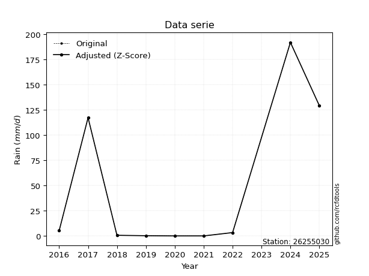</img>

</div>


> The initial value (value_initial) correspond to the initial obtained or null completed value, and value (value) is adjusted only when the initial value is outside the valid range (outlier) definite through the Z-Score value. If Z-Score is active, values out of range or outliers are replaced with the station mean value. A Z-Score (or standard score) measures how many standard deviations a data point is from the mean of a dataset, indicating its relative position; positive scores mean above the mean, negative mean below, and a score of zero is exactly at the mean, allowing for comparison of values from different distributions. It´s calculated using the formula $z=(x–μ)/σ$, where $x$ is the data point, $μ$ is the mean, and $σ$ is the standard deviation, helping identify outliers and understand probability.
>
> <sub>**Note**: In this study, "completing" (filling gaps in) and "extending" (forecasting or lengthening the historical record) rainfall data series are avoided for certain critical analyses because they introduce artificial bias and uncertainty, which can distort the statistics of rare events (extremes), alter day-to-day variability, and compromise the integrity and homogeneity of the original data. Some reasons against Completing/Extending rainfall data are: **Distortion of Extremes and Variability**: The primary issue is that most gap-filling or extension methods rely on averaging or regression with nearby stations, which inherently smooths the data. Rainfall is highly variable in space and time, with a large percentage of zero values and occasional large storms. Infilling methods often underestimate the highest values and overestimate the lowest (zero) values, which severely distorts analyses focused on flood frequency, drought severity, and intensity-duration-frequency (IDF) curves, **Loss of Data Homogeneity**: Infilled or extended data are synthetic estimates, not actual measurements. Combining these estimates with observed data can violate the assumption of data homogeneity, which requires that the data properties do not change over time. Inhomogeneity can lead to incorrect conclusions about long-term trends or changes in climate patterns, **Propagation of Errors**: Errors and biases from the original data (e.g., wind-induced undercatch, instrument errors, site changes) or the data used for imputation can propagate through the analysis, leading to unreliable hydrological models and inaccurate predictions, **Compromised Statistical Integrity**: For statistical analyses, especially those involving the frequency of events, using artificial data can introduce time bias or autocorrelation that doesn´t exist in reality, making it difficult to assess the true probability of events, **Difficulty in Validation**: It is difficult to accurately validate the quality of filled or extended data, especially for past periods where ground-truth measurements are unavailable. The reliability of imputation techniques heavily depends on the density of the surrounding station network and the complexity of the local topography.</sub>


### 4. Active continuous probability distributions from SciPy (44 of 104 available)

A Probability Density Function (PDF) describes the relative likelihood of a continuous random variable falling within a specific range, where the total area under its curve equals 1, and the area over any interval gives the actual probability for that range. Unlike discrete probabilities (like rolling a die), a PDF shows density, not direct probability for a single point (which is zero), with higher points indicating higher likelihood, often visualized as a bell curve for normal distributions.

A log of a probability density function (log-PDF) is simply the logarithm of the PDF´s value, denoted as $log(f(x))$, useful for converting multiplication of probabilities into addition, improving numerical stability with tiny numbers, and connecting to information theory concepts like entropy. Instead of dealing with very small probabilities (e.g., 0.000001), log-PDFs use negative numbers (e.g., $log(0.00001) ≈ -11.51$ that are easier for computers to handle, preventing underflow errors and simplifying complex calculations. In this study, each active probability distribution from SciPy is also evaluated in the $log$ form.

[scipy.stats](https://docs.scipy.org/doc/scipy/reference/stats.html) is a Python´s powerful submodule within the SciPy library for comprehensive statistical analysis, offering over 130 probability distributions (like Normal, Poisson), functions for descriptive stats (mean, variance), hypothesis testing (t-tests, chi-square), random variable generation, and statistical tests, making it essential for data science, modeling, and research. It provides tools to explore, model, and draw conclusions from data efficiently, working seamlessly with NumPy.

<div align="center">

|   id | p_dist             |   n_parameter | fit_method   | label                                                                       | active   | ref                                                                                                        |
|-----:|:-------------------|--------------:|:-------------|:----------------------------------------------------------------------------|:---------|:-----------------------------------------------------------------------------------------------------------|
|    0 | alpha              |             3 | MLE          | Alpha                                                                       | True     | [:mortar_board:](https://docs.scipy.org/doc/scipy/reference/generated/scipy.stats.alpha.html)              |
|    1 | betaprime          |             4 | MLE          | Beta prime                                                                  | True     | [:mortar_board:](https://docs.scipy.org/doc/scipy/reference/generated/scipy.stats.betaprime.html)          |
|    2 | chi2               |             3 | MLE          | Chi²                                                                        | True     | [:mortar_board:](https://docs.scipy.org/doc/scipy/reference/generated/scipy.stats.chi2.html)               |
|    3 | crystalball        |             4 | MLE          | Crystalball                                                                 | True     | [:mortar_board:](https://docs.scipy.org/doc/scipy/reference/generated/scipy.stats.crystalball.html)        |
|    4 | erlang             |             3 | MLE          | Erlang                                                                      | True     | [:mortar_board:](https://docs.scipy.org/doc/scipy/reference/generated/scipy.stats.erlang.html)             |
|    5 | expon              |             2 | MLE          | Exponential                                                                 | True     | [:mortar_board:](https://docs.scipy.org/doc/scipy/reference/generated/scipy.stats.expon.html)              |
|    6 | exponnorm          |             3 | MLE          | Exponentially modified Normal                                               | True     | [:mortar_board:](https://docs.scipy.org/doc/scipy/reference/generated/scipy.stats.exponnorm.html)          |
|    7 | f                  |             4 | MLE          | F                                                                           | True     | [:mortar_board:](https://docs.scipy.org/doc/scipy/reference/generated/scipy.stats.f.html)                  |
|    8 | fatiguelife        |             3 | MLE          | Fatigue-life (Birnbaum-Saunders)                                            | True     | [:mortar_board:](https://docs.scipy.org/doc/scipy/reference/generated/scipy.stats.fatiguelife.html)        |
|    9 | fisk               |             3 | MLE          | Fisk                                                                        | True     | [:mortar_board:](https://docs.scipy.org/doc/scipy/reference/generated/scipy.stats.fisk.html)               |
|   10 | gamma              |             3 | MLE          | Gamma                                                                       | True     | [:mortar_board:](https://docs.scipy.org/doc/scipy/reference/generated/scipy.stats.gamma.html)              |
|   11 | genexpon           |             5 | MLE          | Generalized exponential                                                     | True     | [:mortar_board:](https://docs.scipy.org/doc/scipy/reference/generated/scipy.stats.genexpon.html)           |
|   12 | genlogistic        |             3 | MLE          | Generalized logistic                                                        | True     | [:mortar_board:](https://docs.scipy.org/doc/scipy/reference/generated/scipy.stats.genlogistic.html)        |
|   13 | gibrat             |             2 | MM           | Gibrat                                                                      | True     | [:mortar_board:](https://docs.scipy.org/doc/scipy/reference/generated/scipy.stats.gibrat.html)             |
|   14 | gompertz           |             3 | MLE          | Gompertz (or truncated Gumbel)                                              | True     | [:mortar_board:](https://docs.scipy.org/doc/scipy/reference/generated/scipy.stats.gompertz.html)           |
|   15 | gumbel_l           |             2 | MM           | Gumbel Left Skew                                                            | True     | [:mortar_board:](https://docs.scipy.org/doc/scipy/reference/generated/scipy.stats.gumbel_l.html)           |
|   16 | gumbel_r           |             2 | MM           | Gumbel Right Skew                                                           | True     | [:mortar_board:](https://docs.scipy.org/doc/scipy/reference/generated/scipy.stats.gumbel_r.html)           |
|   17 | halflogistic       |             2 | MM           | Half-logistic                                                               | True     | [:mortar_board:](https://docs.scipy.org/doc/scipy/reference/generated/scipy.stats.halflogistic.html)       |
|   18 | halfnorm           |             2 | MM           | Half Normal                                                                 | True     | [:mortar_board:](https://docs.scipy.org/doc/scipy/reference/generated/scipy.stats.halfnorm.html)           |
|   19 | hypsecant          |             2 | MM           | hyperbolic secant                                                           | True     | [:mortar_board:](https://docs.scipy.org/doc/scipy/reference/generated/scipy.stats.hypsecant.html)          |
|   20 | invgamma           |             3 | MLE          | Inverted gamma                                                              | True     | [:mortar_board:](https://docs.scipy.org/doc/scipy/reference/generated/scipy.stats.invgamma.html)           |
|   21 | invgauss           |             3 | MLE          | Inverse Gaussian                                                            | True     | [:mortar_board:](https://docs.scipy.org/doc/scipy/reference/generated/scipy.stats.invgauss.html)           |
|   22 | invweibull         |             3 | MLE          | Inverted Weibull                                                            | True     | [:mortar_board:](https://docs.scipy.org/doc/scipy/reference/generated/scipy.stats.invweibull.html)         |
|   23 | johnsonsu          |             4 | MLE          | Johnson Su                                                                  | True     | [:mortar_board:](https://docs.scipy.org/doc/scipy/reference/generated/scipy.stats.johnsonsu.html)          |
|   24 | kstwobign          |             2 | MLE          | Limiting distribution of scaled Kolmogorov-Smirnov two-sided test statistic | True     | [:mortar_board:](https://docs.scipy.org/doc/scipy/reference/generated/scipy.stats.kstwobign.html)          |
|   25 | laplace            |             2 | MM           | Laplace                                                                     | True     | [:mortar_board:](https://docs.scipy.org/doc/scipy/reference/generated/scipy.stats.laplace.html)            |
|   26 | laplace_asymmetric |             3 | MLE          | Asymmetric Laplace                                                          | True     | [:mortar_board:](https://docs.scipy.org/doc/scipy/reference/generated/scipy.stats.laplace_asymmetric.html) |
|   27 | loggamma           |             3 | MLE          | Log gamma                                                                   | True     | [:mortar_board:](https://docs.scipy.org/doc/scipy/reference/generated/scipy.stats.loggamma.html)           |
|   28 | logistic           |             2 | MM           | Logistic (or Sech-squared)                                                  | True     | [:mortar_board:](https://docs.scipy.org/doc/scipy/reference/generated/scipy.stats.logistic.html)           |
|   29 | lognorm            |             3 | MLE          | Log Normal                                                                  | True     | [:mortar_board:](https://docs.scipy.org/doc/scipy/reference/generated/scipy.stats.lognorm.html)            |
|   30 | maxwell            |             2 | MM           | Maxwell                                                                     | True     | [:mortar_board:](https://docs.scipy.org/doc/scipy/reference/generated/scipy.stats.maxwell.html)            |
|   31 | mielke             |             4 | MLE          | Mielke Beta-Kappa / Dagum                                                   | True     | [:mortar_board:](https://docs.scipy.org/doc/scipy/reference/generated/scipy.stats.mielke.html)             |
|   32 | moyal              |             2 | MM           | Moyal                                                                       | True     | [:mortar_board:](https://docs.scipy.org/doc/scipy/reference/generated/scipy.stats.moyal.html)              |
|   33 | nakagami           |             3 | MLE          | Nakagami                                                                    | True     | [:mortar_board:](https://docs.scipy.org/doc/scipy/reference/generated/scipy.stats.nakagami.html)           |
|   34 | ncf                |             5 | MLE          | Non-central F distribution                                                  | True     | [:mortar_board:](https://docs.scipy.org/doc/scipy/reference/generated/scipy.stats.ncf.html)                |
|   35 | nct                |             4 | MLE          | Non-central Student’s t                                                     | True     | [:mortar_board:](https://docs.scipy.org/doc/scipy/reference/generated/scipy.stats.nct.html)                |
|   36 | norm               |             2 | MM           | Normal                                                                      | True     | [:mortar_board:](https://docs.scipy.org/doc/scipy/reference/generated/scipy.stats.norm.html)               |
|   37 | pearson3           |             3 | MM           | Pearson type III                                                            | True     | [:mortar_board:](https://docs.scipy.org/doc/scipy/reference/generated/scipy.stats.pearson3.html)           |
|   38 | rayleigh           |             2 | MM           | Rayleigh                                                                    | True     | [:mortar_board:](https://docs.scipy.org/doc/scipy/reference/generated/scipy.stats.rayleigh.html)           |
|   39 | rice               |             3 | MLE          | Rice                                                                        | True     | [:mortar_board:](https://docs.scipy.org/doc/scipy/reference/generated/scipy.stats.rice.html)               |
|   40 | t                  |             3 | MLE          | Student’s t                                                                 | True     | [:mortar_board:](https://docs.scipy.org/doc/scipy/reference/generated/scipy.stats.t.html)                  |
|   41 | truncnorm          |             4 | MLE          | Truncated normal                                                            | True     | [:mortar_board:](https://docs.scipy.org/doc/scipy/reference/generated/scipy.stats.truncnorm.html)          |
|   42 | wald               |             2 | MM           | Wald                                                                        | True     | [:mortar_board:](https://docs.scipy.org/doc/scipy/reference/generated/scipy.stats.wald.html)               |
|   43 | weibull_min        |             3 | MLE          | Weibull minimum                                                             | True     | [:mortar_board:](https://docs.scipy.org/doc/scipy/reference/generated/scipy.stats.weibull_min.html)        |

</div>

> **n_parameter:** # arguments & localization & scale.
>
> **Fit methods:** (MLE) maximum likelihood, (MM) L-moments.
>
>**Inactive** (With the only purpose of prevent loops, zero divisions, infinite values, over high estimated values or horizontal trending for recurrence intervals estimations, the follow distributions were disabled.)**:** foldnorm, gennorm, norminvgauss, powernorm, powerlognorm, skewnorm, genextreme, anglit, arcsine, argus, beta, bradford, burr, burr12, cauchy, cosine, halfcauchy, foldcauchy, skewcauchy, wrapcauchy, dgamma, gengamma, exponweib, exponpow, truncexpon, gausshyper, genhalflogistic, genhyperbolic, geninvgauss, halfgennorm, johnsonsb, kappa4, kappa3, ksone, kstwo, loglaplace, levy, levy_l, levy_stable, ncx2, pareto, genpareto, truncpareto, lomax, powerlaw, rdist, rel_breitwigner, recipinvgauss, semicircular, studentized_range, trapezoid, triang, truncweibull_min, tukeylambda, uniform, loguniform, vonmises, vonmises_line, weibull_max, dweibull, 


## B. Probability (PDF) vs. Empirical (EDF) distributions functions

A continuous probability distribution (CPD) describes probabilities for variables that can take any value within a range (like rain any time), unlike discrete variables with specific outcomes (like temperature). It uses a Probability Density Function (PDF), a curve where the total area under it equals 1, and the probability of the variable falling within an interval (a to b) is found by calculating the area under the curve between those points. A key feature is that the probability of hitting any single exact value is zero, so probabilities are always expressed for ranges, e.g., $P(a ≤ X ≤ b)$.

<div align="center">

Distributions parameters from station values
|    |   station | p_dist                |   n |            loc |          scale | shape                  | shape1              | shape2                 | shape3   |
|---:|----------:|:----------------------|----:|---------------:|---------------:|:-----------------------|:--------------------|:-----------------------|:---------|
|  0 |  26255030 | alpha                 |   8 |      0.0036846 |    0.186719    | 6.454993665730038e-07  |                     |                        |          |
|  1 |  26255030 | betaprime             |   8 |      0.1       |    0.00789214  | 0.16589357831328744    | 0.20048634598866177 |                        |          |
|  2 |  26255030 | chi2                  |   8 |      0.1       |  128.46        | 0.3171682024162799     |                     |                        |          |
|  3 |  26255030 | crystalball           |   8 |     39.8625    |   68.7852      | 2568.4701945435595     | 2123.194987321792   |                        |          |
|  4 |  26255030 | erlang                |   8 |      0.1       |   41.4159      | 0.22108565884893205    |                     |                        |          |
|  5 |  26255030 | expon                 |   8 |      0.1       |   39.7625      |                        |                     |                        |          |
|  6 |  26255030 | exponnorm             |   8 |      0.0556343 |    0.0134881   | 2952.4112992285673     |                     |                        |          |
|  7 |  26255030 | f                     |   8 |      0.1       |    5.72733e-17 | 33.42434684699987      | 0.3420203769875867  |                        |          |
|  8 |  26255030 | fatiguelife           |   8 |      0.1       |    0.000336898 | 365.3169782922171      |                     |                        |          |
|  9 |  26255030 | fisk                  |   8 |      0.1       |   11.8474      | 0.35596718356685586    |                     |                        |          |
| 10 |  26255030 | gamma                 |   8 |      0.1       |   72.9754      | 0.622845860491388      |                     |                        |          |
| 11 |  26255030 | genexpon              |   8 |      0.1       |  105.116       | 2.6436040476661713     | 0.773383436368501   | 1.0756584953677367e-12 |          |
| 12 |  26255030 | genlogistic           |   8 |   -278.073     |   37.2733      | 2393.5402197024287     |                     |                        |          |
| 13 |  26255030 | gibrat                |   8 |    -12.6119    |   31.8273      |                        |                     |                        |          |
| 14 |  26255030 | gompertz              |   8 |      0.1       |    4.06561e+13 | 812631393017.0173      |                     |                        |          |
| 15 |  26255030 | gumbel_l              |   8 |     70.8195    |   53.6316      |                        |                     |                        |          |
| 16 |  26255030 | gumbel_r              |   8 |      8.90552   |   53.6316      |                        |                     |                        |          |
| 17 |  26255030 | halflogistic          |   8 |    -41.6639    |   58.8089      |                        |                     |                        |          |
| 18 |  26255030 | halfnorm              |   8 |    -51.1821    |  114.107       |                        |                     |                        |          |
| 19 |  26255030 | hypsecant             |   8 |     39.8625    |   43.79        |                        |                     |                        |          |
| 20 |  26255030 | invgamma              |   8 |      0.1       |    1.17598e-16 | 0.23727907206411405    |                     |                        |          |
| 21 |  26255030 | invgauss              |   8 |      0.0402201 |    0.20449     | 194.73949812696162     |                     |                        |          |
| 22 |  26255030 | invweibull            |   8 |      0.1       |    3.2926      | 0.04665150528100229    |                     |                        |          |
| 23 |  26255030 | johnsonsu             |   8 |      0.1       |    4.85318e-14 | -0.7999195909449914    | 0.11312159833263166 |                        |          |
| 24 |  26255030 | kstwobign             |   8 |   -131.635     |  199.86        |                        |                     |                        |          |
| 25 |  26255030 | laplace               |   8 |     39.8625    |   48.6384      |                        |                     |                        |          |
| 26 |  26255030 | laplace_asymmetric    |   8 |      0.1       |    0.00289685  | 7.285397231633029e-05  |                     |                        |          |
| 27 |  26255030 | loggamma              |   8 | -22709.9       | 3030.96        | 1818.9106820256188     |                     |                        |          |
| 28 |  26255030 | logistic              |   8 |     39.8625    |   37.9232      |                        |                     |                        |          |
| 29 |  26255030 | lognorm               |   8 |      0.1       |    0.000233717 | 17.717939799769226     |                     |                        |          |
| 30 |  26255030 | maxwell               |   8 |   -123.129     |  102.14        |                        |                     |                        |          |
| 31 |  26255030 | mielke                |   8 |      0.1       |    1.56961e-05 | 0.8520143054120055     | 0.21993508690942337 |                        |          |
| 32 |  26255030 | moyal                 |   8 |      0.526733  |   30.9642      |                        |                     |                        |          |
| 33 |  26255030 | nakagami              |   8 |      0.1       |  106.666       | 0.10002323542227479    |                     |                        |          |
| 34 |  26255030 | ncf                   |   8 |      0.0354664 |    1.27487e-09 | 4.935871551506722e-08  | 0.5200812671287047  | 10.218833159654576     |          |
| 35 |  26255030 | nct                   |   8 |      0.1       |    1.36083e-17 | 0.3247836309648781     | 4.0145461616298155  |                        |          |
| 36 |  26255030 | norm                  |   8 |     39.8625    |   68.7852      |                        |                     |                        |          |
| 37 |  26255030 | pearson3              |   8 |     39.8625    |   68.7852      | 1.3952018181759833     |                     |                        |          |
| 38 |  26255030 | rayleigh              |   8 |    -91.7275    |  104.994       |                        |                     |                        |          |
| 39 |  26255030 | rice                  |   8 |    -58.7284    |   85.0046      | 0.00026046178134561703 |                     |                        |          |
| 40 |  26255030 | t                     |   8 |      0.1       |    1.1142e-16  | 0.1517241285558591     |                     |                        |          |
| 41 |  26255030 | truncnorm             |   8 |    -17.1952    |   91.0309      | 0.18903954636156395    | 2.295870979752098   |                        |          |
| 42 |  26255030 | wald                  |   8 |    -28.9227    |   68.7852      |                        |                     |                        |          |
| 43 |  26255030 | weibull_min           |   8 |      0.1       |   44.8235      | 0.902025020352975      |                     |                        |          |
| 44 |  26255030 | logalpha              |   8 |     -3.33854   |    1.86001     | 5.770612672556311e-09  |                     |                        |          |
| 45 |  26255030 | logbetaprime          |   8 |     -2.30259   |    1.02435     | 0.11836137690506635    | 1.0877817797809088  |                        |          |
| 46 |  26255030 | logchi2               |   8 |     -2.30259   |    1.24541     | 1.0499781548592895     |                     |                        |          |
| 47 |  26255030 | logcrystalball        |   8 |      0.84325   |    2.76351     | 9.083936350890484      | 7018.448205528164   |                        |          |
| 48 |  26255030 | logerlang             |   8 |     -2.30259   |    2.65248     | 0.8805722977586024     |                     |                        |          |
| 49 |  26255030 | logexpon              |   8 |     -2.30259   |    3.14584     |                        |                     |                        |          |
| 50 |  26255030 | logexponnorm          |   8 |     -2.30667   |    0.00123584  | 2547.603518403962      |                     |                        |          |
| 51 |  26255030 | logf                  |   8 |     -2.30259   |    1.08902     | 1.0927350675556025     | 1.0634144340069733  |                        |          |
| 52 |  26255030 | logfatiguelife        |   8 |     -2.30259   |    2.89292e-07 | 3854.2632564294145     |                     |                        |          |
| 53 |  26255030 | logfisk               |   8 |     -2.30259   |    3.05529     | 0.11324703113102762    |                     |                        |          |
| 54 |  26255030 | loggamma              |   8 |     -2.30259   |    2.18641     | 0.9315149110277354     |                     |                        |          |
| 55 |  26255030 | loggenexpon           |   8 |     -2.30374   |    0.0585879   | 0.016019206680807634   | 1.7940546401326978  | 3.026542777640956e-05  |          |
| 56 |  26255030 | loggenlogistic        |   8 |    -15.608     |    2.18005     | 1038.805742747021      |                     |                        |          |
| 57 |  26255030 | loggibrat             |   8 |     -1.26495   |    1.27868     |                        |                     |                        |          |
| 58 |  26255030 | loggompertz           |   8 |     -2.30259   |   12.0625      | 3.001387429801106      |                     |                        |          |
| 59 |  26255030 | loggumbel_l           |   8 |      2.08697   |    2.1547      |                        |                     |                        |          |
| 60 |  26255030 | loggumbel_r           |   8 |     -0.400475  |    2.1547      |                        |                     |                        |          |
| 61 |  26255030 | loghalflogistic       |   8 |     -2.43215   |    2.3627      |                        |                     |                        |          |
| 62 |  26255030 | loghalfnorm           |   8 |     -2.81455   |    4.58437     |                        |                     |                        |          |
| 63 |  26255030 | loghypsecant          |   8 |      0.84325   |    1.7593      |                        |                     |                        |          |
| 64 |  26255030 | loginvgamma           |   8 |     -4.8756    |   18.765       | 4.199060192573972      |                     |                        |          |
| 65 |  26255030 | loginvgauss           |   8 |     -3.14193   |    4.13875     | 0.9628949074771835     |                     |                        |          |
| 66 |  26255030 | loginvweibull         |   8 |    -10.4886    |    9.7983      | 4.968729968976591      |                     |                        |          |
| 67 |  26255030 | logjohnsonsu          |   8 |     -2.30259   |    1.51111e-10 | -3.6787512507306896    | 0.18222560325096865 |                        |          |
| 68 |  26255030 | logkstwobign          |   8 |     -8.00416   |   10.1251      |                        |                     |                        |          |
| 69 |  26255030 | loglaplace            |   8 |      0.84325   |    1.95409     |                        |                     |                        |          |
| 70 |  26255030 | loglaplace_asymmetric |   8 |     -2.30259   |    0.0104817   | 0.0033346087327009513  |                     |                        |          |
| 71 |  26255030 | logloggamma           |   8 |   -816.122     |  111.056       | 1566.5037430982343     |                     |                        |          |
| 72 |  26255030 | loglogistic           |   8 |      0.84325   |    1.5236      |                        |                     |                        |          |
| 73 |  26255030 | loglognorm            |   8 |     -2.30259   |    0.829398    | 17.35944653476731      |                     |                        |          |
| 74 |  26255030 | logmaxwell            |   8 |     -5.7051    |    4.10357     |                        |                     |                        |          |
| 75 |  26255030 | logmielke             |   8 |     -2.30259   |    1.24602     | 0.11783357748810792    | 1.4508982086316462  |                        |          |
| 76 |  26255030 | logmoyal              |   8 |     -0.7371    |    1.24401     |                        |                     |                        |          |
| 77 |  26255030 | lognakagami           |   8 |     -2.30259   |    6.0483      | 0.04655115326358383    |                     |                        |          |
| 78 |  26255030 | logncf                |   8 |     -2.30259   |    1.41213     | 0.16760450747403544    | 2.06457037509694    | 1.01389516811716       |          |
| 79 |  26255030 | lognct                |   8 |   -127.505     |    2.7175      | 33548.648014576815     | 47.228747296736344  |                        |          |
| 80 |  26255030 | lognorm               |   8 |      0.84325   |    2.76351     |                        |                     |                        |          |
| 81 |  26255030 | logpearson3           |   8 |      0.843259  |    2.76353     | 0.4398081550757198     |                     |                        |          |
| 82 |  26255030 | lograyleigh           |   8 |     -4.4435    |    4.21822     |                        |                     |                        |          |
| 83 |  26255030 | logrice               |   8 |     -3.88366   |    3.87173     | 0.001989368544646728   |                     |                        |          |
| 84 |  26255030 | logt                  |   8 |      0.843246  |    2.76351     | 48107129875.84888      |                     |                        |          |
| 85 |  26255030 | logtruncnorm          |   8 |     -1.37215   |    4.06149     | -0.22908745647047446   | 5.015105974497368   |                        |          |
| 86 |  26255030 | logwald               |   8 |     -1.92028   |    2.76353     |                        |                     |                        |          |
| 87 |  26255030 | logweibull_min        |   8 |     -2.30259   |    3.00558     | 0.11105881524799081    |                     |                        |          |

</div>

> **loc** (Location parameter): This shifts the distribution along the x-axis. For many common distributions, like the normal (Gaussian) distribution, loc represents the mean $μ$. For others, like the uniform distribution, it might represent the minimum value, or for the beta distribution, the left end of the support interval.
>
> **scale** (Scale parameter): This determines the width or spread of the distribution. For the normal distribution, scale represents the standard deviation $σ$. For a uniform distribution, it defines the length of the interval (from $loc$ to $loc + scale$).
>
> **shape** (Shape parameters): Refers to parameters that define the specific form of a probability distribution, distinct from its location (loc) and scale (scale). These parameters are required arguments for most distribution functions. For example, a normal (Gaussian) distribution is fully defined by its location (mean) and scale (standard deviation), so it has no specific shape parameters beyond loc and scale. However, other distributions have intrinsic properties that need specification, as Gamma distribution that takes a shape parameter, often named $a$ or $alpha$.


### 0. Cumulative distribution values - CDF (88 evaluated)

Cumulative Distribution Function (CDF), denoted as $F$<sub>$X$</sub>$(x)$, is a function that gives the probability that a random variable $X$ will take a value less than or equal to a specific value, $x$ (i.e., $(P(X≥x)$. It essentially "accumulates" probabilities from a given point up to the far right (positive infinity), providing a complete picture of the distribution´s probabilities for both discrete (like rain) and continuous (like temperature) variables, helping to find probabilities over ranges or above certain values. Each station is evaluated separately ordering the $x$ values ascending, calculating the CDF and PDF values for the activated distributions and their logarithmic forms.

<div align="center">

CDF ordered by x ascending and calculating $log(f(x))$ separately
|   id |   Station |   date |     x |   count |    mean |     std |    zscore |   Value_initial |   station |   m |     alpha |   alpha_pdf |   betaprime |   betaprime_pdf |        chi2 |    chi2_pdf |   crystalball |   crystalball_pdf |      erlang |   erlang_pdf |      expon |   expon_pdf |   exponnorm |   exponnorm_pdf |         f |       f_pdf |   fatiguelife |   fatiguelife_pdf |        fisk |    fisk_pdf |       gamma |        gamma_pdf |    genexpon |   genexpon_pdf |   genlogistic |   genlogistic_pdf |   gibrat |   gibrat_pdf |    gompertz |   gompertz_pdf |   gumbel_l |   gumbel_l_pdf |   gumbel_r |   gumbel_r_pdf |   halflogistic |   halflogistic_pdf |   halfnorm |   halfnorm_pdf |   hypsecant |   hypsecant_pdf |   invgamma |   invgamma_pdf |   invgauss |   invgauss_pdf |   invweibull |   invweibull_pdf |   johnsonsu |   johnsonsu_pdf |   kstwobign |   kstwobign_pdf |   laplace |   laplace_pdf |   laplace_asymmetric |   laplace_asymmetric_pdf |    loggamma |   loggamma_pdf |   logistic |   logistic_pdf |   lognorm |   lognorm_pdf |   maxwell |   maxwell_pdf |      mielke |   mielke_pdf |    moyal |   moyal_pdf |    nakagami |   nakagami_pdf |      ncf |     ncf_pdf |       nct |     nct_pdf |     norm |    norm_pdf |   pearson3 |   pearson3_pdf |   rayleigh |   rayleigh_pdf |     rice |   rice_pdf |        t |       t_pdf |   truncnorm |   truncnorm_pdf |     wald |    wald_pdf |   weibull_min |   weibull_min_pdf |   logalpha |   logalpha_pdf |   logbetaprime |   logbetaprime_pdf |    logchi2 |   logchi2_pdf |   logcrystalball |   logcrystalball_pdf |   logerlang |   logerlang_pdf |   logexpon |   logexpon_pdf |   logexponnorm |   logexponnorm_pdf |        logf |    logf_pdf |   logfatiguelife |   logfatiguelife_pdf |   logfisk |   logfisk_pdf |   loggenexpon |   loggenexpon_pdf |   loggenlogistic |   loggenlogistic_pdf |   loggibrat |   loggibrat_pdf |   loggompertz |   loggompertz_pdf |   loggumbel_l |   loggumbel_l_pdf |   loggumbel_r |   loggumbel_r_pdf |   loghalflogistic |   loghalflogistic_pdf |   loghalfnorm |   loghalfnorm_pdf |   loghypsecant |   loghypsecant_pdf |   loginvgamma |   loginvgamma_pdf |   loginvgauss |   loginvgauss_pdf |   loginvweibull |   loginvweibull_pdf |   logjohnsonsu |   logjohnsonsu_pdf |   logkstwobign |   logkstwobign_pdf |   loglaplace |   loglaplace_pdf |   loglaplace_asymmetric |   loglaplace_asymmetric_pdf |   logloggamma |   logloggamma_pdf |   loglogistic |   loglogistic_pdf |   loglognorm |   loglognorm_pdf |   logmaxwell |   logmaxwell_pdf |   logmielke |   logmielke_pdf |   logmoyal |   logmoyal_pdf |   lognakagami |   lognakagami_pdf |    logncf |   logncf_pdf |   lognct |   lognct_pdf |   logpearson3 |   logpearson3_pdf |   lograyleigh |   lograyleigh_pdf |   logrice |   logrice_pdf |     logt |   logt_pdf |   logtruncnorm |   logtruncnorm_pdf |   logwald |   logwald_pdf |   logweibull_min |   logweibull_min_pdf |
|-----:|----------:|-------:|------:|--------:|--------:|--------:|----------:|----------------:|----------:|----:|----------:|------------:|------------:|----------------:|------------:|------------:|--------------:|------------------:|------------:|-------------:|-----------:|------------:|------------:|----------------:|----------:|------------:|--------------:|------------------:|------------:|------------:|------------:|-----------------:|------------:|---------------:|--------------:|------------------:|---------:|-------------:|------------:|---------------:|-----------:|---------------:|-----------:|---------------:|---------------:|-------------------:|-----------:|---------------:|------------:|----------------:|-----------:|---------------:|-----------:|---------------:|-------------:|-----------------:|------------:|----------------:|------------:|----------------:|----------:|--------------:|---------------------:|-------------------------:|------------:|---------------:|-----------:|---------------:|----------:|--------------:|----------:|--------------:|------------:|-------------:|---------:|------------:|------------:|---------------:|---------:|------------:|----------:|------------:|---------:|------------:|-----------:|---------------:|-----------:|---------------:|---------:|-----------:|---------:|------------:|------------:|----------------:|---------:|------------:|--------------:|------------------:|-----------:|---------------:|---------------:|-------------------:|-----------:|--------------:|-----------------:|---------------------:|------------:|----------------:|-----------:|---------------:|---------------:|-------------------:|------------:|------------:|-----------------:|---------------------:|----------:|--------------:|--------------:|------------------:|-----------------:|---------------------:|------------:|----------------:|--------------:|------------------:|--------------:|------------------:|--------------:|------------------:|------------------:|----------------------:|--------------:|------------------:|---------------:|-------------------:|--------------:|------------------:|--------------:|------------------:|----------------:|--------------------:|---------------:|-------------------:|---------------:|-------------------:|-------------:|-----------------:|------------------------:|----------------------------:|--------------:|------------------:|--------------:|------------------:|-------------:|-----------------:|-------------:|-----------------:|------------:|----------------:|-----------:|---------------:|--------------:|------------------:|----------:|-------------:|---------:|-------------:|--------------:|------------------:|--------------:|------------------:|----------:|--------------:|---------:|-----------:|---------------:|-------------------:|----------:|--------------:|-----------------:|---------------------:|
|    0 |  26255030 |   2021 |   0.1 |       8 | 39.8625 | 73.5344 | -0.540733 |             0.1 |  26255030 |   1 | 0.0525473 | 2.45269     |  0.00203811 |     2.43634e+13 | 0.000945982 | 1.08099e+13 |      0.281609 |       0.00490742  | 9.01736e-05 |  1.43655e+12 | 0          | 0.0251493   |  0.00111346 |     0.025071    | 0.0746556 | 6.2071e+15  |     0.0395708 |       9.15639e+07 | 4.14042e-07 | 1.06202e+10 | 2.43974e-12 | 109497           | 5.43168e-14 |    0.0251493   |      0.25328  |       0.00932891  | 0.179365 |  0.0205963   | 2.31609e-13 |    0.0199879   |   0.234714 |    0.00381712  |   0.307761 |    0.00676235  |       0.340874 |        0.00751421  |   0.346871 |    0.00632073  |    0.244057 |     0.00504312  |   0.101398 |    7.12208e+14 |  0.0647145 |    2.24307     |   0.00155672 |      3.38327e+13 |    0.214829 |     6.78017e+11 |    0.222274 |     0.00789514  |  0.220764 |   0.00453889  |          5.99602e-09 |              0.0251494   | 2.47932e-15 |      5.20059   |   0.259513 |    0.00506724  |  0.127487 |     0.07552   |  0.307441 |   0.00549168  | 5.31512e-10 |  2.16667e+06 | 0.313976 | 0.00781416  | 0.000139198 |    2.00651e+12 | 0.111264 | 1.59888     | 0.0873981 | 6.07623e+15 | 0.281609 | 0.00490742  |   0.330476 |    0.00740104  |   0.317821 |    0.00568257  | 0.212959 | 0.00640766 | 0.5      | 1.58695e+15 | 0.000902028 |     0.0103916   | 0.292386 | 0.0142421   |   2.01489e-17 |       1.30963     |  0.0725817 |      0.275909  |      0.0154197 |        4.10976e+12 | 6.0806e-09 |   7.18831e+06 |         0.127487 |            0.07552   | 1.34218e-14 |      26.6137    |   0        |      0.317881  |     0.00129739 |          0.317057  | 2.56646e-09 | 3.15755e+06 |        0.0436512 |            1.187e+13 | 0.0158311 |   3.97317e+12 |   0.000316976 |         0.273354  |         0.098303 |            0.104484  |  0          |       0         |   1.48442e-11 |         0.24882   |      0.122249 |         0.0531176 |     0.0891356 |         0.100011  |         0.0274114 |             0.211463  |     0.0889197 |         0.172963  |       0.105514 |          0.0588825 |     0.0805945 |         0.143384  |     0.0684734 |         0.227106  |       0.0868878 |           0.128848  |     0.00025012 |    681751          |       0.090953 |          0.108176  |    0.0999569 |        0.0511526 |             1.11742e-05 |                   0.318134  |      0.131776 |         0.0753808 |      0.112572 |         0.0655679 |    0.0214024 |      6.65164e+12 |     0.123861 |        0.0947905 |   0.0151252 |     4.01328e+12 |  0.0606386 |      0.10352   |     0.0279753 |       5.86497e+12 | 0.0246089 |  4.64384e+12 | 0.127389 |    0.0756279 |      0.119967 |         0.0877867 |      0.120849 |         0.10578   | 0.0799988 |     0.0970353 | 0.127488 |  0.0755201 |    1.08477e-10 |          0.162008  |  0        |     0         |        0.0173023 |          4.28934e+12 |
|    1 |  26255030 |   2020 |   0.1 |       8 | 39.8625 | 73.5344 | -0.540733 |             0.1 |  26255030 |   2 | 0.0525473 | 2.45269     |  0.00203811 |     2.43634e+13 | 0.000945982 | 1.08099e+13 |      0.281609 |       0.00490742  | 9.01736e-05 |  1.43655e+12 | 0          | 0.0251493   |  0.00111346 |     0.025071    | 0.0746556 | 6.2071e+15  |     0.0395708 |       9.15639e+07 | 4.14042e-07 | 1.06202e+10 | 2.43974e-12 | 109497           | 5.43168e-14 |    0.0251493   |      0.25328  |       0.00932891  | 0.179365 |  0.0205963   | 2.31609e-13 |    0.0199879   |   0.234714 |    0.00381712  |   0.307761 |    0.00676235  |       0.340874 |        0.00751421  |   0.346871 |    0.00632073  |    0.244057 |     0.00504312  |   0.101398 |    7.12208e+14 |  0.0647145 |    2.24307     |   0.00155672 |      3.38327e+13 |    0.214829 |     6.78017e+11 |    0.222274 |     0.00789514  |  0.220764 |   0.00453889  |          5.99602e-09 |              0.0251494   | 2.47932e-15 |      5.20059   |   0.259513 |    0.00506724  |  0.127487 |     0.07552   |  0.307441 |   0.00549168  | 5.31512e-10 |  2.16667e+06 | 0.313976 | 0.00781416  | 0.000139198 |    2.00651e+12 | 0.111264 | 1.59888     | 0.0873981 | 6.07623e+15 | 0.281609 | 0.00490742  |   0.330476 |    0.00740104  |   0.317821 |    0.00568257  | 0.212959 | 0.00640766 | 0.5      | 1.58695e+15 | 0.000902028 |     0.0103916   | 0.292386 | 0.0142421   |   2.01489e-17 |       1.30963     |  0.0725817 |      0.275909  |      0.0154197 |        4.10976e+12 | 6.0806e-09 |   7.18831e+06 |         0.127487 |            0.07552   | 1.34218e-14 |      26.6137    |   0        |      0.317881  |     0.00129739 |          0.317057  | 2.56646e-09 | 3.15755e+06 |        0.0436512 |            1.187e+13 | 0.0158311 |   3.97317e+12 |   0.000316976 |         0.273354  |         0.098303 |            0.104484  |  0          |       0         |   1.48442e-11 |         0.24882   |      0.122249 |         0.0531176 |     0.0891356 |         0.100011  |         0.0274114 |             0.211463  |     0.0889197 |         0.172963  |       0.105514 |          0.0588825 |     0.0805945 |         0.143384  |     0.0684734 |         0.227106  |       0.0868878 |           0.128848  |     0.00025012 |    681751          |       0.090953 |          0.108176  |    0.0999569 |        0.0511526 |             1.11742e-05 |                   0.318134  |      0.131776 |         0.0753808 |      0.112572 |         0.0655679 |    0.0214024 |      6.65164e+12 |     0.123861 |        0.0947905 |   0.0151252 |     4.01328e+12 |  0.0606386 |      0.10352   |     0.0279753 |       5.86497e+12 | 0.0246089 |  4.64384e+12 | 0.127389 |    0.0756279 |      0.119967 |         0.0877867 |      0.120849 |         0.10578   | 0.0799988 |     0.0970353 | 0.127488 |  0.0755201 |    1.08477e-10 |          0.162008  |  0        |     0         |        0.0173023 |          4.28934e+12 |
|    2 |  26255030 |   2019 |   0.3 |       8 | 39.8625 | 73.5344 | -0.538013 |             0.3 |  26255030 |   3 | 0.528605  | 1.39123     |  0.753267   |     0.244432    | 0.345423    | 0.273709    |      0.282591 |       0.00491565  | 0.336635    |  0.370656    | 0.00501724 | 0.0250231   |  0.00611755 |     0.0249579   | 1         | 0.00149333  |     0.526543  |       0.0664836   | 0.189556    | 0.273427    | 0.0282665   |      0.0878798   | 0.00501723  |    0.0250231   |      0.255147 |       0.00934743  | 0.183482 |  0.0205674   | 0.00398961  |    0.0199082   |   0.235478 |    0.00382755  |   0.309114 |    0.00676679  |       0.342376 |        0.00750549  |   0.348134 |    0.00631574  |    0.245068 |     0.00505971  |   0.999732 |    0.000317468 |  0.376886  |    0.92391     |   0.319947   |      0.0850484   |    0.994831 |     0.0084235   |    0.223854 |     0.00791003  |  0.221674 |   0.00455759  |          0.00501726  |              0.0250232   | 0.429432    |      0.277725  |   0.260528 |    0.00508008  |  0.229405 |     0.109719  |  0.30854  |   0.00549651  | 0.633506    |  0.29999     | 0.315539 | 0.00781443  | 0.237752    |    0.237807    | 0.297667 | 0.553709    | 0.999993  | 1.13841e-05 | 0.282591 | 0.00491565  |   0.331956 |    0.00739669  |   0.318958 |    0.00568546  | 0.214241 | 0.00641897 | 0.998093 | 0.00144707  | 0.00297992  |     0.0103873   | 0.29523  | 0.0141903   |   0.00755382  |       0.0339397   |  0.383549  |      0.222821  |      0.933596  |        0.0457811   | 0.635376   |   0.225452    |         0.229405 |            0.109719  | 0.399726    |       0.255172  |   0.294767 |      0.22418   |     0.295479   |          0.223769  | 0.497981    | 0.152541    |        0.693434  |            0.0807863 | 0.471074  |   0.0256842   |   0.266748    |         0.21324   |         0.24609  |            0.158162  |  0.00117062 |       0.0638017 |   0.248881    |         0.204714  |      0.195161 |         0.0810978 |     0.234114  |         0.157758  |         0.254211  |             0.197947  |     0.274651  |         0.163628  |       0.192731 |          0.102978  |     0.281939  |         0.200168  |     0.34554   |         0.226959  |       0.270693  |           0.189303  |     0.720849   |         0.0557531  |       0.242184 |          0.1592    |    0.175379  |        0.0897496 |             0.294974    |                   0.224295  |      0.232824 |         0.108277  |      0.206907 |         0.107703  |    0.50646   |      0.0209157   |     0.247751 |        0.128185  |   0.937958  |     0.054883    |  0.22766   |      0.186869  |     0.75841   |       0.0641775   | 0.492324  |  0.0483032   | 0.229467 |    0.109893  |      0.238567 |         0.12618   |      0.255394 |         0.135566  | 0.212988  |     0.140687  | 0.229406 |  0.109719  |    0.181365    |          0.166173  |  0.122285 |     0.379528  |        0.591085  |          0.0369658   |
|    3 |  26255030 |   2018 |   0.7 |       8 | 39.8625 | 73.5344 | -0.532574 |             0.7 |  26255030 |   4 | 0.788581  | 0.296417    |  0.80173    |     0.0659872   | 0.411076    | 0.108432    |      0.284561 |       0.00493204  | 0.428437    |  0.156006    | 0.0149763  | 0.0247727   |  0.0160508  |     0.0247085   | 1         | 0.000412518 |     0.545958  |       0.0381711   | 0.256961    | 0.113276    | 0.0559155   |      0.0577511   | 0.0149763   |    0.0247727   |      0.258893 |       0.0093835   | 0.191695 |  0.0204965   | 0.0119211   |    0.0197497   |   0.237013 |    0.00384846  |   0.311822 |    0.00677536  |       0.345375 |        0.00748795  |   0.350659 |    0.00630572  |    0.247098 |     0.0050929   |   0.999794 |    8.15394e-05 |  0.580685  |    0.289772    |   0.338692   |      0.028511    |    0.996413 |     0.00202588  |    0.227024 |     0.00793917  |  0.223505 |   0.00459523  |          0.0149764   |              0.0247727   | 0.620627    |      0.181263  |   0.262565 |    0.0051057   |  0.33207  |     0.131374  |  0.31074  |   0.00550603  | 0.695632    |  0.0883418   | 0.318665 | 0.00781447  | 0.29619     |    0.0987528   | 0.42908  | 0.204195    | 0.999995  | 2.65592e-06 | 0.284561 | 0.00493204  |   0.334913 |    0.00738772  |   0.321233 |    0.0056911   | 0.216813 | 0.00644131 | 0.998385 | 0.000408297 | 0.00713306  |     0.0103784   | 0.300885 | 0.0140856   |   0.020219    |       0.0300873   |  0.532776  |      0.137401  |      0.958195  |        0.0184449   | 0.776434   |   0.122289    |         0.33207  |            0.131374  | 0.578368    |       0.173162  |   0.461284 |      0.171247  |     0.461708   |          0.170971  | 0.592348    | 0.0823602   |        0.749495  |            0.0550029 | 0.48723   |   0.0145399   |   0.430129    |         0.173358  |         0.386451 |            0.16846   |  0.366161   |       0.414276  |   0.408695    |         0.172885  |      0.275092 |         0.108234  |     0.375357  |         0.170699  |         0.412995  |             0.175527  |     0.40814   |         0.150745  |       0.298004 |          0.145705  |     0.443994  |         0.177311  |     0.509885  |         0.163228  |       0.428813  |           0.178061  |     0.754758   |         0.0294544  |       0.381746 |          0.165985  |    0.270576  |        0.138466  |             0.461559    |                   0.171298  |      0.333921 |         0.129193  |      0.312693 |         0.141058  |    0.51959   |      0.0117958   |     0.362787 |        0.141263  |   0.966374  |     0.0201137   |  0.390775  |      0.190434  |     0.799754  |       0.0380885   | 0.525649  |  0.0330096   | 0.332281 |    0.131541  |      0.35388  |         0.143725  |      0.374583 |         0.143648  | 0.339608  |     0.15538   | 0.332071 |  0.131374  |    0.320548    |          0.161197  |  0.419974 |     0.287141  |        0.614365  |          0.0209719   |
|    4 |  26255030 |   2022 |   3.4 |       8 | 39.8625 | 73.5344 | -0.495856 |             3.4 |  26255030 |   5 | 0.956157  | 0.0128961   |  0.859036   |     0.00855783  | 0.53791     | 0.0255646   |      0.298024 |       0.00503962  | 0.617351    |  0.038739    | 0.0796422  | 0.0231464   |  0.0805523  |     0.0230887   | 1         | 5.60365e-05 |     0.606762  |       0.0157875   | 0.388175    | 0.0256183   | 0.159417    |      0.0292591   | 0.0796422   |    0.0231464   |      0.284524 |       0.00959225  | 0.246044 |  0.0196781   | 0.0638319   |    0.0187121   |   0.247596 |    0.00399103  |   0.330183 |    0.00682207  |       0.36543  |        0.00736675  |   0.367591 |    0.0062365   |    0.261151 |     0.00531685  |   0.999862 |    9.89309e-06 |  0.80925   |    0.0285561   |   0.367918   |      0.00520065  |    0.998021 |     0.000215278 |    0.248703 |     0.00811305  |  0.236263 |   0.00485753  |          0.0796424   |              0.0231464   | 0.820571    |      0.0844686 |   0.276582 |    0.00527603  |  0.55476  |     0.142999  |  0.325689 |   0.0055655   | 0.776415    |  0.0126766   | 0.339748 | 0.00779824  | 0.416557    |    0.0252495   | 0.618596 | 0.0289527   | 0.999997  | 2.77584e-07 | 0.298024 | 0.00503962  |   0.35477  |    0.00731854  |   0.336646 |    0.00572434  | 0.2344   | 0.00658275 | 0.998753 | 5.73169e-05 | 0.0350691   |     0.0103135   | 0.337934 | 0.013352    |   0.0906847   |       0.0236283   |  0.683501  |      0.0656134 |      0.975548  |        0.00652759  | 0.901204   |   0.0488848   |         0.55476  |            0.142999  | 0.777399    |       0.0888886 |   0.674034 |      0.103618  |     0.674155   |          0.103494  | 0.682252    | 0.0398803   |        0.817491  |            0.0339959 | 0.50406   |   0.00802808  |   0.654534    |         0.113718  |         0.630906 |            0.133268  |  0.747276   |       0.12842   |   0.639099    |         0.120292  |      0.488245 |         0.159108  |     0.624648  |         0.136418  |         0.649061  |             0.12247   |     0.621622  |         0.118076  |       0.568318 |          0.176778  |     0.66955   |         0.109359  |     0.701931  |         0.0885903 |       0.662291  |           0.115771  |     0.78753    |         0.0149953  |       0.622804 |          0.133003  |    0.588473  |        0.210598  |             0.674332    |                   0.103607  |      0.553058 |         0.141065  |      0.562116 |         0.161553  |    0.533223  |      0.00649439  |     0.584832 |        0.133256  |   0.983912  |     0.00595181  |  0.649327  |      0.131496  |     0.844859  |       0.021971    | 0.568491  |  0.0228917   | 0.555131 |    0.143014  |      0.582982 |         0.138263  |      0.594457 |         0.129168  | 0.581087  |     0.14273   | 0.55476  |  0.142999  |    0.557466    |          0.135589  |  0.717807 |     0.117974  |        0.638649  |          0.0115841   |
|    5 |  26255030 |   2016 |   5.3 |       8 | 39.8625 | 73.5344 | -0.470018 |             5.3 |  26255030 |   6 | 0.971877  | 0.00530776  |  0.871312   |     0.00495929  | 0.577552    | 0.0173084   |      0.307668 |       0.005112    | 0.677206    |  0.0259656   | 0.122586   | 0.0220664   |  0.123391   |     0.022013    | 1         | 3.2901e-05  |     0.633094  |       0.0123134   | 0.42724     | 0.0167514   | 0.209537    |      0.0240143   | 0.122586    |    0.0220664   |      0.30286  |       0.00970322  | 0.282693 |  0.0188803   | 0.0987182   |    0.0180148   |   0.255275 |    0.00409275  |   0.343167 |    0.00684355  |       0.379344 |        0.00727865  |   0.379393 |    0.00618617  |    0.271403 |     0.00547369  |   0.999876 |    5.63615e-06 |  0.847993  |    0.0147379   |   0.375722   |      0.00329966  |    0.998321 |     0.000117642 |    0.264215 |     0.00821208  |  0.245675 |   0.00505104  |          0.122586    |              0.0220664   | 0.854372    |      0.0683894 |   0.286717 |    0.00539275  |  0.617277 |     0.138077  |  0.336299 |   0.00560231  | 0.794787    |  0.00749647  | 0.35454  | 0.00777053  | 0.456221    |    0.0175473   | 0.659942 | 0.0166049   | 0.999998  | 1.51972e-07 | 0.307668 | 0.005112    |   0.368622 |    0.0072615   |   0.34754  |    0.00574279  | 0.246993 | 0.00667247 | 0.998836 | 3.39492e-05 | 0.0546172   |     0.0102627   | 0.362801 | 0.0128231   |   0.133479    |       0.0215351   |  0.710237  |      0.0552657 |      0.978149  |        0.00525526  | 0.920538   |   0.0386643   |         0.617277 |            0.138077  | 0.81348     |       0.0741328 |   0.716935 |      0.0899809 |     0.717008   |          0.0898835 | 0.698643    | 0.0342089   |        0.831768  |            0.0304262 | 0.507416  |   0.00712933  |   0.701965    |         0.100193  |         0.686772 |            0.118351  |  0.796753   |       0.096389  |   0.689594    |         0.10734   |      0.560966 |         0.167728  |     0.681846  |         0.121184  |         0.700163  |             0.107879  |     0.67179   |         0.107914  |       0.643991 |          0.162731  |     0.714502  |         0.0935128 |     0.738268  |         0.0755403 |       0.709986  |           0.0993954 |     0.793746   |         0.0130879  |       0.6789   |          0.119645  |    0.672104  |        0.167799  |             0.717227    |                   0.0899608 |      0.614808 |         0.136573  |      0.632074 |         0.152636  |    0.535938  |      0.00576481  |     0.642219 |        0.124955  |   0.986234  |     0.00459272  |  0.703654  |      0.113474  |     0.854078  |       0.0196476   | 0.57829   |  0.0213017   | 0.617643 |    0.138039  |      0.642459 |         0.129294  |      0.649874 |         0.120253  | 0.642249  |     0.132486  | 0.617278 |  0.138077  |    0.61549     |          0.125686  |  0.764681 |     0.094293  |        0.643492  |          0.0102855   |
|    6 |  26255030 |   2017 | 117.2 |       8 | 39.8625 | 73.5344 |  1.05172  |           117.2 |  26255030 |   7 | 0.998729  | 1.08468e-05 |  0.93107    |     0.000118012 | 0.896381    | 0.000814783 |      0.869564 |       0.00308257  | 0.994777    |  0.000153983 | 0.947397   | 0.00132292  |  0.947223   |     0.00132532  | 1         | 8.57738e-07 |     0.946718  |       0.00074754  | 0.693279    | 0.000646405 | 0.899809    |      0.00160105  | 0.947397    |    0.00132293  |      0.942371 |       0.00150067  | 0.920102 |  0.00114413  | 0.903729    |    0.00192426  |   0.906942 |    0.00412014  |   0.875677 |    0.00216762  |       0.874214 |        0.00200438  |   0.859961 |    0.00235387  |    0.892182 |     0.00241535  |   0.999941 |    1.19535e-07 |  0.971413  |    0.000141791 |   0.4289     |      0.000144646 |    0.99949  |     1.74708e-06 |    0.909936 |     0.00224365  |  0.898042 |   0.00209624  |          0.947398    |              0.00132292  | 0.965701    |      0.0159528 |   0.884864 |    0.00268648  |  0.922009 |     0.0527698 |  0.863518 |   0.00271499  | 0.889153    |  0.000193256 | 0.879202 | 0.00193563  | 0.841627    |    0.00128819  | 0.847804 | 0.000337616 | 0.999999  | 2.45427e-09 | 0.869564 | 0.00308257  |   0.873129 |    0.00204763  |   0.861912 |    0.00261713  | 0.882544 | 0.00285974 | 0.999275 | 9.39855e-07 | 0.857358    |     0.00355806  | 0.898229 | 0.00139112  |   0.907253    |       0.00169883  |  0.818432  |      0.0220182 |      0.987599  |        0.00176676  | 0.98135    |   0.00848273  |         0.922009 |            0.0527698 | 0.944789    |       0.0215361 |   0.894209 |      0.0336288 |     0.89415    |          0.0336197 | 0.769835    | 0.0157029   |        0.900132  |            0.0159079 | 0.523721  |   0.00399748  |   0.902416    |         0.0375715 |         0.913186 |            0.0380397 |  0.939516   |       0.0198835 |   0.908417    |         0.0409375 |      0.968689 |         0.0503344 |     0.913009  |         0.0385635 |         0.909191  |             0.0366892 |     0.90169   |         0.0443866 |       0.931707 |          0.0385213 |     0.889675  |         0.0313429 |     0.884852  |         0.02834   |       0.894999  |           0.0323435 |     0.822398   |         0.00670971 |       0.916866 |          0.0414065 |    0.932762  |        0.0344088 |             0.894402    |                   0.0335946 |      0.919706 |         0.0537548 |      0.929121 |         0.0432233 |    0.549111  |      0.00322749  |     0.910675 |        0.0488592 |   0.993722  |     0.00123637  |  0.912732  |      0.034935  |     0.899465  |       0.0111521   | 0.632745  |  0.0147779   | 0.922023 |    0.05268   |      0.913865 |         0.0474859 |      0.907656 |         0.0477845 | 0.917444  |     0.0476246 | 0.922009 |  0.0527697 |    0.889229    |          0.0531252 |  0.922376 |     0.0253147 |        0.666994  |          0.00575487  |
|    7 |  26255030 |   2024 | 191.8 |       8 | 39.8625 | 73.5344 |  2.06621  |           191.8 |  26255030 |   8 | 0.999223  | 4.04994e-06 |  0.937556   |     6.53054e-05 | 0.93926     | 0.000402551 |      0.986408 |       0.000505743 | 0.999373    |  1.73167e-05 | 0.991942   | 0.000202646 |  0.991893   |     0.000203586 | 1         | 4.81595e-07 |     0.980532  |       0.000254864 | 0.729276    | 0.000366612 | 0.968611    |      0.000478305 | 0.991942    |    0.000202646 |      0.99201  |       0.000213491 | 0.968544 |  0.000346189 | 0.978327    |    0.000433199 |   0.999928 |    1.27623e-05 |   0.967505 |    0.000595938 |       0.962948 |        0.000618371 |   0.96678  |    0.000724423 |    0.98019  |     0.000452084 |   0.999948 |    6.49588e-08 |  0.978653  |    6.74123e-05 |   0.437234   |      8.80265e-05 |    0.999583 |     8.87198e-07 |    0.989377 |     0.000344078 |  0.978005 |   0.000452204 |          0.991942    |              0.000202644 | 0.972721    |      0.0126763 |   0.982127 |    0.000462862 |  0.944862 |     0.0403334 |  0.976741 |   0.000640328 | 0.899803    |  0.000107521 | 0.963657 | 0.000586447 | 0.913413    |    0.000709225 | 0.866099 | 0.000181518 | 0.999999  | 1.27742e-09 | 0.986408 | 0.000505743 |   0.963718 |    0.000628068 |   0.973909 |    0.000671068 | 0.987004 | 0.0004506  | 0.999327 | 5.32742e-07 | 1           |     0.000758462 | 0.960667 | 0.000471751 |   0.975503    |       0.000427548 |  0.828671  |      0.0196243 |      0.988414  |        0.00155031  | 0.985082   |   0.00674142  |         0.944862 |            0.0403334 | 0.954432    |       0.0177428 |   0.909542 |      0.0287548 |     0.90948    |          0.0287508 | 0.777214    | 0.0142939   |        0.907621  |            0.0145242 | 0.525624  |   0.00373558  |   0.919428    |         0.0316471 |         0.930112 |            0.0309096 |  0.948371   |       0.0162238 |   0.92685     |         0.0340607 |      0.987137 |         0.0259883 |     0.930148  |         0.0312588 |         0.925645  |             0.0303005 |     0.921685  |         0.0369493 |       0.948299 |          0.0292581 |     0.903907  |         0.0265897 |     0.897878  |         0.0246501 |       0.909621  |           0.0271916 |     0.825575   |         0.00620121 |       0.935261 |          0.0334925 |    0.947743  |        0.0267422 |             0.909719    |                   0.0287219 |      0.943043 |         0.0412946 |      0.947676 |         0.0325453 |    0.550647  |      0.00301571  |     0.932296 |        0.0391524 |   0.994285  |     0.00105608  |  0.928359  |      0.0287166 |     0.904768  |       0.0103952   | 0.639858  |  0.0141135   | 0.944839 |    0.0402732 |      0.934778 |         0.0376829 |      0.928919 |         0.0387492 | 0.938365  |     0.0375812 | 0.944863 |  0.0403333 |    0.913083    |          0.0439069 |  0.933774 |     0.0211111 |        0.669734  |          0.00537569  |


</div>

An Empirical Distribution Function (EDF) is a step-function estimate of a true cumulative distribution function (CDF) based on observed sample data, representing the proportion of data points less than or equal to a given value. It is calculated by ordering your data and jumping up by $1/n$ (where $n$ is sample size) at each unique data point, allowing analysis without assuming an underlying population distribution, and it gets closer to the true CDF as the sample size grows. For the empirical probability calculations, the parameter $m$ correspond to the order number which means the position of the $x$ values in an ascending order list.

The Kolmogorov-Smirnov (K-S) test is a non-parametric statistical test used to determine if a sample data set comes from a specific theoretical distribution (one-sample) or if two different samples come from the same underlying distribution (two-sample), by comparing their cumulative distribution functions (CDFs). It calculates the maximum vertical difference (D statistic) between these functions, with a small p-value indicating a significant difference and rejection of the null hypothesis (that the data/samples match).


### 1. EDF California (1923)

California´s estimates the true probability distribution of water-related data (like rainfall, streamflow) using observed samples, crucial for risk assessment.

<div align="center">


$P=m/n$


</div>


**1.1. Empirical values**

<div align="center">

|                | 0                  | 1                  | 2              | 3              | 4                  | 5              | 6              | 7              |
|:---------------|:-------------------|:-------------------|:---------------|:---------------|:-------------------|:---------------|:---------------|:---------------|
| date           | 2021               | 2020               | 2019           | 2018           | 2022               | 2016           | 2017           | 2024           |
| x              | 0.1                | 0.1                | 0.3            | 0.7            | 3.4                | 5.3            | 117.2          | 191.8          |
| m              | 1                  | 2                  | 3              | 4              | 5                  | 6              | 7              | 8              |
| empirical_dist | edf_california     | edf_california     | edf_california | edf_california | edf_california     | edf_california | edf_california | edf_california |
| empirical      | 0.125              | 0.25               | 0.375          | 0.5            | 0.625              | 0.75           | 0.875          | 1.0            |
| empirical_tr   | 1.1428571428571428 | 1.3333333333333333 | 1.6            | 2.0            | 2.6666666666666665 | 4.0            | 8.0            | inf            |

</div>


**1.2. Kolmogorov-Smirnov fit test (sorted by Δ)**


<div align="center">

|                | 0                  | 1                   | 2                  | 3                   | 4                   | 5                  | 6                   | 7                   | 8                   | 9                   | 10                  | 11                  | 12                 | 13                  | 14                  | 15                  | 16                  | 17                 | 18                 | 19                  | 20                  | 21                 | 22                  | 23                  | 24                 | 25                 | 26                  | 27                 | 28                  | 29                  | 30                  | 31                    | 32                 | 33                 | 34                  | 35                  | 36                  | 37                  | 38                 | 39                 | 40                  | 41                 | 42                 | 43                 | 44                 | 45                  | 46                 | 47                 | 48                 | 49                  | 50                 | 51                 | 52                  | 53                 | 54                  | 55                  | 56                  | 57                 | 58                  | 59                  | 60                 | 61                  | 62                 | 63                 | 64                 | 65                 | 66                 | 67                  | 68                  | 69                 | 70                 | 71                 | 72                 | 73                 | 74                 | 75                 | 76                 | 77                 | 78                 | 79                 | 80                 | 81                 | 82                 | 83                 | 84                 | 85                 | 86                 | 87                 |
|:---------------|:-------------------|:--------------------|:-------------------|:--------------------|:--------------------|:-------------------|:--------------------|:--------------------|:--------------------|:--------------------|:--------------------|:--------------------|:-------------------|:--------------------|:--------------------|:--------------------|:--------------------|:-------------------|:-------------------|:--------------------|:--------------------|:-------------------|:--------------------|:--------------------|:-------------------|:-------------------|:--------------------|:-------------------|:--------------------|:--------------------|:--------------------|:----------------------|:-------------------|:-------------------|:--------------------|:--------------------|:--------------------|:--------------------|:-------------------|:-------------------|:--------------------|:-------------------|:-------------------|:-------------------|:-------------------|:--------------------|:-------------------|:-------------------|:-------------------|:--------------------|:-------------------|:-------------------|:--------------------|:-------------------|:--------------------|:--------------------|:--------------------|:-------------------|:--------------------|:--------------------|:-------------------|:--------------------|:-------------------|:-------------------|:-------------------|:-------------------|:-------------------|:--------------------|:--------------------|:-------------------|:-------------------|:-------------------|:-------------------|:-------------------|:-------------------|:-------------------|:-------------------|:-------------------|:-------------------|:-------------------|:-------------------|:-------------------|:-------------------|:-------------------|:-------------------|:-------------------|:-------------------|:-------------------|
| station        | 26255030           | 26255030            | 26255030           | 26255030            | 26255030            | 26255030           | 26255030            | 26255030            | 26255030            | 26255030            | 26255030            | 26255030            | 26255030           | 26255030            | 26255030            | 26255030            | 26255030            | 26255030           | 26255030           | 26255030            | 26255030            | 26255030           | 26255030            | 26255030            | 26255030           | 26255030           | 26255030            | 26255030           | 26255030            | 26255030            | 26255030            | 26255030              | 26255030           | 26255030           | 26255030            | 26255030            | 26255030            | 26255030            | 26255030           | 26255030           | 26255030            | 26255030           | 26255030           | 26255030           | 26255030           | 26255030            | 26255030           | 26255030           | 26255030           | 26255030            | 26255030           | 26255030           | 26255030            | 26255030           | 26255030            | 26255030            | 26255030            | 26255030           | 26255030            | 26255030            | 26255030           | 26255030            | 26255030           | 26255030           | 26255030           | 26255030           | 26255030           | 26255030            | 26255030            | 26255030           | 26255030           | 26255030           | 26255030           | 26255030           | 26255030           | 26255030           | 26255030           | 26255030           | 26255030           | 26255030           | 26255030           | 26255030           | 26255030           | 26255030           | 26255030           | 26255030           | 26255030           | 26255030           |
| empirical_dist | edf_california     | edf_california      | edf_california     | edf_california      | edf_california      | edf_california     | edf_california      | edf_california      | edf_california      | edf_california      | edf_california      | edf_california      | edf_california     | edf_california      | edf_california      | edf_california      | edf_california      | edf_california     | edf_california     | edf_california      | edf_california      | edf_california     | edf_california      | edf_california      | edf_california     | edf_california     | edf_california      | edf_california     | edf_california      | edf_california      | edf_california      | edf_california        | edf_california     | edf_california     | edf_california      | edf_california      | edf_california      | edf_california      | edf_california     | edf_california     | edf_california      | edf_california     | edf_california     | edf_california     | edf_california     | edf_california      | edf_california     | edf_california     | edf_california     | edf_california      | edf_california     | edf_california     | edf_california      | edf_california     | edf_california      | edf_california      | edf_california      | edf_california     | edf_california      | edf_california      | edf_california     | edf_california      | edf_california     | edf_california     | edf_california     | edf_california     | edf_california     | edf_california      | edf_california      | edf_california     | edf_california     | edf_california     | edf_california     | edf_california     | edf_california     | edf_california     | edf_california     | edf_california     | edf_california     | edf_california     | edf_california     | edf_california     | edf_california     | edf_california     | edf_california     | edf_california     | edf_california     | edf_california     |
| p_dist         | lograyleigh        | logmaxwell          | ncf                | logpearson3         | loggenlogistic      | logkstwobign       | loggumbel_r         | loghalfnorm         | loginvweibull       | logloggamma         | lognct              | logt                | logcrystalball     | lognorm             | lognorm             | loginvgamma         | logrice             | logalpha           | loginvgauss        | invgauss            | loglogistic         | logmoyal           | loghypsecant        | fatiguelife         | loghalflogistic    | loggumbel_l        | loglaplace          | logexponnorm       | chi2                | loggenexpon         | erlang              | loglaplace_asymmetric | logf               | logtruncnorm       | loggompertz         | logerlang           | loggamma            | loggamma            | logexpon           | logwald            | mielke              | logchi2            | nakagami           | logfatiguelife     | fisk               | logweibull_min      | alpha              | logjohnsonsu       | logncf             | halfnorm            | halflogistic       | loggibrat          | betaprime           | pearson3           | lognakagami         | wald                | moyal               | rayleigh           | gumbel_r            | maxwell             | norm               | crystalball         | genlogistic        | loglognorm         | logistic           | gibrat             | logfisk            | hypsecant           | kstwobign           | gumbel_l           | rice               | laplace            | gamma              | logbetaprime       | invweibull         | logmielke          | weibull_min        | johnsonsu          | t                  | invgamma           | nct                | f                  | exponnorm          | laplace_asymmetric | expon              | genexpon           | gompertz           | truncnorm          |
| delta          | 0.1291510517621713 | 0.13721284989410226 | 0.1387358705459681 | 0.14611962925551292 | 0.15169695129112715 | 0.1590469727688395 | 0.16086437767021755 | 0.16108027712632422 | 0.16311216735762274 | 0.16607858013372073 | 0.16771897107731792 | 0.16792931647479292 | 0.1679297548356029 | 0.16792975504959756 | 0.16792975504959756 | 0.16940551618894378 | 0.17000123852369892 | 0.1774183000323037 | 0.1815265905840867 | 0.18528548156315208 | 0.18730685001327685 | 0.1893613725855263 | 0.20199638613708992 | 0.21042923517400064 | 0.2225885932524732 | 0.2249081152948596 | 0.22942447465492727 | 0.2487026069639311 | 0.24905401767256202 | 0.24968302442859094 | 0.24990982644510318 | 0.24998882575062786   | 0.2499999974335376 | 0.2499999998915228 | 0.24999999998515576 | 0.24999999999998657 | 0.24999999999999753 | 0.24999999999999753 | 0.25               | 0.2527146128476356 | 0.25850581599398825 | 0.2764338888230822 | 0.2937786932484355 | 0.3184335697752152 | 0.3227598694203037 | 0.33026633174151465 | 0.3311567917183639 | 0.3458486988193791 | 0.3601419707894191 | 0.37060698712143414 | 0.3706564371184049 | 0.3738293810781057 | 0.37826710560880683 | 0.3813782153422854 | 0.38341040639675694 | 0.38719937299018103 | 0.39545963037619136 | 0.4024597356757562 | 0.40683327502894395 | 0.41370130501641644 | 0.442331647240943  | 0.44233165198949853 | 0.4471404047477853 | 0.4493528256413989 | 0.4632825516316596 | 0.46730700745347   | 0.4743757256016503 | 0.47859739537064316 | 0.48578477285634364 | 0.4947245887055973 | 0.5030066239103475 | 0.5043254437356883 | 0.5404630280665749 | 0.5585955888718613 | 0.5627661164951093 | 0.5629582377488344 | 0.6165205554446122 | 0.6198314909003263 | 0.6230925038590546 | 0.6247324098713675 | 0.6249929897625847 | 0.625              | 0.6266091487680258 | 0.6274135334967503 | 0.627413867300828  | 0.6274139161867638 | 0.6512818230312127 | 0.6953827811210312 |
| deltao         | 0.4472608134160001 | 0.4472608134160001  | 0.4472608134160001 | 0.4472608134160001  | 0.4472608134160001  | 0.4472608134160001 | 0.4472608134160001  | 0.4472608134160001  | 0.4472608134160001  | 0.4472608134160001  | 0.4472608134160001  | 0.4472608134160001  | 0.4472608134160001 | 0.4472608134160001  | 0.4472608134160001  | 0.4472608134160001  | 0.4472608134160001  | 0.4472608134160001 | 0.4472608134160001 | 0.4472608134160001  | 0.4472608134160001  | 0.4472608134160001 | 0.4472608134160001  | 0.4472608134160001  | 0.4472608134160001 | 0.4472608134160001 | 0.4472608134160001  | 0.4472608134160001 | 0.4472608134160001  | 0.4472608134160001  | 0.4472608134160001  | 0.4472608134160001    | 0.4472608134160001 | 0.4472608134160001 | 0.4472608134160001  | 0.4472608134160001  | 0.4472608134160001  | 0.4472608134160001  | 0.4472608134160001 | 0.4472608134160001 | 0.4472608134160001  | 0.4472608134160001 | 0.4472608134160001 | 0.4472608134160001 | 0.4472608134160001 | 0.4472608134160001  | 0.4472608134160001 | 0.4472608134160001 | 0.4472608134160001 | 0.4472608134160001  | 0.4472608134160001 | 0.4472608134160001 | 0.4472608134160001  | 0.4472608134160001 | 0.4472608134160001  | 0.4472608134160001  | 0.4472608134160001  | 0.4472608134160001 | 0.4472608134160001  | 0.4472608134160001  | 0.4472608134160001 | 0.4472608134160001  | 0.4472608134160001 | 0.4472608134160001 | 0.4472608134160001 | 0.4472608134160001 | 0.4472608134160001 | 0.4472608134160001  | 0.4472608134160001  | 0.4472608134160001 | 0.4472608134160001 | 0.4472608134160001 | 0.4472608134160001 | 0.4472608134160001 | 0.4472608134160001 | 0.4472608134160001 | 0.4472608134160001 | 0.4472608134160001 | 0.4472608134160001 | 0.4472608134160001 | 0.4472608134160001 | 0.4472608134160001 | 0.4472608134160001 | 0.4472608134160001 | 0.4472608134160001 | 0.4472608134160001 | 0.4472608134160001 | 0.4472608134160001 |
| eval           | Δo > Δ             | Δo > Δ              | Δo > Δ             | Δo > Δ              | Δo > Δ              | Δo > Δ             | Δo > Δ              | Δo > Δ              | Δo > Δ              | Δo > Δ              | Δo > Δ              | Δo > Δ              | Δo > Δ             | Δo > Δ              | Δo > Δ              | Δo > Δ              | Δo > Δ              | Δo > Δ             | Δo > Δ             | Δo > Δ              | Δo > Δ              | Δo > Δ             | Δo > Δ              | Δo > Δ              | Δo > Δ             | Δo > Δ             | Δo > Δ              | Δo > Δ             | Δo > Δ              | Δo > Δ              | Δo > Δ              | Δo > Δ                | Δo > Δ             | Δo > Δ             | Δo > Δ              | Δo > Δ              | Δo > Δ              | Δo > Δ              | Δo > Δ             | Δo > Δ             | Δo > Δ              | Δo > Δ             | Δo > Δ             | Δo > Δ             | Δo > Δ             | Δo > Δ              | Δo > Δ             | Δo > Δ             | Δo > Δ             | Δo > Δ              | Δo > Δ             | Δo > Δ             | Δo > Δ              | Δo > Δ             | Δo > Δ              | Δo > Δ              | Δo > Δ              | Δo > Δ             | Δo > Δ              | Δo > Δ              | Δo > Δ             | Δo > Δ              | Δo > Δ             | Δo <= Δ            | Δo <= Δ            | Δo <= Δ            | Δo <= Δ            | Δo <= Δ             | Δo <= Δ             | Δo <= Δ            | Δo <= Δ            | Δo <= Δ            | Δo <= Δ            | Δo <= Δ            | Δo <= Δ            | Δo <= Δ            | Δo <= Δ            | Δo <= Δ            | Δo <= Δ            | Δo <= Δ            | Δo <= Δ            | Δo <= Δ            | Δo <= Δ            | Δo <= Δ            | Δo <= Δ            | Δo <= Δ            | Δo <= Δ            | Δo <= Δ            |
| fit            | 1                  | 1                   | 1                  | 1                   | 1                   | 1                  | 1                   | 1                   | 1                   | 1                   | 1                   | 1                   | 1                  | 1                   | 1                   | 1                   | 1                   | 1                  | 1                  | 1                   | 1                   | 1                  | 1                   | 1                   | 1                  | 1                  | 1                   | 1                  | 1                   | 1                   | 1                   | 1                     | 1                  | 1                  | 1                   | 1                   | 1                   | 1                   | 1                  | 1                  | 1                   | 1                  | 1                  | 1                  | 1                  | 1                   | 1                  | 1                  | 1                  | 1                   | 1                  | 1                  | 1                   | 1                  | 1                   | 1                   | 1                   | 1                  | 1                   | 1                   | 1                  | 1                   | 1                  | 0                  | 0                  | 0                  | 0                  | 0                   | 0                   | 0                  | 0                  | 0                  | 0                  | 0                  | 0                  | 0                  | 0                  | 0                  | 0                  | 0                  | 0                  | 0                  | 0                  | 0                  | 0                  | 0                  | 0                  | 0                  |
| n              | 8                  | 8                   | 8                  | 8                   | 8                   | 8                  | 8                   | 8                   | 8                   | 8                   | 8                   | 8                   | 8                  | 8                   | 8                   | 8                   | 8                   | 8                  | 8                  | 8                   | 8                   | 8                  | 8                   | 8                   | 8                  | 8                  | 8                   | 8                  | 8                   | 8                   | 8                   | 8                     | 8                  | 8                  | 8                   | 8                   | 8                   | 8                   | 8                  | 8                  | 8                   | 8                  | 8                  | 8                  | 8                  | 8                   | 8                  | 8                  | 8                  | 8                   | 8                  | 8                  | 8                   | 8                  | 8                   | 8                   | 8                   | 8                  | 8                   | 8                   | 8                  | 8                   | 8                  | 8                  | 8                  | 8                  | 8                  | 8                   | 8                   | 8                  | 8                  | 8                  | 8                  | 8                  | 8                  | 8                  | 8                  | 8                  | 8                  | 8                  | 8                  | 8                  | 8                  | 8                  | 8                  | 8                  | 8                  | 8                  |
| best_fit       | 1                  | 0                   | 0                  | 0                   | 0                   | 0                  | 0                   | 0                   | 0                   | 0                   | 0                   | 0                   | 0                  | 0                   | 0                   | 0                   | 0                   | 0                  | 0                  | 0                   | 0                   | 0                  | 0                   | 0                   | 0                  | 0                  | 0                   | 0                  | 0                   | 0                   | 0                   | 0                     | 0                  | 0                  | 0                   | 0                   | 0                   | 0                   | 0                  | 0                  | 0                   | 0                  | 0                  | 0                  | 0                  | 0                   | 0                  | 0                  | 0                  | 0                   | 0                  | 0                  | 0                   | 0                  | 0                   | 0                   | 0                   | 0                  | 0                   | 0                   | 0                  | 0                   | 0                  | 0                  | 0                  | 0                  | 0                  | 0                   | 0                   | 0                  | 0                  | 0                  | 0                  | 0                  | 0                  | 0                  | 0                  | 0                  | 0                  | 0                  | 0                  | 0                  | 0                  | 0                  | 0                  | 0                  | 0                  | 0                  |
| best_fit_sort  | 1                  | 2                   | 3                  | 4                   | 5                   | 6                  | 7                   | 8                   | 9                   | 10                  | 11                  | 12                  | 13                 | 14                  | 15                  | 16                  | 17                  | 18                 | 19                 | 20                  | 21                  | 22                 | 23                  | 24                  | 25                 | 26                 | 27                  | 28                 | 29                  | 30                  | 31                  | 32                    | 33                 | 34                 | 35                  | 36                  | 37                  | 38                  | 39                 | 40                 | 41                  | 42                 | 43                 | 44                 | 45                 | 46                  | 47                 | 48                 | 49                 | 50                  | 51                 | 52                 | 53                  | 54                 | 55                  | 56                  | 57                  | 58                 | 59                  | 60                  | 61                 | 62                  | 63                 | 64                 | 65                 | 66                 | 67                 | 68                  | 69                  | 70                 | 71                 | 72                 | 73                 | 74                 | 75                 | 76                 | 77                 | 78                 | 79                 | 80                 | 81                 | 82                 | 83                 | 84                 | 85                 | 86                 | 87                 | 88                 |

</div>


**1.3. Best fit**

<div align="center">

|   id |   station | empirical_dist   | p_dist      |    delta |   deltao | eval   |   fit |   n |   best_fit |   best_fit_sort |
|-----:|----------:|:-----------------|:------------|---------:|---------:|:-------|------:|----:|-----------:|----------------:|
|    0 |  26255030 | edf_california   | lograyleigh | 0.129151 | 0.447261 | Δo > Δ |     1 |   8 |          1 |               1 |

</div>


<div align="center">

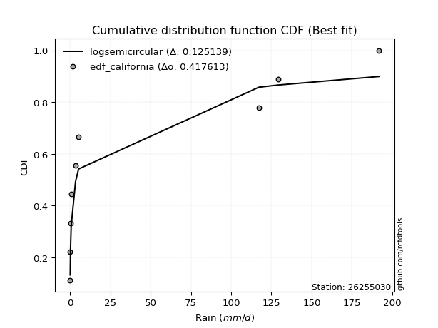</img>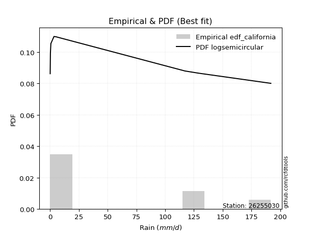</img>

</div>


### 2. EDF Hazen (1930)

Hazen method for plotting positions is a formula used to estimate the empirical cumulative probability distribution of flood events or other hydrological data. This formula often results in biased estimations, particularly when extrapolating to extreme events (high return periods).

<div align="center">


$P=(m-0.5)/n$


</div>


**2.1. Empirical values**

<div align="center">

|                | 0                  | 1                  | 2                  | 3                  | 4                  | 5         | 6                 | 7         |
|:---------------|:-------------------|:-------------------|:-------------------|:-------------------|:-------------------|:----------|:------------------|:----------|
| date           | 2021               | 2020               | 2019               | 2018               | 2022               | 2016      | 2017              | 2024      |
| x              | 0.1                | 0.1                | 0.3                | 0.7                | 3.4                | 5.3       | 117.2             | 191.8     |
| m              | 1                  | 2                  | 3                  | 4                  | 5                  | 6         | 7                 | 8         |
| empirical_dist | edf_hazen          | edf_hazen          | edf_hazen          | edf_hazen          | edf_hazen          | edf_hazen | edf_hazen         | edf_hazen |
| empirical      | 0.0625             | 0.1875             | 0.3125             | 0.4375             | 0.5625             | 0.6875    | 0.8125            | 0.9375    |
| empirical_tr   | 1.0666666666666667 | 1.2307692307692308 | 1.4545454545454546 | 1.7777777777777777 | 2.2857142857142856 | 3.2       | 5.333333333333333 | 16.0      |

</div>


**2.2. Kolmogorov-Smirnov fit test (sorted by Δ)**


<div align="center">

|                | 0                   | 1                   | 2                   | 3                   | 4                   | 5                   | 6                   | 7                  | 8                   | 9                   | 10                  | 11                  | 12                  | 13                  | 14                  | 15                  | 16                  | 17                  | 18                  | 19                 | 20                 | 21                  | 22                 | 23                 | 24                  | 25                 | 26                  | 27                  | 28                  | 29                    | 30                 | 31                 | 32                  | 33                 | 34                  | 35                 | 36                 | 37                  | 38                 | 39                  | 40                  | 41                 | 42                 | 43                 | 44                  | 45                 | 46                 | 47                 | 48                  | 49                  | 50                  | 51                 | 52                 | 53                  | 54                  | 55                 | 56                  | 57                 | 58                 | 59                 | 60                 | 61                 | 62                 | 63                 | 64                 | 65                  | 66                  | 67                 | 68                 | 69                  | 70                  | 71                  | 72                  | 73                 | 74                 | 75                 | 76                 | 77                 | 78                 | 79                 | 80                 | 81                 | 82                 | 83                 | 84                 | 85                 | 86                 | 87                 |
|:---------------|:--------------------|:--------------------|:--------------------|:--------------------|:--------------------|:--------------------|:--------------------|:-------------------|:--------------------|:--------------------|:--------------------|:--------------------|:--------------------|:--------------------|:--------------------|:--------------------|:--------------------|:--------------------|:--------------------|:-------------------|:-------------------|:--------------------|:-------------------|:-------------------|:--------------------|:-------------------|:--------------------|:--------------------|:--------------------|:----------------------|:-------------------|:-------------------|:--------------------|:-------------------|:--------------------|:-------------------|:-------------------|:--------------------|:-------------------|:--------------------|:--------------------|:-------------------|:-------------------|:-------------------|:--------------------|:-------------------|:-------------------|:-------------------|:--------------------|:--------------------|:--------------------|:-------------------|:-------------------|:--------------------|:--------------------|:-------------------|:--------------------|:-------------------|:-------------------|:-------------------|:-------------------|:-------------------|:-------------------|:-------------------|:-------------------|:--------------------|:--------------------|:-------------------|:-------------------|:--------------------|:--------------------|:--------------------|:--------------------|:-------------------|:-------------------|:-------------------|:-------------------|:-------------------|:-------------------|:-------------------|:-------------------|:-------------------|:-------------------|:-------------------|:-------------------|:-------------------|:-------------------|:-------------------|
| station        | 26255030            | 26255030            | 26255030            | 26255030            | 26255030            | 26255030            | 26255030            | 26255030           | 26255030            | 26255030            | 26255030            | 26255030            | 26255030            | 26255030            | 26255030            | 26255030            | 26255030            | 26255030            | 26255030            | 26255030           | 26255030           | 26255030            | 26255030           | 26255030           | 26255030            | 26255030           | 26255030            | 26255030            | 26255030            | 26255030              | 26255030           | 26255030           | 26255030            | 26255030           | 26255030            | 26255030           | 26255030           | 26255030            | 26255030           | 26255030            | 26255030            | 26255030           | 26255030           | 26255030           | 26255030            | 26255030           | 26255030           | 26255030           | 26255030            | 26255030            | 26255030            | 26255030           | 26255030           | 26255030            | 26255030            | 26255030           | 26255030            | 26255030           | 26255030           | 26255030           | 26255030           | 26255030           | 26255030           | 26255030           | 26255030           | 26255030            | 26255030            | 26255030           | 26255030           | 26255030            | 26255030            | 26255030            | 26255030            | 26255030           | 26255030           | 26255030           | 26255030           | 26255030           | 26255030           | 26255030           | 26255030           | 26255030           | 26255030           | 26255030           | 26255030           | 26255030           | 26255030           | 26255030           |
| empirical_dist | edf_hazen           | edf_hazen           | edf_hazen           | edf_hazen           | edf_hazen           | edf_hazen           | edf_hazen           | edf_hazen          | edf_hazen           | edf_hazen           | edf_hazen           | edf_hazen           | edf_hazen           | edf_hazen           | edf_hazen           | edf_hazen           | edf_hazen           | edf_hazen           | edf_hazen           | edf_hazen          | edf_hazen          | edf_hazen           | edf_hazen          | edf_hazen          | edf_hazen           | edf_hazen          | edf_hazen           | edf_hazen           | edf_hazen           | edf_hazen             | edf_hazen          | edf_hazen          | edf_hazen           | edf_hazen          | edf_hazen           | edf_hazen          | edf_hazen          | edf_hazen           | edf_hazen          | edf_hazen           | edf_hazen           | edf_hazen          | edf_hazen          | edf_hazen          | edf_hazen           | edf_hazen          | edf_hazen          | edf_hazen          | edf_hazen           | edf_hazen           | edf_hazen           | edf_hazen          | edf_hazen          | edf_hazen           | edf_hazen           | edf_hazen          | edf_hazen           | edf_hazen          | edf_hazen          | edf_hazen          | edf_hazen          | edf_hazen          | edf_hazen          | edf_hazen          | edf_hazen          | edf_hazen           | edf_hazen           | edf_hazen          | edf_hazen          | edf_hazen           | edf_hazen           | edf_hazen           | edf_hazen           | edf_hazen          | edf_hazen          | edf_hazen          | edf_hazen          | edf_hazen          | edf_hazen          | edf_hazen          | edf_hazen          | edf_hazen          | edf_hazen          | edf_hazen          | edf_hazen          | edf_hazen          | edf_hazen          | edf_hazen          |
| p_dist         | ncf                 | lograyleigh         | logmaxwell          | loghalfnorm         | loggumbel_r         | loginvweibull       | loggenlogistic      | logpearson3        | logkstwobign        | loginvgamma         | logloggamma         | logrice             | lognorm             | lognorm             | logcrystalball      | logt                | lognct              | logalpha            | loglogistic         | logmoyal           | loginvgauss        | loghypsecant        | loghalflogistic    | loggumbel_l        | loglaplace          | logexponnorm       | chi2                | loggenexpon         | erlang              | loglaplace_asymmetric | logf               | logtruncnorm       | loggompertz         | logexpon           | logwald             | fatiguelife        | logerlang          | nakagami            | invgauss           | loggamma            | loggamma            | fisk               | logweibull_min     | logncf             | halfnorm            | halflogistic       | loggibrat          | pearson3           | mielke              | wald                | moyal               | logchi2            | rayleigh           | gumbel_r            | maxwell             | norm               | crystalball         | logfatiguelife     | genlogistic        | loglognorm         | alpha              | logistic           | gibrat             | logjohnsonsu       | logfisk            | hypsecant           | kstwobign           | gumbel_l           | rice               | betaprime           | laplace             | lognakagami         | gamma               | invweibull         | weibull_min        | exponnorm          | laplace_asymmetric | expon              | genexpon           | gompertz           | logbetaprime       | logmielke          | truncnorm          | johnsonsu          | t                  | invgamma           | nct                | f                  |
| delta          | 0.07623587054596807 | 0.09515609780322709 | 0.09817466995258983 | 0.09858027712632424 | 0.10050893579293929 | 0.10061216735762273 | 0.10068570178448999 | 0.1013653419229178 | 0.10436611005363361 | 0.10704968146595673 | 0.10720644161130555 | 0.10750123852369892 | 0.10950914509691634 | 0.10950914509691634 | 0.10950914533726097 | 0.10950934462375639 | 0.10952267669623417 | 0.12100129168827312 | 0.12480685001327685 | 0.1268613725855263 | 0.1394305053267032 | 0.13949638613708992 | 0.1600885932524732 | 0.1624081152948596 | 0.16692447465492727 | 0.1862026069639311 | 0.18655401767256202 | 0.18718302442859094 | 0.18740982644510318 | 0.18748882575062786   | 0.1874999974335376 | 0.1874999998915228 | 0.18749999998515576 | 0.1875             | 0.19021461284763558 | 0.2140431862333203 | 0.2148988688833099 | 0.23127869324843547 | 0.2467495458562201 | 0.25807099642889264 | 0.25807099642889264 | 0.2602598694203037 | 0.2785849911313839 | 0.2976419707894191 | 0.30810698712143414 | 0.3081564371184049 | 0.3113293810781057 | 0.3188782153422854 | 0.32100581599398825 | 0.32469937299018103 | 0.33295963037619136 | 0.3389338888230822 | 0.3399597356757562 | 0.34433327502894395 | 0.35120130501641644 | 0.379831647240943  | 0.37983165198949853 | 0.3809335697752152 | 0.3846404047477853 | 0.3868528256413989 | 0.3936567917183639 | 0.4007825516316596 | 0.40480700745347   | 0.4083486988193791 | 0.4118757256016503 | 0.41609739537064316 | 0.42328477285634364 | 0.4322245887055973 | 0.4405066239103475 | 0.44076710560880683 | 0.44182544373568833 | 0.44591040639675694 | 0.47796302806657487 | 0.5002661164951093 | 0.5540205554446122 | 0.5641091487680258 | 0.5649135334967503 | 0.564913867300828  | 0.5649139161867638 | 0.5887818230312127 | 0.6210955888718613 | 0.6254582377488344 | 0.6328827811210312 | 0.6823314909003263 | 0.6855925038590546 | 0.6872324098713675 | 0.6874929897625847 | 0.6875             |
| deltao         | 0.4472608134160001  | 0.4472608134160001  | 0.4472608134160001  | 0.4472608134160001  | 0.4472608134160001  | 0.4472608134160001  | 0.4472608134160001  | 0.4472608134160001 | 0.4472608134160001  | 0.4472608134160001  | 0.4472608134160001  | 0.4472608134160001  | 0.4472608134160001  | 0.4472608134160001  | 0.4472608134160001  | 0.4472608134160001  | 0.4472608134160001  | 0.4472608134160001  | 0.4472608134160001  | 0.4472608134160001 | 0.4472608134160001 | 0.4472608134160001  | 0.4472608134160001 | 0.4472608134160001 | 0.4472608134160001  | 0.4472608134160001 | 0.4472608134160001  | 0.4472608134160001  | 0.4472608134160001  | 0.4472608134160001    | 0.4472608134160001 | 0.4472608134160001 | 0.4472608134160001  | 0.4472608134160001 | 0.4472608134160001  | 0.4472608134160001 | 0.4472608134160001 | 0.4472608134160001  | 0.4472608134160001 | 0.4472608134160001  | 0.4472608134160001  | 0.4472608134160001 | 0.4472608134160001 | 0.4472608134160001 | 0.4472608134160001  | 0.4472608134160001 | 0.4472608134160001 | 0.4472608134160001 | 0.4472608134160001  | 0.4472608134160001  | 0.4472608134160001  | 0.4472608134160001 | 0.4472608134160001 | 0.4472608134160001  | 0.4472608134160001  | 0.4472608134160001 | 0.4472608134160001  | 0.4472608134160001 | 0.4472608134160001 | 0.4472608134160001 | 0.4472608134160001 | 0.4472608134160001 | 0.4472608134160001 | 0.4472608134160001 | 0.4472608134160001 | 0.4472608134160001  | 0.4472608134160001  | 0.4472608134160001 | 0.4472608134160001 | 0.4472608134160001  | 0.4472608134160001  | 0.4472608134160001  | 0.4472608134160001  | 0.4472608134160001 | 0.4472608134160001 | 0.4472608134160001 | 0.4472608134160001 | 0.4472608134160001 | 0.4472608134160001 | 0.4472608134160001 | 0.4472608134160001 | 0.4472608134160001 | 0.4472608134160001 | 0.4472608134160001 | 0.4472608134160001 | 0.4472608134160001 | 0.4472608134160001 | 0.4472608134160001 |
| eval           | Δo > Δ              | Δo > Δ              | Δo > Δ              | Δo > Δ              | Δo > Δ              | Δo > Δ              | Δo > Δ              | Δo > Δ             | Δo > Δ              | Δo > Δ              | Δo > Δ              | Δo > Δ              | Δo > Δ              | Δo > Δ              | Δo > Δ              | Δo > Δ              | Δo > Δ              | Δo > Δ              | Δo > Δ              | Δo > Δ             | Δo > Δ             | Δo > Δ              | Δo > Δ             | Δo > Δ             | Δo > Δ              | Δo > Δ             | Δo > Δ              | Δo > Δ              | Δo > Δ              | Δo > Δ                | Δo > Δ             | Δo > Δ             | Δo > Δ              | Δo > Δ             | Δo > Δ              | Δo > Δ             | Δo > Δ             | Δo > Δ              | Δo > Δ             | Δo > Δ              | Δo > Δ              | Δo > Δ             | Δo > Δ             | Δo > Δ             | Δo > Δ              | Δo > Δ             | Δo > Δ             | Δo > Δ             | Δo > Δ              | Δo > Δ              | Δo > Δ              | Δo > Δ             | Δo > Δ             | Δo > Δ              | Δo > Δ              | Δo > Δ             | Δo > Δ              | Δo > Δ             | Δo > Δ             | Δo > Δ             | Δo > Δ             | Δo > Δ             | Δo > Δ             | Δo > Δ             | Δo > Δ             | Δo > Δ              | Δo > Δ              | Δo > Δ             | Δo > Δ             | Δo > Δ              | Δo > Δ              | Δo > Δ              | Δo <= Δ             | Δo <= Δ            | Δo <= Δ            | Δo <= Δ            | Δo <= Δ            | Δo <= Δ            | Δo <= Δ            | Δo <= Δ            | Δo <= Δ            | Δo <= Δ            | Δo <= Δ            | Δo <= Δ            | Δo <= Δ            | Δo <= Δ            | Δo <= Δ            | Δo <= Δ            |
| fit            | 1                   | 1                   | 1                   | 1                   | 1                   | 1                   | 1                   | 1                  | 1                   | 1                   | 1                   | 1                   | 1                   | 1                   | 1                   | 1                   | 1                   | 1                   | 1                   | 1                  | 1                  | 1                   | 1                  | 1                  | 1                   | 1                  | 1                   | 1                   | 1                   | 1                     | 1                  | 1                  | 1                   | 1                  | 1                   | 1                  | 1                  | 1                   | 1                  | 1                   | 1                   | 1                  | 1                  | 1                  | 1                   | 1                  | 1                  | 1                  | 1                   | 1                   | 1                   | 1                  | 1                  | 1                   | 1                   | 1                  | 1                   | 1                  | 1                  | 1                  | 1                  | 1                  | 1                  | 1                  | 1                  | 1                   | 1                   | 1                  | 1                  | 1                   | 1                   | 1                   | 0                   | 0                  | 0                  | 0                  | 0                  | 0                  | 0                  | 0                  | 0                  | 0                  | 0                  | 0                  | 0                  | 0                  | 0                  | 0                  |
| n              | 8                   | 8                   | 8                   | 8                   | 8                   | 8                   | 8                   | 8                  | 8                   | 8                   | 8                   | 8                   | 8                   | 8                   | 8                   | 8                   | 8                   | 8                   | 8                   | 8                  | 8                  | 8                   | 8                  | 8                  | 8                   | 8                  | 8                   | 8                   | 8                   | 8                     | 8                  | 8                  | 8                   | 8                  | 8                   | 8                  | 8                  | 8                   | 8                  | 8                   | 8                   | 8                  | 8                  | 8                  | 8                   | 8                  | 8                  | 8                  | 8                   | 8                   | 8                   | 8                  | 8                  | 8                   | 8                   | 8                  | 8                   | 8                  | 8                  | 8                  | 8                  | 8                  | 8                  | 8                  | 8                  | 8                   | 8                   | 8                  | 8                  | 8                   | 8                   | 8                   | 8                   | 8                  | 8                  | 8                  | 8                  | 8                  | 8                  | 8                  | 8                  | 8                  | 8                  | 8                  | 8                  | 8                  | 8                  | 8                  |
| best_fit       | 1                   | 0                   | 0                   | 0                   | 0                   | 0                   | 0                   | 0                  | 0                   | 0                   | 0                   | 0                   | 0                   | 0                   | 0                   | 0                   | 0                   | 0                   | 0                   | 0                  | 0                  | 0                   | 0                  | 0                  | 0                   | 0                  | 0                   | 0                   | 0                   | 0                     | 0                  | 0                  | 0                   | 0                  | 0                   | 0                  | 0                  | 0                   | 0                  | 0                   | 0                   | 0                  | 0                  | 0                  | 0                   | 0                  | 0                  | 0                  | 0                   | 0                   | 0                   | 0                  | 0                  | 0                   | 0                   | 0                  | 0                   | 0                  | 0                  | 0                  | 0                  | 0                  | 0                  | 0                  | 0                  | 0                   | 0                   | 0                  | 0                  | 0                   | 0                   | 0                   | 0                   | 0                  | 0                  | 0                  | 0                  | 0                  | 0                  | 0                  | 0                  | 0                  | 0                  | 0                  | 0                  | 0                  | 0                  | 0                  |
| best_fit_sort  | 1                   | 2                   | 3                   | 4                   | 5                   | 6                   | 7                   | 8                  | 9                   | 10                  | 11                  | 12                  | 13                  | 14                  | 15                  | 16                  | 17                  | 18                  | 19                  | 20                 | 21                 | 22                  | 23                 | 24                 | 25                  | 26                 | 27                  | 28                  | 29                  | 30                    | 31                 | 32                 | 33                  | 34                 | 35                  | 36                 | 37                 | 38                  | 39                 | 40                  | 41                  | 42                 | 43                 | 44                 | 45                  | 46                 | 47                 | 48                 | 49                  | 50                  | 51                  | 52                 | 53                 | 54                  | 55                  | 56                 | 57                  | 58                 | 59                 | 60                 | 61                 | 62                 | 63                 | 64                 | 65                 | 66                  | 67                  | 68                 | 69                 | 70                  | 71                  | 72                  | 73                  | 74                 | 75                 | 76                 | 77                 | 78                 | 79                 | 80                 | 81                 | 82                 | 83                 | 84                 | 85                 | 86                 | 87                 | 88                 |

</div>


**2.3. Best fit**

<div align="center">

|   id |   station | empirical_dist   | p_dist   |     delta |   deltao | eval   |   fit |   n |   best_fit |   best_fit_sort |
|-----:|----------:|:-----------------|:---------|----------:|---------:|:-------|------:|----:|-----------:|----------------:|
|    0 |  26255030 | edf_hazen        | ncf      | 0.0762359 | 0.447261 | Δo > Δ |     1 |   8 |          1 |               1 |

</div>


<div align="center">

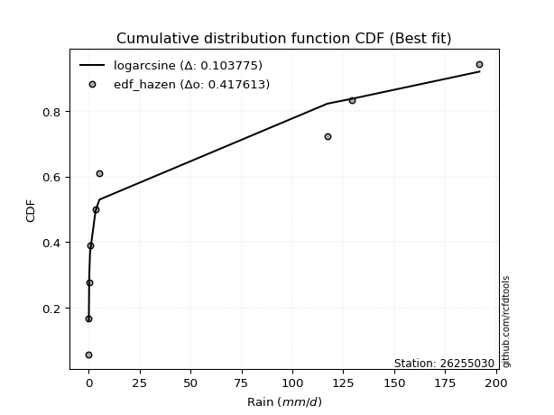</img></img>

</div>


### 3. EDF Weibull (1939)

Weibull plotting position formula is an empirical method used to estimate the non-exceedance probability or plotting position for a set of observed data, is often recommended or widely used in practice, particularly in flood frequency analysis.

<div align="center">


$P=m/(n+1)$


</div>


**3.1. Empirical values**

<div align="center">

|                | 0                  | 1                  | 2                  | 3                  | 4                  | 5                  | 6                  | 7                  |
|:---------------|:-------------------|:-------------------|:-------------------|:-------------------|:-------------------|:-------------------|:-------------------|:-------------------|
| date           | 2021               | 2020               | 2019               | 2018               | 2022               | 2016               | 2017               | 2024               |
| x              | 0.1                | 0.1                | 0.3                | 0.7                | 3.4                | 5.3                | 117.2              | 191.8              |
| m              | 1                  | 2                  | 3                  | 4                  | 5                  | 6                  | 7                  | 8                  |
| empirical_dist | edf_weibull        | edf_weibull        | edf_weibull        | edf_weibull        | edf_weibull        | edf_weibull        | edf_weibull        | edf_weibull        |
| empirical      | 0.1111111111111111 | 0.2222222222222222 | 0.3333333333333333 | 0.4444444444444444 | 0.5555555555555556 | 0.6666666666666666 | 0.7777777777777778 | 0.8888888888888888 |
| empirical_tr   | 1.125              | 1.2857142857142856 | 1.4999999999999998 | 1.7999999999999998 | 2.25               | 2.9999999999999996 | 4.5                | 8.999999999999996  |

</div>


**3.2. Kolmogorov-Smirnov fit test (sorted by Δ)**


<div align="center">

|                | 0                   | 1                  | 2                   | 3                   | 4                  | 5                   | 6                  | 7                  | 8                   | 9                  | 10                  | 11                  | 12                  | 13                  | 14                  | 15                 | 16                  | 17                 | 18                  | 19                  | 20                  | 21                 | 22                 | 23                 | 24                 | 25                  | 26                 | 27                  | 28                  | 29                  | 30                 | 31                    | 32                 | 33                 | 34                  | 35                  | 36                 | 37                 | 38                  | 39                  | 40                  | 41                 | 42                  | 43                  | 44                  | 45                  | 46                 | 47                  | 48                  | 49                 | 50                  | 51                 | 52                 | 53                 | 54                  | 55                 | 56                 | 57                  | 58                 | 59                  | 60                  | 61                  | 62                 | 63                  | 64                 | 65                 | 66                  | 67                  | 68                  | 69                 | 70                  | 71                 | 72                  | 73                 | 74                 | 75                 | 76                 | 77                 | 78                 | 79                 | 80                 | 81                 | 82                 | 83                 | 84                 | 85                 | 86                 | 87                 |
|:---------------|:--------------------|:-------------------|:--------------------|:--------------------|:-------------------|:--------------------|:-------------------|:-------------------|:--------------------|:-------------------|:--------------------|:--------------------|:--------------------|:--------------------|:--------------------|:-------------------|:--------------------|:-------------------|:--------------------|:--------------------|:--------------------|:-------------------|:-------------------|:-------------------|:-------------------|:--------------------|:-------------------|:--------------------|:--------------------|:--------------------|:-------------------|:----------------------|:-------------------|:-------------------|:--------------------|:--------------------|:-------------------|:-------------------|:--------------------|:--------------------|:--------------------|:-------------------|:--------------------|:--------------------|:--------------------|:--------------------|:-------------------|:--------------------|:--------------------|:-------------------|:--------------------|:-------------------|:-------------------|:-------------------|:--------------------|:-------------------|:-------------------|:--------------------|:-------------------|:--------------------|:--------------------|:--------------------|:-------------------|:--------------------|:-------------------|:-------------------|:--------------------|:--------------------|:--------------------|:-------------------|:--------------------|:-------------------|:--------------------|:-------------------|:-------------------|:-------------------|:-------------------|:-------------------|:-------------------|:-------------------|:-------------------|:-------------------|:-------------------|:-------------------|:-------------------|:-------------------|:-------------------|:-------------------|
| station        | 26255030            | 26255030           | 26255030            | 26255030            | 26255030           | 26255030            | 26255030           | 26255030           | 26255030            | 26255030           | 26255030            | 26255030            | 26255030            | 26255030            | 26255030            | 26255030           | 26255030            | 26255030           | 26255030            | 26255030            | 26255030            | 26255030           | 26255030           | 26255030           | 26255030           | 26255030            | 26255030           | 26255030            | 26255030            | 26255030            | 26255030           | 26255030              | 26255030           | 26255030           | 26255030            | 26255030            | 26255030           | 26255030           | 26255030            | 26255030            | 26255030            | 26255030           | 26255030            | 26255030            | 26255030            | 26255030            | 26255030           | 26255030            | 26255030            | 26255030           | 26255030            | 26255030           | 26255030           | 26255030           | 26255030            | 26255030           | 26255030           | 26255030            | 26255030           | 26255030            | 26255030            | 26255030            | 26255030           | 26255030            | 26255030           | 26255030           | 26255030            | 26255030            | 26255030            | 26255030           | 26255030            | 26255030           | 26255030            | 26255030           | 26255030           | 26255030           | 26255030           | 26255030           | 26255030           | 26255030           | 26255030           | 26255030           | 26255030           | 26255030           | 26255030           | 26255030           | 26255030           | 26255030           |
| empirical_dist | edf_weibull         | edf_weibull        | edf_weibull         | edf_weibull         | edf_weibull        | edf_weibull         | edf_weibull        | edf_weibull        | edf_weibull         | edf_weibull        | edf_weibull         | edf_weibull         | edf_weibull         | edf_weibull         | edf_weibull         | edf_weibull        | edf_weibull         | edf_weibull        | edf_weibull         | edf_weibull         | edf_weibull         | edf_weibull        | edf_weibull        | edf_weibull        | edf_weibull        | edf_weibull         | edf_weibull        | edf_weibull         | edf_weibull         | edf_weibull         | edf_weibull        | edf_weibull           | edf_weibull        | edf_weibull        | edf_weibull         | edf_weibull         | edf_weibull        | edf_weibull        | edf_weibull         | edf_weibull         | edf_weibull         | edf_weibull        | edf_weibull         | edf_weibull         | edf_weibull         | edf_weibull         | edf_weibull        | edf_weibull         | edf_weibull         | edf_weibull        | edf_weibull         | edf_weibull        | edf_weibull        | edf_weibull        | edf_weibull         | edf_weibull        | edf_weibull        | edf_weibull         | edf_weibull        | edf_weibull         | edf_weibull         | edf_weibull         | edf_weibull        | edf_weibull         | edf_weibull        | edf_weibull        | edf_weibull         | edf_weibull         | edf_weibull         | edf_weibull        | edf_weibull         | edf_weibull        | edf_weibull         | edf_weibull        | edf_weibull        | edf_weibull        | edf_weibull        | edf_weibull        | edf_weibull        | edf_weibull        | edf_weibull        | edf_weibull        | edf_weibull        | edf_weibull        | edf_weibull        | edf_weibull        | edf_weibull        | edf_weibull        |
| p_dist         | ncf                 | lograyleigh        | logmaxwell          | loghalfnorm         | loggumbel_r        | loginvweibull       | loggenlogistic     | logpearson3        | logkstwobign        | loginvgamma        | logloggamma         | logrice             | lognorm             | lognorm             | logcrystalball      | logt               | lognct              | logalpha           | loglogistic         | loginvgauss         | loghypsecant        | logmoyal           | loglaplace         | loggumbel_l        | fatiguelife        | loghalflogistic     | logexponnorm       | chi2                | loggenexpon         | nakagami            | erlang             | loglaplace_asymmetric | logf               | logtruncnorm       | loggompertz         | logerlang           | logwald            | logexpon           | fisk                | logncf              | invgauss            | logweibull_min     | loggamma            | loggamma            | halfnorm            | halflogistic        | pearson3           | mielke              | wald                | moyal              | rayleigh            | gumbel_r           | maxwell            | loggibrat          | loglognorm          | logchi2            | norm               | crystalball         | logfatiguelife     | logfisk             | genlogistic         | logistic            | gibrat             | logjohnsonsu        | hypsecant          | alpha              | kstwobign           | gumbel_l            | rice                | betaprime          | laplace             | lognakagami        | invweibull          | gamma              | weibull_min        | exponnorm          | laplace_asymmetric | expon              | genexpon           | gompertz           | logbetaprime       | logmielke          | truncnorm          | johnsonsu          | t                  | invgamma           | nct                | f                  |
| delta          | 0.11095809276819028 | 0.1298783200254493 | 0.13289689217481204 | 0.13330249934854643 | 0.1352311580151615 | 0.13533438957984495 | 0.1354079240067122 | 0.13608756414514   | 0.13908833227585582 | 0.141627738411166  | 0.14192866383352776 | 0.14222346074592113 | 0.14423136731913855 | 0.14423136731913855 | 0.14423136755948318 | 0.1442315668459786 | 0.14424489891845638 | 0.1496405222545259 | 0.15134336381776292 | 0.15374881280630892 | 0.15392891699815936 | 0.1615835948077485 | 0.1738689190993717 | 0.1909108618136477 | 0.193209852899987  | 0.19481081547469542 | 0.2209248291861533 | 0.22127623989478423 | 0.22190524665081315 | 0.22208302464803348 | 0.2221320486673254 | 0.22221104797285007   | 0.2222222196557598 | 0.222222222113745  | 0.22222222220737797 | 0.22222222222220878 | 0.2222222222222222 | 0.2222222222222222 | 0.23942653608697034 | 0.24903085967830796 | 0.25369399030066453 | 0.2577516577980506 | 0.26501544087333706 | 0.26501544087333706 | 0.28727365378810077 | 0.28732310378507153 | 0.298044882008952  | 0.30017248266065494 | 0.30386603965684766 | 0.312126297042858  | 0.31912640234242284 | 0.3234999416956106 | 0.3303679716830831 | 0.332162714411439  | 0.33824171453028773 | 0.3456488031385436 | 0.3589983139076096 | 0.35899831865616516 | 0.3601002364418819 | 0.36326461449053915 | 0.36380707141445195 | 0.37994921829832623 | 0.3839736741201366 | 0.38751536548604576 | 0.3952640620373098 | 0.4006012361628083 | 0.40245143952301027 | 0.41139125537226395 | 0.41967329057701414 | 0.4199337722754735 | 0.42099211040235496 | 0.4250770730634236 | 0.45165500538399816 | 0.4571296947332415 | 0.5331872221112788 | 0.5432758154346924 | 0.544080200163417  | 0.5440805339674947 | 0.5440805828534304 | 0.5679484896978794 | 0.600262255538528  | 0.604624904415501  | 0.6120494477876979 | 0.6614981575669929 | 0.6647591705257212 | 0.6663990765380341 | 0.6666596564292513 | 0.6666666666666667 |
| deltao         | 0.4472608134160001  | 0.4472608134160001 | 0.4472608134160001  | 0.4472608134160001  | 0.4472608134160001 | 0.4472608134160001  | 0.4472608134160001 | 0.4472608134160001 | 0.4472608134160001  | 0.4472608134160001 | 0.4472608134160001  | 0.4472608134160001  | 0.4472608134160001  | 0.4472608134160001  | 0.4472608134160001  | 0.4472608134160001 | 0.4472608134160001  | 0.4472608134160001 | 0.4472608134160001  | 0.4472608134160001  | 0.4472608134160001  | 0.4472608134160001 | 0.4472608134160001 | 0.4472608134160001 | 0.4472608134160001 | 0.4472608134160001  | 0.4472608134160001 | 0.4472608134160001  | 0.4472608134160001  | 0.4472608134160001  | 0.4472608134160001 | 0.4472608134160001    | 0.4472608134160001 | 0.4472608134160001 | 0.4472608134160001  | 0.4472608134160001  | 0.4472608134160001 | 0.4472608134160001 | 0.4472608134160001  | 0.4472608134160001  | 0.4472608134160001  | 0.4472608134160001 | 0.4472608134160001  | 0.4472608134160001  | 0.4472608134160001  | 0.4472608134160001  | 0.4472608134160001 | 0.4472608134160001  | 0.4472608134160001  | 0.4472608134160001 | 0.4472608134160001  | 0.4472608134160001 | 0.4472608134160001 | 0.4472608134160001 | 0.4472608134160001  | 0.4472608134160001 | 0.4472608134160001 | 0.4472608134160001  | 0.4472608134160001 | 0.4472608134160001  | 0.4472608134160001  | 0.4472608134160001  | 0.4472608134160001 | 0.4472608134160001  | 0.4472608134160001 | 0.4472608134160001 | 0.4472608134160001  | 0.4472608134160001  | 0.4472608134160001  | 0.4472608134160001 | 0.4472608134160001  | 0.4472608134160001 | 0.4472608134160001  | 0.4472608134160001 | 0.4472608134160001 | 0.4472608134160001 | 0.4472608134160001 | 0.4472608134160001 | 0.4472608134160001 | 0.4472608134160001 | 0.4472608134160001 | 0.4472608134160001 | 0.4472608134160001 | 0.4472608134160001 | 0.4472608134160001 | 0.4472608134160001 | 0.4472608134160001 | 0.4472608134160001 |
| eval           | Δo > Δ              | Δo > Δ             | Δo > Δ              | Δo > Δ              | Δo > Δ             | Δo > Δ              | Δo > Δ             | Δo > Δ             | Δo > Δ              | Δo > Δ             | Δo > Δ              | Δo > Δ              | Δo > Δ              | Δo > Δ              | Δo > Δ              | Δo > Δ             | Δo > Δ              | Δo > Δ             | Δo > Δ              | Δo > Δ              | Δo > Δ              | Δo > Δ             | Δo > Δ             | Δo > Δ             | Δo > Δ             | Δo > Δ              | Δo > Δ             | Δo > Δ              | Δo > Δ              | Δo > Δ              | Δo > Δ             | Δo > Δ                | Δo > Δ             | Δo > Δ             | Δo > Δ              | Δo > Δ              | Δo > Δ             | Δo > Δ             | Δo > Δ              | Δo > Δ              | Δo > Δ              | Δo > Δ             | Δo > Δ              | Δo > Δ              | Δo > Δ              | Δo > Δ              | Δo > Δ             | Δo > Δ              | Δo > Δ              | Δo > Δ             | Δo > Δ              | Δo > Δ             | Δo > Δ             | Δo > Δ             | Δo > Δ              | Δo > Δ             | Δo > Δ             | Δo > Δ              | Δo > Δ             | Δo > Δ              | Δo > Δ              | Δo > Δ              | Δo > Δ             | Δo > Δ              | Δo > Δ             | Δo > Δ             | Δo > Δ              | Δo > Δ              | Δo > Δ              | Δo > Δ             | Δo > Δ              | Δo > Δ             | Δo <= Δ             | Δo <= Δ            | Δo <= Δ            | Δo <= Δ            | Δo <= Δ            | Δo <= Δ            | Δo <= Δ            | Δo <= Δ            | Δo <= Δ            | Δo <= Δ            | Δo <= Δ            | Δo <= Δ            | Δo <= Δ            | Δo <= Δ            | Δo <= Δ            | Δo <= Δ            |
| fit            | 1                   | 1                  | 1                   | 1                   | 1                  | 1                   | 1                  | 1                  | 1                   | 1                  | 1                   | 1                   | 1                   | 1                   | 1                   | 1                  | 1                   | 1                  | 1                   | 1                   | 1                   | 1                  | 1                  | 1                  | 1                  | 1                   | 1                  | 1                   | 1                   | 1                   | 1                  | 1                     | 1                  | 1                  | 1                   | 1                   | 1                  | 1                  | 1                   | 1                   | 1                   | 1                  | 1                   | 1                   | 1                   | 1                   | 1                  | 1                   | 1                   | 1                  | 1                   | 1                  | 1                  | 1                  | 1                   | 1                  | 1                  | 1                   | 1                  | 1                   | 1                   | 1                   | 1                  | 1                   | 1                  | 1                  | 1                   | 1                   | 1                   | 1                  | 1                   | 1                  | 0                   | 0                  | 0                  | 0                  | 0                  | 0                  | 0                  | 0                  | 0                  | 0                  | 0                  | 0                  | 0                  | 0                  | 0                  | 0                  |
| n              | 8                   | 8                  | 8                   | 8                   | 8                  | 8                   | 8                  | 8                  | 8                   | 8                  | 8                   | 8                   | 8                   | 8                   | 8                   | 8                  | 8                   | 8                  | 8                   | 8                   | 8                   | 8                  | 8                  | 8                  | 8                  | 8                   | 8                  | 8                   | 8                   | 8                   | 8                  | 8                     | 8                  | 8                  | 8                   | 8                   | 8                  | 8                  | 8                   | 8                   | 8                   | 8                  | 8                   | 8                   | 8                   | 8                   | 8                  | 8                   | 8                   | 8                  | 8                   | 8                  | 8                  | 8                  | 8                   | 8                  | 8                  | 8                   | 8                  | 8                   | 8                   | 8                   | 8                  | 8                   | 8                  | 8                  | 8                   | 8                   | 8                   | 8                  | 8                   | 8                  | 8                   | 8                  | 8                  | 8                  | 8                  | 8                  | 8                  | 8                  | 8                  | 8                  | 8                  | 8                  | 8                  | 8                  | 8                  | 8                  |
| best_fit       | 1                   | 0                  | 0                   | 0                   | 0                  | 0                   | 0                  | 0                  | 0                   | 0                  | 0                   | 0                   | 0                   | 0                   | 0                   | 0                  | 0                   | 0                  | 0                   | 0                   | 0                   | 0                  | 0                  | 0                  | 0                  | 0                   | 0                  | 0                   | 0                   | 0                   | 0                  | 0                     | 0                  | 0                  | 0                   | 0                   | 0                  | 0                  | 0                   | 0                   | 0                   | 0                  | 0                   | 0                   | 0                   | 0                   | 0                  | 0                   | 0                   | 0                  | 0                   | 0                  | 0                  | 0                  | 0                   | 0                  | 0                  | 0                   | 0                  | 0                   | 0                   | 0                   | 0                  | 0                   | 0                  | 0                  | 0                   | 0                   | 0                   | 0                  | 0                   | 0                  | 0                   | 0                  | 0                  | 0                  | 0                  | 0                  | 0                  | 0                  | 0                  | 0                  | 0                  | 0                  | 0                  | 0                  | 0                  | 0                  |
| best_fit_sort  | 1                   | 2                  | 3                   | 4                   | 5                  | 6                   | 7                  | 8                  | 9                   | 10                 | 11                  | 12                  | 13                  | 14                  | 15                  | 16                 | 17                  | 18                 | 19                  | 20                  | 21                  | 22                 | 23                 | 24                 | 25                 | 26                  | 27                 | 28                  | 29                  | 30                  | 31                 | 32                    | 33                 | 34                 | 35                  | 36                  | 37                 | 38                 | 39                  | 40                  | 41                  | 42                 | 43                  | 44                  | 45                  | 46                  | 47                 | 48                  | 49                  | 50                 | 51                  | 52                 | 53                 | 54                 | 55                  | 56                 | 57                 | 58                  | 59                 | 60                  | 61                  | 62                  | 63                 | 64                  | 65                 | 66                 | 67                  | 68                  | 69                  | 70                 | 71                  | 72                 | 73                  | 74                 | 75                 | 76                 | 77                 | 78                 | 79                 | 80                 | 81                 | 82                 | 83                 | 84                 | 85                 | 86                 | 87                 | 88                 |

</div>


**3.3. Best fit**

<div align="center">

|   id |   station | empirical_dist   | p_dist   |    delta |   deltao | eval   |   fit |   n |   best_fit |   best_fit_sort |
|-----:|----------:|:-----------------|:---------|---------:|---------:|:-------|------:|----:|-----------:|----------------:|
|    0 |  26255030 | edf_weibull      | ncf      | 0.110958 | 0.447261 | Δo > Δ |     1 |   8 |          1 |               1 |

</div>


<div align="center">

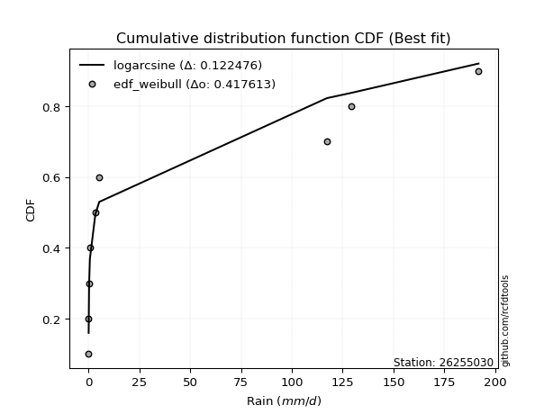</img></img>

</div>


### 4. EDF Beard (1943)

The Beard formula (or Beard´s plotting position formula) in hydrology is used to estimate the empirical non-exceedance probability _(P)_ of a flood event (or other extreme hydrological data point) within a given dataset.

<div align="center">


$P=(m-0.31)/(n+0.38)$


</div>


**4.1. Empirical values**

<div align="center">

|                | 0                   | 1                   | 2                  | 3                   | 4                  | 5                  | 6                  | 7                  |
|:---------------|:--------------------|:--------------------|:-------------------|:--------------------|:-------------------|:-------------------|:-------------------|:-------------------|
| date           | 2021                | 2020                | 2019               | 2018                | 2022               | 2016               | 2017               | 2024               |
| x              | 0.1                 | 0.1                 | 0.3                | 0.7                 | 3.4                | 5.3                | 117.2              | 191.8              |
| m              | 1                   | 2                   | 3                  | 4                   | 5                  | 6                  | 7                  | 8                  |
| empirical_dist | edf_beard           | edf_beard           | edf_beard          | edf_beard           | edf_beard          | edf_beard          | edf_beard          | edf_beard          |
| empirical      | 0.08233890214797135 | 0.20167064439140808 | 0.3210023866348448 | 0.44033412887828155 | 0.5596658711217184 | 0.6789976133651551 | 0.7983293556085919 | 0.9176610978520287 |
| empirical_tr   | 1.0897269180754225  | 1.2526158445440956  | 1.4727592267135323 | 1.7867803837953091  | 2.2710027100271004 | 3.115241635687732  | 4.958579881656804  | 12.144927536231886 |

</div>


**4.2. Kolmogorov-Smirnov fit test (sorted by Δ)**


<div align="center">

|                | 0                   | 1                   | 2                   | 3                   | 4                   | 5                   | 6                   | 7                   | 8                   | 9                   | 10                  | 11                 | 12                  | 13                  | 14                  | 15                  | 16                 | 17                  | 18                  | 19                  | 20                 | 21                  | 22                  | 23                  | 24                 | 25                  | 26                 | 27                  | 28                  | 29                    | 30                  | 31                  | 32                  | 33                  | 34                  | 35                 | 36                 | 37                  | 38                  | 39                 | 40                  | 41                  | 42                 | 43                  | 44                 | 45                 | 46                  | 47                  | 48                 | 49                 | 50                  | 51                 | 52                 | 53                 | 54                 | 55                  | 56                  | 57                 | 58                 | 59                 | 60                  | 61                 | 62                  | 63                 | 64                  | 65                  | 66                 | 67                 | 68                 | 69                 | 70                 | 71                 | 72                  | 73                 | 74                 | 75                 | 76                 | 77                 | 78                 | 79                 | 80                 | 81                 | 82                 | 83                 | 84                 | 85                 | 86                 | 87                 |
|:---------------|:--------------------|:--------------------|:--------------------|:--------------------|:--------------------|:--------------------|:--------------------|:--------------------|:--------------------|:--------------------|:--------------------|:-------------------|:--------------------|:--------------------|:--------------------|:--------------------|:-------------------|:--------------------|:--------------------|:--------------------|:-------------------|:--------------------|:--------------------|:--------------------|:-------------------|:--------------------|:-------------------|:--------------------|:--------------------|:----------------------|:--------------------|:--------------------|:--------------------|:--------------------|:--------------------|:-------------------|:-------------------|:--------------------|:--------------------|:-------------------|:--------------------|:--------------------|:-------------------|:--------------------|:-------------------|:-------------------|:--------------------|:--------------------|:-------------------|:-------------------|:--------------------|:-------------------|:-------------------|:-------------------|:-------------------|:--------------------|:--------------------|:-------------------|:-------------------|:-------------------|:--------------------|:-------------------|:--------------------|:-------------------|:--------------------|:--------------------|:-------------------|:-------------------|:-------------------|:-------------------|:-------------------|:-------------------|:--------------------|:-------------------|:-------------------|:-------------------|:-------------------|:-------------------|:-------------------|:-------------------|:-------------------|:-------------------|:-------------------|:-------------------|:-------------------|:-------------------|:-------------------|:-------------------|
| station        | 26255030            | 26255030            | 26255030            | 26255030            | 26255030            | 26255030            | 26255030            | 26255030            | 26255030            | 26255030            | 26255030            | 26255030           | 26255030            | 26255030            | 26255030            | 26255030            | 26255030           | 26255030            | 26255030            | 26255030            | 26255030           | 26255030            | 26255030            | 26255030            | 26255030           | 26255030            | 26255030           | 26255030            | 26255030            | 26255030              | 26255030            | 26255030            | 26255030            | 26255030            | 26255030            | 26255030           | 26255030           | 26255030            | 26255030            | 26255030           | 26255030            | 26255030            | 26255030           | 26255030            | 26255030           | 26255030           | 26255030            | 26255030            | 26255030           | 26255030           | 26255030            | 26255030           | 26255030           | 26255030           | 26255030           | 26255030            | 26255030            | 26255030           | 26255030           | 26255030           | 26255030            | 26255030           | 26255030            | 26255030           | 26255030            | 26255030            | 26255030           | 26255030           | 26255030           | 26255030           | 26255030           | 26255030           | 26255030            | 26255030           | 26255030           | 26255030           | 26255030           | 26255030           | 26255030           | 26255030           | 26255030           | 26255030           | 26255030           | 26255030           | 26255030           | 26255030           | 26255030           | 26255030           |
| empirical_dist | edf_beard           | edf_beard           | edf_beard           | edf_beard           | edf_beard           | edf_beard           | edf_beard           | edf_beard           | edf_beard           | edf_beard           | edf_beard           | edf_beard          | edf_beard           | edf_beard           | edf_beard           | edf_beard           | edf_beard          | edf_beard           | edf_beard           | edf_beard           | edf_beard          | edf_beard           | edf_beard           | edf_beard           | edf_beard          | edf_beard           | edf_beard          | edf_beard           | edf_beard           | edf_beard             | edf_beard           | edf_beard           | edf_beard           | edf_beard           | edf_beard           | edf_beard          | edf_beard          | edf_beard           | edf_beard           | edf_beard          | edf_beard           | edf_beard           | edf_beard          | edf_beard           | edf_beard          | edf_beard          | edf_beard           | edf_beard           | edf_beard          | edf_beard          | edf_beard           | edf_beard          | edf_beard          | edf_beard          | edf_beard          | edf_beard           | edf_beard           | edf_beard          | edf_beard          | edf_beard          | edf_beard           | edf_beard          | edf_beard           | edf_beard          | edf_beard           | edf_beard           | edf_beard          | edf_beard          | edf_beard          | edf_beard          | edf_beard          | edf_beard          | edf_beard           | edf_beard          | edf_beard          | edf_beard          | edf_beard          | edf_beard          | edf_beard          | edf_beard          | edf_beard          | edf_beard          | edf_beard          | edf_beard          | edf_beard          | edf_beard          | edf_beard          | edf_beard          |
| p_dist         | ncf                 | lograyleigh         | logmaxwell          | loghalfnorm         | loggumbel_r         | loginvweibull       | loggenlogistic      | logpearson3         | logkstwobign        | loginvgamma         | logloggamma         | logrice            | lognorm             | lognorm             | logcrystalball      | logt                | lognct             | logalpha            | loglogistic         | logmoyal            | loginvgauss        | loghypsecant        | loglaplace          | loggumbel_l         | loghalflogistic    | logexponnorm        | chi2               | loggenexpon         | erlang              | loglaplace_asymmetric | logf                | logtruncnorm        | loggompertz         | logexpon            | logwald             | fatiguelife        | logerlang          | nakagami            | invgauss            | fisk               | loggamma            | loggamma            | logweibull_min     | logncf              | halfnorm           | halflogistic       | pearson3            | mielke              | wald               | loggibrat          | moyal               | rayleigh           | gumbel_r           | logchi2            | maxwell            | loglognorm          | norm                | crystalball        | logfatiguelife     | genlogistic        | logfisk             | logistic           | gibrat              | alpha              | logjohnsonsu        | hypsecant           | kstwobign          | gumbel_l           | rice               | betaprime          | laplace            | lognakagami        | gamma               | invweibull         | weibull_min        | exponnorm          | laplace_asymmetric | expon              | genexpon           | gompertz           | logbetaprime       | logmielke          | truncnorm          | johnsonsu          | t                  | invgamma           | nct                | f                  |
| delta          | 0.09040651493737616 | 0.10932674219463523 | 0.11234531434399797 | 0.11275092151773232 | 0.11467958018434743 | 0.11478281174903081 | 0.11485634617589813 | 0.11553598631432593 | 0.11853675444504175 | 0.12107616058035187 | 0.12137708600271369 | 0.121671882915107  | 0.12367978948832448 | 0.12367978948832448 | 0.12367978972866911 | 0.12367998901516453 | 0.1236933210876423 | 0.12908894442371177 | 0.13079178598694885 | 0.14103201697693438 | 0.1422646342049848 | 0.14233051501537147 | 0.16975860353320882 | 0.17035928398283362 | 0.1742592376438813 | 0.20037325135533918 | 0.2007246620639701 | 0.20135366881999903 | 0.20158047083651126 | 0.20165947014203595   | 0.20167064182494568 | 0.20167064428293088 | 0.20167064437656385 | 0.20167064439140808 | 0.20167064439140808 | 0.2055407995984755 | 0.2177329977615915 | 0.22277630661359055 | 0.24958367473450171 | 0.2517574827854588 | 0.26090512530717425 | 0.26090512530717425 | 0.2700826044965391 | 0.27780306864144777 | 0.2996046004865892 | 0.29965405048356   | 0.31037582870744046 | 0.31250342935914344 | 0.3161969863553361 | 0.3198317677129505 | 0.32445724374134643 | 0.3314573490409113 | 0.335830888394099  | 0.3415384875723808 | 0.3426989183815715 | 0.36701392349342754 | 0.37132926060609805 | 0.3713292653546536 | 0.3724311831403704 | 0.3761380181129404 | 0.39203682345367896 | 0.3922801649968147 | 0.39630462081862505 | 0.3964909205966455 | 0.39984631218453426 | 0.40759500873579824 | 0.4147823862214987 | 0.4237222020707524 | 0.4320042372755026 | 0.432264718973962  | 0.4333230571008434 | 0.4374080197619121 | 0.46946064143172994 | 0.480427214347138  | 0.5455181688097672 | 0.5556067621331808 | 0.5564111468619054 | 0.5564114806659831 | 0.5564115295519189 | 0.5802794363963678 | 0.6125932022370165 | 0.6169558511139895 | 0.6243803944861863 | 0.6738291042654815 | 0.6770901172242098 | 0.6787300232365227 | 0.6789906031277398 | 0.6789976133651552 |
| deltao         | 0.4472608134160001  | 0.4472608134160001  | 0.4472608134160001  | 0.4472608134160001  | 0.4472608134160001  | 0.4472608134160001  | 0.4472608134160001  | 0.4472608134160001  | 0.4472608134160001  | 0.4472608134160001  | 0.4472608134160001  | 0.4472608134160001 | 0.4472608134160001  | 0.4472608134160001  | 0.4472608134160001  | 0.4472608134160001  | 0.4472608134160001 | 0.4472608134160001  | 0.4472608134160001  | 0.4472608134160001  | 0.4472608134160001 | 0.4472608134160001  | 0.4472608134160001  | 0.4472608134160001  | 0.4472608134160001 | 0.4472608134160001  | 0.4472608134160001 | 0.4472608134160001  | 0.4472608134160001  | 0.4472608134160001    | 0.4472608134160001  | 0.4472608134160001  | 0.4472608134160001  | 0.4472608134160001  | 0.4472608134160001  | 0.4472608134160001 | 0.4472608134160001 | 0.4472608134160001  | 0.4472608134160001  | 0.4472608134160001 | 0.4472608134160001  | 0.4472608134160001  | 0.4472608134160001 | 0.4472608134160001  | 0.4472608134160001 | 0.4472608134160001 | 0.4472608134160001  | 0.4472608134160001  | 0.4472608134160001 | 0.4472608134160001 | 0.4472608134160001  | 0.4472608134160001 | 0.4472608134160001 | 0.4472608134160001 | 0.4472608134160001 | 0.4472608134160001  | 0.4472608134160001  | 0.4472608134160001 | 0.4472608134160001 | 0.4472608134160001 | 0.4472608134160001  | 0.4472608134160001 | 0.4472608134160001  | 0.4472608134160001 | 0.4472608134160001  | 0.4472608134160001  | 0.4472608134160001 | 0.4472608134160001 | 0.4472608134160001 | 0.4472608134160001 | 0.4472608134160001 | 0.4472608134160001 | 0.4472608134160001  | 0.4472608134160001 | 0.4472608134160001 | 0.4472608134160001 | 0.4472608134160001 | 0.4472608134160001 | 0.4472608134160001 | 0.4472608134160001 | 0.4472608134160001 | 0.4472608134160001 | 0.4472608134160001 | 0.4472608134160001 | 0.4472608134160001 | 0.4472608134160001 | 0.4472608134160001 | 0.4472608134160001 |
| eval           | Δo > Δ              | Δo > Δ              | Δo > Δ              | Δo > Δ              | Δo > Δ              | Δo > Δ              | Δo > Δ              | Δo > Δ              | Δo > Δ              | Δo > Δ              | Δo > Δ              | Δo > Δ             | Δo > Δ              | Δo > Δ              | Δo > Δ              | Δo > Δ              | Δo > Δ             | Δo > Δ              | Δo > Δ              | Δo > Δ              | Δo > Δ             | Δo > Δ              | Δo > Δ              | Δo > Δ              | Δo > Δ             | Δo > Δ              | Δo > Δ             | Δo > Δ              | Δo > Δ              | Δo > Δ                | Δo > Δ              | Δo > Δ              | Δo > Δ              | Δo > Δ              | Δo > Δ              | Δo > Δ             | Δo > Δ             | Δo > Δ              | Δo > Δ              | Δo > Δ             | Δo > Δ              | Δo > Δ              | Δo > Δ             | Δo > Δ              | Δo > Δ             | Δo > Δ             | Δo > Δ              | Δo > Δ              | Δo > Δ             | Δo > Δ             | Δo > Δ              | Δo > Δ             | Δo > Δ             | Δo > Δ             | Δo > Δ             | Δo > Δ              | Δo > Δ              | Δo > Δ             | Δo > Δ             | Δo > Δ             | Δo > Δ              | Δo > Δ             | Δo > Δ              | Δo > Δ             | Δo > Δ              | Δo > Δ              | Δo > Δ             | Δo > Δ             | Δo > Δ             | Δo > Δ             | Δo > Δ             | Δo > Δ             | Δo <= Δ             | Δo <= Δ            | Δo <= Δ            | Δo <= Δ            | Δo <= Δ            | Δo <= Δ            | Δo <= Δ            | Δo <= Δ            | Δo <= Δ            | Δo <= Δ            | Δo <= Δ            | Δo <= Δ            | Δo <= Δ            | Δo <= Δ            | Δo <= Δ            | Δo <= Δ            |
| fit            | 1                   | 1                   | 1                   | 1                   | 1                   | 1                   | 1                   | 1                   | 1                   | 1                   | 1                   | 1                  | 1                   | 1                   | 1                   | 1                   | 1                  | 1                   | 1                   | 1                   | 1                  | 1                   | 1                   | 1                   | 1                  | 1                   | 1                  | 1                   | 1                   | 1                     | 1                   | 1                   | 1                   | 1                   | 1                   | 1                  | 1                  | 1                   | 1                   | 1                  | 1                   | 1                   | 1                  | 1                   | 1                  | 1                  | 1                   | 1                   | 1                  | 1                  | 1                   | 1                  | 1                  | 1                  | 1                  | 1                   | 1                   | 1                  | 1                  | 1                  | 1                   | 1                  | 1                   | 1                  | 1                   | 1                   | 1                  | 1                  | 1                  | 1                  | 1                  | 1                  | 0                   | 0                  | 0                  | 0                  | 0                  | 0                  | 0                  | 0                  | 0                  | 0                  | 0                  | 0                  | 0                  | 0                  | 0                  | 0                  |
| n              | 8                   | 8                   | 8                   | 8                   | 8                   | 8                   | 8                   | 8                   | 8                   | 8                   | 8                   | 8                  | 8                   | 8                   | 8                   | 8                   | 8                  | 8                   | 8                   | 8                   | 8                  | 8                   | 8                   | 8                   | 8                  | 8                   | 8                  | 8                   | 8                   | 8                     | 8                   | 8                   | 8                   | 8                   | 8                   | 8                  | 8                  | 8                   | 8                   | 8                  | 8                   | 8                   | 8                  | 8                   | 8                  | 8                  | 8                   | 8                   | 8                  | 8                  | 8                   | 8                  | 8                  | 8                  | 8                  | 8                   | 8                   | 8                  | 8                  | 8                  | 8                   | 8                  | 8                   | 8                  | 8                   | 8                   | 8                  | 8                  | 8                  | 8                  | 8                  | 8                  | 8                   | 8                  | 8                  | 8                  | 8                  | 8                  | 8                  | 8                  | 8                  | 8                  | 8                  | 8                  | 8                  | 8                  | 8                  | 8                  |
| best_fit       | 1                   | 0                   | 0                   | 0                   | 0                   | 0                   | 0                   | 0                   | 0                   | 0                   | 0                   | 0                  | 0                   | 0                   | 0                   | 0                   | 0                  | 0                   | 0                   | 0                   | 0                  | 0                   | 0                   | 0                   | 0                  | 0                   | 0                  | 0                   | 0                   | 0                     | 0                   | 0                   | 0                   | 0                   | 0                   | 0                  | 0                  | 0                   | 0                   | 0                  | 0                   | 0                   | 0                  | 0                   | 0                  | 0                  | 0                   | 0                   | 0                  | 0                  | 0                   | 0                  | 0                  | 0                  | 0                  | 0                   | 0                   | 0                  | 0                  | 0                  | 0                   | 0                  | 0                   | 0                  | 0                   | 0                   | 0                  | 0                  | 0                  | 0                  | 0                  | 0                  | 0                   | 0                  | 0                  | 0                  | 0                  | 0                  | 0                  | 0                  | 0                  | 0                  | 0                  | 0                  | 0                  | 0                  | 0                  | 0                  |
| best_fit_sort  | 1                   | 2                   | 3                   | 4                   | 5                   | 6                   | 7                   | 8                   | 9                   | 10                  | 11                  | 12                 | 13                  | 14                  | 15                  | 16                  | 17                 | 18                  | 19                  | 20                  | 21                 | 22                  | 23                  | 24                  | 25                 | 26                  | 27                 | 28                  | 29                  | 30                    | 31                  | 32                  | 33                  | 34                  | 35                  | 36                 | 37                 | 38                  | 39                  | 40                 | 41                  | 42                  | 43                 | 44                  | 45                 | 46                 | 47                  | 48                  | 49                 | 50                 | 51                  | 52                 | 53                 | 54                 | 55                 | 56                  | 57                  | 58                 | 59                 | 60                 | 61                  | 62                 | 63                  | 64                 | 65                  | 66                  | 67                 | 68                 | 69                 | 70                 | 71                 | 72                 | 73                  | 74                 | 75                 | 76                 | 77                 | 78                 | 79                 | 80                 | 81                 | 82                 | 83                 | 84                 | 85                 | 86                 | 87                 | 88                 |

</div>


**4.3. Best fit**

<div align="center">

|   id |   station | empirical_dist   | p_dist   |     delta |   deltao | eval   |   fit |   n |   best_fit |   best_fit_sort |
|-----:|----------:|:-----------------|:---------|----------:|---------:|:-------|------:|----:|-----------:|----------------:|
|    0 |  26255030 | edf_beard        | ncf      | 0.0904065 | 0.447261 | Δo > Δ |     1 |   8 |          1 |               1 |

</div>


<div align="center">

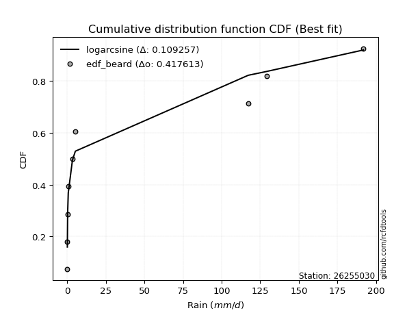</img>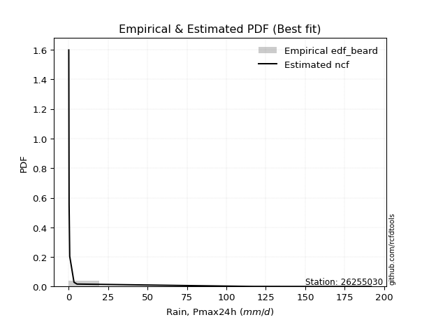</img>

</div>


### 5. EDF Chegodayev (1955)

The Chegodayev formula is an empirical plotting position formula used in hydrological frequency analysis to estimate the exceedance probability or return period of a specific event from a set of observed data. It is primarily used for plotting observed data points on probability paper to fit a theoretical distribution, particularly for analyzing extreme events like maximum flood flows or rainfall intensities. The constant _b_ value in the generalized plotting position formula is 0.3.

<div align="center">


$P=(m-b)/(n+1-2b)$


</div>


**5.1. Empirical values**

<div align="center">

|                | 0                   | 1                   | 2                   | 3                   | 4                  | 5                  | 6                  | 7                  |
|:---------------|:--------------------|:--------------------|:--------------------|:--------------------|:-------------------|:-------------------|:-------------------|:-------------------|
| date           | 2021                | 2020                | 2019                | 2018                | 2022               | 2016               | 2017               | 2024               |
| x              | 0.1                 | 0.1                 | 0.3                 | 0.7                 | 3.4                | 5.3                | 117.2              | 191.8              |
| m              | 1                   | 2                   | 3                   | 4                   | 5                  | 6                  | 7                  | 8                  |
| empirical_dist | edf_chegodayev      | edf_chegodayev      | edf_chegodayev      | edf_chegodayev      | edf_chegodayev     | edf_chegodayev     | edf_chegodayev     | edf_chegodayev     |
| empirical      | 0.08333333333333333 | 0.20238095238095236 | 0.32142857142857145 | 0.44047619047619047 | 0.5595238095238095 | 0.6785714285714286 | 0.7976190476190476 | 0.9166666666666666 |
| empirical_tr   | 1.090909090909091   | 1.253731343283582   | 1.4736842105263157  | 1.7872340425531914  | 2.27027027027027   | 3.1111111111111116 | 4.941176470588234  | 11.999999999999995 |

</div>


**5.2. Kolmogorov-Smirnov fit test (sorted by Δ)**


<div align="center">

|                | 0                   | 1                   | 2                   | 3                   | 4                   | 5                   | 6                   | 7                   | 8                   | 9                   | 10                  | 11                  | 12                  | 13                  | 14                  | 15                  | 16                 | 17                  | 18                  | 19                  | 20                  | 21                 | 22                  | 23                  | 24                 | 25                  | 26                  | 27                 | 28                  | 29                    | 30                  | 31                  | 32                  | 33                  | 34                  | 35                  | 36                  | 37                  | 38                  | 39                 | 40                 | 41                 | 42                  | 43                  | 44                  | 45                 | 46                 | 47                 | 48                  | 49                  | 50                  | 51                 | 52                  | 53                  | 54                  | 55                 | 56                 | 57                  | 58                  | 59                  | 60                  | 61                 | 62                 | 63                  | 64                 | 65                  | 66                  | 67                 | 68                 | 69                 | 70                  | 71                 | 72                  | 73                  | 74                 | 75                 | 76                 | 77                 | 78                 | 79                 | 80                 | 81                 | 82                 | 83                 | 84                 | 85                 | 86                 | 87                 |
|:---------------|:--------------------|:--------------------|:--------------------|:--------------------|:--------------------|:--------------------|:--------------------|:--------------------|:--------------------|:--------------------|:--------------------|:--------------------|:--------------------|:--------------------|:--------------------|:--------------------|:-------------------|:--------------------|:--------------------|:--------------------|:--------------------|:-------------------|:--------------------|:--------------------|:-------------------|:--------------------|:--------------------|:-------------------|:--------------------|:----------------------|:--------------------|:--------------------|:--------------------|:--------------------|:--------------------|:--------------------|:--------------------|:--------------------|:--------------------|:-------------------|:-------------------|:-------------------|:--------------------|:--------------------|:--------------------|:-------------------|:-------------------|:-------------------|:--------------------|:--------------------|:--------------------|:-------------------|:--------------------|:--------------------|:--------------------|:-------------------|:-------------------|:--------------------|:--------------------|:--------------------|:--------------------|:-------------------|:-------------------|:--------------------|:-------------------|:--------------------|:--------------------|:-------------------|:-------------------|:-------------------|:--------------------|:-------------------|:--------------------|:--------------------|:-------------------|:-------------------|:-------------------|:-------------------|:-------------------|:-------------------|:-------------------|:-------------------|:-------------------|:-------------------|:-------------------|:-------------------|:-------------------|:-------------------|
| station        | 26255030            | 26255030            | 26255030            | 26255030            | 26255030            | 26255030            | 26255030            | 26255030            | 26255030            | 26255030            | 26255030            | 26255030            | 26255030            | 26255030            | 26255030            | 26255030            | 26255030           | 26255030            | 26255030            | 26255030            | 26255030            | 26255030           | 26255030            | 26255030            | 26255030           | 26255030            | 26255030            | 26255030           | 26255030            | 26255030              | 26255030            | 26255030            | 26255030            | 26255030            | 26255030            | 26255030            | 26255030            | 26255030            | 26255030            | 26255030           | 26255030           | 26255030           | 26255030            | 26255030            | 26255030            | 26255030           | 26255030           | 26255030           | 26255030            | 26255030            | 26255030            | 26255030           | 26255030            | 26255030            | 26255030            | 26255030           | 26255030           | 26255030            | 26255030            | 26255030            | 26255030            | 26255030           | 26255030           | 26255030            | 26255030           | 26255030            | 26255030            | 26255030           | 26255030           | 26255030           | 26255030            | 26255030           | 26255030            | 26255030            | 26255030           | 26255030           | 26255030           | 26255030           | 26255030           | 26255030           | 26255030           | 26255030           | 26255030           | 26255030           | 26255030           | 26255030           | 26255030           | 26255030           |
| empirical_dist | edf_chegodayev      | edf_chegodayev      | edf_chegodayev      | edf_chegodayev      | edf_chegodayev      | edf_chegodayev      | edf_chegodayev      | edf_chegodayev      | edf_chegodayev      | edf_chegodayev      | edf_chegodayev      | edf_chegodayev      | edf_chegodayev      | edf_chegodayev      | edf_chegodayev      | edf_chegodayev      | edf_chegodayev     | edf_chegodayev      | edf_chegodayev      | edf_chegodayev      | edf_chegodayev      | edf_chegodayev     | edf_chegodayev      | edf_chegodayev      | edf_chegodayev     | edf_chegodayev      | edf_chegodayev      | edf_chegodayev     | edf_chegodayev      | edf_chegodayev        | edf_chegodayev      | edf_chegodayev      | edf_chegodayev      | edf_chegodayev      | edf_chegodayev      | edf_chegodayev      | edf_chegodayev      | edf_chegodayev      | edf_chegodayev      | edf_chegodayev     | edf_chegodayev     | edf_chegodayev     | edf_chegodayev      | edf_chegodayev      | edf_chegodayev      | edf_chegodayev     | edf_chegodayev     | edf_chegodayev     | edf_chegodayev      | edf_chegodayev      | edf_chegodayev      | edf_chegodayev     | edf_chegodayev      | edf_chegodayev      | edf_chegodayev      | edf_chegodayev     | edf_chegodayev     | edf_chegodayev      | edf_chegodayev      | edf_chegodayev      | edf_chegodayev      | edf_chegodayev     | edf_chegodayev     | edf_chegodayev      | edf_chegodayev     | edf_chegodayev      | edf_chegodayev      | edf_chegodayev     | edf_chegodayev     | edf_chegodayev     | edf_chegodayev      | edf_chegodayev     | edf_chegodayev      | edf_chegodayev      | edf_chegodayev     | edf_chegodayev     | edf_chegodayev     | edf_chegodayev     | edf_chegodayev     | edf_chegodayev     | edf_chegodayev     | edf_chegodayev     | edf_chegodayev     | edf_chegodayev     | edf_chegodayev     | edf_chegodayev     | edf_chegodayev     | edf_chegodayev     |
| p_dist         | ncf                 | lograyleigh         | logmaxwell          | loghalfnorm         | loggumbel_r         | loginvweibull       | loggenlogistic      | logpearson3         | logkstwobign        | loginvgamma         | logloggamma         | logrice             | lognorm             | lognorm             | logcrystalball      | logt                | lognct             | logalpha            | loglogistic         | logmoyal            | loginvgauss         | loghypsecant       | loglaplace          | loggumbel_l         | loghalflogistic    | logexponnorm        | chi2                | loggenexpon        | erlang              | loglaplace_asymmetric | logf                | logtruncnorm        | loggompertz         | logexpon            | logwald             | fatiguelife         | logerlang           | nakagami            | invgauss            | fisk               | loggamma           | loggamma           | logweibull_min      | logncf              | halfnorm            | halflogistic       | pearson3           | mielke             | wald                | loggibrat           | moyal               | rayleigh           | gumbel_r            | logchi2             | maxwell             | loglognorm         | norm               | crystalball         | logfatiguelife      | genlogistic         | logfisk             | logistic           | gibrat             | alpha               | logjohnsonsu       | hypsecant           | kstwobign           | gumbel_l           | rice               | betaprime          | laplace             | lognakagami        | gamma               | invweibull          | weibull_min        | exponnorm          | laplace_asymmetric | expon              | genexpon           | gompertz           | logbetaprime       | logmielke          | truncnorm          | johnsonsu          | t                  | invgamma           | nct                | f                  |
| delta          | 0.09111682292692043 | 0.11003705018417953 | 0.11305562233354227 | 0.11346122950727659 | 0.11538988817389173 | 0.11549311973857508 | 0.11556665416544243 | 0.11624629430387023 | 0.11924706243458605 | 0.12178646856989614 | 0.12208739399225799 | 0.12238219090465127 | 0.12439009747786878 | 0.12439009747786878 | 0.12439009771821341 | 0.12439029700470883 | 0.1244036290771866 | 0.12979925241325607 | 0.13150209397649315 | 0.14174232496647865 | 0.14240669580289367 | 0.1424725766132804 | 0.16990066513111773 | 0.17106959197237792 | 0.1749695456334256 | 0.20108355934488345 | 0.20143497005351438 | 0.2020639768095433 | 0.20229077882605553 | 0.20236977813158022   | 0.20238094981448995 | 0.20238095227247516 | 0.20238095236610812 | 0.20238095238095236 | 0.20238095238095236 | 0.20511461480474885 | 0.21787505935950036 | 0.22235012181986408 | 0.24972573633241058 | 0.2513312979917323 | 0.2610471869050831 | 0.2610471869050831 | 0.26965641970281246 | 0.27680863745608575 | 0.29917841569286274 | 0.2992278656898335 | 0.309949643913714  | 0.3120772445654168 | 0.31577080156160964 | 0.32025795250667716 | 0.32403105894761997 | 0.3310311642471848 | 0.33540470360037256 | 0.34168054917028967 | 0.34227273358784505 | 0.3660194923080655 | 0.3709030758123716 | 0.37090308056092713 | 0.37200499834664374 | 0.37571183331921393 | 0.39104239226831694 | 0.3918539802030882 | 0.3958784360248986 | 0.39663298219455434 | 0.3994201273908076 | 0.40716882394207177 | 0.41435620142777224 | 0.4232960172770259 | 0.4315780524817761 | 0.4318385341802354 | 0.43289687230711693 | 0.4369818349681855 | 0.46903445663800347 | 0.47943278316177595 | 0.5450919840160408 | 0.5551805773394544 | 0.5559849620681789 | 0.5559852958722566 | 0.5559853447581924 | 0.5798532516026413 | 0.6121670174432898 | 0.6165296663202628 | 0.6239542096924598 | 0.6734029194717548 | 0.6766639324304831 | 0.678303838442796  | 0.6785644183340132 | 0.6785714285714286 |
| deltao         | 0.4472608134160001  | 0.4472608134160001  | 0.4472608134160001  | 0.4472608134160001  | 0.4472608134160001  | 0.4472608134160001  | 0.4472608134160001  | 0.4472608134160001  | 0.4472608134160001  | 0.4472608134160001  | 0.4472608134160001  | 0.4472608134160001  | 0.4472608134160001  | 0.4472608134160001  | 0.4472608134160001  | 0.4472608134160001  | 0.4472608134160001 | 0.4472608134160001  | 0.4472608134160001  | 0.4472608134160001  | 0.4472608134160001  | 0.4472608134160001 | 0.4472608134160001  | 0.4472608134160001  | 0.4472608134160001 | 0.4472608134160001  | 0.4472608134160001  | 0.4472608134160001 | 0.4472608134160001  | 0.4472608134160001    | 0.4472608134160001  | 0.4472608134160001  | 0.4472608134160001  | 0.4472608134160001  | 0.4472608134160001  | 0.4472608134160001  | 0.4472608134160001  | 0.4472608134160001  | 0.4472608134160001  | 0.4472608134160001 | 0.4472608134160001 | 0.4472608134160001 | 0.4472608134160001  | 0.4472608134160001  | 0.4472608134160001  | 0.4472608134160001 | 0.4472608134160001 | 0.4472608134160001 | 0.4472608134160001  | 0.4472608134160001  | 0.4472608134160001  | 0.4472608134160001 | 0.4472608134160001  | 0.4472608134160001  | 0.4472608134160001  | 0.4472608134160001 | 0.4472608134160001 | 0.4472608134160001  | 0.4472608134160001  | 0.4472608134160001  | 0.4472608134160001  | 0.4472608134160001 | 0.4472608134160001 | 0.4472608134160001  | 0.4472608134160001 | 0.4472608134160001  | 0.4472608134160001  | 0.4472608134160001 | 0.4472608134160001 | 0.4472608134160001 | 0.4472608134160001  | 0.4472608134160001 | 0.4472608134160001  | 0.4472608134160001  | 0.4472608134160001 | 0.4472608134160001 | 0.4472608134160001 | 0.4472608134160001 | 0.4472608134160001 | 0.4472608134160001 | 0.4472608134160001 | 0.4472608134160001 | 0.4472608134160001 | 0.4472608134160001 | 0.4472608134160001 | 0.4472608134160001 | 0.4472608134160001 | 0.4472608134160001 |
| eval           | Δo > Δ              | Δo > Δ              | Δo > Δ              | Δo > Δ              | Δo > Δ              | Δo > Δ              | Δo > Δ              | Δo > Δ              | Δo > Δ              | Δo > Δ              | Δo > Δ              | Δo > Δ              | Δo > Δ              | Δo > Δ              | Δo > Δ              | Δo > Δ              | Δo > Δ             | Δo > Δ              | Δo > Δ              | Δo > Δ              | Δo > Δ              | Δo > Δ             | Δo > Δ              | Δo > Δ              | Δo > Δ             | Δo > Δ              | Δo > Δ              | Δo > Δ             | Δo > Δ              | Δo > Δ                | Δo > Δ              | Δo > Δ              | Δo > Δ              | Δo > Δ              | Δo > Δ              | Δo > Δ              | Δo > Δ              | Δo > Δ              | Δo > Δ              | Δo > Δ             | Δo > Δ             | Δo > Δ             | Δo > Δ              | Δo > Δ              | Δo > Δ              | Δo > Δ             | Δo > Δ             | Δo > Δ             | Δo > Δ              | Δo > Δ              | Δo > Δ              | Δo > Δ             | Δo > Δ              | Δo > Δ              | Δo > Δ              | Δo > Δ             | Δo > Δ             | Δo > Δ              | Δo > Δ              | Δo > Δ              | Δo > Δ              | Δo > Δ             | Δo > Δ             | Δo > Δ              | Δo > Δ             | Δo > Δ              | Δo > Δ              | Δo > Δ             | Δo > Δ             | Δo > Δ             | Δo > Δ              | Δo > Δ             | Δo <= Δ             | Δo <= Δ             | Δo <= Δ            | Δo <= Δ            | Δo <= Δ            | Δo <= Δ            | Δo <= Δ            | Δo <= Δ            | Δo <= Δ            | Δo <= Δ            | Δo <= Δ            | Δo <= Δ            | Δo <= Δ            | Δo <= Δ            | Δo <= Δ            | Δo <= Δ            |
| fit            | 1                   | 1                   | 1                   | 1                   | 1                   | 1                   | 1                   | 1                   | 1                   | 1                   | 1                   | 1                   | 1                   | 1                   | 1                   | 1                   | 1                  | 1                   | 1                   | 1                   | 1                   | 1                  | 1                   | 1                   | 1                  | 1                   | 1                   | 1                  | 1                   | 1                     | 1                   | 1                   | 1                   | 1                   | 1                   | 1                   | 1                   | 1                   | 1                   | 1                  | 1                  | 1                  | 1                   | 1                   | 1                   | 1                  | 1                  | 1                  | 1                   | 1                   | 1                   | 1                  | 1                   | 1                   | 1                   | 1                  | 1                  | 1                   | 1                   | 1                   | 1                   | 1                  | 1                  | 1                   | 1                  | 1                   | 1                   | 1                  | 1                  | 1                  | 1                   | 1                  | 0                   | 0                   | 0                  | 0                  | 0                  | 0                  | 0                  | 0                  | 0                  | 0                  | 0                  | 0                  | 0                  | 0                  | 0                  | 0                  |
| n              | 8                   | 8                   | 8                   | 8                   | 8                   | 8                   | 8                   | 8                   | 8                   | 8                   | 8                   | 8                   | 8                   | 8                   | 8                   | 8                   | 8                  | 8                   | 8                   | 8                   | 8                   | 8                  | 8                   | 8                   | 8                  | 8                   | 8                   | 8                  | 8                   | 8                     | 8                   | 8                   | 8                   | 8                   | 8                   | 8                   | 8                   | 8                   | 8                   | 8                  | 8                  | 8                  | 8                   | 8                   | 8                   | 8                  | 8                  | 8                  | 8                   | 8                   | 8                   | 8                  | 8                   | 8                   | 8                   | 8                  | 8                  | 8                   | 8                   | 8                   | 8                   | 8                  | 8                  | 8                   | 8                  | 8                   | 8                   | 8                  | 8                  | 8                  | 8                   | 8                  | 8                   | 8                   | 8                  | 8                  | 8                  | 8                  | 8                  | 8                  | 8                  | 8                  | 8                  | 8                  | 8                  | 8                  | 8                  | 8                  |
| best_fit       | 1                   | 0                   | 0                   | 0                   | 0                   | 0                   | 0                   | 0                   | 0                   | 0                   | 0                   | 0                   | 0                   | 0                   | 0                   | 0                   | 0                  | 0                   | 0                   | 0                   | 0                   | 0                  | 0                   | 0                   | 0                  | 0                   | 0                   | 0                  | 0                   | 0                     | 0                   | 0                   | 0                   | 0                   | 0                   | 0                   | 0                   | 0                   | 0                   | 0                  | 0                  | 0                  | 0                   | 0                   | 0                   | 0                  | 0                  | 0                  | 0                   | 0                   | 0                   | 0                  | 0                   | 0                   | 0                   | 0                  | 0                  | 0                   | 0                   | 0                   | 0                   | 0                  | 0                  | 0                   | 0                  | 0                   | 0                   | 0                  | 0                  | 0                  | 0                   | 0                  | 0                   | 0                   | 0                  | 0                  | 0                  | 0                  | 0                  | 0                  | 0                  | 0                  | 0                  | 0                  | 0                  | 0                  | 0                  | 0                  |
| best_fit_sort  | 1                   | 2                   | 3                   | 4                   | 5                   | 6                   | 7                   | 8                   | 9                   | 10                  | 11                  | 12                  | 13                  | 14                  | 15                  | 16                  | 17                 | 18                  | 19                  | 20                  | 21                  | 22                 | 23                  | 24                  | 25                 | 26                  | 27                  | 28                 | 29                  | 30                    | 31                  | 32                  | 33                  | 34                  | 35                  | 36                  | 37                  | 38                  | 39                  | 40                 | 41                 | 42                 | 43                  | 44                  | 45                  | 46                 | 47                 | 48                 | 49                  | 50                  | 51                  | 52                 | 53                  | 54                  | 55                  | 56                 | 57                 | 58                  | 59                  | 60                  | 61                  | 62                 | 63                 | 64                  | 65                 | 66                  | 67                  | 68                 | 69                 | 70                 | 71                  | 72                 | 73                  | 74                  | 75                 | 76                 | 77                 | 78                 | 79                 | 80                 | 81                 | 82                 | 83                 | 84                 | 85                 | 86                 | 87                 | 88                 |

</div>


**5.3. Best fit**

<div align="center">

|   id |   station | empirical_dist   | p_dist   |     delta |   deltao | eval   |   fit |   n |   best_fit |   best_fit_sort |
|-----:|----------:|:-----------------|:---------|----------:|---------:|:-------|------:|----:|-----------:|----------------:|
|    0 |  26255030 | edf_chegodayev   | ncf      | 0.0911168 | 0.447261 | Δo > Δ |     1 |   8 |          1 |               1 |

</div>


<div align="center">

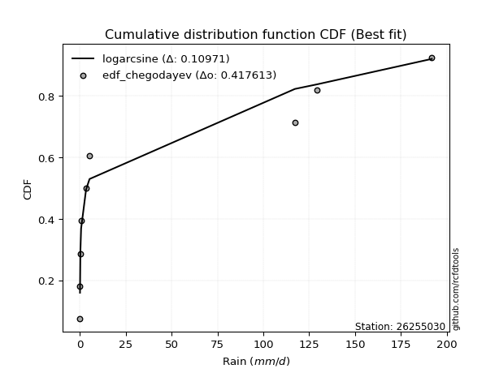</img>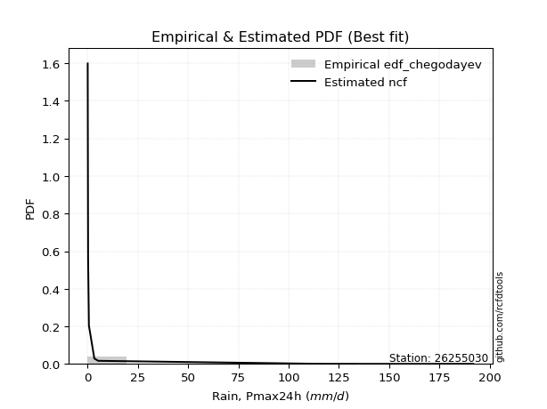</img>

</div>


### 6. EDF Blom (1958)

The Blom formula is a specific "plotting position" formula used in hydrology and statistical analysis to estimate the empirical cumulative probability (or non-exceedance probability) of a data series. It is particularly recommended for data that are approximately normally distributed. The constant _a_ is set to 0.375 (or 3/8).

<div align="center">


$P=(m-a)/(n+1-2a)$


</div>


**6.1. Empirical values**

<div align="center">

|                | 0                   | 1                   | 2                  | 3                  | 4                  | 5                  | 6                 | 7                  |
|:---------------|:--------------------|:--------------------|:-------------------|:-------------------|:-------------------|:-------------------|:------------------|:-------------------|
| date           | 2021                | 2020                | 2019               | 2018               | 2022               | 2016               | 2017              | 2024               |
| x              | 0.1                 | 0.1                 | 0.3                | 0.7                | 3.4                | 5.3                | 117.2             | 191.8              |
| m              | 1                   | 2                   | 3                  | 4                  | 5                  | 6                  | 7                 | 8                  |
| empirical_dist | edf_blom            | edf_blom            | edf_blom           | edf_blom           | edf_blom           | edf_blom           | edf_blom          | edf_blom           |
| empirical      | 0.07575757575757576 | 0.19696969696969696 | 0.3181818181818182 | 0.4393939393939394 | 0.5606060606060606 | 0.6818181818181818 | 0.803030303030303 | 0.9242424242424242 |
| empirical_tr   | 1.0819672131147542  | 1.2452830188679247  | 1.4666666666666666 | 1.783783783783784  | 2.275862068965517  | 3.1428571428571423 | 5.076923076923076 | 13.199999999999992 |

</div>


**6.2. Kolmogorov-Smirnov fit test (sorted by Δ)**


<div align="center">

|                | 0                   | 1                   | 2                   | 3                  | 4                   | 5                   | 6                  | 7                   | 8                   | 9                   | 10                  | 11                  | 12                  | 13                  | 14                  | 15                 | 16                  | 17                  | 18                  | 19                  | 20                  | 21                  | 22                 | 23                  | 24                  | 25                  | 26                  | 27                 | 28                  | 29                    | 30                  | 31                  | 32                  | 33                  | 34                  | 35                  | 36                  | 37                  | 38                  | 39                 | 40                 | 41                 | 42                  | 43                 | 44                 | 45                  | 46                  | 47                 | 48                 | 49                 | 50                  | 51                 | 52                 | 53                  | 54                 | 55                 | 56                  | 57                 | 58                 | 59                 | 60                  | 61                 | 62                 | 63                  | 64                 | 65                  | 66                 | 67                 | 68                 | 69                  | 70                 | 71                  | 72                  | 73                 | 74                 | 75                 | 76                 | 77                 | 78                 | 79                 | 80                 | 81                 | 82                 | 83                 | 84                 | 85                 | 86                 | 87                 |
|:---------------|:--------------------|:--------------------|:--------------------|:-------------------|:--------------------|:--------------------|:-------------------|:--------------------|:--------------------|:--------------------|:--------------------|:--------------------|:--------------------|:--------------------|:--------------------|:-------------------|:--------------------|:--------------------|:--------------------|:--------------------|:--------------------|:--------------------|:-------------------|:--------------------|:--------------------|:--------------------|:--------------------|:-------------------|:--------------------|:----------------------|:--------------------|:--------------------|:--------------------|:--------------------|:--------------------|:--------------------|:--------------------|:--------------------|:--------------------|:-------------------|:-------------------|:-------------------|:--------------------|:-------------------|:-------------------|:--------------------|:--------------------|:-------------------|:-------------------|:-------------------|:--------------------|:-------------------|:-------------------|:--------------------|:-------------------|:-------------------|:--------------------|:-------------------|:-------------------|:-------------------|:--------------------|:-------------------|:-------------------|:--------------------|:-------------------|:--------------------|:-------------------|:-------------------|:-------------------|:--------------------|:-------------------|:--------------------|:--------------------|:-------------------|:-------------------|:-------------------|:-------------------|:-------------------|:-------------------|:-------------------|:-------------------|:-------------------|:-------------------|:-------------------|:-------------------|:-------------------|:-------------------|:-------------------|
| station        | 26255030            | 26255030            | 26255030            | 26255030           | 26255030            | 26255030            | 26255030           | 26255030            | 26255030            | 26255030            | 26255030            | 26255030            | 26255030            | 26255030            | 26255030            | 26255030           | 26255030            | 26255030            | 26255030            | 26255030            | 26255030            | 26255030            | 26255030           | 26255030            | 26255030            | 26255030            | 26255030            | 26255030           | 26255030            | 26255030              | 26255030            | 26255030            | 26255030            | 26255030            | 26255030            | 26255030            | 26255030            | 26255030            | 26255030            | 26255030           | 26255030           | 26255030           | 26255030            | 26255030           | 26255030           | 26255030            | 26255030            | 26255030           | 26255030           | 26255030           | 26255030            | 26255030           | 26255030           | 26255030            | 26255030           | 26255030           | 26255030            | 26255030           | 26255030           | 26255030           | 26255030            | 26255030           | 26255030           | 26255030            | 26255030           | 26255030            | 26255030           | 26255030           | 26255030           | 26255030            | 26255030           | 26255030            | 26255030            | 26255030           | 26255030           | 26255030           | 26255030           | 26255030           | 26255030           | 26255030           | 26255030           | 26255030           | 26255030           | 26255030           | 26255030           | 26255030           | 26255030           | 26255030           |
| empirical_dist | edf_blom            | edf_blom            | edf_blom            | edf_blom           | edf_blom            | edf_blom            | edf_blom           | edf_blom            | edf_blom            | edf_blom            | edf_blom            | edf_blom            | edf_blom            | edf_blom            | edf_blom            | edf_blom           | edf_blom            | edf_blom            | edf_blom            | edf_blom            | edf_blom            | edf_blom            | edf_blom           | edf_blom            | edf_blom            | edf_blom            | edf_blom            | edf_blom           | edf_blom            | edf_blom              | edf_blom            | edf_blom            | edf_blom            | edf_blom            | edf_blom            | edf_blom            | edf_blom            | edf_blom            | edf_blom            | edf_blom           | edf_blom           | edf_blom           | edf_blom            | edf_blom           | edf_blom           | edf_blom            | edf_blom            | edf_blom           | edf_blom           | edf_blom           | edf_blom            | edf_blom           | edf_blom           | edf_blom            | edf_blom           | edf_blom           | edf_blom            | edf_blom           | edf_blom           | edf_blom           | edf_blom            | edf_blom           | edf_blom           | edf_blom            | edf_blom           | edf_blom            | edf_blom           | edf_blom           | edf_blom           | edf_blom            | edf_blom           | edf_blom            | edf_blom            | edf_blom           | edf_blom           | edf_blom           | edf_blom           | edf_blom           | edf_blom           | edf_blom           | edf_blom           | edf_blom           | edf_blom           | edf_blom           | edf_blom           | edf_blom           | edf_blom           | edf_blom           |
| p_dist         | ncf                 | lograyleigh         | logmaxwell          | loghalfnorm        | loggumbel_r         | loginvweibull       | loggenlogistic     | logpearson3         | logkstwobign        | loginvgamma         | logloggamma         | logrice             | lognorm             | lognorm             | logcrystalball      | logt               | lognct              | logalpha            | loglogistic         | logmoyal            | loginvgauss         | loghypsecant        | loggumbel_l        | loglaplace          | loghalflogistic     | logexponnorm        | chi2                | loggenexpon        | erlang              | loglaplace_asymmetric | logf                | logtruncnorm        | loggompertz         | logexpon            | logwald             | fatiguelife         | logerlang           | nakagami            | invgauss            | fisk               | loggamma           | loggamma           | logweibull_min      | logncf             | halfnorm           | halflogistic        | pearson3            | mielke             | loggibrat          | wald               | moyal               | rayleigh           | gumbel_r           | logchi2             | maxwell            | loglognorm         | norm                | crystalball        | logfatiguelife     | genlogistic        | logistic            | alpha              | logfisk            | gibrat              | logjohnsonsu       | hypsecant           | kstwobign          | gumbel_l           | rice               | betaprime           | laplace            | lognakagami         | gamma               | invweibull         | weibull_min        | exponnorm          | laplace_asymmetric | expon              | genexpon           | gompertz           | logbetaprime       | logmielke          | truncnorm          | johnsonsu          | t                  | invgamma           | nct                | f                  |
| delta          | 0.08570556751566503 | 0.10462579477292411 | 0.10764436692228685 | 0.1080499740960212 | 0.10997863276263631 | 0.11008186432731969 | 0.110155398754187  | 0.11083503889261481 | 0.11383580702333063 | 0.11637521315864074 | 0.11667613858100256 | 0.11697093549339588 | 0.11897884206661336 | 0.11897884206661336 | 0.11897884230695799 | 0.1189790415934534 | 0.11899237366593118 | 0.12438799700200066 | 0.12670078940721624 | 0.13633106955522326 | 0.14132444472064265 | 0.14139032553102931 | 0.1656583365611225 | 0.16881841404886666 | 0.16955829022217017 | 0.19567230393362806 | 0.19602371464225898 | 0.1966527213982879 | 0.19687952341480014 | 0.19695852272032482   | 0.19696969440323456 | 0.19696969686121976 | 0.19696969695485272 | 0.19696969696969696 | 0.19696969696969696 | 0.20836136805150213 | 0.21679280827724934 | 0.22559687506661724 | 0.24864348525015956 | 0.2545780512384855 | 0.2599649358228321 | 0.2599649358228321 | 0.27290317294956573 | 0.2843843950318433 | 0.3024251689396159 | 0.30247461893658667 | 0.31319639716046715 | 0.3153239978121701 | 0.3170111992599239 | 0.3190175548083628 | 0.32727781219437313 | 0.334277917493938  | 0.3386514568471257 | 0.34059829808803865 | 0.3455194868345982 | 0.3735952498838231 | 0.37414982905912475 | 0.3741498338076803 | 0.375251751593397  | 0.3789585865659671 | 0.39510073344984137 | 0.3955507311123033 | 0.3986181498440745 | 0.39912518927165175 | 0.4026668806375609 | 0.41041557718882493 | 0.4176029546745254 | 0.4265427705237791 | 0.4348248057285293 | 0.43508528742698865 | 0.4361436255538701 | 0.44022858821493877 | 0.47228120988475664 | 0.4870085407375335 | 0.5483387372627939 | 0.5584273305862075 | 0.5592317153149321 | 0.5592320491190098 | 0.5592320980049456 | 0.5831000048493945 | 0.6154137706900431 | 0.6197764195670161 | 0.627200962939213  | 0.6766496727185081 | 0.6799106856772363 | 0.6815505916895492 | 0.6818111715807664 | 0.6818181818181819 |
| deltao         | 0.4472608134160001  | 0.4472608134160001  | 0.4472608134160001  | 0.4472608134160001 | 0.4472608134160001  | 0.4472608134160001  | 0.4472608134160001 | 0.4472608134160001  | 0.4472608134160001  | 0.4472608134160001  | 0.4472608134160001  | 0.4472608134160001  | 0.4472608134160001  | 0.4472608134160001  | 0.4472608134160001  | 0.4472608134160001 | 0.4472608134160001  | 0.4472608134160001  | 0.4472608134160001  | 0.4472608134160001  | 0.4472608134160001  | 0.4472608134160001  | 0.4472608134160001 | 0.4472608134160001  | 0.4472608134160001  | 0.4472608134160001  | 0.4472608134160001  | 0.4472608134160001 | 0.4472608134160001  | 0.4472608134160001    | 0.4472608134160001  | 0.4472608134160001  | 0.4472608134160001  | 0.4472608134160001  | 0.4472608134160001  | 0.4472608134160001  | 0.4472608134160001  | 0.4472608134160001  | 0.4472608134160001  | 0.4472608134160001 | 0.4472608134160001 | 0.4472608134160001 | 0.4472608134160001  | 0.4472608134160001 | 0.4472608134160001 | 0.4472608134160001  | 0.4472608134160001  | 0.4472608134160001 | 0.4472608134160001 | 0.4472608134160001 | 0.4472608134160001  | 0.4472608134160001 | 0.4472608134160001 | 0.4472608134160001  | 0.4472608134160001 | 0.4472608134160001 | 0.4472608134160001  | 0.4472608134160001 | 0.4472608134160001 | 0.4472608134160001 | 0.4472608134160001  | 0.4472608134160001 | 0.4472608134160001 | 0.4472608134160001  | 0.4472608134160001 | 0.4472608134160001  | 0.4472608134160001 | 0.4472608134160001 | 0.4472608134160001 | 0.4472608134160001  | 0.4472608134160001 | 0.4472608134160001  | 0.4472608134160001  | 0.4472608134160001 | 0.4472608134160001 | 0.4472608134160001 | 0.4472608134160001 | 0.4472608134160001 | 0.4472608134160001 | 0.4472608134160001 | 0.4472608134160001 | 0.4472608134160001 | 0.4472608134160001 | 0.4472608134160001 | 0.4472608134160001 | 0.4472608134160001 | 0.4472608134160001 | 0.4472608134160001 |
| eval           | Δo > Δ              | Δo > Δ              | Δo > Δ              | Δo > Δ             | Δo > Δ              | Δo > Δ              | Δo > Δ             | Δo > Δ              | Δo > Δ              | Δo > Δ              | Δo > Δ              | Δo > Δ              | Δo > Δ              | Δo > Δ              | Δo > Δ              | Δo > Δ             | Δo > Δ              | Δo > Δ              | Δo > Δ              | Δo > Δ              | Δo > Δ              | Δo > Δ              | Δo > Δ             | Δo > Δ              | Δo > Δ              | Δo > Δ              | Δo > Δ              | Δo > Δ             | Δo > Δ              | Δo > Δ                | Δo > Δ              | Δo > Δ              | Δo > Δ              | Δo > Δ              | Δo > Δ              | Δo > Δ              | Δo > Δ              | Δo > Δ              | Δo > Δ              | Δo > Δ             | Δo > Δ             | Δo > Δ             | Δo > Δ              | Δo > Δ             | Δo > Δ             | Δo > Δ              | Δo > Δ              | Δo > Δ             | Δo > Δ             | Δo > Δ             | Δo > Δ              | Δo > Δ             | Δo > Δ             | Δo > Δ              | Δo > Δ             | Δo > Δ             | Δo > Δ              | Δo > Δ             | Δo > Δ             | Δo > Δ             | Δo > Δ              | Δo > Δ             | Δo > Δ             | Δo > Δ              | Δo > Δ             | Δo > Δ              | Δo > Δ             | Δo > Δ             | Δo > Δ             | Δo > Δ              | Δo > Δ             | Δo > Δ              | Δo <= Δ             | Δo <= Δ            | Δo <= Δ            | Δo <= Δ            | Δo <= Δ            | Δo <= Δ            | Δo <= Δ            | Δo <= Δ            | Δo <= Δ            | Δo <= Δ            | Δo <= Δ            | Δo <= Δ            | Δo <= Δ            | Δo <= Δ            | Δo <= Δ            | Δo <= Δ            |
| fit            | 1                   | 1                   | 1                   | 1                  | 1                   | 1                   | 1                  | 1                   | 1                   | 1                   | 1                   | 1                   | 1                   | 1                   | 1                   | 1                  | 1                   | 1                   | 1                   | 1                   | 1                   | 1                   | 1                  | 1                   | 1                   | 1                   | 1                   | 1                  | 1                   | 1                     | 1                   | 1                   | 1                   | 1                   | 1                   | 1                   | 1                   | 1                   | 1                   | 1                  | 1                  | 1                  | 1                   | 1                  | 1                  | 1                   | 1                   | 1                  | 1                  | 1                  | 1                   | 1                  | 1                  | 1                   | 1                  | 1                  | 1                   | 1                  | 1                  | 1                  | 1                   | 1                  | 1                  | 1                   | 1                  | 1                   | 1                  | 1                  | 1                  | 1                   | 1                  | 1                   | 0                   | 0                  | 0                  | 0                  | 0                  | 0                  | 0                  | 0                  | 0                  | 0                  | 0                  | 0                  | 0                  | 0                  | 0                  | 0                  |
| n              | 8                   | 8                   | 8                   | 8                  | 8                   | 8                   | 8                  | 8                   | 8                   | 8                   | 8                   | 8                   | 8                   | 8                   | 8                   | 8                  | 8                   | 8                   | 8                   | 8                   | 8                   | 8                   | 8                  | 8                   | 8                   | 8                   | 8                   | 8                  | 8                   | 8                     | 8                   | 8                   | 8                   | 8                   | 8                   | 8                   | 8                   | 8                   | 8                   | 8                  | 8                  | 8                  | 8                   | 8                  | 8                  | 8                   | 8                   | 8                  | 8                  | 8                  | 8                   | 8                  | 8                  | 8                   | 8                  | 8                  | 8                   | 8                  | 8                  | 8                  | 8                   | 8                  | 8                  | 8                   | 8                  | 8                   | 8                  | 8                  | 8                  | 8                   | 8                  | 8                   | 8                   | 8                  | 8                  | 8                  | 8                  | 8                  | 8                  | 8                  | 8                  | 8                  | 8                  | 8                  | 8                  | 8                  | 8                  | 8                  |
| best_fit       | 1                   | 0                   | 0                   | 0                  | 0                   | 0                   | 0                  | 0                   | 0                   | 0                   | 0                   | 0                   | 0                   | 0                   | 0                   | 0                  | 0                   | 0                   | 0                   | 0                   | 0                   | 0                   | 0                  | 0                   | 0                   | 0                   | 0                   | 0                  | 0                   | 0                     | 0                   | 0                   | 0                   | 0                   | 0                   | 0                   | 0                   | 0                   | 0                   | 0                  | 0                  | 0                  | 0                   | 0                  | 0                  | 0                   | 0                   | 0                  | 0                  | 0                  | 0                   | 0                  | 0                  | 0                   | 0                  | 0                  | 0                   | 0                  | 0                  | 0                  | 0                   | 0                  | 0                  | 0                   | 0                  | 0                   | 0                  | 0                  | 0                  | 0                   | 0                  | 0                   | 0                   | 0                  | 0                  | 0                  | 0                  | 0                  | 0                  | 0                  | 0                  | 0                  | 0                  | 0                  | 0                  | 0                  | 0                  | 0                  |
| best_fit_sort  | 1                   | 2                   | 3                   | 4                  | 5                   | 6                   | 7                  | 8                   | 9                   | 10                  | 11                  | 12                  | 13                  | 14                  | 15                  | 16                 | 17                  | 18                  | 19                  | 20                  | 21                  | 22                  | 23                 | 24                  | 25                  | 26                  | 27                  | 28                 | 29                  | 30                    | 31                  | 32                  | 33                  | 34                  | 35                  | 36                  | 37                  | 38                  | 39                  | 40                 | 41                 | 42                 | 43                  | 44                 | 45                 | 46                  | 47                  | 48                 | 49                 | 50                 | 51                  | 52                 | 53                 | 54                  | 55                 | 56                 | 57                  | 58                 | 59                 | 60                 | 61                  | 62                 | 63                 | 64                  | 65                 | 66                  | 67                 | 68                 | 69                 | 70                  | 71                 | 72                  | 73                  | 74                 | 75                 | 76                 | 77                 | 78                 | 79                 | 80                 | 81                 | 82                 | 83                 | 84                 | 85                 | 86                 | 87                 | 88                 |

</div>


**6.3. Best fit**

<div align="center">

|   id |   station | empirical_dist   | p_dist   |     delta |   deltao | eval   |   fit |   n |   best_fit |   best_fit_sort |
|-----:|----------:|:-----------------|:---------|----------:|---------:|:-------|------:|----:|-----------:|----------------:|
|    0 |  26255030 | edf_blom         | ncf      | 0.0857056 | 0.447261 | Δo > Δ |     1 |   8 |          1 |               1 |

</div>


<div align="center">

</img></img>

</div>


### 7. EDF Tukey (1962)

In hydrology, the Tukey formula is used as a plotting position formula to estimate the empirical probability or frequency of a flood event (or other hydrological data). The formula parameter is given as _c=0.333_ (or 1/3).

<div align="center">


$P=(m-c)/(n+1-2c)$


</div>


**7.1. Empirical values**

<div align="center">

|                | 0                  | 1         | 2                  | 3                  | 4                 | 5                  | 6                 | 7                  |
|:---------------|:-------------------|:----------|:-------------------|:-------------------|:------------------|:-------------------|:------------------|:-------------------|
| date           | 2021               | 2020      | 2019               | 2018               | 2022              | 2016               | 2017              | 2024               |
| x              | 0.1                | 0.1       | 0.3                | 0.7                | 3.4               | 5.3                | 117.2             | 191.8              |
| m              | 1                  | 2         | 3                  | 4                  | 5                 | 6                  | 7                 | 8                  |
| empirical_dist | edf_tukey          | edf_tukey | edf_tukey          | edf_tukey          | edf_tukey         | edf_tukey          | edf_tukey         | edf_tukey          |
| empirical      | 0.08               | 0.2       | 0.32               | 0.44               | 0.56              | 0.68               | 0.8               | 0.92               |
| empirical_tr   | 1.0869565217391304 | 1.25      | 1.4705882352941178 | 1.7857142857142856 | 2.272727272727273 | 3.1250000000000004 | 5.000000000000001 | 12.500000000000007 |

</div>


**7.2. Kolmogorov-Smirnov fit test (sorted by Δ)**


<div align="center">

|                | 0                   | 1                   | 2                   | 3                   | 4                   | 5                   | 6                   | 7                   | 8                   | 9                  | 10                 | 11                  | 12                 | 13                 | 14                  | 15                  | 16                  | 17                 | 18                  | 19                 | 20                  | 21                  | 22                  | 23                  | 24                  | 25                 | 26                  | 27                  | 28                 | 29                    | 30                 | 31                 | 32                  | 33                 | 34                 | 35                 | 36                  | 37                  | 38                  | 39                  | 40                 | 41                 | 42                 | 43                  | 44                 | 45                  | 46                  | 47                  | 48                 | 49                 | 50                 | 51                  | 52                 | 53                  | 54                 | 55                  | 56                  | 57                 | 58                 | 59                 | 60                  | 61                  | 62                 | 63                  | 64                  | 65                 | 66                 | 67                 | 68                  | 69                 | 70                 | 71                  | 72                 | 73                  | 74                 | 75                 | 76                 | 77                 | 78                 | 79                 | 80                 | 81                 | 82                 | 83                 | 84                 | 85                 | 86                 | 87                 |
|:---------------|:--------------------|:--------------------|:--------------------|:--------------------|:--------------------|:--------------------|:--------------------|:--------------------|:--------------------|:-------------------|:-------------------|:--------------------|:-------------------|:-------------------|:--------------------|:--------------------|:--------------------|:-------------------|:--------------------|:-------------------|:--------------------|:--------------------|:--------------------|:--------------------|:--------------------|:-------------------|:--------------------|:--------------------|:-------------------|:----------------------|:-------------------|:-------------------|:--------------------|:-------------------|:-------------------|:-------------------|:--------------------|:--------------------|:--------------------|:--------------------|:-------------------|:-------------------|:-------------------|:--------------------|:-------------------|:--------------------|:--------------------|:--------------------|:-------------------|:-------------------|:-------------------|:--------------------|:-------------------|:--------------------|:-------------------|:--------------------|:--------------------|:-------------------|:-------------------|:-------------------|:--------------------|:--------------------|:-------------------|:--------------------|:--------------------|:-------------------|:-------------------|:-------------------|:--------------------|:-------------------|:-------------------|:--------------------|:-------------------|:--------------------|:-------------------|:-------------------|:-------------------|:-------------------|:-------------------|:-------------------|:-------------------|:-------------------|:-------------------|:-------------------|:-------------------|:-------------------|:-------------------|:-------------------|
| station        | 26255030            | 26255030            | 26255030            | 26255030            | 26255030            | 26255030            | 26255030            | 26255030            | 26255030            | 26255030           | 26255030           | 26255030            | 26255030           | 26255030           | 26255030            | 26255030            | 26255030            | 26255030           | 26255030            | 26255030           | 26255030            | 26255030            | 26255030            | 26255030            | 26255030            | 26255030           | 26255030            | 26255030            | 26255030           | 26255030              | 26255030           | 26255030           | 26255030            | 26255030           | 26255030           | 26255030           | 26255030            | 26255030            | 26255030            | 26255030            | 26255030           | 26255030           | 26255030           | 26255030            | 26255030           | 26255030            | 26255030            | 26255030            | 26255030           | 26255030           | 26255030           | 26255030            | 26255030           | 26255030            | 26255030           | 26255030            | 26255030            | 26255030           | 26255030           | 26255030           | 26255030            | 26255030            | 26255030           | 26255030            | 26255030            | 26255030           | 26255030           | 26255030           | 26255030            | 26255030           | 26255030           | 26255030            | 26255030           | 26255030            | 26255030           | 26255030           | 26255030           | 26255030           | 26255030           | 26255030           | 26255030           | 26255030           | 26255030           | 26255030           | 26255030           | 26255030           | 26255030           | 26255030           |
| empirical_dist | edf_tukey           | edf_tukey           | edf_tukey           | edf_tukey           | edf_tukey           | edf_tukey           | edf_tukey           | edf_tukey           | edf_tukey           | edf_tukey          | edf_tukey          | edf_tukey           | edf_tukey          | edf_tukey          | edf_tukey           | edf_tukey           | edf_tukey           | edf_tukey          | edf_tukey           | edf_tukey          | edf_tukey           | edf_tukey           | edf_tukey           | edf_tukey           | edf_tukey           | edf_tukey          | edf_tukey           | edf_tukey           | edf_tukey          | edf_tukey             | edf_tukey          | edf_tukey          | edf_tukey           | edf_tukey          | edf_tukey          | edf_tukey          | edf_tukey           | edf_tukey           | edf_tukey           | edf_tukey           | edf_tukey          | edf_tukey          | edf_tukey          | edf_tukey           | edf_tukey          | edf_tukey           | edf_tukey           | edf_tukey           | edf_tukey          | edf_tukey          | edf_tukey          | edf_tukey           | edf_tukey          | edf_tukey           | edf_tukey          | edf_tukey           | edf_tukey           | edf_tukey          | edf_tukey          | edf_tukey          | edf_tukey           | edf_tukey           | edf_tukey          | edf_tukey           | edf_tukey           | edf_tukey          | edf_tukey          | edf_tukey          | edf_tukey           | edf_tukey          | edf_tukey          | edf_tukey           | edf_tukey          | edf_tukey           | edf_tukey          | edf_tukey          | edf_tukey          | edf_tukey          | edf_tukey          | edf_tukey          | edf_tukey          | edf_tukey          | edf_tukey          | edf_tukey          | edf_tukey          | edf_tukey          | edf_tukey          | edf_tukey          |
| p_dist         | ncf                 | lograyleigh         | logmaxwell          | loghalfnorm         | loggumbel_r         | loginvweibull       | loggenlogistic      | logpearson3         | logkstwobign        | loginvgamma        | logloggamma        | logrice             | lognorm            | lognorm            | logcrystalball      | logt                | lognct              | logalpha           | loglogistic         | logmoyal           | loginvgauss         | loghypsecant        | loggumbel_l         | loglaplace          | loghalflogistic     | logexponnorm       | chi2                | loggenexpon         | erlang             | loglaplace_asymmetric | logf               | logtruncnorm       | loggompertz         | logexpon           | logwald            | fatiguelife        | logerlang           | nakagami            | invgauss            | fisk                | loggamma           | loggamma           | logweibull_min     | logncf              | halfnorm           | halflogistic        | pearson3            | mielke              | wald               | loggibrat          | moyal              | rayleigh            | gumbel_r           | logchi2             | maxwell            | loglognorm          | norm                | crystalball        | logfatiguelife     | genlogistic        | logistic            | logfisk             | alpha              | gibrat              | logjohnsonsu        | hypsecant          | kstwobign          | gumbel_l           | rice                | betaprime          | laplace            | lognakagami         | gamma              | invweibull          | weibull_min        | exponnorm          | laplace_asymmetric | expon              | genexpon           | gompertz           | logbetaprime       | logmielke          | truncnorm          | johnsonsu          | t                  | invgamma           | nct                | f                  |
| delta          | 0.08873587054596808 | 0.10765609780322705 | 0.11067466995258979 | 0.11108027712632425 | 0.11300893579293925 | 0.11311216735762274 | 0.11318570178448994 | 0.11386534192291775 | 0.11686611005363357 | 0.1194055161889438 | 0.1197064416113055 | 0.12000123852369893 | 0.1220091450969163 | 0.1220091450969163 | 0.12200914533726093 | 0.12200934462375634 | 0.12202267669623412 | 0.1274183000323037 | 0.12912114159554067 | 0.1393613725855263 | 0.14193050532670315 | 0.14199638613708992 | 0.16868863959142544 | 0.16942447465492727 | 0.17258859325247322 | 0.1987026069639311 | 0.19905401767256203 | 0.19968302442859096 | 0.1999098264451032 | 0.19998882575062787   | 0.1999999974335376 | 0.1999999998915228 | 0.19999999998515577 | 0.2                | 0.2                | 0.2065431862333203 | 0.21739886888330984 | 0.22377869324843552 | 0.24924954585622006 | 0.25275986942030376 | 0.2605709964288926 | 0.2605709964288926 | 0.2710849911313839 | 0.28014197078941916 | 0.3006069871214342 | 0.30065643711840495 | 0.31137821534228544 | 0.31350581599398825 | 0.3171993729901811 | 0.3188293810781057 | 0.3254596303761914 | 0.33245973567575626 | 0.336833275028944  | 0.34120435869409915 | 0.3437013050164165 | 0.36935282564139893 | 0.37233164724094303 | 0.3723316519894986 | 0.3734335697752152 | 0.3771404047477854 | 0.39328255163165965 | 0.39437572560165035 | 0.3961567917183638 | 0.39730700745347003 | 0.40084869881937907 | 0.4085973953706432 | 0.4157847728563437 | 0.4247245887055974 | 0.43300662391034755 | 0.4332671056088068 | 0.4343254437356884 | 0.43841040639675694 | 0.4704630280665749 | 0.48276611649510937 | 0.5465205554446122 | 0.5566091487680258 | 0.5574135334967504 | 0.5574138673008281 | 0.5574139161867638 | 0.5812818230312128 | 0.6135955888718614 | 0.6179582377488344 | 0.6253827811210313 | 0.6748314909003263 | 0.6780925038590546 | 0.6797324098713675 | 0.6799929897625847 | 0.6799999999999999 |
| deltao         | 0.4472608134160001  | 0.4472608134160001  | 0.4472608134160001  | 0.4472608134160001  | 0.4472608134160001  | 0.4472608134160001  | 0.4472608134160001  | 0.4472608134160001  | 0.4472608134160001  | 0.4472608134160001 | 0.4472608134160001 | 0.4472608134160001  | 0.4472608134160001 | 0.4472608134160001 | 0.4472608134160001  | 0.4472608134160001  | 0.4472608134160001  | 0.4472608134160001 | 0.4472608134160001  | 0.4472608134160001 | 0.4472608134160001  | 0.4472608134160001  | 0.4472608134160001  | 0.4472608134160001  | 0.4472608134160001  | 0.4472608134160001 | 0.4472608134160001  | 0.4472608134160001  | 0.4472608134160001 | 0.4472608134160001    | 0.4472608134160001 | 0.4472608134160001 | 0.4472608134160001  | 0.4472608134160001 | 0.4472608134160001 | 0.4472608134160001 | 0.4472608134160001  | 0.4472608134160001  | 0.4472608134160001  | 0.4472608134160001  | 0.4472608134160001 | 0.4472608134160001 | 0.4472608134160001 | 0.4472608134160001  | 0.4472608134160001 | 0.4472608134160001  | 0.4472608134160001  | 0.4472608134160001  | 0.4472608134160001 | 0.4472608134160001 | 0.4472608134160001 | 0.4472608134160001  | 0.4472608134160001 | 0.4472608134160001  | 0.4472608134160001 | 0.4472608134160001  | 0.4472608134160001  | 0.4472608134160001 | 0.4472608134160001 | 0.4472608134160001 | 0.4472608134160001  | 0.4472608134160001  | 0.4472608134160001 | 0.4472608134160001  | 0.4472608134160001  | 0.4472608134160001 | 0.4472608134160001 | 0.4472608134160001 | 0.4472608134160001  | 0.4472608134160001 | 0.4472608134160001 | 0.4472608134160001  | 0.4472608134160001 | 0.4472608134160001  | 0.4472608134160001 | 0.4472608134160001 | 0.4472608134160001 | 0.4472608134160001 | 0.4472608134160001 | 0.4472608134160001 | 0.4472608134160001 | 0.4472608134160001 | 0.4472608134160001 | 0.4472608134160001 | 0.4472608134160001 | 0.4472608134160001 | 0.4472608134160001 | 0.4472608134160001 |
| eval           | Δo > Δ              | Δo > Δ              | Δo > Δ              | Δo > Δ              | Δo > Δ              | Δo > Δ              | Δo > Δ              | Δo > Δ              | Δo > Δ              | Δo > Δ             | Δo > Δ             | Δo > Δ              | Δo > Δ             | Δo > Δ             | Δo > Δ              | Δo > Δ              | Δo > Δ              | Δo > Δ             | Δo > Δ              | Δo > Δ             | Δo > Δ              | Δo > Δ              | Δo > Δ              | Δo > Δ              | Δo > Δ              | Δo > Δ             | Δo > Δ              | Δo > Δ              | Δo > Δ             | Δo > Δ                | Δo > Δ             | Δo > Δ             | Δo > Δ              | Δo > Δ             | Δo > Δ             | Δo > Δ             | Δo > Δ              | Δo > Δ              | Δo > Δ              | Δo > Δ              | Δo > Δ             | Δo > Δ             | Δo > Δ             | Δo > Δ              | Δo > Δ             | Δo > Δ              | Δo > Δ              | Δo > Δ              | Δo > Δ             | Δo > Δ             | Δo > Δ             | Δo > Δ              | Δo > Δ             | Δo > Δ              | Δo > Δ             | Δo > Δ              | Δo > Δ              | Δo > Δ             | Δo > Δ             | Δo > Δ             | Δo > Δ              | Δo > Δ              | Δo > Δ             | Δo > Δ              | Δo > Δ              | Δo > Δ             | Δo > Δ             | Δo > Δ             | Δo > Δ              | Δo > Δ             | Δo > Δ             | Δo > Δ              | Δo <= Δ            | Δo <= Δ             | Δo <= Δ            | Δo <= Δ            | Δo <= Δ            | Δo <= Δ            | Δo <= Δ            | Δo <= Δ            | Δo <= Δ            | Δo <= Δ            | Δo <= Δ            | Δo <= Δ            | Δo <= Δ            | Δo <= Δ            | Δo <= Δ            | Δo <= Δ            |
| fit            | 1                   | 1                   | 1                   | 1                   | 1                   | 1                   | 1                   | 1                   | 1                   | 1                  | 1                  | 1                   | 1                  | 1                  | 1                   | 1                   | 1                   | 1                  | 1                   | 1                  | 1                   | 1                   | 1                   | 1                   | 1                   | 1                  | 1                   | 1                   | 1                  | 1                     | 1                  | 1                  | 1                   | 1                  | 1                  | 1                  | 1                   | 1                   | 1                   | 1                   | 1                  | 1                  | 1                  | 1                   | 1                  | 1                   | 1                   | 1                   | 1                  | 1                  | 1                  | 1                   | 1                  | 1                   | 1                  | 1                   | 1                   | 1                  | 1                  | 1                  | 1                   | 1                   | 1                  | 1                   | 1                   | 1                  | 1                  | 1                  | 1                   | 1                  | 1                  | 1                   | 0                  | 0                   | 0                  | 0                  | 0                  | 0                  | 0                  | 0                  | 0                  | 0                  | 0                  | 0                  | 0                  | 0                  | 0                  | 0                  |
| n              | 8                   | 8                   | 8                   | 8                   | 8                   | 8                   | 8                   | 8                   | 8                   | 8                  | 8                  | 8                   | 8                  | 8                  | 8                   | 8                   | 8                   | 8                  | 8                   | 8                  | 8                   | 8                   | 8                   | 8                   | 8                   | 8                  | 8                   | 8                   | 8                  | 8                     | 8                  | 8                  | 8                   | 8                  | 8                  | 8                  | 8                   | 8                   | 8                   | 8                   | 8                  | 8                  | 8                  | 8                   | 8                  | 8                   | 8                   | 8                   | 8                  | 8                  | 8                  | 8                   | 8                  | 8                   | 8                  | 8                   | 8                   | 8                  | 8                  | 8                  | 8                   | 8                   | 8                  | 8                   | 8                   | 8                  | 8                  | 8                  | 8                   | 8                  | 8                  | 8                   | 8                  | 8                   | 8                  | 8                  | 8                  | 8                  | 8                  | 8                  | 8                  | 8                  | 8                  | 8                  | 8                  | 8                  | 8                  | 8                  |
| best_fit       | 1                   | 0                   | 0                   | 0                   | 0                   | 0                   | 0                   | 0                   | 0                   | 0                  | 0                  | 0                   | 0                  | 0                  | 0                   | 0                   | 0                   | 0                  | 0                   | 0                  | 0                   | 0                   | 0                   | 0                   | 0                   | 0                  | 0                   | 0                   | 0                  | 0                     | 0                  | 0                  | 0                   | 0                  | 0                  | 0                  | 0                   | 0                   | 0                   | 0                   | 0                  | 0                  | 0                  | 0                   | 0                  | 0                   | 0                   | 0                   | 0                  | 0                  | 0                  | 0                   | 0                  | 0                   | 0                  | 0                   | 0                   | 0                  | 0                  | 0                  | 0                   | 0                   | 0                  | 0                   | 0                   | 0                  | 0                  | 0                  | 0                   | 0                  | 0                  | 0                   | 0                  | 0                   | 0                  | 0                  | 0                  | 0                  | 0                  | 0                  | 0                  | 0                  | 0                  | 0                  | 0                  | 0                  | 0                  | 0                  |
| best_fit_sort  | 1                   | 2                   | 3                   | 4                   | 5                   | 6                   | 7                   | 8                   | 9                   | 10                 | 11                 | 12                  | 13                 | 14                 | 15                  | 16                  | 17                  | 18                 | 19                  | 20                 | 21                  | 22                  | 23                  | 24                  | 25                  | 26                 | 27                  | 28                  | 29                 | 30                    | 31                 | 32                 | 33                  | 34                 | 35                 | 36                 | 37                  | 38                  | 39                  | 40                  | 41                 | 42                 | 43                 | 44                  | 45                 | 46                  | 47                  | 48                  | 49                 | 50                 | 51                 | 52                  | 53                 | 54                  | 55                 | 56                  | 57                  | 58                 | 59                 | 60                 | 61                  | 62                  | 63                 | 64                  | 65                  | 66                 | 67                 | 68                 | 69                  | 70                 | 71                 | 72                  | 73                 | 74                  | 75                 | 76                 | 77                 | 78                 | 79                 | 80                 | 81                 | 82                 | 83                 | 84                 | 85                 | 86                 | 87                 | 88                 |

</div>


**7.3. Best fit**

<div align="center">

|   id |   station | empirical_dist   | p_dist   |     delta |   deltao | eval   |   fit |   n |   best_fit |   best_fit_sort |
|-----:|----------:|:-----------------|:---------|----------:|---------:|:-------|------:|----:|-----------:|----------------:|
|    0 |  26255030 | edf_tukey        | ncf      | 0.0887359 | 0.447261 | Δo > Δ |     1 |   8 |          1 |               1 |

</div>


<div align="center">

</img></img>

</div>


### 8. EDF Gringorten (1963)

Gringorten plotting position formula is essential for estimating the probability and return periods of extreme events like floods and heavy rainfall. The constant _a=0.44_.

<div align="center">


$P=(m-a)/(n+1-2a)$


</div>


**8.1. Empirical values**

<div align="center">

|                | 0                   | 1                   | 2                  | 3                  | 4                  | 5                  | 6                  | 7                  |
|:---------------|:--------------------|:--------------------|:-------------------|:-------------------|:-------------------|:-------------------|:-------------------|:-------------------|
| date           | 2021                | 2020                | 2019               | 2018               | 2022               | 2016               | 2017               | 2024               |
| x              | 0.1                 | 0.1                 | 0.3                | 0.7                | 3.4                | 5.3                | 117.2              | 191.8              |
| m              | 1                   | 2                   | 3                  | 4                  | 5                  | 6                  | 7                  | 8                  |
| empirical_dist | edf_gringorten      | edf_gringorten      | edf_gringorten     | edf_gringorten     | edf_gringorten     | edf_gringorten     | edf_gringorten     | edf_gringorten     |
| empirical      | 0.06896551724137932 | 0.19211822660098524 | 0.3152709359605912 | 0.4384236453201971 | 0.5615763546798029 | 0.6847290640394089 | 0.8078817733990148 | 0.9310344827586208 |
| empirical_tr   | 1.0740740740740742  | 1.2378048780487805  | 1.460431654676259  | 1.780701754385965  | 2.2808988764044944 | 3.1718750000000004 | 5.205128205128205  | 14.500000000000018 |

</div>


**8.2. Kolmogorov-Smirnov fit test (sorted by Δ)**


<div align="center">

|                | 0                   | 1                  | 2                   | 3                   | 4                  | 5                   | 6                  | 7                  | 8                   | 9                   | 10                  | 11                  | 12                  | 13                  | 14                  | 15                 | 16                  | 17                  | 18                  | 19                  | 20                  | 21                  | 22                  | 23                  | 24                 | 25                  | 26                  | 27                  | 28                  | 29                    | 30                  | 31                  | 32                 | 33                  | 34                  | 35                 | 36                  | 37                 | 38                  | 39                  | 40                 | 41                 | 42                 | 43                 | 44                  | 45                 | 46                 | 47                 | 48                  | 49                  | 50                 | 51                  | 52                  | 53                  | 54                  | 55                 | 56                  | 57                 | 58                  | 59                  | 60                  | 61                 | 62                 | 63                 | 64                 | 65                 | 66                  | 67                  | 68                 | 69                  | 70                  | 71                  | 72                 | 73                 | 74                 | 75                 | 76                 | 77                 | 78                 | 79                 | 80                 | 81                 | 82                 | 83                 | 84                 | 85                 | 86                 | 87                 |
|:---------------|:--------------------|:-------------------|:--------------------|:--------------------|:-------------------|:--------------------|:-------------------|:-------------------|:--------------------|:--------------------|:--------------------|:--------------------|:--------------------|:--------------------|:--------------------|:-------------------|:--------------------|:--------------------|:--------------------|:--------------------|:--------------------|:--------------------|:--------------------|:--------------------|:-------------------|:--------------------|:--------------------|:--------------------|:--------------------|:----------------------|:--------------------|:--------------------|:-------------------|:--------------------|:--------------------|:-------------------|:--------------------|:-------------------|:--------------------|:--------------------|:-------------------|:-------------------|:-------------------|:-------------------|:--------------------|:-------------------|:-------------------|:-------------------|:--------------------|:--------------------|:-------------------|:--------------------|:--------------------|:--------------------|:--------------------|:-------------------|:--------------------|:-------------------|:--------------------|:--------------------|:--------------------|:-------------------|:-------------------|:-------------------|:-------------------|:-------------------|:--------------------|:--------------------|:-------------------|:--------------------|:--------------------|:--------------------|:-------------------|:-------------------|:-------------------|:-------------------|:-------------------|:-------------------|:-------------------|:-------------------|:-------------------|:-------------------|:-------------------|:-------------------|:-------------------|:-------------------|:-------------------|:-------------------|
| station        | 26255030            | 26255030           | 26255030            | 26255030            | 26255030           | 26255030            | 26255030           | 26255030           | 26255030            | 26255030            | 26255030            | 26255030            | 26255030            | 26255030            | 26255030            | 26255030           | 26255030            | 26255030            | 26255030            | 26255030            | 26255030            | 26255030            | 26255030            | 26255030            | 26255030           | 26255030            | 26255030            | 26255030            | 26255030            | 26255030              | 26255030            | 26255030            | 26255030           | 26255030            | 26255030            | 26255030           | 26255030            | 26255030           | 26255030            | 26255030            | 26255030           | 26255030           | 26255030           | 26255030           | 26255030            | 26255030           | 26255030           | 26255030           | 26255030            | 26255030            | 26255030           | 26255030            | 26255030            | 26255030            | 26255030            | 26255030           | 26255030            | 26255030           | 26255030            | 26255030            | 26255030            | 26255030           | 26255030           | 26255030           | 26255030           | 26255030           | 26255030            | 26255030            | 26255030           | 26255030            | 26255030            | 26255030            | 26255030           | 26255030           | 26255030           | 26255030           | 26255030           | 26255030           | 26255030           | 26255030           | 26255030           | 26255030           | 26255030           | 26255030           | 26255030           | 26255030           | 26255030           | 26255030           |
| empirical_dist | edf_gringorten      | edf_gringorten     | edf_gringorten      | edf_gringorten      | edf_gringorten     | edf_gringorten      | edf_gringorten     | edf_gringorten     | edf_gringorten      | edf_gringorten      | edf_gringorten      | edf_gringorten      | edf_gringorten      | edf_gringorten      | edf_gringorten      | edf_gringorten     | edf_gringorten      | edf_gringorten      | edf_gringorten      | edf_gringorten      | edf_gringorten      | edf_gringorten      | edf_gringorten      | edf_gringorten      | edf_gringorten     | edf_gringorten      | edf_gringorten      | edf_gringorten      | edf_gringorten      | edf_gringorten        | edf_gringorten      | edf_gringorten      | edf_gringorten     | edf_gringorten      | edf_gringorten      | edf_gringorten     | edf_gringorten      | edf_gringorten     | edf_gringorten      | edf_gringorten      | edf_gringorten     | edf_gringorten     | edf_gringorten     | edf_gringorten     | edf_gringorten      | edf_gringorten     | edf_gringorten     | edf_gringorten     | edf_gringorten      | edf_gringorten      | edf_gringorten     | edf_gringorten      | edf_gringorten      | edf_gringorten      | edf_gringorten      | edf_gringorten     | edf_gringorten      | edf_gringorten     | edf_gringorten      | edf_gringorten      | edf_gringorten      | edf_gringorten     | edf_gringorten     | edf_gringorten     | edf_gringorten     | edf_gringorten     | edf_gringorten      | edf_gringorten      | edf_gringorten     | edf_gringorten      | edf_gringorten      | edf_gringorten      | edf_gringorten     | edf_gringorten     | edf_gringorten     | edf_gringorten     | edf_gringorten     | edf_gringorten     | edf_gringorten     | edf_gringorten     | edf_gringorten     | edf_gringorten     | edf_gringorten     | edf_gringorten     | edf_gringorten     | edf_gringorten     | edf_gringorten     | edf_gringorten     |
| p_dist         | ncf                 | lograyleigh        | logmaxwell          | loghalfnorm         | loggumbel_r        | loginvweibull       | loggenlogistic     | logpearson3        | logkstwobign        | loginvgamma         | logloggamma         | logrice             | lognorm             | lognorm             | logcrystalball      | logt               | lognct              | logalpha            | loglogistic         | logmoyal            | loginvgauss         | loghypsecant        | loggumbel_l         | loghalflogistic     | loglaplace         | logexponnorm        | chi2                | loggenexpon         | erlang              | loglaplace_asymmetric | logf                | logtruncnorm        | loggompertz        | logexpon            | logwald             | fatiguelife        | logerlang           | nakagami           | invgauss            | fisk                | loggamma           | loggamma           | logweibull_min     | logncf             | halfnorm            | halflogistic       | loggibrat          | pearson3           | mielke              | wald                | moyal              | rayleigh            | logchi2             | gumbel_r            | maxwell             | norm               | crystalball         | logfatiguelife     | loglognorm          | genlogistic         | alpha               | logistic           | gibrat             | logfisk            | logjohnsonsu       | hypsecant          | kstwobign           | gumbel_l            | rice               | betaprime           | laplace             | lognakagami         | gamma              | invweibull         | weibull_min        | exponnorm          | laplace_asymmetric | expon              | genexpon           | gompertz           | logbetaprime       | logmielke          | truncnorm          | johnsonsu          | t                  | invgamma           | nct                | f                  |
| delta          | 0.08085409714695331 | 0.0997743244042123 | 0.10279289655357504 | 0.10319850372730947 | 0.1051271623939245 | 0.10523039395860796 | 0.1053039283854752 | 0.105983568523903  | 0.10898433665461882 | 0.11152374278992902 | 0.11182466821229076 | 0.11211946512468415 | 0.11412737169790155 | 0.11412737169790155 | 0.11412737193824618 | 0.1141275712247416 | 0.11414090329721938 | 0.12192493700847018 | 0.12573049533347397 | 0.13147959918651153 | 0.14035415064690027 | 0.14042003145728704 | 0.16333176061505672 | 0.16470681985345847 | 0.1678481199751244 | 0.19082083356491633 | 0.19117224427354726 | 0.19180125102957618 | 0.19202805304608841 | 0.1921070523516131    | 0.19211822403452283 | 0.19211822649250804 | 0.192118226586141  | 0.19211822660098524 | 0.19298554880822677 | 0.2112722502727291 | 0.21582251420350695 | 0.2285077572878444 | 0.24767319117641717 | 0.25748893345971263 | 0.2589946417490897 | 0.2589946417490897 | 0.2758140551707927 | 0.2911764535480399 | 0.30533605116084306 | 0.3053855011578138 | 0.3141003170386969 | 0.3161072793816943 | 0.31823488003339706 | 0.32192843702958995 | 0.3301886944156003 | 0.33718879971516513 | 0.33962800401429627 | 0.34156233906835287 | 0.34843036905582536 | 0.3770607112803519 | 0.37706071602890745 | 0.378162633814624  | 0.38038730840001966 | 0.38186946878719424 | 0.39458043703856094 | 0.3980116156710685 | 0.4020360714928789 | 0.4054102083602711 | 0.4055777628587879 | 0.4133264594100521 | 0.42051383689575256 | 0.42945365274500624 | 0.4377356879497564 | 0.43799616964821564 | 0.43905450777509725 | 0.44313947043616575 | 0.4751920921059838 | 0.4938005992537301 | 0.5512496194840211 | 0.5613382128074347 | 0.5621425975361592 | 0.562142931340237  | 0.5621429802261727 | 0.5860108870706217 | 0.6183246529112701 | 0.6226873017882432 | 0.6301118451604402 | 0.6795605549397351 | 0.6828215678984634 | 0.6844614739107763 | 0.6847220538019935 | 0.6847290640394088 |
| deltao         | 0.4472608134160001  | 0.4472608134160001 | 0.4472608134160001  | 0.4472608134160001  | 0.4472608134160001 | 0.4472608134160001  | 0.4472608134160001 | 0.4472608134160001 | 0.4472608134160001  | 0.4472608134160001  | 0.4472608134160001  | 0.4472608134160001  | 0.4472608134160001  | 0.4472608134160001  | 0.4472608134160001  | 0.4472608134160001 | 0.4472608134160001  | 0.4472608134160001  | 0.4472608134160001  | 0.4472608134160001  | 0.4472608134160001  | 0.4472608134160001  | 0.4472608134160001  | 0.4472608134160001  | 0.4472608134160001 | 0.4472608134160001  | 0.4472608134160001  | 0.4472608134160001  | 0.4472608134160001  | 0.4472608134160001    | 0.4472608134160001  | 0.4472608134160001  | 0.4472608134160001 | 0.4472608134160001  | 0.4472608134160001  | 0.4472608134160001 | 0.4472608134160001  | 0.4472608134160001 | 0.4472608134160001  | 0.4472608134160001  | 0.4472608134160001 | 0.4472608134160001 | 0.4472608134160001 | 0.4472608134160001 | 0.4472608134160001  | 0.4472608134160001 | 0.4472608134160001 | 0.4472608134160001 | 0.4472608134160001  | 0.4472608134160001  | 0.4472608134160001 | 0.4472608134160001  | 0.4472608134160001  | 0.4472608134160001  | 0.4472608134160001  | 0.4472608134160001 | 0.4472608134160001  | 0.4472608134160001 | 0.4472608134160001  | 0.4472608134160001  | 0.4472608134160001  | 0.4472608134160001 | 0.4472608134160001 | 0.4472608134160001 | 0.4472608134160001 | 0.4472608134160001 | 0.4472608134160001  | 0.4472608134160001  | 0.4472608134160001 | 0.4472608134160001  | 0.4472608134160001  | 0.4472608134160001  | 0.4472608134160001 | 0.4472608134160001 | 0.4472608134160001 | 0.4472608134160001 | 0.4472608134160001 | 0.4472608134160001 | 0.4472608134160001 | 0.4472608134160001 | 0.4472608134160001 | 0.4472608134160001 | 0.4472608134160001 | 0.4472608134160001 | 0.4472608134160001 | 0.4472608134160001 | 0.4472608134160001 | 0.4472608134160001 |
| eval           | Δo > Δ              | Δo > Δ             | Δo > Δ              | Δo > Δ              | Δo > Δ             | Δo > Δ              | Δo > Δ             | Δo > Δ             | Δo > Δ              | Δo > Δ              | Δo > Δ              | Δo > Δ              | Δo > Δ              | Δo > Δ              | Δo > Δ              | Δo > Δ             | Δo > Δ              | Δo > Δ              | Δo > Δ              | Δo > Δ              | Δo > Δ              | Δo > Δ              | Δo > Δ              | Δo > Δ              | Δo > Δ             | Δo > Δ              | Δo > Δ              | Δo > Δ              | Δo > Δ              | Δo > Δ                | Δo > Δ              | Δo > Δ              | Δo > Δ             | Δo > Δ              | Δo > Δ              | Δo > Δ             | Δo > Δ              | Δo > Δ             | Δo > Δ              | Δo > Δ              | Δo > Δ             | Δo > Δ             | Δo > Δ             | Δo > Δ             | Δo > Δ              | Δo > Δ             | Δo > Δ             | Δo > Δ             | Δo > Δ              | Δo > Δ              | Δo > Δ             | Δo > Δ              | Δo > Δ              | Δo > Δ              | Δo > Δ              | Δo > Δ             | Δo > Δ              | Δo > Δ             | Δo > Δ              | Δo > Δ              | Δo > Δ              | Δo > Δ             | Δo > Δ             | Δo > Δ             | Δo > Δ             | Δo > Δ             | Δo > Δ              | Δo > Δ              | Δo > Δ             | Δo > Δ              | Δo > Δ              | Δo > Δ              | Δo <= Δ            | Δo <= Δ            | Δo <= Δ            | Δo <= Δ            | Δo <= Δ            | Δo <= Δ            | Δo <= Δ            | Δo <= Δ            | Δo <= Δ            | Δo <= Δ            | Δo <= Δ            | Δo <= Δ            | Δo <= Δ            | Δo <= Δ            | Δo <= Δ            | Δo <= Δ            |
| fit            | 1                   | 1                  | 1                   | 1                   | 1                  | 1                   | 1                  | 1                  | 1                   | 1                   | 1                   | 1                   | 1                   | 1                   | 1                   | 1                  | 1                   | 1                   | 1                   | 1                   | 1                   | 1                   | 1                   | 1                   | 1                  | 1                   | 1                   | 1                   | 1                   | 1                     | 1                   | 1                   | 1                  | 1                   | 1                   | 1                  | 1                   | 1                  | 1                   | 1                   | 1                  | 1                  | 1                  | 1                  | 1                   | 1                  | 1                  | 1                  | 1                   | 1                   | 1                  | 1                   | 1                   | 1                   | 1                   | 1                  | 1                   | 1                  | 1                   | 1                   | 1                   | 1                  | 1                  | 1                  | 1                  | 1                  | 1                   | 1                   | 1                  | 1                   | 1                   | 1                   | 0                  | 0                  | 0                  | 0                  | 0                  | 0                  | 0                  | 0                  | 0                  | 0                  | 0                  | 0                  | 0                  | 0                  | 0                  | 0                  |
| n              | 8                   | 8                  | 8                   | 8                   | 8                  | 8                   | 8                  | 8                  | 8                   | 8                   | 8                   | 8                   | 8                   | 8                   | 8                   | 8                  | 8                   | 8                   | 8                   | 8                   | 8                   | 8                   | 8                   | 8                   | 8                  | 8                   | 8                   | 8                   | 8                   | 8                     | 8                   | 8                   | 8                  | 8                   | 8                   | 8                  | 8                   | 8                  | 8                   | 8                   | 8                  | 8                  | 8                  | 8                  | 8                   | 8                  | 8                  | 8                  | 8                   | 8                   | 8                  | 8                   | 8                   | 8                   | 8                   | 8                  | 8                   | 8                  | 8                   | 8                   | 8                   | 8                  | 8                  | 8                  | 8                  | 8                  | 8                   | 8                   | 8                  | 8                   | 8                   | 8                   | 8                  | 8                  | 8                  | 8                  | 8                  | 8                  | 8                  | 8                  | 8                  | 8                  | 8                  | 8                  | 8                  | 8                  | 8                  | 8                  |
| best_fit       | 1                   | 0                  | 0                   | 0                   | 0                  | 0                   | 0                  | 0                  | 0                   | 0                   | 0                   | 0                   | 0                   | 0                   | 0                   | 0                  | 0                   | 0                   | 0                   | 0                   | 0                   | 0                   | 0                   | 0                   | 0                  | 0                   | 0                   | 0                   | 0                   | 0                     | 0                   | 0                   | 0                  | 0                   | 0                   | 0                  | 0                   | 0                  | 0                   | 0                   | 0                  | 0                  | 0                  | 0                  | 0                   | 0                  | 0                  | 0                  | 0                   | 0                   | 0                  | 0                   | 0                   | 0                   | 0                   | 0                  | 0                   | 0                  | 0                   | 0                   | 0                   | 0                  | 0                  | 0                  | 0                  | 0                  | 0                   | 0                   | 0                  | 0                   | 0                   | 0                   | 0                  | 0                  | 0                  | 0                  | 0                  | 0                  | 0                  | 0                  | 0                  | 0                  | 0                  | 0                  | 0                  | 0                  | 0                  | 0                  |
| best_fit_sort  | 1                   | 2                  | 3                   | 4                   | 5                  | 6                   | 7                  | 8                  | 9                   | 10                  | 11                  | 12                  | 13                  | 14                  | 15                  | 16                 | 17                  | 18                  | 19                  | 20                  | 21                  | 22                  | 23                  | 24                  | 25                 | 26                  | 27                  | 28                  | 29                  | 30                    | 31                  | 32                  | 33                 | 34                  | 35                  | 36                 | 37                  | 38                 | 39                  | 40                  | 41                 | 42                 | 43                 | 44                 | 45                  | 46                 | 47                 | 48                 | 49                  | 50                  | 51                 | 52                  | 53                  | 54                  | 55                  | 56                 | 57                  | 58                 | 59                  | 60                  | 61                  | 62                 | 63                 | 64                 | 65                 | 66                 | 67                  | 68                  | 69                 | 70                  | 71                  | 72                  | 73                 | 74                 | 75                 | 76                 | 77                 | 78                 | 79                 | 80                 | 81                 | 82                 | 83                 | 84                 | 85                 | 86                 | 87                 | 88                 |

</div>


**8.3. Best fit**

<div align="center">

|   id |   station | empirical_dist   | p_dist   |     delta |   deltao | eval   |   fit |   n |   best_fit |   best_fit_sort |
|-----:|----------:|:-----------------|:---------|----------:|---------:|:-------|------:|----:|-----------:|----------------:|
|    0 |  26255030 | edf_gringorten   | ncf      | 0.0808541 | 0.447261 | Δo > Δ |     1 |   8 |          1 |               1 |

</div>


<div align="center">

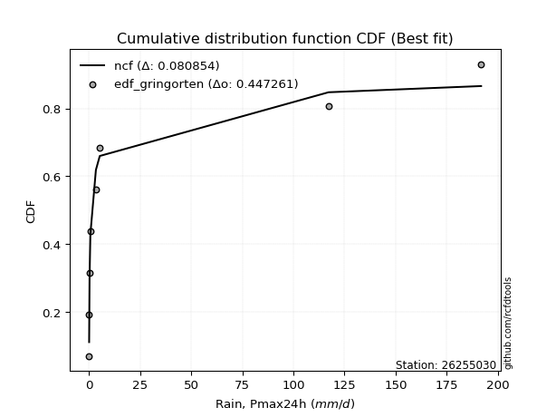</img>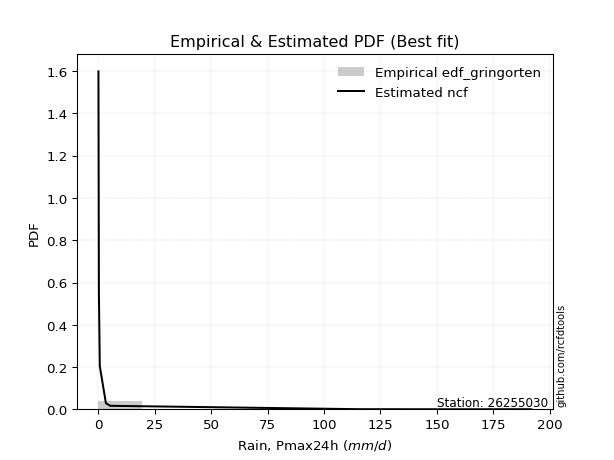</img>

</div>


### 9. EDF Filliben (1975)

The specific values of the constants (0.3175) (often denoted as $alpha$) and (0.365) are derived from a method proposed by James J. Filliben in a 1975 paper. This particular formula is the mean value of the $i$-th order statistic of the normal distribution and is considered a robust and effective plotting position formula for the normal probability plot correlation coefficient test for normality.

<div align="center">


$P=(m-0.3175)/(n+0.365)$


</div>


**9.1. Empirical values**

<div align="center">

|                | 0                  | 1                   | 2                  | 3                   | 4                  | 5                  | 6                  | 7                  |
|:---------------|:-------------------|:--------------------|:-------------------|:--------------------|:-------------------|:-------------------|:-------------------|:-------------------|
| date           | 2021               | 2020                | 2019               | 2018                | 2022               | 2016               | 2017               | 2024               |
| x              | 0.1                | 0.1                 | 0.3                | 0.7                 | 3.4                | 5.3                | 117.2              | 191.8              |
| m              | 1                  | 2                   | 3                  | 4                   | 5                  | 6                  | 7                  | 8                  |
| empirical_dist | edf_filliben       | edf_filliben        | edf_filliben       | edf_filliben        | edf_filliben       | edf_filliben       | edf_filliben       | edf_filliben       |
| empirical      | 0.0815899581589958 | 0.20113568439928273 | 0.3206814106395696 | 0.44022713687985654 | 0.5597728631201434 | 0.6793185893604303 | 0.7988643156007172 | 0.9184100418410042 |
| empirical_tr   | 1.0888382687927107 | 1.2517770295548074  | 1.4720633523977125 | 1.7864388681260008  | 2.271554650373387  | 3.118359739049394  | 4.971768202080237  | 12.256410256410254 |

</div>


**9.2. Kolmogorov-Smirnov fit test (sorted by Δ)**


<div align="center">

|                | 0                  | 1                   | 2                   | 3                   | 4                   | 5                   | 6                   | 7                   | 8                   | 9                   | 10                 | 11                  | 12                  | 13                  | 14                  | 15                  | 16                  | 17                  | 18                  | 19                  | 20                 | 21                  | 22                 | 23                  | 24                  | 25                  | 26                  | 27                  | 28                 | 29                    | 30                  | 31                  | 32                 | 33                  | 34                  | 35                  | 36                  | 37                 | 38                 | 39                  | 40                  | 41                  | 42                 | 43                 | 44                  | 45                 | 46                 | 47                  | 48                  | 49                 | 50                 | 51                  | 52                 | 53                 | 54                  | 55                  | 56                 | 57                  | 58                 | 59                  | 60                 | 61                 | 62                  | 63                 | 64                  | 65                 | 66                  | 67                  | 68                  | 69                 | 70                  | 71                 | 72                 | 73                 | 74                 | 75                 | 76                 | 77                 | 78                 | 79                 | 80                 | 81                 | 82                 | 83                 | 84                 | 85                 | 86                 | 87                 |
|:---------------|:-------------------|:--------------------|:--------------------|:--------------------|:--------------------|:--------------------|:--------------------|:--------------------|:--------------------|:--------------------|:-------------------|:--------------------|:--------------------|:--------------------|:--------------------|:--------------------|:--------------------|:--------------------|:--------------------|:--------------------|:-------------------|:--------------------|:-------------------|:--------------------|:--------------------|:--------------------|:--------------------|:--------------------|:-------------------|:----------------------|:--------------------|:--------------------|:-------------------|:--------------------|:--------------------|:--------------------|:--------------------|:-------------------|:-------------------|:--------------------|:--------------------|:--------------------|:-------------------|:-------------------|:--------------------|:-------------------|:-------------------|:--------------------|:--------------------|:-------------------|:-------------------|:--------------------|:-------------------|:-------------------|:--------------------|:--------------------|:-------------------|:--------------------|:-------------------|:--------------------|:-------------------|:-------------------|:--------------------|:-------------------|:--------------------|:-------------------|:--------------------|:--------------------|:--------------------|:-------------------|:--------------------|:-------------------|:-------------------|:-------------------|:-------------------|:-------------------|:-------------------|:-------------------|:-------------------|:-------------------|:-------------------|:-------------------|:-------------------|:-------------------|:-------------------|:-------------------|:-------------------|:-------------------|
| station        | 26255030           | 26255030            | 26255030            | 26255030            | 26255030            | 26255030            | 26255030            | 26255030            | 26255030            | 26255030            | 26255030           | 26255030            | 26255030            | 26255030            | 26255030            | 26255030            | 26255030            | 26255030            | 26255030            | 26255030            | 26255030           | 26255030            | 26255030           | 26255030            | 26255030            | 26255030            | 26255030            | 26255030            | 26255030           | 26255030              | 26255030            | 26255030            | 26255030           | 26255030            | 26255030            | 26255030            | 26255030            | 26255030           | 26255030           | 26255030            | 26255030            | 26255030            | 26255030           | 26255030           | 26255030            | 26255030           | 26255030           | 26255030            | 26255030            | 26255030           | 26255030           | 26255030            | 26255030           | 26255030           | 26255030            | 26255030            | 26255030           | 26255030            | 26255030           | 26255030            | 26255030           | 26255030           | 26255030            | 26255030           | 26255030            | 26255030           | 26255030            | 26255030            | 26255030            | 26255030           | 26255030            | 26255030           | 26255030           | 26255030           | 26255030           | 26255030           | 26255030           | 26255030           | 26255030           | 26255030           | 26255030           | 26255030           | 26255030           | 26255030           | 26255030           | 26255030           | 26255030           | 26255030           |
| empirical_dist | edf_filliben       | edf_filliben        | edf_filliben        | edf_filliben        | edf_filliben        | edf_filliben        | edf_filliben        | edf_filliben        | edf_filliben        | edf_filliben        | edf_filliben       | edf_filliben        | edf_filliben        | edf_filliben        | edf_filliben        | edf_filliben        | edf_filliben        | edf_filliben        | edf_filliben        | edf_filliben        | edf_filliben       | edf_filliben        | edf_filliben       | edf_filliben        | edf_filliben        | edf_filliben        | edf_filliben        | edf_filliben        | edf_filliben       | edf_filliben          | edf_filliben        | edf_filliben        | edf_filliben       | edf_filliben        | edf_filliben        | edf_filliben        | edf_filliben        | edf_filliben       | edf_filliben       | edf_filliben        | edf_filliben        | edf_filliben        | edf_filliben       | edf_filliben       | edf_filliben        | edf_filliben       | edf_filliben       | edf_filliben        | edf_filliben        | edf_filliben       | edf_filliben       | edf_filliben        | edf_filliben       | edf_filliben       | edf_filliben        | edf_filliben        | edf_filliben       | edf_filliben        | edf_filliben       | edf_filliben        | edf_filliben       | edf_filliben       | edf_filliben        | edf_filliben       | edf_filliben        | edf_filliben       | edf_filliben        | edf_filliben        | edf_filliben        | edf_filliben       | edf_filliben        | edf_filliben       | edf_filliben       | edf_filliben       | edf_filliben       | edf_filliben       | edf_filliben       | edf_filliben       | edf_filliben       | edf_filliben       | edf_filliben       | edf_filliben       | edf_filliben       | edf_filliben       | edf_filliben       | edf_filliben       | edf_filliben       | edf_filliben       |
| p_dist         | ncf                | lograyleigh         | logmaxwell          | loghalfnorm         | loggumbel_r         | loginvweibull       | loggenlogistic      | logpearson3         | logkstwobign        | loginvgamma         | logloggamma        | logrice             | lognorm             | lognorm             | logcrystalball      | logt                | lognct              | logalpha            | loglogistic         | logmoyal            | loginvgauss        | loghypsecant        | loglaplace         | loggumbel_l         | loghalflogistic     | logexponnorm        | chi2                | loggenexpon         | erlang             | loglaplace_asymmetric | logf                | logtruncnorm        | loggompertz        | logexpon            | logwald             | fatiguelife         | logerlang           | nakagami           | invgauss           | fisk                | loggamma            | loggamma            | logweibull_min     | logncf             | halfnorm            | halflogistic       | pearson3           | mielke              | wald                | loggibrat          | moyal              | rayleigh            | gumbel_r           | logchi2            | maxwell             | loglognorm          | norm               | crystalball         | logfatiguelife     | genlogistic         | logistic           | logfisk            | alpha               | gibrat             | logjohnsonsu        | hypsecant          | kstwobign           | gumbel_l            | rice                | betaprime          | laplace             | lognakagami        | gamma              | invweibull         | weibull_min        | exponnorm          | laplace_asymmetric | expon              | genexpon           | gompertz           | logbetaprime       | logmielke          | truncnorm          | johnsonsu          | t                  | invgamma           | nct                | f                  |
| delta          | 0.0898715549452508 | 0.10879178220250985 | 0.11181035435187259 | 0.11221596152560696 | 0.11414462019222205 | 0.11424785175690545 | 0.11432138618377274 | 0.11500102632220055 | 0.11800179445291636 | 0.12054120058822651 | 0.1208421260105883 | 0.12113692292298164 | 0.12314482949619909 | 0.12314482949619909 | 0.12314482973654373 | 0.12314502902303914 | 0.12315836109551692 | 0.12855398443158644 | 0.13025682599482347 | 0.14049705698480902 | 0.1421576422065598 | 0.14222352301694646 | 0.1696516115347838 | 0.16982432399070824 | 0.17372427765175597 | 0.19983829136321382 | 0.20018970207184475 | 0.20081870882787367 | 0.2010455108443859 | 0.2011245101499106    | 0.20113568183282032 | 0.20113568429080553 | 0.2011356843844385 | 0.20113568439928273 | 0.20113568439928273 | 0.20586177559375068 | 0.21762600576316649 | 0.2230972826088658 | 0.2494766827360767 | 0.25207845878073404 | 0.26079813330874924 | 0.26079813330874924 | 0.2704035804918143 | 0.2785520126304233 | 0.29992557648186446 | 0.2999750264788352 | 0.3106968047027157 | 0.31282440535441863 | 0.31651796235061136 | 0.3195107917176753 | 0.3247782197366217 | 0.33177832503618654 | 0.3361518643893743 | 0.3414314955739558 | 0.34301989437684677 | 0.36776286748240306 | 0.3716502366013733 | 0.37165024134992886 | 0.3727521591356456 | 0.37645899410821565 | 0.3926011409920899 | 0.3927857674426545 | 0.39638392859822047 | 0.3966255968139003 | 0.40016728817980945 | 0.4079159847310735 | 0.41510336221677396 | 0.42404317806602765 | 0.43232521327077783 | 0.4325856949692372 | 0.43364403309611865 | 0.4377289957571873 | 0.4697816174270052 | 0.4811761583361135 | 0.5458391448050425 | 0.5559277381284561 | 0.5567321228571807 | 0.5567324566612584 | 0.5567325055471941 | 0.5806004123916431 | 0.6129141782322918 | 0.6172768271092648 | 0.6247013704814616 | 0.6741500802607567 | 0.677411093219485  | 0.6790509992317979 | 0.6793115791230151 | 0.6793185893604303 |
| deltao         | 0.4472608134160001 | 0.4472608134160001  | 0.4472608134160001  | 0.4472608134160001  | 0.4472608134160001  | 0.4472608134160001  | 0.4472608134160001  | 0.4472608134160001  | 0.4472608134160001  | 0.4472608134160001  | 0.4472608134160001 | 0.4472608134160001  | 0.4472608134160001  | 0.4472608134160001  | 0.4472608134160001  | 0.4472608134160001  | 0.4472608134160001  | 0.4472608134160001  | 0.4472608134160001  | 0.4472608134160001  | 0.4472608134160001 | 0.4472608134160001  | 0.4472608134160001 | 0.4472608134160001  | 0.4472608134160001  | 0.4472608134160001  | 0.4472608134160001  | 0.4472608134160001  | 0.4472608134160001 | 0.4472608134160001    | 0.4472608134160001  | 0.4472608134160001  | 0.4472608134160001 | 0.4472608134160001  | 0.4472608134160001  | 0.4472608134160001  | 0.4472608134160001  | 0.4472608134160001 | 0.4472608134160001 | 0.4472608134160001  | 0.4472608134160001  | 0.4472608134160001  | 0.4472608134160001 | 0.4472608134160001 | 0.4472608134160001  | 0.4472608134160001 | 0.4472608134160001 | 0.4472608134160001  | 0.4472608134160001  | 0.4472608134160001 | 0.4472608134160001 | 0.4472608134160001  | 0.4472608134160001 | 0.4472608134160001 | 0.4472608134160001  | 0.4472608134160001  | 0.4472608134160001 | 0.4472608134160001  | 0.4472608134160001 | 0.4472608134160001  | 0.4472608134160001 | 0.4472608134160001 | 0.4472608134160001  | 0.4472608134160001 | 0.4472608134160001  | 0.4472608134160001 | 0.4472608134160001  | 0.4472608134160001  | 0.4472608134160001  | 0.4472608134160001 | 0.4472608134160001  | 0.4472608134160001 | 0.4472608134160001 | 0.4472608134160001 | 0.4472608134160001 | 0.4472608134160001 | 0.4472608134160001 | 0.4472608134160001 | 0.4472608134160001 | 0.4472608134160001 | 0.4472608134160001 | 0.4472608134160001 | 0.4472608134160001 | 0.4472608134160001 | 0.4472608134160001 | 0.4472608134160001 | 0.4472608134160001 | 0.4472608134160001 |
| eval           | Δo > Δ             | Δo > Δ              | Δo > Δ              | Δo > Δ              | Δo > Δ              | Δo > Δ              | Δo > Δ              | Δo > Δ              | Δo > Δ              | Δo > Δ              | Δo > Δ             | Δo > Δ              | Δo > Δ              | Δo > Δ              | Δo > Δ              | Δo > Δ              | Δo > Δ              | Δo > Δ              | Δo > Δ              | Δo > Δ              | Δo > Δ             | Δo > Δ              | Δo > Δ             | Δo > Δ              | Δo > Δ              | Δo > Δ              | Δo > Δ              | Δo > Δ              | Δo > Δ             | Δo > Δ                | Δo > Δ              | Δo > Δ              | Δo > Δ             | Δo > Δ              | Δo > Δ              | Δo > Δ              | Δo > Δ              | Δo > Δ             | Δo > Δ             | Δo > Δ              | Δo > Δ              | Δo > Δ              | Δo > Δ             | Δo > Δ             | Δo > Δ              | Δo > Δ             | Δo > Δ             | Δo > Δ              | Δo > Δ              | Δo > Δ             | Δo > Δ             | Δo > Δ              | Δo > Δ             | Δo > Δ             | Δo > Δ              | Δo > Δ              | Δo > Δ             | Δo > Δ              | Δo > Δ             | Δo > Δ              | Δo > Δ             | Δo > Δ             | Δo > Δ              | Δo > Δ             | Δo > Δ              | Δo > Δ             | Δo > Δ              | Δo > Δ              | Δo > Δ              | Δo > Δ             | Δo > Δ              | Δo > Δ             | Δo <= Δ            | Δo <= Δ            | Δo <= Δ            | Δo <= Δ            | Δo <= Δ            | Δo <= Δ            | Δo <= Δ            | Δo <= Δ            | Δo <= Δ            | Δo <= Δ            | Δo <= Δ            | Δo <= Δ            | Δo <= Δ            | Δo <= Δ            | Δo <= Δ            | Δo <= Δ            |
| fit            | 1                  | 1                   | 1                   | 1                   | 1                   | 1                   | 1                   | 1                   | 1                   | 1                   | 1                  | 1                   | 1                   | 1                   | 1                   | 1                   | 1                   | 1                   | 1                   | 1                   | 1                  | 1                   | 1                  | 1                   | 1                   | 1                   | 1                   | 1                   | 1                  | 1                     | 1                   | 1                   | 1                  | 1                   | 1                   | 1                   | 1                   | 1                  | 1                  | 1                   | 1                   | 1                   | 1                  | 1                  | 1                   | 1                  | 1                  | 1                   | 1                   | 1                  | 1                  | 1                   | 1                  | 1                  | 1                   | 1                   | 1                  | 1                   | 1                  | 1                   | 1                  | 1                  | 1                   | 1                  | 1                   | 1                  | 1                   | 1                   | 1                   | 1                  | 1                   | 1                  | 0                  | 0                  | 0                  | 0                  | 0                  | 0                  | 0                  | 0                  | 0                  | 0                  | 0                  | 0                  | 0                  | 0                  | 0                  | 0                  |
| n              | 8                  | 8                   | 8                   | 8                   | 8                   | 8                   | 8                   | 8                   | 8                   | 8                   | 8                  | 8                   | 8                   | 8                   | 8                   | 8                   | 8                   | 8                   | 8                   | 8                   | 8                  | 8                   | 8                  | 8                   | 8                   | 8                   | 8                   | 8                   | 8                  | 8                     | 8                   | 8                   | 8                  | 8                   | 8                   | 8                   | 8                   | 8                  | 8                  | 8                   | 8                   | 8                   | 8                  | 8                  | 8                   | 8                  | 8                  | 8                   | 8                   | 8                  | 8                  | 8                   | 8                  | 8                  | 8                   | 8                   | 8                  | 8                   | 8                  | 8                   | 8                  | 8                  | 8                   | 8                  | 8                   | 8                  | 8                   | 8                   | 8                   | 8                  | 8                   | 8                  | 8                  | 8                  | 8                  | 8                  | 8                  | 8                  | 8                  | 8                  | 8                  | 8                  | 8                  | 8                  | 8                  | 8                  | 8                  | 8                  |
| best_fit       | 1                  | 0                   | 0                   | 0                   | 0                   | 0                   | 0                   | 0                   | 0                   | 0                   | 0                  | 0                   | 0                   | 0                   | 0                   | 0                   | 0                   | 0                   | 0                   | 0                   | 0                  | 0                   | 0                  | 0                   | 0                   | 0                   | 0                   | 0                   | 0                  | 0                     | 0                   | 0                   | 0                  | 0                   | 0                   | 0                   | 0                   | 0                  | 0                  | 0                   | 0                   | 0                   | 0                  | 0                  | 0                   | 0                  | 0                  | 0                   | 0                   | 0                  | 0                  | 0                   | 0                  | 0                  | 0                   | 0                   | 0                  | 0                   | 0                  | 0                   | 0                  | 0                  | 0                   | 0                  | 0                   | 0                  | 0                   | 0                   | 0                   | 0                  | 0                   | 0                  | 0                  | 0                  | 0                  | 0                  | 0                  | 0                  | 0                  | 0                  | 0                  | 0                  | 0                  | 0                  | 0                  | 0                  | 0                  | 0                  |
| best_fit_sort  | 1                  | 2                   | 3                   | 4                   | 5                   | 6                   | 7                   | 8                   | 9                   | 10                  | 11                 | 12                  | 13                  | 14                  | 15                  | 16                  | 17                  | 18                  | 19                  | 20                  | 21                 | 22                  | 23                 | 24                  | 25                  | 26                  | 27                  | 28                  | 29                 | 30                    | 31                  | 32                  | 33                 | 34                  | 35                  | 36                  | 37                  | 38                 | 39                 | 40                  | 41                  | 42                  | 43                 | 44                 | 45                  | 46                 | 47                 | 48                  | 49                  | 50                 | 51                 | 52                  | 53                 | 54                 | 55                  | 56                  | 57                 | 58                  | 59                 | 60                  | 61                 | 62                 | 63                  | 64                 | 65                  | 66                 | 67                  | 68                  | 69                  | 70                 | 71                  | 72                 | 73                 | 74                 | 75                 | 76                 | 77                 | 78                 | 79                 | 80                 | 81                 | 82                 | 83                 | 84                 | 85                 | 86                 | 87                 | 88                 |

</div>


**9.3. Best fit**

<div align="center">

|   id |   station | empirical_dist   | p_dist   |     delta |   deltao | eval   |   fit |   n |   best_fit |   best_fit_sort |
|-----:|----------:|:-----------------|:---------|----------:|---------:|:-------|------:|----:|-----------:|----------------:|
|    0 |  26255030 | edf_filliben     | ncf      | 0.0898716 | 0.447261 | Δo > Δ |     1 |   8 |          1 |               1 |

</div>


<div align="center">

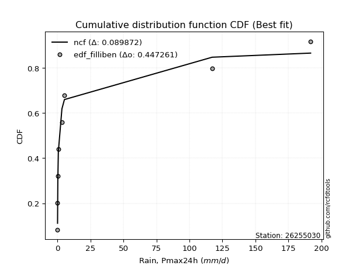</img>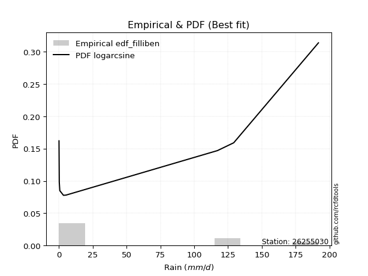</img>

</div>


### 10. EDF Jenkinson (1977)

The Jenkinson formula in hydrology is an empirical plotting position formula used to estimate the non-exceedance probability _(P)_ or return period _(T)_ of a given ordered observation within a sample. It is a widely used method in the frequency analysis of extreme events such as floods and rainfall, as it provides a distribution-free way to plot data. _a≈0.31_ and _b≈0.38_ are constants derived to approximate the median of the probability distribution for the given rank.

<div align="center">


$P=(m-a)/(n+b)$


</div>


**10.1. Empirical values**

<div align="center">

|                | 0                   | 1                   | 2                  | 3                   | 4                  | 5                  | 6                  | 7                  |
|:---------------|:--------------------|:--------------------|:-------------------|:--------------------|:-------------------|:-------------------|:-------------------|:-------------------|
| date           | 2021                | 2020                | 2019               | 2018                | 2022               | 2016               | 2017               | 2024               |
| x              | 0.1                 | 0.1                 | 0.3                | 0.7                 | 3.4                | 5.3                | 117.2              | 191.8              |
| m              | 1                   | 2                   | 3                  | 4                   | 5                  | 6                  | 7                  | 8                  |
| empirical_dist | edf_jenkinson       | edf_jenkinson       | edf_jenkinson      | edf_jenkinson       | edf_jenkinson      | edf_jenkinson      | edf_jenkinson      | edf_jenkinson      |
| empirical      | 0.08233890214797135 | 0.20167064439140808 | 0.3210023866348448 | 0.44033412887828155 | 0.5596658711217184 | 0.6789976133651551 | 0.7983293556085919 | 0.9176610978520287 |
| empirical_tr   | 1.0897269180754225  | 1.2526158445440956  | 1.4727592267135323 | 1.7867803837953091  | 2.2710027100271004 | 3.115241635687732  | 4.958579881656804  | 12.144927536231886 |

</div>


**10.2. Kolmogorov-Smirnov fit test (sorted by Δ)**


<div align="center">

|                | 0                   | 1                   | 2                   | 3                   | 4                   | 5                   | 6                   | 7                   | 8                   | 9                   | 10                  | 11                 | 12                  | 13                  | 14                  | 15                  | 16                 | 17                  | 18                  | 19                  | 20                 | 21                  | 22                  | 23                  | 24                 | 25                  | 26                 | 27                  | 28                  | 29                    | 30                  | 31                  | 32                  | 33                  | 34                  | 35                 | 36                 | 37                  | 38                  | 39                 | 40                  | 41                  | 42                 | 43                  | 44                 | 45                 | 46                  | 47                  | 48                 | 49                 | 50                  | 51                 | 52                 | 53                 | 54                 | 55                  | 56                  | 57                 | 58                 | 59                 | 60                  | 61                 | 62                  | 63                 | 64                  | 65                  | 66                 | 67                 | 68                 | 69                 | 70                 | 71                 | 72                  | 73                 | 74                 | 75                 | 76                 | 77                 | 78                 | 79                 | 80                 | 81                 | 82                 | 83                 | 84                 | 85                 | 86                 | 87                 |
|:---------------|:--------------------|:--------------------|:--------------------|:--------------------|:--------------------|:--------------------|:--------------------|:--------------------|:--------------------|:--------------------|:--------------------|:-------------------|:--------------------|:--------------------|:--------------------|:--------------------|:-------------------|:--------------------|:--------------------|:--------------------|:-------------------|:--------------------|:--------------------|:--------------------|:-------------------|:--------------------|:-------------------|:--------------------|:--------------------|:----------------------|:--------------------|:--------------------|:--------------------|:--------------------|:--------------------|:-------------------|:-------------------|:--------------------|:--------------------|:-------------------|:--------------------|:--------------------|:-------------------|:--------------------|:-------------------|:-------------------|:--------------------|:--------------------|:-------------------|:-------------------|:--------------------|:-------------------|:-------------------|:-------------------|:-------------------|:--------------------|:--------------------|:-------------------|:-------------------|:-------------------|:--------------------|:-------------------|:--------------------|:-------------------|:--------------------|:--------------------|:-------------------|:-------------------|:-------------------|:-------------------|:-------------------|:-------------------|:--------------------|:-------------------|:-------------------|:-------------------|:-------------------|:-------------------|:-------------------|:-------------------|:-------------------|:-------------------|:-------------------|:-------------------|:-------------------|:-------------------|:-------------------|:-------------------|
| station        | 26255030            | 26255030            | 26255030            | 26255030            | 26255030            | 26255030            | 26255030            | 26255030            | 26255030            | 26255030            | 26255030            | 26255030           | 26255030            | 26255030            | 26255030            | 26255030            | 26255030           | 26255030            | 26255030            | 26255030            | 26255030           | 26255030            | 26255030            | 26255030            | 26255030           | 26255030            | 26255030           | 26255030            | 26255030            | 26255030              | 26255030            | 26255030            | 26255030            | 26255030            | 26255030            | 26255030           | 26255030           | 26255030            | 26255030            | 26255030           | 26255030            | 26255030            | 26255030           | 26255030            | 26255030           | 26255030           | 26255030            | 26255030            | 26255030           | 26255030           | 26255030            | 26255030           | 26255030           | 26255030           | 26255030           | 26255030            | 26255030            | 26255030           | 26255030           | 26255030           | 26255030            | 26255030           | 26255030            | 26255030           | 26255030            | 26255030            | 26255030           | 26255030           | 26255030           | 26255030           | 26255030           | 26255030           | 26255030            | 26255030           | 26255030           | 26255030           | 26255030           | 26255030           | 26255030           | 26255030           | 26255030           | 26255030           | 26255030           | 26255030           | 26255030           | 26255030           | 26255030           | 26255030           |
| empirical_dist | edf_jenkinson       | edf_jenkinson       | edf_jenkinson       | edf_jenkinson       | edf_jenkinson       | edf_jenkinson       | edf_jenkinson       | edf_jenkinson       | edf_jenkinson       | edf_jenkinson       | edf_jenkinson       | edf_jenkinson      | edf_jenkinson       | edf_jenkinson       | edf_jenkinson       | edf_jenkinson       | edf_jenkinson      | edf_jenkinson       | edf_jenkinson       | edf_jenkinson       | edf_jenkinson      | edf_jenkinson       | edf_jenkinson       | edf_jenkinson       | edf_jenkinson      | edf_jenkinson       | edf_jenkinson      | edf_jenkinson       | edf_jenkinson       | edf_jenkinson         | edf_jenkinson       | edf_jenkinson       | edf_jenkinson       | edf_jenkinson       | edf_jenkinson       | edf_jenkinson      | edf_jenkinson      | edf_jenkinson       | edf_jenkinson       | edf_jenkinson      | edf_jenkinson       | edf_jenkinson       | edf_jenkinson      | edf_jenkinson       | edf_jenkinson      | edf_jenkinson      | edf_jenkinson       | edf_jenkinson       | edf_jenkinson      | edf_jenkinson      | edf_jenkinson       | edf_jenkinson      | edf_jenkinson      | edf_jenkinson      | edf_jenkinson      | edf_jenkinson       | edf_jenkinson       | edf_jenkinson      | edf_jenkinson      | edf_jenkinson      | edf_jenkinson       | edf_jenkinson      | edf_jenkinson       | edf_jenkinson      | edf_jenkinson       | edf_jenkinson       | edf_jenkinson      | edf_jenkinson      | edf_jenkinson      | edf_jenkinson      | edf_jenkinson      | edf_jenkinson      | edf_jenkinson       | edf_jenkinson      | edf_jenkinson      | edf_jenkinson      | edf_jenkinson      | edf_jenkinson      | edf_jenkinson      | edf_jenkinson      | edf_jenkinson      | edf_jenkinson      | edf_jenkinson      | edf_jenkinson      | edf_jenkinson      | edf_jenkinson      | edf_jenkinson      | edf_jenkinson      |
| p_dist         | ncf                 | lograyleigh         | logmaxwell          | loghalfnorm         | loggumbel_r         | loginvweibull       | loggenlogistic      | logpearson3         | logkstwobign        | loginvgamma         | logloggamma         | logrice            | lognorm             | lognorm             | logcrystalball      | logt                | lognct             | logalpha            | loglogistic         | logmoyal            | loginvgauss        | loghypsecant        | loglaplace          | loggumbel_l         | loghalflogistic    | logexponnorm        | chi2               | loggenexpon         | erlang              | loglaplace_asymmetric | logf                | logtruncnorm        | loggompertz         | logexpon            | logwald             | fatiguelife        | logerlang          | nakagami            | invgauss            | fisk               | loggamma            | loggamma            | logweibull_min     | logncf              | halfnorm           | halflogistic       | pearson3            | mielke              | wald               | loggibrat          | moyal               | rayleigh           | gumbel_r           | logchi2            | maxwell            | loglognorm          | norm                | crystalball        | logfatiguelife     | genlogistic        | logfisk             | logistic           | gibrat              | alpha              | logjohnsonsu        | hypsecant           | kstwobign          | gumbel_l           | rice               | betaprime          | laplace            | lognakagami        | gamma               | invweibull         | weibull_min        | exponnorm          | laplace_asymmetric | expon              | genexpon           | gompertz           | logbetaprime       | logmielke          | truncnorm          | johnsonsu          | t                  | invgamma           | nct                | f                  |
| delta          | 0.09040651493737616 | 0.10932674219463523 | 0.11234531434399797 | 0.11275092151773232 | 0.11467958018434743 | 0.11478281174903081 | 0.11485634617589813 | 0.11553598631432593 | 0.11853675444504175 | 0.12107616058035187 | 0.12137708600271369 | 0.121671882915107  | 0.12367978948832448 | 0.12367978948832448 | 0.12367978972866911 | 0.12367998901516453 | 0.1236933210876423 | 0.12908894442371177 | 0.13079178598694885 | 0.14103201697693438 | 0.1422646342049848 | 0.14233051501537147 | 0.16975860353320882 | 0.17035928398283362 | 0.1742592376438813 | 0.20037325135533918 | 0.2007246620639701 | 0.20135366881999903 | 0.20158047083651126 | 0.20165947014203595   | 0.20167064182494568 | 0.20167064428293088 | 0.20167064437656385 | 0.20167064439140808 | 0.20167064439140808 | 0.2055407995984755 | 0.2177329977615915 | 0.22277630661359055 | 0.24958367473450171 | 0.2517574827854588 | 0.26090512530717425 | 0.26090512530717425 | 0.2700826044965391 | 0.27780306864144777 | 0.2996046004865892 | 0.29965405048356   | 0.31037582870744046 | 0.31250342935914344 | 0.3161969863553361 | 0.3198317677129505 | 0.32445724374134643 | 0.3314573490409113 | 0.335830888394099  | 0.3415384875723808 | 0.3426989183815715 | 0.36701392349342754 | 0.37132926060609805 | 0.3713292653546536 | 0.3724311831403704 | 0.3761380181129404 | 0.39203682345367896 | 0.3922801649968147 | 0.39630462081862505 | 0.3964909205966455 | 0.39984631218453426 | 0.40759500873579824 | 0.4147823862214987 | 0.4237222020707524 | 0.4320042372755026 | 0.432264718973962  | 0.4333230571008434 | 0.4374080197619121 | 0.46946064143172994 | 0.480427214347138  | 0.5455181688097672 | 0.5556067621331808 | 0.5564111468619054 | 0.5564114806659831 | 0.5564115295519189 | 0.5802794363963678 | 0.6125932022370165 | 0.6169558511139895 | 0.6243803944861863 | 0.6738291042654815 | 0.6770901172242098 | 0.6787300232365227 | 0.6789906031277398 | 0.6789976133651552 |
| deltao         | 0.4472608134160001  | 0.4472608134160001  | 0.4472608134160001  | 0.4472608134160001  | 0.4472608134160001  | 0.4472608134160001  | 0.4472608134160001  | 0.4472608134160001  | 0.4472608134160001  | 0.4472608134160001  | 0.4472608134160001  | 0.4472608134160001 | 0.4472608134160001  | 0.4472608134160001  | 0.4472608134160001  | 0.4472608134160001  | 0.4472608134160001 | 0.4472608134160001  | 0.4472608134160001  | 0.4472608134160001  | 0.4472608134160001 | 0.4472608134160001  | 0.4472608134160001  | 0.4472608134160001  | 0.4472608134160001 | 0.4472608134160001  | 0.4472608134160001 | 0.4472608134160001  | 0.4472608134160001  | 0.4472608134160001    | 0.4472608134160001  | 0.4472608134160001  | 0.4472608134160001  | 0.4472608134160001  | 0.4472608134160001  | 0.4472608134160001 | 0.4472608134160001 | 0.4472608134160001  | 0.4472608134160001  | 0.4472608134160001 | 0.4472608134160001  | 0.4472608134160001  | 0.4472608134160001 | 0.4472608134160001  | 0.4472608134160001 | 0.4472608134160001 | 0.4472608134160001  | 0.4472608134160001  | 0.4472608134160001 | 0.4472608134160001 | 0.4472608134160001  | 0.4472608134160001 | 0.4472608134160001 | 0.4472608134160001 | 0.4472608134160001 | 0.4472608134160001  | 0.4472608134160001  | 0.4472608134160001 | 0.4472608134160001 | 0.4472608134160001 | 0.4472608134160001  | 0.4472608134160001 | 0.4472608134160001  | 0.4472608134160001 | 0.4472608134160001  | 0.4472608134160001  | 0.4472608134160001 | 0.4472608134160001 | 0.4472608134160001 | 0.4472608134160001 | 0.4472608134160001 | 0.4472608134160001 | 0.4472608134160001  | 0.4472608134160001 | 0.4472608134160001 | 0.4472608134160001 | 0.4472608134160001 | 0.4472608134160001 | 0.4472608134160001 | 0.4472608134160001 | 0.4472608134160001 | 0.4472608134160001 | 0.4472608134160001 | 0.4472608134160001 | 0.4472608134160001 | 0.4472608134160001 | 0.4472608134160001 | 0.4472608134160001 |
| eval           | Δo > Δ              | Δo > Δ              | Δo > Δ              | Δo > Δ              | Δo > Δ              | Δo > Δ              | Δo > Δ              | Δo > Δ              | Δo > Δ              | Δo > Δ              | Δo > Δ              | Δo > Δ             | Δo > Δ              | Δo > Δ              | Δo > Δ              | Δo > Δ              | Δo > Δ             | Δo > Δ              | Δo > Δ              | Δo > Δ              | Δo > Δ             | Δo > Δ              | Δo > Δ              | Δo > Δ              | Δo > Δ             | Δo > Δ              | Δo > Δ             | Δo > Δ              | Δo > Δ              | Δo > Δ                | Δo > Δ              | Δo > Δ              | Δo > Δ              | Δo > Δ              | Δo > Δ              | Δo > Δ             | Δo > Δ             | Δo > Δ              | Δo > Δ              | Δo > Δ             | Δo > Δ              | Δo > Δ              | Δo > Δ             | Δo > Δ              | Δo > Δ             | Δo > Δ             | Δo > Δ              | Δo > Δ              | Δo > Δ             | Δo > Δ             | Δo > Δ              | Δo > Δ             | Δo > Δ             | Δo > Δ             | Δo > Δ             | Δo > Δ              | Δo > Δ              | Δo > Δ             | Δo > Δ             | Δo > Δ             | Δo > Δ              | Δo > Δ             | Δo > Δ              | Δo > Δ             | Δo > Δ              | Δo > Δ              | Δo > Δ             | Δo > Δ             | Δo > Δ             | Δo > Δ             | Δo > Δ             | Δo > Δ             | Δo <= Δ             | Δo <= Δ            | Δo <= Δ            | Δo <= Δ            | Δo <= Δ            | Δo <= Δ            | Δo <= Δ            | Δo <= Δ            | Δo <= Δ            | Δo <= Δ            | Δo <= Δ            | Δo <= Δ            | Δo <= Δ            | Δo <= Δ            | Δo <= Δ            | Δo <= Δ            |
| fit            | 1                   | 1                   | 1                   | 1                   | 1                   | 1                   | 1                   | 1                   | 1                   | 1                   | 1                   | 1                  | 1                   | 1                   | 1                   | 1                   | 1                  | 1                   | 1                   | 1                   | 1                  | 1                   | 1                   | 1                   | 1                  | 1                   | 1                  | 1                   | 1                   | 1                     | 1                   | 1                   | 1                   | 1                   | 1                   | 1                  | 1                  | 1                   | 1                   | 1                  | 1                   | 1                   | 1                  | 1                   | 1                  | 1                  | 1                   | 1                   | 1                  | 1                  | 1                   | 1                  | 1                  | 1                  | 1                  | 1                   | 1                   | 1                  | 1                  | 1                  | 1                   | 1                  | 1                   | 1                  | 1                   | 1                   | 1                  | 1                  | 1                  | 1                  | 1                  | 1                  | 0                   | 0                  | 0                  | 0                  | 0                  | 0                  | 0                  | 0                  | 0                  | 0                  | 0                  | 0                  | 0                  | 0                  | 0                  | 0                  |
| n              | 8                   | 8                   | 8                   | 8                   | 8                   | 8                   | 8                   | 8                   | 8                   | 8                   | 8                   | 8                  | 8                   | 8                   | 8                   | 8                   | 8                  | 8                   | 8                   | 8                   | 8                  | 8                   | 8                   | 8                   | 8                  | 8                   | 8                  | 8                   | 8                   | 8                     | 8                   | 8                   | 8                   | 8                   | 8                   | 8                  | 8                  | 8                   | 8                   | 8                  | 8                   | 8                   | 8                  | 8                   | 8                  | 8                  | 8                   | 8                   | 8                  | 8                  | 8                   | 8                  | 8                  | 8                  | 8                  | 8                   | 8                   | 8                  | 8                  | 8                  | 8                   | 8                  | 8                   | 8                  | 8                   | 8                   | 8                  | 8                  | 8                  | 8                  | 8                  | 8                  | 8                   | 8                  | 8                  | 8                  | 8                  | 8                  | 8                  | 8                  | 8                  | 8                  | 8                  | 8                  | 8                  | 8                  | 8                  | 8                  |
| best_fit       | 1                   | 0                   | 0                   | 0                   | 0                   | 0                   | 0                   | 0                   | 0                   | 0                   | 0                   | 0                  | 0                   | 0                   | 0                   | 0                   | 0                  | 0                   | 0                   | 0                   | 0                  | 0                   | 0                   | 0                   | 0                  | 0                   | 0                  | 0                   | 0                   | 0                     | 0                   | 0                   | 0                   | 0                   | 0                   | 0                  | 0                  | 0                   | 0                   | 0                  | 0                   | 0                   | 0                  | 0                   | 0                  | 0                  | 0                   | 0                   | 0                  | 0                  | 0                   | 0                  | 0                  | 0                  | 0                  | 0                   | 0                   | 0                  | 0                  | 0                  | 0                   | 0                  | 0                   | 0                  | 0                   | 0                   | 0                  | 0                  | 0                  | 0                  | 0                  | 0                  | 0                   | 0                  | 0                  | 0                  | 0                  | 0                  | 0                  | 0                  | 0                  | 0                  | 0                  | 0                  | 0                  | 0                  | 0                  | 0                  |
| best_fit_sort  | 1                   | 2                   | 3                   | 4                   | 5                   | 6                   | 7                   | 8                   | 9                   | 10                  | 11                  | 12                 | 13                  | 14                  | 15                  | 16                  | 17                 | 18                  | 19                  | 20                  | 21                 | 22                  | 23                  | 24                  | 25                 | 26                  | 27                 | 28                  | 29                  | 30                    | 31                  | 32                  | 33                  | 34                  | 35                  | 36                 | 37                 | 38                  | 39                  | 40                 | 41                  | 42                  | 43                 | 44                  | 45                 | 46                 | 47                  | 48                  | 49                 | 50                 | 51                  | 52                 | 53                 | 54                 | 55                 | 56                  | 57                  | 58                 | 59                 | 60                 | 61                  | 62                 | 63                  | 64                 | 65                  | 66                  | 67                 | 68                 | 69                 | 70                 | 71                 | 72                 | 73                  | 74                 | 75                 | 76                 | 77                 | 78                 | 79                 | 80                 | 81                 | 82                 | 83                 | 84                 | 85                 | 86                 | 87                 | 88                 |

</div>


**10.3. Best fit**

<div align="center">

|   id |   station | empirical_dist   | p_dist   |     delta |   deltao | eval   |   fit |   n |   best_fit |   best_fit_sort |
|-----:|----------:|:-----------------|:---------|----------:|---------:|:-------|------:|----:|-----------:|----------------:|
|    0 |  26255030 | edf_jenkinson    | ncf      | 0.0904065 | 0.447261 | Δo > Δ |     1 |   8 |          1 |               1 |

</div>


<div align="center">

</img>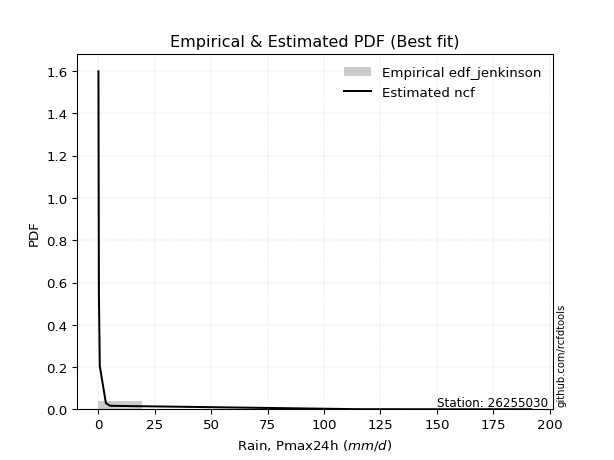</img>

</div>


### 11. EDF Cunnane (1978)

Cunnane´s work in statistical hydrology has focused on the performance and evaluation of different probability distributions (such as GEV, Gumbel, Lognormal) for flood frequency estimation. _b_ is a constant, typically set to 0.4.

<div align="center">


$P=(m-b)/(n+1-2b)$


</div>


**11.1. Empirical values**

<div align="center">

|                | 0                   | 1                   | 2                  | 3                  | 4                  | 5                  | 6                  | 7                  |
|:---------------|:--------------------|:--------------------|:-------------------|:-------------------|:-------------------|:-------------------|:-------------------|:-------------------|
| date           | 2021                | 2020                | 2019               | 2018               | 2022               | 2016               | 2017               | 2024               |
| x              | 0.1                 | 0.1                 | 0.3                | 0.7                | 3.4                | 5.3                | 117.2              | 191.8              |
| m              | 1                   | 2                   | 3                  | 4                  | 5                  | 6                  | 7                  | 8                  |
| empirical_dist | edf_cunnane         | edf_cunnane         | edf_cunnane        | edf_cunnane        | edf_cunnane        | edf_cunnane        | edf_cunnane        | edf_cunnane        |
| empirical      | 0.07317073170731708 | 0.19512195121951223 | 0.3170731707317074 | 0.4390243902439025 | 0.5609756097560976 | 0.6829268292682927 | 0.8048780487804879 | 0.926829268292683  |
| empirical_tr   | 1.0789473684210527  | 1.2424242424242424  | 1.4642857142857144 | 1.782608695652174  | 2.277777777777778  | 3.153846153846154  | 5.125000000000001  | 13.666666666666675 |

</div>


**11.2. Kolmogorov-Smirnov fit test (sorted by Δ)**


<div align="center">

|                | 0                  | 1                   | 2                   | 3                   | 4                   | 5                   | 6                   | 7                   | 8                   | 9                   | 10                 | 11                  | 12                  | 13                  | 14                  | 15                  | 16                  | 17                  | 18                  | 19                  | 20                 | 21                  | 22                 | 23                  | 24                  | 25                  | 26                  | 27                  | 28                 | 29                    | 30                  | 31                  | 32                 | 33                  | 34                  | 35                  | 36                  | 37                 | 38                 | 39                  | 40                 | 41                 | 42                  | 43                 | 44                 | 45                  | 46                 | 47                 | 48                 | 49                  | 50                 | 51                  | 52                 | 53                 | 54                 | 55                 | 56                  | 57                  | 58                 | 59                  | 60                  | 61                  | 62                 | 63                 | 64                 | 65                 | 66                 | 67                  | 68                  | 69                  | 70                  | 71                  | 72                 | 73                 | 74                 | 75                 | 76                 | 77                 | 78                 | 79                 | 80                 | 81                 | 82                 | 83                 | 84                 | 85                 | 86                 | 87                 |
|:---------------|:-------------------|:--------------------|:--------------------|:--------------------|:--------------------|:--------------------|:--------------------|:--------------------|:--------------------|:--------------------|:-------------------|:--------------------|:--------------------|:--------------------|:--------------------|:--------------------|:--------------------|:--------------------|:--------------------|:--------------------|:-------------------|:--------------------|:-------------------|:--------------------|:--------------------|:--------------------|:--------------------|:--------------------|:-------------------|:----------------------|:--------------------|:--------------------|:-------------------|:--------------------|:--------------------|:--------------------|:--------------------|:-------------------|:-------------------|:--------------------|:-------------------|:-------------------|:--------------------|:-------------------|:-------------------|:--------------------|:-------------------|:-------------------|:-------------------|:--------------------|:-------------------|:--------------------|:-------------------|:-------------------|:-------------------|:-------------------|:--------------------|:--------------------|:-------------------|:--------------------|:--------------------|:--------------------|:-------------------|:-------------------|:-------------------|:-------------------|:-------------------|:--------------------|:--------------------|:--------------------|:--------------------|:--------------------|:-------------------|:-------------------|:-------------------|:-------------------|:-------------------|:-------------------|:-------------------|:-------------------|:-------------------|:-------------------|:-------------------|:-------------------|:-------------------|:-------------------|:-------------------|:-------------------|
| station        | 26255030           | 26255030            | 26255030            | 26255030            | 26255030            | 26255030            | 26255030            | 26255030            | 26255030            | 26255030            | 26255030           | 26255030            | 26255030            | 26255030            | 26255030            | 26255030            | 26255030            | 26255030            | 26255030            | 26255030            | 26255030           | 26255030            | 26255030           | 26255030            | 26255030            | 26255030            | 26255030            | 26255030            | 26255030           | 26255030              | 26255030            | 26255030            | 26255030           | 26255030            | 26255030            | 26255030            | 26255030            | 26255030           | 26255030           | 26255030            | 26255030           | 26255030           | 26255030            | 26255030           | 26255030           | 26255030            | 26255030           | 26255030           | 26255030           | 26255030            | 26255030           | 26255030            | 26255030           | 26255030           | 26255030           | 26255030           | 26255030            | 26255030            | 26255030           | 26255030            | 26255030            | 26255030            | 26255030           | 26255030           | 26255030           | 26255030           | 26255030           | 26255030            | 26255030            | 26255030            | 26255030            | 26255030            | 26255030           | 26255030           | 26255030           | 26255030           | 26255030           | 26255030           | 26255030           | 26255030           | 26255030           | 26255030           | 26255030           | 26255030           | 26255030           | 26255030           | 26255030           | 26255030           |
| empirical_dist | edf_cunnane        | edf_cunnane         | edf_cunnane         | edf_cunnane         | edf_cunnane         | edf_cunnane         | edf_cunnane         | edf_cunnane         | edf_cunnane         | edf_cunnane         | edf_cunnane        | edf_cunnane         | edf_cunnane         | edf_cunnane         | edf_cunnane         | edf_cunnane         | edf_cunnane         | edf_cunnane         | edf_cunnane         | edf_cunnane         | edf_cunnane        | edf_cunnane         | edf_cunnane        | edf_cunnane         | edf_cunnane         | edf_cunnane         | edf_cunnane         | edf_cunnane         | edf_cunnane        | edf_cunnane           | edf_cunnane         | edf_cunnane         | edf_cunnane        | edf_cunnane         | edf_cunnane         | edf_cunnane         | edf_cunnane         | edf_cunnane        | edf_cunnane        | edf_cunnane         | edf_cunnane        | edf_cunnane        | edf_cunnane         | edf_cunnane        | edf_cunnane        | edf_cunnane         | edf_cunnane        | edf_cunnane        | edf_cunnane        | edf_cunnane         | edf_cunnane        | edf_cunnane         | edf_cunnane        | edf_cunnane        | edf_cunnane        | edf_cunnane        | edf_cunnane         | edf_cunnane         | edf_cunnane        | edf_cunnane         | edf_cunnane         | edf_cunnane         | edf_cunnane        | edf_cunnane        | edf_cunnane        | edf_cunnane        | edf_cunnane        | edf_cunnane         | edf_cunnane         | edf_cunnane         | edf_cunnane         | edf_cunnane         | edf_cunnane        | edf_cunnane        | edf_cunnane        | edf_cunnane        | edf_cunnane        | edf_cunnane        | edf_cunnane        | edf_cunnane        | edf_cunnane        | edf_cunnane        | edf_cunnane        | edf_cunnane        | edf_cunnane        | edf_cunnane        | edf_cunnane        | edf_cunnane        |
| p_dist         | ncf                | lograyleigh         | logmaxwell          | loghalfnorm         | loggumbel_r         | loginvweibull       | loggenlogistic      | logpearson3         | logkstwobign        | loginvgamma         | logloggamma        | logrice             | lognorm             | lognorm             | logcrystalball      | logt                | lognct              | logalpha            | loglogistic         | logmoyal            | loginvgauss        | loghypsecant        | loggumbel_l        | loghalflogistic     | loglaplace          | logexponnorm        | chi2                | loggenexpon         | erlang             | loglaplace_asymmetric | logf                | logtruncnorm        | loggompertz        | logexpon            | logwald             | fatiguelife         | logerlang           | nakagami           | invgauss           | fisk                | loggamma           | loggamma           | logweibull_min      | logncf             | halfnorm           | halflogistic        | pearson3           | loggibrat          | mielke             | wald                | moyal              | rayleigh            | gumbel_r           | logchi2            | maxwell            | norm               | crystalball         | loglognorm          | logfatiguelife     | genlogistic         | alpha               | logistic            | gibrat             | logfisk            | logjohnsonsu       | hypsecant          | kstwobign          | gumbel_l            | rice                | betaprime           | laplace             | lognakagami         | gamma              | invweibull         | weibull_min        | exponnorm          | laplace_asymmetric | expon              | genexpon           | gompertz           | logbetaprime       | logmielke          | truncnorm          | johnsonsu          | t                  | invgamma           | nct                | f                  |
| delta          | 0.0838578217654803 | 0.10277804902273924 | 0.10579662117210198 | 0.10620222834583647 | 0.10813088701245144 | 0.10823411857713496 | 0.10830765300400214 | 0.10898729314242994 | 0.11198806127314576 | 0.11452746740845601 | 0.1148283928308177 | 0.11512318974321115 | 0.11713109631642848 | 0.11713109631642848 | 0.11713109655677312 | 0.11713129584326853 | 0.11714462791574631 | 0.12254025125181593 | 0.12633124025717934 | 0.13448332380503852 | 0.1409548955706056 | 0.14102077638099242 | 0.1639325055387621 | 0.16771054447198547 | 0.16844886489882976 | 0.19382455818344332 | 0.19417596889207425 | 0.19480497564810317 | 0.1950317776646154 | 0.1951107769701401    | 0.19512194865304983 | 0.19512195111103503 | 0.195121951204668  | 0.19512195121951223 | 0.19512195121951223 | 0.20947001550161293 | 0.21642325912721228 | 0.2267055225167282 | 0.2482739361001225 | 0.25568669868859645 | 0.259595386672795  | 0.259595386672795  | 0.27401182039967653 | 0.2869712390821021 | 0.3035338163897269 | 0.30358326638669764 | 0.3143050446105781 | 0.3159025518098131 | 0.3164326452622809 | 0.32012620225847377 | 0.3283864596444841 | 0.33538656494404895 | 0.3397601042972367 | 0.3402287489380016 | 0.3466281342847092 | 0.3752584765092357 | 0.37525848125779127 | 0.37618209393408186 | 0.3763603990435078 | 0.38006723401607806 | 0.39518118196226626 | 0.39620938089995233 | 0.4002338367217627 | 0.4012049938943333 | 0.4037755280876717 | 0.4115242246389359 | 0.4187116021246364 | 0.42765141797389006 | 0.43593345317864024 | 0.43619393487709945 | 0.43725227300398106 | 0.44133723566504957 | 0.4733898573348676 | 0.4895953847877923 | 0.5494473847129049 | 0.5595359780363185 | 0.5603403627650431 | 0.5603406965691208 | 0.5603407454550565 | 0.5842086522995055 | 0.616522418140154  | 0.620885067017127  | 0.628309610389324  | 0.6777583201686189 | 0.6810193331273472 | 0.6826592391396601 | 0.6829198190308773 | 0.6829268292682926 |
| deltao         | 0.4472608134160001 | 0.4472608134160001  | 0.4472608134160001  | 0.4472608134160001  | 0.4472608134160001  | 0.4472608134160001  | 0.4472608134160001  | 0.4472608134160001  | 0.4472608134160001  | 0.4472608134160001  | 0.4472608134160001 | 0.4472608134160001  | 0.4472608134160001  | 0.4472608134160001  | 0.4472608134160001  | 0.4472608134160001  | 0.4472608134160001  | 0.4472608134160001  | 0.4472608134160001  | 0.4472608134160001  | 0.4472608134160001 | 0.4472608134160001  | 0.4472608134160001 | 0.4472608134160001  | 0.4472608134160001  | 0.4472608134160001  | 0.4472608134160001  | 0.4472608134160001  | 0.4472608134160001 | 0.4472608134160001    | 0.4472608134160001  | 0.4472608134160001  | 0.4472608134160001 | 0.4472608134160001  | 0.4472608134160001  | 0.4472608134160001  | 0.4472608134160001  | 0.4472608134160001 | 0.4472608134160001 | 0.4472608134160001  | 0.4472608134160001 | 0.4472608134160001 | 0.4472608134160001  | 0.4472608134160001 | 0.4472608134160001 | 0.4472608134160001  | 0.4472608134160001 | 0.4472608134160001 | 0.4472608134160001 | 0.4472608134160001  | 0.4472608134160001 | 0.4472608134160001  | 0.4472608134160001 | 0.4472608134160001 | 0.4472608134160001 | 0.4472608134160001 | 0.4472608134160001  | 0.4472608134160001  | 0.4472608134160001 | 0.4472608134160001  | 0.4472608134160001  | 0.4472608134160001  | 0.4472608134160001 | 0.4472608134160001 | 0.4472608134160001 | 0.4472608134160001 | 0.4472608134160001 | 0.4472608134160001  | 0.4472608134160001  | 0.4472608134160001  | 0.4472608134160001  | 0.4472608134160001  | 0.4472608134160001 | 0.4472608134160001 | 0.4472608134160001 | 0.4472608134160001 | 0.4472608134160001 | 0.4472608134160001 | 0.4472608134160001 | 0.4472608134160001 | 0.4472608134160001 | 0.4472608134160001 | 0.4472608134160001 | 0.4472608134160001 | 0.4472608134160001 | 0.4472608134160001 | 0.4472608134160001 | 0.4472608134160001 |
| eval           | Δo > Δ             | Δo > Δ              | Δo > Δ              | Δo > Δ              | Δo > Δ              | Δo > Δ              | Δo > Δ              | Δo > Δ              | Δo > Δ              | Δo > Δ              | Δo > Δ             | Δo > Δ              | Δo > Δ              | Δo > Δ              | Δo > Δ              | Δo > Δ              | Δo > Δ              | Δo > Δ              | Δo > Δ              | Δo > Δ              | Δo > Δ             | Δo > Δ              | Δo > Δ             | Δo > Δ              | Δo > Δ              | Δo > Δ              | Δo > Δ              | Δo > Δ              | Δo > Δ             | Δo > Δ                | Δo > Δ              | Δo > Δ              | Δo > Δ             | Δo > Δ              | Δo > Δ              | Δo > Δ              | Δo > Δ              | Δo > Δ             | Δo > Δ             | Δo > Δ              | Δo > Δ             | Δo > Δ             | Δo > Δ              | Δo > Δ             | Δo > Δ             | Δo > Δ              | Δo > Δ             | Δo > Δ             | Δo > Δ             | Δo > Δ              | Δo > Δ             | Δo > Δ              | Δo > Δ             | Δo > Δ             | Δo > Δ             | Δo > Δ             | Δo > Δ              | Δo > Δ              | Δo > Δ             | Δo > Δ              | Δo > Δ              | Δo > Δ              | Δo > Δ             | Δo > Δ             | Δo > Δ             | Δo > Δ             | Δo > Δ             | Δo > Δ              | Δo > Δ              | Δo > Δ              | Δo > Δ              | Δo > Δ              | Δo <= Δ            | Δo <= Δ            | Δo <= Δ            | Δo <= Δ            | Δo <= Δ            | Δo <= Δ            | Δo <= Δ            | Δo <= Δ            | Δo <= Δ            | Δo <= Δ            | Δo <= Δ            | Δo <= Δ            | Δo <= Δ            | Δo <= Δ            | Δo <= Δ            | Δo <= Δ            |
| fit            | 1                  | 1                   | 1                   | 1                   | 1                   | 1                   | 1                   | 1                   | 1                   | 1                   | 1                  | 1                   | 1                   | 1                   | 1                   | 1                   | 1                   | 1                   | 1                   | 1                   | 1                  | 1                   | 1                  | 1                   | 1                   | 1                   | 1                   | 1                   | 1                  | 1                     | 1                   | 1                   | 1                  | 1                   | 1                   | 1                   | 1                   | 1                  | 1                  | 1                   | 1                  | 1                  | 1                   | 1                  | 1                  | 1                   | 1                  | 1                  | 1                  | 1                   | 1                  | 1                   | 1                  | 1                  | 1                  | 1                  | 1                   | 1                   | 1                  | 1                   | 1                   | 1                   | 1                  | 1                  | 1                  | 1                  | 1                  | 1                   | 1                   | 1                   | 1                   | 1                   | 0                  | 0                  | 0                  | 0                  | 0                  | 0                  | 0                  | 0                  | 0                  | 0                  | 0                  | 0                  | 0                  | 0                  | 0                  | 0                  |
| n              | 8                  | 8                   | 8                   | 8                   | 8                   | 8                   | 8                   | 8                   | 8                   | 8                   | 8                  | 8                   | 8                   | 8                   | 8                   | 8                   | 8                   | 8                   | 8                   | 8                   | 8                  | 8                   | 8                  | 8                   | 8                   | 8                   | 8                   | 8                   | 8                  | 8                     | 8                   | 8                   | 8                  | 8                   | 8                   | 8                   | 8                   | 8                  | 8                  | 8                   | 8                  | 8                  | 8                   | 8                  | 8                  | 8                   | 8                  | 8                  | 8                  | 8                   | 8                  | 8                   | 8                  | 8                  | 8                  | 8                  | 8                   | 8                   | 8                  | 8                   | 8                   | 8                   | 8                  | 8                  | 8                  | 8                  | 8                  | 8                   | 8                   | 8                   | 8                   | 8                   | 8                  | 8                  | 8                  | 8                  | 8                  | 8                  | 8                  | 8                  | 8                  | 8                  | 8                  | 8                  | 8                  | 8                  | 8                  | 8                  |
| best_fit       | 1                  | 0                   | 0                   | 0                   | 0                   | 0                   | 0                   | 0                   | 0                   | 0                   | 0                  | 0                   | 0                   | 0                   | 0                   | 0                   | 0                   | 0                   | 0                   | 0                   | 0                  | 0                   | 0                  | 0                   | 0                   | 0                   | 0                   | 0                   | 0                  | 0                     | 0                   | 0                   | 0                  | 0                   | 0                   | 0                   | 0                   | 0                  | 0                  | 0                   | 0                  | 0                  | 0                   | 0                  | 0                  | 0                   | 0                  | 0                  | 0                  | 0                   | 0                  | 0                   | 0                  | 0                  | 0                  | 0                  | 0                   | 0                   | 0                  | 0                   | 0                   | 0                   | 0                  | 0                  | 0                  | 0                  | 0                  | 0                   | 0                   | 0                   | 0                   | 0                   | 0                  | 0                  | 0                  | 0                  | 0                  | 0                  | 0                  | 0                  | 0                  | 0                  | 0                  | 0                  | 0                  | 0                  | 0                  | 0                  |
| best_fit_sort  | 1                  | 2                   | 3                   | 4                   | 5                   | 6                   | 7                   | 8                   | 9                   | 10                  | 11                 | 12                  | 13                  | 14                  | 15                  | 16                  | 17                  | 18                  | 19                  | 20                  | 21                 | 22                  | 23                 | 24                  | 25                  | 26                  | 27                  | 28                  | 29                 | 30                    | 31                  | 32                  | 33                 | 34                  | 35                  | 36                  | 37                  | 38                 | 39                 | 40                  | 41                 | 42                 | 43                  | 44                 | 45                 | 46                  | 47                 | 48                 | 49                 | 50                  | 51                 | 52                  | 53                 | 54                 | 55                 | 56                 | 57                  | 58                  | 59                 | 60                  | 61                  | 62                  | 63                 | 64                 | 65                 | 66                 | 67                 | 68                  | 69                  | 70                  | 71                  | 72                  | 73                 | 74                 | 75                 | 76                 | 77                 | 78                 | 79                 | 80                 | 81                 | 82                 | 83                 | 84                 | 85                 | 86                 | 87                 | 88                 |

</div>


**11.3. Best fit**

<div align="center">

|   id |   station | empirical_dist   | p_dist   |     delta |   deltao | eval   |   fit |   n |   best_fit |   best_fit_sort |
|-----:|----------:|:-----------------|:---------|----------:|---------:|:-------|------:|----:|-----------:|----------------:|
|    0 |  26255030 | edf_cunnane      | ncf      | 0.0838578 | 0.447261 | Δo > Δ |     1 |   8 |          1 |               1 |

</div>


<div align="center">

</img></img>

</div>


### 12. EDF Adamowski (1981)

The Adamowski formula in hydrology refers to a specific plotting position formula used for estimating the non-parametric empirical distribution of hydrological events (like flood peaks) to calculate their return periods. This formula provides an alternative to traditional parametric methods (like the Gumbel or Log Pearson Type III distributions). 

<div align="center">


$P=(m-0.25)/(n+0.5)$


</div>


**12.1. Empirical values**

<div align="center">

|                | 0                   | 1                   | 2                  | 3                  | 4                  | 5                  | 6                  | 7                  |
|:---------------|:--------------------|:--------------------|:-------------------|:-------------------|:-------------------|:-------------------|:-------------------|:-------------------|
| date           | 2021                | 2020                | 2019               | 2018               | 2022               | 2016               | 2017               | 2024               |
| x              | 0.1                 | 0.1                 | 0.3                | 0.7                | 3.4                | 5.3                | 117.2              | 191.8              |
| m              | 1                   | 2                   | 3                  | 4                  | 5                  | 6                  | 7                  | 8                  |
| empirical_dist | edf_adamowski       | edf_adamowski       | edf_adamowski      | edf_adamowski      | edf_adamowski      | edf_adamowski      | edf_adamowski      | edf_adamowski      |
| empirical      | 0.08823529411764706 | 0.20588235294117646 | 0.3235294117647059 | 0.4411764705882353 | 0.5588235294117647 | 0.6764705882352942 | 0.7941176470588235 | 0.9117647058823529 |
| empirical_tr   | 1.096774193548387   | 1.259259259259259   | 1.4782608695652173 | 1.7894736842105263 | 2.2666666666666666 | 3.0909090909090913 | 4.857142857142856  | 11.33333333333333  |

</div>


**12.2. Kolmogorov-Smirnov fit test (sorted by Δ)**


<div align="center">

|                | 0                   | 1                   | 2                   | 3                  | 4                   | 5                   | 6                  | 7                   | 8                   | 9                   | 10                  | 11                  | 12                  | 13                  | 14                 | 15                 | 16                  | 17                  | 18                  | 19                  | 20                 | 21                  | 22                  | 23                 | 24                  | 25                 | 26                  | 27                  | 28                 | 29                  | 30                    | 31                  | 32                  | 33                  | 34                  | 35                  | 36                  | 37                  | 38                  | 39                 | 40                 | 41                 | 42                 | 43                  | 44                 | 45                  | 46                  | 47                  | 48                 | 49                 | 50                 | 51                  | 52                 | 53                 | 54                 | 55                 | 56                  | 57                 | 58                 | 59                 | 60                  | 61                  | 62                  | 63                 | 64                  | 65                 | 66                 | 67                 | 68                  | 69                  | 70                 | 71                  | 72                 | 73                  | 74                 | 75                 | 76                 | 77                 | 78                 | 79                 | 80                 | 81                 | 82                 | 83                 | 84                 | 85                 | 86                 | 87                 |
|:---------------|:--------------------|:--------------------|:--------------------|:-------------------|:--------------------|:--------------------|:-------------------|:--------------------|:--------------------|:--------------------|:--------------------|:--------------------|:--------------------|:--------------------|:-------------------|:-------------------|:--------------------|:--------------------|:--------------------|:--------------------|:-------------------|:--------------------|:--------------------|:-------------------|:--------------------|:-------------------|:--------------------|:--------------------|:-------------------|:--------------------|:----------------------|:--------------------|:--------------------|:--------------------|:--------------------|:--------------------|:--------------------|:--------------------|:--------------------|:-------------------|:-------------------|:-------------------|:-------------------|:--------------------|:-------------------|:--------------------|:--------------------|:--------------------|:-------------------|:-------------------|:-------------------|:--------------------|:-------------------|:-------------------|:-------------------|:-------------------|:--------------------|:-------------------|:-------------------|:-------------------|:--------------------|:--------------------|:--------------------|:-------------------|:--------------------|:-------------------|:-------------------|:-------------------|:--------------------|:--------------------|:-------------------|:--------------------|:-------------------|:--------------------|:-------------------|:-------------------|:-------------------|:-------------------|:-------------------|:-------------------|:-------------------|:-------------------|:-------------------|:-------------------|:-------------------|:-------------------|:-------------------|:-------------------|
| station        | 26255030            | 26255030            | 26255030            | 26255030           | 26255030            | 26255030            | 26255030           | 26255030            | 26255030            | 26255030            | 26255030            | 26255030            | 26255030            | 26255030            | 26255030           | 26255030           | 26255030            | 26255030            | 26255030            | 26255030            | 26255030           | 26255030            | 26255030            | 26255030           | 26255030            | 26255030           | 26255030            | 26255030            | 26255030           | 26255030            | 26255030              | 26255030            | 26255030            | 26255030            | 26255030            | 26255030            | 26255030            | 26255030            | 26255030            | 26255030           | 26255030           | 26255030           | 26255030           | 26255030            | 26255030           | 26255030            | 26255030            | 26255030            | 26255030           | 26255030           | 26255030           | 26255030            | 26255030           | 26255030           | 26255030           | 26255030           | 26255030            | 26255030           | 26255030           | 26255030           | 26255030            | 26255030            | 26255030            | 26255030           | 26255030            | 26255030           | 26255030           | 26255030           | 26255030            | 26255030            | 26255030           | 26255030            | 26255030           | 26255030            | 26255030           | 26255030           | 26255030           | 26255030           | 26255030           | 26255030           | 26255030           | 26255030           | 26255030           | 26255030           | 26255030           | 26255030           | 26255030           | 26255030           |
| empirical_dist | edf_adamowski       | edf_adamowski       | edf_adamowski       | edf_adamowski      | edf_adamowski       | edf_adamowski       | edf_adamowski      | edf_adamowski       | edf_adamowski       | edf_adamowski       | edf_adamowski       | edf_adamowski       | edf_adamowski       | edf_adamowski       | edf_adamowski      | edf_adamowski      | edf_adamowski       | edf_adamowski       | edf_adamowski       | edf_adamowski       | edf_adamowski      | edf_adamowski       | edf_adamowski       | edf_adamowski      | edf_adamowski       | edf_adamowski      | edf_adamowski       | edf_adamowski       | edf_adamowski      | edf_adamowski       | edf_adamowski         | edf_adamowski       | edf_adamowski       | edf_adamowski       | edf_adamowski       | edf_adamowski       | edf_adamowski       | edf_adamowski       | edf_adamowski       | edf_adamowski      | edf_adamowski      | edf_adamowski      | edf_adamowski      | edf_adamowski       | edf_adamowski      | edf_adamowski       | edf_adamowski       | edf_adamowski       | edf_adamowski      | edf_adamowski      | edf_adamowski      | edf_adamowski       | edf_adamowski      | edf_adamowski      | edf_adamowski      | edf_adamowski      | edf_adamowski       | edf_adamowski      | edf_adamowski      | edf_adamowski      | edf_adamowski       | edf_adamowski       | edf_adamowski       | edf_adamowski      | edf_adamowski       | edf_adamowski      | edf_adamowski      | edf_adamowski      | edf_adamowski       | edf_adamowski       | edf_adamowski      | edf_adamowski       | edf_adamowski      | edf_adamowski       | edf_adamowski      | edf_adamowski      | edf_adamowski      | edf_adamowski      | edf_adamowski      | edf_adamowski      | edf_adamowski      | edf_adamowski      | edf_adamowski      | edf_adamowski      | edf_adamowski      | edf_adamowski      | edf_adamowski      | edf_adamowski      |
| p_dist         | ncf                 | lograyleigh         | logmaxwell          | loghalfnorm        | loggumbel_r         | loginvweibull       | loggenlogistic     | logpearson3         | logkstwobign        | loginvgamma         | logloggamma         | logrice             | lognorm             | lognorm             | logcrystalball     | logt               | lognct              | logalpha            | loglogistic         | loginvgauss         | loghypsecant       | logmoyal            | loglaplace          | loggumbel_l        | loghalflogistic     | fatiguelife        | logexponnorm        | chi2                | loggenexpon        | erlang              | loglaplace_asymmetric | logf                | logtruncnorm        | loggompertz         | logwald             | logexpon            | logerlang           | nakagami            | fisk                | invgauss           | loggamma           | loggamma           | logweibull_min     | logncf              | halfnorm           | halflogistic        | pearson3            | mielke              | wald               | moyal              | loggibrat          | rayleigh            | gumbel_r           | maxwell            | logchi2            | loglognorm         | norm                | crystalball        | logfatiguelife     | genlogistic        | logfisk             | logistic            | gibrat              | logjohnsonsu       | alpha               | hypsecant          | kstwobign          | gumbel_l           | rice                | betaprime           | laplace            | lognakagami         | gamma              | invweibull          | weibull_min        | exponnorm          | laplace_asymmetric | expon              | genexpon           | gompertz           | logbetaprime       | logmielke          | truncnorm          | johnsonsu          | t                  | invgamma           | nct                | f                  |
| delta          | 0.09461822348714453 | 0.11353845074440361 | 0.11655702289376635 | 0.1169626300675007 | 0.11889128873411581 | 0.11899452029879919 | 0.1190680547256665 | 0.11974769486409431 | 0.12274846299481013 | 0.12528786913012024 | 0.12558879455248206 | 0.12588359146487538 | 0.12789149803809285 | 0.12789149803809285 | 0.1278914982784375 | 0.1278916975649329 | 0.12790502963741068 | 0.13330065297348015 | 0.13500349453671723 | 0.14310697591493848 | 0.1431728567253252 | 0.14524372552670275 | 0.17060094524316255 | 0.174570992532602  | 0.17847094619364967 | 0.2030137744686144 | 0.20458495990510756 | 0.20493637061373848 | 0.2055653773697674 | 0.20579217938627964 | 0.20587117869180432   | 0.20588235037471406 | 0.20588235283269926 | 0.20588235292633222 | 0.20588235294117646 | 0.20588235294117646 | 0.21857533947154517 | 0.22024928148372963 | 0.24923045765559787 | 0.2504260164444554 | 0.2617474670171279 | 0.2617474670171279 | 0.267555579366678  | 0.27190667667177204 | 0.2970775753567283 | 0.29712702535369906 | 0.30784880357757954 | 0.30997640422928235 | 0.3136699612254752 | 0.3219302186114855 | 0.3223587928428116 | 0.32893032391105037 | 0.3333038632642381 | 0.3401718932517106 | 0.3423808292823345 | 0.3611175315237518 | 0.36880223547623714 | 0.3688022402247927 | 0.3699041580105093 | 0.3736109929830795 | 0.38614043148400323 | 0.38975313986695376 | 0.39377759568876414 | 0.3973192870546732 | 0.39733326230659916 | 0.4050679836059373 | 0.4122553610916378 | 0.4211951769408915 | 0.42947721214564166 | 0.42973769384410093 | 0.4307960319709825 | 0.43488099463205104 | 0.466933616301869  | 0.47453082237746225 | 0.5429911436799063 | 0.5530797370033199 | 0.5538841217320445 | 0.5538844555361222 | 0.5538845044220579 | 0.5777524112665069 | 0.6100661771071554 | 0.6144288259841284 | 0.6218533693563254 | 0.6713020791356203 | 0.6745630920943486 | 0.6762029981066615 | 0.6764635779978787 | 0.6764705882352942 |
| deltao         | 0.4472608134160001  | 0.4472608134160001  | 0.4472608134160001  | 0.4472608134160001 | 0.4472608134160001  | 0.4472608134160001  | 0.4472608134160001 | 0.4472608134160001  | 0.4472608134160001  | 0.4472608134160001  | 0.4472608134160001  | 0.4472608134160001  | 0.4472608134160001  | 0.4472608134160001  | 0.4472608134160001 | 0.4472608134160001 | 0.4472608134160001  | 0.4472608134160001  | 0.4472608134160001  | 0.4472608134160001  | 0.4472608134160001 | 0.4472608134160001  | 0.4472608134160001  | 0.4472608134160001 | 0.4472608134160001  | 0.4472608134160001 | 0.4472608134160001  | 0.4472608134160001  | 0.4472608134160001 | 0.4472608134160001  | 0.4472608134160001    | 0.4472608134160001  | 0.4472608134160001  | 0.4472608134160001  | 0.4472608134160001  | 0.4472608134160001  | 0.4472608134160001  | 0.4472608134160001  | 0.4472608134160001  | 0.4472608134160001 | 0.4472608134160001 | 0.4472608134160001 | 0.4472608134160001 | 0.4472608134160001  | 0.4472608134160001 | 0.4472608134160001  | 0.4472608134160001  | 0.4472608134160001  | 0.4472608134160001 | 0.4472608134160001 | 0.4472608134160001 | 0.4472608134160001  | 0.4472608134160001 | 0.4472608134160001 | 0.4472608134160001 | 0.4472608134160001 | 0.4472608134160001  | 0.4472608134160001 | 0.4472608134160001 | 0.4472608134160001 | 0.4472608134160001  | 0.4472608134160001  | 0.4472608134160001  | 0.4472608134160001 | 0.4472608134160001  | 0.4472608134160001 | 0.4472608134160001 | 0.4472608134160001 | 0.4472608134160001  | 0.4472608134160001  | 0.4472608134160001 | 0.4472608134160001  | 0.4472608134160001 | 0.4472608134160001  | 0.4472608134160001 | 0.4472608134160001 | 0.4472608134160001 | 0.4472608134160001 | 0.4472608134160001 | 0.4472608134160001 | 0.4472608134160001 | 0.4472608134160001 | 0.4472608134160001 | 0.4472608134160001 | 0.4472608134160001 | 0.4472608134160001 | 0.4472608134160001 | 0.4472608134160001 |
| eval           | Δo > Δ              | Δo > Δ              | Δo > Δ              | Δo > Δ             | Δo > Δ              | Δo > Δ              | Δo > Δ             | Δo > Δ              | Δo > Δ              | Δo > Δ              | Δo > Δ              | Δo > Δ              | Δo > Δ              | Δo > Δ              | Δo > Δ             | Δo > Δ             | Δo > Δ              | Δo > Δ              | Δo > Δ              | Δo > Δ              | Δo > Δ             | Δo > Δ              | Δo > Δ              | Δo > Δ             | Δo > Δ              | Δo > Δ             | Δo > Δ              | Δo > Δ              | Δo > Δ             | Δo > Δ              | Δo > Δ                | Δo > Δ              | Δo > Δ              | Δo > Δ              | Δo > Δ              | Δo > Δ              | Δo > Δ              | Δo > Δ              | Δo > Δ              | Δo > Δ             | Δo > Δ             | Δo > Δ             | Δo > Δ             | Δo > Δ              | Δo > Δ             | Δo > Δ              | Δo > Δ              | Δo > Δ              | Δo > Δ             | Δo > Δ             | Δo > Δ             | Δo > Δ              | Δo > Δ             | Δo > Δ             | Δo > Δ             | Δo > Δ             | Δo > Δ              | Δo > Δ             | Δo > Δ             | Δo > Δ             | Δo > Δ              | Δo > Δ              | Δo > Δ              | Δo > Δ             | Δo > Δ              | Δo > Δ             | Δo > Δ             | Δo > Δ             | Δo > Δ              | Δo > Δ              | Δo > Δ             | Δo > Δ              | Δo <= Δ            | Δo <= Δ             | Δo <= Δ            | Δo <= Δ            | Δo <= Δ            | Δo <= Δ            | Δo <= Δ            | Δo <= Δ            | Δo <= Δ            | Δo <= Δ            | Δo <= Δ            | Δo <= Δ            | Δo <= Δ            | Δo <= Δ            | Δo <= Δ            | Δo <= Δ            |
| fit            | 1                   | 1                   | 1                   | 1                  | 1                   | 1                   | 1                  | 1                   | 1                   | 1                   | 1                   | 1                   | 1                   | 1                   | 1                  | 1                  | 1                   | 1                   | 1                   | 1                   | 1                  | 1                   | 1                   | 1                  | 1                   | 1                  | 1                   | 1                   | 1                  | 1                   | 1                     | 1                   | 1                   | 1                   | 1                   | 1                   | 1                   | 1                   | 1                   | 1                  | 1                  | 1                  | 1                  | 1                   | 1                  | 1                   | 1                   | 1                   | 1                  | 1                  | 1                  | 1                   | 1                  | 1                  | 1                  | 1                  | 1                   | 1                  | 1                  | 1                  | 1                   | 1                   | 1                   | 1                  | 1                   | 1                  | 1                  | 1                  | 1                   | 1                   | 1                  | 1                   | 0                  | 0                   | 0                  | 0                  | 0                  | 0                  | 0                  | 0                  | 0                  | 0                  | 0                  | 0                  | 0                  | 0                  | 0                  | 0                  |
| n              | 8                   | 8                   | 8                   | 8                  | 8                   | 8                   | 8                  | 8                   | 8                   | 8                   | 8                   | 8                   | 8                   | 8                   | 8                  | 8                  | 8                   | 8                   | 8                   | 8                   | 8                  | 8                   | 8                   | 8                  | 8                   | 8                  | 8                   | 8                   | 8                  | 8                   | 8                     | 8                   | 8                   | 8                   | 8                   | 8                   | 8                   | 8                   | 8                   | 8                  | 8                  | 8                  | 8                  | 8                   | 8                  | 8                   | 8                   | 8                   | 8                  | 8                  | 8                  | 8                   | 8                  | 8                  | 8                  | 8                  | 8                   | 8                  | 8                  | 8                  | 8                   | 8                   | 8                   | 8                  | 8                   | 8                  | 8                  | 8                  | 8                   | 8                   | 8                  | 8                   | 8                  | 8                   | 8                  | 8                  | 8                  | 8                  | 8                  | 8                  | 8                  | 8                  | 8                  | 8                  | 8                  | 8                  | 8                  | 8                  |
| best_fit       | 1                   | 0                   | 0                   | 0                  | 0                   | 0                   | 0                  | 0                   | 0                   | 0                   | 0                   | 0                   | 0                   | 0                   | 0                  | 0                  | 0                   | 0                   | 0                   | 0                   | 0                  | 0                   | 0                   | 0                  | 0                   | 0                  | 0                   | 0                   | 0                  | 0                   | 0                     | 0                   | 0                   | 0                   | 0                   | 0                   | 0                   | 0                   | 0                   | 0                  | 0                  | 0                  | 0                  | 0                   | 0                  | 0                   | 0                   | 0                   | 0                  | 0                  | 0                  | 0                   | 0                  | 0                  | 0                  | 0                  | 0                   | 0                  | 0                  | 0                  | 0                   | 0                   | 0                   | 0                  | 0                   | 0                  | 0                  | 0                  | 0                   | 0                   | 0                  | 0                   | 0                  | 0                   | 0                  | 0                  | 0                  | 0                  | 0                  | 0                  | 0                  | 0                  | 0                  | 0                  | 0                  | 0                  | 0                  | 0                  |
| best_fit_sort  | 1                   | 2                   | 3                   | 4                  | 5                   | 6                   | 7                  | 8                   | 9                   | 10                  | 11                  | 12                  | 13                  | 14                  | 15                 | 16                 | 17                  | 18                  | 19                  | 20                  | 21                 | 22                  | 23                  | 24                 | 25                  | 26                 | 27                  | 28                  | 29                 | 30                  | 31                    | 32                  | 33                  | 34                  | 35                  | 36                  | 37                  | 38                  | 39                  | 40                 | 41                 | 42                 | 43                 | 44                  | 45                 | 46                  | 47                  | 48                  | 49                 | 50                 | 51                 | 52                  | 53                 | 54                 | 55                 | 56                 | 57                  | 58                 | 59                 | 60                 | 61                  | 62                  | 63                  | 64                 | 65                  | 66                 | 67                 | 68                 | 69                  | 70                  | 71                 | 72                  | 73                 | 74                  | 75                 | 76                 | 77                 | 78                 | 79                 | 80                 | 81                 | 82                 | 83                 | 84                 | 85                 | 86                 | 87                 | 88                 |

</div>


**12.3. Best fit**

<div align="center">

|   id |   station | empirical_dist   | p_dist   |     delta |   deltao | eval   |   fit |   n |   best_fit |   best_fit_sort |
|-----:|----------:|:-----------------|:---------|----------:|---------:|:-------|------:|----:|-----------:|----------------:|
|    0 |  26255030 | edf_adamowski    | ncf      | 0.0946182 | 0.447261 | Δo > Δ |     1 |   8 |          1 |               1 |

</div>


<div align="center">

</img>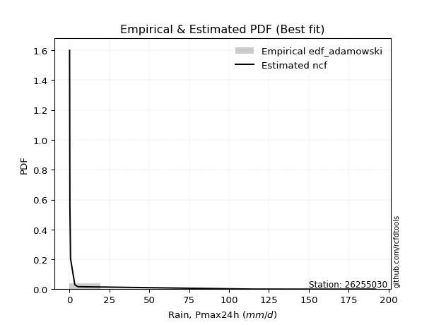</img>

</div>


## C. Best fit & Estimate extreme values for specific return periods - Tr

Best fit in probability distribution analysis means finding the theoretical distribution (like Normal, Poisson, Exponential) that most accurately mirrors your real-world data´s patterns (shape, center, spread) for better predictions, using methods like visual checks (Q-Q plots), goodness-of-fit tests (Kolmogorov-Smirnov, Chi-Squared), and information criteria (AIC) to score and select the simplest, most representative model.


### 1. Best fit (ordered by delta Δ)

<div align="center">

|   id |   station | empirical_dist   | p_dist      |     delta |   deltao | eval   |   fit |   n |   best_fit |   best_fit_sort |
|-----:|----------:|:-----------------|:------------|----------:|---------:|:-------|------:|----:|-----------:|----------------:|
|    0 |  26255030 | edf_hazen        | ncf         | 0.0762359 | 0.447261 | Δo > Δ |     1 |   8 |          1 |               1 |
|    1 |  26255030 | edf_gringorten   | ncf         | 0.0808541 | 0.447261 | Δo > Δ |     1 |   8 |          1 |               2 |
|    2 |  26255030 | edf_cunnane      | ncf         | 0.0838578 | 0.447261 | Δo > Δ |     1 |   8 |          1 |               3 |
|    3 |  26255030 | edf_blom         | ncf         | 0.0857056 | 0.447261 | Δo > Δ |     1 |   8 |          1 |               4 |
|    4 |  26255030 | edf_tukey        | ncf         | 0.0887359 | 0.447261 | Δo > Δ |     1 |   8 |          1 |               5 |
|    5 |  26255030 | edf_filliben     | ncf         | 0.0898716 | 0.447261 | Δo > Δ |     1 |   8 |          1 |               6 |
|    6 |  26255030 | edf_beard        | ncf         | 0.0904065 | 0.447261 | Δo > Δ |     1 |   8 |          1 |               7 |
|    7 |  26255030 | edf_jenkinson    | ncf         | 0.0904065 | 0.447261 | Δo > Δ |     1 |   8 |          1 |               8 |
|    8 |  26255030 | edf_chegodayev   | ncf         | 0.0911168 | 0.447261 | Δo > Δ |     1 |   8 |          1 |               9 |
|    9 |  26255030 | edf_adamowski    | ncf         | 0.0946182 | 0.447261 | Δo > Δ |     1 |   8 |          1 |              10 |
|   10 |  26255030 | edf_weibull      | ncf         | 0.110958  | 0.447261 | Δo > Δ |     1 |   8 |          1 |              11 |
|   11 |  26255030 | edf_california   | lograyleigh | 0.129151  | 0.447261 | Δo > Δ |     1 |   8 |          1 |              12 |

</div>

:file_folder:Tables: [bestfit_26255030.csv](table/bestfit_26255030.csv) | [extreme_26255030.csv](table/extreme_26255030.csv)


### 2. Extreme values

In hydrology, a return period (or recurrence interval $Tr$) is the statistical average time between extreme events like floods or droughts of a specific magnitude, indicating how rare an event is, with a 100-year flood, for example, having a 1% chance of occurring in any given year, not that it happens exactly every century. It is a key tool for infrastructure design (like bridges or dams) and risk assessment, calculated from historical data to determine the probability of future events, although it is important to remember it is statistical average, and events can cluster or be missed.

> risk_rate: assuming the return period as the project useful life.

|   id |      tr |   prob_l |     prob_g |      alpha |        betaprime |      chi2 |   crystalball |    erlang |    expon |   exponnorm |        f |   fatiguelife |             fisk |    gamma |   genexpon |   genlogistic |   gibrat |   gompertz |   gumbel_l |   gumbel_r |   halflogistic |   halfnorm |   hypsecant |   invgamma |    invgauss |       invweibull |   johnsonsu |   kstwobign |   laplace |   laplace_asymmetric |      loggamma |   logistic |     lognorm |   maxwell |           mielke |    moyal |   nakagami |              ncf |   nct |     norm |   pearson3 |   rayleigh |     rice |         t |   truncnorm |     wald |   weibull_min |         logalpha |   logbetaprime |      logchi2 |   logcrystalball |        logerlang |         logexpon |     logexponnorm |           logf |   logfatiguelife |       logfisk |      loggenexpon |   loggenlogistic |        loggibrat |   loggompertz |   loggumbel_l |      loggumbel_r |   loghalflogistic |   loghalfnorm |   loghypsecant |      loginvgamma |      loginvgauss |    loginvweibull |   logjohnsonsu |   logkstwobign |   loglaplace |   loglaplace_asymmetric |   logloggamma |   loglogistic |    loglognorm |   logmaxwell |        logmielke |         logmoyal |      lognakagami |         logncf |      lognct |   logpearson3 |   lograyleigh |     logrice |       logt |   logtruncnorm |          logwald |   logweibull_min |   station |   n |   risk_rate |
|-----:|--------:|---------:|-----------:|-----------:|-----------------:|----------:|--------------:|----------:|---------:|------------:|---------:|--------------:|-----------------:|---------:|-----------:|--------------:|---------:|-----------:|-----------:|-----------:|---------------:|-----------:|------------:|-----------:|------------:|-----------------:|------------:|------------:|----------:|---------------------:|--------------:|-----------:|------------:|----------:|-----------------:|---------:|-----------:|-----------------:|------:|---------:|-----------:|-----------:|---------:|----------:|------------:|---------:|--------------:|-----------------:|---------------:|-------------:|-----------------:|-----------------:|-----------------:|-----------------:|---------------:|-----------------:|--------------:|-----------------:|-----------------:|-----------------:|--------------:|--------------:|-----------------:|------------------:|--------------:|---------------:|-----------------:|-----------------:|-----------------:|---------------:|---------------:|-------------:|------------------------:|--------------:|--------------:|--------------:|-------------:|-----------------:|-----------------:|-----------------:|---------------:|------------:|--------------:|--------------:|------------:|-----------:|---------------:|-----------------:|-----------------:|----------:|----:|------------:|
|    0 |    2    | 0.5      | 0.5        |   0.280515 |      0.104054    |   2.17295 |       39.8625 |   1.32144 |  27.6613 |     27.6584 | 0.1      |      0.100337 |     11.9474      |  24.6495 |    27.6602 |       25.5891 |  19.2154 |    34.7783 |    51.1628 |    28.5622 |        22.9442 |    25.7822 |     39.8625 |   0.1      |    0.484393 |   8502.28        |    0.1      |     33.7637 |   39.8625 |              27.6612 |      0.393908 |    39.8625 |     2.32391 |   33.9796 |      0.125968    |  24.9141 |    8.32242 |      1.18355     |   0.1 |  39.8625 |    24.411  |    31.8931 |  41.3569 |  0.1      |     53.7344 |  17.5652 |       29.9567 |     0.559403     |    0.10026     |     0.185973 |          2.32391 |      0.463415    |      0.885097    |      0.883076    |    0.304022    |      0.1         |   2.12274     |      1.07101     |      1.39446     |      1.01383     |       1.226   |       3.65922 |      1.47587     |       1.17768     |       1.31991 |        2.32391 |      0.972567    |      0.659346    |      1.0616      |   0.104523     |        1.45516 |      2.32391 |             0.88351     |       2.33886 |       2.32391 |   0.229194    |      1.83473 |      0.100348    |      1.27466     |      0.101258    |   0.354537     |     2.31817 |       1.89891 |       1.6872  |     1.96395 |     2.3239 |        2.2542  |      0.948784    |      0.111721    |  26255030 |   8 |    0.75     |
|    1 |    2.33 | 0.570815 | 0.429185   |   0.333082 |      0.11064     |   4.92309 |       52.1373 |   2.3695  |  33.7338 |     33.7401 | 0.1      |      1.53245  |     26.4968      |  32.3107 |    33.7277 |       33.4949 |  25.4333 |    42.4189 |    61.842  |    39.9361 |        34.6384 |    39.0299 |     49.686  |   0.1      |    0.667088 | 801330           |    0.1      |     43.1012 |   47.2906 |              33.7337 |      0.540991 |    50.6774 |     3.80532 |   46.7322 |      0.173771    |  35.6809 |   16.0546  |      2.15016     |   0.1 |  52.1373 |    36.0027 |    44.8343 |  51.8343 |  0.1      |     63.1894 |  25.6139 |       37.3316 |     0.944371     |    0.100802    |     0.232333 |          3.80532 |      0.6704      |      1.431       |      1.42831     |    0.549258    |      0.114666    |   2.89627e+15 |      1.73986     |      2.2144      |      1.30153     |       1.99841 |       5.6198  |      2.33079     |       1.88395     |       2.24746 |        3.44842 |      1.54664     |      1.04886     |      1.68161     |   0.112499     |        2.33534 |      3.13203 |             1.42789     |       3.85763 |       3.58855 |   9.51115e+06 |      3.06254 |      0.101076    |      1.96453     |      0.105325    |   3.76671      |     3.79535 |       3.11505 |       2.83771 |     3.16508 |     3.8053 |        3.75472 |      1.311       |      0.194605    |  26255030 |   8 |    0.729209 |
|    2 |    5    | 0.8      | 0.2        |   0.740694 |      0.674457    |  46.4389  |       97.7535 |  12.7638  |  64.0953 |     64.1472 | 0.1      |     31.9479   |    582.147       |  75.003  |    64.0925 |       67.8394 |  61.2315 |    80.6205 |    96.3419 |    89.3496 |        87.5524 |    95.0525 |     89.0902 |   0.1      |    3.09768  |      3.02679e+14 |    0.1      |     82.7645 |   84.4295 |              64.0951 |      2.70036  |    92.4353 |    23.7855  |   96.9255 |      6.05265     |  85.5541 |   88.9684  |     40.9796      |   0.1 |  97.7535 |    88.4119 |    96.6439 |  93.7803 |  0.1      |    102.823  |  70.6705 |       76.0675 |    54.7736       |    0.117391    |     0.859796 |         23.7855  |      4.44729     |     15.8068      |     15.8083      | 1237.99        |      2.09901     | inf           |     16.826       |     16.5093      |      5.48352     |      17.7472  |      22.4741  |     16.9699      |      15.7878      |      21.3395  |       16.7939  |     16.0504      |     13.8377      |     15.8402      |   8.8506       |       17.4187  |     13.9261  |            15.7418      |      24.6077  |      19.2096  | inf           |     23.0073  |      0.121689    |     14.5698      |      0.704548    |   3.16504e+11  |    23.7355  |      21.992   |      22.7484  |    21.3853  |    23.7854 |       31.1379  |      8.0125      |      5.84705e+93 |  26255030 |   8 |    0.67232  |
|    3 |   10    | 0.9      | 0.1        |   1.48958  |     18.4026      | 121.754   |      128.014  |  27.758   |  91.6565 |     91.7499 | 0.1      |     73.9438   |   5679.8         | 117.32   |    91.6582 |       95.8112 | 102.037  |   115.299  |   115.55   |   129.596  |       131.495  |   136.508  |    120.556  |   0.1      |   11.8835   |      2.93064e+21 |    0.100002 |    112.963  |  118.143  |              91.6563 |     11.8173   |   123.188  |    80.2243  |  132.249  |    193.64        | 128.976  |  174.126   |    589.445       |   0.1 | 128.014  |   131.814  |   133.585  | 123.689  |  0.1      |    130.577  | 118.486  |      113.096  | 95152.3          |    0.184461    |     3.31779  |         80.2243  |     25.6897      |    139.906       |    140.171       |    8.51969e+14 |    116.23        | inf           |    109.978       |     84.7763      |     28.2513      |      96.1171  |      48.6213  |     85.4888      |      92.2662      |     112.851   |       59.4521  |    166.166       |    209.262       |    137.402       |   5.87369e+20  |       80.4342  |     53.96    |           139.085       |      83.6482  |      66.0851  | inf           |     95.1033  |      0.188695    |     83.3863      |    122.977       |   1.62863e+32  |    80.1589  |      89.0655  |     100.348   |    83.5085  |    80.224  |      144.718   |     54.7108      |    inf           |  26255030 |   8 |    0.651322 |
|    4 |   15    | 0.933333 | 0.0666667  |   2.23579  |    138.419       | 177.917   |      143.115  |  38.1324  | 107.779  |    107.896  | 0.1      |    101.41     |  19650.9         | 142.973  |   107.778  |      111.592  | 130.183  |   135.584  |   124.249  |   152.303  |       156.363  |   158.081  |    138.513  |   0.1      |   25.5494   |      2.5609e+25  |    0.100017 |    128.995  |  137.864  |             107.779  |     28.1412   |   139.944  |   147.159   |  150.373  |   1355.64        | 154.177  |  223.35    |   2803.02        |   0.1 | 143.115  |   156.185  |   152.619  | 139.099  |  0.1      |    143.83   | 149.191  |      135.356  |     1.60955e+08  |    0.298293    |     7.61951  |        147.159   |     72.3119      |    500.944       |    502.425       |    3.31526e+33 |   1604.97        | inf           |    309.265       |    213.375       |     87.5244      |     233.725   |      68.9614  |    212.863       |     250.576       |     268.486   |      122.317   |    755.103       |   1188.98        |    541.149       |   4.15615e+71  |      181.204   |    119.171   |           497.495       |     153.779   |     129.557   | inf           |    196.982   |      0.277094    |    229.507       |   5658.55        |   4.20893e+52  |   147.175   |     184.652   |     215.584   |   168.484   |   147.158  |      319.883   |    187.857       |    inf           |  26255030 |   8 |    0.644736 |
|    5 |   20    | 0.95     | 0.05       |   2.98134  |    580.953       | 221.845   |      153.004  |  46.0215  | 119.218  |    119.353  | 0.1      |    121.745    |  46340.3         | 161.466  |   119.218  |      122.642  | 152.262  |   149.977  |   129.663  |   168.202  |       173.786  |   172.464  |    151.181  |   0.1      |   43.4404   |      1.47259e+28 |    0.100059 |    139.794  |  151.857  |             119.217  |     52.1536   |   151.525  |   218.943   |  162.401  |   5272.46        | 172.024  |  257.08    |   8473.98        |   0.1 | 153.004  |   173.15   |   165.27   | 149.341  |  0.1      |    151.983  | 172.073  |      151.374  |     2.7049e+11   |    0.482038    |    13.9297   |        218.943   |    151.133       |   1238.3         |   1242.89        |    3.40399e+58 |  11210.1         | inf           |    628.27        |    407.211       |    212.497       |     422.893   |      85.7198  |    403.185       |     504.591       |     478.499   |      203.478   |   2391.78        |   4328.43        |   1518.42        |   6.9269e+158  |      313.169   |    209.08    |          1228.88        |     228.986   |     206.314   | inf           |    319.374   |      0.389685    |    470.109       |  94155.5         |   6.70377e+72  |   219.125   |     301.058   |     358.391   |   268.638   |   218.943  |      541.799   |    471.053       |    inf           |  26255030 |   8 |    0.641514 |
|    6 |   25    | 0.96     | 0.04       |   3.72663  |   1767.94        | 257.863   |      160.284  |  52.3916  | 128.091  |    128.239  | 0.1      |    137.902    |  89326           | 175.947  |   128.093  |      131.153  | 170.667  |   161.141  |   133.517  |   180.448  |       187.21   |   183.166  |    160.985  |   0.1      |   65.0016   |      1.96682e+30 |    0.10015  |    147.884  |  162.71   |             128.09   |     84.2156   |   160.385  |   293.325   |  171.331  |  14982           | 185.858  |  282.461   |  19987.6         |   0.1 | 160.284  |   186.153  |   174.67   | 156.951  |  0.1      |    157.613  | 190.4    |      163.915  |     4.53386e+14  |    0.775304    |    22.3842   |        293.325   |    268.093       |   2498.55        |   2509.27        |    5.55363e+89 |  52518.4         | inf           |   1074.66        |    669.902       |    445.14        |     657.075   |     100.072   |    659.444       |     865.282       |     735.536   |      301.702   |   6147.98        |  12169.2         |   3509.32        |   5.04961e+284 |      471.8     |    323.358   |          2478.13        |     306.876   |     294.517   | inf           |    457.201   |      0.531903    |    819.538       | 831900           |   7.43474e+92  |   293.738   |     433.952   |     522.833   |   379.928   |   293.324  |      801.199   |    983.68        |    inf           |  26255030 |   8 |    0.639603 |
|    7 |   50    | 0.98     | 0.02       |   7.45192  |  56097.3         | 378.446   |      181.13   |  73.3024  | 155.652  |    155.841  | 0.1      |    189.742    | 663440           | 221.554  |   155.645  |      157.371  | 235.548  |   195.819  |   143.976  |   218.173  |       228.57   |   214.272  |    191.381  |   0.1      |  213.468    |      6.95012e+36 |    0.102192 |    171.638  |  196.424  |             155.651  |    374.184    |   187.453  |   677.763   |  197.229  | 371370           | 228.803  |  356.903   | 287335           |   0.1 | 181.13   |   225.838  |   201.955  | 179.042  |  0.1      |    171.435  | 250.24   |      203.454  |     5.92893e+30  |    7.77842     |   100.528    |        677.763   |   1600.38        |  22114.6         |  22249.5         |  inf           |      7.45127e+06 | inf           |   5336.34        |   3104.5         |   6033.03        |    2350.09    |     152.338   |   3001.96        |    4558.46        |    2566.49    |     1023.14    | 157800           | 353544           |  59855           | inf            |     1571.78    |   1252.93    |         21895.3         |     708.698   |     873.782   | inf           |   1294.14    |      1.96548     |   4601.3         |      5.87727e+08 |   3.70666e+191 |   680.01    |    1270.68    |    1564.75    |  1039.15    |   677.761  |     2489.24    |  10888.1         |    inf           |  26255030 |   8 |    0.63583  |
|    8 |   75    | 0.986667 | 0.0133333  |  11.1767   | 423898           | 453.846   |      192.315  |  86.1642  | 171.774  |    171.988  | 0.100001 |    220.962    |      2.11231e+06 | 248.585  |   171.77   |      172.61   | 279.369  |   216.105  |   149.265  |   240.1    |       252.612  |   231.204  |    209.144  |   0.1      |  404.73     |      4.44704e+40 |    0.109227 |    184.707  |  216.145  |             171.774  |    896.752    |   203.087  |  1062.29    |  211.31   |      2.39255e+06 | 253.916  |  397.545   |      1.36633e+06 |   0.1 | 192.315  |   248.649  |   216.8    | 191.06   |  0.100001 |    177.192  | 287.062  |      226.947  |     7.71315e+46  |   71.6459      |   246.002    |       1062.29    |   4567.27        |  79183.3         |  79750.4         |  inf           |      1.47304e+08 | inf           |  13081.6         |   7569.75        |  35084.8         |    4673.64    |     188.405   |   7244.22        |   11976.2         |    5067.37    |     2088.69    |      1.34919e+06 |      2.80098e+06 | 377980           | inf            |     3047.47    |   2767.1     |         78317.4         |    1109.49    |    1637.5     | inf           |   2278.54    |      5.8382      |  12620.1         |      2.21974e+10 |   4.63657e+288 |  1067.07    |    2299.89    |    2840.87    |  1796.43    |  1062.29   |     4605.32    |  47801.6         |    inf           |  26255030 |   8 |    0.634587 |
|    9 |  100    | 0.99     | 0.01       |  14.9013   |      1.78008e+06 | 509.076   |      199.881  |  95.5155  | 183.213  |    183.444  | 0.100007 |    243.426    |      4.78471e+06 | 267.892  |   183.216  |      183.396  | 313.315  |   230.497  |   152.725  |   255.619  |       269.629  |   242.739  |    221.744  |   0.1      |  618.373    |      2.19719e+43 |    0.124395 |    193.662  |  230.137  |             183.213  |   1668.22     |   214.124  |  1439.61    |  220.9    |      8.93544e+06 | 271.733  |  425.2     |      4.13061e+06 |   0.1 | 199.881  |   264.685  |   226.913  | 199.248  |  0.100004 |    180.39   | 313.909  |      243.764  |     1.00213e+63  |  623.037       |   466.926    |       1439.61    |   9623.94        | 195736           | 197285           |  inf           |      1.26102e+09 | inf           |  24314.2         |  14224.9         | 137218           |    7440.92    |     216.499   |  13513.6         |   23726.4         |    8054.69    |     3465.19    |      7.00841e+06 |      1.26507e+07 |      1.53139e+06 | inf            |     4796.85    |   4854.74    |        193454           |    1501.88    |    2551.35    | inf           |   3349.62    |     15.4156      |  25818.8         |      2.64342e+11 | inf            |  1447.32    |    3458.63    |    4264.88    |  2608.39    |  1439.6    |     6998.43    | 140565           |    inf           |  26255030 |   8 |    0.633968 |
|   10 |  200    | 0.995    | 0.005      |  29.7996   |      5.64857e+07 | 646.978   |      217.041  | 118.679   | 210.774  |    211.047  | 0.100426 |    298.414    |      3.4015e+07  | 314.776  |   210.771  |      209.326  | 405.67   |   265.176  |   160.244  |   292.928  |       310.54   |   269.121  |    252.1    |   0.100001 | 1533.67     |      6.57699e+49 |    0.321367 |    214.286  |  263.851  |             210.774  |   7456.37     |   240.602  |  2868.58    |  242.842  |      2.1188e+08  | 314.66   |  488.238   |      5.93802e+07 |   0.1 | 217.041  |   302.899  |   250.053  | 217.983  |  0.100349 |    185.697  | 380.782  |      284.741  |     2.84637e+127 |    2.51004e+06 |  2223.69     |       2868.58    |  58193.4         |      1.73245e+06 |      1.74931e+06 |  inf           |      2.41727e+11 | inf           | 102940           |  64817.5         |      5.60804e+06 |   21305.3     |     292.86    |  60499.9         |  122758           |   23247.1     |    11732.1     |      5.998e+08   |      5.38971e+08 |      6.29742e+07 | inf            |    13637.4     |  18810.8     |             1.70925e+06 |    2981.95    |    7391.86    | inf           |   8088.06    |    408.871       | 144854           |      7.47834e+13 | inf            |  2890.07    |    8904.84    |   10805.8     |  6122.89    |  2868.56   |    18193.6     |      2.06397e+06 |    inf           |  26255030 |   8 |    0.633042 |
|   11 |  250    | 0.996    | 0.004      |  37.2486   |      1.71915e+08 | 692.603   |      222.286  | 126.298   | 219.647  |    219.933  | 0.101572 |    316.334    |      6.38469e+07 | 329.964  |   219.646  |      217.662  | 438.807  |   276.34   |   162.457  |   304.923  |       323.692  |   277.238  |    261.872  |   0.100002 | 1984.23     |      7.9436e+51  |    0.534325 |    220.669  |  274.704  |             219.646  |  12079.9      |   249.102  |  3541.35    |  249.596  |      5.86094e+08 | 328.479  |  507.553   |      1.4006e+08  |   0.1 | 222.286  |   315.09   |   257.176  | 223.749  |  0.101519 |    186.846  | 402.906  |      298.061  |     4.79427e+159 |    1.38728e+08 |  3691.17     |       3541.35    | 103964           |      3.49562e+06 |      3.53169e+06 |  inf           |      1.34038e+12 | inf           | 161541           | 105545           |      2.12318e+07 |   29340.8     |     320.084   |  97957.1         |  208225           |   32209.4     |    17373.1     |      2.94672e+09 |      1.86305e+09 |      2.33314e+08 | inf            |    18843.7     |  29092.3     |             3.44684e+06 |    3676.23    |   10400.9     | inf           |  10609.5     |   1704.7         | 252376           |      4.20351e+14 | inf            |  3570.38    |   11956       |   14385.9     |  7962.16    |  3541.33   |    24399.2     |      5.02019e+06 |    inf           |  26255030 |   8 |    0.632858 |
|   12 |  500    | 0.998    | 0.002      |  74.4938   |      5.45522e+09 | 837.437   |      237.837  | 150.377   | 247.208  |    247.536  | 0.190534 |    372.551    |      4.50044e+08 | 377.386  |   247.206  |      243.535  | 553.328  |   311.018  |   168.799  |   342.151  |       364.514  |   301.436  |    292.225  |   0.100042 | 3984.09     |      2.30192e+58 |    3.30496  |    239.797  |  308.418  |             247.208  |  54129.9      |   275.465  |  6614.82    |  269.752  |      1.37778e+10 | 371.404  |  564.891   |      2.01352e+09 |   0.1 | 237.837  |   352.667  |   278.429  | 240.956  |  0.246379 |    189.247  | 473.251  |      339.801  |   inf            |    3.28345e+16 | 18017.1      |       6614.82    | 632094           |      3.09396e+07 |      3.13152e+07 |  inf           |      2.88971e+14 | inf           | 629818           | 479342           |      2.1142e+09  |   75350.1     |     412.979   | 437122           |       1.07351e+06 |   85154.7     |    58814.9     |      7.28186e+11 |      9.59268e+10 |      2.02087e+10 | inf            |    49660.8     | 112725       |             3.04542e+07 |    6833.39    |   29994.9     | inf           |  23843.3     | 770271           |      1.41587e+06 |      6.97015e+16 | inf            |  6683.88    |   29095.8     |   33787.9     | 17433.9     |  6614.8    |    58468.8     |      8.47488e+07 |    inf           |  26255030 |   8 |    0.632489 |
|   13 |  750    | 0.998667 | 0.00133333 | 111.739    |      4.12223e+10 | 924.029   |      246.477  | 164.712   | 263.331  |    263.682  | 1.06944  |    405.766    |      1.40849e+09 | 405.276  |   263.334  |      258.661  | 629.065  |   331.303  |   172.189  |   363.915  |       388.379  |   314.955  |    309.981  |   0.10023  | 5610.41     |      1.37977e+62 |    9.82775  |    250.542  |  328.139  |             263.33   | 130249        |   290.867  |  9359.59    |  281.025  |      8.72289e+10 | 396.514  |  596.752   |      9.57308e+09 |   0.1 | 246.477  |   374.469  |   290.313  | 250.578  |  2.21876  |    190.08   | 515.429  |      364.458  |   inf            |    3.5002e+24  | 45857.2      |       9359.59    |      1.81969e+06 |      1.10782e+08 |      1.12245e+08 |  inf           |      6.91283e+15 | inf           |      1.36114e+06 |      1.16104e+06 |      4.43203e+10 |  126659       |     473.23    |      1.04794e+06 |       2.80025e+06 |  146584       |   120029       |      2.84257e+13 |      1.01769e+12 |      3.71669e+11 | inf            |    85592.5     | 248953       |             1.08932e+08 |    9637.85    |   55690.6     | inf           |  37502.2     |      1.36464e+08 |      3.88278e+06 |      1.1805e+18  | inf            |  9469.84    |   48171.9     |   54465.7     | 27022.4     |  9359.55   |    95208.5     |      4.61382e+08 |    inf           |  26255030 |   8 |    0.632366 |
|   14 | 1000    | 0.999    | 0.001      | 148.984    |      1.73105e+11 | 986.184   |      252.425  | 174.978   | 274.77   |    275.139  | 5.31332  |    429.459    |      3.16333e+09 | 425.123  |   274.769  |      269.39   | 687.022  |   345.696  |   174.47   |   379.352  |       405.307  |   324.292  |    322.578  |   0.100773 | 6972.96     |      6.59916e+64 |   20.993    |    257.987  |  342.131  |             274.769  | 242918        |   301.789  | 11886.1     |  288.816  |      3.22958e+11 | 414.33   |  618.682   |      2.89321e+10 |   0.1 | 252.425  |   389.867  |   298.526  | 257.227  | 14.2104   |    190.503  | 545.768  |      382.052  |   inf            |    2.26296e+32 | 89212.7      |      11886.1     |      3.85545e+06 |      2.73845e+08 |      2.7767e+08  |  inf           |      6.6556e+16  | inf           |      2.32717e+06 |      2.1746e+06  |      4.54831e+11 |  180708       |     518.655   |      1.94849e+06 |       5.52791e+06 |  213299       |   199110       |      4.77278e+14 |      5.56123e+12 |      3.40344e+12 | inf            |   124803       | 436778       |             2.69076e+08 |   12209.9     |   86369.3     | inf           |  51286.4     |      1.43038e+10 |      7.94319e+06 |      8.23939e+18 | inf            | 12037.6     |   68452.1     |   75756.5     | 36580.5     | 11886.1    |   133290       |      1.56111e+09 |    inf           |  26255030 |   8 |    0.632305 |

<div align="center">

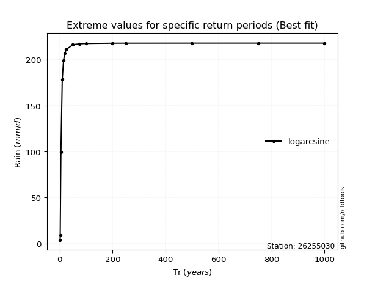</img>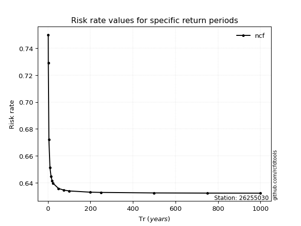</img>

</div>


<sub>**APP DISCLAIMER**: NO WARRANTY - This software is provided by [github.com/rcfdtools](https://github.com/rcfdtools) "as is", without any express or implied warranty, including warranties of merchantability, fitness for a particular purpose, or non-infringement. There is no guarantee that the software will be error-free or operate without interruption. LIMITATION OF LIABILITY - Neither the authors nor copyright holders will be liable for claims or damages arising from the software or its use. You are responsible for determining if the software is appropriate for your use and assume all associated risks, including errors, legal compliance, and data loss. NO PROFESSIONAL ADVICE - The software provides general information and does not offer professional advice. It should not replace consultation with professional advisors.</sub>