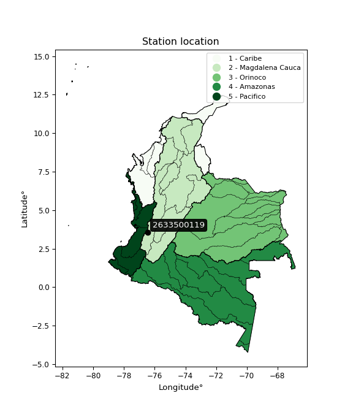

<div align="center">


</div>

# PMP Station (Rain, Pmax24h): 2633500119

Probable Maximum Precipitation (PMP) is the greatest amount of rainfall for a specific duration that is meteorologically possible for a given location, acting as a "worst-case" scenario for extreme storms, crucial for designing safety-critical infrastructure like bridges, river deviations, dams, spillways, and nuclear plants to prevent catastrophic failure. PMP is calculated by hydrologists using meteorological data to determine the upper limit of extreme rainfall, often leading to the Probable Maximum Flood (PMF) for flood control design, and is increasingly being studied for climate change impacts. Probable Maximum Precipitation (PMP) is the theoretical upper limit of rainfall, a deterministic estimate for extreme events, while probability distributions (like GEV, Gumbel) describe the likelihood and frequency of various precipitation amounts, including rare ones, showing how often events occur, with PMP representing the extreme end of these distributions, used for critical infrastructure design to ensure safety against the worst conceivable weather, unlike standard statistical forecasts which cover typical probabilities.

The most common probability distributions in hydrology, used for analyzing floods, rainfall, and streamflow, include the Normal, Log-Normal, Gumbel, Gamma (including Log-Pearson Type III), and Generalized Extreme Value (GEV) distributions, often chosen based on the data´s skewness and whether modeling extremes or general conditions, with Gumbel and GEV popular for extreme events like floods, while the Normal distribution serves as a baseline, though often requiring transformations for skewed hydrological data. These distributions help in designing water infrastructure, managing water resources, and forecasting hydrologic events.

> Hydrological data often isn´t perfectly normal (it´s skewed), so different distributions are needed for different applications, such as: **Flood Frequency Analysis**: Using Gumbel, GEV, or Log-Pearson Type III for predicting extreme flood magnitudes and their return periods, **Rainfall Analysis**: Normal for annual totals, but Log-Normal, Weibull, or GEV for intensity or extreme daily rainfall, **Streamflow Modeling**: Gamma and Log-Normal for maximum flows, GEV for minimum flows, and Kappa for daily flows.

<div align="center">

</img>

</div>


## A. General information


### 1. General running parameters

• app_version: _v20260113_. • runtime: _2026-01-17 18:24:04.630693_. • Python version: _3.14.0_. • SciPy version: _1.16.3_. • Pandas version: _2.3.3_. • NumPy version: _2.3.5_. • Stations dataset (station_dataset_file): _dataset/pmax24h_in/automatic_colombia_2003_2025.csv_. • Stations catalog (station_catalog_file): _dataset/CNE.xls_. • Minimum year to eval til year_max (date_min): _1900_. • Maximum year to eval since year_min (date_max): _2025_. • Creates, save and include plots into reports (create_plot): _False_. • Plot only fit distributions with Δo > Δ (plot_only_fit): _True_. • Plot only simple graphs avoiding multiple CDFs and multiple Extreme values plots (plot_only_simple): _True_. • Eval low extreme values, if False, evaluates high extreme values (low_extreme): _False_. • Eval every SciPy distribution as logarithmic (pdist_logarithmic_on): _True_. • Standard deviation normalized (ddof): _1.0_. • Return periods to eval in years (Tr): _[2, 2.33, 5, 10, 15, 20, 25, 50, 75, 100, 200, 250, 500, 750, 1000]_. • Minimum data sample per station, 0 means any (minimum_sample): _5_. • Z-Score maximum threshold to adjust a value, 0 means disable (zscore_max): _3.5_. • Z-Score minimum threshold to adjust a value, 0 means disable (zscore_min): _-2.5_. • Avoid zeros, e.g. rain = 0 (avoid_zeros): _True_. • Avoid null values (avoid_nans): _True_. 

:file_folder:Table: [dataset.csv](../../dataset/pmax24h_in/automatic_colombia_2003_2025.csv)

> Delta Degrees of Freedom (DDOF): is a parameter used in the formulas for calculating variance and standard deviation. When ddof=0, the divisor is $N$ (the total number of observations) and this is used when your data set is the entire population. When ddof=1, the divisor is $N-1$ and this is used when your data set is a sample drawn from a larger population. Using $N-1$ provides an unbiased estimate of the population variance (known as Bessel´s correction).


### 2. Station info and location

|   id |     CODIGO | NOMBRE                                 | CATEGORIA    | TECNOLOGIA                | ESTADO   | FECHA_INSTALACION   |   FECHA_SUSPENSION |   ALTITUD |   LATITUD |   LONGITUD | DEPARTAMENTO    | MUNICIPIO   | AREA_OPERATIVA                         | ENTIDAD                                                     | AREA_HIDROGRAFICA   | ZONA_HIDROGRAFICA   | SUBZONA_HIDROGRAFICA                  | CORRIENTE   | Catalogo   |   Version |
|-----:|-----------:|:---------------------------------------|:-------------|:--------------------------|:---------|:--------------------|-------------------:|----------:|----------:|-----------:|:----------------|:------------|:---------------------------------------|:------------------------------------------------------------|:--------------------|:--------------------|:--------------------------------------|:------------|:-----------|----------:|
|    0 | 2633500119 | GUACHAL PALMASECA - AUT   [2633500119] | Limnigráfica | Automática con Telemetría | Activa   | 10/10/2017          |                nan |       946 |   3.55954 |   -76.4569 | Valle Del Cauca | Palmira     | Area Operativa 09 - Cauca-Valle-Caldas | INSTITUTO DE HIDROLOGIA METEOROLOGIA Y ESTUDIOS AMBIENTALES | Magdalena Cauca     | Cauca               | Río Guachal (Bolo - Fraile y Párraga) | Guachal     | CNE_IDEAM  |  20251226 |

<div align="center">

Dynamic map: [:earth_americas:Google](http://maps.google.com/maps?q=3.559541667,-76.456897222) [:earth_americas:OSM](https://www.openstreetmap.org/#map=18/3.559541667/-76.456897222&layers=P) [:earth_americas:Bing](https://www.bing.com/maps?cp=3.559541667~-76.456897222&lvl=18) [:earth_americas:Apple](https://maps.apple.com/frame?center=3.559541667%2C-76.456897222&span=0.003%2C0.006)

</div>


<div align="center">

```geojson
{
  "type": "Feature",
  "geometry": {
    "type": "Point", 
    "coordinates": [-76.456897222, 3.559541667]
  }, 
  "properties": {
    "Name": "2633500119"
  }
}
```

</div>


### 3. Discrete values table and plot

<div align="center">

|               |           0 |          1 |             2 |          3 |           4 |
|:--------------|------------:|-----------:|--------------:|-----------:|------------:|
| Date          | 2019        | 2020       | 2021          | 2024       | 2025        |
| Value         |   38.2      |   53.2     |   32.8        |   17.6     |   22.4      |
| Value_initial |   38.2      |   53.2     |   32.8        |   17.6     |   22.4      |
| count         |    5        |    5       |    5          |    5       |    5        |
| mean          |   32.84     |   32.84    |   32.84       |   32.84    |   32.84     |
| std           |   14.0046   |   14.0046  |   14.0046     |   14.0046  |   14.0046   |
| zscore        |    0.382732 |    1.45381 |   -0.00285621 |   -1.08822 |   -0.745471 |


</div>


> The initial value (value_initial) correspond to the initial obtained or null completed value, and value (value) is adjusted only when the initial value is outside the valid range (outlier) definite through the Z-Score value. If Z-Score is active, values out of range or outliers are replaced with the station mean value. A Z-Score (or standard score) measures how many standard deviations a data point is from the mean of a dataset, indicating its relative position; positive scores mean above the mean, negative mean below, and a score of zero is exactly at the mean, allowing for comparison of values from different distributions. It´s calculated using the formula $z=(x–μ)/σ$, where $x$ is the data point, $μ$ is the mean, and $σ$ is the standard deviation, helping identify outliers and understand probability.
>
> <sub>**Note**: In this study, "completing" (filling gaps in) and "extending" (forecasting or lengthening the historical record) rainfall data series are avoided for certain critical analyses because they introduce artificial bias and uncertainty, which can distort the statistics of rare events (extremes), alter day-to-day variability, and compromise the integrity and homogeneity of the original data. Some reasons against Completing/Extending rainfall data are: **Distortion of Extremes and Variability**: The primary issue is that most gap-filling or extension methods rely on averaging or regression with nearby stations, which inherently smooths the data. Rainfall is highly variable in space and time, with a large percentage of zero values and occasional large storms. Infilling methods often underestimate the highest values and overestimate the lowest (zero) values, which severely distorts analyses focused on flood frequency, drought severity, and intensity-duration-frequency (IDF) curves, **Loss of Data Homogeneity**: Infilled or extended data are synthetic estimates, not actual measurements. Combining these estimates with observed data can violate the assumption of data homogeneity, which requires that the data properties do not change over time. Inhomogeneity can lead to incorrect conclusions about long-term trends or changes in climate patterns, **Propagation of Errors**: Errors and biases from the original data (e.g., wind-induced undercatch, instrument errors, site changes) or the data used for imputation can propagate through the analysis, leading to unreliable hydrological models and inaccurate predictions, **Compromised Statistical Integrity**: For statistical analyses, especially those involving the frequency of events, using artificial data can introduce time bias or autocorrelation that doesn´t exist in reality, making it difficult to assess the true probability of events, **Difficulty in Validation**: It is difficult to accurately validate the quality of filled or extended data, especially for past periods where ground-truth measurements are unavailable. The reliability of imputation techniques heavily depends on the density of the surrounding station network and the complexity of the local topography.</sub>


### 4. Active continuous probability distributions from SciPy (80 of 104 available)

A Probability Density Function (PDF) describes the relative likelihood of a continuous random variable falling within a specific range, where the total area under its curve equals 1, and the area over any interval gives the actual probability for that range. Unlike discrete probabilities (like rolling a die), a PDF shows density, not direct probability for a single point (which is zero), with higher points indicating higher likelihood, often visualized as a bell curve for normal distributions.

A log of a probability density function (log-PDF) is simply the logarithm of the PDF´s value, denoted as $log(f(x))$, useful for converting multiplication of probabilities into addition, improving numerical stability with tiny numbers, and connecting to information theory concepts like entropy. Instead of dealing with very small probabilities (e.g., 0.000001), log-PDFs use negative numbers (e.g., $log(0.00001) ≈ -11.51$ that are easier for computers to handle, preventing underflow errors and simplifying complex calculations. In this study, each active probability distribution from SciPy is also evaluated in the $log$ form.

[scipy.stats](https://docs.scipy.org/doc/scipy/reference/stats.html) is a Python´s powerful submodule within the SciPy library for comprehensive statistical analysis, offering over 130 probability distributions (like Normal, Poisson), functions for descriptive stats (mean, variance), hypothesis testing (t-tests, chi-square), random variable generation, and statistical tests, making it essential for data science, modeling, and research. It provides tools to explore, model, and draw conclusions from data efficiently, working seamlessly with NumPy.

<div align="center">

|   id | p_dist           |   n_parameter | fit_method   | label                                                                       | active   | ref                                                                                                      |
|-----:|:-----------------|--------------:|:-------------|:----------------------------------------------------------------------------|:---------|:---------------------------------------------------------------------------------------------------------|
|    0 | alpha            |             3 | MLE          | Alpha                                                                       | True     | [:mortar_board:](https://docs.scipy.org/doc/scipy/reference/generated/scipy.stats.alpha.html)            |
|    1 | anglit           |             2 | MM           | Anglit                                                                      | True     | [:mortar_board:](https://docs.scipy.org/doc/scipy/reference/generated/scipy.stats.anglit.html)           |
|    2 | arcsine          |             2 | MM           | Arcsine                                                                     | True     | [:mortar_board:](https://docs.scipy.org/doc/scipy/reference/generated/scipy.stats.arcsine.html)          |
|    3 | argus            |             3 | MLE          | Argus                                                                       | True     | [:mortar_board:](https://docs.scipy.org/doc/scipy/reference/generated/scipy.stats.argus.html)            |
|    4 | beta             |             4 | MLE          | Beta                                                                        | True     | [:mortar_board:](https://docs.scipy.org/doc/scipy/reference/generated/scipy.stats.beta.html)             |
|    5 | betaprime        |             4 | MLE          | Beta prime                                                                  | True     | [:mortar_board:](https://docs.scipy.org/doc/scipy/reference/generated/scipy.stats.betaprime.html)        |
|    6 | bradford         |             3 | MLE          | Bradford                                                                    | True     | [:mortar_board:](https://docs.scipy.org/doc/scipy/reference/generated/scipy.stats.bradford.html)         |
|    7 | burr             |             4 | MLE          | Burr (Type III)                                                             | True     | [:mortar_board:](https://docs.scipy.org/doc/scipy/reference/generated/scipy.stats.burr.html)             |
|    8 | burr12           |             4 | MLE          | Burr (Type III) 12                                                          | True     | [:mortar_board:](https://docs.scipy.org/doc/scipy/reference/generated/scipy.stats.burr12.html)           |
|    9 | cosine           |             2 | MLE          | Cosine                                                                      | True     | [:mortar_board:](https://docs.scipy.org/doc/scipy/reference/generated/scipy.stats.cosine.html)           |
|   10 | crystalball      |             4 | MLE          | Crystalball                                                                 | True     | [:mortar_board:](https://docs.scipy.org/doc/scipy/reference/generated/scipy.stats.crystalball.html)      |
|   11 | dgamma           |             3 | MLE          | Double gamma                                                                | True     | [:mortar_board:](https://docs.scipy.org/doc/scipy/reference/generated/scipy.stats.dgamma.html)           |
|   12 | dweibull         |             3 | MLE          | Double Weibull                                                              | True     | [:mortar_board:](https://docs.scipy.org/doc/scipy/reference/generated/scipy.stats.dweibull.html)         |
|   13 | erlang           |             3 | MLE          | Erlang                                                                      | True     | [:mortar_board:](https://docs.scipy.org/doc/scipy/reference/generated/scipy.stats.erlang.html)           |
|   14 | exponnorm        |             3 | MLE          | Exponentially modified Normal                                               | True     | [:mortar_board:](https://docs.scipy.org/doc/scipy/reference/generated/scipy.stats.exponnorm.html)        |
|   15 | exponpow         |             3 | MLE          | Exponential power                                                           | True     | [:mortar_board:](https://docs.scipy.org/doc/scipy/reference/generated/scipy.stats.exponpow.html)         |
|   16 | exponweib        |             4 | MLE          | Exponentiated Weibull                                                       | True     | [:mortar_board:](https://docs.scipy.org/doc/scipy/reference/generated/scipy.stats.exponweib.html)        |
|   17 | f                |             4 | MLE          | F                                                                           | True     | [:mortar_board:](https://docs.scipy.org/doc/scipy/reference/generated/scipy.stats.f.html)                |
|   18 | fatiguelife      |             3 | MLE          | Fatigue-life (Birnbaum-Saunders)                                            | True     | [:mortar_board:](https://docs.scipy.org/doc/scipy/reference/generated/scipy.stats.fatiguelife.html)      |
|   19 | foldnorm         |             3 | MM           | Fold Normal                                                                 | True     | [:mortar_board:](https://docs.scipy.org/doc/scipy/reference/generated/scipy.stats.foldnorm.html)         |
|   20 | gamma            |             3 | MLE          | Gamma                                                                       | True     | [:mortar_board:](https://docs.scipy.org/doc/scipy/reference/generated/scipy.stats.gamma.html)            |
|   21 | gausshyper       |             6 | MLE          | Gauss hypergeometric                                                        | True     | [:mortar_board:](https://docs.scipy.org/doc/scipy/reference/generated/scipy.stats.gausshyper.html)       |
|   22 | genexpon         |             5 | MLE          | Generalized exponential                                                     | True     | [:mortar_board:](https://docs.scipy.org/doc/scipy/reference/generated/scipy.stats.genexpon.html)         |
|   23 | genextreme       |             3 | MLE          | Generalized exponential                                                     | True     | [:mortar_board:](https://docs.scipy.org/doc/scipy/reference/generated/scipy.stats.genextreme.html)       |
|   24 | gengamma         |             4 | MLE          | Generalized gamma                                                           | True     | [:mortar_board:](https://docs.scipy.org/doc/scipy/reference/generated/scipy.stats.gengamma.html)         |
|   25 | genhalflogistic  |             3 | MLE          | Generalized half-logistic                                                   | True     | [:mortar_board:](https://docs.scipy.org/doc/scipy/reference/generated/scipy.stats.genhalflogistic.html)  |
|   26 | genlogistic      |             3 | MLE          | Generalized logistic                                                        | True     | [:mortar_board:](https://docs.scipy.org/doc/scipy/reference/generated/scipy.stats.genlogistic.html)      |
|   27 | gennorm          |             3 | MLE          | Generalized Normal                                                          | True     | [:mortar_board:](https://docs.scipy.org/doc/scipy/reference/generated/scipy.stats.gennorm.html)          |
|   28 | genpareto        |             3 | MLE          | Generalized Pareto                                                          | True     | [:mortar_board:](https://docs.scipy.org/doc/scipy/reference/generated/scipy.stats.genpareto.html)        |
|   29 | gompertz         |             3 | MLE          | Gompertz (or truncated Gumbel)                                              | True     | [:mortar_board:](https://docs.scipy.org/doc/scipy/reference/generated/scipy.stats.gompertz.html)         |
|   30 | gumbel_l         |             2 | MM           | Gumbel Left Skew                                                            | True     | [:mortar_board:](https://docs.scipy.org/doc/scipy/reference/generated/scipy.stats.gumbel_l.html)         |
|   31 | gumbel_r         |             2 | MM           | Gumbel Right Skew                                                           | True     | [:mortar_board:](https://docs.scipy.org/doc/scipy/reference/generated/scipy.stats.gumbel_r.html)         |
|   32 | halfgennorm      |             3 | MLE          | Upper half of a generalized normal                                          | True     | [:mortar_board:](https://docs.scipy.org/doc/scipy/reference/generated/scipy.stats.halfgennorm.html)      |
|   33 | halflogistic     |             2 | MM           | Half-logistic                                                               | True     | [:mortar_board:](https://docs.scipy.org/doc/scipy/reference/generated/scipy.stats.halflogistic.html)     |
|   34 | halfnorm         |             2 | MM           | Half Normal                                                                 | True     | [:mortar_board:](https://docs.scipy.org/doc/scipy/reference/generated/scipy.stats.halfnorm.html)         |
|   35 | hypsecant        |             2 | MM           | hyperbolic secant                                                           | True     | [:mortar_board:](https://docs.scipy.org/doc/scipy/reference/generated/scipy.stats.hypsecant.html)        |
|   36 | invgamma         |             3 | MLE          | Inverted gamma                                                              | True     | [:mortar_board:](https://docs.scipy.org/doc/scipy/reference/generated/scipy.stats.invgamma.html)         |
|   37 | invgauss         |             3 | MLE          | Inverse Gaussian                                                            | True     | [:mortar_board:](https://docs.scipy.org/doc/scipy/reference/generated/scipy.stats.invgauss.html)         |
|   38 | invweibull       |             3 | MLE          | Inverted Weibull                                                            | True     | [:mortar_board:](https://docs.scipy.org/doc/scipy/reference/generated/scipy.stats.invweibull.html)       |
|   39 | johnsonsb        |             4 | MLE          | Johnson SB                                                                  | True     | [:mortar_board:](https://docs.scipy.org/doc/scipy/reference/generated/scipy.stats.johnsonsb.html)        |
|   40 | johnsonsu        |             4 | MLE          | Johnson Su                                                                  | True     | [:mortar_board:](https://docs.scipy.org/doc/scipy/reference/generated/scipy.stats.johnsonsu.html)        |
|   41 | kappa3           |             3 | MLE          | Kappa 3                                                                     | True     | [:mortar_board:](https://docs.scipy.org/doc/scipy/reference/generated/scipy.stats.kappa3.html)           |
|   42 | kappa4           |             4 | MLE          | Kappa 4                                                                     | True     | [:mortar_board:](https://docs.scipy.org/doc/scipy/reference/generated/scipy.stats.kappa4.html)           |
|   43 | ksone            |             3 | MLE          | Kolmogorov-Smirnov one-sided test statistic distribution                    | True     | [:mortar_board:](https://docs.scipy.org/doc/scipy/reference/generated/scipy.stats.ksone.html)            |
|   44 | kstwobign        |             2 | MLE          | Limiting distribution of scaled Kolmogorov-Smirnov two-sided test statistic | True     | [:mortar_board:](https://docs.scipy.org/doc/scipy/reference/generated/scipy.stats.kstwobign.html)        |
|   45 | laplace          |             2 | MM           | Laplace                                                                     | True     | [:mortar_board:](https://docs.scipy.org/doc/scipy/reference/generated/scipy.stats.laplace.html)          |
|   46 | levy_l           |             2 | MLE          | Left-skewed Levy                                                            | True     | [:mortar_board:](https://docs.scipy.org/doc/scipy/reference/generated/scipy.stats.levy_l.html)           |
|   47 | loggamma         |             3 | MLE          | Log gamma                                                                   | True     | [:mortar_board:](https://docs.scipy.org/doc/scipy/reference/generated/scipy.stats.loggamma.html)         |
|   48 | logistic         |             2 | MM           | Logistic (or Sech-squared)                                                  | True     | [:mortar_board:](https://docs.scipy.org/doc/scipy/reference/generated/scipy.stats.logistic.html)         |
|   49 | loglaplace       |             3 | MLE          | Log-Laplace                                                                 | True     | [:mortar_board:](https://docs.scipy.org/doc/scipy/reference/generated/scipy.stats.loglaplace.html)       |
|   50 | lomax            |             3 | MLE          | Lomax (Pareto of the second kind)                                           | True     | [:mortar_board:](https://docs.scipy.org/doc/scipy/reference/generated/scipy.stats.lomax.html)            |
|   51 | maxwell          |             2 | MM           | Maxwell                                                                     | True     | [:mortar_board:](https://docs.scipy.org/doc/scipy/reference/generated/scipy.stats.maxwell.html)          |
|   52 | mielke           |             4 | MLE          | Mielke Beta-Kappa / Dagum                                                   | True     | [:mortar_board:](https://docs.scipy.org/doc/scipy/reference/generated/scipy.stats.mielke.html)           |
|   53 | moyal            |             2 | MM           | Moyal                                                                       | True     | [:mortar_board:](https://docs.scipy.org/doc/scipy/reference/generated/scipy.stats.moyal.html)            |
|   54 | nakagami         |             3 | MLE          | Nakagami                                                                    | True     | [:mortar_board:](https://docs.scipy.org/doc/scipy/reference/generated/scipy.stats.nakagami.html)         |
|   55 | ncf              |             5 | MLE          | Non-central F distribution                                                  | True     | [:mortar_board:](https://docs.scipy.org/doc/scipy/reference/generated/scipy.stats.ncf.html)              |
|   56 | nct              |             4 | MLE          | Non-central Student’s t                                                     | True     | [:mortar_board:](https://docs.scipy.org/doc/scipy/reference/generated/scipy.stats.nct.html)              |
|   57 | norm             |             2 | MM           | Normal                                                                      | True     | [:mortar_board:](https://docs.scipy.org/doc/scipy/reference/generated/scipy.stats.norm.html)             |
|   58 | pearson3         |             3 | MM           | Pearson type III                                                            | True     | [:mortar_board:](https://docs.scipy.org/doc/scipy/reference/generated/scipy.stats.pearson3.html)         |
|   59 | powerlaw         |             3 | MLE          | Power-function                                                              | True     | [:mortar_board:](https://docs.scipy.org/doc/scipy/reference/generated/scipy.stats.powerlaw.html)         |
|   60 | rayleigh         |             2 | MM           | Rayleigh                                                                    | True     | [:mortar_board:](https://docs.scipy.org/doc/scipy/reference/generated/scipy.stats.rayleigh.html)         |
|   61 | rdist            |             3 | MLE          | R-distributed (symmetric beta)                                              | True     | [:mortar_board:](https://docs.scipy.org/doc/scipy/reference/generated/scipy.stats.rdist.html)            |
|   62 | rice             |             3 | MLE          | Rice                                                                        | True     | [:mortar_board:](https://docs.scipy.org/doc/scipy/reference/generated/scipy.stats.rice.html)             |
|   63 | semicircular     |             2 | MM           | Semicircular                                                                | True     | [:mortar_board:](https://docs.scipy.org/doc/scipy/reference/generated/scipy.stats.semicircular.html)     |
|   64 | skewnorm         |             3 | MLE          | Skew normal                                                                 | True     | [:mortar_board:](https://docs.scipy.org/doc/scipy/reference/generated/scipy.stats.skewnorm.html)         |
|   65 | t                |             3 | MLE          | Student’s t                                                                 | True     | [:mortar_board:](https://docs.scipy.org/doc/scipy/reference/generated/scipy.stats.t.html)                |
|   66 | trapezoid        |             4 | MLE          | Trapezoid                                                                   | True     | [:mortar_board:](https://docs.scipy.org/doc/scipy/reference/generated/scipy.stats.trapezoid.html)        |
|   67 | triang           |             3 | MLE          | Triangular                                                                  | True     | [:mortar_board:](https://docs.scipy.org/doc/scipy/reference/generated/scipy.stats.triang.html)           |
|   68 | truncexpon       |             3 | MLE          | Truncated exponential                                                       | True     | [:mortar_board:](https://docs.scipy.org/doc/scipy/reference/generated/scipy.stats.truncexpon.html)       |
|   69 | truncnorm        |             4 | MLE          | Truncated normal                                                            | True     | [:mortar_board:](https://docs.scipy.org/doc/scipy/reference/generated/scipy.stats.truncnorm.html)        |
|   70 | truncpareto      |             4 | MLE          | Upper truncated Pareto                                                      | True     | [:mortar_board:](https://docs.scipy.org/doc/scipy/reference/generated/scipy.stats.truncpareto.html)      |
|   71 | truncweibull_min |             5 | MLE          | Doubly truncated Weibull minimum                                            | True     | [:mortar_board:](https://docs.scipy.org/doc/scipy/reference/generated/scipy.stats.truncweibull_min.html) |
|   72 | tukeylambda      |             3 | MLE          | Tukey-Lamdba                                                                | True     | [:mortar_board:](https://docs.scipy.org/doc/scipy/reference/generated/scipy.stats.tukeylambda.html)      |
|   73 | uniform          |             2 | MLE          | Uniform                                                                     | True     | [:mortar_board:](https://docs.scipy.org/doc/scipy/reference/generated/scipy.stats.uniform.html)          |
|   74 | vonmises         |             3 | MLE          | Von Mises                                                                   | True     | [:mortar_board:](https://docs.scipy.org/doc/scipy/reference/generated/scipy.stats.vonmises.html)         |
|   75 | vonmises_line    |             3 | MLE          | Von Mises line                                                              | True     | [:mortar_board:](https://docs.scipy.org/doc/scipy/reference/generated/scipy.stats.vonmises_line.html)    |
|   76 | wald             |             2 | MM           | Wald                                                                        | True     | [:mortar_board:](https://docs.scipy.org/doc/scipy/reference/generated/scipy.stats.wald.html)             |
|   77 | weibull_max      |             3 | MLE          | Weibull maximum                                                             | True     | [:mortar_board:](https://docs.scipy.org/doc/scipy/reference/generated/scipy.stats.weibull_max.html)      |
|   78 | weibull_min      |             3 | MLE          | Weibull minimum                                                             | True     | [:mortar_board:](https://docs.scipy.org/doc/scipy/reference/generated/scipy.stats.weibull_min.html)      |
|   79 | wrapcauchy       |             3 | MLE          | Wrapped  Cauchy                                                             | True     | [:mortar_board:](https://docs.scipy.org/doc/scipy/reference/generated/scipy.stats.wrapcauchy.html)       |

</div>

> **n_parameter:** # arguments & localization & scale.
>
> **Fit methods:** (MLE) maximum likelihood, (MM) L-moments.
>
>**Inactive** (With the only purpose of prevent loops, zero divisions, infinite values, over high estimated values or horizontal trending for recurrence intervals estimations, the follow distributions were disabled.)**:** lognorm, norminvgauss, powernorm, powerlognorm, cauchy, halfcauchy, foldcauchy, skewcauchy, chi2, expon, fisk, genhyperbolic, geninvgauss, gibrat, kstwo, laplace_asymmetric, levy, levy_stable, ncx2, pareto, rel_breitwigner, recipinvgauss, studentized_range, loguniform, 


## B. Probability (PDF) vs. Empirical (EDF) distributions functions

A continuous probability distribution (CPD) describes probabilities for variables that can take any value within a range (like rain any time), unlike discrete variables with specific outcomes (like temperature). It uses a Probability Density Function (PDF), a curve where the total area under it equals 1, and the probability of the variable falling within an interval (a to b) is found by calculating the area under the curve between those points. A key feature is that the probability of hitting any single exact value is zero, so probabilities are always expressed for ranges, e.g., $P(a ≤ X ≤ b)$.

<div align="center">

Distributions parameters from station values
|     |    station | p_dist              |   n |             loc |          scale | shape                  | shape1                | shape2               | shape3             |
|----:|-----------:|:--------------------|----:|----------------:|---------------:|:-----------------------|:----------------------|:---------------------|:-------------------|
|   0 | 2633500119 | alpha               |   5 |   -36.7411      |  387.669       | 5.749379792834598      |                       |                      |                    |
|   1 | 2633500119 | anglit              |   5 |    32.84        |   36.6438      |                        |                       |                      |                    |
|   2 | 2633500119 | arcsine             |   5 |    15.1255      |   35.4291      |                        |                       |                      |                    |
|   3 | 2633500119 | argus               |   5 |     5.70543     |   50.1558      | 6.377708894441761e-06  |                       |                      |                    |
|   4 | 2633500119 | beta                |   5 |    17.6         |   39.5356      | 0.7259599092363521     | 1.0683002831563502    |                      |                    |
|   5 | 2633500119 | betaprime           |   5 |    17.5959      |  370.307       | 0.4624097088118806     | 15.408039664394114    |                      |                    |
|   6 | 2633500119 | bradford            |   5 |    17.6         |   35.6         | 1.0149716386490035     |                       |                      |                    |
|   7 | 2633500119 | burr                |   5 |    -3.37802     |    2.87055     | 3.1991357671662817     | 1548.5949543769377    |                      |                    |
|   8 | 2633500119 | burr12              |   5 |    -2.13261     |   19.611       | 684.2779689929929      | 0.002847853566257997  |                      |                    |
|   9 | 2633500119 | cosine              |   5 |    33.615       |   10.2672      |                        |                       |                      |                    |
|  10 | 2633500119 | crystalball         |   5 |    32.84        |   12.5261      | 785.1971074121809      | 5909.24259633256      |                      |                    |
|  11 | 2633500119 | dgamma              |   5 |    32.8         |   14.8505      | 0.45814978982481713    |                       |                      |                    |
|  12 | 2633500119 | dweibull            |   5 |    32.8         |   11.7628      | 0.8450881012046019     |                       |                      |                    |
|  13 | 2633500119 | erlang              |   5 |    17.6         |   14.4312      | 0.47577862112704955    |                       |                      |                    |
|  14 | 2633500119 | exponnorm           |   5 |    17.583       |    0.00486705  | 3129.075613648667      |                       |                      |                    |
|  15 | 2633500119 | exponpow            |   5 |    17.6         |   23.5971      | 0.9720495002180134     |                       |                      |                    |
|  16 | 2633500119 | exponweib           |   5 |    17.6         |    1.18312     | 1.2183310417425421     | 0.29899564212489077   |                      |                    |
|  17 | 2633500119 | f                   |   5 |     1.2568      |   29.8248      | 20.127634298947996     | 33.863769894554835    |                      |                    |
|  18 | 2633500119 | fatiguelife         |   5 |    17.6         |    2.7069e-05  | 565.3877913419117      |                       |                      |                    |
|  19 | 2633500119 | foldnorm            |   5 |    11.2186      |   13.8046      | 1.5087957339169362     |                       |                      |                    |
|  20 | 2633500119 | gamma               |   5 |    17.6         |   18.9055      | 0.5380612999626633     |                       |                      |                    |
|  21 | 2633500119 | gausshyper          |   5 |    17.1819      |   36.0181      | 1.0709132977272566     | 0.8304113215374589    | 1.0451028572381484   | 1.006080031120411  |
|  22 | 2633500119 | genexpon            |   5 |    17.5924      |    1.37455     | 0.09010949381797262    | 1.933969891985836e-07 | 1.7858000982322735   |                    |
|  23 | 2633500119 | genextreme          |   5 |    18.105       |    3.20873     | -6.353986680058696     |                       |                      |                    |
|  24 | 2633500119 | gengamma            |   5 |    17.6         |    1.10826     | 1.2737752567215384     | 0.2871672144475493    |                      |                    |
|  25 | 2633500119 | genhalflogistic     |   5 |    14.0876      |   40.9745      | 1.0476083355597803     |                       |                      |                    |
|  26 | 2633500119 | genlogistic         |   5 |   -44.6456      |   10.1693      | 1131.7125952044507     |                       |                      |                    |
|  27 | 2633500119 | gennorm             |   5 |    35.4         |   17.8001      | 4635864.701395061      |                       |                      |                    |
|  28 | 2633500119 | genpareto           |   5 |     0.0325137   |  106.148       | -1.9964892293401733    |                       |                      |                    |
|  29 | 2633500119 | gompertz            |   5 |    17.6         |   38.5223      | 1.7585884554289413     |                       |                      |                    |
|  30 | 2633500119 | gumbel_l            |   5 |    38.4774      |    9.76654     |                        |                       |                      |                    |
|  31 | 2633500119 | gumbel_r            |   5 |    27.2026      |    9.76654     |                        |                       |                      |                    |
|  32 | 2633500119 | halfgennorm         |   5 |    17.6         |    1.25687     | 0.41370520478917094    |                       |                      |                    |
|  33 | 2633500119 | halflogistic        |   5 |    17.9937      |   10.7093      |                        |                       |                      |                    |
|  34 | 2633500119 | halfnorm            |   5 |    16.2604      |   20.7795      |                        |                       |                      |                    |
|  35 | 2633500119 | hypsecant           |   5 |    32.84        |    7.97434     |                        |                       |                      |                    |
|  36 | 2633500119 | invgamma            |   5 |    -2.92307     |  258.942       | 8.200351891826898      |                       |                      |                    |
|  37 | 2633500119 | invgauss            |   5 |    10.9805      |   43.0446      | 0.5078349392913775     |                       |                      |                    |
|  38 | 2633500119 | invweibull          |   5 |    17.6         |    1.69301     | 0.06519352030411871    |                       |                      |                    |
|  39 | 2633500119 | johnsonsb           |   5 |    17.6         |   35.6         | 1.262525003981343      | 0.15282105693265313   |                      |                    |
|  40 | 2633500119 | johnsonsu           |   5 |    11.9184      |    0.263798    | -6.926877364609535     | 1.428498883061195     |                      |                    |
|  41 | 2633500119 | kappa3              |   5 |    17.6         |   35.5935      | 8833.54948602879       |                       |                      |                    |
|  42 | 2633500119 | kappa4              |   5 |    11.2804      |   41.8605      | 1.1772649781322355     | 0.9670085592451112    |                      |                    |
|  43 | 2633500119 | ksone               |   5 |    11.1442      |   43.3916      | 1.0                    |                       |                      |                    |
|  44 | 2633500119 | kstwobign           |   5 |    -8.27946     |   47.0412      |                        |                       |                      |                    |
|  45 | 2633500119 | laplace             |   5 |    32.84        |    8.85727     |                        |                       |                      |                    |
|  46 | 2633500119 | levy_l              |   5 |    55.1089      |    7.29854     |                        |                       |                      |                    |
|  47 | 2633500119 | loggamma            |   5 | -3763.29        |  513.532       | 1623.7054482123049     |                       |                      |                    |
|  48 | 2633500119 | logistic            |   5 |    32.84        |    6.90598     |                        |                       |                      |                    |
|  49 | 2633500119 | loglaplace          |   5 |    -0.0887554   |   32.8888      | 3.2329539862014167     |                       |                      |                    |
|  50 | 2633500119 | lomax               |   5 |    17.6         |    5.47251e+10 | 1483459134.0235407     |                       |                      |                    |
|  51 | 2633500119 | maxwell             |   5 |     3.15848     |   18.6001      |                        |                       |                      |                    |
|  52 | 2633500119 | mielke              |   5 |   -27.5184      |   14.8244      | 8832.072376641474      | 5.739206894018018     |                      |                    |
|  53 | 2633500119 | moyal               |   5 |    25.6768      |    5.63871     |                        |                       |                      |                    |
|  54 | 2633500119 | nakagami            |   5 |    22.4         |   18.8807      | 0.3143510307382994     |                       |                      |                    |
|  55 | 2633500119 | ncf                 |   5 |     0.117484    |    4.37828     | 13.98075877500331      | 18.31071035749487     | 79.54746477797005    |                    |
|  56 | 2633500119 | nct                 |   5 |    -0.503049    |    1.11851     | 3.9085105127973776     | 24.129143963673073    |                      |                    |
|  57 | 2633500119 | norm                |   5 |    32.84        |   12.5261      |                        |                       |                      |                    |
|  58 | 2633500119 | pearson3            |   5 |    32.84        |   12.5261      | 0.39849317042759       |                       |                      |                    |
|  59 | 2633500119 | powerlaw            |   5 |    17.6         |   35.6         | 0.12423828020556756    |                       |                      |                    |
|  60 | 2633500119 | rayleigh            |   5 |     8.8769      |   19.1198      |                        |                       |                      |                    |
|  61 | 2633500119 | rdist               |   5 |    16.1153      |   16.6847      | 1.192327201186167      |                       |                      |                    |
|  62 | 2633500119 | rice                |   5 |    10.9555      |   17.4318      | 0.30407907913805576    |                       |                      |                    |
|  63 | 2633500119 | semicircular        |   5 |    32.84        |   25.0521      |                        |                       |                      |                    |
|  64 | 2633500119 | skewnorm            |   5 |    17.6         |   19.7256      | 8979878.054492526      |                       |                      |                    |
|  65 | 2633500119 | t                   |   5 |    32.8395      |   12.5261      | 6769954.581187226      |                       |                      |                    |
|  66 | 2633500119 | trapezoid           |   5 |    14.04        |   42.72        | 1.0                    | 1.0                   |                      |                    |
|  67 | 2633500119 | triang              |   5 |     2.53557     |   50.6691      | 0.9999073622294765     |                       |                      |                    |
|  68 | 2633500119 | truncexpon          |   5 |    17.6         |   39.4465      | 0.9024875215172777     |                       |                      |                    |
|  69 | 2633500119 | truncnorm           |   5 |    32.84        |   12.5261      | -258.0115949011308     | 405.9431391046016     |                      |                    |
|  70 | 2633500119 | truncpareto         |   5 |    11.5069      |    6.09308     | 1.4260107821649973e-08 | 6.8426947668168       |                      |                    |
|  71 | 2633500119 | truncweibull_min    |   5 |    17.5749      |   30.0147      | 0.9697597890585771     | 0.0007416979979364456 | 1.1869222293842006   |                    |
|  72 | 2633500119 | tukeylambda         |   5 |    35.4678      |   19.8432      | 1.1105535259506154     |                       |                      |                    |
|  73 | 2633500119 | uniform             |   5 |    17.6         |   35.6         |                        |                       |                      |                    |
|  74 | 2633500119 | vonmises            |   5 |     2.58512     |    1           | 0.24569930074722596    |                       |                      |                    |
|  75 | 2633500119 | vonmises_line       |   5 |    35.4001      |    5.66594     | 0.009390628931647136   |                       |                      |                    |
|  76 | 2633500119 | wald                |   5 |    20.3139      |   12.5261      |                        |                       |                      |                    |
|  77 | 2633500119 | weibull_max         |   5 |    53.2         |    1.43778     | 0.25755879778798196    |                       |                      |                    |
|  78 | 2633500119 | weibull_min         |   5 |    17.6         |   15.9004      | 0.6318033855362093     |                       |                      |                    |
|  79 | 2633500119 | wrapcauchy          |   5 |    17.5999      |    5.66593     | 0.39496044939729624    |                       |                      |                    |
|  80 | 2633500119 | logalpha            |   5 |    -4.53006     |  160.35        | 20.227194649474526     |                       |                      |                    |
|  81 | 2633500119 | loganglit           |   5 |     3.41686     |    1.14281     |                        |                       |                      |                    |
|  82 | 2633500119 | logarcsine          |   5 |     2.86435     |    1.10501     |                        |                       |                      |                    |
|  83 | 2633500119 | logargus            |   5 |     2.56425     |    1.49437     | 0.00021508559872240982 |                       |                      |                    |
|  84 | 2633500119 | logbeta             |   5 |     2.86118     |    1.11288     | 0.9258402592055869     | 0.7719090860291464    |                      |                    |
|  85 | 2633500119 | logbetaprime        |   5 |    -3.03824     |    9.03242     | 463.43921720241246     | 649.4809867709782     |                      |                    |
|  86 | 2633500119 | logbradford         |   5 |     2.8679      |    1.10617     | 1.1503625616101707     |                       |                      |                    |
|  87 | 2633500119 | logburr             |   5 |   -18.3011      |   18.8328      | 61.928507647391086     | 3824.297867387566     |                      |                    |
|  88 | 2633500119 | logburr12           |   5 |     2.55346     |    3.19213     | 2.3951997053103877     | 17.763676113381848    |                      |                    |
|  89 | 2633500119 | logcosine           |   5 |     3.41634     |    0.316092    |                        |                       |                      |                    |
|  90 | 2633500119 | logcrystalball      |   5 |     3.41686     |    0.390652    | 7.703021372597101      | 1049.2477877892477    |                      |                    |
|  91 | 2633500119 | logdgamma           |   5 |     3.54575     |    0.230416    | 1.4714495280297482     |                       |                      |                    |
|  92 | 2633500119 | logdweibull         |   5 |     3.33607     |    0.407455    | 2.2315239591957132     |                       |                      |                    |
|  93 | 2633500119 | logerlang           |   5 |   -22.4615      |    0.005899    | 4386.882601297446      |                       |                      |                    |
|  94 | 2633500119 | logexponnorm        |   5 |     3.41645     |    0.390652    | 0.001040335706885804   |                       |                      |                    |
|  95 | 2633500119 | logexponpow         |   5 |     2.8679      |    1.00993     | 0.8598293334684548     |                       |                      |                    |
|  96 | 2633500119 | logexponweib        |   5 |     2.8679      |    0.597125    | 0.5392193982797164     | 1.511806751730211     |                      |                    |
|  97 | 2633500119 | logf                |   5 |   -38.8324      |   42.2459      | 73507.19142446926      | 34267.70939745772     |                      |                    |
|  98 | 2633500119 | logfatiguelife      |   5 |   -14.8207      |   18.2328      | 0.02139892428312197    |                       |                      |                    |
|  99 | 2633500119 | logfoldnorm         |   5 |     2.63368     |    0.40531     | 1.9112085238773102     |                       |                      |                    |
| 100 | 2633500119 | loggamma            |   5 |   -22.5827      |    0.00587503  | 4425.4381523622815     |                       |                      |                    |
| 101 | 2633500119 | loggausshyper       |   5 |     2.83794     |    1.13612     | 1.1891887680858635     | 0.8519947797102119    | 0.9913981863710721   | 0.9843941603634351 |
| 102 | 2633500119 | loggenexpon         |   5 |     2.8679      |    0.36713     | 0.4247679238461996     | 8.182453096301392     | 0.027059236004021582 |                    |
| 103 | 2633500119 | loggenextreme       |   5 |     3.33878     |    0.441797    | 0.5871985769608346     |                       |                      |                    |
| 104 | 2633500119 | loggengamma         |   5 |     2.8679      |    0.776376    | 0.3693579679783966     | 1.4983451927153941    |                      |                    |
| 105 | 2633500119 | loggenhalflogistic  |   5 |     2.80702     |    1.27547     | 1.0929113968855995     |                       |                      |                    |
| 106 | 2633500119 | loggenlogistic      |   5 |     1.24182     |    0.351028    | 282.2733151369396      |                       |                      |                    |
| 107 | 2633500119 | loggennorm          |   5 |     3.42098     |    0.553082    | 3370428.29948679       |                       |                      |                    |
| 108 | 2633500119 | loggenpareto        |   5 |    -0.00618543  |   13.0691      | -3.2834942061107295    |                       |                      |                    |
| 109 | 2633500119 | loggompertz         |   5 |     2.8679      |    0.649682    | 0.5654111740190331     |                       |                      |                    |
| 110 | 2633500119 | loggumbel_l         |   5 |     3.59267     |    0.30459     |                        |                       |                      |                    |
| 111 | 2633500119 | loggumbel_r         |   5 |     3.24104     |    0.30459     |                        |                       |                      |                    |
| 112 | 2633500119 | loghalfgennorm      |   5 |     2.8679      |    1.10624     | 141329.4172136395      |                       |                      |                    |
| 113 | 2633500119 | loghalflogistic     |   5 |     2.95381     |    0.334012    |                        |                       |                      |                    |
| 114 | 2633500119 | loghalfnorm         |   5 |     2.89979     |    0.648046    |                        |                       |                      |                    |
| 115 | 2633500119 | loghypsecant        |   5 |     3.41686     |    0.248697    |                        |                       |                      |                    |
| 116 | 2633500119 | loginvgamma         |   5 |    -4.06012     | 2715.93        | 364.2263283512377      |                       |                      |                    |
| 117 | 2633500119 | loginvgauss         |   5 |     1.51945     |   41.5129      | 0.045649268741684366   |                       |                      |                    |
| 118 | 2633500119 | loginvweibull       |   5 |    -1.29468e+07 |    1.29468e+07 | 36816558.30648494      |                       |                      |                    |
| 119 | 2633500119 | logjohnsonsb        |   5 |     2.8673      |    1.10676     | 0.2718662859627806     | 0.14586461491208758   |                      |                    |
| 120 | 2633500119 | logjohnsonsu        |   5 |    -5.62038e+06 |    3.22394e+06 | -21956755.71321551     | 16601430.521534612    |                      |                    |
| 121 | 2633500119 | logkappa3           |   5 |     2.8679      |    1.10332     | 626.3777899541751      |                       |                      |                    |
| 122 | 2633500119 | logkappa4           |   5 |     2.68492     |    1.32303     | 1.1608536078642162     | 1.0258921207594334    |                      |                    |
| 123 | 2633500119 | logksone            |   5 |     2.74023     |    1.35326     | 1.0                    |                       |                      |                    |
| 124 | 2633500119 | logkstwobign        |   5 |     2.01371     |    1.60018     |                        |                       |                      |                    |
| 125 | 2633500119 | loglaplace          |   5 |     3.41686     |    0.276233    |                        |                       |                      |                    |
| 126 | 2633500119 | loglevy_l           |   5 |     4.02173     |    0.1821      |                        |                       |                      |                    |
| 127 | 2633500119 | logloggamma         |   5 |   -17.0153      |    4.27179     | 119.96666641925094     |                       |                      |                    |
| 128 | 2633500119 | loglogistic         |   5 |     3.41686     |    0.215378    |                        |                       |                      |                    |
| 129 | 2633500119 | logloglaplace       |   5 |    -0.0246692   |    3.5151      | 10.441814103092465     |                       |                      |                    |
| 130 | 2633500119 | loglomax            |   5 |     2.8679      |   61.9555      | 113.35830093382283     |                       |                      |                    |
| 131 | 2633500119 | logmaxwell          |   5 |     2.49117     |    0.580085    |                        |                       |                      |                    |
| 132 | 2633500119 | logmielke           |   5 |     2.8679      |    0.950317    | 0.6296640354319443     | 6.410181565976229     |                      |                    |
| 133 | 2633500119 | logmoyal            |   5 |     3.19346     |    0.175855    |                        |                       |                      |                    |
| 134 | 2633500119 | lognakagami         |   5 |     2.8679      |    0.535727    | 0.1821150402241562     |                       |                      |                    |
| 135 | 2633500119 | logncf              |   5 |    -3.3208      |    6.72318     | 244.3478910988556      | 409.1065400529001     | 0.24075475628723897  |                    |
| 136 | 2633500119 | lognct              |   5 |    -7.65953     |    0.265494    | 739.0079985510049      | 41.671550334754585    |                      |                    |
| 137 | 2633500119 | lognorm             |   5 |     3.41686     |    0.390652    |                        |                       |                      |                    |
| 138 | 2633500119 | logpearson3         |   5 |     3.41686     |    0.390652    | -0.03239692309011026   |                       |                      |                    |
| 139 | 2633500119 | logpowerlaw         |   5 |     2.8679      |    1.10616     | 0.13190765126977702    |                       |                      |                    |
| 140 | 2633500119 | lograyleigh         |   5 |     2.66952     |    0.596291    |                        |                       |                      |                    |
| 141 | 2633500119 | logrdist            |   5 |     3.74453     |    0.635468    | 1.0704484987507865     |                       |                      |                    |
| 142 | 2633500119 | logrice             |   5 |     2.65592     |    0.472252    | 1.1315974233612853     |                       |                      |                    |
| 143 | 2633500119 | logsemicircular     |   5 |     3.41686     |    0.781304    |                        |                       |                      |                    |
| 144 | 2633500119 | logskewnorm         |   5 |     3.46187     |    0.393237    | -0.14495094493234678   |                       |                      |                    |
| 145 | 2633500119 | logt                |   5 |     3.41686     |    0.390651    | 7249481137.178812      |                       |                      |                    |
| 146 | 2633500119 | logtrapezoid        |   5 |     2.75728     |    1.32739     | 1.0                    | 1.0                   |                      |                    |
| 147 | 2633500119 | logtriang           |   5 |     2.47955     |    1.49519     | 0.9995440504337184     |                       |                      |                    |
| 148 | 2633500119 | logtruncexpon       |   5 |     2.8679      |    1.19101     | 0.9287548486347517     |                       |                      |                    |
| 149 | 2633500119 | logtruncnorm        |   5 |    -0.0922988   |    1.12071     | 3.1954070840142945     | 3.628363492249342     |                      |                    |
| 150 | 2633500119 | logtruncpareto      |   5 |     2.86269     |    0.00520963  | 0.2628845164603456     | 213.3296662318663     |                      |                    |
| 151 | 2633500119 | logtruncweibull_min |   5 |     2.8679      |    1.35907     | 0.18963551632219905    | 4.046657572991711e-12 | 0.8699248606875964   |                    |
| 152 | 2633500119 | logtukeylambda      |   5 |     3.41899     |    0.617668    | 1.11278339922979       |                       |                      |                    |
| 153 | 2633500119 | loguniform          |   5 |     2.8679      |    1.10616     |                        |                       |                      |                    |
| 154 | 2633500119 | logvonmises         |   5 |    -2.86598     |    1           | 6.982501580737938      |                       |                      |                    |
| 155 | 2633500119 | logvonmises_line    |   5 |     3.55534     |    0.21882     | 0.281984925330209      |                       |                      |                    |
| 156 | 2633500119 | logwald             |   5 |     3.02622     |    0.390641    |                        |                       |                      |                    |
| 157 | 2633500119 | logweibull_max      |   5 |     3.97406     |    0.534151    | 0.9451154035182314     |                       |                      |                    |
| 158 | 2633500119 | logweibull_min      |   5 |     2.8679      |    0.48625     | 0.6219061552899825     |                       |                      |                    |
| 159 | 2633500119 | logwrapcauchy       |   5 |     2.8679      |    0.176051    | 0.5                    |                       |                      |                    |

</div>

> **loc** (Location parameter): This shifts the distribution along the x-axis. For many common distributions, like the normal (Gaussian) distribution, loc represents the mean $μ$. For others, like the uniform distribution, it might represent the minimum value, or for the beta distribution, the left end of the support interval.
>
> **scale** (Scale parameter): This determines the width or spread of the distribution. For the normal distribution, scale represents the standard deviation $σ$. For a uniform distribution, it defines the length of the interval (from $loc$ to $loc + scale$).
>
> **shape** (Shape parameters): Refers to parameters that define the specific form of a probability distribution, distinct from its location (loc) and scale (scale). These parameters are required arguments for most distribution functions. For example, a normal (Gaussian) distribution is fully defined by its location (mean) and scale (standard deviation), so it has no specific shape parameters beyond loc and scale. However, other distributions have intrinsic properties that need specification, as Gamma distribution that takes a shape parameter, often named $a$ or $alpha$.


### 0. Cumulative distribution values - CDF (160 evaluated)

Cumulative Distribution Function (CDF), denoted as $F$<sub>$X$</sub>$(x)$, is a function that gives the probability that a random variable $X$ will take a value less than or equal to a specific value, $x$ (i.e., $(P(X≥x)$. It essentially "accumulates" probabilities from a given point up to the far right (positive infinity), providing a complete picture of the distribution´s probabilities for both discrete (like rain) and continuous (like temperature) variables, helping to find probabilities over ranges or above certain values. Each station is evaluated separately ordering the $x$ values ascending, calculating the CDF and PDF values for the activated distributions and their logarithmic forms.

<div align="center">

CDF ordered by x ascending and calculating $log(f(x))$ separately
|   id |    Station |   date |    x |   count |   mean |     std |      zscore |   Value_initial |    station |   m |     alpha |   alpha_pdf |   anglit |   anglit_pdf |   arcsine |   arcsine_pdf |     argus |   argus_pdf |        beta |    beta_pdf |   betaprime |   betaprime_pdf |    bradford |   bradford_pdf |      burr |   burr_pdf |    burr12 |   burr12_pdf |    cosine |   cosine_pdf |   crystalball |   crystalball_pdf |    dgamma |   dgamma_pdf |   dweibull |   dweibull_pdf |      erlang |   erlang_pdf |   exponnorm |   exponnorm_pdf |    exponpow |   exponpow_pdf |   exponweib |   exponweib_pdf |         f |      f_pdf |   fatiguelife |   fatiguelife_pdf |   foldnorm |   foldnorm_pdf |       gamma |       gamma_pdf |   gausshyper |   gausshyper_pdf |    genexpon |   genexpon_pdf |   genextreme |   genextreme_pdf |    gengamma |   gengamma_pdf |   genhalflogistic |   genhalflogistic_pdf |   genlogistic |   genlogistic_pdf |     gennorm |   gennorm_pdf |   genpareto |   genpareto_pdf |    gompertz |   gompertz_pdf |   gumbel_l |   gumbel_l_pdf |   gumbel_r |   gumbel_r_pdf |   halfgennorm |   halfgennorm_pdf |   halflogistic |   halflogistic_pdf |   halfnorm |   halfnorm_pdf |   hypsecant |   hypsecant_pdf |   invgamma |   invgamma_pdf |   invgauss |   invgauss_pdf |   invweibull |   invweibull_pdf |   johnsonsb |   johnsonsb_pdf |   johnsonsu |   johnsonsu_pdf |      kappa3 |   kappa3_pdf |      kappa4 |   kappa4_pdf |    ksone |   ksone_pdf |   kstwobign |   kstwobign_pdf |   laplace |   laplace_pdf |   levy_l |   levy_l_pdf |   loggamma |   loggamma_pdf |   logistic |   logistic_pdf |   loglaplace |   loglaplace_pdf |       lomax |   lomax_pdf |   maxwell |   maxwell_pdf |   mielke |   mielke_pdf |     moyal |   moyal_pdf |    nakagami |   nakagami_pdf |       ncf |    ncf_pdf |      nct |    nct_pdf |     norm |   norm_pdf |   pearson3 |   pearson3_pdf |   powerlaw |   powerlaw_pdf |   rayleigh |   rayleigh_pdf |    rdist |     rdist_pdf |      rice |   rice_pdf |   semicircular |   semicircular_pdf |   skewnorm |   skewnorm_pdf |        t |      t_pdf |   trapezoid |   trapezoid_pdf |    triang |   triang_pdf |   truncexpon |   truncexpon_pdf |   truncnorm |   truncnorm_pdf |   truncpareto |   truncpareto_pdf |   truncweibull_min |   truncweibull_min_pdf |   tukeylambda |   tukeylambda_pdf |   uniform |   uniform_pdf |   vonmises |   vonmises_pdf |   vonmises_line |   vonmises_line_pdf |      wald |   wald_pdf |   weibull_max |   weibull_max_pdf |   weibull_min |   weibull_min_pdf |   wrapcauchy |   wrapcauchy_pdf |   logalpha |   logalpha_pdf |   loganglit |   loganglit_pdf |   logarcsine |   logarcsine_pdf |   logargus |   logargus_pdf |    logbeta |   logbeta_pdf |   logbetaprime |   logbetaprime_pdf |   logbradford |   logbradford_pdf |   logburr |   logburr_pdf |   logburr12 |   logburr12_pdf |   logcosine |   logcosine_pdf |   logcrystalball |   logcrystalball_pdf |   logdgamma |   logdgamma_pdf |   logdweibull |   logdweibull_pdf |   logerlang |   logerlang_pdf |   logexponnorm |   logexponnorm_pdf |   logexponpow |   logexponpow_pdf |   logexponweib |   logexponweib_pdf |      logf |   logf_pdf |   logfatiguelife |   logfatiguelife_pdf |   logfoldnorm |   logfoldnorm_pdf |   loggausshyper |   loggausshyper_pdf |   loggenexpon |   loggenexpon_pdf |   loggenextreme |   loggenextreme_pdf |   loggengamma |   loggengamma_pdf |   loggenhalflogistic |   loggenhalflogistic_pdf |   loggenlogistic |   loggenlogistic_pdf |   loggennorm |   loggennorm_pdf |   loggenpareto |   loggenpareto_pdf |   loggompertz |   loggompertz_pdf |   loggumbel_l |   loggumbel_l_pdf |   loggumbel_r |   loggumbel_r_pdf |   loghalfgennorm |   loghalfgennorm_pdf |   loghalflogistic |   loghalflogistic_pdf |   loghalfnorm |   loghalfnorm_pdf |   loghypsecant |   loghypsecant_pdf |   loginvgamma |   loginvgamma_pdf |   loginvgauss |   loginvgauss_pdf |   loginvweibull |   loginvweibull_pdf |   logjohnsonsb |   logjohnsonsb_pdf |   logjohnsonsu |   logjohnsonsu_pdf |   logkappa3 |   logkappa3_pdf |   logkappa4 |   logkappa4_pdf |   logksone |   logksone_pdf |   logkstwobign |   logkstwobign_pdf |   loglevy_l |   loglevy_l_pdf |   logloggamma |   logloggamma_pdf |   loglogistic |   loglogistic_pdf |   logloglaplace |   logloglaplace_pdf |    loglomax |   loglomax_pdf |   logmaxwell |   logmaxwell_pdf |   logmielke |   logmielke_pdf |   logmoyal |   logmoyal_pdf |   lognakagami |   lognakagami_pdf |   logncf |   logncf_pdf |    lognct |   lognct_pdf |   lognorm |   lognorm_pdf |   logpearson3 |   logpearson3_pdf |   logpowerlaw |   logpowerlaw_pdf |   lograyleigh |   lograyleigh_pdf |    logrdist |   logrdist_pdf |   logrice |   logrice_pdf |   logsemicircular |   logsemicircular_pdf |   logskewnorm |   logskewnorm_pdf |      logt |   logt_pdf |   logtrapezoid |   logtrapezoid_pdf |   logtriang |   logtriang_pdf |   logtruncexpon |   logtruncexpon_pdf |   logtruncnorm |   logtruncnorm_pdf |   logtruncpareto |   logtruncpareto_pdf |   logtruncweibull_min |   logtruncweibull_min_pdf |   logtukeylambda |   logtukeylambda_pdf |   loguniform |   loguniform_pdf |   logvonmises |   logvonmises_pdf |   logvonmises_line |   logvonmises_line_pdf |   logwald |   logwald_pdf |   logweibull_max |   logweibull_max_pdf |   logweibull_min |   logweibull_min_pdf |   logwrapcauchy |   logwrapcauchy_pdf |
|-----:|-----------:|-------:|-----:|--------:|-------:|--------:|------------:|----------------:|-----------:|----:|----------:|------------:|---------:|-------------:|----------:|--------------:|----------:|------------:|------------:|------------:|------------:|----------------:|------------:|---------------:|----------:|-----------:|----------:|-------------:|----------:|-------------:|--------------:|------------------:|----------:|-------------:|-----------:|---------------:|------------:|-------------:|------------:|----------------:|------------:|---------------:|------------:|----------------:|----------:|-----------:|--------------:|------------------:|-----------:|---------------:|------------:|----------------:|-------------:|-----------------:|------------:|---------------:|-------------:|-----------------:|------------:|---------------:|------------------:|----------------------:|--------------:|------------------:|------------:|--------------:|------------:|----------------:|------------:|---------------:|-----------:|---------------:|-----------:|---------------:|--------------:|------------------:|---------------:|-------------------:|-----------:|---------------:|------------:|----------------:|-----------:|---------------:|-----------:|---------------:|-------------:|-----------------:|------------:|----------------:|------------:|----------------:|------------:|-------------:|------------:|-------------:|---------:|------------:|------------:|----------------:|----------:|--------------:|---------:|-------------:|-----------:|---------------:|-----------:|---------------:|-------------:|-----------------:|------------:|------------:|----------:|--------------:|---------:|-------------:|----------:|------------:|------------:|---------------:|----------:|-----------:|---------:|-----------:|---------:|-----------:|-----------:|---------------:|-----------:|---------------:|-----------:|---------------:|---------:|--------------:|----------:|-----------:|---------------:|-------------------:|-----------:|---------------:|---------:|-----------:|------------:|----------------:|----------:|-------------:|-------------:|-----------------:|------------:|----------------:|--------------:|------------------:|-------------------:|-----------------------:|--------------:|------------------:|----------:|--------------:|-----------:|---------------:|----------------:|--------------------:|----------:|-----------:|--------------:|------------------:|--------------:|------------------:|-------------:|-----------------:|-----------:|---------------:|------------:|----------------:|-------------:|-----------------:|-----------:|---------------:|-----------:|--------------:|---------------:|-------------------:|--------------:|------------------:|----------:|--------------:|------------:|----------------:|------------:|----------------:|-----------------:|---------------------:|------------:|----------------:|--------------:|------------------:|------------:|----------------:|---------------:|-------------------:|--------------:|------------------:|---------------:|-------------------:|----------:|-----------:|-----------------:|---------------------:|--------------:|------------------:|----------------:|--------------------:|--------------:|------------------:|----------------:|--------------------:|--------------:|------------------:|---------------------:|-------------------------:|-----------------:|---------------------:|-------------:|-----------------:|---------------:|-------------------:|--------------:|------------------:|--------------:|------------------:|--------------:|------------------:|-----------------:|---------------------:|------------------:|----------------------:|--------------:|------------------:|---------------:|-------------------:|--------------:|------------------:|--------------:|------------------:|----------------:|--------------------:|---------------:|-------------------:|---------------:|-------------------:|------------:|----------------:|------------:|----------------:|-----------:|---------------:|---------------:|-------------------:|------------:|----------------:|--------------:|------------------:|--------------:|------------------:|----------------:|--------------------:|------------:|---------------:|-------------:|-----------------:|------------:|----------------:|-----------:|---------------:|--------------:|------------------:|---------:|-------------:|----------:|-------------:|----------:|--------------:|--------------:|------------------:|--------------:|------------------:|--------------:|------------------:|------------:|---------------:|----------:|--------------:|------------------:|----------------------:|--------------:|------------------:|----------:|-----------:|---------------:|-------------------:|------------:|----------------:|----------------:|--------------------:|---------------:|-------------------:|-----------------:|---------------------:|----------------------:|--------------------------:|-----------------:|---------------------:|-------------:|-----------------:|--------------:|------------------:|-------------------:|-----------------------:|----------:|--------------:|-----------------:|---------------------:|-----------------:|---------------------:|----------------:|--------------------:|
|    0 | 2633500119 |   2024 | 17.6 |       5 |  32.84 | 14.0046 | -1.08822    |            17.6 | 2633500119 |   1 | 0.0830849 |  0.0200821  | 0.13043  |    0.0183811 |  0.17027  |     0.0352488 | 0.0831645 |   0.0137803 | 2.36598e-12 | 483.463     |   0.0203337 |      2.27754    | 2.50148e-07 |      0.040694  | 0.0694056 | 0.0282124  | 0.0120167 |   0.0961712  | 0.0926019 |    0.0156714 |      0.111866 |        0.0151935  | 0.0683896 |  0.00618024  |   0.144418 |     0.00997161 | 4.23071e-08 |  5.66576e+06 |   0.0011141 |      0.0655736  | 4.16815e-16 |     0.114044   | 5.12633e-06 |     5.25613e+08 | 0.0783005 | 0.0207845  |     0.0925983 |       2.27767e+09 |   0.123299 |     0.0208556  | 3.89039e-09 | 589203          |    0.0106424 |        0.0271235 | 0.000498075 |     0.0655232  |  0.000897904 |     466.419      | 4.34543e-06 |     4.4739e+08 |         0.0448785 |             0.0133797 |     0.0834937 |         0.0203639 | 1.55792e-06 |     0.0280898 |    0.182009 |       0.0115088 | 4.68749e-12 |     0.0456512  |   0.111244 |     0.0107318  |  0.0690423 |     0.0188964  |   5.58209e-11 |         0.261985  |       0        |         0          |  0.0514023 |     0.0383181  |   0.0934867 |      0.0115556  |  0.0747246 |     0.0227778  |  0.0606351 |     0.0316444  |  0.000116736 |      1.93984e+10 |  0.00636491 |      3.5777e+06 |    0.060483 |       0.0301065 | 4.53017e-12 |    0.0280661 | 2.80382e-14 |    6.00063   | 0.14878  |   0.0230459 |    0.077328 |      0.0213715  | 0.0894775 |    0.0101022  | 0.34087  |   0.00425671 |  0.0793365 |       0.383415 |  0.0991431 |     0.0129328  |    0.0685325 |         0.248097 | 9.14022e-12 |   0.0271075 |  0.104215 |    0.01913    |      nan |          nan | 0.0406951 |   0.0178324 | 0           |     0          | 0.0763078 | 0.0223067  | 0.067772 | 0.0260121  | 0.111866 | 0.0151935  |   0.103146 |     0.0172624  |   0.010282 |    3.59561e+11 |  0.0988421 |     0.0215033  | 0.531969 |     0.0215786 | 0.0670153 | 0.0194808  |       0.138152 |          0.0201689 |   0        |     0.0404492  | 0.111875 | 0.0151944  |  0.00694444 |      0.00390137 | 0.0884013 |    0.0117364 |   1.2612e-11 |        0.0426464 |    0.111866 |      0.0151935  |      0        |         0.0853381 |        0.000161816 |              0.0577885 |   7.10543e-15 |         0.0490568 |  0        |     0.0280899 |    2.91335 |       0.129779 |     2.41599e-07 |           0.0278266 | 0         | 0          |      0.101727 |        0.00168204 |   1.29343e-10 |    23001.9        |  5.48579e-06 |        0.064763  |   0.073855 |       0.409892 |   0.0902001 |        0.501338 |    0.0361101 |         5.08939  |  0.0612874 |       0.399407 | 0.00689623 |      0.95074  |      0.0765371 |           0.398082 |   3.42644e-06 |          1.35828  | 0.0647689 |      0.5184   |   0.0665178 |        0.488513 |   0.0668412 |        0.421161 |        0.0799759 |             0.380473 |   0.0564871 |        0.215025 |      0.127897 |          0.831141 |   0.0793306 |        0.383534 |      0.0799755 |           0.380471 |   6.24818e-14 |        120.975    |    4.64769e-13 |         853.156    | 0.0796508 |   0.384724 |        0.0783634 |             0.386706 |     0.0848085 |          0.449096 |       0.0166111 |            0.652893 |   2.10517e-10 |          1.157    |        0.101462 |            0.323198 |   4.12355e-09 |       5.13878e+06 |            0.0245059 |                 0.413339 |        0.0649725 |             0.503561 |  2.18582e-06 |         0.904024 |       0.32292  |         0.186417   |   2.04634e-09 |          0.87029  |     0.0884393 |          0.277119 |      0.033227 |          0.371377 |         0        |             0.90397  |          0        |              0        |      0        |          0        |      0.0697436 |           0.278198 |     0.0751733 |          0.400356 |     0.0663088 |          0.456153 |       0.0648146 |            0.50432  |       0.204631 |       69.1479      |      0.0797862 |           0.380141 | 6.45386e-14 |        0.897086 | 1.80367e-14 |      123.269    |  0.0943441 |       0.738957 |      0.0618636 |           0.554689 |    0.30883  |        0.126935 |     0.0821063 |          0.372012 |     0.0725064 |          0.312238 |       0.0653175 |            0.235788 | 3.46141e-13 |       1.82967  |    0.0642881 |         0.469817 | 0.000228888 |       91.6902   |  0.0116198 |       0.23712  |    2.5522e-06 |       2.09325e+09 | 0.235695 |     0.431421 | 0.0787546 |     0.393517 | 0.0799759 |      0.380472 |     0.0807418 |          0.377517 |    0.00931331 |       2.76633e+12 |     0.0538393 |          0.527901 | 0           |     0          |  0.052139 |      0.482737 |         0.0928727 |              0.579798 |     0.0799913 |          0.380408 | 0.0799757 |   0.380472 |     0.00694444 |           0.12556  |   0.0674927 |        0.347584 |     3.39417e-07 |            1.38791  |     0          |           0        |      1.46892e-16 |           66.7645    |            0.00277976 |                1.4814e+08 |       0.00432645 |             1.05078  |     0        |         0.904029 |       1.08008 |          0.37013  |        7.15729e-09 |               0.53787  | 0         |      0        |         0.136728 |             0.232448 |      4.43518e-10 |        621106        |        0        |            2.71209  |
|    1 | 2633500119 |   2025 | 22.4 |       5 |  32.84 | 14.0046 | -0.745471   |            22.4 | 2633500119 |   2 | 0.210235  |  0.0319642  | 0.230264 |    0.0229781 |  0.299385 |     0.022242  | 0.161496  |   0.018774  | 0.227354    |   0.0342066 |   0.499529  |      0.0417357  | 0.183072    |      0.0357954 | 0.251436  | 0.0430601  | 0.353605  |   0.0513457  | 0.184872  |    0.0226385 |      0.202292 |        0.0225036  | 0.107233  |  0.0104877   |   0.203048 |     0.0148687  | 0.603627    |  0.0475313   |   0.271156  |      0.0478578  | 0.210994    |     0.0420344  | 0.74031     |     0.0239055   | 0.209522  | 0.0326993  |     0.771802  |       0.0234544   |   0.232128 |     0.0246032  | 0.494185    |      0.0468331  |    0.150195  |        0.0291918 | 0.270333    |     0.047834   |  0.495793    |       0.0114051  | 0.692465    |     0.0247193  |         0.113542  |             0.0152963 |     0.212376  |         0.0323355 | 0.5         |     0.0280898 |    0.239247 |       0.0123716 | 0.208134    |     0.0409466  |   0.175342 |     0.0162783  |  0.194921  |     0.0326346  |   0.396426    |         0.0459497 |       0.202868 |         0.0447668  |  0.232361  |     0.0367578  |   0.167906  |      0.0200928  |  0.220448  |     0.0360087  |  0.256957  |     0.0441263  |  0.392854    |      0.00498527  |  0.836073   |      0.00909628 |    0.249368 |       0.0432366 | 0.134717    |    0.0280661 | 0.18131     |    0.0320076 | 0.2594   |   0.0230459 |    0.211375 |      0.0330777  | 0.15384   |    0.0173688  | 0.36334  |   0.00515319 |  0.216044  |       0.755692 |  0.180682  |     0.0214359  |    0.164079  |         0.593987 | 0.122006    |   0.0238002 |  0.215717 |    0.0268837  |      nan |          nan | 0.181164  |   0.0386946 | 1.00779e-10 | 17834.2        | 0.218454  | 0.0352018  | 0.237919 | 0.0412446  | 0.202292 | 0.0225036  |   0.206903 |     0.0257384  |   0.779627 |    0.0201791   |  0.221296  |     0.028806   | 0.63793  |     0.0228805 | 0.186006  | 0.0292787  |       0.242593 |          0.0231001 |   0.192257 |     0.0392692  | 0.202305 | 0.0225044  |  0.0382957  |      0.00916165 | 0.153711  |    0.015476  |   0.192739   |        0.0377604 |    0.202292 |      0.0225036  |      0.30209  |         0.0477341 |        0.224442    |              0.0416314 |   0.140891    |         0.0281764 |  0.134831 |     0.0280899 |    3.68667 |       0.180311 |     0.133713    |           0.0279151 | 0.0362849 | 0.0582203  |      0.110606 |        0.00203647 |   0.374497    |        0.0386302  |  0.256172    |        0.037454  |   0.22261  |       0.819106 |   0.243506  |        0.751125 |    0.31192   |         0.693739 |  0.192591  |       0.68152  | 0.199765   |      0.76953  |      0.219646  |           0.789021 |   0.292284    |          1.08593  | 0.257353  |      1.01018  |   0.234807  |        0.876225 |   0.213804  |        0.787254 |        0.215377  |             0.748716 |   0.138338  |        0.497749 |      0.381274 |          1.01603  |   0.216097  |        0.756053 |      0.215376  |           0.748715 |   0.287474    |          0.992807 |    0.446588    |           1.32603  | 0.216729  |   0.757267 |        0.216725  |             0.765115 |     0.229138  |          0.757931 |       0.209732  |            0.854698 |   0.278563    |          1.11798  |        0.207169 |            0.565524 |   0.562503    |       1.13587     |            0.136168  |                 0.519089 |        0.251929  |             0.987001 |  0.5         |         0.904024 |       0.371778 |         0.221188   |   0.224415    |          0.978371 |     0.184853  |          0.546983 |      0.213878 |          1.08301  |         0        |             0.90397  |          0.228301 |              1.41893  |      0.253249 |          1.16867  |      0.179732  |           0.6849   |     0.219802  |          0.798177 |     0.234987  |          0.91361  |       0.252028  |            0.987751 |       0.534236 |        0.306838    |      0.215171  |           0.748992 | 0.216343    |        0.897086 | 0.263958    |        0.945911 |  0.272552  |       0.738957 |      0.263174  |           1.02493  |    0.344895 |        0.176713 |     0.213655  |          0.727673 |     0.19324   |          0.723835 |       0.150721  |            0.502215 | 0.356215    |       1.17335  |    0.231266  |         0.884936 | 0.42169     |        1.10084  |  0.203659  |       1.2855   |    0.590657   |       0.864622    | 0.348994 |     0.500904 | 0.219336  |     0.774859 | 0.215377  |      0.748716 |     0.214773  |          0.741201 |    0.817979   |       0.447407    |     0.237903  |          0.942099 | 1.89061e-09 |     7.1714e+06 |  0.22224  |      0.890321 |         0.25585   |              0.748924 |     0.215364  |          0.748561 | 0.215377  |   0.748717 |     0.0702327  |           0.399301 |   0.177343  |        0.563429 |     0.303       |            1.1335   |     0          |           0        |      0.843005    |            0.512256  |            0.823011   |                0.447803   |       0.227229   |             0.890809 |     0.218017 |         0.904029 |       1.21324 |          0.744108 |        0.137023    |               0.627801 | 0.0748983 |      2.41943  |         0.206572 |             0.355961 |      0.476147    |             0.873421 |        0.37667  |            0.645491 |
|    2 | 2633500119 |   2021 | 32.8 |       5 |  32.84 | 14.0046 | -0.00285621 |            32.8 | 2633500119 |   3 | 0.569344  |  0.0314964  | 0.498908 |    0.0272897 |  0.499281 |     0.0179689 | 0.404049  |   0.0271914 | 0.520226    |   0.0243428 |   0.752235  |      0.0145557  | 0.51387     |      0.0283907 | 0.6269    | 0.0258826  | 0.675366  |   0.0181098  | 0.474745  |    0.0309536 |      0.498726 |        0.0318488  | 0.5       |  2.39391e+06 |   0.5      |     7.35053    | 0.862194    |  0.0126349   |   0.631821  |      0.0241756  | 0.60132     |     0.0319156  | 0.859325    |     0.0058551   | 0.568934  | 0.0311443  |     0.907476  |       0.00722657  |   0.520689 |     0.0291141  | 0.776944    |      0.0158635  |    0.440779  |        0.0267178 | 0.630996    |     0.0241904  |  0.556996    |       0.00337493 | 0.819949    |     0.00654564 |         0.301039  |             0.0212757 |     0.572667  |         0.0313841 | 0.5         |     0.0280898 |    0.381092 |       0.015196  | 0.572896    |     0.02893    |   0.428314 |     0.0327308  |  0.569063  |     0.0328486  |   0.673807    |         0.015861  |       0.598803 |         0.0299475  |  0.573944  |     0.0279725  |   0.498403  |      0.0399163  |  0.590292  |     0.0298157  |  0.627504  |     0.0256803  |  0.420345    |      0.00156252  |  0.888304   |      0.00333549 |    0.620935 |       0.0260256 | 0.426605    |    0.0280661 | 0.48025     |    0.0265751 | 0.499078 |   0.0230459 |    0.569318 |      0.0309832  | 0.497747  |    0.0561965  | 0.432663 |   0.008685   |  0.576564  |       1.00001  |  0.498552  |     0.0362002  |    0.616911  |         1.38683  | 0.337698    |   0.0179533 |  0.531827 |    0.0306     |      nan |          nan | 0.594919  |   0.0326604 | 0.521697    |     0.0293198  | 0.585975  | 0.0301258  | 0.618255 | 0.0274992  | 0.498726 | 0.0318488  |   0.525231 |     0.0317638  |   0.899665 |    0.00735347  |  0.542866  |     0.0299154  | 1        | 34083.1       | 0.527638  | 0.0324491  |       0.498984 |          0.0254118 |   0.55904  |     0.0300588  | 0.498743 | 0.0318488  |  0.192843   |      0.0205589  | 0.356795  |    0.0235785 |   0.537943   |        0.0290092 |    0.498726 |      0.0318488  |      0.650603 |         0.0244198 |        0.582671    |              0.0283953 |   0.427398    |         0.0272329 |  0.426966 |     0.0280899 |    5.27187 |       0.171337 |     0.426301    |           0.0283266 | 0.666825  | 0.0320019  |      0.138053 |        0.0034513  |   0.621652    |        0.0152851  |  0.467865    |        0.0127175 |   0.592771 |       0.967425 |   0.5642    |        0.86779  |    0.542514  |         0.581296 |  0.516672  |       0.976437 | 0.499249   |      0.820003 |      0.585216  |           0.982381 |   0.652008    |          0.824501 | 0.634537  |      0.820183 |   0.600942  |        0.91332  |   0.574263  |        0.993249 |        0.574692  |             1.00327  |   0.459162  |        0.983595 |      0.554152 |          0.738855 |   0.576755  |        1.0002   |      0.574691  |           1.00327  |   0.607076    |          0.692421 |    0.796183    |           0.584138 | 0.577515  |   0.999466 |        0.579364  |             0.99792  |     0.580249  |          0.964591 |       0.539553  |            0.869467 |   0.644333    |          0.767003 |        0.505818 |            0.977341 |   0.836368    |       0.431316    |            0.38252   |                 0.807544 |        0.627557  |             0.832273 |  0.5         |         0.904024 |       0.473725 |         0.331408   |   0.596922    |          0.914527 |     0.510738  |          1.14827  |      0.643407 |          0.931508 |         0        |             0.90397  |          0.665869 |              0.83323  |      0.637923 |          0.812747 |      0.592821  |           1.22588  |     0.58732   |          0.979949 |     0.614395  |          0.913341 |       0.627546  |            0.831488 |       0.621276 |        0.203756    |      0.574769  |           1.00416  | 0.558463    |        0.897086 | 0.600596    |        0.84098  |  0.554367  |       0.738957 |      0.638035  |           0.819801 |    0.441749 |        0.370361 |     0.568927  |          1.01175  |     0.584578  |          1.12754  |       0.499999  |            1.48528  | 0.678044    |       0.583214 |    0.603313  |         0.92569  | 0.761346    |        0.722096 |  0.667319  |       0.889063 |    0.809281   |       0.383896    | 0.545686 |     0.508999 | 0.582588  |     0.989178 | 0.574692  |      1.00327  |     0.572649  |          1.00628  |    0.926975   |       0.196417    |     0.612348  |          0.894997 | 0.363049    |     0.56923    |  0.596731 |      0.943421 |         0.559859  |              0.811196 |     0.57465   |          1.00334  | 0.574692  |   1.00327  |     0.305058   |           0.832189 |   0.457303  |        0.90476  |     0.672903    |            0.822923 |     0.00616576 |           3.86819  |      0.947652    |            0.157224  |            0.92761    |                0.180175   |       0.562545   |             0.87601  |     0.562785 |         0.904029 |       1.57523 |          1.01472  |        0.438883    |               0.933807 | 0.733734  |      0.776687 |         0.402376 |             0.715848 |      0.688416    |             0.36297  |        0.521173 |            0.311993 |
|    3 | 2633500119 |   2019 | 38.2 |       5 |  32.84 | 14.0046 |  0.382732   |            38.2 | 2633500119 |   4 | 0.717826  |  0.0233232  | 0.644196 |    0.0261303 |  0.597847 |     0.0188526 | 0.557987  |   0.029519  | 0.645072    |   0.0220165 |   0.817213  |      0.00991288 | 0.659492    |      0.025637  | 0.74138   | 0.0170683  | 0.754674  |   0.0118533  | 0.639806  |    0.0294824 |      0.665641 |        0.0290626  | 0.81862   |  0.0209476   |   0.70212  |     0.024144   | 0.914856    |  0.00741063  |   0.741734  |      0.0169584  | 0.753901    |     0.0244436  | 0.885012    |     0.00387807  | 0.715987  | 0.0231867  |     0.938578  |       0.00454366  |   0.671835 |     0.0262383  | 0.846448    |      0.0103601  |    0.582591  |        0.025898  | 0.741006    |     0.0169786  |  0.572433    |       0.0024397  | 0.849025    |     0.00444824 |         0.427977  |             0.0259905 |     0.720492  |         0.0232226 | 0.5         |     0.0280898 |    0.469434 |       0.0177166 | 0.711591    |     0.0224751  |   0.621673 |     0.0376523  |  0.72302   |     0.0240094  |   0.744804    |         0.0108918 |       0.736779 |         0.0213439  |  0.708955  |     0.0219905  |   0.699454  |      0.0323335  |  0.727545  |     0.0211515  |  0.743042  |     0.0175753  |  0.427555    |      0.00114969  |  0.905072   |      0.00297417 |    0.737765 |       0.0177072 | 0.578162    |    0.0280661 | 0.619755    |    0.0251547 | 0.623526 |   0.0230459 |    0.716978 |      0.023574   | 0.727004  |    0.0308216  | 0.488814 |   0.0124918  |  0.719574  |       0.856975 |  0.684847  |     0.0312528  |    0.77936   |         0.798747 | 0.427884    |   0.0155086 |  0.685566 |    0.0258139  |      nan |          nan | 0.74185   |   0.0220749 | 0.659632    |     0.0221586  | 0.725379  | 0.0215806  | 0.740938 | 0.0183971  | 0.665641 | 0.0290626  |   0.685217 |     0.0268219  |   0.934293 |    0.00563471  |  0.691503  |     0.0247454  | 1        |     0         | 0.688671  | 0.0266853  |       0.635161 |          0.0248234 |   0.703667 |     0.0234468  | 0.665657 | 0.029062   |  0.319839   |      0.0264767  | 0.495478  |    0.0277855 |   0.684343   |        0.0252978 |    0.665641 |      0.0290626  |      0.768129 |         0.0194796 |        0.722511    |              0.0235661 |   0.574354    |         0.0272343 |  0.578652 |     0.0280899 |    6.13549 |       0.138957 |     0.57936     |           0.0283223 | 0.795675  | 0.0175065  |      0.160517 |        0.00504202 |   0.692028    |        0.0111244  |  0.534688    |        0.0128054 |   0.728239 |       0.79632  |   0.692625  |        0.807492 |    0.634126  |         0.631343 |  0.668425  |       1.00289  | 0.628329   |      0.879684 |      0.724134  |           0.824005 |   0.771985    |          0.752138 | 0.744219  |      0.620439 |   0.728466  |        0.750444 |   0.718569  |        0.883196 |        0.718525  |             0.863888 |   0.584213  |        1.06966  |      0.705926 |          1.13544  |   0.719775  |        0.856912 |      0.718524  |           0.863889 |   0.704002    |          0.579931 |    0.870396    |           0.398652 | 0.720373  |   0.855604 |        0.721604  |             0.849637 |     0.718575  |          0.832627 |       0.67288   |            0.883    |   0.748568    |          0.602007 |        0.660948 |            1.03962  |   0.89118     |       0.295923    |            0.519886  |                 1.00791  |        0.739404  |             0.635605 |  0.5         |         0.904024 |       0.531029 |         0.431211   |   0.727016    |          0.783114 |     0.692424  |          1.19059  |      0.765391 |          0.671858 |         0        |             0.90397  |          0.774481 |              0.599048 |      0.748451 |          0.638051 |      0.756081  |           0.887581 |     0.72547   |          0.817068 |     0.739427  |          0.720801 |       0.739287  |            0.635041 |       0.653934 |        0.231817    |      0.718714  |           0.864408 | 0.695185    |        0.897086 | 0.727308    |        0.823298 |  0.666989  |       0.738957 |      0.748892  |           0.635234 |    0.511852 |        0.574014 |     0.715113  |          0.884424 |     0.740625  |          0.891918 |       0.679008  |            0.913902 | 0.755633    |       0.441587 |    0.732154  |         0.755475 | 0.859014    |        0.549405 |  0.780491  |       0.608127 |    0.860444   |       0.291779    | 0.621158 |     0.478718 | 0.723115  |     0.836986 | 0.718525  |      0.863888 |     0.717313  |          0.871122 |    0.954143   |       0.162412    |     0.736099  |          0.722402 | 0.446402    |     0.531321   |  0.728932 |      0.780255 |         0.681531  |              0.77999  |     0.718501  |          0.864036 | 0.718526  |   0.863888 |     0.445072   |           1.00519  |   0.60559   |        1.04117  |     0.790629    |            0.724078 |     0.48296    |           2.48134  |      0.968502    |            0.119483  |            0.952237   |                0.145459   |       0.696462   |             0.882668 |     0.700565 |         0.904029 |       1.72019 |          0.866187 |        0.582102    |               0.924585 | 0.825692  |      0.46317  |         0.529103 |             0.961064 |      0.737163    |             0.281854 |        0.575904 |            0.435848 |
|    4 | 2633500119 |   2020 | 53.2 |       5 |  32.84 | 14.0046 |  1.45381    |            53.2 | 2633500119 |   5 | 0.924942  |  0.00678775 | 0.948125 |    0.0121044 |  1        |     0         | 0.966798  |   0.0182045 | 0.938165    |   0.0170232 |   0.914122  |      0.00406415 | 1           |      0.0201958 | 0.894312  | 0.00564825 | 0.867524  |   0.00466557 | 0.953808  |    0.0103797 |      0.947962 |        0.00849966 | 0.956691  |  0.00371273  |   0.89829  |     0.0067098  | 0.975631    |  0.00196741  |   0.903548  |      0.00633332 | 0.968044    |     0.00578234 | 0.923977    |     0.00175422  | 0.924912  | 0.00698487 |     0.978738  |       0.00145274  |   0.937275 |     0.00893448 | 0.941715    |      0.00363947 |    1         |        8.19727   | 0.903121    |     0.00635101 |  0.599392    |       0.00135628 | 0.894834    |     0.00212086 |         1         |             0.259161  |     0.927739  |         0.0068424 | 0.999999    |     0.0280898 |    1        |  612497         | 0.930922    |     0.00794579 |   0.989059 |     0.00505828 |  0.932565  |     0.00666648 |   0.854509    |         0.0048563 |       0.927991 |         0.00648188 |  0.924547  |     0.00790814 |   0.95055   |      0.00617627 |  0.916438  |     0.00651128 |  0.90549   |     0.00613113 |  0.440474    |      0.00066136  |  1          |    878.417      |    0.899988 |       0.0060733 | 0.999154    |    0.0280502 | 0.971819    |    0.0213414 | 0.969216 |   0.0230459 |    0.934323 |      0.00729794 | 0.949804  |    0.00566719 | 0.949461 |   0.0604094  |  0.922293  |       0.366876 |  0.950177  |     0.00685504 |    0.933483  |         0.240802 | 0.619027    |   0.0103272 |  0.935318 |    0.00832346 |      nan |          nan | 0.930582  |   0.0061399 | 0.88642     |     0.00933705 | 0.918294  | 0.00660304 | 0.904181 | 0.00584596 | 0.947962 | 0.00849966 |   0.938455 |     0.00805469 |   1        |    0.00348984  |  0.931914  |     0.00825514 | 1        |     0         | 0.939668  | 0.00803133 |       0.952739 |          0.0148068 |   0.928888 |     0.00793642 | 0.947967 | 0.00849907 |  0.840278   |      0.0429151  | 0.999907  |    0.0394718 |   1          |        0.0172957 |    0.947962 |      0.00849966 |      1        |         0.0124714 |        1           |              0.0142606 |   0.995429    |         0.0324987 |  1        |     0.0280899 |    8.56969 |       0.197492 |     0.999996    |           0.0278266 | 0.935411  | 0.00452673 |      0.999793 |        7.4909e+09 |   0.810623    |        0.00559263 |  1           |        0.064763  |   0.914914 |       0.34528  |   0.91389   |        0.490939 |    1         |         0        |  0.963528  |       0.628081 | 1          |   2417.31     |      0.918223  |           0.355926 |   0.999997    |          0.631656 | 0.889743  |      0.28897  |   0.908093  |        0.346113 |   0.936995  |        0.406634 |        0.923115  |             0.369272 |   0.857428  |        0.511507 |      0.967059 |          0.313385 |   0.92241   |        0.366541 |      0.923114  |           0.369274 |   0.857554    |          0.35308  |    0.956658    |           0.153349 | 0.922589  |   0.365601 |        0.921987  |             0.362712 |     0.918618  |          0.371571 |       1         |          139.509    |   0.895446    |          0.303414 |        0.958784 |            0.586888 |   0.957249    |       0.125052    |            1         |                35.6207   |        0.889095  |             0.297677 |  0.999997    |         0.904024 |       0.999986 |         9.5349e+09 |   0.920955    |          0.377553 |     0.969736  |          0.34754  |      0.913818 |          0.270387 |         0.999935 |             0.903915 |          0.909954 |              0.257452 |      0.902623 |          0.311614 |      0.932513  |           0.269333 |     0.9175    |          0.352595 |     0.907691  |          0.319755 |       0.888897  |            0.297701 |       1        |        5.43683e+07 |      0.923308  |           0.368906 | 0.992307    |        0.88996  | 0.99953     |        0.921794 |  0.911748  |       0.738957 |      0.900604  |           0.304277 |    0.949348 |        2.42217  |     0.925461  |          0.376853 |     0.930026  |          0.302155 |       0.869866  |            0.339818 | 0.865482    |       0.241807 |    0.911699  |         0.342508 | 0.96901     |        0.151247 |  0.913465  |       0.245074 |    0.932765   |       0.156709    | 0.763154 |     0.372098 | 0.920463  |     0.359388 | 0.923115  |      0.369273 |     0.923937  |          0.372019 |    1          |       0.119248    |     0.908658  |          0.335128 | 0.623079    |     0.560194   |  0.914953 |      0.351932 |         0.911872  |              0.57118  |     0.923131  |          0.369325 | 0.923115  |   0.369271 |     0.840278   |           1.38116  |   0.999544  |        1.33762  |     0.999999    |            0.548286 |     1          |           0.887031 |      1           |            0.0764228 |            0.992461   |                0.102387   |       1          |             1.57894  |     1        |         0.904029 |       1.92268 |          0.360031 |        0.845388    |               0.648616 | 0.922911  |      0.177671 |         1        |            11.8985   |      0.81123     |             0.176943 |        1        |            2.71209  |


</div>

An Empirical Distribution Function (EDF) is a step-function estimate of a true cumulative distribution function (CDF) based on observed sample data, representing the proportion of data points less than or equal to a given value. It is calculated by ordering your data and jumping up by $1/n$ (where $n$ is sample size) at each unique data point, allowing analysis without assuming an underlying population distribution, and it gets closer to the true CDF as the sample size grows. For the empirical probability calculations, the parameter $m$ correspond to the order number which means the position of the $x$ values in an ascending order list.

The Kolmogorov-Smirnov (K-S) test is a non-parametric statistical test used to determine if a sample data set comes from a specific theoretical distribution (one-sample) or if two different samples come from the same underlying distribution (two-sample), by comparing their cumulative distribution functions (CDFs). It calculates the maximum vertical difference (D statistic) between these functions, with a small p-value indicating a significant difference and rejection of the null hypothesis (that the data/samples match).


### 1. EDF California (1923)

California´s estimates the true probability distribution of water-related data (like rainfall, streamflow) using observed samples, crucial for risk assessment.

<div align="center">


$P=m/n$


</div>


**1.1. Empirical values**

<div align="center">

|                | 0              | 1                  | 2              | 3                 | 4              |
|:---------------|:---------------|:-------------------|:---------------|:------------------|:---------------|
| date           | 2024           | 2025               | 2021           | 2019              | 2020           |
| x              | 17.6           | 22.4               | 32.8           | 38.2              | 53.2           |
| m              | 1              | 2                  | 3              | 4                 | 5              |
| empirical_dist | edf_california | edf_california     | edf_california | edf_california    | edf_california |
| empirical      | 0.2            | 0.4                | 0.6            | 0.8               | 1.0            |
| empirical_tr   | 1.25           | 1.6666666666666667 | 2.5            | 5.000000000000001 | inf            |

</div>


**1.2. Kolmogorov-Smirnov fit test (sorted by Δ)**


<div align="center">

|                | 0                   | 1                   | 2                   | 3                   | 4                   | 5                   | 6                   | 7                   | 8                  | 9                   | 10                  | 11                 | 12                  | 13                  | 14                 | 15                  | 16                  | 17                  | 18                  | 19                  | 20                 | 21                  | 22                  | 23                  | 24                 | 25                  | 26                  | 27                  | 28                  | 29                 | 30                 | 31                  | 32                  | 33                  | 34                  | 35                  | 36                 | 37                 | 38                  | 39                  | 40                  | 41                 | 42                  | 43                 | 44                  | 45                  | 46                  | 47                  | 48                 | 49                  | 50                 | 51                  | 52                  | 53                  | 54                  | 55                  | 56                 | 57                 | 58                 | 59                  | 60                  | 61                 | 62                  | 63                  | 64                  | 65                 | 66                 | 67                 | 68                  | 69                  | 70                  | 71                 | 72                 | 73                 | 74                  | 75                  | 76                  | 77                  | 78                  | 79                  | 80                  | 81                  | 82                  | 83                 | 84                 | 85                 | 86                 | 87                 | 88                 | 89                 | 90                  | 91                 | 92                  | 93                  | 94                  | 95                 | 96                  | 97                 | 98                  | 99                 | 100                | 101                 | 102                | 103                 | 104                | 105                 | 106                 | 107                | 108                 | 109                | 110                | 111                 | 112                 | 113                 | 114                | 115                 | 116                 | 117                | 118                 | 119                | 120                | 121                 | 122                | 123                 | 124                | 125                | 126                 | 127                | 128                | 129                 | 130                 | 131                 | 132                 | 133                | 134                | 135                | 136                 | 137                | 138                | 139                | 140                | 141                | 142                 | 143                 | 144                 | 145                | 146                | 147                | 148                 | 149                 | 150                 | 151                 | 152                | 153                | 154                | 155                | 156                | 157                | 158                | 159                |
|:---------------|:--------------------|:--------------------|:--------------------|:--------------------|:--------------------|:--------------------|:--------------------|:--------------------|:-------------------|:--------------------|:--------------------|:-------------------|:--------------------|:--------------------|:-------------------|:--------------------|:--------------------|:--------------------|:--------------------|:--------------------|:-------------------|:--------------------|:--------------------|:--------------------|:-------------------|:--------------------|:--------------------|:--------------------|:--------------------|:-------------------|:-------------------|:--------------------|:--------------------|:--------------------|:--------------------|:--------------------|:-------------------|:-------------------|:--------------------|:--------------------|:--------------------|:-------------------|:--------------------|:-------------------|:--------------------|:--------------------|:--------------------|:--------------------|:-------------------|:--------------------|:-------------------|:--------------------|:--------------------|:--------------------|:--------------------|:--------------------|:-------------------|:-------------------|:-------------------|:--------------------|:--------------------|:-------------------|:--------------------|:--------------------|:--------------------|:-------------------|:-------------------|:-------------------|:--------------------|:--------------------|:--------------------|:-------------------|:-------------------|:-------------------|:--------------------|:--------------------|:--------------------|:--------------------|:--------------------|:--------------------|:--------------------|:--------------------|:--------------------|:-------------------|:-------------------|:-------------------|:-------------------|:-------------------|:-------------------|:-------------------|:--------------------|:-------------------|:--------------------|:--------------------|:--------------------|:-------------------|:--------------------|:-------------------|:--------------------|:-------------------|:-------------------|:--------------------|:-------------------|:--------------------|:-------------------|:--------------------|:--------------------|:-------------------|:--------------------|:-------------------|:-------------------|:--------------------|:--------------------|:--------------------|:-------------------|:--------------------|:--------------------|:-------------------|:--------------------|:-------------------|:-------------------|:--------------------|:-------------------|:--------------------|:-------------------|:-------------------|:--------------------|:-------------------|:-------------------|:--------------------|:--------------------|:--------------------|:--------------------|:-------------------|:-------------------|:-------------------|:--------------------|:-------------------|:-------------------|:-------------------|:-------------------|:-------------------|:--------------------|:--------------------|:--------------------|:-------------------|:-------------------|:-------------------|:--------------------|:--------------------|:--------------------|:--------------------|:-------------------|:-------------------|:-------------------|:-------------------|:-------------------|:-------------------|:-------------------|:-------------------|
| station        | 2633500119          | 2633500119          | 2633500119          | 2633500119          | 2633500119          | 2633500119          | 2633500119          | 2633500119          | 2633500119         | 2633500119          | 2633500119          | 2633500119         | 2633500119          | 2633500119          | 2633500119         | 2633500119          | 2633500119          | 2633500119          | 2633500119          | 2633500119          | 2633500119         | 2633500119          | 2633500119          | 2633500119          | 2633500119         | 2633500119          | 2633500119          | 2633500119          | 2633500119          | 2633500119         | 2633500119         | 2633500119          | 2633500119          | 2633500119          | 2633500119          | 2633500119          | 2633500119         | 2633500119         | 2633500119          | 2633500119          | 2633500119          | 2633500119         | 2633500119          | 2633500119         | 2633500119          | 2633500119          | 2633500119          | 2633500119          | 2633500119         | 2633500119          | 2633500119         | 2633500119          | 2633500119          | 2633500119          | 2633500119          | 2633500119          | 2633500119         | 2633500119         | 2633500119         | 2633500119          | 2633500119          | 2633500119         | 2633500119          | 2633500119          | 2633500119          | 2633500119         | 2633500119         | 2633500119         | 2633500119          | 2633500119          | 2633500119          | 2633500119         | 2633500119         | 2633500119         | 2633500119          | 2633500119          | 2633500119          | 2633500119          | 2633500119          | 2633500119          | 2633500119          | 2633500119          | 2633500119          | 2633500119         | 2633500119         | 2633500119         | 2633500119         | 2633500119         | 2633500119         | 2633500119         | 2633500119          | 2633500119         | 2633500119          | 2633500119          | 2633500119          | 2633500119         | 2633500119          | 2633500119         | 2633500119          | 2633500119         | 2633500119         | 2633500119          | 2633500119         | 2633500119          | 2633500119         | 2633500119          | 2633500119          | 2633500119         | 2633500119          | 2633500119         | 2633500119         | 2633500119          | 2633500119          | 2633500119          | 2633500119         | 2633500119          | 2633500119          | 2633500119         | 2633500119          | 2633500119         | 2633500119         | 2633500119          | 2633500119         | 2633500119          | 2633500119         | 2633500119         | 2633500119          | 2633500119         | 2633500119         | 2633500119          | 2633500119          | 2633500119          | 2633500119          | 2633500119         | 2633500119         | 2633500119         | 2633500119          | 2633500119         | 2633500119         | 2633500119         | 2633500119         | 2633500119         | 2633500119          | 2633500119          | 2633500119          | 2633500119         | 2633500119         | 2633500119         | 2633500119          | 2633500119          | 2633500119          | 2633500119          | 2633500119         | 2633500119         | 2633500119         | 2633500119         | 2633500119         | 2633500119         | 2633500119         | 2633500119         |
| empirical_dist | edf_california      | edf_california      | edf_california      | edf_california      | edf_california      | edf_california      | edf_california      | edf_california      | edf_california     | edf_california      | edf_california      | edf_california     | edf_california      | edf_california      | edf_california     | edf_california      | edf_california      | edf_california      | edf_california      | edf_california      | edf_california     | edf_california      | edf_california      | edf_california      | edf_california     | edf_california      | edf_california      | edf_california      | edf_california      | edf_california     | edf_california     | edf_california      | edf_california      | edf_california      | edf_california      | edf_california      | edf_california     | edf_california     | edf_california      | edf_california      | edf_california      | edf_california     | edf_california      | edf_california     | edf_california      | edf_california      | edf_california      | edf_california      | edf_california     | edf_california      | edf_california     | edf_california      | edf_california      | edf_california      | edf_california      | edf_california      | edf_california     | edf_california     | edf_california     | edf_california      | edf_california      | edf_california     | edf_california      | edf_california      | edf_california      | edf_california     | edf_california     | edf_california     | edf_california      | edf_california      | edf_california      | edf_california     | edf_california     | edf_california     | edf_california      | edf_california      | edf_california      | edf_california      | edf_california      | edf_california      | edf_california      | edf_california      | edf_california      | edf_california     | edf_california     | edf_california     | edf_california     | edf_california     | edf_california     | edf_california     | edf_california      | edf_california     | edf_california      | edf_california      | edf_california      | edf_california     | edf_california      | edf_california     | edf_california      | edf_california     | edf_california     | edf_california      | edf_california     | edf_california      | edf_california     | edf_california      | edf_california      | edf_california     | edf_california      | edf_california     | edf_california     | edf_california      | edf_california      | edf_california      | edf_california     | edf_california      | edf_california      | edf_california     | edf_california      | edf_california     | edf_california     | edf_california      | edf_california     | edf_california      | edf_california     | edf_california     | edf_california      | edf_california     | edf_california     | edf_california      | edf_california      | edf_california      | edf_california      | edf_california     | edf_california     | edf_california     | edf_california      | edf_california     | edf_california     | edf_california     | edf_california     | edf_california     | edf_california      | edf_california      | edf_california      | edf_california     | edf_california     | edf_california     | edf_california      | edf_california      | edf_california      | edf_california      | edf_california     | edf_california     | edf_california     | edf_california     | edf_california     | edf_california     | edf_california     | edf_california     |
| p_dist         | logdweibull         | logksone            | logkstwobign        | logburr             | invgauss            | logsemicircular     | logjohnsonsb        | loginvweibull       | loggenlogistic     | burr                | johnsonsu           | loganglit          | nct                 | lograyleigh         | semicircular       | loginvgauss         | logburr12           | logarcsine          | halfnorm            | foldnorm            | logmaxwell         | anglit              | logfoldnorm         | ksone               | logalpha           | logrice             | rayleigh            | invgamma            | betaprime           | loginvgamma        | logbetaprime       | lognct              | ncf                 | logf                | logfatiguelife      | logerlang           | loggamma           | loggamma           | maxwell             | logcrystalball      | lognorm             | logt               | logexponnorm        | logskewnorm        | logjohnsonsu        | logpearson3         | loggumbel_r         | logcosine           | logloggamma        | genlogistic         | burr12             | kstwobign           | alpha               | loggausshyper       | f                   | loggenextreme       | pearson3           | logtukeylambda     | logmoyal           | dweibull            | t                   | crystalball        | norm                | truncnorm           | exponnorm           | genexpon           | logmielke          | truncweibull_min   | logbradford         | logtruncexpon       | gamma               | loggompertz        | logweibull_min     | loggenexpon        | weibull_min         | halfgennorm         | gompertz            | beta                | logexponweib        | loglomax            | logkappa3           | logexponpow         | logkappa4           | exponpow           | loguniform         | halflogistic       | loghalflogistic    | loghalfnorm        | truncpareto        | logbeta            | arcsine             | gumbel_r           | loglogistic         | truncexpon          | logargus            | skewnorm           | lognakagami         | rice               | cosine              | loggumbel_l        | bradford           | kappa4              | moyal              | logistic            | loghypsecant       | logtriang           | logwrapcauchy       | gumbel_l           | hypsecant           | loglaplace         | loglaplace         | loggengamma         | logncf              | argus               | laplace            | logloglaplace       | gausshyper          | tukeylambda        | logdgamma           | erlang             | logvonmises_line   | uniform             | kappa3             | wrapcauchy          | vonmises_line      | loggenpareto       | logweibull_max      | loggenhalflogistic | loglevy_l          | gengamma            | dgamma              | gennorm             | loggennorm          | triang             | levy_l             | logwald            | genpareto           | exponweib          | logtrapezoid       | wald               | fatiguelife        | genhalflogistic    | powerlaw            | lomax               | logrdist            | rdist              | nakagami           | genextreme         | logpowerlaw         | logtruncweibull_min | johnsonsb           | logtruncpareto      | trapezoid          | invweibull         | logtruncnorm       | weibull_max        | loghalfgennorm     | logvonmises        | vonmises           | mielke             |
| delta          | 0.09407403511842083 | 0.13301123387085956 | 0.13813638268066028 | 0.14264711211297898 | 0.14304338101842567 | 0.14414960483762573 | 0.14606637506259235 | 0.14797213051216784 | 0.148071401274746  | 0.14856356260390474 | 0.15063247704837485 | 0.1564942117809219 | 0.16208080443484746 | 0.16209718982642746 | 0.164839211876615  | 0.16501304031545644 | 0.16519339259253454 | 0.16587417850766184 | 0.16763851940375885 | 0.16787189919786416 | 0.1687344082189398 | 0.16973631719948853 | 0.17086165083597699 | 0.17647371700778292 | 0.1773895161677208 | 0.17776000882583645 | 0.17870374205243408 | 0.17955232596580772 | 0.17966631603441124 | 0.1801980484401348 | 0.1803539578805578 | 0.18066350892776903 | 0.18154588474740485 | 0.18327113570893871 | 0.18327470679089747 | 0.18390303102309968 | 0.1839556401058258 | 0.1839556401058258 | 0.18428324597904158 | 0.18462282193311444 | 0.18462284983069183 | 0.1846229327512794 | 0.18462369959994465 | 0.1846363434997268 | 0.18482927275749772 | 0.18522674546202156 | 0.18612213367755948 | 0.18619607563561336 | 0.1863445080701204 | 0.18762378921427394 | 0.1879832645188858 | 0.18862533829742906 | 0.18976545013995016 | 0.19026768272107333 | 0.19047780079895318 | 0.19283060533022217 | 0.1930969131452796 | 0.1956735514125157 | 0.1963406027411444 | 0.19695249739377665 | 0.19769518270333025 | 0.1977078306854817 | 0.19770783646265888 | 0.19770784703921518 | 0.19888590256586908 | 0.1995019250384006 | 0.1997711122236979 | 0.1998381841793365 | 0.19999657355951492 | 0.19999966058310054 | 0.19999999610960587 | 0.1999999979536605 | 0.1999999995564821 | 0.1999999997894831 | 0.19999999987065742 | 0.19999999994417914 | 0.19999999999531254 | 0.19999999999763404 | 0.19999999999953524 | 0.19999999999965387 | 0.19999999999993548 | 0.19999999999993753 | 0.19999999999998197 | 0.1999999999999996 | 0.2                | 0.2                | 0.2                | 0.2                | 0.2                | 0.2002348882379432 | 0.20215330498168116 | 0.2050788123020343 | 0.20676031579725712 | 0.20726138784757783 | 0.20740886665739777 | 0.2077425682580306 | 0.20928071819484428 | 0.2139942354740452 | 0.21512763858426454 | 0.2151466196736105 | 0.2169276356085005 | 0.21868958528869795 | 0.2188356633504417 | 0.21931782175697806 | 0.220268211277192  | 0.22265650567141412 | 0.22409555783722823 | 0.2246580276189649 | 0.23209427169649016 | 0.2359211582297621 | 0.2359211582297621 | 0.23636767818179494 | 0.23684550977481278 | 0.24201283376577942 | 0.2461596922613465 | 0.24927858825818777 | 0.24980537474477163 | 0.2591094125230896 | 0.26166152292304273 | 0.2621939641744605 | 0.2629765574065812 | 0.26516853932584283 | 0.2652826156842913 | 0.26531207371594046 | 0.2662871011642264 | 0.2689712947399332 | 0.27089671129476733 | 0.2801142741281696 | 0.2881480117244115 | 0.29246532584630225 | 0.29276739825533754 | 0.30000000000000004 | 0.30000000000000004 | 0.3045224338853497 | 0.3111855468051876 | 0.3251016878238505 | 0.33056595247028264 | 0.3403098674069893 | 0.3549275687171781 | 0.3637151198922897 | 0.3718016373442302 | 0.3720228774130878 | 0.37962680072783106 | 0.38097334877536737 | 0.39999999810938935 | 0.399999999788197  | 0.3999999998992214 | 0.4006077115275051 | 0.41797858078058125 | 0.4230106887606113  | 0.43607313854741325 | 0.44300528654034854 | 0.480161034661729  | 0.559525788588784  | 0.5938342366290705 | 0.6394826243950072 | 0.8                | 0.9752329163965704 | 7.569689574386542  | nan                |
| deltao         | 0.5865427407550001  | 0.5865427407550001  | 0.5865427407550001  | 0.5865427407550001  | 0.5865427407550001  | 0.5865427407550001  | 0.5865427407550001  | 0.5865427407550001  | 0.5865427407550001 | 0.5865427407550001  | 0.5865427407550001  | 0.5865427407550001 | 0.5865427407550001  | 0.5865427407550001  | 0.5865427407550001 | 0.5865427407550001  | 0.5865427407550001  | 0.5865427407550001  | 0.5865427407550001  | 0.5865427407550001  | 0.5865427407550001 | 0.5865427407550001  | 0.5865427407550001  | 0.5865427407550001  | 0.5865427407550001 | 0.5865427407550001  | 0.5865427407550001  | 0.5865427407550001  | 0.5865427407550001  | 0.5865427407550001 | 0.5865427407550001 | 0.5865427407550001  | 0.5865427407550001  | 0.5865427407550001  | 0.5865427407550001  | 0.5865427407550001  | 0.5865427407550001 | 0.5865427407550001 | 0.5865427407550001  | 0.5865427407550001  | 0.5865427407550001  | 0.5865427407550001 | 0.5865427407550001  | 0.5865427407550001 | 0.5865427407550001  | 0.5865427407550001  | 0.5865427407550001  | 0.5865427407550001  | 0.5865427407550001 | 0.5865427407550001  | 0.5865427407550001 | 0.5865427407550001  | 0.5865427407550001  | 0.5865427407550001  | 0.5865427407550001  | 0.5865427407550001  | 0.5865427407550001 | 0.5865427407550001 | 0.5865427407550001 | 0.5865427407550001  | 0.5865427407550001  | 0.5865427407550001 | 0.5865427407550001  | 0.5865427407550001  | 0.5865427407550001  | 0.5865427407550001 | 0.5865427407550001 | 0.5865427407550001 | 0.5865427407550001  | 0.5865427407550001  | 0.5865427407550001  | 0.5865427407550001 | 0.5865427407550001 | 0.5865427407550001 | 0.5865427407550001  | 0.5865427407550001  | 0.5865427407550001  | 0.5865427407550001  | 0.5865427407550001  | 0.5865427407550001  | 0.5865427407550001  | 0.5865427407550001  | 0.5865427407550001  | 0.5865427407550001 | 0.5865427407550001 | 0.5865427407550001 | 0.5865427407550001 | 0.5865427407550001 | 0.5865427407550001 | 0.5865427407550001 | 0.5865427407550001  | 0.5865427407550001 | 0.5865427407550001  | 0.5865427407550001  | 0.5865427407550001  | 0.5865427407550001 | 0.5865427407550001  | 0.5865427407550001 | 0.5865427407550001  | 0.5865427407550001 | 0.5865427407550001 | 0.5865427407550001  | 0.5865427407550001 | 0.5865427407550001  | 0.5865427407550001 | 0.5865427407550001  | 0.5865427407550001  | 0.5865427407550001 | 0.5865427407550001  | 0.5865427407550001 | 0.5865427407550001 | 0.5865427407550001  | 0.5865427407550001  | 0.5865427407550001  | 0.5865427407550001 | 0.5865427407550001  | 0.5865427407550001  | 0.5865427407550001 | 0.5865427407550001  | 0.5865427407550001 | 0.5865427407550001 | 0.5865427407550001  | 0.5865427407550001 | 0.5865427407550001  | 0.5865427407550001 | 0.5865427407550001 | 0.5865427407550001  | 0.5865427407550001 | 0.5865427407550001 | 0.5865427407550001  | 0.5865427407550001  | 0.5865427407550001  | 0.5865427407550001  | 0.5865427407550001 | 0.5865427407550001 | 0.5865427407550001 | 0.5865427407550001  | 0.5865427407550001 | 0.5865427407550001 | 0.5865427407550001 | 0.5865427407550001 | 0.5865427407550001 | 0.5865427407550001  | 0.5865427407550001  | 0.5865427407550001  | 0.5865427407550001 | 0.5865427407550001 | 0.5865427407550001 | 0.5865427407550001  | 0.5865427407550001  | 0.5865427407550001  | 0.5865427407550001  | 0.5865427407550001 | 0.5865427407550001 | 0.5865427407550001 | 0.5865427407550001 | 0.5865427407550001 | 0.5865427407550001 | 0.5865427407550001 | 0.5865427407550001 |
| eval           | Δo > Δ              | Δo > Δ              | Δo > Δ              | Δo > Δ              | Δo > Δ              | Δo > Δ              | Δo > Δ              | Δo > Δ              | Δo > Δ             | Δo > Δ              | Δo > Δ              | Δo > Δ             | Δo > Δ              | Δo > Δ              | Δo > Δ             | Δo > Δ              | Δo > Δ              | Δo > Δ              | Δo > Δ              | Δo > Δ              | Δo > Δ             | Δo > Δ              | Δo > Δ              | Δo > Δ              | Δo > Δ             | Δo > Δ              | Δo > Δ              | Δo > Δ              | Δo > Δ              | Δo > Δ             | Δo > Δ             | Δo > Δ              | Δo > Δ              | Δo > Δ              | Δo > Δ              | Δo > Δ              | Δo > Δ             | Δo > Δ             | Δo > Δ              | Δo > Δ              | Δo > Δ              | Δo > Δ             | Δo > Δ              | Δo > Δ             | Δo > Δ              | Δo > Δ              | Δo > Δ              | Δo > Δ              | Δo > Δ             | Δo > Δ              | Δo > Δ             | Δo > Δ              | Δo > Δ              | Δo > Δ              | Δo > Δ              | Δo > Δ              | Δo > Δ             | Δo > Δ             | Δo > Δ             | Δo > Δ              | Δo > Δ              | Δo > Δ             | Δo > Δ              | Δo > Δ              | Δo > Δ              | Δo > Δ             | Δo > Δ             | Δo > Δ             | Δo > Δ              | Δo > Δ              | Δo > Δ              | Δo > Δ             | Δo > Δ             | Δo > Δ             | Δo > Δ              | Δo > Δ              | Δo > Δ              | Δo > Δ              | Δo > Δ              | Δo > Δ              | Δo > Δ              | Δo > Δ              | Δo > Δ              | Δo > Δ             | Δo > Δ             | Δo > Δ             | Δo > Δ             | Δo > Δ             | Δo > Δ             | Δo > Δ             | Δo > Δ              | Δo > Δ             | Δo > Δ              | Δo > Δ              | Δo > Δ              | Δo > Δ             | Δo > Δ              | Δo > Δ             | Δo > Δ              | Δo > Δ             | Δo > Δ             | Δo > Δ              | Δo > Δ             | Δo > Δ              | Δo > Δ             | Δo > Δ              | Δo > Δ              | Δo > Δ             | Δo > Δ              | Δo > Δ             | Δo > Δ             | Δo > Δ              | Δo > Δ              | Δo > Δ              | Δo > Δ             | Δo > Δ              | Δo > Δ              | Δo > Δ             | Δo > Δ              | Δo > Δ             | Δo > Δ             | Δo > Δ              | Δo > Δ             | Δo > Δ              | Δo > Δ             | Δo > Δ             | Δo > Δ              | Δo > Δ             | Δo > Δ             | Δo > Δ              | Δo > Δ              | Δo > Δ              | Δo > Δ              | Δo > Δ             | Δo > Δ             | Δo > Δ             | Δo > Δ              | Δo > Δ             | Δo > Δ             | Δo > Δ             | Δo > Δ             | Δo > Δ             | Δo > Δ              | Δo > Δ              | Δo > Δ              | Δo > Δ             | Δo > Δ             | Δo > Δ             | Δo > Δ              | Δo > Δ              | Δo > Δ              | Δo > Δ              | Δo > Δ             | Δo > Δ             | Δo <= Δ            | Δo <= Δ            | Δo <= Δ            | Δo <= Δ            | Δo <= Δ            | Δo <= Δ            |
| fit            | 1                   | 1                   | 1                   | 1                   | 1                   | 1                   | 1                   | 1                   | 1                  | 1                   | 1                   | 1                  | 1                   | 1                   | 1                  | 1                   | 1                   | 1                   | 1                   | 1                   | 1                  | 1                   | 1                   | 1                   | 1                  | 1                   | 1                   | 1                   | 1                   | 1                  | 1                  | 1                   | 1                   | 1                   | 1                   | 1                   | 1                  | 1                  | 1                   | 1                   | 1                   | 1                  | 1                   | 1                  | 1                   | 1                   | 1                   | 1                   | 1                  | 1                   | 1                  | 1                   | 1                   | 1                   | 1                   | 1                   | 1                  | 1                  | 1                  | 1                   | 1                   | 1                  | 1                   | 1                   | 1                   | 1                  | 1                  | 1                  | 1                   | 1                   | 1                   | 1                  | 1                  | 1                  | 1                   | 1                   | 1                   | 1                   | 1                   | 1                   | 1                   | 1                   | 1                   | 1                  | 1                  | 1                  | 1                  | 1                  | 1                  | 1                  | 1                   | 1                  | 1                   | 1                   | 1                   | 1                  | 1                   | 1                  | 1                   | 1                  | 1                  | 1                   | 1                  | 1                   | 1                  | 1                   | 1                   | 1                  | 1                   | 1                  | 1                  | 1                   | 1                   | 1                   | 1                  | 1                   | 1                   | 1                  | 1                   | 1                  | 1                  | 1                   | 1                  | 1                   | 1                  | 1                  | 1                   | 1                  | 1                  | 1                   | 1                   | 1                   | 1                   | 1                  | 1                  | 1                  | 1                   | 1                  | 1                  | 1                  | 1                  | 1                  | 1                   | 1                   | 1                   | 1                  | 1                  | 1                  | 1                   | 1                   | 1                   | 1                   | 1                  | 1                  | 0                  | 0                  | 0                  | 0                  | 0                  | 0                  |
| n              | 5                   | 5                   | 5                   | 5                   | 5                   | 5                   | 5                   | 5                   | 5                  | 5                   | 5                   | 5                  | 5                   | 5                   | 5                  | 5                   | 5                   | 5                   | 5                   | 5                   | 5                  | 5                   | 5                   | 5                   | 5                  | 5                   | 5                   | 5                   | 5                   | 5                  | 5                  | 5                   | 5                   | 5                   | 5                   | 5                   | 5                  | 5                  | 5                   | 5                   | 5                   | 5                  | 5                   | 5                  | 5                   | 5                   | 5                   | 5                   | 5                  | 5                   | 5                  | 5                   | 5                   | 5                   | 5                   | 5                   | 5                  | 5                  | 5                  | 5                   | 5                   | 5                  | 5                   | 5                   | 5                   | 5                  | 5                  | 5                  | 5                   | 5                   | 5                   | 5                  | 5                  | 5                  | 5                   | 5                   | 5                   | 5                   | 5                   | 5                   | 5                   | 5                   | 5                   | 5                  | 5                  | 5                  | 5                  | 5                  | 5                  | 5                  | 5                   | 5                  | 5                   | 5                   | 5                   | 5                  | 5                   | 5                  | 5                   | 5                  | 5                  | 5                   | 5                  | 5                   | 5                  | 5                   | 5                   | 5                  | 5                   | 5                  | 5                  | 5                   | 5                   | 5                   | 5                  | 5                   | 5                   | 5                  | 5                   | 5                  | 5                  | 5                   | 5                  | 5                   | 5                  | 5                  | 5                   | 5                  | 5                  | 5                   | 5                   | 5                   | 5                   | 5                  | 5                  | 5                  | 5                   | 5                  | 5                  | 5                  | 5                  | 5                  | 5                   | 5                   | 5                   | 5                  | 5                  | 5                  | 5                   | 5                   | 5                   | 5                   | 5                  | 5                  | 5                  | 5                  | 5                  | 5                  | 5                  | 5                  |
| best_fit       | 1                   | 0                   | 0                   | 0                   | 0                   | 0                   | 0                   | 0                   | 0                  | 0                   | 0                   | 0                  | 0                   | 0                   | 0                  | 0                   | 0                   | 0                   | 0                   | 0                   | 0                  | 0                   | 0                   | 0                   | 0                  | 0                   | 0                   | 0                   | 0                   | 0                  | 0                  | 0                   | 0                   | 0                   | 0                   | 0                   | 0                  | 0                  | 0                   | 0                   | 0                   | 0                  | 0                   | 0                  | 0                   | 0                   | 0                   | 0                   | 0                  | 0                   | 0                  | 0                   | 0                   | 0                   | 0                   | 0                   | 0                  | 0                  | 0                  | 0                   | 0                   | 0                  | 0                   | 0                   | 0                   | 0                  | 0                  | 0                  | 0                   | 0                   | 0                   | 0                  | 0                  | 0                  | 0                   | 0                   | 0                   | 0                   | 0                   | 0                   | 0                   | 0                   | 0                   | 0                  | 0                  | 0                  | 0                  | 0                  | 0                  | 0                  | 0                   | 0                  | 0                   | 0                   | 0                   | 0                  | 0                   | 0                  | 0                   | 0                  | 0                  | 0                   | 0                  | 0                   | 0                  | 0                   | 0                   | 0                  | 0                   | 0                  | 0                  | 0                   | 0                   | 0                   | 0                  | 0                   | 0                   | 0                  | 0                   | 0                  | 0                  | 0                   | 0                  | 0                   | 0                  | 0                  | 0                   | 0                  | 0                  | 0                   | 0                   | 0                   | 0                   | 0                  | 0                  | 0                  | 0                   | 0                  | 0                  | 0                  | 0                  | 0                  | 0                   | 0                   | 0                   | 0                  | 0                  | 0                  | 0                   | 0                   | 0                   | 0                   | 0                  | 0                  | 0                  | 0                  | 0                  | 0                  | 0                  | 0                  |
| best_fit_sort  | 1                   | 2                   | 3                   | 4                   | 5                   | 6                   | 7                   | 8                   | 9                  | 10                  | 11                  | 12                 | 13                  | 14                  | 15                 | 16                  | 17                  | 18                  | 19                  | 20                  | 21                 | 22                  | 23                  | 24                  | 25                 | 26                  | 27                  | 28                  | 29                  | 30                 | 31                 | 32                  | 33                  | 34                  | 35                  | 36                  | 37                 | 38                 | 39                  | 40                  | 41                  | 42                 | 43                  | 44                 | 45                  | 46                  | 47                  | 48                  | 49                 | 50                  | 51                 | 52                  | 53                  | 54                  | 55                  | 56                  | 57                 | 58                 | 59                 | 60                  | 61                  | 62                 | 63                  | 64                  | 65                  | 66                 | 67                 | 68                 | 69                  | 70                  | 71                  | 72                 | 73                 | 74                 | 75                  | 76                  | 77                  | 78                  | 79                  | 80                  | 81                  | 82                  | 83                  | 84                 | 85                 | 86                 | 87                 | 88                 | 89                 | 90                 | 91                  | 92                 | 93                  | 94                  | 95                  | 96                 | 97                  | 98                 | 99                  | 100                | 101                | 102                 | 103                | 104                 | 105                | 106                 | 107                 | 108                | 109                 | 110                | 111                | 112                 | 113                 | 114                 | 115                | 116                 | 117                 | 118                | 119                 | 120                | 121                | 122                 | 123                | 124                 | 125                | 126                | 127                 | 128                | 129                | 130                 | 131                 | 132                 | 133                 | 134                | 135                | 136                | 137                 | 138                | 139                | 140                | 141                | 142                | 143                 | 144                 | 145                 | 146                | 147                | 148                | 149                 | 150                 | 151                 | 152                 | 153                | 154                | 155                | 156                | 157                | 158                | 159                | 160                |

</div>


**1.3. Best fit**

<div align="center">

|   id |    station | empirical_dist   | p_dist      |    delta |   deltao | eval   |   fit |   n |   best_fit |   best_fit_sort |
|-----:|-----------:|:-----------------|:------------|---------:|---------:|:-------|------:|----:|-----------:|----------------:|
|    0 | 2633500119 | edf_california   | logdweibull | 0.094074 | 0.586543 | Δo > Δ |     1 |   5 |          1 |               1 |

</div>


### 2. EDF Hazen (1930)

Hazen method for plotting positions is a formula used to estimate the empirical cumulative probability distribution of flood events or other hydrological data. This formula often results in biased estimations, particularly when extrapolating to extreme events (high return periods).

<div align="center">


$P=(m-0.5)/n$


</div>


**2.1. Empirical values**

<div align="center">

|                | 0                  | 1                  | 2         | 3                 | 4                  |
|:---------------|:-------------------|:-------------------|:----------|:------------------|:-------------------|
| date           | 2024               | 2025               | 2021      | 2019              | 2020               |
| x              | 17.6               | 22.4               | 32.8      | 38.2              | 53.2               |
| m              | 1                  | 2                  | 3         | 4                 | 5                  |
| empirical_dist | edf_hazen          | edf_hazen          | edf_hazen | edf_hazen         | edf_hazen          |
| empirical      | 0.1                | 0.3                | 0.5       | 0.7               | 0.9                |
| empirical_tr   | 1.1111111111111112 | 1.4285714285714286 | 2.0       | 3.333333333333333 | 10.000000000000002 |

</div>


**2.2. Kolmogorov-Smirnov fit test (sorted by Δ)**


<div align="center">

|                | 0                   | 1                   | 2                   | 3                  | 4                   | 5                  | 6                   | 7                   | 8                   | 9                   | 10                  | 11                  | 12                  | 13                  | 14                  | 15                  | 16                  | 17                  | 18                 | 19                 | 20                  | 21                  | 22                  | 23                  | 24                  | 25                  | 26                  | 27                  | 28                  | 29                 | 30                  | 31                  | 32                  | 33                  | 34                  | 35                  | 36                  | 37                  | 38                  | 39                  | 40                  | 41                  | 42                  | 43                  | 44                  | 45                  | 46                  | 47                  | 48                  | 49                  | 50                  | 51                 | 52                 | 53                  | 54                  | 55                  | 56                  | 57                  | 58                  | 59                  | 60                  | 61                  | 62                  | 63                 | 64                  | 65                  | 66                  | 67                  | 68                 | 69                 | 70                  | 71                  | 72                  | 73                  | 74                  | 75                  | 76                  | 77                  | 78                 | 79                  | 80                  | 81                  | 82                  | 83                  | 84                  | 85                  | 86                  | 87                 | 88                  | 89                  | 90                  | 91                  | 92                 | 93                 | 94                 | 95                  | 96                  | 97                  | 98                  | 99                  | 100                | 101                 | 102                | 103                 | 104                | 105                 | 106                 | 107                 | 108                 | 109                | 110                 | 111                | 112                 | 113                 | 114                 | 115                 | 116                 | 117                | 118                 | 119                | 120                | 121                | 122                 | 123                 | 124                 | 125                 | 126                 | 127                 | 128                | 129                | 130                 | 131                 | 132                | 133                | 134                | 135                | 136                 | 137                | 138                | 139                | 140                 | 141                | 142                | 143                | 144                | 145                 | 146                | 147                 | 148                | 149                | 150                | 151                | 152                 | 153                | 154                | 155                | 156                | 157                | 158                | 159                |
|:---------------|:--------------------|:--------------------|:--------------------|:-------------------|:--------------------|:-------------------|:--------------------|:--------------------|:--------------------|:--------------------|:--------------------|:--------------------|:--------------------|:--------------------|:--------------------|:--------------------|:--------------------|:--------------------|:-------------------|:-------------------|:--------------------|:--------------------|:--------------------|:--------------------|:--------------------|:--------------------|:--------------------|:--------------------|:--------------------|:-------------------|:--------------------|:--------------------|:--------------------|:--------------------|:--------------------|:--------------------|:--------------------|:--------------------|:--------------------|:--------------------|:--------------------|:--------------------|:--------------------|:--------------------|:--------------------|:--------------------|:--------------------|:--------------------|:--------------------|:--------------------|:--------------------|:-------------------|:-------------------|:--------------------|:--------------------|:--------------------|:--------------------|:--------------------|:--------------------|:--------------------|:--------------------|:--------------------|:--------------------|:-------------------|:--------------------|:--------------------|:--------------------|:--------------------|:-------------------|:-------------------|:--------------------|:--------------------|:--------------------|:--------------------|:--------------------|:--------------------|:--------------------|:--------------------|:-------------------|:--------------------|:--------------------|:--------------------|:--------------------|:--------------------|:--------------------|:--------------------|:--------------------|:-------------------|:--------------------|:--------------------|:--------------------|:--------------------|:-------------------|:-------------------|:-------------------|:--------------------|:--------------------|:--------------------|:--------------------|:--------------------|:-------------------|:--------------------|:-------------------|:--------------------|:-------------------|:--------------------|:--------------------|:--------------------|:--------------------|:-------------------|:--------------------|:-------------------|:--------------------|:--------------------|:--------------------|:--------------------|:--------------------|:-------------------|:--------------------|:-------------------|:-------------------|:-------------------|:--------------------|:--------------------|:--------------------|:--------------------|:--------------------|:--------------------|:-------------------|:-------------------|:--------------------|:--------------------|:-------------------|:-------------------|:-------------------|:-------------------|:--------------------|:-------------------|:-------------------|:-------------------|:--------------------|:-------------------|:-------------------|:-------------------|:-------------------|:--------------------|:-------------------|:--------------------|:-------------------|:-------------------|:-------------------|:-------------------|:--------------------|:-------------------|:-------------------|:-------------------|:-------------------|:-------------------|:-------------------|:-------------------|
| station        | 2633500119          | 2633500119          | 2633500119          | 2633500119         | 2633500119          | 2633500119         | 2633500119          | 2633500119          | 2633500119          | 2633500119          | 2633500119          | 2633500119          | 2633500119          | 2633500119          | 2633500119          | 2633500119          | 2633500119          | 2633500119          | 2633500119         | 2633500119         | 2633500119          | 2633500119          | 2633500119          | 2633500119          | 2633500119          | 2633500119          | 2633500119          | 2633500119          | 2633500119          | 2633500119         | 2633500119          | 2633500119          | 2633500119          | 2633500119          | 2633500119          | 2633500119          | 2633500119          | 2633500119          | 2633500119          | 2633500119          | 2633500119          | 2633500119          | 2633500119          | 2633500119          | 2633500119          | 2633500119          | 2633500119          | 2633500119          | 2633500119          | 2633500119          | 2633500119          | 2633500119         | 2633500119         | 2633500119          | 2633500119          | 2633500119          | 2633500119          | 2633500119          | 2633500119          | 2633500119          | 2633500119          | 2633500119          | 2633500119          | 2633500119         | 2633500119          | 2633500119          | 2633500119          | 2633500119          | 2633500119         | 2633500119         | 2633500119          | 2633500119          | 2633500119          | 2633500119          | 2633500119          | 2633500119          | 2633500119          | 2633500119          | 2633500119         | 2633500119          | 2633500119          | 2633500119          | 2633500119          | 2633500119          | 2633500119          | 2633500119          | 2633500119          | 2633500119         | 2633500119          | 2633500119          | 2633500119          | 2633500119          | 2633500119         | 2633500119         | 2633500119         | 2633500119          | 2633500119          | 2633500119          | 2633500119          | 2633500119          | 2633500119         | 2633500119          | 2633500119         | 2633500119          | 2633500119         | 2633500119          | 2633500119          | 2633500119          | 2633500119          | 2633500119         | 2633500119          | 2633500119         | 2633500119          | 2633500119          | 2633500119          | 2633500119          | 2633500119          | 2633500119         | 2633500119          | 2633500119         | 2633500119         | 2633500119         | 2633500119          | 2633500119          | 2633500119          | 2633500119          | 2633500119          | 2633500119          | 2633500119         | 2633500119         | 2633500119          | 2633500119          | 2633500119         | 2633500119         | 2633500119         | 2633500119         | 2633500119          | 2633500119         | 2633500119         | 2633500119         | 2633500119          | 2633500119         | 2633500119         | 2633500119         | 2633500119         | 2633500119          | 2633500119         | 2633500119          | 2633500119         | 2633500119         | 2633500119         | 2633500119         | 2633500119          | 2633500119         | 2633500119         | 2633500119         | 2633500119         | 2633500119         | 2633500119         | 2633500119         |
| empirical_dist | edf_hazen           | edf_hazen           | edf_hazen           | edf_hazen          | edf_hazen           | edf_hazen          | edf_hazen           | edf_hazen           | edf_hazen           | edf_hazen           | edf_hazen           | edf_hazen           | edf_hazen           | edf_hazen           | edf_hazen           | edf_hazen           | edf_hazen           | edf_hazen           | edf_hazen          | edf_hazen          | edf_hazen           | edf_hazen           | edf_hazen           | edf_hazen           | edf_hazen           | edf_hazen           | edf_hazen           | edf_hazen           | edf_hazen           | edf_hazen          | edf_hazen           | edf_hazen           | edf_hazen           | edf_hazen           | edf_hazen           | edf_hazen           | edf_hazen           | edf_hazen           | edf_hazen           | edf_hazen           | edf_hazen           | edf_hazen           | edf_hazen           | edf_hazen           | edf_hazen           | edf_hazen           | edf_hazen           | edf_hazen           | edf_hazen           | edf_hazen           | edf_hazen           | edf_hazen          | edf_hazen          | edf_hazen           | edf_hazen           | edf_hazen           | edf_hazen           | edf_hazen           | edf_hazen           | edf_hazen           | edf_hazen           | edf_hazen           | edf_hazen           | edf_hazen          | edf_hazen           | edf_hazen           | edf_hazen           | edf_hazen           | edf_hazen          | edf_hazen          | edf_hazen           | edf_hazen           | edf_hazen           | edf_hazen           | edf_hazen           | edf_hazen           | edf_hazen           | edf_hazen           | edf_hazen          | edf_hazen           | edf_hazen           | edf_hazen           | edf_hazen           | edf_hazen           | edf_hazen           | edf_hazen           | edf_hazen           | edf_hazen          | edf_hazen           | edf_hazen           | edf_hazen           | edf_hazen           | edf_hazen          | edf_hazen          | edf_hazen          | edf_hazen           | edf_hazen           | edf_hazen           | edf_hazen           | edf_hazen           | edf_hazen          | edf_hazen           | edf_hazen          | edf_hazen           | edf_hazen          | edf_hazen           | edf_hazen           | edf_hazen           | edf_hazen           | edf_hazen          | edf_hazen           | edf_hazen          | edf_hazen           | edf_hazen           | edf_hazen           | edf_hazen           | edf_hazen           | edf_hazen          | edf_hazen           | edf_hazen          | edf_hazen          | edf_hazen          | edf_hazen           | edf_hazen           | edf_hazen           | edf_hazen           | edf_hazen           | edf_hazen           | edf_hazen          | edf_hazen          | edf_hazen           | edf_hazen           | edf_hazen          | edf_hazen          | edf_hazen          | edf_hazen          | edf_hazen           | edf_hazen          | edf_hazen          | edf_hazen          | edf_hazen           | edf_hazen          | edf_hazen          | edf_hazen          | edf_hazen          | edf_hazen           | edf_hazen          | edf_hazen           | edf_hazen          | edf_hazen          | edf_hazen          | edf_hazen          | edf_hazen           | edf_hazen          | edf_hazen          | edf_hazen          | edf_hazen          | edf_hazen          | edf_hazen          | edf_hazen          |
| p_dist         | logksone            | logsemicircular     | loganglit           | semicircular       | foldnorm            | anglit             | halfnorm            | ksone               | rayleigh            | logfoldnorm         | logdweibull         | lognct              | logf                | logfatiguelife      | logerlang           | loggamma            | loggamma            | maxwell             | logcrystalball     | lognorm            | logt                | logexponnorm        | logskewnorm         | logjohnsonsu        | logbetaprime        | logpearson3         | ncf                 | logcosine           | logloggamma         | loginvgamma        | genlogistic         | kstwobign           | alpha               | invgamma            | f                   | logalpha            | loggenextreme       | pearson3            | logrice             | dweibull            | t                   | crystalball         | norm                | truncnorm           | loggompertz         | gompertz            | beta                | truncweibull_min    | logkappa3           | logtukeylambda      | logarcsine          | halflogistic       | loguniform         | loggausshyper       | logbeta             | logkappa4           | logburr12           | exponpow            | arcsine             | logmaxwell          | gumbel_r            | loglogistic         | logexponpow         | truncexpon         | logargus            | skewnorm            | lograyleigh         | rice                | loginvgauss        | cosine             | loggumbel_l         | bradford            | nct                 | kappa4              | moyal               | logistic            | loghypsecant        | johnsonsu           | weibull_min        | logtriang           | logwrapcauchy       | gumbel_l            | burr                | invgauss            | loginvweibull       | loggenlogistic      | genexpon            | exponnorm          | hypsecant           | logburr             | loglaplace          | loglaplace          | logncf             | loghalfnorm        | logkstwobign       | argus               | loggumbel_r         | loggenexpon         | laplace             | logloglaplace       | gausshyper         | truncpareto         | logbradford        | tukeylambda         | logdgamma          | logvonmises_line    | uniform             | kappa3              | wrapcauchy          | loghalflogistic    | vonmises_line       | logmoyal           | logweibull_max      | logtruncexpon       | halfgennorm         | burr12              | loglomax            | loggenhalflogistic | logweibull_min      | dgamma             | loggennorm         | gennorm            | triang              | loglevy_l           | loggenpareto        | genpareto           | logwald             | logjohnsonsb        | levy_l             | betaprime          | logtrapezoid        | logmielke           | wald               | genhalflogistic    | gamma              | lomax              | logexponweib        | logrdist           | nakagami           | genextreme         | lognakagami         | loggengamma        | erlang             | trapezoid          | gengamma           | exponweib           | invweibull         | fatiguelife         | powerlaw           | logtruncnorm       | rdist              | logpowerlaw        | logtruncweibull_min | johnsonsb          | weibull_max        | logtruncpareto     | loghalfgennorm     | logvonmises        | vonmises           | mielke             |
| delta          | 0.05436657385091814 | 0.05985901352889067 | 0.06420026642156607 | 0.0648392118766149 | 0.06787189919786413 | 0.0697363171994885 | 0.07394447211973942 | 0.07647371700778283 | 0.07870374205243405 | 0.08024941535104568 | 0.08127388220031206 | 0.08258814247883461 | 0.08327113570893868 | 0.08327470679089743 | 0.08390303102309965 | 0.08395564010582576 | 0.08395564010582576 | 0.08428324597904155 | 0.0846228219331144 | 0.0846228498306918 | 0.08462293275127936 | 0.08462369959994462 | 0.08463634349972676 | 0.08482927275749769 | 0.08521596421998812 | 0.08522674546202152 | 0.08597475295658963 | 0.08619607563561332 | 0.08634450807012037 | 0.0873195737859318 | 0.08762378921427391 | 0.08862533829742902 | 0.08976545013995013 | 0.09029229358811963 | 0.09047780079895315 | 0.09277099468667527 | 0.09283060533022214 | 0.09309691314527957 | 0.09673138630855682 | 0.09695249739377662 | 0.09769518270333022 | 0.09770783068548167 | 0.09770783646265885 | 0.09770784703921515 | 0.09999999795366049 | 0.09999999999531252 | 0.09999999999763402 | 0.09999999999967524 | 0.09999999999993547 | 0.09999999999999287 | 0.09999999999999998 | 0.1                | 0.1                | 0.10000000000097697 | 0.10023488823794316 | 0.10059624761553854 | 0.10094241701707052 | 0.10132018718774927 | 0.10215330498168107 | 0.10331292309818763 | 0.10507881230203428 | 0.10676031579725709 | 0.10707613791973536 | 0.1072613878475778 | 0.10740886665739774 | 0.10774256825803058 | 0.11234794374806567 | 0.11399423547404516 | 0.1143953048360693 | 0.1151276385842645 | 0.11514661967361048 | 0.11692763560850047 | 0.11825484764231109 | 0.11868958528869791 | 0.11883566335044166 | 0.11931782175697803 | 0.12026821127719198 | 0.12093469109633448 | 0.1216515627897563 | 0.12265650567141409 | 0.12409555783722814 | 0.12465802761896486 | 0.12689998284308224 | 0.12750411715728383 | 0.12754557635183705 | 0.12755684237827591 | 0.13099641782444804 | 0.1318214892199865 | 0.13209427169649013 | 0.13453745250468008 | 0.13592115822976206 | 0.13592115822976206 | 0.1368455097748128 | 0.1379233495067561 | 0.1380347541527499 | 0.14201283376577933 | 0.14340677536133817 | 0.14433294414415587 | 0.14615969226134648 | 0.14927858825818774 | 0.1498053747447716 | 0.15060343530855547 | 0.1520081852006565 | 0.15910941252308958 | 0.1616615229230427 | 0.16297655740658118 | 0.16516853932584277 | 0.16528261568429126 | 0.16531207371594037 | 0.165868988617626  | 0.16628710116422635 | 0.1673191349790073 | 0.17089671129476725 | 0.17290279848170442 | 0.17380668418962641 | 0.17536642152099924 | 0.17804413417358234 | 0.1801142741281695 | 0.18841606339960504 | 0.1927673982553375 | 0.2                | 0.2                | 0.20452243388534963 | 0.20882990537093668 | 0.22291966753890488 | 0.23056595247028255 | 0.23373382718246782 | 0.23423558884208856 | 0.2408696161722473 | 0.2522347201877788 | 0.25492756871717803 | 0.26134590309733885 | 0.2637151198922897 | 0.2720228774130877 | 0.2769440352842062 | 0.2809733487753674 | 0.29618282429966236 | 0.2999999981093893 | 0.2999999998992214 | 0.3006077115275051 | 0.30928071819484426 | 0.3363676781817949 | 0.3621939641744605 | 0.3801610346617289 | 0.3924653258463023 | 0.44030986740698935 | 0.459525788588784  | 0.47180163734423025 | 0.4796268007278311 | 0.4938342366290705 | 0.499999999788197  | 0.5179785807805812 | 0.5230106887606114  | 0.5360731385474133 | 0.5394826243950072 | 0.5430052865403485 | 0.7                | 1.0752329163965704 | 7.669689574386542  | nan                |
| deltao         | 0.5865427407550001  | 0.5865427407550001  | 0.5865427407550001  | 0.5865427407550001 | 0.5865427407550001  | 0.5865427407550001 | 0.5865427407550001  | 0.5865427407550001  | 0.5865427407550001  | 0.5865427407550001  | 0.5865427407550001  | 0.5865427407550001  | 0.5865427407550001  | 0.5865427407550001  | 0.5865427407550001  | 0.5865427407550001  | 0.5865427407550001  | 0.5865427407550001  | 0.5865427407550001 | 0.5865427407550001 | 0.5865427407550001  | 0.5865427407550001  | 0.5865427407550001  | 0.5865427407550001  | 0.5865427407550001  | 0.5865427407550001  | 0.5865427407550001  | 0.5865427407550001  | 0.5865427407550001  | 0.5865427407550001 | 0.5865427407550001  | 0.5865427407550001  | 0.5865427407550001  | 0.5865427407550001  | 0.5865427407550001  | 0.5865427407550001  | 0.5865427407550001  | 0.5865427407550001  | 0.5865427407550001  | 0.5865427407550001  | 0.5865427407550001  | 0.5865427407550001  | 0.5865427407550001  | 0.5865427407550001  | 0.5865427407550001  | 0.5865427407550001  | 0.5865427407550001  | 0.5865427407550001  | 0.5865427407550001  | 0.5865427407550001  | 0.5865427407550001  | 0.5865427407550001 | 0.5865427407550001 | 0.5865427407550001  | 0.5865427407550001  | 0.5865427407550001  | 0.5865427407550001  | 0.5865427407550001  | 0.5865427407550001  | 0.5865427407550001  | 0.5865427407550001  | 0.5865427407550001  | 0.5865427407550001  | 0.5865427407550001 | 0.5865427407550001  | 0.5865427407550001  | 0.5865427407550001  | 0.5865427407550001  | 0.5865427407550001 | 0.5865427407550001 | 0.5865427407550001  | 0.5865427407550001  | 0.5865427407550001  | 0.5865427407550001  | 0.5865427407550001  | 0.5865427407550001  | 0.5865427407550001  | 0.5865427407550001  | 0.5865427407550001 | 0.5865427407550001  | 0.5865427407550001  | 0.5865427407550001  | 0.5865427407550001  | 0.5865427407550001  | 0.5865427407550001  | 0.5865427407550001  | 0.5865427407550001  | 0.5865427407550001 | 0.5865427407550001  | 0.5865427407550001  | 0.5865427407550001  | 0.5865427407550001  | 0.5865427407550001 | 0.5865427407550001 | 0.5865427407550001 | 0.5865427407550001  | 0.5865427407550001  | 0.5865427407550001  | 0.5865427407550001  | 0.5865427407550001  | 0.5865427407550001 | 0.5865427407550001  | 0.5865427407550001 | 0.5865427407550001  | 0.5865427407550001 | 0.5865427407550001  | 0.5865427407550001  | 0.5865427407550001  | 0.5865427407550001  | 0.5865427407550001 | 0.5865427407550001  | 0.5865427407550001 | 0.5865427407550001  | 0.5865427407550001  | 0.5865427407550001  | 0.5865427407550001  | 0.5865427407550001  | 0.5865427407550001 | 0.5865427407550001  | 0.5865427407550001 | 0.5865427407550001 | 0.5865427407550001 | 0.5865427407550001  | 0.5865427407550001  | 0.5865427407550001  | 0.5865427407550001  | 0.5865427407550001  | 0.5865427407550001  | 0.5865427407550001 | 0.5865427407550001 | 0.5865427407550001  | 0.5865427407550001  | 0.5865427407550001 | 0.5865427407550001 | 0.5865427407550001 | 0.5865427407550001 | 0.5865427407550001  | 0.5865427407550001 | 0.5865427407550001 | 0.5865427407550001 | 0.5865427407550001  | 0.5865427407550001 | 0.5865427407550001 | 0.5865427407550001 | 0.5865427407550001 | 0.5865427407550001  | 0.5865427407550001 | 0.5865427407550001  | 0.5865427407550001 | 0.5865427407550001 | 0.5865427407550001 | 0.5865427407550001 | 0.5865427407550001  | 0.5865427407550001 | 0.5865427407550001 | 0.5865427407550001 | 0.5865427407550001 | 0.5865427407550001 | 0.5865427407550001 | 0.5865427407550001 |
| eval           | Δo > Δ              | Δo > Δ              | Δo > Δ              | Δo > Δ             | Δo > Δ              | Δo > Δ             | Δo > Δ              | Δo > Δ              | Δo > Δ              | Δo > Δ              | Δo > Δ              | Δo > Δ              | Δo > Δ              | Δo > Δ              | Δo > Δ              | Δo > Δ              | Δo > Δ              | Δo > Δ              | Δo > Δ             | Δo > Δ             | Δo > Δ              | Δo > Δ              | Δo > Δ              | Δo > Δ              | Δo > Δ              | Δo > Δ              | Δo > Δ              | Δo > Δ              | Δo > Δ              | Δo > Δ             | Δo > Δ              | Δo > Δ              | Δo > Δ              | Δo > Δ              | Δo > Δ              | Δo > Δ              | Δo > Δ              | Δo > Δ              | Δo > Δ              | Δo > Δ              | Δo > Δ              | Δo > Δ              | Δo > Δ              | Δo > Δ              | Δo > Δ              | Δo > Δ              | Δo > Δ              | Δo > Δ              | Δo > Δ              | Δo > Δ              | Δo > Δ              | Δo > Δ             | Δo > Δ             | Δo > Δ              | Δo > Δ              | Δo > Δ              | Δo > Δ              | Δo > Δ              | Δo > Δ              | Δo > Δ              | Δo > Δ              | Δo > Δ              | Δo > Δ              | Δo > Δ             | Δo > Δ              | Δo > Δ              | Δo > Δ              | Δo > Δ              | Δo > Δ             | Δo > Δ             | Δo > Δ              | Δo > Δ              | Δo > Δ              | Δo > Δ              | Δo > Δ              | Δo > Δ              | Δo > Δ              | Δo > Δ              | Δo > Δ             | Δo > Δ              | Δo > Δ              | Δo > Δ              | Δo > Δ              | Δo > Δ              | Δo > Δ              | Δo > Δ              | Δo > Δ              | Δo > Δ             | Δo > Δ              | Δo > Δ              | Δo > Δ              | Δo > Δ              | Δo > Δ             | Δo > Δ             | Δo > Δ             | Δo > Δ              | Δo > Δ              | Δo > Δ              | Δo > Δ              | Δo > Δ              | Δo > Δ             | Δo > Δ              | Δo > Δ             | Δo > Δ              | Δo > Δ             | Δo > Δ              | Δo > Δ              | Δo > Δ              | Δo > Δ              | Δo > Δ             | Δo > Δ              | Δo > Δ             | Δo > Δ              | Δo > Δ              | Δo > Δ              | Δo > Δ              | Δo > Δ              | Δo > Δ             | Δo > Δ              | Δo > Δ             | Δo > Δ             | Δo > Δ             | Δo > Δ              | Δo > Δ              | Δo > Δ              | Δo > Δ              | Δo > Δ              | Δo > Δ              | Δo > Δ             | Δo > Δ             | Δo > Δ              | Δo > Δ              | Δo > Δ             | Δo > Δ             | Δo > Δ             | Δo > Δ             | Δo > Δ              | Δo > Δ             | Δo > Δ             | Δo > Δ             | Δo > Δ              | Δo > Δ             | Δo > Δ             | Δo > Δ             | Δo > Δ             | Δo > Δ              | Δo > Δ             | Δo > Δ              | Δo > Δ             | Δo > Δ             | Δo > Δ             | Δo > Δ             | Δo > Δ              | Δo > Δ             | Δo > Δ             | Δo > Δ             | Δo <= Δ            | Δo <= Δ            | Δo <= Δ            | Δo <= Δ            |
| fit            | 1                   | 1                   | 1                   | 1                  | 1                   | 1                  | 1                   | 1                   | 1                   | 1                   | 1                   | 1                   | 1                   | 1                   | 1                   | 1                   | 1                   | 1                   | 1                  | 1                  | 1                   | 1                   | 1                   | 1                   | 1                   | 1                   | 1                   | 1                   | 1                   | 1                  | 1                   | 1                   | 1                   | 1                   | 1                   | 1                   | 1                   | 1                   | 1                   | 1                   | 1                   | 1                   | 1                   | 1                   | 1                   | 1                   | 1                   | 1                   | 1                   | 1                   | 1                   | 1                  | 1                  | 1                   | 1                   | 1                   | 1                   | 1                   | 1                   | 1                   | 1                   | 1                   | 1                   | 1                  | 1                   | 1                   | 1                   | 1                   | 1                  | 1                  | 1                   | 1                   | 1                   | 1                   | 1                   | 1                   | 1                   | 1                   | 1                  | 1                   | 1                   | 1                   | 1                   | 1                   | 1                   | 1                   | 1                   | 1                  | 1                   | 1                   | 1                   | 1                   | 1                  | 1                  | 1                  | 1                   | 1                   | 1                   | 1                   | 1                   | 1                  | 1                   | 1                  | 1                   | 1                  | 1                   | 1                   | 1                   | 1                   | 1                  | 1                   | 1                  | 1                   | 1                   | 1                   | 1                   | 1                   | 1                  | 1                   | 1                  | 1                  | 1                  | 1                   | 1                   | 1                   | 1                   | 1                   | 1                   | 1                  | 1                  | 1                   | 1                   | 1                  | 1                  | 1                  | 1                  | 1                   | 1                  | 1                  | 1                  | 1                   | 1                  | 1                  | 1                  | 1                  | 1                   | 1                  | 1                   | 1                  | 1                  | 1                  | 1                  | 1                   | 1                  | 1                  | 1                  | 0                  | 0                  | 0                  | 0                  |
| n              | 5                   | 5                   | 5                   | 5                  | 5                   | 5                  | 5                   | 5                   | 5                   | 5                   | 5                   | 5                   | 5                   | 5                   | 5                   | 5                   | 5                   | 5                   | 5                  | 5                  | 5                   | 5                   | 5                   | 5                   | 5                   | 5                   | 5                   | 5                   | 5                   | 5                  | 5                   | 5                   | 5                   | 5                   | 5                   | 5                   | 5                   | 5                   | 5                   | 5                   | 5                   | 5                   | 5                   | 5                   | 5                   | 5                   | 5                   | 5                   | 5                   | 5                   | 5                   | 5                  | 5                  | 5                   | 5                   | 5                   | 5                   | 5                   | 5                   | 5                   | 5                   | 5                   | 5                   | 5                  | 5                   | 5                   | 5                   | 5                   | 5                  | 5                  | 5                   | 5                   | 5                   | 5                   | 5                   | 5                   | 5                   | 5                   | 5                  | 5                   | 5                   | 5                   | 5                   | 5                   | 5                   | 5                   | 5                   | 5                  | 5                   | 5                   | 5                   | 5                   | 5                  | 5                  | 5                  | 5                   | 5                   | 5                   | 5                   | 5                   | 5                  | 5                   | 5                  | 5                   | 5                  | 5                   | 5                   | 5                   | 5                   | 5                  | 5                   | 5                  | 5                   | 5                   | 5                   | 5                   | 5                   | 5                  | 5                   | 5                  | 5                  | 5                  | 5                   | 5                   | 5                   | 5                   | 5                   | 5                   | 5                  | 5                  | 5                   | 5                   | 5                  | 5                  | 5                  | 5                  | 5                   | 5                  | 5                  | 5                  | 5                   | 5                  | 5                  | 5                  | 5                  | 5                   | 5                  | 5                   | 5                  | 5                  | 5                  | 5                  | 5                   | 5                  | 5                  | 5                  | 5                  | 5                  | 5                  | 5                  |
| best_fit       | 1                   | 0                   | 0                   | 0                  | 0                   | 0                  | 0                   | 0                   | 0                   | 0                   | 0                   | 0                   | 0                   | 0                   | 0                   | 0                   | 0                   | 0                   | 0                  | 0                  | 0                   | 0                   | 0                   | 0                   | 0                   | 0                   | 0                   | 0                   | 0                   | 0                  | 0                   | 0                   | 0                   | 0                   | 0                   | 0                   | 0                   | 0                   | 0                   | 0                   | 0                   | 0                   | 0                   | 0                   | 0                   | 0                   | 0                   | 0                   | 0                   | 0                   | 0                   | 0                  | 0                  | 0                   | 0                   | 0                   | 0                   | 0                   | 0                   | 0                   | 0                   | 0                   | 0                   | 0                  | 0                   | 0                   | 0                   | 0                   | 0                  | 0                  | 0                   | 0                   | 0                   | 0                   | 0                   | 0                   | 0                   | 0                   | 0                  | 0                   | 0                   | 0                   | 0                   | 0                   | 0                   | 0                   | 0                   | 0                  | 0                   | 0                   | 0                   | 0                   | 0                  | 0                  | 0                  | 0                   | 0                   | 0                   | 0                   | 0                   | 0                  | 0                   | 0                  | 0                   | 0                  | 0                   | 0                   | 0                   | 0                   | 0                  | 0                   | 0                  | 0                   | 0                   | 0                   | 0                   | 0                   | 0                  | 0                   | 0                  | 0                  | 0                  | 0                   | 0                   | 0                   | 0                   | 0                   | 0                   | 0                  | 0                  | 0                   | 0                   | 0                  | 0                  | 0                  | 0                  | 0                   | 0                  | 0                  | 0                  | 0                   | 0                  | 0                  | 0                  | 0                  | 0                   | 0                  | 0                   | 0                  | 0                  | 0                  | 0                  | 0                   | 0                  | 0                  | 0                  | 0                  | 0                  | 0                  | 0                  |
| best_fit_sort  | 1                   | 2                   | 3                   | 4                  | 5                   | 6                  | 7                   | 8                   | 9                   | 10                  | 11                  | 12                  | 13                  | 14                  | 15                  | 16                  | 17                  | 18                  | 19                 | 20                 | 21                  | 22                  | 23                  | 24                  | 25                  | 26                  | 27                  | 28                  | 29                  | 30                 | 31                  | 32                  | 33                  | 34                  | 35                  | 36                  | 37                  | 38                  | 39                  | 40                  | 41                  | 42                  | 43                  | 44                  | 45                  | 46                  | 47                  | 48                  | 49                  | 50                  | 51                  | 52                 | 53                 | 54                  | 55                  | 56                  | 57                  | 58                  | 59                  | 60                  | 61                  | 62                  | 63                  | 64                 | 65                  | 66                  | 67                  | 68                  | 69                 | 70                 | 71                  | 72                  | 73                  | 74                  | 75                  | 76                  | 77                  | 78                  | 79                 | 80                  | 81                  | 82                  | 83                  | 84                  | 85                  | 86                  | 87                  | 88                 | 89                  | 90                  | 91                  | 92                  | 93                 | 94                 | 95                 | 96                  | 97                  | 98                  | 99                  | 100                 | 101                | 102                 | 103                | 104                 | 105                | 106                 | 107                 | 108                 | 109                 | 110                | 111                 | 112                | 113                 | 114                 | 115                 | 116                 | 117                 | 118                | 119                 | 120                | 121                | 122                | 123                 | 124                 | 125                 | 126                 | 127                 | 128                 | 129                | 130                | 131                 | 132                 | 133                | 134                | 135                | 136                | 137                 | 138                | 139                | 140                | 141                 | 142                | 143                | 144                | 145                | 146                 | 147                | 148                 | 149                | 150                | 151                | 152                | 153                 | 154                | 155                | 156                | 157                | 158                | 159                | 160                |

</div>


**2.3. Best fit**

<div align="center">

|   id |    station | empirical_dist   | p_dist   |     delta |   deltao | eval   |   fit |   n |   best_fit |   best_fit_sort |
|-----:|-----------:|:-----------------|:---------|----------:|---------:|:-------|------:|----:|-----------:|----------------:|
|    0 | 2633500119 | edf_hazen        | logksone | 0.0543666 | 0.586543 | Δo > Δ |     1 |   5 |          1 |               1 |

</div>


### 3. EDF Weibull (1939)

Weibull plotting position formula is an empirical method used to estimate the non-exceedance probability or plotting position for a set of observed data, is often recommended or widely used in practice, particularly in flood frequency analysis.

<div align="center">


$P=m/(n+1)$


</div>


**3.1. Empirical values**

<div align="center">

|                | 0                   | 1                  | 2           | 3                  | 4                  |
|:---------------|:--------------------|:-------------------|:------------|:-------------------|:-------------------|
| date           | 2024                | 2025               | 2021        | 2019               | 2020               |
| x              | 17.6                | 22.4               | 32.8        | 38.2               | 53.2               |
| m              | 1                   | 2                  | 3           | 4                  | 5                  |
| empirical_dist | edf_weibull         | edf_weibull        | edf_weibull | edf_weibull        | edf_weibull        |
| empirical      | 0.16666666666666666 | 0.3333333333333333 | 0.5         | 0.6666666666666666 | 0.8333333333333334 |
| empirical_tr   | 1.2                 | 1.4999999999999998 | 2.0         | 2.9999999999999996 | 6.000000000000002  |

</div>


**3.2. Kolmogorov-Smirnov fit test (sorted by Δ)**


<div align="center">

|                | 0                   | 1                   | 2                   | 3                  | 4                   | 5                   | 6                   | 7                   | 8                  | 9                   | 10                  | 11                  | 12                  | 13                 | 14                  | 15                 | 16                  | 17                  | 18                  | 19                  | 20                  | 21                  | 22                  | 23                  | 24                  | 25                  | 26                  | 27                  | 28                  | 29                  | 30                  | 31                  | 32                  | 33                  | 34                  | 35                  | 36                 | 37                  | 38                  | 39                  | 40                  | 41                  | 42                  | 43                 | 44                  | 45                  | 46                  | 47                  | 48                  | 49                  | 50                 | 51                  | 52                  | 53                  | 54                  | 55                  | 56                 | 57                 | 58                  | 59                  | 60                  | 61                 | 62                  | 63                 | 64                  | 65                  | 66                 | 67                 | 68                  | 69                  | 70                  | 71                  | 72                 | 73                  | 74                  | 75                  | 76                  | 77                  | 78                  | 79                  | 80                 | 81                  | 82                 | 83                 | 84                 | 85                  | 86                  | 87                  | 88                  | 89                  | 90                  | 91                  | 92                  | 93                  | 94                  | 95                  | 96                  | 97                  | 98                  | 99                  | 100                 | 101                 | 102                 | 103                 | 104                | 105                 | 106                 | 107                 | 108                 | 109                 | 110                 | 111                | 112                 | 113                | 114                | 115                 | 116                 | 117                 | 118                | 119                 | 120                | 121                 | 122                 | 123                | 124                 | 125                 | 126                 | 127                 | 128                 | 129                | 130                 | 131                | 132                 | 133                 | 134                | 135                | 136                 | 137                | 138                 | 139                 | 140                | 141                | 142                | 143                 | 144                | 145                 | 146                | 147                | 148                 | 149                 | 150                 | 151                | 152                | 153                | 154                | 155                | 156                | 157                | 158                | 159                |
|:---------------|:--------------------|:--------------------|:--------------------|:-------------------|:--------------------|:--------------------|:--------------------|:--------------------|:-------------------|:--------------------|:--------------------|:--------------------|:--------------------|:-------------------|:--------------------|:-------------------|:--------------------|:--------------------|:--------------------|:--------------------|:--------------------|:--------------------|:--------------------|:--------------------|:--------------------|:--------------------|:--------------------|:--------------------|:--------------------|:--------------------|:--------------------|:--------------------|:--------------------|:--------------------|:--------------------|:--------------------|:-------------------|:--------------------|:--------------------|:--------------------|:--------------------|:--------------------|:--------------------|:-------------------|:--------------------|:--------------------|:--------------------|:--------------------|:--------------------|:--------------------|:-------------------|:--------------------|:--------------------|:--------------------|:--------------------|:--------------------|:-------------------|:-------------------|:--------------------|:--------------------|:--------------------|:-------------------|:--------------------|:-------------------|:--------------------|:--------------------|:-------------------|:-------------------|:--------------------|:--------------------|:--------------------|:--------------------|:-------------------|:--------------------|:--------------------|:--------------------|:--------------------|:--------------------|:--------------------|:--------------------|:-------------------|:--------------------|:-------------------|:-------------------|:-------------------|:--------------------|:--------------------|:--------------------|:--------------------|:--------------------|:--------------------|:--------------------|:--------------------|:--------------------|:--------------------|:--------------------|:--------------------|:--------------------|:--------------------|:--------------------|:--------------------|:--------------------|:--------------------|:--------------------|:-------------------|:--------------------|:--------------------|:--------------------|:--------------------|:--------------------|:--------------------|:-------------------|:--------------------|:-------------------|:-------------------|:--------------------|:--------------------|:--------------------|:-------------------|:--------------------|:-------------------|:--------------------|:--------------------|:-------------------|:--------------------|:--------------------|:--------------------|:--------------------|:--------------------|:-------------------|:--------------------|:-------------------|:--------------------|:--------------------|:-------------------|:-------------------|:--------------------|:-------------------|:--------------------|:--------------------|:-------------------|:-------------------|:-------------------|:--------------------|:-------------------|:--------------------|:-------------------|:-------------------|:--------------------|:--------------------|:--------------------|:-------------------|:-------------------|:-------------------|:-------------------|:-------------------|:-------------------|:-------------------|:-------------------|:-------------------|
| station        | 2633500119          | 2633500119          | 2633500119          | 2633500119         | 2633500119          | 2633500119          | 2633500119          | 2633500119          | 2633500119         | 2633500119          | 2633500119          | 2633500119          | 2633500119          | 2633500119         | 2633500119          | 2633500119         | 2633500119          | 2633500119          | 2633500119          | 2633500119          | 2633500119          | 2633500119          | 2633500119          | 2633500119          | 2633500119          | 2633500119          | 2633500119          | 2633500119          | 2633500119          | 2633500119          | 2633500119          | 2633500119          | 2633500119          | 2633500119          | 2633500119          | 2633500119          | 2633500119         | 2633500119          | 2633500119          | 2633500119          | 2633500119          | 2633500119          | 2633500119          | 2633500119         | 2633500119          | 2633500119          | 2633500119          | 2633500119          | 2633500119          | 2633500119          | 2633500119         | 2633500119          | 2633500119          | 2633500119          | 2633500119          | 2633500119          | 2633500119         | 2633500119         | 2633500119          | 2633500119          | 2633500119          | 2633500119         | 2633500119          | 2633500119         | 2633500119          | 2633500119          | 2633500119         | 2633500119         | 2633500119          | 2633500119          | 2633500119          | 2633500119          | 2633500119         | 2633500119          | 2633500119          | 2633500119          | 2633500119          | 2633500119          | 2633500119          | 2633500119          | 2633500119         | 2633500119          | 2633500119         | 2633500119         | 2633500119         | 2633500119          | 2633500119          | 2633500119          | 2633500119          | 2633500119          | 2633500119          | 2633500119          | 2633500119          | 2633500119          | 2633500119          | 2633500119          | 2633500119          | 2633500119          | 2633500119          | 2633500119          | 2633500119          | 2633500119          | 2633500119          | 2633500119          | 2633500119         | 2633500119          | 2633500119          | 2633500119          | 2633500119          | 2633500119          | 2633500119          | 2633500119         | 2633500119          | 2633500119         | 2633500119         | 2633500119          | 2633500119          | 2633500119          | 2633500119         | 2633500119          | 2633500119         | 2633500119          | 2633500119          | 2633500119         | 2633500119          | 2633500119          | 2633500119          | 2633500119          | 2633500119          | 2633500119         | 2633500119          | 2633500119         | 2633500119          | 2633500119          | 2633500119         | 2633500119         | 2633500119          | 2633500119         | 2633500119          | 2633500119          | 2633500119         | 2633500119         | 2633500119         | 2633500119          | 2633500119         | 2633500119          | 2633500119         | 2633500119         | 2633500119          | 2633500119          | 2633500119          | 2633500119         | 2633500119         | 2633500119         | 2633500119         | 2633500119         | 2633500119         | 2633500119         | 2633500119         | 2633500119         |
| empirical_dist | edf_weibull         | edf_weibull         | edf_weibull         | edf_weibull        | edf_weibull         | edf_weibull         | edf_weibull         | edf_weibull         | edf_weibull        | edf_weibull         | edf_weibull         | edf_weibull         | edf_weibull         | edf_weibull        | edf_weibull         | edf_weibull        | edf_weibull         | edf_weibull         | edf_weibull         | edf_weibull         | edf_weibull         | edf_weibull         | edf_weibull         | edf_weibull         | edf_weibull         | edf_weibull         | edf_weibull         | edf_weibull         | edf_weibull         | edf_weibull         | edf_weibull         | edf_weibull         | edf_weibull         | edf_weibull         | edf_weibull         | edf_weibull         | edf_weibull        | edf_weibull         | edf_weibull         | edf_weibull         | edf_weibull         | edf_weibull         | edf_weibull         | edf_weibull        | edf_weibull         | edf_weibull         | edf_weibull         | edf_weibull         | edf_weibull         | edf_weibull         | edf_weibull        | edf_weibull         | edf_weibull         | edf_weibull         | edf_weibull         | edf_weibull         | edf_weibull        | edf_weibull        | edf_weibull         | edf_weibull         | edf_weibull         | edf_weibull        | edf_weibull         | edf_weibull        | edf_weibull         | edf_weibull         | edf_weibull        | edf_weibull        | edf_weibull         | edf_weibull         | edf_weibull         | edf_weibull         | edf_weibull        | edf_weibull         | edf_weibull         | edf_weibull         | edf_weibull         | edf_weibull         | edf_weibull         | edf_weibull         | edf_weibull        | edf_weibull         | edf_weibull        | edf_weibull        | edf_weibull        | edf_weibull         | edf_weibull         | edf_weibull         | edf_weibull         | edf_weibull         | edf_weibull         | edf_weibull         | edf_weibull         | edf_weibull         | edf_weibull         | edf_weibull         | edf_weibull         | edf_weibull         | edf_weibull         | edf_weibull         | edf_weibull         | edf_weibull         | edf_weibull         | edf_weibull         | edf_weibull        | edf_weibull         | edf_weibull         | edf_weibull         | edf_weibull         | edf_weibull         | edf_weibull         | edf_weibull        | edf_weibull         | edf_weibull        | edf_weibull        | edf_weibull         | edf_weibull         | edf_weibull         | edf_weibull        | edf_weibull         | edf_weibull        | edf_weibull         | edf_weibull         | edf_weibull        | edf_weibull         | edf_weibull         | edf_weibull         | edf_weibull         | edf_weibull         | edf_weibull        | edf_weibull         | edf_weibull        | edf_weibull         | edf_weibull         | edf_weibull        | edf_weibull        | edf_weibull         | edf_weibull        | edf_weibull         | edf_weibull         | edf_weibull        | edf_weibull        | edf_weibull        | edf_weibull         | edf_weibull        | edf_weibull         | edf_weibull        | edf_weibull        | edf_weibull         | edf_weibull         | edf_weibull         | edf_weibull        | edf_weibull        | edf_weibull        | edf_weibull        | edf_weibull        | edf_weibull        | edf_weibull        | edf_weibull        | edf_weibull        |
| p_dist         | logncf              | logksone            | logsemicircular     | loganglit          | logburr12           | logmaxwell          | foldnorm            | logfoldnorm         | logalpha           | rayleigh            | lograyleigh         | invgamma            | loginvgamma         | logbetaprime       | lognct              | loginvgauss        | logrice             | anglit              | ncf                 | halfnorm            | logf                | logfatiguelife      | logerlang           | loggamma            | loggamma            | maxwell             | logcrystalball      | lognorm             | logt                | logexponnorm        | logskewnorm         | logjohnsonsu        | nct                 | logpearson3         | semicircular        | logcosine           | logloggamma        | johnsonsu           | genlogistic         | kstwobign           | alpha               | f                   | loggenextreme       | pearson3           | burr                | invgauss            | loginvweibull       | loggenlogistic      | dweibull            | t                   | crystalball        | norm                | truncnorm           | logdweibull         | logburr             | ksone               | logkstwobign       | gumbel_r           | loglogistic         | logargus            | loggumbel_r         | rice               | cosine              | loggumbel_l        | moyal               | logistic            | loghypsecant       | loglevy_l          | gumbel_l            | hypsecant           | exponnorm           | genexpon            | logtriang          | loggenpareto        | logbradford         | bradford            | wrapcauchy          | loggompertz         | loggenexpon         | weibull_min         | truncexpon         | gompertz            | beta               | logbeta            | truncweibull_min   | logkappa3           | logexponpow         | kappa4              | logkappa4           | logtukeylambda      | logweibull_max      | exponpow            | arcsine             | logarcsine          | skewnorm            | loghalflogistic     | truncpareto         | logwrapcauchy       | loguniform          | halflogistic        | loghalfnorm         | gennorm             | loggennorm          | loggausshyper       | logmoyal           | loglaplace          | loglaplace          | argus               | logtruncexpon       | halfgennorm         | burr12              | levy_l             | loglomax            | laplace            | triang             | logloglaplace       | gausshyper          | logweibull_min      | tukeylambda        | logdgamma           | logvonmises_line   | loggenhalflogistic  | genpareto           | uniform            | kappa3              | vonmises_line       | logjohnsonsb        | dgamma              | genextreme          | genhalflogistic    | lomax               | betaprime          | logwald             | logmielke           | logtrapezoid       | gamma              | logexponweib        | wald               | lognakagami         | logrdist            | nakagami           | loggengamma        | trapezoid          | gengamma            | erlang             | invweibull          | exponweib          | fatiguelife        | powerlaw            | logpowerlaw         | logtruncweibull_min | logtruncnorm       | rdist              | johnsonsb          | weibull_max        | logtruncpareto     | loghalfgennorm     | logvonmises        | vonmises           | mielke             |
| delta          | 0.07017884310814615 | 0.07841483955960027 | 0.07853869250419743 | 0.0898275451142552 | 0.10094241701707052 | 0.10331292309818763 | 0.10394208052998277 | 0.10419498416931028 | 0.1107228495010541 | 0.11203707538576738 | 0.11282735568895871 | 0.11288565929914102 | 0.11353138177346808 | 0.1136872912138911 | 0.11399684226110232 | 0.1143953048360693 | 0.11452766127558626 | 0.11479134376851585 | 0.11487921808073814 | 0.11526439791873261 | 0.11660446904227201 | 0.11660804012423076 | 0.11723636435643298 | 0.11728897343915909 | 0.11728897343915909 | 0.11761657931237487 | 0.11795615526644773 | 0.11795618316402512 | 0.11795626608461268 | 0.11795703293327794 | 0.11796967683306009 | 0.11816260609083101 | 0.11825484764231109 | 0.11856007879535485 | 0.11940609971708427 | 0.11952940896894665 | 0.1196778414034537 | 0.12093469109633448 | 0.12095712254760724 | 0.12195867163076235 | 0.12309878347328346 | 0.12381113413228648 | 0.12616393866355546 | 0.1264302464786129 | 0.12689998284308224 | 0.12750411715728383 | 0.12754557635183705 | 0.12755684237827591 | 0.13028583072710995 | 0.13102851603666354 | 0.131041164018815  | 0.13104116979599217 | 0.13104118037254847 | 0.13372560967811498 | 0.13453745250468008 | 0.13588217445053585 | 0.1380347541527499 | 0.1384121456353676 | 0.14009364913059041 | 0.14074219999073107 | 0.14340677536133817 | 0.1473275688073785 | 0.14846097191759783 | 0.1484799530069438 | 0.15216899668377498 | 0.15265115509031135 | 0.1536015446105253 | 0.1548146783910781 | 0.15799136095229818 | 0.16542760502982345 | 0.16555256923253572 | 0.16616859170506726 | 0.1662107087620146 | 0.16665283188986857 | 0.16666374619076252 | 0.16666641651901054 | 0.16666666402750785 | 0.16666666462032714 | 0.16666666645614975 | 0.16666666653732407 | 0.1666666666540546 | 0.16666666666197918 | 0.1666666666643007 | 0.1666666666658928 | 0.1666666666663419 | 0.16666666666660213 | 0.16666666666660418 | 0.16666666666663862 | 0.16666666666664862 | 0.16666666666665952 | 0.16666666666666108 | 0.16666666666666624 | 0.16666666666666663 | 0.16666666666666663 | 0.16666666666666666 | 0.16666666666666666 | 0.16666666666666666 | 0.16666666666666666 | 0.16666666666666666 | 0.16666666666666666 | 0.16666666666666666 | 0.16666666666666669 | 0.16666666666666669 | 0.16666666666764363 | 0.1673191349790073 | 0.16925449156309538 | 0.16925449156309538 | 0.17183713707008458 | 0.17290279848170442 | 0.17380668418962641 | 0.17536642152099924 | 0.1778522134718542 | 0.17804413417358234 | 0.1794930255946798 | 0.1796221118626508 | 0.18261192159152106 | 0.18313870807810492 | 0.18841606339960504 | 0.1924427458564229 | 0.19499485625637603 | 0.1963098907399145 | 0.19716543851783663 | 0.19723261913694923 | 0.1985018726591761 | 0.19861594901762458 | 0.19962043449755967 | 0.20090225550875523 | 0.22610073158867083 | 0.23394104486083844 | 0.2386895440797544 | 0.23878247916445827 | 0.2522347201877788 | 0.25843502115718375 | 0.26134590309733885 | 0.2631006321975421 | 0.2769440352842062 | 0.29618282429966236 | 0.297048453225623  | 0.30928071819484426 | 0.33333333144272265 | 0.3333333332325547 | 0.3363676781817949 | 0.3468277013283956 | 0.35913199251296896 | 0.3621939641744605 | 0.39285912192211736 | 0.406976534073656  | 0.4384683040108969 | 0.44629346739449777 | 0.48464524744724796 | 0.489677355427278   | 0.4938342366290705 | 0.499999999788197  | 0.5027398052140799 | 0.5061492910616738 | 0.5096719532070153 | 0.6666666666666666 | 1.0893431184527298 | 7.736356241053209  | nan                |
| deltao         | 0.5865427407550001  | 0.5865427407550001  | 0.5865427407550001  | 0.5865427407550001 | 0.5865427407550001  | 0.5865427407550001  | 0.5865427407550001  | 0.5865427407550001  | 0.5865427407550001 | 0.5865427407550001  | 0.5865427407550001  | 0.5865427407550001  | 0.5865427407550001  | 0.5865427407550001 | 0.5865427407550001  | 0.5865427407550001 | 0.5865427407550001  | 0.5865427407550001  | 0.5865427407550001  | 0.5865427407550001  | 0.5865427407550001  | 0.5865427407550001  | 0.5865427407550001  | 0.5865427407550001  | 0.5865427407550001  | 0.5865427407550001  | 0.5865427407550001  | 0.5865427407550001  | 0.5865427407550001  | 0.5865427407550001  | 0.5865427407550001  | 0.5865427407550001  | 0.5865427407550001  | 0.5865427407550001  | 0.5865427407550001  | 0.5865427407550001  | 0.5865427407550001 | 0.5865427407550001  | 0.5865427407550001  | 0.5865427407550001  | 0.5865427407550001  | 0.5865427407550001  | 0.5865427407550001  | 0.5865427407550001 | 0.5865427407550001  | 0.5865427407550001  | 0.5865427407550001  | 0.5865427407550001  | 0.5865427407550001  | 0.5865427407550001  | 0.5865427407550001 | 0.5865427407550001  | 0.5865427407550001  | 0.5865427407550001  | 0.5865427407550001  | 0.5865427407550001  | 0.5865427407550001 | 0.5865427407550001 | 0.5865427407550001  | 0.5865427407550001  | 0.5865427407550001  | 0.5865427407550001 | 0.5865427407550001  | 0.5865427407550001 | 0.5865427407550001  | 0.5865427407550001  | 0.5865427407550001 | 0.5865427407550001 | 0.5865427407550001  | 0.5865427407550001  | 0.5865427407550001  | 0.5865427407550001  | 0.5865427407550001 | 0.5865427407550001  | 0.5865427407550001  | 0.5865427407550001  | 0.5865427407550001  | 0.5865427407550001  | 0.5865427407550001  | 0.5865427407550001  | 0.5865427407550001 | 0.5865427407550001  | 0.5865427407550001 | 0.5865427407550001 | 0.5865427407550001 | 0.5865427407550001  | 0.5865427407550001  | 0.5865427407550001  | 0.5865427407550001  | 0.5865427407550001  | 0.5865427407550001  | 0.5865427407550001  | 0.5865427407550001  | 0.5865427407550001  | 0.5865427407550001  | 0.5865427407550001  | 0.5865427407550001  | 0.5865427407550001  | 0.5865427407550001  | 0.5865427407550001  | 0.5865427407550001  | 0.5865427407550001  | 0.5865427407550001  | 0.5865427407550001  | 0.5865427407550001 | 0.5865427407550001  | 0.5865427407550001  | 0.5865427407550001  | 0.5865427407550001  | 0.5865427407550001  | 0.5865427407550001  | 0.5865427407550001 | 0.5865427407550001  | 0.5865427407550001 | 0.5865427407550001 | 0.5865427407550001  | 0.5865427407550001  | 0.5865427407550001  | 0.5865427407550001 | 0.5865427407550001  | 0.5865427407550001 | 0.5865427407550001  | 0.5865427407550001  | 0.5865427407550001 | 0.5865427407550001  | 0.5865427407550001  | 0.5865427407550001  | 0.5865427407550001  | 0.5865427407550001  | 0.5865427407550001 | 0.5865427407550001  | 0.5865427407550001 | 0.5865427407550001  | 0.5865427407550001  | 0.5865427407550001 | 0.5865427407550001 | 0.5865427407550001  | 0.5865427407550001 | 0.5865427407550001  | 0.5865427407550001  | 0.5865427407550001 | 0.5865427407550001 | 0.5865427407550001 | 0.5865427407550001  | 0.5865427407550001 | 0.5865427407550001  | 0.5865427407550001 | 0.5865427407550001 | 0.5865427407550001  | 0.5865427407550001  | 0.5865427407550001  | 0.5865427407550001 | 0.5865427407550001 | 0.5865427407550001 | 0.5865427407550001 | 0.5865427407550001 | 0.5865427407550001 | 0.5865427407550001 | 0.5865427407550001 | 0.5865427407550001 |
| eval           | Δo > Δ              | Δo > Δ              | Δo > Δ              | Δo > Δ             | Δo > Δ              | Δo > Δ              | Δo > Δ              | Δo > Δ              | Δo > Δ             | Δo > Δ              | Δo > Δ              | Δo > Δ              | Δo > Δ              | Δo > Δ             | Δo > Δ              | Δo > Δ             | Δo > Δ              | Δo > Δ              | Δo > Δ              | Δo > Δ              | Δo > Δ              | Δo > Δ              | Δo > Δ              | Δo > Δ              | Δo > Δ              | Δo > Δ              | Δo > Δ              | Δo > Δ              | Δo > Δ              | Δo > Δ              | Δo > Δ              | Δo > Δ              | Δo > Δ              | Δo > Δ              | Δo > Δ              | Δo > Δ              | Δo > Δ             | Δo > Δ              | Δo > Δ              | Δo > Δ              | Δo > Δ              | Δo > Δ              | Δo > Δ              | Δo > Δ             | Δo > Δ              | Δo > Δ              | Δo > Δ              | Δo > Δ              | Δo > Δ              | Δo > Δ              | Δo > Δ             | Δo > Δ              | Δo > Δ              | Δo > Δ              | Δo > Δ              | Δo > Δ              | Δo > Δ             | Δo > Δ             | Δo > Δ              | Δo > Δ              | Δo > Δ              | Δo > Δ             | Δo > Δ              | Δo > Δ             | Δo > Δ              | Δo > Δ              | Δo > Δ             | Δo > Δ             | Δo > Δ              | Δo > Δ              | Δo > Δ              | Δo > Δ              | Δo > Δ             | Δo > Δ              | Δo > Δ              | Δo > Δ              | Δo > Δ              | Δo > Δ              | Δo > Δ              | Δo > Δ              | Δo > Δ             | Δo > Δ              | Δo > Δ             | Δo > Δ             | Δo > Δ             | Δo > Δ              | Δo > Δ              | Δo > Δ              | Δo > Δ              | Δo > Δ              | Δo > Δ              | Δo > Δ              | Δo > Δ              | Δo > Δ              | Δo > Δ              | Δo > Δ              | Δo > Δ              | Δo > Δ              | Δo > Δ              | Δo > Δ              | Δo > Δ              | Δo > Δ              | Δo > Δ              | Δo > Δ              | Δo > Δ             | Δo > Δ              | Δo > Δ              | Δo > Δ              | Δo > Δ              | Δo > Δ              | Δo > Δ              | Δo > Δ             | Δo > Δ              | Δo > Δ             | Δo > Δ             | Δo > Δ              | Δo > Δ              | Δo > Δ              | Δo > Δ             | Δo > Δ              | Δo > Δ             | Δo > Δ              | Δo > Δ              | Δo > Δ             | Δo > Δ              | Δo > Δ              | Δo > Δ              | Δo > Δ              | Δo > Δ              | Δo > Δ             | Δo > Δ              | Δo > Δ             | Δo > Δ              | Δo > Δ              | Δo > Δ             | Δo > Δ             | Δo > Δ              | Δo > Δ             | Δo > Δ              | Δo > Δ              | Δo > Δ             | Δo > Δ             | Δo > Δ             | Δo > Δ              | Δo > Δ             | Δo > Δ              | Δo > Δ             | Δo > Δ             | Δo > Δ              | Δo > Δ              | Δo > Δ              | Δo > Δ             | Δo > Δ             | Δo > Δ             | Δo > Δ             | Δo > Δ             | Δo <= Δ            | Δo <= Δ            | Δo <= Δ            | Δo <= Δ            |
| fit            | 1                   | 1                   | 1                   | 1                  | 1                   | 1                   | 1                   | 1                   | 1                  | 1                   | 1                   | 1                   | 1                   | 1                  | 1                   | 1                  | 1                   | 1                   | 1                   | 1                   | 1                   | 1                   | 1                   | 1                   | 1                   | 1                   | 1                   | 1                   | 1                   | 1                   | 1                   | 1                   | 1                   | 1                   | 1                   | 1                   | 1                  | 1                   | 1                   | 1                   | 1                   | 1                   | 1                   | 1                  | 1                   | 1                   | 1                   | 1                   | 1                   | 1                   | 1                  | 1                   | 1                   | 1                   | 1                   | 1                   | 1                  | 1                  | 1                   | 1                   | 1                   | 1                  | 1                   | 1                  | 1                   | 1                   | 1                  | 1                  | 1                   | 1                   | 1                   | 1                   | 1                  | 1                   | 1                   | 1                   | 1                   | 1                   | 1                   | 1                   | 1                  | 1                   | 1                  | 1                  | 1                  | 1                   | 1                   | 1                   | 1                   | 1                   | 1                   | 1                   | 1                   | 1                   | 1                   | 1                   | 1                   | 1                   | 1                   | 1                   | 1                   | 1                   | 1                   | 1                   | 1                  | 1                   | 1                   | 1                   | 1                   | 1                   | 1                   | 1                  | 1                   | 1                  | 1                  | 1                   | 1                   | 1                   | 1                  | 1                   | 1                  | 1                   | 1                   | 1                  | 1                   | 1                   | 1                   | 1                   | 1                   | 1                  | 1                   | 1                  | 1                   | 1                   | 1                  | 1                  | 1                   | 1                  | 1                   | 1                   | 1                  | 1                  | 1                  | 1                   | 1                  | 1                   | 1                  | 1                  | 1                   | 1                   | 1                   | 1                  | 1                  | 1                  | 1                  | 1                  | 0                  | 0                  | 0                  | 0                  |
| n              | 5                   | 5                   | 5                   | 5                  | 5                   | 5                   | 5                   | 5                   | 5                  | 5                   | 5                   | 5                   | 5                   | 5                  | 5                   | 5                  | 5                   | 5                   | 5                   | 5                   | 5                   | 5                   | 5                   | 5                   | 5                   | 5                   | 5                   | 5                   | 5                   | 5                   | 5                   | 5                   | 5                   | 5                   | 5                   | 5                   | 5                  | 5                   | 5                   | 5                   | 5                   | 5                   | 5                   | 5                  | 5                   | 5                   | 5                   | 5                   | 5                   | 5                   | 5                  | 5                   | 5                   | 5                   | 5                   | 5                   | 5                  | 5                  | 5                   | 5                   | 5                   | 5                  | 5                   | 5                  | 5                   | 5                   | 5                  | 5                  | 5                   | 5                   | 5                   | 5                   | 5                  | 5                   | 5                   | 5                   | 5                   | 5                   | 5                   | 5                   | 5                  | 5                   | 5                  | 5                  | 5                  | 5                   | 5                   | 5                   | 5                   | 5                   | 5                   | 5                   | 5                   | 5                   | 5                   | 5                   | 5                   | 5                   | 5                   | 5                   | 5                   | 5                   | 5                   | 5                   | 5                  | 5                   | 5                   | 5                   | 5                   | 5                   | 5                   | 5                  | 5                   | 5                  | 5                  | 5                   | 5                   | 5                   | 5                  | 5                   | 5                  | 5                   | 5                   | 5                  | 5                   | 5                   | 5                   | 5                   | 5                   | 5                  | 5                   | 5                  | 5                   | 5                   | 5                  | 5                  | 5                   | 5                  | 5                   | 5                   | 5                  | 5                  | 5                  | 5                   | 5                  | 5                   | 5                  | 5                  | 5                   | 5                   | 5                   | 5                  | 5                  | 5                  | 5                  | 5                  | 5                  | 5                  | 5                  | 5                  |
| best_fit       | 1                   | 0                   | 0                   | 0                  | 0                   | 0                   | 0                   | 0                   | 0                  | 0                   | 0                   | 0                   | 0                   | 0                  | 0                   | 0                  | 0                   | 0                   | 0                   | 0                   | 0                   | 0                   | 0                   | 0                   | 0                   | 0                   | 0                   | 0                   | 0                   | 0                   | 0                   | 0                   | 0                   | 0                   | 0                   | 0                   | 0                  | 0                   | 0                   | 0                   | 0                   | 0                   | 0                   | 0                  | 0                   | 0                   | 0                   | 0                   | 0                   | 0                   | 0                  | 0                   | 0                   | 0                   | 0                   | 0                   | 0                  | 0                  | 0                   | 0                   | 0                   | 0                  | 0                   | 0                  | 0                   | 0                   | 0                  | 0                  | 0                   | 0                   | 0                   | 0                   | 0                  | 0                   | 0                   | 0                   | 0                   | 0                   | 0                   | 0                   | 0                  | 0                   | 0                  | 0                  | 0                  | 0                   | 0                   | 0                   | 0                   | 0                   | 0                   | 0                   | 0                   | 0                   | 0                   | 0                   | 0                   | 0                   | 0                   | 0                   | 0                   | 0                   | 0                   | 0                   | 0                  | 0                   | 0                   | 0                   | 0                   | 0                   | 0                   | 0                  | 0                   | 0                  | 0                  | 0                   | 0                   | 0                   | 0                  | 0                   | 0                  | 0                   | 0                   | 0                  | 0                   | 0                   | 0                   | 0                   | 0                   | 0                  | 0                   | 0                  | 0                   | 0                   | 0                  | 0                  | 0                   | 0                  | 0                   | 0                   | 0                  | 0                  | 0                  | 0                   | 0                  | 0                   | 0                  | 0                  | 0                   | 0                   | 0                   | 0                  | 0                  | 0                  | 0                  | 0                  | 0                  | 0                  | 0                  | 0                  |
| best_fit_sort  | 1                   | 2                   | 3                   | 4                  | 5                   | 6                   | 7                   | 8                   | 9                  | 10                  | 11                  | 12                  | 13                  | 14                 | 15                  | 16                 | 17                  | 18                  | 19                  | 20                  | 21                  | 22                  | 23                  | 24                  | 25                  | 26                  | 27                  | 28                  | 29                  | 30                  | 31                  | 32                  | 33                  | 34                  | 35                  | 36                  | 37                 | 38                  | 39                  | 40                  | 41                  | 42                  | 43                  | 44                 | 45                  | 46                  | 47                  | 48                  | 49                  | 50                  | 51                 | 52                  | 53                  | 54                  | 55                  | 56                  | 57                 | 58                 | 59                  | 60                  | 61                  | 62                 | 63                  | 64                 | 65                  | 66                  | 67                 | 68                 | 69                  | 70                  | 71                  | 72                  | 73                 | 74                  | 75                  | 76                  | 77                  | 78                  | 79                  | 80                  | 81                 | 82                  | 83                 | 84                 | 85                 | 86                  | 87                  | 88                  | 89                  | 90                  | 91                  | 92                  | 93                  | 94                  | 95                  | 96                  | 97                  | 98                  | 99                  | 100                 | 101                 | 102                 | 103                 | 104                 | 105                | 106                 | 107                 | 108                 | 109                 | 110                 | 111                 | 112                | 113                 | 114                | 115                | 116                 | 117                 | 118                 | 119                | 120                 | 121                | 122                 | 123                 | 124                | 125                 | 126                 | 127                 | 128                 | 129                 | 130                | 131                 | 132                | 133                 | 134                 | 135                | 136                | 137                 | 138                | 139                 | 140                 | 141                | 142                | 143                | 144                 | 145                | 146                 | 147                | 148                | 149                 | 150                 | 151                 | 152                | 153                | 154                | 155                | 156                | 157                | 158                | 159                | 160                |

</div>


**3.3. Best fit**

<div align="center">

|   id |    station | empirical_dist   | p_dist   |     delta |   deltao | eval   |   fit |   n |   best_fit |   best_fit_sort |
|-----:|-----------:|:-----------------|:---------|----------:|---------:|:-------|------:|----:|-----------:|----------------:|
|    0 | 2633500119 | edf_weibull      | logncf   | 0.0701788 | 0.586543 | Δo > Δ |     1 |   5 |          1 |               1 |

</div>


### 4. EDF Beard (1943)

The Beard formula (or Beard´s plotting position formula) in hydrology is used to estimate the empirical non-exceedance probability _(P)_ of a flood event (or other extreme hydrological data point) within a given dataset.

<div align="center">


$P=(m-0.31)/(n+0.38)$


</div>


**4.1. Empirical values**

<div align="center">

|                | 0                   | 1                  | 2         | 3                  | 4                  |
|:---------------|:--------------------|:-------------------|:----------|:-------------------|:-------------------|
| date           | 2024                | 2025               | 2021      | 2019               | 2020               |
| x              | 17.6                | 22.4               | 32.8      | 38.2               | 53.2               |
| m              | 1                   | 2                  | 3         | 4                  | 5                  |
| empirical_dist | edf_beard           | edf_beard          | edf_beard | edf_beard          | edf_beard          |
| empirical      | 0.12825278810408922 | 0.3141263940520446 | 0.5       | 0.6858736059479554 | 0.8717472118959109 |
| empirical_tr   | 1.1471215351812367  | 1.4579945799457996 | 2.0       | 3.183431952662722  | 7.797101449275368  |

</div>


**4.2. Kolmogorov-Smirnov fit test (sorted by Δ)**


<div align="center">

|                | 0                   | 1                   | 2                  | 3                   | 4                   | 5                   | 6                   | 7                   | 8                   | 9                   | 10                  | 11                  | 12                 | 13                  | 14                  | 15                  | 16                  | 17                  | 18                  | 19                  | 20                  | 21                 | 22                 | 23                  | 24                  | 25                  | 26                  | 27                  | 28                 | 29                  | 30                  | 31                  | 32                 | 33                  | 34                  | 35                  | 36                  | 37                  | 38                  | 39                  | 40                 | 41                  | 42                  | 43                  | 44                 | 45                  | 46                  | 47                  | 48                 | 49                  | 50                  | 51                  | 52                  | 53                  | 54                  | 55                  | 56                  | 57                  | 58                 | 59                 | 60                  | 61                  | 62                  | 63                  | 64                 | 65                 | 66                  | 67                  | 68                  | 69                  | 70                 | 71                  | 72                  | 73                  | 74                  | 75                  | 76                  | 77                  | 78                  | 79                 | 80                  | 81                 | 82                 | 83                  | 84                 | 85                  | 86                 | 87                  | 88                  | 89                 | 90                 | 91                 | 92                  | 93                  | 94                  | 95                 | 96                 | 97                  | 98                  | 99                 | 100                 | 101                 | 102                | 103                 | 104                 | 105                | 106                | 107                 | 108                | 109                 | 110                 | 111                 | 112                | 113                 | 114                 | 115                | 116                | 117                 | 118                 | 119                 | 120                 | 121                 | 122                | 123                 | 124                 | 125                | 126                 | 127                 | 128                | 129                | 130                | 131                | 132                | 133                 | 134                 | 135                | 136                | 137                 | 138                 | 139                 | 140                | 141                | 142                | 143                | 144                 | 145                | 146                 | 147                | 148                 | 149                | 150                | 151                | 152                 | 153                | 154                | 155                | 156                | 157                | 158                | 159                |
|:---------------|:--------------------|:--------------------|:-------------------|:--------------------|:--------------------|:--------------------|:--------------------|:--------------------|:--------------------|:--------------------|:--------------------|:--------------------|:-------------------|:--------------------|:--------------------|:--------------------|:--------------------|:--------------------|:--------------------|:--------------------|:--------------------|:-------------------|:-------------------|:--------------------|:--------------------|:--------------------|:--------------------|:--------------------|:-------------------|:--------------------|:--------------------|:--------------------|:-------------------|:--------------------|:--------------------|:--------------------|:--------------------|:--------------------|:--------------------|:--------------------|:-------------------|:--------------------|:--------------------|:--------------------|:-------------------|:--------------------|:--------------------|:--------------------|:-------------------|:--------------------|:--------------------|:--------------------|:--------------------|:--------------------|:--------------------|:--------------------|:--------------------|:--------------------|:-------------------|:-------------------|:--------------------|:--------------------|:--------------------|:--------------------|:-------------------|:-------------------|:--------------------|:--------------------|:--------------------|:--------------------|:-------------------|:--------------------|:--------------------|:--------------------|:--------------------|:--------------------|:--------------------|:--------------------|:--------------------|:-------------------|:--------------------|:-------------------|:-------------------|:--------------------|:-------------------|:--------------------|:-------------------|:--------------------|:--------------------|:-------------------|:-------------------|:-------------------|:--------------------|:--------------------|:--------------------|:-------------------|:-------------------|:--------------------|:--------------------|:-------------------|:--------------------|:--------------------|:-------------------|:--------------------|:--------------------|:-------------------|:-------------------|:--------------------|:-------------------|:--------------------|:--------------------|:--------------------|:-------------------|:--------------------|:--------------------|:-------------------|:-------------------|:--------------------|:--------------------|:--------------------|:--------------------|:--------------------|:-------------------|:--------------------|:--------------------|:-------------------|:--------------------|:--------------------|:-------------------|:-------------------|:-------------------|:-------------------|:-------------------|:--------------------|:--------------------|:-------------------|:-------------------|:--------------------|:--------------------|:--------------------|:-------------------|:-------------------|:-------------------|:-------------------|:--------------------|:-------------------|:--------------------|:-------------------|:--------------------|:-------------------|:-------------------|:-------------------|:--------------------|:-------------------|:-------------------|:-------------------|:-------------------|:-------------------|:-------------------|:-------------------|
| station        | 2633500119          | 2633500119          | 2633500119         | 2633500119          | 2633500119          | 2633500119          | 2633500119          | 2633500119          | 2633500119          | 2633500119          | 2633500119          | 2633500119          | 2633500119         | 2633500119          | 2633500119          | 2633500119          | 2633500119          | 2633500119          | 2633500119          | 2633500119          | 2633500119          | 2633500119         | 2633500119         | 2633500119          | 2633500119          | 2633500119          | 2633500119          | 2633500119          | 2633500119         | 2633500119          | 2633500119          | 2633500119          | 2633500119         | 2633500119          | 2633500119          | 2633500119          | 2633500119          | 2633500119          | 2633500119          | 2633500119          | 2633500119         | 2633500119          | 2633500119          | 2633500119          | 2633500119         | 2633500119          | 2633500119          | 2633500119          | 2633500119         | 2633500119          | 2633500119          | 2633500119          | 2633500119          | 2633500119          | 2633500119          | 2633500119          | 2633500119          | 2633500119          | 2633500119         | 2633500119         | 2633500119          | 2633500119          | 2633500119          | 2633500119          | 2633500119         | 2633500119         | 2633500119          | 2633500119          | 2633500119          | 2633500119          | 2633500119         | 2633500119          | 2633500119          | 2633500119          | 2633500119          | 2633500119          | 2633500119          | 2633500119          | 2633500119          | 2633500119         | 2633500119          | 2633500119         | 2633500119         | 2633500119          | 2633500119         | 2633500119          | 2633500119         | 2633500119          | 2633500119          | 2633500119         | 2633500119         | 2633500119         | 2633500119          | 2633500119          | 2633500119          | 2633500119         | 2633500119         | 2633500119          | 2633500119          | 2633500119         | 2633500119          | 2633500119          | 2633500119         | 2633500119          | 2633500119          | 2633500119         | 2633500119         | 2633500119          | 2633500119         | 2633500119          | 2633500119          | 2633500119          | 2633500119         | 2633500119          | 2633500119          | 2633500119         | 2633500119         | 2633500119          | 2633500119          | 2633500119          | 2633500119          | 2633500119          | 2633500119         | 2633500119          | 2633500119          | 2633500119         | 2633500119          | 2633500119          | 2633500119         | 2633500119         | 2633500119         | 2633500119         | 2633500119         | 2633500119          | 2633500119          | 2633500119         | 2633500119         | 2633500119          | 2633500119          | 2633500119          | 2633500119         | 2633500119         | 2633500119         | 2633500119         | 2633500119          | 2633500119         | 2633500119          | 2633500119         | 2633500119          | 2633500119         | 2633500119         | 2633500119         | 2633500119          | 2633500119         | 2633500119         | 2633500119         | 2633500119         | 2633500119         | 2633500119         | 2633500119         |
| empirical_dist | edf_beard           | edf_beard           | edf_beard          | edf_beard           | edf_beard           | edf_beard           | edf_beard           | edf_beard           | edf_beard           | edf_beard           | edf_beard           | edf_beard           | edf_beard          | edf_beard           | edf_beard           | edf_beard           | edf_beard           | edf_beard           | edf_beard           | edf_beard           | edf_beard           | edf_beard          | edf_beard          | edf_beard           | edf_beard           | edf_beard           | edf_beard           | edf_beard           | edf_beard          | edf_beard           | edf_beard           | edf_beard           | edf_beard          | edf_beard           | edf_beard           | edf_beard           | edf_beard           | edf_beard           | edf_beard           | edf_beard           | edf_beard          | edf_beard           | edf_beard           | edf_beard           | edf_beard          | edf_beard           | edf_beard           | edf_beard           | edf_beard          | edf_beard           | edf_beard           | edf_beard           | edf_beard           | edf_beard           | edf_beard           | edf_beard           | edf_beard           | edf_beard           | edf_beard          | edf_beard          | edf_beard           | edf_beard           | edf_beard           | edf_beard           | edf_beard          | edf_beard          | edf_beard           | edf_beard           | edf_beard           | edf_beard           | edf_beard          | edf_beard           | edf_beard           | edf_beard           | edf_beard           | edf_beard           | edf_beard           | edf_beard           | edf_beard           | edf_beard          | edf_beard           | edf_beard          | edf_beard          | edf_beard           | edf_beard          | edf_beard           | edf_beard          | edf_beard           | edf_beard           | edf_beard          | edf_beard          | edf_beard          | edf_beard           | edf_beard           | edf_beard           | edf_beard          | edf_beard          | edf_beard           | edf_beard           | edf_beard          | edf_beard           | edf_beard           | edf_beard          | edf_beard           | edf_beard           | edf_beard          | edf_beard          | edf_beard           | edf_beard          | edf_beard           | edf_beard           | edf_beard           | edf_beard          | edf_beard           | edf_beard           | edf_beard          | edf_beard          | edf_beard           | edf_beard           | edf_beard           | edf_beard           | edf_beard           | edf_beard          | edf_beard           | edf_beard           | edf_beard          | edf_beard           | edf_beard           | edf_beard          | edf_beard          | edf_beard          | edf_beard          | edf_beard          | edf_beard           | edf_beard           | edf_beard          | edf_beard          | edf_beard           | edf_beard           | edf_beard           | edf_beard          | edf_beard          | edf_beard          | edf_beard          | edf_beard           | edf_beard          | edf_beard           | edf_beard          | edf_beard           | edf_beard          | edf_beard          | edf_beard          | edf_beard           | edf_beard          | edf_beard          | edf_beard          | edf_beard          | edf_beard          | edf_beard          | edf_beard          |
| p_dist         | logksone            | logsemicircular     | loganglit          | semicircular        | halfnorm            | foldnorm            | anglit              | logfoldnorm         | logalpha            | rayleigh            | invgamma            | loginvgamma         | logbetaprime       | lognct              | logdweibull         | ncf                 | logrice             | logf                | logfatiguelife      | ksone               | logerlang           | loggamma           | loggamma           | maxwell             | logcrystalball      | lognorm             | logt                | logexponnorm        | logskewnorm        | logjohnsonsu        | logpearson3         | logcosine           | logloggamma        | logburr12           | genlogistic         | kstwobign           | logmaxwell          | alpha               | f                   | loggenextreme       | pearson3           | logncf              | dweibull            | t                   | crystalball        | norm                | truncnorm           | lograyleigh         | loginvgauss        | nct                 | gumbel_r            | loglogistic         | johnsonsu           | logargus            | burr                | invgauss            | loginvweibull       | loggenlogistic      | rice               | loggompertz        | weibull_min         | truncexpon          | gompertz            | beta                | logbeta            | truncweibull_min   | logkappa3           | logexponpow         | logkappa4           | logtukeylambda      | exponpow           | logarcsine          | arcsine             | logwrapcauchy       | halflogistic        | loguniform          | skewnorm            | loggausshyper       | cosine              | loggumbel_l        | genexpon            | bradford           | exponnorm          | kappa4              | moyal              | logistic            | loghypsecant       | logburr             | logtriang           | loghalfnorm        | logkstwobign       | gumbel_l           | loggumbel_r         | loggenexpon         | hypsecant           | loglaplace         | loglaplace         | truncpareto         | wrapcauchy          | logbradford        | argus               | logweibull_max      | laplace            | logloglaplace       | gausshyper          | loghalflogistic    | logmoyal           | logtruncexpon       | tukeylambda        | halfgennorm         | burr12              | logdgamma           | logvonmises_line   | loggenhalflogistic  | loglomax            | uniform            | kappa3             | vonmises_line       | loglevy_l           | gennorm             | loggennorm          | logweibull_min      | triang             | loggenpareto        | dgamma              | levy_l             | genpareto           | logjohnsonsb        | logwald            | logtrapezoid       | betaprime          | genhalflogistic    | lomax              | logmielke           | genextreme          | gamma              | wald               | logexponweib        | lognakagami         | logrdist            | nakagami           | loggengamma        | erlang             | trapezoid          | gengamma            | exponweib          | invweibull          | fatiguelife        | powerlaw            | logtruncnorm       | rdist              | logpowerlaw        | logtruncweibull_min | johnsonsb          | weibull_max        | logtruncpareto     | loghalfgennorm     | logvonmises        | vonmises           | mielke             |
| delta          | 0.05436657385091814 | 0.05985901352889067 | 0.0706206058329665 | 0.08099222115450677 | 0.08176491345580345 | 0.08199829324990876 | 0.08386271125153313 | 0.08498804488802159 | 0.09277099468667527 | 0.09283013610447868 | 0.09367872001785232 | 0.09432444249217939 | 0.0944803519326024 | 0.09478990297981363 | 0.09531173111553748 | 0.09567227879944945 | 0.09673138630855682 | 0.09739752976098331 | 0.09740110084294207 | 0.09746829588795836 | 0.09802942507514428 | 0.0980820341578704 | 0.0980820341578704 | 0.09840964003108618 | 0.09874921598515904 | 0.09874924388273643 | 0.09874932680332399 | 0.09875009365198925 | 0.0987627375517714 | 0.09895566680954232 | 0.09935313951406616 | 0.10032246968765796 | 0.100470902122165  | 0.10094241701707052 | 0.10175018326631854 | 0.10275173234947366 | 0.10331292309818763 | 0.10389184419199476 | 0.10460419485099778 | 0.10695699938226677 | 0.1072233071973242 | 0.10859272167072365 | 0.11107889144582125 | 0.11182157675537485 | 0.1118342247375263 | 0.11183423051470348 | 0.11183424109125978 | 0.11234794374806567 | 0.1143953048360693 | 0.11825484764231109 | 0.11920520635407891 | 0.12088670984930172 | 0.12093469109633448 | 0.12153526070944237 | 0.12689998284308224 | 0.12750411715728383 | 0.12754557635183705 | 0.12755684237827591 | 0.1281206295260898 | 0.1282527860577497 | 0.12825278797474662 | 0.12825278809147717 | 0.12825278809940174 | 0.12825278810172325 | 0.1282527881033153 | 0.1282527881037644 | 0.12825278810402468 | 0.12825278810402674 | 0.12825278810407117 | 0.12825278810408203 | 0.1282527881040888 | 0.12825278810408913 | 0.12825278810408913 | 0.12825278810408922 | 0.12825278810408922 | 0.12825278810408922 | 0.12825278810408922 | 0.12825278810506613 | 0.12925403263630914 | 0.1292730137256551 | 0.13099641782444804 | 0.1310540296605451 | 0.1318214892199865 | 0.13281597934074255 | 0.1329620574024863 | 0.13344421580902266 | 0.1343946053292366 | 0.13453745250468008 | 0.13678289972345872 | 0.1379233495067561 | 0.1380347541527499 | 0.1387844216710095 | 0.14340677536133817 | 0.14433294414415587 | 0.14622066574853476 | 0.1500475522818067 | 0.1500475522818067 | 0.15060343530855547 | 0.15118567966389584 | 0.1520081852006565 | 0.15263019778879588 | 0.15677031724272272 | 0.1602860863133911 | 0.16340498231023237 | 0.16393176879681623 | 0.165868988617626  | 0.1673191349790073 | 0.17290279848170442 | 0.1732358065751342 | 0.17380668418962641 | 0.17536642152099924 | 0.17578791697508733 | 0.1771029514586258 | 0.17795849923654794 | 0.17804413417358234 | 0.1792949333778874 | 0.1794090097363359 | 0.18041349521627098 | 0.18057711726684747 | 0.18587360594795543 | 0.18587360594795543 | 0.18841606339960504 | 0.1903960398333051 | 0.19466687943481567 | 0.20689379230738214 | 0.2126168280681581 | 0.21643955841823803 | 0.22010919479004393 | 0.2392280818758951 | 0.2438936929162534 | 0.2522347201877788 | 0.2578964833610432 | 0.2579894184457471 | 0.26134590309733885 | 0.27235492342341594 | 0.2769440352842062 | 0.2778415139443343 | 0.29618282429966236 | 0.30928071819484426 | 0.31412639216143395 | 0.314126393951266  | 0.3363676781817949 | 0.3621939641744605 | 0.3660346406096844 | 0.37833893179425765 | 0.4261834733549447 | 0.43127300048469486 | 0.4576752432921856 | 0.46550040667578646 | 0.4938342366290705 | 0.499999999788197  | 0.5038521867285366 | 0.5088842947085668  | 0.5219467444953687 | 0.5253562303429626 | 0.5288788924883039 | 0.6858736059479554 | 1.0752329163965704 | 7.697942362490632  | nan                |
| deltao         | 0.5865427407550001  | 0.5865427407550001  | 0.5865427407550001 | 0.5865427407550001  | 0.5865427407550001  | 0.5865427407550001  | 0.5865427407550001  | 0.5865427407550001  | 0.5865427407550001  | 0.5865427407550001  | 0.5865427407550001  | 0.5865427407550001  | 0.5865427407550001 | 0.5865427407550001  | 0.5865427407550001  | 0.5865427407550001  | 0.5865427407550001  | 0.5865427407550001  | 0.5865427407550001  | 0.5865427407550001  | 0.5865427407550001  | 0.5865427407550001 | 0.5865427407550001 | 0.5865427407550001  | 0.5865427407550001  | 0.5865427407550001  | 0.5865427407550001  | 0.5865427407550001  | 0.5865427407550001 | 0.5865427407550001  | 0.5865427407550001  | 0.5865427407550001  | 0.5865427407550001 | 0.5865427407550001  | 0.5865427407550001  | 0.5865427407550001  | 0.5865427407550001  | 0.5865427407550001  | 0.5865427407550001  | 0.5865427407550001  | 0.5865427407550001 | 0.5865427407550001  | 0.5865427407550001  | 0.5865427407550001  | 0.5865427407550001 | 0.5865427407550001  | 0.5865427407550001  | 0.5865427407550001  | 0.5865427407550001 | 0.5865427407550001  | 0.5865427407550001  | 0.5865427407550001  | 0.5865427407550001  | 0.5865427407550001  | 0.5865427407550001  | 0.5865427407550001  | 0.5865427407550001  | 0.5865427407550001  | 0.5865427407550001 | 0.5865427407550001 | 0.5865427407550001  | 0.5865427407550001  | 0.5865427407550001  | 0.5865427407550001  | 0.5865427407550001 | 0.5865427407550001 | 0.5865427407550001  | 0.5865427407550001  | 0.5865427407550001  | 0.5865427407550001  | 0.5865427407550001 | 0.5865427407550001  | 0.5865427407550001  | 0.5865427407550001  | 0.5865427407550001  | 0.5865427407550001  | 0.5865427407550001  | 0.5865427407550001  | 0.5865427407550001  | 0.5865427407550001 | 0.5865427407550001  | 0.5865427407550001 | 0.5865427407550001 | 0.5865427407550001  | 0.5865427407550001 | 0.5865427407550001  | 0.5865427407550001 | 0.5865427407550001  | 0.5865427407550001  | 0.5865427407550001 | 0.5865427407550001 | 0.5865427407550001 | 0.5865427407550001  | 0.5865427407550001  | 0.5865427407550001  | 0.5865427407550001 | 0.5865427407550001 | 0.5865427407550001  | 0.5865427407550001  | 0.5865427407550001 | 0.5865427407550001  | 0.5865427407550001  | 0.5865427407550001 | 0.5865427407550001  | 0.5865427407550001  | 0.5865427407550001 | 0.5865427407550001 | 0.5865427407550001  | 0.5865427407550001 | 0.5865427407550001  | 0.5865427407550001  | 0.5865427407550001  | 0.5865427407550001 | 0.5865427407550001  | 0.5865427407550001  | 0.5865427407550001 | 0.5865427407550001 | 0.5865427407550001  | 0.5865427407550001  | 0.5865427407550001  | 0.5865427407550001  | 0.5865427407550001  | 0.5865427407550001 | 0.5865427407550001  | 0.5865427407550001  | 0.5865427407550001 | 0.5865427407550001  | 0.5865427407550001  | 0.5865427407550001 | 0.5865427407550001 | 0.5865427407550001 | 0.5865427407550001 | 0.5865427407550001 | 0.5865427407550001  | 0.5865427407550001  | 0.5865427407550001 | 0.5865427407550001 | 0.5865427407550001  | 0.5865427407550001  | 0.5865427407550001  | 0.5865427407550001 | 0.5865427407550001 | 0.5865427407550001 | 0.5865427407550001 | 0.5865427407550001  | 0.5865427407550001 | 0.5865427407550001  | 0.5865427407550001 | 0.5865427407550001  | 0.5865427407550001 | 0.5865427407550001 | 0.5865427407550001 | 0.5865427407550001  | 0.5865427407550001 | 0.5865427407550001 | 0.5865427407550001 | 0.5865427407550001 | 0.5865427407550001 | 0.5865427407550001 | 0.5865427407550001 |
| eval           | Δo > Δ              | Δo > Δ              | Δo > Δ             | Δo > Δ              | Δo > Δ              | Δo > Δ              | Δo > Δ              | Δo > Δ              | Δo > Δ              | Δo > Δ              | Δo > Δ              | Δo > Δ              | Δo > Δ             | Δo > Δ              | Δo > Δ              | Δo > Δ              | Δo > Δ              | Δo > Δ              | Δo > Δ              | Δo > Δ              | Δo > Δ              | Δo > Δ             | Δo > Δ             | Δo > Δ              | Δo > Δ              | Δo > Δ              | Δo > Δ              | Δo > Δ              | Δo > Δ             | Δo > Δ              | Δo > Δ              | Δo > Δ              | Δo > Δ             | Δo > Δ              | Δo > Δ              | Δo > Δ              | Δo > Δ              | Δo > Δ              | Δo > Δ              | Δo > Δ              | Δo > Δ             | Δo > Δ              | Δo > Δ              | Δo > Δ              | Δo > Δ             | Δo > Δ              | Δo > Δ              | Δo > Δ              | Δo > Δ             | Δo > Δ              | Δo > Δ              | Δo > Δ              | Δo > Δ              | Δo > Δ              | Δo > Δ              | Δo > Δ              | Δo > Δ              | Δo > Δ              | Δo > Δ             | Δo > Δ             | Δo > Δ              | Δo > Δ              | Δo > Δ              | Δo > Δ              | Δo > Δ             | Δo > Δ             | Δo > Δ              | Δo > Δ              | Δo > Δ              | Δo > Δ              | Δo > Δ             | Δo > Δ              | Δo > Δ              | Δo > Δ              | Δo > Δ              | Δo > Δ              | Δo > Δ              | Δo > Δ              | Δo > Δ              | Δo > Δ             | Δo > Δ              | Δo > Δ             | Δo > Δ             | Δo > Δ              | Δo > Δ             | Δo > Δ              | Δo > Δ             | Δo > Δ              | Δo > Δ              | Δo > Δ             | Δo > Δ             | Δo > Δ             | Δo > Δ              | Δo > Δ              | Δo > Δ              | Δo > Δ             | Δo > Δ             | Δo > Δ              | Δo > Δ              | Δo > Δ             | Δo > Δ              | Δo > Δ              | Δo > Δ             | Δo > Δ              | Δo > Δ              | Δo > Δ             | Δo > Δ             | Δo > Δ              | Δo > Δ             | Δo > Δ              | Δo > Δ              | Δo > Δ              | Δo > Δ             | Δo > Δ              | Δo > Δ              | Δo > Δ             | Δo > Δ             | Δo > Δ              | Δo > Δ              | Δo > Δ              | Δo > Δ              | Δo > Δ              | Δo > Δ             | Δo > Δ              | Δo > Δ              | Δo > Δ             | Δo > Δ              | Δo > Δ              | Δo > Δ             | Δo > Δ             | Δo > Δ             | Δo > Δ             | Δo > Δ             | Δo > Δ              | Δo > Δ              | Δo > Δ             | Δo > Δ             | Δo > Δ              | Δo > Δ              | Δo > Δ              | Δo > Δ             | Δo > Δ             | Δo > Δ             | Δo > Δ             | Δo > Δ              | Δo > Δ             | Δo > Δ              | Δo > Δ             | Δo > Δ              | Δo > Δ             | Δo > Δ             | Δo > Δ             | Δo > Δ              | Δo > Δ             | Δo > Δ             | Δo > Δ             | Δo <= Δ            | Δo <= Δ            | Δo <= Δ            | Δo <= Δ            |
| fit            | 1                   | 1                   | 1                  | 1                   | 1                   | 1                   | 1                   | 1                   | 1                   | 1                   | 1                   | 1                   | 1                  | 1                   | 1                   | 1                   | 1                   | 1                   | 1                   | 1                   | 1                   | 1                  | 1                  | 1                   | 1                   | 1                   | 1                   | 1                   | 1                  | 1                   | 1                   | 1                   | 1                  | 1                   | 1                   | 1                   | 1                   | 1                   | 1                   | 1                   | 1                  | 1                   | 1                   | 1                   | 1                  | 1                   | 1                   | 1                   | 1                  | 1                   | 1                   | 1                   | 1                   | 1                   | 1                   | 1                   | 1                   | 1                   | 1                  | 1                  | 1                   | 1                   | 1                   | 1                   | 1                  | 1                  | 1                   | 1                   | 1                   | 1                   | 1                  | 1                   | 1                   | 1                   | 1                   | 1                   | 1                   | 1                   | 1                   | 1                  | 1                   | 1                  | 1                  | 1                   | 1                  | 1                   | 1                  | 1                   | 1                   | 1                  | 1                  | 1                  | 1                   | 1                   | 1                   | 1                  | 1                  | 1                   | 1                   | 1                  | 1                   | 1                   | 1                  | 1                   | 1                   | 1                  | 1                  | 1                   | 1                  | 1                   | 1                   | 1                   | 1                  | 1                   | 1                   | 1                  | 1                  | 1                   | 1                   | 1                   | 1                   | 1                   | 1                  | 1                   | 1                   | 1                  | 1                   | 1                   | 1                  | 1                  | 1                  | 1                  | 1                  | 1                   | 1                   | 1                  | 1                  | 1                   | 1                   | 1                   | 1                  | 1                  | 1                  | 1                  | 1                   | 1                  | 1                   | 1                  | 1                   | 1                  | 1                  | 1                  | 1                   | 1                  | 1                  | 1                  | 0                  | 0                  | 0                  | 0                  |
| n              | 5                   | 5                   | 5                  | 5                   | 5                   | 5                   | 5                   | 5                   | 5                   | 5                   | 5                   | 5                   | 5                  | 5                   | 5                   | 5                   | 5                   | 5                   | 5                   | 5                   | 5                   | 5                  | 5                  | 5                   | 5                   | 5                   | 5                   | 5                   | 5                  | 5                   | 5                   | 5                   | 5                  | 5                   | 5                   | 5                   | 5                   | 5                   | 5                   | 5                   | 5                  | 5                   | 5                   | 5                   | 5                  | 5                   | 5                   | 5                   | 5                  | 5                   | 5                   | 5                   | 5                   | 5                   | 5                   | 5                   | 5                   | 5                   | 5                  | 5                  | 5                   | 5                   | 5                   | 5                   | 5                  | 5                  | 5                   | 5                   | 5                   | 5                   | 5                  | 5                   | 5                   | 5                   | 5                   | 5                   | 5                   | 5                   | 5                   | 5                  | 5                   | 5                  | 5                  | 5                   | 5                  | 5                   | 5                  | 5                   | 5                   | 5                  | 5                  | 5                  | 5                   | 5                   | 5                   | 5                  | 5                  | 5                   | 5                   | 5                  | 5                   | 5                   | 5                  | 5                   | 5                   | 5                  | 5                  | 5                   | 5                  | 5                   | 5                   | 5                   | 5                  | 5                   | 5                   | 5                  | 5                  | 5                   | 5                   | 5                   | 5                   | 5                   | 5                  | 5                   | 5                   | 5                  | 5                   | 5                   | 5                  | 5                  | 5                  | 5                  | 5                  | 5                   | 5                   | 5                  | 5                  | 5                   | 5                   | 5                   | 5                  | 5                  | 5                  | 5                  | 5                   | 5                  | 5                   | 5                  | 5                   | 5                  | 5                  | 5                  | 5                   | 5                  | 5                  | 5                  | 5                  | 5                  | 5                  | 5                  |
| best_fit       | 1                   | 0                   | 0                  | 0                   | 0                   | 0                   | 0                   | 0                   | 0                   | 0                   | 0                   | 0                   | 0                  | 0                   | 0                   | 0                   | 0                   | 0                   | 0                   | 0                   | 0                   | 0                  | 0                  | 0                   | 0                   | 0                   | 0                   | 0                   | 0                  | 0                   | 0                   | 0                   | 0                  | 0                   | 0                   | 0                   | 0                   | 0                   | 0                   | 0                   | 0                  | 0                   | 0                   | 0                   | 0                  | 0                   | 0                   | 0                   | 0                  | 0                   | 0                   | 0                   | 0                   | 0                   | 0                   | 0                   | 0                   | 0                   | 0                  | 0                  | 0                   | 0                   | 0                   | 0                   | 0                  | 0                  | 0                   | 0                   | 0                   | 0                   | 0                  | 0                   | 0                   | 0                   | 0                   | 0                   | 0                   | 0                   | 0                   | 0                  | 0                   | 0                  | 0                  | 0                   | 0                  | 0                   | 0                  | 0                   | 0                   | 0                  | 0                  | 0                  | 0                   | 0                   | 0                   | 0                  | 0                  | 0                   | 0                   | 0                  | 0                   | 0                   | 0                  | 0                   | 0                   | 0                  | 0                  | 0                   | 0                  | 0                   | 0                   | 0                   | 0                  | 0                   | 0                   | 0                  | 0                  | 0                   | 0                   | 0                   | 0                   | 0                   | 0                  | 0                   | 0                   | 0                  | 0                   | 0                   | 0                  | 0                  | 0                  | 0                  | 0                  | 0                   | 0                   | 0                  | 0                  | 0                   | 0                   | 0                   | 0                  | 0                  | 0                  | 0                  | 0                   | 0                  | 0                   | 0                  | 0                   | 0                  | 0                  | 0                  | 0                   | 0                  | 0                  | 0                  | 0                  | 0                  | 0                  | 0                  |
| best_fit_sort  | 1                   | 2                   | 3                  | 4                   | 5                   | 6                   | 7                   | 8                   | 9                   | 10                  | 11                  | 12                  | 13                 | 14                  | 15                  | 16                  | 17                  | 18                  | 19                  | 20                  | 21                  | 22                 | 23                 | 24                  | 25                  | 26                  | 27                  | 28                  | 29                 | 30                  | 31                  | 32                  | 33                 | 34                  | 35                  | 36                  | 37                  | 38                  | 39                  | 40                  | 41                 | 42                  | 43                  | 44                  | 45                 | 46                  | 47                  | 48                  | 49                 | 50                  | 51                  | 52                  | 53                  | 54                  | 55                  | 56                  | 57                  | 58                  | 59                 | 60                 | 61                  | 62                  | 63                  | 64                  | 65                 | 66                 | 67                  | 68                  | 69                  | 70                  | 71                 | 72                  | 73                  | 74                  | 75                  | 76                  | 77                  | 78                  | 79                  | 80                 | 81                  | 82                 | 83                 | 84                  | 85                 | 86                  | 87                 | 88                  | 89                  | 90                 | 91                 | 92                 | 93                  | 94                  | 95                  | 96                 | 97                 | 98                  | 99                  | 100                | 101                 | 102                 | 103                | 104                 | 105                 | 106                | 107                | 108                 | 109                | 110                 | 111                 | 112                 | 113                | 114                 | 115                 | 116                | 117                | 118                 | 119                 | 120                 | 121                 | 122                 | 123                | 124                 | 125                 | 126                | 127                 | 128                 | 129                | 130                | 131                | 132                | 133                | 134                 | 135                 | 136                | 137                | 138                 | 139                 | 140                 | 141                | 142                | 143                | 144                | 145                 | 146                | 147                 | 148                | 149                 | 150                | 151                | 152                | 153                 | 154                | 155                | 156                | 157                | 158                | 159                | 160                |

</div>


**4.3. Best fit**

<div align="center">

|   id |    station | empirical_dist   | p_dist   |     delta |   deltao | eval   |   fit |   n |   best_fit |   best_fit_sort |
|-----:|-----------:|:-----------------|:---------|----------:|---------:|:-------|------:|----:|-----------:|----------------:|
|    0 | 2633500119 | edf_beard        | logksone | 0.0543666 | 0.586543 | Δo > Δ |     1 |   5 |          1 |               1 |

</div>


### 5. EDF Chegodayev (1955)

The Chegodayev formula is an empirical plotting position formula used in hydrological frequency analysis to estimate the exceedance probability or return period of a specific event from a set of observed data. It is primarily used for plotting observed data points on probability paper to fit a theoretical distribution, particularly for analyzing extreme events like maximum flood flows or rainfall intensities. The constant _b_ value in the generalized plotting position formula is 0.3.

<div align="center">


$P=(m-b)/(n+1-2b)$


</div>


**5.1. Empirical values**

<div align="center">

|                | 0                   | 1                   | 2              | 3                  | 4                  |
|:---------------|:--------------------|:--------------------|:---------------|:-------------------|:-------------------|
| date           | 2024                | 2025                | 2021           | 2019               | 2020               |
| x              | 17.6                | 22.4                | 32.8           | 38.2               | 53.2               |
| m              | 1                   | 2                   | 3              | 4                  | 5                  |
| empirical_dist | edf_chegodayev      | edf_chegodayev      | edf_chegodayev | edf_chegodayev     | edf_chegodayev     |
| empirical      | 0.12962962962962962 | 0.31481481481481477 | 0.5            | 0.6851851851851851 | 0.8703703703703703 |
| empirical_tr   | 1.148936170212766   | 1.4594594594594594  | 2.0            | 3.1764705882352935 | 7.714285714285713  |

</div>


**5.2. Kolmogorov-Smirnov fit test (sorted by Δ)**


<div align="center">

|                | 0                   | 1                   | 2                   | 3                   | 4                   | 5                   | 6                   | 7                   | 8                   | 9                   | 10                  | 11                  | 12                  | 13                  | 14                 | 15                 | 16                  | 17                  | 18                  | 19                  | 20                  | 21                  | 22                  | 23                  | 24                  | 25                  | 26                  | 27                 | 28                  | 29                  | 30                 | 31                  | 32                 | 33                  | 34                  | 35                  | 36                 | 37                  | 38                  | 39                  | 40                  | 41                  | 42                 | 43                  | 44                 | 45                  | 46                  | 47                  | 48                 | 49                  | 50                  | 51                  | 52                  | 53                  | 54                  | 55                  | 56                  | 57                  | 58                  | 59                 | 60                  | 61                  | 62                  | 63                  | 64                  | 65                 | 66                 | 67                  | 68                  | 69                  | 70                 | 71                  | 72                  | 73                  | 74                  | 75                  | 76                  | 77                  | 78                  | 79                  | 80                  | 81                  | 82                 | 83                 | 84                  | 85                 | 86                  | 87                  | 88                  | 89                 | 90                 | 91                  | 92                  | 93                  | 94                 | 95                  | 96                  | 97                  | 98                  | 99                 | 100                 | 101                | 102                 | 103                 | 104                 | 105                | 106                | 107                 | 108                 | 109                 | 110                 | 111                 | 112                 | 113                 | 114                | 115                 | 116                 | 117                 | 118                 | 119                 | 120                 | 121                 | 122                | 123                 | 124                | 125                | 126                 | 127                 | 128                 | 129                 | 130                | 131                | 132                 | 133                 | 134                | 135                | 136                 | 137                 | 138                 | 139                | 140                 | 141                | 142                | 143                 | 144                | 145                 | 146                 | 147                 | 148                | 149                | 150                | 151                | 152                 | 153                | 154                | 155                | 156                | 157                | 158                | 159                |
|:---------------|:--------------------|:--------------------|:--------------------|:--------------------|:--------------------|:--------------------|:--------------------|:--------------------|:--------------------|:--------------------|:--------------------|:--------------------|:--------------------|:--------------------|:-------------------|:-------------------|:--------------------|:--------------------|:--------------------|:--------------------|:--------------------|:--------------------|:--------------------|:--------------------|:--------------------|:--------------------|:--------------------|:-------------------|:--------------------|:--------------------|:-------------------|:--------------------|:-------------------|:--------------------|:--------------------|:--------------------|:-------------------|:--------------------|:--------------------|:--------------------|:--------------------|:--------------------|:-------------------|:--------------------|:-------------------|:--------------------|:--------------------|:--------------------|:-------------------|:--------------------|:--------------------|:--------------------|:--------------------|:--------------------|:--------------------|:--------------------|:--------------------|:--------------------|:--------------------|:-------------------|:--------------------|:--------------------|:--------------------|:--------------------|:--------------------|:-------------------|:-------------------|:--------------------|:--------------------|:--------------------|:-------------------|:--------------------|:--------------------|:--------------------|:--------------------|:--------------------|:--------------------|:--------------------|:--------------------|:--------------------|:--------------------|:--------------------|:-------------------|:-------------------|:--------------------|:-------------------|:--------------------|:--------------------|:--------------------|:-------------------|:-------------------|:--------------------|:--------------------|:--------------------|:-------------------|:--------------------|:--------------------|:--------------------|:--------------------|:-------------------|:--------------------|:-------------------|:--------------------|:--------------------|:--------------------|:-------------------|:-------------------|:--------------------|:--------------------|:--------------------|:--------------------|:--------------------|:--------------------|:--------------------|:-------------------|:--------------------|:--------------------|:--------------------|:--------------------|:--------------------|:--------------------|:--------------------|:-------------------|:--------------------|:-------------------|:-------------------|:--------------------|:--------------------|:--------------------|:--------------------|:-------------------|:-------------------|:--------------------|:--------------------|:-------------------|:-------------------|:--------------------|:--------------------|:--------------------|:-------------------|:--------------------|:-------------------|:-------------------|:--------------------|:-------------------|:--------------------|:--------------------|:--------------------|:-------------------|:-------------------|:-------------------|:-------------------|:--------------------|:-------------------|:-------------------|:-------------------|:-------------------|:-------------------|:-------------------|:-------------------|
| station        | 2633500119          | 2633500119          | 2633500119          | 2633500119          | 2633500119          | 2633500119          | 2633500119          | 2633500119          | 2633500119          | 2633500119          | 2633500119          | 2633500119          | 2633500119          | 2633500119          | 2633500119         | 2633500119         | 2633500119          | 2633500119          | 2633500119          | 2633500119          | 2633500119          | 2633500119          | 2633500119          | 2633500119          | 2633500119          | 2633500119          | 2633500119          | 2633500119         | 2633500119          | 2633500119          | 2633500119         | 2633500119          | 2633500119         | 2633500119          | 2633500119          | 2633500119          | 2633500119         | 2633500119          | 2633500119          | 2633500119          | 2633500119          | 2633500119          | 2633500119         | 2633500119          | 2633500119         | 2633500119          | 2633500119          | 2633500119          | 2633500119         | 2633500119          | 2633500119          | 2633500119          | 2633500119          | 2633500119          | 2633500119          | 2633500119          | 2633500119          | 2633500119          | 2633500119          | 2633500119         | 2633500119          | 2633500119          | 2633500119          | 2633500119          | 2633500119          | 2633500119         | 2633500119         | 2633500119          | 2633500119          | 2633500119          | 2633500119         | 2633500119          | 2633500119          | 2633500119          | 2633500119          | 2633500119          | 2633500119          | 2633500119          | 2633500119          | 2633500119          | 2633500119          | 2633500119          | 2633500119         | 2633500119         | 2633500119          | 2633500119         | 2633500119          | 2633500119          | 2633500119          | 2633500119         | 2633500119         | 2633500119          | 2633500119          | 2633500119          | 2633500119         | 2633500119          | 2633500119          | 2633500119          | 2633500119          | 2633500119         | 2633500119          | 2633500119         | 2633500119          | 2633500119          | 2633500119          | 2633500119         | 2633500119         | 2633500119          | 2633500119          | 2633500119          | 2633500119          | 2633500119          | 2633500119          | 2633500119          | 2633500119         | 2633500119          | 2633500119          | 2633500119          | 2633500119          | 2633500119          | 2633500119          | 2633500119          | 2633500119         | 2633500119          | 2633500119         | 2633500119         | 2633500119          | 2633500119          | 2633500119          | 2633500119          | 2633500119         | 2633500119         | 2633500119          | 2633500119          | 2633500119         | 2633500119         | 2633500119          | 2633500119          | 2633500119          | 2633500119         | 2633500119          | 2633500119         | 2633500119         | 2633500119          | 2633500119         | 2633500119          | 2633500119          | 2633500119          | 2633500119         | 2633500119         | 2633500119         | 2633500119         | 2633500119          | 2633500119         | 2633500119         | 2633500119         | 2633500119         | 2633500119         | 2633500119         | 2633500119         |
| empirical_dist | edf_chegodayev      | edf_chegodayev      | edf_chegodayev      | edf_chegodayev      | edf_chegodayev      | edf_chegodayev      | edf_chegodayev      | edf_chegodayev      | edf_chegodayev      | edf_chegodayev      | edf_chegodayev      | edf_chegodayev      | edf_chegodayev      | edf_chegodayev      | edf_chegodayev     | edf_chegodayev     | edf_chegodayev      | edf_chegodayev      | edf_chegodayev      | edf_chegodayev      | edf_chegodayev      | edf_chegodayev      | edf_chegodayev      | edf_chegodayev      | edf_chegodayev      | edf_chegodayev      | edf_chegodayev      | edf_chegodayev     | edf_chegodayev      | edf_chegodayev      | edf_chegodayev     | edf_chegodayev      | edf_chegodayev     | edf_chegodayev      | edf_chegodayev      | edf_chegodayev      | edf_chegodayev     | edf_chegodayev      | edf_chegodayev      | edf_chegodayev      | edf_chegodayev      | edf_chegodayev      | edf_chegodayev     | edf_chegodayev      | edf_chegodayev     | edf_chegodayev      | edf_chegodayev      | edf_chegodayev      | edf_chegodayev     | edf_chegodayev      | edf_chegodayev      | edf_chegodayev      | edf_chegodayev      | edf_chegodayev      | edf_chegodayev      | edf_chegodayev      | edf_chegodayev      | edf_chegodayev      | edf_chegodayev      | edf_chegodayev     | edf_chegodayev      | edf_chegodayev      | edf_chegodayev      | edf_chegodayev      | edf_chegodayev      | edf_chegodayev     | edf_chegodayev     | edf_chegodayev      | edf_chegodayev      | edf_chegodayev      | edf_chegodayev     | edf_chegodayev      | edf_chegodayev      | edf_chegodayev      | edf_chegodayev      | edf_chegodayev      | edf_chegodayev      | edf_chegodayev      | edf_chegodayev      | edf_chegodayev      | edf_chegodayev      | edf_chegodayev      | edf_chegodayev     | edf_chegodayev     | edf_chegodayev      | edf_chegodayev     | edf_chegodayev      | edf_chegodayev      | edf_chegodayev      | edf_chegodayev     | edf_chegodayev     | edf_chegodayev      | edf_chegodayev      | edf_chegodayev      | edf_chegodayev     | edf_chegodayev      | edf_chegodayev      | edf_chegodayev      | edf_chegodayev      | edf_chegodayev     | edf_chegodayev      | edf_chegodayev     | edf_chegodayev      | edf_chegodayev      | edf_chegodayev      | edf_chegodayev     | edf_chegodayev     | edf_chegodayev      | edf_chegodayev      | edf_chegodayev      | edf_chegodayev      | edf_chegodayev      | edf_chegodayev      | edf_chegodayev      | edf_chegodayev     | edf_chegodayev      | edf_chegodayev      | edf_chegodayev      | edf_chegodayev      | edf_chegodayev      | edf_chegodayev      | edf_chegodayev      | edf_chegodayev     | edf_chegodayev      | edf_chegodayev     | edf_chegodayev     | edf_chegodayev      | edf_chegodayev      | edf_chegodayev      | edf_chegodayev      | edf_chegodayev     | edf_chegodayev     | edf_chegodayev      | edf_chegodayev      | edf_chegodayev     | edf_chegodayev     | edf_chegodayev      | edf_chegodayev      | edf_chegodayev      | edf_chegodayev     | edf_chegodayev      | edf_chegodayev     | edf_chegodayev     | edf_chegodayev      | edf_chegodayev     | edf_chegodayev      | edf_chegodayev      | edf_chegodayev      | edf_chegodayev     | edf_chegodayev     | edf_chegodayev     | edf_chegodayev     | edf_chegodayev      | edf_chegodayev     | edf_chegodayev     | edf_chegodayev     | edf_chegodayev     | edf_chegodayev     | edf_chegodayev     | edf_chegodayev     |
| p_dist         | logksone            | logsemicircular     | loganglit           | semicircular        | halfnorm            | foldnorm            | anglit              | logfoldnorm         | logalpha            | rayleigh            | invgamma            | loginvgamma         | logbetaprime        | lognct              | ncf                | logdweibull        | logrice             | logf                | logfatiguelife      | logerlang           | loggamma            | loggamma            | ksone               | maxwell             | logcrystalball      | lognorm             | logt                | logexponnorm       | logskewnorm         | logjohnsonsu        | logpearson3        | logburr12           | logcosine          | logloggamma         | genlogistic         | logmaxwell          | kstwobign          | alpha               | f                   | logncf              | loggenextreme       | pearson3            | dweibull           | lograyleigh         | t                  | crystalball         | norm                | truncnorm           | loginvgauss        | nct                 | gumbel_r            | johnsonsu           | loglogistic         | logargus            | burr                | invgauss            | loginvweibull       | loggenlogistic      | rice                | loggompertz        | weibull_min         | truncexpon          | gompertz            | beta                | logbeta             | truncweibull_min   | logkappa3          | logexponpow         | logkappa4           | logtukeylambda      | exponpow           | skewnorm            | halflogistic        | logwrapcauchy       | logarcsine          | loguniform          | arcsine             | loggausshyper       | cosine              | loggumbel_l         | genexpon            | bradford            | exponnorm          | kappa4             | moyal               | logistic           | logburr             | loghypsecant        | logtriang           | loghalfnorm        | logkstwobign       | gumbel_l            | loggumbel_r         | loggenexpon         | hypsecant          | wrapcauchy          | truncpareto         | loglaplace          | loglaplace          | logbradford        | argus               | logweibull_max     | laplace             | logloglaplace       | gausshyper          | loghalflogistic    | logmoyal           | logtruncexpon       | halfgennorm         | tukeylambda         | burr12              | logdgamma           | logvonmises_line    | loglomax            | loggenhalflogistic | loglevy_l           | uniform             | kappa3              | vonmises_line       | gennorm             | loggennorm          | logweibull_min      | triang             | loggenpareto        | dgamma             | levy_l             | genpareto           | logjohnsonsb        | logwald             | logtrapezoid        | betaprime          | genhalflogistic    | lomax               | logmielke           | genextreme         | gamma              | wald                | logexponweib        | lognakagami         | logrdist           | nakagami            | loggengamma        | erlang             | trapezoid           | gengamma           | exponweib           | invweibull          | fatiguelife         | powerlaw           | logtruncnorm       | rdist              | logpowerlaw        | logtruncweibull_min | johnsonsb          | weibull_max        | logtruncpareto     | loghalfgennorm     | logvonmises        | vonmises           | mielke             |
| delta          | 0.05436657385091814 | 0.05985901352889067 | 0.07130902659573665 | 0.08236906268004729 | 0.08245333421857359 | 0.08268671401267891 | 0.08455113201430328 | 0.08567646565079173 | 0.09277099468667527 | 0.09351855686724883 | 0.09436714078062247 | 0.09501286325494954 | 0.09516877269537255 | 0.09547832374258378 | 0.0963606995622196 | 0.096688572641078  | 0.09673138630855682 | 0.09808595052375346 | 0.09808952160571222 | 0.09871784583791443 | 0.09877045492064054 | 0.09877045492064054 | 0.09884513741349887 | 0.09909806079385633 | 0.09943763674792919 | 0.09943766464550657 | 0.09943774756609414 | 0.0994385144147594 | 0.09945115831454154 | 0.09964408757231247 | 0.1000415602768363 | 0.10094241701707052 | 0.1010108904504281 | 0.10115932288493515 | 0.10243860402908869 | 0.10331292309818763 | 0.1034401531122438 | 0.10458026495476491 | 0.10529261561376793 | 0.10721588014518313 | 0.10764542014503692 | 0.10791172796009435 | 0.1117673122085914 | 0.11234794374806567 | 0.112509997518145  | 0.11252264550029645 | 0.11252265127747363 | 0.11252266185402993 | 0.1143953048360693 | 0.11825484764231109 | 0.11989362711684906 | 0.12093469109633448 | 0.12157513061207187 | 0.12222368147221252 | 0.12689998284308224 | 0.12750411715728383 | 0.12754557635183705 | 0.12755684237827591 | 0.12880905028885994 | 0.1296296275832901 | 0.12962962950028703 | 0.12962962961701757 | 0.12962962962494215 | 0.12962962962726365 | 0.12962962962885582 | 0.1296296296293049 | 0.1296296296295651 | 0.12962962962956714 | 0.12962962962961158 | 0.12962962962962254 | 0.1296296296296292 | 0.12962962962962962 | 0.12962962962962962 | 0.12962962962962965 | 0.12962962962962965 | 0.12962962962962965 | 0.12962962962962965 | 0.12962962963060665 | 0.12994245339907928 | 0.12996143448842526 | 0.13099641782444804 | 0.13174245042331525 | 0.1318214892199865 | 0.1335044001035127 | 0.13365047816525644 | 0.1341326365717928 | 0.13453745250468008 | 0.13508302609200676 | 0.13747132048622887 | 0.1379233495067561 | 0.1380347541527499 | 0.13947284243377964 | 0.14340677536133817 | 0.14433294414415587 | 0.1469090865113049 | 0.15049725890112553 | 0.15060343530855547 | 0.15073597304457684 | 0.15073597304457684 | 0.1520081852006565 | 0.15331861855156603 | 0.1560818964799524 | 0.16097450707616126 | 0.16409340307300252 | 0.16462018955958638 | 0.165868988617626  | 0.1673191349790073 | 0.17290279848170442 | 0.17380668418962641 | 0.17392422733790436 | 0.17536642152099924 | 0.17647633773785748 | 0.17779137222139596 | 0.17804413417358234 | 0.1786469199993181 | 0.17920027574130706 | 0.17998335414065755 | 0.18009743049910604 | 0.18110191597904113 | 0.18518518518518523 | 0.18518518518518523 | 0.18841606339960504 | 0.1897076190705348 | 0.19329003790927526 | 0.2075822130701523 | 0.2112399865426177 | 0.21575113765546772 | 0.21942077402727378 | 0.23991650263866524 | 0.24458211367902355 | 0.2522347201877788 | 0.2572080625982729 | 0.25730099768297676 | 0.26134590309733885 | 0.2709780818978754 | 0.2769440352842062 | 0.27852993470710447 | 0.29618282429966236 | 0.30928071819484426 | 0.3148148129242041 | 0.31481481471403616 | 0.3363676781817949 | 0.3621939641744605 | 0.36534621984691407 | 0.3776505110314875 | 0.42549505259217457 | 0.42989615895915434 | 0.45698682252941547 | 0.4648119859130163 | 0.4938342366290705 | 0.499999999788197  | 0.5031637659657665 | 0.5081958739457966  | 0.5212583237325985 | 0.5246678095801923 | 0.5281904717255338 | 0.6851851851851851 | 1.0752329163965704 | 7.699319204016172  | nan                |
| deltao         | 0.5865427407550001  | 0.5865427407550001  | 0.5865427407550001  | 0.5865427407550001  | 0.5865427407550001  | 0.5865427407550001  | 0.5865427407550001  | 0.5865427407550001  | 0.5865427407550001  | 0.5865427407550001  | 0.5865427407550001  | 0.5865427407550001  | 0.5865427407550001  | 0.5865427407550001  | 0.5865427407550001 | 0.5865427407550001 | 0.5865427407550001  | 0.5865427407550001  | 0.5865427407550001  | 0.5865427407550001  | 0.5865427407550001  | 0.5865427407550001  | 0.5865427407550001  | 0.5865427407550001  | 0.5865427407550001  | 0.5865427407550001  | 0.5865427407550001  | 0.5865427407550001 | 0.5865427407550001  | 0.5865427407550001  | 0.5865427407550001 | 0.5865427407550001  | 0.5865427407550001 | 0.5865427407550001  | 0.5865427407550001  | 0.5865427407550001  | 0.5865427407550001 | 0.5865427407550001  | 0.5865427407550001  | 0.5865427407550001  | 0.5865427407550001  | 0.5865427407550001  | 0.5865427407550001 | 0.5865427407550001  | 0.5865427407550001 | 0.5865427407550001  | 0.5865427407550001  | 0.5865427407550001  | 0.5865427407550001 | 0.5865427407550001  | 0.5865427407550001  | 0.5865427407550001  | 0.5865427407550001  | 0.5865427407550001  | 0.5865427407550001  | 0.5865427407550001  | 0.5865427407550001  | 0.5865427407550001  | 0.5865427407550001  | 0.5865427407550001 | 0.5865427407550001  | 0.5865427407550001  | 0.5865427407550001  | 0.5865427407550001  | 0.5865427407550001  | 0.5865427407550001 | 0.5865427407550001 | 0.5865427407550001  | 0.5865427407550001  | 0.5865427407550001  | 0.5865427407550001 | 0.5865427407550001  | 0.5865427407550001  | 0.5865427407550001  | 0.5865427407550001  | 0.5865427407550001  | 0.5865427407550001  | 0.5865427407550001  | 0.5865427407550001  | 0.5865427407550001  | 0.5865427407550001  | 0.5865427407550001  | 0.5865427407550001 | 0.5865427407550001 | 0.5865427407550001  | 0.5865427407550001 | 0.5865427407550001  | 0.5865427407550001  | 0.5865427407550001  | 0.5865427407550001 | 0.5865427407550001 | 0.5865427407550001  | 0.5865427407550001  | 0.5865427407550001  | 0.5865427407550001 | 0.5865427407550001  | 0.5865427407550001  | 0.5865427407550001  | 0.5865427407550001  | 0.5865427407550001 | 0.5865427407550001  | 0.5865427407550001 | 0.5865427407550001  | 0.5865427407550001  | 0.5865427407550001  | 0.5865427407550001 | 0.5865427407550001 | 0.5865427407550001  | 0.5865427407550001  | 0.5865427407550001  | 0.5865427407550001  | 0.5865427407550001  | 0.5865427407550001  | 0.5865427407550001  | 0.5865427407550001 | 0.5865427407550001  | 0.5865427407550001  | 0.5865427407550001  | 0.5865427407550001  | 0.5865427407550001  | 0.5865427407550001  | 0.5865427407550001  | 0.5865427407550001 | 0.5865427407550001  | 0.5865427407550001 | 0.5865427407550001 | 0.5865427407550001  | 0.5865427407550001  | 0.5865427407550001  | 0.5865427407550001  | 0.5865427407550001 | 0.5865427407550001 | 0.5865427407550001  | 0.5865427407550001  | 0.5865427407550001 | 0.5865427407550001 | 0.5865427407550001  | 0.5865427407550001  | 0.5865427407550001  | 0.5865427407550001 | 0.5865427407550001  | 0.5865427407550001 | 0.5865427407550001 | 0.5865427407550001  | 0.5865427407550001 | 0.5865427407550001  | 0.5865427407550001  | 0.5865427407550001  | 0.5865427407550001 | 0.5865427407550001 | 0.5865427407550001 | 0.5865427407550001 | 0.5865427407550001  | 0.5865427407550001 | 0.5865427407550001 | 0.5865427407550001 | 0.5865427407550001 | 0.5865427407550001 | 0.5865427407550001 | 0.5865427407550001 |
| eval           | Δo > Δ              | Δo > Δ              | Δo > Δ              | Δo > Δ              | Δo > Δ              | Δo > Δ              | Δo > Δ              | Δo > Δ              | Δo > Δ              | Δo > Δ              | Δo > Δ              | Δo > Δ              | Δo > Δ              | Δo > Δ              | Δo > Δ             | Δo > Δ             | Δo > Δ              | Δo > Δ              | Δo > Δ              | Δo > Δ              | Δo > Δ              | Δo > Δ              | Δo > Δ              | Δo > Δ              | Δo > Δ              | Δo > Δ              | Δo > Δ              | Δo > Δ             | Δo > Δ              | Δo > Δ              | Δo > Δ             | Δo > Δ              | Δo > Δ             | Δo > Δ              | Δo > Δ              | Δo > Δ              | Δo > Δ             | Δo > Δ              | Δo > Δ              | Δo > Δ              | Δo > Δ              | Δo > Δ              | Δo > Δ             | Δo > Δ              | Δo > Δ             | Δo > Δ              | Δo > Δ              | Δo > Δ              | Δo > Δ             | Δo > Δ              | Δo > Δ              | Δo > Δ              | Δo > Δ              | Δo > Δ              | Δo > Δ              | Δo > Δ              | Δo > Δ              | Δo > Δ              | Δo > Δ              | Δo > Δ             | Δo > Δ              | Δo > Δ              | Δo > Δ              | Δo > Δ              | Δo > Δ              | Δo > Δ             | Δo > Δ             | Δo > Δ              | Δo > Δ              | Δo > Δ              | Δo > Δ             | Δo > Δ              | Δo > Δ              | Δo > Δ              | Δo > Δ              | Δo > Δ              | Δo > Δ              | Δo > Δ              | Δo > Δ              | Δo > Δ              | Δo > Δ              | Δo > Δ              | Δo > Δ             | Δo > Δ             | Δo > Δ              | Δo > Δ             | Δo > Δ              | Δo > Δ              | Δo > Δ              | Δo > Δ             | Δo > Δ             | Δo > Δ              | Δo > Δ              | Δo > Δ              | Δo > Δ             | Δo > Δ              | Δo > Δ              | Δo > Δ              | Δo > Δ              | Δo > Δ             | Δo > Δ              | Δo > Δ             | Δo > Δ              | Δo > Δ              | Δo > Δ              | Δo > Δ             | Δo > Δ             | Δo > Δ              | Δo > Δ              | Δo > Δ              | Δo > Δ              | Δo > Δ              | Δo > Δ              | Δo > Δ              | Δo > Δ             | Δo > Δ              | Δo > Δ              | Δo > Δ              | Δo > Δ              | Δo > Δ              | Δo > Δ              | Δo > Δ              | Δo > Δ             | Δo > Δ              | Δo > Δ             | Δo > Δ             | Δo > Δ              | Δo > Δ              | Δo > Δ              | Δo > Δ              | Δo > Δ             | Δo > Δ             | Δo > Δ              | Δo > Δ              | Δo > Δ             | Δo > Δ             | Δo > Δ              | Δo > Δ              | Δo > Δ              | Δo > Δ             | Δo > Δ              | Δo > Δ             | Δo > Δ             | Δo > Δ              | Δo > Δ             | Δo > Δ              | Δo > Δ              | Δo > Δ              | Δo > Δ             | Δo > Δ             | Δo > Δ             | Δo > Δ             | Δo > Δ              | Δo > Δ             | Δo > Δ             | Δo > Δ             | Δo <= Δ            | Δo <= Δ            | Δo <= Δ            | Δo <= Δ            |
| fit            | 1                   | 1                   | 1                   | 1                   | 1                   | 1                   | 1                   | 1                   | 1                   | 1                   | 1                   | 1                   | 1                   | 1                   | 1                  | 1                  | 1                   | 1                   | 1                   | 1                   | 1                   | 1                   | 1                   | 1                   | 1                   | 1                   | 1                   | 1                  | 1                   | 1                   | 1                  | 1                   | 1                  | 1                   | 1                   | 1                   | 1                  | 1                   | 1                   | 1                   | 1                   | 1                   | 1                  | 1                   | 1                  | 1                   | 1                   | 1                   | 1                  | 1                   | 1                   | 1                   | 1                   | 1                   | 1                   | 1                   | 1                   | 1                   | 1                   | 1                  | 1                   | 1                   | 1                   | 1                   | 1                   | 1                  | 1                  | 1                   | 1                   | 1                   | 1                  | 1                   | 1                   | 1                   | 1                   | 1                   | 1                   | 1                   | 1                   | 1                   | 1                   | 1                   | 1                  | 1                  | 1                   | 1                  | 1                   | 1                   | 1                   | 1                  | 1                  | 1                   | 1                   | 1                   | 1                  | 1                   | 1                   | 1                   | 1                   | 1                  | 1                   | 1                  | 1                   | 1                   | 1                   | 1                  | 1                  | 1                   | 1                   | 1                   | 1                   | 1                   | 1                   | 1                   | 1                  | 1                   | 1                   | 1                   | 1                   | 1                   | 1                   | 1                   | 1                  | 1                   | 1                  | 1                  | 1                   | 1                   | 1                   | 1                   | 1                  | 1                  | 1                   | 1                   | 1                  | 1                  | 1                   | 1                   | 1                   | 1                  | 1                   | 1                  | 1                  | 1                   | 1                  | 1                   | 1                   | 1                   | 1                  | 1                  | 1                  | 1                  | 1                   | 1                  | 1                  | 1                  | 0                  | 0                  | 0                  | 0                  |
| n              | 5                   | 5                   | 5                   | 5                   | 5                   | 5                   | 5                   | 5                   | 5                   | 5                   | 5                   | 5                   | 5                   | 5                   | 5                  | 5                  | 5                   | 5                   | 5                   | 5                   | 5                   | 5                   | 5                   | 5                   | 5                   | 5                   | 5                   | 5                  | 5                   | 5                   | 5                  | 5                   | 5                  | 5                   | 5                   | 5                   | 5                  | 5                   | 5                   | 5                   | 5                   | 5                   | 5                  | 5                   | 5                  | 5                   | 5                   | 5                   | 5                  | 5                   | 5                   | 5                   | 5                   | 5                   | 5                   | 5                   | 5                   | 5                   | 5                   | 5                  | 5                   | 5                   | 5                   | 5                   | 5                   | 5                  | 5                  | 5                   | 5                   | 5                   | 5                  | 5                   | 5                   | 5                   | 5                   | 5                   | 5                   | 5                   | 5                   | 5                   | 5                   | 5                   | 5                  | 5                  | 5                   | 5                  | 5                   | 5                   | 5                   | 5                  | 5                  | 5                   | 5                   | 5                   | 5                  | 5                   | 5                   | 5                   | 5                   | 5                  | 5                   | 5                  | 5                   | 5                   | 5                   | 5                  | 5                  | 5                   | 5                   | 5                   | 5                   | 5                   | 5                   | 5                   | 5                  | 5                   | 5                   | 5                   | 5                   | 5                   | 5                   | 5                   | 5                  | 5                   | 5                  | 5                  | 5                   | 5                   | 5                   | 5                   | 5                  | 5                  | 5                   | 5                   | 5                  | 5                  | 5                   | 5                   | 5                   | 5                  | 5                   | 5                  | 5                  | 5                   | 5                  | 5                   | 5                   | 5                   | 5                  | 5                  | 5                  | 5                  | 5                   | 5                  | 5                  | 5                  | 5                  | 5                  | 5                  | 5                  |
| best_fit       | 1                   | 0                   | 0                   | 0                   | 0                   | 0                   | 0                   | 0                   | 0                   | 0                   | 0                   | 0                   | 0                   | 0                   | 0                  | 0                  | 0                   | 0                   | 0                   | 0                   | 0                   | 0                   | 0                   | 0                   | 0                   | 0                   | 0                   | 0                  | 0                   | 0                   | 0                  | 0                   | 0                  | 0                   | 0                   | 0                   | 0                  | 0                   | 0                   | 0                   | 0                   | 0                   | 0                  | 0                   | 0                  | 0                   | 0                   | 0                   | 0                  | 0                   | 0                   | 0                   | 0                   | 0                   | 0                   | 0                   | 0                   | 0                   | 0                   | 0                  | 0                   | 0                   | 0                   | 0                   | 0                   | 0                  | 0                  | 0                   | 0                   | 0                   | 0                  | 0                   | 0                   | 0                   | 0                   | 0                   | 0                   | 0                   | 0                   | 0                   | 0                   | 0                   | 0                  | 0                  | 0                   | 0                  | 0                   | 0                   | 0                   | 0                  | 0                  | 0                   | 0                   | 0                   | 0                  | 0                   | 0                   | 0                   | 0                   | 0                  | 0                   | 0                  | 0                   | 0                   | 0                   | 0                  | 0                  | 0                   | 0                   | 0                   | 0                   | 0                   | 0                   | 0                   | 0                  | 0                   | 0                   | 0                   | 0                   | 0                   | 0                   | 0                   | 0                  | 0                   | 0                  | 0                  | 0                   | 0                   | 0                   | 0                   | 0                  | 0                  | 0                   | 0                   | 0                  | 0                  | 0                   | 0                   | 0                   | 0                  | 0                   | 0                  | 0                  | 0                   | 0                  | 0                   | 0                   | 0                   | 0                  | 0                  | 0                  | 0                  | 0                   | 0                  | 0                  | 0                  | 0                  | 0                  | 0                  | 0                  |
| best_fit_sort  | 1                   | 2                   | 3                   | 4                   | 5                   | 6                   | 7                   | 8                   | 9                   | 10                  | 11                  | 12                  | 13                  | 14                  | 15                 | 16                 | 17                  | 18                  | 19                  | 20                  | 21                  | 22                  | 23                  | 24                  | 25                  | 26                  | 27                  | 28                 | 29                  | 30                  | 31                 | 32                  | 33                 | 34                  | 35                  | 36                  | 37                 | 38                  | 39                  | 40                  | 41                  | 42                  | 43                 | 44                  | 45                 | 46                  | 47                  | 48                  | 49                 | 50                  | 51                  | 52                  | 53                  | 54                  | 55                  | 56                  | 57                  | 58                  | 59                  | 60                 | 61                  | 62                  | 63                  | 64                  | 65                  | 66                 | 67                 | 68                  | 69                  | 70                  | 71                 | 72                  | 73                  | 74                  | 75                  | 76                  | 77                  | 78                  | 79                  | 80                  | 81                  | 82                  | 83                 | 84                 | 85                  | 86                 | 87                  | 88                  | 89                  | 90                 | 91                 | 92                  | 93                  | 94                  | 95                 | 96                  | 97                  | 98                  | 99                  | 100                | 101                 | 102                | 103                 | 104                 | 105                 | 106                | 107                | 108                 | 109                 | 110                 | 111                 | 112                 | 113                 | 114                 | 115                | 116                 | 117                 | 118                 | 119                 | 120                 | 121                 | 122                 | 123                | 124                 | 125                | 126                | 127                 | 128                 | 129                 | 130                 | 131                | 132                | 133                 | 134                 | 135                | 136                | 137                 | 138                 | 139                 | 140                | 141                 | 142                | 143                | 144                 | 145                | 146                 | 147                 | 148                 | 149                | 150                | 151                | 152                | 153                 | 154                | 155                | 156                | 157                | 158                | 159                | 160                |

</div>


**5.3. Best fit**

<div align="center">

|   id |    station | empirical_dist   | p_dist   |     delta |   deltao | eval   |   fit |   n |   best_fit |   best_fit_sort |
|-----:|-----------:|:-----------------|:---------|----------:|---------:|:-------|------:|----:|-----------:|----------------:|
|    0 | 2633500119 | edf_chegodayev   | logksone | 0.0543666 | 0.586543 | Δo > Δ |     1 |   5 |          1 |               1 |

</div>


### 6. EDF Blom (1958)

The Blom formula is a specific "plotting position" formula used in hydrology and statistical analysis to estimate the empirical cumulative probability (or non-exceedance probability) of a data series. It is particularly recommended for data that are approximately normally distributed. The constant _a_ is set to 0.375 (or 3/8).

<div align="center">


$P=(m-a)/(n+1-2a)$


</div>


**6.1. Empirical values**

<div align="center">

|                | 0                   | 1                   | 2        | 3                  | 4                  |
|:---------------|:--------------------|:--------------------|:---------|:-------------------|:-------------------|
| date           | 2024                | 2025                | 2021     | 2019               | 2020               |
| x              | 17.6                | 22.4                | 32.8     | 38.2               | 53.2               |
| m              | 1                   | 2                   | 3        | 4                  | 5                  |
| empirical_dist | edf_blom            | edf_blom            | edf_blom | edf_blom           | edf_blom           |
| empirical      | 0.11904761904761904 | 0.30952380952380953 | 0.5      | 0.6904761904761905 | 0.8809523809523809 |
| empirical_tr   | 1.135135135135135   | 1.4482758620689655  | 2.0      | 3.230769230769231  | 8.399999999999999  |

</div>


**6.2. Kolmogorov-Smirnov fit test (sorted by Δ)**


<div align="center">

|                | 0                   | 1                   | 2                   | 3                   | 4                   | 5                   | 6                   | 7                  | 8                   | 9                  | 10                  | 11                 | 12                  | 13                  | 14                  | 15                  | 16                  | 17                  | 18                  | 19                 | 20                  | 21                  | 22                 | 23                  | 24                  | 25                 | 26                  | 27                  | 28                  | 29                  | 30                  | 31                  | 32                  | 33                  | 34                  | 35                  | 36                 | 37                  | 38                  | 39                  | 40                  | 41                  | 42                  | 43                  | 44                 | 45                  | 46                  | 47                 | 48                  | 49                  | 50                  | 51                  | 52                  | 53                  | 54                  | 55                  | 56                  | 57                  | 58                  | 59                  | 60                  | 61                 | 62                  | 63                  | 64                  | 65                  | 66                  | 67                  | 68                  | 69                  | 70                  | 71                  | 72                 | 73                  | 74                  | 75                  | 76                  | 77                  | 78                  | 79                  | 80                  | 81                  | 82                 | 83                  | 84                  | 85                  | 86                 | 87                  | 88                 | 89                  | 90                 | 91                 | 92                  | 93                  | 94                  | 95                 | 96                 | 97                 | 98                  | 99                 | 100                 | 101                 | 102                 | 103                 | 104                 | 105                | 106                | 107                 | 108                 | 109                 | 110                 | 111                 | 112                 | 113                 | 114                | 115                 | 116                | 117                 | 118                 | 119                 | 120                 | 121                 | 122                 | 123                 | 124                 | 125                 | 126                 | 127                 | 128                | 129                 | 130                | 131                 | 132                 | 133                | 134                 | 135                | 136                | 137                 | 138                 | 139                 | 140                | 141                | 142                | 143                | 144                 | 145                | 146                | 147                | 148                 | 149                | 150                | 151                | 152                 | 153                | 154                | 155                | 156                | 157                | 158                | 159                |
|:---------------|:--------------------|:--------------------|:--------------------|:--------------------|:--------------------|:--------------------|:--------------------|:-------------------|:--------------------|:-------------------|:--------------------|:-------------------|:--------------------|:--------------------|:--------------------|:--------------------|:--------------------|:--------------------|:--------------------|:-------------------|:--------------------|:--------------------|:-------------------|:--------------------|:--------------------|:-------------------|:--------------------|:--------------------|:--------------------|:--------------------|:--------------------|:--------------------|:--------------------|:--------------------|:--------------------|:--------------------|:-------------------|:--------------------|:--------------------|:--------------------|:--------------------|:--------------------|:--------------------|:--------------------|:-------------------|:--------------------|:--------------------|:-------------------|:--------------------|:--------------------|:--------------------|:--------------------|:--------------------|:--------------------|:--------------------|:--------------------|:--------------------|:--------------------|:--------------------|:--------------------|:--------------------|:-------------------|:--------------------|:--------------------|:--------------------|:--------------------|:--------------------|:--------------------|:--------------------|:--------------------|:--------------------|:--------------------|:-------------------|:--------------------|:--------------------|:--------------------|:--------------------|:--------------------|:--------------------|:--------------------|:--------------------|:--------------------|:-------------------|:--------------------|:--------------------|:--------------------|:-------------------|:--------------------|:-------------------|:--------------------|:-------------------|:-------------------|:--------------------|:--------------------|:--------------------|:-------------------|:-------------------|:-------------------|:--------------------|:-------------------|:--------------------|:--------------------|:--------------------|:--------------------|:--------------------|:-------------------|:-------------------|:--------------------|:--------------------|:--------------------|:--------------------|:--------------------|:--------------------|:--------------------|:-------------------|:--------------------|:-------------------|:--------------------|:--------------------|:--------------------|:--------------------|:--------------------|:--------------------|:--------------------|:--------------------|:--------------------|:--------------------|:--------------------|:-------------------|:--------------------|:-------------------|:--------------------|:--------------------|:-------------------|:--------------------|:-------------------|:-------------------|:--------------------|:--------------------|:--------------------|:-------------------|:-------------------|:-------------------|:-------------------|:--------------------|:-------------------|:-------------------|:-------------------|:--------------------|:-------------------|:-------------------|:-------------------|:--------------------|:-------------------|:-------------------|:-------------------|:-------------------|:-------------------|:-------------------|:-------------------|
| station        | 2633500119          | 2633500119          | 2633500119          | 2633500119          | 2633500119          | 2633500119          | 2633500119          | 2633500119         | 2633500119          | 2633500119         | 2633500119          | 2633500119         | 2633500119          | 2633500119          | 2633500119          | 2633500119          | 2633500119          | 2633500119          | 2633500119          | 2633500119         | 2633500119          | 2633500119          | 2633500119         | 2633500119          | 2633500119          | 2633500119         | 2633500119          | 2633500119          | 2633500119          | 2633500119          | 2633500119          | 2633500119          | 2633500119          | 2633500119          | 2633500119          | 2633500119          | 2633500119         | 2633500119          | 2633500119          | 2633500119          | 2633500119          | 2633500119          | 2633500119          | 2633500119          | 2633500119         | 2633500119          | 2633500119          | 2633500119         | 2633500119          | 2633500119          | 2633500119          | 2633500119          | 2633500119          | 2633500119          | 2633500119          | 2633500119          | 2633500119          | 2633500119          | 2633500119          | 2633500119          | 2633500119          | 2633500119         | 2633500119          | 2633500119          | 2633500119          | 2633500119          | 2633500119          | 2633500119          | 2633500119          | 2633500119          | 2633500119          | 2633500119          | 2633500119         | 2633500119          | 2633500119          | 2633500119          | 2633500119          | 2633500119          | 2633500119          | 2633500119          | 2633500119          | 2633500119          | 2633500119         | 2633500119          | 2633500119          | 2633500119          | 2633500119         | 2633500119          | 2633500119         | 2633500119          | 2633500119         | 2633500119         | 2633500119          | 2633500119          | 2633500119          | 2633500119         | 2633500119         | 2633500119         | 2633500119          | 2633500119         | 2633500119          | 2633500119          | 2633500119          | 2633500119          | 2633500119          | 2633500119         | 2633500119         | 2633500119          | 2633500119          | 2633500119          | 2633500119          | 2633500119          | 2633500119          | 2633500119          | 2633500119         | 2633500119          | 2633500119         | 2633500119          | 2633500119          | 2633500119          | 2633500119          | 2633500119          | 2633500119          | 2633500119          | 2633500119          | 2633500119          | 2633500119          | 2633500119          | 2633500119         | 2633500119          | 2633500119         | 2633500119          | 2633500119          | 2633500119         | 2633500119          | 2633500119         | 2633500119         | 2633500119          | 2633500119          | 2633500119          | 2633500119         | 2633500119         | 2633500119         | 2633500119         | 2633500119          | 2633500119         | 2633500119         | 2633500119         | 2633500119          | 2633500119         | 2633500119         | 2633500119         | 2633500119          | 2633500119         | 2633500119         | 2633500119         | 2633500119         | 2633500119         | 2633500119         | 2633500119         |
| empirical_dist | edf_blom            | edf_blom            | edf_blom            | edf_blom            | edf_blom            | edf_blom            | edf_blom            | edf_blom           | edf_blom            | edf_blom           | edf_blom            | edf_blom           | edf_blom            | edf_blom            | edf_blom            | edf_blom            | edf_blom            | edf_blom            | edf_blom            | edf_blom           | edf_blom            | edf_blom            | edf_blom           | edf_blom            | edf_blom            | edf_blom           | edf_blom            | edf_blom            | edf_blom            | edf_blom            | edf_blom            | edf_blom            | edf_blom            | edf_blom            | edf_blom            | edf_blom            | edf_blom           | edf_blom            | edf_blom            | edf_blom            | edf_blom            | edf_blom            | edf_blom            | edf_blom            | edf_blom           | edf_blom            | edf_blom            | edf_blom           | edf_blom            | edf_blom            | edf_blom            | edf_blom            | edf_blom            | edf_blom            | edf_blom            | edf_blom            | edf_blom            | edf_blom            | edf_blom            | edf_blom            | edf_blom            | edf_blom           | edf_blom            | edf_blom            | edf_blom            | edf_blom            | edf_blom            | edf_blom            | edf_blom            | edf_blom            | edf_blom            | edf_blom            | edf_blom           | edf_blom            | edf_blom            | edf_blom            | edf_blom            | edf_blom            | edf_blom            | edf_blom            | edf_blom            | edf_blom            | edf_blom           | edf_blom            | edf_blom            | edf_blom            | edf_blom           | edf_blom            | edf_blom           | edf_blom            | edf_blom           | edf_blom           | edf_blom            | edf_blom            | edf_blom            | edf_blom           | edf_blom           | edf_blom           | edf_blom            | edf_blom           | edf_blom            | edf_blom            | edf_blom            | edf_blom            | edf_blom            | edf_blom           | edf_blom           | edf_blom            | edf_blom            | edf_blom            | edf_blom            | edf_blom            | edf_blom            | edf_blom            | edf_blom           | edf_blom            | edf_blom           | edf_blom            | edf_blom            | edf_blom            | edf_blom            | edf_blom            | edf_blom            | edf_blom            | edf_blom            | edf_blom            | edf_blom            | edf_blom            | edf_blom           | edf_blom            | edf_blom           | edf_blom            | edf_blom            | edf_blom           | edf_blom            | edf_blom           | edf_blom           | edf_blom            | edf_blom            | edf_blom            | edf_blom           | edf_blom           | edf_blom           | edf_blom           | edf_blom            | edf_blom           | edf_blom           | edf_blom           | edf_blom            | edf_blom           | edf_blom           | edf_blom           | edf_blom            | edf_blom           | edf_blom           | edf_blom           | edf_blom           | edf_blom           | edf_blom           | edf_blom           |
| p_dist         | logksone            | logsemicircular     | loganglit           | semicircular        | halfnorm            | foldnorm            | anglit              | logfoldnorm        | logdweibull         | rayleigh           | ksone               | loginvgamma        | logbetaprime        | lognct              | invgamma            | ncf                 | logalpha            | logf                | logfatiguelife      | logerlang          | loggamma            | loggamma            | maxwell            | logcrystalball      | lognorm             | logt               | logexponnorm        | logskewnorm         | logjohnsonsu        | logpearson3         | logcosine           | logloggamma         | logrice             | genlogistic         | kstwobign           | alpha               | f                  | logburr12           | loggenextreme       | pearson3            | logmaxwell          | dweibull            | t                   | crystalball         | norm               | truncnorm           | lograyleigh         | loginvgauss        | gumbel_r            | loglogistic         | logargus            | logncf              | nct                 | loggompertz         | truncexpon          | gompertz            | beta                | logbeta             | truncweibull_min    | logkappa3           | logexponpow         | logkappa4          | logtukeylambda      | exponpow            | halflogistic        | skewnorm            | arcsine             | loguniform          | logwrapcauchy       | logarcsine          | loggausshyper       | johnsonsu           | weibull_min        | rice                | cosine              | loggumbel_l         | bradford            | burr                | invgauss            | loginvweibull       | loggenlogistic      | kappa4              | moyal              | logistic            | loghypsecant        | genexpon            | exponnorm          | logtriang           | gumbel_l           | logburr             | loghalfnorm        | logkstwobign       | hypsecant           | loggumbel_r         | loggenexpon         | loglaplace         | loglaplace         | argus              | truncpareto         | logbradford        | laplace             | wrapcauchy          | logloglaplace       | gausshyper          | logweibull_max      | loghalflogistic    | logmoyal           | tukeylambda         | logdgamma           | logvonmises_line    | logtruncexpon       | loggenhalflogistic  | halfgennorm         | uniform             | kappa3             | burr12              | vonmises_line      | loglomax            | logweibull_min      | loglevy_l           | loggennorm          | gennorm             | triang              | dgamma              | loggenpareto        | genpareto           | levy_l              | logjohnsonsb        | logwald            | logtrapezoid        | betaprime          | logmielke           | genhalflogistic     | lomax              | wald                | gamma              | genextreme         | logexponweib        | lognakagami         | logrdist            | nakagami           | loggengamma        | erlang             | trapezoid          | gengamma            | exponweib          | invweibull         | fatiguelife        | powerlaw            | logtruncnorm       | rdist              | logpowerlaw        | logtruncweibull_min | johnsonsb          | weibull_max        | logtruncpareto     | loghalfgennorm     | logvonmises        | vonmises           | mielke             |
| delta          | 0.05436657385091814 | 0.05985901352889067 | 0.06601802130473142 | 0.07178705209803671 | 0.07716232892756836 | 0.07739570872167367 | 0.07926012672329805 | 0.0803854603597865 | 0.08610656205906742 | 0.0882275515762436 | 0.08826312683148829 | 0.0897218579639443 | 0.08987776740436731 | 0.09018731845157854 | 0.09029229358811963 | 0.09106969427121436 | 0.09277099468667527 | 0.09279494523274823 | 0.09279851631470698 | 0.0934268405469092 | 0.09347944962963531 | 0.09347944962963531 | 0.0938070555028511 | 0.09414663145692395 | 0.09414665935450134 | 0.0941467422750889 | 0.09414750912375416 | 0.09416015302353631 | 0.09435308228130723 | 0.09475055498583107 | 0.09571988515942287 | 0.09586831759392991 | 0.09673138630855682 | 0.09714759873808346 | 0.09814914782123857 | 0.09928925966375968 | 0.1000016103227627 | 0.10094241701707052 | 0.10235441485403168 | 0.10262072266908911 | 0.10331292309818763 | 0.10647630691758617 | 0.10721899222713976 | 0.10723164020929121 | 0.1072316459864684 | 0.10723165656302469 | 0.11234794374806567 | 0.1143953048360693 | 0.11460262182584383 | 0.11628412532106663 | 0.11693267618120728 | 0.11779789072719371 | 0.11825484764231109 | 0.11904761700127953 | 0.11904761903500699 | 0.11904761904293155 | 0.11904761904525306 | 0.11904761904684524 | 0.11904761904729433 | 0.11904761904755451 | 0.11904761904755656 | 0.119047619047601  | 0.11904761904761196 | 0.11904761904761862 | 0.11904761904761904 | 0.11904761904761904 | 0.11904761904761907 | 0.11904761904761907 | 0.11904761904761907 | 0.11904761904761907 | 0.11904761904859607 | 0.12093469109633448 | 0.1216515627897563 | 0.12351804499785471 | 0.12465144810807405 | 0.12467042919742002 | 0.12645144513231002 | 0.12689998284308224 | 0.12750411715728383 | 0.12754557635183705 | 0.12755684237827591 | 0.12821339481250746 | 0.1283594728742512 | 0.12884163128078757 | 0.12979202080100152 | 0.13099641782444804 | 0.1318214892199865 | 0.13218031519522364 | 0.1341818371427744 | 0.13453745250468008 | 0.1379233495067561 | 0.1380347541527499 | 0.14161808122029967 | 0.14340677536133817 | 0.14433294414415587 | 0.1454449677535716 | 0.1454449677535716 | 0.1480276132605608 | 0.15060343530855547 | 0.1520081852006565 | 0.15568350178515603 | 0.15578826419213088 | 0.15880239778199728 | 0.15932918426858114 | 0.16137290177095776 | 0.165868988617626  | 0.1673191349790073 | 0.16863322204689912 | 0.17118533244685225 | 0.17250036693039072 | 0.17290279848170442 | 0.17335591470831285 | 0.17380668418962641 | 0.17469234884965232 | 0.1748064252081008 | 0.17536642152099924 | 0.1758109106880359 | 0.17804413417358234 | 0.18841606339960504 | 0.18978228632331764 | 0.19047619047619047 | 0.19047619047619047 | 0.19499862436154014 | 0.20229120777914705 | 0.20387204849128585 | 0.22104214294647306 | 0.22182199712462827 | 0.22471177931827901 | 0.23462549734766   | 0.24540375919336854 | 0.2522347201877788 | 0.26134590309733885 | 0.26249906788927824 | 0.2625920029739821 | 0.27323892941609923 | 0.2769440352842062 | 0.281560092479886  | 0.29618282429966236 | 0.30928071819484426 | 0.30952380763319887 | 0.3095238094230309 | 0.3363676781817949 | 0.3621939641744605 | 0.3706372251379194 | 0.38294151632249274 | 0.4307860578831798 | 0.4404781695411649 | 0.4622778278204207 | 0.47010299120402155 | 0.4938342366290705 | 0.499999999788197  | 0.5084547712567717 | 0.5134868792368018  | 0.5265493290236037 | 0.5299588148711977 | 0.533481477016539  | 0.6904761904761905 | 1.0752329163965704 | 7.688737193434161  | nan                |
| deltao         | 0.5865427407550001  | 0.5865427407550001  | 0.5865427407550001  | 0.5865427407550001  | 0.5865427407550001  | 0.5865427407550001  | 0.5865427407550001  | 0.5865427407550001 | 0.5865427407550001  | 0.5865427407550001 | 0.5865427407550001  | 0.5865427407550001 | 0.5865427407550001  | 0.5865427407550001  | 0.5865427407550001  | 0.5865427407550001  | 0.5865427407550001  | 0.5865427407550001  | 0.5865427407550001  | 0.5865427407550001 | 0.5865427407550001  | 0.5865427407550001  | 0.5865427407550001 | 0.5865427407550001  | 0.5865427407550001  | 0.5865427407550001 | 0.5865427407550001  | 0.5865427407550001  | 0.5865427407550001  | 0.5865427407550001  | 0.5865427407550001  | 0.5865427407550001  | 0.5865427407550001  | 0.5865427407550001  | 0.5865427407550001  | 0.5865427407550001  | 0.5865427407550001 | 0.5865427407550001  | 0.5865427407550001  | 0.5865427407550001  | 0.5865427407550001  | 0.5865427407550001  | 0.5865427407550001  | 0.5865427407550001  | 0.5865427407550001 | 0.5865427407550001  | 0.5865427407550001  | 0.5865427407550001 | 0.5865427407550001  | 0.5865427407550001  | 0.5865427407550001  | 0.5865427407550001  | 0.5865427407550001  | 0.5865427407550001  | 0.5865427407550001  | 0.5865427407550001  | 0.5865427407550001  | 0.5865427407550001  | 0.5865427407550001  | 0.5865427407550001  | 0.5865427407550001  | 0.5865427407550001 | 0.5865427407550001  | 0.5865427407550001  | 0.5865427407550001  | 0.5865427407550001  | 0.5865427407550001  | 0.5865427407550001  | 0.5865427407550001  | 0.5865427407550001  | 0.5865427407550001  | 0.5865427407550001  | 0.5865427407550001 | 0.5865427407550001  | 0.5865427407550001  | 0.5865427407550001  | 0.5865427407550001  | 0.5865427407550001  | 0.5865427407550001  | 0.5865427407550001  | 0.5865427407550001  | 0.5865427407550001  | 0.5865427407550001 | 0.5865427407550001  | 0.5865427407550001  | 0.5865427407550001  | 0.5865427407550001 | 0.5865427407550001  | 0.5865427407550001 | 0.5865427407550001  | 0.5865427407550001 | 0.5865427407550001 | 0.5865427407550001  | 0.5865427407550001  | 0.5865427407550001  | 0.5865427407550001 | 0.5865427407550001 | 0.5865427407550001 | 0.5865427407550001  | 0.5865427407550001 | 0.5865427407550001  | 0.5865427407550001  | 0.5865427407550001  | 0.5865427407550001  | 0.5865427407550001  | 0.5865427407550001 | 0.5865427407550001 | 0.5865427407550001  | 0.5865427407550001  | 0.5865427407550001  | 0.5865427407550001  | 0.5865427407550001  | 0.5865427407550001  | 0.5865427407550001  | 0.5865427407550001 | 0.5865427407550001  | 0.5865427407550001 | 0.5865427407550001  | 0.5865427407550001  | 0.5865427407550001  | 0.5865427407550001  | 0.5865427407550001  | 0.5865427407550001  | 0.5865427407550001  | 0.5865427407550001  | 0.5865427407550001  | 0.5865427407550001  | 0.5865427407550001  | 0.5865427407550001 | 0.5865427407550001  | 0.5865427407550001 | 0.5865427407550001  | 0.5865427407550001  | 0.5865427407550001 | 0.5865427407550001  | 0.5865427407550001 | 0.5865427407550001 | 0.5865427407550001  | 0.5865427407550001  | 0.5865427407550001  | 0.5865427407550001 | 0.5865427407550001 | 0.5865427407550001 | 0.5865427407550001 | 0.5865427407550001  | 0.5865427407550001 | 0.5865427407550001 | 0.5865427407550001 | 0.5865427407550001  | 0.5865427407550001 | 0.5865427407550001 | 0.5865427407550001 | 0.5865427407550001  | 0.5865427407550001 | 0.5865427407550001 | 0.5865427407550001 | 0.5865427407550001 | 0.5865427407550001 | 0.5865427407550001 | 0.5865427407550001 |
| eval           | Δo > Δ              | Δo > Δ              | Δo > Δ              | Δo > Δ              | Δo > Δ              | Δo > Δ              | Δo > Δ              | Δo > Δ             | Δo > Δ              | Δo > Δ             | Δo > Δ              | Δo > Δ             | Δo > Δ              | Δo > Δ              | Δo > Δ              | Δo > Δ              | Δo > Δ              | Δo > Δ              | Δo > Δ              | Δo > Δ             | Δo > Δ              | Δo > Δ              | Δo > Δ             | Δo > Δ              | Δo > Δ              | Δo > Δ             | Δo > Δ              | Δo > Δ              | Δo > Δ              | Δo > Δ              | Δo > Δ              | Δo > Δ              | Δo > Δ              | Δo > Δ              | Δo > Δ              | Δo > Δ              | Δo > Δ             | Δo > Δ              | Δo > Δ              | Δo > Δ              | Δo > Δ              | Δo > Δ              | Δo > Δ              | Δo > Δ              | Δo > Δ             | Δo > Δ              | Δo > Δ              | Δo > Δ             | Δo > Δ              | Δo > Δ              | Δo > Δ              | Δo > Δ              | Δo > Δ              | Δo > Δ              | Δo > Δ              | Δo > Δ              | Δo > Δ              | Δo > Δ              | Δo > Δ              | Δo > Δ              | Δo > Δ              | Δo > Δ             | Δo > Δ              | Δo > Δ              | Δo > Δ              | Δo > Δ              | Δo > Δ              | Δo > Δ              | Δo > Δ              | Δo > Δ              | Δo > Δ              | Δo > Δ              | Δo > Δ             | Δo > Δ              | Δo > Δ              | Δo > Δ              | Δo > Δ              | Δo > Δ              | Δo > Δ              | Δo > Δ              | Δo > Δ              | Δo > Δ              | Δo > Δ             | Δo > Δ              | Δo > Δ              | Δo > Δ              | Δo > Δ             | Δo > Δ              | Δo > Δ             | Δo > Δ              | Δo > Δ             | Δo > Δ             | Δo > Δ              | Δo > Δ              | Δo > Δ              | Δo > Δ             | Δo > Δ             | Δo > Δ             | Δo > Δ              | Δo > Δ             | Δo > Δ              | Δo > Δ              | Δo > Δ              | Δo > Δ              | Δo > Δ              | Δo > Δ             | Δo > Δ             | Δo > Δ              | Δo > Δ              | Δo > Δ              | Δo > Δ              | Δo > Δ              | Δo > Δ              | Δo > Δ              | Δo > Δ             | Δo > Δ              | Δo > Δ             | Δo > Δ              | Δo > Δ              | Δo > Δ              | Δo > Δ              | Δo > Δ              | Δo > Δ              | Δo > Δ              | Δo > Δ              | Δo > Δ              | Δo > Δ              | Δo > Δ              | Δo > Δ             | Δo > Δ              | Δo > Δ             | Δo > Δ              | Δo > Δ              | Δo > Δ             | Δo > Δ              | Δo > Δ             | Δo > Δ             | Δo > Δ              | Δo > Δ              | Δo > Δ              | Δo > Δ             | Δo > Δ             | Δo > Δ             | Δo > Δ             | Δo > Δ              | Δo > Δ             | Δo > Δ             | Δo > Δ             | Δo > Δ              | Δo > Δ             | Δo > Δ             | Δo > Δ             | Δo > Δ              | Δo > Δ             | Δo > Δ             | Δo > Δ             | Δo <= Δ            | Δo <= Δ            | Δo <= Δ            | Δo <= Δ            |
| fit            | 1                   | 1                   | 1                   | 1                   | 1                   | 1                   | 1                   | 1                  | 1                   | 1                  | 1                   | 1                  | 1                   | 1                   | 1                   | 1                   | 1                   | 1                   | 1                   | 1                  | 1                   | 1                   | 1                  | 1                   | 1                   | 1                  | 1                   | 1                   | 1                   | 1                   | 1                   | 1                   | 1                   | 1                   | 1                   | 1                   | 1                  | 1                   | 1                   | 1                   | 1                   | 1                   | 1                   | 1                   | 1                  | 1                   | 1                   | 1                  | 1                   | 1                   | 1                   | 1                   | 1                   | 1                   | 1                   | 1                   | 1                   | 1                   | 1                   | 1                   | 1                   | 1                  | 1                   | 1                   | 1                   | 1                   | 1                   | 1                   | 1                   | 1                   | 1                   | 1                   | 1                  | 1                   | 1                   | 1                   | 1                   | 1                   | 1                   | 1                   | 1                   | 1                   | 1                  | 1                   | 1                   | 1                   | 1                  | 1                   | 1                  | 1                   | 1                  | 1                  | 1                   | 1                   | 1                   | 1                  | 1                  | 1                  | 1                   | 1                  | 1                   | 1                   | 1                   | 1                   | 1                   | 1                  | 1                  | 1                   | 1                   | 1                   | 1                   | 1                   | 1                   | 1                   | 1                  | 1                   | 1                  | 1                   | 1                   | 1                   | 1                   | 1                   | 1                   | 1                   | 1                   | 1                   | 1                   | 1                   | 1                  | 1                   | 1                  | 1                   | 1                   | 1                  | 1                   | 1                  | 1                  | 1                   | 1                   | 1                   | 1                  | 1                  | 1                  | 1                  | 1                   | 1                  | 1                  | 1                  | 1                   | 1                  | 1                  | 1                  | 1                   | 1                  | 1                  | 1                  | 0                  | 0                  | 0                  | 0                  |
| n              | 5                   | 5                   | 5                   | 5                   | 5                   | 5                   | 5                   | 5                  | 5                   | 5                  | 5                   | 5                  | 5                   | 5                   | 5                   | 5                   | 5                   | 5                   | 5                   | 5                  | 5                   | 5                   | 5                  | 5                   | 5                   | 5                  | 5                   | 5                   | 5                   | 5                   | 5                   | 5                   | 5                   | 5                   | 5                   | 5                   | 5                  | 5                   | 5                   | 5                   | 5                   | 5                   | 5                   | 5                   | 5                  | 5                   | 5                   | 5                  | 5                   | 5                   | 5                   | 5                   | 5                   | 5                   | 5                   | 5                   | 5                   | 5                   | 5                   | 5                   | 5                   | 5                  | 5                   | 5                   | 5                   | 5                   | 5                   | 5                   | 5                   | 5                   | 5                   | 5                   | 5                  | 5                   | 5                   | 5                   | 5                   | 5                   | 5                   | 5                   | 5                   | 5                   | 5                  | 5                   | 5                   | 5                   | 5                  | 5                   | 5                  | 5                   | 5                  | 5                  | 5                   | 5                   | 5                   | 5                  | 5                  | 5                  | 5                   | 5                  | 5                   | 5                   | 5                   | 5                   | 5                   | 5                  | 5                  | 5                   | 5                   | 5                   | 5                   | 5                   | 5                   | 5                   | 5                  | 5                   | 5                  | 5                   | 5                   | 5                   | 5                   | 5                   | 5                   | 5                   | 5                   | 5                   | 5                   | 5                   | 5                  | 5                   | 5                  | 5                   | 5                   | 5                  | 5                   | 5                  | 5                  | 5                   | 5                   | 5                   | 5                  | 5                  | 5                  | 5                  | 5                   | 5                  | 5                  | 5                  | 5                   | 5                  | 5                  | 5                  | 5                   | 5                  | 5                  | 5                  | 5                  | 5                  | 5                  | 5                  |
| best_fit       | 1                   | 0                   | 0                   | 0                   | 0                   | 0                   | 0                   | 0                  | 0                   | 0                  | 0                   | 0                  | 0                   | 0                   | 0                   | 0                   | 0                   | 0                   | 0                   | 0                  | 0                   | 0                   | 0                  | 0                   | 0                   | 0                  | 0                   | 0                   | 0                   | 0                   | 0                   | 0                   | 0                   | 0                   | 0                   | 0                   | 0                  | 0                   | 0                   | 0                   | 0                   | 0                   | 0                   | 0                   | 0                  | 0                   | 0                   | 0                  | 0                   | 0                   | 0                   | 0                   | 0                   | 0                   | 0                   | 0                   | 0                   | 0                   | 0                   | 0                   | 0                   | 0                  | 0                   | 0                   | 0                   | 0                   | 0                   | 0                   | 0                   | 0                   | 0                   | 0                   | 0                  | 0                   | 0                   | 0                   | 0                   | 0                   | 0                   | 0                   | 0                   | 0                   | 0                  | 0                   | 0                   | 0                   | 0                  | 0                   | 0                  | 0                   | 0                  | 0                  | 0                   | 0                   | 0                   | 0                  | 0                  | 0                  | 0                   | 0                  | 0                   | 0                   | 0                   | 0                   | 0                   | 0                  | 0                  | 0                   | 0                   | 0                   | 0                   | 0                   | 0                   | 0                   | 0                  | 0                   | 0                  | 0                   | 0                   | 0                   | 0                   | 0                   | 0                   | 0                   | 0                   | 0                   | 0                   | 0                   | 0                  | 0                   | 0                  | 0                   | 0                   | 0                  | 0                   | 0                  | 0                  | 0                   | 0                   | 0                   | 0                  | 0                  | 0                  | 0                  | 0                   | 0                  | 0                  | 0                  | 0                   | 0                  | 0                  | 0                  | 0                   | 0                  | 0                  | 0                  | 0                  | 0                  | 0                  | 0                  |
| best_fit_sort  | 1                   | 2                   | 3                   | 4                   | 5                   | 6                   | 7                   | 8                  | 9                   | 10                 | 11                  | 12                 | 13                  | 14                  | 15                  | 16                  | 17                  | 18                  | 19                  | 20                 | 21                  | 22                  | 23                 | 24                  | 25                  | 26                 | 27                  | 28                  | 29                  | 30                  | 31                  | 32                  | 33                  | 34                  | 35                  | 36                  | 37                 | 38                  | 39                  | 40                  | 41                  | 42                  | 43                  | 44                  | 45                 | 46                  | 47                  | 48                 | 49                  | 50                  | 51                  | 52                  | 53                  | 54                  | 55                  | 56                  | 57                  | 58                  | 59                  | 60                  | 61                  | 62                 | 63                  | 64                  | 65                  | 66                  | 67                  | 68                  | 69                  | 70                  | 71                  | 72                  | 73                 | 74                  | 75                  | 76                  | 77                  | 78                  | 79                  | 80                  | 81                  | 82                  | 83                 | 84                  | 85                  | 86                  | 87                 | 88                  | 89                 | 90                  | 91                 | 92                 | 93                  | 94                  | 95                  | 96                 | 97                 | 98                 | 99                  | 100                | 101                 | 102                 | 103                 | 104                 | 105                 | 106                | 107                | 108                 | 109                 | 110                 | 111                 | 112                 | 113                 | 114                 | 115                | 116                 | 117                | 118                 | 119                 | 120                 | 121                 | 122                 | 123                 | 124                 | 125                 | 126                 | 127                 | 128                 | 129                | 130                 | 131                | 132                 | 133                 | 134                | 135                 | 136                | 137                | 138                 | 139                 | 140                 | 141                | 142                | 143                | 144                | 145                 | 146                | 147                | 148                | 149                 | 150                | 151                | 152                | 153                 | 154                | 155                | 156                | 157                | 158                | 159                | 160                |

</div>


**6.3. Best fit**

<div align="center">

|   id |    station | empirical_dist   | p_dist   |     delta |   deltao | eval   |   fit |   n |   best_fit |   best_fit_sort |
|-----:|-----------:|:-----------------|:---------|----------:|---------:|:-------|------:|----:|-----------:|----------------:|
|    0 | 2633500119 | edf_blom         | logksone | 0.0543666 | 0.586543 | Δo > Δ |     1 |   5 |          1 |               1 |

</div>


### 7. EDF Tukey (1962)

In hydrology, the Tukey formula is used as a plotting position formula to estimate the empirical probability or frequency of a flood event (or other hydrological data). The formula parameter is given as _c=0.333_ (or 1/3).

<div align="center">


$P=(m-c)/(n+1-2c)$


</div>


**7.1. Empirical values**

<div align="center">

|                | 0                  | 1                  | 2         | 3         | 4         |
|:---------------|:-------------------|:-------------------|:----------|:----------|:----------|
| date           | 2024               | 2025               | 2021      | 2019      | 2020      |
| x              | 17.6               | 22.4               | 32.8      | 38.2      | 53.2      |
| m              | 1                  | 2                  | 3         | 4         | 5         |
| empirical_dist | edf_tukey          | edf_tukey          | edf_tukey | edf_tukey | edf_tukey |
| empirical      | 0.125              | 0.3125             | 0.5       | 0.6875    | 0.875     |
| empirical_tr   | 1.1428571428571428 | 1.4545454545454546 | 2.0       | 3.2       | 8.0       |

</div>


**7.2. Kolmogorov-Smirnov fit test (sorted by Δ)**


<div align="center">

|                | 0                   | 1                   | 2                   | 3                   | 4                   | 5                   | 6                   | 7                   | 8                   | 9                  | 10                  | 11                  | 12                  | 13                  | 14                 | 15                  | 16                  | 17                  | 18                  | 19                  | 20                  | 21                  | 22                  | 23                  | 24                  | 25                 | 26                  | 27                  | 28                  | 29                 | 30                  | 31                  | 32                  | 33                  | 34                  | 35                  | 36                  | 37                  | 38                  | 39                  | 40                  | 41                  | 42                  | 43                  | 44                  | 45                  | 46                  | 47                  | 48                 | 49                  | 50                  | 51                 | 52                  | 53                  | 54                  | 55                  | 56                  | 57                  | 58                  | 59                  | 60                  | 61                  | 62                  | 63                  | 64                 | 65                  | 66                 | 67                 | 68                 | 69                 | 70                 | 71                 | 72                 | 73                  | 74                  | 75                  | 76                  | 77                  | 78                 | 79                 | 80                  | 81                  | 82                  | 83                  | 84                  | 85                 | 86                 | 87                  | 88                 | 89                  | 90                 | 91                 | 92                  | 93                  | 94                  | 95                  | 96                  | 97                  | 98                  | 99                 | 100                | 101                | 102                | 103                 | 104                | 105                | 106                | 107                | 108                 | 109                 | 110                | 111                 | 112                | 113                 | 114                 | 115                 | 116                 | 117                 | 118                 | 119                | 120                | 121                 | 122                 | 123                | 124                 | 125                 | 126                | 127                 | 128                 | 129                 | 130                | 131                 | 132                 | 133                 | 134                | 135                | 136                | 137                 | 138                 | 139                 | 140                | 141                | 142                | 143                 | 144                 | 145                 | 146                | 147                 | 148                | 149                | 150                | 151                | 152                 | 153                | 154                | 155                | 156                | 157                | 158                | 159                |
|:---------------|:--------------------|:--------------------|:--------------------|:--------------------|:--------------------|:--------------------|:--------------------|:--------------------|:--------------------|:-------------------|:--------------------|:--------------------|:--------------------|:--------------------|:-------------------|:--------------------|:--------------------|:--------------------|:--------------------|:--------------------|:--------------------|:--------------------|:--------------------|:--------------------|:--------------------|:-------------------|:--------------------|:--------------------|:--------------------|:-------------------|:--------------------|:--------------------|:--------------------|:--------------------|:--------------------|:--------------------|:--------------------|:--------------------|:--------------------|:--------------------|:--------------------|:--------------------|:--------------------|:--------------------|:--------------------|:--------------------|:--------------------|:--------------------|:-------------------|:--------------------|:--------------------|:-------------------|:--------------------|:--------------------|:--------------------|:--------------------|:--------------------|:--------------------|:--------------------|:--------------------|:--------------------|:--------------------|:--------------------|:--------------------|:-------------------|:--------------------|:-------------------|:-------------------|:-------------------|:-------------------|:-------------------|:-------------------|:-------------------|:--------------------|:--------------------|:--------------------|:--------------------|:--------------------|:-------------------|:-------------------|:--------------------|:--------------------|:--------------------|:--------------------|:--------------------|:-------------------|:-------------------|:--------------------|:-------------------|:--------------------|:-------------------|:-------------------|:--------------------|:--------------------|:--------------------|:--------------------|:--------------------|:--------------------|:--------------------|:-------------------|:-------------------|:-------------------|:-------------------|:--------------------|:-------------------|:-------------------|:-------------------|:-------------------|:--------------------|:--------------------|:-------------------|:--------------------|:-------------------|:--------------------|:--------------------|:--------------------|:--------------------|:--------------------|:--------------------|:-------------------|:-------------------|:--------------------|:--------------------|:-------------------|:--------------------|:--------------------|:-------------------|:--------------------|:--------------------|:--------------------|:-------------------|:--------------------|:--------------------|:--------------------|:-------------------|:-------------------|:-------------------|:--------------------|:--------------------|:--------------------|:-------------------|:-------------------|:-------------------|:--------------------|:--------------------|:--------------------|:-------------------|:--------------------|:-------------------|:-------------------|:-------------------|:-------------------|:--------------------|:-------------------|:-------------------|:-------------------|:-------------------|:-------------------|:-------------------|:-------------------|
| station        | 2633500119          | 2633500119          | 2633500119          | 2633500119          | 2633500119          | 2633500119          | 2633500119          | 2633500119          | 2633500119          | 2633500119         | 2633500119          | 2633500119          | 2633500119          | 2633500119          | 2633500119         | 2633500119          | 2633500119          | 2633500119          | 2633500119          | 2633500119          | 2633500119          | 2633500119          | 2633500119          | 2633500119          | 2633500119          | 2633500119         | 2633500119          | 2633500119          | 2633500119          | 2633500119         | 2633500119          | 2633500119          | 2633500119          | 2633500119          | 2633500119          | 2633500119          | 2633500119          | 2633500119          | 2633500119          | 2633500119          | 2633500119          | 2633500119          | 2633500119          | 2633500119          | 2633500119          | 2633500119          | 2633500119          | 2633500119          | 2633500119         | 2633500119          | 2633500119          | 2633500119         | 2633500119          | 2633500119          | 2633500119          | 2633500119          | 2633500119          | 2633500119          | 2633500119          | 2633500119          | 2633500119          | 2633500119          | 2633500119          | 2633500119          | 2633500119         | 2633500119          | 2633500119         | 2633500119         | 2633500119         | 2633500119         | 2633500119         | 2633500119         | 2633500119         | 2633500119          | 2633500119          | 2633500119          | 2633500119          | 2633500119          | 2633500119         | 2633500119         | 2633500119          | 2633500119          | 2633500119          | 2633500119          | 2633500119          | 2633500119         | 2633500119         | 2633500119          | 2633500119         | 2633500119          | 2633500119         | 2633500119         | 2633500119          | 2633500119          | 2633500119          | 2633500119          | 2633500119          | 2633500119          | 2633500119          | 2633500119         | 2633500119         | 2633500119         | 2633500119         | 2633500119          | 2633500119         | 2633500119         | 2633500119         | 2633500119         | 2633500119          | 2633500119          | 2633500119         | 2633500119          | 2633500119         | 2633500119          | 2633500119          | 2633500119          | 2633500119          | 2633500119          | 2633500119          | 2633500119         | 2633500119         | 2633500119          | 2633500119          | 2633500119         | 2633500119          | 2633500119          | 2633500119         | 2633500119          | 2633500119          | 2633500119          | 2633500119         | 2633500119          | 2633500119          | 2633500119          | 2633500119         | 2633500119         | 2633500119         | 2633500119          | 2633500119          | 2633500119          | 2633500119         | 2633500119         | 2633500119         | 2633500119          | 2633500119          | 2633500119          | 2633500119         | 2633500119          | 2633500119         | 2633500119         | 2633500119         | 2633500119         | 2633500119          | 2633500119         | 2633500119         | 2633500119         | 2633500119         | 2633500119         | 2633500119         | 2633500119         |
| empirical_dist | edf_tukey           | edf_tukey           | edf_tukey           | edf_tukey           | edf_tukey           | edf_tukey           | edf_tukey           | edf_tukey           | edf_tukey           | edf_tukey          | edf_tukey           | edf_tukey           | edf_tukey           | edf_tukey           | edf_tukey          | edf_tukey           | edf_tukey           | edf_tukey           | edf_tukey           | edf_tukey           | edf_tukey           | edf_tukey           | edf_tukey           | edf_tukey           | edf_tukey           | edf_tukey          | edf_tukey           | edf_tukey           | edf_tukey           | edf_tukey          | edf_tukey           | edf_tukey           | edf_tukey           | edf_tukey           | edf_tukey           | edf_tukey           | edf_tukey           | edf_tukey           | edf_tukey           | edf_tukey           | edf_tukey           | edf_tukey           | edf_tukey           | edf_tukey           | edf_tukey           | edf_tukey           | edf_tukey           | edf_tukey           | edf_tukey          | edf_tukey           | edf_tukey           | edf_tukey          | edf_tukey           | edf_tukey           | edf_tukey           | edf_tukey           | edf_tukey           | edf_tukey           | edf_tukey           | edf_tukey           | edf_tukey           | edf_tukey           | edf_tukey           | edf_tukey           | edf_tukey          | edf_tukey           | edf_tukey          | edf_tukey          | edf_tukey          | edf_tukey          | edf_tukey          | edf_tukey          | edf_tukey          | edf_tukey           | edf_tukey           | edf_tukey           | edf_tukey           | edf_tukey           | edf_tukey          | edf_tukey          | edf_tukey           | edf_tukey           | edf_tukey           | edf_tukey           | edf_tukey           | edf_tukey          | edf_tukey          | edf_tukey           | edf_tukey          | edf_tukey           | edf_tukey          | edf_tukey          | edf_tukey           | edf_tukey           | edf_tukey           | edf_tukey           | edf_tukey           | edf_tukey           | edf_tukey           | edf_tukey          | edf_tukey          | edf_tukey          | edf_tukey          | edf_tukey           | edf_tukey          | edf_tukey          | edf_tukey          | edf_tukey          | edf_tukey           | edf_tukey           | edf_tukey          | edf_tukey           | edf_tukey          | edf_tukey           | edf_tukey           | edf_tukey           | edf_tukey           | edf_tukey           | edf_tukey           | edf_tukey          | edf_tukey          | edf_tukey           | edf_tukey           | edf_tukey          | edf_tukey           | edf_tukey           | edf_tukey          | edf_tukey           | edf_tukey           | edf_tukey           | edf_tukey          | edf_tukey           | edf_tukey           | edf_tukey           | edf_tukey          | edf_tukey          | edf_tukey          | edf_tukey           | edf_tukey           | edf_tukey           | edf_tukey          | edf_tukey          | edf_tukey          | edf_tukey           | edf_tukey           | edf_tukey           | edf_tukey          | edf_tukey           | edf_tukey          | edf_tukey          | edf_tukey          | edf_tukey          | edf_tukey           | edf_tukey          | edf_tukey          | edf_tukey          | edf_tukey          | edf_tukey          | edf_tukey          | edf_tukey          |
| p_dist         | logksone            | logsemicircular     | loganglit           | semicircular        | halfnorm            | foldnorm            | anglit              | logfoldnorm         | rayleigh            | invgamma           | logdweibull         | loginvgamma         | logalpha            | logbetaprime        | lognct             | ncf                 | ksone               | logf                | logfatiguelife      | logerlang           | loggamma            | loggamma            | logrice             | maxwell             | logcrystalball      | lognorm            | logt                | logexponnorm        | logskewnorm         | logjohnsonsu       | logpearson3         | logcosine           | logloggamma         | genlogistic         | logburr12           | kstwobign           | alpha               | f                   | logmaxwell          | loggenextreme       | pearson3            | dweibull            | t                   | crystalball         | norm                | truncnorm           | logncf              | lograyleigh         | loginvgauss        | gumbel_r            | nct                 | loglogistic        | logargus            | johnsonsu           | loggompertz         | weibull_min         | truncexpon          | gompertz            | beta                | logbeta             | truncweibull_min    | logkappa3           | logexponpow         | logkappa4           | logtukeylambda     | exponpow            | skewnorm           | loguniform         | logwrapcauchy      | halflogistic       | arcsine            | logarcsine         | loggausshyper      | rice                | burr                | invgauss            | loginvweibull       | loggenlogistic      | cosine             | loggumbel_l        | bradford            | genexpon            | kappa4              | moyal               | logistic            | exponnorm          | loghypsecant       | logburr             | logtriang          | gumbel_l            | loghalfnorm        | logkstwobign       | loggumbel_r         | loggenexpon         | hypsecant           | loglaplace          | loglaplace          | truncpareto         | argus               | logbradford        | wrapcauchy         | logweibull_max     | laplace            | logloglaplace       | gausshyper         | loghalflogistic    | logmoyal           | tukeylambda        | logtruncexpon       | halfgennorm         | logdgamma          | burr12              | logvonmises_line   | loggenhalflogistic  | uniform             | kappa3              | loglomax            | vonmises_line       | loglevy_l           | gennorm            | loggennorm         | logweibull_min      | triang              | loggenpareto       | dgamma              | levy_l              | genpareto          | logjohnsonsb        | logwald             | logtrapezoid        | betaprime          | genhalflogistic     | lomax               | logmielke           | genextreme         | wald               | gamma              | logexponweib        | lognakagami         | logrdist            | nakagami           | loggengamma        | erlang             | trapezoid           | gengamma            | exponweib           | invweibull         | fatiguelife         | powerlaw           | logtruncnorm       | rdist              | logpowerlaw        | logtruncweibull_min | johnsonsb          | weibull_max        | logtruncpareto     | loghalfgennorm     | logvonmises        | vonmises           | mielke             |
| delta          | 0.05436657385091814 | 0.05985901352889067 | 0.06899421178092188 | 0.07773943305041764 | 0.08013851940375882 | 0.08037189919786414 | 0.08223631719948851 | 0.08336165083597696 | 0.09120374205243406 | 0.0920523259658077 | 0.09205894301144835 | 0.09269804844013477 | 0.09277099468667527 | 0.09285395788055778 | 0.093163508927769  | 0.09404588474740483 | 0.09421550778386922 | 0.09577113570893869 | 0.09577470679089745 | 0.09640303102309966 | 0.09645564010582577 | 0.09645564010582577 | 0.09673138630855682 | 0.09678324597904156 | 0.09712282193311442 | 0.0971228498306918 | 0.09712293275127937 | 0.09712369959994463 | 0.09713634349972677 | 0.0973292727574977 | 0.09772674546202154 | 0.09869607563561333 | 0.09884450807012038 | 0.10012378921427392 | 0.10094241701707052 | 0.10112533829742903 | 0.10226545013995014 | 0.10297780079895316 | 0.10331292309818763 | 0.10533060533022215 | 0.10559691314527958 | 0.10945249739377663 | 0.11019518270333023 | 0.11020783068548168 | 0.11020783646265886 | 0.11020784703921516 | 0.11184550977481278 | 0.11234794374806567 | 0.1143953048360693 | 0.11757881230203429 | 0.11825484764231109 | 0.1192603157972571 | 0.11990886665739775 | 0.12093469109633448 | 0.12499999795366049 | 0.12499999987065741 | 0.12499999998738795 | 0.12499999999531251 | 0.12499999999763402 | 0.12499999999922617 | 0.12499999999967526 | 0.12499999999993547 | 0.12499999999993752 | 0.12499999999998196 | 0.1249999999999929 | 0.12499999999999958 | 0.125              | 0.125              | 0.125              | 0.125              | 0.125              | 0.125              | 0.125000000000977  | 0.12649423547404517 | 0.12689998284308224 | 0.12750411715728383 | 0.12754557635183705 | 0.12755684237827591 | 0.1276276385842645 | 0.1276466196736105 | 0.12942763560850049 | 0.13099641782444804 | 0.13118958528869792 | 0.13133566335044167 | 0.13181782175697804 | 0.1318214892199865 | 0.132768211277192  | 0.13453745250468008 | 0.1351565056714141 | 0.13715802761896487 | 0.1379233495067561 | 0.1380347541527499 | 0.14340677536133817 | 0.14433294414415587 | 0.14459427169649014 | 0.14842115822976207 | 0.14842115822976207 | 0.15060343530855547 | 0.15100380373675126 | 0.1520081852006565 | 0.1528120737159404 | 0.1583967112947673 | 0.1586596922613465 | 0.16177858825818775 | 0.1623053747447716 | 0.165868988617626  | 0.1673191349790073 | 0.1716094125230896 | 0.17290279848170442 | 0.17380668418962641 | 0.1741615229230427 | 0.17536642152099924 | 0.1754765574065812 | 0.17633210518450332 | 0.17766853932584278 | 0.17778261568429127 | 0.17804413417358234 | 0.17878710116422636 | 0.18382990537093669 | 0.1875             | 0.1875             | 0.18841606339960504 | 0.19202243388534967 | 0.1979196675389049 | 0.20526739825533752 | 0.21586961617224731 | 0.2180659524702826 | 0.22173558884208855 | 0.23760168782385047 | 0.24242756871717808 | 0.2522347201877788 | 0.25952287741308777 | 0.25961581249779164 | 0.26134590309733885 | 0.2756077115275051 | 0.2762151198922897 | 0.2769440352842062 | 0.29618282429966236 | 0.30928071819484426 | 0.31249999810938933 | 0.3124999998992214 | 0.3363676781817949 | 0.3621939641744605 | 0.36766103466172895 | 0.37996532584630227 | 0.42780986740698934 | 0.434525788588784  | 0.45930163734423024 | 0.4671268007278311 | 0.4938342366290705 | 0.499999999788197  | 0.5054785807805813 | 0.5105106887606113  | 0.5235731385474133 | 0.5269826243950072 | 0.5305052865403486 | 0.6875             | 1.0752329163965704 | 7.694689574386542  | nan                |
| deltao         | 0.5865427407550001  | 0.5865427407550001  | 0.5865427407550001  | 0.5865427407550001  | 0.5865427407550001  | 0.5865427407550001  | 0.5865427407550001  | 0.5865427407550001  | 0.5865427407550001  | 0.5865427407550001 | 0.5865427407550001  | 0.5865427407550001  | 0.5865427407550001  | 0.5865427407550001  | 0.5865427407550001 | 0.5865427407550001  | 0.5865427407550001  | 0.5865427407550001  | 0.5865427407550001  | 0.5865427407550001  | 0.5865427407550001  | 0.5865427407550001  | 0.5865427407550001  | 0.5865427407550001  | 0.5865427407550001  | 0.5865427407550001 | 0.5865427407550001  | 0.5865427407550001  | 0.5865427407550001  | 0.5865427407550001 | 0.5865427407550001  | 0.5865427407550001  | 0.5865427407550001  | 0.5865427407550001  | 0.5865427407550001  | 0.5865427407550001  | 0.5865427407550001  | 0.5865427407550001  | 0.5865427407550001  | 0.5865427407550001  | 0.5865427407550001  | 0.5865427407550001  | 0.5865427407550001  | 0.5865427407550001  | 0.5865427407550001  | 0.5865427407550001  | 0.5865427407550001  | 0.5865427407550001  | 0.5865427407550001 | 0.5865427407550001  | 0.5865427407550001  | 0.5865427407550001 | 0.5865427407550001  | 0.5865427407550001  | 0.5865427407550001  | 0.5865427407550001  | 0.5865427407550001  | 0.5865427407550001  | 0.5865427407550001  | 0.5865427407550001  | 0.5865427407550001  | 0.5865427407550001  | 0.5865427407550001  | 0.5865427407550001  | 0.5865427407550001 | 0.5865427407550001  | 0.5865427407550001 | 0.5865427407550001 | 0.5865427407550001 | 0.5865427407550001 | 0.5865427407550001 | 0.5865427407550001 | 0.5865427407550001 | 0.5865427407550001  | 0.5865427407550001  | 0.5865427407550001  | 0.5865427407550001  | 0.5865427407550001  | 0.5865427407550001 | 0.5865427407550001 | 0.5865427407550001  | 0.5865427407550001  | 0.5865427407550001  | 0.5865427407550001  | 0.5865427407550001  | 0.5865427407550001 | 0.5865427407550001 | 0.5865427407550001  | 0.5865427407550001 | 0.5865427407550001  | 0.5865427407550001 | 0.5865427407550001 | 0.5865427407550001  | 0.5865427407550001  | 0.5865427407550001  | 0.5865427407550001  | 0.5865427407550001  | 0.5865427407550001  | 0.5865427407550001  | 0.5865427407550001 | 0.5865427407550001 | 0.5865427407550001 | 0.5865427407550001 | 0.5865427407550001  | 0.5865427407550001 | 0.5865427407550001 | 0.5865427407550001 | 0.5865427407550001 | 0.5865427407550001  | 0.5865427407550001  | 0.5865427407550001 | 0.5865427407550001  | 0.5865427407550001 | 0.5865427407550001  | 0.5865427407550001  | 0.5865427407550001  | 0.5865427407550001  | 0.5865427407550001  | 0.5865427407550001  | 0.5865427407550001 | 0.5865427407550001 | 0.5865427407550001  | 0.5865427407550001  | 0.5865427407550001 | 0.5865427407550001  | 0.5865427407550001  | 0.5865427407550001 | 0.5865427407550001  | 0.5865427407550001  | 0.5865427407550001  | 0.5865427407550001 | 0.5865427407550001  | 0.5865427407550001  | 0.5865427407550001  | 0.5865427407550001 | 0.5865427407550001 | 0.5865427407550001 | 0.5865427407550001  | 0.5865427407550001  | 0.5865427407550001  | 0.5865427407550001 | 0.5865427407550001 | 0.5865427407550001 | 0.5865427407550001  | 0.5865427407550001  | 0.5865427407550001  | 0.5865427407550001 | 0.5865427407550001  | 0.5865427407550001 | 0.5865427407550001 | 0.5865427407550001 | 0.5865427407550001 | 0.5865427407550001  | 0.5865427407550001 | 0.5865427407550001 | 0.5865427407550001 | 0.5865427407550001 | 0.5865427407550001 | 0.5865427407550001 | 0.5865427407550001 |
| eval           | Δo > Δ              | Δo > Δ              | Δo > Δ              | Δo > Δ              | Δo > Δ              | Δo > Δ              | Δo > Δ              | Δo > Δ              | Δo > Δ              | Δo > Δ             | Δo > Δ              | Δo > Δ              | Δo > Δ              | Δo > Δ              | Δo > Δ             | Δo > Δ              | Δo > Δ              | Δo > Δ              | Δo > Δ              | Δo > Δ              | Δo > Δ              | Δo > Δ              | Δo > Δ              | Δo > Δ              | Δo > Δ              | Δo > Δ             | Δo > Δ              | Δo > Δ              | Δo > Δ              | Δo > Δ             | Δo > Δ              | Δo > Δ              | Δo > Δ              | Δo > Δ              | Δo > Δ              | Δo > Δ              | Δo > Δ              | Δo > Δ              | Δo > Δ              | Δo > Δ              | Δo > Δ              | Δo > Δ              | Δo > Δ              | Δo > Δ              | Δo > Δ              | Δo > Δ              | Δo > Δ              | Δo > Δ              | Δo > Δ             | Δo > Δ              | Δo > Δ              | Δo > Δ             | Δo > Δ              | Δo > Δ              | Δo > Δ              | Δo > Δ              | Δo > Δ              | Δo > Δ              | Δo > Δ              | Δo > Δ              | Δo > Δ              | Δo > Δ              | Δo > Δ              | Δo > Δ              | Δo > Δ             | Δo > Δ              | Δo > Δ             | Δo > Δ             | Δo > Δ             | Δo > Δ             | Δo > Δ             | Δo > Δ             | Δo > Δ             | Δo > Δ              | Δo > Δ              | Δo > Δ              | Δo > Δ              | Δo > Δ              | Δo > Δ             | Δo > Δ             | Δo > Δ              | Δo > Δ              | Δo > Δ              | Δo > Δ              | Δo > Δ              | Δo > Δ             | Δo > Δ             | Δo > Δ              | Δo > Δ             | Δo > Δ              | Δo > Δ             | Δo > Δ             | Δo > Δ              | Δo > Δ              | Δo > Δ              | Δo > Δ              | Δo > Δ              | Δo > Δ              | Δo > Δ              | Δo > Δ             | Δo > Δ             | Δo > Δ             | Δo > Δ             | Δo > Δ              | Δo > Δ             | Δo > Δ             | Δo > Δ             | Δo > Δ             | Δo > Δ              | Δo > Δ              | Δo > Δ             | Δo > Δ              | Δo > Δ             | Δo > Δ              | Δo > Δ              | Δo > Δ              | Δo > Δ              | Δo > Δ              | Δo > Δ              | Δo > Δ             | Δo > Δ             | Δo > Δ              | Δo > Δ              | Δo > Δ             | Δo > Δ              | Δo > Δ              | Δo > Δ             | Δo > Δ              | Δo > Δ              | Δo > Δ              | Δo > Δ             | Δo > Δ              | Δo > Δ              | Δo > Δ              | Δo > Δ             | Δo > Δ             | Δo > Δ             | Δo > Δ              | Δo > Δ              | Δo > Δ              | Δo > Δ             | Δo > Δ             | Δo > Δ             | Δo > Δ              | Δo > Δ              | Δo > Δ              | Δo > Δ             | Δo > Δ              | Δo > Δ             | Δo > Δ             | Δo > Δ             | Δo > Δ             | Δo > Δ              | Δo > Δ             | Δo > Δ             | Δo > Δ             | Δo <= Δ            | Δo <= Δ            | Δo <= Δ            | Δo <= Δ            |
| fit            | 1                   | 1                   | 1                   | 1                   | 1                   | 1                   | 1                   | 1                   | 1                   | 1                  | 1                   | 1                   | 1                   | 1                   | 1                  | 1                   | 1                   | 1                   | 1                   | 1                   | 1                   | 1                   | 1                   | 1                   | 1                   | 1                  | 1                   | 1                   | 1                   | 1                  | 1                   | 1                   | 1                   | 1                   | 1                   | 1                   | 1                   | 1                   | 1                   | 1                   | 1                   | 1                   | 1                   | 1                   | 1                   | 1                   | 1                   | 1                   | 1                  | 1                   | 1                   | 1                  | 1                   | 1                   | 1                   | 1                   | 1                   | 1                   | 1                   | 1                   | 1                   | 1                   | 1                   | 1                   | 1                  | 1                   | 1                  | 1                  | 1                  | 1                  | 1                  | 1                  | 1                  | 1                   | 1                   | 1                   | 1                   | 1                   | 1                  | 1                  | 1                   | 1                   | 1                   | 1                   | 1                   | 1                  | 1                  | 1                   | 1                  | 1                   | 1                  | 1                  | 1                   | 1                   | 1                   | 1                   | 1                   | 1                   | 1                   | 1                  | 1                  | 1                  | 1                  | 1                   | 1                  | 1                  | 1                  | 1                  | 1                   | 1                   | 1                  | 1                   | 1                  | 1                   | 1                   | 1                   | 1                   | 1                   | 1                   | 1                  | 1                  | 1                   | 1                   | 1                  | 1                   | 1                   | 1                  | 1                   | 1                   | 1                   | 1                  | 1                   | 1                   | 1                   | 1                  | 1                  | 1                  | 1                   | 1                   | 1                   | 1                  | 1                  | 1                  | 1                   | 1                   | 1                   | 1                  | 1                   | 1                  | 1                  | 1                  | 1                  | 1                   | 1                  | 1                  | 1                  | 0                  | 0                  | 0                  | 0                  |
| n              | 5                   | 5                   | 5                   | 5                   | 5                   | 5                   | 5                   | 5                   | 5                   | 5                  | 5                   | 5                   | 5                   | 5                   | 5                  | 5                   | 5                   | 5                   | 5                   | 5                   | 5                   | 5                   | 5                   | 5                   | 5                   | 5                  | 5                   | 5                   | 5                   | 5                  | 5                   | 5                   | 5                   | 5                   | 5                   | 5                   | 5                   | 5                   | 5                   | 5                   | 5                   | 5                   | 5                   | 5                   | 5                   | 5                   | 5                   | 5                   | 5                  | 5                   | 5                   | 5                  | 5                   | 5                   | 5                   | 5                   | 5                   | 5                   | 5                   | 5                   | 5                   | 5                   | 5                   | 5                   | 5                  | 5                   | 5                  | 5                  | 5                  | 5                  | 5                  | 5                  | 5                  | 5                   | 5                   | 5                   | 5                   | 5                   | 5                  | 5                  | 5                   | 5                   | 5                   | 5                   | 5                   | 5                  | 5                  | 5                   | 5                  | 5                   | 5                  | 5                  | 5                   | 5                   | 5                   | 5                   | 5                   | 5                   | 5                   | 5                  | 5                  | 5                  | 5                  | 5                   | 5                  | 5                  | 5                  | 5                  | 5                   | 5                   | 5                  | 5                   | 5                  | 5                   | 5                   | 5                   | 5                   | 5                   | 5                   | 5                  | 5                  | 5                   | 5                   | 5                  | 5                   | 5                   | 5                  | 5                   | 5                   | 5                   | 5                  | 5                   | 5                   | 5                   | 5                  | 5                  | 5                  | 5                   | 5                   | 5                   | 5                  | 5                  | 5                  | 5                   | 5                   | 5                   | 5                  | 5                   | 5                  | 5                  | 5                  | 5                  | 5                   | 5                  | 5                  | 5                  | 5                  | 5                  | 5                  | 5                  |
| best_fit       | 1                   | 0                   | 0                   | 0                   | 0                   | 0                   | 0                   | 0                   | 0                   | 0                  | 0                   | 0                   | 0                   | 0                   | 0                  | 0                   | 0                   | 0                   | 0                   | 0                   | 0                   | 0                   | 0                   | 0                   | 0                   | 0                  | 0                   | 0                   | 0                   | 0                  | 0                   | 0                   | 0                   | 0                   | 0                   | 0                   | 0                   | 0                   | 0                   | 0                   | 0                   | 0                   | 0                   | 0                   | 0                   | 0                   | 0                   | 0                   | 0                  | 0                   | 0                   | 0                  | 0                   | 0                   | 0                   | 0                   | 0                   | 0                   | 0                   | 0                   | 0                   | 0                   | 0                   | 0                   | 0                  | 0                   | 0                  | 0                  | 0                  | 0                  | 0                  | 0                  | 0                  | 0                   | 0                   | 0                   | 0                   | 0                   | 0                  | 0                  | 0                   | 0                   | 0                   | 0                   | 0                   | 0                  | 0                  | 0                   | 0                  | 0                   | 0                  | 0                  | 0                   | 0                   | 0                   | 0                   | 0                   | 0                   | 0                   | 0                  | 0                  | 0                  | 0                  | 0                   | 0                  | 0                  | 0                  | 0                  | 0                   | 0                   | 0                  | 0                   | 0                  | 0                   | 0                   | 0                   | 0                   | 0                   | 0                   | 0                  | 0                  | 0                   | 0                   | 0                  | 0                   | 0                   | 0                  | 0                   | 0                   | 0                   | 0                  | 0                   | 0                   | 0                   | 0                  | 0                  | 0                  | 0                   | 0                   | 0                   | 0                  | 0                  | 0                  | 0                   | 0                   | 0                   | 0                  | 0                   | 0                  | 0                  | 0                  | 0                  | 0                   | 0                  | 0                  | 0                  | 0                  | 0                  | 0                  | 0                  |
| best_fit_sort  | 1                   | 2                   | 3                   | 4                   | 5                   | 6                   | 7                   | 8                   | 9                   | 10                 | 11                  | 12                  | 13                  | 14                  | 15                 | 16                  | 17                  | 18                  | 19                  | 20                  | 21                  | 22                  | 23                  | 24                  | 25                  | 26                 | 27                  | 28                  | 29                  | 30                 | 31                  | 32                  | 33                  | 34                  | 35                  | 36                  | 37                  | 38                  | 39                  | 40                  | 41                  | 42                  | 43                  | 44                  | 45                  | 46                  | 47                  | 48                  | 49                 | 50                  | 51                  | 52                 | 53                  | 54                  | 55                  | 56                  | 57                  | 58                  | 59                  | 60                  | 61                  | 62                  | 63                  | 64                  | 65                 | 66                  | 67                 | 68                 | 69                 | 70                 | 71                 | 72                 | 73                 | 74                  | 75                  | 76                  | 77                  | 78                  | 79                 | 80                 | 81                  | 82                  | 83                  | 84                  | 85                  | 86                 | 87                 | 88                  | 89                 | 90                  | 91                 | 92                 | 93                  | 94                  | 95                  | 96                  | 97                  | 98                  | 99                  | 100                | 101                | 102                | 103                | 104                 | 105                | 106                | 107                | 108                | 109                 | 110                 | 111                | 112                 | 113                | 114                 | 115                 | 116                 | 117                 | 118                 | 119                 | 120                | 121                | 122                 | 123                 | 124                | 125                 | 126                 | 127                | 128                 | 129                 | 130                 | 131                | 132                 | 133                 | 134                 | 135                | 136                | 137                | 138                 | 139                 | 140                 | 141                | 142                | 143                | 144                 | 145                 | 146                 | 147                | 148                 | 149                | 150                | 151                | 152                | 153                 | 154                | 155                | 156                | 157                | 158                | 159                | 160                |

</div>


**7.3. Best fit**

<div align="center">

|   id |    station | empirical_dist   | p_dist   |     delta |   deltao | eval   |   fit |   n |   best_fit |   best_fit_sort |
|-----:|-----------:|:-----------------|:---------|----------:|---------:|:-------|------:|----:|-----------:|----------------:|
|    0 | 2633500119 | edf_tukey        | logksone | 0.0543666 | 0.586543 | Δo > Δ |     1 |   5 |          1 |               1 |

</div>


### 8. EDF Gringorten (1963)

Gringorten plotting position formula is essential for estimating the probability and return periods of extreme events like floods and heavy rainfall. The constant _a=0.44_.

<div align="center">


$P=(m-a)/(n+1-2a)$


</div>


**8.1. Empirical values**

<div align="center">

|                | 0                   | 1                  | 2              | 3                 | 4                  |
|:---------------|:--------------------|:-------------------|:---------------|:------------------|:-------------------|
| date           | 2024                | 2025               | 2021           | 2019              | 2020               |
| x              | 17.6                | 22.4               | 32.8           | 38.2              | 53.2               |
| m              | 1                   | 2                  | 3              | 4                 | 5                  |
| empirical_dist | edf_gringorten      | edf_gringorten     | edf_gringorten | edf_gringorten    | edf_gringorten     |
| empirical      | 0.10937500000000001 | 0.3046875          | 0.5            | 0.6953125         | 0.8906249999999999 |
| empirical_tr   | 1.1228070175438596  | 1.4382022471910112 | 2.0            | 3.282051282051282 | 9.142857142857133  |

</div>


**8.2. Kolmogorov-Smirnov fit test (sorted by Δ)**


<div align="center">

|                | 0                   | 1                   | 2                   | 3                   | 4                   | 5                   | 6                   | 7                   | 8                   | 9                   | 10                  | 11                  | 12                 | 13                  | 14                 | 15                  | 16                  | 17                  | 18                  | 19                  | 20                  | 21                  | 22                 | 23                  | 24                  | 25                  | 26                 | 27                  | 28                  | 29                  | 30                  | 31                  | 32                  | 33                  | 34                  | 35                  | 36                  | 37                  | 38                  | 39                  | 40                  | 41                  | 42                  | 43                  | 44                  | 45                  | 46                 | 47                  | 48                  | 49                  | 50                  | 51                  | 52                  | 53                  | 54                 | 55                 | 56                  | 57                  | 58                  | 59                  | 60                  | 61                  | 62                 | 63                  | 64                  | 65                  | 66                  | 67                 | 68                  | 69                  | 70                  | 71                  | 72                  | 73                  | 74                  | 75                 | 76                  | 77                  | 78                  | 79                  | 80                  | 81                 | 82                  | 83                  | 84                  | 85                  | 86                  | 87                  | 88                 | 89                  | 90                  | 91                 | 92                 | 93                  | 94                  | 95                  | 96                  | 97                  | 98                  | 99                 | 100                | 101                 | 102                | 103                | 104                | 105                | 106                | 107                | 108                | 109                | 110                 | 111                 | 112                 | 113                 | 114                 | 115                 | 116                 | 117                 | 118                 | 119                | 120                | 121                 | 122                 | 123                 | 124                | 125                | 126                 | 127                 | 128                 | 129                | 130                | 131                 | 132                 | 133                | 134                 | 135                | 136                 | 137                 | 138                 | 139                | 140                 | 141                | 142                | 143                 | 144                 | 145                 | 146                | 147                 | 148                | 149                | 150                | 151                | 152                 | 153                | 154                | 155                | 156                | 157                | 158                | 159                |
|:---------------|:--------------------|:--------------------|:--------------------|:--------------------|:--------------------|:--------------------|:--------------------|:--------------------|:--------------------|:--------------------|:--------------------|:--------------------|:-------------------|:--------------------|:-------------------|:--------------------|:--------------------|:--------------------|:--------------------|:--------------------|:--------------------|:--------------------|:-------------------|:--------------------|:--------------------|:--------------------|:-------------------|:--------------------|:--------------------|:--------------------|:--------------------|:--------------------|:--------------------|:--------------------|:--------------------|:--------------------|:--------------------|:--------------------|:--------------------|:--------------------|:--------------------|:--------------------|:--------------------|:--------------------|:--------------------|:--------------------|:-------------------|:--------------------|:--------------------|:--------------------|:--------------------|:--------------------|:--------------------|:--------------------|:-------------------|:-------------------|:--------------------|:--------------------|:--------------------|:--------------------|:--------------------|:--------------------|:-------------------|:--------------------|:--------------------|:--------------------|:--------------------|:-------------------|:--------------------|:--------------------|:--------------------|:--------------------|:--------------------|:--------------------|:--------------------|:-------------------|:--------------------|:--------------------|:--------------------|:--------------------|:--------------------|:-------------------|:--------------------|:--------------------|:--------------------|:--------------------|:--------------------|:--------------------|:-------------------|:--------------------|:--------------------|:-------------------|:-------------------|:--------------------|:--------------------|:--------------------|:--------------------|:--------------------|:--------------------|:-------------------|:-------------------|:--------------------|:-------------------|:-------------------|:-------------------|:-------------------|:-------------------|:-------------------|:-------------------|:-------------------|:--------------------|:--------------------|:--------------------|:--------------------|:--------------------|:--------------------|:--------------------|:--------------------|:--------------------|:-------------------|:-------------------|:--------------------|:--------------------|:--------------------|:-------------------|:-------------------|:--------------------|:--------------------|:--------------------|:-------------------|:-------------------|:--------------------|:--------------------|:-------------------|:--------------------|:-------------------|:--------------------|:--------------------|:--------------------|:-------------------|:--------------------|:-------------------|:-------------------|:--------------------|:--------------------|:--------------------|:-------------------|:--------------------|:-------------------|:-------------------|:-------------------|:-------------------|:--------------------|:-------------------|:-------------------|:-------------------|:-------------------|:-------------------|:-------------------|:-------------------|
| station        | 2633500119          | 2633500119          | 2633500119          | 2633500119          | 2633500119          | 2633500119          | 2633500119          | 2633500119          | 2633500119          | 2633500119          | 2633500119          | 2633500119          | 2633500119         | 2633500119          | 2633500119         | 2633500119          | 2633500119          | 2633500119          | 2633500119          | 2633500119          | 2633500119          | 2633500119          | 2633500119         | 2633500119          | 2633500119          | 2633500119          | 2633500119         | 2633500119          | 2633500119          | 2633500119          | 2633500119          | 2633500119          | 2633500119          | 2633500119          | 2633500119          | 2633500119          | 2633500119          | 2633500119          | 2633500119          | 2633500119          | 2633500119          | 2633500119          | 2633500119          | 2633500119          | 2633500119          | 2633500119          | 2633500119         | 2633500119          | 2633500119          | 2633500119          | 2633500119          | 2633500119          | 2633500119          | 2633500119          | 2633500119         | 2633500119         | 2633500119          | 2633500119          | 2633500119          | 2633500119          | 2633500119          | 2633500119          | 2633500119         | 2633500119          | 2633500119          | 2633500119          | 2633500119          | 2633500119         | 2633500119          | 2633500119          | 2633500119          | 2633500119          | 2633500119          | 2633500119          | 2633500119          | 2633500119         | 2633500119          | 2633500119          | 2633500119          | 2633500119          | 2633500119          | 2633500119         | 2633500119          | 2633500119          | 2633500119          | 2633500119          | 2633500119          | 2633500119          | 2633500119         | 2633500119          | 2633500119          | 2633500119         | 2633500119         | 2633500119          | 2633500119          | 2633500119          | 2633500119          | 2633500119          | 2633500119          | 2633500119         | 2633500119         | 2633500119          | 2633500119         | 2633500119         | 2633500119         | 2633500119         | 2633500119         | 2633500119         | 2633500119         | 2633500119         | 2633500119          | 2633500119          | 2633500119          | 2633500119          | 2633500119          | 2633500119          | 2633500119          | 2633500119          | 2633500119          | 2633500119         | 2633500119         | 2633500119          | 2633500119          | 2633500119          | 2633500119         | 2633500119         | 2633500119          | 2633500119          | 2633500119          | 2633500119         | 2633500119         | 2633500119          | 2633500119          | 2633500119         | 2633500119          | 2633500119         | 2633500119          | 2633500119          | 2633500119          | 2633500119         | 2633500119          | 2633500119         | 2633500119         | 2633500119          | 2633500119          | 2633500119          | 2633500119         | 2633500119          | 2633500119         | 2633500119         | 2633500119         | 2633500119         | 2633500119          | 2633500119         | 2633500119         | 2633500119         | 2633500119         | 2633500119         | 2633500119         | 2633500119         |
| empirical_dist | edf_gringorten      | edf_gringorten      | edf_gringorten      | edf_gringorten      | edf_gringorten      | edf_gringorten      | edf_gringorten      | edf_gringorten      | edf_gringorten      | edf_gringorten      | edf_gringorten      | edf_gringorten      | edf_gringorten     | edf_gringorten      | edf_gringorten     | edf_gringorten      | edf_gringorten      | edf_gringorten      | edf_gringorten      | edf_gringorten      | edf_gringorten      | edf_gringorten      | edf_gringorten     | edf_gringorten      | edf_gringorten      | edf_gringorten      | edf_gringorten     | edf_gringorten      | edf_gringorten      | edf_gringorten      | edf_gringorten      | edf_gringorten      | edf_gringorten      | edf_gringorten      | edf_gringorten      | edf_gringorten      | edf_gringorten      | edf_gringorten      | edf_gringorten      | edf_gringorten      | edf_gringorten      | edf_gringorten      | edf_gringorten      | edf_gringorten      | edf_gringorten      | edf_gringorten      | edf_gringorten     | edf_gringorten      | edf_gringorten      | edf_gringorten      | edf_gringorten      | edf_gringorten      | edf_gringorten      | edf_gringorten      | edf_gringorten     | edf_gringorten     | edf_gringorten      | edf_gringorten      | edf_gringorten      | edf_gringorten      | edf_gringorten      | edf_gringorten      | edf_gringorten     | edf_gringorten      | edf_gringorten      | edf_gringorten      | edf_gringorten      | edf_gringorten     | edf_gringorten      | edf_gringorten      | edf_gringorten      | edf_gringorten      | edf_gringorten      | edf_gringorten      | edf_gringorten      | edf_gringorten     | edf_gringorten      | edf_gringorten      | edf_gringorten      | edf_gringorten      | edf_gringorten      | edf_gringorten     | edf_gringorten      | edf_gringorten      | edf_gringorten      | edf_gringorten      | edf_gringorten      | edf_gringorten      | edf_gringorten     | edf_gringorten      | edf_gringorten      | edf_gringorten     | edf_gringorten     | edf_gringorten      | edf_gringorten      | edf_gringorten      | edf_gringorten      | edf_gringorten      | edf_gringorten      | edf_gringorten     | edf_gringorten     | edf_gringorten      | edf_gringorten     | edf_gringorten     | edf_gringorten     | edf_gringorten     | edf_gringorten     | edf_gringorten     | edf_gringorten     | edf_gringorten     | edf_gringorten      | edf_gringorten      | edf_gringorten      | edf_gringorten      | edf_gringorten      | edf_gringorten      | edf_gringorten      | edf_gringorten      | edf_gringorten      | edf_gringorten     | edf_gringorten     | edf_gringorten      | edf_gringorten      | edf_gringorten      | edf_gringorten     | edf_gringorten     | edf_gringorten      | edf_gringorten      | edf_gringorten      | edf_gringorten     | edf_gringorten     | edf_gringorten      | edf_gringorten      | edf_gringorten     | edf_gringorten      | edf_gringorten     | edf_gringorten      | edf_gringorten      | edf_gringorten      | edf_gringorten     | edf_gringorten      | edf_gringorten     | edf_gringorten     | edf_gringorten      | edf_gringorten      | edf_gringorten      | edf_gringorten     | edf_gringorten      | edf_gringorten     | edf_gringorten     | edf_gringorten     | edf_gringorten     | edf_gringorten      | edf_gringorten     | edf_gringorten     | edf_gringorten     | edf_gringorten     | edf_gringorten     | edf_gringorten     | edf_gringorten     |
| p_dist         | logksone            | logsemicircular     | semicircular        | loganglit           | foldnorm            | halfnorm            | anglit              | logdweibull         | ksone               | logfoldnorm         | rayleigh            | logbetaprime        | lognct             | ncf                 | loginvgamma        | logf                | logfatiguelife      | logerlang           | loggamma            | loggamma            | maxwell             | logcrystalball      | lognorm            | logt                | logexponnorm        | logskewnorm         | logjohnsonsu       | logpearson3         | invgamma            | logcosine           | logloggamma         | genlogistic         | logalpha            | kstwobign           | alpha               | f                   | logrice             | loggenextreme       | pearson3            | logburr12           | dweibull            | t                   | crystalball         | norm                | truncnorm           | logmaxwell          | loggompertz        | gompertz            | beta                | logbeta             | truncweibull_min    | logkappa3           | logexponpow         | logkappa4           | logtukeylambda     | exponpow           | halflogistic        | arcsine             | loguniform          | logarcsine          | loggausshyper       | gumbel_r            | loglogistic        | truncexpon          | logargus            | lograyleigh         | skewnorm            | loginvgauss        | nct                 | rice                | logwrapcauchy       | cosine              | loggumbel_l         | johnsonsu           | bradford            | weibull_min        | kappa4              | moyal               | logistic            | loghypsecant        | burr                | logtriang          | logncf              | invgauss            | loginvweibull       | loggenlogistic      | gumbel_l            | genexpon            | exponnorm          | logburr             | hypsecant           | loghalfnorm        | logkstwobign       | loglaplace          | loglaplace          | argus               | loggumbel_r         | loggenexpon         | truncpareto         | laplace            | logbradford        | logloglaplace       | gausshyper         | wrapcauchy         | tukeylambda        | loghalflogistic    | logweibull_max     | logdgamma          | logmoyal           | logvonmises_line   | uniform             | kappa3              | vonmises_line       | logtruncexpon       | halfgennorm         | burr12              | loggenhalflogistic  | loglomax            | logweibull_min      | loggennorm         | gennorm            | dgamma              | loglevy_l           | triang              | loggenpareto       | genpareto          | logjohnsonsb        | levy_l              | logwald             | logtrapezoid       | betaprime          | logmielke           | genhalflogistic     | wald               | lomax               | gamma              | genextreme          | logexponweib        | logrdist            | nakagami           | lognakagami         | loggengamma        | erlang             | trapezoid           | gengamma            | exponweib           | invweibull         | fatiguelife         | powerlaw           | logtruncnorm       | rdist              | logpowerlaw        | logtruncweibull_min | johnsonsb          | weibull_max        | logtruncpareto     | loghalfgennorm     | logvonmises        | vonmises           | mielke             |
| delta          | 0.05436657385091814 | 0.05985901352889067 | 0.06211443305041775 | 0.06420026642156607 | 0.07255939919786414 | 0.07394447211973942 | 0.07442381719948851 | 0.07658638220031205 | 0.07859050778386933 | 0.08024941535104568 | 0.08339124205243406 | 0.08521596421998812 | 0.085351008927769  | 0.08623338474740483 | 0.0873195737859318 | 0.08795863570893869 | 0.08796220679089745 | 0.08859053102309966 | 0.08864314010582577 | 0.08864314010582577 | 0.08897074597904156 | 0.08931032193311442 | 0.0893103498306918 | 0.08931043275127937 | 0.08931119959994463 | 0.08932384349972677 | 0.0895167727574977 | 0.08991424546202154 | 0.09029229358811963 | 0.09088357563561333 | 0.09103200807012038 | 0.09231128921427392 | 0.09277099468667527 | 0.09331283829742903 | 0.09445295013995014 | 0.09516530079895316 | 0.09673138630855682 | 0.09751810533022215 | 0.09778441314527958 | 0.10094241701707052 | 0.10163999739377663 | 0.10238268270333023 | 0.10239533068548168 | 0.10239533646265886 | 0.10239534703921516 | 0.10331292309818763 | 0.1093749979536605 | 0.10937499999531253 | 0.10937499999763403 | 0.10937499999922629 | 0.10937499999967537 | 0.10937499999993548 | 0.10937499999993754 | 0.10937499999998197 | 0.109374999999993  | 0.1093749999999996 | 0.10937500000000001 | 0.10937500000000011 | 0.10937500000000011 | 0.10937500000000011 | 0.10937500000097711 | 0.10976631230203429 | 0.1114478157972571 | 0.11194888784757781 | 0.11209636665739775 | 0.11234794374806567 | 0.11243006825803059 | 0.1143953048360693 | 0.11825484764231109 | 0.11868173547404517 | 0.11940805783722819 | 0.11981513858426451 | 0.11983411967361049 | 0.12093469109633448 | 0.12161513560850049 | 0.1216515627897563 | 0.12337708528869792 | 0.12352316335044167 | 0.12400532175697804 | 0.12495571127719199 | 0.12689998284308224 | 0.1273440056714141 | 0.12747050977481267 | 0.12750411715728383 | 0.12754557635183705 | 0.12755684237827591 | 0.12934552761896487 | 0.13099641782444804 | 0.1318214892199865 | 0.13453745250468008 | 0.13678177169649014 | 0.1379233495067561 | 0.1380347541527499 | 0.14060865822976207 | 0.14060865822976207 | 0.14319130373675126 | 0.14340677536133817 | 0.14433294414415587 | 0.15060343530855547 | 0.1508471922613465 | 0.1520081852006565 | 0.15396608825818775 | 0.1544928747447716 | 0.1606245737159404 | 0.1637969125230896 | 0.165868988617626  | 0.1662092112947673 | 0.1663490229230427 | 0.1673191349790073 | 0.1676640574065812 | 0.16985603932584278 | 0.16997011568429127 | 0.17097460116422636 | 0.17290279848170442 | 0.17380668418962641 | 0.17536642152099924 | 0.17542677412816954 | 0.17804413417358234 | 0.18841606339960504 | 0.1953125          | 0.1953125          | 0.19745489825533752 | 0.19945490537093669 | 0.19983493388534967 | 0.2135446675389049 | 0.2258784524702826 | 0.22954808884208855 | 0.23149461617224731 | 0.23373382718246782 | 0.2502400687171781 | 0.2522347201877788 | 0.26134590309733885 | 0.26733537741308777 | 0.2684026198922897 | 0.27159834877536726 | 0.2769440352842062 | 0.29123271152750496 | 0.29618282429966236 | 0.30468749810938933 | 0.3046874998992214 | 0.30928071819484426 | 0.3363676781817949 | 0.3621939641744605 | 0.37547353466172895 | 0.38777782584630227 | 0.43562236740698934 | 0.4501507885887839 | 0.46711413734423024 | 0.4749393007278311 | 0.4938342366290705 | 0.499999999788197  | 0.5132910807805813 | 0.5183231887606113  | 0.5313856385474133 | 0.5347951243950072 | 0.5383177865403486 | 0.6953125          | 1.0752329163965704 | 7.679064574386542  | nan                |
| deltao         | 0.5865427407550001  | 0.5865427407550001  | 0.5865427407550001  | 0.5865427407550001  | 0.5865427407550001  | 0.5865427407550001  | 0.5865427407550001  | 0.5865427407550001  | 0.5865427407550001  | 0.5865427407550001  | 0.5865427407550001  | 0.5865427407550001  | 0.5865427407550001 | 0.5865427407550001  | 0.5865427407550001 | 0.5865427407550001  | 0.5865427407550001  | 0.5865427407550001  | 0.5865427407550001  | 0.5865427407550001  | 0.5865427407550001  | 0.5865427407550001  | 0.5865427407550001 | 0.5865427407550001  | 0.5865427407550001  | 0.5865427407550001  | 0.5865427407550001 | 0.5865427407550001  | 0.5865427407550001  | 0.5865427407550001  | 0.5865427407550001  | 0.5865427407550001  | 0.5865427407550001  | 0.5865427407550001  | 0.5865427407550001  | 0.5865427407550001  | 0.5865427407550001  | 0.5865427407550001  | 0.5865427407550001  | 0.5865427407550001  | 0.5865427407550001  | 0.5865427407550001  | 0.5865427407550001  | 0.5865427407550001  | 0.5865427407550001  | 0.5865427407550001  | 0.5865427407550001 | 0.5865427407550001  | 0.5865427407550001  | 0.5865427407550001  | 0.5865427407550001  | 0.5865427407550001  | 0.5865427407550001  | 0.5865427407550001  | 0.5865427407550001 | 0.5865427407550001 | 0.5865427407550001  | 0.5865427407550001  | 0.5865427407550001  | 0.5865427407550001  | 0.5865427407550001  | 0.5865427407550001  | 0.5865427407550001 | 0.5865427407550001  | 0.5865427407550001  | 0.5865427407550001  | 0.5865427407550001  | 0.5865427407550001 | 0.5865427407550001  | 0.5865427407550001  | 0.5865427407550001  | 0.5865427407550001  | 0.5865427407550001  | 0.5865427407550001  | 0.5865427407550001  | 0.5865427407550001 | 0.5865427407550001  | 0.5865427407550001  | 0.5865427407550001  | 0.5865427407550001  | 0.5865427407550001  | 0.5865427407550001 | 0.5865427407550001  | 0.5865427407550001  | 0.5865427407550001  | 0.5865427407550001  | 0.5865427407550001  | 0.5865427407550001  | 0.5865427407550001 | 0.5865427407550001  | 0.5865427407550001  | 0.5865427407550001 | 0.5865427407550001 | 0.5865427407550001  | 0.5865427407550001  | 0.5865427407550001  | 0.5865427407550001  | 0.5865427407550001  | 0.5865427407550001  | 0.5865427407550001 | 0.5865427407550001 | 0.5865427407550001  | 0.5865427407550001 | 0.5865427407550001 | 0.5865427407550001 | 0.5865427407550001 | 0.5865427407550001 | 0.5865427407550001 | 0.5865427407550001 | 0.5865427407550001 | 0.5865427407550001  | 0.5865427407550001  | 0.5865427407550001  | 0.5865427407550001  | 0.5865427407550001  | 0.5865427407550001  | 0.5865427407550001  | 0.5865427407550001  | 0.5865427407550001  | 0.5865427407550001 | 0.5865427407550001 | 0.5865427407550001  | 0.5865427407550001  | 0.5865427407550001  | 0.5865427407550001 | 0.5865427407550001 | 0.5865427407550001  | 0.5865427407550001  | 0.5865427407550001  | 0.5865427407550001 | 0.5865427407550001 | 0.5865427407550001  | 0.5865427407550001  | 0.5865427407550001 | 0.5865427407550001  | 0.5865427407550001 | 0.5865427407550001  | 0.5865427407550001  | 0.5865427407550001  | 0.5865427407550001 | 0.5865427407550001  | 0.5865427407550001 | 0.5865427407550001 | 0.5865427407550001  | 0.5865427407550001  | 0.5865427407550001  | 0.5865427407550001 | 0.5865427407550001  | 0.5865427407550001 | 0.5865427407550001 | 0.5865427407550001 | 0.5865427407550001 | 0.5865427407550001  | 0.5865427407550001 | 0.5865427407550001 | 0.5865427407550001 | 0.5865427407550001 | 0.5865427407550001 | 0.5865427407550001 | 0.5865427407550001 |
| eval           | Δo > Δ              | Δo > Δ              | Δo > Δ              | Δo > Δ              | Δo > Δ              | Δo > Δ              | Δo > Δ              | Δo > Δ              | Δo > Δ              | Δo > Δ              | Δo > Δ              | Δo > Δ              | Δo > Δ             | Δo > Δ              | Δo > Δ             | Δo > Δ              | Δo > Δ              | Δo > Δ              | Δo > Δ              | Δo > Δ              | Δo > Δ              | Δo > Δ              | Δo > Δ             | Δo > Δ              | Δo > Δ              | Δo > Δ              | Δo > Δ             | Δo > Δ              | Δo > Δ              | Δo > Δ              | Δo > Δ              | Δo > Δ              | Δo > Δ              | Δo > Δ              | Δo > Δ              | Δo > Δ              | Δo > Δ              | Δo > Δ              | Δo > Δ              | Δo > Δ              | Δo > Δ              | Δo > Δ              | Δo > Δ              | Δo > Δ              | Δo > Δ              | Δo > Δ              | Δo > Δ             | Δo > Δ              | Δo > Δ              | Δo > Δ              | Δo > Δ              | Δo > Δ              | Δo > Δ              | Δo > Δ              | Δo > Δ             | Δo > Δ             | Δo > Δ              | Δo > Δ              | Δo > Δ              | Δo > Δ              | Δo > Δ              | Δo > Δ              | Δo > Δ             | Δo > Δ              | Δo > Δ              | Δo > Δ              | Δo > Δ              | Δo > Δ             | Δo > Δ              | Δo > Δ              | Δo > Δ              | Δo > Δ              | Δo > Δ              | Δo > Δ              | Δo > Δ              | Δo > Δ             | Δo > Δ              | Δo > Δ              | Δo > Δ              | Δo > Δ              | Δo > Δ              | Δo > Δ             | Δo > Δ              | Δo > Δ              | Δo > Δ              | Δo > Δ              | Δo > Δ              | Δo > Δ              | Δo > Δ             | Δo > Δ              | Δo > Δ              | Δo > Δ             | Δo > Δ             | Δo > Δ              | Δo > Δ              | Δo > Δ              | Δo > Δ              | Δo > Δ              | Δo > Δ              | Δo > Δ             | Δo > Δ             | Δo > Δ              | Δo > Δ             | Δo > Δ             | Δo > Δ             | Δo > Δ             | Δo > Δ             | Δo > Δ             | Δo > Δ             | Δo > Δ             | Δo > Δ              | Δo > Δ              | Δo > Δ              | Δo > Δ              | Δo > Δ              | Δo > Δ              | Δo > Δ              | Δo > Δ              | Δo > Δ              | Δo > Δ             | Δo > Δ             | Δo > Δ              | Δo > Δ              | Δo > Δ              | Δo > Δ             | Δo > Δ             | Δo > Δ              | Δo > Δ              | Δo > Δ              | Δo > Δ             | Δo > Δ             | Δo > Δ              | Δo > Δ              | Δo > Δ             | Δo > Δ              | Δo > Δ             | Δo > Δ              | Δo > Δ              | Δo > Δ              | Δo > Δ             | Δo > Δ              | Δo > Δ             | Δo > Δ             | Δo > Δ              | Δo > Δ              | Δo > Δ              | Δo > Δ             | Δo > Δ              | Δo > Δ             | Δo > Δ             | Δo > Δ             | Δo > Δ             | Δo > Δ              | Δo > Δ             | Δo > Δ             | Δo > Δ             | Δo <= Δ            | Δo <= Δ            | Δo <= Δ            | Δo <= Δ            |
| fit            | 1                   | 1                   | 1                   | 1                   | 1                   | 1                   | 1                   | 1                   | 1                   | 1                   | 1                   | 1                   | 1                  | 1                   | 1                  | 1                   | 1                   | 1                   | 1                   | 1                   | 1                   | 1                   | 1                  | 1                   | 1                   | 1                   | 1                  | 1                   | 1                   | 1                   | 1                   | 1                   | 1                   | 1                   | 1                   | 1                   | 1                   | 1                   | 1                   | 1                   | 1                   | 1                   | 1                   | 1                   | 1                   | 1                   | 1                  | 1                   | 1                   | 1                   | 1                   | 1                   | 1                   | 1                   | 1                  | 1                  | 1                   | 1                   | 1                   | 1                   | 1                   | 1                   | 1                  | 1                   | 1                   | 1                   | 1                   | 1                  | 1                   | 1                   | 1                   | 1                   | 1                   | 1                   | 1                   | 1                  | 1                   | 1                   | 1                   | 1                   | 1                   | 1                  | 1                   | 1                   | 1                   | 1                   | 1                   | 1                   | 1                  | 1                   | 1                   | 1                  | 1                  | 1                   | 1                   | 1                   | 1                   | 1                   | 1                   | 1                  | 1                  | 1                   | 1                  | 1                  | 1                  | 1                  | 1                  | 1                  | 1                  | 1                  | 1                   | 1                   | 1                   | 1                   | 1                   | 1                   | 1                   | 1                   | 1                   | 1                  | 1                  | 1                   | 1                   | 1                   | 1                  | 1                  | 1                   | 1                   | 1                   | 1                  | 1                  | 1                   | 1                   | 1                  | 1                   | 1                  | 1                   | 1                   | 1                   | 1                  | 1                   | 1                  | 1                  | 1                   | 1                   | 1                   | 1                  | 1                   | 1                  | 1                  | 1                  | 1                  | 1                   | 1                  | 1                  | 1                  | 0                  | 0                  | 0                  | 0                  |
| n              | 5                   | 5                   | 5                   | 5                   | 5                   | 5                   | 5                   | 5                   | 5                   | 5                   | 5                   | 5                   | 5                  | 5                   | 5                  | 5                   | 5                   | 5                   | 5                   | 5                   | 5                   | 5                   | 5                  | 5                   | 5                   | 5                   | 5                  | 5                   | 5                   | 5                   | 5                   | 5                   | 5                   | 5                   | 5                   | 5                   | 5                   | 5                   | 5                   | 5                   | 5                   | 5                   | 5                   | 5                   | 5                   | 5                   | 5                  | 5                   | 5                   | 5                   | 5                   | 5                   | 5                   | 5                   | 5                  | 5                  | 5                   | 5                   | 5                   | 5                   | 5                   | 5                   | 5                  | 5                   | 5                   | 5                   | 5                   | 5                  | 5                   | 5                   | 5                   | 5                   | 5                   | 5                   | 5                   | 5                  | 5                   | 5                   | 5                   | 5                   | 5                   | 5                  | 5                   | 5                   | 5                   | 5                   | 5                   | 5                   | 5                  | 5                   | 5                   | 5                  | 5                  | 5                   | 5                   | 5                   | 5                   | 5                   | 5                   | 5                  | 5                  | 5                   | 5                  | 5                  | 5                  | 5                  | 5                  | 5                  | 5                  | 5                  | 5                   | 5                   | 5                   | 5                   | 5                   | 5                   | 5                   | 5                   | 5                   | 5                  | 5                  | 5                   | 5                   | 5                   | 5                  | 5                  | 5                   | 5                   | 5                   | 5                  | 5                  | 5                   | 5                   | 5                  | 5                   | 5                  | 5                   | 5                   | 5                   | 5                  | 5                   | 5                  | 5                  | 5                   | 5                   | 5                   | 5                  | 5                   | 5                  | 5                  | 5                  | 5                  | 5                   | 5                  | 5                  | 5                  | 5                  | 5                  | 5                  | 5                  |
| best_fit       | 1                   | 0                   | 0                   | 0                   | 0                   | 0                   | 0                   | 0                   | 0                   | 0                   | 0                   | 0                   | 0                  | 0                   | 0                  | 0                   | 0                   | 0                   | 0                   | 0                   | 0                   | 0                   | 0                  | 0                   | 0                   | 0                   | 0                  | 0                   | 0                   | 0                   | 0                   | 0                   | 0                   | 0                   | 0                   | 0                   | 0                   | 0                   | 0                   | 0                   | 0                   | 0                   | 0                   | 0                   | 0                   | 0                   | 0                  | 0                   | 0                   | 0                   | 0                   | 0                   | 0                   | 0                   | 0                  | 0                  | 0                   | 0                   | 0                   | 0                   | 0                   | 0                   | 0                  | 0                   | 0                   | 0                   | 0                   | 0                  | 0                   | 0                   | 0                   | 0                   | 0                   | 0                   | 0                   | 0                  | 0                   | 0                   | 0                   | 0                   | 0                   | 0                  | 0                   | 0                   | 0                   | 0                   | 0                   | 0                   | 0                  | 0                   | 0                   | 0                  | 0                  | 0                   | 0                   | 0                   | 0                   | 0                   | 0                   | 0                  | 0                  | 0                   | 0                  | 0                  | 0                  | 0                  | 0                  | 0                  | 0                  | 0                  | 0                   | 0                   | 0                   | 0                   | 0                   | 0                   | 0                   | 0                   | 0                   | 0                  | 0                  | 0                   | 0                   | 0                   | 0                  | 0                  | 0                   | 0                   | 0                   | 0                  | 0                  | 0                   | 0                   | 0                  | 0                   | 0                  | 0                   | 0                   | 0                   | 0                  | 0                   | 0                  | 0                  | 0                   | 0                   | 0                   | 0                  | 0                   | 0                  | 0                  | 0                  | 0                  | 0                   | 0                  | 0                  | 0                  | 0                  | 0                  | 0                  | 0                  |
| best_fit_sort  | 1                   | 2                   | 3                   | 4                   | 5                   | 6                   | 7                   | 8                   | 9                   | 10                  | 11                  | 12                  | 13                 | 14                  | 15                 | 16                  | 17                  | 18                  | 19                  | 20                  | 21                  | 22                  | 23                 | 24                  | 25                  | 26                  | 27                 | 28                  | 29                  | 30                  | 31                  | 32                  | 33                  | 34                  | 35                  | 36                  | 37                  | 38                  | 39                  | 40                  | 41                  | 42                  | 43                  | 44                  | 45                  | 46                  | 47                 | 48                  | 49                  | 50                  | 51                  | 52                  | 53                  | 54                  | 55                 | 56                 | 57                  | 58                  | 59                  | 60                  | 61                  | 62                  | 63                 | 64                  | 65                  | 66                  | 67                  | 68                 | 69                  | 70                  | 71                  | 72                  | 73                  | 74                  | 75                  | 76                 | 77                  | 78                  | 79                  | 80                  | 81                  | 82                 | 83                  | 84                  | 85                  | 86                  | 87                  | 88                  | 89                 | 90                  | 91                  | 92                 | 93                 | 94                  | 95                  | 96                  | 97                  | 98                  | 99                  | 100                | 101                | 102                 | 103                | 104                | 105                | 106                | 107                | 108                | 109                | 110                | 111                 | 112                 | 113                 | 114                 | 115                 | 116                 | 117                 | 118                 | 119                 | 120                | 121                | 122                 | 123                 | 124                 | 125                | 126                | 127                 | 128                 | 129                 | 130                | 131                | 132                 | 133                 | 134                | 135                 | 136                | 137                 | 138                 | 139                 | 140                | 141                 | 142                | 143                | 144                 | 145                 | 146                 | 147                | 148                 | 149                | 150                | 151                | 152                | 153                 | 154                | 155                | 156                | 157                | 158                | 159                | 160                |

</div>


**8.3. Best fit**

<div align="center">

|   id |    station | empirical_dist   | p_dist   |     delta |   deltao | eval   |   fit |   n |   best_fit |   best_fit_sort |
|-----:|-----------:|:-----------------|:---------|----------:|---------:|:-------|------:|----:|-----------:|----------------:|
|    0 | 2633500119 | edf_gringorten   | logksone | 0.0543666 | 0.586543 | Δo > Δ |     1 |   5 |          1 |               1 |

</div>


### 9. EDF Filliben (1975)

The specific values of the constants (0.3175) (often denoted as $alpha$) and (0.365) are derived from a method proposed by James J. Filliben in a 1975 paper. This particular formula is the mean value of the $i$-th order statistic of the normal distribution and is considered a robust and effective plotting position formula for the normal probability plot correlation coefficient test for normality.

<div align="center">


$P=(m-0.3175)/(n+0.365)$


</div>


**9.1. Empirical values**

<div align="center">

|                | 0                   | 1                  | 2            | 3                  | 4                  |
|:---------------|:--------------------|:-------------------|:-------------|:-------------------|:-------------------|
| date           | 2024                | 2025               | 2021         | 2019               | 2020               |
| x              | 17.6                | 22.4               | 32.8         | 38.2               | 53.2               |
| m              | 1                   | 2                  | 3            | 4                  | 5                  |
| empirical_dist | edf_filliben        | edf_filliben       | edf_filliben | edf_filliben       | edf_filliben       |
| empirical      | 0.12721342031686858 | 0.3136067101584343 | 0.5          | 0.6863932898415657 | 0.8727865796831314 |
| empirical_tr   | 1.1457554725040042  | 1.456890699253225  | 2.0          | 3.188707280832095  | 7.860805860805863  |

</div>


**9.2. Kolmogorov-Smirnov fit test (sorted by Δ)**


<div align="center">

|                | 0                   | 1                   | 2                   | 3                   | 4                  | 5                   | 6                   | 7                   | 8                   | 9                   | 10                  | 11                  | 12                  | 13                  | 14                 | 15                 | 16                  | 17                  | 18                  | 19                  | 20                  | 21                  | 22                  | 23                  | 24                 | 25                  | 26                  | 27                 | 28                  | 29                  | 30                  | 31                  | 32                  | 33                  | 34                 | 35                  | 36                  | 37                  | 38                  | 39                  | 40                  | 41                  | 42                  | 43                 | 44                  | 45                  | 46                  | 47                  | 48                 | 49                  | 50                  | 51                  | 52                  | 53                  | 54                  | 55                  | 56                 | 57                  | 58                 | 59                 | 60                  | 61                 | 62                  | 63                 | 64                  | 65                  | 66                  | 67                  | 68                  | 69                  | 70                  | 71                  | 72                  | 73                  | 74                  | 75                  | 76                  | 77                  | 78                 | 79                  | 80                  | 81                  | 82                 | 83                 | 84                  | 85                  | 86                  | 87                  | 88                  | 89                 | 90                 | 91                  | 92                  | 93                  | 94                  | 95                  | 96                  | 97                  | 98                  | 99                 | 100                 | 101                 | 102                 | 103                 | 104                 | 105                | 106                | 107                 | 108                 | 109                 | 110                | 111                 | 112                 | 113                | 114                 | 115                 | 116                 | 117                 | 118                | 119                 | 120                 | 121                 | 122                 | 123                | 124                | 125                 | 126                 | 127                 | 128                 | 129                 | 130                | 131                 | 132                | 133                 | 134                | 135                | 136                 | 137                 | 138                 | 139                | 140                 | 141                | 142                | 143                | 144                | 145                 | 146                 | 147                 | 148                | 149                | 150                | 151                | 152                 | 153                | 154                | 155                | 156                | 157                | 158                | 159                |
|:---------------|:--------------------|:--------------------|:--------------------|:--------------------|:-------------------|:--------------------|:--------------------|:--------------------|:--------------------|:--------------------|:--------------------|:--------------------|:--------------------|:--------------------|:-------------------|:-------------------|:--------------------|:--------------------|:--------------------|:--------------------|:--------------------|:--------------------|:--------------------|:--------------------|:-------------------|:--------------------|:--------------------|:-------------------|:--------------------|:--------------------|:--------------------|:--------------------|:--------------------|:--------------------|:-------------------|:--------------------|:--------------------|:--------------------|:--------------------|:--------------------|:--------------------|:--------------------|:--------------------|:-------------------|:--------------------|:--------------------|:--------------------|:--------------------|:-------------------|:--------------------|:--------------------|:--------------------|:--------------------|:--------------------|:--------------------|:--------------------|:-------------------|:--------------------|:-------------------|:-------------------|:--------------------|:-------------------|:--------------------|:-------------------|:--------------------|:--------------------|:--------------------|:--------------------|:--------------------|:--------------------|:--------------------|:--------------------|:--------------------|:--------------------|:--------------------|:--------------------|:--------------------|:--------------------|:-------------------|:--------------------|:--------------------|:--------------------|:-------------------|:-------------------|:--------------------|:--------------------|:--------------------|:--------------------|:--------------------|:-------------------|:-------------------|:--------------------|:--------------------|:--------------------|:--------------------|:--------------------|:--------------------|:--------------------|:--------------------|:-------------------|:--------------------|:--------------------|:--------------------|:--------------------|:--------------------|:-------------------|:-------------------|:--------------------|:--------------------|:--------------------|:-------------------|:--------------------|:--------------------|:-------------------|:--------------------|:--------------------|:--------------------|:--------------------|:-------------------|:--------------------|:--------------------|:--------------------|:--------------------|:-------------------|:-------------------|:--------------------|:--------------------|:--------------------|:--------------------|:--------------------|:-------------------|:--------------------|:-------------------|:--------------------|:-------------------|:-------------------|:--------------------|:--------------------|:--------------------|:-------------------|:--------------------|:-------------------|:-------------------|:-------------------|:-------------------|:--------------------|:--------------------|:--------------------|:-------------------|:-------------------|:-------------------|:-------------------|:--------------------|:-------------------|:-------------------|:-------------------|:-------------------|:-------------------|:-------------------|:-------------------|
| station        | 2633500119          | 2633500119          | 2633500119          | 2633500119          | 2633500119         | 2633500119          | 2633500119          | 2633500119          | 2633500119          | 2633500119          | 2633500119          | 2633500119          | 2633500119          | 2633500119          | 2633500119         | 2633500119         | 2633500119          | 2633500119          | 2633500119          | 2633500119          | 2633500119          | 2633500119          | 2633500119          | 2633500119          | 2633500119         | 2633500119          | 2633500119          | 2633500119         | 2633500119          | 2633500119          | 2633500119          | 2633500119          | 2633500119          | 2633500119          | 2633500119         | 2633500119          | 2633500119          | 2633500119          | 2633500119          | 2633500119          | 2633500119          | 2633500119          | 2633500119          | 2633500119         | 2633500119          | 2633500119          | 2633500119          | 2633500119          | 2633500119         | 2633500119          | 2633500119          | 2633500119          | 2633500119          | 2633500119          | 2633500119          | 2633500119          | 2633500119         | 2633500119          | 2633500119         | 2633500119         | 2633500119          | 2633500119         | 2633500119          | 2633500119         | 2633500119          | 2633500119          | 2633500119          | 2633500119          | 2633500119          | 2633500119          | 2633500119          | 2633500119          | 2633500119          | 2633500119          | 2633500119          | 2633500119          | 2633500119          | 2633500119          | 2633500119         | 2633500119          | 2633500119          | 2633500119          | 2633500119         | 2633500119         | 2633500119          | 2633500119          | 2633500119          | 2633500119          | 2633500119          | 2633500119         | 2633500119         | 2633500119          | 2633500119          | 2633500119          | 2633500119          | 2633500119          | 2633500119          | 2633500119          | 2633500119          | 2633500119         | 2633500119          | 2633500119          | 2633500119          | 2633500119          | 2633500119          | 2633500119         | 2633500119         | 2633500119          | 2633500119          | 2633500119          | 2633500119         | 2633500119          | 2633500119          | 2633500119         | 2633500119          | 2633500119          | 2633500119          | 2633500119          | 2633500119         | 2633500119          | 2633500119          | 2633500119          | 2633500119          | 2633500119         | 2633500119         | 2633500119          | 2633500119          | 2633500119          | 2633500119          | 2633500119          | 2633500119         | 2633500119          | 2633500119         | 2633500119          | 2633500119         | 2633500119         | 2633500119          | 2633500119          | 2633500119          | 2633500119         | 2633500119          | 2633500119         | 2633500119         | 2633500119         | 2633500119         | 2633500119          | 2633500119          | 2633500119          | 2633500119         | 2633500119         | 2633500119         | 2633500119         | 2633500119          | 2633500119         | 2633500119         | 2633500119         | 2633500119         | 2633500119         | 2633500119         | 2633500119         |
| empirical_dist | edf_filliben        | edf_filliben        | edf_filliben        | edf_filliben        | edf_filliben       | edf_filliben        | edf_filliben        | edf_filliben        | edf_filliben        | edf_filliben        | edf_filliben        | edf_filliben        | edf_filliben        | edf_filliben        | edf_filliben       | edf_filliben       | edf_filliben        | edf_filliben        | edf_filliben        | edf_filliben        | edf_filliben        | edf_filliben        | edf_filliben        | edf_filliben        | edf_filliben       | edf_filliben        | edf_filliben        | edf_filliben       | edf_filliben        | edf_filliben        | edf_filliben        | edf_filliben        | edf_filliben        | edf_filliben        | edf_filliben       | edf_filliben        | edf_filliben        | edf_filliben        | edf_filliben        | edf_filliben        | edf_filliben        | edf_filliben        | edf_filliben        | edf_filliben       | edf_filliben        | edf_filliben        | edf_filliben        | edf_filliben        | edf_filliben       | edf_filliben        | edf_filliben        | edf_filliben        | edf_filliben        | edf_filliben        | edf_filliben        | edf_filliben        | edf_filliben       | edf_filliben        | edf_filliben       | edf_filliben       | edf_filliben        | edf_filliben       | edf_filliben        | edf_filliben       | edf_filliben        | edf_filliben        | edf_filliben        | edf_filliben        | edf_filliben        | edf_filliben        | edf_filliben        | edf_filliben        | edf_filliben        | edf_filliben        | edf_filliben        | edf_filliben        | edf_filliben        | edf_filliben        | edf_filliben       | edf_filliben        | edf_filliben        | edf_filliben        | edf_filliben       | edf_filliben       | edf_filliben        | edf_filliben        | edf_filliben        | edf_filliben        | edf_filliben        | edf_filliben       | edf_filliben       | edf_filliben        | edf_filliben        | edf_filliben        | edf_filliben        | edf_filliben        | edf_filliben        | edf_filliben        | edf_filliben        | edf_filliben       | edf_filliben        | edf_filliben        | edf_filliben        | edf_filliben        | edf_filliben        | edf_filliben       | edf_filliben       | edf_filliben        | edf_filliben        | edf_filliben        | edf_filliben       | edf_filliben        | edf_filliben        | edf_filliben       | edf_filliben        | edf_filliben        | edf_filliben        | edf_filliben        | edf_filliben       | edf_filliben        | edf_filliben        | edf_filliben        | edf_filliben        | edf_filliben       | edf_filliben       | edf_filliben        | edf_filliben        | edf_filliben        | edf_filliben        | edf_filliben        | edf_filliben       | edf_filliben        | edf_filliben       | edf_filliben        | edf_filliben       | edf_filliben       | edf_filliben        | edf_filliben        | edf_filliben        | edf_filliben       | edf_filliben        | edf_filliben       | edf_filliben       | edf_filliben       | edf_filliben       | edf_filliben        | edf_filliben        | edf_filliben        | edf_filliben       | edf_filliben       | edf_filliben       | edf_filliben       | edf_filliben        | edf_filliben       | edf_filliben       | edf_filliben       | edf_filliben       | edf_filliben       | edf_filliben       | edf_filliben       |
| p_dist         | logksone            | logsemicircular     | loganglit           | semicircular        | halfnorm           | foldnorm            | anglit              | logfoldnorm         | rayleigh            | logalpha            | invgamma            | loginvgamma         | logbetaprime        | lognct              | logdweibull        | ncf                | ksone               | logrice             | logf                | logfatiguelife      | logerlang           | loggamma            | loggamma            | maxwell             | logcrystalball     | lognorm             | logt                | logexponnorm       | logskewnorm         | logjohnsonsu        | logpearson3         | logcosine           | logloggamma         | logburr12           | genlogistic        | kstwobign           | logmaxwell          | alpha               | f                   | loggenextreme       | pearson3            | logncf              | dweibull            | t                  | crystalball         | norm                | truncnorm           | lograyleigh         | loginvgauss        | nct                 | gumbel_r            | loglogistic         | johnsonsu           | logargus            | burr                | loggompertz         | weibull_min        | truncexpon          | gompertz           | beta               | logbeta             | truncweibull_min   | logkappa3           | logexponpow        | logkappa4           | logtukeylambda      | exponpow            | logarcsine          | arcsine             | logwrapcauchy       | skewnorm            | loguniform          | halflogistic        | loggausshyper       | invgauss            | loginvweibull       | loggenlogistic      | rice                | cosine             | loggumbel_l         | bradford            | genexpon            | exponnorm          | kappa4             | moyal               | logistic            | loghypsecant        | logburr             | logtriang           | loghalfnorm        | logkstwobign       | gumbel_l            | loggumbel_r         | loggenexpon         | hypsecant           | loglaplace          | loglaplace          | truncpareto         | wrapcauchy          | logbradford        | argus               | logweibull_max      | laplace             | logloglaplace       | gausshyper          | loghalflogistic    | logmoyal           | tukeylambda         | logtruncexpon       | halfgennorm         | logdgamma          | burr12              | logvonmises_line    | loggenhalflogistic | loglomax            | uniform             | kappa3              | vonmises_line       | loglevy_l          | gennorm             | loggennorm          | logweibull_min      | triang              | loggenpareto       | dgamma             | levy_l              | genpareto           | logjohnsonsb        | logwald             | logtrapezoid        | betaprime          | genhalflogistic     | lomax              | logmielke           | genextreme         | gamma              | wald                | logexponweib        | lognakagami         | logrdist           | nakagami            | loggengamma        | erlang             | trapezoid          | gengamma           | exponweib           | invweibull          | fatiguelife         | powerlaw           | logtruncnorm       | rdist              | logpowerlaw        | logtruncweibull_min | johnsonsb          | weibull_max        | logtruncpareto     | loghalfgennorm     | logvonmises        | vonmises           | mielke             |
| delta          | 0.05436657385091814 | 0.05985901352889067 | 0.07010092193935616 | 0.07995285336728619 | 0.0812452295621931 | 0.08147860935629841 | 0.08334302735792279 | 0.08446836099441124 | 0.09231045221086834 | 0.09277099468667527 | 0.09315903612424198 | 0.09380475859856904 | 0.09396066803899206 | 0.09427021908620328 | 0.0942723633283169 | 0.0951525949058391 | 0.09642892810073778 | 0.09673138630855682 | 0.09687784586737297 | 0.09688141694933172 | 0.09750974118153394 | 0.09756235026426005 | 0.09756235026426005 | 0.09788995613747584 | 0.0982295320915487 | 0.09822955998912608 | 0.09822964290971364 | 0.0982304097583789 | 0.09824305365816105 | 0.09843598291593197 | 0.09883345562045581 | 0.09980278579404761 | 0.09995121822855466 | 0.10094241701707052 | 0.1012304993727082 | 0.10223204845586331 | 0.10331292309818763 | 0.10337216029838442 | 0.10408451095738744 | 0.10643731548865643 | 0.10670362330371386 | 0.10963208945794423 | 0.11055920755221091 | 0.1113018928617645 | 0.11131454084391595 | 0.11131454662109314 | 0.11131455719764943 | 0.11234794374806567 | 0.1143953048360693 | 0.11825484764231109 | 0.11868552246046857 | 0.12036702595569138 | 0.12093469109633448 | 0.12101557681583203 | 0.12689998284308224 | 0.12721341827052907 | 0.127213420187526  | 0.12721342030425653 | 0.1272134203121811 | 0.1272134203145026 | 0.12721342031609473 | 0.1272134203165438 | 0.12721342031680405 | 0.1272134203168061 | 0.12721342031685054 | 0.12721342031686145 | 0.12721342031686816 | 0.12721342031686855 | 0.12721342031686855 | 0.12721342031686858 | 0.12721342031686858 | 0.12721342031686858 | 0.12721342031686858 | 0.12721342031784555 | 0.12750411715728383 | 0.12754557635183705 | 0.12755684237827591 | 0.12760094563247945 | 0.1287343487426988 | 0.12875332983204477 | 0.13053434576693476 | 0.13099641782444804 | 0.1318214892199865 | 0.1322962954471322 | 0.13244237350887594 | 0.13292453191541231 | 0.13387492143562627 | 0.13453745250468008 | 0.13626321582984838 | 0.1379233495067561 | 0.1380347541527499 | 0.13826473777739914 | 0.14340677536133817 | 0.14433294414415587 | 0.14570098185492442 | 0.14952786838819634 | 0.14952786838819634 | 0.15060343530855547 | 0.15170536355750608 | 0.1520081852006565 | 0.15211051389518554 | 0.15729000113633296 | 0.15976640241978077 | 0.16288529841662203 | 0.16341208490320588 | 0.165868988617626  | 0.1673191349790073 | 0.17271612268152386 | 0.17290279848170442 | 0.17380668418962641 | 0.175268233081477  | 0.17536642152099924 | 0.17658326756501547 | 0.1774388153429376 | 0.17804413417358234 | 0.17877524948427706 | 0.17888932584272554 | 0.17989381132266064 | 0.1816164850540681 | 0.18639328984156572 | 0.18639328984156572 | 0.18841606339960504 | 0.19091572372691534 | 0.1957062472220363 | 0.2063741084137718 | 0.21365619585537873 | 0.21695924231184827 | 0.22062887868365427 | 0.23870839798228474 | 0.24337400902264306 | 0.2522347201877788 | 0.25841616725465344 | 0.2585091023393573 | 0.26134590309733885 | 0.2733942912106365 | 0.2769440352842062 | 0.27732183005072397 | 0.29618282429966236 | 0.30928071819484426 | 0.3136067082678236 | 0.31360671005765567 | 0.3363676781817949 | 0.3621939641744605 | 0.3665543245032946 | 0.378858615687868  | 0.42670315724855507 | 0.43231236827191544 | 0.45819492718579596 | 0.4660200905693968 | 0.4938342366290705 | 0.499999999788197  | 0.504371870622147  | 0.5094039786021771  | 0.522466428388979  | 0.5258759142365729 | 0.5293985763819142 | 0.6863932898415657 | 1.0752329163965704 | 7.696902994703411  | nan                |
| deltao         | 0.5865427407550001  | 0.5865427407550001  | 0.5865427407550001  | 0.5865427407550001  | 0.5865427407550001 | 0.5865427407550001  | 0.5865427407550001  | 0.5865427407550001  | 0.5865427407550001  | 0.5865427407550001  | 0.5865427407550001  | 0.5865427407550001  | 0.5865427407550001  | 0.5865427407550001  | 0.5865427407550001 | 0.5865427407550001 | 0.5865427407550001  | 0.5865427407550001  | 0.5865427407550001  | 0.5865427407550001  | 0.5865427407550001  | 0.5865427407550001  | 0.5865427407550001  | 0.5865427407550001  | 0.5865427407550001 | 0.5865427407550001  | 0.5865427407550001  | 0.5865427407550001 | 0.5865427407550001  | 0.5865427407550001  | 0.5865427407550001  | 0.5865427407550001  | 0.5865427407550001  | 0.5865427407550001  | 0.5865427407550001 | 0.5865427407550001  | 0.5865427407550001  | 0.5865427407550001  | 0.5865427407550001  | 0.5865427407550001  | 0.5865427407550001  | 0.5865427407550001  | 0.5865427407550001  | 0.5865427407550001 | 0.5865427407550001  | 0.5865427407550001  | 0.5865427407550001  | 0.5865427407550001  | 0.5865427407550001 | 0.5865427407550001  | 0.5865427407550001  | 0.5865427407550001  | 0.5865427407550001  | 0.5865427407550001  | 0.5865427407550001  | 0.5865427407550001  | 0.5865427407550001 | 0.5865427407550001  | 0.5865427407550001 | 0.5865427407550001 | 0.5865427407550001  | 0.5865427407550001 | 0.5865427407550001  | 0.5865427407550001 | 0.5865427407550001  | 0.5865427407550001  | 0.5865427407550001  | 0.5865427407550001  | 0.5865427407550001  | 0.5865427407550001  | 0.5865427407550001  | 0.5865427407550001  | 0.5865427407550001  | 0.5865427407550001  | 0.5865427407550001  | 0.5865427407550001  | 0.5865427407550001  | 0.5865427407550001  | 0.5865427407550001 | 0.5865427407550001  | 0.5865427407550001  | 0.5865427407550001  | 0.5865427407550001 | 0.5865427407550001 | 0.5865427407550001  | 0.5865427407550001  | 0.5865427407550001  | 0.5865427407550001  | 0.5865427407550001  | 0.5865427407550001 | 0.5865427407550001 | 0.5865427407550001  | 0.5865427407550001  | 0.5865427407550001  | 0.5865427407550001  | 0.5865427407550001  | 0.5865427407550001  | 0.5865427407550001  | 0.5865427407550001  | 0.5865427407550001 | 0.5865427407550001  | 0.5865427407550001  | 0.5865427407550001  | 0.5865427407550001  | 0.5865427407550001  | 0.5865427407550001 | 0.5865427407550001 | 0.5865427407550001  | 0.5865427407550001  | 0.5865427407550001  | 0.5865427407550001 | 0.5865427407550001  | 0.5865427407550001  | 0.5865427407550001 | 0.5865427407550001  | 0.5865427407550001  | 0.5865427407550001  | 0.5865427407550001  | 0.5865427407550001 | 0.5865427407550001  | 0.5865427407550001  | 0.5865427407550001  | 0.5865427407550001  | 0.5865427407550001 | 0.5865427407550001 | 0.5865427407550001  | 0.5865427407550001  | 0.5865427407550001  | 0.5865427407550001  | 0.5865427407550001  | 0.5865427407550001 | 0.5865427407550001  | 0.5865427407550001 | 0.5865427407550001  | 0.5865427407550001 | 0.5865427407550001 | 0.5865427407550001  | 0.5865427407550001  | 0.5865427407550001  | 0.5865427407550001 | 0.5865427407550001  | 0.5865427407550001 | 0.5865427407550001 | 0.5865427407550001 | 0.5865427407550001 | 0.5865427407550001  | 0.5865427407550001  | 0.5865427407550001  | 0.5865427407550001 | 0.5865427407550001 | 0.5865427407550001 | 0.5865427407550001 | 0.5865427407550001  | 0.5865427407550001 | 0.5865427407550001 | 0.5865427407550001 | 0.5865427407550001 | 0.5865427407550001 | 0.5865427407550001 | 0.5865427407550001 |
| eval           | Δo > Δ              | Δo > Δ              | Δo > Δ              | Δo > Δ              | Δo > Δ             | Δo > Δ              | Δo > Δ              | Δo > Δ              | Δo > Δ              | Δo > Δ              | Δo > Δ              | Δo > Δ              | Δo > Δ              | Δo > Δ              | Δo > Δ             | Δo > Δ             | Δo > Δ              | Δo > Δ              | Δo > Δ              | Δo > Δ              | Δo > Δ              | Δo > Δ              | Δo > Δ              | Δo > Δ              | Δo > Δ             | Δo > Δ              | Δo > Δ              | Δo > Δ             | Δo > Δ              | Δo > Δ              | Δo > Δ              | Δo > Δ              | Δo > Δ              | Δo > Δ              | Δo > Δ             | Δo > Δ              | Δo > Δ              | Δo > Δ              | Δo > Δ              | Δo > Δ              | Δo > Δ              | Δo > Δ              | Δo > Δ              | Δo > Δ             | Δo > Δ              | Δo > Δ              | Δo > Δ              | Δo > Δ              | Δo > Δ             | Δo > Δ              | Δo > Δ              | Δo > Δ              | Δo > Δ              | Δo > Δ              | Δo > Δ              | Δo > Δ              | Δo > Δ             | Δo > Δ              | Δo > Δ             | Δo > Δ             | Δo > Δ              | Δo > Δ             | Δo > Δ              | Δo > Δ             | Δo > Δ              | Δo > Δ              | Δo > Δ              | Δo > Δ              | Δo > Δ              | Δo > Δ              | Δo > Δ              | Δo > Δ              | Δo > Δ              | Δo > Δ              | Δo > Δ              | Δo > Δ              | Δo > Δ              | Δo > Δ              | Δo > Δ             | Δo > Δ              | Δo > Δ              | Δo > Δ              | Δo > Δ             | Δo > Δ             | Δo > Δ              | Δo > Δ              | Δo > Δ              | Δo > Δ              | Δo > Δ              | Δo > Δ             | Δo > Δ             | Δo > Δ              | Δo > Δ              | Δo > Δ              | Δo > Δ              | Δo > Δ              | Δo > Δ              | Δo > Δ              | Δo > Δ              | Δo > Δ             | Δo > Δ              | Δo > Δ              | Δo > Δ              | Δo > Δ              | Δo > Δ              | Δo > Δ             | Δo > Δ             | Δo > Δ              | Δo > Δ              | Δo > Δ              | Δo > Δ             | Δo > Δ              | Δo > Δ              | Δo > Δ             | Δo > Δ              | Δo > Δ              | Δo > Δ              | Δo > Δ              | Δo > Δ             | Δo > Δ              | Δo > Δ              | Δo > Δ              | Δo > Δ              | Δo > Δ             | Δo > Δ             | Δo > Δ              | Δo > Δ              | Δo > Δ              | Δo > Δ              | Δo > Δ              | Δo > Δ             | Δo > Δ              | Δo > Δ             | Δo > Δ              | Δo > Δ             | Δo > Δ             | Δo > Δ              | Δo > Δ              | Δo > Δ              | Δo > Δ             | Δo > Δ              | Δo > Δ             | Δo > Δ             | Δo > Δ             | Δo > Δ             | Δo > Δ              | Δo > Δ              | Δo > Δ              | Δo > Δ             | Δo > Δ             | Δo > Δ             | Δo > Δ             | Δo > Δ              | Δo > Δ             | Δo > Δ             | Δo > Δ             | Δo <= Δ            | Δo <= Δ            | Δo <= Δ            | Δo <= Δ            |
| fit            | 1                   | 1                   | 1                   | 1                   | 1                  | 1                   | 1                   | 1                   | 1                   | 1                   | 1                   | 1                   | 1                   | 1                   | 1                  | 1                  | 1                   | 1                   | 1                   | 1                   | 1                   | 1                   | 1                   | 1                   | 1                  | 1                   | 1                   | 1                  | 1                   | 1                   | 1                   | 1                   | 1                   | 1                   | 1                  | 1                   | 1                   | 1                   | 1                   | 1                   | 1                   | 1                   | 1                   | 1                  | 1                   | 1                   | 1                   | 1                   | 1                  | 1                   | 1                   | 1                   | 1                   | 1                   | 1                   | 1                   | 1                  | 1                   | 1                  | 1                  | 1                   | 1                  | 1                   | 1                  | 1                   | 1                   | 1                   | 1                   | 1                   | 1                   | 1                   | 1                   | 1                   | 1                   | 1                   | 1                   | 1                   | 1                   | 1                  | 1                   | 1                   | 1                   | 1                  | 1                  | 1                   | 1                   | 1                   | 1                   | 1                   | 1                  | 1                  | 1                   | 1                   | 1                   | 1                   | 1                   | 1                   | 1                   | 1                   | 1                  | 1                   | 1                   | 1                   | 1                   | 1                   | 1                  | 1                  | 1                   | 1                   | 1                   | 1                  | 1                   | 1                   | 1                  | 1                   | 1                   | 1                   | 1                   | 1                  | 1                   | 1                   | 1                   | 1                   | 1                  | 1                  | 1                   | 1                   | 1                   | 1                   | 1                   | 1                  | 1                   | 1                  | 1                   | 1                  | 1                  | 1                   | 1                   | 1                   | 1                  | 1                   | 1                  | 1                  | 1                  | 1                  | 1                   | 1                   | 1                   | 1                  | 1                  | 1                  | 1                  | 1                   | 1                  | 1                  | 1                  | 0                  | 0                  | 0                  | 0                  |
| n              | 5                   | 5                   | 5                   | 5                   | 5                  | 5                   | 5                   | 5                   | 5                   | 5                   | 5                   | 5                   | 5                   | 5                   | 5                  | 5                  | 5                   | 5                   | 5                   | 5                   | 5                   | 5                   | 5                   | 5                   | 5                  | 5                   | 5                   | 5                  | 5                   | 5                   | 5                   | 5                   | 5                   | 5                   | 5                  | 5                   | 5                   | 5                   | 5                   | 5                   | 5                   | 5                   | 5                   | 5                  | 5                   | 5                   | 5                   | 5                   | 5                  | 5                   | 5                   | 5                   | 5                   | 5                   | 5                   | 5                   | 5                  | 5                   | 5                  | 5                  | 5                   | 5                  | 5                   | 5                  | 5                   | 5                   | 5                   | 5                   | 5                   | 5                   | 5                   | 5                   | 5                   | 5                   | 5                   | 5                   | 5                   | 5                   | 5                  | 5                   | 5                   | 5                   | 5                  | 5                  | 5                   | 5                   | 5                   | 5                   | 5                   | 5                  | 5                  | 5                   | 5                   | 5                   | 5                   | 5                   | 5                   | 5                   | 5                   | 5                  | 5                   | 5                   | 5                   | 5                   | 5                   | 5                  | 5                  | 5                   | 5                   | 5                   | 5                  | 5                   | 5                   | 5                  | 5                   | 5                   | 5                   | 5                   | 5                  | 5                   | 5                   | 5                   | 5                   | 5                  | 5                  | 5                   | 5                   | 5                   | 5                   | 5                   | 5                  | 5                   | 5                  | 5                   | 5                  | 5                  | 5                   | 5                   | 5                   | 5                  | 5                   | 5                  | 5                  | 5                  | 5                  | 5                   | 5                   | 5                   | 5                  | 5                  | 5                  | 5                  | 5                   | 5                  | 5                  | 5                  | 5                  | 5                  | 5                  | 5                  |
| best_fit       | 1                   | 0                   | 0                   | 0                   | 0                  | 0                   | 0                   | 0                   | 0                   | 0                   | 0                   | 0                   | 0                   | 0                   | 0                  | 0                  | 0                   | 0                   | 0                   | 0                   | 0                   | 0                   | 0                   | 0                   | 0                  | 0                   | 0                   | 0                  | 0                   | 0                   | 0                   | 0                   | 0                   | 0                   | 0                  | 0                   | 0                   | 0                   | 0                   | 0                   | 0                   | 0                   | 0                   | 0                  | 0                   | 0                   | 0                   | 0                   | 0                  | 0                   | 0                   | 0                   | 0                   | 0                   | 0                   | 0                   | 0                  | 0                   | 0                  | 0                  | 0                   | 0                  | 0                   | 0                  | 0                   | 0                   | 0                   | 0                   | 0                   | 0                   | 0                   | 0                   | 0                   | 0                   | 0                   | 0                   | 0                   | 0                   | 0                  | 0                   | 0                   | 0                   | 0                  | 0                  | 0                   | 0                   | 0                   | 0                   | 0                   | 0                  | 0                  | 0                   | 0                   | 0                   | 0                   | 0                   | 0                   | 0                   | 0                   | 0                  | 0                   | 0                   | 0                   | 0                   | 0                   | 0                  | 0                  | 0                   | 0                   | 0                   | 0                  | 0                   | 0                   | 0                  | 0                   | 0                   | 0                   | 0                   | 0                  | 0                   | 0                   | 0                   | 0                   | 0                  | 0                  | 0                   | 0                   | 0                   | 0                   | 0                   | 0                  | 0                   | 0                  | 0                   | 0                  | 0                  | 0                   | 0                   | 0                   | 0                  | 0                   | 0                  | 0                  | 0                  | 0                  | 0                   | 0                   | 0                   | 0                  | 0                  | 0                  | 0                  | 0                   | 0                  | 0                  | 0                  | 0                  | 0                  | 0                  | 0                  |
| best_fit_sort  | 1                   | 2                   | 3                   | 4                   | 5                  | 6                   | 7                   | 8                   | 9                   | 10                  | 11                  | 12                  | 13                  | 14                  | 15                 | 16                 | 17                  | 18                  | 19                  | 20                  | 21                  | 22                  | 23                  | 24                  | 25                 | 26                  | 27                  | 28                 | 29                  | 30                  | 31                  | 32                  | 33                  | 34                  | 35                 | 36                  | 37                  | 38                  | 39                  | 40                  | 41                  | 42                  | 43                  | 44                 | 45                  | 46                  | 47                  | 48                  | 49                 | 50                  | 51                  | 52                  | 53                  | 54                  | 55                  | 56                  | 57                 | 58                  | 59                 | 60                 | 61                  | 62                 | 63                  | 64                 | 65                  | 66                  | 67                  | 68                  | 69                  | 70                  | 71                  | 72                  | 73                  | 74                  | 75                  | 76                  | 77                  | 78                  | 79                 | 80                  | 81                  | 82                  | 83                 | 84                 | 85                  | 86                  | 87                  | 88                  | 89                  | 90                 | 91                 | 92                  | 93                  | 94                  | 95                  | 96                  | 97                  | 98                  | 99                  | 100                | 101                 | 102                 | 103                 | 104                 | 105                 | 106                | 107                | 108                 | 109                 | 110                 | 111                | 112                 | 113                 | 114                | 115                 | 116                 | 117                 | 118                 | 119                | 120                 | 121                 | 122                 | 123                 | 124                | 125                | 126                 | 127                 | 128                 | 129                 | 130                 | 131                | 132                 | 133                | 134                 | 135                | 136                | 137                 | 138                 | 139                 | 140                | 141                 | 142                | 143                | 144                | 145                | 146                 | 147                 | 148                 | 149                | 150                | 151                | 152                | 153                 | 154                | 155                | 156                | 157                | 158                | 159                | 160                |

</div>


**9.3. Best fit**

<div align="center">

|   id |    station | empirical_dist   | p_dist   |     delta |   deltao | eval   |   fit |   n |   best_fit |   best_fit_sort |
|-----:|-----------:|:-----------------|:---------|----------:|---------:|:-------|------:|----:|-----------:|----------------:|
|    0 | 2633500119 | edf_filliben     | logksone | 0.0543666 | 0.586543 | Δo > Δ |     1 |   5 |          1 |               1 |

</div>


### 10. EDF Jenkinson (1977)

The Jenkinson formula in hydrology is an empirical plotting position formula used to estimate the non-exceedance probability _(P)_ or return period _(T)_ of a given ordered observation within a sample. It is a widely used method in the frequency analysis of extreme events such as floods and rainfall, as it provides a distribution-free way to plot data. _a≈0.31_ and _b≈0.38_ are constants derived to approximate the median of the probability distribution for the given rank.

<div align="center">


$P=(m-a)/(n+b)$


</div>


**10.1. Empirical values**

<div align="center">

|                | 0                   | 1                  | 2             | 3                  | 4                  |
|:---------------|:--------------------|:-------------------|:--------------|:-------------------|:-------------------|
| date           | 2024                | 2025               | 2021          | 2019               | 2020               |
| x              | 17.6                | 22.4               | 32.8          | 38.2               | 53.2               |
| m              | 1                   | 2                  | 3             | 4                  | 5                  |
| empirical_dist | edf_jenkinson       | edf_jenkinson      | edf_jenkinson | edf_jenkinson      | edf_jenkinson      |
| empirical      | 0.12825278810408922 | 0.3141263940520446 | 0.5           | 0.6858736059479554 | 0.8717472118959109 |
| empirical_tr   | 1.1471215351812367  | 1.4579945799457996 | 2.0           | 3.183431952662722  | 7.797101449275368  |

</div>


**10.2. Kolmogorov-Smirnov fit test (sorted by Δ)**


<div align="center">

|                | 0                   | 1                   | 2                  | 3                   | 4                   | 5                   | 6                   | 7                   | 8                   | 9                   | 10                  | 11                  | 12                 | 13                  | 14                  | 15                  | 16                  | 17                  | 18                  | 19                  | 20                  | 21                 | 22                 | 23                  | 24                  | 25                  | 26                  | 27                  | 28                 | 29                  | 30                  | 31                  | 32                 | 33                  | 34                  | 35                  | 36                  | 37                  | 38                  | 39                  | 40                 | 41                  | 42                  | 43                  | 44                 | 45                  | 46                  | 47                  | 48                 | 49                  | 50                  | 51                  | 52                  | 53                  | 54                  | 55                  | 56                  | 57                  | 58                 | 59                 | 60                  | 61                  | 62                  | 63                  | 64                 | 65                 | 66                  | 67                  | 68                  | 69                  | 70                 | 71                  | 72                  | 73                  | 74                  | 75                  | 76                  | 77                  | 78                  | 79                 | 80                  | 81                 | 82                 | 83                  | 84                 | 85                  | 86                 | 87                  | 88                  | 89                 | 90                 | 91                 | 92                  | 93                  | 94                  | 95                 | 96                 | 97                  | 98                  | 99                 | 100                 | 101                 | 102                | 103                 | 104                 | 105                | 106                | 107                 | 108                | 109                 | 110                 | 111                 | 112                | 113                 | 114                 | 115                | 116                | 117                 | 118                 | 119                 | 120                 | 121                 | 122                | 123                 | 124                 | 125                | 126                 | 127                 | 128                | 129                | 130                | 131                | 132                | 133                 | 134                 | 135                | 136                | 137                 | 138                 | 139                 | 140                | 141                | 142                | 143                | 144                 | 145                | 146                 | 147                | 148                 | 149                | 150                | 151                | 152                 | 153                | 154                | 155                | 156                | 157                | 158                | 159                |
|:---------------|:--------------------|:--------------------|:-------------------|:--------------------|:--------------------|:--------------------|:--------------------|:--------------------|:--------------------|:--------------------|:--------------------|:--------------------|:-------------------|:--------------------|:--------------------|:--------------------|:--------------------|:--------------------|:--------------------|:--------------------|:--------------------|:-------------------|:-------------------|:--------------------|:--------------------|:--------------------|:--------------------|:--------------------|:-------------------|:--------------------|:--------------------|:--------------------|:-------------------|:--------------------|:--------------------|:--------------------|:--------------------|:--------------------|:--------------------|:--------------------|:-------------------|:--------------------|:--------------------|:--------------------|:-------------------|:--------------------|:--------------------|:--------------------|:-------------------|:--------------------|:--------------------|:--------------------|:--------------------|:--------------------|:--------------------|:--------------------|:--------------------|:--------------------|:-------------------|:-------------------|:--------------------|:--------------------|:--------------------|:--------------------|:-------------------|:-------------------|:--------------------|:--------------------|:--------------------|:--------------------|:-------------------|:--------------------|:--------------------|:--------------------|:--------------------|:--------------------|:--------------------|:--------------------|:--------------------|:-------------------|:--------------------|:-------------------|:-------------------|:--------------------|:-------------------|:--------------------|:-------------------|:--------------------|:--------------------|:-------------------|:-------------------|:-------------------|:--------------------|:--------------------|:--------------------|:-------------------|:-------------------|:--------------------|:--------------------|:-------------------|:--------------------|:--------------------|:-------------------|:--------------------|:--------------------|:-------------------|:-------------------|:--------------------|:-------------------|:--------------------|:--------------------|:--------------------|:-------------------|:--------------------|:--------------------|:-------------------|:-------------------|:--------------------|:--------------------|:--------------------|:--------------------|:--------------------|:-------------------|:--------------------|:--------------------|:-------------------|:--------------------|:--------------------|:-------------------|:-------------------|:-------------------|:-------------------|:-------------------|:--------------------|:--------------------|:-------------------|:-------------------|:--------------------|:--------------------|:--------------------|:-------------------|:-------------------|:-------------------|:-------------------|:--------------------|:-------------------|:--------------------|:-------------------|:--------------------|:-------------------|:-------------------|:-------------------|:--------------------|:-------------------|:-------------------|:-------------------|:-------------------|:-------------------|:-------------------|:-------------------|
| station        | 2633500119          | 2633500119          | 2633500119         | 2633500119          | 2633500119          | 2633500119          | 2633500119          | 2633500119          | 2633500119          | 2633500119          | 2633500119          | 2633500119          | 2633500119         | 2633500119          | 2633500119          | 2633500119          | 2633500119          | 2633500119          | 2633500119          | 2633500119          | 2633500119          | 2633500119         | 2633500119         | 2633500119          | 2633500119          | 2633500119          | 2633500119          | 2633500119          | 2633500119         | 2633500119          | 2633500119          | 2633500119          | 2633500119         | 2633500119          | 2633500119          | 2633500119          | 2633500119          | 2633500119          | 2633500119          | 2633500119          | 2633500119         | 2633500119          | 2633500119          | 2633500119          | 2633500119         | 2633500119          | 2633500119          | 2633500119          | 2633500119         | 2633500119          | 2633500119          | 2633500119          | 2633500119          | 2633500119          | 2633500119          | 2633500119          | 2633500119          | 2633500119          | 2633500119         | 2633500119         | 2633500119          | 2633500119          | 2633500119          | 2633500119          | 2633500119         | 2633500119         | 2633500119          | 2633500119          | 2633500119          | 2633500119          | 2633500119         | 2633500119          | 2633500119          | 2633500119          | 2633500119          | 2633500119          | 2633500119          | 2633500119          | 2633500119          | 2633500119         | 2633500119          | 2633500119         | 2633500119         | 2633500119          | 2633500119         | 2633500119          | 2633500119         | 2633500119          | 2633500119          | 2633500119         | 2633500119         | 2633500119         | 2633500119          | 2633500119          | 2633500119          | 2633500119         | 2633500119         | 2633500119          | 2633500119          | 2633500119         | 2633500119          | 2633500119          | 2633500119         | 2633500119          | 2633500119          | 2633500119         | 2633500119         | 2633500119          | 2633500119         | 2633500119          | 2633500119          | 2633500119          | 2633500119         | 2633500119          | 2633500119          | 2633500119         | 2633500119         | 2633500119          | 2633500119          | 2633500119          | 2633500119          | 2633500119          | 2633500119         | 2633500119          | 2633500119          | 2633500119         | 2633500119          | 2633500119          | 2633500119         | 2633500119         | 2633500119         | 2633500119         | 2633500119         | 2633500119          | 2633500119          | 2633500119         | 2633500119         | 2633500119          | 2633500119          | 2633500119          | 2633500119         | 2633500119         | 2633500119         | 2633500119         | 2633500119          | 2633500119         | 2633500119          | 2633500119         | 2633500119          | 2633500119         | 2633500119         | 2633500119         | 2633500119          | 2633500119         | 2633500119         | 2633500119         | 2633500119         | 2633500119         | 2633500119         | 2633500119         |
| empirical_dist | edf_jenkinson       | edf_jenkinson       | edf_jenkinson      | edf_jenkinson       | edf_jenkinson       | edf_jenkinson       | edf_jenkinson       | edf_jenkinson       | edf_jenkinson       | edf_jenkinson       | edf_jenkinson       | edf_jenkinson       | edf_jenkinson      | edf_jenkinson       | edf_jenkinson       | edf_jenkinson       | edf_jenkinson       | edf_jenkinson       | edf_jenkinson       | edf_jenkinson       | edf_jenkinson       | edf_jenkinson      | edf_jenkinson      | edf_jenkinson       | edf_jenkinson       | edf_jenkinson       | edf_jenkinson       | edf_jenkinson       | edf_jenkinson      | edf_jenkinson       | edf_jenkinson       | edf_jenkinson       | edf_jenkinson      | edf_jenkinson       | edf_jenkinson       | edf_jenkinson       | edf_jenkinson       | edf_jenkinson       | edf_jenkinson       | edf_jenkinson       | edf_jenkinson      | edf_jenkinson       | edf_jenkinson       | edf_jenkinson       | edf_jenkinson      | edf_jenkinson       | edf_jenkinson       | edf_jenkinson       | edf_jenkinson      | edf_jenkinson       | edf_jenkinson       | edf_jenkinson       | edf_jenkinson       | edf_jenkinson       | edf_jenkinson       | edf_jenkinson       | edf_jenkinson       | edf_jenkinson       | edf_jenkinson      | edf_jenkinson      | edf_jenkinson       | edf_jenkinson       | edf_jenkinson       | edf_jenkinson       | edf_jenkinson      | edf_jenkinson      | edf_jenkinson       | edf_jenkinson       | edf_jenkinson       | edf_jenkinson       | edf_jenkinson      | edf_jenkinson       | edf_jenkinson       | edf_jenkinson       | edf_jenkinson       | edf_jenkinson       | edf_jenkinson       | edf_jenkinson       | edf_jenkinson       | edf_jenkinson      | edf_jenkinson       | edf_jenkinson      | edf_jenkinson      | edf_jenkinson       | edf_jenkinson      | edf_jenkinson       | edf_jenkinson      | edf_jenkinson       | edf_jenkinson       | edf_jenkinson      | edf_jenkinson      | edf_jenkinson      | edf_jenkinson       | edf_jenkinson       | edf_jenkinson       | edf_jenkinson      | edf_jenkinson      | edf_jenkinson       | edf_jenkinson       | edf_jenkinson      | edf_jenkinson       | edf_jenkinson       | edf_jenkinson      | edf_jenkinson       | edf_jenkinson       | edf_jenkinson      | edf_jenkinson      | edf_jenkinson       | edf_jenkinson      | edf_jenkinson       | edf_jenkinson       | edf_jenkinson       | edf_jenkinson      | edf_jenkinson       | edf_jenkinson       | edf_jenkinson      | edf_jenkinson      | edf_jenkinson       | edf_jenkinson       | edf_jenkinson       | edf_jenkinson       | edf_jenkinson       | edf_jenkinson      | edf_jenkinson       | edf_jenkinson       | edf_jenkinson      | edf_jenkinson       | edf_jenkinson       | edf_jenkinson      | edf_jenkinson      | edf_jenkinson      | edf_jenkinson      | edf_jenkinson      | edf_jenkinson       | edf_jenkinson       | edf_jenkinson      | edf_jenkinson      | edf_jenkinson       | edf_jenkinson       | edf_jenkinson       | edf_jenkinson      | edf_jenkinson      | edf_jenkinson      | edf_jenkinson      | edf_jenkinson       | edf_jenkinson      | edf_jenkinson       | edf_jenkinson      | edf_jenkinson       | edf_jenkinson      | edf_jenkinson      | edf_jenkinson      | edf_jenkinson       | edf_jenkinson      | edf_jenkinson      | edf_jenkinson      | edf_jenkinson      | edf_jenkinson      | edf_jenkinson      | edf_jenkinson      |
| p_dist         | logksone            | logsemicircular     | loganglit          | semicircular        | halfnorm            | foldnorm            | anglit              | logfoldnorm         | logalpha            | rayleigh            | invgamma            | loginvgamma         | logbetaprime       | lognct              | logdweibull         | ncf                 | logrice             | logf                | logfatiguelife      | ksone               | logerlang           | loggamma           | loggamma           | maxwell             | logcrystalball      | lognorm             | logt                | logexponnorm        | logskewnorm        | logjohnsonsu        | logpearson3         | logcosine           | logloggamma        | logburr12           | genlogistic         | kstwobign           | logmaxwell          | alpha               | f                   | loggenextreme       | pearson3           | logncf              | dweibull            | t                   | crystalball        | norm                | truncnorm           | lograyleigh         | loginvgauss        | nct                 | gumbel_r            | loglogistic         | johnsonsu           | logargus            | burr                | invgauss            | loginvweibull       | loggenlogistic      | rice               | loggompertz        | weibull_min         | truncexpon          | gompertz            | beta                | logbeta            | truncweibull_min   | logkappa3           | logexponpow         | logkappa4           | logtukeylambda      | exponpow           | logarcsine          | arcsine             | logwrapcauchy       | halflogistic        | loguniform          | skewnorm            | loggausshyper       | cosine              | loggumbel_l        | genexpon            | bradford           | exponnorm          | kappa4              | moyal              | logistic            | loghypsecant       | logburr             | logtriang           | loghalfnorm        | logkstwobign       | gumbel_l           | loggumbel_r         | loggenexpon         | hypsecant           | loglaplace         | loglaplace         | truncpareto         | wrapcauchy          | logbradford        | argus               | logweibull_max      | laplace            | logloglaplace       | gausshyper          | loghalflogistic    | logmoyal           | logtruncexpon       | tukeylambda        | halfgennorm         | burr12              | logdgamma           | logvonmises_line   | loggenhalflogistic  | loglomax            | uniform            | kappa3             | vonmises_line       | loglevy_l           | gennorm             | loggennorm          | logweibull_min      | triang             | loggenpareto        | dgamma              | levy_l             | genpareto           | logjohnsonsb        | logwald            | logtrapezoid       | betaprime          | genhalflogistic    | lomax              | logmielke           | genextreme          | gamma              | wald               | logexponweib        | lognakagami         | logrdist            | nakagami           | loggengamma        | erlang             | trapezoid          | gengamma            | exponweib          | invweibull          | fatiguelife        | powerlaw            | logtruncnorm       | rdist              | logpowerlaw        | logtruncweibull_min | johnsonsb          | weibull_max        | logtruncpareto     | loghalfgennorm     | logvonmises        | vonmises           | mielke             |
| delta          | 0.05436657385091814 | 0.05985901352889067 | 0.0706206058329665 | 0.08099222115450677 | 0.08176491345580345 | 0.08199829324990876 | 0.08386271125153313 | 0.08498804488802159 | 0.09277099468667527 | 0.09283013610447868 | 0.09367872001785232 | 0.09432444249217939 | 0.0944803519326024 | 0.09478990297981363 | 0.09531173111553748 | 0.09567227879944945 | 0.09673138630855682 | 0.09739752976098331 | 0.09740110084294207 | 0.09746829588795836 | 0.09802942507514428 | 0.0980820341578704 | 0.0980820341578704 | 0.09840964003108618 | 0.09874921598515904 | 0.09874924388273643 | 0.09874932680332399 | 0.09875009365198925 | 0.0987627375517714 | 0.09895566680954232 | 0.09935313951406616 | 0.10032246968765796 | 0.100470902122165  | 0.10094241701707052 | 0.10175018326631854 | 0.10275173234947366 | 0.10331292309818763 | 0.10389184419199476 | 0.10460419485099778 | 0.10695699938226677 | 0.1072233071973242 | 0.10859272167072365 | 0.11107889144582125 | 0.11182157675537485 | 0.1118342247375263 | 0.11183423051470348 | 0.11183424109125978 | 0.11234794374806567 | 0.1143953048360693 | 0.11825484764231109 | 0.11920520635407891 | 0.12088670984930172 | 0.12093469109633448 | 0.12153526070944237 | 0.12689998284308224 | 0.12750411715728383 | 0.12754557635183705 | 0.12755684237827591 | 0.1281206295260898 | 0.1282527860577497 | 0.12825278797474662 | 0.12825278809147717 | 0.12825278809940174 | 0.12825278810172325 | 0.1282527881033153 | 0.1282527881037644 | 0.12825278810402468 | 0.12825278810402674 | 0.12825278810407117 | 0.12825278810408203 | 0.1282527881040888 | 0.12825278810408913 | 0.12825278810408913 | 0.12825278810408922 | 0.12825278810408922 | 0.12825278810408922 | 0.12825278810408922 | 0.12825278810506613 | 0.12925403263630914 | 0.1292730137256551 | 0.13099641782444804 | 0.1310540296605451 | 0.1318214892199865 | 0.13281597934074255 | 0.1329620574024863 | 0.13344421580902266 | 0.1343946053292366 | 0.13453745250468008 | 0.13678289972345872 | 0.1379233495067561 | 0.1380347541527499 | 0.1387844216710095 | 0.14340677536133817 | 0.14433294414415587 | 0.14622066574853476 | 0.1500475522818067 | 0.1500475522818067 | 0.15060343530855547 | 0.15118567966389584 | 0.1520081852006565 | 0.15263019778879588 | 0.15677031724272272 | 0.1602860863133911 | 0.16340498231023237 | 0.16393176879681623 | 0.165868988617626  | 0.1673191349790073 | 0.17290279848170442 | 0.1732358065751342 | 0.17380668418962641 | 0.17536642152099924 | 0.17578791697508733 | 0.1771029514586258 | 0.17795849923654794 | 0.17804413417358234 | 0.1792949333778874 | 0.1794090097363359 | 0.18041349521627098 | 0.18057711726684747 | 0.18587360594795543 | 0.18587360594795543 | 0.18841606339960504 | 0.1903960398333051 | 0.19466687943481567 | 0.20689379230738214 | 0.2126168280681581 | 0.21643955841823803 | 0.22010919479004393 | 0.2392280818758951 | 0.2438936929162534 | 0.2522347201877788 | 0.2578964833610432 | 0.2579894184457471 | 0.26134590309733885 | 0.27235492342341594 | 0.2769440352842062 | 0.2778415139443343 | 0.29618282429966236 | 0.30928071819484426 | 0.31412639216143395 | 0.314126393951266  | 0.3363676781817949 | 0.3621939641744605 | 0.3660346406096844 | 0.37833893179425765 | 0.4261834733549447 | 0.43127300048469486 | 0.4576752432921856 | 0.46550040667578646 | 0.4938342366290705 | 0.499999999788197  | 0.5038521867285366 | 0.5088842947085668  | 0.5219467444953687 | 0.5253562303429626 | 0.5288788924883039 | 0.6858736059479554 | 1.0752329163965704 | 7.697942362490632  | nan                |
| deltao         | 0.5865427407550001  | 0.5865427407550001  | 0.5865427407550001 | 0.5865427407550001  | 0.5865427407550001  | 0.5865427407550001  | 0.5865427407550001  | 0.5865427407550001  | 0.5865427407550001  | 0.5865427407550001  | 0.5865427407550001  | 0.5865427407550001  | 0.5865427407550001 | 0.5865427407550001  | 0.5865427407550001  | 0.5865427407550001  | 0.5865427407550001  | 0.5865427407550001  | 0.5865427407550001  | 0.5865427407550001  | 0.5865427407550001  | 0.5865427407550001 | 0.5865427407550001 | 0.5865427407550001  | 0.5865427407550001  | 0.5865427407550001  | 0.5865427407550001  | 0.5865427407550001  | 0.5865427407550001 | 0.5865427407550001  | 0.5865427407550001  | 0.5865427407550001  | 0.5865427407550001 | 0.5865427407550001  | 0.5865427407550001  | 0.5865427407550001  | 0.5865427407550001  | 0.5865427407550001  | 0.5865427407550001  | 0.5865427407550001  | 0.5865427407550001 | 0.5865427407550001  | 0.5865427407550001  | 0.5865427407550001  | 0.5865427407550001 | 0.5865427407550001  | 0.5865427407550001  | 0.5865427407550001  | 0.5865427407550001 | 0.5865427407550001  | 0.5865427407550001  | 0.5865427407550001  | 0.5865427407550001  | 0.5865427407550001  | 0.5865427407550001  | 0.5865427407550001  | 0.5865427407550001  | 0.5865427407550001  | 0.5865427407550001 | 0.5865427407550001 | 0.5865427407550001  | 0.5865427407550001  | 0.5865427407550001  | 0.5865427407550001  | 0.5865427407550001 | 0.5865427407550001 | 0.5865427407550001  | 0.5865427407550001  | 0.5865427407550001  | 0.5865427407550001  | 0.5865427407550001 | 0.5865427407550001  | 0.5865427407550001  | 0.5865427407550001  | 0.5865427407550001  | 0.5865427407550001  | 0.5865427407550001  | 0.5865427407550001  | 0.5865427407550001  | 0.5865427407550001 | 0.5865427407550001  | 0.5865427407550001 | 0.5865427407550001 | 0.5865427407550001  | 0.5865427407550001 | 0.5865427407550001  | 0.5865427407550001 | 0.5865427407550001  | 0.5865427407550001  | 0.5865427407550001 | 0.5865427407550001 | 0.5865427407550001 | 0.5865427407550001  | 0.5865427407550001  | 0.5865427407550001  | 0.5865427407550001 | 0.5865427407550001 | 0.5865427407550001  | 0.5865427407550001  | 0.5865427407550001 | 0.5865427407550001  | 0.5865427407550001  | 0.5865427407550001 | 0.5865427407550001  | 0.5865427407550001  | 0.5865427407550001 | 0.5865427407550001 | 0.5865427407550001  | 0.5865427407550001 | 0.5865427407550001  | 0.5865427407550001  | 0.5865427407550001  | 0.5865427407550001 | 0.5865427407550001  | 0.5865427407550001  | 0.5865427407550001 | 0.5865427407550001 | 0.5865427407550001  | 0.5865427407550001  | 0.5865427407550001  | 0.5865427407550001  | 0.5865427407550001  | 0.5865427407550001 | 0.5865427407550001  | 0.5865427407550001  | 0.5865427407550001 | 0.5865427407550001  | 0.5865427407550001  | 0.5865427407550001 | 0.5865427407550001 | 0.5865427407550001 | 0.5865427407550001 | 0.5865427407550001 | 0.5865427407550001  | 0.5865427407550001  | 0.5865427407550001 | 0.5865427407550001 | 0.5865427407550001  | 0.5865427407550001  | 0.5865427407550001  | 0.5865427407550001 | 0.5865427407550001 | 0.5865427407550001 | 0.5865427407550001 | 0.5865427407550001  | 0.5865427407550001 | 0.5865427407550001  | 0.5865427407550001 | 0.5865427407550001  | 0.5865427407550001 | 0.5865427407550001 | 0.5865427407550001 | 0.5865427407550001  | 0.5865427407550001 | 0.5865427407550001 | 0.5865427407550001 | 0.5865427407550001 | 0.5865427407550001 | 0.5865427407550001 | 0.5865427407550001 |
| eval           | Δo > Δ              | Δo > Δ              | Δo > Δ             | Δo > Δ              | Δo > Δ              | Δo > Δ              | Δo > Δ              | Δo > Δ              | Δo > Δ              | Δo > Δ              | Δo > Δ              | Δo > Δ              | Δo > Δ             | Δo > Δ              | Δo > Δ              | Δo > Δ              | Δo > Δ              | Δo > Δ              | Δo > Δ              | Δo > Δ              | Δo > Δ              | Δo > Δ             | Δo > Δ             | Δo > Δ              | Δo > Δ              | Δo > Δ              | Δo > Δ              | Δo > Δ              | Δo > Δ             | Δo > Δ              | Δo > Δ              | Δo > Δ              | Δo > Δ             | Δo > Δ              | Δo > Δ              | Δo > Δ              | Δo > Δ              | Δo > Δ              | Δo > Δ              | Δo > Δ              | Δo > Δ             | Δo > Δ              | Δo > Δ              | Δo > Δ              | Δo > Δ             | Δo > Δ              | Δo > Δ              | Δo > Δ              | Δo > Δ             | Δo > Δ              | Δo > Δ              | Δo > Δ              | Δo > Δ              | Δo > Δ              | Δo > Δ              | Δo > Δ              | Δo > Δ              | Δo > Δ              | Δo > Δ             | Δo > Δ             | Δo > Δ              | Δo > Δ              | Δo > Δ              | Δo > Δ              | Δo > Δ             | Δo > Δ             | Δo > Δ              | Δo > Δ              | Δo > Δ              | Δo > Δ              | Δo > Δ             | Δo > Δ              | Δo > Δ              | Δo > Δ              | Δo > Δ              | Δo > Δ              | Δo > Δ              | Δo > Δ              | Δo > Δ              | Δo > Δ             | Δo > Δ              | Δo > Δ             | Δo > Δ             | Δo > Δ              | Δo > Δ             | Δo > Δ              | Δo > Δ             | Δo > Δ              | Δo > Δ              | Δo > Δ             | Δo > Δ             | Δo > Δ             | Δo > Δ              | Δo > Δ              | Δo > Δ              | Δo > Δ             | Δo > Δ             | Δo > Δ              | Δo > Δ              | Δo > Δ             | Δo > Δ              | Δo > Δ              | Δo > Δ             | Δo > Δ              | Δo > Δ              | Δo > Δ             | Δo > Δ             | Δo > Δ              | Δo > Δ             | Δo > Δ              | Δo > Δ              | Δo > Δ              | Δo > Δ             | Δo > Δ              | Δo > Δ              | Δo > Δ             | Δo > Δ             | Δo > Δ              | Δo > Δ              | Δo > Δ              | Δo > Δ              | Δo > Δ              | Δo > Δ             | Δo > Δ              | Δo > Δ              | Δo > Δ             | Δo > Δ              | Δo > Δ              | Δo > Δ             | Δo > Δ             | Δo > Δ             | Δo > Δ             | Δo > Δ             | Δo > Δ              | Δo > Δ              | Δo > Δ             | Δo > Δ             | Δo > Δ              | Δo > Δ              | Δo > Δ              | Δo > Δ             | Δo > Δ             | Δo > Δ             | Δo > Δ             | Δo > Δ              | Δo > Δ             | Δo > Δ              | Δo > Δ             | Δo > Δ              | Δo > Δ             | Δo > Δ             | Δo > Δ             | Δo > Δ              | Δo > Δ             | Δo > Δ             | Δo > Δ             | Δo <= Δ            | Δo <= Δ            | Δo <= Δ            | Δo <= Δ            |
| fit            | 1                   | 1                   | 1                  | 1                   | 1                   | 1                   | 1                   | 1                   | 1                   | 1                   | 1                   | 1                   | 1                  | 1                   | 1                   | 1                   | 1                   | 1                   | 1                   | 1                   | 1                   | 1                  | 1                  | 1                   | 1                   | 1                   | 1                   | 1                   | 1                  | 1                   | 1                   | 1                   | 1                  | 1                   | 1                   | 1                   | 1                   | 1                   | 1                   | 1                   | 1                  | 1                   | 1                   | 1                   | 1                  | 1                   | 1                   | 1                   | 1                  | 1                   | 1                   | 1                   | 1                   | 1                   | 1                   | 1                   | 1                   | 1                   | 1                  | 1                  | 1                   | 1                   | 1                   | 1                   | 1                  | 1                  | 1                   | 1                   | 1                   | 1                   | 1                  | 1                   | 1                   | 1                   | 1                   | 1                   | 1                   | 1                   | 1                   | 1                  | 1                   | 1                  | 1                  | 1                   | 1                  | 1                   | 1                  | 1                   | 1                   | 1                  | 1                  | 1                  | 1                   | 1                   | 1                   | 1                  | 1                  | 1                   | 1                   | 1                  | 1                   | 1                   | 1                  | 1                   | 1                   | 1                  | 1                  | 1                   | 1                  | 1                   | 1                   | 1                   | 1                  | 1                   | 1                   | 1                  | 1                  | 1                   | 1                   | 1                   | 1                   | 1                   | 1                  | 1                   | 1                   | 1                  | 1                   | 1                   | 1                  | 1                  | 1                  | 1                  | 1                  | 1                   | 1                   | 1                  | 1                  | 1                   | 1                   | 1                   | 1                  | 1                  | 1                  | 1                  | 1                   | 1                  | 1                   | 1                  | 1                   | 1                  | 1                  | 1                  | 1                   | 1                  | 1                  | 1                  | 0                  | 0                  | 0                  | 0                  |
| n              | 5                   | 5                   | 5                  | 5                   | 5                   | 5                   | 5                   | 5                   | 5                   | 5                   | 5                   | 5                   | 5                  | 5                   | 5                   | 5                   | 5                   | 5                   | 5                   | 5                   | 5                   | 5                  | 5                  | 5                   | 5                   | 5                   | 5                   | 5                   | 5                  | 5                   | 5                   | 5                   | 5                  | 5                   | 5                   | 5                   | 5                   | 5                   | 5                   | 5                   | 5                  | 5                   | 5                   | 5                   | 5                  | 5                   | 5                   | 5                   | 5                  | 5                   | 5                   | 5                   | 5                   | 5                   | 5                   | 5                   | 5                   | 5                   | 5                  | 5                  | 5                   | 5                   | 5                   | 5                   | 5                  | 5                  | 5                   | 5                   | 5                   | 5                   | 5                  | 5                   | 5                   | 5                   | 5                   | 5                   | 5                   | 5                   | 5                   | 5                  | 5                   | 5                  | 5                  | 5                   | 5                  | 5                   | 5                  | 5                   | 5                   | 5                  | 5                  | 5                  | 5                   | 5                   | 5                   | 5                  | 5                  | 5                   | 5                   | 5                  | 5                   | 5                   | 5                  | 5                   | 5                   | 5                  | 5                  | 5                   | 5                  | 5                   | 5                   | 5                   | 5                  | 5                   | 5                   | 5                  | 5                  | 5                   | 5                   | 5                   | 5                   | 5                   | 5                  | 5                   | 5                   | 5                  | 5                   | 5                   | 5                  | 5                  | 5                  | 5                  | 5                  | 5                   | 5                   | 5                  | 5                  | 5                   | 5                   | 5                   | 5                  | 5                  | 5                  | 5                  | 5                   | 5                  | 5                   | 5                  | 5                   | 5                  | 5                  | 5                  | 5                   | 5                  | 5                  | 5                  | 5                  | 5                  | 5                  | 5                  |
| best_fit       | 1                   | 0                   | 0                  | 0                   | 0                   | 0                   | 0                   | 0                   | 0                   | 0                   | 0                   | 0                   | 0                  | 0                   | 0                   | 0                   | 0                   | 0                   | 0                   | 0                   | 0                   | 0                  | 0                  | 0                   | 0                   | 0                   | 0                   | 0                   | 0                  | 0                   | 0                   | 0                   | 0                  | 0                   | 0                   | 0                   | 0                   | 0                   | 0                   | 0                   | 0                  | 0                   | 0                   | 0                   | 0                  | 0                   | 0                   | 0                   | 0                  | 0                   | 0                   | 0                   | 0                   | 0                   | 0                   | 0                   | 0                   | 0                   | 0                  | 0                  | 0                   | 0                   | 0                   | 0                   | 0                  | 0                  | 0                   | 0                   | 0                   | 0                   | 0                  | 0                   | 0                   | 0                   | 0                   | 0                   | 0                   | 0                   | 0                   | 0                  | 0                   | 0                  | 0                  | 0                   | 0                  | 0                   | 0                  | 0                   | 0                   | 0                  | 0                  | 0                  | 0                   | 0                   | 0                   | 0                  | 0                  | 0                   | 0                   | 0                  | 0                   | 0                   | 0                  | 0                   | 0                   | 0                  | 0                  | 0                   | 0                  | 0                   | 0                   | 0                   | 0                  | 0                   | 0                   | 0                  | 0                  | 0                   | 0                   | 0                   | 0                   | 0                   | 0                  | 0                   | 0                   | 0                  | 0                   | 0                   | 0                  | 0                  | 0                  | 0                  | 0                  | 0                   | 0                   | 0                  | 0                  | 0                   | 0                   | 0                   | 0                  | 0                  | 0                  | 0                  | 0                   | 0                  | 0                   | 0                  | 0                   | 0                  | 0                  | 0                  | 0                   | 0                  | 0                  | 0                  | 0                  | 0                  | 0                  | 0                  |
| best_fit_sort  | 1                   | 2                   | 3                  | 4                   | 5                   | 6                   | 7                   | 8                   | 9                   | 10                  | 11                  | 12                  | 13                 | 14                  | 15                  | 16                  | 17                  | 18                  | 19                  | 20                  | 21                  | 22                 | 23                 | 24                  | 25                  | 26                  | 27                  | 28                  | 29                 | 30                  | 31                  | 32                  | 33                 | 34                  | 35                  | 36                  | 37                  | 38                  | 39                  | 40                  | 41                 | 42                  | 43                  | 44                  | 45                 | 46                  | 47                  | 48                  | 49                 | 50                  | 51                  | 52                  | 53                  | 54                  | 55                  | 56                  | 57                  | 58                  | 59                 | 60                 | 61                  | 62                  | 63                  | 64                  | 65                 | 66                 | 67                  | 68                  | 69                  | 70                  | 71                 | 72                  | 73                  | 74                  | 75                  | 76                  | 77                  | 78                  | 79                  | 80                 | 81                  | 82                 | 83                 | 84                  | 85                 | 86                  | 87                 | 88                  | 89                  | 90                 | 91                 | 92                 | 93                  | 94                  | 95                  | 96                 | 97                 | 98                  | 99                  | 100                | 101                 | 102                 | 103                | 104                 | 105                 | 106                | 107                | 108                 | 109                | 110                 | 111                 | 112                 | 113                | 114                 | 115                 | 116                | 117                | 118                 | 119                 | 120                 | 121                 | 122                 | 123                | 124                 | 125                 | 126                | 127                 | 128                 | 129                | 130                | 131                | 132                | 133                | 134                 | 135                 | 136                | 137                | 138                 | 139                 | 140                 | 141                | 142                | 143                | 144                | 145                 | 146                | 147                 | 148                | 149                 | 150                | 151                | 152                | 153                 | 154                | 155                | 156                | 157                | 158                | 159                | 160                |

</div>


**10.3. Best fit**

<div align="center">

|   id |    station | empirical_dist   | p_dist   |     delta |   deltao | eval   |   fit |   n |   best_fit |   best_fit_sort |
|-----:|-----------:|:-----------------|:---------|----------:|---------:|:-------|------:|----:|-----------:|----------------:|
|    0 | 2633500119 | edf_jenkinson    | logksone | 0.0543666 | 0.586543 | Δo > Δ |     1 |   5 |          1 |               1 |

</div>


### 11. EDF Cunnane (1978)

Cunnane´s work in statistical hydrology has focused on the performance and evaluation of different probability distributions (such as GEV, Gumbel, Lognormal) for flood frequency estimation. _b_ is a constant, typically set to 0.4.

<div align="center">


$P=(m-b)/(n+1-2b)$


</div>


**11.1. Empirical values**

<div align="center">

|                | 0                   | 1                  | 2           | 3                  | 4                  |
|:---------------|:--------------------|:-------------------|:------------|:-------------------|:-------------------|
| date           | 2024                | 2025               | 2021        | 2019               | 2020               |
| x              | 17.6                | 22.4               | 32.8        | 38.2               | 53.2               |
| m              | 1                   | 2                  | 3           | 4                  | 5                  |
| empirical_dist | edf_cunnane         | edf_cunnane        | edf_cunnane | edf_cunnane        | edf_cunnane        |
| empirical      | 0.11538461538461538 | 0.3076923076923077 | 0.5         | 0.6923076923076923 | 0.8846153846153845 |
| empirical_tr   | 1.1304347826086958  | 1.4444444444444444 | 2.0         | 3.25               | 8.666666666666655  |

</div>


**11.2. Kolmogorov-Smirnov fit test (sorted by Δ)**


<div align="center">

|                | 0                   | 1                   | 2                   | 3                   | 4                   | 5                   | 6                   | 7                   | 8                   | 9                   | 10                  | 11                  | 12                  | 13                  | 14                  | 15                  | 16                 | 17                  | 18                  | 19                  | 20                  | 21                  | 22                  | 23                  | 24                  | 25                  | 26                  | 27                  | 28                  | 29                  | 30                  | 31                  | 32                  | 33                  | 34                  | 35                  | 36                  | 37                  | 38                  | 39                  | 40                  | 41                  | 42                  | 43                  | 44                  | 45                  | 46                  | 47                 | 48                 | 49                  | 50                  | 51                  | 52                  | 53                  | 54                 | 55                 | 56                  | 57                  | 58                 | 59                  | 60                  | 61                  | 62                  | 63                  | 64                  | 65                  | 66                  | 67                 | 68                  | 69                  | 70                  | 71                  | 72                 | 73                  | 74                  | 75                 | 76                 | 77                  | 78                  | 79                  | 80                  | 81                  | 82                  | 83                  | 84                 | 85                 | 86                  | 87                 | 88                  | 89                  | 90                 | 91                 | 92                  | 93                  | 94                  | 95                  | 96                  | 97                  | 98                  | 99                 | 100                | 101                 | 102                 | 103                | 104                 | 105                | 106                | 107                | 108                 | 109                | 110                 | 111                | 112                 | 113                 | 114                 | 115                 | 116                 | 117                 | 118                 | 119                | 120                | 121                 | 122                 | 123                 | 124                 | 125                | 126                 | 127                 | 128                 | 129                 | 130                | 131                 | 132                 | 133                 | 134                | 135                | 136                 | 137                 | 138                 | 139                | 140                 | 141                | 142                | 143                 | 144                 | 145                 | 146                 | 147                 | 148                | 149                | 150                | 151                | 152                 | 153                | 154                | 155                | 156                | 157                | 158                | 159                |
|:---------------|:--------------------|:--------------------|:--------------------|:--------------------|:--------------------|:--------------------|:--------------------|:--------------------|:--------------------|:--------------------|:--------------------|:--------------------|:--------------------|:--------------------|:--------------------|:--------------------|:-------------------|:--------------------|:--------------------|:--------------------|:--------------------|:--------------------|:--------------------|:--------------------|:--------------------|:--------------------|:--------------------|:--------------------|:--------------------|:--------------------|:--------------------|:--------------------|:--------------------|:--------------------|:--------------------|:--------------------|:--------------------|:--------------------|:--------------------|:--------------------|:--------------------|:--------------------|:--------------------|:--------------------|:--------------------|:--------------------|:--------------------|:-------------------|:-------------------|:--------------------|:--------------------|:--------------------|:--------------------|:--------------------|:-------------------|:-------------------|:--------------------|:--------------------|:-------------------|:--------------------|:--------------------|:--------------------|:--------------------|:--------------------|:--------------------|:--------------------|:--------------------|:-------------------|:--------------------|:--------------------|:--------------------|:--------------------|:-------------------|:--------------------|:--------------------|:-------------------|:-------------------|:--------------------|:--------------------|:--------------------|:--------------------|:--------------------|:--------------------|:--------------------|:-------------------|:-------------------|:--------------------|:-------------------|:--------------------|:--------------------|:-------------------|:-------------------|:--------------------|:--------------------|:--------------------|:--------------------|:--------------------|:--------------------|:--------------------|:-------------------|:-------------------|:--------------------|:--------------------|:-------------------|:--------------------|:-------------------|:-------------------|:-------------------|:--------------------|:-------------------|:--------------------|:-------------------|:--------------------|:--------------------|:--------------------|:--------------------|:--------------------|:--------------------|:--------------------|:-------------------|:-------------------|:--------------------|:--------------------|:--------------------|:--------------------|:-------------------|:--------------------|:--------------------|:--------------------|:--------------------|:-------------------|:--------------------|:--------------------|:--------------------|:-------------------|:-------------------|:--------------------|:--------------------|:--------------------|:-------------------|:--------------------|:-------------------|:-------------------|:--------------------|:--------------------|:--------------------|:--------------------|:--------------------|:-------------------|:-------------------|:-------------------|:-------------------|:--------------------|:-------------------|:-------------------|:-------------------|:-------------------|:-------------------|:-------------------|:-------------------|
| station        | 2633500119          | 2633500119          | 2633500119          | 2633500119          | 2633500119          | 2633500119          | 2633500119          | 2633500119          | 2633500119          | 2633500119          | 2633500119          | 2633500119          | 2633500119          | 2633500119          | 2633500119          | 2633500119          | 2633500119         | 2633500119          | 2633500119          | 2633500119          | 2633500119          | 2633500119          | 2633500119          | 2633500119          | 2633500119          | 2633500119          | 2633500119          | 2633500119          | 2633500119          | 2633500119          | 2633500119          | 2633500119          | 2633500119          | 2633500119          | 2633500119          | 2633500119          | 2633500119          | 2633500119          | 2633500119          | 2633500119          | 2633500119          | 2633500119          | 2633500119          | 2633500119          | 2633500119          | 2633500119          | 2633500119          | 2633500119         | 2633500119         | 2633500119          | 2633500119          | 2633500119          | 2633500119          | 2633500119          | 2633500119         | 2633500119         | 2633500119          | 2633500119          | 2633500119         | 2633500119          | 2633500119          | 2633500119          | 2633500119          | 2633500119          | 2633500119          | 2633500119          | 2633500119          | 2633500119         | 2633500119          | 2633500119          | 2633500119          | 2633500119          | 2633500119         | 2633500119          | 2633500119          | 2633500119         | 2633500119         | 2633500119          | 2633500119          | 2633500119          | 2633500119          | 2633500119          | 2633500119          | 2633500119          | 2633500119         | 2633500119         | 2633500119          | 2633500119         | 2633500119          | 2633500119          | 2633500119         | 2633500119         | 2633500119          | 2633500119          | 2633500119          | 2633500119          | 2633500119          | 2633500119          | 2633500119          | 2633500119         | 2633500119         | 2633500119          | 2633500119          | 2633500119         | 2633500119          | 2633500119         | 2633500119         | 2633500119         | 2633500119          | 2633500119         | 2633500119          | 2633500119         | 2633500119          | 2633500119          | 2633500119          | 2633500119          | 2633500119          | 2633500119          | 2633500119          | 2633500119         | 2633500119         | 2633500119          | 2633500119          | 2633500119          | 2633500119          | 2633500119         | 2633500119          | 2633500119          | 2633500119          | 2633500119          | 2633500119         | 2633500119          | 2633500119          | 2633500119          | 2633500119         | 2633500119         | 2633500119          | 2633500119          | 2633500119          | 2633500119         | 2633500119          | 2633500119         | 2633500119         | 2633500119          | 2633500119          | 2633500119          | 2633500119          | 2633500119          | 2633500119         | 2633500119         | 2633500119         | 2633500119         | 2633500119          | 2633500119         | 2633500119         | 2633500119         | 2633500119         | 2633500119         | 2633500119         | 2633500119         |
| empirical_dist | edf_cunnane         | edf_cunnane         | edf_cunnane         | edf_cunnane         | edf_cunnane         | edf_cunnane         | edf_cunnane         | edf_cunnane         | edf_cunnane         | edf_cunnane         | edf_cunnane         | edf_cunnane         | edf_cunnane         | edf_cunnane         | edf_cunnane         | edf_cunnane         | edf_cunnane        | edf_cunnane         | edf_cunnane         | edf_cunnane         | edf_cunnane         | edf_cunnane         | edf_cunnane         | edf_cunnane         | edf_cunnane         | edf_cunnane         | edf_cunnane         | edf_cunnane         | edf_cunnane         | edf_cunnane         | edf_cunnane         | edf_cunnane         | edf_cunnane         | edf_cunnane         | edf_cunnane         | edf_cunnane         | edf_cunnane         | edf_cunnane         | edf_cunnane         | edf_cunnane         | edf_cunnane         | edf_cunnane         | edf_cunnane         | edf_cunnane         | edf_cunnane         | edf_cunnane         | edf_cunnane         | edf_cunnane        | edf_cunnane        | edf_cunnane         | edf_cunnane         | edf_cunnane         | edf_cunnane         | edf_cunnane         | edf_cunnane        | edf_cunnane        | edf_cunnane         | edf_cunnane         | edf_cunnane        | edf_cunnane         | edf_cunnane         | edf_cunnane         | edf_cunnane         | edf_cunnane         | edf_cunnane         | edf_cunnane         | edf_cunnane         | edf_cunnane        | edf_cunnane         | edf_cunnane         | edf_cunnane         | edf_cunnane         | edf_cunnane        | edf_cunnane         | edf_cunnane         | edf_cunnane        | edf_cunnane        | edf_cunnane         | edf_cunnane         | edf_cunnane         | edf_cunnane         | edf_cunnane         | edf_cunnane         | edf_cunnane         | edf_cunnane        | edf_cunnane        | edf_cunnane         | edf_cunnane        | edf_cunnane         | edf_cunnane         | edf_cunnane        | edf_cunnane        | edf_cunnane         | edf_cunnane         | edf_cunnane         | edf_cunnane         | edf_cunnane         | edf_cunnane         | edf_cunnane         | edf_cunnane        | edf_cunnane        | edf_cunnane         | edf_cunnane         | edf_cunnane        | edf_cunnane         | edf_cunnane        | edf_cunnane        | edf_cunnane        | edf_cunnane         | edf_cunnane        | edf_cunnane         | edf_cunnane        | edf_cunnane         | edf_cunnane         | edf_cunnane         | edf_cunnane         | edf_cunnane         | edf_cunnane         | edf_cunnane         | edf_cunnane        | edf_cunnane        | edf_cunnane         | edf_cunnane         | edf_cunnane         | edf_cunnane         | edf_cunnane        | edf_cunnane         | edf_cunnane         | edf_cunnane         | edf_cunnane         | edf_cunnane        | edf_cunnane         | edf_cunnane         | edf_cunnane         | edf_cunnane        | edf_cunnane        | edf_cunnane         | edf_cunnane         | edf_cunnane         | edf_cunnane        | edf_cunnane         | edf_cunnane        | edf_cunnane        | edf_cunnane         | edf_cunnane         | edf_cunnane         | edf_cunnane         | edf_cunnane         | edf_cunnane        | edf_cunnane        | edf_cunnane        | edf_cunnane        | edf_cunnane         | edf_cunnane        | edf_cunnane        | edf_cunnane        | edf_cunnane        | edf_cunnane        | edf_cunnane        | edf_cunnane        |
| p_dist         | logksone            | logsemicircular     | loganglit           | semicircular        | halfnorm            | foldnorm            | anglit              | logfoldnorm         | logdweibull         | ksone               | rayleigh            | loginvgamma         | logbetaprime        | lognct              | ncf                 | invgamma            | logf               | logfatiguelife      | logerlang           | loggamma            | loggamma            | maxwell             | logcrystalball      | lognorm             | logt                | logexponnorm        | logskewnorm         | logjohnsonsu        | logalpha            | logpearson3         | logcosine           | logloggamma         | genlogistic         | kstwobign           | logrice             | alpha               | f                   | loggenextreme       | pearson3            | logburr12           | logmaxwell          | dweibull            | t                   | crystalball         | norm                | truncnorm           | lograyleigh         | gumbel_r           | loginvgauss        | loglogistic         | logargus            | loggompertz         | truncexpon          | gompertz            | beta               | logbeta            | truncweibull_min    | logkappa3           | logexponpow        | logkappa4           | logtukeylambda      | exponpow            | halflogistic        | logarcsine          | arcsine             | loguniform          | loggausshyper       | skewnorm           | logwrapcauchy       | nct                 | johnsonsu           | logncf              | weibull_min        | rice                | cosine              | loggumbel_l        | bradford           | kappa4              | moyal               | burr                | logistic            | invgauss            | loginvweibull       | loggenlogistic      | loghypsecant       | logtriang          | genexpon            | exponnorm          | gumbel_l            | logburr             | loghalfnorm        | logkstwobign       | hypsecant           | loggumbel_r         | loglaplace          | loglaplace          | loggenexpon         | argus               | truncpareto         | logbradford        | laplace            | logloglaplace       | gausshyper          | wrapcauchy         | logweibull_max      | loghalflogistic    | tukeylambda        | logmoyal           | logdgamma           | logvonmises_line   | loggenhalflogistic  | uniform            | logtruncexpon       | kappa3              | halfgennorm         | vonmises_line       | burr12              | loglomax            | logweibull_min      | loggennorm         | gennorm            | loglevy_l           | triang              | dgamma              | loggenpareto        | genpareto          | levy_l              | logjohnsonsb        | logwald             | logtrapezoid        | betaprime          | logmielke           | genhalflogistic     | lomax               | wald               | gamma              | genextreme          | logexponweib        | logrdist            | nakagami           | lognakagami         | loggengamma        | erlang             | trapezoid           | gengamma            | exponweib           | invweibull          | fatiguelife         | powerlaw           | logtruncnorm       | rdist              | logpowerlaw        | logtruncweibull_min | johnsonsb          | weibull_max        | logtruncpareto     | loghalfgennorm     | logvonmises        | vonmises           | mielke             |
| delta          | 0.05436657385091814 | 0.05985901352889067 | 0.06420026642156607 | 0.06812404843503317 | 0.07533082709606653 | 0.07556420689017185 | 0.07742862489179622 | 0.08024941535104568 | 0.08244355839606388 | 0.08460012316848475 | 0.08639604974474177 | 0.08789035613244248 | 0.08804626557286549 | 0.08835581662007672 | 0.08923819243971254 | 0.09029229358811963 | 0.0909634434012464 | 0.09096701448320516 | 0.09159533871540737 | 0.09164794779813348 | 0.09164794779813348 | 0.09197555367134927 | 0.09231512962542213 | 0.09231515752299951 | 0.09231524044358708 | 0.09231600729225234 | 0.09232865119203448 | 0.09252158044980541 | 0.09277099468667527 | 0.09291905315432925 | 0.09388838332792104 | 0.09403681576242809 | 0.09531609690658163 | 0.09631764598973674 | 0.09673138630855682 | 0.09745775783225785 | 0.09817010849126087 | 0.10052291302252986 | 0.10078922083758729 | 0.10094241701707052 | 0.10331292309818763 | 0.10464480508608434 | 0.10538749039563794 | 0.10540013837778939 | 0.10540014415496657 | 0.10540015473152287 | 0.11234794374806567 | 0.112771119994342  | 0.1143953048360693 | 0.11445262348956481 | 0.11510117434970546 | 0.11538461333827586 | 0.11538461537200333 | 0.11538461537992789 | 0.1153846153822494 | 0.1153846153838417 | 0.11538461538429079 | 0.11538461538455085 | 0.1153846153845529 | 0.11538461538459734 | 0.11538461538460842 | 0.11538461538461496 | 0.11538461538461538 | 0.11538461538461553 | 0.11538461538461553 | 0.11538461538461553 | 0.11538461538559253 | 0.1154348759503383 | 0.11640325014492048 | 0.11825484764231109 | 0.12093469109633448 | 0.12146089439019725 | 0.1216515627897563 | 0.12168654316635288 | 0.12281994627657222 | 0.1228389273659182 | 0.1246199433008082 | 0.12638189298100563 | 0.12652797104274938 | 0.12689998284308224 | 0.12701012944928575 | 0.12750411715728383 | 0.12754557635183705 | 0.12755684237827591 | 0.1279605189694997 | 0.1303488133637218 | 0.13099641782444804 | 0.1318214892199865 | 0.13235033531127258 | 0.13453745250468008 | 0.1379233495067561 | 0.1380347541527499 | 0.13978657938879785 | 0.14340677536133817 | 0.14361346592206978 | 0.14361346592206978 | 0.14433294414415587 | 0.14619611142905897 | 0.15060343530855547 | 0.1520081852006565 | 0.1538519999536542 | 0.15697089595049546 | 0.15749768243707932 | 0.1576197660236327 | 0.16320440360245958 | 0.165868988617626  | 0.1668017202153973 | 0.1673191349790073 | 0.16935383061535042 | 0.1706688650988889 | 0.17242196643586183 | 0.1728608470181505 | 0.17290279848170442 | 0.17297492337659898 | 0.17380668418962641 | 0.17397940885653407 | 0.17536642152099924 | 0.17804413417358234 | 0.18841606339960504 | 0.1923076923076923 | 0.1923076923076923 | 0.19344528998632132 | 0.19683012619304197 | 0.20045970594764523 | 0.20753505215428952 | 0.2228736447779749 | 0.22548500078763195 | 0.22654328114978084 | 0.23373382718246782 | 0.24723526102487037 | 0.2522347201877788 | 0.26134590309733885 | 0.26433056972078006 | 0.26558873339075184 | 0.2714074275845974 | 0.2769440352842062 | 0.28522309614288954 | 0.29618282429966236 | 0.30769230580169704 | 0.3076923075915291 | 0.30928071819484426 | 0.3363676781817949 | 0.3621939641744605 | 0.37246872696942124 | 0.38477301815399456 | 0.43261755971468163 | 0.44414117320416846 | 0.46410932965192253 | 0.4719344930355234 | 0.4938342366290705 | 0.499999999788197  | 0.5102862730882736 | 0.5153183810683036  | 0.5283808308551056 | 0.5317903167026995 | 0.5353129788480409 | 0.6923076923076923 | 1.0752329163965704 | 7.685074189771158  | nan                |
| deltao         | 0.5865427407550001  | 0.5865427407550001  | 0.5865427407550001  | 0.5865427407550001  | 0.5865427407550001  | 0.5865427407550001  | 0.5865427407550001  | 0.5865427407550001  | 0.5865427407550001  | 0.5865427407550001  | 0.5865427407550001  | 0.5865427407550001  | 0.5865427407550001  | 0.5865427407550001  | 0.5865427407550001  | 0.5865427407550001  | 0.5865427407550001 | 0.5865427407550001  | 0.5865427407550001  | 0.5865427407550001  | 0.5865427407550001  | 0.5865427407550001  | 0.5865427407550001  | 0.5865427407550001  | 0.5865427407550001  | 0.5865427407550001  | 0.5865427407550001  | 0.5865427407550001  | 0.5865427407550001  | 0.5865427407550001  | 0.5865427407550001  | 0.5865427407550001  | 0.5865427407550001  | 0.5865427407550001  | 0.5865427407550001  | 0.5865427407550001  | 0.5865427407550001  | 0.5865427407550001  | 0.5865427407550001  | 0.5865427407550001  | 0.5865427407550001  | 0.5865427407550001  | 0.5865427407550001  | 0.5865427407550001  | 0.5865427407550001  | 0.5865427407550001  | 0.5865427407550001  | 0.5865427407550001 | 0.5865427407550001 | 0.5865427407550001  | 0.5865427407550001  | 0.5865427407550001  | 0.5865427407550001  | 0.5865427407550001  | 0.5865427407550001 | 0.5865427407550001 | 0.5865427407550001  | 0.5865427407550001  | 0.5865427407550001 | 0.5865427407550001  | 0.5865427407550001  | 0.5865427407550001  | 0.5865427407550001  | 0.5865427407550001  | 0.5865427407550001  | 0.5865427407550001  | 0.5865427407550001  | 0.5865427407550001 | 0.5865427407550001  | 0.5865427407550001  | 0.5865427407550001  | 0.5865427407550001  | 0.5865427407550001 | 0.5865427407550001  | 0.5865427407550001  | 0.5865427407550001 | 0.5865427407550001 | 0.5865427407550001  | 0.5865427407550001  | 0.5865427407550001  | 0.5865427407550001  | 0.5865427407550001  | 0.5865427407550001  | 0.5865427407550001  | 0.5865427407550001 | 0.5865427407550001 | 0.5865427407550001  | 0.5865427407550001 | 0.5865427407550001  | 0.5865427407550001  | 0.5865427407550001 | 0.5865427407550001 | 0.5865427407550001  | 0.5865427407550001  | 0.5865427407550001  | 0.5865427407550001  | 0.5865427407550001  | 0.5865427407550001  | 0.5865427407550001  | 0.5865427407550001 | 0.5865427407550001 | 0.5865427407550001  | 0.5865427407550001  | 0.5865427407550001 | 0.5865427407550001  | 0.5865427407550001 | 0.5865427407550001 | 0.5865427407550001 | 0.5865427407550001  | 0.5865427407550001 | 0.5865427407550001  | 0.5865427407550001 | 0.5865427407550001  | 0.5865427407550001  | 0.5865427407550001  | 0.5865427407550001  | 0.5865427407550001  | 0.5865427407550001  | 0.5865427407550001  | 0.5865427407550001 | 0.5865427407550001 | 0.5865427407550001  | 0.5865427407550001  | 0.5865427407550001  | 0.5865427407550001  | 0.5865427407550001 | 0.5865427407550001  | 0.5865427407550001  | 0.5865427407550001  | 0.5865427407550001  | 0.5865427407550001 | 0.5865427407550001  | 0.5865427407550001  | 0.5865427407550001  | 0.5865427407550001 | 0.5865427407550001 | 0.5865427407550001  | 0.5865427407550001  | 0.5865427407550001  | 0.5865427407550001 | 0.5865427407550001  | 0.5865427407550001 | 0.5865427407550001 | 0.5865427407550001  | 0.5865427407550001  | 0.5865427407550001  | 0.5865427407550001  | 0.5865427407550001  | 0.5865427407550001 | 0.5865427407550001 | 0.5865427407550001 | 0.5865427407550001 | 0.5865427407550001  | 0.5865427407550001 | 0.5865427407550001 | 0.5865427407550001 | 0.5865427407550001 | 0.5865427407550001 | 0.5865427407550001 | 0.5865427407550001 |
| eval           | Δo > Δ              | Δo > Δ              | Δo > Δ              | Δo > Δ              | Δo > Δ              | Δo > Δ              | Δo > Δ              | Δo > Δ              | Δo > Δ              | Δo > Δ              | Δo > Δ              | Δo > Δ              | Δo > Δ              | Δo > Δ              | Δo > Δ              | Δo > Δ              | Δo > Δ             | Δo > Δ              | Δo > Δ              | Δo > Δ              | Δo > Δ              | Δo > Δ              | Δo > Δ              | Δo > Δ              | Δo > Δ              | Δo > Δ              | Δo > Δ              | Δo > Δ              | Δo > Δ              | Δo > Δ              | Δo > Δ              | Δo > Δ              | Δo > Δ              | Δo > Δ              | Δo > Δ              | Δo > Δ              | Δo > Δ              | Δo > Δ              | Δo > Δ              | Δo > Δ              | Δo > Δ              | Δo > Δ              | Δo > Δ              | Δo > Δ              | Δo > Δ              | Δo > Δ              | Δo > Δ              | Δo > Δ             | Δo > Δ             | Δo > Δ              | Δo > Δ              | Δo > Δ              | Δo > Δ              | Δo > Δ              | Δo > Δ             | Δo > Δ             | Δo > Δ              | Δo > Δ              | Δo > Δ             | Δo > Δ              | Δo > Δ              | Δo > Δ              | Δo > Δ              | Δo > Δ              | Δo > Δ              | Δo > Δ              | Δo > Δ              | Δo > Δ             | Δo > Δ              | Δo > Δ              | Δo > Δ              | Δo > Δ              | Δo > Δ             | Δo > Δ              | Δo > Δ              | Δo > Δ             | Δo > Δ             | Δo > Δ              | Δo > Δ              | Δo > Δ              | Δo > Δ              | Δo > Δ              | Δo > Δ              | Δo > Δ              | Δo > Δ             | Δo > Δ             | Δo > Δ              | Δo > Δ             | Δo > Δ              | Δo > Δ              | Δo > Δ             | Δo > Δ             | Δo > Δ              | Δo > Δ              | Δo > Δ              | Δo > Δ              | Δo > Δ              | Δo > Δ              | Δo > Δ              | Δo > Δ             | Δo > Δ             | Δo > Δ              | Δo > Δ              | Δo > Δ             | Δo > Δ              | Δo > Δ             | Δo > Δ             | Δo > Δ             | Δo > Δ              | Δo > Δ             | Δo > Δ              | Δo > Δ             | Δo > Δ              | Δo > Δ              | Δo > Δ              | Δo > Δ              | Δo > Δ              | Δo > Δ              | Δo > Δ              | Δo > Δ             | Δo > Δ             | Δo > Δ              | Δo > Δ              | Δo > Δ              | Δo > Δ              | Δo > Δ             | Δo > Δ              | Δo > Δ              | Δo > Δ              | Δo > Δ              | Δo > Δ             | Δo > Δ              | Δo > Δ              | Δo > Δ              | Δo > Δ             | Δo > Δ             | Δo > Δ              | Δo > Δ              | Δo > Δ              | Δo > Δ             | Δo > Δ              | Δo > Δ             | Δo > Δ             | Δo > Δ              | Δo > Δ              | Δo > Δ              | Δo > Δ              | Δo > Δ              | Δo > Δ             | Δo > Δ             | Δo > Δ             | Δo > Δ             | Δo > Δ              | Δo > Δ             | Δo > Δ             | Δo > Δ             | Δo <= Δ            | Δo <= Δ            | Δo <= Δ            | Δo <= Δ            |
| fit            | 1                   | 1                   | 1                   | 1                   | 1                   | 1                   | 1                   | 1                   | 1                   | 1                   | 1                   | 1                   | 1                   | 1                   | 1                   | 1                   | 1                  | 1                   | 1                   | 1                   | 1                   | 1                   | 1                   | 1                   | 1                   | 1                   | 1                   | 1                   | 1                   | 1                   | 1                   | 1                   | 1                   | 1                   | 1                   | 1                   | 1                   | 1                   | 1                   | 1                   | 1                   | 1                   | 1                   | 1                   | 1                   | 1                   | 1                   | 1                  | 1                  | 1                   | 1                   | 1                   | 1                   | 1                   | 1                  | 1                  | 1                   | 1                   | 1                  | 1                   | 1                   | 1                   | 1                   | 1                   | 1                   | 1                   | 1                   | 1                  | 1                   | 1                   | 1                   | 1                   | 1                  | 1                   | 1                   | 1                  | 1                  | 1                   | 1                   | 1                   | 1                   | 1                   | 1                   | 1                   | 1                  | 1                  | 1                   | 1                  | 1                   | 1                   | 1                  | 1                  | 1                   | 1                   | 1                   | 1                   | 1                   | 1                   | 1                   | 1                  | 1                  | 1                   | 1                   | 1                  | 1                   | 1                  | 1                  | 1                  | 1                   | 1                  | 1                   | 1                  | 1                   | 1                   | 1                   | 1                   | 1                   | 1                   | 1                   | 1                  | 1                  | 1                   | 1                   | 1                   | 1                   | 1                  | 1                   | 1                   | 1                   | 1                   | 1                  | 1                   | 1                   | 1                   | 1                  | 1                  | 1                   | 1                   | 1                   | 1                  | 1                   | 1                  | 1                  | 1                   | 1                   | 1                   | 1                   | 1                   | 1                  | 1                  | 1                  | 1                  | 1                   | 1                  | 1                  | 1                  | 0                  | 0                  | 0                  | 0                  |
| n              | 5                   | 5                   | 5                   | 5                   | 5                   | 5                   | 5                   | 5                   | 5                   | 5                   | 5                   | 5                   | 5                   | 5                   | 5                   | 5                   | 5                  | 5                   | 5                   | 5                   | 5                   | 5                   | 5                   | 5                   | 5                   | 5                   | 5                   | 5                   | 5                   | 5                   | 5                   | 5                   | 5                   | 5                   | 5                   | 5                   | 5                   | 5                   | 5                   | 5                   | 5                   | 5                   | 5                   | 5                   | 5                   | 5                   | 5                   | 5                  | 5                  | 5                   | 5                   | 5                   | 5                   | 5                   | 5                  | 5                  | 5                   | 5                   | 5                  | 5                   | 5                   | 5                   | 5                   | 5                   | 5                   | 5                   | 5                   | 5                  | 5                   | 5                   | 5                   | 5                   | 5                  | 5                   | 5                   | 5                  | 5                  | 5                   | 5                   | 5                   | 5                   | 5                   | 5                   | 5                   | 5                  | 5                  | 5                   | 5                  | 5                   | 5                   | 5                  | 5                  | 5                   | 5                   | 5                   | 5                   | 5                   | 5                   | 5                   | 5                  | 5                  | 5                   | 5                   | 5                  | 5                   | 5                  | 5                  | 5                  | 5                   | 5                  | 5                   | 5                  | 5                   | 5                   | 5                   | 5                   | 5                   | 5                   | 5                   | 5                  | 5                  | 5                   | 5                   | 5                   | 5                   | 5                  | 5                   | 5                   | 5                   | 5                   | 5                  | 5                   | 5                   | 5                   | 5                  | 5                  | 5                   | 5                   | 5                   | 5                  | 5                   | 5                  | 5                  | 5                   | 5                   | 5                   | 5                   | 5                   | 5                  | 5                  | 5                  | 5                  | 5                   | 5                  | 5                  | 5                  | 5                  | 5                  | 5                  | 5                  |
| best_fit       | 1                   | 0                   | 0                   | 0                   | 0                   | 0                   | 0                   | 0                   | 0                   | 0                   | 0                   | 0                   | 0                   | 0                   | 0                   | 0                   | 0                  | 0                   | 0                   | 0                   | 0                   | 0                   | 0                   | 0                   | 0                   | 0                   | 0                   | 0                   | 0                   | 0                   | 0                   | 0                   | 0                   | 0                   | 0                   | 0                   | 0                   | 0                   | 0                   | 0                   | 0                   | 0                   | 0                   | 0                   | 0                   | 0                   | 0                   | 0                  | 0                  | 0                   | 0                   | 0                   | 0                   | 0                   | 0                  | 0                  | 0                   | 0                   | 0                  | 0                   | 0                   | 0                   | 0                   | 0                   | 0                   | 0                   | 0                   | 0                  | 0                   | 0                   | 0                   | 0                   | 0                  | 0                   | 0                   | 0                  | 0                  | 0                   | 0                   | 0                   | 0                   | 0                   | 0                   | 0                   | 0                  | 0                  | 0                   | 0                  | 0                   | 0                   | 0                  | 0                  | 0                   | 0                   | 0                   | 0                   | 0                   | 0                   | 0                   | 0                  | 0                  | 0                   | 0                   | 0                  | 0                   | 0                  | 0                  | 0                  | 0                   | 0                  | 0                   | 0                  | 0                   | 0                   | 0                   | 0                   | 0                   | 0                   | 0                   | 0                  | 0                  | 0                   | 0                   | 0                   | 0                   | 0                  | 0                   | 0                   | 0                   | 0                   | 0                  | 0                   | 0                   | 0                   | 0                  | 0                  | 0                   | 0                   | 0                   | 0                  | 0                   | 0                  | 0                  | 0                   | 0                   | 0                   | 0                   | 0                   | 0                  | 0                  | 0                  | 0                  | 0                   | 0                  | 0                  | 0                  | 0                  | 0                  | 0                  | 0                  |
| best_fit_sort  | 1                   | 2                   | 3                   | 4                   | 5                   | 6                   | 7                   | 8                   | 9                   | 10                  | 11                  | 12                  | 13                  | 14                  | 15                  | 16                  | 17                 | 18                  | 19                  | 20                  | 21                  | 22                  | 23                  | 24                  | 25                  | 26                  | 27                  | 28                  | 29                  | 30                  | 31                  | 32                  | 33                  | 34                  | 35                  | 36                  | 37                  | 38                  | 39                  | 40                  | 41                  | 42                  | 43                  | 44                  | 45                  | 46                  | 47                  | 48                 | 49                 | 50                  | 51                  | 52                  | 53                  | 54                  | 55                 | 56                 | 57                  | 58                  | 59                 | 60                  | 61                  | 62                  | 63                  | 64                  | 65                  | 66                  | 67                  | 68                 | 69                  | 70                  | 71                  | 72                  | 73                 | 74                  | 75                  | 76                 | 77                 | 78                  | 79                  | 80                  | 81                  | 82                  | 83                  | 84                  | 85                 | 86                 | 87                  | 88                 | 89                  | 90                  | 91                 | 92                 | 93                  | 94                  | 95                  | 96                  | 97                  | 98                  | 99                  | 100                | 101                | 102                 | 103                 | 104                | 105                 | 106                | 107                | 108                | 109                 | 110                | 111                 | 112                | 113                 | 114                 | 115                 | 116                 | 117                 | 118                 | 119                 | 120                | 121                | 122                 | 123                 | 124                 | 125                 | 126                | 127                 | 128                 | 129                 | 130                 | 131                | 132                 | 133                 | 134                 | 135                | 136                | 137                 | 138                 | 139                 | 140                | 141                 | 142                | 143                | 144                 | 145                 | 146                 | 147                 | 148                 | 149                | 150                | 151                | 152                | 153                 | 154                | 155                | 156                | 157                | 158                | 159                | 160                |

</div>


**11.3. Best fit**

<div align="center">

|   id |    station | empirical_dist   | p_dist   |     delta |   deltao | eval   |   fit |   n |   best_fit |   best_fit_sort |
|-----:|-----------:|:-----------------|:---------|----------:|---------:|:-------|------:|----:|-----------:|----------------:|
|    0 | 2633500119 | edf_cunnane      | logksone | 0.0543666 | 0.586543 | Δo > Δ |     1 |   5 |          1 |               1 |

</div>


### 12. EDF Adamowski (1981)

The Adamowski formula in hydrology refers to a specific plotting position formula used for estimating the non-parametric empirical distribution of hydrological events (like flood peaks) to calculate their return periods. This formula provides an alternative to traditional parametric methods (like the Gumbel or Log Pearson Type III distributions). 

<div align="center">


$P=(m-0.25)/(n+0.5)$


</div>


**12.1. Empirical values**

<div align="center">

|                | 0                   | 1                  | 2             | 3                  | 4                  |
|:---------------|:--------------------|:-------------------|:--------------|:-------------------|:-------------------|
| date           | 2024                | 2025               | 2021          | 2019               | 2020               |
| x              | 17.6                | 22.4               | 32.8          | 38.2               | 53.2               |
| m              | 1                   | 2                  | 3             | 4                  | 5                  |
| empirical_dist | edf_adamowski       | edf_adamowski      | edf_adamowski | edf_adamowski      | edf_adamowski      |
| empirical      | 0.13636363636363635 | 0.3181818181818182 | 0.5           | 0.6818181818181818 | 0.8636363636363636 |
| empirical_tr   | 1.1578947368421053  | 1.4666666666666666 | 2.0           | 3.1428571428571423 | 7.333333333333334  |

</div>


**12.2. Kolmogorov-Smirnov fit test (sorted by Δ)**


<div align="center">

|                | 0                   | 1                   | 2                   | 3                  | 4                   | 5                   | 6                   | 7                   | 8                   | 9                   | 10                  | 11                  | 12                  | 13                  | 14                  | 15                 | 16                  | 17                  | 18                  | 19                  | 20                  | 21                  | 22                  | 23                  | 24                 | 25                  | 26                  | 27                 | 28                  | 29                  | 30                  | 31                  | 32                 | 33                  | 34                  | 35                  | 36                 | 37                  | 38                  | 39                  | 40                  | 41                  | 42                  | 43                 | 44                  | 45                 | 46                  | 47                  | 48                  | 49                  | 50                  | 51                  | 52                  | 53                  | 54                  | 55                  | 56                  | 57                  | 58                  | 59                 | 60                  | 61                  | 62                  | 63                  | 64                  | 65                  | 66                  | 67                 | 68                  | 69                  | 70                  | 71                 | 72                  | 73                  | 74                 | 75                  | 76                  | 77                  | 78                  | 79                  | 80                  | 81                  | 82                  | 83                  | 84                 | 85                  | 86                  | 87                 | 88                 | 89                  | 90                  | 91                  | 92                  | 93                  | 94                  | 95                  | 96                  | 97                 | 98                  | 99                  | 100                 | 101                 | 102                 | 103                | 104                | 105                 | 106                 | 107                 | 108                 | 109                 | 110                 | 111                 | 112                 | 113                | 114                 | 115                 | 116                 | 117                | 118                 | 119                 | 120                 | 121                 | 122                 | 123                 | 124                 | 125                | 126                 | 127                 | 128                 | 129                 | 130                | 131                 | 132                | 133                 | 134                | 135                | 136                | 137                 | 138                 | 139                | 140                 | 141                | 142                | 143                | 144                | 145                 | 146                 | 147                 | 148                | 149                | 150                | 151                | 152                 | 153                | 154                | 155                | 156                | 157                | 158                | 159                |
|:---------------|:--------------------|:--------------------|:--------------------|:-------------------|:--------------------|:--------------------|:--------------------|:--------------------|:--------------------|:--------------------|:--------------------|:--------------------|:--------------------|:--------------------|:--------------------|:-------------------|:--------------------|:--------------------|:--------------------|:--------------------|:--------------------|:--------------------|:--------------------|:--------------------|:-------------------|:--------------------|:--------------------|:-------------------|:--------------------|:--------------------|:--------------------|:--------------------|:-------------------|:--------------------|:--------------------|:--------------------|:-------------------|:--------------------|:--------------------|:--------------------|:--------------------|:--------------------|:--------------------|:-------------------|:--------------------|:-------------------|:--------------------|:--------------------|:--------------------|:--------------------|:--------------------|:--------------------|:--------------------|:--------------------|:--------------------|:--------------------|:--------------------|:--------------------|:--------------------|:-------------------|:--------------------|:--------------------|:--------------------|:--------------------|:--------------------|:--------------------|:--------------------|:-------------------|:--------------------|:--------------------|:--------------------|:-------------------|:--------------------|:--------------------|:-------------------|:--------------------|:--------------------|:--------------------|:--------------------|:--------------------|:--------------------|:--------------------|:--------------------|:--------------------|:-------------------|:--------------------|:--------------------|:-------------------|:-------------------|:--------------------|:--------------------|:--------------------|:--------------------|:--------------------|:--------------------|:--------------------|:--------------------|:-------------------|:--------------------|:--------------------|:--------------------|:--------------------|:--------------------|:-------------------|:-------------------|:--------------------|:--------------------|:--------------------|:--------------------|:--------------------|:--------------------|:--------------------|:--------------------|:-------------------|:--------------------|:--------------------|:--------------------|:-------------------|:--------------------|:--------------------|:--------------------|:--------------------|:--------------------|:--------------------|:--------------------|:-------------------|:--------------------|:--------------------|:--------------------|:--------------------|:-------------------|:--------------------|:-------------------|:--------------------|:-------------------|:-------------------|:-------------------|:--------------------|:--------------------|:-------------------|:--------------------|:-------------------|:-------------------|:-------------------|:-------------------|:--------------------|:--------------------|:--------------------|:-------------------|:-------------------|:-------------------|:-------------------|:--------------------|:-------------------|:-------------------|:-------------------|:-------------------|:-------------------|:-------------------|:-------------------|
| station        | 2633500119          | 2633500119          | 2633500119          | 2633500119         | 2633500119          | 2633500119          | 2633500119          | 2633500119          | 2633500119          | 2633500119          | 2633500119          | 2633500119          | 2633500119          | 2633500119          | 2633500119          | 2633500119         | 2633500119          | 2633500119          | 2633500119          | 2633500119          | 2633500119          | 2633500119          | 2633500119          | 2633500119          | 2633500119         | 2633500119          | 2633500119          | 2633500119         | 2633500119          | 2633500119          | 2633500119          | 2633500119          | 2633500119         | 2633500119          | 2633500119          | 2633500119          | 2633500119         | 2633500119          | 2633500119          | 2633500119          | 2633500119          | 2633500119          | 2633500119          | 2633500119         | 2633500119          | 2633500119         | 2633500119          | 2633500119          | 2633500119          | 2633500119          | 2633500119          | 2633500119          | 2633500119          | 2633500119          | 2633500119          | 2633500119          | 2633500119          | 2633500119          | 2633500119          | 2633500119         | 2633500119          | 2633500119          | 2633500119          | 2633500119          | 2633500119          | 2633500119          | 2633500119          | 2633500119         | 2633500119          | 2633500119          | 2633500119          | 2633500119         | 2633500119          | 2633500119          | 2633500119         | 2633500119          | 2633500119          | 2633500119          | 2633500119          | 2633500119          | 2633500119          | 2633500119          | 2633500119          | 2633500119          | 2633500119         | 2633500119          | 2633500119          | 2633500119         | 2633500119         | 2633500119          | 2633500119          | 2633500119          | 2633500119          | 2633500119          | 2633500119          | 2633500119          | 2633500119          | 2633500119         | 2633500119          | 2633500119          | 2633500119          | 2633500119          | 2633500119          | 2633500119         | 2633500119         | 2633500119          | 2633500119          | 2633500119          | 2633500119          | 2633500119          | 2633500119          | 2633500119          | 2633500119          | 2633500119         | 2633500119          | 2633500119          | 2633500119          | 2633500119         | 2633500119          | 2633500119          | 2633500119          | 2633500119          | 2633500119          | 2633500119          | 2633500119          | 2633500119         | 2633500119          | 2633500119          | 2633500119          | 2633500119          | 2633500119         | 2633500119          | 2633500119         | 2633500119          | 2633500119         | 2633500119         | 2633500119         | 2633500119          | 2633500119          | 2633500119         | 2633500119          | 2633500119         | 2633500119         | 2633500119         | 2633500119         | 2633500119          | 2633500119          | 2633500119          | 2633500119         | 2633500119         | 2633500119         | 2633500119         | 2633500119          | 2633500119         | 2633500119         | 2633500119         | 2633500119         | 2633500119         | 2633500119         | 2633500119         |
| empirical_dist | edf_adamowski       | edf_adamowski       | edf_adamowski       | edf_adamowski      | edf_adamowski       | edf_adamowski       | edf_adamowski       | edf_adamowski       | edf_adamowski       | edf_adamowski       | edf_adamowski       | edf_adamowski       | edf_adamowski       | edf_adamowski       | edf_adamowski       | edf_adamowski      | edf_adamowski       | edf_adamowski       | edf_adamowski       | edf_adamowski       | edf_adamowski       | edf_adamowski       | edf_adamowski       | edf_adamowski       | edf_adamowski      | edf_adamowski       | edf_adamowski       | edf_adamowski      | edf_adamowski       | edf_adamowski       | edf_adamowski       | edf_adamowski       | edf_adamowski      | edf_adamowski       | edf_adamowski       | edf_adamowski       | edf_adamowski      | edf_adamowski       | edf_adamowski       | edf_adamowski       | edf_adamowski       | edf_adamowski       | edf_adamowski       | edf_adamowski      | edf_adamowski       | edf_adamowski      | edf_adamowski       | edf_adamowski       | edf_adamowski       | edf_adamowski       | edf_adamowski       | edf_adamowski       | edf_adamowski       | edf_adamowski       | edf_adamowski       | edf_adamowski       | edf_adamowski       | edf_adamowski       | edf_adamowski       | edf_adamowski      | edf_adamowski       | edf_adamowski       | edf_adamowski       | edf_adamowski       | edf_adamowski       | edf_adamowski       | edf_adamowski       | edf_adamowski      | edf_adamowski       | edf_adamowski       | edf_adamowski       | edf_adamowski      | edf_adamowski       | edf_adamowski       | edf_adamowski      | edf_adamowski       | edf_adamowski       | edf_adamowski       | edf_adamowski       | edf_adamowski       | edf_adamowski       | edf_adamowski       | edf_adamowski       | edf_adamowski       | edf_adamowski      | edf_adamowski       | edf_adamowski       | edf_adamowski      | edf_adamowski      | edf_adamowski       | edf_adamowski       | edf_adamowski       | edf_adamowski       | edf_adamowski       | edf_adamowski       | edf_adamowski       | edf_adamowski       | edf_adamowski      | edf_adamowski       | edf_adamowski       | edf_adamowski       | edf_adamowski       | edf_adamowski       | edf_adamowski      | edf_adamowski      | edf_adamowski       | edf_adamowski       | edf_adamowski       | edf_adamowski       | edf_adamowski       | edf_adamowski       | edf_adamowski       | edf_adamowski       | edf_adamowski      | edf_adamowski       | edf_adamowski       | edf_adamowski       | edf_adamowski      | edf_adamowski       | edf_adamowski       | edf_adamowski       | edf_adamowski       | edf_adamowski       | edf_adamowski       | edf_adamowski       | edf_adamowski      | edf_adamowski       | edf_adamowski       | edf_adamowski       | edf_adamowski       | edf_adamowski      | edf_adamowski       | edf_adamowski      | edf_adamowski       | edf_adamowski      | edf_adamowski      | edf_adamowski      | edf_adamowski       | edf_adamowski       | edf_adamowski      | edf_adamowski       | edf_adamowski      | edf_adamowski      | edf_adamowski      | edf_adamowski      | edf_adamowski       | edf_adamowski       | edf_adamowski       | edf_adamowski      | edf_adamowski      | edf_adamowski      | edf_adamowski      | edf_adamowski       | edf_adamowski      | edf_adamowski      | edf_adamowski      | edf_adamowski      | edf_adamowski      | edf_adamowski      | edf_adamowski      |
| p_dist         | logksone            | logsemicircular     | loganglit           | halfnorm           | foldnorm            | anglit              | logfoldnorm         | semicircular        | logalpha            | logrice             | rayleigh            | invgamma            | loginvgamma         | logbetaprime        | lognct              | ncf                | logncf              | logburr12           | logf                | logfatiguelife      | logerlang           | loggamma            | loggamma            | maxwell             | logcrystalball     | lognorm             | logt                | logexponnorm       | logskewnorm         | logjohnsonsu        | logmaxwell          | logpearson3         | logdweibull        | logcosine           | logloggamma         | ksone               | genlogistic        | kstwobign           | alpha               | f                   | loggenextreme       | pearson3            | lograyleigh         | loginvgauss        | dweibull            | t                  | crystalball         | norm                | truncnorm           | nct                 | johnsonsu           | gumbel_r            | loglogistic         | logargus            | burr                | invgauss            | loginvweibull       | loggenlogistic      | rice                | cosine             | loggumbel_l         | logburr             | exponnorm           | genexpon            | bradford            | loggompertz         | weibull_min         | truncexpon         | gompertz            | beta                | logbeta             | truncweibull_min   | logkappa3           | logexponpow         | logkappa4          | logtukeylambda      | exponpow            | halflogistic        | arcsine             | logarcsine          | logwrapcauchy       | skewnorm            | loguniform          | loggausshyper       | kappa4             | moyal               | logistic            | loghalfnorm        | logkstwobign       | loghypsecant        | logtriang           | gumbel_l            | loggumbel_r         | loggenexpon         | wrapcauchy          | hypsecant           | truncpareto         | logbradford        | logweibull_max      | loglaplace          | loglaplace          | argus               | laplace             | loghalflogistic    | logmoyal           | logloglaplace       | gausshyper          | loglevy_l           | logtruncexpon       | halfgennorm         | burr12              | tukeylambda         | loglomax            | logdgamma          | logvonmises_line    | gennorm             | loggennorm          | loggenhalflogistic | uniform             | kappa3              | vonmises_line       | triang              | loggenpareto        | logweibull_min      | levy_l              | dgamma             | genpareto           | logjohnsonsb        | logwald             | logtrapezoid        | betaprime          | genhalflogistic     | lomax              | logmielke           | genextreme         | gamma              | wald               | logexponweib        | lognakagami         | logrdist           | nakagami            | loggengamma        | trapezoid          | erlang             | gengamma           | exponweib           | invweibull          | fatiguelife         | powerlaw           | logtruncnorm       | logpowerlaw        | rdist              | logtruncweibull_min | johnsonsb          | weibull_max        | logtruncpareto     | loghalfgennorm     | logvonmises        | vonmises           | mielke             |
| delta          | 0.05436657385091814 | 0.06233142301944389 | 0.07467602996274006 | 0.085820337585577  | 0.08605371737968232 | 0.08791813538130669 | 0.08904346901779514 | 0.08910306941405399 | 0.09557133434953896 | 0.09673138630855682 | 0.09688556023425224 | 0.09773414414762588 | 0.09837986662195294 | 0.09853577606237596 | 0.09884532710958718 | 0.099727702929223  | 0.10048187341117643 | 0.10094241701707052 | 0.10145295389075687 | 0.10145652497271562 | 0.10208484920491784 | 0.10213745828764395 | 0.10213745828764395 | 0.10246506416085974 | 0.1028046401149326 | 0.10280466801250998 | 0.10280475093309754 | 0.1028055177817628 | 0.10281816168154495 | 0.10301109093931587 | 0.10331292309818763 | 0.10340856364383971 | 0.1034225793750847 | 0.10437789381743151 | 0.10452632625193856 | 0.10557914414750558 | 0.1058056073960921 | 0.10680715647924721 | 0.10794726832176832 | 0.10865961898077134 | 0.11101242351204033 | 0.11127873132709776 | 0.11234794374806567 | 0.1143953048360693 | 0.11513431557559481 | 0.1158770008851484 | 0.11588964886729985 | 0.11588965464447704 | 0.11588966522103333 | 0.11825484764231109 | 0.12093469109633448 | 0.12326063048385247 | 0.12494213397907528 | 0.12559068483921593 | 0.12689998284308224 | 0.12750411715728383 | 0.12754557635183705 | 0.12755684237827591 | 0.13217605365586335 | 0.1333094567660827 | 0.13332843785542867 | 0.13453745250468008 | 0.13524953892950542 | 0.13586556140203696 | 0.13636338621598024 | 0.13636363431729684 | 0.13636363623429376 | 0.1363636363510243 | 0.13636363635894888 | 0.13636363636127039 | 0.13636363636286253 | 0.1363636363633116 | 0.13636363636357182 | 0.13636363636357388 | 0.1363636363636183 | 0.13636363636362925 | 0.13636363636363594 | 0.13636363636363635 | 0.13636363636363635 | 0.13636363636363635 | 0.13636363636363635 | 0.13636363636363635 | 0.13636363636363635 | 0.13636363636461335 | 0.1368714034705161 | 0.13701748153225984 | 0.13749963993879621 | 0.1379233495067561 | 0.1380347541527499 | 0.13845002945901017 | 0.14083832385323228 | 0.14283984580078304 | 0.14340677536133817 | 0.14433294414415587 | 0.14713025553412218 | 0.15027608987830832 | 0.15060343530855547 | 0.1520081852006565 | 0.15271489311294906 | 0.15410297641158024 | 0.15410297641158024 | 0.15668562191856944 | 0.16434151044316467 | 0.165868988617626  | 0.1673191349790073 | 0.16746040644000593 | 0.16798719292658978 | 0.17246626900730033 | 0.17290279848170442 | 0.17380668418962641 | 0.17536642152099924 | 0.17729123070490777 | 0.17804413417358234 | 0.1798433411048609 | 0.18115837558839937 | 0.18181818181818182 | 0.18181818181818182 | 0.1820139233663215 | 0.18335035750766096 | 0.18346443386610944 | 0.18446891934604454 | 0.18634061570353144 | 0.18655603117526853 | 0.18841606339960504 | 0.20450597980861096 | 0.2109492164371557 | 0.21238413428846437 | 0.21605377066027037 | 0.24328350600566864 | 0.24794911704602696 | 0.2522347201877788 | 0.25384105923126954 | 0.2539339943159734 | 0.26134590309733885 | 0.2642440751638687 | 0.2769440352842062 | 0.2818969380741079 | 0.29618282429966236 | 0.30928071819484426 | 0.3181818162912075 | 0.31818181808103957 | 0.3363676781817949 | 0.3619792164799107 | 0.3621939641744605 | 0.3742835076644841 | 0.42212804922517116 | 0.42316215222514764 | 0.45361981916241206 | 0.4614449825460129 | 0.4938342366290705 | 0.4997967625987631 | 0.499999999788197  | 0.5048288705787931  | 0.517891320365595  | 0.521300806213189  | 0.5248234683585304 | 0.6818181818181818 | 1.0752329163965704 | 7.706053210750179  | nan                |
| deltao         | 0.5865427407550001  | 0.5865427407550001  | 0.5865427407550001  | 0.5865427407550001 | 0.5865427407550001  | 0.5865427407550001  | 0.5865427407550001  | 0.5865427407550001  | 0.5865427407550001  | 0.5865427407550001  | 0.5865427407550001  | 0.5865427407550001  | 0.5865427407550001  | 0.5865427407550001  | 0.5865427407550001  | 0.5865427407550001 | 0.5865427407550001  | 0.5865427407550001  | 0.5865427407550001  | 0.5865427407550001  | 0.5865427407550001  | 0.5865427407550001  | 0.5865427407550001  | 0.5865427407550001  | 0.5865427407550001 | 0.5865427407550001  | 0.5865427407550001  | 0.5865427407550001 | 0.5865427407550001  | 0.5865427407550001  | 0.5865427407550001  | 0.5865427407550001  | 0.5865427407550001 | 0.5865427407550001  | 0.5865427407550001  | 0.5865427407550001  | 0.5865427407550001 | 0.5865427407550001  | 0.5865427407550001  | 0.5865427407550001  | 0.5865427407550001  | 0.5865427407550001  | 0.5865427407550001  | 0.5865427407550001 | 0.5865427407550001  | 0.5865427407550001 | 0.5865427407550001  | 0.5865427407550001  | 0.5865427407550001  | 0.5865427407550001  | 0.5865427407550001  | 0.5865427407550001  | 0.5865427407550001  | 0.5865427407550001  | 0.5865427407550001  | 0.5865427407550001  | 0.5865427407550001  | 0.5865427407550001  | 0.5865427407550001  | 0.5865427407550001 | 0.5865427407550001  | 0.5865427407550001  | 0.5865427407550001  | 0.5865427407550001  | 0.5865427407550001  | 0.5865427407550001  | 0.5865427407550001  | 0.5865427407550001 | 0.5865427407550001  | 0.5865427407550001  | 0.5865427407550001  | 0.5865427407550001 | 0.5865427407550001  | 0.5865427407550001  | 0.5865427407550001 | 0.5865427407550001  | 0.5865427407550001  | 0.5865427407550001  | 0.5865427407550001  | 0.5865427407550001  | 0.5865427407550001  | 0.5865427407550001  | 0.5865427407550001  | 0.5865427407550001  | 0.5865427407550001 | 0.5865427407550001  | 0.5865427407550001  | 0.5865427407550001 | 0.5865427407550001 | 0.5865427407550001  | 0.5865427407550001  | 0.5865427407550001  | 0.5865427407550001  | 0.5865427407550001  | 0.5865427407550001  | 0.5865427407550001  | 0.5865427407550001  | 0.5865427407550001 | 0.5865427407550001  | 0.5865427407550001  | 0.5865427407550001  | 0.5865427407550001  | 0.5865427407550001  | 0.5865427407550001 | 0.5865427407550001 | 0.5865427407550001  | 0.5865427407550001  | 0.5865427407550001  | 0.5865427407550001  | 0.5865427407550001  | 0.5865427407550001  | 0.5865427407550001  | 0.5865427407550001  | 0.5865427407550001 | 0.5865427407550001  | 0.5865427407550001  | 0.5865427407550001  | 0.5865427407550001 | 0.5865427407550001  | 0.5865427407550001  | 0.5865427407550001  | 0.5865427407550001  | 0.5865427407550001  | 0.5865427407550001  | 0.5865427407550001  | 0.5865427407550001 | 0.5865427407550001  | 0.5865427407550001  | 0.5865427407550001  | 0.5865427407550001  | 0.5865427407550001 | 0.5865427407550001  | 0.5865427407550001 | 0.5865427407550001  | 0.5865427407550001 | 0.5865427407550001 | 0.5865427407550001 | 0.5865427407550001  | 0.5865427407550001  | 0.5865427407550001 | 0.5865427407550001  | 0.5865427407550001 | 0.5865427407550001 | 0.5865427407550001 | 0.5865427407550001 | 0.5865427407550001  | 0.5865427407550001  | 0.5865427407550001  | 0.5865427407550001 | 0.5865427407550001 | 0.5865427407550001 | 0.5865427407550001 | 0.5865427407550001  | 0.5865427407550001 | 0.5865427407550001 | 0.5865427407550001 | 0.5865427407550001 | 0.5865427407550001 | 0.5865427407550001 | 0.5865427407550001 |
| eval           | Δo > Δ              | Δo > Δ              | Δo > Δ              | Δo > Δ             | Δo > Δ              | Δo > Δ              | Δo > Δ              | Δo > Δ              | Δo > Δ              | Δo > Δ              | Δo > Δ              | Δo > Δ              | Δo > Δ              | Δo > Δ              | Δo > Δ              | Δo > Δ             | Δo > Δ              | Δo > Δ              | Δo > Δ              | Δo > Δ              | Δo > Δ              | Δo > Δ              | Δo > Δ              | Δo > Δ              | Δo > Δ             | Δo > Δ              | Δo > Δ              | Δo > Δ             | Δo > Δ              | Δo > Δ              | Δo > Δ              | Δo > Δ              | Δo > Δ             | Δo > Δ              | Δo > Δ              | Δo > Δ              | Δo > Δ             | Δo > Δ              | Δo > Δ              | Δo > Δ              | Δo > Δ              | Δo > Δ              | Δo > Δ              | Δo > Δ             | Δo > Δ              | Δo > Δ             | Δo > Δ              | Δo > Δ              | Δo > Δ              | Δo > Δ              | Δo > Δ              | Δo > Δ              | Δo > Δ              | Δo > Δ              | Δo > Δ              | Δo > Δ              | Δo > Δ              | Δo > Δ              | Δo > Δ              | Δo > Δ             | Δo > Δ              | Δo > Δ              | Δo > Δ              | Δo > Δ              | Δo > Δ              | Δo > Δ              | Δo > Δ              | Δo > Δ             | Δo > Δ              | Δo > Δ              | Δo > Δ              | Δo > Δ             | Δo > Δ              | Δo > Δ              | Δo > Δ             | Δo > Δ              | Δo > Δ              | Δo > Δ              | Δo > Δ              | Δo > Δ              | Δo > Δ              | Δo > Δ              | Δo > Δ              | Δo > Δ              | Δo > Δ             | Δo > Δ              | Δo > Δ              | Δo > Δ             | Δo > Δ             | Δo > Δ              | Δo > Δ              | Δo > Δ              | Δo > Δ              | Δo > Δ              | Δo > Δ              | Δo > Δ              | Δo > Δ              | Δo > Δ             | Δo > Δ              | Δo > Δ              | Δo > Δ              | Δo > Δ              | Δo > Δ              | Δo > Δ             | Δo > Δ             | Δo > Δ              | Δo > Δ              | Δo > Δ              | Δo > Δ              | Δo > Δ              | Δo > Δ              | Δo > Δ              | Δo > Δ              | Δo > Δ             | Δo > Δ              | Δo > Δ              | Δo > Δ              | Δo > Δ             | Δo > Δ              | Δo > Δ              | Δo > Δ              | Δo > Δ              | Δo > Δ              | Δo > Δ              | Δo > Δ              | Δo > Δ             | Δo > Δ              | Δo > Δ              | Δo > Δ              | Δo > Δ              | Δo > Δ             | Δo > Δ              | Δo > Δ             | Δo > Δ              | Δo > Δ             | Δo > Δ             | Δo > Δ             | Δo > Δ              | Δo > Δ              | Δo > Δ             | Δo > Δ              | Δo > Δ             | Δo > Δ             | Δo > Δ             | Δo > Δ             | Δo > Δ              | Δo > Δ              | Δo > Δ              | Δo > Δ             | Δo > Δ             | Δo > Δ             | Δo > Δ             | Δo > Δ              | Δo > Δ             | Δo > Δ             | Δo > Δ             | Δo <= Δ            | Δo <= Δ            | Δo <= Δ            | Δo <= Δ            |
| fit            | 1                   | 1                   | 1                   | 1                  | 1                   | 1                   | 1                   | 1                   | 1                   | 1                   | 1                   | 1                   | 1                   | 1                   | 1                   | 1                  | 1                   | 1                   | 1                   | 1                   | 1                   | 1                   | 1                   | 1                   | 1                  | 1                   | 1                   | 1                  | 1                   | 1                   | 1                   | 1                   | 1                  | 1                   | 1                   | 1                   | 1                  | 1                   | 1                   | 1                   | 1                   | 1                   | 1                   | 1                  | 1                   | 1                  | 1                   | 1                   | 1                   | 1                   | 1                   | 1                   | 1                   | 1                   | 1                   | 1                   | 1                   | 1                   | 1                   | 1                  | 1                   | 1                   | 1                   | 1                   | 1                   | 1                   | 1                   | 1                  | 1                   | 1                   | 1                   | 1                  | 1                   | 1                   | 1                  | 1                   | 1                   | 1                   | 1                   | 1                   | 1                   | 1                   | 1                   | 1                   | 1                  | 1                   | 1                   | 1                  | 1                  | 1                   | 1                   | 1                   | 1                   | 1                   | 1                   | 1                   | 1                   | 1                  | 1                   | 1                   | 1                   | 1                   | 1                   | 1                  | 1                  | 1                   | 1                   | 1                   | 1                   | 1                   | 1                   | 1                   | 1                   | 1                  | 1                   | 1                   | 1                   | 1                  | 1                   | 1                   | 1                   | 1                   | 1                   | 1                   | 1                   | 1                  | 1                   | 1                   | 1                   | 1                   | 1                  | 1                   | 1                  | 1                   | 1                  | 1                  | 1                  | 1                   | 1                   | 1                  | 1                   | 1                  | 1                  | 1                  | 1                  | 1                   | 1                   | 1                   | 1                  | 1                  | 1                  | 1                  | 1                   | 1                  | 1                  | 1                  | 0                  | 0                  | 0                  | 0                  |
| n              | 5                   | 5                   | 5                   | 5                  | 5                   | 5                   | 5                   | 5                   | 5                   | 5                   | 5                   | 5                   | 5                   | 5                   | 5                   | 5                  | 5                   | 5                   | 5                   | 5                   | 5                   | 5                   | 5                   | 5                   | 5                  | 5                   | 5                   | 5                  | 5                   | 5                   | 5                   | 5                   | 5                  | 5                   | 5                   | 5                   | 5                  | 5                   | 5                   | 5                   | 5                   | 5                   | 5                   | 5                  | 5                   | 5                  | 5                   | 5                   | 5                   | 5                   | 5                   | 5                   | 5                   | 5                   | 5                   | 5                   | 5                   | 5                   | 5                   | 5                  | 5                   | 5                   | 5                   | 5                   | 5                   | 5                   | 5                   | 5                  | 5                   | 5                   | 5                   | 5                  | 5                   | 5                   | 5                  | 5                   | 5                   | 5                   | 5                   | 5                   | 5                   | 5                   | 5                   | 5                   | 5                  | 5                   | 5                   | 5                  | 5                  | 5                   | 5                   | 5                   | 5                   | 5                   | 5                   | 5                   | 5                   | 5                  | 5                   | 5                   | 5                   | 5                   | 5                   | 5                  | 5                  | 5                   | 5                   | 5                   | 5                   | 5                   | 5                   | 5                   | 5                   | 5                  | 5                   | 5                   | 5                   | 5                  | 5                   | 5                   | 5                   | 5                   | 5                   | 5                   | 5                   | 5                  | 5                   | 5                   | 5                   | 5                   | 5                  | 5                   | 5                  | 5                   | 5                  | 5                  | 5                  | 5                   | 5                   | 5                  | 5                   | 5                  | 5                  | 5                  | 5                  | 5                   | 5                   | 5                   | 5                  | 5                  | 5                  | 5                  | 5                   | 5                  | 5                  | 5                  | 5                  | 5                  | 5                  | 5                  |
| best_fit       | 1                   | 0                   | 0                   | 0                  | 0                   | 0                   | 0                   | 0                   | 0                   | 0                   | 0                   | 0                   | 0                   | 0                   | 0                   | 0                  | 0                   | 0                   | 0                   | 0                   | 0                   | 0                   | 0                   | 0                   | 0                  | 0                   | 0                   | 0                  | 0                   | 0                   | 0                   | 0                   | 0                  | 0                   | 0                   | 0                   | 0                  | 0                   | 0                   | 0                   | 0                   | 0                   | 0                   | 0                  | 0                   | 0                  | 0                   | 0                   | 0                   | 0                   | 0                   | 0                   | 0                   | 0                   | 0                   | 0                   | 0                   | 0                   | 0                   | 0                  | 0                   | 0                   | 0                   | 0                   | 0                   | 0                   | 0                   | 0                  | 0                   | 0                   | 0                   | 0                  | 0                   | 0                   | 0                  | 0                   | 0                   | 0                   | 0                   | 0                   | 0                   | 0                   | 0                   | 0                   | 0                  | 0                   | 0                   | 0                  | 0                  | 0                   | 0                   | 0                   | 0                   | 0                   | 0                   | 0                   | 0                   | 0                  | 0                   | 0                   | 0                   | 0                   | 0                   | 0                  | 0                  | 0                   | 0                   | 0                   | 0                   | 0                   | 0                   | 0                   | 0                   | 0                  | 0                   | 0                   | 0                   | 0                  | 0                   | 0                   | 0                   | 0                   | 0                   | 0                   | 0                   | 0                  | 0                   | 0                   | 0                   | 0                   | 0                  | 0                   | 0                  | 0                   | 0                  | 0                  | 0                  | 0                   | 0                   | 0                  | 0                   | 0                  | 0                  | 0                  | 0                  | 0                   | 0                   | 0                   | 0                  | 0                  | 0                  | 0                  | 0                   | 0                  | 0                  | 0                  | 0                  | 0                  | 0                  | 0                  |
| best_fit_sort  | 1                   | 2                   | 3                   | 4                  | 5                   | 6                   | 7                   | 8                   | 9                   | 10                  | 11                  | 12                  | 13                  | 14                  | 15                  | 16                 | 17                  | 18                  | 19                  | 20                  | 21                  | 22                  | 23                  | 24                  | 25                 | 26                  | 27                  | 28                 | 29                  | 30                  | 31                  | 32                  | 33                 | 34                  | 35                  | 36                  | 37                 | 38                  | 39                  | 40                  | 41                  | 42                  | 43                  | 44                 | 45                  | 46                 | 47                  | 48                  | 49                  | 50                  | 51                  | 52                  | 53                  | 54                  | 55                  | 56                  | 57                  | 58                  | 59                  | 60                 | 61                  | 62                  | 63                  | 64                  | 65                  | 66                  | 67                  | 68                 | 69                  | 70                  | 71                  | 72                 | 73                  | 74                  | 75                 | 76                  | 77                  | 78                  | 79                  | 80                  | 81                  | 82                  | 83                  | 84                  | 85                 | 86                  | 87                  | 88                 | 89                 | 90                  | 91                  | 92                  | 93                  | 94                  | 95                  | 96                  | 97                  | 98                 | 99                  | 100                 | 101                 | 102                 | 103                 | 104                | 105                | 106                 | 107                 | 108                 | 109                 | 110                 | 111                 | 112                 | 113                 | 114                | 115                 | 116                 | 117                 | 118                | 119                 | 120                 | 121                 | 122                 | 123                 | 124                 | 125                 | 126                | 127                 | 128                 | 129                 | 130                 | 131                | 132                 | 133                | 134                 | 135                | 136                | 137                | 138                 | 139                 | 140                | 141                 | 142                | 143                | 144                | 145                | 146                 | 147                 | 148                 | 149                | 150                | 151                | 152                | 153                 | 154                | 155                | 156                | 157                | 158                | 159                | 160                |

</div>


**12.3. Best fit**

<div align="center">

|   id |    station | empirical_dist   | p_dist   |     delta |   deltao | eval   |   fit |   n |   best_fit |   best_fit_sort |
|-----:|-----------:|:-----------------|:---------|----------:|---------:|:-------|------:|----:|-----------:|----------------:|
|    0 | 2633500119 | edf_adamowski    | logksone | 0.0543666 | 0.586543 | Δo > Δ |     1 |   5 |          1 |               1 |

</div>


## C. Best fit & Estimate extreme values for specific return periods - Tr

Best fit in probability distribution analysis means finding the theoretical distribution (like Normal, Poisson, Exponential) that most accurately mirrors your real-world data´s patterns (shape, center, spread) for better predictions, using methods like visual checks (Q-Q plots), goodness-of-fit tests (Kolmogorov-Smirnov, Chi-Squared), and information criteria (AIC) to score and select the simplest, most representative model.


### 1. Best fit (ordered by delta Δ)

:file_folder:Table: [bestfit_2633500119.csv](table/bestfit_2633500119.csv)

<div align="center">

|   id |    station | empirical_dist   | p_dist      |     delta |   deltao | eval   |   fit |   n |   best_fit |   best_fit_sort |
|-----:|-----------:|:-----------------|:------------|----------:|---------:|:-------|------:|----:|-----------:|----------------:|
|    0 | 2633500119 | edf_adamowski    | logksone    | 0.0543666 | 0.586543 | Δo > Δ |     1 |   5 |          1 |               1 |
|    1 | 2633500119 | edf_cunnane      | logksone    | 0.0543666 | 0.586543 | Δo > Δ |     1 |   5 |          1 |               2 |
|    2 | 2633500119 | edf_jenkinson    | logksone    | 0.0543666 | 0.586543 | Δo > Δ |     1 |   5 |          1 |               3 |
|    3 | 2633500119 | edf_filliben     | logksone    | 0.0543666 | 0.586543 | Δo > Δ |     1 |   5 |          1 |               4 |
|    4 | 2633500119 | edf_gringorten   | logksone    | 0.0543666 | 0.586543 | Δo > Δ |     1 |   5 |          1 |               5 |
|    5 | 2633500119 | edf_tukey        | logksone    | 0.0543666 | 0.586543 | Δo > Δ |     1 |   5 |          1 |               6 |
|    6 | 2633500119 | edf_blom         | logksone    | 0.0543666 | 0.586543 | Δo > Δ |     1 |   5 |          1 |               7 |
|    7 | 2633500119 | edf_chegodayev   | logksone    | 0.0543666 | 0.586543 | Δo > Δ |     1 |   5 |          1 |               8 |
|    8 | 2633500119 | edf_beard        | logksone    | 0.0543666 | 0.586543 | Δo > Δ |     1 |   5 |          1 |               9 |
|    9 | 2633500119 | edf_hazen        | logksone    | 0.0543666 | 0.586543 | Δo > Δ |     1 |   5 |          1 |              10 |
|   10 | 2633500119 | edf_weibull      | logncf      | 0.0701788 | 0.586543 | Δo > Δ |     1 |   5 |          1 |              11 |
|   11 | 2633500119 | edf_california   | logdweibull | 0.094074  | 0.586543 | Δo > Δ |     1 |   5 |          1 |              12 |

</div>


### 2. Extreme values and % difference analysis

In hydrology, a return period (or recurrence interval $Tr$) is the statistical average time between extreme events like floods or droughts of a specific magnitude, indicating how rare an event is, with a 100-year flood, for example, having a 1% chance of occurring in any given year, not that it happens exactly every century. It is a key tool for infrastructure design (like bridges or dams) and risk assessment, calculated from historical data to determine the probability of future events, although it is important to remember it is statistical average, and events can cluster or be missed.

The extreme value porcentage difference is evaluated as $pdiff = 1 - (ETrBf / ETr) * 100$, where _ETrBf_ correspond to the bestfit extreme value for a specific recurrence interval and _ETr_ correspond to the extreme value for one of the most used PDFsused in hydrology.

> risk_rate: assuming the return period as the project useful life.

:file_folder:Table: [extreme_2633500119.csv](table/extreme_2633500119.csv), all PDFs.  
:file_folder:Table: [extremepdiff_2633500119.csv](table/extremepdiff_2633500119.csv), % difference between bestfit and most used PDFs in Hydrology.

<div align="center">

Extreme values table for only best fit PDFs
|   id |      tr |   prob_l |     prob_g |    alpha |   anglit |   arcsine |   argus |    beta |   betaprime |   bradford |     burr |   burr12 |   cosine |   crystalball |   dgamma |   dweibull |   erlang |   exponnorm |   exponpow |   exponweib |        f |   fatiguelife |   foldnorm |    gamma |   gausshyper |   genexpon |       genextreme |   gengamma |   genhalflogistic |   genlogistic |   gennorm |   genpareto |   gompertz |   gumbel_l |   gumbel_r |   halfgennorm |   halflogistic |   halfnorm |   hypsecant |   invgamma |   invgauss |      invweibull |   johnsonsb |   johnsonsu |   kappa3 |   kappa4 |   ksone |   kstwobign |   laplace |   levy_l |   loggamma |   logistic |   loglaplace |    lomax |   maxwell |   mielke |    moyal |   nakagami |      ncf |      nct |    norm |   pearson3 |   powerlaw |   rayleigh |   rdist |    rice |   semicircular |   skewnorm |       t |   trapezoid |   triang |   truncexpon |   truncnorm |   truncpareto |   truncweibull_min |   tukeylambda |   uniform |   vonmises |   vonmises_line |     wald |   weibull_max |   weibull_min |   wrapcauchy |   logalpha |   loganglit |   logarcsine |   logargus |   logbeta |   logbetaprime |   logbradford |   logburr |   logburr12 |   logcosine |   logcrystalball |   logdgamma |   logdweibull |   logerlang |   logexponnorm |   logexponpow |   logexponweib |     logf |   logfatiguelife |   logfoldnorm |   loggausshyper |   loggenexpon |   loggenextreme |   loggengamma |   loggenhalflogistic |   loggenlogistic |   loggennorm |   loggenpareto |   loggompertz |   loggumbel_l |   loggumbel_r |   loghalfgennorm |   loghalflogistic |   loghalfnorm |   loghypsecant |   loginvgamma |   loginvgauss |   loginvweibull |   logjohnsonsb |   logjohnsonsu |   logkappa3 |   logkappa4 |   logksone |   logkstwobign |   loglevy_l |   logloggamma |   loglogistic |   logloglaplace |   loglomax |   logmaxwell |   logmielke |   logmoyal |   lognakagami |   logncf |   lognct |   lognorm |   logpearson3 |   logpowerlaw |   lograyleigh |   logrdist |   logrice |   logsemicircular |   logskewnorm |     logt |   logtrapezoid |   logtriang |   logtruncexpon |   logtruncnorm |   logtruncpareto |   logtruncweibull_min |   logtukeylambda |   loguniform |   logvonmises |   logvonmises_line |   logwald |   logweibull_max |   logweibull_min |   logwrapcauchy |    station |   n |   risk_rate |
|-----:|--------:|---------:|-----------:|---------:|---------:|----------:|--------:|--------:|------------:|-----------:|---------:|---------:|---------:|--------------:|---------:|-----------:|---------:|------------:|-----------:|------------:|---------:|--------------:|-----------:|---------:|-------------:|-----------:|-----------------:|-----------:|------------------:|--------------:|----------:|------------:|-----------:|-----------:|-----------:|--------------:|---------------:|-----------:|------------:|-----------:|-----------:|----------------:|------------:|------------:|---------:|---------:|--------:|------------:|----------:|---------:|-----------:|-----------:|-------------:|---------:|----------:|---------:|---------:|-----------:|---------:|---------:|--------:|-----------:|-----------:|-----------:|--------:|--------:|---------------:|-----------:|--------:|------------:|---------:|-------------:|------------:|--------------:|-------------------:|--------------:|----------:|-----------:|----------------:|---------:|--------------:|--------------:|-------------:|-----------:|------------:|-------------:|-----------:|----------:|---------------:|--------------:|----------:|------------:|------------:|-----------------:|------------:|--------------:|------------:|---------------:|--------------:|---------------:|---------:|-----------------:|--------------:|----------------:|--------------:|----------------:|--------------:|---------------------:|-----------------:|-------------:|---------------:|--------------:|--------------:|--------------:|-----------------:|------------------:|--------------:|---------------:|--------------:|--------------:|----------------:|---------------:|---------------:|------------:|------------:|-----------:|---------------:|------------:|--------------:|--------------:|----------------:|-----------:|-------------:|------------:|-----------:|--------------:|---------:|---------:|----------:|--------------:|--------------:|--------------:|-----------:|----------:|------------------:|--------------:|---------:|---------------:|------------:|----------------:|---------------:|-----------------:|----------------------:|-----------------:|-------------:|--------------:|-------------------:|----------:|-----------------:|-----------------:|----------------:|-----------:|----:|------------:|
|    0 |    2    | 0.5      | 0.5        |  30.6869 |  32.84   |   32.84   | 36.2156 | 31.9763 |     22.4113 |    32.3138 |  28.5973 |  25.8556 |  33.615  |       32.84   |  32.8    |    32.8    |  20.5851 |     28.1392 |    29.7989 |     18.2473 |  30.6774 |       17.6    |    32.0906 |  22.5253 |      35.0341 |    28.1658 |     22.7842      |    18.5623 |           40.8269 |       30.5838 |      35.4 |     39.8757 |    30.4004 |    34.8978 |    30.7822 |       25.0951 |        29.7591 |    30.2759 |     32.84   |    29.9812 |    28.5102 |   485.583       |     17.6092 |     28.7504 |  17.6    |  33.5463 | 32.84   |     30.6506 |   32.84   |  39.0659 |    30.4134 |    32.84   |      30.4735 |  43.1703 |   31.7687 |  29.2405 |  30.1178 |    32.0745 |  30.1249 |  29.0131 | 32.84   |    32.0101 |    17.7344 |    31.3887 | 16.1153 | 31.9559 |        32.84   |    30.9047 | 32.8395 |     44.2476 |  38.3624 |      31.5133 |     32.84   |       27.4455 |            30.0282 |       35.4678 |   35.4    |    2.58512 |         35.4001 |  28.7796 |       52.8535 |       26.5017 |      35.4    |    29.8855 |     30.4735 |      30.4734 |    32.2427 |   32.8301 |        30.1306 |       27.5606 |   28.2951 |     29.4961 |     30.4579 |          30.4735 |     34.6658 |       28.1085 |     30.4083 |        30.4735 |       28.4152 |        23.3608 |  30.3845 |          30.3296 |       30.2162 |         31.34   |       27.7195 |         32.6049 |       21.2887 |              37.442  |          28.527  |      30.5994 |        35.3496 |       29.5994 |       32.4933 |       28.5792 |          17.6    |           27.6815 |       28.1315 |        30.4735 |       30.0671 |       29.1468 |         28.5243 |        20.4073 |        30.4732 |     30.7306 |     29.1416 |    30.4735 |        28.1619 |     37.392  |       30.6553 |       30.4735 |         32.8    |    25.7361 |      29.4721 |     24.1435 |    27.9931 |       20.4729 |  30.0121 |  30.218  |   30.4735 |       30.5378 |       17.702  |       29.125  |    42.2891 |   29.7085 |           30.4735 |       30.4748 |  30.4735 |        40.2814 |     34.3488 |         27.0294 |        38.466  |          18.0723 |               17.7417 |          30.5386 |      30.5993 |     0.0569274 |            34.9998 |   26.849  |          37.0256 |          23.0489 |         30.5993 | 2633500119 |   5 |    0.75     |
|    1 |    2.33 | 0.570815 | 0.429185   |  32.8468 |  35.4437 |   36.7486 | 38.6338 | 34.9229 |     24.3557 |    34.8463 |  30.7893 |  28.1373 |  35.9087 |       35.0753 |  32.9611 |    34.073  |  21.7501 |     30.465  |    31.8617 |     18.7727 |  32.8605 |       17.8756 |    34.5347 |  24.2562 |      37.7457 |    30.4954 |     37.5481      |    19.3506 |           43.1537 |       32.7411 |      35.4 |     43.3775 |    32.7282 |    36.8426 |    32.8534 |       27.6003 |        31.8887 |    32.6884 |     34.6289 |    32.158  |    30.7428 | 12123.5         |     17.6295 |     30.9903 |  17.6    |  36.2721 | 35.9128 |     32.8484 |   34.1927 |  43.4318 |    32.6123 |    34.8094 |      31.7865 |  48.8043 |   34.091  |  31.3775 |  32.0785 |    34.5547 |  32.3032 |  31.1692 | 35.0753 |    34.2546 |    17.9904 |    33.7454 | 19.3904 | 34.1534 |        35.6325 |    33.1948 | 35.0747 |     46.316  |  40.8155 |      33.9498 |     35.0753 |       29.771  |            32.3855 |       38.0701 |   37.921  |    2.94022 |         37.8983 |  30.2453 |       53.0479 |       29.7996 |      40.8477 |    32.0704 |     33.0512 |      34.4243 |    34.6515 |   35.7394 |        32.325  |       29.8132 |   30.4761 |     31.7505 |     32.6864 |          32.6736 |     37.7223 |       33.502  |     32.6061 |        32.6737 |       31.1701 |        24.8495 |  32.5812 |          32.5209 |       32.4815 |         33.9996 |       29.9744 |         35.0053 |       22.5663 |              40.1012 |          30.7342 |      30.5994 |        41.533  |       31.8858 |       34.525  |       30.4862 |          17.6    |           29.5825 |       30.3297 |        32.2219 |       32.2554 |       31.3102 |         30.7329 |        25.7722 |        32.6712 |     33.2548 |     31.6623 |    33.5383 |        30.348  |     41.6952 |       32.8613 |       32.4039 |         34.5435 |    27.9924 |      31.6859 |     26.002  |    29.7583 |       21.9085 |  34.4731 |  32.4133 |   32.6736 |       32.7403 |       17.8797 |       31.3462 |    48.351  |   31.921  |           33.2464 |       32.675  |  32.6736 |        42.9552 |     36.927  |         29.1489 |        39.6565 |          18.3076 |               17.9318 |          33.1111 |      33.0927 |     0.0609863 |            37.7379 |   28.1048 |          39.8237 |          25.5185 |         37.7476 | 2633500119 |   5 |    0.729209 |
|    2 |    5    | 0.8      | 0.2        |  42.25   |  44.6301 |   47.1714 | 46.3905 | 45.6698 |     36.558  |    43.9595 |  42.1944 |  42.6573 |  44.1744 |       43.3822 |  37.3733 |    43.4068 |  28.8482 |     42.0937 |    40.2056 |     25.8557 |  42.3631 |       23.7292 |    43.668  |  34.348  |      46.6023 |    42.143  |   6973.83        |    30.0948 |           49.2858 |       42.1121 |      35.4 |     51.0612 |    42.6324 |    43.1251 |    41.8518 |       44.2554 |        41.5245 |    42.8903 |     41.8046 |    42.1408 |    41.8841 |     1.66223e+10 |     19.7306 |     42.259  |  17.6    |  45.6052 | 45.8575 |     42.184  |   40.9558 |  50.665  |    42.317  |    42.4137 |      39.2506 |  76.9725 |   43.2314 |  41.635  |  41.1606 |    45.9095 |  42.1768 |  41.8932 | 43.3822 |    43.0675 |    23.5077 |    43.1801 | 28.731  | 42.948  |        45.1622 |    42.8794 | 43.3817 |     52.2499 |  47.8533 |      43.0592 |     43.3822 |       39.8873 |            41.687  |       46.4227 |   46.08   |    4.22812 |         46.0294 |  38.4503 |       53.1957 |       51.3696 |      49.7407 |    42.1629 |     44.0162 |      47.6481 |    43.6608 |   45.8078 |        42.2457 |       39.6656 |   42.2028 |     42.4085 |     42.1583 |          42.336  |     48.3227 |       41.5905 |     42.306  |        42.336  |       46.0623 |        33.0167 |  42.2786 |          42.2441 |       42.4969 |         44.0003 |       41.9146 |         43.7863 |       30.3792 |              47.8625 |          42.4788 |      30.5994 |        52.1374 |       42.2297 |       41.9979 |       40.3628 |          17.6    |           39.9534 |       41.6914 |        40.3034 |       42.2082 |       41.8813 |         42.4927 |        52.0513 |        42.3227 |     42.9345 |     41.7412 |    45.7336 |        41.6914 |     49.9417 |       42.4052 |       41.0764 |         45.2782 |    42.6832 |      42.1374 |     34.6765 |    39.5021 |       32.0331 |  59.0589 |  42.2278 |   42.336  |       42.3614 |       21.5779 |       42.07   |    69.8117 |   42.1895 |           44.7526 |       42.3365 |  42.3359 |        51.6525 |     45.4487 |         38.7003 |        44.889  |          20.9149 |               21.3817 |          42.9237 |      42.6414 |     0.0788913 |            49.7481 |   36.3002 |          47.6942 |          50.0519 |         48.9303 | 2633500119 |   5 |    0.67232  |
|    3 |   10    | 0.9      | 0.1        |  50.0279 |  49.8298 |   49.6875 | 50.131  | 51.0132 |     50.0191 |    48.418  |  54.243  | inf      |  49.1683 |       48.8928 |  43.9194 |    53.4572 |  36.3659 |     52.6499 |    45.9361 |     42.637  |  50.1024 |       31.8115 |    49.7389 |  44.6985 |      50.26   |    52.7164 | 818820           |    55.7591 |           51.4107 |       49.744  |      35.4 |     52.664  |    49.8417 |    46.623  |    49.1809 |       65.2526 |        49.5267 |    50.4396 |     47.5346 |    50.9048 |    52.3311 |     1.65864e+15 |     36.5066 |     53.2019 |  17.6    |  49.9397 | 50.1966 |     49.2919 |   47.0952 |  52.4113 |    50.3477 |    48.014  |      47.5336 | 102.543  |   49.664  |  51.2954 |  49.068  |    54.7304 |  50.7069 |  52.5029 | 48.8928 |    49.332  |    32.8456 |    49.9073 | 31.4992 | 49.2153 |        50.052  |    50.0457 | 48.8923 |     54.5678 |  50.6023 |      47.8046 |     48.8928 |       45.9056 |            46.8942 |       49.9775 |   49.64   |    4.93162 |         49.6087 |  47.1578 |       53.1998 |       77.1267 |      51.6135 |    51.0913 |     51.7653 |      51.538  |    48.8081 |   50.0436 |        50.7439 |       45.6799 |   55.2149 |     52.0108 |     49.1646 |          50.2745 |     58.6407 |       46.5431 |     50.3323 |        50.2745 |       60.9453 |        41.4957 |  50.3055 |          50.3521 |       50.7919 |         48.8424 |       54.0194 |         48.9331 |       39.4019 |              50.7716 |          55.2849 |      30.5994 |        53.0899 |       50.5449 |       46.8387 |       50.7282 |          17.6    |           51.2796 |       52.7588 |        48.1893 |       50.8105 |       51.9777 |         55.3249 |        53.142  |        50.2507 |     47.9974 |     47.1855 |    52.3609 |        53.0948 |     52.1657 |       50.0804 |       48.9153 |         58.9218 |    62.7548 |      51.4983 |     41.5151 |    50.55   |       44.6343 |  86.2256 |  50.5024 |   50.2745 |       50.2054 |       28.9495 |       51.8906 |    76.8875 |   51.1192 |           52.1253 |       50.273  |  50.2744 |        55.5097 |     49.2884 |         44.8964 |        48.3199 |          26.0792 |               28.6217 |          47.9347 |      47.629  |     0.0938618 |            58.1238 |   47.6258 |          50.6366 |         112.949  |         51.217  | 2633500119 |   5 |    0.651322 |
|    4 |   15    | 0.933333 | 0.0666667  |  54.5118 |  52.0501 |   50.1674 | 51.553  | 52.9171 |     58.6467 |    49.9749 |  62.3966 | inf      |  51.443  |       51.6427 |  48.2829 |    59.7487 |  41.0397 |     58.8249 |    48.7655 |     59.2139 |  54.4764 |       37.0974 |    52.7692 |  51.0564 |      51.3814 |    58.9014 |      1.20645e+07 |    81.2047 |           52.0511 |       54.0496 |      35.4 |     52.9614 |    53.5076 |    48.2071 |    53.3159 |       80.1412 |        54.0552 |    54.3681 |     50.8046 |    56.1161 |    58.6319 |     1.09694e+18 |     47.0235 |     60.0601 |  50.8548 |  51.4318 | 51.643  |     53.0653 |   50.6865 |  52.9388 |    54.924  |    51.0653 |      53.1671 | 117.501  |   52.9644 |  57.3295 |  53.6571 |    59.3731 |  55.7261 |  59.3658 | 51.6427 |    52.5852 |    38.0303 |    53.3735 | 32.1378 | 52.4432 |        51.9589 |    53.775  | 51.6422 |     55.3114 |  51.4843 |      49.5224 |     51.6427 |       48.1829 |            48.8531 |       51.1348 |   50.8267 |    5.18938 |         50.805  |  52.7493 |       53.2    |       94.5492 |      52.1582 |    56.4208 |     55.4769 |      52.3153 |    50.9204 |   51.3082 |        55.7018 |       47.9984 |   64.3476 |     57.784  |     52.7311 |          54.7764 |     65.3608 |       49.0971 |     54.906  |        54.7764 |       70.1807 |        46.9599 |  54.8805 |          54.9967 |       55.5185 |         50.4363 |       61.7647 |         51.1434 |       45.5843 |              51.6571 |          64.1448 |      30.5994 |        53.1709 |       55.0792 |       49.2108 |       57.7106 |          17.6    |           59.0588 |       59.6355 |        53.3632 |       55.8607 |       58.3166 |         64.2068 |        53.1871 |        54.7462 |     49.8144 |     49.1487 |    54.7769 |        60.3667 |     52.8569 |       54.371  |       53.7988 |         69.3096 |    78.7118 |      57.0815 |     45.3993 |    58.3281 |       53.394  | 104.845  |  55.2784 |   54.7764 |       54.6307 |       33.9042 |       57.8143 |    78.4341 |   56.3359 |           55.3192 |       54.7734 |  54.7763 |        56.8073 |     50.5878 |         47.3839 |        49.7371 |          30.1783 |               33.8857 |          49.6885 |      49.418  |     0.102515  |            61.5977 |   56.6988 |          51.5476 |         196.543  |         51.8914 | 2633500119 |   5 |    0.644736 |
|    5 |   20    | 0.95     | 0.05       |  57.7081 |  53.3563 |   50.3364 | 52.3336 | 53.9016 |     65.0568 |    50.7671 |  68.7829 | inf      |  52.8419 |       53.4435 |  51.5359 |    64.3591 |  44.4452 |     63.2061 |    50.595  |     74.795  |  57.5474 |       41.011  |    54.7537 |  55.6655 |      51.9092 |    63.2897 |      7.93497e+07 |   105.165  |           52.3576 |       57.0643 |      35.4 |     53.0657 |    55.9121 |    49.1931 |    56.2111 |       91.884  |        57.228  |    56.9874 |     53.1115 |    59.8879 |    63.1863 |     1.03508e+20 |     50.504  |     65.1575 |  51.4486 |  52.1901 | 52.3662 |     55.6072 |   53.2346 |  53.2089 |    58.1499 |    53.1742 |      57.5645 | 128.113  |   55.1549 |  61.8274 |  56.9072 |    62.4781 |  59.3363 |  64.5969 | 53.4435 |    54.7621 |    41.1584 |    55.6773 | 32.3905 | 54.5882 |        53.0166 |    56.2614 | 53.443  |     55.6783 |  51.9194 |      50.4101 |     53.4436 |       49.3776 |            49.8825 |       51.7048 |   51.42   |    5.32168 |         51.4036 |  56.9161 |       53.2    |      107.882  |      52.4228 |    60.2852 |     57.7833 |      52.5918 |    52.1185 |   51.8889 |        59.2464 |       49.225  |   71.6718 |     61.9843 |     55.0518 |          57.9408 |     70.4974 |       50.8141 |     58.1301 |        57.9409 |       76.9544 |        51.0773 |  58.106  |          58.2811 |       58.8497 |         51.209  |       67.5859 |         52.4384 |       50.4102 |              52.0793 |          71.1801 |      30.5994 |        53.1887 |       58.1774 |       50.7476 |       63.164  |          17.6    |           65.202  |       64.7113 |        57.3439 |       59.4851 |       63.0527 |         71.2615 |        53.1952 |        57.9059 |     50.7486 |     50.1559 |    56.0264 |        65.8187 |     53.2143 |       57.3615 |       57.4562 |         78.0753 |    92.4835 |      61.1172 |     48.2227 |    64.5502 |       60.2408 | 119.463  |  58.6711 |   57.9408 |       57.7316 |       37.2513 |       62.1211 |    79.0132 |   60.0607 |           57.1744 |       57.9366 |  57.9407 |        57.4586 |     51.2414 |         48.7248 |        50.5147 |          33.3012 |               37.6225 |          50.5755 |      50.3375 |     0.108683  |            63.4718 |   64.5668 |          51.9874 |         300.724  |         52.2211 | 2633500119 |   5 |    0.641514 |
|    6 |   25    | 0.96     | 0.04       |  60.2078 |  54.2414 |   50.4149 | 52.8369 | 54.5056 |     70.1825 |    51.2469 |  74.1218 | inf      |  53.823  |       54.7692 |  54.1305 |    68.0095 |  47.1291 |     66.6044 |    51.9274 |     89.3795 |  59.9198 |       44.1205 |    56.2146 |  59.287  |      52.2113 |    66.6936 |      3.38569e+08 |   127.617  |           52.5368 |       59.3864 |      35.4 |     53.114  |    57.679  |    49.8948 |    58.4412 |      101.672  |        59.6725 |    58.9362 |     54.8968 |    62.8656 |    66.765  |     3.43622e+21 |     51.7981 |     69.2516 |  51.8049 |  52.6501 | 52.8001 |     57.5112 |   55.2111 |  53.3785 |    60.6483 |    54.7876 |      61.2244 | 136.345  |   56.781  |  65.4538 |  59.4263 |    64.7912 |  62.1739 |  68.8857 | 54.7692 |    56.3882 |    43.2301 |    57.389  | 32.5181 | 56.1816 |        53.7027 |    58.1114 | 54.7687 |     55.8969 |  52.1787 |      50.9525 |     54.7692 |       50.1129 |            50.5175 |       52.043  |   51.776  |    5.40192 |         51.7628 |  60.2536 |       53.2    |      118.755  |      52.5797 |    63.3398 |     59.4007 |      52.7205 |    52.906  |   52.2148 |        62.0195 |       49.9837 |   77.9044 |     65.3118 |     56.7398 |          60.3865 |     74.7136 |       52.1035 |     60.627  |        60.3866 |       82.3301 |        54.4147 |  60.6042 |          60.8304 |       61.429  |         51.6591 |       72.2975 |         53.311  |       54.4204 |              52.3247 |          77.1208 |      30.5994 |        53.1946 |       60.5205 |       51.8703 |       67.7134 |          17.6    |           70.3674 |       68.7662 |        60.6274 |       62.3285 |       66.8771 |         77.2195 |        53.1977 |        60.3478 |     51.3174 |     50.7673 |    56.7897 |        70.2227 |     53.4399 |       59.6587 |       60.4211 |         85.8269 |   104.834  |      64.2967 |     50.4905 |    69.8261 |       65.9225 | 131.679  |  61.3133 |   60.3865 |       60.1229 |       39.6319 |       65.5275 |    79.2929 |   62.97   |           58.4111 |       60.3812 |  60.3864 |        57.8501 |     51.6349 |         49.5634 |        51.0067 |          35.7157 |               40.3684 |          51.1092 |      50.8974 |     0.113504  |            64.6389 |   71.6494 |          52.2453 |         425.713  |         52.4175 | 2633500119 |   5 |    0.639603 |
|    7 |   50    | 0.98     | 0.02       |  68.1582 |  56.4203 |   50.5196 | 53.9781 | 55.755  |     86.9059 |    52.2166 |  93.1807 | inf      |  56.3918 |       58.5654 |  62.4963 |    79.7119 |  55.6571 |     77.1606 |    55.6645 |    151.022  |  67.2817 |       54.0973 |    60.3982 |  70.7462 |      52.7692 |    77.2669 |      2.95592e+10 |   222.693  |           52.8826 |       66.5397 |      35.4 |     53.1784 |    62.7014 |    51.7995 |    65.311  |      135.911  |        67.2044 |    64.6006 |     60.4321 |    72.4637 |    78.1233 |     1.66684e+26 |     53.0003 |     82.8018 |  52.5175 |  53.5857 | 53.668  |     63.1022 |   61.3504 |  53.7603 |    68.4291 |    59.7168 |      74.1445 | 161.915  |   61.4971 |  77.5764 |  67.2468 |    71.5211 |  71.2502 |  83.6783 | 58.5654 |    61.1561 |    47.8572 |    62.3578 | 32.7117 | 60.8056 |        55.2702 |    63.4886 | 58.5649 |     56.3306 |  52.6931 |      52.0603 |     58.5654 |       51.6268 |            51.829  |       52.7074 |   52.488  |    5.56379 |         52.4814 |  71.1507 |       53.2    |      155.335  |      52.8909 |    73.2032 |     63.5774 |      52.893  |    54.7358 |   52.7962 |        70.8101 |       51.5546 |  100.916  |     76.0954 |     61.4093 |          67.9762 |     89.2586 |       55.9288 |     68.4033 |        67.9763 |       99.6766 |        65.6302 |  68.3859 |          68.8012 |       69.4576 |         52.5098 |       88.0979 |         55.4266 |       68.4935 |              52.7924 |          98.7212 |      30.5994 |        53.1994 |       67.5085 |       55.0449 |       83.8924 |          17.6    |           89.0005 |       82.0533 |        72.0511 |       71.3867 |       79.6963 |         98.8901 |        53.1997 |        67.9252 |     52.4744 |     52.0022 |    58.3478 |        84.9326 |     53.9514 |       66.7137 |       70.4616 |        116.7    |   154.984  |      74.4845 |     58.2324 |    89.1131 |       85.7333 | 175.087  |  69.6221 |   67.9762 |       67.5153 |       45.4666 |       76.5108 |    79.688  |   72.1553 |           61.3374 |       67.9671 |  67.9761 |        58.6351 |     52.4246 |         51.3225 |        52.0547 |          42.3961 |               47.4066 |          52.1737 |      52.036  |     0.128803  |            67.0644 |  100.647  |          52.7443 |        1376.37   |         52.8087 | 2633500119 |   5 |    0.63583  |
|    8 |   75    | 0.986667 | 0.0133333  |  72.9864 |  57.3792 |   50.539  | 54.4307 | 56.1897 |     97.2229 |    52.5429 | 106.344  | inf      |  57.6186 |       60.6023 |  67.5563 |    86.7824 |  60.7536 |     83.3356 |    57.6172 |    200.475  |  71.6097 |       60.1057 |    62.643  |  77.568  |      52.9353 |    83.452  |      3.97102e+11 |   299.11   |           52.9931 |       70.6974 |      35.4 |     53.1904 |    65.3618 |    52.7627 |    69.304  |      158.666  |        71.5826 |    67.6841 |     63.6669 |    78.3603 |    84.9243 |     8.81998e+28 |     53.1308 |     91.3481 |  52.7551 |  53.9042 | 53.9572 |     66.1783 |   64.9418 |  53.9171 |    73.0186 |    62.5638 |      82.9318 | 176.873  |   64.0612 |  85.3362 |  71.8201 |    75.1851 |  76.7771 |  93.5105 | 60.6023 |    63.7831 |    49.5542 |    65.061  | 32.7553 | 63.3203 |        55.8964 |    66.4157 | 60.6018 |     56.4742 |  52.8634 |      52.4365 |     60.6023 |       52.1445 |            52.2792 |       52.9235 |   52.7253 |    5.61803 |         52.721  |  77.8562 |       53.2    |      178.603  |      52.994  |    79.2733 |     65.5075 |      52.9251 |    55.479  |   52.9608 |        76.1033 |       52.0946 |  117.458  |     82.7595 |     63.773  |          72.4345 |     98.9085 |       58.0699 |     72.9901 |        72.4346 |      110.259  |        72.8258 |  72.9769 |          73.5242 |       74.1897 |         52.7698 |       98.2123 |         56.3342 |       77.9688 |              52.9389 |         113.957  |      30.5994 |        53.1999 |       71.4197 |       56.7234 |       95.0179 |          17.6    |          102.023  |       90.3358 |        79.6992 |       76.8727 |       87.9292 |        114.181  |        53.1999 |        72.3759 |     52.8658 |     52.4152 |    58.8765 |        94.3015 |     54.163  |       70.808  |       77.004  |        141.04   |   195.023  |      80.6854 |     63.4546 |   102.774  |       98.924  | 204.79   |  74.5789 |   72.4346 |       71.8384 |       47.8003 |       83.2408 |    79.7675 |   77.6534 |           62.547  |       72.4227 |  72.4344 |        58.8973 |     52.6887 |         51.9347 |        52.4249 |          45.4038 |               50.3441 |          52.5246 |      52.4211 |     0.138058  |            67.8984 |  124.057  |          52.9039 |        2911.16   |         52.939  | 2633500119 |   5 |    0.634587 |
|    9 |  100    | 0.99     | 0.01       |  76.512  |  57.9494 |   50.5458 | 54.6834 | 56.4124 |    104.774  |    52.7066 | 116.731  | inf      |  58.3875 |       61.98   |  71.2044 |    91.8889 |  64.4087 |     87.7168 |    58.9158 |    242.5    |  74.6998 |       64.429  |    64.1613 |  82.4513 |      53.0127 |    87.8403 |      2.49692e+12 |   364.122  |           53.0472 |       73.64   |      35.4 |     53.1946 |    67.1438 |    53.3927 |    72.1301 |      176.049  |        74.6815 |    69.7847 |     65.9615 |    82.686  |    89.814  |     7.46634e+30 |     53.1663 |     97.7053 |  52.8738 |  54.0655 | 54.1019 |     68.286  |   67.4898 |  54.0089 |    76.3006 |    64.5738 |      89.7911 | 187.486  |   65.8077 |  91.1722 |  75.0646 |    77.6803 |  80.8098 | 101.089  | 61.98   |    65.5872 |    50.4335 |    66.9027 | 32.7724 | 65.0332 |        56.247  |    68.4097 | 61.9795 |     56.5459 |  52.9484 |      52.626  |     61.98   |       52.4058 |            52.5068 |       53.03   |   52.844  |    5.64518 |         52.8408 |  82.7452 |       53.2    |      195.909  |      53.0455 |    83.7304 |     66.6828 |      52.9363 |    55.8982 |   53.0351 |        79.9369 |       52.3678 |  130.858  |     87.6656 |     65.3006 |          75.6146 |    106.329  |       59.5558 |     76.2701 |        75.6146 |      117.953  |        78.2351 |  76.2603 |          76.9111 |       77.5718 |         52.8926 |      105.805  |         56.8636 |       85.3043 |              53.0096 |         126.141  |      30.5994 |        53.1999 |       74.126  |       57.8489 |      103.773  |          17.6    |          112.375  |       96.4519 |        85.6116 |       80.8604 |       94.1348 |        126.411  |        53.2    |        75.5504 |     53.0628 |     52.6211 |    59.1427 |       101.311  |     54.2871 |       73.7068 |       81.9856 |        162.062  |   229.674  |      85.202  |     67.5732 |   113.718  |      109.045  | 228.038  |  78.1484 |   75.6146 |       74.9134 |       49.0533 |       88.1618 |    79.7967 |   81.6181 |           63.2348 |       75.6007 |  75.6144 |        59.0285 |     52.8209 |         52.2458 |        52.6142 |          47.1051 |               51.9501 |          52.6983 |      52.6148 |     0.144794  |            68.3199 |  144.49   |          52.9818 |        5087.9    |         53.0041 | 2633500119 |   5 |    0.633968 |
|   10 |  200    | 0.995    | 0.005      |  85.4151 |  59.0267 |   50.5524 | 55.1225 | 56.7572 |    123.741  |    52.9529 | 145.907  | inf      |  59.9509 |       65.105  |  80.1541 |   104.47   |  73.3264 |     98.273  |    61.7936 |    370.755  |  82.2369 |       75.0116 |    67.6053 |  94.3394 |      53.1187 |    98.4137 |      2.07533e+14 |   562.853  |           53.1263 |       80.7145 |      35.4 |     53.1986 |    71.1266 |    54.762  |    78.9243 |      222.217  |        82.1315 |    74.589  |     71.4894 |    93.6425 |   101.797  |     3.21625e+35 |     53.1934 |    114.076  |  53.052  |  54.3113 | 54.3188 |     73.1404 |   73.6292 |  54.1826 |    84.3173 |    69.3955 |     108.74   | 213.056  |   69.8035 | 106.467  |  82.8817 |    83.3829 |  90.9473 | 121.682  | 65.105  |    69.762  |    51.7923 |    71.1165 | 32.7914 | 68.9513 |        56.8584 |    72.9704 | 65.1045 |     56.6531 |  53.0755 |      52.912  |     65.105  |       52.801  |            52.8514 |       53.1868 |   53.022  |    5.68594 |         53.0204 |  94.9231 |       53.2    |      240.214  |      53.1228 |    95.0315 |     68.9612 |      52.9471 |    56.6343 |   53.1328 |        89.4686 |       52.7816 |  170.02   |    100.154  |     68.5206 |          83.3551 |    126.405  |       63.0455 |     84.2819 |        83.3552 |      137.106  |        92.3772 |  84.282  |          85.2165 |       85.8259 |         53.0635 |      125.608  |         57.8348 |      105.28   |              53.1109 |         161.031  |      30.5994 |        53.2    |       80.4388 |       60.373  |      128.265  |          52.9103 |          141.769  |      112.042  |       101.72   |       90.826  |      110.455  |        161.446  |        53.2    |        83.2768 |     53.3633 |     52.9282 |    59.5442 |       119.501  |     54.5229 |       80.6911 |       95.2893 |        230.185  |   341.181  |      96.5095 |     79.3221 |   145.113  |      136.198  | 292.407  |  86.9531 |   83.3551 |       82.3701 |       51.0504 |      100.544  |    79.8265 |   91.4093 |           64.452  |       83.3357 |  83.3549 |        59.2255 |     53.0194 |         52.7189 |        52.9037 |          49.9486 |               54.5511 |          52.9551 |      52.9066 |     0.161712  |            68.9576 |  211.239  |          53.0954 |       21325.7    |         53.102  | 2633500119 |   5 |    0.633042 |
|   11 |  250    | 0.996    | 0.004      |  88.422  |  59.3008 |   50.5531 | 55.2253 | 56.8285 |    130.077  |    53.0022 | 156.716  | inf      |  60.3795 |       66.06   |  83.0756 |   108.597  |  76.226  |    101.671  |    62.654  |    421.062  |  84.6964 |       78.4605 |    68.6577 |  98.1981 |      53.1378 |   101.818  |      8.59484e+14 |   640.916  |           53.1417 |       82.9888 |      35.4 |     53.1991 |    72.3258 |    55.1649 |    81.1086 |      238.384  |        84.5266 |    76.067  |     73.2688 |    97.3426 |   105.71   |     9.93553e+36 |     53.196  |    119.676  |  53.0876 |  54.3613 | 54.3622 |     74.6427 |   75.6057 |  54.2278 |    86.9356 |    70.9434 |     115.653  | 221.288  |   71.0335 | 111.791  |  85.3983 |    85.1359 |  94.3476 | 129.095  | 66.06   |    71.0607 |    52.0698 |    72.4137 | 32.7941 | 70.157  |        57.0018 |    74.3734 | 66.0595 |     56.6745 |  53.1009 |      52.9694 |     66.06   |       52.8805 |            52.9208 |       53.2175 |   53.0576 |    5.69409 |         53.0564 |  98.9518 |       53.2    |      255.234  |      53.1382 |    98.8512 |     69.5534 |      52.9484 |    56.808  |   53.1496 |        92.6325 |       52.8649 |  185.065  |    104.391  |     69.4306 |          85.875  |    133.595  |       64.1464 |     86.8986 |        85.8751 |      143.451  |        97.2833 |  86.9023 |          87.9387 |       88.5195 |         53.0949 |      132.462  |         58.0742 |      112.463  |              53.1302 |         174.183  |      30.5994 |        53.2    |       82.4145 |       61.1364 |      137.306  |          52.9689 |          152.765  |      117.328  |       107.524  |       94.1495 |      116.155  |        174.656  |        53.2    |        85.792  |     53.4267 |     52.9891 |    59.6249 |       125.766  |     54.5845 |       82.9438 |      100.002  |        259.018  |   387.739  |     100.283  |     83.7827 |   156.961  |      145.819  | 315.91   |  89.8546 |   85.8751 |       84.7892 |       51.4676 |      104.694  |    79.8303 |   94.6377 |           64.7409 |       85.8537 |  85.8749 |        59.2649 |     53.0591 |         52.8145 |        52.9624 |          50.5639 |               55.1011 |          53.0056 |      52.9651 |     0.167394  |            69.0859 |  239.519  |          53.1174 |       34703.4    |         53.1216 | 2633500119 |   5 |    0.632858 |
|   12 |  500    | 0.998    | 0.002      |  98.2779 |  59.9806 |   50.5542 | 55.4615 | 56.975  |    150.479  |    53.1011 | 195.51   | inf      |  61.52   |       68.8921 |  92.2526 |   121.636  |  85.3067 |    112.227  |    65.1527 |    609.191  |  92.4582 |       89.2796 |    71.7788 | 110.266  |      53.173  |   112.391  |      7.0753e+16  |   933.301  |           53.1718 |       90.0478 |      35.4 |     53.1998 |    75.8293 |    56.3199 |    87.888  |      292.726  |        91.9605 |    80.4737 |     78.7963 |   109.425  |   118.024  |     4.1817e+41  |     53.1991 |    138.155  |  53.1589 |  54.4627 | 54.449  |     79.1448 |   81.7451 |  54.3446 |    95.2008 |    75.7442 |     140.059  | 246.858  |   74.7038 | 129.702  |  93.2152 |    90.3576 | 105.375  | 154.926  | 68.8921 |    74.9755 |    52.6309 |    76.2839 | 32.7981 | 73.7537 |        57.332  |    78.5566 | 68.8916 |     56.7173 |  53.1517 |      53.0845 |     68.8921 |       53.0399 |            53.0601 |       53.278  |   53.1288 |    5.7104  |         53.1283 | 111.762  |       53.2    |      304.15   |      53.1691 |   111.332  |     71.0437 |      52.9502 |    57.2093 |   53.1795 |       102.782  |       53.0322 |  241.253  |    118.291  |     71.9119 |          93.8048 |    158.506  |       67.5108 |     95.1587 |        93.8049 |      163.696  |       113.708  |  95.1752 |          96.5622 |       97.0144 |         53.1534 |      155.343  |         58.6493 |      137.384  |              53.1673 |         222.243  |      30.5994 |        53.2    |       88.396  |       63.3787 |      169.635  |          53.0862 |          192.627  |      134.613  |       127.753  |      104.862  |      135.401  |        222.944  |        53.2    |        93.7065 |     53.5699 |     53.1097 |    59.7865 |       146.58   |     54.7437 |       89.9685 |      116.154  |        379.93   |   577.84   |     112.445  |    100.431  |   200.294  |      178.643  | 398.798  |  99.0956 |   93.8049 |       92.3757 |       52.3209 |      118.125  |    79.8357 |  104.92   |           65.4111 |       93.7769 |  93.8046 |        59.3437 |     53.1386 |         53.0066 |        53.0806 |          51.8457 |               56.2326 |          53.1051 |      53.0824 |     0.185901  |            69.3432 |  357.142  |          53.1604 |      169999      |         53.1608 | 2633500119 |   5 |    0.632489 |
|   13 |  750    | 0.998667 | 0.00133333 | 104.454  |  60.2816 |   50.5544 | 55.5565 | 57.0257 |    162.919  |    53.134  | 222.409  | inf      |  62.0727 |       70.4653 |  97.6818 |   129.407  |  90.6638 |    118.402  |    66.5068 |    743.871  |  97.0937 |       95.672  |    73.5126 | 117.376  |      53.1834 |   118.576  |      9.32283e+17 |  1143      |           53.1816 |       94.1745 |      35.4 |     53.1999 |    77.7401 |    56.9372 |    91.8513 |      327.441  |        96.3063 |    82.9356 |     82.0296 |   116.934  |   125.328  |     2.11169e+44 |     53.1996 |    149.756  |  53.1826 |  54.4972 | 54.4779 |     81.674  |   85.3364 |  54.4    |   100.136  |    78.5489 |     156.658  | 261.816  |   76.7566 | 141.221  |  97.7878 |    93.2715 | 112.176  | 172.247  | 70.4653 |    77.1915 |    52.8197 |    78.4481 | 32.7991 | 75.7643 |        57.4649 |    80.8936 | 70.4648 |     56.7315 |  53.1686 |      53.123  |     70.4653 |       53.0932 |            53.1066 |       53.2978 |   53.1525 |    5.71584 |         53.1522 | 119.443  |       53.2    |      334.298  |      53.1794 |   119.094  |     71.7137 |      52.9505 |    57.3714 |   53.1879 |       108.958  |       53.0881 |  282.09   |    126.982  |     73.146  |          98.5221 |    175.084  |       69.4467 |    100.091  |        98.5222 |      175.904  |       124.201  | 100.116  |         101.733  |      102.081  |         53.171  |      169.906  |         58.8933 |      153.965  |              53.179  |         256.266  |      30.5994 |        53.2    |       91.7954 |       64.6106 |      191.953  |          53.1254 |          220.588  |      145.355  |       141.308  |      111.417  |      147.833  |        257.141  |        53.2    |        98.4144 |     53.6319 |     53.1494 |    59.8404 |       159.749  |     54.8194 |       94.103  |      126.772  |        481.138  |   730.559  |     119.88   |    112.648  |   230.994  |      200.032  | 455.022  | 104.671  |   98.5222 |       96.8707 |       52.6111 |      126.374  |    79.8368 |  111.121  |           65.6828 |       98.4899 |  98.5219 |        59.37   |     53.1651 |         53.071  |        53.1203 |          52.2889 |               56.6194 |          53.1376 |      53.1216 |     0.197408  |            69.4292 |  453.804  |          53.1742 |      453657      |         53.1739 | 2633500119 |   5 |    0.632366 |
|   14 | 1000    | 0.999    | 0.001      | 109.046  |  60.461  |   50.5545 | 55.6098 | 57.0516 |    171.974  |    53.1505 | 243.666  | inf      |  62.4214 |       71.5485 | 101.557  |   134.98   |  94.4822 |    122.784  |    67.4251 |    851.55   | 100.429  |      100.232  |    74.7064 | 122.439  |      53.1883 |   122.964  |      5.80587e+18 |  1310.86   |           53.1864 |       97.1017 |      35.4 |     53.1999 |    79.0406 |    57.3526 |    94.6626 |      353.401  |        99.389  |    84.6357 |     84.3237 |   122.474  |   130.553  |     1.74651e+46 |     53.1998 |    158.358  |  53.1945 |  54.5146 | 54.4924 |     83.4262 |   87.8845 |  54.4348 |   103.685  |    80.5379 |     169.616  | 272.428  |   78.1755 | 149.9    | 101.032  |    95.2825 | 117.167  | 185.653  | 71.5485 |    78.7343 |    52.9145 |    79.9437 | 32.7994 | 77.1534 |        57.5396 |    82.5076 | 71.548  |     56.7386 |  53.177  |      53.1422 |     71.5485 |       53.1199 |            53.13   |       53.3075 |   53.1644 |    5.71855 |         53.1642 | 124.968  |       53.2    |      356.355  |      53.1846 |   124.823  |     72.116  |      52.9506 |    57.4626 |   53.1916 |       113.453  |       53.1161 |  315.379  |    133.418  |     73.9353 |         101.907  |    187.849  |       70.8083 |    103.638  |       101.907  |      184.725  |       132.069  | 103.67   |         105.461  |      105.722  |         53.1793 |      180.798  |         59.0348 |      166.712  |              53.1847 |         283.514  |      30.5994 |        53.2    |       94.1666 |       65.4532 |      209.542  |          53.145  |          242.85   |      153.27   |       151.788  |      116.204  |      157.228  |        284.532  |        53.2    |       101.793  |     53.6705 |     53.1691 |    59.8674 |       169.56   |     54.8671 |       97.0503 |      134.884  |        572.131  |   863.254  |     125.304  |    122.737  |   255.59   |      216.252  | 498.791  | 108.708  |  101.907  |      100.088  |       52.7572 |      132.408  |    79.8372 |  115.608  |           65.8359 |      101.872  | 101.907  |        59.3831 |     53.1784 |         53.1032 |        53.1402 |          52.5135 |               56.8147 |          53.1536 |      53.1412 |     0.205919  |            69.4722 |  539.136  |          53.181  |      931134      |         53.1804 | 2633500119 |   5 |    0.632305 |


</div>


<sub>**APP DISCLAIMER**: NO WARRANTY - This software is provided by [github.com/rcfdtools](https://github.com/rcfdtools) "as is", without any express or implied warranty, including warranties of merchantability, fitness for a particular purpose, or non-infringement. There is no guarantee that the software will be error-free or operate without interruption. LIMITATION OF LIABILITY - Neither the authors nor copyright holders will be liable for claims or damages arising from the software or its use. You are responsible for determining if the software is appropriate for your use and assume all associated risks, including errors, legal compliance, and data loss. NO PROFESSIONAL ADVICE - The software provides general information and does not offer professional advice. It should not replace consultation with professional advisors.</sub>